# Database assessment: power-suite-staging

Generated 2026-11-08T15:03:37+00:00. Plan hash `003efdcde5f3c87095cb82d1ba05f396bc9b9ed0c1a397140b1d257c4b90af14`.

**This report describes proposals only. Nothing has been changed.**

## Executive summary

Database power-suite-staging (mysql, imported from sql_dump) has 213 table(s) and 1 view(s).

Overall health is 55.4 (D) with 79% confidence.

3132 finding(s): 44 confirmed defect(s), 2255 optional improvement(s) and 833 context-dependent item(s). 3 are critical and 93 are high severity.

92 rule(s) ran; 39 were skipped and 0 failed. See coverage.

The migration plan has 2881 step(s): 1329 with SQL and 1552 manual. Nothing has been applied.

Top confirmed risks:

- [critical] Password column smtp_settings.smtp_password stores plaintext values (`SECA-008-8dffd26b`)
- [critical] Monetary column invoices.transaction_fee uses binary floating point (`SCH-020-522068ff`)
- [high] Identifier to is a reserved word (`SCH-050-051f1f5b`)
- [high] Identifier drop is a reserved word (`SCH-050-e1897dfd`)
- [high] Identifier separator is a reserved word (`SCH-050-adb41dcf`)

## Health scores

Overall **55.4**, grade **D**, confidence 79%. Capped: no.

**Method:** Each category starts at 100. A rule deducts its worst finding's severity points (critical 25, high 12, medium 5, low 1.5, informational 0), multiplied by kind (defect 1, context-dependent 0.5, optional 0.25), finding confidence, and the square root of the number of findings. Overall is a weighted average of assessed categories, capped at 59 if a confirmed critical defect exists. Confidence is the share of applicable rules that could actually run. These weights are a framework judgment, not a published standard.

| Category | Score | Grade | Confidence | Weight | Rules run | Rules skipped | Deductions |
|---|---|---|---|---|---|---|---|
| schema_quality | 28.3 | F | 100% | 14 | 13 | 0 | 9 |
| data_integrity | 0.0 | F | 100% | 16 | 18 | 0 | 13 |
| performance | 93.5 | A | 33% | 10 | 5 | 10 | 3 |
| security | 57.0 | D | 69% | 16 | 9 | 4 | 5 |
| data_quality | 49.7 | D | 100% | 12 | 11 | 0 | 7 |
| scalability | 91.9 | A | 100% | 6 | 5 | 0 | 2 |
| maintainability | 52.8 | D | 100% | 6 | 18 | 0 | 11 |
| data_engineering_readiness | 97.7 | A | 29% | 6 | 4 | 10 | 1 |
| governance | 74.7 | C | 100% | 6 | 8 | 0 | 7 |
| reliability_recovery | 100.0 | A | 33% | 8 | 1 | 2 | 0 |

### Deductions: schema_quality

| Rule | Title | Count | Points |
|---|---|---|---|
| SCH-012 | Attribute branch_document_template_pins.company_code repeats a column of branch_document_template_versions | 118 | 23.08 |
| SCH-032 | Numbers stored as text in maintenance_fee_groups.markup_fee_amount | 6 | 11.02 |
| SCH-010 | Repeating column group in journal_entries: analysis_code | 1 | 9.6 |
| SCH-036 | UUID stored as text in audit_log.request_id | 4 | 9.5 |
| SCH-011 | Delimited list stored in cus_supplementaries.product_code_ids | 4 | 6.0 |
| SCH-043 | Inconsistent or non-Unicode text encoding in visa_status_history (collation) | 1 | 4.5 |
| SCH-013 | audit_log.parent_type depends on parent_id, not on the key | 5 | 4.47 |
| SCH-038 | Most columns in airline_codes are nullable | 46 | 1.78 |
| SCH-031 | Date stored as text in customers.acc_close_date | 2 | 1.77 |

### Deductions: data_integrity

| Rule | Title | Count | Points |
|---|---|---|---|
| DQ-009 | Orphan references in credit_notes.branch_id to branches (strong inference) | 17 | 42.06 |
| SCH-002 | Column admin_audit_log.admin_user_id looks like an undeclared reference to admin_users | 63 | 40.48 |
| SCH-030 | Instant column admin_audit_log.created_at stores no time zone | 240 | 29.05 |
| DQ-007 | Orphan rows in costs.service_id (declared foreign key) | 4 | 21.6 |
| SCH-020 | Monetary column invoices.transaction_fee uses binary floating point | 1 | 21.25 |
| SCH-023 | Multi-currency amount cost_taxes.tax_amount has a scale below four | 88 | 15.24 |
| SCH-003 | Foreign key hotel_allotments.company_code does not match the type of companies.code | 5 | 10.06 |
| SCH-024 | Amounts in hotel_rate_breakdowns have no currency | 9 | 4.5 |
| SCH-022 | Monetary column credit_notes.deposit_balance has too few decimal places | 4 | 3.75 |
| SCH-040 | Polymorphic reference in admin_audit_log.target_id | 6 | 3.67 |
| SCH-007 | Foreign key on audit_log does not declare its actions | 95 | 3.11 |
| SCH-006 | Foreign key chart_of_accounts.user_id allows NULL but never has one | 32 | 2.97 |
| SCH-046 | Status column intake_items.last_notified_status has no CHECK or reference table | 6 | 0.73 |

### Deductions: performance

| Rule | Title | Count | Points |
|---|---|---|---|
| PERF-002 | Index idx_branch_id on branch_document_template is redundant | 15 | 4.36 |
| PERF-003 | Table costs has many indexes | 9 | 1.57 |
| PERF-006 | Index idx_journal_entries_company_code on journal_entries.company_code has low selectivity | 1 | 0.52 |

- input not available: query_stats

### Deductions: security

| Rule | Title | Count | Points |
|---|---|---|---|
| SECA-008 | Password column smtp_settings.smtp_password stores plaintext values | 1 | 22.5 |
| SECA-005 | Sampled values in admin_users.email look like email | 8 | 6.36 |
| SECA-007 | Possible stored card number in credit_notes.card_number (column name) | 1 | 6.25 |
| SECA-009 | Sensitive column bank_accounts.bank_account_code (bank_account) has no encryption signal | 10 | 4.74 |
| SECA-004 | Possible email data in admin_users.email | 48 | 3.12 |

- input not available: security_metadata

### Deductions: data_quality

| Rule | Title | Count | Points |
|---|---|---|---|
| DQ-002 | Duplicate rows in admin_audit_log | 30 | 12.32 |
| DQ-006 | NULLs in mandatory-looking column chart_of_accounts.company_code | 66 | 12.19 |
| DQ-011 | Invalid email format values in customer_contacts.email | 3 | 7.79 |
| DQ-003 | Likely natural key airline_codes.airline_code has duplicates | 19 | 6.54 |
| DQ-005 | High NULL rate in airline_codes.airline_ticket (100%) | 339 | 6.21 |
| DQ-015 | Case or whitespace variants in airline_class_codes.class_code | 80 | 3.02 |
| DQ-012 | Negative values in invoices.total_price | 1 | 2.25 |

### Deductions: scalability

| Rule | Title | Count | Points |
|---|---|---|---|
| SCH-037 | Generated key branch_document_template_pins.id is narrower than 64-bit | 50 | 7.51 |
| PERF-033 | UUID primary key intake_items.issue_id on InnoDB | 2 | 0.58 |

### Deductions: maintainability

| Rule | Title | Count | Points |
|---|---|---|---|
| SCH-050 | Identifier to is a reserved word | 4 | 22.8 |
| SCH-059 | Constraints or indexes in admin_audit_log use non-standard names | 153 | 3.94 |
| SCH-060 | Boolean column branch_permissions.active is not named is_ or has_ | 135 | 3.92 |
| SCH-039 | bank_accounts.bank_id has a different type from the same column elsewhere | 5 | 3.91 |
| SCH-058 | Foreign key column admin_settings.updated_by is not named for its parent | 93 | 3.07 |
| SCH-042 | Table credit_notes has a very large number of columns | 3 | 2.6 |
| SCH-061 | instant column admin_users.locked_until does not follow the naming form | 56 | 2.39 |
| SCH-034 | Enumeration branch_document_template.document_type may need a reference table | 16 | 1.8 |
| SCH-052 | Identifier createdAt is not lowercase snake case | 17 | 1.47 |
| SCH-055 | Table naming differs from the plural convention | 15 | 1.02 |
| SCH-057 | Primary key naming differs from the &lt;entity_singular>_id form | 1 | 0.32 |

### Deductions: data_engineering_readiness

| Rule | Title | Count | Points |
|---|---|---|---|
| DE-005 | Table admin_audit_log has no reliable change column | 105 | 2.31 |

- input not available: pipelines

### Deductions: governance

| Rule | Title | Count | Points |
|---|---|---|---|
| SCH-044 | Table admin_audit_log is missing audit column created_by | 571 | 8.06 |
| GVN-001 | Table admin_audit_log has no description | 213 | 4.93 |
| GVN-002 | Columns of admin_audit_log have no descriptions (9) | 212 | 4.91 |
| FINA-003 | Gaps in document numbers in credit_notes.doc_no | 10 | 4.74 |
| GVN-004 | No data classification metadata found | 1 | 1.25 |
| GVN-006 | No retention schedule structures found | 1 | 1.0 |
| GVN-003 | No ownership metadata found | 1 | 0.38 |

### Deductions: reliability_recovery

- input not available: live

## Distributions

| Severity | Count |
|---|---|
| critical | 3 |
| high | 93 |
| medium | 710 |
| low | 2246 |
| informational | 80 |

| Kind | Count |
|---|---|
| confirmed_defect | 44 |
| optional_improvement | 2255 |
| context_dependent | 833 |

| Category | Count |
|---|---|
| schema_quality | 187 |
| data_integrity | 570 |
| performance | 25 |
| security | 68 |
| data_quality | 591 |
| scalability | 52 |
| maintainability | 524 |
| data_engineering_readiness | 105 |
| governance | 1009 |
| reliability_recovery | 1 |

## Findings (3132)

### Confirmed defects (44)

#### CRITICAL: Monetary column invoices.transaction_fee uses binary floating point

- **ID:** `SCH-020-522068ff`
- **Rule:** `SCH-020`
- **Severity:** critical
- **Kind:** confirmed_defect
- **Category:** data_integrity
- **Database:** `power-suite-staging`
- **Table:** `invoices`
- **Column:** `transaction_fee`
- **Evidence:** invoices.transaction_fee is float, a binary floating-point type, and its name indicates a monetary value.
- **Root cause:** A money column was declared as float, real or double.
- **Business impact:** Totals can be off by small amounts and fail reconciliation or audit.
- **Technical impact:** Binary floating point cannot hold most decimal fractions exactly, and errors accumulate in aggregates.
- **Standards:** TYP-001: Monetary values MUST be stored in an exact decimal type or in integer minor units, and MUST NOT be stored or calculated in binary floating point.
- **Recommended solution:** Change the column to an exact decimal type.
- **Complexity:** medium
- **Migration requirements:** Convert with explicit rounding reviewed by the data owner. Large tables need an online method.
- **Risks:** Rounding during conversion can change stored values.
- **Validation strategy:** Reconcile sums before and after, and confirm the catalog type.
- **Confidence:** 0.85
- **Provisional standard:** no

#### CRITICAL: Password column smtp_settings.smtp_password stores plaintext values

- **ID:** `SECA-008-8dffd26b`
- **Rule:** `SECA-008`
- **Severity:** critical
- **Kind:** confirmed_defect
- **Category:** security
- **Database:** `power-suite-staging`
- **Table:** `smtp_settings`
- **Column:** `smtp_password`
- **Evidence:** 3 of 3 sampled values do not match any password-hash shape.
- **Root cause:** Values are stored without a password-hashing algorithm.
- **Business impact:** A database leak would directly expose user credentials.
- **Technical impact:** Sampled values of smtp_password match the shape: plaintext.
- **Standards:** SEC-027: Stored passwords MUST be hashed with a password-hashing algorithm and MUST NOT be reversibly encrypted.
- **Recommended solution:** Store only an Argon2id, scrypt, bcrypt or PBKDF2 hash, and migrate at next login or by forced reset.
- **Complexity:** medium
- **Migration requirements:** Rehash on login, or force a reset for accounts that do not return.
- **Risks:** A forced reset affects users; a shape match cannot prove the algorithm.
- **Validation strategy:** Re-sample and confirm that every value matches a password-hash shape. Values are not shown.
- **Confidence:** 0.90
- **Provisional standard:** no

#### HIGH: Orphan rows in costs.service_id (declared foreign key)

- **ID:** `DQ-007-d87bb856`
- **Rule:** `DQ-007`
- **Severity:** high
- **Kind:** confirmed_defect
- **Category:** data_integrity
- **Database:** `power-suite-staging`
- **Table:** `costs`
- **Column:** `service_id`
- **Evidence:** 43 of 5147 sampled references have no parent in services.
- **Root cause:** References exist with no parent, because constraints were disabled or data was loaded around them.
- **Business impact:** Records that point to nothing are dropped by joins, so totals are understated.
- **Technical impact:** Values of service_id have no match in services.
- **Standards:** DQA-002: OLTP systems of record MUST enforce integrity with database constraints at the point of write.
- **Recommended solution:** Repair each orphan under a plan by restoring or correcting its parent.
- **Complexity:** medium
- **Migration requirements:** Manual repair plan, then validate the foreign key. Records are not deleted automatically.
- **Risks:** Repairs can affect posted records; involve the data owner.
- **Validation strategy:** Re-run the check; the orphan count must be zero.
- **Confidence:** 0.90
- **Provisional standard:** no

#### HIGH: Orphan rows in invoices.service_id (declared foreign key)

- **ID:** `DQ-007-8a748dc1`
- **Rule:** `DQ-007`
- **Severity:** high
- **Kind:** confirmed_defect
- **Category:** data_integrity
- **Database:** `power-suite-staging`
- **Table:** `invoices`
- **Column:** `service_id`
- **Evidence:** 43 of 6012 sampled references have no parent in services.
- **Root cause:** References exist with no parent, because constraints were disabled or data was loaded around them.
- **Business impact:** Records that point to nothing are dropped by joins, so totals are understated.
- **Technical impact:** Values of service_id have no match in services.
- **Standards:** DQA-002: OLTP systems of record MUST enforce integrity with database constraints at the point of write.
- **Recommended solution:** Repair each orphan under a plan by restoring or correcting its parent.
- **Complexity:** medium
- **Migration requirements:** Manual repair plan, then validate the foreign key. Records are not deleted automatically.
- **Risks:** Repairs can affect posted records; involve the data owner.
- **Validation strategy:** Re-run the check; the orphan count must be zero.
- **Confidence:** 0.90
- **Provisional standard:** no

#### HIGH: Orphan rows in service_passengers.service_id (declared foreign key)

- **ID:** `DQ-007-33c44420`
- **Rule:** `DQ-007`
- **Severity:** high
- **Kind:** confirmed_defect
- **Category:** data_integrity
- **Database:** `power-suite-staging`
- **Table:** `service_passengers`
- **Column:** `service_id`
- **Evidence:** 4 of 8453 sampled references have no parent in services.
- **Root cause:** References exist with no parent, because constraints were disabled or data was loaded around them.
- **Business impact:** Records that point to nothing are dropped by joins, so totals are understated.
- **Technical impact:** Values of service_id have no match in services.
- **Standards:** DQA-002: OLTP systems of record MUST enforce integrity with database constraints at the point of write.
- **Recommended solution:** Repair each orphan under a plan by restoring or correcting its parent.
- **Complexity:** medium
- **Migration requirements:** Manual repair plan, then validate the foreign key. Records are not deleted automatically.
- **Risks:** Repairs can affect posted records; involve the data owner.
- **Validation strategy:** Re-run the check; the orphan count must be zero.
- **Confidence:** 0.90
- **Provisional standard:** no

#### HIGH: Orphan rows in supplier_contacts.supplier_id (declared foreign key)

- **ID:** `DQ-007-37ebf2e7`
- **Rule:** `DQ-007`
- **Severity:** high
- **Kind:** confirmed_defect
- **Category:** data_integrity
- **Database:** `power-suite-staging`
- **Table:** `supplier_contacts`
- **Column:** `supplier_id`
- **Evidence:** 7 of 152 sampled references have no parent in suppliers.
- **Root cause:** References exist with no parent, because constraints were disabled or data was loaded around them.
- **Business impact:** Records that point to nothing are dropped by joins, so totals are understated.
- **Technical impact:** Values of supplier_id have no match in suppliers.
- **Standards:** DQA-002: OLTP systems of record MUST enforce integrity with database constraints at the point of write.
- **Recommended solution:** Repair each orphan under a plan by restoring or correcting its parent.
- **Complexity:** medium
- **Migration requirements:** Manual repair plan, then validate the foreign key. Records are not deleted automatically.
- **Risks:** Repairs can affect posted records; involve the data owner.
- **Validation strategy:** Re-run the check; the orphan count must be zero.
- **Confidence:** 0.90
- **Provisional standard:** no

#### HIGH: Orphan references in credit_notes.branch_id to branches (strong inference)

- **ID:** `DQ-009-92a5920c`
- **Rule:** `DQ-009`
- **Severity:** high
- **Kind:** confirmed_defect
- **Category:** data_integrity
- **Database:** `power-suite-staging`
- **Table:** `credit_notes`
- **Column:** `branch_id`
- **Evidence:** 12 of 285 sampled values of branch_id have no match in branches.id; 96% resolve, and no foreign key is declared.
- **Root cause:** The column looks like a reference, but no foreign key is declared, so the engine does not enforce it.
- **Business impact:** Records that point to nothing are dropped by joins, so totals are understated.
- **Technical impact:** Some values of branch_id have no match in branches.
- **Standards:** DQA-002: OLTP systems of record MUST enforce integrity with database constraints at the point of write.
- **Recommended solution:** Confirm the relationship, repair the orphans under a plan, then declare the foreign key.
- **Complexity:** medium
- **Migration requirements:** Manual repair plan, then a foreign key. Records are not deleted automatically.
- **Risks:** The inferred relationship can be wrong when the match rate is low.
- **Validation strategy:** Re-run after repair and confirm the foreign key validates.
- **Confidence:** 0.85
- **Provisional standard:** no

#### HIGH: Orphan references in credit_notes.refund_id to refunds (strong inference)

- **ID:** `DQ-009-3fa94a6a`
- **Rule:** `DQ-009`
- **Severity:** high
- **Kind:** confirmed_defect
- **Category:** data_integrity
- **Database:** `power-suite-staging`
- **Table:** `credit_notes`
- **Column:** `refund_id`
- **Evidence:** 3 of 244 sampled values of refund_id have no match in refunds.id; 99% resolve, and no foreign key is declared.
- **Root cause:** The column looks like a reference, but no foreign key is declared, so the engine does not enforce it.
- **Business impact:** Records that point to nothing are dropped by joins, so totals are understated.
- **Technical impact:** Some values of refund_id have no match in refunds.
- **Standards:** DQA-002: OLTP systems of record MUST enforce integrity with database constraints at the point of write.
- **Recommended solution:** Confirm the relationship, repair the orphans under a plan, then declare the foreign key.
- **Complexity:** medium
- **Migration requirements:** Manual repair plan, then a foreign key. Records are not deleted automatically.
- **Risks:** The inferred relationship can be wrong when the match rate is low.
- **Validation strategy:** Re-run after repair and confirm the foreign key validates.
- **Confidence:** 0.85
- **Provisional standard:** no

#### HIGH: Orphan references in customer_deposits.branch_id to branches (strong inference)

- **ID:** `DQ-009-4e1fc85a`
- **Rule:** `DQ-009`
- **Severity:** high
- **Kind:** confirmed_defect
- **Category:** data_integrity
- **Database:** `power-suite-staging`
- **Table:** `customer_deposits`
- **Column:** `branch_id`
- **Evidence:** 10 of 1631 sampled values of branch_id have no match in branches.id; 99% resolve, and no foreign key is declared.
- **Root cause:** The column looks like a reference, but no foreign key is declared, so the engine does not enforce it.
- **Business impact:** Records that point to nothing are dropped by joins, so totals are understated.
- **Technical impact:** Some values of branch_id have no match in branches.
- **Standards:** DQA-002: OLTP systems of record MUST enforce integrity with database constraints at the point of write.
- **Recommended solution:** Confirm the relationship, repair the orphans under a plan, then declare the foreign key.
- **Complexity:** medium
- **Migration requirements:** Manual repair plan, then a foreign key. Records are not deleted automatically.
- **Risks:** The inferred relationship can be wrong when the match rate is low.
- **Validation strategy:** Re-run after repair and confirm the foreign key validates.
- **Confidence:** 0.85
- **Provisional standard:** no

#### HIGH: Orphan references in customers.branch_id to branches (strong inference)

- **ID:** `DQ-009-17a418a1`
- **Rule:** `DQ-009`
- **Severity:** high
- **Kind:** confirmed_defect
- **Category:** data_integrity
- **Database:** `power-suite-staging`
- **Table:** `customers`
- **Column:** `branch_id`
- **Evidence:** 1 of 2238 sampled values of branch_id have no match in branches.id; 100% resolve, and no foreign key is declared.
- **Root cause:** The column looks like a reference, but no foreign key is declared, so the engine does not enforce it.
- **Business impact:** Records that point to nothing are dropped by joins, so totals are understated.
- **Technical impact:** Some values of branch_id have no match in branches.
- **Standards:** DQA-002: OLTP systems of record MUST enforce integrity with database constraints at the point of write.
- **Recommended solution:** Confirm the relationship, repair the orphans under a plan, then declare the foreign key.
- **Complexity:** medium
- **Migration requirements:** Manual repair plan, then a foreign key. Records are not deleted automatically.
- **Risks:** The inferred relationship can be wrong when the match rate is low.
- **Validation strategy:** Re-run after repair and confirm the foreign key validates.
- **Confidence:** 0.85
- **Provisional standard:** no

#### HIGH: Orphan references in customers.customer_category_id to customer_categories (strong inference)

- **ID:** `DQ-009-7439c10a`
- **Rule:** `DQ-009`
- **Severity:** high
- **Kind:** confirmed_defect
- **Category:** data_integrity
- **Database:** `power-suite-staging`
- **Table:** `customers`
- **Column:** `customer_category_id`
- **Evidence:** 16 of 2002 sampled values of customer_category_id have no match in customer_categories.id; 99% resolve, and no foreign key is declared.
- **Root cause:** The column looks like a reference, but no foreign key is declared, so the engine does not enforce it.
- **Business impact:** Records that point to nothing are dropped by joins, so totals are understated.
- **Technical impact:** Some values of customer_category_id have no match in customer_categories.
- **Standards:** DQA-002: OLTP systems of record MUST enforce integrity with database constraints at the point of write.
- **Recommended solution:** Confirm the relationship, repair the orphans under a plan, then declare the foreign key.
- **Complexity:** medium
- **Migration requirements:** Manual repair plan, then a foreign key. Records are not deleted automatically.
- **Risks:** The inferred relationship can be wrong when the match rate is low.
- **Validation strategy:** Re-run after repair and confirm the foreign key validates.
- **Confidence:** 0.85
- **Provisional standard:** no

#### HIGH: Orphan references in customers.user_id to users (strong inference)

- **ID:** `DQ-009-e654f9f0`
- **Rule:** `DQ-009`
- **Severity:** high
- **Kind:** confirmed_defect
- **Category:** data_integrity
- **Database:** `power-suite-staging`
- **Table:** `customers`
- **Column:** `user_id`
- **Evidence:** 1 of 2257 sampled values of user_id have no match in users.id; 100% resolve, and no foreign key is declared.
- **Root cause:** The column looks like a reference, but no foreign key is declared, so the engine does not enforce it.
- **Business impact:** Records that point to nothing are dropped by joins, so totals are understated.
- **Technical impact:** Some values of user_id have no match in users.
- **Standards:** DQA-002: OLTP systems of record MUST enforce integrity with database constraints at the point of write.
- **Recommended solution:** Confirm the relationship, repair the orphans under a plan, then declare the foreign key.
- **Complexity:** medium
- **Migration requirements:** Manual repair plan, then a foreign key. Records are not deleted automatically.
- **Risks:** The inferred relationship can be wrong when the match rate is low.
- **Validation strategy:** Re-run after repair and confirm the foreign key validates.
- **Confidence:** 0.85
- **Provisional standard:** no

#### HIGH: Orphan references in debit_notes.branch_id to branches (strong inference)

- **ID:** `DQ-009-ed149d25`
- **Rule:** `DQ-009`
- **Severity:** high
- **Kind:** confirmed_defect
- **Category:** data_integrity
- **Database:** `power-suite-staging`
- **Table:** `debit_notes`
- **Column:** `branch_id`
- **Evidence:** 12 of 271 sampled values of branch_id have no match in branches.id; 96% resolve, and no foreign key is declared.
- **Root cause:** The column looks like a reference, but no foreign key is declared, so the engine does not enforce it.
- **Business impact:** Records that point to nothing are dropped by joins, so totals are understated.
- **Technical impact:** Some values of branch_id have no match in branches.
- **Standards:** DQA-002: OLTP systems of record MUST enforce integrity with database constraints at the point of write.
- **Recommended solution:** Confirm the relationship, repair the orphans under a plan, then declare the foreign key.
- **Complexity:** medium
- **Migration requirements:** Manual repair plan, then a foreign key. Records are not deleted automatically.
- **Risks:** The inferred relationship can be wrong when the match rate is low.
- **Validation strategy:** Re-run after repair and confirm the foreign key validates.
- **Confidence:** 0.85
- **Provisional standard:** no

#### HIGH: Orphan references in debit_notes.refund_id to refunds (strong inference)

- **ID:** `DQ-009-dc7a4980`
- **Rule:** `DQ-009`
- **Severity:** high
- **Kind:** confirmed_defect
- **Category:** data_integrity
- **Database:** `power-suite-staging`
- **Table:** `debit_notes`
- **Column:** `refund_id`
- **Evidence:** 4 of 235 sampled values of refund_id have no match in refunds.id; 98% resolve, and no foreign key is declared.
- **Root cause:** The column looks like a reference, but no foreign key is declared, so the engine does not enforce it.
- **Business impact:** Records that point to nothing are dropped by joins, so totals are understated.
- **Technical impact:** Some values of refund_id have no match in refunds.
- **Standards:** DQA-002: OLTP systems of record MUST enforce integrity with database constraints at the point of write.
- **Recommended solution:** Confirm the relationship, repair the orphans under a plan, then declare the foreign key.
- **Complexity:** medium
- **Migration requirements:** Manual repair plan, then a foreign key. Records are not deleted automatically.
- **Risks:** The inferred relationship can be wrong when the match rate is low.
- **Validation strategy:** Re-run after repair and confirm the foreign key validates.
- **Confidence:** 0.85
- **Provisional standard:** no

#### HIGH: Orphan references in payment_settlement_deposits.payment_settlement_id to payment_settlements (strong inference)

- **ID:** `DQ-009-f3db4331`
- **Rule:** `DQ-009`
- **Severity:** high
- **Kind:** confirmed_defect
- **Category:** data_integrity
- **Database:** `power-suite-staging`
- **Table:** `payment_settlement_deposits`
- **Column:** `payment_settlement_id`
- **Evidence:** 2 of 76 sampled values of payment_settlement_id have no match in payment_settlements.id; 97% resolve, and no foreign key is declared.
- **Root cause:** The column looks like a reference, but no foreign key is declared, so the engine does not enforce it.
- **Business impact:** Records that point to nothing are dropped by joins, so totals are understated.
- **Technical impact:** Some values of payment_settlement_id have no match in payment_settlements.
- **Standards:** DQA-002: OLTP systems of record MUST enforce integrity with database constraints at the point of write.
- **Recommended solution:** Confirm the relationship, repair the orphans under a plan, then declare the foreign key.
- **Complexity:** medium
- **Migration requirements:** Manual repair plan, then a foreign key. Records are not deleted automatically.
- **Risks:** The inferred relationship can be wrong when the match rate is low.
- **Validation strategy:** Re-run after repair and confirm the foreign key validates.
- **Confidence:** 0.85
- **Provisional standard:** no

#### HIGH: Orphan references in service_umrah_contacts.service_umrah_id to service_umrahs (strong inference)

- **ID:** `DQ-009-711ff0a2`
- **Rule:** `DQ-009`
- **Severity:** high
- **Kind:** confirmed_defect
- **Category:** data_integrity
- **Database:** `power-suite-staging`
- **Table:** `service_umrah_contacts`
- **Column:** `service_umrah_id`
- **Evidence:** 1 of 70 sampled values of service_umrah_id have no match in service_umrahs.id; 99% resolve, and no foreign key is declared.
- **Root cause:** The column looks like a reference, but no foreign key is declared, so the engine does not enforce it.
- **Business impact:** Records that point to nothing are dropped by joins, so totals are understated.
- **Technical impact:** Some values of service_umrah_id have no match in service_umrahs.
- **Standards:** DQA-002: OLTP systems of record MUST enforce integrity with database constraints at the point of write.
- **Recommended solution:** Confirm the relationship, repair the orphans under a plan, then declare the foreign key.
- **Complexity:** medium
- **Migration requirements:** Manual repair plan, then a foreign key. Records are not deleted automatically.
- **Risks:** The inferred relationship can be wrong when the match rate is low.
- **Validation strategy:** Re-run after repair and confirm the foreign key validates.
- **Confidence:** 0.85
- **Provisional standard:** no

#### HIGH: Orphan references in service_umrah_flights.service_umrah_id to service_umrahs (strong inference)

- **ID:** `DQ-009-8db28f7a`
- **Rule:** `DQ-009`
- **Severity:** high
- **Kind:** confirmed_defect
- **Category:** data_integrity
- **Database:** `power-suite-staging`
- **Table:** `service_umrah_flights`
- **Column:** `service_umrah_id`
- **Evidence:** 2 of 88 sampled values of service_umrah_id have no match in service_umrahs.id; 98% resolve, and no foreign key is declared.
- **Root cause:** The column looks like a reference, but no foreign key is declared, so the engine does not enforce it.
- **Business impact:** Records that point to nothing are dropped by joins, so totals are understated.
- **Technical impact:** Some values of service_umrah_id have no match in service_umrahs.
- **Standards:** DQA-002: OLTP systems of record MUST enforce integrity with database constraints at the point of write.
- **Recommended solution:** Confirm the relationship, repair the orphans under a plan, then declare the foreign key.
- **Complexity:** medium
- **Migration requirements:** Manual repair plan, then a foreign key. Records are not deleted automatically.
- **Risks:** The inferred relationship can be wrong when the match rate is low.
- **Validation strategy:** Re-run after repair and confirm the foreign key validates.
- **Confidence:** 0.85
- **Provisional standard:** no

#### HIGH: Orphan references in service_umrah_tours.service_umrah_id to service_umrahs (strong inference)

- **ID:** `DQ-009-29d6273a`
- **Rule:** `DQ-009`
- **Severity:** high
- **Kind:** confirmed_defect
- **Category:** data_integrity
- **Database:** `power-suite-staging`
- **Table:** `service_umrah_tours`
- **Column:** `service_umrah_id`
- **Evidence:** 1 of 64 sampled values of service_umrah_id have no match in service_umrahs.id; 98% resolve, and no foreign key is declared.
- **Root cause:** The column looks like a reference, but no foreign key is declared, so the engine does not enforce it.
- **Business impact:** Records that point to nothing are dropped by joins, so totals are understated.
- **Technical impact:** Some values of service_umrah_id have no match in service_umrahs.
- **Standards:** DQA-002: OLTP systems of record MUST enforce integrity with database constraints at the point of write.
- **Recommended solution:** Confirm the relationship, repair the orphans under a plan, then declare the foreign key.
- **Complexity:** medium
- **Migration requirements:** Manual repair plan, then a foreign key. Records are not deleted automatically.
- **Risks:** The inferred relationship can be wrong when the match rate is low.
- **Validation strategy:** Re-run after repair and confirm the foreign key validates.
- **Confidence:** 0.85
- **Provisional standard:** no

#### HIGH: Orphan references in service_umrah_transports.service_umrah_id to service_umrahs (strong inference)

- **ID:** `DQ-009-91824360`
- **Rule:** `DQ-009`
- **Severity:** high
- **Kind:** confirmed_defect
- **Category:** data_integrity
- **Database:** `power-suite-staging`
- **Table:** `service_umrah_transports`
- **Column:** `service_umrah_id`
- **Evidence:** 1 of 73 sampled values of service_umrah_id have no match in service_umrahs.id; 99% resolve, and no foreign key is declared.
- **Root cause:** The column looks like a reference, but no foreign key is declared, so the engine does not enforce it.
- **Business impact:** Records that point to nothing are dropped by joins, so totals are understated.
- **Technical impact:** Some values of service_umrah_id have no match in service_umrahs.
- **Standards:** DQA-002: OLTP systems of record MUST enforce integrity with database constraints at the point of write.
- **Recommended solution:** Confirm the relationship, repair the orphans under a plan, then declare the foreign key.
- **Complexity:** medium
- **Migration requirements:** Manual repair plan, then a foreign key. Records are not deleted automatically.
- **Risks:** The inferred relationship can be wrong when the match rate is low.
- **Validation strategy:** Re-run after repair and confirm the foreign key validates.
- **Confidence:** 0.85
- **Provisional standard:** no

#### HIGH: Orphan references in supplier_deposits.branch_id to branches (strong inference)

- **ID:** `DQ-009-3da3e256`
- **Rule:** `DQ-009`
- **Severity:** high
- **Kind:** confirmed_defect
- **Category:** data_integrity
- **Database:** `power-suite-staging`
- **Table:** `supplier_deposits`
- **Column:** `branch_id`
- **Evidence:** 4 of 696 sampled values of branch_id have no match in branches.id; 99% resolve, and no foreign key is declared.
- **Root cause:** The column looks like a reference, but no foreign key is declared, so the engine does not enforce it.
- **Business impact:** Records that point to nothing are dropped by joins, so totals are understated.
- **Technical impact:** Some values of branch_id have no match in branches.
- **Standards:** DQA-002: OLTP systems of record MUST enforce integrity with database constraints at the point of write.
- **Recommended solution:** Confirm the relationship, repair the orphans under a plan, then declare the foreign key.
- **Complexity:** medium
- **Migration requirements:** Manual repair plan, then a foreign key. Records are not deleted automatically.
- **Risks:** The inferred relationship can be wrong when the match rate is low.
- **Validation strategy:** Re-run after repair and confirm the foreign key validates.
- **Confidence:** 0.85
- **Provisional standard:** no

#### HIGH: Repeating column group in journal_entries: analysis_code

- **ID:** `SCH-010-38a8c7de`
- **Rule:** `SCH-010`
- **Severity:** high
- **Kind:** confirmed_defect
- **Category:** schema_quality
- **Database:** `power-suite-staging`
- **Table:** `journal_entries`
- **Column:** `analysis_code1`
- **Evidence:** Numbered column group in journal_entries: analysis_code1, analysis_code2, analysis_code3, analysis_code4, analysis_code5, analysis_code6.
- **Root cause:** Several values of one attribute are stored in numbered columns.
- **Business impact:** The number of values is capped, and reports must inspect every column.
- **Technical impact:** Queries need OR across columns, indexing is awkward, and adding a value needs a schema change.
- **Standards:** NRM-001: Relational system-of-record base tables MUST NOT store repeating groups, delimited lists or numbered-column arrays.
- **Recommended solution:** Move the values to a child table with one row per value.
- **Complexity:** high
- **Migration requirements:** Create the child table, backfill from the numbered columns, switch readers and writers, then drop the columns.
- **Risks:** All application code using these columns must change.
- **Validation strategy:** Reconcile row counts between old columns and the new table.
- **Confidence:** 0.80
- **Provisional standard:** no

#### HIGH: Identifier to is a reserved word

- **ID:** `SCH-050-051f1f5b`
- **Rule:** `SCH-050`
- **Severity:** high
- **Kind:** confirmed_defect
- **Category:** maintainability
- **Database:** `power-suite-staging`
- **Table:** `credit_notes`
- **Column:** `to`
- **Evidence:** Column credit_notes.to uses the name to, a reserved word in mysql, postgres (checked against a curated subset of each engine's list).
- **Root cause:** The name is a reserved word in one of the target engines (mysql, postgres).
- **Business impact:** Queries and tools fail unless the name is quoted, which slows delivery and risks outages.
- **Technical impact:** Every statement must quote the identifier, and migrating between engines can fail.
- **Standards:** NAM-011: Identifiers MUST NOT be a reserved word, or use a reserved prefix, of any target engine.
- **Recommended solution:** Rename the object. The word lists are a curated subset of each engine's published reserved words.
- **Complexity:** medium
- **Migration requirements:** Rename with a compatibility view or a coordinated release.
- **Risks:** All queries, reports and application mappings must be updated.
- **Validation strategy:** The object can be used unquoted on every target engine.
- **Confidence:** 0.95
- **Provisional standard:** no

#### HIGH: Identifier drop is a reserved word

- **ID:** `SCH-050-e1897dfd`
- **Rule:** `SCH-050`
- **Severity:** high
- **Kind:** confirmed_defect
- **Category:** maintainability
- **Database:** `power-suite-staging`
- **Table:** `service_hajj_transports`
- **Column:** `drop`
- **Evidence:** Column service_hajj_transports.drop uses the name drop, a reserved word in mysql (checked against a curated subset of each engine's list).
- **Root cause:** The name is a reserved word in one of the target engines (mysql).
- **Business impact:** Queries and tools fail unless the name is quoted, which slows delivery and risks outages.
- **Technical impact:** Every statement must quote the identifier, and migrating between engines can fail.
- **Standards:** NAM-011: Identifiers MUST NOT be a reserved word, or use a reserved prefix, of any target engine.
- **Recommended solution:** Rename the object. The word lists are a curated subset of each engine's published reserved words.
- **Complexity:** medium
- **Migration requirements:** Rename with a compatibility view or a coordinated release.
- **Risks:** All queries, reports and application mappings must be updated.
- **Validation strategy:** The object can be used unquoted on every target engine.
- **Confidence:** 0.95
- **Provisional standard:** no

#### HIGH: Identifier separator is a reserved word

- **ID:** `SCH-050-adb41dcf`
- **Rule:** `SCH-050`
- **Severity:** high
- **Kind:** confirmed_defect
- **Category:** maintainability
- **Database:** `power-suite-staging`
- **Table:** `templates`
- **Column:** `separator`
- **Evidence:** Column templates.separator uses the name separator, a reserved word in mysql (checked against a curated subset of each engine's list).
- **Root cause:** The name is a reserved word in one of the target engines (mysql).
- **Business impact:** Queries and tools fail unless the name is quoted, which slows delivery and risks outages.
- **Technical impact:** Every statement must quote the identifier, and migrating between engines can fail.
- **Standards:** NAM-011: Identifiers MUST NOT be a reserved word, or use a reserved prefix, of any target engine.
- **Recommended solution:** Rename the object. The word lists are a curated subset of each engine's published reserved words.
- **Complexity:** medium
- **Migration requirements:** Rename with a compatibility view or a coordinated release.
- **Risks:** All queries, reports and application mappings must be updated.
- **Validation strategy:** The object can be used unquoted on every target engine.
- **Confidence:** 0.95
- **Provisional standard:** no

#### HIGH: Identifier limit is a reserved word

- **ID:** `SCH-050-2685ca02`
- **Rule:** `SCH-050`
- **Severity:** high
- **Kind:** confirmed_defect
- **Category:** maintainability
- **Database:** `power-suite-staging`
- **Table:** `users`
- **Column:** `limit`
- **Evidence:** Column users.limit uses the name limit, a reserved word in mysql, postgres (checked against a curated subset of each engine's list).
- **Root cause:** The name is a reserved word in one of the target engines (mysql, postgres).
- **Business impact:** Queries and tools fail unless the name is quoted, which slows delivery and risks outages.
- **Technical impact:** Every statement must quote the identifier, and migrating between engines can fail.
- **Standards:** NAM-011: Identifiers MUST NOT be a reserved word, or use a reserved prefix, of any target engine.
- **Recommended solution:** Rename the object. The word lists are a curated subset of each engine's published reserved words.
- **Complexity:** medium
- **Migration requirements:** Rename with a compatibility view or a coordinated release.
- **Risks:** All queries, reports and application mappings must be updated.
- **Validation strategy:** The object can be used unquoted on every target engine.
- **Confidence:** 0.95
- **Provisional standard:** no

#### MEDIUM: Invalid email format values in customer_contacts.email

- **ID:** `DQ-011-3386e7eb`
- **Rule:** `DQ-011`
- **Severity:** medium
- **Kind:** confirmed_defect
- **Category:** data_quality
- **Database:** `power-suite-staging`
- **Table:** `customer_contacts`
- **Column:** `email`
- **Evidence:** 2 of 59 sampled values fail email format; examples: K***@***, ***.
- **Root cause:** The column is free text, and no validation runs at the point of write.
- **Business impact:** Invalid values break downstream processing and communications.
- **Technical impact:** Some values of email do not meet email format.
- **Standards:** DQA-012: Quality rules SHOULD use one dimension vocabulary, the DAMA UK six plus currency, mapped to ISO/IEC 25012.
- **Recommended solution:** Correct the values with the data owner and validate them at write.
- **Complexity:** low
- **Migration requirements:** Manual data repair, then a CHECK or application validation.
- **Risks:** A wide pattern can reject unusual but valid values.
- **Validation strategy:** Re-run the check after repair. Evidence is masked except for code lists.
- **Confidence:** 0.90
- **Provisional standard:** no

#### MEDIUM: Invalid email format values in users.email

- **ID:** `DQ-011-358a3867`
- **Rule:** `DQ-011`
- **Severity:** medium
- **Kind:** confirmed_defect
- **Category:** data_quality
- **Database:** `power-suite-staging`
- **Table:** `users`
- **Column:** `email`
- **Evidence:** 5 of 16 sampled values fail email format; examples: ***, ***, ***.
- **Root cause:** The column is free text, and no validation runs at the point of write.
- **Business impact:** Invalid values break downstream processing and communications.
- **Technical impact:** Some values of email do not meet email format.
- **Standards:** DQA-012: Quality rules SHOULD use one dimension vocabulary, the DAMA UK six plus currency, mapped to ISO/IEC 25012.
- **Recommended solution:** Correct the values with the data owner and validate them at write.
- **Complexity:** low
- **Migration requirements:** Manual data repair, then a CHECK or application validation.
- **Risks:** A wide pattern can reject unusual but valid values.
- **Validation strategy:** Re-run the check after repair. Evidence is masked except for code lists.
- **Confidence:** 0.90
- **Provisional standard:** no

#### MEDIUM: Invalid email format values in users.smtp_from_email

- **ID:** `DQ-011-8c1b9347`
- **Rule:** `DQ-011`
- **Severity:** medium
- **Kind:** confirmed_defect
- **Category:** data_quality
- **Database:** `power-suite-staging`
- **Table:** `users`
- **Column:** `smtp_from_email`
- **Evidence:** 2 of 19 sampled values fail email format; examples: A***@***, A***@***.
- **Root cause:** The column is free text, and no validation runs at the point of write.
- **Business impact:** Invalid values break downstream processing and communications.
- **Technical impact:** Some values of smtp_from_email do not meet email format.
- **Standards:** DQA-012: Quality rules SHOULD use one dimension vocabulary, the DAMA UK six plus currency, mapped to ISO/IEC 25012.
- **Recommended solution:** Correct the values with the data owner and validate them at write.
- **Complexity:** low
- **Migration requirements:** Manual data repair, then a CHECK or application validation.
- **Risks:** A wide pattern can reject unusual but valid values.
- **Validation strategy:** Re-run the check after repair. Evidence is masked except for code lists.
- **Confidence:** 0.90
- **Provisional standard:** no

#### MEDIUM: Foreign key hotel_allotments.company_code does not match the type of companies.code

- **ID:** `SCH-003-ee56e811`
- **Rule:** `SCH-003`
- **Severity:** medium
- **Kind:** confirmed_defect
- **Category:** data_integrity
- **Database:** `power-suite-staging`
- **Table:** `hotel_allotments`
- **Column:** `company_code`
- **Evidence:** hotel_allotments.company_code is varchar(200) but references companies.code of type varchar(255).
- **Root cause:** The reference column and the key it references were declared with different types, widths or character settings.
- **Business impact:** Values can be truncated or fail to match, which appears as missing or wrong related records.
- **Technical impact:** Joins can need implicit conversion and lose index use. Some engines reject or degrade such keys.
- **Standards:** INT-004: A reference column SHOULD have the same data type and width as the key it references.; TYP-020: Columns that are joined or related by a foreign key SHOULD have the same data type, width, character set and collation.
- **Recommended solution:** Change hotel_allotments.company_code to the type of companies.code.
- **Complexity:** medium
- **Migration requirements:** Change the type in a maintenance window or with online schema change. Widening is usually a rewrite on large tables.
- **Risks:** Narrowing can truncate. Confirm every value fits before converting.
- **Validation strategy:** Compare catalog types for both columns and run the join with EXPLAIN.
- **Confidence:** 0.90
- **Provisional standard:** no

#### MEDIUM: Foreign key journal_periods.company_code does not match the type of companies.code

- **ID:** `SCH-003-a297008d`
- **Rule:** `SCH-003`
- **Severity:** medium
- **Kind:** confirmed_defect
- **Category:** data_integrity
- **Database:** `power-suite-staging`
- **Table:** `journal_periods`
- **Column:** `company_code`
- **Evidence:** journal_periods.company_code is varchar(200) but references companies.code of type varchar(255).
- **Root cause:** The reference column and the key it references were declared with different types, widths or character settings.
- **Business impact:** Values can be truncated or fail to match, which appears as missing or wrong related records.
- **Technical impact:** Joins can need implicit conversion and lose index use. Some engines reject or degrade such keys.
- **Standards:** INT-004: A reference column SHOULD have the same data type and width as the key it references.; TYP-020: Columns that are joined or related by a foreign key SHOULD have the same data type, width, character set and collation.
- **Recommended solution:** Change journal_periods.company_code to the type of companies.code.
- **Complexity:** medium
- **Migration requirements:** Change the type in a maintenance window or with online schema change. Widening is usually a rewrite on large tables.
- **Risks:** Narrowing can truncate. Confirm every value fits before converting.
- **Validation strategy:** Compare catalog types for both columns and run the join with EXPLAIN.
- **Confidence:** 0.90
- **Provisional standard:** no

#### MEDIUM: Foreign key posting_rules.company_code does not match the type of companies.code

- **ID:** `SCH-003-b8aeca5b`
- **Rule:** `SCH-003`
- **Severity:** medium
- **Kind:** confirmed_defect
- **Category:** data_integrity
- **Database:** `power-suite-staging`
- **Table:** `posting_rules`
- **Column:** `company_code`
- **Evidence:** posting_rules.company_code is varchar(200) but references companies.code of type varchar(255).
- **Root cause:** The reference column and the key it references were declared with different types, widths or character settings.
- **Business impact:** Values can be truncated or fail to match, which appears as missing or wrong related records.
- **Technical impact:** Joins can need implicit conversion and lose index use. Some engines reject or degrade such keys.
- **Standards:** INT-004: A reference column SHOULD have the same data type and width as the key it references.; TYP-020: Columns that are joined or related by a foreign key SHOULD have the same data type, width, character set and collation.
- **Recommended solution:** Change posting_rules.company_code to the type of companies.code.
- **Complexity:** medium
- **Migration requirements:** Change the type in a maintenance window or with online schema change. Widening is usually a rewrite on large tables.
- **Risks:** Narrowing can truncate. Confirm every value fits before converting.
- **Validation strategy:** Compare catalog types for both columns and run the join with EXPLAIN.
- **Confidence:** 0.90
- **Provisional standard:** no

#### MEDIUM: Foreign key sub_accounts.company_code does not match the type of companies.code

- **ID:** `SCH-003-f696fd6e`
- **Rule:** `SCH-003`
- **Severity:** medium
- **Kind:** confirmed_defect
- **Category:** data_integrity
- **Database:** `power-suite-staging`
- **Table:** `sub_accounts`
- **Column:** `company_code`
- **Evidence:** sub_accounts.company_code is varchar(200) but references companies.code of type varchar(255).
- **Root cause:** The reference column and the key it references were declared with different types, widths or character settings.
- **Business impact:** Values can be truncated or fail to match, which appears as missing or wrong related records.
- **Technical impact:** Joins can need implicit conversion and lose index use. Some engines reject or degrade such keys.
- **Standards:** INT-004: A reference column SHOULD have the same data type and width as the key it references.; TYP-020: Columns that are joined or related by a foreign key SHOULD have the same data type, width, character set and collation.
- **Recommended solution:** Change sub_accounts.company_code to the type of companies.code.
- **Complexity:** medium
- **Migration requirements:** Change the type in a maintenance window or with online schema change. Widening is usually a rewrite on large tables.
- **Risks:** Narrowing can truncate. Confirm every value fits before converting.
- **Validation strategy:** Compare catalog types for both columns and run the join with EXPLAIN.
- **Confidence:** 0.90
- **Provisional standard:** no

#### MEDIUM: Foreign key users.company_code does not match the type of companies.code

- **ID:** `SCH-003-fcff1bbb`
- **Rule:** `SCH-003`
- **Severity:** medium
- **Kind:** confirmed_defect
- **Category:** data_integrity
- **Database:** `power-suite-staging`
- **Table:** `users`
- **Column:** `company_code`
- **Evidence:** users.company_code is varchar(200) but references companies.code of type varchar(255).
- **Root cause:** The reference column and the key it references were declared with different types, widths or character settings.
- **Business impact:** Values can be truncated or fail to match, which appears as missing or wrong related records.
- **Technical impact:** Joins can need implicit conversion and lose index use. Some engines reject or degrade such keys.
- **Standards:** INT-004: A reference column SHOULD have the same data type and width as the key it references.; TYP-020: Columns that are joined or related by a foreign key SHOULD have the same data type, width, character set and collation.
- **Recommended solution:** Change users.company_code to the type of companies.code.
- **Complexity:** medium
- **Migration requirements:** Change the type in a maintenance window or with online schema change. Widening is usually a rewrite on large tables.
- **Risks:** Narrowing can truncate. Confirm every value fits before converting.
- **Validation strategy:** Compare catalog types for both columns and run the join with EXPLAIN.
- **Confidence:** 0.90
- **Provisional standard:** no

#### MEDIUM: Numbers stored as text in maintenance_fee_groups.markup_fee_amount

- **ID:** `SCH-032-d9b0132c`
- **Rule:** `SCH-032`
- **Severity:** medium
- **Kind:** confirmed_defect
- **Category:** schema_quality
- **Database:** `power-suite-staging`
- **Table:** `maintenance_fee_groups`
- **Column:** `markup_fee_amount`
- **Evidence:** All or nearly all of 58 sampled values in maintenance_fee_groups.markup_fee_amount (varchar(45)) are numeric.
- **Root cause:** A quantity or amount is stored in a text column.
- **Business impact:** Totals need conversion, and invalid values can enter unnoticed.
- **Technical impact:** Sorting and comparison are lexical, and arithmetic needs casts that block index use.
- **Standards:** TYP-008: Quantities that must add up or reconcile exactly SHOULD use an exact decimal or integer type.
- **Recommended solution:** Change the column to an exact numeric type.
- **Complexity:** medium
- **Migration requirements:** Remove non-numeric values, then convert.
- **Risks:** Formatted values such as thousands separators need cleaning first.
- **Validation strategy:** Reconcile sums and row counts.
- **Confidence:** 0.90
- **Provisional standard:** no

#### MEDIUM: Numbers stored as text in maintenance_fee_groups.markup_fee_percent

- **ID:** `SCH-032-08705923`
- **Rule:** `SCH-032`
- **Severity:** medium
- **Kind:** confirmed_defect
- **Category:** schema_quality
- **Database:** `power-suite-staging`
- **Table:** `maintenance_fee_groups`
- **Column:** `markup_fee_percent`
- **Evidence:** All or nearly all of 58 sampled values in maintenance_fee_groups.markup_fee_percent (varchar(45)) are numeric.
- **Root cause:** A quantity or amount is stored in a text column.
- **Business impact:** Totals need conversion, and invalid values can enter unnoticed.
- **Technical impact:** Sorting and comparison are lexical, and arithmetic needs casts that block index use.
- **Standards:** TYP-008: Quantities that must add up or reconcile exactly SHOULD use an exact decimal or integer type.
- **Recommended solution:** Change the column to an exact numeric type.
- **Complexity:** medium
- **Migration requirements:** Remove non-numeric values, then convert.
- **Risks:** Formatted values such as thousands separators need cleaning first.
- **Validation strategy:** Reconcile sums and row counts.
- **Confidence:** 0.90
- **Provisional standard:** no

#### MEDIUM: Numbers stored as text in maintenance_fee_groups.transaction_fee_amount

- **ID:** `SCH-032-559100a5`
- **Rule:** `SCH-032`
- **Severity:** medium
- **Kind:** confirmed_defect
- **Category:** schema_quality
- **Database:** `power-suite-staging`
- **Table:** `maintenance_fee_groups`
- **Column:** `transaction_fee_amount`
- **Evidence:** All or nearly all of 83 sampled values in maintenance_fee_groups.transaction_fee_amount (varchar(255)) are numeric.
- **Root cause:** A quantity or amount is stored in a text column.
- **Business impact:** Totals need conversion, and invalid values can enter unnoticed.
- **Technical impact:** Sorting and comparison are lexical, and arithmetic needs casts that block index use.
- **Standards:** TYP-008: Quantities that must add up or reconcile exactly SHOULD use an exact decimal or integer type.
- **Recommended solution:** Change the column to an exact numeric type.
- **Complexity:** medium
- **Migration requirements:** Remove non-numeric values, then convert.
- **Risks:** Formatted values such as thousands separators need cleaning first.
- **Validation strategy:** Reconcile sums and row counts.
- **Confidence:** 0.90
- **Provisional standard:** no

#### MEDIUM: Numbers stored as text in maintenance_fee_groups.transaction_fee_max_amount

- **ID:** `SCH-032-3d03ea7e`
- **Rule:** `SCH-032`
- **Severity:** medium
- **Kind:** confirmed_defect
- **Category:** schema_quality
- **Database:** `power-suite-staging`
- **Table:** `maintenance_fee_groups`
- **Column:** `transaction_fee_max_amount`
- **Evidence:** All or nearly all of 83 sampled values in maintenance_fee_groups.transaction_fee_max_amount (varchar(255)) are numeric.
- **Root cause:** A quantity or amount is stored in a text column.
- **Business impact:** Totals need conversion, and invalid values can enter unnoticed.
- **Technical impact:** Sorting and comparison are lexical, and arithmetic needs casts that block index use.
- **Standards:** TYP-008: Quantities that must add up or reconcile exactly SHOULD use an exact decimal or integer type.
- **Recommended solution:** Change the column to an exact numeric type.
- **Complexity:** medium
- **Migration requirements:** Remove non-numeric values, then convert.
- **Risks:** Formatted values such as thousands separators need cleaning first.
- **Validation strategy:** Reconcile sums and row counts.
- **Confidence:** 0.90
- **Provisional standard:** no

#### MEDIUM: Numbers stored as text in maintenance_fee_groups.transaction_fee_min_amount

- **ID:** `SCH-032-966ed1ba`
- **Rule:** `SCH-032`
- **Severity:** medium
- **Kind:** confirmed_defect
- **Category:** schema_quality
- **Database:** `power-suite-staging`
- **Table:** `maintenance_fee_groups`
- **Column:** `transaction_fee_min_amount`
- **Evidence:** All or nearly all of 83 sampled values in maintenance_fee_groups.transaction_fee_min_amount (varchar(255)) are numeric.
- **Root cause:** A quantity or amount is stored in a text column.
- **Business impact:** Totals need conversion, and invalid values can enter unnoticed.
- **Technical impact:** Sorting and comparison are lexical, and arithmetic needs casts that block index use.
- **Standards:** TYP-008: Quantities that must add up or reconcile exactly SHOULD use an exact decimal or integer type.
- **Recommended solution:** Change the column to an exact numeric type.
- **Complexity:** medium
- **Migration requirements:** Remove non-numeric values, then convert.
- **Risks:** Formatted values such as thousands separators need cleaning first.
- **Validation strategy:** Reconcile sums and row counts.
- **Confidence:** 0.90
- **Provisional standard:** no

#### MEDIUM: Numbers stored as text in maintenance_fee_groups.transaction_fee_percent

- **ID:** `SCH-032-ff76e7a9`
- **Rule:** `SCH-032`
- **Severity:** medium
- **Kind:** confirmed_defect
- **Category:** schema_quality
- **Database:** `power-suite-staging`
- **Table:** `maintenance_fee_groups`
- **Column:** `transaction_fee_percent`
- **Evidence:** All or nearly all of 83 sampled values in maintenance_fee_groups.transaction_fee_percent (varchar(255)) are numeric.
- **Root cause:** A quantity or amount is stored in a text column.
- **Business impact:** Totals need conversion, and invalid values can enter unnoticed.
- **Technical impact:** Sorting and comparison are lexical, and arithmetic needs casts that block index use.
- **Standards:** TYP-008: Quantities that must add up or reconcile exactly SHOULD use an exact decimal or integer type.
- **Recommended solution:** Change the column to an exact numeric type.
- **Complexity:** medium
- **Migration requirements:** Remove non-numeric values, then convert.
- **Risks:** Formatted values such as thousands separators need cleaning first.
- **Validation strategy:** Reconcile sums and row counts.
- **Confidence:** 0.90
- **Provisional standard:** no

#### MEDIUM: UUID stored as text in audit_log.request_id

- **ID:** `SCH-036-b3ad3bd6`
- **Rule:** `SCH-036`
- **Severity:** medium
- **Kind:** confirmed_defect
- **Category:** schema_quality
- **Database:** `power-suite-staging`
- **Table:** `audit_log`
- **Column:** `request_id`
- **Evidence:** 100% of 4374 sampled values in audit_log.request_id (char(36)) are UUIDs stored as text.
- **Root cause:** UUID values are stored in a text column.
- **Business impact:** Storage and index size grow, which raises cost and slows queries.
- **Technical impact:** Text form uses more than twice the bytes, and comparison depends on case and format.
- **Standards:** TYP-030: UUIDs SHOULD be stored in a native 16-byte type or equivalent binary form and not as text.
- **Recommended solution:** Use the native UUID type or binary(16).
- **Complexity:** medium
- **Migration requirements:** Validate values, convert, and update every foreign key column together.
- **Risks:** All referencing columns must change at the same time.
- **Validation strategy:** Count of invalid values is zero, and joins still work.
- **Confidence:** 0.95
- **Provisional standard:** no

#### MEDIUM: UUID stored as text in intake_items.issue_id

- **ID:** `SCH-036-ff74445a`
- **Rule:** `SCH-036`
- **Severity:** medium
- **Kind:** confirmed_defect
- **Category:** schema_quality
- **Database:** `power-suite-staging`
- **Table:** `intake_items`
- **Column:** `issue_id`
- **Evidence:** 100% of 84 sampled values in intake_items.issue_id (char(36)) are UUIDs stored as text.
- **Root cause:** UUID values are stored in a text column.
- **Business impact:** Storage and index size grow, which raises cost and slows queries.
- **Technical impact:** Text form uses more than twice the bytes, and comparison depends on case and format.
- **Standards:** TYP-030: UUIDs SHOULD be stored in a native 16-byte type or equivalent binary form and not as text.
- **Recommended solution:** Use the native UUID type or binary(16).
- **Complexity:** medium
- **Migration requirements:** Validate values, convert, and update every foreign key column together.
- **Risks:** All referencing columns must change at the same time.
- **Validation strategy:** Count of invalid values is zero, and joins still work.
- **Confidence:** 0.95
- **Provisional standard:** no

#### MEDIUM: UUID stored as text in intake_notifications.issue_id

- **ID:** `SCH-036-f1d6adf3`
- **Rule:** `SCH-036`
- **Severity:** medium
- **Kind:** confirmed_defect
- **Category:** schema_quality
- **Database:** `power-suite-staging`
- **Table:** `intake_notifications`
- **Column:** `issue_id`
- **Evidence:** 100% of 407 sampled values in intake_notifications.issue_id (char(36)) are UUIDs stored as text.
- **Root cause:** UUID values are stored in a text column.
- **Business impact:** Storage and index size grow, which raises cost and slows queries.
- **Technical impact:** Text form uses more than twice the bytes, and comparison depends on case and format.
- **Standards:** TYP-030: UUIDs SHOULD be stored in a native 16-byte type or equivalent binary form and not as text.
- **Recommended solution:** Use the native UUID type or binary(16).
- **Complexity:** medium
- **Migration requirements:** Validate values, convert, and update every foreign key column together.
- **Risks:** All referencing columns must change at the same time.
- **Validation strategy:** Count of invalid values is zero, and joins still work.
- **Confidence:** 0.95
- **Provisional standard:** no

#### MEDIUM: UUID stored as text in intake_trackers.issue_id

- **ID:** `SCH-036-0819b71f`
- **Rule:** `SCH-036`
- **Severity:** medium
- **Kind:** confirmed_defect
- **Category:** schema_quality
- **Database:** `power-suite-staging`
- **Table:** `intake_trackers`
- **Column:** `issue_id`
- **Evidence:** 100% of 111 sampled values in intake_trackers.issue_id (char(36)) are UUIDs stored as text.
- **Root cause:** UUID values are stored in a text column.
- **Business impact:** Storage and index size grow, which raises cost and slows queries.
- **Technical impact:** Text form uses more than twice the bytes, and comparison depends on case and format.
- **Standards:** TYP-030: UUIDs SHOULD be stored in a native 16-byte type or equivalent binary form and not as text.
- **Recommended solution:** Use the native UUID type or binary(16).
- **Complexity:** medium
- **Migration requirements:** Validate values, convert, and update every foreign key column together.
- **Risks:** All referencing columns must change at the same time.
- **Validation strategy:** Count of invalid values is zero, and joins still work.
- **Confidence:** 0.95
- **Provisional standard:** no

#### MEDIUM: Inconsistent or non-Unicode text encoding in visa_status_history (collation)

- **ID:** `SCH-043-2d64e654`
- **Rule:** `SCH-043`
- **Severity:** medium
- **Kind:** confirmed_defect
- **Category:** schema_quality
- **Database:** `power-suite-staging`
- **Table:** `visa_status_history`
- **Column:** `status`
- **Evidence:** visa_status_history uses collation utf8mb4_unicode_ci, while most text columns use utf8mb4_0900_ai_ci.
- **Root cause:** Tables were created with different character sets or collations, or with a non-Unicode encoding.
- **Business impact:** Some characters cannot be stored, and text comparisons can give unexpected results.
- **Technical impact:** Joins between mixed collations can fail or lose index use.
- **Standards:** TYP-019: A database SHOULD use one Unicode-capable encoding for text.
- **Recommended solution:** Convert the affected tables to the database's single approved Unicode encoding and collation.
- **Complexity:** medium
- **Migration requirements:** Convert in a maintenance window. Test collation changes against unique indexes first.
- **Risks:** Rewrites tables. Collation changes can introduce unique-key duplicates.
- **Validation strategy:** Catalog shows one encoding, and unique indexes still hold.
- **Confidence:** 0.90
- **Provisional standard:** no


### Optional improvements (2255)

#### MEDIUM: Index idx_branch_id on branch_document_template is redundant

- **ID:** `PERF-002-b376801e`
- **Rule:** `PERF-002`
- **Severity:** medium
- **Kind:** optional_improvement
- **Category:** performance
- **Database:** `power-suite-staging`
- **Table:** `branch_document_template`
- **Column:** (none)
- **Evidence:** Index idx_branch_id on (branch_id) in branch_document_template is covered by index unique_branch_document_type (branch_id, document_type).
- **Root cause:** This index is a duplicate or a left prefix of another index.
- **Business impact:** Writes and storage cost more with no query benefit.
- **Technical impact:** Every insert and update maintains an index the optimizer does not need.
- **Standards:** IDX-001: Each secondary index on an OLTP table SHOULD be justified by a named query, join or constraint it serves.
- **Recommended solution:** Drop the redundant index.
- **Complexity:** low
- **Migration requirements:** Drop online. Keep a re-create script for rollback.
- **Risks:** An index hint or a plan may name it. Check first.
- **Validation strategy:** Query plans are unchanged and write latency does not rise.
- **Confidence:** 0.90
- **Provisional standard:** no

#### MEDIUM: Index service_id on costs is redundant

- **ID:** `PERF-002-48ad8d40`
- **Rule:** `PERF-002`
- **Severity:** medium
- **Kind:** optional_improvement
- **Category:** performance
- **Database:** `power-suite-staging`
- **Table:** `costs`
- **Column:** (none)
- **Evidence:** Index service_id on (service_id) in costs is covered by index idx_costs_service_passenger (service_id, passenger_id).
- **Root cause:** This index is a duplicate or a left prefix of another index.
- **Business impact:** Writes and storage cost more with no query benefit.
- **Technical impact:** Every insert and update maintains an index the optimizer does not need.
- **Standards:** IDX-001: Each secondary index on an OLTP table SHOULD be justified by a named query, join or constraint it serves.
- **Recommended solution:** Drop the redundant index.
- **Complexity:** low
- **Migration requirements:** Drop online. Keep a re-create script for rollback.
- **Risks:** An index hint or a plan may name it. Check first.
- **Validation strategy:** Query plans are unchanged and write latency does not rise.
- **Confidence:** 0.90
- **Provisional standard:** no

#### MEDIUM: Index idx_costs_company_code on costs is redundant

- **ID:** `PERF-002-101596b8`
- **Rule:** `PERF-002`
- **Severity:** medium
- **Kind:** optional_improvement
- **Category:** performance
- **Database:** `power-suite-staging`
- **Table:** `costs`
- **Column:** (none)
- **Evidence:** Index idx_costs_company_code on (company_code) in costs is covered by index unique_xo_number_per_company (company_code, xo_number).
- **Root cause:** This index is a duplicate or a left prefix of another index.
- **Business impact:** Writes and storage cost more with no query benefit.
- **Technical impact:** Every insert and update maintains an index the optimizer does not need.
- **Standards:** IDX-001: Each secondary index on an OLTP table SHOULD be justified by a named query, join or constraint it serves.
- **Recommended solution:** Drop the redundant index.
- **Complexity:** low
- **Migration requirements:** Drop online. Keep a re-create script for rollback.
- **Risks:** An index hint or a plan may name it. Check first.
- **Validation strategy:** Query plans are unchanged and write latency does not rise.
- **Confidence:** 0.90
- **Provisional standard:** no

#### MEDIUM: Index fk_chart_of_account_id_idx on credit_notes is redundant

- **ID:** `PERF-002-8961e731`
- **Rule:** `PERF-002`
- **Severity:** medium
- **Kind:** optional_improvement
- **Category:** performance
- **Database:** `power-suite-staging`
- **Table:** `credit_notes`
- **Column:** (none)
- **Evidence:** Index fk_chart_of_account_id_idx on (chart_of_account_id) in credit_notes is covered by index chart_of_account_id_idx.
- **Root cause:** This index is a duplicate or a left prefix of another index.
- **Business impact:** Writes and storage cost more with no query benefit.
- **Technical impact:** Every insert and update maintains an index the optimizer does not need.
- **Standards:** IDX-001: Each secondary index on an OLTP table SHOULD be justified by a named query, join or constraint it serves.
- **Recommended solution:** Drop the redundant index.
- **Complexity:** low
- **Migration requirements:** Drop online. Keep a re-create script for rollback.
- **Risks:** An index hint or a plan may name it. Check first.
- **Validation strategy:** Query plans are unchanged and write latency does not rise.
- **Confidence:** 0.90
- **Provisional standard:** no

#### MEDIUM: Index idx_credit_notes_company_code on credit_notes is redundant

- **ID:** `PERF-002-c866d797`
- **Rule:** `PERF-002`
- **Severity:** medium
- **Kind:** optional_improvement
- **Category:** performance
- **Database:** `power-suite-staging`
- **Table:** `credit_notes`
- **Column:** (none)
- **Evidence:** Index idx_credit_notes_company_code on (company_code) in credit_notes is covered by index unique_credit_note_per_company (company_code, reference).
- **Root cause:** This index is a duplicate or a left prefix of another index.
- **Business impact:** Writes and storage cost more with no query benefit.
- **Technical impact:** Every insert and update maintains an index the optimizer does not need.
- **Standards:** IDX-001: Each secondary index on an OLTP table SHOULD be justified by a named query, join or constraint it serves.
- **Recommended solution:** Drop the redundant index.
- **Complexity:** low
- **Migration requirements:** Drop online. Keep a re-create script for rollback.
- **Risks:** An index hint or a plan may name it. Check first.
- **Validation strategy:** Query plans are unchanged and write latency does not rise.
- **Confidence:** 0.90
- **Provisional standard:** no

#### MEDIUM: Index idx_reference on debit_notes is redundant

- **ID:** `PERF-002-4d324b47`
- **Rule:** `PERF-002`
- **Severity:** medium
- **Kind:** optional_improvement
- **Category:** performance
- **Database:** `power-suite-staging`
- **Table:** `debit_notes`
- **Column:** (none)
- **Evidence:** Index idx_reference on (reference) in debit_notes is covered by index debit_notes_reference_branch_unique (reference, branch_id).
- **Root cause:** This index is a duplicate or a left prefix of another index.
- **Business impact:** Writes and storage cost more with no query benefit.
- **Technical impact:** Every insert and update maintains an index the optimizer does not need.
- **Standards:** IDX-001: Each secondary index on an OLTP table SHOULD be justified by a named query, join or constraint it serves.
- **Recommended solution:** Drop the redundant index.
- **Complexity:** low
- **Migration requirements:** Drop online. Keep a re-create script for rollback.
- **Risks:** An index hint or a plan may name it. Check first.
- **Validation strategy:** Query plans are unchanged and write latency does not rise.
- **Confidence:** 0.90
- **Provisional standard:** no

#### MEDIUM: Index idx_debit_notes_company_code on debit_notes is redundant

- **ID:** `PERF-002-28e3c7bc`
- **Rule:** `PERF-002`
- **Severity:** medium
- **Kind:** optional_improvement
- **Category:** performance
- **Database:** `power-suite-staging`
- **Table:** `debit_notes`
- **Column:** (none)
- **Evidence:** Index idx_debit_notes_company_code on (company_code) in debit_notes is covered by index unique_debit_note_per_company (company_code, reference).
- **Root cause:** This index is a duplicate or a left prefix of another index.
- **Business impact:** Writes and storage cost more with no query benefit.
- **Technical impact:** Every insert and update maintains an index the optimizer does not need.
- **Standards:** IDX-001: Each secondary index on an OLTP table SHOULD be justified by a named query, join or constraint it serves.
- **Recommended solution:** Drop the redundant index.
- **Complexity:** low
- **Migration requirements:** Drop online. Keep a re-create script for rollback.
- **Risks:** An index hint or a plan may name it. Check first.
- **Validation strategy:** Query plans are unchanged and write latency does not rise.
- **Confidence:** 0.90
- **Provisional standard:** no

#### MEDIUM: Index idx_document_type_status on documents is redundant

- **ID:** `PERF-002-64532d62`
- **Rule:** `PERF-002`
- **Severity:** medium
- **Kind:** optional_improvement
- **Category:** performance
- **Database:** `power-suite-staging`
- **Table:** `documents`
- **Column:** (none)
- **Evidence:** Index idx_document_type_status on (document_type) in documents is covered by index uq_documents_type_docid (document_type, document_id).
- **Root cause:** This index is a duplicate or a left prefix of another index.
- **Business impact:** Writes and storage cost more with no query benefit.
- **Technical impact:** Every insert and update maintains an index the optimizer does not need.
- **Standards:** IDX-001: Each secondary index on an OLTP table SHOULD be justified by a named query, join or constraint it serves.
- **Recommended solution:** Drop the redundant index.
- **Complexity:** low
- **Migration requirements:** Drop online. Keep a re-create script for rollback.
- **Risks:** An index hint or a plan may name it. Check first.
- **Validation strategy:** Query plans are unchanged and write latency does not rise.
- **Confidence:** 0.90
- **Provisional standard:** no

#### MEDIUM: Index idx_documents_type_status on documents is redundant

- **ID:** `PERF-002-22cae3f0`
- **Rule:** `PERF-002`
- **Severity:** medium
- **Kind:** optional_improvement
- **Category:** performance
- **Database:** `power-suite-staging`
- **Table:** `documents`
- **Column:** (none)
- **Evidence:** Index idx_documents_type_status on (document_type) in documents is covered by index uq_documents_type_docid (document_type, document_id).
- **Root cause:** This index is a duplicate or a left prefix of another index.
- **Business impact:** Writes and storage cost more with no query benefit.
- **Technical impact:** Every insert and update maintains an index the optimizer does not need.
- **Standards:** IDX-001: Each secondary index on an OLTP table SHOULD be justified by a named query, join or constraint it serves.
- **Recommended solution:** Drop the redundant index.
- **Complexity:** low
- **Migration requirements:** Drop online. Keep a re-create script for rollback.
- **Risks:** An index hint or a plan may name it. Check first.
- **Validation strategy:** Query plans are unchanged and write latency does not rise.
- **Confidence:** 0.90
- **Provisional standard:** no

#### MEDIUM: Index idx_import_batches_company on import_batches is redundant

- **ID:** `PERF-002-7af86964`
- **Rule:** `PERF-002`
- **Severity:** medium
- **Kind:** optional_improvement
- **Category:** performance
- **Database:** `power-suite-staging`
- **Table:** `import_batches`
- **Column:** (none)
- **Evidence:** Index idx_import_batches_company on (company_id) in import_batches is covered by index unique_import_batch_per_company (company_id, batch_no).
- **Root cause:** This index is a duplicate or a left prefix of another index.
- **Business impact:** Writes and storage cost more with no query benefit.
- **Technical impact:** Every insert and update maintains an index the optimizer does not need.
- **Standards:** IDX-001: Each secondary index on an OLTP table SHOULD be justified by a named query, join or constraint it serves.
- **Recommended solution:** Drop the redundant index.
- **Complexity:** low
- **Migration requirements:** Drop online. Keep a re-create script for rollback.
- **Risks:** An index hint or a plan may name it. Check first.
- **Validation strategy:** Query plans are unchanged and write latency does not rise.
- **Confidence:** 0.90
- **Provisional standard:** no

#### MEDIUM: Index service_id on invoices is redundant

- **ID:** `PERF-002-0b056b57`
- **Rule:** `PERF-002`
- **Severity:** medium
- **Kind:** optional_improvement
- **Category:** performance
- **Database:** `power-suite-staging`
- **Table:** `invoices`
- **Column:** (none)
- **Evidence:** Index service_id on (service_id) in invoices is covered by index idx_invoices_service_id.
- **Root cause:** This index is a duplicate or a left prefix of another index.
- **Business impact:** Writes and storage cost more with no query benefit.
- **Technical impact:** Every insert and update maintains an index the optimizer does not need.
- **Standards:** IDX-001: Each secondary index on an OLTP table SHOULD be justified by a named query, join or constraint it serves.
- **Recommended solution:** Drop the redundant index.
- **Complexity:** low
- **Migration requirements:** Drop online. Keep a re-create script for rollback.
- **Risks:** An index hint or a plan may name it. Check first.
- **Validation strategy:** Query plans are unchanged and write latency does not rise.
- **Confidence:** 0.90
- **Provisional standard:** no

#### MEDIUM: Index idx_invoices_service_id on invoices is redundant

- **ID:** `PERF-002-cf89df4f`
- **Rule:** `PERF-002`
- **Severity:** medium
- **Kind:** optional_improvement
- **Category:** performance
- **Database:** `power-suite-staging`
- **Table:** `invoices`
- **Column:** (none)
- **Evidence:** Index idx_invoices_service_id on (service_id) in invoices is covered by index idx_invoices_service_passenger (service_id, passenger_id).
- **Root cause:** This index is a duplicate or a left prefix of another index.
- **Business impact:** Writes and storage cost more with no query benefit.
- **Technical impact:** Every insert and update maintains an index the optimizer does not need.
- **Standards:** IDX-001: Each secondary index on an OLTP table SHOULD be justified by a named query, join or constraint it serves.
- **Recommended solution:** Drop the redundant index.
- **Complexity:** low
- **Migration requirements:** Drop online. Keep a re-create script for rollback.
- **Risks:** An index hint or a plan may name it. Check first.
- **Validation strategy:** Query plans are unchanged and write latency does not rise.
- **Confidence:** 0.90
- **Provisional standard:** no

#### MEDIUM: Index idx_orders_company_code on orders is redundant

- **ID:** `PERF-002-8e91bde5`
- **Rule:** `PERF-002`
- **Severity:** medium
- **Kind:** optional_improvement
- **Category:** performance
- **Database:** `power-suite-staging`
- **Table:** `orders`
- **Column:** (none)
- **Evidence:** Index idx_orders_company_code on (company_code) in orders is covered by index unique_order_per_company (company_code, order_number).
- **Root cause:** This index is a duplicate or a left prefix of another index.
- **Business impact:** Writes and storage cost more with no query benefit.
- **Technical impact:** Every insert and update maintains an index the optimizer does not need.
- **Standards:** IDX-001: Each secondary index on an OLTP table SHOULD be justified by a named query, join or constraint it serves.
- **Recommended solution:** Drop the redundant index.
- **Complexity:** low
- **Migration requirements:** Drop online. Keep a re-create script for rollback.
- **Risks:** An index hint or a plan may name it. Check first.
- **Validation strategy:** Query plans are unchanged and write latency does not rise.
- **Confidence:** 0.90
- **Provisional standard:** no

#### MEDIUM: Index idx_tcid_users_company on tcid_users is redundant

- **ID:** `PERF-002-090cfac1`
- **Rule:** `PERF-002`
- **Severity:** medium
- **Kind:** optional_improvement
- **Category:** performance
- **Database:** `power-suite-staging`
- **Table:** `tcid_users`
- **Column:** (none)
- **Evidence:** Index idx_tcid_users_company on (company_code) in tcid_users is covered by index uq_tcid_user (company_code, user_id).
- **Root cause:** This index is a duplicate or a left prefix of another index.
- **Business impact:** Writes and storage cost more with no query benefit.
- **Technical impact:** Every insert and update maintains an index the optimizer does not need.
- **Standards:** IDX-001: Each secondary index on an OLTP table SHOULD be justified by a named query, join or constraint it serves.
- **Recommended solution:** Drop the redundant index.
- **Complexity:** low
- **Migration requirements:** Drop online. Keep a re-create script for rollback.
- **Risks:** An index hint or a plan may name it. Check first.
- **Validation strategy:** Query plans are unchanged and write latency does not rise.
- **Confidence:** 0.90
- **Provisional standard:** no

#### MEDIUM: Index fk_company_code on users is redundant

- **ID:** `PERF-002-81ca3075`
- **Rule:** `PERF-002`
- **Severity:** medium
- **Kind:** optional_improvement
- **Category:** performance
- **Database:** `power-suite-staging`
- **Table:** `users`
- **Column:** (none)
- **Evidence:** Index fk_company_code on (company_code) in users is covered by index uq_users_company_host_user_id (company_code, host_user_id).
- **Root cause:** This index is a duplicate or a left prefix of another index.
- **Business impact:** Writes and storage cost more with no query benefit.
- **Technical impact:** Every insert and update maintains an index the optimizer does not need.
- **Standards:** IDX-001: Each secondary index on an OLTP table SHOULD be justified by a named query, join or constraint it serves.
- **Recommended solution:** Drop the redundant index.
- **Complexity:** low
- **Migration requirements:** Drop online. Keep a re-create script for rollback.
- **Risks:** An index hint or a plan may name it. Check first.
- **Validation strategy:** Query plans are unchanged and write latency does not rise.
- **Confidence:** 0.90
- **Provisional standard:** no

#### MEDIUM: Generated key branch_document_template_pins.id is narrower than 64-bit

- **ID:** `SCH-037-3a0eaf1b`
- **Rule:** `SCH-037`
- **Severity:** medium
- **Kind:** optional_improvement
- **Category:** scalability
- **Database:** `power-suite-staging`
- **Table:** `branch_document_template_pins`
- **Column:** `id`
- **Evidence:** Generated primary key branch_document_template_pins.id is int (32-bit).
- **Root cause:** A generated primary key uses an integer type narrower than 64 bits.
- **Business impact:** A growing table can run out of key values and stop accepting inserts.
- **Technical impact:** Widening later rewrites the table and every referencing key.
- **Standards:** TYP-029: Generated integer keys SHOULD be 64-bit, unless the table is a bounded lookup table.; IDX-023: On single-node OLTP engines, generated primary keys SHOULD default to a 64-bit integer identity, and a time-ordered 128-bit identifier in native binary form SHOULD be used only where global or client-generated uniqueness is required.
- **Recommended solution:** Use a 64-bit integer key, widening referencing columns at the same time.
- **Complexity:** high
- **Migration requirements:** Plan an online change of the key and every foreign key that references it.
- **Risks:** Long table rewrites, and application code that stores keys in 32-bit fields.
- **Validation strategy:** Catalog shows 64-bit on the key and all references.
- **Confidence:** 0.85
- **Provisional standard:** no

#### MEDIUM: Generated key branch_document_template_versions.id is narrower than 64-bit

- **ID:** `SCH-037-73498a29`
- **Rule:** `SCH-037`
- **Severity:** medium
- **Kind:** optional_improvement
- **Category:** scalability
- **Database:** `power-suite-staging`
- **Table:** `branch_document_template_versions`
- **Column:** `id`
- **Evidence:** Generated primary key branch_document_template_versions.id is int (32-bit).
- **Root cause:** A generated primary key uses an integer type narrower than 64 bits.
- **Business impact:** A growing table can run out of key values and stop accepting inserts.
- **Technical impact:** Widening later rewrites the table and every referencing key.
- **Standards:** TYP-029: Generated integer keys SHOULD be 64-bit, unless the table is a bounded lookup table.; IDX-023: On single-node OLTP engines, generated primary keys SHOULD default to a 64-bit integer identity, and a time-ordered 128-bit identifier in native binary form SHOULD be used only where global or client-generated uniqueness is required.
- **Recommended solution:** Use a 64-bit integer key, widening referencing columns at the same time.
- **Complexity:** high
- **Migration requirements:** Plan an online change of the key and every foreign key that references it.
- **Risks:** Long table rewrites, and application code that stores keys in 32-bit fields.
- **Validation strategy:** Catalog shows 64-bit on the key and all references.
- **Confidence:** 0.85
- **Provisional standard:** no

#### MEDIUM: Generated key chart_of_accounts.id is narrower than 64-bit

- **ID:** `SCH-037-8e59c52d`
- **Rule:** `SCH-037`
- **Severity:** medium
- **Kind:** optional_improvement
- **Category:** scalability
- **Database:** `power-suite-staging`
- **Table:** `chart_of_accounts`
- **Column:** `id`
- **Evidence:** Generated primary key chart_of_accounts.id is int (32-bit).
- **Root cause:** A generated primary key uses an integer type narrower than 64 bits.
- **Business impact:** A growing table can run out of key values and stop accepting inserts.
- **Technical impact:** Widening later rewrites the table and every referencing key.
- **Standards:** TYP-029: Generated integer keys SHOULD be 64-bit, unless the table is a bounded lookup table.; IDX-023: On single-node OLTP engines, generated primary keys SHOULD default to a 64-bit integer identity, and a time-ordered 128-bit identifier in native binary form SHOULD be used only where global or client-generated uniqueness is required.
- **Recommended solution:** Use a 64-bit integer key, widening referencing columns at the same time.
- **Complexity:** high
- **Migration requirements:** Plan an online change of the key and every foreign key that references it.
- **Risks:** Long table rewrites, and application code that stores keys in 32-bit fields.
- **Validation strategy:** Catalog shows 64-bit on the key and all references.
- **Confidence:** 0.85
- **Provisional standard:** no

#### MEDIUM: Generated key coa_templates.id is narrower than 64-bit

- **ID:** `SCH-037-21546596`
- **Rule:** `SCH-037`
- **Severity:** medium
- **Kind:** optional_improvement
- **Category:** scalability
- **Database:** `power-suite-staging`
- **Table:** `coa_templates`
- **Column:** `id`
- **Evidence:** Generated primary key coa_templates.id is int (32-bit).
- **Root cause:** A generated primary key uses an integer type narrower than 64 bits.
- **Business impact:** A growing table can run out of key values and stop accepting inserts.
- **Technical impact:** Widening later rewrites the table and every referencing key.
- **Standards:** TYP-029: Generated integer keys SHOULD be 64-bit, unless the table is a bounded lookup table.; IDX-023: On single-node OLTP engines, generated primary keys SHOULD default to a 64-bit integer identity, and a time-ordered 128-bit identifier in native binary form SHOULD be used only where global or client-generated uniqueness is required.
- **Recommended solution:** Use a 64-bit integer key, widening referencing columns at the same time.
- **Complexity:** high
- **Migration requirements:** Plan an online change of the key and every foreign key that references it.
- **Risks:** Long table rewrites, and application code that stores keys in 32-bit fields.
- **Validation strategy:** Catalog shows 64-bit on the key and all references.
- **Confidence:** 0.85
- **Provisional standard:** no

#### MEDIUM: Generated key cost_taxes.id is narrower than 64-bit

- **ID:** `SCH-037-699d1eb5`
- **Rule:** `SCH-037`
- **Severity:** medium
- **Kind:** optional_improvement
- **Category:** scalability
- **Database:** `power-suite-staging`
- **Table:** `cost_taxes`
- **Column:** `id`
- **Evidence:** Generated primary key cost_taxes.id is int (32-bit).
- **Root cause:** A generated primary key uses an integer type narrower than 64 bits.
- **Business impact:** A growing table can run out of key values and stop accepting inserts.
- **Technical impact:** Widening later rewrites the table and every referencing key.
- **Standards:** TYP-029: Generated integer keys SHOULD be 64-bit, unless the table is a bounded lookup table.; IDX-023: On single-node OLTP engines, generated primary keys SHOULD default to a 64-bit integer identity, and a time-ordered 128-bit identifier in native binary form SHOULD be used only where global or client-generated uniqueness is required.
- **Recommended solution:** Use a 64-bit integer key, widening referencing columns at the same time.
- **Complexity:** high
- **Migration requirements:** Plan an online change of the key and every foreign key that references it.
- **Risks:** Long table rewrites, and application code that stores keys in 32-bit fields.
- **Validation strategy:** Catalog shows 64-bit on the key and all references.
- **Confidence:** 0.85
- **Provisional standard:** no

#### MEDIUM: Generated key costs.id is narrower than 64-bit

- **ID:** `SCH-037-ad48dcc3`
- **Rule:** `SCH-037`
- **Severity:** medium
- **Kind:** optional_improvement
- **Category:** scalability
- **Database:** `power-suite-staging`
- **Table:** `costs`
- **Column:** `id`
- **Evidence:** Generated primary key costs.id is int (32-bit).
- **Root cause:** A generated primary key uses an integer type narrower than 64 bits.
- **Business impact:** A growing table can run out of key values and stop accepting inserts.
- **Technical impact:** Widening later rewrites the table and every referencing key.
- **Standards:** TYP-029: Generated integer keys SHOULD be 64-bit, unless the table is a bounded lookup table.; IDX-023: On single-node OLTP engines, generated primary keys SHOULD default to a 64-bit integer identity, and a time-ordered 128-bit identifier in native binary form SHOULD be used only where global or client-generated uniqueness is required.
- **Recommended solution:** Use a 64-bit integer key, widening referencing columns at the same time.
- **Complexity:** high
- **Migration requirements:** Plan an online change of the key and every foreign key that references it.
- **Risks:** Long table rewrites, and application code that stores keys in 32-bit fields.
- **Validation strategy:** Catalog shows 64-bit on the key and all references.
- **Confidence:** 0.85
- **Provisional standard:** no

#### MEDIUM: Generated key credit_control_pccs.id is narrower than 64-bit

- **ID:** `SCH-037-a5966f67`
- **Rule:** `SCH-037`
- **Severity:** medium
- **Kind:** optional_improvement
- **Category:** scalability
- **Database:** `power-suite-staging`
- **Table:** `credit_control_pccs`
- **Column:** `id`
- **Evidence:** Generated primary key credit_control_pccs.id is int (32-bit).
- **Root cause:** A generated primary key uses an integer type narrower than 64 bits.
- **Business impact:** A growing table can run out of key values and stop accepting inserts.
- **Technical impact:** Widening later rewrites the table and every referencing key.
- **Standards:** TYP-029: Generated integer keys SHOULD be 64-bit, unless the table is a bounded lookup table.; IDX-023: On single-node OLTP engines, generated primary keys SHOULD default to a 64-bit integer identity, and a time-ordered 128-bit identifier in native binary form SHOULD be used only where global or client-generated uniqueness is required.
- **Recommended solution:** Use a 64-bit integer key, widening referencing columns at the same time.
- **Complexity:** high
- **Migration requirements:** Plan an online change of the key and every foreign key that references it.
- **Risks:** Long table rewrites, and application code that stores keys in 32-bit fields.
- **Validation strategy:** Catalog shows 64-bit on the key and all references.
- **Confidence:** 0.85
- **Provisional standard:** no

#### MEDIUM: Generated key customer_amends.id is narrower than 64-bit

- **ID:** `SCH-037-78013868`
- **Rule:** `SCH-037`
- **Severity:** medium
- **Kind:** optional_improvement
- **Category:** scalability
- **Database:** `power-suite-staging`
- **Table:** `customer_amends`
- **Column:** `id`
- **Evidence:** Generated primary key customer_amends.id is int (32-bit).
- **Root cause:** A generated primary key uses an integer type narrower than 64 bits.
- **Business impact:** A growing table can run out of key values and stop accepting inserts.
- **Technical impact:** Widening later rewrites the table and every referencing key.
- **Standards:** TYP-029: Generated integer keys SHOULD be 64-bit, unless the table is a bounded lookup table.; IDX-023: On single-node OLTP engines, generated primary keys SHOULD default to a 64-bit integer identity, and a time-ordered 128-bit identifier in native binary form SHOULD be used only where global or client-generated uniqueness is required.
- **Recommended solution:** Use a 64-bit integer key, widening referencing columns at the same time.
- **Complexity:** high
- **Migration requirements:** Plan an online change of the key and every foreign key that references it.
- **Risks:** Long table rewrites, and application code that stores keys in 32-bit fields.
- **Validation strategy:** Catalog shows 64-bit on the key and all references.
- **Confidence:** 0.85
- **Provisional standard:** no

#### MEDIUM: Generated key customer_contacts.id is narrower than 64-bit

- **ID:** `SCH-037-41d128ae`
- **Rule:** `SCH-037`
- **Severity:** medium
- **Kind:** optional_improvement
- **Category:** scalability
- **Database:** `power-suite-staging`
- **Table:** `customer_contacts`
- **Column:** `id`
- **Evidence:** Generated primary key customer_contacts.id is int (32-bit).
- **Root cause:** A generated primary key uses an integer type narrower than 64 bits.
- **Business impact:** A growing table can run out of key values and stop accepting inserts.
- **Technical impact:** Widening later rewrites the table and every referencing key.
- **Standards:** TYP-029: Generated integer keys SHOULD be 64-bit, unless the table is a bounded lookup table.; IDX-023: On single-node OLTP engines, generated primary keys SHOULD default to a 64-bit integer identity, and a time-ordered 128-bit identifier in native binary form SHOULD be used only where global or client-generated uniqueness is required.
- **Recommended solution:** Use a 64-bit integer key, widening referencing columns at the same time.
- **Complexity:** high
- **Migration requirements:** Plan an online change of the key and every foreign key that references it.
- **Risks:** Long table rewrites, and application code that stores keys in 32-bit fields.
- **Validation strategy:** Catalog shows 64-bit on the key and all references.
- **Confidence:** 0.85
- **Provisional standard:** no

#### MEDIUM: Generated key customer_credit_terms.id is narrower than 64-bit

- **ID:** `SCH-037-48e4c9bf`
- **Rule:** `SCH-037`
- **Severity:** medium
- **Kind:** optional_improvement
- **Category:** scalability
- **Database:** `power-suite-staging`
- **Table:** `customer_credit_terms`
- **Column:** `id`
- **Evidence:** Generated primary key customer_credit_terms.id is int (32-bit).
- **Root cause:** A generated primary key uses an integer type narrower than 64 bits.
- **Business impact:** A growing table can run out of key values and stop accepting inserts.
- **Technical impact:** Widening later rewrites the table and every referencing key.
- **Standards:** TYP-029: Generated integer keys SHOULD be 64-bit, unless the table is a bounded lookup table.; IDX-023: On single-node OLTP engines, generated primary keys SHOULD default to a 64-bit integer identity, and a time-ordered 128-bit identifier in native binary form SHOULD be used only where global or client-generated uniqueness is required.
- **Recommended solution:** Use a 64-bit integer key, widening referencing columns at the same time.
- **Complexity:** high
- **Migration requirements:** Plan an online change of the key and every foreign key that references it.
- **Risks:** Long table rewrites, and application code that stores keys in 32-bit fields.
- **Validation strategy:** Catalog shows 64-bit on the key and all references.
- **Confidence:** 0.85
- **Provisional standard:** no

#### MEDIUM: Generated key customer_deposits.id is narrower than 64-bit

- **ID:** `SCH-037-43129a9d`
- **Rule:** `SCH-037`
- **Severity:** medium
- **Kind:** optional_improvement
- **Category:** scalability
- **Database:** `power-suite-staging`
- **Table:** `customer_deposits`
- **Column:** `id`
- **Evidence:** Generated primary key customer_deposits.id is int (32-bit).
- **Root cause:** A generated primary key uses an integer type narrower than 64 bits.
- **Business impact:** A growing table can run out of key values and stop accepting inserts.
- **Technical impact:** Widening later rewrites the table and every referencing key.
- **Standards:** TYP-029: Generated integer keys SHOULD be 64-bit, unless the table is a bounded lookup table.; IDX-023: On single-node OLTP engines, generated primary keys SHOULD default to a 64-bit integer identity, and a time-ordered 128-bit identifier in native binary form SHOULD be used only where global or client-generated uniqueness is required.
- **Recommended solution:** Use a 64-bit integer key, widening referencing columns at the same time.
- **Complexity:** high
- **Migration requirements:** Plan an online change of the key and every foreign key that references it.
- **Risks:** Long table rewrites, and application code that stores keys in 32-bit fields.
- **Validation strategy:** Catalog shows 64-bit on the key and all references.
- **Confidence:** 0.85
- **Provisional standard:** no

#### MEDIUM: Generated key customer_history.id is narrower than 64-bit

- **ID:** `SCH-037-e0eb093c`
- **Rule:** `SCH-037`
- **Severity:** medium
- **Kind:** optional_improvement
- **Category:** scalability
- **Database:** `power-suite-staging`
- **Table:** `customer_history`
- **Column:** `id`
- **Evidence:** Generated primary key customer_history.id is int (32-bit).
- **Root cause:** A generated primary key uses an integer type narrower than 64 bits.
- **Business impact:** A growing table can run out of key values and stop accepting inserts.
- **Technical impact:** Widening later rewrites the table and every referencing key.
- **Standards:** TYP-029: Generated integer keys SHOULD be 64-bit, unless the table is a bounded lookup table.; IDX-023: On single-node OLTP engines, generated primary keys SHOULD default to a 64-bit integer identity, and a time-ordered 128-bit identifier in native binary form SHOULD be used only where global or client-generated uniqueness is required.
- **Recommended solution:** Use a 64-bit integer key, widening referencing columns at the same time.
- **Complexity:** high
- **Migration requirements:** Plan an online change of the key and every foreign key that references it.
- **Risks:** Long table rewrites, and application code that stores keys in 32-bit fields.
- **Validation strategy:** Catalog shows 64-bit on the key and all references.
- **Confidence:** 0.85
- **Provisional standard:** no

#### MEDIUM: Generated key customer_memberships.id is narrower than 64-bit

- **ID:** `SCH-037-e0d60161`
- **Rule:** `SCH-037`
- **Severity:** medium
- **Kind:** optional_improvement
- **Category:** scalability
- **Database:** `power-suite-staging`
- **Table:** `customer_memberships`
- **Column:** `id`
- **Evidence:** Generated primary key customer_memberships.id is int (32-bit).
- **Root cause:** A generated primary key uses an integer type narrower than 64 bits.
- **Business impact:** A growing table can run out of key values and stop accepting inserts.
- **Technical impact:** Widening later rewrites the table and every referencing key.
- **Standards:** TYP-029: Generated integer keys SHOULD be 64-bit, unless the table is a bounded lookup table.; IDX-023: On single-node OLTP engines, generated primary keys SHOULD default to a 64-bit integer identity, and a time-ordered 128-bit identifier in native binary form SHOULD be used only where global or client-generated uniqueness is required.
- **Recommended solution:** Use a 64-bit integer key, widening referencing columns at the same time.
- **Complexity:** high
- **Migration requirements:** Plan an online change of the key and every foreign key that references it.
- **Risks:** Long table rewrites, and application code that stores keys in 32-bit fields.
- **Validation strategy:** Catalog shows 64-bit on the key and all references.
- **Confidence:** 0.85
- **Provisional standard:** no

#### MEDIUM: Generated key customer_permissions.id is narrower than 64-bit

- **ID:** `SCH-037-826095b0`
- **Rule:** `SCH-037`
- **Severity:** medium
- **Kind:** optional_improvement
- **Category:** scalability
- **Database:** `power-suite-staging`
- **Table:** `customer_permissions`
- **Column:** `id`
- **Evidence:** Generated primary key customer_permissions.id is int (32-bit).
- **Root cause:** A generated primary key uses an integer type narrower than 64 bits.
- **Business impact:** A growing table can run out of key values and stop accepting inserts.
- **Technical impact:** Widening later rewrites the table and every referencing key.
- **Standards:** TYP-029: Generated integer keys SHOULD be 64-bit, unless the table is a bounded lookup table.; IDX-023: On single-node OLTP engines, generated primary keys SHOULD default to a 64-bit integer identity, and a time-ordered 128-bit identifier in native binary form SHOULD be used only where global or client-generated uniqueness is required.
- **Recommended solution:** Use a 64-bit integer key, widening referencing columns at the same time.
- **Complexity:** high
- **Migration requirements:** Plan an online change of the key and every foreign key that references it.
- **Risks:** Long table rewrites, and application code that stores keys in 32-bit fields.
- **Validation strategy:** Catalog shows 64-bit on the key and all references.
- **Confidence:** 0.85
- **Provisional standard:** no

#### MEDIUM: Generated key customer_special_handling.id is narrower than 64-bit

- **ID:** `SCH-037-dd440897`
- **Rule:** `SCH-037`
- **Severity:** medium
- **Kind:** optional_improvement
- **Category:** scalability
- **Database:** `power-suite-staging`
- **Table:** `customer_special_handling`
- **Column:** `id`
- **Evidence:** Generated primary key customer_special_handling.id is int (32-bit).
- **Root cause:** A generated primary key uses an integer type narrower than 64 bits.
- **Business impact:** A growing table can run out of key values and stop accepting inserts.
- **Technical impact:** Widening later rewrites the table and every referencing key.
- **Standards:** TYP-029: Generated integer keys SHOULD be 64-bit, unless the table is a bounded lookup table.; IDX-023: On single-node OLTP engines, generated primary keys SHOULD default to a 64-bit integer identity, and a time-ordered 128-bit identifier in native binary form SHOULD be used only where global or client-generated uniqueness is required.
- **Recommended solution:** Use a 64-bit integer key, widening referencing columns at the same time.
- **Complexity:** high
- **Migration requirements:** Plan an online change of the key and every foreign key that references it.
- **Risks:** Long table rewrites, and application code that stores keys in 32-bit fields.
- **Validation strategy:** Catalog shows 64-bit on the key and all references.
- **Confidence:** 0.85
- **Provisional standard:** no

#### MEDIUM: Generated key customer_uploads.id is narrower than 64-bit

- **ID:** `SCH-037-7a0edcf1`
- **Rule:** `SCH-037`
- **Severity:** medium
- **Kind:** optional_improvement
- **Category:** scalability
- **Database:** `power-suite-staging`
- **Table:** `customer_uploads`
- **Column:** `id`
- **Evidence:** Generated primary key customer_uploads.id is int (32-bit).
- **Root cause:** A generated primary key uses an integer type narrower than 64 bits.
- **Business impact:** A growing table can run out of key values and stop accepting inserts.
- **Technical impact:** Widening later rewrites the table and every referencing key.
- **Standards:** TYP-029: Generated integer keys SHOULD be 64-bit, unless the table is a bounded lookup table.; IDX-023: On single-node OLTP engines, generated primary keys SHOULD default to a 64-bit integer identity, and a time-ordered 128-bit identifier in native binary form SHOULD be used only where global or client-generated uniqueness is required.
- **Recommended solution:** Use a 64-bit integer key, widening referencing columns at the same time.
- **Complexity:** high
- **Migration requirements:** Plan an online change of the key and every foreign key that references it.
- **Risks:** Long table rewrites, and application code that stores keys in 32-bit fields.
- **Validation strategy:** Catalog shows 64-bit on the key and all references.
- **Confidence:** 0.85
- **Provisional standard:** no

#### MEDIUM: Generated key customers.id is narrower than 64-bit

- **ID:** `SCH-037-47f08bb0`
- **Rule:** `SCH-037`
- **Severity:** medium
- **Kind:** optional_improvement
- **Category:** scalability
- **Database:** `power-suite-staging`
- **Table:** `customers`
- **Column:** `id`
- **Evidence:** Generated primary key customers.id is int (32-bit).
- **Root cause:** A generated primary key uses an integer type narrower than 64 bits.
- **Business impact:** A growing table can run out of key values and stop accepting inserts.
- **Technical impact:** Widening later rewrites the table and every referencing key.
- **Standards:** TYP-029: Generated integer keys SHOULD be 64-bit, unless the table is a bounded lookup table.; IDX-023: On single-node OLTP engines, generated primary keys SHOULD default to a 64-bit integer identity, and a time-ordered 128-bit identifier in native binary form SHOULD be used only where global or client-generated uniqueness is required.
- **Recommended solution:** Use a 64-bit integer key, widening referencing columns at the same time.
- **Complexity:** high
- **Migration requirements:** Plan an online change of the key and every foreign key that references it.
- **Risks:** Long table rewrites, and application code that stores keys in 32-bit fields.
- **Validation strategy:** Catalog shows 64-bit on the key and all references.
- **Confidence:** 0.85
- **Provisional standard:** no

#### MEDIUM: Generated key doc_issue_permissions.id is narrower than 64-bit

- **ID:** `SCH-037-78f8be61`
- **Rule:** `SCH-037`
- **Severity:** medium
- **Kind:** optional_improvement
- **Category:** scalability
- **Database:** `power-suite-staging`
- **Table:** `doc_issue_permissions`
- **Column:** `id`
- **Evidence:** Generated primary key doc_issue_permissions.id is int (32-bit).
- **Root cause:** A generated primary key uses an integer type narrower than 64 bits.
- **Business impact:** A growing table can run out of key values and stop accepting inserts.
- **Technical impact:** Widening later rewrites the table and every referencing key.
- **Standards:** TYP-029: Generated integer keys SHOULD be 64-bit, unless the table is a bounded lookup table.; IDX-023: On single-node OLTP engines, generated primary keys SHOULD default to a 64-bit integer identity, and a time-ordered 128-bit identifier in native binary form SHOULD be used only where global or client-generated uniqueness is required.
- **Recommended solution:** Use a 64-bit integer key, widening referencing columns at the same time.
- **Complexity:** high
- **Migration requirements:** Plan an online change of the key and every foreign key that references it.
- **Risks:** Long table rewrites, and application code that stores keys in 32-bit fields.
- **Validation strategy:** Catalog shows 64-bit on the key and all references.
- **Confidence:** 0.85
- **Provisional standard:** no

#### MEDIUM: Generated key documents.id is narrower than 64-bit

- **ID:** `SCH-037-4923fafb`
- **Rule:** `SCH-037`
- **Severity:** medium
- **Kind:** optional_improvement
- **Category:** scalability
- **Database:** `power-suite-staging`
- **Table:** `documents`
- **Column:** `id`
- **Evidence:** Generated primary key documents.id is int (32-bit).
- **Root cause:** A generated primary key uses an integer type narrower than 64 bits.
- **Business impact:** A growing table can run out of key values and stop accepting inserts.
- **Technical impact:** Widening later rewrites the table and every referencing key.
- **Standards:** TYP-029: Generated integer keys SHOULD be 64-bit, unless the table is a bounded lookup table.; IDX-023: On single-node OLTP engines, generated primary keys SHOULD default to a 64-bit integer identity, and a time-ordered 128-bit identifier in native binary form SHOULD be used only where global or client-generated uniqueness is required.
- **Recommended solution:** Use a 64-bit integer key, widening referencing columns at the same time.
- **Complexity:** high
- **Migration requirements:** Plan an online change of the key and every foreign key that references it.
- **Risks:** Long table rewrites, and application code that stores keys in 32-bit fields.
- **Validation strategy:** Catalog shows 64-bit on the key and all references.
- **Confidence:** 0.85
- **Provisional standard:** no

#### MEDIUM: Generated key intake_legacy_company_labels.id is narrower than 64-bit

- **ID:** `SCH-037-85a14bbc`
- **Rule:** `SCH-037`
- **Severity:** medium
- **Kind:** optional_improvement
- **Category:** scalability
- **Database:** `power-suite-staging`
- **Table:** `intake_legacy_company_labels`
- **Column:** `id`
- **Evidence:** Generated primary key intake_legacy_company_labels.id is int (32-bit).
- **Root cause:** A generated primary key uses an integer type narrower than 64 bits.
- **Business impact:** A growing table can run out of key values and stop accepting inserts.
- **Technical impact:** Widening later rewrites the table and every referencing key.
- **Standards:** TYP-029: Generated integer keys SHOULD be 64-bit, unless the table is a bounded lookup table.; IDX-023: On single-node OLTP engines, generated primary keys SHOULD default to a 64-bit integer identity, and a time-ordered 128-bit identifier in native binary form SHOULD be used only where global or client-generated uniqueness is required.
- **Recommended solution:** Use a 64-bit integer key, widening referencing columns at the same time.
- **Complexity:** high
- **Migration requirements:** Plan an online change of the key and every foreign key that references it.
- **Risks:** Long table rewrites, and application code that stores keys in 32-bit fields.
- **Validation strategy:** Catalog shows 64-bit on the key and all references.
- **Confidence:** 0.85
- **Provisional standard:** no

#### MEDIUM: Generated key invoice_discounts.id is narrower than 64-bit

- **ID:** `SCH-037-6d8b8e63`
- **Rule:** `SCH-037`
- **Severity:** medium
- **Kind:** optional_improvement
- **Category:** scalability
- **Database:** `power-suite-staging`
- **Table:** `invoice_discounts`
- **Column:** `id`
- **Evidence:** Generated primary key invoice_discounts.id is int (32-bit).
- **Root cause:** A generated primary key uses an integer type narrower than 64 bits.
- **Business impact:** A growing table can run out of key values and stop accepting inserts.
- **Technical impact:** Widening later rewrites the table and every referencing key.
- **Standards:** TYP-029: Generated integer keys SHOULD be 64-bit, unless the table is a bounded lookup table.; IDX-023: On single-node OLTP engines, generated primary keys SHOULD default to a 64-bit integer identity, and a time-ordered 128-bit identifier in native binary form SHOULD be used only where global or client-generated uniqueness is required.
- **Recommended solution:** Use a 64-bit integer key, widening referencing columns at the same time.
- **Complexity:** high
- **Migration requirements:** Plan an online change of the key and every foreign key that references it.
- **Risks:** Long table rewrites, and application code that stores keys in 32-bit fields.
- **Validation strategy:** Catalog shows 64-bit on the key and all references.
- **Confidence:** 0.85
- **Provisional standard:** no

#### MEDIUM: Generated key invoice_footers.id is narrower than 64-bit

- **ID:** `SCH-037-b82f0af1`
- **Rule:** `SCH-037`
- **Severity:** medium
- **Kind:** optional_improvement
- **Category:** scalability
- **Database:** `power-suite-staging`
- **Table:** `invoice_footers`
- **Column:** `id`
- **Evidence:** Generated primary key invoice_footers.id is int (32-bit).
- **Root cause:** A generated primary key uses an integer type narrower than 64 bits.
- **Business impact:** A growing table can run out of key values and stop accepting inserts.
- **Technical impact:** Widening later rewrites the table and every referencing key.
- **Standards:** TYP-029: Generated integer keys SHOULD be 64-bit, unless the table is a bounded lookup table.; IDX-023: On single-node OLTP engines, generated primary keys SHOULD default to a 64-bit integer identity, and a time-ordered 128-bit identifier in native binary form SHOULD be used only where global or client-generated uniqueness is required.
- **Recommended solution:** Use a 64-bit integer key, widening referencing columns at the same time.
- **Complexity:** high
- **Migration requirements:** Plan an online change of the key and every foreign key that references it.
- **Risks:** Long table rewrites, and application code that stores keys in 32-bit fields.
- **Validation strategy:** Catalog shows 64-bit on the key and all references.
- **Confidence:** 0.85
- **Provisional standard:** no

#### MEDIUM: Generated key invoice_taxes.id is narrower than 64-bit

- **ID:** `SCH-037-15e61cf7`
- **Rule:** `SCH-037`
- **Severity:** medium
- **Kind:** optional_improvement
- **Category:** scalability
- **Database:** `power-suite-staging`
- **Table:** `invoice_taxes`
- **Column:** `id`
- **Evidence:** Generated primary key invoice_taxes.id is int (32-bit).
- **Root cause:** A generated primary key uses an integer type narrower than 64 bits.
- **Business impact:** A growing table can run out of key values and stop accepting inserts.
- **Technical impact:** Widening later rewrites the table and every referencing key.
- **Standards:** TYP-029: Generated integer keys SHOULD be 64-bit, unless the table is a bounded lookup table.; IDX-023: On single-node OLTP engines, generated primary keys SHOULD default to a 64-bit integer identity, and a time-ordered 128-bit identifier in native binary form SHOULD be used only where global or client-generated uniqueness is required.
- **Recommended solution:** Use a 64-bit integer key, widening referencing columns at the same time.
- **Complexity:** high
- **Migration requirements:** Plan an online change of the key and every foreign key that references it.
- **Risks:** Long table rewrites, and application code that stores keys in 32-bit fields.
- **Validation strategy:** Catalog shows 64-bit on the key and all references.
- **Confidence:** 0.85
- **Provisional standard:** no

#### MEDIUM: Generated key invoices.id is narrower than 64-bit

- **ID:** `SCH-037-3477b157`
- **Rule:** `SCH-037`
- **Severity:** medium
- **Kind:** optional_improvement
- **Category:** scalability
- **Database:** `power-suite-staging`
- **Table:** `invoices`
- **Column:** `id`
- **Evidence:** Generated primary key invoices.id is int (32-bit).
- **Root cause:** A generated primary key uses an integer type narrower than 64 bits.
- **Business impact:** A growing table can run out of key values and stop accepting inserts.
- **Technical impact:** Widening later rewrites the table and every referencing key.
- **Standards:** TYP-029: Generated integer keys SHOULD be 64-bit, unless the table is a bounded lookup table.; IDX-023: On single-node OLTP engines, generated primary keys SHOULD default to a 64-bit integer identity, and a time-ordered 128-bit identifier in native binary form SHOULD be used only where global or client-generated uniqueness is required.
- **Recommended solution:** Use a 64-bit integer key, widening referencing columns at the same time.
- **Complexity:** high
- **Migration requirements:** Plan an online change of the key and every foreign key that references it.
- **Risks:** Long table rewrites, and application code that stores keys in 32-bit fields.
- **Validation strategy:** Catalog shows 64-bit on the key and all references.
- **Confidence:** 0.85
- **Provisional standard:** no

#### MEDIUM: Generated key issued_document_numbers.id is narrower than 64-bit

- **ID:** `SCH-037-6054d8e1`
- **Rule:** `SCH-037`
- **Severity:** medium
- **Kind:** optional_improvement
- **Category:** scalability
- **Database:** `power-suite-staging`
- **Table:** `issued_document_numbers`
- **Column:** `id`
- **Evidence:** Generated primary key issued_document_numbers.id is int (32-bit).
- **Root cause:** A generated primary key uses an integer type narrower than 64 bits.
- **Business impact:** A growing table can run out of key values and stop accepting inserts.
- **Technical impact:** Widening later rewrites the table and every referencing key.
- **Standards:** TYP-029: Generated integer keys SHOULD be 64-bit, unless the table is a bounded lookup table.; IDX-023: On single-node OLTP engines, generated primary keys SHOULD default to a 64-bit integer identity, and a time-ordered 128-bit identifier in native binary form SHOULD be used only where global or client-generated uniqueness is required.
- **Recommended solution:** Use a 64-bit integer key, widening referencing columns at the same time.
- **Complexity:** high
- **Migration requirements:** Plan an online change of the key and every foreign key that references it.
- **Risks:** Long table rewrites, and application code that stores keys in 32-bit fields.
- **Validation strategy:** Catalog shows 64-bit on the key and all references.
- **Confidence:** 0.85
- **Provisional standard:** no

#### MEDIUM: Generated key iur_file_imports.id is narrower than 64-bit

- **ID:** `SCH-037-c58a55f2`
- **Rule:** `SCH-037`
- **Severity:** medium
- **Kind:** optional_improvement
- **Category:** scalability
- **Database:** `power-suite-staging`
- **Table:** `iur_file_imports`
- **Column:** `id`
- **Evidence:** Generated primary key iur_file_imports.id is int (32-bit).
- **Root cause:** A generated primary key uses an integer type narrower than 64 bits.
- **Business impact:** A growing table can run out of key values and stop accepting inserts.
- **Technical impact:** Widening later rewrites the table and every referencing key.
- **Standards:** TYP-029: Generated integer keys SHOULD be 64-bit, unless the table is a bounded lookup table.; IDX-023: On single-node OLTP engines, generated primary keys SHOULD default to a 64-bit integer identity, and a time-ordered 128-bit identifier in native binary form SHOULD be used only where global or client-generated uniqueness is required.
- **Recommended solution:** Use a 64-bit integer key, widening referencing columns at the same time.
- **Complexity:** high
- **Migration requirements:** Plan an online change of the key and every foreign key that references it.
- **Risks:** Long table rewrites, and application code that stores keys in 32-bit fields.
- **Validation strategy:** Catalog shows 64-bit on the key and all references.
- **Confidence:** 0.85
- **Provisional standard:** no

#### MEDIUM: Generated key iur_ingest_claims.id is narrower than 64-bit

- **ID:** `SCH-037-5b1e3371`
- **Rule:** `SCH-037`
- **Severity:** medium
- **Kind:** optional_improvement
- **Category:** scalability
- **Database:** `power-suite-staging`
- **Table:** `iur_ingest_claims`
- **Column:** `id`
- **Evidence:** Generated primary key iur_ingest_claims.id is int (32-bit).
- **Root cause:** A generated primary key uses an integer type narrower than 64 bits.
- **Business impact:** A growing table can run out of key values and stop accepting inserts.
- **Technical impact:** Widening later rewrites the table and every referencing key.
- **Standards:** TYP-029: Generated integer keys SHOULD be 64-bit, unless the table is a bounded lookup table.; IDX-023: On single-node OLTP engines, generated primary keys SHOULD default to a 64-bit integer identity, and a time-ordered 128-bit identifier in native binary form SHOULD be used only where global or client-generated uniqueness is required.
- **Recommended solution:** Use a 64-bit integer key, widening referencing columns at the same time.
- **Complexity:** high
- **Migration requirements:** Plan an online change of the key and every foreign key that references it.
- **Risks:** Long table rewrites, and application code that stores keys in 32-bit fields.
- **Validation strategy:** Catalog shows 64-bit on the key and all references.
- **Confidence:** 0.85
- **Provisional standard:** no

#### MEDIUM: Generated key journal_entries.id is narrower than 64-bit

- **ID:** `SCH-037-56a89689`
- **Rule:** `SCH-037`
- **Severity:** medium
- **Kind:** optional_improvement
- **Category:** scalability
- **Database:** `power-suite-staging`
- **Table:** `journal_entries`
- **Column:** `id`
- **Evidence:** Generated primary key journal_entries.id is int (32-bit).
- **Root cause:** A generated primary key uses an integer type narrower than 64 bits.
- **Business impact:** A growing table can run out of key values and stop accepting inserts.
- **Technical impact:** Widening later rewrites the table and every referencing key.
- **Standards:** TYP-029: Generated integer keys SHOULD be 64-bit, unless the table is a bounded lookup table.; IDX-023: On single-node OLTP engines, generated primary keys SHOULD default to a 64-bit integer identity, and a time-ordered 128-bit identifier in native binary form SHOULD be used only where global or client-generated uniqueness is required.
- **Recommended solution:** Use a 64-bit integer key, widening referencing columns at the same time.
- **Complexity:** high
- **Migration requirements:** Plan an online change of the key and every foreign key that references it.
- **Risks:** Long table rewrites, and application code that stores keys in 32-bit fields.
- **Validation strategy:** Catalog shows 64-bit on the key and all references.
- **Confidence:** 0.85
- **Provisional standard:** no

#### MEDIUM: Generated key login_history.id is narrower than 64-bit

- **ID:** `SCH-037-3702490d`
- **Rule:** `SCH-037`
- **Severity:** medium
- **Kind:** optional_improvement
- **Category:** scalability
- **Database:** `power-suite-staging`
- **Table:** `login_history`
- **Column:** `id`
- **Evidence:** Generated primary key login_history.id is int (32-bit).
- **Root cause:** A generated primary key uses an integer type narrower than 64 bits.
- **Business impact:** A growing table can run out of key values and stop accepting inserts.
- **Technical impact:** Widening later rewrites the table and every referencing key.
- **Standards:** TYP-029: Generated integer keys SHOULD be 64-bit, unless the table is a bounded lookup table.; IDX-023: On single-node OLTP engines, generated primary keys SHOULD default to a 64-bit integer identity, and a time-ordered 128-bit identifier in native binary form SHOULD be used only where global or client-generated uniqueness is required.
- **Recommended solution:** Use a 64-bit integer key, widening referencing columns at the same time.
- **Complexity:** high
- **Migration requirements:** Plan an online change of the key and every foreign key that references it.
- **Risks:** Long table rewrites, and application code that stores keys in 32-bit fields.
- **Validation strategy:** Catalog shows 64-bit on the key and all references.
- **Confidence:** 0.85
- **Provisional standard:** no

#### MEDIUM: Generated key order_history.id is narrower than 64-bit

- **ID:** `SCH-037-57ed5a2d`
- **Rule:** `SCH-037`
- **Severity:** medium
- **Kind:** optional_improvement
- **Category:** scalability
- **Database:** `power-suite-staging`
- **Table:** `order_history`
- **Column:** `id`
- **Evidence:** Generated primary key order_history.id is int (32-bit).
- **Root cause:** A generated primary key uses an integer type narrower than 64 bits.
- **Business impact:** A growing table can run out of key values and stop accepting inserts.
- **Technical impact:** Widening later rewrites the table and every referencing key.
- **Standards:** TYP-029: Generated integer keys SHOULD be 64-bit, unless the table is a bounded lookup table.; IDX-023: On single-node OLTP engines, generated primary keys SHOULD default to a 64-bit integer identity, and a time-ordered 128-bit identifier in native binary form SHOULD be used only where global or client-generated uniqueness is required.
- **Recommended solution:** Use a 64-bit integer key, widening referencing columns at the same time.
- **Complexity:** high
- **Migration requirements:** Plan an online change of the key and every foreign key that references it.
- **Risks:** Long table rewrites, and application code that stores keys in 32-bit fields.
- **Validation strategy:** Catalog shows 64-bit on the key and all references.
- **Confidence:** 0.85
- **Provisional standard:** no

#### MEDIUM: Generated key orders.id is narrower than 64-bit

- **ID:** `SCH-037-a9b48e19`
- **Rule:** `SCH-037`
- **Severity:** medium
- **Kind:** optional_improvement
- **Category:** scalability
- **Database:** `power-suite-staging`
- **Table:** `orders`
- **Column:** `id`
- **Evidence:** Generated primary key orders.id is int (32-bit).
- **Root cause:** A generated primary key uses an integer type narrower than 64 bits.
- **Business impact:** A growing table can run out of key values and stop accepting inserts.
- **Technical impact:** Widening later rewrites the table and every referencing key.
- **Standards:** TYP-029: Generated integer keys SHOULD be 64-bit, unless the table is a bounded lookup table.; IDX-023: On single-node OLTP engines, generated primary keys SHOULD default to a 64-bit integer identity, and a time-ordered 128-bit identifier in native binary form SHOULD be used only where global or client-generated uniqueness is required.
- **Recommended solution:** Use a 64-bit integer key, widening referencing columns at the same time.
- **Complexity:** high
- **Migration requirements:** Plan an online change of the key and every foreign key that references it.
- **Risks:** Long table rewrites, and application code that stores keys in 32-bit fields.
- **Validation strategy:** Catalog shows 64-bit on the key and all references.
- **Confidence:** 0.85
- **Provisional standard:** no

#### MEDIUM: Generated key passengers.id is narrower than 64-bit

- **ID:** `SCH-037-05bad9f4`
- **Rule:** `SCH-037`
- **Severity:** medium
- **Kind:** optional_improvement
- **Category:** scalability
- **Database:** `power-suite-staging`
- **Table:** `passengers`
- **Column:** `id`
- **Evidence:** Generated primary key passengers.id is int (32-bit).
- **Root cause:** A generated primary key uses an integer type narrower than 64 bits.
- **Business impact:** A growing table can run out of key values and stop accepting inserts.
- **Technical impact:** Widening later rewrites the table and every referencing key.
- **Standards:** TYP-029: Generated integer keys SHOULD be 64-bit, unless the table is a bounded lookup table.; IDX-023: On single-node OLTP engines, generated primary keys SHOULD default to a 64-bit integer identity, and a time-ordered 128-bit identifier in native binary form SHOULD be used only where global or client-generated uniqueness is required.
- **Recommended solution:** Use a 64-bit integer key, widening referencing columns at the same time.
- **Complexity:** high
- **Migration requirements:** Plan an online change of the key and every foreign key that references it.
- **Risks:** Long table rewrites, and application code that stores keys in 32-bit fields.
- **Validation strategy:** Catalog shows 64-bit on the key and all references.
- **Confidence:** 0.85
- **Provisional standard:** no

#### MEDIUM: Generated key payment_settlement_costs.id is narrower than 64-bit

- **ID:** `SCH-037-a3149fbc`
- **Rule:** `SCH-037`
- **Severity:** medium
- **Kind:** optional_improvement
- **Category:** scalability
- **Database:** `power-suite-staging`
- **Table:** `payment_settlement_costs`
- **Column:** `id`
- **Evidence:** Generated primary key payment_settlement_costs.id is int (32-bit).
- **Root cause:** A generated primary key uses an integer type narrower than 64 bits.
- **Business impact:** A growing table can run out of key values and stop accepting inserts.
- **Technical impact:** Widening later rewrites the table and every referencing key.
- **Standards:** TYP-029: Generated integer keys SHOULD be 64-bit, unless the table is a bounded lookup table.; IDX-023: On single-node OLTP engines, generated primary keys SHOULD default to a 64-bit integer identity, and a time-ordered 128-bit identifier in native binary form SHOULD be used only where global or client-generated uniqueness is required.
- **Recommended solution:** Use a 64-bit integer key, widening referencing columns at the same time.
- **Complexity:** high
- **Migration requirements:** Plan an online change of the key and every foreign key that references it.
- **Risks:** Long table rewrites, and application code that stores keys in 32-bit fields.
- **Validation strategy:** Catalog shows 64-bit on the key and all references.
- **Confidence:** 0.85
- **Provisional standard:** no

#### MEDIUM: Generated key payment_settlement_customer_transfers.id is narrower than 64-bit

- **ID:** `SCH-037-bb47eb22`
- **Rule:** `SCH-037`
- **Severity:** medium
- **Kind:** optional_improvement
- **Category:** scalability
- **Database:** `power-suite-staging`
- **Table:** `payment_settlement_customer_transfers`
- **Column:** `id`
- **Evidence:** Generated primary key payment_settlement_customer_transfers.id is int (32-bit).
- **Root cause:** A generated primary key uses an integer type narrower than 64 bits.
- **Business impact:** A growing table can run out of key values and stop accepting inserts.
- **Technical impact:** Widening later rewrites the table and every referencing key.
- **Standards:** TYP-029: Generated integer keys SHOULD be 64-bit, unless the table is a bounded lookup table.; IDX-023: On single-node OLTP engines, generated primary keys SHOULD default to a 64-bit integer identity, and a time-ordered 128-bit identifier in native binary form SHOULD be used only where global or client-generated uniqueness is required.
- **Recommended solution:** Use a 64-bit integer key, widening referencing columns at the same time.
- **Complexity:** high
- **Migration requirements:** Plan an online change of the key and every foreign key that references it.
- **Risks:** Long table rewrites, and application code that stores keys in 32-bit fields.
- **Validation strategy:** Catalog shows 64-bit on the key and all references.
- **Confidence:** 0.85
- **Provisional standard:** no

#### MEDIUM: Generated key payments.id is narrower than 64-bit

- **ID:** `SCH-037-482b1a69`
- **Rule:** `SCH-037`
- **Severity:** medium
- **Kind:** optional_improvement
- **Category:** scalability
- **Database:** `power-suite-staging`
- **Table:** `payments`
- **Column:** `id`
- **Evidence:** Generated primary key payments.id is int (32-bit).
- **Root cause:** A generated primary key uses an integer type narrower than 64 bits.
- **Business impact:** A growing table can run out of key values and stop accepting inserts.
- **Technical impact:** Widening later rewrites the table and every referencing key.
- **Standards:** TYP-029: Generated integer keys SHOULD be 64-bit, unless the table is a bounded lookup table.; IDX-023: On single-node OLTP engines, generated primary keys SHOULD default to a 64-bit integer identity, and a time-ordered 128-bit identifier in native binary form SHOULD be used only where global or client-generated uniqueness is required.
- **Recommended solution:** Use a 64-bit integer key, widening referencing columns at the same time.
- **Complexity:** high
- **Migration requirements:** Plan an online change of the key and every foreign key that references it.
- **Risks:** Long table rewrites, and application code that stores keys in 32-bit fields.
- **Validation strategy:** Catalog shows 64-bit on the key and all references.
- **Confidence:** 0.85
- **Provisional standard:** no

#### MEDIUM: Generated key permission_groups.id is narrower than 64-bit

- **ID:** `SCH-037-d16b2545`
- **Rule:** `SCH-037`
- **Severity:** medium
- **Kind:** optional_improvement
- **Category:** scalability
- **Database:** `power-suite-staging`
- **Table:** `permission_groups`
- **Column:** `id`
- **Evidence:** Generated primary key permission_groups.id is int (32-bit).
- **Root cause:** A generated primary key uses an integer type narrower than 64 bits.
- **Business impact:** A growing table can run out of key values and stop accepting inserts.
- **Technical impact:** Widening later rewrites the table and every referencing key.
- **Standards:** TYP-029: Generated integer keys SHOULD be 64-bit, unless the table is a bounded lookup table.; IDX-023: On single-node OLTP engines, generated primary keys SHOULD default to a 64-bit integer identity, and a time-ordered 128-bit identifier in native binary form SHOULD be used only where global or client-generated uniqueness is required.
- **Recommended solution:** Use a 64-bit integer key, widening referencing columns at the same time.
- **Complexity:** high
- **Migration requirements:** Plan an online change of the key and every foreign key that references it.
- **Risks:** Long table rewrites, and application code that stores keys in 32-bit fields.
- **Validation strategy:** Catalog shows 64-bit on the key and all references.
- **Confidence:** 0.85
- **Provisional standard:** no

#### MEDIUM: Generated key posting_rules.id is narrower than 64-bit

- **ID:** `SCH-037-467ac096`
- **Rule:** `SCH-037`
- **Severity:** medium
- **Kind:** optional_improvement
- **Category:** scalability
- **Database:** `power-suite-staging`
- **Table:** `posting_rules`
- **Column:** `id`
- **Evidence:** Generated primary key posting_rules.id is int (32-bit).
- **Root cause:** A generated primary key uses an integer type narrower than 64 bits.
- **Business impact:** A growing table can run out of key values and stop accepting inserts.
- **Technical impact:** Widening later rewrites the table and every referencing key.
- **Standards:** TYP-029: Generated integer keys SHOULD be 64-bit, unless the table is a bounded lookup table.; IDX-023: On single-node OLTP engines, generated primary keys SHOULD default to a 64-bit integer identity, and a time-ordered 128-bit identifier in native binary form SHOULD be used only where global or client-generated uniqueness is required.
- **Recommended solution:** Use a 64-bit integer key, widening referencing columns at the same time.
- **Complexity:** high
- **Migration requirements:** Plan an online change of the key and every foreign key that references it.
- **Risks:** Long table rewrites, and application code that stores keys in 32-bit fields.
- **Validation strategy:** Catalog shows 64-bit on the key and all references.
- **Confidence:** 0.85
- **Provisional standard:** no

#### MEDIUM: Generated key product_account_relations.id is narrower than 64-bit

- **ID:** `SCH-037-a4783d1c`
- **Rule:** `SCH-037`
- **Severity:** medium
- **Kind:** optional_improvement
- **Category:** scalability
- **Database:** `power-suite-staging`
- **Table:** `product_account_relations`
- **Column:** `id`
- **Evidence:** Generated primary key product_account_relations.id is int (32-bit).
- **Root cause:** A generated primary key uses an integer type narrower than 64 bits.
- **Business impact:** A growing table can run out of key values and stop accepting inserts.
- **Technical impact:** Widening later rewrites the table and every referencing key.
- **Standards:** TYP-029: Generated integer keys SHOULD be 64-bit, unless the table is a bounded lookup table.; IDX-023: On single-node OLTP engines, generated primary keys SHOULD default to a 64-bit integer identity, and a time-ordered 128-bit identifier in native binary form SHOULD be used only where global or client-generated uniqueness is required.
- **Recommended solution:** Use a 64-bit integer key, widening referencing columns at the same time.
- **Complexity:** high
- **Migration requirements:** Plan an online change of the key and every foreign key that references it.
- **Risks:** Long table rewrites, and application code that stores keys in 32-bit fields.
- **Validation strategy:** Catalog shows 64-bit on the key and all references.
- **Confidence:** 0.85
- **Provisional standard:** no

#### MEDIUM: Generated key receipt_settlement_invoices.id is narrower than 64-bit

- **ID:** `SCH-037-d8d1d5b5`
- **Rule:** `SCH-037`
- **Severity:** medium
- **Kind:** optional_improvement
- **Category:** scalability
- **Database:** `power-suite-staging`
- **Table:** `receipt_settlement_invoices`
- **Column:** `id`
- **Evidence:** Generated primary key receipt_settlement_invoices.id is int (32-bit).
- **Root cause:** A generated primary key uses an integer type narrower than 64 bits.
- **Business impact:** A growing table can run out of key values and stop accepting inserts.
- **Technical impact:** Widening later rewrites the table and every referencing key.
- **Standards:** TYP-029: Generated integer keys SHOULD be 64-bit, unless the table is a bounded lookup table.; IDX-023: On single-node OLTP engines, generated primary keys SHOULD default to a 64-bit integer identity, and a time-ordered 128-bit identifier in native binary form SHOULD be used only where global or client-generated uniqueness is required.
- **Recommended solution:** Use a 64-bit integer key, widening referencing columns at the same time.
- **Complexity:** high
- **Migration requirements:** Plan an online change of the key and every foreign key that references it.
- **Risks:** Long table rewrites, and application code that stores keys in 32-bit fields.
- **Validation strategy:** Catalog shows 64-bit on the key and all references.
- **Confidence:** 0.85
- **Provisional standard:** no

#### MEDIUM: Generated key receipt_settlement_transfers.id is narrower than 64-bit

- **ID:** `SCH-037-06868774`
- **Rule:** `SCH-037`
- **Severity:** medium
- **Kind:** optional_improvement
- **Category:** scalability
- **Database:** `power-suite-staging`
- **Table:** `receipt_settlement_transfers`
- **Column:** `id`
- **Evidence:** Generated primary key receipt_settlement_transfers.id is int (32-bit).
- **Root cause:** A generated primary key uses an integer type narrower than 64 bits.
- **Business impact:** A growing table can run out of key values and stop accepting inserts.
- **Technical impact:** Widening later rewrites the table and every referencing key.
- **Standards:** TYP-029: Generated integer keys SHOULD be 64-bit, unless the table is a bounded lookup table.; IDX-023: On single-node OLTP engines, generated primary keys SHOULD default to a 64-bit integer identity, and a time-ordered 128-bit identifier in native binary form SHOULD be used only where global or client-generated uniqueness is required.
- **Recommended solution:** Use a 64-bit integer key, widening referencing columns at the same time.
- **Complexity:** high
- **Migration requirements:** Plan an online change of the key and every foreign key that references it.
- **Risks:** Long table rewrites, and application code that stores keys in 32-bit fields.
- **Validation strategy:** Catalog shows 64-bit on the key and all references.
- **Confidence:** 0.85
- **Provisional standard:** no

#### MEDIUM: Generated key receipts.id is narrower than 64-bit

- **ID:** `SCH-037-018fdc9c`
- **Rule:** `SCH-037`
- **Severity:** medium
- **Kind:** optional_improvement
- **Category:** scalability
- **Database:** `power-suite-staging`
- **Table:** `receipts`
- **Column:** `id`
- **Evidence:** Generated primary key receipts.id is int (32-bit).
- **Root cause:** A generated primary key uses an integer type narrower than 64 bits.
- **Business impact:** A growing table can run out of key values and stop accepting inserts.
- **Technical impact:** Widening later rewrites the table and every referencing key.
- **Standards:** TYP-029: Generated integer keys SHOULD be 64-bit, unless the table is a bounded lookup table.; IDX-023: On single-node OLTP engines, generated primary keys SHOULD default to a 64-bit integer identity, and a time-ordered 128-bit identifier in native binary form SHOULD be used only where global or client-generated uniqueness is required.
- **Recommended solution:** Use a 64-bit integer key, widening referencing columns at the same time.
- **Complexity:** high
- **Migration requirements:** Plan an online change of the key and every foreign key that references it.
- **Risks:** Long table rewrites, and application code that stores keys in 32-bit fields.
- **Validation strategy:** Catalog shows 64-bit on the key and all references.
- **Confidence:** 0.85
- **Provisional standard:** no

#### MEDIUM: Generated key reports.id is narrower than 64-bit

- **ID:** `SCH-037-4315d3b9`
- **Rule:** `SCH-037`
- **Severity:** medium
- **Kind:** optional_improvement
- **Category:** scalability
- **Database:** `power-suite-staging`
- **Table:** `reports`
- **Column:** `id`
- **Evidence:** Generated primary key reports.id is int (32-bit).
- **Root cause:** A generated primary key uses an integer type narrower than 64 bits.
- **Business impact:** A growing table can run out of key values and stop accepting inserts.
- **Technical impact:** Widening later rewrites the table and every referencing key.
- **Standards:** TYP-029: Generated integer keys SHOULD be 64-bit, unless the table is a bounded lookup table.; IDX-023: On single-node OLTP engines, generated primary keys SHOULD default to a 64-bit integer identity, and a time-ordered 128-bit identifier in native binary form SHOULD be used only where global or client-generated uniqueness is required.
- **Recommended solution:** Use a 64-bit integer key, widening referencing columns at the same time.
- **Complexity:** high
- **Migration requirements:** Plan an online change of the key and every foreign key that references it.
- **Risks:** Long table rewrites, and application code that stores keys in 32-bit fields.
- **Validation strategy:** Catalog shows 64-bit on the key and all references.
- **Confidence:** 0.85
- **Provisional standard:** no

#### MEDIUM: Generated key service_flights.id is narrower than 64-bit

- **ID:** `SCH-037-41f8f984`
- **Rule:** `SCH-037`
- **Severity:** medium
- **Kind:** optional_improvement
- **Category:** scalability
- **Database:** `power-suite-staging`
- **Table:** `service_flights`
- **Column:** `id`
- **Evidence:** Generated primary key service_flights.id is int (32-bit).
- **Root cause:** A generated primary key uses an integer type narrower than 64 bits.
- **Business impact:** A growing table can run out of key values and stop accepting inserts.
- **Technical impact:** Widening later rewrites the table and every referencing key.
- **Standards:** TYP-029: Generated integer keys SHOULD be 64-bit, unless the table is a bounded lookup table.; IDX-023: On single-node OLTP engines, generated primary keys SHOULD default to a 64-bit integer identity, and a time-ordered 128-bit identifier in native binary form SHOULD be used only where global or client-generated uniqueness is required.
- **Recommended solution:** Use a 64-bit integer key, widening referencing columns at the same time.
- **Complexity:** high
- **Migration requirements:** Plan an online change of the key and every foreign key that references it.
- **Risks:** Long table rewrites, and application code that stores keys in 32-bit fields.
- **Validation strategy:** Catalog shows 64-bit on the key and all references.
- **Confidence:** 0.85
- **Provisional standard:** no

#### MEDIUM: Generated key service_passengers.id is narrower than 64-bit

- **ID:** `SCH-037-6c0ebc54`
- **Rule:** `SCH-037`
- **Severity:** medium
- **Kind:** optional_improvement
- **Category:** scalability
- **Database:** `power-suite-staging`
- **Table:** `service_passengers`
- **Column:** `id`
- **Evidence:** Generated primary key service_passengers.id is int (32-bit).
- **Root cause:** A generated primary key uses an integer type narrower than 64 bits.
- **Business impact:** A growing table can run out of key values and stop accepting inserts.
- **Technical impact:** Widening later rewrites the table and every referencing key.
- **Standards:** TYP-029: Generated integer keys SHOULD be 64-bit, unless the table is a bounded lookup table.; IDX-023: On single-node OLTP engines, generated primary keys SHOULD default to a 64-bit integer identity, and a time-ordered 128-bit identifier in native binary form SHOULD be used only where global or client-generated uniqueness is required.
- **Recommended solution:** Use a 64-bit integer key, widening referencing columns at the same time.
- **Complexity:** high
- **Migration requirements:** Plan an online change of the key and every foreign key that references it.
- **Risks:** Long table rewrites, and application code that stores keys in 32-bit fields.
- **Validation strategy:** Catalog shows 64-bit on the key and all references.
- **Confidence:** 0.85
- **Provisional standard:** no

#### MEDIUM: Generated key service_visas.id is narrower than 64-bit

- **ID:** `SCH-037-696fb638`
- **Rule:** `SCH-037`
- **Severity:** medium
- **Kind:** optional_improvement
- **Category:** scalability
- **Database:** `power-suite-staging`
- **Table:** `service_visas`
- **Column:** `id`
- **Evidence:** Generated primary key service_visas.id is int (32-bit).
- **Root cause:** A generated primary key uses an integer type narrower than 64 bits.
- **Business impact:** A growing table can run out of key values and stop accepting inserts.
- **Technical impact:** Widening later rewrites the table and every referencing key.
- **Standards:** TYP-029: Generated integer keys SHOULD be 64-bit, unless the table is a bounded lookup table.; IDX-023: On single-node OLTP engines, generated primary keys SHOULD default to a 64-bit integer identity, and a time-ordered 128-bit identifier in native binary form SHOULD be used only where global or client-generated uniqueness is required.
- **Recommended solution:** Use a 64-bit integer key, widening referencing columns at the same time.
- **Complexity:** high
- **Migration requirements:** Plan an online change of the key and every foreign key that references it.
- **Risks:** Long table rewrites, and application code that stores keys in 32-bit fields.
- **Validation strategy:** Catalog shows 64-bit on the key and all references.
- **Confidence:** 0.85
- **Provisional standard:** no

#### MEDIUM: Generated key services.id is narrower than 64-bit

- **ID:** `SCH-037-aa3879a0`
- **Rule:** `SCH-037`
- **Severity:** medium
- **Kind:** optional_improvement
- **Category:** scalability
- **Database:** `power-suite-staging`
- **Table:** `services`
- **Column:** `id`
- **Evidence:** Generated primary key services.id is int (32-bit).
- **Root cause:** A generated primary key uses an integer type narrower than 64 bits.
- **Business impact:** A growing table can run out of key values and stop accepting inserts.
- **Technical impact:** Widening later rewrites the table and every referencing key.
- **Standards:** TYP-029: Generated integer keys SHOULD be 64-bit, unless the table is a bounded lookup table.; IDX-023: On single-node OLTP engines, generated primary keys SHOULD default to a 64-bit integer identity, and a time-ordered 128-bit identifier in native binary form SHOULD be used only where global or client-generated uniqueness is required.
- **Recommended solution:** Use a 64-bit integer key, widening referencing columns at the same time.
- **Complexity:** high
- **Migration requirements:** Plan an online change of the key and every foreign key that references it.
- **Risks:** Long table rewrites, and application code that stores keys in 32-bit fields.
- **Validation strategy:** Catalog shows 64-bit on the key and all references.
- **Confidence:** 0.85
- **Provisional standard:** no

#### MEDIUM: Generated key supplier_amends.id is narrower than 64-bit

- **ID:** `SCH-037-911f7520`
- **Rule:** `SCH-037`
- **Severity:** medium
- **Kind:** optional_improvement
- **Category:** scalability
- **Database:** `power-suite-staging`
- **Table:** `supplier_amends`
- **Column:** `id`
- **Evidence:** Generated primary key supplier_amends.id is int (32-bit).
- **Root cause:** A generated primary key uses an integer type narrower than 64 bits.
- **Business impact:** A growing table can run out of key values and stop accepting inserts.
- **Technical impact:** Widening later rewrites the table and every referencing key.
- **Standards:** TYP-029: Generated integer keys SHOULD be 64-bit, unless the table is a bounded lookup table.; IDX-023: On single-node OLTP engines, generated primary keys SHOULD default to a 64-bit integer identity, and a time-ordered 128-bit identifier in native binary form SHOULD be used only where global or client-generated uniqueness is required.
- **Recommended solution:** Use a 64-bit integer key, widening referencing columns at the same time.
- **Complexity:** high
- **Migration requirements:** Plan an online change of the key and every foreign key that references it.
- **Risks:** Long table rewrites, and application code that stores keys in 32-bit fields.
- **Validation strategy:** Catalog shows 64-bit on the key and all references.
- **Confidence:** 0.85
- **Provisional standard:** no

#### MEDIUM: Generated key supplier_permissions.id is narrower than 64-bit

- **ID:** `SCH-037-3907b889`
- **Rule:** `SCH-037`
- **Severity:** medium
- **Kind:** optional_improvement
- **Category:** scalability
- **Database:** `power-suite-staging`
- **Table:** `supplier_permissions`
- **Column:** `id`
- **Evidence:** Generated primary key supplier_permissions.id is int (32-bit).
- **Root cause:** A generated primary key uses an integer type narrower than 64 bits.
- **Business impact:** A growing table can run out of key values and stop accepting inserts.
- **Technical impact:** Widening later rewrites the table and every referencing key.
- **Standards:** TYP-029: Generated integer keys SHOULD be 64-bit, unless the table is a bounded lookup table.; IDX-023: On single-node OLTP engines, generated primary keys SHOULD default to a 64-bit integer identity, and a time-ordered 128-bit identifier in native binary form SHOULD be used only where global or client-generated uniqueness is required.
- **Recommended solution:** Use a 64-bit integer key, widening referencing columns at the same time.
- **Complexity:** high
- **Migration requirements:** Plan an online change of the key and every foreign key that references it.
- **Risks:** Long table rewrites, and application code that stores keys in 32-bit fields.
- **Validation strategy:** Catalog shows 64-bit on the key and all references.
- **Confidence:** 0.85
- **Provisional standard:** no

#### MEDIUM: Generated key user_other_ids.id is narrower than 64-bit

- **ID:** `SCH-037-e50f8f2c`
- **Rule:** `SCH-037`
- **Severity:** medium
- **Kind:** optional_improvement
- **Category:** scalability
- **Database:** `power-suite-staging`
- **Table:** `user_other_ids`
- **Column:** `id`
- **Evidence:** Generated primary key user_other_ids.id is int (32-bit).
- **Root cause:** A generated primary key uses an integer type narrower than 64 bits.
- **Business impact:** A growing table can run out of key values and stop accepting inserts.
- **Technical impact:** Widening later rewrites the table and every referencing key.
- **Standards:** TYP-029: Generated integer keys SHOULD be 64-bit, unless the table is a bounded lookup table.; IDX-023: On single-node OLTP engines, generated primary keys SHOULD default to a 64-bit integer identity, and a time-ordered 128-bit identifier in native binary form SHOULD be used only where global or client-generated uniqueness is required.
- **Recommended solution:** Use a 64-bit integer key, widening referencing columns at the same time.
- **Complexity:** high
- **Migration requirements:** Plan an online change of the key and every foreign key that references it.
- **Risks:** Long table rewrites, and application code that stores keys in 32-bit fields.
- **Validation strategy:** Catalog shows 64-bit on the key and all references.
- **Confidence:** 0.85
- **Provisional standard:** no

#### MEDIUM: Generated key visa_import_logs.id is narrower than 64-bit

- **ID:** `SCH-037-d5cbfd7e`
- **Rule:** `SCH-037`
- **Severity:** medium
- **Kind:** optional_improvement
- **Category:** scalability
- **Database:** `power-suite-staging`
- **Table:** `visa_import_logs`
- **Column:** `id`
- **Evidence:** Generated primary key visa_import_logs.id is int (32-bit).
- **Root cause:** A generated primary key uses an integer type narrower than 64 bits.
- **Business impact:** A growing table can run out of key values and stop accepting inserts.
- **Technical impact:** Widening later rewrites the table and every referencing key.
- **Standards:** TYP-029: Generated integer keys SHOULD be 64-bit, unless the table is a bounded lookup table.; IDX-023: On single-node OLTP engines, generated primary keys SHOULD default to a 64-bit integer identity, and a time-ordered 128-bit identifier in native binary form SHOULD be used only where global or client-generated uniqueness is required.
- **Recommended solution:** Use a 64-bit integer key, widening referencing columns at the same time.
- **Complexity:** high
- **Migration requirements:** Plan an online change of the key and every foreign key that references it.
- **Risks:** Long table rewrites, and application code that stores keys in 32-bit fields.
- **Validation strategy:** Catalog shows 64-bit on the key and all references.
- **Confidence:** 0.85
- **Provisional standard:** no

#### LOW: Table admin_audit_log has no reliable change column

- **ID:** `DE-005-d5fb763e`
- **Rule:** `DE-005`
- **Severity:** low
- **Kind:** optional_improvement
- **Category:** data_engineering_readiness
- **Database:** `power-suite-staging`
- **Table:** `admin_audit_log`
- **Column:** `updated_at`
- **Evidence:** Table admin_audit_log has no reliable change column.
- **Root cause:** The table does not record when a row last changed.
- **Business impact:** Incremental data feeds cannot be built without full table scans.
- **Technical impact:** Query-based extraction of admin_audit_log needs a full read.
- **Standards:** PIP-008: Tables extracted by query SHOULD maintain a reliable change column and a defined way to observe deletes.
- **Recommended solution:** Add updated_at, maintained by the engine or by a trigger, if the table will be extracted by query.
- **Complexity:** low
- **Migration requirements:** Additive column, then a trigger or an application change.
- **Risks:** Only useful if every write path maintains the column.
- **Validation strategy:** Update a row through each write path and confirm the column changes.
- **Confidence:** 0.60
- **Provisional standard:** yes

#### LOW: Table admin_sessions has no reliable change column

- **ID:** `DE-005-5d0ddbe5`
- **Rule:** `DE-005`
- **Severity:** low
- **Kind:** optional_improvement
- **Category:** data_engineering_readiness
- **Database:** `power-suite-staging`
- **Table:** `admin_sessions`
- **Column:** `updated_at`
- **Evidence:** Table admin_sessions has no reliable change column.
- **Root cause:** The table does not record when a row last changed.
- **Business impact:** Incremental data feeds cannot be built without full table scans.
- **Technical impact:** Query-based extraction of admin_sessions needs a full read.
- **Standards:** PIP-008: Tables extracted by query SHOULD maintain a reliable change column and a defined way to observe deletes.
- **Recommended solution:** Add updated_at, maintained by the engine or by a trigger, if the table will be extracted by query.
- **Complexity:** low
- **Migration requirements:** Additive column, then a trigger or an application change.
- **Risks:** Only useful if every write path maintains the column.
- **Validation strategy:** Update a row through each write path and confirm the column changes.
- **Confidence:** 0.60
- **Provisional standard:** yes

#### LOW: Table airline_class_codes has no reliable change column

- **ID:** `DE-005-4eb7ee79`
- **Rule:** `DE-005`
- **Severity:** low
- **Kind:** optional_improvement
- **Category:** data_engineering_readiness
- **Database:** `power-suite-staging`
- **Table:** `airline_class_codes`
- **Column:** `updated_at`
- **Evidence:** Table airline_class_codes has no reliable change column.
- **Root cause:** The table does not record when a row last changed.
- **Business impact:** Incremental data feeds cannot be built without full table scans.
- **Technical impact:** Query-based extraction of airline_class_codes needs a full read.
- **Standards:** PIP-008: Tables extracted by query SHOULD maintain a reliable change column and a defined way to observe deletes.
- **Recommended solution:** Add updated_at, maintained by the engine or by a trigger, if the table will be extracted by query.
- **Complexity:** low
- **Migration requirements:** Additive column, then a trigger or an application change.
- **Risks:** Only useful if every write path maintains the column.
- **Validation strategy:** Update a row through each write path and confirm the column changes.
- **Confidence:** 0.60
- **Provisional standard:** yes

#### LOW: Table airline_codes has no reliable change column

- **ID:** `DE-005-b03ecc0b`
- **Rule:** `DE-005`
- **Severity:** low
- **Kind:** optional_improvement
- **Category:** data_engineering_readiness
- **Database:** `power-suite-staging`
- **Table:** `airline_codes`
- **Column:** `updated_at`
- **Evidence:** Table airline_codes has no reliable change column.
- **Root cause:** The table does not record when a row last changed.
- **Business impact:** Incremental data feeds cannot be built without full table scans.
- **Technical impact:** Query-based extraction of airline_codes needs a full read.
- **Standards:** PIP-008: Tables extracted by query SHOULD maintain a reliable change column and a defined way to observe deletes.
- **Recommended solution:** Add updated_at, maintained by the engine or by a trigger, if the table will be extracted by query.
- **Complexity:** low
- **Migration requirements:** Additive column, then a trigger or an application change.
- **Risks:** Only useful if every write path maintains the column.
- **Validation strategy:** Update a row through each write path and confirm the column changes.
- **Confidence:** 0.60
- **Provisional standard:** yes

#### LOW: Table airline_equipments has no reliable change column

- **ID:** `DE-005-e0deae3c`
- **Rule:** `DE-005`
- **Severity:** low
- **Kind:** optional_improvement
- **Category:** data_engineering_readiness
- **Database:** `power-suite-staging`
- **Table:** `airline_equipments`
- **Column:** `updated_at`
- **Evidence:** Table airline_equipments has no reliable change column.
- **Root cause:** The table does not record when a row last changed.
- **Business impact:** Incremental data feeds cannot be built without full table scans.
- **Technical impact:** Query-based extraction of airline_equipments needs a full read.
- **Standards:** PIP-008: Tables extracted by query SHOULD maintain a reliable change column and a defined way to observe deletes.
- **Recommended solution:** Add updated_at, maintained by the engine or by a trigger, if the table will be extracted by query.
- **Complexity:** low
- **Migration requirements:** Additive column, then a trigger or an application change.
- **Risks:** Only useful if every write path maintains the column.
- **Validation strategy:** Update a row through each write path and confirm the column changes.
- **Confidence:** 0.60
- **Provisional standard:** yes

#### LOW: Table audit_log has no reliable change column

- **ID:** `DE-005-816737e4`
- **Rule:** `DE-005`
- **Severity:** low
- **Kind:** optional_improvement
- **Category:** data_engineering_readiness
- **Database:** `power-suite-staging`
- **Table:** `audit_log`
- **Column:** `updated_at`
- **Evidence:** Table audit_log has no reliable change column.
- **Root cause:** The table does not record when a row last changed.
- **Business impact:** Incremental data feeds cannot be built without full table scans.
- **Technical impact:** Query-based extraction of audit_log needs a full read.
- **Standards:** PIP-008: Tables extracted by query SHOULD maintain a reliable change column and a defined way to observe deletes.
- **Recommended solution:** Add updated_at, maintained by the engine or by a trigger, if the table will be extracted by query.
- **Complexity:** low
- **Migration requirements:** Additive column, then a trigger or an application change.
- **Risks:** Only useful if every write path maintains the column.
- **Validation strategy:** Update a row through each write path and confirm the column changes.
- **Confidence:** 0.60
- **Provisional standard:** yes

#### LOW: Table branch_document_template_pins has no reliable change column

- **ID:** `DE-005-703b081b`
- **Rule:** `DE-005`
- **Severity:** low
- **Kind:** optional_improvement
- **Category:** data_engineering_readiness
- **Database:** `power-suite-staging`
- **Table:** `branch_document_template_pins`
- **Column:** `updated_at`
- **Evidence:** Table branch_document_template_pins has no reliable change column.
- **Root cause:** The table does not record when a row last changed.
- **Business impact:** Incremental data feeds cannot be built without full table scans.
- **Technical impact:** Query-based extraction of branch_document_template_pins needs a full read.
- **Standards:** PIP-008: Tables extracted by query SHOULD maintain a reliable change column and a defined way to observe deletes.
- **Recommended solution:** Add updated_at, maintained by the engine or by a trigger, if the table will be extracted by query.
- **Complexity:** low
- **Migration requirements:** Additive column, then a trigger or an application change.
- **Risks:** Only useful if every write path maintains the column.
- **Validation strategy:** Update a row through each write path and confirm the column changes.
- **Confidence:** 0.60
- **Provisional standard:** yes

#### LOW: Table branch_document_template_versions has no reliable change column

- **ID:** `DE-005-7b37d708`
- **Rule:** `DE-005`
- **Severity:** low
- **Kind:** optional_improvement
- **Category:** data_engineering_readiness
- **Database:** `power-suite-staging`
- **Table:** `branch_document_template_versions`
- **Column:** `updated_at`
- **Evidence:** Table branch_document_template_versions has no reliable change column.
- **Root cause:** The table does not record when a row last changed.
- **Business impact:** Incremental data feeds cannot be built without full table scans.
- **Technical impact:** Query-based extraction of branch_document_template_versions needs a full read.
- **Standards:** PIP-008: Tables extracted by query SHOULD maintain a reliable change column and a defined way to observe deletes.
- **Recommended solution:** Add updated_at, maintained by the engine or by a trigger, if the table will be extracted by query.
- **Complexity:** low
- **Migration requirements:** Additive column, then a trigger or an application change.
- **Risks:** Only useful if every write path maintains the column.
- **Validation strategy:** Update a row through each write path and confirm the column changes.
- **Confidence:** 0.60
- **Provisional standard:** yes

#### LOW: Table branch_permissions has no reliable change column

- **ID:** `DE-005-776b1e0b`
- **Rule:** `DE-005`
- **Severity:** low
- **Kind:** optional_improvement
- **Category:** data_engineering_readiness
- **Database:** `power-suite-staging`
- **Table:** `branch_permissions`
- **Column:** `updated_at`
- **Evidence:** Table branch_permissions has no reliable change column.
- **Root cause:** The table does not record when a row last changed.
- **Business impact:** Incremental data feeds cannot be built without full table scans.
- **Technical impact:** Query-based extraction of branch_permissions needs a full read.
- **Standards:** PIP-008: Tables extracted by query SHOULD maintain a reliable change column and a defined way to observe deletes.
- **Recommended solution:** Add updated_at, maintained by the engine or by a trigger, if the table will be extracted by query.
- **Complexity:** low
- **Migration requirements:** Additive column, then a trigger or an application change.
- **Risks:** Only useful if every write path maintains the column.
- **Validation strategy:** Update a row through each write path and confirm the column changes.
- **Confidence:** 0.60
- **Provisional standard:** yes

#### LOW: Table branches has no reliable change column

- **ID:** `DE-005-5747f073`
- **Rule:** `DE-005`
- **Severity:** low
- **Kind:** optional_improvement
- **Category:** data_engineering_readiness
- **Database:** `power-suite-staging`
- **Table:** `branches`
- **Column:** `updated_at`
- **Evidence:** Table branches has no reliable change column.
- **Root cause:** The table does not record when a row last changed.
- **Business impact:** Incremental data feeds cannot be built without full table scans.
- **Technical impact:** Query-based extraction of branches needs a full read.
- **Standards:** PIP-008: Tables extracted by query SHOULD maintain a reliable change column and a defined way to observe deletes.
- **Recommended solution:** Add updated_at, maintained by the engine or by a trigger, if the table will be extracted by query.
- **Complexity:** low
- **Migration requirements:** Additive column, then a trigger or an application change.
- **Risks:** Only useful if every write path maintains the column.
- **Validation strategy:** Update a row through each write path and confirm the column changes.
- **Confidence:** 0.60
- **Provisional standard:** yes

#### LOW: Table cabin_type_maintenances has no reliable change column

- **ID:** `DE-005-58247351`
- **Rule:** `DE-005`
- **Severity:** low
- **Kind:** optional_improvement
- **Category:** data_engineering_readiness
- **Database:** `power-suite-staging`
- **Table:** `cabin_type_maintenances`
- **Column:** `updated_at`
- **Evidence:** Table cabin_type_maintenances has no reliable change column.
- **Root cause:** The table does not record when a row last changed.
- **Business impact:** Incremental data feeds cannot be built without full table scans.
- **Technical impact:** Query-based extraction of cabin_type_maintenances needs a full read.
- **Standards:** PIP-008: Tables extracted by query SHOULD maintain a reliable change column and a defined way to observe deletes.
- **Recommended solution:** Add updated_at, maintained by the engine or by a trigger, if the table will be extracted by query.
- **Complexity:** low
- **Migration requirements:** Additive column, then a trigger or an application change.
- **Risks:** Only useful if every write path maintains the column.
- **Validation strategy:** Update a row through each write path and confirm the column changes.
- **Confidence:** 0.60
- **Provisional standard:** yes

#### LOW: Table car_company_maintenances has no reliable change column

- **ID:** `DE-005-2927a9c3`
- **Rule:** `DE-005`
- **Severity:** low
- **Kind:** optional_improvement
- **Category:** data_engineering_readiness
- **Database:** `power-suite-staging`
- **Table:** `car_company_maintenances`
- **Column:** `updated_at`
- **Evidence:** Table car_company_maintenances has no reliable change column.
- **Root cause:** The table does not record when a row last changed.
- **Business impact:** Incremental data feeds cannot be built without full table scans.
- **Technical impact:** Query-based extraction of car_company_maintenances needs a full read.
- **Standards:** PIP-008: Tables extracted by query SHOULD maintain a reliable change column and a defined way to observe deletes.
- **Recommended solution:** Add updated_at, maintained by the engine or by a trigger, if the table will be extracted by query.
- **Complexity:** low
- **Migration requirements:** Additive column, then a trigger or an application change.
- **Risks:** Only useful if every write path maintains the column.
- **Validation strategy:** Update a row through each write path and confirm the column changes.
- **Confidence:** 0.60
- **Provisional standard:** yes

#### LOW: Table car_rate_maintenances has no reliable change column

- **ID:** `DE-005-37f2909d`
- **Rule:** `DE-005`
- **Severity:** low
- **Kind:** optional_improvement
- **Category:** data_engineering_readiness
- **Database:** `power-suite-staging`
- **Table:** `car_rate_maintenances`
- **Column:** `updated_at`
- **Evidence:** Table car_rate_maintenances has no reliable change column.
- **Root cause:** The table does not record when a row last changed.
- **Business impact:** Incremental data feeds cannot be built without full table scans.
- **Technical impact:** Query-based extraction of car_rate_maintenances needs a full read.
- **Standards:** PIP-008: Tables extracted by query SHOULD maintain a reliable change column and a defined way to observe deletes.
- **Recommended solution:** Add updated_at, maintained by the engine or by a trigger, if the table will be extracted by query.
- **Complexity:** low
- **Migration requirements:** Additive column, then a trigger or an application change.
- **Risks:** Only useful if every write path maintains the column.
- **Validation strategy:** Update a row through each write path and confirm the column changes.
- **Confidence:** 0.60
- **Provisional standard:** yes

#### LOW: Table car_rental_statuses has no reliable change column

- **ID:** `DE-005-a487771c`
- **Rule:** `DE-005`
- **Severity:** low
- **Kind:** optional_improvement
- **Category:** data_engineering_readiness
- **Database:** `power-suite-staging`
- **Table:** `car_rental_statuses`
- **Column:** `updated_at`
- **Evidence:** Table car_rental_statuses has no reliable change column.
- **Root cause:** The table does not record when a row last changed.
- **Business impact:** Incremental data feeds cannot be built without full table scans.
- **Technical impact:** Query-based extraction of car_rental_statuses needs a full read.
- **Standards:** PIP-008: Tables extracted by query SHOULD maintain a reliable change column and a defined way to observe deletes.
- **Recommended solution:** Add updated_at, maintained by the engine or by a trigger, if the table will be extracted by query.
- **Complexity:** low
- **Migration requirements:** Additive column, then a trigger or an application change.
- **Risks:** Only useful if every write path maintains the column.
- **Validation strategy:** Update a row through each write path and confirm the column changes.
- **Confidence:** 0.60
- **Provisional standard:** yes

#### LOW: Table car_types has no reliable change column

- **ID:** `DE-005-1e4f02ae`
- **Rule:** `DE-005`
- **Severity:** low
- **Kind:** optional_improvement
- **Category:** data_engineering_readiness
- **Database:** `power-suite-staging`
- **Table:** `car_types`
- **Column:** `updated_at`
- **Evidence:** Table car_types has no reliable change column.
- **Root cause:** The table does not record when a row last changed.
- **Business impact:** Incremental data feeds cannot be built without full table scans.
- **Technical impact:** Query-based extraction of car_types needs a full read.
- **Standards:** PIP-008: Tables extracted by query SHOULD maintain a reliable change column and a defined way to observe deletes.
- **Recommended solution:** Add updated_at, maintained by the engine or by a trigger, if the table will be extracted by query.
- **Complexity:** low
- **Migration requirements:** Additive column, then a trigger or an application change.
- **Risks:** Only useful if every write path maintains the column.
- **Validation strategy:** Update a row through each write path and confirm the column changes.
- **Confidence:** 0.60
- **Provisional standard:** yes

#### LOW: Table city_codes has no reliable change column

- **ID:** `DE-005-0ffeb104`
- **Rule:** `DE-005`
- **Severity:** low
- **Kind:** optional_improvement
- **Category:** data_engineering_readiness
- **Database:** `power-suite-staging`
- **Table:** `city_codes`
- **Column:** `updated_at`
- **Evidence:** Table city_codes has no reliable change column.
- **Root cause:** The table does not record when a row last changed.
- **Business impact:** Incremental data feeds cannot be built without full table scans.
- **Technical impact:** Query-based extraction of city_codes needs a full read.
- **Standards:** PIP-008: Tables extracted by query SHOULD maintain a reliable change column and a defined way to observe deletes.
- **Recommended solution:** Add updated_at, maintained by the engine or by a trigger, if the table will be extracted by query.
- **Complexity:** low
- **Migration requirements:** Additive column, then a trigger or an application change.
- **Risks:** Only useful if every write path maintains the column.
- **Validation strategy:** Update a row through each write path and confirm the column changes.
- **Confidence:** 0.60
- **Provisional standard:** yes

#### LOW: Table coa_template_rows has no reliable change column

- **ID:** `DE-005-715896e1`
- **Rule:** `DE-005`
- **Severity:** low
- **Kind:** optional_improvement
- **Category:** data_engineering_readiness
- **Database:** `power-suite-staging`
- **Table:** `coa_template_rows`
- **Column:** `updated_at`
- **Evidence:** Table coa_template_rows has no reliable change column.
- **Root cause:** The table does not record when a row last changed.
- **Business impact:** Incremental data feeds cannot be built without full table scans.
- **Technical impact:** Query-based extraction of coa_template_rows needs a full read.
- **Standards:** PIP-008: Tables extracted by query SHOULD maintain a reliable change column and a defined way to observe deletes.
- **Recommended solution:** Add updated_at, maintained by the engine or by a trigger, if the table will be extracted by query.
- **Complexity:** low
- **Migration requirements:** Additive column, then a trigger or an application change.
- **Risks:** Only useful if every write path maintains the column.
- **Validation strategy:** Update a row through each write path and confirm the column changes.
- **Confidence:** 0.60
- **Provisional standard:** yes

#### LOW: Table coa_templates has no reliable change column

- **ID:** `DE-005-3b476648`
- **Rule:** `DE-005`
- **Severity:** low
- **Kind:** optional_improvement
- **Category:** data_engineering_readiness
- **Database:** `power-suite-staging`
- **Table:** `coa_templates`
- **Column:** `updated_at`
- **Evidence:** Table coa_templates has no reliable change column.
- **Root cause:** The table does not record when a row last changed.
- **Business impact:** Incremental data feeds cannot be built without full table scans.
- **Technical impact:** Query-based extraction of coa_templates needs a full read.
- **Standards:** PIP-008: Tables extracted by query SHOULD maintain a reliable change column and a defined way to observe deletes.
- **Recommended solution:** Add updated_at, maintained by the engine or by a trigger, if the table will be extracted by query.
- **Complexity:** low
- **Migration requirements:** Additive column, then a trigger or an application change.
- **Risks:** Only useful if every write path maintains the column.
- **Validation strategy:** Update a row through each write path and confirm the column changes.
- **Confidence:** 0.60
- **Provisional standard:** yes

#### LOW: Table companies has no reliable change column

- **ID:** `DE-005-d6923c82`
- **Rule:** `DE-005`
- **Severity:** low
- **Kind:** optional_improvement
- **Category:** data_engineering_readiness
- **Database:** `power-suite-staging`
- **Table:** `companies`
- **Column:** `updated_at`
- **Evidence:** Table companies has no reliable change column.
- **Root cause:** The table does not record when a row last changed.
- **Business impact:** Incremental data feeds cannot be built without full table scans.
- **Technical impact:** Query-based extraction of companies needs a full read.
- **Standards:** PIP-008: Tables extracted by query SHOULD maintain a reliable change column and a defined way to observe deletes.
- **Recommended solution:** Add updated_at, maintained by the engine or by a trigger, if the table will be extracted by query.
- **Complexity:** low
- **Migration requirements:** Additive column, then a trigger or an application change.
- **Risks:** Only useful if every write path maintains the column.
- **Validation strategy:** Update a row through each write path and confirm the column changes.
- **Confidence:** 0.60
- **Provisional standard:** yes

#### LOW: Table country_codes has no reliable change column

- **ID:** `DE-005-bd628d57`
- **Rule:** `DE-005`
- **Severity:** low
- **Kind:** optional_improvement
- **Category:** data_engineering_readiness
- **Database:** `power-suite-staging`
- **Table:** `country_codes`
- **Column:** `updated_at`
- **Evidence:** Table country_codes has no reliable change column.
- **Root cause:** The table does not record when a row last changed.
- **Business impact:** Incremental data feeds cannot be built without full table scans.
- **Technical impact:** Query-based extraction of country_codes needs a full read.
- **Standards:** PIP-008: Tables extracted by query SHOULD maintain a reliable change column and a defined way to observe deletes.
- **Recommended solution:** Add updated_at, maintained by the engine or by a trigger, if the table will be extracted by query.
- **Complexity:** low
- **Migration requirements:** Additive column, then a trigger or an application change.
- **Risks:** Only useful if every write path maintains the column.
- **Validation strategy:** Update a row through each write path and confirm the column changes.
- **Confidence:** 0.60
- **Provisional standard:** yes

#### LOW: Table cruise_company_maintenances has no reliable change column

- **ID:** `DE-005-fdaa67e2`
- **Rule:** `DE-005`
- **Severity:** low
- **Kind:** optional_improvement
- **Category:** data_engineering_readiness
- **Database:** `power-suite-staging`
- **Table:** `cruise_company_maintenances`
- **Column:** `updated_at`
- **Evidence:** Table cruise_company_maintenances has no reliable change column.
- **Root cause:** The table does not record when a row last changed.
- **Business impact:** Incremental data feeds cannot be built without full table scans.
- **Technical impact:** Query-based extraction of cruise_company_maintenances needs a full read.
- **Standards:** PIP-008: Tables extracted by query SHOULD maintain a reliable change column and a defined way to observe deletes.
- **Recommended solution:** Add updated_at, maintained by the engine or by a trigger, if the table will be extracted by query.
- **Complexity:** low
- **Migration requirements:** Additive column, then a trigger or an application change.
- **Risks:** Only useful if every write path maintains the column.
- **Validation strategy:** Update a row through each write path and confirm the column changes.
- **Confidence:** 0.60
- **Provisional standard:** yes

#### LOW: Table cruise_services has no reliable change column

- **ID:** `DE-005-671eb3ec`
- **Rule:** `DE-005`
- **Severity:** low
- **Kind:** optional_improvement
- **Category:** data_engineering_readiness
- **Database:** `power-suite-staging`
- **Table:** `cruise_services`
- **Column:** `updated_at`
- **Evidence:** Table cruise_services has no reliable change column.
- **Root cause:** The table does not record when a row last changed.
- **Business impact:** Incremental data feeds cannot be built without full table scans.
- **Technical impact:** Query-based extraction of cruise_services needs a full read.
- **Standards:** PIP-008: Tables extracted by query SHOULD maintain a reliable change column and a defined way to observe deletes.
- **Recommended solution:** Add updated_at, maintained by the engine or by a trigger, if the table will be extracted by query.
- **Complexity:** low
- **Migration requirements:** Additive column, then a trigger or an application change.
- **Risks:** Only useful if every write path maintains the column.
- **Validation strategy:** Update a row through each write path and confirm the column changes.
- **Confidence:** 0.60
- **Provisional standard:** yes

#### LOW: Table currency_codes has no reliable change column

- **ID:** `DE-005-a18bf3d4`
- **Rule:** `DE-005`
- **Severity:** low
- **Kind:** optional_improvement
- **Category:** data_engineering_readiness
- **Database:** `power-suite-staging`
- **Table:** `currency_codes`
- **Column:** `updated_at`
- **Evidence:** Table currency_codes has no reliable change column.
- **Root cause:** The table does not record when a row last changed.
- **Business impact:** Incremental data feeds cannot be built without full table scans.
- **Technical impact:** Query-based extraction of currency_codes needs a full read.
- **Standards:** PIP-008: Tables extracted by query SHOULD maintain a reliable change column and a defined way to observe deletes.
- **Recommended solution:** Add updated_at, maintained by the engine or by a trigger, if the table will be extracted by query.
- **Complexity:** low
- **Migration requirements:** Additive column, then a trigger or an application change.
- **Risks:** Only useful if every write path maintains the column.
- **Validation strategy:** Update a row through each write path and confirm the column changes.
- **Confidence:** 0.60
- **Provisional standard:** yes

#### LOW: Table currency_history has no reliable change column

- **ID:** `DE-005-e14228d9`
- **Rule:** `DE-005`
- **Severity:** low
- **Kind:** optional_improvement
- **Category:** data_engineering_readiness
- **Database:** `power-suite-staging`
- **Table:** `currency_history`
- **Column:** `updated_at`
- **Evidence:** Table currency_history has no reliable change column.
- **Root cause:** The table does not record when a row last changed.
- **Business impact:** Incremental data feeds cannot be built without full table scans.
- **Technical impact:** Query-based extraction of currency_history needs a full read.
- **Standards:** PIP-008: Tables extracted by query SHOULD maintain a reliable change column and a defined way to observe deletes.
- **Recommended solution:** Add updated_at, maintained by the engine or by a trigger, if the table will be extracted by query.
- **Complexity:** low
- **Migration requirements:** Additive column, then a trigger or an application change.
- **Risks:** Only useful if every write path maintains the column.
- **Validation strategy:** Update a row through each write path and confirm the column changes.
- **Confidence:** 0.60
- **Provisional standard:** yes

#### LOW: Table customer_credit_terms has no reliable change column

- **ID:** `DE-005-f4eb8ef6`
- **Rule:** `DE-005`
- **Severity:** low
- **Kind:** optional_improvement
- **Category:** data_engineering_readiness
- **Database:** `power-suite-staging`
- **Table:** `customer_credit_terms`
- **Column:** `updated_at`
- **Evidence:** Table customer_credit_terms has no reliable change column.
- **Root cause:** The table does not record when a row last changed.
- **Business impact:** Incremental data feeds cannot be built without full table scans.
- **Technical impact:** Query-based extraction of customer_credit_terms needs a full read.
- **Standards:** PIP-008: Tables extracted by query SHOULD maintain a reliable change column and a defined way to observe deletes.
- **Recommended solution:** Add updated_at, maintained by the engine or by a trigger, if the table will be extracted by query.
- **Complexity:** low
- **Migration requirements:** Additive column, then a trigger or an application change.
- **Risks:** Only useful if every write path maintains the column.
- **Validation strategy:** Update a row through each write path and confirm the column changes.
- **Confidence:** 0.60
- **Provisional standard:** yes

#### LOW: Table customer_history has no reliable change column

- **ID:** `DE-005-d8f62564`
- **Rule:** `DE-005`
- **Severity:** low
- **Kind:** optional_improvement
- **Category:** data_engineering_readiness
- **Database:** `power-suite-staging`
- **Table:** `customer_history`
- **Column:** `updated_at`
- **Evidence:** Table customer_history has no reliable change column.
- **Root cause:** The table does not record when a row last changed.
- **Business impact:** Incremental data feeds cannot be built without full table scans.
- **Technical impact:** Query-based extraction of customer_history needs a full read.
- **Standards:** PIP-008: Tables extracted by query SHOULD maintain a reliable change column and a defined way to observe deletes.
- **Recommended solution:** Add updated_at, maintained by the engine or by a trigger, if the table will be extracted by query.
- **Complexity:** low
- **Migration requirements:** Additive column, then a trigger or an application change.
- **Risks:** Only useful if every write path maintains the column.
- **Validation strategy:** Update a row through each write path and confirm the column changes.
- **Confidence:** 0.60
- **Provisional standard:** yes

#### LOW: Table customer_memberships has no reliable change column

- **ID:** `DE-005-bd3da1a5`
- **Rule:** `DE-005`
- **Severity:** low
- **Kind:** optional_improvement
- **Category:** data_engineering_readiness
- **Database:** `power-suite-staging`
- **Table:** `customer_memberships`
- **Column:** `updated_at`
- **Evidence:** Table customer_memberships has no reliable change column.
- **Root cause:** The table does not record when a row last changed.
- **Business impact:** Incremental data feeds cannot be built without full table scans.
- **Technical impact:** Query-based extraction of customer_memberships needs a full read.
- **Standards:** PIP-008: Tables extracted by query SHOULD maintain a reliable change column and a defined way to observe deletes.
- **Recommended solution:** Add updated_at, maintained by the engine or by a trigger, if the table will be extracted by query.
- **Complexity:** low
- **Migration requirements:** Additive column, then a trigger or an application change.
- **Risks:** Only useful if every write path maintains the column.
- **Validation strategy:** Update a row through each write path and confirm the column changes.
- **Confidence:** 0.60
- **Provisional standard:** yes

#### LOW: Table customer_permissions has no reliable change column

- **ID:** `DE-005-d6efe397`
- **Rule:** `DE-005`
- **Severity:** low
- **Kind:** optional_improvement
- **Category:** data_engineering_readiness
- **Database:** `power-suite-staging`
- **Table:** `customer_permissions`
- **Column:** `updated_at`
- **Evidence:** Table customer_permissions has no reliable change column.
- **Root cause:** The table does not record when a row last changed.
- **Business impact:** Incremental data feeds cannot be built without full table scans.
- **Technical impact:** Query-based extraction of customer_permissions needs a full read.
- **Standards:** PIP-008: Tables extracted by query SHOULD maintain a reliable change column and a defined way to observe deletes.
- **Recommended solution:** Add updated_at, maintained by the engine or by a trigger, if the table will be extracted by query.
- **Complexity:** low
- **Migration requirements:** Additive column, then a trigger or an application change.
- **Risks:** Only useful if every write path maintains the column.
- **Validation strategy:** Update a row through each write path and confirm the column changes.
- **Confidence:** 0.60
- **Provisional standard:** yes

#### LOW: Table customer_required_data has no reliable change column

- **ID:** `DE-005-5b5c52f9`
- **Rule:** `DE-005`
- **Severity:** low
- **Kind:** optional_improvement
- **Category:** data_engineering_readiness
- **Database:** `power-suite-staging`
- **Table:** `customer_required_data`
- **Column:** `updated_at`
- **Evidence:** Table customer_required_data has no reliable change column.
- **Root cause:** The table does not record when a row last changed.
- **Business impact:** Incremental data feeds cannot be built without full table scans.
- **Technical impact:** Query-based extraction of customer_required_data needs a full read.
- **Standards:** PIP-008: Tables extracted by query SHOULD maintain a reliable change column and a defined way to observe deletes.
- **Recommended solution:** Add updated_at, maintained by the engine or by a trigger, if the table will be extracted by query.
- **Complexity:** low
- **Migration requirements:** Additive column, then a trigger or an application change.
- **Risks:** Only useful if every write path maintains the column.
- **Validation strategy:** Update a row through each write path and confirm the column changes.
- **Confidence:** 0.60
- **Provisional standard:** yes

#### LOW: Table customer_required_data_options has no reliable change column

- **ID:** `DE-005-4e373fe3`
- **Rule:** `DE-005`
- **Severity:** low
- **Kind:** optional_improvement
- **Category:** data_engineering_readiness
- **Database:** `power-suite-staging`
- **Table:** `customer_required_data_options`
- **Column:** `updated_at`
- **Evidence:** Table customer_required_data_options has no reliable change column.
- **Root cause:** The table does not record when a row last changed.
- **Business impact:** Incremental data feeds cannot be built without full table scans.
- **Technical impact:** Query-based extraction of customer_required_data_options needs a full read.
- **Standards:** PIP-008: Tables extracted by query SHOULD maintain a reliable change column and a defined way to observe deletes.
- **Recommended solution:** Add updated_at, maintained by the engine or by a trigger, if the table will be extracted by query.
- **Complexity:** low
- **Migration requirements:** Additive column, then a trigger or an application change.
- **Risks:** Only useful if every write path maintains the column.
- **Validation strategy:** Update a row through each write path and confirm the column changes.
- **Confidence:** 0.60
- **Provisional standard:** yes

#### LOW: Table customer_required_data_profiles has no reliable change column

- **ID:** `DE-005-6901c6c1`
- **Rule:** `DE-005`
- **Severity:** low
- **Kind:** optional_improvement
- **Category:** data_engineering_readiness
- **Database:** `power-suite-staging`
- **Table:** `customer_required_data_profiles`
- **Column:** `updated_at`
- **Evidence:** Table customer_required_data_profiles has no reliable change column.
- **Root cause:** The table does not record when a row last changed.
- **Business impact:** Incremental data feeds cannot be built without full table scans.
- **Technical impact:** Query-based extraction of customer_required_data_profiles needs a full read.
- **Standards:** PIP-008: Tables extracted by query SHOULD maintain a reliable change column and a defined way to observe deletes.
- **Recommended solution:** Add updated_at, maintained by the engine or by a trigger, if the table will be extracted by query.
- **Complexity:** low
- **Migration requirements:** Additive column, then a trigger or an application change.
- **Risks:** Only useful if every write path maintains the column.
- **Validation strategy:** Update a row through each write path and confirm the column changes.
- **Confidence:** 0.60
- **Provisional standard:** yes

#### LOW: Table customer_required_data_settings has no reliable change column

- **ID:** `DE-005-105d109c`
- **Rule:** `DE-005`
- **Severity:** low
- **Kind:** optional_improvement
- **Category:** data_engineering_readiness
- **Database:** `power-suite-staging`
- **Table:** `customer_required_data_settings`
- **Column:** `updated_at`
- **Evidence:** Table customer_required_data_settings has no reliable change column.
- **Root cause:** The table does not record when a row last changed.
- **Business impact:** Incremental data feeds cannot be built without full table scans.
- **Technical impact:** Query-based extraction of customer_required_data_settings needs a full read.
- **Standards:** PIP-008: Tables extracted by query SHOULD maintain a reliable change column and a defined way to observe deletes.
- **Recommended solution:** Add updated_at, maintained by the engine or by a trigger, if the table will be extracted by query.
- **Complexity:** low
- **Migration requirements:** Additive column, then a trigger or an application change.
- **Risks:** Only useful if every write path maintains the column.
- **Validation strategy:** Update a row through each write path and confirm the column changes.
- **Confidence:** 0.60
- **Provisional standard:** yes

#### LOW: Table customer_types has no reliable change column

- **ID:** `DE-005-6ffc1c1f`
- **Rule:** `DE-005`
- **Severity:** low
- **Kind:** optional_improvement
- **Category:** data_engineering_readiness
- **Database:** `power-suite-staging`
- **Table:** `customer_types`
- **Column:** `updated_at`
- **Evidence:** Table customer_types has no reliable change column.
- **Root cause:** The table does not record when a row last changed.
- **Business impact:** Incremental data feeds cannot be built without full table scans.
- **Technical impact:** Query-based extraction of customer_types needs a full read.
- **Standards:** PIP-008: Tables extracted by query SHOULD maintain a reliable change column and a defined way to observe deletes.
- **Recommended solution:** Add updated_at, maintained by the engine or by a trigger, if the table will be extracted by query.
- **Complexity:** low
- **Migration requirements:** Additive column, then a trigger or an application change.
- **Risks:** Only useful if every write path maintains the column.
- **Validation strategy:** Update a row through each write path and confirm the column changes.
- **Confidence:** 0.60
- **Provisional standard:** yes

#### LOW: Table customer_visas has no reliable change column

- **ID:** `DE-005-e65f34fc`
- **Rule:** `DE-005`
- **Severity:** low
- **Kind:** optional_improvement
- **Category:** data_engineering_readiness
- **Database:** `power-suite-staging`
- **Table:** `customer_visas`
- **Column:** `updated_at`
- **Evidence:** Table customer_visas has no reliable change column.
- **Root cause:** The table does not record when a row last changed.
- **Business impact:** Incremental data feeds cannot be built without full table scans.
- **Technical impact:** Query-based extraction of customer_visas needs a full read.
- **Standards:** PIP-008: Tables extracted by query SHOULD maintain a reliable change column and a defined way to observe deletes.
- **Recommended solution:** Add updated_at, maintained by the engine or by a trigger, if the table will be extracted by query.
- **Complexity:** low
- **Migration requirements:** Additive column, then a trigger or an application change.
- **Risks:** Only useful if every write path maintains the column.
- **Validation strategy:** Update a row through each write path and confirm the column changes.
- **Confidence:** 0.60
- **Provisional standard:** yes

#### LOW: Table data_migrations has no reliable change column

- **ID:** `DE-005-1527dec8`
- **Rule:** `DE-005`
- **Severity:** low
- **Kind:** optional_improvement
- **Category:** data_engineering_readiness
- **Database:** `power-suite-staging`
- **Table:** `data_migrations`
- **Column:** `updated_at`
- **Evidence:** Table data_migrations has no reliable change column.
- **Root cause:** The table does not record when a row last changed.
- **Business impact:** Incremental data feeds cannot be built without full table scans.
- **Technical impact:** Query-based extraction of data_migrations needs a full read.
- **Standards:** PIP-008: Tables extracted by query SHOULD maintain a reliable change column and a defined way to observe deletes.
- **Recommended solution:** Add updated_at, maintained by the engine or by a trigger, if the table will be extracted by query.
- **Complexity:** low
- **Migration requirements:** Additive column, then a trigger or an application change.
- **Risks:** Only useful if every write path maintains the column.
- **Validation strategy:** Update a row through each write path and confirm the column changes.
- **Confidence:** 0.60
- **Provisional standard:** yes

#### LOW: Table doc_issue_permissions has no reliable change column

- **ID:** `DE-005-9ebc9f23`
- **Rule:** `DE-005`
- **Severity:** low
- **Kind:** optional_improvement
- **Category:** data_engineering_readiness
- **Database:** `power-suite-staging`
- **Table:** `doc_issue_permissions`
- **Column:** `updated_at`
- **Evidence:** Table doc_issue_permissions has no reliable change column.
- **Root cause:** The table does not record when a row last changed.
- **Business impact:** Incremental data feeds cannot be built without full table scans.
- **Technical impact:** Query-based extraction of doc_issue_permissions needs a full read.
- **Standards:** PIP-008: Tables extracted by query SHOULD maintain a reliable change column and a defined way to observe deletes.
- **Recommended solution:** Add updated_at, maintained by the engine or by a trigger, if the table will be extracted by query.
- **Complexity:** low
- **Migration requirements:** Additive column, then a trigger or an application change.
- **Risks:** Only useful if every write path maintains the column.
- **Validation strategy:** Update a row through each write path and confirm the column changes.
- **Confidence:** 0.60
- **Provisional standard:** yes

#### LOW: Table doc_issues has no reliable change column

- **ID:** `DE-005-b2c78afd`
- **Rule:** `DE-005`
- **Severity:** low
- **Kind:** optional_improvement
- **Category:** data_engineering_readiness
- **Database:** `power-suite-staging`
- **Table:** `doc_issues`
- **Column:** `updated_at`
- **Evidence:** Table doc_issues has no reliable change column.
- **Root cause:** The table does not record when a row last changed.
- **Business impact:** Incremental data feeds cannot be built without full table scans.
- **Technical impact:** Query-based extraction of doc_issues needs a full read.
- **Standards:** PIP-008: Tables extracted by query SHOULD maintain a reliable change column and a defined way to observe deletes.
- **Recommended solution:** Add updated_at, maintained by the engine or by a trigger, if the table will be extracted by query.
- **Complexity:** low
- **Migration requirements:** Additive column, then a trigger or an application change.
- **Risks:** Only useful if every write path maintains the column.
- **Validation strategy:** Update a row through each write path and confirm the column changes.
- **Confidence:** 0.60
- **Provisional standard:** yes

#### LOW: Table fee_airlines has no reliable change column

- **ID:** `DE-005-53e77365`
- **Rule:** `DE-005`
- **Severity:** low
- **Kind:** optional_improvement
- **Category:** data_engineering_readiness
- **Database:** `power-suite-staging`
- **Table:** `fee_airlines`
- **Column:** `updated_at`
- **Evidence:** Table fee_airlines has no reliable change column.
- **Root cause:** The table does not record when a row last changed.
- **Business impact:** Incremental data feeds cannot be built without full table scans.
- **Technical impact:** Query-based extraction of fee_airlines needs a full read.
- **Standards:** PIP-008: Tables extracted by query SHOULD maintain a reliable change column and a defined way to observe deletes.
- **Recommended solution:** Add updated_at, maintained by the engine or by a trigger, if the table will be extracted by query.
- **Complexity:** low
- **Migration requirements:** Additive column, then a trigger or an application change.
- **Risks:** Only useful if every write path maintains the column.
- **Validation strategy:** Update a row through each write path and confirm the column changes.
- **Confidence:** 0.60
- **Provisional standard:** yes

#### LOW: Table fee_class_airlines has no reliable change column

- **ID:** `DE-005-16cd836c`
- **Rule:** `DE-005`
- **Severity:** low
- **Kind:** optional_improvement
- **Category:** data_engineering_readiness
- **Database:** `power-suite-staging`
- **Table:** `fee_class_airlines`
- **Column:** `updated_at`
- **Evidence:** Table fee_class_airlines has no reliable change column.
- **Root cause:** The table does not record when a row last changed.
- **Business impact:** Incremental data feeds cannot be built without full table scans.
- **Technical impact:** Query-based extraction of fee_class_airlines needs a full read.
- **Standards:** PIP-008: Tables extracted by query SHOULD maintain a reliable change column and a defined way to observe deletes.
- **Recommended solution:** Add updated_at, maintained by the engine or by a trigger, if the table will be extracted by query.
- **Complexity:** low
- **Migration requirements:** Additive column, then a trigger or an application change.
- **Risks:** Only useful if every write path maintains the column.
- **Validation strategy:** Update a row through each write path and confirm the column changes.
- **Confidence:** 0.60
- **Provisional standard:** yes

#### LOW: Table fee_main_product_codes has no reliable change column

- **ID:** `DE-005-f0bf3003`
- **Rule:** `DE-005`
- **Severity:** low
- **Kind:** optional_improvement
- **Category:** data_engineering_readiness
- **Database:** `power-suite-staging`
- **Table:** `fee_main_product_codes`
- **Column:** `updated_at`
- **Evidence:** Table fee_main_product_codes has no reliable change column.
- **Root cause:** The table does not record when a row last changed.
- **Business impact:** Incremental data feeds cannot be built without full table scans.
- **Technical impact:** Query-based extraction of fee_main_product_codes needs a full read.
- **Standards:** PIP-008: Tables extracted by query SHOULD maintain a reliable change column and a defined way to observe deletes.
- **Recommended solution:** Add updated_at, maintained by the engine or by a trigger, if the table will be extracted by query.
- **Complexity:** low
- **Migration requirements:** Additive column, then a trigger or an application change.
- **Risks:** Only useful if every write path maintains the column.
- **Validation strategy:** Update a row through each write path and confirm the column changes.
- **Confidence:** 0.60
- **Provisional standard:** yes

#### LOW: Table fee_maintenances has no reliable change column

- **ID:** `DE-005-55790dda`
- **Rule:** `DE-005`
- **Severity:** low
- **Kind:** optional_improvement
- **Category:** data_engineering_readiness
- **Database:** `power-suite-staging`
- **Table:** `fee_maintenances`
- **Column:** `updated_at`
- **Evidence:** Table fee_maintenances has no reliable change column.
- **Root cause:** The table does not record when a row last changed.
- **Business impact:** Incremental data feeds cannot be built without full table scans.
- **Technical impact:** Query-based extraction of fee_maintenances needs a full read.
- **Standards:** PIP-008: Tables extracted by query SHOULD maintain a reliable change column and a defined way to observe deletes.
- **Recommended solution:** Add updated_at, maintained by the engine or by a trigger, if the table will be extracted by query.
- **Complexity:** low
- **Migration requirements:** Additive column, then a trigger or an application change.
- **Risks:** Only useful if every write path maintains the column.
- **Validation strategy:** Update a row through each write path and confirm the column changes.
- **Confidence:** 0.60
- **Provisional standard:** yes

#### LOW: Table gl_settle_accounts has no reliable change column

- **ID:** `DE-005-ff6692ae`
- **Rule:** `DE-005`
- **Severity:** low
- **Kind:** optional_improvement
- **Category:** data_engineering_readiness
- **Database:** `power-suite-staging`
- **Table:** `gl_settle_accounts`
- **Column:** `updated_at`
- **Evidence:** Table gl_settle_accounts has no reliable change column.
- **Root cause:** The table does not record when a row last changed.
- **Business impact:** Incremental data feeds cannot be built without full table scans.
- **Technical impact:** Query-based extraction of gl_settle_accounts needs a full read.
- **Standards:** PIP-008: Tables extracted by query SHOULD maintain a reliable change column and a defined way to observe deletes.
- **Recommended solution:** Add updated_at, maintained by the engine or by a trigger, if the table will be extracted by query.
- **Complexity:** low
- **Migration requirements:** Additive column, then a trigger or an application change.
- **Risks:** Only useful if every write path maintains the column.
- **Validation strategy:** Update a row through each write path and confirm the column changes.
- **Confidence:** 0.60
- **Provisional standard:** yes

#### LOW: Table hotel_chain_maintenances has no reliable change column

- **ID:** `DE-005-3562427b`
- **Rule:** `DE-005`
- **Severity:** low
- **Kind:** optional_improvement
- **Category:** data_engineering_readiness
- **Database:** `power-suite-staging`
- **Table:** `hotel_chain_maintenances`
- **Column:** `updated_at`
- **Evidence:** Table hotel_chain_maintenances has no reliable change column.
- **Root cause:** The table does not record when a row last changed.
- **Business impact:** Incremental data feeds cannot be built without full table scans.
- **Technical impact:** Query-based extraction of hotel_chain_maintenances needs a full read.
- **Standards:** PIP-008: Tables extracted by query SHOULD maintain a reliable change column and a defined way to observe deletes.
- **Recommended solution:** Add updated_at, maintained by the engine or by a trigger, if the table will be extracted by query.
- **Complexity:** low
- **Migration requirements:** Additive column, then a trigger or an application change.
- **Risks:** Only useful if every write path maintains the column.
- **Validation strategy:** Update a row through each write path and confirm the column changes.
- **Confidence:** 0.60
- **Provisional standard:** yes

#### LOW: Table hotel_statuses has no reliable change column

- **ID:** `DE-005-0f1fc617`
- **Rule:** `DE-005`
- **Severity:** low
- **Kind:** optional_improvement
- **Category:** data_engineering_readiness
- **Database:** `power-suite-staging`
- **Table:** `hotel_statuses`
- **Column:** `updated_at`
- **Evidence:** Table hotel_statuses has no reliable change column.
- **Root cause:** The table does not record when a row last changed.
- **Business impact:** Incremental data feeds cannot be built without full table scans.
- **Technical impact:** Query-based extraction of hotel_statuses needs a full read.
- **Standards:** PIP-008: Tables extracted by query SHOULD maintain a reliable change column and a defined way to observe deletes.
- **Recommended solution:** Add updated_at, maintained by the engine or by a trigger, if the table will be extracted by query.
- **Complexity:** low
- **Migration requirements:** Additive column, then a trigger or an application change.
- **Risks:** Only useful if every write path maintains the column.
- **Validation strategy:** Update a row through each write path and confirm the column changes.
- **Confidence:** 0.60
- **Provisional standard:** yes

#### LOW: Table iata_maintenances has no reliable change column

- **ID:** `DE-005-a7b31a48`
- **Rule:** `DE-005`
- **Severity:** low
- **Kind:** optional_improvement
- **Category:** data_engineering_readiness
- **Database:** `power-suite-staging`
- **Table:** `iata_maintenances`
- **Column:** `updated_at`
- **Evidence:** Table iata_maintenances has no reliable change column.
- **Root cause:** The table does not record when a row last changed.
- **Business impact:** Incremental data feeds cannot be built without full table scans.
- **Technical impact:** Query-based extraction of iata_maintenances needs a full read.
- **Standards:** PIP-008: Tables extracted by query SHOULD maintain a reliable change column and a defined way to observe deletes.
- **Recommended solution:** Add updated_at, maintained by the engine or by a trigger, if the table will be extracted by query.
- **Complexity:** low
- **Migration requirements:** Additive column, then a trigger or an application change.
- **Risks:** Only useful if every write path maintains the column.
- **Validation strategy:** Update a row through each write path and confirm the column changes.
- **Confidence:** 0.60
- **Provisional standard:** yes

#### LOW: Table intake_cache has no reliable change column

- **ID:** `DE-005-888135cc`
- **Rule:** `DE-005`
- **Severity:** low
- **Kind:** optional_improvement
- **Category:** data_engineering_readiness
- **Database:** `power-suite-staging`
- **Table:** `intake_cache`
- **Column:** `updated_at`
- **Evidence:** Table intake_cache has no reliable change column.
- **Root cause:** The table does not record when a row last changed.
- **Business impact:** Incremental data feeds cannot be built without full table scans.
- **Technical impact:** Query-based extraction of intake_cache needs a full read.
- **Standards:** PIP-008: Tables extracted by query SHOULD maintain a reliable change column and a defined way to observe deletes.
- **Recommended solution:** Add updated_at, maintained by the engine or by a trigger, if the table will be extracted by query.
- **Complexity:** low
- **Migration requirements:** Additive column, then a trigger or an application change.
- **Risks:** Only useful if every write path maintains the column.
- **Validation strategy:** Update a row through each write path and confirm the column changes.
- **Confidence:** 0.60
- **Provisional standard:** yes

#### LOW: Table intake_notifications has no reliable change column

- **ID:** `DE-005-0b7cf6e3`
- **Rule:** `DE-005`
- **Severity:** low
- **Kind:** optional_improvement
- **Category:** data_engineering_readiness
- **Database:** `power-suite-staging`
- **Table:** `intake_notifications`
- **Column:** `updated_at`
- **Evidence:** Table intake_notifications has no reliable change column.
- **Root cause:** The table does not record when a row last changed.
- **Business impact:** Incremental data feeds cannot be built without full table scans.
- **Technical impact:** Query-based extraction of intake_notifications needs a full read.
- **Standards:** PIP-008: Tables extracted by query SHOULD maintain a reliable change column and a defined way to observe deletes.
- **Recommended solution:** Add updated_at, maintained by the engine or by a trigger, if the table will be extracted by query.
- **Complexity:** low
- **Migration requirements:** Additive column, then a trigger or an application change.
- **Risks:** Only useful if every write path maintains the column.
- **Validation strategy:** Update a row through each write path and confirm the column changes.
- **Confidence:** 0.60
- **Provisional standard:** yes

#### LOW: Table intake_sessions has no reliable change column

- **ID:** `DE-005-0010f13e`
- **Rule:** `DE-005`
- **Severity:** low
- **Kind:** optional_improvement
- **Category:** data_engineering_readiness
- **Database:** `power-suite-staging`
- **Table:** `intake_sessions`
- **Column:** `updated_at`
- **Evidence:** Table intake_sessions has no reliable change column.
- **Root cause:** The table does not record when a row last changed.
- **Business impact:** Incremental data feeds cannot be built without full table scans.
- **Technical impact:** Query-based extraction of intake_sessions needs a full read.
- **Standards:** PIP-008: Tables extracted by query SHOULD maintain a reliable change column and a defined way to observe deletes.
- **Recommended solution:** Add updated_at, maintained by the engine or by a trigger, if the table will be extracted by query.
- **Complexity:** low
- **Migration requirements:** Additive column, then a trigger or an application change.
- **Risks:** Only useful if every write path maintains the column.
- **Validation strategy:** Update a row through each write path and confirm the column changes.
- **Confidence:** 0.60
- **Provisional standard:** yes

#### LOW: Table intake_trackers has no reliable change column

- **ID:** `DE-005-15437d84`
- **Rule:** `DE-005`
- **Severity:** low
- **Kind:** optional_improvement
- **Category:** data_engineering_readiness
- **Database:** `power-suite-staging`
- **Table:** `intake_trackers`
- **Column:** `updated_at`
- **Evidence:** Table intake_trackers has no reliable change column.
- **Root cause:** The table does not record when a row last changed.
- **Business impact:** Incremental data feeds cannot be built without full table scans.
- **Technical impact:** Query-based extraction of intake_trackers needs a full read.
- **Standards:** PIP-008: Tables extracted by query SHOULD maintain a reliable change column and a defined way to observe deletes.
- **Recommended solution:** Add updated_at, maintained by the engine or by a trigger, if the table will be extracted by query.
- **Complexity:** low
- **Migration requirements:** Additive column, then a trigger or an application change.
- **Risks:** Only useful if every write path maintains the column.
- **Validation strategy:** Update a row through each write path and confirm the column changes.
- **Confidence:** 0.60
- **Provisional standard:** yes

#### LOW: Table integrity_snapshots has no reliable change column

- **ID:** `DE-005-5e7f52ec`
- **Rule:** `DE-005`
- **Severity:** low
- **Kind:** optional_improvement
- **Category:** data_engineering_readiness
- **Database:** `power-suite-staging`
- **Table:** `integrity_snapshots`
- **Column:** `updated_at`
- **Evidence:** Table integrity_snapshots has no reliable change column.
- **Root cause:** The table does not record when a row last changed.
- **Business impact:** Incremental data feeds cannot be built without full table scans.
- **Technical impact:** Query-based extraction of integrity_snapshots needs a full read.
- **Standards:** PIP-008: Tables extracted by query SHOULD maintain a reliable change column and a defined way to observe deletes.
- **Recommended solution:** Add updated_at, maintained by the engine or by a trigger, if the table will be extracted by query.
- **Complexity:** low
- **Migration requirements:** Additive column, then a trigger or an application change.
- **Risks:** Only useful if every write path maintains the column.
- **Validation strategy:** Update a row through each write path and confirm the column changes.
- **Confidence:** 0.60
- **Provisional standard:** yes

#### LOW: Table invoice_footers has no reliable change column

- **ID:** `DE-005-d3f64f53`
- **Rule:** `DE-005`
- **Severity:** low
- **Kind:** optional_improvement
- **Category:** data_engineering_readiness
- **Database:** `power-suite-staging`
- **Table:** `invoice_footers`
- **Column:** `updated_at`
- **Evidence:** Table invoice_footers has no reliable change column.
- **Root cause:** The table does not record when a row last changed.
- **Business impact:** Incremental data feeds cannot be built without full table scans.
- **Technical impact:** Query-based extraction of invoice_footers needs a full read.
- **Standards:** PIP-008: Tables extracted by query SHOULD maintain a reliable change column and a defined way to observe deletes.
- **Recommended solution:** Add updated_at, maintained by the engine or by a trigger, if the table will be extracted by query.
- **Complexity:** low
- **Migration requirements:** Additive column, then a trigger or an application change.
- **Risks:** Only useful if every write path maintains the column.
- **Validation strategy:** Update a row through each write path and confirm the column changes.
- **Confidence:** 0.60
- **Provisional standard:** yes

#### LOW: Table invoice_settings has no reliable change column

- **ID:** `DE-005-2218eb00`
- **Rule:** `DE-005`
- **Severity:** low
- **Kind:** optional_improvement
- **Category:** data_engineering_readiness
- **Database:** `power-suite-staging`
- **Table:** `invoice_settings`
- **Column:** `updated_at`
- **Evidence:** Table invoice_settings has no reliable change column.
- **Root cause:** The table does not record when a row last changed.
- **Business impact:** Incremental data feeds cannot be built without full table scans.
- **Technical impact:** Query-based extraction of invoice_settings needs a full read.
- **Standards:** PIP-008: Tables extracted by query SHOULD maintain a reliable change column and a defined way to observe deletes.
- **Recommended solution:** Add updated_at, maintained by the engine or by a trigger, if the table will be extracted by query.
- **Complexity:** low
- **Migration requirements:** Additive column, then a trigger or an application change.
- **Risks:** Only useful if every write path maintains the column.
- **Validation strategy:** Update a row through each write path and confirm the column changes.
- **Confidence:** 0.60
- **Provisional standard:** yes

#### LOW: Table issued_document_numbers has no reliable change column

- **ID:** `DE-005-3830618f`
- **Rule:** `DE-005`
- **Severity:** low
- **Kind:** optional_improvement
- **Category:** data_engineering_readiness
- **Database:** `power-suite-staging`
- **Table:** `issued_document_numbers`
- **Column:** `updated_at`
- **Evidence:** Table issued_document_numbers has no reliable change column.
- **Root cause:** The table does not record when a row last changed.
- **Business impact:** Incremental data feeds cannot be built without full table scans.
- **Technical impact:** Query-based extraction of issued_document_numbers needs a full read.
- **Standards:** PIP-008: Tables extracted by query SHOULD maintain a reliable change column and a defined way to observe deletes.
- **Recommended solution:** Add updated_at, maintained by the engine or by a trigger, if the table will be extracted by query.
- **Complexity:** low
- **Migration requirements:** Additive column, then a trigger or an application change.
- **Risks:** Only useful if every write path maintains the column.
- **Validation strategy:** Update a row through each write path and confirm the column changes.
- **Confidence:** 0.60
- **Provisional standard:** yes

#### LOW: Table iur_settings has no reliable change column

- **ID:** `DE-005-b50eef11`
- **Rule:** `DE-005`
- **Severity:** low
- **Kind:** optional_improvement
- **Category:** data_engineering_readiness
- **Database:** `power-suite-staging`
- **Table:** `iur_settings`
- **Column:** `updated_at`
- **Evidence:** Table iur_settings has no reliable change column.
- **Root cause:** The table does not record when a row last changed.
- **Business impact:** Incremental data feeds cannot be built without full table scans.
- **Technical impact:** Query-based extraction of iur_settings needs a full read.
- **Standards:** PIP-008: Tables extracted by query SHOULD maintain a reliable change column and a defined way to observe deletes.
- **Recommended solution:** Add updated_at, maintained by the engine or by a trigger, if the table will be extracted by query.
- **Complexity:** low
- **Migration requirements:** Additive column, then a trigger or an application change.
- **Risks:** Only useful if every write path maintains the column.
- **Validation strategy:** Update a row through each write path and confirm the column changes.
- **Confidence:** 0.60
- **Provisional standard:** yes

#### LOW: Table journal_entries has no reliable change column

- **ID:** `DE-005-2e99180d`
- **Rule:** `DE-005`
- **Severity:** low
- **Kind:** optional_improvement
- **Category:** data_engineering_readiness
- **Database:** `power-suite-staging`
- **Table:** `journal_entries`
- **Column:** `updated_at`
- **Evidence:** Table journal_entries has no reliable change column.
- **Root cause:** The table does not record when a row last changed.
- **Business impact:** Incremental data feeds cannot be built without full table scans.
- **Technical impact:** Query-based extraction of journal_entries needs a full read.
- **Standards:** PIP-008: Tables extracted by query SHOULD maintain a reliable change column and a defined way to observe deletes.
- **Recommended solution:** Add updated_at, maintained by the engine or by a trigger, if the table will be extracted by query.
- **Complexity:** low
- **Migration requirements:** Additive column, then a trigger or an application change.
- **Risks:** Only useful if every write path maintains the column.
- **Validation strategy:** Update a row through each write path and confirm the column changes.
- **Confidence:** 0.60
- **Provisional standard:** yes

#### LOW: Table journal_entry_types has no reliable change column

- **ID:** `DE-005-153d1511`
- **Rule:** `DE-005`
- **Severity:** low
- **Kind:** optional_improvement
- **Category:** data_engineering_readiness
- **Database:** `power-suite-staging`
- **Table:** `journal_entry_types`
- **Column:** `updated_at`
- **Evidence:** Table journal_entry_types has no reliable change column.
- **Root cause:** The table does not record when a row last changed.
- **Business impact:** Incremental data feeds cannot be built without full table scans.
- **Technical impact:** Query-based extraction of journal_entry_types needs a full read.
- **Standards:** PIP-008: Tables extracted by query SHOULD maintain a reliable change column and a defined way to observe deletes.
- **Recommended solution:** Add updated_at, maintained by the engine or by a trigger, if the table will be extracted by query.
- **Complexity:** low
- **Migration requirements:** Additive column, then a trigger or an application change.
- **Risks:** Only useful if every write path maintains the column.
- **Validation strategy:** Update a row through each write path and confirm the column changes.
- **Confidence:** 0.60
- **Provisional standard:** yes

#### LOW: Table maintenance_fee_groups has no reliable change column

- **ID:** `DE-005-3d9ca976`
- **Rule:** `DE-005`
- **Severity:** low
- **Kind:** optional_improvement
- **Category:** data_engineering_readiness
- **Database:** `power-suite-staging`
- **Table:** `maintenance_fee_groups`
- **Column:** `updated_at`
- **Evidence:** Table maintenance_fee_groups has no reliable change column.
- **Root cause:** The table does not record when a row last changed.
- **Business impact:** Incremental data feeds cannot be built without full table scans.
- **Technical impact:** Query-based extraction of maintenance_fee_groups needs a full read.
- **Standards:** PIP-008: Tables extracted by query SHOULD maintain a reliable change column and a defined way to observe deletes.
- **Recommended solution:** Add updated_at, maintained by the engine or by a trigger, if the table will be extracted by query.
- **Complexity:** low
- **Migration requirements:** Additive column, then a trigger or an application change.
- **Risks:** Only useful if every write path maintains the column.
- **Validation strategy:** Update a row through each write path and confirm the column changes.
- **Confidence:** 0.60
- **Provisional standard:** yes

#### LOW: Table migration_test has no reliable change column

- **ID:** `DE-005-a43375e6`
- **Rule:** `DE-005`
- **Severity:** low
- **Kind:** optional_improvement
- **Category:** data_engineering_readiness
- **Database:** `power-suite-staging`
- **Table:** `migration_test`
- **Column:** `updated_at`
- **Evidence:** Table migration_test has no reliable change column.
- **Root cause:** The table does not record when a row last changed.
- **Business impact:** Incremental data feeds cannot be built without full table scans.
- **Technical impact:** Query-based extraction of migration_test needs a full read.
- **Standards:** PIP-008: Tables extracted by query SHOULD maintain a reliable change column and a defined way to observe deletes.
- **Recommended solution:** Add updated_at, maintained by the engine or by a trigger, if the table will be extracted by query.
- **Complexity:** low
- **Migration requirements:** Additive column, then a trigger or an application change.
- **Risks:** Only useful if every write path maintains the column.
- **Validation strategy:** Update a row through each write path and confirm the column changes.
- **Confidence:** 0.60
- **Provisional standard:** yes

#### LOW: Table name_titles has no reliable change column

- **ID:** `DE-005-1deb670e`
- **Rule:** `DE-005`
- **Severity:** low
- **Kind:** optional_improvement
- **Category:** data_engineering_readiness
- **Database:** `power-suite-staging`
- **Table:** `name_titles`
- **Column:** `updated_at`
- **Evidence:** Table name_titles has no reliable change column.
- **Root cause:** The table does not record when a row last changed.
- **Business impact:** Incremental data feeds cannot be built without full table scans.
- **Technical impact:** Query-based extraction of name_titles needs a full read.
- **Standards:** PIP-008: Tables extracted by query SHOULD maintain a reliable change column and a defined way to observe deletes.
- **Recommended solution:** Add updated_at, maintained by the engine or by a trigger, if the table will be extracted by query.
- **Complexity:** low
- **Migration requirements:** Additive column, then a trigger or an application change.
- **Risks:** Only useful if every write path maintains the column.
- **Validation strategy:** Update a row through each write path and confirm the column changes.
- **Confidence:** 0.60
- **Provisional standard:** yes

#### LOW: Table order_history has no reliable change column

- **ID:** `DE-005-1acaf163`
- **Rule:** `DE-005`
- **Severity:** low
- **Kind:** optional_improvement
- **Category:** data_engineering_readiness
- **Database:** `power-suite-staging`
- **Table:** `order_history`
- **Column:** `updated_at`
- **Evidence:** Table order_history has no reliable change column.
- **Root cause:** The table does not record when a row last changed.
- **Business impact:** Incremental data feeds cannot be built without full table scans.
- **Technical impact:** Query-based extraction of order_history needs a full read.
- **Standards:** PIP-008: Tables extracted by query SHOULD maintain a reliable change column and a defined way to observe deletes.
- **Recommended solution:** Add updated_at, maintained by the engine or by a trigger, if the table will be extracted by query.
- **Complexity:** low
- **Migration requirements:** Additive column, then a trigger or an application change.
- **Risks:** Only useful if every write path maintains the column.
- **Validation strategy:** Update a row through each write path and confirm the column changes.
- **Confidence:** 0.60
- **Provisional standard:** yes

#### LOW: Table order_settings has no reliable change column

- **ID:** `DE-005-09b80a0e`
- **Rule:** `DE-005`
- **Severity:** low
- **Kind:** optional_improvement
- **Category:** data_engineering_readiness
- **Database:** `power-suite-staging`
- **Table:** `order_settings`
- **Column:** `updated_at`
- **Evidence:** Table order_settings has no reliable change column.
- **Root cause:** The table does not record when a row last changed.
- **Business impact:** Incremental data feeds cannot be built without full table scans.
- **Technical impact:** Query-based extraction of order_settings needs a full read.
- **Standards:** PIP-008: Tables extracted by query SHOULD maintain a reliable change column and a defined way to observe deletes.
- **Recommended solution:** Add updated_at, maintained by the engine or by a trigger, if the table will be extracted by query.
- **Complexity:** low
- **Migration requirements:** Additive column, then a trigger or an application change.
- **Risks:** Only useful if every write path maintains the column.
- **Validation strategy:** Update a row through each write path and confirm the column changes.
- **Confidence:** 0.60
- **Provisional standard:** yes

#### LOW: Table pay_card_types has no reliable change column

- **ID:** `DE-005-37c5de25`
- **Rule:** `DE-005`
- **Severity:** low
- **Kind:** optional_improvement
- **Category:** data_engineering_readiness
- **Database:** `power-suite-staging`
- **Table:** `pay_card_types`
- **Column:** `updated_at`
- **Evidence:** Table pay_card_types has no reliable change column.
- **Root cause:** The table does not record when a row last changed.
- **Business impact:** Incremental data feeds cannot be built without full table scans.
- **Technical impact:** Query-based extraction of pay_card_types needs a full read.
- **Standards:** PIP-008: Tables extracted by query SHOULD maintain a reliable change column and a defined way to observe deletes.
- **Recommended solution:** Add updated_at, maintained by the engine or by a trigger, if the table will be extracted by query.
- **Complexity:** low
- **Migration requirements:** Additive column, then a trigger or an application change.
- **Risks:** Only useful if every write path maintains the column.
- **Validation strategy:** Update a row through each write path and confirm the column changes.
- **Confidence:** 0.60
- **Provisional standard:** yes

#### LOW: Table pay_type_forms has no reliable change column

- **ID:** `DE-005-a048cff3`
- **Rule:** `DE-005`
- **Severity:** low
- **Kind:** optional_improvement
- **Category:** data_engineering_readiness
- **Database:** `power-suite-staging`
- **Table:** `pay_type_forms`
- **Column:** `updated_at`
- **Evidence:** Table pay_type_forms has no reliable change column.
- **Root cause:** The table does not record when a row last changed.
- **Business impact:** Incremental data feeds cannot be built without full table scans.
- **Technical impact:** Query-based extraction of pay_type_forms needs a full read.
- **Standards:** PIP-008: Tables extracted by query SHOULD maintain a reliable change column and a defined way to observe deletes.
- **Recommended solution:** Add updated_at, maintained by the engine or by a trigger, if the table will be extracted by query.
- **Complexity:** low
- **Migration requirements:** Additive column, then a trigger or an application change.
- **Risks:** Only useful if every write path maintains the column.
- **Validation strategy:** Update a row through each write path and confirm the column changes.
- **Confidence:** 0.60
- **Provisional standard:** yes

#### LOW: Table pay_types has no reliable change column

- **ID:** `DE-005-7ccf8363`
- **Rule:** `DE-005`
- **Severity:** low
- **Kind:** optional_improvement
- **Category:** data_engineering_readiness
- **Database:** `power-suite-staging`
- **Table:** `pay_types`
- **Column:** `updated_at`
- **Evidence:** Table pay_types has no reliable change column.
- **Root cause:** The table does not record when a row last changed.
- **Business impact:** Incremental data feeds cannot be built without full table scans.
- **Technical impact:** Query-based extraction of pay_types needs a full read.
- **Standards:** PIP-008: Tables extracted by query SHOULD maintain a reliable change column and a defined way to observe deletes.
- **Recommended solution:** Add updated_at, maintained by the engine or by a trigger, if the table will be extracted by query.
- **Complexity:** low
- **Migration requirements:** Additive column, then a trigger or an application change.
- **Risks:** Only useful if every write path maintains the column.
- **Validation strategy:** Update a row through each write path and confirm the column changes.
- **Confidence:** 0.60
- **Provisional standard:** yes

#### LOW: Table permission_groups has no reliable change column

- **ID:** `DE-005-ac59fe0d`
- **Rule:** `DE-005`
- **Severity:** low
- **Kind:** optional_improvement
- **Category:** data_engineering_readiness
- **Database:** `power-suite-staging`
- **Table:** `permission_groups`
- **Column:** `updated_at`
- **Evidence:** Table permission_groups has no reliable change column.
- **Root cause:** The table does not record when a row last changed.
- **Business impact:** Incremental data feeds cannot be built without full table scans.
- **Technical impact:** Query-based extraction of permission_groups needs a full read.
- **Standards:** PIP-008: Tables extracted by query SHOULD maintain a reliable change column and a defined way to observe deletes.
- **Recommended solution:** Add updated_at, maintained by the engine or by a trigger, if the table will be extracted by query.
- **Complexity:** low
- **Migration requirements:** Additive column, then a trigger or an application change.
- **Risks:** Only useful if every write path maintains the column.
- **Validation strategy:** Update a row through each write path and confirm the column changes.
- **Confidence:** 0.60
- **Provisional standard:** yes

#### LOW: Table permissions has no reliable change column

- **ID:** `DE-005-b77afc43`
- **Rule:** `DE-005`
- **Severity:** low
- **Kind:** optional_improvement
- **Category:** data_engineering_readiness
- **Database:** `power-suite-staging`
- **Table:** `permissions`
- **Column:** `updated_at`
- **Evidence:** Table permissions has no reliable change column.
- **Root cause:** The table does not record when a row last changed.
- **Business impact:** Incremental data feeds cannot be built without full table scans.
- **Technical impact:** Query-based extraction of permissions needs a full read.
- **Standards:** PIP-008: Tables extracted by query SHOULD maintain a reliable change column and a defined way to observe deletes.
- **Recommended solution:** Add updated_at, maintained by the engine or by a trigger, if the table will be extracted by query.
- **Complexity:** low
- **Migration requirements:** Additive column, then a trigger or an application change.
- **Risks:** Only useful if every write path maintains the column.
- **Validation strategy:** Update a row through each write path and confirm the column changes.
- **Confidence:** 0.60
- **Provisional standard:** yes

#### LOW: Table personal_dependents has no reliable change column

- **ID:** `DE-005-075e0066`
- **Rule:** `DE-005`
- **Severity:** low
- **Kind:** optional_improvement
- **Category:** data_engineering_readiness
- **Database:** `power-suite-staging`
- **Table:** `personal_dependents`
- **Column:** `updated_at`
- **Evidence:** Table personal_dependents has no reliable change column.
- **Root cause:** The table does not record when a row last changed.
- **Business impact:** Incremental data feeds cannot be built without full table scans.
- **Technical impact:** Query-based extraction of personal_dependents needs a full read.
- **Standards:** PIP-008: Tables extracted by query SHOULD maintain a reliable change column and a defined way to observe deletes.
- **Recommended solution:** Add updated_at, maintained by the engine or by a trigger, if the table will be extracted by query.
- **Complexity:** low
- **Migration requirements:** Additive column, then a trigger or an application change.
- **Risks:** Only useful if every write path maintains the column.
- **Validation strategy:** Update a row through each write path and confirm the column changes.
- **Confidence:** 0.60
- **Provisional standard:** yes

#### LOW: Table personal_genders has no reliable change column

- **ID:** `DE-005-98c7e1b4`
- **Rule:** `DE-005`
- **Severity:** low
- **Kind:** optional_improvement
- **Category:** data_engineering_readiness
- **Database:** `power-suite-staging`
- **Table:** `personal_genders`
- **Column:** `updated_at`
- **Evidence:** Table personal_genders has no reliable change column.
- **Root cause:** The table does not record when a row last changed.
- **Business impact:** Incremental data feeds cannot be built without full table scans.
- **Technical impact:** Query-based extraction of personal_genders needs a full read.
- **Standards:** PIP-008: Tables extracted by query SHOULD maintain a reliable change column and a defined way to observe deletes.
- **Recommended solution:** Add updated_at, maintained by the engine or by a trigger, if the table will be extracted by query.
- **Complexity:** low
- **Migration requirements:** Additive column, then a trigger or an application change.
- **Risks:** Only useful if every write path maintains the column.
- **Validation strategy:** Update a row through each write path and confirm the column changes.
- **Confidence:** 0.60
- **Provisional standard:** yes

#### LOW: Table pk_province has no reliable change column

- **ID:** `DE-005-309c3b1e`
- **Rule:** `DE-005`
- **Severity:** low
- **Kind:** optional_improvement
- **Category:** data_engineering_readiness
- **Database:** `power-suite-staging`
- **Table:** `pk_province`
- **Column:** `updated_at`
- **Evidence:** Table pk_province has no reliable change column.
- **Root cause:** The table does not record when a row last changed.
- **Business impact:** Incremental data feeds cannot be built without full table scans.
- **Technical impact:** Query-based extraction of pk_province needs a full read.
- **Standards:** PIP-008: Tables extracted by query SHOULD maintain a reliable change column and a defined way to observe deletes.
- **Recommended solution:** Add updated_at, maintained by the engine or by a trigger, if the table will be extracted by query.
- **Complexity:** low
- **Migration requirements:** Additive column, then a trigger or an application change.
- **Risks:** Only useful if every write path maintains the column.
- **Validation strategy:** Update a row through each write path and confirm the column changes.
- **Confidence:** 0.60
- **Provisional standard:** yes

#### LOW: Table posting_number_prefixes has no reliable change column

- **ID:** `DE-005-cf5a512d`
- **Rule:** `DE-005`
- **Severity:** low
- **Kind:** optional_improvement
- **Category:** data_engineering_readiness
- **Database:** `power-suite-staging`
- **Table:** `posting_number_prefixes`
- **Column:** `updated_at`
- **Evidence:** Table posting_number_prefixes has no reliable change column.
- **Root cause:** The table does not record when a row last changed.
- **Business impact:** Incremental data feeds cannot be built without full table scans.
- **Technical impact:** Query-based extraction of posting_number_prefixes needs a full read.
- **Standards:** PIP-008: Tables extracted by query SHOULD maintain a reliable change column and a defined way to observe deletes.
- **Recommended solution:** Add updated_at, maintained by the engine or by a trigger, if the table will be extracted by query.
- **Complexity:** low
- **Migration requirements:** Additive column, then a trigger or an application change.
- **Risks:** Only useful if every write path maintains the column.
- **Validation strategy:** Update a row through each write path and confirm the column changes.
- **Confidence:** 0.60
- **Provisional standard:** yes

#### LOW: Table posting_number_types has no reliable change column

- **ID:** `DE-005-29f8bb75`
- **Rule:** `DE-005`
- **Severity:** low
- **Kind:** optional_improvement
- **Category:** data_engineering_readiness
- **Database:** `power-suite-staging`
- **Table:** `posting_number_types`
- **Column:** `updated_at`
- **Evidence:** Table posting_number_types has no reliable change column.
- **Root cause:** The table does not record when a row last changed.
- **Business impact:** Incremental data feeds cannot be built without full table scans.
- **Technical impact:** Query-based extraction of posting_number_types needs a full read.
- **Standards:** PIP-008: Tables extracted by query SHOULD maintain a reliable change column and a defined way to observe deletes.
- **Recommended solution:** Add updated_at, maintained by the engine or by a trigger, if the table will be extracted by query.
- **Complexity:** low
- **Migration requirements:** Additive column, then a trigger or an application change.
- **Risks:** Only useful if every write path maintains the column.
- **Validation strategy:** Update a row through each write path and confirm the column changes.
- **Confidence:** 0.60
- **Provisional standard:** yes

#### LOW: Table posting_rules has no reliable change column

- **ID:** `DE-005-a80e01ad`
- **Rule:** `DE-005`
- **Severity:** low
- **Kind:** optional_improvement
- **Category:** data_engineering_readiness
- **Database:** `power-suite-staging`
- **Table:** `posting_rules`
- **Column:** `updated_at`
- **Evidence:** Table posting_rules has no reliable change column.
- **Root cause:** The table does not record when a row last changed.
- **Business impact:** Incremental data feeds cannot be built without full table scans.
- **Technical impact:** Query-based extraction of posting_rules needs a full read.
- **Standards:** PIP-008: Tables extracted by query SHOULD maintain a reliable change column and a defined way to observe deletes.
- **Recommended solution:** Add updated_at, maintained by the engine or by a trigger, if the table will be extracted by query.
- **Complexity:** low
- **Migration requirements:** Additive column, then a trigger or an application change.
- **Risks:** Only useful if every write path maintains the column.
- **Validation strategy:** Update a row through each write path and confirm the column changes.
- **Confidence:** 0.60
- **Provisional standard:** yes

#### LOW: Table product_code_permissions has no reliable change column

- **ID:** `DE-005-05a2bfb7`
- **Rule:** `DE-005`
- **Severity:** low
- **Kind:** optional_improvement
- **Category:** data_engineering_readiness
- **Database:** `power-suite-staging`
- **Table:** `product_code_permissions`
- **Column:** `updated_at`
- **Evidence:** Table product_code_permissions has no reliable change column.
- **Root cause:** The table does not record when a row last changed.
- **Business impact:** Incremental data feeds cannot be built without full table scans.
- **Technical impact:** Query-based extraction of product_code_permissions needs a full read.
- **Standards:** PIP-008: Tables extracted by query SHOULD maintain a reliable change column and a defined way to observe deletes.
- **Recommended solution:** Add updated_at, maintained by the engine or by a trigger, if the table will be extracted by query.
- **Complexity:** low
- **Migration requirements:** Additive column, then a trigger or an application change.
- **Risks:** Only useful if every write path maintains the column.
- **Validation strategy:** Update a row through each write path and confirm the column changes.
- **Confidence:** 0.60
- **Provisional standard:** yes

#### LOW: Table provisioning_runs has no reliable change column

- **ID:** `DE-005-c947606d`
- **Rule:** `DE-005`
- **Severity:** low
- **Kind:** optional_improvement
- **Category:** data_engineering_readiness
- **Database:** `power-suite-staging`
- **Table:** `provisioning_runs`
- **Column:** `updated_at`
- **Evidence:** Table provisioning_runs has no reliable change column.
- **Root cause:** The table does not record when a row last changed.
- **Business impact:** Incremental data feeds cannot be built without full table scans.
- **Technical impact:** Query-based extraction of provisioning_runs needs a full read.
- **Standards:** PIP-008: Tables extracted by query SHOULD maintain a reliable change column and a defined way to observe deletes.
- **Recommended solution:** Add updated_at, maintained by the engine or by a trigger, if the table will be extracted by query.
- **Complexity:** low
- **Migration requirements:** Additive column, then a trigger or an application change.
- **Risks:** Only useful if every write path maintains the column.
- **Validation strategy:** Update a row through each write path and confirm the column changes.
- **Confidence:** 0.60
- **Provisional standard:** yes

#### LOW: Table report_group has no reliable change column

- **ID:** `DE-005-becc7806`
- **Rule:** `DE-005`
- **Severity:** low
- **Kind:** optional_improvement
- **Category:** data_engineering_readiness
- **Database:** `power-suite-staging`
- **Table:** `report_group`
- **Column:** `updated_at`
- **Evidence:** Table report_group has no reliable change column.
- **Root cause:** The table does not record when a row last changed.
- **Business impact:** Incremental data feeds cannot be built without full table scans.
- **Technical impact:** Query-based extraction of report_group needs a full read.
- **Standards:** PIP-008: Tables extracted by query SHOULD maintain a reliable change column and a defined way to observe deletes.
- **Recommended solution:** Add updated_at, maintained by the engine or by a trigger, if the table will be extracted by query.
- **Complexity:** low
- **Migration requirements:** Additive column, then a trigger or an application change.
- **Risks:** Only useful if every write path maintains the column.
- **Validation strategy:** Update a row through each write path and confirm the column changes.
- **Confidence:** 0.60
- **Provisional standard:** yes

#### LOW: Table required_field_values has no reliable change column

- **ID:** `DE-005-493fb882`
- **Rule:** `DE-005`
- **Severity:** low
- **Kind:** optional_improvement
- **Category:** data_engineering_readiness
- **Database:** `power-suite-staging`
- **Table:** `required_field_values`
- **Column:** `updated_at`
- **Evidence:** Table required_field_values has no reliable change column.
- **Root cause:** The table does not record when a row last changed.
- **Business impact:** Incremental data feeds cannot be built without full table scans.
- **Technical impact:** Query-based extraction of required_field_values needs a full read.
- **Standards:** PIP-008: Tables extracted by query SHOULD maintain a reliable change column and a defined way to observe deletes.
- **Recommended solution:** Add updated_at, maintained by the engine or by a trigger, if the table will be extracted by query.
- **Complexity:** low
- **Migration requirements:** Additive column, then a trigger or an application change.
- **Risks:** Only useful if every write path maintains the column.
- **Validation strategy:** Update a row through each write path and confirm the column changes.
- **Confidence:** 0.60
- **Provisional standard:** yes

#### LOW: Table room_categories has no reliable change column

- **ID:** `DE-005-b56b411c`
- **Rule:** `DE-005`
- **Severity:** low
- **Kind:** optional_improvement
- **Category:** data_engineering_readiness
- **Database:** `power-suite-staging`
- **Table:** `room_categories`
- **Column:** `updated_at`
- **Evidence:** Table room_categories has no reliable change column.
- **Root cause:** The table does not record when a row last changed.
- **Business impact:** Incremental data feeds cannot be built without full table scans.
- **Technical impact:** Query-based extraction of room_categories needs a full read.
- **Standards:** PIP-008: Tables extracted by query SHOULD maintain a reliable change column and a defined way to observe deletes.
- **Recommended solution:** Add updated_at, maintained by the engine or by a trigger, if the table will be extracted by query.
- **Complexity:** low
- **Migration requirements:** Additive column, then a trigger or an application change.
- **Risks:** Only useful if every write path maintains the column.
- **Validation strategy:** Update a row through each write path and confirm the column changes.
- **Confidence:** 0.60
- **Provisional standard:** yes

#### LOW: Table room_types has no reliable change column

- **ID:** `DE-005-33e2d23a`
- **Rule:** `DE-005`
- **Severity:** low
- **Kind:** optional_improvement
- **Category:** data_engineering_readiness
- **Database:** `power-suite-staging`
- **Table:** `room_types`
- **Column:** `updated_at`
- **Evidence:** Table room_types has no reliable change column.
- **Root cause:** The table does not record when a row last changed.
- **Business impact:** Incremental data feeds cannot be built without full table scans.
- **Technical impact:** Query-based extraction of room_types needs a full read.
- **Standards:** PIP-008: Tables extracted by query SHOULD maintain a reliable change column and a defined way to observe deletes.
- **Recommended solution:** Add updated_at, maintained by the engine or by a trigger, if the table will be extracted by query.
- **Complexity:** low
- **Migration requirements:** Additive column, then a trigger or an application change.
- **Risks:** Only useful if every write path maintains the column.
- **Validation strategy:** Update a row through each write path and confirm the column changes.
- **Confidence:** 0.60
- **Provisional standard:** yes

#### LOW: Table sales_id has no reliable change column

- **ID:** `DE-005-70f8dd9b`
- **Rule:** `DE-005`
- **Severity:** low
- **Kind:** optional_improvement
- **Category:** data_engineering_readiness
- **Database:** `power-suite-staging`
- **Table:** `sales_id`
- **Column:** `updated_at`
- **Evidence:** Table sales_id has no reliable change column.
- **Root cause:** The table does not record when a row last changed.
- **Business impact:** Incremental data feeds cannot be built without full table scans.
- **Technical impact:** Query-based extraction of sales_id needs a full read.
- **Standards:** PIP-008: Tables extracted by query SHOULD maintain a reliable change column and a defined way to observe deletes.
- **Recommended solution:** Add updated_at, maintained by the engine or by a trigger, if the table will be extracted by query.
- **Complexity:** low
- **Migration requirements:** Additive column, then a trigger or an application change.
- **Risks:** Only useful if every write path maintains the column.
- **Validation strategy:** Update a row through each write path and confirm the column changes.
- **Confidence:** 0.60
- **Provisional standard:** yes

#### LOW: Table seaport_code_maintenances has no reliable change column

- **ID:** `DE-005-9c02b9e0`
- **Rule:** `DE-005`
- **Severity:** low
- **Kind:** optional_improvement
- **Category:** data_engineering_readiness
- **Database:** `power-suite-staging`
- **Table:** `seaport_code_maintenances`
- **Column:** `updated_at`
- **Evidence:** Table seaport_code_maintenances has no reliable change column.
- **Root cause:** The table does not record when a row last changed.
- **Business impact:** Incremental data feeds cannot be built without full table scans.
- **Technical impact:** Query-based extraction of seaport_code_maintenances needs a full read.
- **Standards:** PIP-008: Tables extracted by query SHOULD maintain a reliable change column and a defined way to observe deletes.
- **Recommended solution:** Add updated_at, maintained by the engine or by a trigger, if the table will be extracted by query.
- **Complexity:** low
- **Migration requirements:** Additive column, then a trigger or an application change.
- **Risks:** Only useful if every write path maintains the column.
- **Validation strategy:** Update a row through each write path and confirm the column changes.
- **Confidence:** 0.60
- **Provisional standard:** yes

#### LOW: Table service_insurances has no reliable change column

- **ID:** `DE-005-8f652026`
- **Rule:** `DE-005`
- **Severity:** low
- **Kind:** optional_improvement
- **Category:** data_engineering_readiness
- **Database:** `power-suite-staging`
- **Table:** `service_insurances`
- **Column:** `updated_at`
- **Evidence:** Table service_insurances has no reliable change column.
- **Root cause:** The table does not record when a row last changed.
- **Business impact:** Incremental data feeds cannot be built without full table scans.
- **Technical impact:** Query-based extraction of service_insurances needs a full read.
- **Standards:** PIP-008: Tables extracted by query SHOULD maintain a reliable change column and a defined way to observe deletes.
- **Recommended solution:** Add updated_at, maintained by the engine or by a trigger, if the table will be extracted by query.
- **Complexity:** low
- **Migration requirements:** Additive column, then a trigger or an application change.
- **Risks:** Only useful if every write path maintains the column.
- **Validation strategy:** Update a row through each write path and confirm the column changes.
- **Confidence:** 0.60
- **Provisional standard:** yes

#### LOW: Table service_miscellaneous has no reliable change column

- **ID:** `DE-005-17d85ea3`
- **Rule:** `DE-005`
- **Severity:** low
- **Kind:** optional_improvement
- **Category:** data_engineering_readiness
- **Database:** `power-suite-staging`
- **Table:** `service_miscellaneous`
- **Column:** `updated_at`
- **Evidence:** Table service_miscellaneous has no reliable change column.
- **Root cause:** The table does not record when a row last changed.
- **Business impact:** Incremental data feeds cannot be built without full table scans.
- **Technical impact:** Query-based extraction of service_miscellaneous needs a full read.
- **Standards:** PIP-008: Tables extracted by query SHOULD maintain a reliable change column and a defined way to observe deletes.
- **Recommended solution:** Add updated_at, maintained by the engine or by a trigger, if the table will be extracted by query.
- **Complexity:** low
- **Migration requirements:** Additive column, then a trigger or an application change.
- **Risks:** Only useful if every write path maintains the column.
- **Validation strategy:** Update a row through each write path and confirm the column changes.
- **Confidence:** 0.60
- **Provisional standard:** yes

#### LOW: Table service_trains has no reliable change column

- **ID:** `DE-005-70ed4ef1`
- **Rule:** `DE-005`
- **Severity:** low
- **Kind:** optional_improvement
- **Category:** data_engineering_readiness
- **Database:** `power-suite-staging`
- **Table:** `service_trains`
- **Column:** `updated_at`
- **Evidence:** Table service_trains has no reliable change column.
- **Root cause:** The table does not record when a row last changed.
- **Business impact:** Incremental data feeds cannot be built without full table scans.
- **Technical impact:** Query-based extraction of service_trains needs a full read.
- **Standards:** PIP-008: Tables extracted by query SHOULD maintain a reliable change column and a defined way to observe deletes.
- **Recommended solution:** Add updated_at, maintained by the engine or by a trigger, if the table will be extracted by query.
- **Complexity:** low
- **Migration requirements:** Additive column, then a trigger or an application change.
- **Risks:** Only useful if every write path maintains the column.
- **Validation strategy:** Update a row through each write path and confirm the column changes.
- **Confidence:** 0.60
- **Provisional standard:** yes

#### LOW: Table service_types has no reliable change column

- **ID:** `DE-005-c9184570`
- **Rule:** `DE-005`
- **Severity:** low
- **Kind:** optional_improvement
- **Category:** data_engineering_readiness
- **Database:** `power-suite-staging`
- **Table:** `service_types`
- **Column:** `updated_at`
- **Evidence:** Table service_types has no reliable change column.
- **Root cause:** The table does not record when a row last changed.
- **Business impact:** Incremental data feeds cannot be built without full table scans.
- **Technical impact:** Query-based extraction of service_types needs a full read.
- **Standards:** PIP-008: Tables extracted by query SHOULD maintain a reliable change column and a defined way to observe deletes.
- **Recommended solution:** Add updated_at, maintained by the engine or by a trigger, if the table will be extracted by query.
- **Complexity:** low
- **Migration requirements:** Additive column, then a trigger or an application change.
- **Risks:** Only useful if every write path maintains the column.
- **Validation strategy:** Update a row through each write path and confirm the column changes.
- **Confidence:** 0.60
- **Provisional standard:** yes

#### LOW: Table service_visas has no reliable change column

- **ID:** `DE-005-d318136f`
- **Rule:** `DE-005`
- **Severity:** low
- **Kind:** optional_improvement
- **Category:** data_engineering_readiness
- **Database:** `power-suite-staging`
- **Table:** `service_visas`
- **Column:** `updated_at`
- **Evidence:** Table service_visas has no reliable change column.
- **Root cause:** The table does not record when a row last changed.
- **Business impact:** Incremental data feeds cannot be built without full table scans.
- **Technical impact:** Query-based extraction of service_visas needs a full read.
- **Standards:** PIP-008: Tables extracted by query SHOULD maintain a reliable change column and a defined way to observe deletes.
- **Recommended solution:** Add updated_at, maintained by the engine or by a trigger, if the table will be extracted by query.
- **Complexity:** low
- **Migration requirements:** Additive column, then a trigger or an application change.
- **Risks:** Only useful if every write path maintains the column.
- **Validation strategy:** Update a row through each write path and confirm the column changes.
- **Confidence:** 0.60
- **Provisional standard:** yes

#### LOW: Table ship_name_maintenances has no reliable change column

- **ID:** `DE-005-b3f1920e`
- **Rule:** `DE-005`
- **Severity:** low
- **Kind:** optional_improvement
- **Category:** data_engineering_readiness
- **Database:** `power-suite-staging`
- **Table:** `ship_name_maintenances`
- **Column:** `updated_at`
- **Evidence:** Table ship_name_maintenances has no reliable change column.
- **Root cause:** The table does not record when a row last changed.
- **Business impact:** Incremental data feeds cannot be built without full table scans.
- **Technical impact:** Query-based extraction of ship_name_maintenances needs a full read.
- **Standards:** PIP-008: Tables extracted by query SHOULD maintain a reliable change column and a defined way to observe deletes.
- **Recommended solution:** Add updated_at, maintained by the engine or by a trigger, if the table will be extracted by query.
- **Complexity:** low
- **Migration requirements:** Additive column, then a trigger or an application change.
- **Risks:** Only useful if every write path maintains the column.
- **Validation strategy:** Update a row through each write path and confirm the column changes.
- **Confidence:** 0.60
- **Provisional standard:** yes

#### LOW: Table smtp_settings has no reliable change column

- **ID:** `DE-005-005a278b`
- **Rule:** `DE-005`
- **Severity:** low
- **Kind:** optional_improvement
- **Category:** data_engineering_readiness
- **Database:** `power-suite-staging`
- **Table:** `smtp_settings`
- **Column:** `updated_at`
- **Evidence:** Table smtp_settings has no reliable change column.
- **Root cause:** The table does not record when a row last changed.
- **Business impact:** Incremental data feeds cannot be built without full table scans.
- **Technical impact:** Query-based extraction of smtp_settings needs a full read.
- **Standards:** PIP-008: Tables extracted by query SHOULD maintain a reliable change column and a defined way to observe deletes.
- **Recommended solution:** Add updated_at, maintained by the engine or by a trigger, if the table will be extracted by query.
- **Complexity:** low
- **Migration requirements:** Additive column, then a trigger or an application change.
- **Risks:** Only useful if every write path maintains the column.
- **Validation strategy:** Update a row through each write path and confirm the column changes.
- **Confidence:** 0.60
- **Provisional standard:** yes

#### LOW: Table special_account_maintenances has no reliable change column

- **ID:** `DE-005-66454170`
- **Rule:** `DE-005`
- **Severity:** low
- **Kind:** optional_improvement
- **Category:** data_engineering_readiness
- **Database:** `power-suite-staging`
- **Table:** `special_account_maintenances`
- **Column:** `updated_at`
- **Evidence:** Table special_account_maintenances has no reliable change column.
- **Root cause:** The table does not record when a row last changed.
- **Business impact:** Incremental data feeds cannot be built without full table scans.
- **Technical impact:** Query-based extraction of special_account_maintenances needs a full read.
- **Standards:** PIP-008: Tables extracted by query SHOULD maintain a reliable change column and a defined way to observe deletes.
- **Recommended solution:** Add updated_at, maintained by the engine or by a trigger, if the table will be extracted by query.
- **Complexity:** low
- **Migration requirements:** Additive column, then a trigger or an application change.
- **Risks:** Only useful if every write path maintains the column.
- **Validation strategy:** Update a row through each write path and confirm the column changes.
- **Confidence:** 0.60
- **Provisional standard:** yes

#### LOW: Table special_meal has no reliable change column

- **ID:** `DE-005-73876b43`
- **Rule:** `DE-005`
- **Severity:** low
- **Kind:** optional_improvement
- **Category:** data_engineering_readiness
- **Database:** `power-suite-staging`
- **Table:** `special_meal`
- **Column:** `updated_at`
- **Evidence:** Table special_meal has no reliable change column.
- **Root cause:** The table does not record when a row last changed.
- **Business impact:** Incremental data feeds cannot be built without full table scans.
- **Technical impact:** Query-based extraction of special_meal needs a full read.
- **Standards:** PIP-008: Tables extracted by query SHOULD maintain a reliable change column and a defined way to observe deletes.
- **Recommended solution:** Add updated_at, maintained by the engine or by a trigger, if the table will be extracted by query.
- **Complexity:** low
- **Migration requirements:** Additive column, then a trigger or an application change.
- **Risks:** Only useful if every write path maintains the column.
- **Validation strategy:** Update a row through each write path and confirm the column changes.
- **Confidence:** 0.60
- **Provisional standard:** yes

#### LOW: Table special_seat has no reliable change column

- **ID:** `DE-005-179231c7`
- **Rule:** `DE-005`
- **Severity:** low
- **Kind:** optional_improvement
- **Category:** data_engineering_readiness
- **Database:** `power-suite-staging`
- **Table:** `special_seat`
- **Column:** `updated_at`
- **Evidence:** Table special_seat has no reliable change column.
- **Root cause:** The table does not record when a row last changed.
- **Business impact:** Incremental data feeds cannot be built without full table scans.
- **Technical impact:** Query-based extraction of special_seat needs a full read.
- **Standards:** PIP-008: Tables extracted by query SHOULD maintain a reliable change column and a defined way to observe deletes.
- **Recommended solution:** Add updated_at, maintained by the engine or by a trigger, if the table will be extracted by query.
- **Complexity:** low
- **Migration requirements:** Additive column, then a trigger or an application change.
- **Risks:** Only useful if every write path maintains the column.
- **Validation strategy:** Update a row through each write path and confirm the column changes.
- **Confidence:** 0.60
- **Provisional standard:** yes

#### LOW: Table supplier_permissions has no reliable change column

- **ID:** `DE-005-eb208ef2`
- **Rule:** `DE-005`
- **Severity:** low
- **Kind:** optional_improvement
- **Category:** data_engineering_readiness
- **Database:** `power-suite-staging`
- **Table:** `supplier_permissions`
- **Column:** `updated_at`
- **Evidence:** Table supplier_permissions has no reliable change column.
- **Root cause:** The table does not record when a row last changed.
- **Business impact:** Incremental data feeds cannot be built without full table scans.
- **Technical impact:** Query-based extraction of supplier_permissions needs a full read.
- **Standards:** PIP-008: Tables extracted by query SHOULD maintain a reliable change column and a defined way to observe deletes.
- **Recommended solution:** Add updated_at, maintained by the engine or by a trigger, if the table will be extracted by query.
- **Complexity:** low
- **Migration requirements:** Additive column, then a trigger or an application change.
- **Risks:** Only useful if every write path maintains the column.
- **Validation strategy:** Update a row through each write path and confirm the column changes.
- **Confidence:** 0.60
- **Provisional standard:** yes

#### LOW: Table supplier_types has no reliable change column

- **ID:** `DE-005-25394367`
- **Rule:** `DE-005`
- **Severity:** low
- **Kind:** optional_improvement
- **Category:** data_engineering_readiness
- **Database:** `power-suite-staging`
- **Table:** `supplier_types`
- **Column:** `updated_at`
- **Evidence:** Table supplier_types has no reliable change column.
- **Root cause:** The table does not record when a row last changed.
- **Business impact:** Incremental data feeds cannot be built without full table scans.
- **Technical impact:** Query-based extraction of supplier_types needs a full read.
- **Standards:** PIP-008: Tables extracted by query SHOULD maintain a reliable change column and a defined way to observe deletes.
- **Recommended solution:** Add updated_at, maintained by the engine or by a trigger, if the table will be extracted by query.
- **Complexity:** low
- **Migration requirements:** Additive column, then a trigger or an application change.
- **Risks:** Only useful if every write path maintains the column.
- **Validation strategy:** Update a row through each write path and confirm the column changes.
- **Confidence:** 0.60
- **Provisional standard:** yes

#### LOW: Table system_date_setting has no reliable change column

- **ID:** `DE-005-29c373eb`
- **Rule:** `DE-005`
- **Severity:** low
- **Kind:** optional_improvement
- **Category:** data_engineering_readiness
- **Database:** `power-suite-staging`
- **Table:** `system_date_setting`
- **Column:** `updated_at`
- **Evidence:** Table system_date_setting has no reliable change column.
- **Root cause:** The table does not record when a row last changed.
- **Business impact:** Incremental data feeds cannot be built without full table scans.
- **Technical impact:** Query-based extraction of system_date_setting needs a full read.
- **Standards:** PIP-008: Tables extracted by query SHOULD maintain a reliable change column and a defined way to observe deletes.
- **Recommended solution:** Add updated_at, maintained by the engine or by a trigger, if the table will be extracted by query.
- **Complexity:** low
- **Migration requirements:** Additive column, then a trigger or an application change.
- **Risks:** Only useful if every write path maintains the column.
- **Validation strategy:** Update a row through each write path and confirm the column changes.
- **Confidence:** 0.60
- **Provisional standard:** yes

#### LOW: Table system_table has no reliable change column

- **ID:** `DE-005-947dc9f3`
- **Rule:** `DE-005`
- **Severity:** low
- **Kind:** optional_improvement
- **Category:** data_engineering_readiness
- **Database:** `power-suite-staging`
- **Table:** `system_table`
- **Column:** `updated_at`
- **Evidence:** Table system_table has no reliable change column.
- **Root cause:** The table does not record when a row last changed.
- **Business impact:** Incremental data feeds cannot be built without full table scans.
- **Technical impact:** Query-based extraction of system_table needs a full read.
- **Standards:** PIP-008: Tables extracted by query SHOULD maintain a reliable change column and a defined way to observe deletes.
- **Recommended solution:** Add updated_at, maintained by the engine or by a trigger, if the table will be extracted by query.
- **Complexity:** low
- **Migration requirements:** Additive column, then a trigger or an application change.
- **Risks:** Only useful if every write path maintains the column.
- **Validation strategy:** Update a row through each write path and confirm the column changes.
- **Confidence:** 0.60
- **Provisional standard:** yes

#### LOW: Table tax_rate_maintenance has no reliable change column

- **ID:** `DE-005-e557137e`
- **Rule:** `DE-005`
- **Severity:** low
- **Kind:** optional_improvement
- **Category:** data_engineering_readiness
- **Database:** `power-suite-staging`
- **Table:** `tax_rate_maintenance`
- **Column:** `updated_at`
- **Evidence:** Table tax_rate_maintenance has no reliable change column.
- **Root cause:** The table does not record when a row last changed.
- **Business impact:** Incremental data feeds cannot be built without full table scans.
- **Technical impact:** Query-based extraction of tax_rate_maintenance needs a full read.
- **Standards:** PIP-008: Tables extracted by query SHOULD maintain a reliable change column and a defined way to observe deletes.
- **Recommended solution:** Add updated_at, maintained by the engine or by a trigger, if the table will be extracted by query.
- **Complexity:** low
- **Migration requirements:** Additive column, then a trigger or an application change.
- **Risks:** Only useful if every write path maintains the column.
- **Validation strategy:** Update a row through each write path and confirm the column changes.
- **Confidence:** 0.60
- **Provisional standard:** yes

#### LOW: Table tcids has no reliable change column

- **ID:** `DE-005-12e42049`
- **Rule:** `DE-005`
- **Severity:** low
- **Kind:** optional_improvement
- **Category:** data_engineering_readiness
- **Database:** `power-suite-staging`
- **Table:** `tcids`
- **Column:** `updated_at`
- **Evidence:** Table tcids has no reliable change column.
- **Root cause:** The table does not record when a row last changed.
- **Business impact:** Incremental data feeds cannot be built without full table scans.
- **Technical impact:** Query-based extraction of tcids needs a full read.
- **Standards:** PIP-008: Tables extracted by query SHOULD maintain a reliable change column and a defined way to observe deletes.
- **Recommended solution:** Add updated_at, maintained by the engine or by a trigger, if the table will be extracted by query.
- **Complexity:** low
- **Migration requirements:** Additive column, then a trigger or an application change.
- **Risks:** Only useful if every write path maintains the column.
- **Validation strategy:** Update a row through each write path and confirm the column changes.
- **Confidence:** 0.60
- **Provisional standard:** yes

#### LOW: Table team_codes has no reliable change column

- **ID:** `DE-005-a6ef7632`
- **Rule:** `DE-005`
- **Severity:** low
- **Kind:** optional_improvement
- **Category:** data_engineering_readiness
- **Database:** `power-suite-staging`
- **Table:** `team_codes`
- **Column:** `updated_at`
- **Evidence:** Table team_codes has no reliable change column.
- **Root cause:** The table does not record when a row last changed.
- **Business impact:** Incremental data feeds cannot be built without full table scans.
- **Technical impact:** Query-based extraction of team_codes needs a full read.
- **Standards:** PIP-008: Tables extracted by query SHOULD maintain a reliable change column and a defined way to observe deletes.
- **Recommended solution:** Add updated_at, maintained by the engine or by a trigger, if the table will be extracted by query.
- **Complexity:** low
- **Migration requirements:** Additive column, then a trigger or an application change.
- **Risks:** Only useful if every write path maintains the column.
- **Validation strategy:** Update a row through each write path and confirm the column changes.
- **Confidence:** 0.60
- **Provisional standard:** yes

#### LOW: Table ticket_inventory_details has no reliable change column

- **ID:** `DE-005-b0c22705`
- **Rule:** `DE-005`
- **Severity:** low
- **Kind:** optional_improvement
- **Category:** data_engineering_readiness
- **Database:** `power-suite-staging`
- **Table:** `ticket_inventory_details`
- **Column:** `updated_at`
- **Evidence:** Table ticket_inventory_details has no reliable change column.
- **Root cause:** The table does not record when a row last changed.
- **Business impact:** Incremental data feeds cannot be built without full table scans.
- **Technical impact:** Query-based extraction of ticket_inventory_details needs a full read.
- **Standards:** PIP-008: Tables extracted by query SHOULD maintain a reliable change column and a defined way to observe deletes.
- **Recommended solution:** Add updated_at, maintained by the engine or by a trigger, if the table will be extracted by query.
- **Complexity:** low
- **Migration requirements:** Additive column, then a trigger or an application change.
- **Risks:** Only useful if every write path maintains the column.
- **Validation strategy:** Update a row through each write path and confirm the column changes.
- **Confidence:** 0.60
- **Provisional standard:** yes

#### LOW: Table trade_groups has no reliable change column

- **ID:** `DE-005-9b3dfc5b`
- **Rule:** `DE-005`
- **Severity:** low
- **Kind:** optional_improvement
- **Category:** data_engineering_readiness
- **Database:** `power-suite-staging`
- **Table:** `trade_groups`
- **Column:** `updated_at`
- **Evidence:** Table trade_groups has no reliable change column.
- **Root cause:** The table does not record when a row last changed.
- **Business impact:** Incremental data feeds cannot be built without full table scans.
- **Technical impact:** Query-based extraction of trade_groups needs a full read.
- **Standards:** PIP-008: Tables extracted by query SHOULD maintain a reliable change column and a defined way to observe deletes.
- **Recommended solution:** Add updated_at, maintained by the engine or by a trigger, if the table will be extracted by query.
- **Complexity:** low
- **Migration requirements:** Additive column, then a trigger or an application change.
- **Risks:** Only useful if every write path maintains the column.
- **Validation strategy:** Update a row through each write path and confirm the column changes.
- **Confidence:** 0.60
- **Provisional standard:** yes

#### LOW: Table user_permissions has no reliable change column

- **ID:** `DE-005-d36cb19d`
- **Rule:** `DE-005`
- **Severity:** low
- **Kind:** optional_improvement
- **Category:** data_engineering_readiness
- **Database:** `power-suite-staging`
- **Table:** `user_permissions`
- **Column:** `updated_at`
- **Evidence:** Table user_permissions has no reliable change column.
- **Root cause:** The table does not record when a row last changed.
- **Business impact:** Incremental data feeds cannot be built without full table scans.
- **Technical impact:** Query-based extraction of user_permissions needs a full read.
- **Standards:** PIP-008: Tables extracted by query SHOULD maintain a reliable change column and a defined way to observe deletes.
- **Recommended solution:** Add updated_at, maintained by the engine or by a trigger, if the table will be extracted by query.
- **Complexity:** low
- **Migration requirements:** Additive column, then a trigger or an application change.
- **Risks:** Only useful if every write path maintains the column.
- **Validation strategy:** Update a row through each write path and confirm the column changes.
- **Confidence:** 0.60
- **Provisional standard:** yes

#### LOW: Table vehicle_maintenances has no reliable change column

- **ID:** `DE-005-01c32efb`
- **Rule:** `DE-005`
- **Severity:** low
- **Kind:** optional_improvement
- **Category:** data_engineering_readiness
- **Database:** `power-suite-staging`
- **Table:** `vehicle_maintenances`
- **Column:** `updated_at`
- **Evidence:** Table vehicle_maintenances has no reliable change column.
- **Root cause:** The table does not record when a row last changed.
- **Business impact:** Incremental data feeds cannot be built without full table scans.
- **Technical impact:** Query-based extraction of vehicle_maintenances needs a full read.
- **Standards:** PIP-008: Tables extracted by query SHOULD maintain a reliable change column and a defined way to observe deletes.
- **Recommended solution:** Add updated_at, maintained by the engine or by a trigger, if the table will be extracted by query.
- **Complexity:** low
- **Migration requirements:** Additive column, then a trigger or an application change.
- **Risks:** Only useful if every write path maintains the column.
- **Validation strategy:** Update a row through each write path and confirm the column changes.
- **Confidence:** 0.60
- **Provisional standard:** yes

#### LOW: Table visa_code_maintenance has no reliable change column

- **ID:** `DE-005-e3dccbe4`
- **Rule:** `DE-005`
- **Severity:** low
- **Kind:** optional_improvement
- **Category:** data_engineering_readiness
- **Database:** `power-suite-staging`
- **Table:** `visa_code_maintenance`
- **Column:** `updated_at`
- **Evidence:** Table visa_code_maintenance has no reliable change column.
- **Root cause:** The table does not record when a row last changed.
- **Business impact:** Incremental data feeds cannot be built without full table scans.
- **Technical impact:** Query-based extraction of visa_code_maintenance needs a full read.
- **Standards:** PIP-008: Tables extracted by query SHOULD maintain a reliable change column and a defined way to observe deletes.
- **Recommended solution:** Add updated_at, maintained by the engine or by a trigger, if the table will be extracted by query.
- **Complexity:** low
- **Migration requirements:** Additive column, then a trigger or an application change.
- **Risks:** Only useful if every write path maintains the column.
- **Validation strategy:** Update a row through each write path and confirm the column changes.
- **Confidence:** 0.60
- **Provisional standard:** yes

#### LOW: Table visa_code_require_codes has no reliable change column

- **ID:** `DE-005-6b9a5422`
- **Rule:** `DE-005`
- **Severity:** low
- **Kind:** optional_improvement
- **Category:** data_engineering_readiness
- **Database:** `power-suite-staging`
- **Table:** `visa_code_require_codes`
- **Column:** `updated_at`
- **Evidence:** Table visa_code_require_codes has no reliable change column.
- **Root cause:** The table does not record when a row last changed.
- **Business impact:** Incremental data feeds cannot be built without full table scans.
- **Technical impact:** Query-based extraction of visa_code_require_codes needs a full read.
- **Standards:** PIP-008: Tables extracted by query SHOULD maintain a reliable change column and a defined way to observe deletes.
- **Recommended solution:** Add updated_at, maintained by the engine or by a trigger, if the table will be extracted by query.
- **Complexity:** low
- **Migration requirements:** Additive column, then a trigger or an application change.
- **Risks:** Only useful if every write path maintains the column.
- **Validation strategy:** Update a row through each write path and confirm the column changes.
- **Confidence:** 0.60
- **Provisional standard:** yes

#### LOW: Table visa_maintenance_history has no reliable change column

- **ID:** `DE-005-358814f1`
- **Rule:** `DE-005`
- **Severity:** low
- **Kind:** optional_improvement
- **Category:** data_engineering_readiness
- **Database:** `power-suite-staging`
- **Table:** `visa_maintenance_history`
- **Column:** `updated_at`
- **Evidence:** Table visa_maintenance_history has no reliable change column.
- **Root cause:** The table does not record when a row last changed.
- **Business impact:** Incremental data feeds cannot be built without full table scans.
- **Technical impact:** Query-based extraction of visa_maintenance_history needs a full read.
- **Standards:** PIP-008: Tables extracted by query SHOULD maintain a reliable change column and a defined way to observe deletes.
- **Recommended solution:** Add updated_at, maintained by the engine or by a trigger, if the table will be extracted by query.
- **Complexity:** low
- **Migration requirements:** Additive column, then a trigger or an application change.
- **Risks:** Only useful if every write path maintains the column.
- **Validation strategy:** Update a row through each write path and confirm the column changes.
- **Confidence:** 0.60
- **Provisional standard:** yes

#### LOW: Table wht_tax has no reliable change column

- **ID:** `DE-005-91baf89e`
- **Rule:** `DE-005`
- **Severity:** low
- **Kind:** optional_improvement
- **Category:** data_engineering_readiness
- **Database:** `power-suite-staging`
- **Table:** `wht_tax`
- **Column:** `updated_at`
- **Evidence:** Table wht_tax has no reliable change column.
- **Root cause:** The table does not record when a row last changed.
- **Business impact:** Incremental data feeds cannot be built without full table scans.
- **Technical impact:** Query-based extraction of wht_tax needs a full read.
- **Standards:** PIP-008: Tables extracted by query SHOULD maintain a reliable change column and a defined way to observe deletes.
- **Recommended solution:** Add updated_at, maintained by the engine or by a trigger, if the table will be extracted by query.
- **Complexity:** low
- **Migration requirements:** Additive column, then a trigger or an application change.
- **Risks:** Only useful if every write path maintains the column.
- **Validation strategy:** Update a row through each write path and confirm the column changes.
- **Confidence:** 0.60
- **Provisional standard:** yes

#### LOW: High NULL rate in airline_codes.airline_ticket (100%)

- **ID:** `DQ-005-919fef18`
- **Rule:** `DQ-005`
- **Severity:** low
- **Kind:** optional_improvement
- **Category:** data_quality
- **Database:** `power-suite-staging`
- **Table:** `airline_codes`
- **Column:** `airline_ticket`
- **Evidence:** 100% of 588 sampled rows are NULL.
- **Root cause:** The column is rarely populated.
- **Business impact:** Reports relying on this column are incomplete.
- **Technical impact:** 100% of sampled rows hold NULL in airline_ticket.
- **Standards:** DQA-012: Quality rules SHOULD use one dimension vocabulary, the DAMA UK six plus currency, mapped to ISO/IEC 25012.
- **Recommended solution:** Confirm whether the column is needed and whether its source is populating it.
- **Complexity:** low
- **Migration requirements:** None until the need is confirmed.
- **Risks:** Sparse columns can be valid by design.
- **Validation strategy:** Track completeness over time.
- **Confidence:** 0.90
- **Provisional standard:** no

#### LOW: High NULL rate in branch_document_template.stamp_height (99%)

- **ID:** `DQ-005-540c0d10`
- **Rule:** `DQ-005`
- **Severity:** low
- **Kind:** optional_improvement
- **Category:** data_quality
- **Database:** `power-suite-staging`
- **Table:** `branch_document_template`
- **Column:** `stamp_height`
- **Evidence:** 99% of 413 sampled rows are NULL.
- **Root cause:** The column is rarely populated.
- **Business impact:** Reports relying on this column are incomplete.
- **Technical impact:** 99% of sampled rows hold NULL in stamp_height.
- **Standards:** DQA-012: Quality rules SHOULD use one dimension vocabulary, the DAMA UK six plus currency, mapped to ISO/IEC 25012.
- **Recommended solution:** Confirm whether the column is needed and whether its source is populating it.
- **Complexity:** low
- **Migration requirements:** None until the need is confirmed.
- **Risks:** Sparse columns can be valid by design.
- **Validation strategy:** Track completeness over time.
- **Confidence:** 0.90
- **Provisional standard:** no

#### LOW: High NULL rate in branch_document_template.stamp_image (95%)

- **ID:** `DQ-005-3f8ecdb5`
- **Rule:** `DQ-005`
- **Severity:** low
- **Kind:** optional_improvement
- **Category:** data_quality
- **Database:** `power-suite-staging`
- **Table:** `branch_document_template`
- **Column:** `stamp_image`
- **Evidence:** 95% of 413 sampled rows are NULL.
- **Root cause:** The column is rarely populated.
- **Business impact:** Reports relying on this column are incomplete.
- **Technical impact:** 95% of sampled rows hold NULL in stamp_image.
- **Standards:** DQA-012: Quality rules SHOULD use one dimension vocabulary, the DAMA UK six plus currency, mapped to ISO/IEC 25012.
- **Recommended solution:** Confirm whether the column is needed and whether its source is populating it.
- **Complexity:** low
- **Migration requirements:** None until the need is confirmed.
- **Risks:** Sparse columns can be valid by design.
- **Validation strategy:** Track completeness over time.
- **Confidence:** 0.90
- **Provisional standard:** no

#### LOW: High NULL rate in branch_document_template.stamp_width (99%)

- **ID:** `DQ-005-9955a65a`
- **Rule:** `DQ-005`
- **Severity:** low
- **Kind:** optional_improvement
- **Category:** data_quality
- **Database:** `power-suite-staging`
- **Table:** `branch_document_template`
- **Column:** `stamp_width`
- **Evidence:** 99% of 413 sampled rows are NULL.
- **Root cause:** The column is rarely populated.
- **Business impact:** Reports relying on this column are incomplete.
- **Technical impact:** 99% of sampled rows hold NULL in stamp_width.
- **Standards:** DQA-012: Quality rules SHOULD use one dimension vocabulary, the DAMA UK six plus currency, mapped to ISO/IEC 25012.
- **Recommended solution:** Confirm whether the column is needed and whether its source is populating it.
- **Complexity:** low
- **Migration requirements:** None until the need is confirmed.
- **Risks:** Sparse columns can be valid by design.
- **Validation strategy:** Track completeness over time.
- **Confidence:** 0.90
- **Provisional standard:** no

#### LOW: High NULL rate in chart_of_accounts.journal_entry_type_id (100%)

- **ID:** `DQ-005-db0882a3`
- **Rule:** `DQ-005`
- **Severity:** low
- **Kind:** optional_improvement
- **Category:** data_quality
- **Database:** `power-suite-staging`
- **Table:** `chart_of_accounts`
- **Column:** `journal_entry_type_id`
- **Evidence:** 100% of 7352 sampled rows are NULL.
- **Root cause:** The column is rarely populated.
- **Business impact:** Reports relying on this column are incomplete.
- **Technical impact:** 100% of sampled rows hold NULL in journal_entry_type_id.
- **Standards:** DQA-012: Quality rules SHOULD use one dimension vocabulary, the DAMA UK six plus currency, mapped to ISO/IEC 25012.
- **Recommended solution:** Confirm whether the column is needed and whether its source is populating it.
- **Complexity:** low
- **Migration requirements:** None until the need is confirmed.
- **Risks:** Sparse columns can be valid by design.
- **Validation strategy:** Track completeness over time.
- **Confidence:** 0.90
- **Provisional standard:** no

#### LOW: High NULL rate in chart_of_accounts.sub_account_id (100%)

- **ID:** `DQ-005-f6f8f42d`
- **Rule:** `DQ-005`
- **Severity:** low
- **Kind:** optional_improvement
- **Category:** data_quality
- **Database:** `power-suite-staging`
- **Table:** `chart_of_accounts`
- **Column:** `sub_account_id`
- **Evidence:** 100% of 7352 sampled rows are NULL.
- **Root cause:** The column is rarely populated.
- **Business impact:** Reports relying on this column are incomplete.
- **Technical impact:** 100% of sampled rows hold NULL in sub_account_id.
- **Standards:** DQA-012: Quality rules SHOULD use one dimension vocabulary, the DAMA UK six plus currency, mapped to ISO/IEC 25012.
- **Recommended solution:** Confirm whether the column is needed and whether its source is populating it.
- **Complexity:** low
- **Migration requirements:** None until the need is confirmed.
- **Risks:** Sparse columns can be valid by design.
- **Validation strategy:** Track completeness over time.
- **Confidence:** 0.90
- **Provisional standard:** no

#### LOW: High NULL rate in costs.commission_value (99%)

- **ID:** `DQ-005-7da5cbff`
- **Rule:** `DQ-005`
- **Severity:** low
- **Kind:** optional_improvement
- **Category:** data_quality
- **Database:** `power-suite-staging`
- **Table:** `costs`
- **Column:** `commission_value`
- **Evidence:** 99% of 5147 sampled rows are NULL.
- **Root cause:** The column is rarely populated.
- **Business impact:** Reports relying on this column are incomplete.
- **Technical impact:** 99% of sampled rows hold NULL in commission_value.
- **Standards:** DQA-012: Quality rules SHOULD use one dimension vocabulary, the DAMA UK six plus currency, mapped to ISO/IEC 25012.
- **Recommended solution:** Confirm whether the column is needed and whether its source is populating it.
- **Complexity:** low
- **Migration requirements:** None until the need is confirmed.
- **Risks:** Sparse columns can be valid by design.
- **Validation strategy:** Track completeness over time.
- **Confidence:** 0.90
- **Provisional standard:** no

#### LOW: High NULL rate in costs.import_batch_id (96%)

- **ID:** `DQ-005-bfb683c0`
- **Rule:** `DQ-005`
- **Severity:** low
- **Kind:** optional_improvement
- **Category:** data_quality
- **Database:** `power-suite-staging`
- **Table:** `costs`
- **Column:** `import_batch_id`
- **Evidence:** 96% of 5147 sampled rows are NULL.
- **Root cause:** The column is rarely populated.
- **Business impact:** Reports relying on this column are incomplete.
- **Technical impact:** 96% of sampled rows hold NULL in import_batch_id.
- **Standards:** DQA-012: Quality rules SHOULD use one dimension vocabulary, the DAMA UK six plus currency, mapped to ISO/IEC 25012.
- **Recommended solution:** Confirm whether the column is needed and whether its source is populating it.
- **Complexity:** low
- **Migration requirements:** None until the need is confirmed.
- **Risks:** Sparse columns can be valid by design.
- **Validation strategy:** Track completeness over time.
- **Confidence:** 0.90
- **Provisional standard:** no

#### LOW: High NULL rate in costs.je_generated (55%)

- **ID:** `DQ-005-9faabd37`
- **Rule:** `DQ-005`
- **Severity:** low
- **Kind:** optional_improvement
- **Category:** data_quality
- **Database:** `power-suite-staging`
- **Table:** `costs`
- **Column:** `je_generated`
- **Evidence:** 55% of 5147 sampled rows are NULL.
- **Root cause:** The column is rarely populated.
- **Business impact:** Reports relying on this column are incomplete.
- **Technical impact:** 55% of sampled rows hold NULL in je_generated.
- **Standards:** DQA-012: Quality rules SHOULD use one dimension vocabulary, the DAMA UK six plus currency, mapped to ISO/IEC 25012.
- **Recommended solution:** Confirm whether the column is needed and whether its source is populating it.
- **Complexity:** low
- **Migration requirements:** None until the need is confirmed.
- **Risks:** Sparse columns can be valid by design.
- **Validation strategy:** Track completeness over time.
- **Confidence:** 0.90
- **Provisional standard:** no

#### LOW: High NULL rate in costs.party_address (94%)

- **ID:** `DQ-005-9bae201b`
- **Rule:** `DQ-005`
- **Severity:** low
- **Kind:** optional_improvement
- **Category:** data_quality
- **Database:** `power-suite-staging`
- **Table:** `costs`
- **Column:** `party_address`
- **Evidence:** 94% of 5147 sampled rows are NULL.
- **Root cause:** The column is rarely populated.
- **Business impact:** Reports relying on this column are incomplete.
- **Technical impact:** 94% of sampled rows hold NULL in party_address.
- **Standards:** DQA-012: Quality rules SHOULD use one dimension vocabulary, the DAMA UK six plus currency, mapped to ISO/IEC 25012.
- **Recommended solution:** Confirm whether the column is needed and whether its source is populating it.
- **Complexity:** low
- **Migration requirements:** None until the need is confirmed.
- **Risks:** Sparse columns can be valid by design.
- **Validation strategy:** Track completeness over time.
- **Confidence:** 0.90
- **Provisional standard:** no

#### LOW: High NULL rate in costs.passenger_id (98%)

- **ID:** `DQ-005-918a4187`
- **Rule:** `DQ-005`
- **Severity:** low
- **Kind:** optional_improvement
- **Category:** data_quality
- **Database:** `power-suite-staging`
- **Table:** `costs`
- **Column:** `passenger_id`
- **Evidence:** 98% of 5147 sampled rows are NULL.
- **Root cause:** The column is rarely populated.
- **Business impact:** Reports relying on this column are incomplete.
- **Technical impact:** 98% of sampled rows hold NULL in passenger_id.
- **Standards:** DQA-012: Quality rules SHOULD use one dimension vocabulary, the DAMA UK six plus currency, mapped to ISO/IEC 25012.
- **Recommended solution:** Confirm whether the column is needed and whether its source is populating it.
- **Complexity:** low
- **Migration requirements:** None until the need is confirmed.
- **Risks:** Sparse columns can be valid by design.
- **Validation strategy:** Track completeness over time.
- **Confidence:** 0.90
- **Provisional standard:** no

#### LOW: High NULL rate in costs.staff_comission (98%)

- **ID:** `DQ-005-f57cfeac`
- **Rule:** `DQ-005`
- **Severity:** low
- **Kind:** optional_improvement
- **Category:** data_quality
- **Database:** `power-suite-staging`
- **Table:** `costs`
- **Column:** `staff_comission`
- **Evidence:** 98% of 5147 sampled rows are NULL.
- **Root cause:** The column is rarely populated.
- **Business impact:** Reports relying on this column are incomplete.
- **Technical impact:** 98% of sampled rows hold NULL in staff_comission.
- **Standards:** DQA-012: Quality rules SHOULD use one dimension vocabulary, the DAMA UK six plus currency, mapped to ISO/IEC 25012.
- **Recommended solution:** Confirm whether the column is needed and whether its source is populating it.
- **Complexity:** low
- **Migration requirements:** None until the need is confirmed.
- **Risks:** Sparse columns can be valid by design.
- **Validation strategy:** Track completeness over time.
- **Confidence:** 0.90
- **Provisional standard:** no

#### LOW: High NULL rate in costs.void_remarks (88%)

- **ID:** `DQ-005-4b02dd4a`
- **Rule:** `DQ-005`
- **Severity:** low
- **Kind:** optional_improvement
- **Category:** data_quality
- **Database:** `power-suite-staging`
- **Table:** `costs`
- **Column:** `void_remarks`
- **Evidence:** 88% of 5147 sampled rows are NULL.
- **Root cause:** The column is rarely populated.
- **Business impact:** Reports relying on this column are incomplete.
- **Technical impact:** 88% of sampled rows hold NULL in void_remarks.
- **Standards:** DQA-012: Quality rules SHOULD use one dimension vocabulary, the DAMA UK six plus currency, mapped to ISO/IEC 25012.
- **Recommended solution:** Confirm whether the column is needed and whether its source is populating it.
- **Complexity:** low
- **Migration requirements:** None until the need is confirmed.
- **Risks:** Sparse columns can be valid by design.
- **Validation strategy:** Track completeness over time.
- **Confidence:** 0.90
- **Provisional standard:** no

#### LOW: High NULL rate in costs.xo_number (96%)

- **ID:** `DQ-005-4869d02a`
- **Rule:** `DQ-005`
- **Severity:** low
- **Kind:** optional_improvement
- **Category:** data_quality
- **Database:** `power-suite-staging`
- **Table:** `costs`
- **Column:** `xo_number`
- **Evidence:** 96% of 5147 sampled rows are NULL.
- **Root cause:** The column is rarely populated.
- **Business impact:** Reports relying on this column are incomplete.
- **Technical impact:** 96% of sampled rows hold NULL in xo_number.
- **Standards:** DQA-012: Quality rules SHOULD use one dimension vocabulary, the DAMA UK six plus currency, mapped to ISO/IEC 25012.
- **Recommended solution:** Confirm whether the column is needed and whether its source is populating it.
- **Complexity:** low
- **Migration requirements:** None until the need is confirmed.
- **Risks:** Sparse columns can be valid by design.
- **Validation strategy:** Track completeness over time.
- **Confidence:** 0.90
- **Provisional standard:** no

#### LOW: High NULL rate in credit_notes.account_no (100%)

- **ID:** `DQ-005-56561634`
- **Rule:** `DQ-005`
- **Severity:** low
- **Kind:** optional_improvement
- **Category:** data_quality
- **Database:** `power-suite-staging`
- **Table:** `credit_notes`
- **Column:** `account_no`
- **Evidence:** 100% of 328 sampled rows are NULL.
- **Root cause:** The column is rarely populated.
- **Business impact:** Reports relying on this column are incomplete.
- **Technical impact:** 100% of sampled rows hold NULL in account_no.
- **Standards:** DQA-012: Quality rules SHOULD use one dimension vocabulary, the DAMA UK six plus currency, mapped to ISO/IEC 25012.
- **Recommended solution:** Confirm whether the column is needed and whether its source is populating it.
- **Complexity:** low
- **Migration requirements:** None until the need is confirmed.
- **Risks:** Sparse columns can be valid by design.
- **Validation strategy:** Track completeness over time.
- **Confidence:** 0.90
- **Provisional standard:** no

#### LOW: High NULL rate in credit_notes.account_number (100%)

- **ID:** `DQ-005-d031f717`
- **Rule:** `DQ-005`
- **Severity:** low
- **Kind:** optional_improvement
- **Category:** data_quality
- **Database:** `power-suite-staging`
- **Table:** `credit_notes`
- **Column:** `account_number`
- **Evidence:** 100% of 328 sampled rows are NULL.
- **Root cause:** The column is rarely populated.
- **Business impact:** Reports relying on this column are incomplete.
- **Technical impact:** 100% of sampled rows hold NULL in account_number.
- **Standards:** DQA-012: Quality rules SHOULD use one dimension vocabulary, the DAMA UK six plus currency, mapped to ISO/IEC 25012.
- **Recommended solution:** Confirm whether the column is needed and whether its source is populating it.
- **Complexity:** low
- **Migration requirements:** None until the need is confirmed.
- **Risks:** Sparse columns can be valid by design.
- **Validation strategy:** Track completeness over time.
- **Confidence:** 0.90
- **Provisional standard:** no

#### LOW: High NULL rate in credit_notes.amount_raw (100%)

- **ID:** `DQ-005-c5951118`
- **Rule:** `DQ-005`
- **Severity:** low
- **Kind:** optional_improvement
- **Category:** data_quality
- **Database:** `power-suite-staging`
- **Table:** `credit_notes`
- **Column:** `amount_raw`
- **Evidence:** 100% of 328 sampled rows are NULL.
- **Root cause:** The column is rarely populated.
- **Business impact:** Reports relying on this column are incomplete.
- **Technical impact:** 100% of sampled rows hold NULL in amount_raw.
- **Standards:** DQA-012: Quality rules SHOULD use one dimension vocabulary, the DAMA UK six plus currency, mapped to ISO/IEC 25012.
- **Recommended solution:** Confirm whether the column is needed and whether its source is populating it.
- **Complexity:** low
- **Migration requirements:** None until the need is confirmed.
- **Risks:** Sparse columns can be valid by design.
- **Validation strategy:** Track completeness over time.
- **Confidence:** 0.90
- **Provisional standard:** no

#### LOW: High NULL rate in credit_notes.approved_by (100%)

- **ID:** `DQ-005-560a3c27`
- **Rule:** `DQ-005`
- **Severity:** low
- **Kind:** optional_improvement
- **Category:** data_quality
- **Database:** `power-suite-staging`
- **Table:** `credit_notes`
- **Column:** `approved_by`
- **Evidence:** 100% of 328 sampled rows are NULL.
- **Root cause:** The column is rarely populated.
- **Business impact:** Reports relying on this column are incomplete.
- **Technical impact:** 100% of sampled rows hold NULL in approved_by.
- **Standards:** DQA-012: Quality rules SHOULD use one dimension vocabulary, the DAMA UK six plus currency, mapped to ISO/IEC 25012.
- **Recommended solution:** Confirm whether the column is needed and whether its source is populating it.
- **Complexity:** low
- **Migration requirements:** None until the need is confirmed.
- **Risks:** Sparse columns can be valid by design.
- **Validation strategy:** Track completeness over time.
- **Confidence:** 0.90
- **Provisional standard:** no

#### LOW: High NULL rate in credit_notes.bank_id (100%)

- **ID:** `DQ-005-60554014`
- **Rule:** `DQ-005`
- **Severity:** low
- **Kind:** optional_improvement
- **Category:** data_quality
- **Database:** `power-suite-staging`
- **Table:** `credit_notes`
- **Column:** `bank_id`
- **Evidence:** 100% of 328 sampled rows are NULL.
- **Root cause:** The column is rarely populated.
- **Business impact:** Reports relying on this column are incomplete.
- **Technical impact:** 100% of sampled rows hold NULL in bank_id.
- **Standards:** DQA-012: Quality rules SHOULD use one dimension vocabulary, the DAMA UK six plus currency, mapped to ISO/IEC 25012.
- **Recommended solution:** Confirm whether the column is needed and whether its source is populating it.
- **Complexity:** low
- **Migration requirements:** None until the need is confirmed.
- **Risks:** Sparse columns can be valid by design.
- **Validation strategy:** Track completeness over time.
- **Confidence:** 0.90
- **Provisional standard:** no

#### LOW: High NULL rate in credit_notes.card_number (100%)

- **ID:** `DQ-005-10c237ba`
- **Rule:** `DQ-005`
- **Severity:** low
- **Kind:** optional_improvement
- **Category:** data_quality
- **Database:** `power-suite-staging`
- **Table:** `credit_notes`
- **Column:** `card_number`
- **Evidence:** 100% of 328 sampled rows are NULL.
- **Root cause:** The column is rarely populated.
- **Business impact:** Reports relying on this column are incomplete.
- **Technical impact:** 100% of sampled rows hold NULL in card_number.
- **Standards:** DQA-012: Quality rules SHOULD use one dimension vocabulary, the DAMA UK six plus currency, mapped to ISO/IEC 25012.
- **Recommended solution:** Confirm whether the column is needed and whether its source is populating it.
- **Complexity:** low
- **Migration requirements:** None until the need is confirmed.
- **Risks:** Sparse columns can be valid by design.
- **Validation strategy:** Track completeness over time.
- **Confidence:** 0.90
- **Provisional standard:** no

#### LOW: High NULL rate in credit_notes.card_type_id (100%)

- **ID:** `DQ-005-03b510b0`
- **Rule:** `DQ-005`
- **Severity:** low
- **Kind:** optional_improvement
- **Category:** data_quality
- **Database:** `power-suite-staging`
- **Table:** `credit_notes`
- **Column:** `card_type_id`
- **Evidence:** 100% of 328 sampled rows are NULL.
- **Root cause:** The column is rarely populated.
- **Business impact:** Reports relying on this column are incomplete.
- **Technical impact:** 100% of sampled rows hold NULL in card_type_id.
- **Standards:** DQA-012: Quality rules SHOULD use one dimension vocabulary, the DAMA UK six plus currency, mapped to ISO/IEC 25012.
- **Recommended solution:** Confirm whether the column is needed and whether its source is populating it.
- **Complexity:** low
- **Migration requirements:** None until the need is confirmed.
- **Risks:** Sparse columns can be valid by design.
- **Validation strategy:** Track completeness over time.
- **Confidence:** 0.90
- **Provisional standard:** no

#### LOW: High NULL rate in credit_notes.cash_box (100%)

- **ID:** `DQ-005-c4708145`
- **Rule:** `DQ-005`
- **Severity:** low
- **Kind:** optional_improvement
- **Category:** data_quality
- **Database:** `power-suite-staging`
- **Table:** `credit_notes`
- **Column:** `cash_box`
- **Evidence:** 100% of 328 sampled rows are NULL.
- **Root cause:** The column is rarely populated.
- **Business impact:** Reports relying on this column are incomplete.
- **Technical impact:** 100% of sampled rows hold NULL in cash_box.
- **Standards:** DQA-012: Quality rules SHOULD use one dimension vocabulary, the DAMA UK six plus currency, mapped to ISO/IEC 25012.
- **Recommended solution:** Confirm whether the column is needed and whether its source is populating it.
- **Complexity:** low
- **Migration requirements:** None until the need is confirmed.
- **Risks:** Sparse columns can be valid by design.
- **Validation strategy:** Track completeness over time.
- **Confidence:** 0.90
- **Provisional standard:** no

#### LOW: High NULL rate in credit_notes.chart_of_account_id (100%)

- **ID:** `DQ-005-538aafca`
- **Rule:** `DQ-005`
- **Severity:** low
- **Kind:** optional_improvement
- **Category:** data_quality
- **Database:** `power-suite-staging`
- **Table:** `credit_notes`
- **Column:** `chart_of_account_id`
- **Evidence:** 100% of 328 sampled rows are NULL.
- **Root cause:** The column is rarely populated.
- **Business impact:** Reports relying on this column are incomplete.
- **Technical impact:** 100% of sampled rows hold NULL in chart_of_account_id.
- **Standards:** DQA-012: Quality rules SHOULD use one dimension vocabulary, the DAMA UK six plus currency, mapped to ISO/IEC 25012.
- **Recommended solution:** Confirm whether the column is needed and whether its source is populating it.
- **Complexity:** low
- **Migration requirements:** None until the need is confirmed.
- **Risks:** Sparse columns can be valid by design.
- **Validation strategy:** Track completeness over time.
- **Confidence:** 0.90
- **Provisional standard:** no

#### LOW: High NULL rate in credit_notes.check_number (100%)

- **ID:** `DQ-005-4b15d0a4`
- **Rule:** `DQ-005`
- **Severity:** low
- **Kind:** optional_improvement
- **Category:** data_quality
- **Database:** `power-suite-staging`
- **Table:** `credit_notes`
- **Column:** `check_number`
- **Evidence:** 100% of 328 sampled rows are NULL.
- **Root cause:** The column is rarely populated.
- **Business impact:** Reports relying on this column are incomplete.
- **Technical impact:** 100% of sampled rows hold NULL in check_number.
- **Standards:** DQA-012: Quality rules SHOULD use one dimension vocabulary, the DAMA UK six plus currency, mapped to ISO/IEC 25012.
- **Recommended solution:** Confirm whether the column is needed and whether its source is populating it.
- **Complexity:** low
- **Migration requirements:** None until the need is confirmed.
- **Risks:** Sparse columns can be valid by design.
- **Validation strategy:** Track completeness over time.
- **Confidence:** 0.90
- **Provisional standard:** no

#### LOW: High NULL rate in credit_notes.credit_term (100%)

- **ID:** `DQ-005-7c075bca`
- **Rule:** `DQ-005`
- **Severity:** low
- **Kind:** optional_improvement
- **Category:** data_quality
- **Database:** `power-suite-staging`
- **Table:** `credit_notes`
- **Column:** `credit_term`
- **Evidence:** 100% of 328 sampled rows are NULL.
- **Root cause:** The column is rarely populated.
- **Business impact:** Reports relying on this column are incomplete.
- **Technical impact:** 100% of sampled rows hold NULL in credit_term.
- **Standards:** DQA-012: Quality rules SHOULD use one dimension vocabulary, the DAMA UK six plus currency, mapped to ISO/IEC 25012.
- **Recommended solution:** Confirm whether the column is needed and whether its source is populating it.
- **Complexity:** low
- **Migration requirements:** None until the need is confirmed.
- **Risks:** Sparse columns can be valid by design.
- **Validation strategy:** Track completeness over time.
- **Confidence:** 0.90
- **Provisional standard:** no

#### LOW: High NULL rate in credit_notes.deposit_balance (100%)

- **ID:** `DQ-005-9862909e`
- **Rule:** `DQ-005`
- **Severity:** low
- **Kind:** optional_improvement
- **Category:** data_quality
- **Database:** `power-suite-staging`
- **Table:** `credit_notes`
- **Column:** `deposit_balance`
- **Evidence:** 100% of 328 sampled rows are NULL.
- **Root cause:** The column is rarely populated.
- **Business impact:** Reports relying on this column are incomplete.
- **Technical impact:** 100% of sampled rows hold NULL in deposit_balance.
- **Standards:** DQA-012: Quality rules SHOULD use one dimension vocabulary, the DAMA UK six plus currency, mapped to ISO/IEC 25012.
- **Recommended solution:** Confirm whether the column is needed and whether its source is populating it.
- **Complexity:** low
- **Migration requirements:** None until the need is confirmed.
- **Risks:** Sparse columns can be valid by design.
- **Validation strategy:** Track completeness over time.
- **Confidence:** 0.90
- **Provisional standard:** no

#### LOW: High NULL rate in credit_notes.deposit_date (100%)

- **ID:** `DQ-005-ccba5a99`
- **Rule:** `DQ-005`
- **Severity:** low
- **Kind:** optional_improvement
- **Category:** data_quality
- **Database:** `power-suite-staging`
- **Table:** `credit_notes`
- **Column:** `deposit_date`
- **Evidence:** 100% of 328 sampled rows are NULL.
- **Root cause:** The column is rarely populated.
- **Business impact:** Reports relying on this column are incomplete.
- **Technical impact:** 100% of sampled rows hold NULL in deposit_date.
- **Standards:** DQA-012: Quality rules SHOULD use one dimension vocabulary, the DAMA UK six plus currency, mapped to ISO/IEC 25012.
- **Recommended solution:** Confirm whether the column is needed and whether its source is populating it.
- **Complexity:** low
- **Migration requirements:** None until the need is confirmed.
- **Risks:** Sparse columns can be valid by design.
- **Validation strategy:** Track completeness over time.
- **Confidence:** 0.90
- **Provisional standard:** no

#### LOW: High NULL rate in credit_notes.deposit_no (100%)

- **ID:** `DQ-005-96be8375`
- **Rule:** `DQ-005`
- **Severity:** low
- **Kind:** optional_improvement
- **Category:** data_quality
- **Database:** `power-suite-staging`
- **Table:** `credit_notes`
- **Column:** `deposit_no`
- **Evidence:** 100% of 328 sampled rows are NULL.
- **Root cause:** The column is rarely populated.
- **Business impact:** Reports relying on this column are incomplete.
- **Technical impact:** 100% of sampled rows hold NULL in deposit_no.
- **Standards:** DQA-012: Quality rules SHOULD use one dimension vocabulary, the DAMA UK six plus currency, mapped to ISO/IEC 25012.
- **Recommended solution:** Confirm whether the column is needed and whether its source is populating it.
- **Complexity:** low
- **Migration requirements:** None until the need is confirmed.
- **Risks:** Sparse columns can be valid by design.
- **Validation strategy:** Track completeness over time.
- **Confidence:** 0.90
- **Provisional standard:** no

#### LOW: High NULL rate in credit_notes.due_date (100%)

- **ID:** `DQ-005-3db5c74a`
- **Rule:** `DQ-005`
- **Severity:** low
- **Kind:** optional_improvement
- **Category:** data_quality
- **Database:** `power-suite-staging`
- **Table:** `credit_notes`
- **Column:** `due_date`
- **Evidence:** 100% of 328 sampled rows are NULL.
- **Root cause:** The column is rarely populated.
- **Business impact:** Reports relying on this column are incomplete.
- **Technical impact:** 100% of sampled rows hold NULL in due_date.
- **Standards:** DQA-012: Quality rules SHOULD use one dimension vocabulary, the DAMA UK six plus currency, mapped to ISO/IEC 25012.
- **Recommended solution:** Confirm whether the column is needed and whether its source is populating it.
- **Complexity:** low
- **Migration requirements:** None until the need is confirmed.
- **Risks:** Sparse columns can be valid by design.
- **Validation strategy:** Track completeness over time.
- **Confidence:** 0.90
- **Provisional standard:** no

#### LOW: High NULL rate in credit_notes.gl_account_box (100%)

- **ID:** `DQ-005-12bc2c6f`
- **Rule:** `DQ-005`
- **Severity:** low
- **Kind:** optional_improvement
- **Category:** data_quality
- **Database:** `power-suite-staging`
- **Table:** `credit_notes`
- **Column:** `gl_account_box`
- **Evidence:** 100% of 328 sampled rows are NULL.
- **Root cause:** The column is rarely populated.
- **Business impact:** Reports relying on this column are incomplete.
- **Technical impact:** 100% of sampled rows hold NULL in gl_account_box.
- **Standards:** DQA-012: Quality rules SHOULD use one dimension vocabulary, the DAMA UK six plus currency, mapped to ISO/IEC 25012.
- **Recommended solution:** Confirm whether the column is needed and whether its source is populating it.
- **Complexity:** low
- **Migration requirements:** None until the need is confirmed.
- **Risks:** Sparse columns can be valid by design.
- **Validation strategy:** Track completeness over time.
- **Confidence:** 0.90
- **Provisional standard:** no

#### LOW: High NULL rate in credit_notes.handling_fee (100%)

- **ID:** `DQ-005-b9964b22`
- **Rule:** `DQ-005`
- **Severity:** low
- **Kind:** optional_improvement
- **Category:** data_quality
- **Database:** `power-suite-staging`
- **Table:** `credit_notes`
- **Column:** `handling_fee`
- **Evidence:** 100% of 328 sampled rows are NULL.
- **Root cause:** The column is rarely populated.
- **Business impact:** Reports relying on this column are incomplete.
- **Technical impact:** 100% of sampled rows hold NULL in handling_fee.
- **Standards:** DQA-012: Quality rules SHOULD use one dimension vocabulary, the DAMA UK six plus currency, mapped to ISO/IEC 25012.
- **Recommended solution:** Confirm whether the column is needed and whether its source is populating it.
- **Complexity:** low
- **Migration requirements:** None until the need is confirmed.
- **Risks:** Sparse columns can be valid by design.
- **Validation strategy:** Track completeness over time.
- **Confidence:** 0.90
- **Provisional standard:** no

#### LOW: High NULL rate in credit_notes.import_batch_id (90%)

- **ID:** `DQ-005-6da48599`
- **Rule:** `DQ-005`
- **Severity:** low
- **Kind:** optional_improvement
- **Category:** data_quality
- **Database:** `power-suite-staging`
- **Table:** `credit_notes`
- **Column:** `import_batch_id`
- **Evidence:** 90% of 328 sampled rows are NULL.
- **Root cause:** The column is rarely populated.
- **Business impact:** Reports relying on this column are incomplete.
- **Technical impact:** 90% of sampled rows hold NULL in import_batch_id.
- **Standards:** DQA-012: Quality rules SHOULD use one dimension vocabulary, the DAMA UK six plus currency, mapped to ISO/IEC 25012.
- **Recommended solution:** Confirm whether the column is needed and whether its source is populating it.
- **Complexity:** low
- **Migration requirements:** None until the need is confirmed.
- **Risks:** Sparse columns can be valid by design.
- **Validation strategy:** Track completeness over time.
- **Confidence:** 0.90
- **Provisional standard:** no

#### LOW: High NULL rate in credit_notes.internal_remarks (100%)

- **ID:** `DQ-005-32c37997`
- **Rule:** `DQ-005`
- **Severity:** low
- **Kind:** optional_improvement
- **Category:** data_quality
- **Database:** `power-suite-staging`
- **Table:** `credit_notes`
- **Column:** `internal_remarks`
- **Evidence:** 100% of 328 sampled rows are NULL.
- **Root cause:** The column is rarely populated.
- **Business impact:** Reports relying on this column are incomplete.
- **Technical impact:** 100% of sampled rows hold NULL in internal_remarks.
- **Standards:** DQA-012: Quality rules SHOULD use one dimension vocabulary, the DAMA UK six plus currency, mapped to ISO/IEC 25012.
- **Recommended solution:** Confirm whether the column is needed and whether its source is populating it.
- **Complexity:** low
- **Migration requirements:** None until the need is confirmed.
- **Risks:** Sparse columns can be valid by design.
- **Validation strategy:** Track completeness over time.
- **Confidence:** 0.90
- **Provisional standard:** no

#### LOW: High NULL rate in credit_notes.invoice_id (88%)

- **ID:** `DQ-005-d9167275`
- **Rule:** `DQ-005`
- **Severity:** low
- **Kind:** optional_improvement
- **Category:** data_quality
- **Database:** `power-suite-staging`
- **Table:** `credit_notes`
- **Column:** `invoice_id`
- **Evidence:** 88% of 328 sampled rows are NULL.
- **Root cause:** The column is rarely populated.
- **Business impact:** Reports relying on this column are incomplete.
- **Technical impact:** 88% of sampled rows hold NULL in invoice_id.
- **Standards:** DQA-012: Quality rules SHOULD use one dimension vocabulary, the DAMA UK six plus currency, mapped to ISO/IEC 25012.
- **Recommended solution:** Confirm whether the column is needed and whether its source is populating it.
- **Complexity:** low
- **Migration requirements:** None until the need is confirmed.
- **Risks:** Sparse columns can be valid by design.
- **Validation strategy:** Track completeness over time.
- **Confidence:** 0.90
- **Provisional standard:** no

#### LOW: High NULL rate in credit_notes.paid_amount (100%)

- **ID:** `DQ-005-cd753ef5`
- **Rule:** `DQ-005`
- **Severity:** low
- **Kind:** optional_improvement
- **Category:** data_quality
- **Database:** `power-suite-staging`
- **Table:** `credit_notes`
- **Column:** `paid_amount`
- **Evidence:** 100% of 328 sampled rows are NULL.
- **Root cause:** The column is rarely populated.
- **Business impact:** Reports relying on this column are incomplete.
- **Technical impact:** 100% of sampled rows hold NULL in paid_amount.
- **Standards:** DQA-012: Quality rules SHOULD use one dimension vocabulary, the DAMA UK six plus currency, mapped to ISO/IEC 25012.
- **Recommended solution:** Confirm whether the column is needed and whether its source is populating it.
- **Complexity:** low
- **Migration requirements:** None until the need is confirmed.
- **Risks:** Sparse columns can be valid by design.
- **Validation strategy:** Track completeness over time.
- **Confidence:** 0.90
- **Provisional standard:** no

#### LOW: High NULL rate in credit_notes.paid_payment_number (100%)

- **ID:** `DQ-005-254ef6ee`
- **Rule:** `DQ-005`
- **Severity:** low
- **Kind:** optional_improvement
- **Category:** data_quality
- **Database:** `power-suite-staging`
- **Table:** `credit_notes`
- **Column:** `paid_payment_number`
- **Evidence:** 100% of 328 sampled rows are NULL.
- **Root cause:** The column is rarely populated.
- **Business impact:** Reports relying on this column are incomplete.
- **Technical impact:** 100% of sampled rows hold NULL in paid_payment_number.
- **Standards:** DQA-012: Quality rules SHOULD use one dimension vocabulary, the DAMA UK six plus currency, mapped to ISO/IEC 25012.
- **Recommended solution:** Confirm whether the column is needed and whether its source is populating it.
- **Complexity:** low
- **Migration requirements:** None until the need is confirmed.
- **Risks:** Sparse columns can be valid by design.
- **Validation strategy:** Track completeness over time.
- **Confidence:** 0.90
- **Provisional standard:** no

#### LOW: High NULL rate in credit_notes.party_address (78%)

- **ID:** `DQ-005-6cfc2e86`
- **Rule:** `DQ-005`
- **Severity:** low
- **Kind:** optional_improvement
- **Category:** data_quality
- **Database:** `power-suite-staging`
- **Table:** `credit_notes`
- **Column:** `party_address`
- **Evidence:** 78% of 328 sampled rows are NULL.
- **Root cause:** The column is rarely populated.
- **Business impact:** Reports relying on this column are incomplete.
- **Technical impact:** 78% of sampled rows hold NULL in party_address.
- **Standards:** DQA-012: Quality rules SHOULD use one dimension vocabulary, the DAMA UK six plus currency, mapped to ISO/IEC 25012.
- **Recommended solution:** Confirm whether the column is needed and whether its source is populating it.
- **Complexity:** low
- **Migration requirements:** None until the need is confirmed.
- **Risks:** Sparse columns can be valid by design.
- **Validation strategy:** Track completeness over time.
- **Confidence:** 0.90
- **Provisional standard:** no

#### LOW: High NULL rate in credit_notes.passenger_id (88%)

- **ID:** `DQ-005-d790cd15`
- **Rule:** `DQ-005`
- **Severity:** low
- **Kind:** optional_improvement
- **Category:** data_quality
- **Database:** `power-suite-staging`
- **Table:** `credit_notes`
- **Column:** `passenger_id`
- **Evidence:** 88% of 328 sampled rows are NULL.
- **Root cause:** The column is rarely populated.
- **Business impact:** Reports relying on this column are incomplete.
- **Technical impact:** 88% of sampled rows hold NULL in passenger_id.
- **Standards:** DQA-012: Quality rules SHOULD use one dimension vocabulary, the DAMA UK six plus currency, mapped to ISO/IEC 25012.
- **Recommended solution:** Confirm whether the column is needed and whether its source is populating it.
- **Complexity:** low
- **Migration requirements:** None until the need is confirmed.
- **Risks:** Sparse columns can be valid by design.
- **Validation strategy:** Track completeness over time.
- **Confidence:** 0.90
- **Provisional standard:** no

#### LOW: High NULL rate in credit_notes.pax_name (78%)

- **ID:** `DQ-005-3c9b3eb2`
- **Rule:** `DQ-005`
- **Severity:** low
- **Kind:** optional_improvement
- **Category:** data_quality
- **Database:** `power-suite-staging`
- **Table:** `credit_notes`
- **Column:** `pax_name`
- **Evidence:** 78% of 328 sampled rows are NULL.
- **Root cause:** The column is rarely populated.
- **Business impact:** Reports relying on this column are incomplete.
- **Technical impact:** 78% of sampled rows hold NULL in pax_name.
- **Standards:** DQA-012: Quality rules SHOULD use one dimension vocabulary, the DAMA UK six plus currency, mapped to ISO/IEC 25012.
- **Recommended solution:** Confirm whether the column is needed and whether its source is populating it.
- **Complexity:** low
- **Migration requirements:** None until the need is confirmed.
- **Risks:** Sparse columns can be valid by design.
- **Validation strategy:** Track completeness over time.
- **Confidence:** 0.90
- **Provisional standard:** no

#### LOW: High NULL rate in credit_notes.pay_type_id (100%)

- **ID:** `DQ-005-042746df`
- **Rule:** `DQ-005`
- **Severity:** low
- **Kind:** optional_improvement
- **Category:** data_quality
- **Database:** `power-suite-staging`
- **Table:** `credit_notes`
- **Column:** `pay_type_id`
- **Evidence:** 100% of 328 sampled rows are NULL.
- **Root cause:** The column is rarely populated.
- **Business impact:** Reports relying on this column are incomplete.
- **Technical impact:** 100% of sampled rows hold NULL in pay_type_id.
- **Standards:** DQA-012: Quality rules SHOULD use one dimension vocabulary, the DAMA UK six plus currency, mapped to ISO/IEC 25012.
- **Recommended solution:** Confirm whether the column is needed and whether its source is populating it.
- **Complexity:** low
- **Migration requirements:** None until the need is confirmed.
- **Risks:** Sparse columns can be valid by design.
- **Validation strategy:** Track completeness over time.
- **Confidence:** 0.90
- **Provisional standard:** no

#### LOW: High NULL rate in credit_notes.pr_type (100%)

- **ID:** `DQ-005-abbe23f6`
- **Rule:** `DQ-005`
- **Severity:** low
- **Kind:** optional_improvement
- **Category:** data_quality
- **Database:** `power-suite-staging`
- **Table:** `credit_notes`
- **Column:** `pr_type`
- **Evidence:** 100% of 328 sampled rows are NULL.
- **Root cause:** The column is rarely populated.
- **Business impact:** Reports relying on this column are incomplete.
- **Technical impact:** 100% of sampled rows hold NULL in pr_type.
- **Standards:** DQA-012: Quality rules SHOULD use one dimension vocabulary, the DAMA UK six plus currency, mapped to ISO/IEC 25012.
- **Recommended solution:** Confirm whether the column is needed and whether its source is populating it.
- **Complexity:** low
- **Migration requirements:** None until the need is confirmed.
- **Risks:** Sparse columns can be valid by design.
- **Validation strategy:** Track completeness over time.
- **Confidence:** 0.90
- **Provisional standard:** no

#### LOW: High NULL rate in credit_notes.request_by (100%)

- **ID:** `DQ-005-a7ebceb2`
- **Rule:** `DQ-005`
- **Severity:** low
- **Kind:** optional_improvement
- **Category:** data_quality
- **Database:** `power-suite-staging`
- **Table:** `credit_notes`
- **Column:** `request_by`
- **Evidence:** 100% of 328 sampled rows are NULL.
- **Root cause:** The column is rarely populated.
- **Business impact:** Reports relying on this column are incomplete.
- **Technical impact:** 100% of sampled rows hold NULL in request_by.
- **Standards:** DQA-012: Quality rules SHOULD use one dimension vocabulary, the DAMA UK six plus currency, mapped to ISO/IEC 25012.
- **Recommended solution:** Confirm whether the column is needed and whether its source is populating it.
- **Complexity:** low
- **Migration requirements:** None until the need is confirmed.
- **Risks:** Sparse columns can be valid by design.
- **Validation strategy:** Track completeness over time.
- **Confidence:** 0.90
- **Provisional standard:** no

#### LOW: High NULL rate in credit_notes.service_provided (100%)

- **ID:** `DQ-005-7a1cacdf`
- **Rule:** `DQ-005`
- **Severity:** low
- **Kind:** optional_improvement
- **Category:** data_quality
- **Database:** `power-suite-staging`
- **Table:** `credit_notes`
- **Column:** `service_provided`
- **Evidence:** 100% of 328 sampled rows are NULL.
- **Root cause:** The column is rarely populated.
- **Business impact:** Reports relying on this column are incomplete.
- **Technical impact:** 100% of sampled rows hold NULL in service_provided.
- **Standards:** DQA-012: Quality rules SHOULD use one dimension vocabulary, the DAMA UK six plus currency, mapped to ISO/IEC 25012.
- **Recommended solution:** Confirm whether the column is needed and whether its source is populating it.
- **Complexity:** low
- **Migration requirements:** None until the need is confirmed.
- **Risks:** Sparse columns can be valid by design.
- **Validation strategy:** Track completeness over time.
- **Confidence:** 0.90
- **Provisional standard:** no

#### LOW: High NULL rate in credit_notes.settled_invoice_number (88%)

- **ID:** `DQ-005-6d164237`
- **Rule:** `DQ-005`
- **Severity:** low
- **Kind:** optional_improvement
- **Category:** data_quality
- **Database:** `power-suite-staging`
- **Table:** `credit_notes`
- **Column:** `settled_invoice_number`
- **Evidence:** 88% of 328 sampled rows are NULL.
- **Root cause:** The column is rarely populated.
- **Business impact:** Reports relying on this column are incomplete.
- **Technical impact:** 88% of sampled rows hold NULL in settled_invoice_number.
- **Standards:** DQA-012: Quality rules SHOULD use one dimension vocabulary, the DAMA UK six plus currency, mapped to ISO/IEC 25012.
- **Recommended solution:** Confirm whether the column is needed and whether its source is populating it.
- **Complexity:** low
- **Migration requirements:** None until the need is confirmed.
- **Risks:** Sparse columns can be valid by design.
- **Validation strategy:** Track completeness over time.
- **Confidence:** 0.90
- **Provisional standard:** no

#### LOW: High NULL rate in credit_notes.so_no (100%)

- **ID:** `DQ-005-be967604`
- **Rule:** `DQ-005`
- **Severity:** low
- **Kind:** optional_improvement
- **Category:** data_quality
- **Database:** `power-suite-staging`
- **Table:** `credit_notes`
- **Column:** `so_no`
- **Evidence:** 100% of 328 sampled rows are NULL.
- **Root cause:** The column is rarely populated.
- **Business impact:** Reports relying on this column are incomplete.
- **Technical impact:** 100% of sampled rows hold NULL in so_no.
- **Standards:** DQA-012: Quality rules SHOULD use one dimension vocabulary, the DAMA UK six plus currency, mapped to ISO/IEC 25012.
- **Recommended solution:** Confirm whether the column is needed and whether its source is populating it.
- **Complexity:** low
- **Migration requirements:** None until the need is confirmed.
- **Risks:** Sparse columns can be valid by design.
- **Validation strategy:** Track completeness over time.
- **Confidence:** 0.90
- **Provisional standard:** no

#### LOW: High NULL rate in credit_notes.sst_amount (100%)

- **ID:** `DQ-005-c92557c9`
- **Rule:** `DQ-005`
- **Severity:** low
- **Kind:** optional_improvement
- **Category:** data_quality
- **Database:** `power-suite-staging`
- **Table:** `credit_notes`
- **Column:** `sst_amount`
- **Evidence:** 100% of 328 sampled rows are NULL.
- **Root cause:** The column is rarely populated.
- **Business impact:** Reports relying on this column are incomplete.
- **Technical impact:** 100% of sampled rows hold NULL in sst_amount.
- **Standards:** DQA-012: Quality rules SHOULD use one dimension vocabulary, the DAMA UK six plus currency, mapped to ISO/IEC 25012.
- **Recommended solution:** Confirm whether the column is needed and whether its source is populating it.
- **Complexity:** low
- **Migration requirements:** None until the need is confirmed.
- **Risks:** Sparse columns can be valid by design.
- **Validation strategy:** Track completeness over time.
- **Confidence:** 0.90
- **Provisional standard:** no

#### LOW: High NULL rate in credit_notes.sst_code (100%)

- **ID:** `DQ-005-f305472f`
- **Rule:** `DQ-005`
- **Severity:** low
- **Kind:** optional_improvement
- **Category:** data_quality
- **Database:** `power-suite-staging`
- **Table:** `credit_notes`
- **Column:** `sst_code`
- **Evidence:** 100% of 328 sampled rows are NULL.
- **Root cause:** The column is rarely populated.
- **Business impact:** Reports relying on this column are incomplete.
- **Technical impact:** 100% of sampled rows hold NULL in sst_code.
- **Standards:** DQA-012: Quality rules SHOULD use one dimension vocabulary, the DAMA UK six plus currency, mapped to ISO/IEC 25012.
- **Recommended solution:** Confirm whether the column is needed and whether its source is populating it.
- **Complexity:** low
- **Migration requirements:** None until the need is confirmed.
- **Risks:** Sparse columns can be valid by design.
- **Validation strategy:** Track completeness over time.
- **Confidence:** 0.90
- **Provisional standard:** no

#### LOW: High NULL rate in credit_notes.sst_handling_fee (100%)

- **ID:** `DQ-005-9570ba75`
- **Rule:** `DQ-005`
- **Severity:** low
- **Kind:** optional_improvement
- **Category:** data_quality
- **Database:** `power-suite-staging`
- **Table:** `credit_notes`
- **Column:** `sst_handling_fee`
- **Evidence:** 100% of 328 sampled rows are NULL.
- **Root cause:** The column is rarely populated.
- **Business impact:** Reports relying on this column are incomplete.
- **Technical impact:** 100% of sampled rows hold NULL in sst_handling_fee.
- **Standards:** DQA-012: Quality rules SHOULD use one dimension vocabulary, the DAMA UK six plus currency, mapped to ISO/IEC 25012.
- **Recommended solution:** Confirm whether the column is needed and whether its source is populating it.
- **Complexity:** low
- **Migration requirements:** None until the need is confirmed.
- **Risks:** Sparse columns can be valid by design.
- **Validation strategy:** Track completeness over time.
- **Confidence:** 0.90
- **Provisional standard:** no

#### LOW: High NULL rate in credit_notes.supplier_id (100%)

- **ID:** `DQ-005-7d98499e`
- **Rule:** `DQ-005`
- **Severity:** low
- **Kind:** optional_improvement
- **Category:** data_quality
- **Database:** `power-suite-staging`
- **Table:** `credit_notes`
- **Column:** `supplier_id`
- **Evidence:** 100% of 328 sampled rows are NULL.
- **Root cause:** The column is rarely populated.
- **Business impact:** Reports relying on this column are incomplete.
- **Technical impact:** 100% of sampled rows hold NULL in supplier_id.
- **Standards:** DQA-012: Quality rules SHOULD use one dimension vocabulary, the DAMA UK six plus currency, mapped to ISO/IEC 25012.
- **Recommended solution:** Confirm whether the column is needed and whether its source is populating it.
- **Complexity:** low
- **Migration requirements:** None until the need is confirmed.
- **Risks:** Sparse columns can be valid by design.
- **Validation strategy:** Track completeness over time.
- **Confidence:** 0.90
- **Provisional standard:** no

#### LOW: High NULL rate in credit_notes.tc_id (100%)

- **ID:** `DQ-005-afb9a284`
- **Rule:** `DQ-005`
- **Severity:** low
- **Kind:** optional_improvement
- **Category:** data_quality
- **Database:** `power-suite-staging`
- **Table:** `credit_notes`
- **Column:** `tc_id`
- **Evidence:** 100% of 328 sampled rows are NULL.
- **Root cause:** The column is rarely populated.
- **Business impact:** Reports relying on this column are incomplete.
- **Technical impact:** 100% of sampled rows hold NULL in tc_id.
- **Standards:** DQA-012: Quality rules SHOULD use one dimension vocabulary, the DAMA UK six plus currency, mapped to ISO/IEC 25012.
- **Recommended solution:** Confirm whether the column is needed and whether its source is populating it.
- **Complexity:** low
- **Migration requirements:** None until the need is confirmed.
- **Risks:** Sparse columns can be valid by design.
- **Validation strategy:** Track completeness over time.
- **Confidence:** 0.90
- **Provisional standard:** no

#### LOW: High NULL rate in credit_notes.type (100%)

- **ID:** `DQ-005-9aaa6f7f`
- **Rule:** `DQ-005`
- **Severity:** low
- **Kind:** optional_improvement
- **Category:** data_quality
- **Database:** `power-suite-staging`
- **Table:** `credit_notes`
- **Column:** `type`
- **Evidence:** 100% of 328 sampled rows are NULL.
- **Root cause:** The column is rarely populated.
- **Business impact:** Reports relying on this column are incomplete.
- **Technical impact:** 100% of sampled rows hold NULL in type.
- **Standards:** DQA-012: Quality rules SHOULD use one dimension vocabulary, the DAMA UK six plus currency, mapped to ISO/IEC 25012.
- **Recommended solution:** Confirm whether the column is needed and whether its source is populating it.
- **Complexity:** low
- **Migration requirements:** None until the need is confirmed.
- **Risks:** Sparse columns can be valid by design.
- **Validation strategy:** Track completeness over time.
- **Confidence:** 0.90
- **Provisional standard:** no

#### LOW: High NULL rate in credit_notes.void_remarks (91%)

- **ID:** `DQ-005-b65facfb`
- **Rule:** `DQ-005`
- **Severity:** low
- **Kind:** optional_improvement
- **Category:** data_quality
- **Database:** `power-suite-staging`
- **Table:** `credit_notes`
- **Column:** `void_remarks`
- **Evidence:** 91% of 328 sampled rows are NULL.
- **Root cause:** The column is rarely populated.
- **Business impact:** Reports relying on this column are incomplete.
- **Technical impact:** 91% of sampled rows hold NULL in void_remarks.
- **Standards:** DQA-012: Quality rules SHOULD use one dimension vocabulary, the DAMA UK six plus currency, mapped to ISO/IEC 25012.
- **Recommended solution:** Confirm whether the column is needed and whether its source is populating it.
- **Complexity:** low
- **Migration requirements:** None until the need is confirmed.
- **Risks:** Sparse columns can be valid by design.
- **Validation strategy:** Track completeness over time.
- **Confidence:** 0.90
- **Provisional standard:** no

#### LOW: High NULL rate in credit_notes.voucher_number (100%)

- **ID:** `DQ-005-973929b3`
- **Rule:** `DQ-005`
- **Severity:** low
- **Kind:** optional_improvement
- **Category:** data_quality
- **Database:** `power-suite-staging`
- **Table:** `credit_notes`
- **Column:** `voucher_number`
- **Evidence:** 100% of 328 sampled rows are NULL.
- **Root cause:** The column is rarely populated.
- **Business impact:** Reports relying on this column are incomplete.
- **Technical impact:** 100% of sampled rows hold NULL in voucher_number.
- **Standards:** DQA-012: Quality rules SHOULD use one dimension vocabulary, the DAMA UK six plus currency, mapped to ISO/IEC 25012.
- **Recommended solution:** Confirm whether the column is needed and whether its source is populating it.
- **Complexity:** low
- **Migration requirements:** None until the need is confirmed.
- **Risks:** Sparse columns can be valid by design.
- **Validation strategy:** Track completeness over time.
- **Confidence:** 0.90
- **Provisional standard:** no

#### LOW: High NULL rate in currency_codes.symbol (96%)

- **ID:** `DQ-005-c9e7a1e8`
- **Rule:** `DQ-005`
- **Severity:** low
- **Kind:** optional_improvement
- **Category:** data_quality
- **Database:** `power-suite-staging`
- **Table:** `currency_codes`
- **Column:** `symbol`
- **Evidence:** 96% of 178 sampled rows are NULL.
- **Root cause:** The column is rarely populated.
- **Business impact:** Reports relying on this column are incomplete.
- **Technical impact:** 96% of sampled rows hold NULL in symbol.
- **Standards:** DQA-012: Quality rules SHOULD use one dimension vocabulary, the DAMA UK six plus currency, mapped to ISO/IEC 25012.
- **Recommended solution:** Confirm whether the column is needed and whether its source is populating it.
- **Complexity:** low
- **Migration requirements:** None until the need is confirmed.
- **Risks:** Sparse columns can be valid by design.
- **Validation strategy:** Track completeness over time.
- **Confidence:** 0.90
- **Provisional standard:** no

#### LOW: High NULL rate in customer_contacts.email (97%)

- **ID:** `DQ-005-d2767077`
- **Rule:** `DQ-005`
- **Severity:** low
- **Kind:** optional_improvement
- **Category:** data_quality
- **Database:** `power-suite-staging`
- **Table:** `customer_contacts`
- **Column:** `email`
- **Evidence:** 97% of 1857 sampled rows are NULL.
- **Root cause:** The column is rarely populated.
- **Business impact:** Reports relying on this column are incomplete.
- **Technical impact:** 97% of sampled rows hold NULL in email.
- **Standards:** DQA-012: Quality rules SHOULD use one dimension vocabulary, the DAMA UK six plus currency, mapped to ISO/IEC 25012.
- **Recommended solution:** Confirm whether the column is needed and whether its source is populating it.
- **Complexity:** low
- **Migration requirements:** None until the need is confirmed.
- **Risks:** Sparse columns can be valid by design.
- **Validation strategy:** Track completeness over time.
- **Confidence:** 0.90
- **Provisional standard:** no

#### LOW: High NULL rate in customer_contacts.ex1 (100%)

- **ID:** `DQ-005-4a7a4289`
- **Rule:** `DQ-005`
- **Severity:** low
- **Kind:** optional_improvement
- **Category:** data_quality
- **Database:** `power-suite-staging`
- **Table:** `customer_contacts`
- **Column:** `ex1`
- **Evidence:** 100% of 1857 sampled rows are NULL.
- **Root cause:** The column is rarely populated.
- **Business impact:** Reports relying on this column are incomplete.
- **Technical impact:** 100% of sampled rows hold NULL in ex1.
- **Standards:** DQA-012: Quality rules SHOULD use one dimension vocabulary, the DAMA UK six plus currency, mapped to ISO/IEC 25012.
- **Recommended solution:** Confirm whether the column is needed and whether its source is populating it.
- **Complexity:** low
- **Migration requirements:** None until the need is confirmed.
- **Risks:** Sparse columns can be valid by design.
- **Validation strategy:** Track completeness over time.
- **Confidence:** 0.90
- **Provisional standard:** no

#### LOW: High NULL rate in customer_contacts.ex2 (100%)

- **ID:** `DQ-005-ffd6bf32`
- **Rule:** `DQ-005`
- **Severity:** low
- **Kind:** optional_improvement
- **Category:** data_quality
- **Database:** `power-suite-staging`
- **Table:** `customer_contacts`
- **Column:** `ex2`
- **Evidence:** 100% of 1857 sampled rows are NULL.
- **Root cause:** The column is rarely populated.
- **Business impact:** Reports relying on this column are incomplete.
- **Technical impact:** 100% of sampled rows hold NULL in ex2.
- **Standards:** DQA-012: Quality rules SHOULD use one dimension vocabulary, the DAMA UK six plus currency, mapped to ISO/IEC 25012.
- **Recommended solution:** Confirm whether the column is needed and whether its source is populating it.
- **Complexity:** low
- **Migration requirements:** None until the need is confirmed.
- **Risks:** Sparse columns can be valid by design.
- **Validation strategy:** Track completeness over time.
- **Confidence:** 0.90
- **Provisional standard:** no

#### LOW: High NULL rate in customer_contacts.job_title (99%)

- **ID:** `DQ-005-f830ed89`
- **Rule:** `DQ-005`
- **Severity:** low
- **Kind:** optional_improvement
- **Category:** data_quality
- **Database:** `power-suite-staging`
- **Table:** `customer_contacts`
- **Column:** `job_title`
- **Evidence:** 99% of 1857 sampled rows are NULL.
- **Root cause:** The column is rarely populated.
- **Business impact:** Reports relying on this column are incomplete.
- **Technical impact:** 99% of sampled rows hold NULL in job_title.
- **Standards:** DQA-012: Quality rules SHOULD use one dimension vocabulary, the DAMA UK six plus currency, mapped to ISO/IEC 25012.
- **Recommended solution:** Confirm whether the column is needed and whether its source is populating it.
- **Complexity:** low
- **Migration requirements:** None until the need is confirmed.
- **Risks:** Sparse columns can be valid by design.
- **Validation strategy:** Track completeness over time.
- **Confidence:** 0.90
- **Provisional standard:** no

#### LOW: High NULL rate in customer_contacts.mobile_number (97%)

- **ID:** `DQ-005-6454ae55`
- **Rule:** `DQ-005`
- **Severity:** low
- **Kind:** optional_improvement
- **Category:** data_quality
- **Database:** `power-suite-staging`
- **Table:** `customer_contacts`
- **Column:** `mobile_number`
- **Evidence:** 97% of 1857 sampled rows are NULL.
- **Root cause:** The column is rarely populated.
- **Business impact:** Reports relying on this column are incomplete.
- **Technical impact:** 97% of sampled rows hold NULL in mobile_number.
- **Standards:** DQA-012: Quality rules SHOULD use one dimension vocabulary, the DAMA UK six plus currency, mapped to ISO/IEC 25012.
- **Recommended solution:** Confirm whether the column is needed and whether its source is populating it.
- **Complexity:** low
- **Migration requirements:** None until the need is confirmed.
- **Risks:** Sparse columns can be valid by design.
- **Validation strategy:** Track completeness over time.
- **Confidence:** 0.90
- **Provisional standard:** no

#### LOW: High NULL rate in customer_contacts.name (94%)

- **ID:** `DQ-005-c099f942`
- **Rule:** `DQ-005`
- **Severity:** low
- **Kind:** optional_improvement
- **Category:** data_quality
- **Database:** `power-suite-staging`
- **Table:** `customer_contacts`
- **Column:** `name`
- **Evidence:** 94% of 1857 sampled rows are NULL.
- **Root cause:** The column is rarely populated.
- **Business impact:** Reports relying on this column are incomplete.
- **Technical impact:** 94% of sampled rows hold NULL in name.
- **Standards:** DQA-012: Quality rules SHOULD use one dimension vocabulary, the DAMA UK six plus currency, mapped to ISO/IEC 25012.
- **Recommended solution:** Confirm whether the column is needed and whether its source is populating it.
- **Complexity:** low
- **Migration requirements:** None until the need is confirmed.
- **Risks:** Sparse columns can be valid by design.
- **Validation strategy:** Track completeness over time.
- **Confidence:** 0.90
- **Provisional standard:** no

#### LOW: High NULL rate in customer_contacts.role (99%)

- **ID:** `DQ-005-02bbd68d`
- **Rule:** `DQ-005`
- **Severity:** low
- **Kind:** optional_improvement
- **Category:** data_quality
- **Database:** `power-suite-staging`
- **Table:** `customer_contacts`
- **Column:** `role`
- **Evidence:** 99% of 1857 sampled rows are NULL.
- **Root cause:** The column is rarely populated.
- **Business impact:** Reports relying on this column are incomplete.
- **Technical impact:** 99% of sampled rows hold NULL in role.
- **Standards:** DQA-012: Quality rules SHOULD use one dimension vocabulary, the DAMA UK six plus currency, mapped to ISO/IEC 25012.
- **Recommended solution:** Confirm whether the column is needed and whether its source is populating it.
- **Complexity:** low
- **Migration requirements:** None until the need is confirmed.
- **Risks:** Sparse columns can be valid by design.
- **Validation strategy:** Track completeness over time.
- **Confidence:** 0.90
- **Provisional standard:** no

#### LOW: High NULL rate in customer_contacts.surname (96%)

- **ID:** `DQ-005-b794b286`
- **Rule:** `DQ-005`
- **Severity:** low
- **Kind:** optional_improvement
- **Category:** data_quality
- **Database:** `power-suite-staging`
- **Table:** `customer_contacts`
- **Column:** `surname`
- **Evidence:** 96% of 1857 sampled rows are NULL.
- **Root cause:** The column is rarely populated.
- **Business impact:** Reports relying on this column are incomplete.
- **Technical impact:** 96% of sampled rows hold NULL in surname.
- **Standards:** DQA-012: Quality rules SHOULD use one dimension vocabulary, the DAMA UK six plus currency, mapped to ISO/IEC 25012.
- **Recommended solution:** Confirm whether the column is needed and whether its source is populating it.
- **Complexity:** low
- **Migration requirements:** None until the need is confirmed.
- **Risks:** Sparse columns can be valid by design.
- **Validation strategy:** Track completeness over time.
- **Confidence:** 0.90
- **Provisional standard:** no

#### LOW: High NULL rate in customer_contacts.tel1 (98%)

- **ID:** `DQ-005-78cc9846`
- **Rule:** `DQ-005`
- **Severity:** low
- **Kind:** optional_improvement
- **Category:** data_quality
- **Database:** `power-suite-staging`
- **Table:** `customer_contacts`
- **Column:** `tel1`
- **Evidence:** 98% of 1857 sampled rows are NULL.
- **Root cause:** The column is rarely populated.
- **Business impact:** Reports relying on this column are incomplete.
- **Technical impact:** 98% of sampled rows hold NULL in tel1.
- **Standards:** DQA-012: Quality rules SHOULD use one dimension vocabulary, the DAMA UK six plus currency, mapped to ISO/IEC 25012.
- **Recommended solution:** Confirm whether the column is needed and whether its source is populating it.
- **Complexity:** low
- **Migration requirements:** None until the need is confirmed.
- **Risks:** Sparse columns can be valid by design.
- **Validation strategy:** Track completeness over time.
- **Confidence:** 0.90
- **Provisional standard:** no

#### LOW: High NULL rate in customer_contacts.tel2 (99%)

- **ID:** `DQ-005-a4d52751`
- **Rule:** `DQ-005`
- **Severity:** low
- **Kind:** optional_improvement
- **Category:** data_quality
- **Database:** `power-suite-staging`
- **Table:** `customer_contacts`
- **Column:** `tel2`
- **Evidence:** 99% of 1857 sampled rows are NULL.
- **Root cause:** The column is rarely populated.
- **Business impact:** Reports relying on this column are incomplete.
- **Technical impact:** 99% of sampled rows hold NULL in tel2.
- **Standards:** DQA-012: Quality rules SHOULD use one dimension vocabulary, the DAMA UK six plus currency, mapped to ISO/IEC 25012.
- **Recommended solution:** Confirm whether the column is needed and whether its source is populating it.
- **Complexity:** low
- **Migration requirements:** None until the need is confirmed.
- **Risks:** Sparse columns can be valid by design.
- **Validation strategy:** Track completeness over time.
- **Confidence:** 0.90
- **Provisional standard:** no

#### LOW: High NULL rate in customer_contacts.title (97%)

- **ID:** `DQ-005-f9049ed8`
- **Rule:** `DQ-005`
- **Severity:** low
- **Kind:** optional_improvement
- **Category:** data_quality
- **Database:** `power-suite-staging`
- **Table:** `customer_contacts`
- **Column:** `title`
- **Evidence:** 97% of 1857 sampled rows are NULL.
- **Root cause:** The column is rarely populated.
- **Business impact:** Reports relying on this column are incomplete.
- **Technical impact:** 97% of sampled rows hold NULL in title.
- **Standards:** DQA-012: Quality rules SHOULD use one dimension vocabulary, the DAMA UK six plus currency, mapped to ISO/IEC 25012.
- **Recommended solution:** Confirm whether the column is needed and whether its source is populating it.
- **Complexity:** low
- **Migration requirements:** None until the need is confirmed.
- **Risks:** Sparse columns can be valid by design.
- **Validation strategy:** Track completeness over time.
- **Confidence:** 0.90
- **Provisional standard:** no

#### LOW: High NULL rate in customer_deposits.adjustment_date (90%)

- **ID:** `DQ-005-c6b84a78`
- **Rule:** `DQ-005`
- **Severity:** low
- **Kind:** optional_improvement
- **Category:** data_quality
- **Database:** `power-suite-staging`
- **Table:** `customer_deposits`
- **Column:** `adjustment_date`
- **Evidence:** 90% of 1631 sampled rows are NULL.
- **Root cause:** The column is rarely populated.
- **Business impact:** Reports relying on this column are incomplete.
- **Technical impact:** 90% of sampled rows hold NULL in adjustment_date.
- **Standards:** DQA-012: Quality rules SHOULD use one dimension vocabulary, the DAMA UK six plus currency, mapped to ISO/IEC 25012.
- **Recommended solution:** Confirm whether the column is needed and whether its source is populating it.
- **Complexity:** low
- **Migration requirements:** None until the need is confirmed.
- **Risks:** Sparse columns can be valid by design.
- **Validation strategy:** Track completeness over time.
- **Confidence:** 0.90
- **Provisional standard:** no

#### LOW: High NULL rate in customer_deposits.card_type_id (99%)

- **ID:** `DQ-005-8f3d7ddb`
- **Rule:** `DQ-005`
- **Severity:** low
- **Kind:** optional_improvement
- **Category:** data_quality
- **Database:** `power-suite-staging`
- **Table:** `customer_deposits`
- **Column:** `card_type_id`
- **Evidence:** 99% of 1631 sampled rows are NULL.
- **Root cause:** The column is rarely populated.
- **Business impact:** Reports relying on this column are incomplete.
- **Technical impact:** 99% of sampled rows hold NULL in card_type_id.
- **Standards:** DQA-012: Quality rules SHOULD use one dimension vocabulary, the DAMA UK six plus currency, mapped to ISO/IEC 25012.
- **Recommended solution:** Confirm whether the column is needed and whether its source is populating it.
- **Complexity:** low
- **Migration requirements:** None until the need is confirmed.
- **Risks:** Sparse columns can be valid by design.
- **Validation strategy:** Track completeness over time.
- **Confidence:** 0.90
- **Provisional standard:** no

#### LOW: High NULL rate in customer_deposits.gl_account_id (100%)

- **ID:** `DQ-005-0e8bb3d8`
- **Rule:** `DQ-005`
- **Severity:** low
- **Kind:** optional_improvement
- **Category:** data_quality
- **Database:** `power-suite-staging`
- **Table:** `customer_deposits`
- **Column:** `gl_account_id`
- **Evidence:** 100% of 1631 sampled rows are NULL.
- **Root cause:** The column is rarely populated.
- **Business impact:** Reports relying on this column are incomplete.
- **Technical impact:** 100% of sampled rows hold NULL in gl_account_id.
- **Standards:** DQA-012: Quality rules SHOULD use one dimension vocabulary, the DAMA UK six plus currency, mapped to ISO/IEC 25012.
- **Recommended solution:** Confirm whether the column is needed and whether its source is populating it.
- **Complexity:** low
- **Migration requirements:** None until the need is confirmed.
- **Risks:** Sparse columns can be valid by design.
- **Validation strategy:** Track completeness over time.
- **Confidence:** 0.90
- **Provisional standard:** no

#### LOW: High NULL rate in customer_deposits.party_address (93%)

- **ID:** `DQ-005-58e4eb72`
- **Rule:** `DQ-005`
- **Severity:** low
- **Kind:** optional_improvement
- **Category:** data_quality
- **Database:** `power-suite-staging`
- **Table:** `customer_deposits`
- **Column:** `party_address`
- **Evidence:** 93% of 1631 sampled rows are NULL.
- **Root cause:** The column is rarely populated.
- **Business impact:** Reports relying on this column are incomplete.
- **Technical impact:** 93% of sampled rows hold NULL in party_address.
- **Standards:** DQA-012: Quality rules SHOULD use one dimension vocabulary, the DAMA UK six plus currency, mapped to ISO/IEC 25012.
- **Recommended solution:** Confirm whether the column is needed and whether its source is populating it.
- **Complexity:** low
- **Migration requirements:** None until the need is confirmed.
- **Risks:** Sparse columns can be valid by design.
- **Validation strategy:** Track completeness over time.
- **Confidence:** 0.90
- **Provisional standard:** no

#### LOW: High NULL rate in customer_deposits.receipt_settlement_id (100%)

- **ID:** `DQ-005-93147a46`
- **Rule:** `DQ-005`
- **Severity:** low
- **Kind:** optional_improvement
- **Category:** data_quality
- **Database:** `power-suite-staging`
- **Table:** `customer_deposits`
- **Column:** `receipt_settlement_id`
- **Evidence:** 100% of 1631 sampled rows are NULL.
- **Root cause:** The column is rarely populated.
- **Business impact:** Reports relying on this column are incomplete.
- **Technical impact:** 100% of sampled rows hold NULL in receipt_settlement_id.
- **Standards:** DQA-012: Quality rules SHOULD use one dimension vocabulary, the DAMA UK six plus currency, mapped to ISO/IEC 25012.
- **Recommended solution:** Confirm whether the column is needed and whether its source is populating it.
- **Complexity:** low
- **Migration requirements:** None until the need is confirmed.
- **Risks:** Sparse columns can be valid by design.
- **Validation strategy:** Track completeness over time.
- **Confidence:** 0.90
- **Provisional standard:** no

#### LOW: High NULL rate in customer_deposits.settled_invoice_number (88%)

- **ID:** `DQ-005-c8ec75f0`
- **Rule:** `DQ-005`
- **Severity:** low
- **Kind:** optional_improvement
- **Category:** data_quality
- **Database:** `power-suite-staging`
- **Table:** `customer_deposits`
- **Column:** `settled_invoice_number`
- **Evidence:** 88% of 1631 sampled rows are NULL.
- **Root cause:** The column is rarely populated.
- **Business impact:** Reports relying on this column are incomplete.
- **Technical impact:** 88% of sampled rows hold NULL in settled_invoice_number.
- **Standards:** DQA-012: Quality rules SHOULD use one dimension vocabulary, the DAMA UK six plus currency, mapped to ISO/IEC 25012.
- **Recommended solution:** Confirm whether the column is needed and whether its source is populating it.
- **Complexity:** low
- **Migration requirements:** None until the need is confirmed.
- **Risks:** Sparse columns can be valid by design.
- **Validation strategy:** Track completeness over time.
- **Confidence:** 0.90
- **Provisional standard:** no

#### LOW: High NULL rate in customer_deposits.void_remarks (97%)

- **ID:** `DQ-005-18b2cd86`
- **Rule:** `DQ-005`
- **Severity:** low
- **Kind:** optional_improvement
- **Category:** data_quality
- **Database:** `power-suite-staging`
- **Table:** `customer_deposits`
- **Column:** `void_remarks`
- **Evidence:** 97% of 1631 sampled rows are NULL.
- **Root cause:** The column is rarely populated.
- **Business impact:** Reports relying on this column are incomplete.
- **Technical impact:** 97% of sampled rows hold NULL in void_remarks.
- **Standards:** DQA-012: Quality rules SHOULD use one dimension vocabulary, the DAMA UK six plus currency, mapped to ISO/IEC 25012.
- **Recommended solution:** Confirm whether the column is needed and whether its source is populating it.
- **Complexity:** low
- **Migration requirements:** None until the need is confirmed.
- **Risks:** Sparse columns can be valid by design.
- **Validation strategy:** Track completeness over time.
- **Confidence:** 0.90
- **Provisional standard:** no

#### LOW: High NULL rate in customer_history.fee_id (81%)

- **ID:** `DQ-005-2e768e36`
- **Rule:** `DQ-005`
- **Severity:** low
- **Kind:** optional_improvement
- **Category:** data_quality
- **Database:** `power-suite-staging`
- **Table:** `customer_history`
- **Column:** `fee_id`
- **Evidence:** 81% of 4782 sampled rows are NULL.
- **Root cause:** The column is rarely populated.
- **Business impact:** Reports relying on this column are incomplete.
- **Technical impact:** 81% of sampled rows hold NULL in fee_id.
- **Standards:** DQA-012: Quality rules SHOULD use one dimension vocabulary, the DAMA UK six plus currency, mapped to ISO/IEC 25012.
- **Recommended solution:** Confirm whether the column is needed and whether its source is populating it.
- **Complexity:** low
- **Migration requirements:** None until the need is confirmed.
- **Risks:** Sparse columns can be valid by design.
- **Validation strategy:** Track completeness over time.
- **Confidence:** 0.90
- **Provisional standard:** no

#### LOW: High NULL rate in customer_history.old_value (65%)

- **ID:** `DQ-005-bcc46a77`
- **Rule:** `DQ-005`
- **Severity:** low
- **Kind:** optional_improvement
- **Category:** data_quality
- **Database:** `power-suite-staging`
- **Table:** `customer_history`
- **Column:** `old_value`
- **Evidence:** 65% of 4782 sampled rows are NULL.
- **Root cause:** The column is rarely populated.
- **Business impact:** Reports relying on this column are incomplete.
- **Technical impact:** 65% of sampled rows hold NULL in old_value.
- **Standards:** DQA-012: Quality rules SHOULD use one dimension vocabulary, the DAMA UK six plus currency, mapped to ISO/IEC 25012.
- **Recommended solution:** Confirm whether the column is needed and whether its source is populating it.
- **Complexity:** low
- **Migration requirements:** None until the need is confirmed.
- **Risks:** Sparse columns can be valid by design.
- **Validation strategy:** Track completeness over time.
- **Confidence:** 0.90
- **Provisional standard:** no

#### LOW: High NULL rate in customers.acc_close_date (100%)

- **ID:** `DQ-005-fe79e943`
- **Rule:** `DQ-005`
- **Severity:** low
- **Kind:** optional_improvement
- **Category:** data_quality
- **Database:** `power-suite-staging`
- **Table:** `customers`
- **Column:** `acc_close_date`
- **Evidence:** 100% of 2258 sampled rows are NULL.
- **Root cause:** The column is rarely populated.
- **Business impact:** Reports relying on this column are incomplete.
- **Technical impact:** 100% of sampled rows hold NULL in acc_close_date.
- **Standards:** DQA-012: Quality rules SHOULD use one dimension vocabulary, the DAMA UK six plus currency, mapped to ISO/IEC 25012.
- **Recommended solution:** Confirm whether the column is needed and whether its source is populating it.
- **Complexity:** low
- **Migration requirements:** None until the need is confirmed.
- **Risks:** Sparse columns can be valid by design.
- **Validation strategy:** Track completeness over time.
- **Confidence:** 0.90
- **Provisional standard:** no

#### LOW: High NULL rate in customers.acc_open_date (99%)

- **ID:** `DQ-005-20bd0391`
- **Rule:** `DQ-005`
- **Severity:** low
- **Kind:** optional_improvement
- **Category:** data_quality
- **Database:** `power-suite-staging`
- **Table:** `customers`
- **Column:** `acc_open_date`
- **Evidence:** 99% of 2258 sampled rows are NULL.
- **Root cause:** The column is rarely populated.
- **Business impact:** Reports relying on this column are incomplete.
- **Technical impact:** 99% of sampled rows hold NULL in acc_open_date.
- **Standards:** DQA-012: Quality rules SHOULD use one dimension vocabulary, the DAMA UK six plus currency, mapped to ISO/IEC 25012.
- **Recommended solution:** Confirm whether the column is needed and whether its source is populating it.
- **Complexity:** low
- **Migration requirements:** None until the need is confirmed.
- **Risks:** Sparse columns can be valid by design.
- **Validation strategy:** Track completeness over time.
- **Confidence:** 0.90
- **Provisional standard:** no

#### LOW: High NULL rate in customers.account_no (100%)

- **ID:** `DQ-005-3ad67aea`
- **Rule:** `DQ-005`
- **Severity:** low
- **Kind:** optional_improvement
- **Category:** data_quality
- **Database:** `power-suite-staging`
- **Table:** `customers`
- **Column:** `account_no`
- **Evidence:** 100% of 2258 sampled rows are NULL.
- **Root cause:** The column is rarely populated.
- **Business impact:** Reports relying on this column are incomplete.
- **Technical impact:** 100% of sampled rows hold NULL in account_no.
- **Standards:** DQA-012: Quality rules SHOULD use one dimension vocabulary, the DAMA UK six plus currency, mapped to ISO/IEC 25012.
- **Recommended solution:** Confirm whether the column is needed and whether its source is populating it.
- **Complexity:** low
- **Migration requirements:** None until the need is confirmed.
- **Risks:** Sparse columns can be valid by design.
- **Validation strategy:** Track completeness over time.
- **Confidence:** 0.90
- **Provisional standard:** no

#### LOW: High NULL rate in customers.alpha_code (100%)

- **ID:** `DQ-005-e5f622e9`
- **Rule:** `DQ-005`
- **Severity:** low
- **Kind:** optional_improvement
- **Category:** data_quality
- **Database:** `power-suite-staging`
- **Table:** `customers`
- **Column:** `alpha_code`
- **Evidence:** 100% of 2258 sampled rows are NULL.
- **Root cause:** The column is rarely populated.
- **Business impact:** Reports relying on this column are incomplete.
- **Technical impact:** 100% of sampled rows hold NULL in alpha_code.
- **Standards:** DQA-012: Quality rules SHOULD use one dimension vocabulary, the DAMA UK six plus currency, mapped to ISO/IEC 25012.
- **Recommended solution:** Confirm whether the column is needed and whether its source is populating it.
- **Complexity:** low
- **Migration requirements:** None until the need is confirmed.
- **Risks:** Sparse columns can be valid by design.
- **Validation strategy:** Track completeness over time.
- **Confidence:** 0.90
- **Provisional standard:** no

#### LOW: High NULL rate in customers.also_known_as (100%)

- **ID:** `DQ-005-db57d96a`
- **Rule:** `DQ-005`
- **Severity:** low
- **Kind:** optional_improvement
- **Category:** data_quality
- **Database:** `power-suite-staging`
- **Table:** `customers`
- **Column:** `also_known_as`
- **Evidence:** 100% of 2258 sampled rows are NULL.
- **Root cause:** The column is rarely populated.
- **Business impact:** Reports relying on this column are incomplete.
- **Technical impact:** 100% of sampled rows hold NULL in also_known_as.
- **Standards:** DQA-012: Quality rules SHOULD use one dimension vocabulary, the DAMA UK six plus currency, mapped to ISO/IEC 25012.
- **Recommended solution:** Confirm whether the column is needed and whether its source is populating it.
- **Complexity:** low
- **Migration requirements:** None until the need is confirmed.
- **Risks:** Sparse columns can be valid by design.
- **Validation strategy:** Track completeness over time.
- **Confidence:** 0.90
- **Provisional standard:** no

#### LOW: High NULL rate in customers.billing_country_code (99%)

- **ID:** `DQ-005-9b980de8`
- **Rule:** `DQ-005`
- **Severity:** low
- **Kind:** optional_improvement
- **Category:** data_quality
- **Database:** `power-suite-staging`
- **Table:** `customers`
- **Column:** `billing_country_code`
- **Evidence:** 99% of 2258 sampled rows are NULL.
- **Root cause:** The column is rarely populated.
- **Business impact:** Reports relying on this column are incomplete.
- **Technical impact:** 99% of sampled rows hold NULL in billing_country_code.
- **Standards:** DQA-012: Quality rules SHOULD use one dimension vocabulary, the DAMA UK six plus currency, mapped to ISO/IEC 25012.
- **Recommended solution:** Confirm whether the column is needed and whether its source is populating it.
- **Complexity:** low
- **Migration requirements:** None until the need is confirmed.
- **Risks:** Sparse columns can be valid by design.
- **Validation strategy:** Track completeness over time.
- **Confidence:** 0.90
- **Provisional standard:** no

#### LOW: High NULL rate in customers.billing_post_code (99%)

- **ID:** `DQ-005-73dcf2e3`
- **Rule:** `DQ-005`
- **Severity:** low
- **Kind:** optional_improvement
- **Category:** data_quality
- **Database:** `power-suite-staging`
- **Table:** `customers`
- **Column:** `billing_post_code`
- **Evidence:** 99% of 2258 sampled rows are NULL.
- **Root cause:** The column is rarely populated.
- **Business impact:** Reports relying on this column are incomplete.
- **Technical impact:** 99% of sampled rows hold NULL in billing_post_code.
- **Standards:** DQA-012: Quality rules SHOULD use one dimension vocabulary, the DAMA UK six plus currency, mapped to ISO/IEC 25012.
- **Recommended solution:** Confirm whether the column is needed and whether its source is populating it.
- **Complexity:** low
- **Migration requirements:** None until the need is confirmed.
- **Risks:** Sparse columns can be valid by design.
- **Validation strategy:** Track completeness over time.
- **Confidence:** 0.90
- **Provisional standard:** no

#### LOW: High NULL rate in customers.billing_suburb_name (99%)

- **ID:** `DQ-005-411bcc54`
- **Rule:** `DQ-005`
- **Severity:** low
- **Kind:** optional_improvement
- **Category:** data_quality
- **Database:** `power-suite-staging`
- **Table:** `customers`
- **Column:** `billing_suburb_name`
- **Evidence:** 99% of 2258 sampled rows are NULL.
- **Root cause:** The column is rarely populated.
- **Business impact:** Reports relying on this column are incomplete.
- **Technical impact:** 99% of sampled rows hold NULL in billing_suburb_name.
- **Standards:** DQA-012: Quality rules SHOULD use one dimension vocabulary, the DAMA UK six plus currency, mapped to ISO/IEC 25012.
- **Recommended solution:** Confirm whether the column is needed and whether its source is populating it.
- **Complexity:** low
- **Migration requirements:** None until the need is confirmed.
- **Risks:** Sparse columns can be valid by design.
- **Validation strategy:** Track completeness over time.
- **Confidence:** 0.90
- **Provisional standard:** no

#### LOW: High NULL rate in customers.business_reg_no (99%)

- **ID:** `DQ-005-96262ec4`
- **Rule:** `DQ-005`
- **Severity:** low
- **Kind:** optional_improvement
- **Category:** data_quality
- **Database:** `power-suite-staging`
- **Table:** `customers`
- **Column:** `business_reg_no`
- **Evidence:** 99% of 2258 sampled rows are NULL.
- **Root cause:** The column is rarely populated.
- **Business impact:** Reports relying on this column are incomplete.
- **Technical impact:** 99% of sampled rows hold NULL in business_reg_no.
- **Standards:** DQA-012: Quality rules SHOULD use one dimension vocabulary, the DAMA UK six plus currency, mapped to ISO/IEC 25012.
- **Recommended solution:** Confirm whether the column is needed and whether its source is populating it.
- **Complexity:** low
- **Migration requirements:** None until the need is confirmed.
- **Risks:** Sparse columns can be valid by design.
- **Validation strategy:** Track completeness over time.
- **Confidence:** 0.90
- **Provisional standard:** no

#### LOW: High NULL rate in customers.comm_id (100%)

- **ID:** `DQ-005-4fdbc718`
- **Rule:** `DQ-005`
- **Severity:** low
- **Kind:** optional_improvement
- **Category:** data_quality
- **Database:** `power-suite-staging`
- **Table:** `customers`
- **Column:** `comm_id`
- **Evidence:** 100% of 2258 sampled rows are NULL.
- **Root cause:** The column is rarely populated.
- **Business impact:** Reports relying on this column are incomplete.
- **Technical impact:** 100% of sampled rows hold NULL in comm_id.
- **Standards:** DQA-012: Quality rules SHOULD use one dimension vocabulary, the DAMA UK six plus currency, mapped to ISO/IEC 25012.
- **Recommended solution:** Confirm whether the column is needed and whether its source is populating it.
- **Complexity:** low
- **Migration requirements:** None until the need is confirmed.
- **Risks:** Sparse columns can be valid by design.
- **Validation strategy:** Track completeness over time.
- **Confidence:** 0.90
- **Provisional standard:** no

#### LOW: High NULL rate in customers.company (99%)

- **ID:** `DQ-005-c51f75a2`
- **Rule:** `DQ-005`
- **Severity:** low
- **Kind:** optional_improvement
- **Category:** data_quality
- **Database:** `power-suite-staging`
- **Table:** `customers`
- **Column:** `company`
- **Evidence:** 99% of 2258 sampled rows are NULL.
- **Root cause:** The column is rarely populated.
- **Business impact:** Reports relying on this column are incomplete.
- **Technical impact:** 99% of sampled rows hold NULL in company.
- **Standards:** DQA-012: Quality rules SHOULD use one dimension vocabulary, the DAMA UK six plus currency, mapped to ISO/IEC 25012.
- **Recommended solution:** Confirm whether the column is needed and whether its source is populating it.
- **Complexity:** low
- **Migration requirements:** None until the need is confirmed.
- **Risks:** Sparse columns can be valid by design.
- **Validation strategy:** Track completeness over time.
- **Confidence:** 0.90
- **Provisional standard:** no

#### LOW: High NULL rate in customers.company_groups (100%)

- **ID:** `DQ-005-2f7c13ba`
- **Rule:** `DQ-005`
- **Severity:** low
- **Kind:** optional_improvement
- **Category:** data_quality
- **Database:** `power-suite-staging`
- **Table:** `customers`
- **Column:** `company_groups`
- **Evidence:** 100% of 2258 sampled rows are NULL.
- **Root cause:** The column is rarely populated.
- **Business impact:** Reports relying on this column are incomplete.
- **Technical impact:** 100% of sampled rows hold NULL in company_groups.
- **Standards:** DQA-012: Quality rules SHOULD use one dimension vocabulary, the DAMA UK six plus currency, mapped to ISO/IEC 25012.
- **Recommended solution:** Confirm whether the column is needed and whether its source is populating it.
- **Complexity:** low
- **Migration requirements:** None until the need is confirmed.
- **Risks:** Sparse columns can be valid by design.
- **Validation strategy:** Track completeness over time.
- **Confidence:** 0.90
- **Provisional standard:** no

#### LOW: High NULL rate in customers.cost_centre (100%)

- **ID:** `DQ-005-7ea7add4`
- **Rule:** `DQ-005`
- **Severity:** low
- **Kind:** optional_improvement
- **Category:** data_quality
- **Database:** `power-suite-staging`
- **Table:** `customers`
- **Column:** `cost_centre`
- **Evidence:** 100% of 2258 sampled rows are NULL.
- **Root cause:** The column is rarely populated.
- **Business impact:** Reports relying on this column are incomplete.
- **Technical impact:** 100% of sampled rows hold NULL in cost_centre.
- **Standards:** DQA-012: Quality rules SHOULD use one dimension vocabulary, the DAMA UK six plus currency, mapped to ISO/IEC 25012.
- **Recommended solution:** Confirm whether the column is needed and whether its source is populating it.
- **Complexity:** low
- **Migration requirements:** None until the need is confirmed.
- **Risks:** Sparse columns can be valid by design.
- **Validation strategy:** Track completeness over time.
- **Confidence:** 0.90
- **Provisional standard:** no

#### LOW: High NULL rate in customers.country_agency_code (100%)

- **ID:** `DQ-005-16ad4b49`
- **Rule:** `DQ-005`
- **Severity:** low
- **Kind:** optional_improvement
- **Category:** data_quality
- **Database:** `power-suite-staging`
- **Table:** `customers`
- **Column:** `country_agency_code`
- **Evidence:** 100% of 2258 sampled rows are NULL.
- **Root cause:** The column is rarely populated.
- **Business impact:** Reports relying on this column are incomplete.
- **Technical impact:** 100% of sampled rows hold NULL in country_agency_code.
- **Standards:** DQA-012: Quality rules SHOULD use one dimension vocabulary, the DAMA UK six plus currency, mapped to ISO/IEC 25012.
- **Recommended solution:** Confirm whether the column is needed and whether its source is populating it.
- **Complexity:** low
- **Migration requirements:** None until the need is confirmed.
- **Risks:** Sparse columns can be valid by design.
- **Validation strategy:** Track completeness over time.
- **Confidence:** 0.90
- **Provisional standard:** no

#### LOW: High NULL rate in customers.country_client_code (100%)

- **ID:** `DQ-005-175eb19b`
- **Rule:** `DQ-005`
- **Severity:** low
- **Kind:** optional_improvement
- **Category:** data_quality
- **Database:** `power-suite-staging`
- **Table:** `customers`
- **Column:** `country_client_code`
- **Evidence:** 100% of 2258 sampled rows are NULL.
- **Root cause:** The column is rarely populated.
- **Business impact:** Reports relying on this column are incomplete.
- **Technical impact:** 100% of sampled rows hold NULL in country_client_code.
- **Standards:** DQA-012: Quality rules SHOULD use one dimension vocabulary, the DAMA UK six plus currency, mapped to ISO/IEC 25012.
- **Recommended solution:** Confirm whether the column is needed and whether its source is populating it.
- **Complexity:** low
- **Migration requirements:** None until the need is confirmed.
- **Risks:** Sparse columns can be valid by design.
- **Validation strategy:** Track completeness over time.
- **Confidence:** 0.90
- **Provisional standard:** no

#### LOW: High NULL rate in customers.country_client_type (100%)

- **ID:** `DQ-005-c50aa308`
- **Rule:** `DQ-005`
- **Severity:** low
- **Kind:** optional_improvement
- **Category:** data_quality
- **Database:** `power-suite-staging`
- **Table:** `customers`
- **Column:** `country_client_type`
- **Evidence:** 100% of 2258 sampled rows are NULL.
- **Root cause:** The column is rarely populated.
- **Business impact:** Reports relying on this column are incomplete.
- **Technical impact:** 100% of sampled rows hold NULL in country_client_type.
- **Standards:** DQA-012: Quality rules SHOULD use one dimension vocabulary, the DAMA UK six plus currency, mapped to ISO/IEC 25012.
- **Recommended solution:** Confirm whether the column is needed and whether its source is populating it.
- **Complexity:** low
- **Migration requirements:** None until the need is confirmed.
- **Risks:** Sparse columns can be valid by design.
- **Validation strategy:** Track completeness over time.
- **Confidence:** 0.90
- **Provisional standard:** no

#### LOW: High NULL rate in customers.country_of_birth (100%)

- **ID:** `DQ-005-ac56da1b`
- **Rule:** `DQ-005`
- **Severity:** low
- **Kind:** optional_improvement
- **Category:** data_quality
- **Database:** `power-suite-staging`
- **Table:** `customers`
- **Column:** `country_of_birth`
- **Evidence:** 100% of 2258 sampled rows are NULL.
- **Root cause:** The column is rarely populated.
- **Business impact:** Reports relying on this column are incomplete.
- **Technical impact:** 100% of sampled rows hold NULL in country_of_birth.
- **Standards:** DQA-012: Quality rules SHOULD use one dimension vocabulary, the DAMA UK six plus currency, mapped to ISO/IEC 25012.
- **Recommended solution:** Confirm whether the column is needed and whether its source is populating it.
- **Complexity:** low
- **Migration requirements:** None until the need is confirmed.
- **Risks:** Sparse columns can be valid by design.
- **Validation strategy:** Track completeness over time.
- **Confidence:** 0.90
- **Provisional standard:** no

#### LOW: High NULL rate in customers.credit_days_1 (86%)

- **ID:** `DQ-005-055c0125`
- **Rule:** `DQ-005`
- **Severity:** low
- **Kind:** optional_improvement
- **Category:** data_quality
- **Database:** `power-suite-staging`
- **Table:** `customers`
- **Column:** `credit_days_1`
- **Evidence:** 86% of 2258 sampled rows are NULL.
- **Root cause:** The column is rarely populated.
- **Business impact:** Reports relying on this column are incomplete.
- **Technical impact:** 86% of sampled rows hold NULL in credit_days_1.
- **Standards:** DQA-012: Quality rules SHOULD use one dimension vocabulary, the DAMA UK six plus currency, mapped to ISO/IEC 25012.
- **Recommended solution:** Confirm whether the column is needed and whether its source is populating it.
- **Complexity:** low
- **Migration requirements:** None until the need is confirmed.
- **Risks:** Sparse columns can be valid by design.
- **Validation strategy:** Track completeness over time.
- **Confidence:** 0.90
- **Provisional standard:** no

#### LOW: High NULL rate in customers.credit_from_date (98%)

- **ID:** `DQ-005-7ec601dc`
- **Rule:** `DQ-005`
- **Severity:** low
- **Kind:** optional_improvement
- **Category:** data_quality
- **Database:** `power-suite-staging`
- **Table:** `customers`
- **Column:** `credit_from_date`
- **Evidence:** 98% of 2258 sampled rows are NULL.
- **Root cause:** The column is rarely populated.
- **Business impact:** Reports relying on this column are incomplete.
- **Technical impact:** 98% of sampled rows hold NULL in credit_from_date.
- **Standards:** DQA-012: Quality rules SHOULD use one dimension vocabulary, the DAMA UK six plus currency, mapped to ISO/IEC 25012.
- **Recommended solution:** Confirm whether the column is needed and whether its source is populating it.
- **Complexity:** low
- **Migration requirements:** None until the need is confirmed.
- **Risks:** Sparse columns can be valid by design.
- **Validation strategy:** Track completeness over time.
- **Confidence:** 0.90
- **Provisional standard:** no

#### LOW: High NULL rate in customers.credit_term_type (74%)

- **ID:** `DQ-005-834d086a`
- **Rule:** `DQ-005`
- **Severity:** low
- **Kind:** optional_improvement
- **Category:** data_quality
- **Database:** `power-suite-staging`
- **Table:** `customers`
- **Column:** `credit_term_type`
- **Evidence:** 74% of 2258 sampled rows are NULL.
- **Root cause:** The column is rarely populated.
- **Business impact:** Reports relying on this column are incomplete.
- **Technical impact:** 74% of sampled rows hold NULL in credit_term_type.
- **Standards:** DQA-012: Quality rules SHOULD use one dimension vocabulary, the DAMA UK six plus currency, mapped to ISO/IEC 25012.
- **Recommended solution:** Confirm whether the column is needed and whether its source is populating it.
- **Complexity:** low
- **Migration requirements:** None until the need is confirmed.
- **Risks:** Sparse columns can be valid by design.
- **Validation strategy:** Track completeness over time.
- **Confidence:** 0.90
- **Provisional standard:** no

#### LOW: High NULL rate in customers.credit_to_date (98%)

- **ID:** `DQ-005-e9d0c9c2`
- **Rule:** `DQ-005`
- **Severity:** low
- **Kind:** optional_improvement
- **Category:** data_quality
- **Database:** `power-suite-staging`
- **Table:** `customers`
- **Column:** `credit_to_date`
- **Evidence:** 98% of 2258 sampled rows are NULL.
- **Root cause:** The column is rarely populated.
- **Business impact:** Reports relying on this column are incomplete.
- **Technical impact:** 98% of sampled rows hold NULL in credit_to_date.
- **Standards:** DQA-012: Quality rules SHOULD use one dimension vocabulary, the DAMA UK six plus currency, mapped to ISO/IEC 25012.
- **Recommended solution:** Confirm whether the column is needed and whether its source is populating it.
- **Complexity:** low
- **Migration requirements:** None until the need is confirmed.
- **Risks:** Sparse columns can be valid by design.
- **Validation strategy:** Track completeness over time.
- **Confidence:** 0.90
- **Provisional standard:** no

#### LOW: High NULL rate in customers.currency_id (73%)

- **ID:** `DQ-005-3c37142c`
- **Rule:** `DQ-005`
- **Severity:** low
- **Kind:** optional_improvement
- **Category:** data_quality
- **Database:** `power-suite-staging`
- **Table:** `customers`
- **Column:** `currency_id`
- **Evidence:** 73% of 2258 sampled rows are NULL.
- **Root cause:** The column is rarely populated.
- **Business impact:** Reports relying on this column are incomplete.
- **Technical impact:** 73% of sampled rows hold NULL in currency_id.
- **Standards:** DQA-012: Quality rules SHOULD use one dimension vocabulary, the DAMA UK six plus currency, mapped to ISO/IEC 25012.
- **Recommended solution:** Confirm whether the column is needed and whether its source is populating it.
- **Complexity:** low
- **Migration requirements:** None until the need is confirmed.
- **Risks:** Sparse columns can be valid by design.
- **Validation strategy:** Track completeness over time.
- **Confidence:** 0.90
- **Provisional standard:** no

#### LOW: High NULL rate in customers.customer_sequence (85%)

- **ID:** `DQ-005-6b1b9fe1`
- **Rule:** `DQ-005`
- **Severity:** low
- **Kind:** optional_improvement
- **Category:** data_quality
- **Database:** `power-suite-staging`
- **Table:** `customers`
- **Column:** `customer_sequence`
- **Evidence:** 85% of 2258 sampled rows are NULL.
- **Root cause:** The column is rarely populated.
- **Business impact:** Reports relying on this column are incomplete.
- **Technical impact:** 85% of sampled rows hold NULL in customer_sequence.
- **Standards:** DQA-012: Quality rules SHOULD use one dimension vocabulary, the DAMA UK six plus currency, mapped to ISO/IEC 25012.
- **Recommended solution:** Confirm whether the column is needed and whether its source is populating it.
- **Complexity:** low
- **Migration requirements:** None until the need is confirmed.
- **Risks:** Sparse columns can be valid by design.
- **Validation strategy:** Track completeness over time.
- **Confidence:** 0.90
- **Provisional standard:** no

#### LOW: High NULL rate in customers.customerscol (100%)

- **ID:** `DQ-005-fcf7a6a9`
- **Rule:** `DQ-005`
- **Severity:** low
- **Kind:** optional_improvement
- **Category:** data_quality
- **Database:** `power-suite-staging`
- **Table:** `customers`
- **Column:** `customerscol`
- **Evidence:** 100% of 2258 sampled rows are NULL.
- **Root cause:** The column is rarely populated.
- **Business impact:** Reports relying on this column are incomplete.
- **Technical impact:** 100% of sampled rows hold NULL in customerscol.
- **Standards:** DQA-012: Quality rules SHOULD use one dimension vocabulary, the DAMA UK six plus currency, mapped to ISO/IEC 25012.
- **Recommended solution:** Confirm whether the column is needed and whether its source is populating it.
- **Complexity:** low
- **Migration requirements:** None until the need is confirmed.
- **Risks:** Sparse columns can be valid by design.
- **Validation strategy:** Track completeness over time.
- **Confidence:** 0.90
- **Provisional standard:** no

#### LOW: High NULL rate in customers.date_of_birth (100%)

- **ID:** `DQ-005-787d865e`
- **Rule:** `DQ-005`
- **Severity:** low
- **Kind:** optional_improvement
- **Category:** data_quality
- **Database:** `power-suite-staging`
- **Table:** `customers`
- **Column:** `date_of_birth`
- **Evidence:** 100% of 2258 sampled rows are NULL.
- **Root cause:** The column is rarely populated.
- **Business impact:** Reports relying on this column are incomplete.
- **Technical impact:** 100% of sampled rows hold NULL in date_of_birth.
- **Standards:** DQA-012: Quality rules SHOULD use one dimension vocabulary, the DAMA UK six plus currency, mapped to ISO/IEC 25012.
- **Recommended solution:** Confirm whether the column is needed and whether its source is populating it.
- **Complexity:** low
- **Migration requirements:** None until the need is confirmed.
- **Risks:** Sparse columns can be valid by design.
- **Validation strategy:** Track completeness over time.
- **Confidence:** 0.90
- **Provisional standard:** no

#### LOW: High NULL rate in customers.date_type (87%)

- **ID:** `DQ-005-8549ed4c`
- **Rule:** `DQ-005`
- **Severity:** low
- **Kind:** optional_improvement
- **Category:** data_quality
- **Database:** `power-suite-staging`
- **Table:** `customers`
- **Column:** `date_type`
- **Evidence:** 87% of 2258 sampled rows are NULL.
- **Root cause:** The column is rarely populated.
- **Business impact:** Reports relying on this column are incomplete.
- **Technical impact:** 87% of sampled rows hold NULL in date_type.
- **Standards:** DQA-012: Quality rules SHOULD use one dimension vocabulary, the DAMA UK six plus currency, mapped to ISO/IEC 25012.
- **Recommended solution:** Confirm whether the column is needed and whether its source is populating it.
- **Complexity:** low
- **Migration requirements:** None until the need is confirmed.
- **Risks:** Sparse columns can be valid by design.
- **Validation strategy:** Track completeness over time.
- **Confidence:** 0.90
- **Provisional standard:** no

#### LOW: High NULL rate in customers.delivery_country_code (100%)

- **ID:** `DQ-005-e861f0bf`
- **Rule:** `DQ-005`
- **Severity:** low
- **Kind:** optional_improvement
- **Category:** data_quality
- **Database:** `power-suite-staging`
- **Table:** `customers`
- **Column:** `delivery_country_code`
- **Evidence:** 100% of 2258 sampled rows are NULL.
- **Root cause:** The column is rarely populated.
- **Business impact:** Reports relying on this column are incomplete.
- **Technical impact:** 100% of sampled rows hold NULL in delivery_country_code.
- **Standards:** DQA-012: Quality rules SHOULD use one dimension vocabulary, the DAMA UK six plus currency, mapped to ISO/IEC 25012.
- **Recommended solution:** Confirm whether the column is needed and whether its source is populating it.
- **Complexity:** low
- **Migration requirements:** None until the need is confirmed.
- **Risks:** Sparse columns can be valid by design.
- **Validation strategy:** Track completeness over time.
- **Confidence:** 0.90
- **Provisional standard:** no

#### LOW: High NULL rate in customers.delivery_post_code (100%)

- **ID:** `DQ-005-9d611356`
- **Rule:** `DQ-005`
- **Severity:** low
- **Kind:** optional_improvement
- **Category:** data_quality
- **Database:** `power-suite-staging`
- **Table:** `customers`
- **Column:** `delivery_post_code`
- **Evidence:** 100% of 2258 sampled rows are NULL.
- **Root cause:** The column is rarely populated.
- **Business impact:** Reports relying on this column are incomplete.
- **Technical impact:** 100% of sampled rows hold NULL in delivery_post_code.
- **Standards:** DQA-012: Quality rules SHOULD use one dimension vocabulary, the DAMA UK six plus currency, mapped to ISO/IEC 25012.
- **Recommended solution:** Confirm whether the column is needed and whether its source is populating it.
- **Complexity:** low
- **Migration requirements:** None until the need is confirmed.
- **Risks:** Sparse columns can be valid by design.
- **Validation strategy:** Track completeness over time.
- **Confidence:** 0.90
- **Provisional standard:** no

#### LOW: High NULL rate in customers.delivery_suburb_name (100%)

- **ID:** `DQ-005-910a3db6`
- **Rule:** `DQ-005`
- **Severity:** low
- **Kind:** optional_improvement
- **Category:** data_quality
- **Database:** `power-suite-staging`
- **Table:** `customers`
- **Column:** `delivery_suburb_name`
- **Evidence:** 100% of 2258 sampled rows are NULL.
- **Root cause:** The column is rarely populated.
- **Business impact:** Reports relying on this column are incomplete.
- **Technical impact:** 100% of sampled rows hold NULL in delivery_suburb_name.
- **Standards:** DQA-012: Quality rules SHOULD use one dimension vocabulary, the DAMA UK six plus currency, mapped to ISO/IEC 25012.
- **Recommended solution:** Confirm whether the column is needed and whether its source is populating it.
- **Complexity:** low
- **Migration requirements:** None until the need is confirmed.
- **Risks:** Sparse columns can be valid by design.
- **Validation strategy:** Track completeness over time.
- **Confidence:** 0.90
- **Provisional standard:** no

#### LOW: High NULL rate in customers.department (100%)

- **ID:** `DQ-005-cf7c6d45`
- **Rule:** `DQ-005`
- **Severity:** low
- **Kind:** optional_improvement
- **Category:** data_quality
- **Database:** `power-suite-staging`
- **Table:** `customers`
- **Column:** `department`
- **Evidence:** 100% of 2258 sampled rows are NULL.
- **Root cause:** The column is rarely populated.
- **Business impact:** Reports relying on this column are incomplete.
- **Technical impact:** 100% of sampled rows hold NULL in department.
- **Standards:** DQA-012: Quality rules SHOULD use one dimension vocabulary, the DAMA UK six plus currency, mapped to ISO/IEC 25012.
- **Recommended solution:** Confirm whether the column is needed and whether its source is populating it.
- **Complexity:** low
- **Migration requirements:** None until the need is confirmed.
- **Risks:** Sparse columns can be valid by design.
- **Validation strategy:** Track completeness over time.
- **Confidence:** 0.90
- **Provisional standard:** no

#### LOW: High NULL rate in customers.dependent_id (100%)

- **ID:** `DQ-005-88ab92d0`
- **Rule:** `DQ-005`
- **Severity:** low
- **Kind:** optional_improvement
- **Category:** data_quality
- **Database:** `power-suite-staging`
- **Table:** `customers`
- **Column:** `dependent_id`
- **Evidence:** 100% of 2258 sampled rows are NULL.
- **Root cause:** The column is rarely populated.
- **Business impact:** Reports relying on this column are incomplete.
- **Technical impact:** 100% of sampled rows hold NULL in dependent_id.
- **Standards:** DQA-012: Quality rules SHOULD use one dimension vocabulary, the DAMA UK six plus currency, mapped to ISO/IEC 25012.
- **Recommended solution:** Confirm whether the column is needed and whether its source is populating it.
- **Complexity:** low
- **Migration requirements:** None until the need is confirmed.
- **Risks:** Sparse columns can be valid by design.
- **Validation strategy:** Track completeness over time.
- **Confidence:** 0.90
- **Provisional standard:** no

#### LOW: High NULL rate in customers.employee (100%)

- **ID:** `DQ-005-8618993b`
- **Rule:** `DQ-005`
- **Severity:** low
- **Kind:** optional_improvement
- **Category:** data_quality
- **Database:** `power-suite-staging`
- **Table:** `customers`
- **Column:** `employee`
- **Evidence:** 100% of 2258 sampled rows are NULL.
- **Root cause:** The column is rarely populated.
- **Business impact:** Reports relying on this column are incomplete.
- **Technical impact:** 100% of sampled rows hold NULL in employee.
- **Standards:** DQA-012: Quality rules SHOULD use one dimension vocabulary, the DAMA UK six plus currency, mapped to ISO/IEC 25012.
- **Recommended solution:** Confirm whether the column is needed and whether its source is populating it.
- **Complexity:** low
- **Migration requirements:** None until the need is confirmed.
- **Risks:** Sparse columns can be valid by design.
- **Validation strategy:** Track completeness over time.
- **Confidence:** 0.90
- **Provisional standard:** no

#### LOW: High NULL rate in customers.exit_permit (100%)

- **ID:** `DQ-005-f69d9ab8`
- **Rule:** `DQ-005`
- **Severity:** low
- **Kind:** optional_improvement
- **Category:** data_quality
- **Database:** `power-suite-staging`
- **Table:** `customers`
- **Column:** `exit_permit`
- **Evidence:** 100% of 2258 sampled rows are NULL.
- **Root cause:** The column is rarely populated.
- **Business impact:** Reports relying on this column are incomplete.
- **Technical impact:** 100% of sampled rows hold NULL in exit_permit.
- **Standards:** DQA-012: Quality rules SHOULD use one dimension vocabulary, the DAMA UK six plus currency, mapped to ISO/IEC 25012.
- **Recommended solution:** Confirm whether the column is needed and whether its source is populating it.
- **Complexity:** low
- **Migration requirements:** None until the need is confirmed.
- **Risks:** Sparse columns can be valid by design.
- **Validation strategy:** Track completeness over time.
- **Confidence:** 0.90
- **Provisional standard:** no

#### LOW: High NULL rate in customers.expiry_date (100%)

- **ID:** `DQ-005-6901c074`
- **Rule:** `DQ-005`
- **Severity:** low
- **Kind:** optional_improvement
- **Category:** data_quality
- **Database:** `power-suite-staging`
- **Table:** `customers`
- **Column:** `expiry_date`
- **Evidence:** 100% of 2258 sampled rows are NULL.
- **Root cause:** The column is rarely populated.
- **Business impact:** Reports relying on this column are incomplete.
- **Technical impact:** 100% of sampled rows hold NULL in expiry_date.
- **Standards:** DQA-012: Quality rules SHOULD use one dimension vocabulary, the DAMA UK six plus currency, mapped to ISO/IEC 25012.
- **Recommended solution:** Confirm whether the column is needed and whether its source is populating it.
- **Complexity:** low
- **Migration requirements:** None until the need is confirmed.
- **Risks:** Sparse columns can be valid by design.
- **Validation strategy:** Track completeness over time.
- **Confidence:** 0.90
- **Provisional standard:** no

#### LOW: High NULL rate in customers.gds_profile_id (100%)

- **ID:** `DQ-005-a30673db`
- **Rule:** `DQ-005`
- **Severity:** low
- **Kind:** optional_improvement
- **Category:** data_quality
- **Database:** `power-suite-staging`
- **Table:** `customers`
- **Column:** `gds_profile_id`
- **Evidence:** 100% of 2258 sampled rows are NULL.
- **Root cause:** The column is rarely populated.
- **Business impact:** Reports relying on this column are incomplete.
- **Technical impact:** 100% of sampled rows hold NULL in gds_profile_id.
- **Standards:** DQA-012: Quality rules SHOULD use one dimension vocabulary, the DAMA UK six plus currency, mapped to ISO/IEC 25012.
- **Recommended solution:** Confirm whether the column is needed and whether its source is populating it.
- **Complexity:** low
- **Migration requirements:** None until the need is confirmed.
- **Risks:** Sparse columns can be valid by design.
- **Validation strategy:** Track completeness over time.
- **Confidence:** 0.90
- **Provisional standard:** no

#### LOW: High NULL rate in customers.gender_id (99%)

- **ID:** `DQ-005-87fad38c`
- **Rule:** `DQ-005`
- **Severity:** low
- **Kind:** optional_improvement
- **Category:** data_quality
- **Database:** `power-suite-staging`
- **Table:** `customers`
- **Column:** `gender_id`
- **Evidence:** 99% of 2258 sampled rows are NULL.
- **Root cause:** The column is rarely populated.
- **Business impact:** Reports relying on this column are incomplete.
- **Technical impact:** 99% of sampled rows hold NULL in gender_id.
- **Standards:** DQA-012: Quality rules SHOULD use one dimension vocabulary, the DAMA UK six plus currency, mapped to ISO/IEC 25012.
- **Recommended solution:** Confirm whether the column is needed and whether its source is populating it.
- **Complexity:** low
- **Migration requirements:** None until the need is confirmed.
- **Risks:** Sparse columns can be valid by design.
- **Validation strategy:** Track completeness over time.
- **Confidence:** 0.90
- **Provisional standard:** no

#### LOW: High NULL rate in customers.given_name (99%)

- **ID:** `DQ-005-cddc7a4a`
- **Rule:** `DQ-005`
- **Severity:** low
- **Kind:** optional_improvement
- **Category:** data_quality
- **Database:** `power-suite-staging`
- **Table:** `customers`
- **Column:** `given_name`
- **Evidence:** 99% of 2258 sampled rows are NULL.
- **Root cause:** The column is rarely populated.
- **Business impact:** Reports relying on this column are incomplete.
- **Technical impact:** 99% of sampled rows hold NULL in given_name.
- **Standards:** DQA-012: Quality rules SHOULD use one dimension vocabulary, the DAMA UK six plus currency, mapped to ISO/IEC 25012.
- **Recommended solution:** Confirm whether the column is needed and whether its source is populating it.
- **Complexity:** low
- **Migration requirements:** None until the need is confirmed.
- **Risks:** Sparse columns can be valid by design.
- **Validation strategy:** Track completeness over time.
- **Confidence:** 0.90
- **Provisional standard:** no

#### LOW: High NULL rate in customers.group_id (98%)

- **ID:** `DQ-005-cccc6bb2`
- **Rule:** `DQ-005`
- **Severity:** low
- **Kind:** optional_improvement
- **Category:** data_quality
- **Database:** `power-suite-staging`
- **Table:** `customers`
- **Column:** `group_id`
- **Evidence:** 98% of 2258 sampled rows are NULL.
- **Root cause:** The column is rarely populated.
- **Business impact:** Reports relying on this column are incomplete.
- **Technical impact:** 98% of sampled rows hold NULL in group_id.
- **Standards:** DQA-012: Quality rules SHOULD use one dimension vocabulary, the DAMA UK six plus currency, mapped to ISO/IEC 25012.
- **Recommended solution:** Confirm whether the column is needed and whether its source is populating it.
- **Complexity:** low
- **Migration requirements:** None until the need is confirmed.
- **Risks:** Sparse columns can be valid by design.
- **Validation strategy:** Track completeness over time.
- **Confidence:** 0.90
- **Provisional standard:** no

#### LOW: High NULL rate in customers.gst_reg_no (99%)

- **ID:** `DQ-005-806f29d7`
- **Rule:** `DQ-005`
- **Severity:** low
- **Kind:** optional_improvement
- **Category:** data_quality
- **Database:** `power-suite-staging`
- **Table:** `customers`
- **Column:** `gst_reg_no`
- **Evidence:** 99% of 2258 sampled rows are NULL.
- **Root cause:** The column is rarely populated.
- **Business impact:** Reports relying on this column are incomplete.
- **Technical impact:** 99% of sampled rows hold NULL in gst_reg_no.
- **Standards:** DQA-012: Quality rules SHOULD use one dimension vocabulary, the DAMA UK six plus currency, mapped to ISO/IEC 25012.
- **Recommended solution:** Confirm whether the column is needed and whether its source is populating it.
- **Complexity:** low
- **Migration requirements:** None until the need is confirmed.
- **Risks:** Sparse columns can be valid by design.
- **Validation strategy:** Track completeness over time.
- **Confidence:** 0.90
- **Provisional standard:** no

#### LOW: High NULL rate in customers.hierarchy_structure (100%)

- **ID:** `DQ-005-92a435f2`
- **Rule:** `DQ-005`
- **Severity:** low
- **Kind:** optional_improvement
- **Category:** data_quality
- **Database:** `power-suite-staging`
- **Table:** `customers`
- **Column:** `hierarchy_structure`
- **Evidence:** 100% of 2258 sampled rows are NULL.
- **Root cause:** The column is rarely populated.
- **Business impact:** Reports relying on this column are incomplete.
- **Technical impact:** 100% of sampled rows hold NULL in hierarchy_structure.
- **Standards:** DQA-012: Quality rules SHOULD use one dimension vocabulary, the DAMA UK six plus currency, mapped to ISO/IEC 25012.
- **Recommended solution:** Confirm whether the column is needed and whether its source is populating it.
- **Complexity:** low
- **Migration requirements:** None until the need is confirmed.
- **Risks:** Sparse columns can be valid by design.
- **Validation strategy:** Track completeness over time.
- **Confidence:** 0.90
- **Provisional standard:** no

#### LOW: High NULL rate in customers.iata (99%)

- **ID:** `DQ-005-56c9e49b`
- **Rule:** `DQ-005`
- **Severity:** low
- **Kind:** optional_improvement
- **Category:** data_quality
- **Database:** `power-suite-staging`
- **Table:** `customers`
- **Column:** `iata`
- **Evidence:** 99% of 2258 sampled rows are NULL.
- **Root cause:** The column is rarely populated.
- **Business impact:** Reports relying on this column are incomplete.
- **Technical impact:** 99% of sampled rows hold NULL in iata.
- **Standards:** DQA-012: Quality rules SHOULD use one dimension vocabulary, the DAMA UK six plus currency, mapped to ISO/IEC 25012.
- **Recommended solution:** Confirm whether the column is needed and whether its source is populating it.
- **Complexity:** low
- **Migration requirements:** None until the need is confirmed.
- **Risks:** Sparse columns can be valid by design.
- **Validation strategy:** Track completeness over time.
- **Confidence:** 0.90
- **Provisional standard:** no

#### LOW: High NULL rate in customers.ic_id_one (100%)

- **ID:** `DQ-005-374edb6c`
- **Rule:** `DQ-005`
- **Severity:** low
- **Kind:** optional_improvement
- **Category:** data_quality
- **Database:** `power-suite-staging`
- **Table:** `customers`
- **Column:** `ic_id_one`
- **Evidence:** 100% of 2258 sampled rows are NULL.
- **Root cause:** The column is rarely populated.
- **Business impact:** Reports relying on this column are incomplete.
- **Technical impact:** 100% of sampled rows hold NULL in ic_id_one.
- **Standards:** DQA-012: Quality rules SHOULD use one dimension vocabulary, the DAMA UK six plus currency, mapped to ISO/IEC 25012.
- **Recommended solution:** Confirm whether the column is needed and whether its source is populating it.
- **Complexity:** low
- **Migration requirements:** None until the need is confirmed.
- **Risks:** Sparse columns can be valid by design.
- **Validation strategy:** Track completeness over time.
- **Confidence:** 0.90
- **Provisional standard:** no

#### LOW: High NULL rate in customers.ic_id_two (100%)

- **ID:** `DQ-005-6a7a85d5`
- **Rule:** `DQ-005`
- **Severity:** low
- **Kind:** optional_improvement
- **Category:** data_quality
- **Database:** `power-suite-staging`
- **Table:** `customers`
- **Column:** `ic_id_two`
- **Evidence:** 100% of 2258 sampled rows are NULL.
- **Root cause:** The column is rarely populated.
- **Business impact:** Reports relying on this column are incomplete.
- **Technical impact:** 100% of sampled rows hold NULL in ic_id_two.
- **Standards:** DQA-012: Quality rules SHOULD use one dimension vocabulary, the DAMA UK six plus currency, mapped to ISO/IEC 25012.
- **Recommended solution:** Confirm whether the column is needed and whether its source is populating it.
- **Complexity:** low
- **Migration requirements:** None until the need is confirmed.
- **Risks:** Sparse columns can be valid by design.
- **Validation strategy:** Track completeness over time.
- **Confidence:** 0.90
- **Provisional standard:** no

#### LOW: High NULL rate in customers.insurance (100%)

- **ID:** `DQ-005-ba7c23f1`
- **Rule:** `DQ-005`
- **Severity:** low
- **Kind:** optional_improvement
- **Category:** data_quality
- **Database:** `power-suite-staging`
- **Table:** `customers`
- **Column:** `insurance`
- **Evidence:** 100% of 2258 sampled rows are NULL.
- **Root cause:** The column is rarely populated.
- **Business impact:** Reports relying on this column are incomplete.
- **Technical impact:** 100% of sampled rows hold NULL in insurance.
- **Standards:** DQA-012: Quality rules SHOULD use one dimension vocabulary, the DAMA UK six plus currency, mapped to ISO/IEC 25012.
- **Recommended solution:** Confirm whether the column is needed and whether its source is populating it.
- **Complexity:** low
- **Migration requirements:** None until the need is confirmed.
- **Risks:** Sparse columns can be valid by design.
- **Validation strategy:** Track completeness over time.
- **Confidence:** 0.90
- **Provisional standard:** no

#### LOW: High NULL rate in customers.insurance_number (100%)

- **ID:** `DQ-005-b0cfc48e`
- **Rule:** `DQ-005`
- **Severity:** low
- **Kind:** optional_improvement
- **Category:** data_quality
- **Database:** `power-suite-staging`
- **Table:** `customers`
- **Column:** `insurance_number`
- **Evidence:** 100% of 2258 sampled rows are NULL.
- **Root cause:** The column is rarely populated.
- **Business impact:** Reports relying on this column are incomplete.
- **Technical impact:** 100% of sampled rows hold NULL in insurance_number.
- **Standards:** DQA-012: Quality rules SHOULD use one dimension vocabulary, the DAMA UK six plus currency, mapped to ISO/IEC 25012.
- **Recommended solution:** Confirm whether the column is needed and whether its source is populating it.
- **Complexity:** low
- **Migration requirements:** None until the need is confirmed.
- **Risks:** Sparse columns can be valid by design.
- **Validation strategy:** Track completeness over time.
- **Confidence:** 0.90
- **Provisional standard:** no

#### LOW: High NULL rate in customers.internet_address (100%)

- **ID:** `DQ-005-c6050ab8`
- **Rule:** `DQ-005`
- **Severity:** low
- **Kind:** optional_improvement
- **Category:** data_quality
- **Database:** `power-suite-staging`
- **Table:** `customers`
- **Column:** `internet_address`
- **Evidence:** 100% of 2258 sampled rows are NULL.
- **Root cause:** The column is rarely populated.
- **Business impact:** Reports relying on this column are incomplete.
- **Technical impact:** 100% of sampled rows hold NULL in internet_address.
- **Standards:** DQA-012: Quality rules SHOULD use one dimension vocabulary, the DAMA UK six plus currency, mapped to ISO/IEC 25012.
- **Recommended solution:** Confirm whether the column is needed and whether its source is populating it.
- **Complexity:** low
- **Migration requirements:** None until the need is confirmed.
- **Risks:** Sparse columns can be valid by design.
- **Validation strategy:** Track completeness over time.
- **Confidence:** 0.90
- **Provisional standard:** no

#### LOW: High NULL rate in customers.invoice_heading (84%)

- **ID:** `DQ-005-1c86f185`
- **Rule:** `DQ-005`
- **Severity:** low
- **Kind:** optional_improvement
- **Category:** data_quality
- **Database:** `power-suite-staging`
- **Table:** `customers`
- **Column:** `invoice_heading`
- **Evidence:** 84% of 2258 sampled rows are NULL.
- **Root cause:** The column is rarely populated.
- **Business impact:** Reports relying on this column are incomplete.
- **Technical impact:** 84% of sampled rows hold NULL in invoice_heading.
- **Standards:** DQA-012: Quality rules SHOULD use one dimension vocabulary, the DAMA UK six plus currency, mapped to ISO/IEC 25012.
- **Recommended solution:** Confirm whether the column is needed and whether its source is populating it.
- **Complexity:** low
- **Migration requirements:** None until the need is confirmed.
- **Risks:** Sparse columns can be valid by design.
- **Validation strategy:** Track completeness over time.
- **Confidence:** 0.90
- **Provisional standard:** no

#### LOW: High NULL rate in customers.issue_country_one (100%)

- **ID:** `DQ-005-265f6f79`
- **Rule:** `DQ-005`
- **Severity:** low
- **Kind:** optional_improvement
- **Category:** data_quality
- **Database:** `power-suite-staging`
- **Table:** `customers`
- **Column:** `issue_country_one`
- **Evidence:** 100% of 2258 sampled rows are NULL.
- **Root cause:** The column is rarely populated.
- **Business impact:** Reports relying on this column are incomplete.
- **Technical impact:** 100% of sampled rows hold NULL in issue_country_one.
- **Standards:** DQA-012: Quality rules SHOULD use one dimension vocabulary, the DAMA UK six plus currency, mapped to ISO/IEC 25012.
- **Recommended solution:** Confirm whether the column is needed and whether its source is populating it.
- **Complexity:** low
- **Migration requirements:** None until the need is confirmed.
- **Risks:** Sparse columns can be valid by design.
- **Validation strategy:** Track completeness over time.
- **Confidence:** 0.90
- **Provisional standard:** no

#### LOW: High NULL rate in customers.issue_country_two (100%)

- **ID:** `DQ-005-0efa21c0`
- **Rule:** `DQ-005`
- **Severity:** low
- **Kind:** optional_improvement
- **Category:** data_quality
- **Database:** `power-suite-staging`
- **Table:** `customers`
- **Column:** `issue_country_two`
- **Evidence:** 100% of 2258 sampled rows are NULL.
- **Root cause:** The column is rarely populated.
- **Business impact:** Reports relying on this column are incomplete.
- **Technical impact:** 100% of sampled rows hold NULL in issue_country_two.
- **Standards:** DQA-012: Quality rules SHOULD use one dimension vocabulary, the DAMA UK six plus currency, mapped to ISO/IEC 25012.
- **Recommended solution:** Confirm whether the column is needed and whether its source is populating it.
- **Complexity:** low
- **Migration requirements:** None until the need is confirmed.
- **Risks:** Sparse columns can be valid by design.
- **Validation strategy:** Track completeness over time.
- **Confidence:** 0.90
- **Provisional standard:** no

#### LOW: High NULL rate in customers.job_title (100%)

- **ID:** `DQ-005-c05971c9`
- **Rule:** `DQ-005`
- **Severity:** low
- **Kind:** optional_improvement
- **Category:** data_quality
- **Database:** `power-suite-staging`
- **Table:** `customers`
- **Column:** `job_title`
- **Evidence:** 100% of 2258 sampled rows are NULL.
- **Root cause:** The column is rarely populated.
- **Business impact:** Reports relying on this column are incomplete.
- **Technical impact:** 100% of sampled rows hold NULL in job_title.
- **Standards:** DQA-012: Quality rules SHOULD use one dimension vocabulary, the DAMA UK six plus currency, mapped to ISO/IEC 25012.
- **Recommended solution:** Confirm whether the column is needed and whether its source is populating it.
- **Complexity:** low
- **Migration requirements:** None until the need is confirmed.
- **Risks:** Sparse columns can be valid by design.
- **Validation strategy:** Track completeness over time.
- **Confidence:** 0.90
- **Provisional standard:** no

#### LOW: High NULL rate in customers.late_payment_charge (96%)

- **ID:** `DQ-005-19e17914`
- **Rule:** `DQ-005`
- **Severity:** low
- **Kind:** optional_improvement
- **Category:** data_quality
- **Database:** `power-suite-staging`
- **Table:** `customers`
- **Column:** `late_payment_charge`
- **Evidence:** 96% of 2258 sampled rows are NULL.
- **Root cause:** The column is rarely populated.
- **Business impact:** Reports relying on this column are incomplete.
- **Technical impact:** 96% of sampled rows hold NULL in late_payment_charge.
- **Standards:** DQA-012: Quality rules SHOULD use one dimension vocabulary, the DAMA UK six plus currency, mapped to ISO/IEC 25012.
- **Recommended solution:** Confirm whether the column is needed and whether its source is populating it.
- **Complexity:** low
- **Migration requirements:** None until the need is confirmed.
- **Risks:** Sparse columns can be valid by design.
- **Validation strategy:** Track completeness over time.
- **Confidence:** 0.90
- **Provisional standard:** no

#### LOW: High NULL rate in customers.license_number (99%)

- **ID:** `DQ-005-0b053a43`
- **Rule:** `DQ-005`
- **Severity:** low
- **Kind:** optional_improvement
- **Category:** data_quality
- **Database:** `power-suite-staging`
- **Table:** `customers`
- **Column:** `license_number`
- **Evidence:** 99% of 2258 sampled rows are NULL.
- **Root cause:** The column is rarely populated.
- **Business impact:** Reports relying on this column are incomplete.
- **Technical impact:** 99% of sampled rows hold NULL in license_number.
- **Standards:** DQA-012: Quality rules SHOULD use one dimension vocabulary, the DAMA UK six plus currency, mapped to ISO/IEC 25012.
- **Recommended solution:** Confirm whether the column is needed and whether its source is populating it.
- **Complexity:** low
- **Migration requirements:** None until the need is confirmed.
- **Risks:** Sparse columns can be valid by design.
- **Validation strategy:** Track completeness over time.
- **Confidence:** 0.90
- **Provisional standard:** no

#### LOW: High NULL rate in customers.location_code (100%)

- **ID:** `DQ-005-0d683c56`
- **Rule:** `DQ-005`
- **Severity:** low
- **Kind:** optional_improvement
- **Category:** data_quality
- **Database:** `power-suite-staging`
- **Table:** `customers`
- **Column:** `location_code`
- **Evidence:** 100% of 2258 sampled rows are NULL.
- **Root cause:** The column is rarely populated.
- **Business impact:** Reports relying on this column are incomplete.
- **Technical impact:** 100% of sampled rows hold NULL in location_code.
- **Standards:** DQA-012: Quality rules SHOULD use one dimension vocabulary, the DAMA UK six plus currency, mapped to ISO/IEC 25012.
- **Recommended solution:** Confirm whether the column is needed and whether its source is populating it.
- **Complexity:** low
- **Migration requirements:** None until the need is confirmed.
- **Risks:** Sparse columns can be valid by design.
- **Validation strategy:** Track completeness over time.
- **Confidence:** 0.90
- **Provisional standard:** no

#### LOW: High NULL rate in customers.mailing_country_code (100%)

- **ID:** `DQ-005-4d5354d2`
- **Rule:** `DQ-005`
- **Severity:** low
- **Kind:** optional_improvement
- **Category:** data_quality
- **Database:** `power-suite-staging`
- **Table:** `customers`
- **Column:** `mailing_country_code`
- **Evidence:** 100% of 2258 sampled rows are NULL.
- **Root cause:** The column is rarely populated.
- **Business impact:** Reports relying on this column are incomplete.
- **Technical impact:** 100% of sampled rows hold NULL in mailing_country_code.
- **Standards:** DQA-012: Quality rules SHOULD use one dimension vocabulary, the DAMA UK six plus currency, mapped to ISO/IEC 25012.
- **Recommended solution:** Confirm whether the column is needed and whether its source is populating it.
- **Complexity:** low
- **Migration requirements:** None until the need is confirmed.
- **Risks:** Sparse columns can be valid by design.
- **Validation strategy:** Track completeness over time.
- **Confidence:** 0.90
- **Provisional standard:** no

#### LOW: High NULL rate in customers.mailing_post_code (100%)

- **ID:** `DQ-005-2a3a2699`
- **Rule:** `DQ-005`
- **Severity:** low
- **Kind:** optional_improvement
- **Category:** data_quality
- **Database:** `power-suite-staging`
- **Table:** `customers`
- **Column:** `mailing_post_code`
- **Evidence:** 100% of 2258 sampled rows are NULL.
- **Root cause:** The column is rarely populated.
- **Business impact:** Reports relying on this column are incomplete.
- **Technical impact:** 100% of sampled rows hold NULL in mailing_post_code.
- **Standards:** DQA-012: Quality rules SHOULD use one dimension vocabulary, the DAMA UK six plus currency, mapped to ISO/IEC 25012.
- **Recommended solution:** Confirm whether the column is needed and whether its source is populating it.
- **Complexity:** low
- **Migration requirements:** None until the need is confirmed.
- **Risks:** Sparse columns can be valid by design.
- **Validation strategy:** Track completeness over time.
- **Confidence:** 0.90
- **Provisional standard:** no

#### LOW: High NULL rate in customers.mailing_suburb_name (100%)

- **ID:** `DQ-005-5414b6ee`
- **Rule:** `DQ-005`
- **Severity:** low
- **Kind:** optional_improvement
- **Category:** data_quality
- **Database:** `power-suite-staging`
- **Table:** `customers`
- **Column:** `mailing_suburb_name`
- **Evidence:** 100% of 2258 sampled rows are NULL.
- **Root cause:** The column is rarely populated.
- **Business impact:** Reports relying on this column are incomplete.
- **Technical impact:** 100% of sampled rows hold NULL in mailing_suburb_name.
- **Standards:** DQA-012: Quality rules SHOULD use one dimension vocabulary, the DAMA UK six plus currency, mapped to ISO/IEC 25012.
- **Recommended solution:** Confirm whether the column is needed and whether its source is populating it.
- **Complexity:** low
- **Migration requirements:** None until the need is confirmed.
- **Risks:** Sparse columns can be valid by design.
- **Validation strategy:** Track completeness over time.
- **Confidence:** 0.90
- **Provisional standard:** no

#### LOW: High NULL rate in customers.marital_status (100%)

- **ID:** `DQ-005-08c055b2`
- **Rule:** `DQ-005`
- **Severity:** low
- **Kind:** optional_improvement
- **Category:** data_quality
- **Database:** `power-suite-staging`
- **Table:** `customers`
- **Column:** `marital_status`
- **Evidence:** 100% of 2258 sampled rows are NULL.
- **Root cause:** The column is rarely populated.
- **Business impact:** Reports relying on this column are incomplete.
- **Technical impact:** 100% of sampled rows hold NULL in marital_status.
- **Standards:** DQA-012: Quality rules SHOULD use one dimension vocabulary, the DAMA UK six plus currency, mapped to ISO/IEC 25012.
- **Recommended solution:** Confirm whether the column is needed and whether its source is populating it.
- **Complexity:** low
- **Migration requirements:** None until the need is confirmed.
- **Risks:** Sparse columns can be valid by design.
- **Validation strategy:** Track completeness over time.
- **Confidence:** 0.90
- **Provisional standard:** no

#### LOW: High NULL rate in customers.middle_name (99%)

- **ID:** `DQ-005-03c7c729`
- **Rule:** `DQ-005`
- **Severity:** low
- **Kind:** optional_improvement
- **Category:** data_quality
- **Database:** `power-suite-staging`
- **Table:** `customers`
- **Column:** `middle_name`
- **Evidence:** 99% of 2258 sampled rows are NULL.
- **Root cause:** The column is rarely populated.
- **Business impact:** Reports relying on this column are incomplete.
- **Technical impact:** 99% of sampled rows hold NULL in middle_name.
- **Standards:** DQA-012: Quality rules SHOULD use one dimension vocabulary, the DAMA UK six plus currency, mapped to ISO/IEC 25012.
- **Recommended solution:** Confirm whether the column is needed and whether its source is populating it.
- **Complexity:** low
- **Migration requirements:** None until the need is confirmed.
- **Risks:** Sparse columns can be valid by design.
- **Validation strategy:** Track completeness over time.
- **Confidence:** 0.90
- **Provisional standard:** no

#### LOW: High NULL rate in customers.nationality1 (100%)

- **ID:** `DQ-005-69a39cf1`
- **Rule:** `DQ-005`
- **Severity:** low
- **Kind:** optional_improvement
- **Category:** data_quality
- **Database:** `power-suite-staging`
- **Table:** `customers`
- **Column:** `nationality1`
- **Evidence:** 100% of 2258 sampled rows are NULL.
- **Root cause:** The column is rarely populated.
- **Business impact:** Reports relying on this column are incomplete.
- **Technical impact:** 100% of sampled rows hold NULL in nationality1.
- **Standards:** DQA-012: Quality rules SHOULD use one dimension vocabulary, the DAMA UK six plus currency, mapped to ISO/IEC 25012.
- **Recommended solution:** Confirm whether the column is needed and whether its source is populating it.
- **Complexity:** low
- **Migration requirements:** None until the need is confirmed.
- **Risks:** Sparse columns can be valid by design.
- **Validation strategy:** Track completeness over time.
- **Confidence:** 0.90
- **Provisional standard:** no

#### LOW: High NULL rate in customers.nationality2 (100%)

- **ID:** `DQ-005-c120e542`
- **Rule:** `DQ-005`
- **Severity:** low
- **Kind:** optional_improvement
- **Category:** data_quality
- **Database:** `power-suite-staging`
- **Table:** `customers`
- **Column:** `nationality2`
- **Evidence:** 100% of 2258 sampled rows are NULL.
- **Root cause:** The column is rarely populated.
- **Business impact:** Reports relying on this column are incomplete.
- **Technical impact:** 100% of sampled rows hold NULL in nationality2.
- **Standards:** DQA-012: Quality rules SHOULD use one dimension vocabulary, the DAMA UK six plus currency, mapped to ISO/IEC 25012.
- **Recommended solution:** Confirm whether the column is needed and whether its source is populating it.
- **Complexity:** low
- **Migration requirements:** None until the need is confirmed.
- **Risks:** Sparse columns can be valid by design.
- **Validation strategy:** Track completeness over time.
- **Confidence:** 0.90
- **Provisional standard:** no

#### LOW: High NULL rate in customers.other_due_date (100%)

- **ID:** `DQ-005-25334c74`
- **Rule:** `DQ-005`
- **Severity:** low
- **Kind:** optional_improvement
- **Category:** data_quality
- **Database:** `power-suite-staging`
- **Table:** `customers`
- **Column:** `other_due_date`
- **Evidence:** 100% of 2258 sampled rows are NULL.
- **Root cause:** The column is rarely populated.
- **Business impact:** Reports relying on this column are incomplete.
- **Technical impact:** 100% of sampled rows hold NULL in other_due_date.
- **Standards:** DQA-012: Quality rules SHOULD use one dimension vocabulary, the DAMA UK six plus currency, mapped to ISO/IEC 25012.
- **Recommended solution:** Confirm whether the column is needed and whether its source is populating it.
- **Complexity:** low
- **Migration requirements:** None until the need is confirmed.
- **Risks:** Sparse columns can be valid by design.
- **Validation strategy:** Track completeness over time.
- **Confidence:** 0.90
- **Provisional standard:** no

#### LOW: High NULL rate in customers.other_profile_id (100%)

- **ID:** `DQ-005-f9662e5f`
- **Rule:** `DQ-005`
- **Severity:** low
- **Kind:** optional_improvement
- **Category:** data_quality
- **Database:** `power-suite-staging`
- **Table:** `customers`
- **Column:** `other_profile_id`
- **Evidence:** 100% of 2258 sampled rows are NULL.
- **Root cause:** The column is rarely populated.
- **Business impact:** Reports relying on this column are incomplete.
- **Technical impact:** 100% of sampled rows hold NULL in other_profile_id.
- **Standards:** DQA-012: Quality rules SHOULD use one dimension vocabulary, the DAMA UK six plus currency, mapped to ISO/IEC 25012.
- **Recommended solution:** Confirm whether the column is needed and whether its source is populating it.
- **Complexity:** low
- **Migration requirements:** None until the need is confirmed.
- **Risks:** Sparse columns can be valid by design.
- **Validation strategy:** Track completeness over time.
- **Confidence:** 0.90
- **Provisional standard:** no

#### LOW: High NULL rate in customers.parent_company (100%)

- **ID:** `DQ-005-eb7807bb`
- **Rule:** `DQ-005`
- **Severity:** low
- **Kind:** optional_improvement
- **Category:** data_quality
- **Database:** `power-suite-staging`
- **Table:** `customers`
- **Column:** `parent_company`
- **Evidence:** 100% of 2258 sampled rows are NULL.
- **Root cause:** The column is rarely populated.
- **Business impact:** Reports relying on this column are incomplete.
- **Technical impact:** 100% of sampled rows hold NULL in parent_company.
- **Standards:** DQA-012: Quality rules SHOULD use one dimension vocabulary, the DAMA UK six plus currency, mapped to ISO/IEC 25012.
- **Recommended solution:** Confirm whether the column is needed and whether its source is populating it.
- **Complexity:** low
- **Migration requirements:** None until the need is confirmed.
- **Risks:** Sparse columns can be valid by design.
- **Validation strategy:** Track completeness over time.
- **Confidence:** 0.90
- **Provisional standard:** no

#### LOW: High NULL rate in customers.payment_type (100%)

- **ID:** `DQ-005-5f5fb930`
- **Rule:** `DQ-005`
- **Severity:** low
- **Kind:** optional_improvement
- **Category:** data_quality
- **Database:** `power-suite-staging`
- **Table:** `customers`
- **Column:** `payment_type`
- **Evidence:** 100% of 2258 sampled rows are NULL.
- **Root cause:** The column is rarely populated.
- **Business impact:** Reports relying on this column are incomplete.
- **Technical impact:** 100% of sampled rows hold NULL in payment_type.
- **Standards:** DQA-012: Quality rules SHOULD use one dimension vocabulary, the DAMA UK six plus currency, mapped to ISO/IEC 25012.
- **Recommended solution:** Confirm whether the column is needed and whether its source is populating it.
- **Complexity:** low
- **Migration requirements:** None until the need is confirmed.
- **Risks:** Sparse columns can be valid by design.
- **Validation strategy:** Track completeness over time.
- **Confidence:** 0.90
- **Provisional standard:** no

#### LOW: High NULL rate in customers.policy_file (100%)

- **ID:** `DQ-005-ad31bb59`
- **Rule:** `DQ-005`
- **Severity:** low
- **Kind:** optional_improvement
- **Category:** data_quality
- **Database:** `power-suite-staging`
- **Table:** `customers`
- **Column:** `policy_file`
- **Evidence:** 100% of 2258 sampled rows are NULL.
- **Root cause:** The column is rarely populated.
- **Business impact:** Reports relying on this column are incomplete.
- **Technical impact:** 100% of sampled rows hold NULL in policy_file.
- **Standards:** DQA-012: Quality rules SHOULD use one dimension vocabulary, the DAMA UK six plus currency, mapped to ISO/IEC 25012.
- **Recommended solution:** Confirm whether the column is needed and whether its source is populating it.
- **Complexity:** low
- **Migration requirements:** None until the need is confirmed.
- **Risks:** Sparse columns can be valid by design.
- **Validation strategy:** Track completeness over time.
- **Confidence:** 0.90
- **Provisional standard:** no

#### LOW: High NULL rate in customers.policy_remarks (100%)

- **ID:** `DQ-005-45918f2b`
- **Rule:** `DQ-005`
- **Severity:** low
- **Kind:** optional_improvement
- **Category:** data_quality
- **Database:** `power-suite-staging`
- **Table:** `customers`
- **Column:** `policy_remarks`
- **Evidence:** 100% of 2258 sampled rows are NULL.
- **Root cause:** The column is rarely populated.
- **Business impact:** Reports relying on this column are incomplete.
- **Technical impact:** 100% of sampled rows hold NULL in policy_remarks.
- **Standards:** DQA-012: Quality rules SHOULD use one dimension vocabulary, the DAMA UK six plus currency, mapped to ISO/IEC 25012.
- **Recommended solution:** Confirm whether the column is needed and whether its source is populating it.
- **Complexity:** low
- **Migration requirements:** None until the need is confirmed.
- **Risks:** Sparse columns can be valid by design.
- **Validation strategy:** Track completeness over time.
- **Confidence:** 0.90
- **Provisional standard:** no

#### LOW: High NULL rate in customers.project_no (100%)

- **ID:** `DQ-005-30cbf6bd`
- **Rule:** `DQ-005`
- **Severity:** low
- **Kind:** optional_improvement
- **Category:** data_quality
- **Database:** `power-suite-staging`
- **Table:** `customers`
- **Column:** `project_no`
- **Evidence:** 100% of 2258 sampled rows are NULL.
- **Root cause:** The column is rarely populated.
- **Business impact:** Reports relying on this column are incomplete.
- **Technical impact:** 100% of sampled rows hold NULL in project_no.
- **Standards:** DQA-012: Quality rules SHOULD use one dimension vocabulary, the DAMA UK six plus currency, mapped to ISO/IEC 25012.
- **Recommended solution:** Confirm whether the column is needed and whether its source is populating it.
- **Complexity:** low
- **Migration requirements:** None until the need is confirmed.
- **Risks:** Sparse columns can be valid by design.
- **Validation strategy:** Track completeness over time.
- **Confidence:** 0.90
- **Provisional standard:** no

#### LOW: High NULL rate in customers.receipt_no (77%)

- **ID:** `DQ-005-b139a889`
- **Rule:** `DQ-005`
- **Severity:** low
- **Kind:** optional_improvement
- **Category:** data_quality
- **Database:** `power-suite-staging`
- **Table:** `customers`
- **Column:** `receipt_no`
- **Evidence:** 77% of 2258 sampled rows are NULL.
- **Root cause:** The column is rarely populated.
- **Business impact:** Reports relying on this column are incomplete.
- **Technical impact:** 77% of sampled rows hold NULL in receipt_no.
- **Standards:** DQA-012: Quality rules SHOULD use one dimension vocabulary, the DAMA UK six plus currency, mapped to ISO/IEC 25012.
- **Recommended solution:** Confirm whether the column is needed and whether its source is populating it.
- **Complexity:** low
- **Migration requirements:** None until the need is confirmed.
- **Risks:** Sparse columns can be valid by design.
- **Validation strategy:** Track completeness over time.
- **Confidence:** 0.90
- **Provisional standard:** no

#### LOW: High NULL rate in customers.report_group_id (88%)

- **ID:** `DQ-005-05646365`
- **Rule:** `DQ-005`
- **Severity:** low
- **Kind:** optional_improvement
- **Category:** data_quality
- **Database:** `power-suite-staging`
- **Table:** `customers`
- **Column:** `report_group_id`
- **Evidence:** 88% of 2258 sampled rows are NULL.
- **Root cause:** The column is rarely populated.
- **Business impact:** Reports relying on this column are incomplete.
- **Technical impact:** 88% of sampled rows hold NULL in report_group_id.
- **Standards:** DQA-012: Quality rules SHOULD use one dimension vocabulary, the DAMA UK six plus currency, mapped to ISO/IEC 25012.
- **Recommended solution:** Confirm whether the column is needed and whether its source is populating it.
- **Complexity:** low
- **Migration requirements:** None until the need is confirmed.
- **Risks:** Sparse columns can be valid by design.
- **Validation strategy:** Track completeness over time.
- **Confidence:** 0.90
- **Provisional standard:** no

#### LOW: High NULL rate in customers.sale_id (82%)

- **ID:** `DQ-005-e41dc0e5`
- **Rule:** `DQ-005`
- **Severity:** low
- **Kind:** optional_improvement
- **Category:** data_quality
- **Database:** `power-suite-staging`
- **Table:** `customers`
- **Column:** `sale_id`
- **Evidence:** 82% of 2258 sampled rows are NULL.
- **Root cause:** The column is rarely populated.
- **Business impact:** Reports relying on this column are incomplete.
- **Technical impact:** 82% of sampled rows hold NULL in sale_id.
- **Standards:** DQA-012: Quality rules SHOULD use one dimension vocabulary, the DAMA UK six plus currency, mapped to ISO/IEC 25012.
- **Recommended solution:** Confirm whether the column is needed and whether its source is populating it.
- **Complexity:** low
- **Migration requirements:** None until the need is confirmed.
- **Risks:** Sparse columns can be valid by design.
- **Validation strategy:** Track completeness over time.
- **Confidence:** 0.90
- **Provisional standard:** no

#### LOW: High NULL rate in customers.sales_tax_invoice_heading (84%)

- **ID:** `DQ-005-7fc3e3c2`
- **Rule:** `DQ-005`
- **Severity:** low
- **Kind:** optional_improvement
- **Category:** data_quality
- **Database:** `power-suite-staging`
- **Table:** `customers`
- **Column:** `sales_tax_invoice_heading`
- **Evidence:** 84% of 2258 sampled rows are NULL.
- **Root cause:** The column is rarely populated.
- **Business impact:** Reports relying on this column are incomplete.
- **Technical impact:** 84% of sampled rows hold NULL in sales_tax_invoice_heading.
- **Standards:** DQA-012: Quality rules SHOULD use one dimension vocabulary, the DAMA UK six plus currency, mapped to ISO/IEC 25012.
- **Recommended solution:** Confirm whether the column is needed and whether its source is populating it.
- **Complexity:** low
- **Migration requirements:** None until the need is confirmed.
- **Risks:** Sparse columns can be valid by design.
- **Validation strategy:** Track completeness over time.
- **Confidence:** 0.90
- **Provisional standard:** no

#### LOW: High NULL rate in customers.second_account_no (100%)

- **ID:** `DQ-005-420f5055`
- **Rule:** `DQ-005`
- **Severity:** low
- **Kind:** optional_improvement
- **Category:** data_quality
- **Database:** `power-suite-staging`
- **Table:** `customers`
- **Column:** `second_account_no`
- **Evidence:** 100% of 2258 sampled rows are NULL.
- **Root cause:** The column is rarely populated.
- **Business impact:** Reports relying on this column are incomplete.
- **Technical impact:** 100% of sampled rows hold NULL in second_account_no.
- **Standards:** DQA-012: Quality rules SHOULD use one dimension vocabulary, the DAMA UK six plus currency, mapped to ISO/IEC 25012.
- **Recommended solution:** Confirm whether the column is needed and whether its source is populating it.
- **Complexity:** low
- **Migration requirements:** None until the need is confirmed.
- **Risks:** Sparse columns can be valid by design.
- **Validation strategy:** Track completeness over time.
- **Confidence:** 0.90
- **Provisional standard:** no

#### LOW: High NULL rate in customers.security_id (100%)

- **ID:** `DQ-005-a91454bb`
- **Rule:** `DQ-005`
- **Severity:** low
- **Kind:** optional_improvement
- **Category:** data_quality
- **Database:** `power-suite-staging`
- **Table:** `customers`
- **Column:** `security_id`
- **Evidence:** 100% of 2258 sampled rows are NULL.
- **Root cause:** The column is rarely populated.
- **Business impact:** Reports relying on this column are incomplete.
- **Technical impact:** 100% of sampled rows hold NULL in security_id.
- **Standards:** DQA-012: Quality rules SHOULD use one dimension vocabulary, the DAMA UK six plus currency, mapped to ISO/IEC 25012.
- **Recommended solution:** Confirm whether the column is needed and whether its source is populating it.
- **Complexity:** low
- **Migration requirements:** None until the need is confirmed.
- **Risks:** Sparse columns can be valid by design.
- **Validation strategy:** Track completeness over time.
- **Confidence:** 0.90
- **Provisional standard:** no

#### LOW: High NULL rate in customers.share_credit_code (77%)

- **ID:** `DQ-005-9e46dfd4`
- **Rule:** `DQ-005`
- **Severity:** low
- **Kind:** optional_improvement
- **Category:** data_quality
- **Database:** `power-suite-staging`
- **Table:** `customers`
- **Column:** `share_credit_code`
- **Evidence:** 77% of 2258 sampled rows are NULL.
- **Root cause:** The column is rarely populated.
- **Business impact:** Reports relying on this column are incomplete.
- **Technical impact:** 77% of sampled rows hold NULL in share_credit_code.
- **Standards:** DQA-012: Quality rules SHOULD use one dimension vocabulary, the DAMA UK six plus currency, mapped to ISO/IEC 25012.
- **Recommended solution:** Confirm whether the column is needed and whether its source is populating it.
- **Complexity:** low
- **Migration requirements:** None until the need is confirmed.
- **Risks:** Sparse columns can be valid by design.
- **Validation strategy:** Track completeness over time.
- **Confidence:** 0.90
- **Provisional standard:** no

#### LOW: High NULL rate in customers.special_meal_id (100%)

- **ID:** `DQ-005-80afa3bc`
- **Rule:** `DQ-005`
- **Severity:** low
- **Kind:** optional_improvement
- **Category:** data_quality
- **Database:** `power-suite-staging`
- **Table:** `customers`
- **Column:** `special_meal_id`
- **Evidence:** 100% of 2258 sampled rows are NULL.
- **Root cause:** The column is rarely populated.
- **Business impact:** Reports relying on this column are incomplete.
- **Technical impact:** 100% of sampled rows hold NULL in special_meal_id.
- **Standards:** DQA-012: Quality rules SHOULD use one dimension vocabulary, the DAMA UK six plus currency, mapped to ISO/IEC 25012.
- **Recommended solution:** Confirm whether the column is needed and whether its source is populating it.
- **Complexity:** low
- **Migration requirements:** None until the need is confirmed.
- **Risks:** Sparse columns can be valid by design.
- **Validation strategy:** Track completeness over time.
- **Confidence:** 0.90
- **Provisional standard:** no

#### LOW: High NULL rate in customers.special_seat_id (100%)

- **ID:** `DQ-005-ae3a9e6a`
- **Rule:** `DQ-005`
- **Severity:** low
- **Kind:** optional_improvement
- **Category:** data_quality
- **Database:** `power-suite-staging`
- **Table:** `customers`
- **Column:** `special_seat_id`
- **Evidence:** 100% of 2258 sampled rows are NULL.
- **Root cause:** The column is rarely populated.
- **Business impact:** Reports relying on this column are incomplete.
- **Technical impact:** 100% of sampled rows hold NULL in special_seat_id.
- **Standards:** DQA-012: Quality rules SHOULD use one dimension vocabulary, the DAMA UK six plus currency, mapped to ISO/IEC 25012.
- **Recommended solution:** Confirm whether the column is needed and whether its source is populating it.
- **Complexity:** low
- **Migration requirements:** None until the need is confirmed.
- **Risks:** Sparse columns can be valid by design.
- **Validation strategy:** Track completeness over time.
- **Confidence:** 0.90
- **Provisional standard:** no

#### LOW: High NULL rate in customers.statement_country_code (100%)

- **ID:** `DQ-005-d92f31bc`
- **Rule:** `DQ-005`
- **Severity:** low
- **Kind:** optional_improvement
- **Category:** data_quality
- **Database:** `power-suite-staging`
- **Table:** `customers`
- **Column:** `statement_country_code`
- **Evidence:** 100% of 2258 sampled rows are NULL.
- **Root cause:** The column is rarely populated.
- **Business impact:** Reports relying on this column are incomplete.
- **Technical impact:** 100% of sampled rows hold NULL in statement_country_code.
- **Standards:** DQA-012: Quality rules SHOULD use one dimension vocabulary, the DAMA UK six plus currency, mapped to ISO/IEC 25012.
- **Recommended solution:** Confirm whether the column is needed and whether its source is populating it.
- **Complexity:** low
- **Migration requirements:** None until the need is confirmed.
- **Risks:** Sparse columns can be valid by design.
- **Validation strategy:** Track completeness over time.
- **Confidence:** 0.90
- **Provisional standard:** no

#### LOW: High NULL rate in customers.statement_post_code (100%)

- **ID:** `DQ-005-48ef6aa6`
- **Rule:** `DQ-005`
- **Severity:** low
- **Kind:** optional_improvement
- **Category:** data_quality
- **Database:** `power-suite-staging`
- **Table:** `customers`
- **Column:** `statement_post_code`
- **Evidence:** 100% of 2258 sampled rows are NULL.
- **Root cause:** The column is rarely populated.
- **Business impact:** Reports relying on this column are incomplete.
- **Technical impact:** 100% of sampled rows hold NULL in statement_post_code.
- **Standards:** DQA-012: Quality rules SHOULD use one dimension vocabulary, the DAMA UK six plus currency, mapped to ISO/IEC 25012.
- **Recommended solution:** Confirm whether the column is needed and whether its source is populating it.
- **Complexity:** low
- **Migration requirements:** None until the need is confirmed.
- **Risks:** Sparse columns can be valid by design.
- **Validation strategy:** Track completeness over time.
- **Confidence:** 0.90
- **Provisional standard:** no

#### LOW: High NULL rate in customers.statement_suburb_name (100%)

- **ID:** `DQ-005-d4353e7b`
- **Rule:** `DQ-005`
- **Severity:** low
- **Kind:** optional_improvement
- **Category:** data_quality
- **Database:** `power-suite-staging`
- **Table:** `customers`
- **Column:** `statement_suburb_name`
- **Evidence:** 100% of 2258 sampled rows are NULL.
- **Root cause:** The column is rarely populated.
- **Business impact:** Reports relying on this column are incomplete.
- **Technical impact:** 100% of sampled rows hold NULL in statement_suburb_name.
- **Standards:** DQA-012: Quality rules SHOULD use one dimension vocabulary, the DAMA UK six plus currency, mapped to ISO/IEC 25012.
- **Recommended solution:** Confirm whether the column is needed and whether its source is populating it.
- **Complexity:** low
- **Migration requirements:** None until the need is confirmed.
- **Risks:** Sparse columns can be valid by design.
- **Validation strategy:** Track completeness over time.
- **Confidence:** 0.90
- **Provisional standard:** no

#### LOW: High NULL rate in customers.surname (99%)

- **ID:** `DQ-005-9240f112`
- **Rule:** `DQ-005`
- **Severity:** low
- **Kind:** optional_improvement
- **Category:** data_quality
- **Database:** `power-suite-staging`
- **Table:** `customers`
- **Column:** `surname`
- **Evidence:** 99% of 2258 sampled rows are NULL.
- **Root cause:** The column is rarely populated.
- **Business impact:** Reports relying on this column are incomplete.
- **Technical impact:** 99% of sampled rows hold NULL in surname.
- **Standards:** DQA-012: Quality rules SHOULD use one dimension vocabulary, the DAMA UK six plus currency, mapped to ISO/IEC 25012.
- **Recommended solution:** Confirm whether the column is needed and whether its source is populating it.
- **Complexity:** low
- **Migration requirements:** None until the need is confirmed.
- **Risks:** Sparse columns can be valid by design.
- **Validation strategy:** Track completeness over time.
- **Confidence:** 0.90
- **Provisional standard:** no

#### LOW: High NULL rate in customers.ta (100%)

- **ID:** `DQ-005-66c62bf9`
- **Rule:** `DQ-005`
- **Severity:** low
- **Kind:** optional_improvement
- **Category:** data_quality
- **Database:** `power-suite-staging`
- **Table:** `customers`
- **Column:** `ta`
- **Evidence:** 100% of 2258 sampled rows are NULL.
- **Root cause:** The column is rarely populated.
- **Business impact:** Reports relying on this column are incomplete.
- **Technical impact:** 100% of sampled rows hold NULL in ta.
- **Standards:** DQA-012: Quality rules SHOULD use one dimension vocabulary, the DAMA UK six plus currency, mapped to ISO/IEC 25012.
- **Recommended solution:** Confirm whether the column is needed and whether its source is populating it.
- **Complexity:** low
- **Migration requirements:** None until the need is confirmed.
- **Risks:** Sparse columns can be valid by design.
- **Validation strategy:** Track completeness over time.
- **Confidence:** 0.90
- **Provisional standard:** no

#### LOW: High NULL rate in customers.tag (100%)

- **ID:** `DQ-005-25ccdb7a`
- **Rule:** `DQ-005`
- **Severity:** low
- **Kind:** optional_improvement
- **Category:** data_quality
- **Database:** `power-suite-staging`
- **Table:** `customers`
- **Column:** `tag`
- **Evidence:** 100% of 2258 sampled rows are NULL.
- **Root cause:** The column is rarely populated.
- **Business impact:** Reports relying on this column are incomplete.
- **Technical impact:** 100% of sampled rows hold NULL in tag.
- **Standards:** DQA-012: Quality rules SHOULD use one dimension vocabulary, the DAMA UK six plus currency, mapped to ISO/IEC 25012.
- **Recommended solution:** Confirm whether the column is needed and whether its source is populating it.
- **Complexity:** low
- **Migration requirements:** None until the need is confirmed.
- **Risks:** Sparse columns can be valid by design.
- **Validation strategy:** Track completeness over time.
- **Confidence:** 0.90
- **Provisional standard:** no

#### LOW: High NULL rate in customers.team_id (81%)

- **ID:** `DQ-005-cd3781f4`
- **Rule:** `DQ-005`
- **Severity:** low
- **Kind:** optional_improvement
- **Category:** data_quality
- **Database:** `power-suite-staging`
- **Table:** `customers`
- **Column:** `team_id`
- **Evidence:** 81% of 2258 sampled rows are NULL.
- **Root cause:** The column is rarely populated.
- **Business impact:** Reports relying on this column are incomplete.
- **Technical impact:** 81% of sampled rows hold NULL in team_id.
- **Standards:** DQA-012: Quality rules SHOULD use one dimension vocabulary, the DAMA UK six plus currency, mapped to ISO/IEC 25012.
- **Recommended solution:** Confirm whether the column is needed and whether its source is populating it.
- **Complexity:** low
- **Migration requirements:** None until the need is confirmed.
- **Risks:** Sparse columns can be valid by design.
- **Validation strategy:** Track completeness over time.
- **Confidence:** 0.90
- **Provisional standard:** no

#### LOW: High NULL rate in customers.title_id (99%)

- **ID:** `DQ-005-b780130f`
- **Rule:** `DQ-005`
- **Severity:** low
- **Kind:** optional_improvement
- **Category:** data_quality
- **Database:** `power-suite-staging`
- **Table:** `customers`
- **Column:** `title_id`
- **Evidence:** 99% of 2258 sampled rows are NULL.
- **Root cause:** The column is rarely populated.
- **Business impact:** Reports relying on this column are incomplete.
- **Technical impact:** 99% of sampled rows hold NULL in title_id.
- **Standards:** DQA-012: Quality rules SHOULD use one dimension vocabulary, the DAMA UK six plus currency, mapped to ISO/IEC 25012.
- **Recommended solution:** Confirm whether the column is needed and whether its source is populating it.
- **Complexity:** low
- **Migration requirements:** None until the need is confirmed.
- **Risks:** Sparse columns can be valid by design.
- **Validation strategy:** Track completeness over time.
- **Confidence:** 0.90
- **Provisional standard:** no

#### LOW: High NULL rate in customers.trade_group_id (100%)

- **ID:** `DQ-005-411e4807`
- **Rule:** `DQ-005`
- **Severity:** low
- **Kind:** optional_improvement
- **Category:** data_quality
- **Database:** `power-suite-staging`
- **Table:** `customers`
- **Column:** `trade_group_id`
- **Evidence:** 100% of 2258 sampled rows are NULL.
- **Root cause:** The column is rarely populated.
- **Business impact:** Reports relying on this column are incomplete.
- **Technical impact:** 100% of sampled rows hold NULL in trade_group_id.
- **Standards:** DQA-012: Quality rules SHOULD use one dimension vocabulary, the DAMA UK six plus currency, mapped to ISO/IEC 25012.
- **Recommended solution:** Confirm whether the column is needed and whether its source is populating it.
- **Complexity:** low
- **Migration requirements:** None until the need is confirmed.
- **Risks:** Sparse columns can be valid by design.
- **Validation strategy:** Track completeness over time.
- **Confidence:** 0.90
- **Provisional standard:** no

#### LOW: High NULL rate in customers.weekly (100%)

- **ID:** `DQ-005-031c60e7`
- **Rule:** `DQ-005`
- **Severity:** low
- **Kind:** optional_improvement
- **Category:** data_quality
- **Database:** `power-suite-staging`
- **Table:** `customers`
- **Column:** `weekly`
- **Evidence:** 100% of 2258 sampled rows are NULL.
- **Root cause:** The column is rarely populated.
- **Business impact:** Reports relying on this column are incomplete.
- **Technical impact:** 100% of sampled rows hold NULL in weekly.
- **Standards:** DQA-012: Quality rules SHOULD use one dimension vocabulary, the DAMA UK six plus currency, mapped to ISO/IEC 25012.
- **Recommended solution:** Confirm whether the column is needed and whether its source is populating it.
- **Complexity:** low
- **Migration requirements:** None until the need is confirmed.
- **Risks:** Sparse columns can be valid by design.
- **Validation strategy:** Track completeness over time.
- **Confidence:** 0.90
- **Provisional standard:** no

#### LOW: High NULL rate in debit_notes.approved_by (100%)

- **ID:** `DQ-005-4c05d0fb`
- **Rule:** `DQ-005`
- **Severity:** low
- **Kind:** optional_improvement
- **Category:** data_quality
- **Database:** `power-suite-staging`
- **Table:** `debit_notes`
- **Column:** `approved_by`
- **Evidence:** 100% of 271 sampled rows are NULL.
- **Root cause:** The column is rarely populated.
- **Business impact:** Reports relying on this column are incomplete.
- **Technical impact:** 100% of sampled rows hold NULL in approved_by.
- **Standards:** DQA-012: Quality rules SHOULD use one dimension vocabulary, the DAMA UK six plus currency, mapped to ISO/IEC 25012.
- **Recommended solution:** Confirm whether the column is needed and whether its source is populating it.
- **Complexity:** low
- **Migration requirements:** None until the need is confirmed.
- **Risks:** Sparse columns can be valid by design.
- **Validation strategy:** Track completeness over time.
- **Confidence:** 0.90
- **Provisional standard:** no

#### LOW: High NULL rate in debit_notes.bank_details (100%)

- **ID:** `DQ-005-8aadd708`
- **Rule:** `DQ-005`
- **Severity:** low
- **Kind:** optional_improvement
- **Category:** data_quality
- **Database:** `power-suite-staging`
- **Table:** `debit_notes`
- **Column:** `bank_details`
- **Evidence:** 100% of 271 sampled rows are NULL.
- **Root cause:** The column is rarely populated.
- **Business impact:** Reports relying on this column are incomplete.
- **Technical impact:** 100% of sampled rows hold NULL in bank_details.
- **Standards:** DQA-012: Quality rules SHOULD use one dimension vocabulary, the DAMA UK six plus currency, mapped to ISO/IEC 25012.
- **Recommended solution:** Confirm whether the column is needed and whether its source is populating it.
- **Complexity:** low
- **Migration requirements:** None until the need is confirmed.
- **Risks:** Sparse columns can be valid by design.
- **Validation strategy:** Track completeness over time.
- **Confidence:** 0.90
- **Provisional standard:** no

#### LOW: High NULL rate in debit_notes.bank_id (100%)

- **ID:** `DQ-005-c6745bd3`
- **Rule:** `DQ-005`
- **Severity:** low
- **Kind:** optional_improvement
- **Category:** data_quality
- **Database:** `power-suite-staging`
- **Table:** `debit_notes`
- **Column:** `bank_id`
- **Evidence:** 100% of 271 sampled rows are NULL.
- **Root cause:** The column is rarely populated.
- **Business impact:** Reports relying on this column are incomplete.
- **Technical impact:** 100% of sampled rows hold NULL in bank_id.
- **Standards:** DQA-012: Quality rules SHOULD use one dimension vocabulary, the DAMA UK six plus currency, mapped to ISO/IEC 25012.
- **Recommended solution:** Confirm whether the column is needed and whether its source is populating it.
- **Complexity:** low
- **Migration requirements:** None until the need is confirmed.
- **Risks:** Sparse columns can be valid by design.
- **Validation strategy:** Track completeness over time.
- **Confidence:** 0.90
- **Provisional standard:** no

#### LOW: High NULL rate in debit_notes.cost_id (92%)

- **ID:** `DQ-005-0996fb28`
- **Rule:** `DQ-005`
- **Severity:** low
- **Kind:** optional_improvement
- **Category:** data_quality
- **Database:** `power-suite-staging`
- **Table:** `debit_notes`
- **Column:** `cost_id`
- **Evidence:** 92% of 271 sampled rows are NULL.
- **Root cause:** The column is rarely populated.
- **Business impact:** Reports relying on this column are incomplete.
- **Technical impact:** 92% of sampled rows hold NULL in cost_id.
- **Standards:** DQA-012: Quality rules SHOULD use one dimension vocabulary, the DAMA UK six plus currency, mapped to ISO/IEC 25012.
- **Recommended solution:** Confirm whether the column is needed and whether its source is populating it.
- **Complexity:** low
- **Migration requirements:** None until the need is confirmed.
- **Risks:** Sparse columns can be valid by design.
- **Validation strategy:** Track completeness over time.
- **Confidence:** 0.90
- **Provisional standard:** no

#### LOW: High NULL rate in debit_notes.import_batch_id (94%)

- **ID:** `DQ-005-1cef98c2`
- **Rule:** `DQ-005`
- **Severity:** low
- **Kind:** optional_improvement
- **Category:** data_quality
- **Database:** `power-suite-staging`
- **Table:** `debit_notes`
- **Column:** `import_batch_id`
- **Evidence:** 94% of 271 sampled rows are NULL.
- **Root cause:** The column is rarely populated.
- **Business impact:** Reports relying on this column are incomplete.
- **Technical impact:** 94% of sampled rows hold NULL in import_batch_id.
- **Standards:** DQA-012: Quality rules SHOULD use one dimension vocabulary, the DAMA UK six plus currency, mapped to ISO/IEC 25012.
- **Recommended solution:** Confirm whether the column is needed and whether its source is populating it.
- **Complexity:** low
- **Migration requirements:** None until the need is confirmed.
- **Risks:** Sparse columns can be valid by design.
- **Validation strategy:** Track completeness over time.
- **Confidence:** 0.90
- **Provisional standard:** no

#### LOW: High NULL rate in debit_notes.party_address (87%)

- **ID:** `DQ-005-b279275b`
- **Rule:** `DQ-005`
- **Severity:** low
- **Kind:** optional_improvement
- **Category:** data_quality
- **Database:** `power-suite-staging`
- **Table:** `debit_notes`
- **Column:** `party_address`
- **Evidence:** 87% of 271 sampled rows are NULL.
- **Root cause:** The column is rarely populated.
- **Business impact:** Reports relying on this column are incomplete.
- **Technical impact:** 87% of sampled rows hold NULL in party_address.
- **Standards:** DQA-012: Quality rules SHOULD use one dimension vocabulary, the DAMA UK six plus currency, mapped to ISO/IEC 25012.
- **Recommended solution:** Confirm whether the column is needed and whether its source is populating it.
- **Complexity:** low
- **Migration requirements:** None until the need is confirmed.
- **Risks:** Sparse columns can be valid by design.
- **Validation strategy:** Track completeness over time.
- **Confidence:** 0.90
- **Provisional standard:** no

#### LOW: High NULL rate in debit_notes.passenger_id (92%)

- **ID:** `DQ-005-3c49aebe`
- **Rule:** `DQ-005`
- **Severity:** low
- **Kind:** optional_improvement
- **Category:** data_quality
- **Database:** `power-suite-staging`
- **Table:** `debit_notes`
- **Column:** `passenger_id`
- **Evidence:** 92% of 271 sampled rows are NULL.
- **Root cause:** The column is rarely populated.
- **Business impact:** Reports relying on this column are incomplete.
- **Technical impact:** 92% of sampled rows hold NULL in passenger_id.
- **Standards:** DQA-012: Quality rules SHOULD use one dimension vocabulary, the DAMA UK six plus currency, mapped to ISO/IEC 25012.
- **Recommended solution:** Confirm whether the column is needed and whether its source is populating it.
- **Complexity:** low
- **Migration requirements:** None until the need is confirmed.
- **Risks:** Sparse columns can be valid by design.
- **Validation strategy:** Track completeness over time.
- **Confidence:** 0.90
- **Provisional standard:** no

#### LOW: High NULL rate in debit_notes.pax_name (92%)

- **ID:** `DQ-005-1dbbd609`
- **Rule:** `DQ-005`
- **Severity:** low
- **Kind:** optional_improvement
- **Category:** data_quality
- **Database:** `power-suite-staging`
- **Table:** `debit_notes`
- **Column:** `pax_name`
- **Evidence:** 92% of 271 sampled rows are NULL.
- **Root cause:** The column is rarely populated.
- **Business impact:** Reports relying on this column are incomplete.
- **Technical impact:** 92% of sampled rows hold NULL in pax_name.
- **Standards:** DQA-012: Quality rules SHOULD use one dimension vocabulary, the DAMA UK six plus currency, mapped to ISO/IEC 25012.
- **Recommended solution:** Confirm whether the column is needed and whether its source is populating it.
- **Complexity:** low
- **Migration requirements:** None until the need is confirmed.
- **Risks:** Sparse columns can be valid by design.
- **Validation strategy:** Track completeness over time.
- **Confidence:** 0.90
- **Provisional standard:** no

#### LOW: High NULL rate in debit_notes.request_by (100%)

- **ID:** `DQ-005-c0621f02`
- **Rule:** `DQ-005`
- **Severity:** low
- **Kind:** optional_improvement
- **Category:** data_quality
- **Database:** `power-suite-staging`
- **Table:** `debit_notes`
- **Column:** `request_by`
- **Evidence:** 100% of 271 sampled rows are NULL.
- **Root cause:** The column is rarely populated.
- **Business impact:** Reports relying on this column are incomplete.
- **Technical impact:** 100% of sampled rows hold NULL in request_by.
- **Standards:** DQA-012: Quality rules SHOULD use one dimension vocabulary, the DAMA UK six plus currency, mapped to ISO/IEC 25012.
- **Recommended solution:** Confirm whether the column is needed and whether its source is populating it.
- **Complexity:** low
- **Migration requirements:** None until the need is confirmed.
- **Risks:** Sparse columns can be valid by design.
- **Validation strategy:** Track completeness over time.
- **Confidence:** 0.90
- **Provisional standard:** no

#### LOW: High NULL rate in debit_notes.settled_payment_number (85%)

- **ID:** `DQ-005-18014160`
- **Rule:** `DQ-005`
- **Severity:** low
- **Kind:** optional_improvement
- **Category:** data_quality
- **Database:** `power-suite-staging`
- **Table:** `debit_notes`
- **Column:** `settled_payment_number`
- **Evidence:** 85% of 271 sampled rows are NULL.
- **Root cause:** The column is rarely populated.
- **Business impact:** Reports relying on this column are incomplete.
- **Technical impact:** 85% of sampled rows hold NULL in settled_payment_number.
- **Standards:** DQA-012: Quality rules SHOULD use one dimension vocabulary, the DAMA UK six plus currency, mapped to ISO/IEC 25012.
- **Recommended solution:** Confirm whether the column is needed and whether its source is populating it.
- **Complexity:** low
- **Migration requirements:** None until the need is confirmed.
- **Risks:** Sparse columns can be valid by design.
- **Validation strategy:** Track completeness over time.
- **Confidence:** 0.90
- **Provisional standard:** no

#### LOW: High NULL rate in debit_notes.supplier_id (94%)

- **ID:** `DQ-005-55577530`
- **Rule:** `DQ-005`
- **Severity:** low
- **Kind:** optional_improvement
- **Category:** data_quality
- **Database:** `power-suite-staging`
- **Table:** `debit_notes`
- **Column:** `supplier_id`
- **Evidence:** 94% of 271 sampled rows are NULL.
- **Root cause:** The column is rarely populated.
- **Business impact:** Reports relying on this column are incomplete.
- **Technical impact:** 94% of sampled rows hold NULL in supplier_id.
- **Standards:** DQA-012: Quality rules SHOULD use one dimension vocabulary, the DAMA UK six plus currency, mapped to ISO/IEC 25012.
- **Recommended solution:** Confirm whether the column is needed and whether its source is populating it.
- **Complexity:** low
- **Migration requirements:** None until the need is confirmed.
- **Risks:** Sparse columns can be valid by design.
- **Validation strategy:** Track completeness over time.
- **Confidence:** 0.90
- **Provisional standard:** no

#### LOW: High NULL rate in debit_notes.type (100%)

- **ID:** `DQ-005-395b1343`
- **Rule:** `DQ-005`
- **Severity:** low
- **Kind:** optional_improvement
- **Category:** data_quality
- **Database:** `power-suite-staging`
- **Table:** `debit_notes`
- **Column:** `type`
- **Evidence:** 100% of 271 sampled rows are NULL.
- **Root cause:** The column is rarely populated.
- **Business impact:** Reports relying on this column are incomplete.
- **Technical impact:** 100% of sampled rows hold NULL in type.
- **Standards:** DQA-012: Quality rules SHOULD use one dimension vocabulary, the DAMA UK six plus currency, mapped to ISO/IEC 25012.
- **Recommended solution:** Confirm whether the column is needed and whether its source is populating it.
- **Complexity:** low
- **Migration requirements:** None until the need is confirmed.
- **Risks:** Sparse columns can be valid by design.
- **Validation strategy:** Track completeness over time.
- **Confidence:** 0.90
- **Provisional standard:** no

#### LOW: High NULL rate in debit_notes.void_remarks (90%)

- **ID:** `DQ-005-de0f834b`
- **Rule:** `DQ-005`
- **Severity:** low
- **Kind:** optional_improvement
- **Category:** data_quality
- **Database:** `power-suite-staging`
- **Table:** `debit_notes`
- **Column:** `void_remarks`
- **Evidence:** 90% of 271 sampled rows are NULL.
- **Root cause:** The column is rarely populated.
- **Business impact:** Reports relying on this column are incomplete.
- **Technical impact:** 90% of sampled rows hold NULL in void_remarks.
- **Standards:** DQA-012: Quality rules SHOULD use one dimension vocabulary, the DAMA UK six plus currency, mapped to ISO/IEC 25012.
- **Recommended solution:** Confirm whether the column is needed and whether its source is populating it.
- **Complexity:** low
- **Migration requirements:** None until the need is confirmed.
- **Risks:** Sparse columns can be valid by design.
- **Validation strategy:** Track completeness over time.
- **Confidence:** 0.90
- **Provisional standard:** no

#### LOW: High NULL rate in documents.payment_settlement_id (92%)

- **ID:** `DQ-005-a24626a7`
- **Rule:** `DQ-005`
- **Severity:** low
- **Kind:** optional_improvement
- **Category:** data_quality
- **Database:** `power-suite-staging`
- **Table:** `documents`
- **Column:** `payment_settlement_id`
- **Evidence:** 92% of 9123 sampled rows are NULL.
- **Root cause:** The column is rarely populated.
- **Business impact:** Reports relying on this column are incomplete.
- **Technical impact:** 92% of sampled rows hold NULL in payment_settlement_id.
- **Standards:** DQA-012: Quality rules SHOULD use one dimension vocabulary, the DAMA UK six plus currency, mapped to ISO/IEC 25012.
- **Recommended solution:** Confirm whether the column is needed and whether its source is populating it.
- **Complexity:** low
- **Migration requirements:** None until the need is confirmed.
- **Risks:** Sparse columns can be valid by design.
- **Validation strategy:** Track completeness over time.
- **Confidence:** 0.90
- **Provisional standard:** no

#### LOW: High NULL rate in invoices.discount (65%)

- **ID:** `DQ-005-9bfbb8d6`
- **Rule:** `DQ-005`
- **Severity:** low
- **Kind:** optional_improvement
- **Category:** data_quality
- **Database:** `power-suite-staging`
- **Table:** `invoices`
- **Column:** `discount`
- **Evidence:** 65% of 6012 sampled rows are NULL.
- **Root cause:** The column is rarely populated.
- **Business impact:** Reports relying on this column are incomplete.
- **Technical impact:** 65% of sampled rows hold NULL in discount.
- **Standards:** DQA-012: Quality rules SHOULD use one dimension vocabulary, the DAMA UK six plus currency, mapped to ISO/IEC 25012.
- **Recommended solution:** Confirm whether the column is needed and whether its source is populating it.
- **Complexity:** low
- **Migration requirements:** None until the need is confirmed.
- **Risks:** Sparse columns can be valid by design.
- **Validation strategy:** Track completeness over time.
- **Confidence:** 0.90
- **Provisional standard:** no

#### LOW: High NULL rate in invoices.free_of_cost (100%)

- **ID:** `DQ-005-ed6ee79f`
- **Rule:** `DQ-005`
- **Severity:** low
- **Kind:** optional_improvement
- **Category:** data_quality
- **Database:** `power-suite-staging`
- **Table:** `invoices`
- **Column:** `free_of_cost`
- **Evidence:** 100% of 6012 sampled rows are NULL.
- **Root cause:** The column is rarely populated.
- **Business impact:** Reports relying on this column are incomplete.
- **Technical impact:** 100% of sampled rows hold NULL in free_of_cost.
- **Standards:** DQA-012: Quality rules SHOULD use one dimension vocabulary, the DAMA UK six plus currency, mapped to ISO/IEC 25012.
- **Recommended solution:** Confirm whether the column is needed and whether its source is populating it.
- **Complexity:** low
- **Migration requirements:** None until the need is confirmed.
- **Risks:** Sparse columns can be valid by design.
- **Validation strategy:** Track completeness over time.
- **Confidence:** 0.90
- **Provisional standard:** no

#### LOW: High NULL rate in invoices.import_batch_id (88%)

- **ID:** `DQ-005-467c9ccb`
- **Rule:** `DQ-005`
- **Severity:** low
- **Kind:** optional_improvement
- **Category:** data_quality
- **Database:** `power-suite-staging`
- **Table:** `invoices`
- **Column:** `import_batch_id`
- **Evidence:** 88% of 6012 sampled rows are NULL.
- **Root cause:** The column is rarely populated.
- **Business impact:** Reports relying on this column are incomplete.
- **Technical impact:** 88% of sampled rows hold NULL in import_batch_id.
- **Standards:** DQA-012: Quality rules SHOULD use one dimension vocabulary, the DAMA UK six plus currency, mapped to ISO/IEC 25012.
- **Recommended solution:** Confirm whether the column is needed and whether its source is populating it.
- **Complexity:** low
- **Migration requirements:** None until the need is confirmed.
- **Risks:** Sparse columns can be valid by design.
- **Validation strategy:** Track completeness over time.
- **Confidence:** 0.90
- **Provisional standard:** no

#### LOW: High NULL rate in invoices.je_generated (55%)

- **ID:** `DQ-005-47e68654`
- **Rule:** `DQ-005`
- **Severity:** low
- **Kind:** optional_improvement
- **Category:** data_quality
- **Database:** `power-suite-staging`
- **Table:** `invoices`
- **Column:** `je_generated`
- **Evidence:** 55% of 6012 sampled rows are NULL.
- **Root cause:** The column is rarely populated.
- **Business impact:** Reports relying on this column are incomplete.
- **Technical impact:** 55% of sampled rows hold NULL in je_generated.
- **Standards:** DQA-012: Quality rules SHOULD use one dimension vocabulary, the DAMA UK six plus currency, mapped to ISO/IEC 25012.
- **Recommended solution:** Confirm whether the column is needed and whether its source is populating it.
- **Complexity:** low
- **Migration requirements:** None until the need is confirmed.
- **Risks:** Sparse columns can be valid by design.
- **Validation strategy:** Track completeness over time.
- **Confidence:** 0.90
- **Provisional standard:** no

#### LOW: High NULL rate in invoices.manual_markup (72%)

- **ID:** `DQ-005-27644b9e`
- **Rule:** `DQ-005`
- **Severity:** low
- **Kind:** optional_improvement
- **Category:** data_quality
- **Database:** `power-suite-staging`
- **Table:** `invoices`
- **Column:** `manual_markup`
- **Evidence:** 72% of 6012 sampled rows are NULL.
- **Root cause:** The column is rarely populated.
- **Business impact:** Reports relying on this column are incomplete.
- **Technical impact:** 72% of sampled rows hold NULL in manual_markup.
- **Standards:** DQA-012: Quality rules SHOULD use one dimension vocabulary, the DAMA UK six plus currency, mapped to ISO/IEC 25012.
- **Recommended solution:** Confirm whether the column is needed and whether its source is populating it.
- **Complexity:** low
- **Migration requirements:** None until the need is confirmed.
- **Risks:** Sparse columns can be valid by design.
- **Validation strategy:** Track completeness over time.
- **Confidence:** 0.90
- **Provisional standard:** no

#### LOW: High NULL rate in invoices.manual_sst (93%)

- **ID:** `DQ-005-ba1970ea`
- **Rule:** `DQ-005`
- **Severity:** low
- **Kind:** optional_improvement
- **Category:** data_quality
- **Database:** `power-suite-staging`
- **Table:** `invoices`
- **Column:** `manual_sst`
- **Evidence:** 93% of 6012 sampled rows are NULL.
- **Root cause:** The column is rarely populated.
- **Business impact:** Reports relying on this column are incomplete.
- **Technical impact:** 93% of sampled rows hold NULL in manual_sst.
- **Standards:** DQA-012: Quality rules SHOULD use one dimension vocabulary, the DAMA UK six plus currency, mapped to ISO/IEC 25012.
- **Recommended solution:** Confirm whether the column is needed and whether its source is populating it.
- **Complexity:** low
- **Migration requirements:** None until the need is confirmed.
- **Risks:** Sparse columns can be valid by design.
- **Validation strategy:** Track completeness over time.
- **Confidence:** 0.90
- **Provisional standard:** no

#### LOW: High NULL rate in invoices.markup (53%)

- **ID:** `DQ-005-a7d08c5d`
- **Rule:** `DQ-005`
- **Severity:** low
- **Kind:** optional_improvement
- **Category:** data_quality
- **Database:** `power-suite-staging`
- **Table:** `invoices`
- **Column:** `markup`
- **Evidence:** 53% of 6012 sampled rows are NULL.
- **Root cause:** The column is rarely populated.
- **Business impact:** Reports relying on this column are incomplete.
- **Technical impact:** 53% of sampled rows hold NULL in markup.
- **Standards:** DQA-012: Quality rules SHOULD use one dimension vocabulary, the DAMA UK six plus currency, mapped to ISO/IEC 25012.
- **Recommended solution:** Confirm whether the column is needed and whether its source is populating it.
- **Complexity:** low
- **Migration requirements:** None until the need is confirmed.
- **Risks:** Sparse columns can be valid by design.
- **Validation strategy:** Track completeness over time.
- **Confidence:** 0.90
- **Provisional standard:** no

#### LOW: High NULL rate in invoices.party_address (83%)

- **ID:** `DQ-005-e071fcb6`
- **Rule:** `DQ-005`
- **Severity:** low
- **Kind:** optional_improvement
- **Category:** data_quality
- **Database:** `power-suite-staging`
- **Table:** `invoices`
- **Column:** `party_address`
- **Evidence:** 83% of 6012 sampled rows are NULL.
- **Root cause:** The column is rarely populated.
- **Business impact:** Reports relying on this column are incomplete.
- **Technical impact:** 83% of sampled rows hold NULL in party_address.
- **Standards:** DQA-012: Quality rules SHOULD use one dimension vocabulary, the DAMA UK six plus currency, mapped to ISO/IEC 25012.
- **Recommended solution:** Confirm whether the column is needed and whether its source is populating it.
- **Complexity:** low
- **Migration requirements:** None until the need is confirmed.
- **Risks:** Sparse columns can be valid by design.
- **Validation strategy:** Track completeness over time.
- **Confidence:** 0.90
- **Provisional standard:** no

#### LOW: High NULL rate in invoices.passenger_id (95%)

- **ID:** `DQ-005-fc63efe3`
- **Rule:** `DQ-005`
- **Severity:** low
- **Kind:** optional_improvement
- **Category:** data_quality
- **Database:** `power-suite-staging`
- **Table:** `invoices`
- **Column:** `passenger_id`
- **Evidence:** 95% of 6012 sampled rows are NULL.
- **Root cause:** The column is rarely populated.
- **Business impact:** Reports relying on this column are incomplete.
- **Technical impact:** 95% of sampled rows hold NULL in passenger_id.
- **Standards:** DQA-012: Quality rules SHOULD use one dimension vocabulary, the DAMA UK six plus currency, mapped to ISO/IEC 25012.
- **Recommended solution:** Confirm whether the column is needed and whether its source is populating it.
- **Complexity:** low
- **Migration requirements:** None until the need is confirmed.
- **Risks:** Sparse columns can be valid by design.
- **Validation strategy:** Track completeness over time.
- **Confidence:** 0.90
- **Provisional standard:** no

#### LOW: High NULL rate in invoices.rebate (68%)

- **ID:** `DQ-005-c8ea7800`
- **Rule:** `DQ-005`
- **Severity:** low
- **Kind:** optional_improvement
- **Category:** data_quality
- **Database:** `power-suite-staging`
- **Table:** `invoices`
- **Column:** `rebate`
- **Evidence:** 68% of 6012 sampled rows are NULL.
- **Root cause:** The column is rarely populated.
- **Business impact:** Reports relying on this column are incomplete.
- **Technical impact:** 68% of sampled rows hold NULL in rebate.
- **Standards:** DQA-012: Quality rules SHOULD use one dimension vocabulary, the DAMA UK six plus currency, mapped to ISO/IEC 25012.
- **Recommended solution:** Confirm whether the column is needed and whether its source is populating it.
- **Complexity:** low
- **Migration requirements:** None until the need is confirmed.
- **Risks:** Sparse columns can be valid by design.
- **Validation strategy:** Track completeness over time.
- **Confidence:** 0.90
- **Provisional standard:** no

#### LOW: High NULL rate in invoices.remarks (69%)

- **ID:** `DQ-005-0e500279`
- **Rule:** `DQ-005`
- **Severity:** low
- **Kind:** optional_improvement
- **Category:** data_quality
- **Database:** `power-suite-staging`
- **Table:** `invoices`
- **Column:** `remarks`
- **Evidence:** 69% of 6012 sampled rows are NULL.
- **Root cause:** The column is rarely populated.
- **Business impact:** Reports relying on this column are incomplete.
- **Technical impact:** 69% of sampled rows hold NULL in remarks.
- **Standards:** DQA-012: Quality rules SHOULD use one dimension vocabulary, the DAMA UK six plus currency, mapped to ISO/IEC 25012.
- **Recommended solution:** Confirm whether the column is needed and whether its source is populating it.
- **Complexity:** low
- **Migration requirements:** None until the need is confirmed.
- **Risks:** Sparse columns can be valid by design.
- **Validation strategy:** Track completeness over time.
- **Confidence:** 0.90
- **Provisional standard:** no

#### LOW: High NULL rate in invoices.sst_value (93%)

- **ID:** `DQ-005-dedc9ed6`
- **Rule:** `DQ-005`
- **Severity:** low
- **Kind:** optional_improvement
- **Category:** data_quality
- **Database:** `power-suite-staging`
- **Table:** `invoices`
- **Column:** `sst_value`
- **Evidence:** 93% of 6012 sampled rows are NULL.
- **Root cause:** The column is rarely populated.
- **Business impact:** Reports relying on this column are incomplete.
- **Technical impact:** 93% of sampled rows hold NULL in sst_value.
- **Standards:** DQA-012: Quality rules SHOULD use one dimension vocabulary, the DAMA UK six plus currency, mapped to ISO/IEC 25012.
- **Recommended solution:** Confirm whether the column is needed and whether its source is populating it.
- **Complexity:** low
- **Migration requirements:** None until the need is confirmed.
- **Risks:** Sparse columns can be valid by design.
- **Validation strategy:** Track completeness over time.
- **Confidence:** 0.90
- **Provisional standard:** no

#### LOW: High NULL rate in invoices.transaction_fee_percent (82%)

- **ID:** `DQ-005-26cf36ff`
- **Rule:** `DQ-005`
- **Severity:** low
- **Kind:** optional_improvement
- **Category:** data_quality
- **Database:** `power-suite-staging`
- **Table:** `invoices`
- **Column:** `transaction_fee_percent`
- **Evidence:** 82% of 6012 sampled rows are NULL.
- **Root cause:** The column is rarely populated.
- **Business impact:** Reports relying on this column are incomplete.
- **Technical impact:** 82% of sampled rows hold NULL in transaction_fee_percent.
- **Standards:** DQA-012: Quality rules SHOULD use one dimension vocabulary, the DAMA UK six plus currency, mapped to ISO/IEC 25012.
- **Recommended solution:** Confirm whether the column is needed and whether its source is populating it.
- **Complexity:** low
- **Migration requirements:** None until the need is confirmed.
- **Risks:** Sparse columns can be valid by design.
- **Validation strategy:** Track completeness over time.
- **Confidence:** 0.90
- **Provisional standard:** no

#### LOW: High NULL rate in invoices.void_remarks (89%)

- **ID:** `DQ-005-c37cd772`
- **Rule:** `DQ-005`
- **Severity:** low
- **Kind:** optional_improvement
- **Category:** data_quality
- **Database:** `power-suite-staging`
- **Table:** `invoices`
- **Column:** `void_remarks`
- **Evidence:** 89% of 6012 sampled rows are NULL.
- **Root cause:** The column is rarely populated.
- **Business impact:** Reports relying on this column are incomplete.
- **Technical impact:** 89% of sampled rows hold NULL in void_remarks.
- **Standards:** DQA-012: Quality rules SHOULD use one dimension vocabulary, the DAMA UK six plus currency, mapped to ISO/IEC 25012.
- **Recommended solution:** Confirm whether the column is needed and whether its source is populating it.
- **Complexity:** low
- **Migration requirements:** None until the need is confirmed.
- **Risks:** Sparse columns can be valid by design.
- **Validation strategy:** Track completeness over time.
- **Confidence:** 0.90
- **Provisional standard:** no

#### LOW: High NULL rate in iur_upload_logs.currency (51%)

- **ID:** `DQ-005-a5bd04e7`
- **Rule:** `DQ-005`
- **Severity:** low
- **Kind:** optional_improvement
- **Category:** data_quality
- **Database:** `power-suite-staging`
- **Table:** `iur_upload_logs`
- **Column:** `currency`
- **Evidence:** 51% of 884 sampled rows are NULL.
- **Root cause:** The column is rarely populated.
- **Business impact:** Reports relying on this column are incomplete.
- **Technical impact:** 51% of sampled rows hold NULL in currency.
- **Standards:** DQA-012: Quality rules SHOULD use one dimension vocabulary, the DAMA UK six plus currency, mapped to ISO/IEC 25012.
- **Recommended solution:** Confirm whether the column is needed and whether its source is populating it.
- **Complexity:** low
- **Migration requirements:** None until the need is confirmed.
- **Risks:** Sparse columns can be valid by design.
- **Validation strategy:** Track completeness over time.
- **Confidence:** 0.90
- **Provisional standard:** no

#### LOW: High NULL rate in iur_upload_logs.customer_auto_invoice (52%)

- **ID:** `DQ-005-db0ad8ec`
- **Rule:** `DQ-005`
- **Severity:** low
- **Kind:** optional_improvement
- **Category:** data_quality
- **Database:** `power-suite-staging`
- **Table:** `iur_upload_logs`
- **Column:** `customer_auto_invoice`
- **Evidence:** 52% of 884 sampled rows are NULL.
- **Root cause:** The column is rarely populated.
- **Business impact:** Reports relying on this column are incomplete.
- **Technical impact:** 52% of sampled rows hold NULL in customer_auto_invoice.
- **Standards:** DQA-012: Quality rules SHOULD use one dimension vocabulary, the DAMA UK six plus currency, mapped to ISO/IEC 25012.
- **Recommended solution:** Confirm whether the column is needed and whether its source is populating it.
- **Complexity:** low
- **Migration requirements:** None until the need is confirmed.
- **Risks:** Sparse columns can be valid by design.
- **Validation strategy:** Track completeness over time.
- **Confidence:** 0.90
- **Provisional standard:** no

#### LOW: High NULL rate in iur_upload_logs.customer_id (52%)

- **ID:** `DQ-005-a4867277`
- **Rule:** `DQ-005`
- **Severity:** low
- **Kind:** optional_improvement
- **Category:** data_quality
- **Database:** `power-suite-staging`
- **Table:** `iur_upload_logs`
- **Column:** `customer_id`
- **Evidence:** 52% of 884 sampled rows are NULL.
- **Root cause:** The column is rarely populated.
- **Business impact:** Reports relying on this column are incomplete.
- **Technical impact:** 52% of sampled rows hold NULL in customer_id.
- **Standards:** DQA-012: Quality rules SHOULD use one dimension vocabulary, the DAMA UK six plus currency, mapped to ISO/IEC 25012.
- **Recommended solution:** Confirm whether the column is needed and whether its source is populating it.
- **Complexity:** low
- **Migration requirements:** None until the need is confirmed.
- **Risks:** Sparse columns can be valid by design.
- **Validation strategy:** Track completeness over time.
- **Confidence:** 0.90
- **Provisional standard:** no

#### LOW: High NULL rate in iur_upload_logs.customer_name (52%)

- **ID:** `DQ-005-43907ad3`
- **Rule:** `DQ-005`
- **Severity:** low
- **Kind:** optional_improvement
- **Category:** data_quality
- **Database:** `power-suite-staging`
- **Table:** `iur_upload_logs`
- **Column:** `customer_name`
- **Evidence:** 52% of 884 sampled rows are NULL.
- **Root cause:** The column is rarely populated.
- **Business impact:** Reports relying on this column are incomplete.
- **Technical impact:** 52% of sampled rows hold NULL in customer_name.
- **Standards:** DQA-012: Quality rules SHOULD use one dimension vocabulary, the DAMA UK six plus currency, mapped to ISO/IEC 25012.
- **Recommended solution:** Confirm whether the column is needed and whether its source is populating it.
- **Complexity:** low
- **Migration requirements:** None until the need is confirmed.
- **Risks:** Sparse columns can be valid by design.
- **Validation strategy:** Track completeness over time.
- **Confidence:** 0.90
- **Provisional standard:** no

#### LOW: High NULL rate in iur_upload_logs.order_id (54%)

- **ID:** `DQ-005-1566a88a`
- **Rule:** `DQ-005`
- **Severity:** low
- **Kind:** optional_improvement
- **Category:** data_quality
- **Database:** `power-suite-staging`
- **Table:** `iur_upload_logs`
- **Column:** `order_id`
- **Evidence:** 54% of 884 sampled rows are NULL.
- **Root cause:** The column is rarely populated.
- **Business impact:** Reports relying on this column are incomplete.
- **Technical impact:** 54% of sampled rows hold NULL in order_id.
- **Standards:** DQA-012: Quality rules SHOULD use one dimension vocabulary, the DAMA UK six plus currency, mapped to ISO/IEC 25012.
- **Recommended solution:** Confirm whether the column is needed and whether its source is populating it.
- **Complexity:** low
- **Migration requirements:** None until the need is confirmed.
- **Risks:** Sparse columns can be valid by design.
- **Validation strategy:** Track completeness over time.
- **Confidence:** 0.90
- **Provisional standard:** no

#### LOW: High NULL rate in iur_upload_logs.order_number (52%)

- **ID:** `DQ-005-9e5803b4`
- **Rule:** `DQ-005`
- **Severity:** low
- **Kind:** optional_improvement
- **Category:** data_quality
- **Database:** `power-suite-staging`
- **Table:** `iur_upload_logs`
- **Column:** `order_number`
- **Evidence:** 52% of 884 sampled rows are NULL.
- **Root cause:** The column is rarely populated.
- **Business impact:** Reports relying on this column are incomplete.
- **Technical impact:** 52% of sampled rows hold NULL in order_number.
- **Standards:** DQA-012: Quality rules SHOULD use one dimension vocabulary, the DAMA UK six plus currency, mapped to ISO/IEC 25012.
- **Recommended solution:** Confirm whether the column is needed and whether its source is populating it.
- **Complexity:** low
- **Migration requirements:** None until the need is confirmed.
- **Risks:** Sparse columns can be valid by design.
- **Validation strategy:** Track completeness over time.
- **Confidence:** 0.90
- **Provisional standard:** no

#### LOW: High NULL rate in iur_upload_logs.void_type (74%)

- **ID:** `DQ-005-d6a8123f`
- **Rule:** `DQ-005`
- **Severity:** low
- **Kind:** optional_improvement
- **Category:** data_quality
- **Database:** `power-suite-staging`
- **Table:** `iur_upload_logs`
- **Column:** `void_type`
- **Evidence:** 74% of 884 sampled rows are NULL.
- **Root cause:** The column is rarely populated.
- **Business impact:** Reports relying on this column are incomplete.
- **Technical impact:** 74% of sampled rows hold NULL in void_type.
- **Standards:** DQA-012: Quality rules SHOULD use one dimension vocabulary, the DAMA UK six plus currency, mapped to ISO/IEC 25012.
- **Recommended solution:** Confirm whether the column is needed and whether its source is populating it.
- **Complexity:** low
- **Migration requirements:** None until the need is confirmed.
- **Risks:** Sparse columns can be valid by design.
- **Validation strategy:** Track completeness over time.
- **Confidence:** 0.90
- **Provisional standard:** no

#### LOW: High NULL rate in journal_entries.analysis_code5 (52%)

- **ID:** `DQ-005-aa9c0e78`
- **Rule:** `DQ-005`
- **Severity:** low
- **Kind:** optional_improvement
- **Category:** data_quality
- **Database:** `power-suite-staging`
- **Table:** `journal_entries`
- **Column:** `analysis_code5`
- **Evidence:** 52% of 20724 sampled rows are NULL.
- **Root cause:** The column is rarely populated.
- **Business impact:** Reports relying on this column are incomplete.
- **Technical impact:** 52% of sampled rows hold NULL in analysis_code5.
- **Standards:** DQA-012: Quality rules SHOULD use one dimension vocabulary, the DAMA UK six plus currency, mapped to ISO/IEC 25012.
- **Recommended solution:** Confirm whether the column is needed and whether its source is populating it.
- **Complexity:** low
- **Migration requirements:** None until the need is confirmed.
- **Risks:** Sparse columns can be valid by design.
- **Validation strategy:** Track completeness over time.
- **Confidence:** 0.90
- **Provisional standard:** no

#### LOW: High NULL rate in journal_entries.analysis_code6 (99%)

- **ID:** `DQ-005-2c6f47d5`
- **Rule:** `DQ-005`
- **Severity:** low
- **Kind:** optional_improvement
- **Category:** data_quality
- **Database:** `power-suite-staging`
- **Table:** `journal_entries`
- **Column:** `analysis_code6`
- **Evidence:** 99% of 20724 sampled rows are NULL.
- **Root cause:** The column is rarely populated.
- **Business impact:** Reports relying on this column are incomplete.
- **Technical impact:** 99% of sampled rows hold NULL in analysis_code6.
- **Standards:** DQA-012: Quality rules SHOULD use one dimension vocabulary, the DAMA UK six plus currency, mapped to ISO/IEC 25012.
- **Recommended solution:** Confirm whether the column is needed and whether its source is populating it.
- **Complexity:** low
- **Migration requirements:** None until the need is confirmed.
- **Risks:** Sparse columns can be valid by design.
- **Validation strategy:** Track completeness over time.
- **Confidence:** 0.90
- **Provisional standard:** no

#### LOW: High NULL rate in journal_entries.gl_entity_id (99%)

- **ID:** `DQ-005-5a47df46`
- **Rule:** `DQ-005`
- **Severity:** low
- **Kind:** optional_improvement
- **Category:** data_quality
- **Database:** `power-suite-staging`
- **Table:** `journal_entries`
- **Column:** `gl_entity_id`
- **Evidence:** 99% of 20724 sampled rows are NULL.
- **Root cause:** The column is rarely populated.
- **Business impact:** Reports relying on this column are incomplete.
- **Technical impact:** 99% of sampled rows hold NULL in gl_entity_id.
- **Standards:** DQA-012: Quality rules SHOULD use one dimension vocabulary, the DAMA UK six plus currency, mapped to ISO/IEC 25012.
- **Recommended solution:** Confirm whether the column is needed and whether its source is populating it.
- **Complexity:** low
- **Migration requirements:** None until the need is confirmed.
- **Risks:** Sparse columns can be valid by design.
- **Validation strategy:** Track completeness over time.
- **Confidence:** 0.90
- **Provisional standard:** no

#### LOW: High NULL rate in journal_entries.sub_account_id (100%)

- **ID:** `DQ-005-3147b775`
- **Rule:** `DQ-005`
- **Severity:** low
- **Kind:** optional_improvement
- **Category:** data_quality
- **Database:** `power-suite-staging`
- **Table:** `journal_entries`
- **Column:** `sub_account_id`
- **Evidence:** 100% of 20724 sampled rows are NULL.
- **Root cause:** The column is rarely populated.
- **Business impact:** Reports relying on this column are incomplete.
- **Technical impact:** 100% of sampled rows hold NULL in sub_account_id.
- **Standards:** DQA-012: Quality rules SHOULD use one dimension vocabulary, the DAMA UK six plus currency, mapped to ISO/IEC 25012.
- **Recommended solution:** Confirm whether the column is needed and whether its source is populating it.
- **Complexity:** low
- **Migration requirements:** None until the need is confirmed.
- **Risks:** Sparse columns can be valid by design.
- **Validation strategy:** Track completeness over time.
- **Confidence:** 0.90
- **Provisional standard:** no

#### LOW: High NULL rate in login_history.logout_time (100%)

- **ID:** `DQ-005-ad5d5ee5`
- **Rule:** `DQ-005`
- **Severity:** low
- **Kind:** optional_improvement
- **Category:** data_quality
- **Database:** `power-suite-staging`
- **Table:** `login_history`
- **Column:** `logout_time`
- **Evidence:** 100% of 3751 sampled rows are NULL.
- **Root cause:** The column is rarely populated.
- **Business impact:** Reports relying on this column are incomplete.
- **Technical impact:** 100% of sampled rows hold NULL in logout_time.
- **Standards:** DQA-012: Quality rules SHOULD use one dimension vocabulary, the DAMA UK six plus currency, mapped to ISO/IEC 25012.
- **Recommended solution:** Confirm whether the column is needed and whether its source is populating it.
- **Complexity:** low
- **Migration requirements:** None until the need is confirmed.
- **Risks:** Sparse columns can be valid by design.
- **Validation strategy:** Track completeness over time.
- **Confidence:** 0.90
- **Provisional standard:** no

#### LOW: High NULL rate in order_history.old_value (83%)

- **ID:** `DQ-005-512a09d8`
- **Rule:** `DQ-005`
- **Severity:** low
- **Kind:** optional_improvement
- **Category:** data_quality
- **Database:** `power-suite-staging`
- **Table:** `order_history`
- **Column:** `old_value`
- **Evidence:** 83% of 100000 sampled rows are NULL.
- **Root cause:** The column is rarely populated.
- **Business impact:** Reports relying on this column are incomplete.
- **Technical impact:** 83% of sampled rows hold NULL in old_value.
- **Standards:** DQA-012: Quality rules SHOULD use one dimension vocabulary, the DAMA UK six plus currency, mapped to ISO/IEC 25012.
- **Recommended solution:** Confirm whether the column is needed and whether its source is populating it.
- **Complexity:** low
- **Migration requirements:** None until the need is confirmed.
- **Risks:** Sparse columns can be valid by design.
- **Validation strategy:** Track completeness over time.
- **Confidence:** 0.90
- **Provisional standard:** no

#### LOW: High NULL rate in orders.destination (87%)

- **ID:** `DQ-005-cb0efc16`
- **Rule:** `DQ-005`
- **Severity:** low
- **Kind:** optional_improvement
- **Category:** data_quality
- **Database:** `power-suite-staging`
- **Table:** `orders`
- **Column:** `destination`
- **Evidence:** 87% of 2958 sampled rows are NULL.
- **Root cause:** The column is rarely populated.
- **Business impact:** Reports relying on this column are incomplete.
- **Technical impact:** 87% of sampled rows hold NULL in destination.
- **Standards:** DQA-012: Quality rules SHOULD use one dimension vocabulary, the DAMA UK six plus currency, mapped to ISO/IEC 25012.
- **Recommended solution:** Confirm whether the column is needed and whether its source is populating it.
- **Complexity:** low
- **Migration requirements:** None until the need is confirmed.
- **Risks:** Sparse columns can be valid by design.
- **Validation strategy:** Track completeness over time.
- **Confidence:** 0.90
- **Provisional standard:** no

#### LOW: High NULL rate in orders.iata (90%)

- **ID:** `DQ-005-628e585b`
- **Rule:** `DQ-005`
- **Severity:** low
- **Kind:** optional_improvement
- **Category:** data_quality
- **Database:** `power-suite-staging`
- **Table:** `orders`
- **Column:** `iata`
- **Evidence:** 90% of 2958 sampled rows are NULL.
- **Root cause:** The column is rarely populated.
- **Business impact:** Reports relying on this column are incomplete.
- **Technical impact:** 90% of sampled rows hold NULL in iata.
- **Standards:** DQA-012: Quality rules SHOULD use one dimension vocabulary, the DAMA UK six plus currency, mapped to ISO/IEC 25012.
- **Recommended solution:** Confirm whether the column is needed and whether its source is populating it.
- **Complexity:** low
- **Migration requirements:** None until the need is confirmed.
- **Risks:** Sparse columns can be valid by design.
- **Validation strategy:** Track completeness over time.
- **Confidence:** 0.90
- **Provisional standard:** no

#### LOW: High NULL rate in orders.payment_type (82%)

- **ID:** `DQ-005-18648efe`
- **Rule:** `DQ-005`
- **Severity:** low
- **Kind:** optional_improvement
- **Category:** data_quality
- **Database:** `power-suite-staging`
- **Table:** `orders`
- **Column:** `payment_type`
- **Evidence:** 82% of 2958 sampled rows are NULL.
- **Root cause:** The column is rarely populated.
- **Business impact:** Reports relying on this column are incomplete.
- **Technical impact:** 82% of sampled rows hold NULL in payment_type.
- **Standards:** DQA-012: Quality rules SHOULD use one dimension vocabulary, the DAMA UK six plus currency, mapped to ISO/IEC 25012.
- **Recommended solution:** Confirm whether the column is needed and whether its source is populating it.
- **Complexity:** low
- **Migration requirements:** None until the need is confirmed.
- **Risks:** Sparse columns can be valid by design.
- **Validation strategy:** Track completeness over time.
- **Confidence:** 0.90
- **Provisional standard:** no

#### LOW: High NULL rate in orders.tcid_user_id (81%)

- **ID:** `DQ-005-4578d725`
- **Rule:** `DQ-005`
- **Severity:** low
- **Kind:** optional_improvement
- **Category:** data_quality
- **Database:** `power-suite-staging`
- **Table:** `orders`
- **Column:** `tcid_user_id`
- **Evidence:** 81% of 2958 sampled rows are NULL.
- **Root cause:** The column is rarely populated.
- **Business impact:** Reports relying on this column are incomplete.
- **Technical impact:** 81% of sampled rows hold NULL in tcid_user_id.
- **Standards:** DQA-012: Quality rules SHOULD use one dimension vocabulary, the DAMA UK six plus currency, mapped to ISO/IEC 25012.
- **Recommended solution:** Confirm whether the column is needed and whether its source is populating it.
- **Complexity:** low
- **Migration requirements:** None until the need is confirmed.
- **Risks:** Sparse columns can be valid by design.
- **Validation strategy:** Track completeness over time.
- **Confidence:** 0.90
- **Provisional standard:** no

#### LOW: High NULL rate in orders.trip_date (84%)

- **ID:** `DQ-005-3c6ca5d7`
- **Rule:** `DQ-005`
- **Severity:** low
- **Kind:** optional_improvement
- **Category:** data_quality
- **Database:** `power-suite-staging`
- **Table:** `orders`
- **Column:** `trip_date`
- **Evidence:** 84% of 2958 sampled rows are NULL.
- **Root cause:** The column is rarely populated.
- **Business impact:** Reports relying on this column are incomplete.
- **Technical impact:** 84% of sampled rows hold NULL in trip_date.
- **Standards:** DQA-012: Quality rules SHOULD use one dimension vocabulary, the DAMA UK six plus currency, mapped to ISO/IEC 25012.
- **Recommended solution:** Confirm whether the column is needed and whether its source is populating it.
- **Complexity:** low
- **Migration requirements:** None until the need is confirmed.
- **Risks:** Sparse columns can be valid by design.
- **Validation strategy:** Track completeness over time.
- **Confidence:** 0.90
- **Provisional standard:** no

#### LOW: High NULL rate in orders.trip_deadline (85%)

- **ID:** `DQ-005-da069095`
- **Rule:** `DQ-005`
- **Severity:** low
- **Kind:** optional_improvement
- **Category:** data_quality
- **Database:** `power-suite-staging`
- **Table:** `orders`
- **Column:** `trip_deadline`
- **Evidence:** 85% of 2958 sampled rows are NULL.
- **Root cause:** The column is rarely populated.
- **Business impact:** Reports relying on this column are incomplete.
- **Technical impact:** 85% of sampled rows hold NULL in trip_deadline.
- **Standards:** DQA-012: Quality rules SHOULD use one dimension vocabulary, the DAMA UK six plus currency, mapped to ISO/IEC 25012.
- **Recommended solution:** Confirm whether the column is needed and whether its source is populating it.
- **Complexity:** low
- **Migration requirements:** None until the need is confirmed.
- **Risks:** Sparse columns can be valid by design.
- **Validation strategy:** Track completeness over time.
- **Confidence:** 0.90
- **Provisional standard:** no

#### LOW: High NULL rate in passengers.passport_number (69%)

- **ID:** `DQ-005-6fd3089c`
- **Rule:** `DQ-005`
- **Severity:** low
- **Kind:** optional_improvement
- **Category:** data_quality
- **Database:** `power-suite-staging`
- **Table:** `passengers`
- **Column:** `passport_number`
- **Evidence:** 69% of 14248 sampled rows are NULL.
- **Root cause:** The column is rarely populated.
- **Business impact:** Reports relying on this column are incomplete.
- **Technical impact:** 69% of sampled rows hold NULL in passport_number.
- **Standards:** DQA-012: Quality rules SHOULD use one dimension vocabulary, the DAMA UK six plus currency, mapped to ISO/IEC 25012.
- **Recommended solution:** Confirm whether the column is needed and whether its source is populating it.
- **Complexity:** low
- **Migration requirements:** None until the need is confirmed.
- **Risks:** Sparse columns can be valid by design.
- **Validation strategy:** Track completeness over time.
- **Confidence:** 0.90
- **Provisional standard:** no

#### LOW: High NULL rate in payment_settlement_payments.adjustment_date (96%)

- **ID:** `DQ-005-599809e4`
- **Rule:** `DQ-005`
- **Severity:** low
- **Kind:** optional_improvement
- **Category:** data_quality
- **Database:** `power-suite-staging`
- **Table:** `payment_settlement_payments`
- **Column:** `adjustment_date`
- **Evidence:** 96% of 895 sampled rows are NULL.
- **Root cause:** The column is rarely populated.
- **Business impact:** Reports relying on this column are incomplete.
- **Technical impact:** 96% of sampled rows hold NULL in adjustment_date.
- **Standards:** DQA-012: Quality rules SHOULD use one dimension vocabulary, the DAMA UK six plus currency, mapped to ISO/IEC 25012.
- **Recommended solution:** Confirm whether the column is needed and whether its source is populating it.
- **Complexity:** low
- **Migration requirements:** None until the need is confirmed.
- **Risks:** Sparse columns can be valid by design.
- **Validation strategy:** Track completeness over time.
- **Confidence:** 0.90
- **Provisional standard:** no

#### LOW: High NULL rate in payment_settlement_payments.card_number (75%)

- **ID:** `DQ-005-9baf07d8`
- **Rule:** `DQ-005`
- **Severity:** low
- **Kind:** optional_improvement
- **Category:** data_quality
- **Database:** `power-suite-staging`
- **Table:** `payment_settlement_payments`
- **Column:** `card_number`
- **Evidence:** 75% of 895 sampled rows are NULL.
- **Root cause:** The column is rarely populated.
- **Business impact:** Reports relying on this column are incomplete.
- **Technical impact:** 75% of sampled rows hold NULL in card_number.
- **Standards:** DQA-012: Quality rules SHOULD use one dimension vocabulary, the DAMA UK six plus currency, mapped to ISO/IEC 25012.
- **Recommended solution:** Confirm whether the column is needed and whether its source is populating it.
- **Complexity:** low
- **Migration requirements:** None until the need is confirmed.
- **Risks:** Sparse columns can be valid by design.
- **Validation strategy:** Track completeness over time.
- **Confidence:** 0.90
- **Provisional standard:** no

#### LOW: High NULL rate in payment_settlement_payments.card_type_id (99%)

- **ID:** `DQ-005-c26a9c9f`
- **Rule:** `DQ-005`
- **Severity:** low
- **Kind:** optional_improvement
- **Category:** data_quality
- **Database:** `power-suite-staging`
- **Table:** `payment_settlement_payments`
- **Column:** `card_type_id`
- **Evidence:** 99% of 895 sampled rows are NULL.
- **Root cause:** The column is rarely populated.
- **Business impact:** Reports relying on this column are incomplete.
- **Technical impact:** 99% of sampled rows hold NULL in card_type_id.
- **Standards:** DQA-012: Quality rules SHOULD use one dimension vocabulary, the DAMA UK six plus currency, mapped to ISO/IEC 25012.
- **Recommended solution:** Confirm whether the column is needed and whether its source is populating it.
- **Complexity:** low
- **Migration requirements:** None until the need is confirmed.
- **Risks:** Sparse columns can be valid by design.
- **Validation strategy:** Track completeness over time.
- **Confidence:** 0.90
- **Provisional standard:** no

#### LOW: High NULL rate in payment_settlement_payments.check_number (64%)

- **ID:** `DQ-005-4fa5e141`
- **Rule:** `DQ-005`
- **Severity:** low
- **Kind:** optional_improvement
- **Category:** data_quality
- **Database:** `power-suite-staging`
- **Table:** `payment_settlement_payments`
- **Column:** `check_number`
- **Evidence:** 64% of 895 sampled rows are NULL.
- **Root cause:** The column is rarely populated.
- **Business impact:** Reports relying on this column are incomplete.
- **Technical impact:** 64% of sampled rows hold NULL in check_number.
- **Standards:** DQA-012: Quality rules SHOULD use one dimension vocabulary, the DAMA UK six plus currency, mapped to ISO/IEC 25012.
- **Recommended solution:** Confirm whether the column is needed and whether its source is populating it.
- **Complexity:** low
- **Migration requirements:** None until the need is confirmed.
- **Risks:** Sparse columns can be valid by design.
- **Validation strategy:** Track completeness over time.
- **Confidence:** 0.90
- **Provisional standard:** no

#### LOW: High NULL rate in payment_settlement_payments.gl_account_box (74%)

- **ID:** `DQ-005-cc249c8e`
- **Rule:** `DQ-005`
- **Severity:** low
- **Kind:** optional_improvement
- **Category:** data_quality
- **Database:** `power-suite-staging`
- **Table:** `payment_settlement_payments`
- **Column:** `gl_account_box`
- **Evidence:** 74% of 895 sampled rows are NULL.
- **Root cause:** The column is rarely populated.
- **Business impact:** Reports relying on this column are incomplete.
- **Technical impact:** 74% of sampled rows hold NULL in gl_account_box.
- **Standards:** DQA-012: Quality rules SHOULD use one dimension vocabulary, the DAMA UK six plus currency, mapped to ISO/IEC 25012.
- **Recommended solution:** Confirm whether the column is needed and whether its source is populating it.
- **Complexity:** low
- **Migration requirements:** None until the need is confirmed.
- **Risks:** Sparse columns can be valid by design.
- **Validation strategy:** Track completeness over time.
- **Confidence:** 0.90
- **Provisional standard:** no

#### LOW: High NULL rate in payment_settlement_payments.gl_account_id (94%)

- **ID:** `DQ-005-71f20210`
- **Rule:** `DQ-005`
- **Severity:** low
- **Kind:** optional_improvement
- **Category:** data_quality
- **Database:** `power-suite-staging`
- **Table:** `payment_settlement_payments`
- **Column:** `gl_account_id`
- **Evidence:** 94% of 895 sampled rows are NULL.
- **Root cause:** The column is rarely populated.
- **Business impact:** Reports relying on this column are incomplete.
- **Technical impact:** 94% of sampled rows hold NULL in gl_account_id.
- **Standards:** DQA-012: Quality rules SHOULD use one dimension vocabulary, the DAMA UK six plus currency, mapped to ISO/IEC 25012.
- **Recommended solution:** Confirm whether the column is needed and whether its source is populating it.
- **Complexity:** low
- **Migration requirements:** None until the need is confirmed.
- **Risks:** Sparse columns can be valid by design.
- **Validation strategy:** Track completeness over time.
- **Confidence:** 0.90
- **Provisional standard:** no

#### LOW: High NULL rate in payment_settlement_payments.reference_number (73%)

- **ID:** `DQ-005-ff787973`
- **Rule:** `DQ-005`
- **Severity:** low
- **Kind:** optional_improvement
- **Category:** data_quality
- **Database:** `power-suite-staging`
- **Table:** `payment_settlement_payments`
- **Column:** `reference_number`
- **Evidence:** 73% of 895 sampled rows are NULL.
- **Root cause:** The column is rarely populated.
- **Business impact:** Reports relying on this column are incomplete.
- **Technical impact:** 73% of sampled rows hold NULL in reference_number.
- **Standards:** DQA-012: Quality rules SHOULD use one dimension vocabulary, the DAMA UK six plus currency, mapped to ISO/IEC 25012.
- **Recommended solution:** Confirm whether the column is needed and whether its source is populating it.
- **Complexity:** low
- **Migration requirements:** None until the need is confirmed.
- **Risks:** Sparse columns can be valid by design.
- **Validation strategy:** Track completeness over time.
- **Confidence:** 0.90
- **Provisional standard:** no

#### LOW: High NULL rate in payment_settlement_payments.transfer_type (76%)

- **ID:** `DQ-005-a3d565ee`
- **Rule:** `DQ-005`
- **Severity:** low
- **Kind:** optional_improvement
- **Category:** data_quality
- **Database:** `power-suite-staging`
- **Table:** `payment_settlement_payments`
- **Column:** `transfer_type`
- **Evidence:** 76% of 895 sampled rows are NULL.
- **Root cause:** The column is rarely populated.
- **Business impact:** Reports relying on this column are incomplete.
- **Technical impact:** 76% of sampled rows hold NULL in transfer_type.
- **Standards:** DQA-012: Quality rules SHOULD use one dimension vocabulary, the DAMA UK six plus currency, mapped to ISO/IEC 25012.
- **Recommended solution:** Confirm whether the column is needed and whether its source is populating it.
- **Complexity:** low
- **Migration requirements:** None until the need is confirmed.
- **Risks:** Sparse columns can be valid by design.
- **Validation strategy:** Track completeness over time.
- **Confidence:** 0.90
- **Provisional standard:** no

#### LOW: High NULL rate in payment_settlement_payments.voucher_number (82%)

- **ID:** `DQ-005-e623d449`
- **Rule:** `DQ-005`
- **Severity:** low
- **Kind:** optional_improvement
- **Category:** data_quality
- **Database:** `power-suite-staging`
- **Table:** `payment_settlement_payments`
- **Column:** `voucher_number`
- **Evidence:** 82% of 895 sampled rows are NULL.
- **Root cause:** The column is rarely populated.
- **Business impact:** Reports relying on this column are incomplete.
- **Technical impact:** 82% of sampled rows hold NULL in voucher_number.
- **Standards:** DQA-012: Quality rules SHOULD use one dimension vocabulary, the DAMA UK six plus currency, mapped to ISO/IEC 25012.
- **Recommended solution:** Confirm whether the column is needed and whether its source is populating it.
- **Complexity:** low
- **Migration requirements:** None until the need is confirmed.
- **Risks:** Sparse columns can be valid by design.
- **Validation strategy:** Track completeness over time.
- **Confidence:** 0.90
- **Provisional standard:** no

#### LOW: High NULL rate in payment_settlements.adjustment_date (93%)

- **ID:** `DQ-005-7ae6d7f9`
- **Rule:** `DQ-005`
- **Severity:** low
- **Kind:** optional_improvement
- **Category:** data_quality
- **Database:** `power-suite-staging`
- **Table:** `payment_settlements`
- **Column:** `adjustment_date`
- **Evidence:** 93% of 686 sampled rows are NULL.
- **Root cause:** The column is rarely populated.
- **Business impact:** Reports relying on this column are incomplete.
- **Technical impact:** 93% of sampled rows hold NULL in adjustment_date.
- **Standards:** DQA-012: Quality rules SHOULD use one dimension vocabulary, the DAMA UK six plus currency, mapped to ISO/IEC 25012.
- **Recommended solution:** Confirm whether the column is needed and whether its source is populating it.
- **Complexity:** low
- **Migration requirements:** None until the need is confirmed.
- **Risks:** Sparse columns can be valid by design.
- **Validation strategy:** Track completeness over time.
- **Confidence:** 0.90
- **Provisional standard:** no

#### LOW: High NULL rate in payment_settlements.coa_id (59%)

- **ID:** `DQ-005-e758bb4a`
- **Rule:** `DQ-005`
- **Severity:** low
- **Kind:** optional_improvement
- **Category:** data_quality
- **Database:** `power-suite-staging`
- **Table:** `payment_settlements`
- **Column:** `coa_id`
- **Evidence:** 59% of 686 sampled rows are NULL.
- **Root cause:** The column is rarely populated.
- **Business impact:** Reports relying on this column are incomplete.
- **Technical impact:** 59% of sampled rows hold NULL in coa_id.
- **Standards:** DQA-012: Quality rules SHOULD use one dimension vocabulary, the DAMA UK six plus currency, mapped to ISO/IEC 25012.
- **Recommended solution:** Confirm whether the column is needed and whether its source is populating it.
- **Complexity:** low
- **Migration requirements:** None until the need is confirmed.
- **Risks:** Sparse columns can be valid by design.
- **Validation strategy:** Track completeness over time.
- **Confidence:** 0.90
- **Provisional standard:** no

#### LOW: High NULL rate in payment_settlements.credit_note_id (92%)

- **ID:** `DQ-005-2f2332ad`
- **Rule:** `DQ-005`
- **Severity:** low
- **Kind:** optional_improvement
- **Category:** data_quality
- **Database:** `power-suite-staging`
- **Table:** `payment_settlements`
- **Column:** `credit_note_id`
- **Evidence:** 92% of 686 sampled rows are NULL.
- **Root cause:** The column is rarely populated.
- **Business impact:** Reports relying on this column are incomplete.
- **Technical impact:** 92% of sampled rows hold NULL in credit_note_id.
- **Standards:** DQA-012: Quality rules SHOULD use one dimension vocabulary, the DAMA UK six plus currency, mapped to ISO/IEC 25012.
- **Recommended solution:** Confirm whether the column is needed and whether its source is populating it.
- **Complexity:** low
- **Migration requirements:** None until the need is confirmed.
- **Risks:** Sparse columns can be valid by design.
- **Validation strategy:** Track completeness over time.
- **Confidence:** 0.90
- **Provisional standard:** no

#### LOW: High NULL rate in payment_settlements.customer_id (100%)

- **ID:** `DQ-005-3b074139`
- **Rule:** `DQ-005`
- **Severity:** low
- **Kind:** optional_improvement
- **Category:** data_quality
- **Database:** `power-suite-staging`
- **Table:** `payment_settlements`
- **Column:** `customer_id`
- **Evidence:** 100% of 686 sampled rows are NULL.
- **Root cause:** The column is rarely populated.
- **Business impact:** Reports relying on this column are incomplete.
- **Technical impact:** 100% of sampled rows hold NULL in customer_id.
- **Standards:** DQA-012: Quality rules SHOULD use one dimension vocabulary, the DAMA UK six plus currency, mapped to ISO/IEC 25012.
- **Recommended solution:** Confirm whether the column is needed and whether its source is populating it.
- **Complexity:** low
- **Migration requirements:** None until the need is confirmed.
- **Risks:** Sparse columns can be valid by design.
- **Validation strategy:** Track completeness over time.
- **Confidence:** 0.90
- **Provisional standard:** no

#### LOW: High NULL rate in payment_settlements.party_address (91%)

- **ID:** `DQ-005-2d31c3af`
- **Rule:** `DQ-005`
- **Severity:** low
- **Kind:** optional_improvement
- **Category:** data_quality
- **Database:** `power-suite-staging`
- **Table:** `payment_settlements`
- **Column:** `party_address`
- **Evidence:** 91% of 686 sampled rows are NULL.
- **Root cause:** The column is rarely populated.
- **Business impact:** Reports relying on this column are incomplete.
- **Technical impact:** 91% of sampled rows hold NULL in party_address.
- **Standards:** DQA-012: Quality rules SHOULD use one dimension vocabulary, the DAMA UK six plus currency, mapped to ISO/IEC 25012.
- **Recommended solution:** Confirm whether the column is needed and whether its source is populating it.
- **Complexity:** low
- **Migration requirements:** None until the need is confirmed.
- **Risks:** Sparse columns can be valid by design.
- **Validation strategy:** Track completeness over time.
- **Confidence:** 0.90
- **Provisional standard:** no

#### LOW: High NULL rate in payment_settlements.settlement_type (100%)

- **ID:** `DQ-005-e42e962e`
- **Rule:** `DQ-005`
- **Severity:** low
- **Kind:** optional_improvement
- **Category:** data_quality
- **Database:** `power-suite-staging`
- **Table:** `payment_settlements`
- **Column:** `settlement_type`
- **Evidence:** 100% of 686 sampled rows are NULL.
- **Root cause:** The column is rarely populated.
- **Business impact:** Reports relying on this column are incomplete.
- **Technical impact:** 100% of sampled rows hold NULL in settlement_type.
- **Standards:** DQA-012: Quality rules SHOULD use one dimension vocabulary, the DAMA UK six plus currency, mapped to ISO/IEC 25012.
- **Recommended solution:** Confirm whether the column is needed and whether its source is populating it.
- **Complexity:** low
- **Migration requirements:** None until the need is confirmed.
- **Risks:** Sparse columns can be valid by design.
- **Validation strategy:** Track completeness over time.
- **Confidence:** 0.90
- **Provisional standard:** no

#### LOW: High NULL rate in payment_settlements.void_remarks (92%)

- **ID:** `DQ-005-d502b331`
- **Rule:** `DQ-005`
- **Severity:** low
- **Kind:** optional_improvement
- **Category:** data_quality
- **Database:** `power-suite-staging`
- **Table:** `payment_settlements`
- **Column:** `void_remarks`
- **Evidence:** 92% of 686 sampled rows are NULL.
- **Root cause:** The column is rarely populated.
- **Business impact:** Reports relying on this column are incomplete.
- **Technical impact:** 92% of sampled rows hold NULL in void_remarks.
- **Standards:** DQA-012: Quality rules SHOULD use one dimension vocabulary, the DAMA UK six plus currency, mapped to ISO/IEC 25012.
- **Recommended solution:** Confirm whether the column is needed and whether its source is populating it.
- **Complexity:** low
- **Migration requirements:** None until the need is confirmed.
- **Risks:** Sparse columns can be valid by design.
- **Validation strategy:** Track completeness over time.
- **Confidence:** 0.90
- **Provisional standard:** no

#### LOW: High NULL rate in posting_rules.customer_type_id (100%)

- **ID:** `DQ-005-e749db34`
- **Rule:** `DQ-005`
- **Severity:** low
- **Kind:** optional_improvement
- **Category:** data_quality
- **Database:** `power-suite-staging`
- **Table:** `posting_rules`
- **Column:** `customer_type_id`
- **Evidence:** 100% of 7181 sampled rows are NULL.
- **Root cause:** The column is rarely populated.
- **Business impact:** Reports relying on this column are incomplete.
- **Technical impact:** 100% of sampled rows hold NULL in customer_type_id.
- **Standards:** DQA-012: Quality rules SHOULD use one dimension vocabulary, the DAMA UK six plus currency, mapped to ISO/IEC 25012.
- **Recommended solution:** Confirm whether the column is needed and whether its source is populating it.
- **Complexity:** low
- **Migration requirements:** None until the need is confirmed.
- **Risks:** Sparse columns can be valid by design.
- **Validation strategy:** Track completeness over time.
- **Confidence:** 0.90
- **Provisional standard:** no

#### LOW: High NULL rate in posting_rules.posting_number_prefix_id (98%)

- **ID:** `DQ-005-a892e457`
- **Rule:** `DQ-005`
- **Severity:** low
- **Kind:** optional_improvement
- **Category:** data_quality
- **Database:** `power-suite-staging`
- **Table:** `posting_rules`
- **Column:** `posting_number_prefix_id`
- **Evidence:** 98% of 7181 sampled rows are NULL.
- **Root cause:** The column is rarely populated.
- **Business impact:** Reports relying on this column are incomplete.
- **Technical impact:** 98% of sampled rows hold NULL in posting_number_prefix_id.
- **Standards:** DQA-012: Quality rules SHOULD use one dimension vocabulary, the DAMA UK six plus currency, mapped to ISO/IEC 25012.
- **Recommended solution:** Confirm whether the column is needed and whether its source is populating it.
- **Complexity:** low
- **Migration requirements:** None until the need is confirmed.
- **Risks:** Sparse columns can be valid by design.
- **Validation strategy:** Track completeness over time.
- **Confidence:** 0.90
- **Provisional standard:** no

#### LOW: High NULL rate in posting_rules.sub_account_id (99%)

- **ID:** `DQ-005-a7a4da37`
- **Rule:** `DQ-005`
- **Severity:** low
- **Kind:** optional_improvement
- **Category:** data_quality
- **Database:** `power-suite-staging`
- **Table:** `posting_rules`
- **Column:** `sub_account_id`
- **Evidence:** 99% of 7181 sampled rows are NULL.
- **Root cause:** The column is rarely populated.
- **Business impact:** Reports relying on this column are incomplete.
- **Technical impact:** 99% of sampled rows hold NULL in sub_account_id.
- **Standards:** DQA-012: Quality rules SHOULD use one dimension vocabulary, the DAMA UK six plus currency, mapped to ISO/IEC 25012.
- **Recommended solution:** Confirm whether the column is needed and whether its source is populating it.
- **Complexity:** low
- **Migration requirements:** None until the need is confirmed.
- **Risks:** Sparse columns can be valid by design.
- **Validation strategy:** Track completeness over time.
- **Confidence:** 0.90
- **Provisional standard:** no

#### LOW: High NULL rate in receipt_settlements.adjustment_date (99%)

- **ID:** `DQ-005-0f036a47`
- **Rule:** `DQ-005`
- **Severity:** low
- **Kind:** optional_improvement
- **Category:** data_quality
- **Database:** `power-suite-staging`
- **Table:** `receipt_settlements`
- **Column:** `adjustment_date`
- **Evidence:** 99% of 445 sampled rows are NULL.
- **Root cause:** The column is rarely populated.
- **Business impact:** Reports relying on this column are incomplete.
- **Technical impact:** 99% of sampled rows hold NULL in adjustment_date.
- **Standards:** DQA-012: Quality rules SHOULD use one dimension vocabulary, the DAMA UK six plus currency, mapped to ISO/IEC 25012.
- **Recommended solution:** Confirm whether the column is needed and whether its source is populating it.
- **Complexity:** low
- **Migration requirements:** None until the need is confirmed.
- **Risks:** Sparse columns can be valid by design.
- **Validation strategy:** Track completeness over time.
- **Confidence:** 0.90
- **Provisional standard:** no

#### LOW: High NULL rate in receipt_settlements.party_address (76%)

- **ID:** `DQ-005-1baf27d6`
- **Rule:** `DQ-005`
- **Severity:** low
- **Kind:** optional_improvement
- **Category:** data_quality
- **Database:** `power-suite-staging`
- **Table:** `receipt_settlements`
- **Column:** `party_address`
- **Evidence:** 76% of 445 sampled rows are NULL.
- **Root cause:** The column is rarely populated.
- **Business impact:** Reports relying on this column are incomplete.
- **Technical impact:** 76% of sampled rows hold NULL in party_address.
- **Standards:** DQA-012: Quality rules SHOULD use one dimension vocabulary, the DAMA UK six plus currency, mapped to ISO/IEC 25012.
- **Recommended solution:** Confirm whether the column is needed and whether its source is populating it.
- **Complexity:** low
- **Migration requirements:** None until the need is confirmed.
- **Risks:** Sparse columns can be valid by design.
- **Validation strategy:** Track completeness over time.
- **Confidence:** 0.90
- **Provisional standard:** no

#### LOW: High NULL rate in receipt_settlements.settlement_type (100%)

- **ID:** `DQ-005-200438e3`
- **Rule:** `DQ-005`
- **Severity:** low
- **Kind:** optional_improvement
- **Category:** data_quality
- **Database:** `power-suite-staging`
- **Table:** `receipt_settlements`
- **Column:** `settlement_type`
- **Evidence:** 100% of 445 sampled rows are NULL.
- **Root cause:** The column is rarely populated.
- **Business impact:** Reports relying on this column are incomplete.
- **Technical impact:** 100% of sampled rows hold NULL in settlement_type.
- **Standards:** DQA-012: Quality rules SHOULD use one dimension vocabulary, the DAMA UK six plus currency, mapped to ISO/IEC 25012.
- **Recommended solution:** Confirm whether the column is needed and whether its source is populating it.
- **Complexity:** low
- **Migration requirements:** None until the need is confirmed.
- **Risks:** Sparse columns can be valid by design.
- **Validation strategy:** Track completeness over time.
- **Confidence:** 0.90
- **Provisional standard:** no

#### LOW: High NULL rate in receipt_settlements.supplier_id (100%)

- **ID:** `DQ-005-0377b94a`
- **Rule:** `DQ-005`
- **Severity:** low
- **Kind:** optional_improvement
- **Category:** data_quality
- **Database:** `power-suite-staging`
- **Table:** `receipt_settlements`
- **Column:** `supplier_id`
- **Evidence:** 100% of 445 sampled rows are NULL.
- **Root cause:** The column is rarely populated.
- **Business impact:** Reports relying on this column are incomplete.
- **Technical impact:** 100% of sampled rows hold NULL in supplier_id.
- **Standards:** DQA-012: Quality rules SHOULD use one dimension vocabulary, the DAMA UK six plus currency, mapped to ISO/IEC 25012.
- **Recommended solution:** Confirm whether the column is needed and whether its source is populating it.
- **Complexity:** low
- **Migration requirements:** None until the need is confirmed.
- **Risks:** Sparse columns can be valid by design.
- **Validation strategy:** Track completeness over time.
- **Confidence:** 0.90
- **Provisional standard:** no

#### LOW: High NULL rate in receipt_settlements.void_remarks (98%)

- **ID:** `DQ-005-7542bab8`
- **Rule:** `DQ-005`
- **Severity:** low
- **Kind:** optional_improvement
- **Category:** data_quality
- **Database:** `power-suite-staging`
- **Table:** `receipt_settlements`
- **Column:** `void_remarks`
- **Evidence:** 98% of 445 sampled rows are NULL.
- **Root cause:** The column is rarely populated.
- **Business impact:** Reports relying on this column are incomplete.
- **Technical impact:** 98% of sampled rows hold NULL in void_remarks.
- **Standards:** DQA-012: Quality rules SHOULD use one dimension vocabulary, the DAMA UK six plus currency, mapped to ISO/IEC 25012.
- **Recommended solution:** Confirm whether the column is needed and whether its source is populating it.
- **Complexity:** low
- **Migration requirements:** None until the need is confirmed.
- **Risks:** Sparse columns can be valid by design.
- **Validation strategy:** Track completeness over time.
- **Confidence:** 0.90
- **Provisional standard:** no

#### LOW: High NULL rate in refunds.debit_note_id (100%)

- **ID:** `DQ-005-8009c8a4`
- **Rule:** `DQ-005`
- **Severity:** low
- **Kind:** optional_improvement
- **Category:** data_quality
- **Database:** `power-suite-staging`
- **Table:** `refunds`
- **Column:** `debit_note_id`
- **Evidence:** 100% of 311 sampled rows are NULL.
- **Root cause:** The column is rarely populated.
- **Business impact:** Reports relying on this column are incomplete.
- **Technical impact:** 100% of sampled rows hold NULL in debit_note_id.
- **Standards:** DQA-012: Quality rules SHOULD use one dimension vocabulary, the DAMA UK six plus currency, mapped to ISO/IEC 25012.
- **Recommended solution:** Confirm whether the column is needed and whether its source is populating it.
- **Complexity:** low
- **Migration requirements:** None until the need is confirmed.
- **Risks:** Sparse columns can be valid by design.
- **Validation strategy:** Track completeness over time.
- **Confidence:** 0.90
- **Provisional standard:** no

#### LOW: High NULL rate in refunds.je_generated (100%)

- **ID:** `DQ-005-238343e6`
- **Rule:** `DQ-005`
- **Severity:** low
- **Kind:** optional_improvement
- **Category:** data_quality
- **Database:** `power-suite-staging`
- **Table:** `refunds`
- **Column:** `je_generated`
- **Evidence:** 100% of 311 sampled rows are NULL.
- **Root cause:** The column is rarely populated.
- **Business impact:** Reports relying on this column are incomplete.
- **Technical impact:** 100% of sampled rows hold NULL in je_generated.
- **Standards:** DQA-012: Quality rules SHOULD use one dimension vocabulary, the DAMA UK six plus currency, mapped to ISO/IEC 25012.
- **Recommended solution:** Confirm whether the column is needed and whether its source is populating it.
- **Complexity:** low
- **Migration requirements:** None until the need is confirmed.
- **Risks:** Sparse columns can be valid by design.
- **Validation strategy:** Track completeness over time.
- **Confidence:** 0.90
- **Provisional standard:** no

#### LOW: High NULL rate in refunds.refund_notice (100%)

- **ID:** `DQ-005-90671a64`
- **Rule:** `DQ-005`
- **Severity:** low
- **Kind:** optional_improvement
- **Category:** data_quality
- **Database:** `power-suite-staging`
- **Table:** `refunds`
- **Column:** `refund_notice`
- **Evidence:** 100% of 311 sampled rows are NULL.
- **Root cause:** The column is rarely populated.
- **Business impact:** Reports relying on this column are incomplete.
- **Technical impact:** 100% of sampled rows hold NULL in refund_notice.
- **Standards:** DQA-012: Quality rules SHOULD use one dimension vocabulary, the DAMA UK six plus currency, mapped to ISO/IEC 25012.
- **Recommended solution:** Confirm whether the column is needed and whether its source is populating it.
- **Complexity:** low
- **Migration requirements:** None until the need is confirmed.
- **Risks:** Sparse columns can be valid by design.
- **Validation strategy:** Track completeness over time.
- **Confidence:** 0.90
- **Provisional standard:** no

#### LOW: High NULL rate in required_field_values.product_code_id (59%)

- **ID:** `DQ-005-701bf40a`
- **Rule:** `DQ-005`
- **Severity:** low
- **Kind:** optional_improvement
- **Category:** data_quality
- **Database:** `power-suite-staging`
- **Table:** `required_field_values`
- **Column:** `product_code_id`
- **Evidence:** 59% of 263 sampled rows are NULL.
- **Root cause:** The column is rarely populated.
- **Business impact:** Reports relying on this column are incomplete.
- **Technical impact:** 59% of sampled rows hold NULL in product_code_id.
- **Standards:** DQA-012: Quality rules SHOULD use one dimension vocabulary, the DAMA UK six plus currency, mapped to ISO/IEC 25012.
- **Recommended solution:** Confirm whether the column is needed and whether its source is populating it.
- **Complexity:** low
- **Migration requirements:** None until the need is confirmed.
- **Risks:** Sparse columns can be valid by design.
- **Validation strategy:** Track completeness over time.
- **Confidence:** 0.90
- **Provisional standard:** no

#### LOW: High NULL rate in service_car_transfers.arrival_from (96%)

- **ID:** `DQ-005-5f2251cd`
- **Rule:** `DQ-005`
- **Severity:** low
- **Kind:** optional_improvement
- **Category:** data_quality
- **Database:** `power-suite-staging`
- **Table:** `service_car_transfers`
- **Column:** `arrival_from`
- **Evidence:** 96% of 274 sampled rows are NULL.
- **Root cause:** The column is rarely populated.
- **Business impact:** Reports relying on this column are incomplete.
- **Technical impact:** 96% of sampled rows hold NULL in arrival_from.
- **Standards:** DQA-012: Quality rules SHOULD use one dimension vocabulary, the DAMA UK six plus currency, mapped to ISO/IEC 25012.
- **Recommended solution:** Confirm whether the column is needed and whether its source is populating it.
- **Complexity:** low
- **Migration requirements:** None until the need is confirmed.
- **Risks:** Sparse columns can be valid by design.
- **Validation strategy:** Track completeness over time.
- **Confidence:** 0.90
- **Provisional standard:** no

#### LOW: High NULL rate in service_car_transfers.estimated_time_arrival (95%)

- **ID:** `DQ-005-b6abd918`
- **Rule:** `DQ-005`
- **Severity:** low
- **Kind:** optional_improvement
- **Category:** data_quality
- **Database:** `power-suite-staging`
- **Table:** `service_car_transfers`
- **Column:** `estimated_time_arrival`
- **Evidence:** 95% of 274 sampled rows are NULL.
- **Root cause:** The column is rarely populated.
- **Business impact:** Reports relying on this column are incomplete.
- **Technical impact:** 95% of sampled rows hold NULL in estimated_time_arrival.
- **Standards:** DQA-012: Quality rules SHOULD use one dimension vocabulary, the DAMA UK six plus currency, mapped to ISO/IEC 25012.
- **Recommended solution:** Confirm whether the column is needed and whether its source is populating it.
- **Complexity:** low
- **Migration requirements:** None until the need is confirmed.
- **Risks:** Sparse columns can be valid by design.
- **Validation strategy:** Track completeness over time.
- **Confidence:** 0.90
- **Provisional standard:** no

#### LOW: High NULL rate in service_car_transfers.estimated_time_departure (95%)

- **ID:** `DQ-005-e0ff3477`
- **Rule:** `DQ-005`
- **Severity:** low
- **Kind:** optional_improvement
- **Category:** data_quality
- **Database:** `power-suite-staging`
- **Table:** `service_car_transfers`
- **Column:** `estimated_time_departure`
- **Evidence:** 95% of 274 sampled rows are NULL.
- **Root cause:** The column is rarely populated.
- **Business impact:** Reports relying on this column are incomplete.
- **Technical impact:** 95% of sampled rows hold NULL in estimated_time_departure.
- **Standards:** DQA-012: Quality rules SHOULD use one dimension vocabulary, the DAMA UK six plus currency, mapped to ISO/IEC 25012.
- **Recommended solution:** Confirm whether the column is needed and whether its source is populating it.
- **Complexity:** low
- **Migration requirements:** None until the need is confirmed.
- **Risks:** Sparse columns can be valid by design.
- **Validation strategy:** Track completeness over time.
- **Confidence:** 0.90
- **Provisional standard:** no

#### LOW: High NULL rate in service_car_transfers.no_of_cars (56%)

- **ID:** `DQ-005-a6d4fcfe`
- **Rule:** `DQ-005`
- **Severity:** low
- **Kind:** optional_improvement
- **Category:** data_quality
- **Database:** `power-suite-staging`
- **Table:** `service_car_transfers`
- **Column:** `no_of_cars`
- **Evidence:** 56% of 274 sampled rows are NULL.
- **Root cause:** The column is rarely populated.
- **Business impact:** Reports relying on this column are incomplete.
- **Technical impact:** 56% of sampled rows hold NULL in no_of_cars.
- **Standards:** DQA-012: Quality rules SHOULD use one dimension vocabulary, the DAMA UK six plus currency, mapped to ISO/IEC 25012.
- **Recommended solution:** Confirm whether the column is needed and whether its source is populating it.
- **Complexity:** low
- **Migration requirements:** None until the need is confirmed.
- **Risks:** Sparse columns can be valid by design.
- **Validation strategy:** Track completeness over time.
- **Confidence:** 0.90
- **Provisional standard:** no

#### LOW: High NULL rate in service_car_transfers.transfer_type (58%)

- **ID:** `DQ-005-835deaa5`
- **Rule:** `DQ-005`
- **Severity:** low
- **Kind:** optional_improvement
- **Category:** data_quality
- **Database:** `power-suite-staging`
- **Table:** `service_car_transfers`
- **Column:** `transfer_type`
- **Evidence:** 58% of 274 sampled rows are NULL.
- **Root cause:** The column is rarely populated.
- **Business impact:** Reports relying on this column are incomplete.
- **Technical impact:** 58% of sampled rows hold NULL in transfer_type.
- **Standards:** DQA-012: Quality rules SHOULD use one dimension vocabulary, the DAMA UK six plus currency, mapped to ISO/IEC 25012.
- **Recommended solution:** Confirm whether the column is needed and whether its source is populating it.
- **Complexity:** low
- **Migration requirements:** None until the need is confirmed.
- **Risks:** Sparse columns can be valid by design.
- **Validation strategy:** Track completeness over time.
- **Confidence:** 0.90
- **Provisional standard:** no

#### LOW: High NULL rate in service_flights.flight_class (53%)

- **ID:** `DQ-005-78fbae4f`
- **Rule:** `DQ-005`
- **Severity:** low
- **Kind:** optional_improvement
- **Category:** data_quality
- **Database:** `power-suite-staging`
- **Table:** `service_flights`
- **Column:** `flight_class`
- **Evidence:** 53% of 4117 sampled rows are NULL.
- **Root cause:** The column is rarely populated.
- **Business impact:** Reports relying on this column are incomplete.
- **Technical impact:** 53% of sampled rows hold NULL in flight_class.
- **Standards:** DQA-012: Quality rules SHOULD use one dimension vocabulary, the DAMA UK six plus currency, mapped to ISO/IEC 25012.
- **Recommended solution:** Confirm whether the column is needed and whether its source is populating it.
- **Complexity:** low
- **Migration requirements:** None until the need is confirmed.
- **Risks:** Sparse columns can be valid by design.
- **Validation strategy:** Track completeness over time.
- **Confidence:** 0.90
- **Provisional standard:** no

#### LOW: High NULL rate in service_hotels.address (93%)

- **ID:** `DQ-005-6403f711`
- **Rule:** `DQ-005`
- **Severity:** low
- **Kind:** optional_improvement
- **Category:** data_quality
- **Database:** `power-suite-staging`
- **Table:** `service_hotels`
- **Column:** `address`
- **Evidence:** 93% of 307 sampled rows are NULL.
- **Root cause:** The column is rarely populated.
- **Business impact:** Reports relying on this column are incomplete.
- **Technical impact:** 93% of sampled rows hold NULL in address.
- **Standards:** DQA-012: Quality rules SHOULD use one dimension vocabulary, the DAMA UK six plus currency, mapped to ISO/IEC 25012.
- **Recommended solution:** Confirm whether the column is needed and whether its source is populating it.
- **Complexity:** low
- **Migration requirements:** None until the need is confirmed.
- **Risks:** Sparse columns can be valid by design.
- **Validation strategy:** Track completeness over time.
- **Confidence:** 0.90
- **Provisional standard:** no

#### LOW: High NULL rate in service_hotels.allotment_room_id (98%)

- **ID:** `DQ-005-d4bc81ec`
- **Rule:** `DQ-005`
- **Severity:** low
- **Kind:** optional_improvement
- **Category:** data_quality
- **Database:** `power-suite-staging`
- **Table:** `service_hotels`
- **Column:** `allotment_room_id`
- **Evidence:** 98% of 307 sampled rows are NULL.
- **Root cause:** The column is rarely populated.
- **Business impact:** Reports relying on this column are incomplete.
- **Technical impact:** 98% of sampled rows hold NULL in allotment_room_id.
- **Standards:** DQA-012: Quality rules SHOULD use one dimension vocabulary, the DAMA UK six plus currency, mapped to ISO/IEC 25012.
- **Recommended solution:** Confirm whether the column is needed and whether its source is populating it.
- **Complexity:** low
- **Migration requirements:** None until the need is confirmed.
- **Risks:** Sparse columns can be valid by design.
- **Validation strategy:** Track completeness over time.
- **Confidence:** 0.90
- **Provisional standard:** no

#### LOW: High NULL rate in service_hotels.cancellation_policy (94%)

- **ID:** `DQ-005-200f3f17`
- **Rule:** `DQ-005`
- **Severity:** low
- **Kind:** optional_improvement
- **Category:** data_quality
- **Database:** `power-suite-staging`
- **Table:** `service_hotels`
- **Column:** `cancellation_policy`
- **Evidence:** 94% of 307 sampled rows are NULL.
- **Root cause:** The column is rarely populated.
- **Business impact:** Reports relying on this column are incomplete.
- **Technical impact:** 94% of sampled rows hold NULL in cancellation_policy.
- **Standards:** DQA-012: Quality rules SHOULD use one dimension vocabulary, the DAMA UK six plus currency, mapped to ISO/IEC 25012.
- **Recommended solution:** Confirm whether the column is needed and whether its source is populating it.
- **Complexity:** low
- **Migration requirements:** None until the need is confirmed.
- **Risks:** Sparse columns can be valid by design.
- **Validation strategy:** Track completeness over time.
- **Confidence:** 0.90
- **Provisional standard:** no

#### LOW: High NULL rate in service_hotels.confirmation_by (96%)

- **ID:** `DQ-005-00de3114`
- **Rule:** `DQ-005`
- **Severity:** low
- **Kind:** optional_improvement
- **Category:** data_quality
- **Database:** `power-suite-staging`
- **Table:** `service_hotels`
- **Column:** `confirmation_by`
- **Evidence:** 96% of 307 sampled rows are NULL.
- **Root cause:** The column is rarely populated.
- **Business impact:** Reports relying on this column are incomplete.
- **Technical impact:** 96% of sampled rows hold NULL in confirmation_by.
- **Standards:** DQA-012: Quality rules SHOULD use one dimension vocabulary, the DAMA UK six plus currency, mapped to ISO/IEC 25012.
- **Recommended solution:** Confirm whether the column is needed and whether its source is populating it.
- **Complexity:** low
- **Migration requirements:** None until the need is confirmed.
- **Risks:** Sparse columns can be valid by design.
- **Validation strategy:** Track completeness over time.
- **Confidence:** 0.90
- **Provisional standard:** no

#### LOW: High NULL rate in service_hotels.confirmation_date (85%)

- **ID:** `DQ-005-754fba57`
- **Rule:** `DQ-005`
- **Severity:** low
- **Kind:** optional_improvement
- **Category:** data_quality
- **Database:** `power-suite-staging`
- **Table:** `service_hotels`
- **Column:** `confirmation_date`
- **Evidence:** 85% of 307 sampled rows are NULL.
- **Root cause:** The column is rarely populated.
- **Business impact:** Reports relying on this column are incomplete.
- **Technical impact:** 85% of sampled rows hold NULL in confirmation_date.
- **Standards:** DQA-012: Quality rules SHOULD use one dimension vocabulary, the DAMA UK six plus currency, mapped to ISO/IEC 25012.
- **Recommended solution:** Confirm whether the column is needed and whether its source is populating it.
- **Complexity:** low
- **Migration requirements:** None until the need is confirmed.
- **Risks:** Sparse columns can be valid by design.
- **Validation strategy:** Track completeness over time.
- **Confidence:** 0.90
- **Provisional standard:** no

#### LOW: High NULL rate in service_hotels.confirmation_no (93%)

- **ID:** `DQ-005-96014c4c`
- **Rule:** `DQ-005`
- **Severity:** low
- **Kind:** optional_improvement
- **Category:** data_quality
- **Database:** `power-suite-staging`
- **Table:** `service_hotels`
- **Column:** `confirmation_no`
- **Evidence:** 93% of 307 sampled rows are NULL.
- **Root cause:** The column is rarely populated.
- **Business impact:** Reports relying on this column are incomplete.
- **Technical impact:** 93% of sampled rows hold NULL in confirmation_no.
- **Standards:** DQA-012: Quality rules SHOULD use one dimension vocabulary, the DAMA UK six plus currency, mapped to ISO/IEC 25012.
- **Recommended solution:** Confirm whether the column is needed and whether its source is populating it.
- **Complexity:** low
- **Migration requirements:** None until the need is confirmed.
- **Risks:** Sparse columns can be valid by design.
- **Validation strategy:** Track completeness over time.
- **Confidence:** 0.90
- **Provisional standard:** no

#### LOW: High NULL rate in service_hotels.fax (97%)

- **ID:** `DQ-005-d19fad87`
- **Rule:** `DQ-005`
- **Severity:** low
- **Kind:** optional_improvement
- **Category:** data_quality
- **Database:** `power-suite-staging`
- **Table:** `service_hotels`
- **Column:** `fax`
- **Evidence:** 97% of 307 sampled rows are NULL.
- **Root cause:** The column is rarely populated.
- **Business impact:** Reports relying on this column are incomplete.
- **Technical impact:** 97% of sampled rows hold NULL in fax.
- **Standards:** DQA-012: Quality rules SHOULD use one dimension vocabulary, the DAMA UK six plus currency, mapped to ISO/IEC 25012.
- **Recommended solution:** Confirm whether the column is needed and whether its source is populating it.
- **Complexity:** low
- **Migration requirements:** None until the need is confirmed.
- **Risks:** Sparse columns can be valid by design.
- **Validation strategy:** Track completeness over time.
- **Confidence:** 0.90
- **Provisional standard:** no

#### LOW: High NULL rate in service_hotels.hotel_chain (59%)

- **ID:** `DQ-005-b8bfcc82`
- **Rule:** `DQ-005`
- **Severity:** low
- **Kind:** optional_improvement
- **Category:** data_quality
- **Database:** `power-suite-staging`
- **Table:** `service_hotels`
- **Column:** `hotel_chain`
- **Evidence:** 59% of 307 sampled rows are NULL.
- **Root cause:** The column is rarely populated.
- **Business impact:** Reports relying on this column are incomplete.
- **Technical impact:** 59% of sampled rows hold NULL in hotel_chain.
- **Standards:** DQA-012: Quality rules SHOULD use one dimension vocabulary, the DAMA UK six plus currency, mapped to ISO/IEC 25012.
- **Recommended solution:** Confirm whether the column is needed and whether its source is populating it.
- **Complexity:** low
- **Migration requirements:** None until the need is confirmed.
- **Risks:** Sparse columns can be valid by design.
- **Validation strategy:** Track completeness over time.
- **Confidence:** 0.90
- **Provisional standard:** no

#### LOW: High NULL rate in service_hotels.hotel_code (96%)

- **ID:** `DQ-005-3e1d5c39`
- **Rule:** `DQ-005`
- **Severity:** low
- **Kind:** optional_improvement
- **Category:** data_quality
- **Database:** `power-suite-staging`
- **Table:** `service_hotels`
- **Column:** `hotel_code`
- **Evidence:** 96% of 307 sampled rows are NULL.
- **Root cause:** The column is rarely populated.
- **Business impact:** Reports relying on this column are incomplete.
- **Technical impact:** 96% of sampled rows hold NULL in hotel_code.
- **Standards:** DQA-012: Quality rules SHOULD use one dimension vocabulary, the DAMA UK six plus currency, mapped to ISO/IEC 25012.
- **Recommended solution:** Confirm whether the column is needed and whether its source is populating it.
- **Complexity:** low
- **Migration requirements:** None until the need is confirmed.
- **Risks:** Sparse columns can be valid by design.
- **Validation strategy:** Track completeness over time.
- **Confidence:** 0.90
- **Provisional standard:** no

#### LOW: High NULL rate in service_hotels.itin_remarks (69%)

- **ID:** `DQ-005-c9329c3c`
- **Rule:** `DQ-005`
- **Severity:** low
- **Kind:** optional_improvement
- **Category:** data_quality
- **Database:** `power-suite-staging`
- **Table:** `service_hotels`
- **Column:** `itin_remarks`
- **Evidence:** 69% of 307 sampled rows are NULL.
- **Root cause:** The column is rarely populated.
- **Business impact:** Reports relying on this column are incomplete.
- **Technical impact:** 69% of sampled rows hold NULL in itin_remarks.
- **Standards:** DQA-012: Quality rules SHOULD use one dimension vocabulary, the DAMA UK six plus currency, mapped to ISO/IEC 25012.
- **Recommended solution:** Confirm whether the column is needed and whether its source is populating it.
- **Complexity:** low
- **Migration requirements:** None until the need is confirmed.
- **Risks:** Sparse columns can be valid by design.
- **Validation strategy:** Track completeness over time.
- **Confidence:** 0.90
- **Provisional standard:** no

#### LOW: High NULL rate in service_hotels.meals (94%)

- **ID:** `DQ-005-538136f5`
- **Rule:** `DQ-005`
- **Severity:** low
- **Kind:** optional_improvement
- **Category:** data_quality
- **Database:** `power-suite-staging`
- **Table:** `service_hotels`
- **Column:** `meals`
- **Evidence:** 94% of 307 sampled rows are NULL.
- **Root cause:** The column is rarely populated.
- **Business impact:** Reports relying on this column are incomplete.
- **Technical impact:** 94% of sampled rows hold NULL in meals.
- **Standards:** DQA-012: Quality rules SHOULD use one dimension vocabulary, the DAMA UK six plus currency, mapped to ISO/IEC 25012.
- **Recommended solution:** Confirm whether the column is needed and whether its source is populating it.
- **Complexity:** low
- **Migration requirements:** None until the need is confirmed.
- **Risks:** Sparse columns can be valid by design.
- **Validation strategy:** Track completeness over time.
- **Confidence:** 0.90
- **Provisional standard:** no

#### LOW: High NULL rate in service_hotels.other_services (94%)

- **ID:** `DQ-005-51b9526b`
- **Rule:** `DQ-005`
- **Severity:** low
- **Kind:** optional_improvement
- **Category:** data_quality
- **Database:** `power-suite-staging`
- **Table:** `service_hotels`
- **Column:** `other_services`
- **Evidence:** 94% of 307 sampled rows are NULL.
- **Root cause:** The column is rarely populated.
- **Business impact:** Reports relying on this column are incomplete.
- **Technical impact:** 94% of sampled rows hold NULL in other_services.
- **Standards:** DQA-012: Quality rules SHOULD use one dimension vocabulary, the DAMA UK six plus currency, mapped to ISO/IEC 25012.
- **Recommended solution:** Confirm whether the column is needed and whether its source is populating it.
- **Complexity:** low
- **Migration requirements:** None until the need is confirmed.
- **Risks:** Sparse columns can be valid by design.
- **Validation strategy:** Track completeness over time.
- **Confidence:** 0.90
- **Provisional standard:** no

#### LOW: High NULL rate in service_hotels.refrence_code (95%)

- **ID:** `DQ-005-1915540e`
- **Rule:** `DQ-005`
- **Severity:** low
- **Kind:** optional_improvement
- **Category:** data_quality
- **Database:** `power-suite-staging`
- **Table:** `service_hotels`
- **Column:** `refrence_code`
- **Evidence:** 95% of 307 sampled rows are NULL.
- **Root cause:** The column is rarely populated.
- **Business impact:** Reports relying on this column are incomplete.
- **Technical impact:** 95% of sampled rows hold NULL in refrence_code.
- **Standards:** DQA-012: Quality rules SHOULD use one dimension vocabulary, the DAMA UK six plus currency, mapped to ISO/IEC 25012.
- **Recommended solution:** Confirm whether the column is needed and whether its source is populating it.
- **Complexity:** low
- **Migration requirements:** None until the need is confirmed.
- **Risks:** Sparse columns can be valid by design.
- **Validation strategy:** Track completeness over time.
- **Confidence:** 0.90
- **Provisional standard:** no

#### LOW: High NULL rate in service_hotels.remarks (65%)

- **ID:** `DQ-005-755da635`
- **Rule:** `DQ-005`
- **Severity:** low
- **Kind:** optional_improvement
- **Category:** data_quality
- **Database:** `power-suite-staging`
- **Table:** `service_hotels`
- **Column:** `remarks`
- **Evidence:** 65% of 307 sampled rows are NULL.
- **Root cause:** The column is rarely populated.
- **Business impact:** Reports relying on this column are incomplete.
- **Technical impact:** 65% of sampled rows hold NULL in remarks.
- **Standards:** DQA-012: Quality rules SHOULD use one dimension vocabulary, the DAMA UK six plus currency, mapped to ISO/IEC 25012.
- **Recommended solution:** Confirm whether the column is needed and whether its source is populating it.
- **Complexity:** low
- **Migration requirements:** None until the need is confirmed.
- **Risks:** Sparse columns can be valid by design.
- **Validation strategy:** Track completeness over time.
- **Confidence:** 0.90
- **Provisional standard:** no

#### LOW: High NULL rate in service_hotels.rooms_released (62%)

- **ID:** `DQ-005-fc7c0bb6`
- **Rule:** `DQ-005`
- **Severity:** low
- **Kind:** optional_improvement
- **Category:** data_quality
- **Database:** `power-suite-staging`
- **Table:** `service_hotels`
- **Column:** `rooms_released`
- **Evidence:** 62% of 307 sampled rows are NULL.
- **Root cause:** The column is rarely populated.
- **Business impact:** Reports relying on this column are incomplete.
- **Technical impact:** 62% of sampled rows hold NULL in rooms_released.
- **Standards:** DQA-012: Quality rules SHOULD use one dimension vocabulary, the DAMA UK six plus currency, mapped to ISO/IEC 25012.
- **Recommended solution:** Confirm whether the column is needed and whether its source is populating it.
- **Complexity:** low
- **Migration requirements:** None until the need is confirmed.
- **Risks:** Sparse columns can be valid by design.
- **Validation strategy:** Track completeness over time.
- **Confidence:** 0.90
- **Provisional standard:** no

#### LOW: High NULL rate in service_hotels.same_day_check_out (97%)

- **ID:** `DQ-005-c44a2c6a`
- **Rule:** `DQ-005`
- **Severity:** low
- **Kind:** optional_improvement
- **Category:** data_quality
- **Database:** `power-suite-staging`
- **Table:** `service_hotels`
- **Column:** `same_day_check_out`
- **Evidence:** 97% of 307 sampled rows are NULL.
- **Root cause:** The column is rarely populated.
- **Business impact:** Reports relying on this column are incomplete.
- **Technical impact:** 97% of sampled rows hold NULL in same_day_check_out.
- **Standards:** DQA-012: Quality rules SHOULD use one dimension vocabulary, the DAMA UK six plus currency, mapped to ISO/IEC 25012.
- **Recommended solution:** Confirm whether the column is needed and whether its source is populating it.
- **Complexity:** low
- **Migration requirements:** None until the need is confirmed.
- **Risks:** Sparse columns can be valid by design.
- **Validation strategy:** Track completeness over time.
- **Confidence:** 0.90
- **Provisional standard:** no

#### LOW: High NULL rate in service_hotels.status (72%)

- **ID:** `DQ-005-3c9f9627`
- **Rule:** `DQ-005`
- **Severity:** low
- **Kind:** optional_improvement
- **Category:** data_quality
- **Database:** `power-suite-staging`
- **Table:** `service_hotels`
- **Column:** `status`
- **Evidence:** 72% of 307 sampled rows are NULL.
- **Root cause:** The column is rarely populated.
- **Business impact:** Reports relying on this column are incomplete.
- **Technical impact:** 72% of sampled rows hold NULL in status.
- **Standards:** DQA-012: Quality rules SHOULD use one dimension vocabulary, the DAMA UK six plus currency, mapped to ISO/IEC 25012.
- **Recommended solution:** Confirm whether the column is needed and whether its source is populating it.
- **Complexity:** low
- **Migration requirements:** None until the need is confirmed.
- **Risks:** Sparse columns can be valid by design.
- **Validation strategy:** Track completeness over time.
- **Confidence:** 0.90
- **Provisional standard:** no

#### LOW: High NULL rate in service_hotels.tel (95%)

- **ID:** `DQ-005-52e86df6`
- **Rule:** `DQ-005`
- **Severity:** low
- **Kind:** optional_improvement
- **Category:** data_quality
- **Database:** `power-suite-staging`
- **Table:** `service_hotels`
- **Column:** `tel`
- **Evidence:** 95% of 307 sampled rows are NULL.
- **Root cause:** The column is rarely populated.
- **Business impact:** Reports relying on this column are incomplete.
- **Technical impact:** 95% of sampled rows hold NULL in tel.
- **Standards:** DQA-012: Quality rules SHOULD use one dimension vocabulary, the DAMA UK six plus currency, mapped to ISO/IEC 25012.
- **Recommended solution:** Confirm whether the column is needed and whether its source is populating it.
- **Complexity:** low
- **Migration requirements:** None until the need is confirmed.
- **Risks:** Sparse columns can be valid by design.
- **Validation strategy:** Track completeness over time.
- **Confidence:** 0.90
- **Provisional standard:** no

#### LOW: High NULL rate in service_passengers.conjection_ticket_number (96%)

- **ID:** `DQ-005-ae69d478`
- **Rule:** `DQ-005`
- **Severity:** low
- **Kind:** optional_improvement
- **Category:** data_quality
- **Database:** `power-suite-staging`
- **Table:** `service_passengers`
- **Column:** `conjection_ticket_number`
- **Evidence:** 96% of 8453 sampled rows are NULL.
- **Root cause:** The column is rarely populated.
- **Business impact:** Reports relying on this column are incomplete.
- **Technical impact:** 96% of sampled rows hold NULL in conjection_ticket_number.
- **Standards:** DQA-012: Quality rules SHOULD use one dimension vocabulary, the DAMA UK six plus currency, mapped to ISO/IEC 25012.
- **Recommended solution:** Confirm whether the column is needed and whether its source is populating it.
- **Complexity:** low
- **Migration requirements:** None until the need is confirmed.
- **Risks:** Sparse columns can be valid by design.
- **Validation strategy:** Track completeness over time.
- **Confidence:** 0.90
- **Provisional standard:** no

#### LOW: High NULL rate in service_passengers.stock_type (95%)

- **ID:** `DQ-005-8b65fb52`
- **Rule:** `DQ-005`
- **Severity:** low
- **Kind:** optional_improvement
- **Category:** data_quality
- **Database:** `power-suite-staging`
- **Table:** `service_passengers`
- **Column:** `stock_type`
- **Evidence:** 95% of 8453 sampled rows are NULL.
- **Root cause:** The column is rarely populated.
- **Business impact:** Reports relying on this column are incomplete.
- **Technical impact:** 95% of sampled rows hold NULL in stock_type.
- **Standards:** DQA-012: Quality rules SHOULD use one dimension vocabulary, the DAMA UK six plus currency, mapped to ISO/IEC 25012.
- **Recommended solution:** Confirm whether the column is needed and whether its source is populating it.
- **Complexity:** low
- **Migration requirements:** None until the need is confirmed.
- **Risks:** Sparse columns can be valid by design.
- **Validation strategy:** Track completeness over time.
- **Confidence:** 0.90
- **Provisional standard:** no

#### LOW: High NULL rate in service_passengers.void_remarks (100%)

- **ID:** `DQ-005-2bb938b0`
- **Rule:** `DQ-005`
- **Severity:** low
- **Kind:** optional_improvement
- **Category:** data_quality
- **Database:** `power-suite-staging`
- **Table:** `service_passengers`
- **Column:** `void_remarks`
- **Evidence:** 100% of 8453 sampled rows are NULL.
- **Root cause:** The column is rarely populated.
- **Business impact:** Reports relying on this column are incomplete.
- **Technical impact:** 100% of sampled rows hold NULL in void_remarks.
- **Standards:** DQA-012: Quality rules SHOULD use one dimension vocabulary, the DAMA UK six plus currency, mapped to ISO/IEC 25012.
- **Recommended solution:** Confirm whether the column is needed and whether its source is populating it.
- **Complexity:** low
- **Migration requirements:** None until the need is confirmed.
- **Risks:** Sparse columns can be valid by design.
- **Validation strategy:** Track completeness over time.
- **Confidence:** 0.90
- **Provisional standard:** no

#### LOW: High NULL rate in service_passengers.void_source (100%)

- **ID:** `DQ-005-2c0ab545`
- **Rule:** `DQ-005`
- **Severity:** low
- **Kind:** optional_improvement
- **Category:** data_quality
- **Database:** `power-suite-staging`
- **Table:** `service_passengers`
- **Column:** `void_source`
- **Evidence:** 100% of 8453 sampled rows are NULL.
- **Root cause:** The column is rarely populated.
- **Business impact:** Reports relying on this column are incomplete.
- **Technical impact:** 100% of sampled rows hold NULL in void_source.
- **Standards:** DQA-012: Quality rules SHOULD use one dimension vocabulary, the DAMA UK six plus currency, mapped to ISO/IEC 25012.
- **Recommended solution:** Confirm whether the column is needed and whether its source is populating it.
- **Complexity:** low
- **Migration requirements:** None until the need is confirmed.
- **Risks:** Sparse columns can be valid by design.
- **Validation strategy:** Track completeness over time.
- **Confidence:** 0.90
- **Provisional standard:** no

#### LOW: High NULL rate in service_passengers.voided_at (100%)

- **ID:** `DQ-005-8891d12e`
- **Rule:** `DQ-005`
- **Severity:** low
- **Kind:** optional_improvement
- **Category:** data_quality
- **Database:** `power-suite-staging`
- **Table:** `service_passengers`
- **Column:** `voided_at`
- **Evidence:** 100% of 8453 sampled rows are NULL.
- **Root cause:** The column is rarely populated.
- **Business impact:** Reports relying on this column are incomplete.
- **Technical impact:** 100% of sampled rows hold NULL in voided_at.
- **Standards:** DQA-012: Quality rules SHOULD use one dimension vocabulary, the DAMA UK six plus currency, mapped to ISO/IEC 25012.
- **Recommended solution:** Confirm whether the column is needed and whether its source is populating it.
- **Complexity:** low
- **Migration requirements:** None until the need is confirmed.
- **Risks:** Sparse columns can be valid by design.
- **Validation strategy:** Track completeness over time.
- **Confidence:** 0.90
- **Provisional standard:** no

#### LOW: High NULL rate in service_passengers.voided_by (100%)

- **ID:** `DQ-005-d0a8623c`
- **Rule:** `DQ-005`
- **Severity:** low
- **Kind:** optional_improvement
- **Category:** data_quality
- **Database:** `power-suite-staging`
- **Table:** `service_passengers`
- **Column:** `voided_by`
- **Evidence:** 100% of 8453 sampled rows are NULL.
- **Root cause:** The column is rarely populated.
- **Business impact:** Reports relying on this column are incomplete.
- **Technical impact:** 100% of sampled rows hold NULL in voided_by.
- **Standards:** DQA-012: Quality rules SHOULD use one dimension vocabulary, the DAMA UK six plus currency, mapped to ISO/IEC 25012.
- **Recommended solution:** Confirm whether the column is needed and whether its source is populating it.
- **Complexity:** low
- **Migration requirements:** None until the need is confirmed.
- **Risks:** Sparse columns can be valid by design.
- **Validation strategy:** Track completeness over time.
- **Confidence:** 0.90
- **Provisional standard:** no

#### LOW: High NULL rate in service_visas.process_days (94%)

- **ID:** `DQ-005-0e187475`
- **Rule:** `DQ-005`
- **Severity:** low
- **Kind:** optional_improvement
- **Category:** data_quality
- **Database:** `power-suite-staging`
- **Table:** `service_visas`
- **Column:** `process_days`
- **Evidence:** 94% of 1002 sampled rows are NULL.
- **Root cause:** The column is rarely populated.
- **Business impact:** Reports relying on this column are incomplete.
- **Technical impact:** 94% of sampled rows hold NULL in process_days.
- **Standards:** DQA-012: Quality rules SHOULD use one dimension vocabulary, the DAMA UK six plus currency, mapped to ISO/IEC 25012.
- **Recommended solution:** Confirm whether the column is needed and whether its source is populating it.
- **Complexity:** low
- **Migration requirements:** None until the need is confirmed.
- **Risks:** Sparse columns can be valid by design.
- **Validation strategy:** Track completeness over time.
- **Confidence:** 0.90
- **Provisional standard:** no

#### LOW: High NULL rate in service_visas.status (98%)

- **ID:** `DQ-005-964a7b04`
- **Rule:** `DQ-005`
- **Severity:** low
- **Kind:** optional_improvement
- **Category:** data_quality
- **Database:** `power-suite-staging`
- **Table:** `service_visas`
- **Column:** `status`
- **Evidence:** 98% of 1002 sampled rows are NULL.
- **Root cause:** The column is rarely populated.
- **Business impact:** Reports relying on this column are incomplete.
- **Technical impact:** 98% of sampled rows hold NULL in status.
- **Standards:** DQA-012: Quality rules SHOULD use one dimension vocabulary, the DAMA UK six plus currency, mapped to ISO/IEC 25012.
- **Recommended solution:** Confirm whether the column is needed and whether its source is populating it.
- **Complexity:** low
- **Migration requirements:** None until the need is confirmed.
- **Risks:** Sparse columns can be valid by design.
- **Validation strategy:** Track completeness over time.
- **Confidence:** 0.90
- **Provisional standard:** no

#### LOW: High NULL rate in service_visas.status_date (99%)

- **ID:** `DQ-005-85ce8d9b`
- **Rule:** `DQ-005`
- **Severity:** low
- **Kind:** optional_improvement
- **Category:** data_quality
- **Database:** `power-suite-staging`
- **Table:** `service_visas`
- **Column:** `status_date`
- **Evidence:** 99% of 1002 sampled rows are NULL.
- **Root cause:** The column is rarely populated.
- **Business impact:** Reports relying on this column are incomplete.
- **Technical impact:** 99% of sampled rows hold NULL in status_date.
- **Standards:** DQA-012: Quality rules SHOULD use one dimension vocabulary, the DAMA UK six plus currency, mapped to ISO/IEC 25012.
- **Recommended solution:** Confirm whether the column is needed and whether its source is populating it.
- **Complexity:** low
- **Migration requirements:** None until the need is confirmed.
- **Risks:** Sparse columns can be valid by design.
- **Validation strategy:** Track completeness over time.
- **Confidence:** 0.90
- **Provisional standard:** no

#### LOW: High NULL rate in services.iata (90%)

- **ID:** `DQ-005-329a4673`
- **Rule:** `DQ-005`
- **Severity:** low
- **Kind:** optional_improvement
- **Category:** data_quality
- **Database:** `power-suite-staging`
- **Table:** `services`
- **Column:** `iata`
- **Evidence:** 90% of 4673 sampled rows are NULL.
- **Root cause:** The column is rarely populated.
- **Business impact:** Reports relying on this column are incomplete.
- **Technical impact:** 90% of sampled rows hold NULL in iata.
- **Standards:** DQA-012: Quality rules SHOULD use one dimension vocabulary, the DAMA UK six plus currency, mapped to ISO/IEC 25012.
- **Recommended solution:** Confirm whether the column is needed and whether its source is populating it.
- **Complexity:** low
- **Migration requirements:** None until the need is confirmed.
- **Risks:** Sparse columns can be valid by design.
- **Validation strategy:** Track completeness over time.
- **Confidence:** 0.90
- **Provisional standard:** no

#### LOW: High NULL rate in services.iur_processed_date (84%)

- **ID:** `DQ-005-25bb7075`
- **Rule:** `DQ-005`
- **Severity:** low
- **Kind:** optional_improvement
- **Category:** data_quality
- **Database:** `power-suite-staging`
- **Table:** `services`
- **Column:** `iur_processed_date`
- **Evidence:** 84% of 4673 sampled rows are NULL.
- **Root cause:** The column is rarely populated.
- **Business impact:** Reports relying on this column are incomplete.
- **Technical impact:** 84% of sampled rows hold NULL in iur_processed_date.
- **Standards:** DQA-012: Quality rules SHOULD use one dimension vocabulary, the DAMA UK six plus currency, mapped to ISO/IEC 25012.
- **Recommended solution:** Confirm whether the column is needed and whether its source is populating it.
- **Complexity:** low
- **Migration requirements:** None until the need is confirmed.
- **Risks:** Sparse columns can be valid by design.
- **Validation strategy:** Track completeness over time.
- **Confidence:** 0.90
- **Provisional standard:** no

#### LOW: High NULL rate in services.service_group_id (100%)

- **ID:** `DQ-005-d5d867cf`
- **Rule:** `DQ-005`
- **Severity:** low
- **Kind:** optional_improvement
- **Category:** data_quality
- **Database:** `power-suite-staging`
- **Table:** `services`
- **Column:** `service_group_id`
- **Evidence:** 100% of 4673 sampled rows are NULL.
- **Root cause:** The column is rarely populated.
- **Business impact:** Reports relying on this column are incomplete.
- **Technical impact:** 100% of sampled rows hold NULL in service_group_id.
- **Standards:** DQA-012: Quality rules SHOULD use one dimension vocabulary, the DAMA UK six plus currency, mapped to ISO/IEC 25012.
- **Recommended solution:** Confirm whether the column is needed and whether its source is populating it.
- **Complexity:** low
- **Migration requirements:** None until the need is confirmed.
- **Risks:** Sparse columns can be valid by design.
- **Validation strategy:** Track completeness over time.
- **Confidence:** 0.90
- **Provisional standard:** no

#### LOW: High NULL rate in services.supplier_reference (94%)

- **ID:** `DQ-005-16861c0b`
- **Rule:** `DQ-005`
- **Severity:** low
- **Kind:** optional_improvement
- **Category:** data_quality
- **Database:** `power-suite-staging`
- **Table:** `services`
- **Column:** `supplier_reference`
- **Evidence:** 94% of 4673 sampled rows are NULL.
- **Root cause:** The column is rarely populated.
- **Business impact:** Reports relying on this column are incomplete.
- **Technical impact:** 94% of sampled rows hold NULL in supplier_reference.
- **Standards:** DQA-012: Quality rules SHOULD use one dimension vocabulary, the DAMA UK six plus currency, mapped to ISO/IEC 25012.
- **Recommended solution:** Confirm whether the column is needed and whether its source is populating it.
- **Complexity:** low
- **Migration requirements:** None until the need is confirmed.
- **Risks:** Sparse columns can be valid by design.
- **Validation strategy:** Track completeness over time.
- **Confidence:** 0.90
- **Provisional standard:** no

#### LOW: High NULL rate in supplier_deposits.adjustment_date (90%)

- **ID:** `DQ-005-d07fbb51`
- **Rule:** `DQ-005`
- **Severity:** low
- **Kind:** optional_improvement
- **Category:** data_quality
- **Database:** `power-suite-staging`
- **Table:** `supplier_deposits`
- **Column:** `adjustment_date`
- **Evidence:** 90% of 696 sampled rows are NULL.
- **Root cause:** The column is rarely populated.
- **Business impact:** Reports relying on this column are incomplete.
- **Technical impact:** 90% of sampled rows hold NULL in adjustment_date.
- **Standards:** DQA-012: Quality rules SHOULD use one dimension vocabulary, the DAMA UK six plus currency, mapped to ISO/IEC 25012.
- **Recommended solution:** Confirm whether the column is needed and whether its source is populating it.
- **Complexity:** low
- **Migration requirements:** None until the need is confirmed.
- **Risks:** Sparse columns can be valid by design.
- **Validation strategy:** Track completeness over time.
- **Confidence:** 0.90
- **Provisional standard:** no

#### LOW: High NULL rate in supplier_deposits.bank_name (59%)

- **ID:** `DQ-005-3a221d8f`
- **Rule:** `DQ-005`
- **Severity:** low
- **Kind:** optional_improvement
- **Category:** data_quality
- **Database:** `power-suite-staging`
- **Table:** `supplier_deposits`
- **Column:** `bank_name`
- **Evidence:** 59% of 696 sampled rows are NULL.
- **Root cause:** The column is rarely populated.
- **Business impact:** Reports relying on this column are incomplete.
- **Technical impact:** 59% of sampled rows hold NULL in bank_name.
- **Standards:** DQA-012: Quality rules SHOULD use one dimension vocabulary, the DAMA UK six plus currency, mapped to ISO/IEC 25012.
- **Recommended solution:** Confirm whether the column is needed and whether its source is populating it.
- **Complexity:** low
- **Migration requirements:** None until the need is confirmed.
- **Risks:** Sparse columns can be valid by design.
- **Validation strategy:** Track completeness over time.
- **Confidence:** 0.90
- **Provisional standard:** no

#### LOW: High NULL rate in supplier_deposits.card_type_id (100%)

- **ID:** `DQ-005-12e1f893`
- **Rule:** `DQ-005`
- **Severity:** low
- **Kind:** optional_improvement
- **Category:** data_quality
- **Database:** `power-suite-staging`
- **Table:** `supplier_deposits`
- **Column:** `card_type_id`
- **Evidence:** 100% of 696 sampled rows are NULL.
- **Root cause:** The column is rarely populated.
- **Business impact:** Reports relying on this column are incomplete.
- **Technical impact:** 100% of sampled rows hold NULL in card_type_id.
- **Standards:** DQA-012: Quality rules SHOULD use one dimension vocabulary, the DAMA UK six plus currency, mapped to ISO/IEC 25012.
- **Recommended solution:** Confirm whether the column is needed and whether its source is populating it.
- **Complexity:** low
- **Migration requirements:** None until the need is confirmed.
- **Risks:** Sparse columns can be valid by design.
- **Validation strategy:** Track completeness over time.
- **Confidence:** 0.90
- **Provisional standard:** no

#### LOW: High NULL rate in supplier_deposits.gl_account_id (100%)

- **ID:** `DQ-005-523c0640`
- **Rule:** `DQ-005`
- **Severity:** low
- **Kind:** optional_improvement
- **Category:** data_quality
- **Database:** `power-suite-staging`
- **Table:** `supplier_deposits`
- **Column:** `gl_account_id`
- **Evidence:** 100% of 696 sampled rows are NULL.
- **Root cause:** The column is rarely populated.
- **Business impact:** Reports relying on this column are incomplete.
- **Technical impact:** 100% of sampled rows hold NULL in gl_account_id.
- **Standards:** DQA-012: Quality rules SHOULD use one dimension vocabulary, the DAMA UK six plus currency, mapped to ISO/IEC 25012.
- **Recommended solution:** Confirm whether the column is needed and whether its source is populating it.
- **Complexity:** low
- **Migration requirements:** None until the need is confirmed.
- **Risks:** Sparse columns can be valid by design.
- **Validation strategy:** Track completeness over time.
- **Confidence:** 0.90
- **Provisional standard:** no

#### LOW: High NULL rate in supplier_deposits.party_address (92%)

- **ID:** `DQ-005-45efe81b`
- **Rule:** `DQ-005`
- **Severity:** low
- **Kind:** optional_improvement
- **Category:** data_quality
- **Database:** `power-suite-staging`
- **Table:** `supplier_deposits`
- **Column:** `party_address`
- **Evidence:** 92% of 696 sampled rows are NULL.
- **Root cause:** The column is rarely populated.
- **Business impact:** Reports relying on this column are incomplete.
- **Technical impact:** 92% of sampled rows hold NULL in party_address.
- **Standards:** DQA-012: Quality rules SHOULD use one dimension vocabulary, the DAMA UK six plus currency, mapped to ISO/IEC 25012.
- **Recommended solution:** Confirm whether the column is needed and whether its source is populating it.
- **Complexity:** low
- **Migration requirements:** None until the need is confirmed.
- **Risks:** Sparse columns can be valid by design.
- **Validation strategy:** Track completeness over time.
- **Confidence:** 0.90
- **Provisional standard:** no

#### LOW: High NULL rate in supplier_deposits.settled_invoice_number (100%)

- **ID:** `DQ-005-cf7e5133`
- **Rule:** `DQ-005`
- **Severity:** low
- **Kind:** optional_improvement
- **Category:** data_quality
- **Database:** `power-suite-staging`
- **Table:** `supplier_deposits`
- **Column:** `settled_invoice_number`
- **Evidence:** 100% of 696 sampled rows are NULL.
- **Root cause:** The column is rarely populated.
- **Business impact:** Reports relying on this column are incomplete.
- **Technical impact:** 100% of sampled rows hold NULL in settled_invoice_number.
- **Standards:** DQA-012: Quality rules SHOULD use one dimension vocabulary, the DAMA UK six plus currency, mapped to ISO/IEC 25012.
- **Recommended solution:** Confirm whether the column is needed and whether its source is populating it.
- **Complexity:** low
- **Migration requirements:** None until the need is confirmed.
- **Risks:** Sparse columns can be valid by design.
- **Validation strategy:** Track completeness over time.
- **Confidence:** 0.90
- **Provisional standard:** no

#### LOW: High NULL rate in supplier_deposits.void_remarks (98%)

- **ID:** `DQ-005-071ae236`
- **Rule:** `DQ-005`
- **Severity:** low
- **Kind:** optional_improvement
- **Category:** data_quality
- **Database:** `power-suite-staging`
- **Table:** `supplier_deposits`
- **Column:** `void_remarks`
- **Evidence:** 98% of 696 sampled rows are NULL.
- **Root cause:** The column is rarely populated.
- **Business impact:** Reports relying on this column are incomplete.
- **Technical impact:** 98% of sampled rows hold NULL in void_remarks.
- **Standards:** DQA-012: Quality rules SHOULD use one dimension vocabulary, the DAMA UK six plus currency, mapped to ISO/IEC 25012.
- **Recommended solution:** Confirm whether the column is needed and whether its source is populating it.
- **Complexity:** low
- **Migration requirements:** None until the need is confirmed.
- **Risks:** Sparse columns can be valid by design.
- **Validation strategy:** Track completeness over time.
- **Confidence:** 0.90
- **Provisional standard:** no

#### LOW: High NULL rate in suppliers.account_four (96%)

- **ID:** `DQ-005-443b07c2`
- **Rule:** `DQ-005`
- **Severity:** low
- **Kind:** optional_improvement
- **Category:** data_quality
- **Database:** `power-suite-staging`
- **Table:** `suppliers`
- **Column:** `account_four`
- **Evidence:** 96% of 727 sampled rows are NULL.
- **Root cause:** The column is rarely populated.
- **Business impact:** Reports relying on this column are incomplete.
- **Technical impact:** 96% of sampled rows hold NULL in account_four.
- **Standards:** DQA-012: Quality rules SHOULD use one dimension vocabulary, the DAMA UK six plus currency, mapped to ISO/IEC 25012.
- **Recommended solution:** Confirm whether the column is needed and whether its source is populating it.
- **Complexity:** low
- **Migration requirements:** None until the need is confirmed.
- **Risks:** Sparse columns can be valid by design.
- **Validation strategy:** Track completeness over time.
- **Confidence:** 0.90
- **Provisional standard:** no

#### LOW: High NULL rate in suppliers.account_one (96%)

- **ID:** `DQ-005-ad59b1a7`
- **Rule:** `DQ-005`
- **Severity:** low
- **Kind:** optional_improvement
- **Category:** data_quality
- **Database:** `power-suite-staging`
- **Table:** `suppliers`
- **Column:** `account_one`
- **Evidence:** 96% of 727 sampled rows are NULL.
- **Root cause:** The column is rarely populated.
- **Business impact:** Reports relying on this column are incomplete.
- **Technical impact:** 96% of sampled rows hold NULL in account_one.
- **Standards:** DQA-012: Quality rules SHOULD use one dimension vocabulary, the DAMA UK six plus currency, mapped to ISO/IEC 25012.
- **Recommended solution:** Confirm whether the column is needed and whether its source is populating it.
- **Complexity:** low
- **Migration requirements:** None until the need is confirmed.
- **Risks:** Sparse columns can be valid by design.
- **Validation strategy:** Track completeness over time.
- **Confidence:** 0.90
- **Provisional standard:** no

#### LOW: High NULL rate in suppliers.account_three (96%)

- **ID:** `DQ-005-85391992`
- **Rule:** `DQ-005`
- **Severity:** low
- **Kind:** optional_improvement
- **Category:** data_quality
- **Database:** `power-suite-staging`
- **Table:** `suppliers`
- **Column:** `account_three`
- **Evidence:** 96% of 727 sampled rows are NULL.
- **Root cause:** The column is rarely populated.
- **Business impact:** Reports relying on this column are incomplete.
- **Technical impact:** 96% of sampled rows hold NULL in account_three.
- **Standards:** DQA-012: Quality rules SHOULD use one dimension vocabulary, the DAMA UK six plus currency, mapped to ISO/IEC 25012.
- **Recommended solution:** Confirm whether the column is needed and whether its source is populating it.
- **Complexity:** low
- **Migration requirements:** None until the need is confirmed.
- **Risks:** Sparse columns can be valid by design.
- **Validation strategy:** Track completeness over time.
- **Confidence:** 0.90
- **Provisional standard:** no

#### LOW: High NULL rate in suppliers.account_two (96%)

- **ID:** `DQ-005-71e8670c`
- **Rule:** `DQ-005`
- **Severity:** low
- **Kind:** optional_improvement
- **Category:** data_quality
- **Database:** `power-suite-staging`
- **Table:** `suppliers`
- **Column:** `account_two`
- **Evidence:** 96% of 727 sampled rows are NULL.
- **Root cause:** The column is rarely populated.
- **Business impact:** Reports relying on this column are incomplete.
- **Technical impact:** 96% of sampled rows hold NULL in account_two.
- **Standards:** DQA-012: Quality rules SHOULD use one dimension vocabulary, the DAMA UK six plus currency, mapped to ISO/IEC 25012.
- **Recommended solution:** Confirm whether the column is needed and whether its source is populating it.
- **Complexity:** low
- **Migration requirements:** None until the need is confirmed.
- **Risks:** Sparse columns can be valid by design.
- **Validation strategy:** Track completeness over time.
- **Confidence:** 0.90
- **Provisional standard:** no

#### LOW: High NULL rate in suppliers.address (78%)

- **ID:** `DQ-005-460ccad1`
- **Rule:** `DQ-005`
- **Severity:** low
- **Kind:** optional_improvement
- **Category:** data_quality
- **Database:** `power-suite-staging`
- **Table:** `suppliers`
- **Column:** `address`
- **Evidence:** 78% of 727 sampled rows are NULL.
- **Root cause:** The column is rarely populated.
- **Business impact:** Reports relying on this column are incomplete.
- **Technical impact:** 78% of sampled rows hold NULL in address.
- **Standards:** DQA-012: Quality rules SHOULD use one dimension vocabulary, the DAMA UK six plus currency, mapped to ISO/IEC 25012.
- **Recommended solution:** Confirm whether the column is needed and whether its source is populating it.
- **Complexity:** low
- **Migration requirements:** None until the need is confirmed.
- **Risks:** Sparse columns can be valid by design.
- **Validation strategy:** Track completeness over time.
- **Confidence:** 0.90
- **Provisional standard:** no

#### LOW: High NULL rate in suppliers.bank_address (96%)

- **ID:** `DQ-005-341efa75`
- **Rule:** `DQ-005`
- **Severity:** low
- **Kind:** optional_improvement
- **Category:** data_quality
- **Database:** `power-suite-staging`
- **Table:** `suppliers`
- **Column:** `bank_address`
- **Evidence:** 96% of 727 sampled rows are NULL.
- **Root cause:** The column is rarely populated.
- **Business impact:** Reports relying on this column are incomplete.
- **Technical impact:** 96% of sampled rows hold NULL in bank_address.
- **Standards:** DQA-012: Quality rules SHOULD use one dimension vocabulary, the DAMA UK six plus currency, mapped to ISO/IEC 25012.
- **Recommended solution:** Confirm whether the column is needed and whether its source is populating it.
- **Complexity:** low
- **Migration requirements:** None until the need is confirmed.
- **Risks:** Sparse columns can be valid by design.
- **Validation strategy:** Track completeness over time.
- **Confidence:** 0.90
- **Provisional standard:** no

#### LOW: High NULL rate in suppliers.bank_code (96%)

- **ID:** `DQ-005-d4b430cc`
- **Rule:** `DQ-005`
- **Severity:** low
- **Kind:** optional_improvement
- **Category:** data_quality
- **Database:** `power-suite-staging`
- **Table:** `suppliers`
- **Column:** `bank_code`
- **Evidence:** 96% of 727 sampled rows are NULL.
- **Root cause:** The column is rarely populated.
- **Business impact:** Reports relying on this column are incomplete.
- **Technical impact:** 96% of sampled rows hold NULL in bank_code.
- **Standards:** DQA-012: Quality rules SHOULD use one dimension vocabulary, the DAMA UK six plus currency, mapped to ISO/IEC 25012.
- **Recommended solution:** Confirm whether the column is needed and whether its source is populating it.
- **Complexity:** low
- **Migration requirements:** None until the need is confirmed.
- **Risks:** Sparse columns can be valid by design.
- **Validation strategy:** Track completeness over time.
- **Confidence:** 0.90
- **Provisional standard:** no

#### LOW: High NULL rate in suppliers.benef_reamrks (100%)

- **ID:** `DQ-005-730d56a5`
- **Rule:** `DQ-005`
- **Severity:** low
- **Kind:** optional_improvement
- **Category:** data_quality
- **Database:** `power-suite-staging`
- **Table:** `suppliers`
- **Column:** `benef_reamrks`
- **Evidence:** 100% of 727 sampled rows are NULL.
- **Root cause:** The column is rarely populated.
- **Business impact:** Reports relying on this column are incomplete.
- **Technical impact:** 100% of sampled rows hold NULL in benef_reamrks.
- **Standards:** DQA-012: Quality rules SHOULD use one dimension vocabulary, the DAMA UK six plus currency, mapped to ISO/IEC 25012.
- **Recommended solution:** Confirm whether the column is needed and whether its source is populating it.
- **Complexity:** low
- **Migration requirements:** None until the need is confirmed.
- **Risks:** Sparse columns can be valid by design.
- **Validation strategy:** Track completeness over time.
- **Confidence:** 0.90
- **Provisional standard:** no

#### LOW: High NULL rate in suppliers.beneficiary_account_three (100%)

- **ID:** `DQ-005-ed3a726e`
- **Rule:** `DQ-005`
- **Severity:** low
- **Kind:** optional_improvement
- **Category:** data_quality
- **Database:** `power-suite-staging`
- **Table:** `suppliers`
- **Column:** `beneficiary_account_three`
- **Evidence:** 100% of 727 sampled rows are NULL.
- **Root cause:** The column is rarely populated.
- **Business impact:** Reports relying on this column are incomplete.
- **Technical impact:** 100% of sampled rows hold NULL in beneficiary_account_three.
- **Standards:** DQA-012: Quality rules SHOULD use one dimension vocabulary, the DAMA UK six plus currency, mapped to ISO/IEC 25012.
- **Recommended solution:** Confirm whether the column is needed and whether its source is populating it.
- **Complexity:** low
- **Migration requirements:** None until the need is confirmed.
- **Risks:** Sparse columns can be valid by design.
- **Validation strategy:** Track completeness over time.
- **Confidence:** 0.90
- **Provisional standard:** no

#### LOW: High NULL rate in suppliers.beneficiary_account_two (100%)

- **ID:** `DQ-005-c72ebf94`
- **Rule:** `DQ-005`
- **Severity:** low
- **Kind:** optional_improvement
- **Category:** data_quality
- **Database:** `power-suite-staging`
- **Table:** `suppliers`
- **Column:** `beneficiary_account_two`
- **Evidence:** 100% of 727 sampled rows are NULL.
- **Root cause:** The column is rarely populated.
- **Business impact:** Reports relying on this column are incomplete.
- **Technical impact:** 100% of sampled rows hold NULL in beneficiary_account_two.
- **Standards:** DQA-012: Quality rules SHOULD use one dimension vocabulary, the DAMA UK six plus currency, mapped to ISO/IEC 25012.
- **Recommended solution:** Confirm whether the column is needed and whether its source is populating it.
- **Complexity:** low
- **Migration requirements:** None until the need is confirmed.
- **Risks:** Sparse columns can be valid by design.
- **Validation strategy:** Track completeness over time.
- **Confidence:** 0.90
- **Provisional standard:** no

#### LOW: High NULL rate in suppliers.beneficiary_address_three (100%)

- **ID:** `DQ-005-a0153631`
- **Rule:** `DQ-005`
- **Severity:** low
- **Kind:** optional_improvement
- **Category:** data_quality
- **Database:** `power-suite-staging`
- **Table:** `suppliers`
- **Column:** `beneficiary_address_three`
- **Evidence:** 100% of 727 sampled rows are NULL.
- **Root cause:** The column is rarely populated.
- **Business impact:** Reports relying on this column are incomplete.
- **Technical impact:** 100% of sampled rows hold NULL in beneficiary_address_three.
- **Standards:** DQA-012: Quality rules SHOULD use one dimension vocabulary, the DAMA UK six plus currency, mapped to ISO/IEC 25012.
- **Recommended solution:** Confirm whether the column is needed and whether its source is populating it.
- **Complexity:** low
- **Migration requirements:** None until the need is confirmed.
- **Risks:** Sparse columns can be valid by design.
- **Validation strategy:** Track completeness over time.
- **Confidence:** 0.90
- **Provisional standard:** no

#### LOW: High NULL rate in suppliers.beneficiary_address_two (100%)

- **ID:** `DQ-005-9cd3f597`
- **Rule:** `DQ-005`
- **Severity:** low
- **Kind:** optional_improvement
- **Category:** data_quality
- **Database:** `power-suite-staging`
- **Table:** `suppliers`
- **Column:** `beneficiary_address_two`
- **Evidence:** 100% of 727 sampled rows are NULL.
- **Root cause:** The column is rarely populated.
- **Business impact:** Reports relying on this column are incomplete.
- **Technical impact:** 100% of sampled rows hold NULL in beneficiary_address_two.
- **Standards:** DQA-012: Quality rules SHOULD use one dimension vocabulary, the DAMA UK six plus currency, mapped to ISO/IEC 25012.
- **Recommended solution:** Confirm whether the column is needed and whether its source is populating it.
- **Complexity:** low
- **Migration requirements:** None until the need is confirmed.
- **Risks:** Sparse columns can be valid by design.
- **Validation strategy:** Track completeness over time.
- **Confidence:** 0.90
- **Provisional standard:** no

#### LOW: High NULL rate in suppliers.beneficiary_bk_name (96%)

- **ID:** `DQ-005-63bde55e`
- **Rule:** `DQ-005`
- **Severity:** low
- **Kind:** optional_improvement
- **Category:** data_quality
- **Database:** `power-suite-staging`
- **Table:** `suppliers`
- **Column:** `beneficiary_bk_name`
- **Evidence:** 96% of 727 sampled rows are NULL.
- **Root cause:** The column is rarely populated.
- **Business impact:** Reports relying on this column are incomplete.
- **Technical impact:** 96% of sampled rows hold NULL in beneficiary_bk_name.
- **Standards:** DQA-012: Quality rules SHOULD use one dimension vocabulary, the DAMA UK six plus currency, mapped to ISO/IEC 25012.
- **Recommended solution:** Confirm whether the column is needed and whether its source is populating it.
- **Complexity:** low
- **Migration requirements:** None until the need is confirmed.
- **Risks:** Sparse columns can be valid by design.
- **Validation strategy:** Track completeness over time.
- **Confidence:** 0.90
- **Provisional standard:** no

#### LOW: High NULL rate in suppliers.beneficiary_name (96%)

- **ID:** `DQ-005-867f2375`
- **Rule:** `DQ-005`
- **Severity:** low
- **Kind:** optional_improvement
- **Category:** data_quality
- **Database:** `power-suite-staging`
- **Table:** `suppliers`
- **Column:** `beneficiary_name`
- **Evidence:** 96% of 727 sampled rows are NULL.
- **Root cause:** The column is rarely populated.
- **Business impact:** Reports relying on this column are incomplete.
- **Technical impact:** 96% of sampled rows hold NULL in beneficiary_name.
- **Standards:** DQA-012: Quality rules SHOULD use one dimension vocabulary, the DAMA UK six plus currency, mapped to ISO/IEC 25012.
- **Recommended solution:** Confirm whether the column is needed and whether its source is populating it.
- **Complexity:** low
- **Migration requirements:** None until the need is confirmed.
- **Risks:** Sparse columns can be valid by design.
- **Validation strategy:** Track completeness over time.
- **Confidence:** 0.90
- **Provisional standard:** no

#### LOW: High NULL rate in suppliers.beneficiary_name_three (100%)

- **ID:** `DQ-005-ed584e55`
- **Rule:** `DQ-005`
- **Severity:** low
- **Kind:** optional_improvement
- **Category:** data_quality
- **Database:** `power-suite-staging`
- **Table:** `suppliers`
- **Column:** `beneficiary_name_three`
- **Evidence:** 100% of 727 sampled rows are NULL.
- **Root cause:** The column is rarely populated.
- **Business impact:** Reports relying on this column are incomplete.
- **Technical impact:** 100% of sampled rows hold NULL in beneficiary_name_three.
- **Standards:** DQA-012: Quality rules SHOULD use one dimension vocabulary, the DAMA UK six plus currency, mapped to ISO/IEC 25012.
- **Recommended solution:** Confirm whether the column is needed and whether its source is populating it.
- **Complexity:** low
- **Migration requirements:** None until the need is confirmed.
- **Risks:** Sparse columns can be valid by design.
- **Validation strategy:** Track completeness over time.
- **Confidence:** 0.90
- **Provisional standard:** no

#### LOW: High NULL rate in suppliers.beneficiary_name_two (100%)

- **ID:** `DQ-005-614202a1`
- **Rule:** `DQ-005`
- **Severity:** low
- **Kind:** optional_improvement
- **Category:** data_quality
- **Database:** `power-suite-staging`
- **Table:** `suppliers`
- **Column:** `beneficiary_name_two`
- **Evidence:** 100% of 727 sampled rows are NULL.
- **Root cause:** The column is rarely populated.
- **Business impact:** Reports relying on this column are incomplete.
- **Technical impact:** 100% of sampled rows hold NULL in beneficiary_name_two.
- **Standards:** DQA-012: Quality rules SHOULD use one dimension vocabulary, the DAMA UK six plus currency, mapped to ISO/IEC 25012.
- **Recommended solution:** Confirm whether the column is needed and whether its source is populating it.
- **Complexity:** low
- **Migration requirements:** None until the need is confirmed.
- **Risks:** Sparse columns can be valid by design.
- **Validation strategy:** Track completeness over time.
- **Confidence:** 0.90
- **Provisional standard:** no

#### LOW: High NULL rate in suppliers.beneficiary_remarks_three (100%)

- **ID:** `DQ-005-bc1890e7`
- **Rule:** `DQ-005`
- **Severity:** low
- **Kind:** optional_improvement
- **Category:** data_quality
- **Database:** `power-suite-staging`
- **Table:** `suppliers`
- **Column:** `beneficiary_remarks_three`
- **Evidence:** 100% of 727 sampled rows are NULL.
- **Root cause:** The column is rarely populated.
- **Business impact:** Reports relying on this column are incomplete.
- **Technical impact:** 100% of sampled rows hold NULL in beneficiary_remarks_three.
- **Standards:** DQA-012: Quality rules SHOULD use one dimension vocabulary, the DAMA UK six plus currency, mapped to ISO/IEC 25012.
- **Recommended solution:** Confirm whether the column is needed and whether its source is populating it.
- **Complexity:** low
- **Migration requirements:** None until the need is confirmed.
- **Risks:** Sparse columns can be valid by design.
- **Validation strategy:** Track completeness over time.
- **Confidence:** 0.90
- **Provisional standard:** no

#### LOW: High NULL rate in suppliers.beneficiary_remarks_two (100%)

- **ID:** `DQ-005-13ed964b`
- **Rule:** `DQ-005`
- **Severity:** low
- **Kind:** optional_improvement
- **Category:** data_quality
- **Database:** `power-suite-staging`
- **Table:** `suppliers`
- **Column:** `beneficiary_remarks_two`
- **Evidence:** 100% of 727 sampled rows are NULL.
- **Root cause:** The column is rarely populated.
- **Business impact:** Reports relying on this column are incomplete.
- **Technical impact:** 100% of sampled rows hold NULL in beneficiary_remarks_two.
- **Standards:** DQA-012: Quality rules SHOULD use one dimension vocabulary, the DAMA UK six plus currency, mapped to ISO/IEC 25012.
- **Recommended solution:** Confirm whether the column is needed and whether its source is populating it.
- **Complexity:** low
- **Migration requirements:** None until the need is confirmed.
- **Risks:** Sparse columns can be valid by design.
- **Validation strategy:** Track completeness over time.
- **Confidence:** 0.90
- **Provisional standard:** no

#### LOW: High NULL rate in suppliers.beneficiary_swiftcode_three (100%)

- **ID:** `DQ-005-6202b941`
- **Rule:** `DQ-005`
- **Severity:** low
- **Kind:** optional_improvement
- **Category:** data_quality
- **Database:** `power-suite-staging`
- **Table:** `suppliers`
- **Column:** `beneficiary_swiftcode_three`
- **Evidence:** 100% of 727 sampled rows are NULL.
- **Root cause:** The column is rarely populated.
- **Business impact:** Reports relying on this column are incomplete.
- **Technical impact:** 100% of sampled rows hold NULL in beneficiary_swiftcode_three.
- **Standards:** DQA-012: Quality rules SHOULD use one dimension vocabulary, the DAMA UK six plus currency, mapped to ISO/IEC 25012.
- **Recommended solution:** Confirm whether the column is needed and whether its source is populating it.
- **Complexity:** low
- **Migration requirements:** None until the need is confirmed.
- **Risks:** Sparse columns can be valid by design.
- **Validation strategy:** Track completeness over time.
- **Confidence:** 0.90
- **Provisional standard:** no

#### LOW: High NULL rate in suppliers.beneficiary_swiftcode_two (100%)

- **ID:** `DQ-005-66eab5d2`
- **Rule:** `DQ-005`
- **Severity:** low
- **Kind:** optional_improvement
- **Category:** data_quality
- **Database:** `power-suite-staging`
- **Table:** `suppliers`
- **Column:** `beneficiary_swiftcode_two`
- **Evidence:** 100% of 727 sampled rows are NULL.
- **Root cause:** The column is rarely populated.
- **Business impact:** Reports relying on this column are incomplete.
- **Technical impact:** 100% of sampled rows hold NULL in beneficiary_swiftcode_two.
- **Standards:** DQA-012: Quality rules SHOULD use one dimension vocabulary, the DAMA UK six plus currency, mapped to ISO/IEC 25012.
- **Recommended solution:** Confirm whether the column is needed and whether its source is populating it.
- **Complexity:** low
- **Migration requirements:** None until the need is confirmed.
- **Risks:** Sparse columns can be valid by design.
- **Validation strategy:** Track completeness over time.
- **Confidence:** 0.90
- **Provisional standard:** no

#### LOW: High NULL rate in suppliers.bic (100%)

- **ID:** `DQ-005-431a4605`
- **Rule:** `DQ-005`
- **Severity:** low
- **Kind:** optional_improvement
- **Category:** data_quality
- **Database:** `power-suite-staging`
- **Table:** `suppliers`
- **Column:** `bic`
- **Evidence:** 100% of 727 sampled rows are NULL.
- **Root cause:** The column is rarely populated.
- **Business impact:** Reports relying on this column are incomplete.
- **Technical impact:** 100% of sampled rows hold NULL in bic.
- **Standards:** DQA-012: Quality rules SHOULD use one dimension vocabulary, the DAMA UK six plus currency, mapped to ISO/IEC 25012.
- **Recommended solution:** Confirm whether the column is needed and whether its source is populating it.
- **Complexity:** low
- **Migration requirements:** None until the need is confirmed.
- **Risks:** Sparse columns can be valid by design.
- **Validation strategy:** Track completeness over time.
- **Confidence:** 0.90
- **Provisional standard:** no

#### LOW: High NULL rate in suppliers.city_bank (96%)

- **ID:** `DQ-005-d0da9e31`
- **Rule:** `DQ-005`
- **Severity:** low
- **Kind:** optional_improvement
- **Category:** data_quality
- **Database:** `power-suite-staging`
- **Table:** `suppliers`
- **Column:** `city_bank`
- **Evidence:** 96% of 727 sampled rows are NULL.
- **Root cause:** The column is rarely populated.
- **Business impact:** Reports relying on this column are incomplete.
- **Technical impact:** 96% of sampled rows hold NULL in city_bank.
- **Standards:** DQA-012: Quality rules SHOULD use one dimension vocabulary, the DAMA UK six plus currency, mapped to ISO/IEC 25012.
- **Recommended solution:** Confirm whether the column is needed and whether its source is populating it.
- **Complexity:** low
- **Migration requirements:** None until the need is confirmed.
- **Risks:** Sparse columns can be valid by design.
- **Validation strategy:** Track completeness over time.
- **Confidence:** 0.90
- **Provisional standard:** no

#### LOW: High NULL rate in suppliers.comission (100%)

- **ID:** `DQ-005-377bc18d`
- **Rule:** `DQ-005`
- **Severity:** low
- **Kind:** optional_improvement
- **Category:** data_quality
- **Database:** `power-suite-staging`
- **Table:** `suppliers`
- **Column:** `comission`
- **Evidence:** 100% of 727 sampled rows are NULL.
- **Root cause:** The column is rarely populated.
- **Business impact:** Reports relying on this column are incomplete.
- **Technical impact:** 100% of sampled rows hold NULL in comission.
- **Standards:** DQA-012: Quality rules SHOULD use one dimension vocabulary, the DAMA UK six plus currency, mapped to ISO/IEC 25012.
- **Recommended solution:** Confirm whether the column is needed and whether its source is populating it.
- **Complexity:** low
- **Migration requirements:** None until the need is confirmed.
- **Risks:** Sparse columns can be valid by design.
- **Validation strategy:** Track completeness over time.
- **Confidence:** 0.90
- **Provisional standard:** no

#### LOW: High NULL rate in suppliers.commission_amount (99%)

- **ID:** `DQ-005-9c629ee8`
- **Rule:** `DQ-005`
- **Severity:** low
- **Kind:** optional_improvement
- **Category:** data_quality
- **Database:** `power-suite-staging`
- **Table:** `suppliers`
- **Column:** `commission_amount`
- **Evidence:** 99% of 727 sampled rows are NULL.
- **Root cause:** The column is rarely populated.
- **Business impact:** Reports relying on this column are incomplete.
- **Technical impact:** 99% of sampled rows hold NULL in commission_amount.
- **Standards:** DQA-012: Quality rules SHOULD use one dimension vocabulary, the DAMA UK six plus currency, mapped to ISO/IEC 25012.
- **Recommended solution:** Confirm whether the column is needed and whether its source is populating it.
- **Complexity:** low
- **Migration requirements:** None until the need is confirmed.
- **Risks:** Sparse columns can be valid by design.
- **Validation strategy:** Track completeness over time.
- **Confidence:** 0.90
- **Provisional standard:** no

#### LOW: High NULL rate in suppliers.commission_percentage (97%)

- **ID:** `DQ-005-1456e10e`
- **Rule:** `DQ-005`
- **Severity:** low
- **Kind:** optional_improvement
- **Category:** data_quality
- **Database:** `power-suite-staging`
- **Table:** `suppliers`
- **Column:** `commission_percentage`
- **Evidence:** 97% of 727 sampled rows are NULL.
- **Root cause:** The column is rarely populated.
- **Business impact:** Reports relying on this column are incomplete.
- **Technical impact:** 97% of sampled rows hold NULL in commission_percentage.
- **Standards:** DQA-012: Quality rules SHOULD use one dimension vocabulary, the DAMA UK six plus currency, mapped to ISO/IEC 25012.
- **Recommended solution:** Confirm whether the column is needed and whether its source is populating it.
- **Complexity:** low
- **Migration requirements:** None until the need is confirmed.
- **Risks:** Sparse columns can be valid by design.
- **Validation strategy:** Track completeness over time.
- **Confidence:** 0.90
- **Provisional standard:** no

#### LOW: High NULL rate in suppliers.country_bank (96%)

- **ID:** `DQ-005-22cca603`
- **Rule:** `DQ-005`
- **Severity:** low
- **Kind:** optional_improvement
- **Category:** data_quality
- **Database:** `power-suite-staging`
- **Table:** `suppliers`
- **Column:** `country_bank`
- **Evidence:** 96% of 727 sampled rows are NULL.
- **Root cause:** The column is rarely populated.
- **Business impact:** Reports relying on this column are incomplete.
- **Technical impact:** 96% of sampled rows hold NULL in country_bank.
- **Standards:** DQA-012: Quality rules SHOULD use one dimension vocabulary, the DAMA UK six plus currency, mapped to ISO/IEC 25012.
- **Recommended solution:** Confirm whether the column is needed and whether its source is populating it.
- **Complexity:** low
- **Migration requirements:** None until the need is confirmed.
- **Risks:** Sparse columns can be valid by design.
- **Validation strategy:** Track completeness over time.
- **Confidence:** 0.90
- **Provisional standard:** no

#### LOW: High NULL rate in suppliers.country_code (98%)

- **ID:** `DQ-005-108ca5aa`
- **Rule:** `DQ-005`
- **Severity:** low
- **Kind:** optional_improvement
- **Category:** data_quality
- **Database:** `power-suite-staging`
- **Table:** `suppliers`
- **Column:** `country_code`
- **Evidence:** 98% of 727 sampled rows are NULL.
- **Root cause:** The column is rarely populated.
- **Business impact:** Reports relying on this column are incomplete.
- **Technical impact:** 98% of sampled rows hold NULL in country_code.
- **Standards:** DQA-012: Quality rules SHOULD use one dimension vocabulary, the DAMA UK six plus currency, mapped to ISO/IEC 25012.
- **Recommended solution:** Confirm whether the column is needed and whether its source is populating it.
- **Complexity:** low
- **Migration requirements:** None until the need is confirmed.
- **Risks:** Sparse columns can be valid by design.
- **Validation strategy:** Track completeness over time.
- **Confidence:** 0.90
- **Provisional standard:** no

#### LOW: High NULL rate in suppliers.credit_days_1 (94%)

- **ID:** `DQ-005-fdcd0cb5`
- **Rule:** `DQ-005`
- **Severity:** low
- **Kind:** optional_improvement
- **Category:** data_quality
- **Database:** `power-suite-staging`
- **Table:** `suppliers`
- **Column:** `credit_days_1`
- **Evidence:** 94% of 727 sampled rows are NULL.
- **Root cause:** The column is rarely populated.
- **Business impact:** Reports relying on this column are incomplete.
- **Technical impact:** 94% of sampled rows hold NULL in credit_days_1.
- **Standards:** DQA-012: Quality rules SHOULD use one dimension vocabulary, the DAMA UK six plus currency, mapped to ISO/IEC 25012.
- **Recommended solution:** Confirm whether the column is needed and whether its source is populating it.
- **Complexity:** low
- **Migration requirements:** None until the need is confirmed.
- **Risks:** Sparse columns can be valid by design.
- **Validation strategy:** Track completeness over time.
- **Confidence:** 0.90
- **Provisional standard:** no

#### LOW: High NULL rate in suppliers.credit_limit (90%)

- **ID:** `DQ-005-b43702ef`
- **Rule:** `DQ-005`
- **Severity:** low
- **Kind:** optional_improvement
- **Category:** data_quality
- **Database:** `power-suite-staging`
- **Table:** `suppliers`
- **Column:** `credit_limit`
- **Evidence:** 90% of 727 sampled rows are NULL.
- **Root cause:** The column is rarely populated.
- **Business impact:** Reports relying on this column are incomplete.
- **Technical impact:** 90% of sampled rows hold NULL in credit_limit.
- **Standards:** DQA-012: Quality rules SHOULD use one dimension vocabulary, the DAMA UK six plus currency, mapped to ISO/IEC 25012.
- **Recommended solution:** Confirm whether the column is needed and whether its source is populating it.
- **Complexity:** low
- **Migration requirements:** None until the need is confirmed.
- **Risks:** Sparse columns can be valid by design.
- **Validation strategy:** Track completeness over time.
- **Confidence:** 0.90
- **Provisional standard:** no

#### LOW: High NULL rate in suppliers.credit_term_type (100%)

- **ID:** `DQ-005-524b52e1`
- **Rule:** `DQ-005`
- **Severity:** low
- **Kind:** optional_improvement
- **Category:** data_quality
- **Database:** `power-suite-staging`
- **Table:** `suppliers`
- **Column:** `credit_term_type`
- **Evidence:** 100% of 727 sampled rows are NULL.
- **Root cause:** The column is rarely populated.
- **Business impact:** Reports relying on this column are incomplete.
- **Technical impact:** 100% of sampled rows hold NULL in credit_term_type.
- **Standards:** DQA-012: Quality rules SHOULD use one dimension vocabulary, the DAMA UK six plus currency, mapped to ISO/IEC 25012.
- **Recommended solution:** Confirm whether the column is needed and whether its source is populating it.
- **Complexity:** low
- **Migration requirements:** None until the need is confirmed.
- **Risks:** Sparse columns can be valid by design.
- **Validation strategy:** Track completeness over time.
- **Confidence:** 0.90
- **Provisional standard:** no

#### LOW: High NULL rate in suppliers.date_type (94%)

- **ID:** `DQ-005-c2051029`
- **Rule:** `DQ-005`
- **Severity:** low
- **Kind:** optional_improvement
- **Category:** data_quality
- **Database:** `power-suite-staging`
- **Table:** `suppliers`
- **Column:** `date_type`
- **Evidence:** 94% of 727 sampled rows are NULL.
- **Root cause:** The column is rarely populated.
- **Business impact:** Reports relying on this column are incomplete.
- **Technical impact:** 94% of sampled rows hold NULL in date_type.
- **Standards:** DQA-012: Quality rules SHOULD use one dimension vocabulary, the DAMA UK six plus currency, mapped to ISO/IEC 25012.
- **Recommended solution:** Confirm whether the column is needed and whether its source is populating it.
- **Complexity:** low
- **Migration requirements:** None until the need is confirmed.
- **Risks:** Sparse columns can be valid by design.
- **Validation strategy:** Track completeness over time.
- **Confidence:** 0.90
- **Provisional standard:** no

#### LOW: High NULL rate in suppliers.default_payee (98%)

- **ID:** `DQ-005-73a267c1`
- **Rule:** `DQ-005`
- **Severity:** low
- **Kind:** optional_improvement
- **Category:** data_quality
- **Database:** `power-suite-staging`
- **Table:** `suppliers`
- **Column:** `default_payee`
- **Evidence:** 98% of 727 sampled rows are NULL.
- **Root cause:** The column is rarely populated.
- **Business impact:** Reports relying on this column are incomplete.
- **Technical impact:** 98% of sampled rows hold NULL in default_payee.
- **Standards:** DQA-012: Quality rules SHOULD use one dimension vocabulary, the DAMA UK six plus currency, mapped to ISO/IEC 25012.
- **Recommended solution:** Confirm whether the column is needed and whether its source is populating it.
- **Complexity:** low
- **Migration requirements:** None until the need is confirmed.
- **Risks:** Sparse columns can be valid by design.
- **Validation strategy:** Track completeness over time.
- **Confidence:** 0.90
- **Provisional standard:** no

#### LOW: High NULL rate in suppliers.e_Nett (97%)

- **ID:** `DQ-005-d259d271`
- **Rule:** `DQ-005`
- **Severity:** low
- **Kind:** optional_improvement
- **Category:** data_quality
- **Database:** `power-suite-staging`
- **Table:** `suppliers`
- **Column:** `e_Nett`
- **Evidence:** 97% of 727 sampled rows are NULL.
- **Root cause:** The column is rarely populated.
- **Business impact:** Reports relying on this column are incomplete.
- **Technical impact:** 97% of sampled rows hold NULL in e_Nett.
- **Standards:** DQA-012: Quality rules SHOULD use one dimension vocabulary, the DAMA UK six plus currency, mapped to ISO/IEC 25012.
- **Recommended solution:** Confirm whether the column is needed and whether its source is populating it.
- **Complexity:** low
- **Migration requirements:** None until the need is confirmed.
- **Risks:** Sparse columns can be valid by design.
- **Validation strategy:** Track completeness over time.
- **Confidence:** 0.90
- **Provisional standard:** no

#### LOW: High NULL rate in suppliers.gst_reg_no (99%)

- **ID:** `DQ-005-b9046be5`
- **Rule:** `DQ-005`
- **Severity:** low
- **Kind:** optional_improvement
- **Category:** data_quality
- **Database:** `power-suite-staging`
- **Table:** `suppliers`
- **Column:** `gst_reg_no`
- **Evidence:** 99% of 727 sampled rows are NULL.
- **Root cause:** The column is rarely populated.
- **Business impact:** Reports relying on this column are incomplete.
- **Technical impact:** 99% of sampled rows hold NULL in gst_reg_no.
- **Standards:** DQA-012: Quality rules SHOULD use one dimension vocabulary, the DAMA UK six plus currency, mapped to ISO/IEC 25012.
- **Recommended solution:** Confirm whether the column is needed and whether its source is populating it.
- **Complexity:** low
- **Migration requirements:** None until the need is confirmed.
- **Risks:** Sparse columns can be valid by design.
- **Validation strategy:** Track completeness over time.
- **Confidence:** 0.90
- **Provisional standard:** no

#### LOW: High NULL rate in suppliers.iban_four (96%)

- **ID:** `DQ-005-f14a6a5c`
- **Rule:** `DQ-005`
- **Severity:** low
- **Kind:** optional_improvement
- **Category:** data_quality
- **Database:** `power-suite-staging`
- **Table:** `suppliers`
- **Column:** `iban_four`
- **Evidence:** 96% of 727 sampled rows are NULL.
- **Root cause:** The column is rarely populated.
- **Business impact:** Reports relying on this column are incomplete.
- **Technical impact:** 96% of sampled rows hold NULL in iban_four.
- **Standards:** DQA-012: Quality rules SHOULD use one dimension vocabulary, the DAMA UK six plus currency, mapped to ISO/IEC 25012.
- **Recommended solution:** Confirm whether the column is needed and whether its source is populating it.
- **Complexity:** low
- **Migration requirements:** None until the need is confirmed.
- **Risks:** Sparse columns can be valid by design.
- **Validation strategy:** Track completeness over time.
- **Confidence:** 0.90
- **Provisional standard:** no

#### LOW: High NULL rate in suppliers.iban_one (96%)

- **ID:** `DQ-005-fa26bc24`
- **Rule:** `DQ-005`
- **Severity:** low
- **Kind:** optional_improvement
- **Category:** data_quality
- **Database:** `power-suite-staging`
- **Table:** `suppliers`
- **Column:** `iban_one`
- **Evidence:** 96% of 727 sampled rows are NULL.
- **Root cause:** The column is rarely populated.
- **Business impact:** Reports relying on this column are incomplete.
- **Technical impact:** 96% of sampled rows hold NULL in iban_one.
- **Standards:** DQA-012: Quality rules SHOULD use one dimension vocabulary, the DAMA UK six plus currency, mapped to ISO/IEC 25012.
- **Recommended solution:** Confirm whether the column is needed and whether its source is populating it.
- **Complexity:** low
- **Migration requirements:** None until the need is confirmed.
- **Risks:** Sparse columns can be valid by design.
- **Validation strategy:** Track completeness over time.
- **Confidence:** 0.90
- **Provisional standard:** no

#### LOW: High NULL rate in suppliers.iban_three (96%)

- **ID:** `DQ-005-548eb15f`
- **Rule:** `DQ-005`
- **Severity:** low
- **Kind:** optional_improvement
- **Category:** data_quality
- **Database:** `power-suite-staging`
- **Table:** `suppliers`
- **Column:** `iban_three`
- **Evidence:** 96% of 727 sampled rows are NULL.
- **Root cause:** The column is rarely populated.
- **Business impact:** Reports relying on this column are incomplete.
- **Technical impact:** 96% of sampled rows hold NULL in iban_three.
- **Standards:** DQA-012: Quality rules SHOULD use one dimension vocabulary, the DAMA UK six plus currency, mapped to ISO/IEC 25012.
- **Recommended solution:** Confirm whether the column is needed and whether its source is populating it.
- **Complexity:** low
- **Migration requirements:** None until the need is confirmed.
- **Risks:** Sparse columns can be valid by design.
- **Validation strategy:** Track completeness over time.
- **Confidence:** 0.90
- **Provisional standard:** no

#### LOW: High NULL rate in suppliers.iban_two (96%)

- **ID:** `DQ-005-e7143c1d`
- **Rule:** `DQ-005`
- **Severity:** low
- **Kind:** optional_improvement
- **Category:** data_quality
- **Database:** `power-suite-staging`
- **Table:** `suppliers`
- **Column:** `iban_two`
- **Evidence:** 96% of 727 sampled rows are NULL.
- **Root cause:** The column is rarely populated.
- **Business impact:** Reports relying on this column are incomplete.
- **Technical impact:** 96% of sampled rows hold NULL in iban_two.
- **Standards:** DQA-012: Quality rules SHOULD use one dimension vocabulary, the DAMA UK six plus currency, mapped to ISO/IEC 25012.
- **Recommended solution:** Confirm whether the column is needed and whether its source is populating it.
- **Complexity:** low
- **Migration requirements:** None until the need is confirmed.
- **Risks:** Sparse columns can be valid by design.
- **Validation strategy:** Track completeness over time.
- **Confidence:** 0.90
- **Provisional standard:** no

#### LOW: High NULL rate in suppliers.interface_account_no (98%)

- **ID:** `DQ-005-1ae697ed`
- **Rule:** `DQ-005`
- **Severity:** low
- **Kind:** optional_improvement
- **Category:** data_quality
- **Database:** `power-suite-staging`
- **Table:** `suppliers`
- **Column:** `interface_account_no`
- **Evidence:** 98% of 727 sampled rows are NULL.
- **Root cause:** The column is rarely populated.
- **Business impact:** Reports relying on this column are incomplete.
- **Technical impact:** 98% of sampled rows hold NULL in interface_account_no.
- **Standards:** DQA-012: Quality rules SHOULD use one dimension vocabulary, the DAMA UK six plus currency, mapped to ISO/IEC 25012.
- **Recommended solution:** Confirm whether the column is needed and whether its source is populating it.
- **Complexity:** low
- **Migration requirements:** None until the need is confirmed.
- **Risks:** Sparse columns can be valid by design.
- **Validation strategy:** Track completeness over time.
- **Confidence:** 0.90
- **Provisional standard:** no

#### LOW: High NULL rate in suppliers.internet_address (98%)

- **ID:** `DQ-005-2ab58e2f`
- **Rule:** `DQ-005`
- **Severity:** low
- **Kind:** optional_improvement
- **Category:** data_quality
- **Database:** `power-suite-staging`
- **Table:** `suppliers`
- **Column:** `internet_address`
- **Evidence:** 98% of 727 sampled rows are NULL.
- **Root cause:** The column is rarely populated.
- **Business impact:** Reports relying on this column are incomplete.
- **Technical impact:** 98% of sampled rows hold NULL in internet_address.
- **Standards:** DQA-012: Quality rules SHOULD use one dimension vocabulary, the DAMA UK six plus currency, mapped to ISO/IEC 25012.
- **Recommended solution:** Confirm whether the column is needed and whether its source is populating it.
- **Complexity:** low
- **Migration requirements:** None until the need is confirmed.
- **Risks:** Sparse columns can be valid by design.
- **Validation strategy:** Track completeness over time.
- **Confidence:** 0.90
- **Provisional standard:** no

#### LOW: High NULL rate in suppliers.last_day_month (100%)

- **ID:** `DQ-005-bdf508b8`
- **Rule:** `DQ-005`
- **Severity:** low
- **Kind:** optional_improvement
- **Category:** data_quality
- **Database:** `power-suite-staging`
- **Table:** `suppliers`
- **Column:** `last_day_month`
- **Evidence:** 100% of 727 sampled rows are NULL.
- **Root cause:** The column is rarely populated.
- **Business impact:** Reports relying on this column are incomplete.
- **Technical impact:** 100% of sampled rows hold NULL in last_day_month.
- **Standards:** DQA-012: Quality rules SHOULD use one dimension vocabulary, the DAMA UK six plus currency, mapped to ISO/IEC 25012.
- **Recommended solution:** Confirm whether the column is needed and whether its source is populating it.
- **Complexity:** low
- **Migration requirements:** None until the need is confirmed.
- **Risks:** Sparse columns can be valid by design.
- **Validation strategy:** Track completeness over time.
- **Confidence:** 0.90
- **Provisional standard:** no

#### LOW: High NULL rate in suppliers.mint_EFT (97%)

- **ID:** `DQ-005-9df6d2e0`
- **Rule:** `DQ-005`
- **Severity:** low
- **Kind:** optional_improvement
- **Category:** data_quality
- **Database:** `power-suite-staging`
- **Table:** `suppliers`
- **Column:** `mint_EFT`
- **Evidence:** 97% of 727 sampled rows are NULL.
- **Root cause:** The column is rarely populated.
- **Business impact:** Reports relying on this column are incomplete.
- **Technical impact:** 97% of sampled rows hold NULL in mint_EFT.
- **Standards:** DQA-012: Quality rules SHOULD use one dimension vocabulary, the DAMA UK six plus currency, mapped to ISO/IEC 25012.
- **Recommended solution:** Confirm whether the column is needed and whether its source is populating it.
- **Complexity:** low
- **Migration requirements:** None until the need is confirmed.
- **Risks:** Sparse columns can be valid by design.
- **Validation strategy:** Track completeness over time.
- **Confidence:** 0.90
- **Provisional standard:** no

#### LOW: High NULL rate in suppliers.other_due_date (100%)

- **ID:** `DQ-005-675759f7`
- **Rule:** `DQ-005`
- **Severity:** low
- **Kind:** optional_improvement
- **Category:** data_quality
- **Database:** `power-suite-staging`
- **Table:** `suppliers`
- **Column:** `other_due_date`
- **Evidence:** 100% of 727 sampled rows are NULL.
- **Root cause:** The column is rarely populated.
- **Business impact:** Reports relying on this column are incomplete.
- **Technical impact:** 100% of sampled rows hold NULL in other_due_date.
- **Standards:** DQA-012: Quality rules SHOULD use one dimension vocabulary, the DAMA UK six plus currency, mapped to ISO/IEC 25012.
- **Recommended solution:** Confirm whether the column is needed and whether its source is populating it.
- **Complexity:** low
- **Migration requirements:** None until the need is confirmed.
- **Risks:** Sparse columns can be valid by design.
- **Validation strategy:** Track completeness over time.
- **Confidence:** 0.90
- **Provisional standard:** no

#### LOW: High NULL rate in suppliers.post_code (98%)

- **ID:** `DQ-005-3d50379f`
- **Rule:** `DQ-005`
- **Severity:** low
- **Kind:** optional_improvement
- **Category:** data_quality
- **Database:** `power-suite-staging`
- **Table:** `suppliers`
- **Column:** `post_code`
- **Evidence:** 98% of 727 sampled rows are NULL.
- **Root cause:** The column is rarely populated.
- **Business impact:** Reports relying on this column are incomplete.
- **Technical impact:** 98% of sampled rows hold NULL in post_code.
- **Standards:** DQA-012: Quality rules SHOULD use one dimension vocabulary, the DAMA UK six plus currency, mapped to ISO/IEC 25012.
- **Recommended solution:** Confirm whether the column is needed and whether its source is populating it.
- **Complexity:** low
- **Migration requirements:** None until the need is confirmed.
- **Risks:** Sparse columns can be valid by design.
- **Validation strategy:** Track completeness over time.
- **Confidence:** 0.90
- **Provisional standard:** no

#### LOW: High NULL rate in suppliers.remarks (100%)

- **ID:** `DQ-005-e023006d`
- **Rule:** `DQ-005`
- **Severity:** low
- **Kind:** optional_improvement
- **Category:** data_quality
- **Database:** `power-suite-staging`
- **Table:** `suppliers`
- **Column:** `remarks`
- **Evidence:** 100% of 727 sampled rows are NULL.
- **Root cause:** The column is rarely populated.
- **Business impact:** Reports relying on this column are incomplete.
- **Technical impact:** 100% of sampled rows hold NULL in remarks.
- **Standards:** DQA-012: Quality rules SHOULD use one dimension vocabulary, the DAMA UK six plus currency, mapped to ISO/IEC 25012.
- **Recommended solution:** Confirm whether the column is needed and whether its source is populating it.
- **Complexity:** low
- **Migration requirements:** None until the need is confirmed.
- **Risks:** Sparse columns can be valid by design.
- **Validation strategy:** Track completeness over time.
- **Confidence:** 0.90
- **Provisional standard:** no

#### LOW: High NULL rate in suppliers.remarks_bank (96%)

- **ID:** `DQ-005-683f71d8`
- **Rule:** `DQ-005`
- **Severity:** low
- **Kind:** optional_improvement
- **Category:** data_quality
- **Database:** `power-suite-staging`
- **Table:** `suppliers`
- **Column:** `remarks_bank`
- **Evidence:** 96% of 727 sampled rows are NULL.
- **Root cause:** The column is rarely populated.
- **Business impact:** Reports relying on this column are incomplete.
- **Technical impact:** 96% of sampled rows hold NULL in remarks_bank.
- **Standards:** DQA-012: Quality rules SHOULD use one dimension vocabulary, the DAMA UK six plus currency, mapped to ISO/IEC 25012.
- **Recommended solution:** Confirm whether the column is needed and whether its source is populating it.
- **Complexity:** low
- **Migration requirements:** None until the need is confirmed.
- **Risks:** Sparse columns can be valid by design.
- **Validation strategy:** Track completeness over time.
- **Confidence:** 0.90
- **Provisional standard:** no

#### LOW: High NULL rate in suppliers.sabre_code (99%)

- **ID:** `DQ-005-c9f1291a`
- **Rule:** `DQ-005`
- **Severity:** low
- **Kind:** optional_improvement
- **Category:** data_quality
- **Database:** `power-suite-staging`
- **Table:** `suppliers`
- **Column:** `sabre_code`
- **Evidence:** 99% of 727 sampled rows are NULL.
- **Root cause:** The column is rarely populated.
- **Business impact:** Reports relying on this column are incomplete.
- **Technical impact:** 99% of sampled rows hold NULL in sabre_code.
- **Standards:** DQA-012: Quality rules SHOULD use one dimension vocabulary, the DAMA UK six plus currency, mapped to ISO/IEC 25012.
- **Recommended solution:** Confirm whether the column is needed and whether its source is populating it.
- **Complexity:** low
- **Migration requirements:** None until the need is confirmed.
- **Risks:** Sparse columns can be valid by design.
- **Validation strategy:** Track completeness over time.
- **Confidence:** 0.90
- **Provisional standard:** no

#### LOW: High NULL rate in suppliers.service_provided (98%)

- **ID:** `DQ-005-b0094fbe`
- **Rule:** `DQ-005`
- **Severity:** low
- **Kind:** optional_improvement
- **Category:** data_quality
- **Database:** `power-suite-staging`
- **Table:** `suppliers`
- **Column:** `service_provided`
- **Evidence:** 98% of 727 sampled rows are NULL.
- **Root cause:** The column is rarely populated.
- **Business impact:** Reports relying on this column are incomplete.
- **Technical impact:** 98% of sampled rows hold NULL in service_provided.
- **Standards:** DQA-012: Quality rules SHOULD use one dimension vocabulary, the DAMA UK six plus currency, mapped to ISO/IEC 25012.
- **Recommended solution:** Confirm whether the column is needed and whether its source is populating it.
- **Complexity:** low
- **Migration requirements:** None until the need is confirmed.
- **Risks:** Sparse columns can be valid by design.
- **Validation strategy:** Track completeness over time.
- **Confidence:** 0.90
- **Provisional standard:** no

#### LOW: High NULL rate in suppliers.supplier_amends (100%)

- **ID:** `DQ-005-ebe3231e`
- **Rule:** `DQ-005`
- **Severity:** low
- **Kind:** optional_improvement
- **Category:** data_quality
- **Database:** `power-suite-staging`
- **Table:** `suppliers`
- **Column:** `supplier_amends`
- **Evidence:** 100% of 727 sampled rows are NULL.
- **Root cause:** The column is rarely populated.
- **Business impact:** Reports relying on this column are incomplete.
- **Technical impact:** 100% of sampled rows hold NULL in supplier_amends.
- **Standards:** DQA-012: Quality rules SHOULD use one dimension vocabulary, the DAMA UK six plus currency, mapped to ISO/IEC 25012.
- **Recommended solution:** Confirm whether the column is needed and whether its source is populating it.
- **Complexity:** low
- **Migration requirements:** None until the need is confirmed.
- **Risks:** Sparse columns can be valid by design.
- **Validation strategy:** Track completeness over time.
- **Confidence:** 0.90
- **Provisional standard:** no

#### LOW: High NULL rate in suppliers.swift_code (100%)

- **ID:** `DQ-005-0329e5a2`
- **Rule:** `DQ-005`
- **Severity:** low
- **Kind:** optional_improvement
- **Category:** data_quality
- **Database:** `power-suite-staging`
- **Table:** `suppliers`
- **Column:** `swift_code`
- **Evidence:** 100% of 727 sampled rows are NULL.
- **Root cause:** The column is rarely populated.
- **Business impact:** Reports relying on this column are incomplete.
- **Technical impact:** 100% of sampled rows hold NULL in swift_code.
- **Standards:** DQA-012: Quality rules SHOULD use one dimension vocabulary, the DAMA UK six plus currency, mapped to ISO/IEC 25012.
- **Recommended solution:** Confirm whether the column is needed and whether its source is populating it.
- **Complexity:** low
- **Migration requirements:** None until the need is confirmed.
- **Risks:** Sparse columns can be valid by design.
- **Validation strategy:** Track completeness over time.
- **Confidence:** 0.90
- **Provisional standard:** no

#### LOW: High NULL rate in suppliers.trading_currency (89%)

- **ID:** `DQ-005-46c17a69`
- **Rule:** `DQ-005`
- **Severity:** low
- **Kind:** optional_improvement
- **Category:** data_quality
- **Database:** `power-suite-staging`
- **Table:** `suppliers`
- **Column:** `trading_currency`
- **Evidence:** 89% of 727 sampled rows are NULL.
- **Root cause:** The column is rarely populated.
- **Business impact:** Reports relying on this column are incomplete.
- **Technical impact:** 89% of sampled rows hold NULL in trading_currency.
- **Standards:** DQA-012: Quality rules SHOULD use one dimension vocabulary, the DAMA UK six plus currency, mapped to ISO/IEC 25012.
- **Recommended solution:** Confirm whether the column is needed and whether its source is populating it.
- **Complexity:** low
- **Migration requirements:** None until the need is confirmed.
- **Risks:** Sparse columns can be valid by design.
- **Validation strategy:** Track completeness over time.
- **Confidence:** 0.90
- **Provisional standard:** no

#### LOW: High NULL rate in suppliers.travel_pay_b2b (97%)

- **ID:** `DQ-005-17fa76c3`
- **Rule:** `DQ-005`
- **Severity:** low
- **Kind:** optional_improvement
- **Category:** data_quality
- **Database:** `power-suite-staging`
- **Table:** `suppliers`
- **Column:** `travel_pay_b2b`
- **Evidence:** 97% of 727 sampled rows are NULL.
- **Root cause:** The column is rarely populated.
- **Business impact:** Reports relying on this column are incomplete.
- **Technical impact:** 97% of sampled rows hold NULL in travel_pay_b2b.
- **Standards:** DQA-012: Quality rules SHOULD use one dimension vocabulary, the DAMA UK six plus currency, mapped to ISO/IEC 25012.
- **Recommended solution:** Confirm whether the column is needed and whether its source is populating it.
- **Complexity:** low
- **Migration requirements:** None until the need is confirmed.
- **Risks:** Sparse columns can be valid by design.
- **Validation strategy:** Track completeness over time.
- **Confidence:** 0.90
- **Provisional standard:** no

#### LOW: High NULL rate in suppliers.updated_at (100%)

- **ID:** `DQ-005-88813a9a`
- **Rule:** `DQ-005`
- **Severity:** low
- **Kind:** optional_improvement
- **Category:** data_quality
- **Database:** `power-suite-staging`
- **Table:** `suppliers`
- **Column:** `updated_at`
- **Evidence:** 100% of 727 sampled rows are NULL.
- **Root cause:** The column is rarely populated.
- **Business impact:** Reports relying on this column are incomplete.
- **Technical impact:** 100% of sampled rows hold NULL in updated_at.
- **Standards:** DQA-012: Quality rules SHOULD use one dimension vocabulary, the DAMA UK six plus currency, mapped to ISO/IEC 25012.
- **Recommended solution:** Confirm whether the column is needed and whether its source is populating it.
- **Complexity:** low
- **Migration requirements:** None until the need is confirmed.
- **Risks:** Sparse columns can be valid by design.
- **Validation strategy:** Track completeness over time.
- **Confidence:** 0.90
- **Provisional standard:** no

#### LOW: High NULL rate in suppliers.weekly (100%)

- **ID:** `DQ-005-2f67b400`
- **Rule:** `DQ-005`
- **Severity:** low
- **Kind:** optional_improvement
- **Category:** data_quality
- **Database:** `power-suite-staging`
- **Table:** `suppliers`
- **Column:** `weekly`
- **Evidence:** 100% of 727 sampled rows are NULL.
- **Root cause:** The column is rarely populated.
- **Business impact:** Reports relying on this column are incomplete.
- **Technical impact:** 100% of sampled rows hold NULL in weekly.
- **Standards:** DQA-012: Quality rules SHOULD use one dimension vocabulary, the DAMA UK six plus currency, mapped to ISO/IEC 25012.
- **Recommended solution:** Confirm whether the column is needed and whether its source is populating it.
- **Complexity:** low
- **Migration requirements:** None until the need is confirmed.
- **Risks:** Sparse columns can be valid by design.
- **Validation strategy:** Track completeness over time.
- **Confidence:** 0.90
- **Provisional standard:** no

#### LOW: High NULL rate in templates.length (95%)

- **ID:** `DQ-005-fdfcff42`
- **Rule:** `DQ-005`
- **Severity:** low
- **Kind:** optional_improvement
- **Category:** data_quality
- **Database:** `power-suite-staging`
- **Table:** `templates`
- **Column:** `length`
- **Evidence:** 95% of 702 sampled rows are NULL.
- **Root cause:** The column is rarely populated.
- **Business impact:** Reports relying on this column are incomplete.
- **Technical impact:** 95% of sampled rows hold NULL in length.
- **Standards:** DQA-012: Quality rules SHOULD use one dimension vocabulary, the DAMA UK six plus currency, mapped to ISO/IEC 25012.
- **Recommended solution:** Confirm whether the column is needed and whether its source is populating it.
- **Complexity:** low
- **Migration requirements:** None until the need is confirmed.
- **Risks:** Sparse columns can be valid by design.
- **Validation strategy:** Track completeness over time.
- **Confidence:** 0.90
- **Provisional standard:** no

#### LOW: High NULL rate in templates.row_identitfier (99%)

- **ID:** `DQ-005-b0b52855`
- **Rule:** `DQ-005`
- **Severity:** low
- **Kind:** optional_improvement
- **Category:** data_quality
- **Database:** `power-suite-staging`
- **Table:** `templates`
- **Column:** `row_identitfier`
- **Evidence:** 99% of 702 sampled rows are NULL.
- **Root cause:** The column is rarely populated.
- **Business impact:** Reports relying on this column are incomplete.
- **Technical impact:** 99% of sampled rows hold NULL in row_identitfier.
- **Standards:** DQA-012: Quality rules SHOULD use one dimension vocabulary, the DAMA UK six plus currency, mapped to ISO/IEC 25012.
- **Recommended solution:** Confirm whether the column is needed and whether its source is populating it.
- **Complexity:** low
- **Migration requirements:** None until the need is confirmed.
- **Risks:** Sparse columns can be valid by design.
- **Validation strategy:** Track completeness over time.
- **Confidence:** 0.90
- **Provisional standard:** no

#### LOW: High NULL rate in templates.separator (99%)

- **ID:** `DQ-005-e094639e`
- **Rule:** `DQ-005`
- **Severity:** low
- **Kind:** optional_improvement
- **Category:** data_quality
- **Database:** `power-suite-staging`
- **Table:** `templates`
- **Column:** `separator`
- **Evidence:** 99% of 702 sampled rows are NULL.
- **Root cause:** The column is rarely populated.
- **Business impact:** Reports relying on this column are incomplete.
- **Technical impact:** 99% of sampled rows hold NULL in separator.
- **Standards:** DQA-012: Quality rules SHOULD use one dimension vocabulary, the DAMA UK six plus currency, mapped to ISO/IEC 25012.
- **Recommended solution:** Confirm whether the column is needed and whether its source is populating it.
- **Complexity:** low
- **Migration requirements:** None until the need is confirmed.
- **Risks:** Sparse columns can be valid by design.
- **Validation strategy:** Track completeness over time.
- **Confidence:** 0.90
- **Provisional standard:** no

#### LOW: High NULL rate in templates.start_position (95%)

- **ID:** `DQ-005-c07a2ee4`
- **Rule:** `DQ-005`
- **Severity:** low
- **Kind:** optional_improvement
- **Category:** data_quality
- **Database:** `power-suite-staging`
- **Table:** `templates`
- **Column:** `start_position`
- **Evidence:** 95% of 702 sampled rows are NULL.
- **Root cause:** The column is rarely populated.
- **Business impact:** Reports relying on this column are incomplete.
- **Technical impact:** 95% of sampled rows hold NULL in start_position.
- **Standards:** DQA-012: Quality rules SHOULD use one dimension vocabulary, the DAMA UK six plus currency, mapped to ISO/IEC 25012.
- **Recommended solution:** Confirm whether the column is needed and whether its source is populating it.
- **Complexity:** low
- **Migration requirements:** None until the need is confirmed.
- **Risks:** Sparse columns can be valid by design.
- **Validation strategy:** Track completeness over time.
- **Confidence:** 0.90
- **Provisional standard:** no

#### LOW: High NULL rate in ticket_inventory_details.iata_id (100%)

- **ID:** `DQ-005-08158e15`
- **Rule:** `DQ-005`
- **Severity:** low
- **Kind:** optional_improvement
- **Category:** data_quality
- **Database:** `power-suite-staging`
- **Table:** `ticket_inventory_details`
- **Column:** `iata_id`
- **Evidence:** 100% of 453 sampled rows are NULL.
- **Root cause:** The column is rarely populated.
- **Business impact:** Reports relying on this column are incomplete.
- **Technical impact:** 100% of sampled rows hold NULL in iata_id.
- **Standards:** DQA-012: Quality rules SHOULD use one dimension vocabulary, the DAMA UK six plus currency, mapped to ISO/IEC 25012.
- **Recommended solution:** Confirm whether the column is needed and whether its source is populating it.
- **Complexity:** low
- **Migration requirements:** None until the need is confirmed.
- **Risks:** Sparse columns can be valid by design.
- **Validation strategy:** Track completeness over time.
- **Confidence:** 0.90
- **Provisional standard:** no

#### LOW: Case or whitespace variants in airline_class_codes.class_code

- **ID:** `DQ-015-f0e356a1`
- **Rule:** `DQ-015`
- **Severity:** low
- **Kind:** optional_improvement
- **Category:** data_quality
- **Database:** `power-suite-staging`
- **Table:** `airline_class_codes`
- **Column:** `class_code`
- **Evidence:** 1 values appear in several spellings of case or whitespace; masked: ***/***.
- **Root cause:** Values are entered as free text with no normalization.
- **Business impact:** One value appears as several categories in reports.
- **Technical impact:** Grouping and joins on class_code treat variants as different.
- **Standards:** DQA-012: Quality rules SHOULD use one dimension vocabulary, the DAMA UK six plus currency, mapped to ISO/IEC 25012.
- **Recommended solution:** Agree on the canonical form, normalize the values, and validate at write.
- **Complexity:** low
- **Migration requirements:** Manual normalization plan.
- **Risks:** Some case differences are meaningful.
- **Validation strategy:** Re-run after normalization. Evidence is masked.
- **Confidence:** 0.90
- **Provisional standard:** no

#### LOW: Case or whitespace variants in airline_class_codes.class_description

- **ID:** `DQ-015-4adcc602`
- **Rule:** `DQ-015`
- **Severity:** low
- **Kind:** optional_improvement
- **Category:** data_quality
- **Database:** `power-suite-staging`
- **Table:** `airline_class_codes`
- **Column:** `class_description`
- **Evidence:** 1 values appear in several spellings of case or whitespace; masked: ***SS/***ss.
- **Root cause:** Values are entered as free text with no normalization.
- **Business impact:** One value appears as several categories in reports.
- **Technical impact:** Grouping and joins on class_description treat variants as different.
- **Standards:** DQA-012: Quality rules SHOULD use one dimension vocabulary, the DAMA UK six plus currency, mapped to ISO/IEC 25012.
- **Recommended solution:** Agree on the canonical form, normalize the values, and validate at write.
- **Complexity:** low
- **Migration requirements:** Manual normalization plan.
- **Risks:** Some case differences are meaningful.
- **Validation strategy:** Re-run after normalization. Evidence is masked.
- **Confidence:** 0.90
- **Provisional standard:** no

#### LOW: Case or whitespace variants in branches.location

- **ID:** `DQ-015-0bd48036`
- **Rule:** `DQ-015`
- **Severity:** low
- **Kind:** optional_improvement
- **Category:** data_quality
- **Database:** `power-suite-staging`
- **Table:** `branches`
- **Column:** `location`
- **Evidence:** 4 values appear in several spellings of case or whitespace; masked: ***AD/***ad, ***HI/***hi/***hi.
- **Root cause:** Values are entered as free text with no normalization.
- **Business impact:** One value appears as several categories in reports.
- **Technical impact:** Grouping and joins on location treat variants as different.
- **Standards:** DQA-012: Quality rules SHOULD use one dimension vocabulary, the DAMA UK six plus currency, mapped to ISO/IEC 25012.
- **Recommended solution:** Agree on the canonical form, normalize the values, and validate at write.
- **Complexity:** low
- **Migration requirements:** Manual normalization plan.
- **Risks:** Some case differences are meaningful.
- **Validation strategy:** Re-run after normalization. Evidence is masked.
- **Confidence:** 0.90
- **Provisional standard:** no

#### LOW: Case or whitespace variants in branches.name

- **ID:** `DQ-015-d5db6bcd`
- **Rule:** `DQ-015`
- **Severity:** low
- **Kind:** optional_improvement
- **Category:** data_quality
- **Database:** `power-suite-staging`
- **Table:** `branches`
- **Column:** `name`
- **Evidence:** 2 values appear in several spellings of case or whitespace; masked: ***HI/***hi, ***NG/***ng.
- **Root cause:** Values are entered as free text with no normalization.
- **Business impact:** One value appears as several categories in reports.
- **Technical impact:** Grouping and joins on name treat variants as different.
- **Standards:** DQA-012: Quality rules SHOULD use one dimension vocabulary, the DAMA UK six plus currency, mapped to ISO/IEC 25012.
- **Recommended solution:** Agree on the canonical form, normalize the values, and validate at write.
- **Complexity:** low
- **Migration requirements:** Manual normalization plan.
- **Risks:** Some case differences are meaningful.
- **Validation strategy:** Re-run after normalization. Evidence is masked.
- **Confidence:** 0.90
- **Provisional standard:** no

#### LOW: Case or whitespace variants in branches.pcc

- **ID:** `DQ-015-b4017a41`
- **Rule:** `DQ-015`
- **Severity:** low
- **Kind:** optional_improvement
- **Category:** data_quality
- **Database:** `power-suite-staging`
- **Table:** `branches`
- **Column:** `pcc`
- **Evidence:** 1 values appear in several spellings of case or whitespace; masked: ***/***.
- **Root cause:** Values are entered as free text with no normalization.
- **Business impact:** One value appears as several categories in reports.
- **Technical impact:** Grouping and joins on pcc treat variants as different.
- **Standards:** DQA-012: Quality rules SHOULD use one dimension vocabulary, the DAMA UK six plus currency, mapped to ISO/IEC 25012.
- **Recommended solution:** Agree on the canonical form, normalize the values, and validate at write.
- **Complexity:** low
- **Migration requirements:** Manual normalization plan.
- **Risks:** Some case differences are meaningful.
- **Validation strategy:** Re-run after normalization. Evidence is masked.
- **Confidence:** 0.90
- **Provisional standard:** no

#### LOW: Case or whitespace variants in car_rental_statuses.label

- **ID:** `DQ-015-cfbb7cb3`
- **Rule:** `DQ-015`
- **Severity:** low
- **Kind:** optional_improvement
- **Category:** data_quality
- **Database:** `power-suite-staging`
- **Table:** `car_rental_statuses`
- **Column:** `label`
- **Evidence:** 2 values appear in several spellings of case or whitespace; masked: ***ed/***ed, ***st/***st.
- **Root cause:** Values are entered as free text with no normalization.
- **Business impact:** One value appears as several categories in reports.
- **Technical impact:** Grouping and joins on label treat variants as different.
- **Standards:** DQA-012: Quality rules SHOULD use one dimension vocabulary, the DAMA UK six plus currency, mapped to ISO/IEC 25012.
- **Recommended solution:** Agree on the canonical form, normalize the values, and validate at write.
- **Complexity:** low
- **Migration requirements:** Manual normalization plan.
- **Risks:** Some case differences are meaningful.
- **Validation strategy:** Re-run after normalization. Evidence is masked.
- **Confidence:** 0.90
- **Provisional standard:** no

#### LOW: Case or whitespace variants in cost_taxes.tax_code

- **ID:** `DQ-015-a79e38ef`
- **Rule:** `DQ-015`
- **Severity:** low
- **Kind:** optional_improvement
- **Category:** data_quality
- **Database:** `power-suite-staging`
- **Table:** `cost_taxes`
- **Column:** `tax_code`
- **Evidence:** 23 values appear in several spellings of case or whitespace; masked: ***/***, ***/***/***.
- **Root cause:** Values are entered as free text with no normalization.
- **Business impact:** One value appears as several categories in reports.
- **Technical impact:** Grouping and joins on tax_code treat variants as different.
- **Standards:** DQA-012: Quality rules SHOULD use one dimension vocabulary, the DAMA UK six plus currency, mapped to ISO/IEC 25012.
- **Recommended solution:** Agree on the canonical form, normalize the values, and validate at write.
- **Complexity:** low
- **Migration requirements:** Manual normalization plan.
- **Risks:** Some case differences are meaningful.
- **Validation strategy:** Re-run after normalization. Evidence is masked.
- **Confidence:** 0.90
- **Provisional standard:** no

#### LOW: Case or whitespace variants in costs.party_name

- **ID:** `DQ-015-27905a81`
- **Rule:** `DQ-015`
- **Severity:** low
- **Kind:** optional_improvement
- **Category:** data_quality
- **Database:** `power-suite-staging`
- **Table:** `costs`
- **Column:** `party_name`
- **Evidence:** 1 values appear in several spellings of case or whitespace; masked: ***AL/***al.
- **Root cause:** Values are entered as free text with no normalization.
- **Business impact:** One value appears as several categories in reports.
- **Technical impact:** Grouping and joins on party_name treat variants as different.
- **Standards:** DQA-012: Quality rules SHOULD use one dimension vocabulary, the DAMA UK six plus currency, mapped to ISO/IEC 25012.
- **Recommended solution:** Agree on the canonical form, normalize the values, and validate at write.
- **Complexity:** low
- **Migration requirements:** Manual normalization plan.
- **Risks:** Some case differences are meaningful.
- **Validation strategy:** Re-run after normalization. Evidence is masked.
- **Confidence:** 0.90
- **Provisional standard:** no

#### LOW: Case or whitespace variants in costs.void_remarks

- **ID:** `DQ-015-b87325e3`
- **Rule:** `DQ-015`
- **Severity:** low
- **Kind:** optional_improvement
- **Category:** data_quality
- **Database:** `power-suite-staging`
- **Table:** `costs`
- **Column:** `void_remarks`
- **Evidence:** 14 values appear in several spellings of case or whitespace; masked: ***GE/***ge, ***ER/***er.
- **Root cause:** Values are entered as free text with no normalization.
- **Business impact:** One value appears as several categories in reports.
- **Technical impact:** Grouping and joins on void_remarks treat variants as different.
- **Standards:** DQA-012: Quality rules SHOULD use one dimension vocabulary, the DAMA UK six plus currency, mapped to ISO/IEC 25012.
- **Recommended solution:** Agree on the canonical form, normalize the values, and validate at write.
- **Complexity:** low
- **Migration requirements:** Manual normalization plan.
- **Risks:** Some case differences are meaningful.
- **Validation strategy:** Re-run after normalization. Evidence is masked.
- **Confidence:** 0.90
- **Provisional standard:** no

#### LOW: Case or whitespace variants in credit_notes.void_remarks

- **ID:** `DQ-015-68cc8f6f`
- **Rule:** `DQ-015`
- **Severity:** low
- **Kind:** optional_improvement
- **Category:** data_quality
- **Database:** `power-suite-staging`
- **Table:** `credit_notes`
- **Column:** `void_remarks`
- **Evidence:** 1 values appear in several spellings of case or whitespace; masked: ***/***.
- **Root cause:** Values are entered as free text with no normalization.
- **Business impact:** One value appears as several categories in reports.
- **Technical impact:** Grouping and joins on void_remarks treat variants as different.
- **Standards:** DQA-012: Quality rules SHOULD use one dimension vocabulary, the DAMA UK six plus currency, mapped to ISO/IEC 25012.
- **Recommended solution:** Agree on the canonical form, normalize the values, and validate at write.
- **Complexity:** low
- **Migration requirements:** Manual normalization plan.
- **Risks:** Some case differences are meaningful.
- **Validation strategy:** Re-run after normalization. Evidence is masked.
- **Confidence:** 0.90
- **Provisional standard:** no

#### LOW: Case or whitespace variants in customer_categories.category

- **ID:** `DQ-015-c4153cd9`
- **Rule:** `DQ-015`
- **Severity:** low
- **Kind:** optional_improvement
- **Category:** data_quality
- **Database:** `power-suite-staging`
- **Table:** `customer_categories`
- **Column:** `category`
- **Evidence:** 3 values appear in several spellings of case or whitespace; masked: ***/***, ***/***.
- **Root cause:** Values are entered as free text with no normalization.
- **Business impact:** One value appears as several categories in reports.
- **Technical impact:** Grouping and joins on category treat variants as different.
- **Standards:** DQA-012: Quality rules SHOULD use one dimension vocabulary, the DAMA UK six plus currency, mapped to ISO/IEC 25012.
- **Recommended solution:** Agree on the canonical form, normalize the values, and validate at write.
- **Complexity:** low
- **Migration requirements:** Manual normalization plan.
- **Risks:** Some case differences are meaningful.
- **Validation strategy:** Re-run after normalization. Evidence is masked.
- **Confidence:** 0.90
- **Provisional standard:** no

#### LOW: Case or whitespace variants in customer_contacts.name

- **ID:** `DQ-015-488c402a`
- **Rule:** `DQ-015`
- **Severity:** low
- **Kind:** optional_improvement
- **Category:** data_quality
- **Database:** `power-suite-staging`
- **Table:** `customer_contacts`
- **Column:** `name`
- **Evidence:** 6 values appear in several spellings of case or whitespace; masked: ***/***, ***/***.
- **Root cause:** Values are entered as free text with no normalization.
- **Business impact:** One value appears as several categories in reports.
- **Technical impact:** Grouping and joins on name treat variants as different.
- **Standards:** DQA-012: Quality rules SHOULD use one dimension vocabulary, the DAMA UK six plus currency, mapped to ISO/IEC 25012.
- **Recommended solution:** Agree on the canonical form, normalize the values, and validate at write.
- **Complexity:** low
- **Migration requirements:** Manual normalization plan.
- **Risks:** Some case differences are meaningful.
- **Validation strategy:** Re-run after normalization. Evidence is masked.
- **Confidence:** 0.90
- **Provisional standard:** no

#### LOW: Case or whitespace variants in customer_contacts.role

- **ID:** `DQ-015-35feb80c`
- **Rule:** `DQ-015`
- **Severity:** low
- **Kind:** optional_improvement
- **Category:** data_quality
- **Database:** `power-suite-staging`
- **Table:** `customer_contacts`
- **Column:** `role`
- **Evidence:** 1 values appear in several spellings of case or whitespace; masked: ***/***.
- **Root cause:** Values are entered as free text with no normalization.
- **Business impact:** One value appears as several categories in reports.
- **Technical impact:** Grouping and joins on role treat variants as different.
- **Standards:** DQA-012: Quality rules SHOULD use one dimension vocabulary, the DAMA UK six plus currency, mapped to ISO/IEC 25012.
- **Recommended solution:** Agree on the canonical form, normalize the values, and validate at write.
- **Complexity:** low
- **Migration requirements:** Manual normalization plan.
- **Risks:** Some case differences are meaningful.
- **Validation strategy:** Re-run after normalization. Evidence is masked.
- **Confidence:** 0.90
- **Provisional standard:** no

#### LOW: Case or whitespace variants in customer_contacts.surname

- **ID:** `DQ-015-563ac096`
- **Rule:** `DQ-015`
- **Severity:** low
- **Kind:** optional_improvement
- **Category:** data_quality
- **Database:** `power-suite-staging`
- **Table:** `customer_contacts`
- **Column:** `surname`
- **Evidence:** 3 values appear in several spellings of case or whitespace; masked: ***/***, ***/***.
- **Root cause:** Values are entered as free text with no normalization.
- **Business impact:** One value appears as several categories in reports.
- **Technical impact:** Grouping and joins on surname treat variants as different.
- **Standards:** DQA-012: Quality rules SHOULD use one dimension vocabulary, the DAMA UK six plus currency, mapped to ISO/IEC 25012.
- **Recommended solution:** Agree on the canonical form, normalize the values, and validate at write.
- **Complexity:** low
- **Migration requirements:** Manual normalization plan.
- **Risks:** Some case differences are meaningful.
- **Validation strategy:** Re-run after normalization. Evidence is masked.
- **Confidence:** 0.90
- **Provisional standard:** no

#### LOW: Case or whitespace variants in customer_contacts.title

- **ID:** `DQ-015-ce8f69af`
- **Rule:** `DQ-015`
- **Severity:** low
- **Kind:** optional_improvement
- **Category:** data_quality
- **Database:** `power-suite-staging`
- **Table:** `customer_contacts`
- **Column:** `title`
- **Evidence:** 2 values appear in several spellings of case or whitespace; masked: ***/***/***, ***/***.
- **Root cause:** Values are entered as free text with no normalization.
- **Business impact:** One value appears as several categories in reports.
- **Technical impact:** Grouping and joins on title treat variants as different.
- **Standards:** DQA-012: Quality rules SHOULD use one dimension vocabulary, the DAMA UK six plus currency, mapped to ISO/IEC 25012.
- **Recommended solution:** Agree on the canonical form, normalize the values, and validate at write.
- **Complexity:** low
- **Migration requirements:** Manual normalization plan.
- **Risks:** Some case differences are meaningful.
- **Validation strategy:** Re-run after normalization. Evidence is masked.
- **Confidence:** 0.90
- **Provisional standard:** no

#### LOW: Case or whitespace variants in customer_deposits.void_remarks

- **ID:** `DQ-015-d23be99c`
- **Rule:** `DQ-015`
- **Severity:** low
- **Kind:** optional_improvement
- **Category:** data_quality
- **Database:** `power-suite-staging`
- **Table:** `customer_deposits`
- **Column:** `void_remarks`
- **Evidence:** 4 values appear in several spellings of case or whitespace; masked: ***NG/***ng, ***/***.
- **Root cause:** Values are entered as free text with no normalization.
- **Business impact:** One value appears as several categories in reports.
- **Technical impact:** Grouping and joins on void_remarks treat variants as different.
- **Standards:** DQA-012: Quality rules SHOULD use one dimension vocabulary, the DAMA UK six plus currency, mapped to ISO/IEC 25012.
- **Recommended solution:** Agree on the canonical form, normalize the values, and validate at write.
- **Complexity:** low
- **Migration requirements:** Manual normalization plan.
- **Risks:** Some case differences are meaningful.
- **Validation strategy:** Re-run after normalization. Evidence is masked.
- **Confidence:** 0.90
- **Provisional standard:** no

#### LOW: Case or whitespace variants in customer_required_data.field_name

- **ID:** `DQ-015-4e129dc6`
- **Rule:** `DQ-015`
- **Severity:** low
- **Kind:** optional_improvement
- **Category:** data_quality
- **Database:** `power-suite-staging`
- **Table:** `customer_required_data`
- **Column:** `field_name`
- **Evidence:** 1 values appear in several spellings of case or whitespace; masked: ***ID/***id.
- **Root cause:** Values are entered as free text with no normalization.
- **Business impact:** One value appears as several categories in reports.
- **Technical impact:** Grouping and joins on field_name treat variants as different.
- **Standards:** DQA-012: Quality rules SHOULD use one dimension vocabulary, the DAMA UK six plus currency, mapped to ISO/IEC 25012.
- **Recommended solution:** Agree on the canonical form, normalize the values, and validate at write.
- **Complexity:** low
- **Migration requirements:** Manual normalization plan.
- **Risks:** Some case differences are meaningful.
- **Validation strategy:** Re-run after normalization. Evidence is masked.
- **Confidence:** 0.90
- **Provisional standard:** no

#### LOW: Case or whitespace variants in customer_types.type

- **ID:** `DQ-015-2389655e`
- **Rule:** `DQ-015`
- **Severity:** low
- **Kind:** optional_improvement
- **Category:** data_quality
- **Database:** `power-suite-staging`
- **Table:** `customer_types`
- **Column:** `type`
- **Evidence:** 4 values appear in several spellings of case or whitespace; masked: ***/***, ***LE/***le.
- **Root cause:** Values are entered as free text with no normalization.
- **Business impact:** One value appears as several categories in reports.
- **Technical impact:** Grouping and joins on type treat variants as different.
- **Standards:** DQA-012: Quality rules SHOULD use one dimension vocabulary, the DAMA UK six plus currency, mapped to ISO/IEC 25012.
- **Recommended solution:** Agree on the canonical form, normalize the values, and validate at write.
- **Complexity:** low
- **Migration requirements:** Manual normalization plan.
- **Risks:** Some case differences are meaningful.
- **Validation strategy:** Re-run after normalization. Evidence is masked.
- **Confidence:** 0.90
- **Provisional standard:** no

#### LOW: Case or whitespace variants in customers.billing_suburb_name

- **ID:** `DQ-015-23deffd2`
- **Rule:** `DQ-015`
- **Severity:** low
- **Kind:** optional_improvement
- **Category:** data_quality
- **Database:** `power-suite-staging`
- **Table:** `customers`
- **Column:** `billing_suburb_name`
- **Evidence:** 1 values appear in several spellings of case or whitespace; masked: ***HI/***hi.
- **Root cause:** Values are entered as free text with no normalization.
- **Business impact:** One value appears as several categories in reports.
- **Technical impact:** Grouping and joins on billing_suburb_name treat variants as different.
- **Standards:** DQA-012: Quality rules SHOULD use one dimension vocabulary, the DAMA UK six plus currency, mapped to ISO/IEC 25012.
- **Recommended solution:** Agree on the canonical form, normalize the values, and validate at write.
- **Complexity:** low
- **Migration requirements:** Manual normalization plan.
- **Risks:** Some case differences are meaningful.
- **Validation strategy:** Re-run after normalization. Evidence is masked.
- **Confidence:** 0.90
- **Provisional standard:** no

#### LOW: Case or whitespace variants in customers.given_name

- **ID:** `DQ-015-cf8b8fbe`
- **Rule:** `DQ-015`
- **Severity:** low
- **Kind:** optional_improvement
- **Category:** data_quality
- **Database:** `power-suite-staging`
- **Table:** `customers`
- **Column:** `given_name`
- **Evidence:** 1 values appear in several spellings of case or whitespace; masked: ***AD/***ad.
- **Root cause:** Values are entered as free text with no normalization.
- **Business impact:** One value appears as several categories in reports.
- **Technical impact:** Grouping and joins on given_name treat variants as different.
- **Standards:** DQA-012: Quality rules SHOULD use one dimension vocabulary, the DAMA UK six plus currency, mapped to ISO/IEC 25012.
- **Recommended solution:** Agree on the canonical form, normalize the values, and validate at write.
- **Complexity:** low
- **Migration requirements:** Manual normalization plan.
- **Risks:** Some case differences are meaningful.
- **Validation strategy:** Re-run after normalization. Evidence is masked.
- **Confidence:** 0.90
- **Provisional standard:** no

#### LOW: Case or whitespace variants in debit_notes.from_company

- **ID:** `DQ-015-150cf347`
- **Rule:** `DQ-015`
- **Severity:** low
- **Kind:** optional_improvement
- **Category:** data_quality
- **Database:** `power-suite-staging`
- **Table:** `debit_notes`
- **Column:** `from_company`
- **Evidence:** 1 values appear in several spellings of case or whitespace; masked: ***HI/***hi.
- **Root cause:** Values are entered as free text with no normalization.
- **Business impact:** One value appears as several categories in reports.
- **Technical impact:** Grouping and joins on from_company treat variants as different.
- **Standards:** DQA-012: Quality rules SHOULD use one dimension vocabulary, the DAMA UK six plus currency, mapped to ISO/IEC 25012.
- **Recommended solution:** Agree on the canonical form, normalize the values, and validate at write.
- **Complexity:** low
- **Migration requirements:** Manual normalization plan.
- **Risks:** Some case differences are meaningful.
- **Validation strategy:** Re-run after normalization. Evidence is masked.
- **Confidence:** 0.90
- **Provisional standard:** no

#### LOW: Case or whitespace variants in debit_notes.party_name

- **ID:** `DQ-015-b1d5353d`
- **Rule:** `DQ-015`
- **Severity:** low
- **Kind:** optional_improvement
- **Category:** data_quality
- **Database:** `power-suite-staging`
- **Table:** `debit_notes`
- **Column:** `party_name`
- **Evidence:** 1 values appear in several spellings of case or whitespace; masked: ***ER/***R .
- **Root cause:** Values are entered as free text with no normalization.
- **Business impact:** One value appears as several categories in reports.
- **Technical impact:** Grouping and joins on party_name treat variants as different.
- **Standards:** DQA-012: Quality rules SHOULD use one dimension vocabulary, the DAMA UK six plus currency, mapped to ISO/IEC 25012.
- **Recommended solution:** Agree on the canonical form, normalize the values, and validate at write.
- **Complexity:** low
- **Migration requirements:** Manual normalization plan.
- **Risks:** Some case differences are meaningful.
- **Validation strategy:** Re-run after normalization. Evidence is masked.
- **Confidence:** 0.90
- **Provisional standard:** no

#### LOW: Case or whitespace variants in debit_notes.supplier_name

- **ID:** `DQ-015-03584127`
- **Rule:** `DQ-015`
- **Severity:** low
- **Kind:** optional_improvement
- **Category:** data_quality
- **Database:** `power-suite-staging`
- **Table:** `debit_notes`
- **Column:** `supplier_name`
- **Evidence:** 1 values appear in several spellings of case or whitespace; masked: ***ER/***R .
- **Root cause:** Values are entered as free text with no normalization.
- **Business impact:** One value appears as several categories in reports.
- **Technical impact:** Grouping and joins on supplier_name treat variants as different.
- **Standards:** DQA-012: Quality rules SHOULD use one dimension vocabulary, the DAMA UK six plus currency, mapped to ISO/IEC 25012.
- **Recommended solution:** Agree on the canonical form, normalize the values, and validate at write.
- **Complexity:** low
- **Migration requirements:** Manual normalization plan.
- **Risks:** Some case differences are meaningful.
- **Validation strategy:** Re-run after normalization. Evidence is masked.
- **Confidence:** 0.90
- **Provisional standard:** no

#### LOW: Case or whitespace variants in debit_notes.void_remarks

- **ID:** `DQ-015-f00831d4`
- **Rule:** `DQ-015`
- **Severity:** low
- **Kind:** optional_improvement
- **Category:** data_quality
- **Database:** `power-suite-staging`
- **Table:** `debit_notes`
- **Column:** `void_remarks`
- **Evidence:** 2 values appear in several spellings of case or whitespace; masked: ***/***, ***nt/***nt.
- **Root cause:** Values are entered as free text with no normalization.
- **Business impact:** One value appears as several categories in reports.
- **Technical impact:** Grouping and joins on void_remarks treat variants as different.
- **Standards:** DQA-012: Quality rules SHOULD use one dimension vocabulary, the DAMA UK six plus currency, mapped to ISO/IEC 25012.
- **Recommended solution:** Agree on the canonical form, normalize the values, and validate at write.
- **Complexity:** low
- **Migration requirements:** Manual normalization plan.
- **Risks:** Some case differences are meaningful.
- **Validation strategy:** Re-run after normalization. Evidence is masked.
- **Confidence:** 0.90
- **Provisional standard:** no

#### LOW: Case or whitespace variants in fee_type_maintenances.description

- **ID:** `DQ-015-eb39472f`
- **Rule:** `DQ-015`
- **Severity:** low
- **Kind:** optional_improvement
- **Category:** data_quality
- **Database:** `power-suite-staging`
- **Table:** `fee_type_maintenances`
- **Column:** `description`
- **Evidence:** 1 values appear in several spellings of case or whitespace; masked: ***RS/***rs.
- **Root cause:** Values are entered as free text with no normalization.
- **Business impact:** One value appears as several categories in reports.
- **Technical impact:** Grouping and joins on description treat variants as different.
- **Standards:** DQA-012: Quality rules SHOULD use one dimension vocabulary, the DAMA UK six plus currency, mapped to ISO/IEC 25012.
- **Recommended solution:** Agree on the canonical form, normalize the values, and validate at write.
- **Complexity:** low
- **Migration requirements:** Manual normalization plan.
- **Risks:** Some case differences are meaningful.
- **Validation strategy:** Re-run after normalization. Evidence is masked.
- **Confidence:** 0.90
- **Provisional standard:** no

#### LOW: Case or whitespace variants in hotel_statuses.label

- **ID:** `DQ-015-0204892a`
- **Rule:** `DQ-015`
- **Severity:** low
- **Kind:** optional_improvement
- **Category:** data_quality
- **Database:** `power-suite-staging`
- **Table:** `hotel_statuses`
- **Column:** `label`
- **Evidence:** 1 values appear in several spellings of case or whitespace; masked: ***st/***st.
- **Root cause:** Values are entered as free text with no normalization.
- **Business impact:** One value appears as several categories in reports.
- **Technical impact:** Grouping and joins on label treat variants as different.
- **Standards:** DQA-012: Quality rules SHOULD use one dimension vocabulary, the DAMA UK six plus currency, mapped to ISO/IEC 25012.
- **Recommended solution:** Agree on the canonical form, normalize the values, and validate at write.
- **Complexity:** low
- **Migration requirements:** Manual normalization plan.
- **Risks:** Some case differences are meaningful.
- **Validation strategy:** Re-run after normalization. Evidence is masked.
- **Confidence:** 0.90
- **Provisional standard:** no

#### LOW: Case or whitespace variants in invoice_taxes.tax_code

- **ID:** `DQ-015-10ef525c`
- **Rule:** `DQ-015`
- **Severity:** low
- **Kind:** optional_improvement
- **Category:** data_quality
- **Database:** `power-suite-staging`
- **Table:** `invoice_taxes`
- **Column:** `tax_code`
- **Evidence:** 23 values appear in several spellings of case or whitespace; masked: ***/***, ***/***/***.
- **Root cause:** Values are entered as free text with no normalization.
- **Business impact:** One value appears as several categories in reports.
- **Technical impact:** Grouping and joins on tax_code treat variants as different.
- **Standards:** DQA-012: Quality rules SHOULD use one dimension vocabulary, the DAMA UK six plus currency, mapped to ISO/IEC 25012.
- **Recommended solution:** Agree on the canonical form, normalize the values, and validate at write.
- **Complexity:** low
- **Migration requirements:** Manual normalization plan.
- **Risks:** Some case differences are meaningful.
- **Validation strategy:** Re-run after normalization. Evidence is masked.
- **Confidence:** 0.90
- **Provisional standard:** no

#### LOW: Case or whitespace variants in journal_batches.narratives

- **ID:** `DQ-015-4930c5c1`
- **Rule:** `DQ-015`
- **Severity:** low
- **Kind:** optional_improvement
- **Category:** data_quality
- **Database:** `power-suite-staging`
- **Table:** `journal_batches`
- **Column:** `narratives`
- **Evidence:** 2 values appear in several spellings of case or whitespace; masked: ***JI/***I , ***AM/***M .
- **Root cause:** Values are entered as free text with no normalization.
- **Business impact:** One value appears as several categories in reports.
- **Technical impact:** Grouping and joins on narratives treat variants as different.
- **Standards:** DQA-012: Quality rules SHOULD use one dimension vocabulary, the DAMA UK six plus currency, mapped to ISO/IEC 25012.
- **Recommended solution:** Agree on the canonical form, normalize the values, and validate at write.
- **Complexity:** low
- **Migration requirements:** Manual normalization plan.
- **Risks:** Some case differences are meaningful.
- **Validation strategy:** Re-run after normalization. Evidence is masked.
- **Confidence:** 0.90
- **Provisional standard:** no

#### LOW: Case or whitespace variants in maintenance_fee_groups.fee_name

- **ID:** `DQ-015-2bac1766`
- **Rule:** `DQ-015`
- **Severity:** low
- **Kind:** optional_improvement
- **Category:** data_quality
- **Database:** `power-suite-staging`
- **Table:** `maintenance_fee_groups`
- **Column:** `fee_name`
- **Evidence:** 1 values appear in several spellings of case or whitespace; masked: ***al/***l .
- **Root cause:** Values are entered as free text with no normalization.
- **Business impact:** One value appears as several categories in reports.
- **Technical impact:** Grouping and joins on fee_name treat variants as different.
- **Standards:** DQA-012: Quality rules SHOULD use one dimension vocabulary, the DAMA UK six plus currency, mapped to ISO/IEC 25012.
- **Recommended solution:** Agree on the canonical form, normalize the values, and validate at write.
- **Complexity:** low
- **Migration requirements:** Manual normalization plan.
- **Risks:** Some case differences are meaningful.
- **Validation strategy:** Re-run after normalization. Evidence is masked.
- **Confidence:** 0.90
- **Provisional standard:** no

#### LOW: Case or whitespace variants in orders.booking_type

- **ID:** `DQ-015-4693ecbe`
- **Rule:** `DQ-015`
- **Severity:** low
- **Kind:** optional_improvement
- **Category:** data_quality
- **Database:** `power-suite-staging`
- **Table:** `orders`
- **Column:** `booking_type`
- **Evidence:** 4 values appear in several spellings of case or whitespace; masked: ***/***/***, ***TE/***te/***te.
- **Root cause:** Values are entered as free text with no normalization.
- **Business impact:** One value appears as several categories in reports.
- **Technical impact:** Grouping and joins on booking_type treat variants as different.
- **Standards:** DQA-012: Quality rules SHOULD use one dimension vocabulary, the DAMA UK six plus currency, mapped to ISO/IEC 25012.
- **Recommended solution:** Agree on the canonical form, normalize the values, and validate at write.
- **Complexity:** low
- **Migration requirements:** Manual normalization plan.
- **Risks:** Some case differences are meaningful.
- **Validation strategy:** Re-run after normalization. Evidence is masked.
- **Confidence:** 0.90
- **Provisional standard:** no

#### LOW: Case or whitespace variants in payment_settlement_expenses.remarks

- **ID:** `DQ-015-495bf7ad`
- **Rule:** `DQ-015`
- **Severity:** low
- **Kind:** optional_improvement
- **Category:** data_quality
- **Database:** `power-suite-staging`
- **Table:** `payment_settlement_expenses`
- **Column:** `remarks`
- **Evidence:** 2 values appear in several spellings of case or whitespace; masked: ***SE/***E , ***LI/***I .
- **Root cause:** Values are entered as free text with no normalization.
- **Business impact:** One value appears as several categories in reports.
- **Technical impact:** Grouping and joins on remarks treat variants as different.
- **Standards:** DQA-012: Quality rules SHOULD use one dimension vocabulary, the DAMA UK six plus currency, mapped to ISO/IEC 25012.
- **Recommended solution:** Agree on the canonical form, normalize the values, and validate at write.
- **Complexity:** low
- **Migration requirements:** Manual normalization plan.
- **Risks:** Some case differences are meaningful.
- **Validation strategy:** Re-run after normalization. Evidence is masked.
- **Confidence:** 0.90
- **Provisional standard:** no

#### LOW: Case or whitespace variants in payment_settlement_payments.reference_number

- **ID:** `DQ-015-c87d3d48`
- **Rule:** `DQ-015`
- **Severity:** low
- **Kind:** optional_improvement
- **Category:** data_quality
- **Database:** `power-suite-staging`
- **Table:** `payment_settlement_payments`
- **Column:** `reference_number`
- **Evidence:** 1 values appear in several spellings of case or whitespace; masked: ***34/***.
- **Root cause:** Values are entered as free text with no normalization.
- **Business impact:** One value appears as several categories in reports.
- **Technical impact:** Grouping and joins on reference_number treat variants as different.
- **Standards:** DQA-012: Quality rules SHOULD use one dimension vocabulary, the DAMA UK six plus currency, mapped to ISO/IEC 25012.
- **Recommended solution:** Agree on the canonical form, normalize the values, and validate at write.
- **Complexity:** low
- **Migration requirements:** Manual normalization plan.
- **Risks:** Some case differences are meaningful.
- **Validation strategy:** Re-run after normalization. Evidence is masked.
- **Confidence:** 0.90
- **Provisional standard:** no

#### LOW: Case or whitespace variants in payment_settlement_payments.remarks

- **ID:** `DQ-015-c0bb5500`
- **Rule:** `DQ-015`
- **Severity:** low
- **Kind:** optional_improvement
- **Category:** data_quality
- **Database:** `power-suite-staging`
- **Table:** `payment_settlement_payments`
- **Column:** `remarks`
- **Evidence:** 7 values appear in several spellings of case or whitespace; masked: ***LI/***I , ***26/***6
.
- **Root cause:** Values are entered as free text with no normalization.
- **Business impact:** One value appears as several categories in reports.
- **Technical impact:** Grouping and joins on remarks treat variants as different.
- **Standards:** DQA-012: Quality rules SHOULD use one dimension vocabulary, the DAMA UK six plus currency, mapped to ISO/IEC 25012.
- **Recommended solution:** Agree on the canonical form, normalize the values, and validate at write.
- **Complexity:** low
- **Migration requirements:** Manual normalization plan.
- **Risks:** Some case differences are meaningful.
- **Validation strategy:** Re-run after normalization. Evidence is masked.
- **Confidence:** 0.90
- **Provisional standard:** no

#### LOW: Case or whitespace variants in payment_settlements.party_name

- **ID:** `DQ-015-4dcf1848`
- **Rule:** `DQ-015`
- **Severity:** low
- **Kind:** optional_improvement
- **Category:** data_quality
- **Database:** `power-suite-staging`
- **Table:** `payment_settlements`
- **Column:** `party_name`
- **Evidence:** 1 values appear in several spellings of case or whitespace; masked: ***SE/***se.
- **Root cause:** Values are entered as free text with no normalization.
- **Business impact:** One value appears as several categories in reports.
- **Technical impact:** Grouping and joins on party_name treat variants as different.
- **Standards:** DQA-012: Quality rules SHOULD use one dimension vocabulary, the DAMA UK six plus currency, mapped to ISO/IEC 25012.
- **Recommended solution:** Agree on the canonical form, normalize the values, and validate at write.
- **Complexity:** low
- **Migration requirements:** Manual normalization plan.
- **Risks:** Some case differences are meaningful.
- **Validation strategy:** Re-run after normalization. Evidence is masked.
- **Confidence:** 0.90
- **Provisional standard:** no

#### LOW: Case or whitespace variants in payment_settlements.void_remarks

- **ID:** `DQ-015-cbbba347`
- **Rule:** `DQ-015`
- **Severity:** low
- **Kind:** optional_improvement
- **Category:** data_quality
- **Database:** `power-suite-staging`
- **Table:** `payment_settlements`
- **Column:** `void_remarks`
- **Evidence:** 3 values appear in several spellings of case or whitespace; masked: ***NT/***nt, ***NT/***nt.
- **Root cause:** Values are entered as free text with no normalization.
- **Business impact:** One value appears as several categories in reports.
- **Technical impact:** Grouping and joins on void_remarks treat variants as different.
- **Standards:** DQA-012: Quality rules SHOULD use one dimension vocabulary, the DAMA UK six plus currency, mapped to ISO/IEC 25012.
- **Recommended solution:** Agree on the canonical form, normalize the values, and validate at write.
- **Complexity:** low
- **Migration requirements:** Manual normalization plan.
- **Risks:** Some case differences are meaningful.
- **Validation strategy:** Re-run after normalization. Evidence is masked.
- **Confidence:** 0.90
- **Provisional standard:** no

#### LOW: Case or whitespace variants in receipt_settlements.party_name

- **ID:** `DQ-015-3abd3add`
- **Rule:** `DQ-015`
- **Severity:** low
- **Kind:** optional_improvement
- **Category:** data_quality
- **Database:** `power-suite-staging`
- **Table:** `receipt_settlements`
- **Column:** `party_name`
- **Evidence:** 1 values appear in several spellings of case or whitespace; masked: ***ad/***d .
- **Root cause:** Values are entered as free text with no normalization.
- **Business impact:** One value appears as several categories in reports.
- **Technical impact:** Grouping and joins on party_name treat variants as different.
- **Standards:** DQA-012: Quality rules SHOULD use one dimension vocabulary, the DAMA UK six plus currency, mapped to ISO/IEC 25012.
- **Recommended solution:** Agree on the canonical form, normalize the values, and validate at write.
- **Complexity:** low
- **Migration requirements:** Manual normalization plan.
- **Risks:** Some case differences are meaningful.
- **Validation strategy:** Re-run after normalization. Evidence is masked.
- **Confidence:** 0.90
- **Provisional standard:** no

#### LOW: Case or whitespace variants in refunds.passenger_name

- **ID:** `DQ-015-a165604c`
- **Rule:** `DQ-015`
- **Severity:** low
- **Kind:** optional_improvement
- **Category:** data_quality
- **Database:** `power-suite-staging`
- **Table:** `refunds`
- **Column:** `passenger_name`
- **Evidence:** 4 values appear in several spellings of case or whitespace; masked: ***/***, ***UP/***P .
- **Root cause:** Values are entered as free text with no normalization.
- **Business impact:** One value appears as several categories in reports.
- **Technical impact:** Grouping and joins on passenger_name treat variants as different.
- **Standards:** DQA-012: Quality rules SHOULD use one dimension vocabulary, the DAMA UK six plus currency, mapped to ISO/IEC 25012.
- **Recommended solution:** Agree on the canonical form, normalize the values, and validate at write.
- **Complexity:** low
- **Migration requirements:** Manual normalization plan.
- **Risks:** Some case differences are meaningful.
- **Validation strategy:** Re-run after normalization. Evidence is masked.
- **Confidence:** 0.90
- **Provisional standard:** no

#### LOW: Case or whitespace variants in refunds.supp_name

- **ID:** `DQ-015-ce490093`
- **Rule:** `DQ-015`
- **Severity:** low
- **Kind:** optional_improvement
- **Category:** data_quality
- **Database:** `power-suite-staging`
- **Table:** `refunds`
- **Column:** `supp_name`
- **Evidence:** 1 values appear in several spellings of case or whitespace; masked: ***AL/***al.
- **Root cause:** Values are entered as free text with no normalization.
- **Business impact:** One value appears as several categories in reports.
- **Technical impact:** Grouping and joins on supp_name treat variants as different.
- **Standards:** DQA-012: Quality rules SHOULD use one dimension vocabulary, the DAMA UK six plus currency, mapped to ISO/IEC 25012.
- **Recommended solution:** Agree on the canonical form, normalize the values, and validate at write.
- **Complexity:** low
- **Migration requirements:** Manual normalization plan.
- **Risks:** Some case differences are meaningful.
- **Validation strategy:** Re-run after normalization. Evidence is masked.
- **Confidence:** 0.90
- **Provisional standard:** no

#### LOW: Case or whitespace variants in report_group.description

- **ID:** `DQ-015-e06a2091`
- **Rule:** `DQ-015`
- **Severity:** low
- **Kind:** optional_improvement
- **Category:** data_quality
- **Database:** `power-suite-staging`
- **Table:** `report_group`
- **Column:** `description`
- **Evidence:** 1 values appear in several spellings of case or whitespace; masked: ***AD/***ad.
- **Root cause:** Values are entered as free text with no normalization.
- **Business impact:** One value appears as several categories in reports.
- **Technical impact:** Grouping and joins on description treat variants as different.
- **Standards:** DQA-012: Quality rules SHOULD use one dimension vocabulary, the DAMA UK six plus currency, mapped to ISO/IEC 25012.
- **Recommended solution:** Agree on the canonical form, normalize the values, and validate at write.
- **Complexity:** low
- **Migration requirements:** Manual normalization plan.
- **Risks:** Some case differences are meaningful.
- **Validation strategy:** Re-run after normalization. Evidence is masked.
- **Confidence:** 0.90
- **Provisional standard:** no

#### LOW: Case or whitespace variants in service_car_transfers.drop_off_location

- **ID:** `DQ-015-d3a9dba1`
- **Rule:** `DQ-015`
- **Severity:** low
- **Kind:** optional_improvement
- **Category:** data_quality
- **Database:** `power-suite-staging`
- **Table:** `service_car_transfers`
- **Column:** `drop_off_location`
- **Evidence:** 4 values appear in several spellings of case or whitespace; masked: ***/***h , ***TL/***tl.
- **Root cause:** Values are entered as free text with no normalization.
- **Business impact:** One value appears as several categories in reports.
- **Technical impact:** Grouping and joins on drop_off_location treat variants as different.
- **Standards:** DQA-012: Quality rules SHOULD use one dimension vocabulary, the DAMA UK six plus currency, mapped to ISO/IEC 25012.
- **Recommended solution:** Agree on the canonical form, normalize the values, and validate at write.
- **Complexity:** low
- **Migration requirements:** Manual normalization plan.
- **Risks:** Some case differences are meaningful.
- **Validation strategy:** Re-run after normalization. Evidence is masked.
- **Confidence:** 0.90
- **Provisional standard:** no

#### LOW: Case or whitespace variants in service_car_transfers.pick_up_location

- **ID:** `DQ-015-234e315a`
- **Rule:** `DQ-015`
- **Severity:** low
- **Kind:** optional_improvement
- **Category:** data_quality
- **Database:** `power-suite-staging`
- **Table:** `service_car_transfers`
- **Column:** `pick_up_location`
- **Evidence:** 2 values appear in several spellings of case or whitespace; masked: ***RT/***T , ***RT/***rt.
- **Root cause:** Values are entered as free text with no normalization.
- **Business impact:** One value appears as several categories in reports.
- **Technical impact:** Grouping and joins on pick_up_location treat variants as different.
- **Standards:** DQA-012: Quality rules SHOULD use one dimension vocabulary, the DAMA UK six plus currency, mapped to ISO/IEC 25012.
- **Recommended solution:** Agree on the canonical form, normalize the values, and validate at write.
- **Complexity:** low
- **Migration requirements:** Manual normalization plan.
- **Risks:** Some case differences are meaningful.
- **Validation strategy:** Re-run after normalization. Evidence is masked.
- **Confidence:** 0.90
- **Provisional standard:** no

#### LOW: Case or whitespace variants in service_car_transfers.provided_by

- **ID:** `DQ-015-399860a2`
- **Rule:** `DQ-015`
- **Severity:** low
- **Kind:** optional_improvement
- **Category:** data_quality
- **Database:** `power-suite-staging`
- **Table:** `service_car_transfers`
- **Column:** `provided_by`
- **Evidence:** 1 values appear in several spellings of case or whitespace; masked: ***RT/***rt/***t .
- **Root cause:** Values are entered as free text with no normalization.
- **Business impact:** One value appears as several categories in reports.
- **Technical impact:** Grouping and joins on provided_by treat variants as different.
- **Standards:** DQA-012: Quality rules SHOULD use one dimension vocabulary, the DAMA UK six plus currency, mapped to ISO/IEC 25012.
- **Recommended solution:** Agree on the canonical form, normalize the values, and validate at write.
- **Complexity:** low
- **Migration requirements:** Manual normalization plan.
- **Risks:** Some case differences are meaningful.
- **Validation strategy:** Re-run after normalization. Evidence is masked.
- **Confidence:** 0.90
- **Provisional standard:** no

#### LOW: Case or whitespace variants in service_hajj_contacts.name

- **ID:** `DQ-015-c520d6a0`
- **Rule:** `DQ-015`
- **Severity:** low
- **Kind:** optional_improvement
- **Category:** data_quality
- **Database:** `power-suite-staging`
- **Table:** `service_hajj_contacts`
- **Column:** `name`
- **Evidence:** 2 values appear in several spellings of case or whitespace; masked: ***/***, ***/***.
- **Root cause:** Values are entered as free text with no normalization.
- **Business impact:** One value appears as several categories in reports.
- **Technical impact:** Grouping and joins on name treat variants as different.
- **Standards:** DQA-012: Quality rules SHOULD use one dimension vocabulary, the DAMA UK six plus currency, mapped to ISO/IEC 25012.
- **Recommended solution:** Agree on the canonical form, normalize the values, and validate at write.
- **Complexity:** low
- **Migration requirements:** Manual normalization plan.
- **Risks:** Some case differences are meaningful.
- **Validation strategy:** Re-run after normalization. Evidence is masked.
- **Confidence:** 0.90
- **Provisional standard:** no

#### LOW: Case or whitespace variants in service_hajj_contacts.title

- **ID:** `DQ-015-6d57c175`
- **Rule:** `DQ-015`
- **Severity:** low
- **Kind:** optional_improvement
- **Category:** data_quality
- **Database:** `power-suite-staging`
- **Table:** `service_hajj_contacts`
- **Column:** `title`
- **Evidence:** 1 values appear in several spellings of case or whitespace; masked: ***ER/***er.
- **Root cause:** Values are entered as free text with no normalization.
- **Business impact:** One value appears as several categories in reports.
- **Technical impact:** Grouping and joins on title treat variants as different.
- **Standards:** DQA-012: Quality rules SHOULD use one dimension vocabulary, the DAMA UK six plus currency, mapped to ISO/IEC 25012.
- **Recommended solution:** Agree on the canonical form, normalize the values, and validate at write.
- **Complexity:** low
- **Migration requirements:** Manual normalization plan.
- **Risks:** Some case differences are meaningful.
- **Validation strategy:** Re-run after normalization. Evidence is masked.
- **Confidence:** 0.90
- **Provisional standard:** no

#### LOW: Case or whitespace variants in service_hajj_hotels.standard

- **ID:** `DQ-015-c3482f60`
- **Rule:** `DQ-015`
- **Severity:** low
- **Kind:** optional_improvement
- **Category:** data_quality
- **Database:** `power-suite-staging`
- **Table:** `service_hajj_hotels`
- **Column:** `standard`
- **Evidence:** 1 values appear in several spellings of case or whitespace; masked: ***MY/***my.
- **Root cause:** Values are entered as free text with no normalization.
- **Business impact:** One value appears as several categories in reports.
- **Technical impact:** Grouping and joins on standard treat variants as different.
- **Standards:** DQA-012: Quality rules SHOULD use one dimension vocabulary, the DAMA UK six plus currency, mapped to ISO/IEC 25012.
- **Recommended solution:** Agree on the canonical form, normalize the values, and validate at write.
- **Complexity:** low
- **Migration requirements:** Manual normalization plan.
- **Risks:** Some case differences are meaningful.
- **Validation strategy:** Re-run after normalization. Evidence is masked.
- **Confidence:** 0.90
- **Provisional standard:** no

#### LOW: Case or whitespace variants in service_hajj_tours.type

- **ID:** `DQ-015-8b2c6921`
- **Rule:** `DQ-015`
- **Severity:** low
- **Kind:** optional_improvement
- **Category:** data_quality
- **Database:** `power-suite-staging`
- **Table:** `service_hajj_tours`
- **Column:** `type`
- **Evidence:** 1 values appear in several spellings of case or whitespace; masked: ***NG/***ng/***ng.
- **Root cause:** Values are entered as free text with no normalization.
- **Business impact:** One value appears as several categories in reports.
- **Technical impact:** Grouping and joins on type treat variants as different.
- **Standards:** DQA-012: Quality rules SHOULD use one dimension vocabulary, the DAMA UK six plus currency, mapped to ISO/IEC 25012.
- **Recommended solution:** Agree on the canonical form, normalize the values, and validate at write.
- **Complexity:** low
- **Migration requirements:** Manual normalization plan.
- **Risks:** Some case differences are meaningful.
- **Validation strategy:** Re-run after normalization. Evidence is masked.
- **Confidence:** 0.90
- **Provisional standard:** no

#### LOW: Case or whitespace variants in service_hajj_tours.vehicle

- **ID:** `DQ-015-b80ef9a4`
- **Rule:** `DQ-015`
- **Severity:** low
- **Kind:** optional_improvement
- **Category:** data_quality
- **Database:** `power-suite-staging`
- **Table:** `service_hajj_tours`
- **Column:** `vehicle`
- **Evidence:** 1 values appear in several spellings of case or whitespace; masked: ***/***.
- **Root cause:** Values are entered as free text with no normalization.
- **Business impact:** One value appears as several categories in reports.
- **Technical impact:** Grouping and joins on vehicle treat variants as different.
- **Standards:** DQA-012: Quality rules SHOULD use one dimension vocabulary, the DAMA UK six plus currency, mapped to ISO/IEC 25012.
- **Recommended solution:** Agree on the canonical form, normalize the values, and validate at write.
- **Complexity:** low
- **Migration requirements:** Manual normalization plan.
- **Risks:** Some case differences are meaningful.
- **Validation strategy:** Re-run after normalization. Evidence is masked.
- **Confidence:** 0.90
- **Provisional standard:** no

#### LOW: Case or whitespace variants in service_hajj_transports.drop

- **ID:** `DQ-015-b08bcf59`
- **Rule:** `DQ-015`
- **Severity:** low
- **Kind:** optional_improvement
- **Category:** data_quality
- **Database:** `power-suite-staging`
- **Table:** `service_hajj_transports`
- **Column:** `drop`
- **Evidence:** 2 values appear in several spellings of case or whitespace; masked: ***/***, ***EL/***el/***el.
- **Root cause:** Values are entered as free text with no normalization.
- **Business impact:** One value appears as several categories in reports.
- **Technical impact:** Grouping and joins on drop treat variants as different.
- **Standards:** DQA-012: Quality rules SHOULD use one dimension vocabulary, the DAMA UK six plus currency, mapped to ISO/IEC 25012.
- **Recommended solution:** Agree on the canonical form, normalize the values, and validate at write.
- **Complexity:** low
- **Migration requirements:** Manual normalization plan.
- **Risks:** Some case differences are meaningful.
- **Validation strategy:** Re-run after normalization. Evidence is masked.
- **Confidence:** 0.90
- **Provisional standard:** no

#### LOW: Case or whitespace variants in service_hajj_transports.pick_up

- **ID:** `DQ-015-224a72a3`
- **Rule:** `DQ-015`
- **Severity:** low
- **Kind:** optional_improvement
- **Category:** data_quality
- **Database:** `power-suite-staging`
- **Table:** `service_hajj_transports`
- **Column:** `pick_up`
- **Evidence:** 2 values appear in several spellings of case or whitespace; masked: ***/***/***, ***RT/***rt/***rt.
- **Root cause:** Values are entered as free text with no normalization.
- **Business impact:** One value appears as several categories in reports.
- **Technical impact:** Grouping and joins on pick_up treat variants as different.
- **Standards:** DQA-012: Quality rules SHOULD use one dimension vocabulary, the DAMA UK six plus currency, mapped to ISO/IEC 25012.
- **Recommended solution:** Agree on the canonical form, normalize the values, and validate at write.
- **Complexity:** low
- **Migration requirements:** Manual normalization plan.
- **Risks:** Some case differences are meaningful.
- **Validation strategy:** Re-run after normalization. Evidence is masked.
- **Confidence:** 0.90
- **Provisional standard:** no

#### LOW: Case or whitespace variants in service_hajj_transports.type

- **ID:** `DQ-015-963366c1`
- **Rule:** `DQ-015`
- **Severity:** low
- **Kind:** optional_improvement
- **Category:** data_quality
- **Database:** `power-suite-staging`
- **Table:** `service_hajj_transports`
- **Column:** `type`
- **Evidence:** 1 values appear in several spellings of case or whitespace; masked: ***NG/***ng/***ng.
- **Root cause:** Values are entered as free text with no normalization.
- **Business impact:** One value appears as several categories in reports.
- **Technical impact:** Grouping and joins on type treat variants as different.
- **Standards:** DQA-012: Quality rules SHOULD use one dimension vocabulary, the DAMA UK six plus currency, mapped to ISO/IEC 25012.
- **Recommended solution:** Agree on the canonical form, normalize the values, and validate at write.
- **Complexity:** low
- **Migration requirements:** Manual normalization plan.
- **Risks:** Some case differences are meaningful.
- **Validation strategy:** Re-run after normalization. Evidence is masked.
- **Confidence:** 0.90
- **Provisional standard:** no

#### LOW: Case or whitespace variants in service_hajj_transports.vehicle

- **ID:** `DQ-015-97891563`
- **Rule:** `DQ-015`
- **Severity:** low
- **Kind:** optional_improvement
- **Category:** data_quality
- **Database:** `power-suite-staging`
- **Table:** `service_hajj_transports`
- **Column:** `vehicle`
- **Evidence:** 2 values appear in several spellings of case or whitespace; masked: ***/***, ***/***/***.
- **Root cause:** Values are entered as free text with no normalization.
- **Business impact:** One value appears as several categories in reports.
- **Technical impact:** Grouping and joins on vehicle treat variants as different.
- **Standards:** DQA-012: Quality rules SHOULD use one dimension vocabulary, the DAMA UK six plus currency, mapped to ISO/IEC 25012.
- **Recommended solution:** Agree on the canonical form, normalize the values, and validate at write.
- **Complexity:** low
- **Migration requirements:** Manual normalization plan.
- **Risks:** Some case differences are meaningful.
- **Validation strategy:** Re-run after normalization. Evidence is masked.
- **Confidence:** 0.90
- **Provisional standard:** no

#### LOW: Case or whitespace variants in service_hotels.hotel_name

- **ID:** `DQ-015-463204d6`
- **Rule:** `DQ-015`
- **Severity:** low
- **Kind:** optional_improvement
- **Category:** data_quality
- **Database:** `power-suite-staging`
- **Table:** `service_hotels`
- **Column:** `hotel_name`
- **Evidence:** 5 values appear in several spellings of case or whitespace; masked: ***AH/***H , ***AN/***N .
- **Root cause:** Values are entered as free text with no normalization.
- **Business impact:** One value appears as several categories in reports.
- **Technical impact:** Grouping and joins on hotel_name treat variants as different.
- **Standards:** DQA-012: Quality rules SHOULD use one dimension vocabulary, the DAMA UK six plus currency, mapped to ISO/IEC 25012.
- **Recommended solution:** Agree on the canonical form, normalize the values, and validate at write.
- **Complexity:** low
- **Migration requirements:** Manual normalization plan.
- **Risks:** Some case differences are meaningful.
- **Validation strategy:** Re-run after normalization. Evidence is masked.
- **Confidence:** 0.90
- **Provisional standard:** no

#### LOW: Case or whitespace variants in service_hotels.meals

- **ID:** `DQ-015-d8560290`
- **Rule:** `DQ-015`
- **Severity:** low
- **Kind:** optional_improvement
- **Category:** data_quality
- **Database:** `power-suite-staging`
- **Table:** `service_hotels`
- **Column:** `meals`
- **Evidence:** 1 values appear in several spellings of case or whitespace; masked: ***ST/***st/***t .
- **Root cause:** Values are entered as free text with no normalization.
- **Business impact:** One value appears as several categories in reports.
- **Technical impact:** Grouping and joins on meals treat variants as different.
- **Standards:** DQA-012: Quality rules SHOULD use one dimension vocabulary, the DAMA UK six plus currency, mapped to ISO/IEC 25012.
- **Recommended solution:** Agree on the canonical form, normalize the values, and validate at write.
- **Complexity:** low
- **Migration requirements:** Manual normalization plan.
- **Risks:** Some case differences are meaningful.
- **Validation strategy:** Re-run after normalization. Evidence is masked.
- **Confidence:** 0.90
- **Provisional standard:** no

#### LOW: Case or whitespace variants in service_hotels.other_services

- **ID:** `DQ-015-5a5aea6d`
- **Rule:** `DQ-015`
- **Severity:** low
- **Kind:** optional_improvement
- **Category:** data_quality
- **Database:** `power-suite-staging`
- **Table:** `service_hotels`
- **Column:** `other_services`
- **Evidence:** 1 values appear in several spellings of case or whitespace; masked: ***/***.
- **Root cause:** Values are entered as free text with no normalization.
- **Business impact:** One value appears as several categories in reports.
- **Technical impact:** Grouping and joins on other_services treat variants as different.
- **Standards:** DQA-012: Quality rules SHOULD use one dimension vocabulary, the DAMA UK six plus currency, mapped to ISO/IEC 25012.
- **Recommended solution:** Agree on the canonical form, normalize the values, and validate at write.
- **Complexity:** low
- **Migration requirements:** Manual normalization plan.
- **Risks:** Some case differences are meaningful.
- **Validation strategy:** Re-run after normalization. Evidence is masked.
- **Confidence:** 0.90
- **Provisional standard:** no

#### LOW: Case or whitespace variants in service_rental_cars.drop_off_location

- **ID:** `DQ-015-438ce673`
- **Rule:** `DQ-015`
- **Severity:** low
- **Kind:** optional_improvement
- **Category:** data_quality
- **Database:** `power-suite-staging`
- **Table:** `service_rental_cars`
- **Column:** `drop_off_location`
- **Evidence:** 1 values appear in several spellings of case or whitespace; masked: ***/***.
- **Root cause:** Values are entered as free text with no normalization.
- **Business impact:** One value appears as several categories in reports.
- **Technical impact:** Grouping and joins on drop_off_location treat variants as different.
- **Standards:** DQA-012: Quality rules SHOULD use one dimension vocabulary, the DAMA UK six plus currency, mapped to ISO/IEC 25012.
- **Recommended solution:** Agree on the canonical form, normalize the values, and validate at write.
- **Complexity:** low
- **Migration requirements:** Manual normalization plan.
- **Risks:** Some case differences are meaningful.
- **Validation strategy:** Re-run after normalization. Evidence is masked.
- **Confidence:** 0.90
- **Provisional standard:** no

#### LOW: Case or whitespace variants in service_rental_cars.pick_up_location

- **ID:** `DQ-015-cc553d56`
- **Rule:** `DQ-015`
- **Severity:** low
- **Kind:** optional_improvement
- **Category:** data_quality
- **Database:** `power-suite-staging`
- **Table:** `service_rental_cars`
- **Column:** `pick_up_location`
- **Evidence:** 1 values appear in several spellings of case or whitespace; masked: ***RT/***rt.
- **Root cause:** Values are entered as free text with no normalization.
- **Business impact:** One value appears as several categories in reports.
- **Technical impact:** Grouping and joins on pick_up_location treat variants as different.
- **Standards:** DQA-012: Quality rules SHOULD use one dimension vocabulary, the DAMA UK six plus currency, mapped to ISO/IEC 25012.
- **Recommended solution:** Agree on the canonical form, normalize the values, and validate at write.
- **Complexity:** low
- **Migration requirements:** Manual normalization plan.
- **Risks:** Some case differences are meaningful.
- **Validation strategy:** Re-run after normalization. Evidence is masked.
- **Confidence:** 0.90
- **Provisional standard:** no

#### LOW: Case or whitespace variants in service_trains.train_class

- **ID:** `DQ-015-49ba56f2`
- **Rule:** `DQ-015`
- **Severity:** low
- **Kind:** optional_improvement
- **Category:** data_quality
- **Database:** `power-suite-staging`
- **Table:** `service_trains`
- **Column:** `train_class`
- **Evidence:** 1 values appear in several spellings of case or whitespace; masked: ***MY/***my.
- **Root cause:** Values are entered as free text with no normalization.
- **Business impact:** One value appears as several categories in reports.
- **Technical impact:** Grouping and joins on train_class treat variants as different.
- **Standards:** DQA-012: Quality rules SHOULD use one dimension vocabulary, the DAMA UK six plus currency, mapped to ISO/IEC 25012.
- **Recommended solution:** Agree on the canonical form, normalize the values, and validate at write.
- **Complexity:** low
- **Migration requirements:** Manual normalization plan.
- **Risks:** Some case differences are meaningful.
- **Validation strategy:** Re-run after normalization. Evidence is masked.
- **Confidence:** 0.90
- **Provisional standard:** no

#### LOW: Case or whitespace variants in service_umrah_contacts.location

- **ID:** `DQ-015-9c595076`
- **Rule:** `DQ-015`
- **Severity:** low
- **Kind:** optional_improvement
- **Category:** data_quality
- **Database:** `power-suite-staging`
- **Table:** `service_umrah_contacts`
- **Column:** `location`
- **Evidence:** 1 values appear in several spellings of case or whitespace; masked: ***/***.
- **Root cause:** Values are entered as free text with no normalization.
- **Business impact:** One value appears as several categories in reports.
- **Technical impact:** Grouping and joins on location treat variants as different.
- **Standards:** DQA-012: Quality rules SHOULD use one dimension vocabulary, the DAMA UK six plus currency, mapped to ISO/IEC 25012.
- **Recommended solution:** Agree on the canonical form, normalize the values, and validate at write.
- **Complexity:** low
- **Migration requirements:** Manual normalization plan.
- **Risks:** Some case differences are meaningful.
- **Validation strategy:** Re-run after normalization. Evidence is masked.
- **Confidence:** 0.90
- **Provisional standard:** no

#### LOW: Case or whitespace variants in service_umrah_hotels.distance

- **ID:** `DQ-015-14d6e5f2`
- **Rule:** `DQ-015`
- **Severity:** low
- **Kind:** optional_improvement
- **Category:** data_quality
- **Database:** `power-suite-staging`
- **Table:** `service_umrah_hotels`
- **Column:** `distance`
- **Evidence:** 1 values appear in several spellings of case or whitespace; masked: ***/***.
- **Root cause:** Values are entered as free text with no normalization.
- **Business impact:** One value appears as several categories in reports.
- **Technical impact:** Grouping and joins on distance treat variants as different.
- **Standards:** DQA-012: Quality rules SHOULD use one dimension vocabulary, the DAMA UK six plus currency, mapped to ISO/IEC 25012.
- **Recommended solution:** Agree on the canonical form, normalize the values, and validate at write.
- **Complexity:** low
- **Migration requirements:** Manual normalization plan.
- **Risks:** Some case differences are meaningful.
- **Validation strategy:** Re-run after normalization. Evidence is masked.
- **Confidence:** 0.90
- **Provisional standard:** no

#### LOW: Case or whitespace variants in service_umrah_hotels.hotel_name

- **ID:** `DQ-015-343bdb83`
- **Rule:** `DQ-015`
- **Severity:** low
- **Kind:** optional_improvement
- **Category:** data_quality
- **Database:** `power-suite-staging`
- **Table:** `service_umrah_hotels`
- **Column:** `hotel_name`
- **Evidence:** 1 values appear in several spellings of case or whitespace; masked: ***/***.
- **Root cause:** Values are entered as free text with no normalization.
- **Business impact:** One value appears as several categories in reports.
- **Technical impact:** Grouping and joins on hotel_name treat variants as different.
- **Standards:** DQA-012: Quality rules SHOULD use one dimension vocabulary, the DAMA UK six plus currency, mapped to ISO/IEC 25012.
- **Recommended solution:** Agree on the canonical form, normalize the values, and validate at write.
- **Complexity:** low
- **Migration requirements:** Manual normalization plan.
- **Risks:** Some case differences are meaningful.
- **Validation strategy:** Re-run after normalization. Evidence is masked.
- **Confidence:** 0.90
- **Provisional standard:** no

#### LOW: Case or whitespace variants in service_umrah_tours.sector_route

- **ID:** `DQ-015-8a635b62`
- **Rule:** `DQ-015`
- **Severity:** low
- **Kind:** optional_improvement
- **Category:** data_quality
- **Database:** `power-suite-staging`
- **Table:** `service_umrah_tours`
- **Column:** `sector_route`
- **Evidence:** 1 values appear in several spellings of case or whitespace; masked: ***ED/***ED.
- **Root cause:** Values are entered as free text with no normalization.
- **Business impact:** One value appears as several categories in reports.
- **Technical impact:** Grouping and joins on sector_route treat variants as different.
- **Standards:** DQA-012: Quality rules SHOULD use one dimension vocabulary, the DAMA UK six plus currency, mapped to ISO/IEC 25012.
- **Recommended solution:** Agree on the canonical form, normalize the values, and validate at write.
- **Complexity:** low
- **Migration requirements:** Manual normalization plan.
- **Risks:** Some case differences are meaningful.
- **Validation strategy:** Re-run after normalization. Evidence is masked.
- **Confidence:** 0.90
- **Provisional standard:** no

#### LOW: Case or whitespace variants in service_umrahs.status

- **ID:** `DQ-015-6ed0110b`
- **Rule:** `DQ-015`
- **Severity:** low
- **Kind:** optional_improvement
- **Category:** data_quality
- **Database:** `power-suite-staging`
- **Table:** `service_umrahs`
- **Column:** `status`
- **Evidence:** 1 values appear in several spellings of case or whitespace; masked: ***RM/***rm.
- **Root cause:** Values are entered as free text with no normalization.
- **Business impact:** One value appears as several categories in reports.
- **Technical impact:** Grouping and joins on status treat variants as different.
- **Standards:** DQA-012: Quality rules SHOULD use one dimension vocabulary, the DAMA UK six plus currency, mapped to ISO/IEC 25012.
- **Recommended solution:** Agree on the canonical form, normalize the values, and validate at write.
- **Complexity:** low
- **Migration requirements:** Manual normalization plan.
- **Risks:** Some case differences are meaningful.
- **Validation strategy:** Re-run after normalization. Evidence is masked.
- **Confidence:** 0.90
- **Provisional standard:** no

#### LOW: Case or whitespace variants in service_visas.title

- **ID:** `DQ-015-ac79e15f`
- **Rule:** `DQ-015`
- **Severity:** low
- **Kind:** optional_improvement
- **Category:** data_quality
- **Database:** `power-suite-staging`
- **Table:** `service_visas`
- **Column:** `title`
- **Evidence:** 2 values appear in several spellings of case or whitespace; masked: ***/***/***, ***/***.
- **Root cause:** Values are entered as free text with no normalization.
- **Business impact:** One value appears as several categories in reports.
- **Technical impact:** Grouping and joins on title treat variants as different.
- **Standards:** DQA-012: Quality rules SHOULD use one dimension vocabulary, the DAMA UK six plus currency, mapped to ISO/IEC 25012.
- **Recommended solution:** Agree on the canonical form, normalize the values, and validate at write.
- **Complexity:** low
- **Migration requirements:** Manual normalization plan.
- **Risks:** Some case differences are meaningful.
- **Validation strategy:** Re-run after normalization. Evidence is masked.
- **Confidence:** 0.90
- **Provisional standard:** no

#### LOW: Case or whitespace variants in ship_name_maintenances.ship_name

- **ID:** `DQ-015-751ee5ba`
- **Rule:** `DQ-015`
- **Severity:** low
- **Kind:** optional_improvement
- **Category:** data_quality
- **Database:** `power-suite-staging`
- **Table:** `ship_name_maintenances`
- **Column:** `ship_name`
- **Evidence:** 2 values appear in several spellings of case or whitespace; masked: ***EY/***ey, ***ST/***st.
- **Root cause:** Values are entered as free text with no normalization.
- **Business impact:** One value appears as several categories in reports.
- **Technical impact:** Grouping and joins on ship_name treat variants as different.
- **Standards:** DQA-012: Quality rules SHOULD use one dimension vocabulary, the DAMA UK six plus currency, mapped to ISO/IEC 25012.
- **Recommended solution:** Agree on the canonical form, normalize the values, and validate at write.
- **Complexity:** low
- **Migration requirements:** Manual normalization plan.
- **Risks:** Some case differences are meaningful.
- **Validation strategy:** Re-run after normalization. Evidence is masked.
- **Confidence:** 0.90
- **Provisional standard:** no

#### LOW: Case or whitespace variants in supplier_contacts.sup_given_name

- **ID:** `DQ-015-c91fe797`
- **Rule:** `DQ-015`
- **Severity:** low
- **Kind:** optional_improvement
- **Category:** data_quality
- **Database:** `power-suite-staging`
- **Table:** `supplier_contacts`
- **Column:** `sup_given_name`
- **Evidence:** 1 values appear in several spellings of case or whitespace; masked: ***/***n .
- **Root cause:** Values are entered as free text with no normalization.
- **Business impact:** One value appears as several categories in reports.
- **Technical impact:** Grouping and joins on sup_given_name treat variants as different.
- **Standards:** DQA-012: Quality rules SHOULD use one dimension vocabulary, the DAMA UK six plus currency, mapped to ISO/IEC 25012.
- **Recommended solution:** Agree on the canonical form, normalize the values, and validate at write.
- **Complexity:** low
- **Migration requirements:** Manual normalization plan.
- **Risks:** Some case differences are meaningful.
- **Validation strategy:** Re-run after normalization. Evidence is masked.
- **Confidence:** 0.90
- **Provisional standard:** no

#### LOW: Case or whitespace variants in supplier_contacts.title

- **ID:** `DQ-015-3c1ffd46`
- **Rule:** `DQ-015`
- **Severity:** low
- **Kind:** optional_improvement
- **Category:** data_quality
- **Database:** `power-suite-staging`
- **Table:** `supplier_contacts`
- **Column:** `title`
- **Evidence:** 1 values appear in several spellings of case or whitespace; masked: ***/***.
- **Root cause:** Values are entered as free text with no normalization.
- **Business impact:** One value appears as several categories in reports.
- **Technical impact:** Grouping and joins on title treat variants as different.
- **Standards:** DQA-012: Quality rules SHOULD use one dimension vocabulary, the DAMA UK six plus currency, mapped to ISO/IEC 25012.
- **Recommended solution:** Agree on the canonical form, normalize the values, and validate at write.
- **Complexity:** low
- **Migration requirements:** Manual normalization plan.
- **Risks:** Some case differences are meaningful.
- **Validation strategy:** Re-run after normalization. Evidence is masked.
- **Confidence:** 0.90
- **Provisional standard:** no

#### LOW: Case or whitespace variants in supplier_deposits.party_name

- **ID:** `DQ-015-cb2a348d`
- **Rule:** `DQ-015`
- **Severity:** low
- **Kind:** optional_improvement
- **Category:** data_quality
- **Database:** `power-suite-staging`
- **Table:** `supplier_deposits`
- **Column:** `party_name`
- **Evidence:** 1 values appear in several spellings of case or whitespace; masked: ***AL/***al.
- **Root cause:** Values are entered as free text with no normalization.
- **Business impact:** One value appears as several categories in reports.
- **Technical impact:** Grouping and joins on party_name treat variants as different.
- **Standards:** DQA-012: Quality rules SHOULD use one dimension vocabulary, the DAMA UK six plus currency, mapped to ISO/IEC 25012.
- **Recommended solution:** Agree on the canonical form, normalize the values, and validate at write.
- **Complexity:** low
- **Migration requirements:** Manual normalization plan.
- **Risks:** Some case differences are meaningful.
- **Validation strategy:** Re-run after normalization. Evidence is masked.
- **Confidence:** 0.90
- **Provisional standard:** no

#### LOW: Case or whitespace variants in supplier_deposits.void_remarks

- **ID:** `DQ-015-486853a3`
- **Rule:** `DQ-015`
- **Severity:** low
- **Kind:** optional_improvement
- **Category:** data_quality
- **Database:** `power-suite-staging`
- **Table:** `supplier_deposits`
- **Column:** `void_remarks`
- **Evidence:** 1 values appear in several spellings of case or whitespace; masked: ***/***.
- **Root cause:** Values are entered as free text with no normalization.
- **Business impact:** One value appears as several categories in reports.
- **Technical impact:** Grouping and joins on void_remarks treat variants as different.
- **Standards:** DQA-012: Quality rules SHOULD use one dimension vocabulary, the DAMA UK six plus currency, mapped to ISO/IEC 25012.
- **Recommended solution:** Agree on the canonical form, normalize the values, and validate at write.
- **Complexity:** low
- **Migration requirements:** Manual normalization plan.
- **Risks:** Some case differences are meaningful.
- **Validation strategy:** Re-run after normalization. Evidence is masked.
- **Confidence:** 0.90
- **Provisional standard:** no

#### LOW: Case or whitespace variants in supplier_types.code

- **ID:** `DQ-015-c0b24bb0`
- **Rule:** `DQ-015`
- **Severity:** low
- **Kind:** optional_improvement
- **Category:** data_quality
- **Database:** `power-suite-staging`
- **Table:** `supplier_types`
- **Column:** `code`
- **Evidence:** 1 values appear in several spellings of case or whitespace; masked: ***/***.
- **Root cause:** Values are entered as free text with no normalization.
- **Business impact:** One value appears as several categories in reports.
- **Technical impact:** Grouping and joins on code treat variants as different.
- **Standards:** DQA-012: Quality rules SHOULD use one dimension vocabulary, the DAMA UK six plus currency, mapped to ISO/IEC 25012.
- **Recommended solution:** Agree on the canonical form, normalize the values, and validate at write.
- **Complexity:** low
- **Migration requirements:** Manual normalization plan.
- **Risks:** Some case differences are meaningful.
- **Validation strategy:** Re-run after normalization. Evidence is masked.
- **Confidence:** 0.90
- **Provisional standard:** no

#### LOW: Case or whitespace variants in supplier_types.description

- **ID:** `DQ-015-b4fe584d`
- **Rule:** `DQ-015`
- **Severity:** low
- **Kind:** optional_improvement
- **Category:** data_quality
- **Database:** `power-suite-staging`
- **Table:** `supplier_types`
- **Column:** `description`
- **Evidence:** 1 values appear in several spellings of case or whitespace; masked: ***ER/***er/***er.
- **Root cause:** Values are entered as free text with no normalization.
- **Business impact:** One value appears as several categories in reports.
- **Technical impact:** Grouping and joins on description treat variants as different.
- **Standards:** DQA-012: Quality rules SHOULD use one dimension vocabulary, the DAMA UK six plus currency, mapped to ISO/IEC 25012.
- **Recommended solution:** Agree on the canonical form, normalize the values, and validate at write.
- **Complexity:** low
- **Migration requirements:** Manual normalization plan.
- **Risks:** Some case differences are meaningful.
- **Validation strategy:** Re-run after normalization. Evidence is masked.
- **Confidence:** 0.90
- **Provisional standard:** no

#### LOW: Case or whitespace variants in suppliers.address

- **ID:** `DQ-015-a8a55a7b`
- **Rule:** `DQ-015`
- **Severity:** low
- **Kind:** optional_improvement
- **Category:** data_quality
- **Database:** `power-suite-staging`
- **Table:** `suppliers`
- **Column:** `address`
- **Evidence:** 1 values appear in several spellings of case or whitespace; masked: ***HI/***hi.
- **Root cause:** Values are entered as free text with no normalization.
- **Business impact:** One value appears as several categories in reports.
- **Technical impact:** Grouping and joins on address treat variants as different.
- **Standards:** DQA-012: Quality rules SHOULD use one dimension vocabulary, the DAMA UK six plus currency, mapped to ISO/IEC 25012.
- **Recommended solution:** Agree on the canonical form, normalize the values, and validate at write.
- **Complexity:** low
- **Migration requirements:** Manual normalization plan.
- **Risks:** Some case differences are meaningful.
- **Validation strategy:** Re-run after normalization. Evidence is masked.
- **Confidence:** 0.90
- **Provisional standard:** no

#### LOW: Case or whitespace variants in suppliers.default_payee

- **ID:** `DQ-015-86f5bd5e`
- **Rule:** `DQ-015`
- **Severity:** low
- **Kind:** optional_improvement
- **Category:** data_quality
- **Database:** `power-suite-staging`
- **Table:** `suppliers`
- **Column:** `default_payee`
- **Evidence:** 1 values appear in several spellings of case or whitespace; masked: ***/***n .
- **Root cause:** Values are entered as free text with no normalization.
- **Business impact:** One value appears as several categories in reports.
- **Technical impact:** Grouping and joins on default_payee treat variants as different.
- **Standards:** DQA-012: Quality rules SHOULD use one dimension vocabulary, the DAMA UK six plus currency, mapped to ISO/IEC 25012.
- **Recommended solution:** Agree on the canonical form, normalize the values, and validate at write.
- **Complexity:** low
- **Migration requirements:** Manual normalization plan.
- **Risks:** Some case differences are meaningful.
- **Validation strategy:** Re-run after normalization. Evidence is masked.
- **Confidence:** 0.90
- **Provisional standard:** no

#### LOW: Case or whitespace variants in team_codes.display_email_name

- **ID:** `DQ-015-c53af1af`
- **Rule:** `DQ-015`
- **Severity:** low
- **Kind:** optional_improvement
- **Category:** data_quality
- **Database:** `power-suite-staging`
- **Table:** `team_codes`
- **Column:** `display_email_name`
- **Evidence:** 1 values appear in several spellings of case or whitespace; masked: ***/***.
- **Root cause:** Values are entered as free text with no normalization.
- **Business impact:** One value appears as several categories in reports.
- **Technical impact:** Grouping and joins on display_email_name treat variants as different.
- **Standards:** DQA-012: Quality rules SHOULD use one dimension vocabulary, the DAMA UK six plus currency, mapped to ISO/IEC 25012.
- **Recommended solution:** Agree on the canonical form, normalize the values, and validate at write.
- **Complexity:** low
- **Migration requirements:** Manual normalization plan.
- **Risks:** Some case differences are meaningful.
- **Validation strategy:** Re-run after normalization. Evidence is masked.
- **Confidence:** 0.90
- **Provisional standard:** no

#### LOW: Case or whitespace variants in team_codes.manager

- **ID:** `DQ-015-5a0a2237`
- **Rule:** `DQ-015`
- **Severity:** low
- **Kind:** optional_improvement
- **Category:** data_quality
- **Database:** `power-suite-staging`
- **Table:** `team_codes`
- **Column:** `manager`
- **Evidence:** 1 values appear in several spellings of case or whitespace; masked: ***/***n .
- **Root cause:** Values are entered as free text with no normalization.
- **Business impact:** One value appears as several categories in reports.
- **Technical impact:** Grouping and joins on manager treat variants as different.
- **Standards:** DQA-012: Quality rules SHOULD use one dimension vocabulary, the DAMA UK six plus currency, mapped to ISO/IEC 25012.
- **Recommended solution:** Agree on the canonical form, normalize the values, and validate at write.
- **Complexity:** low
- **Migration requirements:** Manual normalization plan.
- **Risks:** Some case differences are meaningful.
- **Validation strategy:** Re-run after normalization. Evidence is masked.
- **Confidence:** 0.90
- **Provisional standard:** no

#### LOW: Case or whitespace variants in team_codes.name

- **ID:** `DQ-015-83eb3cac`
- **Rule:** `DQ-015`
- **Severity:** low
- **Kind:** optional_improvement
- **Category:** data_quality
- **Database:** `power-suite-staging`
- **Table:** `team_codes`
- **Column:** `name`
- **Evidence:** 1 values appear in several spellings of case or whitespace; masked: ***/***.
- **Root cause:** Values are entered as free text with no normalization.
- **Business impact:** One value appears as several categories in reports.
- **Technical impact:** Grouping and joins on name treat variants as different.
- **Standards:** DQA-012: Quality rules SHOULD use one dimension vocabulary, the DAMA UK six plus currency, mapped to ISO/IEC 25012.
- **Recommended solution:** Agree on the canonical form, normalize the values, and validate at write.
- **Complexity:** low
- **Migration requirements:** Manual normalization plan.
- **Risks:** Some case differences are meaningful.
- **Validation strategy:** Re-run after normalization. Evidence is masked.
- **Confidence:** 0.90
- **Provisional standard:** no

#### LOW: Case or whitespace variants in templates.document_column

- **ID:** `DQ-015-8f37a1a4`
- **Rule:** `DQ-015`
- **Severity:** low
- **Kind:** optional_improvement
- **Category:** data_quality
- **Database:** `power-suite-staging`
- **Table:** `templates`
- **Column:** `document_column`
- **Evidence:** 5 values appear in several spellings of case or whitespace; masked: ***re/***re, ***/***.
- **Root cause:** Values are entered as free text with no normalization.
- **Business impact:** One value appears as several categories in reports.
- **Technical impact:** Grouping and joins on document_column treat variants as different.
- **Standards:** DQA-012: Quality rules SHOULD use one dimension vocabulary, the DAMA UK six plus currency, mapped to ISO/IEC 25012.
- **Recommended solution:** Agree on the canonical form, normalize the values, and validate at write.
- **Complexity:** low
- **Migration requirements:** Manual normalization plan.
- **Risks:** Some case differences are meaningful.
- **Validation strategy:** Re-run after normalization. Evidence is masked.
- **Confidence:** 0.90
- **Provisional standard:** no

#### LOW: Case or whitespace variants in users.first_name

- **ID:** `DQ-015-062b3b10`
- **Rule:** `DQ-015`
- **Severity:** low
- **Kind:** optional_improvement
- **Category:** data_quality
- **Database:** `power-suite-staging`
- **Table:** `users`
- **Column:** `first_name`
- **Evidence:** 2 values appear in several spellings of case or whitespace; masked: ***AD/***ad, ***/***.
- **Root cause:** Values are entered as free text with no normalization.
- **Business impact:** One value appears as several categories in reports.
- **Technical impact:** Grouping and joins on first_name treat variants as different.
- **Standards:** DQA-012: Quality rules SHOULD use one dimension vocabulary, the DAMA UK six plus currency, mapped to ISO/IEC 25012.
- **Recommended solution:** Agree on the canonical form, normalize the values, and validate at write.
- **Complexity:** low
- **Migration requirements:** Manual normalization plan.
- **Risks:** Some case differences are meaningful.
- **Validation strategy:** Re-run after normalization. Evidence is masked.
- **Confidence:** 0.90
- **Provisional standard:** no

#### LOW: Case or whitespace variants in users.last_name

- **ID:** `DQ-015-9e4ea069`
- **Rule:** `DQ-015`
- **Severity:** low
- **Kind:** optional_improvement
- **Category:** data_quality
- **Database:** `power-suite-staging`
- **Table:** `users`
- **Column:** `last_name`
- **Evidence:** 5 values appear in several spellings of case or whitespace; masked: ***/***, ***/***/***.
- **Root cause:** Values are entered as free text with no normalization.
- **Business impact:** One value appears as several categories in reports.
- **Technical impact:** Grouping and joins on last_name treat variants as different.
- **Standards:** DQA-012: Quality rules SHOULD use one dimension vocabulary, the DAMA UK six plus currency, mapped to ISO/IEC 25012.
- **Recommended solution:** Agree on the canonical form, normalize the values, and validate at write.
- **Complexity:** low
- **Migration requirements:** Manual normalization plan.
- **Risks:** Some case differences are meaningful.
- **Validation strategy:** Re-run after normalization. Evidence is masked.
- **Confidence:** 0.90
- **Provisional standard:** no

#### LOW: Case or whitespace variants in visa_code_maintenance.description

- **ID:** `DQ-015-c1a1b858`
- **Rule:** `DQ-015`
- **Severity:** low
- **Kind:** optional_improvement
- **Category:** data_quality
- **Database:** `power-suite-staging`
- **Table:** `visa_code_maintenance`
- **Column:** `description`
- **Evidence:** 1 values appear in several spellings of case or whitespace; masked: ***SA/***A .
- **Root cause:** Values are entered as free text with no normalization.
- **Business impact:** One value appears as several categories in reports.
- **Technical impact:** Grouping and joins on description treat variants as different.
- **Standards:** DQA-012: Quality rules SHOULD use one dimension vocabulary, the DAMA UK six plus currency, mapped to ISO/IEC 25012.
- **Recommended solution:** Agree on the canonical form, normalize the values, and validate at write.
- **Complexity:** low
- **Migration requirements:** Manual normalization plan.
- **Risks:** Some case differences are meaningful.
- **Validation strategy:** Re-run after normalization. Evidence is masked.
- **Confidence:** 0.90
- **Provisional standard:** no

#### LOW: Case or whitespace variants in wht_tax.description

- **ID:** `DQ-015-a21f4e52`
- **Rule:** `DQ-015`
- **Severity:** low
- **Kind:** optional_improvement
- **Category:** data_quality
- **Database:** `power-suite-staging`
- **Table:** `wht_tax`
- **Column:** `description`
- **Evidence:** 1 values appear in several spellings of case or whitespace; masked: ***AX/***ax.
- **Root cause:** Values are entered as free text with no normalization.
- **Business impact:** One value appears as several categories in reports.
- **Technical impact:** Grouping and joins on description treat variants as different.
- **Standards:** DQA-012: Quality rules SHOULD use one dimension vocabulary, the DAMA UK six plus currency, mapped to ISO/IEC 25012.
- **Recommended solution:** Agree on the canonical form, normalize the values, and validate at write.
- **Complexity:** low
- **Migration requirements:** Manual normalization plan.
- **Risks:** Some case differences are meaningful.
- **Validation strategy:** Re-run after normalization. Evidence is masked.
- **Confidence:** 0.90
- **Provisional standard:** no

#### LOW: Table admin_audit_log has no description

- **ID:** `GVN-001-5a544cb5`
- **Rule:** `GVN-001`
- **Severity:** low
- **Kind:** optional_improvement
- **Category:** governance
- **Database:** `power-suite-staging`
- **Table:** `admin_audit_log`
- **Column:** (none)
- **Evidence:** Table admin_audit_log has no description.
- **Root cause:** The table was created without a description in the schema.
- **Business impact:** Users misread data whose meaning is not recorded.
- **Technical impact:** admin_audit_log has no description in the schema.
- **Standards:** GOV-003: Tables and columns SHOULD have descriptions held with the schema artefact and containing no sensitive values.
- **Recommended solution:** Add a description held with the schema, with no sensitive values.
- **Complexity:** low
- **Migration requirements:** Metadata only.
- **Risks:** None significant.
- **Validation strategy:** Re-run the check.
- **Confidence:** 0.90
- **Provisional standard:** yes

#### LOW: Table admin_sessions has no description

- **ID:** `GVN-001-85f3a042`
- **Rule:** `GVN-001`
- **Severity:** low
- **Kind:** optional_improvement
- **Category:** governance
- **Database:** `power-suite-staging`
- **Table:** `admin_sessions`
- **Column:** (none)
- **Evidence:** Table admin_sessions has no description.
- **Root cause:** The table was created without a description in the schema.
- **Business impact:** Users misread data whose meaning is not recorded.
- **Technical impact:** admin_sessions has no description in the schema.
- **Standards:** GOV-003: Tables and columns SHOULD have descriptions held with the schema artefact and containing no sensitive values.
- **Recommended solution:** Add a description held with the schema, with no sensitive values.
- **Complexity:** low
- **Migration requirements:** Metadata only.
- **Risks:** None significant.
- **Validation strategy:** Re-run the check.
- **Confidence:** 0.90
- **Provisional standard:** yes

#### LOW: Table admin_settings has no description

- **ID:** `GVN-001-c3c298bc`
- **Rule:** `GVN-001`
- **Severity:** low
- **Kind:** optional_improvement
- **Category:** governance
- **Database:** `power-suite-staging`
- **Table:** `admin_settings`
- **Column:** (none)
- **Evidence:** Table admin_settings has no description.
- **Root cause:** The table was created without a description in the schema.
- **Business impact:** Users misread data whose meaning is not recorded.
- **Technical impact:** admin_settings has no description in the schema.
- **Standards:** GOV-003: Tables and columns SHOULD have descriptions held with the schema artefact and containing no sensitive values.
- **Recommended solution:** Add a description held with the schema, with no sensitive values.
- **Complexity:** low
- **Migration requirements:** Metadata only.
- **Risks:** None significant.
- **Validation strategy:** Re-run the check.
- **Confidence:** 0.90
- **Provisional standard:** yes

#### LOW: Table admin_users has no description

- **ID:** `GVN-001-fa457c44`
- **Rule:** `GVN-001`
- **Severity:** low
- **Kind:** optional_improvement
- **Category:** governance
- **Database:** `power-suite-staging`
- **Table:** `admin_users`
- **Column:** (none)
- **Evidence:** Table admin_users has no description.
- **Root cause:** The table was created without a description in the schema.
- **Business impact:** Users misread data whose meaning is not recorded.
- **Technical impact:** admin_users has no description in the schema.
- **Standards:** GOV-003: Tables and columns SHOULD have descriptions held with the schema artefact and containing no sensitive values.
- **Recommended solution:** Add a description held with the schema, with no sensitive values.
- **Complexity:** low
- **Migration requirements:** Metadata only.
- **Risks:** None significant.
- **Validation strategy:** Re-run the check.
- **Confidence:** 0.90
- **Provisional standard:** yes

#### LOW: Table airline_class_codes has no description

- **ID:** `GVN-001-79cd3e44`
- **Rule:** `GVN-001`
- **Severity:** low
- **Kind:** optional_improvement
- **Category:** governance
- **Database:** `power-suite-staging`
- **Table:** `airline_class_codes`
- **Column:** (none)
- **Evidence:** Table airline_class_codes has no description.
- **Root cause:** The table was created without a description in the schema.
- **Business impact:** Users misread data whose meaning is not recorded.
- **Technical impact:** airline_class_codes has no description in the schema.
- **Standards:** GOV-003: Tables and columns SHOULD have descriptions held with the schema artefact and containing no sensitive values.
- **Recommended solution:** Add a description held with the schema, with no sensitive values.
- **Complexity:** low
- **Migration requirements:** Metadata only.
- **Risks:** None significant.
- **Validation strategy:** Re-run the check.
- **Confidence:** 0.90
- **Provisional standard:** yes

#### LOW: Table airline_codes has no description

- **ID:** `GVN-001-8ffb8b8c`
- **Rule:** `GVN-001`
- **Severity:** low
- **Kind:** optional_improvement
- **Category:** governance
- **Database:** `power-suite-staging`
- **Table:** `airline_codes`
- **Column:** (none)
- **Evidence:** Table airline_codes has no description.
- **Root cause:** The table was created without a description in the schema.
- **Business impact:** Users misread data whose meaning is not recorded.
- **Technical impact:** airline_codes has no description in the schema.
- **Standards:** GOV-003: Tables and columns SHOULD have descriptions held with the schema artefact and containing no sensitive values.
- **Recommended solution:** Add a description held with the schema, with no sensitive values.
- **Complexity:** low
- **Migration requirements:** Metadata only.
- **Risks:** None significant.
- **Validation strategy:** Re-run the check.
- **Confidence:** 0.90
- **Provisional standard:** yes

#### LOW: Table airline_equipments has no description

- **ID:** `GVN-001-ceb9e18d`
- **Rule:** `GVN-001`
- **Severity:** low
- **Kind:** optional_improvement
- **Category:** governance
- **Database:** `power-suite-staging`
- **Table:** `airline_equipments`
- **Column:** (none)
- **Evidence:** Table airline_equipments has no description.
- **Root cause:** The table was created without a description in the schema.
- **Business impact:** Users misread data whose meaning is not recorded.
- **Technical impact:** airline_equipments has no description in the schema.
- **Standards:** GOV-003: Tables and columns SHOULD have descriptions held with the schema artefact and containing no sensitive values.
- **Recommended solution:** Add a description held with the schema, with no sensitive values.
- **Complexity:** low
- **Migration requirements:** Metadata only.
- **Risks:** None significant.
- **Validation strategy:** Re-run the check.
- **Confidence:** 0.90
- **Provisional standard:** yes

#### LOW: Table audit_log has no description

- **ID:** `GVN-001-6c6d4829`
- **Rule:** `GVN-001`
- **Severity:** low
- **Kind:** optional_improvement
- **Category:** governance
- **Database:** `power-suite-staging`
- **Table:** `audit_log`
- **Column:** (none)
- **Evidence:** Table audit_log has no description.
- **Root cause:** The table was created without a description in the schema.
- **Business impact:** Users misread data whose meaning is not recorded.
- **Technical impact:** audit_log has no description in the schema.
- **Standards:** GOV-003: Tables and columns SHOULD have descriptions held with the schema artefact and containing no sensitive values.
- **Recommended solution:** Add a description held with the schema, with no sensitive values.
- **Complexity:** low
- **Migration requirements:** Metadata only.
- **Risks:** None significant.
- **Validation strategy:** Re-run the check.
- **Confidence:** 0.90
- **Provisional standard:** yes

#### LOW: Table bank_accounts has no description

- **ID:** `GVN-001-4d024343`
- **Rule:** `GVN-001`
- **Severity:** low
- **Kind:** optional_improvement
- **Category:** governance
- **Database:** `power-suite-staging`
- **Table:** `bank_accounts`
- **Column:** (none)
- **Evidence:** Table bank_accounts has no description.
- **Root cause:** The table was created without a description in the schema.
- **Business impact:** Users misread data whose meaning is not recorded.
- **Technical impact:** bank_accounts has no description in the schema.
- **Standards:** GOV-003: Tables and columns SHOULD have descriptions held with the schema artefact and containing no sensitive values.
- **Recommended solution:** Add a description held with the schema, with no sensitive values.
- **Complexity:** low
- **Migration requirements:** Metadata only.
- **Risks:** None significant.
- **Validation strategy:** Re-run the check.
- **Confidence:** 0.90
- **Provisional standard:** yes

#### LOW: Table banks has no description

- **ID:** `GVN-001-3a9ad897`
- **Rule:** `GVN-001`
- **Severity:** low
- **Kind:** optional_improvement
- **Category:** governance
- **Database:** `power-suite-staging`
- **Table:** `banks`
- **Column:** (none)
- **Evidence:** Table banks has no description.
- **Root cause:** The table was created without a description in the schema.
- **Business impact:** Users misread data whose meaning is not recorded.
- **Technical impact:** banks has no description in the schema.
- **Standards:** GOV-003: Tables and columns SHOULD have descriptions held with the schema artefact and containing no sensitive values.
- **Recommended solution:** Add a description held with the schema, with no sensitive values.
- **Complexity:** low
- **Migration requirements:** Metadata only.
- **Risks:** None significant.
- **Validation strategy:** Re-run the check.
- **Confidence:** 0.90
- **Provisional standard:** yes

#### LOW: Table branch_document_template has no description

- **ID:** `GVN-001-96e17d7d`
- **Rule:** `GVN-001`
- **Severity:** low
- **Kind:** optional_improvement
- **Category:** governance
- **Database:** `power-suite-staging`
- **Table:** `branch_document_template`
- **Column:** (none)
- **Evidence:** Table branch_document_template has no description.
- **Root cause:** The table was created without a description in the schema.
- **Business impact:** Users misread data whose meaning is not recorded.
- **Technical impact:** branch_document_template has no description in the schema.
- **Standards:** GOV-003: Tables and columns SHOULD have descriptions held with the schema artefact and containing no sensitive values.
- **Recommended solution:** Add a description held with the schema, with no sensitive values.
- **Complexity:** low
- **Migration requirements:** Metadata only.
- **Risks:** None significant.
- **Validation strategy:** Re-run the check.
- **Confidence:** 0.90
- **Provisional standard:** yes

#### LOW: Table branch_document_template_pins has no description

- **ID:** `GVN-001-bf6ddc97`
- **Rule:** `GVN-001`
- **Severity:** low
- **Kind:** optional_improvement
- **Category:** governance
- **Database:** `power-suite-staging`
- **Table:** `branch_document_template_pins`
- **Column:** (none)
- **Evidence:** Table branch_document_template_pins has no description.
- **Root cause:** The table was created without a description in the schema.
- **Business impact:** Users misread data whose meaning is not recorded.
- **Technical impact:** branch_document_template_pins has no description in the schema.
- **Standards:** GOV-003: Tables and columns SHOULD have descriptions held with the schema artefact and containing no sensitive values.
- **Recommended solution:** Add a description held with the schema, with no sensitive values.
- **Complexity:** low
- **Migration requirements:** Metadata only.
- **Risks:** None significant.
- **Validation strategy:** Re-run the check.
- **Confidence:** 0.90
- **Provisional standard:** yes

#### LOW: Table branch_document_template_versions has no description

- **ID:** `GVN-001-d76487df`
- **Rule:** `GVN-001`
- **Severity:** low
- **Kind:** optional_improvement
- **Category:** governance
- **Database:** `power-suite-staging`
- **Table:** `branch_document_template_versions`
- **Column:** (none)
- **Evidence:** Table branch_document_template_versions has no description.
- **Root cause:** The table was created without a description in the schema.
- **Business impact:** Users misread data whose meaning is not recorded.
- **Technical impact:** branch_document_template_versions has no description in the schema.
- **Standards:** GOV-003: Tables and columns SHOULD have descriptions held with the schema artefact and containing no sensitive values.
- **Recommended solution:** Add a description held with the schema, with no sensitive values.
- **Complexity:** low
- **Migration requirements:** Metadata only.
- **Risks:** None significant.
- **Validation strategy:** Re-run the check.
- **Confidence:** 0.90
- **Provisional standard:** yes

#### LOW: Table branch_permissions has no description

- **ID:** `GVN-001-15f400cc`
- **Rule:** `GVN-001`
- **Severity:** low
- **Kind:** optional_improvement
- **Category:** governance
- **Database:** `power-suite-staging`
- **Table:** `branch_permissions`
- **Column:** (none)
- **Evidence:** Table branch_permissions has no description.
- **Root cause:** The table was created without a description in the schema.
- **Business impact:** Users misread data whose meaning is not recorded.
- **Technical impact:** branch_permissions has no description in the schema.
- **Standards:** GOV-003: Tables and columns SHOULD have descriptions held with the schema artefact and containing no sensitive values.
- **Recommended solution:** Add a description held with the schema, with no sensitive values.
- **Complexity:** low
- **Migration requirements:** Metadata only.
- **Risks:** None significant.
- **Validation strategy:** Re-run the check.
- **Confidence:** 0.90
- **Provisional standard:** yes

#### LOW: Table branches has no description

- **ID:** `GVN-001-754a334c`
- **Rule:** `GVN-001`
- **Severity:** low
- **Kind:** optional_improvement
- **Category:** governance
- **Database:** `power-suite-staging`
- **Table:** `branches`
- **Column:** (none)
- **Evidence:** Table branches has no description.
- **Root cause:** The table was created without a description in the schema.
- **Business impact:** Users misread data whose meaning is not recorded.
- **Technical impact:** branches has no description in the schema.
- **Standards:** GOV-003: Tables and columns SHOULD have descriptions held with the schema artefact and containing no sensitive values.
- **Recommended solution:** Add a description held with the schema, with no sensitive values.
- **Complexity:** low
- **Migration requirements:** Metadata only.
- **Risks:** None significant.
- **Validation strategy:** Re-run the check.
- **Confidence:** 0.90
- **Provisional standard:** yes

#### LOW: Table cabin_type_maintenances has no description

- **ID:** `GVN-001-ff0d07cb`
- **Rule:** `GVN-001`
- **Severity:** low
- **Kind:** optional_improvement
- **Category:** governance
- **Database:** `power-suite-staging`
- **Table:** `cabin_type_maintenances`
- **Column:** (none)
- **Evidence:** Table cabin_type_maintenances has no description.
- **Root cause:** The table was created without a description in the schema.
- **Business impact:** Users misread data whose meaning is not recorded.
- **Technical impact:** cabin_type_maintenances has no description in the schema.
- **Standards:** GOV-003: Tables and columns SHOULD have descriptions held with the schema artefact and containing no sensitive values.
- **Recommended solution:** Add a description held with the schema, with no sensitive values.
- **Complexity:** low
- **Migration requirements:** Metadata only.
- **Risks:** None significant.
- **Validation strategy:** Re-run the check.
- **Confidence:** 0.90
- **Provisional standard:** yes

#### LOW: Table car_company_maintenances has no description

- **ID:** `GVN-001-e484b154`
- **Rule:** `GVN-001`
- **Severity:** low
- **Kind:** optional_improvement
- **Category:** governance
- **Database:** `power-suite-staging`
- **Table:** `car_company_maintenances`
- **Column:** (none)
- **Evidence:** Table car_company_maintenances has no description.
- **Root cause:** The table was created without a description in the schema.
- **Business impact:** Users misread data whose meaning is not recorded.
- **Technical impact:** car_company_maintenances has no description in the schema.
- **Standards:** GOV-003: Tables and columns SHOULD have descriptions held with the schema artefact and containing no sensitive values.
- **Recommended solution:** Add a description held with the schema, with no sensitive values.
- **Complexity:** low
- **Migration requirements:** Metadata only.
- **Risks:** None significant.
- **Validation strategy:** Re-run the check.
- **Confidence:** 0.90
- **Provisional standard:** yes

#### LOW: Table car_rate_maintenances has no description

- **ID:** `GVN-001-1369308e`
- **Rule:** `GVN-001`
- **Severity:** low
- **Kind:** optional_improvement
- **Category:** governance
- **Database:** `power-suite-staging`
- **Table:** `car_rate_maintenances`
- **Column:** (none)
- **Evidence:** Table car_rate_maintenances has no description.
- **Root cause:** The table was created without a description in the schema.
- **Business impact:** Users misread data whose meaning is not recorded.
- **Technical impact:** car_rate_maintenances has no description in the schema.
- **Standards:** GOV-003: Tables and columns SHOULD have descriptions held with the schema artefact and containing no sensitive values.
- **Recommended solution:** Add a description held with the schema, with no sensitive values.
- **Complexity:** low
- **Migration requirements:** Metadata only.
- **Risks:** None significant.
- **Validation strategy:** Re-run the check.
- **Confidence:** 0.90
- **Provisional standard:** yes

#### LOW: Table car_rental_statuses has no description

- **ID:** `GVN-001-c3f2d92a`
- **Rule:** `GVN-001`
- **Severity:** low
- **Kind:** optional_improvement
- **Category:** governance
- **Database:** `power-suite-staging`
- **Table:** `car_rental_statuses`
- **Column:** (none)
- **Evidence:** Table car_rental_statuses has no description.
- **Root cause:** The table was created without a description in the schema.
- **Business impact:** Users misread data whose meaning is not recorded.
- **Technical impact:** car_rental_statuses has no description in the schema.
- **Standards:** GOV-003: Tables and columns SHOULD have descriptions held with the schema artefact and containing no sensitive values.
- **Recommended solution:** Add a description held with the schema, with no sensitive values.
- **Complexity:** low
- **Migration requirements:** Metadata only.
- **Risks:** None significant.
- **Validation strategy:** Re-run the check.
- **Confidence:** 0.90
- **Provisional standard:** yes

#### LOW: Table car_types has no description

- **ID:** `GVN-001-fcda68f6`
- **Rule:** `GVN-001`
- **Severity:** low
- **Kind:** optional_improvement
- **Category:** governance
- **Database:** `power-suite-staging`
- **Table:** `car_types`
- **Column:** (none)
- **Evidence:** Table car_types has no description.
- **Root cause:** The table was created without a description in the schema.
- **Business impact:** Users misread data whose meaning is not recorded.
- **Technical impact:** car_types has no description in the schema.
- **Standards:** GOV-003: Tables and columns SHOULD have descriptions held with the schema artefact and containing no sensitive values.
- **Recommended solution:** Add a description held with the schema, with no sensitive values.
- **Complexity:** low
- **Migration requirements:** Metadata only.
- **Risks:** None significant.
- **Validation strategy:** Re-run the check.
- **Confidence:** 0.90
- **Provisional standard:** yes

#### LOW: Table chart_of_accounts has no description

- **ID:** `GVN-001-efb4b13c`
- **Rule:** `GVN-001`
- **Severity:** low
- **Kind:** optional_improvement
- **Category:** governance
- **Database:** `power-suite-staging`
- **Table:** `chart_of_accounts`
- **Column:** (none)
- **Evidence:** Table chart_of_accounts has no description.
- **Root cause:** The table was created without a description in the schema.
- **Business impact:** Users misread data whose meaning is not recorded.
- **Technical impact:** chart_of_accounts has no description in the schema.
- **Standards:** GOV-003: Tables and columns SHOULD have descriptions held with the schema artefact and containing no sensitive values.
- **Recommended solution:** Add a description held with the schema, with no sensitive values.
- **Complexity:** low
- **Migration requirements:** Metadata only.
- **Risks:** None significant.
- **Validation strategy:** Re-run the check.
- **Confidence:** 0.90
- **Provisional standard:** yes

#### LOW: Table city_codes has no description

- **ID:** `GVN-001-cb962839`
- **Rule:** `GVN-001`
- **Severity:** low
- **Kind:** optional_improvement
- **Category:** governance
- **Database:** `power-suite-staging`
- **Table:** `city_codes`
- **Column:** (none)
- **Evidence:** Table city_codes has no description.
- **Root cause:** The table was created without a description in the schema.
- **Business impact:** Users misread data whose meaning is not recorded.
- **Technical impact:** city_codes has no description in the schema.
- **Standards:** GOV-003: Tables and columns SHOULD have descriptions held with the schema artefact and containing no sensitive values.
- **Recommended solution:** Add a description held with the schema, with no sensitive values.
- **Complexity:** low
- **Migration requirements:** Metadata only.
- **Risks:** None significant.
- **Validation strategy:** Re-run the check.
- **Confidence:** 0.90
- **Provisional standard:** yes

#### LOW: Table coa_template_rows has no description

- **ID:** `GVN-001-58b9a106`
- **Rule:** `GVN-001`
- **Severity:** low
- **Kind:** optional_improvement
- **Category:** governance
- **Database:** `power-suite-staging`
- **Table:** `coa_template_rows`
- **Column:** (none)
- **Evidence:** Table coa_template_rows has no description.
- **Root cause:** The table was created without a description in the schema.
- **Business impact:** Users misread data whose meaning is not recorded.
- **Technical impact:** coa_template_rows has no description in the schema.
- **Standards:** GOV-003: Tables and columns SHOULD have descriptions held with the schema artefact and containing no sensitive values.
- **Recommended solution:** Add a description held with the schema, with no sensitive values.
- **Complexity:** low
- **Migration requirements:** Metadata only.
- **Risks:** None significant.
- **Validation strategy:** Re-run the check.
- **Confidence:** 0.90
- **Provisional standard:** yes

#### LOW: Table coa_templates has no description

- **ID:** `GVN-001-2d19fb99`
- **Rule:** `GVN-001`
- **Severity:** low
- **Kind:** optional_improvement
- **Category:** governance
- **Database:** `power-suite-staging`
- **Table:** `coa_templates`
- **Column:** (none)
- **Evidence:** Table coa_templates has no description.
- **Root cause:** The table was created without a description in the schema.
- **Business impact:** Users misread data whose meaning is not recorded.
- **Technical impact:** coa_templates has no description in the schema.
- **Standards:** GOV-003: Tables and columns SHOULD have descriptions held with the schema artefact and containing no sensitive values.
- **Recommended solution:** Add a description held with the schema, with no sensitive values.
- **Complexity:** low
- **Migration requirements:** Metadata only.
- **Risks:** None significant.
- **Validation strategy:** Re-run the check.
- **Confidence:** 0.90
- **Provisional standard:** yes

#### LOW: Table companies has no description

- **ID:** `GVN-001-d40f6469`
- **Rule:** `GVN-001`
- **Severity:** low
- **Kind:** optional_improvement
- **Category:** governance
- **Database:** `power-suite-staging`
- **Table:** `companies`
- **Column:** (none)
- **Evidence:** Table companies has no description.
- **Root cause:** The table was created without a description in the schema.
- **Business impact:** Users misread data whose meaning is not recorded.
- **Technical impact:** companies has no description in the schema.
- **Standards:** GOV-003: Tables and columns SHOULD have descriptions held with the schema artefact and containing no sensitive values.
- **Recommended solution:** Add a description held with the schema, with no sensitive values.
- **Complexity:** low
- **Migration requirements:** Metadata only.
- **Risks:** None significant.
- **Validation strategy:** Re-run the check.
- **Confidence:** 0.90
- **Provisional standard:** yes

#### LOW: Table cost_taxes has no description

- **ID:** `GVN-001-7da1931a`
- **Rule:** `GVN-001`
- **Severity:** low
- **Kind:** optional_improvement
- **Category:** governance
- **Database:** `power-suite-staging`
- **Table:** `cost_taxes`
- **Column:** (none)
- **Evidence:** Table cost_taxes has no description.
- **Root cause:** The table was created without a description in the schema.
- **Business impact:** Users misread data whose meaning is not recorded.
- **Technical impact:** cost_taxes has no description in the schema.
- **Standards:** GOV-003: Tables and columns SHOULD have descriptions held with the schema artefact and containing no sensitive values.
- **Recommended solution:** Add a description held with the schema, with no sensitive values.
- **Complexity:** low
- **Migration requirements:** Metadata only.
- **Risks:** None significant.
- **Validation strategy:** Re-run the check.
- **Confidence:** 0.90
- **Provisional standard:** yes

#### LOW: Table costs has no description

- **ID:** `GVN-001-93ab2d50`
- **Rule:** `GVN-001`
- **Severity:** low
- **Kind:** optional_improvement
- **Category:** governance
- **Database:** `power-suite-staging`
- **Table:** `costs`
- **Column:** (none)
- **Evidence:** Table costs has no description.
- **Root cause:** The table was created without a description in the schema.
- **Business impact:** Users misread data whose meaning is not recorded.
- **Technical impact:** costs has no description in the schema.
- **Standards:** GOV-003: Tables and columns SHOULD have descriptions held with the schema artefact and containing no sensitive values.
- **Recommended solution:** Add a description held with the schema, with no sensitive values.
- **Complexity:** low
- **Migration requirements:** Metadata only.
- **Risks:** None significant.
- **Validation strategy:** Re-run the check.
- **Confidence:** 0.90
- **Provisional standard:** yes

#### LOW: Table country_codes has no description

- **ID:** `GVN-001-bed3a68f`
- **Rule:** `GVN-001`
- **Severity:** low
- **Kind:** optional_improvement
- **Category:** governance
- **Database:** `power-suite-staging`
- **Table:** `country_codes`
- **Column:** (none)
- **Evidence:** Table country_codes has no description.
- **Root cause:** The table was created without a description in the schema.
- **Business impact:** Users misread data whose meaning is not recorded.
- **Technical impact:** country_codes has no description in the schema.
- **Standards:** GOV-003: Tables and columns SHOULD have descriptions held with the schema artefact and containing no sensitive values.
- **Recommended solution:** Add a description held with the schema, with no sensitive values.
- **Complexity:** low
- **Migration requirements:** Metadata only.
- **Risks:** None significant.
- **Validation strategy:** Re-run the check.
- **Confidence:** 0.90
- **Provisional standard:** yes

#### LOW: Table credit_control_pccs has no description

- **ID:** `GVN-001-d193ba9d`
- **Rule:** `GVN-001`
- **Severity:** low
- **Kind:** optional_improvement
- **Category:** governance
- **Database:** `power-suite-staging`
- **Table:** `credit_control_pccs`
- **Column:** (none)
- **Evidence:** Table credit_control_pccs has no description.
- **Root cause:** The table was created without a description in the schema.
- **Business impact:** Users misread data whose meaning is not recorded.
- **Technical impact:** credit_control_pccs has no description in the schema.
- **Standards:** GOV-003: Tables and columns SHOULD have descriptions held with the schema artefact and containing no sensitive values.
- **Recommended solution:** Add a description held with the schema, with no sensitive values.
- **Complexity:** low
- **Migration requirements:** Metadata only.
- **Risks:** None significant.
- **Validation strategy:** Re-run the check.
- **Confidence:** 0.90
- **Provisional standard:** yes

#### LOW: Table credit_notes has no description

- **ID:** `GVN-001-987820ba`
- **Rule:** `GVN-001`
- **Severity:** low
- **Kind:** optional_improvement
- **Category:** governance
- **Database:** `power-suite-staging`
- **Table:** `credit_notes`
- **Column:** (none)
- **Evidence:** Table credit_notes has no description.
- **Root cause:** The table was created without a description in the schema.
- **Business impact:** Users misread data whose meaning is not recorded.
- **Technical impact:** credit_notes has no description in the schema.
- **Standards:** GOV-003: Tables and columns SHOULD have descriptions held with the schema artefact and containing no sensitive values.
- **Recommended solution:** Add a description held with the schema, with no sensitive values.
- **Complexity:** low
- **Migration requirements:** Metadata only.
- **Risks:** None significant.
- **Validation strategy:** Re-run the check.
- **Confidence:** 0.90
- **Provisional standard:** yes

#### LOW: Table cruise_company_maintenances has no description

- **ID:** `GVN-001-6c4751ea`
- **Rule:** `GVN-001`
- **Severity:** low
- **Kind:** optional_improvement
- **Category:** governance
- **Database:** `power-suite-staging`
- **Table:** `cruise_company_maintenances`
- **Column:** (none)
- **Evidence:** Table cruise_company_maintenances has no description.
- **Root cause:** The table was created without a description in the schema.
- **Business impact:** Users misread data whose meaning is not recorded.
- **Technical impact:** cruise_company_maintenances has no description in the schema.
- **Standards:** GOV-003: Tables and columns SHOULD have descriptions held with the schema artefact and containing no sensitive values.
- **Recommended solution:** Add a description held with the schema, with no sensitive values.
- **Complexity:** low
- **Migration requirements:** Metadata only.
- **Risks:** None significant.
- **Validation strategy:** Re-run the check.
- **Confidence:** 0.90
- **Provisional standard:** yes

#### LOW: Table cruise_services has no description

- **ID:** `GVN-001-7cfc6c37`
- **Rule:** `GVN-001`
- **Severity:** low
- **Kind:** optional_improvement
- **Category:** governance
- **Database:** `power-suite-staging`
- **Table:** `cruise_services`
- **Column:** (none)
- **Evidence:** Table cruise_services has no description.
- **Root cause:** The table was created without a description in the schema.
- **Business impact:** Users misread data whose meaning is not recorded.
- **Technical impact:** cruise_services has no description in the schema.
- **Standards:** GOV-003: Tables and columns SHOULD have descriptions held with the schema artefact and containing no sensitive values.
- **Recommended solution:** Add a description held with the schema, with no sensitive values.
- **Complexity:** low
- **Migration requirements:** Metadata only.
- **Risks:** None significant.
- **Validation strategy:** Re-run the check.
- **Confidence:** 0.90
- **Provisional standard:** yes

#### LOW: Table currencies has no description

- **ID:** `GVN-001-e384b27d`
- **Rule:** `GVN-001`
- **Severity:** low
- **Kind:** optional_improvement
- **Category:** governance
- **Database:** `power-suite-staging`
- **Table:** `currencies`
- **Column:** (none)
- **Evidence:** Table currencies has no description.
- **Root cause:** The table was created without a description in the schema.
- **Business impact:** Users misread data whose meaning is not recorded.
- **Technical impact:** currencies has no description in the schema.
- **Standards:** GOV-003: Tables and columns SHOULD have descriptions held with the schema artefact and containing no sensitive values.
- **Recommended solution:** Add a description held with the schema, with no sensitive values.
- **Complexity:** low
- **Migration requirements:** Metadata only.
- **Risks:** None significant.
- **Validation strategy:** Re-run the check.
- **Confidence:** 0.90
- **Provisional standard:** yes

#### LOW: Table currency_codes has no description

- **ID:** `GVN-001-af05b5f9`
- **Rule:** `GVN-001`
- **Severity:** low
- **Kind:** optional_improvement
- **Category:** governance
- **Database:** `power-suite-staging`
- **Table:** `currency_codes`
- **Column:** (none)
- **Evidence:** Table currency_codes has no description.
- **Root cause:** The table was created without a description in the schema.
- **Business impact:** Users misread data whose meaning is not recorded.
- **Technical impact:** currency_codes has no description in the schema.
- **Standards:** GOV-003: Tables and columns SHOULD have descriptions held with the schema artefact and containing no sensitive values.
- **Recommended solution:** Add a description held with the schema, with no sensitive values.
- **Complexity:** low
- **Migration requirements:** Metadata only.
- **Risks:** None significant.
- **Validation strategy:** Re-run the check.
- **Confidence:** 0.90
- **Provisional standard:** yes

#### LOW: Table currency_history has no description

- **ID:** `GVN-001-de2d03e0`
- **Rule:** `GVN-001`
- **Severity:** low
- **Kind:** optional_improvement
- **Category:** governance
- **Database:** `power-suite-staging`
- **Table:** `currency_history`
- **Column:** (none)
- **Evidence:** Table currency_history has no description.
- **Root cause:** The table was created without a description in the schema.
- **Business impact:** Users misread data whose meaning is not recorded.
- **Technical impact:** currency_history has no description in the schema.
- **Standards:** GOV-003: Tables and columns SHOULD have descriptions held with the schema artefact and containing no sensitive values.
- **Recommended solution:** Add a description held with the schema, with no sensitive values.
- **Complexity:** low
- **Migration requirements:** Metadata only.
- **Risks:** None significant.
- **Validation strategy:** Re-run the check.
- **Confidence:** 0.90
- **Provisional standard:** yes

#### LOW: Table cus_supplementaries has no description

- **ID:** `GVN-001-60d818da`
- **Rule:** `GVN-001`
- **Severity:** low
- **Kind:** optional_improvement
- **Category:** governance
- **Database:** `power-suite-staging`
- **Table:** `cus_supplementaries`
- **Column:** (none)
- **Evidence:** Table cus_supplementaries has no description.
- **Root cause:** The table was created without a description in the schema.
- **Business impact:** Users misread data whose meaning is not recorded.
- **Technical impact:** cus_supplementaries has no description in the schema.
- **Standards:** GOV-003: Tables and columns SHOULD have descriptions held with the schema artefact and containing no sensitive values.
- **Recommended solution:** Add a description held with the schema, with no sensitive values.
- **Complexity:** low
- **Migration requirements:** Metadata only.
- **Risks:** None significant.
- **Validation strategy:** Re-run the check.
- **Confidence:** 0.90
- **Provisional standard:** yes

#### LOW: Table customer_amends has no description

- **ID:** `GVN-001-b2755d31`
- **Rule:** `GVN-001`
- **Severity:** low
- **Kind:** optional_improvement
- **Category:** governance
- **Database:** `power-suite-staging`
- **Table:** `customer_amends`
- **Column:** (none)
- **Evidence:** Table customer_amends has no description.
- **Root cause:** The table was created without a description in the schema.
- **Business impact:** Users misread data whose meaning is not recorded.
- **Technical impact:** customer_amends has no description in the schema.
- **Standards:** GOV-003: Tables and columns SHOULD have descriptions held with the schema artefact and containing no sensitive values.
- **Recommended solution:** Add a description held with the schema, with no sensitive values.
- **Complexity:** low
- **Migration requirements:** Metadata only.
- **Risks:** None significant.
- **Validation strategy:** Re-run the check.
- **Confidence:** 0.90
- **Provisional standard:** yes

#### LOW: Table customer_categories has no description

- **ID:** `GVN-001-e3912bbc`
- **Rule:** `GVN-001`
- **Severity:** low
- **Kind:** optional_improvement
- **Category:** governance
- **Database:** `power-suite-staging`
- **Table:** `customer_categories`
- **Column:** (none)
- **Evidence:** Table customer_categories has no description.
- **Root cause:** The table was created without a description in the schema.
- **Business impact:** Users misread data whose meaning is not recorded.
- **Technical impact:** customer_categories has no description in the schema.
- **Standards:** GOV-003: Tables and columns SHOULD have descriptions held with the schema artefact and containing no sensitive values.
- **Recommended solution:** Add a description held with the schema, with no sensitive values.
- **Complexity:** low
- **Migration requirements:** Metadata only.
- **Risks:** None significant.
- **Validation strategy:** Re-run the check.
- **Confidence:** 0.90
- **Provisional standard:** yes

#### LOW: Table customer_contacts has no description

- **ID:** `GVN-001-43e823ed`
- **Rule:** `GVN-001`
- **Severity:** low
- **Kind:** optional_improvement
- **Category:** governance
- **Database:** `power-suite-staging`
- **Table:** `customer_contacts`
- **Column:** (none)
- **Evidence:** Table customer_contacts has no description.
- **Root cause:** The table was created without a description in the schema.
- **Business impact:** Users misread data whose meaning is not recorded.
- **Technical impact:** customer_contacts has no description in the schema.
- **Standards:** GOV-003: Tables and columns SHOULD have descriptions held with the schema artefact and containing no sensitive values.
- **Recommended solution:** Add a description held with the schema, with no sensitive values.
- **Complexity:** low
- **Migration requirements:** Metadata only.
- **Risks:** None significant.
- **Validation strategy:** Re-run the check.
- **Confidence:** 0.90
- **Provisional standard:** yes

#### LOW: Table customer_credit_terms has no description

- **ID:** `GVN-001-d2d93a42`
- **Rule:** `GVN-001`
- **Severity:** low
- **Kind:** optional_improvement
- **Category:** governance
- **Database:** `power-suite-staging`
- **Table:** `customer_credit_terms`
- **Column:** (none)
- **Evidence:** Table customer_credit_terms has no description.
- **Root cause:** The table was created without a description in the schema.
- **Business impact:** Users misread data whose meaning is not recorded.
- **Technical impact:** customer_credit_terms has no description in the schema.
- **Standards:** GOV-003: Tables and columns SHOULD have descriptions held with the schema artefact and containing no sensitive values.
- **Recommended solution:** Add a description held with the schema, with no sensitive values.
- **Complexity:** low
- **Migration requirements:** Metadata only.
- **Risks:** None significant.
- **Validation strategy:** Re-run the check.
- **Confidence:** 0.90
- **Provisional standard:** yes

#### LOW: Table customer_deposit_transfers has no description

- **ID:** `GVN-001-c6d5de5a`
- **Rule:** `GVN-001`
- **Severity:** low
- **Kind:** optional_improvement
- **Category:** governance
- **Database:** `power-suite-staging`
- **Table:** `customer_deposit_transfers`
- **Column:** (none)
- **Evidence:** Table customer_deposit_transfers has no description.
- **Root cause:** The table was created without a description in the schema.
- **Business impact:** Users misread data whose meaning is not recorded.
- **Technical impact:** customer_deposit_transfers has no description in the schema.
- **Standards:** GOV-003: Tables and columns SHOULD have descriptions held with the schema artefact and containing no sensitive values.
- **Recommended solution:** Add a description held with the schema, with no sensitive values.
- **Complexity:** low
- **Migration requirements:** Metadata only.
- **Risks:** None significant.
- **Validation strategy:** Re-run the check.
- **Confidence:** 0.90
- **Provisional standard:** yes

#### LOW: Table customer_deposits has no description

- **ID:** `GVN-001-c8c4a55f`
- **Rule:** `GVN-001`
- **Severity:** low
- **Kind:** optional_improvement
- **Category:** governance
- **Database:** `power-suite-staging`
- **Table:** `customer_deposits`
- **Column:** (none)
- **Evidence:** Table customer_deposits has no description.
- **Root cause:** The table was created without a description in the schema.
- **Business impact:** Users misread data whose meaning is not recorded.
- **Technical impact:** customer_deposits has no description in the schema.
- **Standards:** GOV-003: Tables and columns SHOULD have descriptions held with the schema artefact and containing no sensitive values.
- **Recommended solution:** Add a description held with the schema, with no sensitive values.
- **Complexity:** low
- **Migration requirements:** Metadata only.
- **Risks:** None significant.
- **Validation strategy:** Re-run the check.
- **Confidence:** 0.90
- **Provisional standard:** yes

#### LOW: Table customer_history has no description

- **ID:** `GVN-001-75cebec0`
- **Rule:** `GVN-001`
- **Severity:** low
- **Kind:** optional_improvement
- **Category:** governance
- **Database:** `power-suite-staging`
- **Table:** `customer_history`
- **Column:** (none)
- **Evidence:** Table customer_history has no description.
- **Root cause:** The table was created without a description in the schema.
- **Business impact:** Users misread data whose meaning is not recorded.
- **Technical impact:** customer_history has no description in the schema.
- **Standards:** GOV-003: Tables and columns SHOULD have descriptions held with the schema artefact and containing no sensitive values.
- **Recommended solution:** Add a description held with the schema, with no sensitive values.
- **Complexity:** low
- **Migration requirements:** Metadata only.
- **Risks:** None significant.
- **Validation strategy:** Re-run the check.
- **Confidence:** 0.90
- **Provisional standard:** yes

#### LOW: Table customer_memberships has no description

- **ID:** `GVN-001-bf43a510`
- **Rule:** `GVN-001`
- **Severity:** low
- **Kind:** optional_improvement
- **Category:** governance
- **Database:** `power-suite-staging`
- **Table:** `customer_memberships`
- **Column:** (none)
- **Evidence:** Table customer_memberships has no description.
- **Root cause:** The table was created without a description in the schema.
- **Business impact:** Users misread data whose meaning is not recorded.
- **Technical impact:** customer_memberships has no description in the schema.
- **Standards:** GOV-003: Tables and columns SHOULD have descriptions held with the schema artefact and containing no sensitive values.
- **Recommended solution:** Add a description held with the schema, with no sensitive values.
- **Complexity:** low
- **Migration requirements:** Metadata only.
- **Risks:** None significant.
- **Validation strategy:** Re-run the check.
- **Confidence:** 0.90
- **Provisional standard:** yes

#### LOW: Table customer_permissions has no description

- **ID:** `GVN-001-7852da19`
- **Rule:** `GVN-001`
- **Severity:** low
- **Kind:** optional_improvement
- **Category:** governance
- **Database:** `power-suite-staging`
- **Table:** `customer_permissions`
- **Column:** (none)
- **Evidence:** Table customer_permissions has no description.
- **Root cause:** The table was created without a description in the schema.
- **Business impact:** Users misread data whose meaning is not recorded.
- **Technical impact:** customer_permissions has no description in the schema.
- **Standards:** GOV-003: Tables and columns SHOULD have descriptions held with the schema artefact and containing no sensitive values.
- **Recommended solution:** Add a description held with the schema, with no sensitive values.
- **Complexity:** low
- **Migration requirements:** Metadata only.
- **Risks:** None significant.
- **Validation strategy:** Re-run the check.
- **Confidence:** 0.90
- **Provisional standard:** yes

#### LOW: Table customer_required_data has no description

- **ID:** `GVN-001-74d3a831`
- **Rule:** `GVN-001`
- **Severity:** low
- **Kind:** optional_improvement
- **Category:** governance
- **Database:** `power-suite-staging`
- **Table:** `customer_required_data`
- **Column:** (none)
- **Evidence:** Table customer_required_data has no description.
- **Root cause:** The table was created without a description in the schema.
- **Business impact:** Users misread data whose meaning is not recorded.
- **Technical impact:** customer_required_data has no description in the schema.
- **Standards:** GOV-003: Tables and columns SHOULD have descriptions held with the schema artefact and containing no sensitive values.
- **Recommended solution:** Add a description held with the schema, with no sensitive values.
- **Complexity:** low
- **Migration requirements:** Metadata only.
- **Risks:** None significant.
- **Validation strategy:** Re-run the check.
- **Confidence:** 0.90
- **Provisional standard:** yes

#### LOW: Table customer_required_data_options has no description

- **ID:** `GVN-001-79a1ebe2`
- **Rule:** `GVN-001`
- **Severity:** low
- **Kind:** optional_improvement
- **Category:** governance
- **Database:** `power-suite-staging`
- **Table:** `customer_required_data_options`
- **Column:** (none)
- **Evidence:** Table customer_required_data_options has no description.
- **Root cause:** The table was created without a description in the schema.
- **Business impact:** Users misread data whose meaning is not recorded.
- **Technical impact:** customer_required_data_options has no description in the schema.
- **Standards:** GOV-003: Tables and columns SHOULD have descriptions held with the schema artefact and containing no sensitive values.
- **Recommended solution:** Add a description held with the schema, with no sensitive values.
- **Complexity:** low
- **Migration requirements:** Metadata only.
- **Risks:** None significant.
- **Validation strategy:** Re-run the check.
- **Confidence:** 0.90
- **Provisional standard:** yes

#### LOW: Table customer_required_data_profiles has no description

- **ID:** `GVN-001-9e162974`
- **Rule:** `GVN-001`
- **Severity:** low
- **Kind:** optional_improvement
- **Category:** governance
- **Database:** `power-suite-staging`
- **Table:** `customer_required_data_profiles`
- **Column:** (none)
- **Evidence:** Table customer_required_data_profiles has no description.
- **Root cause:** The table was created without a description in the schema.
- **Business impact:** Users misread data whose meaning is not recorded.
- **Technical impact:** customer_required_data_profiles has no description in the schema.
- **Standards:** GOV-003: Tables and columns SHOULD have descriptions held with the schema artefact and containing no sensitive values.
- **Recommended solution:** Add a description held with the schema, with no sensitive values.
- **Complexity:** low
- **Migration requirements:** Metadata only.
- **Risks:** None significant.
- **Validation strategy:** Re-run the check.
- **Confidence:** 0.90
- **Provisional standard:** yes

#### LOW: Table customer_required_data_settings has no description

- **ID:** `GVN-001-c539107a`
- **Rule:** `GVN-001`
- **Severity:** low
- **Kind:** optional_improvement
- **Category:** governance
- **Database:** `power-suite-staging`
- **Table:** `customer_required_data_settings`
- **Column:** (none)
- **Evidence:** Table customer_required_data_settings has no description.
- **Root cause:** The table was created without a description in the schema.
- **Business impact:** Users misread data whose meaning is not recorded.
- **Technical impact:** customer_required_data_settings has no description in the schema.
- **Standards:** GOV-003: Tables and columns SHOULD have descriptions held with the schema artefact and containing no sensitive values.
- **Recommended solution:** Add a description held with the schema, with no sensitive values.
- **Complexity:** low
- **Migration requirements:** Metadata only.
- **Risks:** None significant.
- **Validation strategy:** Re-run the check.
- **Confidence:** 0.90
- **Provisional standard:** yes

#### LOW: Table customer_special_handling has no description

- **ID:** `GVN-001-4ad903d4`
- **Rule:** `GVN-001`
- **Severity:** low
- **Kind:** optional_improvement
- **Category:** governance
- **Database:** `power-suite-staging`
- **Table:** `customer_special_handling`
- **Column:** (none)
- **Evidence:** Table customer_special_handling has no description.
- **Root cause:** The table was created without a description in the schema.
- **Business impact:** Users misread data whose meaning is not recorded.
- **Technical impact:** customer_special_handling has no description in the schema.
- **Standards:** GOV-003: Tables and columns SHOULD have descriptions held with the schema artefact and containing no sensitive values.
- **Recommended solution:** Add a description held with the schema, with no sensitive values.
- **Complexity:** low
- **Migration requirements:** Metadata only.
- **Risks:** None significant.
- **Validation strategy:** Re-run the check.
- **Confidence:** 0.90
- **Provisional standard:** yes

#### LOW: Table customer_types has no description

- **ID:** `GVN-001-8678e187`
- **Rule:** `GVN-001`
- **Severity:** low
- **Kind:** optional_improvement
- **Category:** governance
- **Database:** `power-suite-staging`
- **Table:** `customer_types`
- **Column:** (none)
- **Evidence:** Table customer_types has no description.
- **Root cause:** The table was created without a description in the schema.
- **Business impact:** Users misread data whose meaning is not recorded.
- **Technical impact:** customer_types has no description in the schema.
- **Standards:** GOV-003: Tables and columns SHOULD have descriptions held with the schema artefact and containing no sensitive values.
- **Recommended solution:** Add a description held with the schema, with no sensitive values.
- **Complexity:** low
- **Migration requirements:** Metadata only.
- **Risks:** None significant.
- **Validation strategy:** Re-run the check.
- **Confidence:** 0.90
- **Provisional standard:** yes

#### LOW: Table customer_uploads has no description

- **ID:** `GVN-001-0a6c6fe0`
- **Rule:** `GVN-001`
- **Severity:** low
- **Kind:** optional_improvement
- **Category:** governance
- **Database:** `power-suite-staging`
- **Table:** `customer_uploads`
- **Column:** (none)
- **Evidence:** Table customer_uploads has no description.
- **Root cause:** The table was created without a description in the schema.
- **Business impact:** Users misread data whose meaning is not recorded.
- **Technical impact:** customer_uploads has no description in the schema.
- **Standards:** GOV-003: Tables and columns SHOULD have descriptions held with the schema artefact and containing no sensitive values.
- **Recommended solution:** Add a description held with the schema, with no sensitive values.
- **Complexity:** low
- **Migration requirements:** Metadata only.
- **Risks:** None significant.
- **Validation strategy:** Re-run the check.
- **Confidence:** 0.90
- **Provisional standard:** yes

#### LOW: Table customer_visas has no description

- **ID:** `GVN-001-1e228a7f`
- **Rule:** `GVN-001`
- **Severity:** low
- **Kind:** optional_improvement
- **Category:** governance
- **Database:** `power-suite-staging`
- **Table:** `customer_visas`
- **Column:** (none)
- **Evidence:** Table customer_visas has no description.
- **Root cause:** The table was created without a description in the schema.
- **Business impact:** Users misread data whose meaning is not recorded.
- **Technical impact:** customer_visas has no description in the schema.
- **Standards:** GOV-003: Tables and columns SHOULD have descriptions held with the schema artefact and containing no sensitive values.
- **Recommended solution:** Add a description held with the schema, with no sensitive values.
- **Complexity:** low
- **Migration requirements:** Metadata only.
- **Risks:** None significant.
- **Validation strategy:** Re-run the check.
- **Confidence:** 0.90
- **Provisional standard:** yes

#### LOW: Table customers has no description

- **ID:** `GVN-001-d1c68af2`
- **Rule:** `GVN-001`
- **Severity:** low
- **Kind:** optional_improvement
- **Category:** governance
- **Database:** `power-suite-staging`
- **Table:** `customers`
- **Column:** (none)
- **Evidence:** Table customers has no description.
- **Root cause:** The table was created without a description in the schema.
- **Business impact:** Users misread data whose meaning is not recorded.
- **Technical impact:** customers has no description in the schema.
- **Standards:** GOV-003: Tables and columns SHOULD have descriptions held with the schema artefact and containing no sensitive values.
- **Recommended solution:** Add a description held with the schema, with no sensitive values.
- **Complexity:** low
- **Migration requirements:** Metadata only.
- **Risks:** None significant.
- **Validation strategy:** Re-run the check.
- **Confidence:** 0.90
- **Provisional standard:** yes

#### LOW: Table data_migrations has no description

- **ID:** `GVN-001-b1d255f2`
- **Rule:** `GVN-001`
- **Severity:** low
- **Kind:** optional_improvement
- **Category:** governance
- **Database:** `power-suite-staging`
- **Table:** `data_migrations`
- **Column:** (none)
- **Evidence:** Table data_migrations has no description.
- **Root cause:** The table was created without a description in the schema.
- **Business impact:** Users misread data whose meaning is not recorded.
- **Technical impact:** data_migrations has no description in the schema.
- **Standards:** GOV-003: Tables and columns SHOULD have descriptions held with the schema artefact and containing no sensitive values.
- **Recommended solution:** Add a description held with the schema, with no sensitive values.
- **Complexity:** low
- **Migration requirements:** Metadata only.
- **Risks:** None significant.
- **Validation strategy:** Re-run the check.
- **Confidence:** 0.90
- **Provisional standard:** yes

#### LOW: Table debit_notes has no description

- **ID:** `GVN-001-a213513a`
- **Rule:** `GVN-001`
- **Severity:** low
- **Kind:** optional_improvement
- **Category:** governance
- **Database:** `power-suite-staging`
- **Table:** `debit_notes`
- **Column:** (none)
- **Evidence:** Table debit_notes has no description.
- **Root cause:** The table was created without a description in the schema.
- **Business impact:** Users misread data whose meaning is not recorded.
- **Technical impact:** debit_notes has no description in the schema.
- **Standards:** GOV-003: Tables and columns SHOULD have descriptions held with the schema artefact and containing no sensitive values.
- **Recommended solution:** Add a description held with the schema, with no sensitive values.
- **Complexity:** low
- **Migration requirements:** Metadata only.
- **Risks:** None significant.
- **Validation strategy:** Re-run the check.
- **Confidence:** 0.90
- **Provisional standard:** yes

#### LOW: Table doc_issue_permissions has no description

- **ID:** `GVN-001-23c0d413`
- **Rule:** `GVN-001`
- **Severity:** low
- **Kind:** optional_improvement
- **Category:** governance
- **Database:** `power-suite-staging`
- **Table:** `doc_issue_permissions`
- **Column:** (none)
- **Evidence:** Table doc_issue_permissions has no description.
- **Root cause:** The table was created without a description in the schema.
- **Business impact:** Users misread data whose meaning is not recorded.
- **Technical impact:** doc_issue_permissions has no description in the schema.
- **Standards:** GOV-003: Tables and columns SHOULD have descriptions held with the schema artefact and containing no sensitive values.
- **Recommended solution:** Add a description held with the schema, with no sensitive values.
- **Complexity:** low
- **Migration requirements:** Metadata only.
- **Risks:** None significant.
- **Validation strategy:** Re-run the check.
- **Confidence:** 0.90
- **Provisional standard:** yes

#### LOW: Table doc_issues has no description

- **ID:** `GVN-001-da1dc2ca`
- **Rule:** `GVN-001`
- **Severity:** low
- **Kind:** optional_improvement
- **Category:** governance
- **Database:** `power-suite-staging`
- **Table:** `doc_issues`
- **Column:** (none)
- **Evidence:** Table doc_issues has no description.
- **Root cause:** The table was created without a description in the schema.
- **Business impact:** Users misread data whose meaning is not recorded.
- **Technical impact:** doc_issues has no description in the schema.
- **Standards:** GOV-003: Tables and columns SHOULD have descriptions held with the schema artefact and containing no sensitive values.
- **Recommended solution:** Add a description held with the schema, with no sensitive values.
- **Complexity:** low
- **Migration requirements:** Metadata only.
- **Risks:** None significant.
- **Validation strategy:** Re-run the check.
- **Confidence:** 0.90
- **Provisional standard:** yes

#### LOW: Table documents has no description

- **ID:** `GVN-001-a73274f3`
- **Rule:** `GVN-001`
- **Severity:** low
- **Kind:** optional_improvement
- **Category:** governance
- **Database:** `power-suite-staging`
- **Table:** `documents`
- **Column:** (none)
- **Evidence:** Table documents has no description.
- **Root cause:** The table was created without a description in the schema.
- **Business impact:** Users misread data whose meaning is not recorded.
- **Technical impact:** documents has no description in the schema.
- **Standards:** GOV-003: Tables and columns SHOULD have descriptions held with the schema artefact and containing no sensitive values.
- **Recommended solution:** Add a description held with the schema, with no sensitive values.
- **Complexity:** low
- **Migration requirements:** Metadata only.
- **Risks:** None significant.
- **Validation strategy:** Re-run the check.
- **Confidence:** 0.90
- **Provisional standard:** yes

#### LOW: Table email_templates has no description

- **ID:** `GVN-001-b5cabf34`
- **Rule:** `GVN-001`
- **Severity:** low
- **Kind:** optional_improvement
- **Category:** governance
- **Database:** `power-suite-staging`
- **Table:** `email_templates`
- **Column:** (none)
- **Evidence:** Table email_templates has no description.
- **Root cause:** The table was created without a description in the schema.
- **Business impact:** Users misread data whose meaning is not recorded.
- **Technical impact:** email_templates has no description in the schema.
- **Standards:** GOV-003: Tables and columns SHOULD have descriptions held with the schema artefact and containing no sensitive values.
- **Recommended solution:** Add a description held with the schema, with no sensitive values.
- **Complexity:** low
- **Migration requirements:** Metadata only.
- **Risks:** None significant.
- **Validation strategy:** Re-run the check.
- **Confidence:** 0.90
- **Provisional standard:** yes

#### LOW: Table fee_airlines has no description

- **ID:** `GVN-001-8c2b081a`
- **Rule:** `GVN-001`
- **Severity:** low
- **Kind:** optional_improvement
- **Category:** governance
- **Database:** `power-suite-staging`
- **Table:** `fee_airlines`
- **Column:** (none)
- **Evidence:** Table fee_airlines has no description.
- **Root cause:** The table was created without a description in the schema.
- **Business impact:** Users misread data whose meaning is not recorded.
- **Technical impact:** fee_airlines has no description in the schema.
- **Standards:** GOV-003: Tables and columns SHOULD have descriptions held with the schema artefact and containing no sensitive values.
- **Recommended solution:** Add a description held with the schema, with no sensitive values.
- **Complexity:** low
- **Migration requirements:** Metadata only.
- **Risks:** None significant.
- **Validation strategy:** Re-run the check.
- **Confidence:** 0.90
- **Provisional standard:** yes

#### LOW: Table fee_class_airlines has no description

- **ID:** `GVN-001-40fc8624`
- **Rule:** `GVN-001`
- **Severity:** low
- **Kind:** optional_improvement
- **Category:** governance
- **Database:** `power-suite-staging`
- **Table:** `fee_class_airlines`
- **Column:** (none)
- **Evidence:** Table fee_class_airlines has no description.
- **Root cause:** The table was created without a description in the schema.
- **Business impact:** Users misread data whose meaning is not recorded.
- **Technical impact:** fee_class_airlines has no description in the schema.
- **Standards:** GOV-003: Tables and columns SHOULD have descriptions held with the schema artefact and containing no sensitive values.
- **Recommended solution:** Add a description held with the schema, with no sensitive values.
- **Complexity:** low
- **Migration requirements:** Metadata only.
- **Risks:** None significant.
- **Validation strategy:** Re-run the check.
- **Confidence:** 0.90
- **Provisional standard:** yes

#### LOW: Table fee_main_product_codes has no description

- **ID:** `GVN-001-063c8d16`
- **Rule:** `GVN-001`
- **Severity:** low
- **Kind:** optional_improvement
- **Category:** governance
- **Database:** `power-suite-staging`
- **Table:** `fee_main_product_codes`
- **Column:** (none)
- **Evidence:** Table fee_main_product_codes has no description.
- **Root cause:** The table was created without a description in the schema.
- **Business impact:** Users misread data whose meaning is not recorded.
- **Technical impact:** fee_main_product_codes has no description in the schema.
- **Standards:** GOV-003: Tables and columns SHOULD have descriptions held with the schema artefact and containing no sensitive values.
- **Recommended solution:** Add a description held with the schema, with no sensitive values.
- **Complexity:** low
- **Migration requirements:** Metadata only.
- **Risks:** None significant.
- **Validation strategy:** Re-run the check.
- **Confidence:** 0.90
- **Provisional standard:** yes

#### LOW: Table fee_maintenances has no description

- **ID:** `GVN-001-aa49ad1f`
- **Rule:** `GVN-001`
- **Severity:** low
- **Kind:** optional_improvement
- **Category:** governance
- **Database:** `power-suite-staging`
- **Table:** `fee_maintenances`
- **Column:** (none)
- **Evidence:** Table fee_maintenances has no description.
- **Root cause:** The table was created without a description in the schema.
- **Business impact:** Users misread data whose meaning is not recorded.
- **Technical impact:** fee_maintenances has no description in the schema.
- **Standards:** GOV-003: Tables and columns SHOULD have descriptions held with the schema artefact and containing no sensitive values.
- **Recommended solution:** Add a description held with the schema, with no sensitive values.
- **Complexity:** low
- **Migration requirements:** Metadata only.
- **Risks:** None significant.
- **Validation strategy:** Re-run the check.
- **Confidence:** 0.90
- **Provisional standard:** yes

#### LOW: Table fee_type_maintenances has no description

- **ID:** `GVN-001-b50becae`
- **Rule:** `GVN-001`
- **Severity:** low
- **Kind:** optional_improvement
- **Category:** governance
- **Database:** `power-suite-staging`
- **Table:** `fee_type_maintenances`
- **Column:** (none)
- **Evidence:** Table fee_type_maintenances has no description.
- **Root cause:** The table was created without a description in the schema.
- **Business impact:** Users misread data whose meaning is not recorded.
- **Technical impact:** fee_type_maintenances has no description in the schema.
- **Standards:** GOV-003: Tables and columns SHOULD have descriptions held with the schema artefact and containing no sensitive values.
- **Recommended solution:** Add a description held with the schema, with no sensitive values.
- **Complexity:** low
- **Migration requirements:** Metadata only.
- **Risks:** None significant.
- **Validation strategy:** Re-run the check.
- **Confidence:** 0.90
- **Provisional standard:** yes

#### LOW: Table flyway_schema_history has no description

- **ID:** `GVN-001-39b6482a`
- **Rule:** `GVN-001`
- **Severity:** low
- **Kind:** optional_improvement
- **Category:** governance
- **Database:** `power-suite-staging`
- **Table:** `flyway_schema_history`
- **Column:** (none)
- **Evidence:** Table flyway_schema_history has no description.
- **Root cause:** The table was created without a description in the schema.
- **Business impact:** Users misread data whose meaning is not recorded.
- **Technical impact:** flyway_schema_history has no description in the schema.
- **Standards:** GOV-003: Tables and columns SHOULD have descriptions held with the schema artefact and containing no sensitive values.
- **Recommended solution:** Add a description held with the schema, with no sensitive values.
- **Complexity:** low
- **Migration requirements:** Metadata only.
- **Risks:** None significant.
- **Validation strategy:** Re-run the check.
- **Confidence:** 0.90
- **Provisional standard:** yes

#### LOW: Table gl_settle_accounts has no description

- **ID:** `GVN-001-7ac946dd`
- **Rule:** `GVN-001`
- **Severity:** low
- **Kind:** optional_improvement
- **Category:** governance
- **Database:** `power-suite-staging`
- **Table:** `gl_settle_accounts`
- **Column:** (none)
- **Evidence:** Table gl_settle_accounts has no description.
- **Root cause:** The table was created without a description in the schema.
- **Business impact:** Users misread data whose meaning is not recorded.
- **Technical impact:** gl_settle_accounts has no description in the schema.
- **Standards:** GOV-003: Tables and columns SHOULD have descriptions held with the schema artefact and containing no sensitive values.
- **Recommended solution:** Add a description held with the schema, with no sensitive values.
- **Complexity:** low
- **Migration requirements:** Metadata only.
- **Risks:** None significant.
- **Validation strategy:** Re-run the check.
- **Confidence:** 0.90
- **Provisional standard:** yes

#### LOW: Table hotel_allotment_rooms has no description

- **ID:** `GVN-001-547e6d23`
- **Rule:** `GVN-001`
- **Severity:** low
- **Kind:** optional_improvement
- **Category:** governance
- **Database:** `power-suite-staging`
- **Table:** `hotel_allotment_rooms`
- **Column:** (none)
- **Evidence:** Table hotel_allotment_rooms has no description.
- **Root cause:** The table was created without a description in the schema.
- **Business impact:** Users misread data whose meaning is not recorded.
- **Technical impact:** hotel_allotment_rooms has no description in the schema.
- **Standards:** GOV-003: Tables and columns SHOULD have descriptions held with the schema artefact and containing no sensitive values.
- **Recommended solution:** Add a description held with the schema, with no sensitive values.
- **Complexity:** low
- **Migration requirements:** Metadata only.
- **Risks:** None significant.
- **Validation strategy:** Re-run the check.
- **Confidence:** 0.90
- **Provisional standard:** yes

#### LOW: Table hotel_allotments has no description

- **ID:** `GVN-001-6f9ca4d5`
- **Rule:** `GVN-001`
- **Severity:** low
- **Kind:** optional_improvement
- **Category:** governance
- **Database:** `power-suite-staging`
- **Table:** `hotel_allotments`
- **Column:** (none)
- **Evidence:** Table hotel_allotments has no description.
- **Root cause:** The table was created without a description in the schema.
- **Business impact:** Users misread data whose meaning is not recorded.
- **Technical impact:** hotel_allotments has no description in the schema.
- **Standards:** GOV-003: Tables and columns SHOULD have descriptions held with the schema artefact and containing no sensitive values.
- **Recommended solution:** Add a description held with the schema, with no sensitive values.
- **Complexity:** low
- **Migration requirements:** Metadata only.
- **Risks:** None significant.
- **Validation strategy:** Re-run the check.
- **Confidence:** 0.90
- **Provisional standard:** yes

#### LOW: Table hotel_chain_maintenances has no description

- **ID:** `GVN-001-748d8cc5`
- **Rule:** `GVN-001`
- **Severity:** low
- **Kind:** optional_improvement
- **Category:** governance
- **Database:** `power-suite-staging`
- **Table:** `hotel_chain_maintenances`
- **Column:** (none)
- **Evidence:** Table hotel_chain_maintenances has no description.
- **Root cause:** The table was created without a description in the schema.
- **Business impact:** Users misread data whose meaning is not recorded.
- **Technical impact:** hotel_chain_maintenances has no description in the schema.
- **Standards:** GOV-003: Tables and columns SHOULD have descriptions held with the schema artefact and containing no sensitive values.
- **Recommended solution:** Add a description held with the schema, with no sensitive values.
- **Complexity:** low
- **Migration requirements:** Metadata only.
- **Risks:** None significant.
- **Validation strategy:** Re-run the check.
- **Confidence:** 0.90
- **Provisional standard:** yes

#### LOW: Table hotel_rate_breakdowns has no description

- **ID:** `GVN-001-a32635a2`
- **Rule:** `GVN-001`
- **Severity:** low
- **Kind:** optional_improvement
- **Category:** governance
- **Database:** `power-suite-staging`
- **Table:** `hotel_rate_breakdowns`
- **Column:** (none)
- **Evidence:** Table hotel_rate_breakdowns has no description.
- **Root cause:** The table was created without a description in the schema.
- **Business impact:** Users misread data whose meaning is not recorded.
- **Technical impact:** hotel_rate_breakdowns has no description in the schema.
- **Standards:** GOV-003: Tables and columns SHOULD have descriptions held with the schema artefact and containing no sensitive values.
- **Recommended solution:** Add a description held with the schema, with no sensitive values.
- **Complexity:** low
- **Migration requirements:** Metadata only.
- **Risks:** None significant.
- **Validation strategy:** Re-run the check.
- **Confidence:** 0.90
- **Provisional standard:** yes

#### LOW: Table hotel_statuses has no description

- **ID:** `GVN-001-bc545b2a`
- **Rule:** `GVN-001`
- **Severity:** low
- **Kind:** optional_improvement
- **Category:** governance
- **Database:** `power-suite-staging`
- **Table:** `hotel_statuses`
- **Column:** (none)
- **Evidence:** Table hotel_statuses has no description.
- **Root cause:** The table was created without a description in the schema.
- **Business impact:** Users misread data whose meaning is not recorded.
- **Technical impact:** hotel_statuses has no description in the schema.
- **Standards:** GOV-003: Tables and columns SHOULD have descriptions held with the schema artefact and containing no sensitive values.
- **Recommended solution:** Add a description held with the schema, with no sensitive values.
- **Complexity:** low
- **Migration requirements:** Metadata only.
- **Risks:** None significant.
- **Validation strategy:** Re-run the check.
- **Confidence:** 0.90
- **Provisional standard:** yes

#### LOW: Table iata_maintenances has no description

- **ID:** `GVN-001-e6d06c93`
- **Rule:** `GVN-001`
- **Severity:** low
- **Kind:** optional_improvement
- **Category:** governance
- **Database:** `power-suite-staging`
- **Table:** `iata_maintenances`
- **Column:** (none)
- **Evidence:** Table iata_maintenances has no description.
- **Root cause:** The table was created without a description in the schema.
- **Business impact:** Users misread data whose meaning is not recorded.
- **Technical impact:** iata_maintenances has no description in the schema.
- **Standards:** GOV-003: Tables and columns SHOULD have descriptions held with the schema artefact and containing no sensitive values.
- **Recommended solution:** Add a description held with the schema, with no sensitive values.
- **Complexity:** low
- **Migration requirements:** Metadata only.
- **Risks:** None significant.
- **Validation strategy:** Re-run the check.
- **Confidence:** 0.90
- **Provisional standard:** yes

#### LOW: Table import_batches has no description

- **ID:** `GVN-001-6b480874`
- **Rule:** `GVN-001`
- **Severity:** low
- **Kind:** optional_improvement
- **Category:** governance
- **Database:** `power-suite-staging`
- **Table:** `import_batches`
- **Column:** (none)
- **Evidence:** Table import_batches has no description.
- **Root cause:** The table was created without a description in the schema.
- **Business impact:** Users misread data whose meaning is not recorded.
- **Technical impact:** import_batches has no description in the schema.
- **Standards:** GOV-003: Tables and columns SHOULD have descriptions held with the schema artefact and containing no sensitive values.
- **Recommended solution:** Add a description held with the schema, with no sensitive values.
- **Complexity:** low
- **Migration requirements:** Metadata only.
- **Risks:** None significant.
- **Validation strategy:** Re-run the check.
- **Confidence:** 0.90
- **Provisional standard:** yes

#### LOW: Table intake_cache has no description

- **ID:** `GVN-001-4c54dd71`
- **Rule:** `GVN-001`
- **Severity:** low
- **Kind:** optional_improvement
- **Category:** governance
- **Database:** `power-suite-staging`
- **Table:** `intake_cache`
- **Column:** (none)
- **Evidence:** Table intake_cache has no description.
- **Root cause:** The table was created without a description in the schema.
- **Business impact:** Users misread data whose meaning is not recorded.
- **Technical impact:** intake_cache has no description in the schema.
- **Standards:** GOV-003: Tables and columns SHOULD have descriptions held with the schema artefact and containing no sensitive values.
- **Recommended solution:** Add a description held with the schema, with no sensitive values.
- **Complexity:** low
- **Migration requirements:** Metadata only.
- **Risks:** None significant.
- **Validation strategy:** Re-run the check.
- **Confidence:** 0.90
- **Provisional standard:** yes

#### LOW: Table intake_items has no description

- **ID:** `GVN-001-61c9b78b`
- **Rule:** `GVN-001`
- **Severity:** low
- **Kind:** optional_improvement
- **Category:** governance
- **Database:** `power-suite-staging`
- **Table:** `intake_items`
- **Column:** (none)
- **Evidence:** Table intake_items has no description.
- **Root cause:** The table was created without a description in the schema.
- **Business impact:** Users misread data whose meaning is not recorded.
- **Technical impact:** intake_items has no description in the schema.
- **Standards:** GOV-003: Tables and columns SHOULD have descriptions held with the schema artefact and containing no sensitive values.
- **Recommended solution:** Add a description held with the schema, with no sensitive values.
- **Complexity:** low
- **Migration requirements:** Metadata only.
- **Risks:** None significant.
- **Validation strategy:** Re-run the check.
- **Confidence:** 0.90
- **Provisional standard:** yes

#### LOW: Table intake_legacy_company_labels has no description

- **ID:** `GVN-001-52ed9d4d`
- **Rule:** `GVN-001`
- **Severity:** low
- **Kind:** optional_improvement
- **Category:** governance
- **Database:** `power-suite-staging`
- **Table:** `intake_legacy_company_labels`
- **Column:** (none)
- **Evidence:** Table intake_legacy_company_labels has no description.
- **Root cause:** The table was created without a description in the schema.
- **Business impact:** Users misread data whose meaning is not recorded.
- **Technical impact:** intake_legacy_company_labels has no description in the schema.
- **Standards:** GOV-003: Tables and columns SHOULD have descriptions held with the schema artefact and containing no sensitive values.
- **Recommended solution:** Add a description held with the schema, with no sensitive values.
- **Complexity:** low
- **Migration requirements:** Metadata only.
- **Risks:** None significant.
- **Validation strategy:** Re-run the check.
- **Confidence:** 0.90
- **Provisional standard:** yes

#### LOW: Table intake_notifications has no description

- **ID:** `GVN-001-028a7da3`
- **Rule:** `GVN-001`
- **Severity:** low
- **Kind:** optional_improvement
- **Category:** governance
- **Database:** `power-suite-staging`
- **Table:** `intake_notifications`
- **Column:** (none)
- **Evidence:** Table intake_notifications has no description.
- **Root cause:** The table was created without a description in the schema.
- **Business impact:** Users misread data whose meaning is not recorded.
- **Technical impact:** intake_notifications has no description in the schema.
- **Standards:** GOV-003: Tables and columns SHOULD have descriptions held with the schema artefact and containing no sensitive values.
- **Recommended solution:** Add a description held with the schema, with no sensitive values.
- **Complexity:** low
- **Migration requirements:** Metadata only.
- **Risks:** None significant.
- **Validation strategy:** Re-run the check.
- **Confidence:** 0.90
- **Provisional standard:** yes

#### LOW: Table intake_sessions has no description

- **ID:** `GVN-001-0f4de2d5`
- **Rule:** `GVN-001`
- **Severity:** low
- **Kind:** optional_improvement
- **Category:** governance
- **Database:** `power-suite-staging`
- **Table:** `intake_sessions`
- **Column:** (none)
- **Evidence:** Table intake_sessions has no description.
- **Root cause:** The table was created without a description in the schema.
- **Business impact:** Users misread data whose meaning is not recorded.
- **Technical impact:** intake_sessions has no description in the schema.
- **Standards:** GOV-003: Tables and columns SHOULD have descriptions held with the schema artefact and containing no sensitive values.
- **Recommended solution:** Add a description held with the schema, with no sensitive values.
- **Complexity:** low
- **Migration requirements:** Metadata only.
- **Risks:** None significant.
- **Validation strategy:** Re-run the check.
- **Confidence:** 0.90
- **Provisional standard:** yes

#### LOW: Table intake_trackers has no description

- **ID:** `GVN-001-8140f22c`
- **Rule:** `GVN-001`
- **Severity:** low
- **Kind:** optional_improvement
- **Category:** governance
- **Database:** `power-suite-staging`
- **Table:** `intake_trackers`
- **Column:** (none)
- **Evidence:** Table intake_trackers has no description.
- **Root cause:** The table was created without a description in the schema.
- **Business impact:** Users misread data whose meaning is not recorded.
- **Technical impact:** intake_trackers has no description in the schema.
- **Standards:** GOV-003: Tables and columns SHOULD have descriptions held with the schema artefact and containing no sensitive values.
- **Recommended solution:** Add a description held with the schema, with no sensitive values.
- **Complexity:** low
- **Migration requirements:** Metadata only.
- **Risks:** None significant.
- **Validation strategy:** Re-run the check.
- **Confidence:** 0.90
- **Provisional standard:** yes

#### LOW: Table integration_sources has no description

- **ID:** `GVN-001-27481205`
- **Rule:** `GVN-001`
- **Severity:** low
- **Kind:** optional_improvement
- **Category:** governance
- **Database:** `power-suite-staging`
- **Table:** `integration_sources`
- **Column:** (none)
- **Evidence:** Table integration_sources has no description.
- **Root cause:** The table was created without a description in the schema.
- **Business impact:** Users misread data whose meaning is not recorded.
- **Technical impact:** integration_sources has no description in the schema.
- **Standards:** GOV-003: Tables and columns SHOULD have descriptions held with the schema artefact and containing no sensitive values.
- **Recommended solution:** Add a description held with the schema, with no sensitive values.
- **Complexity:** low
- **Migration requirements:** Metadata only.
- **Risks:** None significant.
- **Validation strategy:** Re-run the check.
- **Confidence:** 0.90
- **Provisional standard:** yes

#### LOW: Table integrity_snapshots has no description

- **ID:** `GVN-001-734eaad6`
- **Rule:** `GVN-001`
- **Severity:** low
- **Kind:** optional_improvement
- **Category:** governance
- **Database:** `power-suite-staging`
- **Table:** `integrity_snapshots`
- **Column:** (none)
- **Evidence:** Table integrity_snapshots has no description.
- **Root cause:** The table was created without a description in the schema.
- **Business impact:** Users misread data whose meaning is not recorded.
- **Technical impact:** integrity_snapshots has no description in the schema.
- **Standards:** GOV-003: Tables and columns SHOULD have descriptions held with the schema artefact and containing no sensitive values.
- **Recommended solution:** Add a description held with the schema, with no sensitive values.
- **Complexity:** low
- **Migration requirements:** Metadata only.
- **Risks:** None significant.
- **Validation strategy:** Re-run the check.
- **Confidence:** 0.90
- **Provisional standard:** yes

#### LOW: Table invoice_discounts has no description

- **ID:** `GVN-001-fc5cad9d`
- **Rule:** `GVN-001`
- **Severity:** low
- **Kind:** optional_improvement
- **Category:** governance
- **Database:** `power-suite-staging`
- **Table:** `invoice_discounts`
- **Column:** (none)
- **Evidence:** Table invoice_discounts has no description.
- **Root cause:** The table was created without a description in the schema.
- **Business impact:** Users misread data whose meaning is not recorded.
- **Technical impact:** invoice_discounts has no description in the schema.
- **Standards:** GOV-003: Tables and columns SHOULD have descriptions held with the schema artefact and containing no sensitive values.
- **Recommended solution:** Add a description held with the schema, with no sensitive values.
- **Complexity:** low
- **Migration requirements:** Metadata only.
- **Risks:** None significant.
- **Validation strategy:** Re-run the check.
- **Confidence:** 0.90
- **Provisional standard:** yes

#### LOW: Table invoice_footers has no description

- **ID:** `GVN-001-51c3f233`
- **Rule:** `GVN-001`
- **Severity:** low
- **Kind:** optional_improvement
- **Category:** governance
- **Database:** `power-suite-staging`
- **Table:** `invoice_footers`
- **Column:** (none)
- **Evidence:** Table invoice_footers has no description.
- **Root cause:** The table was created without a description in the schema.
- **Business impact:** Users misread data whose meaning is not recorded.
- **Technical impact:** invoice_footers has no description in the schema.
- **Standards:** GOV-003: Tables and columns SHOULD have descriptions held with the schema artefact and containing no sensitive values.
- **Recommended solution:** Add a description held with the schema, with no sensitive values.
- **Complexity:** low
- **Migration requirements:** Metadata only.
- **Risks:** None significant.
- **Validation strategy:** Re-run the check.
- **Confidence:** 0.90
- **Provisional standard:** yes

#### LOW: Table invoice_settings has no description

- **ID:** `GVN-001-3776a76e`
- **Rule:** `GVN-001`
- **Severity:** low
- **Kind:** optional_improvement
- **Category:** governance
- **Database:** `power-suite-staging`
- **Table:** `invoice_settings`
- **Column:** (none)
- **Evidence:** Table invoice_settings has no description.
- **Root cause:** The table was created without a description in the schema.
- **Business impact:** Users misread data whose meaning is not recorded.
- **Technical impact:** invoice_settings has no description in the schema.
- **Standards:** GOV-003: Tables and columns SHOULD have descriptions held with the schema artefact and containing no sensitive values.
- **Recommended solution:** Add a description held with the schema, with no sensitive values.
- **Complexity:** low
- **Migration requirements:** Metadata only.
- **Risks:** None significant.
- **Validation strategy:** Re-run the check.
- **Confidence:** 0.90
- **Provisional standard:** yes

#### LOW: Table invoice_taxes has no description

- **ID:** `GVN-001-205a5dfb`
- **Rule:** `GVN-001`
- **Severity:** low
- **Kind:** optional_improvement
- **Category:** governance
- **Database:** `power-suite-staging`
- **Table:** `invoice_taxes`
- **Column:** (none)
- **Evidence:** Table invoice_taxes has no description.
- **Root cause:** The table was created without a description in the schema.
- **Business impact:** Users misread data whose meaning is not recorded.
- **Technical impact:** invoice_taxes has no description in the schema.
- **Standards:** GOV-003: Tables and columns SHOULD have descriptions held with the schema artefact and containing no sensitive values.
- **Recommended solution:** Add a description held with the schema, with no sensitive values.
- **Complexity:** low
- **Migration requirements:** Metadata only.
- **Risks:** None significant.
- **Validation strategy:** Re-run the check.
- **Confidence:** 0.90
- **Provisional standard:** yes

#### LOW: Table invoices has no description

- **ID:** `GVN-001-591a3795`
- **Rule:** `GVN-001`
- **Severity:** low
- **Kind:** optional_improvement
- **Category:** governance
- **Database:** `power-suite-staging`
- **Table:** `invoices`
- **Column:** (none)
- **Evidence:** Table invoices has no description.
- **Root cause:** The table was created without a description in the schema.
- **Business impact:** Users misread data whose meaning is not recorded.
- **Technical impact:** invoices has no description in the schema.
- **Standards:** GOV-003: Tables and columns SHOULD have descriptions held with the schema artefact and containing no sensitive values.
- **Recommended solution:** Add a description held with the schema, with no sensitive values.
- **Complexity:** low
- **Migration requirements:** Metadata only.
- **Risks:** None significant.
- **Validation strategy:** Re-run the check.
- **Confidence:** 0.90
- **Provisional standard:** yes

#### LOW: Table issued_document_numbers has no description

- **ID:** `GVN-001-80636a4a`
- **Rule:** `GVN-001`
- **Severity:** low
- **Kind:** optional_improvement
- **Category:** governance
- **Database:** `power-suite-staging`
- **Table:** `issued_document_numbers`
- **Column:** (none)
- **Evidence:** Table issued_document_numbers has no description.
- **Root cause:** The table was created without a description in the schema.
- **Business impact:** Users misread data whose meaning is not recorded.
- **Technical impact:** issued_document_numbers has no description in the schema.
- **Standards:** GOV-003: Tables and columns SHOULD have descriptions held with the schema artefact and containing no sensitive values.
- **Recommended solution:** Add a description held with the schema, with no sensitive values.
- **Complexity:** low
- **Migration requirements:** Metadata only.
- **Risks:** None significant.
- **Validation strategy:** Re-run the check.
- **Confidence:** 0.90
- **Provisional standard:** yes

#### LOW: Table iur_file_imports has no description

- **ID:** `GVN-001-62edbc19`
- **Rule:** `GVN-001`
- **Severity:** low
- **Kind:** optional_improvement
- **Category:** governance
- **Database:** `power-suite-staging`
- **Table:** `iur_file_imports`
- **Column:** (none)
- **Evidence:** Table iur_file_imports has no description.
- **Root cause:** The table was created without a description in the schema.
- **Business impact:** Users misread data whose meaning is not recorded.
- **Technical impact:** iur_file_imports has no description in the schema.
- **Standards:** GOV-003: Tables and columns SHOULD have descriptions held with the schema artefact and containing no sensitive values.
- **Recommended solution:** Add a description held with the schema, with no sensitive values.
- **Complexity:** low
- **Migration requirements:** Metadata only.
- **Risks:** None significant.
- **Validation strategy:** Re-run the check.
- **Confidence:** 0.90
- **Provisional standard:** yes

#### LOW: Table iur_ingest_claims has no description

- **ID:** `GVN-001-5424e4d8`
- **Rule:** `GVN-001`
- **Severity:** low
- **Kind:** optional_improvement
- **Category:** governance
- **Database:** `power-suite-staging`
- **Table:** `iur_ingest_claims`
- **Column:** (none)
- **Evidence:** Table iur_ingest_claims has no description.
- **Root cause:** The table was created without a description in the schema.
- **Business impact:** Users misread data whose meaning is not recorded.
- **Technical impact:** iur_ingest_claims has no description in the schema.
- **Standards:** GOV-003: Tables and columns SHOULD have descriptions held with the schema artefact and containing no sensitive values.
- **Recommended solution:** Add a description held with the schema, with no sensitive values.
- **Complexity:** low
- **Migration requirements:** Metadata only.
- **Risks:** None significant.
- **Validation strategy:** Re-run the check.
- **Confidence:** 0.90
- **Provisional standard:** yes

#### LOW: Table iur_settings has no description

- **ID:** `GVN-001-43eb6b12`
- **Rule:** `GVN-001`
- **Severity:** low
- **Kind:** optional_improvement
- **Category:** governance
- **Database:** `power-suite-staging`
- **Table:** `iur_settings`
- **Column:** (none)
- **Evidence:** Table iur_settings has no description.
- **Root cause:** The table was created without a description in the schema.
- **Business impact:** Users misread data whose meaning is not recorded.
- **Technical impact:** iur_settings has no description in the schema.
- **Standards:** GOV-003: Tables and columns SHOULD have descriptions held with the schema artefact and containing no sensitive values.
- **Recommended solution:** Add a description held with the schema, with no sensitive values.
- **Complexity:** low
- **Migration requirements:** Metadata only.
- **Risks:** None significant.
- **Validation strategy:** Re-run the check.
- **Confidence:** 0.90
- **Provisional standard:** yes

#### LOW: Table iur_upload_logs has no description

- **ID:** `GVN-001-6008dd16`
- **Rule:** `GVN-001`
- **Severity:** low
- **Kind:** optional_improvement
- **Category:** governance
- **Database:** `power-suite-staging`
- **Table:** `iur_upload_logs`
- **Column:** (none)
- **Evidence:** Table iur_upload_logs has no description.
- **Root cause:** The table was created without a description in the schema.
- **Business impact:** Users misread data whose meaning is not recorded.
- **Technical impact:** iur_upload_logs has no description in the schema.
- **Standards:** GOV-003: Tables and columns SHOULD have descriptions held with the schema artefact and containing no sensitive values.
- **Recommended solution:** Add a description held with the schema, with no sensitive values.
- **Complexity:** low
- **Migration requirements:** Metadata only.
- **Risks:** None significant.
- **Validation strategy:** Re-run the check.
- **Confidence:** 0.90
- **Provisional standard:** yes

#### LOW: Table journal_batches has no description

- **ID:** `GVN-001-b5c9fe76`
- **Rule:** `GVN-001`
- **Severity:** low
- **Kind:** optional_improvement
- **Category:** governance
- **Database:** `power-suite-staging`
- **Table:** `journal_batches`
- **Column:** (none)
- **Evidence:** Table journal_batches has no description.
- **Root cause:** The table was created without a description in the schema.
- **Business impact:** Users misread data whose meaning is not recorded.
- **Technical impact:** journal_batches has no description in the schema.
- **Standards:** GOV-003: Tables and columns SHOULD have descriptions held with the schema artefact and containing no sensitive values.
- **Recommended solution:** Add a description held with the schema, with no sensitive values.
- **Complexity:** low
- **Migration requirements:** Metadata only.
- **Risks:** None significant.
- **Validation strategy:** Re-run the check.
- **Confidence:** 0.90
- **Provisional standard:** yes

#### LOW: Table journal_entries has no description

- **ID:** `GVN-001-dabb68db`
- **Rule:** `GVN-001`
- **Severity:** low
- **Kind:** optional_improvement
- **Category:** governance
- **Database:** `power-suite-staging`
- **Table:** `journal_entries`
- **Column:** (none)
- **Evidence:** Table journal_entries has no description.
- **Root cause:** The table was created without a description in the schema.
- **Business impact:** Users misread data whose meaning is not recorded.
- **Technical impact:** journal_entries has no description in the schema.
- **Standards:** GOV-003: Tables and columns SHOULD have descriptions held with the schema artefact and containing no sensitive values.
- **Recommended solution:** Add a description held with the schema, with no sensitive values.
- **Complexity:** low
- **Migration requirements:** Metadata only.
- **Risks:** None significant.
- **Validation strategy:** Re-run the check.
- **Confidence:** 0.90
- **Provisional standard:** yes

#### LOW: Table journal_entry_types has no description

- **ID:** `GVN-001-779fd5e1`
- **Rule:** `GVN-001`
- **Severity:** low
- **Kind:** optional_improvement
- **Category:** governance
- **Database:** `power-suite-staging`
- **Table:** `journal_entry_types`
- **Column:** (none)
- **Evidence:** Table journal_entry_types has no description.
- **Root cause:** The table was created without a description in the schema.
- **Business impact:** Users misread data whose meaning is not recorded.
- **Technical impact:** journal_entry_types has no description in the schema.
- **Standards:** GOV-003: Tables and columns SHOULD have descriptions held with the schema artefact and containing no sensitive values.
- **Recommended solution:** Add a description held with the schema, with no sensitive values.
- **Complexity:** low
- **Migration requirements:** Metadata only.
- **Risks:** None significant.
- **Validation strategy:** Re-run the check.
- **Confidence:** 0.90
- **Provisional standard:** yes

#### LOW: Table journal_periods has no description

- **ID:** `GVN-001-cce25fc7`
- **Rule:** `GVN-001`
- **Severity:** low
- **Kind:** optional_improvement
- **Category:** governance
- **Database:** `power-suite-staging`
- **Table:** `journal_periods`
- **Column:** (none)
- **Evidence:** Table journal_periods has no description.
- **Root cause:** The table was created without a description in the schema.
- **Business impact:** Users misread data whose meaning is not recorded.
- **Technical impact:** journal_periods has no description in the schema.
- **Standards:** GOV-003: Tables and columns SHOULD have descriptions held with the schema artefact and containing no sensitive values.
- **Recommended solution:** Add a description held with the schema, with no sensitive values.
- **Complexity:** low
- **Migration requirements:** Metadata only.
- **Risks:** None significant.
- **Validation strategy:** Re-run the check.
- **Confidence:** 0.90
- **Provisional standard:** yes

#### LOW: Table lcc_profile_templates has no description

- **ID:** `GVN-001-3ed5d2ba`
- **Rule:** `GVN-001`
- **Severity:** low
- **Kind:** optional_improvement
- **Category:** governance
- **Database:** `power-suite-staging`
- **Table:** `lcc_profile_templates`
- **Column:** (none)
- **Evidence:** Table lcc_profile_templates has no description.
- **Root cause:** The table was created without a description in the schema.
- **Business impact:** Users misread data whose meaning is not recorded.
- **Technical impact:** lcc_profile_templates has no description in the schema.
- **Standards:** GOV-003: Tables and columns SHOULD have descriptions held with the schema artefact and containing no sensitive values.
- **Recommended solution:** Add a description held with the schema, with no sensitive values.
- **Complexity:** low
- **Migration requirements:** Metadata only.
- **Risks:** None significant.
- **Validation strategy:** Re-run the check.
- **Confidence:** 0.90
- **Provisional standard:** yes

#### LOW: Table login_history has no description

- **ID:** `GVN-001-e72e9aff`
- **Rule:** `GVN-001`
- **Severity:** low
- **Kind:** optional_improvement
- **Category:** governance
- **Database:** `power-suite-staging`
- **Table:** `login_history`
- **Column:** (none)
- **Evidence:** Table login_history has no description.
- **Root cause:** The table was created without a description in the schema.
- **Business impact:** Users misread data whose meaning is not recorded.
- **Technical impact:** login_history has no description in the schema.
- **Standards:** GOV-003: Tables and columns SHOULD have descriptions held with the schema artefact and containing no sensitive values.
- **Recommended solution:** Add a description held with the schema, with no sensitive values.
- **Complexity:** low
- **Migration requirements:** Metadata only.
- **Risks:** None significant.
- **Validation strategy:** Re-run the check.
- **Confidence:** 0.90
- **Provisional standard:** yes

#### LOW: Table maintenance_fee_groups has no description

- **ID:** `GVN-001-7f68dbe9`
- **Rule:** `GVN-001`
- **Severity:** low
- **Kind:** optional_improvement
- **Category:** governance
- **Database:** `power-suite-staging`
- **Table:** `maintenance_fee_groups`
- **Column:** (none)
- **Evidence:** Table maintenance_fee_groups has no description.
- **Root cause:** The table was created without a description in the schema.
- **Business impact:** Users misread data whose meaning is not recorded.
- **Technical impact:** maintenance_fee_groups has no description in the schema.
- **Standards:** GOV-003: Tables and columns SHOULD have descriptions held with the schema artefact and containing no sensitive values.
- **Recommended solution:** Add a description held with the schema, with no sensitive values.
- **Complexity:** low
- **Migration requirements:** Metadata only.
- **Risks:** None significant.
- **Validation strategy:** Re-run the check.
- **Confidence:** 0.90
- **Provisional standard:** yes

#### LOW: Table migration_test has no description

- **ID:** `GVN-001-437ed3f8`
- **Rule:** `GVN-001`
- **Severity:** low
- **Kind:** optional_improvement
- **Category:** governance
- **Database:** `power-suite-staging`
- **Table:** `migration_test`
- **Column:** (none)
- **Evidence:** Table migration_test has no description.
- **Root cause:** The table was created without a description in the schema.
- **Business impact:** Users misread data whose meaning is not recorded.
- **Technical impact:** migration_test has no description in the schema.
- **Standards:** GOV-003: Tables and columns SHOULD have descriptions held with the schema artefact and containing no sensitive values.
- **Recommended solution:** Add a description held with the schema, with no sensitive values.
- **Complexity:** low
- **Migration requirements:** Metadata only.
- **Risks:** None significant.
- **Validation strategy:** Re-run the check.
- **Confidence:** 0.90
- **Provisional standard:** yes

#### LOW: Table name_titles has no description

- **ID:** `GVN-001-10687e4c`
- **Rule:** `GVN-001`
- **Severity:** low
- **Kind:** optional_improvement
- **Category:** governance
- **Database:** `power-suite-staging`
- **Table:** `name_titles`
- **Column:** (none)
- **Evidence:** Table name_titles has no description.
- **Root cause:** The table was created without a description in the schema.
- **Business impact:** Users misread data whose meaning is not recorded.
- **Technical impact:** name_titles has no description in the schema.
- **Standards:** GOV-003: Tables and columns SHOULD have descriptions held with the schema artefact and containing no sensitive values.
- **Recommended solution:** Add a description held with the schema, with no sensitive values.
- **Complexity:** low
- **Migration requirements:** Metadata only.
- **Risks:** None significant.
- **Validation strategy:** Re-run the check.
- **Confidence:** 0.90
- **Provisional standard:** yes

#### LOW: Table order_history has no description

- **ID:** `GVN-001-08ae5a13`
- **Rule:** `GVN-001`
- **Severity:** low
- **Kind:** optional_improvement
- **Category:** governance
- **Database:** `power-suite-staging`
- **Table:** `order_history`
- **Column:** (none)
- **Evidence:** Table order_history has no description.
- **Root cause:** The table was created without a description in the schema.
- **Business impact:** Users misread data whose meaning is not recorded.
- **Technical impact:** order_history has no description in the schema.
- **Standards:** GOV-003: Tables and columns SHOULD have descriptions held with the schema artefact and containing no sensitive values.
- **Recommended solution:** Add a description held with the schema, with no sensitive values.
- **Complexity:** low
- **Migration requirements:** Metadata only.
- **Risks:** None significant.
- **Validation strategy:** Re-run the check.
- **Confidence:** 0.90
- **Provisional standard:** yes

#### LOW: Table order_settings has no description

- **ID:** `GVN-001-795bfdef`
- **Rule:** `GVN-001`
- **Severity:** low
- **Kind:** optional_improvement
- **Category:** governance
- **Database:** `power-suite-staging`
- **Table:** `order_settings`
- **Column:** (none)
- **Evidence:** Table order_settings has no description.
- **Root cause:** The table was created without a description in the schema.
- **Business impact:** Users misread data whose meaning is not recorded.
- **Technical impact:** order_settings has no description in the schema.
- **Standards:** GOV-003: Tables and columns SHOULD have descriptions held with the schema artefact and containing no sensitive values.
- **Recommended solution:** Add a description held with the schema, with no sensitive values.
- **Complexity:** low
- **Migration requirements:** Metadata only.
- **Risks:** None significant.
- **Validation strategy:** Re-run the check.
- **Confidence:** 0.90
- **Provisional standard:** yes

#### LOW: Table orders has no description

- **ID:** `GVN-001-64dea69a`
- **Rule:** `GVN-001`
- **Severity:** low
- **Kind:** optional_improvement
- **Category:** governance
- **Database:** `power-suite-staging`
- **Table:** `orders`
- **Column:** (none)
- **Evidence:** Table orders has no description.
- **Root cause:** The table was created without a description in the schema.
- **Business impact:** Users misread data whose meaning is not recorded.
- **Technical impact:** orders has no description in the schema.
- **Standards:** GOV-003: Tables and columns SHOULD have descriptions held with the schema artefact and containing no sensitive values.
- **Recommended solution:** Add a description held with the schema, with no sensitive values.
- **Complexity:** low
- **Migration requirements:** Metadata only.
- **Risks:** None significant.
- **Validation strategy:** Re-run the check.
- **Confidence:** 0.90
- **Provisional standard:** yes

#### LOW: Table passengers has no description

- **ID:** `GVN-001-8f8f2589`
- **Rule:** `GVN-001`
- **Severity:** low
- **Kind:** optional_improvement
- **Category:** governance
- **Database:** `power-suite-staging`
- **Table:** `passengers`
- **Column:** (none)
- **Evidence:** Table passengers has no description.
- **Root cause:** The table was created without a description in the schema.
- **Business impact:** Users misread data whose meaning is not recorded.
- **Technical impact:** passengers has no description in the schema.
- **Standards:** GOV-003: Tables and columns SHOULD have descriptions held with the schema artefact and containing no sensitive values.
- **Recommended solution:** Add a description held with the schema, with no sensitive values.
- **Complexity:** low
- **Migration requirements:** Metadata only.
- **Risks:** None significant.
- **Validation strategy:** Re-run the check.
- **Confidence:** 0.90
- **Provisional standard:** yes

#### LOW: Table pay_card_types has no description

- **ID:** `GVN-001-b99afbde`
- **Rule:** `GVN-001`
- **Severity:** low
- **Kind:** optional_improvement
- **Category:** governance
- **Database:** `power-suite-staging`
- **Table:** `pay_card_types`
- **Column:** (none)
- **Evidence:** Table pay_card_types has no description.
- **Root cause:** The table was created without a description in the schema.
- **Business impact:** Users misread data whose meaning is not recorded.
- **Technical impact:** pay_card_types has no description in the schema.
- **Standards:** GOV-003: Tables and columns SHOULD have descriptions held with the schema artefact and containing no sensitive values.
- **Recommended solution:** Add a description held with the schema, with no sensitive values.
- **Complexity:** low
- **Migration requirements:** Metadata only.
- **Risks:** None significant.
- **Validation strategy:** Re-run the check.
- **Confidence:** 0.90
- **Provisional standard:** yes

#### LOW: Table pay_type_forms has no description

- **ID:** `GVN-001-48c4288c`
- **Rule:** `GVN-001`
- **Severity:** low
- **Kind:** optional_improvement
- **Category:** governance
- **Database:** `power-suite-staging`
- **Table:** `pay_type_forms`
- **Column:** (none)
- **Evidence:** Table pay_type_forms has no description.
- **Root cause:** The table was created without a description in the schema.
- **Business impact:** Users misread data whose meaning is not recorded.
- **Technical impact:** pay_type_forms has no description in the schema.
- **Standards:** GOV-003: Tables and columns SHOULD have descriptions held with the schema artefact and containing no sensitive values.
- **Recommended solution:** Add a description held with the schema, with no sensitive values.
- **Complexity:** low
- **Migration requirements:** Metadata only.
- **Risks:** None significant.
- **Validation strategy:** Re-run the check.
- **Confidence:** 0.90
- **Provisional standard:** yes

#### LOW: Table pay_types has no description

- **ID:** `GVN-001-04f094b2`
- **Rule:** `GVN-001`
- **Severity:** low
- **Kind:** optional_improvement
- **Category:** governance
- **Database:** `power-suite-staging`
- **Table:** `pay_types`
- **Column:** (none)
- **Evidence:** Table pay_types has no description.
- **Root cause:** The table was created without a description in the schema.
- **Business impact:** Users misread data whose meaning is not recorded.
- **Technical impact:** pay_types has no description in the schema.
- **Standards:** GOV-003: Tables and columns SHOULD have descriptions held with the schema artefact and containing no sensitive values.
- **Recommended solution:** Add a description held with the schema, with no sensitive values.
- **Complexity:** low
- **Migration requirements:** Metadata only.
- **Risks:** None significant.
- **Validation strategy:** Re-run the check.
- **Confidence:** 0.90
- **Provisional standard:** yes

#### LOW: Table payment_settlement_costs has no description

- **ID:** `GVN-001-80cfd11b`
- **Rule:** `GVN-001`
- **Severity:** low
- **Kind:** optional_improvement
- **Category:** governance
- **Database:** `power-suite-staging`
- **Table:** `payment_settlement_costs`
- **Column:** (none)
- **Evidence:** Table payment_settlement_costs has no description.
- **Root cause:** The table was created without a description in the schema.
- **Business impact:** Users misread data whose meaning is not recorded.
- **Technical impact:** payment_settlement_costs has no description in the schema.
- **Standards:** GOV-003: Tables and columns SHOULD have descriptions held with the schema artefact and containing no sensitive values.
- **Recommended solution:** Add a description held with the schema, with no sensitive values.
- **Complexity:** low
- **Migration requirements:** Metadata only.
- **Risks:** None significant.
- **Validation strategy:** Re-run the check.
- **Confidence:** 0.90
- **Provisional standard:** yes

#### LOW: Table payment_settlement_credit_notes has no description

- **ID:** `GVN-001-f4929d23`
- **Rule:** `GVN-001`
- **Severity:** low
- **Kind:** optional_improvement
- **Category:** governance
- **Database:** `power-suite-staging`
- **Table:** `payment_settlement_credit_notes`
- **Column:** (none)
- **Evidence:** Table payment_settlement_credit_notes has no description.
- **Root cause:** The table was created without a description in the schema.
- **Business impact:** Users misread data whose meaning is not recorded.
- **Technical impact:** payment_settlement_credit_notes has no description in the schema.
- **Standards:** GOV-003: Tables and columns SHOULD have descriptions held with the schema artefact and containing no sensitive values.
- **Recommended solution:** Add a description held with the schema, with no sensitive values.
- **Complexity:** low
- **Migration requirements:** Metadata only.
- **Risks:** None significant.
- **Validation strategy:** Re-run the check.
- **Confidence:** 0.90
- **Provisional standard:** yes

#### LOW: Table payment_settlement_customer_deposits has no description

- **ID:** `GVN-001-b52910dc`
- **Rule:** `GVN-001`
- **Severity:** low
- **Kind:** optional_improvement
- **Category:** governance
- **Database:** `power-suite-staging`
- **Table:** `payment_settlement_customer_deposits`
- **Column:** (none)
- **Evidence:** Table payment_settlement_customer_deposits has no description.
- **Root cause:** The table was created without a description in the schema.
- **Business impact:** Users misread data whose meaning is not recorded.
- **Technical impact:** payment_settlement_customer_deposits has no description in the schema.
- **Standards:** GOV-003: Tables and columns SHOULD have descriptions held with the schema artefact and containing no sensitive values.
- **Recommended solution:** Add a description held with the schema, with no sensitive values.
- **Complexity:** low
- **Migration requirements:** Metadata only.
- **Risks:** None significant.
- **Validation strategy:** Re-run the check.
- **Confidence:** 0.90
- **Provisional standard:** yes

#### LOW: Table payment_settlement_customer_transfers has no description

- **ID:** `GVN-001-da7762e4`
- **Rule:** `GVN-001`
- **Severity:** low
- **Kind:** optional_improvement
- **Category:** governance
- **Database:** `power-suite-staging`
- **Table:** `payment_settlement_customer_transfers`
- **Column:** (none)
- **Evidence:** Table payment_settlement_customer_transfers has no description.
- **Root cause:** The table was created without a description in the schema.
- **Business impact:** Users misread data whose meaning is not recorded.
- **Technical impact:** payment_settlement_customer_transfers has no description in the schema.
- **Standards:** GOV-003: Tables and columns SHOULD have descriptions held with the schema artefact and containing no sensitive values.
- **Recommended solution:** Add a description held with the schema, with no sensitive values.
- **Complexity:** low
- **Migration requirements:** Metadata only.
- **Risks:** None significant.
- **Validation strategy:** Re-run the check.
- **Confidence:** 0.90
- **Provisional standard:** yes

#### LOW: Table payment_settlement_debit_notes has no description

- **ID:** `GVN-001-cc8e0b3c`
- **Rule:** `GVN-001`
- **Severity:** low
- **Kind:** optional_improvement
- **Category:** governance
- **Database:** `power-suite-staging`
- **Table:** `payment_settlement_debit_notes`
- **Column:** (none)
- **Evidence:** Table payment_settlement_debit_notes has no description.
- **Root cause:** The table was created without a description in the schema.
- **Business impact:** Users misread data whose meaning is not recorded.
- **Technical impact:** payment_settlement_debit_notes has no description in the schema.
- **Standards:** GOV-003: Tables and columns SHOULD have descriptions held with the schema artefact and containing no sensitive values.
- **Recommended solution:** Add a description held with the schema, with no sensitive values.
- **Complexity:** low
- **Migration requirements:** Metadata only.
- **Risks:** None significant.
- **Validation strategy:** Re-run the check.
- **Confidence:** 0.90
- **Provisional standard:** yes

#### LOW: Table payment_settlement_deposits has no description

- **ID:** `GVN-001-2659db33`
- **Rule:** `GVN-001`
- **Severity:** low
- **Kind:** optional_improvement
- **Category:** governance
- **Database:** `power-suite-staging`
- **Table:** `payment_settlement_deposits`
- **Column:** (none)
- **Evidence:** Table payment_settlement_deposits has no description.
- **Root cause:** The table was created without a description in the schema.
- **Business impact:** Users misread data whose meaning is not recorded.
- **Technical impact:** payment_settlement_deposits has no description in the schema.
- **Standards:** GOV-003: Tables and columns SHOULD have descriptions held with the schema artefact and containing no sensitive values.
- **Recommended solution:** Add a description held with the schema, with no sensitive values.
- **Complexity:** low
- **Migration requirements:** Metadata only.
- **Risks:** None significant.
- **Validation strategy:** Re-run the check.
- **Confidence:** 0.90
- **Provisional standard:** yes

#### LOW: Table payment_settlement_expenses has no description

- **ID:** `GVN-001-61b4ca08`
- **Rule:** `GVN-001`
- **Severity:** low
- **Kind:** optional_improvement
- **Category:** governance
- **Database:** `power-suite-staging`
- **Table:** `payment_settlement_expenses`
- **Column:** (none)
- **Evidence:** Table payment_settlement_expenses has no description.
- **Root cause:** The table was created without a description in the schema.
- **Business impact:** Users misread data whose meaning is not recorded.
- **Technical impact:** payment_settlement_expenses has no description in the schema.
- **Standards:** GOV-003: Tables and columns SHOULD have descriptions held with the schema artefact and containing no sensitive values.
- **Recommended solution:** Add a description held with the schema, with no sensitive values.
- **Complexity:** low
- **Migration requirements:** Metadata only.
- **Risks:** None significant.
- **Validation strategy:** Re-run the check.
- **Confidence:** 0.90
- **Provisional standard:** yes

#### LOW: Table payment_settlement_opening_invoices has no description

- **ID:** `GVN-001-8535b3c5`
- **Rule:** `GVN-001`
- **Severity:** low
- **Kind:** optional_improvement
- **Category:** governance
- **Database:** `power-suite-staging`
- **Table:** `payment_settlement_opening_invoices`
- **Column:** (none)
- **Evidence:** Table payment_settlement_opening_invoices has no description.
- **Root cause:** The table was created without a description in the schema.
- **Business impact:** Users misread data whose meaning is not recorded.
- **Technical impact:** payment_settlement_opening_invoices has no description in the schema.
- **Standards:** GOV-003: Tables and columns SHOULD have descriptions held with the schema artefact and containing no sensitive values.
- **Recommended solution:** Add a description held with the schema, with no sensitive values.
- **Complexity:** low
- **Migration requirements:** Metadata only.
- **Risks:** None significant.
- **Validation strategy:** Re-run the check.
- **Confidence:** 0.90
- **Provisional standard:** yes

#### LOW: Table payment_settlement_overpayments has no description

- **ID:** `GVN-001-6cd629f0`
- **Rule:** `GVN-001`
- **Severity:** low
- **Kind:** optional_improvement
- **Category:** governance
- **Database:** `power-suite-staging`
- **Table:** `payment_settlement_overpayments`
- **Column:** (none)
- **Evidence:** Table payment_settlement_overpayments has no description.
- **Root cause:** The table was created without a description in the schema.
- **Business impact:** Users misread data whose meaning is not recorded.
- **Technical impact:** payment_settlement_overpayments has no description in the schema.
- **Standards:** GOV-003: Tables and columns SHOULD have descriptions held with the schema artefact and containing no sensitive values.
- **Recommended solution:** Add a description held with the schema, with no sensitive values.
- **Complexity:** low
- **Migration requirements:** Metadata only.
- **Risks:** None significant.
- **Validation strategy:** Re-run the check.
- **Confidence:** 0.90
- **Provisional standard:** yes

#### LOW: Table payment_settlement_payments has no description

- **ID:** `GVN-001-7fcefab2`
- **Rule:** `GVN-001`
- **Severity:** low
- **Kind:** optional_improvement
- **Category:** governance
- **Database:** `power-suite-staging`
- **Table:** `payment_settlement_payments`
- **Column:** (none)
- **Evidence:** Table payment_settlement_payments has no description.
- **Root cause:** The table was created without a description in the schema.
- **Business impact:** Users misread data whose meaning is not recorded.
- **Technical impact:** payment_settlement_payments has no description in the schema.
- **Standards:** GOV-003: Tables and columns SHOULD have descriptions held with the schema artefact and containing no sensitive values.
- **Recommended solution:** Add a description held with the schema, with no sensitive values.
- **Complexity:** low
- **Migration requirements:** Metadata only.
- **Risks:** None significant.
- **Validation strategy:** Re-run the check.
- **Confidence:** 0.90
- **Provisional standard:** yes

#### LOW: Table payment_settlements has no description

- **ID:** `GVN-001-f05f4245`
- **Rule:** `GVN-001`
- **Severity:** low
- **Kind:** optional_improvement
- **Category:** governance
- **Database:** `power-suite-staging`
- **Table:** `payment_settlements`
- **Column:** (none)
- **Evidence:** Table payment_settlements has no description.
- **Root cause:** The table was created without a description in the schema.
- **Business impact:** Users misread data whose meaning is not recorded.
- **Technical impact:** payment_settlements has no description in the schema.
- **Standards:** GOV-003: Tables and columns SHOULD have descriptions held with the schema artefact and containing no sensitive values.
- **Recommended solution:** Add a description held with the schema, with no sensitive values.
- **Complexity:** low
- **Migration requirements:** Metadata only.
- **Risks:** None significant.
- **Validation strategy:** Re-run the check.
- **Confidence:** 0.90
- **Provisional standard:** yes

#### LOW: Table payments has no description

- **ID:** `GVN-001-d5a4367d`
- **Rule:** `GVN-001`
- **Severity:** low
- **Kind:** optional_improvement
- **Category:** governance
- **Database:** `power-suite-staging`
- **Table:** `payments`
- **Column:** (none)
- **Evidence:** Table payments has no description.
- **Root cause:** The table was created without a description in the schema.
- **Business impact:** Users misread data whose meaning is not recorded.
- **Technical impact:** payments has no description in the schema.
- **Standards:** GOV-003: Tables and columns SHOULD have descriptions held with the schema artefact and containing no sensitive values.
- **Recommended solution:** Add a description held with the schema, with no sensitive values.
- **Complexity:** low
- **Migration requirements:** Metadata only.
- **Risks:** None significant.
- **Validation strategy:** Re-run the check.
- **Confidence:** 0.90
- **Provisional standard:** yes

#### LOW: Table permission_groups has no description

- **ID:** `GVN-001-f04f3f82`
- **Rule:** `GVN-001`
- **Severity:** low
- **Kind:** optional_improvement
- **Category:** governance
- **Database:** `power-suite-staging`
- **Table:** `permission_groups`
- **Column:** (none)
- **Evidence:** Table permission_groups has no description.
- **Root cause:** The table was created without a description in the schema.
- **Business impact:** Users misread data whose meaning is not recorded.
- **Technical impact:** permission_groups has no description in the schema.
- **Standards:** GOV-003: Tables and columns SHOULD have descriptions held with the schema artefact and containing no sensitive values.
- **Recommended solution:** Add a description held with the schema, with no sensitive values.
- **Complexity:** low
- **Migration requirements:** Metadata only.
- **Risks:** None significant.
- **Validation strategy:** Re-run the check.
- **Confidence:** 0.90
- **Provisional standard:** yes

#### LOW: Table permissions has no description

- **ID:** `GVN-001-4eaa16cf`
- **Rule:** `GVN-001`
- **Severity:** low
- **Kind:** optional_improvement
- **Category:** governance
- **Database:** `power-suite-staging`
- **Table:** `permissions`
- **Column:** (none)
- **Evidence:** Table permissions has no description.
- **Root cause:** The table was created without a description in the schema.
- **Business impact:** Users misread data whose meaning is not recorded.
- **Technical impact:** permissions has no description in the schema.
- **Standards:** GOV-003: Tables and columns SHOULD have descriptions held with the schema artefact and containing no sensitive values.
- **Recommended solution:** Add a description held with the schema, with no sensitive values.
- **Complexity:** low
- **Migration requirements:** Metadata only.
- **Risks:** None significant.
- **Validation strategy:** Re-run the check.
- **Confidence:** 0.90
- **Provisional standard:** yes

#### LOW: Table personal_dependents has no description

- **ID:** `GVN-001-13dffa10`
- **Rule:** `GVN-001`
- **Severity:** low
- **Kind:** optional_improvement
- **Category:** governance
- **Database:** `power-suite-staging`
- **Table:** `personal_dependents`
- **Column:** (none)
- **Evidence:** Table personal_dependents has no description.
- **Root cause:** The table was created without a description in the schema.
- **Business impact:** Users misread data whose meaning is not recorded.
- **Technical impact:** personal_dependents has no description in the schema.
- **Standards:** GOV-003: Tables and columns SHOULD have descriptions held with the schema artefact and containing no sensitive values.
- **Recommended solution:** Add a description held with the schema, with no sensitive values.
- **Complexity:** low
- **Migration requirements:** Metadata only.
- **Risks:** None significant.
- **Validation strategy:** Re-run the check.
- **Confidence:** 0.90
- **Provisional standard:** yes

#### LOW: Table personal_genders has no description

- **ID:** `GVN-001-cbd97417`
- **Rule:** `GVN-001`
- **Severity:** low
- **Kind:** optional_improvement
- **Category:** governance
- **Database:** `power-suite-staging`
- **Table:** `personal_genders`
- **Column:** (none)
- **Evidence:** Table personal_genders has no description.
- **Root cause:** The table was created without a description in the schema.
- **Business impact:** Users misread data whose meaning is not recorded.
- **Technical impact:** personal_genders has no description in the schema.
- **Standards:** GOV-003: Tables and columns SHOULD have descriptions held with the schema artefact and containing no sensitive values.
- **Recommended solution:** Add a description held with the schema, with no sensitive values.
- **Complexity:** low
- **Migration requirements:** Metadata only.
- **Risks:** None significant.
- **Validation strategy:** Re-run the check.
- **Confidence:** 0.90
- **Provisional standard:** yes

#### LOW: Table pk_province has no description

- **ID:** `GVN-001-eed37a02`
- **Rule:** `GVN-001`
- **Severity:** low
- **Kind:** optional_improvement
- **Category:** governance
- **Database:** `power-suite-staging`
- **Table:** `pk_province`
- **Column:** (none)
- **Evidence:** Table pk_province has no description.
- **Root cause:** The table was created without a description in the schema.
- **Business impact:** Users misread data whose meaning is not recorded.
- **Technical impact:** pk_province has no description in the schema.
- **Standards:** GOV-003: Tables and columns SHOULD have descriptions held with the schema artefact and containing no sensitive values.
- **Recommended solution:** Add a description held with the schema, with no sensitive values.
- **Complexity:** low
- **Migration requirements:** Metadata only.
- **Risks:** None significant.
- **Validation strategy:** Re-run the check.
- **Confidence:** 0.90
- **Provisional standard:** yes

#### LOW: Table posting_number_prefixes has no description

- **ID:** `GVN-001-2b558e27`
- **Rule:** `GVN-001`
- **Severity:** low
- **Kind:** optional_improvement
- **Category:** governance
- **Database:** `power-suite-staging`
- **Table:** `posting_number_prefixes`
- **Column:** (none)
- **Evidence:** Table posting_number_prefixes has no description.
- **Root cause:** The table was created without a description in the schema.
- **Business impact:** Users misread data whose meaning is not recorded.
- **Technical impact:** posting_number_prefixes has no description in the schema.
- **Standards:** GOV-003: Tables and columns SHOULD have descriptions held with the schema artefact and containing no sensitive values.
- **Recommended solution:** Add a description held with the schema, with no sensitive values.
- **Complexity:** low
- **Migration requirements:** Metadata only.
- **Risks:** None significant.
- **Validation strategy:** Re-run the check.
- **Confidence:** 0.90
- **Provisional standard:** yes

#### LOW: Table posting_number_types has no description

- **ID:** `GVN-001-4b632aae`
- **Rule:** `GVN-001`
- **Severity:** low
- **Kind:** optional_improvement
- **Category:** governance
- **Database:** `power-suite-staging`
- **Table:** `posting_number_types`
- **Column:** (none)
- **Evidence:** Table posting_number_types has no description.
- **Root cause:** The table was created without a description in the schema.
- **Business impact:** Users misread data whose meaning is not recorded.
- **Technical impact:** posting_number_types has no description in the schema.
- **Standards:** GOV-003: Tables and columns SHOULD have descriptions held with the schema artefact and containing no sensitive values.
- **Recommended solution:** Add a description held with the schema, with no sensitive values.
- **Complexity:** low
- **Migration requirements:** Metadata only.
- **Risks:** None significant.
- **Validation strategy:** Re-run the check.
- **Confidence:** 0.90
- **Provisional standard:** yes

#### LOW: Table posting_rules has no description

- **ID:** `GVN-001-abc5cb20`
- **Rule:** `GVN-001`
- **Severity:** low
- **Kind:** optional_improvement
- **Category:** governance
- **Database:** `power-suite-staging`
- **Table:** `posting_rules`
- **Column:** (none)
- **Evidence:** Table posting_rules has no description.
- **Root cause:** The table was created without a description in the schema.
- **Business impact:** Users misread data whose meaning is not recorded.
- **Technical impact:** posting_rules has no description in the schema.
- **Standards:** GOV-003: Tables and columns SHOULD have descriptions held with the schema artefact and containing no sensitive values.
- **Recommended solution:** Add a description held with the schema, with no sensitive values.
- **Complexity:** low
- **Migration requirements:** Metadata only.
- **Risks:** None significant.
- **Validation strategy:** Re-run the check.
- **Confidence:** 0.90
- **Provisional standard:** yes

#### LOW: Table product_account_relations has no description

- **ID:** `GVN-001-4bfa45b1`
- **Rule:** `GVN-001`
- **Severity:** low
- **Kind:** optional_improvement
- **Category:** governance
- **Database:** `power-suite-staging`
- **Table:** `product_account_relations`
- **Column:** (none)
- **Evidence:** Table product_account_relations has no description.
- **Root cause:** The table was created without a description in the schema.
- **Business impact:** Users misread data whose meaning is not recorded.
- **Technical impact:** product_account_relations has no description in the schema.
- **Standards:** GOV-003: Tables and columns SHOULD have descriptions held with the schema artefact and containing no sensitive values.
- **Recommended solution:** Add a description held with the schema, with no sensitive values.
- **Complexity:** low
- **Migration requirements:** Metadata only.
- **Risks:** None significant.
- **Validation strategy:** Re-run the check.
- **Confidence:** 0.90
- **Provisional standard:** yes

#### LOW: Table product_code_permissions has no description

- **ID:** `GVN-001-3d83696b`
- **Rule:** `GVN-001`
- **Severity:** low
- **Kind:** optional_improvement
- **Category:** governance
- **Database:** `power-suite-staging`
- **Table:** `product_code_permissions`
- **Column:** (none)
- **Evidence:** Table product_code_permissions has no description.
- **Root cause:** The table was created without a description in the schema.
- **Business impact:** Users misread data whose meaning is not recorded.
- **Technical impact:** product_code_permissions has no description in the schema.
- **Standards:** GOV-003: Tables and columns SHOULD have descriptions held with the schema artefact and containing no sensitive values.
- **Recommended solution:** Add a description held with the schema, with no sensitive values.
- **Complexity:** low
- **Migration requirements:** Metadata only.
- **Risks:** None significant.
- **Validation strategy:** Re-run the check.
- **Confidence:** 0.90
- **Provisional standard:** yes

#### LOW: Table provisioning_runs has no description

- **ID:** `GVN-001-7b0ad11c`
- **Rule:** `GVN-001`
- **Severity:** low
- **Kind:** optional_improvement
- **Category:** governance
- **Database:** `power-suite-staging`
- **Table:** `provisioning_runs`
- **Column:** (none)
- **Evidence:** Table provisioning_runs has no description.
- **Root cause:** The table was created without a description in the schema.
- **Business impact:** Users misread data whose meaning is not recorded.
- **Technical impact:** provisioning_runs has no description in the schema.
- **Standards:** GOV-003: Tables and columns SHOULD have descriptions held with the schema artefact and containing no sensitive values.
- **Recommended solution:** Add a description held with the schema, with no sensitive values.
- **Complexity:** low
- **Migration requirements:** Metadata only.
- **Risks:** None significant.
- **Validation strategy:** Re-run the check.
- **Confidence:** 0.90
- **Provisional standard:** yes

#### LOW: Table receipt_settlement_credit_notes has no description

- **ID:** `GVN-001-0794a60b`
- **Rule:** `GVN-001`
- **Severity:** low
- **Kind:** optional_improvement
- **Category:** governance
- **Database:** `power-suite-staging`
- **Table:** `receipt_settlement_credit_notes`
- **Column:** (none)
- **Evidence:** Table receipt_settlement_credit_notes has no description.
- **Root cause:** The table was created without a description in the schema.
- **Business impact:** Users misread data whose meaning is not recorded.
- **Technical impact:** receipt_settlement_credit_notes has no description in the schema.
- **Standards:** GOV-003: Tables and columns SHOULD have descriptions held with the schema artefact and containing no sensitive values.
- **Recommended solution:** Add a description held with the schema, with no sensitive values.
- **Complexity:** low
- **Migration requirements:** Metadata only.
- **Risks:** None significant.
- **Validation strategy:** Re-run the check.
- **Confidence:** 0.90
- **Provisional standard:** yes

#### LOW: Table receipt_settlement_deposits has no description

- **ID:** `GVN-001-14f165b3`
- **Rule:** `GVN-001`
- **Severity:** low
- **Kind:** optional_improvement
- **Category:** governance
- **Database:** `power-suite-staging`
- **Table:** `receipt_settlement_deposits`
- **Column:** (none)
- **Evidence:** Table receipt_settlement_deposits has no description.
- **Root cause:** The table was created without a description in the schema.
- **Business impact:** Users misread data whose meaning is not recorded.
- **Technical impact:** receipt_settlement_deposits has no description in the schema.
- **Standards:** GOV-003: Tables and columns SHOULD have descriptions held with the schema artefact and containing no sensitive values.
- **Recommended solution:** Add a description held with the schema, with no sensitive values.
- **Complexity:** low
- **Migration requirements:** Metadata only.
- **Risks:** None significant.
- **Validation strategy:** Re-run the check.
- **Confidence:** 0.90
- **Provisional standard:** yes

#### LOW: Table receipt_settlement_invoices has no description

- **ID:** `GVN-001-4cf41b60`
- **Rule:** `GVN-001`
- **Severity:** low
- **Kind:** optional_improvement
- **Category:** governance
- **Database:** `power-suite-staging`
- **Table:** `receipt_settlement_invoices`
- **Column:** (none)
- **Evidence:** Table receipt_settlement_invoices has no description.
- **Root cause:** The table was created without a description in the schema.
- **Business impact:** Users misread data whose meaning is not recorded.
- **Technical impact:** receipt_settlement_invoices has no description in the schema.
- **Standards:** GOV-003: Tables and columns SHOULD have descriptions held with the schema artefact and containing no sensitive values.
- **Recommended solution:** Add a description held with the schema, with no sensitive values.
- **Complexity:** low
- **Migration requirements:** Metadata only.
- **Risks:** None significant.
- **Validation strategy:** Re-run the check.
- **Confidence:** 0.90
- **Provisional standard:** yes

#### LOW: Table receipt_settlement_payments has no description

- **ID:** `GVN-001-c31a98c6`
- **Rule:** `GVN-001`
- **Severity:** low
- **Kind:** optional_improvement
- **Category:** governance
- **Database:** `power-suite-staging`
- **Table:** `receipt_settlement_payments`
- **Column:** (none)
- **Evidence:** Table receipt_settlement_payments has no description.
- **Root cause:** The table was created without a description in the schema.
- **Business impact:** Users misread data whose meaning is not recorded.
- **Technical impact:** receipt_settlement_payments has no description in the schema.
- **Standards:** GOV-003: Tables and columns SHOULD have descriptions held with the schema artefact and containing no sensitive values.
- **Recommended solution:** Add a description held with the schema, with no sensitive values.
- **Complexity:** low
- **Migration requirements:** Metadata only.
- **Risks:** None significant.
- **Validation strategy:** Re-run the check.
- **Confidence:** 0.90
- **Provisional standard:** yes

#### LOW: Table receipt_settlement_transfers has no description

- **ID:** `GVN-001-45472fd9`
- **Rule:** `GVN-001`
- **Severity:** low
- **Kind:** optional_improvement
- **Category:** governance
- **Database:** `power-suite-staging`
- **Table:** `receipt_settlement_transfers`
- **Column:** (none)
- **Evidence:** Table receipt_settlement_transfers has no description.
- **Root cause:** The table was created without a description in the schema.
- **Business impact:** Users misread data whose meaning is not recorded.
- **Technical impact:** receipt_settlement_transfers has no description in the schema.
- **Standards:** GOV-003: Tables and columns SHOULD have descriptions held with the schema artefact and containing no sensitive values.
- **Recommended solution:** Add a description held with the schema, with no sensitive values.
- **Complexity:** low
- **Migration requirements:** Metadata only.
- **Risks:** None significant.
- **Validation strategy:** Re-run the check.
- **Confidence:** 0.90
- **Provisional standard:** yes

#### LOW: Table receipt_settlements has no description

- **ID:** `GVN-001-7f305773`
- **Rule:** `GVN-001`
- **Severity:** low
- **Kind:** optional_improvement
- **Category:** governance
- **Database:** `power-suite-staging`
- **Table:** `receipt_settlements`
- **Column:** (none)
- **Evidence:** Table receipt_settlements has no description.
- **Root cause:** The table was created without a description in the schema.
- **Business impact:** Users misread data whose meaning is not recorded.
- **Technical impact:** receipt_settlements has no description in the schema.
- **Standards:** GOV-003: Tables and columns SHOULD have descriptions held with the schema artefact and containing no sensitive values.
- **Recommended solution:** Add a description held with the schema, with no sensitive values.
- **Complexity:** low
- **Migration requirements:** Metadata only.
- **Risks:** None significant.
- **Validation strategy:** Re-run the check.
- **Confidence:** 0.90
- **Provisional standard:** yes

#### LOW: Table receipts has no description

- **ID:** `GVN-001-abde026a`
- **Rule:** `GVN-001`
- **Severity:** low
- **Kind:** optional_improvement
- **Category:** governance
- **Database:** `power-suite-staging`
- **Table:** `receipts`
- **Column:** (none)
- **Evidence:** Table receipts has no description.
- **Root cause:** The table was created without a description in the schema.
- **Business impact:** Users misread data whose meaning is not recorded.
- **Technical impact:** receipts has no description in the schema.
- **Standards:** GOV-003: Tables and columns SHOULD have descriptions held with the schema artefact and containing no sensitive values.
- **Recommended solution:** Add a description held with the schema, with no sensitive values.
- **Complexity:** low
- **Migration requirements:** Metadata only.
- **Risks:** None significant.
- **Validation strategy:** Re-run the check.
- **Confidence:** 0.90
- **Provisional standard:** yes

#### LOW: Table refunds has no description

- **ID:** `GVN-001-4c7919b3`
- **Rule:** `GVN-001`
- **Severity:** low
- **Kind:** optional_improvement
- **Category:** governance
- **Database:** `power-suite-staging`
- **Table:** `refunds`
- **Column:** (none)
- **Evidence:** Table refunds has no description.
- **Root cause:** The table was created without a description in the schema.
- **Business impact:** Users misread data whose meaning is not recorded.
- **Technical impact:** refunds has no description in the schema.
- **Standards:** GOV-003: Tables and columns SHOULD have descriptions held with the schema artefact and containing no sensitive values.
- **Recommended solution:** Add a description held with the schema, with no sensitive values.
- **Complexity:** low
- **Migration requirements:** Metadata only.
- **Risks:** None significant.
- **Validation strategy:** Re-run the check.
- **Confidence:** 0.90
- **Provisional standard:** yes

#### LOW: Table report_group has no description

- **ID:** `GVN-001-0e92ed51`
- **Rule:** `GVN-001`
- **Severity:** low
- **Kind:** optional_improvement
- **Category:** governance
- **Database:** `power-suite-staging`
- **Table:** `report_group`
- **Column:** (none)
- **Evidence:** Table report_group has no description.
- **Root cause:** The table was created without a description in the schema.
- **Business impact:** Users misread data whose meaning is not recorded.
- **Technical impact:** report_group has no description in the schema.
- **Standards:** GOV-003: Tables and columns SHOULD have descriptions held with the schema artefact and containing no sensitive values.
- **Recommended solution:** Add a description held with the schema, with no sensitive values.
- **Complexity:** low
- **Migration requirements:** Metadata only.
- **Risks:** None significant.
- **Validation strategy:** Re-run the check.
- **Confidence:** 0.90
- **Provisional standard:** yes

#### LOW: Table reports has no description

- **ID:** `GVN-001-29ac427d`
- **Rule:** `GVN-001`
- **Severity:** low
- **Kind:** optional_improvement
- **Category:** governance
- **Database:** `power-suite-staging`
- **Table:** `reports`
- **Column:** (none)
- **Evidence:** Table reports has no description.
- **Root cause:** The table was created without a description in the schema.
- **Business impact:** Users misread data whose meaning is not recorded.
- **Technical impact:** reports has no description in the schema.
- **Standards:** GOV-003: Tables and columns SHOULD have descriptions held with the schema artefact and containing no sensitive values.
- **Recommended solution:** Add a description held with the schema, with no sensitive values.
- **Complexity:** low
- **Migration requirements:** Metadata only.
- **Risks:** None significant.
- **Validation strategy:** Re-run the check.
- **Confidence:** 0.90
- **Provisional standard:** yes

#### LOW: Table required_field_values has no description

- **ID:** `GVN-001-79db2a0e`
- **Rule:** `GVN-001`
- **Severity:** low
- **Kind:** optional_improvement
- **Category:** governance
- **Database:** `power-suite-staging`
- **Table:** `required_field_values`
- **Column:** (none)
- **Evidence:** Table required_field_values has no description.
- **Root cause:** The table was created without a description in the schema.
- **Business impact:** Users misread data whose meaning is not recorded.
- **Technical impact:** required_field_values has no description in the schema.
- **Standards:** GOV-003: Tables and columns SHOULD have descriptions held with the schema artefact and containing no sensitive values.
- **Recommended solution:** Add a description held with the schema, with no sensitive values.
- **Complexity:** low
- **Migration requirements:** Metadata only.
- **Risks:** None significant.
- **Validation strategy:** Re-run the check.
- **Confidence:** 0.90
- **Provisional standard:** yes

#### LOW: Table room_categories has no description

- **ID:** `GVN-001-81f74cf5`
- **Rule:** `GVN-001`
- **Severity:** low
- **Kind:** optional_improvement
- **Category:** governance
- **Database:** `power-suite-staging`
- **Table:** `room_categories`
- **Column:** (none)
- **Evidence:** Table room_categories has no description.
- **Root cause:** The table was created without a description in the schema.
- **Business impact:** Users misread data whose meaning is not recorded.
- **Technical impact:** room_categories has no description in the schema.
- **Standards:** GOV-003: Tables and columns SHOULD have descriptions held with the schema artefact and containing no sensitive values.
- **Recommended solution:** Add a description held with the schema, with no sensitive values.
- **Complexity:** low
- **Migration requirements:** Metadata only.
- **Risks:** None significant.
- **Validation strategy:** Re-run the check.
- **Confidence:** 0.90
- **Provisional standard:** yes

#### LOW: Table room_types has no description

- **ID:** `GVN-001-09022ce7`
- **Rule:** `GVN-001`
- **Severity:** low
- **Kind:** optional_improvement
- **Category:** governance
- **Database:** `power-suite-staging`
- **Table:** `room_types`
- **Column:** (none)
- **Evidence:** Table room_types has no description.
- **Root cause:** The table was created without a description in the schema.
- **Business impact:** Users misread data whose meaning is not recorded.
- **Technical impact:** room_types has no description in the schema.
- **Standards:** GOV-003: Tables and columns SHOULD have descriptions held with the schema artefact and containing no sensitive values.
- **Recommended solution:** Add a description held with the schema, with no sensitive values.
- **Complexity:** low
- **Migration requirements:** Metadata only.
- **Risks:** None significant.
- **Validation strategy:** Re-run the check.
- **Confidence:** 0.90
- **Provisional standard:** yes

#### LOW: Table sales_id has no description

- **ID:** `GVN-001-4d4ae5c9`
- **Rule:** `GVN-001`
- **Severity:** low
- **Kind:** optional_improvement
- **Category:** governance
- **Database:** `power-suite-staging`
- **Table:** `sales_id`
- **Column:** (none)
- **Evidence:** Table sales_id has no description.
- **Root cause:** The table was created without a description in the schema.
- **Business impact:** Users misread data whose meaning is not recorded.
- **Technical impact:** sales_id has no description in the schema.
- **Standards:** GOV-003: Tables and columns SHOULD have descriptions held with the schema artefact and containing no sensitive values.
- **Recommended solution:** Add a description held with the schema, with no sensitive values.
- **Complexity:** low
- **Migration requirements:** Metadata only.
- **Risks:** None significant.
- **Validation strategy:** Re-run the check.
- **Confidence:** 0.90
- **Provisional standard:** yes

#### LOW: Table seaport_code_maintenances has no description

- **ID:** `GVN-001-3a1b2937`
- **Rule:** `GVN-001`
- **Severity:** low
- **Kind:** optional_improvement
- **Category:** governance
- **Database:** `power-suite-staging`
- **Table:** `seaport_code_maintenances`
- **Column:** (none)
- **Evidence:** Table seaport_code_maintenances has no description.
- **Root cause:** The table was created without a description in the schema.
- **Business impact:** Users misread data whose meaning is not recorded.
- **Technical impact:** seaport_code_maintenances has no description in the schema.
- **Standards:** GOV-003: Tables and columns SHOULD have descriptions held with the schema artefact and containing no sensitive values.
- **Recommended solution:** Add a description held with the schema, with no sensitive values.
- **Complexity:** low
- **Migration requirements:** Metadata only.
- **Risks:** None significant.
- **Validation strategy:** Re-run the check.
- **Confidence:** 0.90
- **Provisional standard:** yes

#### LOW: Table service_car_transfers has no description

- **ID:** `GVN-001-364aa04a`
- **Rule:** `GVN-001`
- **Severity:** low
- **Kind:** optional_improvement
- **Category:** governance
- **Database:** `power-suite-staging`
- **Table:** `service_car_transfers`
- **Column:** (none)
- **Evidence:** Table service_car_transfers has no description.
- **Root cause:** The table was created without a description in the schema.
- **Business impact:** Users misread data whose meaning is not recorded.
- **Technical impact:** service_car_transfers has no description in the schema.
- **Standards:** GOV-003: Tables and columns SHOULD have descriptions held with the schema artefact and containing no sensitive values.
- **Recommended solution:** Add a description held with the schema, with no sensitive values.
- **Complexity:** low
- **Migration requirements:** Metadata only.
- **Risks:** None significant.
- **Validation strategy:** Re-run the check.
- **Confidence:** 0.90
- **Provisional standard:** yes

#### LOW: Table service_flights has no description

- **ID:** `GVN-001-3c50217e`
- **Rule:** `GVN-001`
- **Severity:** low
- **Kind:** optional_improvement
- **Category:** governance
- **Database:** `power-suite-staging`
- **Table:** `service_flights`
- **Column:** (none)
- **Evidence:** Table service_flights has no description.
- **Root cause:** The table was created without a description in the schema.
- **Business impact:** Users misread data whose meaning is not recorded.
- **Technical impact:** service_flights has no description in the schema.
- **Standards:** GOV-003: Tables and columns SHOULD have descriptions held with the schema artefact and containing no sensitive values.
- **Recommended solution:** Add a description held with the schema, with no sensitive values.
- **Complexity:** low
- **Migration requirements:** Metadata only.
- **Risks:** None significant.
- **Validation strategy:** Re-run the check.
- **Confidence:** 0.90
- **Provisional standard:** yes

#### LOW: Table service_hajj_contacts has no description

- **ID:** `GVN-001-db49078b`
- **Rule:** `GVN-001`
- **Severity:** low
- **Kind:** optional_improvement
- **Category:** governance
- **Database:** `power-suite-staging`
- **Table:** `service_hajj_contacts`
- **Column:** (none)
- **Evidence:** Table service_hajj_contacts has no description.
- **Root cause:** The table was created without a description in the schema.
- **Business impact:** Users misread data whose meaning is not recorded.
- **Technical impact:** service_hajj_contacts has no description in the schema.
- **Standards:** GOV-003: Tables and columns SHOULD have descriptions held with the schema artefact and containing no sensitive values.
- **Recommended solution:** Add a description held with the schema, with no sensitive values.
- **Complexity:** low
- **Migration requirements:** Metadata only.
- **Risks:** None significant.
- **Validation strategy:** Re-run the check.
- **Confidence:** 0.90
- **Provisional standard:** yes

#### LOW: Table service_hajj_flights has no description

- **ID:** `GVN-001-e2b079cf`
- **Rule:** `GVN-001`
- **Severity:** low
- **Kind:** optional_improvement
- **Category:** governance
- **Database:** `power-suite-staging`
- **Table:** `service_hajj_flights`
- **Column:** (none)
- **Evidence:** Table service_hajj_flights has no description.
- **Root cause:** The table was created without a description in the schema.
- **Business impact:** Users misread data whose meaning is not recorded.
- **Technical impact:** service_hajj_flights has no description in the schema.
- **Standards:** GOV-003: Tables and columns SHOULD have descriptions held with the schema artefact and containing no sensitive values.
- **Recommended solution:** Add a description held with the schema, with no sensitive values.
- **Complexity:** low
- **Migration requirements:** Metadata only.
- **Risks:** None significant.
- **Validation strategy:** Re-run the check.
- **Confidence:** 0.90
- **Provisional standard:** yes

#### LOW: Table service_hajj_hotels has no description

- **ID:** `GVN-001-08670422`
- **Rule:** `GVN-001`
- **Severity:** low
- **Kind:** optional_improvement
- **Category:** governance
- **Database:** `power-suite-staging`
- **Table:** `service_hajj_hotels`
- **Column:** (none)
- **Evidence:** Table service_hajj_hotels has no description.
- **Root cause:** The table was created without a description in the schema.
- **Business impact:** Users misread data whose meaning is not recorded.
- **Technical impact:** service_hajj_hotels has no description in the schema.
- **Standards:** GOV-003: Tables and columns SHOULD have descriptions held with the schema artefact and containing no sensitive values.
- **Recommended solution:** Add a description held with the schema, with no sensitive values.
- **Complexity:** low
- **Migration requirements:** Metadata only.
- **Risks:** None significant.
- **Validation strategy:** Re-run the check.
- **Confidence:** 0.90
- **Provisional standard:** yes

#### LOW: Table service_hajj_tours has no description

- **ID:** `GVN-001-abe76078`
- **Rule:** `GVN-001`
- **Severity:** low
- **Kind:** optional_improvement
- **Category:** governance
- **Database:** `power-suite-staging`
- **Table:** `service_hajj_tours`
- **Column:** (none)
- **Evidence:** Table service_hajj_tours has no description.
- **Root cause:** The table was created without a description in the schema.
- **Business impact:** Users misread data whose meaning is not recorded.
- **Technical impact:** service_hajj_tours has no description in the schema.
- **Standards:** GOV-003: Tables and columns SHOULD have descriptions held with the schema artefact and containing no sensitive values.
- **Recommended solution:** Add a description held with the schema, with no sensitive values.
- **Complexity:** low
- **Migration requirements:** Metadata only.
- **Risks:** None significant.
- **Validation strategy:** Re-run the check.
- **Confidence:** 0.90
- **Provisional standard:** yes

#### LOW: Table service_hajj_transports has no description

- **ID:** `GVN-001-bd2fa763`
- **Rule:** `GVN-001`
- **Severity:** low
- **Kind:** optional_improvement
- **Category:** governance
- **Database:** `power-suite-staging`
- **Table:** `service_hajj_transports`
- **Column:** (none)
- **Evidence:** Table service_hajj_transports has no description.
- **Root cause:** The table was created without a description in the schema.
- **Business impact:** Users misread data whose meaning is not recorded.
- **Technical impact:** service_hajj_transports has no description in the schema.
- **Standards:** GOV-003: Tables and columns SHOULD have descriptions held with the schema artefact and containing no sensitive values.
- **Recommended solution:** Add a description held with the schema, with no sensitive values.
- **Complexity:** low
- **Migration requirements:** Metadata only.
- **Risks:** None significant.
- **Validation strategy:** Re-run the check.
- **Confidence:** 0.90
- **Provisional standard:** yes

#### LOW: Table service_hajjs has no description

- **ID:** `GVN-001-7d8909fc`
- **Rule:** `GVN-001`
- **Severity:** low
- **Kind:** optional_improvement
- **Category:** governance
- **Database:** `power-suite-staging`
- **Table:** `service_hajjs`
- **Column:** (none)
- **Evidence:** Table service_hajjs has no description.
- **Root cause:** The table was created without a description in the schema.
- **Business impact:** Users misread data whose meaning is not recorded.
- **Technical impact:** service_hajjs has no description in the schema.
- **Standards:** GOV-003: Tables and columns SHOULD have descriptions held with the schema artefact and containing no sensitive values.
- **Recommended solution:** Add a description held with the schema, with no sensitive values.
- **Complexity:** low
- **Migration requirements:** Metadata only.
- **Risks:** None significant.
- **Validation strategy:** Re-run the check.
- **Confidence:** 0.90
- **Provisional standard:** yes

#### LOW: Table service_hotels has no description

- **ID:** `GVN-001-f1d36cbc`
- **Rule:** `GVN-001`
- **Severity:** low
- **Kind:** optional_improvement
- **Category:** governance
- **Database:** `power-suite-staging`
- **Table:** `service_hotels`
- **Column:** (none)
- **Evidence:** Table service_hotels has no description.
- **Root cause:** The table was created without a description in the schema.
- **Business impact:** Users misread data whose meaning is not recorded.
- **Technical impact:** service_hotels has no description in the schema.
- **Standards:** GOV-003: Tables and columns SHOULD have descriptions held with the schema artefact and containing no sensitive values.
- **Recommended solution:** Add a description held with the schema, with no sensitive values.
- **Complexity:** low
- **Migration requirements:** Metadata only.
- **Risks:** None significant.
- **Validation strategy:** Re-run the check.
- **Confidence:** 0.90
- **Provisional standard:** yes

#### LOW: Table service_insurances has no description

- **ID:** `GVN-001-113425e7`
- **Rule:** `GVN-001`
- **Severity:** low
- **Kind:** optional_improvement
- **Category:** governance
- **Database:** `power-suite-staging`
- **Table:** `service_insurances`
- **Column:** (none)
- **Evidence:** Table service_insurances has no description.
- **Root cause:** The table was created without a description in the schema.
- **Business impact:** Users misread data whose meaning is not recorded.
- **Technical impact:** service_insurances has no description in the schema.
- **Standards:** GOV-003: Tables and columns SHOULD have descriptions held with the schema artefact and containing no sensitive values.
- **Recommended solution:** Add a description held with the schema, with no sensitive values.
- **Complexity:** low
- **Migration requirements:** Metadata only.
- **Risks:** None significant.
- **Validation strategy:** Re-run the check.
- **Confidence:** 0.90
- **Provisional standard:** yes

#### LOW: Table service_miscellaneous has no description

- **ID:** `GVN-001-440dd04e`
- **Rule:** `GVN-001`
- **Severity:** low
- **Kind:** optional_improvement
- **Category:** governance
- **Database:** `power-suite-staging`
- **Table:** `service_miscellaneous`
- **Column:** (none)
- **Evidence:** Table service_miscellaneous has no description.
- **Root cause:** The table was created without a description in the schema.
- **Business impact:** Users misread data whose meaning is not recorded.
- **Technical impact:** service_miscellaneous has no description in the schema.
- **Standards:** GOV-003: Tables and columns SHOULD have descriptions held with the schema artefact and containing no sensitive values.
- **Recommended solution:** Add a description held with the schema, with no sensitive values.
- **Complexity:** low
- **Migration requirements:** Metadata only.
- **Risks:** None significant.
- **Validation strategy:** Re-run the check.
- **Confidence:** 0.90
- **Provisional standard:** yes

#### LOW: Table service_passengers has no description

- **ID:** `GVN-001-8d386ab9`
- **Rule:** `GVN-001`
- **Severity:** low
- **Kind:** optional_improvement
- **Category:** governance
- **Database:** `power-suite-staging`
- **Table:** `service_passengers`
- **Column:** (none)
- **Evidence:** Table service_passengers has no description.
- **Root cause:** The table was created without a description in the schema.
- **Business impact:** Users misread data whose meaning is not recorded.
- **Technical impact:** service_passengers has no description in the schema.
- **Standards:** GOV-003: Tables and columns SHOULD have descriptions held with the schema artefact and containing no sensitive values.
- **Recommended solution:** Add a description held with the schema, with no sensitive values.
- **Complexity:** low
- **Migration requirements:** Metadata only.
- **Risks:** None significant.
- **Validation strategy:** Re-run the check.
- **Confidence:** 0.90
- **Provisional standard:** yes

#### LOW: Table service_rental_cars has no description

- **ID:** `GVN-001-95aab214`
- **Rule:** `GVN-001`
- **Severity:** low
- **Kind:** optional_improvement
- **Category:** governance
- **Database:** `power-suite-staging`
- **Table:** `service_rental_cars`
- **Column:** (none)
- **Evidence:** Table service_rental_cars has no description.
- **Root cause:** The table was created without a description in the schema.
- **Business impact:** Users misread data whose meaning is not recorded.
- **Technical impact:** service_rental_cars has no description in the schema.
- **Standards:** GOV-003: Tables and columns SHOULD have descriptions held with the schema artefact and containing no sensitive values.
- **Recommended solution:** Add a description held with the schema, with no sensitive values.
- **Complexity:** low
- **Migration requirements:** Metadata only.
- **Risks:** None significant.
- **Validation strategy:** Re-run the check.
- **Confidence:** 0.90
- **Provisional standard:** yes

#### LOW: Table service_tours has no description

- **ID:** `GVN-001-6031b690`
- **Rule:** `GVN-001`
- **Severity:** low
- **Kind:** optional_improvement
- **Category:** governance
- **Database:** `power-suite-staging`
- **Table:** `service_tours`
- **Column:** (none)
- **Evidence:** Table service_tours has no description.
- **Root cause:** The table was created without a description in the schema.
- **Business impact:** Users misread data whose meaning is not recorded.
- **Technical impact:** service_tours has no description in the schema.
- **Standards:** GOV-003: Tables and columns SHOULD have descriptions held with the schema artefact and containing no sensitive values.
- **Recommended solution:** Add a description held with the schema, with no sensitive values.
- **Complexity:** low
- **Migration requirements:** Metadata only.
- **Risks:** None significant.
- **Validation strategy:** Re-run the check.
- **Confidence:** 0.90
- **Provisional standard:** yes

#### LOW: Table service_trains has no description

- **ID:** `GVN-001-7441d492`
- **Rule:** `GVN-001`
- **Severity:** low
- **Kind:** optional_improvement
- **Category:** governance
- **Database:** `power-suite-staging`
- **Table:** `service_trains`
- **Column:** (none)
- **Evidence:** Table service_trains has no description.
- **Root cause:** The table was created without a description in the schema.
- **Business impact:** Users misread data whose meaning is not recorded.
- **Technical impact:** service_trains has no description in the schema.
- **Standards:** GOV-003: Tables and columns SHOULD have descriptions held with the schema artefact and containing no sensitive values.
- **Recommended solution:** Add a description held with the schema, with no sensitive values.
- **Complexity:** low
- **Migration requirements:** Metadata only.
- **Risks:** None significant.
- **Validation strategy:** Re-run the check.
- **Confidence:** 0.90
- **Provisional standard:** yes

#### LOW: Table service_types has no description

- **ID:** `GVN-001-e97fb754`
- **Rule:** `GVN-001`
- **Severity:** low
- **Kind:** optional_improvement
- **Category:** governance
- **Database:** `power-suite-staging`
- **Table:** `service_types`
- **Column:** (none)
- **Evidence:** Table service_types has no description.
- **Root cause:** The table was created without a description in the schema.
- **Business impact:** Users misread data whose meaning is not recorded.
- **Technical impact:** service_types has no description in the schema.
- **Standards:** GOV-003: Tables and columns SHOULD have descriptions held with the schema artefact and containing no sensitive values.
- **Recommended solution:** Add a description held with the schema, with no sensitive values.
- **Complexity:** low
- **Migration requirements:** Metadata only.
- **Risks:** None significant.
- **Validation strategy:** Re-run the check.
- **Confidence:** 0.90
- **Provisional standard:** yes

#### LOW: Table service_umrah_contacts has no description

- **ID:** `GVN-001-6b7e86fb`
- **Rule:** `GVN-001`
- **Severity:** low
- **Kind:** optional_improvement
- **Category:** governance
- **Database:** `power-suite-staging`
- **Table:** `service_umrah_contacts`
- **Column:** (none)
- **Evidence:** Table service_umrah_contacts has no description.
- **Root cause:** The table was created without a description in the schema.
- **Business impact:** Users misread data whose meaning is not recorded.
- **Technical impact:** service_umrah_contacts has no description in the schema.
- **Standards:** GOV-003: Tables and columns SHOULD have descriptions held with the schema artefact and containing no sensitive values.
- **Recommended solution:** Add a description held with the schema, with no sensitive values.
- **Complexity:** low
- **Migration requirements:** Metadata only.
- **Risks:** None significant.
- **Validation strategy:** Re-run the check.
- **Confidence:** 0.90
- **Provisional standard:** yes

#### LOW: Table service_umrah_flights has no description

- **ID:** `GVN-001-11013649`
- **Rule:** `GVN-001`
- **Severity:** low
- **Kind:** optional_improvement
- **Category:** governance
- **Database:** `power-suite-staging`
- **Table:** `service_umrah_flights`
- **Column:** (none)
- **Evidence:** Table service_umrah_flights has no description.
- **Root cause:** The table was created without a description in the schema.
- **Business impact:** Users misread data whose meaning is not recorded.
- **Technical impact:** service_umrah_flights has no description in the schema.
- **Standards:** GOV-003: Tables and columns SHOULD have descriptions held with the schema artefact and containing no sensitive values.
- **Recommended solution:** Add a description held with the schema, with no sensitive values.
- **Complexity:** low
- **Migration requirements:** Metadata only.
- **Risks:** None significant.
- **Validation strategy:** Re-run the check.
- **Confidence:** 0.90
- **Provisional standard:** yes

#### LOW: Table service_umrah_hotels has no description

- **ID:** `GVN-001-1ec3b405`
- **Rule:** `GVN-001`
- **Severity:** low
- **Kind:** optional_improvement
- **Category:** governance
- **Database:** `power-suite-staging`
- **Table:** `service_umrah_hotels`
- **Column:** (none)
- **Evidence:** Table service_umrah_hotels has no description.
- **Root cause:** The table was created without a description in the schema.
- **Business impact:** Users misread data whose meaning is not recorded.
- **Technical impact:** service_umrah_hotels has no description in the schema.
- **Standards:** GOV-003: Tables and columns SHOULD have descriptions held with the schema artefact and containing no sensitive values.
- **Recommended solution:** Add a description held with the schema, with no sensitive values.
- **Complexity:** low
- **Migration requirements:** Metadata only.
- **Risks:** None significant.
- **Validation strategy:** Re-run the check.
- **Confidence:** 0.90
- **Provisional standard:** yes

#### LOW: Table service_umrah_tours has no description

- **ID:** `GVN-001-5de16a9e`
- **Rule:** `GVN-001`
- **Severity:** low
- **Kind:** optional_improvement
- **Category:** governance
- **Database:** `power-suite-staging`
- **Table:** `service_umrah_tours`
- **Column:** (none)
- **Evidence:** Table service_umrah_tours has no description.
- **Root cause:** The table was created without a description in the schema.
- **Business impact:** Users misread data whose meaning is not recorded.
- **Technical impact:** service_umrah_tours has no description in the schema.
- **Standards:** GOV-003: Tables and columns SHOULD have descriptions held with the schema artefact and containing no sensitive values.
- **Recommended solution:** Add a description held with the schema, with no sensitive values.
- **Complexity:** low
- **Migration requirements:** Metadata only.
- **Risks:** None significant.
- **Validation strategy:** Re-run the check.
- **Confidence:** 0.90
- **Provisional standard:** yes

#### LOW: Table service_umrah_transports has no description

- **ID:** `GVN-001-29e2f2c4`
- **Rule:** `GVN-001`
- **Severity:** low
- **Kind:** optional_improvement
- **Category:** governance
- **Database:** `power-suite-staging`
- **Table:** `service_umrah_transports`
- **Column:** (none)
- **Evidence:** Table service_umrah_transports has no description.
- **Root cause:** The table was created without a description in the schema.
- **Business impact:** Users misread data whose meaning is not recorded.
- **Technical impact:** service_umrah_transports has no description in the schema.
- **Standards:** GOV-003: Tables and columns SHOULD have descriptions held with the schema artefact and containing no sensitive values.
- **Recommended solution:** Add a description held with the schema, with no sensitive values.
- **Complexity:** low
- **Migration requirements:** Metadata only.
- **Risks:** None significant.
- **Validation strategy:** Re-run the check.
- **Confidence:** 0.90
- **Provisional standard:** yes

#### LOW: Table service_umrahs has no description

- **ID:** `GVN-001-55498991`
- **Rule:** `GVN-001`
- **Severity:** low
- **Kind:** optional_improvement
- **Category:** governance
- **Database:** `power-suite-staging`
- **Table:** `service_umrahs`
- **Column:** (none)
- **Evidence:** Table service_umrahs has no description.
- **Root cause:** The table was created without a description in the schema.
- **Business impact:** Users misread data whose meaning is not recorded.
- **Technical impact:** service_umrahs has no description in the schema.
- **Standards:** GOV-003: Tables and columns SHOULD have descriptions held with the schema artefact and containing no sensitive values.
- **Recommended solution:** Add a description held with the schema, with no sensitive values.
- **Complexity:** low
- **Migration requirements:** Metadata only.
- **Risks:** None significant.
- **Validation strategy:** Re-run the check.
- **Confidence:** 0.90
- **Provisional standard:** yes

#### LOW: Table service_visas has no description

- **ID:** `GVN-001-9fa297bb`
- **Rule:** `GVN-001`
- **Severity:** low
- **Kind:** optional_improvement
- **Category:** governance
- **Database:** `power-suite-staging`
- **Table:** `service_visas`
- **Column:** (none)
- **Evidence:** Table service_visas has no description.
- **Root cause:** The table was created without a description in the schema.
- **Business impact:** Users misread data whose meaning is not recorded.
- **Technical impact:** service_visas has no description in the schema.
- **Standards:** GOV-003: Tables and columns SHOULD have descriptions held with the schema artefact and containing no sensitive values.
- **Recommended solution:** Add a description held with the schema, with no sensitive values.
- **Complexity:** low
- **Migration requirements:** Metadata only.
- **Risks:** None significant.
- **Validation strategy:** Re-run the check.
- **Confidence:** 0.90
- **Provisional standard:** yes

#### LOW: Table services has no description

- **ID:** `GVN-001-7fbe4188`
- **Rule:** `GVN-001`
- **Severity:** low
- **Kind:** optional_improvement
- **Category:** governance
- **Database:** `power-suite-staging`
- **Table:** `services`
- **Column:** (none)
- **Evidence:** Table services has no description.
- **Root cause:** The table was created without a description in the schema.
- **Business impact:** Users misread data whose meaning is not recorded.
- **Technical impact:** services has no description in the schema.
- **Standards:** GOV-003: Tables and columns SHOULD have descriptions held with the schema artefact and containing no sensitive values.
- **Recommended solution:** Add a description held with the schema, with no sensitive values.
- **Complexity:** low
- **Migration requirements:** Metadata only.
- **Risks:** None significant.
- **Validation strategy:** Re-run the check.
- **Confidence:** 0.90
- **Provisional standard:** yes

#### LOW: Table ship_name_maintenances has no description

- **ID:** `GVN-001-eff712f4`
- **Rule:** `GVN-001`
- **Severity:** low
- **Kind:** optional_improvement
- **Category:** governance
- **Database:** `power-suite-staging`
- **Table:** `ship_name_maintenances`
- **Column:** (none)
- **Evidence:** Table ship_name_maintenances has no description.
- **Root cause:** The table was created without a description in the schema.
- **Business impact:** Users misread data whose meaning is not recorded.
- **Technical impact:** ship_name_maintenances has no description in the schema.
- **Standards:** GOV-003: Tables and columns SHOULD have descriptions held with the schema artefact and containing no sensitive values.
- **Recommended solution:** Add a description held with the schema, with no sensitive values.
- **Complexity:** low
- **Migration requirements:** Metadata only.
- **Risks:** None significant.
- **Validation strategy:** Re-run the check.
- **Confidence:** 0.90
- **Provisional standard:** yes

#### LOW: Table smtp_settings has no description

- **ID:** `GVN-001-913771e3`
- **Rule:** `GVN-001`
- **Severity:** low
- **Kind:** optional_improvement
- **Category:** governance
- **Database:** `power-suite-staging`
- **Table:** `smtp_settings`
- **Column:** (none)
- **Evidence:** Table smtp_settings has no description.
- **Root cause:** The table was created without a description in the schema.
- **Business impact:** Users misread data whose meaning is not recorded.
- **Technical impact:** smtp_settings has no description in the schema.
- **Standards:** GOV-003: Tables and columns SHOULD have descriptions held with the schema artefact and containing no sensitive values.
- **Recommended solution:** Add a description held with the schema, with no sensitive values.
- **Complexity:** low
- **Migration requirements:** Metadata only.
- **Risks:** None significant.
- **Validation strategy:** Re-run the check.
- **Confidence:** 0.90
- **Provisional standard:** yes

#### LOW: Table special_account_maintenances has no description

- **ID:** `GVN-001-948ed7b3`
- **Rule:** `GVN-001`
- **Severity:** low
- **Kind:** optional_improvement
- **Category:** governance
- **Database:** `power-suite-staging`
- **Table:** `special_account_maintenances`
- **Column:** (none)
- **Evidence:** Table special_account_maintenances has no description.
- **Root cause:** The table was created without a description in the schema.
- **Business impact:** Users misread data whose meaning is not recorded.
- **Technical impact:** special_account_maintenances has no description in the schema.
- **Standards:** GOV-003: Tables and columns SHOULD have descriptions held with the schema artefact and containing no sensitive values.
- **Recommended solution:** Add a description held with the schema, with no sensitive values.
- **Complexity:** low
- **Migration requirements:** Metadata only.
- **Risks:** None significant.
- **Validation strategy:** Re-run the check.
- **Confidence:** 0.90
- **Provisional standard:** yes

#### LOW: Table special_meal has no description

- **ID:** `GVN-001-8958dfaf`
- **Rule:** `GVN-001`
- **Severity:** low
- **Kind:** optional_improvement
- **Category:** governance
- **Database:** `power-suite-staging`
- **Table:** `special_meal`
- **Column:** (none)
- **Evidence:** Table special_meal has no description.
- **Root cause:** The table was created without a description in the schema.
- **Business impact:** Users misread data whose meaning is not recorded.
- **Technical impact:** special_meal has no description in the schema.
- **Standards:** GOV-003: Tables and columns SHOULD have descriptions held with the schema artefact and containing no sensitive values.
- **Recommended solution:** Add a description held with the schema, with no sensitive values.
- **Complexity:** low
- **Migration requirements:** Metadata only.
- **Risks:** None significant.
- **Validation strategy:** Re-run the check.
- **Confidence:** 0.90
- **Provisional standard:** yes

#### LOW: Table special_seat has no description

- **ID:** `GVN-001-7d84fc6a`
- **Rule:** `GVN-001`
- **Severity:** low
- **Kind:** optional_improvement
- **Category:** governance
- **Database:** `power-suite-staging`
- **Table:** `special_seat`
- **Column:** (none)
- **Evidence:** Table special_seat has no description.
- **Root cause:** The table was created without a description in the schema.
- **Business impact:** Users misread data whose meaning is not recorded.
- **Technical impact:** special_seat has no description in the schema.
- **Standards:** GOV-003: Tables and columns SHOULD have descriptions held with the schema artefact and containing no sensitive values.
- **Recommended solution:** Add a description held with the schema, with no sensitive values.
- **Complexity:** low
- **Migration requirements:** Metadata only.
- **Risks:** None significant.
- **Validation strategy:** Re-run the check.
- **Confidence:** 0.90
- **Provisional standard:** yes

#### LOW: Table sub_accounts has no description

- **ID:** `GVN-001-3523f2c2`
- **Rule:** `GVN-001`
- **Severity:** low
- **Kind:** optional_improvement
- **Category:** governance
- **Database:** `power-suite-staging`
- **Table:** `sub_accounts`
- **Column:** (none)
- **Evidence:** Table sub_accounts has no description.
- **Root cause:** The table was created without a description in the schema.
- **Business impact:** Users misread data whose meaning is not recorded.
- **Technical impact:** sub_accounts has no description in the schema.
- **Standards:** GOV-003: Tables and columns SHOULD have descriptions held with the schema artefact and containing no sensitive values.
- **Recommended solution:** Add a description held with the schema, with no sensitive values.
- **Complexity:** low
- **Migration requirements:** Metadata only.
- **Risks:** None significant.
- **Validation strategy:** Re-run the check.
- **Confidence:** 0.90
- **Provisional standard:** yes

#### LOW: Table supplier_amends has no description

- **ID:** `GVN-001-256bf4b2`
- **Rule:** `GVN-001`
- **Severity:** low
- **Kind:** optional_improvement
- **Category:** governance
- **Database:** `power-suite-staging`
- **Table:** `supplier_amends`
- **Column:** (none)
- **Evidence:** Table supplier_amends has no description.
- **Root cause:** The table was created without a description in the schema.
- **Business impact:** Users misread data whose meaning is not recorded.
- **Technical impact:** supplier_amends has no description in the schema.
- **Standards:** GOV-003: Tables and columns SHOULD have descriptions held with the schema artefact and containing no sensitive values.
- **Recommended solution:** Add a description held with the schema, with no sensitive values.
- **Complexity:** low
- **Migration requirements:** Metadata only.
- **Risks:** None significant.
- **Validation strategy:** Re-run the check.
- **Confidence:** 0.90
- **Provisional standard:** yes

#### LOW: Table supplier_contacts has no description

- **ID:** `GVN-001-c5bb0f00`
- **Rule:** `GVN-001`
- **Severity:** low
- **Kind:** optional_improvement
- **Category:** governance
- **Database:** `power-suite-staging`
- **Table:** `supplier_contacts`
- **Column:** (none)
- **Evidence:** Table supplier_contacts has no description.
- **Root cause:** The table was created without a description in the schema.
- **Business impact:** Users misread data whose meaning is not recorded.
- **Technical impact:** supplier_contacts has no description in the schema.
- **Standards:** GOV-003: Tables and columns SHOULD have descriptions held with the schema artefact and containing no sensitive values.
- **Recommended solution:** Add a description held with the schema, with no sensitive values.
- **Complexity:** low
- **Migration requirements:** Metadata only.
- **Risks:** None significant.
- **Validation strategy:** Re-run the check.
- **Confidence:** 0.90
- **Provisional standard:** yes

#### LOW: Table supplier_deposits has no description

- **ID:** `GVN-001-4019bae1`
- **Rule:** `GVN-001`
- **Severity:** low
- **Kind:** optional_improvement
- **Category:** governance
- **Database:** `power-suite-staging`
- **Table:** `supplier_deposits`
- **Column:** (none)
- **Evidence:** Table supplier_deposits has no description.
- **Root cause:** The table was created without a description in the schema.
- **Business impact:** Users misread data whose meaning is not recorded.
- **Technical impact:** supplier_deposits has no description in the schema.
- **Standards:** GOV-003: Tables and columns SHOULD have descriptions held with the schema artefact and containing no sensitive values.
- **Recommended solution:** Add a description held with the schema, with no sensitive values.
- **Complexity:** low
- **Migration requirements:** Metadata only.
- **Risks:** None significant.
- **Validation strategy:** Re-run the check.
- **Confidence:** 0.90
- **Provisional standard:** yes

#### LOW: Table supplier_permissions has no description

- **ID:** `GVN-001-5d633c81`
- **Rule:** `GVN-001`
- **Severity:** low
- **Kind:** optional_improvement
- **Category:** governance
- **Database:** `power-suite-staging`
- **Table:** `supplier_permissions`
- **Column:** (none)
- **Evidence:** Table supplier_permissions has no description.
- **Root cause:** The table was created without a description in the schema.
- **Business impact:** Users misread data whose meaning is not recorded.
- **Technical impact:** supplier_permissions has no description in the schema.
- **Standards:** GOV-003: Tables and columns SHOULD have descriptions held with the schema artefact and containing no sensitive values.
- **Recommended solution:** Add a description held with the schema, with no sensitive values.
- **Complexity:** low
- **Migration requirements:** Metadata only.
- **Risks:** None significant.
- **Validation strategy:** Re-run the check.
- **Confidence:** 0.90
- **Provisional standard:** yes

#### LOW: Table supplier_types has no description

- **ID:** `GVN-001-35d33726`
- **Rule:** `GVN-001`
- **Severity:** low
- **Kind:** optional_improvement
- **Category:** governance
- **Database:** `power-suite-staging`
- **Table:** `supplier_types`
- **Column:** (none)
- **Evidence:** Table supplier_types has no description.
- **Root cause:** The table was created without a description in the schema.
- **Business impact:** Users misread data whose meaning is not recorded.
- **Technical impact:** supplier_types has no description in the schema.
- **Standards:** GOV-003: Tables and columns SHOULD have descriptions held with the schema artefact and containing no sensitive values.
- **Recommended solution:** Add a description held with the schema, with no sensitive values.
- **Complexity:** low
- **Migration requirements:** Metadata only.
- **Risks:** None significant.
- **Validation strategy:** Re-run the check.
- **Confidence:** 0.90
- **Provisional standard:** yes

#### LOW: Table suppliers has no description

- **ID:** `GVN-001-d02d8e83`
- **Rule:** `GVN-001`
- **Severity:** low
- **Kind:** optional_improvement
- **Category:** governance
- **Database:** `power-suite-staging`
- **Table:** `suppliers`
- **Column:** (none)
- **Evidence:** Table suppliers has no description.
- **Root cause:** The table was created without a description in the schema.
- **Business impact:** Users misread data whose meaning is not recorded.
- **Technical impact:** suppliers has no description in the schema.
- **Standards:** GOV-003: Tables and columns SHOULD have descriptions held with the schema artefact and containing no sensitive values.
- **Recommended solution:** Add a description held with the schema, with no sensitive values.
- **Complexity:** low
- **Migration requirements:** Metadata only.
- **Risks:** None significant.
- **Validation strategy:** Re-run the check.
- **Confidence:** 0.90
- **Provisional standard:** yes

#### LOW: Table system_date_setting has no description

- **ID:** `GVN-001-63d4c38a`
- **Rule:** `GVN-001`
- **Severity:** low
- **Kind:** optional_improvement
- **Category:** governance
- **Database:** `power-suite-staging`
- **Table:** `system_date_setting`
- **Column:** (none)
- **Evidence:** Table system_date_setting has no description.
- **Root cause:** The table was created without a description in the schema.
- **Business impact:** Users misread data whose meaning is not recorded.
- **Technical impact:** system_date_setting has no description in the schema.
- **Standards:** GOV-003: Tables and columns SHOULD have descriptions held with the schema artefact and containing no sensitive values.
- **Recommended solution:** Add a description held with the schema, with no sensitive values.
- **Complexity:** low
- **Migration requirements:** Metadata only.
- **Risks:** None significant.
- **Validation strategy:** Re-run the check.
- **Confidence:** 0.90
- **Provisional standard:** yes

#### LOW: Table system_table has no description

- **ID:** `GVN-001-81c88b1d`
- **Rule:** `GVN-001`
- **Severity:** low
- **Kind:** optional_improvement
- **Category:** governance
- **Database:** `power-suite-staging`
- **Table:** `system_table`
- **Column:** (none)
- **Evidence:** Table system_table has no description.
- **Root cause:** The table was created without a description in the schema.
- **Business impact:** Users misread data whose meaning is not recorded.
- **Technical impact:** system_table has no description in the schema.
- **Standards:** GOV-003: Tables and columns SHOULD have descriptions held with the schema artefact and containing no sensitive values.
- **Recommended solution:** Add a description held with the schema, with no sensitive values.
- **Complexity:** low
- **Migration requirements:** Metadata only.
- **Risks:** None significant.
- **Validation strategy:** Re-run the check.
- **Confidence:** 0.90
- **Provisional standard:** yes

#### LOW: Table tax_rate_maintenance has no description

- **ID:** `GVN-001-3c1f422e`
- **Rule:** `GVN-001`
- **Severity:** low
- **Kind:** optional_improvement
- **Category:** governance
- **Database:** `power-suite-staging`
- **Table:** `tax_rate_maintenance`
- **Column:** (none)
- **Evidence:** Table tax_rate_maintenance has no description.
- **Root cause:** The table was created without a description in the schema.
- **Business impact:** Users misread data whose meaning is not recorded.
- **Technical impact:** tax_rate_maintenance has no description in the schema.
- **Standards:** GOV-003: Tables and columns SHOULD have descriptions held with the schema artefact and containing no sensitive values.
- **Recommended solution:** Add a description held with the schema, with no sensitive values.
- **Complexity:** low
- **Migration requirements:** Metadata only.
- **Risks:** None significant.
- **Validation strategy:** Re-run the check.
- **Confidence:** 0.90
- **Provisional standard:** yes

#### LOW: Table tcid_users has no description

- **ID:** `GVN-001-55a4b0e8`
- **Rule:** `GVN-001`
- **Severity:** low
- **Kind:** optional_improvement
- **Category:** governance
- **Database:** `power-suite-staging`
- **Table:** `tcid_users`
- **Column:** (none)
- **Evidence:** Table tcid_users has no description.
- **Root cause:** The table was created without a description in the schema.
- **Business impact:** Users misread data whose meaning is not recorded.
- **Technical impact:** tcid_users has no description in the schema.
- **Standards:** GOV-003: Tables and columns SHOULD have descriptions held with the schema artefact and containing no sensitive values.
- **Recommended solution:** Add a description held with the schema, with no sensitive values.
- **Complexity:** low
- **Migration requirements:** Metadata only.
- **Risks:** None significant.
- **Validation strategy:** Re-run the check.
- **Confidence:** 0.90
- **Provisional standard:** yes

#### LOW: Table tcids has no description

- **ID:** `GVN-001-3c8b3c2b`
- **Rule:** `GVN-001`
- **Severity:** low
- **Kind:** optional_improvement
- **Category:** governance
- **Database:** `power-suite-staging`
- **Table:** `tcids`
- **Column:** (none)
- **Evidence:** Table tcids has no description.
- **Root cause:** The table was created without a description in the schema.
- **Business impact:** Users misread data whose meaning is not recorded.
- **Technical impact:** tcids has no description in the schema.
- **Standards:** GOV-003: Tables and columns SHOULD have descriptions held with the schema artefact and containing no sensitive values.
- **Recommended solution:** Add a description held with the schema, with no sensitive values.
- **Complexity:** low
- **Migration requirements:** Metadata only.
- **Risks:** None significant.
- **Validation strategy:** Re-run the check.
- **Confidence:** 0.90
- **Provisional standard:** yes

#### LOW: Table team_codes has no description

- **ID:** `GVN-001-f2663cab`
- **Rule:** `GVN-001`
- **Severity:** low
- **Kind:** optional_improvement
- **Category:** governance
- **Database:** `power-suite-staging`
- **Table:** `team_codes`
- **Column:** (none)
- **Evidence:** Table team_codes has no description.
- **Root cause:** The table was created without a description in the schema.
- **Business impact:** Users misread data whose meaning is not recorded.
- **Technical impact:** team_codes has no description in the schema.
- **Standards:** GOV-003: Tables and columns SHOULD have descriptions held with the schema artefact and containing no sensitive values.
- **Recommended solution:** Add a description held with the schema, with no sensitive values.
- **Complexity:** low
- **Migration requirements:** Metadata only.
- **Risks:** None significant.
- **Validation strategy:** Re-run the check.
- **Confidence:** 0.90
- **Provisional standard:** yes

#### LOW: Table templates has no description

- **ID:** `GVN-001-ee3d61b5`
- **Rule:** `GVN-001`
- **Severity:** low
- **Kind:** optional_improvement
- **Category:** governance
- **Database:** `power-suite-staging`
- **Table:** `templates`
- **Column:** (none)
- **Evidence:** Table templates has no description.
- **Root cause:** The table was created without a description in the schema.
- **Business impact:** Users misread data whose meaning is not recorded.
- **Technical impact:** templates has no description in the schema.
- **Standards:** GOV-003: Tables and columns SHOULD have descriptions held with the schema artefact and containing no sensitive values.
- **Recommended solution:** Add a description held with the schema, with no sensitive values.
- **Complexity:** low
- **Migration requirements:** Metadata only.
- **Risks:** None significant.
- **Validation strategy:** Re-run the check.
- **Confidence:** 0.90
- **Provisional standard:** yes

#### LOW: Table ticket_inventory_details has no description

- **ID:** `GVN-001-8715a955`
- **Rule:** `GVN-001`
- **Severity:** low
- **Kind:** optional_improvement
- **Category:** governance
- **Database:** `power-suite-staging`
- **Table:** `ticket_inventory_details`
- **Column:** (none)
- **Evidence:** Table ticket_inventory_details has no description.
- **Root cause:** The table was created without a description in the schema.
- **Business impact:** Users misread data whose meaning is not recorded.
- **Technical impact:** ticket_inventory_details has no description in the schema.
- **Standards:** GOV-003: Tables and columns SHOULD have descriptions held with the schema artefact and containing no sensitive values.
- **Recommended solution:** Add a description held with the schema, with no sensitive values.
- **Complexity:** low
- **Migration requirements:** Metadata only.
- **Risks:** None significant.
- **Validation strategy:** Re-run the check.
- **Confidence:** 0.90
- **Provisional standard:** yes

#### LOW: Table trade_groups has no description

- **ID:** `GVN-001-aaca0cd1`
- **Rule:** `GVN-001`
- **Severity:** low
- **Kind:** optional_improvement
- **Category:** governance
- **Database:** `power-suite-staging`
- **Table:** `trade_groups`
- **Column:** (none)
- **Evidence:** Table trade_groups has no description.
- **Root cause:** The table was created without a description in the schema.
- **Business impact:** Users misread data whose meaning is not recorded.
- **Technical impact:** trade_groups has no description in the schema.
- **Standards:** GOV-003: Tables and columns SHOULD have descriptions held with the schema artefact and containing no sensitive values.
- **Recommended solution:** Add a description held with the schema, with no sensitive values.
- **Complexity:** low
- **Migration requirements:** Metadata only.
- **Risks:** None significant.
- **Validation strategy:** Re-run the check.
- **Confidence:** 0.90
- **Provisional standard:** yes

#### LOW: Table user_branches has no description

- **ID:** `GVN-001-46fdf4ba`
- **Rule:** `GVN-001`
- **Severity:** low
- **Kind:** optional_improvement
- **Category:** governance
- **Database:** `power-suite-staging`
- **Table:** `user_branches`
- **Column:** (none)
- **Evidence:** Table user_branches has no description.
- **Root cause:** The table was created without a description in the schema.
- **Business impact:** Users misread data whose meaning is not recorded.
- **Technical impact:** user_branches has no description in the schema.
- **Standards:** GOV-003: Tables and columns SHOULD have descriptions held with the schema artefact and containing no sensitive values.
- **Recommended solution:** Add a description held with the schema, with no sensitive values.
- **Complexity:** low
- **Migration requirements:** Metadata only.
- **Risks:** None significant.
- **Validation strategy:** Re-run the check.
- **Confidence:** 0.90
- **Provisional standard:** yes

#### LOW: Table user_groups has no description

- **ID:** `GVN-001-53ce2d77`
- **Rule:** `GVN-001`
- **Severity:** low
- **Kind:** optional_improvement
- **Category:** governance
- **Database:** `power-suite-staging`
- **Table:** `user_groups`
- **Column:** (none)
- **Evidence:** Table user_groups has no description.
- **Root cause:** The table was created without a description in the schema.
- **Business impact:** Users misread data whose meaning is not recorded.
- **Technical impact:** user_groups has no description in the schema.
- **Standards:** GOV-003: Tables and columns SHOULD have descriptions held with the schema artefact and containing no sensitive values.
- **Recommended solution:** Add a description held with the schema, with no sensitive values.
- **Complexity:** low
- **Migration requirements:** Metadata only.
- **Risks:** None significant.
- **Validation strategy:** Re-run the check.
- **Confidence:** 0.90
- **Provisional standard:** yes

#### LOW: Table user_other_ids has no description

- **ID:** `GVN-001-951dfbae`
- **Rule:** `GVN-001`
- **Severity:** low
- **Kind:** optional_improvement
- **Category:** governance
- **Database:** `power-suite-staging`
- **Table:** `user_other_ids`
- **Column:** (none)
- **Evidence:** Table user_other_ids has no description.
- **Root cause:** The table was created without a description in the schema.
- **Business impact:** Users misread data whose meaning is not recorded.
- **Technical impact:** user_other_ids has no description in the schema.
- **Standards:** GOV-003: Tables and columns SHOULD have descriptions held with the schema artefact and containing no sensitive values.
- **Recommended solution:** Add a description held with the schema, with no sensitive values.
- **Complexity:** low
- **Migration requirements:** Metadata only.
- **Risks:** None significant.
- **Validation strategy:** Re-run the check.
- **Confidence:** 0.90
- **Provisional standard:** yes

#### LOW: Table user_permissions has no description

- **ID:** `GVN-001-eb75afa7`
- **Rule:** `GVN-001`
- **Severity:** low
- **Kind:** optional_improvement
- **Category:** governance
- **Database:** `power-suite-staging`
- **Table:** `user_permissions`
- **Column:** (none)
- **Evidence:** Table user_permissions has no description.
- **Root cause:** The table was created without a description in the schema.
- **Business impact:** Users misread data whose meaning is not recorded.
- **Technical impact:** user_permissions has no description in the schema.
- **Standards:** GOV-003: Tables and columns SHOULD have descriptions held with the schema artefact and containing no sensitive values.
- **Recommended solution:** Add a description held with the schema, with no sensitive values.
- **Complexity:** low
- **Migration requirements:** Metadata only.
- **Risks:** None significant.
- **Validation strategy:** Re-run the check.
- **Confidence:** 0.90
- **Provisional standard:** yes

#### LOW: Table users has no description

- **ID:** `GVN-001-71392dbd`
- **Rule:** `GVN-001`
- **Severity:** low
- **Kind:** optional_improvement
- **Category:** governance
- **Database:** `power-suite-staging`
- **Table:** `users`
- **Column:** (none)
- **Evidence:** Table users has no description.
- **Root cause:** The table was created without a description in the schema.
- **Business impact:** Users misread data whose meaning is not recorded.
- **Technical impact:** users has no description in the schema.
- **Standards:** GOV-003: Tables and columns SHOULD have descriptions held with the schema artefact and containing no sensitive values.
- **Recommended solution:** Add a description held with the schema, with no sensitive values.
- **Complexity:** low
- **Migration requirements:** Metadata only.
- **Risks:** None significant.
- **Validation strategy:** Re-run the check.
- **Confidence:** 0.90
- **Provisional standard:** yes

#### LOW: Table vehicle_maintenances has no description

- **ID:** `GVN-001-320d9947`
- **Rule:** `GVN-001`
- **Severity:** low
- **Kind:** optional_improvement
- **Category:** governance
- **Database:** `power-suite-staging`
- **Table:** `vehicle_maintenances`
- **Column:** (none)
- **Evidence:** Table vehicle_maintenances has no description.
- **Root cause:** The table was created without a description in the schema.
- **Business impact:** Users misread data whose meaning is not recorded.
- **Technical impact:** vehicle_maintenances has no description in the schema.
- **Standards:** GOV-003: Tables and columns SHOULD have descriptions held with the schema artefact and containing no sensitive values.
- **Recommended solution:** Add a description held with the schema, with no sensitive values.
- **Complexity:** low
- **Migration requirements:** Metadata only.
- **Risks:** None significant.
- **Validation strategy:** Re-run the check.
- **Confidence:** 0.90
- **Provisional standard:** yes

#### LOW: Table visa_code_maintenance has no description

- **ID:** `GVN-001-554bde8e`
- **Rule:** `GVN-001`
- **Severity:** low
- **Kind:** optional_improvement
- **Category:** governance
- **Database:** `power-suite-staging`
- **Table:** `visa_code_maintenance`
- **Column:** (none)
- **Evidence:** Table visa_code_maintenance has no description.
- **Root cause:** The table was created without a description in the schema.
- **Business impact:** Users misread data whose meaning is not recorded.
- **Technical impact:** visa_code_maintenance has no description in the schema.
- **Standards:** GOV-003: Tables and columns SHOULD have descriptions held with the schema artefact and containing no sensitive values.
- **Recommended solution:** Add a description held with the schema, with no sensitive values.
- **Complexity:** low
- **Migration requirements:** Metadata only.
- **Risks:** None significant.
- **Validation strategy:** Re-run the check.
- **Confidence:** 0.90
- **Provisional standard:** yes

#### LOW: Table visa_code_require_codes has no description

- **ID:** `GVN-001-36c5626d`
- **Rule:** `GVN-001`
- **Severity:** low
- **Kind:** optional_improvement
- **Category:** governance
- **Database:** `power-suite-staging`
- **Table:** `visa_code_require_codes`
- **Column:** (none)
- **Evidence:** Table visa_code_require_codes has no description.
- **Root cause:** The table was created without a description in the schema.
- **Business impact:** Users misread data whose meaning is not recorded.
- **Technical impact:** visa_code_require_codes has no description in the schema.
- **Standards:** GOV-003: Tables and columns SHOULD have descriptions held with the schema artefact and containing no sensitive values.
- **Recommended solution:** Add a description held with the schema, with no sensitive values.
- **Complexity:** low
- **Migration requirements:** Metadata only.
- **Risks:** None significant.
- **Validation strategy:** Re-run the check.
- **Confidence:** 0.90
- **Provisional standard:** yes

#### LOW: Table visa_documents has no description

- **ID:** `GVN-001-b8d67843`
- **Rule:** `GVN-001`
- **Severity:** low
- **Kind:** optional_improvement
- **Category:** governance
- **Database:** `power-suite-staging`
- **Table:** `visa_documents`
- **Column:** (none)
- **Evidence:** Table visa_documents has no description.
- **Root cause:** The table was created without a description in the schema.
- **Business impact:** Users misread data whose meaning is not recorded.
- **Technical impact:** visa_documents has no description in the schema.
- **Standards:** GOV-003: Tables and columns SHOULD have descriptions held with the schema artefact and containing no sensitive values.
- **Recommended solution:** Add a description held with the schema, with no sensitive values.
- **Complexity:** low
- **Migration requirements:** Metadata only.
- **Risks:** None significant.
- **Validation strategy:** Re-run the check.
- **Confidence:** 0.90
- **Provisional standard:** yes

#### LOW: Table visa_import_logs has no description

- **ID:** `GVN-001-2df078a9`
- **Rule:** `GVN-001`
- **Severity:** low
- **Kind:** optional_improvement
- **Category:** governance
- **Database:** `power-suite-staging`
- **Table:** `visa_import_logs`
- **Column:** (none)
- **Evidence:** Table visa_import_logs has no description.
- **Root cause:** The table was created without a description in the schema.
- **Business impact:** Users misread data whose meaning is not recorded.
- **Technical impact:** visa_import_logs has no description in the schema.
- **Standards:** GOV-003: Tables and columns SHOULD have descriptions held with the schema artefact and containing no sensitive values.
- **Recommended solution:** Add a description held with the schema, with no sensitive values.
- **Complexity:** low
- **Migration requirements:** Metadata only.
- **Risks:** None significant.
- **Validation strategy:** Re-run the check.
- **Confidence:** 0.90
- **Provisional standard:** yes

#### LOW: Table visa_length_stays has no description

- **ID:** `GVN-001-5c651df8`
- **Rule:** `GVN-001`
- **Severity:** low
- **Kind:** optional_improvement
- **Category:** governance
- **Database:** `power-suite-staging`
- **Table:** `visa_length_stays`
- **Column:** (none)
- **Evidence:** Table visa_length_stays has no description.
- **Root cause:** The table was created without a description in the schema.
- **Business impact:** Users misread data whose meaning is not recorded.
- **Technical impact:** visa_length_stays has no description in the schema.
- **Standards:** GOV-003: Tables and columns SHOULD have descriptions held with the schema artefact and containing no sensitive values.
- **Recommended solution:** Add a description held with the schema, with no sensitive values.
- **Complexity:** low
- **Migration requirements:** Metadata only.
- **Risks:** None significant.
- **Validation strategy:** Re-run the check.
- **Confidence:** 0.90
- **Provisional standard:** yes

#### LOW: Table visa_maintenance_history has no description

- **ID:** `GVN-001-b39aa01c`
- **Rule:** `GVN-001`
- **Severity:** low
- **Kind:** optional_improvement
- **Category:** governance
- **Database:** `power-suite-staging`
- **Table:** `visa_maintenance_history`
- **Column:** (none)
- **Evidence:** Table visa_maintenance_history has no description.
- **Root cause:** The table was created without a description in the schema.
- **Business impact:** Users misread data whose meaning is not recorded.
- **Technical impact:** visa_maintenance_history has no description in the schema.
- **Standards:** GOV-003: Tables and columns SHOULD have descriptions held with the schema artefact and containing no sensitive values.
- **Recommended solution:** Add a description held with the schema, with no sensitive values.
- **Complexity:** low
- **Migration requirements:** Metadata only.
- **Risks:** None significant.
- **Validation strategy:** Re-run the check.
- **Confidence:** 0.90
- **Provisional standard:** yes

#### LOW: Table visa_no_entries has no description

- **ID:** `GVN-001-18353027`
- **Rule:** `GVN-001`
- **Severity:** low
- **Kind:** optional_improvement
- **Category:** governance
- **Database:** `power-suite-staging`
- **Table:** `visa_no_entries`
- **Column:** (none)
- **Evidence:** Table visa_no_entries has no description.
- **Root cause:** The table was created without a description in the schema.
- **Business impact:** Users misread data whose meaning is not recorded.
- **Technical impact:** visa_no_entries has no description in the schema.
- **Standards:** GOV-003: Tables and columns SHOULD have descriptions held with the schema artefact and containing no sensitive values.
- **Recommended solution:** Add a description held with the schema, with no sensitive values.
- **Complexity:** low
- **Migration requirements:** Metadata only.
- **Risks:** None significant.
- **Validation strategy:** Re-run the check.
- **Confidence:** 0.90
- **Provisional standard:** yes

#### LOW: Table visa_ptc_maintenances has no description

- **ID:** `GVN-001-65a6d92b`
- **Rule:** `GVN-001`
- **Severity:** low
- **Kind:** optional_improvement
- **Category:** governance
- **Database:** `power-suite-staging`
- **Table:** `visa_ptc_maintenances`
- **Column:** (none)
- **Evidence:** Table visa_ptc_maintenances has no description.
- **Root cause:** The table was created without a description in the schema.
- **Business impact:** Users misread data whose meaning is not recorded.
- **Technical impact:** visa_ptc_maintenances has no description in the schema.
- **Standards:** GOV-003: Tables and columns SHOULD have descriptions held with the schema artefact and containing no sensitive values.
- **Recommended solution:** Add a description held with the schema, with no sensitive values.
- **Complexity:** low
- **Migration requirements:** Metadata only.
- **Risks:** None significant.
- **Validation strategy:** Re-run the check.
- **Confidence:** 0.90
- **Provisional standard:** yes

#### LOW: Table visa_purposes has no description

- **ID:** `GVN-001-79655bad`
- **Rule:** `GVN-001`
- **Severity:** low
- **Kind:** optional_improvement
- **Category:** governance
- **Database:** `power-suite-staging`
- **Table:** `visa_purposes`
- **Column:** (none)
- **Evidence:** Table visa_purposes has no description.
- **Root cause:** The table was created without a description in the schema.
- **Business impact:** Users misread data whose meaning is not recorded.
- **Technical impact:** visa_purposes has no description in the schema.
- **Standards:** GOV-003: Tables and columns SHOULD have descriptions held with the schema artefact and containing no sensitive values.
- **Recommended solution:** Add a description held with the schema, with no sensitive values.
- **Complexity:** low
- **Migration requirements:** Metadata only.
- **Risks:** None significant.
- **Validation strategy:** Re-run the check.
- **Confidence:** 0.90
- **Provisional standard:** yes

#### LOW: Table visa_require_codes has no description

- **ID:** `GVN-001-bb384633`
- **Rule:** `GVN-001`
- **Severity:** low
- **Kind:** optional_improvement
- **Category:** governance
- **Database:** `power-suite-staging`
- **Table:** `visa_require_codes`
- **Column:** (none)
- **Evidence:** Table visa_require_codes has no description.
- **Root cause:** The table was created without a description in the schema.
- **Business impact:** Users misread data whose meaning is not recorded.
- **Technical impact:** visa_require_codes has no description in the schema.
- **Standards:** GOV-003: Tables and columns SHOULD have descriptions held with the schema artefact and containing no sensitive values.
- **Recommended solution:** Add a description held with the schema, with no sensitive values.
- **Complexity:** low
- **Migration requirements:** Metadata only.
- **Risks:** None significant.
- **Validation strategy:** Re-run the check.
- **Confidence:** 0.90
- **Provisional standard:** yes

#### LOW: Table visa_status_history has no description

- **ID:** `GVN-001-7104c6eb`
- **Rule:** `GVN-001`
- **Severity:** low
- **Kind:** optional_improvement
- **Category:** governance
- **Database:** `power-suite-staging`
- **Table:** `visa_status_history`
- **Column:** (none)
- **Evidence:** Table visa_status_history has no description.
- **Root cause:** The table was created without a description in the schema.
- **Business impact:** Users misread data whose meaning is not recorded.
- **Technical impact:** visa_status_history has no description in the schema.
- **Standards:** GOV-003: Tables and columns SHOULD have descriptions held with the schema artefact and containing no sensitive values.
- **Recommended solution:** Add a description held with the schema, with no sensitive values.
- **Complexity:** low
- **Migration requirements:** Metadata only.
- **Risks:** None significant.
- **Validation strategy:** Re-run the check.
- **Confidence:** 0.90
- **Provisional standard:** yes

#### LOW: Table visa_types has no description

- **ID:** `GVN-001-f424ffc7`
- **Rule:** `GVN-001`
- **Severity:** low
- **Kind:** optional_improvement
- **Category:** governance
- **Database:** `power-suite-staging`
- **Table:** `visa_types`
- **Column:** (none)
- **Evidence:** Table visa_types has no description.
- **Root cause:** The table was created without a description in the schema.
- **Business impact:** Users misread data whose meaning is not recorded.
- **Technical impact:** visa_types has no description in the schema.
- **Standards:** GOV-003: Tables and columns SHOULD have descriptions held with the schema artefact and containing no sensitive values.
- **Recommended solution:** Add a description held with the schema, with no sensitive values.
- **Complexity:** low
- **Migration requirements:** Metadata only.
- **Risks:** None significant.
- **Validation strategy:** Re-run the check.
- **Confidence:** 0.90
- **Provisional standard:** yes

#### LOW: Table visa_urgencies has no description

- **ID:** `GVN-001-bf5225b5`
- **Rule:** `GVN-001`
- **Severity:** low
- **Kind:** optional_improvement
- **Category:** governance
- **Database:** `power-suite-staging`
- **Table:** `visa_urgencies`
- **Column:** (none)
- **Evidence:** Table visa_urgencies has no description.
- **Root cause:** The table was created without a description in the schema.
- **Business impact:** Users misread data whose meaning is not recorded.
- **Technical impact:** visa_urgencies has no description in the schema.
- **Standards:** GOV-003: Tables and columns SHOULD have descriptions held with the schema artefact and containing no sensitive values.
- **Recommended solution:** Add a description held with the schema, with no sensitive values.
- **Complexity:** low
- **Migration requirements:** Metadata only.
- **Risks:** None significant.
- **Validation strategy:** Re-run the check.
- **Confidence:** 0.90
- **Provisional standard:** yes

#### LOW: Table visa_validities has no description

- **ID:** `GVN-001-54d66b99`
- **Rule:** `GVN-001`
- **Severity:** low
- **Kind:** optional_improvement
- **Category:** governance
- **Database:** `power-suite-staging`
- **Table:** `visa_validities`
- **Column:** (none)
- **Evidence:** Table visa_validities has no description.
- **Root cause:** The table was created without a description in the schema.
- **Business impact:** Users misread data whose meaning is not recorded.
- **Technical impact:** visa_validities has no description in the schema.
- **Standards:** GOV-003: Tables and columns SHOULD have descriptions held with the schema artefact and containing no sensitive values.
- **Recommended solution:** Add a description held with the schema, with no sensitive values.
- **Complexity:** low
- **Migration requirements:** Metadata only.
- **Risks:** None significant.
- **Validation strategy:** Re-run the check.
- **Confidence:** 0.90
- **Provisional standard:** yes

#### LOW: Table webdav_credentials has no description

- **ID:** `GVN-001-12e8602a`
- **Rule:** `GVN-001`
- **Severity:** low
- **Kind:** optional_improvement
- **Category:** governance
- **Database:** `power-suite-staging`
- **Table:** `webdav_credentials`
- **Column:** (none)
- **Evidence:** Table webdav_credentials has no description.
- **Root cause:** The table was created without a description in the schema.
- **Business impact:** Users misread data whose meaning is not recorded.
- **Technical impact:** webdav_credentials has no description in the schema.
- **Standards:** GOV-003: Tables and columns SHOULD have descriptions held with the schema artefact and containing no sensitive values.
- **Recommended solution:** Add a description held with the schema, with no sensitive values.
- **Complexity:** low
- **Migration requirements:** Metadata only.
- **Risks:** None significant.
- **Validation strategy:** Re-run the check.
- **Confidence:** 0.90
- **Provisional standard:** yes

#### LOW: Table wht_tax has no description

- **ID:** `GVN-001-1b98e13a`
- **Rule:** `GVN-001`
- **Severity:** low
- **Kind:** optional_improvement
- **Category:** governance
- **Database:** `power-suite-staging`
- **Table:** `wht_tax`
- **Column:** (none)
- **Evidence:** Table wht_tax has no description.
- **Root cause:** The table was created without a description in the schema.
- **Business impact:** Users misread data whose meaning is not recorded.
- **Technical impact:** wht_tax has no description in the schema.
- **Standards:** GOV-003: Tables and columns SHOULD have descriptions held with the schema artefact and containing no sensitive values.
- **Recommended solution:** Add a description held with the schema, with no sensitive values.
- **Complexity:** low
- **Migration requirements:** Metadata only.
- **Risks:** None significant.
- **Validation strategy:** Re-run the check.
- **Confidence:** 0.90
- **Provisional standard:** yes

#### LOW: Columns of admin_audit_log have no descriptions (9)

- **ID:** `GVN-002-902019de`
- **Rule:** `GVN-002`
- **Severity:** low
- **Kind:** optional_improvement
- **Category:** governance
- **Database:** `power-suite-staging`
- **Table:** `admin_audit_log`
- **Column:** (none)
- **Evidence:** 9 of 9 columns have no description.
- **Root cause:** Columns were created without descriptions.
- **Business impact:** Users misread columns whose meaning is not recorded.
- **Technical impact:** 9 columns of admin_audit_log have no description.
- **Standards:** GOV-003: Tables and columns SHOULD have descriptions held with the schema artefact and containing no sensitive values.
- **Recommended solution:** Describe the columns in the schema, with no sensitive values.
- **Complexity:** low
- **Migration requirements:** Metadata only.
- **Risks:** None significant.
- **Validation strategy:** Re-run the check.
- **Confidence:** 0.90
- **Provisional standard:** yes

#### LOW: Columns of admin_sessions have no descriptions (9)

- **ID:** `GVN-002-c80ef686`
- **Rule:** `GVN-002`
- **Severity:** low
- **Kind:** optional_improvement
- **Category:** governance
- **Database:** `power-suite-staging`
- **Table:** `admin_sessions`
- **Column:** (none)
- **Evidence:** 9 of 9 columns have no description.
- **Root cause:** Columns were created without descriptions.
- **Business impact:** Users misread columns whose meaning is not recorded.
- **Technical impact:** 9 columns of admin_sessions have no description.
- **Standards:** GOV-003: Tables and columns SHOULD have descriptions held with the schema artefact and containing no sensitive values.
- **Recommended solution:** Describe the columns in the schema, with no sensitive values.
- **Complexity:** low
- **Migration requirements:** Metadata only.
- **Risks:** None significant.
- **Validation strategy:** Re-run the check.
- **Confidence:** 0.90
- **Provisional standard:** yes

#### LOW: Columns of admin_settings have no descriptions (4)

- **ID:** `GVN-002-83454c46`
- **Rule:** `GVN-002`
- **Severity:** low
- **Kind:** optional_improvement
- **Category:** governance
- **Database:** `power-suite-staging`
- **Table:** `admin_settings`
- **Column:** (none)
- **Evidence:** 4 of 4 columns have no description.
- **Root cause:** Columns were created without descriptions.
- **Business impact:** Users misread columns whose meaning is not recorded.
- **Technical impact:** 4 columns of admin_settings have no description.
- **Standards:** GOV-003: Tables and columns SHOULD have descriptions held with the schema artefact and containing no sensitive values.
- **Recommended solution:** Describe the columns in the schema, with no sensitive values.
- **Complexity:** low
- **Migration requirements:** Metadata only.
- **Risks:** None significant.
- **Validation strategy:** Re-run the check.
- **Confidence:** 0.90
- **Provisional standard:** yes

#### LOW: Columns of admin_users have no descriptions (12)

- **ID:** `GVN-002-8e1b9256`
- **Rule:** `GVN-002`
- **Severity:** low
- **Kind:** optional_improvement
- **Category:** governance
- **Database:** `power-suite-staging`
- **Table:** `admin_users`
- **Column:** (none)
- **Evidence:** 12 of 12 columns have no description.
- **Root cause:** Columns were created without descriptions.
- **Business impact:** Users misread columns whose meaning is not recorded.
- **Technical impact:** 12 columns of admin_users have no description.
- **Standards:** GOV-003: Tables and columns SHOULD have descriptions held with the schema artefact and containing no sensitive values.
- **Recommended solution:** Describe the columns in the schema, with no sensitive values.
- **Complexity:** low
- **Migration requirements:** Metadata only.
- **Risks:** None significant.
- **Validation strategy:** Re-run the check.
- **Confidence:** 0.90
- **Provisional standard:** yes

#### LOW: Columns of airline_class_codes have no descriptions (4)

- **ID:** `GVN-002-1bc2e32f`
- **Rule:** `GVN-002`
- **Severity:** low
- **Kind:** optional_improvement
- **Category:** governance
- **Database:** `power-suite-staging`
- **Table:** `airline_class_codes`
- **Column:** (none)
- **Evidence:** 4 of 4 columns have no description.
- **Root cause:** Columns were created without descriptions.
- **Business impact:** Users misread columns whose meaning is not recorded.
- **Technical impact:** 4 columns of airline_class_codes have no description.
- **Standards:** GOV-003: Tables and columns SHOULD have descriptions held with the schema artefact and containing no sensitive values.
- **Recommended solution:** Describe the columns in the schema, with no sensitive values.
- **Complexity:** low
- **Migration requirements:** Metadata only.
- **Risks:** None significant.
- **Validation strategy:** Re-run the check.
- **Confidence:** 0.90
- **Provisional standard:** yes

#### LOW: Columns of airline_codes have no descriptions (7)

- **ID:** `GVN-002-666d45e7`
- **Rule:** `GVN-002`
- **Severity:** low
- **Kind:** optional_improvement
- **Category:** governance
- **Database:** `power-suite-staging`
- **Table:** `airline_codes`
- **Column:** (none)
- **Evidence:** 7 of 7 columns have no description.
- **Root cause:** Columns were created without descriptions.
- **Business impact:** Users misread columns whose meaning is not recorded.
- **Technical impact:** 7 columns of airline_codes have no description.
- **Standards:** GOV-003: Tables and columns SHOULD have descriptions held with the schema artefact and containing no sensitive values.
- **Recommended solution:** Describe the columns in the schema, with no sensitive values.
- **Complexity:** low
- **Migration requirements:** Metadata only.
- **Risks:** None significant.
- **Validation strategy:** Re-run the check.
- **Confidence:** 0.90
- **Provisional standard:** yes

#### LOW: Columns of airline_equipments have no descriptions (3)

- **ID:** `GVN-002-74c2f052`
- **Rule:** `GVN-002`
- **Severity:** low
- **Kind:** optional_improvement
- **Category:** governance
- **Database:** `power-suite-staging`
- **Table:** `airline_equipments`
- **Column:** (none)
- **Evidence:** 3 of 3 columns have no description.
- **Root cause:** Columns were created without descriptions.
- **Business impact:** Users misread columns whose meaning is not recorded.
- **Technical impact:** 3 columns of airline_equipments have no description.
- **Standards:** GOV-003: Tables and columns SHOULD have descriptions held with the schema artefact and containing no sensitive values.
- **Recommended solution:** Describe the columns in the schema, with no sensitive values.
- **Complexity:** low
- **Migration requirements:** Metadata only.
- **Risks:** None significant.
- **Validation strategy:** Re-run the check.
- **Confidence:** 0.90
- **Provisional standard:** yes

#### LOW: Columns of audit_log have no descriptions (15)

- **ID:** `GVN-002-589fe0c2`
- **Rule:** `GVN-002`
- **Severity:** low
- **Kind:** optional_improvement
- **Category:** governance
- **Database:** `power-suite-staging`
- **Table:** `audit_log`
- **Column:** (none)
- **Evidence:** 15 of 15 columns have no description.
- **Root cause:** Columns were created without descriptions.
- **Business impact:** Users misread columns whose meaning is not recorded.
- **Technical impact:** 15 columns of audit_log have no description.
- **Standards:** GOV-003: Tables and columns SHOULD have descriptions held with the schema artefact and containing no sensitive values.
- **Recommended solution:** Describe the columns in the schema, with no sensitive values.
- **Complexity:** low
- **Migration requirements:** Metadata only.
- **Risks:** None significant.
- **Validation strategy:** Re-run the check.
- **Confidence:** 0.90
- **Provisional standard:** yes

#### LOW: Columns of bank_accounts have no descriptions (11)

- **ID:** `GVN-002-6f86b2b4`
- **Rule:** `GVN-002`
- **Severity:** low
- **Kind:** optional_improvement
- **Category:** governance
- **Database:** `power-suite-staging`
- **Table:** `bank_accounts`
- **Column:** (none)
- **Evidence:** 11 of 11 columns have no description.
- **Root cause:** Columns were created without descriptions.
- **Business impact:** Users misread columns whose meaning is not recorded.
- **Technical impact:** 11 columns of bank_accounts have no description.
- **Standards:** GOV-003: Tables and columns SHOULD have descriptions held with the schema artefact and containing no sensitive values.
- **Recommended solution:** Describe the columns in the schema, with no sensitive values.
- **Complexity:** low
- **Migration requirements:** Metadata only.
- **Risks:** None significant.
- **Validation strategy:** Re-run the check.
- **Confidence:** 0.90
- **Provisional standard:** yes

#### LOW: Columns of banks have no descriptions (6)

- **ID:** `GVN-002-676a1749`
- **Rule:** `GVN-002`
- **Severity:** low
- **Kind:** optional_improvement
- **Category:** governance
- **Database:** `power-suite-staging`
- **Table:** `banks`
- **Column:** (none)
- **Evidence:** 6 of 6 columns have no description.
- **Root cause:** Columns were created without descriptions.
- **Business impact:** Users misread columns whose meaning is not recorded.
- **Technical impact:** 6 columns of banks have no description.
- **Standards:** GOV-003: Tables and columns SHOULD have descriptions held with the schema artefact and containing no sensitive values.
- **Recommended solution:** Describe the columns in the schema, with no sensitive values.
- **Complexity:** low
- **Migration requirements:** Metadata only.
- **Risks:** None significant.
- **Validation strategy:** Re-run the check.
- **Confidence:** 0.90
- **Provisional standard:** yes

#### LOW: Columns of branch_document_template have no descriptions (17)

- **ID:** `GVN-002-24be3229`
- **Rule:** `GVN-002`
- **Severity:** low
- **Kind:** optional_improvement
- **Category:** governance
- **Database:** `power-suite-staging`
- **Table:** `branch_document_template`
- **Column:** (none)
- **Evidence:** 17 of 20 columns have no description.
- **Root cause:** Columns were created without descriptions.
- **Business impact:** Users misread columns whose meaning is not recorded.
- **Technical impact:** 17 columns of branch_document_template have no description.
- **Standards:** GOV-003: Tables and columns SHOULD have descriptions held with the schema artefact and containing no sensitive values.
- **Recommended solution:** Describe the columns in the schema, with no sensitive values.
- **Complexity:** low
- **Migration requirements:** Metadata only.
- **Risks:** None significant.
- **Validation strategy:** Re-run the check.
- **Confidence:** 0.90
- **Provisional standard:** yes

#### LOW: Columns of branch_document_template_pins have no descriptions (7)

- **ID:** `GVN-002-0644d963`
- **Rule:** `GVN-002`
- **Severity:** low
- **Kind:** optional_improvement
- **Category:** governance
- **Database:** `power-suite-staging`
- **Table:** `branch_document_template_pins`
- **Column:** (none)
- **Evidence:** 7 of 7 columns have no description.
- **Root cause:** Columns were created without descriptions.
- **Business impact:** Users misread columns whose meaning is not recorded.
- **Technical impact:** 7 columns of branch_document_template_pins have no description.
- **Standards:** GOV-003: Tables and columns SHOULD have descriptions held with the schema artefact and containing no sensitive values.
- **Recommended solution:** Describe the columns in the schema, with no sensitive values.
- **Complexity:** low
- **Migration requirements:** Metadata only.
- **Risks:** None significant.
- **Validation strategy:** Re-run the check.
- **Confidence:** 0.90
- **Provisional standard:** yes

#### LOW: Columns of branch_document_template_versions have no descriptions (21)

- **ID:** `GVN-002-d84bb682`
- **Rule:** `GVN-002`
- **Severity:** low
- **Kind:** optional_improvement
- **Category:** governance
- **Database:** `power-suite-staging`
- **Table:** `branch_document_template_versions`
- **Column:** (none)
- **Evidence:** 21 of 21 columns have no description.
- **Root cause:** Columns were created without descriptions.
- **Business impact:** Users misread columns whose meaning is not recorded.
- **Technical impact:** 21 columns of branch_document_template_versions have no description.
- **Standards:** GOV-003: Tables and columns SHOULD have descriptions held with the schema artefact and containing no sensitive values.
- **Recommended solution:** Describe the columns in the schema, with no sensitive values.
- **Complexity:** low
- **Migration requirements:** Metadata only.
- **Risks:** None significant.
- **Validation strategy:** Re-run the check.
- **Confidence:** 0.90
- **Provisional standard:** yes

#### LOW: Columns of branch_permissions have no descriptions (4)

- **ID:** `GVN-002-3f042235`
- **Rule:** `GVN-002`
- **Severity:** low
- **Kind:** optional_improvement
- **Category:** governance
- **Database:** `power-suite-staging`
- **Table:** `branch_permissions`
- **Column:** (none)
- **Evidence:** 4 of 4 columns have no description.
- **Root cause:** Columns were created without descriptions.
- **Business impact:** Users misread columns whose meaning is not recorded.
- **Technical impact:** 4 columns of branch_permissions have no description.
- **Standards:** GOV-003: Tables and columns SHOULD have descriptions held with the schema artefact and containing no sensitive values.
- **Recommended solution:** Describe the columns in the schema, with no sensitive values.
- **Complexity:** low
- **Migration requirements:** Metadata only.
- **Risks:** None significant.
- **Validation strategy:** Re-run the check.
- **Confidence:** 0.90
- **Provisional standard:** yes

#### LOW: Columns of branches have no descriptions (10)

- **ID:** `GVN-002-431382b1`
- **Rule:** `GVN-002`
- **Severity:** low
- **Kind:** optional_improvement
- **Category:** governance
- **Database:** `power-suite-staging`
- **Table:** `branches`
- **Column:** (none)
- **Evidence:** 10 of 10 columns have no description.
- **Root cause:** Columns were created without descriptions.
- **Business impact:** Users misread columns whose meaning is not recorded.
- **Technical impact:** 10 columns of branches have no description.
- **Standards:** GOV-003: Tables and columns SHOULD have descriptions held with the schema artefact and containing no sensitive values.
- **Recommended solution:** Describe the columns in the schema, with no sensitive values.
- **Complexity:** low
- **Migration requirements:** Metadata only.
- **Risks:** None significant.
- **Validation strategy:** Re-run the check.
- **Confidence:** 0.90
- **Provisional standard:** yes

#### LOW: Columns of cabin_type_maintenances have no descriptions (2)

- **ID:** `GVN-002-d92d1a75`
- **Rule:** `GVN-002`
- **Severity:** low
- **Kind:** optional_improvement
- **Category:** governance
- **Database:** `power-suite-staging`
- **Table:** `cabin_type_maintenances`
- **Column:** (none)
- **Evidence:** 2 of 2 columns have no description.
- **Root cause:** Columns were created without descriptions.
- **Business impact:** Users misread columns whose meaning is not recorded.
- **Technical impact:** 2 columns of cabin_type_maintenances have no description.
- **Standards:** GOV-003: Tables and columns SHOULD have descriptions held with the schema artefact and containing no sensitive values.
- **Recommended solution:** Describe the columns in the schema, with no sensitive values.
- **Complexity:** low
- **Migration requirements:** Metadata only.
- **Risks:** None significant.
- **Validation strategy:** Re-run the check.
- **Confidence:** 0.90
- **Provisional standard:** yes

#### LOW: Columns of car_company_maintenances have no descriptions (3)

- **ID:** `GVN-002-8d2c8fac`
- **Rule:** `GVN-002`
- **Severity:** low
- **Kind:** optional_improvement
- **Category:** governance
- **Database:** `power-suite-staging`
- **Table:** `car_company_maintenances`
- **Column:** (none)
- **Evidence:** 3 of 3 columns have no description.
- **Root cause:** Columns were created without descriptions.
- **Business impact:** Users misread columns whose meaning is not recorded.
- **Technical impact:** 3 columns of car_company_maintenances have no description.
- **Standards:** GOV-003: Tables and columns SHOULD have descriptions held with the schema artefact and containing no sensitive values.
- **Recommended solution:** Describe the columns in the schema, with no sensitive values.
- **Complexity:** low
- **Migration requirements:** Metadata only.
- **Risks:** None significant.
- **Validation strategy:** Re-run the check.
- **Confidence:** 0.90
- **Provisional standard:** yes

#### LOW: Columns of car_rate_maintenances have no descriptions (5)

- **ID:** `GVN-002-18e1c4b5`
- **Rule:** `GVN-002`
- **Severity:** low
- **Kind:** optional_improvement
- **Category:** governance
- **Database:** `power-suite-staging`
- **Table:** `car_rate_maintenances`
- **Column:** (none)
- **Evidence:** 5 of 5 columns have no description.
- **Root cause:** Columns were created without descriptions.
- **Business impact:** Users misread columns whose meaning is not recorded.
- **Technical impact:** 5 columns of car_rate_maintenances have no description.
- **Standards:** GOV-003: Tables and columns SHOULD have descriptions held with the schema artefact and containing no sensitive values.
- **Recommended solution:** Describe the columns in the schema, with no sensitive values.
- **Complexity:** low
- **Migration requirements:** Metadata only.
- **Risks:** None significant.
- **Validation strategy:** Re-run the check.
- **Confidence:** 0.90
- **Provisional standard:** yes

#### LOW: Columns of car_rental_statuses have no descriptions (3)

- **ID:** `GVN-002-30153c76`
- **Rule:** `GVN-002`
- **Severity:** low
- **Kind:** optional_improvement
- **Category:** governance
- **Database:** `power-suite-staging`
- **Table:** `car_rental_statuses`
- **Column:** (none)
- **Evidence:** 3 of 3 columns have no description.
- **Root cause:** Columns were created without descriptions.
- **Business impact:** Users misread columns whose meaning is not recorded.
- **Technical impact:** 3 columns of car_rental_statuses have no description.
- **Standards:** GOV-003: Tables and columns SHOULD have descriptions held with the schema artefact and containing no sensitive values.
- **Recommended solution:** Describe the columns in the schema, with no sensitive values.
- **Complexity:** low
- **Migration requirements:** Metadata only.
- **Risks:** None significant.
- **Validation strategy:** Re-run the check.
- **Confidence:** 0.90
- **Provisional standard:** yes

#### LOW: Columns of car_types have no descriptions (4)

- **ID:** `GVN-002-783ff9fa`
- **Rule:** `GVN-002`
- **Severity:** low
- **Kind:** optional_improvement
- **Category:** governance
- **Database:** `power-suite-staging`
- **Table:** `car_types`
- **Column:** (none)
- **Evidence:** 4 of 4 columns have no description.
- **Root cause:** Columns were created without descriptions.
- **Business impact:** Users misread columns whose meaning is not recorded.
- **Technical impact:** 4 columns of car_types have no description.
- **Standards:** GOV-003: Tables and columns SHOULD have descriptions held with the schema artefact and containing no sensitive values.
- **Recommended solution:** Describe the columns in the schema, with no sensitive values.
- **Complexity:** low
- **Migration requirements:** Metadata only.
- **Risks:** None significant.
- **Validation strategy:** Re-run the check.
- **Confidence:** 0.90
- **Provisional standard:** yes

#### LOW: Columns of chart_of_accounts have no descriptions (18)

- **ID:** `GVN-002-646b2071`
- **Rule:** `GVN-002`
- **Severity:** low
- **Kind:** optional_improvement
- **Category:** governance
- **Database:** `power-suite-staging`
- **Table:** `chart_of_accounts`
- **Column:** (none)
- **Evidence:** 18 of 18 columns have no description.
- **Root cause:** Columns were created without descriptions.
- **Business impact:** Users misread columns whose meaning is not recorded.
- **Technical impact:** 18 columns of chart_of_accounts have no description.
- **Standards:** GOV-003: Tables and columns SHOULD have descriptions held with the schema artefact and containing no sensitive values.
- **Recommended solution:** Describe the columns in the schema, with no sensitive values.
- **Complexity:** low
- **Migration requirements:** Metadata only.
- **Risks:** None significant.
- **Validation strategy:** Re-run the check.
- **Confidence:** 0.90
- **Provisional standard:** yes

#### LOW: Columns of city_codes have no descriptions (7)

- **ID:** `GVN-002-8ca3874c`
- **Rule:** `GVN-002`
- **Severity:** low
- **Kind:** optional_improvement
- **Category:** governance
- **Database:** `power-suite-staging`
- **Table:** `city_codes`
- **Column:** (none)
- **Evidence:** 7 of 7 columns have no description.
- **Root cause:** Columns were created without descriptions.
- **Business impact:** Users misread columns whose meaning is not recorded.
- **Technical impact:** 7 columns of city_codes have no description.
- **Standards:** GOV-003: Tables and columns SHOULD have descriptions held with the schema artefact and containing no sensitive values.
- **Recommended solution:** Describe the columns in the schema, with no sensitive values.
- **Complexity:** low
- **Migration requirements:** Metadata only.
- **Risks:** None significant.
- **Validation strategy:** Re-run the check.
- **Confidence:** 0.90
- **Provisional standard:** yes

#### LOW: Columns of coa_template_rows have no descriptions (4)

- **ID:** `GVN-002-b61c702d`
- **Rule:** `GVN-002`
- **Severity:** low
- **Kind:** optional_improvement
- **Category:** governance
- **Database:** `power-suite-staging`
- **Table:** `coa_template_rows`
- **Column:** (none)
- **Evidence:** 4 of 4 columns have no description.
- **Root cause:** Columns were created without descriptions.
- **Business impact:** Users misread columns whose meaning is not recorded.
- **Technical impact:** 4 columns of coa_template_rows have no description.
- **Standards:** GOV-003: Tables and columns SHOULD have descriptions held with the schema artefact and containing no sensitive values.
- **Recommended solution:** Describe the columns in the schema, with no sensitive values.
- **Complexity:** low
- **Migration requirements:** Metadata only.
- **Risks:** None significant.
- **Validation strategy:** Re-run the check.
- **Confidence:** 0.90
- **Provisional standard:** yes

#### LOW: Columns of coa_templates have no descriptions (7)

- **ID:** `GVN-002-a6dce5d9`
- **Rule:** `GVN-002`
- **Severity:** low
- **Kind:** optional_improvement
- **Category:** governance
- **Database:** `power-suite-staging`
- **Table:** `coa_templates`
- **Column:** (none)
- **Evidence:** 7 of 7 columns have no description.
- **Root cause:** Columns were created without descriptions.
- **Business impact:** Users misread columns whose meaning is not recorded.
- **Technical impact:** 7 columns of coa_templates have no description.
- **Standards:** GOV-003: Tables and columns SHOULD have descriptions held with the schema artefact and containing no sensitive values.
- **Recommended solution:** Describe the columns in the schema, with no sensitive values.
- **Complexity:** low
- **Migration requirements:** Metadata only.
- **Risks:** None significant.
- **Validation strategy:** Re-run the check.
- **Confidence:** 0.90
- **Provisional standard:** yes

#### LOW: Columns of companies have no descriptions (9)

- **ID:** `GVN-002-b53463a6`
- **Rule:** `GVN-002`
- **Severity:** low
- **Kind:** optional_improvement
- **Category:** governance
- **Database:** `power-suite-staging`
- **Table:** `companies`
- **Column:** (none)
- **Evidence:** 9 of 9 columns have no description.
- **Root cause:** Columns were created without descriptions.
- **Business impact:** Users misread columns whose meaning is not recorded.
- **Technical impact:** 9 columns of companies have no description.
- **Standards:** GOV-003: Tables and columns SHOULD have descriptions held with the schema artefact and containing no sensitive values.
- **Recommended solution:** Describe the columns in the schema, with no sensitive values.
- **Complexity:** low
- **Migration requirements:** Metadata only.
- **Risks:** None significant.
- **Validation strategy:** Re-run the check.
- **Confidence:** 0.90
- **Provisional standard:** yes

#### LOW: Columns of cost_taxes have no descriptions (7)

- **ID:** `GVN-002-d754c30c`
- **Rule:** `GVN-002`
- **Severity:** low
- **Kind:** optional_improvement
- **Category:** governance
- **Database:** `power-suite-staging`
- **Table:** `cost_taxes`
- **Column:** (none)
- **Evidence:** 7 of 7 columns have no description.
- **Root cause:** Columns were created without descriptions.
- **Business impact:** Users misread columns whose meaning is not recorded.
- **Technical impact:** 7 columns of cost_taxes have no description.
- **Standards:** GOV-003: Tables and columns SHOULD have descriptions held with the schema artefact and containing no sensitive values.
- **Recommended solution:** Describe the columns in the schema, with no sensitive values.
- **Complexity:** low
- **Migration requirements:** Metadata only.
- **Risks:** None significant.
- **Validation strategy:** Re-run the check.
- **Confidence:** 0.90
- **Provisional standard:** yes

#### LOW: Columns of costs have no descriptions (29)

- **ID:** `GVN-002-e52f7815`
- **Rule:** `GVN-002`
- **Severity:** low
- **Kind:** optional_improvement
- **Category:** governance
- **Database:** `power-suite-staging`
- **Table:** `costs`
- **Column:** (none)
- **Evidence:** 29 of 37 columns have no description.
- **Root cause:** Columns were created without descriptions.
- **Business impact:** Users misread columns whose meaning is not recorded.
- **Technical impact:** 29 columns of costs have no description.
- **Standards:** GOV-003: Tables and columns SHOULD have descriptions held with the schema artefact and containing no sensitive values.
- **Recommended solution:** Describe the columns in the schema, with no sensitive values.
- **Complexity:** low
- **Migration requirements:** Metadata only.
- **Risks:** None significant.
- **Validation strategy:** Re-run the check.
- **Confidence:** 0.90
- **Provisional standard:** yes

#### LOW: Columns of country_codes have no descriptions (3)

- **ID:** `GVN-002-0ecc75fb`
- **Rule:** `GVN-002`
- **Severity:** low
- **Kind:** optional_improvement
- **Category:** governance
- **Database:** `power-suite-staging`
- **Table:** `country_codes`
- **Column:** (none)
- **Evidence:** 3 of 3 columns have no description.
- **Root cause:** Columns were created without descriptions.
- **Business impact:** Users misread columns whose meaning is not recorded.
- **Technical impact:** 3 columns of country_codes have no description.
- **Standards:** GOV-003: Tables and columns SHOULD have descriptions held with the schema artefact and containing no sensitive values.
- **Recommended solution:** Describe the columns in the schema, with no sensitive values.
- **Complexity:** low
- **Migration requirements:** Metadata only.
- **Risks:** None significant.
- **Validation strategy:** Re-run the check.
- **Confidence:** 0.90
- **Provisional standard:** yes

#### LOW: Columns of credit_control_pccs have no descriptions (8)

- **ID:** `GVN-002-7338790c`
- **Rule:** `GVN-002`
- **Severity:** low
- **Kind:** optional_improvement
- **Category:** governance
- **Database:** `power-suite-staging`
- **Table:** `credit_control_pccs`
- **Column:** (none)
- **Evidence:** 8 of 8 columns have no description.
- **Root cause:** Columns were created without descriptions.
- **Business impact:** Users misread columns whose meaning is not recorded.
- **Technical impact:** 8 columns of credit_control_pccs have no description.
- **Standards:** GOV-003: Tables and columns SHOULD have descriptions held with the schema artefact and containing no sensitive values.
- **Recommended solution:** Describe the columns in the schema, with no sensitive values.
- **Complexity:** low
- **Migration requirements:** Metadata only.
- **Risks:** None significant.
- **Validation strategy:** Re-run the check.
- **Confidence:** 0.90
- **Provisional standard:** yes

#### LOW: Columns of credit_notes have no descriptions (64)

- **ID:** `GVN-002-b748da96`
- **Rule:** `GVN-002`
- **Severity:** low
- **Kind:** optional_improvement
- **Category:** governance
- **Database:** `power-suite-staging`
- **Table:** `credit_notes`
- **Column:** (none)
- **Evidence:** 64 of 74 columns have no description.
- **Root cause:** Columns were created without descriptions.
- **Business impact:** Users misread columns whose meaning is not recorded.
- **Technical impact:** 64 columns of credit_notes have no description.
- **Standards:** GOV-003: Tables and columns SHOULD have descriptions held with the schema artefact and containing no sensitive values.
- **Recommended solution:** Describe the columns in the schema, with no sensitive values.
- **Complexity:** low
- **Migration requirements:** Metadata only.
- **Risks:** None significant.
- **Validation strategy:** Re-run the check.
- **Confidence:** 0.90
- **Provisional standard:** yes

#### LOW: Columns of cruise_company_maintenances have no descriptions (2)

- **ID:** `GVN-002-bd09d2b2`
- **Rule:** `GVN-002`
- **Severity:** low
- **Kind:** optional_improvement
- **Category:** governance
- **Database:** `power-suite-staging`
- **Table:** `cruise_company_maintenances`
- **Column:** (none)
- **Evidence:** 2 of 2 columns have no description.
- **Root cause:** Columns were created without descriptions.
- **Business impact:** Users misread columns whose meaning is not recorded.
- **Technical impact:** 2 columns of cruise_company_maintenances have no description.
- **Standards:** GOV-003: Tables and columns SHOULD have descriptions held with the schema artefact and containing no sensitive values.
- **Recommended solution:** Describe the columns in the schema, with no sensitive values.
- **Complexity:** low
- **Migration requirements:** Metadata only.
- **Risks:** None significant.
- **Validation strategy:** Re-run the check.
- **Confidence:** 0.90
- **Provisional standard:** yes

#### LOW: Columns of cruise_services have no descriptions (27)

- **ID:** `GVN-002-06de39d9`
- **Rule:** `GVN-002`
- **Severity:** low
- **Kind:** optional_improvement
- **Category:** governance
- **Database:** `power-suite-staging`
- **Table:** `cruise_services`
- **Column:** (none)
- **Evidence:** 27 of 27 columns have no description.
- **Root cause:** Columns were created without descriptions.
- **Business impact:** Users misread columns whose meaning is not recorded.
- **Technical impact:** 27 columns of cruise_services have no description.
- **Standards:** GOV-003: Tables and columns SHOULD have descriptions held with the schema artefact and containing no sensitive values.
- **Recommended solution:** Describe the columns in the schema, with no sensitive values.
- **Complexity:** low
- **Migration requirements:** Metadata only.
- **Risks:** None significant.
- **Validation strategy:** Re-run the check.
- **Confidence:** 0.90
- **Provisional standard:** yes

#### LOW: Columns of currencies have no descriptions (5)

- **ID:** `GVN-002-003cc294`
- **Rule:** `GVN-002`
- **Severity:** low
- **Kind:** optional_improvement
- **Category:** governance
- **Database:** `power-suite-staging`
- **Table:** `currencies`
- **Column:** (none)
- **Evidence:** 5 of 5 columns have no description.
- **Root cause:** Columns were created without descriptions.
- **Business impact:** Users misread columns whose meaning is not recorded.
- **Technical impact:** 5 columns of currencies have no description.
- **Standards:** GOV-003: Tables and columns SHOULD have descriptions held with the schema artefact and containing no sensitive values.
- **Recommended solution:** Describe the columns in the schema, with no sensitive values.
- **Complexity:** low
- **Migration requirements:** Metadata only.
- **Risks:** None significant.
- **Validation strategy:** Re-run the check.
- **Confidence:** 0.90
- **Provisional standard:** yes

#### LOW: Columns of currency_codes have no descriptions (4)

- **ID:** `GVN-002-a7546605`
- **Rule:** `GVN-002`
- **Severity:** low
- **Kind:** optional_improvement
- **Category:** governance
- **Database:** `power-suite-staging`
- **Table:** `currency_codes`
- **Column:** (none)
- **Evidence:** 4 of 4 columns have no description.
- **Root cause:** Columns were created without descriptions.
- **Business impact:** Users misread columns whose meaning is not recorded.
- **Technical impact:** 4 columns of currency_codes have no description.
- **Standards:** GOV-003: Tables and columns SHOULD have descriptions held with the schema artefact and containing no sensitive values.
- **Recommended solution:** Describe the columns in the schema, with no sensitive values.
- **Complexity:** low
- **Migration requirements:** Metadata only.
- **Risks:** None significant.
- **Validation strategy:** Re-run the check.
- **Confidence:** 0.90
- **Provisional standard:** yes

#### LOW: Columns of currency_history have no descriptions (9)

- **ID:** `GVN-002-3bcdb834`
- **Rule:** `GVN-002`
- **Severity:** low
- **Kind:** optional_improvement
- **Category:** governance
- **Database:** `power-suite-staging`
- **Table:** `currency_history`
- **Column:** (none)
- **Evidence:** 9 of 9 columns have no description.
- **Root cause:** Columns were created without descriptions.
- **Business impact:** Users misread columns whose meaning is not recorded.
- **Technical impact:** 9 columns of currency_history have no description.
- **Standards:** GOV-003: Tables and columns SHOULD have descriptions held with the schema artefact and containing no sensitive values.
- **Recommended solution:** Describe the columns in the schema, with no sensitive values.
- **Complexity:** low
- **Migration requirements:** Metadata only.
- **Risks:** None significant.
- **Validation strategy:** Re-run the check.
- **Confidence:** 0.90
- **Provisional standard:** yes

#### LOW: Columns of cus_supplementaries have no descriptions (14)

- **ID:** `GVN-002-1bb3085e`
- **Rule:** `GVN-002`
- **Severity:** low
- **Kind:** optional_improvement
- **Category:** governance
- **Database:** `power-suite-staging`
- **Table:** `cus_supplementaries`
- **Column:** (none)
- **Evidence:** 14 of 14 columns have no description.
- **Root cause:** Columns were created without descriptions.
- **Business impact:** Users misread columns whose meaning is not recorded.
- **Technical impact:** 14 columns of cus_supplementaries have no description.
- **Standards:** GOV-003: Tables and columns SHOULD have descriptions held with the schema artefact and containing no sensitive values.
- **Recommended solution:** Describe the columns in the schema, with no sensitive values.
- **Complexity:** low
- **Migration requirements:** Metadata only.
- **Risks:** None significant.
- **Validation strategy:** Re-run the check.
- **Confidence:** 0.90
- **Provisional standard:** yes

#### LOW: Columns of customer_amends have no descriptions (13)

- **ID:** `GVN-002-bcc9a8ce`
- **Rule:** `GVN-002`
- **Severity:** low
- **Kind:** optional_improvement
- **Category:** governance
- **Database:** `power-suite-staging`
- **Table:** `customer_amends`
- **Column:** (none)
- **Evidence:** 13 of 13 columns have no description.
- **Root cause:** Columns were created without descriptions.
- **Business impact:** Users misread columns whose meaning is not recorded.
- **Technical impact:** 13 columns of customer_amends have no description.
- **Standards:** GOV-003: Tables and columns SHOULD have descriptions held with the schema artefact and containing no sensitive values.
- **Recommended solution:** Describe the columns in the schema, with no sensitive values.
- **Complexity:** low
- **Migration requirements:** Metadata only.
- **Risks:** None significant.
- **Validation strategy:** Re-run the check.
- **Confidence:** 0.90
- **Provisional standard:** yes

#### LOW: Columns of customer_categories have no descriptions (5)

- **ID:** `GVN-002-910f6830`
- **Rule:** `GVN-002`
- **Severity:** low
- **Kind:** optional_improvement
- **Category:** governance
- **Database:** `power-suite-staging`
- **Table:** `customer_categories`
- **Column:** (none)
- **Evidence:** 5 of 5 columns have no description.
- **Root cause:** Columns were created without descriptions.
- **Business impact:** Users misread columns whose meaning is not recorded.
- **Technical impact:** 5 columns of customer_categories have no description.
- **Standards:** GOV-003: Tables and columns SHOULD have descriptions held with the schema artefact and containing no sensitive values.
- **Recommended solution:** Describe the columns in the schema, with no sensitive values.
- **Complexity:** low
- **Migration requirements:** Metadata only.
- **Risks:** None significant.
- **Validation strategy:** Re-run the check.
- **Confidence:** 0.90
- **Provisional standard:** yes

#### LOW: Columns of customer_contacts have no descriptions (16)

- **ID:** `GVN-002-112bd469`
- **Rule:** `GVN-002`
- **Severity:** low
- **Kind:** optional_improvement
- **Category:** governance
- **Database:** `power-suite-staging`
- **Table:** `customer_contacts`
- **Column:** (none)
- **Evidence:** 16 of 16 columns have no description.
- **Root cause:** Columns were created without descriptions.
- **Business impact:** Users misread columns whose meaning is not recorded.
- **Technical impact:** 16 columns of customer_contacts have no description.
- **Standards:** GOV-003: Tables and columns SHOULD have descriptions held with the schema artefact and containing no sensitive values.
- **Recommended solution:** Describe the columns in the schema, with no sensitive values.
- **Complexity:** low
- **Migration requirements:** Metadata only.
- **Risks:** None significant.
- **Validation strategy:** Re-run the check.
- **Confidence:** 0.90
- **Provisional standard:** yes

#### LOW: Columns of customer_credit_terms have no descriptions (8)

- **ID:** `GVN-002-e9034484`
- **Rule:** `GVN-002`
- **Severity:** low
- **Kind:** optional_improvement
- **Category:** governance
- **Database:** `power-suite-staging`
- **Table:** `customer_credit_terms`
- **Column:** (none)
- **Evidence:** 8 of 8 columns have no description.
- **Root cause:** Columns were created without descriptions.
- **Business impact:** Users misread columns whose meaning is not recorded.
- **Technical impact:** 8 columns of customer_credit_terms have no description.
- **Standards:** GOV-003: Tables and columns SHOULD have descriptions held with the schema artefact and containing no sensitive values.
- **Recommended solution:** Describe the columns in the schema, with no sensitive values.
- **Complexity:** low
- **Migration requirements:** Metadata only.
- **Risks:** None significant.
- **Validation strategy:** Re-run the check.
- **Confidence:** 0.90
- **Provisional standard:** yes

#### LOW: Columns of customer_deposit_transfers have no descriptions (26)

- **ID:** `GVN-002-8d4ece1a`
- **Rule:** `GVN-002`
- **Severity:** low
- **Kind:** optional_improvement
- **Category:** governance
- **Database:** `power-suite-staging`
- **Table:** `customer_deposit_transfers`
- **Column:** (none)
- **Evidence:** 26 of 26 columns have no description.
- **Root cause:** Columns were created without descriptions.
- **Business impact:** Users misread columns whose meaning is not recorded.
- **Technical impact:** 26 columns of customer_deposit_transfers have no description.
- **Standards:** GOV-003: Tables and columns SHOULD have descriptions held with the schema artefact and containing no sensitive values.
- **Recommended solution:** Describe the columns in the schema, with no sensitive values.
- **Complexity:** low
- **Migration requirements:** Metadata only.
- **Risks:** None significant.
- **Validation strategy:** Re-run the check.
- **Confidence:** 0.90
- **Provisional standard:** yes

#### LOW: Columns of customer_deposits have no descriptions (29)

- **ID:** `GVN-002-a945acfe`
- **Rule:** `GVN-002`
- **Severity:** low
- **Kind:** optional_improvement
- **Category:** governance
- **Database:** `power-suite-staging`
- **Table:** `customer_deposits`
- **Column:** (none)
- **Evidence:** 29 of 36 columns have no description.
- **Root cause:** Columns were created without descriptions.
- **Business impact:** Users misread columns whose meaning is not recorded.
- **Technical impact:** 29 columns of customer_deposits have no description.
- **Standards:** GOV-003: Tables and columns SHOULD have descriptions held with the schema artefact and containing no sensitive values.
- **Recommended solution:** Describe the columns in the schema, with no sensitive values.
- **Complexity:** low
- **Migration requirements:** Metadata only.
- **Risks:** None significant.
- **Validation strategy:** Re-run the check.
- **Confidence:** 0.90
- **Provisional standard:** yes

#### LOW: Columns of customer_history have no descriptions (9)

- **ID:** `GVN-002-270a5b57`
- **Rule:** `GVN-002`
- **Severity:** low
- **Kind:** optional_improvement
- **Category:** governance
- **Database:** `power-suite-staging`
- **Table:** `customer_history`
- **Column:** (none)
- **Evidence:** 9 of 9 columns have no description.
- **Root cause:** Columns were created without descriptions.
- **Business impact:** Users misread columns whose meaning is not recorded.
- **Technical impact:** 9 columns of customer_history have no description.
- **Standards:** GOV-003: Tables and columns SHOULD have descriptions held with the schema artefact and containing no sensitive values.
- **Recommended solution:** Describe the columns in the schema, with no sensitive values.
- **Complexity:** low
- **Migration requirements:** Metadata only.
- **Risks:** None significant.
- **Validation strategy:** Re-run the check.
- **Confidence:** 0.90
- **Provisional standard:** yes

#### LOW: Columns of customer_memberships have no descriptions (9)

- **ID:** `GVN-002-b3ff2d70`
- **Rule:** `GVN-002`
- **Severity:** low
- **Kind:** optional_improvement
- **Category:** governance
- **Database:** `power-suite-staging`
- **Table:** `customer_memberships`
- **Column:** (none)
- **Evidence:** 9 of 9 columns have no description.
- **Root cause:** Columns were created without descriptions.
- **Business impact:** Users misread columns whose meaning is not recorded.
- **Technical impact:** 9 columns of customer_memberships have no description.
- **Standards:** GOV-003: Tables and columns SHOULD have descriptions held with the schema artefact and containing no sensitive values.
- **Recommended solution:** Describe the columns in the schema, with no sensitive values.
- **Complexity:** low
- **Migration requirements:** Metadata only.
- **Risks:** None significant.
- **Validation strategy:** Re-run the check.
- **Confidence:** 0.90
- **Provisional standard:** yes

#### LOW: Columns of customer_permissions have no descriptions (4)

- **ID:** `GVN-002-638bc046`
- **Rule:** `GVN-002`
- **Severity:** low
- **Kind:** optional_improvement
- **Category:** governance
- **Database:** `power-suite-staging`
- **Table:** `customer_permissions`
- **Column:** (none)
- **Evidence:** 4 of 4 columns have no description.
- **Root cause:** Columns were created without descriptions.
- **Business impact:** Users misread columns whose meaning is not recorded.
- **Technical impact:** 4 columns of customer_permissions have no description.
- **Standards:** GOV-003: Tables and columns SHOULD have descriptions held with the schema artefact and containing no sensitive values.
- **Recommended solution:** Describe the columns in the schema, with no sensitive values.
- **Complexity:** low
- **Migration requirements:** Metadata only.
- **Risks:** None significant.
- **Validation strategy:** Re-run the check.
- **Confidence:** 0.90
- **Provisional standard:** yes

#### LOW: Columns of customer_required_data have no descriptions (4)

- **ID:** `GVN-002-243ca696`
- **Rule:** `GVN-002`
- **Severity:** low
- **Kind:** optional_improvement
- **Category:** governance
- **Database:** `power-suite-staging`
- **Table:** `customer_required_data`
- **Column:** (none)
- **Evidence:** 4 of 7 columns have no description.
- **Root cause:** Columns were created without descriptions.
- **Business impact:** Users misread columns whose meaning is not recorded.
- **Technical impact:** 4 columns of customer_required_data have no description.
- **Standards:** GOV-003: Tables and columns SHOULD have descriptions held with the schema artefact and containing no sensitive values.
- **Recommended solution:** Describe the columns in the schema, with no sensitive values.
- **Complexity:** low
- **Migration requirements:** Metadata only.
- **Risks:** None significant.
- **Validation strategy:** Re-run the check.
- **Confidence:** 0.90
- **Provisional standard:** yes

#### LOW: Columns of customer_required_data_options have no descriptions (4)

- **ID:** `GVN-002-54e3ebf2`
- **Rule:** `GVN-002`
- **Severity:** low
- **Kind:** optional_improvement
- **Category:** governance
- **Database:** `power-suite-staging`
- **Table:** `customer_required_data_options`
- **Column:** (none)
- **Evidence:** 4 of 4 columns have no description.
- **Root cause:** Columns were created without descriptions.
- **Business impact:** Users misread columns whose meaning is not recorded.
- **Technical impact:** 4 columns of customer_required_data_options have no description.
- **Standards:** GOV-003: Tables and columns SHOULD have descriptions held with the schema artefact and containing no sensitive values.
- **Recommended solution:** Describe the columns in the schema, with no sensitive values.
- **Complexity:** low
- **Migration requirements:** Metadata only.
- **Risks:** None significant.
- **Validation strategy:** Re-run the check.
- **Confidence:** 0.90
- **Provisional standard:** yes

#### LOW: Columns of customer_required_data_profiles have no descriptions (6)

- **ID:** `GVN-002-db6c4954`
- **Rule:** `GVN-002`
- **Severity:** low
- **Kind:** optional_improvement
- **Category:** governance
- **Database:** `power-suite-staging`
- **Table:** `customer_required_data_profiles`
- **Column:** (none)
- **Evidence:** 6 of 8 columns have no description.
- **Root cause:** Columns were created without descriptions.
- **Business impact:** Users misread columns whose meaning is not recorded.
- **Technical impact:** 6 columns of customer_required_data_profiles have no description.
- **Standards:** GOV-003: Tables and columns SHOULD have descriptions held with the schema artefact and containing no sensitive values.
- **Recommended solution:** Describe the columns in the schema, with no sensitive values.
- **Complexity:** low
- **Migration requirements:** Metadata only.
- **Risks:** None significant.
- **Validation strategy:** Re-run the check.
- **Confidence:** 0.90
- **Provisional standard:** yes

#### LOW: Columns of customer_required_data_settings have no descriptions (9)

- **ID:** `GVN-002-bdbf66da`
- **Rule:** `GVN-002`
- **Severity:** low
- **Kind:** optional_improvement
- **Category:** governance
- **Database:** `power-suite-staging`
- **Table:** `customer_required_data_settings`
- **Column:** (none)
- **Evidence:** 9 of 11 columns have no description.
- **Root cause:** Columns were created without descriptions.
- **Business impact:** Users misread columns whose meaning is not recorded.
- **Technical impact:** 9 columns of customer_required_data_settings have no description.
- **Standards:** GOV-003: Tables and columns SHOULD have descriptions held with the schema artefact and containing no sensitive values.
- **Recommended solution:** Describe the columns in the schema, with no sensitive values.
- **Complexity:** low
- **Migration requirements:** Metadata only.
- **Risks:** None significant.
- **Validation strategy:** Re-run the check.
- **Confidence:** 0.90
- **Provisional standard:** yes

#### LOW: Columns of customer_special_handling have no descriptions (8)

- **ID:** `GVN-002-4cffb8db`
- **Rule:** `GVN-002`
- **Severity:** low
- **Kind:** optional_improvement
- **Category:** governance
- **Database:** `power-suite-staging`
- **Table:** `customer_special_handling`
- **Column:** (none)
- **Evidence:** 8 of 8 columns have no description.
- **Root cause:** Columns were created without descriptions.
- **Business impact:** Users misread columns whose meaning is not recorded.
- **Technical impact:** 8 columns of customer_special_handling have no description.
- **Standards:** GOV-003: Tables and columns SHOULD have descriptions held with the schema artefact and containing no sensitive values.
- **Recommended solution:** Describe the columns in the schema, with no sensitive values.
- **Complexity:** low
- **Migration requirements:** Metadata only.
- **Risks:** None significant.
- **Validation strategy:** Re-run the check.
- **Confidence:** 0.90
- **Provisional standard:** yes

#### LOW: Columns of customer_types have no descriptions (3)

- **ID:** `GVN-002-56df5dc3`
- **Rule:** `GVN-002`
- **Severity:** low
- **Kind:** optional_improvement
- **Category:** governance
- **Database:** `power-suite-staging`
- **Table:** `customer_types`
- **Column:** (none)
- **Evidence:** 3 of 3 columns have no description.
- **Root cause:** Columns were created without descriptions.
- **Business impact:** Users misread columns whose meaning is not recorded.
- **Technical impact:** 3 columns of customer_types have no description.
- **Standards:** GOV-003: Tables and columns SHOULD have descriptions held with the schema artefact and containing no sensitive values.
- **Recommended solution:** Describe the columns in the schema, with no sensitive values.
- **Complexity:** low
- **Migration requirements:** Metadata only.
- **Risks:** None significant.
- **Validation strategy:** Re-run the check.
- **Confidence:** 0.90
- **Provisional standard:** yes

#### LOW: Columns of customer_uploads have no descriptions (7)

- **ID:** `GVN-002-09b98386`
- **Rule:** `GVN-002`
- **Severity:** low
- **Kind:** optional_improvement
- **Category:** governance
- **Database:** `power-suite-staging`
- **Table:** `customer_uploads`
- **Column:** (none)
- **Evidence:** 7 of 7 columns have no description.
- **Root cause:** Columns were created without descriptions.
- **Business impact:** Users misread columns whose meaning is not recorded.
- **Technical impact:** 7 columns of customer_uploads have no description.
- **Standards:** GOV-003: Tables and columns SHOULD have descriptions held with the schema artefact and containing no sensitive values.
- **Recommended solution:** Describe the columns in the schema, with no sensitive values.
- **Complexity:** low
- **Migration requirements:** Metadata only.
- **Risks:** None significant.
- **Validation strategy:** Re-run the check.
- **Confidence:** 0.90
- **Provisional standard:** yes

#### LOW: Columns of customer_visas have no descriptions (12)

- **ID:** `GVN-002-e56ecf9a`
- **Rule:** `GVN-002`
- **Severity:** low
- **Kind:** optional_improvement
- **Category:** governance
- **Database:** `power-suite-staging`
- **Table:** `customer_visas`
- **Column:** (none)
- **Evidence:** 12 of 12 columns have no description.
- **Root cause:** Columns were created without descriptions.
- **Business impact:** Users misread columns whose meaning is not recorded.
- **Technical impact:** 12 columns of customer_visas have no description.
- **Standards:** GOV-003: Tables and columns SHOULD have descriptions held with the schema artefact and containing no sensitive values.
- **Recommended solution:** Describe the columns in the schema, with no sensitive values.
- **Complexity:** low
- **Migration requirements:** Metadata only.
- **Risks:** None significant.
- **Validation strategy:** Re-run the check.
- **Confidence:** 0.90
- **Provisional standard:** yes

#### LOW: Columns of customers have no descriptions (117)

- **ID:** `GVN-002-09a91431`
- **Rule:** `GVN-002`
- **Severity:** low
- **Kind:** optional_improvement
- **Category:** governance
- **Database:** `power-suite-staging`
- **Table:** `customers`
- **Column:** (none)
- **Evidence:** 117 of 119 columns have no description.
- **Root cause:** Columns were created without descriptions.
- **Business impact:** Users misread columns whose meaning is not recorded.
- **Technical impact:** 117 columns of customers have no description.
- **Standards:** GOV-003: Tables and columns SHOULD have descriptions held with the schema artefact and containing no sensitive values.
- **Recommended solution:** Describe the columns in the schema, with no sensitive values.
- **Complexity:** low
- **Migration requirements:** Metadata only.
- **Risks:** None significant.
- **Validation strategy:** Re-run the check.
- **Confidence:** 0.90
- **Provisional standard:** yes

#### LOW: Columns of data_migrations have no descriptions (2)

- **ID:** `GVN-002-692bb907`
- **Rule:** `GVN-002`
- **Severity:** low
- **Kind:** optional_improvement
- **Category:** governance
- **Database:** `power-suite-staging`
- **Table:** `data_migrations`
- **Column:** (none)
- **Evidence:** 2 of 2 columns have no description.
- **Root cause:** Columns were created without descriptions.
- **Business impact:** Users misread columns whose meaning is not recorded.
- **Technical impact:** 2 columns of data_migrations have no description.
- **Standards:** GOV-003: Tables and columns SHOULD have descriptions held with the schema artefact and containing no sensitive values.
- **Recommended solution:** Describe the columns in the schema, with no sensitive values.
- **Complexity:** low
- **Migration requirements:** Metadata only.
- **Risks:** None significant.
- **Validation strategy:** Re-run the check.
- **Confidence:** 0.90
- **Provisional standard:** yes

#### LOW: Columns of debit_notes have no descriptions (39)

- **ID:** `GVN-002-52eb8db5`
- **Rule:** `GVN-002`
- **Severity:** low
- **Kind:** optional_improvement
- **Category:** governance
- **Database:** `power-suite-staging`
- **Table:** `debit_notes`
- **Column:** (none)
- **Evidence:** 39 of 46 columns have no description.
- **Root cause:** Columns were created without descriptions.
- **Business impact:** Users misread columns whose meaning is not recorded.
- **Technical impact:** 39 columns of debit_notes have no description.
- **Standards:** GOV-003: Tables and columns SHOULD have descriptions held with the schema artefact and containing no sensitive values.
- **Recommended solution:** Describe the columns in the schema, with no sensitive values.
- **Complexity:** low
- **Migration requirements:** Metadata only.
- **Risks:** None significant.
- **Validation strategy:** Re-run the check.
- **Confidence:** 0.90
- **Provisional standard:** yes

#### LOW: Columns of doc_issue_permissions have no descriptions (4)

- **ID:** `GVN-002-eae2afe6`
- **Rule:** `GVN-002`
- **Severity:** low
- **Kind:** optional_improvement
- **Category:** governance
- **Database:** `power-suite-staging`
- **Table:** `doc_issue_permissions`
- **Column:** (none)
- **Evidence:** 4 of 4 columns have no description.
- **Root cause:** Columns were created without descriptions.
- **Business impact:** Users misread columns whose meaning is not recorded.
- **Technical impact:** 4 columns of doc_issue_permissions have no description.
- **Standards:** GOV-003: Tables and columns SHOULD have descriptions held with the schema artefact and containing no sensitive values.
- **Recommended solution:** Describe the columns in the schema, with no sensitive values.
- **Complexity:** low
- **Migration requirements:** Metadata only.
- **Risks:** None significant.
- **Validation strategy:** Re-run the check.
- **Confidence:** 0.90
- **Provisional standard:** yes

#### LOW: Columns of doc_issues have no descriptions (4)

- **ID:** `GVN-002-13b6f08e`
- **Rule:** `GVN-002`
- **Severity:** low
- **Kind:** optional_improvement
- **Category:** governance
- **Database:** `power-suite-staging`
- **Table:** `doc_issues`
- **Column:** (none)
- **Evidence:** 4 of 4 columns have no description.
- **Root cause:** Columns were created without descriptions.
- **Business impact:** Users misread columns whose meaning is not recorded.
- **Technical impact:** 4 columns of doc_issues have no description.
- **Standards:** GOV-003: Tables and columns SHOULD have descriptions held with the schema artefact and containing no sensitive values.
- **Recommended solution:** Describe the columns in the schema, with no sensitive values.
- **Complexity:** low
- **Migration requirements:** Metadata only.
- **Risks:** None significant.
- **Validation strategy:** Re-run the check.
- **Confidence:** 0.90
- **Provisional standard:** yes

#### LOW: Columns of documents have no descriptions (10)

- **ID:** `GVN-002-88f82260`
- **Rule:** `GVN-002`
- **Severity:** low
- **Kind:** optional_improvement
- **Category:** governance
- **Database:** `power-suite-staging`
- **Table:** `documents`
- **Column:** (none)
- **Evidence:** 10 of 10 columns have no description.
- **Root cause:** Columns were created without descriptions.
- **Business impact:** Users misread columns whose meaning is not recorded.
- **Technical impact:** 10 columns of documents have no description.
- **Standards:** GOV-003: Tables and columns SHOULD have descriptions held with the schema artefact and containing no sensitive values.
- **Recommended solution:** Describe the columns in the schema, with no sensitive values.
- **Complexity:** low
- **Migration requirements:** Metadata only.
- **Risks:** None significant.
- **Validation strategy:** Re-run the check.
- **Confidence:** 0.90
- **Provisional standard:** yes

#### LOW: Columns of email_templates have no descriptions (11)

- **ID:** `GVN-002-96a84075`
- **Rule:** `GVN-002`
- **Severity:** low
- **Kind:** optional_improvement
- **Category:** governance
- **Database:** `power-suite-staging`
- **Table:** `email_templates`
- **Column:** (none)
- **Evidence:** 11 of 11 columns have no description.
- **Root cause:** Columns were created without descriptions.
- **Business impact:** Users misread columns whose meaning is not recorded.
- **Technical impact:** 11 columns of email_templates have no description.
- **Standards:** GOV-003: Tables and columns SHOULD have descriptions held with the schema artefact and containing no sensitive values.
- **Recommended solution:** Describe the columns in the schema, with no sensitive values.
- **Complexity:** low
- **Migration requirements:** Metadata only.
- **Risks:** None significant.
- **Validation strategy:** Re-run the check.
- **Confidence:** 0.90
- **Provisional standard:** yes

#### LOW: Columns of fee_airlines have no descriptions (3)

- **ID:** `GVN-002-1451bb10`
- **Rule:** `GVN-002`
- **Severity:** low
- **Kind:** optional_improvement
- **Category:** governance
- **Database:** `power-suite-staging`
- **Table:** `fee_airlines`
- **Column:** (none)
- **Evidence:** 3 of 3 columns have no description.
- **Root cause:** Columns were created without descriptions.
- **Business impact:** Users misread columns whose meaning is not recorded.
- **Technical impact:** 3 columns of fee_airlines have no description.
- **Standards:** GOV-003: Tables and columns SHOULD have descriptions held with the schema artefact and containing no sensitive values.
- **Recommended solution:** Describe the columns in the schema, with no sensitive values.
- **Complexity:** low
- **Migration requirements:** Metadata only.
- **Risks:** None significant.
- **Validation strategy:** Re-run the check.
- **Confidence:** 0.90
- **Provisional standard:** yes

#### LOW: Columns of fee_class_airlines have no descriptions (3)

- **ID:** `GVN-002-5a28d222`
- **Rule:** `GVN-002`
- **Severity:** low
- **Kind:** optional_improvement
- **Category:** governance
- **Database:** `power-suite-staging`
- **Table:** `fee_class_airlines`
- **Column:** (none)
- **Evidence:** 3 of 3 columns have no description.
- **Root cause:** Columns were created without descriptions.
- **Business impact:** Users misread columns whose meaning is not recorded.
- **Technical impact:** 3 columns of fee_class_airlines have no description.
- **Standards:** GOV-003: Tables and columns SHOULD have descriptions held with the schema artefact and containing no sensitive values.
- **Recommended solution:** Describe the columns in the schema, with no sensitive values.
- **Complexity:** low
- **Migration requirements:** Metadata only.
- **Risks:** None significant.
- **Validation strategy:** Re-run the check.
- **Confidence:** 0.90
- **Provisional standard:** yes

#### LOW: Columns of fee_main_product_codes have no descriptions (3)

- **ID:** `GVN-002-66c99a8e`
- **Rule:** `GVN-002`
- **Severity:** low
- **Kind:** optional_improvement
- **Category:** governance
- **Database:** `power-suite-staging`
- **Table:** `fee_main_product_codes`
- **Column:** (none)
- **Evidence:** 3 of 3 columns have no description.
- **Root cause:** Columns were created without descriptions.
- **Business impact:** Users misread columns whose meaning is not recorded.
- **Technical impact:** 3 columns of fee_main_product_codes have no description.
- **Standards:** GOV-003: Tables and columns SHOULD have descriptions held with the schema artefact and containing no sensitive values.
- **Recommended solution:** Describe the columns in the schema, with no sensitive values.
- **Complexity:** low
- **Migration requirements:** Metadata only.
- **Risks:** None significant.
- **Validation strategy:** Re-run the check.
- **Confidence:** 0.90
- **Provisional standard:** yes

#### LOW: Columns of fee_maintenances have no descriptions (3)

- **ID:** `GVN-002-a135f205`
- **Rule:** `GVN-002`
- **Severity:** low
- **Kind:** optional_improvement
- **Category:** governance
- **Database:** `power-suite-staging`
- **Table:** `fee_maintenances`
- **Column:** (none)
- **Evidence:** 3 of 3 columns have no description.
- **Root cause:** Columns were created without descriptions.
- **Business impact:** Users misread columns whose meaning is not recorded.
- **Technical impact:** 3 columns of fee_maintenances have no description.
- **Standards:** GOV-003: Tables and columns SHOULD have descriptions held with the schema artefact and containing no sensitive values.
- **Recommended solution:** Describe the columns in the schema, with no sensitive values.
- **Complexity:** low
- **Migration requirements:** Metadata only.
- **Risks:** None significant.
- **Validation strategy:** Re-run the check.
- **Confidence:** 0.90
- **Provisional standard:** yes

#### LOW: Columns of fee_type_maintenances have no descriptions (7)

- **ID:** `GVN-002-8ddd62b9`
- **Rule:** `GVN-002`
- **Severity:** low
- **Kind:** optional_improvement
- **Category:** governance
- **Database:** `power-suite-staging`
- **Table:** `fee_type_maintenances`
- **Column:** (none)
- **Evidence:** 7 of 7 columns have no description.
- **Root cause:** Columns were created without descriptions.
- **Business impact:** Users misread columns whose meaning is not recorded.
- **Technical impact:** 7 columns of fee_type_maintenances have no description.
- **Standards:** GOV-003: Tables and columns SHOULD have descriptions held with the schema artefact and containing no sensitive values.
- **Recommended solution:** Describe the columns in the schema, with no sensitive values.
- **Complexity:** low
- **Migration requirements:** Metadata only.
- **Risks:** None significant.
- **Validation strategy:** Re-run the check.
- **Confidence:** 0.90
- **Provisional standard:** yes

#### LOW: Columns of flyway_schema_history have no descriptions (10)

- **ID:** `GVN-002-6bc7bde8`
- **Rule:** `GVN-002`
- **Severity:** low
- **Kind:** optional_improvement
- **Category:** governance
- **Database:** `power-suite-staging`
- **Table:** `flyway_schema_history`
- **Column:** (none)
- **Evidence:** 10 of 10 columns have no description.
- **Root cause:** Columns were created without descriptions.
- **Business impact:** Users misread columns whose meaning is not recorded.
- **Technical impact:** 10 columns of flyway_schema_history have no description.
- **Standards:** GOV-003: Tables and columns SHOULD have descriptions held with the schema artefact and containing no sensitive values.
- **Recommended solution:** Describe the columns in the schema, with no sensitive values.
- **Complexity:** low
- **Migration requirements:** Metadata only.
- **Risks:** None significant.
- **Validation strategy:** Re-run the check.
- **Confidence:** 0.90
- **Provisional standard:** yes

#### LOW: Columns of gl_settle_accounts have no descriptions (5)

- **ID:** `GVN-002-bb420856`
- **Rule:** `GVN-002`
- **Severity:** low
- **Kind:** optional_improvement
- **Category:** governance
- **Database:** `power-suite-staging`
- **Table:** `gl_settle_accounts`
- **Column:** (none)
- **Evidence:** 5 of 5 columns have no description.
- **Root cause:** Columns were created without descriptions.
- **Business impact:** Users misread columns whose meaning is not recorded.
- **Technical impact:** 5 columns of gl_settle_accounts have no description.
- **Standards:** GOV-003: Tables and columns SHOULD have descriptions held with the schema artefact and containing no sensitive values.
- **Recommended solution:** Describe the columns in the schema, with no sensitive values.
- **Complexity:** low
- **Migration requirements:** Metadata only.
- **Risks:** None significant.
- **Validation strategy:** Re-run the check.
- **Confidence:** 0.90
- **Provisional standard:** yes

#### LOW: Columns of hotel_allotment_rooms have no descriptions (11)

- **ID:** `GVN-002-f265149b`
- **Rule:** `GVN-002`
- **Severity:** low
- **Kind:** optional_improvement
- **Category:** governance
- **Database:** `power-suite-staging`
- **Table:** `hotel_allotment_rooms`
- **Column:** (none)
- **Evidence:** 11 of 11 columns have no description.
- **Root cause:** Columns were created without descriptions.
- **Business impact:** Users misread columns whose meaning is not recorded.
- **Technical impact:** 11 columns of hotel_allotment_rooms have no description.
- **Standards:** GOV-003: Tables and columns SHOULD have descriptions held with the schema artefact and containing no sensitive values.
- **Recommended solution:** Describe the columns in the schema, with no sensitive values.
- **Complexity:** low
- **Migration requirements:** Metadata only.
- **Risks:** None significant.
- **Validation strategy:** Re-run the check.
- **Confidence:** 0.90
- **Provisional standard:** yes

#### LOW: Columns of hotel_allotments have no descriptions (52)

- **ID:** `GVN-002-11d7ffc7`
- **Rule:** `GVN-002`
- **Severity:** low
- **Kind:** optional_improvement
- **Category:** governance
- **Database:** `power-suite-staging`
- **Table:** `hotel_allotments`
- **Column:** (none)
- **Evidence:** 52 of 53 columns have no description.
- **Root cause:** Columns were created without descriptions.
- **Business impact:** Users misread columns whose meaning is not recorded.
- **Technical impact:** 52 columns of hotel_allotments have no description.
- **Standards:** GOV-003: Tables and columns SHOULD have descriptions held with the schema artefact and containing no sensitive values.
- **Recommended solution:** Describe the columns in the schema, with no sensitive values.
- **Complexity:** low
- **Migration requirements:** Metadata only.
- **Risks:** None significant.
- **Validation strategy:** Re-run the check.
- **Confidence:** 0.90
- **Provisional standard:** yes

#### LOW: Columns of hotel_chain_maintenances have no descriptions (3)

- **ID:** `GVN-002-2a55d419`
- **Rule:** `GVN-002`
- **Severity:** low
- **Kind:** optional_improvement
- **Category:** governance
- **Database:** `power-suite-staging`
- **Table:** `hotel_chain_maintenances`
- **Column:** (none)
- **Evidence:** 3 of 3 columns have no description.
- **Root cause:** Columns were created without descriptions.
- **Business impact:** Users misread columns whose meaning is not recorded.
- **Technical impact:** 3 columns of hotel_chain_maintenances have no description.
- **Standards:** GOV-003: Tables and columns SHOULD have descriptions held with the schema artefact and containing no sensitive values.
- **Recommended solution:** Describe the columns in the schema, with no sensitive values.
- **Complexity:** low
- **Migration requirements:** Metadata only.
- **Risks:** None significant.
- **Validation strategy:** Re-run the check.
- **Confidence:** 0.90
- **Provisional standard:** yes

#### LOW: Columns of hotel_rate_breakdowns have no descriptions (9)

- **ID:** `GVN-002-934f91c0`
- **Rule:** `GVN-002`
- **Severity:** low
- **Kind:** optional_improvement
- **Category:** governance
- **Database:** `power-suite-staging`
- **Table:** `hotel_rate_breakdowns`
- **Column:** (none)
- **Evidence:** 9 of 9 columns have no description.
- **Root cause:** Columns were created without descriptions.
- **Business impact:** Users misread columns whose meaning is not recorded.
- **Technical impact:** 9 columns of hotel_rate_breakdowns have no description.
- **Standards:** GOV-003: Tables and columns SHOULD have descriptions held with the schema artefact and containing no sensitive values.
- **Recommended solution:** Describe the columns in the schema, with no sensitive values.
- **Complexity:** low
- **Migration requirements:** Metadata only.
- **Risks:** None significant.
- **Validation strategy:** Re-run the check.
- **Confidence:** 0.90
- **Provisional standard:** yes

#### LOW: Columns of hotel_statuses have no descriptions (5)

- **ID:** `GVN-002-f52e0091`
- **Rule:** `GVN-002`
- **Severity:** low
- **Kind:** optional_improvement
- **Category:** governance
- **Database:** `power-suite-staging`
- **Table:** `hotel_statuses`
- **Column:** (none)
- **Evidence:** 5 of 5 columns have no description.
- **Root cause:** Columns were created without descriptions.
- **Business impact:** Users misread columns whose meaning is not recorded.
- **Technical impact:** 5 columns of hotel_statuses have no description.
- **Standards:** GOV-003: Tables and columns SHOULD have descriptions held with the schema artefact and containing no sensitive values.
- **Recommended solution:** Describe the columns in the schema, with no sensitive values.
- **Complexity:** low
- **Migration requirements:** Metadata only.
- **Risks:** None significant.
- **Validation strategy:** Re-run the check.
- **Confidence:** 0.90
- **Provisional standard:** yes

#### LOW: Columns of iata_maintenances have no descriptions (7)

- **ID:** `GVN-002-d6cdec7a`
- **Rule:** `GVN-002`
- **Severity:** low
- **Kind:** optional_improvement
- **Category:** governance
- **Database:** `power-suite-staging`
- **Table:** `iata_maintenances`
- **Column:** (none)
- **Evidence:** 7 of 7 columns have no description.
- **Root cause:** Columns were created without descriptions.
- **Business impact:** Users misread columns whose meaning is not recorded.
- **Technical impact:** 7 columns of iata_maintenances have no description.
- **Standards:** GOV-003: Tables and columns SHOULD have descriptions held with the schema artefact and containing no sensitive values.
- **Recommended solution:** Describe the columns in the schema, with no sensitive values.
- **Complexity:** low
- **Migration requirements:** Metadata only.
- **Risks:** None significant.
- **Validation strategy:** Re-run the check.
- **Confidence:** 0.90
- **Provisional standard:** yes

#### LOW: Columns of import_batches have no descriptions (11)

- **ID:** `GVN-002-c094940f`
- **Rule:** `GVN-002`
- **Severity:** low
- **Kind:** optional_improvement
- **Category:** governance
- **Database:** `power-suite-staging`
- **Table:** `import_batches`
- **Column:** (none)
- **Evidence:** 11 of 13 columns have no description.
- **Root cause:** Columns were created without descriptions.
- **Business impact:** Users misread columns whose meaning is not recorded.
- **Technical impact:** 11 columns of import_batches have no description.
- **Standards:** GOV-003: Tables and columns SHOULD have descriptions held with the schema artefact and containing no sensitive values.
- **Recommended solution:** Describe the columns in the schema, with no sensitive values.
- **Complexity:** low
- **Migration requirements:** Metadata only.
- **Risks:** None significant.
- **Validation strategy:** Re-run the check.
- **Confidence:** 0.90
- **Provisional standard:** yes

#### LOW: Columns of intake_cache have no descriptions (3)

- **ID:** `GVN-002-b6b4f3fb`
- **Rule:** `GVN-002`
- **Severity:** low
- **Kind:** optional_improvement
- **Category:** governance
- **Database:** `power-suite-staging`
- **Table:** `intake_cache`
- **Column:** (none)
- **Evidence:** 3 of 3 columns have no description.
- **Root cause:** Columns were created without descriptions.
- **Business impact:** Users misread columns whose meaning is not recorded.
- **Technical impact:** 3 columns of intake_cache have no description.
- **Standards:** GOV-003: Tables and columns SHOULD have descriptions held with the schema artefact and containing no sensitive values.
- **Recommended solution:** Describe the columns in the schema, with no sensitive values.
- **Complexity:** low
- **Migration requirements:** Metadata only.
- **Risks:** None significant.
- **Validation strategy:** Re-run the check.
- **Confidence:** 0.90
- **Provisional standard:** yes

#### LOW: Columns of intake_items have no descriptions (10)

- **ID:** `GVN-002-fe0b3a65`
- **Rule:** `GVN-002`
- **Severity:** low
- **Kind:** optional_improvement
- **Category:** governance
- **Database:** `power-suite-staging`
- **Table:** `intake_items`
- **Column:** (none)
- **Evidence:** 10 of 10 columns have no description.
- **Root cause:** Columns were created without descriptions.
- **Business impact:** Users misread columns whose meaning is not recorded.
- **Technical impact:** 10 columns of intake_items have no description.
- **Standards:** GOV-003: Tables and columns SHOULD have descriptions held with the schema artefact and containing no sensitive values.
- **Recommended solution:** Describe the columns in the schema, with no sensitive values.
- **Complexity:** low
- **Migration requirements:** Metadata only.
- **Risks:** None significant.
- **Validation strategy:** Re-run the check.
- **Confidence:** 0.90
- **Provisional standard:** yes

#### LOW: Columns of intake_legacy_company_labels have no descriptions (7)

- **ID:** `GVN-002-1454bac9`
- **Rule:** `GVN-002`
- **Severity:** low
- **Kind:** optional_improvement
- **Category:** governance
- **Database:** `power-suite-staging`
- **Table:** `intake_legacy_company_labels`
- **Column:** (none)
- **Evidence:** 7 of 7 columns have no description.
- **Root cause:** Columns were created without descriptions.
- **Business impact:** Users misread columns whose meaning is not recorded.
- **Technical impact:** 7 columns of intake_legacy_company_labels have no description.
- **Standards:** GOV-003: Tables and columns SHOULD have descriptions held with the schema artefact and containing no sensitive values.
- **Recommended solution:** Describe the columns in the schema, with no sensitive values.
- **Complexity:** low
- **Migration requirements:** Metadata only.
- **Risks:** None significant.
- **Validation strategy:** Re-run the check.
- **Confidence:** 0.90
- **Provisional standard:** yes

#### LOW: Columns of intake_notifications have no descriptions (5)

- **ID:** `GVN-002-7868c68b`
- **Rule:** `GVN-002`
- **Severity:** low
- **Kind:** optional_improvement
- **Category:** governance
- **Database:** `power-suite-staging`
- **Table:** `intake_notifications`
- **Column:** (none)
- **Evidence:** 5 of 5 columns have no description.
- **Root cause:** Columns were created without descriptions.
- **Business impact:** Users misread columns whose meaning is not recorded.
- **Technical impact:** 5 columns of intake_notifications have no description.
- **Standards:** GOV-003: Tables and columns SHOULD have descriptions held with the schema artefact and containing no sensitive values.
- **Recommended solution:** Describe the columns in the schema, with no sensitive values.
- **Complexity:** low
- **Migration requirements:** Metadata only.
- **Risks:** None significant.
- **Validation strategy:** Re-run the check.
- **Confidence:** 0.90
- **Provisional standard:** yes

#### LOW: Columns of intake_sessions have no descriptions (10)

- **ID:** `GVN-002-8668fdde`
- **Rule:** `GVN-002`
- **Severity:** low
- **Kind:** optional_improvement
- **Category:** governance
- **Database:** `power-suite-staging`
- **Table:** `intake_sessions`
- **Column:** (none)
- **Evidence:** 10 of 10 columns have no description.
- **Root cause:** Columns were created without descriptions.
- **Business impact:** Users misread columns whose meaning is not recorded.
- **Technical impact:** 10 columns of intake_sessions have no description.
- **Standards:** GOV-003: Tables and columns SHOULD have descriptions held with the schema artefact and containing no sensitive values.
- **Recommended solution:** Describe the columns in the schema, with no sensitive values.
- **Complexity:** low
- **Migration requirements:** Metadata only.
- **Risks:** None significant.
- **Validation strategy:** Re-run the check.
- **Confidence:** 0.90
- **Provisional standard:** yes

#### LOW: Columns of intake_trackers have no descriptions (5)

- **ID:** `GVN-002-47107867`
- **Rule:** `GVN-002`
- **Severity:** low
- **Kind:** optional_improvement
- **Category:** governance
- **Database:** `power-suite-staging`
- **Table:** `intake_trackers`
- **Column:** (none)
- **Evidence:** 5 of 5 columns have no description.
- **Root cause:** Columns were created without descriptions.
- **Business impact:** Users misread columns whose meaning is not recorded.
- **Technical impact:** 5 columns of intake_trackers have no description.
- **Standards:** GOV-003: Tables and columns SHOULD have descriptions held with the schema artefact and containing no sensitive values.
- **Recommended solution:** Describe the columns in the schema, with no sensitive values.
- **Complexity:** low
- **Migration requirements:** Metadata only.
- **Risks:** None significant.
- **Validation strategy:** Re-run the check.
- **Confidence:** 0.90
- **Provisional standard:** yes

#### LOW: Columns of integration_sources have no descriptions (6)

- **ID:** `GVN-002-1b62af31`
- **Rule:** `GVN-002`
- **Severity:** low
- **Kind:** optional_improvement
- **Category:** governance
- **Database:** `power-suite-staging`
- **Table:** `integration_sources`
- **Column:** (none)
- **Evidence:** 6 of 6 columns have no description.
- **Root cause:** Columns were created without descriptions.
- **Business impact:** Users misread columns whose meaning is not recorded.
- **Technical impact:** 6 columns of integration_sources have no description.
- **Standards:** GOV-003: Tables and columns SHOULD have descriptions held with the schema artefact and containing no sensitive values.
- **Recommended solution:** Describe the columns in the schema, with no sensitive values.
- **Complexity:** low
- **Migration requirements:** Metadata only.
- **Risks:** None significant.
- **Validation strategy:** Re-run the check.
- **Confidence:** 0.90
- **Provisional standard:** yes

#### LOW: Columns of integrity_snapshots have no descriptions (6)

- **ID:** `GVN-002-b4a07b3b`
- **Rule:** `GVN-002`
- **Severity:** low
- **Kind:** optional_improvement
- **Category:** governance
- **Database:** `power-suite-staging`
- **Table:** `integrity_snapshots`
- **Column:** (none)
- **Evidence:** 6 of 6 columns have no description.
- **Root cause:** Columns were created without descriptions.
- **Business impact:** Users misread columns whose meaning is not recorded.
- **Technical impact:** 6 columns of integrity_snapshots have no description.
- **Standards:** GOV-003: Tables and columns SHOULD have descriptions held with the schema artefact and containing no sensitive values.
- **Recommended solution:** Describe the columns in the schema, with no sensitive values.
- **Complexity:** low
- **Migration requirements:** Metadata only.
- **Risks:** None significant.
- **Validation strategy:** Re-run the check.
- **Confidence:** 0.90
- **Provisional standard:** yes

#### LOW: Columns of invoice_discounts have no descriptions (7)

- **ID:** `GVN-002-a4f54d26`
- **Rule:** `GVN-002`
- **Severity:** low
- **Kind:** optional_improvement
- **Category:** governance
- **Database:** `power-suite-staging`
- **Table:** `invoice_discounts`
- **Column:** (none)
- **Evidence:** 7 of 7 columns have no description.
- **Root cause:** Columns were created without descriptions.
- **Business impact:** Users misread columns whose meaning is not recorded.
- **Technical impact:** 7 columns of invoice_discounts have no description.
- **Standards:** GOV-003: Tables and columns SHOULD have descriptions held with the schema artefact and containing no sensitive values.
- **Recommended solution:** Describe the columns in the schema, with no sensitive values.
- **Complexity:** low
- **Migration requirements:** Metadata only.
- **Risks:** None significant.
- **Validation strategy:** Re-run the check.
- **Confidence:** 0.90
- **Provisional standard:** yes

#### LOW: Columns of invoice_footers have no descriptions (4)

- **ID:** `GVN-002-857cfcee`
- **Rule:** `GVN-002`
- **Severity:** low
- **Kind:** optional_improvement
- **Category:** governance
- **Database:** `power-suite-staging`
- **Table:** `invoice_footers`
- **Column:** (none)
- **Evidence:** 4 of 4 columns have no description.
- **Root cause:** Columns were created without descriptions.
- **Business impact:** Users misread columns whose meaning is not recorded.
- **Technical impact:** 4 columns of invoice_footers have no description.
- **Standards:** GOV-003: Tables and columns SHOULD have descriptions held with the schema artefact and containing no sensitive values.
- **Recommended solution:** Describe the columns in the schema, with no sensitive values.
- **Complexity:** low
- **Migration requirements:** Metadata only.
- **Risks:** None significant.
- **Validation strategy:** Re-run the check.
- **Confidence:** 0.90
- **Provisional standard:** yes

#### LOW: Columns of invoice_settings have no descriptions (28)

- **ID:** `GVN-002-ff443de2`
- **Rule:** `GVN-002`
- **Severity:** low
- **Kind:** optional_improvement
- **Category:** governance
- **Database:** `power-suite-staging`
- **Table:** `invoice_settings`
- **Column:** (none)
- **Evidence:** 28 of 28 columns have no description.
- **Root cause:** Columns were created without descriptions.
- **Business impact:** Users misread columns whose meaning is not recorded.
- **Technical impact:** 28 columns of invoice_settings have no description.
- **Standards:** GOV-003: Tables and columns SHOULD have descriptions held with the schema artefact and containing no sensitive values.
- **Recommended solution:** Describe the columns in the schema, with no sensitive values.
- **Complexity:** low
- **Migration requirements:** Metadata only.
- **Risks:** None significant.
- **Validation strategy:** Re-run the check.
- **Confidence:** 0.90
- **Provisional standard:** yes

#### LOW: Columns of invoice_taxes have no descriptions (7)

- **ID:** `GVN-002-5e8f46a2`
- **Rule:** `GVN-002`
- **Severity:** low
- **Kind:** optional_improvement
- **Category:** governance
- **Database:** `power-suite-staging`
- **Table:** `invoice_taxes`
- **Column:** (none)
- **Evidence:** 7 of 7 columns have no description.
- **Root cause:** Columns were created without descriptions.
- **Business impact:** Users misread columns whose meaning is not recorded.
- **Technical impact:** 7 columns of invoice_taxes have no description.
- **Standards:** GOV-003: Tables and columns SHOULD have descriptions held with the schema artefact and containing no sensitive values.
- **Recommended solution:** Describe the columns in the schema, with no sensitive values.
- **Complexity:** low
- **Migration requirements:** Metadata only.
- **Risks:** None significant.
- **Validation strategy:** Re-run the check.
- **Confidence:** 0.90
- **Provisional standard:** yes

#### LOW: Columns of invoices have no descriptions (36)

- **ID:** `GVN-002-040faea0`
- **Rule:** `GVN-002`
- **Severity:** low
- **Kind:** optional_improvement
- **Category:** governance
- **Database:** `power-suite-staging`
- **Table:** `invoices`
- **Column:** (none)
- **Evidence:** 36 of 43 columns have no description.
- **Root cause:** Columns were created without descriptions.
- **Business impact:** Users misread columns whose meaning is not recorded.
- **Technical impact:** 36 columns of invoices have no description.
- **Standards:** GOV-003: Tables and columns SHOULD have descriptions held with the schema artefact and containing no sensitive values.
- **Recommended solution:** Describe the columns in the schema, with no sensitive values.
- **Complexity:** low
- **Migration requirements:** Metadata only.
- **Risks:** None significant.
- **Validation strategy:** Re-run the check.
- **Confidence:** 0.90
- **Provisional standard:** yes

#### LOW: Columns of issued_document_numbers have no descriptions (4)

- **ID:** `GVN-002-b2e337ce`
- **Rule:** `GVN-002`
- **Severity:** low
- **Kind:** optional_improvement
- **Category:** governance
- **Database:** `power-suite-staging`
- **Table:** `issued_document_numbers`
- **Column:** (none)
- **Evidence:** 4 of 8 columns have no description.
- **Root cause:** Columns were created without descriptions.
- **Business impact:** Users misread columns whose meaning is not recorded.
- **Technical impact:** 4 columns of issued_document_numbers have no description.
- **Standards:** GOV-003: Tables and columns SHOULD have descriptions held with the schema artefact and containing no sensitive values.
- **Recommended solution:** Describe the columns in the schema, with no sensitive values.
- **Complexity:** low
- **Migration requirements:** Metadata only.
- **Risks:** None significant.
- **Validation strategy:** Re-run the check.
- **Confidence:** 0.90
- **Provisional standard:** yes

#### LOW: Columns of iur_file_imports have no descriptions (22)

- **ID:** `GVN-002-0ace35ea`
- **Rule:** `GVN-002`
- **Severity:** low
- **Kind:** optional_improvement
- **Category:** governance
- **Database:** `power-suite-staging`
- **Table:** `iur_file_imports`
- **Column:** (none)
- **Evidence:** 22 of 22 columns have no description.
- **Root cause:** Columns were created without descriptions.
- **Business impact:** Users misread columns whose meaning is not recorded.
- **Technical impact:** 22 columns of iur_file_imports have no description.
- **Standards:** GOV-003: Tables and columns SHOULD have descriptions held with the schema artefact and containing no sensitive values.
- **Recommended solution:** Describe the columns in the schema, with no sensitive values.
- **Complexity:** low
- **Migration requirements:** Metadata only.
- **Risks:** None significant.
- **Validation strategy:** Re-run the check.
- **Confidence:** 0.90
- **Provisional standard:** yes

#### LOW: Columns of iur_ingest_claims have no descriptions (10)

- **ID:** `GVN-002-00238fed`
- **Rule:** `GVN-002`
- **Severity:** low
- **Kind:** optional_improvement
- **Category:** governance
- **Database:** `power-suite-staging`
- **Table:** `iur_ingest_claims`
- **Column:** (none)
- **Evidence:** 10 of 10 columns have no description.
- **Root cause:** Columns were created without descriptions.
- **Business impact:** Users misread columns whose meaning is not recorded.
- **Technical impact:** 10 columns of iur_ingest_claims have no description.
- **Standards:** GOV-003: Tables and columns SHOULD have descriptions held with the schema artefact and containing no sensitive values.
- **Recommended solution:** Describe the columns in the schema, with no sensitive values.
- **Complexity:** low
- **Migration requirements:** Metadata only.
- **Risks:** None significant.
- **Validation strategy:** Re-run the check.
- **Confidence:** 0.90
- **Provisional standard:** yes

#### LOW: Columns of iur_settings have no descriptions (4)

- **ID:** `GVN-002-e05b5ccb`
- **Rule:** `GVN-002`
- **Severity:** low
- **Kind:** optional_improvement
- **Category:** governance
- **Database:** `power-suite-staging`
- **Table:** `iur_settings`
- **Column:** (none)
- **Evidence:** 4 of 4 columns have no description.
- **Root cause:** Columns were created without descriptions.
- **Business impact:** Users misread columns whose meaning is not recorded.
- **Technical impact:** 4 columns of iur_settings have no description.
- **Standards:** GOV-003: Tables and columns SHOULD have descriptions held with the schema artefact and containing no sensitive values.
- **Recommended solution:** Describe the columns in the schema, with no sensitive values.
- **Complexity:** low
- **Migration requirements:** Metadata only.
- **Risks:** None significant.
- **Validation strategy:** Re-run the check.
- **Confidence:** 0.90
- **Provisional standard:** yes

#### LOW: Columns of iur_upload_logs have no descriptions (36)

- **ID:** `GVN-002-eefe70c9`
- **Rule:** `GVN-002`
- **Severity:** low
- **Kind:** optional_improvement
- **Category:** governance
- **Database:** `power-suite-staging`
- **Table:** `iur_upload_logs`
- **Column:** (none)
- **Evidence:** 36 of 36 columns have no description.
- **Root cause:** Columns were created without descriptions.
- **Business impact:** Users misread columns whose meaning is not recorded.
- **Technical impact:** 36 columns of iur_upload_logs have no description.
- **Standards:** GOV-003: Tables and columns SHOULD have descriptions held with the schema artefact and containing no sensitive values.
- **Recommended solution:** Describe the columns in the schema, with no sensitive values.
- **Complexity:** low
- **Migration requirements:** Metadata only.
- **Risks:** None significant.
- **Validation strategy:** Re-run the check.
- **Confidence:** 0.90
- **Provisional standard:** yes

#### LOW: Columns of journal_batches have no descriptions (12)

- **ID:** `GVN-002-eeb44921`
- **Rule:** `GVN-002`
- **Severity:** low
- **Kind:** optional_improvement
- **Category:** governance
- **Database:** `power-suite-staging`
- **Table:** `journal_batches`
- **Column:** (none)
- **Evidence:** 12 of 12 columns have no description.
- **Root cause:** Columns were created without descriptions.
- **Business impact:** Users misread columns whose meaning is not recorded.
- **Technical impact:** 12 columns of journal_batches have no description.
- **Standards:** GOV-003: Tables and columns SHOULD have descriptions held with the schema artefact and containing no sensitive values.
- **Recommended solution:** Describe the columns in the schema, with no sensitive values.
- **Complexity:** low
- **Migration requirements:** Metadata only.
- **Risks:** None significant.
- **Validation strategy:** Re-run the check.
- **Confidence:** 0.90
- **Provisional standard:** yes

#### LOW: Columns of journal_entries have no descriptions (17)

- **ID:** `GVN-002-87ae0cb7`
- **Rule:** `GVN-002`
- **Severity:** low
- **Kind:** optional_improvement
- **Category:** governance
- **Database:** `power-suite-staging`
- **Table:** `journal_entries`
- **Column:** (none)
- **Evidence:** 17 of 17 columns have no description.
- **Root cause:** Columns were created without descriptions.
- **Business impact:** Users misread columns whose meaning is not recorded.
- **Technical impact:** 17 columns of journal_entries have no description.
- **Standards:** GOV-003: Tables and columns SHOULD have descriptions held with the schema artefact and containing no sensitive values.
- **Recommended solution:** Describe the columns in the schema, with no sensitive values.
- **Complexity:** low
- **Migration requirements:** Metadata only.
- **Risks:** None significant.
- **Validation strategy:** Re-run the check.
- **Confidence:** 0.90
- **Provisional standard:** yes

#### LOW: Columns of journal_entry_types have no descriptions (3)

- **ID:** `GVN-002-52718547`
- **Rule:** `GVN-002`
- **Severity:** low
- **Kind:** optional_improvement
- **Category:** governance
- **Database:** `power-suite-staging`
- **Table:** `journal_entry_types`
- **Column:** (none)
- **Evidence:** 3 of 3 columns have no description.
- **Root cause:** Columns were created without descriptions.
- **Business impact:** Users misread columns whose meaning is not recorded.
- **Technical impact:** 3 columns of journal_entry_types have no description.
- **Standards:** GOV-003: Tables and columns SHOULD have descriptions held with the schema artefact and containing no sensitive values.
- **Recommended solution:** Describe the columns in the schema, with no sensitive values.
- **Complexity:** low
- **Migration requirements:** Metadata only.
- **Risks:** None significant.
- **Validation strategy:** Re-run the check.
- **Confidence:** 0.90
- **Provisional standard:** yes

#### LOW: Columns of journal_periods have no descriptions (11)

- **ID:** `GVN-002-ba309e57`
- **Rule:** `GVN-002`
- **Severity:** low
- **Kind:** optional_improvement
- **Category:** governance
- **Database:** `power-suite-staging`
- **Table:** `journal_periods`
- **Column:** (none)
- **Evidence:** 11 of 11 columns have no description.
- **Root cause:** Columns were created without descriptions.
- **Business impact:** Users misread columns whose meaning is not recorded.
- **Technical impact:** 11 columns of journal_periods have no description.
- **Standards:** GOV-003: Tables and columns SHOULD have descriptions held with the schema artefact and containing no sensitive values.
- **Recommended solution:** Describe the columns in the schema, with no sensitive values.
- **Complexity:** low
- **Migration requirements:** Metadata only.
- **Risks:** None significant.
- **Validation strategy:** Re-run the check.
- **Confidence:** 0.90
- **Provisional standard:** yes

#### LOW: Columns of lcc_profile_templates have no descriptions (6)

- **ID:** `GVN-002-103c8a2f`
- **Rule:** `GVN-002`
- **Severity:** low
- **Kind:** optional_improvement
- **Category:** governance
- **Database:** `power-suite-staging`
- **Table:** `lcc_profile_templates`
- **Column:** (none)
- **Evidence:** 6 of 6 columns have no description.
- **Root cause:** Columns were created without descriptions.
- **Business impact:** Users misread columns whose meaning is not recorded.
- **Technical impact:** 6 columns of lcc_profile_templates have no description.
- **Standards:** GOV-003: Tables and columns SHOULD have descriptions held with the schema artefact and containing no sensitive values.
- **Recommended solution:** Describe the columns in the schema, with no sensitive values.
- **Complexity:** low
- **Migration requirements:** Metadata only.
- **Risks:** None significant.
- **Validation strategy:** Re-run the check.
- **Confidence:** 0.90
- **Provisional standard:** yes

#### LOW: Columns of login_history have no descriptions (6)

- **ID:** `GVN-002-2f7fb4f8`
- **Rule:** `GVN-002`
- **Severity:** low
- **Kind:** optional_improvement
- **Category:** governance
- **Database:** `power-suite-staging`
- **Table:** `login_history`
- **Column:** (none)
- **Evidence:** 6 of 6 columns have no description.
- **Root cause:** Columns were created without descriptions.
- **Business impact:** Users misread columns whose meaning is not recorded.
- **Technical impact:** 6 columns of login_history have no description.
- **Standards:** GOV-003: Tables and columns SHOULD have descriptions held with the schema artefact and containing no sensitive values.
- **Recommended solution:** Describe the columns in the schema, with no sensitive values.
- **Complexity:** low
- **Migration requirements:** Metadata only.
- **Risks:** None significant.
- **Validation strategy:** Re-run the check.
- **Confidence:** 0.90
- **Provisional standard:** yes

#### LOW: Columns of maintenance_fee_groups have no descriptions (43)

- **ID:** `GVN-002-9e243b4f`
- **Rule:** `GVN-002`
- **Severity:** low
- **Kind:** optional_improvement
- **Category:** governance
- **Database:** `power-suite-staging`
- **Table:** `maintenance_fee_groups`
- **Column:** (none)
- **Evidence:** 43 of 43 columns have no description.
- **Root cause:** Columns were created without descriptions.
- **Business impact:** Users misread columns whose meaning is not recorded.
- **Technical impact:** 43 columns of maintenance_fee_groups have no description.
- **Standards:** GOV-003: Tables and columns SHOULD have descriptions held with the schema artefact and containing no sensitive values.
- **Recommended solution:** Describe the columns in the schema, with no sensitive values.
- **Complexity:** low
- **Migration requirements:** Metadata only.
- **Risks:** None significant.
- **Validation strategy:** Re-run the check.
- **Confidence:** 0.90
- **Provisional standard:** yes

#### LOW: Columns of migration_test have no descriptions (3)

- **ID:** `GVN-002-1c5f7c40`
- **Rule:** `GVN-002`
- **Severity:** low
- **Kind:** optional_improvement
- **Category:** governance
- **Database:** `power-suite-staging`
- **Table:** `migration_test`
- **Column:** (none)
- **Evidence:** 3 of 3 columns have no description.
- **Root cause:** Columns were created without descriptions.
- **Business impact:** Users misread columns whose meaning is not recorded.
- **Technical impact:** 3 columns of migration_test have no description.
- **Standards:** GOV-003: Tables and columns SHOULD have descriptions held with the schema artefact and containing no sensitive values.
- **Recommended solution:** Describe the columns in the schema, with no sensitive values.
- **Complexity:** low
- **Migration requirements:** Metadata only.
- **Risks:** None significant.
- **Validation strategy:** Re-run the check.
- **Confidence:** 0.90
- **Provisional standard:** yes

#### LOW: Columns of name_titles have no descriptions (2)

- **ID:** `GVN-002-f5583a13`
- **Rule:** `GVN-002`
- **Severity:** low
- **Kind:** optional_improvement
- **Category:** governance
- **Database:** `power-suite-staging`
- **Table:** `name_titles`
- **Column:** (none)
- **Evidence:** 2 of 2 columns have no description.
- **Root cause:** Columns were created without descriptions.
- **Business impact:** Users misread columns whose meaning is not recorded.
- **Technical impact:** 2 columns of name_titles have no description.
- **Standards:** GOV-003: Tables and columns SHOULD have descriptions held with the schema artefact and containing no sensitive values.
- **Recommended solution:** Describe the columns in the schema, with no sensitive values.
- **Complexity:** low
- **Migration requirements:** Metadata only.
- **Risks:** None significant.
- **Validation strategy:** Re-run the check.
- **Confidence:** 0.90
- **Provisional standard:** yes

#### LOW: Columns of order_history have no descriptions (9)

- **ID:** `GVN-002-fd52da0a`
- **Rule:** `GVN-002`
- **Severity:** low
- **Kind:** optional_improvement
- **Category:** governance
- **Database:** `power-suite-staging`
- **Table:** `order_history`
- **Column:** (none)
- **Evidence:** 9 of 9 columns have no description.
- **Root cause:** Columns were created without descriptions.
- **Business impact:** Users misread columns whose meaning is not recorded.
- **Technical impact:** 9 columns of order_history have no description.
- **Standards:** GOV-003: Tables and columns SHOULD have descriptions held with the schema artefact and containing no sensitive values.
- **Recommended solution:** Describe the columns in the schema, with no sensitive values.
- **Complexity:** low
- **Migration requirements:** Metadata only.
- **Risks:** None significant.
- **Validation strategy:** Re-run the check.
- **Confidence:** 0.90
- **Provisional standard:** yes

#### LOW: Columns of order_settings have no descriptions (3)

- **ID:** `GVN-002-1cc7ab86`
- **Rule:** `GVN-002`
- **Severity:** low
- **Kind:** optional_improvement
- **Category:** governance
- **Database:** `power-suite-staging`
- **Table:** `order_settings`
- **Column:** (none)
- **Evidence:** 3 of 3 columns have no description.
- **Root cause:** Columns were created without descriptions.
- **Business impact:** Users misread columns whose meaning is not recorded.
- **Technical impact:** 3 columns of order_settings have no description.
- **Standards:** GOV-003: Tables and columns SHOULD have descriptions held with the schema artefact and containing no sensitive values.
- **Recommended solution:** Describe the columns in the schema, with no sensitive values.
- **Complexity:** low
- **Migration requirements:** Metadata only.
- **Risks:** None significant.
- **Validation strategy:** Re-run the check.
- **Confidence:** 0.90
- **Provisional standard:** yes

#### LOW: Columns of orders have no descriptions (18)

- **ID:** `GVN-002-ac9ea616`
- **Rule:** `GVN-002`
- **Severity:** low
- **Kind:** optional_improvement
- **Category:** governance
- **Database:** `power-suite-staging`
- **Table:** `orders`
- **Column:** (none)
- **Evidence:** 18 of 19 columns have no description.
- **Root cause:** Columns were created without descriptions.
- **Business impact:** Users misread columns whose meaning is not recorded.
- **Technical impact:** 18 columns of orders have no description.
- **Standards:** GOV-003: Tables and columns SHOULD have descriptions held with the schema artefact and containing no sensitive values.
- **Recommended solution:** Describe the columns in the schema, with no sensitive values.
- **Complexity:** low
- **Migration requirements:** Metadata only.
- **Risks:** None significant.
- **Validation strategy:** Re-run the check.
- **Confidence:** 0.90
- **Provisional standard:** yes

#### LOW: Columns of passengers have no descriptions (11)

- **ID:** `GVN-002-7dd5a8b5`
- **Rule:** `GVN-002`
- **Severity:** low
- **Kind:** optional_improvement
- **Category:** governance
- **Database:** `power-suite-staging`
- **Table:** `passengers`
- **Column:** (none)
- **Evidence:** 11 of 11 columns have no description.
- **Root cause:** Columns were created without descriptions.
- **Business impact:** Users misread columns whose meaning is not recorded.
- **Technical impact:** 11 columns of passengers have no description.
- **Standards:** GOV-003: Tables and columns SHOULD have descriptions held with the schema artefact and containing no sensitive values.
- **Recommended solution:** Describe the columns in the schema, with no sensitive values.
- **Complexity:** low
- **Migration requirements:** Metadata only.
- **Risks:** None significant.
- **Validation strategy:** Re-run the check.
- **Confidence:** 0.90
- **Provisional standard:** yes

#### LOW: Columns of pay_card_types have no descriptions (2)

- **ID:** `GVN-002-2545a380`
- **Rule:** `GVN-002`
- **Severity:** low
- **Kind:** optional_improvement
- **Category:** governance
- **Database:** `power-suite-staging`
- **Table:** `pay_card_types`
- **Column:** (none)
- **Evidence:** 2 of 2 columns have no description.
- **Root cause:** Columns were created without descriptions.
- **Business impact:** Users misread columns whose meaning is not recorded.
- **Technical impact:** 2 columns of pay_card_types have no description.
- **Standards:** GOV-003: Tables and columns SHOULD have descriptions held with the schema artefact and containing no sensitive values.
- **Recommended solution:** Describe the columns in the schema, with no sensitive values.
- **Complexity:** low
- **Migration requirements:** Metadata only.
- **Risks:** None significant.
- **Validation strategy:** Re-run the check.
- **Confidence:** 0.90
- **Provisional standard:** yes

#### LOW: Columns of pay_type_forms have no descriptions (4)

- **ID:** `GVN-002-cf84bc03`
- **Rule:** `GVN-002`
- **Severity:** low
- **Kind:** optional_improvement
- **Category:** governance
- **Database:** `power-suite-staging`
- **Table:** `pay_type_forms`
- **Column:** (none)
- **Evidence:** 4 of 4 columns have no description.
- **Root cause:** Columns were created without descriptions.
- **Business impact:** Users misread columns whose meaning is not recorded.
- **Technical impact:** 4 columns of pay_type_forms have no description.
- **Standards:** GOV-003: Tables and columns SHOULD have descriptions held with the schema artefact and containing no sensitive values.
- **Recommended solution:** Describe the columns in the schema, with no sensitive values.
- **Complexity:** low
- **Migration requirements:** Metadata only.
- **Risks:** None significant.
- **Validation strategy:** Re-run the check.
- **Confidence:** 0.90
- **Provisional standard:** yes

#### LOW: Columns of pay_types have no descriptions (2)

- **ID:** `GVN-002-455f52e9`
- **Rule:** `GVN-002`
- **Severity:** low
- **Kind:** optional_improvement
- **Category:** governance
- **Database:** `power-suite-staging`
- **Table:** `pay_types`
- **Column:** (none)
- **Evidence:** 2 of 2 columns have no description.
- **Root cause:** Columns were created without descriptions.
- **Business impact:** Users misread columns whose meaning is not recorded.
- **Technical impact:** 2 columns of pay_types have no description.
- **Standards:** GOV-003: Tables and columns SHOULD have descriptions held with the schema artefact and containing no sensitive values.
- **Recommended solution:** Describe the columns in the schema, with no sensitive values.
- **Complexity:** low
- **Migration requirements:** Metadata only.
- **Risks:** None significant.
- **Validation strategy:** Re-run the check.
- **Confidence:** 0.90
- **Provisional standard:** yes

#### LOW: Columns of payment_settlement_costs have no descriptions (6)

- **ID:** `GVN-002-83fad8c1`
- **Rule:** `GVN-002`
- **Severity:** low
- **Kind:** optional_improvement
- **Category:** governance
- **Database:** `power-suite-staging`
- **Table:** `payment_settlement_costs`
- **Column:** (none)
- **Evidence:** 6 of 6 columns have no description.
- **Root cause:** Columns were created without descriptions.
- **Business impact:** Users misread columns whose meaning is not recorded.
- **Technical impact:** 6 columns of payment_settlement_costs have no description.
- **Standards:** GOV-003: Tables and columns SHOULD have descriptions held with the schema artefact and containing no sensitive values.
- **Recommended solution:** Describe the columns in the schema, with no sensitive values.
- **Complexity:** low
- **Migration requirements:** Metadata only.
- **Risks:** None significant.
- **Validation strategy:** Re-run the check.
- **Confidence:** 0.90
- **Provisional standard:** yes

#### LOW: Columns of payment_settlement_credit_notes have no descriptions (9)

- **ID:** `GVN-002-b31ef774`
- **Rule:** `GVN-002`
- **Severity:** low
- **Kind:** optional_improvement
- **Category:** governance
- **Database:** `power-suite-staging`
- **Table:** `payment_settlement_credit_notes`
- **Column:** (none)
- **Evidence:** 9 of 10 columns have no description.
- **Root cause:** Columns were created without descriptions.
- **Business impact:** Users misread columns whose meaning is not recorded.
- **Technical impact:** 9 columns of payment_settlement_credit_notes have no description.
- **Standards:** GOV-003: Tables and columns SHOULD have descriptions held with the schema artefact and containing no sensitive values.
- **Recommended solution:** Describe the columns in the schema, with no sensitive values.
- **Complexity:** low
- **Migration requirements:** Metadata only.
- **Risks:** None significant.
- **Validation strategy:** Re-run the check.
- **Confidence:** 0.90
- **Provisional standard:** yes

#### LOW: Columns of payment_settlement_customer_deposits have no descriptions (8)

- **ID:** `GVN-002-da549aaf`
- **Rule:** `GVN-002`
- **Severity:** low
- **Kind:** optional_improvement
- **Category:** governance
- **Database:** `power-suite-staging`
- **Table:** `payment_settlement_customer_deposits`
- **Column:** (none)
- **Evidence:** 8 of 9 columns have no description.
- **Root cause:** Columns were created without descriptions.
- **Business impact:** Users misread columns whose meaning is not recorded.
- **Technical impact:** 8 columns of payment_settlement_customer_deposits have no description.
- **Standards:** GOV-003: Tables and columns SHOULD have descriptions held with the schema artefact and containing no sensitive values.
- **Recommended solution:** Describe the columns in the schema, with no sensitive values.
- **Complexity:** low
- **Migration requirements:** Metadata only.
- **Risks:** None significant.
- **Validation strategy:** Re-run the check.
- **Confidence:** 0.90
- **Provisional standard:** yes

#### LOW: Columns of payment_settlement_customer_transfers have no descriptions (8)

- **ID:** `GVN-002-7c843070`
- **Rule:** `GVN-002`
- **Severity:** low
- **Kind:** optional_improvement
- **Category:** governance
- **Database:** `power-suite-staging`
- **Table:** `payment_settlement_customer_transfers`
- **Column:** (none)
- **Evidence:** 8 of 9 columns have no description.
- **Root cause:** Columns were created without descriptions.
- **Business impact:** Users misread columns whose meaning is not recorded.
- **Technical impact:** 8 columns of payment_settlement_customer_transfers have no description.
- **Standards:** GOV-003: Tables and columns SHOULD have descriptions held with the schema artefact and containing no sensitive values.
- **Recommended solution:** Describe the columns in the schema, with no sensitive values.
- **Complexity:** low
- **Migration requirements:** Metadata only.
- **Risks:** None significant.
- **Validation strategy:** Re-run the check.
- **Confidence:** 0.90
- **Provisional standard:** yes

#### LOW: Columns of payment_settlement_debit_notes have no descriptions (9)

- **ID:** `GVN-002-ddae901c`
- **Rule:** `GVN-002`
- **Severity:** low
- **Kind:** optional_improvement
- **Category:** governance
- **Database:** `power-suite-staging`
- **Table:** `payment_settlement_debit_notes`
- **Column:** (none)
- **Evidence:** 9 of 10 columns have no description.
- **Root cause:** Columns were created without descriptions.
- **Business impact:** Users misread columns whose meaning is not recorded.
- **Technical impact:** 9 columns of payment_settlement_debit_notes have no description.
- **Standards:** GOV-003: Tables and columns SHOULD have descriptions held with the schema artefact and containing no sensitive values.
- **Recommended solution:** Describe the columns in the schema, with no sensitive values.
- **Complexity:** low
- **Migration requirements:** Metadata only.
- **Risks:** None significant.
- **Validation strategy:** Re-run the check.
- **Confidence:** 0.90
- **Provisional standard:** yes

#### LOW: Columns of payment_settlement_deposits have no descriptions (6)

- **ID:** `GVN-002-14a0d9ae`
- **Rule:** `GVN-002`
- **Severity:** low
- **Kind:** optional_improvement
- **Category:** governance
- **Database:** `power-suite-staging`
- **Table:** `payment_settlement_deposits`
- **Column:** (none)
- **Evidence:** 6 of 6 columns have no description.
- **Root cause:** Columns were created without descriptions.
- **Business impact:** Users misread columns whose meaning is not recorded.
- **Technical impact:** 6 columns of payment_settlement_deposits have no description.
- **Standards:** GOV-003: Tables and columns SHOULD have descriptions held with the schema artefact and containing no sensitive values.
- **Recommended solution:** Describe the columns in the schema, with no sensitive values.
- **Complexity:** low
- **Migration requirements:** Metadata only.
- **Risks:** None significant.
- **Validation strategy:** Re-run the check.
- **Confidence:** 0.90
- **Provisional standard:** yes

#### LOW: Columns of payment_settlement_expenses have no descriptions (9)

- **ID:** `GVN-002-8c5f4029`
- **Rule:** `GVN-002`
- **Severity:** low
- **Kind:** optional_improvement
- **Category:** governance
- **Database:** `power-suite-staging`
- **Table:** `payment_settlement_expenses`
- **Column:** (none)
- **Evidence:** 9 of 9 columns have no description.
- **Root cause:** Columns were created without descriptions.
- **Business impact:** Users misread columns whose meaning is not recorded.
- **Technical impact:** 9 columns of payment_settlement_expenses have no description.
- **Standards:** GOV-003: Tables and columns SHOULD have descriptions held with the schema artefact and containing no sensitive values.
- **Recommended solution:** Describe the columns in the schema, with no sensitive values.
- **Complexity:** low
- **Migration requirements:** Metadata only.
- **Risks:** None significant.
- **Validation strategy:** Re-run the check.
- **Confidence:** 0.90
- **Provisional standard:** yes

#### LOW: Columns of payment_settlement_opening_invoices have no descriptions (7)

- **ID:** `GVN-002-35dee9b6`
- **Rule:** `GVN-002`
- **Severity:** low
- **Kind:** optional_improvement
- **Category:** governance
- **Database:** `power-suite-staging`
- **Table:** `payment_settlement_opening_invoices`
- **Column:** (none)
- **Evidence:** 7 of 9 columns have no description.
- **Root cause:** Columns were created without descriptions.
- **Business impact:** Users misread columns whose meaning is not recorded.
- **Technical impact:** 7 columns of payment_settlement_opening_invoices have no description.
- **Standards:** GOV-003: Tables and columns SHOULD have descriptions held with the schema artefact and containing no sensitive values.
- **Recommended solution:** Describe the columns in the schema, with no sensitive values.
- **Complexity:** low
- **Migration requirements:** Metadata only.
- **Risks:** None significant.
- **Validation strategy:** Re-run the check.
- **Confidence:** 0.90
- **Provisional standard:** yes

#### LOW: Columns of payment_settlement_payments have no descriptions (21)

- **ID:** `GVN-002-1070ed3a`
- **Rule:** `GVN-002`
- **Severity:** low
- **Kind:** optional_improvement
- **Category:** governance
- **Database:** `power-suite-staging`
- **Table:** `payment_settlement_payments`
- **Column:** (none)
- **Evidence:** 21 of 21 columns have no description.
- **Root cause:** Columns were created without descriptions.
- **Business impact:** Users misread columns whose meaning is not recorded.
- **Technical impact:** 21 columns of payment_settlement_payments have no description.
- **Standards:** GOV-003: Tables and columns SHOULD have descriptions held with the schema artefact and containing no sensitive values.
- **Recommended solution:** Describe the columns in the schema, with no sensitive values.
- **Complexity:** low
- **Migration requirements:** Metadata only.
- **Risks:** None significant.
- **Validation strategy:** Re-run the check.
- **Confidence:** 0.90
- **Provisional standard:** yes

#### LOW: Columns of payment_settlements have no descriptions (17)

- **ID:** `GVN-002-70c2f787`
- **Rule:** `GVN-002`
- **Severity:** low
- **Kind:** optional_improvement
- **Category:** governance
- **Database:** `power-suite-staging`
- **Table:** `payment_settlements`
- **Column:** (none)
- **Evidence:** 17 of 22 columns have no description.
- **Root cause:** Columns were created without descriptions.
- **Business impact:** Users misread columns whose meaning is not recorded.
- **Technical impact:** 17 columns of payment_settlements have no description.
- **Standards:** GOV-003: Tables and columns SHOULD have descriptions held with the schema artefact and containing no sensitive values.
- **Recommended solution:** Describe the columns in the schema, with no sensitive values.
- **Complexity:** low
- **Migration requirements:** Metadata only.
- **Risks:** None significant.
- **Validation strategy:** Re-run the check.
- **Confidence:** 0.90
- **Provisional standard:** yes

#### LOW: Columns of payments have no descriptions (10)

- **ID:** `GVN-002-b7c0470a`
- **Rule:** `GVN-002`
- **Severity:** low
- **Kind:** optional_improvement
- **Category:** governance
- **Database:** `power-suite-staging`
- **Table:** `payments`
- **Column:** (none)
- **Evidence:** 10 of 10 columns have no description.
- **Root cause:** Columns were created without descriptions.
- **Business impact:** Users misread columns whose meaning is not recorded.
- **Technical impact:** 10 columns of payments have no description.
- **Standards:** GOV-003: Tables and columns SHOULD have descriptions held with the schema artefact and containing no sensitive values.
- **Recommended solution:** Describe the columns in the schema, with no sensitive values.
- **Complexity:** low
- **Migration requirements:** Metadata only.
- **Risks:** None significant.
- **Validation strategy:** Re-run the check.
- **Confidence:** 0.90
- **Provisional standard:** yes

#### LOW: Columns of permission_groups have no descriptions (3)

- **ID:** `GVN-002-123a9aec`
- **Rule:** `GVN-002`
- **Severity:** low
- **Kind:** optional_improvement
- **Category:** governance
- **Database:** `power-suite-staging`
- **Table:** `permission_groups`
- **Column:** (none)
- **Evidence:** 3 of 3 columns have no description.
- **Root cause:** Columns were created without descriptions.
- **Business impact:** Users misread columns whose meaning is not recorded.
- **Technical impact:** 3 columns of permission_groups have no description.
- **Standards:** GOV-003: Tables and columns SHOULD have descriptions held with the schema artefact and containing no sensitive values.
- **Recommended solution:** Describe the columns in the schema, with no sensitive values.
- **Complexity:** low
- **Migration requirements:** Metadata only.
- **Risks:** None significant.
- **Validation strategy:** Re-run the check.
- **Confidence:** 0.90
- **Provisional standard:** yes

#### LOW: Columns of permissions have no descriptions (3)

- **ID:** `GVN-002-8d1f964b`
- **Rule:** `GVN-002`
- **Severity:** low
- **Kind:** optional_improvement
- **Category:** governance
- **Database:** `power-suite-staging`
- **Table:** `permissions`
- **Column:** (none)
- **Evidence:** 3 of 3 columns have no description.
- **Root cause:** Columns were created without descriptions.
- **Business impact:** Users misread columns whose meaning is not recorded.
- **Technical impact:** 3 columns of permissions have no description.
- **Standards:** GOV-003: Tables and columns SHOULD have descriptions held with the schema artefact and containing no sensitive values.
- **Recommended solution:** Describe the columns in the schema, with no sensitive values.
- **Complexity:** low
- **Migration requirements:** Metadata only.
- **Risks:** None significant.
- **Validation strategy:** Re-run the check.
- **Confidence:** 0.90
- **Provisional standard:** yes

#### LOW: Columns of personal_dependents have no descriptions (3)

- **ID:** `GVN-002-cc0e3c3a`
- **Rule:** `GVN-002`
- **Severity:** low
- **Kind:** optional_improvement
- **Category:** governance
- **Database:** `power-suite-staging`
- **Table:** `personal_dependents`
- **Column:** (none)
- **Evidence:** 3 of 3 columns have no description.
- **Root cause:** Columns were created without descriptions.
- **Business impact:** Users misread columns whose meaning is not recorded.
- **Technical impact:** 3 columns of personal_dependents have no description.
- **Standards:** GOV-003: Tables and columns SHOULD have descriptions held with the schema artefact and containing no sensitive values.
- **Recommended solution:** Describe the columns in the schema, with no sensitive values.
- **Complexity:** low
- **Migration requirements:** Metadata only.
- **Risks:** None significant.
- **Validation strategy:** Re-run the check.
- **Confidence:** 0.90
- **Provisional standard:** yes

#### LOW: Columns of personal_genders have no descriptions (2)

- **ID:** `GVN-002-87ae55cd`
- **Rule:** `GVN-002`
- **Severity:** low
- **Kind:** optional_improvement
- **Category:** governance
- **Database:** `power-suite-staging`
- **Table:** `personal_genders`
- **Column:** (none)
- **Evidence:** 2 of 2 columns have no description.
- **Root cause:** Columns were created without descriptions.
- **Business impact:** Users misread columns whose meaning is not recorded.
- **Technical impact:** 2 columns of personal_genders have no description.
- **Standards:** GOV-003: Tables and columns SHOULD have descriptions held with the schema artefact and containing no sensitive values.
- **Recommended solution:** Describe the columns in the schema, with no sensitive values.
- **Complexity:** low
- **Migration requirements:** Metadata only.
- **Risks:** None significant.
- **Validation strategy:** Re-run the check.
- **Confidence:** 0.90
- **Provisional standard:** yes

#### LOW: Columns of pk_province have no descriptions (2)

- **ID:** `GVN-002-111adbd5`
- **Rule:** `GVN-002`
- **Severity:** low
- **Kind:** optional_improvement
- **Category:** governance
- **Database:** `power-suite-staging`
- **Table:** `pk_province`
- **Column:** (none)
- **Evidence:** 2 of 2 columns have no description.
- **Root cause:** Columns were created without descriptions.
- **Business impact:** Users misread columns whose meaning is not recorded.
- **Technical impact:** 2 columns of pk_province have no description.
- **Standards:** GOV-003: Tables and columns SHOULD have descriptions held with the schema artefact and containing no sensitive values.
- **Recommended solution:** Describe the columns in the schema, with no sensitive values.
- **Complexity:** low
- **Migration requirements:** Metadata only.
- **Risks:** None significant.
- **Validation strategy:** Re-run the check.
- **Confidence:** 0.90
- **Provisional standard:** yes

#### LOW: Columns of posting_number_prefixes have no descriptions (5)

- **ID:** `GVN-002-b2df0534`
- **Rule:** `GVN-002`
- **Severity:** low
- **Kind:** optional_improvement
- **Category:** governance
- **Database:** `power-suite-staging`
- **Table:** `posting_number_prefixes`
- **Column:** (none)
- **Evidence:** 5 of 5 columns have no description.
- **Root cause:** Columns were created without descriptions.
- **Business impact:** Users misread columns whose meaning is not recorded.
- **Technical impact:** 5 columns of posting_number_prefixes have no description.
- **Standards:** GOV-003: Tables and columns SHOULD have descriptions held with the schema artefact and containing no sensitive values.
- **Recommended solution:** Describe the columns in the schema, with no sensitive values.
- **Complexity:** low
- **Migration requirements:** Metadata only.
- **Risks:** None significant.
- **Validation strategy:** Re-run the check.
- **Confidence:** 0.90
- **Provisional standard:** yes

#### LOW: Columns of posting_number_types have no descriptions (3)

- **ID:** `GVN-002-193fa738`
- **Rule:** `GVN-002`
- **Severity:** low
- **Kind:** optional_improvement
- **Category:** governance
- **Database:** `power-suite-staging`
- **Table:** `posting_number_types`
- **Column:** (none)
- **Evidence:** 3 of 3 columns have no description.
- **Root cause:** Columns were created without descriptions.
- **Business impact:** Users misread columns whose meaning is not recorded.
- **Technical impact:** 3 columns of posting_number_types have no description.
- **Standards:** GOV-003: Tables and columns SHOULD have descriptions held with the schema artefact and containing no sensitive values.
- **Recommended solution:** Describe the columns in the schema, with no sensitive values.
- **Complexity:** low
- **Migration requirements:** Metadata only.
- **Risks:** None significant.
- **Validation strategy:** Re-run the check.
- **Confidence:** 0.90
- **Provisional standard:** yes

#### LOW: Columns of posting_rules have no descriptions (13)

- **ID:** `GVN-002-3b626e09`
- **Rule:** `GVN-002`
- **Severity:** low
- **Kind:** optional_improvement
- **Category:** governance
- **Database:** `power-suite-staging`
- **Table:** `posting_rules`
- **Column:** (none)
- **Evidence:** 13 of 13 columns have no description.
- **Root cause:** Columns were created without descriptions.
- **Business impact:** Users misread columns whose meaning is not recorded.
- **Technical impact:** 13 columns of posting_rules have no description.
- **Standards:** GOV-003: Tables and columns SHOULD have descriptions held with the schema artefact and containing no sensitive values.
- **Recommended solution:** Describe the columns in the schema, with no sensitive values.
- **Complexity:** low
- **Migration requirements:** Metadata only.
- **Risks:** None significant.
- **Validation strategy:** Re-run the check.
- **Confidence:** 0.90
- **Provisional standard:** yes

#### LOW: Columns of product_account_relations have no descriptions (6)

- **ID:** `GVN-002-97b9ce44`
- **Rule:** `GVN-002`
- **Severity:** low
- **Kind:** optional_improvement
- **Category:** governance
- **Database:** `power-suite-staging`
- **Table:** `product_account_relations`
- **Column:** (none)
- **Evidence:** 6 of 6 columns have no description.
- **Root cause:** Columns were created without descriptions.
- **Business impact:** Users misread columns whose meaning is not recorded.
- **Technical impact:** 6 columns of product_account_relations have no description.
- **Standards:** GOV-003: Tables and columns SHOULD have descriptions held with the schema artefact and containing no sensitive values.
- **Recommended solution:** Describe the columns in the schema, with no sensitive values.
- **Complexity:** low
- **Migration requirements:** Metadata only.
- **Risks:** None significant.
- **Validation strategy:** Re-run the check.
- **Confidence:** 0.90
- **Provisional standard:** yes

#### LOW: Columns of product_code_permissions have no descriptions (4)

- **ID:** `GVN-002-f5d6ca85`
- **Rule:** `GVN-002`
- **Severity:** low
- **Kind:** optional_improvement
- **Category:** governance
- **Database:** `power-suite-staging`
- **Table:** `product_code_permissions`
- **Column:** (none)
- **Evidence:** 4 of 4 columns have no description.
- **Root cause:** Columns were created without descriptions.
- **Business impact:** Users misread columns whose meaning is not recorded.
- **Technical impact:** 4 columns of product_code_permissions have no description.
- **Standards:** GOV-003: Tables and columns SHOULD have descriptions held with the schema artefact and containing no sensitive values.
- **Recommended solution:** Describe the columns in the schema, with no sensitive values.
- **Complexity:** low
- **Migration requirements:** Metadata only.
- **Risks:** None significant.
- **Validation strategy:** Re-run the check.
- **Confidence:** 0.90
- **Provisional standard:** yes

#### LOW: Columns of provisioning_runs have no descriptions (13)

- **ID:** `GVN-002-e75b26c0`
- **Rule:** `GVN-002`
- **Severity:** low
- **Kind:** optional_improvement
- **Category:** governance
- **Database:** `power-suite-staging`
- **Table:** `provisioning_runs`
- **Column:** (none)
- **Evidence:** 13 of 13 columns have no description.
- **Root cause:** Columns were created without descriptions.
- **Business impact:** Users misread columns whose meaning is not recorded.
- **Technical impact:** 13 columns of provisioning_runs have no description.
- **Standards:** GOV-003: Tables and columns SHOULD have descriptions held with the schema artefact and containing no sensitive values.
- **Recommended solution:** Describe the columns in the schema, with no sensitive values.
- **Complexity:** low
- **Migration requirements:** Metadata only.
- **Risks:** None significant.
- **Validation strategy:** Re-run the check.
- **Confidence:** 0.90
- **Provisional standard:** yes

#### LOW: Columns of receipt_settlement_credit_notes have no descriptions (9)

- **ID:** `GVN-002-77c1c36c`
- **Rule:** `GVN-002`
- **Severity:** low
- **Kind:** optional_improvement
- **Category:** governance
- **Database:** `power-suite-staging`
- **Table:** `receipt_settlement_credit_notes`
- **Column:** (none)
- **Evidence:** 9 of 10 columns have no description.
- **Root cause:** Columns were created without descriptions.
- **Business impact:** Users misread columns whose meaning is not recorded.
- **Technical impact:** 9 columns of receipt_settlement_credit_notes have no description.
- **Standards:** GOV-003: Tables and columns SHOULD have descriptions held with the schema artefact and containing no sensitive values.
- **Recommended solution:** Describe the columns in the schema, with no sensitive values.
- **Complexity:** low
- **Migration requirements:** Metadata only.
- **Risks:** None significant.
- **Validation strategy:** Re-run the check.
- **Confidence:** 0.90
- **Provisional standard:** yes

#### LOW: Columns of receipt_settlement_deposits have no descriptions (6)

- **ID:** `GVN-002-38fffa06`
- **Rule:** `GVN-002`
- **Severity:** low
- **Kind:** optional_improvement
- **Category:** governance
- **Database:** `power-suite-staging`
- **Table:** `receipt_settlement_deposits`
- **Column:** (none)
- **Evidence:** 6 of 6 columns have no description.
- **Root cause:** Columns were created without descriptions.
- **Business impact:** Users misread columns whose meaning is not recorded.
- **Technical impact:** 6 columns of receipt_settlement_deposits have no description.
- **Standards:** GOV-003: Tables and columns SHOULD have descriptions held with the schema artefact and containing no sensitive values.
- **Recommended solution:** Describe the columns in the schema, with no sensitive values.
- **Complexity:** low
- **Migration requirements:** Metadata only.
- **Risks:** None significant.
- **Validation strategy:** Re-run the check.
- **Confidence:** 0.90
- **Provisional standard:** yes

#### LOW: Columns of receipt_settlement_invoices have no descriptions (6)

- **ID:** `GVN-002-073e9098`
- **Rule:** `GVN-002`
- **Severity:** low
- **Kind:** optional_improvement
- **Category:** governance
- **Database:** `power-suite-staging`
- **Table:** `receipt_settlement_invoices`
- **Column:** (none)
- **Evidence:** 6 of 6 columns have no description.
- **Root cause:** Columns were created without descriptions.
- **Business impact:** Users misread columns whose meaning is not recorded.
- **Technical impact:** 6 columns of receipt_settlement_invoices have no description.
- **Standards:** GOV-003: Tables and columns SHOULD have descriptions held with the schema artefact and containing no sensitive values.
- **Recommended solution:** Describe the columns in the schema, with no sensitive values.
- **Complexity:** low
- **Migration requirements:** Metadata only.
- **Risks:** None significant.
- **Validation strategy:** Re-run the check.
- **Confidence:** 0.90
- **Provisional standard:** yes

#### LOW: Columns of receipt_settlement_payments have no descriptions (11)

- **ID:** `GVN-002-ea3b0c5b`
- **Rule:** `GVN-002`
- **Severity:** low
- **Kind:** optional_improvement
- **Category:** governance
- **Database:** `power-suite-staging`
- **Table:** `receipt_settlement_payments`
- **Column:** (none)
- **Evidence:** 11 of 11 columns have no description.
- **Root cause:** Columns were created without descriptions.
- **Business impact:** Users misread columns whose meaning is not recorded.
- **Technical impact:** 11 columns of receipt_settlement_payments have no description.
- **Standards:** GOV-003: Tables and columns SHOULD have descriptions held with the schema artefact and containing no sensitive values.
- **Recommended solution:** Describe the columns in the schema, with no sensitive values.
- **Complexity:** low
- **Migration requirements:** Metadata only.
- **Risks:** None significant.
- **Validation strategy:** Re-run the check.
- **Confidence:** 0.90
- **Provisional standard:** yes

#### LOW: Columns of receipt_settlement_transfers have no descriptions (6)

- **ID:** `GVN-002-0ca41a00`
- **Rule:** `GVN-002`
- **Severity:** low
- **Kind:** optional_improvement
- **Category:** governance
- **Database:** `power-suite-staging`
- **Table:** `receipt_settlement_transfers`
- **Column:** (none)
- **Evidence:** 6 of 6 columns have no description.
- **Root cause:** Columns were created without descriptions.
- **Business impact:** Users misread columns whose meaning is not recorded.
- **Technical impact:** 6 columns of receipt_settlement_transfers have no description.
- **Standards:** GOV-003: Tables and columns SHOULD have descriptions held with the schema artefact and containing no sensitive values.
- **Recommended solution:** Describe the columns in the schema, with no sensitive values.
- **Complexity:** low
- **Migration requirements:** Metadata only.
- **Risks:** None significant.
- **Validation strategy:** Re-run the check.
- **Confidence:** 0.90
- **Provisional standard:** yes

#### LOW: Columns of receipt_settlements have no descriptions (16)

- **ID:** `GVN-002-80ae8bcd`
- **Rule:** `GVN-002`
- **Severity:** low
- **Kind:** optional_improvement
- **Category:** governance
- **Database:** `power-suite-staging`
- **Table:** `receipt_settlements`
- **Column:** (none)
- **Evidence:** 16 of 22 columns have no description.
- **Root cause:** Columns were created without descriptions.
- **Business impact:** Users misread columns whose meaning is not recorded.
- **Technical impact:** 16 columns of receipt_settlements have no description.
- **Standards:** GOV-003: Tables and columns SHOULD have descriptions held with the schema artefact and containing no sensitive values.
- **Recommended solution:** Describe the columns in the schema, with no sensitive values.
- **Complexity:** low
- **Migration requirements:** Metadata only.
- **Risks:** None significant.
- **Validation strategy:** Re-run the check.
- **Confidence:** 0.90
- **Provisional standard:** yes

#### LOW: Columns of receipts have no descriptions (11)

- **ID:** `GVN-002-865bb12f`
- **Rule:** `GVN-002`
- **Severity:** low
- **Kind:** optional_improvement
- **Category:** governance
- **Database:** `power-suite-staging`
- **Table:** `receipts`
- **Column:** (none)
- **Evidence:** 11 of 11 columns have no description.
- **Root cause:** Columns were created without descriptions.
- **Business impact:** Users misread columns whose meaning is not recorded.
- **Technical impact:** 11 columns of receipts have no description.
- **Standards:** GOV-003: Tables and columns SHOULD have descriptions held with the schema artefact and containing no sensitive values.
- **Recommended solution:** Describe the columns in the schema, with no sensitive values.
- **Complexity:** low
- **Migration requirements:** Metadata only.
- **Risks:** None significant.
- **Validation strategy:** Re-run the check.
- **Confidence:** 0.90
- **Provisional standard:** yes

#### LOW: Columns of refunds have no descriptions (45)

- **ID:** `GVN-002-8eebf72d`
- **Rule:** `GVN-002`
- **Severity:** low
- **Kind:** optional_improvement
- **Category:** governance
- **Database:** `power-suite-staging`
- **Table:** `refunds`
- **Column:** (none)
- **Evidence:** 45 of 47 columns have no description.
- **Root cause:** Columns were created without descriptions.
- **Business impact:** Users misread columns whose meaning is not recorded.
- **Technical impact:** 45 columns of refunds have no description.
- **Standards:** GOV-003: Tables and columns SHOULD have descriptions held with the schema artefact and containing no sensitive values.
- **Recommended solution:** Describe the columns in the schema, with no sensitive values.
- **Complexity:** low
- **Migration requirements:** Metadata only.
- **Risks:** None significant.
- **Validation strategy:** Re-run the check.
- **Confidence:** 0.90
- **Provisional standard:** yes

#### LOW: Columns of report_group have no descriptions (4)

- **ID:** `GVN-002-a115391b`
- **Rule:** `GVN-002`
- **Severity:** low
- **Kind:** optional_improvement
- **Category:** governance
- **Database:** `power-suite-staging`
- **Table:** `report_group`
- **Column:** (none)
- **Evidence:** 4 of 4 columns have no description.
- **Root cause:** Columns were created without descriptions.
- **Business impact:** Users misread columns whose meaning is not recorded.
- **Technical impact:** 4 columns of report_group have no description.
- **Standards:** GOV-003: Tables and columns SHOULD have descriptions held with the schema artefact and containing no sensitive values.
- **Recommended solution:** Describe the columns in the schema, with no sensitive values.
- **Complexity:** low
- **Migration requirements:** Metadata only.
- **Risks:** None significant.
- **Validation strategy:** Re-run the check.
- **Confidence:** 0.90
- **Provisional standard:** yes

#### LOW: Columns of reports have no descriptions (7)

- **ID:** `GVN-002-ac94b2d4`
- **Rule:** `GVN-002`
- **Severity:** low
- **Kind:** optional_improvement
- **Category:** governance
- **Database:** `power-suite-staging`
- **Table:** `reports`
- **Column:** (none)
- **Evidence:** 7 of 7 columns have no description.
- **Root cause:** Columns were created without descriptions.
- **Business impact:** Users misread columns whose meaning is not recorded.
- **Technical impact:** 7 columns of reports have no description.
- **Standards:** GOV-003: Tables and columns SHOULD have descriptions held with the schema artefact and containing no sensitive values.
- **Recommended solution:** Describe the columns in the schema, with no sensitive values.
- **Complexity:** low
- **Migration requirements:** Metadata only.
- **Risks:** None significant.
- **Validation strategy:** Re-run the check.
- **Confidence:** 0.90
- **Provisional standard:** yes

#### LOW: Columns of required_field_values have no descriptions (4)

- **ID:** `GVN-002-793586b1`
- **Rule:** `GVN-002`
- **Severity:** low
- **Kind:** optional_improvement
- **Category:** governance
- **Database:** `power-suite-staging`
- **Table:** `required_field_values`
- **Column:** (none)
- **Evidence:** 4 of 6 columns have no description.
- **Root cause:** Columns were created without descriptions.
- **Business impact:** Users misread columns whose meaning is not recorded.
- **Technical impact:** 4 columns of required_field_values have no description.
- **Standards:** GOV-003: Tables and columns SHOULD have descriptions held with the schema artefact and containing no sensitive values.
- **Recommended solution:** Describe the columns in the schema, with no sensitive values.
- **Complexity:** low
- **Migration requirements:** Metadata only.
- **Risks:** None significant.
- **Validation strategy:** Re-run the check.
- **Confidence:** 0.90
- **Provisional standard:** yes

#### LOW: Columns of room_categories have no descriptions (5)

- **ID:** `GVN-002-5b29a9be`
- **Rule:** `GVN-002`
- **Severity:** low
- **Kind:** optional_improvement
- **Category:** governance
- **Database:** `power-suite-staging`
- **Table:** `room_categories`
- **Column:** (none)
- **Evidence:** 5 of 5 columns have no description.
- **Root cause:** Columns were created without descriptions.
- **Business impact:** Users misread columns whose meaning is not recorded.
- **Technical impact:** 5 columns of room_categories have no description.
- **Standards:** GOV-003: Tables and columns SHOULD have descriptions held with the schema artefact and containing no sensitive values.
- **Recommended solution:** Describe the columns in the schema, with no sensitive values.
- **Complexity:** low
- **Migration requirements:** Metadata only.
- **Risks:** None significant.
- **Validation strategy:** Re-run the check.
- **Confidence:** 0.90
- **Provisional standard:** yes

#### LOW: Columns of room_types have no descriptions (5)

- **ID:** `GVN-002-abeb89b2`
- **Rule:** `GVN-002`
- **Severity:** low
- **Kind:** optional_improvement
- **Category:** governance
- **Database:** `power-suite-staging`
- **Table:** `room_types`
- **Column:** (none)
- **Evidence:** 5 of 5 columns have no description.
- **Root cause:** Columns were created without descriptions.
- **Business impact:** Users misread columns whose meaning is not recorded.
- **Technical impact:** 5 columns of room_types have no description.
- **Standards:** GOV-003: Tables and columns SHOULD have descriptions held with the schema artefact and containing no sensitive values.
- **Recommended solution:** Describe the columns in the schema, with no sensitive values.
- **Complexity:** low
- **Migration requirements:** Metadata only.
- **Risks:** None significant.
- **Validation strategy:** Re-run the check.
- **Confidence:** 0.90
- **Provisional standard:** yes

#### LOW: Columns of sales_id have no descriptions (7)

- **ID:** `GVN-002-35087044`
- **Rule:** `GVN-002`
- **Severity:** low
- **Kind:** optional_improvement
- **Category:** governance
- **Database:** `power-suite-staging`
- **Table:** `sales_id`
- **Column:** (none)
- **Evidence:** 7 of 7 columns have no description.
- **Root cause:** Columns were created without descriptions.
- **Business impact:** Users misread columns whose meaning is not recorded.
- **Technical impact:** 7 columns of sales_id have no description.
- **Standards:** GOV-003: Tables and columns SHOULD have descriptions held with the schema artefact and containing no sensitive values.
- **Recommended solution:** Describe the columns in the schema, with no sensitive values.
- **Complexity:** low
- **Migration requirements:** Metadata only.
- **Risks:** None significant.
- **Validation strategy:** Re-run the check.
- **Confidence:** 0.90
- **Provisional standard:** yes

#### LOW: Columns of seaport_code_maintenances have no descriptions (3)

- **ID:** `GVN-002-06664fa5`
- **Rule:** `GVN-002`
- **Severity:** low
- **Kind:** optional_improvement
- **Category:** governance
- **Database:** `power-suite-staging`
- **Table:** `seaport_code_maintenances`
- **Column:** (none)
- **Evidence:** 3 of 3 columns have no description.
- **Root cause:** Columns were created without descriptions.
- **Business impact:** Users misread columns whose meaning is not recorded.
- **Technical impact:** 3 columns of seaport_code_maintenances have no description.
- **Standards:** GOV-003: Tables and columns SHOULD have descriptions held with the schema artefact and containing no sensitive values.
- **Recommended solution:** Describe the columns in the schema, with no sensitive values.
- **Complexity:** low
- **Migration requirements:** Metadata only.
- **Risks:** None significant.
- **Validation strategy:** Re-run the check.
- **Confidence:** 0.90
- **Provisional standard:** yes

#### LOW: Columns of service_car_transfers have no descriptions (28)

- **ID:** `GVN-002-6bbf6b2e`
- **Rule:** `GVN-002`
- **Severity:** low
- **Kind:** optional_improvement
- **Category:** governance
- **Database:** `power-suite-staging`
- **Table:** `service_car_transfers`
- **Column:** (none)
- **Evidence:** 28 of 28 columns have no description.
- **Root cause:** Columns were created without descriptions.
- **Business impact:** Users misread columns whose meaning is not recorded.
- **Technical impact:** 28 columns of service_car_transfers have no description.
- **Standards:** GOV-003: Tables and columns SHOULD have descriptions held with the schema artefact and containing no sensitive values.
- **Recommended solution:** Describe the columns in the schema, with no sensitive values.
- **Complexity:** low
- **Migration requirements:** Metadata only.
- **Risks:** None significant.
- **Validation strategy:** Re-run the check.
- **Confidence:** 0.90
- **Provisional standard:** yes

#### LOW: Columns of service_flights have no descriptions (11)

- **ID:** `GVN-002-976f7140`
- **Rule:** `GVN-002`
- **Severity:** low
- **Kind:** optional_improvement
- **Category:** governance
- **Database:** `power-suite-staging`
- **Table:** `service_flights`
- **Column:** (none)
- **Evidence:** 11 of 11 columns have no description.
- **Root cause:** Columns were created without descriptions.
- **Business impact:** Users misread columns whose meaning is not recorded.
- **Technical impact:** 11 columns of service_flights have no description.
- **Standards:** GOV-003: Tables and columns SHOULD have descriptions held with the schema artefact and containing no sensitive values.
- **Recommended solution:** Describe the columns in the schema, with no sensitive values.
- **Complexity:** low
- **Migration requirements:** Metadata only.
- **Risks:** None significant.
- **Validation strategy:** Re-run the check.
- **Confidence:** 0.90
- **Provisional standard:** yes

#### LOW: Columns of service_hajj_contacts have no descriptions (9)

- **ID:** `GVN-002-bf5000bd`
- **Rule:** `GVN-002`
- **Severity:** low
- **Kind:** optional_improvement
- **Category:** governance
- **Database:** `power-suite-staging`
- **Table:** `service_hajj_contacts`
- **Column:** (none)
- **Evidence:** 9 of 9 columns have no description.
- **Root cause:** Columns were created without descriptions.
- **Business impact:** Users misread columns whose meaning is not recorded.
- **Technical impact:** 9 columns of service_hajj_contacts have no description.
- **Standards:** GOV-003: Tables and columns SHOULD have descriptions held with the schema artefact and containing no sensitive values.
- **Recommended solution:** Describe the columns in the schema, with no sensitive values.
- **Complexity:** low
- **Migration requirements:** Metadata only.
- **Risks:** None significant.
- **Validation strategy:** Re-run the check.
- **Confidence:** 0.90
- **Provisional standard:** yes

#### LOW: Columns of service_hajj_flights have no descriptions (12)

- **ID:** `GVN-002-792956c1`
- **Rule:** `GVN-002`
- **Severity:** low
- **Kind:** optional_improvement
- **Category:** governance
- **Database:** `power-suite-staging`
- **Table:** `service_hajj_flights`
- **Column:** (none)
- **Evidence:** 12 of 12 columns have no description.
- **Root cause:** Columns were created without descriptions.
- **Business impact:** Users misread columns whose meaning is not recorded.
- **Technical impact:** 12 columns of service_hajj_flights have no description.
- **Standards:** GOV-003: Tables and columns SHOULD have descriptions held with the schema artefact and containing no sensitive values.
- **Recommended solution:** Describe the columns in the schema, with no sensitive values.
- **Complexity:** low
- **Migration requirements:** Metadata only.
- **Risks:** None significant.
- **Validation strategy:** Re-run the check.
- **Confidence:** 0.90
- **Provisional standard:** yes

#### LOW: Columns of service_hajj_hotels have no descriptions (19)

- **ID:** `GVN-002-11d34c32`
- **Rule:** `GVN-002`
- **Severity:** low
- **Kind:** optional_improvement
- **Category:** governance
- **Database:** `power-suite-staging`
- **Table:** `service_hajj_hotels`
- **Column:** (none)
- **Evidence:** 19 of 19 columns have no description.
- **Root cause:** Columns were created without descriptions.
- **Business impact:** Users misread columns whose meaning is not recorded.
- **Technical impact:** 19 columns of service_hajj_hotels have no description.
- **Standards:** GOV-003: Tables and columns SHOULD have descriptions held with the schema artefact and containing no sensitive values.
- **Recommended solution:** Describe the columns in the schema, with no sensitive values.
- **Complexity:** low
- **Migration requirements:** Metadata only.
- **Risks:** None significant.
- **Validation strategy:** Re-run the check.
- **Confidence:** 0.90
- **Provisional standard:** yes

#### LOW: Columns of service_hajj_tours have no descriptions (9)

- **ID:** `GVN-002-145df7de`
- **Rule:** `GVN-002`
- **Severity:** low
- **Kind:** optional_improvement
- **Category:** governance
- **Database:** `power-suite-staging`
- **Table:** `service_hajj_tours`
- **Column:** (none)
- **Evidence:** 9 of 9 columns have no description.
- **Root cause:** Columns were created without descriptions.
- **Business impact:** Users misread columns whose meaning is not recorded.
- **Technical impact:** 9 columns of service_hajj_tours have no description.
- **Standards:** GOV-003: Tables and columns SHOULD have descriptions held with the schema artefact and containing no sensitive values.
- **Recommended solution:** Describe the columns in the schema, with no sensitive values.
- **Complexity:** low
- **Migration requirements:** Metadata only.
- **Risks:** None significant.
- **Validation strategy:** Re-run the check.
- **Confidence:** 0.90
- **Provisional standard:** yes

#### LOW: Columns of service_hajj_transports have no descriptions (10)

- **ID:** `GVN-002-b0f6d03c`
- **Rule:** `GVN-002`
- **Severity:** low
- **Kind:** optional_improvement
- **Category:** governance
- **Database:** `power-suite-staging`
- **Table:** `service_hajj_transports`
- **Column:** (none)
- **Evidence:** 10 of 10 columns have no description.
- **Root cause:** Columns were created without descriptions.
- **Business impact:** Users misread columns whose meaning is not recorded.
- **Technical impact:** 10 columns of service_hajj_transports have no description.
- **Standards:** GOV-003: Tables and columns SHOULD have descriptions held with the schema artefact and containing no sensitive values.
- **Recommended solution:** Describe the columns in the schema, with no sensitive values.
- **Complexity:** low
- **Migration requirements:** Metadata only.
- **Risks:** None significant.
- **Validation strategy:** Re-run the check.
- **Confidence:** 0.90
- **Provisional standard:** yes

#### LOW: Columns of service_hajjs have no descriptions (13)

- **ID:** `GVN-002-702e59ad`
- **Rule:** `GVN-002`
- **Severity:** low
- **Kind:** optional_improvement
- **Category:** governance
- **Database:** `power-suite-staging`
- **Table:** `service_hajjs`
- **Column:** (none)
- **Evidence:** 13 of 13 columns have no description.
- **Root cause:** Columns were created without descriptions.
- **Business impact:** Users misread columns whose meaning is not recorded.
- **Technical impact:** 13 columns of service_hajjs have no description.
- **Standards:** GOV-003: Tables and columns SHOULD have descriptions held with the schema artefact and containing no sensitive values.
- **Recommended solution:** Describe the columns in the schema, with no sensitive values.
- **Complexity:** low
- **Migration requirements:** Metadata only.
- **Risks:** None significant.
- **Validation strategy:** Re-run the check.
- **Confidence:** 0.90
- **Provisional standard:** yes

#### LOW: Columns of service_hotels have no descriptions (32)

- **ID:** `GVN-002-46e8b494`
- **Rule:** `GVN-002`
- **Severity:** low
- **Kind:** optional_improvement
- **Category:** governance
- **Database:** `power-suite-staging`
- **Table:** `service_hotels`
- **Column:** (none)
- **Evidence:** 32 of 32 columns have no description.
- **Root cause:** Columns were created without descriptions.
- **Business impact:** Users misread columns whose meaning is not recorded.
- **Technical impact:** 32 columns of service_hotels have no description.
- **Standards:** GOV-003: Tables and columns SHOULD have descriptions held with the schema artefact and containing no sensitive values.
- **Recommended solution:** Describe the columns in the schema, with no sensitive values.
- **Complexity:** low
- **Migration requirements:** Metadata only.
- **Risks:** None significant.
- **Validation strategy:** Re-run the check.
- **Confidence:** 0.90
- **Provisional standard:** yes

#### LOW: Columns of service_insurances have no descriptions (15)

- **ID:** `GVN-002-c0a873ea`
- **Rule:** `GVN-002`
- **Severity:** low
- **Kind:** optional_improvement
- **Category:** governance
- **Database:** `power-suite-staging`
- **Table:** `service_insurances`
- **Column:** (none)
- **Evidence:** 15 of 15 columns have no description.
- **Root cause:** Columns were created without descriptions.
- **Business impact:** Users misread columns whose meaning is not recorded.
- **Technical impact:** 15 columns of service_insurances have no description.
- **Standards:** GOV-003: Tables and columns SHOULD have descriptions held with the schema artefact and containing no sensitive values.
- **Recommended solution:** Describe the columns in the schema, with no sensitive values.
- **Complexity:** low
- **Migration requirements:** Metadata only.
- **Risks:** None significant.
- **Validation strategy:** Re-run the check.
- **Confidence:** 0.90
- **Provisional standard:** yes

#### LOW: Columns of service_miscellaneous have no descriptions (10)

- **ID:** `GVN-002-b5c6081e`
- **Rule:** `GVN-002`
- **Severity:** low
- **Kind:** optional_improvement
- **Category:** governance
- **Database:** `power-suite-staging`
- **Table:** `service_miscellaneous`
- **Column:** (none)
- **Evidence:** 10 of 10 columns have no description.
- **Root cause:** Columns were created without descriptions.
- **Business impact:** Users misread columns whose meaning is not recorded.
- **Technical impact:** 10 columns of service_miscellaneous have no description.
- **Standards:** GOV-003: Tables and columns SHOULD have descriptions held with the schema artefact and containing no sensitive values.
- **Recommended solution:** Describe the columns in the schema, with no sensitive values.
- **Complexity:** low
- **Migration requirements:** Metadata only.
- **Risks:** None significant.
- **Validation strategy:** Re-run the check.
- **Confidence:** 0.90
- **Provisional standard:** yes

#### LOW: Columns of service_passengers have no descriptions (12)

- **ID:** `GVN-002-e522a2fe`
- **Rule:** `GVN-002`
- **Severity:** low
- **Kind:** optional_improvement
- **Category:** governance
- **Database:** `power-suite-staging`
- **Table:** `service_passengers`
- **Column:** (none)
- **Evidence:** 12 of 14 columns have no description.
- **Root cause:** Columns were created without descriptions.
- **Business impact:** Users misread columns whose meaning is not recorded.
- **Technical impact:** 12 columns of service_passengers have no description.
- **Standards:** GOV-003: Tables and columns SHOULD have descriptions held with the schema artefact and containing no sensitive values.
- **Recommended solution:** Describe the columns in the schema, with no sensitive values.
- **Complexity:** low
- **Migration requirements:** Metadata only.
- **Risks:** None significant.
- **Validation strategy:** Re-run the check.
- **Confidence:** 0.90
- **Provisional standard:** yes

#### LOW: Columns of service_rental_cars have no descriptions (17)

- **ID:** `GVN-002-8274a67f`
- **Rule:** `GVN-002`
- **Severity:** low
- **Kind:** optional_improvement
- **Category:** governance
- **Database:** `power-suite-staging`
- **Table:** `service_rental_cars`
- **Column:** (none)
- **Evidence:** 17 of 17 columns have no description.
- **Root cause:** Columns were created without descriptions.
- **Business impact:** Users misread columns whose meaning is not recorded.
- **Technical impact:** 17 columns of service_rental_cars have no description.
- **Standards:** GOV-003: Tables and columns SHOULD have descriptions held with the schema artefact and containing no sensitive values.
- **Recommended solution:** Describe the columns in the schema, with no sensitive values.
- **Complexity:** low
- **Migration requirements:** Metadata only.
- **Risks:** None significant.
- **Validation strategy:** Re-run the check.
- **Confidence:** 0.90
- **Provisional standard:** yes

#### LOW: Columns of service_tours have no descriptions (26)

- **ID:** `GVN-002-d07c9592`
- **Rule:** `GVN-002`
- **Severity:** low
- **Kind:** optional_improvement
- **Category:** governance
- **Database:** `power-suite-staging`
- **Table:** `service_tours`
- **Column:** (none)
- **Evidence:** 26 of 26 columns have no description.
- **Root cause:** Columns were created without descriptions.
- **Business impact:** Users misread columns whose meaning is not recorded.
- **Technical impact:** 26 columns of service_tours have no description.
- **Standards:** GOV-003: Tables and columns SHOULD have descriptions held with the schema artefact and containing no sensitive values.
- **Recommended solution:** Describe the columns in the schema, with no sensitive values.
- **Complexity:** low
- **Migration requirements:** Metadata only.
- **Risks:** None significant.
- **Validation strategy:** Re-run the check.
- **Confidence:** 0.90
- **Provisional standard:** yes

#### LOW: Columns of service_trains have no descriptions (10)

- **ID:** `GVN-002-1c37de5a`
- **Rule:** `GVN-002`
- **Severity:** low
- **Kind:** optional_improvement
- **Category:** governance
- **Database:** `power-suite-staging`
- **Table:** `service_trains`
- **Column:** (none)
- **Evidence:** 10 of 10 columns have no description.
- **Root cause:** Columns were created without descriptions.
- **Business impact:** Users misread columns whose meaning is not recorded.
- **Technical impact:** 10 columns of service_trains have no description.
- **Standards:** GOV-003: Tables and columns SHOULD have descriptions held with the schema artefact and containing no sensitive values.
- **Recommended solution:** Describe the columns in the schema, with no sensitive values.
- **Complexity:** low
- **Migration requirements:** Metadata only.
- **Risks:** None significant.
- **Validation strategy:** Re-run the check.
- **Confidence:** 0.90
- **Provisional standard:** yes

#### LOW: Columns of service_types have no descriptions (4)

- **ID:** `GVN-002-f42aec3c`
- **Rule:** `GVN-002`
- **Severity:** low
- **Kind:** optional_improvement
- **Category:** governance
- **Database:** `power-suite-staging`
- **Table:** `service_types`
- **Column:** (none)
- **Evidence:** 4 of 4 columns have no description.
- **Root cause:** Columns were created without descriptions.
- **Business impact:** Users misread columns whose meaning is not recorded.
- **Technical impact:** 4 columns of service_types have no description.
- **Standards:** GOV-003: Tables and columns SHOULD have descriptions held with the schema artefact and containing no sensitive values.
- **Recommended solution:** Describe the columns in the schema, with no sensitive values.
- **Complexity:** low
- **Migration requirements:** Metadata only.
- **Risks:** None significant.
- **Validation strategy:** Re-run the check.
- **Confidence:** 0.90
- **Provisional standard:** yes

#### LOW: Columns of service_umrah_contacts have no descriptions (9)

- **ID:** `GVN-002-0598e52f`
- **Rule:** `GVN-002`
- **Severity:** low
- **Kind:** optional_improvement
- **Category:** governance
- **Database:** `power-suite-staging`
- **Table:** `service_umrah_contacts`
- **Column:** (none)
- **Evidence:** 9 of 9 columns have no description.
- **Root cause:** Columns were created without descriptions.
- **Business impact:** Users misread columns whose meaning is not recorded.
- **Technical impact:** 9 columns of service_umrah_contacts have no description.
- **Standards:** GOV-003: Tables and columns SHOULD have descriptions held with the schema artefact and containing no sensitive values.
- **Recommended solution:** Describe the columns in the schema, with no sensitive values.
- **Complexity:** low
- **Migration requirements:** Metadata only.
- **Risks:** None significant.
- **Validation strategy:** Re-run the check.
- **Confidence:** 0.90
- **Provisional standard:** yes

#### LOW: Columns of service_umrah_flights have no descriptions (12)

- **ID:** `GVN-002-c4dedd8f`
- **Rule:** `GVN-002`
- **Severity:** low
- **Kind:** optional_improvement
- **Category:** governance
- **Database:** `power-suite-staging`
- **Table:** `service_umrah_flights`
- **Column:** (none)
- **Evidence:** 12 of 12 columns have no description.
- **Root cause:** Columns were created without descriptions.
- **Business impact:** Users misread columns whose meaning is not recorded.
- **Technical impact:** 12 columns of service_umrah_flights have no description.
- **Standards:** GOV-003: Tables and columns SHOULD have descriptions held with the schema artefact and containing no sensitive values.
- **Recommended solution:** Describe the columns in the schema, with no sensitive values.
- **Complexity:** low
- **Migration requirements:** Metadata only.
- **Risks:** None significant.
- **Validation strategy:** Re-run the check.
- **Confidence:** 0.90
- **Provisional standard:** yes

#### LOW: Columns of service_umrah_hotels have no descriptions (18)

- **ID:** `GVN-002-93714027`
- **Rule:** `GVN-002`
- **Severity:** low
- **Kind:** optional_improvement
- **Category:** governance
- **Database:** `power-suite-staging`
- **Table:** `service_umrah_hotels`
- **Column:** (none)
- **Evidence:** 18 of 18 columns have no description.
- **Root cause:** Columns were created without descriptions.
- **Business impact:** Users misread columns whose meaning is not recorded.
- **Technical impact:** 18 columns of service_umrah_hotels have no description.
- **Standards:** GOV-003: Tables and columns SHOULD have descriptions held with the schema artefact and containing no sensitive values.
- **Recommended solution:** Describe the columns in the schema, with no sensitive values.
- **Complexity:** low
- **Migration requirements:** Metadata only.
- **Risks:** None significant.
- **Validation strategy:** Re-run the check.
- **Confidence:** 0.90
- **Provisional standard:** yes

#### LOW: Columns of service_umrah_tours have no descriptions (9)

- **ID:** `GVN-002-c93fa3c7`
- **Rule:** `GVN-002`
- **Severity:** low
- **Kind:** optional_improvement
- **Category:** governance
- **Database:** `power-suite-staging`
- **Table:** `service_umrah_tours`
- **Column:** (none)
- **Evidence:** 9 of 9 columns have no description.
- **Root cause:** Columns were created without descriptions.
- **Business impact:** Users misread columns whose meaning is not recorded.
- **Technical impact:** 9 columns of service_umrah_tours have no description.
- **Standards:** GOV-003: Tables and columns SHOULD have descriptions held with the schema artefact and containing no sensitive values.
- **Recommended solution:** Describe the columns in the schema, with no sensitive values.
- **Complexity:** low
- **Migration requirements:** Metadata only.
- **Risks:** None significant.
- **Validation strategy:** Re-run the check.
- **Confidence:** 0.90
- **Provisional standard:** yes

#### LOW: Columns of service_umrah_transports have no descriptions (9)

- **ID:** `GVN-002-f67c5314`
- **Rule:** `GVN-002`
- **Severity:** low
- **Kind:** optional_improvement
- **Category:** governance
- **Database:** `power-suite-staging`
- **Table:** `service_umrah_transports`
- **Column:** (none)
- **Evidence:** 9 of 9 columns have no description.
- **Root cause:** Columns were created without descriptions.
- **Business impact:** Users misread columns whose meaning is not recorded.
- **Technical impact:** 9 columns of service_umrah_transports have no description.
- **Standards:** GOV-003: Tables and columns SHOULD have descriptions held with the schema artefact and containing no sensitive values.
- **Recommended solution:** Describe the columns in the schema, with no sensitive values.
- **Complexity:** low
- **Migration requirements:** Metadata only.
- **Risks:** None significant.
- **Validation strategy:** Re-run the check.
- **Confidence:** 0.90
- **Provisional standard:** yes

#### LOW: Columns of service_umrahs have no descriptions (14)

- **ID:** `GVN-002-773d4c9e`
- **Rule:** `GVN-002`
- **Severity:** low
- **Kind:** optional_improvement
- **Category:** governance
- **Database:** `power-suite-staging`
- **Table:** `service_umrahs`
- **Column:** (none)
- **Evidence:** 14 of 14 columns have no description.
- **Root cause:** Columns were created without descriptions.
- **Business impact:** Users misread columns whose meaning is not recorded.
- **Technical impact:** 14 columns of service_umrahs have no description.
- **Standards:** GOV-003: Tables and columns SHOULD have descriptions held with the schema artefact and containing no sensitive values.
- **Recommended solution:** Describe the columns in the schema, with no sensitive values.
- **Complexity:** low
- **Migration requirements:** Metadata only.
- **Risks:** None significant.
- **Validation strategy:** Re-run the check.
- **Confidence:** 0.90
- **Provisional standard:** yes

#### LOW: Columns of service_visas have no descriptions (26)

- **ID:** `GVN-002-5214a90f`
- **Rule:** `GVN-002`
- **Severity:** low
- **Kind:** optional_improvement
- **Category:** governance
- **Database:** `power-suite-staging`
- **Table:** `service_visas`
- **Column:** (none)
- **Evidence:** 26 of 26 columns have no description.
- **Root cause:** Columns were created without descriptions.
- **Business impact:** Users misread columns whose meaning is not recorded.
- **Technical impact:** 26 columns of service_visas have no description.
- **Standards:** GOV-003: Tables and columns SHOULD have descriptions held with the schema artefact and containing no sensitive values.
- **Recommended solution:** Describe the columns in the schema, with no sensitive values.
- **Complexity:** low
- **Migration requirements:** Metadata only.
- **Risks:** None significant.
- **Validation strategy:** Re-run the check.
- **Confidence:** 0.90
- **Provisional standard:** yes

#### LOW: Columns of services have no descriptions (19)

- **ID:** `GVN-002-06fac73c`
- **Rule:** `GVN-002`
- **Severity:** low
- **Kind:** optional_improvement
- **Category:** governance
- **Database:** `power-suite-staging`
- **Table:** `services`
- **Column:** (none)
- **Evidence:** 19 of 20 columns have no description.
- **Root cause:** Columns were created without descriptions.
- **Business impact:** Users misread columns whose meaning is not recorded.
- **Technical impact:** 19 columns of services have no description.
- **Standards:** GOV-003: Tables and columns SHOULD have descriptions held with the schema artefact and containing no sensitive values.
- **Recommended solution:** Describe the columns in the schema, with no sensitive values.
- **Complexity:** low
- **Migration requirements:** Metadata only.
- **Risks:** None significant.
- **Validation strategy:** Re-run the check.
- **Confidence:** 0.90
- **Provisional standard:** yes

#### LOW: Columns of ship_name_maintenances have no descriptions (3)

- **ID:** `GVN-002-a58e7fde`
- **Rule:** `GVN-002`
- **Severity:** low
- **Kind:** optional_improvement
- **Category:** governance
- **Database:** `power-suite-staging`
- **Table:** `ship_name_maintenances`
- **Column:** (none)
- **Evidence:** 3 of 3 columns have no description.
- **Root cause:** Columns were created without descriptions.
- **Business impact:** Users misread columns whose meaning is not recorded.
- **Technical impact:** 3 columns of ship_name_maintenances have no description.
- **Standards:** GOV-003: Tables and columns SHOULD have descriptions held with the schema artefact and containing no sensitive values.
- **Recommended solution:** Describe the columns in the schema, with no sensitive values.
- **Complexity:** low
- **Migration requirements:** Metadata only.
- **Risks:** None significant.
- **Validation strategy:** Re-run the check.
- **Confidence:** 0.90
- **Provisional standard:** yes

#### LOW: Columns of smtp_settings have no descriptions (10)

- **ID:** `GVN-002-53054453`
- **Rule:** `GVN-002`
- **Severity:** low
- **Kind:** optional_improvement
- **Category:** governance
- **Database:** `power-suite-staging`
- **Table:** `smtp_settings`
- **Column:** (none)
- **Evidence:** 10 of 10 columns have no description.
- **Root cause:** Columns were created without descriptions.
- **Business impact:** Users misread columns whose meaning is not recorded.
- **Technical impact:** 10 columns of smtp_settings have no description.
- **Standards:** GOV-003: Tables and columns SHOULD have descriptions held with the schema artefact and containing no sensitive values.
- **Recommended solution:** Describe the columns in the schema, with no sensitive values.
- **Complexity:** low
- **Migration requirements:** Metadata only.
- **Risks:** None significant.
- **Validation strategy:** Re-run the check.
- **Confidence:** 0.90
- **Provisional standard:** yes

#### LOW: Columns of special_account_maintenances have no descriptions (5)

- **ID:** `GVN-002-1c5d1f41`
- **Rule:** `GVN-002`
- **Severity:** low
- **Kind:** optional_improvement
- **Category:** governance
- **Database:** `power-suite-staging`
- **Table:** `special_account_maintenances`
- **Column:** (none)
- **Evidence:** 5 of 5 columns have no description.
- **Root cause:** Columns were created without descriptions.
- **Business impact:** Users misread columns whose meaning is not recorded.
- **Technical impact:** 5 columns of special_account_maintenances have no description.
- **Standards:** GOV-003: Tables and columns SHOULD have descriptions held with the schema artefact and containing no sensitive values.
- **Recommended solution:** Describe the columns in the schema, with no sensitive values.
- **Complexity:** low
- **Migration requirements:** Metadata only.
- **Risks:** None significant.
- **Validation strategy:** Re-run the check.
- **Confidence:** 0.90
- **Provisional standard:** yes

#### LOW: Columns of special_meal have no descriptions (3)

- **ID:** `GVN-002-e06115bd`
- **Rule:** `GVN-002`
- **Severity:** low
- **Kind:** optional_improvement
- **Category:** governance
- **Database:** `power-suite-staging`
- **Table:** `special_meal`
- **Column:** (none)
- **Evidence:** 3 of 3 columns have no description.
- **Root cause:** Columns were created without descriptions.
- **Business impact:** Users misread columns whose meaning is not recorded.
- **Technical impact:** 3 columns of special_meal have no description.
- **Standards:** GOV-003: Tables and columns SHOULD have descriptions held with the schema artefact and containing no sensitive values.
- **Recommended solution:** Describe the columns in the schema, with no sensitive values.
- **Complexity:** low
- **Migration requirements:** Metadata only.
- **Risks:** None significant.
- **Validation strategy:** Re-run the check.
- **Confidence:** 0.90
- **Provisional standard:** yes

#### LOW: Columns of special_seat have no descriptions (3)

- **ID:** `GVN-002-89f39649`
- **Rule:** `GVN-002`
- **Severity:** low
- **Kind:** optional_improvement
- **Category:** governance
- **Database:** `power-suite-staging`
- **Table:** `special_seat`
- **Column:** (none)
- **Evidence:** 3 of 3 columns have no description.
- **Root cause:** Columns were created without descriptions.
- **Business impact:** Users misread columns whose meaning is not recorded.
- **Technical impact:** 3 columns of special_seat have no description.
- **Standards:** GOV-003: Tables and columns SHOULD have descriptions held with the schema artefact and containing no sensitive values.
- **Recommended solution:** Describe the columns in the schema, with no sensitive values.
- **Complexity:** low
- **Migration requirements:** Metadata only.
- **Risks:** None significant.
- **Validation strategy:** Re-run the check.
- **Confidence:** 0.90
- **Provisional standard:** yes

#### LOW: Columns of sub_accounts have no descriptions (7)

- **ID:** `GVN-002-54f953a8`
- **Rule:** `GVN-002`
- **Severity:** low
- **Kind:** optional_improvement
- **Category:** governance
- **Database:** `power-suite-staging`
- **Table:** `sub_accounts`
- **Column:** (none)
- **Evidence:** 7 of 7 columns have no description.
- **Root cause:** Columns were created without descriptions.
- **Business impact:** Users misread columns whose meaning is not recorded.
- **Technical impact:** 7 columns of sub_accounts have no description.
- **Standards:** GOV-003: Tables and columns SHOULD have descriptions held with the schema artefact and containing no sensitive values.
- **Recommended solution:** Describe the columns in the schema, with no sensitive values.
- **Complexity:** low
- **Migration requirements:** Metadata only.
- **Risks:** None significant.
- **Validation strategy:** Re-run the check.
- **Confidence:** 0.90
- **Provisional standard:** yes

#### LOW: Columns of supplier_amends have no descriptions (12)

- **ID:** `GVN-002-e68fb490`
- **Rule:** `GVN-002`
- **Severity:** low
- **Kind:** optional_improvement
- **Category:** governance
- **Database:** `power-suite-staging`
- **Table:** `supplier_amends`
- **Column:** (none)
- **Evidence:** 12 of 12 columns have no description.
- **Root cause:** Columns were created without descriptions.
- **Business impact:** Users misread columns whose meaning is not recorded.
- **Technical impact:** 12 columns of supplier_amends have no description.
- **Standards:** GOV-003: Tables and columns SHOULD have descriptions held with the schema artefact and containing no sensitive values.
- **Recommended solution:** Describe the columns in the schema, with no sensitive values.
- **Complexity:** low
- **Migration requirements:** Metadata only.
- **Risks:** None significant.
- **Validation strategy:** Re-run the check.
- **Confidence:** 0.90
- **Provisional standard:** yes

#### LOW: Columns of supplier_contacts have no descriptions (9)

- **ID:** `GVN-002-a3b304ff`
- **Rule:** `GVN-002`
- **Severity:** low
- **Kind:** optional_improvement
- **Category:** governance
- **Database:** `power-suite-staging`
- **Table:** `supplier_contacts`
- **Column:** (none)
- **Evidence:** 9 of 9 columns have no description.
- **Root cause:** Columns were created without descriptions.
- **Business impact:** Users misread columns whose meaning is not recorded.
- **Technical impact:** 9 columns of supplier_contacts have no description.
- **Standards:** GOV-003: Tables and columns SHOULD have descriptions held with the schema artefact and containing no sensitive values.
- **Recommended solution:** Describe the columns in the schema, with no sensitive values.
- **Complexity:** low
- **Migration requirements:** Metadata only.
- **Risks:** None significant.
- **Validation strategy:** Re-run the check.
- **Confidence:** 0.90
- **Provisional standard:** yes

#### LOW: Columns of supplier_deposits have no descriptions (31)

- **ID:** `GVN-002-d2996ac2`
- **Rule:** `GVN-002`
- **Severity:** low
- **Kind:** optional_improvement
- **Category:** governance
- **Database:** `power-suite-staging`
- **Table:** `supplier_deposits`
- **Column:** (none)
- **Evidence:** 31 of 36 columns have no description.
- **Root cause:** Columns were created without descriptions.
- **Business impact:** Users misread columns whose meaning is not recorded.
- **Technical impact:** 31 columns of supplier_deposits have no description.
- **Standards:** GOV-003: Tables and columns SHOULD have descriptions held with the schema artefact and containing no sensitive values.
- **Recommended solution:** Describe the columns in the schema, with no sensitive values.
- **Complexity:** low
- **Migration requirements:** Metadata only.
- **Risks:** None significant.
- **Validation strategy:** Re-run the check.
- **Confidence:** 0.90
- **Provisional standard:** yes

#### LOW: Columns of supplier_permissions have no descriptions (4)

- **ID:** `GVN-002-2756ecf2`
- **Rule:** `GVN-002`
- **Severity:** low
- **Kind:** optional_improvement
- **Category:** governance
- **Database:** `power-suite-staging`
- **Table:** `supplier_permissions`
- **Column:** (none)
- **Evidence:** 4 of 4 columns have no description.
- **Root cause:** Columns were created without descriptions.
- **Business impact:** Users misread columns whose meaning is not recorded.
- **Technical impact:** 4 columns of supplier_permissions have no description.
- **Standards:** GOV-003: Tables and columns SHOULD have descriptions held with the schema artefact and containing no sensitive values.
- **Recommended solution:** Describe the columns in the schema, with no sensitive values.
- **Complexity:** low
- **Migration requirements:** Metadata only.
- **Risks:** None significant.
- **Validation strategy:** Re-run the check.
- **Confidence:** 0.90
- **Provisional standard:** yes

#### LOW: Columns of supplier_types have no descriptions (4)

- **ID:** `GVN-002-46fabdbd`
- **Rule:** `GVN-002`
- **Severity:** low
- **Kind:** optional_improvement
- **Category:** governance
- **Database:** `power-suite-staging`
- **Table:** `supplier_types`
- **Column:** (none)
- **Evidence:** 4 of 4 columns have no description.
- **Root cause:** Columns were created without descriptions.
- **Business impact:** Users misread columns whose meaning is not recorded.
- **Technical impact:** 4 columns of supplier_types have no description.
- **Standards:** GOV-003: Tables and columns SHOULD have descriptions held with the schema artefact and containing no sensitive values.
- **Recommended solution:** Describe the columns in the schema, with no sensitive values.
- **Complexity:** low
- **Migration requirements:** Metadata only.
- **Risks:** None significant.
- **Validation strategy:** Re-run the check.
- **Confidence:** 0.90
- **Provisional standard:** yes

#### LOW: Columns of suppliers have no descriptions (66)

- **ID:** `GVN-002-bd8f5b06`
- **Rule:** `GVN-002`
- **Severity:** low
- **Kind:** optional_improvement
- **Category:** governance
- **Database:** `power-suite-staging`
- **Table:** `suppliers`
- **Column:** (none)
- **Evidence:** 66 of 67 columns have no description.
- **Root cause:** Columns were created without descriptions.
- **Business impact:** Users misread columns whose meaning is not recorded.
- **Technical impact:** 66 columns of suppliers have no description.
- **Standards:** GOV-003: Tables and columns SHOULD have descriptions held with the schema artefact and containing no sensitive values.
- **Recommended solution:** Describe the columns in the schema, with no sensitive values.
- **Complexity:** low
- **Migration requirements:** Metadata only.
- **Risks:** None significant.
- **Validation strategy:** Re-run the check.
- **Confidence:** 0.90
- **Provisional standard:** yes

#### LOW: Columns of system_date_setting have no descriptions (3)

- **ID:** `GVN-002-2bc1eb41`
- **Rule:** `GVN-002`
- **Severity:** low
- **Kind:** optional_improvement
- **Category:** governance
- **Database:** `power-suite-staging`
- **Table:** `system_date_setting`
- **Column:** (none)
- **Evidence:** 3 of 3 columns have no description.
- **Root cause:** Columns were created without descriptions.
- **Business impact:** Users misread columns whose meaning is not recorded.
- **Technical impact:** 3 columns of system_date_setting have no description.
- **Standards:** GOV-003: Tables and columns SHOULD have descriptions held with the schema artefact and containing no sensitive values.
- **Recommended solution:** Describe the columns in the schema, with no sensitive values.
- **Complexity:** low
- **Migration requirements:** Metadata only.
- **Risks:** None significant.
- **Validation strategy:** Re-run the check.
- **Confidence:** 0.90
- **Provisional standard:** yes

#### LOW: Columns of system_table have no descriptions (2)

- **ID:** `GVN-002-782ec588`
- **Rule:** `GVN-002`
- **Severity:** low
- **Kind:** optional_improvement
- **Category:** governance
- **Database:** `power-suite-staging`
- **Table:** `system_table`
- **Column:** (none)
- **Evidence:** 2 of 2 columns have no description.
- **Root cause:** Columns were created without descriptions.
- **Business impact:** Users misread columns whose meaning is not recorded.
- **Technical impact:** 2 columns of system_table have no description.
- **Standards:** GOV-003: Tables and columns SHOULD have descriptions held with the schema artefact and containing no sensitive values.
- **Recommended solution:** Describe the columns in the schema, with no sensitive values.
- **Complexity:** low
- **Migration requirements:** Metadata only.
- **Risks:** None significant.
- **Validation strategy:** Re-run the check.
- **Confidence:** 0.90
- **Provisional standard:** yes

#### LOW: Columns of tax_rate_maintenance have no descriptions (13)

- **ID:** `GVN-002-523bffc4`
- **Rule:** `GVN-002`
- **Severity:** low
- **Kind:** optional_improvement
- **Category:** governance
- **Database:** `power-suite-staging`
- **Table:** `tax_rate_maintenance`
- **Column:** (none)
- **Evidence:** 13 of 13 columns have no description.
- **Root cause:** Columns were created without descriptions.
- **Business impact:** Users misread columns whose meaning is not recorded.
- **Technical impact:** 13 columns of tax_rate_maintenance have no description.
- **Standards:** GOV-003: Tables and columns SHOULD have descriptions held with the schema artefact and containing no sensitive values.
- **Recommended solution:** Describe the columns in the schema, with no sensitive values.
- **Complexity:** low
- **Migration requirements:** Metadata only.
- **Risks:** None significant.
- **Validation strategy:** Re-run the check.
- **Confidence:** 0.90
- **Provisional standard:** yes

#### LOW: Columns of tcid_users have no descriptions (6)

- **ID:** `GVN-002-28a6f59c`
- **Rule:** `GVN-002`
- **Severity:** low
- **Kind:** optional_improvement
- **Category:** governance
- **Database:** `power-suite-staging`
- **Table:** `tcid_users`
- **Column:** (none)
- **Evidence:** 6 of 6 columns have no description.
- **Root cause:** Columns were created without descriptions.
- **Business impact:** Users misread columns whose meaning is not recorded.
- **Technical impact:** 6 columns of tcid_users have no description.
- **Standards:** GOV-003: Tables and columns SHOULD have descriptions held with the schema artefact and containing no sensitive values.
- **Recommended solution:** Describe the columns in the schema, with no sensitive values.
- **Complexity:** low
- **Migration requirements:** Metadata only.
- **Risks:** None significant.
- **Validation strategy:** Re-run the check.
- **Confidence:** 0.90
- **Provisional standard:** yes

#### LOW: Columns of tcids have no descriptions (6)

- **ID:** `GVN-002-a6917cad`
- **Rule:** `GVN-002`
- **Severity:** low
- **Kind:** optional_improvement
- **Category:** governance
- **Database:** `power-suite-staging`
- **Table:** `tcids`
- **Column:** (none)
- **Evidence:** 6 of 6 columns have no description.
- **Root cause:** Columns were created without descriptions.
- **Business impact:** Users misread columns whose meaning is not recorded.
- **Technical impact:** 6 columns of tcids have no description.
- **Standards:** GOV-003: Tables and columns SHOULD have descriptions held with the schema artefact and containing no sensitive values.
- **Recommended solution:** Describe the columns in the schema, with no sensitive values.
- **Complexity:** low
- **Migration requirements:** Metadata only.
- **Risks:** None significant.
- **Validation strategy:** Re-run the check.
- **Confidence:** 0.90
- **Provisional standard:** yes

#### LOW: Columns of team_codes have no descriptions (7)

- **ID:** `GVN-002-e4e4245f`
- **Rule:** `GVN-002`
- **Severity:** low
- **Kind:** optional_improvement
- **Category:** governance
- **Database:** `power-suite-staging`
- **Table:** `team_codes`
- **Column:** (none)
- **Evidence:** 7 of 7 columns have no description.
- **Root cause:** Columns were created without descriptions.
- **Business impact:** Users misread columns whose meaning is not recorded.
- **Technical impact:** 7 columns of team_codes have no description.
- **Standards:** GOV-003: Tables and columns SHOULD have descriptions held with the schema artefact and containing no sensitive values.
- **Recommended solution:** Describe the columns in the schema, with no sensitive values.
- **Complexity:** low
- **Migration requirements:** Metadata only.
- **Risks:** None significant.
- **Validation strategy:** Re-run the check.
- **Confidence:** 0.90
- **Provisional standard:** yes

#### LOW: Columns of templates have no descriptions (13)

- **ID:** `GVN-002-784b78b7`
- **Rule:** `GVN-002`
- **Severity:** low
- **Kind:** optional_improvement
- **Category:** governance
- **Database:** `power-suite-staging`
- **Table:** `templates`
- **Column:** (none)
- **Evidence:** 13 of 13 columns have no description.
- **Root cause:** Columns were created without descriptions.
- **Business impact:** Users misread columns whose meaning is not recorded.
- **Technical impact:** 13 columns of templates have no description.
- **Standards:** GOV-003: Tables and columns SHOULD have descriptions held with the schema artefact and containing no sensitive values.
- **Recommended solution:** Describe the columns in the schema, with no sensitive values.
- **Complexity:** low
- **Migration requirements:** Metadata only.
- **Risks:** None significant.
- **Validation strategy:** Re-run the check.
- **Confidence:** 0.90
- **Provisional standard:** yes

#### LOW: Columns of ticket_inventory_details have no descriptions (8)

- **ID:** `GVN-002-30769358`
- **Rule:** `GVN-002`
- **Severity:** low
- **Kind:** optional_improvement
- **Category:** governance
- **Database:** `power-suite-staging`
- **Table:** `ticket_inventory_details`
- **Column:** (none)
- **Evidence:** 8 of 8 columns have no description.
- **Root cause:** Columns were created without descriptions.
- **Business impact:** Users misread columns whose meaning is not recorded.
- **Technical impact:** 8 columns of ticket_inventory_details have no description.
- **Standards:** GOV-003: Tables and columns SHOULD have descriptions held with the schema artefact and containing no sensitive values.
- **Recommended solution:** Describe the columns in the schema, with no sensitive values.
- **Complexity:** low
- **Migration requirements:** Metadata only.
- **Risks:** None significant.
- **Validation strategy:** Re-run the check.
- **Confidence:** 0.90
- **Provisional standard:** yes

#### LOW: Columns of trade_groups have no descriptions (3)

- **ID:** `GVN-002-2fb457d1`
- **Rule:** `GVN-002`
- **Severity:** low
- **Kind:** optional_improvement
- **Category:** governance
- **Database:** `power-suite-staging`
- **Table:** `trade_groups`
- **Column:** (none)
- **Evidence:** 3 of 3 columns have no description.
- **Root cause:** Columns were created without descriptions.
- **Business impact:** Users misread columns whose meaning is not recorded.
- **Technical impact:** 3 columns of trade_groups have no description.
- **Standards:** GOV-003: Tables and columns SHOULD have descriptions held with the schema artefact and containing no sensitive values.
- **Recommended solution:** Describe the columns in the schema, with no sensitive values.
- **Complexity:** low
- **Migration requirements:** Metadata only.
- **Risks:** None significant.
- **Validation strategy:** Re-run the check.
- **Confidence:** 0.90
- **Provisional standard:** yes

#### LOW: Columns of user_branches have no descriptions (10)

- **ID:** `GVN-002-7b337d22`
- **Rule:** `GVN-002`
- **Severity:** low
- **Kind:** optional_improvement
- **Category:** governance
- **Database:** `power-suite-staging`
- **Table:** `user_branches`
- **Column:** (none)
- **Evidence:** 10 of 10 columns have no description.
- **Root cause:** Columns were created without descriptions.
- **Business impact:** Users misread columns whose meaning is not recorded.
- **Technical impact:** 10 columns of user_branches have no description.
- **Standards:** GOV-003: Tables and columns SHOULD have descriptions held with the schema artefact and containing no sensitive values.
- **Recommended solution:** Describe the columns in the schema, with no sensitive values.
- **Complexity:** low
- **Migration requirements:** Metadata only.
- **Risks:** None significant.
- **Validation strategy:** Re-run the check.
- **Confidence:** 0.90
- **Provisional standard:** yes

#### LOW: Columns of user_groups have no descriptions (5)

- **ID:** `GVN-002-181fbe9f`
- **Rule:** `GVN-002`
- **Severity:** low
- **Kind:** optional_improvement
- **Category:** governance
- **Database:** `power-suite-staging`
- **Table:** `user_groups`
- **Column:** (none)
- **Evidence:** 5 of 5 columns have no description.
- **Root cause:** Columns were created without descriptions.
- **Business impact:** Users misread columns whose meaning is not recorded.
- **Technical impact:** 5 columns of user_groups have no description.
- **Standards:** GOV-003: Tables and columns SHOULD have descriptions held with the schema artefact and containing no sensitive values.
- **Recommended solution:** Describe the columns in the schema, with no sensitive values.
- **Complexity:** low
- **Migration requirements:** Metadata only.
- **Risks:** None significant.
- **Validation strategy:** Re-run the check.
- **Confidence:** 0.90
- **Provisional standard:** yes

#### LOW: Columns of user_other_ids have no descriptions (9)

- **ID:** `GVN-002-833efd4a`
- **Rule:** `GVN-002`
- **Severity:** low
- **Kind:** optional_improvement
- **Category:** governance
- **Database:** `power-suite-staging`
- **Table:** `user_other_ids`
- **Column:** (none)
- **Evidence:** 9 of 9 columns have no description.
- **Root cause:** Columns were created without descriptions.
- **Business impact:** Users misread columns whose meaning is not recorded.
- **Technical impact:** 9 columns of user_other_ids have no description.
- **Standards:** GOV-003: Tables and columns SHOULD have descriptions held with the schema artefact and containing no sensitive values.
- **Recommended solution:** Describe the columns in the schema, with no sensitive values.
- **Complexity:** low
- **Migration requirements:** Metadata only.
- **Risks:** None significant.
- **Validation strategy:** Re-run the check.
- **Confidence:** 0.90
- **Provisional standard:** yes

#### LOW: Columns of user_permissions have no descriptions (4)

- **ID:** `GVN-002-d061e00f`
- **Rule:** `GVN-002`
- **Severity:** low
- **Kind:** optional_improvement
- **Category:** governance
- **Database:** `power-suite-staging`
- **Table:** `user_permissions`
- **Column:** (none)
- **Evidence:** 4 of 4 columns have no description.
- **Root cause:** Columns were created without descriptions.
- **Business impact:** Users misread columns whose meaning is not recorded.
- **Technical impact:** 4 columns of user_permissions have no description.
- **Standards:** GOV-003: Tables and columns SHOULD have descriptions held with the schema artefact and containing no sensitive values.
- **Recommended solution:** Describe the columns in the schema, with no sensitive values.
- **Complexity:** low
- **Migration requirements:** Metadata only.
- **Risks:** None significant.
- **Validation strategy:** Re-run the check.
- **Confidence:** 0.90
- **Provisional standard:** yes

#### LOW: Columns of users have no descriptions (37)

- **ID:** `GVN-002-6b015436`
- **Rule:** `GVN-002`
- **Severity:** low
- **Kind:** optional_improvement
- **Category:** governance
- **Database:** `power-suite-staging`
- **Table:** `users`
- **Column:** (none)
- **Evidence:** 37 of 37 columns have no description.
- **Root cause:** Columns were created without descriptions.
- **Business impact:** Users misread columns whose meaning is not recorded.
- **Technical impact:** 37 columns of users have no description.
- **Standards:** GOV-003: Tables and columns SHOULD have descriptions held with the schema artefact and containing no sensitive values.
- **Recommended solution:** Describe the columns in the schema, with no sensitive values.
- **Complexity:** low
- **Migration requirements:** Metadata only.
- **Risks:** None significant.
- **Validation strategy:** Re-run the check.
- **Confidence:** 0.90
- **Provisional standard:** yes

#### LOW: Columns of vehicle_maintenances have no descriptions (3)

- **ID:** `GVN-002-9b3b376c`
- **Rule:** `GVN-002`
- **Severity:** low
- **Kind:** optional_improvement
- **Category:** governance
- **Database:** `power-suite-staging`
- **Table:** `vehicle_maintenances`
- **Column:** (none)
- **Evidence:** 3 of 3 columns have no description.
- **Root cause:** Columns were created without descriptions.
- **Business impact:** Users misread columns whose meaning is not recorded.
- **Technical impact:** 3 columns of vehicle_maintenances have no description.
- **Standards:** GOV-003: Tables and columns SHOULD have descriptions held with the schema artefact and containing no sensitive values.
- **Recommended solution:** Describe the columns in the schema, with no sensitive values.
- **Complexity:** low
- **Migration requirements:** Metadata only.
- **Risks:** None significant.
- **Validation strategy:** Re-run the check.
- **Confidence:** 0.90
- **Provisional standard:** yes

#### LOW: Columns of visa_code_maintenance have no descriptions (26)

- **ID:** `GVN-002-a60531ec`
- **Rule:** `GVN-002`
- **Severity:** low
- **Kind:** optional_improvement
- **Category:** governance
- **Database:** `power-suite-staging`
- **Table:** `visa_code_maintenance`
- **Column:** (none)
- **Evidence:** 26 of 26 columns have no description.
- **Root cause:** Columns were created without descriptions.
- **Business impact:** Users misread columns whose meaning is not recorded.
- **Technical impact:** 26 columns of visa_code_maintenance have no description.
- **Standards:** GOV-003: Tables and columns SHOULD have descriptions held with the schema artefact and containing no sensitive values.
- **Recommended solution:** Describe the columns in the schema, with no sensitive values.
- **Complexity:** low
- **Migration requirements:** Metadata only.
- **Risks:** None significant.
- **Validation strategy:** Re-run the check.
- **Confidence:** 0.90
- **Provisional standard:** yes

#### LOW: Columns of visa_code_require_codes have no descriptions (3)

- **ID:** `GVN-002-e4f2f519`
- **Rule:** `GVN-002`
- **Severity:** low
- **Kind:** optional_improvement
- **Category:** governance
- **Database:** `power-suite-staging`
- **Table:** `visa_code_require_codes`
- **Column:** (none)
- **Evidence:** 3 of 3 columns have no description.
- **Root cause:** Columns were created without descriptions.
- **Business impact:** Users misread columns whose meaning is not recorded.
- **Technical impact:** 3 columns of visa_code_require_codes have no description.
- **Standards:** GOV-003: Tables and columns SHOULD have descriptions held with the schema artefact and containing no sensitive values.
- **Recommended solution:** Describe the columns in the schema, with no sensitive values.
- **Complexity:** low
- **Migration requirements:** Metadata only.
- **Risks:** None significant.
- **Validation strategy:** Re-run the check.
- **Confidence:** 0.90
- **Provisional standard:** yes

#### LOW: Columns of visa_documents have no descriptions (8)

- **ID:** `GVN-002-742b548b`
- **Rule:** `GVN-002`
- **Severity:** low
- **Kind:** optional_improvement
- **Category:** governance
- **Database:** `power-suite-staging`
- **Table:** `visa_documents`
- **Column:** (none)
- **Evidence:** 8 of 8 columns have no description.
- **Root cause:** Columns were created without descriptions.
- **Business impact:** Users misread columns whose meaning is not recorded.
- **Technical impact:** 8 columns of visa_documents have no description.
- **Standards:** GOV-003: Tables and columns SHOULD have descriptions held with the schema artefact and containing no sensitive values.
- **Recommended solution:** Describe the columns in the schema, with no sensitive values.
- **Complexity:** low
- **Migration requirements:** Metadata only.
- **Risks:** None significant.
- **Validation strategy:** Re-run the check.
- **Confidence:** 0.90
- **Provisional standard:** yes

#### LOW: Columns of visa_import_logs have no descriptions (17)

- **ID:** `GVN-002-d1ea9cba`
- **Rule:** `GVN-002`
- **Severity:** low
- **Kind:** optional_improvement
- **Category:** governance
- **Database:** `power-suite-staging`
- **Table:** `visa_import_logs`
- **Column:** (none)
- **Evidence:** 17 of 17 columns have no description.
- **Root cause:** Columns were created without descriptions.
- **Business impact:** Users misread columns whose meaning is not recorded.
- **Technical impact:** 17 columns of visa_import_logs have no description.
- **Standards:** GOV-003: Tables and columns SHOULD have descriptions held with the schema artefact and containing no sensitive values.
- **Recommended solution:** Describe the columns in the schema, with no sensitive values.
- **Complexity:** low
- **Migration requirements:** Metadata only.
- **Risks:** None significant.
- **Validation strategy:** Re-run the check.
- **Confidence:** 0.90
- **Provisional standard:** yes

#### LOW: Columns of visa_length_stays have no descriptions (9)

- **ID:** `GVN-002-eabccebb`
- **Rule:** `GVN-002`
- **Severity:** low
- **Kind:** optional_improvement
- **Category:** governance
- **Database:** `power-suite-staging`
- **Table:** `visa_length_stays`
- **Column:** (none)
- **Evidence:** 9 of 9 columns have no description.
- **Root cause:** Columns were created without descriptions.
- **Business impact:** Users misread columns whose meaning is not recorded.
- **Technical impact:** 9 columns of visa_length_stays have no description.
- **Standards:** GOV-003: Tables and columns SHOULD have descriptions held with the schema artefact and containing no sensitive values.
- **Recommended solution:** Describe the columns in the schema, with no sensitive values.
- **Complexity:** low
- **Migration requirements:** Metadata only.
- **Risks:** None significant.
- **Validation strategy:** Re-run the check.
- **Confidence:** 0.90
- **Provisional standard:** yes

#### LOW: Columns of visa_maintenance_history have no descriptions (9)

- **ID:** `GVN-002-e7d42a3a`
- **Rule:** `GVN-002`
- **Severity:** low
- **Kind:** optional_improvement
- **Category:** governance
- **Database:** `power-suite-staging`
- **Table:** `visa_maintenance_history`
- **Column:** (none)
- **Evidence:** 9 of 9 columns have no description.
- **Root cause:** Columns were created without descriptions.
- **Business impact:** Users misread columns whose meaning is not recorded.
- **Technical impact:** 9 columns of visa_maintenance_history have no description.
- **Standards:** GOV-003: Tables and columns SHOULD have descriptions held with the schema artefact and containing no sensitive values.
- **Recommended solution:** Describe the columns in the schema, with no sensitive values.
- **Complexity:** low
- **Migration requirements:** Metadata only.
- **Risks:** None significant.
- **Validation strategy:** Re-run the check.
- **Confidence:** 0.90
- **Provisional standard:** yes

#### LOW: Columns of visa_no_entries have no descriptions (9)

- **ID:** `GVN-002-97c0c514`
- **Rule:** `GVN-002`
- **Severity:** low
- **Kind:** optional_improvement
- **Category:** governance
- **Database:** `power-suite-staging`
- **Table:** `visa_no_entries`
- **Column:** (none)
- **Evidence:** 9 of 9 columns have no description.
- **Root cause:** Columns were created without descriptions.
- **Business impact:** Users misread columns whose meaning is not recorded.
- **Technical impact:** 9 columns of visa_no_entries have no description.
- **Standards:** GOV-003: Tables and columns SHOULD have descriptions held with the schema artefact and containing no sensitive values.
- **Recommended solution:** Describe the columns in the schema, with no sensitive values.
- **Complexity:** low
- **Migration requirements:** Metadata only.
- **Risks:** None significant.
- **Validation strategy:** Re-run the check.
- **Confidence:** 0.90
- **Provisional standard:** yes

#### LOW: Columns of visa_ptc_maintenances have no descriptions (8)

- **ID:** `GVN-002-eeaa7c41`
- **Rule:** `GVN-002`
- **Severity:** low
- **Kind:** optional_improvement
- **Category:** governance
- **Database:** `power-suite-staging`
- **Table:** `visa_ptc_maintenances`
- **Column:** (none)
- **Evidence:** 8 of 8 columns have no description.
- **Root cause:** Columns were created without descriptions.
- **Business impact:** Users misread columns whose meaning is not recorded.
- **Technical impact:** 8 columns of visa_ptc_maintenances have no description.
- **Standards:** GOV-003: Tables and columns SHOULD have descriptions held with the schema artefact and containing no sensitive values.
- **Recommended solution:** Describe the columns in the schema, with no sensitive values.
- **Complexity:** low
- **Migration requirements:** Metadata only.
- **Risks:** None significant.
- **Validation strategy:** Re-run the check.
- **Confidence:** 0.90
- **Provisional standard:** yes

#### LOW: Columns of visa_purposes have no descriptions (9)

- **ID:** `GVN-002-d35977f5`
- **Rule:** `GVN-002`
- **Severity:** low
- **Kind:** optional_improvement
- **Category:** governance
- **Database:** `power-suite-staging`
- **Table:** `visa_purposes`
- **Column:** (none)
- **Evidence:** 9 of 9 columns have no description.
- **Root cause:** Columns were created without descriptions.
- **Business impact:** Users misread columns whose meaning is not recorded.
- **Technical impact:** 9 columns of visa_purposes have no description.
- **Standards:** GOV-003: Tables and columns SHOULD have descriptions held with the schema artefact and containing no sensitive values.
- **Recommended solution:** Describe the columns in the schema, with no sensitive values.
- **Complexity:** low
- **Migration requirements:** Metadata only.
- **Risks:** None significant.
- **Validation strategy:** Re-run the check.
- **Confidence:** 0.90
- **Provisional standard:** yes

#### LOW: Columns of visa_require_codes have no descriptions (9)

- **ID:** `GVN-002-59bbedc5`
- **Rule:** `GVN-002`
- **Severity:** low
- **Kind:** optional_improvement
- **Category:** governance
- **Database:** `power-suite-staging`
- **Table:** `visa_require_codes`
- **Column:** (none)
- **Evidence:** 9 of 9 columns have no description.
- **Root cause:** Columns were created without descriptions.
- **Business impact:** Users misread columns whose meaning is not recorded.
- **Technical impact:** 9 columns of visa_require_codes have no description.
- **Standards:** GOV-003: Tables and columns SHOULD have descriptions held with the schema artefact and containing no sensitive values.
- **Recommended solution:** Describe the columns in the schema, with no sensitive values.
- **Complexity:** low
- **Migration requirements:** Metadata only.
- **Risks:** None significant.
- **Validation strategy:** Re-run the check.
- **Confidence:** 0.90
- **Provisional standard:** yes

#### LOW: Columns of visa_status_history have no descriptions (7)

- **ID:** `GVN-002-c29cc1ab`
- **Rule:** `GVN-002`
- **Severity:** low
- **Kind:** optional_improvement
- **Category:** governance
- **Database:** `power-suite-staging`
- **Table:** `visa_status_history`
- **Column:** (none)
- **Evidence:** 7 of 10 columns have no description.
- **Root cause:** Columns were created without descriptions.
- **Business impact:** Users misread columns whose meaning is not recorded.
- **Technical impact:** 7 columns of visa_status_history have no description.
- **Standards:** GOV-003: Tables and columns SHOULD have descriptions held with the schema artefact and containing no sensitive values.
- **Recommended solution:** Describe the columns in the schema, with no sensitive values.
- **Complexity:** low
- **Migration requirements:** Metadata only.
- **Risks:** None significant.
- **Validation strategy:** Re-run the check.
- **Confidence:** 0.90
- **Provisional standard:** yes

#### LOW: Columns of visa_types have no descriptions (9)

- **ID:** `GVN-002-c288f4b0`
- **Rule:** `GVN-002`
- **Severity:** low
- **Kind:** optional_improvement
- **Category:** governance
- **Database:** `power-suite-staging`
- **Table:** `visa_types`
- **Column:** (none)
- **Evidence:** 9 of 9 columns have no description.
- **Root cause:** Columns were created without descriptions.
- **Business impact:** Users misread columns whose meaning is not recorded.
- **Technical impact:** 9 columns of visa_types have no description.
- **Standards:** GOV-003: Tables and columns SHOULD have descriptions held with the schema artefact and containing no sensitive values.
- **Recommended solution:** Describe the columns in the schema, with no sensitive values.
- **Complexity:** low
- **Migration requirements:** Metadata only.
- **Risks:** None significant.
- **Validation strategy:** Re-run the check.
- **Confidence:** 0.90
- **Provisional standard:** yes

#### LOW: Columns of visa_urgencies have no descriptions (9)

- **ID:** `GVN-002-af576862`
- **Rule:** `GVN-002`
- **Severity:** low
- **Kind:** optional_improvement
- **Category:** governance
- **Database:** `power-suite-staging`
- **Table:** `visa_urgencies`
- **Column:** (none)
- **Evidence:** 9 of 9 columns have no description.
- **Root cause:** Columns were created without descriptions.
- **Business impact:** Users misread columns whose meaning is not recorded.
- **Technical impact:** 9 columns of visa_urgencies have no description.
- **Standards:** GOV-003: Tables and columns SHOULD have descriptions held with the schema artefact and containing no sensitive values.
- **Recommended solution:** Describe the columns in the schema, with no sensitive values.
- **Complexity:** low
- **Migration requirements:** Metadata only.
- **Risks:** None significant.
- **Validation strategy:** Re-run the check.
- **Confidence:** 0.90
- **Provisional standard:** yes

#### LOW: Columns of visa_validities have no descriptions (9)

- **ID:** `GVN-002-f469cb1e`
- **Rule:** `GVN-002`
- **Severity:** low
- **Kind:** optional_improvement
- **Category:** governance
- **Database:** `power-suite-staging`
- **Table:** `visa_validities`
- **Column:** (none)
- **Evidence:** 9 of 9 columns have no description.
- **Root cause:** Columns were created without descriptions.
- **Business impact:** Users misread columns whose meaning is not recorded.
- **Technical impact:** 9 columns of visa_validities have no description.
- **Standards:** GOV-003: Tables and columns SHOULD have descriptions held with the schema artefact and containing no sensitive values.
- **Recommended solution:** Describe the columns in the schema, with no sensitive values.
- **Complexity:** low
- **Migration requirements:** Metadata only.
- **Risks:** None significant.
- **Validation strategy:** Re-run the check.
- **Confidence:** 0.90
- **Provisional standard:** yes

#### LOW: Columns of webdav_credentials have no descriptions (11)

- **ID:** `GVN-002-ba5c1ac1`
- **Rule:** `GVN-002`
- **Severity:** low
- **Kind:** optional_improvement
- **Category:** governance
- **Database:** `power-suite-staging`
- **Table:** `webdav_credentials`
- **Column:** (none)
- **Evidence:** 11 of 11 columns have no description.
- **Root cause:** Columns were created without descriptions.
- **Business impact:** Users misread columns whose meaning is not recorded.
- **Technical impact:** 11 columns of webdav_credentials have no description.
- **Standards:** GOV-003: Tables and columns SHOULD have descriptions held with the schema artefact and containing no sensitive values.
- **Recommended solution:** Describe the columns in the schema, with no sensitive values.
- **Complexity:** low
- **Migration requirements:** Metadata only.
- **Risks:** None significant.
- **Validation strategy:** Re-run the check.
- **Confidence:** 0.90
- **Provisional standard:** yes

#### LOW: Columns of wht_tax have no descriptions (6)

- **ID:** `GVN-002-b3b91ad3`
- **Rule:** `GVN-002`
- **Severity:** low
- **Kind:** optional_improvement
- **Category:** governance
- **Database:** `power-suite-staging`
- **Table:** `wht_tax`
- **Column:** (none)
- **Evidence:** 6 of 6 columns have no description.
- **Root cause:** Columns were created without descriptions.
- **Business impact:** Users misread columns whose meaning is not recorded.
- **Technical impact:** 6 columns of wht_tax have no description.
- **Standards:** GOV-003: Tables and columns SHOULD have descriptions held with the schema artefact and containing no sensitive values.
- **Recommended solution:** Describe the columns in the schema, with no sensitive values.
- **Complexity:** low
- **Migration requirements:** Metadata only.
- **Risks:** None significant.
- **Validation strategy:** Re-run the check.
- **Confidence:** 0.90
- **Provisional standard:** yes

#### LOW: Foreign key on audit_log does not declare its actions

- **ID:** `SCH-007-53a34e6e`
- **Rule:** `SCH-007`
- **Severity:** low
- **Kind:** optional_improvement
- **Category:** data_integrity
- **Database:** `power-suite-staging`
- **Table:** `audit_log`
- **Column:** `user_id`
- **Evidence:** Foreign key audit_log_user_fk on (user_id) to users does not state ON UPDATE.
- **Root cause:** The foreign key relies on the engine's default delete and update actions.
- **Business impact:** The behaviour when a parent changes is left to chance, not recorded as a design decision.
- **Technical impact:** Actions cannot be confirmed by reading the schema, and defaults differ by engine and version.
- **Standards:** INT-005: Each foreign key SHOULD declare its delete and update actions explicitly.
- **Recommended solution:** State ON DELETE and ON UPDATE explicitly according to the relationship type.
- **Complexity:** low
- **Migration requirements:** Drop and re-create the constraint with explicit actions.
- **Risks:** Re-creating a constraint can revalidate and lock the table.
- **Validation strategy:** Catalog lists the intended actions.
- **Confidence:** 0.85
- **Provisional standard:** no

#### LOW: Foreign key on branch_document_template does not declare its actions

- **ID:** `SCH-007-b96b93d1`
- **Rule:** `SCH-007`
- **Severity:** low
- **Kind:** optional_improvement
- **Category:** data_integrity
- **Database:** `power-suite-staging`
- **Table:** `branch_document_template`
- **Column:** `branch_id`
- **Evidence:** Foreign key branch_document_template_ibfk_1 on (branch_id) to branches does not state ON UPDATE.
- **Root cause:** The foreign key relies on the engine's default delete and update actions.
- **Business impact:** The behaviour when a parent changes is left to chance, not recorded as a design decision.
- **Technical impact:** Actions cannot be confirmed by reading the schema, and defaults differ by engine and version.
- **Standards:** INT-005: Each foreign key SHOULD declare its delete and update actions explicitly.
- **Recommended solution:** State ON DELETE and ON UPDATE explicitly according to the relationship type.
- **Complexity:** low
- **Migration requirements:** Drop and re-create the constraint with explicit actions.
- **Risks:** Re-creating a constraint can revalidate and lock the table.
- **Validation strategy:** Catalog lists the intended actions.
- **Confidence:** 0.85
- **Provisional standard:** no

#### LOW: Foreign key on branch_document_template does not declare its actions

- **ID:** `SCH-007-46058b85`
- **Rule:** `SCH-007`
- **Severity:** low
- **Kind:** optional_improvement
- **Category:** data_integrity
- **Database:** `power-suite-staging`
- **Table:** `branch_document_template`
- **Column:** `company_code`
- **Evidence:** Foreign key branch_document_template_ibfk_2 on (company_code) to companies does not state ON UPDATE.
- **Root cause:** The foreign key relies on the engine's default delete and update actions.
- **Business impact:** The behaviour when a parent changes is left to chance, not recorded as a design decision.
- **Technical impact:** Actions cannot be confirmed by reading the schema, and defaults differ by engine and version.
- **Standards:** INT-005: Each foreign key SHOULD declare its delete and update actions explicitly.
- **Recommended solution:** State ON DELETE and ON UPDATE explicitly according to the relationship type.
- **Complexity:** low
- **Migration requirements:** Drop and re-create the constraint with explicit actions.
- **Risks:** Re-creating a constraint can revalidate and lock the table.
- **Validation strategy:** Catalog lists the intended actions.
- **Confidence:** 0.85
- **Provisional standard:** no

#### LOW: Foreign key on branch_permissions does not declare its actions

- **ID:** `SCH-007-fb616b22`
- **Rule:** `SCH-007`
- **Severity:** low
- **Kind:** optional_improvement
- **Category:** data_integrity
- **Database:** `power-suite-staging`
- **Table:** `branch_permissions`
- **Column:** `branch_id`
- **Evidence:** Foreign key branch_permissions_ibfk_1 on (branch_id) to branches does not state ON DELETE.
- **Root cause:** The foreign key relies on the engine's default delete and update actions.
- **Business impact:** The behaviour when a parent changes is left to chance, not recorded as a design decision.
- **Technical impact:** Actions cannot be confirmed by reading the schema, and defaults differ by engine and version.
- **Standards:** INT-005: Each foreign key SHOULD declare its delete and update actions explicitly.
- **Recommended solution:** State ON DELETE and ON UPDATE explicitly according to the relationship type.
- **Complexity:** low
- **Migration requirements:** Drop and re-create the constraint with explicit actions.
- **Risks:** Re-creating a constraint can revalidate and lock the table.
- **Validation strategy:** Catalog lists the intended actions.
- **Confidence:** 0.85
- **Provisional standard:** no

#### LOW: Foreign key on branch_permissions does not declare its actions

- **ID:** `SCH-007-d1698db5`
- **Rule:** `SCH-007`
- **Severity:** low
- **Kind:** optional_improvement
- **Category:** data_integrity
- **Database:** `power-suite-staging`
- **Table:** `branch_permissions`
- **Column:** `user_group_id`
- **Evidence:** Foreign key branch_permissions_ibfk_2 on (user_group_id) to user_groups does not state ON DELETE.
- **Root cause:** The foreign key relies on the engine's default delete and update actions.
- **Business impact:** The behaviour when a parent changes is left to chance, not recorded as a design decision.
- **Technical impact:** Actions cannot be confirmed by reading the schema, and defaults differ by engine and version.
- **Standards:** INT-005: Each foreign key SHOULD declare its delete and update actions explicitly.
- **Recommended solution:** State ON DELETE and ON UPDATE explicitly according to the relationship type.
- **Complexity:** low
- **Migration requirements:** Drop and re-create the constraint with explicit actions.
- **Risks:** Re-creating a constraint can revalidate and lock the table.
- **Validation strategy:** Catalog lists the intended actions.
- **Confidence:** 0.85
- **Provisional standard:** no

#### LOW: Foreign key on branches does not declare its actions

- **ID:** `SCH-007-f58e3a7c`
- **Rule:** `SCH-007`
- **Severity:** low
- **Kind:** optional_improvement
- **Category:** data_integrity
- **Database:** `power-suite-staging`
- **Table:** `branches`
- **Column:** `city_id`
- **Evidence:** Foreign key fk_cities_id on (city_id) to city_codes does not state ON UPDATE.
- **Root cause:** The foreign key relies on the engine's default delete and update actions.
- **Business impact:** The behaviour when a parent changes is left to chance, not recorded as a design decision.
- **Technical impact:** Actions cannot be confirmed by reading the schema, and defaults differ by engine and version.
- **Standards:** INT-005: Each foreign key SHOULD declare its delete and update actions explicitly.
- **Recommended solution:** State ON DELETE and ON UPDATE explicitly according to the relationship type.
- **Complexity:** low
- **Migration requirements:** Drop and re-create the constraint with explicit actions.
- **Risks:** Re-creating a constraint can revalidate and lock the table.
- **Validation strategy:** Catalog lists the intended actions.
- **Confidence:** 0.85
- **Provisional standard:** no

#### LOW: Foreign key on branches does not declare its actions

- **ID:** `SCH-007-89cd5108`
- **Rule:** `SCH-007`
- **Severity:** low
- **Kind:** optional_improvement
- **Category:** data_integrity
- **Database:** `power-suite-staging`
- **Table:** `branches`
- **Column:** `company_code`
- **Evidence:** Foreign key fk_company_branches on (company_code) to companies does not state ON UPDATE.
- **Root cause:** The foreign key relies on the engine's default delete and update actions.
- **Business impact:** The behaviour when a parent changes is left to chance, not recorded as a design decision.
- **Technical impact:** Actions cannot be confirmed by reading the schema, and defaults differ by engine and version.
- **Standards:** INT-005: Each foreign key SHOULD declare its delete and update actions explicitly.
- **Recommended solution:** State ON DELETE and ON UPDATE explicitly according to the relationship type.
- **Complexity:** low
- **Migration requirements:** Drop and re-create the constraint with explicit actions.
- **Risks:** Re-creating a constraint can revalidate and lock the table.
- **Validation strategy:** Catalog lists the intended actions.
- **Confidence:** 0.85
- **Provisional standard:** no

#### LOW: Foreign key on costs does not declare its actions

- **ID:** `SCH-007-bb37aa71`
- **Rule:** `SCH-007`
- **Severity:** low
- **Kind:** optional_improvement
- **Category:** data_integrity
- **Database:** `power-suite-staging`
- **Table:** `costs`
- **Column:** `import_batch_id`
- **Evidence:** Foreign key fk_costs_import_batch on (import_batch_id) to import_batches does not state ON DELETE or ON UPDATE.
- **Root cause:** The foreign key relies on the engine's default delete and update actions.
- **Business impact:** The behaviour when a parent changes is left to chance, not recorded as a design decision.
- **Technical impact:** Actions cannot be confirmed by reading the schema, and defaults differ by engine and version.
- **Standards:** INT-005: Each foreign key SHOULD declare its delete and update actions explicitly.
- **Recommended solution:** State ON DELETE and ON UPDATE explicitly according to the relationship type.
- **Complexity:** low
- **Migration requirements:** Drop and re-create the constraint with explicit actions.
- **Risks:** Re-creating a constraint can revalidate and lock the table.
- **Validation strategy:** Catalog lists the intended actions.
- **Confidence:** 0.85
- **Provisional standard:** no

#### LOW: Foreign key on credit_notes does not declare its actions

- **ID:** `SCH-007-05d6bb74`
- **Rule:** `SCH-007`
- **Severity:** low
- **Kind:** optional_improvement
- **Category:** data_integrity
- **Database:** `power-suite-staging`
- **Table:** `credit_notes`
- **Column:** `base_currency_id`
- **Evidence:** Foreign key fk_credit_notes_base_currency on (base_currency_id) to currency_codes does not state ON DELETE or ON UPDATE.
- **Root cause:** The foreign key relies on the engine's default delete and update actions.
- **Business impact:** The behaviour when a parent changes is left to chance, not recorded as a design decision.
- **Technical impact:** Actions cannot be confirmed by reading the schema, and defaults differ by engine and version.
- **Standards:** INT-005: Each foreign key SHOULD declare its delete and update actions explicitly.
- **Recommended solution:** State ON DELETE and ON UPDATE explicitly according to the relationship type.
- **Complexity:** low
- **Migration requirements:** Drop and re-create the constraint with explicit actions.
- **Risks:** Re-creating a constraint can revalidate and lock the table.
- **Validation strategy:** Catalog lists the intended actions.
- **Confidence:** 0.85
- **Provisional standard:** no

#### LOW: Foreign key on credit_notes does not declare its actions

- **ID:** `SCH-007-739942c8`
- **Rule:** `SCH-007`
- **Severity:** low
- **Kind:** optional_improvement
- **Category:** data_integrity
- **Database:** `power-suite-staging`
- **Table:** `credit_notes`
- **Column:** `import_batch_id`
- **Evidence:** Foreign key fk_credit_notes_import_batch on (import_batch_id) to import_batches does not state ON DELETE or ON UPDATE.
- **Root cause:** The foreign key relies on the engine's default delete and update actions.
- **Business impact:** The behaviour when a parent changes is left to chance, not recorded as a design decision.
- **Technical impact:** Actions cannot be confirmed by reading the schema, and defaults differ by engine and version.
- **Standards:** INT-005: Each foreign key SHOULD declare its delete and update actions explicitly.
- **Recommended solution:** State ON DELETE and ON UPDATE explicitly according to the relationship type.
- **Complexity:** low
- **Migration requirements:** Drop and re-create the constraint with explicit actions.
- **Risks:** Re-creating a constraint can revalidate and lock the table.
- **Validation strategy:** Catalog lists the intended actions.
- **Confidence:** 0.85
- **Provisional standard:** no

#### LOW: Foreign key on cruise_services does not declare its actions

- **ID:** `SCH-007-df456d23`
- **Rule:** `SCH-007`
- **Severity:** low
- **Kind:** optional_improvement
- **Category:** data_integrity
- **Database:** `power-suite-staging`
- **Table:** `cruise_services`
- **Column:** `cabin_type_id`
- **Evidence:** Foreign key cruise_services_ibfk_6 on (cabin_type_id) to cabin_type_maintenances does not state ON DELETE or ON UPDATE.
- **Root cause:** The foreign key relies on the engine's default delete and update actions.
- **Business impact:** The behaviour when a parent changes is left to chance, not recorded as a design decision.
- **Technical impact:** Actions cannot be confirmed by reading the schema, and defaults differ by engine and version.
- **Standards:** INT-005: Each foreign key SHOULD declare its delete and update actions explicitly.
- **Recommended solution:** State ON DELETE and ON UPDATE explicitly according to the relationship type.
- **Complexity:** low
- **Migration requirements:** Drop and re-create the constraint with explicit actions.
- **Risks:** Re-creating a constraint can revalidate and lock the table.
- **Validation strategy:** Catalog lists the intended actions.
- **Confidence:** 0.85
- **Provisional standard:** no

#### LOW: Foreign key on cruise_services does not declare its actions

- **ID:** `SCH-007-dc7028b7`
- **Rule:** `SCH-007`
- **Severity:** low
- **Kind:** optional_improvement
- **Category:** data_integrity
- **Database:** `power-suite-staging`
- **Table:** `cruise_services`
- **Column:** `cruise_company_id`
- **Evidence:** Foreign key cruise_services_ibfk_2 on (cruise_company_id) to cruise_company_maintenances does not state ON DELETE or ON UPDATE.
- **Root cause:** The foreign key relies on the engine's default delete and update actions.
- **Business impact:** The behaviour when a parent changes is left to chance, not recorded as a design decision.
- **Technical impact:** Actions cannot be confirmed by reading the schema, and defaults differ by engine and version.
- **Standards:** INT-005: Each foreign key SHOULD declare its delete and update actions explicitly.
- **Recommended solution:** State ON DELETE and ON UPDATE explicitly according to the relationship type.
- **Complexity:** low
- **Migration requirements:** Drop and re-create the constraint with explicit actions.
- **Risks:** Re-creating a constraint can revalidate and lock the table.
- **Validation strategy:** Catalog lists the intended actions.
- **Confidence:** 0.85
- **Provisional standard:** no

#### LOW: Foreign key on cruise_services does not declare its actions

- **ID:** `SCH-007-7bcdd831`
- **Rule:** `SCH-007`
- **Severity:** low
- **Kind:** optional_improvement
- **Category:** data_integrity
- **Database:** `power-suite-staging`
- **Table:** `cruise_services`
- **Column:** `disembark_port_id`
- **Evidence:** Foreign key cruise_services_ibfk_5 on (disembark_port_id) to seaport_code_maintenances does not state ON DELETE or ON UPDATE.
- **Root cause:** The foreign key relies on the engine's default delete and update actions.
- **Business impact:** The behaviour when a parent changes is left to chance, not recorded as a design decision.
- **Technical impact:** Actions cannot be confirmed by reading the schema, and defaults differ by engine and version.
- **Standards:** INT-005: Each foreign key SHOULD declare its delete and update actions explicitly.
- **Recommended solution:** State ON DELETE and ON UPDATE explicitly according to the relationship type.
- **Complexity:** low
- **Migration requirements:** Drop and re-create the constraint with explicit actions.
- **Risks:** Re-creating a constraint can revalidate and lock the table.
- **Validation strategy:** Catalog lists the intended actions.
- **Confidence:** 0.85
- **Provisional standard:** no

#### LOW: Foreign key on cruise_services does not declare its actions

- **ID:** `SCH-007-0bd3038b`
- **Rule:** `SCH-007`
- **Severity:** low
- **Kind:** optional_improvement
- **Category:** data_integrity
- **Database:** `power-suite-staging`
- **Table:** `cruise_services`
- **Column:** `embark_port_id`
- **Evidence:** Foreign key cruise_services_ibfk_4 on (embark_port_id) to seaport_code_maintenances does not state ON DELETE or ON UPDATE.
- **Root cause:** The foreign key relies on the engine's default delete and update actions.
- **Business impact:** The behaviour when a parent changes is left to chance, not recorded as a design decision.
- **Technical impact:** Actions cannot be confirmed by reading the schema, and defaults differ by engine and version.
- **Standards:** INT-005: Each foreign key SHOULD declare its delete and update actions explicitly.
- **Recommended solution:** State ON DELETE and ON UPDATE explicitly according to the relationship type.
- **Complexity:** low
- **Migration requirements:** Drop and re-create the constraint with explicit actions.
- **Risks:** Re-creating a constraint can revalidate and lock the table.
- **Validation strategy:** Catalog lists the intended actions.
- **Confidence:** 0.85
- **Provisional standard:** no

#### LOW: Foreign key on cruise_services does not declare its actions

- **ID:** `SCH-007-930dc5c1`
- **Rule:** `SCH-007`
- **Severity:** low
- **Kind:** optional_improvement
- **Category:** data_integrity
- **Database:** `power-suite-staging`
- **Table:** `cruise_services`
- **Column:** `service_id`
- **Evidence:** Foreign key cruise_services_ibfk_1 on (service_id) to services does not state ON DELETE or ON UPDATE.
- **Root cause:** The foreign key relies on the engine's default delete and update actions.
- **Business impact:** The behaviour when a parent changes is left to chance, not recorded as a design decision.
- **Technical impact:** Actions cannot be confirmed by reading the schema, and defaults differ by engine and version.
- **Standards:** INT-005: Each foreign key SHOULD declare its delete and update actions explicitly.
- **Recommended solution:** State ON DELETE and ON UPDATE explicitly according to the relationship type.
- **Complexity:** low
- **Migration requirements:** Drop and re-create the constraint with explicit actions.
- **Risks:** Re-creating a constraint can revalidate and lock the table.
- **Validation strategy:** Catalog lists the intended actions.
- **Confidence:** 0.85
- **Provisional standard:** no

#### LOW: Foreign key on cruise_services does not declare its actions

- **ID:** `SCH-007-e9b1d0b4`
- **Rule:** `SCH-007`
- **Severity:** low
- **Kind:** optional_improvement
- **Category:** data_integrity
- **Database:** `power-suite-staging`
- **Table:** `cruise_services`
- **Column:** `ship_name_id`
- **Evidence:** Foreign key cruise_services_ibfk_3 on (ship_name_id) to ship_name_maintenances does not state ON DELETE or ON UPDATE.
- **Root cause:** The foreign key relies on the engine's default delete and update actions.
- **Business impact:** The behaviour when a parent changes is left to chance, not recorded as a design decision.
- **Technical impact:** Actions cannot be confirmed by reading the schema, and defaults differ by engine and version.
- **Standards:** INT-005: Each foreign key SHOULD declare its delete and update actions explicitly.
- **Recommended solution:** State ON DELETE and ON UPDATE explicitly according to the relationship type.
- **Complexity:** low
- **Migration requirements:** Drop and re-create the constraint with explicit actions.
- **Risks:** Re-creating a constraint can revalidate and lock the table.
- **Validation strategy:** Catalog lists the intended actions.
- **Confidence:** 0.85
- **Provisional standard:** no

#### LOW: Foreign key on currency_history does not declare its actions

- **ID:** `SCH-007-813d39df`
- **Rule:** `SCH-007`
- **Severity:** low
- **Kind:** optional_improvement
- **Category:** data_integrity
- **Database:** `power-suite-staging`
- **Table:** `currency_history`
- **Column:** `currency_id`
- **Evidence:** Foreign key currency_history_ibfk_1 on (currency_id) to currencies does not state ON DELETE.
- **Root cause:** The foreign key relies on the engine's default delete and update actions.
- **Business impact:** The behaviour when a parent changes is left to chance, not recorded as a design decision.
- **Technical impact:** Actions cannot be confirmed by reading the schema, and defaults differ by engine and version.
- **Standards:** INT-005: Each foreign key SHOULD declare its delete and update actions explicitly.
- **Recommended solution:** State ON DELETE and ON UPDATE explicitly according to the relationship type.
- **Complexity:** low
- **Migration requirements:** Drop and re-create the constraint with explicit actions.
- **Risks:** Re-creating a constraint can revalidate and lock the table.
- **Validation strategy:** Catalog lists the intended actions.
- **Confidence:** 0.85
- **Provisional standard:** no

#### LOW: Foreign key on customer_deposit_transfers does not declare its actions

- **ID:** `SCH-007-e22c2948`
- **Rule:** `SCH-007`
- **Severity:** low
- **Kind:** optional_improvement
- **Category:** data_integrity
- **Database:** `power-suite-staging`
- **Table:** `customer_deposit_transfers`
- **Column:** `branch_id`
- **Evidence:** Foreign key fk_cdt_branch on (branch_id) to branches does not state ON DELETE or ON UPDATE.
- **Root cause:** The foreign key relies on the engine's default delete and update actions.
- **Business impact:** The behaviour when a parent changes is left to chance, not recorded as a design decision.
- **Technical impact:** Actions cannot be confirmed by reading the schema, and defaults differ by engine and version.
- **Standards:** INT-005: Each foreign key SHOULD declare its delete and update actions explicitly.
- **Recommended solution:** State ON DELETE and ON UPDATE explicitly according to the relationship type.
- **Complexity:** low
- **Migration requirements:** Drop and re-create the constraint with explicit actions.
- **Risks:** Re-creating a constraint can revalidate and lock the table.
- **Validation strategy:** Catalog lists the intended actions.
- **Confidence:** 0.85
- **Provisional standard:** no

#### LOW: Foreign key on customer_deposit_transfers does not declare its actions

- **ID:** `SCH-007-abce0682`
- **Rule:** `SCH-007`
- **Severity:** low
- **Kind:** optional_improvement
- **Category:** data_integrity
- **Database:** `power-suite-staging`
- **Table:** `customer_deposit_transfers`
- **Column:** `customer_deposit_id`
- **Evidence:** Foreign key fk_cdt_deposit on (customer_deposit_id) to customer_deposits does not state ON DELETE or ON UPDATE.
- **Root cause:** The foreign key relies on the engine's default delete and update actions.
- **Business impact:** The behaviour when a parent changes is left to chance, not recorded as a design decision.
- **Technical impact:** Actions cannot be confirmed by reading the schema, and defaults differ by engine and version.
- **Standards:** INT-005: Each foreign key SHOULD declare its delete and update actions explicitly.
- **Recommended solution:** State ON DELETE and ON UPDATE explicitly according to the relationship type.
- **Complexity:** low
- **Migration requirements:** Drop and re-create the constraint with explicit actions.
- **Risks:** Re-creating a constraint can revalidate and lock the table.
- **Validation strategy:** Catalog lists the intended actions.
- **Confidence:** 0.85
- **Provisional standard:** no

#### LOW: Foreign key on customer_deposit_transfers does not declare its actions

- **ID:** `SCH-007-c8df8bd7`
- **Rule:** `SCH-007`
- **Severity:** low
- **Kind:** optional_improvement
- **Category:** data_integrity
- **Database:** `power-suite-staging`
- **Table:** `customer_deposit_transfers`
- **Column:** `from_customer_id`
- **Evidence:** Foreign key fk_cdt_from_customer on (from_customer_id) to customers does not state ON DELETE or ON UPDATE.
- **Root cause:** The foreign key relies on the engine's default delete and update actions.
- **Business impact:** The behaviour when a parent changes is left to chance, not recorded as a design decision.
- **Technical impact:** Actions cannot be confirmed by reading the schema, and defaults differ by engine and version.
- **Standards:** INT-005: Each foreign key SHOULD declare its delete and update actions explicitly.
- **Recommended solution:** State ON DELETE and ON UPDATE explicitly according to the relationship type.
- **Complexity:** low
- **Migration requirements:** Drop and re-create the constraint with explicit actions.
- **Risks:** Re-creating a constraint can revalidate and lock the table.
- **Validation strategy:** Catalog lists the intended actions.
- **Confidence:** 0.85
- **Provisional standard:** no

#### LOW: Foreign key on customer_deposit_transfers does not declare its actions

- **ID:** `SCH-007-ca1280bb`
- **Rule:** `SCH-007`
- **Severity:** low
- **Kind:** optional_improvement
- **Category:** data_integrity
- **Database:** `power-suite-staging`
- **Table:** `customer_deposit_transfers`
- **Column:** `to_customer_deposit_id`
- **Evidence:** Foreign key fk_cdt_to_deposit on (to_customer_deposit_id) to customer_deposits does not state ON DELETE or ON UPDATE.
- **Root cause:** The foreign key relies on the engine's default delete and update actions.
- **Business impact:** The behaviour when a parent changes is left to chance, not recorded as a design decision.
- **Technical impact:** Actions cannot be confirmed by reading the schema, and defaults differ by engine and version.
- **Standards:** INT-005: Each foreign key SHOULD declare its delete and update actions explicitly.
- **Recommended solution:** State ON DELETE and ON UPDATE explicitly according to the relationship type.
- **Complexity:** low
- **Migration requirements:** Drop and re-create the constraint with explicit actions.
- **Risks:** Re-creating a constraint can revalidate and lock the table.
- **Validation strategy:** Catalog lists the intended actions.
- **Confidence:** 0.85
- **Provisional standard:** no

#### LOW: Foreign key on customer_deposit_transfers does not declare its actions

- **ID:** `SCH-007-9f2dd13c`
- **Rule:** `SCH-007`
- **Severity:** low
- **Kind:** optional_improvement
- **Category:** data_integrity
- **Database:** `power-suite-staging`
- **Table:** `customer_deposit_transfers`
- **Column:** `to_customer_id`
- **Evidence:** Foreign key fk_cdt_to_customer on (to_customer_id) to customers does not state ON DELETE or ON UPDATE.
- **Root cause:** The foreign key relies on the engine's default delete and update actions.
- **Business impact:** The behaviour when a parent changes is left to chance, not recorded as a design decision.
- **Technical impact:** Actions cannot be confirmed by reading the schema, and defaults differ by engine and version.
- **Standards:** INT-005: Each foreign key SHOULD declare its delete and update actions explicitly.
- **Recommended solution:** State ON DELETE and ON UPDATE explicitly according to the relationship type.
- **Complexity:** low
- **Migration requirements:** Drop and re-create the constraint with explicit actions.
- **Risks:** Re-creating a constraint can revalidate and lock the table.
- **Validation strategy:** Catalog lists the intended actions.
- **Confidence:** 0.85
- **Provisional standard:** no

#### LOW: Foreign key on customer_deposit_transfers does not declare its actions

- **ID:** `SCH-007-f4a1a698`
- **Rule:** `SCH-007`
- **Severity:** low
- **Kind:** optional_improvement
- **Category:** data_integrity
- **Database:** `power-suite-staging`
- **Table:** `customer_deposit_transfers`
- **Column:** `user_id`
- **Evidence:** Foreign key fk_cdt_user on (user_id) to users does not state ON DELETE or ON UPDATE.
- **Root cause:** The foreign key relies on the engine's default delete and update actions.
- **Business impact:** The behaviour when a parent changes is left to chance, not recorded as a design decision.
- **Technical impact:** Actions cannot be confirmed by reading the schema, and defaults differ by engine and version.
- **Standards:** INT-005: Each foreign key SHOULD declare its delete and update actions explicitly.
- **Recommended solution:** State ON DELETE and ON UPDATE explicitly according to the relationship type.
- **Complexity:** low
- **Migration requirements:** Drop and re-create the constraint with explicit actions.
- **Risks:** Re-creating a constraint can revalidate and lock the table.
- **Validation strategy:** Catalog lists the intended actions.
- **Confidence:** 0.85
- **Provisional standard:** no

#### LOW: Foreign key on customer_history does not declare its actions

- **ID:** `SCH-007-ddf6c395`
- **Rule:** `SCH-007`
- **Severity:** low
- **Kind:** optional_improvement
- **Category:** data_integrity
- **Database:** `power-suite-staging`
- **Table:** `customer_history`
- **Column:** `user_id`
- **Evidence:** Foreign key customer_history_user_id_fk on (user_id) to users does not state ON DELETE or ON UPDATE.
- **Root cause:** The foreign key relies on the engine's default delete and update actions.
- **Business impact:** The behaviour when a parent changes is left to chance, not recorded as a design decision.
- **Technical impact:** Actions cannot be confirmed by reading the schema, and defaults differ by engine and version.
- **Standards:** INT-005: Each foreign key SHOULD declare its delete and update actions explicitly.
- **Recommended solution:** State ON DELETE and ON UPDATE explicitly according to the relationship type.
- **Complexity:** low
- **Migration requirements:** Drop and re-create the constraint with explicit actions.
- **Risks:** Re-creating a constraint can revalidate and lock the table.
- **Validation strategy:** Catalog lists the intended actions.
- **Confidence:** 0.85
- **Provisional standard:** no

#### LOW: Foreign key on customer_permissions does not declare its actions

- **ID:** `SCH-007-1f173deb`
- **Rule:** `SCH-007`
- **Severity:** low
- **Kind:** optional_improvement
- **Category:** data_integrity
- **Database:** `power-suite-staging`
- **Table:** `customer_permissions`
- **Column:** `user_group_id`
- **Evidence:** Foreign key customer_permissions_ibfk_2 on (user_group_id) to user_groups does not state ON DELETE.
- **Root cause:** The foreign key relies on the engine's default delete and update actions.
- **Business impact:** The behaviour when a parent changes is left to chance, not recorded as a design decision.
- **Technical impact:** Actions cannot be confirmed by reading the schema, and defaults differ by engine and version.
- **Standards:** INT-005: Each foreign key SHOULD declare its delete and update actions explicitly.
- **Recommended solution:** State ON DELETE and ON UPDATE explicitly according to the relationship type.
- **Complexity:** low
- **Migration requirements:** Drop and re-create the constraint with explicit actions.
- **Risks:** Re-creating a constraint can revalidate and lock the table.
- **Validation strategy:** Catalog lists the intended actions.
- **Confidence:** 0.85
- **Provisional standard:** no

#### LOW: Foreign key on customer_special_handling does not declare its actions

- **ID:** `SCH-007-e447ba26`
- **Rule:** `SCH-007`
- **Severity:** low
- **Kind:** optional_improvement
- **Category:** data_integrity
- **Database:** `power-suite-staging`
- **Table:** `customer_special_handling`
- **Column:** `customer_id`
- **Evidence:** Foreign key customer_id_fid2 on (customer_id) to customers does not state ON DELETE or ON UPDATE.
- **Root cause:** The foreign key relies on the engine's default delete and update actions.
- **Business impact:** The behaviour when a parent changes is left to chance, not recorded as a design decision.
- **Technical impact:** Actions cannot be confirmed by reading the schema, and defaults differ by engine and version.
- **Standards:** INT-005: Each foreign key SHOULD declare its delete and update actions explicitly.
- **Recommended solution:** State ON DELETE and ON UPDATE explicitly according to the relationship type.
- **Complexity:** low
- **Migration requirements:** Drop and re-create the constraint with explicit actions.
- **Risks:** Re-creating a constraint can revalidate and lock the table.
- **Validation strategy:** Catalog lists the intended actions.
- **Confidence:** 0.85
- **Provisional standard:** no

#### LOW: Foreign key on customer_uploads does not declare its actions

- **ID:** `SCH-007-13f07744`
- **Rule:** `SCH-007`
- **Severity:** low
- **Kind:** optional_improvement
- **Category:** data_integrity
- **Database:** `power-suite-staging`
- **Table:** `customer_uploads`
- **Column:** `customer_id`
- **Evidence:** Foreign key customer_id_fid on (customer_id) to customers does not state ON DELETE or ON UPDATE.
- **Root cause:** The foreign key relies on the engine's default delete and update actions.
- **Business impact:** The behaviour when a parent changes is left to chance, not recorded as a design decision.
- **Technical impact:** Actions cannot be confirmed by reading the schema, and defaults differ by engine and version.
- **Standards:** INT-005: Each foreign key SHOULD declare its delete and update actions explicitly.
- **Recommended solution:** State ON DELETE and ON UPDATE explicitly according to the relationship type.
- **Complexity:** low
- **Migration requirements:** Drop and re-create the constraint with explicit actions.
- **Risks:** Re-creating a constraint can revalidate and lock the table.
- **Validation strategy:** Catalog lists the intended actions.
- **Confidence:** 0.85
- **Provisional standard:** no

#### LOW: Foreign key on customer_visas does not declare its actions

- **ID:** `SCH-007-c39bcb65`
- **Rule:** `SCH-007`
- **Severity:** low
- **Kind:** optional_improvement
- **Category:** data_integrity
- **Database:** `power-suite-staging`
- **Table:** `customer_visas`
- **Column:** `customer_id`
- **Evidence:** Foreign key customer_visas_ibfk_1 on (customer_id) to customers does not state ON UPDATE.
- **Root cause:** The foreign key relies on the engine's default delete and update actions.
- **Business impact:** The behaviour when a parent changes is left to chance, not recorded as a design decision.
- **Technical impact:** Actions cannot be confirmed by reading the schema, and defaults differ by engine and version.
- **Standards:** INT-005: Each foreign key SHOULD declare its delete and update actions explicitly.
- **Recommended solution:** State ON DELETE and ON UPDATE explicitly according to the relationship type.
- **Complexity:** low
- **Migration requirements:** Drop and re-create the constraint with explicit actions.
- **Risks:** Re-creating a constraint can revalidate and lock the table.
- **Validation strategy:** Catalog lists the intended actions.
- **Confidence:** 0.85
- **Provisional standard:** no

#### LOW: Foreign key on customers does not declare its actions

- **ID:** `SCH-007-d6508262`
- **Rule:** `SCH-007`
- **Severity:** low
- **Kind:** optional_improvement
- **Category:** data_integrity
- **Database:** `power-suite-staging`
- **Table:** `customers`
- **Column:** `customer_type_id`
- **Evidence:** Foreign key fk_customer_type_id on (customer_type_id) to customer_types does not state ON DELETE or ON UPDATE.
- **Root cause:** The foreign key relies on the engine's default delete and update actions.
- **Business impact:** The behaviour when a parent changes is left to chance, not recorded as a design decision.
- **Technical impact:** Actions cannot be confirmed by reading the schema, and defaults differ by engine and version.
- **Standards:** INT-005: Each foreign key SHOULD declare its delete and update actions explicitly.
- **Recommended solution:** State ON DELETE and ON UPDATE explicitly according to the relationship type.
- **Complexity:** low
- **Migration requirements:** Drop and re-create the constraint with explicit actions.
- **Risks:** Re-creating a constraint can revalidate and lock the table.
- **Validation strategy:** Catalog lists the intended actions.
- **Confidence:** 0.85
- **Provisional standard:** no

#### LOW: Foreign key on customers does not declare its actions

- **ID:** `SCH-007-4cb9d01a`
- **Rule:** `SCH-007`
- **Severity:** low
- **Kind:** optional_improvement
- **Category:** data_integrity
- **Database:** `power-suite-staging`
- **Table:** `customers`
- **Column:** `nationality2`
- **Evidence:** Foreign key fk_nationality2 on (nationality2) to country_codes does not state ON DELETE or ON UPDATE.
- **Root cause:** The foreign key relies on the engine's default delete and update actions.
- **Business impact:** The behaviour when a parent changes is left to chance, not recorded as a design decision.
- **Technical impact:** Actions cannot be confirmed by reading the schema, and defaults differ by engine and version.
- **Standards:** INT-005: Each foreign key SHOULD declare its delete and update actions explicitly.
- **Recommended solution:** State ON DELETE and ON UPDATE explicitly according to the relationship type.
- **Complexity:** low
- **Migration requirements:** Drop and re-create the constraint with explicit actions.
- **Risks:** Re-creating a constraint can revalidate and lock the table.
- **Validation strategy:** Catalog lists the intended actions.
- **Confidence:** 0.85
- **Provisional standard:** no

#### LOW: Foreign key on customers does not declare its actions

- **ID:** `SCH-007-a258217c`
- **Rule:** `SCH-007`
- **Severity:** low
- **Kind:** optional_improvement
- **Category:** data_integrity
- **Database:** `power-suite-staging`
- **Table:** `customers`
- **Column:** `sale_id`
- **Evidence:** Foreign key fk_customer_sales_id on (sale_id) to sales_id does not state ON UPDATE.
- **Root cause:** The foreign key relies on the engine's default delete and update actions.
- **Business impact:** The behaviour when a parent changes is left to chance, not recorded as a design decision.
- **Technical impact:** Actions cannot be confirmed by reading the schema, and defaults differ by engine and version.
- **Standards:** INT-005: Each foreign key SHOULD declare its delete and update actions explicitly.
- **Recommended solution:** State ON DELETE and ON UPDATE explicitly according to the relationship type.
- **Complexity:** low
- **Migration requirements:** Drop and re-create the constraint with explicit actions.
- **Risks:** Re-creating a constraint can revalidate and lock the table.
- **Validation strategy:** Catalog lists the intended actions.
- **Confidence:** 0.85
- **Provisional standard:** no

#### LOW: Foreign key on customers does not declare its actions

- **ID:** `SCH-007-ca1066ab`
- **Rule:** `SCH-007`
- **Severity:** low
- **Kind:** optional_improvement
- **Category:** data_integrity
- **Database:** `power-suite-staging`
- **Table:** `customers`
- **Column:** `team_id`
- **Evidence:** Foreign key Fk_customer_team_id on (team_id) to team_codes does not state ON UPDATE.
- **Root cause:** The foreign key relies on the engine's default delete and update actions.
- **Business impact:** The behaviour when a parent changes is left to chance, not recorded as a design decision.
- **Technical impact:** Actions cannot be confirmed by reading the schema, and defaults differ by engine and version.
- **Standards:** INT-005: Each foreign key SHOULD declare its delete and update actions explicitly.
- **Recommended solution:** State ON DELETE and ON UPDATE explicitly according to the relationship type.
- **Complexity:** low
- **Migration requirements:** Drop and re-create the constraint with explicit actions.
- **Risks:** Re-creating a constraint can revalidate and lock the table.
- **Validation strategy:** Catalog lists the intended actions.
- **Confidence:** 0.85
- **Provisional standard:** no

#### LOW: Foreign key on debit_notes does not declare its actions

- **ID:** `SCH-007-c86cff7b`
- **Rule:** `SCH-007`
- **Severity:** low
- **Kind:** optional_improvement
- **Category:** data_integrity
- **Database:** `power-suite-staging`
- **Table:** `debit_notes`
- **Column:** `base_currency_id`
- **Evidence:** Foreign key fk_debit_notes_base_currency on (base_currency_id) to currency_codes does not state ON DELETE or ON UPDATE.
- **Root cause:** The foreign key relies on the engine's default delete and update actions.
- **Business impact:** The behaviour when a parent changes is left to chance, not recorded as a design decision.
- **Technical impact:** Actions cannot be confirmed by reading the schema, and defaults differ by engine and version.
- **Standards:** INT-005: Each foreign key SHOULD declare its delete and update actions explicitly.
- **Recommended solution:** State ON DELETE and ON UPDATE explicitly according to the relationship type.
- **Complexity:** low
- **Migration requirements:** Drop and re-create the constraint with explicit actions.
- **Risks:** Re-creating a constraint can revalidate and lock the table.
- **Validation strategy:** Catalog lists the intended actions.
- **Confidence:** 0.85
- **Provisional standard:** no

#### LOW: Foreign key on debit_notes does not declare its actions

- **ID:** `SCH-007-a9eadd8e`
- **Rule:** `SCH-007`
- **Severity:** low
- **Kind:** optional_improvement
- **Category:** data_integrity
- **Database:** `power-suite-staging`
- **Table:** `debit_notes`
- **Column:** `import_batch_id`
- **Evidence:** Foreign key fk_debit_notes_import_batch on (import_batch_id) to import_batches does not state ON DELETE or ON UPDATE.
- **Root cause:** The foreign key relies on the engine's default delete and update actions.
- **Business impact:** The behaviour when a parent changes is left to chance, not recorded as a design decision.
- **Technical impact:** Actions cannot be confirmed by reading the schema, and defaults differ by engine and version.
- **Standards:** INT-005: Each foreign key SHOULD declare its delete and update actions explicitly.
- **Recommended solution:** State ON DELETE and ON UPDATE explicitly according to the relationship type.
- **Complexity:** low
- **Migration requirements:** Drop and re-create the constraint with explicit actions.
- **Risks:** Re-creating a constraint can revalidate and lock the table.
- **Validation strategy:** Catalog lists the intended actions.
- **Confidence:** 0.85
- **Provisional standard:** no

#### LOW: Foreign key on doc_issue_permissions does not declare its actions

- **ID:** `SCH-007-779b1dac`
- **Rule:** `SCH-007`
- **Severity:** low
- **Kind:** optional_improvement
- **Category:** data_integrity
- **Database:** `power-suite-staging`
- **Table:** `doc_issue_permissions`
- **Column:** `user_group_id`
- **Evidence:** Foreign key doc_issue_permissions_ibfk_2 on (user_group_id) to user_groups does not state ON DELETE.
- **Root cause:** The foreign key relies on the engine's default delete and update actions.
- **Business impact:** The behaviour when a parent changes is left to chance, not recorded as a design decision.
- **Technical impact:** Actions cannot be confirmed by reading the schema, and defaults differ by engine and version.
- **Standards:** INT-005: Each foreign key SHOULD declare its delete and update actions explicitly.
- **Recommended solution:** State ON DELETE and ON UPDATE explicitly according to the relationship type.
- **Complexity:** low
- **Migration requirements:** Drop and re-create the constraint with explicit actions.
- **Risks:** Re-creating a constraint can revalidate and lock the table.
- **Validation strategy:** Catalog lists the intended actions.
- **Confidence:** 0.85
- **Provisional standard:** no

#### LOW: Foreign key on documents does not declare its actions

- **ID:** `SCH-007-fbe467d4`
- **Rule:** `SCH-007`
- **Severity:** low
- **Kind:** optional_improvement
- **Category:** data_integrity
- **Database:** `power-suite-staging`
- **Table:** `documents`
- **Column:** `service_id`
- **Evidence:** Foreign key documents_ibfk_1 on (service_id) to services does not state ON UPDATE.
- **Root cause:** The foreign key relies on the engine's default delete and update actions.
- **Business impact:** The behaviour when a parent changes is left to chance, not recorded as a design decision.
- **Technical impact:** Actions cannot be confirmed by reading the schema, and defaults differ by engine and version.
- **Standards:** INT-005: Each foreign key SHOULD declare its delete and update actions explicitly.
- **Recommended solution:** State ON DELETE and ON UPDATE explicitly according to the relationship type.
- **Complexity:** low
- **Migration requirements:** Drop and re-create the constraint with explicit actions.
- **Risks:** Re-creating a constraint can revalidate and lock the table.
- **Validation strategy:** Catalog lists the intended actions.
- **Confidence:** 0.85
- **Provisional standard:** no

#### LOW: Foreign key on hotel_rate_breakdowns does not declare its actions

- **ID:** `SCH-007-3dfb8f87`
- **Rule:** `SCH-007`
- **Severity:** low
- **Kind:** optional_improvement
- **Category:** data_integrity
- **Database:** `power-suite-staging`
- **Table:** `hotel_rate_breakdowns`
- **Column:** `service_id`
- **Evidence:** Foreign key FK_SERVICE_ID on (service_id) to services does not state ON DELETE or ON UPDATE.
- **Root cause:** The foreign key relies on the engine's default delete and update actions.
- **Business impact:** The behaviour when a parent changes is left to chance, not recorded as a design decision.
- **Technical impact:** Actions cannot be confirmed by reading the schema, and defaults differ by engine and version.
- **Standards:** INT-005: Each foreign key SHOULD declare its delete and update actions explicitly.
- **Recommended solution:** State ON DELETE and ON UPDATE explicitly according to the relationship type.
- **Complexity:** low
- **Migration requirements:** Drop and re-create the constraint with explicit actions.
- **Risks:** Re-creating a constraint can revalidate and lock the table.
- **Validation strategy:** Catalog lists the intended actions.
- **Confidence:** 0.85
- **Provisional standard:** no

#### LOW: Foreign key on import_batches does not declare its actions

- **ID:** `SCH-007-0411a90f`
- **Rule:** `SCH-007`
- **Severity:** low
- **Kind:** optional_improvement
- **Category:** data_integrity
- **Database:** `power-suite-staging`
- **Table:** `import_batches`
- **Column:** `imported_by`
- **Evidence:** Foreign key fk_import_batches_user on (imported_by) to users does not state ON DELETE or ON UPDATE.
- **Root cause:** The foreign key relies on the engine's default delete and update actions.
- **Business impact:** The behaviour when a parent changes is left to chance, not recorded as a design decision.
- **Technical impact:** Actions cannot be confirmed by reading the schema, and defaults differ by engine and version.
- **Standards:** INT-005: Each foreign key SHOULD declare its delete and update actions explicitly.
- **Recommended solution:** State ON DELETE and ON UPDATE explicitly according to the relationship type.
- **Complexity:** low
- **Migration requirements:** Drop and re-create the constraint with explicit actions.
- **Risks:** Re-creating a constraint can revalidate and lock the table.
- **Validation strategy:** Catalog lists the intended actions.
- **Confidence:** 0.85
- **Provisional standard:** no

#### LOW: Foreign key on import_batches does not declare its actions

- **ID:** `SCH-007-e69b491c`
- **Rule:** `SCH-007`
- **Severity:** low
- **Kind:** optional_improvement
- **Category:** data_integrity
- **Database:** `power-suite-staging`
- **Table:** `import_batches`
- **Column:** `journal_batch_id`
- **Evidence:** Foreign key fk_import_batches_journal_batch on (journal_batch_id) to journal_batches does not state ON DELETE or ON UPDATE.
- **Root cause:** The foreign key relies on the engine's default delete and update actions.
- **Business impact:** The behaviour when a parent changes is left to chance, not recorded as a design decision.
- **Technical impact:** Actions cannot be confirmed by reading the schema, and defaults differ by engine and version.
- **Standards:** INT-005: Each foreign key SHOULD declare its delete and update actions explicitly.
- **Recommended solution:** State ON DELETE and ON UPDATE explicitly according to the relationship type.
- **Complexity:** low
- **Migration requirements:** Drop and re-create the constraint with explicit actions.
- **Risks:** Re-creating a constraint can revalidate and lock the table.
- **Validation strategy:** Catalog lists the intended actions.
- **Confidence:** 0.85
- **Provisional standard:** no

#### LOW: Foreign key on integration_sources does not declare its actions

- **ID:** `SCH-007-52674473`
- **Rule:** `SCH-007`
- **Severity:** low
- **Kind:** optional_improvement
- **Category:** data_integrity
- **Database:** `power-suite-staging`
- **Table:** `integration_sources`
- **Column:** `company_code`
- **Evidence:** Foreign key fk_integration_source_company on (company_code) to companies does not state ON DELETE or ON UPDATE.
- **Root cause:** The foreign key relies on the engine's default delete and update actions.
- **Business impact:** The behaviour when a parent changes is left to chance, not recorded as a design decision.
- **Technical impact:** Actions cannot be confirmed by reading the schema, and defaults differ by engine and version.
- **Standards:** INT-005: Each foreign key SHOULD declare its delete and update actions explicitly.
- **Recommended solution:** State ON DELETE and ON UPDATE explicitly according to the relationship type.
- **Complexity:** low
- **Migration requirements:** Drop and re-create the constraint with explicit actions.
- **Risks:** Re-creating a constraint can revalidate and lock the table.
- **Validation strategy:** Catalog lists the intended actions.
- **Confidence:** 0.85
- **Provisional standard:** no

#### LOW: Foreign key on invoice_settings does not declare its actions

- **ID:** `SCH-007-db6d33be`
- **Rule:** `SCH-007`
- **Severity:** low
- **Kind:** optional_improvement
- **Category:** data_integrity
- **Database:** `power-suite-staging`
- **Table:** `invoice_settings`
- **Column:** `company_code`
- **Evidence:** Foreign key invoice_settings_ibfk_1 on (company_code) to companies does not state ON DELETE.
- **Root cause:** The foreign key relies on the engine's default delete and update actions.
- **Business impact:** The behaviour when a parent changes is left to chance, not recorded as a design decision.
- **Technical impact:** Actions cannot be confirmed by reading the schema, and defaults differ by engine and version.
- **Standards:** INT-005: Each foreign key SHOULD declare its delete and update actions explicitly.
- **Recommended solution:** State ON DELETE and ON UPDATE explicitly according to the relationship type.
- **Complexity:** low
- **Migration requirements:** Drop and re-create the constraint with explicit actions.
- **Risks:** Re-creating a constraint can revalidate and lock the table.
- **Validation strategy:** Catalog lists the intended actions.
- **Confidence:** 0.85
- **Provisional standard:** no

#### LOW: Foreign key on invoices does not declare its actions

- **ID:** `SCH-007-82ced1cb`
- **Rule:** `SCH-007`
- **Severity:** low
- **Kind:** optional_improvement
- **Category:** data_integrity
- **Database:** `power-suite-staging`
- **Table:** `invoices`
- **Column:** `import_batch_id`
- **Evidence:** Foreign key fk_invoices_import_batch on (import_batch_id) to import_batches does not state ON DELETE or ON UPDATE.
- **Root cause:** The foreign key relies on the engine's default delete and update actions.
- **Business impact:** The behaviour when a parent changes is left to chance, not recorded as a design decision.
- **Technical impact:** Actions cannot be confirmed by reading the schema, and defaults differ by engine and version.
- **Standards:** INT-005: Each foreign key SHOULD declare its delete and update actions explicitly.
- **Recommended solution:** State ON DELETE and ON UPDATE explicitly according to the relationship type.
- **Complexity:** low
- **Migration requirements:** Drop and re-create the constraint with explicit actions.
- **Risks:** Re-creating a constraint can revalidate and lock the table.
- **Validation strategy:** Catalog lists the intended actions.
- **Confidence:** 0.85
- **Provisional standard:** no

#### LOW: Foreign key on journal_entries does not declare its actions

- **ID:** `SCH-007-ca3665d6`
- **Rule:** `SCH-007`
- **Severity:** low
- **Kind:** optional_improvement
- **Category:** data_integrity
- **Database:** `power-suite-staging`
- **Table:** `journal_entries`
- **Column:** `chart_of_account_id`
- **Evidence:** Foreign key journal_entries_ibfk_2 on (chart_of_account_id) to chart_of_accounts does not state ON DELETE.
- **Root cause:** The foreign key relies on the engine's default delete and update actions.
- **Business impact:** The behaviour when a parent changes is left to chance, not recorded as a design decision.
- **Technical impact:** Actions cannot be confirmed by reading the schema, and defaults differ by engine and version.
- **Standards:** INT-005: Each foreign key SHOULD declare its delete and update actions explicitly.
- **Recommended solution:** State ON DELETE and ON UPDATE explicitly according to the relationship type.
- **Complexity:** low
- **Migration requirements:** Drop and re-create the constraint with explicit actions.
- **Risks:** Re-creating a constraint can revalidate and lock the table.
- **Validation strategy:** Catalog lists the intended actions.
- **Confidence:** 0.85
- **Provisional standard:** no

#### LOW: Foreign key on journal_entries does not declare its actions

- **ID:** `SCH-007-a8600499`
- **Rule:** `SCH-007`
- **Severity:** low
- **Kind:** optional_improvement
- **Category:** data_integrity
- **Database:** `power-suite-staging`
- **Table:** `journal_entries`
- **Column:** `journal_batch_id`
- **Evidence:** Foreign key journal_entries_ibfk_1 on (journal_batch_id) to journal_batches does not state ON UPDATE.
- **Root cause:** The foreign key relies on the engine's default delete and update actions.
- **Business impact:** The behaviour when a parent changes is left to chance, not recorded as a design decision.
- **Technical impact:** Actions cannot be confirmed by reading the schema, and defaults differ by engine and version.
- **Standards:** INT-005: Each foreign key SHOULD declare its delete and update actions explicitly.
- **Recommended solution:** State ON DELETE and ON UPDATE explicitly according to the relationship type.
- **Complexity:** low
- **Migration requirements:** Drop and re-create the constraint with explicit actions.
- **Risks:** Re-creating a constraint can revalidate and lock the table.
- **Validation strategy:** Catalog lists the intended actions.
- **Confidence:** 0.85
- **Provisional standard:** no

#### LOW: Foreign key on journal_entries does not declare its actions

- **ID:** `SCH-007-60da59cc`
- **Rule:** `SCH-007`
- **Severity:** low
- **Kind:** optional_improvement
- **Category:** data_integrity
- **Database:** `power-suite-staging`
- **Table:** `journal_entries`
- **Column:** `sub_account_id`
- **Evidence:** Foreign key journal_entries_ibfk_3 on (sub_account_id) to sub_accounts does not state ON DELETE.
- **Root cause:** The foreign key relies on the engine's default delete and update actions.
- **Business impact:** The behaviour when a parent changes is left to chance, not recorded as a design decision.
- **Technical impact:** Actions cannot be confirmed by reading the schema, and defaults differ by engine and version.
- **Standards:** INT-005: Each foreign key SHOULD declare its delete and update actions explicitly.
- **Recommended solution:** State ON DELETE and ON UPDATE explicitly according to the relationship type.
- **Complexity:** low
- **Migration requirements:** Drop and re-create the constraint with explicit actions.
- **Risks:** Re-creating a constraint can revalidate and lock the table.
- **Validation strategy:** Catalog lists the intended actions.
- **Confidence:** 0.85
- **Provisional standard:** no

#### LOW: Foreign key on order_history does not declare its actions

- **ID:** `SCH-007-a0911da8`
- **Rule:** `SCH-007`
- **Severity:** low
- **Kind:** optional_improvement
- **Category:** data_integrity
- **Database:** `power-suite-staging`
- **Table:** `order_history`
- **Column:** `user_id`
- **Evidence:** Foreign key order_history_ibfk_2 on (user_id) to users does not state ON DELETE.
- **Root cause:** The foreign key relies on the engine's default delete and update actions.
- **Business impact:** The behaviour when a parent changes is left to chance, not recorded as a design decision.
- **Technical impact:** Actions cannot be confirmed by reading the schema, and defaults differ by engine and version.
- **Standards:** INT-005: Each foreign key SHOULD declare its delete and update actions explicitly.
- **Recommended solution:** State ON DELETE and ON UPDATE explicitly according to the relationship type.
- **Complexity:** low
- **Migration requirements:** Drop and re-create the constraint with explicit actions.
- **Risks:** Re-creating a constraint can revalidate and lock the table.
- **Validation strategy:** Catalog lists the intended actions.
- **Confidence:** 0.85
- **Provisional standard:** no

#### LOW: Foreign key on order_settings does not declare its actions

- **ID:** `SCH-007-7d604c8e`
- **Rule:** `SCH-007`
- **Severity:** low
- **Kind:** optional_improvement
- **Category:** data_integrity
- **Database:** `power-suite-staging`
- **Table:** `order_settings`
- **Column:** `company_code`
- **Evidence:** Foreign key order_settings_ibfk_1 on (company_code) to companies does not state ON DELETE or ON UPDATE.
- **Root cause:** The foreign key relies on the engine's default delete and update actions.
- **Business impact:** The behaviour when a parent changes is left to chance, not recorded as a design decision.
- **Technical impact:** Actions cannot be confirmed by reading the schema, and defaults differ by engine and version.
- **Standards:** INT-005: Each foreign key SHOULD declare its delete and update actions explicitly.
- **Recommended solution:** State ON DELETE and ON UPDATE explicitly according to the relationship type.
- **Complexity:** low
- **Migration requirements:** Drop and re-create the constraint with explicit actions.
- **Risks:** Re-creating a constraint can revalidate and lock the table.
- **Validation strategy:** Catalog lists the intended actions.
- **Confidence:** 0.85
- **Provisional standard:** no

#### LOW: Foreign key on orders does not declare its actions

- **ID:** `SCH-007-986d732a`
- **Rule:** `SCH-007`
- **Severity:** low
- **Kind:** optional_improvement
- **Category:** data_integrity
- **Database:** `power-suite-staging`
- **Table:** `orders`
- **Column:** `tcid_user_id`
- **Evidence:** Foreign key fk_orders_tcid_user on (tcid_user_id) to users does not state ON DELETE or ON UPDATE.
- **Root cause:** The foreign key relies on the engine's default delete and update actions.
- **Business impact:** The behaviour when a parent changes is left to chance, not recorded as a design decision.
- **Technical impact:** Actions cannot be confirmed by reading the schema, and defaults differ by engine and version.
- **Standards:** INT-005: Each foreign key SHOULD declare its delete and update actions explicitly.
- **Recommended solution:** State ON DELETE and ON UPDATE explicitly according to the relationship type.
- **Complexity:** low
- **Migration requirements:** Drop and re-create the constraint with explicit actions.
- **Risks:** Re-creating a constraint can revalidate and lock the table.
- **Validation strategy:** Catalog lists the intended actions.
- **Confidence:** 0.85
- **Provisional standard:** no

#### LOW: Foreign key on orders does not declare its actions

- **ID:** `SCH-007-4f8eb7c9`
- **Rule:** `SCH-007`
- **Severity:** low
- **Kind:** optional_improvement
- **Category:** data_integrity
- **Database:** `power-suite-staging`
- **Table:** `orders`
- **Column:** `user_id`
- **Evidence:** Foreign key users_orders_fk on (user_id) to users does not state ON UPDATE.
- **Root cause:** The foreign key relies on the engine's default delete and update actions.
- **Business impact:** The behaviour when a parent changes is left to chance, not recorded as a design decision.
- **Technical impact:** Actions cannot be confirmed by reading the schema, and defaults differ by engine and version.
- **Standards:** INT-005: Each foreign key SHOULD declare its delete and update actions explicitly.
- **Recommended solution:** State ON DELETE and ON UPDATE explicitly according to the relationship type.
- **Complexity:** low
- **Migration requirements:** Drop and re-create the constraint with explicit actions.
- **Risks:** Re-creating a constraint can revalidate and lock the table.
- **Validation strategy:** Catalog lists the intended actions.
- **Confidence:** 0.85
- **Provisional standard:** no

#### LOW: Foreign key on passengers does not declare its actions

- **ID:** `SCH-007-23997092`
- **Rule:** `SCH-007`
- **Severity:** low
- **Kind:** optional_improvement
- **Category:** data_integrity
- **Database:** `power-suite-staging`
- **Table:** `passengers`
- **Column:** `order_id`
- **Evidence:** Foreign key fk_porder_id on (order_id) to orders does not state ON UPDATE.
- **Root cause:** The foreign key relies on the engine's default delete and update actions.
- **Business impact:** The behaviour when a parent changes is left to chance, not recorded as a design decision.
- **Technical impact:** Actions cannot be confirmed by reading the schema, and defaults differ by engine and version.
- **Standards:** INT-005: Each foreign key SHOULD declare its delete and update actions explicitly.
- **Recommended solution:** State ON DELETE and ON UPDATE explicitly according to the relationship type.
- **Complexity:** low
- **Migration requirements:** Drop and re-create the constraint with explicit actions.
- **Risks:** Re-creating a constraint can revalidate and lock the table.
- **Validation strategy:** Catalog lists the intended actions.
- **Confidence:** 0.85
- **Provisional standard:** no

#### LOW: Foreign key on payment_settlement_credit_notes does not declare its actions

- **ID:** `SCH-007-07f81fe6`
- **Rule:** `SCH-007`
- **Severity:** low
- **Kind:** optional_improvement
- **Category:** data_integrity
- **Database:** `power-suite-staging`
- **Table:** `payment_settlement_credit_notes`
- **Column:** `credit_note_id`
- **Evidence:** Foreign key payment_settlement_credit_notes_ibfk_2 on (credit_note_id) to credit_notes does not state ON DELETE.
- **Root cause:** The foreign key relies on the engine's default delete and update actions.
- **Business impact:** The behaviour when a parent changes is left to chance, not recorded as a design decision.
- **Technical impact:** Actions cannot be confirmed by reading the schema, and defaults differ by engine and version.
- **Standards:** INT-005: Each foreign key SHOULD declare its delete and update actions explicitly.
- **Recommended solution:** State ON DELETE and ON UPDATE explicitly according to the relationship type.
- **Complexity:** low
- **Migration requirements:** Drop and re-create the constraint with explicit actions.
- **Risks:** Re-creating a constraint can revalidate and lock the table.
- **Validation strategy:** Catalog lists the intended actions.
- **Confidence:** 0.85
- **Provisional standard:** no

#### LOW: Foreign key on payment_settlement_credit_notes does not declare its actions

- **ID:** `SCH-007-85e517bc`
- **Rule:** `SCH-007`
- **Severity:** low
- **Kind:** optional_improvement
- **Category:** data_integrity
- **Database:** `power-suite-staging`
- **Table:** `payment_settlement_credit_notes`
- **Column:** `payment_settlement_id`
- **Evidence:** Foreign key payment_settlement_credit_notes_ibfk_1 on (payment_settlement_id) to payment_settlements does not state ON DELETE.
- **Root cause:** The foreign key relies on the engine's default delete and update actions.
- **Business impact:** The behaviour when a parent changes is left to chance, not recorded as a design decision.
- **Technical impact:** Actions cannot be confirmed by reading the schema, and defaults differ by engine and version.
- **Standards:** INT-005: Each foreign key SHOULD declare its delete and update actions explicitly.
- **Recommended solution:** State ON DELETE and ON UPDATE explicitly according to the relationship type.
- **Complexity:** low
- **Migration requirements:** Drop and re-create the constraint with explicit actions.
- **Risks:** Re-creating a constraint can revalidate and lock the table.
- **Validation strategy:** Catalog lists the intended actions.
- **Confidence:** 0.85
- **Provisional standard:** no

#### LOW: Foreign key on payment_settlement_debit_notes does not declare its actions

- **ID:** `SCH-007-ab50857e`
- **Rule:** `SCH-007`
- **Severity:** low
- **Kind:** optional_improvement
- **Category:** data_integrity
- **Database:** `power-suite-staging`
- **Table:** `payment_settlement_debit_notes`
- **Column:** `debit_note_id`
- **Evidence:** Foreign key payment_settlement_debit_notes_ibfk_2 on (debit_note_id) to debit_notes does not state ON DELETE.
- **Root cause:** The foreign key relies on the engine's default delete and update actions.
- **Business impact:** The behaviour when a parent changes is left to chance, not recorded as a design decision.
- **Technical impact:** Actions cannot be confirmed by reading the schema, and defaults differ by engine and version.
- **Standards:** INT-005: Each foreign key SHOULD declare its delete and update actions explicitly.
- **Recommended solution:** State ON DELETE and ON UPDATE explicitly according to the relationship type.
- **Complexity:** low
- **Migration requirements:** Drop and re-create the constraint with explicit actions.
- **Risks:** Re-creating a constraint can revalidate and lock the table.
- **Validation strategy:** Catalog lists the intended actions.
- **Confidence:** 0.85
- **Provisional standard:** no

#### LOW: Foreign key on payment_settlement_debit_notes does not declare its actions

- **ID:** `SCH-007-fc87a7cf`
- **Rule:** `SCH-007`
- **Severity:** low
- **Kind:** optional_improvement
- **Category:** data_integrity
- **Database:** `power-suite-staging`
- **Table:** `payment_settlement_debit_notes`
- **Column:** `payment_settlement_id`
- **Evidence:** Foreign key payment_settlement_debit_notes_ibfk_1 on (payment_settlement_id) to payment_settlements does not state ON DELETE.
- **Root cause:** The foreign key relies on the engine's default delete and update actions.
- **Business impact:** The behaviour when a parent changes is left to chance, not recorded as a design decision.
- **Technical impact:** Actions cannot be confirmed by reading the schema, and defaults differ by engine and version.
- **Standards:** INT-005: Each foreign key SHOULD declare its delete and update actions explicitly.
- **Recommended solution:** State ON DELETE and ON UPDATE explicitly according to the relationship type.
- **Complexity:** low
- **Migration requirements:** Drop and re-create the constraint with explicit actions.
- **Risks:** Re-creating a constraint can revalidate and lock the table.
- **Validation strategy:** Catalog lists the intended actions.
- **Confidence:** 0.85
- **Provisional standard:** no

#### LOW: Foreign key on payment_settlement_expenses does not declare its actions

- **ID:** `SCH-007-7662e44c`
- **Rule:** `SCH-007`
- **Severity:** low
- **Kind:** optional_improvement
- **Category:** data_integrity
- **Database:** `power-suite-staging`
- **Table:** `payment_settlement_expenses`
- **Column:** `coa_id`
- **Evidence:** Foreign key payment_settlement_expenses_ibfk_2 on (coa_id) to chart_of_accounts does not state ON DELETE.
- **Root cause:** The foreign key relies on the engine's default delete and update actions.
- **Business impact:** The behaviour when a parent changes is left to chance, not recorded as a design decision.
- **Technical impact:** Actions cannot be confirmed by reading the schema, and defaults differ by engine and version.
- **Standards:** INT-005: Each foreign key SHOULD declare its delete and update actions explicitly.
- **Recommended solution:** State ON DELETE and ON UPDATE explicitly according to the relationship type.
- **Complexity:** low
- **Migration requirements:** Drop and re-create the constraint with explicit actions.
- **Risks:** Re-creating a constraint can revalidate and lock the table.
- **Validation strategy:** Catalog lists the intended actions.
- **Confidence:** 0.85
- **Provisional standard:** no

#### LOW: Foreign key on payment_settlement_expenses does not declare its actions

- **ID:** `SCH-007-822bc322`
- **Rule:** `SCH-007`
- **Severity:** low
- **Kind:** optional_improvement
- **Category:** data_integrity
- **Database:** `power-suite-staging`
- **Table:** `payment_settlement_expenses`
- **Column:** `payment_settlement_id`
- **Evidence:** Foreign key payment_settlement_expenses_ibfk_3 on (payment_settlement_id) to payment_settlements does not state ON DELETE.
- **Root cause:** The foreign key relies on the engine's default delete and update actions.
- **Business impact:** The behaviour when a parent changes is left to chance, not recorded as a design decision.
- **Technical impact:** Actions cannot be confirmed by reading the schema, and defaults differ by engine and version.
- **Standards:** INT-005: Each foreign key SHOULD declare its delete and update actions explicitly.
- **Recommended solution:** State ON DELETE and ON UPDATE explicitly according to the relationship type.
- **Complexity:** low
- **Migration requirements:** Drop and re-create the constraint with explicit actions.
- **Risks:** Re-creating a constraint can revalidate and lock the table.
- **Validation strategy:** Catalog lists the intended actions.
- **Confidence:** 0.85
- **Provisional standard:** no

#### LOW: Foreign key on payment_settlement_overpayments does not declare its actions

- **ID:** `SCH-007-83d90c7a`
- **Rule:** `SCH-007`
- **Severity:** low
- **Kind:** optional_improvement
- **Category:** data_integrity
- **Database:** `power-suite-staging`
- **Table:** `payment_settlement_overpayments`
- **Column:** `payment_settlement_id`
- **Evidence:** Foreign key payment_settlement_overpayments_ibfk_1 on (payment_settlement_id) to payment_settlements does not state ON DELETE.
- **Root cause:** The foreign key relies on the engine's default delete and update actions.
- **Business impact:** The behaviour when a parent changes is left to chance, not recorded as a design decision.
- **Technical impact:** Actions cannot be confirmed by reading the schema, and defaults differ by engine and version.
- **Standards:** INT-005: Each foreign key SHOULD declare its delete and update actions explicitly.
- **Recommended solution:** State ON DELETE and ON UPDATE explicitly according to the relationship type.
- **Complexity:** low
- **Migration requirements:** Drop and re-create the constraint with explicit actions.
- **Risks:** Re-creating a constraint can revalidate and lock the table.
- **Validation strategy:** Catalog lists the intended actions.
- **Confidence:** 0.85
- **Provisional standard:** no

#### LOW: Foreign key on payment_settlement_overpayments does not declare its actions

- **ID:** `SCH-007-7fe8d94f`
- **Rule:** `SCH-007`
- **Severity:** low
- **Kind:** optional_improvement
- **Category:** data_integrity
- **Database:** `power-suite-staging`
- **Table:** `payment_settlement_overpayments`
- **Column:** `source_payment_settlement_id`
- **Evidence:** Foreign key payment_settlement_overpayments_ibfk_2 on (source_payment_settlement_id) to payment_settlements does not state ON DELETE.
- **Root cause:** The foreign key relies on the engine's default delete and update actions.
- **Business impact:** The behaviour when a parent changes is left to chance, not recorded as a design decision.
- **Technical impact:** Actions cannot be confirmed by reading the schema, and defaults differ by engine and version.
- **Standards:** INT-005: Each foreign key SHOULD declare its delete and update actions explicitly.
- **Recommended solution:** State ON DELETE and ON UPDATE explicitly according to the relationship type.
- **Complexity:** low
- **Migration requirements:** Drop and re-create the constraint with explicit actions.
- **Risks:** Re-creating a constraint can revalidate and lock the table.
- **Validation strategy:** Catalog lists the intended actions.
- **Confidence:** 0.85
- **Provisional standard:** no

#### LOW: Foreign key on payment_settlements does not declare its actions

- **ID:** `SCH-007-b9ce809d`
- **Rule:** `SCH-007`
- **Severity:** low
- **Kind:** optional_improvement
- **Category:** data_integrity
- **Database:** `power-suite-staging`
- **Table:** `payment_settlements`
- **Column:** `coa_id`
- **Evidence:** Foreign key payment_settlements_ibfk_1 on (coa_id) to chart_of_accounts does not state ON DELETE or ON UPDATE.
- **Root cause:** The foreign key relies on the engine's default delete and update actions.
- **Business impact:** The behaviour when a parent changes is left to chance, not recorded as a design decision.
- **Technical impact:** Actions cannot be confirmed by reading the schema, and defaults differ by engine and version.
- **Standards:** INT-005: Each foreign key SHOULD declare its delete and update actions explicitly.
- **Recommended solution:** State ON DELETE and ON UPDATE explicitly according to the relationship type.
- **Complexity:** low
- **Migration requirements:** Drop and re-create the constraint with explicit actions.
- **Risks:** Re-creating a constraint can revalidate and lock the table.
- **Validation strategy:** Catalog lists the intended actions.
- **Confidence:** 0.85
- **Provisional standard:** no

#### LOW: Foreign key on payment_settlements does not declare its actions

- **ID:** `SCH-007-de26403e`
- **Rule:** `SCH-007`
- **Severity:** low
- **Kind:** optional_improvement
- **Category:** data_integrity
- **Database:** `power-suite-staging`
- **Table:** `payment_settlements`
- **Column:** `credit_note_id`
- **Evidence:** Foreign key fk_credit_note_id on (credit_note_id) to credit_notes does not state ON DELETE or ON UPDATE.
- **Root cause:** The foreign key relies on the engine's default delete and update actions.
- **Business impact:** The behaviour when a parent changes is left to chance, not recorded as a design decision.
- **Technical impact:** Actions cannot be confirmed by reading the schema, and defaults differ by engine and version.
- **Standards:** INT-005: Each foreign key SHOULD declare its delete and update actions explicitly.
- **Recommended solution:** State ON DELETE and ON UPDATE explicitly according to the relationship type.
- **Complexity:** low
- **Migration requirements:** Drop and re-create the constraint with explicit actions.
- **Risks:** Re-creating a constraint can revalidate and lock the table.
- **Validation strategy:** Catalog lists the intended actions.
- **Confidence:** 0.85
- **Provisional standard:** no

#### LOW: Foreign key on payments does not declare its actions

- **ID:** `SCH-007-bc2f023a`
- **Rule:** `SCH-007`
- **Severity:** low
- **Kind:** optional_improvement
- **Category:** data_integrity
- **Database:** `power-suite-staging`
- **Table:** `payments`
- **Column:** `bank_account_id`
- **Evidence:** Foreign key bank_account_id_fk on (bank_account_id) to bank_accounts does not state ON UPDATE.
- **Root cause:** The foreign key relies on the engine's default delete and update actions.
- **Business impact:** The behaviour when a parent changes is left to chance, not recorded as a design decision.
- **Technical impact:** Actions cannot be confirmed by reading the schema, and defaults differ by engine and version.
- **Standards:** INT-005: Each foreign key SHOULD declare its delete and update actions explicitly.
- **Recommended solution:** State ON DELETE and ON UPDATE explicitly according to the relationship type.
- **Complexity:** low
- **Migration requirements:** Drop and re-create the constraint with explicit actions.
- **Risks:** Re-creating a constraint can revalidate and lock the table.
- **Validation strategy:** Catalog lists the intended actions.
- **Confidence:** 0.85
- **Provisional standard:** no

#### LOW: Foreign key on posting_number_prefixes does not declare its actions

- **ID:** `SCH-007-4987b2c2`
- **Rule:** `SCH-007`
- **Severity:** low
- **Kind:** optional_improvement
- **Category:** data_integrity
- **Database:** `power-suite-staging`
- **Table:** `posting_number_prefixes`
- **Column:** `posting_number_type_id`
- **Evidence:** Foreign key posting_number_prefixes_ibfk_1 on (posting_number_type_id) to posting_number_types does not state ON UPDATE.
- **Root cause:** The foreign key relies on the engine's default delete and update actions.
- **Business impact:** The behaviour when a parent changes is left to chance, not recorded as a design decision.
- **Technical impact:** Actions cannot be confirmed by reading the schema, and defaults differ by engine and version.
- **Standards:** INT-005: Each foreign key SHOULD declare its delete and update actions explicitly.
- **Recommended solution:** State ON DELETE and ON UPDATE explicitly according to the relationship type.
- **Complexity:** low
- **Migration requirements:** Drop and re-create the constraint with explicit actions.
- **Risks:** Re-creating a constraint can revalidate and lock the table.
- **Validation strategy:** Catalog lists the intended actions.
- **Confidence:** 0.85
- **Provisional standard:** no

#### LOW: Foreign key on posting_rules does not declare its actions

- **ID:** `SCH-007-714e9b4c`
- **Rule:** `SCH-007`
- **Severity:** low
- **Kind:** optional_improvement
- **Category:** data_integrity
- **Database:** `power-suite-staging`
- **Table:** `posting_rules`
- **Column:** `chart_of_account_id`
- **Evidence:** Foreign key posting_rules_ibfk_7 on (chart_of_account_id) to chart_of_accounts does not state ON DELETE or ON UPDATE.
- **Root cause:** The foreign key relies on the engine's default delete and update actions.
- **Business impact:** The behaviour when a parent changes is left to chance, not recorded as a design decision.
- **Technical impact:** Actions cannot be confirmed by reading the schema, and defaults differ by engine and version.
- **Standards:** INT-005: Each foreign key SHOULD declare its delete and update actions explicitly.
- **Recommended solution:** State ON DELETE and ON UPDATE explicitly according to the relationship type.
- **Complexity:** low
- **Migration requirements:** Drop and re-create the constraint with explicit actions.
- **Risks:** Re-creating a constraint can revalidate and lock the table.
- **Validation strategy:** Catalog lists the intended actions.
- **Confidence:** 0.85
- **Provisional standard:** no

#### LOW: Foreign key on posting_rules does not declare its actions

- **ID:** `SCH-007-f937df3d`
- **Rule:** `SCH-007`
- **Severity:** low
- **Kind:** optional_improvement
- **Category:** data_integrity
- **Database:** `power-suite-staging`
- **Table:** `posting_rules`
- **Column:** `sub_account_id`
- **Evidence:** Foreign key posting_rules_ibfk_6 on (sub_account_id) to sub_accounts does not state ON DELETE or ON UPDATE.
- **Root cause:** The foreign key relies on the engine's default delete and update actions.
- **Business impact:** The behaviour when a parent changes is left to chance, not recorded as a design decision.
- **Technical impact:** Actions cannot be confirmed by reading the schema, and defaults differ by engine and version.
- **Standards:** INT-005: Each foreign key SHOULD declare its delete and update actions explicitly.
- **Recommended solution:** State ON DELETE and ON UPDATE explicitly according to the relationship type.
- **Complexity:** low
- **Migration requirements:** Drop and re-create the constraint with explicit actions.
- **Risks:** Re-creating a constraint can revalidate and lock the table.
- **Validation strategy:** Catalog lists the intended actions.
- **Confidence:** 0.85
- **Provisional standard:** no

#### LOW: Foreign key on product_account_relations does not declare its actions

- **ID:** `SCH-007-7568a67f`
- **Rule:** `SCH-007`
- **Severity:** low
- **Kind:** optional_improvement
- **Category:** data_integrity
- **Database:** `power-suite-staging`
- **Table:** `product_account_relations`
- **Column:** `chart_of_account_id`
- **Evidence:** Foreign key product_account_relations_ibfk_1 on (chart_of_account_id) to chart_of_accounts does not state ON DELETE or ON UPDATE.
- **Root cause:** The foreign key relies on the engine's default delete and update actions.
- **Business impact:** The behaviour when a parent changes is left to chance, not recorded as a design decision.
- **Technical impact:** Actions cannot be confirmed by reading the schema, and defaults differ by engine and version.
- **Standards:** INT-005: Each foreign key SHOULD declare its delete and update actions explicitly.
- **Recommended solution:** State ON DELETE and ON UPDATE explicitly according to the relationship type.
- **Complexity:** low
- **Migration requirements:** Drop and re-create the constraint with explicit actions.
- **Risks:** Re-creating a constraint can revalidate and lock the table.
- **Validation strategy:** Catalog lists the intended actions.
- **Confidence:** 0.85
- **Provisional standard:** no

#### LOW: Foreign key on product_account_relations does not declare its actions

- **ID:** `SCH-007-42ae49ac`
- **Rule:** `SCH-007`
- **Severity:** low
- **Kind:** optional_improvement
- **Category:** data_integrity
- **Database:** `power-suite-staging`
- **Table:** `product_account_relations`
- **Column:** `product_id`
- **Evidence:** Foreign key product_account_relations_ibfk_2 on (product_id) to service_types does not state ON DELETE or ON UPDATE.
- **Root cause:** The foreign key relies on the engine's default delete and update actions.
- **Business impact:** The behaviour when a parent changes is left to chance, not recorded as a design decision.
- **Technical impact:** Actions cannot be confirmed by reading the schema, and defaults differ by engine and version.
- **Standards:** INT-005: Each foreign key SHOULD declare its delete and update actions explicitly.
- **Recommended solution:** State ON DELETE and ON UPDATE explicitly according to the relationship type.
- **Complexity:** low
- **Migration requirements:** Drop and re-create the constraint with explicit actions.
- **Risks:** Re-creating a constraint can revalidate and lock the table.
- **Validation strategy:** Catalog lists the intended actions.
- **Confidence:** 0.85
- **Provisional standard:** no

#### LOW: Foreign key on product_code_permissions does not declare its actions

- **ID:** `SCH-007-08b69d40`
- **Rule:** `SCH-007`
- **Severity:** low
- **Kind:** optional_improvement
- **Category:** data_integrity
- **Database:** `power-suite-staging`
- **Table:** `product_code_permissions`
- **Column:** `product_code_id`
- **Evidence:** Foreign key product_code_permissions_ibfk_1 on (product_code_id) to service_types does not state ON DELETE.
- **Root cause:** The foreign key relies on the engine's default delete and update actions.
- **Business impact:** The behaviour when a parent changes is left to chance, not recorded as a design decision.
- **Technical impact:** Actions cannot be confirmed by reading the schema, and defaults differ by engine and version.
- **Standards:** INT-005: Each foreign key SHOULD declare its delete and update actions explicitly.
- **Recommended solution:** State ON DELETE and ON UPDATE explicitly according to the relationship type.
- **Complexity:** low
- **Migration requirements:** Drop and re-create the constraint with explicit actions.
- **Risks:** Re-creating a constraint can revalidate and lock the table.
- **Validation strategy:** Catalog lists the intended actions.
- **Confidence:** 0.85
- **Provisional standard:** no

#### LOW: Foreign key on product_code_permissions does not declare its actions

- **ID:** `SCH-007-06ad16ed`
- **Rule:** `SCH-007`
- **Severity:** low
- **Kind:** optional_improvement
- **Category:** data_integrity
- **Database:** `power-suite-staging`
- **Table:** `product_code_permissions`
- **Column:** `user_group_id`
- **Evidence:** Foreign key product_code_permissions_ibfk_2 on (user_group_id) to user_groups does not state ON DELETE.
- **Root cause:** The foreign key relies on the engine's default delete and update actions.
- **Business impact:** The behaviour when a parent changes is left to chance, not recorded as a design decision.
- **Technical impact:** Actions cannot be confirmed by reading the schema, and defaults differ by engine and version.
- **Standards:** INT-005: Each foreign key SHOULD declare its delete and update actions explicitly.
- **Recommended solution:** State ON DELETE and ON UPDATE explicitly according to the relationship type.
- **Complexity:** low
- **Migration requirements:** Drop and re-create the constraint with explicit actions.
- **Risks:** Re-creating a constraint can revalidate and lock the table.
- **Validation strategy:** Catalog lists the intended actions.
- **Confidence:** 0.85
- **Provisional standard:** no

#### LOW: Foreign key on receipt_settlement_credit_notes does not declare its actions

- **ID:** `SCH-007-52762ba1`
- **Rule:** `SCH-007`
- **Severity:** low
- **Kind:** optional_improvement
- **Category:** data_integrity
- **Database:** `power-suite-staging`
- **Table:** `receipt_settlement_credit_notes`
- **Column:** `credit_note_id`
- **Evidence:** Foreign key receipt_settlement_credit_notes_ibfk_2 on (credit_note_id) to credit_notes does not state ON DELETE or ON UPDATE.
- **Root cause:** The foreign key relies on the engine's default delete and update actions.
- **Business impact:** The behaviour when a parent changes is left to chance, not recorded as a design decision.
- **Technical impact:** Actions cannot be confirmed by reading the schema, and defaults differ by engine and version.
- **Standards:** INT-005: Each foreign key SHOULD declare its delete and update actions explicitly.
- **Recommended solution:** State ON DELETE and ON UPDATE explicitly according to the relationship type.
- **Complexity:** low
- **Migration requirements:** Drop and re-create the constraint with explicit actions.
- **Risks:** Re-creating a constraint can revalidate and lock the table.
- **Validation strategy:** Catalog lists the intended actions.
- **Confidence:** 0.85
- **Provisional standard:** no

#### LOW: Foreign key on receipt_settlement_credit_notes does not declare its actions

- **ID:** `SCH-007-21a9535d`
- **Rule:** `SCH-007`
- **Severity:** low
- **Kind:** optional_improvement
- **Category:** data_integrity
- **Database:** `power-suite-staging`
- **Table:** `receipt_settlement_credit_notes`
- **Column:** `receipt_settlement_id`
- **Evidence:** Foreign key receipt_settlement_credit_notes_ibfk_1 on (receipt_settlement_id) to receipt_settlements does not state ON UPDATE.
- **Root cause:** The foreign key relies on the engine's default delete and update actions.
- **Business impact:** The behaviour when a parent changes is left to chance, not recorded as a design decision.
- **Technical impact:** Actions cannot be confirmed by reading the schema, and defaults differ by engine and version.
- **Standards:** INT-005: Each foreign key SHOULD declare its delete and update actions explicitly.
- **Recommended solution:** State ON DELETE and ON UPDATE explicitly according to the relationship type.
- **Complexity:** low
- **Migration requirements:** Drop and re-create the constraint with explicit actions.
- **Risks:** Re-creating a constraint can revalidate and lock the table.
- **Validation strategy:** Catalog lists the intended actions.
- **Confidence:** 0.85
- **Provisional standard:** no

#### LOW: Foreign key on receipt_settlement_invoices does not declare its actions

- **ID:** `SCH-007-b3a26852`
- **Rule:** `SCH-007`
- **Severity:** low
- **Kind:** optional_improvement
- **Category:** data_integrity
- **Database:** `power-suite-staging`
- **Table:** `receipt_settlement_invoices`
- **Column:** `invoice_id`
- **Evidence:** Foreign key receipt_settlement_invoices_ibfk_1 on (invoice_id) to invoices does not state ON DELETE or ON UPDATE.
- **Root cause:** The foreign key relies on the engine's default delete and update actions.
- **Business impact:** The behaviour when a parent changes is left to chance, not recorded as a design decision.
- **Technical impact:** Actions cannot be confirmed by reading the schema, and defaults differ by engine and version.
- **Standards:** INT-005: Each foreign key SHOULD declare its delete and update actions explicitly.
- **Recommended solution:** State ON DELETE and ON UPDATE explicitly according to the relationship type.
- **Complexity:** low
- **Migration requirements:** Drop and re-create the constraint with explicit actions.
- **Risks:** Re-creating a constraint can revalidate and lock the table.
- **Validation strategy:** Catalog lists the intended actions.
- **Confidence:** 0.85
- **Provisional standard:** no

#### LOW: Foreign key on receipt_settlement_payments does not declare its actions

- **ID:** `SCH-007-a1d58a9e`
- **Rule:** `SCH-007`
- **Severity:** low
- **Kind:** optional_improvement
- **Category:** data_integrity
- **Database:** `power-suite-staging`
- **Table:** `receipt_settlement_payments`
- **Column:** `customer_deposit_id`
- **Evidence:** Foreign key fk_customer_deposit_id on (customer_deposit_id) to customer_deposits does not state ON UPDATE.
- **Root cause:** The foreign key relies on the engine's default delete and update actions.
- **Business impact:** The behaviour when a parent changes is left to chance, not recorded as a design decision.
- **Technical impact:** Actions cannot be confirmed by reading the schema, and defaults differ by engine and version.
- **Standards:** INT-005: Each foreign key SHOULD declare its delete and update actions explicitly.
- **Recommended solution:** State ON DELETE and ON UPDATE explicitly according to the relationship type.
- **Complexity:** low
- **Migration requirements:** Drop and re-create the constraint with explicit actions.
- **Risks:** Re-creating a constraint can revalidate and lock the table.
- **Validation strategy:** Catalog lists the intended actions.
- **Confidence:** 0.85
- **Provisional standard:** no

#### LOW: Foreign key on receipt_settlement_payments does not declare its actions

- **ID:** `SCH-007-ba17cc61`
- **Rule:** `SCH-007`
- **Severity:** low
- **Kind:** optional_improvement
- **Category:** data_integrity
- **Database:** `power-suite-staging`
- **Table:** `receipt_settlement_payments`
- **Column:** `gl_account_id`
- **Evidence:** Foreign key receipt_settlement_payments_ibfk_2 on (gl_account_id) to gl_settle_accounts does not state ON DELETE or ON UPDATE.
- **Root cause:** The foreign key relies on the engine's default delete and update actions.
- **Business impact:** The behaviour when a parent changes is left to chance, not recorded as a design decision.
- **Technical impact:** Actions cannot be confirmed by reading the schema, and defaults differ by engine and version.
- **Standards:** INT-005: Each foreign key SHOULD declare its delete and update actions explicitly.
- **Recommended solution:** State ON DELETE and ON UPDATE explicitly according to the relationship type.
- **Complexity:** low
- **Migration requirements:** Drop and re-create the constraint with explicit actions.
- **Risks:** Re-creating a constraint can revalidate and lock the table.
- **Validation strategy:** Catalog lists the intended actions.
- **Confidence:** 0.85
- **Provisional standard:** no

#### LOW: Foreign key on receipt_settlement_transfers does not declare its actions

- **ID:** `SCH-007-e9c0c899`
- **Rule:** `SCH-007`
- **Severity:** low
- **Kind:** optional_improvement
- **Category:** data_integrity
- **Database:** `power-suite-staging`
- **Table:** `receipt_settlement_transfers`
- **Column:** `customer_deposit_transfer_id`
- **Evidence:** Foreign key fk_rst_transfer on (customer_deposit_transfer_id) to customer_deposit_transfers does not state ON DELETE or ON UPDATE.
- **Root cause:** The foreign key relies on the engine's default delete and update actions.
- **Business impact:** The behaviour when a parent changes is left to chance, not recorded as a design decision.
- **Technical impact:** Actions cannot be confirmed by reading the schema, and defaults differ by engine and version.
- **Standards:** INT-005: Each foreign key SHOULD declare its delete and update actions explicitly.
- **Recommended solution:** State ON DELETE and ON UPDATE explicitly according to the relationship type.
- **Complexity:** low
- **Migration requirements:** Drop and re-create the constraint with explicit actions.
- **Risks:** Re-creating a constraint can revalidate and lock the table.
- **Validation strategy:** Catalog lists the intended actions.
- **Confidence:** 0.85
- **Provisional standard:** no

#### LOW: Foreign key on receipt_settlement_transfers does not declare its actions

- **ID:** `SCH-007-5bb77915`
- **Rule:** `SCH-007`
- **Severity:** low
- **Kind:** optional_improvement
- **Category:** data_integrity
- **Database:** `power-suite-staging`
- **Table:** `receipt_settlement_transfers`
- **Column:** `receipt_settlement_id`
- **Evidence:** Foreign key fk_rst_settlement on (receipt_settlement_id) to receipt_settlements does not state ON DELETE or ON UPDATE.
- **Root cause:** The foreign key relies on the engine's default delete and update actions.
- **Business impact:** The behaviour when a parent changes is left to chance, not recorded as a design decision.
- **Technical impact:** Actions cannot be confirmed by reading the schema, and defaults differ by engine and version.
- **Standards:** INT-005: Each foreign key SHOULD declare its delete and update actions explicitly.
- **Recommended solution:** State ON DELETE and ON UPDATE explicitly according to the relationship type.
- **Complexity:** low
- **Migration requirements:** Drop and re-create the constraint with explicit actions.
- **Risks:** Re-creating a constraint can revalidate and lock the table.
- **Validation strategy:** Catalog lists the intended actions.
- **Confidence:** 0.85
- **Provisional standard:** no

#### LOW: Foreign key on receipt_settlements does not declare its actions

- **ID:** `SCH-007-3e9a7b19`
- **Rule:** `SCH-007`
- **Severity:** low
- **Kind:** optional_improvement
- **Category:** data_integrity
- **Database:** `power-suite-staging`
- **Table:** `receipt_settlements`
- **Column:** `supplier_id`
- **Evidence:** Foreign key receipt_settlements_ibfk_2 on (supplier_id) to suppliers does not state ON DELETE or ON UPDATE.
- **Root cause:** The foreign key relies on the engine's default delete and update actions.
- **Business impact:** The behaviour when a parent changes is left to chance, not recorded as a design decision.
- **Technical impact:** Actions cannot be confirmed by reading the schema, and defaults differ by engine and version.
- **Standards:** INT-005: Each foreign key SHOULD declare its delete and update actions explicitly.
- **Recommended solution:** State ON DELETE and ON UPDATE explicitly according to the relationship type.
- **Complexity:** low
- **Migration requirements:** Drop and re-create the constraint with explicit actions.
- **Risks:** Re-creating a constraint can revalidate and lock the table.
- **Validation strategy:** Catalog lists the intended actions.
- **Confidence:** 0.85
- **Provisional standard:** no

#### LOW: Foreign key on receipts does not declare its actions

- **ID:** `SCH-007-615a9a71`
- **Rule:** `SCH-007`
- **Severity:** low
- **Kind:** optional_improvement
- **Category:** data_integrity
- **Database:** `power-suite-staging`
- **Table:** `receipts`
- **Column:** `bank_account_id`
- **Evidence:** Foreign key bank_account_refk on (bank_account_id) to bank_accounts does not state ON UPDATE.
- **Root cause:** The foreign key relies on the engine's default delete and update actions.
- **Business impact:** The behaviour when a parent changes is left to chance, not recorded as a design decision.
- **Technical impact:** Actions cannot be confirmed by reading the schema, and defaults differ by engine and version.
- **Standards:** INT-005: Each foreign key SHOULD declare its delete and update actions explicitly.
- **Recommended solution:** State ON DELETE and ON UPDATE explicitly according to the relationship type.
- **Complexity:** low
- **Migration requirements:** Drop and re-create the constraint with explicit actions.
- **Risks:** Re-creating a constraint can revalidate and lock the table.
- **Validation strategy:** Catalog lists the intended actions.
- **Confidence:** 0.85
- **Provisional standard:** no

#### LOW: Foreign key on refunds does not declare its actions

- **ID:** `SCH-007-44b35c66`
- **Rule:** `SCH-007`
- **Severity:** low
- **Kind:** optional_improvement
- **Category:** data_integrity
- **Database:** `power-suite-staging`
- **Table:** `refunds`
- **Column:** `base_currency_id`
- **Evidence:** Foreign key fk_refunds_base_currency on (base_currency_id) to currency_codes does not state ON DELETE or ON UPDATE.
- **Root cause:** The foreign key relies on the engine's default delete and update actions.
- **Business impact:** The behaviour when a parent changes is left to chance, not recorded as a design decision.
- **Technical impact:** Actions cannot be confirmed by reading the schema, and defaults differ by engine and version.
- **Standards:** INT-005: Each foreign key SHOULD declare its delete and update actions explicitly.
- **Recommended solution:** State ON DELETE and ON UPDATE explicitly according to the relationship type.
- **Complexity:** low
- **Migration requirements:** Drop and re-create the constraint with explicit actions.
- **Risks:** Re-creating a constraint can revalidate and lock the table.
- **Validation strategy:** Catalog lists the intended actions.
- **Confidence:** 0.85
- **Provisional standard:** no

#### LOW: Foreign key on service_trains does not declare its actions

- **ID:** `SCH-007-9f015b40`
- **Rule:** `SCH-007`
- **Severity:** low
- **Kind:** optional_improvement
- **Category:** data_integrity
- **Database:** `power-suite-staging`
- **Table:** `service_trains`
- **Column:** `service_id`
- **Evidence:** Foreign key service_trains_ibfk_1 on (service_id) to services does not state ON DELETE.
- **Root cause:** The foreign key relies on the engine's default delete and update actions.
- **Business impact:** The behaviour when a parent changes is left to chance, not recorded as a design decision.
- **Technical impact:** Actions cannot be confirmed by reading the schema, and defaults differ by engine and version.
- **Standards:** INT-005: Each foreign key SHOULD declare its delete and update actions explicitly.
- **Recommended solution:** State ON DELETE and ON UPDATE explicitly according to the relationship type.
- **Complexity:** low
- **Migration requirements:** Drop and re-create the constraint with explicit actions.
- **Risks:** Re-creating a constraint can revalidate and lock the table.
- **Validation strategy:** Catalog lists the intended actions.
- **Confidence:** 0.85
- **Provisional standard:** no

#### LOW: Foreign key on service_visas does not declare its actions

- **ID:** `SCH-007-0b036748`
- **Rule:** `SCH-007`
- **Severity:** low
- **Kind:** optional_improvement
- **Category:** data_integrity
- **Database:** `power-suite-staging`
- **Table:** `service_visas`
- **Column:** `service_id`
- **Evidence:** Foreign key service_visas_ibfk_1 on (service_id) to services does not state ON DELETE.
- **Root cause:** The foreign key relies on the engine's default delete and update actions.
- **Business impact:** The behaviour when a parent changes is left to chance, not recorded as a design decision.
- **Technical impact:** Actions cannot be confirmed by reading the schema, and defaults differ by engine and version.
- **Standards:** INT-005: Each foreign key SHOULD declare its delete and update actions explicitly.
- **Recommended solution:** State ON DELETE and ON UPDATE explicitly according to the relationship type.
- **Complexity:** low
- **Migration requirements:** Drop and re-create the constraint with explicit actions.
- **Risks:** Re-creating a constraint can revalidate and lock the table.
- **Validation strategy:** Catalog lists the intended actions.
- **Confidence:** 0.85
- **Provisional standard:** no

#### LOW: Foreign key on services does not declare its actions

- **ID:** `SCH-007-a1c1051d`
- **Rule:** `SCH-007`
- **Severity:** low
- **Kind:** optional_improvement
- **Category:** data_integrity
- **Database:** `power-suite-staging`
- **Table:** `services`
- **Column:** `service_type_id`
- **Evidence:** Foreign key services_ibfk_1 on (service_type_id) to service_types does not state ON DELETE.
- **Root cause:** The foreign key relies on the engine's default delete and update actions.
- **Business impact:** The behaviour when a parent changes is left to chance, not recorded as a design decision.
- **Technical impact:** Actions cannot be confirmed by reading the schema, and defaults differ by engine and version.
- **Standards:** INT-005: Each foreign key SHOULD declare its delete and update actions explicitly.
- **Recommended solution:** State ON DELETE and ON UPDATE explicitly according to the relationship type.
- **Complexity:** low
- **Migration requirements:** Drop and re-create the constraint with explicit actions.
- **Risks:** Re-creating a constraint can revalidate and lock the table.
- **Validation strategy:** Catalog lists the intended actions.
- **Confidence:** 0.85
- **Provisional standard:** no

#### LOW: Foreign key on smtp_settings does not declare its actions

- **ID:** `SCH-007-c517f754`
- **Rule:** `SCH-007`
- **Severity:** low
- **Kind:** optional_improvement
- **Category:** data_integrity
- **Database:** `power-suite-staging`
- **Table:** `smtp_settings`
- **Column:** `company_code`
- **Evidence:** Foreign key smtp_settings_ibfk_1 on (company_code) to companies does not state ON DELETE or ON UPDATE.
- **Root cause:** The foreign key relies on the engine's default delete and update actions.
- **Business impact:** The behaviour when a parent changes is left to chance, not recorded as a design decision.
- **Technical impact:** Actions cannot be confirmed by reading the schema, and defaults differ by engine and version.
- **Standards:** INT-005: Each foreign key SHOULD declare its delete and update actions explicitly.
- **Recommended solution:** State ON DELETE and ON UPDATE explicitly according to the relationship type.
- **Complexity:** low
- **Migration requirements:** Drop and re-create the constraint with explicit actions.
- **Risks:** Re-creating a constraint can revalidate and lock the table.
- **Validation strategy:** Catalog lists the intended actions.
- **Confidence:** 0.85
- **Provisional standard:** no

#### LOW: Foreign key on supplier_permissions does not declare its actions

- **ID:** `SCH-007-607367fa`
- **Rule:** `SCH-007`
- **Severity:** low
- **Kind:** optional_improvement
- **Category:** data_integrity
- **Database:** `power-suite-staging`
- **Table:** `supplier_permissions`
- **Column:** `user_group_id`
- **Evidence:** Foreign key supplier_permissions_ibfk_2 on (user_group_id) to user_groups does not state ON DELETE.
- **Root cause:** The foreign key relies on the engine's default delete and update actions.
- **Business impact:** The behaviour when a parent changes is left to chance, not recorded as a design decision.
- **Technical impact:** Actions cannot be confirmed by reading the schema, and defaults differ by engine and version.
- **Standards:** INT-005: Each foreign key SHOULD declare its delete and update actions explicitly.
- **Recommended solution:** State ON DELETE and ON UPDATE explicitly according to the relationship type.
- **Complexity:** low
- **Migration requirements:** Drop and re-create the constraint with explicit actions.
- **Risks:** Re-creating a constraint can revalidate and lock the table.
- **Validation strategy:** Catalog lists the intended actions.
- **Confidence:** 0.85
- **Provisional standard:** no

#### LOW: Foreign key on suppliers does not declare its actions

- **ID:** `SCH-007-5c12a66b`
- **Rule:** `SCH-007`
- **Severity:** low
- **Kind:** optional_improvement
- **Category:** data_integrity
- **Database:** `power-suite-staging`
- **Table:** `suppliers`
- **Column:** `supplier_type_id`
- **Evidence:** Foreign key suppliers_ibfk_4 on (supplier_type_id) to supplier_types does not state ON UPDATE.
- **Root cause:** The foreign key relies on the engine's default delete and update actions.
- **Business impact:** The behaviour when a parent changes is left to chance, not recorded as a design decision.
- **Technical impact:** Actions cannot be confirmed by reading the schema, and defaults differ by engine and version.
- **Standards:** INT-005: Each foreign key SHOULD declare its delete and update actions explicitly.
- **Recommended solution:** State ON DELETE and ON UPDATE explicitly according to the relationship type.
- **Complexity:** low
- **Migration requirements:** Drop and re-create the constraint with explicit actions.
- **Risks:** Re-creating a constraint can revalidate and lock the table.
- **Validation strategy:** Catalog lists the intended actions.
- **Confidence:** 0.85
- **Provisional standard:** no

#### LOW: Foreign key on user_other_ids does not declare its actions

- **ID:** `SCH-007-36733bc3`
- **Rule:** `SCH-007`
- **Severity:** low
- **Kind:** optional_improvement
- **Category:** data_integrity
- **Database:** `power-suite-staging`
- **Table:** `user_other_ids`
- **Column:** `source_id`
- **Evidence:** Foreign key fk_user_other_id_source on (source_id) to integration_sources does not state ON UPDATE.
- **Root cause:** The foreign key relies on the engine's default delete and update actions.
- **Business impact:** The behaviour when a parent changes is left to chance, not recorded as a design decision.
- **Technical impact:** Actions cannot be confirmed by reading the schema, and defaults differ by engine and version.
- **Standards:** INT-005: Each foreign key SHOULD declare its delete and update actions explicitly.
- **Recommended solution:** State ON DELETE and ON UPDATE explicitly according to the relationship type.
- **Complexity:** low
- **Migration requirements:** Drop and re-create the constraint with explicit actions.
- **Risks:** Re-creating a constraint can revalidate and lock the table.
- **Validation strategy:** Catalog lists the intended actions.
- **Confidence:** 0.85
- **Provisional standard:** no

#### LOW: Foreign key on user_other_ids does not declare its actions

- **ID:** `SCH-007-c20419c1`
- **Rule:** `SCH-007`
- **Severity:** low
- **Kind:** optional_improvement
- **Category:** data_integrity
- **Database:** `power-suite-staging`
- **Table:** `user_other_ids`
- **Column:** `user_id`
- **Evidence:** Foreign key fk_user_other_id_user on (user_id) to users does not state ON UPDATE.
- **Root cause:** The foreign key relies on the engine's default delete and update actions.
- **Business impact:** The behaviour when a parent changes is left to chance, not recorded as a design decision.
- **Technical impact:** Actions cannot be confirmed by reading the schema, and defaults differ by engine and version.
- **Standards:** INT-005: Each foreign key SHOULD declare its delete and update actions explicitly.
- **Recommended solution:** State ON DELETE and ON UPDATE explicitly according to the relationship type.
- **Complexity:** low
- **Migration requirements:** Drop and re-create the constraint with explicit actions.
- **Risks:** Re-creating a constraint can revalidate and lock the table.
- **Validation strategy:** Catalog lists the intended actions.
- **Confidence:** 0.85
- **Provisional standard:** no

#### LOW: Foreign key on user_permissions does not declare its actions

- **ID:** `SCH-007-3e948db8`
- **Rule:** `SCH-007`
- **Severity:** low
- **Kind:** optional_improvement
- **Category:** data_integrity
- **Database:** `power-suite-staging`
- **Table:** `user_permissions`
- **Column:** `user_group_id`
- **Evidence:** Foreign key user_permissions_ibfk_2 on (user_group_id) to user_groups does not state ON DELETE.
- **Root cause:** The foreign key relies on the engine's default delete and update actions.
- **Business impact:** The behaviour when a parent changes is left to chance, not recorded as a design decision.
- **Technical impact:** Actions cannot be confirmed by reading the schema, and defaults differ by engine and version.
- **Standards:** INT-005: Each foreign key SHOULD declare its delete and update actions explicitly.
- **Recommended solution:** State ON DELETE and ON UPDATE explicitly according to the relationship type.
- **Complexity:** low
- **Migration requirements:** Drop and re-create the constraint with explicit actions.
- **Risks:** Re-creating a constraint can revalidate and lock the table.
- **Validation strategy:** Catalog lists the intended actions.
- **Confidence:** 0.85
- **Provisional standard:** no

#### LOW: Foreign key on user_permissions does not declare its actions

- **ID:** `SCH-007-ba03cb2d`
- **Rule:** `SCH-007`
- **Severity:** low
- **Kind:** optional_improvement
- **Category:** data_integrity
- **Database:** `power-suite-staging`
- **Table:** `user_permissions`
- **Column:** `user_id`
- **Evidence:** Foreign key user_permissions_ibfk_1 on (user_id) to users does not state ON DELETE.
- **Root cause:** The foreign key relies on the engine's default delete and update actions.
- **Business impact:** The behaviour when a parent changes is left to chance, not recorded as a design decision.
- **Technical impact:** Actions cannot be confirmed by reading the schema, and defaults differ by engine and version.
- **Standards:** INT-005: Each foreign key SHOULD declare its delete and update actions explicitly.
- **Recommended solution:** State ON DELETE and ON UPDATE explicitly according to the relationship type.
- **Complexity:** low
- **Migration requirements:** Drop and re-create the constraint with explicit actions.
- **Risks:** Re-creating a constraint can revalidate and lock the table.
- **Validation strategy:** Catalog lists the intended actions.
- **Confidence:** 0.85
- **Provisional standard:** no

#### LOW: Foreign key on users does not declare its actions

- **ID:** `SCH-007-058e6894`
- **Rule:** `SCH-007`
- **Severity:** low
- **Kind:** optional_improvement
- **Category:** data_integrity
- **Database:** `power-suite-staging`
- **Table:** `users`
- **Column:** `branch_id`
- **Evidence:** Foreign key fk_branch_user_id on (branch_id) to branches does not state ON DELETE or ON UPDATE.
- **Root cause:** The foreign key relies on the engine's default delete and update actions.
- **Business impact:** The behaviour when a parent changes is left to chance, not recorded as a design decision.
- **Technical impact:** Actions cannot be confirmed by reading the schema, and defaults differ by engine and version.
- **Standards:** INT-005: Each foreign key SHOULD declare its delete and update actions explicitly.
- **Recommended solution:** State ON DELETE and ON UPDATE explicitly according to the relationship type.
- **Complexity:** low
- **Migration requirements:** Drop and re-create the constraint with explicit actions.
- **Risks:** Re-creating a constraint can revalidate and lock the table.
- **Validation strategy:** Catalog lists the intended actions.
- **Confidence:** 0.85
- **Provisional standard:** no

#### LOW: Foreign key on users does not declare its actions

- **ID:** `SCH-007-5cbd02e6`
- **Rule:** `SCH-007`
- **Severity:** low
- **Kind:** optional_improvement
- **Category:** data_integrity
- **Database:** `power-suite-staging`
- **Table:** `users`
- **Column:** `company_code`
- **Evidence:** Foreign key fk_company_code on (company_code) to companies does not state ON UPDATE.
- **Root cause:** The foreign key relies on the engine's default delete and update actions.
- **Business impact:** The behaviour when a parent changes is left to chance, not recorded as a design decision.
- **Technical impact:** Actions cannot be confirmed by reading the schema, and defaults differ by engine and version.
- **Standards:** INT-005: Each foreign key SHOULD declare its delete and update actions explicitly.
- **Recommended solution:** State ON DELETE and ON UPDATE explicitly according to the relationship type.
- **Complexity:** low
- **Migration requirements:** Drop and re-create the constraint with explicit actions.
- **Risks:** Re-creating a constraint can revalidate and lock the table.
- **Validation strategy:** Catalog lists the intended actions.
- **Confidence:** 0.85
- **Provisional standard:** no

#### LOW: Foreign key on users does not declare its actions

- **ID:** `SCH-007-d743b359`
- **Rule:** `SCH-007`
- **Severity:** low
- **Kind:** optional_improvement
- **Category:** data_integrity
- **Database:** `power-suite-staging`
- **Table:** `users`
- **Column:** `mis_team_codes`
- **Evidence:** Foreign key fk_mis_team_id on (mis_team_codes) to team_codes does not state ON DELETE or ON UPDATE.
- **Root cause:** The foreign key relies on the engine's default delete and update actions.
- **Business impact:** The behaviour when a parent changes is left to chance, not recorded as a design decision.
- **Technical impact:** Actions cannot be confirmed by reading the schema, and defaults differ by engine and version.
- **Standards:** INT-005: Each foreign key SHOULD declare its delete and update actions explicitly.
- **Recommended solution:** State ON DELETE and ON UPDATE explicitly according to the relationship type.
- **Complexity:** low
- **Migration requirements:** Drop and re-create the constraint with explicit actions.
- **Risks:** Re-creating a constraint can revalidate and lock the table.
- **Validation strategy:** Catalog lists the intended actions.
- **Confidence:** 0.85
- **Provisional standard:** no

#### LOW: Foreign key on visa_documents does not declare its actions

- **ID:** `SCH-007-391324d3`
- **Rule:** `SCH-007`
- **Severity:** low
- **Kind:** optional_improvement
- **Category:** data_integrity
- **Database:** `power-suite-staging`
- **Table:** `visa_documents`
- **Column:** `passenger_id`
- **Evidence:** Foreign key visa_documents_ibfk_1 on (passenger_id) to passengers does not state ON DELETE or ON UPDATE.
- **Root cause:** The foreign key relies on the engine's default delete and update actions.
- **Business impact:** The behaviour when a parent changes is left to chance, not recorded as a design decision.
- **Technical impact:** Actions cannot be confirmed by reading the schema, and defaults differ by engine and version.
- **Standards:** INT-005: Each foreign key SHOULD declare its delete and update actions explicitly.
- **Recommended solution:** State ON DELETE and ON UPDATE explicitly according to the relationship type.
- **Complexity:** low
- **Migration requirements:** Drop and re-create the constraint with explicit actions.
- **Risks:** Re-creating a constraint can revalidate and lock the table.
- **Validation strategy:** Catalog lists the intended actions.
- **Confidence:** 0.85
- **Provisional standard:** no

#### LOW: Foreign key on visa_documents does not declare its actions

- **ID:** `SCH-007-9db93c83`
- **Rule:** `SCH-007`
- **Severity:** low
- **Kind:** optional_improvement
- **Category:** data_integrity
- **Database:** `power-suite-staging`
- **Table:** `visa_documents`
- **Column:** `visa_id`
- **Evidence:** Foreign key visa_documents_ibfk_2 on (visa_id) to service_visas does not state ON DELETE or ON UPDATE.
- **Root cause:** The foreign key relies on the engine's default delete and update actions.
- **Business impact:** The behaviour when a parent changes is left to chance, not recorded as a design decision.
- **Technical impact:** Actions cannot be confirmed by reading the schema, and defaults differ by engine and version.
- **Standards:** INT-005: Each foreign key SHOULD declare its delete and update actions explicitly.
- **Recommended solution:** State ON DELETE and ON UPDATE explicitly according to the relationship type.
- **Complexity:** low
- **Migration requirements:** Drop and re-create the constraint with explicit actions.
- **Risks:** Re-creating a constraint can revalidate and lock the table.
- **Validation strategy:** Catalog lists the intended actions.
- **Confidence:** 0.85
- **Provisional standard:** no

#### LOW: Foreign key on visa_status_history does not declare its actions

- **ID:** `SCH-007-c57a6481`
- **Rule:** `SCH-007`
- **Severity:** low
- **Kind:** optional_improvement
- **Category:** data_integrity
- **Database:** `power-suite-staging`
- **Table:** `visa_status_history`
- **Column:** `changed_by`
- **Evidence:** Foreign key fk_visa_status_history_user on (changed_by) to users does not state ON UPDATE.
- **Root cause:** The foreign key relies on the engine's default delete and update actions.
- **Business impact:** The behaviour when a parent changes is left to chance, not recorded as a design decision.
- **Technical impact:** Actions cannot be confirmed by reading the schema, and defaults differ by engine and version.
- **Standards:** INT-005: Each foreign key SHOULD declare its delete and update actions explicitly.
- **Recommended solution:** State ON DELETE and ON UPDATE explicitly according to the relationship type.
- **Complexity:** low
- **Migration requirements:** Drop and re-create the constraint with explicit actions.
- **Risks:** Re-creating a constraint can revalidate and lock the table.
- **Validation strategy:** Catalog lists the intended actions.
- **Confidence:** 0.85
- **Provisional standard:** no

#### LOW: Foreign key on visa_status_history does not declare its actions

- **ID:** `SCH-007-559ac4ac`
- **Rule:** `SCH-007`
- **Severity:** low
- **Kind:** optional_improvement
- **Category:** data_integrity
- **Database:** `power-suite-staging`
- **Table:** `visa_status_history`
- **Column:** `visa_id`
- **Evidence:** Foreign key fk_visa_status_history_visa on (visa_id) to service_visas does not state ON UPDATE.
- **Root cause:** The foreign key relies on the engine's default delete and update actions.
- **Business impact:** The behaviour when a parent changes is left to chance, not recorded as a design decision.
- **Technical impact:** Actions cannot be confirmed by reading the schema, and defaults differ by engine and version.
- **Standards:** INT-005: Each foreign key SHOULD declare its delete and update actions explicitly.
- **Recommended solution:** State ON DELETE and ON UPDATE explicitly according to the relationship type.
- **Complexity:** low
- **Migration requirements:** Drop and re-create the constraint with explicit actions.
- **Risks:** Re-creating a constraint can revalidate and lock the table.
- **Validation strategy:** Catalog lists the intended actions.
- **Confidence:** 0.85
- **Provisional standard:** no

#### LOW: Most columns in airline_codes are nullable

- **ID:** `SCH-038-f03cbe92`
- **Rule:** `SCH-038`
- **Severity:** low
- **Kind:** optional_improvement
- **Category:** schema_quality
- **Database:** `power-suite-staging`
- **Table:** `airline_codes`
- **Column:** (none)
- **Evidence:** 6 of 6 non-key columns in airline_codes are nullable (100%).
- **Root cause:** Columns were left nullable by default, not by decision.
- **Business impact:** Missing values can appear in any record, which reduces data quality.
- **Technical impact:** NULL handling complicates queries and hides missing data.
- **Standards:** INT-008: Columns SHOULD be NOT NULL unless absence has a documented meaning.
- **Recommended solution:** Set NOT NULL on each column whose absence has no documented meaning.
- **Complexity:** medium
- **Migration requirements:** Backfill or confirm no NULLs, then add NOT NULL one column at a time.
- **Risks:** Inserts that omit a column will start to fail.
- **Validation strategy:** Catalog nullability matches the agreed design.
- **Confidence:** 0.70
- **Provisional standard:** no

#### LOW: Most columns in branch_document_template are nullable

- **ID:** `SCH-038-3f9dfce6`
- **Rule:** `SCH-038`
- **Severity:** low
- **Kind:** optional_improvement
- **Category:** schema_quality
- **Database:** `power-suite-staging`
- **Table:** `branch_document_template`
- **Column:** (none)
- **Evidence:** 14 of 17 non-key columns in branch_document_template are nullable (82%).
- **Root cause:** Columns were left nullable by default, not by decision.
- **Business impact:** Missing values can appear in any record, which reduces data quality.
- **Technical impact:** NULL handling complicates queries and hides missing data.
- **Standards:** INT-008: Columns SHOULD be NOT NULL unless absence has a documented meaning.
- **Recommended solution:** Set NOT NULL on each column whose absence has no documented meaning.
- **Complexity:** medium
- **Migration requirements:** Backfill or confirm no NULLs, then add NOT NULL one column at a time.
- **Risks:** Inserts that omit a column will start to fail.
- **Validation strategy:** Catalog nullability matches the agreed design.
- **Confidence:** 0.70
- **Provisional standard:** no

#### LOW: Most columns in costs are nullable

- **ID:** `SCH-038-a7314986`
- **Rule:** `SCH-038`
- **Severity:** low
- **Kind:** optional_improvement
- **Category:** schema_quality
- **Database:** `power-suite-staging`
- **Table:** `costs`
- **Column:** (none)
- **Evidence:** 29 of 33 non-key columns in costs are nullable (88%).
- **Root cause:** Columns were left nullable by default, not by decision.
- **Business impact:** Missing values can appear in any record, which reduces data quality.
- **Technical impact:** NULL handling complicates queries and hides missing data.
- **Standards:** INT-008: Columns SHOULD be NOT NULL unless absence has a documented meaning.
- **Recommended solution:** Set NOT NULL on each column whose absence has no documented meaning.
- **Complexity:** medium
- **Migration requirements:** Backfill or confirm no NULLs, then add NOT NULL one column at a time.
- **Risks:** Inserts that omit a column will start to fail.
- **Validation strategy:** Catalog nullability matches the agreed design.
- **Confidence:** 0.70
- **Provisional standard:** no

#### LOW: Most columns in credit_notes are nullable

- **ID:** `SCH-038-6dda4c29`
- **Rule:** `SCH-038`
- **Severity:** low
- **Kind:** optional_improvement
- **Category:** schema_quality
- **Database:** `power-suite-staging`
- **Table:** `credit_notes`
- **Column:** (none)
- **Evidence:** 60 of 61 non-key columns in credit_notes are nullable (98%).
- **Root cause:** Columns were left nullable by default, not by decision.
- **Business impact:** Missing values can appear in any record, which reduces data quality.
- **Technical impact:** NULL handling complicates queries and hides missing data.
- **Standards:** INT-008: Columns SHOULD be NOT NULL unless absence has a documented meaning.
- **Recommended solution:** Set NOT NULL on each column whose absence has no documented meaning.
- **Complexity:** medium
- **Migration requirements:** Backfill or confirm no NULLs, then add NOT NULL one column at a time.
- **Risks:** Inserts that omit a column will start to fail.
- **Validation strategy:** Catalog nullability matches the agreed design.
- **Confidence:** 0.70
- **Provisional standard:** no

#### LOW: Most columns in cruise_services are nullable

- **ID:** `SCH-038-b31a6079`
- **Rule:** `SCH-038`
- **Severity:** low
- **Kind:** optional_improvement
- **Category:** schema_quality
- **Database:** `power-suite-staging`
- **Table:** `cruise_services`
- **Column:** (none)
- **Evidence:** 20 of 20 non-key columns in cruise_services are nullable (100%).
- **Root cause:** Columns were left nullable by default, not by decision.
- **Business impact:** Missing values can appear in any record, which reduces data quality.
- **Technical impact:** NULL handling complicates queries and hides missing data.
- **Standards:** INT-008: Columns SHOULD be NOT NULL unless absence has a documented meaning.
- **Recommended solution:** Set NOT NULL on each column whose absence has no documented meaning.
- **Complexity:** medium
- **Migration requirements:** Backfill or confirm no NULLs, then add NOT NULL one column at a time.
- **Risks:** Inserts that omit a column will start to fail.
- **Validation strategy:** Catalog nullability matches the agreed design.
- **Confidence:** 0.70
- **Provisional standard:** no

#### LOW: Most columns in cus_supplementaries are nullable

- **ID:** `SCH-038-0f6f90a8`
- **Rule:** `SCH-038`
- **Severity:** low
- **Kind:** optional_improvement
- **Category:** schema_quality
- **Database:** `power-suite-staging`
- **Table:** `cus_supplementaries`
- **Column:** (none)
- **Evidence:** 9 of 11 non-key columns in cus_supplementaries are nullable (82%).
- **Root cause:** Columns were left nullable by default, not by decision.
- **Business impact:** Missing values can appear in any record, which reduces data quality.
- **Technical impact:** NULL handling complicates queries and hides missing data.
- **Standards:** INT-008: Columns SHOULD be NOT NULL unless absence has a documented meaning.
- **Recommended solution:** Set NOT NULL on each column whose absence has no documented meaning.
- **Complexity:** medium
- **Migration requirements:** Backfill or confirm no NULLs, then add NOT NULL one column at a time.
- **Risks:** Inserts that omit a column will start to fail.
- **Validation strategy:** Catalog nullability matches the agreed design.
- **Confidence:** 0.70
- **Provisional standard:** no

#### LOW: Most columns in customer_contacts are nullable

- **ID:** `SCH-038-7bdbfb75`
- **Rule:** `SCH-038`
- **Severity:** low
- **Kind:** optional_improvement
- **Category:** schema_quality
- **Database:** `power-suite-staging`
- **Table:** `customer_contacts`
- **Column:** (none)
- **Evidence:** 14 of 15 non-key columns in customer_contacts are nullable (93%).
- **Root cause:** Columns were left nullable by default, not by decision.
- **Business impact:** Missing values can appear in any record, which reduces data quality.
- **Technical impact:** NULL handling complicates queries and hides missing data.
- **Standards:** INT-008: Columns SHOULD be NOT NULL unless absence has a documented meaning.
- **Recommended solution:** Set NOT NULL on each column whose absence has no documented meaning.
- **Complexity:** medium
- **Migration requirements:** Backfill or confirm no NULLs, then add NOT NULL one column at a time.
- **Risks:** Inserts that omit a column will start to fail.
- **Validation strategy:** Catalog nullability matches the agreed design.
- **Confidence:** 0.70
- **Provisional standard:** no

#### LOW: Most columns in customer_credit_terms are nullable

- **ID:** `SCH-038-3ade9a04`
- **Rule:** `SCH-038`
- **Severity:** low
- **Kind:** optional_improvement
- **Category:** schema_quality
- **Database:** `power-suite-staging`
- **Table:** `customer_credit_terms`
- **Column:** (none)
- **Evidence:** 6 of 6 non-key columns in customer_credit_terms are nullable (100%).
- **Root cause:** Columns were left nullable by default, not by decision.
- **Business impact:** Missing values can appear in any record, which reduces data quality.
- **Technical impact:** NULL handling complicates queries and hides missing data.
- **Standards:** INT-008: Columns SHOULD be NOT NULL unless absence has a documented meaning.
- **Recommended solution:** Set NOT NULL on each column whose absence has no documented meaning.
- **Complexity:** medium
- **Migration requirements:** Backfill or confirm no NULLs, then add NOT NULL one column at a time.
- **Risks:** Inserts that omit a column will start to fail.
- **Validation strategy:** Catalog nullability matches the agreed design.
- **Confidence:** 0.70
- **Provisional standard:** no

#### LOW: Most columns in customer_deposits are nullable

- **ID:** `SCH-038-ed028088`
- **Rule:** `SCH-038`
- **Severity:** low
- **Kind:** optional_improvement
- **Category:** schema_quality
- **Database:** `power-suite-staging`
- **Table:** `customer_deposits`
- **Column:** (none)
- **Evidence:** 27 of 29 non-key columns in customer_deposits are nullable (93%).
- **Root cause:** Columns were left nullable by default, not by decision.
- **Business impact:** Missing values can appear in any record, which reduces data quality.
- **Technical impact:** NULL handling complicates queries and hides missing data.
- **Standards:** INT-008: Columns SHOULD be NOT NULL unless absence has a documented meaning.
- **Recommended solution:** Set NOT NULL on each column whose absence has no documented meaning.
- **Complexity:** medium
- **Migration requirements:** Backfill or confirm no NULLs, then add NOT NULL one column at a time.
- **Risks:** Inserts that omit a column will start to fail.
- **Validation strategy:** Catalog nullability matches the agreed design.
- **Confidence:** 0.70
- **Provisional standard:** no

#### LOW: Most columns in customer_memberships are nullable

- **ID:** `SCH-038-ba599f8e`
- **Rule:** `SCH-038`
- **Severity:** low
- **Kind:** optional_improvement
- **Category:** schema_quality
- **Database:** `power-suite-staging`
- **Table:** `customer_memberships`
- **Column:** (none)
- **Evidence:** 7 of 7 non-key columns in customer_memberships are nullable (100%).
- **Root cause:** Columns were left nullable by default, not by decision.
- **Business impact:** Missing values can appear in any record, which reduces data quality.
- **Technical impact:** NULL handling complicates queries and hides missing data.
- **Standards:** INT-008: Columns SHOULD be NOT NULL unless absence has a documented meaning.
- **Recommended solution:** Set NOT NULL on each column whose absence has no documented meaning.
- **Complexity:** medium
- **Migration requirements:** Backfill or confirm no NULLs, then add NOT NULL one column at a time.
- **Risks:** Inserts that omit a column will start to fail.
- **Validation strategy:** Catalog nullability matches the agreed design.
- **Confidence:** 0.70
- **Provisional standard:** no

#### LOW: Most columns in customer_special_handling are nullable

- **ID:** `SCH-038-649741cc`
- **Rule:** `SCH-038`
- **Severity:** low
- **Kind:** optional_improvement
- **Category:** schema_quality
- **Database:** `power-suite-staging`
- **Table:** `customer_special_handling`
- **Column:** (none)
- **Evidence:** 6 of 6 non-key columns in customer_special_handling are nullable (100%).
- **Root cause:** Columns were left nullable by default, not by decision.
- **Business impact:** Missing values can appear in any record, which reduces data quality.
- **Technical impact:** NULL handling complicates queries and hides missing data.
- **Standards:** INT-008: Columns SHOULD be NOT NULL unless absence has a documented meaning.
- **Recommended solution:** Set NOT NULL on each column whose absence has no documented meaning.
- **Complexity:** medium
- **Migration requirements:** Backfill or confirm no NULLs, then add NOT NULL one column at a time.
- **Risks:** Inserts that omit a column will start to fail.
- **Validation strategy:** Catalog nullability matches the agreed design.
- **Confidence:** 0.70
- **Provisional standard:** no

#### LOW: Most columns in customer_visas are nullable

- **ID:** `SCH-038-0910e8d8`
- **Rule:** `SCH-038`
- **Severity:** low
- **Kind:** optional_improvement
- **Category:** schema_quality
- **Database:** `power-suite-staging`
- **Table:** `customer_visas`
- **Column:** (none)
- **Evidence:** 10 of 10 non-key columns in customer_visas are nullable (100%).
- **Root cause:** Columns were left nullable by default, not by decision.
- **Business impact:** Missing values can appear in any record, which reduces data quality.
- **Technical impact:** NULL handling complicates queries and hides missing data.
- **Standards:** INT-008: Columns SHOULD be NOT NULL unless absence has a documented meaning.
- **Recommended solution:** Set NOT NULL on each column whose absence has no documented meaning.
- **Complexity:** medium
- **Migration requirements:** Backfill or confirm no NULLs, then add NOT NULL one column at a time.
- **Risks:** Inserts that omit a column will start to fail.
- **Validation strategy:** Catalog nullability matches the agreed design.
- **Confidence:** 0.70
- **Provisional standard:** no

#### LOW: Most columns in customers are nullable

- **ID:** `SCH-038-308cc1cc`
- **Rule:** `SCH-038`
- **Severity:** low
- **Kind:** optional_improvement
- **Category:** schema_quality
- **Database:** `power-suite-staging`
- **Table:** `customers`
- **Column:** (none)
- **Evidence:** 113 of 114 non-key columns in customers are nullable (99%).
- **Root cause:** Columns were left nullable by default, not by decision.
- **Business impact:** Missing values can appear in any record, which reduces data quality.
- **Technical impact:** NULL handling complicates queries and hides missing data.
- **Standards:** INT-008: Columns SHOULD be NOT NULL unless absence has a documented meaning.
- **Recommended solution:** Set NOT NULL on each column whose absence has no documented meaning.
- **Complexity:** medium
- **Migration requirements:** Backfill or confirm no NULLs, then add NOT NULL one column at a time.
- **Risks:** Inserts that omit a column will start to fail.
- **Validation strategy:** Catalog nullability matches the agreed design.
- **Confidence:** 0.70
- **Provisional standard:** no

#### LOW: Most columns in debit_notes are nullable

- **ID:** `SCH-038-03f9c223`
- **Rule:** `SCH-038`
- **Severity:** low
- **Kind:** optional_improvement
- **Category:** schema_quality
- **Database:** `power-suite-staging`
- **Table:** `debit_notes`
- **Column:** (none)
- **Evidence:** 40 of 41 non-key columns in debit_notes are nullable (98%).
- **Root cause:** Columns were left nullable by default, not by decision.
- **Business impact:** Missing values can appear in any record, which reduces data quality.
- **Technical impact:** NULL handling complicates queries and hides missing data.
- **Standards:** INT-008: Columns SHOULD be NOT NULL unless absence has a documented meaning.
- **Recommended solution:** Set NOT NULL on each column whose absence has no documented meaning.
- **Complexity:** medium
- **Migration requirements:** Backfill or confirm no NULLs, then add NOT NULL one column at a time.
- **Risks:** Inserts that omit a column will start to fail.
- **Validation strategy:** Catalog nullability matches the agreed design.
- **Confidence:** 0.70
- **Provisional standard:** no

#### LOW: Most columns in hotel_rate_breakdowns are nullable

- **ID:** `SCH-038-6ae9d17d`
- **Rule:** `SCH-038`
- **Severity:** low
- **Kind:** optional_improvement
- **Category:** schema_quality
- **Database:** `power-suite-staging`
- **Table:** `hotel_rate_breakdowns`
- **Column:** (none)
- **Evidence:** 7 of 7 non-key columns in hotel_rate_breakdowns are nullable (100%).
- **Root cause:** Columns were left nullable by default, not by decision.
- **Business impact:** Missing values can appear in any record, which reduces data quality.
- **Technical impact:** NULL handling complicates queries and hides missing data.
- **Standards:** INT-008: Columns SHOULD be NOT NULL unless absence has a documented meaning.
- **Recommended solution:** Set NOT NULL on each column whose absence has no documented meaning.
- **Complexity:** medium
- **Migration requirements:** Backfill or confirm no NULLs, then add NOT NULL one column at a time.
- **Risks:** Inserts that omit a column will start to fail.
- **Validation strategy:** Catalog nullability matches the agreed design.
- **Confidence:** 0.70
- **Provisional standard:** no

#### LOW: Most columns in invoices are nullable

- **ID:** `SCH-038-016ae1b7`
- **Rule:** `SCH-038`
- **Severity:** low
- **Kind:** optional_improvement
- **Category:** schema_quality
- **Database:** `power-suite-staging`
- **Table:** `invoices`
- **Column:** (none)
- **Evidence:** 36 of 39 non-key columns in invoices are nullable (92%).
- **Root cause:** Columns were left nullable by default, not by decision.
- **Business impact:** Missing values can appear in any record, which reduces data quality.
- **Technical impact:** NULL handling complicates queries and hides missing data.
- **Standards:** INT-008: Columns SHOULD be NOT NULL unless absence has a documented meaning.
- **Recommended solution:** Set NOT NULL on each column whose absence has no documented meaning.
- **Complexity:** medium
- **Migration requirements:** Backfill or confirm no NULLs, then add NOT NULL one column at a time.
- **Risks:** Inserts that omit a column will start to fail.
- **Validation strategy:** Catalog nullability matches the agreed design.
- **Confidence:** 0.70
- **Provisional standard:** no

#### LOW: Most columns in journal_entries are nullable

- **ID:** `SCH-038-6ef6e609`
- **Rule:** `SCH-038`
- **Severity:** low
- **Kind:** optional_improvement
- **Category:** schema_quality
- **Database:** `power-suite-staging`
- **Table:** `journal_entries`
- **Column:** (none)
- **Evidence:** 11 of 13 non-key columns in journal_entries are nullable (85%).
- **Root cause:** Columns were left nullable by default, not by decision.
- **Business impact:** Missing values can appear in any record, which reduces data quality.
- **Technical impact:** NULL handling complicates queries and hides missing data.
- **Standards:** INT-008: Columns SHOULD be NOT NULL unless absence has a documented meaning.
- **Recommended solution:** Set NOT NULL on each column whose absence has no documented meaning.
- **Complexity:** medium
- **Migration requirements:** Backfill or confirm no NULLs, then add NOT NULL one column at a time.
- **Risks:** Inserts that omit a column will start to fail.
- **Validation strategy:** Catalog nullability matches the agreed design.
- **Confidence:** 0.70
- **Provisional standard:** no

#### LOW: Most columns in lcc_profile_templates are nullable

- **ID:** `SCH-038-5cc5c5fb`
- **Rule:** `SCH-038`
- **Severity:** low
- **Kind:** optional_improvement
- **Category:** schema_quality
- **Database:** `power-suite-staging`
- **Table:** `lcc_profile_templates`
- **Column:** (none)
- **Evidence:** 4 of 5 non-key columns in lcc_profile_templates are nullable (80%).
- **Root cause:** Columns were left nullable by default, not by decision.
- **Business impact:** Missing values can appear in any record, which reduces data quality.
- **Technical impact:** NULL handling complicates queries and hides missing data.
- **Standards:** INT-008: Columns SHOULD be NOT NULL unless absence has a documented meaning.
- **Recommended solution:** Set NOT NULL on each column whose absence has no documented meaning.
- **Complexity:** medium
- **Migration requirements:** Backfill or confirm no NULLs, then add NOT NULL one column at a time.
- **Risks:** Inserts that omit a column will start to fail.
- **Validation strategy:** Catalog nullability matches the agreed design.
- **Confidence:** 0.70
- **Provisional standard:** no

#### LOW: Most columns in maintenance_fee_groups are nullable

- **ID:** `SCH-038-719bb2d6`
- **Rule:** `SCH-038`
- **Severity:** low
- **Kind:** optional_improvement
- **Category:** schema_quality
- **Database:** `power-suite-staging`
- **Table:** `maintenance_fee_groups`
- **Column:** (none)
- **Evidence:** 42 of 42 non-key columns in maintenance_fee_groups are nullable (100%).
- **Root cause:** Columns were left nullable by default, not by decision.
- **Business impact:** Missing values can appear in any record, which reduces data quality.
- **Technical impact:** NULL handling complicates queries and hides missing data.
- **Standards:** INT-008: Columns SHOULD be NOT NULL unless absence has a documented meaning.
- **Recommended solution:** Set NOT NULL on each column whose absence has no documented meaning.
- **Complexity:** medium
- **Migration requirements:** Backfill or confirm no NULLs, then add NOT NULL one column at a time.
- **Risks:** Inserts that omit a column will start to fail.
- **Validation strategy:** Catalog nullability matches the agreed design.
- **Confidence:** 0.70
- **Provisional standard:** no

#### LOW: Most columns in payment_settlement_payments are nullable

- **ID:** `SCH-038-cd1fcb9c`
- **Rule:** `SCH-038`
- **Severity:** low
- **Kind:** optional_improvement
- **Category:** schema_quality
- **Database:** `power-suite-staging`
- **Table:** `payment_settlement_payments`
- **Column:** (none)
- **Evidence:** 13 of 15 non-key columns in payment_settlement_payments are nullable (87%).
- **Root cause:** Columns were left nullable by default, not by decision.
- **Business impact:** Missing values can appear in any record, which reduces data quality.
- **Technical impact:** NULL handling complicates queries and hides missing data.
- **Standards:** INT-008: Columns SHOULD be NOT NULL unless absence has a documented meaning.
- **Recommended solution:** Set NOT NULL on each column whose absence has no documented meaning.
- **Complexity:** medium
- **Migration requirements:** Backfill or confirm no NULLs, then add NOT NULL one column at a time.
- **Risks:** Inserts that omit a column will start to fail.
- **Validation strategy:** Catalog nullability matches the agreed design.
- **Confidence:** 0.70
- **Provisional standard:** no

#### LOW: Most columns in receipt_settlement_credit_notes are nullable

- **ID:** `SCH-038-0ee82ead`
- **Rule:** `SCH-038`
- **Severity:** low
- **Kind:** optional_improvement
- **Category:** schema_quality
- **Database:** `power-suite-staging`
- **Table:** `receipt_settlement_credit_notes`
- **Column:** (none)
- **Evidence:** 6 of 7 non-key columns in receipt_settlement_credit_notes are nullable (86%).
- **Root cause:** Columns were left nullable by default, not by decision.
- **Business impact:** Missing values can appear in any record, which reduces data quality.
- **Technical impact:** NULL handling complicates queries and hides missing data.
- **Standards:** INT-008: Columns SHOULD be NOT NULL unless absence has a documented meaning.
- **Recommended solution:** Set NOT NULL on each column whose absence has no documented meaning.
- **Complexity:** medium
- **Migration requirements:** Backfill or confirm no NULLs, then add NOT NULL one column at a time.
- **Risks:** Inserts that omit a column will start to fail.
- **Validation strategy:** Catalog nullability matches the agreed design.
- **Confidence:** 0.70
- **Provisional standard:** no

#### LOW: Most columns in refunds are nullable

- **ID:** `SCH-038-6a01dced`
- **Rule:** `SCH-038`
- **Severity:** low
- **Kind:** optional_improvement
- **Category:** schema_quality
- **Database:** `power-suite-staging`
- **Table:** `refunds`
- **Column:** (none)
- **Evidence:** 38 of 41 non-key columns in refunds are nullable (93%).
- **Root cause:** Columns were left nullable by default, not by decision.
- **Business impact:** Missing values can appear in any record, which reduces data quality.
- **Technical impact:** NULL handling complicates queries and hides missing data.
- **Standards:** INT-008: Columns SHOULD be NOT NULL unless absence has a documented meaning.
- **Recommended solution:** Set NOT NULL on each column whose absence has no documented meaning.
- **Complexity:** medium
- **Migration requirements:** Backfill or confirm no NULLs, then add NOT NULL one column at a time.
- **Risks:** Inserts that omit a column will start to fail.
- **Validation strategy:** Catalog nullability matches the agreed design.
- **Confidence:** 0.70
- **Provisional standard:** no

#### LOW: Most columns in reports are nullable

- **ID:** `SCH-038-f8f54aa3`
- **Rule:** `SCH-038`
- **Severity:** low
- **Kind:** optional_improvement
- **Category:** schema_quality
- **Database:** `power-suite-staging`
- **Table:** `reports`
- **Column:** (none)
- **Evidence:** 4 of 5 non-key columns in reports are nullable (80%).
- **Root cause:** Columns were left nullable by default, not by decision.
- **Business impact:** Missing values can appear in any record, which reduces data quality.
- **Technical impact:** NULL handling complicates queries and hides missing data.
- **Standards:** INT-008: Columns SHOULD be NOT NULL unless absence has a documented meaning.
- **Recommended solution:** Set NOT NULL on each column whose absence has no documented meaning.
- **Complexity:** medium
- **Migration requirements:** Backfill or confirm no NULLs, then add NOT NULL one column at a time.
- **Risks:** Inserts that omit a column will start to fail.
- **Validation strategy:** Catalog nullability matches the agreed design.
- **Confidence:** 0.70
- **Provisional standard:** no

#### LOW: Most columns in sales_id are nullable

- **ID:** `SCH-038-9a6102c7`
- **Rule:** `SCH-038`
- **Severity:** low
- **Kind:** optional_improvement
- **Category:** schema_quality
- **Database:** `power-suite-staging`
- **Table:** `sales_id`
- **Column:** (none)
- **Evidence:** 6 of 6 non-key columns in sales_id are nullable (100%).
- **Root cause:** Columns were left nullable by default, not by decision.
- **Business impact:** Missing values can appear in any record, which reduces data quality.
- **Technical impact:** NULL handling complicates queries and hides missing data.
- **Standards:** INT-008: Columns SHOULD be NOT NULL unless absence has a documented meaning.
- **Recommended solution:** Set NOT NULL on each column whose absence has no documented meaning.
- **Complexity:** medium
- **Migration requirements:** Backfill or confirm no NULLs, then add NOT NULL one column at a time.
- **Risks:** Inserts that omit a column will start to fail.
- **Validation strategy:** Catalog nullability matches the agreed design.
- **Confidence:** 0.70
- **Provisional standard:** no

#### LOW: Most columns in service_car_transfers are nullable

- **ID:** `SCH-038-80e0cc9c`
- **Rule:** `SCH-038`
- **Severity:** low
- **Kind:** optional_improvement
- **Category:** schema_quality
- **Database:** `power-suite-staging`
- **Table:** `service_car_transfers`
- **Column:** (none)
- **Evidence:** 23 of 25 non-key columns in service_car_transfers are nullable (92%).
- **Root cause:** Columns were left nullable by default, not by decision.
- **Business impact:** Missing values can appear in any record, which reduces data quality.
- **Technical impact:** NULL handling complicates queries and hides missing data.
- **Standards:** INT-008: Columns SHOULD be NOT NULL unless absence has a documented meaning.
- **Recommended solution:** Set NOT NULL on each column whose absence has no documented meaning.
- **Complexity:** medium
- **Migration requirements:** Backfill or confirm no NULLs, then add NOT NULL one column at a time.
- **Risks:** Inserts that omit a column will start to fail.
- **Validation strategy:** Catalog nullability matches the agreed design.
- **Confidence:** 0.70
- **Provisional standard:** no

#### LOW: Most columns in service_hajj_hotels are nullable

- **ID:** `SCH-038-f3ff1aed`
- **Rule:** `SCH-038`
- **Severity:** low
- **Kind:** optional_improvement
- **Category:** schema_quality
- **Database:** `power-suite-staging`
- **Table:** `service_hajj_hotels`
- **Column:** (none)
- **Evidence:** 14 of 16 non-key columns in service_hajj_hotels are nullable (88%).
- **Root cause:** Columns were left nullable by default, not by decision.
- **Business impact:** Missing values can appear in any record, which reduces data quality.
- **Technical impact:** NULL handling complicates queries and hides missing data.
- **Standards:** INT-008: Columns SHOULD be NOT NULL unless absence has a documented meaning.
- **Recommended solution:** Set NOT NULL on each column whose absence has no documented meaning.
- **Complexity:** medium
- **Migration requirements:** Backfill or confirm no NULLs, then add NOT NULL one column at a time.
- **Risks:** Inserts that omit a column will start to fail.
- **Validation strategy:** Catalog nullability matches the agreed design.
- **Confidence:** 0.70
- **Provisional standard:** no

#### LOW: Most columns in service_hajjs are nullable

- **ID:** `SCH-038-377a2ca4`
- **Rule:** `SCH-038`
- **Severity:** low
- **Kind:** optional_improvement
- **Category:** schema_quality
- **Database:** `power-suite-staging`
- **Table:** `service_hajjs`
- **Column:** (none)
- **Evidence:** 8 of 10 non-key columns in service_hajjs are nullable (80%).
- **Root cause:** Columns were left nullable by default, not by decision.
- **Business impact:** Missing values can appear in any record, which reduces data quality.
- **Technical impact:** NULL handling complicates queries and hides missing data.
- **Standards:** INT-008: Columns SHOULD be NOT NULL unless absence has a documented meaning.
- **Recommended solution:** Set NOT NULL on each column whose absence has no documented meaning.
- **Complexity:** medium
- **Migration requirements:** Backfill or confirm no NULLs, then add NOT NULL one column at a time.
- **Risks:** Inserts that omit a column will start to fail.
- **Validation strategy:** Catalog nullability matches the agreed design.
- **Confidence:** 0.70
- **Provisional standard:** no

#### LOW: Most columns in service_hotels are nullable

- **ID:** `SCH-038-5a675296`
- **Rule:** `SCH-038`
- **Severity:** low
- **Kind:** optional_improvement
- **Category:** schema_quality
- **Database:** `power-suite-staging`
- **Table:** `service_hotels`
- **Column:** (none)
- **Evidence:** 28 of 30 non-key columns in service_hotels are nullable (93%).
- **Root cause:** Columns were left nullable by default, not by decision.
- **Business impact:** Missing values can appear in any record, which reduces data quality.
- **Technical impact:** NULL handling complicates queries and hides missing data.
- **Standards:** INT-008: Columns SHOULD be NOT NULL unless absence has a documented meaning.
- **Recommended solution:** Set NOT NULL on each column whose absence has no documented meaning.
- **Complexity:** medium
- **Migration requirements:** Backfill or confirm no NULLs, then add NOT NULL one column at a time.
- **Risks:** Inserts that omit a column will start to fail.
- **Validation strategy:** Catalog nullability matches the agreed design.
- **Confidence:** 0.70
- **Provisional standard:** no

#### LOW: Most columns in service_insurances are nullable

- **ID:** `SCH-038-6c3d87ed`
- **Rule:** `SCH-038`
- **Severity:** low
- **Kind:** optional_improvement
- **Category:** schema_quality
- **Database:** `power-suite-staging`
- **Table:** `service_insurances`
- **Column:** (none)
- **Evidence:** 13 of 13 non-key columns in service_insurances are nullable (100%).
- **Root cause:** Columns were left nullable by default, not by decision.
- **Business impact:** Missing values can appear in any record, which reduces data quality.
- **Technical impact:** NULL handling complicates queries and hides missing data.
- **Standards:** INT-008: Columns SHOULD be NOT NULL unless absence has a documented meaning.
- **Recommended solution:** Set NOT NULL on each column whose absence has no documented meaning.
- **Complexity:** medium
- **Migration requirements:** Backfill or confirm no NULLs, then add NOT NULL one column at a time.
- **Risks:** Inserts that omit a column will start to fail.
- **Validation strategy:** Catalog nullability matches the agreed design.
- **Confidence:** 0.70
- **Provisional standard:** no

#### LOW: Most columns in service_miscellaneous are nullable

- **ID:** `SCH-038-e26d91a1`
- **Rule:** `SCH-038`
- **Severity:** low
- **Kind:** optional_improvement
- **Category:** schema_quality
- **Database:** `power-suite-staging`
- **Table:** `service_miscellaneous`
- **Column:** (none)
- **Evidence:** 8 of 8 non-key columns in service_miscellaneous are nullable (100%).
- **Root cause:** Columns were left nullable by default, not by decision.
- **Business impact:** Missing values can appear in any record, which reduces data quality.
- **Technical impact:** NULL handling complicates queries and hides missing data.
- **Standards:** INT-008: Columns SHOULD be NOT NULL unless absence has a documented meaning.
- **Recommended solution:** Set NOT NULL on each column whose absence has no documented meaning.
- **Complexity:** medium
- **Migration requirements:** Backfill or confirm no NULLs, then add NOT NULL one column at a time.
- **Risks:** Inserts that omit a column will start to fail.
- **Validation strategy:** Catalog nullability matches the agreed design.
- **Confidence:** 0.70
- **Provisional standard:** no

#### LOW: Most columns in service_rental_cars are nullable

- **ID:** `SCH-038-0b181a88`
- **Rule:** `SCH-038`
- **Severity:** low
- **Kind:** optional_improvement
- **Category:** schema_quality
- **Database:** `power-suite-staging`
- **Table:** `service_rental_cars`
- **Column:** (none)
- **Evidence:** 13 of 15 non-key columns in service_rental_cars are nullable (87%).
- **Root cause:** Columns were left nullable by default, not by decision.
- **Business impact:** Missing values can appear in any record, which reduces data quality.
- **Technical impact:** NULL handling complicates queries and hides missing data.
- **Standards:** INT-008: Columns SHOULD be NOT NULL unless absence has a documented meaning.
- **Recommended solution:** Set NOT NULL on each column whose absence has no documented meaning.
- **Complexity:** medium
- **Migration requirements:** Backfill or confirm no NULLs, then add NOT NULL one column at a time.
- **Risks:** Inserts that omit a column will start to fail.
- **Validation strategy:** Catalog nullability matches the agreed design.
- **Confidence:** 0.70
- **Provisional standard:** no

#### LOW: Most columns in service_tours are nullable

- **ID:** `SCH-038-8dca6e3f`
- **Rule:** `SCH-038`
- **Severity:** low
- **Kind:** optional_improvement
- **Category:** schema_quality
- **Database:** `power-suite-staging`
- **Table:** `service_tours`
- **Column:** (none)
- **Evidence:** 22 of 24 non-key columns in service_tours are nullable (92%).
- **Root cause:** Columns were left nullable by default, not by decision.
- **Business impact:** Missing values can appear in any record, which reduces data quality.
- **Technical impact:** NULL handling complicates queries and hides missing data.
- **Standards:** INT-008: Columns SHOULD be NOT NULL unless absence has a documented meaning.
- **Recommended solution:** Set NOT NULL on each column whose absence has no documented meaning.
- **Complexity:** medium
- **Migration requirements:** Backfill or confirm no NULLs, then add NOT NULL one column at a time.
- **Risks:** Inserts that omit a column will start to fail.
- **Validation strategy:** Catalog nullability matches the agreed design.
- **Confidence:** 0.70
- **Provisional standard:** no

#### LOW: Most columns in service_trains are nullable

- **ID:** `SCH-038-a0a3d77c`
- **Rule:** `SCH-038`
- **Severity:** low
- **Kind:** optional_improvement
- **Category:** schema_quality
- **Database:** `power-suite-staging`
- **Table:** `service_trains`
- **Column:** (none)
- **Evidence:** 8 of 8 non-key columns in service_trains are nullable (100%).
- **Root cause:** Columns were left nullable by default, not by decision.
- **Business impact:** Missing values can appear in any record, which reduces data quality.
- **Technical impact:** NULL handling complicates queries and hides missing data.
- **Standards:** INT-008: Columns SHOULD be NOT NULL unless absence has a documented meaning.
- **Recommended solution:** Set NOT NULL on each column whose absence has no documented meaning.
- **Complexity:** medium
- **Migration requirements:** Backfill or confirm no NULLs, then add NOT NULL one column at a time.
- **Risks:** Inserts that omit a column will start to fail.
- **Validation strategy:** Catalog nullability matches the agreed design.
- **Confidence:** 0.70
- **Provisional standard:** no

#### LOW: Most columns in service_umrah_hotels are nullable

- **ID:** `SCH-038-3e7dcc7d`
- **Rule:** `SCH-038`
- **Severity:** low
- **Kind:** optional_improvement
- **Category:** schema_quality
- **Database:** `power-suite-staging`
- **Table:** `service_umrah_hotels`
- **Column:** (none)
- **Evidence:** 13 of 15 non-key columns in service_umrah_hotels are nullable (87%).
- **Root cause:** Columns were left nullable by default, not by decision.
- **Business impact:** Missing values can appear in any record, which reduces data quality.
- **Technical impact:** NULL handling complicates queries and hides missing data.
- **Standards:** INT-008: Columns SHOULD be NOT NULL unless absence has a documented meaning.
- **Recommended solution:** Set NOT NULL on each column whose absence has no documented meaning.
- **Complexity:** medium
- **Migration requirements:** Backfill or confirm no NULLs, then add NOT NULL one column at a time.
- **Risks:** Inserts that omit a column will start to fail.
- **Validation strategy:** Catalog nullability matches the agreed design.
- **Confidence:** 0.70
- **Provisional standard:** no

#### LOW: Most columns in service_umrahs are nullable

- **ID:** `SCH-038-f1d1dfee`
- **Rule:** `SCH-038`
- **Severity:** low
- **Kind:** optional_improvement
- **Category:** schema_quality
- **Database:** `power-suite-staging`
- **Table:** `service_umrahs`
- **Column:** (none)
- **Evidence:** 10 of 12 non-key columns in service_umrahs are nullable (83%).
- **Root cause:** Columns were left nullable by default, not by decision.
- **Business impact:** Missing values can appear in any record, which reduces data quality.
- **Technical impact:** NULL handling complicates queries and hides missing data.
- **Standards:** INT-008: Columns SHOULD be NOT NULL unless absence has a documented meaning.
- **Recommended solution:** Set NOT NULL on each column whose absence has no documented meaning.
- **Complexity:** medium
- **Migration requirements:** Backfill or confirm no NULLs, then add NOT NULL one column at a time.
- **Risks:** Inserts that omit a column will start to fail.
- **Validation strategy:** Catalog nullability matches the agreed design.
- **Confidence:** 0.70
- **Provisional standard:** no

#### LOW: Most columns in service_visas are nullable

- **ID:** `SCH-038-01b28147`
- **Rule:** `SCH-038`
- **Severity:** low
- **Kind:** optional_improvement
- **Category:** schema_quality
- **Database:** `power-suite-staging`
- **Table:** `service_visas`
- **Column:** (none)
- **Evidence:** 15 of 15 non-key columns in service_visas are nullable (100%).
- **Root cause:** Columns were left nullable by default, not by decision.
- **Business impact:** Missing values can appear in any record, which reduces data quality.
- **Technical impact:** NULL handling complicates queries and hides missing data.
- **Standards:** INT-008: Columns SHOULD be NOT NULL unless absence has a documented meaning.
- **Recommended solution:** Set NOT NULL on each column whose absence has no documented meaning.
- **Complexity:** medium
- **Migration requirements:** Backfill or confirm no NULLs, then add NOT NULL one column at a time.
- **Risks:** Inserts that omit a column will start to fail.
- **Validation strategy:** Catalog nullability matches the agreed design.
- **Confidence:** 0.70
- **Provisional standard:** no

#### LOW: Most columns in services are nullable

- **ID:** `SCH-038-ac8c4e9b`
- **Rule:** `SCH-038`
- **Severity:** low
- **Kind:** optional_improvement
- **Category:** schema_quality
- **Database:** `power-suite-staging`
- **Table:** `services`
- **Column:** (none)
- **Evidence:** 13 of 15 non-key columns in services are nullable (87%).
- **Root cause:** Columns were left nullable by default, not by decision.
- **Business impact:** Missing values can appear in any record, which reduces data quality.
- **Technical impact:** NULL handling complicates queries and hides missing data.
- **Standards:** INT-008: Columns SHOULD be NOT NULL unless absence has a documented meaning.
- **Recommended solution:** Set NOT NULL on each column whose absence has no documented meaning.
- **Complexity:** medium
- **Migration requirements:** Backfill or confirm no NULLs, then add NOT NULL one column at a time.
- **Risks:** Inserts that omit a column will start to fail.
- **Validation strategy:** Catalog nullability matches the agreed design.
- **Confidence:** 0.70
- **Provisional standard:** no

#### LOW: Most columns in supplier_deposits are nullable

- **ID:** `SCH-038-4f4e6174`
- **Rule:** `SCH-038`
- **Severity:** low
- **Kind:** optional_improvement
- **Category:** schema_quality
- **Database:** `power-suite-staging`
- **Table:** `supplier_deposits`
- **Column:** (none)
- **Evidence:** 33 of 35 non-key columns in supplier_deposits are nullable (94%).
- **Root cause:** Columns were left nullable by default, not by decision.
- **Business impact:** Missing values can appear in any record, which reduces data quality.
- **Technical impact:** NULL handling complicates queries and hides missing data.
- **Standards:** INT-008: Columns SHOULD be NOT NULL unless absence has a documented meaning.
- **Recommended solution:** Set NOT NULL on each column whose absence has no documented meaning.
- **Complexity:** medium
- **Migration requirements:** Backfill or confirm no NULLs, then add NOT NULL one column at a time.
- **Risks:** Inserts that omit a column will start to fail.
- **Validation strategy:** Catalog nullability matches the agreed design.
- **Confidence:** 0.70
- **Provisional standard:** no

#### LOW: Most columns in suppliers are nullable

- **ID:** `SCH-038-ebb264e1`
- **Rule:** `SCH-038`
- **Severity:** low
- **Kind:** optional_improvement
- **Category:** schema_quality
- **Database:** `power-suite-staging`
- **Table:** `suppliers`
- **Column:** (none)
- **Evidence:** 60 of 62 non-key columns in suppliers are nullable (97%).
- **Root cause:** Columns were left nullable by default, not by decision.
- **Business impact:** Missing values can appear in any record, which reduces data quality.
- **Technical impact:** NULL handling complicates queries and hides missing data.
- **Standards:** INT-008: Columns SHOULD be NOT NULL unless absence has a documented meaning.
- **Recommended solution:** Set NOT NULL on each column whose absence has no documented meaning.
- **Complexity:** medium
- **Migration requirements:** Backfill or confirm no NULLs, then add NOT NULL one column at a time.
- **Risks:** Inserts that omit a column will start to fail.
- **Validation strategy:** Catalog nullability matches the agreed design.
- **Confidence:** 0.70
- **Provisional standard:** no

#### LOW: Most columns in tax_rate_maintenance are nullable

- **ID:** `SCH-038-a8d96b87`
- **Rule:** `SCH-038`
- **Severity:** low
- **Kind:** optional_improvement
- **Category:** schema_quality
- **Database:** `power-suite-staging`
- **Table:** `tax_rate_maintenance`
- **Column:** (none)
- **Evidence:** 12 of 12 non-key columns in tax_rate_maintenance are nullable (100%).
- **Root cause:** Columns were left nullable by default, not by decision.
- **Business impact:** Missing values can appear in any record, which reduces data quality.
- **Technical impact:** NULL handling complicates queries and hides missing data.
- **Standards:** INT-008: Columns SHOULD be NOT NULL unless absence has a documented meaning.
- **Recommended solution:** Set NOT NULL on each column whose absence has no documented meaning.
- **Complexity:** medium
- **Migration requirements:** Backfill or confirm no NULLs, then add NOT NULL one column at a time.
- **Risks:** Inserts that omit a column will start to fail.
- **Validation strategy:** Catalog nullability matches the agreed design.
- **Confidence:** 0.70
- **Provisional standard:** no

#### LOW: Most columns in team_codes are nullable

- **ID:** `SCH-038-7bd827d5`
- **Rule:** `SCH-038`
- **Severity:** low
- **Kind:** optional_improvement
- **Category:** schema_quality
- **Database:** `power-suite-staging`
- **Table:** `team_codes`
- **Column:** (none)
- **Evidence:** 6 of 6 non-key columns in team_codes are nullable (100%).
- **Root cause:** Columns were left nullable by default, not by decision.
- **Business impact:** Missing values can appear in any record, which reduces data quality.
- **Technical impact:** NULL handling complicates queries and hides missing data.
- **Standards:** INT-008: Columns SHOULD be NOT NULL unless absence has a documented meaning.
- **Recommended solution:** Set NOT NULL on each column whose absence has no documented meaning.
- **Complexity:** medium
- **Migration requirements:** Backfill or confirm no NULLs, then add NOT NULL one column at a time.
- **Risks:** Inserts that omit a column will start to fail.
- **Validation strategy:** Catalog nullability matches the agreed design.
- **Confidence:** 0.70
- **Provisional standard:** no

#### LOW: Most columns in templates are nullable

- **ID:** `SCH-038-8a6fcee2`
- **Rule:** `SCH-038`
- **Severity:** low
- **Kind:** optional_improvement
- **Category:** schema_quality
- **Database:** `power-suite-staging`
- **Table:** `templates`
- **Column:** (none)
- **Evidence:** 12 of 12 non-key columns in templates are nullable (100%).
- **Root cause:** Columns were left nullable by default, not by decision.
- **Business impact:** Missing values can appear in any record, which reduces data quality.
- **Technical impact:** NULL handling complicates queries and hides missing data.
- **Standards:** INT-008: Columns SHOULD be NOT NULL unless absence has a documented meaning.
- **Recommended solution:** Set NOT NULL on each column whose absence has no documented meaning.
- **Complexity:** medium
- **Migration requirements:** Backfill or confirm no NULLs, then add NOT NULL one column at a time.
- **Risks:** Inserts that omit a column will start to fail.
- **Validation strategy:** Catalog nullability matches the agreed design.
- **Confidence:** 0.70
- **Provisional standard:** no

#### LOW: Most columns in users are nullable

- **ID:** `SCH-038-61f4db17`
- **Rule:** `SCH-038`
- **Severity:** low
- **Kind:** optional_improvement
- **Category:** schema_quality
- **Database:** `power-suite-staging`
- **Table:** `users`
- **Column:** (none)
- **Evidence:** 30 of 32 non-key columns in users are nullable (94%).
- **Root cause:** Columns were left nullable by default, not by decision.
- **Business impact:** Missing values can appear in any record, which reduces data quality.
- **Technical impact:** NULL handling complicates queries and hides missing data.
- **Standards:** INT-008: Columns SHOULD be NOT NULL unless absence has a documented meaning.
- **Recommended solution:** Set NOT NULL on each column whose absence has no documented meaning.
- **Complexity:** medium
- **Migration requirements:** Backfill or confirm no NULLs, then add NOT NULL one column at a time.
- **Risks:** Inserts that omit a column will start to fail.
- **Validation strategy:** Catalog nullability matches the agreed design.
- **Confidence:** 0.70
- **Provisional standard:** no

#### LOW: Most columns in visa_code_maintenance are nullable

- **ID:** `SCH-038-1e8f5c4d`
- **Rule:** `SCH-038`
- **Severity:** low
- **Kind:** optional_improvement
- **Category:** schema_quality
- **Database:** `power-suite-staging`
- **Table:** `visa_code_maintenance`
- **Column:** (none)
- **Evidence:** 14 of 14 non-key columns in visa_code_maintenance are nullable (100%).
- **Root cause:** Columns were left nullable by default, not by decision.
- **Business impact:** Missing values can appear in any record, which reduces data quality.
- **Technical impact:** NULL handling complicates queries and hides missing data.
- **Standards:** INT-008: Columns SHOULD be NOT NULL unless absence has a documented meaning.
- **Recommended solution:** Set NOT NULL on each column whose absence has no documented meaning.
- **Complexity:** medium
- **Migration requirements:** Backfill or confirm no NULLs, then add NOT NULL one column at a time.
- **Risks:** Inserts that omit a column will start to fail.
- **Validation strategy:** Catalog nullability matches the agreed design.
- **Confidence:** 0.70
- **Provisional standard:** no

#### LOW: Most columns in visa_documents are nullable

- **ID:** `SCH-038-7543bc5c`
- **Rule:** `SCH-038`
- **Severity:** low
- **Kind:** optional_improvement
- **Category:** schema_quality
- **Database:** `power-suite-staging`
- **Table:** `visa_documents`
- **Column:** (none)
- **Evidence:** 5 of 5 non-key columns in visa_documents are nullable (100%).
- **Root cause:** Columns were left nullable by default, not by decision.
- **Business impact:** Missing values can appear in any record, which reduces data quality.
- **Technical impact:** NULL handling complicates queries and hides missing data.
- **Standards:** INT-008: Columns SHOULD be NOT NULL unless absence has a documented meaning.
- **Recommended solution:** Set NOT NULL on each column whose absence has no documented meaning.
- **Complexity:** medium
- **Migration requirements:** Backfill or confirm no NULLs, then add NOT NULL one column at a time.
- **Risks:** Inserts that omit a column will start to fail.
- **Validation strategy:** Catalog nullability matches the agreed design.
- **Confidence:** 0.70
- **Provisional standard:** no

#### LOW: Most columns in wht_tax are nullable

- **ID:** `SCH-038-0006de85`
- **Rule:** `SCH-038`
- **Severity:** low
- **Kind:** optional_improvement
- **Category:** schema_quality
- **Database:** `power-suite-staging`
- **Table:** `wht_tax`
- **Column:** (none)
- **Evidence:** 5 of 5 non-key columns in wht_tax are nullable (100%).
- **Root cause:** Columns were left nullable by default, not by decision.
- **Business impact:** Missing values can appear in any record, which reduces data quality.
- **Technical impact:** NULL handling complicates queries and hides missing data.
- **Standards:** INT-008: Columns SHOULD be NOT NULL unless absence has a documented meaning.
- **Recommended solution:** Set NOT NULL on each column whose absence has no documented meaning.
- **Complexity:** medium
- **Migration requirements:** Backfill or confirm no NULLs, then add NOT NULL one column at a time.
- **Risks:** Inserts that omit a column will start to fail.
- **Validation strategy:** Catalog nullability matches the agreed design.
- **Confidence:** 0.70
- **Provisional standard:** no

#### LOW: Table admin_audit_log is missing audit column created_by

- **ID:** `SCH-044-4695f70d`
- **Rule:** `SCH-044`
- **Severity:** low
- **Kind:** optional_improvement
- **Category:** governance
- **Database:** `power-suite-staging`
- **Table:** `admin_audit_log`
- **Column:** `created_by`
- **Evidence:** admin_audit_log has none of the required audit column(s): created_by.
- **Root cause:** The table does not record who changed each row and when.
- **Business impact:** It cannot be shown who created or last changed a record.
- **Technical impact:** Incremental extraction and investigation have no change marker.
- **Standards:** TST-017: Tables subject to the audit standard SHOULD be checked automatically for the framework's required audit columns.; AUD-001: Business tables SHOULD record who created and last updated each row and when.
- **Recommended solution:** Add the audit column and populate it from the application or a trigger.
- **Complexity:** low
- **Migration requirements:** Add the column as nullable, backfill where a source exists.
- **Risks:** Historic rows cannot be accurately backfilled.
- **Validation strategy:** New and updated rows have the column populated.
- **Confidence:** 0.90
- **Provisional standard:** no

#### LOW: Table admin_audit_log is missing audit column updated_at

- **ID:** `SCH-044-7ac187df`
- **Rule:** `SCH-044`
- **Severity:** low
- **Kind:** optional_improvement
- **Category:** governance
- **Database:** `power-suite-staging`
- **Table:** `admin_audit_log`
- **Column:** `updated_at`
- **Evidence:** admin_audit_log has none of the required audit column(s): updated_at, updated_on.
- **Root cause:** The table does not record who changed each row and when.
- **Business impact:** It cannot be shown who created or last changed a record.
- **Technical impact:** Incremental extraction and investigation have no change marker.
- **Standards:** TST-017: Tables subject to the audit standard SHOULD be checked automatically for the framework's required audit columns.; AUD-001: Business tables SHOULD record who created and last updated each row and when.
- **Recommended solution:** Add the audit column and populate it from the application or a trigger.
- **Complexity:** low
- **Migration requirements:** Add the column as nullable, backfill where a source exists.
- **Risks:** Historic rows cannot be accurately backfilled.
- **Validation strategy:** New and updated rows have the column populated.
- **Confidence:** 0.90
- **Provisional standard:** no

#### LOW: Table admin_audit_log is missing audit column updated_by

- **ID:** `SCH-044-bdfb37ca`
- **Rule:** `SCH-044`
- **Severity:** low
- **Kind:** optional_improvement
- **Category:** governance
- **Database:** `power-suite-staging`
- **Table:** `admin_audit_log`
- **Column:** `updated_by`
- **Evidence:** admin_audit_log has none of the required audit column(s): updated_by.
- **Root cause:** The table does not record who changed each row and when.
- **Business impact:** It cannot be shown who created or last changed a record.
- **Technical impact:** Incremental extraction and investigation have no change marker.
- **Standards:** TST-017: Tables subject to the audit standard SHOULD be checked automatically for the framework's required audit columns.; AUD-001: Business tables SHOULD record who created and last updated each row and when.
- **Recommended solution:** Add the audit column and populate it from the application or a trigger.
- **Complexity:** low
- **Migration requirements:** Add the column as nullable, backfill where a source exists.
- **Risks:** Historic rows cannot be accurately backfilled.
- **Validation strategy:** New and updated rows have the column populated.
- **Confidence:** 0.90
- **Provisional standard:** no

#### LOW: Table admin_sessions is missing audit column created_at

- **ID:** `SCH-044-b183ebdb`
- **Rule:** `SCH-044`
- **Severity:** low
- **Kind:** optional_improvement
- **Category:** governance
- **Database:** `power-suite-staging`
- **Table:** `admin_sessions`
- **Column:** `created_at`
- **Evidence:** admin_sessions has none of the required audit column(s): created_at, created_on.
- **Root cause:** The table does not record who changed each row and when.
- **Business impact:** It cannot be shown who created or last changed a record.
- **Technical impact:** Incremental extraction and investigation have no change marker.
- **Standards:** TST-017: Tables subject to the audit standard SHOULD be checked automatically for the framework's required audit columns.; AUD-001: Business tables SHOULD record who created and last updated each row and when.
- **Recommended solution:** Add the audit column and populate it from the application or a trigger.
- **Complexity:** low
- **Migration requirements:** Add the column as nullable, backfill where a source exists.
- **Risks:** Historic rows cannot be accurately backfilled.
- **Validation strategy:** New and updated rows have the column populated.
- **Confidence:** 0.90
- **Provisional standard:** no

#### LOW: Table admin_sessions is missing audit column created_by

- **ID:** `SCH-044-396c6d10`
- **Rule:** `SCH-044`
- **Severity:** low
- **Kind:** optional_improvement
- **Category:** governance
- **Database:** `power-suite-staging`
- **Table:** `admin_sessions`
- **Column:** `created_by`
- **Evidence:** admin_sessions has none of the required audit column(s): created_by.
- **Root cause:** The table does not record who changed each row and when.
- **Business impact:** It cannot be shown who created or last changed a record.
- **Technical impact:** Incremental extraction and investigation have no change marker.
- **Standards:** TST-017: Tables subject to the audit standard SHOULD be checked automatically for the framework's required audit columns.; AUD-001: Business tables SHOULD record who created and last updated each row and when.
- **Recommended solution:** Add the audit column and populate it from the application or a trigger.
- **Complexity:** low
- **Migration requirements:** Add the column as nullable, backfill where a source exists.
- **Risks:** Historic rows cannot be accurately backfilled.
- **Validation strategy:** New and updated rows have the column populated.
- **Confidence:** 0.90
- **Provisional standard:** no

#### LOW: Table admin_sessions is missing audit column updated_at

- **ID:** `SCH-044-162a21db`
- **Rule:** `SCH-044`
- **Severity:** low
- **Kind:** optional_improvement
- **Category:** governance
- **Database:** `power-suite-staging`
- **Table:** `admin_sessions`
- **Column:** `updated_at`
- **Evidence:** admin_sessions has none of the required audit column(s): updated_at, updated_on.
- **Root cause:** The table does not record who changed each row and when.
- **Business impact:** It cannot be shown who created or last changed a record.
- **Technical impact:** Incremental extraction and investigation have no change marker.
- **Standards:** TST-017: Tables subject to the audit standard SHOULD be checked automatically for the framework's required audit columns.; AUD-001: Business tables SHOULD record who created and last updated each row and when.
- **Recommended solution:** Add the audit column and populate it from the application or a trigger.
- **Complexity:** low
- **Migration requirements:** Add the column as nullable, backfill where a source exists.
- **Risks:** Historic rows cannot be accurately backfilled.
- **Validation strategy:** New and updated rows have the column populated.
- **Confidence:** 0.90
- **Provisional standard:** no

#### LOW: Table admin_sessions is missing audit column updated_by

- **ID:** `SCH-044-012ff0d8`
- **Rule:** `SCH-044`
- **Severity:** low
- **Kind:** optional_improvement
- **Category:** governance
- **Database:** `power-suite-staging`
- **Table:** `admin_sessions`
- **Column:** `updated_by`
- **Evidence:** admin_sessions has none of the required audit column(s): updated_by.
- **Root cause:** The table does not record who changed each row and when.
- **Business impact:** It cannot be shown who created or last changed a record.
- **Technical impact:** Incremental extraction and investigation have no change marker.
- **Standards:** TST-017: Tables subject to the audit standard SHOULD be checked automatically for the framework's required audit columns.; AUD-001: Business tables SHOULD record who created and last updated each row and when.
- **Recommended solution:** Add the audit column and populate it from the application or a trigger.
- **Complexity:** low
- **Migration requirements:** Add the column as nullable, backfill where a source exists.
- **Risks:** Historic rows cannot be accurately backfilled.
- **Validation strategy:** New and updated rows have the column populated.
- **Confidence:** 0.90
- **Provisional standard:** no

#### LOW: Table admin_settings is missing audit column created_at

- **ID:** `SCH-044-30e6e846`
- **Rule:** `SCH-044`
- **Severity:** low
- **Kind:** optional_improvement
- **Category:** governance
- **Database:** `power-suite-staging`
- **Table:** `admin_settings`
- **Column:** `created_at`
- **Evidence:** admin_settings has none of the required audit column(s): created_at, created_on.
- **Root cause:** The table does not record who changed each row and when.
- **Business impact:** It cannot be shown who created or last changed a record.
- **Technical impact:** Incremental extraction and investigation have no change marker.
- **Standards:** TST-017: Tables subject to the audit standard SHOULD be checked automatically for the framework's required audit columns.; AUD-001: Business tables SHOULD record who created and last updated each row and when.
- **Recommended solution:** Add the audit column and populate it from the application or a trigger.
- **Complexity:** low
- **Migration requirements:** Add the column as nullable, backfill where a source exists.
- **Risks:** Historic rows cannot be accurately backfilled.
- **Validation strategy:** New and updated rows have the column populated.
- **Confidence:** 0.90
- **Provisional standard:** no

#### LOW: Table admin_settings is missing audit column created_by

- **ID:** `SCH-044-752f9c08`
- **Rule:** `SCH-044`
- **Severity:** low
- **Kind:** optional_improvement
- **Category:** governance
- **Database:** `power-suite-staging`
- **Table:** `admin_settings`
- **Column:** `created_by`
- **Evidence:** admin_settings has none of the required audit column(s): created_by.
- **Root cause:** The table does not record who changed each row and when.
- **Business impact:** It cannot be shown who created or last changed a record.
- **Technical impact:** Incremental extraction and investigation have no change marker.
- **Standards:** TST-017: Tables subject to the audit standard SHOULD be checked automatically for the framework's required audit columns.; AUD-001: Business tables SHOULD record who created and last updated each row and when.
- **Recommended solution:** Add the audit column and populate it from the application or a trigger.
- **Complexity:** low
- **Migration requirements:** Add the column as nullable, backfill where a source exists.
- **Risks:** Historic rows cannot be accurately backfilled.
- **Validation strategy:** New and updated rows have the column populated.
- **Confidence:** 0.90
- **Provisional standard:** no

#### LOW: Table admin_users is missing audit column created_by

- **ID:** `SCH-044-751f29f3`
- **Rule:** `SCH-044`
- **Severity:** low
- **Kind:** optional_improvement
- **Category:** governance
- **Database:** `power-suite-staging`
- **Table:** `admin_users`
- **Column:** `created_by`
- **Evidence:** admin_users has none of the required audit column(s): created_by.
- **Root cause:** The table does not record who changed each row and when.
- **Business impact:** It cannot be shown who created or last changed a record.
- **Technical impact:** Incremental extraction and investigation have no change marker.
- **Standards:** TST-017: Tables subject to the audit standard SHOULD be checked automatically for the framework's required audit columns.; AUD-001: Business tables SHOULD record who created and last updated each row and when.
- **Recommended solution:** Add the audit column and populate it from the application or a trigger.
- **Complexity:** low
- **Migration requirements:** Add the column as nullable, backfill where a source exists.
- **Risks:** Historic rows cannot be accurately backfilled.
- **Validation strategy:** New and updated rows have the column populated.
- **Confidence:** 0.90
- **Provisional standard:** no

#### LOW: Table admin_users is missing audit column updated_by

- **ID:** `SCH-044-87e5c340`
- **Rule:** `SCH-044`
- **Severity:** low
- **Kind:** optional_improvement
- **Category:** governance
- **Database:** `power-suite-staging`
- **Table:** `admin_users`
- **Column:** `updated_by`
- **Evidence:** admin_users has none of the required audit column(s): updated_by.
- **Root cause:** The table does not record who changed each row and when.
- **Business impact:** It cannot be shown who created or last changed a record.
- **Technical impact:** Incremental extraction and investigation have no change marker.
- **Standards:** TST-017: Tables subject to the audit standard SHOULD be checked automatically for the framework's required audit columns.; AUD-001: Business tables SHOULD record who created and last updated each row and when.
- **Recommended solution:** Add the audit column and populate it from the application or a trigger.
- **Complexity:** low
- **Migration requirements:** Add the column as nullable, backfill where a source exists.
- **Risks:** Historic rows cannot be accurately backfilled.
- **Validation strategy:** New and updated rows have the column populated.
- **Confidence:** 0.90
- **Provisional standard:** no

#### LOW: Table airline_class_codes is missing audit column created_at

- **ID:** `SCH-044-480f8c9d`
- **Rule:** `SCH-044`
- **Severity:** low
- **Kind:** optional_improvement
- **Category:** governance
- **Database:** `power-suite-staging`
- **Table:** `airline_class_codes`
- **Column:** `created_at`
- **Evidence:** airline_class_codes has none of the required audit column(s): created_at, created_on.
- **Root cause:** The table does not record who changed each row and when.
- **Business impact:** It cannot be shown who created or last changed a record.
- **Technical impact:** Incremental extraction and investigation have no change marker.
- **Standards:** TST-017: Tables subject to the audit standard SHOULD be checked automatically for the framework's required audit columns.; AUD-001: Business tables SHOULD record who created and last updated each row and when.
- **Recommended solution:** Add the audit column and populate it from the application or a trigger.
- **Complexity:** low
- **Migration requirements:** Add the column as nullable, backfill where a source exists.
- **Risks:** Historic rows cannot be accurately backfilled.
- **Validation strategy:** New and updated rows have the column populated.
- **Confidence:** 0.90
- **Provisional standard:** no

#### LOW: Table airline_class_codes is missing audit column created_by

- **ID:** `SCH-044-2749157c`
- **Rule:** `SCH-044`
- **Severity:** low
- **Kind:** optional_improvement
- **Category:** governance
- **Database:** `power-suite-staging`
- **Table:** `airline_class_codes`
- **Column:** `created_by`
- **Evidence:** airline_class_codes has none of the required audit column(s): created_by.
- **Root cause:** The table does not record who changed each row and when.
- **Business impact:** It cannot be shown who created or last changed a record.
- **Technical impact:** Incremental extraction and investigation have no change marker.
- **Standards:** TST-017: Tables subject to the audit standard SHOULD be checked automatically for the framework's required audit columns.; AUD-001: Business tables SHOULD record who created and last updated each row and when.
- **Recommended solution:** Add the audit column and populate it from the application or a trigger.
- **Complexity:** low
- **Migration requirements:** Add the column as nullable, backfill where a source exists.
- **Risks:** Historic rows cannot be accurately backfilled.
- **Validation strategy:** New and updated rows have the column populated.
- **Confidence:** 0.90
- **Provisional standard:** no

#### LOW: Table airline_class_codes is missing audit column updated_at

- **ID:** `SCH-044-45157981`
- **Rule:** `SCH-044`
- **Severity:** low
- **Kind:** optional_improvement
- **Category:** governance
- **Database:** `power-suite-staging`
- **Table:** `airline_class_codes`
- **Column:** `updated_at`
- **Evidence:** airline_class_codes has none of the required audit column(s): updated_at, updated_on.
- **Root cause:** The table does not record who changed each row and when.
- **Business impact:** It cannot be shown who created or last changed a record.
- **Technical impact:** Incremental extraction and investigation have no change marker.
- **Standards:** TST-017: Tables subject to the audit standard SHOULD be checked automatically for the framework's required audit columns.; AUD-001: Business tables SHOULD record who created and last updated each row and when.
- **Recommended solution:** Add the audit column and populate it from the application or a trigger.
- **Complexity:** low
- **Migration requirements:** Add the column as nullable, backfill where a source exists.
- **Risks:** Historic rows cannot be accurately backfilled.
- **Validation strategy:** New and updated rows have the column populated.
- **Confidence:** 0.90
- **Provisional standard:** no

#### LOW: Table airline_class_codes is missing audit column updated_by

- **ID:** `SCH-044-bc5ea550`
- **Rule:** `SCH-044`
- **Severity:** low
- **Kind:** optional_improvement
- **Category:** governance
- **Database:** `power-suite-staging`
- **Table:** `airline_class_codes`
- **Column:** `updated_by`
- **Evidence:** airline_class_codes has none of the required audit column(s): updated_by.
- **Root cause:** The table does not record who changed each row and when.
- **Business impact:** It cannot be shown who created or last changed a record.
- **Technical impact:** Incremental extraction and investigation have no change marker.
- **Standards:** TST-017: Tables subject to the audit standard SHOULD be checked automatically for the framework's required audit columns.; AUD-001: Business tables SHOULD record who created and last updated each row and when.
- **Recommended solution:** Add the audit column and populate it from the application or a trigger.
- **Complexity:** low
- **Migration requirements:** Add the column as nullable, backfill where a source exists.
- **Risks:** Historic rows cannot be accurately backfilled.
- **Validation strategy:** New and updated rows have the column populated.
- **Confidence:** 0.90
- **Provisional standard:** no

#### LOW: Table airline_codes is missing audit column created_at

- **ID:** `SCH-044-598a03a2`
- **Rule:** `SCH-044`
- **Severity:** low
- **Kind:** optional_improvement
- **Category:** governance
- **Database:** `power-suite-staging`
- **Table:** `airline_codes`
- **Column:** `created_at`
- **Evidence:** airline_codes has none of the required audit column(s): created_at, created_on.
- **Root cause:** The table does not record who changed each row and when.
- **Business impact:** It cannot be shown who created or last changed a record.
- **Technical impact:** Incremental extraction and investigation have no change marker.
- **Standards:** TST-017: Tables subject to the audit standard SHOULD be checked automatically for the framework's required audit columns.; AUD-001: Business tables SHOULD record who created and last updated each row and when.
- **Recommended solution:** Add the audit column and populate it from the application or a trigger.
- **Complexity:** low
- **Migration requirements:** Add the column as nullable, backfill where a source exists.
- **Risks:** Historic rows cannot be accurately backfilled.
- **Validation strategy:** New and updated rows have the column populated.
- **Confidence:** 0.90
- **Provisional standard:** no

#### LOW: Table airline_codes is missing audit column created_by

- **ID:** `SCH-044-bd35ec1f`
- **Rule:** `SCH-044`
- **Severity:** low
- **Kind:** optional_improvement
- **Category:** governance
- **Database:** `power-suite-staging`
- **Table:** `airline_codes`
- **Column:** `created_by`
- **Evidence:** airline_codes has none of the required audit column(s): created_by.
- **Root cause:** The table does not record who changed each row and when.
- **Business impact:** It cannot be shown who created or last changed a record.
- **Technical impact:** Incremental extraction and investigation have no change marker.
- **Standards:** TST-017: Tables subject to the audit standard SHOULD be checked automatically for the framework's required audit columns.; AUD-001: Business tables SHOULD record who created and last updated each row and when.
- **Recommended solution:** Add the audit column and populate it from the application or a trigger.
- **Complexity:** low
- **Migration requirements:** Add the column as nullable, backfill where a source exists.
- **Risks:** Historic rows cannot be accurately backfilled.
- **Validation strategy:** New and updated rows have the column populated.
- **Confidence:** 0.90
- **Provisional standard:** no

#### LOW: Table airline_codes is missing audit column updated_at

- **ID:** `SCH-044-1cb213be`
- **Rule:** `SCH-044`
- **Severity:** low
- **Kind:** optional_improvement
- **Category:** governance
- **Database:** `power-suite-staging`
- **Table:** `airline_codes`
- **Column:** `updated_at`
- **Evidence:** airline_codes has none of the required audit column(s): updated_at, updated_on.
- **Root cause:** The table does not record who changed each row and when.
- **Business impact:** It cannot be shown who created or last changed a record.
- **Technical impact:** Incremental extraction and investigation have no change marker.
- **Standards:** TST-017: Tables subject to the audit standard SHOULD be checked automatically for the framework's required audit columns.; AUD-001: Business tables SHOULD record who created and last updated each row and when.
- **Recommended solution:** Add the audit column and populate it from the application or a trigger.
- **Complexity:** low
- **Migration requirements:** Add the column as nullable, backfill where a source exists.
- **Risks:** Historic rows cannot be accurately backfilled.
- **Validation strategy:** New and updated rows have the column populated.
- **Confidence:** 0.90
- **Provisional standard:** no

#### LOW: Table airline_codes is missing audit column updated_by

- **ID:** `SCH-044-1b2edb73`
- **Rule:** `SCH-044`
- **Severity:** low
- **Kind:** optional_improvement
- **Category:** governance
- **Database:** `power-suite-staging`
- **Table:** `airline_codes`
- **Column:** `updated_by`
- **Evidence:** airline_codes has none of the required audit column(s): updated_by.
- **Root cause:** The table does not record who changed each row and when.
- **Business impact:** It cannot be shown who created or last changed a record.
- **Technical impact:** Incremental extraction and investigation have no change marker.
- **Standards:** TST-017: Tables subject to the audit standard SHOULD be checked automatically for the framework's required audit columns.; AUD-001: Business tables SHOULD record who created and last updated each row and when.
- **Recommended solution:** Add the audit column and populate it from the application or a trigger.
- **Complexity:** low
- **Migration requirements:** Add the column as nullable, backfill where a source exists.
- **Risks:** Historic rows cannot be accurately backfilled.
- **Validation strategy:** New and updated rows have the column populated.
- **Confidence:** 0.90
- **Provisional standard:** no

#### LOW: Table airline_equipments is missing audit column created_at

- **ID:** `SCH-044-adee6b52`
- **Rule:** `SCH-044`
- **Severity:** low
- **Kind:** optional_improvement
- **Category:** governance
- **Database:** `power-suite-staging`
- **Table:** `airline_equipments`
- **Column:** `created_at`
- **Evidence:** airline_equipments has none of the required audit column(s): created_at, created_on.
- **Root cause:** The table does not record who changed each row and when.
- **Business impact:** It cannot be shown who created or last changed a record.
- **Technical impact:** Incremental extraction and investigation have no change marker.
- **Standards:** TST-017: Tables subject to the audit standard SHOULD be checked automatically for the framework's required audit columns.; AUD-001: Business tables SHOULD record who created and last updated each row and when.
- **Recommended solution:** Add the audit column and populate it from the application or a trigger.
- **Complexity:** low
- **Migration requirements:** Add the column as nullable, backfill where a source exists.
- **Risks:** Historic rows cannot be accurately backfilled.
- **Validation strategy:** New and updated rows have the column populated.
- **Confidence:** 0.90
- **Provisional standard:** no

#### LOW: Table airline_equipments is missing audit column created_by

- **ID:** `SCH-044-f4a7c736`
- **Rule:** `SCH-044`
- **Severity:** low
- **Kind:** optional_improvement
- **Category:** governance
- **Database:** `power-suite-staging`
- **Table:** `airline_equipments`
- **Column:** `created_by`
- **Evidence:** airline_equipments has none of the required audit column(s): created_by.
- **Root cause:** The table does not record who changed each row and when.
- **Business impact:** It cannot be shown who created or last changed a record.
- **Technical impact:** Incremental extraction and investigation have no change marker.
- **Standards:** TST-017: Tables subject to the audit standard SHOULD be checked automatically for the framework's required audit columns.; AUD-001: Business tables SHOULD record who created and last updated each row and when.
- **Recommended solution:** Add the audit column and populate it from the application or a trigger.
- **Complexity:** low
- **Migration requirements:** Add the column as nullable, backfill where a source exists.
- **Risks:** Historic rows cannot be accurately backfilled.
- **Validation strategy:** New and updated rows have the column populated.
- **Confidence:** 0.90
- **Provisional standard:** no

#### LOW: Table airline_equipments is missing audit column updated_at

- **ID:** `SCH-044-8c55ee06`
- **Rule:** `SCH-044`
- **Severity:** low
- **Kind:** optional_improvement
- **Category:** governance
- **Database:** `power-suite-staging`
- **Table:** `airline_equipments`
- **Column:** `updated_at`
- **Evidence:** airline_equipments has none of the required audit column(s): updated_at, updated_on.
- **Root cause:** The table does not record who changed each row and when.
- **Business impact:** It cannot be shown who created or last changed a record.
- **Technical impact:** Incremental extraction and investigation have no change marker.
- **Standards:** TST-017: Tables subject to the audit standard SHOULD be checked automatically for the framework's required audit columns.; AUD-001: Business tables SHOULD record who created and last updated each row and when.
- **Recommended solution:** Add the audit column and populate it from the application or a trigger.
- **Complexity:** low
- **Migration requirements:** Add the column as nullable, backfill where a source exists.
- **Risks:** Historic rows cannot be accurately backfilled.
- **Validation strategy:** New and updated rows have the column populated.
- **Confidence:** 0.90
- **Provisional standard:** no

#### LOW: Table airline_equipments is missing audit column updated_by

- **ID:** `SCH-044-3ec60f88`
- **Rule:** `SCH-044`
- **Severity:** low
- **Kind:** optional_improvement
- **Category:** governance
- **Database:** `power-suite-staging`
- **Table:** `airline_equipments`
- **Column:** `updated_by`
- **Evidence:** airline_equipments has none of the required audit column(s): updated_by.
- **Root cause:** The table does not record who changed each row and when.
- **Business impact:** It cannot be shown who created or last changed a record.
- **Technical impact:** Incremental extraction and investigation have no change marker.
- **Standards:** TST-017: Tables subject to the audit standard SHOULD be checked automatically for the framework's required audit columns.; AUD-001: Business tables SHOULD record who created and last updated each row and when.
- **Recommended solution:** Add the audit column and populate it from the application or a trigger.
- **Complexity:** low
- **Migration requirements:** Add the column as nullable, backfill where a source exists.
- **Risks:** Historic rows cannot be accurately backfilled.
- **Validation strategy:** New and updated rows have the column populated.
- **Confidence:** 0.90
- **Provisional standard:** no

#### LOW: Table audit_log is missing audit column created_by

- **ID:** `SCH-044-11dc942b`
- **Rule:** `SCH-044`
- **Severity:** low
- **Kind:** optional_improvement
- **Category:** governance
- **Database:** `power-suite-staging`
- **Table:** `audit_log`
- **Column:** `created_by`
- **Evidence:** audit_log has none of the required audit column(s): created_by.
- **Root cause:** The table does not record who changed each row and when.
- **Business impact:** It cannot be shown who created or last changed a record.
- **Technical impact:** Incremental extraction and investigation have no change marker.
- **Standards:** TST-017: Tables subject to the audit standard SHOULD be checked automatically for the framework's required audit columns.; AUD-001: Business tables SHOULD record who created and last updated each row and when.
- **Recommended solution:** Add the audit column and populate it from the application or a trigger.
- **Complexity:** low
- **Migration requirements:** Add the column as nullable, backfill where a source exists.
- **Risks:** Historic rows cannot be accurately backfilled.
- **Validation strategy:** New and updated rows have the column populated.
- **Confidence:** 0.90
- **Provisional standard:** no

#### LOW: Table audit_log is missing audit column updated_at

- **ID:** `SCH-044-9efc9b30`
- **Rule:** `SCH-044`
- **Severity:** low
- **Kind:** optional_improvement
- **Category:** governance
- **Database:** `power-suite-staging`
- **Table:** `audit_log`
- **Column:** `updated_at`
- **Evidence:** audit_log has none of the required audit column(s): updated_at, updated_on.
- **Root cause:** The table does not record who changed each row and when.
- **Business impact:** It cannot be shown who created or last changed a record.
- **Technical impact:** Incremental extraction and investigation have no change marker.
- **Standards:** TST-017: Tables subject to the audit standard SHOULD be checked automatically for the framework's required audit columns.; AUD-001: Business tables SHOULD record who created and last updated each row and when.
- **Recommended solution:** Add the audit column and populate it from the application or a trigger.
- **Complexity:** low
- **Migration requirements:** Add the column as nullable, backfill where a source exists.
- **Risks:** Historic rows cannot be accurately backfilled.
- **Validation strategy:** New and updated rows have the column populated.
- **Confidence:** 0.90
- **Provisional standard:** no

#### LOW: Table audit_log is missing audit column updated_by

- **ID:** `SCH-044-f845dee7`
- **Rule:** `SCH-044`
- **Severity:** low
- **Kind:** optional_improvement
- **Category:** governance
- **Database:** `power-suite-staging`
- **Table:** `audit_log`
- **Column:** `updated_by`
- **Evidence:** audit_log has none of the required audit column(s): updated_by.
- **Root cause:** The table does not record who changed each row and when.
- **Business impact:** It cannot be shown who created or last changed a record.
- **Technical impact:** Incremental extraction and investigation have no change marker.
- **Standards:** TST-017: Tables subject to the audit standard SHOULD be checked automatically for the framework's required audit columns.; AUD-001: Business tables SHOULD record who created and last updated each row and when.
- **Recommended solution:** Add the audit column and populate it from the application or a trigger.
- **Complexity:** low
- **Migration requirements:** Add the column as nullable, backfill where a source exists.
- **Risks:** Historic rows cannot be accurately backfilled.
- **Validation strategy:** New and updated rows have the column populated.
- **Confidence:** 0.90
- **Provisional standard:** no

#### LOW: Table bank_accounts is missing audit column created_by

- **ID:** `SCH-044-3d4188c3`
- **Rule:** `SCH-044`
- **Severity:** low
- **Kind:** optional_improvement
- **Category:** governance
- **Database:** `power-suite-staging`
- **Table:** `bank_accounts`
- **Column:** `created_by`
- **Evidence:** bank_accounts has none of the required audit column(s): created_by.
- **Root cause:** The table does not record who changed each row and when.
- **Business impact:** It cannot be shown who created or last changed a record.
- **Technical impact:** Incremental extraction and investigation have no change marker.
- **Standards:** TST-017: Tables subject to the audit standard SHOULD be checked automatically for the framework's required audit columns.; AUD-001: Business tables SHOULD record who created and last updated each row and when.
- **Recommended solution:** Add the audit column and populate it from the application or a trigger.
- **Complexity:** low
- **Migration requirements:** Add the column as nullable, backfill where a source exists.
- **Risks:** Historic rows cannot be accurately backfilled.
- **Validation strategy:** New and updated rows have the column populated.
- **Confidence:** 0.90
- **Provisional standard:** no

#### LOW: Table bank_accounts is missing audit column updated_by

- **ID:** `SCH-044-8c67f6a2`
- **Rule:** `SCH-044`
- **Severity:** low
- **Kind:** optional_improvement
- **Category:** governance
- **Database:** `power-suite-staging`
- **Table:** `bank_accounts`
- **Column:** `updated_by`
- **Evidence:** bank_accounts has none of the required audit column(s): updated_by.
- **Root cause:** The table does not record who changed each row and when.
- **Business impact:** It cannot be shown who created or last changed a record.
- **Technical impact:** Incremental extraction and investigation have no change marker.
- **Standards:** TST-017: Tables subject to the audit standard SHOULD be checked automatically for the framework's required audit columns.; AUD-001: Business tables SHOULD record who created and last updated each row and when.
- **Recommended solution:** Add the audit column and populate it from the application or a trigger.
- **Complexity:** low
- **Migration requirements:** Add the column as nullable, backfill where a source exists.
- **Risks:** Historic rows cannot be accurately backfilled.
- **Validation strategy:** New and updated rows have the column populated.
- **Confidence:** 0.90
- **Provisional standard:** no

#### LOW: Table banks is missing audit column created_by

- **ID:** `SCH-044-45224adc`
- **Rule:** `SCH-044`
- **Severity:** low
- **Kind:** optional_improvement
- **Category:** governance
- **Database:** `power-suite-staging`
- **Table:** `banks`
- **Column:** `created_by`
- **Evidence:** banks has none of the required audit column(s): created_by.
- **Root cause:** The table does not record who changed each row and when.
- **Business impact:** It cannot be shown who created or last changed a record.
- **Technical impact:** Incremental extraction and investigation have no change marker.
- **Standards:** TST-017: Tables subject to the audit standard SHOULD be checked automatically for the framework's required audit columns.; AUD-001: Business tables SHOULD record who created and last updated each row and when.
- **Recommended solution:** Add the audit column and populate it from the application or a trigger.
- **Complexity:** low
- **Migration requirements:** Add the column as nullable, backfill where a source exists.
- **Risks:** Historic rows cannot be accurately backfilled.
- **Validation strategy:** New and updated rows have the column populated.
- **Confidence:** 0.90
- **Provisional standard:** no

#### LOW: Table banks is missing audit column updated_by

- **ID:** `SCH-044-93aead98`
- **Rule:** `SCH-044`
- **Severity:** low
- **Kind:** optional_improvement
- **Category:** governance
- **Database:** `power-suite-staging`
- **Table:** `banks`
- **Column:** `updated_by`
- **Evidence:** banks has none of the required audit column(s): updated_by.
- **Root cause:** The table does not record who changed each row and when.
- **Business impact:** It cannot be shown who created or last changed a record.
- **Technical impact:** Incremental extraction and investigation have no change marker.
- **Standards:** TST-017: Tables subject to the audit standard SHOULD be checked automatically for the framework's required audit columns.; AUD-001: Business tables SHOULD record who created and last updated each row and when.
- **Recommended solution:** Add the audit column and populate it from the application or a trigger.
- **Complexity:** low
- **Migration requirements:** Add the column as nullable, backfill where a source exists.
- **Risks:** Historic rows cannot be accurately backfilled.
- **Validation strategy:** New and updated rows have the column populated.
- **Confidence:** 0.90
- **Provisional standard:** no

#### LOW: Table branch_document_template is missing audit column created_by

- **ID:** `SCH-044-08811161`
- **Rule:** `SCH-044`
- **Severity:** low
- **Kind:** optional_improvement
- **Category:** governance
- **Database:** `power-suite-staging`
- **Table:** `branch_document_template`
- **Column:** `created_by`
- **Evidence:** branch_document_template has none of the required audit column(s): created_by.
- **Root cause:** The table does not record who changed each row and when.
- **Business impact:** It cannot be shown who created or last changed a record.
- **Technical impact:** Incremental extraction and investigation have no change marker.
- **Standards:** TST-017: Tables subject to the audit standard SHOULD be checked automatically for the framework's required audit columns.; AUD-001: Business tables SHOULD record who created and last updated each row and when.
- **Recommended solution:** Add the audit column and populate it from the application or a trigger.
- **Complexity:** low
- **Migration requirements:** Add the column as nullable, backfill where a source exists.
- **Risks:** Historic rows cannot be accurately backfilled.
- **Validation strategy:** New and updated rows have the column populated.
- **Confidence:** 0.90
- **Provisional standard:** no

#### LOW: Table branch_document_template is missing audit column updated_by

- **ID:** `SCH-044-1ed1efe8`
- **Rule:** `SCH-044`
- **Severity:** low
- **Kind:** optional_improvement
- **Category:** governance
- **Database:** `power-suite-staging`
- **Table:** `branch_document_template`
- **Column:** `updated_by`
- **Evidence:** branch_document_template has none of the required audit column(s): updated_by.
- **Root cause:** The table does not record who changed each row and when.
- **Business impact:** It cannot be shown who created or last changed a record.
- **Technical impact:** Incremental extraction and investigation have no change marker.
- **Standards:** TST-017: Tables subject to the audit standard SHOULD be checked automatically for the framework's required audit columns.; AUD-001: Business tables SHOULD record who created and last updated each row and when.
- **Recommended solution:** Add the audit column and populate it from the application or a trigger.
- **Complexity:** low
- **Migration requirements:** Add the column as nullable, backfill where a source exists.
- **Risks:** Historic rows cannot be accurately backfilled.
- **Validation strategy:** New and updated rows have the column populated.
- **Confidence:** 0.90
- **Provisional standard:** no

#### LOW: Table branch_document_template_pins is missing audit column created_by

- **ID:** `SCH-044-c2e00bb6`
- **Rule:** `SCH-044`
- **Severity:** low
- **Kind:** optional_improvement
- **Category:** governance
- **Database:** `power-suite-staging`
- **Table:** `branch_document_template_pins`
- **Column:** `created_by`
- **Evidence:** branch_document_template_pins has none of the required audit column(s): created_by.
- **Root cause:** The table does not record who changed each row and when.
- **Business impact:** It cannot be shown who created or last changed a record.
- **Technical impact:** Incremental extraction and investigation have no change marker.
- **Standards:** TST-017: Tables subject to the audit standard SHOULD be checked automatically for the framework's required audit columns.; AUD-001: Business tables SHOULD record who created and last updated each row and when.
- **Recommended solution:** Add the audit column and populate it from the application or a trigger.
- **Complexity:** low
- **Migration requirements:** Add the column as nullable, backfill where a source exists.
- **Risks:** Historic rows cannot be accurately backfilled.
- **Validation strategy:** New and updated rows have the column populated.
- **Confidence:** 0.90
- **Provisional standard:** no

#### LOW: Table branch_document_template_pins is missing audit column updated_at

- **ID:** `SCH-044-76cb9646`
- **Rule:** `SCH-044`
- **Severity:** low
- **Kind:** optional_improvement
- **Category:** governance
- **Database:** `power-suite-staging`
- **Table:** `branch_document_template_pins`
- **Column:** `updated_at`
- **Evidence:** branch_document_template_pins has none of the required audit column(s): updated_at, updated_on.
- **Root cause:** The table does not record who changed each row and when.
- **Business impact:** It cannot be shown who created or last changed a record.
- **Technical impact:** Incremental extraction and investigation have no change marker.
- **Standards:** TST-017: Tables subject to the audit standard SHOULD be checked automatically for the framework's required audit columns.; AUD-001: Business tables SHOULD record who created and last updated each row and when.
- **Recommended solution:** Add the audit column and populate it from the application or a trigger.
- **Complexity:** low
- **Migration requirements:** Add the column as nullable, backfill where a source exists.
- **Risks:** Historic rows cannot be accurately backfilled.
- **Validation strategy:** New and updated rows have the column populated.
- **Confidence:** 0.90
- **Provisional standard:** no

#### LOW: Table branch_document_template_pins is missing audit column updated_by

- **ID:** `SCH-044-e6a14e3a`
- **Rule:** `SCH-044`
- **Severity:** low
- **Kind:** optional_improvement
- **Category:** governance
- **Database:** `power-suite-staging`
- **Table:** `branch_document_template_pins`
- **Column:** `updated_by`
- **Evidence:** branch_document_template_pins has none of the required audit column(s): updated_by.
- **Root cause:** The table does not record who changed each row and when.
- **Business impact:** It cannot be shown who created or last changed a record.
- **Technical impact:** Incremental extraction and investigation have no change marker.
- **Standards:** TST-017: Tables subject to the audit standard SHOULD be checked automatically for the framework's required audit columns.; AUD-001: Business tables SHOULD record who created and last updated each row and when.
- **Recommended solution:** Add the audit column and populate it from the application or a trigger.
- **Complexity:** low
- **Migration requirements:** Add the column as nullable, backfill where a source exists.
- **Risks:** Historic rows cannot be accurately backfilled.
- **Validation strategy:** New and updated rows have the column populated.
- **Confidence:** 0.90
- **Provisional standard:** no

#### LOW: Table branch_document_template_versions is missing audit column created_at

- **ID:** `SCH-044-c485c744`
- **Rule:** `SCH-044`
- **Severity:** low
- **Kind:** optional_improvement
- **Category:** governance
- **Database:** `power-suite-staging`
- **Table:** `branch_document_template_versions`
- **Column:** `created_at`
- **Evidence:** branch_document_template_versions has none of the required audit column(s): created_at, created_on.
- **Root cause:** The table does not record who changed each row and when.
- **Business impact:** It cannot be shown who created or last changed a record.
- **Technical impact:** Incremental extraction and investigation have no change marker.
- **Standards:** TST-017: Tables subject to the audit standard SHOULD be checked automatically for the framework's required audit columns.; AUD-001: Business tables SHOULD record who created and last updated each row and when.
- **Recommended solution:** Add the audit column and populate it from the application or a trigger.
- **Complexity:** low
- **Migration requirements:** Add the column as nullable, backfill where a source exists.
- **Risks:** Historic rows cannot be accurately backfilled.
- **Validation strategy:** New and updated rows have the column populated.
- **Confidence:** 0.90
- **Provisional standard:** no

#### LOW: Table branch_document_template_versions is missing audit column created_by

- **ID:** `SCH-044-1327af46`
- **Rule:** `SCH-044`
- **Severity:** low
- **Kind:** optional_improvement
- **Category:** governance
- **Database:** `power-suite-staging`
- **Table:** `branch_document_template_versions`
- **Column:** `created_by`
- **Evidence:** branch_document_template_versions has none of the required audit column(s): created_by.
- **Root cause:** The table does not record who changed each row and when.
- **Business impact:** It cannot be shown who created or last changed a record.
- **Technical impact:** Incremental extraction and investigation have no change marker.
- **Standards:** TST-017: Tables subject to the audit standard SHOULD be checked automatically for the framework's required audit columns.; AUD-001: Business tables SHOULD record who created and last updated each row and when.
- **Recommended solution:** Add the audit column and populate it from the application or a trigger.
- **Complexity:** low
- **Migration requirements:** Add the column as nullable, backfill where a source exists.
- **Risks:** Historic rows cannot be accurately backfilled.
- **Validation strategy:** New and updated rows have the column populated.
- **Confidence:** 0.90
- **Provisional standard:** no

#### LOW: Table branch_document_template_versions is missing audit column updated_at

- **ID:** `SCH-044-c0372780`
- **Rule:** `SCH-044`
- **Severity:** low
- **Kind:** optional_improvement
- **Category:** governance
- **Database:** `power-suite-staging`
- **Table:** `branch_document_template_versions`
- **Column:** `updated_at`
- **Evidence:** branch_document_template_versions has none of the required audit column(s): updated_at, updated_on.
- **Root cause:** The table does not record who changed each row and when.
- **Business impact:** It cannot be shown who created or last changed a record.
- **Technical impact:** Incremental extraction and investigation have no change marker.
- **Standards:** TST-017: Tables subject to the audit standard SHOULD be checked automatically for the framework's required audit columns.; AUD-001: Business tables SHOULD record who created and last updated each row and when.
- **Recommended solution:** Add the audit column and populate it from the application or a trigger.
- **Complexity:** low
- **Migration requirements:** Add the column as nullable, backfill where a source exists.
- **Risks:** Historic rows cannot be accurately backfilled.
- **Validation strategy:** New and updated rows have the column populated.
- **Confidence:** 0.90
- **Provisional standard:** no

#### LOW: Table branch_document_template_versions is missing audit column updated_by

- **ID:** `SCH-044-7607584e`
- **Rule:** `SCH-044`
- **Severity:** low
- **Kind:** optional_improvement
- **Category:** governance
- **Database:** `power-suite-staging`
- **Table:** `branch_document_template_versions`
- **Column:** `updated_by`
- **Evidence:** branch_document_template_versions has none of the required audit column(s): updated_by.
- **Root cause:** The table does not record who changed each row and when.
- **Business impact:** It cannot be shown who created or last changed a record.
- **Technical impact:** Incremental extraction and investigation have no change marker.
- **Standards:** TST-017: Tables subject to the audit standard SHOULD be checked automatically for the framework's required audit columns.; AUD-001: Business tables SHOULD record who created and last updated each row and when.
- **Recommended solution:** Add the audit column and populate it from the application or a trigger.
- **Complexity:** low
- **Migration requirements:** Add the column as nullable, backfill where a source exists.
- **Risks:** Historic rows cannot be accurately backfilled.
- **Validation strategy:** New and updated rows have the column populated.
- **Confidence:** 0.90
- **Provisional standard:** no

#### LOW: Table branches is missing audit column created_at

- **ID:** `SCH-044-361bb8aa`
- **Rule:** `SCH-044`
- **Severity:** low
- **Kind:** optional_improvement
- **Category:** governance
- **Database:** `power-suite-staging`
- **Table:** `branches`
- **Column:** `created_at`
- **Evidence:** branches has none of the required audit column(s): created_at, created_on.
- **Root cause:** The table does not record who changed each row and when.
- **Business impact:** It cannot be shown who created or last changed a record.
- **Technical impact:** Incremental extraction and investigation have no change marker.
- **Standards:** TST-017: Tables subject to the audit standard SHOULD be checked automatically for the framework's required audit columns.; AUD-001: Business tables SHOULD record who created and last updated each row and when.
- **Recommended solution:** Add the audit column and populate it from the application or a trigger.
- **Complexity:** low
- **Migration requirements:** Add the column as nullable, backfill where a source exists.
- **Risks:** Historic rows cannot be accurately backfilled.
- **Validation strategy:** New and updated rows have the column populated.
- **Confidence:** 0.90
- **Provisional standard:** no

#### LOW: Table branches is missing audit column created_by

- **ID:** `SCH-044-a764683e`
- **Rule:** `SCH-044`
- **Severity:** low
- **Kind:** optional_improvement
- **Category:** governance
- **Database:** `power-suite-staging`
- **Table:** `branches`
- **Column:** `created_by`
- **Evidence:** branches has none of the required audit column(s): created_by.
- **Root cause:** The table does not record who changed each row and when.
- **Business impact:** It cannot be shown who created or last changed a record.
- **Technical impact:** Incremental extraction and investigation have no change marker.
- **Standards:** TST-017: Tables subject to the audit standard SHOULD be checked automatically for the framework's required audit columns.; AUD-001: Business tables SHOULD record who created and last updated each row and when.
- **Recommended solution:** Add the audit column and populate it from the application or a trigger.
- **Complexity:** low
- **Migration requirements:** Add the column as nullable, backfill where a source exists.
- **Risks:** Historic rows cannot be accurately backfilled.
- **Validation strategy:** New and updated rows have the column populated.
- **Confidence:** 0.90
- **Provisional standard:** no

#### LOW: Table branches is missing audit column updated_at

- **ID:** `SCH-044-333d5e4f`
- **Rule:** `SCH-044`
- **Severity:** low
- **Kind:** optional_improvement
- **Category:** governance
- **Database:** `power-suite-staging`
- **Table:** `branches`
- **Column:** `updated_at`
- **Evidence:** branches has none of the required audit column(s): updated_at, updated_on.
- **Root cause:** The table does not record who changed each row and when.
- **Business impact:** It cannot be shown who created or last changed a record.
- **Technical impact:** Incremental extraction and investigation have no change marker.
- **Standards:** TST-017: Tables subject to the audit standard SHOULD be checked automatically for the framework's required audit columns.; AUD-001: Business tables SHOULD record who created and last updated each row and when.
- **Recommended solution:** Add the audit column and populate it from the application or a trigger.
- **Complexity:** low
- **Migration requirements:** Add the column as nullable, backfill where a source exists.
- **Risks:** Historic rows cannot be accurately backfilled.
- **Validation strategy:** New and updated rows have the column populated.
- **Confidence:** 0.90
- **Provisional standard:** no

#### LOW: Table branches is missing audit column updated_by

- **ID:** `SCH-044-edc7ef4a`
- **Rule:** `SCH-044`
- **Severity:** low
- **Kind:** optional_improvement
- **Category:** governance
- **Database:** `power-suite-staging`
- **Table:** `branches`
- **Column:** `updated_by`
- **Evidence:** branches has none of the required audit column(s): updated_by.
- **Root cause:** The table does not record who changed each row and when.
- **Business impact:** It cannot be shown who created or last changed a record.
- **Technical impact:** Incremental extraction and investigation have no change marker.
- **Standards:** TST-017: Tables subject to the audit standard SHOULD be checked automatically for the framework's required audit columns.; AUD-001: Business tables SHOULD record who created and last updated each row and when.
- **Recommended solution:** Add the audit column and populate it from the application or a trigger.
- **Complexity:** low
- **Migration requirements:** Add the column as nullable, backfill where a source exists.
- **Risks:** Historic rows cannot be accurately backfilled.
- **Validation strategy:** New and updated rows have the column populated.
- **Confidence:** 0.90
- **Provisional standard:** no

#### LOW: Table cabin_type_maintenances is missing audit column created_at

- **ID:** `SCH-044-5719d016`
- **Rule:** `SCH-044`
- **Severity:** low
- **Kind:** optional_improvement
- **Category:** governance
- **Database:** `power-suite-staging`
- **Table:** `cabin_type_maintenances`
- **Column:** `created_at`
- **Evidence:** cabin_type_maintenances has none of the required audit column(s): created_at, created_on.
- **Root cause:** The table does not record who changed each row and when.
- **Business impact:** It cannot be shown who created or last changed a record.
- **Technical impact:** Incremental extraction and investigation have no change marker.
- **Standards:** TST-017: Tables subject to the audit standard SHOULD be checked automatically for the framework's required audit columns.; AUD-001: Business tables SHOULD record who created and last updated each row and when.
- **Recommended solution:** Add the audit column and populate it from the application or a trigger.
- **Complexity:** low
- **Migration requirements:** Add the column as nullable, backfill where a source exists.
- **Risks:** Historic rows cannot be accurately backfilled.
- **Validation strategy:** New and updated rows have the column populated.
- **Confidence:** 0.90
- **Provisional standard:** no

#### LOW: Table cabin_type_maintenances is missing audit column created_by

- **ID:** `SCH-044-ff16f5f8`
- **Rule:** `SCH-044`
- **Severity:** low
- **Kind:** optional_improvement
- **Category:** governance
- **Database:** `power-suite-staging`
- **Table:** `cabin_type_maintenances`
- **Column:** `created_by`
- **Evidence:** cabin_type_maintenances has none of the required audit column(s): created_by.
- **Root cause:** The table does not record who changed each row and when.
- **Business impact:** It cannot be shown who created or last changed a record.
- **Technical impact:** Incremental extraction and investigation have no change marker.
- **Standards:** TST-017: Tables subject to the audit standard SHOULD be checked automatically for the framework's required audit columns.; AUD-001: Business tables SHOULD record who created and last updated each row and when.
- **Recommended solution:** Add the audit column and populate it from the application or a trigger.
- **Complexity:** low
- **Migration requirements:** Add the column as nullable, backfill where a source exists.
- **Risks:** Historic rows cannot be accurately backfilled.
- **Validation strategy:** New and updated rows have the column populated.
- **Confidence:** 0.90
- **Provisional standard:** no

#### LOW: Table cabin_type_maintenances is missing audit column updated_at

- **ID:** `SCH-044-9b256a62`
- **Rule:** `SCH-044`
- **Severity:** low
- **Kind:** optional_improvement
- **Category:** governance
- **Database:** `power-suite-staging`
- **Table:** `cabin_type_maintenances`
- **Column:** `updated_at`
- **Evidence:** cabin_type_maintenances has none of the required audit column(s): updated_at, updated_on.
- **Root cause:** The table does not record who changed each row and when.
- **Business impact:** It cannot be shown who created or last changed a record.
- **Technical impact:** Incremental extraction and investigation have no change marker.
- **Standards:** TST-017: Tables subject to the audit standard SHOULD be checked automatically for the framework's required audit columns.; AUD-001: Business tables SHOULD record who created and last updated each row and when.
- **Recommended solution:** Add the audit column and populate it from the application or a trigger.
- **Complexity:** low
- **Migration requirements:** Add the column as nullable, backfill where a source exists.
- **Risks:** Historic rows cannot be accurately backfilled.
- **Validation strategy:** New and updated rows have the column populated.
- **Confidence:** 0.90
- **Provisional standard:** no

#### LOW: Table cabin_type_maintenances is missing audit column updated_by

- **ID:** `SCH-044-f6d1a2de`
- **Rule:** `SCH-044`
- **Severity:** low
- **Kind:** optional_improvement
- **Category:** governance
- **Database:** `power-suite-staging`
- **Table:** `cabin_type_maintenances`
- **Column:** `updated_by`
- **Evidence:** cabin_type_maintenances has none of the required audit column(s): updated_by.
- **Root cause:** The table does not record who changed each row and when.
- **Business impact:** It cannot be shown who created or last changed a record.
- **Technical impact:** Incremental extraction and investigation have no change marker.
- **Standards:** TST-017: Tables subject to the audit standard SHOULD be checked automatically for the framework's required audit columns.; AUD-001: Business tables SHOULD record who created and last updated each row and when.
- **Recommended solution:** Add the audit column and populate it from the application or a trigger.
- **Complexity:** low
- **Migration requirements:** Add the column as nullable, backfill where a source exists.
- **Risks:** Historic rows cannot be accurately backfilled.
- **Validation strategy:** New and updated rows have the column populated.
- **Confidence:** 0.90
- **Provisional standard:** no

#### LOW: Table car_company_maintenances is missing audit column created_at

- **ID:** `SCH-044-1d40e190`
- **Rule:** `SCH-044`
- **Severity:** low
- **Kind:** optional_improvement
- **Category:** governance
- **Database:** `power-suite-staging`
- **Table:** `car_company_maintenances`
- **Column:** `created_at`
- **Evidence:** car_company_maintenances has none of the required audit column(s): created_at, created_on.
- **Root cause:** The table does not record who changed each row and when.
- **Business impact:** It cannot be shown who created or last changed a record.
- **Technical impact:** Incremental extraction and investigation have no change marker.
- **Standards:** TST-017: Tables subject to the audit standard SHOULD be checked automatically for the framework's required audit columns.; AUD-001: Business tables SHOULD record who created and last updated each row and when.
- **Recommended solution:** Add the audit column and populate it from the application or a trigger.
- **Complexity:** low
- **Migration requirements:** Add the column as nullable, backfill where a source exists.
- **Risks:** Historic rows cannot be accurately backfilled.
- **Validation strategy:** New and updated rows have the column populated.
- **Confidence:** 0.90
- **Provisional standard:** no

#### LOW: Table car_company_maintenances is missing audit column created_by

- **ID:** `SCH-044-447f9ec4`
- **Rule:** `SCH-044`
- **Severity:** low
- **Kind:** optional_improvement
- **Category:** governance
- **Database:** `power-suite-staging`
- **Table:** `car_company_maintenances`
- **Column:** `created_by`
- **Evidence:** car_company_maintenances has none of the required audit column(s): created_by.
- **Root cause:** The table does not record who changed each row and when.
- **Business impact:** It cannot be shown who created or last changed a record.
- **Technical impact:** Incremental extraction and investigation have no change marker.
- **Standards:** TST-017: Tables subject to the audit standard SHOULD be checked automatically for the framework's required audit columns.; AUD-001: Business tables SHOULD record who created and last updated each row and when.
- **Recommended solution:** Add the audit column and populate it from the application or a trigger.
- **Complexity:** low
- **Migration requirements:** Add the column as nullable, backfill where a source exists.
- **Risks:** Historic rows cannot be accurately backfilled.
- **Validation strategy:** New and updated rows have the column populated.
- **Confidence:** 0.90
- **Provisional standard:** no

#### LOW: Table car_company_maintenances is missing audit column updated_at

- **ID:** `SCH-044-8f9244c5`
- **Rule:** `SCH-044`
- **Severity:** low
- **Kind:** optional_improvement
- **Category:** governance
- **Database:** `power-suite-staging`
- **Table:** `car_company_maintenances`
- **Column:** `updated_at`
- **Evidence:** car_company_maintenances has none of the required audit column(s): updated_at, updated_on.
- **Root cause:** The table does not record who changed each row and when.
- **Business impact:** It cannot be shown who created or last changed a record.
- **Technical impact:** Incremental extraction and investigation have no change marker.
- **Standards:** TST-017: Tables subject to the audit standard SHOULD be checked automatically for the framework's required audit columns.; AUD-001: Business tables SHOULD record who created and last updated each row and when.
- **Recommended solution:** Add the audit column and populate it from the application or a trigger.
- **Complexity:** low
- **Migration requirements:** Add the column as nullable, backfill where a source exists.
- **Risks:** Historic rows cannot be accurately backfilled.
- **Validation strategy:** New and updated rows have the column populated.
- **Confidence:** 0.90
- **Provisional standard:** no

#### LOW: Table car_company_maintenances is missing audit column updated_by

- **ID:** `SCH-044-400021f3`
- **Rule:** `SCH-044`
- **Severity:** low
- **Kind:** optional_improvement
- **Category:** governance
- **Database:** `power-suite-staging`
- **Table:** `car_company_maintenances`
- **Column:** `updated_by`
- **Evidence:** car_company_maintenances has none of the required audit column(s): updated_by.
- **Root cause:** The table does not record who changed each row and when.
- **Business impact:** It cannot be shown who created or last changed a record.
- **Technical impact:** Incremental extraction and investigation have no change marker.
- **Standards:** TST-017: Tables subject to the audit standard SHOULD be checked automatically for the framework's required audit columns.; AUD-001: Business tables SHOULD record who created and last updated each row and when.
- **Recommended solution:** Add the audit column and populate it from the application or a trigger.
- **Complexity:** low
- **Migration requirements:** Add the column as nullable, backfill where a source exists.
- **Risks:** Historic rows cannot be accurately backfilled.
- **Validation strategy:** New and updated rows have the column populated.
- **Confidence:** 0.90
- **Provisional standard:** no

#### LOW: Table car_rate_maintenances is missing audit column created_at

- **ID:** `SCH-044-5d0dc454`
- **Rule:** `SCH-044`
- **Severity:** low
- **Kind:** optional_improvement
- **Category:** governance
- **Database:** `power-suite-staging`
- **Table:** `car_rate_maintenances`
- **Column:** `created_at`
- **Evidence:** car_rate_maintenances has none of the required audit column(s): created_at, created_on.
- **Root cause:** The table does not record who changed each row and when.
- **Business impact:** It cannot be shown who created or last changed a record.
- **Technical impact:** Incremental extraction and investigation have no change marker.
- **Standards:** TST-017: Tables subject to the audit standard SHOULD be checked automatically for the framework's required audit columns.; AUD-001: Business tables SHOULD record who created and last updated each row and when.
- **Recommended solution:** Add the audit column and populate it from the application or a trigger.
- **Complexity:** low
- **Migration requirements:** Add the column as nullable, backfill where a source exists.
- **Risks:** Historic rows cannot be accurately backfilled.
- **Validation strategy:** New and updated rows have the column populated.
- **Confidence:** 0.90
- **Provisional standard:** no

#### LOW: Table car_rate_maintenances is missing audit column created_by

- **ID:** `SCH-044-61047e6e`
- **Rule:** `SCH-044`
- **Severity:** low
- **Kind:** optional_improvement
- **Category:** governance
- **Database:** `power-suite-staging`
- **Table:** `car_rate_maintenances`
- **Column:** `created_by`
- **Evidence:** car_rate_maintenances has none of the required audit column(s): created_by.
- **Root cause:** The table does not record who changed each row and when.
- **Business impact:** It cannot be shown who created or last changed a record.
- **Technical impact:** Incremental extraction and investigation have no change marker.
- **Standards:** TST-017: Tables subject to the audit standard SHOULD be checked automatically for the framework's required audit columns.; AUD-001: Business tables SHOULD record who created and last updated each row and when.
- **Recommended solution:** Add the audit column and populate it from the application or a trigger.
- **Complexity:** low
- **Migration requirements:** Add the column as nullable, backfill where a source exists.
- **Risks:** Historic rows cannot be accurately backfilled.
- **Validation strategy:** New and updated rows have the column populated.
- **Confidence:** 0.90
- **Provisional standard:** no

#### LOW: Table car_rate_maintenances is missing audit column updated_at

- **ID:** `SCH-044-964f486e`
- **Rule:** `SCH-044`
- **Severity:** low
- **Kind:** optional_improvement
- **Category:** governance
- **Database:** `power-suite-staging`
- **Table:** `car_rate_maintenances`
- **Column:** `updated_at`
- **Evidence:** car_rate_maintenances has none of the required audit column(s): updated_at, updated_on.
- **Root cause:** The table does not record who changed each row and when.
- **Business impact:** It cannot be shown who created or last changed a record.
- **Technical impact:** Incremental extraction and investigation have no change marker.
- **Standards:** TST-017: Tables subject to the audit standard SHOULD be checked automatically for the framework's required audit columns.; AUD-001: Business tables SHOULD record who created and last updated each row and when.
- **Recommended solution:** Add the audit column and populate it from the application or a trigger.
- **Complexity:** low
- **Migration requirements:** Add the column as nullable, backfill where a source exists.
- **Risks:** Historic rows cannot be accurately backfilled.
- **Validation strategy:** New and updated rows have the column populated.
- **Confidence:** 0.90
- **Provisional standard:** no

#### LOW: Table car_rate_maintenances is missing audit column updated_by

- **ID:** `SCH-044-1697bdbb`
- **Rule:** `SCH-044`
- **Severity:** low
- **Kind:** optional_improvement
- **Category:** governance
- **Database:** `power-suite-staging`
- **Table:** `car_rate_maintenances`
- **Column:** `updated_by`
- **Evidence:** car_rate_maintenances has none of the required audit column(s): updated_by.
- **Root cause:** The table does not record who changed each row and when.
- **Business impact:** It cannot be shown who created or last changed a record.
- **Technical impact:** Incremental extraction and investigation have no change marker.
- **Standards:** TST-017: Tables subject to the audit standard SHOULD be checked automatically for the framework's required audit columns.; AUD-001: Business tables SHOULD record who created and last updated each row and when.
- **Recommended solution:** Add the audit column and populate it from the application or a trigger.
- **Complexity:** low
- **Migration requirements:** Add the column as nullable, backfill where a source exists.
- **Risks:** Historic rows cannot be accurately backfilled.
- **Validation strategy:** New and updated rows have the column populated.
- **Confidence:** 0.90
- **Provisional standard:** no

#### LOW: Table car_rental_statuses is missing audit column created_at

- **ID:** `SCH-044-81414feb`
- **Rule:** `SCH-044`
- **Severity:** low
- **Kind:** optional_improvement
- **Category:** governance
- **Database:** `power-suite-staging`
- **Table:** `car_rental_statuses`
- **Column:** `created_at`
- **Evidence:** car_rental_statuses has none of the required audit column(s): created_at, created_on.
- **Root cause:** The table does not record who changed each row and when.
- **Business impact:** It cannot be shown who created or last changed a record.
- **Technical impact:** Incremental extraction and investigation have no change marker.
- **Standards:** TST-017: Tables subject to the audit standard SHOULD be checked automatically for the framework's required audit columns.; AUD-001: Business tables SHOULD record who created and last updated each row and when.
- **Recommended solution:** Add the audit column and populate it from the application or a trigger.
- **Complexity:** low
- **Migration requirements:** Add the column as nullable, backfill where a source exists.
- **Risks:** Historic rows cannot be accurately backfilled.
- **Validation strategy:** New and updated rows have the column populated.
- **Confidence:** 0.90
- **Provisional standard:** no

#### LOW: Table car_rental_statuses is missing audit column created_by

- **ID:** `SCH-044-0ac8c481`
- **Rule:** `SCH-044`
- **Severity:** low
- **Kind:** optional_improvement
- **Category:** governance
- **Database:** `power-suite-staging`
- **Table:** `car_rental_statuses`
- **Column:** `created_by`
- **Evidence:** car_rental_statuses has none of the required audit column(s): created_by.
- **Root cause:** The table does not record who changed each row and when.
- **Business impact:** It cannot be shown who created or last changed a record.
- **Technical impact:** Incremental extraction and investigation have no change marker.
- **Standards:** TST-017: Tables subject to the audit standard SHOULD be checked automatically for the framework's required audit columns.; AUD-001: Business tables SHOULD record who created and last updated each row and when.
- **Recommended solution:** Add the audit column and populate it from the application or a trigger.
- **Complexity:** low
- **Migration requirements:** Add the column as nullable, backfill where a source exists.
- **Risks:** Historic rows cannot be accurately backfilled.
- **Validation strategy:** New and updated rows have the column populated.
- **Confidence:** 0.90
- **Provisional standard:** no

#### LOW: Table car_rental_statuses is missing audit column updated_at

- **ID:** `SCH-044-275372c9`
- **Rule:** `SCH-044`
- **Severity:** low
- **Kind:** optional_improvement
- **Category:** governance
- **Database:** `power-suite-staging`
- **Table:** `car_rental_statuses`
- **Column:** `updated_at`
- **Evidence:** car_rental_statuses has none of the required audit column(s): updated_at, updated_on.
- **Root cause:** The table does not record who changed each row and when.
- **Business impact:** It cannot be shown who created or last changed a record.
- **Technical impact:** Incremental extraction and investigation have no change marker.
- **Standards:** TST-017: Tables subject to the audit standard SHOULD be checked automatically for the framework's required audit columns.; AUD-001: Business tables SHOULD record who created and last updated each row and when.
- **Recommended solution:** Add the audit column and populate it from the application or a trigger.
- **Complexity:** low
- **Migration requirements:** Add the column as nullable, backfill where a source exists.
- **Risks:** Historic rows cannot be accurately backfilled.
- **Validation strategy:** New and updated rows have the column populated.
- **Confidence:** 0.90
- **Provisional standard:** no

#### LOW: Table car_rental_statuses is missing audit column updated_by

- **ID:** `SCH-044-638a9d04`
- **Rule:** `SCH-044`
- **Severity:** low
- **Kind:** optional_improvement
- **Category:** governance
- **Database:** `power-suite-staging`
- **Table:** `car_rental_statuses`
- **Column:** `updated_by`
- **Evidence:** car_rental_statuses has none of the required audit column(s): updated_by.
- **Root cause:** The table does not record who changed each row and when.
- **Business impact:** It cannot be shown who created or last changed a record.
- **Technical impact:** Incremental extraction and investigation have no change marker.
- **Standards:** TST-017: Tables subject to the audit standard SHOULD be checked automatically for the framework's required audit columns.; AUD-001: Business tables SHOULD record who created and last updated each row and when.
- **Recommended solution:** Add the audit column and populate it from the application or a trigger.
- **Complexity:** low
- **Migration requirements:** Add the column as nullable, backfill where a source exists.
- **Risks:** Historic rows cannot be accurately backfilled.
- **Validation strategy:** New and updated rows have the column populated.
- **Confidence:** 0.90
- **Provisional standard:** no

#### LOW: Table car_types is missing audit column created_at

- **ID:** `SCH-044-c51c164a`
- **Rule:** `SCH-044`
- **Severity:** low
- **Kind:** optional_improvement
- **Category:** governance
- **Database:** `power-suite-staging`
- **Table:** `car_types`
- **Column:** `created_at`
- **Evidence:** car_types has none of the required audit column(s): created_at, created_on.
- **Root cause:** The table does not record who changed each row and when.
- **Business impact:** It cannot be shown who created or last changed a record.
- **Technical impact:** Incremental extraction and investigation have no change marker.
- **Standards:** TST-017: Tables subject to the audit standard SHOULD be checked automatically for the framework's required audit columns.; AUD-001: Business tables SHOULD record who created and last updated each row and when.
- **Recommended solution:** Add the audit column and populate it from the application or a trigger.
- **Complexity:** low
- **Migration requirements:** Add the column as nullable, backfill where a source exists.
- **Risks:** Historic rows cannot be accurately backfilled.
- **Validation strategy:** New and updated rows have the column populated.
- **Confidence:** 0.90
- **Provisional standard:** no

#### LOW: Table car_types is missing audit column created_by

- **ID:** `SCH-044-b4805d51`
- **Rule:** `SCH-044`
- **Severity:** low
- **Kind:** optional_improvement
- **Category:** governance
- **Database:** `power-suite-staging`
- **Table:** `car_types`
- **Column:** `created_by`
- **Evidence:** car_types has none of the required audit column(s): created_by.
- **Root cause:** The table does not record who changed each row and when.
- **Business impact:** It cannot be shown who created or last changed a record.
- **Technical impact:** Incremental extraction and investigation have no change marker.
- **Standards:** TST-017: Tables subject to the audit standard SHOULD be checked automatically for the framework's required audit columns.; AUD-001: Business tables SHOULD record who created and last updated each row and when.
- **Recommended solution:** Add the audit column and populate it from the application or a trigger.
- **Complexity:** low
- **Migration requirements:** Add the column as nullable, backfill where a source exists.
- **Risks:** Historic rows cannot be accurately backfilled.
- **Validation strategy:** New and updated rows have the column populated.
- **Confidence:** 0.90
- **Provisional standard:** no

#### LOW: Table car_types is missing audit column updated_at

- **ID:** `SCH-044-34d6cde6`
- **Rule:** `SCH-044`
- **Severity:** low
- **Kind:** optional_improvement
- **Category:** governance
- **Database:** `power-suite-staging`
- **Table:** `car_types`
- **Column:** `updated_at`
- **Evidence:** car_types has none of the required audit column(s): updated_at, updated_on.
- **Root cause:** The table does not record who changed each row and when.
- **Business impact:** It cannot be shown who created or last changed a record.
- **Technical impact:** Incremental extraction and investigation have no change marker.
- **Standards:** TST-017: Tables subject to the audit standard SHOULD be checked automatically for the framework's required audit columns.; AUD-001: Business tables SHOULD record who created and last updated each row and when.
- **Recommended solution:** Add the audit column and populate it from the application or a trigger.
- **Complexity:** low
- **Migration requirements:** Add the column as nullable, backfill where a source exists.
- **Risks:** Historic rows cannot be accurately backfilled.
- **Validation strategy:** New and updated rows have the column populated.
- **Confidence:** 0.90
- **Provisional standard:** no

#### LOW: Table car_types is missing audit column updated_by

- **ID:** `SCH-044-c3a3d74f`
- **Rule:** `SCH-044`
- **Severity:** low
- **Kind:** optional_improvement
- **Category:** governance
- **Database:** `power-suite-staging`
- **Table:** `car_types`
- **Column:** `updated_by`
- **Evidence:** car_types has none of the required audit column(s): updated_by.
- **Root cause:** The table does not record who changed each row and when.
- **Business impact:** It cannot be shown who created or last changed a record.
- **Technical impact:** Incremental extraction and investigation have no change marker.
- **Standards:** TST-017: Tables subject to the audit standard SHOULD be checked automatically for the framework's required audit columns.; AUD-001: Business tables SHOULD record who created and last updated each row and when.
- **Recommended solution:** Add the audit column and populate it from the application or a trigger.
- **Complexity:** low
- **Migration requirements:** Add the column as nullable, backfill where a source exists.
- **Risks:** Historic rows cannot be accurately backfilled.
- **Validation strategy:** New and updated rows have the column populated.
- **Confidence:** 0.90
- **Provisional standard:** no

#### LOW: Table chart_of_accounts is missing audit column created_by

- **ID:** `SCH-044-4634c72d`
- **Rule:** `SCH-044`
- **Severity:** low
- **Kind:** optional_improvement
- **Category:** governance
- **Database:** `power-suite-staging`
- **Table:** `chart_of_accounts`
- **Column:** `created_by`
- **Evidence:** chart_of_accounts has none of the required audit column(s): created_by.
- **Root cause:** The table does not record who changed each row and when.
- **Business impact:** It cannot be shown who created or last changed a record.
- **Technical impact:** Incremental extraction and investigation have no change marker.
- **Standards:** TST-017: Tables subject to the audit standard SHOULD be checked automatically for the framework's required audit columns.; AUD-001: Business tables SHOULD record who created and last updated each row and when.
- **Recommended solution:** Add the audit column and populate it from the application or a trigger.
- **Complexity:** low
- **Migration requirements:** Add the column as nullable, backfill where a source exists.
- **Risks:** Historic rows cannot be accurately backfilled.
- **Validation strategy:** New and updated rows have the column populated.
- **Confidence:** 0.90
- **Provisional standard:** no

#### LOW: Table chart_of_accounts is missing audit column updated_by

- **ID:** `SCH-044-317fda0f`
- **Rule:** `SCH-044`
- **Severity:** low
- **Kind:** optional_improvement
- **Category:** governance
- **Database:** `power-suite-staging`
- **Table:** `chart_of_accounts`
- **Column:** `updated_by`
- **Evidence:** chart_of_accounts has none of the required audit column(s): updated_by.
- **Root cause:** The table does not record who changed each row and when.
- **Business impact:** It cannot be shown who created or last changed a record.
- **Technical impact:** Incremental extraction and investigation have no change marker.
- **Standards:** TST-017: Tables subject to the audit standard SHOULD be checked automatically for the framework's required audit columns.; AUD-001: Business tables SHOULD record who created and last updated each row and when.
- **Recommended solution:** Add the audit column and populate it from the application or a trigger.
- **Complexity:** low
- **Migration requirements:** Add the column as nullable, backfill where a source exists.
- **Risks:** Historic rows cannot be accurately backfilled.
- **Validation strategy:** New and updated rows have the column populated.
- **Confidence:** 0.90
- **Provisional standard:** no

#### LOW: Table city_codes is missing audit column created_at

- **ID:** `SCH-044-b684774f`
- **Rule:** `SCH-044`
- **Severity:** low
- **Kind:** optional_improvement
- **Category:** governance
- **Database:** `power-suite-staging`
- **Table:** `city_codes`
- **Column:** `created_at`
- **Evidence:** city_codes has none of the required audit column(s): created_at, created_on.
- **Root cause:** The table does not record who changed each row and when.
- **Business impact:** It cannot be shown who created or last changed a record.
- **Technical impact:** Incremental extraction and investigation have no change marker.
- **Standards:** TST-017: Tables subject to the audit standard SHOULD be checked automatically for the framework's required audit columns.; AUD-001: Business tables SHOULD record who created and last updated each row and when.
- **Recommended solution:** Add the audit column and populate it from the application or a trigger.
- **Complexity:** low
- **Migration requirements:** Add the column as nullable, backfill where a source exists.
- **Risks:** Historic rows cannot be accurately backfilled.
- **Validation strategy:** New and updated rows have the column populated.
- **Confidence:** 0.90
- **Provisional standard:** no

#### LOW: Table city_codes is missing audit column created_by

- **ID:** `SCH-044-0e2d73e2`
- **Rule:** `SCH-044`
- **Severity:** low
- **Kind:** optional_improvement
- **Category:** governance
- **Database:** `power-suite-staging`
- **Table:** `city_codes`
- **Column:** `created_by`
- **Evidence:** city_codes has none of the required audit column(s): created_by.
- **Root cause:** The table does not record who changed each row and when.
- **Business impact:** It cannot be shown who created or last changed a record.
- **Technical impact:** Incremental extraction and investigation have no change marker.
- **Standards:** TST-017: Tables subject to the audit standard SHOULD be checked automatically for the framework's required audit columns.; AUD-001: Business tables SHOULD record who created and last updated each row and when.
- **Recommended solution:** Add the audit column and populate it from the application or a trigger.
- **Complexity:** low
- **Migration requirements:** Add the column as nullable, backfill where a source exists.
- **Risks:** Historic rows cannot be accurately backfilled.
- **Validation strategy:** New and updated rows have the column populated.
- **Confidence:** 0.90
- **Provisional standard:** no

#### LOW: Table city_codes is missing audit column updated_at

- **ID:** `SCH-044-fb204f9b`
- **Rule:** `SCH-044`
- **Severity:** low
- **Kind:** optional_improvement
- **Category:** governance
- **Database:** `power-suite-staging`
- **Table:** `city_codes`
- **Column:** `updated_at`
- **Evidence:** city_codes has none of the required audit column(s): updated_at, updated_on.
- **Root cause:** The table does not record who changed each row and when.
- **Business impact:** It cannot be shown who created or last changed a record.
- **Technical impact:** Incremental extraction and investigation have no change marker.
- **Standards:** TST-017: Tables subject to the audit standard SHOULD be checked automatically for the framework's required audit columns.; AUD-001: Business tables SHOULD record who created and last updated each row and when.
- **Recommended solution:** Add the audit column and populate it from the application or a trigger.
- **Complexity:** low
- **Migration requirements:** Add the column as nullable, backfill where a source exists.
- **Risks:** Historic rows cannot be accurately backfilled.
- **Validation strategy:** New and updated rows have the column populated.
- **Confidence:** 0.90
- **Provisional standard:** no

#### LOW: Table city_codes is missing audit column updated_by

- **ID:** `SCH-044-0a08f8aa`
- **Rule:** `SCH-044`
- **Severity:** low
- **Kind:** optional_improvement
- **Category:** governance
- **Database:** `power-suite-staging`
- **Table:** `city_codes`
- **Column:** `updated_by`
- **Evidence:** city_codes has none of the required audit column(s): updated_by.
- **Root cause:** The table does not record who changed each row and when.
- **Business impact:** It cannot be shown who created or last changed a record.
- **Technical impact:** Incremental extraction and investigation have no change marker.
- **Standards:** TST-017: Tables subject to the audit standard SHOULD be checked automatically for the framework's required audit columns.; AUD-001: Business tables SHOULD record who created and last updated each row and when.
- **Recommended solution:** Add the audit column and populate it from the application or a trigger.
- **Complexity:** low
- **Migration requirements:** Add the column as nullable, backfill where a source exists.
- **Risks:** Historic rows cannot be accurately backfilled.
- **Validation strategy:** New and updated rows have the column populated.
- **Confidence:** 0.90
- **Provisional standard:** no

#### LOW: Table coa_template_rows is missing audit column created_at

- **ID:** `SCH-044-2a0b3117`
- **Rule:** `SCH-044`
- **Severity:** low
- **Kind:** optional_improvement
- **Category:** governance
- **Database:** `power-suite-staging`
- **Table:** `coa_template_rows`
- **Column:** `created_at`
- **Evidence:** coa_template_rows has none of the required audit column(s): created_at, created_on.
- **Root cause:** The table does not record who changed each row and when.
- **Business impact:** It cannot be shown who created or last changed a record.
- **Technical impact:** Incremental extraction and investigation have no change marker.
- **Standards:** TST-017: Tables subject to the audit standard SHOULD be checked automatically for the framework's required audit columns.; AUD-001: Business tables SHOULD record who created and last updated each row and when.
- **Recommended solution:** Add the audit column and populate it from the application or a trigger.
- **Complexity:** low
- **Migration requirements:** Add the column as nullable, backfill where a source exists.
- **Risks:** Historic rows cannot be accurately backfilled.
- **Validation strategy:** New and updated rows have the column populated.
- **Confidence:** 0.90
- **Provisional standard:** no

#### LOW: Table coa_template_rows is missing audit column created_by

- **ID:** `SCH-044-4ed964b8`
- **Rule:** `SCH-044`
- **Severity:** low
- **Kind:** optional_improvement
- **Category:** governance
- **Database:** `power-suite-staging`
- **Table:** `coa_template_rows`
- **Column:** `created_by`
- **Evidence:** coa_template_rows has none of the required audit column(s): created_by.
- **Root cause:** The table does not record who changed each row and when.
- **Business impact:** It cannot be shown who created or last changed a record.
- **Technical impact:** Incremental extraction and investigation have no change marker.
- **Standards:** TST-017: Tables subject to the audit standard SHOULD be checked automatically for the framework's required audit columns.; AUD-001: Business tables SHOULD record who created and last updated each row and when.
- **Recommended solution:** Add the audit column and populate it from the application or a trigger.
- **Complexity:** low
- **Migration requirements:** Add the column as nullable, backfill where a source exists.
- **Risks:** Historic rows cannot be accurately backfilled.
- **Validation strategy:** New and updated rows have the column populated.
- **Confidence:** 0.90
- **Provisional standard:** no

#### LOW: Table coa_template_rows is missing audit column updated_at

- **ID:** `SCH-044-bb04fac2`
- **Rule:** `SCH-044`
- **Severity:** low
- **Kind:** optional_improvement
- **Category:** governance
- **Database:** `power-suite-staging`
- **Table:** `coa_template_rows`
- **Column:** `updated_at`
- **Evidence:** coa_template_rows has none of the required audit column(s): updated_at, updated_on.
- **Root cause:** The table does not record who changed each row and when.
- **Business impact:** It cannot be shown who created or last changed a record.
- **Technical impact:** Incremental extraction and investigation have no change marker.
- **Standards:** TST-017: Tables subject to the audit standard SHOULD be checked automatically for the framework's required audit columns.; AUD-001: Business tables SHOULD record who created and last updated each row and when.
- **Recommended solution:** Add the audit column and populate it from the application or a trigger.
- **Complexity:** low
- **Migration requirements:** Add the column as nullable, backfill where a source exists.
- **Risks:** Historic rows cannot be accurately backfilled.
- **Validation strategy:** New and updated rows have the column populated.
- **Confidence:** 0.90
- **Provisional standard:** no

#### LOW: Table coa_template_rows is missing audit column updated_by

- **ID:** `SCH-044-7bffbddc`
- **Rule:** `SCH-044`
- **Severity:** low
- **Kind:** optional_improvement
- **Category:** governance
- **Database:** `power-suite-staging`
- **Table:** `coa_template_rows`
- **Column:** `updated_by`
- **Evidence:** coa_template_rows has none of the required audit column(s): updated_by.
- **Root cause:** The table does not record who changed each row and when.
- **Business impact:** It cannot be shown who created or last changed a record.
- **Technical impact:** Incremental extraction and investigation have no change marker.
- **Standards:** TST-017: Tables subject to the audit standard SHOULD be checked automatically for the framework's required audit columns.; AUD-001: Business tables SHOULD record who created and last updated each row and when.
- **Recommended solution:** Add the audit column and populate it from the application or a trigger.
- **Complexity:** low
- **Migration requirements:** Add the column as nullable, backfill where a source exists.
- **Risks:** Historic rows cannot be accurately backfilled.
- **Validation strategy:** New and updated rows have the column populated.
- **Confidence:** 0.90
- **Provisional standard:** no

#### LOW: Table coa_templates is missing audit column updated_at

- **ID:** `SCH-044-006ef07a`
- **Rule:** `SCH-044`
- **Severity:** low
- **Kind:** optional_improvement
- **Category:** governance
- **Database:** `power-suite-staging`
- **Table:** `coa_templates`
- **Column:** `updated_at`
- **Evidence:** coa_templates has none of the required audit column(s): updated_at, updated_on.
- **Root cause:** The table does not record who changed each row and when.
- **Business impact:** It cannot be shown who created or last changed a record.
- **Technical impact:** Incremental extraction and investigation have no change marker.
- **Standards:** TST-017: Tables subject to the audit standard SHOULD be checked automatically for the framework's required audit columns.; AUD-001: Business tables SHOULD record who created and last updated each row and when.
- **Recommended solution:** Add the audit column and populate it from the application or a trigger.
- **Complexity:** low
- **Migration requirements:** Add the column as nullable, backfill where a source exists.
- **Risks:** Historic rows cannot be accurately backfilled.
- **Validation strategy:** New and updated rows have the column populated.
- **Confidence:** 0.90
- **Provisional standard:** no

#### LOW: Table coa_templates is missing audit column updated_by

- **ID:** `SCH-044-75b66b6d`
- **Rule:** `SCH-044`
- **Severity:** low
- **Kind:** optional_improvement
- **Category:** governance
- **Database:** `power-suite-staging`
- **Table:** `coa_templates`
- **Column:** `updated_by`
- **Evidence:** coa_templates has none of the required audit column(s): updated_by.
- **Root cause:** The table does not record who changed each row and when.
- **Business impact:** It cannot be shown who created or last changed a record.
- **Technical impact:** Incremental extraction and investigation have no change marker.
- **Standards:** TST-017: Tables subject to the audit standard SHOULD be checked automatically for the framework's required audit columns.; AUD-001: Business tables SHOULD record who created and last updated each row and when.
- **Recommended solution:** Add the audit column and populate it from the application or a trigger.
- **Complexity:** low
- **Migration requirements:** Add the column as nullable, backfill where a source exists.
- **Risks:** Historic rows cannot be accurately backfilled.
- **Validation strategy:** New and updated rows have the column populated.
- **Confidence:** 0.90
- **Provisional standard:** no

#### LOW: Table companies is missing audit column created_at

- **ID:** `SCH-044-e0d5f10c`
- **Rule:** `SCH-044`
- **Severity:** low
- **Kind:** optional_improvement
- **Category:** governance
- **Database:** `power-suite-staging`
- **Table:** `companies`
- **Column:** `created_at`
- **Evidence:** companies has none of the required audit column(s): created_at, created_on.
- **Root cause:** The table does not record who changed each row and when.
- **Business impact:** It cannot be shown who created or last changed a record.
- **Technical impact:** Incremental extraction and investigation have no change marker.
- **Standards:** TST-017: Tables subject to the audit standard SHOULD be checked automatically for the framework's required audit columns.; AUD-001: Business tables SHOULD record who created and last updated each row and when.
- **Recommended solution:** Add the audit column and populate it from the application or a trigger.
- **Complexity:** low
- **Migration requirements:** Add the column as nullable, backfill where a source exists.
- **Risks:** Historic rows cannot be accurately backfilled.
- **Validation strategy:** New and updated rows have the column populated.
- **Confidence:** 0.90
- **Provisional standard:** no

#### LOW: Table companies is missing audit column created_by

- **ID:** `SCH-044-16cdcaa4`
- **Rule:** `SCH-044`
- **Severity:** low
- **Kind:** optional_improvement
- **Category:** governance
- **Database:** `power-suite-staging`
- **Table:** `companies`
- **Column:** `created_by`
- **Evidence:** companies has none of the required audit column(s): created_by.
- **Root cause:** The table does not record who changed each row and when.
- **Business impact:** It cannot be shown who created or last changed a record.
- **Technical impact:** Incremental extraction and investigation have no change marker.
- **Standards:** TST-017: Tables subject to the audit standard SHOULD be checked automatically for the framework's required audit columns.; AUD-001: Business tables SHOULD record who created and last updated each row and when.
- **Recommended solution:** Add the audit column and populate it from the application or a trigger.
- **Complexity:** low
- **Migration requirements:** Add the column as nullable, backfill where a source exists.
- **Risks:** Historic rows cannot be accurately backfilled.
- **Validation strategy:** New and updated rows have the column populated.
- **Confidence:** 0.90
- **Provisional standard:** no

#### LOW: Table companies is missing audit column updated_at

- **ID:** `SCH-044-a3cfd568`
- **Rule:** `SCH-044`
- **Severity:** low
- **Kind:** optional_improvement
- **Category:** governance
- **Database:** `power-suite-staging`
- **Table:** `companies`
- **Column:** `updated_at`
- **Evidence:** companies has none of the required audit column(s): updated_at, updated_on.
- **Root cause:** The table does not record who changed each row and when.
- **Business impact:** It cannot be shown who created or last changed a record.
- **Technical impact:** Incremental extraction and investigation have no change marker.
- **Standards:** TST-017: Tables subject to the audit standard SHOULD be checked automatically for the framework's required audit columns.; AUD-001: Business tables SHOULD record who created and last updated each row and when.
- **Recommended solution:** Add the audit column and populate it from the application or a trigger.
- **Complexity:** low
- **Migration requirements:** Add the column as nullable, backfill where a source exists.
- **Risks:** Historic rows cannot be accurately backfilled.
- **Validation strategy:** New and updated rows have the column populated.
- **Confidence:** 0.90
- **Provisional standard:** no

#### LOW: Table companies is missing audit column updated_by

- **ID:** `SCH-044-c1cce64e`
- **Rule:** `SCH-044`
- **Severity:** low
- **Kind:** optional_improvement
- **Category:** governance
- **Database:** `power-suite-staging`
- **Table:** `companies`
- **Column:** `updated_by`
- **Evidence:** companies has none of the required audit column(s): updated_by.
- **Root cause:** The table does not record who changed each row and when.
- **Business impact:** It cannot be shown who created or last changed a record.
- **Technical impact:** Incremental extraction and investigation have no change marker.
- **Standards:** TST-017: Tables subject to the audit standard SHOULD be checked automatically for the framework's required audit columns.; AUD-001: Business tables SHOULD record who created and last updated each row and when.
- **Recommended solution:** Add the audit column and populate it from the application or a trigger.
- **Complexity:** low
- **Migration requirements:** Add the column as nullable, backfill where a source exists.
- **Risks:** Historic rows cannot be accurately backfilled.
- **Validation strategy:** New and updated rows have the column populated.
- **Confidence:** 0.90
- **Provisional standard:** no

#### LOW: Table cost_taxes is missing audit column created_by

- **ID:** `SCH-044-43ce423c`
- **Rule:** `SCH-044`
- **Severity:** low
- **Kind:** optional_improvement
- **Category:** governance
- **Database:** `power-suite-staging`
- **Table:** `cost_taxes`
- **Column:** `created_by`
- **Evidence:** cost_taxes has none of the required audit column(s): created_by.
- **Root cause:** The table does not record who changed each row and when.
- **Business impact:** It cannot be shown who created or last changed a record.
- **Technical impact:** Incremental extraction and investigation have no change marker.
- **Standards:** TST-017: Tables subject to the audit standard SHOULD be checked automatically for the framework's required audit columns.; AUD-001: Business tables SHOULD record who created and last updated each row and when.
- **Recommended solution:** Add the audit column and populate it from the application or a trigger.
- **Complexity:** low
- **Migration requirements:** Add the column as nullable, backfill where a source exists.
- **Risks:** Historic rows cannot be accurately backfilled.
- **Validation strategy:** New and updated rows have the column populated.
- **Confidence:** 0.90
- **Provisional standard:** no

#### LOW: Table cost_taxes is missing audit column updated_by

- **ID:** `SCH-044-e259ebf1`
- **Rule:** `SCH-044`
- **Severity:** low
- **Kind:** optional_improvement
- **Category:** governance
- **Database:** `power-suite-staging`
- **Table:** `cost_taxes`
- **Column:** `updated_by`
- **Evidence:** cost_taxes has none of the required audit column(s): updated_by.
- **Root cause:** The table does not record who changed each row and when.
- **Business impact:** It cannot be shown who created or last changed a record.
- **Technical impact:** Incremental extraction and investigation have no change marker.
- **Standards:** TST-017: Tables subject to the audit standard SHOULD be checked automatically for the framework's required audit columns.; AUD-001: Business tables SHOULD record who created and last updated each row and when.
- **Recommended solution:** Add the audit column and populate it from the application or a trigger.
- **Complexity:** low
- **Migration requirements:** Add the column as nullable, backfill where a source exists.
- **Risks:** Historic rows cannot be accurately backfilled.
- **Validation strategy:** New and updated rows have the column populated.
- **Confidence:** 0.90
- **Provisional standard:** no

#### LOW: Table costs is missing audit column created_by

- **ID:** `SCH-044-7d5b4bd8`
- **Rule:** `SCH-044`
- **Severity:** low
- **Kind:** optional_improvement
- **Category:** governance
- **Database:** `power-suite-staging`
- **Table:** `costs`
- **Column:** `created_by`
- **Evidence:** costs has none of the required audit column(s): created_by.
- **Root cause:** The table does not record who changed each row and when.
- **Business impact:** It cannot be shown who created or last changed a record.
- **Technical impact:** Incremental extraction and investigation have no change marker.
- **Standards:** TST-017: Tables subject to the audit standard SHOULD be checked automatically for the framework's required audit columns.; AUD-001: Business tables SHOULD record who created and last updated each row and when.
- **Recommended solution:** Add the audit column and populate it from the application or a trigger.
- **Complexity:** low
- **Migration requirements:** Add the column as nullable, backfill where a source exists.
- **Risks:** Historic rows cannot be accurately backfilled.
- **Validation strategy:** New and updated rows have the column populated.
- **Confidence:** 0.90
- **Provisional standard:** no

#### LOW: Table costs is missing audit column updated_by

- **ID:** `SCH-044-faacb754`
- **Rule:** `SCH-044`
- **Severity:** low
- **Kind:** optional_improvement
- **Category:** governance
- **Database:** `power-suite-staging`
- **Table:** `costs`
- **Column:** `updated_by`
- **Evidence:** costs has none of the required audit column(s): updated_by.
- **Root cause:** The table does not record who changed each row and when.
- **Business impact:** It cannot be shown who created or last changed a record.
- **Technical impact:** Incremental extraction and investigation have no change marker.
- **Standards:** TST-017: Tables subject to the audit standard SHOULD be checked automatically for the framework's required audit columns.; AUD-001: Business tables SHOULD record who created and last updated each row and when.
- **Recommended solution:** Add the audit column and populate it from the application or a trigger.
- **Complexity:** low
- **Migration requirements:** Add the column as nullable, backfill where a source exists.
- **Risks:** Historic rows cannot be accurately backfilled.
- **Validation strategy:** New and updated rows have the column populated.
- **Confidence:** 0.90
- **Provisional standard:** no

#### LOW: Table country_codes is missing audit column created_at

- **ID:** `SCH-044-735e40fb`
- **Rule:** `SCH-044`
- **Severity:** low
- **Kind:** optional_improvement
- **Category:** governance
- **Database:** `power-suite-staging`
- **Table:** `country_codes`
- **Column:** `created_at`
- **Evidence:** country_codes has none of the required audit column(s): created_at, created_on.
- **Root cause:** The table does not record who changed each row and when.
- **Business impact:** It cannot be shown who created or last changed a record.
- **Technical impact:** Incremental extraction and investigation have no change marker.
- **Standards:** TST-017: Tables subject to the audit standard SHOULD be checked automatically for the framework's required audit columns.; AUD-001: Business tables SHOULD record who created and last updated each row and when.
- **Recommended solution:** Add the audit column and populate it from the application or a trigger.
- **Complexity:** low
- **Migration requirements:** Add the column as nullable, backfill where a source exists.
- **Risks:** Historic rows cannot be accurately backfilled.
- **Validation strategy:** New and updated rows have the column populated.
- **Confidence:** 0.90
- **Provisional standard:** no

#### LOW: Table country_codes is missing audit column created_by

- **ID:** `SCH-044-e5cccf75`
- **Rule:** `SCH-044`
- **Severity:** low
- **Kind:** optional_improvement
- **Category:** governance
- **Database:** `power-suite-staging`
- **Table:** `country_codes`
- **Column:** `created_by`
- **Evidence:** country_codes has none of the required audit column(s): created_by.
- **Root cause:** The table does not record who changed each row and when.
- **Business impact:** It cannot be shown who created or last changed a record.
- **Technical impact:** Incremental extraction and investigation have no change marker.
- **Standards:** TST-017: Tables subject to the audit standard SHOULD be checked automatically for the framework's required audit columns.; AUD-001: Business tables SHOULD record who created and last updated each row and when.
- **Recommended solution:** Add the audit column and populate it from the application or a trigger.
- **Complexity:** low
- **Migration requirements:** Add the column as nullable, backfill where a source exists.
- **Risks:** Historic rows cannot be accurately backfilled.
- **Validation strategy:** New and updated rows have the column populated.
- **Confidence:** 0.90
- **Provisional standard:** no

#### LOW: Table country_codes is missing audit column updated_at

- **ID:** `SCH-044-0d1be94a`
- **Rule:** `SCH-044`
- **Severity:** low
- **Kind:** optional_improvement
- **Category:** governance
- **Database:** `power-suite-staging`
- **Table:** `country_codes`
- **Column:** `updated_at`
- **Evidence:** country_codes has none of the required audit column(s): updated_at, updated_on.
- **Root cause:** The table does not record who changed each row and when.
- **Business impact:** It cannot be shown who created or last changed a record.
- **Technical impact:** Incremental extraction and investigation have no change marker.
- **Standards:** TST-017: Tables subject to the audit standard SHOULD be checked automatically for the framework's required audit columns.; AUD-001: Business tables SHOULD record who created and last updated each row and when.
- **Recommended solution:** Add the audit column and populate it from the application or a trigger.
- **Complexity:** low
- **Migration requirements:** Add the column as nullable, backfill where a source exists.
- **Risks:** Historic rows cannot be accurately backfilled.
- **Validation strategy:** New and updated rows have the column populated.
- **Confidence:** 0.90
- **Provisional standard:** no

#### LOW: Table country_codes is missing audit column updated_by

- **ID:** `SCH-044-cd7e263c`
- **Rule:** `SCH-044`
- **Severity:** low
- **Kind:** optional_improvement
- **Category:** governance
- **Database:** `power-suite-staging`
- **Table:** `country_codes`
- **Column:** `updated_by`
- **Evidence:** country_codes has none of the required audit column(s): updated_by.
- **Root cause:** The table does not record who changed each row and when.
- **Business impact:** It cannot be shown who created or last changed a record.
- **Technical impact:** Incremental extraction and investigation have no change marker.
- **Standards:** TST-017: Tables subject to the audit standard SHOULD be checked automatically for the framework's required audit columns.; AUD-001: Business tables SHOULD record who created and last updated each row and when.
- **Recommended solution:** Add the audit column and populate it from the application or a trigger.
- **Complexity:** low
- **Migration requirements:** Add the column as nullable, backfill where a source exists.
- **Risks:** Historic rows cannot be accurately backfilled.
- **Validation strategy:** New and updated rows have the column populated.
- **Confidence:** 0.90
- **Provisional standard:** no

#### LOW: Table credit_control_pccs is missing audit column created_by

- **ID:** `SCH-044-349bc58d`
- **Rule:** `SCH-044`
- **Severity:** low
- **Kind:** optional_improvement
- **Category:** governance
- **Database:** `power-suite-staging`
- **Table:** `credit_control_pccs`
- **Column:** `created_by`
- **Evidence:** credit_control_pccs has none of the required audit column(s): created_by.
- **Root cause:** The table does not record who changed each row and when.
- **Business impact:** It cannot be shown who created or last changed a record.
- **Technical impact:** Incremental extraction and investigation have no change marker.
- **Standards:** TST-017: Tables subject to the audit standard SHOULD be checked automatically for the framework's required audit columns.; AUD-001: Business tables SHOULD record who created and last updated each row and when.
- **Recommended solution:** Add the audit column and populate it from the application or a trigger.
- **Complexity:** low
- **Migration requirements:** Add the column as nullable, backfill where a source exists.
- **Risks:** Historic rows cannot be accurately backfilled.
- **Validation strategy:** New and updated rows have the column populated.
- **Confidence:** 0.90
- **Provisional standard:** no

#### LOW: Table credit_control_pccs is missing audit column updated_by

- **ID:** `SCH-044-f09b5054`
- **Rule:** `SCH-044`
- **Severity:** low
- **Kind:** optional_improvement
- **Category:** governance
- **Database:** `power-suite-staging`
- **Table:** `credit_control_pccs`
- **Column:** `updated_by`
- **Evidence:** credit_control_pccs has none of the required audit column(s): updated_by.
- **Root cause:** The table does not record who changed each row and when.
- **Business impact:** It cannot be shown who created or last changed a record.
- **Technical impact:** Incremental extraction and investigation have no change marker.
- **Standards:** TST-017: Tables subject to the audit standard SHOULD be checked automatically for the framework's required audit columns.; AUD-001: Business tables SHOULD record who created and last updated each row and when.
- **Recommended solution:** Add the audit column and populate it from the application or a trigger.
- **Complexity:** low
- **Migration requirements:** Add the column as nullable, backfill where a source exists.
- **Risks:** Historic rows cannot be accurately backfilled.
- **Validation strategy:** New and updated rows have the column populated.
- **Confidence:** 0.90
- **Provisional standard:** no

#### LOW: Table credit_notes is missing audit column created_by

- **ID:** `SCH-044-225c3fef`
- **Rule:** `SCH-044`
- **Severity:** low
- **Kind:** optional_improvement
- **Category:** governance
- **Database:** `power-suite-staging`
- **Table:** `credit_notes`
- **Column:** `created_by`
- **Evidence:** credit_notes has none of the required audit column(s): created_by.
- **Root cause:** The table does not record who changed each row and when.
- **Business impact:** It cannot be shown who created or last changed a record.
- **Technical impact:** Incremental extraction and investigation have no change marker.
- **Standards:** TST-017: Tables subject to the audit standard SHOULD be checked automatically for the framework's required audit columns.; AUD-001: Business tables SHOULD record who created and last updated each row and when.
- **Recommended solution:** Add the audit column and populate it from the application or a trigger.
- **Complexity:** low
- **Migration requirements:** Add the column as nullable, backfill where a source exists.
- **Risks:** Historic rows cannot be accurately backfilled.
- **Validation strategy:** New and updated rows have the column populated.
- **Confidence:** 0.90
- **Provisional standard:** no

#### LOW: Table credit_notes is missing audit column updated_by

- **ID:** `SCH-044-1857598f`
- **Rule:** `SCH-044`
- **Severity:** low
- **Kind:** optional_improvement
- **Category:** governance
- **Database:** `power-suite-staging`
- **Table:** `credit_notes`
- **Column:** `updated_by`
- **Evidence:** credit_notes has none of the required audit column(s): updated_by.
- **Root cause:** The table does not record who changed each row and when.
- **Business impact:** It cannot be shown who created or last changed a record.
- **Technical impact:** Incremental extraction and investigation have no change marker.
- **Standards:** TST-017: Tables subject to the audit standard SHOULD be checked automatically for the framework's required audit columns.; AUD-001: Business tables SHOULD record who created and last updated each row and when.
- **Recommended solution:** Add the audit column and populate it from the application or a trigger.
- **Complexity:** low
- **Migration requirements:** Add the column as nullable, backfill where a source exists.
- **Risks:** Historic rows cannot be accurately backfilled.
- **Validation strategy:** New and updated rows have the column populated.
- **Confidence:** 0.90
- **Provisional standard:** no

#### LOW: Table cruise_company_maintenances is missing audit column created_at

- **ID:** `SCH-044-b8b1096c`
- **Rule:** `SCH-044`
- **Severity:** low
- **Kind:** optional_improvement
- **Category:** governance
- **Database:** `power-suite-staging`
- **Table:** `cruise_company_maintenances`
- **Column:** `created_at`
- **Evidence:** cruise_company_maintenances has none of the required audit column(s): created_at, created_on.
- **Root cause:** The table does not record who changed each row and when.
- **Business impact:** It cannot be shown who created or last changed a record.
- **Technical impact:** Incremental extraction and investigation have no change marker.
- **Standards:** TST-017: Tables subject to the audit standard SHOULD be checked automatically for the framework's required audit columns.; AUD-001: Business tables SHOULD record who created and last updated each row and when.
- **Recommended solution:** Add the audit column and populate it from the application or a trigger.
- **Complexity:** low
- **Migration requirements:** Add the column as nullable, backfill where a source exists.
- **Risks:** Historic rows cannot be accurately backfilled.
- **Validation strategy:** New and updated rows have the column populated.
- **Confidence:** 0.90
- **Provisional standard:** no

#### LOW: Table cruise_company_maintenances is missing audit column created_by

- **ID:** `SCH-044-8f8b186d`
- **Rule:** `SCH-044`
- **Severity:** low
- **Kind:** optional_improvement
- **Category:** governance
- **Database:** `power-suite-staging`
- **Table:** `cruise_company_maintenances`
- **Column:** `created_by`
- **Evidence:** cruise_company_maintenances has none of the required audit column(s): created_by.
- **Root cause:** The table does not record who changed each row and when.
- **Business impact:** It cannot be shown who created or last changed a record.
- **Technical impact:** Incremental extraction and investigation have no change marker.
- **Standards:** TST-017: Tables subject to the audit standard SHOULD be checked automatically for the framework's required audit columns.; AUD-001: Business tables SHOULD record who created and last updated each row and when.
- **Recommended solution:** Add the audit column and populate it from the application or a trigger.
- **Complexity:** low
- **Migration requirements:** Add the column as nullable, backfill where a source exists.
- **Risks:** Historic rows cannot be accurately backfilled.
- **Validation strategy:** New and updated rows have the column populated.
- **Confidence:** 0.90
- **Provisional standard:** no

#### LOW: Table cruise_company_maintenances is missing audit column updated_at

- **ID:** `SCH-044-384142fa`
- **Rule:** `SCH-044`
- **Severity:** low
- **Kind:** optional_improvement
- **Category:** governance
- **Database:** `power-suite-staging`
- **Table:** `cruise_company_maintenances`
- **Column:** `updated_at`
- **Evidence:** cruise_company_maintenances has none of the required audit column(s): updated_at, updated_on.
- **Root cause:** The table does not record who changed each row and when.
- **Business impact:** It cannot be shown who created or last changed a record.
- **Technical impact:** Incremental extraction and investigation have no change marker.
- **Standards:** TST-017: Tables subject to the audit standard SHOULD be checked automatically for the framework's required audit columns.; AUD-001: Business tables SHOULD record who created and last updated each row and when.
- **Recommended solution:** Add the audit column and populate it from the application or a trigger.
- **Complexity:** low
- **Migration requirements:** Add the column as nullable, backfill where a source exists.
- **Risks:** Historic rows cannot be accurately backfilled.
- **Validation strategy:** New and updated rows have the column populated.
- **Confidence:** 0.90
- **Provisional standard:** no

#### LOW: Table cruise_company_maintenances is missing audit column updated_by

- **ID:** `SCH-044-38ff9efa`
- **Rule:** `SCH-044`
- **Severity:** low
- **Kind:** optional_improvement
- **Category:** governance
- **Database:** `power-suite-staging`
- **Table:** `cruise_company_maintenances`
- **Column:** `updated_by`
- **Evidence:** cruise_company_maintenances has none of the required audit column(s): updated_by.
- **Root cause:** The table does not record who changed each row and when.
- **Business impact:** It cannot be shown who created or last changed a record.
- **Technical impact:** Incremental extraction and investigation have no change marker.
- **Standards:** TST-017: Tables subject to the audit standard SHOULD be checked automatically for the framework's required audit columns.; AUD-001: Business tables SHOULD record who created and last updated each row and when.
- **Recommended solution:** Add the audit column and populate it from the application or a trigger.
- **Complexity:** low
- **Migration requirements:** Add the column as nullable, backfill where a source exists.
- **Risks:** Historic rows cannot be accurately backfilled.
- **Validation strategy:** New and updated rows have the column populated.
- **Confidence:** 0.90
- **Provisional standard:** no

#### LOW: Table cruise_services is missing audit column created_at

- **ID:** `SCH-044-0aa4b626`
- **Rule:** `SCH-044`
- **Severity:** low
- **Kind:** optional_improvement
- **Category:** governance
- **Database:** `power-suite-staging`
- **Table:** `cruise_services`
- **Column:** `created_at`
- **Evidence:** cruise_services has none of the required audit column(s): created_at, created_on.
- **Root cause:** The table does not record who changed each row and when.
- **Business impact:** It cannot be shown who created or last changed a record.
- **Technical impact:** Incremental extraction and investigation have no change marker.
- **Standards:** TST-017: Tables subject to the audit standard SHOULD be checked automatically for the framework's required audit columns.; AUD-001: Business tables SHOULD record who created and last updated each row and when.
- **Recommended solution:** Add the audit column and populate it from the application or a trigger.
- **Complexity:** low
- **Migration requirements:** Add the column as nullable, backfill where a source exists.
- **Risks:** Historic rows cannot be accurately backfilled.
- **Validation strategy:** New and updated rows have the column populated.
- **Confidence:** 0.90
- **Provisional standard:** no

#### LOW: Table cruise_services is missing audit column created_by

- **ID:** `SCH-044-68273aab`
- **Rule:** `SCH-044`
- **Severity:** low
- **Kind:** optional_improvement
- **Category:** governance
- **Database:** `power-suite-staging`
- **Table:** `cruise_services`
- **Column:** `created_by`
- **Evidence:** cruise_services has none of the required audit column(s): created_by.
- **Root cause:** The table does not record who changed each row and when.
- **Business impact:** It cannot be shown who created or last changed a record.
- **Technical impact:** Incremental extraction and investigation have no change marker.
- **Standards:** TST-017: Tables subject to the audit standard SHOULD be checked automatically for the framework's required audit columns.; AUD-001: Business tables SHOULD record who created and last updated each row and when.
- **Recommended solution:** Add the audit column and populate it from the application or a trigger.
- **Complexity:** low
- **Migration requirements:** Add the column as nullable, backfill where a source exists.
- **Risks:** Historic rows cannot be accurately backfilled.
- **Validation strategy:** New and updated rows have the column populated.
- **Confidence:** 0.90
- **Provisional standard:** no

#### LOW: Table cruise_services is missing audit column updated_at

- **ID:** `SCH-044-33aaad0c`
- **Rule:** `SCH-044`
- **Severity:** low
- **Kind:** optional_improvement
- **Category:** governance
- **Database:** `power-suite-staging`
- **Table:** `cruise_services`
- **Column:** `updated_at`
- **Evidence:** cruise_services has none of the required audit column(s): updated_at, updated_on.
- **Root cause:** The table does not record who changed each row and when.
- **Business impact:** It cannot be shown who created or last changed a record.
- **Technical impact:** Incremental extraction and investigation have no change marker.
- **Standards:** TST-017: Tables subject to the audit standard SHOULD be checked automatically for the framework's required audit columns.; AUD-001: Business tables SHOULD record who created and last updated each row and when.
- **Recommended solution:** Add the audit column and populate it from the application or a trigger.
- **Complexity:** low
- **Migration requirements:** Add the column as nullable, backfill where a source exists.
- **Risks:** Historic rows cannot be accurately backfilled.
- **Validation strategy:** New and updated rows have the column populated.
- **Confidence:** 0.90
- **Provisional standard:** no

#### LOW: Table cruise_services is missing audit column updated_by

- **ID:** `SCH-044-7766b77d`
- **Rule:** `SCH-044`
- **Severity:** low
- **Kind:** optional_improvement
- **Category:** governance
- **Database:** `power-suite-staging`
- **Table:** `cruise_services`
- **Column:** `updated_by`
- **Evidence:** cruise_services has none of the required audit column(s): updated_by.
- **Root cause:** The table does not record who changed each row and when.
- **Business impact:** It cannot be shown who created or last changed a record.
- **Technical impact:** Incremental extraction and investigation have no change marker.
- **Standards:** TST-017: Tables subject to the audit standard SHOULD be checked automatically for the framework's required audit columns.; AUD-001: Business tables SHOULD record who created and last updated each row and when.
- **Recommended solution:** Add the audit column and populate it from the application or a trigger.
- **Complexity:** low
- **Migration requirements:** Add the column as nullable, backfill where a source exists.
- **Risks:** Historic rows cannot be accurately backfilled.
- **Validation strategy:** New and updated rows have the column populated.
- **Confidence:** 0.90
- **Provisional standard:** no

#### LOW: Table currency_codes is missing audit column created_at

- **ID:** `SCH-044-1a1f9c12`
- **Rule:** `SCH-044`
- **Severity:** low
- **Kind:** optional_improvement
- **Category:** governance
- **Database:** `power-suite-staging`
- **Table:** `currency_codes`
- **Column:** `created_at`
- **Evidence:** currency_codes has none of the required audit column(s): created_at, created_on.
- **Root cause:** The table does not record who changed each row and when.
- **Business impact:** It cannot be shown who created or last changed a record.
- **Technical impact:** Incremental extraction and investigation have no change marker.
- **Standards:** TST-017: Tables subject to the audit standard SHOULD be checked automatically for the framework's required audit columns.; AUD-001: Business tables SHOULD record who created and last updated each row and when.
- **Recommended solution:** Add the audit column and populate it from the application or a trigger.
- **Complexity:** low
- **Migration requirements:** Add the column as nullable, backfill where a source exists.
- **Risks:** Historic rows cannot be accurately backfilled.
- **Validation strategy:** New and updated rows have the column populated.
- **Confidence:** 0.90
- **Provisional standard:** no

#### LOW: Table currency_codes is missing audit column created_by

- **ID:** `SCH-044-b15911a7`
- **Rule:** `SCH-044`
- **Severity:** low
- **Kind:** optional_improvement
- **Category:** governance
- **Database:** `power-suite-staging`
- **Table:** `currency_codes`
- **Column:** `created_by`
- **Evidence:** currency_codes has none of the required audit column(s): created_by.
- **Root cause:** The table does not record who changed each row and when.
- **Business impact:** It cannot be shown who created or last changed a record.
- **Technical impact:** Incremental extraction and investigation have no change marker.
- **Standards:** TST-017: Tables subject to the audit standard SHOULD be checked automatically for the framework's required audit columns.; AUD-001: Business tables SHOULD record who created and last updated each row and when.
- **Recommended solution:** Add the audit column and populate it from the application or a trigger.
- **Complexity:** low
- **Migration requirements:** Add the column as nullable, backfill where a source exists.
- **Risks:** Historic rows cannot be accurately backfilled.
- **Validation strategy:** New and updated rows have the column populated.
- **Confidence:** 0.90
- **Provisional standard:** no

#### LOW: Table currency_codes is missing audit column updated_at

- **ID:** `SCH-044-ff542c3d`
- **Rule:** `SCH-044`
- **Severity:** low
- **Kind:** optional_improvement
- **Category:** governance
- **Database:** `power-suite-staging`
- **Table:** `currency_codes`
- **Column:** `updated_at`
- **Evidence:** currency_codes has none of the required audit column(s): updated_at, updated_on.
- **Root cause:** The table does not record who changed each row and when.
- **Business impact:** It cannot be shown who created or last changed a record.
- **Technical impact:** Incremental extraction and investigation have no change marker.
- **Standards:** TST-017: Tables subject to the audit standard SHOULD be checked automatically for the framework's required audit columns.; AUD-001: Business tables SHOULD record who created and last updated each row and when.
- **Recommended solution:** Add the audit column and populate it from the application or a trigger.
- **Complexity:** low
- **Migration requirements:** Add the column as nullable, backfill where a source exists.
- **Risks:** Historic rows cannot be accurately backfilled.
- **Validation strategy:** New and updated rows have the column populated.
- **Confidence:** 0.90
- **Provisional standard:** no

#### LOW: Table currency_codes is missing audit column updated_by

- **ID:** `SCH-044-53fe623a`
- **Rule:** `SCH-044`
- **Severity:** low
- **Kind:** optional_improvement
- **Category:** governance
- **Database:** `power-suite-staging`
- **Table:** `currency_codes`
- **Column:** `updated_by`
- **Evidence:** currency_codes has none of the required audit column(s): updated_by.
- **Root cause:** The table does not record who changed each row and when.
- **Business impact:** It cannot be shown who created or last changed a record.
- **Technical impact:** Incremental extraction and investigation have no change marker.
- **Standards:** TST-017: Tables subject to the audit standard SHOULD be checked automatically for the framework's required audit columns.; AUD-001: Business tables SHOULD record who created and last updated each row and when.
- **Recommended solution:** Add the audit column and populate it from the application or a trigger.
- **Complexity:** low
- **Migration requirements:** Add the column as nullable, backfill where a source exists.
- **Risks:** Historic rows cannot be accurately backfilled.
- **Validation strategy:** New and updated rows have the column populated.
- **Confidence:** 0.90
- **Provisional standard:** no

#### LOW: Table currency_history is missing audit column created_by

- **ID:** `SCH-044-95b5128b`
- **Rule:** `SCH-044`
- **Severity:** low
- **Kind:** optional_improvement
- **Category:** governance
- **Database:** `power-suite-staging`
- **Table:** `currency_history`
- **Column:** `created_by`
- **Evidence:** currency_history has none of the required audit column(s): created_by.
- **Root cause:** The table does not record who changed each row and when.
- **Business impact:** It cannot be shown who created or last changed a record.
- **Technical impact:** Incremental extraction and investigation have no change marker.
- **Standards:** TST-017: Tables subject to the audit standard SHOULD be checked automatically for the framework's required audit columns.; AUD-001: Business tables SHOULD record who created and last updated each row and when.
- **Recommended solution:** Add the audit column and populate it from the application or a trigger.
- **Complexity:** low
- **Migration requirements:** Add the column as nullable, backfill where a source exists.
- **Risks:** Historic rows cannot be accurately backfilled.
- **Validation strategy:** New and updated rows have the column populated.
- **Confidence:** 0.90
- **Provisional standard:** no

#### LOW: Table currency_history is missing audit column updated_at

- **ID:** `SCH-044-6cdb229f`
- **Rule:** `SCH-044`
- **Severity:** low
- **Kind:** optional_improvement
- **Category:** governance
- **Database:** `power-suite-staging`
- **Table:** `currency_history`
- **Column:** `updated_at`
- **Evidence:** currency_history has none of the required audit column(s): updated_at, updated_on.
- **Root cause:** The table does not record who changed each row and when.
- **Business impact:** It cannot be shown who created or last changed a record.
- **Technical impact:** Incremental extraction and investigation have no change marker.
- **Standards:** TST-017: Tables subject to the audit standard SHOULD be checked automatically for the framework's required audit columns.; AUD-001: Business tables SHOULD record who created and last updated each row and when.
- **Recommended solution:** Add the audit column and populate it from the application or a trigger.
- **Complexity:** low
- **Migration requirements:** Add the column as nullable, backfill where a source exists.
- **Risks:** Historic rows cannot be accurately backfilled.
- **Validation strategy:** New and updated rows have the column populated.
- **Confidence:** 0.90
- **Provisional standard:** no

#### LOW: Table currency_history is missing audit column updated_by

- **ID:** `SCH-044-faab1414`
- **Rule:** `SCH-044`
- **Severity:** low
- **Kind:** optional_improvement
- **Category:** governance
- **Database:** `power-suite-staging`
- **Table:** `currency_history`
- **Column:** `updated_by`
- **Evidence:** currency_history has none of the required audit column(s): updated_by.
- **Root cause:** The table does not record who changed each row and when.
- **Business impact:** It cannot be shown who created or last changed a record.
- **Technical impact:** Incremental extraction and investigation have no change marker.
- **Standards:** TST-017: Tables subject to the audit standard SHOULD be checked automatically for the framework's required audit columns.; AUD-001: Business tables SHOULD record who created and last updated each row and when.
- **Recommended solution:** Add the audit column and populate it from the application or a trigger.
- **Complexity:** low
- **Migration requirements:** Add the column as nullable, backfill where a source exists.
- **Risks:** Historic rows cannot be accurately backfilled.
- **Validation strategy:** New and updated rows have the column populated.
- **Confidence:** 0.90
- **Provisional standard:** no

#### LOW: Table cus_supplementaries is missing audit column created_by

- **ID:** `SCH-044-9ab41e81`
- **Rule:** `SCH-044`
- **Severity:** low
- **Kind:** optional_improvement
- **Category:** governance
- **Database:** `power-suite-staging`
- **Table:** `cus_supplementaries`
- **Column:** `created_by`
- **Evidence:** cus_supplementaries has none of the required audit column(s): created_by.
- **Root cause:** The table does not record who changed each row and when.
- **Business impact:** It cannot be shown who created or last changed a record.
- **Technical impact:** Incremental extraction and investigation have no change marker.
- **Standards:** TST-017: Tables subject to the audit standard SHOULD be checked automatically for the framework's required audit columns.; AUD-001: Business tables SHOULD record who created and last updated each row and when.
- **Recommended solution:** Add the audit column and populate it from the application or a trigger.
- **Complexity:** low
- **Migration requirements:** Add the column as nullable, backfill where a source exists.
- **Risks:** Historic rows cannot be accurately backfilled.
- **Validation strategy:** New and updated rows have the column populated.
- **Confidence:** 0.90
- **Provisional standard:** no

#### LOW: Table cus_supplementaries is missing audit column updated_by

- **ID:** `SCH-044-9ddb5ce2`
- **Rule:** `SCH-044`
- **Severity:** low
- **Kind:** optional_improvement
- **Category:** governance
- **Database:** `power-suite-staging`
- **Table:** `cus_supplementaries`
- **Column:** `updated_by`
- **Evidence:** cus_supplementaries has none of the required audit column(s): updated_by.
- **Root cause:** The table does not record who changed each row and when.
- **Business impact:** It cannot be shown who created or last changed a record.
- **Technical impact:** Incremental extraction and investigation have no change marker.
- **Standards:** TST-017: Tables subject to the audit standard SHOULD be checked automatically for the framework's required audit columns.; AUD-001: Business tables SHOULD record who created and last updated each row and when.
- **Recommended solution:** Add the audit column and populate it from the application or a trigger.
- **Complexity:** low
- **Migration requirements:** Add the column as nullable, backfill where a source exists.
- **Risks:** Historic rows cannot be accurately backfilled.
- **Validation strategy:** New and updated rows have the column populated.
- **Confidence:** 0.90
- **Provisional standard:** no

#### LOW: Table customer_amends is missing audit column created_by

- **ID:** `SCH-044-30207698`
- **Rule:** `SCH-044`
- **Severity:** low
- **Kind:** optional_improvement
- **Category:** governance
- **Database:** `power-suite-staging`
- **Table:** `customer_amends`
- **Column:** `created_by`
- **Evidence:** customer_amends has none of the required audit column(s): created_by.
- **Root cause:** The table does not record who changed each row and when.
- **Business impact:** It cannot be shown who created or last changed a record.
- **Technical impact:** Incremental extraction and investigation have no change marker.
- **Standards:** TST-017: Tables subject to the audit standard SHOULD be checked automatically for the framework's required audit columns.; AUD-001: Business tables SHOULD record who created and last updated each row and when.
- **Recommended solution:** Add the audit column and populate it from the application or a trigger.
- **Complexity:** low
- **Migration requirements:** Add the column as nullable, backfill where a source exists.
- **Risks:** Historic rows cannot be accurately backfilled.
- **Validation strategy:** New and updated rows have the column populated.
- **Confidence:** 0.90
- **Provisional standard:** no

#### LOW: Table customer_amends is missing audit column updated_by

- **ID:** `SCH-044-6c23e3c2`
- **Rule:** `SCH-044`
- **Severity:** low
- **Kind:** optional_improvement
- **Category:** governance
- **Database:** `power-suite-staging`
- **Table:** `customer_amends`
- **Column:** `updated_by`
- **Evidence:** customer_amends has none of the required audit column(s): updated_by.
- **Root cause:** The table does not record who changed each row and when.
- **Business impact:** It cannot be shown who created or last changed a record.
- **Technical impact:** Incremental extraction and investigation have no change marker.
- **Standards:** TST-017: Tables subject to the audit standard SHOULD be checked automatically for the framework's required audit columns.; AUD-001: Business tables SHOULD record who created and last updated each row and when.
- **Recommended solution:** Add the audit column and populate it from the application or a trigger.
- **Complexity:** low
- **Migration requirements:** Add the column as nullable, backfill where a source exists.
- **Risks:** Historic rows cannot be accurately backfilled.
- **Validation strategy:** New and updated rows have the column populated.
- **Confidence:** 0.90
- **Provisional standard:** no

#### LOW: Table customer_categories is missing audit column created_by

- **ID:** `SCH-044-27700803`
- **Rule:** `SCH-044`
- **Severity:** low
- **Kind:** optional_improvement
- **Category:** governance
- **Database:** `power-suite-staging`
- **Table:** `customer_categories`
- **Column:** `created_by`
- **Evidence:** customer_categories has none of the required audit column(s): created_by.
- **Root cause:** The table does not record who changed each row and when.
- **Business impact:** It cannot be shown who created or last changed a record.
- **Technical impact:** Incremental extraction and investigation have no change marker.
- **Standards:** TST-017: Tables subject to the audit standard SHOULD be checked automatically for the framework's required audit columns.; AUD-001: Business tables SHOULD record who created and last updated each row and when.
- **Recommended solution:** Add the audit column and populate it from the application or a trigger.
- **Complexity:** low
- **Migration requirements:** Add the column as nullable, backfill where a source exists.
- **Risks:** Historic rows cannot be accurately backfilled.
- **Validation strategy:** New and updated rows have the column populated.
- **Confidence:** 0.90
- **Provisional standard:** no

#### LOW: Table customer_categories is missing audit column updated_by

- **ID:** `SCH-044-d9397cda`
- **Rule:** `SCH-044`
- **Severity:** low
- **Kind:** optional_improvement
- **Category:** governance
- **Database:** `power-suite-staging`
- **Table:** `customer_categories`
- **Column:** `updated_by`
- **Evidence:** customer_categories has none of the required audit column(s): updated_by.
- **Root cause:** The table does not record who changed each row and when.
- **Business impact:** It cannot be shown who created or last changed a record.
- **Technical impact:** Incremental extraction and investigation have no change marker.
- **Standards:** TST-017: Tables subject to the audit standard SHOULD be checked automatically for the framework's required audit columns.; AUD-001: Business tables SHOULD record who created and last updated each row and when.
- **Recommended solution:** Add the audit column and populate it from the application or a trigger.
- **Complexity:** low
- **Migration requirements:** Add the column as nullable, backfill where a source exists.
- **Risks:** Historic rows cannot be accurately backfilled.
- **Validation strategy:** New and updated rows have the column populated.
- **Confidence:** 0.90
- **Provisional standard:** no

#### LOW: Table customer_contacts is missing audit column created_by

- **ID:** `SCH-044-0fa4e990`
- **Rule:** `SCH-044`
- **Severity:** low
- **Kind:** optional_improvement
- **Category:** governance
- **Database:** `power-suite-staging`
- **Table:** `customer_contacts`
- **Column:** `created_by`
- **Evidence:** customer_contacts has none of the required audit column(s): created_by.
- **Root cause:** The table does not record who changed each row and when.
- **Business impact:** It cannot be shown who created or last changed a record.
- **Technical impact:** Incremental extraction and investigation have no change marker.
- **Standards:** TST-017: Tables subject to the audit standard SHOULD be checked automatically for the framework's required audit columns.; AUD-001: Business tables SHOULD record who created and last updated each row and when.
- **Recommended solution:** Add the audit column and populate it from the application or a trigger.
- **Complexity:** low
- **Migration requirements:** Add the column as nullable, backfill where a source exists.
- **Risks:** Historic rows cannot be accurately backfilled.
- **Validation strategy:** New and updated rows have the column populated.
- **Confidence:** 0.90
- **Provisional standard:** no

#### LOW: Table customer_contacts is missing audit column updated_by

- **ID:** `SCH-044-a082ca78`
- **Rule:** `SCH-044`
- **Severity:** low
- **Kind:** optional_improvement
- **Category:** governance
- **Database:** `power-suite-staging`
- **Table:** `customer_contacts`
- **Column:** `updated_by`
- **Evidence:** customer_contacts has none of the required audit column(s): updated_by.
- **Root cause:** The table does not record who changed each row and when.
- **Business impact:** It cannot be shown who created or last changed a record.
- **Technical impact:** Incremental extraction and investigation have no change marker.
- **Standards:** TST-017: Tables subject to the audit standard SHOULD be checked automatically for the framework's required audit columns.; AUD-001: Business tables SHOULD record who created and last updated each row and when.
- **Recommended solution:** Add the audit column and populate it from the application or a trigger.
- **Complexity:** low
- **Migration requirements:** Add the column as nullable, backfill where a source exists.
- **Risks:** Historic rows cannot be accurately backfilled.
- **Validation strategy:** New and updated rows have the column populated.
- **Confidence:** 0.90
- **Provisional standard:** no

#### LOW: Table customer_credit_terms is missing audit column created_at

- **ID:** `SCH-044-24bda81a`
- **Rule:** `SCH-044`
- **Severity:** low
- **Kind:** optional_improvement
- **Category:** governance
- **Database:** `power-suite-staging`
- **Table:** `customer_credit_terms`
- **Column:** `created_at`
- **Evidence:** customer_credit_terms has none of the required audit column(s): created_at, created_on.
- **Root cause:** The table does not record who changed each row and when.
- **Business impact:** It cannot be shown who created or last changed a record.
- **Technical impact:** Incremental extraction and investigation have no change marker.
- **Standards:** TST-017: Tables subject to the audit standard SHOULD be checked automatically for the framework's required audit columns.; AUD-001: Business tables SHOULD record who created and last updated each row and when.
- **Recommended solution:** Add the audit column and populate it from the application or a trigger.
- **Complexity:** low
- **Migration requirements:** Add the column as nullable, backfill where a source exists.
- **Risks:** Historic rows cannot be accurately backfilled.
- **Validation strategy:** New and updated rows have the column populated.
- **Confidence:** 0.90
- **Provisional standard:** no

#### LOW: Table customer_credit_terms is missing audit column created_by

- **ID:** `SCH-044-4d6c87fb`
- **Rule:** `SCH-044`
- **Severity:** low
- **Kind:** optional_improvement
- **Category:** governance
- **Database:** `power-suite-staging`
- **Table:** `customer_credit_terms`
- **Column:** `created_by`
- **Evidence:** customer_credit_terms has none of the required audit column(s): created_by.
- **Root cause:** The table does not record who changed each row and when.
- **Business impact:** It cannot be shown who created or last changed a record.
- **Technical impact:** Incremental extraction and investigation have no change marker.
- **Standards:** TST-017: Tables subject to the audit standard SHOULD be checked automatically for the framework's required audit columns.; AUD-001: Business tables SHOULD record who created and last updated each row and when.
- **Recommended solution:** Add the audit column and populate it from the application or a trigger.
- **Complexity:** low
- **Migration requirements:** Add the column as nullable, backfill where a source exists.
- **Risks:** Historic rows cannot be accurately backfilled.
- **Validation strategy:** New and updated rows have the column populated.
- **Confidence:** 0.90
- **Provisional standard:** no

#### LOW: Table customer_credit_terms is missing audit column updated_at

- **ID:** `SCH-044-d24d85af`
- **Rule:** `SCH-044`
- **Severity:** low
- **Kind:** optional_improvement
- **Category:** governance
- **Database:** `power-suite-staging`
- **Table:** `customer_credit_terms`
- **Column:** `updated_at`
- **Evidence:** customer_credit_terms has none of the required audit column(s): updated_at, updated_on.
- **Root cause:** The table does not record who changed each row and when.
- **Business impact:** It cannot be shown who created or last changed a record.
- **Technical impact:** Incremental extraction and investigation have no change marker.
- **Standards:** TST-017: Tables subject to the audit standard SHOULD be checked automatically for the framework's required audit columns.; AUD-001: Business tables SHOULD record who created and last updated each row and when.
- **Recommended solution:** Add the audit column and populate it from the application or a trigger.
- **Complexity:** low
- **Migration requirements:** Add the column as nullable, backfill where a source exists.
- **Risks:** Historic rows cannot be accurately backfilled.
- **Validation strategy:** New and updated rows have the column populated.
- **Confidence:** 0.90
- **Provisional standard:** no

#### LOW: Table customer_credit_terms is missing audit column updated_by

- **ID:** `SCH-044-779d6a57`
- **Rule:** `SCH-044`
- **Severity:** low
- **Kind:** optional_improvement
- **Category:** governance
- **Database:** `power-suite-staging`
- **Table:** `customer_credit_terms`
- **Column:** `updated_by`
- **Evidence:** customer_credit_terms has none of the required audit column(s): updated_by.
- **Root cause:** The table does not record who changed each row and when.
- **Business impact:** It cannot be shown who created or last changed a record.
- **Technical impact:** Incremental extraction and investigation have no change marker.
- **Standards:** TST-017: Tables subject to the audit standard SHOULD be checked automatically for the framework's required audit columns.; AUD-001: Business tables SHOULD record who created and last updated each row and when.
- **Recommended solution:** Add the audit column and populate it from the application or a trigger.
- **Complexity:** low
- **Migration requirements:** Add the column as nullable, backfill where a source exists.
- **Risks:** Historic rows cannot be accurately backfilled.
- **Validation strategy:** New and updated rows have the column populated.
- **Confidence:** 0.90
- **Provisional standard:** no

#### LOW: Table customer_deposit_transfers is missing audit column created_by

- **ID:** `SCH-044-8c5b987a`
- **Rule:** `SCH-044`
- **Severity:** low
- **Kind:** optional_improvement
- **Category:** governance
- **Database:** `power-suite-staging`
- **Table:** `customer_deposit_transfers`
- **Column:** `created_by`
- **Evidence:** customer_deposit_transfers has none of the required audit column(s): created_by.
- **Root cause:** The table does not record who changed each row and when.
- **Business impact:** It cannot be shown who created or last changed a record.
- **Technical impact:** Incremental extraction and investigation have no change marker.
- **Standards:** TST-017: Tables subject to the audit standard SHOULD be checked automatically for the framework's required audit columns.; AUD-001: Business tables SHOULD record who created and last updated each row and when.
- **Recommended solution:** Add the audit column and populate it from the application or a trigger.
- **Complexity:** low
- **Migration requirements:** Add the column as nullable, backfill where a source exists.
- **Risks:** Historic rows cannot be accurately backfilled.
- **Validation strategy:** New and updated rows have the column populated.
- **Confidence:** 0.90
- **Provisional standard:** no

#### LOW: Table customer_deposit_transfers is missing audit column updated_by

- **ID:** `SCH-044-e041f5b4`
- **Rule:** `SCH-044`
- **Severity:** low
- **Kind:** optional_improvement
- **Category:** governance
- **Database:** `power-suite-staging`
- **Table:** `customer_deposit_transfers`
- **Column:** `updated_by`
- **Evidence:** customer_deposit_transfers has none of the required audit column(s): updated_by.
- **Root cause:** The table does not record who changed each row and when.
- **Business impact:** It cannot be shown who created or last changed a record.
- **Technical impact:** Incremental extraction and investigation have no change marker.
- **Standards:** TST-017: Tables subject to the audit standard SHOULD be checked automatically for the framework's required audit columns.; AUD-001: Business tables SHOULD record who created and last updated each row and when.
- **Recommended solution:** Add the audit column and populate it from the application or a trigger.
- **Complexity:** low
- **Migration requirements:** Add the column as nullable, backfill where a source exists.
- **Risks:** Historic rows cannot be accurately backfilled.
- **Validation strategy:** New and updated rows have the column populated.
- **Confidence:** 0.90
- **Provisional standard:** no

#### LOW: Table customer_deposits is missing audit column created_by

- **ID:** `SCH-044-535dfddb`
- **Rule:** `SCH-044`
- **Severity:** low
- **Kind:** optional_improvement
- **Category:** governance
- **Database:** `power-suite-staging`
- **Table:** `customer_deposits`
- **Column:** `created_by`
- **Evidence:** customer_deposits has none of the required audit column(s): created_by.
- **Root cause:** The table does not record who changed each row and when.
- **Business impact:** It cannot be shown who created or last changed a record.
- **Technical impact:** Incremental extraction and investigation have no change marker.
- **Standards:** TST-017: Tables subject to the audit standard SHOULD be checked automatically for the framework's required audit columns.; AUD-001: Business tables SHOULD record who created and last updated each row and when.
- **Recommended solution:** Add the audit column and populate it from the application or a trigger.
- **Complexity:** low
- **Migration requirements:** Add the column as nullable, backfill where a source exists.
- **Risks:** Historic rows cannot be accurately backfilled.
- **Validation strategy:** New and updated rows have the column populated.
- **Confidence:** 0.90
- **Provisional standard:** no

#### LOW: Table customer_deposits is missing audit column updated_by

- **ID:** `SCH-044-d304862b`
- **Rule:** `SCH-044`
- **Severity:** low
- **Kind:** optional_improvement
- **Category:** governance
- **Database:** `power-suite-staging`
- **Table:** `customer_deposits`
- **Column:** `updated_by`
- **Evidence:** customer_deposits has none of the required audit column(s): updated_by.
- **Root cause:** The table does not record who changed each row and when.
- **Business impact:** It cannot be shown who created or last changed a record.
- **Technical impact:** Incremental extraction and investigation have no change marker.
- **Standards:** TST-017: Tables subject to the audit standard SHOULD be checked automatically for the framework's required audit columns.; AUD-001: Business tables SHOULD record who created and last updated each row and when.
- **Recommended solution:** Add the audit column and populate it from the application or a trigger.
- **Complexity:** low
- **Migration requirements:** Add the column as nullable, backfill where a source exists.
- **Risks:** Historic rows cannot be accurately backfilled.
- **Validation strategy:** New and updated rows have the column populated.
- **Confidence:** 0.90
- **Provisional standard:** no

#### LOW: Table customer_history is missing audit column created_by

- **ID:** `SCH-044-38bb7d52`
- **Rule:** `SCH-044`
- **Severity:** low
- **Kind:** optional_improvement
- **Category:** governance
- **Database:** `power-suite-staging`
- **Table:** `customer_history`
- **Column:** `created_by`
- **Evidence:** customer_history has none of the required audit column(s): created_by.
- **Root cause:** The table does not record who changed each row and when.
- **Business impact:** It cannot be shown who created or last changed a record.
- **Technical impact:** Incremental extraction and investigation have no change marker.
- **Standards:** TST-017: Tables subject to the audit standard SHOULD be checked automatically for the framework's required audit columns.; AUD-001: Business tables SHOULD record who created and last updated each row and when.
- **Recommended solution:** Add the audit column and populate it from the application or a trigger.
- **Complexity:** low
- **Migration requirements:** Add the column as nullable, backfill where a source exists.
- **Risks:** Historic rows cannot be accurately backfilled.
- **Validation strategy:** New and updated rows have the column populated.
- **Confidence:** 0.90
- **Provisional standard:** no

#### LOW: Table customer_history is missing audit column updated_at

- **ID:** `SCH-044-f24064d0`
- **Rule:** `SCH-044`
- **Severity:** low
- **Kind:** optional_improvement
- **Category:** governance
- **Database:** `power-suite-staging`
- **Table:** `customer_history`
- **Column:** `updated_at`
- **Evidence:** customer_history has none of the required audit column(s): updated_at, updated_on.
- **Root cause:** The table does not record who changed each row and when.
- **Business impact:** It cannot be shown who created or last changed a record.
- **Technical impact:** Incremental extraction and investigation have no change marker.
- **Standards:** TST-017: Tables subject to the audit standard SHOULD be checked automatically for the framework's required audit columns.; AUD-001: Business tables SHOULD record who created and last updated each row and when.
- **Recommended solution:** Add the audit column and populate it from the application or a trigger.
- **Complexity:** low
- **Migration requirements:** Add the column as nullable, backfill where a source exists.
- **Risks:** Historic rows cannot be accurately backfilled.
- **Validation strategy:** New and updated rows have the column populated.
- **Confidence:** 0.90
- **Provisional standard:** no

#### LOW: Table customer_history is missing audit column updated_by

- **ID:** `SCH-044-9daeb895`
- **Rule:** `SCH-044`
- **Severity:** low
- **Kind:** optional_improvement
- **Category:** governance
- **Database:** `power-suite-staging`
- **Table:** `customer_history`
- **Column:** `updated_by`
- **Evidence:** customer_history has none of the required audit column(s): updated_by.
- **Root cause:** The table does not record who changed each row and when.
- **Business impact:** It cannot be shown who created or last changed a record.
- **Technical impact:** Incremental extraction and investigation have no change marker.
- **Standards:** TST-017: Tables subject to the audit standard SHOULD be checked automatically for the framework's required audit columns.; AUD-001: Business tables SHOULD record who created and last updated each row and when.
- **Recommended solution:** Add the audit column and populate it from the application or a trigger.
- **Complexity:** low
- **Migration requirements:** Add the column as nullable, backfill where a source exists.
- **Risks:** Historic rows cannot be accurately backfilled.
- **Validation strategy:** New and updated rows have the column populated.
- **Confidence:** 0.90
- **Provisional standard:** no

#### LOW: Table customer_memberships is missing audit column created_at

- **ID:** `SCH-044-88c79299`
- **Rule:** `SCH-044`
- **Severity:** low
- **Kind:** optional_improvement
- **Category:** governance
- **Database:** `power-suite-staging`
- **Table:** `customer_memberships`
- **Column:** `created_at`
- **Evidence:** customer_memberships has none of the required audit column(s): created_at, created_on.
- **Root cause:** The table does not record who changed each row and when.
- **Business impact:** It cannot be shown who created or last changed a record.
- **Technical impact:** Incremental extraction and investigation have no change marker.
- **Standards:** TST-017: Tables subject to the audit standard SHOULD be checked automatically for the framework's required audit columns.; AUD-001: Business tables SHOULD record who created and last updated each row and when.
- **Recommended solution:** Add the audit column and populate it from the application or a trigger.
- **Complexity:** low
- **Migration requirements:** Add the column as nullable, backfill where a source exists.
- **Risks:** Historic rows cannot be accurately backfilled.
- **Validation strategy:** New and updated rows have the column populated.
- **Confidence:** 0.90
- **Provisional standard:** no

#### LOW: Table customer_memberships is missing audit column created_by

- **ID:** `SCH-044-be07fae6`
- **Rule:** `SCH-044`
- **Severity:** low
- **Kind:** optional_improvement
- **Category:** governance
- **Database:** `power-suite-staging`
- **Table:** `customer_memberships`
- **Column:** `created_by`
- **Evidence:** customer_memberships has none of the required audit column(s): created_by.
- **Root cause:** The table does not record who changed each row and when.
- **Business impact:** It cannot be shown who created or last changed a record.
- **Technical impact:** Incremental extraction and investigation have no change marker.
- **Standards:** TST-017: Tables subject to the audit standard SHOULD be checked automatically for the framework's required audit columns.; AUD-001: Business tables SHOULD record who created and last updated each row and when.
- **Recommended solution:** Add the audit column and populate it from the application or a trigger.
- **Complexity:** low
- **Migration requirements:** Add the column as nullable, backfill where a source exists.
- **Risks:** Historic rows cannot be accurately backfilled.
- **Validation strategy:** New and updated rows have the column populated.
- **Confidence:** 0.90
- **Provisional standard:** no

#### LOW: Table customer_memberships is missing audit column updated_at

- **ID:** `SCH-044-52ba5aa5`
- **Rule:** `SCH-044`
- **Severity:** low
- **Kind:** optional_improvement
- **Category:** governance
- **Database:** `power-suite-staging`
- **Table:** `customer_memberships`
- **Column:** `updated_at`
- **Evidence:** customer_memberships has none of the required audit column(s): updated_at, updated_on.
- **Root cause:** The table does not record who changed each row and when.
- **Business impact:** It cannot be shown who created or last changed a record.
- **Technical impact:** Incremental extraction and investigation have no change marker.
- **Standards:** TST-017: Tables subject to the audit standard SHOULD be checked automatically for the framework's required audit columns.; AUD-001: Business tables SHOULD record who created and last updated each row and when.
- **Recommended solution:** Add the audit column and populate it from the application or a trigger.
- **Complexity:** low
- **Migration requirements:** Add the column as nullable, backfill where a source exists.
- **Risks:** Historic rows cannot be accurately backfilled.
- **Validation strategy:** New and updated rows have the column populated.
- **Confidence:** 0.90
- **Provisional standard:** no

#### LOW: Table customer_memberships is missing audit column updated_by

- **ID:** `SCH-044-a9f48158`
- **Rule:** `SCH-044`
- **Severity:** low
- **Kind:** optional_improvement
- **Category:** governance
- **Database:** `power-suite-staging`
- **Table:** `customer_memberships`
- **Column:** `updated_by`
- **Evidence:** customer_memberships has none of the required audit column(s): updated_by.
- **Root cause:** The table does not record who changed each row and when.
- **Business impact:** It cannot be shown who created or last changed a record.
- **Technical impact:** Incremental extraction and investigation have no change marker.
- **Standards:** TST-017: Tables subject to the audit standard SHOULD be checked automatically for the framework's required audit columns.; AUD-001: Business tables SHOULD record who created and last updated each row and when.
- **Recommended solution:** Add the audit column and populate it from the application or a trigger.
- **Complexity:** low
- **Migration requirements:** Add the column as nullable, backfill where a source exists.
- **Risks:** Historic rows cannot be accurately backfilled.
- **Validation strategy:** New and updated rows have the column populated.
- **Confidence:** 0.90
- **Provisional standard:** no

#### LOW: Table customer_required_data is missing audit column created_at

- **ID:** `SCH-044-d788fe92`
- **Rule:** `SCH-044`
- **Severity:** low
- **Kind:** optional_improvement
- **Category:** governance
- **Database:** `power-suite-staging`
- **Table:** `customer_required_data`
- **Column:** `created_at`
- **Evidence:** customer_required_data has none of the required audit column(s): created_at, created_on.
- **Root cause:** The table does not record who changed each row and when.
- **Business impact:** It cannot be shown who created or last changed a record.
- **Technical impact:** Incremental extraction and investigation have no change marker.
- **Standards:** TST-017: Tables subject to the audit standard SHOULD be checked automatically for the framework's required audit columns.; AUD-001: Business tables SHOULD record who created and last updated each row and when.
- **Recommended solution:** Add the audit column and populate it from the application or a trigger.
- **Complexity:** low
- **Migration requirements:** Add the column as nullable, backfill where a source exists.
- **Risks:** Historic rows cannot be accurately backfilled.
- **Validation strategy:** New and updated rows have the column populated.
- **Confidence:** 0.90
- **Provisional standard:** no

#### LOW: Table customer_required_data is missing audit column created_by

- **ID:** `SCH-044-c3859646`
- **Rule:** `SCH-044`
- **Severity:** low
- **Kind:** optional_improvement
- **Category:** governance
- **Database:** `power-suite-staging`
- **Table:** `customer_required_data`
- **Column:** `created_by`
- **Evidence:** customer_required_data has none of the required audit column(s): created_by.
- **Root cause:** The table does not record who changed each row and when.
- **Business impact:** It cannot be shown who created or last changed a record.
- **Technical impact:** Incremental extraction and investigation have no change marker.
- **Standards:** TST-017: Tables subject to the audit standard SHOULD be checked automatically for the framework's required audit columns.; AUD-001: Business tables SHOULD record who created and last updated each row and when.
- **Recommended solution:** Add the audit column and populate it from the application or a trigger.
- **Complexity:** low
- **Migration requirements:** Add the column as nullable, backfill where a source exists.
- **Risks:** Historic rows cannot be accurately backfilled.
- **Validation strategy:** New and updated rows have the column populated.
- **Confidence:** 0.90
- **Provisional standard:** no

#### LOW: Table customer_required_data is missing audit column updated_at

- **ID:** `SCH-044-6409b0db`
- **Rule:** `SCH-044`
- **Severity:** low
- **Kind:** optional_improvement
- **Category:** governance
- **Database:** `power-suite-staging`
- **Table:** `customer_required_data`
- **Column:** `updated_at`
- **Evidence:** customer_required_data has none of the required audit column(s): updated_at, updated_on.
- **Root cause:** The table does not record who changed each row and when.
- **Business impact:** It cannot be shown who created or last changed a record.
- **Technical impact:** Incremental extraction and investigation have no change marker.
- **Standards:** TST-017: Tables subject to the audit standard SHOULD be checked automatically for the framework's required audit columns.; AUD-001: Business tables SHOULD record who created and last updated each row and when.
- **Recommended solution:** Add the audit column and populate it from the application or a trigger.
- **Complexity:** low
- **Migration requirements:** Add the column as nullable, backfill where a source exists.
- **Risks:** Historic rows cannot be accurately backfilled.
- **Validation strategy:** New and updated rows have the column populated.
- **Confidence:** 0.90
- **Provisional standard:** no

#### LOW: Table customer_required_data is missing audit column updated_by

- **ID:** `SCH-044-aa2520b2`
- **Rule:** `SCH-044`
- **Severity:** low
- **Kind:** optional_improvement
- **Category:** governance
- **Database:** `power-suite-staging`
- **Table:** `customer_required_data`
- **Column:** `updated_by`
- **Evidence:** customer_required_data has none of the required audit column(s): updated_by.
- **Root cause:** The table does not record who changed each row and when.
- **Business impact:** It cannot be shown who created or last changed a record.
- **Technical impact:** Incremental extraction and investigation have no change marker.
- **Standards:** TST-017: Tables subject to the audit standard SHOULD be checked automatically for the framework's required audit columns.; AUD-001: Business tables SHOULD record who created and last updated each row and when.
- **Recommended solution:** Add the audit column and populate it from the application or a trigger.
- **Complexity:** low
- **Migration requirements:** Add the column as nullable, backfill where a source exists.
- **Risks:** Historic rows cannot be accurately backfilled.
- **Validation strategy:** New and updated rows have the column populated.
- **Confidence:** 0.90
- **Provisional standard:** no

#### LOW: Table customer_required_data_options is missing audit column created_at

- **ID:** `SCH-044-acddc43a`
- **Rule:** `SCH-044`
- **Severity:** low
- **Kind:** optional_improvement
- **Category:** governance
- **Database:** `power-suite-staging`
- **Table:** `customer_required_data_options`
- **Column:** `created_at`
- **Evidence:** customer_required_data_options has none of the required audit column(s): created_at, created_on.
- **Root cause:** The table does not record who changed each row and when.
- **Business impact:** It cannot be shown who created or last changed a record.
- **Technical impact:** Incremental extraction and investigation have no change marker.
- **Standards:** TST-017: Tables subject to the audit standard SHOULD be checked automatically for the framework's required audit columns.; AUD-001: Business tables SHOULD record who created and last updated each row and when.
- **Recommended solution:** Add the audit column and populate it from the application or a trigger.
- **Complexity:** low
- **Migration requirements:** Add the column as nullable, backfill where a source exists.
- **Risks:** Historic rows cannot be accurately backfilled.
- **Validation strategy:** New and updated rows have the column populated.
- **Confidence:** 0.90
- **Provisional standard:** no

#### LOW: Table customer_required_data_options is missing audit column created_by

- **ID:** `SCH-044-ed76c139`
- **Rule:** `SCH-044`
- **Severity:** low
- **Kind:** optional_improvement
- **Category:** governance
- **Database:** `power-suite-staging`
- **Table:** `customer_required_data_options`
- **Column:** `created_by`
- **Evidence:** customer_required_data_options has none of the required audit column(s): created_by.
- **Root cause:** The table does not record who changed each row and when.
- **Business impact:** It cannot be shown who created or last changed a record.
- **Technical impact:** Incremental extraction and investigation have no change marker.
- **Standards:** TST-017: Tables subject to the audit standard SHOULD be checked automatically for the framework's required audit columns.; AUD-001: Business tables SHOULD record who created and last updated each row and when.
- **Recommended solution:** Add the audit column and populate it from the application or a trigger.
- **Complexity:** low
- **Migration requirements:** Add the column as nullable, backfill where a source exists.
- **Risks:** Historic rows cannot be accurately backfilled.
- **Validation strategy:** New and updated rows have the column populated.
- **Confidence:** 0.90
- **Provisional standard:** no

#### LOW: Table customer_required_data_options is missing audit column updated_at

- **ID:** `SCH-044-bd4190ef`
- **Rule:** `SCH-044`
- **Severity:** low
- **Kind:** optional_improvement
- **Category:** governance
- **Database:** `power-suite-staging`
- **Table:** `customer_required_data_options`
- **Column:** `updated_at`
- **Evidence:** customer_required_data_options has none of the required audit column(s): updated_at, updated_on.
- **Root cause:** The table does not record who changed each row and when.
- **Business impact:** It cannot be shown who created or last changed a record.
- **Technical impact:** Incremental extraction and investigation have no change marker.
- **Standards:** TST-017: Tables subject to the audit standard SHOULD be checked automatically for the framework's required audit columns.; AUD-001: Business tables SHOULD record who created and last updated each row and when.
- **Recommended solution:** Add the audit column and populate it from the application or a trigger.
- **Complexity:** low
- **Migration requirements:** Add the column as nullable, backfill where a source exists.
- **Risks:** Historic rows cannot be accurately backfilled.
- **Validation strategy:** New and updated rows have the column populated.
- **Confidence:** 0.90
- **Provisional standard:** no

#### LOW: Table customer_required_data_options is missing audit column updated_by

- **ID:** `SCH-044-7f2a2af6`
- **Rule:** `SCH-044`
- **Severity:** low
- **Kind:** optional_improvement
- **Category:** governance
- **Database:** `power-suite-staging`
- **Table:** `customer_required_data_options`
- **Column:** `updated_by`
- **Evidence:** customer_required_data_options has none of the required audit column(s): updated_by.
- **Root cause:** The table does not record who changed each row and when.
- **Business impact:** It cannot be shown who created or last changed a record.
- **Technical impact:** Incremental extraction and investigation have no change marker.
- **Standards:** TST-017: Tables subject to the audit standard SHOULD be checked automatically for the framework's required audit columns.; AUD-001: Business tables SHOULD record who created and last updated each row and when.
- **Recommended solution:** Add the audit column and populate it from the application or a trigger.
- **Complexity:** low
- **Migration requirements:** Add the column as nullable, backfill where a source exists.
- **Risks:** Historic rows cannot be accurately backfilled.
- **Validation strategy:** New and updated rows have the column populated.
- **Confidence:** 0.90
- **Provisional standard:** no

#### LOW: Table customer_required_data_profiles is missing audit column created_at

- **ID:** `SCH-044-3142f416`
- **Rule:** `SCH-044`
- **Severity:** low
- **Kind:** optional_improvement
- **Category:** governance
- **Database:** `power-suite-staging`
- **Table:** `customer_required_data_profiles`
- **Column:** `created_at`
- **Evidence:** customer_required_data_profiles has none of the required audit column(s): created_at, created_on.
- **Root cause:** The table does not record who changed each row and when.
- **Business impact:** It cannot be shown who created or last changed a record.
- **Technical impact:** Incremental extraction and investigation have no change marker.
- **Standards:** TST-017: Tables subject to the audit standard SHOULD be checked automatically for the framework's required audit columns.; AUD-001: Business tables SHOULD record who created and last updated each row and when.
- **Recommended solution:** Add the audit column and populate it from the application or a trigger.
- **Complexity:** low
- **Migration requirements:** Add the column as nullable, backfill where a source exists.
- **Risks:** Historic rows cannot be accurately backfilled.
- **Validation strategy:** New and updated rows have the column populated.
- **Confidence:** 0.90
- **Provisional standard:** no

#### LOW: Table customer_required_data_profiles is missing audit column created_by

- **ID:** `SCH-044-d2871607`
- **Rule:** `SCH-044`
- **Severity:** low
- **Kind:** optional_improvement
- **Category:** governance
- **Database:** `power-suite-staging`
- **Table:** `customer_required_data_profiles`
- **Column:** `created_by`
- **Evidence:** customer_required_data_profiles has none of the required audit column(s): created_by.
- **Root cause:** The table does not record who changed each row and when.
- **Business impact:** It cannot be shown who created or last changed a record.
- **Technical impact:** Incremental extraction and investigation have no change marker.
- **Standards:** TST-017: Tables subject to the audit standard SHOULD be checked automatically for the framework's required audit columns.; AUD-001: Business tables SHOULD record who created and last updated each row and when.
- **Recommended solution:** Add the audit column and populate it from the application or a trigger.
- **Complexity:** low
- **Migration requirements:** Add the column as nullable, backfill where a source exists.
- **Risks:** Historic rows cannot be accurately backfilled.
- **Validation strategy:** New and updated rows have the column populated.
- **Confidence:** 0.90
- **Provisional standard:** no

#### LOW: Table customer_required_data_profiles is missing audit column updated_at

- **ID:** `SCH-044-6a6d9a80`
- **Rule:** `SCH-044`
- **Severity:** low
- **Kind:** optional_improvement
- **Category:** governance
- **Database:** `power-suite-staging`
- **Table:** `customer_required_data_profiles`
- **Column:** `updated_at`
- **Evidence:** customer_required_data_profiles has none of the required audit column(s): updated_at, updated_on.
- **Root cause:** The table does not record who changed each row and when.
- **Business impact:** It cannot be shown who created or last changed a record.
- **Technical impact:** Incremental extraction and investigation have no change marker.
- **Standards:** TST-017: Tables subject to the audit standard SHOULD be checked automatically for the framework's required audit columns.; AUD-001: Business tables SHOULD record who created and last updated each row and when.
- **Recommended solution:** Add the audit column and populate it from the application or a trigger.
- **Complexity:** low
- **Migration requirements:** Add the column as nullable, backfill where a source exists.
- **Risks:** Historic rows cannot be accurately backfilled.
- **Validation strategy:** New and updated rows have the column populated.
- **Confidence:** 0.90
- **Provisional standard:** no

#### LOW: Table customer_required_data_profiles is missing audit column updated_by

- **ID:** `SCH-044-d18eda75`
- **Rule:** `SCH-044`
- **Severity:** low
- **Kind:** optional_improvement
- **Category:** governance
- **Database:** `power-suite-staging`
- **Table:** `customer_required_data_profiles`
- **Column:** `updated_by`
- **Evidence:** customer_required_data_profiles has none of the required audit column(s): updated_by.
- **Root cause:** The table does not record who changed each row and when.
- **Business impact:** It cannot be shown who created or last changed a record.
- **Technical impact:** Incremental extraction and investigation have no change marker.
- **Standards:** TST-017: Tables subject to the audit standard SHOULD be checked automatically for the framework's required audit columns.; AUD-001: Business tables SHOULD record who created and last updated each row and when.
- **Recommended solution:** Add the audit column and populate it from the application or a trigger.
- **Complexity:** low
- **Migration requirements:** Add the column as nullable, backfill where a source exists.
- **Risks:** Historic rows cannot be accurately backfilled.
- **Validation strategy:** New and updated rows have the column populated.
- **Confidence:** 0.90
- **Provisional standard:** no

#### LOW: Table customer_required_data_settings is missing audit column created_at

- **ID:** `SCH-044-66382022`
- **Rule:** `SCH-044`
- **Severity:** low
- **Kind:** optional_improvement
- **Category:** governance
- **Database:** `power-suite-staging`
- **Table:** `customer_required_data_settings`
- **Column:** `created_at`
- **Evidence:** customer_required_data_settings has none of the required audit column(s): created_at, created_on.
- **Root cause:** The table does not record who changed each row and when.
- **Business impact:** It cannot be shown who created or last changed a record.
- **Technical impact:** Incremental extraction and investigation have no change marker.
- **Standards:** TST-017: Tables subject to the audit standard SHOULD be checked automatically for the framework's required audit columns.; AUD-001: Business tables SHOULD record who created and last updated each row and when.
- **Recommended solution:** Add the audit column and populate it from the application or a trigger.
- **Complexity:** low
- **Migration requirements:** Add the column as nullable, backfill where a source exists.
- **Risks:** Historic rows cannot be accurately backfilled.
- **Validation strategy:** New and updated rows have the column populated.
- **Confidence:** 0.90
- **Provisional standard:** no

#### LOW: Table customer_required_data_settings is missing audit column created_by

- **ID:** `SCH-044-e7b41e6a`
- **Rule:** `SCH-044`
- **Severity:** low
- **Kind:** optional_improvement
- **Category:** governance
- **Database:** `power-suite-staging`
- **Table:** `customer_required_data_settings`
- **Column:** `created_by`
- **Evidence:** customer_required_data_settings has none of the required audit column(s): created_by.
- **Root cause:** The table does not record who changed each row and when.
- **Business impact:** It cannot be shown who created or last changed a record.
- **Technical impact:** Incremental extraction and investigation have no change marker.
- **Standards:** TST-017: Tables subject to the audit standard SHOULD be checked automatically for the framework's required audit columns.; AUD-001: Business tables SHOULD record who created and last updated each row and when.
- **Recommended solution:** Add the audit column and populate it from the application or a trigger.
- **Complexity:** low
- **Migration requirements:** Add the column as nullable, backfill where a source exists.
- **Risks:** Historic rows cannot be accurately backfilled.
- **Validation strategy:** New and updated rows have the column populated.
- **Confidence:** 0.90
- **Provisional standard:** no

#### LOW: Table customer_required_data_settings is missing audit column updated_at

- **ID:** `SCH-044-cf3f3c0d`
- **Rule:** `SCH-044`
- **Severity:** low
- **Kind:** optional_improvement
- **Category:** governance
- **Database:** `power-suite-staging`
- **Table:** `customer_required_data_settings`
- **Column:** `updated_at`
- **Evidence:** customer_required_data_settings has none of the required audit column(s): updated_at, updated_on.
- **Root cause:** The table does not record who changed each row and when.
- **Business impact:** It cannot be shown who created or last changed a record.
- **Technical impact:** Incremental extraction and investigation have no change marker.
- **Standards:** TST-017: Tables subject to the audit standard SHOULD be checked automatically for the framework's required audit columns.; AUD-001: Business tables SHOULD record who created and last updated each row and when.
- **Recommended solution:** Add the audit column and populate it from the application or a trigger.
- **Complexity:** low
- **Migration requirements:** Add the column as nullable, backfill where a source exists.
- **Risks:** Historic rows cannot be accurately backfilled.
- **Validation strategy:** New and updated rows have the column populated.
- **Confidence:** 0.90
- **Provisional standard:** no

#### LOW: Table customer_required_data_settings is missing audit column updated_by

- **ID:** `SCH-044-0ecbfc21`
- **Rule:** `SCH-044`
- **Severity:** low
- **Kind:** optional_improvement
- **Category:** governance
- **Database:** `power-suite-staging`
- **Table:** `customer_required_data_settings`
- **Column:** `updated_by`
- **Evidence:** customer_required_data_settings has none of the required audit column(s): updated_by.
- **Root cause:** The table does not record who changed each row and when.
- **Business impact:** It cannot be shown who created or last changed a record.
- **Technical impact:** Incremental extraction and investigation have no change marker.
- **Standards:** TST-017: Tables subject to the audit standard SHOULD be checked automatically for the framework's required audit columns.; AUD-001: Business tables SHOULD record who created and last updated each row and when.
- **Recommended solution:** Add the audit column and populate it from the application or a trigger.
- **Complexity:** low
- **Migration requirements:** Add the column as nullable, backfill where a source exists.
- **Risks:** Historic rows cannot be accurately backfilled.
- **Validation strategy:** New and updated rows have the column populated.
- **Confidence:** 0.90
- **Provisional standard:** no

#### LOW: Table customer_special_handling is missing audit column created_by

- **ID:** `SCH-044-2d4d2c45`
- **Rule:** `SCH-044`
- **Severity:** low
- **Kind:** optional_improvement
- **Category:** governance
- **Database:** `power-suite-staging`
- **Table:** `customer_special_handling`
- **Column:** `created_by`
- **Evidence:** customer_special_handling has none of the required audit column(s): created_by.
- **Root cause:** The table does not record who changed each row and when.
- **Business impact:** It cannot be shown who created or last changed a record.
- **Technical impact:** Incremental extraction and investigation have no change marker.
- **Standards:** TST-017: Tables subject to the audit standard SHOULD be checked automatically for the framework's required audit columns.; AUD-001: Business tables SHOULD record who created and last updated each row and when.
- **Recommended solution:** Add the audit column and populate it from the application or a trigger.
- **Complexity:** low
- **Migration requirements:** Add the column as nullable, backfill where a source exists.
- **Risks:** Historic rows cannot be accurately backfilled.
- **Validation strategy:** New and updated rows have the column populated.
- **Confidence:** 0.90
- **Provisional standard:** no

#### LOW: Table customer_special_handling is missing audit column updated_by

- **ID:** `SCH-044-9dece876`
- **Rule:** `SCH-044`
- **Severity:** low
- **Kind:** optional_improvement
- **Category:** governance
- **Database:** `power-suite-staging`
- **Table:** `customer_special_handling`
- **Column:** `updated_by`
- **Evidence:** customer_special_handling has none of the required audit column(s): updated_by.
- **Root cause:** The table does not record who changed each row and when.
- **Business impact:** It cannot be shown who created or last changed a record.
- **Technical impact:** Incremental extraction and investigation have no change marker.
- **Standards:** TST-017: Tables subject to the audit standard SHOULD be checked automatically for the framework's required audit columns.; AUD-001: Business tables SHOULD record who created and last updated each row and when.
- **Recommended solution:** Add the audit column and populate it from the application or a trigger.
- **Complexity:** low
- **Migration requirements:** Add the column as nullable, backfill where a source exists.
- **Risks:** Historic rows cannot be accurately backfilled.
- **Validation strategy:** New and updated rows have the column populated.
- **Confidence:** 0.90
- **Provisional standard:** no

#### LOW: Table customer_types is missing audit column created_at

- **ID:** `SCH-044-5b479bf5`
- **Rule:** `SCH-044`
- **Severity:** low
- **Kind:** optional_improvement
- **Category:** governance
- **Database:** `power-suite-staging`
- **Table:** `customer_types`
- **Column:** `created_at`
- **Evidence:** customer_types has none of the required audit column(s): created_at, created_on.
- **Root cause:** The table does not record who changed each row and when.
- **Business impact:** It cannot be shown who created or last changed a record.
- **Technical impact:** Incremental extraction and investigation have no change marker.
- **Standards:** TST-017: Tables subject to the audit standard SHOULD be checked automatically for the framework's required audit columns.; AUD-001: Business tables SHOULD record who created and last updated each row and when.
- **Recommended solution:** Add the audit column and populate it from the application or a trigger.
- **Complexity:** low
- **Migration requirements:** Add the column as nullable, backfill where a source exists.
- **Risks:** Historic rows cannot be accurately backfilled.
- **Validation strategy:** New and updated rows have the column populated.
- **Confidence:** 0.90
- **Provisional standard:** no

#### LOW: Table customer_types is missing audit column created_by

- **ID:** `SCH-044-aa8eb446`
- **Rule:** `SCH-044`
- **Severity:** low
- **Kind:** optional_improvement
- **Category:** governance
- **Database:** `power-suite-staging`
- **Table:** `customer_types`
- **Column:** `created_by`
- **Evidence:** customer_types has none of the required audit column(s): created_by.
- **Root cause:** The table does not record who changed each row and when.
- **Business impact:** It cannot be shown who created or last changed a record.
- **Technical impact:** Incremental extraction and investigation have no change marker.
- **Standards:** TST-017: Tables subject to the audit standard SHOULD be checked automatically for the framework's required audit columns.; AUD-001: Business tables SHOULD record who created and last updated each row and when.
- **Recommended solution:** Add the audit column and populate it from the application or a trigger.
- **Complexity:** low
- **Migration requirements:** Add the column as nullable, backfill where a source exists.
- **Risks:** Historic rows cannot be accurately backfilled.
- **Validation strategy:** New and updated rows have the column populated.
- **Confidence:** 0.90
- **Provisional standard:** no

#### LOW: Table customer_types is missing audit column updated_at

- **ID:** `SCH-044-f3fb495c`
- **Rule:** `SCH-044`
- **Severity:** low
- **Kind:** optional_improvement
- **Category:** governance
- **Database:** `power-suite-staging`
- **Table:** `customer_types`
- **Column:** `updated_at`
- **Evidence:** customer_types has none of the required audit column(s): updated_at, updated_on.
- **Root cause:** The table does not record who changed each row and when.
- **Business impact:** It cannot be shown who created or last changed a record.
- **Technical impact:** Incremental extraction and investigation have no change marker.
- **Standards:** TST-017: Tables subject to the audit standard SHOULD be checked automatically for the framework's required audit columns.; AUD-001: Business tables SHOULD record who created and last updated each row and when.
- **Recommended solution:** Add the audit column and populate it from the application or a trigger.
- **Complexity:** low
- **Migration requirements:** Add the column as nullable, backfill where a source exists.
- **Risks:** Historic rows cannot be accurately backfilled.
- **Validation strategy:** New and updated rows have the column populated.
- **Confidence:** 0.90
- **Provisional standard:** no

#### LOW: Table customer_types is missing audit column updated_by

- **ID:** `SCH-044-feba4390`
- **Rule:** `SCH-044`
- **Severity:** low
- **Kind:** optional_improvement
- **Category:** governance
- **Database:** `power-suite-staging`
- **Table:** `customer_types`
- **Column:** `updated_by`
- **Evidence:** customer_types has none of the required audit column(s): updated_by.
- **Root cause:** The table does not record who changed each row and when.
- **Business impact:** It cannot be shown who created or last changed a record.
- **Technical impact:** Incremental extraction and investigation have no change marker.
- **Standards:** TST-017: Tables subject to the audit standard SHOULD be checked automatically for the framework's required audit columns.; AUD-001: Business tables SHOULD record who created and last updated each row and when.
- **Recommended solution:** Add the audit column and populate it from the application or a trigger.
- **Complexity:** low
- **Migration requirements:** Add the column as nullable, backfill where a source exists.
- **Risks:** Historic rows cannot be accurately backfilled.
- **Validation strategy:** New and updated rows have the column populated.
- **Confidence:** 0.90
- **Provisional standard:** no

#### LOW: Table customer_uploads is missing audit column created_by

- **ID:** `SCH-044-5873af0d`
- **Rule:** `SCH-044`
- **Severity:** low
- **Kind:** optional_improvement
- **Category:** governance
- **Database:** `power-suite-staging`
- **Table:** `customer_uploads`
- **Column:** `created_by`
- **Evidence:** customer_uploads has none of the required audit column(s): created_by.
- **Root cause:** The table does not record who changed each row and when.
- **Business impact:** It cannot be shown who created or last changed a record.
- **Technical impact:** Incremental extraction and investigation have no change marker.
- **Standards:** TST-017: Tables subject to the audit standard SHOULD be checked automatically for the framework's required audit columns.; AUD-001: Business tables SHOULD record who created and last updated each row and when.
- **Recommended solution:** Add the audit column and populate it from the application or a trigger.
- **Complexity:** low
- **Migration requirements:** Add the column as nullable, backfill where a source exists.
- **Risks:** Historic rows cannot be accurately backfilled.
- **Validation strategy:** New and updated rows have the column populated.
- **Confidence:** 0.90
- **Provisional standard:** no

#### LOW: Table customer_uploads is missing audit column updated_by

- **ID:** `SCH-044-de32793c`
- **Rule:** `SCH-044`
- **Severity:** low
- **Kind:** optional_improvement
- **Category:** governance
- **Database:** `power-suite-staging`
- **Table:** `customer_uploads`
- **Column:** `updated_by`
- **Evidence:** customer_uploads has none of the required audit column(s): updated_by.
- **Root cause:** The table does not record who changed each row and when.
- **Business impact:** It cannot be shown who created or last changed a record.
- **Technical impact:** Incremental extraction and investigation have no change marker.
- **Standards:** TST-017: Tables subject to the audit standard SHOULD be checked automatically for the framework's required audit columns.; AUD-001: Business tables SHOULD record who created and last updated each row and when.
- **Recommended solution:** Add the audit column and populate it from the application or a trigger.
- **Complexity:** low
- **Migration requirements:** Add the column as nullable, backfill where a source exists.
- **Risks:** Historic rows cannot be accurately backfilled.
- **Validation strategy:** New and updated rows have the column populated.
- **Confidence:** 0.90
- **Provisional standard:** no

#### LOW: Table customer_visas is missing audit column created_at

- **ID:** `SCH-044-f3a8d1d8`
- **Rule:** `SCH-044`
- **Severity:** low
- **Kind:** optional_improvement
- **Category:** governance
- **Database:** `power-suite-staging`
- **Table:** `customer_visas`
- **Column:** `created_at`
- **Evidence:** customer_visas has none of the required audit column(s): created_at, created_on.
- **Root cause:** The table does not record who changed each row and when.
- **Business impact:** It cannot be shown who created or last changed a record.
- **Technical impact:** Incremental extraction and investigation have no change marker.
- **Standards:** TST-017: Tables subject to the audit standard SHOULD be checked automatically for the framework's required audit columns.; AUD-001: Business tables SHOULD record who created and last updated each row and when.
- **Recommended solution:** Add the audit column and populate it from the application or a trigger.
- **Complexity:** low
- **Migration requirements:** Add the column as nullable, backfill where a source exists.
- **Risks:** Historic rows cannot be accurately backfilled.
- **Validation strategy:** New and updated rows have the column populated.
- **Confidence:** 0.90
- **Provisional standard:** no

#### LOW: Table customer_visas is missing audit column created_by

- **ID:** `SCH-044-62cd452c`
- **Rule:** `SCH-044`
- **Severity:** low
- **Kind:** optional_improvement
- **Category:** governance
- **Database:** `power-suite-staging`
- **Table:** `customer_visas`
- **Column:** `created_by`
- **Evidence:** customer_visas has none of the required audit column(s): created_by.
- **Root cause:** The table does not record who changed each row and when.
- **Business impact:** It cannot be shown who created or last changed a record.
- **Technical impact:** Incremental extraction and investigation have no change marker.
- **Standards:** TST-017: Tables subject to the audit standard SHOULD be checked automatically for the framework's required audit columns.; AUD-001: Business tables SHOULD record who created and last updated each row and when.
- **Recommended solution:** Add the audit column and populate it from the application or a trigger.
- **Complexity:** low
- **Migration requirements:** Add the column as nullable, backfill where a source exists.
- **Risks:** Historic rows cannot be accurately backfilled.
- **Validation strategy:** New and updated rows have the column populated.
- **Confidence:** 0.90
- **Provisional standard:** no

#### LOW: Table customer_visas is missing audit column updated_at

- **ID:** `SCH-044-a9947b2b`
- **Rule:** `SCH-044`
- **Severity:** low
- **Kind:** optional_improvement
- **Category:** governance
- **Database:** `power-suite-staging`
- **Table:** `customer_visas`
- **Column:** `updated_at`
- **Evidence:** customer_visas has none of the required audit column(s): updated_at, updated_on.
- **Root cause:** The table does not record who changed each row and when.
- **Business impact:** It cannot be shown who created or last changed a record.
- **Technical impact:** Incremental extraction and investigation have no change marker.
- **Standards:** TST-017: Tables subject to the audit standard SHOULD be checked automatically for the framework's required audit columns.; AUD-001: Business tables SHOULD record who created and last updated each row and when.
- **Recommended solution:** Add the audit column and populate it from the application or a trigger.
- **Complexity:** low
- **Migration requirements:** Add the column as nullable, backfill where a source exists.
- **Risks:** Historic rows cannot be accurately backfilled.
- **Validation strategy:** New and updated rows have the column populated.
- **Confidence:** 0.90
- **Provisional standard:** no

#### LOW: Table customer_visas is missing audit column updated_by

- **ID:** `SCH-044-7525b890`
- **Rule:** `SCH-044`
- **Severity:** low
- **Kind:** optional_improvement
- **Category:** governance
- **Database:** `power-suite-staging`
- **Table:** `customer_visas`
- **Column:** `updated_by`
- **Evidence:** customer_visas has none of the required audit column(s): updated_by.
- **Root cause:** The table does not record who changed each row and when.
- **Business impact:** It cannot be shown who created or last changed a record.
- **Technical impact:** Incremental extraction and investigation have no change marker.
- **Standards:** TST-017: Tables subject to the audit standard SHOULD be checked automatically for the framework's required audit columns.; AUD-001: Business tables SHOULD record who created and last updated each row and when.
- **Recommended solution:** Add the audit column and populate it from the application or a trigger.
- **Complexity:** low
- **Migration requirements:** Add the column as nullable, backfill where a source exists.
- **Risks:** Historic rows cannot be accurately backfilled.
- **Validation strategy:** New and updated rows have the column populated.
- **Confidence:** 0.90
- **Provisional standard:** no

#### LOW: Table customers is missing audit column created_by

- **ID:** `SCH-044-d179a544`
- **Rule:** `SCH-044`
- **Severity:** low
- **Kind:** optional_improvement
- **Category:** governance
- **Database:** `power-suite-staging`
- **Table:** `customers`
- **Column:** `created_by`
- **Evidence:** customers has none of the required audit column(s): created_by.
- **Root cause:** The table does not record who changed each row and when.
- **Business impact:** It cannot be shown who created or last changed a record.
- **Technical impact:** Incremental extraction and investigation have no change marker.
- **Standards:** TST-017: Tables subject to the audit standard SHOULD be checked automatically for the framework's required audit columns.; AUD-001: Business tables SHOULD record who created and last updated each row and when.
- **Recommended solution:** Add the audit column and populate it from the application or a trigger.
- **Complexity:** low
- **Migration requirements:** Add the column as nullable, backfill where a source exists.
- **Risks:** Historic rows cannot be accurately backfilled.
- **Validation strategy:** New and updated rows have the column populated.
- **Confidence:** 0.90
- **Provisional standard:** no

#### LOW: Table customers is missing audit column updated_by

- **ID:** `SCH-044-678640e1`
- **Rule:** `SCH-044`
- **Severity:** low
- **Kind:** optional_improvement
- **Category:** governance
- **Database:** `power-suite-staging`
- **Table:** `customers`
- **Column:** `updated_by`
- **Evidence:** customers has none of the required audit column(s): updated_by.
- **Root cause:** The table does not record who changed each row and when.
- **Business impact:** It cannot be shown who created or last changed a record.
- **Technical impact:** Incremental extraction and investigation have no change marker.
- **Standards:** TST-017: Tables subject to the audit standard SHOULD be checked automatically for the framework's required audit columns.; AUD-001: Business tables SHOULD record who created and last updated each row and when.
- **Recommended solution:** Add the audit column and populate it from the application or a trigger.
- **Complexity:** low
- **Migration requirements:** Add the column as nullable, backfill where a source exists.
- **Risks:** Historic rows cannot be accurately backfilled.
- **Validation strategy:** New and updated rows have the column populated.
- **Confidence:** 0.90
- **Provisional standard:** no

#### LOW: Table data_migrations is missing audit column created_at

- **ID:** `SCH-044-6398ac1d`
- **Rule:** `SCH-044`
- **Severity:** low
- **Kind:** optional_improvement
- **Category:** governance
- **Database:** `power-suite-staging`
- **Table:** `data_migrations`
- **Column:** `created_at`
- **Evidence:** data_migrations has none of the required audit column(s): created_at, created_on.
- **Root cause:** The table does not record who changed each row and when.
- **Business impact:** It cannot be shown who created or last changed a record.
- **Technical impact:** Incremental extraction and investigation have no change marker.
- **Standards:** TST-017: Tables subject to the audit standard SHOULD be checked automatically for the framework's required audit columns.; AUD-001: Business tables SHOULD record who created and last updated each row and when.
- **Recommended solution:** Add the audit column and populate it from the application or a trigger.
- **Complexity:** low
- **Migration requirements:** Add the column as nullable, backfill where a source exists.
- **Risks:** Historic rows cannot be accurately backfilled.
- **Validation strategy:** New and updated rows have the column populated.
- **Confidence:** 0.90
- **Provisional standard:** no

#### LOW: Table data_migrations is missing audit column created_by

- **ID:** `SCH-044-95733649`
- **Rule:** `SCH-044`
- **Severity:** low
- **Kind:** optional_improvement
- **Category:** governance
- **Database:** `power-suite-staging`
- **Table:** `data_migrations`
- **Column:** `created_by`
- **Evidence:** data_migrations has none of the required audit column(s): created_by.
- **Root cause:** The table does not record who changed each row and when.
- **Business impact:** It cannot be shown who created or last changed a record.
- **Technical impact:** Incremental extraction and investigation have no change marker.
- **Standards:** TST-017: Tables subject to the audit standard SHOULD be checked automatically for the framework's required audit columns.; AUD-001: Business tables SHOULD record who created and last updated each row and when.
- **Recommended solution:** Add the audit column and populate it from the application or a trigger.
- **Complexity:** low
- **Migration requirements:** Add the column as nullable, backfill where a source exists.
- **Risks:** Historic rows cannot be accurately backfilled.
- **Validation strategy:** New and updated rows have the column populated.
- **Confidence:** 0.90
- **Provisional standard:** no

#### LOW: Table data_migrations is missing audit column updated_at

- **ID:** `SCH-044-8cf77f45`
- **Rule:** `SCH-044`
- **Severity:** low
- **Kind:** optional_improvement
- **Category:** governance
- **Database:** `power-suite-staging`
- **Table:** `data_migrations`
- **Column:** `updated_at`
- **Evidence:** data_migrations has none of the required audit column(s): updated_at, updated_on.
- **Root cause:** The table does not record who changed each row and when.
- **Business impact:** It cannot be shown who created or last changed a record.
- **Technical impact:** Incremental extraction and investigation have no change marker.
- **Standards:** TST-017: Tables subject to the audit standard SHOULD be checked automatically for the framework's required audit columns.; AUD-001: Business tables SHOULD record who created and last updated each row and when.
- **Recommended solution:** Add the audit column and populate it from the application or a trigger.
- **Complexity:** low
- **Migration requirements:** Add the column as nullable, backfill where a source exists.
- **Risks:** Historic rows cannot be accurately backfilled.
- **Validation strategy:** New and updated rows have the column populated.
- **Confidence:** 0.90
- **Provisional standard:** no

#### LOW: Table data_migrations is missing audit column updated_by

- **ID:** `SCH-044-9dd51dbd`
- **Rule:** `SCH-044`
- **Severity:** low
- **Kind:** optional_improvement
- **Category:** governance
- **Database:** `power-suite-staging`
- **Table:** `data_migrations`
- **Column:** `updated_by`
- **Evidence:** data_migrations has none of the required audit column(s): updated_by.
- **Root cause:** The table does not record who changed each row and when.
- **Business impact:** It cannot be shown who created or last changed a record.
- **Technical impact:** Incremental extraction and investigation have no change marker.
- **Standards:** TST-017: Tables subject to the audit standard SHOULD be checked automatically for the framework's required audit columns.; AUD-001: Business tables SHOULD record who created and last updated each row and when.
- **Recommended solution:** Add the audit column and populate it from the application or a trigger.
- **Complexity:** low
- **Migration requirements:** Add the column as nullable, backfill where a source exists.
- **Risks:** Historic rows cannot be accurately backfilled.
- **Validation strategy:** New and updated rows have the column populated.
- **Confidence:** 0.90
- **Provisional standard:** no

#### LOW: Table doc_issues is missing audit column created_at

- **ID:** `SCH-044-01fe5f5b`
- **Rule:** `SCH-044`
- **Severity:** low
- **Kind:** optional_improvement
- **Category:** governance
- **Database:** `power-suite-staging`
- **Table:** `doc_issues`
- **Column:** `created_at`
- **Evidence:** doc_issues has none of the required audit column(s): created_at, created_on.
- **Root cause:** The table does not record who changed each row and when.
- **Business impact:** It cannot be shown who created or last changed a record.
- **Technical impact:** Incremental extraction and investigation have no change marker.
- **Standards:** TST-017: Tables subject to the audit standard SHOULD be checked automatically for the framework's required audit columns.; AUD-001: Business tables SHOULD record who created and last updated each row and when.
- **Recommended solution:** Add the audit column and populate it from the application or a trigger.
- **Complexity:** low
- **Migration requirements:** Add the column as nullable, backfill where a source exists.
- **Risks:** Historic rows cannot be accurately backfilled.
- **Validation strategy:** New and updated rows have the column populated.
- **Confidence:** 0.90
- **Provisional standard:** no

#### LOW: Table doc_issues is missing audit column created_by

- **ID:** `SCH-044-1050a578`
- **Rule:** `SCH-044`
- **Severity:** low
- **Kind:** optional_improvement
- **Category:** governance
- **Database:** `power-suite-staging`
- **Table:** `doc_issues`
- **Column:** `created_by`
- **Evidence:** doc_issues has none of the required audit column(s): created_by.
- **Root cause:** The table does not record who changed each row and when.
- **Business impact:** It cannot be shown who created or last changed a record.
- **Technical impact:** Incremental extraction and investigation have no change marker.
- **Standards:** TST-017: Tables subject to the audit standard SHOULD be checked automatically for the framework's required audit columns.; AUD-001: Business tables SHOULD record who created and last updated each row and when.
- **Recommended solution:** Add the audit column and populate it from the application or a trigger.
- **Complexity:** low
- **Migration requirements:** Add the column as nullable, backfill where a source exists.
- **Risks:** Historic rows cannot be accurately backfilled.
- **Validation strategy:** New and updated rows have the column populated.
- **Confidence:** 0.90
- **Provisional standard:** no

#### LOW: Table doc_issues is missing audit column updated_at

- **ID:** `SCH-044-807a23e0`
- **Rule:** `SCH-044`
- **Severity:** low
- **Kind:** optional_improvement
- **Category:** governance
- **Database:** `power-suite-staging`
- **Table:** `doc_issues`
- **Column:** `updated_at`
- **Evidence:** doc_issues has none of the required audit column(s): updated_at, updated_on.
- **Root cause:** The table does not record who changed each row and when.
- **Business impact:** It cannot be shown who created or last changed a record.
- **Technical impact:** Incremental extraction and investigation have no change marker.
- **Standards:** TST-017: Tables subject to the audit standard SHOULD be checked automatically for the framework's required audit columns.; AUD-001: Business tables SHOULD record who created and last updated each row and when.
- **Recommended solution:** Add the audit column and populate it from the application or a trigger.
- **Complexity:** low
- **Migration requirements:** Add the column as nullable, backfill where a source exists.
- **Risks:** Historic rows cannot be accurately backfilled.
- **Validation strategy:** New and updated rows have the column populated.
- **Confidence:** 0.90
- **Provisional standard:** no

#### LOW: Table doc_issues is missing audit column updated_by

- **ID:** `SCH-044-1e75643c`
- **Rule:** `SCH-044`
- **Severity:** low
- **Kind:** optional_improvement
- **Category:** governance
- **Database:** `power-suite-staging`
- **Table:** `doc_issues`
- **Column:** `updated_by`
- **Evidence:** doc_issues has none of the required audit column(s): updated_by.
- **Root cause:** The table does not record who changed each row and when.
- **Business impact:** It cannot be shown who created or last changed a record.
- **Technical impact:** Incremental extraction and investigation have no change marker.
- **Standards:** TST-017: Tables subject to the audit standard SHOULD be checked automatically for the framework's required audit columns.; AUD-001: Business tables SHOULD record who created and last updated each row and when.
- **Recommended solution:** Add the audit column and populate it from the application or a trigger.
- **Complexity:** low
- **Migration requirements:** Add the column as nullable, backfill where a source exists.
- **Risks:** Historic rows cannot be accurately backfilled.
- **Validation strategy:** New and updated rows have the column populated.
- **Confidence:** 0.90
- **Provisional standard:** no

#### LOW: Table documents is missing audit column created_by

- **ID:** `SCH-044-22474ea1`
- **Rule:** `SCH-044`
- **Severity:** low
- **Kind:** optional_improvement
- **Category:** governance
- **Database:** `power-suite-staging`
- **Table:** `documents`
- **Column:** `created_by`
- **Evidence:** documents has none of the required audit column(s): created_by.
- **Root cause:** The table does not record who changed each row and when.
- **Business impact:** It cannot be shown who created or last changed a record.
- **Technical impact:** Incremental extraction and investigation have no change marker.
- **Standards:** TST-017: Tables subject to the audit standard SHOULD be checked automatically for the framework's required audit columns.; AUD-001: Business tables SHOULD record who created and last updated each row and when.
- **Recommended solution:** Add the audit column and populate it from the application or a trigger.
- **Complexity:** low
- **Migration requirements:** Add the column as nullable, backfill where a source exists.
- **Risks:** Historic rows cannot be accurately backfilled.
- **Validation strategy:** New and updated rows have the column populated.
- **Confidence:** 0.90
- **Provisional standard:** no

#### LOW: Table documents is missing audit column updated_by

- **ID:** `SCH-044-4c5b20d2`
- **Rule:** `SCH-044`
- **Severity:** low
- **Kind:** optional_improvement
- **Category:** governance
- **Database:** `power-suite-staging`
- **Table:** `documents`
- **Column:** `updated_by`
- **Evidence:** documents has none of the required audit column(s): updated_by.
- **Root cause:** The table does not record who changed each row and when.
- **Business impact:** It cannot be shown who created or last changed a record.
- **Technical impact:** Incremental extraction and investigation have no change marker.
- **Standards:** TST-017: Tables subject to the audit standard SHOULD be checked automatically for the framework's required audit columns.; AUD-001: Business tables SHOULD record who created and last updated each row and when.
- **Recommended solution:** Add the audit column and populate it from the application or a trigger.
- **Complexity:** low
- **Migration requirements:** Add the column as nullable, backfill where a source exists.
- **Risks:** Historic rows cannot be accurately backfilled.
- **Validation strategy:** New and updated rows have the column populated.
- **Confidence:** 0.90
- **Provisional standard:** no

#### LOW: Table email_templates is missing audit column created_by

- **ID:** `SCH-044-bd277ed5`
- **Rule:** `SCH-044`
- **Severity:** low
- **Kind:** optional_improvement
- **Category:** governance
- **Database:** `power-suite-staging`
- **Table:** `email_templates`
- **Column:** `created_by`
- **Evidence:** email_templates has none of the required audit column(s): created_by.
- **Root cause:** The table does not record who changed each row and when.
- **Business impact:** It cannot be shown who created or last changed a record.
- **Technical impact:** Incremental extraction and investigation have no change marker.
- **Standards:** TST-017: Tables subject to the audit standard SHOULD be checked automatically for the framework's required audit columns.; AUD-001: Business tables SHOULD record who created and last updated each row and when.
- **Recommended solution:** Add the audit column and populate it from the application or a trigger.
- **Complexity:** low
- **Migration requirements:** Add the column as nullable, backfill where a source exists.
- **Risks:** Historic rows cannot be accurately backfilled.
- **Validation strategy:** New and updated rows have the column populated.
- **Confidence:** 0.90
- **Provisional standard:** no

#### LOW: Table email_templates is missing audit column updated_by

- **ID:** `SCH-044-05a466c3`
- **Rule:** `SCH-044`
- **Severity:** low
- **Kind:** optional_improvement
- **Category:** governance
- **Database:** `power-suite-staging`
- **Table:** `email_templates`
- **Column:** `updated_by`
- **Evidence:** email_templates has none of the required audit column(s): updated_by.
- **Root cause:** The table does not record who changed each row and when.
- **Business impact:** It cannot be shown who created or last changed a record.
- **Technical impact:** Incremental extraction and investigation have no change marker.
- **Standards:** TST-017: Tables subject to the audit standard SHOULD be checked automatically for the framework's required audit columns.; AUD-001: Business tables SHOULD record who created and last updated each row and when.
- **Recommended solution:** Add the audit column and populate it from the application or a trigger.
- **Complexity:** low
- **Migration requirements:** Add the column as nullable, backfill where a source exists.
- **Risks:** Historic rows cannot be accurately backfilled.
- **Validation strategy:** New and updated rows have the column populated.
- **Confidence:** 0.90
- **Provisional standard:** no

#### LOW: Table fee_maintenances is missing audit column created_at

- **ID:** `SCH-044-b20ecb31`
- **Rule:** `SCH-044`
- **Severity:** low
- **Kind:** optional_improvement
- **Category:** governance
- **Database:** `power-suite-staging`
- **Table:** `fee_maintenances`
- **Column:** `created_at`
- **Evidence:** fee_maintenances has none of the required audit column(s): created_at, created_on.
- **Root cause:** The table does not record who changed each row and when.
- **Business impact:** It cannot be shown who created or last changed a record.
- **Technical impact:** Incremental extraction and investigation have no change marker.
- **Standards:** TST-017: Tables subject to the audit standard SHOULD be checked automatically for the framework's required audit columns.; AUD-001: Business tables SHOULD record who created and last updated each row and when.
- **Recommended solution:** Add the audit column and populate it from the application or a trigger.
- **Complexity:** low
- **Migration requirements:** Add the column as nullable, backfill where a source exists.
- **Risks:** Historic rows cannot be accurately backfilled.
- **Validation strategy:** New and updated rows have the column populated.
- **Confidence:** 0.90
- **Provisional standard:** no

#### LOW: Table fee_maintenances is missing audit column created_by

- **ID:** `SCH-044-ba4c7768`
- **Rule:** `SCH-044`
- **Severity:** low
- **Kind:** optional_improvement
- **Category:** governance
- **Database:** `power-suite-staging`
- **Table:** `fee_maintenances`
- **Column:** `created_by`
- **Evidence:** fee_maintenances has none of the required audit column(s): created_by.
- **Root cause:** The table does not record who changed each row and when.
- **Business impact:** It cannot be shown who created or last changed a record.
- **Technical impact:** Incremental extraction and investigation have no change marker.
- **Standards:** TST-017: Tables subject to the audit standard SHOULD be checked automatically for the framework's required audit columns.; AUD-001: Business tables SHOULD record who created and last updated each row and when.
- **Recommended solution:** Add the audit column and populate it from the application or a trigger.
- **Complexity:** low
- **Migration requirements:** Add the column as nullable, backfill where a source exists.
- **Risks:** Historic rows cannot be accurately backfilled.
- **Validation strategy:** New and updated rows have the column populated.
- **Confidence:** 0.90
- **Provisional standard:** no

#### LOW: Table fee_maintenances is missing audit column updated_at

- **ID:** `SCH-044-f307b271`
- **Rule:** `SCH-044`
- **Severity:** low
- **Kind:** optional_improvement
- **Category:** governance
- **Database:** `power-suite-staging`
- **Table:** `fee_maintenances`
- **Column:** `updated_at`
- **Evidence:** fee_maintenances has none of the required audit column(s): updated_at, updated_on.
- **Root cause:** The table does not record who changed each row and when.
- **Business impact:** It cannot be shown who created or last changed a record.
- **Technical impact:** Incremental extraction and investigation have no change marker.
- **Standards:** TST-017: Tables subject to the audit standard SHOULD be checked automatically for the framework's required audit columns.; AUD-001: Business tables SHOULD record who created and last updated each row and when.
- **Recommended solution:** Add the audit column and populate it from the application or a trigger.
- **Complexity:** low
- **Migration requirements:** Add the column as nullable, backfill where a source exists.
- **Risks:** Historic rows cannot be accurately backfilled.
- **Validation strategy:** New and updated rows have the column populated.
- **Confidence:** 0.90
- **Provisional standard:** no

#### LOW: Table fee_maintenances is missing audit column updated_by

- **ID:** `SCH-044-132764ed`
- **Rule:** `SCH-044`
- **Severity:** low
- **Kind:** optional_improvement
- **Category:** governance
- **Database:** `power-suite-staging`
- **Table:** `fee_maintenances`
- **Column:** `updated_by`
- **Evidence:** fee_maintenances has none of the required audit column(s): updated_by.
- **Root cause:** The table does not record who changed each row and when.
- **Business impact:** It cannot be shown who created or last changed a record.
- **Technical impact:** Incremental extraction and investigation have no change marker.
- **Standards:** TST-017: Tables subject to the audit standard SHOULD be checked automatically for the framework's required audit columns.; AUD-001: Business tables SHOULD record who created and last updated each row and when.
- **Recommended solution:** Add the audit column and populate it from the application or a trigger.
- **Complexity:** low
- **Migration requirements:** Add the column as nullable, backfill where a source exists.
- **Risks:** Historic rows cannot be accurately backfilled.
- **Validation strategy:** New and updated rows have the column populated.
- **Confidence:** 0.90
- **Provisional standard:** no

#### LOW: Table fee_type_maintenances is missing audit column created_by

- **ID:** `SCH-044-89001700`
- **Rule:** `SCH-044`
- **Severity:** low
- **Kind:** optional_improvement
- **Category:** governance
- **Database:** `power-suite-staging`
- **Table:** `fee_type_maintenances`
- **Column:** `created_by`
- **Evidence:** fee_type_maintenances has none of the required audit column(s): created_by.
- **Root cause:** The table does not record who changed each row and when.
- **Business impact:** It cannot be shown who created or last changed a record.
- **Technical impact:** Incremental extraction and investigation have no change marker.
- **Standards:** TST-017: Tables subject to the audit standard SHOULD be checked automatically for the framework's required audit columns.; AUD-001: Business tables SHOULD record who created and last updated each row and when.
- **Recommended solution:** Add the audit column and populate it from the application or a trigger.
- **Complexity:** low
- **Migration requirements:** Add the column as nullable, backfill where a source exists.
- **Risks:** Historic rows cannot be accurately backfilled.
- **Validation strategy:** New and updated rows have the column populated.
- **Confidence:** 0.90
- **Provisional standard:** no

#### LOW: Table fee_type_maintenances is missing audit column updated_by

- **ID:** `SCH-044-e008688e`
- **Rule:** `SCH-044`
- **Severity:** low
- **Kind:** optional_improvement
- **Category:** governance
- **Database:** `power-suite-staging`
- **Table:** `fee_type_maintenances`
- **Column:** `updated_by`
- **Evidence:** fee_type_maintenances has none of the required audit column(s): updated_by.
- **Root cause:** The table does not record who changed each row and when.
- **Business impact:** It cannot be shown who created or last changed a record.
- **Technical impact:** Incremental extraction and investigation have no change marker.
- **Standards:** TST-017: Tables subject to the audit standard SHOULD be checked automatically for the framework's required audit columns.; AUD-001: Business tables SHOULD record who created and last updated each row and when.
- **Recommended solution:** Add the audit column and populate it from the application or a trigger.
- **Complexity:** low
- **Migration requirements:** Add the column as nullable, backfill where a source exists.
- **Risks:** Historic rows cannot be accurately backfilled.
- **Validation strategy:** New and updated rows have the column populated.
- **Confidence:** 0.90
- **Provisional standard:** no

#### LOW: Table gl_settle_accounts is missing audit column created_at

- **ID:** `SCH-044-1e0861d6`
- **Rule:** `SCH-044`
- **Severity:** low
- **Kind:** optional_improvement
- **Category:** governance
- **Database:** `power-suite-staging`
- **Table:** `gl_settle_accounts`
- **Column:** `created_at`
- **Evidence:** gl_settle_accounts has none of the required audit column(s): created_at, created_on.
- **Root cause:** The table does not record who changed each row and when.
- **Business impact:** It cannot be shown who created or last changed a record.
- **Technical impact:** Incremental extraction and investigation have no change marker.
- **Standards:** TST-017: Tables subject to the audit standard SHOULD be checked automatically for the framework's required audit columns.; AUD-001: Business tables SHOULD record who created and last updated each row and when.
- **Recommended solution:** Add the audit column and populate it from the application or a trigger.
- **Complexity:** low
- **Migration requirements:** Add the column as nullable, backfill where a source exists.
- **Risks:** Historic rows cannot be accurately backfilled.
- **Validation strategy:** New and updated rows have the column populated.
- **Confidence:** 0.90
- **Provisional standard:** no

#### LOW: Table gl_settle_accounts is missing audit column created_by

- **ID:** `SCH-044-b74206ed`
- **Rule:** `SCH-044`
- **Severity:** low
- **Kind:** optional_improvement
- **Category:** governance
- **Database:** `power-suite-staging`
- **Table:** `gl_settle_accounts`
- **Column:** `created_by`
- **Evidence:** gl_settle_accounts has none of the required audit column(s): created_by.
- **Root cause:** The table does not record who changed each row and when.
- **Business impact:** It cannot be shown who created or last changed a record.
- **Technical impact:** Incremental extraction and investigation have no change marker.
- **Standards:** TST-017: Tables subject to the audit standard SHOULD be checked automatically for the framework's required audit columns.; AUD-001: Business tables SHOULD record who created and last updated each row and when.
- **Recommended solution:** Add the audit column and populate it from the application or a trigger.
- **Complexity:** low
- **Migration requirements:** Add the column as nullable, backfill where a source exists.
- **Risks:** Historic rows cannot be accurately backfilled.
- **Validation strategy:** New and updated rows have the column populated.
- **Confidence:** 0.90
- **Provisional standard:** no

#### LOW: Table gl_settle_accounts is missing audit column updated_at

- **ID:** `SCH-044-6f3232d9`
- **Rule:** `SCH-044`
- **Severity:** low
- **Kind:** optional_improvement
- **Category:** governance
- **Database:** `power-suite-staging`
- **Table:** `gl_settle_accounts`
- **Column:** `updated_at`
- **Evidence:** gl_settle_accounts has none of the required audit column(s): updated_at, updated_on.
- **Root cause:** The table does not record who changed each row and when.
- **Business impact:** It cannot be shown who created or last changed a record.
- **Technical impact:** Incremental extraction and investigation have no change marker.
- **Standards:** TST-017: Tables subject to the audit standard SHOULD be checked automatically for the framework's required audit columns.; AUD-001: Business tables SHOULD record who created and last updated each row and when.
- **Recommended solution:** Add the audit column and populate it from the application or a trigger.
- **Complexity:** low
- **Migration requirements:** Add the column as nullable, backfill where a source exists.
- **Risks:** Historic rows cannot be accurately backfilled.
- **Validation strategy:** New and updated rows have the column populated.
- **Confidence:** 0.90
- **Provisional standard:** no

#### LOW: Table gl_settle_accounts is missing audit column updated_by

- **ID:** `SCH-044-34106795`
- **Rule:** `SCH-044`
- **Severity:** low
- **Kind:** optional_improvement
- **Category:** governance
- **Database:** `power-suite-staging`
- **Table:** `gl_settle_accounts`
- **Column:** `updated_by`
- **Evidence:** gl_settle_accounts has none of the required audit column(s): updated_by.
- **Root cause:** The table does not record who changed each row and when.
- **Business impact:** It cannot be shown who created or last changed a record.
- **Technical impact:** Incremental extraction and investigation have no change marker.
- **Standards:** TST-017: Tables subject to the audit standard SHOULD be checked automatically for the framework's required audit columns.; AUD-001: Business tables SHOULD record who created and last updated each row and when.
- **Recommended solution:** Add the audit column and populate it from the application or a trigger.
- **Complexity:** low
- **Migration requirements:** Add the column as nullable, backfill where a source exists.
- **Risks:** Historic rows cannot be accurately backfilled.
- **Validation strategy:** New and updated rows have the column populated.
- **Confidence:** 0.90
- **Provisional standard:** no

#### LOW: Table hotel_allotment_rooms is missing audit column created_by

- **ID:** `SCH-044-389704a7`
- **Rule:** `SCH-044`
- **Severity:** low
- **Kind:** optional_improvement
- **Category:** governance
- **Database:** `power-suite-staging`
- **Table:** `hotel_allotment_rooms`
- **Column:** `created_by`
- **Evidence:** hotel_allotment_rooms has none of the required audit column(s): created_by.
- **Root cause:** The table does not record who changed each row and when.
- **Business impact:** It cannot be shown who created or last changed a record.
- **Technical impact:** Incremental extraction and investigation have no change marker.
- **Standards:** TST-017: Tables subject to the audit standard SHOULD be checked automatically for the framework's required audit columns.; AUD-001: Business tables SHOULD record who created and last updated each row and when.
- **Recommended solution:** Add the audit column and populate it from the application or a trigger.
- **Complexity:** low
- **Migration requirements:** Add the column as nullable, backfill where a source exists.
- **Risks:** Historic rows cannot be accurately backfilled.
- **Validation strategy:** New and updated rows have the column populated.
- **Confidence:** 0.90
- **Provisional standard:** no

#### LOW: Table hotel_allotment_rooms is missing audit column updated_by

- **ID:** `SCH-044-9b5597a9`
- **Rule:** `SCH-044`
- **Severity:** low
- **Kind:** optional_improvement
- **Category:** governance
- **Database:** `power-suite-staging`
- **Table:** `hotel_allotment_rooms`
- **Column:** `updated_by`
- **Evidence:** hotel_allotment_rooms has none of the required audit column(s): updated_by.
- **Root cause:** The table does not record who changed each row and when.
- **Business impact:** It cannot be shown who created or last changed a record.
- **Technical impact:** Incremental extraction and investigation have no change marker.
- **Standards:** TST-017: Tables subject to the audit standard SHOULD be checked automatically for the framework's required audit columns.; AUD-001: Business tables SHOULD record who created and last updated each row and when.
- **Recommended solution:** Add the audit column and populate it from the application or a trigger.
- **Complexity:** low
- **Migration requirements:** Add the column as nullable, backfill where a source exists.
- **Risks:** Historic rows cannot be accurately backfilled.
- **Validation strategy:** New and updated rows have the column populated.
- **Confidence:** 0.90
- **Provisional standard:** no

#### LOW: Table hotel_allotments is missing audit column created_by

- **ID:** `SCH-044-fbb63bad`
- **Rule:** `SCH-044`
- **Severity:** low
- **Kind:** optional_improvement
- **Category:** governance
- **Database:** `power-suite-staging`
- **Table:** `hotel_allotments`
- **Column:** `created_by`
- **Evidence:** hotel_allotments has none of the required audit column(s): created_by.
- **Root cause:** The table does not record who changed each row and when.
- **Business impact:** It cannot be shown who created or last changed a record.
- **Technical impact:** Incremental extraction and investigation have no change marker.
- **Standards:** TST-017: Tables subject to the audit standard SHOULD be checked automatically for the framework's required audit columns.; AUD-001: Business tables SHOULD record who created and last updated each row and when.
- **Recommended solution:** Add the audit column and populate it from the application or a trigger.
- **Complexity:** low
- **Migration requirements:** Add the column as nullable, backfill where a source exists.
- **Risks:** Historic rows cannot be accurately backfilled.
- **Validation strategy:** New and updated rows have the column populated.
- **Confidence:** 0.90
- **Provisional standard:** no

#### LOW: Table hotel_allotments is missing audit column updated_by

- **ID:** `SCH-044-b90cfd20`
- **Rule:** `SCH-044`
- **Severity:** low
- **Kind:** optional_improvement
- **Category:** governance
- **Database:** `power-suite-staging`
- **Table:** `hotel_allotments`
- **Column:** `updated_by`
- **Evidence:** hotel_allotments has none of the required audit column(s): updated_by.
- **Root cause:** The table does not record who changed each row and when.
- **Business impact:** It cannot be shown who created or last changed a record.
- **Technical impact:** Incremental extraction and investigation have no change marker.
- **Standards:** TST-017: Tables subject to the audit standard SHOULD be checked automatically for the framework's required audit columns.; AUD-001: Business tables SHOULD record who created and last updated each row and when.
- **Recommended solution:** Add the audit column and populate it from the application or a trigger.
- **Complexity:** low
- **Migration requirements:** Add the column as nullable, backfill where a source exists.
- **Risks:** Historic rows cannot be accurately backfilled.
- **Validation strategy:** New and updated rows have the column populated.
- **Confidence:** 0.90
- **Provisional standard:** no

#### LOW: Table hotel_chain_maintenances is missing audit column created_at

- **ID:** `SCH-044-9fa3c88b`
- **Rule:** `SCH-044`
- **Severity:** low
- **Kind:** optional_improvement
- **Category:** governance
- **Database:** `power-suite-staging`
- **Table:** `hotel_chain_maintenances`
- **Column:** `created_at`
- **Evidence:** hotel_chain_maintenances has none of the required audit column(s): created_at, created_on.
- **Root cause:** The table does not record who changed each row and when.
- **Business impact:** It cannot be shown who created or last changed a record.
- **Technical impact:** Incremental extraction and investigation have no change marker.
- **Standards:** TST-017: Tables subject to the audit standard SHOULD be checked automatically for the framework's required audit columns.; AUD-001: Business tables SHOULD record who created and last updated each row and when.
- **Recommended solution:** Add the audit column and populate it from the application or a trigger.
- **Complexity:** low
- **Migration requirements:** Add the column as nullable, backfill where a source exists.
- **Risks:** Historic rows cannot be accurately backfilled.
- **Validation strategy:** New and updated rows have the column populated.
- **Confidence:** 0.90
- **Provisional standard:** no

#### LOW: Table hotel_chain_maintenances is missing audit column created_by

- **ID:** `SCH-044-9a6ef84a`
- **Rule:** `SCH-044`
- **Severity:** low
- **Kind:** optional_improvement
- **Category:** governance
- **Database:** `power-suite-staging`
- **Table:** `hotel_chain_maintenances`
- **Column:** `created_by`
- **Evidence:** hotel_chain_maintenances has none of the required audit column(s): created_by.
- **Root cause:** The table does not record who changed each row and when.
- **Business impact:** It cannot be shown who created or last changed a record.
- **Technical impact:** Incremental extraction and investigation have no change marker.
- **Standards:** TST-017: Tables subject to the audit standard SHOULD be checked automatically for the framework's required audit columns.; AUD-001: Business tables SHOULD record who created and last updated each row and when.
- **Recommended solution:** Add the audit column and populate it from the application or a trigger.
- **Complexity:** low
- **Migration requirements:** Add the column as nullable, backfill where a source exists.
- **Risks:** Historic rows cannot be accurately backfilled.
- **Validation strategy:** New and updated rows have the column populated.
- **Confidence:** 0.90
- **Provisional standard:** no

#### LOW: Table hotel_chain_maintenances is missing audit column updated_at

- **ID:** `SCH-044-b756958d`
- **Rule:** `SCH-044`
- **Severity:** low
- **Kind:** optional_improvement
- **Category:** governance
- **Database:** `power-suite-staging`
- **Table:** `hotel_chain_maintenances`
- **Column:** `updated_at`
- **Evidence:** hotel_chain_maintenances has none of the required audit column(s): updated_at, updated_on.
- **Root cause:** The table does not record who changed each row and when.
- **Business impact:** It cannot be shown who created or last changed a record.
- **Technical impact:** Incremental extraction and investigation have no change marker.
- **Standards:** TST-017: Tables subject to the audit standard SHOULD be checked automatically for the framework's required audit columns.; AUD-001: Business tables SHOULD record who created and last updated each row and when.
- **Recommended solution:** Add the audit column and populate it from the application or a trigger.
- **Complexity:** low
- **Migration requirements:** Add the column as nullable, backfill where a source exists.
- **Risks:** Historic rows cannot be accurately backfilled.
- **Validation strategy:** New and updated rows have the column populated.
- **Confidence:** 0.90
- **Provisional standard:** no

#### LOW: Table hotel_chain_maintenances is missing audit column updated_by

- **ID:** `SCH-044-246462d2`
- **Rule:** `SCH-044`
- **Severity:** low
- **Kind:** optional_improvement
- **Category:** governance
- **Database:** `power-suite-staging`
- **Table:** `hotel_chain_maintenances`
- **Column:** `updated_by`
- **Evidence:** hotel_chain_maintenances has none of the required audit column(s): updated_by.
- **Root cause:** The table does not record who changed each row and when.
- **Business impact:** It cannot be shown who created or last changed a record.
- **Technical impact:** Incremental extraction and investigation have no change marker.
- **Standards:** TST-017: Tables subject to the audit standard SHOULD be checked automatically for the framework's required audit columns.; AUD-001: Business tables SHOULD record who created and last updated each row and when.
- **Recommended solution:** Add the audit column and populate it from the application or a trigger.
- **Complexity:** low
- **Migration requirements:** Add the column as nullable, backfill where a source exists.
- **Risks:** Historic rows cannot be accurately backfilled.
- **Validation strategy:** New and updated rows have the column populated.
- **Confidence:** 0.90
- **Provisional standard:** no

#### LOW: Table hotel_rate_breakdowns is missing audit column created_by

- **ID:** `SCH-044-c6cb7e5b`
- **Rule:** `SCH-044`
- **Severity:** low
- **Kind:** optional_improvement
- **Category:** governance
- **Database:** `power-suite-staging`
- **Table:** `hotel_rate_breakdowns`
- **Column:** `created_by`
- **Evidence:** hotel_rate_breakdowns has none of the required audit column(s): created_by.
- **Root cause:** The table does not record who changed each row and when.
- **Business impact:** It cannot be shown who created or last changed a record.
- **Technical impact:** Incremental extraction and investigation have no change marker.
- **Standards:** TST-017: Tables subject to the audit standard SHOULD be checked automatically for the framework's required audit columns.; AUD-001: Business tables SHOULD record who created and last updated each row and when.
- **Recommended solution:** Add the audit column and populate it from the application or a trigger.
- **Complexity:** low
- **Migration requirements:** Add the column as nullable, backfill where a source exists.
- **Risks:** Historic rows cannot be accurately backfilled.
- **Validation strategy:** New and updated rows have the column populated.
- **Confidence:** 0.90
- **Provisional standard:** no

#### LOW: Table hotel_rate_breakdowns is missing audit column updated_by

- **ID:** `SCH-044-4e2ad65a`
- **Rule:** `SCH-044`
- **Severity:** low
- **Kind:** optional_improvement
- **Category:** governance
- **Database:** `power-suite-staging`
- **Table:** `hotel_rate_breakdowns`
- **Column:** `updated_by`
- **Evidence:** hotel_rate_breakdowns has none of the required audit column(s): updated_by.
- **Root cause:** The table does not record who changed each row and when.
- **Business impact:** It cannot be shown who created or last changed a record.
- **Technical impact:** Incremental extraction and investigation have no change marker.
- **Standards:** TST-017: Tables subject to the audit standard SHOULD be checked automatically for the framework's required audit columns.; AUD-001: Business tables SHOULD record who created and last updated each row and when.
- **Recommended solution:** Add the audit column and populate it from the application or a trigger.
- **Complexity:** low
- **Migration requirements:** Add the column as nullable, backfill where a source exists.
- **Risks:** Historic rows cannot be accurately backfilled.
- **Validation strategy:** New and updated rows have the column populated.
- **Confidence:** 0.90
- **Provisional standard:** no

#### LOW: Table hotel_statuses is missing audit column created_at

- **ID:** `SCH-044-22551aea`
- **Rule:** `SCH-044`
- **Severity:** low
- **Kind:** optional_improvement
- **Category:** governance
- **Database:** `power-suite-staging`
- **Table:** `hotel_statuses`
- **Column:** `created_at`
- **Evidence:** hotel_statuses has none of the required audit column(s): created_at, created_on.
- **Root cause:** The table does not record who changed each row and when.
- **Business impact:** It cannot be shown who created or last changed a record.
- **Technical impact:** Incremental extraction and investigation have no change marker.
- **Standards:** TST-017: Tables subject to the audit standard SHOULD be checked automatically for the framework's required audit columns.; AUD-001: Business tables SHOULD record who created and last updated each row and when.
- **Recommended solution:** Add the audit column and populate it from the application or a trigger.
- **Complexity:** low
- **Migration requirements:** Add the column as nullable, backfill where a source exists.
- **Risks:** Historic rows cannot be accurately backfilled.
- **Validation strategy:** New and updated rows have the column populated.
- **Confidence:** 0.90
- **Provisional standard:** no

#### LOW: Table hotel_statuses is missing audit column created_by

- **ID:** `SCH-044-05a56d01`
- **Rule:** `SCH-044`
- **Severity:** low
- **Kind:** optional_improvement
- **Category:** governance
- **Database:** `power-suite-staging`
- **Table:** `hotel_statuses`
- **Column:** `created_by`
- **Evidence:** hotel_statuses has none of the required audit column(s): created_by.
- **Root cause:** The table does not record who changed each row and when.
- **Business impact:** It cannot be shown who created or last changed a record.
- **Technical impact:** Incremental extraction and investigation have no change marker.
- **Standards:** TST-017: Tables subject to the audit standard SHOULD be checked automatically for the framework's required audit columns.; AUD-001: Business tables SHOULD record who created and last updated each row and when.
- **Recommended solution:** Add the audit column and populate it from the application or a trigger.
- **Complexity:** low
- **Migration requirements:** Add the column as nullable, backfill where a source exists.
- **Risks:** Historic rows cannot be accurately backfilled.
- **Validation strategy:** New and updated rows have the column populated.
- **Confidence:** 0.90
- **Provisional standard:** no

#### LOW: Table hotel_statuses is missing audit column updated_at

- **ID:** `SCH-044-67853ca5`
- **Rule:** `SCH-044`
- **Severity:** low
- **Kind:** optional_improvement
- **Category:** governance
- **Database:** `power-suite-staging`
- **Table:** `hotel_statuses`
- **Column:** `updated_at`
- **Evidence:** hotel_statuses has none of the required audit column(s): updated_at, updated_on.
- **Root cause:** The table does not record who changed each row and when.
- **Business impact:** It cannot be shown who created or last changed a record.
- **Technical impact:** Incremental extraction and investigation have no change marker.
- **Standards:** TST-017: Tables subject to the audit standard SHOULD be checked automatically for the framework's required audit columns.; AUD-001: Business tables SHOULD record who created and last updated each row and when.
- **Recommended solution:** Add the audit column and populate it from the application or a trigger.
- **Complexity:** low
- **Migration requirements:** Add the column as nullable, backfill where a source exists.
- **Risks:** Historic rows cannot be accurately backfilled.
- **Validation strategy:** New and updated rows have the column populated.
- **Confidence:** 0.90
- **Provisional standard:** no

#### LOW: Table hotel_statuses is missing audit column updated_by

- **ID:** `SCH-044-5d7eb212`
- **Rule:** `SCH-044`
- **Severity:** low
- **Kind:** optional_improvement
- **Category:** governance
- **Database:** `power-suite-staging`
- **Table:** `hotel_statuses`
- **Column:** `updated_by`
- **Evidence:** hotel_statuses has none of the required audit column(s): updated_by.
- **Root cause:** The table does not record who changed each row and when.
- **Business impact:** It cannot be shown who created or last changed a record.
- **Technical impact:** Incremental extraction and investigation have no change marker.
- **Standards:** TST-017: Tables subject to the audit standard SHOULD be checked automatically for the framework's required audit columns.; AUD-001: Business tables SHOULD record who created and last updated each row and when.
- **Recommended solution:** Add the audit column and populate it from the application or a trigger.
- **Complexity:** low
- **Migration requirements:** Add the column as nullable, backfill where a source exists.
- **Risks:** Historic rows cannot be accurately backfilled.
- **Validation strategy:** New and updated rows have the column populated.
- **Confidence:** 0.90
- **Provisional standard:** no

#### LOW: Table iata_maintenances is missing audit column created_at

- **ID:** `SCH-044-c4936d2e`
- **Rule:** `SCH-044`
- **Severity:** low
- **Kind:** optional_improvement
- **Category:** governance
- **Database:** `power-suite-staging`
- **Table:** `iata_maintenances`
- **Column:** `created_at`
- **Evidence:** iata_maintenances has none of the required audit column(s): created_at, created_on.
- **Root cause:** The table does not record who changed each row and when.
- **Business impact:** It cannot be shown who created or last changed a record.
- **Technical impact:** Incremental extraction and investigation have no change marker.
- **Standards:** TST-017: Tables subject to the audit standard SHOULD be checked automatically for the framework's required audit columns.; AUD-001: Business tables SHOULD record who created and last updated each row and when.
- **Recommended solution:** Add the audit column and populate it from the application or a trigger.
- **Complexity:** low
- **Migration requirements:** Add the column as nullable, backfill where a source exists.
- **Risks:** Historic rows cannot be accurately backfilled.
- **Validation strategy:** New and updated rows have the column populated.
- **Confidence:** 0.90
- **Provisional standard:** no

#### LOW: Table iata_maintenances is missing audit column created_by

- **ID:** `SCH-044-56caba89`
- **Rule:** `SCH-044`
- **Severity:** low
- **Kind:** optional_improvement
- **Category:** governance
- **Database:** `power-suite-staging`
- **Table:** `iata_maintenances`
- **Column:** `created_by`
- **Evidence:** iata_maintenances has none of the required audit column(s): created_by.
- **Root cause:** The table does not record who changed each row and when.
- **Business impact:** It cannot be shown who created or last changed a record.
- **Technical impact:** Incremental extraction and investigation have no change marker.
- **Standards:** TST-017: Tables subject to the audit standard SHOULD be checked automatically for the framework's required audit columns.; AUD-001: Business tables SHOULD record who created and last updated each row and when.
- **Recommended solution:** Add the audit column and populate it from the application or a trigger.
- **Complexity:** low
- **Migration requirements:** Add the column as nullable, backfill where a source exists.
- **Risks:** Historic rows cannot be accurately backfilled.
- **Validation strategy:** New and updated rows have the column populated.
- **Confidence:** 0.90
- **Provisional standard:** no

#### LOW: Table iata_maintenances is missing audit column updated_at

- **ID:** `SCH-044-5fd20e03`
- **Rule:** `SCH-044`
- **Severity:** low
- **Kind:** optional_improvement
- **Category:** governance
- **Database:** `power-suite-staging`
- **Table:** `iata_maintenances`
- **Column:** `updated_at`
- **Evidence:** iata_maintenances has none of the required audit column(s): updated_at, updated_on.
- **Root cause:** The table does not record who changed each row and when.
- **Business impact:** It cannot be shown who created or last changed a record.
- **Technical impact:** Incremental extraction and investigation have no change marker.
- **Standards:** TST-017: Tables subject to the audit standard SHOULD be checked automatically for the framework's required audit columns.; AUD-001: Business tables SHOULD record who created and last updated each row and when.
- **Recommended solution:** Add the audit column and populate it from the application or a trigger.
- **Complexity:** low
- **Migration requirements:** Add the column as nullable, backfill where a source exists.
- **Risks:** Historic rows cannot be accurately backfilled.
- **Validation strategy:** New and updated rows have the column populated.
- **Confidence:** 0.90
- **Provisional standard:** no

#### LOW: Table iata_maintenances is missing audit column updated_by

- **ID:** `SCH-044-e230c029`
- **Rule:** `SCH-044`
- **Severity:** low
- **Kind:** optional_improvement
- **Category:** governance
- **Database:** `power-suite-staging`
- **Table:** `iata_maintenances`
- **Column:** `updated_by`
- **Evidence:** iata_maintenances has none of the required audit column(s): updated_by.
- **Root cause:** The table does not record who changed each row and when.
- **Business impact:** It cannot be shown who created or last changed a record.
- **Technical impact:** Incremental extraction and investigation have no change marker.
- **Standards:** TST-017: Tables subject to the audit standard SHOULD be checked automatically for the framework's required audit columns.; AUD-001: Business tables SHOULD record who created and last updated each row and when.
- **Recommended solution:** Add the audit column and populate it from the application or a trigger.
- **Complexity:** low
- **Migration requirements:** Add the column as nullable, backfill where a source exists.
- **Risks:** Historic rows cannot be accurately backfilled.
- **Validation strategy:** New and updated rows have the column populated.
- **Confidence:** 0.90
- **Provisional standard:** no

#### LOW: Table import_batches is missing audit column created_by

- **ID:** `SCH-044-fd539069`
- **Rule:** `SCH-044`
- **Severity:** low
- **Kind:** optional_improvement
- **Category:** governance
- **Database:** `power-suite-staging`
- **Table:** `import_batches`
- **Column:** `created_by`
- **Evidence:** import_batches has none of the required audit column(s): created_by.
- **Root cause:** The table does not record who changed each row and when.
- **Business impact:** It cannot be shown who created or last changed a record.
- **Technical impact:** Incremental extraction and investigation have no change marker.
- **Standards:** TST-017: Tables subject to the audit standard SHOULD be checked automatically for the framework's required audit columns.; AUD-001: Business tables SHOULD record who created and last updated each row and when.
- **Recommended solution:** Add the audit column and populate it from the application or a trigger.
- **Complexity:** low
- **Migration requirements:** Add the column as nullable, backfill where a source exists.
- **Risks:** Historic rows cannot be accurately backfilled.
- **Validation strategy:** New and updated rows have the column populated.
- **Confidence:** 0.90
- **Provisional standard:** no

#### LOW: Table import_batches is missing audit column updated_by

- **ID:** `SCH-044-2907ccb5`
- **Rule:** `SCH-044`
- **Severity:** low
- **Kind:** optional_improvement
- **Category:** governance
- **Database:** `power-suite-staging`
- **Table:** `import_batches`
- **Column:** `updated_by`
- **Evidence:** import_batches has none of the required audit column(s): updated_by.
- **Root cause:** The table does not record who changed each row and when.
- **Business impact:** It cannot be shown who created or last changed a record.
- **Technical impact:** Incremental extraction and investigation have no change marker.
- **Standards:** TST-017: Tables subject to the audit standard SHOULD be checked automatically for the framework's required audit columns.; AUD-001: Business tables SHOULD record who created and last updated each row and when.
- **Recommended solution:** Add the audit column and populate it from the application or a trigger.
- **Complexity:** low
- **Migration requirements:** Add the column as nullable, backfill where a source exists.
- **Risks:** Historic rows cannot be accurately backfilled.
- **Validation strategy:** New and updated rows have the column populated.
- **Confidence:** 0.90
- **Provisional standard:** no

#### LOW: Table intake_cache is missing audit column created_at

- **ID:** `SCH-044-62be9ff8`
- **Rule:** `SCH-044`
- **Severity:** low
- **Kind:** optional_improvement
- **Category:** governance
- **Database:** `power-suite-staging`
- **Table:** `intake_cache`
- **Column:** `created_at`
- **Evidence:** intake_cache has none of the required audit column(s): created_at, created_on.
- **Root cause:** The table does not record who changed each row and when.
- **Business impact:** It cannot be shown who created or last changed a record.
- **Technical impact:** Incremental extraction and investigation have no change marker.
- **Standards:** TST-017: Tables subject to the audit standard SHOULD be checked automatically for the framework's required audit columns.; AUD-001: Business tables SHOULD record who created and last updated each row and when.
- **Recommended solution:** Add the audit column and populate it from the application or a trigger.
- **Complexity:** low
- **Migration requirements:** Add the column as nullable, backfill where a source exists.
- **Risks:** Historic rows cannot be accurately backfilled.
- **Validation strategy:** New and updated rows have the column populated.
- **Confidence:** 0.90
- **Provisional standard:** no

#### LOW: Table intake_cache is missing audit column created_by

- **ID:** `SCH-044-bda96bfc`
- **Rule:** `SCH-044`
- **Severity:** low
- **Kind:** optional_improvement
- **Category:** governance
- **Database:** `power-suite-staging`
- **Table:** `intake_cache`
- **Column:** `created_by`
- **Evidence:** intake_cache has none of the required audit column(s): created_by.
- **Root cause:** The table does not record who changed each row and when.
- **Business impact:** It cannot be shown who created or last changed a record.
- **Technical impact:** Incremental extraction and investigation have no change marker.
- **Standards:** TST-017: Tables subject to the audit standard SHOULD be checked automatically for the framework's required audit columns.; AUD-001: Business tables SHOULD record who created and last updated each row and when.
- **Recommended solution:** Add the audit column and populate it from the application or a trigger.
- **Complexity:** low
- **Migration requirements:** Add the column as nullable, backfill where a source exists.
- **Risks:** Historic rows cannot be accurately backfilled.
- **Validation strategy:** New and updated rows have the column populated.
- **Confidence:** 0.90
- **Provisional standard:** no

#### LOW: Table intake_cache is missing audit column updated_at

- **ID:** `SCH-044-e708d5c9`
- **Rule:** `SCH-044`
- **Severity:** low
- **Kind:** optional_improvement
- **Category:** governance
- **Database:** `power-suite-staging`
- **Table:** `intake_cache`
- **Column:** `updated_at`
- **Evidence:** intake_cache has none of the required audit column(s): updated_at, updated_on.
- **Root cause:** The table does not record who changed each row and when.
- **Business impact:** It cannot be shown who created or last changed a record.
- **Technical impact:** Incremental extraction and investigation have no change marker.
- **Standards:** TST-017: Tables subject to the audit standard SHOULD be checked automatically for the framework's required audit columns.; AUD-001: Business tables SHOULD record who created and last updated each row and when.
- **Recommended solution:** Add the audit column and populate it from the application or a trigger.
- **Complexity:** low
- **Migration requirements:** Add the column as nullable, backfill where a source exists.
- **Risks:** Historic rows cannot be accurately backfilled.
- **Validation strategy:** New and updated rows have the column populated.
- **Confidence:** 0.90
- **Provisional standard:** no

#### LOW: Table intake_cache is missing audit column updated_by

- **ID:** `SCH-044-23d217b9`
- **Rule:** `SCH-044`
- **Severity:** low
- **Kind:** optional_improvement
- **Category:** governance
- **Database:** `power-suite-staging`
- **Table:** `intake_cache`
- **Column:** `updated_by`
- **Evidence:** intake_cache has none of the required audit column(s): updated_by.
- **Root cause:** The table does not record who changed each row and when.
- **Business impact:** It cannot be shown who created or last changed a record.
- **Technical impact:** Incremental extraction and investigation have no change marker.
- **Standards:** TST-017: Tables subject to the audit standard SHOULD be checked automatically for the framework's required audit columns.; AUD-001: Business tables SHOULD record who created and last updated each row and when.
- **Recommended solution:** Add the audit column and populate it from the application or a trigger.
- **Complexity:** low
- **Migration requirements:** Add the column as nullable, backfill where a source exists.
- **Risks:** Historic rows cannot be accurately backfilled.
- **Validation strategy:** New and updated rows have the column populated.
- **Confidence:** 0.90
- **Provisional standard:** no

#### LOW: Table intake_items is missing audit column created_by

- **ID:** `SCH-044-a8f96d11`
- **Rule:** `SCH-044`
- **Severity:** low
- **Kind:** optional_improvement
- **Category:** governance
- **Database:** `power-suite-staging`
- **Table:** `intake_items`
- **Column:** `created_by`
- **Evidence:** intake_items has none of the required audit column(s): created_by.
- **Root cause:** The table does not record who changed each row and when.
- **Business impact:** It cannot be shown who created or last changed a record.
- **Technical impact:** Incremental extraction and investigation have no change marker.
- **Standards:** TST-017: Tables subject to the audit standard SHOULD be checked automatically for the framework's required audit columns.; AUD-001: Business tables SHOULD record who created and last updated each row and when.
- **Recommended solution:** Add the audit column and populate it from the application or a trigger.
- **Complexity:** low
- **Migration requirements:** Add the column as nullable, backfill where a source exists.
- **Risks:** Historic rows cannot be accurately backfilled.
- **Validation strategy:** New and updated rows have the column populated.
- **Confidence:** 0.90
- **Provisional standard:** no

#### LOW: Table intake_items is missing audit column updated_by

- **ID:** `SCH-044-35346b96`
- **Rule:** `SCH-044`
- **Severity:** low
- **Kind:** optional_improvement
- **Category:** governance
- **Database:** `power-suite-staging`
- **Table:** `intake_items`
- **Column:** `updated_by`
- **Evidence:** intake_items has none of the required audit column(s): updated_by.
- **Root cause:** The table does not record who changed each row and when.
- **Business impact:** It cannot be shown who created or last changed a record.
- **Technical impact:** Incremental extraction and investigation have no change marker.
- **Standards:** TST-017: Tables subject to the audit standard SHOULD be checked automatically for the framework's required audit columns.; AUD-001: Business tables SHOULD record who created and last updated each row and when.
- **Recommended solution:** Add the audit column and populate it from the application or a trigger.
- **Complexity:** low
- **Migration requirements:** Add the column as nullable, backfill where a source exists.
- **Risks:** Historic rows cannot be accurately backfilled.
- **Validation strategy:** New and updated rows have the column populated.
- **Confidence:** 0.90
- **Provisional standard:** no

#### LOW: Table intake_legacy_company_labels is missing audit column created_by

- **ID:** `SCH-044-d2ff1a34`
- **Rule:** `SCH-044`
- **Severity:** low
- **Kind:** optional_improvement
- **Category:** governance
- **Database:** `power-suite-staging`
- **Table:** `intake_legacy_company_labels`
- **Column:** `created_by`
- **Evidence:** intake_legacy_company_labels has none of the required audit column(s): created_by.
- **Root cause:** The table does not record who changed each row and when.
- **Business impact:** It cannot be shown who created or last changed a record.
- **Technical impact:** Incremental extraction and investigation have no change marker.
- **Standards:** TST-017: Tables subject to the audit standard SHOULD be checked automatically for the framework's required audit columns.; AUD-001: Business tables SHOULD record who created and last updated each row and when.
- **Recommended solution:** Add the audit column and populate it from the application or a trigger.
- **Complexity:** low
- **Migration requirements:** Add the column as nullable, backfill where a source exists.
- **Risks:** Historic rows cannot be accurately backfilled.
- **Validation strategy:** New and updated rows have the column populated.
- **Confidence:** 0.90
- **Provisional standard:** no

#### LOW: Table intake_legacy_company_labels is missing audit column updated_by

- **ID:** `SCH-044-faff5992`
- **Rule:** `SCH-044`
- **Severity:** low
- **Kind:** optional_improvement
- **Category:** governance
- **Database:** `power-suite-staging`
- **Table:** `intake_legacy_company_labels`
- **Column:** `updated_by`
- **Evidence:** intake_legacy_company_labels has none of the required audit column(s): updated_by.
- **Root cause:** The table does not record who changed each row and when.
- **Business impact:** It cannot be shown who created or last changed a record.
- **Technical impact:** Incremental extraction and investigation have no change marker.
- **Standards:** TST-017: Tables subject to the audit standard SHOULD be checked automatically for the framework's required audit columns.; AUD-001: Business tables SHOULD record who created and last updated each row and when.
- **Recommended solution:** Add the audit column and populate it from the application or a trigger.
- **Complexity:** low
- **Migration requirements:** Add the column as nullable, backfill where a source exists.
- **Risks:** Historic rows cannot be accurately backfilled.
- **Validation strategy:** New and updated rows have the column populated.
- **Confidence:** 0.90
- **Provisional standard:** no

#### LOW: Table intake_notifications is missing audit column created_at

- **ID:** `SCH-044-97979e3a`
- **Rule:** `SCH-044`
- **Severity:** low
- **Kind:** optional_improvement
- **Category:** governance
- **Database:** `power-suite-staging`
- **Table:** `intake_notifications`
- **Column:** `created_at`
- **Evidence:** intake_notifications has none of the required audit column(s): created_at, created_on.
- **Root cause:** The table does not record who changed each row and when.
- **Business impact:** It cannot be shown who created or last changed a record.
- **Technical impact:** Incremental extraction and investigation have no change marker.
- **Standards:** TST-017: Tables subject to the audit standard SHOULD be checked automatically for the framework's required audit columns.; AUD-001: Business tables SHOULD record who created and last updated each row and when.
- **Recommended solution:** Add the audit column and populate it from the application or a trigger.
- **Complexity:** low
- **Migration requirements:** Add the column as nullable, backfill where a source exists.
- **Risks:** Historic rows cannot be accurately backfilled.
- **Validation strategy:** New and updated rows have the column populated.
- **Confidence:** 0.90
- **Provisional standard:** no

#### LOW: Table intake_notifications is missing audit column created_by

- **ID:** `SCH-044-93b65805`
- **Rule:** `SCH-044`
- **Severity:** low
- **Kind:** optional_improvement
- **Category:** governance
- **Database:** `power-suite-staging`
- **Table:** `intake_notifications`
- **Column:** `created_by`
- **Evidence:** intake_notifications has none of the required audit column(s): created_by.
- **Root cause:** The table does not record who changed each row and when.
- **Business impact:** It cannot be shown who created or last changed a record.
- **Technical impact:** Incremental extraction and investigation have no change marker.
- **Standards:** TST-017: Tables subject to the audit standard SHOULD be checked automatically for the framework's required audit columns.; AUD-001: Business tables SHOULD record who created and last updated each row and when.
- **Recommended solution:** Add the audit column and populate it from the application or a trigger.
- **Complexity:** low
- **Migration requirements:** Add the column as nullable, backfill where a source exists.
- **Risks:** Historic rows cannot be accurately backfilled.
- **Validation strategy:** New and updated rows have the column populated.
- **Confidence:** 0.90
- **Provisional standard:** no

#### LOW: Table intake_notifications is missing audit column updated_at

- **ID:** `SCH-044-5ddda77a`
- **Rule:** `SCH-044`
- **Severity:** low
- **Kind:** optional_improvement
- **Category:** governance
- **Database:** `power-suite-staging`
- **Table:** `intake_notifications`
- **Column:** `updated_at`
- **Evidence:** intake_notifications has none of the required audit column(s): updated_at, updated_on.
- **Root cause:** The table does not record who changed each row and when.
- **Business impact:** It cannot be shown who created or last changed a record.
- **Technical impact:** Incremental extraction and investigation have no change marker.
- **Standards:** TST-017: Tables subject to the audit standard SHOULD be checked automatically for the framework's required audit columns.; AUD-001: Business tables SHOULD record who created and last updated each row and when.
- **Recommended solution:** Add the audit column and populate it from the application or a trigger.
- **Complexity:** low
- **Migration requirements:** Add the column as nullable, backfill where a source exists.
- **Risks:** Historic rows cannot be accurately backfilled.
- **Validation strategy:** New and updated rows have the column populated.
- **Confidence:** 0.90
- **Provisional standard:** no

#### LOW: Table intake_notifications is missing audit column updated_by

- **ID:** `SCH-044-3fcad16e`
- **Rule:** `SCH-044`
- **Severity:** low
- **Kind:** optional_improvement
- **Category:** governance
- **Database:** `power-suite-staging`
- **Table:** `intake_notifications`
- **Column:** `updated_by`
- **Evidence:** intake_notifications has none of the required audit column(s): updated_by.
- **Root cause:** The table does not record who changed each row and when.
- **Business impact:** It cannot be shown who created or last changed a record.
- **Technical impact:** Incremental extraction and investigation have no change marker.
- **Standards:** TST-017: Tables subject to the audit standard SHOULD be checked automatically for the framework's required audit columns.; AUD-001: Business tables SHOULD record who created and last updated each row and when.
- **Recommended solution:** Add the audit column and populate it from the application or a trigger.
- **Complexity:** low
- **Migration requirements:** Add the column as nullable, backfill where a source exists.
- **Risks:** Historic rows cannot be accurately backfilled.
- **Validation strategy:** New and updated rows have the column populated.
- **Confidence:** 0.90
- **Provisional standard:** no

#### LOW: Table intake_sessions is missing audit column created_at

- **ID:** `SCH-044-61a28bf4`
- **Rule:** `SCH-044`
- **Severity:** low
- **Kind:** optional_improvement
- **Category:** governance
- **Database:** `power-suite-staging`
- **Table:** `intake_sessions`
- **Column:** `created_at`
- **Evidence:** intake_sessions has none of the required audit column(s): created_at, created_on.
- **Root cause:** The table does not record who changed each row and when.
- **Business impact:** It cannot be shown who created or last changed a record.
- **Technical impact:** Incremental extraction and investigation have no change marker.
- **Standards:** TST-017: Tables subject to the audit standard SHOULD be checked automatically for the framework's required audit columns.; AUD-001: Business tables SHOULD record who created and last updated each row and when.
- **Recommended solution:** Add the audit column and populate it from the application or a trigger.
- **Complexity:** low
- **Migration requirements:** Add the column as nullable, backfill where a source exists.
- **Risks:** Historic rows cannot be accurately backfilled.
- **Validation strategy:** New and updated rows have the column populated.
- **Confidence:** 0.90
- **Provisional standard:** no

#### LOW: Table intake_sessions is missing audit column created_by

- **ID:** `SCH-044-ecccbf15`
- **Rule:** `SCH-044`
- **Severity:** low
- **Kind:** optional_improvement
- **Category:** governance
- **Database:** `power-suite-staging`
- **Table:** `intake_sessions`
- **Column:** `created_by`
- **Evidence:** intake_sessions has none of the required audit column(s): created_by.
- **Root cause:** The table does not record who changed each row and when.
- **Business impact:** It cannot be shown who created or last changed a record.
- **Technical impact:** Incremental extraction and investigation have no change marker.
- **Standards:** TST-017: Tables subject to the audit standard SHOULD be checked automatically for the framework's required audit columns.; AUD-001: Business tables SHOULD record who created and last updated each row and when.
- **Recommended solution:** Add the audit column and populate it from the application or a trigger.
- **Complexity:** low
- **Migration requirements:** Add the column as nullable, backfill where a source exists.
- **Risks:** Historic rows cannot be accurately backfilled.
- **Validation strategy:** New and updated rows have the column populated.
- **Confidence:** 0.90
- **Provisional standard:** no

#### LOW: Table intake_sessions is missing audit column updated_at

- **ID:** `SCH-044-fe9dd104`
- **Rule:** `SCH-044`
- **Severity:** low
- **Kind:** optional_improvement
- **Category:** governance
- **Database:** `power-suite-staging`
- **Table:** `intake_sessions`
- **Column:** `updated_at`
- **Evidence:** intake_sessions has none of the required audit column(s): updated_at, updated_on.
- **Root cause:** The table does not record who changed each row and when.
- **Business impact:** It cannot be shown who created or last changed a record.
- **Technical impact:** Incremental extraction and investigation have no change marker.
- **Standards:** TST-017: Tables subject to the audit standard SHOULD be checked automatically for the framework's required audit columns.; AUD-001: Business tables SHOULD record who created and last updated each row and when.
- **Recommended solution:** Add the audit column and populate it from the application or a trigger.
- **Complexity:** low
- **Migration requirements:** Add the column as nullable, backfill where a source exists.
- **Risks:** Historic rows cannot be accurately backfilled.
- **Validation strategy:** New and updated rows have the column populated.
- **Confidence:** 0.90
- **Provisional standard:** no

#### LOW: Table intake_sessions is missing audit column updated_by

- **ID:** `SCH-044-7944d66e`
- **Rule:** `SCH-044`
- **Severity:** low
- **Kind:** optional_improvement
- **Category:** governance
- **Database:** `power-suite-staging`
- **Table:** `intake_sessions`
- **Column:** `updated_by`
- **Evidence:** intake_sessions has none of the required audit column(s): updated_by.
- **Root cause:** The table does not record who changed each row and when.
- **Business impact:** It cannot be shown who created or last changed a record.
- **Technical impact:** Incremental extraction and investigation have no change marker.
- **Standards:** TST-017: Tables subject to the audit standard SHOULD be checked automatically for the framework's required audit columns.; AUD-001: Business tables SHOULD record who created and last updated each row and when.
- **Recommended solution:** Add the audit column and populate it from the application or a trigger.
- **Complexity:** low
- **Migration requirements:** Add the column as nullable, backfill where a source exists.
- **Risks:** Historic rows cannot be accurately backfilled.
- **Validation strategy:** New and updated rows have the column populated.
- **Confidence:** 0.90
- **Provisional standard:** no

#### LOW: Table intake_trackers is missing audit column created_at

- **ID:** `SCH-044-409f9f5a`
- **Rule:** `SCH-044`
- **Severity:** low
- **Kind:** optional_improvement
- **Category:** governance
- **Database:** `power-suite-staging`
- **Table:** `intake_trackers`
- **Column:** `created_at`
- **Evidence:** intake_trackers has none of the required audit column(s): created_at, created_on.
- **Root cause:** The table does not record who changed each row and when.
- **Business impact:** It cannot be shown who created or last changed a record.
- **Technical impact:** Incremental extraction and investigation have no change marker.
- **Standards:** TST-017: Tables subject to the audit standard SHOULD be checked automatically for the framework's required audit columns.; AUD-001: Business tables SHOULD record who created and last updated each row and when.
- **Recommended solution:** Add the audit column and populate it from the application or a trigger.
- **Complexity:** low
- **Migration requirements:** Add the column as nullable, backfill where a source exists.
- **Risks:** Historic rows cannot be accurately backfilled.
- **Validation strategy:** New and updated rows have the column populated.
- **Confidence:** 0.90
- **Provisional standard:** no

#### LOW: Table intake_trackers is missing audit column created_by

- **ID:** `SCH-044-d0bc038b`
- **Rule:** `SCH-044`
- **Severity:** low
- **Kind:** optional_improvement
- **Category:** governance
- **Database:** `power-suite-staging`
- **Table:** `intake_trackers`
- **Column:** `created_by`
- **Evidence:** intake_trackers has none of the required audit column(s): created_by.
- **Root cause:** The table does not record who changed each row and when.
- **Business impact:** It cannot be shown who created or last changed a record.
- **Technical impact:** Incremental extraction and investigation have no change marker.
- **Standards:** TST-017: Tables subject to the audit standard SHOULD be checked automatically for the framework's required audit columns.; AUD-001: Business tables SHOULD record who created and last updated each row and when.
- **Recommended solution:** Add the audit column and populate it from the application or a trigger.
- **Complexity:** low
- **Migration requirements:** Add the column as nullable, backfill where a source exists.
- **Risks:** Historic rows cannot be accurately backfilled.
- **Validation strategy:** New and updated rows have the column populated.
- **Confidence:** 0.90
- **Provisional standard:** no

#### LOW: Table intake_trackers is missing audit column updated_at

- **ID:** `SCH-044-2ae29c5a`
- **Rule:** `SCH-044`
- **Severity:** low
- **Kind:** optional_improvement
- **Category:** governance
- **Database:** `power-suite-staging`
- **Table:** `intake_trackers`
- **Column:** `updated_at`
- **Evidence:** intake_trackers has none of the required audit column(s): updated_at, updated_on.
- **Root cause:** The table does not record who changed each row and when.
- **Business impact:** It cannot be shown who created or last changed a record.
- **Technical impact:** Incremental extraction and investigation have no change marker.
- **Standards:** TST-017: Tables subject to the audit standard SHOULD be checked automatically for the framework's required audit columns.; AUD-001: Business tables SHOULD record who created and last updated each row and when.
- **Recommended solution:** Add the audit column and populate it from the application or a trigger.
- **Complexity:** low
- **Migration requirements:** Add the column as nullable, backfill where a source exists.
- **Risks:** Historic rows cannot be accurately backfilled.
- **Validation strategy:** New and updated rows have the column populated.
- **Confidence:** 0.90
- **Provisional standard:** no

#### LOW: Table intake_trackers is missing audit column updated_by

- **ID:** `SCH-044-5ec1d0e0`
- **Rule:** `SCH-044`
- **Severity:** low
- **Kind:** optional_improvement
- **Category:** governance
- **Database:** `power-suite-staging`
- **Table:** `intake_trackers`
- **Column:** `updated_by`
- **Evidence:** intake_trackers has none of the required audit column(s): updated_by.
- **Root cause:** The table does not record who changed each row and when.
- **Business impact:** It cannot be shown who created or last changed a record.
- **Technical impact:** Incremental extraction and investigation have no change marker.
- **Standards:** TST-017: Tables subject to the audit standard SHOULD be checked automatically for the framework's required audit columns.; AUD-001: Business tables SHOULD record who created and last updated each row and when.
- **Recommended solution:** Add the audit column and populate it from the application or a trigger.
- **Complexity:** low
- **Migration requirements:** Add the column as nullable, backfill where a source exists.
- **Risks:** Historic rows cannot be accurately backfilled.
- **Validation strategy:** New and updated rows have the column populated.
- **Confidence:** 0.90
- **Provisional standard:** no

#### LOW: Table integration_sources is missing audit column created_by

- **ID:** `SCH-044-cb2a0980`
- **Rule:** `SCH-044`
- **Severity:** low
- **Kind:** optional_improvement
- **Category:** governance
- **Database:** `power-suite-staging`
- **Table:** `integration_sources`
- **Column:** `created_by`
- **Evidence:** integration_sources has none of the required audit column(s): created_by.
- **Root cause:** The table does not record who changed each row and when.
- **Business impact:** It cannot be shown who created or last changed a record.
- **Technical impact:** Incremental extraction and investigation have no change marker.
- **Standards:** TST-017: Tables subject to the audit standard SHOULD be checked automatically for the framework's required audit columns.; AUD-001: Business tables SHOULD record who created and last updated each row and when.
- **Recommended solution:** Add the audit column and populate it from the application or a trigger.
- **Complexity:** low
- **Migration requirements:** Add the column as nullable, backfill where a source exists.
- **Risks:** Historic rows cannot be accurately backfilled.
- **Validation strategy:** New and updated rows have the column populated.
- **Confidence:** 0.90
- **Provisional standard:** no

#### LOW: Table integration_sources is missing audit column updated_by

- **ID:** `SCH-044-c2ac9f31`
- **Rule:** `SCH-044`
- **Severity:** low
- **Kind:** optional_improvement
- **Category:** governance
- **Database:** `power-suite-staging`
- **Table:** `integration_sources`
- **Column:** `updated_by`
- **Evidence:** integration_sources has none of the required audit column(s): updated_by.
- **Root cause:** The table does not record who changed each row and when.
- **Business impact:** It cannot be shown who created or last changed a record.
- **Technical impact:** Incremental extraction and investigation have no change marker.
- **Standards:** TST-017: Tables subject to the audit standard SHOULD be checked automatically for the framework's required audit columns.; AUD-001: Business tables SHOULD record who created and last updated each row and when.
- **Recommended solution:** Add the audit column and populate it from the application or a trigger.
- **Complexity:** low
- **Migration requirements:** Add the column as nullable, backfill where a source exists.
- **Risks:** Historic rows cannot be accurately backfilled.
- **Validation strategy:** New and updated rows have the column populated.
- **Confidence:** 0.90
- **Provisional standard:** no

#### LOW: Table integrity_snapshots is missing audit column created_at

- **ID:** `SCH-044-8c89a189`
- **Rule:** `SCH-044`
- **Severity:** low
- **Kind:** optional_improvement
- **Category:** governance
- **Database:** `power-suite-staging`
- **Table:** `integrity_snapshots`
- **Column:** `created_at`
- **Evidence:** integrity_snapshots has none of the required audit column(s): created_at, created_on.
- **Root cause:** The table does not record who changed each row and when.
- **Business impact:** It cannot be shown who created or last changed a record.
- **Technical impact:** Incremental extraction and investigation have no change marker.
- **Standards:** TST-017: Tables subject to the audit standard SHOULD be checked automatically for the framework's required audit columns.; AUD-001: Business tables SHOULD record who created and last updated each row and when.
- **Recommended solution:** Add the audit column and populate it from the application or a trigger.
- **Complexity:** low
- **Migration requirements:** Add the column as nullable, backfill where a source exists.
- **Risks:** Historic rows cannot be accurately backfilled.
- **Validation strategy:** New and updated rows have the column populated.
- **Confidence:** 0.90
- **Provisional standard:** no

#### LOW: Table integrity_snapshots is missing audit column created_by

- **ID:** `SCH-044-ddb5b69a`
- **Rule:** `SCH-044`
- **Severity:** low
- **Kind:** optional_improvement
- **Category:** governance
- **Database:** `power-suite-staging`
- **Table:** `integrity_snapshots`
- **Column:** `created_by`
- **Evidence:** integrity_snapshots has none of the required audit column(s): created_by.
- **Root cause:** The table does not record who changed each row and when.
- **Business impact:** It cannot be shown who created or last changed a record.
- **Technical impact:** Incremental extraction and investigation have no change marker.
- **Standards:** TST-017: Tables subject to the audit standard SHOULD be checked automatically for the framework's required audit columns.; AUD-001: Business tables SHOULD record who created and last updated each row and when.
- **Recommended solution:** Add the audit column and populate it from the application or a trigger.
- **Complexity:** low
- **Migration requirements:** Add the column as nullable, backfill where a source exists.
- **Risks:** Historic rows cannot be accurately backfilled.
- **Validation strategy:** New and updated rows have the column populated.
- **Confidence:** 0.90
- **Provisional standard:** no

#### LOW: Table integrity_snapshots is missing audit column updated_at

- **ID:** `SCH-044-0c80f010`
- **Rule:** `SCH-044`
- **Severity:** low
- **Kind:** optional_improvement
- **Category:** governance
- **Database:** `power-suite-staging`
- **Table:** `integrity_snapshots`
- **Column:** `updated_at`
- **Evidence:** integrity_snapshots has none of the required audit column(s): updated_at, updated_on.
- **Root cause:** The table does not record who changed each row and when.
- **Business impact:** It cannot be shown who created or last changed a record.
- **Technical impact:** Incremental extraction and investigation have no change marker.
- **Standards:** TST-017: Tables subject to the audit standard SHOULD be checked automatically for the framework's required audit columns.; AUD-001: Business tables SHOULD record who created and last updated each row and when.
- **Recommended solution:** Add the audit column and populate it from the application or a trigger.
- **Complexity:** low
- **Migration requirements:** Add the column as nullable, backfill where a source exists.
- **Risks:** Historic rows cannot be accurately backfilled.
- **Validation strategy:** New and updated rows have the column populated.
- **Confidence:** 0.90
- **Provisional standard:** no

#### LOW: Table integrity_snapshots is missing audit column updated_by

- **ID:** `SCH-044-36211b6b`
- **Rule:** `SCH-044`
- **Severity:** low
- **Kind:** optional_improvement
- **Category:** governance
- **Database:** `power-suite-staging`
- **Table:** `integrity_snapshots`
- **Column:** `updated_by`
- **Evidence:** integrity_snapshots has none of the required audit column(s): updated_by.
- **Root cause:** The table does not record who changed each row and when.
- **Business impact:** It cannot be shown who created or last changed a record.
- **Technical impact:** Incremental extraction and investigation have no change marker.
- **Standards:** TST-017: Tables subject to the audit standard SHOULD be checked automatically for the framework's required audit columns.; AUD-001: Business tables SHOULD record who created and last updated each row and when.
- **Recommended solution:** Add the audit column and populate it from the application or a trigger.
- **Complexity:** low
- **Migration requirements:** Add the column as nullable, backfill where a source exists.
- **Risks:** Historic rows cannot be accurately backfilled.
- **Validation strategy:** New and updated rows have the column populated.
- **Confidence:** 0.90
- **Provisional standard:** no

#### LOW: Table invoice_discounts is missing audit column created_by

- **ID:** `SCH-044-67d4c0e4`
- **Rule:** `SCH-044`
- **Severity:** low
- **Kind:** optional_improvement
- **Category:** governance
- **Database:** `power-suite-staging`
- **Table:** `invoice_discounts`
- **Column:** `created_by`
- **Evidence:** invoice_discounts has none of the required audit column(s): created_by.
- **Root cause:** The table does not record who changed each row and when.
- **Business impact:** It cannot be shown who created or last changed a record.
- **Technical impact:** Incremental extraction and investigation have no change marker.
- **Standards:** TST-017: Tables subject to the audit standard SHOULD be checked automatically for the framework's required audit columns.; AUD-001: Business tables SHOULD record who created and last updated each row and when.
- **Recommended solution:** Add the audit column and populate it from the application or a trigger.
- **Complexity:** low
- **Migration requirements:** Add the column as nullable, backfill where a source exists.
- **Risks:** Historic rows cannot be accurately backfilled.
- **Validation strategy:** New and updated rows have the column populated.
- **Confidence:** 0.90
- **Provisional standard:** no

#### LOW: Table invoice_discounts is missing audit column updated_by

- **ID:** `SCH-044-43aeda18`
- **Rule:** `SCH-044`
- **Severity:** low
- **Kind:** optional_improvement
- **Category:** governance
- **Database:** `power-suite-staging`
- **Table:** `invoice_discounts`
- **Column:** `updated_by`
- **Evidence:** invoice_discounts has none of the required audit column(s): updated_by.
- **Root cause:** The table does not record who changed each row and when.
- **Business impact:** It cannot be shown who created or last changed a record.
- **Technical impact:** Incremental extraction and investigation have no change marker.
- **Standards:** TST-017: Tables subject to the audit standard SHOULD be checked automatically for the framework's required audit columns.; AUD-001: Business tables SHOULD record who created and last updated each row and when.
- **Recommended solution:** Add the audit column and populate it from the application or a trigger.
- **Complexity:** low
- **Migration requirements:** Add the column as nullable, backfill where a source exists.
- **Risks:** Historic rows cannot be accurately backfilled.
- **Validation strategy:** New and updated rows have the column populated.
- **Confidence:** 0.90
- **Provisional standard:** no

#### LOW: Table invoice_footers is missing audit column created_at

- **ID:** `SCH-044-2f2b7ad2`
- **Rule:** `SCH-044`
- **Severity:** low
- **Kind:** optional_improvement
- **Category:** governance
- **Database:** `power-suite-staging`
- **Table:** `invoice_footers`
- **Column:** `created_at`
- **Evidence:** invoice_footers has none of the required audit column(s): created_at, created_on.
- **Root cause:** The table does not record who changed each row and when.
- **Business impact:** It cannot be shown who created or last changed a record.
- **Technical impact:** Incremental extraction and investigation have no change marker.
- **Standards:** TST-017: Tables subject to the audit standard SHOULD be checked automatically for the framework's required audit columns.; AUD-001: Business tables SHOULD record who created and last updated each row and when.
- **Recommended solution:** Add the audit column and populate it from the application or a trigger.
- **Complexity:** low
- **Migration requirements:** Add the column as nullable, backfill where a source exists.
- **Risks:** Historic rows cannot be accurately backfilled.
- **Validation strategy:** New and updated rows have the column populated.
- **Confidence:** 0.90
- **Provisional standard:** no

#### LOW: Table invoice_footers is missing audit column created_by

- **ID:** `SCH-044-4771f50d`
- **Rule:** `SCH-044`
- **Severity:** low
- **Kind:** optional_improvement
- **Category:** governance
- **Database:** `power-suite-staging`
- **Table:** `invoice_footers`
- **Column:** `created_by`
- **Evidence:** invoice_footers has none of the required audit column(s): created_by.
- **Root cause:** The table does not record who changed each row and when.
- **Business impact:** It cannot be shown who created or last changed a record.
- **Technical impact:** Incremental extraction and investigation have no change marker.
- **Standards:** TST-017: Tables subject to the audit standard SHOULD be checked automatically for the framework's required audit columns.; AUD-001: Business tables SHOULD record who created and last updated each row and when.
- **Recommended solution:** Add the audit column and populate it from the application or a trigger.
- **Complexity:** low
- **Migration requirements:** Add the column as nullable, backfill where a source exists.
- **Risks:** Historic rows cannot be accurately backfilled.
- **Validation strategy:** New and updated rows have the column populated.
- **Confidence:** 0.90
- **Provisional standard:** no

#### LOW: Table invoice_footers is missing audit column updated_at

- **ID:** `SCH-044-c39dd166`
- **Rule:** `SCH-044`
- **Severity:** low
- **Kind:** optional_improvement
- **Category:** governance
- **Database:** `power-suite-staging`
- **Table:** `invoice_footers`
- **Column:** `updated_at`
- **Evidence:** invoice_footers has none of the required audit column(s): updated_at, updated_on.
- **Root cause:** The table does not record who changed each row and when.
- **Business impact:** It cannot be shown who created or last changed a record.
- **Technical impact:** Incremental extraction and investigation have no change marker.
- **Standards:** TST-017: Tables subject to the audit standard SHOULD be checked automatically for the framework's required audit columns.; AUD-001: Business tables SHOULD record who created and last updated each row and when.
- **Recommended solution:** Add the audit column and populate it from the application or a trigger.
- **Complexity:** low
- **Migration requirements:** Add the column as nullable, backfill where a source exists.
- **Risks:** Historic rows cannot be accurately backfilled.
- **Validation strategy:** New and updated rows have the column populated.
- **Confidence:** 0.90
- **Provisional standard:** no

#### LOW: Table invoice_footers is missing audit column updated_by

- **ID:** `SCH-044-22bc6bf4`
- **Rule:** `SCH-044`
- **Severity:** low
- **Kind:** optional_improvement
- **Category:** governance
- **Database:** `power-suite-staging`
- **Table:** `invoice_footers`
- **Column:** `updated_by`
- **Evidence:** invoice_footers has none of the required audit column(s): updated_by.
- **Root cause:** The table does not record who changed each row and when.
- **Business impact:** It cannot be shown who created or last changed a record.
- **Technical impact:** Incremental extraction and investigation have no change marker.
- **Standards:** TST-017: Tables subject to the audit standard SHOULD be checked automatically for the framework's required audit columns.; AUD-001: Business tables SHOULD record who created and last updated each row and when.
- **Recommended solution:** Add the audit column and populate it from the application or a trigger.
- **Complexity:** low
- **Migration requirements:** Add the column as nullable, backfill where a source exists.
- **Risks:** Historic rows cannot be accurately backfilled.
- **Validation strategy:** New and updated rows have the column populated.
- **Confidence:** 0.90
- **Provisional standard:** no

#### LOW: Table invoice_settings is missing audit column created_at

- **ID:** `SCH-044-cfc68ca7`
- **Rule:** `SCH-044`
- **Severity:** low
- **Kind:** optional_improvement
- **Category:** governance
- **Database:** `power-suite-staging`
- **Table:** `invoice_settings`
- **Column:** `created_at`
- **Evidence:** invoice_settings has none of the required audit column(s): created_at, created_on.
- **Root cause:** The table does not record who changed each row and when.
- **Business impact:** It cannot be shown who created or last changed a record.
- **Technical impact:** Incremental extraction and investigation have no change marker.
- **Standards:** TST-017: Tables subject to the audit standard SHOULD be checked automatically for the framework's required audit columns.; AUD-001: Business tables SHOULD record who created and last updated each row and when.
- **Recommended solution:** Add the audit column and populate it from the application or a trigger.
- **Complexity:** low
- **Migration requirements:** Add the column as nullable, backfill where a source exists.
- **Risks:** Historic rows cannot be accurately backfilled.
- **Validation strategy:** New and updated rows have the column populated.
- **Confidence:** 0.90
- **Provisional standard:** no

#### LOW: Table invoice_settings is missing audit column created_by

- **ID:** `SCH-044-3fbaac94`
- **Rule:** `SCH-044`
- **Severity:** low
- **Kind:** optional_improvement
- **Category:** governance
- **Database:** `power-suite-staging`
- **Table:** `invoice_settings`
- **Column:** `created_by`
- **Evidence:** invoice_settings has none of the required audit column(s): created_by.
- **Root cause:** The table does not record who changed each row and when.
- **Business impact:** It cannot be shown who created or last changed a record.
- **Technical impact:** Incremental extraction and investigation have no change marker.
- **Standards:** TST-017: Tables subject to the audit standard SHOULD be checked automatically for the framework's required audit columns.; AUD-001: Business tables SHOULD record who created and last updated each row and when.
- **Recommended solution:** Add the audit column and populate it from the application or a trigger.
- **Complexity:** low
- **Migration requirements:** Add the column as nullable, backfill where a source exists.
- **Risks:** Historic rows cannot be accurately backfilled.
- **Validation strategy:** New and updated rows have the column populated.
- **Confidence:** 0.90
- **Provisional standard:** no

#### LOW: Table invoice_settings is missing audit column updated_at

- **ID:** `SCH-044-d4ff469c`
- **Rule:** `SCH-044`
- **Severity:** low
- **Kind:** optional_improvement
- **Category:** governance
- **Database:** `power-suite-staging`
- **Table:** `invoice_settings`
- **Column:** `updated_at`
- **Evidence:** invoice_settings has none of the required audit column(s): updated_at, updated_on.
- **Root cause:** The table does not record who changed each row and when.
- **Business impact:** It cannot be shown who created or last changed a record.
- **Technical impact:** Incremental extraction and investigation have no change marker.
- **Standards:** TST-017: Tables subject to the audit standard SHOULD be checked automatically for the framework's required audit columns.; AUD-001: Business tables SHOULD record who created and last updated each row and when.
- **Recommended solution:** Add the audit column and populate it from the application or a trigger.
- **Complexity:** low
- **Migration requirements:** Add the column as nullable, backfill where a source exists.
- **Risks:** Historic rows cannot be accurately backfilled.
- **Validation strategy:** New and updated rows have the column populated.
- **Confidence:** 0.90
- **Provisional standard:** no

#### LOW: Table invoice_settings is missing audit column updated_by

- **ID:** `SCH-044-1a39d82d`
- **Rule:** `SCH-044`
- **Severity:** low
- **Kind:** optional_improvement
- **Category:** governance
- **Database:** `power-suite-staging`
- **Table:** `invoice_settings`
- **Column:** `updated_by`
- **Evidence:** invoice_settings has none of the required audit column(s): updated_by.
- **Root cause:** The table does not record who changed each row and when.
- **Business impact:** It cannot be shown who created or last changed a record.
- **Technical impact:** Incremental extraction and investigation have no change marker.
- **Standards:** TST-017: Tables subject to the audit standard SHOULD be checked automatically for the framework's required audit columns.; AUD-001: Business tables SHOULD record who created and last updated each row and when.
- **Recommended solution:** Add the audit column and populate it from the application or a trigger.
- **Complexity:** low
- **Migration requirements:** Add the column as nullable, backfill where a source exists.
- **Risks:** Historic rows cannot be accurately backfilled.
- **Validation strategy:** New and updated rows have the column populated.
- **Confidence:** 0.90
- **Provisional standard:** no

#### LOW: Table invoice_taxes is missing audit column created_by

- **ID:** `SCH-044-c4712da1`
- **Rule:** `SCH-044`
- **Severity:** low
- **Kind:** optional_improvement
- **Category:** governance
- **Database:** `power-suite-staging`
- **Table:** `invoice_taxes`
- **Column:** `created_by`
- **Evidence:** invoice_taxes has none of the required audit column(s): created_by.
- **Root cause:** The table does not record who changed each row and when.
- **Business impact:** It cannot be shown who created or last changed a record.
- **Technical impact:** Incremental extraction and investigation have no change marker.
- **Standards:** TST-017: Tables subject to the audit standard SHOULD be checked automatically for the framework's required audit columns.; AUD-001: Business tables SHOULD record who created and last updated each row and when.
- **Recommended solution:** Add the audit column and populate it from the application or a trigger.
- **Complexity:** low
- **Migration requirements:** Add the column as nullable, backfill where a source exists.
- **Risks:** Historic rows cannot be accurately backfilled.
- **Validation strategy:** New and updated rows have the column populated.
- **Confidence:** 0.90
- **Provisional standard:** no

#### LOW: Table invoice_taxes is missing audit column updated_by

- **ID:** `SCH-044-87ae2cd3`
- **Rule:** `SCH-044`
- **Severity:** low
- **Kind:** optional_improvement
- **Category:** governance
- **Database:** `power-suite-staging`
- **Table:** `invoice_taxes`
- **Column:** `updated_by`
- **Evidence:** invoice_taxes has none of the required audit column(s): updated_by.
- **Root cause:** The table does not record who changed each row and when.
- **Business impact:** It cannot be shown who created or last changed a record.
- **Technical impact:** Incremental extraction and investigation have no change marker.
- **Standards:** TST-017: Tables subject to the audit standard SHOULD be checked automatically for the framework's required audit columns.; AUD-001: Business tables SHOULD record who created and last updated each row and when.
- **Recommended solution:** Add the audit column and populate it from the application or a trigger.
- **Complexity:** low
- **Migration requirements:** Add the column as nullable, backfill where a source exists.
- **Risks:** Historic rows cannot be accurately backfilled.
- **Validation strategy:** New and updated rows have the column populated.
- **Confidence:** 0.90
- **Provisional standard:** no

#### LOW: Table invoices is missing audit column created_by

- **ID:** `SCH-044-da9caee7`
- **Rule:** `SCH-044`
- **Severity:** low
- **Kind:** optional_improvement
- **Category:** governance
- **Database:** `power-suite-staging`
- **Table:** `invoices`
- **Column:** `created_by`
- **Evidence:** invoices has none of the required audit column(s): created_by.
- **Root cause:** The table does not record who changed each row and when.
- **Business impact:** It cannot be shown who created or last changed a record.
- **Technical impact:** Incremental extraction and investigation have no change marker.
- **Standards:** TST-017: Tables subject to the audit standard SHOULD be checked automatically for the framework's required audit columns.; AUD-001: Business tables SHOULD record who created and last updated each row and when.
- **Recommended solution:** Add the audit column and populate it from the application or a trigger.
- **Complexity:** low
- **Migration requirements:** Add the column as nullable, backfill where a source exists.
- **Risks:** Historic rows cannot be accurately backfilled.
- **Validation strategy:** New and updated rows have the column populated.
- **Confidence:** 0.90
- **Provisional standard:** no

#### LOW: Table invoices is missing audit column updated_by

- **ID:** `SCH-044-c9f14c79`
- **Rule:** `SCH-044`
- **Severity:** low
- **Kind:** optional_improvement
- **Category:** governance
- **Database:** `power-suite-staging`
- **Table:** `invoices`
- **Column:** `updated_by`
- **Evidence:** invoices has none of the required audit column(s): updated_by.
- **Root cause:** The table does not record who changed each row and when.
- **Business impact:** It cannot be shown who created or last changed a record.
- **Technical impact:** Incremental extraction and investigation have no change marker.
- **Standards:** TST-017: Tables subject to the audit standard SHOULD be checked automatically for the framework's required audit columns.; AUD-001: Business tables SHOULD record who created and last updated each row and when.
- **Recommended solution:** Add the audit column and populate it from the application or a trigger.
- **Complexity:** low
- **Migration requirements:** Add the column as nullable, backfill where a source exists.
- **Risks:** Historic rows cannot be accurately backfilled.
- **Validation strategy:** New and updated rows have the column populated.
- **Confidence:** 0.90
- **Provisional standard:** no

#### LOW: Table issued_document_numbers is missing audit column created_at

- **ID:** `SCH-044-52e3e849`
- **Rule:** `SCH-044`
- **Severity:** low
- **Kind:** optional_improvement
- **Category:** governance
- **Database:** `power-suite-staging`
- **Table:** `issued_document_numbers`
- **Column:** `created_at`
- **Evidence:** issued_document_numbers has none of the required audit column(s): created_at, created_on.
- **Root cause:** The table does not record who changed each row and when.
- **Business impact:** It cannot be shown who created or last changed a record.
- **Technical impact:** Incremental extraction and investigation have no change marker.
- **Standards:** TST-017: Tables subject to the audit standard SHOULD be checked automatically for the framework's required audit columns.; AUD-001: Business tables SHOULD record who created and last updated each row and when.
- **Recommended solution:** Add the audit column and populate it from the application or a trigger.
- **Complexity:** low
- **Migration requirements:** Add the column as nullable, backfill where a source exists.
- **Risks:** Historic rows cannot be accurately backfilled.
- **Validation strategy:** New and updated rows have the column populated.
- **Confidence:** 0.90
- **Provisional standard:** no

#### LOW: Table issued_document_numbers is missing audit column created_by

- **ID:** `SCH-044-d9d45899`
- **Rule:** `SCH-044`
- **Severity:** low
- **Kind:** optional_improvement
- **Category:** governance
- **Database:** `power-suite-staging`
- **Table:** `issued_document_numbers`
- **Column:** `created_by`
- **Evidence:** issued_document_numbers has none of the required audit column(s): created_by.
- **Root cause:** The table does not record who changed each row and when.
- **Business impact:** It cannot be shown who created or last changed a record.
- **Technical impact:** Incremental extraction and investigation have no change marker.
- **Standards:** TST-017: Tables subject to the audit standard SHOULD be checked automatically for the framework's required audit columns.; AUD-001: Business tables SHOULD record who created and last updated each row and when.
- **Recommended solution:** Add the audit column and populate it from the application or a trigger.
- **Complexity:** low
- **Migration requirements:** Add the column as nullable, backfill where a source exists.
- **Risks:** Historic rows cannot be accurately backfilled.
- **Validation strategy:** New and updated rows have the column populated.
- **Confidence:** 0.90
- **Provisional standard:** no

#### LOW: Table issued_document_numbers is missing audit column updated_at

- **ID:** `SCH-044-5cfaf4e3`
- **Rule:** `SCH-044`
- **Severity:** low
- **Kind:** optional_improvement
- **Category:** governance
- **Database:** `power-suite-staging`
- **Table:** `issued_document_numbers`
- **Column:** `updated_at`
- **Evidence:** issued_document_numbers has none of the required audit column(s): updated_at, updated_on.
- **Root cause:** The table does not record who changed each row and when.
- **Business impact:** It cannot be shown who created or last changed a record.
- **Technical impact:** Incremental extraction and investigation have no change marker.
- **Standards:** TST-017: Tables subject to the audit standard SHOULD be checked automatically for the framework's required audit columns.; AUD-001: Business tables SHOULD record who created and last updated each row and when.
- **Recommended solution:** Add the audit column and populate it from the application or a trigger.
- **Complexity:** low
- **Migration requirements:** Add the column as nullable, backfill where a source exists.
- **Risks:** Historic rows cannot be accurately backfilled.
- **Validation strategy:** New and updated rows have the column populated.
- **Confidence:** 0.90
- **Provisional standard:** no

#### LOW: Table issued_document_numbers is missing audit column updated_by

- **ID:** `SCH-044-86d8cf87`
- **Rule:** `SCH-044`
- **Severity:** low
- **Kind:** optional_improvement
- **Category:** governance
- **Database:** `power-suite-staging`
- **Table:** `issued_document_numbers`
- **Column:** `updated_by`
- **Evidence:** issued_document_numbers has none of the required audit column(s): updated_by.
- **Root cause:** The table does not record who changed each row and when.
- **Business impact:** It cannot be shown who created or last changed a record.
- **Technical impact:** Incremental extraction and investigation have no change marker.
- **Standards:** TST-017: Tables subject to the audit standard SHOULD be checked automatically for the framework's required audit columns.; AUD-001: Business tables SHOULD record who created and last updated each row and when.
- **Recommended solution:** Add the audit column and populate it from the application or a trigger.
- **Complexity:** low
- **Migration requirements:** Add the column as nullable, backfill where a source exists.
- **Risks:** Historic rows cannot be accurately backfilled.
- **Validation strategy:** New and updated rows have the column populated.
- **Confidence:** 0.90
- **Provisional standard:** no

#### LOW: Table iur_file_imports is missing audit column created_by

- **ID:** `SCH-044-575d64a7`
- **Rule:** `SCH-044`
- **Severity:** low
- **Kind:** optional_improvement
- **Category:** governance
- **Database:** `power-suite-staging`
- **Table:** `iur_file_imports`
- **Column:** `created_by`
- **Evidence:** iur_file_imports has none of the required audit column(s): created_by.
- **Root cause:** The table does not record who changed each row and when.
- **Business impact:** It cannot be shown who created or last changed a record.
- **Technical impact:** Incremental extraction and investigation have no change marker.
- **Standards:** TST-017: Tables subject to the audit standard SHOULD be checked automatically for the framework's required audit columns.; AUD-001: Business tables SHOULD record who created and last updated each row and when.
- **Recommended solution:** Add the audit column and populate it from the application or a trigger.
- **Complexity:** low
- **Migration requirements:** Add the column as nullable, backfill where a source exists.
- **Risks:** Historic rows cannot be accurately backfilled.
- **Validation strategy:** New and updated rows have the column populated.
- **Confidence:** 0.90
- **Provisional standard:** no

#### LOW: Table iur_file_imports is missing audit column updated_by

- **ID:** `SCH-044-ee43b0a9`
- **Rule:** `SCH-044`
- **Severity:** low
- **Kind:** optional_improvement
- **Category:** governance
- **Database:** `power-suite-staging`
- **Table:** `iur_file_imports`
- **Column:** `updated_by`
- **Evidence:** iur_file_imports has none of the required audit column(s): updated_by.
- **Root cause:** The table does not record who changed each row and when.
- **Business impact:** It cannot be shown who created or last changed a record.
- **Technical impact:** Incremental extraction and investigation have no change marker.
- **Standards:** TST-017: Tables subject to the audit standard SHOULD be checked automatically for the framework's required audit columns.; AUD-001: Business tables SHOULD record who created and last updated each row and when.
- **Recommended solution:** Add the audit column and populate it from the application or a trigger.
- **Complexity:** low
- **Migration requirements:** Add the column as nullable, backfill where a source exists.
- **Risks:** Historic rows cannot be accurately backfilled.
- **Validation strategy:** New and updated rows have the column populated.
- **Confidence:** 0.90
- **Provisional standard:** no

#### LOW: Table iur_ingest_claims is missing audit column created_by

- **ID:** `SCH-044-2a52d1bf`
- **Rule:** `SCH-044`
- **Severity:** low
- **Kind:** optional_improvement
- **Category:** governance
- **Database:** `power-suite-staging`
- **Table:** `iur_ingest_claims`
- **Column:** `created_by`
- **Evidence:** iur_ingest_claims has none of the required audit column(s): created_by.
- **Root cause:** The table does not record who changed each row and when.
- **Business impact:** It cannot be shown who created or last changed a record.
- **Technical impact:** Incremental extraction and investigation have no change marker.
- **Standards:** TST-017: Tables subject to the audit standard SHOULD be checked automatically for the framework's required audit columns.; AUD-001: Business tables SHOULD record who created and last updated each row and when.
- **Recommended solution:** Add the audit column and populate it from the application or a trigger.
- **Complexity:** low
- **Migration requirements:** Add the column as nullable, backfill where a source exists.
- **Risks:** Historic rows cannot be accurately backfilled.
- **Validation strategy:** New and updated rows have the column populated.
- **Confidence:** 0.90
- **Provisional standard:** no

#### LOW: Table iur_ingest_claims is missing audit column updated_by

- **ID:** `SCH-044-a661ed71`
- **Rule:** `SCH-044`
- **Severity:** low
- **Kind:** optional_improvement
- **Category:** governance
- **Database:** `power-suite-staging`
- **Table:** `iur_ingest_claims`
- **Column:** `updated_by`
- **Evidence:** iur_ingest_claims has none of the required audit column(s): updated_by.
- **Root cause:** The table does not record who changed each row and when.
- **Business impact:** It cannot be shown who created or last changed a record.
- **Technical impact:** Incremental extraction and investigation have no change marker.
- **Standards:** TST-017: Tables subject to the audit standard SHOULD be checked automatically for the framework's required audit columns.; AUD-001: Business tables SHOULD record who created and last updated each row and when.
- **Recommended solution:** Add the audit column and populate it from the application or a trigger.
- **Complexity:** low
- **Migration requirements:** Add the column as nullable, backfill where a source exists.
- **Risks:** Historic rows cannot be accurately backfilled.
- **Validation strategy:** New and updated rows have the column populated.
- **Confidence:** 0.90
- **Provisional standard:** no

#### LOW: Table iur_upload_logs is missing audit column created_by

- **ID:** `SCH-044-577e3c38`
- **Rule:** `SCH-044`
- **Severity:** low
- **Kind:** optional_improvement
- **Category:** governance
- **Database:** `power-suite-staging`
- **Table:** `iur_upload_logs`
- **Column:** `created_by`
- **Evidence:** iur_upload_logs has none of the required audit column(s): created_by.
- **Root cause:** The table does not record who changed each row and when.
- **Business impact:** It cannot be shown who created or last changed a record.
- **Technical impact:** Incremental extraction and investigation have no change marker.
- **Standards:** TST-017: Tables subject to the audit standard SHOULD be checked automatically for the framework's required audit columns.; AUD-001: Business tables SHOULD record who created and last updated each row and when.
- **Recommended solution:** Add the audit column and populate it from the application or a trigger.
- **Complexity:** low
- **Migration requirements:** Add the column as nullable, backfill where a source exists.
- **Risks:** Historic rows cannot be accurately backfilled.
- **Validation strategy:** New and updated rows have the column populated.
- **Confidence:** 0.90
- **Provisional standard:** no

#### LOW: Table iur_upload_logs is missing audit column updated_by

- **ID:** `SCH-044-6aae02a5`
- **Rule:** `SCH-044`
- **Severity:** low
- **Kind:** optional_improvement
- **Category:** governance
- **Database:** `power-suite-staging`
- **Table:** `iur_upload_logs`
- **Column:** `updated_by`
- **Evidence:** iur_upload_logs has none of the required audit column(s): updated_by.
- **Root cause:** The table does not record who changed each row and when.
- **Business impact:** It cannot be shown who created or last changed a record.
- **Technical impact:** Incremental extraction and investigation have no change marker.
- **Standards:** TST-017: Tables subject to the audit standard SHOULD be checked automatically for the framework's required audit columns.; AUD-001: Business tables SHOULD record who created and last updated each row and when.
- **Recommended solution:** Add the audit column and populate it from the application or a trigger.
- **Complexity:** low
- **Migration requirements:** Add the column as nullable, backfill where a source exists.
- **Risks:** Historic rows cannot be accurately backfilled.
- **Validation strategy:** New and updated rows have the column populated.
- **Confidence:** 0.90
- **Provisional standard:** no

#### LOW: Table journal_entries is missing audit column created_at

- **ID:** `SCH-044-474acac8`
- **Rule:** `SCH-044`
- **Severity:** low
- **Kind:** optional_improvement
- **Category:** governance
- **Database:** `power-suite-staging`
- **Table:** `journal_entries`
- **Column:** `created_at`
- **Evidence:** journal_entries has none of the required audit column(s): created_at, created_on.
- **Root cause:** The table does not record who changed each row and when.
- **Business impact:** It cannot be shown who created or last changed a record.
- **Technical impact:** Incremental extraction and investigation have no change marker.
- **Standards:** TST-017: Tables subject to the audit standard SHOULD be checked automatically for the framework's required audit columns.; AUD-001: Business tables SHOULD record who created and last updated each row and when.
- **Recommended solution:** Add the audit column and populate it from the application or a trigger.
- **Complexity:** low
- **Migration requirements:** Add the column as nullable, backfill where a source exists.
- **Risks:** Historic rows cannot be accurately backfilled.
- **Validation strategy:** New and updated rows have the column populated.
- **Confidence:** 0.90
- **Provisional standard:** no

#### LOW: Table journal_entries is missing audit column created_by

- **ID:** `SCH-044-f81279dc`
- **Rule:** `SCH-044`
- **Severity:** low
- **Kind:** optional_improvement
- **Category:** governance
- **Database:** `power-suite-staging`
- **Table:** `journal_entries`
- **Column:** `created_by`
- **Evidence:** journal_entries has none of the required audit column(s): created_by.
- **Root cause:** The table does not record who changed each row and when.
- **Business impact:** It cannot be shown who created or last changed a record.
- **Technical impact:** Incremental extraction and investigation have no change marker.
- **Standards:** TST-017: Tables subject to the audit standard SHOULD be checked automatically for the framework's required audit columns.; AUD-001: Business tables SHOULD record who created and last updated each row and when.
- **Recommended solution:** Add the audit column and populate it from the application or a trigger.
- **Complexity:** low
- **Migration requirements:** Add the column as nullable, backfill where a source exists.
- **Risks:** Historic rows cannot be accurately backfilled.
- **Validation strategy:** New and updated rows have the column populated.
- **Confidence:** 0.90
- **Provisional standard:** no

#### LOW: Table journal_entries is missing audit column updated_at

- **ID:** `SCH-044-22cfd408`
- **Rule:** `SCH-044`
- **Severity:** low
- **Kind:** optional_improvement
- **Category:** governance
- **Database:** `power-suite-staging`
- **Table:** `journal_entries`
- **Column:** `updated_at`
- **Evidence:** journal_entries has none of the required audit column(s): updated_at, updated_on.
- **Root cause:** The table does not record who changed each row and when.
- **Business impact:** It cannot be shown who created or last changed a record.
- **Technical impact:** Incremental extraction and investigation have no change marker.
- **Standards:** TST-017: Tables subject to the audit standard SHOULD be checked automatically for the framework's required audit columns.; AUD-001: Business tables SHOULD record who created and last updated each row and when.
- **Recommended solution:** Add the audit column and populate it from the application or a trigger.
- **Complexity:** low
- **Migration requirements:** Add the column as nullable, backfill where a source exists.
- **Risks:** Historic rows cannot be accurately backfilled.
- **Validation strategy:** New and updated rows have the column populated.
- **Confidence:** 0.90
- **Provisional standard:** no

#### LOW: Table journal_entries is missing audit column updated_by

- **ID:** `SCH-044-c4c673c3`
- **Rule:** `SCH-044`
- **Severity:** low
- **Kind:** optional_improvement
- **Category:** governance
- **Database:** `power-suite-staging`
- **Table:** `journal_entries`
- **Column:** `updated_by`
- **Evidence:** journal_entries has none of the required audit column(s): updated_by.
- **Root cause:** The table does not record who changed each row and when.
- **Business impact:** It cannot be shown who created or last changed a record.
- **Technical impact:** Incremental extraction and investigation have no change marker.
- **Standards:** TST-017: Tables subject to the audit standard SHOULD be checked automatically for the framework's required audit columns.; AUD-001: Business tables SHOULD record who created and last updated each row and when.
- **Recommended solution:** Add the audit column and populate it from the application or a trigger.
- **Complexity:** low
- **Migration requirements:** Add the column as nullable, backfill where a source exists.
- **Risks:** Historic rows cannot be accurately backfilled.
- **Validation strategy:** New and updated rows have the column populated.
- **Confidence:** 0.90
- **Provisional standard:** no

#### LOW: Table journal_entry_types is missing audit column created_at

- **ID:** `SCH-044-ec40aa5b`
- **Rule:** `SCH-044`
- **Severity:** low
- **Kind:** optional_improvement
- **Category:** governance
- **Database:** `power-suite-staging`
- **Table:** `journal_entry_types`
- **Column:** `created_at`
- **Evidence:** journal_entry_types has none of the required audit column(s): created_at, created_on.
- **Root cause:** The table does not record who changed each row and when.
- **Business impact:** It cannot be shown who created or last changed a record.
- **Technical impact:** Incremental extraction and investigation have no change marker.
- **Standards:** TST-017: Tables subject to the audit standard SHOULD be checked automatically for the framework's required audit columns.; AUD-001: Business tables SHOULD record who created and last updated each row and when.
- **Recommended solution:** Add the audit column and populate it from the application or a trigger.
- **Complexity:** low
- **Migration requirements:** Add the column as nullable, backfill where a source exists.
- **Risks:** Historic rows cannot be accurately backfilled.
- **Validation strategy:** New and updated rows have the column populated.
- **Confidence:** 0.90
- **Provisional standard:** no

#### LOW: Table journal_entry_types is missing audit column created_by

- **ID:** `SCH-044-5bf0b23a`
- **Rule:** `SCH-044`
- **Severity:** low
- **Kind:** optional_improvement
- **Category:** governance
- **Database:** `power-suite-staging`
- **Table:** `journal_entry_types`
- **Column:** `created_by`
- **Evidence:** journal_entry_types has none of the required audit column(s): created_by.
- **Root cause:** The table does not record who changed each row and when.
- **Business impact:** It cannot be shown who created or last changed a record.
- **Technical impact:** Incremental extraction and investigation have no change marker.
- **Standards:** TST-017: Tables subject to the audit standard SHOULD be checked automatically for the framework's required audit columns.; AUD-001: Business tables SHOULD record who created and last updated each row and when.
- **Recommended solution:** Add the audit column and populate it from the application or a trigger.
- **Complexity:** low
- **Migration requirements:** Add the column as nullable, backfill where a source exists.
- **Risks:** Historic rows cannot be accurately backfilled.
- **Validation strategy:** New and updated rows have the column populated.
- **Confidence:** 0.90
- **Provisional standard:** no

#### LOW: Table journal_entry_types is missing audit column updated_at

- **ID:** `SCH-044-26ae7ffe`
- **Rule:** `SCH-044`
- **Severity:** low
- **Kind:** optional_improvement
- **Category:** governance
- **Database:** `power-suite-staging`
- **Table:** `journal_entry_types`
- **Column:** `updated_at`
- **Evidence:** journal_entry_types has none of the required audit column(s): updated_at, updated_on.
- **Root cause:** The table does not record who changed each row and when.
- **Business impact:** It cannot be shown who created or last changed a record.
- **Technical impact:** Incremental extraction and investigation have no change marker.
- **Standards:** TST-017: Tables subject to the audit standard SHOULD be checked automatically for the framework's required audit columns.; AUD-001: Business tables SHOULD record who created and last updated each row and when.
- **Recommended solution:** Add the audit column and populate it from the application or a trigger.
- **Complexity:** low
- **Migration requirements:** Add the column as nullable, backfill where a source exists.
- **Risks:** Historic rows cannot be accurately backfilled.
- **Validation strategy:** New and updated rows have the column populated.
- **Confidence:** 0.90
- **Provisional standard:** no

#### LOW: Table journal_entry_types is missing audit column updated_by

- **ID:** `SCH-044-b4c5fdc0`
- **Rule:** `SCH-044`
- **Severity:** low
- **Kind:** optional_improvement
- **Category:** governance
- **Database:** `power-suite-staging`
- **Table:** `journal_entry_types`
- **Column:** `updated_by`
- **Evidence:** journal_entry_types has none of the required audit column(s): updated_by.
- **Root cause:** The table does not record who changed each row and when.
- **Business impact:** It cannot be shown who created or last changed a record.
- **Technical impact:** Incremental extraction and investigation have no change marker.
- **Standards:** TST-017: Tables subject to the audit standard SHOULD be checked automatically for the framework's required audit columns.; AUD-001: Business tables SHOULD record who created and last updated each row and when.
- **Recommended solution:** Add the audit column and populate it from the application or a trigger.
- **Complexity:** low
- **Migration requirements:** Add the column as nullable, backfill where a source exists.
- **Risks:** Historic rows cannot be accurately backfilled.
- **Validation strategy:** New and updated rows have the column populated.
- **Confidence:** 0.90
- **Provisional standard:** no

#### LOW: Table journal_periods is missing audit column created_by

- **ID:** `SCH-044-bd24025f`
- **Rule:** `SCH-044`
- **Severity:** low
- **Kind:** optional_improvement
- **Category:** governance
- **Database:** `power-suite-staging`
- **Table:** `journal_periods`
- **Column:** `created_by`
- **Evidence:** journal_periods has none of the required audit column(s): created_by.
- **Root cause:** The table does not record who changed each row and when.
- **Business impact:** It cannot be shown who created or last changed a record.
- **Technical impact:** Incremental extraction and investigation have no change marker.
- **Standards:** TST-017: Tables subject to the audit standard SHOULD be checked automatically for the framework's required audit columns.; AUD-001: Business tables SHOULD record who created and last updated each row and when.
- **Recommended solution:** Add the audit column and populate it from the application or a trigger.
- **Complexity:** low
- **Migration requirements:** Add the column as nullable, backfill where a source exists.
- **Risks:** Historic rows cannot be accurately backfilled.
- **Validation strategy:** New and updated rows have the column populated.
- **Confidence:** 0.90
- **Provisional standard:** no

#### LOW: Table journal_periods is missing audit column updated_by

- **ID:** `SCH-044-8ef3f275`
- **Rule:** `SCH-044`
- **Severity:** low
- **Kind:** optional_improvement
- **Category:** governance
- **Database:** `power-suite-staging`
- **Table:** `journal_periods`
- **Column:** `updated_by`
- **Evidence:** journal_periods has none of the required audit column(s): updated_by.
- **Root cause:** The table does not record who changed each row and when.
- **Business impact:** It cannot be shown who created or last changed a record.
- **Technical impact:** Incremental extraction and investigation have no change marker.
- **Standards:** TST-017: Tables subject to the audit standard SHOULD be checked automatically for the framework's required audit columns.; AUD-001: Business tables SHOULD record who created and last updated each row and when.
- **Recommended solution:** Add the audit column and populate it from the application or a trigger.
- **Complexity:** low
- **Migration requirements:** Add the column as nullable, backfill where a source exists.
- **Risks:** Historic rows cannot be accurately backfilled.
- **Validation strategy:** New and updated rows have the column populated.
- **Confidence:** 0.90
- **Provisional standard:** no

#### LOW: Table lcc_profile_templates is missing audit column created_by

- **ID:** `SCH-044-0746df6f`
- **Rule:** `SCH-044`
- **Severity:** low
- **Kind:** optional_improvement
- **Category:** governance
- **Database:** `power-suite-staging`
- **Table:** `lcc_profile_templates`
- **Column:** `created_by`
- **Evidence:** lcc_profile_templates has none of the required audit column(s): created_by.
- **Root cause:** The table does not record who changed each row and when.
- **Business impact:** It cannot be shown who created or last changed a record.
- **Technical impact:** Incremental extraction and investigation have no change marker.
- **Standards:** TST-017: Tables subject to the audit standard SHOULD be checked automatically for the framework's required audit columns.; AUD-001: Business tables SHOULD record who created and last updated each row and when.
- **Recommended solution:** Add the audit column and populate it from the application or a trigger.
- **Complexity:** low
- **Migration requirements:** Add the column as nullable, backfill where a source exists.
- **Risks:** Historic rows cannot be accurately backfilled.
- **Validation strategy:** New and updated rows have the column populated.
- **Confidence:** 0.90
- **Provisional standard:** no

#### LOW: Table lcc_profile_templates is missing audit column updated_by

- **ID:** `SCH-044-3b195b0d`
- **Rule:** `SCH-044`
- **Severity:** low
- **Kind:** optional_improvement
- **Category:** governance
- **Database:** `power-suite-staging`
- **Table:** `lcc_profile_templates`
- **Column:** `updated_by`
- **Evidence:** lcc_profile_templates has none of the required audit column(s): updated_by.
- **Root cause:** The table does not record who changed each row and when.
- **Business impact:** It cannot be shown who created or last changed a record.
- **Technical impact:** Incremental extraction and investigation have no change marker.
- **Standards:** TST-017: Tables subject to the audit standard SHOULD be checked automatically for the framework's required audit columns.; AUD-001: Business tables SHOULD record who created and last updated each row and when.
- **Recommended solution:** Add the audit column and populate it from the application or a trigger.
- **Complexity:** low
- **Migration requirements:** Add the column as nullable, backfill where a source exists.
- **Risks:** Historic rows cannot be accurately backfilled.
- **Validation strategy:** New and updated rows have the column populated.
- **Confidence:** 0.90
- **Provisional standard:** no

#### LOW: Table login_history is missing audit column created_by

- **ID:** `SCH-044-5aaabe43`
- **Rule:** `SCH-044`
- **Severity:** low
- **Kind:** optional_improvement
- **Category:** governance
- **Database:** `power-suite-staging`
- **Table:** `login_history`
- **Column:** `created_by`
- **Evidence:** login_history has none of the required audit column(s): created_by.
- **Root cause:** The table does not record who changed each row and when.
- **Business impact:** It cannot be shown who created or last changed a record.
- **Technical impact:** Incremental extraction and investigation have no change marker.
- **Standards:** TST-017: Tables subject to the audit standard SHOULD be checked automatically for the framework's required audit columns.; AUD-001: Business tables SHOULD record who created and last updated each row and when.
- **Recommended solution:** Add the audit column and populate it from the application or a trigger.
- **Complexity:** low
- **Migration requirements:** Add the column as nullable, backfill where a source exists.
- **Risks:** Historic rows cannot be accurately backfilled.
- **Validation strategy:** New and updated rows have the column populated.
- **Confidence:** 0.90
- **Provisional standard:** no

#### LOW: Table login_history is missing audit column updated_by

- **ID:** `SCH-044-909ce049`
- **Rule:** `SCH-044`
- **Severity:** low
- **Kind:** optional_improvement
- **Category:** governance
- **Database:** `power-suite-staging`
- **Table:** `login_history`
- **Column:** `updated_by`
- **Evidence:** login_history has none of the required audit column(s): updated_by.
- **Root cause:** The table does not record who changed each row and when.
- **Business impact:** It cannot be shown who created or last changed a record.
- **Technical impact:** Incremental extraction and investigation have no change marker.
- **Standards:** TST-017: Tables subject to the audit standard SHOULD be checked automatically for the framework's required audit columns.; AUD-001: Business tables SHOULD record who created and last updated each row and when.
- **Recommended solution:** Add the audit column and populate it from the application or a trigger.
- **Complexity:** low
- **Migration requirements:** Add the column as nullable, backfill where a source exists.
- **Risks:** Historic rows cannot be accurately backfilled.
- **Validation strategy:** New and updated rows have the column populated.
- **Confidence:** 0.90
- **Provisional standard:** no

#### LOW: Table maintenance_fee_groups is missing audit column created_at

- **ID:** `SCH-044-fcefa5d7`
- **Rule:** `SCH-044`
- **Severity:** low
- **Kind:** optional_improvement
- **Category:** governance
- **Database:** `power-suite-staging`
- **Table:** `maintenance_fee_groups`
- **Column:** `created_at`
- **Evidence:** maintenance_fee_groups has none of the required audit column(s): created_at, created_on.
- **Root cause:** The table does not record who changed each row and when.
- **Business impact:** It cannot be shown who created or last changed a record.
- **Technical impact:** Incremental extraction and investigation have no change marker.
- **Standards:** TST-017: Tables subject to the audit standard SHOULD be checked automatically for the framework's required audit columns.; AUD-001: Business tables SHOULD record who created and last updated each row and when.
- **Recommended solution:** Add the audit column and populate it from the application or a trigger.
- **Complexity:** low
- **Migration requirements:** Add the column as nullable, backfill where a source exists.
- **Risks:** Historic rows cannot be accurately backfilled.
- **Validation strategy:** New and updated rows have the column populated.
- **Confidence:** 0.90
- **Provisional standard:** no

#### LOW: Table maintenance_fee_groups is missing audit column created_by

- **ID:** `SCH-044-a0d584c1`
- **Rule:** `SCH-044`
- **Severity:** low
- **Kind:** optional_improvement
- **Category:** governance
- **Database:** `power-suite-staging`
- **Table:** `maintenance_fee_groups`
- **Column:** `created_by`
- **Evidence:** maintenance_fee_groups has none of the required audit column(s): created_by.
- **Root cause:** The table does not record who changed each row and when.
- **Business impact:** It cannot be shown who created or last changed a record.
- **Technical impact:** Incremental extraction and investigation have no change marker.
- **Standards:** TST-017: Tables subject to the audit standard SHOULD be checked automatically for the framework's required audit columns.; AUD-001: Business tables SHOULD record who created and last updated each row and when.
- **Recommended solution:** Add the audit column and populate it from the application or a trigger.
- **Complexity:** low
- **Migration requirements:** Add the column as nullable, backfill where a source exists.
- **Risks:** Historic rows cannot be accurately backfilled.
- **Validation strategy:** New and updated rows have the column populated.
- **Confidence:** 0.90
- **Provisional standard:** no

#### LOW: Table maintenance_fee_groups is missing audit column updated_at

- **ID:** `SCH-044-c8d84c61`
- **Rule:** `SCH-044`
- **Severity:** low
- **Kind:** optional_improvement
- **Category:** governance
- **Database:** `power-suite-staging`
- **Table:** `maintenance_fee_groups`
- **Column:** `updated_at`
- **Evidence:** maintenance_fee_groups has none of the required audit column(s): updated_at, updated_on.
- **Root cause:** The table does not record who changed each row and when.
- **Business impact:** It cannot be shown who created or last changed a record.
- **Technical impact:** Incremental extraction and investigation have no change marker.
- **Standards:** TST-017: Tables subject to the audit standard SHOULD be checked automatically for the framework's required audit columns.; AUD-001: Business tables SHOULD record who created and last updated each row and when.
- **Recommended solution:** Add the audit column and populate it from the application or a trigger.
- **Complexity:** low
- **Migration requirements:** Add the column as nullable, backfill where a source exists.
- **Risks:** Historic rows cannot be accurately backfilled.
- **Validation strategy:** New and updated rows have the column populated.
- **Confidence:** 0.90
- **Provisional standard:** no

#### LOW: Table maintenance_fee_groups is missing audit column updated_by

- **ID:** `SCH-044-2d485ec1`
- **Rule:** `SCH-044`
- **Severity:** low
- **Kind:** optional_improvement
- **Category:** governance
- **Database:** `power-suite-staging`
- **Table:** `maintenance_fee_groups`
- **Column:** `updated_by`
- **Evidence:** maintenance_fee_groups has none of the required audit column(s): updated_by.
- **Root cause:** The table does not record who changed each row and when.
- **Business impact:** It cannot be shown who created or last changed a record.
- **Technical impact:** Incremental extraction and investigation have no change marker.
- **Standards:** TST-017: Tables subject to the audit standard SHOULD be checked automatically for the framework's required audit columns.; AUD-001: Business tables SHOULD record who created and last updated each row and when.
- **Recommended solution:** Add the audit column and populate it from the application or a trigger.
- **Complexity:** low
- **Migration requirements:** Add the column as nullable, backfill where a source exists.
- **Risks:** Historic rows cannot be accurately backfilled.
- **Validation strategy:** New and updated rows have the column populated.
- **Confidence:** 0.90
- **Provisional standard:** no

#### LOW: Table migration_test is missing audit column created_by

- **ID:** `SCH-044-822d53b0`
- **Rule:** `SCH-044`
- **Severity:** low
- **Kind:** optional_improvement
- **Category:** governance
- **Database:** `power-suite-staging`
- **Table:** `migration_test`
- **Column:** `created_by`
- **Evidence:** migration_test has none of the required audit column(s): created_by.
- **Root cause:** The table does not record who changed each row and when.
- **Business impact:** It cannot be shown who created or last changed a record.
- **Technical impact:** Incremental extraction and investigation have no change marker.
- **Standards:** TST-017: Tables subject to the audit standard SHOULD be checked automatically for the framework's required audit columns.; AUD-001: Business tables SHOULD record who created and last updated each row and when.
- **Recommended solution:** Add the audit column and populate it from the application or a trigger.
- **Complexity:** low
- **Migration requirements:** Add the column as nullable, backfill where a source exists.
- **Risks:** Historic rows cannot be accurately backfilled.
- **Validation strategy:** New and updated rows have the column populated.
- **Confidence:** 0.90
- **Provisional standard:** no

#### LOW: Table migration_test is missing audit column updated_at

- **ID:** `SCH-044-247a77bd`
- **Rule:** `SCH-044`
- **Severity:** low
- **Kind:** optional_improvement
- **Category:** governance
- **Database:** `power-suite-staging`
- **Table:** `migration_test`
- **Column:** `updated_at`
- **Evidence:** migration_test has none of the required audit column(s): updated_at, updated_on.
- **Root cause:** The table does not record who changed each row and when.
- **Business impact:** It cannot be shown who created or last changed a record.
- **Technical impact:** Incremental extraction and investigation have no change marker.
- **Standards:** TST-017: Tables subject to the audit standard SHOULD be checked automatically for the framework's required audit columns.; AUD-001: Business tables SHOULD record who created and last updated each row and when.
- **Recommended solution:** Add the audit column and populate it from the application or a trigger.
- **Complexity:** low
- **Migration requirements:** Add the column as nullable, backfill where a source exists.
- **Risks:** Historic rows cannot be accurately backfilled.
- **Validation strategy:** New and updated rows have the column populated.
- **Confidence:** 0.90
- **Provisional standard:** no

#### LOW: Table migration_test is missing audit column updated_by

- **ID:** `SCH-044-c15a259f`
- **Rule:** `SCH-044`
- **Severity:** low
- **Kind:** optional_improvement
- **Category:** governance
- **Database:** `power-suite-staging`
- **Table:** `migration_test`
- **Column:** `updated_by`
- **Evidence:** migration_test has none of the required audit column(s): updated_by.
- **Root cause:** The table does not record who changed each row and when.
- **Business impact:** It cannot be shown who created or last changed a record.
- **Technical impact:** Incremental extraction and investigation have no change marker.
- **Standards:** TST-017: Tables subject to the audit standard SHOULD be checked automatically for the framework's required audit columns.; AUD-001: Business tables SHOULD record who created and last updated each row and when.
- **Recommended solution:** Add the audit column and populate it from the application or a trigger.
- **Complexity:** low
- **Migration requirements:** Add the column as nullable, backfill where a source exists.
- **Risks:** Historic rows cannot be accurately backfilled.
- **Validation strategy:** New and updated rows have the column populated.
- **Confidence:** 0.90
- **Provisional standard:** no

#### LOW: Table name_titles is missing audit column created_at

- **ID:** `SCH-044-41f18f8d`
- **Rule:** `SCH-044`
- **Severity:** low
- **Kind:** optional_improvement
- **Category:** governance
- **Database:** `power-suite-staging`
- **Table:** `name_titles`
- **Column:** `created_at`
- **Evidence:** name_titles has none of the required audit column(s): created_at, created_on.
- **Root cause:** The table does not record who changed each row and when.
- **Business impact:** It cannot be shown who created or last changed a record.
- **Technical impact:** Incremental extraction and investigation have no change marker.
- **Standards:** TST-017: Tables subject to the audit standard SHOULD be checked automatically for the framework's required audit columns.; AUD-001: Business tables SHOULD record who created and last updated each row and when.
- **Recommended solution:** Add the audit column and populate it from the application or a trigger.
- **Complexity:** low
- **Migration requirements:** Add the column as nullable, backfill where a source exists.
- **Risks:** Historic rows cannot be accurately backfilled.
- **Validation strategy:** New and updated rows have the column populated.
- **Confidence:** 0.90
- **Provisional standard:** no

#### LOW: Table name_titles is missing audit column created_by

- **ID:** `SCH-044-e1c6fd3e`
- **Rule:** `SCH-044`
- **Severity:** low
- **Kind:** optional_improvement
- **Category:** governance
- **Database:** `power-suite-staging`
- **Table:** `name_titles`
- **Column:** `created_by`
- **Evidence:** name_titles has none of the required audit column(s): created_by.
- **Root cause:** The table does not record who changed each row and when.
- **Business impact:** It cannot be shown who created or last changed a record.
- **Technical impact:** Incremental extraction and investigation have no change marker.
- **Standards:** TST-017: Tables subject to the audit standard SHOULD be checked automatically for the framework's required audit columns.; AUD-001: Business tables SHOULD record who created and last updated each row and when.
- **Recommended solution:** Add the audit column and populate it from the application or a trigger.
- **Complexity:** low
- **Migration requirements:** Add the column as nullable, backfill where a source exists.
- **Risks:** Historic rows cannot be accurately backfilled.
- **Validation strategy:** New and updated rows have the column populated.
- **Confidence:** 0.90
- **Provisional standard:** no

#### LOW: Table name_titles is missing audit column updated_at

- **ID:** `SCH-044-27756344`
- **Rule:** `SCH-044`
- **Severity:** low
- **Kind:** optional_improvement
- **Category:** governance
- **Database:** `power-suite-staging`
- **Table:** `name_titles`
- **Column:** `updated_at`
- **Evidence:** name_titles has none of the required audit column(s): updated_at, updated_on.
- **Root cause:** The table does not record who changed each row and when.
- **Business impact:** It cannot be shown who created or last changed a record.
- **Technical impact:** Incremental extraction and investigation have no change marker.
- **Standards:** TST-017: Tables subject to the audit standard SHOULD be checked automatically for the framework's required audit columns.; AUD-001: Business tables SHOULD record who created and last updated each row and when.
- **Recommended solution:** Add the audit column and populate it from the application or a trigger.
- **Complexity:** low
- **Migration requirements:** Add the column as nullable, backfill where a source exists.
- **Risks:** Historic rows cannot be accurately backfilled.
- **Validation strategy:** New and updated rows have the column populated.
- **Confidence:** 0.90
- **Provisional standard:** no

#### LOW: Table name_titles is missing audit column updated_by

- **ID:** `SCH-044-33e16f94`
- **Rule:** `SCH-044`
- **Severity:** low
- **Kind:** optional_improvement
- **Category:** governance
- **Database:** `power-suite-staging`
- **Table:** `name_titles`
- **Column:** `updated_by`
- **Evidence:** name_titles has none of the required audit column(s): updated_by.
- **Root cause:** The table does not record who changed each row and when.
- **Business impact:** It cannot be shown who created or last changed a record.
- **Technical impact:** Incremental extraction and investigation have no change marker.
- **Standards:** TST-017: Tables subject to the audit standard SHOULD be checked automatically for the framework's required audit columns.; AUD-001: Business tables SHOULD record who created and last updated each row and when.
- **Recommended solution:** Add the audit column and populate it from the application or a trigger.
- **Complexity:** low
- **Migration requirements:** Add the column as nullable, backfill where a source exists.
- **Risks:** Historic rows cannot be accurately backfilled.
- **Validation strategy:** New and updated rows have the column populated.
- **Confidence:** 0.90
- **Provisional standard:** no

#### LOW: Table order_history is missing audit column created_by

- **ID:** `SCH-044-6000fa70`
- **Rule:** `SCH-044`
- **Severity:** low
- **Kind:** optional_improvement
- **Category:** governance
- **Database:** `power-suite-staging`
- **Table:** `order_history`
- **Column:** `created_by`
- **Evidence:** order_history has none of the required audit column(s): created_by.
- **Root cause:** The table does not record who changed each row and when.
- **Business impact:** It cannot be shown who created or last changed a record.
- **Technical impact:** Incremental extraction and investigation have no change marker.
- **Standards:** TST-017: Tables subject to the audit standard SHOULD be checked automatically for the framework's required audit columns.; AUD-001: Business tables SHOULD record who created and last updated each row and when.
- **Recommended solution:** Add the audit column and populate it from the application or a trigger.
- **Complexity:** low
- **Migration requirements:** Add the column as nullable, backfill where a source exists.
- **Risks:** Historic rows cannot be accurately backfilled.
- **Validation strategy:** New and updated rows have the column populated.
- **Confidence:** 0.90
- **Provisional standard:** no

#### LOW: Table order_history is missing audit column updated_at

- **ID:** `SCH-044-e6b7a3a3`
- **Rule:** `SCH-044`
- **Severity:** low
- **Kind:** optional_improvement
- **Category:** governance
- **Database:** `power-suite-staging`
- **Table:** `order_history`
- **Column:** `updated_at`
- **Evidence:** order_history has none of the required audit column(s): updated_at, updated_on.
- **Root cause:** The table does not record who changed each row and when.
- **Business impact:** It cannot be shown who created or last changed a record.
- **Technical impact:** Incremental extraction and investigation have no change marker.
- **Standards:** TST-017: Tables subject to the audit standard SHOULD be checked automatically for the framework's required audit columns.; AUD-001: Business tables SHOULD record who created and last updated each row and when.
- **Recommended solution:** Add the audit column and populate it from the application or a trigger.
- **Complexity:** low
- **Migration requirements:** Add the column as nullable, backfill where a source exists.
- **Risks:** Historic rows cannot be accurately backfilled.
- **Validation strategy:** New and updated rows have the column populated.
- **Confidence:** 0.90
- **Provisional standard:** no

#### LOW: Table order_history is missing audit column updated_by

- **ID:** `SCH-044-1b82ae55`
- **Rule:** `SCH-044`
- **Severity:** low
- **Kind:** optional_improvement
- **Category:** governance
- **Database:** `power-suite-staging`
- **Table:** `order_history`
- **Column:** `updated_by`
- **Evidence:** order_history has none of the required audit column(s): updated_by.
- **Root cause:** The table does not record who changed each row and when.
- **Business impact:** It cannot be shown who created or last changed a record.
- **Technical impact:** Incremental extraction and investigation have no change marker.
- **Standards:** TST-017: Tables subject to the audit standard SHOULD be checked automatically for the framework's required audit columns.; AUD-001: Business tables SHOULD record who created and last updated each row and when.
- **Recommended solution:** Add the audit column and populate it from the application or a trigger.
- **Complexity:** low
- **Migration requirements:** Add the column as nullable, backfill where a source exists.
- **Risks:** Historic rows cannot be accurately backfilled.
- **Validation strategy:** New and updated rows have the column populated.
- **Confidence:** 0.90
- **Provisional standard:** no

#### LOW: Table order_settings is missing audit column created_at

- **ID:** `SCH-044-867bf595`
- **Rule:** `SCH-044`
- **Severity:** low
- **Kind:** optional_improvement
- **Category:** governance
- **Database:** `power-suite-staging`
- **Table:** `order_settings`
- **Column:** `created_at`
- **Evidence:** order_settings has none of the required audit column(s): created_at, created_on.
- **Root cause:** The table does not record who changed each row and when.
- **Business impact:** It cannot be shown who created or last changed a record.
- **Technical impact:** Incremental extraction and investigation have no change marker.
- **Standards:** TST-017: Tables subject to the audit standard SHOULD be checked automatically for the framework's required audit columns.; AUD-001: Business tables SHOULD record who created and last updated each row and when.
- **Recommended solution:** Add the audit column and populate it from the application or a trigger.
- **Complexity:** low
- **Migration requirements:** Add the column as nullable, backfill where a source exists.
- **Risks:** Historic rows cannot be accurately backfilled.
- **Validation strategy:** New and updated rows have the column populated.
- **Confidence:** 0.90
- **Provisional standard:** no

#### LOW: Table order_settings is missing audit column created_by

- **ID:** `SCH-044-8440824a`
- **Rule:** `SCH-044`
- **Severity:** low
- **Kind:** optional_improvement
- **Category:** governance
- **Database:** `power-suite-staging`
- **Table:** `order_settings`
- **Column:** `created_by`
- **Evidence:** order_settings has none of the required audit column(s): created_by.
- **Root cause:** The table does not record who changed each row and when.
- **Business impact:** It cannot be shown who created or last changed a record.
- **Technical impact:** Incremental extraction and investigation have no change marker.
- **Standards:** TST-017: Tables subject to the audit standard SHOULD be checked automatically for the framework's required audit columns.; AUD-001: Business tables SHOULD record who created and last updated each row and when.
- **Recommended solution:** Add the audit column and populate it from the application or a trigger.
- **Complexity:** low
- **Migration requirements:** Add the column as nullable, backfill where a source exists.
- **Risks:** Historic rows cannot be accurately backfilled.
- **Validation strategy:** New and updated rows have the column populated.
- **Confidence:** 0.90
- **Provisional standard:** no

#### LOW: Table order_settings is missing audit column updated_at

- **ID:** `SCH-044-a67a63e6`
- **Rule:** `SCH-044`
- **Severity:** low
- **Kind:** optional_improvement
- **Category:** governance
- **Database:** `power-suite-staging`
- **Table:** `order_settings`
- **Column:** `updated_at`
- **Evidence:** order_settings has none of the required audit column(s): updated_at, updated_on.
- **Root cause:** The table does not record who changed each row and when.
- **Business impact:** It cannot be shown who created or last changed a record.
- **Technical impact:** Incremental extraction and investigation have no change marker.
- **Standards:** TST-017: Tables subject to the audit standard SHOULD be checked automatically for the framework's required audit columns.; AUD-001: Business tables SHOULD record who created and last updated each row and when.
- **Recommended solution:** Add the audit column and populate it from the application or a trigger.
- **Complexity:** low
- **Migration requirements:** Add the column as nullable, backfill where a source exists.
- **Risks:** Historic rows cannot be accurately backfilled.
- **Validation strategy:** New and updated rows have the column populated.
- **Confidence:** 0.90
- **Provisional standard:** no

#### LOW: Table order_settings is missing audit column updated_by

- **ID:** `SCH-044-e4f57fba`
- **Rule:** `SCH-044`
- **Severity:** low
- **Kind:** optional_improvement
- **Category:** governance
- **Database:** `power-suite-staging`
- **Table:** `order_settings`
- **Column:** `updated_by`
- **Evidence:** order_settings has none of the required audit column(s): updated_by.
- **Root cause:** The table does not record who changed each row and when.
- **Business impact:** It cannot be shown who created or last changed a record.
- **Technical impact:** Incremental extraction and investigation have no change marker.
- **Standards:** TST-017: Tables subject to the audit standard SHOULD be checked automatically for the framework's required audit columns.; AUD-001: Business tables SHOULD record who created and last updated each row and when.
- **Recommended solution:** Add the audit column and populate it from the application or a trigger.
- **Complexity:** low
- **Migration requirements:** Add the column as nullable, backfill where a source exists.
- **Risks:** Historic rows cannot be accurately backfilled.
- **Validation strategy:** New and updated rows have the column populated.
- **Confidence:** 0.90
- **Provisional standard:** no

#### LOW: Table orders is missing audit column created_by

- **ID:** `SCH-044-eefbc458`
- **Rule:** `SCH-044`
- **Severity:** low
- **Kind:** optional_improvement
- **Category:** governance
- **Database:** `power-suite-staging`
- **Table:** `orders`
- **Column:** `created_by`
- **Evidence:** orders has none of the required audit column(s): created_by.
- **Root cause:** The table does not record who changed each row and when.
- **Business impact:** It cannot be shown who created or last changed a record.
- **Technical impact:** Incremental extraction and investigation have no change marker.
- **Standards:** TST-017: Tables subject to the audit standard SHOULD be checked automatically for the framework's required audit columns.; AUD-001: Business tables SHOULD record who created and last updated each row and when.
- **Recommended solution:** Add the audit column and populate it from the application or a trigger.
- **Complexity:** low
- **Migration requirements:** Add the column as nullable, backfill where a source exists.
- **Risks:** Historic rows cannot be accurately backfilled.
- **Validation strategy:** New and updated rows have the column populated.
- **Confidence:** 0.90
- **Provisional standard:** no

#### LOW: Table orders is missing audit column updated_by

- **ID:** `SCH-044-bb902dc6`
- **Rule:** `SCH-044`
- **Severity:** low
- **Kind:** optional_improvement
- **Category:** governance
- **Database:** `power-suite-staging`
- **Table:** `orders`
- **Column:** `updated_by`
- **Evidence:** orders has none of the required audit column(s): updated_by.
- **Root cause:** The table does not record who changed each row and when.
- **Business impact:** It cannot be shown who created or last changed a record.
- **Technical impact:** Incremental extraction and investigation have no change marker.
- **Standards:** TST-017: Tables subject to the audit standard SHOULD be checked automatically for the framework's required audit columns.; AUD-001: Business tables SHOULD record who created and last updated each row and when.
- **Recommended solution:** Add the audit column and populate it from the application or a trigger.
- **Complexity:** low
- **Migration requirements:** Add the column as nullable, backfill where a source exists.
- **Risks:** Historic rows cannot be accurately backfilled.
- **Validation strategy:** New and updated rows have the column populated.
- **Confidence:** 0.90
- **Provisional standard:** no

#### LOW: Table passengers is missing audit column created_by

- **ID:** `SCH-044-7c7e48c6`
- **Rule:** `SCH-044`
- **Severity:** low
- **Kind:** optional_improvement
- **Category:** governance
- **Database:** `power-suite-staging`
- **Table:** `passengers`
- **Column:** `created_by`
- **Evidence:** passengers has none of the required audit column(s): created_by.
- **Root cause:** The table does not record who changed each row and when.
- **Business impact:** It cannot be shown who created or last changed a record.
- **Technical impact:** Incremental extraction and investigation have no change marker.
- **Standards:** TST-017: Tables subject to the audit standard SHOULD be checked automatically for the framework's required audit columns.; AUD-001: Business tables SHOULD record who created and last updated each row and when.
- **Recommended solution:** Add the audit column and populate it from the application or a trigger.
- **Complexity:** low
- **Migration requirements:** Add the column as nullable, backfill where a source exists.
- **Risks:** Historic rows cannot be accurately backfilled.
- **Validation strategy:** New and updated rows have the column populated.
- **Confidence:** 0.90
- **Provisional standard:** no

#### LOW: Table passengers is missing audit column updated_by

- **ID:** `SCH-044-41413880`
- **Rule:** `SCH-044`
- **Severity:** low
- **Kind:** optional_improvement
- **Category:** governance
- **Database:** `power-suite-staging`
- **Table:** `passengers`
- **Column:** `updated_by`
- **Evidence:** passengers has none of the required audit column(s): updated_by.
- **Root cause:** The table does not record who changed each row and when.
- **Business impact:** It cannot be shown who created or last changed a record.
- **Technical impact:** Incremental extraction and investigation have no change marker.
- **Standards:** TST-017: Tables subject to the audit standard SHOULD be checked automatically for the framework's required audit columns.; AUD-001: Business tables SHOULD record who created and last updated each row and when.
- **Recommended solution:** Add the audit column and populate it from the application or a trigger.
- **Complexity:** low
- **Migration requirements:** Add the column as nullable, backfill where a source exists.
- **Risks:** Historic rows cannot be accurately backfilled.
- **Validation strategy:** New and updated rows have the column populated.
- **Confidence:** 0.90
- **Provisional standard:** no

#### LOW: Table pay_card_types is missing audit column created_at

- **ID:** `SCH-044-ee54c0b8`
- **Rule:** `SCH-044`
- **Severity:** low
- **Kind:** optional_improvement
- **Category:** governance
- **Database:** `power-suite-staging`
- **Table:** `pay_card_types`
- **Column:** `created_at`
- **Evidence:** pay_card_types has none of the required audit column(s): created_at, created_on.
- **Root cause:** The table does not record who changed each row and when.
- **Business impact:** It cannot be shown who created or last changed a record.
- **Technical impact:** Incremental extraction and investigation have no change marker.
- **Standards:** TST-017: Tables subject to the audit standard SHOULD be checked automatically for the framework's required audit columns.; AUD-001: Business tables SHOULD record who created and last updated each row and when.
- **Recommended solution:** Add the audit column and populate it from the application or a trigger.
- **Complexity:** low
- **Migration requirements:** Add the column as nullable, backfill where a source exists.
- **Risks:** Historic rows cannot be accurately backfilled.
- **Validation strategy:** New and updated rows have the column populated.
- **Confidence:** 0.90
- **Provisional standard:** no

#### LOW: Table pay_card_types is missing audit column created_by

- **ID:** `SCH-044-2745b201`
- **Rule:** `SCH-044`
- **Severity:** low
- **Kind:** optional_improvement
- **Category:** governance
- **Database:** `power-suite-staging`
- **Table:** `pay_card_types`
- **Column:** `created_by`
- **Evidence:** pay_card_types has none of the required audit column(s): created_by.
- **Root cause:** The table does not record who changed each row and when.
- **Business impact:** It cannot be shown who created or last changed a record.
- **Technical impact:** Incremental extraction and investigation have no change marker.
- **Standards:** TST-017: Tables subject to the audit standard SHOULD be checked automatically for the framework's required audit columns.; AUD-001: Business tables SHOULD record who created and last updated each row and when.
- **Recommended solution:** Add the audit column and populate it from the application or a trigger.
- **Complexity:** low
- **Migration requirements:** Add the column as nullable, backfill where a source exists.
- **Risks:** Historic rows cannot be accurately backfilled.
- **Validation strategy:** New and updated rows have the column populated.
- **Confidence:** 0.90
- **Provisional standard:** no

#### LOW: Table pay_card_types is missing audit column updated_at

- **ID:** `SCH-044-96a10058`
- **Rule:** `SCH-044`
- **Severity:** low
- **Kind:** optional_improvement
- **Category:** governance
- **Database:** `power-suite-staging`
- **Table:** `pay_card_types`
- **Column:** `updated_at`
- **Evidence:** pay_card_types has none of the required audit column(s): updated_at, updated_on.
- **Root cause:** The table does not record who changed each row and when.
- **Business impact:** It cannot be shown who created or last changed a record.
- **Technical impact:** Incremental extraction and investigation have no change marker.
- **Standards:** TST-017: Tables subject to the audit standard SHOULD be checked automatically for the framework's required audit columns.; AUD-001: Business tables SHOULD record who created and last updated each row and when.
- **Recommended solution:** Add the audit column and populate it from the application or a trigger.
- **Complexity:** low
- **Migration requirements:** Add the column as nullable, backfill where a source exists.
- **Risks:** Historic rows cannot be accurately backfilled.
- **Validation strategy:** New and updated rows have the column populated.
- **Confidence:** 0.90
- **Provisional standard:** no

#### LOW: Table pay_card_types is missing audit column updated_by

- **ID:** `SCH-044-d03aa27d`
- **Rule:** `SCH-044`
- **Severity:** low
- **Kind:** optional_improvement
- **Category:** governance
- **Database:** `power-suite-staging`
- **Table:** `pay_card_types`
- **Column:** `updated_by`
- **Evidence:** pay_card_types has none of the required audit column(s): updated_by.
- **Root cause:** The table does not record who changed each row and when.
- **Business impact:** It cannot be shown who created or last changed a record.
- **Technical impact:** Incremental extraction and investigation have no change marker.
- **Standards:** TST-017: Tables subject to the audit standard SHOULD be checked automatically for the framework's required audit columns.; AUD-001: Business tables SHOULD record who created and last updated each row and when.
- **Recommended solution:** Add the audit column and populate it from the application or a trigger.
- **Complexity:** low
- **Migration requirements:** Add the column as nullable, backfill where a source exists.
- **Risks:** Historic rows cannot be accurately backfilled.
- **Validation strategy:** New and updated rows have the column populated.
- **Confidence:** 0.90
- **Provisional standard:** no

#### LOW: Table pay_type_forms is missing audit column created_at

- **ID:** `SCH-044-cd0b7607`
- **Rule:** `SCH-044`
- **Severity:** low
- **Kind:** optional_improvement
- **Category:** governance
- **Database:** `power-suite-staging`
- **Table:** `pay_type_forms`
- **Column:** `created_at`
- **Evidence:** pay_type_forms has none of the required audit column(s): created_at, created_on.
- **Root cause:** The table does not record who changed each row and when.
- **Business impact:** It cannot be shown who created or last changed a record.
- **Technical impact:** Incremental extraction and investigation have no change marker.
- **Standards:** TST-017: Tables subject to the audit standard SHOULD be checked automatically for the framework's required audit columns.; AUD-001: Business tables SHOULD record who created and last updated each row and when.
- **Recommended solution:** Add the audit column and populate it from the application or a trigger.
- **Complexity:** low
- **Migration requirements:** Add the column as nullable, backfill where a source exists.
- **Risks:** Historic rows cannot be accurately backfilled.
- **Validation strategy:** New and updated rows have the column populated.
- **Confidence:** 0.90
- **Provisional standard:** no

#### LOW: Table pay_type_forms is missing audit column created_by

- **ID:** `SCH-044-4851ec04`
- **Rule:** `SCH-044`
- **Severity:** low
- **Kind:** optional_improvement
- **Category:** governance
- **Database:** `power-suite-staging`
- **Table:** `pay_type_forms`
- **Column:** `created_by`
- **Evidence:** pay_type_forms has none of the required audit column(s): created_by.
- **Root cause:** The table does not record who changed each row and when.
- **Business impact:** It cannot be shown who created or last changed a record.
- **Technical impact:** Incremental extraction and investigation have no change marker.
- **Standards:** TST-017: Tables subject to the audit standard SHOULD be checked automatically for the framework's required audit columns.; AUD-001: Business tables SHOULD record who created and last updated each row and when.
- **Recommended solution:** Add the audit column and populate it from the application or a trigger.
- **Complexity:** low
- **Migration requirements:** Add the column as nullable, backfill where a source exists.
- **Risks:** Historic rows cannot be accurately backfilled.
- **Validation strategy:** New and updated rows have the column populated.
- **Confidence:** 0.90
- **Provisional standard:** no

#### LOW: Table pay_type_forms is missing audit column updated_at

- **ID:** `SCH-044-051b0776`
- **Rule:** `SCH-044`
- **Severity:** low
- **Kind:** optional_improvement
- **Category:** governance
- **Database:** `power-suite-staging`
- **Table:** `pay_type_forms`
- **Column:** `updated_at`
- **Evidence:** pay_type_forms has none of the required audit column(s): updated_at, updated_on.
- **Root cause:** The table does not record who changed each row and when.
- **Business impact:** It cannot be shown who created or last changed a record.
- **Technical impact:** Incremental extraction and investigation have no change marker.
- **Standards:** TST-017: Tables subject to the audit standard SHOULD be checked automatically for the framework's required audit columns.; AUD-001: Business tables SHOULD record who created and last updated each row and when.
- **Recommended solution:** Add the audit column and populate it from the application or a trigger.
- **Complexity:** low
- **Migration requirements:** Add the column as nullable, backfill where a source exists.
- **Risks:** Historic rows cannot be accurately backfilled.
- **Validation strategy:** New and updated rows have the column populated.
- **Confidence:** 0.90
- **Provisional standard:** no

#### LOW: Table pay_type_forms is missing audit column updated_by

- **ID:** `SCH-044-0b611f17`
- **Rule:** `SCH-044`
- **Severity:** low
- **Kind:** optional_improvement
- **Category:** governance
- **Database:** `power-suite-staging`
- **Table:** `pay_type_forms`
- **Column:** `updated_by`
- **Evidence:** pay_type_forms has none of the required audit column(s): updated_by.
- **Root cause:** The table does not record who changed each row and when.
- **Business impact:** It cannot be shown who created or last changed a record.
- **Technical impact:** Incremental extraction and investigation have no change marker.
- **Standards:** TST-017: Tables subject to the audit standard SHOULD be checked automatically for the framework's required audit columns.; AUD-001: Business tables SHOULD record who created and last updated each row and when.
- **Recommended solution:** Add the audit column and populate it from the application or a trigger.
- **Complexity:** low
- **Migration requirements:** Add the column as nullable, backfill where a source exists.
- **Risks:** Historic rows cannot be accurately backfilled.
- **Validation strategy:** New and updated rows have the column populated.
- **Confidence:** 0.90
- **Provisional standard:** no

#### LOW: Table pay_types is missing audit column created_at

- **ID:** `SCH-044-d709903a`
- **Rule:** `SCH-044`
- **Severity:** low
- **Kind:** optional_improvement
- **Category:** governance
- **Database:** `power-suite-staging`
- **Table:** `pay_types`
- **Column:** `created_at`
- **Evidence:** pay_types has none of the required audit column(s): created_at, created_on.
- **Root cause:** The table does not record who changed each row and when.
- **Business impact:** It cannot be shown who created or last changed a record.
- **Technical impact:** Incremental extraction and investigation have no change marker.
- **Standards:** TST-017: Tables subject to the audit standard SHOULD be checked automatically for the framework's required audit columns.; AUD-001: Business tables SHOULD record who created and last updated each row and when.
- **Recommended solution:** Add the audit column and populate it from the application or a trigger.
- **Complexity:** low
- **Migration requirements:** Add the column as nullable, backfill where a source exists.
- **Risks:** Historic rows cannot be accurately backfilled.
- **Validation strategy:** New and updated rows have the column populated.
- **Confidence:** 0.90
- **Provisional standard:** no

#### LOW: Table pay_types is missing audit column created_by

- **ID:** `SCH-044-bef9e66b`
- **Rule:** `SCH-044`
- **Severity:** low
- **Kind:** optional_improvement
- **Category:** governance
- **Database:** `power-suite-staging`
- **Table:** `pay_types`
- **Column:** `created_by`
- **Evidence:** pay_types has none of the required audit column(s): created_by.
- **Root cause:** The table does not record who changed each row and when.
- **Business impact:** It cannot be shown who created or last changed a record.
- **Technical impact:** Incremental extraction and investigation have no change marker.
- **Standards:** TST-017: Tables subject to the audit standard SHOULD be checked automatically for the framework's required audit columns.; AUD-001: Business tables SHOULD record who created and last updated each row and when.
- **Recommended solution:** Add the audit column and populate it from the application or a trigger.
- **Complexity:** low
- **Migration requirements:** Add the column as nullable, backfill where a source exists.
- **Risks:** Historic rows cannot be accurately backfilled.
- **Validation strategy:** New and updated rows have the column populated.
- **Confidence:** 0.90
- **Provisional standard:** no

#### LOW: Table pay_types is missing audit column updated_at

- **ID:** `SCH-044-d09d7a14`
- **Rule:** `SCH-044`
- **Severity:** low
- **Kind:** optional_improvement
- **Category:** governance
- **Database:** `power-suite-staging`
- **Table:** `pay_types`
- **Column:** `updated_at`
- **Evidence:** pay_types has none of the required audit column(s): updated_at, updated_on.
- **Root cause:** The table does not record who changed each row and when.
- **Business impact:** It cannot be shown who created or last changed a record.
- **Technical impact:** Incremental extraction and investigation have no change marker.
- **Standards:** TST-017: Tables subject to the audit standard SHOULD be checked automatically for the framework's required audit columns.; AUD-001: Business tables SHOULD record who created and last updated each row and when.
- **Recommended solution:** Add the audit column and populate it from the application or a trigger.
- **Complexity:** low
- **Migration requirements:** Add the column as nullable, backfill where a source exists.
- **Risks:** Historic rows cannot be accurately backfilled.
- **Validation strategy:** New and updated rows have the column populated.
- **Confidence:** 0.90
- **Provisional standard:** no

#### LOW: Table pay_types is missing audit column updated_by

- **ID:** `SCH-044-f87f75fe`
- **Rule:** `SCH-044`
- **Severity:** low
- **Kind:** optional_improvement
- **Category:** governance
- **Database:** `power-suite-staging`
- **Table:** `pay_types`
- **Column:** `updated_by`
- **Evidence:** pay_types has none of the required audit column(s): updated_by.
- **Root cause:** The table does not record who changed each row and when.
- **Business impact:** It cannot be shown who created or last changed a record.
- **Technical impact:** Incremental extraction and investigation have no change marker.
- **Standards:** TST-017: Tables subject to the audit standard SHOULD be checked automatically for the framework's required audit columns.; AUD-001: Business tables SHOULD record who created and last updated each row and when.
- **Recommended solution:** Add the audit column and populate it from the application or a trigger.
- **Complexity:** low
- **Migration requirements:** Add the column as nullable, backfill where a source exists.
- **Risks:** Historic rows cannot be accurately backfilled.
- **Validation strategy:** New and updated rows have the column populated.
- **Confidence:** 0.90
- **Provisional standard:** no

#### LOW: Table payment_settlement_costs is missing audit column created_by

- **ID:** `SCH-044-0a66e675`
- **Rule:** `SCH-044`
- **Severity:** low
- **Kind:** optional_improvement
- **Category:** governance
- **Database:** `power-suite-staging`
- **Table:** `payment_settlement_costs`
- **Column:** `created_by`
- **Evidence:** payment_settlement_costs has none of the required audit column(s): created_by.
- **Root cause:** The table does not record who changed each row and when.
- **Business impact:** It cannot be shown who created or last changed a record.
- **Technical impact:** Incremental extraction and investigation have no change marker.
- **Standards:** TST-017: Tables subject to the audit standard SHOULD be checked automatically for the framework's required audit columns.; AUD-001: Business tables SHOULD record who created and last updated each row and when.
- **Recommended solution:** Add the audit column and populate it from the application or a trigger.
- **Complexity:** low
- **Migration requirements:** Add the column as nullable, backfill where a source exists.
- **Risks:** Historic rows cannot be accurately backfilled.
- **Validation strategy:** New and updated rows have the column populated.
- **Confidence:** 0.90
- **Provisional standard:** no

#### LOW: Table payment_settlement_costs is missing audit column updated_by

- **ID:** `SCH-044-ca3d8335`
- **Rule:** `SCH-044`
- **Severity:** low
- **Kind:** optional_improvement
- **Category:** governance
- **Database:** `power-suite-staging`
- **Table:** `payment_settlement_costs`
- **Column:** `updated_by`
- **Evidence:** payment_settlement_costs has none of the required audit column(s): updated_by.
- **Root cause:** The table does not record who changed each row and when.
- **Business impact:** It cannot be shown who created or last changed a record.
- **Technical impact:** Incremental extraction and investigation have no change marker.
- **Standards:** TST-017: Tables subject to the audit standard SHOULD be checked automatically for the framework's required audit columns.; AUD-001: Business tables SHOULD record who created and last updated each row and when.
- **Recommended solution:** Add the audit column and populate it from the application or a trigger.
- **Complexity:** low
- **Migration requirements:** Add the column as nullable, backfill where a source exists.
- **Risks:** Historic rows cannot be accurately backfilled.
- **Validation strategy:** New and updated rows have the column populated.
- **Confidence:** 0.90
- **Provisional standard:** no

#### LOW: Table payment_settlement_credit_notes is missing audit column created_by

- **ID:** `SCH-044-39f79aa9`
- **Rule:** `SCH-044`
- **Severity:** low
- **Kind:** optional_improvement
- **Category:** governance
- **Database:** `power-suite-staging`
- **Table:** `payment_settlement_credit_notes`
- **Column:** `created_by`
- **Evidence:** payment_settlement_credit_notes has none of the required audit column(s): created_by.
- **Root cause:** The table does not record who changed each row and when.
- **Business impact:** It cannot be shown who created or last changed a record.
- **Technical impact:** Incremental extraction and investigation have no change marker.
- **Standards:** TST-017: Tables subject to the audit standard SHOULD be checked automatically for the framework's required audit columns.; AUD-001: Business tables SHOULD record who created and last updated each row and when.
- **Recommended solution:** Add the audit column and populate it from the application or a trigger.
- **Complexity:** low
- **Migration requirements:** Add the column as nullable, backfill where a source exists.
- **Risks:** Historic rows cannot be accurately backfilled.
- **Validation strategy:** New and updated rows have the column populated.
- **Confidence:** 0.90
- **Provisional standard:** no

#### LOW: Table payment_settlement_credit_notes is missing audit column updated_by

- **ID:** `SCH-044-19e2bcbb`
- **Rule:** `SCH-044`
- **Severity:** low
- **Kind:** optional_improvement
- **Category:** governance
- **Database:** `power-suite-staging`
- **Table:** `payment_settlement_credit_notes`
- **Column:** `updated_by`
- **Evidence:** payment_settlement_credit_notes has none of the required audit column(s): updated_by.
- **Root cause:** The table does not record who changed each row and when.
- **Business impact:** It cannot be shown who created or last changed a record.
- **Technical impact:** Incremental extraction and investigation have no change marker.
- **Standards:** TST-017: Tables subject to the audit standard SHOULD be checked automatically for the framework's required audit columns.; AUD-001: Business tables SHOULD record who created and last updated each row and when.
- **Recommended solution:** Add the audit column and populate it from the application or a trigger.
- **Complexity:** low
- **Migration requirements:** Add the column as nullable, backfill where a source exists.
- **Risks:** Historic rows cannot be accurately backfilled.
- **Validation strategy:** New and updated rows have the column populated.
- **Confidence:** 0.90
- **Provisional standard:** no

#### LOW: Table payment_settlement_customer_deposits is missing audit column created_by

- **ID:** `SCH-044-cab945ce`
- **Rule:** `SCH-044`
- **Severity:** low
- **Kind:** optional_improvement
- **Category:** governance
- **Database:** `power-suite-staging`
- **Table:** `payment_settlement_customer_deposits`
- **Column:** `created_by`
- **Evidence:** payment_settlement_customer_deposits has none of the required audit column(s): created_by.
- **Root cause:** The table does not record who changed each row and when.
- **Business impact:** It cannot be shown who created or last changed a record.
- **Technical impact:** Incremental extraction and investigation have no change marker.
- **Standards:** TST-017: Tables subject to the audit standard SHOULD be checked automatically for the framework's required audit columns.; AUD-001: Business tables SHOULD record who created and last updated each row and when.
- **Recommended solution:** Add the audit column and populate it from the application or a trigger.
- **Complexity:** low
- **Migration requirements:** Add the column as nullable, backfill where a source exists.
- **Risks:** Historic rows cannot be accurately backfilled.
- **Validation strategy:** New and updated rows have the column populated.
- **Confidence:** 0.90
- **Provisional standard:** no

#### LOW: Table payment_settlement_customer_deposits is missing audit column updated_by

- **ID:** `SCH-044-fe006a2c`
- **Rule:** `SCH-044`
- **Severity:** low
- **Kind:** optional_improvement
- **Category:** governance
- **Database:** `power-suite-staging`
- **Table:** `payment_settlement_customer_deposits`
- **Column:** `updated_by`
- **Evidence:** payment_settlement_customer_deposits has none of the required audit column(s): updated_by.
- **Root cause:** The table does not record who changed each row and when.
- **Business impact:** It cannot be shown who created or last changed a record.
- **Technical impact:** Incremental extraction and investigation have no change marker.
- **Standards:** TST-017: Tables subject to the audit standard SHOULD be checked automatically for the framework's required audit columns.; AUD-001: Business tables SHOULD record who created and last updated each row and when.
- **Recommended solution:** Add the audit column and populate it from the application or a trigger.
- **Complexity:** low
- **Migration requirements:** Add the column as nullable, backfill where a source exists.
- **Risks:** Historic rows cannot be accurately backfilled.
- **Validation strategy:** New and updated rows have the column populated.
- **Confidence:** 0.90
- **Provisional standard:** no

#### LOW: Table payment_settlement_customer_transfers is missing audit column created_by

- **ID:** `SCH-044-55858f88`
- **Rule:** `SCH-044`
- **Severity:** low
- **Kind:** optional_improvement
- **Category:** governance
- **Database:** `power-suite-staging`
- **Table:** `payment_settlement_customer_transfers`
- **Column:** `created_by`
- **Evidence:** payment_settlement_customer_transfers has none of the required audit column(s): created_by.
- **Root cause:** The table does not record who changed each row and when.
- **Business impact:** It cannot be shown who created or last changed a record.
- **Technical impact:** Incremental extraction and investigation have no change marker.
- **Standards:** TST-017: Tables subject to the audit standard SHOULD be checked automatically for the framework's required audit columns.; AUD-001: Business tables SHOULD record who created and last updated each row and when.
- **Recommended solution:** Add the audit column and populate it from the application or a trigger.
- **Complexity:** low
- **Migration requirements:** Add the column as nullable, backfill where a source exists.
- **Risks:** Historic rows cannot be accurately backfilled.
- **Validation strategy:** New and updated rows have the column populated.
- **Confidence:** 0.90
- **Provisional standard:** no

#### LOW: Table payment_settlement_customer_transfers is missing audit column updated_by

- **ID:** `SCH-044-b9f813e1`
- **Rule:** `SCH-044`
- **Severity:** low
- **Kind:** optional_improvement
- **Category:** governance
- **Database:** `power-suite-staging`
- **Table:** `payment_settlement_customer_transfers`
- **Column:** `updated_by`
- **Evidence:** payment_settlement_customer_transfers has none of the required audit column(s): updated_by.
- **Root cause:** The table does not record who changed each row and when.
- **Business impact:** It cannot be shown who created or last changed a record.
- **Technical impact:** Incremental extraction and investigation have no change marker.
- **Standards:** TST-017: Tables subject to the audit standard SHOULD be checked automatically for the framework's required audit columns.; AUD-001: Business tables SHOULD record who created and last updated each row and when.
- **Recommended solution:** Add the audit column and populate it from the application or a trigger.
- **Complexity:** low
- **Migration requirements:** Add the column as nullable, backfill where a source exists.
- **Risks:** Historic rows cannot be accurately backfilled.
- **Validation strategy:** New and updated rows have the column populated.
- **Confidence:** 0.90
- **Provisional standard:** no

#### LOW: Table payment_settlement_debit_notes is missing audit column created_by

- **ID:** `SCH-044-3d11ad6d`
- **Rule:** `SCH-044`
- **Severity:** low
- **Kind:** optional_improvement
- **Category:** governance
- **Database:** `power-suite-staging`
- **Table:** `payment_settlement_debit_notes`
- **Column:** `created_by`
- **Evidence:** payment_settlement_debit_notes has none of the required audit column(s): created_by.
- **Root cause:** The table does not record who changed each row and when.
- **Business impact:** It cannot be shown who created or last changed a record.
- **Technical impact:** Incremental extraction and investigation have no change marker.
- **Standards:** TST-017: Tables subject to the audit standard SHOULD be checked automatically for the framework's required audit columns.; AUD-001: Business tables SHOULD record who created and last updated each row and when.
- **Recommended solution:** Add the audit column and populate it from the application or a trigger.
- **Complexity:** low
- **Migration requirements:** Add the column as nullable, backfill where a source exists.
- **Risks:** Historic rows cannot be accurately backfilled.
- **Validation strategy:** New and updated rows have the column populated.
- **Confidence:** 0.90
- **Provisional standard:** no

#### LOW: Table payment_settlement_debit_notes is missing audit column updated_by

- **ID:** `SCH-044-d0800594`
- **Rule:** `SCH-044`
- **Severity:** low
- **Kind:** optional_improvement
- **Category:** governance
- **Database:** `power-suite-staging`
- **Table:** `payment_settlement_debit_notes`
- **Column:** `updated_by`
- **Evidence:** payment_settlement_debit_notes has none of the required audit column(s): updated_by.
- **Root cause:** The table does not record who changed each row and when.
- **Business impact:** It cannot be shown who created or last changed a record.
- **Technical impact:** Incremental extraction and investigation have no change marker.
- **Standards:** TST-017: Tables subject to the audit standard SHOULD be checked automatically for the framework's required audit columns.; AUD-001: Business tables SHOULD record who created and last updated each row and when.
- **Recommended solution:** Add the audit column and populate it from the application or a trigger.
- **Complexity:** low
- **Migration requirements:** Add the column as nullable, backfill where a source exists.
- **Risks:** Historic rows cannot be accurately backfilled.
- **Validation strategy:** New and updated rows have the column populated.
- **Confidence:** 0.90
- **Provisional standard:** no

#### LOW: Table payment_settlement_deposits is missing audit column created_by

- **ID:** `SCH-044-f323a688`
- **Rule:** `SCH-044`
- **Severity:** low
- **Kind:** optional_improvement
- **Category:** governance
- **Database:** `power-suite-staging`
- **Table:** `payment_settlement_deposits`
- **Column:** `created_by`
- **Evidence:** payment_settlement_deposits has none of the required audit column(s): created_by.
- **Root cause:** The table does not record who changed each row and when.
- **Business impact:** It cannot be shown who created or last changed a record.
- **Technical impact:** Incremental extraction and investigation have no change marker.
- **Standards:** TST-017: Tables subject to the audit standard SHOULD be checked automatically for the framework's required audit columns.; AUD-001: Business tables SHOULD record who created and last updated each row and when.
- **Recommended solution:** Add the audit column and populate it from the application or a trigger.
- **Complexity:** low
- **Migration requirements:** Add the column as nullable, backfill where a source exists.
- **Risks:** Historic rows cannot be accurately backfilled.
- **Validation strategy:** New and updated rows have the column populated.
- **Confidence:** 0.90
- **Provisional standard:** no

#### LOW: Table payment_settlement_deposits is missing audit column updated_by

- **ID:** `SCH-044-af333fef`
- **Rule:** `SCH-044`
- **Severity:** low
- **Kind:** optional_improvement
- **Category:** governance
- **Database:** `power-suite-staging`
- **Table:** `payment_settlement_deposits`
- **Column:** `updated_by`
- **Evidence:** payment_settlement_deposits has none of the required audit column(s): updated_by.
- **Root cause:** The table does not record who changed each row and when.
- **Business impact:** It cannot be shown who created or last changed a record.
- **Technical impact:** Incremental extraction and investigation have no change marker.
- **Standards:** TST-017: Tables subject to the audit standard SHOULD be checked automatically for the framework's required audit columns.; AUD-001: Business tables SHOULD record who created and last updated each row and when.
- **Recommended solution:** Add the audit column and populate it from the application or a trigger.
- **Complexity:** low
- **Migration requirements:** Add the column as nullable, backfill where a source exists.
- **Risks:** Historic rows cannot be accurately backfilled.
- **Validation strategy:** New and updated rows have the column populated.
- **Confidence:** 0.90
- **Provisional standard:** no

#### LOW: Table payment_settlement_expenses is missing audit column created_by

- **ID:** `SCH-044-95d25479`
- **Rule:** `SCH-044`
- **Severity:** low
- **Kind:** optional_improvement
- **Category:** governance
- **Database:** `power-suite-staging`
- **Table:** `payment_settlement_expenses`
- **Column:** `created_by`
- **Evidence:** payment_settlement_expenses has none of the required audit column(s): created_by.
- **Root cause:** The table does not record who changed each row and when.
- **Business impact:** It cannot be shown who created or last changed a record.
- **Technical impact:** Incremental extraction and investigation have no change marker.
- **Standards:** TST-017: Tables subject to the audit standard SHOULD be checked automatically for the framework's required audit columns.; AUD-001: Business tables SHOULD record who created and last updated each row and when.
- **Recommended solution:** Add the audit column and populate it from the application or a trigger.
- **Complexity:** low
- **Migration requirements:** Add the column as nullable, backfill where a source exists.
- **Risks:** Historic rows cannot be accurately backfilled.
- **Validation strategy:** New and updated rows have the column populated.
- **Confidence:** 0.90
- **Provisional standard:** no

#### LOW: Table payment_settlement_expenses is missing audit column updated_by

- **ID:** `SCH-044-4d781e0c`
- **Rule:** `SCH-044`
- **Severity:** low
- **Kind:** optional_improvement
- **Category:** governance
- **Database:** `power-suite-staging`
- **Table:** `payment_settlement_expenses`
- **Column:** `updated_by`
- **Evidence:** payment_settlement_expenses has none of the required audit column(s): updated_by.
- **Root cause:** The table does not record who changed each row and when.
- **Business impact:** It cannot be shown who created or last changed a record.
- **Technical impact:** Incremental extraction and investigation have no change marker.
- **Standards:** TST-017: Tables subject to the audit standard SHOULD be checked automatically for the framework's required audit columns.; AUD-001: Business tables SHOULD record who created and last updated each row and when.
- **Recommended solution:** Add the audit column and populate it from the application or a trigger.
- **Complexity:** low
- **Migration requirements:** Add the column as nullable, backfill where a source exists.
- **Risks:** Historic rows cannot be accurately backfilled.
- **Validation strategy:** New and updated rows have the column populated.
- **Confidence:** 0.90
- **Provisional standard:** no

#### LOW: Table payment_settlement_opening_invoices is missing audit column created_by

- **ID:** `SCH-044-7361b8d6`
- **Rule:** `SCH-044`
- **Severity:** low
- **Kind:** optional_improvement
- **Category:** governance
- **Database:** `power-suite-staging`
- **Table:** `payment_settlement_opening_invoices`
- **Column:** `created_by`
- **Evidence:** payment_settlement_opening_invoices has none of the required audit column(s): created_by.
- **Root cause:** The table does not record who changed each row and when.
- **Business impact:** It cannot be shown who created or last changed a record.
- **Technical impact:** Incremental extraction and investigation have no change marker.
- **Standards:** TST-017: Tables subject to the audit standard SHOULD be checked automatically for the framework's required audit columns.; AUD-001: Business tables SHOULD record who created and last updated each row and when.
- **Recommended solution:** Add the audit column and populate it from the application or a trigger.
- **Complexity:** low
- **Migration requirements:** Add the column as nullable, backfill where a source exists.
- **Risks:** Historic rows cannot be accurately backfilled.
- **Validation strategy:** New and updated rows have the column populated.
- **Confidence:** 0.90
- **Provisional standard:** no

#### LOW: Table payment_settlement_opening_invoices is missing audit column updated_by

- **ID:** `SCH-044-721c4c9d`
- **Rule:** `SCH-044`
- **Severity:** low
- **Kind:** optional_improvement
- **Category:** governance
- **Database:** `power-suite-staging`
- **Table:** `payment_settlement_opening_invoices`
- **Column:** `updated_by`
- **Evidence:** payment_settlement_opening_invoices has none of the required audit column(s): updated_by.
- **Root cause:** The table does not record who changed each row and when.
- **Business impact:** It cannot be shown who created or last changed a record.
- **Technical impact:** Incremental extraction and investigation have no change marker.
- **Standards:** TST-017: Tables subject to the audit standard SHOULD be checked automatically for the framework's required audit columns.; AUD-001: Business tables SHOULD record who created and last updated each row and when.
- **Recommended solution:** Add the audit column and populate it from the application or a trigger.
- **Complexity:** low
- **Migration requirements:** Add the column as nullable, backfill where a source exists.
- **Risks:** Historic rows cannot be accurately backfilled.
- **Validation strategy:** New and updated rows have the column populated.
- **Confidence:** 0.90
- **Provisional standard:** no

#### LOW: Table payment_settlement_overpayments is missing audit column created_by

- **ID:** `SCH-044-58fb4cbd`
- **Rule:** `SCH-044`
- **Severity:** low
- **Kind:** optional_improvement
- **Category:** governance
- **Database:** `power-suite-staging`
- **Table:** `payment_settlement_overpayments`
- **Column:** `created_by`
- **Evidence:** payment_settlement_overpayments has none of the required audit column(s): created_by.
- **Root cause:** The table does not record who changed each row and when.
- **Business impact:** It cannot be shown who created or last changed a record.
- **Technical impact:** Incremental extraction and investigation have no change marker.
- **Standards:** TST-017: Tables subject to the audit standard SHOULD be checked automatically for the framework's required audit columns.; AUD-001: Business tables SHOULD record who created and last updated each row and when.
- **Recommended solution:** Add the audit column and populate it from the application or a trigger.
- **Complexity:** low
- **Migration requirements:** Add the column as nullable, backfill where a source exists.
- **Risks:** Historic rows cannot be accurately backfilled.
- **Validation strategy:** New and updated rows have the column populated.
- **Confidence:** 0.90
- **Provisional standard:** no

#### LOW: Table payment_settlement_overpayments is missing audit column updated_by

- **ID:** `SCH-044-a4b35f9b`
- **Rule:** `SCH-044`
- **Severity:** low
- **Kind:** optional_improvement
- **Category:** governance
- **Database:** `power-suite-staging`
- **Table:** `payment_settlement_overpayments`
- **Column:** `updated_by`
- **Evidence:** payment_settlement_overpayments has none of the required audit column(s): updated_by.
- **Root cause:** The table does not record who changed each row and when.
- **Business impact:** It cannot be shown who created or last changed a record.
- **Technical impact:** Incremental extraction and investigation have no change marker.
- **Standards:** TST-017: Tables subject to the audit standard SHOULD be checked automatically for the framework's required audit columns.; AUD-001: Business tables SHOULD record who created and last updated each row and when.
- **Recommended solution:** Add the audit column and populate it from the application or a trigger.
- **Complexity:** low
- **Migration requirements:** Add the column as nullable, backfill where a source exists.
- **Risks:** Historic rows cannot be accurately backfilled.
- **Validation strategy:** New and updated rows have the column populated.
- **Confidence:** 0.90
- **Provisional standard:** no

#### LOW: Table payment_settlement_payments is missing audit column created_by

- **ID:** `SCH-044-f538bb74`
- **Rule:** `SCH-044`
- **Severity:** low
- **Kind:** optional_improvement
- **Category:** governance
- **Database:** `power-suite-staging`
- **Table:** `payment_settlement_payments`
- **Column:** `created_by`
- **Evidence:** payment_settlement_payments has none of the required audit column(s): created_by.
- **Root cause:** The table does not record who changed each row and when.
- **Business impact:** It cannot be shown who created or last changed a record.
- **Technical impact:** Incremental extraction and investigation have no change marker.
- **Standards:** TST-017: Tables subject to the audit standard SHOULD be checked automatically for the framework's required audit columns.; AUD-001: Business tables SHOULD record who created and last updated each row and when.
- **Recommended solution:** Add the audit column and populate it from the application or a trigger.
- **Complexity:** low
- **Migration requirements:** Add the column as nullable, backfill where a source exists.
- **Risks:** Historic rows cannot be accurately backfilled.
- **Validation strategy:** New and updated rows have the column populated.
- **Confidence:** 0.90
- **Provisional standard:** no

#### LOW: Table payment_settlement_payments is missing audit column updated_by

- **ID:** `SCH-044-10bcfe49`
- **Rule:** `SCH-044`
- **Severity:** low
- **Kind:** optional_improvement
- **Category:** governance
- **Database:** `power-suite-staging`
- **Table:** `payment_settlement_payments`
- **Column:** `updated_by`
- **Evidence:** payment_settlement_payments has none of the required audit column(s): updated_by.
- **Root cause:** The table does not record who changed each row and when.
- **Business impact:** It cannot be shown who created or last changed a record.
- **Technical impact:** Incremental extraction and investigation have no change marker.
- **Standards:** TST-017: Tables subject to the audit standard SHOULD be checked automatically for the framework's required audit columns.; AUD-001: Business tables SHOULD record who created and last updated each row and when.
- **Recommended solution:** Add the audit column and populate it from the application or a trigger.
- **Complexity:** low
- **Migration requirements:** Add the column as nullable, backfill where a source exists.
- **Risks:** Historic rows cannot be accurately backfilled.
- **Validation strategy:** New and updated rows have the column populated.
- **Confidence:** 0.90
- **Provisional standard:** no

#### LOW: Table payment_settlements is missing audit column created_by

- **ID:** `SCH-044-9c8a8b2b`
- **Rule:** `SCH-044`
- **Severity:** low
- **Kind:** optional_improvement
- **Category:** governance
- **Database:** `power-suite-staging`
- **Table:** `payment_settlements`
- **Column:** `created_by`
- **Evidence:** payment_settlements has none of the required audit column(s): created_by.
- **Root cause:** The table does not record who changed each row and when.
- **Business impact:** It cannot be shown who created or last changed a record.
- **Technical impact:** Incremental extraction and investigation have no change marker.
- **Standards:** TST-017: Tables subject to the audit standard SHOULD be checked automatically for the framework's required audit columns.; AUD-001: Business tables SHOULD record who created and last updated each row and when.
- **Recommended solution:** Add the audit column and populate it from the application or a trigger.
- **Complexity:** low
- **Migration requirements:** Add the column as nullable, backfill where a source exists.
- **Risks:** Historic rows cannot be accurately backfilled.
- **Validation strategy:** New and updated rows have the column populated.
- **Confidence:** 0.90
- **Provisional standard:** no

#### LOW: Table payment_settlements is missing audit column updated_by

- **ID:** `SCH-044-94238617`
- **Rule:** `SCH-044`
- **Severity:** low
- **Kind:** optional_improvement
- **Category:** governance
- **Database:** `power-suite-staging`
- **Table:** `payment_settlements`
- **Column:** `updated_by`
- **Evidence:** payment_settlements has none of the required audit column(s): updated_by.
- **Root cause:** The table does not record who changed each row and when.
- **Business impact:** It cannot be shown who created or last changed a record.
- **Technical impact:** Incremental extraction and investigation have no change marker.
- **Standards:** TST-017: Tables subject to the audit standard SHOULD be checked automatically for the framework's required audit columns.; AUD-001: Business tables SHOULD record who created and last updated each row and when.
- **Recommended solution:** Add the audit column and populate it from the application or a trigger.
- **Complexity:** low
- **Migration requirements:** Add the column as nullable, backfill where a source exists.
- **Risks:** Historic rows cannot be accurately backfilled.
- **Validation strategy:** New and updated rows have the column populated.
- **Confidence:** 0.90
- **Provisional standard:** no

#### LOW: Table payments is missing audit column created_by

- **ID:** `SCH-044-d758b4ac`
- **Rule:** `SCH-044`
- **Severity:** low
- **Kind:** optional_improvement
- **Category:** governance
- **Database:** `power-suite-staging`
- **Table:** `payments`
- **Column:** `created_by`
- **Evidence:** payments has none of the required audit column(s): created_by.
- **Root cause:** The table does not record who changed each row and when.
- **Business impact:** It cannot be shown who created or last changed a record.
- **Technical impact:** Incremental extraction and investigation have no change marker.
- **Standards:** TST-017: Tables subject to the audit standard SHOULD be checked automatically for the framework's required audit columns.; AUD-001: Business tables SHOULD record who created and last updated each row and when.
- **Recommended solution:** Add the audit column and populate it from the application or a trigger.
- **Complexity:** low
- **Migration requirements:** Add the column as nullable, backfill where a source exists.
- **Risks:** Historic rows cannot be accurately backfilled.
- **Validation strategy:** New and updated rows have the column populated.
- **Confidence:** 0.90
- **Provisional standard:** no

#### LOW: Table payments is missing audit column updated_by

- **ID:** `SCH-044-18d2901c`
- **Rule:** `SCH-044`
- **Severity:** low
- **Kind:** optional_improvement
- **Category:** governance
- **Database:** `power-suite-staging`
- **Table:** `payments`
- **Column:** `updated_by`
- **Evidence:** payments has none of the required audit column(s): updated_by.
- **Root cause:** The table does not record who changed each row and when.
- **Business impact:** It cannot be shown who created or last changed a record.
- **Technical impact:** Incremental extraction and investigation have no change marker.
- **Standards:** TST-017: Tables subject to the audit standard SHOULD be checked automatically for the framework's required audit columns.; AUD-001: Business tables SHOULD record who created and last updated each row and when.
- **Recommended solution:** Add the audit column and populate it from the application or a trigger.
- **Complexity:** low
- **Migration requirements:** Add the column as nullable, backfill where a source exists.
- **Risks:** Historic rows cannot be accurately backfilled.
- **Validation strategy:** New and updated rows have the column populated.
- **Confidence:** 0.90
- **Provisional standard:** no

#### LOW: Table permissions is missing audit column created_at

- **ID:** `SCH-044-25e11350`
- **Rule:** `SCH-044`
- **Severity:** low
- **Kind:** optional_improvement
- **Category:** governance
- **Database:** `power-suite-staging`
- **Table:** `permissions`
- **Column:** `created_at`
- **Evidence:** permissions has none of the required audit column(s): created_at, created_on.
- **Root cause:** The table does not record who changed each row and when.
- **Business impact:** It cannot be shown who created or last changed a record.
- **Technical impact:** Incremental extraction and investigation have no change marker.
- **Standards:** TST-017: Tables subject to the audit standard SHOULD be checked automatically for the framework's required audit columns.; AUD-001: Business tables SHOULD record who created and last updated each row and when.
- **Recommended solution:** Add the audit column and populate it from the application or a trigger.
- **Complexity:** low
- **Migration requirements:** Add the column as nullable, backfill where a source exists.
- **Risks:** Historic rows cannot be accurately backfilled.
- **Validation strategy:** New and updated rows have the column populated.
- **Confidence:** 0.90
- **Provisional standard:** no

#### LOW: Table permissions is missing audit column created_by

- **ID:** `SCH-044-26b4c60b`
- **Rule:** `SCH-044`
- **Severity:** low
- **Kind:** optional_improvement
- **Category:** governance
- **Database:** `power-suite-staging`
- **Table:** `permissions`
- **Column:** `created_by`
- **Evidence:** permissions has none of the required audit column(s): created_by.
- **Root cause:** The table does not record who changed each row and when.
- **Business impact:** It cannot be shown who created or last changed a record.
- **Technical impact:** Incremental extraction and investigation have no change marker.
- **Standards:** TST-017: Tables subject to the audit standard SHOULD be checked automatically for the framework's required audit columns.; AUD-001: Business tables SHOULD record who created and last updated each row and when.
- **Recommended solution:** Add the audit column and populate it from the application or a trigger.
- **Complexity:** low
- **Migration requirements:** Add the column as nullable, backfill where a source exists.
- **Risks:** Historic rows cannot be accurately backfilled.
- **Validation strategy:** New and updated rows have the column populated.
- **Confidence:** 0.90
- **Provisional standard:** no

#### LOW: Table permissions is missing audit column updated_at

- **ID:** `SCH-044-a73979ba`
- **Rule:** `SCH-044`
- **Severity:** low
- **Kind:** optional_improvement
- **Category:** governance
- **Database:** `power-suite-staging`
- **Table:** `permissions`
- **Column:** `updated_at`
- **Evidence:** permissions has none of the required audit column(s): updated_at, updated_on.
- **Root cause:** The table does not record who changed each row and when.
- **Business impact:** It cannot be shown who created or last changed a record.
- **Technical impact:** Incremental extraction and investigation have no change marker.
- **Standards:** TST-017: Tables subject to the audit standard SHOULD be checked automatically for the framework's required audit columns.; AUD-001: Business tables SHOULD record who created and last updated each row and when.
- **Recommended solution:** Add the audit column and populate it from the application or a trigger.
- **Complexity:** low
- **Migration requirements:** Add the column as nullable, backfill where a source exists.
- **Risks:** Historic rows cannot be accurately backfilled.
- **Validation strategy:** New and updated rows have the column populated.
- **Confidence:** 0.90
- **Provisional standard:** no

#### LOW: Table permissions is missing audit column updated_by

- **ID:** `SCH-044-e30342ea`
- **Rule:** `SCH-044`
- **Severity:** low
- **Kind:** optional_improvement
- **Category:** governance
- **Database:** `power-suite-staging`
- **Table:** `permissions`
- **Column:** `updated_by`
- **Evidence:** permissions has none of the required audit column(s): updated_by.
- **Root cause:** The table does not record who changed each row and when.
- **Business impact:** It cannot be shown who created or last changed a record.
- **Technical impact:** Incremental extraction and investigation have no change marker.
- **Standards:** TST-017: Tables subject to the audit standard SHOULD be checked automatically for the framework's required audit columns.; AUD-001: Business tables SHOULD record who created and last updated each row and when.
- **Recommended solution:** Add the audit column and populate it from the application or a trigger.
- **Complexity:** low
- **Migration requirements:** Add the column as nullable, backfill where a source exists.
- **Risks:** Historic rows cannot be accurately backfilled.
- **Validation strategy:** New and updated rows have the column populated.
- **Confidence:** 0.90
- **Provisional standard:** no

#### LOW: Table personal_dependents is missing audit column created_at

- **ID:** `SCH-044-9f53817f`
- **Rule:** `SCH-044`
- **Severity:** low
- **Kind:** optional_improvement
- **Category:** governance
- **Database:** `power-suite-staging`
- **Table:** `personal_dependents`
- **Column:** `created_at`
- **Evidence:** personal_dependents has none of the required audit column(s): created_at, created_on.
- **Root cause:** The table does not record who changed each row and when.
- **Business impact:** It cannot be shown who created or last changed a record.
- **Technical impact:** Incremental extraction and investigation have no change marker.
- **Standards:** TST-017: Tables subject to the audit standard SHOULD be checked automatically for the framework's required audit columns.; AUD-001: Business tables SHOULD record who created and last updated each row and when.
- **Recommended solution:** Add the audit column and populate it from the application or a trigger.
- **Complexity:** low
- **Migration requirements:** Add the column as nullable, backfill where a source exists.
- **Risks:** Historic rows cannot be accurately backfilled.
- **Validation strategy:** New and updated rows have the column populated.
- **Confidence:** 0.90
- **Provisional standard:** no

#### LOW: Table personal_dependents is missing audit column created_by

- **ID:** `SCH-044-370e7229`
- **Rule:** `SCH-044`
- **Severity:** low
- **Kind:** optional_improvement
- **Category:** governance
- **Database:** `power-suite-staging`
- **Table:** `personal_dependents`
- **Column:** `created_by`
- **Evidence:** personal_dependents has none of the required audit column(s): created_by.
- **Root cause:** The table does not record who changed each row and when.
- **Business impact:** It cannot be shown who created or last changed a record.
- **Technical impact:** Incremental extraction and investigation have no change marker.
- **Standards:** TST-017: Tables subject to the audit standard SHOULD be checked automatically for the framework's required audit columns.; AUD-001: Business tables SHOULD record who created and last updated each row and when.
- **Recommended solution:** Add the audit column and populate it from the application or a trigger.
- **Complexity:** low
- **Migration requirements:** Add the column as nullable, backfill where a source exists.
- **Risks:** Historic rows cannot be accurately backfilled.
- **Validation strategy:** New and updated rows have the column populated.
- **Confidence:** 0.90
- **Provisional standard:** no

#### LOW: Table personal_dependents is missing audit column updated_at

- **ID:** `SCH-044-98be3d72`
- **Rule:** `SCH-044`
- **Severity:** low
- **Kind:** optional_improvement
- **Category:** governance
- **Database:** `power-suite-staging`
- **Table:** `personal_dependents`
- **Column:** `updated_at`
- **Evidence:** personal_dependents has none of the required audit column(s): updated_at, updated_on.
- **Root cause:** The table does not record who changed each row and when.
- **Business impact:** It cannot be shown who created or last changed a record.
- **Technical impact:** Incremental extraction and investigation have no change marker.
- **Standards:** TST-017: Tables subject to the audit standard SHOULD be checked automatically for the framework's required audit columns.; AUD-001: Business tables SHOULD record who created and last updated each row and when.
- **Recommended solution:** Add the audit column and populate it from the application or a trigger.
- **Complexity:** low
- **Migration requirements:** Add the column as nullable, backfill where a source exists.
- **Risks:** Historic rows cannot be accurately backfilled.
- **Validation strategy:** New and updated rows have the column populated.
- **Confidence:** 0.90
- **Provisional standard:** no

#### LOW: Table personal_dependents is missing audit column updated_by

- **ID:** `SCH-044-463b8018`
- **Rule:** `SCH-044`
- **Severity:** low
- **Kind:** optional_improvement
- **Category:** governance
- **Database:** `power-suite-staging`
- **Table:** `personal_dependents`
- **Column:** `updated_by`
- **Evidence:** personal_dependents has none of the required audit column(s): updated_by.
- **Root cause:** The table does not record who changed each row and when.
- **Business impact:** It cannot be shown who created or last changed a record.
- **Technical impact:** Incremental extraction and investigation have no change marker.
- **Standards:** TST-017: Tables subject to the audit standard SHOULD be checked automatically for the framework's required audit columns.; AUD-001: Business tables SHOULD record who created and last updated each row and when.
- **Recommended solution:** Add the audit column and populate it from the application or a trigger.
- **Complexity:** low
- **Migration requirements:** Add the column as nullable, backfill where a source exists.
- **Risks:** Historic rows cannot be accurately backfilled.
- **Validation strategy:** New and updated rows have the column populated.
- **Confidence:** 0.90
- **Provisional standard:** no

#### LOW: Table personal_genders is missing audit column created_at

- **ID:** `SCH-044-07de5432`
- **Rule:** `SCH-044`
- **Severity:** low
- **Kind:** optional_improvement
- **Category:** governance
- **Database:** `power-suite-staging`
- **Table:** `personal_genders`
- **Column:** `created_at`
- **Evidence:** personal_genders has none of the required audit column(s): created_at, created_on.
- **Root cause:** The table does not record who changed each row and when.
- **Business impact:** It cannot be shown who created or last changed a record.
- **Technical impact:** Incremental extraction and investigation have no change marker.
- **Standards:** TST-017: Tables subject to the audit standard SHOULD be checked automatically for the framework's required audit columns.; AUD-001: Business tables SHOULD record who created and last updated each row and when.
- **Recommended solution:** Add the audit column and populate it from the application or a trigger.
- **Complexity:** low
- **Migration requirements:** Add the column as nullable, backfill where a source exists.
- **Risks:** Historic rows cannot be accurately backfilled.
- **Validation strategy:** New and updated rows have the column populated.
- **Confidence:** 0.90
- **Provisional standard:** no

#### LOW: Table personal_genders is missing audit column created_by

- **ID:** `SCH-044-b942d946`
- **Rule:** `SCH-044`
- **Severity:** low
- **Kind:** optional_improvement
- **Category:** governance
- **Database:** `power-suite-staging`
- **Table:** `personal_genders`
- **Column:** `created_by`
- **Evidence:** personal_genders has none of the required audit column(s): created_by.
- **Root cause:** The table does not record who changed each row and when.
- **Business impact:** It cannot be shown who created or last changed a record.
- **Technical impact:** Incremental extraction and investigation have no change marker.
- **Standards:** TST-017: Tables subject to the audit standard SHOULD be checked automatically for the framework's required audit columns.; AUD-001: Business tables SHOULD record who created and last updated each row and when.
- **Recommended solution:** Add the audit column and populate it from the application or a trigger.
- **Complexity:** low
- **Migration requirements:** Add the column as nullable, backfill where a source exists.
- **Risks:** Historic rows cannot be accurately backfilled.
- **Validation strategy:** New and updated rows have the column populated.
- **Confidence:** 0.90
- **Provisional standard:** no

#### LOW: Table personal_genders is missing audit column updated_at

- **ID:** `SCH-044-44d02c60`
- **Rule:** `SCH-044`
- **Severity:** low
- **Kind:** optional_improvement
- **Category:** governance
- **Database:** `power-suite-staging`
- **Table:** `personal_genders`
- **Column:** `updated_at`
- **Evidence:** personal_genders has none of the required audit column(s): updated_at, updated_on.
- **Root cause:** The table does not record who changed each row and when.
- **Business impact:** It cannot be shown who created or last changed a record.
- **Technical impact:** Incremental extraction and investigation have no change marker.
- **Standards:** TST-017: Tables subject to the audit standard SHOULD be checked automatically for the framework's required audit columns.; AUD-001: Business tables SHOULD record who created and last updated each row and when.
- **Recommended solution:** Add the audit column and populate it from the application or a trigger.
- **Complexity:** low
- **Migration requirements:** Add the column as nullable, backfill where a source exists.
- **Risks:** Historic rows cannot be accurately backfilled.
- **Validation strategy:** New and updated rows have the column populated.
- **Confidence:** 0.90
- **Provisional standard:** no

#### LOW: Table personal_genders is missing audit column updated_by

- **ID:** `SCH-044-08efc4e2`
- **Rule:** `SCH-044`
- **Severity:** low
- **Kind:** optional_improvement
- **Category:** governance
- **Database:** `power-suite-staging`
- **Table:** `personal_genders`
- **Column:** `updated_by`
- **Evidence:** personal_genders has none of the required audit column(s): updated_by.
- **Root cause:** The table does not record who changed each row and when.
- **Business impact:** It cannot be shown who created or last changed a record.
- **Technical impact:** Incremental extraction and investigation have no change marker.
- **Standards:** TST-017: Tables subject to the audit standard SHOULD be checked automatically for the framework's required audit columns.; AUD-001: Business tables SHOULD record who created and last updated each row and when.
- **Recommended solution:** Add the audit column and populate it from the application or a trigger.
- **Complexity:** low
- **Migration requirements:** Add the column as nullable, backfill where a source exists.
- **Risks:** Historic rows cannot be accurately backfilled.
- **Validation strategy:** New and updated rows have the column populated.
- **Confidence:** 0.90
- **Provisional standard:** no

#### LOW: Table pk_province is missing audit column created_at

- **ID:** `SCH-044-113c050e`
- **Rule:** `SCH-044`
- **Severity:** low
- **Kind:** optional_improvement
- **Category:** governance
- **Database:** `power-suite-staging`
- **Table:** `pk_province`
- **Column:** `created_at`
- **Evidence:** pk_province has none of the required audit column(s): created_at, created_on.
- **Root cause:** The table does not record who changed each row and when.
- **Business impact:** It cannot be shown who created or last changed a record.
- **Technical impact:** Incremental extraction and investigation have no change marker.
- **Standards:** TST-017: Tables subject to the audit standard SHOULD be checked automatically for the framework's required audit columns.; AUD-001: Business tables SHOULD record who created and last updated each row and when.
- **Recommended solution:** Add the audit column and populate it from the application or a trigger.
- **Complexity:** low
- **Migration requirements:** Add the column as nullable, backfill where a source exists.
- **Risks:** Historic rows cannot be accurately backfilled.
- **Validation strategy:** New and updated rows have the column populated.
- **Confidence:** 0.90
- **Provisional standard:** no

#### LOW: Table pk_province is missing audit column created_by

- **ID:** `SCH-044-2cf8f491`
- **Rule:** `SCH-044`
- **Severity:** low
- **Kind:** optional_improvement
- **Category:** governance
- **Database:** `power-suite-staging`
- **Table:** `pk_province`
- **Column:** `created_by`
- **Evidence:** pk_province has none of the required audit column(s): created_by.
- **Root cause:** The table does not record who changed each row and when.
- **Business impact:** It cannot be shown who created or last changed a record.
- **Technical impact:** Incremental extraction and investigation have no change marker.
- **Standards:** TST-017: Tables subject to the audit standard SHOULD be checked automatically for the framework's required audit columns.; AUD-001: Business tables SHOULD record who created and last updated each row and when.
- **Recommended solution:** Add the audit column and populate it from the application or a trigger.
- **Complexity:** low
- **Migration requirements:** Add the column as nullable, backfill where a source exists.
- **Risks:** Historic rows cannot be accurately backfilled.
- **Validation strategy:** New and updated rows have the column populated.
- **Confidence:** 0.90
- **Provisional standard:** no

#### LOW: Table pk_province is missing audit column updated_at

- **ID:** `SCH-044-f6f12f4b`
- **Rule:** `SCH-044`
- **Severity:** low
- **Kind:** optional_improvement
- **Category:** governance
- **Database:** `power-suite-staging`
- **Table:** `pk_province`
- **Column:** `updated_at`
- **Evidence:** pk_province has none of the required audit column(s): updated_at, updated_on.
- **Root cause:** The table does not record who changed each row and when.
- **Business impact:** It cannot be shown who created or last changed a record.
- **Technical impact:** Incremental extraction and investigation have no change marker.
- **Standards:** TST-017: Tables subject to the audit standard SHOULD be checked automatically for the framework's required audit columns.; AUD-001: Business tables SHOULD record who created and last updated each row and when.
- **Recommended solution:** Add the audit column and populate it from the application or a trigger.
- **Complexity:** low
- **Migration requirements:** Add the column as nullable, backfill where a source exists.
- **Risks:** Historic rows cannot be accurately backfilled.
- **Validation strategy:** New and updated rows have the column populated.
- **Confidence:** 0.90
- **Provisional standard:** no

#### LOW: Table pk_province is missing audit column updated_by

- **ID:** `SCH-044-2002a8ef`
- **Rule:** `SCH-044`
- **Severity:** low
- **Kind:** optional_improvement
- **Category:** governance
- **Database:** `power-suite-staging`
- **Table:** `pk_province`
- **Column:** `updated_by`
- **Evidence:** pk_province has none of the required audit column(s): updated_by.
- **Root cause:** The table does not record who changed each row and when.
- **Business impact:** It cannot be shown who created or last changed a record.
- **Technical impact:** Incremental extraction and investigation have no change marker.
- **Standards:** TST-017: Tables subject to the audit standard SHOULD be checked automatically for the framework's required audit columns.; AUD-001: Business tables SHOULD record who created and last updated each row and when.
- **Recommended solution:** Add the audit column and populate it from the application or a trigger.
- **Complexity:** low
- **Migration requirements:** Add the column as nullable, backfill where a source exists.
- **Risks:** Historic rows cannot be accurately backfilled.
- **Validation strategy:** New and updated rows have the column populated.
- **Confidence:** 0.90
- **Provisional standard:** no

#### LOW: Table posting_number_prefixes is missing audit column created_at

- **ID:** `SCH-044-3a973642`
- **Rule:** `SCH-044`
- **Severity:** low
- **Kind:** optional_improvement
- **Category:** governance
- **Database:** `power-suite-staging`
- **Table:** `posting_number_prefixes`
- **Column:** `created_at`
- **Evidence:** posting_number_prefixes has none of the required audit column(s): created_at, created_on.
- **Root cause:** The table does not record who changed each row and when.
- **Business impact:** It cannot be shown who created or last changed a record.
- **Technical impact:** Incremental extraction and investigation have no change marker.
- **Standards:** TST-017: Tables subject to the audit standard SHOULD be checked automatically for the framework's required audit columns.; AUD-001: Business tables SHOULD record who created and last updated each row and when.
- **Recommended solution:** Add the audit column and populate it from the application or a trigger.
- **Complexity:** low
- **Migration requirements:** Add the column as nullable, backfill where a source exists.
- **Risks:** Historic rows cannot be accurately backfilled.
- **Validation strategy:** New and updated rows have the column populated.
- **Confidence:** 0.90
- **Provisional standard:** no

#### LOW: Table posting_number_prefixes is missing audit column created_by

- **ID:** `SCH-044-10663dda`
- **Rule:** `SCH-044`
- **Severity:** low
- **Kind:** optional_improvement
- **Category:** governance
- **Database:** `power-suite-staging`
- **Table:** `posting_number_prefixes`
- **Column:** `created_by`
- **Evidence:** posting_number_prefixes has none of the required audit column(s): created_by.
- **Root cause:** The table does not record who changed each row and when.
- **Business impact:** It cannot be shown who created or last changed a record.
- **Technical impact:** Incremental extraction and investigation have no change marker.
- **Standards:** TST-017: Tables subject to the audit standard SHOULD be checked automatically for the framework's required audit columns.; AUD-001: Business tables SHOULD record who created and last updated each row and when.
- **Recommended solution:** Add the audit column and populate it from the application or a trigger.
- **Complexity:** low
- **Migration requirements:** Add the column as nullable, backfill where a source exists.
- **Risks:** Historic rows cannot be accurately backfilled.
- **Validation strategy:** New and updated rows have the column populated.
- **Confidence:** 0.90
- **Provisional standard:** no

#### LOW: Table posting_number_prefixes is missing audit column updated_at

- **ID:** `SCH-044-f426d4af`
- **Rule:** `SCH-044`
- **Severity:** low
- **Kind:** optional_improvement
- **Category:** governance
- **Database:** `power-suite-staging`
- **Table:** `posting_number_prefixes`
- **Column:** `updated_at`
- **Evidence:** posting_number_prefixes has none of the required audit column(s): updated_at, updated_on.
- **Root cause:** The table does not record who changed each row and when.
- **Business impact:** It cannot be shown who created or last changed a record.
- **Technical impact:** Incremental extraction and investigation have no change marker.
- **Standards:** TST-017: Tables subject to the audit standard SHOULD be checked automatically for the framework's required audit columns.; AUD-001: Business tables SHOULD record who created and last updated each row and when.
- **Recommended solution:** Add the audit column and populate it from the application or a trigger.
- **Complexity:** low
- **Migration requirements:** Add the column as nullable, backfill where a source exists.
- **Risks:** Historic rows cannot be accurately backfilled.
- **Validation strategy:** New and updated rows have the column populated.
- **Confidence:** 0.90
- **Provisional standard:** no

#### LOW: Table posting_number_prefixes is missing audit column updated_by

- **ID:** `SCH-044-fb36eb70`
- **Rule:** `SCH-044`
- **Severity:** low
- **Kind:** optional_improvement
- **Category:** governance
- **Database:** `power-suite-staging`
- **Table:** `posting_number_prefixes`
- **Column:** `updated_by`
- **Evidence:** posting_number_prefixes has none of the required audit column(s): updated_by.
- **Root cause:** The table does not record who changed each row and when.
- **Business impact:** It cannot be shown who created or last changed a record.
- **Technical impact:** Incremental extraction and investigation have no change marker.
- **Standards:** TST-017: Tables subject to the audit standard SHOULD be checked automatically for the framework's required audit columns.; AUD-001: Business tables SHOULD record who created and last updated each row and when.
- **Recommended solution:** Add the audit column and populate it from the application or a trigger.
- **Complexity:** low
- **Migration requirements:** Add the column as nullable, backfill where a source exists.
- **Risks:** Historic rows cannot be accurately backfilled.
- **Validation strategy:** New and updated rows have the column populated.
- **Confidence:** 0.90
- **Provisional standard:** no

#### LOW: Table posting_number_types is missing audit column created_at

- **ID:** `SCH-044-8dee7f44`
- **Rule:** `SCH-044`
- **Severity:** low
- **Kind:** optional_improvement
- **Category:** governance
- **Database:** `power-suite-staging`
- **Table:** `posting_number_types`
- **Column:** `created_at`
- **Evidence:** posting_number_types has none of the required audit column(s): created_at, created_on.
- **Root cause:** The table does not record who changed each row and when.
- **Business impact:** It cannot be shown who created or last changed a record.
- **Technical impact:** Incremental extraction and investigation have no change marker.
- **Standards:** TST-017: Tables subject to the audit standard SHOULD be checked automatically for the framework's required audit columns.; AUD-001: Business tables SHOULD record who created and last updated each row and when.
- **Recommended solution:** Add the audit column and populate it from the application or a trigger.
- **Complexity:** low
- **Migration requirements:** Add the column as nullable, backfill where a source exists.
- **Risks:** Historic rows cannot be accurately backfilled.
- **Validation strategy:** New and updated rows have the column populated.
- **Confidence:** 0.90
- **Provisional standard:** no

#### LOW: Table posting_number_types is missing audit column created_by

- **ID:** `SCH-044-bf5862fc`
- **Rule:** `SCH-044`
- **Severity:** low
- **Kind:** optional_improvement
- **Category:** governance
- **Database:** `power-suite-staging`
- **Table:** `posting_number_types`
- **Column:** `created_by`
- **Evidence:** posting_number_types has none of the required audit column(s): created_by.
- **Root cause:** The table does not record who changed each row and when.
- **Business impact:** It cannot be shown who created or last changed a record.
- **Technical impact:** Incremental extraction and investigation have no change marker.
- **Standards:** TST-017: Tables subject to the audit standard SHOULD be checked automatically for the framework's required audit columns.; AUD-001: Business tables SHOULD record who created and last updated each row and when.
- **Recommended solution:** Add the audit column and populate it from the application or a trigger.
- **Complexity:** low
- **Migration requirements:** Add the column as nullable, backfill where a source exists.
- **Risks:** Historic rows cannot be accurately backfilled.
- **Validation strategy:** New and updated rows have the column populated.
- **Confidence:** 0.90
- **Provisional standard:** no

#### LOW: Table posting_number_types is missing audit column updated_at

- **ID:** `SCH-044-95d42b05`
- **Rule:** `SCH-044`
- **Severity:** low
- **Kind:** optional_improvement
- **Category:** governance
- **Database:** `power-suite-staging`
- **Table:** `posting_number_types`
- **Column:** `updated_at`
- **Evidence:** posting_number_types has none of the required audit column(s): updated_at, updated_on.
- **Root cause:** The table does not record who changed each row and when.
- **Business impact:** It cannot be shown who created or last changed a record.
- **Technical impact:** Incremental extraction and investigation have no change marker.
- **Standards:** TST-017: Tables subject to the audit standard SHOULD be checked automatically for the framework's required audit columns.; AUD-001: Business tables SHOULD record who created and last updated each row and when.
- **Recommended solution:** Add the audit column and populate it from the application or a trigger.
- **Complexity:** low
- **Migration requirements:** Add the column as nullable, backfill where a source exists.
- **Risks:** Historic rows cannot be accurately backfilled.
- **Validation strategy:** New and updated rows have the column populated.
- **Confidence:** 0.90
- **Provisional standard:** no

#### LOW: Table posting_number_types is missing audit column updated_by

- **ID:** `SCH-044-1107bf77`
- **Rule:** `SCH-044`
- **Severity:** low
- **Kind:** optional_improvement
- **Category:** governance
- **Database:** `power-suite-staging`
- **Table:** `posting_number_types`
- **Column:** `updated_by`
- **Evidence:** posting_number_types has none of the required audit column(s): updated_by.
- **Root cause:** The table does not record who changed each row and when.
- **Business impact:** It cannot be shown who created or last changed a record.
- **Technical impact:** Incremental extraction and investigation have no change marker.
- **Standards:** TST-017: Tables subject to the audit standard SHOULD be checked automatically for the framework's required audit columns.; AUD-001: Business tables SHOULD record who created and last updated each row and when.
- **Recommended solution:** Add the audit column and populate it from the application or a trigger.
- **Complexity:** low
- **Migration requirements:** Add the column as nullable, backfill where a source exists.
- **Risks:** Historic rows cannot be accurately backfilled.
- **Validation strategy:** New and updated rows have the column populated.
- **Confidence:** 0.90
- **Provisional standard:** no

#### LOW: Table posting_rules is missing audit column created_at

- **ID:** `SCH-044-eeb1a5ba`
- **Rule:** `SCH-044`
- **Severity:** low
- **Kind:** optional_improvement
- **Category:** governance
- **Database:** `power-suite-staging`
- **Table:** `posting_rules`
- **Column:** `created_at`
- **Evidence:** posting_rules has none of the required audit column(s): created_at, created_on.
- **Root cause:** The table does not record who changed each row and when.
- **Business impact:** It cannot be shown who created or last changed a record.
- **Technical impact:** Incremental extraction and investigation have no change marker.
- **Standards:** TST-017: Tables subject to the audit standard SHOULD be checked automatically for the framework's required audit columns.; AUD-001: Business tables SHOULD record who created and last updated each row and when.
- **Recommended solution:** Add the audit column and populate it from the application or a trigger.
- **Complexity:** low
- **Migration requirements:** Add the column as nullable, backfill where a source exists.
- **Risks:** Historic rows cannot be accurately backfilled.
- **Validation strategy:** New and updated rows have the column populated.
- **Confidence:** 0.90
- **Provisional standard:** no

#### LOW: Table posting_rules is missing audit column created_by

- **ID:** `SCH-044-3d6c39c4`
- **Rule:** `SCH-044`
- **Severity:** low
- **Kind:** optional_improvement
- **Category:** governance
- **Database:** `power-suite-staging`
- **Table:** `posting_rules`
- **Column:** `created_by`
- **Evidence:** posting_rules has none of the required audit column(s): created_by.
- **Root cause:** The table does not record who changed each row and when.
- **Business impact:** It cannot be shown who created or last changed a record.
- **Technical impact:** Incremental extraction and investigation have no change marker.
- **Standards:** TST-017: Tables subject to the audit standard SHOULD be checked automatically for the framework's required audit columns.; AUD-001: Business tables SHOULD record who created and last updated each row and when.
- **Recommended solution:** Add the audit column and populate it from the application or a trigger.
- **Complexity:** low
- **Migration requirements:** Add the column as nullable, backfill where a source exists.
- **Risks:** Historic rows cannot be accurately backfilled.
- **Validation strategy:** New and updated rows have the column populated.
- **Confidence:** 0.90
- **Provisional standard:** no

#### LOW: Table posting_rules is missing audit column updated_at

- **ID:** `SCH-044-5dfe5d74`
- **Rule:** `SCH-044`
- **Severity:** low
- **Kind:** optional_improvement
- **Category:** governance
- **Database:** `power-suite-staging`
- **Table:** `posting_rules`
- **Column:** `updated_at`
- **Evidence:** posting_rules has none of the required audit column(s): updated_at, updated_on.
- **Root cause:** The table does not record who changed each row and when.
- **Business impact:** It cannot be shown who created or last changed a record.
- **Technical impact:** Incremental extraction and investigation have no change marker.
- **Standards:** TST-017: Tables subject to the audit standard SHOULD be checked automatically for the framework's required audit columns.; AUD-001: Business tables SHOULD record who created and last updated each row and when.
- **Recommended solution:** Add the audit column and populate it from the application or a trigger.
- **Complexity:** low
- **Migration requirements:** Add the column as nullable, backfill where a source exists.
- **Risks:** Historic rows cannot be accurately backfilled.
- **Validation strategy:** New and updated rows have the column populated.
- **Confidence:** 0.90
- **Provisional standard:** no

#### LOW: Table posting_rules is missing audit column updated_by

- **ID:** `SCH-044-789a8e53`
- **Rule:** `SCH-044`
- **Severity:** low
- **Kind:** optional_improvement
- **Category:** governance
- **Database:** `power-suite-staging`
- **Table:** `posting_rules`
- **Column:** `updated_by`
- **Evidence:** posting_rules has none of the required audit column(s): updated_by.
- **Root cause:** The table does not record who changed each row and when.
- **Business impact:** It cannot be shown who created or last changed a record.
- **Technical impact:** Incremental extraction and investigation have no change marker.
- **Standards:** TST-017: Tables subject to the audit standard SHOULD be checked automatically for the framework's required audit columns.; AUD-001: Business tables SHOULD record who created and last updated each row and when.
- **Recommended solution:** Add the audit column and populate it from the application or a trigger.
- **Complexity:** low
- **Migration requirements:** Add the column as nullable, backfill where a source exists.
- **Risks:** Historic rows cannot be accurately backfilled.
- **Validation strategy:** New and updated rows have the column populated.
- **Confidence:** 0.90
- **Provisional standard:** no

#### LOW: Table product_account_relations is missing audit column created_by

- **ID:** `SCH-044-01c10845`
- **Rule:** `SCH-044`
- **Severity:** low
- **Kind:** optional_improvement
- **Category:** governance
- **Database:** `power-suite-staging`
- **Table:** `product_account_relations`
- **Column:** `created_by`
- **Evidence:** product_account_relations has none of the required audit column(s): created_by.
- **Root cause:** The table does not record who changed each row and when.
- **Business impact:** It cannot be shown who created or last changed a record.
- **Technical impact:** Incremental extraction and investigation have no change marker.
- **Standards:** TST-017: Tables subject to the audit standard SHOULD be checked automatically for the framework's required audit columns.; AUD-001: Business tables SHOULD record who created and last updated each row and when.
- **Recommended solution:** Add the audit column and populate it from the application or a trigger.
- **Complexity:** low
- **Migration requirements:** Add the column as nullable, backfill where a source exists.
- **Risks:** Historic rows cannot be accurately backfilled.
- **Validation strategy:** New and updated rows have the column populated.
- **Confidence:** 0.90
- **Provisional standard:** no

#### LOW: Table product_account_relations is missing audit column updated_by

- **ID:** `SCH-044-a58a4e29`
- **Rule:** `SCH-044`
- **Severity:** low
- **Kind:** optional_improvement
- **Category:** governance
- **Database:** `power-suite-staging`
- **Table:** `product_account_relations`
- **Column:** `updated_by`
- **Evidence:** product_account_relations has none of the required audit column(s): updated_by.
- **Root cause:** The table does not record who changed each row and when.
- **Business impact:** It cannot be shown who created or last changed a record.
- **Technical impact:** Incremental extraction and investigation have no change marker.
- **Standards:** TST-017: Tables subject to the audit standard SHOULD be checked automatically for the framework's required audit columns.; AUD-001: Business tables SHOULD record who created and last updated each row and when.
- **Recommended solution:** Add the audit column and populate it from the application or a trigger.
- **Complexity:** low
- **Migration requirements:** Add the column as nullable, backfill where a source exists.
- **Risks:** Historic rows cannot be accurately backfilled.
- **Validation strategy:** New and updated rows have the column populated.
- **Confidence:** 0.90
- **Provisional standard:** no

#### LOW: Table provisioning_runs is missing audit column created_at

- **ID:** `SCH-044-67635406`
- **Rule:** `SCH-044`
- **Severity:** low
- **Kind:** optional_improvement
- **Category:** governance
- **Database:** `power-suite-staging`
- **Table:** `provisioning_runs`
- **Column:** `created_at`
- **Evidence:** provisioning_runs has none of the required audit column(s): created_at, created_on.
- **Root cause:** The table does not record who changed each row and when.
- **Business impact:** It cannot be shown who created or last changed a record.
- **Technical impact:** Incremental extraction and investigation have no change marker.
- **Standards:** TST-017: Tables subject to the audit standard SHOULD be checked automatically for the framework's required audit columns.; AUD-001: Business tables SHOULD record who created and last updated each row and when.
- **Recommended solution:** Add the audit column and populate it from the application or a trigger.
- **Complexity:** low
- **Migration requirements:** Add the column as nullable, backfill where a source exists.
- **Risks:** Historic rows cannot be accurately backfilled.
- **Validation strategy:** New and updated rows have the column populated.
- **Confidence:** 0.90
- **Provisional standard:** no

#### LOW: Table provisioning_runs is missing audit column created_by

- **ID:** `SCH-044-6cedd4f0`
- **Rule:** `SCH-044`
- **Severity:** low
- **Kind:** optional_improvement
- **Category:** governance
- **Database:** `power-suite-staging`
- **Table:** `provisioning_runs`
- **Column:** `created_by`
- **Evidence:** provisioning_runs has none of the required audit column(s): created_by.
- **Root cause:** The table does not record who changed each row and when.
- **Business impact:** It cannot be shown who created or last changed a record.
- **Technical impact:** Incremental extraction and investigation have no change marker.
- **Standards:** TST-017: Tables subject to the audit standard SHOULD be checked automatically for the framework's required audit columns.; AUD-001: Business tables SHOULD record who created and last updated each row and when.
- **Recommended solution:** Add the audit column and populate it from the application or a trigger.
- **Complexity:** low
- **Migration requirements:** Add the column as nullable, backfill where a source exists.
- **Risks:** Historic rows cannot be accurately backfilled.
- **Validation strategy:** New and updated rows have the column populated.
- **Confidence:** 0.90
- **Provisional standard:** no

#### LOW: Table provisioning_runs is missing audit column updated_at

- **ID:** `SCH-044-1f024f35`
- **Rule:** `SCH-044`
- **Severity:** low
- **Kind:** optional_improvement
- **Category:** governance
- **Database:** `power-suite-staging`
- **Table:** `provisioning_runs`
- **Column:** `updated_at`
- **Evidence:** provisioning_runs has none of the required audit column(s): updated_at, updated_on.
- **Root cause:** The table does not record who changed each row and when.
- **Business impact:** It cannot be shown who created or last changed a record.
- **Technical impact:** Incremental extraction and investigation have no change marker.
- **Standards:** TST-017: Tables subject to the audit standard SHOULD be checked automatically for the framework's required audit columns.; AUD-001: Business tables SHOULD record who created and last updated each row and when.
- **Recommended solution:** Add the audit column and populate it from the application or a trigger.
- **Complexity:** low
- **Migration requirements:** Add the column as nullable, backfill where a source exists.
- **Risks:** Historic rows cannot be accurately backfilled.
- **Validation strategy:** New and updated rows have the column populated.
- **Confidence:** 0.90
- **Provisional standard:** no

#### LOW: Table provisioning_runs is missing audit column updated_by

- **ID:** `SCH-044-6a082392`
- **Rule:** `SCH-044`
- **Severity:** low
- **Kind:** optional_improvement
- **Category:** governance
- **Database:** `power-suite-staging`
- **Table:** `provisioning_runs`
- **Column:** `updated_by`
- **Evidence:** provisioning_runs has none of the required audit column(s): updated_by.
- **Root cause:** The table does not record who changed each row and when.
- **Business impact:** It cannot be shown who created or last changed a record.
- **Technical impact:** Incremental extraction and investigation have no change marker.
- **Standards:** TST-017: Tables subject to the audit standard SHOULD be checked automatically for the framework's required audit columns.; AUD-001: Business tables SHOULD record who created and last updated each row and when.
- **Recommended solution:** Add the audit column and populate it from the application or a trigger.
- **Complexity:** low
- **Migration requirements:** Add the column as nullable, backfill where a source exists.
- **Risks:** Historic rows cannot be accurately backfilled.
- **Validation strategy:** New and updated rows have the column populated.
- **Confidence:** 0.90
- **Provisional standard:** no

#### LOW: Table receipt_settlement_credit_notes is missing audit column created_by

- **ID:** `SCH-044-cb8cc403`
- **Rule:** `SCH-044`
- **Severity:** low
- **Kind:** optional_improvement
- **Category:** governance
- **Database:** `power-suite-staging`
- **Table:** `receipt_settlement_credit_notes`
- **Column:** `created_by`
- **Evidence:** receipt_settlement_credit_notes has none of the required audit column(s): created_by.
- **Root cause:** The table does not record who changed each row and when.
- **Business impact:** It cannot be shown who created or last changed a record.
- **Technical impact:** Incremental extraction and investigation have no change marker.
- **Standards:** TST-017: Tables subject to the audit standard SHOULD be checked automatically for the framework's required audit columns.; AUD-001: Business tables SHOULD record who created and last updated each row and when.
- **Recommended solution:** Add the audit column and populate it from the application or a trigger.
- **Complexity:** low
- **Migration requirements:** Add the column as nullable, backfill where a source exists.
- **Risks:** Historic rows cannot be accurately backfilled.
- **Validation strategy:** New and updated rows have the column populated.
- **Confidence:** 0.90
- **Provisional standard:** no

#### LOW: Table receipt_settlement_credit_notes is missing audit column updated_by

- **ID:** `SCH-044-8b021a26`
- **Rule:** `SCH-044`
- **Severity:** low
- **Kind:** optional_improvement
- **Category:** governance
- **Database:** `power-suite-staging`
- **Table:** `receipt_settlement_credit_notes`
- **Column:** `updated_by`
- **Evidence:** receipt_settlement_credit_notes has none of the required audit column(s): updated_by.
- **Root cause:** The table does not record who changed each row and when.
- **Business impact:** It cannot be shown who created or last changed a record.
- **Technical impact:** Incremental extraction and investigation have no change marker.
- **Standards:** TST-017: Tables subject to the audit standard SHOULD be checked automatically for the framework's required audit columns.; AUD-001: Business tables SHOULD record who created and last updated each row and when.
- **Recommended solution:** Add the audit column and populate it from the application or a trigger.
- **Complexity:** low
- **Migration requirements:** Add the column as nullable, backfill where a source exists.
- **Risks:** Historic rows cannot be accurately backfilled.
- **Validation strategy:** New and updated rows have the column populated.
- **Confidence:** 0.90
- **Provisional standard:** no

#### LOW: Table receipt_settlement_deposits is missing audit column created_by

- **ID:** `SCH-044-4b5b8fe9`
- **Rule:** `SCH-044`
- **Severity:** low
- **Kind:** optional_improvement
- **Category:** governance
- **Database:** `power-suite-staging`
- **Table:** `receipt_settlement_deposits`
- **Column:** `created_by`
- **Evidence:** receipt_settlement_deposits has none of the required audit column(s): created_by.
- **Root cause:** The table does not record who changed each row and when.
- **Business impact:** It cannot be shown who created or last changed a record.
- **Technical impact:** Incremental extraction and investigation have no change marker.
- **Standards:** TST-017: Tables subject to the audit standard SHOULD be checked automatically for the framework's required audit columns.; AUD-001: Business tables SHOULD record who created and last updated each row and when.
- **Recommended solution:** Add the audit column and populate it from the application or a trigger.
- **Complexity:** low
- **Migration requirements:** Add the column as nullable, backfill where a source exists.
- **Risks:** Historic rows cannot be accurately backfilled.
- **Validation strategy:** New and updated rows have the column populated.
- **Confidence:** 0.90
- **Provisional standard:** no

#### LOW: Table receipt_settlement_deposits is missing audit column updated_by

- **ID:** `SCH-044-e32a814c`
- **Rule:** `SCH-044`
- **Severity:** low
- **Kind:** optional_improvement
- **Category:** governance
- **Database:** `power-suite-staging`
- **Table:** `receipt_settlement_deposits`
- **Column:** `updated_by`
- **Evidence:** receipt_settlement_deposits has none of the required audit column(s): updated_by.
- **Root cause:** The table does not record who changed each row and when.
- **Business impact:** It cannot be shown who created or last changed a record.
- **Technical impact:** Incremental extraction and investigation have no change marker.
- **Standards:** TST-017: Tables subject to the audit standard SHOULD be checked automatically for the framework's required audit columns.; AUD-001: Business tables SHOULD record who created and last updated each row and when.
- **Recommended solution:** Add the audit column and populate it from the application or a trigger.
- **Complexity:** low
- **Migration requirements:** Add the column as nullable, backfill where a source exists.
- **Risks:** Historic rows cannot be accurately backfilled.
- **Validation strategy:** New and updated rows have the column populated.
- **Confidence:** 0.90
- **Provisional standard:** no

#### LOW: Table receipt_settlement_invoices is missing audit column created_by

- **ID:** `SCH-044-6cb539dd`
- **Rule:** `SCH-044`
- **Severity:** low
- **Kind:** optional_improvement
- **Category:** governance
- **Database:** `power-suite-staging`
- **Table:** `receipt_settlement_invoices`
- **Column:** `created_by`
- **Evidence:** receipt_settlement_invoices has none of the required audit column(s): created_by.
- **Root cause:** The table does not record who changed each row and when.
- **Business impact:** It cannot be shown who created or last changed a record.
- **Technical impact:** Incremental extraction and investigation have no change marker.
- **Standards:** TST-017: Tables subject to the audit standard SHOULD be checked automatically for the framework's required audit columns.; AUD-001: Business tables SHOULD record who created and last updated each row and when.
- **Recommended solution:** Add the audit column and populate it from the application or a trigger.
- **Complexity:** low
- **Migration requirements:** Add the column as nullable, backfill where a source exists.
- **Risks:** Historic rows cannot be accurately backfilled.
- **Validation strategy:** New and updated rows have the column populated.
- **Confidence:** 0.90
- **Provisional standard:** no

#### LOW: Table receipt_settlement_invoices is missing audit column updated_by

- **ID:** `SCH-044-75f9ad27`
- **Rule:** `SCH-044`
- **Severity:** low
- **Kind:** optional_improvement
- **Category:** governance
- **Database:** `power-suite-staging`
- **Table:** `receipt_settlement_invoices`
- **Column:** `updated_by`
- **Evidence:** receipt_settlement_invoices has none of the required audit column(s): updated_by.
- **Root cause:** The table does not record who changed each row and when.
- **Business impact:** It cannot be shown who created or last changed a record.
- **Technical impact:** Incremental extraction and investigation have no change marker.
- **Standards:** TST-017: Tables subject to the audit standard SHOULD be checked automatically for the framework's required audit columns.; AUD-001: Business tables SHOULD record who created and last updated each row and when.
- **Recommended solution:** Add the audit column and populate it from the application or a trigger.
- **Complexity:** low
- **Migration requirements:** Add the column as nullable, backfill where a source exists.
- **Risks:** Historic rows cannot be accurately backfilled.
- **Validation strategy:** New and updated rows have the column populated.
- **Confidence:** 0.90
- **Provisional standard:** no

#### LOW: Table receipt_settlement_payments is missing audit column created_by

- **ID:** `SCH-044-86a91292`
- **Rule:** `SCH-044`
- **Severity:** low
- **Kind:** optional_improvement
- **Category:** governance
- **Database:** `power-suite-staging`
- **Table:** `receipt_settlement_payments`
- **Column:** `created_by`
- **Evidence:** receipt_settlement_payments has none of the required audit column(s): created_by.
- **Root cause:** The table does not record who changed each row and when.
- **Business impact:** It cannot be shown who created or last changed a record.
- **Technical impact:** Incremental extraction and investigation have no change marker.
- **Standards:** TST-017: Tables subject to the audit standard SHOULD be checked automatically for the framework's required audit columns.; AUD-001: Business tables SHOULD record who created and last updated each row and when.
- **Recommended solution:** Add the audit column and populate it from the application or a trigger.
- **Complexity:** low
- **Migration requirements:** Add the column as nullable, backfill where a source exists.
- **Risks:** Historic rows cannot be accurately backfilled.
- **Validation strategy:** New and updated rows have the column populated.
- **Confidence:** 0.90
- **Provisional standard:** no

#### LOW: Table receipt_settlement_payments is missing audit column updated_by

- **ID:** `SCH-044-8fc2d601`
- **Rule:** `SCH-044`
- **Severity:** low
- **Kind:** optional_improvement
- **Category:** governance
- **Database:** `power-suite-staging`
- **Table:** `receipt_settlement_payments`
- **Column:** `updated_by`
- **Evidence:** receipt_settlement_payments has none of the required audit column(s): updated_by.
- **Root cause:** The table does not record who changed each row and when.
- **Business impact:** It cannot be shown who created or last changed a record.
- **Technical impact:** Incremental extraction and investigation have no change marker.
- **Standards:** TST-017: Tables subject to the audit standard SHOULD be checked automatically for the framework's required audit columns.; AUD-001: Business tables SHOULD record who created and last updated each row and when.
- **Recommended solution:** Add the audit column and populate it from the application or a trigger.
- **Complexity:** low
- **Migration requirements:** Add the column as nullable, backfill where a source exists.
- **Risks:** Historic rows cannot be accurately backfilled.
- **Validation strategy:** New and updated rows have the column populated.
- **Confidence:** 0.90
- **Provisional standard:** no

#### LOW: Table receipt_settlement_transfers is missing audit column created_by

- **ID:** `SCH-044-2991d78f`
- **Rule:** `SCH-044`
- **Severity:** low
- **Kind:** optional_improvement
- **Category:** governance
- **Database:** `power-suite-staging`
- **Table:** `receipt_settlement_transfers`
- **Column:** `created_by`
- **Evidence:** receipt_settlement_transfers has none of the required audit column(s): created_by.
- **Root cause:** The table does not record who changed each row and when.
- **Business impact:** It cannot be shown who created or last changed a record.
- **Technical impact:** Incremental extraction and investigation have no change marker.
- **Standards:** TST-017: Tables subject to the audit standard SHOULD be checked automatically for the framework's required audit columns.; AUD-001: Business tables SHOULD record who created and last updated each row and when.
- **Recommended solution:** Add the audit column and populate it from the application or a trigger.
- **Complexity:** low
- **Migration requirements:** Add the column as nullable, backfill where a source exists.
- **Risks:** Historic rows cannot be accurately backfilled.
- **Validation strategy:** New and updated rows have the column populated.
- **Confidence:** 0.90
- **Provisional standard:** no

#### LOW: Table receipt_settlement_transfers is missing audit column updated_by

- **ID:** `SCH-044-e3c70e74`
- **Rule:** `SCH-044`
- **Severity:** low
- **Kind:** optional_improvement
- **Category:** governance
- **Database:** `power-suite-staging`
- **Table:** `receipt_settlement_transfers`
- **Column:** `updated_by`
- **Evidence:** receipt_settlement_transfers has none of the required audit column(s): updated_by.
- **Root cause:** The table does not record who changed each row and when.
- **Business impact:** It cannot be shown who created or last changed a record.
- **Technical impact:** Incremental extraction and investigation have no change marker.
- **Standards:** TST-017: Tables subject to the audit standard SHOULD be checked automatically for the framework's required audit columns.; AUD-001: Business tables SHOULD record who created and last updated each row and when.
- **Recommended solution:** Add the audit column and populate it from the application or a trigger.
- **Complexity:** low
- **Migration requirements:** Add the column as nullable, backfill where a source exists.
- **Risks:** Historic rows cannot be accurately backfilled.
- **Validation strategy:** New and updated rows have the column populated.
- **Confidence:** 0.90
- **Provisional standard:** no

#### LOW: Table receipt_settlements is missing audit column created_by

- **ID:** `SCH-044-33b67dce`
- **Rule:** `SCH-044`
- **Severity:** low
- **Kind:** optional_improvement
- **Category:** governance
- **Database:** `power-suite-staging`
- **Table:** `receipt_settlements`
- **Column:** `created_by`
- **Evidence:** receipt_settlements has none of the required audit column(s): created_by.
- **Root cause:** The table does not record who changed each row and when.
- **Business impact:** It cannot be shown who created or last changed a record.
- **Technical impact:** Incremental extraction and investigation have no change marker.
- **Standards:** TST-017: Tables subject to the audit standard SHOULD be checked automatically for the framework's required audit columns.; AUD-001: Business tables SHOULD record who created and last updated each row and when.
- **Recommended solution:** Add the audit column and populate it from the application or a trigger.
- **Complexity:** low
- **Migration requirements:** Add the column as nullable, backfill where a source exists.
- **Risks:** Historic rows cannot be accurately backfilled.
- **Validation strategy:** New and updated rows have the column populated.
- **Confidence:** 0.90
- **Provisional standard:** no

#### LOW: Table receipt_settlements is missing audit column updated_by

- **ID:** `SCH-044-e613f80d`
- **Rule:** `SCH-044`
- **Severity:** low
- **Kind:** optional_improvement
- **Category:** governance
- **Database:** `power-suite-staging`
- **Table:** `receipt_settlements`
- **Column:** `updated_by`
- **Evidence:** receipt_settlements has none of the required audit column(s): updated_by.
- **Root cause:** The table does not record who changed each row and when.
- **Business impact:** It cannot be shown who created or last changed a record.
- **Technical impact:** Incremental extraction and investigation have no change marker.
- **Standards:** TST-017: Tables subject to the audit standard SHOULD be checked automatically for the framework's required audit columns.; AUD-001: Business tables SHOULD record who created and last updated each row and when.
- **Recommended solution:** Add the audit column and populate it from the application or a trigger.
- **Complexity:** low
- **Migration requirements:** Add the column as nullable, backfill where a source exists.
- **Risks:** Historic rows cannot be accurately backfilled.
- **Validation strategy:** New and updated rows have the column populated.
- **Confidence:** 0.90
- **Provisional standard:** no

#### LOW: Table receipts is missing audit column created_by

- **ID:** `SCH-044-a5ad07eb`
- **Rule:** `SCH-044`
- **Severity:** low
- **Kind:** optional_improvement
- **Category:** governance
- **Database:** `power-suite-staging`
- **Table:** `receipts`
- **Column:** `created_by`
- **Evidence:** receipts has none of the required audit column(s): created_by.
- **Root cause:** The table does not record who changed each row and when.
- **Business impact:** It cannot be shown who created or last changed a record.
- **Technical impact:** Incremental extraction and investigation have no change marker.
- **Standards:** TST-017: Tables subject to the audit standard SHOULD be checked automatically for the framework's required audit columns.; AUD-001: Business tables SHOULD record who created and last updated each row and when.
- **Recommended solution:** Add the audit column and populate it from the application or a trigger.
- **Complexity:** low
- **Migration requirements:** Add the column as nullable, backfill where a source exists.
- **Risks:** Historic rows cannot be accurately backfilled.
- **Validation strategy:** New and updated rows have the column populated.
- **Confidence:** 0.90
- **Provisional standard:** no

#### LOW: Table receipts is missing audit column updated_by

- **ID:** `SCH-044-e6779da4`
- **Rule:** `SCH-044`
- **Severity:** low
- **Kind:** optional_improvement
- **Category:** governance
- **Database:** `power-suite-staging`
- **Table:** `receipts`
- **Column:** `updated_by`
- **Evidence:** receipts has none of the required audit column(s): updated_by.
- **Root cause:** The table does not record who changed each row and when.
- **Business impact:** It cannot be shown who created or last changed a record.
- **Technical impact:** Incremental extraction and investigation have no change marker.
- **Standards:** TST-017: Tables subject to the audit standard SHOULD be checked automatically for the framework's required audit columns.; AUD-001: Business tables SHOULD record who created and last updated each row and when.
- **Recommended solution:** Add the audit column and populate it from the application or a trigger.
- **Complexity:** low
- **Migration requirements:** Add the column as nullable, backfill where a source exists.
- **Risks:** Historic rows cannot be accurately backfilled.
- **Validation strategy:** New and updated rows have the column populated.
- **Confidence:** 0.90
- **Provisional standard:** no

#### LOW: Table refunds is missing audit column created_by

- **ID:** `SCH-044-70b77cf4`
- **Rule:** `SCH-044`
- **Severity:** low
- **Kind:** optional_improvement
- **Category:** governance
- **Database:** `power-suite-staging`
- **Table:** `refunds`
- **Column:** `created_by`
- **Evidence:** refunds has none of the required audit column(s): created_by.
- **Root cause:** The table does not record who changed each row and when.
- **Business impact:** It cannot be shown who created or last changed a record.
- **Technical impact:** Incremental extraction and investigation have no change marker.
- **Standards:** TST-017: Tables subject to the audit standard SHOULD be checked automatically for the framework's required audit columns.; AUD-001: Business tables SHOULD record who created and last updated each row and when.
- **Recommended solution:** Add the audit column and populate it from the application or a trigger.
- **Complexity:** low
- **Migration requirements:** Add the column as nullable, backfill where a source exists.
- **Risks:** Historic rows cannot be accurately backfilled.
- **Validation strategy:** New and updated rows have the column populated.
- **Confidence:** 0.90
- **Provisional standard:** no

#### LOW: Table refunds is missing audit column updated_by

- **ID:** `SCH-044-28322e51`
- **Rule:** `SCH-044`
- **Severity:** low
- **Kind:** optional_improvement
- **Category:** governance
- **Database:** `power-suite-staging`
- **Table:** `refunds`
- **Column:** `updated_by`
- **Evidence:** refunds has none of the required audit column(s): updated_by.
- **Root cause:** The table does not record who changed each row and when.
- **Business impact:** It cannot be shown who created or last changed a record.
- **Technical impact:** Incremental extraction and investigation have no change marker.
- **Standards:** TST-017: Tables subject to the audit standard SHOULD be checked automatically for the framework's required audit columns.; AUD-001: Business tables SHOULD record who created and last updated each row and when.
- **Recommended solution:** Add the audit column and populate it from the application or a trigger.
- **Complexity:** low
- **Migration requirements:** Add the column as nullable, backfill where a source exists.
- **Risks:** Historic rows cannot be accurately backfilled.
- **Validation strategy:** New and updated rows have the column populated.
- **Confidence:** 0.90
- **Provisional standard:** no

#### LOW: Table report_group is missing audit column created_at

- **ID:** `SCH-044-dfe3d092`
- **Rule:** `SCH-044`
- **Severity:** low
- **Kind:** optional_improvement
- **Category:** governance
- **Database:** `power-suite-staging`
- **Table:** `report_group`
- **Column:** `created_at`
- **Evidence:** report_group has none of the required audit column(s): created_at, created_on.
- **Root cause:** The table does not record who changed each row and when.
- **Business impact:** It cannot be shown who created or last changed a record.
- **Technical impact:** Incremental extraction and investigation have no change marker.
- **Standards:** TST-017: Tables subject to the audit standard SHOULD be checked automatically for the framework's required audit columns.; AUD-001: Business tables SHOULD record who created and last updated each row and when.
- **Recommended solution:** Add the audit column and populate it from the application or a trigger.
- **Complexity:** low
- **Migration requirements:** Add the column as nullable, backfill where a source exists.
- **Risks:** Historic rows cannot be accurately backfilled.
- **Validation strategy:** New and updated rows have the column populated.
- **Confidence:** 0.90
- **Provisional standard:** no

#### LOW: Table report_group is missing audit column created_by

- **ID:** `SCH-044-0fb3fe31`
- **Rule:** `SCH-044`
- **Severity:** low
- **Kind:** optional_improvement
- **Category:** governance
- **Database:** `power-suite-staging`
- **Table:** `report_group`
- **Column:** `created_by`
- **Evidence:** report_group has none of the required audit column(s): created_by.
- **Root cause:** The table does not record who changed each row and when.
- **Business impact:** It cannot be shown who created or last changed a record.
- **Technical impact:** Incremental extraction and investigation have no change marker.
- **Standards:** TST-017: Tables subject to the audit standard SHOULD be checked automatically for the framework's required audit columns.; AUD-001: Business tables SHOULD record who created and last updated each row and when.
- **Recommended solution:** Add the audit column and populate it from the application or a trigger.
- **Complexity:** low
- **Migration requirements:** Add the column as nullable, backfill where a source exists.
- **Risks:** Historic rows cannot be accurately backfilled.
- **Validation strategy:** New and updated rows have the column populated.
- **Confidence:** 0.90
- **Provisional standard:** no

#### LOW: Table report_group is missing audit column updated_at

- **ID:** `SCH-044-77372b97`
- **Rule:** `SCH-044`
- **Severity:** low
- **Kind:** optional_improvement
- **Category:** governance
- **Database:** `power-suite-staging`
- **Table:** `report_group`
- **Column:** `updated_at`
- **Evidence:** report_group has none of the required audit column(s): updated_at, updated_on.
- **Root cause:** The table does not record who changed each row and when.
- **Business impact:** It cannot be shown who created or last changed a record.
- **Technical impact:** Incremental extraction and investigation have no change marker.
- **Standards:** TST-017: Tables subject to the audit standard SHOULD be checked automatically for the framework's required audit columns.; AUD-001: Business tables SHOULD record who created and last updated each row and when.
- **Recommended solution:** Add the audit column and populate it from the application or a trigger.
- **Complexity:** low
- **Migration requirements:** Add the column as nullable, backfill where a source exists.
- **Risks:** Historic rows cannot be accurately backfilled.
- **Validation strategy:** New and updated rows have the column populated.
- **Confidence:** 0.90
- **Provisional standard:** no

#### LOW: Table report_group is missing audit column updated_by

- **ID:** `SCH-044-67d3ff20`
- **Rule:** `SCH-044`
- **Severity:** low
- **Kind:** optional_improvement
- **Category:** governance
- **Database:** `power-suite-staging`
- **Table:** `report_group`
- **Column:** `updated_by`
- **Evidence:** report_group has none of the required audit column(s): updated_by.
- **Root cause:** The table does not record who changed each row and when.
- **Business impact:** It cannot be shown who created or last changed a record.
- **Technical impact:** Incremental extraction and investigation have no change marker.
- **Standards:** TST-017: Tables subject to the audit standard SHOULD be checked automatically for the framework's required audit columns.; AUD-001: Business tables SHOULD record who created and last updated each row and when.
- **Recommended solution:** Add the audit column and populate it from the application or a trigger.
- **Complexity:** low
- **Migration requirements:** Add the column as nullable, backfill where a source exists.
- **Risks:** Historic rows cannot be accurately backfilled.
- **Validation strategy:** New and updated rows have the column populated.
- **Confidence:** 0.90
- **Provisional standard:** no

#### LOW: Table reports is missing audit column created_by

- **ID:** `SCH-044-e3c1123d`
- **Rule:** `SCH-044`
- **Severity:** low
- **Kind:** optional_improvement
- **Category:** governance
- **Database:** `power-suite-staging`
- **Table:** `reports`
- **Column:** `created_by`
- **Evidence:** reports has none of the required audit column(s): created_by.
- **Root cause:** The table does not record who changed each row and when.
- **Business impact:** It cannot be shown who created or last changed a record.
- **Technical impact:** Incremental extraction and investigation have no change marker.
- **Standards:** TST-017: Tables subject to the audit standard SHOULD be checked automatically for the framework's required audit columns.; AUD-001: Business tables SHOULD record who created and last updated each row and when.
- **Recommended solution:** Add the audit column and populate it from the application or a trigger.
- **Complexity:** low
- **Migration requirements:** Add the column as nullable, backfill where a source exists.
- **Risks:** Historic rows cannot be accurately backfilled.
- **Validation strategy:** New and updated rows have the column populated.
- **Confidence:** 0.90
- **Provisional standard:** no

#### LOW: Table reports is missing audit column updated_by

- **ID:** `SCH-044-81167188`
- **Rule:** `SCH-044`
- **Severity:** low
- **Kind:** optional_improvement
- **Category:** governance
- **Database:** `power-suite-staging`
- **Table:** `reports`
- **Column:** `updated_by`
- **Evidence:** reports has none of the required audit column(s): updated_by.
- **Root cause:** The table does not record who changed each row and when.
- **Business impact:** It cannot be shown who created or last changed a record.
- **Technical impact:** Incremental extraction and investigation have no change marker.
- **Standards:** TST-017: Tables subject to the audit standard SHOULD be checked automatically for the framework's required audit columns.; AUD-001: Business tables SHOULD record who created and last updated each row and when.
- **Recommended solution:** Add the audit column and populate it from the application or a trigger.
- **Complexity:** low
- **Migration requirements:** Add the column as nullable, backfill where a source exists.
- **Risks:** Historic rows cannot be accurately backfilled.
- **Validation strategy:** New and updated rows have the column populated.
- **Confidence:** 0.90
- **Provisional standard:** no

#### LOW: Table required_field_values is missing audit column created_at

- **ID:** `SCH-044-f87c5add`
- **Rule:** `SCH-044`
- **Severity:** low
- **Kind:** optional_improvement
- **Category:** governance
- **Database:** `power-suite-staging`
- **Table:** `required_field_values`
- **Column:** `created_at`
- **Evidence:** required_field_values has none of the required audit column(s): created_at, created_on.
- **Root cause:** The table does not record who changed each row and when.
- **Business impact:** It cannot be shown who created or last changed a record.
- **Technical impact:** Incremental extraction and investigation have no change marker.
- **Standards:** TST-017: Tables subject to the audit standard SHOULD be checked automatically for the framework's required audit columns.; AUD-001: Business tables SHOULD record who created and last updated each row and when.
- **Recommended solution:** Add the audit column and populate it from the application or a trigger.
- **Complexity:** low
- **Migration requirements:** Add the column as nullable, backfill where a source exists.
- **Risks:** Historic rows cannot be accurately backfilled.
- **Validation strategy:** New and updated rows have the column populated.
- **Confidence:** 0.90
- **Provisional standard:** no

#### LOW: Table required_field_values is missing audit column created_by

- **ID:** `SCH-044-866f0559`
- **Rule:** `SCH-044`
- **Severity:** low
- **Kind:** optional_improvement
- **Category:** governance
- **Database:** `power-suite-staging`
- **Table:** `required_field_values`
- **Column:** `created_by`
- **Evidence:** required_field_values has none of the required audit column(s): created_by.
- **Root cause:** The table does not record who changed each row and when.
- **Business impact:** It cannot be shown who created or last changed a record.
- **Technical impact:** Incremental extraction and investigation have no change marker.
- **Standards:** TST-017: Tables subject to the audit standard SHOULD be checked automatically for the framework's required audit columns.; AUD-001: Business tables SHOULD record who created and last updated each row and when.
- **Recommended solution:** Add the audit column and populate it from the application or a trigger.
- **Complexity:** low
- **Migration requirements:** Add the column as nullable, backfill where a source exists.
- **Risks:** Historic rows cannot be accurately backfilled.
- **Validation strategy:** New and updated rows have the column populated.
- **Confidence:** 0.90
- **Provisional standard:** no

#### LOW: Table required_field_values is missing audit column updated_at

- **ID:** `SCH-044-fef632dd`
- **Rule:** `SCH-044`
- **Severity:** low
- **Kind:** optional_improvement
- **Category:** governance
- **Database:** `power-suite-staging`
- **Table:** `required_field_values`
- **Column:** `updated_at`
- **Evidence:** required_field_values has none of the required audit column(s): updated_at, updated_on.
- **Root cause:** The table does not record who changed each row and when.
- **Business impact:** It cannot be shown who created or last changed a record.
- **Technical impact:** Incremental extraction and investigation have no change marker.
- **Standards:** TST-017: Tables subject to the audit standard SHOULD be checked automatically for the framework's required audit columns.; AUD-001: Business tables SHOULD record who created and last updated each row and when.
- **Recommended solution:** Add the audit column and populate it from the application or a trigger.
- **Complexity:** low
- **Migration requirements:** Add the column as nullable, backfill where a source exists.
- **Risks:** Historic rows cannot be accurately backfilled.
- **Validation strategy:** New and updated rows have the column populated.
- **Confidence:** 0.90
- **Provisional standard:** no

#### LOW: Table required_field_values is missing audit column updated_by

- **ID:** `SCH-044-4438ad22`
- **Rule:** `SCH-044`
- **Severity:** low
- **Kind:** optional_improvement
- **Category:** governance
- **Database:** `power-suite-staging`
- **Table:** `required_field_values`
- **Column:** `updated_by`
- **Evidence:** required_field_values has none of the required audit column(s): updated_by.
- **Root cause:** The table does not record who changed each row and when.
- **Business impact:** It cannot be shown who created or last changed a record.
- **Technical impact:** Incremental extraction and investigation have no change marker.
- **Standards:** TST-017: Tables subject to the audit standard SHOULD be checked automatically for the framework's required audit columns.; AUD-001: Business tables SHOULD record who created and last updated each row and when.
- **Recommended solution:** Add the audit column and populate it from the application or a trigger.
- **Complexity:** low
- **Migration requirements:** Add the column as nullable, backfill where a source exists.
- **Risks:** Historic rows cannot be accurately backfilled.
- **Validation strategy:** New and updated rows have the column populated.
- **Confidence:** 0.90
- **Provisional standard:** no

#### LOW: Table room_categories is missing audit column created_at

- **ID:** `SCH-044-0ee37842`
- **Rule:** `SCH-044`
- **Severity:** low
- **Kind:** optional_improvement
- **Category:** governance
- **Database:** `power-suite-staging`
- **Table:** `room_categories`
- **Column:** `created_at`
- **Evidence:** room_categories has none of the required audit column(s): created_at, created_on.
- **Root cause:** The table does not record who changed each row and when.
- **Business impact:** It cannot be shown who created or last changed a record.
- **Technical impact:** Incremental extraction and investigation have no change marker.
- **Standards:** TST-017: Tables subject to the audit standard SHOULD be checked automatically for the framework's required audit columns.; AUD-001: Business tables SHOULD record who created and last updated each row and when.
- **Recommended solution:** Add the audit column and populate it from the application or a trigger.
- **Complexity:** low
- **Migration requirements:** Add the column as nullable, backfill where a source exists.
- **Risks:** Historic rows cannot be accurately backfilled.
- **Validation strategy:** New and updated rows have the column populated.
- **Confidence:** 0.90
- **Provisional standard:** no

#### LOW: Table room_categories is missing audit column created_by

- **ID:** `SCH-044-0b0a031d`
- **Rule:** `SCH-044`
- **Severity:** low
- **Kind:** optional_improvement
- **Category:** governance
- **Database:** `power-suite-staging`
- **Table:** `room_categories`
- **Column:** `created_by`
- **Evidence:** room_categories has none of the required audit column(s): created_by.
- **Root cause:** The table does not record who changed each row and when.
- **Business impact:** It cannot be shown who created or last changed a record.
- **Technical impact:** Incremental extraction and investigation have no change marker.
- **Standards:** TST-017: Tables subject to the audit standard SHOULD be checked automatically for the framework's required audit columns.; AUD-001: Business tables SHOULD record who created and last updated each row and when.
- **Recommended solution:** Add the audit column and populate it from the application or a trigger.
- **Complexity:** low
- **Migration requirements:** Add the column as nullable, backfill where a source exists.
- **Risks:** Historic rows cannot be accurately backfilled.
- **Validation strategy:** New and updated rows have the column populated.
- **Confidence:** 0.90
- **Provisional standard:** no

#### LOW: Table room_categories is missing audit column updated_at

- **ID:** `SCH-044-cf219558`
- **Rule:** `SCH-044`
- **Severity:** low
- **Kind:** optional_improvement
- **Category:** governance
- **Database:** `power-suite-staging`
- **Table:** `room_categories`
- **Column:** `updated_at`
- **Evidence:** room_categories has none of the required audit column(s): updated_at, updated_on.
- **Root cause:** The table does not record who changed each row and when.
- **Business impact:** It cannot be shown who created or last changed a record.
- **Technical impact:** Incremental extraction and investigation have no change marker.
- **Standards:** TST-017: Tables subject to the audit standard SHOULD be checked automatically for the framework's required audit columns.; AUD-001: Business tables SHOULD record who created and last updated each row and when.
- **Recommended solution:** Add the audit column and populate it from the application or a trigger.
- **Complexity:** low
- **Migration requirements:** Add the column as nullable, backfill where a source exists.
- **Risks:** Historic rows cannot be accurately backfilled.
- **Validation strategy:** New and updated rows have the column populated.
- **Confidence:** 0.90
- **Provisional standard:** no

#### LOW: Table room_categories is missing audit column updated_by

- **ID:** `SCH-044-ac3042b5`
- **Rule:** `SCH-044`
- **Severity:** low
- **Kind:** optional_improvement
- **Category:** governance
- **Database:** `power-suite-staging`
- **Table:** `room_categories`
- **Column:** `updated_by`
- **Evidence:** room_categories has none of the required audit column(s): updated_by.
- **Root cause:** The table does not record who changed each row and when.
- **Business impact:** It cannot be shown who created or last changed a record.
- **Technical impact:** Incremental extraction and investigation have no change marker.
- **Standards:** TST-017: Tables subject to the audit standard SHOULD be checked automatically for the framework's required audit columns.; AUD-001: Business tables SHOULD record who created and last updated each row and when.
- **Recommended solution:** Add the audit column and populate it from the application or a trigger.
- **Complexity:** low
- **Migration requirements:** Add the column as nullable, backfill where a source exists.
- **Risks:** Historic rows cannot be accurately backfilled.
- **Validation strategy:** New and updated rows have the column populated.
- **Confidence:** 0.90
- **Provisional standard:** no

#### LOW: Table room_types is missing audit column created_at

- **ID:** `SCH-044-63328010`
- **Rule:** `SCH-044`
- **Severity:** low
- **Kind:** optional_improvement
- **Category:** governance
- **Database:** `power-suite-staging`
- **Table:** `room_types`
- **Column:** `created_at`
- **Evidence:** room_types has none of the required audit column(s): created_at, created_on.
- **Root cause:** The table does not record who changed each row and when.
- **Business impact:** It cannot be shown who created or last changed a record.
- **Technical impact:** Incremental extraction and investigation have no change marker.
- **Standards:** TST-017: Tables subject to the audit standard SHOULD be checked automatically for the framework's required audit columns.; AUD-001: Business tables SHOULD record who created and last updated each row and when.
- **Recommended solution:** Add the audit column and populate it from the application or a trigger.
- **Complexity:** low
- **Migration requirements:** Add the column as nullable, backfill where a source exists.
- **Risks:** Historic rows cannot be accurately backfilled.
- **Validation strategy:** New and updated rows have the column populated.
- **Confidence:** 0.90
- **Provisional standard:** no

#### LOW: Table room_types is missing audit column created_by

- **ID:** `SCH-044-f5cda9e7`
- **Rule:** `SCH-044`
- **Severity:** low
- **Kind:** optional_improvement
- **Category:** governance
- **Database:** `power-suite-staging`
- **Table:** `room_types`
- **Column:** `created_by`
- **Evidence:** room_types has none of the required audit column(s): created_by.
- **Root cause:** The table does not record who changed each row and when.
- **Business impact:** It cannot be shown who created or last changed a record.
- **Technical impact:** Incremental extraction and investigation have no change marker.
- **Standards:** TST-017: Tables subject to the audit standard SHOULD be checked automatically for the framework's required audit columns.; AUD-001: Business tables SHOULD record who created and last updated each row and when.
- **Recommended solution:** Add the audit column and populate it from the application or a trigger.
- **Complexity:** low
- **Migration requirements:** Add the column as nullable, backfill where a source exists.
- **Risks:** Historic rows cannot be accurately backfilled.
- **Validation strategy:** New and updated rows have the column populated.
- **Confidence:** 0.90
- **Provisional standard:** no

#### LOW: Table room_types is missing audit column updated_at

- **ID:** `SCH-044-2b31f68a`
- **Rule:** `SCH-044`
- **Severity:** low
- **Kind:** optional_improvement
- **Category:** governance
- **Database:** `power-suite-staging`
- **Table:** `room_types`
- **Column:** `updated_at`
- **Evidence:** room_types has none of the required audit column(s): updated_at, updated_on.
- **Root cause:** The table does not record who changed each row and when.
- **Business impact:** It cannot be shown who created or last changed a record.
- **Technical impact:** Incremental extraction and investigation have no change marker.
- **Standards:** TST-017: Tables subject to the audit standard SHOULD be checked automatically for the framework's required audit columns.; AUD-001: Business tables SHOULD record who created and last updated each row and when.
- **Recommended solution:** Add the audit column and populate it from the application or a trigger.
- **Complexity:** low
- **Migration requirements:** Add the column as nullable, backfill where a source exists.
- **Risks:** Historic rows cannot be accurately backfilled.
- **Validation strategy:** New and updated rows have the column populated.
- **Confidence:** 0.90
- **Provisional standard:** no

#### LOW: Table room_types is missing audit column updated_by

- **ID:** `SCH-044-e48abd3f`
- **Rule:** `SCH-044`
- **Severity:** low
- **Kind:** optional_improvement
- **Category:** governance
- **Database:** `power-suite-staging`
- **Table:** `room_types`
- **Column:** `updated_by`
- **Evidence:** room_types has none of the required audit column(s): updated_by.
- **Root cause:** The table does not record who changed each row and when.
- **Business impact:** It cannot be shown who created or last changed a record.
- **Technical impact:** Incremental extraction and investigation have no change marker.
- **Standards:** TST-017: Tables subject to the audit standard SHOULD be checked automatically for the framework's required audit columns.; AUD-001: Business tables SHOULD record who created and last updated each row and when.
- **Recommended solution:** Add the audit column and populate it from the application or a trigger.
- **Complexity:** low
- **Migration requirements:** Add the column as nullable, backfill where a source exists.
- **Risks:** Historic rows cannot be accurately backfilled.
- **Validation strategy:** New and updated rows have the column populated.
- **Confidence:** 0.90
- **Provisional standard:** no

#### LOW: Table sales_id is missing audit column created_at

- **ID:** `SCH-044-7241e360`
- **Rule:** `SCH-044`
- **Severity:** low
- **Kind:** optional_improvement
- **Category:** governance
- **Database:** `power-suite-staging`
- **Table:** `sales_id`
- **Column:** `created_at`
- **Evidence:** sales_id has none of the required audit column(s): created_at, created_on.
- **Root cause:** The table does not record who changed each row and when.
- **Business impact:** It cannot be shown who created or last changed a record.
- **Technical impact:** Incremental extraction and investigation have no change marker.
- **Standards:** TST-017: Tables subject to the audit standard SHOULD be checked automatically for the framework's required audit columns.; AUD-001: Business tables SHOULD record who created and last updated each row and when.
- **Recommended solution:** Add the audit column and populate it from the application or a trigger.
- **Complexity:** low
- **Migration requirements:** Add the column as nullable, backfill where a source exists.
- **Risks:** Historic rows cannot be accurately backfilled.
- **Validation strategy:** New and updated rows have the column populated.
- **Confidence:** 0.90
- **Provisional standard:** no

#### LOW: Table sales_id is missing audit column created_by

- **ID:** `SCH-044-99aa67cc`
- **Rule:** `SCH-044`
- **Severity:** low
- **Kind:** optional_improvement
- **Category:** governance
- **Database:** `power-suite-staging`
- **Table:** `sales_id`
- **Column:** `created_by`
- **Evidence:** sales_id has none of the required audit column(s): created_by.
- **Root cause:** The table does not record who changed each row and when.
- **Business impact:** It cannot be shown who created or last changed a record.
- **Technical impact:** Incremental extraction and investigation have no change marker.
- **Standards:** TST-017: Tables subject to the audit standard SHOULD be checked automatically for the framework's required audit columns.; AUD-001: Business tables SHOULD record who created and last updated each row and when.
- **Recommended solution:** Add the audit column and populate it from the application or a trigger.
- **Complexity:** low
- **Migration requirements:** Add the column as nullable, backfill where a source exists.
- **Risks:** Historic rows cannot be accurately backfilled.
- **Validation strategy:** New and updated rows have the column populated.
- **Confidence:** 0.90
- **Provisional standard:** no

#### LOW: Table sales_id is missing audit column updated_at

- **ID:** `SCH-044-c04aca7e`
- **Rule:** `SCH-044`
- **Severity:** low
- **Kind:** optional_improvement
- **Category:** governance
- **Database:** `power-suite-staging`
- **Table:** `sales_id`
- **Column:** `updated_at`
- **Evidence:** sales_id has none of the required audit column(s): updated_at, updated_on.
- **Root cause:** The table does not record who changed each row and when.
- **Business impact:** It cannot be shown who created or last changed a record.
- **Technical impact:** Incremental extraction and investigation have no change marker.
- **Standards:** TST-017: Tables subject to the audit standard SHOULD be checked automatically for the framework's required audit columns.; AUD-001: Business tables SHOULD record who created and last updated each row and when.
- **Recommended solution:** Add the audit column and populate it from the application or a trigger.
- **Complexity:** low
- **Migration requirements:** Add the column as nullable, backfill where a source exists.
- **Risks:** Historic rows cannot be accurately backfilled.
- **Validation strategy:** New and updated rows have the column populated.
- **Confidence:** 0.90
- **Provisional standard:** no

#### LOW: Table sales_id is missing audit column updated_by

- **ID:** `SCH-044-f0b33777`
- **Rule:** `SCH-044`
- **Severity:** low
- **Kind:** optional_improvement
- **Category:** governance
- **Database:** `power-suite-staging`
- **Table:** `sales_id`
- **Column:** `updated_by`
- **Evidence:** sales_id has none of the required audit column(s): updated_by.
- **Root cause:** The table does not record who changed each row and when.
- **Business impact:** It cannot be shown who created or last changed a record.
- **Technical impact:** Incremental extraction and investigation have no change marker.
- **Standards:** TST-017: Tables subject to the audit standard SHOULD be checked automatically for the framework's required audit columns.; AUD-001: Business tables SHOULD record who created and last updated each row and when.
- **Recommended solution:** Add the audit column and populate it from the application or a trigger.
- **Complexity:** low
- **Migration requirements:** Add the column as nullable, backfill where a source exists.
- **Risks:** Historic rows cannot be accurately backfilled.
- **Validation strategy:** New and updated rows have the column populated.
- **Confidence:** 0.90
- **Provisional standard:** no

#### LOW: Table seaport_code_maintenances is missing audit column created_at

- **ID:** `SCH-044-4ddf1b51`
- **Rule:** `SCH-044`
- **Severity:** low
- **Kind:** optional_improvement
- **Category:** governance
- **Database:** `power-suite-staging`
- **Table:** `seaport_code_maintenances`
- **Column:** `created_at`
- **Evidence:** seaport_code_maintenances has none of the required audit column(s): created_at, created_on.
- **Root cause:** The table does not record who changed each row and when.
- **Business impact:** It cannot be shown who created or last changed a record.
- **Technical impact:** Incremental extraction and investigation have no change marker.
- **Standards:** TST-017: Tables subject to the audit standard SHOULD be checked automatically for the framework's required audit columns.; AUD-001: Business tables SHOULD record who created and last updated each row and when.
- **Recommended solution:** Add the audit column and populate it from the application or a trigger.
- **Complexity:** low
- **Migration requirements:** Add the column as nullable, backfill where a source exists.
- **Risks:** Historic rows cannot be accurately backfilled.
- **Validation strategy:** New and updated rows have the column populated.
- **Confidence:** 0.90
- **Provisional standard:** no

#### LOW: Table seaport_code_maintenances is missing audit column created_by

- **ID:** `SCH-044-5c7f3e60`
- **Rule:** `SCH-044`
- **Severity:** low
- **Kind:** optional_improvement
- **Category:** governance
- **Database:** `power-suite-staging`
- **Table:** `seaport_code_maintenances`
- **Column:** `created_by`
- **Evidence:** seaport_code_maintenances has none of the required audit column(s): created_by.
- **Root cause:** The table does not record who changed each row and when.
- **Business impact:** It cannot be shown who created or last changed a record.
- **Technical impact:** Incremental extraction and investigation have no change marker.
- **Standards:** TST-017: Tables subject to the audit standard SHOULD be checked automatically for the framework's required audit columns.; AUD-001: Business tables SHOULD record who created and last updated each row and when.
- **Recommended solution:** Add the audit column and populate it from the application or a trigger.
- **Complexity:** low
- **Migration requirements:** Add the column as nullable, backfill where a source exists.
- **Risks:** Historic rows cannot be accurately backfilled.
- **Validation strategy:** New and updated rows have the column populated.
- **Confidence:** 0.90
- **Provisional standard:** no

#### LOW: Table seaport_code_maintenances is missing audit column updated_at

- **ID:** `SCH-044-7cfcb70b`
- **Rule:** `SCH-044`
- **Severity:** low
- **Kind:** optional_improvement
- **Category:** governance
- **Database:** `power-suite-staging`
- **Table:** `seaport_code_maintenances`
- **Column:** `updated_at`
- **Evidence:** seaport_code_maintenances has none of the required audit column(s): updated_at, updated_on.
- **Root cause:** The table does not record who changed each row and when.
- **Business impact:** It cannot be shown who created or last changed a record.
- **Technical impact:** Incremental extraction and investigation have no change marker.
- **Standards:** TST-017: Tables subject to the audit standard SHOULD be checked automatically for the framework's required audit columns.; AUD-001: Business tables SHOULD record who created and last updated each row and when.
- **Recommended solution:** Add the audit column and populate it from the application or a trigger.
- **Complexity:** low
- **Migration requirements:** Add the column as nullable, backfill where a source exists.
- **Risks:** Historic rows cannot be accurately backfilled.
- **Validation strategy:** New and updated rows have the column populated.
- **Confidence:** 0.90
- **Provisional standard:** no

#### LOW: Table seaport_code_maintenances is missing audit column updated_by

- **ID:** `SCH-044-12f2922d`
- **Rule:** `SCH-044`
- **Severity:** low
- **Kind:** optional_improvement
- **Category:** governance
- **Database:** `power-suite-staging`
- **Table:** `seaport_code_maintenances`
- **Column:** `updated_by`
- **Evidence:** seaport_code_maintenances has none of the required audit column(s): updated_by.
- **Root cause:** The table does not record who changed each row and when.
- **Business impact:** It cannot be shown who created or last changed a record.
- **Technical impact:** Incremental extraction and investigation have no change marker.
- **Standards:** TST-017: Tables subject to the audit standard SHOULD be checked automatically for the framework's required audit columns.; AUD-001: Business tables SHOULD record who created and last updated each row and when.
- **Recommended solution:** Add the audit column and populate it from the application or a trigger.
- **Complexity:** low
- **Migration requirements:** Add the column as nullable, backfill where a source exists.
- **Risks:** Historic rows cannot be accurately backfilled.
- **Validation strategy:** New and updated rows have the column populated.
- **Confidence:** 0.90
- **Provisional standard:** no

#### LOW: Table service_car_transfers is missing audit column created_by

- **ID:** `SCH-044-70fa2f86`
- **Rule:** `SCH-044`
- **Severity:** low
- **Kind:** optional_improvement
- **Category:** governance
- **Database:** `power-suite-staging`
- **Table:** `service_car_transfers`
- **Column:** `created_by`
- **Evidence:** service_car_transfers has none of the required audit column(s): created_by.
- **Root cause:** The table does not record who changed each row and when.
- **Business impact:** It cannot be shown who created or last changed a record.
- **Technical impact:** Incremental extraction and investigation have no change marker.
- **Standards:** TST-017: Tables subject to the audit standard SHOULD be checked automatically for the framework's required audit columns.; AUD-001: Business tables SHOULD record who created and last updated each row and when.
- **Recommended solution:** Add the audit column and populate it from the application or a trigger.
- **Complexity:** low
- **Migration requirements:** Add the column as nullable, backfill where a source exists.
- **Risks:** Historic rows cannot be accurately backfilled.
- **Validation strategy:** New and updated rows have the column populated.
- **Confidence:** 0.90
- **Provisional standard:** no

#### LOW: Table service_car_transfers is missing audit column updated_by

- **ID:** `SCH-044-2760dc77`
- **Rule:** `SCH-044`
- **Severity:** low
- **Kind:** optional_improvement
- **Category:** governance
- **Database:** `power-suite-staging`
- **Table:** `service_car_transfers`
- **Column:** `updated_by`
- **Evidence:** service_car_transfers has none of the required audit column(s): updated_by.
- **Root cause:** The table does not record who changed each row and when.
- **Business impact:** It cannot be shown who created or last changed a record.
- **Technical impact:** Incremental extraction and investigation have no change marker.
- **Standards:** TST-017: Tables subject to the audit standard SHOULD be checked automatically for the framework's required audit columns.; AUD-001: Business tables SHOULD record who created and last updated each row and when.
- **Recommended solution:** Add the audit column and populate it from the application or a trigger.
- **Complexity:** low
- **Migration requirements:** Add the column as nullable, backfill where a source exists.
- **Risks:** Historic rows cannot be accurately backfilled.
- **Validation strategy:** New and updated rows have the column populated.
- **Confidence:** 0.90
- **Provisional standard:** no

#### LOW: Table service_flights is missing audit column created_by

- **ID:** `SCH-044-f2719901`
- **Rule:** `SCH-044`
- **Severity:** low
- **Kind:** optional_improvement
- **Category:** governance
- **Database:** `power-suite-staging`
- **Table:** `service_flights`
- **Column:** `created_by`
- **Evidence:** service_flights has none of the required audit column(s): created_by.
- **Root cause:** The table does not record who changed each row and when.
- **Business impact:** It cannot be shown who created or last changed a record.
- **Technical impact:** Incremental extraction and investigation have no change marker.
- **Standards:** TST-017: Tables subject to the audit standard SHOULD be checked automatically for the framework's required audit columns.; AUD-001: Business tables SHOULD record who created and last updated each row and when.
- **Recommended solution:** Add the audit column and populate it from the application or a trigger.
- **Complexity:** low
- **Migration requirements:** Add the column as nullable, backfill where a source exists.
- **Risks:** Historic rows cannot be accurately backfilled.
- **Validation strategy:** New and updated rows have the column populated.
- **Confidence:** 0.90
- **Provisional standard:** no

#### LOW: Table service_flights is missing audit column updated_by

- **ID:** `SCH-044-b5da31ed`
- **Rule:** `SCH-044`
- **Severity:** low
- **Kind:** optional_improvement
- **Category:** governance
- **Database:** `power-suite-staging`
- **Table:** `service_flights`
- **Column:** `updated_by`
- **Evidence:** service_flights has none of the required audit column(s): updated_by.
- **Root cause:** The table does not record who changed each row and when.
- **Business impact:** It cannot be shown who created or last changed a record.
- **Technical impact:** Incremental extraction and investigation have no change marker.
- **Standards:** TST-017: Tables subject to the audit standard SHOULD be checked automatically for the framework's required audit columns.; AUD-001: Business tables SHOULD record who created and last updated each row and when.
- **Recommended solution:** Add the audit column and populate it from the application or a trigger.
- **Complexity:** low
- **Migration requirements:** Add the column as nullable, backfill where a source exists.
- **Risks:** Historic rows cannot be accurately backfilled.
- **Validation strategy:** New and updated rows have the column populated.
- **Confidence:** 0.90
- **Provisional standard:** no

#### LOW: Table service_hajj_contacts is missing audit column created_by

- **ID:** `SCH-044-58886979`
- **Rule:** `SCH-044`
- **Severity:** low
- **Kind:** optional_improvement
- **Category:** governance
- **Database:** `power-suite-staging`
- **Table:** `service_hajj_contacts`
- **Column:** `created_by`
- **Evidence:** service_hajj_contacts has none of the required audit column(s): created_by.
- **Root cause:** The table does not record who changed each row and when.
- **Business impact:** It cannot be shown who created or last changed a record.
- **Technical impact:** Incremental extraction and investigation have no change marker.
- **Standards:** TST-017: Tables subject to the audit standard SHOULD be checked automatically for the framework's required audit columns.; AUD-001: Business tables SHOULD record who created and last updated each row and when.
- **Recommended solution:** Add the audit column and populate it from the application or a trigger.
- **Complexity:** low
- **Migration requirements:** Add the column as nullable, backfill where a source exists.
- **Risks:** Historic rows cannot be accurately backfilled.
- **Validation strategy:** New and updated rows have the column populated.
- **Confidence:** 0.90
- **Provisional standard:** no

#### LOW: Table service_hajj_contacts is missing audit column updated_by

- **ID:** `SCH-044-5af1b680`
- **Rule:** `SCH-044`
- **Severity:** low
- **Kind:** optional_improvement
- **Category:** governance
- **Database:** `power-suite-staging`
- **Table:** `service_hajj_contacts`
- **Column:** `updated_by`
- **Evidence:** service_hajj_contacts has none of the required audit column(s): updated_by.
- **Root cause:** The table does not record who changed each row and when.
- **Business impact:** It cannot be shown who created or last changed a record.
- **Technical impact:** Incremental extraction and investigation have no change marker.
- **Standards:** TST-017: Tables subject to the audit standard SHOULD be checked automatically for the framework's required audit columns.; AUD-001: Business tables SHOULD record who created and last updated each row and when.
- **Recommended solution:** Add the audit column and populate it from the application or a trigger.
- **Complexity:** low
- **Migration requirements:** Add the column as nullable, backfill where a source exists.
- **Risks:** Historic rows cannot be accurately backfilled.
- **Validation strategy:** New and updated rows have the column populated.
- **Confidence:** 0.90
- **Provisional standard:** no

#### LOW: Table service_hajj_flights is missing audit column created_by

- **ID:** `SCH-044-ca1528af`
- **Rule:** `SCH-044`
- **Severity:** low
- **Kind:** optional_improvement
- **Category:** governance
- **Database:** `power-suite-staging`
- **Table:** `service_hajj_flights`
- **Column:** `created_by`
- **Evidence:** service_hajj_flights has none of the required audit column(s): created_by.
- **Root cause:** The table does not record who changed each row and when.
- **Business impact:** It cannot be shown who created or last changed a record.
- **Technical impact:** Incremental extraction and investigation have no change marker.
- **Standards:** TST-017: Tables subject to the audit standard SHOULD be checked automatically for the framework's required audit columns.; AUD-001: Business tables SHOULD record who created and last updated each row and when.
- **Recommended solution:** Add the audit column and populate it from the application or a trigger.
- **Complexity:** low
- **Migration requirements:** Add the column as nullable, backfill where a source exists.
- **Risks:** Historic rows cannot be accurately backfilled.
- **Validation strategy:** New and updated rows have the column populated.
- **Confidence:** 0.90
- **Provisional standard:** no

#### LOW: Table service_hajj_flights is missing audit column updated_by

- **ID:** `SCH-044-fb0ffb77`
- **Rule:** `SCH-044`
- **Severity:** low
- **Kind:** optional_improvement
- **Category:** governance
- **Database:** `power-suite-staging`
- **Table:** `service_hajj_flights`
- **Column:** `updated_by`
- **Evidence:** service_hajj_flights has none of the required audit column(s): updated_by.
- **Root cause:** The table does not record who changed each row and when.
- **Business impact:** It cannot be shown who created or last changed a record.
- **Technical impact:** Incremental extraction and investigation have no change marker.
- **Standards:** TST-017: Tables subject to the audit standard SHOULD be checked automatically for the framework's required audit columns.; AUD-001: Business tables SHOULD record who created and last updated each row and when.
- **Recommended solution:** Add the audit column and populate it from the application or a trigger.
- **Complexity:** low
- **Migration requirements:** Add the column as nullable, backfill where a source exists.
- **Risks:** Historic rows cannot be accurately backfilled.
- **Validation strategy:** New and updated rows have the column populated.
- **Confidence:** 0.90
- **Provisional standard:** no

#### LOW: Table service_hajj_hotels is missing audit column created_by

- **ID:** `SCH-044-87a7dfd3`
- **Rule:** `SCH-044`
- **Severity:** low
- **Kind:** optional_improvement
- **Category:** governance
- **Database:** `power-suite-staging`
- **Table:** `service_hajj_hotels`
- **Column:** `created_by`
- **Evidence:** service_hajj_hotels has none of the required audit column(s): created_by.
- **Root cause:** The table does not record who changed each row and when.
- **Business impact:** It cannot be shown who created or last changed a record.
- **Technical impact:** Incremental extraction and investigation have no change marker.
- **Standards:** TST-017: Tables subject to the audit standard SHOULD be checked automatically for the framework's required audit columns.; AUD-001: Business tables SHOULD record who created and last updated each row and when.
- **Recommended solution:** Add the audit column and populate it from the application or a trigger.
- **Complexity:** low
- **Migration requirements:** Add the column as nullable, backfill where a source exists.
- **Risks:** Historic rows cannot be accurately backfilled.
- **Validation strategy:** New and updated rows have the column populated.
- **Confidence:** 0.90
- **Provisional standard:** no

#### LOW: Table service_hajj_hotels is missing audit column updated_by

- **ID:** `SCH-044-5d05f6db`
- **Rule:** `SCH-044`
- **Severity:** low
- **Kind:** optional_improvement
- **Category:** governance
- **Database:** `power-suite-staging`
- **Table:** `service_hajj_hotels`
- **Column:** `updated_by`
- **Evidence:** service_hajj_hotels has none of the required audit column(s): updated_by.
- **Root cause:** The table does not record who changed each row and when.
- **Business impact:** It cannot be shown who created or last changed a record.
- **Technical impact:** Incremental extraction and investigation have no change marker.
- **Standards:** TST-017: Tables subject to the audit standard SHOULD be checked automatically for the framework's required audit columns.; AUD-001: Business tables SHOULD record who created and last updated each row and when.
- **Recommended solution:** Add the audit column and populate it from the application or a trigger.
- **Complexity:** low
- **Migration requirements:** Add the column as nullable, backfill where a source exists.
- **Risks:** Historic rows cannot be accurately backfilled.
- **Validation strategy:** New and updated rows have the column populated.
- **Confidence:** 0.90
- **Provisional standard:** no

#### LOW: Table service_hajj_tours is missing audit column created_by

- **ID:** `SCH-044-0c3c2768`
- **Rule:** `SCH-044`
- **Severity:** low
- **Kind:** optional_improvement
- **Category:** governance
- **Database:** `power-suite-staging`
- **Table:** `service_hajj_tours`
- **Column:** `created_by`
- **Evidence:** service_hajj_tours has none of the required audit column(s): created_by.
- **Root cause:** The table does not record who changed each row and when.
- **Business impact:** It cannot be shown who created or last changed a record.
- **Technical impact:** Incremental extraction and investigation have no change marker.
- **Standards:** TST-017: Tables subject to the audit standard SHOULD be checked automatically for the framework's required audit columns.; AUD-001: Business tables SHOULD record who created and last updated each row and when.
- **Recommended solution:** Add the audit column and populate it from the application or a trigger.
- **Complexity:** low
- **Migration requirements:** Add the column as nullable, backfill where a source exists.
- **Risks:** Historic rows cannot be accurately backfilled.
- **Validation strategy:** New and updated rows have the column populated.
- **Confidence:** 0.90
- **Provisional standard:** no

#### LOW: Table service_hajj_tours is missing audit column updated_by

- **ID:** `SCH-044-d64e0fa5`
- **Rule:** `SCH-044`
- **Severity:** low
- **Kind:** optional_improvement
- **Category:** governance
- **Database:** `power-suite-staging`
- **Table:** `service_hajj_tours`
- **Column:** `updated_by`
- **Evidence:** service_hajj_tours has none of the required audit column(s): updated_by.
- **Root cause:** The table does not record who changed each row and when.
- **Business impact:** It cannot be shown who created or last changed a record.
- **Technical impact:** Incremental extraction and investigation have no change marker.
- **Standards:** TST-017: Tables subject to the audit standard SHOULD be checked automatically for the framework's required audit columns.; AUD-001: Business tables SHOULD record who created and last updated each row and when.
- **Recommended solution:** Add the audit column and populate it from the application or a trigger.
- **Complexity:** low
- **Migration requirements:** Add the column as nullable, backfill where a source exists.
- **Risks:** Historic rows cannot be accurately backfilled.
- **Validation strategy:** New and updated rows have the column populated.
- **Confidence:** 0.90
- **Provisional standard:** no

#### LOW: Table service_hajj_transports is missing audit column created_by

- **ID:** `SCH-044-fd77d739`
- **Rule:** `SCH-044`
- **Severity:** low
- **Kind:** optional_improvement
- **Category:** governance
- **Database:** `power-suite-staging`
- **Table:** `service_hajj_transports`
- **Column:** `created_by`
- **Evidence:** service_hajj_transports has none of the required audit column(s): created_by.
- **Root cause:** The table does not record who changed each row and when.
- **Business impact:** It cannot be shown who created or last changed a record.
- **Technical impact:** Incremental extraction and investigation have no change marker.
- **Standards:** TST-017: Tables subject to the audit standard SHOULD be checked automatically for the framework's required audit columns.; AUD-001: Business tables SHOULD record who created and last updated each row and when.
- **Recommended solution:** Add the audit column and populate it from the application or a trigger.
- **Complexity:** low
- **Migration requirements:** Add the column as nullable, backfill where a source exists.
- **Risks:** Historic rows cannot be accurately backfilled.
- **Validation strategy:** New and updated rows have the column populated.
- **Confidence:** 0.90
- **Provisional standard:** no

#### LOW: Table service_hajj_transports is missing audit column updated_by

- **ID:** `SCH-044-2a69222d`
- **Rule:** `SCH-044`
- **Severity:** low
- **Kind:** optional_improvement
- **Category:** governance
- **Database:** `power-suite-staging`
- **Table:** `service_hajj_transports`
- **Column:** `updated_by`
- **Evidence:** service_hajj_transports has none of the required audit column(s): updated_by.
- **Root cause:** The table does not record who changed each row and when.
- **Business impact:** It cannot be shown who created or last changed a record.
- **Technical impact:** Incremental extraction and investigation have no change marker.
- **Standards:** TST-017: Tables subject to the audit standard SHOULD be checked automatically for the framework's required audit columns.; AUD-001: Business tables SHOULD record who created and last updated each row and when.
- **Recommended solution:** Add the audit column and populate it from the application or a trigger.
- **Complexity:** low
- **Migration requirements:** Add the column as nullable, backfill where a source exists.
- **Risks:** Historic rows cannot be accurately backfilled.
- **Validation strategy:** New and updated rows have the column populated.
- **Confidence:** 0.90
- **Provisional standard:** no

#### LOW: Table service_hajjs is missing audit column created_by

- **ID:** `SCH-044-a90de217`
- **Rule:** `SCH-044`
- **Severity:** low
- **Kind:** optional_improvement
- **Category:** governance
- **Database:** `power-suite-staging`
- **Table:** `service_hajjs`
- **Column:** `created_by`
- **Evidence:** service_hajjs has none of the required audit column(s): created_by.
- **Root cause:** The table does not record who changed each row and when.
- **Business impact:** It cannot be shown who created or last changed a record.
- **Technical impact:** Incremental extraction and investigation have no change marker.
- **Standards:** TST-017: Tables subject to the audit standard SHOULD be checked automatically for the framework's required audit columns.; AUD-001: Business tables SHOULD record who created and last updated each row and when.
- **Recommended solution:** Add the audit column and populate it from the application or a trigger.
- **Complexity:** low
- **Migration requirements:** Add the column as nullable, backfill where a source exists.
- **Risks:** Historic rows cannot be accurately backfilled.
- **Validation strategy:** New and updated rows have the column populated.
- **Confidence:** 0.90
- **Provisional standard:** no

#### LOW: Table service_hajjs is missing audit column updated_by

- **ID:** `SCH-044-15c8880e`
- **Rule:** `SCH-044`
- **Severity:** low
- **Kind:** optional_improvement
- **Category:** governance
- **Database:** `power-suite-staging`
- **Table:** `service_hajjs`
- **Column:** `updated_by`
- **Evidence:** service_hajjs has none of the required audit column(s): updated_by.
- **Root cause:** The table does not record who changed each row and when.
- **Business impact:** It cannot be shown who created or last changed a record.
- **Technical impact:** Incremental extraction and investigation have no change marker.
- **Standards:** TST-017: Tables subject to the audit standard SHOULD be checked automatically for the framework's required audit columns.; AUD-001: Business tables SHOULD record who created and last updated each row and when.
- **Recommended solution:** Add the audit column and populate it from the application or a trigger.
- **Complexity:** low
- **Migration requirements:** Add the column as nullable, backfill where a source exists.
- **Risks:** Historic rows cannot be accurately backfilled.
- **Validation strategy:** New and updated rows have the column populated.
- **Confidence:** 0.90
- **Provisional standard:** no

#### LOW: Table service_hotels is missing audit column created_by

- **ID:** `SCH-044-e232dfb0`
- **Rule:** `SCH-044`
- **Severity:** low
- **Kind:** optional_improvement
- **Category:** governance
- **Database:** `power-suite-staging`
- **Table:** `service_hotels`
- **Column:** `created_by`
- **Evidence:** service_hotels has none of the required audit column(s): created_by.
- **Root cause:** The table does not record who changed each row and when.
- **Business impact:** It cannot be shown who created or last changed a record.
- **Technical impact:** Incremental extraction and investigation have no change marker.
- **Standards:** TST-017: Tables subject to the audit standard SHOULD be checked automatically for the framework's required audit columns.; AUD-001: Business tables SHOULD record who created and last updated each row and when.
- **Recommended solution:** Add the audit column and populate it from the application or a trigger.
- **Complexity:** low
- **Migration requirements:** Add the column as nullable, backfill where a source exists.
- **Risks:** Historic rows cannot be accurately backfilled.
- **Validation strategy:** New and updated rows have the column populated.
- **Confidence:** 0.90
- **Provisional standard:** no

#### LOW: Table service_hotels is missing audit column updated_by

- **ID:** `SCH-044-ba37b557`
- **Rule:** `SCH-044`
- **Severity:** low
- **Kind:** optional_improvement
- **Category:** governance
- **Database:** `power-suite-staging`
- **Table:** `service_hotels`
- **Column:** `updated_by`
- **Evidence:** service_hotels has none of the required audit column(s): updated_by.
- **Root cause:** The table does not record who changed each row and when.
- **Business impact:** It cannot be shown who created or last changed a record.
- **Technical impact:** Incremental extraction and investigation have no change marker.
- **Standards:** TST-017: Tables subject to the audit standard SHOULD be checked automatically for the framework's required audit columns.; AUD-001: Business tables SHOULD record who created and last updated each row and when.
- **Recommended solution:** Add the audit column and populate it from the application or a trigger.
- **Complexity:** low
- **Migration requirements:** Add the column as nullable, backfill where a source exists.
- **Risks:** Historic rows cannot be accurately backfilled.
- **Validation strategy:** New and updated rows have the column populated.
- **Confidence:** 0.90
- **Provisional standard:** no

#### LOW: Table service_insurances is missing audit column created_at

- **ID:** `SCH-044-12fb15cd`
- **Rule:** `SCH-044`
- **Severity:** low
- **Kind:** optional_improvement
- **Category:** governance
- **Database:** `power-suite-staging`
- **Table:** `service_insurances`
- **Column:** `created_at`
- **Evidence:** service_insurances has none of the required audit column(s): created_at, created_on.
- **Root cause:** The table does not record who changed each row and when.
- **Business impact:** It cannot be shown who created or last changed a record.
- **Technical impact:** Incremental extraction and investigation have no change marker.
- **Standards:** TST-017: Tables subject to the audit standard SHOULD be checked automatically for the framework's required audit columns.; AUD-001: Business tables SHOULD record who created and last updated each row and when.
- **Recommended solution:** Add the audit column and populate it from the application or a trigger.
- **Complexity:** low
- **Migration requirements:** Add the column as nullable, backfill where a source exists.
- **Risks:** Historic rows cannot be accurately backfilled.
- **Validation strategy:** New and updated rows have the column populated.
- **Confidence:** 0.90
- **Provisional standard:** no

#### LOW: Table service_insurances is missing audit column created_by

- **ID:** `SCH-044-16d5e7c7`
- **Rule:** `SCH-044`
- **Severity:** low
- **Kind:** optional_improvement
- **Category:** governance
- **Database:** `power-suite-staging`
- **Table:** `service_insurances`
- **Column:** `created_by`
- **Evidence:** service_insurances has none of the required audit column(s): created_by.
- **Root cause:** The table does not record who changed each row and when.
- **Business impact:** It cannot be shown who created or last changed a record.
- **Technical impact:** Incremental extraction and investigation have no change marker.
- **Standards:** TST-017: Tables subject to the audit standard SHOULD be checked automatically for the framework's required audit columns.; AUD-001: Business tables SHOULD record who created and last updated each row and when.
- **Recommended solution:** Add the audit column and populate it from the application or a trigger.
- **Complexity:** low
- **Migration requirements:** Add the column as nullable, backfill where a source exists.
- **Risks:** Historic rows cannot be accurately backfilled.
- **Validation strategy:** New and updated rows have the column populated.
- **Confidence:** 0.90
- **Provisional standard:** no

#### LOW: Table service_insurances is missing audit column updated_at

- **ID:** `SCH-044-e8b5a22d`
- **Rule:** `SCH-044`
- **Severity:** low
- **Kind:** optional_improvement
- **Category:** governance
- **Database:** `power-suite-staging`
- **Table:** `service_insurances`
- **Column:** `updated_at`
- **Evidence:** service_insurances has none of the required audit column(s): updated_at, updated_on.
- **Root cause:** The table does not record who changed each row and when.
- **Business impact:** It cannot be shown who created or last changed a record.
- **Technical impact:** Incremental extraction and investigation have no change marker.
- **Standards:** TST-017: Tables subject to the audit standard SHOULD be checked automatically for the framework's required audit columns.; AUD-001: Business tables SHOULD record who created and last updated each row and when.
- **Recommended solution:** Add the audit column and populate it from the application or a trigger.
- **Complexity:** low
- **Migration requirements:** Add the column as nullable, backfill where a source exists.
- **Risks:** Historic rows cannot be accurately backfilled.
- **Validation strategy:** New and updated rows have the column populated.
- **Confidence:** 0.90
- **Provisional standard:** no

#### LOW: Table service_insurances is missing audit column updated_by

- **ID:** `SCH-044-699bd6c3`
- **Rule:** `SCH-044`
- **Severity:** low
- **Kind:** optional_improvement
- **Category:** governance
- **Database:** `power-suite-staging`
- **Table:** `service_insurances`
- **Column:** `updated_by`
- **Evidence:** service_insurances has none of the required audit column(s): updated_by.
- **Root cause:** The table does not record who changed each row and when.
- **Business impact:** It cannot be shown who created or last changed a record.
- **Technical impact:** Incremental extraction and investigation have no change marker.
- **Standards:** TST-017: Tables subject to the audit standard SHOULD be checked automatically for the framework's required audit columns.; AUD-001: Business tables SHOULD record who created and last updated each row and when.
- **Recommended solution:** Add the audit column and populate it from the application or a trigger.
- **Complexity:** low
- **Migration requirements:** Add the column as nullable, backfill where a source exists.
- **Risks:** Historic rows cannot be accurately backfilled.
- **Validation strategy:** New and updated rows have the column populated.
- **Confidence:** 0.90
- **Provisional standard:** no

#### LOW: Table service_miscellaneous is missing audit column created_at

- **ID:** `SCH-044-6b05b707`
- **Rule:** `SCH-044`
- **Severity:** low
- **Kind:** optional_improvement
- **Category:** governance
- **Database:** `power-suite-staging`
- **Table:** `service_miscellaneous`
- **Column:** `created_at`
- **Evidence:** service_miscellaneous has none of the required audit column(s): created_at, created_on.
- **Root cause:** The table does not record who changed each row and when.
- **Business impact:** It cannot be shown who created or last changed a record.
- **Technical impact:** Incremental extraction and investigation have no change marker.
- **Standards:** TST-017: Tables subject to the audit standard SHOULD be checked automatically for the framework's required audit columns.; AUD-001: Business tables SHOULD record who created and last updated each row and when.
- **Recommended solution:** Add the audit column and populate it from the application or a trigger.
- **Complexity:** low
- **Migration requirements:** Add the column as nullable, backfill where a source exists.
- **Risks:** Historic rows cannot be accurately backfilled.
- **Validation strategy:** New and updated rows have the column populated.
- **Confidence:** 0.90
- **Provisional standard:** no

#### LOW: Table service_miscellaneous is missing audit column created_by

- **ID:** `SCH-044-f634a9b4`
- **Rule:** `SCH-044`
- **Severity:** low
- **Kind:** optional_improvement
- **Category:** governance
- **Database:** `power-suite-staging`
- **Table:** `service_miscellaneous`
- **Column:** `created_by`
- **Evidence:** service_miscellaneous has none of the required audit column(s): created_by.
- **Root cause:** The table does not record who changed each row and when.
- **Business impact:** It cannot be shown who created or last changed a record.
- **Technical impact:** Incremental extraction and investigation have no change marker.
- **Standards:** TST-017: Tables subject to the audit standard SHOULD be checked automatically for the framework's required audit columns.; AUD-001: Business tables SHOULD record who created and last updated each row and when.
- **Recommended solution:** Add the audit column and populate it from the application or a trigger.
- **Complexity:** low
- **Migration requirements:** Add the column as nullable, backfill where a source exists.
- **Risks:** Historic rows cannot be accurately backfilled.
- **Validation strategy:** New and updated rows have the column populated.
- **Confidence:** 0.90
- **Provisional standard:** no

#### LOW: Table service_miscellaneous is missing audit column updated_at

- **ID:** `SCH-044-90759ee4`
- **Rule:** `SCH-044`
- **Severity:** low
- **Kind:** optional_improvement
- **Category:** governance
- **Database:** `power-suite-staging`
- **Table:** `service_miscellaneous`
- **Column:** `updated_at`
- **Evidence:** service_miscellaneous has none of the required audit column(s): updated_at, updated_on.
- **Root cause:** The table does not record who changed each row and when.
- **Business impact:** It cannot be shown who created or last changed a record.
- **Technical impact:** Incremental extraction and investigation have no change marker.
- **Standards:** TST-017: Tables subject to the audit standard SHOULD be checked automatically for the framework's required audit columns.; AUD-001: Business tables SHOULD record who created and last updated each row and when.
- **Recommended solution:** Add the audit column and populate it from the application or a trigger.
- **Complexity:** low
- **Migration requirements:** Add the column as nullable, backfill where a source exists.
- **Risks:** Historic rows cannot be accurately backfilled.
- **Validation strategy:** New and updated rows have the column populated.
- **Confidence:** 0.90
- **Provisional standard:** no

#### LOW: Table service_miscellaneous is missing audit column updated_by

- **ID:** `SCH-044-006115dc`
- **Rule:** `SCH-044`
- **Severity:** low
- **Kind:** optional_improvement
- **Category:** governance
- **Database:** `power-suite-staging`
- **Table:** `service_miscellaneous`
- **Column:** `updated_by`
- **Evidence:** service_miscellaneous has none of the required audit column(s): updated_by.
- **Root cause:** The table does not record who changed each row and when.
- **Business impact:** It cannot be shown who created or last changed a record.
- **Technical impact:** Incremental extraction and investigation have no change marker.
- **Standards:** TST-017: Tables subject to the audit standard SHOULD be checked automatically for the framework's required audit columns.; AUD-001: Business tables SHOULD record who created and last updated each row and when.
- **Recommended solution:** Add the audit column and populate it from the application or a trigger.
- **Complexity:** low
- **Migration requirements:** Add the column as nullable, backfill where a source exists.
- **Risks:** Historic rows cannot be accurately backfilled.
- **Validation strategy:** New and updated rows have the column populated.
- **Confidence:** 0.90
- **Provisional standard:** no

#### LOW: Table service_passengers is missing audit column created_by

- **ID:** `SCH-044-f8415a89`
- **Rule:** `SCH-044`
- **Severity:** low
- **Kind:** optional_improvement
- **Category:** governance
- **Database:** `power-suite-staging`
- **Table:** `service_passengers`
- **Column:** `created_by`
- **Evidence:** service_passengers has none of the required audit column(s): created_by.
- **Root cause:** The table does not record who changed each row and when.
- **Business impact:** It cannot be shown who created or last changed a record.
- **Technical impact:** Incremental extraction and investigation have no change marker.
- **Standards:** TST-017: Tables subject to the audit standard SHOULD be checked automatically for the framework's required audit columns.; AUD-001: Business tables SHOULD record who created and last updated each row and when.
- **Recommended solution:** Add the audit column and populate it from the application or a trigger.
- **Complexity:** low
- **Migration requirements:** Add the column as nullable, backfill where a source exists.
- **Risks:** Historic rows cannot be accurately backfilled.
- **Validation strategy:** New and updated rows have the column populated.
- **Confidence:** 0.90
- **Provisional standard:** no

#### LOW: Table service_passengers is missing audit column updated_by

- **ID:** `SCH-044-a29009b0`
- **Rule:** `SCH-044`
- **Severity:** low
- **Kind:** optional_improvement
- **Category:** governance
- **Database:** `power-suite-staging`
- **Table:** `service_passengers`
- **Column:** `updated_by`
- **Evidence:** service_passengers has none of the required audit column(s): updated_by.
- **Root cause:** The table does not record who changed each row and when.
- **Business impact:** It cannot be shown who created or last changed a record.
- **Technical impact:** Incremental extraction and investigation have no change marker.
- **Standards:** TST-017: Tables subject to the audit standard SHOULD be checked automatically for the framework's required audit columns.; AUD-001: Business tables SHOULD record who created and last updated each row and when.
- **Recommended solution:** Add the audit column and populate it from the application or a trigger.
- **Complexity:** low
- **Migration requirements:** Add the column as nullable, backfill where a source exists.
- **Risks:** Historic rows cannot be accurately backfilled.
- **Validation strategy:** New and updated rows have the column populated.
- **Confidence:** 0.90
- **Provisional standard:** no

#### LOW: Table service_rental_cars is missing audit column created_by

- **ID:** `SCH-044-02cd2836`
- **Rule:** `SCH-044`
- **Severity:** low
- **Kind:** optional_improvement
- **Category:** governance
- **Database:** `power-suite-staging`
- **Table:** `service_rental_cars`
- **Column:** `created_by`
- **Evidence:** service_rental_cars has none of the required audit column(s): created_by.
- **Root cause:** The table does not record who changed each row and when.
- **Business impact:** It cannot be shown who created or last changed a record.
- **Technical impact:** Incremental extraction and investigation have no change marker.
- **Standards:** TST-017: Tables subject to the audit standard SHOULD be checked automatically for the framework's required audit columns.; AUD-001: Business tables SHOULD record who created and last updated each row and when.
- **Recommended solution:** Add the audit column and populate it from the application or a trigger.
- **Complexity:** low
- **Migration requirements:** Add the column as nullable, backfill where a source exists.
- **Risks:** Historic rows cannot be accurately backfilled.
- **Validation strategy:** New and updated rows have the column populated.
- **Confidence:** 0.90
- **Provisional standard:** no

#### LOW: Table service_rental_cars is missing audit column updated_by

- **ID:** `SCH-044-8ac5c2c2`
- **Rule:** `SCH-044`
- **Severity:** low
- **Kind:** optional_improvement
- **Category:** governance
- **Database:** `power-suite-staging`
- **Table:** `service_rental_cars`
- **Column:** `updated_by`
- **Evidence:** service_rental_cars has none of the required audit column(s): updated_by.
- **Root cause:** The table does not record who changed each row and when.
- **Business impact:** It cannot be shown who created or last changed a record.
- **Technical impact:** Incremental extraction and investigation have no change marker.
- **Standards:** TST-017: Tables subject to the audit standard SHOULD be checked automatically for the framework's required audit columns.; AUD-001: Business tables SHOULD record who created and last updated each row and when.
- **Recommended solution:** Add the audit column and populate it from the application or a trigger.
- **Complexity:** low
- **Migration requirements:** Add the column as nullable, backfill where a source exists.
- **Risks:** Historic rows cannot be accurately backfilled.
- **Validation strategy:** New and updated rows have the column populated.
- **Confidence:** 0.90
- **Provisional standard:** no

#### LOW: Table service_tours is missing audit column created_by

- **ID:** `SCH-044-f27c728f`
- **Rule:** `SCH-044`
- **Severity:** low
- **Kind:** optional_improvement
- **Category:** governance
- **Database:** `power-suite-staging`
- **Table:** `service_tours`
- **Column:** `created_by`
- **Evidence:** service_tours has none of the required audit column(s): created_by.
- **Root cause:** The table does not record who changed each row and when.
- **Business impact:** It cannot be shown who created or last changed a record.
- **Technical impact:** Incremental extraction and investigation have no change marker.
- **Standards:** TST-017: Tables subject to the audit standard SHOULD be checked automatically for the framework's required audit columns.; AUD-001: Business tables SHOULD record who created and last updated each row and when.
- **Recommended solution:** Add the audit column and populate it from the application or a trigger.
- **Complexity:** low
- **Migration requirements:** Add the column as nullable, backfill where a source exists.
- **Risks:** Historic rows cannot be accurately backfilled.
- **Validation strategy:** New and updated rows have the column populated.
- **Confidence:** 0.90
- **Provisional standard:** no

#### LOW: Table service_tours is missing audit column updated_by

- **ID:** `SCH-044-7ca69fb9`
- **Rule:** `SCH-044`
- **Severity:** low
- **Kind:** optional_improvement
- **Category:** governance
- **Database:** `power-suite-staging`
- **Table:** `service_tours`
- **Column:** `updated_by`
- **Evidence:** service_tours has none of the required audit column(s): updated_by.
- **Root cause:** The table does not record who changed each row and when.
- **Business impact:** It cannot be shown who created or last changed a record.
- **Technical impact:** Incremental extraction and investigation have no change marker.
- **Standards:** TST-017: Tables subject to the audit standard SHOULD be checked automatically for the framework's required audit columns.; AUD-001: Business tables SHOULD record who created and last updated each row and when.
- **Recommended solution:** Add the audit column and populate it from the application or a trigger.
- **Complexity:** low
- **Migration requirements:** Add the column as nullable, backfill where a source exists.
- **Risks:** Historic rows cannot be accurately backfilled.
- **Validation strategy:** New and updated rows have the column populated.
- **Confidence:** 0.90
- **Provisional standard:** no

#### LOW: Table service_trains is missing audit column created_at

- **ID:** `SCH-044-ebf14c8d`
- **Rule:** `SCH-044`
- **Severity:** low
- **Kind:** optional_improvement
- **Category:** governance
- **Database:** `power-suite-staging`
- **Table:** `service_trains`
- **Column:** `created_at`
- **Evidence:** service_trains has none of the required audit column(s): created_at, created_on.
- **Root cause:** The table does not record who changed each row and when.
- **Business impact:** It cannot be shown who created or last changed a record.
- **Technical impact:** Incremental extraction and investigation have no change marker.
- **Standards:** TST-017: Tables subject to the audit standard SHOULD be checked automatically for the framework's required audit columns.; AUD-001: Business tables SHOULD record who created and last updated each row and when.
- **Recommended solution:** Add the audit column and populate it from the application or a trigger.
- **Complexity:** low
- **Migration requirements:** Add the column as nullable, backfill where a source exists.
- **Risks:** Historic rows cannot be accurately backfilled.
- **Validation strategy:** New and updated rows have the column populated.
- **Confidence:** 0.90
- **Provisional standard:** no

#### LOW: Table service_trains is missing audit column created_by

- **ID:** `SCH-044-3c7386b5`
- **Rule:** `SCH-044`
- **Severity:** low
- **Kind:** optional_improvement
- **Category:** governance
- **Database:** `power-suite-staging`
- **Table:** `service_trains`
- **Column:** `created_by`
- **Evidence:** service_trains has none of the required audit column(s): created_by.
- **Root cause:** The table does not record who changed each row and when.
- **Business impact:** It cannot be shown who created or last changed a record.
- **Technical impact:** Incremental extraction and investigation have no change marker.
- **Standards:** TST-017: Tables subject to the audit standard SHOULD be checked automatically for the framework's required audit columns.; AUD-001: Business tables SHOULD record who created and last updated each row and when.
- **Recommended solution:** Add the audit column and populate it from the application or a trigger.
- **Complexity:** low
- **Migration requirements:** Add the column as nullable, backfill where a source exists.
- **Risks:** Historic rows cannot be accurately backfilled.
- **Validation strategy:** New and updated rows have the column populated.
- **Confidence:** 0.90
- **Provisional standard:** no

#### LOW: Table service_trains is missing audit column updated_at

- **ID:** `SCH-044-044a7d8e`
- **Rule:** `SCH-044`
- **Severity:** low
- **Kind:** optional_improvement
- **Category:** governance
- **Database:** `power-suite-staging`
- **Table:** `service_trains`
- **Column:** `updated_at`
- **Evidence:** service_trains has none of the required audit column(s): updated_at, updated_on.
- **Root cause:** The table does not record who changed each row and when.
- **Business impact:** It cannot be shown who created or last changed a record.
- **Technical impact:** Incremental extraction and investigation have no change marker.
- **Standards:** TST-017: Tables subject to the audit standard SHOULD be checked automatically for the framework's required audit columns.; AUD-001: Business tables SHOULD record who created and last updated each row and when.
- **Recommended solution:** Add the audit column and populate it from the application or a trigger.
- **Complexity:** low
- **Migration requirements:** Add the column as nullable, backfill where a source exists.
- **Risks:** Historic rows cannot be accurately backfilled.
- **Validation strategy:** New and updated rows have the column populated.
- **Confidence:** 0.90
- **Provisional standard:** no

#### LOW: Table service_trains is missing audit column updated_by

- **ID:** `SCH-044-5659100a`
- **Rule:** `SCH-044`
- **Severity:** low
- **Kind:** optional_improvement
- **Category:** governance
- **Database:** `power-suite-staging`
- **Table:** `service_trains`
- **Column:** `updated_by`
- **Evidence:** service_trains has none of the required audit column(s): updated_by.
- **Root cause:** The table does not record who changed each row and when.
- **Business impact:** It cannot be shown who created or last changed a record.
- **Technical impact:** Incremental extraction and investigation have no change marker.
- **Standards:** TST-017: Tables subject to the audit standard SHOULD be checked automatically for the framework's required audit columns.; AUD-001: Business tables SHOULD record who created and last updated each row and when.
- **Recommended solution:** Add the audit column and populate it from the application or a trigger.
- **Complexity:** low
- **Migration requirements:** Add the column as nullable, backfill where a source exists.
- **Risks:** Historic rows cannot be accurately backfilled.
- **Validation strategy:** New and updated rows have the column populated.
- **Confidence:** 0.90
- **Provisional standard:** no

#### LOW: Table service_types is missing audit column created_at

- **ID:** `SCH-044-9f29e230`
- **Rule:** `SCH-044`
- **Severity:** low
- **Kind:** optional_improvement
- **Category:** governance
- **Database:** `power-suite-staging`
- **Table:** `service_types`
- **Column:** `created_at`
- **Evidence:** service_types has none of the required audit column(s): created_at, created_on.
- **Root cause:** The table does not record who changed each row and when.
- **Business impact:** It cannot be shown who created or last changed a record.
- **Technical impact:** Incremental extraction and investigation have no change marker.
- **Standards:** TST-017: Tables subject to the audit standard SHOULD be checked automatically for the framework's required audit columns.; AUD-001: Business tables SHOULD record who created and last updated each row and when.
- **Recommended solution:** Add the audit column and populate it from the application or a trigger.
- **Complexity:** low
- **Migration requirements:** Add the column as nullable, backfill where a source exists.
- **Risks:** Historic rows cannot be accurately backfilled.
- **Validation strategy:** New and updated rows have the column populated.
- **Confidence:** 0.90
- **Provisional standard:** no

#### LOW: Table service_types is missing audit column created_by

- **ID:** `SCH-044-53b1d074`
- **Rule:** `SCH-044`
- **Severity:** low
- **Kind:** optional_improvement
- **Category:** governance
- **Database:** `power-suite-staging`
- **Table:** `service_types`
- **Column:** `created_by`
- **Evidence:** service_types has none of the required audit column(s): created_by.
- **Root cause:** The table does not record who changed each row and when.
- **Business impact:** It cannot be shown who created or last changed a record.
- **Technical impact:** Incremental extraction and investigation have no change marker.
- **Standards:** TST-017: Tables subject to the audit standard SHOULD be checked automatically for the framework's required audit columns.; AUD-001: Business tables SHOULD record who created and last updated each row and when.
- **Recommended solution:** Add the audit column and populate it from the application or a trigger.
- **Complexity:** low
- **Migration requirements:** Add the column as nullable, backfill where a source exists.
- **Risks:** Historic rows cannot be accurately backfilled.
- **Validation strategy:** New and updated rows have the column populated.
- **Confidence:** 0.90
- **Provisional standard:** no

#### LOW: Table service_types is missing audit column updated_at

- **ID:** `SCH-044-7ff9b70f`
- **Rule:** `SCH-044`
- **Severity:** low
- **Kind:** optional_improvement
- **Category:** governance
- **Database:** `power-suite-staging`
- **Table:** `service_types`
- **Column:** `updated_at`
- **Evidence:** service_types has none of the required audit column(s): updated_at, updated_on.
- **Root cause:** The table does not record who changed each row and when.
- **Business impact:** It cannot be shown who created or last changed a record.
- **Technical impact:** Incremental extraction and investigation have no change marker.
- **Standards:** TST-017: Tables subject to the audit standard SHOULD be checked automatically for the framework's required audit columns.; AUD-001: Business tables SHOULD record who created and last updated each row and when.
- **Recommended solution:** Add the audit column and populate it from the application or a trigger.
- **Complexity:** low
- **Migration requirements:** Add the column as nullable, backfill where a source exists.
- **Risks:** Historic rows cannot be accurately backfilled.
- **Validation strategy:** New and updated rows have the column populated.
- **Confidence:** 0.90
- **Provisional standard:** no

#### LOW: Table service_types is missing audit column updated_by

- **ID:** `SCH-044-06b6dce9`
- **Rule:** `SCH-044`
- **Severity:** low
- **Kind:** optional_improvement
- **Category:** governance
- **Database:** `power-suite-staging`
- **Table:** `service_types`
- **Column:** `updated_by`
- **Evidence:** service_types has none of the required audit column(s): updated_by.
- **Root cause:** The table does not record who changed each row and when.
- **Business impact:** It cannot be shown who created or last changed a record.
- **Technical impact:** Incremental extraction and investigation have no change marker.
- **Standards:** TST-017: Tables subject to the audit standard SHOULD be checked automatically for the framework's required audit columns.; AUD-001: Business tables SHOULD record who created and last updated each row and when.
- **Recommended solution:** Add the audit column and populate it from the application or a trigger.
- **Complexity:** low
- **Migration requirements:** Add the column as nullable, backfill where a source exists.
- **Risks:** Historic rows cannot be accurately backfilled.
- **Validation strategy:** New and updated rows have the column populated.
- **Confidence:** 0.90
- **Provisional standard:** no

#### LOW: Table service_umrah_contacts is missing audit column created_by

- **ID:** `SCH-044-d0a84b05`
- **Rule:** `SCH-044`
- **Severity:** low
- **Kind:** optional_improvement
- **Category:** governance
- **Database:** `power-suite-staging`
- **Table:** `service_umrah_contacts`
- **Column:** `created_by`
- **Evidence:** service_umrah_contacts has none of the required audit column(s): created_by.
- **Root cause:** The table does not record who changed each row and when.
- **Business impact:** It cannot be shown who created or last changed a record.
- **Technical impact:** Incremental extraction and investigation have no change marker.
- **Standards:** TST-017: Tables subject to the audit standard SHOULD be checked automatically for the framework's required audit columns.; AUD-001: Business tables SHOULD record who created and last updated each row and when.
- **Recommended solution:** Add the audit column and populate it from the application or a trigger.
- **Complexity:** low
- **Migration requirements:** Add the column as nullable, backfill where a source exists.
- **Risks:** Historic rows cannot be accurately backfilled.
- **Validation strategy:** New and updated rows have the column populated.
- **Confidence:** 0.90
- **Provisional standard:** no

#### LOW: Table service_umrah_contacts is missing audit column updated_by

- **ID:** `SCH-044-1dfeb803`
- **Rule:** `SCH-044`
- **Severity:** low
- **Kind:** optional_improvement
- **Category:** governance
- **Database:** `power-suite-staging`
- **Table:** `service_umrah_contacts`
- **Column:** `updated_by`
- **Evidence:** service_umrah_contacts has none of the required audit column(s): updated_by.
- **Root cause:** The table does not record who changed each row and when.
- **Business impact:** It cannot be shown who created or last changed a record.
- **Technical impact:** Incremental extraction and investigation have no change marker.
- **Standards:** TST-017: Tables subject to the audit standard SHOULD be checked automatically for the framework's required audit columns.; AUD-001: Business tables SHOULD record who created and last updated each row and when.
- **Recommended solution:** Add the audit column and populate it from the application or a trigger.
- **Complexity:** low
- **Migration requirements:** Add the column as nullable, backfill where a source exists.
- **Risks:** Historic rows cannot be accurately backfilled.
- **Validation strategy:** New and updated rows have the column populated.
- **Confidence:** 0.90
- **Provisional standard:** no

#### LOW: Table service_umrah_flights is missing audit column created_by

- **ID:** `SCH-044-eeeae1c3`
- **Rule:** `SCH-044`
- **Severity:** low
- **Kind:** optional_improvement
- **Category:** governance
- **Database:** `power-suite-staging`
- **Table:** `service_umrah_flights`
- **Column:** `created_by`
- **Evidence:** service_umrah_flights has none of the required audit column(s): created_by.
- **Root cause:** The table does not record who changed each row and when.
- **Business impact:** It cannot be shown who created or last changed a record.
- **Technical impact:** Incremental extraction and investigation have no change marker.
- **Standards:** TST-017: Tables subject to the audit standard SHOULD be checked automatically for the framework's required audit columns.; AUD-001: Business tables SHOULD record who created and last updated each row and when.
- **Recommended solution:** Add the audit column and populate it from the application or a trigger.
- **Complexity:** low
- **Migration requirements:** Add the column as nullable, backfill where a source exists.
- **Risks:** Historic rows cannot be accurately backfilled.
- **Validation strategy:** New and updated rows have the column populated.
- **Confidence:** 0.90
- **Provisional standard:** no

#### LOW: Table service_umrah_flights is missing audit column updated_by

- **ID:** `SCH-044-f488bc60`
- **Rule:** `SCH-044`
- **Severity:** low
- **Kind:** optional_improvement
- **Category:** governance
- **Database:** `power-suite-staging`
- **Table:** `service_umrah_flights`
- **Column:** `updated_by`
- **Evidence:** service_umrah_flights has none of the required audit column(s): updated_by.
- **Root cause:** The table does not record who changed each row and when.
- **Business impact:** It cannot be shown who created or last changed a record.
- **Technical impact:** Incremental extraction and investigation have no change marker.
- **Standards:** TST-017: Tables subject to the audit standard SHOULD be checked automatically for the framework's required audit columns.; AUD-001: Business tables SHOULD record who created and last updated each row and when.
- **Recommended solution:** Add the audit column and populate it from the application or a trigger.
- **Complexity:** low
- **Migration requirements:** Add the column as nullable, backfill where a source exists.
- **Risks:** Historic rows cannot be accurately backfilled.
- **Validation strategy:** New and updated rows have the column populated.
- **Confidence:** 0.90
- **Provisional standard:** no

#### LOW: Table service_umrah_hotels is missing audit column created_by

- **ID:** `SCH-044-902ed220`
- **Rule:** `SCH-044`
- **Severity:** low
- **Kind:** optional_improvement
- **Category:** governance
- **Database:** `power-suite-staging`
- **Table:** `service_umrah_hotels`
- **Column:** `created_by`
- **Evidence:** service_umrah_hotels has none of the required audit column(s): created_by.
- **Root cause:** The table does not record who changed each row and when.
- **Business impact:** It cannot be shown who created or last changed a record.
- **Technical impact:** Incremental extraction and investigation have no change marker.
- **Standards:** TST-017: Tables subject to the audit standard SHOULD be checked automatically for the framework's required audit columns.; AUD-001: Business tables SHOULD record who created and last updated each row and when.
- **Recommended solution:** Add the audit column and populate it from the application or a trigger.
- **Complexity:** low
- **Migration requirements:** Add the column as nullable, backfill where a source exists.
- **Risks:** Historic rows cannot be accurately backfilled.
- **Validation strategy:** New and updated rows have the column populated.
- **Confidence:** 0.90
- **Provisional standard:** no

#### LOW: Table service_umrah_hotels is missing audit column updated_by

- **ID:** `SCH-044-1c9fdf3c`
- **Rule:** `SCH-044`
- **Severity:** low
- **Kind:** optional_improvement
- **Category:** governance
- **Database:** `power-suite-staging`
- **Table:** `service_umrah_hotels`
- **Column:** `updated_by`
- **Evidence:** service_umrah_hotels has none of the required audit column(s): updated_by.
- **Root cause:** The table does not record who changed each row and when.
- **Business impact:** It cannot be shown who created or last changed a record.
- **Technical impact:** Incremental extraction and investigation have no change marker.
- **Standards:** TST-017: Tables subject to the audit standard SHOULD be checked automatically for the framework's required audit columns.; AUD-001: Business tables SHOULD record who created and last updated each row and when.
- **Recommended solution:** Add the audit column and populate it from the application or a trigger.
- **Complexity:** low
- **Migration requirements:** Add the column as nullable, backfill where a source exists.
- **Risks:** Historic rows cannot be accurately backfilled.
- **Validation strategy:** New and updated rows have the column populated.
- **Confidence:** 0.90
- **Provisional standard:** no

#### LOW: Table service_umrah_tours is missing audit column created_by

- **ID:** `SCH-044-39c02d06`
- **Rule:** `SCH-044`
- **Severity:** low
- **Kind:** optional_improvement
- **Category:** governance
- **Database:** `power-suite-staging`
- **Table:** `service_umrah_tours`
- **Column:** `created_by`
- **Evidence:** service_umrah_tours has none of the required audit column(s): created_by.
- **Root cause:** The table does not record who changed each row and when.
- **Business impact:** It cannot be shown who created or last changed a record.
- **Technical impact:** Incremental extraction and investigation have no change marker.
- **Standards:** TST-017: Tables subject to the audit standard SHOULD be checked automatically for the framework's required audit columns.; AUD-001: Business tables SHOULD record who created and last updated each row and when.
- **Recommended solution:** Add the audit column and populate it from the application or a trigger.
- **Complexity:** low
- **Migration requirements:** Add the column as nullable, backfill where a source exists.
- **Risks:** Historic rows cannot be accurately backfilled.
- **Validation strategy:** New and updated rows have the column populated.
- **Confidence:** 0.90
- **Provisional standard:** no

#### LOW: Table service_umrah_tours is missing audit column updated_by

- **ID:** `SCH-044-6d2ec421`
- **Rule:** `SCH-044`
- **Severity:** low
- **Kind:** optional_improvement
- **Category:** governance
- **Database:** `power-suite-staging`
- **Table:** `service_umrah_tours`
- **Column:** `updated_by`
- **Evidence:** service_umrah_tours has none of the required audit column(s): updated_by.
- **Root cause:** The table does not record who changed each row and when.
- **Business impact:** It cannot be shown who created or last changed a record.
- **Technical impact:** Incremental extraction and investigation have no change marker.
- **Standards:** TST-017: Tables subject to the audit standard SHOULD be checked automatically for the framework's required audit columns.; AUD-001: Business tables SHOULD record who created and last updated each row and when.
- **Recommended solution:** Add the audit column and populate it from the application or a trigger.
- **Complexity:** low
- **Migration requirements:** Add the column as nullable, backfill where a source exists.
- **Risks:** Historic rows cannot be accurately backfilled.
- **Validation strategy:** New and updated rows have the column populated.
- **Confidence:** 0.90
- **Provisional standard:** no

#### LOW: Table service_umrah_transports is missing audit column created_by

- **ID:** `SCH-044-4caa6f3b`
- **Rule:** `SCH-044`
- **Severity:** low
- **Kind:** optional_improvement
- **Category:** governance
- **Database:** `power-suite-staging`
- **Table:** `service_umrah_transports`
- **Column:** `created_by`
- **Evidence:** service_umrah_transports has none of the required audit column(s): created_by.
- **Root cause:** The table does not record who changed each row and when.
- **Business impact:** It cannot be shown who created or last changed a record.
- **Technical impact:** Incremental extraction and investigation have no change marker.
- **Standards:** TST-017: Tables subject to the audit standard SHOULD be checked automatically for the framework's required audit columns.; AUD-001: Business tables SHOULD record who created and last updated each row and when.
- **Recommended solution:** Add the audit column and populate it from the application or a trigger.
- **Complexity:** low
- **Migration requirements:** Add the column as nullable, backfill where a source exists.
- **Risks:** Historic rows cannot be accurately backfilled.
- **Validation strategy:** New and updated rows have the column populated.
- **Confidence:** 0.90
- **Provisional standard:** no

#### LOW: Table service_umrah_transports is missing audit column updated_by

- **ID:** `SCH-044-515728a9`
- **Rule:** `SCH-044`
- **Severity:** low
- **Kind:** optional_improvement
- **Category:** governance
- **Database:** `power-suite-staging`
- **Table:** `service_umrah_transports`
- **Column:** `updated_by`
- **Evidence:** service_umrah_transports has none of the required audit column(s): updated_by.
- **Root cause:** The table does not record who changed each row and when.
- **Business impact:** It cannot be shown who created or last changed a record.
- **Technical impact:** Incremental extraction and investigation have no change marker.
- **Standards:** TST-017: Tables subject to the audit standard SHOULD be checked automatically for the framework's required audit columns.; AUD-001: Business tables SHOULD record who created and last updated each row and when.
- **Recommended solution:** Add the audit column and populate it from the application or a trigger.
- **Complexity:** low
- **Migration requirements:** Add the column as nullable, backfill where a source exists.
- **Risks:** Historic rows cannot be accurately backfilled.
- **Validation strategy:** New and updated rows have the column populated.
- **Confidence:** 0.90
- **Provisional standard:** no

#### LOW: Table service_umrahs is missing audit column created_by

- **ID:** `SCH-044-95fb9b39`
- **Rule:** `SCH-044`
- **Severity:** low
- **Kind:** optional_improvement
- **Category:** governance
- **Database:** `power-suite-staging`
- **Table:** `service_umrahs`
- **Column:** `created_by`
- **Evidence:** service_umrahs has none of the required audit column(s): created_by.
- **Root cause:** The table does not record who changed each row and when.
- **Business impact:** It cannot be shown who created or last changed a record.
- **Technical impact:** Incremental extraction and investigation have no change marker.
- **Standards:** TST-017: Tables subject to the audit standard SHOULD be checked automatically for the framework's required audit columns.; AUD-001: Business tables SHOULD record who created and last updated each row and when.
- **Recommended solution:** Add the audit column and populate it from the application or a trigger.
- **Complexity:** low
- **Migration requirements:** Add the column as nullable, backfill where a source exists.
- **Risks:** Historic rows cannot be accurately backfilled.
- **Validation strategy:** New and updated rows have the column populated.
- **Confidence:** 0.90
- **Provisional standard:** no

#### LOW: Table service_umrahs is missing audit column updated_by

- **ID:** `SCH-044-1c252094`
- **Rule:** `SCH-044`
- **Severity:** low
- **Kind:** optional_improvement
- **Category:** governance
- **Database:** `power-suite-staging`
- **Table:** `service_umrahs`
- **Column:** `updated_by`
- **Evidence:** service_umrahs has none of the required audit column(s): updated_by.
- **Root cause:** The table does not record who changed each row and when.
- **Business impact:** It cannot be shown who created or last changed a record.
- **Technical impact:** Incremental extraction and investigation have no change marker.
- **Standards:** TST-017: Tables subject to the audit standard SHOULD be checked automatically for the framework's required audit columns.; AUD-001: Business tables SHOULD record who created and last updated each row and when.
- **Recommended solution:** Add the audit column and populate it from the application or a trigger.
- **Complexity:** low
- **Migration requirements:** Add the column as nullable, backfill where a source exists.
- **Risks:** Historic rows cannot be accurately backfilled.
- **Validation strategy:** New and updated rows have the column populated.
- **Confidence:** 0.90
- **Provisional standard:** no

#### LOW: Table service_visas is missing audit column created_at

- **ID:** `SCH-044-fe1806ab`
- **Rule:** `SCH-044`
- **Severity:** low
- **Kind:** optional_improvement
- **Category:** governance
- **Database:** `power-suite-staging`
- **Table:** `service_visas`
- **Column:** `created_at`
- **Evidence:** service_visas has none of the required audit column(s): created_at, created_on.
- **Root cause:** The table does not record who changed each row and when.
- **Business impact:** It cannot be shown who created or last changed a record.
- **Technical impact:** Incremental extraction and investigation have no change marker.
- **Standards:** TST-017: Tables subject to the audit standard SHOULD be checked automatically for the framework's required audit columns.; AUD-001: Business tables SHOULD record who created and last updated each row and when.
- **Recommended solution:** Add the audit column and populate it from the application or a trigger.
- **Complexity:** low
- **Migration requirements:** Add the column as nullable, backfill where a source exists.
- **Risks:** Historic rows cannot be accurately backfilled.
- **Validation strategy:** New and updated rows have the column populated.
- **Confidence:** 0.90
- **Provisional standard:** no

#### LOW: Table service_visas is missing audit column created_by

- **ID:** `SCH-044-18192c1d`
- **Rule:** `SCH-044`
- **Severity:** low
- **Kind:** optional_improvement
- **Category:** governance
- **Database:** `power-suite-staging`
- **Table:** `service_visas`
- **Column:** `created_by`
- **Evidence:** service_visas has none of the required audit column(s): created_by.
- **Root cause:** The table does not record who changed each row and when.
- **Business impact:** It cannot be shown who created or last changed a record.
- **Technical impact:** Incremental extraction and investigation have no change marker.
- **Standards:** TST-017: Tables subject to the audit standard SHOULD be checked automatically for the framework's required audit columns.; AUD-001: Business tables SHOULD record who created and last updated each row and when.
- **Recommended solution:** Add the audit column and populate it from the application or a trigger.
- **Complexity:** low
- **Migration requirements:** Add the column as nullable, backfill where a source exists.
- **Risks:** Historic rows cannot be accurately backfilled.
- **Validation strategy:** New and updated rows have the column populated.
- **Confidence:** 0.90
- **Provisional standard:** no

#### LOW: Table service_visas is missing audit column updated_at

- **ID:** `SCH-044-a3365d29`
- **Rule:** `SCH-044`
- **Severity:** low
- **Kind:** optional_improvement
- **Category:** governance
- **Database:** `power-suite-staging`
- **Table:** `service_visas`
- **Column:** `updated_at`
- **Evidence:** service_visas has none of the required audit column(s): updated_at, updated_on.
- **Root cause:** The table does not record who changed each row and when.
- **Business impact:** It cannot be shown who created or last changed a record.
- **Technical impact:** Incremental extraction and investigation have no change marker.
- **Standards:** TST-017: Tables subject to the audit standard SHOULD be checked automatically for the framework's required audit columns.; AUD-001: Business tables SHOULD record who created and last updated each row and when.
- **Recommended solution:** Add the audit column and populate it from the application or a trigger.
- **Complexity:** low
- **Migration requirements:** Add the column as nullable, backfill where a source exists.
- **Risks:** Historic rows cannot be accurately backfilled.
- **Validation strategy:** New and updated rows have the column populated.
- **Confidence:** 0.90
- **Provisional standard:** no

#### LOW: Table service_visas is missing audit column updated_by

- **ID:** `SCH-044-ee1394bf`
- **Rule:** `SCH-044`
- **Severity:** low
- **Kind:** optional_improvement
- **Category:** governance
- **Database:** `power-suite-staging`
- **Table:** `service_visas`
- **Column:** `updated_by`
- **Evidence:** service_visas has none of the required audit column(s): updated_by.
- **Root cause:** The table does not record who changed each row and when.
- **Business impact:** It cannot be shown who created or last changed a record.
- **Technical impact:** Incremental extraction and investigation have no change marker.
- **Standards:** TST-017: Tables subject to the audit standard SHOULD be checked automatically for the framework's required audit columns.; AUD-001: Business tables SHOULD record who created and last updated each row and when.
- **Recommended solution:** Add the audit column and populate it from the application or a trigger.
- **Complexity:** low
- **Migration requirements:** Add the column as nullable, backfill where a source exists.
- **Risks:** Historic rows cannot be accurately backfilled.
- **Validation strategy:** New and updated rows have the column populated.
- **Confidence:** 0.90
- **Provisional standard:** no

#### LOW: Table services is missing audit column created_by

- **ID:** `SCH-044-0f12b801`
- **Rule:** `SCH-044`
- **Severity:** low
- **Kind:** optional_improvement
- **Category:** governance
- **Database:** `power-suite-staging`
- **Table:** `services`
- **Column:** `created_by`
- **Evidence:** services has none of the required audit column(s): created_by.
- **Root cause:** The table does not record who changed each row and when.
- **Business impact:** It cannot be shown who created or last changed a record.
- **Technical impact:** Incremental extraction and investigation have no change marker.
- **Standards:** TST-017: Tables subject to the audit standard SHOULD be checked automatically for the framework's required audit columns.; AUD-001: Business tables SHOULD record who created and last updated each row and when.
- **Recommended solution:** Add the audit column and populate it from the application or a trigger.
- **Complexity:** low
- **Migration requirements:** Add the column as nullable, backfill where a source exists.
- **Risks:** Historic rows cannot be accurately backfilled.
- **Validation strategy:** New and updated rows have the column populated.
- **Confidence:** 0.90
- **Provisional standard:** no

#### LOW: Table services is missing audit column updated_by

- **ID:** `SCH-044-b079cd8f`
- **Rule:** `SCH-044`
- **Severity:** low
- **Kind:** optional_improvement
- **Category:** governance
- **Database:** `power-suite-staging`
- **Table:** `services`
- **Column:** `updated_by`
- **Evidence:** services has none of the required audit column(s): updated_by.
- **Root cause:** The table does not record who changed each row and when.
- **Business impact:** It cannot be shown who created or last changed a record.
- **Technical impact:** Incremental extraction and investigation have no change marker.
- **Standards:** TST-017: Tables subject to the audit standard SHOULD be checked automatically for the framework's required audit columns.; AUD-001: Business tables SHOULD record who created and last updated each row and when.
- **Recommended solution:** Add the audit column and populate it from the application or a trigger.
- **Complexity:** low
- **Migration requirements:** Add the column as nullable, backfill where a source exists.
- **Risks:** Historic rows cannot be accurately backfilled.
- **Validation strategy:** New and updated rows have the column populated.
- **Confidence:** 0.90
- **Provisional standard:** no

#### LOW: Table ship_name_maintenances is missing audit column created_at

- **ID:** `SCH-044-b89550a0`
- **Rule:** `SCH-044`
- **Severity:** low
- **Kind:** optional_improvement
- **Category:** governance
- **Database:** `power-suite-staging`
- **Table:** `ship_name_maintenances`
- **Column:** `created_at`
- **Evidence:** ship_name_maintenances has none of the required audit column(s): created_at, created_on.
- **Root cause:** The table does not record who changed each row and when.
- **Business impact:** It cannot be shown who created or last changed a record.
- **Technical impact:** Incremental extraction and investigation have no change marker.
- **Standards:** TST-017: Tables subject to the audit standard SHOULD be checked automatically for the framework's required audit columns.; AUD-001: Business tables SHOULD record who created and last updated each row and when.
- **Recommended solution:** Add the audit column and populate it from the application or a trigger.
- **Complexity:** low
- **Migration requirements:** Add the column as nullable, backfill where a source exists.
- **Risks:** Historic rows cannot be accurately backfilled.
- **Validation strategy:** New and updated rows have the column populated.
- **Confidence:** 0.90
- **Provisional standard:** no

#### LOW: Table ship_name_maintenances is missing audit column created_by

- **ID:** `SCH-044-24560505`
- **Rule:** `SCH-044`
- **Severity:** low
- **Kind:** optional_improvement
- **Category:** governance
- **Database:** `power-suite-staging`
- **Table:** `ship_name_maintenances`
- **Column:** `created_by`
- **Evidence:** ship_name_maintenances has none of the required audit column(s): created_by.
- **Root cause:** The table does not record who changed each row and when.
- **Business impact:** It cannot be shown who created or last changed a record.
- **Technical impact:** Incremental extraction and investigation have no change marker.
- **Standards:** TST-017: Tables subject to the audit standard SHOULD be checked automatically for the framework's required audit columns.; AUD-001: Business tables SHOULD record who created and last updated each row and when.
- **Recommended solution:** Add the audit column and populate it from the application or a trigger.
- **Complexity:** low
- **Migration requirements:** Add the column as nullable, backfill where a source exists.
- **Risks:** Historic rows cannot be accurately backfilled.
- **Validation strategy:** New and updated rows have the column populated.
- **Confidence:** 0.90
- **Provisional standard:** no

#### LOW: Table ship_name_maintenances is missing audit column updated_at

- **ID:** `SCH-044-f6baa699`
- **Rule:** `SCH-044`
- **Severity:** low
- **Kind:** optional_improvement
- **Category:** governance
- **Database:** `power-suite-staging`
- **Table:** `ship_name_maintenances`
- **Column:** `updated_at`
- **Evidence:** ship_name_maintenances has none of the required audit column(s): updated_at, updated_on.
- **Root cause:** The table does not record who changed each row and when.
- **Business impact:** It cannot be shown who created or last changed a record.
- **Technical impact:** Incremental extraction and investigation have no change marker.
- **Standards:** TST-017: Tables subject to the audit standard SHOULD be checked automatically for the framework's required audit columns.; AUD-001: Business tables SHOULD record who created and last updated each row and when.
- **Recommended solution:** Add the audit column and populate it from the application or a trigger.
- **Complexity:** low
- **Migration requirements:** Add the column as nullable, backfill where a source exists.
- **Risks:** Historic rows cannot be accurately backfilled.
- **Validation strategy:** New and updated rows have the column populated.
- **Confidence:** 0.90
- **Provisional standard:** no

#### LOW: Table ship_name_maintenances is missing audit column updated_by

- **ID:** `SCH-044-d23a6717`
- **Rule:** `SCH-044`
- **Severity:** low
- **Kind:** optional_improvement
- **Category:** governance
- **Database:** `power-suite-staging`
- **Table:** `ship_name_maintenances`
- **Column:** `updated_by`
- **Evidence:** ship_name_maintenances has none of the required audit column(s): updated_by.
- **Root cause:** The table does not record who changed each row and when.
- **Business impact:** It cannot be shown who created or last changed a record.
- **Technical impact:** Incremental extraction and investigation have no change marker.
- **Standards:** TST-017: Tables subject to the audit standard SHOULD be checked automatically for the framework's required audit columns.; AUD-001: Business tables SHOULD record who created and last updated each row and when.
- **Recommended solution:** Add the audit column and populate it from the application or a trigger.
- **Complexity:** low
- **Migration requirements:** Add the column as nullable, backfill where a source exists.
- **Risks:** Historic rows cannot be accurately backfilled.
- **Validation strategy:** New and updated rows have the column populated.
- **Confidence:** 0.90
- **Provisional standard:** no

#### LOW: Table smtp_settings is missing audit column created_at

- **ID:** `SCH-044-1f1dec9f`
- **Rule:** `SCH-044`
- **Severity:** low
- **Kind:** optional_improvement
- **Category:** governance
- **Database:** `power-suite-staging`
- **Table:** `smtp_settings`
- **Column:** `created_at`
- **Evidence:** smtp_settings has none of the required audit column(s): created_at, created_on.
- **Root cause:** The table does not record who changed each row and when.
- **Business impact:** It cannot be shown who created or last changed a record.
- **Technical impact:** Incremental extraction and investigation have no change marker.
- **Standards:** TST-017: Tables subject to the audit standard SHOULD be checked automatically for the framework's required audit columns.; AUD-001: Business tables SHOULD record who created and last updated each row and when.
- **Recommended solution:** Add the audit column and populate it from the application or a trigger.
- **Complexity:** low
- **Migration requirements:** Add the column as nullable, backfill where a source exists.
- **Risks:** Historic rows cannot be accurately backfilled.
- **Validation strategy:** New and updated rows have the column populated.
- **Confidence:** 0.90
- **Provisional standard:** no

#### LOW: Table smtp_settings is missing audit column created_by

- **ID:** `SCH-044-ed3db286`
- **Rule:** `SCH-044`
- **Severity:** low
- **Kind:** optional_improvement
- **Category:** governance
- **Database:** `power-suite-staging`
- **Table:** `smtp_settings`
- **Column:** `created_by`
- **Evidence:** smtp_settings has none of the required audit column(s): created_by.
- **Root cause:** The table does not record who changed each row and when.
- **Business impact:** It cannot be shown who created or last changed a record.
- **Technical impact:** Incremental extraction and investigation have no change marker.
- **Standards:** TST-017: Tables subject to the audit standard SHOULD be checked automatically for the framework's required audit columns.; AUD-001: Business tables SHOULD record who created and last updated each row and when.
- **Recommended solution:** Add the audit column and populate it from the application or a trigger.
- **Complexity:** low
- **Migration requirements:** Add the column as nullable, backfill where a source exists.
- **Risks:** Historic rows cannot be accurately backfilled.
- **Validation strategy:** New and updated rows have the column populated.
- **Confidence:** 0.90
- **Provisional standard:** no

#### LOW: Table smtp_settings is missing audit column updated_at

- **ID:** `SCH-044-1798c19b`
- **Rule:** `SCH-044`
- **Severity:** low
- **Kind:** optional_improvement
- **Category:** governance
- **Database:** `power-suite-staging`
- **Table:** `smtp_settings`
- **Column:** `updated_at`
- **Evidence:** smtp_settings has none of the required audit column(s): updated_at, updated_on.
- **Root cause:** The table does not record who changed each row and when.
- **Business impact:** It cannot be shown who created or last changed a record.
- **Technical impact:** Incremental extraction and investigation have no change marker.
- **Standards:** TST-017: Tables subject to the audit standard SHOULD be checked automatically for the framework's required audit columns.; AUD-001: Business tables SHOULD record who created and last updated each row and when.
- **Recommended solution:** Add the audit column and populate it from the application or a trigger.
- **Complexity:** low
- **Migration requirements:** Add the column as nullable, backfill where a source exists.
- **Risks:** Historic rows cannot be accurately backfilled.
- **Validation strategy:** New and updated rows have the column populated.
- **Confidence:** 0.90
- **Provisional standard:** no

#### LOW: Table smtp_settings is missing audit column updated_by

- **ID:** `SCH-044-b5636a47`
- **Rule:** `SCH-044`
- **Severity:** low
- **Kind:** optional_improvement
- **Category:** governance
- **Database:** `power-suite-staging`
- **Table:** `smtp_settings`
- **Column:** `updated_by`
- **Evidence:** smtp_settings has none of the required audit column(s): updated_by.
- **Root cause:** The table does not record who changed each row and when.
- **Business impact:** It cannot be shown who created or last changed a record.
- **Technical impact:** Incremental extraction and investigation have no change marker.
- **Standards:** TST-017: Tables subject to the audit standard SHOULD be checked automatically for the framework's required audit columns.; AUD-001: Business tables SHOULD record who created and last updated each row and when.
- **Recommended solution:** Add the audit column and populate it from the application or a trigger.
- **Complexity:** low
- **Migration requirements:** Add the column as nullable, backfill where a source exists.
- **Risks:** Historic rows cannot be accurately backfilled.
- **Validation strategy:** New and updated rows have the column populated.
- **Confidence:** 0.90
- **Provisional standard:** no

#### LOW: Table special_account_maintenances is missing audit column created_at

- **ID:** `SCH-044-5b0d288b`
- **Rule:** `SCH-044`
- **Severity:** low
- **Kind:** optional_improvement
- **Category:** governance
- **Database:** `power-suite-staging`
- **Table:** `special_account_maintenances`
- **Column:** `created_at`
- **Evidence:** special_account_maintenances has none of the required audit column(s): created_at, created_on.
- **Root cause:** The table does not record who changed each row and when.
- **Business impact:** It cannot be shown who created or last changed a record.
- **Technical impact:** Incremental extraction and investigation have no change marker.
- **Standards:** TST-017: Tables subject to the audit standard SHOULD be checked automatically for the framework's required audit columns.; AUD-001: Business tables SHOULD record who created and last updated each row and when.
- **Recommended solution:** Add the audit column and populate it from the application or a trigger.
- **Complexity:** low
- **Migration requirements:** Add the column as nullable, backfill where a source exists.
- **Risks:** Historic rows cannot be accurately backfilled.
- **Validation strategy:** New and updated rows have the column populated.
- **Confidence:** 0.90
- **Provisional standard:** no

#### LOW: Table special_account_maintenances is missing audit column created_by

- **ID:** `SCH-044-3d0b0b32`
- **Rule:** `SCH-044`
- **Severity:** low
- **Kind:** optional_improvement
- **Category:** governance
- **Database:** `power-suite-staging`
- **Table:** `special_account_maintenances`
- **Column:** `created_by`
- **Evidence:** special_account_maintenances has none of the required audit column(s): created_by.
- **Root cause:** The table does not record who changed each row and when.
- **Business impact:** It cannot be shown who created or last changed a record.
- **Technical impact:** Incremental extraction and investigation have no change marker.
- **Standards:** TST-017: Tables subject to the audit standard SHOULD be checked automatically for the framework's required audit columns.; AUD-001: Business tables SHOULD record who created and last updated each row and when.
- **Recommended solution:** Add the audit column and populate it from the application or a trigger.
- **Complexity:** low
- **Migration requirements:** Add the column as nullable, backfill where a source exists.
- **Risks:** Historic rows cannot be accurately backfilled.
- **Validation strategy:** New and updated rows have the column populated.
- **Confidence:** 0.90
- **Provisional standard:** no

#### LOW: Table special_account_maintenances is missing audit column updated_at

- **ID:** `SCH-044-171bbba1`
- **Rule:** `SCH-044`
- **Severity:** low
- **Kind:** optional_improvement
- **Category:** governance
- **Database:** `power-suite-staging`
- **Table:** `special_account_maintenances`
- **Column:** `updated_at`
- **Evidence:** special_account_maintenances has none of the required audit column(s): updated_at, updated_on.
- **Root cause:** The table does not record who changed each row and when.
- **Business impact:** It cannot be shown who created or last changed a record.
- **Technical impact:** Incremental extraction and investigation have no change marker.
- **Standards:** TST-017: Tables subject to the audit standard SHOULD be checked automatically for the framework's required audit columns.; AUD-001: Business tables SHOULD record who created and last updated each row and when.
- **Recommended solution:** Add the audit column and populate it from the application or a trigger.
- **Complexity:** low
- **Migration requirements:** Add the column as nullable, backfill where a source exists.
- **Risks:** Historic rows cannot be accurately backfilled.
- **Validation strategy:** New and updated rows have the column populated.
- **Confidence:** 0.90
- **Provisional standard:** no

#### LOW: Table special_account_maintenances is missing audit column updated_by

- **ID:** `SCH-044-3269c09a`
- **Rule:** `SCH-044`
- **Severity:** low
- **Kind:** optional_improvement
- **Category:** governance
- **Database:** `power-suite-staging`
- **Table:** `special_account_maintenances`
- **Column:** `updated_by`
- **Evidence:** special_account_maintenances has none of the required audit column(s): updated_by.
- **Root cause:** The table does not record who changed each row and when.
- **Business impact:** It cannot be shown who created or last changed a record.
- **Technical impact:** Incremental extraction and investigation have no change marker.
- **Standards:** TST-017: Tables subject to the audit standard SHOULD be checked automatically for the framework's required audit columns.; AUD-001: Business tables SHOULD record who created and last updated each row and when.
- **Recommended solution:** Add the audit column and populate it from the application or a trigger.
- **Complexity:** low
- **Migration requirements:** Add the column as nullable, backfill where a source exists.
- **Risks:** Historic rows cannot be accurately backfilled.
- **Validation strategy:** New and updated rows have the column populated.
- **Confidence:** 0.90
- **Provisional standard:** no

#### LOW: Table special_meal is missing audit column created_at

- **ID:** `SCH-044-9ff726b3`
- **Rule:** `SCH-044`
- **Severity:** low
- **Kind:** optional_improvement
- **Category:** governance
- **Database:** `power-suite-staging`
- **Table:** `special_meal`
- **Column:** `created_at`
- **Evidence:** special_meal has none of the required audit column(s): created_at, created_on.
- **Root cause:** The table does not record who changed each row and when.
- **Business impact:** It cannot be shown who created or last changed a record.
- **Technical impact:** Incremental extraction and investigation have no change marker.
- **Standards:** TST-017: Tables subject to the audit standard SHOULD be checked automatically for the framework's required audit columns.; AUD-001: Business tables SHOULD record who created and last updated each row and when.
- **Recommended solution:** Add the audit column and populate it from the application or a trigger.
- **Complexity:** low
- **Migration requirements:** Add the column as nullable, backfill where a source exists.
- **Risks:** Historic rows cannot be accurately backfilled.
- **Validation strategy:** New and updated rows have the column populated.
- **Confidence:** 0.90
- **Provisional standard:** no

#### LOW: Table special_meal is missing audit column created_by

- **ID:** `SCH-044-797a79cc`
- **Rule:** `SCH-044`
- **Severity:** low
- **Kind:** optional_improvement
- **Category:** governance
- **Database:** `power-suite-staging`
- **Table:** `special_meal`
- **Column:** `created_by`
- **Evidence:** special_meal has none of the required audit column(s): created_by.
- **Root cause:** The table does not record who changed each row and when.
- **Business impact:** It cannot be shown who created or last changed a record.
- **Technical impact:** Incremental extraction and investigation have no change marker.
- **Standards:** TST-017: Tables subject to the audit standard SHOULD be checked automatically for the framework's required audit columns.; AUD-001: Business tables SHOULD record who created and last updated each row and when.
- **Recommended solution:** Add the audit column and populate it from the application or a trigger.
- **Complexity:** low
- **Migration requirements:** Add the column as nullable, backfill where a source exists.
- **Risks:** Historic rows cannot be accurately backfilled.
- **Validation strategy:** New and updated rows have the column populated.
- **Confidence:** 0.90
- **Provisional standard:** no

#### LOW: Table special_meal is missing audit column updated_at

- **ID:** `SCH-044-b9f56290`
- **Rule:** `SCH-044`
- **Severity:** low
- **Kind:** optional_improvement
- **Category:** governance
- **Database:** `power-suite-staging`
- **Table:** `special_meal`
- **Column:** `updated_at`
- **Evidence:** special_meal has none of the required audit column(s): updated_at, updated_on.
- **Root cause:** The table does not record who changed each row and when.
- **Business impact:** It cannot be shown who created or last changed a record.
- **Technical impact:** Incremental extraction and investigation have no change marker.
- **Standards:** TST-017: Tables subject to the audit standard SHOULD be checked automatically for the framework's required audit columns.; AUD-001: Business tables SHOULD record who created and last updated each row and when.
- **Recommended solution:** Add the audit column and populate it from the application or a trigger.
- **Complexity:** low
- **Migration requirements:** Add the column as nullable, backfill where a source exists.
- **Risks:** Historic rows cannot be accurately backfilled.
- **Validation strategy:** New and updated rows have the column populated.
- **Confidence:** 0.90
- **Provisional standard:** no

#### LOW: Table special_meal is missing audit column updated_by

- **ID:** `SCH-044-820dbefa`
- **Rule:** `SCH-044`
- **Severity:** low
- **Kind:** optional_improvement
- **Category:** governance
- **Database:** `power-suite-staging`
- **Table:** `special_meal`
- **Column:** `updated_by`
- **Evidence:** special_meal has none of the required audit column(s): updated_by.
- **Root cause:** The table does not record who changed each row and when.
- **Business impact:** It cannot be shown who created or last changed a record.
- **Technical impact:** Incremental extraction and investigation have no change marker.
- **Standards:** TST-017: Tables subject to the audit standard SHOULD be checked automatically for the framework's required audit columns.; AUD-001: Business tables SHOULD record who created and last updated each row and when.
- **Recommended solution:** Add the audit column and populate it from the application or a trigger.
- **Complexity:** low
- **Migration requirements:** Add the column as nullable, backfill where a source exists.
- **Risks:** Historic rows cannot be accurately backfilled.
- **Validation strategy:** New and updated rows have the column populated.
- **Confidence:** 0.90
- **Provisional standard:** no

#### LOW: Table special_seat is missing audit column created_at

- **ID:** `SCH-044-44a4ce93`
- **Rule:** `SCH-044`
- **Severity:** low
- **Kind:** optional_improvement
- **Category:** governance
- **Database:** `power-suite-staging`
- **Table:** `special_seat`
- **Column:** `created_at`
- **Evidence:** special_seat has none of the required audit column(s): created_at, created_on.
- **Root cause:** The table does not record who changed each row and when.
- **Business impact:** It cannot be shown who created or last changed a record.
- **Technical impact:** Incremental extraction and investigation have no change marker.
- **Standards:** TST-017: Tables subject to the audit standard SHOULD be checked automatically for the framework's required audit columns.; AUD-001: Business tables SHOULD record who created and last updated each row and when.
- **Recommended solution:** Add the audit column and populate it from the application or a trigger.
- **Complexity:** low
- **Migration requirements:** Add the column as nullable, backfill where a source exists.
- **Risks:** Historic rows cannot be accurately backfilled.
- **Validation strategy:** New and updated rows have the column populated.
- **Confidence:** 0.90
- **Provisional standard:** no

#### LOW: Table special_seat is missing audit column created_by

- **ID:** `SCH-044-e5794cbb`
- **Rule:** `SCH-044`
- **Severity:** low
- **Kind:** optional_improvement
- **Category:** governance
- **Database:** `power-suite-staging`
- **Table:** `special_seat`
- **Column:** `created_by`
- **Evidence:** special_seat has none of the required audit column(s): created_by.
- **Root cause:** The table does not record who changed each row and when.
- **Business impact:** It cannot be shown who created or last changed a record.
- **Technical impact:** Incremental extraction and investigation have no change marker.
- **Standards:** TST-017: Tables subject to the audit standard SHOULD be checked automatically for the framework's required audit columns.; AUD-001: Business tables SHOULD record who created and last updated each row and when.
- **Recommended solution:** Add the audit column and populate it from the application or a trigger.
- **Complexity:** low
- **Migration requirements:** Add the column as nullable, backfill where a source exists.
- **Risks:** Historic rows cannot be accurately backfilled.
- **Validation strategy:** New and updated rows have the column populated.
- **Confidence:** 0.90
- **Provisional standard:** no

#### LOW: Table special_seat is missing audit column updated_at

- **ID:** `SCH-044-1f7089e8`
- **Rule:** `SCH-044`
- **Severity:** low
- **Kind:** optional_improvement
- **Category:** governance
- **Database:** `power-suite-staging`
- **Table:** `special_seat`
- **Column:** `updated_at`
- **Evidence:** special_seat has none of the required audit column(s): updated_at, updated_on.
- **Root cause:** The table does not record who changed each row and when.
- **Business impact:** It cannot be shown who created or last changed a record.
- **Technical impact:** Incremental extraction and investigation have no change marker.
- **Standards:** TST-017: Tables subject to the audit standard SHOULD be checked automatically for the framework's required audit columns.; AUD-001: Business tables SHOULD record who created and last updated each row and when.
- **Recommended solution:** Add the audit column and populate it from the application or a trigger.
- **Complexity:** low
- **Migration requirements:** Add the column as nullable, backfill where a source exists.
- **Risks:** Historic rows cannot be accurately backfilled.
- **Validation strategy:** New and updated rows have the column populated.
- **Confidence:** 0.90
- **Provisional standard:** no

#### LOW: Table special_seat is missing audit column updated_by

- **ID:** `SCH-044-c10006b7`
- **Rule:** `SCH-044`
- **Severity:** low
- **Kind:** optional_improvement
- **Category:** governance
- **Database:** `power-suite-staging`
- **Table:** `special_seat`
- **Column:** `updated_by`
- **Evidence:** special_seat has none of the required audit column(s): updated_by.
- **Root cause:** The table does not record who changed each row and when.
- **Business impact:** It cannot be shown who created or last changed a record.
- **Technical impact:** Incremental extraction and investigation have no change marker.
- **Standards:** TST-017: Tables subject to the audit standard SHOULD be checked automatically for the framework's required audit columns.; AUD-001: Business tables SHOULD record who created and last updated each row and when.
- **Recommended solution:** Add the audit column and populate it from the application or a trigger.
- **Complexity:** low
- **Migration requirements:** Add the column as nullable, backfill where a source exists.
- **Risks:** Historic rows cannot be accurately backfilled.
- **Validation strategy:** New and updated rows have the column populated.
- **Confidence:** 0.90
- **Provisional standard:** no

#### LOW: Table sub_accounts is missing audit column created_by

- **ID:** `SCH-044-8249d175`
- **Rule:** `SCH-044`
- **Severity:** low
- **Kind:** optional_improvement
- **Category:** governance
- **Database:** `power-suite-staging`
- **Table:** `sub_accounts`
- **Column:** `created_by`
- **Evidence:** sub_accounts has none of the required audit column(s): created_by.
- **Root cause:** The table does not record who changed each row and when.
- **Business impact:** It cannot be shown who created or last changed a record.
- **Technical impact:** Incremental extraction and investigation have no change marker.
- **Standards:** TST-017: Tables subject to the audit standard SHOULD be checked automatically for the framework's required audit columns.; AUD-001: Business tables SHOULD record who created and last updated each row and when.
- **Recommended solution:** Add the audit column and populate it from the application or a trigger.
- **Complexity:** low
- **Migration requirements:** Add the column as nullable, backfill where a source exists.
- **Risks:** Historic rows cannot be accurately backfilled.
- **Validation strategy:** New and updated rows have the column populated.
- **Confidence:** 0.90
- **Provisional standard:** no

#### LOW: Table sub_accounts is missing audit column updated_by

- **ID:** `SCH-044-1baac6ce`
- **Rule:** `SCH-044`
- **Severity:** low
- **Kind:** optional_improvement
- **Category:** governance
- **Database:** `power-suite-staging`
- **Table:** `sub_accounts`
- **Column:** `updated_by`
- **Evidence:** sub_accounts has none of the required audit column(s): updated_by.
- **Root cause:** The table does not record who changed each row and when.
- **Business impact:** It cannot be shown who created or last changed a record.
- **Technical impact:** Incremental extraction and investigation have no change marker.
- **Standards:** TST-017: Tables subject to the audit standard SHOULD be checked automatically for the framework's required audit columns.; AUD-001: Business tables SHOULD record who created and last updated each row and when.
- **Recommended solution:** Add the audit column and populate it from the application or a trigger.
- **Complexity:** low
- **Migration requirements:** Add the column as nullable, backfill where a source exists.
- **Risks:** Historic rows cannot be accurately backfilled.
- **Validation strategy:** New and updated rows have the column populated.
- **Confidence:** 0.90
- **Provisional standard:** no

#### LOW: Table supplier_amends is missing audit column created_by

- **ID:** `SCH-044-86d9e122`
- **Rule:** `SCH-044`
- **Severity:** low
- **Kind:** optional_improvement
- **Category:** governance
- **Database:** `power-suite-staging`
- **Table:** `supplier_amends`
- **Column:** `created_by`
- **Evidence:** supplier_amends has none of the required audit column(s): created_by.
- **Root cause:** The table does not record who changed each row and when.
- **Business impact:** It cannot be shown who created or last changed a record.
- **Technical impact:** Incremental extraction and investigation have no change marker.
- **Standards:** TST-017: Tables subject to the audit standard SHOULD be checked automatically for the framework's required audit columns.; AUD-001: Business tables SHOULD record who created and last updated each row and when.
- **Recommended solution:** Add the audit column and populate it from the application or a trigger.
- **Complexity:** low
- **Migration requirements:** Add the column as nullable, backfill where a source exists.
- **Risks:** Historic rows cannot be accurately backfilled.
- **Validation strategy:** New and updated rows have the column populated.
- **Confidence:** 0.90
- **Provisional standard:** no

#### LOW: Table supplier_amends is missing audit column updated_by

- **ID:** `SCH-044-ce2577f0`
- **Rule:** `SCH-044`
- **Severity:** low
- **Kind:** optional_improvement
- **Category:** governance
- **Database:** `power-suite-staging`
- **Table:** `supplier_amends`
- **Column:** `updated_by`
- **Evidence:** supplier_amends has none of the required audit column(s): updated_by.
- **Root cause:** The table does not record who changed each row and when.
- **Business impact:** It cannot be shown who created or last changed a record.
- **Technical impact:** Incremental extraction and investigation have no change marker.
- **Standards:** TST-017: Tables subject to the audit standard SHOULD be checked automatically for the framework's required audit columns.; AUD-001: Business tables SHOULD record who created and last updated each row and when.
- **Recommended solution:** Add the audit column and populate it from the application or a trigger.
- **Complexity:** low
- **Migration requirements:** Add the column as nullable, backfill where a source exists.
- **Risks:** Historic rows cannot be accurately backfilled.
- **Validation strategy:** New and updated rows have the column populated.
- **Confidence:** 0.90
- **Provisional standard:** no

#### LOW: Table supplier_contacts is missing audit column created_by

- **ID:** `SCH-044-3a784005`
- **Rule:** `SCH-044`
- **Severity:** low
- **Kind:** optional_improvement
- **Category:** governance
- **Database:** `power-suite-staging`
- **Table:** `supplier_contacts`
- **Column:** `created_by`
- **Evidence:** supplier_contacts has none of the required audit column(s): created_by.
- **Root cause:** The table does not record who changed each row and when.
- **Business impact:** It cannot be shown who created or last changed a record.
- **Technical impact:** Incremental extraction and investigation have no change marker.
- **Standards:** TST-017: Tables subject to the audit standard SHOULD be checked automatically for the framework's required audit columns.; AUD-001: Business tables SHOULD record who created and last updated each row and when.
- **Recommended solution:** Add the audit column and populate it from the application or a trigger.
- **Complexity:** low
- **Migration requirements:** Add the column as nullable, backfill where a source exists.
- **Risks:** Historic rows cannot be accurately backfilled.
- **Validation strategy:** New and updated rows have the column populated.
- **Confidence:** 0.90
- **Provisional standard:** no

#### LOW: Table supplier_contacts is missing audit column updated_by

- **ID:** `SCH-044-112787db`
- **Rule:** `SCH-044`
- **Severity:** low
- **Kind:** optional_improvement
- **Category:** governance
- **Database:** `power-suite-staging`
- **Table:** `supplier_contacts`
- **Column:** `updated_by`
- **Evidence:** supplier_contacts has none of the required audit column(s): updated_by.
- **Root cause:** The table does not record who changed each row and when.
- **Business impact:** It cannot be shown who created or last changed a record.
- **Technical impact:** Incremental extraction and investigation have no change marker.
- **Standards:** TST-017: Tables subject to the audit standard SHOULD be checked automatically for the framework's required audit columns.; AUD-001: Business tables SHOULD record who created and last updated each row and when.
- **Recommended solution:** Add the audit column and populate it from the application or a trigger.
- **Complexity:** low
- **Migration requirements:** Add the column as nullable, backfill where a source exists.
- **Risks:** Historic rows cannot be accurately backfilled.
- **Validation strategy:** New and updated rows have the column populated.
- **Confidence:** 0.90
- **Provisional standard:** no

#### LOW: Table supplier_deposits is missing audit column created_by

- **ID:** `SCH-044-41cc27a2`
- **Rule:** `SCH-044`
- **Severity:** low
- **Kind:** optional_improvement
- **Category:** governance
- **Database:** `power-suite-staging`
- **Table:** `supplier_deposits`
- **Column:** `created_by`
- **Evidence:** supplier_deposits has none of the required audit column(s): created_by.
- **Root cause:** The table does not record who changed each row and when.
- **Business impact:** It cannot be shown who created or last changed a record.
- **Technical impact:** Incremental extraction and investigation have no change marker.
- **Standards:** TST-017: Tables subject to the audit standard SHOULD be checked automatically for the framework's required audit columns.; AUD-001: Business tables SHOULD record who created and last updated each row and when.
- **Recommended solution:** Add the audit column and populate it from the application or a trigger.
- **Complexity:** low
- **Migration requirements:** Add the column as nullable, backfill where a source exists.
- **Risks:** Historic rows cannot be accurately backfilled.
- **Validation strategy:** New and updated rows have the column populated.
- **Confidence:** 0.90
- **Provisional standard:** no

#### LOW: Table supplier_deposits is missing audit column updated_by

- **ID:** `SCH-044-37688316`
- **Rule:** `SCH-044`
- **Severity:** low
- **Kind:** optional_improvement
- **Category:** governance
- **Database:** `power-suite-staging`
- **Table:** `supplier_deposits`
- **Column:** `updated_by`
- **Evidence:** supplier_deposits has none of the required audit column(s): updated_by.
- **Root cause:** The table does not record who changed each row and when.
- **Business impact:** It cannot be shown who created or last changed a record.
- **Technical impact:** Incremental extraction and investigation have no change marker.
- **Standards:** TST-017: Tables subject to the audit standard SHOULD be checked automatically for the framework's required audit columns.; AUD-001: Business tables SHOULD record who created and last updated each row and when.
- **Recommended solution:** Add the audit column and populate it from the application or a trigger.
- **Complexity:** low
- **Migration requirements:** Add the column as nullable, backfill where a source exists.
- **Risks:** Historic rows cannot be accurately backfilled.
- **Validation strategy:** New and updated rows have the column populated.
- **Confidence:** 0.90
- **Provisional standard:** no

#### LOW: Table supplier_types is missing audit column created_at

- **ID:** `SCH-044-9bfcf6b5`
- **Rule:** `SCH-044`
- **Severity:** low
- **Kind:** optional_improvement
- **Category:** governance
- **Database:** `power-suite-staging`
- **Table:** `supplier_types`
- **Column:** `created_at`
- **Evidence:** supplier_types has none of the required audit column(s): created_at, created_on.
- **Root cause:** The table does not record who changed each row and when.
- **Business impact:** It cannot be shown who created or last changed a record.
- **Technical impact:** Incremental extraction and investigation have no change marker.
- **Standards:** TST-017: Tables subject to the audit standard SHOULD be checked automatically for the framework's required audit columns.; AUD-001: Business tables SHOULD record who created and last updated each row and when.
- **Recommended solution:** Add the audit column and populate it from the application or a trigger.
- **Complexity:** low
- **Migration requirements:** Add the column as nullable, backfill where a source exists.
- **Risks:** Historic rows cannot be accurately backfilled.
- **Validation strategy:** New and updated rows have the column populated.
- **Confidence:** 0.90
- **Provisional standard:** no

#### LOW: Table supplier_types is missing audit column created_by

- **ID:** `SCH-044-02a5856b`
- **Rule:** `SCH-044`
- **Severity:** low
- **Kind:** optional_improvement
- **Category:** governance
- **Database:** `power-suite-staging`
- **Table:** `supplier_types`
- **Column:** `created_by`
- **Evidence:** supplier_types has none of the required audit column(s): created_by.
- **Root cause:** The table does not record who changed each row and when.
- **Business impact:** It cannot be shown who created or last changed a record.
- **Technical impact:** Incremental extraction and investigation have no change marker.
- **Standards:** TST-017: Tables subject to the audit standard SHOULD be checked automatically for the framework's required audit columns.; AUD-001: Business tables SHOULD record who created and last updated each row and when.
- **Recommended solution:** Add the audit column and populate it from the application or a trigger.
- **Complexity:** low
- **Migration requirements:** Add the column as nullable, backfill where a source exists.
- **Risks:** Historic rows cannot be accurately backfilled.
- **Validation strategy:** New and updated rows have the column populated.
- **Confidence:** 0.90
- **Provisional standard:** no

#### LOW: Table supplier_types is missing audit column updated_at

- **ID:** `SCH-044-db343962`
- **Rule:** `SCH-044`
- **Severity:** low
- **Kind:** optional_improvement
- **Category:** governance
- **Database:** `power-suite-staging`
- **Table:** `supplier_types`
- **Column:** `updated_at`
- **Evidence:** supplier_types has none of the required audit column(s): updated_at, updated_on.
- **Root cause:** The table does not record who changed each row and when.
- **Business impact:** It cannot be shown who created or last changed a record.
- **Technical impact:** Incremental extraction and investigation have no change marker.
- **Standards:** TST-017: Tables subject to the audit standard SHOULD be checked automatically for the framework's required audit columns.; AUD-001: Business tables SHOULD record who created and last updated each row and when.
- **Recommended solution:** Add the audit column and populate it from the application or a trigger.
- **Complexity:** low
- **Migration requirements:** Add the column as nullable, backfill where a source exists.
- **Risks:** Historic rows cannot be accurately backfilled.
- **Validation strategy:** New and updated rows have the column populated.
- **Confidence:** 0.90
- **Provisional standard:** no

#### LOW: Table supplier_types is missing audit column updated_by

- **ID:** `SCH-044-15efe031`
- **Rule:** `SCH-044`
- **Severity:** low
- **Kind:** optional_improvement
- **Category:** governance
- **Database:** `power-suite-staging`
- **Table:** `supplier_types`
- **Column:** `updated_by`
- **Evidence:** supplier_types has none of the required audit column(s): updated_by.
- **Root cause:** The table does not record who changed each row and when.
- **Business impact:** It cannot be shown who created or last changed a record.
- **Technical impact:** Incremental extraction and investigation have no change marker.
- **Standards:** TST-017: Tables subject to the audit standard SHOULD be checked automatically for the framework's required audit columns.; AUD-001: Business tables SHOULD record who created and last updated each row and when.
- **Recommended solution:** Add the audit column and populate it from the application or a trigger.
- **Complexity:** low
- **Migration requirements:** Add the column as nullable, backfill where a source exists.
- **Risks:** Historic rows cannot be accurately backfilled.
- **Validation strategy:** New and updated rows have the column populated.
- **Confidence:** 0.90
- **Provisional standard:** no

#### LOW: Table suppliers is missing audit column created_by

- **ID:** `SCH-044-cdc09e32`
- **Rule:** `SCH-044`
- **Severity:** low
- **Kind:** optional_improvement
- **Category:** governance
- **Database:** `power-suite-staging`
- **Table:** `suppliers`
- **Column:** `created_by`
- **Evidence:** suppliers has none of the required audit column(s): created_by.
- **Root cause:** The table does not record who changed each row and when.
- **Business impact:** It cannot be shown who created or last changed a record.
- **Technical impact:** Incremental extraction and investigation have no change marker.
- **Standards:** TST-017: Tables subject to the audit standard SHOULD be checked automatically for the framework's required audit columns.; AUD-001: Business tables SHOULD record who created and last updated each row and when.
- **Recommended solution:** Add the audit column and populate it from the application or a trigger.
- **Complexity:** low
- **Migration requirements:** Add the column as nullable, backfill where a source exists.
- **Risks:** Historic rows cannot be accurately backfilled.
- **Validation strategy:** New and updated rows have the column populated.
- **Confidence:** 0.90
- **Provisional standard:** no

#### LOW: Table suppliers is missing audit column updated_by

- **ID:** `SCH-044-3c9ff671`
- **Rule:** `SCH-044`
- **Severity:** low
- **Kind:** optional_improvement
- **Category:** governance
- **Database:** `power-suite-staging`
- **Table:** `suppliers`
- **Column:** `updated_by`
- **Evidence:** suppliers has none of the required audit column(s): updated_by.
- **Root cause:** The table does not record who changed each row and when.
- **Business impact:** It cannot be shown who created or last changed a record.
- **Technical impact:** Incremental extraction and investigation have no change marker.
- **Standards:** TST-017: Tables subject to the audit standard SHOULD be checked automatically for the framework's required audit columns.; AUD-001: Business tables SHOULD record who created and last updated each row and when.
- **Recommended solution:** Add the audit column and populate it from the application or a trigger.
- **Complexity:** low
- **Migration requirements:** Add the column as nullable, backfill where a source exists.
- **Risks:** Historic rows cannot be accurately backfilled.
- **Validation strategy:** New and updated rows have the column populated.
- **Confidence:** 0.90
- **Provisional standard:** no

#### LOW: Table system_date_setting is missing audit column created_at

- **ID:** `SCH-044-3bb986a3`
- **Rule:** `SCH-044`
- **Severity:** low
- **Kind:** optional_improvement
- **Category:** governance
- **Database:** `power-suite-staging`
- **Table:** `system_date_setting`
- **Column:** `created_at`
- **Evidence:** system_date_setting has none of the required audit column(s): created_at, created_on.
- **Root cause:** The table does not record who changed each row and when.
- **Business impact:** It cannot be shown who created or last changed a record.
- **Technical impact:** Incremental extraction and investigation have no change marker.
- **Standards:** TST-017: Tables subject to the audit standard SHOULD be checked automatically for the framework's required audit columns.; AUD-001: Business tables SHOULD record who created and last updated each row and when.
- **Recommended solution:** Add the audit column and populate it from the application or a trigger.
- **Complexity:** low
- **Migration requirements:** Add the column as nullable, backfill where a source exists.
- **Risks:** Historic rows cannot be accurately backfilled.
- **Validation strategy:** New and updated rows have the column populated.
- **Confidence:** 0.90
- **Provisional standard:** no

#### LOW: Table system_date_setting is missing audit column created_by

- **ID:** `SCH-044-48f04f35`
- **Rule:** `SCH-044`
- **Severity:** low
- **Kind:** optional_improvement
- **Category:** governance
- **Database:** `power-suite-staging`
- **Table:** `system_date_setting`
- **Column:** `created_by`
- **Evidence:** system_date_setting has none of the required audit column(s): created_by.
- **Root cause:** The table does not record who changed each row and when.
- **Business impact:** It cannot be shown who created or last changed a record.
- **Technical impact:** Incremental extraction and investigation have no change marker.
- **Standards:** TST-017: Tables subject to the audit standard SHOULD be checked automatically for the framework's required audit columns.; AUD-001: Business tables SHOULD record who created and last updated each row and when.
- **Recommended solution:** Add the audit column and populate it from the application or a trigger.
- **Complexity:** low
- **Migration requirements:** Add the column as nullable, backfill where a source exists.
- **Risks:** Historic rows cannot be accurately backfilled.
- **Validation strategy:** New and updated rows have the column populated.
- **Confidence:** 0.90
- **Provisional standard:** no

#### LOW: Table system_date_setting is missing audit column updated_at

- **ID:** `SCH-044-6ea32de0`
- **Rule:** `SCH-044`
- **Severity:** low
- **Kind:** optional_improvement
- **Category:** governance
- **Database:** `power-suite-staging`
- **Table:** `system_date_setting`
- **Column:** `updated_at`
- **Evidence:** system_date_setting has none of the required audit column(s): updated_at, updated_on.
- **Root cause:** The table does not record who changed each row and when.
- **Business impact:** It cannot be shown who created or last changed a record.
- **Technical impact:** Incremental extraction and investigation have no change marker.
- **Standards:** TST-017: Tables subject to the audit standard SHOULD be checked automatically for the framework's required audit columns.; AUD-001: Business tables SHOULD record who created and last updated each row and when.
- **Recommended solution:** Add the audit column and populate it from the application or a trigger.
- **Complexity:** low
- **Migration requirements:** Add the column as nullable, backfill where a source exists.
- **Risks:** Historic rows cannot be accurately backfilled.
- **Validation strategy:** New and updated rows have the column populated.
- **Confidence:** 0.90
- **Provisional standard:** no

#### LOW: Table system_date_setting is missing audit column updated_by

- **ID:** `SCH-044-326731ef`
- **Rule:** `SCH-044`
- **Severity:** low
- **Kind:** optional_improvement
- **Category:** governance
- **Database:** `power-suite-staging`
- **Table:** `system_date_setting`
- **Column:** `updated_by`
- **Evidence:** system_date_setting has none of the required audit column(s): updated_by.
- **Root cause:** The table does not record who changed each row and when.
- **Business impact:** It cannot be shown who created or last changed a record.
- **Technical impact:** Incremental extraction and investigation have no change marker.
- **Standards:** TST-017: Tables subject to the audit standard SHOULD be checked automatically for the framework's required audit columns.; AUD-001: Business tables SHOULD record who created and last updated each row and when.
- **Recommended solution:** Add the audit column and populate it from the application or a trigger.
- **Complexity:** low
- **Migration requirements:** Add the column as nullable, backfill where a source exists.
- **Risks:** Historic rows cannot be accurately backfilled.
- **Validation strategy:** New and updated rows have the column populated.
- **Confidence:** 0.90
- **Provisional standard:** no

#### LOW: Table system_table is missing audit column created_at

- **ID:** `SCH-044-18ca879b`
- **Rule:** `SCH-044`
- **Severity:** low
- **Kind:** optional_improvement
- **Category:** governance
- **Database:** `power-suite-staging`
- **Table:** `system_table`
- **Column:** `created_at`
- **Evidence:** system_table has none of the required audit column(s): created_at, created_on.
- **Root cause:** The table does not record who changed each row and when.
- **Business impact:** It cannot be shown who created or last changed a record.
- **Technical impact:** Incremental extraction and investigation have no change marker.
- **Standards:** TST-017: Tables subject to the audit standard SHOULD be checked automatically for the framework's required audit columns.; AUD-001: Business tables SHOULD record who created and last updated each row and when.
- **Recommended solution:** Add the audit column and populate it from the application or a trigger.
- **Complexity:** low
- **Migration requirements:** Add the column as nullable, backfill where a source exists.
- **Risks:** Historic rows cannot be accurately backfilled.
- **Validation strategy:** New and updated rows have the column populated.
- **Confidence:** 0.90
- **Provisional standard:** no

#### LOW: Table system_table is missing audit column created_by

- **ID:** `SCH-044-feda6a6c`
- **Rule:** `SCH-044`
- **Severity:** low
- **Kind:** optional_improvement
- **Category:** governance
- **Database:** `power-suite-staging`
- **Table:** `system_table`
- **Column:** `created_by`
- **Evidence:** system_table has none of the required audit column(s): created_by.
- **Root cause:** The table does not record who changed each row and when.
- **Business impact:** It cannot be shown who created or last changed a record.
- **Technical impact:** Incremental extraction and investigation have no change marker.
- **Standards:** TST-017: Tables subject to the audit standard SHOULD be checked automatically for the framework's required audit columns.; AUD-001: Business tables SHOULD record who created and last updated each row and when.
- **Recommended solution:** Add the audit column and populate it from the application or a trigger.
- **Complexity:** low
- **Migration requirements:** Add the column as nullable, backfill where a source exists.
- **Risks:** Historic rows cannot be accurately backfilled.
- **Validation strategy:** New and updated rows have the column populated.
- **Confidence:** 0.90
- **Provisional standard:** no

#### LOW: Table system_table is missing audit column updated_at

- **ID:** `SCH-044-cab47251`
- **Rule:** `SCH-044`
- **Severity:** low
- **Kind:** optional_improvement
- **Category:** governance
- **Database:** `power-suite-staging`
- **Table:** `system_table`
- **Column:** `updated_at`
- **Evidence:** system_table has none of the required audit column(s): updated_at, updated_on.
- **Root cause:** The table does not record who changed each row and when.
- **Business impact:** It cannot be shown who created or last changed a record.
- **Technical impact:** Incremental extraction and investigation have no change marker.
- **Standards:** TST-017: Tables subject to the audit standard SHOULD be checked automatically for the framework's required audit columns.; AUD-001: Business tables SHOULD record who created and last updated each row and when.
- **Recommended solution:** Add the audit column and populate it from the application or a trigger.
- **Complexity:** low
- **Migration requirements:** Add the column as nullable, backfill where a source exists.
- **Risks:** Historic rows cannot be accurately backfilled.
- **Validation strategy:** New and updated rows have the column populated.
- **Confidence:** 0.90
- **Provisional standard:** no

#### LOW: Table system_table is missing audit column updated_by

- **ID:** `SCH-044-01a36cd8`
- **Rule:** `SCH-044`
- **Severity:** low
- **Kind:** optional_improvement
- **Category:** governance
- **Database:** `power-suite-staging`
- **Table:** `system_table`
- **Column:** `updated_by`
- **Evidence:** system_table has none of the required audit column(s): updated_by.
- **Root cause:** The table does not record who changed each row and when.
- **Business impact:** It cannot be shown who created or last changed a record.
- **Technical impact:** Incremental extraction and investigation have no change marker.
- **Standards:** TST-017: Tables subject to the audit standard SHOULD be checked automatically for the framework's required audit columns.; AUD-001: Business tables SHOULD record who created and last updated each row and when.
- **Recommended solution:** Add the audit column and populate it from the application or a trigger.
- **Complexity:** low
- **Migration requirements:** Add the column as nullable, backfill where a source exists.
- **Risks:** Historic rows cannot be accurately backfilled.
- **Validation strategy:** New and updated rows have the column populated.
- **Confidence:** 0.90
- **Provisional standard:** no

#### LOW: Table tax_rate_maintenance is missing audit column created_at

- **ID:** `SCH-044-2c6717b9`
- **Rule:** `SCH-044`
- **Severity:** low
- **Kind:** optional_improvement
- **Category:** governance
- **Database:** `power-suite-staging`
- **Table:** `tax_rate_maintenance`
- **Column:** `created_at`
- **Evidence:** tax_rate_maintenance has none of the required audit column(s): created_at, created_on.
- **Root cause:** The table does not record who changed each row and when.
- **Business impact:** It cannot be shown who created or last changed a record.
- **Technical impact:** Incremental extraction and investigation have no change marker.
- **Standards:** TST-017: Tables subject to the audit standard SHOULD be checked automatically for the framework's required audit columns.; AUD-001: Business tables SHOULD record who created and last updated each row and when.
- **Recommended solution:** Add the audit column and populate it from the application or a trigger.
- **Complexity:** low
- **Migration requirements:** Add the column as nullable, backfill where a source exists.
- **Risks:** Historic rows cannot be accurately backfilled.
- **Validation strategy:** New and updated rows have the column populated.
- **Confidence:** 0.90
- **Provisional standard:** no

#### LOW: Table tax_rate_maintenance is missing audit column updated_at

- **ID:** `SCH-044-4bf2ee7c`
- **Rule:** `SCH-044`
- **Severity:** low
- **Kind:** optional_improvement
- **Category:** governance
- **Database:** `power-suite-staging`
- **Table:** `tax_rate_maintenance`
- **Column:** `updated_at`
- **Evidence:** tax_rate_maintenance has none of the required audit column(s): updated_at, updated_on.
- **Root cause:** The table does not record who changed each row and when.
- **Business impact:** It cannot be shown who created or last changed a record.
- **Technical impact:** Incremental extraction and investigation have no change marker.
- **Standards:** TST-017: Tables subject to the audit standard SHOULD be checked automatically for the framework's required audit columns.; AUD-001: Business tables SHOULD record who created and last updated each row and when.
- **Recommended solution:** Add the audit column and populate it from the application or a trigger.
- **Complexity:** low
- **Migration requirements:** Add the column as nullable, backfill where a source exists.
- **Risks:** Historic rows cannot be accurately backfilled.
- **Validation strategy:** New and updated rows have the column populated.
- **Confidence:** 0.90
- **Provisional standard:** no

#### LOW: Table tax_rate_maintenance is missing audit column updated_by

- **ID:** `SCH-044-a2288aa7`
- **Rule:** `SCH-044`
- **Severity:** low
- **Kind:** optional_improvement
- **Category:** governance
- **Database:** `power-suite-staging`
- **Table:** `tax_rate_maintenance`
- **Column:** `updated_by`
- **Evidence:** tax_rate_maintenance has none of the required audit column(s): updated_by.
- **Root cause:** The table does not record who changed each row and when.
- **Business impact:** It cannot be shown who created or last changed a record.
- **Technical impact:** Incremental extraction and investigation have no change marker.
- **Standards:** TST-017: Tables subject to the audit standard SHOULD be checked automatically for the framework's required audit columns.; AUD-001: Business tables SHOULD record who created and last updated each row and when.
- **Recommended solution:** Add the audit column and populate it from the application or a trigger.
- **Complexity:** low
- **Migration requirements:** Add the column as nullable, backfill where a source exists.
- **Risks:** Historic rows cannot be accurately backfilled.
- **Validation strategy:** New and updated rows have the column populated.
- **Confidence:** 0.90
- **Provisional standard:** no

#### LOW: Table tcid_users is missing audit column created_by

- **ID:** `SCH-044-5b8f04da`
- **Rule:** `SCH-044`
- **Severity:** low
- **Kind:** optional_improvement
- **Category:** governance
- **Database:** `power-suite-staging`
- **Table:** `tcid_users`
- **Column:** `created_by`
- **Evidence:** tcid_users has none of the required audit column(s): created_by.
- **Root cause:** The table does not record who changed each row and when.
- **Business impact:** It cannot be shown who created or last changed a record.
- **Technical impact:** Incremental extraction and investigation have no change marker.
- **Standards:** TST-017: Tables subject to the audit standard SHOULD be checked automatically for the framework's required audit columns.; AUD-001: Business tables SHOULD record who created and last updated each row and when.
- **Recommended solution:** Add the audit column and populate it from the application or a trigger.
- **Complexity:** low
- **Migration requirements:** Add the column as nullable, backfill where a source exists.
- **Risks:** Historic rows cannot be accurately backfilled.
- **Validation strategy:** New and updated rows have the column populated.
- **Confidence:** 0.90
- **Provisional standard:** no

#### LOW: Table tcid_users is missing audit column updated_by

- **ID:** `SCH-044-2fa36025`
- **Rule:** `SCH-044`
- **Severity:** low
- **Kind:** optional_improvement
- **Category:** governance
- **Database:** `power-suite-staging`
- **Table:** `tcid_users`
- **Column:** `updated_by`
- **Evidence:** tcid_users has none of the required audit column(s): updated_by.
- **Root cause:** The table does not record who changed each row and when.
- **Business impact:** It cannot be shown who created or last changed a record.
- **Technical impact:** Incremental extraction and investigation have no change marker.
- **Standards:** TST-017: Tables subject to the audit standard SHOULD be checked automatically for the framework's required audit columns.; AUD-001: Business tables SHOULD record who created and last updated each row and when.
- **Recommended solution:** Add the audit column and populate it from the application or a trigger.
- **Complexity:** low
- **Migration requirements:** Add the column as nullable, backfill where a source exists.
- **Risks:** Historic rows cannot be accurately backfilled.
- **Validation strategy:** New and updated rows have the column populated.
- **Confidence:** 0.90
- **Provisional standard:** no

#### LOW: Table tcids is missing audit column created_at

- **ID:** `SCH-044-49f4f66e`
- **Rule:** `SCH-044`
- **Severity:** low
- **Kind:** optional_improvement
- **Category:** governance
- **Database:** `power-suite-staging`
- **Table:** `tcids`
- **Column:** `created_at`
- **Evidence:** tcids has none of the required audit column(s): created_at, created_on.
- **Root cause:** The table does not record who changed each row and when.
- **Business impact:** It cannot be shown who created or last changed a record.
- **Technical impact:** Incremental extraction and investigation have no change marker.
- **Standards:** TST-017: Tables subject to the audit standard SHOULD be checked automatically for the framework's required audit columns.; AUD-001: Business tables SHOULD record who created and last updated each row and when.
- **Recommended solution:** Add the audit column and populate it from the application or a trigger.
- **Complexity:** low
- **Migration requirements:** Add the column as nullable, backfill where a source exists.
- **Risks:** Historic rows cannot be accurately backfilled.
- **Validation strategy:** New and updated rows have the column populated.
- **Confidence:** 0.90
- **Provisional standard:** no

#### LOW: Table tcids is missing audit column created_by

- **ID:** `SCH-044-cd2f2940`
- **Rule:** `SCH-044`
- **Severity:** low
- **Kind:** optional_improvement
- **Category:** governance
- **Database:** `power-suite-staging`
- **Table:** `tcids`
- **Column:** `created_by`
- **Evidence:** tcids has none of the required audit column(s): created_by.
- **Root cause:** The table does not record who changed each row and when.
- **Business impact:** It cannot be shown who created or last changed a record.
- **Technical impact:** Incremental extraction and investigation have no change marker.
- **Standards:** TST-017: Tables subject to the audit standard SHOULD be checked automatically for the framework's required audit columns.; AUD-001: Business tables SHOULD record who created and last updated each row and when.
- **Recommended solution:** Add the audit column and populate it from the application or a trigger.
- **Complexity:** low
- **Migration requirements:** Add the column as nullable, backfill where a source exists.
- **Risks:** Historic rows cannot be accurately backfilled.
- **Validation strategy:** New and updated rows have the column populated.
- **Confidence:** 0.90
- **Provisional standard:** no

#### LOW: Table tcids is missing audit column updated_at

- **ID:** `SCH-044-c0aabaf6`
- **Rule:** `SCH-044`
- **Severity:** low
- **Kind:** optional_improvement
- **Category:** governance
- **Database:** `power-suite-staging`
- **Table:** `tcids`
- **Column:** `updated_at`
- **Evidence:** tcids has none of the required audit column(s): updated_at, updated_on.
- **Root cause:** The table does not record who changed each row and when.
- **Business impact:** It cannot be shown who created or last changed a record.
- **Technical impact:** Incremental extraction and investigation have no change marker.
- **Standards:** TST-017: Tables subject to the audit standard SHOULD be checked automatically for the framework's required audit columns.; AUD-001: Business tables SHOULD record who created and last updated each row and when.
- **Recommended solution:** Add the audit column and populate it from the application or a trigger.
- **Complexity:** low
- **Migration requirements:** Add the column as nullable, backfill where a source exists.
- **Risks:** Historic rows cannot be accurately backfilled.
- **Validation strategy:** New and updated rows have the column populated.
- **Confidence:** 0.90
- **Provisional standard:** no

#### LOW: Table tcids is missing audit column updated_by

- **ID:** `SCH-044-0ca51ae3`
- **Rule:** `SCH-044`
- **Severity:** low
- **Kind:** optional_improvement
- **Category:** governance
- **Database:** `power-suite-staging`
- **Table:** `tcids`
- **Column:** `updated_by`
- **Evidence:** tcids has none of the required audit column(s): updated_by.
- **Root cause:** The table does not record who changed each row and when.
- **Business impact:** It cannot be shown who created or last changed a record.
- **Technical impact:** Incremental extraction and investigation have no change marker.
- **Standards:** TST-017: Tables subject to the audit standard SHOULD be checked automatically for the framework's required audit columns.; AUD-001: Business tables SHOULD record who created and last updated each row and when.
- **Recommended solution:** Add the audit column and populate it from the application or a trigger.
- **Complexity:** low
- **Migration requirements:** Add the column as nullable, backfill where a source exists.
- **Risks:** Historic rows cannot be accurately backfilled.
- **Validation strategy:** New and updated rows have the column populated.
- **Confidence:** 0.90
- **Provisional standard:** no

#### LOW: Table team_codes is missing audit column created_at

- **ID:** `SCH-044-67980991`
- **Rule:** `SCH-044`
- **Severity:** low
- **Kind:** optional_improvement
- **Category:** governance
- **Database:** `power-suite-staging`
- **Table:** `team_codes`
- **Column:** `created_at`
- **Evidence:** team_codes has none of the required audit column(s): created_at, created_on.
- **Root cause:** The table does not record who changed each row and when.
- **Business impact:** It cannot be shown who created or last changed a record.
- **Technical impact:** Incremental extraction and investigation have no change marker.
- **Standards:** TST-017: Tables subject to the audit standard SHOULD be checked automatically for the framework's required audit columns.; AUD-001: Business tables SHOULD record who created and last updated each row and when.
- **Recommended solution:** Add the audit column and populate it from the application or a trigger.
- **Complexity:** low
- **Migration requirements:** Add the column as nullable, backfill where a source exists.
- **Risks:** Historic rows cannot be accurately backfilled.
- **Validation strategy:** New and updated rows have the column populated.
- **Confidence:** 0.90
- **Provisional standard:** no

#### LOW: Table team_codes is missing audit column created_by

- **ID:** `SCH-044-f61b6c7d`
- **Rule:** `SCH-044`
- **Severity:** low
- **Kind:** optional_improvement
- **Category:** governance
- **Database:** `power-suite-staging`
- **Table:** `team_codes`
- **Column:** `created_by`
- **Evidence:** team_codes has none of the required audit column(s): created_by.
- **Root cause:** The table does not record who changed each row and when.
- **Business impact:** It cannot be shown who created or last changed a record.
- **Technical impact:** Incremental extraction and investigation have no change marker.
- **Standards:** TST-017: Tables subject to the audit standard SHOULD be checked automatically for the framework's required audit columns.; AUD-001: Business tables SHOULD record who created and last updated each row and when.
- **Recommended solution:** Add the audit column and populate it from the application or a trigger.
- **Complexity:** low
- **Migration requirements:** Add the column as nullable, backfill where a source exists.
- **Risks:** Historic rows cannot be accurately backfilled.
- **Validation strategy:** New and updated rows have the column populated.
- **Confidence:** 0.90
- **Provisional standard:** no

#### LOW: Table team_codes is missing audit column updated_at

- **ID:** `SCH-044-78abfeae`
- **Rule:** `SCH-044`
- **Severity:** low
- **Kind:** optional_improvement
- **Category:** governance
- **Database:** `power-suite-staging`
- **Table:** `team_codes`
- **Column:** `updated_at`
- **Evidence:** team_codes has none of the required audit column(s): updated_at, updated_on.
- **Root cause:** The table does not record who changed each row and when.
- **Business impact:** It cannot be shown who created or last changed a record.
- **Technical impact:** Incremental extraction and investigation have no change marker.
- **Standards:** TST-017: Tables subject to the audit standard SHOULD be checked automatically for the framework's required audit columns.; AUD-001: Business tables SHOULD record who created and last updated each row and when.
- **Recommended solution:** Add the audit column and populate it from the application or a trigger.
- **Complexity:** low
- **Migration requirements:** Add the column as nullable, backfill where a source exists.
- **Risks:** Historic rows cannot be accurately backfilled.
- **Validation strategy:** New and updated rows have the column populated.
- **Confidence:** 0.90
- **Provisional standard:** no

#### LOW: Table team_codes is missing audit column updated_by

- **ID:** `SCH-044-4f19dae3`
- **Rule:** `SCH-044`
- **Severity:** low
- **Kind:** optional_improvement
- **Category:** governance
- **Database:** `power-suite-staging`
- **Table:** `team_codes`
- **Column:** `updated_by`
- **Evidence:** team_codes has none of the required audit column(s): updated_by.
- **Root cause:** The table does not record who changed each row and when.
- **Business impact:** It cannot be shown who created or last changed a record.
- **Technical impact:** Incremental extraction and investigation have no change marker.
- **Standards:** TST-017: Tables subject to the audit standard SHOULD be checked automatically for the framework's required audit columns.; AUD-001: Business tables SHOULD record who created and last updated each row and when.
- **Recommended solution:** Add the audit column and populate it from the application or a trigger.
- **Complexity:** low
- **Migration requirements:** Add the column as nullable, backfill where a source exists.
- **Risks:** Historic rows cannot be accurately backfilled.
- **Validation strategy:** New and updated rows have the column populated.
- **Confidence:** 0.90
- **Provisional standard:** no

#### LOW: Table templates is missing audit column created_by

- **ID:** `SCH-044-01f4cf3b`
- **Rule:** `SCH-044`
- **Severity:** low
- **Kind:** optional_improvement
- **Category:** governance
- **Database:** `power-suite-staging`
- **Table:** `templates`
- **Column:** `created_by`
- **Evidence:** templates has none of the required audit column(s): created_by.
- **Root cause:** The table does not record who changed each row and when.
- **Business impact:** It cannot be shown who created or last changed a record.
- **Technical impact:** Incremental extraction and investigation have no change marker.
- **Standards:** TST-017: Tables subject to the audit standard SHOULD be checked automatically for the framework's required audit columns.; AUD-001: Business tables SHOULD record who created and last updated each row and when.
- **Recommended solution:** Add the audit column and populate it from the application or a trigger.
- **Complexity:** low
- **Migration requirements:** Add the column as nullable, backfill where a source exists.
- **Risks:** Historic rows cannot be accurately backfilled.
- **Validation strategy:** New and updated rows have the column populated.
- **Confidence:** 0.90
- **Provisional standard:** no

#### LOW: Table templates is missing audit column updated_by

- **ID:** `SCH-044-8c528a86`
- **Rule:** `SCH-044`
- **Severity:** low
- **Kind:** optional_improvement
- **Category:** governance
- **Database:** `power-suite-staging`
- **Table:** `templates`
- **Column:** `updated_by`
- **Evidence:** templates has none of the required audit column(s): updated_by.
- **Root cause:** The table does not record who changed each row and when.
- **Business impact:** It cannot be shown who created or last changed a record.
- **Technical impact:** Incremental extraction and investigation have no change marker.
- **Standards:** TST-017: Tables subject to the audit standard SHOULD be checked automatically for the framework's required audit columns.; AUD-001: Business tables SHOULD record who created and last updated each row and when.
- **Recommended solution:** Add the audit column and populate it from the application or a trigger.
- **Complexity:** low
- **Migration requirements:** Add the column as nullable, backfill where a source exists.
- **Risks:** Historic rows cannot be accurately backfilled.
- **Validation strategy:** New and updated rows have the column populated.
- **Confidence:** 0.90
- **Provisional standard:** no

#### LOW: Table ticket_inventory_details is missing audit column created_at

- **ID:** `SCH-044-72b75e5e`
- **Rule:** `SCH-044`
- **Severity:** low
- **Kind:** optional_improvement
- **Category:** governance
- **Database:** `power-suite-staging`
- **Table:** `ticket_inventory_details`
- **Column:** `created_at`
- **Evidence:** ticket_inventory_details has none of the required audit column(s): created_at, created_on.
- **Root cause:** The table does not record who changed each row and when.
- **Business impact:** It cannot be shown who created or last changed a record.
- **Technical impact:** Incremental extraction and investigation have no change marker.
- **Standards:** TST-017: Tables subject to the audit standard SHOULD be checked automatically for the framework's required audit columns.; AUD-001: Business tables SHOULD record who created and last updated each row and when.
- **Recommended solution:** Add the audit column and populate it from the application or a trigger.
- **Complexity:** low
- **Migration requirements:** Add the column as nullable, backfill where a source exists.
- **Risks:** Historic rows cannot be accurately backfilled.
- **Validation strategy:** New and updated rows have the column populated.
- **Confidence:** 0.90
- **Provisional standard:** no

#### LOW: Table ticket_inventory_details is missing audit column created_by

- **ID:** `SCH-044-84228985`
- **Rule:** `SCH-044`
- **Severity:** low
- **Kind:** optional_improvement
- **Category:** governance
- **Database:** `power-suite-staging`
- **Table:** `ticket_inventory_details`
- **Column:** `created_by`
- **Evidence:** ticket_inventory_details has none of the required audit column(s): created_by.
- **Root cause:** The table does not record who changed each row and when.
- **Business impact:** It cannot be shown who created or last changed a record.
- **Technical impact:** Incremental extraction and investigation have no change marker.
- **Standards:** TST-017: Tables subject to the audit standard SHOULD be checked automatically for the framework's required audit columns.; AUD-001: Business tables SHOULD record who created and last updated each row and when.
- **Recommended solution:** Add the audit column and populate it from the application or a trigger.
- **Complexity:** low
- **Migration requirements:** Add the column as nullable, backfill where a source exists.
- **Risks:** Historic rows cannot be accurately backfilled.
- **Validation strategy:** New and updated rows have the column populated.
- **Confidence:** 0.90
- **Provisional standard:** no

#### LOW: Table ticket_inventory_details is missing audit column updated_at

- **ID:** `SCH-044-c4f8e630`
- **Rule:** `SCH-044`
- **Severity:** low
- **Kind:** optional_improvement
- **Category:** governance
- **Database:** `power-suite-staging`
- **Table:** `ticket_inventory_details`
- **Column:** `updated_at`
- **Evidence:** ticket_inventory_details has none of the required audit column(s): updated_at, updated_on.
- **Root cause:** The table does not record who changed each row and when.
- **Business impact:** It cannot be shown who created or last changed a record.
- **Technical impact:** Incremental extraction and investigation have no change marker.
- **Standards:** TST-017: Tables subject to the audit standard SHOULD be checked automatically for the framework's required audit columns.; AUD-001: Business tables SHOULD record who created and last updated each row and when.
- **Recommended solution:** Add the audit column and populate it from the application or a trigger.
- **Complexity:** low
- **Migration requirements:** Add the column as nullable, backfill where a source exists.
- **Risks:** Historic rows cannot be accurately backfilled.
- **Validation strategy:** New and updated rows have the column populated.
- **Confidence:** 0.90
- **Provisional standard:** no

#### LOW: Table ticket_inventory_details is missing audit column updated_by

- **ID:** `SCH-044-363d0a86`
- **Rule:** `SCH-044`
- **Severity:** low
- **Kind:** optional_improvement
- **Category:** governance
- **Database:** `power-suite-staging`
- **Table:** `ticket_inventory_details`
- **Column:** `updated_by`
- **Evidence:** ticket_inventory_details has none of the required audit column(s): updated_by.
- **Root cause:** The table does not record who changed each row and when.
- **Business impact:** It cannot be shown who created or last changed a record.
- **Technical impact:** Incremental extraction and investigation have no change marker.
- **Standards:** TST-017: Tables subject to the audit standard SHOULD be checked automatically for the framework's required audit columns.; AUD-001: Business tables SHOULD record who created and last updated each row and when.
- **Recommended solution:** Add the audit column and populate it from the application or a trigger.
- **Complexity:** low
- **Migration requirements:** Add the column as nullable, backfill where a source exists.
- **Risks:** Historic rows cannot be accurately backfilled.
- **Validation strategy:** New and updated rows have the column populated.
- **Confidence:** 0.90
- **Provisional standard:** no

#### LOW: Table trade_groups is missing audit column created_at

- **ID:** `SCH-044-0af7a356`
- **Rule:** `SCH-044`
- **Severity:** low
- **Kind:** optional_improvement
- **Category:** governance
- **Database:** `power-suite-staging`
- **Table:** `trade_groups`
- **Column:** `created_at`
- **Evidence:** trade_groups has none of the required audit column(s): created_at, created_on.
- **Root cause:** The table does not record who changed each row and when.
- **Business impact:** It cannot be shown who created or last changed a record.
- **Technical impact:** Incremental extraction and investigation have no change marker.
- **Standards:** TST-017: Tables subject to the audit standard SHOULD be checked automatically for the framework's required audit columns.; AUD-001: Business tables SHOULD record who created and last updated each row and when.
- **Recommended solution:** Add the audit column and populate it from the application or a trigger.
- **Complexity:** low
- **Migration requirements:** Add the column as nullable, backfill where a source exists.
- **Risks:** Historic rows cannot be accurately backfilled.
- **Validation strategy:** New and updated rows have the column populated.
- **Confidence:** 0.90
- **Provisional standard:** no

#### LOW: Table trade_groups is missing audit column created_by

- **ID:** `SCH-044-ada40685`
- **Rule:** `SCH-044`
- **Severity:** low
- **Kind:** optional_improvement
- **Category:** governance
- **Database:** `power-suite-staging`
- **Table:** `trade_groups`
- **Column:** `created_by`
- **Evidence:** trade_groups has none of the required audit column(s): created_by.
- **Root cause:** The table does not record who changed each row and when.
- **Business impact:** It cannot be shown who created or last changed a record.
- **Technical impact:** Incremental extraction and investigation have no change marker.
- **Standards:** TST-017: Tables subject to the audit standard SHOULD be checked automatically for the framework's required audit columns.; AUD-001: Business tables SHOULD record who created and last updated each row and when.
- **Recommended solution:** Add the audit column and populate it from the application or a trigger.
- **Complexity:** low
- **Migration requirements:** Add the column as nullable, backfill where a source exists.
- **Risks:** Historic rows cannot be accurately backfilled.
- **Validation strategy:** New and updated rows have the column populated.
- **Confidence:** 0.90
- **Provisional standard:** no

#### LOW: Table trade_groups is missing audit column updated_at

- **ID:** `SCH-044-8315ff7a`
- **Rule:** `SCH-044`
- **Severity:** low
- **Kind:** optional_improvement
- **Category:** governance
- **Database:** `power-suite-staging`
- **Table:** `trade_groups`
- **Column:** `updated_at`
- **Evidence:** trade_groups has none of the required audit column(s): updated_at, updated_on.
- **Root cause:** The table does not record who changed each row and when.
- **Business impact:** It cannot be shown who created or last changed a record.
- **Technical impact:** Incremental extraction and investigation have no change marker.
- **Standards:** TST-017: Tables subject to the audit standard SHOULD be checked automatically for the framework's required audit columns.; AUD-001: Business tables SHOULD record who created and last updated each row and when.
- **Recommended solution:** Add the audit column and populate it from the application or a trigger.
- **Complexity:** low
- **Migration requirements:** Add the column as nullable, backfill where a source exists.
- **Risks:** Historic rows cannot be accurately backfilled.
- **Validation strategy:** New and updated rows have the column populated.
- **Confidence:** 0.90
- **Provisional standard:** no

#### LOW: Table trade_groups is missing audit column updated_by

- **ID:** `SCH-044-61ef4406`
- **Rule:** `SCH-044`
- **Severity:** low
- **Kind:** optional_improvement
- **Category:** governance
- **Database:** `power-suite-staging`
- **Table:** `trade_groups`
- **Column:** `updated_by`
- **Evidence:** trade_groups has none of the required audit column(s): updated_by.
- **Root cause:** The table does not record who changed each row and when.
- **Business impact:** It cannot be shown who created or last changed a record.
- **Technical impact:** Incremental extraction and investigation have no change marker.
- **Standards:** TST-017: Tables subject to the audit standard SHOULD be checked automatically for the framework's required audit columns.; AUD-001: Business tables SHOULD record who created and last updated each row and when.
- **Recommended solution:** Add the audit column and populate it from the application or a trigger.
- **Complexity:** low
- **Migration requirements:** Add the column as nullable, backfill where a source exists.
- **Risks:** Historic rows cannot be accurately backfilled.
- **Validation strategy:** New and updated rows have the column populated.
- **Confidence:** 0.90
- **Provisional standard:** no

#### LOW: Table user_branches is missing audit column created_by

- **ID:** `SCH-044-9af76577`
- **Rule:** `SCH-044`
- **Severity:** low
- **Kind:** optional_improvement
- **Category:** governance
- **Database:** `power-suite-staging`
- **Table:** `user_branches`
- **Column:** `created_by`
- **Evidence:** user_branches has none of the required audit column(s): created_by.
- **Root cause:** The table does not record who changed each row and when.
- **Business impact:** It cannot be shown who created or last changed a record.
- **Technical impact:** Incremental extraction and investigation have no change marker.
- **Standards:** TST-017: Tables subject to the audit standard SHOULD be checked automatically for the framework's required audit columns.; AUD-001: Business tables SHOULD record who created and last updated each row and when.
- **Recommended solution:** Add the audit column and populate it from the application or a trigger.
- **Complexity:** low
- **Migration requirements:** Add the column as nullable, backfill where a source exists.
- **Risks:** Historic rows cannot be accurately backfilled.
- **Validation strategy:** New and updated rows have the column populated.
- **Confidence:** 0.90
- **Provisional standard:** no

#### LOW: Table user_branches is missing audit column updated_by

- **ID:** `SCH-044-128dcbef`
- **Rule:** `SCH-044`
- **Severity:** low
- **Kind:** optional_improvement
- **Category:** governance
- **Database:** `power-suite-staging`
- **Table:** `user_branches`
- **Column:** `updated_by`
- **Evidence:** user_branches has none of the required audit column(s): updated_by.
- **Root cause:** The table does not record who changed each row and when.
- **Business impact:** It cannot be shown who created or last changed a record.
- **Technical impact:** Incremental extraction and investigation have no change marker.
- **Standards:** TST-017: Tables subject to the audit standard SHOULD be checked automatically for the framework's required audit columns.; AUD-001: Business tables SHOULD record who created and last updated each row and when.
- **Recommended solution:** Add the audit column and populate it from the application or a trigger.
- **Complexity:** low
- **Migration requirements:** Add the column as nullable, backfill where a source exists.
- **Risks:** Historic rows cannot be accurately backfilled.
- **Validation strategy:** New and updated rows have the column populated.
- **Confidence:** 0.90
- **Provisional standard:** no

#### LOW: Table user_groups is missing audit column created_by

- **ID:** `SCH-044-783f714c`
- **Rule:** `SCH-044`
- **Severity:** low
- **Kind:** optional_improvement
- **Category:** governance
- **Database:** `power-suite-staging`
- **Table:** `user_groups`
- **Column:** `created_by`
- **Evidence:** user_groups has none of the required audit column(s): created_by.
- **Root cause:** The table does not record who changed each row and when.
- **Business impact:** It cannot be shown who created or last changed a record.
- **Technical impact:** Incremental extraction and investigation have no change marker.
- **Standards:** TST-017: Tables subject to the audit standard SHOULD be checked automatically for the framework's required audit columns.; AUD-001: Business tables SHOULD record who created and last updated each row and when.
- **Recommended solution:** Add the audit column and populate it from the application or a trigger.
- **Complexity:** low
- **Migration requirements:** Add the column as nullable, backfill where a source exists.
- **Risks:** Historic rows cannot be accurately backfilled.
- **Validation strategy:** New and updated rows have the column populated.
- **Confidence:** 0.90
- **Provisional standard:** no

#### LOW: Table user_groups is missing audit column updated_by

- **ID:** `SCH-044-e696ed58`
- **Rule:** `SCH-044`
- **Severity:** low
- **Kind:** optional_improvement
- **Category:** governance
- **Database:** `power-suite-staging`
- **Table:** `user_groups`
- **Column:** `updated_by`
- **Evidence:** user_groups has none of the required audit column(s): updated_by.
- **Root cause:** The table does not record who changed each row and when.
- **Business impact:** It cannot be shown who created or last changed a record.
- **Technical impact:** Incremental extraction and investigation have no change marker.
- **Standards:** TST-017: Tables subject to the audit standard SHOULD be checked automatically for the framework's required audit columns.; AUD-001: Business tables SHOULD record who created and last updated each row and when.
- **Recommended solution:** Add the audit column and populate it from the application or a trigger.
- **Complexity:** low
- **Migration requirements:** Add the column as nullable, backfill where a source exists.
- **Risks:** Historic rows cannot be accurately backfilled.
- **Validation strategy:** New and updated rows have the column populated.
- **Confidence:** 0.90
- **Provisional standard:** no

#### LOW: Table user_other_ids is missing audit column created_by

- **ID:** `SCH-044-419545f0`
- **Rule:** `SCH-044`
- **Severity:** low
- **Kind:** optional_improvement
- **Category:** governance
- **Database:** `power-suite-staging`
- **Table:** `user_other_ids`
- **Column:** `created_by`
- **Evidence:** user_other_ids has none of the required audit column(s): created_by.
- **Root cause:** The table does not record who changed each row and when.
- **Business impact:** It cannot be shown who created or last changed a record.
- **Technical impact:** Incremental extraction and investigation have no change marker.
- **Standards:** TST-017: Tables subject to the audit standard SHOULD be checked automatically for the framework's required audit columns.; AUD-001: Business tables SHOULD record who created and last updated each row and when.
- **Recommended solution:** Add the audit column and populate it from the application or a trigger.
- **Complexity:** low
- **Migration requirements:** Add the column as nullable, backfill where a source exists.
- **Risks:** Historic rows cannot be accurately backfilled.
- **Validation strategy:** New and updated rows have the column populated.
- **Confidence:** 0.90
- **Provisional standard:** no

#### LOW: Table user_other_ids is missing audit column updated_by

- **ID:** `SCH-044-f170fe1e`
- **Rule:** `SCH-044`
- **Severity:** low
- **Kind:** optional_improvement
- **Category:** governance
- **Database:** `power-suite-staging`
- **Table:** `user_other_ids`
- **Column:** `updated_by`
- **Evidence:** user_other_ids has none of the required audit column(s): updated_by.
- **Root cause:** The table does not record who changed each row and when.
- **Business impact:** It cannot be shown who created or last changed a record.
- **Technical impact:** Incremental extraction and investigation have no change marker.
- **Standards:** TST-017: Tables subject to the audit standard SHOULD be checked automatically for the framework's required audit columns.; AUD-001: Business tables SHOULD record who created and last updated each row and when.
- **Recommended solution:** Add the audit column and populate it from the application or a trigger.
- **Complexity:** low
- **Migration requirements:** Add the column as nullable, backfill where a source exists.
- **Risks:** Historic rows cannot be accurately backfilled.
- **Validation strategy:** New and updated rows have the column populated.
- **Confidence:** 0.90
- **Provisional standard:** no

#### LOW: Table users is missing audit column created_by

- **ID:** `SCH-044-9e5864e4`
- **Rule:** `SCH-044`
- **Severity:** low
- **Kind:** optional_improvement
- **Category:** governance
- **Database:** `power-suite-staging`
- **Table:** `users`
- **Column:** `created_by`
- **Evidence:** users has none of the required audit column(s): created_by.
- **Root cause:** The table does not record who changed each row and when.
- **Business impact:** It cannot be shown who created or last changed a record.
- **Technical impact:** Incremental extraction and investigation have no change marker.
- **Standards:** TST-017: Tables subject to the audit standard SHOULD be checked automatically for the framework's required audit columns.; AUD-001: Business tables SHOULD record who created and last updated each row and when.
- **Recommended solution:** Add the audit column and populate it from the application or a trigger.
- **Complexity:** low
- **Migration requirements:** Add the column as nullable, backfill where a source exists.
- **Risks:** Historic rows cannot be accurately backfilled.
- **Validation strategy:** New and updated rows have the column populated.
- **Confidence:** 0.90
- **Provisional standard:** no

#### LOW: Table users is missing audit column updated_by

- **ID:** `SCH-044-60b40494`
- **Rule:** `SCH-044`
- **Severity:** low
- **Kind:** optional_improvement
- **Category:** governance
- **Database:** `power-suite-staging`
- **Table:** `users`
- **Column:** `updated_by`
- **Evidence:** users has none of the required audit column(s): updated_by.
- **Root cause:** The table does not record who changed each row and when.
- **Business impact:** It cannot be shown who created or last changed a record.
- **Technical impact:** Incremental extraction and investigation have no change marker.
- **Standards:** TST-017: Tables subject to the audit standard SHOULD be checked automatically for the framework's required audit columns.; AUD-001: Business tables SHOULD record who created and last updated each row and when.
- **Recommended solution:** Add the audit column and populate it from the application or a trigger.
- **Complexity:** low
- **Migration requirements:** Add the column as nullable, backfill where a source exists.
- **Risks:** Historic rows cannot be accurately backfilled.
- **Validation strategy:** New and updated rows have the column populated.
- **Confidence:** 0.90
- **Provisional standard:** no

#### LOW: Table vehicle_maintenances is missing audit column created_at

- **ID:** `SCH-044-5a4f56f5`
- **Rule:** `SCH-044`
- **Severity:** low
- **Kind:** optional_improvement
- **Category:** governance
- **Database:** `power-suite-staging`
- **Table:** `vehicle_maintenances`
- **Column:** `created_at`
- **Evidence:** vehicle_maintenances has none of the required audit column(s): created_at, created_on.
- **Root cause:** The table does not record who changed each row and when.
- **Business impact:** It cannot be shown who created or last changed a record.
- **Technical impact:** Incremental extraction and investigation have no change marker.
- **Standards:** TST-017: Tables subject to the audit standard SHOULD be checked automatically for the framework's required audit columns.; AUD-001: Business tables SHOULD record who created and last updated each row and when.
- **Recommended solution:** Add the audit column and populate it from the application or a trigger.
- **Complexity:** low
- **Migration requirements:** Add the column as nullable, backfill where a source exists.
- **Risks:** Historic rows cannot be accurately backfilled.
- **Validation strategy:** New and updated rows have the column populated.
- **Confidence:** 0.90
- **Provisional standard:** no

#### LOW: Table vehicle_maintenances is missing audit column created_by

- **ID:** `SCH-044-d84c810d`
- **Rule:** `SCH-044`
- **Severity:** low
- **Kind:** optional_improvement
- **Category:** governance
- **Database:** `power-suite-staging`
- **Table:** `vehicle_maintenances`
- **Column:** `created_by`
- **Evidence:** vehicle_maintenances has none of the required audit column(s): created_by.
- **Root cause:** The table does not record who changed each row and when.
- **Business impact:** It cannot be shown who created or last changed a record.
- **Technical impact:** Incremental extraction and investigation have no change marker.
- **Standards:** TST-017: Tables subject to the audit standard SHOULD be checked automatically for the framework's required audit columns.; AUD-001: Business tables SHOULD record who created and last updated each row and when.
- **Recommended solution:** Add the audit column and populate it from the application or a trigger.
- **Complexity:** low
- **Migration requirements:** Add the column as nullable, backfill where a source exists.
- **Risks:** Historic rows cannot be accurately backfilled.
- **Validation strategy:** New and updated rows have the column populated.
- **Confidence:** 0.90
- **Provisional standard:** no

#### LOW: Table vehicle_maintenances is missing audit column updated_at

- **ID:** `SCH-044-d10e7736`
- **Rule:** `SCH-044`
- **Severity:** low
- **Kind:** optional_improvement
- **Category:** governance
- **Database:** `power-suite-staging`
- **Table:** `vehicle_maintenances`
- **Column:** `updated_at`
- **Evidence:** vehicle_maintenances has none of the required audit column(s): updated_at, updated_on.
- **Root cause:** The table does not record who changed each row and when.
- **Business impact:** It cannot be shown who created or last changed a record.
- **Technical impact:** Incremental extraction and investigation have no change marker.
- **Standards:** TST-017: Tables subject to the audit standard SHOULD be checked automatically for the framework's required audit columns.; AUD-001: Business tables SHOULD record who created and last updated each row and when.
- **Recommended solution:** Add the audit column and populate it from the application or a trigger.
- **Complexity:** low
- **Migration requirements:** Add the column as nullable, backfill where a source exists.
- **Risks:** Historic rows cannot be accurately backfilled.
- **Validation strategy:** New and updated rows have the column populated.
- **Confidence:** 0.90
- **Provisional standard:** no

#### LOW: Table vehicle_maintenances is missing audit column updated_by

- **ID:** `SCH-044-b202b6b3`
- **Rule:** `SCH-044`
- **Severity:** low
- **Kind:** optional_improvement
- **Category:** governance
- **Database:** `power-suite-staging`
- **Table:** `vehicle_maintenances`
- **Column:** `updated_by`
- **Evidence:** vehicle_maintenances has none of the required audit column(s): updated_by.
- **Root cause:** The table does not record who changed each row and when.
- **Business impact:** It cannot be shown who created or last changed a record.
- **Technical impact:** Incremental extraction and investigation have no change marker.
- **Standards:** TST-017: Tables subject to the audit standard SHOULD be checked automatically for the framework's required audit columns.; AUD-001: Business tables SHOULD record who created and last updated each row and when.
- **Recommended solution:** Add the audit column and populate it from the application or a trigger.
- **Complexity:** low
- **Migration requirements:** Add the column as nullable, backfill where a source exists.
- **Risks:** Historic rows cannot be accurately backfilled.
- **Validation strategy:** New and updated rows have the column populated.
- **Confidence:** 0.90
- **Provisional standard:** no

#### LOW: Table visa_code_maintenance is missing audit column created_at

- **ID:** `SCH-044-36e0a026`
- **Rule:** `SCH-044`
- **Severity:** low
- **Kind:** optional_improvement
- **Category:** governance
- **Database:** `power-suite-staging`
- **Table:** `visa_code_maintenance`
- **Column:** `created_at`
- **Evidence:** visa_code_maintenance has none of the required audit column(s): created_at, created_on.
- **Root cause:** The table does not record who changed each row and when.
- **Business impact:** It cannot be shown who created or last changed a record.
- **Technical impact:** Incremental extraction and investigation have no change marker.
- **Standards:** TST-017: Tables subject to the audit standard SHOULD be checked automatically for the framework's required audit columns.; AUD-001: Business tables SHOULD record who created and last updated each row and when.
- **Recommended solution:** Add the audit column and populate it from the application or a trigger.
- **Complexity:** low
- **Migration requirements:** Add the column as nullable, backfill where a source exists.
- **Risks:** Historic rows cannot be accurately backfilled.
- **Validation strategy:** New and updated rows have the column populated.
- **Confidence:** 0.90
- **Provisional standard:** no

#### LOW: Table visa_code_maintenance is missing audit column created_by

- **ID:** `SCH-044-116d1c84`
- **Rule:** `SCH-044`
- **Severity:** low
- **Kind:** optional_improvement
- **Category:** governance
- **Database:** `power-suite-staging`
- **Table:** `visa_code_maintenance`
- **Column:** `created_by`
- **Evidence:** visa_code_maintenance has none of the required audit column(s): created_by.
- **Root cause:** The table does not record who changed each row and when.
- **Business impact:** It cannot be shown who created or last changed a record.
- **Technical impact:** Incremental extraction and investigation have no change marker.
- **Standards:** TST-017: Tables subject to the audit standard SHOULD be checked automatically for the framework's required audit columns.; AUD-001: Business tables SHOULD record who created and last updated each row and when.
- **Recommended solution:** Add the audit column and populate it from the application or a trigger.
- **Complexity:** low
- **Migration requirements:** Add the column as nullable, backfill where a source exists.
- **Risks:** Historic rows cannot be accurately backfilled.
- **Validation strategy:** New and updated rows have the column populated.
- **Confidence:** 0.90
- **Provisional standard:** no

#### LOW: Table visa_code_maintenance is missing audit column updated_at

- **ID:** `SCH-044-a664e722`
- **Rule:** `SCH-044`
- **Severity:** low
- **Kind:** optional_improvement
- **Category:** governance
- **Database:** `power-suite-staging`
- **Table:** `visa_code_maintenance`
- **Column:** `updated_at`
- **Evidence:** visa_code_maintenance has none of the required audit column(s): updated_at, updated_on.
- **Root cause:** The table does not record who changed each row and when.
- **Business impact:** It cannot be shown who created or last changed a record.
- **Technical impact:** Incremental extraction and investigation have no change marker.
- **Standards:** TST-017: Tables subject to the audit standard SHOULD be checked automatically for the framework's required audit columns.; AUD-001: Business tables SHOULD record who created and last updated each row and when.
- **Recommended solution:** Add the audit column and populate it from the application or a trigger.
- **Complexity:** low
- **Migration requirements:** Add the column as nullable, backfill where a source exists.
- **Risks:** Historic rows cannot be accurately backfilled.
- **Validation strategy:** New and updated rows have the column populated.
- **Confidence:** 0.90
- **Provisional standard:** no

#### LOW: Table visa_code_maintenance is missing audit column updated_by

- **ID:** `SCH-044-8ba7daaa`
- **Rule:** `SCH-044`
- **Severity:** low
- **Kind:** optional_improvement
- **Category:** governance
- **Database:** `power-suite-staging`
- **Table:** `visa_code_maintenance`
- **Column:** `updated_by`
- **Evidence:** visa_code_maintenance has none of the required audit column(s): updated_by.
- **Root cause:** The table does not record who changed each row and when.
- **Business impact:** It cannot be shown who created or last changed a record.
- **Technical impact:** Incremental extraction and investigation have no change marker.
- **Standards:** TST-017: Tables subject to the audit standard SHOULD be checked automatically for the framework's required audit columns.; AUD-001: Business tables SHOULD record who created and last updated each row and when.
- **Recommended solution:** Add the audit column and populate it from the application or a trigger.
- **Complexity:** low
- **Migration requirements:** Add the column as nullable, backfill where a source exists.
- **Risks:** Historic rows cannot be accurately backfilled.
- **Validation strategy:** New and updated rows have the column populated.
- **Confidence:** 0.90
- **Provisional standard:** no

#### LOW: Table visa_documents is missing audit column created_at

- **ID:** `SCH-044-f3efdbb6`
- **Rule:** `SCH-044`
- **Severity:** low
- **Kind:** optional_improvement
- **Category:** governance
- **Database:** `power-suite-staging`
- **Table:** `visa_documents`
- **Column:** `created_at`
- **Evidence:** visa_documents has none of the required audit column(s): created_at, created_on.
- **Root cause:** The table does not record who changed each row and when.
- **Business impact:** It cannot be shown who created or last changed a record.
- **Technical impact:** Incremental extraction and investigation have no change marker.
- **Standards:** TST-017: Tables subject to the audit standard SHOULD be checked automatically for the framework's required audit columns.; AUD-001: Business tables SHOULD record who created and last updated each row and when.
- **Recommended solution:** Add the audit column and populate it from the application or a trigger.
- **Complexity:** low
- **Migration requirements:** Add the column as nullable, backfill where a source exists.
- **Risks:** Historic rows cannot be accurately backfilled.
- **Validation strategy:** New and updated rows have the column populated.
- **Confidence:** 0.90
- **Provisional standard:** no

#### LOW: Table visa_documents is missing audit column created_by

- **ID:** `SCH-044-08ecab4d`
- **Rule:** `SCH-044`
- **Severity:** low
- **Kind:** optional_improvement
- **Category:** governance
- **Database:** `power-suite-staging`
- **Table:** `visa_documents`
- **Column:** `created_by`
- **Evidence:** visa_documents has none of the required audit column(s): created_by.
- **Root cause:** The table does not record who changed each row and when.
- **Business impact:** It cannot be shown who created or last changed a record.
- **Technical impact:** Incremental extraction and investigation have no change marker.
- **Standards:** TST-017: Tables subject to the audit standard SHOULD be checked automatically for the framework's required audit columns.; AUD-001: Business tables SHOULD record who created and last updated each row and when.
- **Recommended solution:** Add the audit column and populate it from the application or a trigger.
- **Complexity:** low
- **Migration requirements:** Add the column as nullable, backfill where a source exists.
- **Risks:** Historic rows cannot be accurately backfilled.
- **Validation strategy:** New and updated rows have the column populated.
- **Confidence:** 0.90
- **Provisional standard:** no

#### LOW: Table visa_documents is missing audit column updated_at

- **ID:** `SCH-044-f1681b88`
- **Rule:** `SCH-044`
- **Severity:** low
- **Kind:** optional_improvement
- **Category:** governance
- **Database:** `power-suite-staging`
- **Table:** `visa_documents`
- **Column:** `updated_at`
- **Evidence:** visa_documents has none of the required audit column(s): updated_at, updated_on.
- **Root cause:** The table does not record who changed each row and when.
- **Business impact:** It cannot be shown who created or last changed a record.
- **Technical impact:** Incremental extraction and investigation have no change marker.
- **Standards:** TST-017: Tables subject to the audit standard SHOULD be checked automatically for the framework's required audit columns.; AUD-001: Business tables SHOULD record who created and last updated each row and when.
- **Recommended solution:** Add the audit column and populate it from the application or a trigger.
- **Complexity:** low
- **Migration requirements:** Add the column as nullable, backfill where a source exists.
- **Risks:** Historic rows cannot be accurately backfilled.
- **Validation strategy:** New and updated rows have the column populated.
- **Confidence:** 0.90
- **Provisional standard:** no

#### LOW: Table visa_documents is missing audit column updated_by

- **ID:** `SCH-044-b8d84282`
- **Rule:** `SCH-044`
- **Severity:** low
- **Kind:** optional_improvement
- **Category:** governance
- **Database:** `power-suite-staging`
- **Table:** `visa_documents`
- **Column:** `updated_by`
- **Evidence:** visa_documents has none of the required audit column(s): updated_by.
- **Root cause:** The table does not record who changed each row and when.
- **Business impact:** It cannot be shown who created or last changed a record.
- **Technical impact:** Incremental extraction and investigation have no change marker.
- **Standards:** TST-017: Tables subject to the audit standard SHOULD be checked automatically for the framework's required audit columns.; AUD-001: Business tables SHOULD record who created and last updated each row and when.
- **Recommended solution:** Add the audit column and populate it from the application or a trigger.
- **Complexity:** low
- **Migration requirements:** Add the column as nullable, backfill where a source exists.
- **Risks:** Historic rows cannot be accurately backfilled.
- **Validation strategy:** New and updated rows have the column populated.
- **Confidence:** 0.90
- **Provisional standard:** no

#### LOW: Table visa_import_logs is missing audit column created_by

- **ID:** `SCH-044-7f46ae0f`
- **Rule:** `SCH-044`
- **Severity:** low
- **Kind:** optional_improvement
- **Category:** governance
- **Database:** `power-suite-staging`
- **Table:** `visa_import_logs`
- **Column:** `created_by`
- **Evidence:** visa_import_logs has none of the required audit column(s): created_by.
- **Root cause:** The table does not record who changed each row and when.
- **Business impact:** It cannot be shown who created or last changed a record.
- **Technical impact:** Incremental extraction and investigation have no change marker.
- **Standards:** TST-017: Tables subject to the audit standard SHOULD be checked automatically for the framework's required audit columns.; AUD-001: Business tables SHOULD record who created and last updated each row and when.
- **Recommended solution:** Add the audit column and populate it from the application or a trigger.
- **Complexity:** low
- **Migration requirements:** Add the column as nullable, backfill where a source exists.
- **Risks:** Historic rows cannot be accurately backfilled.
- **Validation strategy:** New and updated rows have the column populated.
- **Confidence:** 0.90
- **Provisional standard:** no

#### LOW: Table visa_import_logs is missing audit column updated_by

- **ID:** `SCH-044-98164121`
- **Rule:** `SCH-044`
- **Severity:** low
- **Kind:** optional_improvement
- **Category:** governance
- **Database:** `power-suite-staging`
- **Table:** `visa_import_logs`
- **Column:** `updated_by`
- **Evidence:** visa_import_logs has none of the required audit column(s): updated_by.
- **Root cause:** The table does not record who changed each row and when.
- **Business impact:** It cannot be shown who created or last changed a record.
- **Technical impact:** Incremental extraction and investigation have no change marker.
- **Standards:** TST-017: Tables subject to the audit standard SHOULD be checked automatically for the framework's required audit columns.; AUD-001: Business tables SHOULD record who created and last updated each row and when.
- **Recommended solution:** Add the audit column and populate it from the application or a trigger.
- **Complexity:** low
- **Migration requirements:** Add the column as nullable, backfill where a source exists.
- **Risks:** Historic rows cannot be accurately backfilled.
- **Validation strategy:** New and updated rows have the column populated.
- **Confidence:** 0.90
- **Provisional standard:** no

#### LOW: Table visa_length_stays is missing audit column created_by

- **ID:** `SCH-044-178d0ca1`
- **Rule:** `SCH-044`
- **Severity:** low
- **Kind:** optional_improvement
- **Category:** governance
- **Database:** `power-suite-staging`
- **Table:** `visa_length_stays`
- **Column:** `created_by`
- **Evidence:** visa_length_stays has none of the required audit column(s): created_by.
- **Root cause:** The table does not record who changed each row and when.
- **Business impact:** It cannot be shown who created or last changed a record.
- **Technical impact:** Incremental extraction and investigation have no change marker.
- **Standards:** TST-017: Tables subject to the audit standard SHOULD be checked automatically for the framework's required audit columns.; AUD-001: Business tables SHOULD record who created and last updated each row and when.
- **Recommended solution:** Add the audit column and populate it from the application or a trigger.
- **Complexity:** low
- **Migration requirements:** Add the column as nullable, backfill where a source exists.
- **Risks:** Historic rows cannot be accurately backfilled.
- **Validation strategy:** New and updated rows have the column populated.
- **Confidence:** 0.90
- **Provisional standard:** no

#### LOW: Table visa_length_stays is missing audit column updated_by

- **ID:** `SCH-044-edced3c9`
- **Rule:** `SCH-044`
- **Severity:** low
- **Kind:** optional_improvement
- **Category:** governance
- **Database:** `power-suite-staging`
- **Table:** `visa_length_stays`
- **Column:** `updated_by`
- **Evidence:** visa_length_stays has none of the required audit column(s): updated_by.
- **Root cause:** The table does not record who changed each row and when.
- **Business impact:** It cannot be shown who created or last changed a record.
- **Technical impact:** Incremental extraction and investigation have no change marker.
- **Standards:** TST-017: Tables subject to the audit standard SHOULD be checked automatically for the framework's required audit columns.; AUD-001: Business tables SHOULD record who created and last updated each row and when.
- **Recommended solution:** Add the audit column and populate it from the application or a trigger.
- **Complexity:** low
- **Migration requirements:** Add the column as nullable, backfill where a source exists.
- **Risks:** Historic rows cannot be accurately backfilled.
- **Validation strategy:** New and updated rows have the column populated.
- **Confidence:** 0.90
- **Provisional standard:** no

#### LOW: Table visa_maintenance_history is missing audit column created_by

- **ID:** `SCH-044-1046658c`
- **Rule:** `SCH-044`
- **Severity:** low
- **Kind:** optional_improvement
- **Category:** governance
- **Database:** `power-suite-staging`
- **Table:** `visa_maintenance_history`
- **Column:** `created_by`
- **Evidence:** visa_maintenance_history has none of the required audit column(s): created_by.
- **Root cause:** The table does not record who changed each row and when.
- **Business impact:** It cannot be shown who created or last changed a record.
- **Technical impact:** Incremental extraction and investigation have no change marker.
- **Standards:** TST-017: Tables subject to the audit standard SHOULD be checked automatically for the framework's required audit columns.; AUD-001: Business tables SHOULD record who created and last updated each row and when.
- **Recommended solution:** Add the audit column and populate it from the application or a trigger.
- **Complexity:** low
- **Migration requirements:** Add the column as nullable, backfill where a source exists.
- **Risks:** Historic rows cannot be accurately backfilled.
- **Validation strategy:** New and updated rows have the column populated.
- **Confidence:** 0.90
- **Provisional standard:** no

#### LOW: Table visa_maintenance_history is missing audit column updated_at

- **ID:** `SCH-044-3a573f14`
- **Rule:** `SCH-044`
- **Severity:** low
- **Kind:** optional_improvement
- **Category:** governance
- **Database:** `power-suite-staging`
- **Table:** `visa_maintenance_history`
- **Column:** `updated_at`
- **Evidence:** visa_maintenance_history has none of the required audit column(s): updated_at, updated_on.
- **Root cause:** The table does not record who changed each row and when.
- **Business impact:** It cannot be shown who created or last changed a record.
- **Technical impact:** Incremental extraction and investigation have no change marker.
- **Standards:** TST-017: Tables subject to the audit standard SHOULD be checked automatically for the framework's required audit columns.; AUD-001: Business tables SHOULD record who created and last updated each row and when.
- **Recommended solution:** Add the audit column and populate it from the application or a trigger.
- **Complexity:** low
- **Migration requirements:** Add the column as nullable, backfill where a source exists.
- **Risks:** Historic rows cannot be accurately backfilled.
- **Validation strategy:** New and updated rows have the column populated.
- **Confidence:** 0.90
- **Provisional standard:** no

#### LOW: Table visa_maintenance_history is missing audit column updated_by

- **ID:** `SCH-044-59374142`
- **Rule:** `SCH-044`
- **Severity:** low
- **Kind:** optional_improvement
- **Category:** governance
- **Database:** `power-suite-staging`
- **Table:** `visa_maintenance_history`
- **Column:** `updated_by`
- **Evidence:** visa_maintenance_history has none of the required audit column(s): updated_by.
- **Root cause:** The table does not record who changed each row and when.
- **Business impact:** It cannot be shown who created or last changed a record.
- **Technical impact:** Incremental extraction and investigation have no change marker.
- **Standards:** TST-017: Tables subject to the audit standard SHOULD be checked automatically for the framework's required audit columns.; AUD-001: Business tables SHOULD record who created and last updated each row and when.
- **Recommended solution:** Add the audit column and populate it from the application or a trigger.
- **Complexity:** low
- **Migration requirements:** Add the column as nullable, backfill where a source exists.
- **Risks:** Historic rows cannot be accurately backfilled.
- **Validation strategy:** New and updated rows have the column populated.
- **Confidence:** 0.90
- **Provisional standard:** no

#### LOW: Table visa_no_entries is missing audit column created_by

- **ID:** `SCH-044-bcbdc247`
- **Rule:** `SCH-044`
- **Severity:** low
- **Kind:** optional_improvement
- **Category:** governance
- **Database:** `power-suite-staging`
- **Table:** `visa_no_entries`
- **Column:** `created_by`
- **Evidence:** visa_no_entries has none of the required audit column(s): created_by.
- **Root cause:** The table does not record who changed each row and when.
- **Business impact:** It cannot be shown who created or last changed a record.
- **Technical impact:** Incremental extraction and investigation have no change marker.
- **Standards:** TST-017: Tables subject to the audit standard SHOULD be checked automatically for the framework's required audit columns.; AUD-001: Business tables SHOULD record who created and last updated each row and when.
- **Recommended solution:** Add the audit column and populate it from the application or a trigger.
- **Complexity:** low
- **Migration requirements:** Add the column as nullable, backfill where a source exists.
- **Risks:** Historic rows cannot be accurately backfilled.
- **Validation strategy:** New and updated rows have the column populated.
- **Confidence:** 0.90
- **Provisional standard:** no

#### LOW: Table visa_no_entries is missing audit column updated_by

- **ID:** `SCH-044-7bd4aec9`
- **Rule:** `SCH-044`
- **Severity:** low
- **Kind:** optional_improvement
- **Category:** governance
- **Database:** `power-suite-staging`
- **Table:** `visa_no_entries`
- **Column:** `updated_by`
- **Evidence:** visa_no_entries has none of the required audit column(s): updated_by.
- **Root cause:** The table does not record who changed each row and when.
- **Business impact:** It cannot be shown who created or last changed a record.
- **Technical impact:** Incremental extraction and investigation have no change marker.
- **Standards:** TST-017: Tables subject to the audit standard SHOULD be checked automatically for the framework's required audit columns.; AUD-001: Business tables SHOULD record who created and last updated each row and when.
- **Recommended solution:** Add the audit column and populate it from the application or a trigger.
- **Complexity:** low
- **Migration requirements:** Add the column as nullable, backfill where a source exists.
- **Risks:** Historic rows cannot be accurately backfilled.
- **Validation strategy:** New and updated rows have the column populated.
- **Confidence:** 0.90
- **Provisional standard:** no

#### LOW: Table visa_ptc_maintenances is missing audit column created_by

- **ID:** `SCH-044-4f19d1e9`
- **Rule:** `SCH-044`
- **Severity:** low
- **Kind:** optional_improvement
- **Category:** governance
- **Database:** `power-suite-staging`
- **Table:** `visa_ptc_maintenances`
- **Column:** `created_by`
- **Evidence:** visa_ptc_maintenances has none of the required audit column(s): created_by.
- **Root cause:** The table does not record who changed each row and when.
- **Business impact:** It cannot be shown who created or last changed a record.
- **Technical impact:** Incremental extraction and investigation have no change marker.
- **Standards:** TST-017: Tables subject to the audit standard SHOULD be checked automatically for the framework's required audit columns.; AUD-001: Business tables SHOULD record who created and last updated each row and when.
- **Recommended solution:** Add the audit column and populate it from the application or a trigger.
- **Complexity:** low
- **Migration requirements:** Add the column as nullable, backfill where a source exists.
- **Risks:** Historic rows cannot be accurately backfilled.
- **Validation strategy:** New and updated rows have the column populated.
- **Confidence:** 0.90
- **Provisional standard:** no

#### LOW: Table visa_ptc_maintenances is missing audit column updated_by

- **ID:** `SCH-044-1bcc002f`
- **Rule:** `SCH-044`
- **Severity:** low
- **Kind:** optional_improvement
- **Category:** governance
- **Database:** `power-suite-staging`
- **Table:** `visa_ptc_maintenances`
- **Column:** `updated_by`
- **Evidence:** visa_ptc_maintenances has none of the required audit column(s): updated_by.
- **Root cause:** The table does not record who changed each row and when.
- **Business impact:** It cannot be shown who created or last changed a record.
- **Technical impact:** Incremental extraction and investigation have no change marker.
- **Standards:** TST-017: Tables subject to the audit standard SHOULD be checked automatically for the framework's required audit columns.; AUD-001: Business tables SHOULD record who created and last updated each row and when.
- **Recommended solution:** Add the audit column and populate it from the application or a trigger.
- **Complexity:** low
- **Migration requirements:** Add the column as nullable, backfill where a source exists.
- **Risks:** Historic rows cannot be accurately backfilled.
- **Validation strategy:** New and updated rows have the column populated.
- **Confidence:** 0.90
- **Provisional standard:** no

#### LOW: Table visa_purposes is missing audit column created_by

- **ID:** `SCH-044-25c586e9`
- **Rule:** `SCH-044`
- **Severity:** low
- **Kind:** optional_improvement
- **Category:** governance
- **Database:** `power-suite-staging`
- **Table:** `visa_purposes`
- **Column:** `created_by`
- **Evidence:** visa_purposes has none of the required audit column(s): created_by.
- **Root cause:** The table does not record who changed each row and when.
- **Business impact:** It cannot be shown who created or last changed a record.
- **Technical impact:** Incremental extraction and investigation have no change marker.
- **Standards:** TST-017: Tables subject to the audit standard SHOULD be checked automatically for the framework's required audit columns.; AUD-001: Business tables SHOULD record who created and last updated each row and when.
- **Recommended solution:** Add the audit column and populate it from the application or a trigger.
- **Complexity:** low
- **Migration requirements:** Add the column as nullable, backfill where a source exists.
- **Risks:** Historic rows cannot be accurately backfilled.
- **Validation strategy:** New and updated rows have the column populated.
- **Confidence:** 0.90
- **Provisional standard:** no

#### LOW: Table visa_purposes is missing audit column updated_by

- **ID:** `SCH-044-226298e5`
- **Rule:** `SCH-044`
- **Severity:** low
- **Kind:** optional_improvement
- **Category:** governance
- **Database:** `power-suite-staging`
- **Table:** `visa_purposes`
- **Column:** `updated_by`
- **Evidence:** visa_purposes has none of the required audit column(s): updated_by.
- **Root cause:** The table does not record who changed each row and when.
- **Business impact:** It cannot be shown who created or last changed a record.
- **Technical impact:** Incremental extraction and investigation have no change marker.
- **Standards:** TST-017: Tables subject to the audit standard SHOULD be checked automatically for the framework's required audit columns.; AUD-001: Business tables SHOULD record who created and last updated each row and when.
- **Recommended solution:** Add the audit column and populate it from the application or a trigger.
- **Complexity:** low
- **Migration requirements:** Add the column as nullable, backfill where a source exists.
- **Risks:** Historic rows cannot be accurately backfilled.
- **Validation strategy:** New and updated rows have the column populated.
- **Confidence:** 0.90
- **Provisional standard:** no

#### LOW: Table visa_require_codes is missing audit column created_by

- **ID:** `SCH-044-d9f90dff`
- **Rule:** `SCH-044`
- **Severity:** low
- **Kind:** optional_improvement
- **Category:** governance
- **Database:** `power-suite-staging`
- **Table:** `visa_require_codes`
- **Column:** `created_by`
- **Evidence:** visa_require_codes has none of the required audit column(s): created_by.
- **Root cause:** The table does not record who changed each row and when.
- **Business impact:** It cannot be shown who created or last changed a record.
- **Technical impact:** Incremental extraction and investigation have no change marker.
- **Standards:** TST-017: Tables subject to the audit standard SHOULD be checked automatically for the framework's required audit columns.; AUD-001: Business tables SHOULD record who created and last updated each row and when.
- **Recommended solution:** Add the audit column and populate it from the application or a trigger.
- **Complexity:** low
- **Migration requirements:** Add the column as nullable, backfill where a source exists.
- **Risks:** Historic rows cannot be accurately backfilled.
- **Validation strategy:** New and updated rows have the column populated.
- **Confidence:** 0.90
- **Provisional standard:** no

#### LOW: Table visa_require_codes is missing audit column updated_by

- **ID:** `SCH-044-b1c8e171`
- **Rule:** `SCH-044`
- **Severity:** low
- **Kind:** optional_improvement
- **Category:** governance
- **Database:** `power-suite-staging`
- **Table:** `visa_require_codes`
- **Column:** `updated_by`
- **Evidence:** visa_require_codes has none of the required audit column(s): updated_by.
- **Root cause:** The table does not record who changed each row and when.
- **Business impact:** It cannot be shown who created or last changed a record.
- **Technical impact:** Incremental extraction and investigation have no change marker.
- **Standards:** TST-017: Tables subject to the audit standard SHOULD be checked automatically for the framework's required audit columns.; AUD-001: Business tables SHOULD record who created and last updated each row and when.
- **Recommended solution:** Add the audit column and populate it from the application or a trigger.
- **Complexity:** low
- **Migration requirements:** Add the column as nullable, backfill where a source exists.
- **Risks:** Historic rows cannot be accurately backfilled.
- **Validation strategy:** New and updated rows have the column populated.
- **Confidence:** 0.90
- **Provisional standard:** no

#### LOW: Table visa_status_history is missing audit column created_by

- **ID:** `SCH-044-5b95cc50`
- **Rule:** `SCH-044`
- **Severity:** low
- **Kind:** optional_improvement
- **Category:** governance
- **Database:** `power-suite-staging`
- **Table:** `visa_status_history`
- **Column:** `created_by`
- **Evidence:** visa_status_history has none of the required audit column(s): created_by.
- **Root cause:** The table does not record who changed each row and when.
- **Business impact:** It cannot be shown who created or last changed a record.
- **Technical impact:** Incremental extraction and investigation have no change marker.
- **Standards:** TST-017: Tables subject to the audit standard SHOULD be checked automatically for the framework's required audit columns.; AUD-001: Business tables SHOULD record who created and last updated each row and when.
- **Recommended solution:** Add the audit column and populate it from the application or a trigger.
- **Complexity:** low
- **Migration requirements:** Add the column as nullable, backfill where a source exists.
- **Risks:** Historic rows cannot be accurately backfilled.
- **Validation strategy:** New and updated rows have the column populated.
- **Confidence:** 0.90
- **Provisional standard:** no

#### LOW: Table visa_status_history is missing audit column updated_by

- **ID:** `SCH-044-58efeea4`
- **Rule:** `SCH-044`
- **Severity:** low
- **Kind:** optional_improvement
- **Category:** governance
- **Database:** `power-suite-staging`
- **Table:** `visa_status_history`
- **Column:** `updated_by`
- **Evidence:** visa_status_history has none of the required audit column(s): updated_by.
- **Root cause:** The table does not record who changed each row and when.
- **Business impact:** It cannot be shown who created or last changed a record.
- **Technical impact:** Incremental extraction and investigation have no change marker.
- **Standards:** TST-017: Tables subject to the audit standard SHOULD be checked automatically for the framework's required audit columns.; AUD-001: Business tables SHOULD record who created and last updated each row and when.
- **Recommended solution:** Add the audit column and populate it from the application or a trigger.
- **Complexity:** low
- **Migration requirements:** Add the column as nullable, backfill where a source exists.
- **Risks:** Historic rows cannot be accurately backfilled.
- **Validation strategy:** New and updated rows have the column populated.
- **Confidence:** 0.90
- **Provisional standard:** no

#### LOW: Table visa_types is missing audit column created_by

- **ID:** `SCH-044-a3de58ba`
- **Rule:** `SCH-044`
- **Severity:** low
- **Kind:** optional_improvement
- **Category:** governance
- **Database:** `power-suite-staging`
- **Table:** `visa_types`
- **Column:** `created_by`
- **Evidence:** visa_types has none of the required audit column(s): created_by.
- **Root cause:** The table does not record who changed each row and when.
- **Business impact:** It cannot be shown who created or last changed a record.
- **Technical impact:** Incremental extraction and investigation have no change marker.
- **Standards:** TST-017: Tables subject to the audit standard SHOULD be checked automatically for the framework's required audit columns.; AUD-001: Business tables SHOULD record who created and last updated each row and when.
- **Recommended solution:** Add the audit column and populate it from the application or a trigger.
- **Complexity:** low
- **Migration requirements:** Add the column as nullable, backfill where a source exists.
- **Risks:** Historic rows cannot be accurately backfilled.
- **Validation strategy:** New and updated rows have the column populated.
- **Confidence:** 0.90
- **Provisional standard:** no

#### LOW: Table visa_types is missing audit column updated_by

- **ID:** `SCH-044-600f62c8`
- **Rule:** `SCH-044`
- **Severity:** low
- **Kind:** optional_improvement
- **Category:** governance
- **Database:** `power-suite-staging`
- **Table:** `visa_types`
- **Column:** `updated_by`
- **Evidence:** visa_types has none of the required audit column(s): updated_by.
- **Root cause:** The table does not record who changed each row and when.
- **Business impact:** It cannot be shown who created or last changed a record.
- **Technical impact:** Incremental extraction and investigation have no change marker.
- **Standards:** TST-017: Tables subject to the audit standard SHOULD be checked automatically for the framework's required audit columns.; AUD-001: Business tables SHOULD record who created and last updated each row and when.
- **Recommended solution:** Add the audit column and populate it from the application or a trigger.
- **Complexity:** low
- **Migration requirements:** Add the column as nullable, backfill where a source exists.
- **Risks:** Historic rows cannot be accurately backfilled.
- **Validation strategy:** New and updated rows have the column populated.
- **Confidence:** 0.90
- **Provisional standard:** no

#### LOW: Table visa_urgencies is missing audit column created_by

- **ID:** `SCH-044-a392e59d`
- **Rule:** `SCH-044`
- **Severity:** low
- **Kind:** optional_improvement
- **Category:** governance
- **Database:** `power-suite-staging`
- **Table:** `visa_urgencies`
- **Column:** `created_by`
- **Evidence:** visa_urgencies has none of the required audit column(s): created_by.
- **Root cause:** The table does not record who changed each row and when.
- **Business impact:** It cannot be shown who created or last changed a record.
- **Technical impact:** Incremental extraction and investigation have no change marker.
- **Standards:** TST-017: Tables subject to the audit standard SHOULD be checked automatically for the framework's required audit columns.; AUD-001: Business tables SHOULD record who created and last updated each row and when.
- **Recommended solution:** Add the audit column and populate it from the application or a trigger.
- **Complexity:** low
- **Migration requirements:** Add the column as nullable, backfill where a source exists.
- **Risks:** Historic rows cannot be accurately backfilled.
- **Validation strategy:** New and updated rows have the column populated.
- **Confidence:** 0.90
- **Provisional standard:** no

#### LOW: Table visa_urgencies is missing audit column updated_by

- **ID:** `SCH-044-dface9f3`
- **Rule:** `SCH-044`
- **Severity:** low
- **Kind:** optional_improvement
- **Category:** governance
- **Database:** `power-suite-staging`
- **Table:** `visa_urgencies`
- **Column:** `updated_by`
- **Evidence:** visa_urgencies has none of the required audit column(s): updated_by.
- **Root cause:** The table does not record who changed each row and when.
- **Business impact:** It cannot be shown who created or last changed a record.
- **Technical impact:** Incremental extraction and investigation have no change marker.
- **Standards:** TST-017: Tables subject to the audit standard SHOULD be checked automatically for the framework's required audit columns.; AUD-001: Business tables SHOULD record who created and last updated each row and when.
- **Recommended solution:** Add the audit column and populate it from the application or a trigger.
- **Complexity:** low
- **Migration requirements:** Add the column as nullable, backfill where a source exists.
- **Risks:** Historic rows cannot be accurately backfilled.
- **Validation strategy:** New and updated rows have the column populated.
- **Confidence:** 0.90
- **Provisional standard:** no

#### LOW: Table visa_validities is missing audit column created_by

- **ID:** `SCH-044-bc01ba9b`
- **Rule:** `SCH-044`
- **Severity:** low
- **Kind:** optional_improvement
- **Category:** governance
- **Database:** `power-suite-staging`
- **Table:** `visa_validities`
- **Column:** `created_by`
- **Evidence:** visa_validities has none of the required audit column(s): created_by.
- **Root cause:** The table does not record who changed each row and when.
- **Business impact:** It cannot be shown who created or last changed a record.
- **Technical impact:** Incremental extraction and investigation have no change marker.
- **Standards:** TST-017: Tables subject to the audit standard SHOULD be checked automatically for the framework's required audit columns.; AUD-001: Business tables SHOULD record who created and last updated each row and when.
- **Recommended solution:** Add the audit column and populate it from the application or a trigger.
- **Complexity:** low
- **Migration requirements:** Add the column as nullable, backfill where a source exists.
- **Risks:** Historic rows cannot be accurately backfilled.
- **Validation strategy:** New and updated rows have the column populated.
- **Confidence:** 0.90
- **Provisional standard:** no

#### LOW: Table visa_validities is missing audit column updated_by

- **ID:** `SCH-044-e7d5cd02`
- **Rule:** `SCH-044`
- **Severity:** low
- **Kind:** optional_improvement
- **Category:** governance
- **Database:** `power-suite-staging`
- **Table:** `visa_validities`
- **Column:** `updated_by`
- **Evidence:** visa_validities has none of the required audit column(s): updated_by.
- **Root cause:** The table does not record who changed each row and when.
- **Business impact:** It cannot be shown who created or last changed a record.
- **Technical impact:** Incremental extraction and investigation have no change marker.
- **Standards:** TST-017: Tables subject to the audit standard SHOULD be checked automatically for the framework's required audit columns.; AUD-001: Business tables SHOULD record who created and last updated each row and when.
- **Recommended solution:** Add the audit column and populate it from the application or a trigger.
- **Complexity:** low
- **Migration requirements:** Add the column as nullable, backfill where a source exists.
- **Risks:** Historic rows cannot be accurately backfilled.
- **Validation strategy:** New and updated rows have the column populated.
- **Confidence:** 0.90
- **Provisional standard:** no

#### LOW: Table webdav_credentials is missing audit column created_by

- **ID:** `SCH-044-573ef880`
- **Rule:** `SCH-044`
- **Severity:** low
- **Kind:** optional_improvement
- **Category:** governance
- **Database:** `power-suite-staging`
- **Table:** `webdav_credentials`
- **Column:** `created_by`
- **Evidence:** webdav_credentials has none of the required audit column(s): created_by.
- **Root cause:** The table does not record who changed each row and when.
- **Business impact:** It cannot be shown who created or last changed a record.
- **Technical impact:** Incremental extraction and investigation have no change marker.
- **Standards:** TST-017: Tables subject to the audit standard SHOULD be checked automatically for the framework's required audit columns.; AUD-001: Business tables SHOULD record who created and last updated each row and when.
- **Recommended solution:** Add the audit column and populate it from the application or a trigger.
- **Complexity:** low
- **Migration requirements:** Add the column as nullable, backfill where a source exists.
- **Risks:** Historic rows cannot be accurately backfilled.
- **Validation strategy:** New and updated rows have the column populated.
- **Confidence:** 0.90
- **Provisional standard:** no

#### LOW: Table webdav_credentials is missing audit column updated_by

- **ID:** `SCH-044-c59cddfc`
- **Rule:** `SCH-044`
- **Severity:** low
- **Kind:** optional_improvement
- **Category:** governance
- **Database:** `power-suite-staging`
- **Table:** `webdav_credentials`
- **Column:** `updated_by`
- **Evidence:** webdav_credentials has none of the required audit column(s): updated_by.
- **Root cause:** The table does not record who changed each row and when.
- **Business impact:** It cannot be shown who created or last changed a record.
- **Technical impact:** Incremental extraction and investigation have no change marker.
- **Standards:** TST-017: Tables subject to the audit standard SHOULD be checked automatically for the framework's required audit columns.; AUD-001: Business tables SHOULD record who created and last updated each row and when.
- **Recommended solution:** Add the audit column and populate it from the application or a trigger.
- **Complexity:** low
- **Migration requirements:** Add the column as nullable, backfill where a source exists.
- **Risks:** Historic rows cannot be accurately backfilled.
- **Validation strategy:** New and updated rows have the column populated.
- **Confidence:** 0.90
- **Provisional standard:** no

#### LOW: Table wht_tax is missing audit column created_at

- **ID:** `SCH-044-3eb9265b`
- **Rule:** `SCH-044`
- **Severity:** low
- **Kind:** optional_improvement
- **Category:** governance
- **Database:** `power-suite-staging`
- **Table:** `wht_tax`
- **Column:** `created_at`
- **Evidence:** wht_tax has none of the required audit column(s): created_at, created_on.
- **Root cause:** The table does not record who changed each row and when.
- **Business impact:** It cannot be shown who created or last changed a record.
- **Technical impact:** Incremental extraction and investigation have no change marker.
- **Standards:** TST-017: Tables subject to the audit standard SHOULD be checked automatically for the framework's required audit columns.; AUD-001: Business tables SHOULD record who created and last updated each row and when.
- **Recommended solution:** Add the audit column and populate it from the application or a trigger.
- **Complexity:** low
- **Migration requirements:** Add the column as nullable, backfill where a source exists.
- **Risks:** Historic rows cannot be accurately backfilled.
- **Validation strategy:** New and updated rows have the column populated.
- **Confidence:** 0.90
- **Provisional standard:** no

#### LOW: Table wht_tax is missing audit column created_by

- **ID:** `SCH-044-1f336d4b`
- **Rule:** `SCH-044`
- **Severity:** low
- **Kind:** optional_improvement
- **Category:** governance
- **Database:** `power-suite-staging`
- **Table:** `wht_tax`
- **Column:** `created_by`
- **Evidence:** wht_tax has none of the required audit column(s): created_by.
- **Root cause:** The table does not record who changed each row and when.
- **Business impact:** It cannot be shown who created or last changed a record.
- **Technical impact:** Incremental extraction and investigation have no change marker.
- **Standards:** TST-017: Tables subject to the audit standard SHOULD be checked automatically for the framework's required audit columns.; AUD-001: Business tables SHOULD record who created and last updated each row and when.
- **Recommended solution:** Add the audit column and populate it from the application or a trigger.
- **Complexity:** low
- **Migration requirements:** Add the column as nullable, backfill where a source exists.
- **Risks:** Historic rows cannot be accurately backfilled.
- **Validation strategy:** New and updated rows have the column populated.
- **Confidence:** 0.90
- **Provisional standard:** no

#### LOW: Table wht_tax is missing audit column updated_at

- **ID:** `SCH-044-6aa58737`
- **Rule:** `SCH-044`
- **Severity:** low
- **Kind:** optional_improvement
- **Category:** governance
- **Database:** `power-suite-staging`
- **Table:** `wht_tax`
- **Column:** `updated_at`
- **Evidence:** wht_tax has none of the required audit column(s): updated_at, updated_on.
- **Root cause:** The table does not record who changed each row and when.
- **Business impact:** It cannot be shown who created or last changed a record.
- **Technical impact:** Incremental extraction and investigation have no change marker.
- **Standards:** TST-017: Tables subject to the audit standard SHOULD be checked automatically for the framework's required audit columns.; AUD-001: Business tables SHOULD record who created and last updated each row and when.
- **Recommended solution:** Add the audit column and populate it from the application or a trigger.
- **Complexity:** low
- **Migration requirements:** Add the column as nullable, backfill where a source exists.
- **Risks:** Historic rows cannot be accurately backfilled.
- **Validation strategy:** New and updated rows have the column populated.
- **Confidence:** 0.90
- **Provisional standard:** no

#### LOW: Table wht_tax is missing audit column updated_by

- **ID:** `SCH-044-e6d8ebbb`
- **Rule:** `SCH-044`
- **Severity:** low
- **Kind:** optional_improvement
- **Category:** governance
- **Database:** `power-suite-staging`
- **Table:** `wht_tax`
- **Column:** `updated_by`
- **Evidence:** wht_tax has none of the required audit column(s): updated_by.
- **Root cause:** The table does not record who changed each row and when.
- **Business impact:** It cannot be shown who created or last changed a record.
- **Technical impact:** Incremental extraction and investigation have no change marker.
- **Standards:** TST-017: Tables subject to the audit standard SHOULD be checked automatically for the framework's required audit columns.; AUD-001: Business tables SHOULD record who created and last updated each row and when.
- **Recommended solution:** Add the audit column and populate it from the application or a trigger.
- **Complexity:** low
- **Migration requirements:** Add the column as nullable, backfill where a source exists.
- **Risks:** Historic rows cannot be accurately backfilled.
- **Validation strategy:** New and updated rows have the column populated.
- **Confidence:** 0.90
- **Provisional standard:** no

#### LOW: Status column intake_items.last_notified_status has no CHECK or reference table

- **ID:** `SCH-046-6d1a3b9d`
- **Rule:** `SCH-046`
- **Severity:** low
- **Kind:** optional_improvement
- **Category:** data_integrity
- **Database:** `power-suite-staging`
- **Table:** `intake_items`
- **Column:** `last_notified_status`
- **Evidence:** intake_items.last_notified_status has 3 distinct values in 84 sampled rows and no CHECK constraint or foreign key.
- **Root cause:** A status column accepts any text.
- **Business impact:** Misspelled or invented statuses can appear and break workflows or reports.
- **Technical impact:** Nothing in the schema restricts the value set.
- **Standards:** TYP-022: A value set that can change or carries attributes SHOULD be a reference table referenced by a foreign key.
- **Recommended solution:** Add a CHECK for a small stable set, or reference a lookup table if the set changes.
- **Complexity:** low
- **Migration requirements:** Clean existing values, then add the CHECK.
- **Risks:** A CHECK blocks statuses the application adds later.
- **Validation strategy:** No rows violate the constraint.
- **Confidence:** 0.80
- **Provisional standard:** no

#### LOW: Status column service_car_transfers.status has no CHECK or reference table

- **ID:** `SCH-046-3edb233a`
- **Rule:** `SCH-046`
- **Severity:** low
- **Kind:** optional_improvement
- **Category:** data_integrity
- **Database:** `power-suite-staging`
- **Table:** `service_car_transfers`
- **Column:** `status`
- **Evidence:** service_car_transfers.status has 5 distinct values in 234 sampled rows and no CHECK constraint or foreign key.
- **Root cause:** A status column accepts any text.
- **Business impact:** Misspelled or invented statuses can appear and break workflows or reports.
- **Technical impact:** Nothing in the schema restricts the value set.
- **Standards:** TYP-022: A value set that can change or carries attributes SHOULD be a reference table referenced by a foreign key.
- **Recommended solution:** Add a CHECK for a small stable set, or reference a lookup table if the set changes.
- **Complexity:** low
- **Migration requirements:** Clean existing values, then add the CHECK.
- **Risks:** A CHECK blocks statuses the application adds later.
- **Validation strategy:** No rows violate the constraint.
- **Confidence:** 0.80
- **Provisional standard:** no

#### LOW: Status column service_umrahs.status has no CHECK or reference table

- **ID:** `SCH-046-96694dde`
- **Rule:** `SCH-046`
- **Severity:** low
- **Kind:** optional_improvement
- **Category:** data_integrity
- **Database:** `power-suite-staging`
- **Table:** `service_umrahs`
- **Column:** `status`
- **Evidence:** service_umrahs.status has 5 distinct values in 40 sampled rows and no CHECK constraint or foreign key.
- **Root cause:** A status column accepts any text.
- **Business impact:** Misspelled or invented statuses can appear and break workflows or reports.
- **Technical impact:** Nothing in the schema restricts the value set.
- **Standards:** TYP-022: A value set that can change or carries attributes SHOULD be a reference table referenced by a foreign key.
- **Recommended solution:** Add a CHECK for a small stable set, or reference a lookup table if the set changes.
- **Complexity:** low
- **Migration requirements:** Clean existing values, then add the CHECK.
- **Risks:** A CHECK blocks statuses the application adds later.
- **Validation strategy:** No rows violate the constraint.
- **Confidence:** 0.80
- **Provisional standard:** no

#### LOW: Status column service_visas.status has no CHECK or reference table

- **ID:** `SCH-046-d6f53adb`
- **Rule:** `SCH-046`
- **Severity:** low
- **Kind:** optional_improvement
- **Category:** data_integrity
- **Database:** `power-suite-staging`
- **Table:** `service_visas`
- **Column:** `status`
- **Evidence:** service_visas.status has 6 distinct values in 16 sampled rows and no CHECK constraint or foreign key.
- **Root cause:** A status column accepts any text.
- **Business impact:** Misspelled or invented statuses can appear and break workflows or reports.
- **Technical impact:** Nothing in the schema restricts the value set.
- **Standards:** TYP-022: A value set that can change or carries attributes SHOULD be a reference table referenced by a foreign key.
- **Recommended solution:** Add a CHECK for a small stable set, or reference a lookup table if the set changes.
- **Complexity:** low
- **Migration requirements:** Clean existing values, then add the CHECK.
- **Risks:** A CHECK blocks statuses the application adds later.
- **Validation strategy:** No rows violate the constraint.
- **Confidence:** 0.80
- **Provisional standard:** no

#### LOW: Status column visa_status_history.previous_status has no CHECK or reference table

- **ID:** `SCH-046-56235554`
- **Rule:** `SCH-046`
- **Severity:** low
- **Kind:** optional_improvement
- **Category:** data_integrity
- **Database:** `power-suite-staging`
- **Table:** `visa_status_history`
- **Column:** `previous_status`
- **Evidence:** visa_status_history.previous_status has 4 distinct values in 19 sampled rows and no CHECK constraint or foreign key.
- **Root cause:** A status column accepts any text.
- **Business impact:** Misspelled or invented statuses can appear and break workflows or reports.
- **Technical impact:** Nothing in the schema restricts the value set.
- **Standards:** TYP-022: A value set that can change or carries attributes SHOULD be a reference table referenced by a foreign key.
- **Recommended solution:** Add a CHECK for a small stable set, or reference a lookup table if the set changes.
- **Complexity:** low
- **Migration requirements:** Clean existing values, then add the CHECK.
- **Risks:** A CHECK blocks statuses the application adds later.
- **Validation strategy:** No rows violate the constraint.
- **Confidence:** 0.80
- **Provisional standard:** no

#### LOW: Status column visa_status_history.status has no CHECK or reference table

- **ID:** `SCH-046-4e4eaf0a`
- **Rule:** `SCH-046`
- **Severity:** low
- **Kind:** optional_improvement
- **Category:** data_integrity
- **Database:** `power-suite-staging`
- **Table:** `visa_status_history`
- **Column:** `status`
- **Evidence:** visa_status_history.status has 6 distinct values in 32 sampled rows and no CHECK constraint or foreign key.
- **Root cause:** A status column accepts any text.
- **Business impact:** Misspelled or invented statuses can appear and break workflows or reports.
- **Technical impact:** Nothing in the schema restricts the value set.
- **Standards:** TYP-022: A value set that can change or carries attributes SHOULD be a reference table referenced by a foreign key.
- **Recommended solution:** Add a CHECK for a small stable set, or reference a lookup table if the set changes.
- **Complexity:** low
- **Migration requirements:** Clean existing values, then add the CHECK.
- **Risks:** A CHECK blocks statuses the application adds later.
- **Validation strategy:** No rows violate the constraint.
- **Confidence:** 0.80
- **Provisional standard:** no

#### LOW: Identifier createdAt is not lowercase snake case

- **ID:** `SCH-052-69ad25ee`
- **Rule:** `SCH-052`
- **Severity:** low
- **Kind:** optional_improvement
- **Category:** maintainability
- **Database:** `power-suite-staging`
- **Table:** `gl_settle_accounts`
- **Column:** `createdAt`
- **Evidence:** Column gl_settle_accounts.createdAt is named createdAt, which is not lowercase with single underscores.
- **Root cause:** The name uses mixed case or irregular underscores.
- **Business impact:** Inconsistent names slow development and cause mistakes.
- **Technical impact:** Mixed-case names need quoting on some engines and fold differently on others.
- **Standards:** NAM-012: Identifiers SHOULD be written in lowercase with words separated by single underscores.; NAM-008: Identifiers SHOULD be created and referenced unquoted, and SHOULD NOT depend on quoting or letter case to be distinct.
- **Recommended solution:** Rename to lowercase words separated by single underscores.
- **Complexity:** medium
- **Migration requirements:** Rename with a compatibility layer or a coordinated release.
- **Risks:** All queries must change.
- **Validation strategy:** Names match the style pattern.
- **Confidence:** 0.95
- **Provisional standard:** no

#### LOW: Identifier updatedAt is not lowercase snake case

- **ID:** `SCH-052-044a5788`
- **Rule:** `SCH-052`
- **Severity:** low
- **Kind:** optional_improvement
- **Category:** maintainability
- **Database:** `power-suite-staging`
- **Table:** `gl_settle_accounts`
- **Column:** `updatedAt`
- **Evidence:** Column gl_settle_accounts.updatedAt is named updatedAt, which is not lowercase with single underscores.
- **Root cause:** The name uses mixed case or irregular underscores.
- **Business impact:** Inconsistent names slow development and cause mistakes.
- **Technical impact:** Mixed-case names need quoting on some engines and fold differently on others.
- **Standards:** NAM-012: Identifiers SHOULD be written in lowercase with words separated by single underscores.; NAM-008: Identifiers SHOULD be created and referenced unquoted, and SHOULD NOT depend on quoting or letter case to be distinct.
- **Recommended solution:** Rename to lowercase words separated by single underscores.
- **Complexity:** medium
- **Migration requirements:** Rename with a compatibility layer or a coordinated release.
- **Risks:** All queries must change.
- **Validation strategy:** Names match the style pattern.
- **Confidence:** 0.95
- **Provisional standard:** no

#### LOW: Identifier createdAt is not lowercase snake case

- **ID:** `SCH-052-83edca56`
- **Rule:** `SCH-052`
- **Severity:** low
- **Kind:** optional_improvement
- **Category:** maintainability
- **Database:** `power-suite-staging`
- **Table:** `hotel_statuses`
- **Column:** `createdAt`
- **Evidence:** Column hotel_statuses.createdAt is named createdAt, which is not lowercase with single underscores.
- **Root cause:** The name uses mixed case or irregular underscores.
- **Business impact:** Inconsistent names slow development and cause mistakes.
- **Technical impact:** Mixed-case names need quoting on some engines and fold differently on others.
- **Standards:** NAM-012: Identifiers SHOULD be written in lowercase with words separated by single underscores.; NAM-008: Identifiers SHOULD be created and referenced unquoted, and SHOULD NOT depend on quoting or letter case to be distinct.
- **Recommended solution:** Rename to lowercase words separated by single underscores.
- **Complexity:** medium
- **Migration requirements:** Rename with a compatibility layer or a coordinated release.
- **Risks:** All queries must change.
- **Validation strategy:** Names match the style pattern.
- **Confidence:** 0.95
- **Provisional standard:** no

#### LOW: Identifier updatedAt is not lowercase snake case

- **ID:** `SCH-052-83b251b3`
- **Rule:** `SCH-052`
- **Severity:** low
- **Kind:** optional_improvement
- **Category:** maintainability
- **Database:** `power-suite-staging`
- **Table:** `hotel_statuses`
- **Column:** `updatedAt`
- **Evidence:** Column hotel_statuses.updatedAt is named updatedAt, which is not lowercase with single underscores.
- **Root cause:** The name uses mixed case or irregular underscores.
- **Business impact:** Inconsistent names slow development and cause mistakes.
- **Technical impact:** Mixed-case names need quoting on some engines and fold differently on others.
- **Standards:** NAM-012: Identifiers SHOULD be written in lowercase with words separated by single underscores.; NAM-008: Identifiers SHOULD be created and referenced unquoted, and SHOULD NOT depend on quoting or letter case to be distinct.
- **Recommended solution:** Rename to lowercase words separated by single underscores.
- **Complexity:** medium
- **Migration requirements:** Rename with a compatibility layer or a coordinated release.
- **Risks:** All queries must change.
- **Validation strategy:** Names match the style pattern.
- **Confidence:** 0.95
- **Provisional standard:** no

#### LOW: Identifier createdAt is not lowercase snake case

- **ID:** `SCH-052-b69e312e`
- **Rule:** `SCH-052`
- **Severity:** low
- **Kind:** optional_improvement
- **Category:** maintainability
- **Database:** `power-suite-staging`
- **Table:** `iata_maintenances`
- **Column:** `createdAt`
- **Evidence:** Column iata_maintenances.createdAt is named createdAt, which is not lowercase with single underscores.
- **Root cause:** The name uses mixed case or irregular underscores.
- **Business impact:** Inconsistent names slow development and cause mistakes.
- **Technical impact:** Mixed-case names need quoting on some engines and fold differently on others.
- **Standards:** NAM-012: Identifiers SHOULD be written in lowercase with words separated by single underscores.; NAM-008: Identifiers SHOULD be created and referenced unquoted, and SHOULD NOT depend on quoting or letter case to be distinct.
- **Recommended solution:** Rename to lowercase words separated by single underscores.
- **Complexity:** medium
- **Migration requirements:** Rename with a compatibility layer or a coordinated release.
- **Risks:** All queries must change.
- **Validation strategy:** Names match the style pattern.
- **Confidence:** 0.95
- **Provisional standard:** no

#### LOW: Identifier updatedAt is not lowercase snake case

- **ID:** `SCH-052-834c8be3`
- **Rule:** `SCH-052`
- **Severity:** low
- **Kind:** optional_improvement
- **Category:** maintainability
- **Database:** `power-suite-staging`
- **Table:** `iata_maintenances`
- **Column:** `updatedAt`
- **Evidence:** Column iata_maintenances.updatedAt is named updatedAt, which is not lowercase with single underscores.
- **Root cause:** The name uses mixed case or irregular underscores.
- **Business impact:** Inconsistent names slow development and cause mistakes.
- **Technical impact:** Mixed-case names need quoting on some engines and fold differently on others.
- **Standards:** NAM-012: Identifiers SHOULD be written in lowercase with words separated by single underscores.; NAM-008: Identifiers SHOULD be created and referenced unquoted, and SHOULD NOT depend on quoting or letter case to be distinct.
- **Recommended solution:** Rename to lowercase words separated by single underscores.
- **Complexity:** medium
- **Migration requirements:** Rename with a compatibility layer or a coordinated release.
- **Risks:** All queries must change.
- **Validation strategy:** Names match the style pattern.
- **Confidence:** 0.95
- **Provisional standard:** no

#### LOW: Identifier createdAt is not lowercase snake case

- **ID:** `SCH-052-dd83f508`
- **Rule:** `SCH-052`
- **Severity:** low
- **Kind:** optional_improvement
- **Category:** maintainability
- **Database:** `power-suite-staging`
- **Table:** `invoice_footers`
- **Column:** `createdAt`
- **Evidence:** Column invoice_footers.createdAt is named createdAt, which is not lowercase with single underscores.
- **Root cause:** The name uses mixed case or irregular underscores.
- **Business impact:** Inconsistent names slow development and cause mistakes.
- **Technical impact:** Mixed-case names need quoting on some engines and fold differently on others.
- **Standards:** NAM-012: Identifiers SHOULD be written in lowercase with words separated by single underscores.; NAM-008: Identifiers SHOULD be created and referenced unquoted, and SHOULD NOT depend on quoting or letter case to be distinct.
- **Recommended solution:** Rename to lowercase words separated by single underscores.
- **Complexity:** medium
- **Migration requirements:** Rename with a compatibility layer or a coordinated release.
- **Risks:** All queries must change.
- **Validation strategy:** Names match the style pattern.
- **Confidence:** 0.95
- **Provisional standard:** no

#### LOW: Identifier updatedAt is not lowercase snake case

- **ID:** `SCH-052-f9b25cf8`
- **Rule:** `SCH-052`
- **Severity:** low
- **Kind:** optional_improvement
- **Category:** maintainability
- **Database:** `power-suite-staging`
- **Table:** `invoice_footers`
- **Column:** `updatedAt`
- **Evidence:** Column invoice_footers.updatedAt is named updatedAt, which is not lowercase with single underscores.
- **Root cause:** The name uses mixed case or irregular underscores.
- **Business impact:** Inconsistent names slow development and cause mistakes.
- **Technical impact:** Mixed-case names need quoting on some engines and fold differently on others.
- **Standards:** NAM-012: Identifiers SHOULD be written in lowercase with words separated by single underscores.; NAM-008: Identifiers SHOULD be created and referenced unquoted, and SHOULD NOT depend on quoting or letter case to be distinct.
- **Recommended solution:** Rename to lowercase words separated by single underscores.
- **Complexity:** medium
- **Migration requirements:** Rename with a compatibility layer or a coordinated release.
- **Risks:** All queries must change.
- **Validation strategy:** Names match the style pattern.
- **Confidence:** 0.95
- **Provisional standard:** no

#### LOW: Identifier orderId is not lowercase snake case

- **ID:** `SCH-052-607ae4da`
- **Rule:** `SCH-052`
- **Severity:** low
- **Kind:** optional_improvement
- **Category:** maintainability
- **Database:** `power-suite-staging`
- **Table:** `refunds`
- **Column:** `orderId`
- **Evidence:** Column refunds.orderId is named orderId, which is not lowercase with single underscores.
- **Root cause:** The name uses mixed case or irregular underscores.
- **Business impact:** Inconsistent names slow development and cause mistakes.
- **Technical impact:** Mixed-case names need quoting on some engines and fold differently on others.
- **Standards:** NAM-012: Identifiers SHOULD be written in lowercase with words separated by single underscores.; NAM-008: Identifiers SHOULD be created and referenced unquoted, and SHOULD NOT depend on quoting or letter case to be distinct.
- **Recommended solution:** Rename to lowercase words separated by single underscores.
- **Complexity:** medium
- **Migration requirements:** Rename with a compatibility layer or a coordinated release.
- **Risks:** All queries must change.
- **Validation strategy:** Names match the style pattern.
- **Confidence:** 0.95
- **Provisional standard:** no

#### LOW: Identifier BSP is not lowercase snake case

- **ID:** `SCH-052-e95bd029`
- **Rule:** `SCH-052`
- **Severity:** low
- **Kind:** optional_improvement
- **Category:** maintainability
- **Database:** `power-suite-staging`
- **Table:** `suppliers`
- **Column:** `BSP`
- **Evidence:** Column suppliers.BSP is named BSP, which is not lowercase with single underscores.
- **Root cause:** The name uses mixed case or irregular underscores.
- **Business impact:** Inconsistent names slow development and cause mistakes.
- **Technical impact:** Mixed-case names need quoting on some engines and fold differently on others.
- **Standards:** NAM-012: Identifiers SHOULD be written in lowercase with words separated by single underscores.; NAM-008: Identifiers SHOULD be created and referenced unquoted, and SHOULD NOT depend on quoting or letter case to be distinct.
- **Recommended solution:** Rename to lowercase words separated by single underscores.
- **Complexity:** medium
- **Migration requirements:** Rename with a compatibility layer or a coordinated release.
- **Risks:** All queries must change.
- **Validation strategy:** Names match the style pattern.
- **Confidence:** 0.95
- **Provisional standard:** no

#### LOW: Identifier e_Nett is not lowercase snake case

- **ID:** `SCH-052-99297215`
- **Rule:** `SCH-052`
- **Severity:** low
- **Kind:** optional_improvement
- **Category:** maintainability
- **Database:** `power-suite-staging`
- **Table:** `suppliers`
- **Column:** `e_Nett`
- **Evidence:** Column suppliers.e_Nett is named e_Nett, which is not lowercase with single underscores.
- **Root cause:** The name uses mixed case or irregular underscores.
- **Business impact:** Inconsistent names slow development and cause mistakes.
- **Technical impact:** Mixed-case names need quoting on some engines and fold differently on others.
- **Standards:** NAM-012: Identifiers SHOULD be written in lowercase with words separated by single underscores.; NAM-008: Identifiers SHOULD be created and referenced unquoted, and SHOULD NOT depend on quoting or letter case to be distinct.
- **Recommended solution:** Rename to lowercase words separated by single underscores.
- **Complexity:** medium
- **Migration requirements:** Rename with a compatibility layer or a coordinated release.
- **Risks:** All queries must change.
- **Validation strategy:** Names match the style pattern.
- **Confidence:** 0.95
- **Provisional standard:** no

#### LOW: Identifier mint_EFT is not lowercase snake case

- **ID:** `SCH-052-c7e6c47d`
- **Rule:** `SCH-052`
- **Severity:** low
- **Kind:** optional_improvement
- **Category:** maintainability
- **Database:** `power-suite-staging`
- **Table:** `suppliers`
- **Column:** `mint_EFT`
- **Evidence:** Column suppliers.mint_EFT is named mint_EFT, which is not lowercase with single underscores.
- **Root cause:** The name uses mixed case or irregular underscores.
- **Business impact:** Inconsistent names slow development and cause mistakes.
- **Technical impact:** Mixed-case names need quoting on some engines and fold differently on others.
- **Standards:** NAM-012: Identifiers SHOULD be written in lowercase with words separated by single underscores.; NAM-008: Identifiers SHOULD be created and referenced unquoted, and SHOULD NOT depend on quoting or letter case to be distinct.
- **Recommended solution:** Rename to lowercase words separated by single underscores.
- **Complexity:** medium
- **Migration requirements:** Rename with a compatibility layer or a coordinated release.
- **Risks:** All queries must change.
- **Validation strategy:** Names match the style pattern.
- **Confidence:** 0.95
- **Provisional standard:** no

#### LOW: Identifier branch_City_Codes is not lowercase snake case

- **ID:** `SCH-052-05d88a23`
- **Rule:** `SCH-052`
- **Severity:** low
- **Kind:** optional_improvement
- **Category:** maintainability
- **Database:** `power-suite-staging`
- **Table:** `user_branches`
- **Column:** `branch_City_Codes`
- **Evidence:** Column user_branches.branch_City_Codes is named branch_City_Codes, which is not lowercase with single underscores.
- **Root cause:** The name uses mixed case or irregular underscores.
- **Business impact:** Inconsistent names slow development and cause mistakes.
- **Technical impact:** Mixed-case names need quoting on some engines and fold differently on others.
- **Standards:** NAM-012: Identifiers SHOULD be written in lowercase with words separated by single underscores.; NAM-008: Identifiers SHOULD be created and referenced unquoted, and SHOULD NOT depend on quoting or letter case to be distinct.
- **Recommended solution:** Rename to lowercase words separated by single underscores.
- **Complexity:** medium
- **Migration requirements:** Rename with a compatibility layer or a coordinated release.
- **Risks:** All queries must change.
- **Validation strategy:** Names match the style pattern.
- **Confidence:** 0.95
- **Provisional standard:** no

#### LOW: Identifier branch_IATA_NO is not lowercase snake case

- **ID:** `SCH-052-17989024`
- **Rule:** `SCH-052`
- **Severity:** low
- **Kind:** optional_improvement
- **Category:** maintainability
- **Database:** `power-suite-staging`
- **Table:** `user_branches`
- **Column:** `branch_IATA_NO`
- **Evidence:** Column user_branches.branch_IATA_NO is named branch_IATA_NO, which is not lowercase with single underscores.
- **Root cause:** The name uses mixed case or irregular underscores.
- **Business impact:** Inconsistent names slow development and cause mistakes.
- **Technical impact:** Mixed-case names need quoting on some engines and fold differently on others.
- **Standards:** NAM-012: Identifiers SHOULD be written in lowercase with words separated by single underscores.; NAM-008: Identifiers SHOULD be created and referenced unquoted, and SHOULD NOT depend on quoting or letter case to be distinct.
- **Recommended solution:** Rename to lowercase words separated by single underscores.
- **Complexity:** medium
- **Migration requirements:** Rename with a compatibility layer or a coordinated release.
- **Risks:** All queries must change.
- **Validation strategy:** Names match the style pattern.
- **Confidence:** 0.95
- **Provisional standard:** no

#### LOW: Identifier branch_PCC is not lowercase snake case

- **ID:** `SCH-052-16ddf1e4`
- **Rule:** `SCH-052`
- **Severity:** low
- **Kind:** optional_improvement
- **Category:** maintainability
- **Database:** `power-suite-staging`
- **Table:** `user_branches`
- **Column:** `branch_PCC`
- **Evidence:** Column user_branches.branch_PCC is named branch_PCC, which is not lowercase with single underscores.
- **Root cause:** The name uses mixed case or irregular underscores.
- **Business impact:** Inconsistent names slow development and cause mistakes.
- **Technical impact:** Mixed-case names need quoting on some engines and fold differently on others.
- **Standards:** NAM-012: Identifiers SHOULD be written in lowercase with words separated by single underscores.; NAM-008: Identifiers SHOULD be created and referenced unquoted, and SHOULD NOT depend on quoting or letter case to be distinct.
- **Recommended solution:** Rename to lowercase words separated by single underscores.
- **Complexity:** medium
- **Migration requirements:** Rename with a compatibility layer or a coordinated release.
- **Risks:** All queries must change.
- **Validation strategy:** Names match the style pattern.
- **Confidence:** 0.95
- **Provisional standard:** no

#### LOW: Identifier first_name_OTH is not lowercase snake case

- **ID:** `SCH-052-9f74b509`
- **Rule:** `SCH-052`
- **Severity:** low
- **Kind:** optional_improvement
- **Category:** maintainability
- **Database:** `power-suite-staging`
- **Table:** `users`
- **Column:** `first_name_OTH`
- **Evidence:** Column users.first_name_OTH is named first_name_OTH, which is not lowercase with single underscores.
- **Root cause:** The name uses mixed case or irregular underscores.
- **Business impact:** Inconsistent names slow development and cause mistakes.
- **Technical impact:** Mixed-case names need quoting on some engines and fold differently on others.
- **Standards:** NAM-012: Identifiers SHOULD be written in lowercase with words separated by single underscores.; NAM-008: Identifiers SHOULD be created and referenced unquoted, and SHOULD NOT depend on quoting or letter case to be distinct.
- **Recommended solution:** Rename to lowercase words separated by single underscores.
- **Complexity:** medium
- **Migration requirements:** Rename with a compatibility layer or a coordinated release.
- **Risks:** All queries must change.
- **Validation strategy:** Names match the style pattern.
- **Confidence:** 0.95
- **Provisional standard:** no

#### LOW: Identifier last_name_OTH is not lowercase snake case

- **ID:** `SCH-052-e9264c5b`
- **Rule:** `SCH-052`
- **Severity:** low
- **Kind:** optional_improvement
- **Category:** maintainability
- **Database:** `power-suite-staging`
- **Table:** `users`
- **Column:** `last_name_OTH`
- **Evidence:** Column users.last_name_OTH is named last_name_OTH, which is not lowercase with single underscores.
- **Root cause:** The name uses mixed case or irregular underscores.
- **Business impact:** Inconsistent names slow development and cause mistakes.
- **Technical impact:** Mixed-case names need quoting on some engines and fold differently on others.
- **Standards:** NAM-012: Identifiers SHOULD be written in lowercase with words separated by single underscores.; NAM-008: Identifiers SHOULD be created and referenced unquoted, and SHOULD NOT depend on quoting or letter case to be distinct.
- **Recommended solution:** Rename to lowercase words separated by single underscores.
- **Complexity:** medium
- **Migration requirements:** Rename with a compatibility layer or a coordinated release.
- **Risks:** All queries must change.
- **Validation strategy:** Names match the style pattern.
- **Confidence:** 0.95
- **Provisional standard:** no

#### LOW: Table naming differs from the plural convention

- **ID:** `SCH-055-9e354641`
- **Rule:** `SCH-055`
- **Severity:** low
- **Kind:** optional_improvement
- **Category:** maintainability
- **Database:** `power-suite-staging`
- **Table:** `branch_document_template`
- **Column:** (none)
- **Evidence:** Table branch_document_template is singular; the convention is plural.
- **Root cause:** The table name does not follow the configured singular or plural convention.
- **Business impact:** Inconsistent names make the schema harder to learn and use.
- **Technical impact:** Generated code and joins follow different patterns across tables.
- **Standards:** NAM-013: Tables and views SHOULD be named with a plural noun as in NP-01, and the choice SHOULD be uniform across a platform.
- **Recommended solution:** Rename to the convention, or record the existing style as an approved exception if the whole schema is uniform.
- **Complexity:** medium
- **Migration requirements:** Rename with a compatibility view.
- **Risks:** All queries must change; low value for a schema that is already uniform.
- **Validation strategy:** Table names follow one convention.
- **Confidence:** 0.70
- **Provisional standard:** no

#### LOW: Table naming differs from the plural convention

- **ID:** `SCH-055-c51758d5`
- **Rule:** `SCH-055`
- **Severity:** low
- **Kind:** optional_improvement
- **Category:** maintainability
- **Database:** `power-suite-staging`
- **Table:** `customer_special_handling`
- **Column:** (none)
- **Evidence:** Table customer_special_handling is singular; the convention is plural.
- **Root cause:** The table name does not follow the configured singular or plural convention.
- **Business impact:** Inconsistent names make the schema harder to learn and use.
- **Technical impact:** Generated code and joins follow different patterns across tables.
- **Standards:** NAM-013: Tables and views SHOULD be named with a plural noun as in NP-01, and the choice SHOULD be uniform across a platform.
- **Recommended solution:** Rename to the convention, or record the existing style as an approved exception if the whole schema is uniform.
- **Complexity:** medium
- **Migration requirements:** Rename with a compatibility view.
- **Risks:** All queries must change; low value for a schema that is already uniform.
- **Validation strategy:** Table names follow one convention.
- **Confidence:** 0.70
- **Provisional standard:** no

#### LOW: Table naming differs from the plural convention

- **ID:** `SCH-055-a6be1db7`
- **Rule:** `SCH-055`
- **Severity:** low
- **Kind:** optional_improvement
- **Category:** maintainability
- **Database:** `power-suite-staging`
- **Table:** `intake_cache`
- **Column:** (none)
- **Evidence:** Table intake_cache is singular; the convention is plural.
- **Root cause:** The table name does not follow the configured singular or plural convention.
- **Business impact:** Inconsistent names make the schema harder to learn and use.
- **Technical impact:** Generated code and joins follow different patterns across tables.
- **Standards:** NAM-013: Tables and views SHOULD be named with a plural noun as in NP-01, and the choice SHOULD be uniform across a platform.
- **Recommended solution:** Rename to the convention, or record the existing style as an approved exception if the whole schema is uniform.
- **Complexity:** medium
- **Migration requirements:** Rename with a compatibility view.
- **Risks:** All queries must change; low value for a schema that is already uniform.
- **Validation strategy:** Table names follow one convention.
- **Confidence:** 0.70
- **Provisional standard:** no

#### LOW: Table naming differs from the plural convention

- **ID:** `SCH-055-63b41247`
- **Rule:** `SCH-055`
- **Severity:** low
- **Kind:** optional_improvement
- **Category:** maintainability
- **Database:** `power-suite-staging`
- **Table:** `migration_test`
- **Column:** (none)
- **Evidence:** Table migration_test is singular; the convention is plural.
- **Root cause:** The table name does not follow the configured singular or plural convention.
- **Business impact:** Inconsistent names make the schema harder to learn and use.
- **Technical impact:** Generated code and joins follow different patterns across tables.
- **Standards:** NAM-013: Tables and views SHOULD be named with a plural noun as in NP-01, and the choice SHOULD be uniform across a platform.
- **Recommended solution:** Rename to the convention, or record the existing style as an approved exception if the whole schema is uniform.
- **Complexity:** medium
- **Migration requirements:** Rename with a compatibility view.
- **Risks:** All queries must change; low value for a schema that is already uniform.
- **Validation strategy:** Table names follow one convention.
- **Confidence:** 0.70
- **Provisional standard:** no

#### LOW: Table naming differs from the plural convention

- **ID:** `SCH-055-c9526654`
- **Rule:** `SCH-055`
- **Severity:** low
- **Kind:** optional_improvement
- **Category:** maintainability
- **Database:** `power-suite-staging`
- **Table:** `pk_province`
- **Column:** (none)
- **Evidence:** Table pk_province is singular; the convention is plural.
- **Root cause:** The table name does not follow the configured singular or plural convention.
- **Business impact:** Inconsistent names make the schema harder to learn and use.
- **Technical impact:** Generated code and joins follow different patterns across tables.
- **Standards:** NAM-013: Tables and views SHOULD be named with a plural noun as in NP-01, and the choice SHOULD be uniform across a platform.
- **Recommended solution:** Rename to the convention, or record the existing style as an approved exception if the whole schema is uniform.
- **Complexity:** medium
- **Migration requirements:** Rename with a compatibility view.
- **Risks:** All queries must change; low value for a schema that is already uniform.
- **Validation strategy:** Table names follow one convention.
- **Confidence:** 0.70
- **Provisional standard:** no

#### LOW: Table naming differs from the plural convention

- **ID:** `SCH-055-511ab3f7`
- **Rule:** `SCH-055`
- **Severity:** low
- **Kind:** optional_improvement
- **Category:** maintainability
- **Database:** `power-suite-staging`
- **Table:** `report_group`
- **Column:** (none)
- **Evidence:** Table report_group is singular; the convention is plural.
- **Root cause:** The table name does not follow the configured singular or plural convention.
- **Business impact:** Inconsistent names make the schema harder to learn and use.
- **Technical impact:** Generated code and joins follow different patterns across tables.
- **Standards:** NAM-013: Tables and views SHOULD be named with a plural noun as in NP-01, and the choice SHOULD be uniform across a platform.
- **Recommended solution:** Rename to the convention, or record the existing style as an approved exception if the whole schema is uniform.
- **Complexity:** medium
- **Migration requirements:** Rename with a compatibility view.
- **Risks:** All queries must change; low value for a schema that is already uniform.
- **Validation strategy:** Table names follow one convention.
- **Confidence:** 0.70
- **Provisional standard:** no

#### LOW: Table naming differs from the plural convention

- **ID:** `SCH-055-e36ee1b6`
- **Rule:** `SCH-055`
- **Severity:** low
- **Kind:** optional_improvement
- **Category:** maintainability
- **Database:** `power-suite-staging`
- **Table:** `sales_id`
- **Column:** (none)
- **Evidence:** Table sales_id is singular; the convention is plural.
- **Root cause:** The table name does not follow the configured singular or plural convention.
- **Business impact:** Inconsistent names make the schema harder to learn and use.
- **Technical impact:** Generated code and joins follow different patterns across tables.
- **Standards:** NAM-013: Tables and views SHOULD be named with a plural noun as in NP-01, and the choice SHOULD be uniform across a platform.
- **Recommended solution:** Rename to the convention, or record the existing style as an approved exception if the whole schema is uniform.
- **Complexity:** medium
- **Migration requirements:** Rename with a compatibility view.
- **Risks:** All queries must change; low value for a schema that is already uniform.
- **Validation strategy:** Table names follow one convention.
- **Confidence:** 0.70
- **Provisional standard:** no

#### LOW: Table naming differs from the plural convention

- **ID:** `SCH-055-32c10828`
- **Rule:** `SCH-055`
- **Severity:** low
- **Kind:** optional_improvement
- **Category:** maintainability
- **Database:** `power-suite-staging`
- **Table:** `service_miscellaneous`
- **Column:** (none)
- **Evidence:** Table service_miscellaneous is singular; the convention is plural.
- **Root cause:** The table name does not follow the configured singular or plural convention.
- **Business impact:** Inconsistent names make the schema harder to learn and use.
- **Technical impact:** Generated code and joins follow different patterns across tables.
- **Standards:** NAM-013: Tables and views SHOULD be named with a plural noun as in NP-01, and the choice SHOULD be uniform across a platform.
- **Recommended solution:** Rename to the convention, or record the existing style as an approved exception if the whole schema is uniform.
- **Complexity:** medium
- **Migration requirements:** Rename with a compatibility view.
- **Risks:** All queries must change; low value for a schema that is already uniform.
- **Validation strategy:** Table names follow one convention.
- **Confidence:** 0.70
- **Provisional standard:** no

#### LOW: Table naming differs from the plural convention

- **ID:** `SCH-055-db0c31dc`
- **Rule:** `SCH-055`
- **Severity:** low
- **Kind:** optional_improvement
- **Category:** maintainability
- **Database:** `power-suite-staging`
- **Table:** `special_meal`
- **Column:** (none)
- **Evidence:** Table special_meal is singular; the convention is plural.
- **Root cause:** The table name does not follow the configured singular or plural convention.
- **Business impact:** Inconsistent names make the schema harder to learn and use.
- **Technical impact:** Generated code and joins follow different patterns across tables.
- **Standards:** NAM-013: Tables and views SHOULD be named with a plural noun as in NP-01, and the choice SHOULD be uniform across a platform.
- **Recommended solution:** Rename to the convention, or record the existing style as an approved exception if the whole schema is uniform.
- **Complexity:** medium
- **Migration requirements:** Rename with a compatibility view.
- **Risks:** All queries must change; low value for a schema that is already uniform.
- **Validation strategy:** Table names follow one convention.
- **Confidence:** 0.70
- **Provisional standard:** no

#### LOW: Table naming differs from the plural convention

- **ID:** `SCH-055-dcc3e2dc`
- **Rule:** `SCH-055`
- **Severity:** low
- **Kind:** optional_improvement
- **Category:** maintainability
- **Database:** `power-suite-staging`
- **Table:** `special_seat`
- **Column:** (none)
- **Evidence:** Table special_seat is singular; the convention is plural.
- **Root cause:** The table name does not follow the configured singular or plural convention.
- **Business impact:** Inconsistent names make the schema harder to learn and use.
- **Technical impact:** Generated code and joins follow different patterns across tables.
- **Standards:** NAM-013: Tables and views SHOULD be named with a plural noun as in NP-01, and the choice SHOULD be uniform across a platform.
- **Recommended solution:** Rename to the convention, or record the existing style as an approved exception if the whole schema is uniform.
- **Complexity:** medium
- **Migration requirements:** Rename with a compatibility view.
- **Risks:** All queries must change; low value for a schema that is already uniform.
- **Validation strategy:** Table names follow one convention.
- **Confidence:** 0.70
- **Provisional standard:** no

#### LOW: Table naming differs from the plural convention

- **ID:** `SCH-055-103a2069`
- **Rule:** `SCH-055`
- **Severity:** low
- **Kind:** optional_improvement
- **Category:** maintainability
- **Database:** `power-suite-staging`
- **Table:** `system_date_setting`
- **Column:** (none)
- **Evidence:** Table system_date_setting is singular; the convention is plural.
- **Root cause:** The table name does not follow the configured singular or plural convention.
- **Business impact:** Inconsistent names make the schema harder to learn and use.
- **Technical impact:** Generated code and joins follow different patterns across tables.
- **Standards:** NAM-013: Tables and views SHOULD be named with a plural noun as in NP-01, and the choice SHOULD be uniform across a platform.
- **Recommended solution:** Rename to the convention, or record the existing style as an approved exception if the whole schema is uniform.
- **Complexity:** medium
- **Migration requirements:** Rename with a compatibility view.
- **Risks:** All queries must change; low value for a schema that is already uniform.
- **Validation strategy:** Table names follow one convention.
- **Confidence:** 0.70
- **Provisional standard:** no

#### LOW: Table naming differs from the plural convention

- **ID:** `SCH-055-a21307e2`
- **Rule:** `SCH-055`
- **Severity:** low
- **Kind:** optional_improvement
- **Category:** maintainability
- **Database:** `power-suite-staging`
- **Table:** `system_table`
- **Column:** (none)
- **Evidence:** Table system_table is singular; the convention is plural.
- **Root cause:** The table name does not follow the configured singular or plural convention.
- **Business impact:** Inconsistent names make the schema harder to learn and use.
- **Technical impact:** Generated code and joins follow different patterns across tables.
- **Standards:** NAM-013: Tables and views SHOULD be named with a plural noun as in NP-01, and the choice SHOULD be uniform across a platform.
- **Recommended solution:** Rename to the convention, or record the existing style as an approved exception if the whole schema is uniform.
- **Complexity:** medium
- **Migration requirements:** Rename with a compatibility view.
- **Risks:** All queries must change; low value for a schema that is already uniform.
- **Validation strategy:** Table names follow one convention.
- **Confidence:** 0.70
- **Provisional standard:** no

#### LOW: Table naming differs from the plural convention

- **ID:** `SCH-055-8012e616`
- **Rule:** `SCH-055`
- **Severity:** low
- **Kind:** optional_improvement
- **Category:** maintainability
- **Database:** `power-suite-staging`
- **Table:** `tax_rate_maintenance`
- **Column:** (none)
- **Evidence:** Table tax_rate_maintenance is singular; the convention is plural.
- **Root cause:** The table name does not follow the configured singular or plural convention.
- **Business impact:** Inconsistent names make the schema harder to learn and use.
- **Technical impact:** Generated code and joins follow different patterns across tables.
- **Standards:** NAM-013: Tables and views SHOULD be named with a plural noun as in NP-01, and the choice SHOULD be uniform across a platform.
- **Recommended solution:** Rename to the convention, or record the existing style as an approved exception if the whole schema is uniform.
- **Complexity:** medium
- **Migration requirements:** Rename with a compatibility view.
- **Risks:** All queries must change; low value for a schema that is already uniform.
- **Validation strategy:** Table names follow one convention.
- **Confidence:** 0.70
- **Provisional standard:** no

#### LOW: Table naming differs from the plural convention

- **ID:** `SCH-055-d93c3330`
- **Rule:** `SCH-055`
- **Severity:** low
- **Kind:** optional_improvement
- **Category:** maintainability
- **Database:** `power-suite-staging`
- **Table:** `visa_code_maintenance`
- **Column:** (none)
- **Evidence:** Table visa_code_maintenance is singular; the convention is plural.
- **Root cause:** The table name does not follow the configured singular or plural convention.
- **Business impact:** Inconsistent names make the schema harder to learn and use.
- **Technical impact:** Generated code and joins follow different patterns across tables.
- **Standards:** NAM-013: Tables and views SHOULD be named with a plural noun as in NP-01, and the choice SHOULD be uniform across a platform.
- **Recommended solution:** Rename to the convention, or record the existing style as an approved exception if the whole schema is uniform.
- **Complexity:** medium
- **Migration requirements:** Rename with a compatibility view.
- **Risks:** All queries must change; low value for a schema that is already uniform.
- **Validation strategy:** Table names follow one convention.
- **Confidence:** 0.70
- **Provisional standard:** no

#### LOW: Table naming differs from the plural convention

- **ID:** `SCH-055-cec52c31`
- **Rule:** `SCH-055`
- **Severity:** low
- **Kind:** optional_improvement
- **Category:** maintainability
- **Database:** `power-suite-staging`
- **Table:** `wht_tax`
- **Column:** (none)
- **Evidence:** Table wht_tax is singular; the convention is plural.
- **Root cause:** The table name does not follow the configured singular or plural convention.
- **Business impact:** Inconsistent names make the schema harder to learn and use.
- **Technical impact:** Generated code and joins follow different patterns across tables.
- **Standards:** NAM-013: Tables and views SHOULD be named with a plural noun as in NP-01, and the choice SHOULD be uniform across a platform.
- **Recommended solution:** Rename to the convention, or record the existing style as an approved exception if the whole schema is uniform.
- **Complexity:** medium
- **Migration requirements:** Rename with a compatibility view.
- **Risks:** All queries must change; low value for a schema that is already uniform.
- **Validation strategy:** Table names follow one convention.
- **Confidence:** 0.70
- **Provisional standard:** no

#### LOW: Primary key naming differs from the &lt;entity_singular>_id form

- **ID:** `SCH-057-e09d9ef9`
- **Rule:** `SCH-057`
- **Severity:** low
- **Kind:** optional_improvement
- **Category:** maintainability
- **Database:** `power-suite-staging`
- **Table:** (none)
- **Column:** (none)
- **Evidence:** 207 of 211 single-column primary keys do not use the &lt;entity_singular>_id form; the naming is uniform across the database.
- **Root cause:** The surrogate primary key is not named after its entity.
- **Business impact:** Joins are less self-explanatory.
- **Technical impact:** Many tables share one column name, so unqualified references are ambiguous.
- **Standards:** NAM-017: A single-column surrogate primary key SHOULD be named as in NP-02.
- **Recommended solution:** Rename to the standard form, or record the existing uniform convention as an approved exception.
- **Complexity:** medium
- **Migration requirements:** Rename with a coordinated release, or record the exception.
- **Risks:** ORM mappings and all references must change.
- **Validation strategy:** Key names follow one convention.
- **Confidence:** 0.85
- **Provisional standard:** no

#### LOW: Foreign key column admin_settings.updated_by is not named for its parent

- **ID:** `SCH-058-11b311e8`
- **Rule:** `SCH-058`
- **Severity:** low
- **Kind:** optional_improvement
- **Category:** maintainability
- **Database:** `power-suite-staging`
- **Table:** `admin_settings`
- **Column:** `updated_by`
- **Evidence:** admin_settings.updated_by references admin_users but is not named admin_user_id or &lt;role>_admin_user_id.
- **Root cause:** The reference column does not use the parent's singular name with _id, or a role-qualified form.
- **Business impact:** Relationships are harder to recognize.
- **Technical impact:** Tools that infer relationships from names miss this one.
- **Standards:** NAM-018: A foreign key column SHOULD be named as in NP-03, or as in NP-04 where a table holds more than one reference to the same parent or the role matters.
- **Recommended solution:** Rename to admin_user_id or &lt;role>_admin_user_id.
- **Complexity:** medium
- **Migration requirements:** Rename with a coordinated release.
- **Risks:** All queries must change.
- **Validation strategy:** Column follows the pattern.
- **Confidence:** 0.85
- **Provisional standard:** no

#### LOW: Foreign key column branch_document_template_pins.template_id is not named for its parent

- **ID:** `SCH-058-5bea978b`
- **Rule:** `SCH-058`
- **Severity:** low
- **Kind:** optional_improvement
- **Category:** maintainability
- **Database:** `power-suite-staging`
- **Table:** `branch_document_template_pins`
- **Column:** `template_id`
- **Evidence:** branch_document_template_pins.template_id references branch_document_template but is not named branch_document_template_id or &lt;role>_branch_document_template_id.
- **Root cause:** The reference column does not use the parent's singular name with _id, or a role-qualified form.
- **Business impact:** Relationships are harder to recognize.
- **Technical impact:** Tools that infer relationships from names miss this one.
- **Standards:** NAM-018: A foreign key column SHOULD be named as in NP-03, or as in NP-04 where a table holds more than one reference to the same parent or the role matters.
- **Recommended solution:** Rename to branch_document_template_id or &lt;role>_branch_document_template_id.
- **Complexity:** medium
- **Migration requirements:** Rename with a coordinated release.
- **Risks:** All queries must change.
- **Validation strategy:** Column follows the pattern.
- **Confidence:** 0.85
- **Provisional standard:** no

#### LOW: Foreign key column branch_document_template_pins.version_id is not named for its parent

- **ID:** `SCH-058-8ab4887f`
- **Rule:** `SCH-058`
- **Severity:** low
- **Kind:** optional_improvement
- **Category:** maintainability
- **Database:** `power-suite-staging`
- **Table:** `branch_document_template_pins`
- **Column:** `version_id`
- **Evidence:** branch_document_template_pins.version_id references branch_document_template_versions but is not named branch_document_template_version_id or &lt;role>_branch_document_template_version_id.
- **Root cause:** The reference column does not use the parent's singular name with _id, or a role-qualified form.
- **Business impact:** Relationships are harder to recognize.
- **Technical impact:** Tools that infer relationships from names miss this one.
- **Standards:** NAM-018: A foreign key column SHOULD be named as in NP-03, or as in NP-04 where a table holds more than one reference to the same parent or the role matters.
- **Recommended solution:** Rename to branch_document_template_version_id or &lt;role>_branch_document_template_version_id.
- **Complexity:** medium
- **Migration requirements:** Rename with a coordinated release.
- **Risks:** All queries must change.
- **Validation strategy:** Column follows the pattern.
- **Confidence:** 0.85
- **Provisional standard:** no

#### LOW: Foreign key column branch_document_template_versions.template_id is not named for its parent

- **ID:** `SCH-058-bf677412`
- **Rule:** `SCH-058`
- **Severity:** low
- **Kind:** optional_improvement
- **Category:** maintainability
- **Database:** `power-suite-staging`
- **Table:** `branch_document_template_versions`
- **Column:** `template_id`
- **Evidence:** branch_document_template_versions.template_id references branch_document_template but is not named branch_document_template_id or &lt;role>_branch_document_template_id.
- **Root cause:** The reference column does not use the parent's singular name with _id, or a role-qualified form.
- **Business impact:** Relationships are harder to recognize.
- **Technical impact:** Tools that infer relationships from names miss this one.
- **Standards:** NAM-018: A foreign key column SHOULD be named as in NP-03, or as in NP-04 where a table holds more than one reference to the same parent or the role matters.
- **Recommended solution:** Rename to branch_document_template_id or &lt;role>_branch_document_template_id.
- **Complexity:** medium
- **Migration requirements:** Rename with a coordinated release.
- **Risks:** All queries must change.
- **Validation strategy:** Column follows the pattern.
- **Confidence:** 0.85
- **Provisional standard:** no

#### LOW: Foreign key column branches.city_id is not named for its parent

- **ID:** `SCH-058-e279e7e8`
- **Rule:** `SCH-058`
- **Severity:** low
- **Kind:** optional_improvement
- **Category:** maintainability
- **Database:** `power-suite-staging`
- **Table:** `branches`
- **Column:** `city_id`
- **Evidence:** branches.city_id references city_codes but is not named city_code_id or &lt;role>_city_code_id.
- **Root cause:** The reference column does not use the parent's singular name with _id, or a role-qualified form.
- **Business impact:** Relationships are harder to recognize.
- **Technical impact:** Tools that infer relationships from names miss this one.
- **Standards:** NAM-018: A foreign key column SHOULD be named as in NP-03, or as in NP-04 where a table holds more than one reference to the same parent or the role matters.
- **Recommended solution:** Rename to city_code_id or &lt;role>_city_code_id.
- **Complexity:** medium
- **Migration requirements:** Rename with a coordinated release.
- **Risks:** All queries must change.
- **Validation strategy:** Column follows the pattern.
- **Confidence:** 0.85
- **Provisional standard:** no

#### LOW: Foreign key column coa_template_rows.template_id is not named for its parent

- **ID:** `SCH-058-d1c93b91`
- **Rule:** `SCH-058`
- **Severity:** low
- **Kind:** optional_improvement
- **Category:** maintainability
- **Database:** `power-suite-staging`
- **Table:** `coa_template_rows`
- **Column:** `template_id`
- **Evidence:** coa_template_rows.template_id references coa_templates but is not named coa_template_id or &lt;role>_coa_template_id.
- **Root cause:** The reference column does not use the parent's singular name with _id, or a role-qualified form.
- **Business impact:** Relationships are harder to recognize.
- **Technical impact:** Tools that infer relationships from names miss this one.
- **Standards:** NAM-018: A foreign key column SHOULD be named as in NP-03, or as in NP-04 where a table holds more than one reference to the same parent or the role matters.
- **Recommended solution:** Rename to coa_template_id or &lt;role>_coa_template_id.
- **Complexity:** medium
- **Migration requirements:** Rename with a coordinated release.
- **Risks:** All queries must change.
- **Validation strategy:** Column follows the pattern.
- **Confidence:** 0.85
- **Provisional standard:** no

#### LOW: Foreign key column coa_templates.created_by is not named for its parent

- **ID:** `SCH-058-3a26cba3`
- **Rule:** `SCH-058`
- **Severity:** low
- **Kind:** optional_improvement
- **Category:** maintainability
- **Database:** `power-suite-staging`
- **Table:** `coa_templates`
- **Column:** `created_by`
- **Evidence:** coa_templates.created_by references admin_users but is not named admin_user_id or &lt;role>_admin_user_id.
- **Root cause:** The reference column does not use the parent's singular name with _id, or a role-qualified form.
- **Business impact:** Relationships are harder to recognize.
- **Technical impact:** Tools that infer relationships from names miss this one.
- **Standards:** NAM-018: A foreign key column SHOULD be named as in NP-03, or as in NP-04 where a table holds more than one reference to the same parent or the role matters.
- **Recommended solution:** Rename to admin_user_id or &lt;role>_admin_user_id.
- **Complexity:** medium
- **Migration requirements:** Rename with a coordinated release.
- **Risks:** All queries must change.
- **Validation strategy:** Column follows the pattern.
- **Confidence:** 0.85
- **Provisional standard:** no

#### LOW: Foreign key column credit_notes.base_currency_id is not named for its parent

- **ID:** `SCH-058-a1de5c4f`
- **Rule:** `SCH-058`
- **Severity:** low
- **Kind:** optional_improvement
- **Category:** maintainability
- **Database:** `power-suite-staging`
- **Table:** `credit_notes`
- **Column:** `base_currency_id`
- **Evidence:** credit_notes.base_currency_id references currency_codes but is not named currency_code_id or &lt;role>_currency_code_id.
- **Root cause:** The reference column does not use the parent's singular name with _id, or a role-qualified form.
- **Business impact:** Relationships are harder to recognize.
- **Technical impact:** Tools that infer relationships from names miss this one.
- **Standards:** NAM-018: A foreign key column SHOULD be named as in NP-03, or as in NP-04 where a table holds more than one reference to the same parent or the role matters.
- **Recommended solution:** Rename to currency_code_id or &lt;role>_currency_code_id.
- **Complexity:** medium
- **Migration requirements:** Rename with a coordinated release.
- **Risks:** All queries must change.
- **Validation strategy:** Column follows the pattern.
- **Confidence:** 0.85
- **Provisional standard:** no

#### LOW: Foreign key column credit_notes.card_type_id is not named for its parent

- **ID:** `SCH-058-970045fb`
- **Rule:** `SCH-058`
- **Severity:** low
- **Kind:** optional_improvement
- **Category:** maintainability
- **Database:** `power-suite-staging`
- **Table:** `credit_notes`
- **Column:** `card_type_id`
- **Evidence:** credit_notes.card_type_id references pay_card_types but is not named pay_card_type_id or &lt;role>_pay_card_type_id.
- **Root cause:** The reference column does not use the parent's singular name with _id, or a role-qualified form.
- **Business impact:** Relationships are harder to recognize.
- **Technical impact:** Tools that infer relationships from names miss this one.
- **Standards:** NAM-018: A foreign key column SHOULD be named as in NP-03, or as in NP-04 where a table holds more than one reference to the same parent or the role matters.
- **Recommended solution:** Rename to pay_card_type_id or &lt;role>_pay_card_type_id.
- **Complexity:** medium
- **Migration requirements:** Rename with a coordinated release.
- **Risks:** All queries must change.
- **Validation strategy:** Column follows the pattern.
- **Confidence:** 0.85
- **Provisional standard:** no

#### LOW: Foreign key column credit_notes.currency_id is not named for its parent

- **ID:** `SCH-058-878ff10f`
- **Rule:** `SCH-058`
- **Severity:** low
- **Kind:** optional_improvement
- **Category:** maintainability
- **Database:** `power-suite-staging`
- **Table:** `credit_notes`
- **Column:** `currency_id`
- **Evidence:** credit_notes.currency_id references currency_codes but is not named currency_code_id or &lt;role>_currency_code_id.
- **Root cause:** The reference column does not use the parent's singular name with _id, or a role-qualified form.
- **Business impact:** Relationships are harder to recognize.
- **Technical impact:** Tools that infer relationships from names miss this one.
- **Standards:** NAM-018: A foreign key column SHOULD be named as in NP-03, or as in NP-04 where a table holds more than one reference to the same parent or the role matters.
- **Recommended solution:** Rename to currency_code_id or &lt;role>_currency_code_id.
- **Complexity:** medium
- **Migration requirements:** Rename with a coordinated release.
- **Risks:** All queries must change.
- **Validation strategy:** Column follows the pattern.
- **Confidence:** 0.85
- **Provisional standard:** no

#### LOW: Foreign key column credit_notes.pay_type_id is not named for its parent

- **ID:** `SCH-058-84f32d7a`
- **Rule:** `SCH-058`
- **Severity:** low
- **Kind:** optional_improvement
- **Category:** maintainability
- **Database:** `power-suite-staging`
- **Table:** `credit_notes`
- **Column:** `pay_type_id`
- **Evidence:** credit_notes.pay_type_id references pay_type_forms but is not named pay_type_form_id or &lt;role>_pay_type_form_id.
- **Root cause:** The reference column does not use the parent's singular name with _id, or a role-qualified form.
- **Business impact:** Relationships are harder to recognize.
- **Technical impact:** Tools that infer relationships from names miss this one.
- **Standards:** NAM-018: A foreign key column SHOULD be named as in NP-03, or as in NP-04 where a table holds more than one reference to the same parent or the role matters.
- **Recommended solution:** Rename to pay_type_form_id or &lt;role>_pay_type_form_id.
- **Complexity:** medium
- **Migration requirements:** Rename with a coordinated release.
- **Risks:** All queries must change.
- **Validation strategy:** Column follows the pattern.
- **Confidence:** 0.85
- **Provisional standard:** no

#### LOW: Foreign key column credit_notes.tc_id is not named for its parent

- **ID:** `SCH-058-562fbf53`
- **Rule:** `SCH-058`
- **Severity:** low
- **Kind:** optional_improvement
- **Category:** maintainability
- **Database:** `power-suite-staging`
- **Table:** `credit_notes`
- **Column:** `tc_id`
- **Evidence:** credit_notes.tc_id references sales_id but is not named sales_id_id or &lt;role>_sales_id_id.
- **Root cause:** The reference column does not use the parent's singular name with _id, or a role-qualified form.
- **Business impact:** Relationships are harder to recognize.
- **Technical impact:** Tools that infer relationships from names miss this one.
- **Standards:** NAM-018: A foreign key column SHOULD be named as in NP-03, or as in NP-04 where a table holds more than one reference to the same parent or the role matters.
- **Recommended solution:** Rename to sales_id_id or &lt;role>_sales_id_id.
- **Complexity:** medium
- **Migration requirements:** Rename with a coordinated release.
- **Risks:** All queries must change.
- **Validation strategy:** Column follows the pattern.
- **Confidence:** 0.85
- **Provisional standard:** no

#### LOW: Foreign key column cruise_services.cabin_type_id is not named for its parent

- **ID:** `SCH-058-bb954ab2`
- **Rule:** `SCH-058`
- **Severity:** low
- **Kind:** optional_improvement
- **Category:** maintainability
- **Database:** `power-suite-staging`
- **Table:** `cruise_services`
- **Column:** `cabin_type_id`
- **Evidence:** cruise_services.cabin_type_id references cabin_type_maintenances but is not named cabin_type_maintenance_id or &lt;role>_cabin_type_maintenance_id.
- **Root cause:** The reference column does not use the parent's singular name with _id, or a role-qualified form.
- **Business impact:** Relationships are harder to recognize.
- **Technical impact:** Tools that infer relationships from names miss this one.
- **Standards:** NAM-018: A foreign key column SHOULD be named as in NP-03, or as in NP-04 where a table holds more than one reference to the same parent or the role matters.
- **Recommended solution:** Rename to cabin_type_maintenance_id or &lt;role>_cabin_type_maintenance_id.
- **Complexity:** medium
- **Migration requirements:** Rename with a coordinated release.
- **Risks:** All queries must change.
- **Validation strategy:** Column follows the pattern.
- **Confidence:** 0.85
- **Provisional standard:** no

#### LOW: Foreign key column cruise_services.cruise_company_id is not named for its parent

- **ID:** `SCH-058-8337dd95`
- **Rule:** `SCH-058`
- **Severity:** low
- **Kind:** optional_improvement
- **Category:** maintainability
- **Database:** `power-suite-staging`
- **Table:** `cruise_services`
- **Column:** `cruise_company_id`
- **Evidence:** cruise_services.cruise_company_id references cruise_company_maintenances but is not named cruise_company_maintenance_id or &lt;role>_cruise_company_maintenance_id.
- **Root cause:** The reference column does not use the parent's singular name with _id, or a role-qualified form.
- **Business impact:** Relationships are harder to recognize.
- **Technical impact:** Tools that infer relationships from names miss this one.
- **Standards:** NAM-018: A foreign key column SHOULD be named as in NP-03, or as in NP-04 where a table holds more than one reference to the same parent or the role matters.
- **Recommended solution:** Rename to cruise_company_maintenance_id or &lt;role>_cruise_company_maintenance_id.
- **Complexity:** medium
- **Migration requirements:** Rename with a coordinated release.
- **Risks:** All queries must change.
- **Validation strategy:** Column follows the pattern.
- **Confidence:** 0.85
- **Provisional standard:** no

#### LOW: Foreign key column cruise_services.disembark_port_id is not named for its parent

- **ID:** `SCH-058-101a2dfe`
- **Rule:** `SCH-058`
- **Severity:** low
- **Kind:** optional_improvement
- **Category:** maintainability
- **Database:** `power-suite-staging`
- **Table:** `cruise_services`
- **Column:** `disembark_port_id`
- **Evidence:** cruise_services.disembark_port_id references seaport_code_maintenances but is not named seaport_code_maintenance_id or &lt;role>_seaport_code_maintenance_id.
- **Root cause:** The reference column does not use the parent's singular name with _id, or a role-qualified form.
- **Business impact:** Relationships are harder to recognize.
- **Technical impact:** Tools that infer relationships from names miss this one.
- **Standards:** NAM-018: A foreign key column SHOULD be named as in NP-03, or as in NP-04 where a table holds more than one reference to the same parent or the role matters.
- **Recommended solution:** Rename to seaport_code_maintenance_id or &lt;role>_seaport_code_maintenance_id.
- **Complexity:** medium
- **Migration requirements:** Rename with a coordinated release.
- **Risks:** All queries must change.
- **Validation strategy:** Column follows the pattern.
- **Confidence:** 0.85
- **Provisional standard:** no

#### LOW: Foreign key column cruise_services.embark_port_id is not named for its parent

- **ID:** `SCH-058-972b8114`
- **Rule:** `SCH-058`
- **Severity:** low
- **Kind:** optional_improvement
- **Category:** maintainability
- **Database:** `power-suite-staging`
- **Table:** `cruise_services`
- **Column:** `embark_port_id`
- **Evidence:** cruise_services.embark_port_id references seaport_code_maintenances but is not named seaport_code_maintenance_id or &lt;role>_seaport_code_maintenance_id.
- **Root cause:** The reference column does not use the parent's singular name with _id, or a role-qualified form.
- **Business impact:** Relationships are harder to recognize.
- **Technical impact:** Tools that infer relationships from names miss this one.
- **Standards:** NAM-018: A foreign key column SHOULD be named as in NP-03, or as in NP-04 where a table holds more than one reference to the same parent or the role matters.
- **Recommended solution:** Rename to seaport_code_maintenance_id or &lt;role>_seaport_code_maintenance_id.
- **Complexity:** medium
- **Migration requirements:** Rename with a coordinated release.
- **Risks:** All queries must change.
- **Validation strategy:** Column follows the pattern.
- **Confidence:** 0.85
- **Provisional standard:** no

#### LOW: Foreign key column cruise_services.ship_name_id is not named for its parent

- **ID:** `SCH-058-67a642ac`
- **Rule:** `SCH-058`
- **Severity:** low
- **Kind:** optional_improvement
- **Category:** maintainability
- **Database:** `power-suite-staging`
- **Table:** `cruise_services`
- **Column:** `ship_name_id`
- **Evidence:** cruise_services.ship_name_id references ship_name_maintenances but is not named ship_name_maintenance_id or &lt;role>_ship_name_maintenance_id.
- **Root cause:** The reference column does not use the parent's singular name with _id, or a role-qualified form.
- **Business impact:** Relationships are harder to recognize.
- **Technical impact:** Tools that infer relationships from names miss this one.
- **Standards:** NAM-018: A foreign key column SHOULD be named as in NP-03, or as in NP-04 where a table holds more than one reference to the same parent or the role matters.
- **Recommended solution:** Rename to ship_name_maintenance_id or &lt;role>_ship_name_maintenance_id.
- **Complexity:** medium
- **Migration requirements:** Rename with a coordinated release.
- **Risks:** All queries must change.
- **Validation strategy:** Column follows the pattern.
- **Confidence:** 0.85
- **Provisional standard:** no

#### LOW: Foreign key column cus_supplementaries.product_code_id is not named for its parent

- **ID:** `SCH-058-3eeb6080`
- **Rule:** `SCH-058`
- **Severity:** low
- **Kind:** optional_improvement
- **Category:** maintainability
- **Database:** `power-suite-staging`
- **Table:** `cus_supplementaries`
- **Column:** `product_code_id`
- **Evidence:** cus_supplementaries.product_code_id references service_types but is not named service_type_id or &lt;role>_service_type_id.
- **Root cause:** The reference column does not use the parent's singular name with _id, or a role-qualified form.
- **Business impact:** Relationships are harder to recognize.
- **Technical impact:** Tools that infer relationships from names miss this one.
- **Standards:** NAM-018: A foreign key column SHOULD be named as in NP-03, or as in NP-04 where a table holds more than one reference to the same parent or the role matters.
- **Recommended solution:** Rename to service_type_id or &lt;role>_service_type_id.
- **Complexity:** medium
- **Migration requirements:** Rename with a coordinated release.
- **Risks:** All queries must change.
- **Validation strategy:** Column follows the pattern.
- **Confidence:** 0.85
- **Provisional standard:** no

#### LOW: Foreign key column customer_deposits.card_type_id is not named for its parent

- **ID:** `SCH-058-7e00035f`
- **Rule:** `SCH-058`
- **Severity:** low
- **Kind:** optional_improvement
- **Category:** maintainability
- **Database:** `power-suite-staging`
- **Table:** `customer_deposits`
- **Column:** `card_type_id`
- **Evidence:** customer_deposits.card_type_id references pay_card_types but is not named pay_card_type_id or &lt;role>_pay_card_type_id.
- **Root cause:** The reference column does not use the parent's singular name with _id, or a role-qualified form.
- **Business impact:** Relationships are harder to recognize.
- **Technical impact:** Tools that infer relationships from names miss this one.
- **Standards:** NAM-018: A foreign key column SHOULD be named as in NP-03, or as in NP-04 where a table holds more than one reference to the same parent or the role matters.
- **Recommended solution:** Rename to pay_card_type_id or &lt;role>_pay_card_type_id.
- **Complexity:** medium
- **Migration requirements:** Rename with a coordinated release.
- **Risks:** All queries must change.
- **Validation strategy:** Column follows the pattern.
- **Confidence:** 0.85
- **Provisional standard:** no

#### LOW: Foreign key column customer_deposits.currency_id is not named for its parent

- **ID:** `SCH-058-53b05570`
- **Rule:** `SCH-058`
- **Severity:** low
- **Kind:** optional_improvement
- **Category:** maintainability
- **Database:** `power-suite-staging`
- **Table:** `customer_deposits`
- **Column:** `currency_id`
- **Evidence:** customer_deposits.currency_id references currency_codes but is not named currency_code_id or &lt;role>_currency_code_id.
- **Root cause:** The reference column does not use the parent's singular name with _id, or a role-qualified form.
- **Business impact:** Relationships are harder to recognize.
- **Technical impact:** Tools that infer relationships from names miss this one.
- **Standards:** NAM-018: A foreign key column SHOULD be named as in NP-03, or as in NP-04 where a table holds more than one reference to the same parent or the role matters.
- **Recommended solution:** Rename to currency_code_id or &lt;role>_currency_code_id.
- **Complexity:** medium
- **Migration requirements:** Rename with a coordinated release.
- **Risks:** All queries must change.
- **Validation strategy:** Column follows the pattern.
- **Confidence:** 0.85
- **Provisional standard:** no

#### LOW: Foreign key column customer_deposits.pay_type_id is not named for its parent

- **ID:** `SCH-058-551b55bc`
- **Rule:** `SCH-058`
- **Severity:** low
- **Kind:** optional_improvement
- **Category:** maintainability
- **Database:** `power-suite-staging`
- **Table:** `customer_deposits`
- **Column:** `pay_type_id`
- **Evidence:** customer_deposits.pay_type_id references pay_type_forms but is not named pay_type_form_id or &lt;role>_pay_type_form_id.
- **Root cause:** The reference column does not use the parent's singular name with _id, or a role-qualified form.
- **Business impact:** Relationships are harder to recognize.
- **Technical impact:** Tools that infer relationships from names miss this one.
- **Standards:** NAM-018: A foreign key column SHOULD be named as in NP-03, or as in NP-04 where a table holds more than one reference to the same parent or the role matters.
- **Recommended solution:** Rename to pay_type_form_id or &lt;role>_pay_type_form_id.
- **Complexity:** medium
- **Migration requirements:** Rename with a coordinated release.
- **Risks:** All queries must change.
- **Validation strategy:** Column follows the pattern.
- **Confidence:** 0.85
- **Provisional standard:** no

#### LOW: Foreign key column customer_history.fee_id is not named for its parent

- **ID:** `SCH-058-7dede859`
- **Rule:** `SCH-058`
- **Severity:** low
- **Kind:** optional_improvement
- **Category:** maintainability
- **Database:** `power-suite-staging`
- **Table:** `customer_history`
- **Column:** `fee_id`
- **Evidence:** customer_history.fee_id references fee_maintenances but is not named fee_maintenance_id or &lt;role>_fee_maintenance_id.
- **Root cause:** The reference column does not use the parent's singular name with _id, or a role-qualified form.
- **Business impact:** Relationships are harder to recognize.
- **Technical impact:** Tools that infer relationships from names miss this one.
- **Standards:** NAM-018: A foreign key column SHOULD be named as in NP-03, or as in NP-04 where a table holds more than one reference to the same parent or the role matters.
- **Recommended solution:** Rename to fee_maintenance_id or &lt;role>_fee_maintenance_id.
- **Complexity:** medium
- **Migration requirements:** Rename with a coordinated release.
- **Risks:** All queries must change.
- **Validation strategy:** Column follows the pattern.
- **Confidence:** 0.85
- **Provisional standard:** no

#### LOW: Foreign key column customer_required_data_profiles.product_code_id is not named for its parent

- **ID:** `SCH-058-a6beac40`
- **Rule:** `SCH-058`
- **Severity:** low
- **Kind:** optional_improvement
- **Category:** maintainability
- **Database:** `power-suite-staging`
- **Table:** `customer_required_data_profiles`
- **Column:** `product_code_id`
- **Evidence:** customer_required_data_profiles.product_code_id references service_types but is not named service_type_id or &lt;role>_service_type_id.
- **Root cause:** The reference column does not use the parent's singular name with _id, or a role-qualified form.
- **Business impact:** Relationships are harder to recognize.
- **Technical impact:** Tools that infer relationships from names miss this one.
- **Standards:** NAM-018: A foreign key column SHOULD be named as in NP-03, or as in NP-04 where a table holds more than one reference to the same parent or the role matters.
- **Recommended solution:** Rename to service_type_id or &lt;role>_service_type_id.
- **Complexity:** medium
- **Migration requirements:** Rename with a coordinated release.
- **Risks:** All queries must change.
- **Validation strategy:** Column follows the pattern.
- **Confidence:** 0.85
- **Provisional standard:** no

#### LOW: Foreign key column customer_required_data_settings.product_code_id is not named for its parent

- **ID:** `SCH-058-cccd058f`
- **Rule:** `SCH-058`
- **Severity:** low
- **Kind:** optional_improvement
- **Category:** maintainability
- **Database:** `power-suite-staging`
- **Table:** `customer_required_data_settings`
- **Column:** `product_code_id`
- **Evidence:** customer_required_data_settings.product_code_id references service_types but is not named service_type_id or &lt;role>_service_type_id.
- **Root cause:** The reference column does not use the parent's singular name with _id, or a role-qualified form.
- **Business impact:** Relationships are harder to recognize.
- **Technical impact:** Tools that infer relationships from names miss this one.
- **Standards:** NAM-018: A foreign key column SHOULD be named as in NP-03, or as in NP-04 where a table holds more than one reference to the same parent or the role matters.
- **Recommended solution:** Rename to service_type_id or &lt;role>_service_type_id.
- **Complexity:** medium
- **Migration requirements:** Rename with a coordinated release.
- **Risks:** All queries must change.
- **Validation strategy:** Column follows the pattern.
- **Confidence:** 0.85
- **Provisional standard:** no

#### LOW: Foreign key column customers.nationality2 is not named for its parent

- **ID:** `SCH-058-2413db60`
- **Rule:** `SCH-058`
- **Severity:** low
- **Kind:** optional_improvement
- **Category:** maintainability
- **Database:** `power-suite-staging`
- **Table:** `customers`
- **Column:** `nationality2`
- **Evidence:** customers.nationality2 references country_codes but is not named country_code_id or &lt;role>_country_code_id.
- **Root cause:** The reference column does not use the parent's singular name with _id, or a role-qualified form.
- **Business impact:** Relationships are harder to recognize.
- **Technical impact:** Tools that infer relationships from names miss this one.
- **Standards:** NAM-018: A foreign key column SHOULD be named as in NP-03, or as in NP-04 where a table holds more than one reference to the same parent or the role matters.
- **Recommended solution:** Rename to country_code_id or &lt;role>_country_code_id.
- **Complexity:** medium
- **Migration requirements:** Rename with a coordinated release.
- **Risks:** All queries must change.
- **Validation strategy:** Column follows the pattern.
- **Confidence:** 0.85
- **Provisional standard:** no

#### LOW: Foreign key column customers.sale_id is not named for its parent

- **ID:** `SCH-058-b130c5f7`
- **Rule:** `SCH-058`
- **Severity:** low
- **Kind:** optional_improvement
- **Category:** maintainability
- **Database:** `power-suite-staging`
- **Table:** `customers`
- **Column:** `sale_id`
- **Evidence:** customers.sale_id references sales_id but is not named sales_id_id or &lt;role>_sales_id_id.
- **Root cause:** The reference column does not use the parent's singular name with _id, or a role-qualified form.
- **Business impact:** Relationships are harder to recognize.
- **Technical impact:** Tools that infer relationships from names miss this one.
- **Standards:** NAM-018: A foreign key column SHOULD be named as in NP-03, or as in NP-04 where a table holds more than one reference to the same parent or the role matters.
- **Recommended solution:** Rename to sales_id_id or &lt;role>_sales_id_id.
- **Complexity:** medium
- **Migration requirements:** Rename with a coordinated release.
- **Risks:** All queries must change.
- **Validation strategy:** Column follows the pattern.
- **Confidence:** 0.85
- **Provisional standard:** no

#### LOW: Foreign key column customers.team_id is not named for its parent

- **ID:** `SCH-058-5e3a537a`
- **Rule:** `SCH-058`
- **Severity:** low
- **Kind:** optional_improvement
- **Category:** maintainability
- **Database:** `power-suite-staging`
- **Table:** `customers`
- **Column:** `team_id`
- **Evidence:** customers.team_id references team_codes but is not named team_code_id or &lt;role>_team_code_id.
- **Root cause:** The reference column does not use the parent's singular name with _id, or a role-qualified form.
- **Business impact:** Relationships are harder to recognize.
- **Technical impact:** Tools that infer relationships from names miss this one.
- **Standards:** NAM-018: A foreign key column SHOULD be named as in NP-03, or as in NP-04 where a table holds more than one reference to the same parent or the role matters.
- **Recommended solution:** Rename to team_code_id or &lt;role>_team_code_id.
- **Complexity:** medium
- **Migration requirements:** Rename with a coordinated release.
- **Risks:** All queries must change.
- **Validation strategy:** Column follows the pattern.
- **Confidence:** 0.85
- **Provisional standard:** no

#### LOW: Foreign key column debit_notes.base_currency_id is not named for its parent

- **ID:** `SCH-058-30a01414`
- **Rule:** `SCH-058`
- **Severity:** low
- **Kind:** optional_improvement
- **Category:** maintainability
- **Database:** `power-suite-staging`
- **Table:** `debit_notes`
- **Column:** `base_currency_id`
- **Evidence:** debit_notes.base_currency_id references currency_codes but is not named currency_code_id or &lt;role>_currency_code_id.
- **Root cause:** The reference column does not use the parent's singular name with _id, or a role-qualified form.
- **Business impact:** Relationships are harder to recognize.
- **Technical impact:** Tools that infer relationships from names miss this one.
- **Standards:** NAM-018: A foreign key column SHOULD be named as in NP-03, or as in NP-04 where a table holds more than one reference to the same parent or the role matters.
- **Recommended solution:** Rename to currency_code_id or &lt;role>_currency_code_id.
- **Complexity:** medium
- **Migration requirements:** Rename with a coordinated release.
- **Risks:** All queries must change.
- **Validation strategy:** Column follows the pattern.
- **Confidence:** 0.85
- **Provisional standard:** no

#### LOW: Foreign key column fee_airlines.airline_id is not named for its parent

- **ID:** `SCH-058-bf17ecd5`
- **Rule:** `SCH-058`
- **Severity:** low
- **Kind:** optional_improvement
- **Category:** maintainability
- **Database:** `power-suite-staging`
- **Table:** `fee_airlines`
- **Column:** `airline_id`
- **Evidence:** fee_airlines.airline_id references airline_codes but is not named airline_code_id or &lt;role>_airline_code_id.
- **Root cause:** The reference column does not use the parent's singular name with _id, or a role-qualified form.
- **Business impact:** Relationships are harder to recognize.
- **Technical impact:** Tools that infer relationships from names miss this one.
- **Standards:** NAM-018: A foreign key column SHOULD be named as in NP-03, or as in NP-04 where a table holds more than one reference to the same parent or the role matters.
- **Recommended solution:** Rename to airline_code_id or &lt;role>_airline_code_id.
- **Complexity:** medium
- **Migration requirements:** Rename with a coordinated release.
- **Risks:** All queries must change.
- **Validation strategy:** Column follows the pattern.
- **Confidence:** 0.85
- **Provisional standard:** no

#### LOW: Foreign key column fee_airlines.fee_rule_id is not named for its parent

- **ID:** `SCH-058-aeefdb4e`
- **Rule:** `SCH-058`
- **Severity:** low
- **Kind:** optional_improvement
- **Category:** maintainability
- **Database:** `power-suite-staging`
- **Table:** `fee_airlines`
- **Column:** `fee_rule_id`
- **Evidence:** fee_airlines.fee_rule_id references maintenance_fee_groups but is not named maintenance_fee_group_id or &lt;role>_maintenance_fee_group_id.
- **Root cause:** The reference column does not use the parent's singular name with _id, or a role-qualified form.
- **Business impact:** Relationships are harder to recognize.
- **Technical impact:** Tools that infer relationships from names miss this one.
- **Standards:** NAM-018: A foreign key column SHOULD be named as in NP-03, or as in NP-04 where a table holds more than one reference to the same parent or the role matters.
- **Recommended solution:** Rename to maintenance_fee_group_id or &lt;role>_maintenance_fee_group_id.
- **Complexity:** medium
- **Migration requirements:** Rename with a coordinated release.
- **Risks:** All queries must change.
- **Validation strategy:** Column follows the pattern.
- **Confidence:** 0.85
- **Provisional standard:** no

#### LOW: Foreign key column fee_class_airlines.airline_class_id is not named for its parent

- **ID:** `SCH-058-735efbcd`
- **Rule:** `SCH-058`
- **Severity:** low
- **Kind:** optional_improvement
- **Category:** maintainability
- **Database:** `power-suite-staging`
- **Table:** `fee_class_airlines`
- **Column:** `airline_class_id`
- **Evidence:** fee_class_airlines.airline_class_id references airline_class_codes but is not named airline_class_code_id or &lt;role>_airline_class_code_id.
- **Root cause:** The reference column does not use the parent's singular name with _id, or a role-qualified form.
- **Business impact:** Relationships are harder to recognize.
- **Technical impact:** Tools that infer relationships from names miss this one.
- **Standards:** NAM-018: A foreign key column SHOULD be named as in NP-03, or as in NP-04 where a table holds more than one reference to the same parent or the role matters.
- **Recommended solution:** Rename to airline_class_code_id or &lt;role>_airline_class_code_id.
- **Complexity:** medium
- **Migration requirements:** Rename with a coordinated release.
- **Risks:** All queries must change.
- **Validation strategy:** Column follows the pattern.
- **Confidence:** 0.85
- **Provisional standard:** no

#### LOW: Foreign key column fee_class_airlines.fee_rule_id is not named for its parent

- **ID:** `SCH-058-44c1f9ad`
- **Rule:** `SCH-058`
- **Severity:** low
- **Kind:** optional_improvement
- **Category:** maintainability
- **Database:** `power-suite-staging`
- **Table:** `fee_class_airlines`
- **Column:** `fee_rule_id`
- **Evidence:** fee_class_airlines.fee_rule_id references maintenance_fee_groups but is not named maintenance_fee_group_id or &lt;role>_maintenance_fee_group_id.
- **Root cause:** The reference column does not use the parent's singular name with _id, or a role-qualified form.
- **Business impact:** Relationships are harder to recognize.
- **Technical impact:** Tools that infer relationships from names miss this one.
- **Standards:** NAM-018: A foreign key column SHOULD be named as in NP-03, or as in NP-04 where a table holds more than one reference to the same parent or the role matters.
- **Recommended solution:** Rename to maintenance_fee_group_id or &lt;role>_maintenance_fee_group_id.
- **Complexity:** medium
- **Migration requirements:** Rename with a coordinated release.
- **Risks:** All queries must change.
- **Validation strategy:** Column follows the pattern.
- **Confidence:** 0.85
- **Provisional standard:** no

#### LOW: Foreign key column fee_main_product_codes.fee_rule_id is not named for its parent

- **ID:** `SCH-058-03aae452`
- **Rule:** `SCH-058`
- **Severity:** low
- **Kind:** optional_improvement
- **Category:** maintainability
- **Database:** `power-suite-staging`
- **Table:** `fee_main_product_codes`
- **Column:** `fee_rule_id`
- **Evidence:** fee_main_product_codes.fee_rule_id references maintenance_fee_groups but is not named maintenance_fee_group_id or &lt;role>_maintenance_fee_group_id.
- **Root cause:** The reference column does not use the parent's singular name with _id, or a role-qualified form.
- **Business impact:** Relationships are harder to recognize.
- **Technical impact:** Tools that infer relationships from names miss this one.
- **Standards:** NAM-018: A foreign key column SHOULD be named as in NP-03, or as in NP-04 where a table holds more than one reference to the same parent or the role matters.
- **Recommended solution:** Rename to maintenance_fee_group_id or &lt;role>_maintenance_fee_group_id.
- **Complexity:** medium
- **Migration requirements:** Rename with a coordinated release.
- **Risks:** All queries must change.
- **Validation strategy:** Column follows the pattern.
- **Confidence:** 0.85
- **Provisional standard:** no

#### LOW: Foreign key column fee_main_product_codes.product_code_id is not named for its parent

- **ID:** `SCH-058-eefa414b`
- **Rule:** `SCH-058`
- **Severity:** low
- **Kind:** optional_improvement
- **Category:** maintainability
- **Database:** `power-suite-staging`
- **Table:** `fee_main_product_codes`
- **Column:** `product_code_id`
- **Evidence:** fee_main_product_codes.product_code_id references service_types but is not named service_type_id or &lt;role>_service_type_id.
- **Root cause:** The reference column does not use the parent's singular name with _id, or a role-qualified form.
- **Business impact:** Relationships are harder to recognize.
- **Technical impact:** Tools that infer relationships from names miss this one.
- **Standards:** NAM-018: A foreign key column SHOULD be named as in NP-03, or as in NP-04 where a table holds more than one reference to the same parent or the role matters.
- **Recommended solution:** Rename to service_type_id or &lt;role>_service_type_id.
- **Complexity:** medium
- **Migration requirements:** Rename with a coordinated release.
- **Risks:** All queries must change.
- **Validation strategy:** Column follows the pattern.
- **Confidence:** 0.85
- **Provisional standard:** no

#### LOW: Foreign key column fee_type_maintenances.key_account_id is not named for its parent

- **ID:** `SCH-058-d69db431`
- **Rule:** `SCH-058`
- **Severity:** low
- **Kind:** optional_improvement
- **Category:** maintainability
- **Database:** `power-suite-staging`
- **Table:** `fee_type_maintenances`
- **Column:** `key_account_id`
- **Evidence:** fee_type_maintenances.key_account_id references gl_settle_accounts but is not named gl_settle_account_id or &lt;role>_gl_settle_account_id.
- **Root cause:** The reference column does not use the parent's singular name with _id, or a role-qualified form.
- **Business impact:** Relationships are harder to recognize.
- **Technical impact:** Tools that infer relationships from names miss this one.
- **Standards:** NAM-018: A foreign key column SHOULD be named as in NP-03, or as in NP-04 where a table holds more than one reference to the same parent or the role matters.
- **Recommended solution:** Rename to gl_settle_account_id or &lt;role>_gl_settle_account_id.
- **Complexity:** medium
- **Migration requirements:** Rename with a coordinated release.
- **Risks:** All queries must change.
- **Validation strategy:** Column follows the pattern.
- **Confidence:** 0.85
- **Provisional standard:** no

#### LOW: Foreign key column hotel_allotments.city_id is not named for its parent

- **ID:** `SCH-058-6b8dc3b2`
- **Rule:** `SCH-058`
- **Severity:** low
- **Kind:** optional_improvement
- **Category:** maintainability
- **Database:** `power-suite-staging`
- **Table:** `hotel_allotments`
- **Column:** `city_id`
- **Evidence:** hotel_allotments.city_id references city_codes but is not named city_code_id or &lt;role>_city_code_id.
- **Root cause:** The reference column does not use the parent's singular name with _id, or a role-qualified form.
- **Business impact:** Relationships are harder to recognize.
- **Technical impact:** Tools that infer relationships from names miss this one.
- **Standards:** NAM-018: A foreign key column SHOULD be named as in NP-03, or as in NP-04 where a table holds more than one reference to the same parent or the role matters.
- **Recommended solution:** Rename to city_code_id or &lt;role>_city_code_id.
- **Complexity:** medium
- **Migration requirements:** Rename with a coordinated release.
- **Risks:** All queries must change.
- **Validation strategy:** Column follows the pattern.
- **Confidence:** 0.85
- **Provisional standard:** no

#### LOW: Foreign key column hotel_allotments.country_id is not named for its parent

- **ID:** `SCH-058-b9306666`
- **Rule:** `SCH-058`
- **Severity:** low
- **Kind:** optional_improvement
- **Category:** maintainability
- **Database:** `power-suite-staging`
- **Table:** `hotel_allotments`
- **Column:** `country_id`
- **Evidence:** hotel_allotments.country_id references country_codes but is not named country_code_id or &lt;role>_country_code_id.
- **Root cause:** The reference column does not use the parent's singular name with _id, or a role-qualified form.
- **Business impact:** Relationships are harder to recognize.
- **Technical impact:** Tools that infer relationships from names miss this one.
- **Standards:** NAM-018: A foreign key column SHOULD be named as in NP-03, or as in NP-04 where a table holds more than one reference to the same parent or the role matters.
- **Recommended solution:** Rename to country_code_id or &lt;role>_country_code_id.
- **Complexity:** medium
- **Migration requirements:** Rename with a coordinated release.
- **Risks:** All queries must change.
- **Validation strategy:** Column follows the pattern.
- **Confidence:** 0.85
- **Provisional standard:** no

#### LOW: Foreign key column hotel_allotments.currency_id is not named for its parent

- **ID:** `SCH-058-d96b6257`
- **Rule:** `SCH-058`
- **Severity:** low
- **Kind:** optional_improvement
- **Category:** maintainability
- **Database:** `power-suite-staging`
- **Table:** `hotel_allotments`
- **Column:** `currency_id`
- **Evidence:** hotel_allotments.currency_id references currency_codes but is not named currency_code_id or &lt;role>_currency_code_id.
- **Root cause:** The reference column does not use the parent's singular name with _id, or a role-qualified form.
- **Business impact:** Relationships are harder to recognize.
- **Technical impact:** Tools that infer relationships from names miss this one.
- **Standards:** NAM-018: A foreign key column SHOULD be named as in NP-03, or as in NP-04 where a table holds more than one reference to the same parent or the role matters.
- **Recommended solution:** Rename to currency_code_id or &lt;role>_currency_code_id.
- **Complexity:** medium
- **Migration requirements:** Rename with a coordinated release.
- **Risks:** All queries must change.
- **Validation strategy:** Column follows the pattern.
- **Confidence:** 0.85
- **Provisional standard:** no

#### LOW: Foreign key column hotel_allotments.hotel_chain_id is not named for its parent

- **ID:** `SCH-058-34fc92fa`
- **Rule:** `SCH-058`
- **Severity:** low
- **Kind:** optional_improvement
- **Category:** maintainability
- **Database:** `power-suite-staging`
- **Table:** `hotel_allotments`
- **Column:** `hotel_chain_id`
- **Evidence:** hotel_allotments.hotel_chain_id references hotel_chain_maintenances but is not named hotel_chain_maintenance_id or &lt;role>_hotel_chain_maintenance_id.
- **Root cause:** The reference column does not use the parent's singular name with _id, or a role-qualified form.
- **Business impact:** Relationships are harder to recognize.
- **Technical impact:** Tools that infer relationships from names miss this one.
- **Standards:** NAM-018: A foreign key column SHOULD be named as in NP-03, or as in NP-04 where a table holds more than one reference to the same parent or the role matters.
- **Recommended solution:** Rename to hotel_chain_maintenance_id or &lt;role>_hotel_chain_maintenance_id.
- **Complexity:** medium
- **Migration requirements:** Rename with a coordinated release.
- **Risks:** All queries must change.
- **Validation strategy:** Column follows the pattern.
- **Confidence:** 0.85
- **Provisional standard:** no

#### LOW: Foreign key column import_batches.imported_by is not named for its parent

- **ID:** `SCH-058-82c97bb5`
- **Rule:** `SCH-058`
- **Severity:** low
- **Kind:** optional_improvement
- **Category:** maintainability
- **Database:** `power-suite-staging`
- **Table:** `import_batches`
- **Column:** `imported_by`
- **Evidence:** import_batches.imported_by references users but is not named user_id or &lt;role>_user_id.
- **Root cause:** The reference column does not use the parent's singular name with _id, or a role-qualified form.
- **Business impact:** Relationships are harder to recognize.
- **Technical impact:** Tools that infer relationships from names miss this one.
- **Standards:** NAM-018: A foreign key column SHOULD be named as in NP-03, or as in NP-04 where a table holds more than one reference to the same parent or the role matters.
- **Recommended solution:** Rename to user_id or &lt;role>_user_id.
- **Complexity:** medium
- **Migration requirements:** Rename with a coordinated release.
- **Risks:** All queries must change.
- **Validation strategy:** Column follows the pattern.
- **Confidence:** 0.85
- **Provisional standard:** no

#### LOW: Foreign key column journal_batches.created_by is not named for its parent

- **ID:** `SCH-058-330e096c`
- **Rule:** `SCH-058`
- **Severity:** low
- **Kind:** optional_improvement
- **Category:** maintainability
- **Database:** `power-suite-staging`
- **Table:** `journal_batches`
- **Column:** `created_by`
- **Evidence:** journal_batches.created_by references users but is not named user_id or &lt;role>_user_id.
- **Root cause:** The reference column does not use the parent's singular name with _id, or a role-qualified form.
- **Business impact:** Relationships are harder to recognize.
- **Technical impact:** Tools that infer relationships from names miss this one.
- **Standards:** NAM-018: A foreign key column SHOULD be named as in NP-03, or as in NP-04 where a table holds more than one reference to the same parent or the role matters.
- **Recommended solution:** Rename to user_id or &lt;role>_user_id.
- **Complexity:** medium
- **Migration requirements:** Rename with a coordinated release.
- **Risks:** All queries must change.
- **Validation strategy:** Column follows the pattern.
- **Confidence:** 0.85
- **Provisional standard:** no

#### LOW: Foreign key column journal_batches.updated_by is not named for its parent

- **ID:** `SCH-058-cc04d97a`
- **Rule:** `SCH-058`
- **Severity:** low
- **Kind:** optional_improvement
- **Category:** maintainability
- **Database:** `power-suite-staging`
- **Table:** `journal_batches`
- **Column:** `updated_by`
- **Evidence:** journal_batches.updated_by references users but is not named user_id or &lt;role>_user_id.
- **Root cause:** The reference column does not use the parent's singular name with _id, or a role-qualified form.
- **Business impact:** Relationships are harder to recognize.
- **Technical impact:** Tools that infer relationships from names miss this one.
- **Standards:** NAM-018: A foreign key column SHOULD be named as in NP-03, or as in NP-04 where a table holds more than one reference to the same parent or the role matters.
- **Recommended solution:** Rename to user_id or &lt;role>_user_id.
- **Complexity:** medium
- **Migration requirements:** Rename with a coordinated release.
- **Risks:** All queries must change.
- **Validation strategy:** Column follows the pattern.
- **Confidence:** 0.85
- **Provisional standard:** no

#### LOW: Foreign key column orders.tcid_id is not named for its parent

- **ID:** `SCH-058-0d5897cd`
- **Rule:** `SCH-058`
- **Severity:** low
- **Kind:** optional_improvement
- **Category:** maintainability
- **Database:** `power-suite-staging`
- **Table:** `orders`
- **Column:** `tcid_id`
- **Evidence:** orders.tcid_id references team_codes but is not named team_code_id or &lt;role>_team_code_id.
- **Root cause:** The reference column does not use the parent's singular name with _id, or a role-qualified form.
- **Business impact:** Relationships are harder to recognize.
- **Technical impact:** Tools that infer relationships from names miss this one.
- **Standards:** NAM-018: A foreign key column SHOULD be named as in NP-03, or as in NP-04 where a table holds more than one reference to the same parent or the role matters.
- **Recommended solution:** Rename to team_code_id or &lt;role>_team_code_id.
- **Complexity:** medium
- **Migration requirements:** Rename with a coordinated release.
- **Risks:** All queries must change.
- **Validation strategy:** Column follows the pattern.
- **Confidence:** 0.85
- **Provisional standard:** no

#### LOW: Foreign key column payment_settlement_expenses.coa_id is not named for its parent

- **ID:** `SCH-058-797fc00d`
- **Rule:** `SCH-058`
- **Severity:** low
- **Kind:** optional_improvement
- **Category:** maintainability
- **Database:** `power-suite-staging`
- **Table:** `payment_settlement_expenses`
- **Column:** `coa_id`
- **Evidence:** payment_settlement_expenses.coa_id references chart_of_accounts but is not named chart_of_account_id or &lt;role>_chart_of_account_id.
- **Root cause:** The reference column does not use the parent's singular name with _id, or a role-qualified form.
- **Business impact:** Relationships are harder to recognize.
- **Technical impact:** Tools that infer relationships from names miss this one.
- **Standards:** NAM-018: A foreign key column SHOULD be named as in NP-03, or as in NP-04 where a table holds more than one reference to the same parent or the role matters.
- **Recommended solution:** Rename to chart_of_account_id or &lt;role>_chart_of_account_id.
- **Complexity:** medium
- **Migration requirements:** Rename with a coordinated release.
- **Risks:** All queries must change.
- **Validation strategy:** Column follows the pattern.
- **Confidence:** 0.85
- **Provisional standard:** no

#### LOW: Foreign key column payment_settlement_overpayments.source_payment_id is not named for its parent

- **ID:** `SCH-058-c26a450c`
- **Rule:** `SCH-058`
- **Severity:** low
- **Kind:** optional_improvement
- **Category:** maintainability
- **Database:** `power-suite-staging`
- **Table:** `payment_settlement_overpayments`
- **Column:** `source_payment_id`
- **Evidence:** payment_settlement_overpayments.source_payment_id references payment_settlement_payments but is not named payment_settlement_payment_id or &lt;role>_payment_settlement_payment_id.
- **Root cause:** The reference column does not use the parent's singular name with _id, or a role-qualified form.
- **Business impact:** Relationships are harder to recognize.
- **Technical impact:** Tools that infer relationships from names miss this one.
- **Standards:** NAM-018: A foreign key column SHOULD be named as in NP-03, or as in NP-04 where a table holds more than one reference to the same parent or the role matters.
- **Recommended solution:** Rename to payment_settlement_payment_id or &lt;role>_payment_settlement_payment_id.
- **Complexity:** medium
- **Migration requirements:** Rename with a coordinated release.
- **Risks:** All queries must change.
- **Validation strategy:** Column follows the pattern.
- **Confidence:** 0.85
- **Provisional standard:** no

#### LOW: Foreign key column payment_settlement_payments.card_type_id is not named for its parent

- **ID:** `SCH-058-6fbf2e9c`
- **Rule:** `SCH-058`
- **Severity:** low
- **Kind:** optional_improvement
- **Category:** maintainability
- **Database:** `power-suite-staging`
- **Table:** `payment_settlement_payments`
- **Column:** `card_type_id`
- **Evidence:** payment_settlement_payments.card_type_id references pay_card_types but is not named pay_card_type_id or &lt;role>_pay_card_type_id.
- **Root cause:** The reference column does not use the parent's singular name with _id, or a role-qualified form.
- **Business impact:** Relationships are harder to recognize.
- **Technical impact:** Tools that infer relationships from names miss this one.
- **Standards:** NAM-018: A foreign key column SHOULD be named as in NP-03, or as in NP-04 where a table holds more than one reference to the same parent or the role matters.
- **Recommended solution:** Rename to pay_card_type_id or &lt;role>_pay_card_type_id.
- **Complexity:** medium
- **Migration requirements:** Rename with a coordinated release.
- **Risks:** All queries must change.
- **Validation strategy:** Column follows the pattern.
- **Confidence:** 0.85
- **Provisional standard:** no

#### LOW: Foreign key column payment_settlement_payments.pay_type_id is not named for its parent

- **ID:** `SCH-058-4dabd68b`
- **Rule:** `SCH-058`
- **Severity:** low
- **Kind:** optional_improvement
- **Category:** maintainability
- **Database:** `power-suite-staging`
- **Table:** `payment_settlement_payments`
- **Column:** `pay_type_id`
- **Evidence:** payment_settlement_payments.pay_type_id references pay_type_forms but is not named pay_type_form_id or &lt;role>_pay_type_form_id.
- **Root cause:** The reference column does not use the parent's singular name with _id, or a role-qualified form.
- **Business impact:** Relationships are harder to recognize.
- **Technical impact:** Tools that infer relationships from names miss this one.
- **Standards:** NAM-018: A foreign key column SHOULD be named as in NP-03, or as in NP-04 where a table holds more than one reference to the same parent or the role matters.
- **Recommended solution:** Rename to pay_type_form_id or &lt;role>_pay_type_form_id.
- **Complexity:** medium
- **Migration requirements:** Rename with a coordinated release.
- **Risks:** All queries must change.
- **Validation strategy:** Column follows the pattern.
- **Confidence:** 0.85
- **Provisional standard:** no

#### LOW: Foreign key column payment_settlements.coa_id is not named for its parent

- **ID:** `SCH-058-63f913eb`
- **Rule:** `SCH-058`
- **Severity:** low
- **Kind:** optional_improvement
- **Category:** maintainability
- **Database:** `power-suite-staging`
- **Table:** `payment_settlements`
- **Column:** `coa_id`
- **Evidence:** payment_settlements.coa_id references chart_of_accounts but is not named chart_of_account_id or &lt;role>_chart_of_account_id.
- **Root cause:** The reference column does not use the parent's singular name with _id, or a role-qualified form.
- **Business impact:** Relationships are harder to recognize.
- **Technical impact:** Tools that infer relationships from names miss this one.
- **Standards:** NAM-018: A foreign key column SHOULD be named as in NP-03, or as in NP-04 where a table holds more than one reference to the same parent or the role matters.
- **Recommended solution:** Rename to chart_of_account_id or &lt;role>_chart_of_account_id.
- **Complexity:** medium
- **Migration requirements:** Rename with a coordinated release.
- **Risks:** All queries must change.
- **Validation strategy:** Column follows the pattern.
- **Confidence:** 0.85
- **Provisional standard:** no

#### LOW: Foreign key column product_account_relations.product_id is not named for its parent

- **ID:** `SCH-058-7cc782de`
- **Rule:** `SCH-058`
- **Severity:** low
- **Kind:** optional_improvement
- **Category:** maintainability
- **Database:** `power-suite-staging`
- **Table:** `product_account_relations`
- **Column:** `product_id`
- **Evidence:** product_account_relations.product_id references service_types but is not named service_type_id or &lt;role>_service_type_id.
- **Root cause:** The reference column does not use the parent's singular name with _id, or a role-qualified form.
- **Business impact:** Relationships are harder to recognize.
- **Technical impact:** Tools that infer relationships from names miss this one.
- **Standards:** NAM-018: A foreign key column SHOULD be named as in NP-03, or as in NP-04 where a table holds more than one reference to the same parent or the role matters.
- **Recommended solution:** Rename to service_type_id or &lt;role>_service_type_id.
- **Complexity:** medium
- **Migration requirements:** Rename with a coordinated release.
- **Risks:** All queries must change.
- **Validation strategy:** Column follows the pattern.
- **Confidence:** 0.85
- **Provisional standard:** no

#### LOW: Foreign key column product_code_permissions.product_code_id is not named for its parent

- **ID:** `SCH-058-8f2c75b6`
- **Rule:** `SCH-058`
- **Severity:** low
- **Kind:** optional_improvement
- **Category:** maintainability
- **Database:** `power-suite-staging`
- **Table:** `product_code_permissions`
- **Column:** `product_code_id`
- **Evidence:** product_code_permissions.product_code_id references service_types but is not named service_type_id or &lt;role>_service_type_id.
- **Root cause:** The reference column does not use the parent's singular name with _id, or a role-qualified form.
- **Business impact:** Relationships are harder to recognize.
- **Technical impact:** Tools that infer relationships from names miss this one.
- **Standards:** NAM-018: A foreign key column SHOULD be named as in NP-03, or as in NP-04 where a table holds more than one reference to the same parent or the role matters.
- **Recommended solution:** Rename to service_type_id or &lt;role>_service_type_id.
- **Complexity:** medium
- **Migration requirements:** Rename with a coordinated release.
- **Risks:** All queries must change.
- **Validation strategy:** Column follows the pattern.
- **Confidence:** 0.85
- **Provisional standard:** no

#### LOW: Foreign key column provisioning_runs.started_by is not named for its parent

- **ID:** `SCH-058-1818b09e`
- **Rule:** `SCH-058`
- **Severity:** low
- **Kind:** optional_improvement
- **Category:** maintainability
- **Database:** `power-suite-staging`
- **Table:** `provisioning_runs`
- **Column:** `started_by`
- **Evidence:** provisioning_runs.started_by references admin_users but is not named admin_user_id or &lt;role>_admin_user_id.
- **Root cause:** The reference column does not use the parent's singular name with _id, or a role-qualified form.
- **Business impact:** Relationships are harder to recognize.
- **Technical impact:** Tools that infer relationships from names miss this one.
- **Standards:** NAM-018: A foreign key column SHOULD be named as in NP-03, or as in NP-04 where a table holds more than one reference to the same parent or the role matters.
- **Recommended solution:** Rename to admin_user_id or &lt;role>_admin_user_id.
- **Complexity:** medium
- **Migration requirements:** Rename with a coordinated release.
- **Risks:** All queries must change.
- **Validation strategy:** Column follows the pattern.
- **Confidence:** 0.85
- **Provisional standard:** no

#### LOW: Foreign key column receipt_settlement_payments.gl_account_id is not named for its parent

- **ID:** `SCH-058-1219fd3d`
- **Rule:** `SCH-058`
- **Severity:** low
- **Kind:** optional_improvement
- **Category:** maintainability
- **Database:** `power-suite-staging`
- **Table:** `receipt_settlement_payments`
- **Column:** `gl_account_id`
- **Evidence:** receipt_settlement_payments.gl_account_id references gl_settle_accounts but is not named gl_settle_account_id or &lt;role>_gl_settle_account_id.
- **Root cause:** The reference column does not use the parent's singular name with _id, or a role-qualified form.
- **Business impact:** Relationships are harder to recognize.
- **Technical impact:** Tools that infer relationships from names miss this one.
- **Standards:** NAM-018: A foreign key column SHOULD be named as in NP-03, or as in NP-04 where a table holds more than one reference to the same parent or the role matters.
- **Recommended solution:** Rename to gl_settle_account_id or &lt;role>_gl_settle_account_id.
- **Complexity:** medium
- **Migration requirements:** Rename with a coordinated release.
- **Risks:** All queries must change.
- **Validation strategy:** Column follows the pattern.
- **Confidence:** 0.85
- **Provisional standard:** no

#### LOW: Foreign key column refunds.base_currency_id is not named for its parent

- **ID:** `SCH-058-49081f17`
- **Rule:** `SCH-058`
- **Severity:** low
- **Kind:** optional_improvement
- **Category:** maintainability
- **Database:** `power-suite-staging`
- **Table:** `refunds`
- **Column:** `base_currency_id`
- **Evidence:** refunds.base_currency_id references currency_codes but is not named currency_code_id or &lt;role>_currency_code_id.
- **Root cause:** The reference column does not use the parent's singular name with _id, or a role-qualified form.
- **Business impact:** Relationships are harder to recognize.
- **Technical impact:** Tools that infer relationships from names miss this one.
- **Standards:** NAM-018: A foreign key column SHOULD be named as in NP-03, or as in NP-04 where a table holds more than one reference to the same parent or the role matters.
- **Recommended solution:** Rename to currency_code_id or &lt;role>_currency_code_id.
- **Complexity:** medium
- **Migration requirements:** Rename with a coordinated release.
- **Risks:** All queries must change.
- **Validation strategy:** Column follows the pattern.
- **Confidence:** 0.85
- **Provisional standard:** no

#### LOW: Foreign key column required_field_values.product_code_id is not named for its parent

- **ID:** `SCH-058-b0951be2`
- **Rule:** `SCH-058`
- **Severity:** low
- **Kind:** optional_improvement
- **Category:** maintainability
- **Database:** `power-suite-staging`
- **Table:** `required_field_values`
- **Column:** `product_code_id`
- **Evidence:** required_field_values.product_code_id references service_types but is not named service_type_id or &lt;role>_service_type_id.
- **Root cause:** The reference column does not use the parent's singular name with _id, or a role-qualified form.
- **Business impact:** Relationships are harder to recognize.
- **Technical impact:** Tools that infer relationships from names miss this one.
- **Standards:** NAM-018: A foreign key column SHOULD be named as in NP-03, or as in NP-04 where a table holds more than one reference to the same parent or the role matters.
- **Recommended solution:** Rename to service_type_id or &lt;role>_service_type_id.
- **Complexity:** medium
- **Migration requirements:** Rename with a coordinated release.
- **Risks:** All queries must change.
- **Validation strategy:** Column follows the pattern.
- **Confidence:** 0.85
- **Provisional standard:** no

#### LOW: Foreign key column service_flights.city_from is not named for its parent

- **ID:** `SCH-058-5a065ebf`
- **Rule:** `SCH-058`
- **Severity:** low
- **Kind:** optional_improvement
- **Category:** maintainability
- **Database:** `power-suite-staging`
- **Table:** `service_flights`
- **Column:** `city_from`
- **Evidence:** service_flights.city_from references city_codes but is not named city_code_id or &lt;role>_city_code_id.
- **Root cause:** The reference column does not use the parent's singular name with _id, or a role-qualified form.
- **Business impact:** Relationships are harder to recognize.
- **Technical impact:** Tools that infer relationships from names miss this one.
- **Standards:** NAM-018: A foreign key column SHOULD be named as in NP-03, or as in NP-04 where a table holds more than one reference to the same parent or the role matters.
- **Recommended solution:** Rename to city_code_id or &lt;role>_city_code_id.
- **Complexity:** medium
- **Migration requirements:** Rename with a coordinated release.
- **Risks:** All queries must change.
- **Validation strategy:** Column follows the pattern.
- **Confidence:** 0.85
- **Provisional standard:** no

#### LOW: Foreign key column service_flights.city_to is not named for its parent

- **ID:** `SCH-058-78b7b741`
- **Rule:** `SCH-058`
- **Severity:** low
- **Kind:** optional_improvement
- **Category:** maintainability
- **Database:** `power-suite-staging`
- **Table:** `service_flights`
- **Column:** `city_to`
- **Evidence:** service_flights.city_to references city_codes but is not named city_code_id or &lt;role>_city_code_id.
- **Root cause:** The reference column does not use the parent's singular name with _id, or a role-qualified form.
- **Business impact:** Relationships are harder to recognize.
- **Technical impact:** Tools that infer relationships from names miss this one.
- **Standards:** NAM-018: A foreign key column SHOULD be named as in NP-03, or as in NP-04 where a table holds more than one reference to the same parent or the role matters.
- **Recommended solution:** Rename to city_code_id or &lt;role>_city_code_id.
- **Complexity:** medium
- **Migration requirements:** Rename with a coordinated release.
- **Risks:** All queries must change.
- **Validation strategy:** Column follows the pattern.
- **Confidence:** 0.85
- **Provisional standard:** no

#### LOW: Foreign key column service_hajj_flights.flight_airline_id is not named for its parent

- **ID:** `SCH-058-69e7ab7d`
- **Rule:** `SCH-058`
- **Severity:** low
- **Kind:** optional_improvement
- **Category:** maintainability
- **Database:** `power-suite-staging`
- **Table:** `service_hajj_flights`
- **Column:** `flight_airline_id`
- **Evidence:** service_hajj_flights.flight_airline_id references airline_codes but is not named airline_code_id or &lt;role>_airline_code_id.
- **Root cause:** The reference column does not use the parent's singular name with _id, or a role-qualified form.
- **Business impact:** Relationships are harder to recognize.
- **Technical impact:** Tools that infer relationships from names miss this one.
- **Standards:** NAM-018: A foreign key column SHOULD be named as in NP-03, or as in NP-04 where a table holds more than one reference to the same parent or the role matters.
- **Recommended solution:** Rename to airline_code_id or &lt;role>_airline_code_id.
- **Complexity:** medium
- **Migration requirements:** Rename with a coordinated release.
- **Risks:** All queries must change.
- **Validation strategy:** Column follows the pattern.
- **Confidence:** 0.85
- **Provisional standard:** no

#### LOW: Foreign key column service_hajj_hotels.room_type is not named for its parent

- **ID:** `SCH-058-1e77ccc7`
- **Rule:** `SCH-058`
- **Severity:** low
- **Kind:** optional_improvement
- **Category:** maintainability
- **Database:** `power-suite-staging`
- **Table:** `service_hajj_hotels`
- **Column:** `room_type`
- **Evidence:** service_hajj_hotels.room_type references room_types but is not named room_type_id or &lt;role>_room_type_id.
- **Root cause:** The reference column does not use the parent's singular name with _id, or a role-qualified form.
- **Business impact:** Relationships are harder to recognize.
- **Technical impact:** Tools that infer relationships from names miss this one.
- **Standards:** NAM-018: A foreign key column SHOULD be named as in NP-03, or as in NP-04 where a table holds more than one reference to the same parent or the role matters.
- **Recommended solution:** Rename to room_type_id or &lt;role>_room_type_id.
- **Complexity:** medium
- **Migration requirements:** Rename with a coordinated release.
- **Risks:** All queries must change.
- **Validation strategy:** Column follows the pattern.
- **Confidence:** 0.85
- **Provisional standard:** no

#### LOW: Foreign key column service_hajjs.status is not named for its parent

- **ID:** `SCH-058-c02566e3`
- **Rule:** `SCH-058`
- **Severity:** low
- **Kind:** optional_improvement
- **Category:** maintainability
- **Database:** `power-suite-staging`
- **Table:** `service_hajjs`
- **Column:** `status`
- **Evidence:** service_hajjs.status references car_rental_statuses but is not named car_rental_status_id or &lt;role>_car_rental_status_id.
- **Root cause:** The reference column does not use the parent's singular name with _id, or a role-qualified form.
- **Business impact:** Relationships are harder to recognize.
- **Technical impact:** Tools that infer relationships from names miss this one.
- **Standards:** NAM-018: A foreign key column SHOULD be named as in NP-03, or as in NP-04 where a table holds more than one reference to the same parent or the role matters.
- **Recommended solution:** Rename to car_rental_status_id or &lt;role>_car_rental_status_id.
- **Complexity:** medium
- **Migration requirements:** Rename with a coordinated release.
- **Risks:** All queries must change.
- **Validation strategy:** Column follows the pattern.
- **Confidence:** 0.85
- **Provisional standard:** no

#### LOW: Foreign key column service_umrah_flights.flight_airline_id is not named for its parent

- **ID:** `SCH-058-4d419f5d`
- **Rule:** `SCH-058`
- **Severity:** low
- **Kind:** optional_improvement
- **Category:** maintainability
- **Database:** `power-suite-staging`
- **Table:** `service_umrah_flights`
- **Column:** `flight_airline_id`
- **Evidence:** service_umrah_flights.flight_airline_id references airline_codes but is not named airline_code_id or &lt;role>_airline_code_id.
- **Root cause:** The reference column does not use the parent's singular name with _id, or a role-qualified form.
- **Business impact:** Relationships are harder to recognize.
- **Technical impact:** Tools that infer relationships from names miss this one.
- **Standards:** NAM-018: A foreign key column SHOULD be named as in NP-03, or as in NP-04 where a table holds more than one reference to the same parent or the role matters.
- **Recommended solution:** Rename to airline_code_id or &lt;role>_airline_code_id.
- **Complexity:** medium
- **Migration requirements:** Rename with a coordinated release.
- **Risks:** All queries must change.
- **Validation strategy:** Column follows the pattern.
- **Confidence:** 0.85
- **Provisional standard:** no

#### LOW: Foreign key column service_umrah_hotels.room_type is not named for its parent

- **ID:** `SCH-058-e96b058f`
- **Rule:** `SCH-058`
- **Severity:** low
- **Kind:** optional_improvement
- **Category:** maintainability
- **Database:** `power-suite-staging`
- **Table:** `service_umrah_hotels`
- **Column:** `room_type`
- **Evidence:** service_umrah_hotels.room_type references room_types but is not named room_type_id or &lt;role>_room_type_id.
- **Root cause:** The reference column does not use the parent's singular name with _id, or a role-qualified form.
- **Business impact:** Relationships are harder to recognize.
- **Technical impact:** Tools that infer relationships from names miss this one.
- **Standards:** NAM-018: A foreign key column SHOULD be named as in NP-03, or as in NP-04 where a table holds more than one reference to the same parent or the role matters.
- **Recommended solution:** Rename to room_type_id or &lt;role>_room_type_id.
- **Complexity:** medium
- **Migration requirements:** Rename with a coordinated release.
- **Risks:** All queries must change.
- **Validation strategy:** Column follows the pattern.
- **Confidence:** 0.85
- **Provisional standard:** no

#### LOW: Foreign key column service_visas.destination is not named for its parent

- **ID:** `SCH-058-28c4e9f6`
- **Rule:** `SCH-058`
- **Severity:** low
- **Kind:** optional_improvement
- **Category:** maintainability
- **Database:** `power-suite-staging`
- **Table:** `service_visas`
- **Column:** `destination`
- **Evidence:** service_visas.destination references country_codes but is not named country_code_id or &lt;role>_country_code_id.
- **Root cause:** The reference column does not use the parent's singular name with _id, or a role-qualified form.
- **Business impact:** Relationships are harder to recognize.
- **Technical impact:** Tools that infer relationships from names miss this one.
- **Standards:** NAM-018: A foreign key column SHOULD be named as in NP-03, or as in NP-04 where a table holds more than one reference to the same parent or the role matters.
- **Recommended solution:** Rename to country_code_id or &lt;role>_country_code_id.
- **Complexity:** medium
- **Migration requirements:** Rename with a coordinated release.
- **Risks:** All queries must change.
- **Validation strategy:** Column follows the pattern.
- **Confidence:** 0.85
- **Provisional standard:** no

#### LOW: Foreign key column service_visas.entries is not named for its parent

- **ID:** `SCH-058-7202cd54`
- **Rule:** `SCH-058`
- **Severity:** low
- **Kind:** optional_improvement
- **Category:** maintainability
- **Database:** `power-suite-staging`
- **Table:** `service_visas`
- **Column:** `entries`
- **Evidence:** service_visas.entries references visa_no_entries but is not named visa_no_entry_id or &lt;role>_visa_no_entry_id.
- **Root cause:** The reference column does not use the parent's singular name with _id, or a role-qualified form.
- **Business impact:** Relationships are harder to recognize.
- **Technical impact:** Tools that infer relationships from names miss this one.
- **Standards:** NAM-018: A foreign key column SHOULD be named as in NP-03, or as in NP-04 where a table holds more than one reference to the same parent or the role matters.
- **Recommended solution:** Rename to visa_no_entry_id or &lt;role>_visa_no_entry_id.
- **Complexity:** medium
- **Migration requirements:** Rename with a coordinated release.
- **Risks:** All queries must change.
- **Validation strategy:** Column follows the pattern.
- **Confidence:** 0.85
- **Provisional standard:** no

#### LOW: Foreign key column service_visas.length_of_stay is not named for its parent

- **ID:** `SCH-058-4ea02988`
- **Rule:** `SCH-058`
- **Severity:** low
- **Kind:** optional_improvement
- **Category:** maintainability
- **Database:** `power-suite-staging`
- **Table:** `service_visas`
- **Column:** `length_of_stay`
- **Evidence:** service_visas.length_of_stay references visa_length_stays but is not named visa_length_stay_id or &lt;role>_visa_length_stay_id.
- **Root cause:** The reference column does not use the parent's singular name with _id, or a role-qualified form.
- **Business impact:** Relationships are harder to recognize.
- **Technical impact:** Tools that infer relationships from names miss this one.
- **Standards:** NAM-018: A foreign key column SHOULD be named as in NP-03, or as in NP-04 where a table holds more than one reference to the same parent or the role matters.
- **Recommended solution:** Rename to visa_length_stay_id or &lt;role>_visa_length_stay_id.
- **Complexity:** medium
- **Migration requirements:** Rename with a coordinated release.
- **Risks:** All queries must change.
- **Validation strategy:** Column follows the pattern.
- **Confidence:** 0.85
- **Provisional standard:** no

#### LOW: Foreign key column service_visas.nationality is not named for its parent

- **ID:** `SCH-058-3570732b`
- **Rule:** `SCH-058`
- **Severity:** low
- **Kind:** optional_improvement
- **Category:** maintainability
- **Database:** `power-suite-staging`
- **Table:** `service_visas`
- **Column:** `nationality`
- **Evidence:** service_visas.nationality references country_codes but is not named country_code_id or &lt;role>_country_code_id.
- **Root cause:** The reference column does not use the parent's singular name with _id, or a role-qualified form.
- **Business impact:** Relationships are harder to recognize.
- **Technical impact:** Tools that infer relationships from names miss this one.
- **Standards:** NAM-018: A foreign key column SHOULD be named as in NP-03, or as in NP-04 where a table holds more than one reference to the same parent or the role matters.
- **Recommended solution:** Rename to country_code_id or &lt;role>_country_code_id.
- **Complexity:** medium
- **Migration requirements:** Rename with a coordinated release.
- **Risks:** All queries must change.
- **Validation strategy:** Column follows the pattern.
- **Confidence:** 0.85
- **Provisional standard:** no

#### LOW: Foreign key column service_visas.ptc is not named for its parent

- **ID:** `SCH-058-9ebe510d`
- **Rule:** `SCH-058`
- **Severity:** low
- **Kind:** optional_improvement
- **Category:** maintainability
- **Database:** `power-suite-staging`
- **Table:** `service_visas`
- **Column:** `ptc`
- **Evidence:** service_visas.ptc references visa_ptc_maintenances but is not named visa_ptc_maintenance_id or &lt;role>_visa_ptc_maintenance_id.
- **Root cause:** The reference column does not use the parent's singular name with _id, or a role-qualified form.
- **Business impact:** Relationships are harder to recognize.
- **Technical impact:** Tools that infer relationships from names miss this one.
- **Standards:** NAM-018: A foreign key column SHOULD be named as in NP-03, or as in NP-04 where a table holds more than one reference to the same parent or the role matters.
- **Recommended solution:** Rename to visa_ptc_maintenance_id or &lt;role>_visa_ptc_maintenance_id.
- **Complexity:** medium
- **Migration requirements:** Rename with a coordinated release.
- **Risks:** All queries must change.
- **Validation strategy:** Column follows the pattern.
- **Confidence:** 0.85
- **Provisional standard:** no

#### LOW: Foreign key column service_visas.purpose is not named for its parent

- **ID:** `SCH-058-8f2176bc`
- **Rule:** `SCH-058`
- **Severity:** low
- **Kind:** optional_improvement
- **Category:** maintainability
- **Database:** `power-suite-staging`
- **Table:** `service_visas`
- **Column:** `purpose`
- **Evidence:** service_visas.purpose references visa_purposes but is not named visa_purpose_id or &lt;role>_visa_purpose_id.
- **Root cause:** The reference column does not use the parent's singular name with _id, or a role-qualified form.
- **Business impact:** Relationships are harder to recognize.
- **Technical impact:** Tools that infer relationships from names miss this one.
- **Standards:** NAM-018: A foreign key column SHOULD be named as in NP-03, or as in NP-04 where a table holds more than one reference to the same parent or the role matters.
- **Recommended solution:** Rename to visa_purpose_id or &lt;role>_visa_purpose_id.
- **Complexity:** medium
- **Migration requirements:** Rename with a coordinated release.
- **Risks:** All queries must change.
- **Validation strategy:** Column follows the pattern.
- **Confidence:** 0.85
- **Provisional standard:** no

#### LOW: Foreign key column service_visas.urgency is not named for its parent

- **ID:** `SCH-058-22f8fe3c`
- **Rule:** `SCH-058`
- **Severity:** low
- **Kind:** optional_improvement
- **Category:** maintainability
- **Database:** `power-suite-staging`
- **Table:** `service_visas`
- **Column:** `urgency`
- **Evidence:** service_visas.urgency references visa_urgencies but is not named visa_urgency_id or &lt;role>_visa_urgency_id.
- **Root cause:** The reference column does not use the parent's singular name with _id, or a role-qualified form.
- **Business impact:** Relationships are harder to recognize.
- **Technical impact:** Tools that infer relationships from names miss this one.
- **Standards:** NAM-018: A foreign key column SHOULD be named as in NP-03, or as in NP-04 where a table holds more than one reference to the same parent or the role matters.
- **Recommended solution:** Rename to visa_urgency_id or &lt;role>_visa_urgency_id.
- **Complexity:** medium
- **Migration requirements:** Rename with a coordinated release.
- **Risks:** All queries must change.
- **Validation strategy:** Column follows the pattern.
- **Confidence:** 0.85
- **Provisional standard:** no

#### LOW: Foreign key column service_visas.validity is not named for its parent

- **ID:** `SCH-058-1c6839f1`
- **Rule:** `SCH-058`
- **Severity:** low
- **Kind:** optional_improvement
- **Category:** maintainability
- **Database:** `power-suite-staging`
- **Table:** `service_visas`
- **Column:** `validity`
- **Evidence:** service_visas.validity references visa_validities but is not named visa_validity_id or &lt;role>_visa_validity_id.
- **Root cause:** The reference column does not use the parent's singular name with _id, or a role-qualified form.
- **Business impact:** Relationships are harder to recognize.
- **Technical impact:** Tools that infer relationships from names miss this one.
- **Standards:** NAM-018: A foreign key column SHOULD be named as in NP-03, or as in NP-04 where a table holds more than one reference to the same parent or the role matters.
- **Recommended solution:** Rename to visa_validity_id or &lt;role>_visa_validity_id.
- **Complexity:** medium
- **Migration requirements:** Rename with a coordinated release.
- **Risks:** All queries must change.
- **Validation strategy:** Column follows the pattern.
- **Confidence:** 0.85
- **Provisional standard:** no

#### LOW: Foreign key column service_visas.visa_code is not named for its parent

- **ID:** `SCH-058-0fe18a6c`
- **Rule:** `SCH-058`
- **Severity:** low
- **Kind:** optional_improvement
- **Category:** maintainability
- **Database:** `power-suite-staging`
- **Table:** `service_visas`
- **Column:** `visa_code`
- **Evidence:** service_visas.visa_code references visa_code_maintenance but is not named visa_code_maintenance_id or &lt;role>_visa_code_maintenance_id.
- **Root cause:** The reference column does not use the parent's singular name with _id, or a role-qualified form.
- **Business impact:** Relationships are harder to recognize.
- **Technical impact:** Tools that infer relationships from names miss this one.
- **Standards:** NAM-018: A foreign key column SHOULD be named as in NP-03, or as in NP-04 where a table holds more than one reference to the same parent or the role matters.
- **Recommended solution:** Rename to visa_code_maintenance_id or &lt;role>_visa_code_maintenance_id.
- **Complexity:** medium
- **Migration requirements:** Rename with a coordinated release.
- **Risks:** All queries must change.
- **Validation strategy:** Column follows the pattern.
- **Confidence:** 0.85
- **Provisional standard:** no

#### LOW: Foreign key column suppliers.supplier_amends is not named for its parent

- **ID:** `SCH-058-41cd63bf`
- **Rule:** `SCH-058`
- **Severity:** low
- **Kind:** optional_improvement
- **Category:** maintainability
- **Database:** `power-suite-staging`
- **Table:** `suppliers`
- **Column:** `supplier_amends`
- **Evidence:** suppliers.supplier_amends references supplier_amends but is not named supplier_amend_id or &lt;role>_supplier_amend_id.
- **Root cause:** The reference column does not use the parent's singular name with _id, or a role-qualified form.
- **Business impact:** Relationships are harder to recognize.
- **Technical impact:** Tools that infer relationships from names miss this one.
- **Standards:** NAM-018: A foreign key column SHOULD be named as in NP-03, or as in NP-04 where a table holds more than one reference to the same parent or the role matters.
- **Recommended solution:** Rename to supplier_amend_id or &lt;role>_supplier_amend_id.
- **Complexity:** medium
- **Migration requirements:** Rename with a coordinated release.
- **Risks:** All queries must change.
- **Validation strategy:** Column follows the pattern.
- **Confidence:** 0.85
- **Provisional standard:** no

#### LOW: Foreign key column suppliers.trading_currency is not named for its parent

- **ID:** `SCH-058-f5d99e7b`
- **Rule:** `SCH-058`
- **Severity:** low
- **Kind:** optional_improvement
- **Category:** maintainability
- **Database:** `power-suite-staging`
- **Table:** `suppliers`
- **Column:** `trading_currency`
- **Evidence:** suppliers.trading_currency references currency_codes but is not named currency_code_id or &lt;role>_currency_code_id.
- **Root cause:** The reference column does not use the parent's singular name with _id, or a role-qualified form.
- **Business impact:** Relationships are harder to recognize.
- **Technical impact:** Tools that infer relationships from names miss this one.
- **Standards:** NAM-018: A foreign key column SHOULD be named as in NP-03, or as in NP-04 where a table holds more than one reference to the same parent or the role matters.
- **Recommended solution:** Rename to currency_code_id or &lt;role>_currency_code_id.
- **Complexity:** medium
- **Migration requirements:** Rename with a coordinated release.
- **Risks:** All queries must change.
- **Validation strategy:** Column follows the pattern.
- **Confidence:** 0.85
- **Provisional standard:** no

#### LOW: Foreign key column ticket_inventory_details.airline_id is not named for its parent

- **ID:** `SCH-058-98230d86`
- **Rule:** `SCH-058`
- **Severity:** low
- **Kind:** optional_improvement
- **Category:** maintainability
- **Database:** `power-suite-staging`
- **Table:** `ticket_inventory_details`
- **Column:** `airline_id`
- **Evidence:** ticket_inventory_details.airline_id references airline_codes but is not named airline_code_id or &lt;role>_airline_code_id.
- **Root cause:** The reference column does not use the parent's singular name with _id, or a role-qualified form.
- **Business impact:** Relationships are harder to recognize.
- **Technical impact:** Tools that infer relationships from names miss this one.
- **Standards:** NAM-018: A foreign key column SHOULD be named as in NP-03, or as in NP-04 where a table holds more than one reference to the same parent or the role matters.
- **Recommended solution:** Rename to airline_code_id or &lt;role>_airline_code_id.
- **Complexity:** medium
- **Migration requirements:** Rename with a coordinated release.
- **Risks:** All queries must change.
- **Validation strategy:** Column follows the pattern.
- **Confidence:** 0.85
- **Provisional standard:** no

#### LOW: Foreign key column ticket_inventory_details.iata_id is not named for its parent

- **ID:** `SCH-058-6fd9ec8a`
- **Rule:** `SCH-058`
- **Severity:** low
- **Kind:** optional_improvement
- **Category:** maintainability
- **Database:** `power-suite-staging`
- **Table:** `ticket_inventory_details`
- **Column:** `iata_id`
- **Evidence:** ticket_inventory_details.iata_id references iata_maintenances but is not named iata_maintenance_id or &lt;role>_iata_maintenance_id.
- **Root cause:** The reference column does not use the parent's singular name with _id, or a role-qualified form.
- **Business impact:** Relationships are harder to recognize.
- **Technical impact:** Tools that infer relationships from names miss this one.
- **Standards:** NAM-018: A foreign key column SHOULD be named as in NP-03, or as in NP-04 where a table holds more than one reference to the same parent or the role matters.
- **Recommended solution:** Rename to iata_maintenance_id or &lt;role>_iata_maintenance_id.
- **Complexity:** medium
- **Migration requirements:** Rename with a coordinated release.
- **Risks:** All queries must change.
- **Validation strategy:** Column follows the pattern.
- **Confidence:** 0.85
- **Provisional standard:** no

#### LOW: Foreign key column ticket_inventory_details.product_code_id is not named for its parent

- **ID:** `SCH-058-7eeaaeb5`
- **Rule:** `SCH-058`
- **Severity:** low
- **Kind:** optional_improvement
- **Category:** maintainability
- **Database:** `power-suite-staging`
- **Table:** `ticket_inventory_details`
- **Column:** `product_code_id`
- **Evidence:** ticket_inventory_details.product_code_id references service_types but is not named service_type_id or &lt;role>_service_type_id.
- **Root cause:** The reference column does not use the parent's singular name with _id, or a role-qualified form.
- **Business impact:** Relationships are harder to recognize.
- **Technical impact:** Tools that infer relationships from names miss this one.
- **Standards:** NAM-018: A foreign key column SHOULD be named as in NP-03, or as in NP-04 where a table holds more than one reference to the same parent or the role matters.
- **Recommended solution:** Rename to service_type_id or &lt;role>_service_type_id.
- **Complexity:** medium
- **Migration requirements:** Rename with a coordinated release.
- **Risks:** All queries must change.
- **Validation strategy:** Column follows the pattern.
- **Confidence:** 0.85
- **Provisional standard:** no

#### LOW: Foreign key column user_other_ids.source_id is not named for its parent

- **ID:** `SCH-058-14f7699b`
- **Rule:** `SCH-058`
- **Severity:** low
- **Kind:** optional_improvement
- **Category:** maintainability
- **Database:** `power-suite-staging`
- **Table:** `user_other_ids`
- **Column:** `source_id`
- **Evidence:** user_other_ids.source_id references integration_sources but is not named integration_source_id or &lt;role>_integration_source_id.
- **Root cause:** The reference column does not use the parent's singular name with _id, or a role-qualified form.
- **Business impact:** Relationships are harder to recognize.
- **Technical impact:** Tools that infer relationships from names miss this one.
- **Standards:** NAM-018: A foreign key column SHOULD be named as in NP-03, or as in NP-04 where a table holds more than one reference to the same parent or the role matters.
- **Recommended solution:** Rename to integration_source_id or &lt;role>_integration_source_id.
- **Complexity:** medium
- **Migration requirements:** Rename with a coordinated release.
- **Risks:** All queries must change.
- **Validation strategy:** Column follows the pattern.
- **Confidence:** 0.85
- **Provisional standard:** no

#### LOW: Foreign key column users.mis_team_codes is not named for its parent

- **ID:** `SCH-058-c40b98a8`
- **Rule:** `SCH-058`
- **Severity:** low
- **Kind:** optional_improvement
- **Category:** maintainability
- **Database:** `power-suite-staging`
- **Table:** `users`
- **Column:** `mis_team_codes`
- **Evidence:** users.mis_team_codes references team_codes but is not named team_code_id or &lt;role>_team_code_id.
- **Root cause:** The reference column does not use the parent's singular name with _id, or a role-qualified form.
- **Business impact:** Relationships are harder to recognize.
- **Technical impact:** Tools that infer relationships from names miss this one.
- **Standards:** NAM-018: A foreign key column SHOULD be named as in NP-03, or as in NP-04 where a table holds more than one reference to the same parent or the role matters.
- **Recommended solution:** Rename to team_code_id or &lt;role>_team_code_id.
- **Complexity:** medium
- **Migration requirements:** Rename with a coordinated release.
- **Risks:** All queries must change.
- **Validation strategy:** Column follows the pattern.
- **Confidence:** 0.85
- **Provisional standard:** no

#### LOW: Foreign key column visa_code_maintenance.cost_price_currency is not named for its parent

- **ID:** `SCH-058-5ed4d6a8`
- **Rule:** `SCH-058`
- **Severity:** low
- **Kind:** optional_improvement
- **Category:** maintainability
- **Database:** `power-suite-staging`
- **Table:** `visa_code_maintenance`
- **Column:** `cost_price_currency`
- **Evidence:** visa_code_maintenance.cost_price_currency references currency_codes but is not named currency_code_id or &lt;role>_currency_code_id.
- **Root cause:** The reference column does not use the parent's singular name with _id, or a role-qualified form.
- **Business impact:** Relationships are harder to recognize.
- **Technical impact:** Tools that infer relationships from names miss this one.
- **Standards:** NAM-018: A foreign key column SHOULD be named as in NP-03, or as in NP-04 where a table holds more than one reference to the same parent or the role matters.
- **Recommended solution:** Rename to currency_code_id or &lt;role>_currency_code_id.
- **Complexity:** medium
- **Migration requirements:** Rename with a coordinated release.
- **Risks:** All queries must change.
- **Validation strategy:** Column follows the pattern.
- **Confidence:** 0.85
- **Provisional standard:** no

#### LOW: Foreign key column visa_code_maintenance.destination is not named for its parent

- **ID:** `SCH-058-9e834a55`
- **Rule:** `SCH-058`
- **Severity:** low
- **Kind:** optional_improvement
- **Category:** maintainability
- **Database:** `power-suite-staging`
- **Table:** `visa_code_maintenance`
- **Column:** `destination`
- **Evidence:** visa_code_maintenance.destination references country_codes but is not named country_code_id or &lt;role>_country_code_id.
- **Root cause:** The reference column does not use the parent's singular name with _id, or a role-qualified form.
- **Business impact:** Relationships are harder to recognize.
- **Technical impact:** Tools that infer relationships from names miss this one.
- **Standards:** NAM-018: A foreign key column SHOULD be named as in NP-03, or as in NP-04 where a table holds more than one reference to the same parent or the role matters.
- **Recommended solution:** Rename to country_code_id or &lt;role>_country_code_id.
- **Complexity:** medium
- **Migration requirements:** Rename with a coordinated release.
- **Risks:** All queries must change.
- **Validation strategy:** Column follows the pattern.
- **Confidence:** 0.85
- **Provisional standard:** no

#### LOW: Foreign key column visa_code_maintenance.document_type is not named for its parent

- **ID:** `SCH-058-2775fd66`
- **Rule:** `SCH-058`
- **Severity:** low
- **Kind:** optional_improvement
- **Category:** maintainability
- **Database:** `power-suite-staging`
- **Table:** `visa_code_maintenance`
- **Column:** `document_type`
- **Evidence:** visa_code_maintenance.document_type references visa_types but is not named visa_type_id or &lt;role>_visa_type_id.
- **Root cause:** The reference column does not use the parent's singular name with _id, or a role-qualified form.
- **Business impact:** Relationships are harder to recognize.
- **Technical impact:** Tools that infer relationships from names miss this one.
- **Standards:** NAM-018: A foreign key column SHOULD be named as in NP-03, or as in NP-04 where a table holds more than one reference to the same parent or the role matters.
- **Recommended solution:** Rename to visa_type_id or &lt;role>_visa_type_id.
- **Complexity:** medium
- **Migration requirements:** Rename with a coordinated release.
- **Risks:** All queries must change.
- **Validation strategy:** Column follows the pattern.
- **Confidence:** 0.85
- **Provisional standard:** no

#### LOW: Foreign key column visa_code_maintenance.entries is not named for its parent

- **ID:** `SCH-058-94bbae1c`
- **Rule:** `SCH-058`
- **Severity:** low
- **Kind:** optional_improvement
- **Category:** maintainability
- **Database:** `power-suite-staging`
- **Table:** `visa_code_maintenance`
- **Column:** `entries`
- **Evidence:** visa_code_maintenance.entries references visa_no_entries but is not named visa_no_entry_id or &lt;role>_visa_no_entry_id.
- **Root cause:** The reference column does not use the parent's singular name with _id, or a role-qualified form.
- **Business impact:** Relationships are harder to recognize.
- **Technical impact:** Tools that infer relationships from names miss this one.
- **Standards:** NAM-018: A foreign key column SHOULD be named as in NP-03, or as in NP-04 where a table holds more than one reference to the same parent or the role matters.
- **Recommended solution:** Rename to visa_no_entry_id or &lt;role>_visa_no_entry_id.
- **Complexity:** medium
- **Migration requirements:** Rename with a coordinated release.
- **Risks:** All queries must change.
- **Validation strategy:** Column follows the pattern.
- **Confidence:** 0.85
- **Provisional standard:** no

#### LOW: Foreign key column visa_code_maintenance.length_of_stay is not named for its parent

- **ID:** `SCH-058-ab354c7d`
- **Rule:** `SCH-058`
- **Severity:** low
- **Kind:** optional_improvement
- **Category:** maintainability
- **Database:** `power-suite-staging`
- **Table:** `visa_code_maintenance`
- **Column:** `length_of_stay`
- **Evidence:** visa_code_maintenance.length_of_stay references visa_length_stays but is not named visa_length_stay_id or &lt;role>_visa_length_stay_id.
- **Root cause:** The reference column does not use the parent's singular name with _id, or a role-qualified form.
- **Business impact:** Relationships are harder to recognize.
- **Technical impact:** Tools that infer relationships from names miss this one.
- **Standards:** NAM-018: A foreign key column SHOULD be named as in NP-03, or as in NP-04 where a table holds more than one reference to the same parent or the role matters.
- **Recommended solution:** Rename to visa_length_stay_id or &lt;role>_visa_length_stay_id.
- **Complexity:** medium
- **Migration requirements:** Rename with a coordinated release.
- **Risks:** All queries must change.
- **Validation strategy:** Column follows the pattern.
- **Confidence:** 0.85
- **Provisional standard:** no

#### LOW: Foreign key column visa_code_maintenance.nationality is not named for its parent

- **ID:** `SCH-058-2f04a0f9`
- **Rule:** `SCH-058`
- **Severity:** low
- **Kind:** optional_improvement
- **Category:** maintainability
- **Database:** `power-suite-staging`
- **Table:** `visa_code_maintenance`
- **Column:** `nationality`
- **Evidence:** visa_code_maintenance.nationality references country_codes but is not named country_code_id or &lt;role>_country_code_id.
- **Root cause:** The reference column does not use the parent's singular name with _id, or a role-qualified form.
- **Business impact:** Relationships are harder to recognize.
- **Technical impact:** Tools that infer relationships from names miss this one.
- **Standards:** NAM-018: A foreign key column SHOULD be named as in NP-03, or as in NP-04 where a table holds more than one reference to the same parent or the role matters.
- **Recommended solution:** Rename to country_code_id or &lt;role>_country_code_id.
- **Complexity:** medium
- **Migration requirements:** Rename with a coordinated release.
- **Risks:** All queries must change.
- **Validation strategy:** Column follows the pattern.
- **Confidence:** 0.85
- **Provisional standard:** no

#### LOW: Foreign key column visa_code_maintenance.purpose is not named for its parent

- **ID:** `SCH-058-c78c1a2f`
- **Rule:** `SCH-058`
- **Severity:** low
- **Kind:** optional_improvement
- **Category:** maintainability
- **Database:** `power-suite-staging`
- **Table:** `visa_code_maintenance`
- **Column:** `purpose`
- **Evidence:** visa_code_maintenance.purpose references visa_purposes but is not named visa_purpose_id or &lt;role>_visa_purpose_id.
- **Root cause:** The reference column does not use the parent's singular name with _id, or a role-qualified form.
- **Business impact:** Relationships are harder to recognize.
- **Technical impact:** Tools that infer relationships from names miss this one.
- **Standards:** NAM-018: A foreign key column SHOULD be named as in NP-03, or as in NP-04 where a table holds more than one reference to the same parent or the role matters.
- **Recommended solution:** Rename to visa_purpose_id or &lt;role>_visa_purpose_id.
- **Complexity:** medium
- **Migration requirements:** Rename with a coordinated release.
- **Risks:** All queries must change.
- **Validation strategy:** Column follows the pattern.
- **Confidence:** 0.85
- **Provisional standard:** no

#### LOW: Foreign key column visa_code_maintenance.require_code is not named for its parent

- **ID:** `SCH-058-a1e22b2a`
- **Rule:** `SCH-058`
- **Severity:** low
- **Kind:** optional_improvement
- **Category:** maintainability
- **Database:** `power-suite-staging`
- **Table:** `visa_code_maintenance`
- **Column:** `require_code`
- **Evidence:** visa_code_maintenance.require_code references visa_require_codes but is not named visa_require_code_id or &lt;role>_visa_require_code_id.
- **Root cause:** The reference column does not use the parent's singular name with _id, or a role-qualified form.
- **Business impact:** Relationships are harder to recognize.
- **Technical impact:** Tools that infer relationships from names miss this one.
- **Standards:** NAM-018: A foreign key column SHOULD be named as in NP-03, or as in NP-04 where a table holds more than one reference to the same parent or the role matters.
- **Recommended solution:** Rename to visa_require_code_id or &lt;role>_visa_require_code_id.
- **Complexity:** medium
- **Migration requirements:** Rename with a coordinated release.
- **Risks:** All queries must change.
- **Validation strategy:** Column follows the pattern.
- **Confidence:** 0.85
- **Provisional standard:** no

#### LOW: Foreign key column visa_code_maintenance.selling_price_currency is not named for its parent

- **ID:** `SCH-058-eabdf4a3`
- **Rule:** `SCH-058`
- **Severity:** low
- **Kind:** optional_improvement
- **Category:** maintainability
- **Database:** `power-suite-staging`
- **Table:** `visa_code_maintenance`
- **Column:** `selling_price_currency`
- **Evidence:** visa_code_maintenance.selling_price_currency references currency_codes but is not named currency_code_id or &lt;role>_currency_code_id.
- **Root cause:** The reference column does not use the parent's singular name with _id, or a role-qualified form.
- **Business impact:** Relationships are harder to recognize.
- **Technical impact:** Tools that infer relationships from names miss this one.
- **Standards:** NAM-018: A foreign key column SHOULD be named as in NP-03, or as in NP-04 where a table holds more than one reference to the same parent or the role matters.
- **Recommended solution:** Rename to currency_code_id or &lt;role>_currency_code_id.
- **Complexity:** medium
- **Migration requirements:** Rename with a coordinated release.
- **Risks:** All queries must change.
- **Validation strategy:** Column follows the pattern.
- **Confidence:** 0.85
- **Provisional standard:** no

#### LOW: Foreign key column visa_code_maintenance.urgency is not named for its parent

- **ID:** `SCH-058-4786958c`
- **Rule:** `SCH-058`
- **Severity:** low
- **Kind:** optional_improvement
- **Category:** maintainability
- **Database:** `power-suite-staging`
- **Table:** `visa_code_maintenance`
- **Column:** `urgency`
- **Evidence:** visa_code_maintenance.urgency references visa_urgencies but is not named visa_urgency_id or &lt;role>_visa_urgency_id.
- **Root cause:** The reference column does not use the parent's singular name with _id, or a role-qualified form.
- **Business impact:** Relationships are harder to recognize.
- **Technical impact:** Tools that infer relationships from names miss this one.
- **Standards:** NAM-018: A foreign key column SHOULD be named as in NP-03, or as in NP-04 where a table holds more than one reference to the same parent or the role matters.
- **Recommended solution:** Rename to visa_urgency_id or &lt;role>_visa_urgency_id.
- **Complexity:** medium
- **Migration requirements:** Rename with a coordinated release.
- **Risks:** All queries must change.
- **Validation strategy:** Column follows the pattern.
- **Confidence:** 0.85
- **Provisional standard:** no

#### LOW: Foreign key column visa_code_maintenance.validity is not named for its parent

- **ID:** `SCH-058-30c19b92`
- **Rule:** `SCH-058`
- **Severity:** low
- **Kind:** optional_improvement
- **Category:** maintainability
- **Database:** `power-suite-staging`
- **Table:** `visa_code_maintenance`
- **Column:** `validity`
- **Evidence:** visa_code_maintenance.validity references visa_validities but is not named visa_validity_id or &lt;role>_visa_validity_id.
- **Root cause:** The reference column does not use the parent's singular name with _id, or a role-qualified form.
- **Business impact:** Relationships are harder to recognize.
- **Technical impact:** Tools that infer relationships from names miss this one.
- **Standards:** NAM-018: A foreign key column SHOULD be named as in NP-03, or as in NP-04 where a table holds more than one reference to the same parent or the role matters.
- **Recommended solution:** Rename to visa_validity_id or &lt;role>_visa_validity_id.
- **Complexity:** medium
- **Migration requirements:** Rename with a coordinated release.
- **Risks:** All queries must change.
- **Validation strategy:** Column follows the pattern.
- **Confidence:** 0.85
- **Provisional standard:** no

#### LOW: Foreign key column visa_code_require_codes.require_code_id is not named for its parent

- **ID:** `SCH-058-cdf696e7`
- **Rule:** `SCH-058`
- **Severity:** low
- **Kind:** optional_improvement
- **Category:** maintainability
- **Database:** `power-suite-staging`
- **Table:** `visa_code_require_codes`
- **Column:** `require_code_id`
- **Evidence:** visa_code_require_codes.require_code_id references visa_require_codes but is not named visa_require_code_id or &lt;role>_visa_require_code_id.
- **Root cause:** The reference column does not use the parent's singular name with _id, or a role-qualified form.
- **Business impact:** Relationships are harder to recognize.
- **Technical impact:** Tools that infer relationships from names miss this one.
- **Standards:** NAM-018: A foreign key column SHOULD be named as in NP-03, or as in NP-04 where a table holds more than one reference to the same parent or the role matters.
- **Recommended solution:** Rename to visa_require_code_id or &lt;role>_visa_require_code_id.
- **Complexity:** medium
- **Migration requirements:** Rename with a coordinated release.
- **Risks:** All queries must change.
- **Validation strategy:** Column follows the pattern.
- **Confidence:** 0.85
- **Provisional standard:** no

#### LOW: Foreign key column visa_code_require_codes.visa_code_id is not named for its parent

- **ID:** `SCH-058-19773f49`
- **Rule:** `SCH-058`
- **Severity:** low
- **Kind:** optional_improvement
- **Category:** maintainability
- **Database:** `power-suite-staging`
- **Table:** `visa_code_require_codes`
- **Column:** `visa_code_id`
- **Evidence:** visa_code_require_codes.visa_code_id references visa_code_maintenance but is not named visa_code_maintenance_id or &lt;role>_visa_code_maintenance_id.
- **Root cause:** The reference column does not use the parent's singular name with _id, or a role-qualified form.
- **Business impact:** Relationships are harder to recognize.
- **Technical impact:** Tools that infer relationships from names miss this one.
- **Standards:** NAM-018: A foreign key column SHOULD be named as in NP-03, or as in NP-04 where a table holds more than one reference to the same parent or the role matters.
- **Recommended solution:** Rename to visa_code_maintenance_id or &lt;role>_visa_code_maintenance_id.
- **Complexity:** medium
- **Migration requirements:** Rename with a coordinated release.
- **Risks:** All queries must change.
- **Validation strategy:** Column follows the pattern.
- **Confidence:** 0.85
- **Provisional standard:** no

#### LOW: Foreign key column visa_documents.visa_id is not named for its parent

- **ID:** `SCH-058-d556987f`
- **Rule:** `SCH-058`
- **Severity:** low
- **Kind:** optional_improvement
- **Category:** maintainability
- **Database:** `power-suite-staging`
- **Table:** `visa_documents`
- **Column:** `visa_id`
- **Evidence:** visa_documents.visa_id references service_visas but is not named service_visa_id or &lt;role>_service_visa_id.
- **Root cause:** The reference column does not use the parent's singular name with _id, or a role-qualified form.
- **Business impact:** Relationships are harder to recognize.
- **Technical impact:** Tools that infer relationships from names miss this one.
- **Standards:** NAM-018: A foreign key column SHOULD be named as in NP-03, or as in NP-04 where a table holds more than one reference to the same parent or the role matters.
- **Recommended solution:** Rename to service_visa_id or &lt;role>_service_visa_id.
- **Complexity:** medium
- **Migration requirements:** Rename with a coordinated release.
- **Risks:** All queries must change.
- **Validation strategy:** Column follows the pattern.
- **Confidence:** 0.85
- **Provisional standard:** no

#### LOW: Foreign key column visa_status_history.changed_by is not named for its parent

- **ID:** `SCH-058-ed6e1c9c`
- **Rule:** `SCH-058`
- **Severity:** low
- **Kind:** optional_improvement
- **Category:** maintainability
- **Database:** `power-suite-staging`
- **Table:** `visa_status_history`
- **Column:** `changed_by`
- **Evidence:** visa_status_history.changed_by references users but is not named user_id or &lt;role>_user_id.
- **Root cause:** The reference column does not use the parent's singular name with _id, or a role-qualified form.
- **Business impact:** Relationships are harder to recognize.
- **Technical impact:** Tools that infer relationships from names miss this one.
- **Standards:** NAM-018: A foreign key column SHOULD be named as in NP-03, or as in NP-04 where a table holds more than one reference to the same parent or the role matters.
- **Recommended solution:** Rename to user_id or &lt;role>_user_id.
- **Complexity:** medium
- **Migration requirements:** Rename with a coordinated release.
- **Risks:** All queries must change.
- **Validation strategy:** Column follows the pattern.
- **Confidence:** 0.85
- **Provisional standard:** no

#### LOW: Foreign key column visa_status_history.visa_id is not named for its parent

- **ID:** `SCH-058-057fb130`
- **Rule:** `SCH-058`
- **Severity:** low
- **Kind:** optional_improvement
- **Category:** maintainability
- **Database:** `power-suite-staging`
- **Table:** `visa_status_history`
- **Column:** `visa_id`
- **Evidence:** visa_status_history.visa_id references service_visas but is not named service_visa_id or &lt;role>_service_visa_id.
- **Root cause:** The reference column does not use the parent's singular name with _id, or a role-qualified form.
- **Business impact:** Relationships are harder to recognize.
- **Technical impact:** Tools that infer relationships from names miss this one.
- **Standards:** NAM-018: A foreign key column SHOULD be named as in NP-03, or as in NP-04 where a table holds more than one reference to the same parent or the role matters.
- **Recommended solution:** Rename to service_visa_id or &lt;role>_service_visa_id.
- **Complexity:** medium
- **Migration requirements:** Rename with a coordinated release.
- **Risks:** All queries must change.
- **Validation strategy:** Column follows the pattern.
- **Confidence:** 0.85
- **Provisional standard:** no

#### LOW: Constraints or indexes in admin_audit_log use non-standard names

- **ID:** `SCH-059-f3ebf25a`
- **Rule:** `SCH-059`
- **Severity:** low
- **Kind:** optional_improvement
- **Category:** maintainability
- **Database:** `power-suite-staging`
- **Table:** `admin_audit_log`
- **Column:** (none)
- **Evidence:** admin_audit_log has 3 constraint or index name(s) outside the standard forms: idx_admin_audit_created, idx_admin_audit_company, idx_admin_audit_user.
- **Root cause:** Names were generated by the engine or do not follow the pk_, fk_, unique_, check_ and index_ forms.
- **Business impact:** Names differ between environments, which complicates support and releases.
- **Technical impact:** Migrations that refer to engine-generated names break across environments.
- **Standards:** NAM-023: Constraints and indexes SHOULD be named explicitly using NP-16 to NP-21, and SHOULD NOT rely on engine-generated names.
- **Recommended solution:** Rename to the standard forms in a planned change.
- **Complexity:** low
- **Migration requirements:** Rename constraints and indexes; on engines without rename, drop and re-create.
- **Risks:** Monitoring or scripts that use the old names must be updated.
- **Validation strategy:** Names match the standard forms.
- **Confidence:** 0.85
- **Provisional standard:** no

#### LOW: Constraints or indexes in admin_sessions use non-standard names

- **ID:** `SCH-059-0d96910b`
- **Rule:** `SCH-059`
- **Severity:** low
- **Kind:** optional_improvement
- **Category:** maintainability
- **Database:** `power-suite-staging`
- **Table:** `admin_sessions`
- **Column:** (none)
- **Evidence:** admin_sessions has 2 constraint or index name(s) outside the standard forms: uq_admin_sessions_token, idx_admin_sessions_user.
- **Root cause:** Names were generated by the engine or do not follow the pk_, fk_, unique_, check_ and index_ forms.
- **Business impact:** Names differ between environments, which complicates support and releases.
- **Technical impact:** Migrations that refer to engine-generated names break across environments.
- **Standards:** NAM-023: Constraints and indexes SHOULD be named explicitly using NP-16 to NP-21, and SHOULD NOT rely on engine-generated names.
- **Recommended solution:** Rename to the standard forms in a planned change.
- **Complexity:** low
- **Migration requirements:** Rename constraints and indexes; on engines without rename, drop and re-create.
- **Risks:** Monitoring or scripts that use the old names must be updated.
- **Validation strategy:** Names match the standard forms.
- **Confidence:** 0.85
- **Provisional standard:** no

#### LOW: Constraints or indexes in admin_settings use non-standard names

- **ID:** `SCH-059-c978e5fd`
- **Rule:** `SCH-059`
- **Severity:** low
- **Kind:** optional_improvement
- **Category:** maintainability
- **Database:** `power-suite-staging`
- **Table:** `admin_settings`
- **Column:** (none)
- **Evidence:** admin_settings has 1 constraint or index name(s) outside the standard forms: fk_admin_settings_admin.
- **Root cause:** Names were generated by the engine or do not follow the pk_, fk_, unique_, check_ and index_ forms.
- **Business impact:** Names differ between environments, which complicates support and releases.
- **Technical impact:** Migrations that refer to engine-generated names break across environments.
- **Standards:** NAM-023: Constraints and indexes SHOULD be named explicitly using NP-16 to NP-21, and SHOULD NOT rely on engine-generated names.
- **Recommended solution:** Rename to the standard forms in a planned change.
- **Complexity:** low
- **Migration requirements:** Rename constraints and indexes; on engines without rename, drop and re-create.
- **Risks:** Monitoring or scripts that use the old names must be updated.
- **Validation strategy:** Names match the standard forms.
- **Confidence:** 0.85
- **Provisional standard:** no

#### LOW: Constraints or indexes in admin_users use non-standard names

- **ID:** `SCH-059-e7755c48`
- **Rule:** `SCH-059`
- **Severity:** low
- **Kind:** optional_improvement
- **Category:** maintainability
- **Database:** `power-suite-staging`
- **Table:** `admin_users`
- **Column:** (none)
- **Evidence:** admin_users has 1 constraint or index name(s) outside the standard forms: uq_admin_users_email.
- **Root cause:** Names were generated by the engine or do not follow the pk_, fk_, unique_, check_ and index_ forms.
- **Business impact:** Names differ between environments, which complicates support and releases.
- **Technical impact:** Migrations that refer to engine-generated names break across environments.
- **Standards:** NAM-023: Constraints and indexes SHOULD be named explicitly using NP-16 to NP-21, and SHOULD NOT rely on engine-generated names.
- **Recommended solution:** Rename to the standard forms in a planned change.
- **Complexity:** low
- **Migration requirements:** Rename constraints and indexes; on engines without rename, drop and re-create.
- **Risks:** Monitoring or scripts that use the old names must be updated.
- **Validation strategy:** Names match the standard forms.
- **Confidence:** 0.85
- **Provisional standard:** no

#### LOW: Constraints or indexes in audit_log use non-standard names

- **ID:** `SCH-059-51718e55`
- **Rule:** `SCH-059`
- **Severity:** low
- **Kind:** optional_improvement
- **Category:** maintainability
- **Database:** `power-suite-staging`
- **Table:** `audit_log`
- **Column:** (none)
- **Evidence:** audit_log has 9 constraint or index name(s) outside the standard forms: audit_log_user_fk, audit_log_entity_idx, audit_log_parent_idx, audit_log_company_idx, audit_log_user_idx, audit_log_request_idx, audit_log_field_idx, audit_log_company_ref_idx, audit_log_company_type_idx.
- **Root cause:** Names were generated by the engine or do not follow the pk_, fk_, unique_, check_ and index_ forms.
- **Business impact:** Names differ between environments, which complicates support and releases.
- **Technical impact:** Migrations that refer to engine-generated names break across environments.
- **Standards:** NAM-023: Constraints and indexes SHOULD be named explicitly using NP-16 to NP-21, and SHOULD NOT rely on engine-generated names.
- **Recommended solution:** Rename to the standard forms in a planned change.
- **Complexity:** low
- **Migration requirements:** Rename constraints and indexes; on engines without rename, drop and re-create.
- **Risks:** Monitoring or scripts that use the old names must be updated.
- **Validation strategy:** Names match the standard forms.
- **Confidence:** 0.85
- **Provisional standard:** no

#### LOW: Constraints or indexes in bank_accounts use non-standard names

- **ID:** `SCH-059-689da74e`
- **Rule:** `SCH-059`
- **Severity:** low
- **Kind:** optional_improvement
- **Category:** maintainability
- **Database:** `power-suite-staging`
- **Table:** `bank_accounts`
- **Column:** (none)
- **Evidence:** bank_accounts has 1 constraint or index name(s) outside the standard forms: bank_id.
- **Root cause:** Names were generated by the engine or do not follow the pk_, fk_, unique_, check_ and index_ forms.
- **Business impact:** Names differ between environments, which complicates support and releases.
- **Technical impact:** Migrations that refer to engine-generated names break across environments.
- **Standards:** NAM-023: Constraints and indexes SHOULD be named explicitly using NP-16 to NP-21, and SHOULD NOT rely on engine-generated names.
- **Recommended solution:** Rename to the standard forms in a planned change.
- **Complexity:** low
- **Migration requirements:** Rename constraints and indexes; on engines without rename, drop and re-create.
- **Risks:** Monitoring or scripts that use the old names must be updated.
- **Validation strategy:** Names match the standard forms.
- **Confidence:** 0.85
- **Provisional standard:** no

#### LOW: Constraints or indexes in branch_document_template use non-standard names

- **ID:** `SCH-059-f26c1f70`
- **Rule:** `SCH-059`
- **Severity:** low
- **Kind:** optional_improvement
- **Category:** maintainability
- **Database:** `power-suite-staging`
- **Table:** `branch_document_template`
- **Column:** (none)
- **Evidence:** branch_document_template has 4 constraint or index name(s) outside the standard forms: branch_document_template_ibfk_1, branch_document_template_ibfk_2, idx_branch_id, idx_company_code.
- **Root cause:** Names were generated by the engine or do not follow the pk_, fk_, unique_, check_ and index_ forms.
- **Business impact:** Names differ between environments, which complicates support and releases.
- **Technical impact:** Migrations that refer to engine-generated names break across environments.
- **Standards:** NAM-023: Constraints and indexes SHOULD be named explicitly using NP-16 to NP-21, and SHOULD NOT rely on engine-generated names.
- **Recommended solution:** Rename to the standard forms in a planned change.
- **Complexity:** low
- **Migration requirements:** Rename constraints and indexes; on engines without rename, drop and re-create.
- **Risks:** Monitoring or scripts that use the old names must be updated.
- **Validation strategy:** Names match the standard forms.
- **Confidence:** 0.85
- **Provisional standard:** no

#### LOW: Constraints or indexes in branch_document_template_pins use non-standard names

- **ID:** `SCH-059-fb7831f7`
- **Rule:** `SCH-059`
- **Severity:** low
- **Kind:** optional_improvement
- **Category:** maintainability
- **Database:** `power-suite-staging`
- **Table:** `branch_document_template_pins`
- **Column:** (none)
- **Evidence:** branch_document_template_pins has 3 constraint or index name(s) outside the standard forms: uq_bdtp_document, idx_bdtp_company, idx_bdtp_version.
- **Root cause:** Names were generated by the engine or do not follow the pk_, fk_, unique_, check_ and index_ forms.
- **Business impact:** Names differ between environments, which complicates support and releases.
- **Technical impact:** Migrations that refer to engine-generated names break across environments.
- **Standards:** NAM-023: Constraints and indexes SHOULD be named explicitly using NP-16 to NP-21, and SHOULD NOT rely on engine-generated names.
- **Recommended solution:** Rename to the standard forms in a planned change.
- **Complexity:** low
- **Migration requirements:** Rename constraints and indexes; on engines without rename, drop and re-create.
- **Risks:** Monitoring or scripts that use the old names must be updated.
- **Validation strategy:** Names match the standard forms.
- **Confidence:** 0.85
- **Provisional standard:** no

#### LOW: Constraints or indexes in branch_document_template_versions use non-standard names

- **ID:** `SCH-059-d5906f03`
- **Rule:** `SCH-059`
- **Severity:** low
- **Kind:** optional_improvement
- **Category:** maintainability
- **Database:** `power-suite-staging`
- **Table:** `branch_document_template_versions`
- **Column:** (none)
- **Evidence:** branch_document_template_versions has 2 constraint or index name(s) outside the standard forms: idx_bdtv_template, idx_bdtv_company.
- **Root cause:** Names were generated by the engine or do not follow the pk_, fk_, unique_, check_ and index_ forms.
- **Business impact:** Names differ between environments, which complicates support and releases.
- **Technical impact:** Migrations that refer to engine-generated names break across environments.
- **Standards:** NAM-023: Constraints and indexes SHOULD be named explicitly using NP-16 to NP-21, and SHOULD NOT rely on engine-generated names.
- **Recommended solution:** Rename to the standard forms in a planned change.
- **Complexity:** low
- **Migration requirements:** Rename constraints and indexes; on engines without rename, drop and re-create.
- **Risks:** Monitoring or scripts that use the old names must be updated.
- **Validation strategy:** Names match the standard forms.
- **Confidence:** 0.85
- **Provisional standard:** no

#### LOW: Constraints or indexes in branch_permissions use non-standard names

- **ID:** `SCH-059-5966c0b8`
- **Rule:** `SCH-059`
- **Severity:** low
- **Kind:** optional_improvement
- **Category:** maintainability
- **Database:** `power-suite-staging`
- **Table:** `branch_permissions`
- **Column:** (none)
- **Evidence:** branch_permissions has 3 constraint or index name(s) outside the standard forms: branch_permissions_ibfk_1, branch_permissions_ibfk_2, user_group_id.
- **Root cause:** Names were generated by the engine or do not follow the pk_, fk_, unique_, check_ and index_ forms.
- **Business impact:** Names differ between environments, which complicates support and releases.
- **Technical impact:** Migrations that refer to engine-generated names break across environments.
- **Standards:** NAM-023: Constraints and indexes SHOULD be named explicitly using NP-16 to NP-21, and SHOULD NOT rely on engine-generated names.
- **Recommended solution:** Rename to the standard forms in a planned change.
- **Complexity:** low
- **Migration requirements:** Rename constraints and indexes; on engines without rename, drop and re-create.
- **Risks:** Monitoring or scripts that use the old names must be updated.
- **Validation strategy:** Names match the standard forms.
- **Confidence:** 0.85
- **Provisional standard:** no

#### LOW: Constraints or indexes in branches use non-standard names

- **ID:** `SCH-059-3282a94c`
- **Rule:** `SCH-059`
- **Severity:** low
- **Kind:** optional_improvement
- **Category:** maintainability
- **Database:** `power-suite-staging`
- **Table:** `branches`
- **Column:** (none)
- **Evidence:** branches has 2 constraint or index name(s) outside the standard forms: fk_companies_id_idx, fk_cities_id_idx.
- **Root cause:** Names were generated by the engine or do not follow the pk_, fk_, unique_, check_ and index_ forms.
- **Business impact:** Names differ between environments, which complicates support and releases.
- **Technical impact:** Migrations that refer to engine-generated names break across environments.
- **Standards:** NAM-023: Constraints and indexes SHOULD be named explicitly using NP-16 to NP-21, and SHOULD NOT rely on engine-generated names.
- **Recommended solution:** Rename to the standard forms in a planned change.
- **Complexity:** low
- **Migration requirements:** Rename constraints and indexes; on engines without rename, drop and re-create.
- **Risks:** Monitoring or scripts that use the old names must be updated.
- **Validation strategy:** Names match the standard forms.
- **Confidence:** 0.85
- **Provisional standard:** no

#### LOW: Constraints or indexes in chart_of_accounts use non-standard names

- **ID:** `SCH-059-7b5e2919`
- **Rule:** `SCH-059`
- **Severity:** low
- **Kind:** optional_improvement
- **Category:** maintainability
- **Database:** `power-suite-staging`
- **Table:** `chart_of_accounts`
- **Column:** (none)
- **Evidence:** chart_of_accounts has 5 constraint or index name(s) outside the standard forms: fk5_user_id, fk_sub_account_id, fk_journal_entry_type_id, fk5_user_id, idx_chart_of_accounts_company_code.
- **Root cause:** Names were generated by the engine or do not follow the pk_, fk_, unique_, check_ and index_ forms.
- **Business impact:** Names differ between environments, which complicates support and releases.
- **Technical impact:** Migrations that refer to engine-generated names break across environments.
- **Standards:** NAM-023: Constraints and indexes SHOULD be named explicitly using NP-16 to NP-21, and SHOULD NOT rely on engine-generated names.
- **Recommended solution:** Rename to the standard forms in a planned change.
- **Complexity:** low
- **Migration requirements:** Rename constraints and indexes; on engines without rename, drop and re-create.
- **Risks:** Monitoring or scripts that use the old names must be updated.
- **Validation strategy:** Names match the standard forms.
- **Confidence:** 0.85
- **Provisional standard:** no

#### LOW: Constraints or indexes in coa_template_rows use non-standard names

- **ID:** `SCH-059-ed23ef36`
- **Rule:** `SCH-059`
- **Severity:** low
- **Kind:** optional_improvement
- **Category:** maintainability
- **Database:** `power-suite-staging`
- **Table:** `coa_template_rows`
- **Column:** (none)
- **Evidence:** coa_template_rows has 1 constraint or index name(s) outside the standard forms: idx_coa_template_rows_template_type.
- **Root cause:** Names were generated by the engine or do not follow the pk_, fk_, unique_, check_ and index_ forms.
- **Business impact:** Names differ between environments, which complicates support and releases.
- **Technical impact:** Migrations that refer to engine-generated names break across environments.
- **Standards:** NAM-023: Constraints and indexes SHOULD be named explicitly using NP-16 to NP-21, and SHOULD NOT rely on engine-generated names.
- **Recommended solution:** Rename to the standard forms in a planned change.
- **Complexity:** low
- **Migration requirements:** Rename constraints and indexes; on engines without rename, drop and re-create.
- **Risks:** Monitoring or scripts that use the old names must be updated.
- **Validation strategy:** Names match the standard forms.
- **Confidence:** 0.85
- **Provisional standard:** no

#### LOW: Constraints or indexes in coa_templates use non-standard names

- **ID:** `SCH-059-7a472bba`
- **Rule:** `SCH-059`
- **Severity:** low
- **Kind:** optional_improvement
- **Category:** maintainability
- **Database:** `power-suite-staging`
- **Table:** `coa_templates`
- **Column:** (none)
- **Evidence:** coa_templates has 3 constraint or index name(s) outside the standard forms: uq_coa_templates_name_version, idx_coa_templates_source, fk_coa_templates_admin.
- **Root cause:** Names were generated by the engine or do not follow the pk_, fk_, unique_, check_ and index_ forms.
- **Business impact:** Names differ between environments, which complicates support and releases.
- **Technical impact:** Migrations that refer to engine-generated names break across environments.
- **Standards:** NAM-023: Constraints and indexes SHOULD be named explicitly using NP-16 to NP-21, and SHOULD NOT rely on engine-generated names.
- **Recommended solution:** Rename to the standard forms in a planned change.
- **Complexity:** low
- **Migration requirements:** Rename constraints and indexes; on engines without rename, drop and re-create.
- **Risks:** Monitoring or scripts that use the old names must be updated.
- **Validation strategy:** Names match the standard forms.
- **Confidence:** 0.85
- **Provisional standard:** no

#### LOW: Constraints or indexes in companies use non-standard names

- **ID:** `SCH-059-6fc2d269`
- **Rule:** `SCH-059`
- **Severity:** low
- **Kind:** optional_improvement
- **Category:** maintainability
- **Database:** `power-suite-staging`
- **Table:** `companies`
- **Column:** (none)
- **Evidence:** companies has 1 constraint or index name(s) outside the standard forms: code.
- **Root cause:** Names were generated by the engine or do not follow the pk_, fk_, unique_, check_ and index_ forms.
- **Business impact:** Names differ between environments, which complicates support and releases.
- **Technical impact:** Migrations that refer to engine-generated names break across environments.
- **Standards:** NAM-023: Constraints and indexes SHOULD be named explicitly using NP-16 to NP-21, and SHOULD NOT rely on engine-generated names.
- **Recommended solution:** Rename to the standard forms in a planned change.
- **Complexity:** low
- **Migration requirements:** Rename constraints and indexes; on engines without rename, drop and re-create.
- **Risks:** Monitoring or scripts that use the old names must be updated.
- **Validation strategy:** Names match the standard forms.
- **Confidence:** 0.85
- **Provisional standard:** no

#### LOW: Constraints or indexes in cost_taxes use non-standard names

- **ID:** `SCH-059-b73a34da`
- **Rule:** `SCH-059`
- **Severity:** low
- **Kind:** optional_improvement
- **Category:** maintainability
- **Database:** `power-suite-staging`
- **Table:** `cost_taxes`
- **Column:** (none)
- **Evidence:** cost_taxes has 2 constraint or index name(s) outside the standard forms: cost_taxes_ibfk_1, cost_id.
- **Root cause:** Names were generated by the engine or do not follow the pk_, fk_, unique_, check_ and index_ forms.
- **Business impact:** Names differ between environments, which complicates support and releases.
- **Technical impact:** Migrations that refer to engine-generated names break across environments.
- **Standards:** NAM-023: Constraints and indexes SHOULD be named explicitly using NP-16 to NP-21, and SHOULD NOT rely on engine-generated names.
- **Recommended solution:** Rename to the standard forms in a planned change.
- **Complexity:** low
- **Migration requirements:** Rename constraints and indexes; on engines without rename, drop and re-create.
- **Risks:** Monitoring or scripts that use the old names must be updated.
- **Validation strategy:** Names match the standard forms.
- **Confidence:** 0.85
- **Provisional standard:** no

#### LOW: Constraints or indexes in costs use non-standard names

- **ID:** `SCH-059-d1241d00`
- **Rule:** `SCH-059`
- **Severity:** low
- **Kind:** optional_improvement
- **Category:** maintainability
- **Database:** `power-suite-staging`
- **Table:** `costs`
- **Column:** (none)
- **Evidence:** costs has 10 constraint or index name(s) outside the standard forms: costs_ibfk_1, service_id, idx_costs_je_generated, idx_costs_is_opening, idx_costs_import_batch, idx_costs_xo_number, idx_costs_service_passenger, idx_costs_passenger, idx_costs_company_code, idx_costs_branch_id.
- **Root cause:** Names were generated by the engine or do not follow the pk_, fk_, unique_, check_ and index_ forms.
- **Business impact:** Names differ between environments, which complicates support and releases.
- **Technical impact:** Migrations that refer to engine-generated names break across environments.
- **Standards:** NAM-023: Constraints and indexes SHOULD be named explicitly using NP-16 to NP-21, and SHOULD NOT rely on engine-generated names.
- **Recommended solution:** Rename to the standard forms in a planned change.
- **Complexity:** low
- **Migration requirements:** Rename constraints and indexes; on engines without rename, drop and re-create.
- **Risks:** Monitoring or scripts that use the old names must be updated.
- **Validation strategy:** Names match the standard forms.
- **Confidence:** 0.85
- **Provisional standard:** no

#### LOW: Constraints or indexes in credit_control_pccs use non-standard names

- **ID:** `SCH-059-2602a343`
- **Rule:** `SCH-059`
- **Severity:** low
- **Kind:** optional_improvement
- **Category:** maintainability
- **Database:** `power-suite-staging`
- **Table:** `credit_control_pccs`
- **Column:** (none)
- **Evidence:** credit_control_pccs has 2 constraint or index name(s) outside the standard forms: credit_control_pccs_ibfk_1, supplier_id.
- **Root cause:** Names were generated by the engine or do not follow the pk_, fk_, unique_, check_ and index_ forms.
- **Business impact:** Names differ between environments, which complicates support and releases.
- **Technical impact:** Migrations that refer to engine-generated names break across environments.
- **Standards:** NAM-023: Constraints and indexes SHOULD be named explicitly using NP-16 to NP-21, and SHOULD NOT rely on engine-generated names.
- **Recommended solution:** Rename to the standard forms in a planned change.
- **Complexity:** low
- **Migration requirements:** Rename constraints and indexes; on engines without rename, drop and re-create.
- **Risks:** Monitoring or scripts that use the old names must be updated.
- **Validation strategy:** Names match the standard forms.
- **Confidence:** 0.85
- **Provisional standard:** no

#### LOW: Constraints or indexes in credit_notes use non-standard names

- **ID:** `SCH-059-7d8b17b9`
- **Rule:** `SCH-059`
- **Severity:** low
- **Kind:** optional_improvement
- **Category:** maintainability
- **Database:** `power-suite-staging`
- **Table:** `credit_notes`
- **Column:** (none)
- **Evidence:** credit_notes has 20 constraint or index name(s) outside the standard forms: card_type_id, chart_of_account_id_idx, fk_customer_id_idx, fk_supplier_id_idx, fk_currency_id_idx, fk_bank_id_idx, fk_pay_type_id_idx, fk_tc_id_idx, fk_chart_of_account_id_idx, chart_of_account_id_idx.
- **Root cause:** Names were generated by the engine or do not follow the pk_, fk_, unique_, check_ and index_ forms.
- **Business impact:** Names differ between environments, which complicates support and releases.
- **Technical impact:** Migrations that refer to engine-generated names break across environments.
- **Standards:** NAM-023: Constraints and indexes SHOULD be named explicitly using NP-16 to NP-21, and SHOULD NOT rely on engine-generated names.
- **Recommended solution:** Rename to the standard forms in a planned change.
- **Complexity:** low
- **Migration requirements:** Rename constraints and indexes; on engines without rename, drop and re-create.
- **Risks:** Monitoring or scripts that use the old names must be updated.
- **Validation strategy:** Names match the standard forms.
- **Confidence:** 0.85
- **Provisional standard:** no

#### LOW: Constraints or indexes in cruise_services use non-standard names

- **ID:** `SCH-059-05254a48`
- **Rule:** `SCH-059`
- **Severity:** low
- **Kind:** optional_improvement
- **Category:** maintainability
- **Database:** `power-suite-staging`
- **Table:** `cruise_services`
- **Column:** (none)
- **Evidence:** cruise_services has 12 constraint or index name(s) outside the standard forms: cruise_services_ibfk_1, cruise_services_ibfk_2, cruise_services_ibfk_3, cruise_services_ibfk_4, cruise_services_ibfk_5, cruise_services_ibfk_6, service_id, cruise_company_id, ship_name_id, embark_port_id.
- **Root cause:** Names were generated by the engine or do not follow the pk_, fk_, unique_, check_ and index_ forms.
- **Business impact:** Names differ between environments, which complicates support and releases.
- **Technical impact:** Migrations that refer to engine-generated names break across environments.
- **Standards:** NAM-023: Constraints and indexes SHOULD be named explicitly using NP-16 to NP-21, and SHOULD NOT rely on engine-generated names.
- **Recommended solution:** Rename to the standard forms in a planned change.
- **Complexity:** low
- **Migration requirements:** Rename constraints and indexes; on engines without rename, drop and re-create.
- **Risks:** Monitoring or scripts that use the old names must be updated.
- **Validation strategy:** Names match the standard forms.
- **Confidence:** 0.85
- **Provisional standard:** no

#### LOW: Constraints or indexes in currency_history use non-standard names

- **ID:** `SCH-059-de9aca76`
- **Rule:** `SCH-059`
- **Severity:** low
- **Kind:** optional_improvement
- **Category:** maintainability
- **Database:** `power-suite-staging`
- **Table:** `currency_history`
- **Column:** (none)
- **Evidence:** currency_history has 4 constraint or index name(s) outside the standard forms: currency_history_ibfk_1, currency_history_ibfk_2, currency_history_currency_id_idx, currency_history_user_id_idx.
- **Root cause:** Names were generated by the engine or do not follow the pk_, fk_, unique_, check_ and index_ forms.
- **Business impact:** Names differ between environments, which complicates support and releases.
- **Technical impact:** Migrations that refer to engine-generated names break across environments.
- **Standards:** NAM-023: Constraints and indexes SHOULD be named explicitly using NP-16 to NP-21, and SHOULD NOT rely on engine-generated names.
- **Recommended solution:** Rename to the standard forms in a planned change.
- **Complexity:** low
- **Migration requirements:** Rename constraints and indexes; on engines without rename, drop and re-create.
- **Risks:** Monitoring or scripts that use the old names must be updated.
- **Validation strategy:** Names match the standard forms.
- **Confidence:** 0.85
- **Provisional standard:** no

#### LOW: Constraints or indexes in cus_supplementaries use non-standard names

- **ID:** `SCH-059-ddb596c9`
- **Rule:** `SCH-059`
- **Severity:** low
- **Kind:** optional_improvement
- **Category:** maintainability
- **Database:** `power-suite-staging`
- **Table:** `cus_supplementaries`
- **Column:** (none)
- **Evidence:** cus_supplementaries has 4 constraint or index name(s) outside the standard forms: cus_supplementaries_ibfk_1, cus_supplementaries_ibfk_2, cus_supplementaries_ibfk_1, cus_supplementaries_ibfk_2.
- **Root cause:** Names were generated by the engine or do not follow the pk_, fk_, unique_, check_ and index_ forms.
- **Business impact:** Names differ between environments, which complicates support and releases.
- **Technical impact:** Migrations that refer to engine-generated names break across environments.
- **Standards:** NAM-023: Constraints and indexes SHOULD be named explicitly using NP-16 to NP-21, and SHOULD NOT rely on engine-generated names.
- **Recommended solution:** Rename to the standard forms in a planned change.
- **Complexity:** low
- **Migration requirements:** Rename constraints and indexes; on engines without rename, drop and re-create.
- **Risks:** Monitoring or scripts that use the old names must be updated.
- **Validation strategy:** Names match the standard forms.
- **Confidence:** 0.85
- **Provisional standard:** no

#### LOW: Constraints or indexes in customer_contacts use non-standard names

- **ID:** `SCH-059-dc132895`
- **Rule:** `SCH-059`
- **Severity:** low
- **Kind:** optional_improvement
- **Category:** maintainability
- **Database:** `power-suite-staging`
- **Table:** `customer_contacts`
- **Column:** (none)
- **Evidence:** customer_contacts has 1 constraint or index name(s) outside the standard forms: customer_id_idx_idx.
- **Root cause:** Names were generated by the engine or do not follow the pk_, fk_, unique_, check_ and index_ forms.
- **Business impact:** Names differ between environments, which complicates support and releases.
- **Technical impact:** Migrations that refer to engine-generated names break across environments.
- **Standards:** NAM-023: Constraints and indexes SHOULD be named explicitly using NP-16 to NP-21, and SHOULD NOT rely on engine-generated names.
- **Recommended solution:** Rename to the standard forms in a planned change.
- **Complexity:** low
- **Migration requirements:** Rename constraints and indexes; on engines without rename, drop and re-create.
- **Risks:** Monitoring or scripts that use the old names must be updated.
- **Validation strategy:** Names match the standard forms.
- **Confidence:** 0.85
- **Provisional standard:** no

#### LOW: Constraints or indexes in customer_credit_terms use non-standard names

- **ID:** `SCH-059-4f52789e`
- **Rule:** `SCH-059`
- **Severity:** low
- **Kind:** optional_improvement
- **Category:** maintainability
- **Database:** `power-suite-staging`
- **Table:** `customer_credit_terms`
- **Column:** (none)
- **Evidence:** customer_credit_terms has 2 constraint or index name(s) outside the standard forms: customer_id_credits, customer_id_credits_idx.
- **Root cause:** Names were generated by the engine or do not follow the pk_, fk_, unique_, check_ and index_ forms.
- **Business impact:** Names differ between environments, which complicates support and releases.
- **Technical impact:** Migrations that refer to engine-generated names break across environments.
- **Standards:** NAM-023: Constraints and indexes SHOULD be named explicitly using NP-16 to NP-21, and SHOULD NOT rely on engine-generated names.
- **Recommended solution:** Rename to the standard forms in a planned change.
- **Complexity:** low
- **Migration requirements:** Rename constraints and indexes; on engines without rename, drop and re-create.
- **Risks:** Monitoring or scripts that use the old names must be updated.
- **Validation strategy:** Names match the standard forms.
- **Confidence:** 0.85
- **Provisional standard:** no

#### LOW: Constraints or indexes in customer_deposit_transfers use non-standard names

- **ID:** `SCH-059-5c8384d7`
- **Rule:** `SCH-059`
- **Severity:** low
- **Kind:** optional_improvement
- **Category:** maintainability
- **Database:** `power-suite-staging`
- **Table:** `customer_deposit_transfers`
- **Column:** (none)
- **Evidence:** customer_deposit_transfers has 9 constraint or index name(s) outside the standard forms: idx_cdt_company_from, idx_cdt_company_to, idx_cdt_deposit, idx_cdt_to_deposit, idx_cdt_status, idx_cdt_created_at, fk_cdt_from_customer, fk_cdt_to_customer, fk_cdt_user.
- **Root cause:** Names were generated by the engine or do not follow the pk_, fk_, unique_, check_ and index_ forms.
- **Business impact:** Names differ between environments, which complicates support and releases.
- **Technical impact:** Migrations that refer to engine-generated names break across environments.
- **Standards:** NAM-023: Constraints and indexes SHOULD be named explicitly using NP-16 to NP-21, and SHOULD NOT rely on engine-generated names.
- **Recommended solution:** Rename to the standard forms in a planned change.
- **Complexity:** low
- **Migration requirements:** Rename constraints and indexes; on engines without rename, drop and re-create.
- **Risks:** Monitoring or scripts that use the old names must be updated.
- **Validation strategy:** Names match the standard forms.
- **Confidence:** 0.85
- **Provisional standard:** no

#### LOW: Constraints or indexes in customer_deposits use non-standard names

- **ID:** `SCH-059-bad576d3`
- **Rule:** `SCH-059`
- **Severity:** low
- **Kind:** optional_improvement
- **Category:** maintainability
- **Database:** `power-suite-staging`
- **Table:** `customer_deposits`
- **Column:** (none)
- **Evidence:** customer_deposits has 15 constraint or index name(s) outside the standard forms: customer_deposits_ibfk_1, customer_deposits_ibfk_3, customer_deposits_ibfk_4, customer_deposits_ibfk_5, customer_deposits_ibfk_6, fk4_chart_of_account_id, customer_id, pay_type_id, bank_id, card_type_id.
- **Root cause:** Names were generated by the engine or do not follow the pk_, fk_, unique_, check_ and index_ forms.
- **Business impact:** Names differ between environments, which complicates support and releases.
- **Technical impact:** Migrations that refer to engine-generated names break across environments.
- **Standards:** NAM-023: Constraints and indexes SHOULD be named explicitly using NP-16 to NP-21, and SHOULD NOT rely on engine-generated names.
- **Recommended solution:** Rename to the standard forms in a planned change.
- **Complexity:** low
- **Migration requirements:** Rename constraints and indexes; on engines without rename, drop and re-create.
- **Risks:** Monitoring or scripts that use the old names must be updated.
- **Validation strategy:** Names match the standard forms.
- **Confidence:** 0.85
- **Provisional standard:** no

#### LOW: Constraints or indexes in customer_history use non-standard names

- **ID:** `SCH-059-f184f5b8`
- **Rule:** `SCH-059`
- **Severity:** low
- **Kind:** optional_improvement
- **Category:** maintainability
- **Database:** `power-suite-staging`
- **Table:** `customer_history`
- **Column:** (none)
- **Evidence:** customer_history has 6 constraint or index name(s) outside the standard forms: customer_history_customer_id_fk, customer_history_fee_maintenances_id_fk, customer_history_user_id_fk, customer_history_customer_id_idx, customer_history_user_id_idx, customer_history_fee_maintenances_id_fk.
- **Root cause:** Names were generated by the engine or do not follow the pk_, fk_, unique_, check_ and index_ forms.
- **Business impact:** Names differ between environments, which complicates support and releases.
- **Technical impact:** Migrations that refer to engine-generated names break across environments.
- **Standards:** NAM-023: Constraints and indexes SHOULD be named explicitly using NP-16 to NP-21, and SHOULD NOT rely on engine-generated names.
- **Recommended solution:** Rename to the standard forms in a planned change.
- **Complexity:** low
- **Migration requirements:** Rename constraints and indexes; on engines without rename, drop and re-create.
- **Risks:** Monitoring or scripts that use the old names must be updated.
- **Validation strategy:** Names match the standard forms.
- **Confidence:** 0.85
- **Provisional standard:** no

#### LOW: Constraints or indexes in customer_memberships use non-standard names

- **ID:** `SCH-059-b14e2153`
- **Rule:** `SCH-059`
- **Severity:** low
- **Kind:** optional_improvement
- **Category:** maintainability
- **Database:** `power-suite-staging`
- **Table:** `customer_memberships`
- **Column:** (none)
- **Evidence:** customer_memberships has 2 constraint or index name(s) outside the standard forms: customer_memberships_ibfk_1, customer_memberships_ibfk_1.
- **Root cause:** Names were generated by the engine or do not follow the pk_, fk_, unique_, check_ and index_ forms.
- **Business impact:** Names differ between environments, which complicates support and releases.
- **Technical impact:** Migrations that refer to engine-generated names break across environments.
- **Standards:** NAM-023: Constraints and indexes SHOULD be named explicitly using NP-16 to NP-21, and SHOULD NOT rely on engine-generated names.
- **Recommended solution:** Rename to the standard forms in a planned change.
- **Complexity:** low
- **Migration requirements:** Rename constraints and indexes; on engines without rename, drop and re-create.
- **Risks:** Monitoring or scripts that use the old names must be updated.
- **Validation strategy:** Names match the standard forms.
- **Confidence:** 0.85
- **Provisional standard:** no

#### LOW: Constraints or indexes in customer_permissions use non-standard names

- **ID:** `SCH-059-c01f4eb0`
- **Rule:** `SCH-059`
- **Severity:** low
- **Kind:** optional_improvement
- **Category:** maintainability
- **Database:** `power-suite-staging`
- **Table:** `customer_permissions`
- **Column:** (none)
- **Evidence:** customer_permissions has 3 constraint or index name(s) outside the standard forms: customer_permissions_ibfk_1, customer_permissions_ibfk_2, user_group_id.
- **Root cause:** Names were generated by the engine or do not follow the pk_, fk_, unique_, check_ and index_ forms.
- **Business impact:** Names differ between environments, which complicates support and releases.
- **Technical impact:** Migrations that refer to engine-generated names break across environments.
- **Standards:** NAM-023: Constraints and indexes SHOULD be named explicitly using NP-16 to NP-21, and SHOULD NOT rely on engine-generated names.
- **Recommended solution:** Rename to the standard forms in a planned change.
- **Complexity:** low
- **Migration requirements:** Rename constraints and indexes; on engines without rename, drop and re-create.
- **Risks:** Monitoring or scripts that use the old names must be updated.
- **Validation strategy:** Names match the standard forms.
- **Confidence:** 0.85
- **Provisional standard:** no

#### LOW: Constraints or indexes in customer_required_data use non-standard names

- **ID:** `SCH-059-d5ce6e2c`
- **Rule:** `SCH-059`
- **Severity:** low
- **Kind:** optional_improvement
- **Category:** maintainability
- **Database:** `power-suite-staging`
- **Table:** `customer_required_data`
- **Column:** (none)
- **Evidence:** customer_required_data has 1 constraint or index name(s) outside the standard forms: idx_crd_company.
- **Root cause:** Names were generated by the engine or do not follow the pk_, fk_, unique_, check_ and index_ forms.
- **Business impact:** Names differ between environments, which complicates support and releases.
- **Technical impact:** Migrations that refer to engine-generated names break across environments.
- **Standards:** NAM-023: Constraints and indexes SHOULD be named explicitly using NP-16 to NP-21, and SHOULD NOT rely on engine-generated names.
- **Recommended solution:** Rename to the standard forms in a planned change.
- **Complexity:** low
- **Migration requirements:** Rename constraints and indexes; on engines without rename, drop and re-create.
- **Risks:** Monitoring or scripts that use the old names must be updated.
- **Validation strategy:** Names match the standard forms.
- **Confidence:** 0.85
- **Provisional standard:** no

#### LOW: Constraints or indexes in customer_required_data_options use non-standard names

- **ID:** `SCH-059-7149ec33`
- **Rule:** `SCH-059`
- **Severity:** low
- **Kind:** optional_improvement
- **Category:** maintainability
- **Database:** `power-suite-staging`
- **Table:** `customer_required_data_options`
- **Column:** (none)
- **Evidence:** customer_required_data_options has 1 constraint or index name(s) outside the standard forms: idx_crdo_parent.
- **Root cause:** Names were generated by the engine or do not follow the pk_, fk_, unique_, check_ and index_ forms.
- **Business impact:** Names differ between environments, which complicates support and releases.
- **Technical impact:** Migrations that refer to engine-generated names break across environments.
- **Standards:** NAM-023: Constraints and indexes SHOULD be named explicitly using NP-16 to NP-21, and SHOULD NOT rely on engine-generated names.
- **Recommended solution:** Rename to the standard forms in a planned change.
- **Complexity:** low
- **Migration requirements:** Rename constraints and indexes; on engines without rename, drop and re-create.
- **Risks:** Monitoring or scripts that use the old names must be updated.
- **Validation strategy:** Names match the standard forms.
- **Confidence:** 0.85
- **Provisional standard:** no

#### LOW: Constraints or indexes in customer_required_data_profiles use non-standard names

- **ID:** `SCH-059-9e69dd7a`
- **Rule:** `SCH-059`
- **Severity:** low
- **Kind:** optional_improvement
- **Category:** maintainability
- **Database:** `power-suite-staging`
- **Table:** `customer_required_data_profiles`
- **Column:** (none)
- **Evidence:** customer_required_data_profiles has 2 constraint or index name(s) outside the standard forms: idx_crdp_parent, idx_crdp_product.
- **Root cause:** Names were generated by the engine or do not follow the pk_, fk_, unique_, check_ and index_ forms.
- **Business impact:** Names differ between environments, which complicates support and releases.
- **Technical impact:** Migrations that refer to engine-generated names break across environments.
- **Standards:** NAM-023: Constraints and indexes SHOULD be named explicitly using NP-16 to NP-21, and SHOULD NOT rely on engine-generated names.
- **Recommended solution:** Rename to the standard forms in a planned change.
- **Complexity:** low
- **Migration requirements:** Rename constraints and indexes; on engines without rename, drop and re-create.
- **Risks:** Monitoring or scripts that use the old names must be updated.
- **Validation strategy:** Names match the standard forms.
- **Confidence:** 0.85
- **Provisional standard:** no

#### LOW: Constraints or indexes in customer_required_data_settings use non-standard names

- **ID:** `SCH-059-63bca92f`
- **Rule:** `SCH-059`
- **Severity:** low
- **Kind:** optional_improvement
- **Category:** maintainability
- **Database:** `power-suite-staging`
- **Table:** `customer_required_data_settings`
- **Column:** (none)
- **Evidence:** customer_required_data_settings has 3 constraint or index name(s) outside the standard forms: idx_crds_customer, idx_crds_field, idx_crds_product.
- **Root cause:** Names were generated by the engine or do not follow the pk_, fk_, unique_, check_ and index_ forms.
- **Business impact:** Names differ between environments, which complicates support and releases.
- **Technical impact:** Migrations that refer to engine-generated names break across environments.
- **Standards:** NAM-023: Constraints and indexes SHOULD be named explicitly using NP-16 to NP-21, and SHOULD NOT rely on engine-generated names.
- **Recommended solution:** Rename to the standard forms in a planned change.
- **Complexity:** low
- **Migration requirements:** Rename constraints and indexes; on engines without rename, drop and re-create.
- **Risks:** Monitoring or scripts that use the old names must be updated.
- **Validation strategy:** Names match the standard forms.
- **Confidence:** 0.85
- **Provisional standard:** no

#### LOW: Constraints or indexes in customer_special_handling use non-standard names

- **ID:** `SCH-059-87828536`
- **Rule:** `SCH-059`
- **Severity:** low
- **Kind:** optional_improvement
- **Category:** maintainability
- **Database:** `power-suite-staging`
- **Table:** `customer_special_handling`
- **Column:** (none)
- **Evidence:** customer_special_handling has 2 constraint or index name(s) outside the standard forms: customer_id_fid2, customer_id_fid_idx.
- **Root cause:** Names were generated by the engine or do not follow the pk_, fk_, unique_, check_ and index_ forms.
- **Business impact:** Names differ between environments, which complicates support and releases.
- **Technical impact:** Migrations that refer to engine-generated names break across environments.
- **Standards:** NAM-023: Constraints and indexes SHOULD be named explicitly using NP-16 to NP-21, and SHOULD NOT rely on engine-generated names.
- **Recommended solution:** Rename to the standard forms in a planned change.
- **Complexity:** low
- **Migration requirements:** Rename constraints and indexes; on engines without rename, drop and re-create.
- **Risks:** Monitoring or scripts that use the old names must be updated.
- **Validation strategy:** Names match the standard forms.
- **Confidence:** 0.85
- **Provisional standard:** no

#### LOW: Constraints or indexes in customer_uploads use non-standard names

- **ID:** `SCH-059-2b9c775c`
- **Rule:** `SCH-059`
- **Severity:** low
- **Kind:** optional_improvement
- **Category:** maintainability
- **Database:** `power-suite-staging`
- **Table:** `customer_uploads`
- **Column:** (none)
- **Evidence:** customer_uploads has 2 constraint or index name(s) outside the standard forms: customer_id_fid, customer_id_fid_idx.
- **Root cause:** Names were generated by the engine or do not follow the pk_, fk_, unique_, check_ and index_ forms.
- **Business impact:** Names differ between environments, which complicates support and releases.
- **Technical impact:** Migrations that refer to engine-generated names break across environments.
- **Standards:** NAM-023: Constraints and indexes SHOULD be named explicitly using NP-16 to NP-21, and SHOULD NOT rely on engine-generated names.
- **Recommended solution:** Rename to the standard forms in a planned change.
- **Complexity:** low
- **Migration requirements:** Rename constraints and indexes; on engines without rename, drop and re-create.
- **Risks:** Monitoring or scripts that use the old names must be updated.
- **Validation strategy:** Names match the standard forms.
- **Confidence:** 0.85
- **Provisional standard:** no

#### LOW: Constraints or indexes in customer_visas use non-standard names

- **ID:** `SCH-059-703385e1`
- **Rule:** `SCH-059`
- **Severity:** low
- **Kind:** optional_improvement
- **Category:** maintainability
- **Database:** `power-suite-staging`
- **Table:** `customer_visas`
- **Column:** (none)
- **Evidence:** customer_visas has 2 constraint or index name(s) outside the standard forms: customer_visas_ibfk_1, customer_visas_ibfk_1.
- **Root cause:** Names were generated by the engine or do not follow the pk_, fk_, unique_, check_ and index_ forms.
- **Business impact:** Names differ between environments, which complicates support and releases.
- **Technical impact:** Migrations that refer to engine-generated names break across environments.
- **Standards:** NAM-023: Constraints and indexes SHOULD be named explicitly using NP-16 to NP-21, and SHOULD NOT rely on engine-generated names.
- **Recommended solution:** Rename to the standard forms in a planned change.
- **Complexity:** low
- **Migration requirements:** Rename constraints and indexes; on engines without rename, drop and re-create.
- **Risks:** Monitoring or scripts that use the old names must be updated.
- **Validation strategy:** Names match the standard forms.
- **Confidence:** 0.85
- **Provisional standard:** no

#### LOW: Constraints or indexes in customers use non-standard names

- **ID:** `SCH-059-055a8fe2`
- **Rule:** `SCH-059`
- **Severity:** low
- **Kind:** optional_improvement
- **Category:** maintainability
- **Database:** `power-suite-staging`
- **Table:** `customers`
- **Column:** (none)
- **Evidence:** customers has 6 constraint or index name(s) outside the standard forms: fk_customer_type_id_idx, Fk_customer_team_id_idx, fk_customer_sales_id_idx, fk_nationality2_idx, idx_customers_company_code, idx_customers_branch_id.
- **Root cause:** Names were generated by the engine or do not follow the pk_, fk_, unique_, check_ and index_ forms.
- **Business impact:** Names differ between environments, which complicates support and releases.
- **Technical impact:** Migrations that refer to engine-generated names break across environments.
- **Standards:** NAM-023: Constraints and indexes SHOULD be named explicitly using NP-16 to NP-21, and SHOULD NOT rely on engine-generated names.
- **Recommended solution:** Rename to the standard forms in a planned change.
- **Complexity:** low
- **Migration requirements:** Rename constraints and indexes; on engines without rename, drop and re-create.
- **Risks:** Monitoring or scripts that use the old names must be updated.
- **Validation strategy:** Names match the standard forms.
- **Confidence:** 0.85
- **Provisional standard:** no

#### LOW: Constraints or indexes in debit_notes use non-standard names

- **ID:** `SCH-059-541fdc43`
- **Rule:** `SCH-059`
- **Severity:** low
- **Kind:** optional_improvement
- **Category:** maintainability
- **Database:** `power-suite-staging`
- **Table:** `debit_notes`
- **Column:** (none)
- **Evidence:** debit_notes has 12 constraint or index name(s) outside the standard forms: debit_notes_reference_branch_unique, idx_client_reference, idx_supplier_id, idx_doc_status, idx_reference, fk_debit_notes_base_currency, idx_je_generated, fk_debit_notes_import_batch, idx_debit_notes_refund_passenger, idx_debit_notes_cost.
- **Root cause:** Names were generated by the engine or do not follow the pk_, fk_, unique_, check_ and index_ forms.
- **Business impact:** Names differ between environments, which complicates support and releases.
- **Technical impact:** Migrations that refer to engine-generated names break across environments.
- **Standards:** NAM-023: Constraints and indexes SHOULD be named explicitly using NP-16 to NP-21, and SHOULD NOT rely on engine-generated names.
- **Recommended solution:** Rename to the standard forms in a planned change.
- **Complexity:** low
- **Migration requirements:** Rename constraints and indexes; on engines without rename, drop and re-create.
- **Risks:** Monitoring or scripts that use the old names must be updated.
- **Validation strategy:** Names match the standard forms.
- **Confidence:** 0.85
- **Provisional standard:** no

#### LOW: Constraints or indexes in doc_issue_permissions use non-standard names

- **ID:** `SCH-059-368cdff2`
- **Rule:** `SCH-059`
- **Severity:** low
- **Kind:** optional_improvement
- **Category:** maintainability
- **Database:** `power-suite-staging`
- **Table:** `doc_issue_permissions`
- **Column:** (none)
- **Evidence:** doc_issue_permissions has 3 constraint or index name(s) outside the standard forms: doc_issue_permissions_ibfk_1, doc_issue_permissions_ibfk_2, user_group_id.
- **Root cause:** Names were generated by the engine or do not follow the pk_, fk_, unique_, check_ and index_ forms.
- **Business impact:** Names differ between environments, which complicates support and releases.
- **Technical impact:** Migrations that refer to engine-generated names break across environments.
- **Standards:** NAM-023: Constraints and indexes SHOULD be named explicitly using NP-16 to NP-21, and SHOULD NOT rely on engine-generated names.
- **Recommended solution:** Rename to the standard forms in a planned change.
- **Complexity:** low
- **Migration requirements:** Rename constraints and indexes; on engines without rename, drop and re-create.
- **Risks:** Monitoring or scripts that use the old names must be updated.
- **Validation strategy:** Names match the standard forms.
- **Confidence:** 0.85
- **Provisional standard:** no

#### LOW: Constraints or indexes in documents use non-standard names

- **ID:** `SCH-059-465be400`
- **Rule:** `SCH-059`
- **Severity:** low
- **Kind:** optional_improvement
- **Category:** maintainability
- **Database:** `power-suite-staging`
- **Table:** `documents`
- **Column:** (none)
- **Evidence:** documents has 13 constraint or index name(s) outside the standard forms: documents_ibfk_1, fk3_user_id, uq_documents_type_docid, documents_ibfk_1, fk3_user_id, idx_documents_payment_settlement_id, idx_documents_type_created, idx_document_type_status, idx_documents_type_status, idx_documents_type_user_created.
- **Root cause:** Names were generated by the engine or do not follow the pk_, fk_, unique_, check_ and index_ forms.
- **Business impact:** Names differ between environments, which complicates support and releases.
- **Technical impact:** Migrations that refer to engine-generated names break across environments.
- **Standards:** NAM-023: Constraints and indexes SHOULD be named explicitly using NP-16 to NP-21, and SHOULD NOT rely on engine-generated names.
- **Recommended solution:** Rename to the standard forms in a planned change.
- **Complexity:** low
- **Migration requirements:** Rename constraints and indexes; on engines without rename, drop and re-create.
- **Risks:** Monitoring or scripts that use the old names must be updated.
- **Validation strategy:** Names match the standard forms.
- **Confidence:** 0.85
- **Provisional standard:** no

#### LOW: Constraints or indexes in email_templates use non-standard names

- **ID:** `SCH-059-c7feb1eb`
- **Rule:** `SCH-059`
- **Severity:** low
- **Kind:** optional_improvement
- **Category:** maintainability
- **Database:** `power-suite-staging`
- **Table:** `email_templates`
- **Column:** (none)
- **Evidence:** email_templates has 1 constraint or index name(s) outside the standard forms: fk_email_templates_company_code.
- **Root cause:** Names were generated by the engine or do not follow the pk_, fk_, unique_, check_ and index_ forms.
- **Business impact:** Names differ between environments, which complicates support and releases.
- **Technical impact:** Migrations that refer to engine-generated names break across environments.
- **Standards:** NAM-023: Constraints and indexes SHOULD be named explicitly using NP-16 to NP-21, and SHOULD NOT rely on engine-generated names.
- **Recommended solution:** Rename to the standard forms in a planned change.
- **Complexity:** low
- **Migration requirements:** Rename constraints and indexes; on engines without rename, drop and re-create.
- **Risks:** Monitoring or scripts that use the old names must be updated.
- **Validation strategy:** Names match the standard forms.
- **Confidence:** 0.85
- **Provisional standard:** no

#### LOW: Constraints or indexes in fee_airlines use non-standard names

- **ID:** `SCH-059-bb60cfd4`
- **Rule:** `SCH-059`
- **Severity:** low
- **Kind:** optional_improvement
- **Category:** maintainability
- **Database:** `power-suite-staging`
- **Table:** `fee_airlines`
- **Column:** (none)
- **Evidence:** fee_airlines has 4 constraint or index name(s) outside the standard forms: fee_airlines_ibfk_1, fee_airlines_ibfk_2, fee_rule_id, airline_id.
- **Root cause:** Names were generated by the engine or do not follow the pk_, fk_, unique_, check_ and index_ forms.
- **Business impact:** Names differ between environments, which complicates support and releases.
- **Technical impact:** Migrations that refer to engine-generated names break across environments.
- **Standards:** NAM-023: Constraints and indexes SHOULD be named explicitly using NP-16 to NP-21, and SHOULD NOT rely on engine-generated names.
- **Recommended solution:** Rename to the standard forms in a planned change.
- **Complexity:** low
- **Migration requirements:** Rename constraints and indexes; on engines without rename, drop and re-create.
- **Risks:** Monitoring or scripts that use the old names must be updated.
- **Validation strategy:** Names match the standard forms.
- **Confidence:** 0.85
- **Provisional standard:** no

#### LOW: Constraints or indexes in fee_class_airlines use non-standard names

- **ID:** `SCH-059-e54e5938`
- **Rule:** `SCH-059`
- **Severity:** low
- **Kind:** optional_improvement
- **Category:** maintainability
- **Database:** `power-suite-staging`
- **Table:** `fee_class_airlines`
- **Column:** (none)
- **Evidence:** fee_class_airlines has 4 constraint or index name(s) outside the standard forms: fee_class_airlines_ibfk_1, fee_class_airlines_ibfk_2, fee_rule_id, airline_class_id.
- **Root cause:** Names were generated by the engine or do not follow the pk_, fk_, unique_, check_ and index_ forms.
- **Business impact:** Names differ between environments, which complicates support and releases.
- **Technical impact:** Migrations that refer to engine-generated names break across environments.
- **Standards:** NAM-023: Constraints and indexes SHOULD be named explicitly using NP-16 to NP-21, and SHOULD NOT rely on engine-generated names.
- **Recommended solution:** Rename to the standard forms in a planned change.
- **Complexity:** low
- **Migration requirements:** Rename constraints and indexes; on engines without rename, drop and re-create.
- **Risks:** Monitoring or scripts that use the old names must be updated.
- **Validation strategy:** Names match the standard forms.
- **Confidence:** 0.85
- **Provisional standard:** no

#### LOW: Constraints or indexes in fee_main_product_codes use non-standard names

- **ID:** `SCH-059-193ee533`
- **Rule:** `SCH-059`
- **Severity:** low
- **Kind:** optional_improvement
- **Category:** maintainability
- **Database:** `power-suite-staging`
- **Table:** `fee_main_product_codes`
- **Column:** (none)
- **Evidence:** fee_main_product_codes has 4 constraint or index name(s) outside the standard forms: fee_main_product_codes_ibfk_1, fee_main_product_codes_ibfk_2, fee_rule_id, product_code_id.
- **Root cause:** Names were generated by the engine or do not follow the pk_, fk_, unique_, check_ and index_ forms.
- **Business impact:** Names differ between environments, which complicates support and releases.
- **Technical impact:** Migrations that refer to engine-generated names break across environments.
- **Standards:** NAM-023: Constraints and indexes SHOULD be named explicitly using NP-16 to NP-21, and SHOULD NOT rely on engine-generated names.
- **Recommended solution:** Rename to the standard forms in a planned change.
- **Complexity:** low
- **Migration requirements:** Rename constraints and indexes; on engines without rename, drop and re-create.
- **Risks:** Monitoring or scripts that use the old names must be updated.
- **Validation strategy:** Names match the standard forms.
- **Confidence:** 0.85
- **Provisional standard:** no

#### LOW: Constraints or indexes in fee_type_maintenances use non-standard names

- **ID:** `SCH-059-0b708972`
- **Rule:** `SCH-059`
- **Severity:** low
- **Kind:** optional_improvement
- **Category:** maintainability
- **Database:** `power-suite-staging`
- **Table:** `fee_type_maintenances`
- **Column:** (none)
- **Evidence:** fee_type_maintenances has 2 constraint or index name(s) outside the standard forms: fee_type_maintenances_ibfk_1, key_account_id.
- **Root cause:** Names were generated by the engine or do not follow the pk_, fk_, unique_, check_ and index_ forms.
- **Business impact:** Names differ between environments, which complicates support and releases.
- **Technical impact:** Migrations that refer to engine-generated names break across environments.
- **Standards:** NAM-023: Constraints and indexes SHOULD be named explicitly using NP-16 to NP-21, and SHOULD NOT rely on engine-generated names.
- **Recommended solution:** Rename to the standard forms in a planned change.
- **Complexity:** low
- **Migration requirements:** Rename constraints and indexes; on engines without rename, drop and re-create.
- **Risks:** Monitoring or scripts that use the old names must be updated.
- **Validation strategy:** Names match the standard forms.
- **Confidence:** 0.85
- **Provisional standard:** no

#### LOW: Constraints or indexes in gl_settle_accounts use non-standard names

- **ID:** `SCH-059-0cc8b68e`
- **Rule:** `SCH-059`
- **Severity:** low
- **Kind:** optional_improvement
- **Category:** maintainability
- **Database:** `power-suite-staging`
- **Table:** `gl_settle_accounts`
- **Column:** (none)
- **Evidence:** gl_settle_accounts has 2 constraint or index name(s) outside the standard forms: gl_settle_accounts_ibfk_1, chart_of_account_id.
- **Root cause:** Names were generated by the engine or do not follow the pk_, fk_, unique_, check_ and index_ forms.
- **Business impact:** Names differ between environments, which complicates support and releases.
- **Technical impact:** Migrations that refer to engine-generated names break across environments.
- **Standards:** NAM-023: Constraints and indexes SHOULD be named explicitly using NP-16 to NP-21, and SHOULD NOT rely on engine-generated names.
- **Recommended solution:** Rename to the standard forms in a planned change.
- **Complexity:** low
- **Migration requirements:** Rename constraints and indexes; on engines without rename, drop and re-create.
- **Risks:** Monitoring or scripts that use the old names must be updated.
- **Validation strategy:** Names match the standard forms.
- **Confidence:** 0.85
- **Provisional standard:** no

#### LOW: Constraints or indexes in hotel_allotment_rooms use non-standard names

- **ID:** `SCH-059-4d16e031`
- **Rule:** `SCH-059`
- **Severity:** low
- **Kind:** optional_improvement
- **Category:** maintainability
- **Database:** `power-suite-staging`
- **Table:** `hotel_allotment_rooms`
- **Column:** (none)
- **Evidence:** hotel_allotment_rooms has 6 constraint or index name(s) outside the standard forms: hotel_allotment_rooms_ibfk_1, hotel_allotment_rooms_ibfk_2, hotel_allotment_rooms_ibfk_3, hotel_allotment_id, room_type_id, room_category_id.
- **Root cause:** Names were generated by the engine or do not follow the pk_, fk_, unique_, check_ and index_ forms.
- **Business impact:** Names differ between environments, which complicates support and releases.
- **Technical impact:** Migrations that refer to engine-generated names break across environments.
- **Standards:** NAM-023: Constraints and indexes SHOULD be named explicitly using NP-16 to NP-21, and SHOULD NOT rely on engine-generated names.
- **Recommended solution:** Rename to the standard forms in a planned change.
- **Complexity:** low
- **Migration requirements:** Rename constraints and indexes; on engines without rename, drop and re-create.
- **Risks:** Monitoring or scripts that use the old names must be updated.
- **Validation strategy:** Names match the standard forms.
- **Confidence:** 0.85
- **Provisional standard:** no

#### LOW: Constraints or indexes in hotel_allotments use non-standard names

- **ID:** `SCH-059-6b2887b1`
- **Rule:** `SCH-059`
- **Severity:** low
- **Kind:** optional_improvement
- **Category:** maintainability
- **Database:** `power-suite-staging`
- **Table:** `hotel_allotments`
- **Column:** (none)
- **Evidence:** hotel_allotments has 14 constraint or index name(s) outside the standard forms: hotel_allotments_ibfk_1, hotel_allotments_ibfk_2, hotel_allotments_ibfk_3, hotel_allotments_ibfk_4, hotel_allotments_ibfk_5, hotel_allotments_ibfk_6, hotel_allotments_ibfk_7, city_id, country_id, currency_id.
- **Root cause:** Names were generated by the engine or do not follow the pk_, fk_, unique_, check_ and index_ forms.
- **Business impact:** Names differ between environments, which complicates support and releases.
- **Technical impact:** Migrations that refer to engine-generated names break across environments.
- **Standards:** NAM-023: Constraints and indexes SHOULD be named explicitly using NP-16 to NP-21, and SHOULD NOT rely on engine-generated names.
- **Recommended solution:** Rename to the standard forms in a planned change.
- **Complexity:** low
- **Migration requirements:** Rename constraints and indexes; on engines without rename, drop and re-create.
- **Risks:** Monitoring or scripts that use the old names must be updated.
- **Validation strategy:** Names match the standard forms.
- **Confidence:** 0.85
- **Provisional standard:** no

#### LOW: Constraints or indexes in hotel_rate_breakdowns use non-standard names

- **ID:** `SCH-059-efab405a`
- **Rule:** `SCH-059`
- **Severity:** low
- **Kind:** optional_improvement
- **Category:** maintainability
- **Database:** `power-suite-staging`
- **Table:** `hotel_rate_breakdowns`
- **Column:** (none)
- **Evidence:** hotel_rate_breakdowns has 1 constraint or index name(s) outside the standard forms: FK_SERVICE_ID_idx.
- **Root cause:** Names were generated by the engine or do not follow the pk_, fk_, unique_, check_ and index_ forms.
- **Business impact:** Names differ between environments, which complicates support and releases.
- **Technical impact:** Migrations that refer to engine-generated names break across environments.
- **Standards:** NAM-023: Constraints and indexes SHOULD be named explicitly using NP-16 to NP-21, and SHOULD NOT rely on engine-generated names.
- **Recommended solution:** Rename to the standard forms in a planned change.
- **Complexity:** low
- **Migration requirements:** Rename constraints and indexes; on engines without rename, drop and re-create.
- **Risks:** Monitoring or scripts that use the old names must be updated.
- **Validation strategy:** Names match the standard forms.
- **Confidence:** 0.85
- **Provisional standard:** no

#### LOW: Constraints or indexes in import_batches use non-standard names

- **ID:** `SCH-059-d7873c24`
- **Rule:** `SCH-059`
- **Severity:** low
- **Kind:** optional_improvement
- **Category:** maintainability
- **Database:** `power-suite-staging`
- **Table:** `import_batches`
- **Column:** (none)
- **Evidence:** import_batches has 4 constraint or index name(s) outside the standard forms: fk_import_batches_user, idx_import_batches_type, idx_import_batches_company, fk_import_batches_journal_batch.
- **Root cause:** Names were generated by the engine or do not follow the pk_, fk_, unique_, check_ and index_ forms.
- **Business impact:** Names differ between environments, which complicates support and releases.
- **Technical impact:** Migrations that refer to engine-generated names break across environments.
- **Standards:** NAM-023: Constraints and indexes SHOULD be named explicitly using NP-16 to NP-21, and SHOULD NOT rely on engine-generated names.
- **Recommended solution:** Rename to the standard forms in a planned change.
- **Complexity:** low
- **Migration requirements:** Rename constraints and indexes; on engines without rename, drop and re-create.
- **Risks:** Monitoring or scripts that use the old names must be updated.
- **Validation strategy:** Names match the standard forms.
- **Confidence:** 0.85
- **Provisional standard:** no

#### LOW: Constraints or indexes in intake_legacy_company_labels use non-standard names

- **ID:** `SCH-059-05a53636`
- **Rule:** `SCH-059`
- **Severity:** low
- **Kind:** optional_improvement
- **Category:** maintainability
- **Database:** `power-suite-staging`
- **Table:** `intake_legacy_company_labels`
- **Column:** (none)
- **Evidence:** intake_legacy_company_labels has 1 constraint or index name(s) outside the standard forms: uq_intake_legacy_label.
- **Root cause:** Names were generated by the engine or do not follow the pk_, fk_, unique_, check_ and index_ forms.
- **Business impact:** Names differ between environments, which complicates support and releases.
- **Technical impact:** Migrations that refer to engine-generated names break across environments.
- **Standards:** NAM-023: Constraints and indexes SHOULD be named explicitly using NP-16 to NP-21, and SHOULD NOT rely on engine-generated names.
- **Recommended solution:** Rename to the standard forms in a planned change.
- **Complexity:** low
- **Migration requirements:** Rename constraints and indexes; on engines without rename, drop and re-create.
- **Risks:** Monitoring or scripts that use the old names must be updated.
- **Validation strategy:** Names match the standard forms.
- **Confidence:** 0.85
- **Provisional standard:** no

#### LOW: Constraints or indexes in intake_notifications use non-standard names

- **ID:** `SCH-059-e339b302`
- **Rule:** `SCH-059`
- **Severity:** low
- **Kind:** optional_improvement
- **Category:** maintainability
- **Database:** `power-suite-staging`
- **Table:** `intake_notifications`
- **Column:** (none)
- **Evidence:** intake_notifications has 2 constraint or index name(s) outside the standard forms: uq_intake_notifications_delivery_recipient, idx_intake_notifications_issue.
- **Root cause:** Names were generated by the engine or do not follow the pk_, fk_, unique_, check_ and index_ forms.
- **Business impact:** Names differ between environments, which complicates support and releases.
- **Technical impact:** Migrations that refer to engine-generated names break across environments.
- **Standards:** NAM-023: Constraints and indexes SHOULD be named explicitly using NP-16 to NP-21, and SHOULD NOT rely on engine-generated names.
- **Recommended solution:** Rename to the standard forms in a planned change.
- **Complexity:** low
- **Migration requirements:** Rename constraints and indexes; on engines without rename, drop and re-create.
- **Risks:** Monitoring or scripts that use the old names must be updated.
- **Validation strategy:** Names match the standard forms.
- **Confidence:** 0.85
- **Provisional standard:** no

#### LOW: Constraints or indexes in intake_sessions use non-standard names

- **ID:** `SCH-059-186895fb`
- **Rule:** `SCH-059`
- **Severity:** low
- **Kind:** optional_improvement
- **Category:** maintainability
- **Database:** `power-suite-staging`
- **Table:** `intake_sessions`
- **Column:** (none)
- **Evidence:** intake_sessions has 2 constraint or index name(s) outside the standard forms: uq_intake_sessions_token, idx_intake_sessions_principal.
- **Root cause:** Names were generated by the engine or do not follow the pk_, fk_, unique_, check_ and index_ forms.
- **Business impact:** Names differ between environments, which complicates support and releases.
- **Technical impact:** Migrations that refer to engine-generated names break across environments.
- **Standards:** NAM-023: Constraints and indexes SHOULD be named explicitly using NP-16 to NP-21, and SHOULD NOT rely on engine-generated names.
- **Recommended solution:** Rename to the standard forms in a planned change.
- **Complexity:** low
- **Migration requirements:** Rename constraints and indexes; on engines without rename, drop and re-create.
- **Risks:** Monitoring or scripts that use the old names must be updated.
- **Validation strategy:** Names match the standard forms.
- **Confidence:** 0.85
- **Provisional standard:** no

#### LOW: Constraints or indexes in integration_sources use non-standard names

- **ID:** `SCH-059-7a328e64`
- **Rule:** `SCH-059`
- **Severity:** low
- **Kind:** optional_improvement
- **Category:** maintainability
- **Database:** `power-suite-staging`
- **Table:** `integration_sources`
- **Column:** (none)
- **Evidence:** integration_sources has 1 constraint or index name(s) outside the standard forms: uq_integration_source.
- **Root cause:** Names were generated by the engine or do not follow the pk_, fk_, unique_, check_ and index_ forms.
- **Business impact:** Names differ between environments, which complicates support and releases.
- **Technical impact:** Migrations that refer to engine-generated names break across environments.
- **Standards:** NAM-023: Constraints and indexes SHOULD be named explicitly using NP-16 to NP-21, and SHOULD NOT rely on engine-generated names.
- **Recommended solution:** Rename to the standard forms in a planned change.
- **Complexity:** low
- **Migration requirements:** Rename constraints and indexes; on engines without rename, drop and re-create.
- **Risks:** Monitoring or scripts that use the old names must be updated.
- **Validation strategy:** Names match the standard forms.
- **Confidence:** 0.85
- **Provisional standard:** no

#### LOW: Constraints or indexes in integrity_snapshots use non-standard names

- **ID:** `SCH-059-e9efbb32`
- **Rule:** `SCH-059`
- **Severity:** low
- **Kind:** optional_improvement
- **Category:** maintainability
- **Database:** `power-suite-staging`
- **Table:** `integrity_snapshots`
- **Column:** (none)
- **Evidence:** integrity_snapshots has 2 constraint or index name(s) outside the standard forms: idx_integrity_snapshots_taken, idx_integrity_snapshots_check_taken.
- **Root cause:** Names were generated by the engine or do not follow the pk_, fk_, unique_, check_ and index_ forms.
- **Business impact:** Names differ between environments, which complicates support and releases.
- **Technical impact:** Migrations that refer to engine-generated names break across environments.
- **Standards:** NAM-023: Constraints and indexes SHOULD be named explicitly using NP-16 to NP-21, and SHOULD NOT rely on engine-generated names.
- **Recommended solution:** Rename to the standard forms in a planned change.
- **Complexity:** low
- **Migration requirements:** Rename constraints and indexes; on engines without rename, drop and re-create.
- **Risks:** Monitoring or scripts that use the old names must be updated.
- **Validation strategy:** Names match the standard forms.
- **Confidence:** 0.85
- **Provisional standard:** no

#### LOW: Constraints or indexes in invoice_discounts use non-standard names

- **ID:** `SCH-059-b8aa7cd6`
- **Rule:** `SCH-059`
- **Severity:** low
- **Kind:** optional_improvement
- **Category:** maintainability
- **Database:** `power-suite-staging`
- **Table:** `invoice_discounts`
- **Column:** (none)
- **Evidence:** invoice_discounts has 2 constraint or index name(s) outside the standard forms: invoice_discounts_ibfk_1, invoice_id.
- **Root cause:** Names were generated by the engine or do not follow the pk_, fk_, unique_, check_ and index_ forms.
- **Business impact:** Names differ between environments, which complicates support and releases.
- **Technical impact:** Migrations that refer to engine-generated names break across environments.
- **Standards:** NAM-023: Constraints and indexes SHOULD be named explicitly using NP-16 to NP-21, and SHOULD NOT rely on engine-generated names.
- **Recommended solution:** Rename to the standard forms in a planned change.
- **Complexity:** low
- **Migration requirements:** Rename constraints and indexes; on engines without rename, drop and re-create.
- **Risks:** Monitoring or scripts that use the old names must be updated.
- **Validation strategy:** Names match the standard forms.
- **Confidence:** 0.85
- **Provisional standard:** no

#### LOW: Constraints or indexes in invoice_settings use non-standard names

- **ID:** `SCH-059-e26260e3`
- **Rule:** `SCH-059`
- **Severity:** low
- **Kind:** optional_improvement
- **Category:** maintainability
- **Database:** `power-suite-staging`
- **Table:** `invoice_settings`
- **Column:** (none)
- **Evidence:** invoice_settings has 2 constraint or index name(s) outside the standard forms: invoice_settings_ibfk_1, company_code.
- **Root cause:** Names were generated by the engine or do not follow the pk_, fk_, unique_, check_ and index_ forms.
- **Business impact:** Names differ between environments, which complicates support and releases.
- **Technical impact:** Migrations that refer to engine-generated names break across environments.
- **Standards:** NAM-023: Constraints and indexes SHOULD be named explicitly using NP-16 to NP-21, and SHOULD NOT rely on engine-generated names.
- **Recommended solution:** Rename to the standard forms in a planned change.
- **Complexity:** low
- **Migration requirements:** Rename constraints and indexes; on engines without rename, drop and re-create.
- **Risks:** Monitoring or scripts that use the old names must be updated.
- **Validation strategy:** Names match the standard forms.
- **Confidence:** 0.85
- **Provisional standard:** no

#### LOW: Constraints or indexes in invoice_taxes use non-standard names

- **ID:** `SCH-059-4bc1f8d6`
- **Rule:** `SCH-059`
- **Severity:** low
- **Kind:** optional_improvement
- **Category:** maintainability
- **Database:** `power-suite-staging`
- **Table:** `invoice_taxes`
- **Column:** (none)
- **Evidence:** invoice_taxes has 2 constraint or index name(s) outside the standard forms: invoice_taxes_ibfk_1, invoice_id.
- **Root cause:** Names were generated by the engine or do not follow the pk_, fk_, unique_, check_ and index_ forms.
- **Business impact:** Names differ between environments, which complicates support and releases.
- **Technical impact:** Migrations that refer to engine-generated names break across environments.
- **Standards:** NAM-023: Constraints and indexes SHOULD be named explicitly using NP-16 to NP-21, and SHOULD NOT rely on engine-generated names.
- **Recommended solution:** Rename to the standard forms in a planned change.
- **Complexity:** low
- **Migration requirements:** Rename constraints and indexes; on engines without rename, drop and re-create.
- **Risks:** Monitoring or scripts that use the old names must be updated.
- **Validation strategy:** Names match the standard forms.
- **Confidence:** 0.85
- **Provisional standard:** no

#### LOW: Constraints or indexes in invoices use non-standard names

- **ID:** `SCH-059-ad5a0977`
- **Rule:** `SCH-059`
- **Severity:** low
- **Kind:** optional_improvement
- **Category:** maintainability
- **Database:** `power-suite-staging`
- **Table:** `invoices`
- **Column:** (none)
- **Evidence:** invoices has 12 constraint or index name(s) outside the standard forms: invoices_ibfk_1, service_id, invoice_number, idx_invoices_je_generated, idx_invoices_status_date, idx_invoices_service_id, idx_invoices_is_opening, idx_invoices_import_batch, idx_invoices_service_passenger, idx_invoices_passenger.
- **Root cause:** Names were generated by the engine or do not follow the pk_, fk_, unique_, check_ and index_ forms.
- **Business impact:** Names differ between environments, which complicates support and releases.
- **Technical impact:** Migrations that refer to engine-generated names break across environments.
- **Standards:** NAM-023: Constraints and indexes SHOULD be named explicitly using NP-16 to NP-21, and SHOULD NOT rely on engine-generated names.
- **Recommended solution:** Rename to the standard forms in a planned change.
- **Complexity:** low
- **Migration requirements:** Rename constraints and indexes; on engines without rename, drop and re-create.
- **Risks:** Monitoring or scripts that use the old names must be updated.
- **Validation strategy:** Names match the standard forms.
- **Confidence:** 0.85
- **Provisional standard:** no

#### LOW: Constraints or indexes in iur_file_imports use non-standard names

- **ID:** `SCH-059-0c603ce8`
- **Rule:** `SCH-059`
- **Severity:** low
- **Kind:** optional_improvement
- **Category:** maintainability
- **Database:** `power-suite-staging`
- **Table:** `iur_file_imports`
- **Column:** (none)
- **Evidence:** iur_file_imports has 4 constraint or index name(s) outside the standard forms: uq_iur_file_import, uq_iur_file_import_content, idx_iur_file_imports_status, idx_iur_file_imports_repeats.
- **Root cause:** Names were generated by the engine or do not follow the pk_, fk_, unique_, check_ and index_ forms.
- **Business impact:** Names differ between environments, which complicates support and releases.
- **Technical impact:** Migrations that refer to engine-generated names break across environments.
- **Standards:** NAM-023: Constraints and indexes SHOULD be named explicitly using NP-16 to NP-21, and SHOULD NOT rely on engine-generated names.
- **Recommended solution:** Rename to the standard forms in a planned change.
- **Complexity:** low
- **Migration requirements:** Rename constraints and indexes; on engines without rename, drop and re-create.
- **Risks:** Monitoring or scripts that use the old names must be updated.
- **Validation strategy:** Names match the standard forms.
- **Confidence:** 0.85
- **Provisional standard:** no

#### LOW: Constraints or indexes in iur_ingest_claims use non-standard names

- **ID:** `SCH-059-06ce381a`
- **Rule:** `SCH-059`
- **Severity:** low
- **Kind:** optional_improvement
- **Category:** maintainability
- **Database:** `power-suite-staging`
- **Table:** `iur_ingest_claims`
- **Column:** (none)
- **Evidence:** iur_ingest_claims has 2 constraint or index name(s) outside the standard forms: uq_iur_claim, idx_iur_claims_stale.
- **Root cause:** Names were generated by the engine or do not follow the pk_, fk_, unique_, check_ and index_ forms.
- **Business impact:** Names differ between environments, which complicates support and releases.
- **Technical impact:** Migrations that refer to engine-generated names break across environments.
- **Standards:** NAM-023: Constraints and indexes SHOULD be named explicitly using NP-16 to NP-21, and SHOULD NOT rely on engine-generated names.
- **Recommended solution:** Rename to the standard forms in a planned change.
- **Complexity:** low
- **Migration requirements:** Rename constraints and indexes; on engines without rename, drop and re-create.
- **Risks:** Monitoring or scripts that use the old names must be updated.
- **Validation strategy:** Names match the standard forms.
- **Confidence:** 0.85
- **Provisional standard:** no

#### LOW: Constraints or indexes in iur_settings use non-standard names

- **ID:** `SCH-059-17028377`
- **Rule:** `SCH-059`
- **Severity:** low
- **Kind:** optional_improvement
- **Category:** maintainability
- **Database:** `power-suite-staging`
- **Table:** `iur_settings`
- **Column:** (none)
- **Evidence:** iur_settings has 3 constraint or index name(s) outside the standard forms: uq_iur_settings_company, fk_iur_settings_domestic, fk_iur_settings_intl.
- **Root cause:** Names were generated by the engine or do not follow the pk_, fk_, unique_, check_ and index_ forms.
- **Business impact:** Names differ between environments, which complicates support and releases.
- **Technical impact:** Migrations that refer to engine-generated names break across environments.
- **Standards:** NAM-023: Constraints and indexes SHOULD be named explicitly using NP-16 to NP-21, and SHOULD NOT rely on engine-generated names.
- **Recommended solution:** Rename to the standard forms in a planned change.
- **Complexity:** low
- **Migration requirements:** Rename constraints and indexes; on engines without rename, drop and re-create.
- **Risks:** Monitoring or scripts that use the old names must be updated.
- **Validation strategy:** Names match the standard forms.
- **Confidence:** 0.85
- **Provisional standard:** no

#### LOW: Constraints or indexes in iur_upload_logs use non-standard names

- **ID:** `SCH-059-f305c544`
- **Rule:** `SCH-059`
- **Severity:** low
- **Kind:** optional_improvement
- **Category:** maintainability
- **Database:** `power-suite-staging`
- **Table:** `iur_upload_logs`
- **Column:** (none)
- **Evidence:** iur_upload_logs has 7 constraint or index name(s) outside the standard forms: idx_iur_upload_logs_company_date, idx_iur_upload_logs_pnr, idx_iur_upload_logs_order, idx_iur_upload_logs_file, idx_iur_upload_logs_customer, fk_iur_upload_logs_user, fk_iur_upload_logs_branch.
- **Root cause:** Names were generated by the engine or do not follow the pk_, fk_, unique_, check_ and index_ forms.
- **Business impact:** Names differ between environments, which complicates support and releases.
- **Technical impact:** Migrations that refer to engine-generated names break across environments.
- **Standards:** NAM-023: Constraints and indexes SHOULD be named explicitly using NP-16 to NP-21, and SHOULD NOT rely on engine-generated names.
- **Recommended solution:** Rename to the standard forms in a planned change.
- **Complexity:** low
- **Migration requirements:** Rename constraints and indexes; on engines without rename, drop and re-create.
- **Risks:** Monitoring or scripts that use the old names must be updated.
- **Validation strategy:** Names match the standard forms.
- **Confidence:** 0.85
- **Provisional standard:** no

#### LOW: Constraints or indexes in journal_batches use non-standard names

- **ID:** `SCH-059-296c7bca`
- **Rule:** `SCH-059`
- **Severity:** low
- **Kind:** optional_improvement
- **Category:** maintainability
- **Database:** `power-suite-staging`
- **Table:** `journal_batches`
- **Column:** (none)
- **Evidence:** journal_batches has 7 constraint or index name(s) outside the standard forms: journal_batches_ibfk_1, journal_batches_ibfk_2, journal_batches_ibfk_3, uq_batch_no_branch, branch_id, created_by, updated_by.
- **Root cause:** Names were generated by the engine or do not follow the pk_, fk_, unique_, check_ and index_ forms.
- **Business impact:** Names differ between environments, which complicates support and releases.
- **Technical impact:** Migrations that refer to engine-generated names break across environments.
- **Standards:** NAM-023: Constraints and indexes SHOULD be named explicitly using NP-16 to NP-21, and SHOULD NOT rely on engine-generated names.
- **Recommended solution:** Rename to the standard forms in a planned change.
- **Complexity:** low
- **Migration requirements:** Rename constraints and indexes; on engines without rename, drop and re-create.
- **Risks:** Monitoring or scripts that use the old names must be updated.
- **Validation strategy:** Names match the standard forms.
- **Confidence:** 0.85
- **Provisional standard:** no

#### LOW: Constraints or indexes in journal_entries use non-standard names

- **ID:** `SCH-059-e3121229`
- **Rule:** `SCH-059`
- **Severity:** low
- **Kind:** optional_improvement
- **Category:** maintainability
- **Database:** `power-suite-staging`
- **Table:** `journal_entries`
- **Column:** (none)
- **Evidence:** journal_entries has 7 constraint or index name(s) outside the standard forms: journal_entries_ibfk_1, journal_entries_ibfk_2, journal_entries_ibfk_3, journal_batch_id, chart_of_account_id, sub_account_id, idx_journal_entries_company_code.
- **Root cause:** Names were generated by the engine or do not follow the pk_, fk_, unique_, check_ and index_ forms.
- **Business impact:** Names differ between environments, which complicates support and releases.
- **Technical impact:** Migrations that refer to engine-generated names break across environments.
- **Standards:** NAM-023: Constraints and indexes SHOULD be named explicitly using NP-16 to NP-21, and SHOULD NOT rely on engine-generated names.
- **Recommended solution:** Rename to the standard forms in a planned change.
- **Complexity:** low
- **Migration requirements:** Rename constraints and indexes; on engines without rename, drop and re-create.
- **Risks:** Monitoring or scripts that use the old names must be updated.
- **Validation strategy:** Names match the standard forms.
- **Confidence:** 0.85
- **Provisional standard:** no

#### LOW: Constraints or indexes in journal_periods use non-standard names

- **ID:** `SCH-059-ec14e8b9`
- **Rule:** `SCH-059`
- **Severity:** low
- **Kind:** optional_improvement
- **Category:** maintainability
- **Database:** `power-suite-staging`
- **Table:** `journal_periods`
- **Column:** (none)
- **Evidence:** journal_periods has 2 constraint or index name(s) outside the standard forms: fk2_company_code, fk2_company_code.
- **Root cause:** Names were generated by the engine or do not follow the pk_, fk_, unique_, check_ and index_ forms.
- **Business impact:** Names differ between environments, which complicates support and releases.
- **Technical impact:** Migrations that refer to engine-generated names break across environments.
- **Standards:** NAM-023: Constraints and indexes SHOULD be named explicitly using NP-16 to NP-21, and SHOULD NOT rely on engine-generated names.
- **Recommended solution:** Rename to the standard forms in a planned change.
- **Complexity:** low
- **Migration requirements:** Rename constraints and indexes; on engines without rename, drop and re-create.
- **Risks:** Monitoring or scripts that use the old names must be updated.
- **Validation strategy:** Names match the standard forms.
- **Confidence:** 0.85
- **Provisional standard:** no

#### LOW: Constraints or indexes in lcc_profile_templates use non-standard names

- **ID:** `SCH-059-2371065d`
- **Rule:** `SCH-059`
- **Severity:** low
- **Kind:** optional_improvement
- **Category:** maintainability
- **Database:** `power-suite-staging`
- **Table:** `lcc_profile_templates`
- **Column:** (none)
- **Evidence:** lcc_profile_templates has 2 constraint or index name(s) outside the standard forms: id_UNIQUE, idx_company_id.
- **Root cause:** Names were generated by the engine or do not follow the pk_, fk_, unique_, check_ and index_ forms.
- **Business impact:** Names differ between environments, which complicates support and releases.
- **Technical impact:** Migrations that refer to engine-generated names break across environments.
- **Standards:** NAM-023: Constraints and indexes SHOULD be named explicitly using NP-16 to NP-21, and SHOULD NOT rely on engine-generated names.
- **Recommended solution:** Rename to the standard forms in a planned change.
- **Complexity:** low
- **Migration requirements:** Rename constraints and indexes; on engines without rename, drop and re-create.
- **Risks:** Monitoring or scripts that use the old names must be updated.
- **Validation strategy:** Names match the standard forms.
- **Confidence:** 0.85
- **Provisional standard:** no

#### LOW: Constraints or indexes in login_history use non-standard names

- **ID:** `SCH-059-b3c236f0`
- **Rule:** `SCH-059`
- **Severity:** low
- **Kind:** optional_improvement
- **Category:** maintainability
- **Database:** `power-suite-staging`
- **Table:** `login_history`
- **Column:** (none)
- **Evidence:** login_history has 2 constraint or index name(s) outside the standard forms: login_history_ibfk_1, user_id.
- **Root cause:** Names were generated by the engine or do not follow the pk_, fk_, unique_, check_ and index_ forms.
- **Business impact:** Names differ between environments, which complicates support and releases.
- **Technical impact:** Migrations that refer to engine-generated names break across environments.
- **Standards:** NAM-023: Constraints and indexes SHOULD be named explicitly using NP-16 to NP-21, and SHOULD NOT rely on engine-generated names.
- **Recommended solution:** Rename to the standard forms in a planned change.
- **Complexity:** low
- **Migration requirements:** Rename constraints and indexes; on engines without rename, drop and re-create.
- **Risks:** Monitoring or scripts that use the old names must be updated.
- **Validation strategy:** Names match the standard forms.
- **Confidence:** 0.85
- **Provisional standard:** no

#### LOW: Constraints or indexes in order_history use non-standard names

- **ID:** `SCH-059-13a35fba`
- **Rule:** `SCH-059`
- **Severity:** low
- **Kind:** optional_improvement
- **Category:** maintainability
- **Database:** `power-suite-staging`
- **Table:** `order_history`
- **Column:** (none)
- **Evidence:** order_history has 4 constraint or index name(s) outside the standard forms: order_history_ibfk_1, order_history_ibfk_2, order_history_order_id_idx, order_history_user_id_idx.
- **Root cause:** Names were generated by the engine or do not follow the pk_, fk_, unique_, check_ and index_ forms.
- **Business impact:** Names differ between environments, which complicates support and releases.
- **Technical impact:** Migrations that refer to engine-generated names break across environments.
- **Standards:** NAM-023: Constraints and indexes SHOULD be named explicitly using NP-16 to NP-21, and SHOULD NOT rely on engine-generated names.
- **Recommended solution:** Rename to the standard forms in a planned change.
- **Complexity:** low
- **Migration requirements:** Rename constraints and indexes; on engines without rename, drop and re-create.
- **Risks:** Monitoring or scripts that use the old names must be updated.
- **Validation strategy:** Names match the standard forms.
- **Confidence:** 0.85
- **Provisional standard:** no

#### LOW: Constraints or indexes in order_settings use non-standard names

- **ID:** `SCH-059-52b5e785`
- **Rule:** `SCH-059`
- **Severity:** low
- **Kind:** optional_improvement
- **Category:** maintainability
- **Database:** `power-suite-staging`
- **Table:** `order_settings`
- **Column:** (none)
- **Evidence:** order_settings has 2 constraint or index name(s) outside the standard forms: order_settings_ibfk_1, uq_order_settings_company.
- **Root cause:** Names were generated by the engine or do not follow the pk_, fk_, unique_, check_ and index_ forms.
- **Business impact:** Names differ between environments, which complicates support and releases.
- **Technical impact:** Migrations that refer to engine-generated names break across environments.
- **Standards:** NAM-023: Constraints and indexes SHOULD be named explicitly using NP-16 to NP-21, and SHOULD NOT rely on engine-generated names.
- **Recommended solution:** Rename to the standard forms in a planned change.
- **Complexity:** low
- **Migration requirements:** Rename constraints and indexes; on engines without rename, drop and re-create.
- **Risks:** Monitoring or scripts that use the old names must be updated.
- **Validation strategy:** Names match the standard forms.
- **Confidence:** 0.85
- **Provisional standard:** no

#### LOW: Constraints or indexes in orders use non-standard names

- **ID:** `SCH-059-b693f432`
- **Rule:** `SCH-059`
- **Severity:** low
- **Kind:** optional_improvement
- **Category:** maintainability
- **Database:** `power-suite-staging`
- **Table:** `orders`
- **Column:** (none)
- **Evidence:** orders has 9 constraint or index name(s) outside the standard forms: orders_ibfk_1, orders_tcid_fk, users_orders_fk, customer_id, orders_tcid_fk_idx, users_orders_fk_idx, fk_orders_branch, fk_orders_tcid_user, idx_orders_company_code.
- **Root cause:** Names were generated by the engine or do not follow the pk_, fk_, unique_, check_ and index_ forms.
- **Business impact:** Names differ between environments, which complicates support and releases.
- **Technical impact:** Migrations that refer to engine-generated names break across environments.
- **Standards:** NAM-023: Constraints and indexes SHOULD be named explicitly using NP-16 to NP-21, and SHOULD NOT rely on engine-generated names.
- **Recommended solution:** Rename to the standard forms in a planned change.
- **Complexity:** low
- **Migration requirements:** Rename constraints and indexes; on engines without rename, drop and re-create.
- **Risks:** Monitoring or scripts that use the old names must be updated.
- **Validation strategy:** Names match the standard forms.
- **Confidence:** 0.85
- **Provisional standard:** no

#### LOW: Constraints or indexes in passengers use non-standard names

- **ID:** `SCH-059-04e80e21`
- **Rule:** `SCH-059`
- **Severity:** low
- **Kind:** optional_improvement
- **Category:** maintainability
- **Database:** `power-suite-staging`
- **Table:** `passengers`
- **Column:** (none)
- **Evidence:** passengers has 3 constraint or index name(s) outside the standard forms: fk_porder_id_idx, idx_passengers_company_code, idx_passengers_branch_id.
- **Root cause:** Names were generated by the engine or do not follow the pk_, fk_, unique_, check_ and index_ forms.
- **Business impact:** Names differ between environments, which complicates support and releases.
- **Technical impact:** Migrations that refer to engine-generated names break across environments.
- **Standards:** NAM-023: Constraints and indexes SHOULD be named explicitly using NP-16 to NP-21, and SHOULD NOT rely on engine-generated names.
- **Recommended solution:** Rename to the standard forms in a planned change.
- **Complexity:** low
- **Migration requirements:** Rename constraints and indexes; on engines without rename, drop and re-create.
- **Risks:** Monitoring or scripts that use the old names must be updated.
- **Validation strategy:** Names match the standard forms.
- **Confidence:** 0.85
- **Provisional standard:** no

#### LOW: Constraints or indexes in pay_type_forms use non-standard names

- **ID:** `SCH-059-252f5ec7`
- **Rule:** `SCH-059`
- **Severity:** low
- **Kind:** optional_improvement
- **Category:** maintainability
- **Database:** `power-suite-staging`
- **Table:** `pay_type_forms`
- **Column:** (none)
- **Evidence:** pay_type_forms has 1 constraint or index name(s) outside the standard forms: fk_chart_of_account_id.
- **Root cause:** Names were generated by the engine or do not follow the pk_, fk_, unique_, check_ and index_ forms.
- **Business impact:** Names differ between environments, which complicates support and releases.
- **Technical impact:** Migrations that refer to engine-generated names break across environments.
- **Standards:** NAM-023: Constraints and indexes SHOULD be named explicitly using NP-16 to NP-21, and SHOULD NOT rely on engine-generated names.
- **Recommended solution:** Rename to the standard forms in a planned change.
- **Complexity:** low
- **Migration requirements:** Rename constraints and indexes; on engines without rename, drop and re-create.
- **Risks:** Monitoring or scripts that use the old names must be updated.
- **Validation strategy:** Names match the standard forms.
- **Confidence:** 0.85
- **Provisional standard:** no

#### LOW: Constraints or indexes in payment_settlement_costs use non-standard names

- **ID:** `SCH-059-24ee4893`
- **Rule:** `SCH-059`
- **Severity:** low
- **Kind:** optional_improvement
- **Category:** maintainability
- **Database:** `power-suite-staging`
- **Table:** `payment_settlement_costs`
- **Column:** (none)
- **Evidence:** payment_settlement_costs has 4 constraint or index name(s) outside the standard forms: payment_settlement_costs_ibfk_1, payment_settlement_costs_ibfk_2, cost_id, payment_settlement_id.
- **Root cause:** Names were generated by the engine or do not follow the pk_, fk_, unique_, check_ and index_ forms.
- **Business impact:** Names differ between environments, which complicates support and releases.
- **Technical impact:** Migrations that refer to engine-generated names break across environments.
- **Standards:** NAM-023: Constraints and indexes SHOULD be named explicitly using NP-16 to NP-21, and SHOULD NOT rely on engine-generated names.
- **Recommended solution:** Rename to the standard forms in a planned change.
- **Complexity:** low
- **Migration requirements:** Rename constraints and indexes; on engines without rename, drop and re-create.
- **Risks:** Monitoring or scripts that use the old names must be updated.
- **Validation strategy:** Names match the standard forms.
- **Confidence:** 0.85
- **Provisional standard:** no

#### LOW: Constraints or indexes in payment_settlement_credit_notes use non-standard names

- **ID:** `SCH-059-b3002055`
- **Rule:** `SCH-059`
- **Severity:** low
- **Kind:** optional_improvement
- **Category:** maintainability
- **Database:** `power-suite-staging`
- **Table:** `payment_settlement_credit_notes`
- **Column:** (none)
- **Evidence:** payment_settlement_credit_notes has 4 constraint or index name(s) outside the standard forms: payment_settlement_credit_notes_ibfk_1, payment_settlement_credit_notes_ibfk_2, payment_settlement_id, credit_note_id.
- **Root cause:** Names were generated by the engine or do not follow the pk_, fk_, unique_, check_ and index_ forms.
- **Business impact:** Names differ between environments, which complicates support and releases.
- **Technical impact:** Migrations that refer to engine-generated names break across environments.
- **Standards:** NAM-023: Constraints and indexes SHOULD be named explicitly using NP-16 to NP-21, and SHOULD NOT rely on engine-generated names.
- **Recommended solution:** Rename to the standard forms in a planned change.
- **Complexity:** low
- **Migration requirements:** Rename constraints and indexes; on engines without rename, drop and re-create.
- **Risks:** Monitoring or scripts that use the old names must be updated.
- **Validation strategy:** Names match the standard forms.
- **Confidence:** 0.85
- **Provisional standard:** no

#### LOW: Constraints or indexes in payment_settlement_customer_deposits use non-standard names

- **ID:** `SCH-059-09a7c55c`
- **Rule:** `SCH-059`
- **Severity:** low
- **Kind:** optional_improvement
- **Category:** maintainability
- **Database:** `power-suite-staging`
- **Table:** `payment_settlement_customer_deposits`
- **Column:** (none)
- **Evidence:** payment_settlement_customer_deposits has 2 constraint or index name(s) outside the standard forms: idx_pscd_settlement, idx_pscd_deposit.
- **Root cause:** Names were generated by the engine or do not follow the pk_, fk_, unique_, check_ and index_ forms.
- **Business impact:** Names differ between environments, which complicates support and releases.
- **Technical impact:** Migrations that refer to engine-generated names break across environments.
- **Standards:** NAM-023: Constraints and indexes SHOULD be named explicitly using NP-16 to NP-21, and SHOULD NOT rely on engine-generated names.
- **Recommended solution:** Rename to the standard forms in a planned change.
- **Complexity:** low
- **Migration requirements:** Rename constraints and indexes; on engines without rename, drop and re-create.
- **Risks:** Monitoring or scripts that use the old names must be updated.
- **Validation strategy:** Names match the standard forms.
- **Confidence:** 0.85
- **Provisional standard:** no

#### LOW: Constraints or indexes in payment_settlement_customer_transfers use non-standard names

- **ID:** `SCH-059-54ce4ce6`
- **Rule:** `SCH-059`
- **Severity:** low
- **Kind:** optional_improvement
- **Category:** maintainability
- **Database:** `power-suite-staging`
- **Table:** `payment_settlement_customer_transfers`
- **Column:** (none)
- **Evidence:** payment_settlement_customer_transfers has 2 constraint or index name(s) outside the standard forms: idx_psct_settlement, idx_psct_transfer.
- **Root cause:** Names were generated by the engine or do not follow the pk_, fk_, unique_, check_ and index_ forms.
- **Business impact:** Names differ between environments, which complicates support and releases.
- **Technical impact:** Migrations that refer to engine-generated names break across environments.
- **Standards:** NAM-023: Constraints and indexes SHOULD be named explicitly using NP-16 to NP-21, and SHOULD NOT rely on engine-generated names.
- **Recommended solution:** Rename to the standard forms in a planned change.
- **Complexity:** low
- **Migration requirements:** Rename constraints and indexes; on engines without rename, drop and re-create.
- **Risks:** Monitoring or scripts that use the old names must be updated.
- **Validation strategy:** Names match the standard forms.
- **Confidence:** 0.85
- **Provisional standard:** no

#### LOW: Constraints or indexes in payment_settlement_debit_notes use non-standard names

- **ID:** `SCH-059-3109edd0`
- **Rule:** `SCH-059`
- **Severity:** low
- **Kind:** optional_improvement
- **Category:** maintainability
- **Database:** `power-suite-staging`
- **Table:** `payment_settlement_debit_notes`
- **Column:** (none)
- **Evidence:** payment_settlement_debit_notes has 4 constraint or index name(s) outside the standard forms: payment_settlement_debit_notes_ibfk_1, payment_settlement_debit_notes_ibfk_2, payment_settlement_id, debit_note_id.
- **Root cause:** Names were generated by the engine or do not follow the pk_, fk_, unique_, check_ and index_ forms.
- **Business impact:** Names differ between environments, which complicates support and releases.
- **Technical impact:** Migrations that refer to engine-generated names break across environments.
- **Standards:** NAM-023: Constraints and indexes SHOULD be named explicitly using NP-16 to NP-21, and SHOULD NOT rely on engine-generated names.
- **Recommended solution:** Rename to the standard forms in a planned change.
- **Complexity:** low
- **Migration requirements:** Rename constraints and indexes; on engines without rename, drop and re-create.
- **Risks:** Monitoring or scripts that use the old names must be updated.
- **Validation strategy:** Names match the standard forms.
- **Confidence:** 0.85
- **Provisional standard:** no

#### LOW: Constraints or indexes in payment_settlement_deposits use non-standard names

- **ID:** `SCH-059-9110657d`
- **Rule:** `SCH-059`
- **Severity:** low
- **Kind:** optional_improvement
- **Category:** maintainability
- **Database:** `power-suite-staging`
- **Table:** `payment_settlement_deposits`
- **Column:** (none)
- **Evidence:** payment_settlement_deposits has 2 constraint or index name(s) outside the standard forms: payment_settlement_id, supplier_deposit_id.
- **Root cause:** Names were generated by the engine or do not follow the pk_, fk_, unique_, check_ and index_ forms.
- **Business impact:** Names differ between environments, which complicates support and releases.
- **Technical impact:** Migrations that refer to engine-generated names break across environments.
- **Standards:** NAM-023: Constraints and indexes SHOULD be named explicitly using NP-16 to NP-21, and SHOULD NOT rely on engine-generated names.
- **Recommended solution:** Rename to the standard forms in a planned change.
- **Complexity:** low
- **Migration requirements:** Rename constraints and indexes; on engines without rename, drop and re-create.
- **Risks:** Monitoring or scripts that use the old names must be updated.
- **Validation strategy:** Names match the standard forms.
- **Confidence:** 0.85
- **Provisional standard:** no

#### LOW: Constraints or indexes in payment_settlement_expenses use non-standard names

- **ID:** `SCH-059-0833a358`
- **Rule:** `SCH-059`
- **Severity:** low
- **Kind:** optional_improvement
- **Category:** maintainability
- **Database:** `power-suite-staging`
- **Table:** `payment_settlement_expenses`
- **Column:** (none)
- **Evidence:** payment_settlement_expenses has 4 constraint or index name(s) outside the standard forms: payment_settlement_expenses_ibfk_2, payment_settlement_expenses_ibfk_3, coa_id, payment_settlement_id.
- **Root cause:** Names were generated by the engine or do not follow the pk_, fk_, unique_, check_ and index_ forms.
- **Business impact:** Names differ between environments, which complicates support and releases.
- **Technical impact:** Migrations that refer to engine-generated names break across environments.
- **Standards:** NAM-023: Constraints and indexes SHOULD be named explicitly using NP-16 to NP-21, and SHOULD NOT rely on engine-generated names.
- **Recommended solution:** Rename to the standard forms in a planned change.
- **Complexity:** low
- **Migration requirements:** Rename constraints and indexes; on engines without rename, drop and re-create.
- **Risks:** Monitoring or scripts that use the old names must be updated.
- **Validation strategy:** Names match the standard forms.
- **Confidence:** 0.85
- **Provisional standard:** no

#### LOW: Constraints or indexes in payment_settlement_opening_invoices use non-standard names

- **ID:** `SCH-059-ce5fcbc7`
- **Rule:** `SCH-059`
- **Severity:** low
- **Kind:** optional_improvement
- **Category:** maintainability
- **Database:** `power-suite-staging`
- **Table:** `payment_settlement_opening_invoices`
- **Column:** (none)
- **Evidence:** payment_settlement_opening_invoices has 2 constraint or index name(s) outside the standard forms: idx_psoi_settlement, idx_psoi_invoice.
- **Root cause:** Names were generated by the engine or do not follow the pk_, fk_, unique_, check_ and index_ forms.
- **Business impact:** Names differ between environments, which complicates support and releases.
- **Technical impact:** Migrations that refer to engine-generated names break across environments.
- **Standards:** NAM-023: Constraints and indexes SHOULD be named explicitly using NP-16 to NP-21, and SHOULD NOT rely on engine-generated names.
- **Recommended solution:** Rename to the standard forms in a planned change.
- **Complexity:** low
- **Migration requirements:** Rename constraints and indexes; on engines without rename, drop and re-create.
- **Risks:** Monitoring or scripts that use the old names must be updated.
- **Validation strategy:** Names match the standard forms.
- **Confidence:** 0.85
- **Provisional standard:** no

#### LOW: Constraints or indexes in payment_settlement_overpayments use non-standard names

- **ID:** `SCH-059-47c575d7`
- **Rule:** `SCH-059`
- **Severity:** low
- **Kind:** optional_improvement
- **Category:** maintainability
- **Database:** `power-suite-staging`
- **Table:** `payment_settlement_overpayments`
- **Column:** (none)
- **Evidence:** payment_settlement_overpayments has 6 constraint or index name(s) outside the standard forms: payment_settlement_overpayments_ibfk_1, payment_settlement_overpayments_ibfk_2, payment_settlement_overpayments_ibfk_3, payment_settlement_id, source_payment_settlement_id, source_payment_id.
- **Root cause:** Names were generated by the engine or do not follow the pk_, fk_, unique_, check_ and index_ forms.
- **Business impact:** Names differ between environments, which complicates support and releases.
- **Technical impact:** Migrations that refer to engine-generated names break across environments.
- **Standards:** NAM-023: Constraints and indexes SHOULD be named explicitly using NP-16 to NP-21, and SHOULD NOT rely on engine-generated names.
- **Recommended solution:** Rename to the standard forms in a planned change.
- **Complexity:** low
- **Migration requirements:** Rename constraints and indexes; on engines without rename, drop and re-create.
- **Risks:** Monitoring or scripts that use the old names must be updated.
- **Validation strategy:** Names match the standard forms.
- **Confidence:** 0.85
- **Provisional standard:** no

#### LOW: Constraints or indexes in payment_settlement_payments use non-standard names

- **ID:** `SCH-059-6c1cc5d2`
- **Rule:** `SCH-059`
- **Severity:** low
- **Kind:** optional_improvement
- **Category:** maintainability
- **Database:** `power-suite-staging`
- **Table:** `payment_settlement_payments`
- **Column:** (none)
- **Evidence:** payment_settlement_payments has 10 constraint or index name(s) outside the standard forms: fk2_chart_of_account_id, payment_settlement_payments_ibfk_1, payment_settlement_payments_ibfk_2, payment_settlement_payments_ibfk_3, payment_settlement_payments_ibfk_4, payment_settlement_id, bank_id, card_type_id, pay_type_id, fk2_chart_of_account_id.
- **Root cause:** Names were generated by the engine or do not follow the pk_, fk_, unique_, check_ and index_ forms.
- **Business impact:** Names differ between environments, which complicates support and releases.
- **Technical impact:** Migrations that refer to engine-generated names break across environments.
- **Standards:** NAM-023: Constraints and indexes SHOULD be named explicitly using NP-16 to NP-21, and SHOULD NOT rely on engine-generated names.
- **Recommended solution:** Rename to the standard forms in a planned change.
- **Complexity:** low
- **Migration requirements:** Rename constraints and indexes; on engines without rename, drop and re-create.
- **Risks:** Monitoring or scripts that use the old names must be updated.
- **Validation strategy:** Names match the standard forms.
- **Confidence:** 0.85
- **Provisional standard:** no

#### LOW: Constraints or indexes in payment_settlements use non-standard names

- **ID:** `SCH-059-205417d9`
- **Rule:** `SCH-059`
- **Severity:** low
- **Kind:** optional_improvement
- **Category:** maintainability
- **Database:** `power-suite-staging`
- **Table:** `payment_settlements`
- **Column:** (none)
- **Evidence:** payment_settlements has 9 constraint or index name(s) outside the standard forms: payment_settlements_ibfk_1, payment_settlements_ibfk_2, supplier_id, payment_settlements_ibfk_1_idx, fk_credit_note_id, idx_je_generated, idx_payment_settlements_company_code, idx_ps_customer_id, idx_ps_settlement_type.
- **Root cause:** Names were generated by the engine or do not follow the pk_, fk_, unique_, check_ and index_ forms.
- **Business impact:** Names differ between environments, which complicates support and releases.
- **Technical impact:** Migrations that refer to engine-generated names break across environments.
- **Standards:** NAM-023: Constraints and indexes SHOULD be named explicitly using NP-16 to NP-21, and SHOULD NOT rely on engine-generated names.
- **Recommended solution:** Rename to the standard forms in a planned change.
- **Complexity:** low
- **Migration requirements:** Rename constraints and indexes; on engines without rename, drop and re-create.
- **Risks:** Monitoring or scripts that use the old names must be updated.
- **Validation strategy:** Names match the standard forms.
- **Confidence:** 0.85
- **Provisional standard:** no

#### LOW: Constraints or indexes in payments use non-standard names

- **ID:** `SCH-059-ff2d32d3`
- **Rule:** `SCH-059`
- **Severity:** low
- **Kind:** optional_improvement
- **Category:** maintainability
- **Database:** `power-suite-staging`
- **Table:** `payments`
- **Column:** (none)
- **Evidence:** payments has 4 constraint or index name(s) outside the standard forms: bank_account_id_fk, payments_ibfk_1, cost_id, bank_account_id_fk_idx.
- **Root cause:** Names were generated by the engine or do not follow the pk_, fk_, unique_, check_ and index_ forms.
- **Business impact:** Names differ between environments, which complicates support and releases.
- **Technical impact:** Migrations that refer to engine-generated names break across environments.
- **Standards:** NAM-023: Constraints and indexes SHOULD be named explicitly using NP-16 to NP-21, and SHOULD NOT rely on engine-generated names.
- **Recommended solution:** Rename to the standard forms in a planned change.
- **Complexity:** low
- **Migration requirements:** Rename constraints and indexes; on engines without rename, drop and re-create.
- **Risks:** Monitoring or scripts that use the old names must be updated.
- **Validation strategy:** Names match the standard forms.
- **Confidence:** 0.85
- **Provisional standard:** no

#### LOW: Constraints or indexes in permission_groups use non-standard names

- **ID:** `SCH-059-0a2e05a8`
- **Rule:** `SCH-059`
- **Severity:** low
- **Kind:** optional_improvement
- **Category:** maintainability
- **Database:** `power-suite-staging`
- **Table:** `permission_groups`
- **Column:** (none)
- **Evidence:** permission_groups has 4 constraint or index name(s) outside the standard forms: permission_groups_ibfk_1, permission_groups_ibfk_2, permission_id, user_group_id.
- **Root cause:** Names were generated by the engine or do not follow the pk_, fk_, unique_, check_ and index_ forms.
- **Business impact:** Names differ between environments, which complicates support and releases.
- **Technical impact:** Migrations that refer to engine-generated names break across environments.
- **Standards:** NAM-023: Constraints and indexes SHOULD be named explicitly using NP-16 to NP-21, and SHOULD NOT rely on engine-generated names.
- **Recommended solution:** Rename to the standard forms in a planned change.
- **Complexity:** low
- **Migration requirements:** Rename constraints and indexes; on engines without rename, drop and re-create.
- **Risks:** Monitoring or scripts that use the old names must be updated.
- **Validation strategy:** Names match the standard forms.
- **Confidence:** 0.85
- **Provisional standard:** no

#### LOW: Constraints or indexes in posting_number_prefixes use non-standard names

- **ID:** `SCH-059-30e5ef4d`
- **Rule:** `SCH-059`
- **Severity:** low
- **Kind:** optional_improvement
- **Category:** maintainability
- **Database:** `power-suite-staging`
- **Table:** `posting_number_prefixes`
- **Column:** (none)
- **Evidence:** posting_number_prefixes has 2 constraint or index name(s) outside the standard forms: posting_number_prefixes_ibfk_1, posting_number_type_id.
- **Root cause:** Names were generated by the engine or do not follow the pk_, fk_, unique_, check_ and index_ forms.
- **Business impact:** Names differ between environments, which complicates support and releases.
- **Technical impact:** Migrations that refer to engine-generated names break across environments.
- **Standards:** NAM-023: Constraints and indexes SHOULD be named explicitly using NP-16 to NP-21, and SHOULD NOT rely on engine-generated names.
- **Recommended solution:** Rename to the standard forms in a planned change.
- **Complexity:** low
- **Migration requirements:** Rename constraints and indexes; on engines without rename, drop and re-create.
- **Risks:** Monitoring or scripts that use the old names must be updated.
- **Validation strategy:** Names match the standard forms.
- **Confidence:** 0.85
- **Provisional standard:** no

#### LOW: Constraints or indexes in posting_rules use non-standard names

- **ID:** `SCH-059-bafe5f0d`
- **Rule:** `SCH-059`
- **Severity:** low
- **Kind:** optional_improvement
- **Category:** maintainability
- **Database:** `power-suite-staging`
- **Table:** `posting_rules`
- **Column:** (none)
- **Evidence:** posting_rules has 16 constraint or index name(s) outside the standard forms: fkpr_company_code, posting_rules_ibfk_1, posting_rules_ibfk_2, posting_rules_ibfk_3, posting_rules_ibfk_4, posting_rules_ibfk_5, posting_rules_ibfk_6, posting_rules_ibfk_7, journal_entry_type_id, posting_number_type_id.
- **Root cause:** Names were generated by the engine or do not follow the pk_, fk_, unique_, check_ and index_ forms.
- **Business impact:** Names differ between environments, which complicates support and releases.
- **Technical impact:** Migrations that refer to engine-generated names break across environments.
- **Standards:** NAM-023: Constraints and indexes SHOULD be named explicitly using NP-16 to NP-21, and SHOULD NOT rely on engine-generated names.
- **Recommended solution:** Rename to the standard forms in a planned change.
- **Complexity:** low
- **Migration requirements:** Rename constraints and indexes; on engines without rename, drop and re-create.
- **Risks:** Monitoring or scripts that use the old names must be updated.
- **Validation strategy:** Names match the standard forms.
- **Confidence:** 0.85
- **Provisional standard:** no

#### LOW: Constraints or indexes in product_account_relations use non-standard names

- **ID:** `SCH-059-24b12054`
- **Rule:** `SCH-059`
- **Severity:** low
- **Kind:** optional_improvement
- **Category:** maintainability
- **Database:** `power-suite-staging`
- **Table:** `product_account_relations`
- **Column:** (none)
- **Evidence:** product_account_relations has 4 constraint or index name(s) outside the standard forms: product_account_relations_ibfk_1, product_account_relations_ibfk_2, chart_of_account_id, product_id.
- **Root cause:** Names were generated by the engine or do not follow the pk_, fk_, unique_, check_ and index_ forms.
- **Business impact:** Names differ between environments, which complicates support and releases.
- **Technical impact:** Migrations that refer to engine-generated names break across environments.
- **Standards:** NAM-023: Constraints and indexes SHOULD be named explicitly using NP-16 to NP-21, and SHOULD NOT rely on engine-generated names.
- **Recommended solution:** Rename to the standard forms in a planned change.
- **Complexity:** low
- **Migration requirements:** Rename constraints and indexes; on engines without rename, drop and re-create.
- **Risks:** Monitoring or scripts that use the old names must be updated.
- **Validation strategy:** Names match the standard forms.
- **Confidence:** 0.85
- **Provisional standard:** no

#### LOW: Constraints or indexes in product_code_permissions use non-standard names

- **ID:** `SCH-059-317f730e`
- **Rule:** `SCH-059`
- **Severity:** low
- **Kind:** optional_improvement
- **Category:** maintainability
- **Database:** `power-suite-staging`
- **Table:** `product_code_permissions`
- **Column:** (none)
- **Evidence:** product_code_permissions has 3 constraint or index name(s) outside the standard forms: product_code_permissions_ibfk_1, product_code_permissions_ibfk_2, user_group_id.
- **Root cause:** Names were generated by the engine or do not follow the pk_, fk_, unique_, check_ and index_ forms.
- **Business impact:** Names differ between environments, which complicates support and releases.
- **Technical impact:** Migrations that refer to engine-generated names break across environments.
- **Standards:** NAM-023: Constraints and indexes SHOULD be named explicitly using NP-16 to NP-21, and SHOULD NOT rely on engine-generated names.
- **Recommended solution:** Rename to the standard forms in a planned change.
- **Complexity:** low
- **Migration requirements:** Rename constraints and indexes; on engines without rename, drop and re-create.
- **Risks:** Monitoring or scripts that use the old names must be updated.
- **Validation strategy:** Names match the standard forms.
- **Confidence:** 0.85
- **Provisional standard:** no

#### LOW: Constraints or indexes in provisioning_runs use non-standard names

- **ID:** `SCH-059-f7a737c9`
- **Rule:** `SCH-059`
- **Severity:** low
- **Kind:** optional_improvement
- **Category:** maintainability
- **Database:** `power-suite-staging`
- **Table:** `provisioning_runs`
- **Column:** (none)
- **Evidence:** provisioning_runs has 3 constraint or index name(s) outside the standard forms: idx_provisioning_runs_company, idx_provisioning_runs_started, fk_provisioning_runs_admin.
- **Root cause:** Names were generated by the engine or do not follow the pk_, fk_, unique_, check_ and index_ forms.
- **Business impact:** Names differ between environments, which complicates support and releases.
- **Technical impact:** Migrations that refer to engine-generated names break across environments.
- **Standards:** NAM-023: Constraints and indexes SHOULD be named explicitly using NP-16 to NP-21, and SHOULD NOT rely on engine-generated names.
- **Recommended solution:** Rename to the standard forms in a planned change.
- **Complexity:** low
- **Migration requirements:** Rename constraints and indexes; on engines without rename, drop and re-create.
- **Risks:** Monitoring or scripts that use the old names must be updated.
- **Validation strategy:** Names match the standard forms.
- **Confidence:** 0.85
- **Provisional standard:** no

#### LOW: Constraints or indexes in receipt_settlement_credit_notes use non-standard names

- **ID:** `SCH-059-1cf0a259`
- **Rule:** `SCH-059`
- **Severity:** low
- **Kind:** optional_improvement
- **Category:** maintainability
- **Database:** `power-suite-staging`
- **Table:** `receipt_settlement_credit_notes`
- **Column:** (none)
- **Evidence:** receipt_settlement_credit_notes has 4 constraint or index name(s) outside the standard forms: receipt_settlement_credit_notes_ibfk_1, receipt_settlement_credit_notes_ibfk_2, idx_settlement, idx_credit_note.
- **Root cause:** Names were generated by the engine or do not follow the pk_, fk_, unique_, check_ and index_ forms.
- **Business impact:** Names differ between environments, which complicates support and releases.
- **Technical impact:** Migrations that refer to engine-generated names break across environments.
- **Standards:** NAM-023: Constraints and indexes SHOULD be named explicitly using NP-16 to NP-21, and SHOULD NOT rely on engine-generated names.
- **Recommended solution:** Rename to the standard forms in a planned change.
- **Complexity:** low
- **Migration requirements:** Rename constraints and indexes; on engines without rename, drop and re-create.
- **Risks:** Monitoring or scripts that use the old names must be updated.
- **Validation strategy:** Names match the standard forms.
- **Confidence:** 0.85
- **Provisional standard:** no

#### LOW: Constraints or indexes in receipt_settlement_deposits use non-standard names

- **ID:** `SCH-059-25e0081b`
- **Rule:** `SCH-059`
- **Severity:** low
- **Kind:** optional_improvement
- **Category:** maintainability
- **Database:** `power-suite-staging`
- **Table:** `receipt_settlement_deposits`
- **Column:** (none)
- **Evidence:** receipt_settlement_deposits has 4 constraint or index name(s) outside the standard forms: receipt_settlement_deposits_ibfk_1, receipt_settlement_deposits_ibfk_2, receipt_settlement_id, customer_deposit_id.
- **Root cause:** Names were generated by the engine or do not follow the pk_, fk_, unique_, check_ and index_ forms.
- **Business impact:** Names differ between environments, which complicates support and releases.
- **Technical impact:** Migrations that refer to engine-generated names break across environments.
- **Standards:** NAM-023: Constraints and indexes SHOULD be named explicitly using NP-16 to NP-21, and SHOULD NOT rely on engine-generated names.
- **Recommended solution:** Rename to the standard forms in a planned change.
- **Complexity:** low
- **Migration requirements:** Rename constraints and indexes; on engines without rename, drop and re-create.
- **Risks:** Monitoring or scripts that use the old names must be updated.
- **Validation strategy:** Names match the standard forms.
- **Confidence:** 0.85
- **Provisional standard:** no

#### LOW: Constraints or indexes in receipt_settlement_invoices use non-standard names

- **ID:** `SCH-059-90ac2217`
- **Rule:** `SCH-059`
- **Severity:** low
- **Kind:** optional_improvement
- **Category:** maintainability
- **Database:** `power-suite-staging`
- **Table:** `receipt_settlement_invoices`
- **Column:** (none)
- **Evidence:** receipt_settlement_invoices has 4 constraint or index name(s) outside the standard forms: receipt_settlement_invoices_ibfk_1, receipt_settlement_invoices_ibfk_2, invoice_id, receipt_settlement_id.
- **Root cause:** Names were generated by the engine or do not follow the pk_, fk_, unique_, check_ and index_ forms.
- **Business impact:** Names differ between environments, which complicates support and releases.
- **Technical impact:** Migrations that refer to engine-generated names break across environments.
- **Standards:** NAM-023: Constraints and indexes SHOULD be named explicitly using NP-16 to NP-21, and SHOULD NOT rely on engine-generated names.
- **Recommended solution:** Rename to the standard forms in a planned change.
- **Complexity:** low
- **Migration requirements:** Rename constraints and indexes; on engines without rename, drop and re-create.
- **Risks:** Monitoring or scripts that use the old names must be updated.
- **Validation strategy:** Names match the standard forms.
- **Confidence:** 0.85
- **Provisional standard:** no

#### LOW: Constraints or indexes in receipt_settlement_payments use non-standard names

- **ID:** `SCH-059-b6a36f18`
- **Rule:** `SCH-059`
- **Severity:** low
- **Kind:** optional_improvement
- **Category:** maintainability
- **Database:** `power-suite-staging`
- **Table:** `receipt_settlement_payments`
- **Column:** (none)
- **Evidence:** receipt_settlement_payments has 5 constraint or index name(s) outside the standard forms: receipt_settlement_payments_ibfk_1, receipt_settlement_payments_ibfk_2, receipt_settlement_id, fk_customer_deposit_id_idx, gl_account_id.
- **Root cause:** Names were generated by the engine or do not follow the pk_, fk_, unique_, check_ and index_ forms.
- **Business impact:** Names differ between environments, which complicates support and releases.
- **Technical impact:** Migrations that refer to engine-generated names break across environments.
- **Standards:** NAM-023: Constraints and indexes SHOULD be named explicitly using NP-16 to NP-21, and SHOULD NOT rely on engine-generated names.
- **Recommended solution:** Rename to the standard forms in a planned change.
- **Complexity:** low
- **Migration requirements:** Rename constraints and indexes; on engines without rename, drop and re-create.
- **Risks:** Monitoring or scripts that use the old names must be updated.
- **Validation strategy:** Names match the standard forms.
- **Confidence:** 0.85
- **Provisional standard:** no

#### LOW: Constraints or indexes in receipt_settlement_transfers use non-standard names

- **ID:** `SCH-059-dd06956f`
- **Rule:** `SCH-059`
- **Severity:** low
- **Kind:** optional_improvement
- **Category:** maintainability
- **Database:** `power-suite-staging`
- **Table:** `receipt_settlement_transfers`
- **Column:** (none)
- **Evidence:** receipt_settlement_transfers has 2 constraint or index name(s) outside the standard forms: idx_rst_settlement, idx_rst_transfer.
- **Root cause:** Names were generated by the engine or do not follow the pk_, fk_, unique_, check_ and index_ forms.
- **Business impact:** Names differ between environments, which complicates support and releases.
- **Technical impact:** Migrations that refer to engine-generated names break across environments.
- **Standards:** NAM-023: Constraints and indexes SHOULD be named explicitly using NP-16 to NP-21, and SHOULD NOT rely on engine-generated names.
- **Recommended solution:** Rename to the standard forms in a planned change.
- **Complexity:** low
- **Migration requirements:** Rename constraints and indexes; on engines without rename, drop and re-create.
- **Risks:** Monitoring or scripts that use the old names must be updated.
- **Validation strategy:** Names match the standard forms.
- **Confidence:** 0.85
- **Provisional standard:** no

#### LOW: Constraints or indexes in receipt_settlements use non-standard names

- **ID:** `SCH-059-2c4dd85a`
- **Rule:** `SCH-059`
- **Severity:** low
- **Kind:** optional_improvement
- **Category:** maintainability
- **Database:** `power-suite-staging`
- **Table:** `receipt_settlements`
- **Column:** (none)
- **Evidence:** receipt_settlements has 7 constraint or index name(s) outside the standard forms: receipt_settlements_ibfk_1, receipt_settlements_ibfk_2, customer_id, supplier_id, idx_receipt_settlements_je_generated, idx_receipt_settlements_company_code, idx_rs_settlement_type.
- **Root cause:** Names were generated by the engine or do not follow the pk_, fk_, unique_, check_ and index_ forms.
- **Business impact:** Names differ between environments, which complicates support and releases.
- **Technical impact:** Migrations that refer to engine-generated names break across environments.
- **Standards:** NAM-023: Constraints and indexes SHOULD be named explicitly using NP-16 to NP-21, and SHOULD NOT rely on engine-generated names.
- **Recommended solution:** Rename to the standard forms in a planned change.
- **Complexity:** low
- **Migration requirements:** Rename constraints and indexes; on engines without rename, drop and re-create.
- **Risks:** Monitoring or scripts that use the old names must be updated.
- **Validation strategy:** Names match the standard forms.
- **Confidence:** 0.85
- **Provisional standard:** no

#### LOW: Constraints or indexes in receipts use non-standard names

- **ID:** `SCH-059-dd019575`
- **Rule:** `SCH-059`
- **Severity:** low
- **Kind:** optional_improvement
- **Category:** maintainability
- **Database:** `power-suite-staging`
- **Table:** `receipts`
- **Column:** (none)
- **Evidence:** receipts has 5 constraint or index name(s) outside the standard forms: bank_account_refk, receipts_ibfk_1, receipt_number, invoice_id, bank_account_refk_idx.
- **Root cause:** Names were generated by the engine or do not follow the pk_, fk_, unique_, check_ and index_ forms.
- **Business impact:** Names differ between environments, which complicates support and releases.
- **Technical impact:** Migrations that refer to engine-generated names break across environments.
- **Standards:** NAM-023: Constraints and indexes SHOULD be named explicitly using NP-16 to NP-21, and SHOULD NOT rely on engine-generated names.
- **Recommended solution:** Rename to the standard forms in a planned change.
- **Complexity:** low
- **Migration requirements:** Rename constraints and indexes; on engines without rename, drop and re-create.
- **Risks:** Monitoring or scripts that use the old names must be updated.
- **Validation strategy:** Names match the standard forms.
- **Confidence:** 0.85
- **Provisional standard:** no

#### LOW: Constraints or indexes in refunds use non-standard names

- **ID:** `SCH-059-0c3eb6bc`
- **Rule:** `SCH-059`
- **Severity:** low
- **Kind:** optional_improvement
- **Category:** maintainability
- **Database:** `power-suite-staging`
- **Table:** `refunds`
- **Column:** (none)
- **Evidence:** refunds has 9 constraint or index name(s) outside the standard forms: fkb1_branch_id, fkrs_service_id, fkb1_branch_id, fkrs_service_id, fk_invoice_id_idx, fk_cost_id_idx, idx_refunds_je_generated, fk_refunds_base_currency, idx_refunds_company_code.
- **Root cause:** Names were generated by the engine or do not follow the pk_, fk_, unique_, check_ and index_ forms.
- **Business impact:** Names differ between environments, which complicates support and releases.
- **Technical impact:** Migrations that refer to engine-generated names break across environments.
- **Standards:** NAM-023: Constraints and indexes SHOULD be named explicitly using NP-16 to NP-21, and SHOULD NOT rely on engine-generated names.
- **Recommended solution:** Rename to the standard forms in a planned change.
- **Complexity:** low
- **Migration requirements:** Rename constraints and indexes; on engines without rename, drop and re-create.
- **Risks:** Monitoring or scripts that use the old names must be updated.
- **Validation strategy:** Names match the standard forms.
- **Confidence:** 0.85
- **Provisional standard:** no

#### LOW: Constraints or indexes in reports use non-standard names

- **ID:** `SCH-059-69dca263`
- **Rule:** `SCH-059`
- **Severity:** low
- **Kind:** optional_improvement
- **Category:** maintainability
- **Database:** `power-suite-staging`
- **Table:** `reports`
- **Column:** (none)
- **Evidence:** reports has 2 constraint or index name(s) outside the standard forms: fkr_user_id, fkr_user_id.
- **Root cause:** Names were generated by the engine or do not follow the pk_, fk_, unique_, check_ and index_ forms.
- **Business impact:** Names differ between environments, which complicates support and releases.
- **Technical impact:** Migrations that refer to engine-generated names break across environments.
- **Standards:** NAM-023: Constraints and indexes SHOULD be named explicitly using NP-16 to NP-21, and SHOULD NOT rely on engine-generated names.
- **Recommended solution:** Rename to the standard forms in a planned change.
- **Complexity:** low
- **Migration requirements:** Rename constraints and indexes; on engines without rename, drop and re-create.
- **Risks:** Monitoring or scripts that use the old names must be updated.
- **Validation strategy:** Names match the standard forms.
- **Confidence:** 0.85
- **Provisional standard:** no

#### LOW: Constraints or indexes in required_field_values use non-standard names

- **ID:** `SCH-059-d4d31dc4`
- **Rule:** `SCH-059`
- **Severity:** low
- **Kind:** optional_improvement
- **Category:** maintainability
- **Database:** `power-suite-staging`
- **Table:** `required_field_values`
- **Column:** (none)
- **Evidence:** required_field_values has 3 constraint or index name(s) outside the standard forms: idx_rfv_scope, idx_rfv_field, fk_rfv_product.
- **Root cause:** Names were generated by the engine or do not follow the pk_, fk_, unique_, check_ and index_ forms.
- **Business impact:** Names differ between environments, which complicates support and releases.
- **Technical impact:** Migrations that refer to engine-generated names break across environments.
- **Standards:** NAM-023: Constraints and indexes SHOULD be named explicitly using NP-16 to NP-21, and SHOULD NOT rely on engine-generated names.
- **Recommended solution:** Rename to the standard forms in a planned change.
- **Complexity:** low
- **Migration requirements:** Rename constraints and indexes; on engines without rename, drop and re-create.
- **Risks:** Monitoring or scripts that use the old names must be updated.
- **Validation strategy:** Names match the standard forms.
- **Confidence:** 0.85
- **Provisional standard:** no

#### LOW: Constraints or indexes in service_car_transfers use non-standard names

- **ID:** `SCH-059-b7e18d29`
- **Rule:** `SCH-059`
- **Severity:** low
- **Kind:** optional_improvement
- **Category:** maintainability
- **Database:** `power-suite-staging`
- **Table:** `service_car_transfers`
- **Column:** (none)
- **Evidence:** service_car_transfers has 4 constraint or index name(s) outside the standard forms: service_car_transfers_ibfk_1, service_car_transfers_ibfk_2, service_id, car_type_id.
- **Root cause:** Names were generated by the engine or do not follow the pk_, fk_, unique_, check_ and index_ forms.
- **Business impact:** Names differ between environments, which complicates support and releases.
- **Technical impact:** Migrations that refer to engine-generated names break across environments.
- **Standards:** NAM-023: Constraints and indexes SHOULD be named explicitly using NP-16 to NP-21, and SHOULD NOT rely on engine-generated names.
- **Recommended solution:** Rename to the standard forms in a planned change.
- **Complexity:** low
- **Migration requirements:** Rename constraints and indexes; on engines without rename, drop and re-create.
- **Risks:** Monitoring or scripts that use the old names must be updated.
- **Validation strategy:** Names match the standard forms.
- **Confidence:** 0.85
- **Provisional standard:** no

#### LOW: Constraints or indexes in service_flights use non-standard names

- **ID:** `SCH-059-87a2237b`
- **Rule:** `SCH-059`
- **Severity:** low
- **Kind:** optional_improvement
- **Category:** maintainability
- **Database:** `power-suite-staging`
- **Table:** `service_flights`
- **Column:** (none)
- **Evidence:** service_flights has 4 constraint or index name(s) outside the standard forms: service_flights_ibfk_1, service_id, fk_city_from, fk_city_to.
- **Root cause:** Names were generated by the engine or do not follow the pk_, fk_, unique_, check_ and index_ forms.
- **Business impact:** Names differ between environments, which complicates support and releases.
- **Technical impact:** Migrations that refer to engine-generated names break across environments.
- **Standards:** NAM-023: Constraints and indexes SHOULD be named explicitly using NP-16 to NP-21, and SHOULD NOT rely on engine-generated names.
- **Recommended solution:** Rename to the standard forms in a planned change.
- **Complexity:** low
- **Migration requirements:** Rename constraints and indexes; on engines without rename, drop and re-create.
- **Risks:** Monitoring or scripts that use the old names must be updated.
- **Validation strategy:** Names match the standard forms.
- **Confidence:** 0.85
- **Provisional standard:** no

#### LOW: Constraints or indexes in service_hajj_contacts use non-standard names

- **ID:** `SCH-059-c290720d`
- **Rule:** `SCH-059`
- **Severity:** low
- **Kind:** optional_improvement
- **Category:** maintainability
- **Database:** `power-suite-staging`
- **Table:** `service_hajj_contacts`
- **Column:** (none)
- **Evidence:** service_hajj_contacts has 3 constraint or index name(s) outside the standard forms: service_hajj_contacts_ibfk_1, service_hajj_contacts_ibfk_2, service_hajj_id.
- **Root cause:** Names were generated by the engine or do not follow the pk_, fk_, unique_, check_ and index_ forms.
- **Business impact:** Names differ between environments, which complicates support and releases.
- **Technical impact:** Migrations that refer to engine-generated names break across environments.
- **Standards:** NAM-023: Constraints and indexes SHOULD be named explicitly using NP-16 to NP-21, and SHOULD NOT rely on engine-generated names.
- **Recommended solution:** Rename to the standard forms in a planned change.
- **Complexity:** low
- **Migration requirements:** Rename constraints and indexes; on engines without rename, drop and re-create.
- **Risks:** Monitoring or scripts that use the old names must be updated.
- **Validation strategy:** Names match the standard forms.
- **Confidence:** 0.85
- **Provisional standard:** no

#### LOW: Constraints or indexes in service_hajj_flights use non-standard names

- **ID:** `SCH-059-eb8df950`
- **Rule:** `SCH-059`
- **Severity:** low
- **Kind:** optional_improvement
- **Category:** maintainability
- **Database:** `power-suite-staging`
- **Table:** `service_hajj_flights`
- **Column:** (none)
- **Evidence:** service_hajj_flights has 5 constraint or index name(s) outside the standard forms: service_hajj_flights_ibfk_2, service_hajj_flights_ibfk_3, service_hajj_flights_ibfk_4, flight_airline_id, service_hajj_id.
- **Root cause:** Names were generated by the engine or do not follow the pk_, fk_, unique_, check_ and index_ forms.
- **Business impact:** Names differ between environments, which complicates support and releases.
- **Technical impact:** Migrations that refer to engine-generated names break across environments.
- **Standards:** NAM-023: Constraints and indexes SHOULD be named explicitly using NP-16 to NP-21, and SHOULD NOT rely on engine-generated names.
- **Recommended solution:** Rename to the standard forms in a planned change.
- **Complexity:** low
- **Migration requirements:** Rename constraints and indexes; on engines without rename, drop and re-create.
- **Risks:** Monitoring or scripts that use the old names must be updated.
- **Validation strategy:** Names match the standard forms.
- **Confidence:** 0.85
- **Provisional standard:** no

#### LOW: Constraints or indexes in service_hajj_hotels use non-standard names

- **ID:** `SCH-059-757f2fc8`
- **Rule:** `SCH-059`
- **Severity:** low
- **Kind:** optional_improvement
- **Category:** maintainability
- **Database:** `power-suite-staging`
- **Table:** `service_hajj_hotels`
- **Column:** (none)
- **Evidence:** service_hajj_hotels has 5 constraint or index name(s) outside the standard forms: service_hajj_hotels_ibfk_2, service_hajj_hotels_ibfk_3, service_hajj_hotels_ibfk_4, room_type, service_hajj_id.
- **Root cause:** Names were generated by the engine or do not follow the pk_, fk_, unique_, check_ and index_ forms.
- **Business impact:** Names differ between environments, which complicates support and releases.
- **Technical impact:** Migrations that refer to engine-generated names break across environments.
- **Standards:** NAM-023: Constraints and indexes SHOULD be named explicitly using NP-16 to NP-21, and SHOULD NOT rely on engine-generated names.
- **Recommended solution:** Rename to the standard forms in a planned change.
- **Complexity:** low
- **Migration requirements:** Rename constraints and indexes; on engines without rename, drop and re-create.
- **Risks:** Monitoring or scripts that use the old names must be updated.
- **Validation strategy:** Names match the standard forms.
- **Confidence:** 0.85
- **Provisional standard:** no

#### LOW: Constraints or indexes in service_hajj_tours use non-standard names

- **ID:** `SCH-059-39712ae7`
- **Rule:** `SCH-059`
- **Severity:** low
- **Kind:** optional_improvement
- **Category:** maintainability
- **Database:** `power-suite-staging`
- **Table:** `service_hajj_tours`
- **Column:** (none)
- **Evidence:** service_hajj_tours has 3 constraint or index name(s) outside the standard forms: service_hajj_tours_ibfk_1, service_hajj_tours_ibfk_2, service_hajj_id.
- **Root cause:** Names were generated by the engine or do not follow the pk_, fk_, unique_, check_ and index_ forms.
- **Business impact:** Names differ between environments, which complicates support and releases.
- **Technical impact:** Migrations that refer to engine-generated names break across environments.
- **Standards:** NAM-023: Constraints and indexes SHOULD be named explicitly using NP-16 to NP-21, and SHOULD NOT rely on engine-generated names.
- **Recommended solution:** Rename to the standard forms in a planned change.
- **Complexity:** low
- **Migration requirements:** Rename constraints and indexes; on engines without rename, drop and re-create.
- **Risks:** Monitoring or scripts that use the old names must be updated.
- **Validation strategy:** Names match the standard forms.
- **Confidence:** 0.85
- **Provisional standard:** no

#### LOW: Constraints or indexes in service_hajj_transports use non-standard names

- **ID:** `SCH-059-28713f12`
- **Rule:** `SCH-059`
- **Severity:** low
- **Kind:** optional_improvement
- **Category:** maintainability
- **Database:** `power-suite-staging`
- **Table:** `service_hajj_transports`
- **Column:** (none)
- **Evidence:** service_hajj_transports has 3 constraint or index name(s) outside the standard forms: service_hajj_transports_ibfk_1, service_hajj_transports_ibfk_2, service_hajj_id.
- **Root cause:** Names were generated by the engine or do not follow the pk_, fk_, unique_, check_ and index_ forms.
- **Business impact:** Names differ between environments, which complicates support and releases.
- **Technical impact:** Migrations that refer to engine-generated names break across environments.
- **Standards:** NAM-023: Constraints and indexes SHOULD be named explicitly using NP-16 to NP-21, and SHOULD NOT rely on engine-generated names.
- **Recommended solution:** Rename to the standard forms in a planned change.
- **Complexity:** low
- **Migration requirements:** Rename constraints and indexes; on engines without rename, drop and re-create.
- **Risks:** Monitoring or scripts that use the old names must be updated.
- **Validation strategy:** Names match the standard forms.
- **Confidence:** 0.85
- **Provisional standard:** no

#### LOW: Constraints or indexes in service_hajjs use non-standard names

- **ID:** `SCH-059-9595c186`
- **Rule:** `SCH-059`
- **Severity:** low
- **Kind:** optional_improvement
- **Category:** maintainability
- **Database:** `power-suite-staging`
- **Table:** `service_hajjs`
- **Column:** (none)
- **Evidence:** service_hajjs has 4 constraint or index name(s) outside the standard forms: service_hajjs_ibfk_2, service_hajjs_ibfk_3, status, service_id.
- **Root cause:** Names were generated by the engine or do not follow the pk_, fk_, unique_, check_ and index_ forms.
- **Business impact:** Names differ between environments, which complicates support and releases.
- **Technical impact:** Migrations that refer to engine-generated names break across environments.
- **Standards:** NAM-023: Constraints and indexes SHOULD be named explicitly using NP-16 to NP-21, and SHOULD NOT rely on engine-generated names.
- **Recommended solution:** Rename to the standard forms in a planned change.
- **Complexity:** low
- **Migration requirements:** Rename constraints and indexes; on engines without rename, drop and re-create.
- **Risks:** Monitoring or scripts that use the old names must be updated.
- **Validation strategy:** Names match the standard forms.
- **Confidence:** 0.85
- **Provisional standard:** no

#### LOW: Constraints or indexes in service_hotels use non-standard names

- **ID:** `SCH-059-293946e4`
- **Rule:** `SCH-059`
- **Severity:** low
- **Kind:** optional_improvement
- **Category:** maintainability
- **Database:** `power-suite-staging`
- **Table:** `service_hotels`
- **Column:** (none)
- **Evidence:** service_hotels has 2 constraint or index name(s) outside the standard forms: service_hotels_ibfk_1, service_id.
- **Root cause:** Names were generated by the engine or do not follow the pk_, fk_, unique_, check_ and index_ forms.
- **Business impact:** Names differ between environments, which complicates support and releases.
- **Technical impact:** Migrations that refer to engine-generated names break across environments.
- **Standards:** NAM-023: Constraints and indexes SHOULD be named explicitly using NP-16 to NP-21, and SHOULD NOT rely on engine-generated names.
- **Recommended solution:** Rename to the standard forms in a planned change.
- **Complexity:** low
- **Migration requirements:** Rename constraints and indexes; on engines without rename, drop and re-create.
- **Risks:** Monitoring or scripts that use the old names must be updated.
- **Validation strategy:** Names match the standard forms.
- **Confidence:** 0.85
- **Provisional standard:** no

#### LOW: Constraints or indexes in service_insurances use non-standard names

- **ID:** `SCH-059-00839685`
- **Rule:** `SCH-059`
- **Severity:** low
- **Kind:** optional_improvement
- **Category:** maintainability
- **Database:** `power-suite-staging`
- **Table:** `service_insurances`
- **Column:** (none)
- **Evidence:** service_insurances has 2 constraint or index name(s) outside the standard forms: service_insurances_ibfk_1, service_id.
- **Root cause:** Names were generated by the engine or do not follow the pk_, fk_, unique_, check_ and index_ forms.
- **Business impact:** Names differ between environments, which complicates support and releases.
- **Technical impact:** Migrations that refer to engine-generated names break across environments.
- **Standards:** NAM-023: Constraints and indexes SHOULD be named explicitly using NP-16 to NP-21, and SHOULD NOT rely on engine-generated names.
- **Recommended solution:** Rename to the standard forms in a planned change.
- **Complexity:** low
- **Migration requirements:** Rename constraints and indexes; on engines without rename, drop and re-create.
- **Risks:** Monitoring or scripts that use the old names must be updated.
- **Validation strategy:** Names match the standard forms.
- **Confidence:** 0.85
- **Provisional standard:** no

#### LOW: Constraints or indexes in service_miscellaneous use non-standard names

- **ID:** `SCH-059-5054bdc3`
- **Rule:** `SCH-059`
- **Severity:** low
- **Kind:** optional_improvement
- **Category:** maintainability
- **Database:** `power-suite-staging`
- **Table:** `service_miscellaneous`
- **Column:** (none)
- **Evidence:** service_miscellaneous has 2 constraint or index name(s) outside the standard forms: service_miscellaneous_ibfk_1, service_id.
- **Root cause:** Names were generated by the engine or do not follow the pk_, fk_, unique_, check_ and index_ forms.
- **Business impact:** Names differ between environments, which complicates support and releases.
- **Technical impact:** Migrations that refer to engine-generated names break across environments.
- **Standards:** NAM-023: Constraints and indexes SHOULD be named explicitly using NP-16 to NP-21, and SHOULD NOT rely on engine-generated names.
- **Recommended solution:** Rename to the standard forms in a planned change.
- **Complexity:** low
- **Migration requirements:** Rename constraints and indexes; on engines without rename, drop and re-create.
- **Risks:** Monitoring or scripts that use the old names must be updated.
- **Validation strategy:** Names match the standard forms.
- **Confidence:** 0.85
- **Provisional standard:** no

#### LOW: Constraints or indexes in service_passengers use non-standard names

- **ID:** `SCH-059-50b66376`
- **Rule:** `SCH-059`
- **Severity:** low
- **Kind:** optional_improvement
- **Category:** maintainability
- **Database:** `power-suite-staging`
- **Table:** `service_passengers`
- **Column:** (none)
- **Evidence:** service_passengers has 6 constraint or index name(s) outside the standard forms: service_passengers_ibfk_1, service_passengers_ibfk_2, service_passengers_ibfk_1, service_passengers_ibfk_2, idx_service_passengers_stock_type, idx_service_passengers_is_voided.
- **Root cause:** Names were generated by the engine or do not follow the pk_, fk_, unique_, check_ and index_ forms.
- **Business impact:** Names differ between environments, which complicates support and releases.
- **Technical impact:** Migrations that refer to engine-generated names break across environments.
- **Standards:** NAM-023: Constraints and indexes SHOULD be named explicitly using NP-16 to NP-21, and SHOULD NOT rely on engine-generated names.
- **Recommended solution:** Rename to the standard forms in a planned change.
- **Complexity:** low
- **Migration requirements:** Rename constraints and indexes; on engines without rename, drop and re-create.
- **Risks:** Monitoring or scripts that use the old names must be updated.
- **Validation strategy:** Names match the standard forms.
- **Confidence:** 0.85
- **Provisional standard:** no

#### LOW: Constraints or indexes in service_rental_cars use non-standard names

- **ID:** `SCH-059-26d5041d`
- **Rule:** `SCH-059`
- **Severity:** low
- **Kind:** optional_improvement
- **Category:** maintainability
- **Database:** `power-suite-staging`
- **Table:** `service_rental_cars`
- **Column:** (none)
- **Evidence:** service_rental_cars has 2 constraint or index name(s) outside the standard forms: service_rental_cars_ibfk_1, service_id.
- **Root cause:** Names were generated by the engine or do not follow the pk_, fk_, unique_, check_ and index_ forms.
- **Business impact:** Names differ between environments, which complicates support and releases.
- **Technical impact:** Migrations that refer to engine-generated names break across environments.
- **Standards:** NAM-023: Constraints and indexes SHOULD be named explicitly using NP-16 to NP-21, and SHOULD NOT rely on engine-generated names.
- **Recommended solution:** Rename to the standard forms in a planned change.
- **Complexity:** low
- **Migration requirements:** Rename constraints and indexes; on engines without rename, drop and re-create.
- **Risks:** Monitoring or scripts that use the old names must be updated.
- **Validation strategy:** Names match the standard forms.
- **Confidence:** 0.85
- **Provisional standard:** no

#### LOW: Constraints or indexes in service_tours use non-standard names

- **ID:** `SCH-059-a9d2261a`
- **Rule:** `SCH-059`
- **Severity:** low
- **Kind:** optional_improvement
- **Category:** maintainability
- **Database:** `power-suite-staging`
- **Table:** `service_tours`
- **Column:** (none)
- **Evidence:** service_tours has 2 constraint or index name(s) outside the standard forms: service_tours_ibfk_1, service_id.
- **Root cause:** Names were generated by the engine or do not follow the pk_, fk_, unique_, check_ and index_ forms.
- **Business impact:** Names differ between environments, which complicates support and releases.
- **Technical impact:** Migrations that refer to engine-generated names break across environments.
- **Standards:** NAM-023: Constraints and indexes SHOULD be named explicitly using NP-16 to NP-21, and SHOULD NOT rely on engine-generated names.
- **Recommended solution:** Rename to the standard forms in a planned change.
- **Complexity:** low
- **Migration requirements:** Rename constraints and indexes; on engines without rename, drop and re-create.
- **Risks:** Monitoring or scripts that use the old names must be updated.
- **Validation strategy:** Names match the standard forms.
- **Confidence:** 0.85
- **Provisional standard:** no

#### LOW: Constraints or indexes in service_trains use non-standard names

- **ID:** `SCH-059-aefe02e9`
- **Rule:** `SCH-059`
- **Severity:** low
- **Kind:** optional_improvement
- **Category:** maintainability
- **Database:** `power-suite-staging`
- **Table:** `service_trains`
- **Column:** (none)
- **Evidence:** service_trains has 2 constraint or index name(s) outside the standard forms: service_trains_ibfk_1, service_id.
- **Root cause:** Names were generated by the engine or do not follow the pk_, fk_, unique_, check_ and index_ forms.
- **Business impact:** Names differ between environments, which complicates support and releases.
- **Technical impact:** Migrations that refer to engine-generated names break across environments.
- **Standards:** NAM-023: Constraints and indexes SHOULD be named explicitly using NP-16 to NP-21, and SHOULD NOT rely on engine-generated names.
- **Recommended solution:** Rename to the standard forms in a planned change.
- **Complexity:** low
- **Migration requirements:** Rename constraints and indexes; on engines without rename, drop and re-create.
- **Risks:** Monitoring or scripts that use the old names must be updated.
- **Validation strategy:** Names match the standard forms.
- **Confidence:** 0.85
- **Provisional standard:** no

#### LOW: Constraints or indexes in service_umrah_contacts use non-standard names

- **ID:** `SCH-059-160753a7`
- **Rule:** `SCH-059`
- **Severity:** low
- **Kind:** optional_improvement
- **Category:** maintainability
- **Database:** `power-suite-staging`
- **Table:** `service_umrah_contacts`
- **Column:** (none)
- **Evidence:** service_umrah_contacts has 1 constraint or index name(s) outside the standard forms: service_umrah_id.
- **Root cause:** Names were generated by the engine or do not follow the pk_, fk_, unique_, check_ and index_ forms.
- **Business impact:** Names differ between environments, which complicates support and releases.
- **Technical impact:** Migrations that refer to engine-generated names break across environments.
- **Standards:** NAM-023: Constraints and indexes SHOULD be named explicitly using NP-16 to NP-21, and SHOULD NOT rely on engine-generated names.
- **Recommended solution:** Rename to the standard forms in a planned change.
- **Complexity:** low
- **Migration requirements:** Rename constraints and indexes; on engines without rename, drop and re-create.
- **Risks:** Monitoring or scripts that use the old names must be updated.
- **Validation strategy:** Names match the standard forms.
- **Confidence:** 0.85
- **Provisional standard:** no

#### LOW: Constraints or indexes in service_umrah_flights use non-standard names

- **ID:** `SCH-059-547913f8`
- **Rule:** `SCH-059`
- **Severity:** low
- **Kind:** optional_improvement
- **Category:** maintainability
- **Database:** `power-suite-staging`
- **Table:** `service_umrah_flights`
- **Column:** (none)
- **Evidence:** service_umrah_flights has 3 constraint or index name(s) outside the standard forms: service_umrah_flights_ibfk_2, flight_airline_id, service_umrah_id.
- **Root cause:** Names were generated by the engine or do not follow the pk_, fk_, unique_, check_ and index_ forms.
- **Business impact:** Names differ between environments, which complicates support and releases.
- **Technical impact:** Migrations that refer to engine-generated names break across environments.
- **Standards:** NAM-023: Constraints and indexes SHOULD be named explicitly using NP-16 to NP-21, and SHOULD NOT rely on engine-generated names.
- **Recommended solution:** Rename to the standard forms in a planned change.
- **Complexity:** low
- **Migration requirements:** Rename constraints and indexes; on engines without rename, drop and re-create.
- **Risks:** Monitoring or scripts that use the old names must be updated.
- **Validation strategy:** Names match the standard forms.
- **Confidence:** 0.85
- **Provisional standard:** no

#### LOW: Constraints or indexes in service_umrah_hotels use non-standard names

- **ID:** `SCH-059-65b44beb`
- **Rule:** `SCH-059`
- **Severity:** low
- **Kind:** optional_improvement
- **Category:** maintainability
- **Database:** `power-suite-staging`
- **Table:** `service_umrah_hotels`
- **Column:** (none)
- **Evidence:** service_umrah_hotels has 4 constraint or index name(s) outside the standard forms: service_umrah_hotels_ibfk_2, service_umrah_hotels_ibfk_4, room_type, service_umrah_id.
- **Root cause:** Names were generated by the engine or do not follow the pk_, fk_, unique_, check_ and index_ forms.
- **Business impact:** Names differ between environments, which complicates support and releases.
- **Technical impact:** Migrations that refer to engine-generated names break across environments.
- **Standards:** NAM-023: Constraints and indexes SHOULD be named explicitly using NP-16 to NP-21, and SHOULD NOT rely on engine-generated names.
- **Recommended solution:** Rename to the standard forms in a planned change.
- **Complexity:** low
- **Migration requirements:** Rename constraints and indexes; on engines without rename, drop and re-create.
- **Risks:** Monitoring or scripts that use the old names must be updated.
- **Validation strategy:** Names match the standard forms.
- **Confidence:** 0.85
- **Provisional standard:** no

#### LOW: Constraints or indexes in service_umrah_tours use non-standard names

- **ID:** `SCH-059-baae9f19`
- **Rule:** `SCH-059`
- **Severity:** low
- **Kind:** optional_improvement
- **Category:** maintainability
- **Database:** `power-suite-staging`
- **Table:** `service_umrah_tours`
- **Column:** (none)
- **Evidence:** service_umrah_tours has 1 constraint or index name(s) outside the standard forms: service_umrah_id.
- **Root cause:** Names were generated by the engine or do not follow the pk_, fk_, unique_, check_ and index_ forms.
- **Business impact:** Names differ between environments, which complicates support and releases.
- **Technical impact:** Migrations that refer to engine-generated names break across environments.
- **Standards:** NAM-023: Constraints and indexes SHOULD be named explicitly using NP-16 to NP-21, and SHOULD NOT rely on engine-generated names.
- **Recommended solution:** Rename to the standard forms in a planned change.
- **Complexity:** low
- **Migration requirements:** Rename constraints and indexes; on engines without rename, drop and re-create.
- **Risks:** Monitoring or scripts that use the old names must be updated.
- **Validation strategy:** Names match the standard forms.
- **Confidence:** 0.85
- **Provisional standard:** no

#### LOW: Constraints or indexes in service_umrah_transports use non-standard names

- **ID:** `SCH-059-7b50ab0a`
- **Rule:** `SCH-059`
- **Severity:** low
- **Kind:** optional_improvement
- **Category:** maintainability
- **Database:** `power-suite-staging`
- **Table:** `service_umrah_transports`
- **Column:** (none)
- **Evidence:** service_umrah_transports has 1 constraint or index name(s) outside the standard forms: service_umrah_id.
- **Root cause:** Names were generated by the engine or do not follow the pk_, fk_, unique_, check_ and index_ forms.
- **Business impact:** Names differ between environments, which complicates support and releases.
- **Technical impact:** Migrations that refer to engine-generated names break across environments.
- **Standards:** NAM-023: Constraints and indexes SHOULD be named explicitly using NP-16 to NP-21, and SHOULD NOT rely on engine-generated names.
- **Recommended solution:** Rename to the standard forms in a planned change.
- **Complexity:** low
- **Migration requirements:** Rename constraints and indexes; on engines without rename, drop and re-create.
- **Risks:** Monitoring or scripts that use the old names must be updated.
- **Validation strategy:** Names match the standard forms.
- **Confidence:** 0.85
- **Provisional standard:** no

#### LOW: Constraints or indexes in service_umrahs use non-standard names

- **ID:** `SCH-059-965c3d95`
- **Rule:** `SCH-059`
- **Severity:** low
- **Kind:** optional_improvement
- **Category:** maintainability
- **Database:** `power-suite-staging`
- **Table:** `service_umrahs`
- **Column:** (none)
- **Evidence:** service_umrahs has 3 constraint or index name(s) outside the standard forms: service_umrahs_ibfk_3, service_umrahs_ibfk_4, service_id.
- **Root cause:** Names were generated by the engine or do not follow the pk_, fk_, unique_, check_ and index_ forms.
- **Business impact:** Names differ between environments, which complicates support and releases.
- **Technical impact:** Migrations that refer to engine-generated names break across environments.
- **Standards:** NAM-023: Constraints and indexes SHOULD be named explicitly using NP-16 to NP-21, and SHOULD NOT rely on engine-generated names.
- **Recommended solution:** Rename to the standard forms in a planned change.
- **Complexity:** low
- **Migration requirements:** Rename constraints and indexes; on engines without rename, drop and re-create.
- **Risks:** Monitoring or scripts that use the old names must be updated.
- **Validation strategy:** Names match the standard forms.
- **Confidence:** 0.85
- **Provisional standard:** no

#### LOW: Constraints or indexes in service_visas use non-standard names

- **ID:** `SCH-059-8e28bcdd`
- **Rule:** `SCH-059`
- **Severity:** low
- **Kind:** optional_improvement
- **Category:** maintainability
- **Database:** `power-suite-staging`
- **Table:** `service_visas`
- **Column:** (none)
- **Evidence:** service_visas has 20 constraint or index name(s) outside the standard forms: destination_ibfk, entries_ibfk, length_of_stay_ibfk, nationality_ibfk, ptc_ibfk, purpose_ibfk, service_visas_ibfk_1, urgency_ibfk, validity_ibfk, visa_code_ibfk.
- **Root cause:** Names were generated by the engine or do not follow the pk_, fk_, unique_, check_ and index_ forms.
- **Business impact:** Names differ between environments, which complicates support and releases.
- **Technical impact:** Migrations that refer to engine-generated names break across environments.
- **Standards:** NAM-023: Constraints and indexes SHOULD be named explicitly using NP-16 to NP-21, and SHOULD NOT rely on engine-generated names.
- **Recommended solution:** Rename to the standard forms in a planned change.
- **Complexity:** low
- **Migration requirements:** Rename constraints and indexes; on engines without rename, drop and re-create.
- **Risks:** Monitoring or scripts that use the old names must be updated.
- **Validation strategy:** Names match the standard forms.
- **Confidence:** 0.85
- **Provisional standard:** no

#### LOW: Constraints or indexes in services use non-standard names

- **ID:** `SCH-059-170b0bde`
- **Rule:** `SCH-059`
- **Severity:** low
- **Kind:** optional_improvement
- **Category:** maintainability
- **Database:** `power-suite-staging`
- **Table:** `services`
- **Column:** (none)
- **Evidence:** services has 10 constraint or index name(s) outside the standard forms: fk2_user_id, services_ibfk_1, services_ibfk_2, services_ibfk_3, service_type_id, order_id, supplier_id, fk2_user_id, idx_service_group_id, idx_services_company_code.
- **Root cause:** Names were generated by the engine or do not follow the pk_, fk_, unique_, check_ and index_ forms.
- **Business impact:** Names differ between environments, which complicates support and releases.
- **Technical impact:** Migrations that refer to engine-generated names break across environments.
- **Standards:** NAM-023: Constraints and indexes SHOULD be named explicitly using NP-16 to NP-21, and SHOULD NOT rely on engine-generated names.
- **Recommended solution:** Rename to the standard forms in a planned change.
- **Complexity:** low
- **Migration requirements:** Rename constraints and indexes; on engines without rename, drop and re-create.
- **Risks:** Monitoring or scripts that use the old names must be updated.
- **Validation strategy:** Names match the standard forms.
- **Confidence:** 0.85
- **Provisional standard:** no

#### LOW: Constraints or indexes in smtp_settings use non-standard names

- **ID:** `SCH-059-60c628f8`
- **Rule:** `SCH-059`
- **Severity:** low
- **Kind:** optional_improvement
- **Category:** maintainability
- **Database:** `power-suite-staging`
- **Table:** `smtp_settings`
- **Column:** (none)
- **Evidence:** smtp_settings has 2 constraint or index name(s) outside the standard forms: smtp_settings_ibfk_1, company_code.
- **Root cause:** Names were generated by the engine or do not follow the pk_, fk_, unique_, check_ and index_ forms.
- **Business impact:** Names differ between environments, which complicates support and releases.
- **Technical impact:** Migrations that refer to engine-generated names break across environments.
- **Standards:** NAM-023: Constraints and indexes SHOULD be named explicitly using NP-16 to NP-21, and SHOULD NOT rely on engine-generated names.
- **Recommended solution:** Rename to the standard forms in a planned change.
- **Complexity:** low
- **Migration requirements:** Rename constraints and indexes; on engines without rename, drop and re-create.
- **Risks:** Monitoring or scripts that use the old names must be updated.
- **Validation strategy:** Names match the standard forms.
- **Confidence:** 0.85
- **Provisional standard:** no

#### LOW: Constraints or indexes in special_account_maintenances use non-standard names

- **ID:** `SCH-059-f9c83405`
- **Rule:** `SCH-059`
- **Severity:** low
- **Kind:** optional_improvement
- **Category:** maintainability
- **Database:** `power-suite-staging`
- **Table:** `special_account_maintenances`
- **Column:** (none)
- **Evidence:** special_account_maintenances has 4 constraint or index name(s) outside the standard forms: special_account_maintenances_ibfk_1, special_account_maintenances_ibfk_2, chart_of_account_id, sub_account_id.
- **Root cause:** Names were generated by the engine or do not follow the pk_, fk_, unique_, check_ and index_ forms.
- **Business impact:** Names differ between environments, which complicates support and releases.
- **Technical impact:** Migrations that refer to engine-generated names break across environments.
- **Standards:** NAM-023: Constraints and indexes SHOULD be named explicitly using NP-16 to NP-21, and SHOULD NOT rely on engine-generated names.
- **Recommended solution:** Rename to the standard forms in a planned change.
- **Complexity:** low
- **Migration requirements:** Rename constraints and indexes; on engines without rename, drop and re-create.
- **Risks:** Monitoring or scripts that use the old names must be updated.
- **Validation strategy:** Names match the standard forms.
- **Confidence:** 0.85
- **Provisional standard:** no

#### LOW: Constraints or indexes in sub_accounts use non-standard names

- **ID:** `SCH-059-b7411ace`
- **Rule:** `SCH-059`
- **Severity:** low
- **Kind:** optional_improvement
- **Category:** maintainability
- **Database:** `power-suite-staging`
- **Table:** `sub_accounts`
- **Column:** (none)
- **Evidence:** sub_accounts has 2 constraint or index name(s) outside the standard forms: fk4_company_code, fk4_company_code.
- **Root cause:** Names were generated by the engine or do not follow the pk_, fk_, unique_, check_ and index_ forms.
- **Business impact:** Names differ between environments, which complicates support and releases.
- **Technical impact:** Migrations that refer to engine-generated names break across environments.
- **Standards:** NAM-023: Constraints and indexes SHOULD be named explicitly using NP-16 to NP-21, and SHOULD NOT rely on engine-generated names.
- **Recommended solution:** Rename to the standard forms in a planned change.
- **Complexity:** low
- **Migration requirements:** Rename constraints and indexes; on engines without rename, drop and re-create.
- **Risks:** Monitoring or scripts that use the old names must be updated.
- **Validation strategy:** Names match the standard forms.
- **Confidence:** 0.85
- **Provisional standard:** no

#### LOW: Constraints or indexes in supplier_contacts use non-standard names

- **ID:** `SCH-059-32d7ed84`
- **Rule:** `SCH-059`
- **Severity:** low
- **Kind:** optional_improvement
- **Category:** maintainability
- **Database:** `power-suite-staging`
- **Table:** `supplier_contacts`
- **Column:** (none)
- **Evidence:** supplier_contacts has 2 constraint or index name(s) outside the standard forms: supplier_contacts_ibfk_1, supplier_id.
- **Root cause:** Names were generated by the engine or do not follow the pk_, fk_, unique_, check_ and index_ forms.
- **Business impact:** Names differ between environments, which complicates support and releases.
- **Technical impact:** Migrations that refer to engine-generated names break across environments.
- **Standards:** NAM-023: Constraints and indexes SHOULD be named explicitly using NP-16 to NP-21, and SHOULD NOT rely on engine-generated names.
- **Recommended solution:** Rename to the standard forms in a planned change.
- **Complexity:** low
- **Migration requirements:** Rename constraints and indexes; on engines without rename, drop and re-create.
- **Risks:** Monitoring or scripts that use the old names must be updated.
- **Validation strategy:** Names match the standard forms.
- **Confidence:** 0.85
- **Provisional standard:** no

#### LOW: Constraints or indexes in supplier_deposits use non-standard names

- **ID:** `SCH-059-5318c5f1`
- **Rule:** `SCH-059`
- **Severity:** low
- **Kind:** optional_improvement
- **Category:** maintainability
- **Database:** `power-suite-staging`
- **Table:** `supplier_deposits`
- **Column:** (none)
- **Evidence:** supplier_deposits has 8 constraint or index name(s) outside the standard forms: supplier_id, chart_of_account_id, pay_type_id, currency_id, bank_id, card_type_id, je_generated, settled_invoice_number.
- **Root cause:** Names were generated by the engine or do not follow the pk_, fk_, unique_, check_ and index_ forms.
- **Business impact:** Names differ between environments, which complicates support and releases.
- **Technical impact:** Migrations that refer to engine-generated names break across environments.
- **Standards:** NAM-023: Constraints and indexes SHOULD be named explicitly using NP-16 to NP-21, and SHOULD NOT rely on engine-generated names.
- **Recommended solution:** Rename to the standard forms in a planned change.
- **Complexity:** low
- **Migration requirements:** Rename constraints and indexes; on engines without rename, drop and re-create.
- **Risks:** Monitoring or scripts that use the old names must be updated.
- **Validation strategy:** Names match the standard forms.
- **Confidence:** 0.85
- **Provisional standard:** no

#### LOW: Constraints or indexes in supplier_permissions use non-standard names

- **ID:** `SCH-059-756df397`
- **Rule:** `SCH-059`
- **Severity:** low
- **Kind:** optional_improvement
- **Category:** maintainability
- **Database:** `power-suite-staging`
- **Table:** `supplier_permissions`
- **Column:** (none)
- **Evidence:** supplier_permissions has 3 constraint or index name(s) outside the standard forms: supplier_permissions_ibfk_1, supplier_permissions_ibfk_2, user_group_id.
- **Root cause:** Names were generated by the engine or do not follow the pk_, fk_, unique_, check_ and index_ forms.
- **Business impact:** Names differ between environments, which complicates support and releases.
- **Technical impact:** Migrations that refer to engine-generated names break across environments.
- **Standards:** NAM-023: Constraints and indexes SHOULD be named explicitly using NP-16 to NP-21, and SHOULD NOT rely on engine-generated names.
- **Recommended solution:** Rename to the standard forms in a planned change.
- **Complexity:** low
- **Migration requirements:** Rename constraints and indexes; on engines without rename, drop and re-create.
- **Risks:** Monitoring or scripts that use the old names must be updated.
- **Validation strategy:** Names match the standard forms.
- **Confidence:** 0.85
- **Provisional standard:** no

#### LOW: Constraints or indexes in suppliers use non-standard names

- **ID:** `SCH-059-3b3787d7`
- **Rule:** `SCH-059`
- **Severity:** low
- **Kind:** optional_improvement
- **Category:** maintainability
- **Database:** `power-suite-staging`
- **Table:** `suppliers`
- **Column:** (none)
- **Evidence:** suppliers has 10 constraint or index name(s) outside the standard forms: fk4_user_id, suppliers_ibfk_1, suppliers_ibfk_3, suppliers_ibfk_4, trading_currency, credit_term_type, supplier_amends, suppliers_ibfk_4_idx, fk4_user_id, idx_suppliers_company_code.
- **Root cause:** Names were generated by the engine or do not follow the pk_, fk_, unique_, check_ and index_ forms.
- **Business impact:** Names differ between environments, which complicates support and releases.
- **Technical impact:** Migrations that refer to engine-generated names break across environments.
- **Standards:** NAM-023: Constraints and indexes SHOULD be named explicitly using NP-16 to NP-21, and SHOULD NOT rely on engine-generated names.
- **Recommended solution:** Rename to the standard forms in a planned change.
- **Complexity:** low
- **Migration requirements:** Rename constraints and indexes; on engines without rename, drop and re-create.
- **Risks:** Monitoring or scripts that use the old names must be updated.
- **Validation strategy:** Names match the standard forms.
- **Confidence:** 0.85
- **Provisional standard:** no

#### LOW: Constraints or indexes in tcid_users use non-standard names

- **ID:** `SCH-059-47f95864`
- **Rule:** `SCH-059`
- **Severity:** low
- **Kind:** optional_improvement
- **Category:** maintainability
- **Database:** `power-suite-staging`
- **Table:** `tcid_users`
- **Column:** (none)
- **Evidence:** tcid_users has 3 constraint or index name(s) outside the standard forms: uq_tcid_user, idx_tcid_users_company, fk_tcid_users_user.
- **Root cause:** Names were generated by the engine or do not follow the pk_, fk_, unique_, check_ and index_ forms.
- **Business impact:** Names differ between environments, which complicates support and releases.
- **Technical impact:** Migrations that refer to engine-generated names break across environments.
- **Standards:** NAM-023: Constraints and indexes SHOULD be named explicitly using NP-16 to NP-21, and SHOULD NOT rely on engine-generated names.
- **Recommended solution:** Rename to the standard forms in a planned change.
- **Complexity:** low
- **Migration requirements:** Rename constraints and indexes; on engines without rename, drop and re-create.
- **Risks:** Monitoring or scripts that use the old names must be updated.
- **Validation strategy:** Names match the standard forms.
- **Confidence:** 0.85
- **Provisional standard:** no

#### LOW: Constraints or indexes in templates use non-standard names

- **ID:** `SCH-059-a1a48ceb`
- **Rule:** `SCH-059`
- **Severity:** low
- **Kind:** optional_improvement
- **Category:** maintainability
- **Database:** `power-suite-staging`
- **Table:** `templates`
- **Column:** (none)
- **Evidence:** templates has 1 constraint or index name(s) outside the standard forms: fk_template_id_idx.
- **Root cause:** Names were generated by the engine or do not follow the pk_, fk_, unique_, check_ and index_ forms.
- **Business impact:** Names differ between environments, which complicates support and releases.
- **Technical impact:** Migrations that refer to engine-generated names break across environments.
- **Standards:** NAM-023: Constraints and indexes SHOULD be named explicitly using NP-16 to NP-21, and SHOULD NOT rely on engine-generated names.
- **Recommended solution:** Rename to the standard forms in a planned change.
- **Complexity:** low
- **Migration requirements:** Rename constraints and indexes; on engines without rename, drop and re-create.
- **Risks:** Monitoring or scripts that use the old names must be updated.
- **Validation strategy:** Names match the standard forms.
- **Confidence:** 0.85
- **Provisional standard:** no

#### LOW: Constraints or indexes in ticket_inventory_details use non-standard names

- **ID:** `SCH-059-da2f4101`
- **Rule:** `SCH-059`
- **Severity:** low
- **Kind:** optional_improvement
- **Category:** maintainability
- **Database:** `power-suite-staging`
- **Table:** `ticket_inventory_details`
- **Column:** (none)
- **Evidence:** ticket_inventory_details has 8 constraint or index name(s) outside the standard forms: airline_id, iata_id, product_code_id, service_passenger_id, iata_id_idx, service_passenger_id_idx, product_code_id_idx, airline_id_idx.
- **Root cause:** Names were generated by the engine or do not follow the pk_, fk_, unique_, check_ and index_ forms.
- **Business impact:** Names differ between environments, which complicates support and releases.
- **Technical impact:** Migrations that refer to engine-generated names break across environments.
- **Standards:** NAM-023: Constraints and indexes SHOULD be named explicitly using NP-16 to NP-21, and SHOULD NOT rely on engine-generated names.
- **Recommended solution:** Rename to the standard forms in a planned change.
- **Complexity:** low
- **Migration requirements:** Rename constraints and indexes; on engines without rename, drop and re-create.
- **Risks:** Monitoring or scripts that use the old names must be updated.
- **Validation strategy:** Names match the standard forms.
- **Confidence:** 0.85
- **Provisional standard:** no

#### LOW: Constraints or indexes in user_groups use non-standard names

- **ID:** `SCH-059-9982f6ee`
- **Rule:** `SCH-059`
- **Severity:** low
- **Kind:** optional_improvement
- **Category:** maintainability
- **Database:** `power-suite-staging`
- **Table:** `user_groups`
- **Column:** (none)
- **Evidence:** user_groups has 1 constraint or index name(s) outside the standard forms: idx_user_groups_company_code.
- **Root cause:** Names were generated by the engine or do not follow the pk_, fk_, unique_, check_ and index_ forms.
- **Business impact:** Names differ between environments, which complicates support and releases.
- **Technical impact:** Migrations that refer to engine-generated names break across environments.
- **Standards:** NAM-023: Constraints and indexes SHOULD be named explicitly using NP-16 to NP-21, and SHOULD NOT rely on engine-generated names.
- **Recommended solution:** Rename to the standard forms in a planned change.
- **Complexity:** low
- **Migration requirements:** Rename constraints and indexes; on engines without rename, drop and re-create.
- **Risks:** Monitoring or scripts that use the old names must be updated.
- **Validation strategy:** Names match the standard forms.
- **Confidence:** 0.85
- **Provisional standard:** no

#### LOW: Constraints or indexes in user_other_ids use non-standard names

- **ID:** `SCH-059-d1893bab`
- **Rule:** `SCH-059`
- **Severity:** low
- **Kind:** optional_improvement
- **Category:** maintainability
- **Database:** `power-suite-staging`
- **Table:** `user_other_ids`
- **Column:** (none)
- **Evidence:** user_other_ids has 2 constraint or index name(s) outside the standard forms: fk_user_other_id_user, fk_user_other_id_source.
- **Root cause:** Names were generated by the engine or do not follow the pk_, fk_, unique_, check_ and index_ forms.
- **Business impact:** Names differ between environments, which complicates support and releases.
- **Technical impact:** Migrations that refer to engine-generated names break across environments.
- **Standards:** NAM-023: Constraints and indexes SHOULD be named explicitly using NP-16 to NP-21, and SHOULD NOT rely on engine-generated names.
- **Recommended solution:** Rename to the standard forms in a planned change.
- **Complexity:** low
- **Migration requirements:** Rename constraints and indexes; on engines without rename, drop and re-create.
- **Risks:** Monitoring or scripts that use the old names must be updated.
- **Validation strategy:** Names match the standard forms.
- **Confidence:** 0.85
- **Provisional standard:** no

#### LOW: Constraints or indexes in user_permissions use non-standard names

- **ID:** `SCH-059-2c8ba204`
- **Rule:** `SCH-059`
- **Severity:** low
- **Kind:** optional_improvement
- **Category:** maintainability
- **Database:** `power-suite-staging`
- **Table:** `user_permissions`
- **Column:** (none)
- **Evidence:** user_permissions has 3 constraint or index name(s) outside the standard forms: user_permissions_ibfk_1, user_permissions_ibfk_2, user_group_id.
- **Root cause:** Names were generated by the engine or do not follow the pk_, fk_, unique_, check_ and index_ forms.
- **Business impact:** Names differ between environments, which complicates support and releases.
- **Technical impact:** Migrations that refer to engine-generated names break across environments.
- **Standards:** NAM-023: Constraints and indexes SHOULD be named explicitly using NP-16 to NP-21, and SHOULD NOT rely on engine-generated names.
- **Recommended solution:** Rename to the standard forms in a planned change.
- **Complexity:** low
- **Migration requirements:** Rename constraints and indexes; on engines without rename, drop and re-create.
- **Risks:** Monitoring or scripts that use the old names must be updated.
- **Validation strategy:** Names match the standard forms.
- **Confidence:** 0.85
- **Provisional standard:** no

#### LOW: Constraints or indexes in users use non-standard names

- **ID:** `SCH-059-94b29a75`
- **Rule:** `SCH-059`
- **Severity:** low
- **Kind:** optional_improvement
- **Category:** maintainability
- **Database:** `power-suite-staging`
- **Table:** `users`
- **Column:** (none)
- **Evidence:** users has 6 constraint or index name(s) outside the standard forms: users_ibfk_12, uq_users_company_host_user_id, fk_user_branch_id_idx, fk_user_group_id_idx, fk_mis_team_id_idx, fk_company_code.
- **Root cause:** Names were generated by the engine or do not follow the pk_, fk_, unique_, check_ and index_ forms.
- **Business impact:** Names differ between environments, which complicates support and releases.
- **Technical impact:** Migrations that refer to engine-generated names break across environments.
- **Standards:** NAM-023: Constraints and indexes SHOULD be named explicitly using NP-16 to NP-21, and SHOULD NOT rely on engine-generated names.
- **Recommended solution:** Rename to the standard forms in a planned change.
- **Complexity:** low
- **Migration requirements:** Rename constraints and indexes; on engines without rename, drop and re-create.
- **Risks:** Monitoring or scripts that use the old names must be updated.
- **Validation strategy:** Names match the standard forms.
- **Confidence:** 0.85
- **Provisional standard:** no

#### LOW: Constraints or indexes in visa_code_maintenance use non-standard names

- **ID:** `SCH-059-2f2221ca`
- **Rule:** `SCH-059`
- **Severity:** low
- **Kind:** optional_improvement
- **Category:** maintainability
- **Database:** `power-suite-staging`
- **Table:** `visa_code_maintenance`
- **Column:** (none)
- **Evidence:** visa_code_maintenance has 23 constraint or index name(s) outside the standard forms: visa_code_maintenance_ibfk_1, visa_code_maintenance_ibfk_10, visa_code_maintenance_ibfk_11, visa_code_maintenance_ibfk_2, visa_code_maintenance_ibfk_3, visa_code_maintenance_ibfk_4, visa_code_maintenance_ibfk_5, visa_code_maintenance_ibfk_6, visa_code_maintenance_ibfk_7, visa_code_maintenance_ibfk_8.
- **Root cause:** Names were generated by the engine or do not follow the pk_, fk_, unique_, check_ and index_ forms.
- **Business impact:** Names differ between environments, which complicates support and releases.
- **Technical impact:** Migrations that refer to engine-generated names break across environments.
- **Standards:** NAM-023: Constraints and indexes SHOULD be named explicitly using NP-16 to NP-21, and SHOULD NOT rely on engine-generated names.
- **Recommended solution:** Rename to the standard forms in a planned change.
- **Complexity:** low
- **Migration requirements:** Rename constraints and indexes; on engines without rename, drop and re-create.
- **Risks:** Monitoring or scripts that use the old names must be updated.
- **Validation strategy:** Names match the standard forms.
- **Confidence:** 0.85
- **Provisional standard:** no

#### LOW: Constraints or indexes in visa_code_require_codes use non-standard names

- **ID:** `SCH-059-7887d073`
- **Rule:** `SCH-059`
- **Severity:** low
- **Kind:** optional_improvement
- **Category:** maintainability
- **Database:** `power-suite-staging`
- **Table:** `visa_code_require_codes`
- **Column:** (none)
- **Evidence:** visa_code_require_codes has 4 constraint or index name(s) outside the standard forms: visa_code_require_codes_ibfk_1, visa_code_require_codes_ibfk_2, visa_code_require_codes_require_code_id_visa_code_id_unique, require_code_id.
- **Root cause:** Names were generated by the engine or do not follow the pk_, fk_, unique_, check_ and index_ forms.
- **Business impact:** Names differ between environments, which complicates support and releases.
- **Technical impact:** Migrations that refer to engine-generated names break across environments.
- **Standards:** NAM-023: Constraints and indexes SHOULD be named explicitly using NP-16 to NP-21, and SHOULD NOT rely on engine-generated names.
- **Recommended solution:** Rename to the standard forms in a planned change.
- **Complexity:** low
- **Migration requirements:** Rename constraints and indexes; on engines without rename, drop and re-create.
- **Risks:** Monitoring or scripts that use the old names must be updated.
- **Validation strategy:** Names match the standard forms.
- **Confidence:** 0.85
- **Provisional standard:** no

#### LOW: Constraints or indexes in visa_documents use non-standard names

- **ID:** `SCH-059-351794ab`
- **Rule:** `SCH-059`
- **Severity:** low
- **Kind:** optional_improvement
- **Category:** maintainability
- **Database:** `power-suite-staging`
- **Table:** `visa_documents`
- **Column:** (none)
- **Evidence:** visa_documents has 4 constraint or index name(s) outside the standard forms: visa_documents_ibfk_1, visa_documents_ibfk_2, passenger_id, visa_id.
- **Root cause:** Names were generated by the engine or do not follow the pk_, fk_, unique_, check_ and index_ forms.
- **Business impact:** Names differ between environments, which complicates support and releases.
- **Technical impact:** Migrations that refer to engine-generated names break across environments.
- **Standards:** NAM-023: Constraints and indexes SHOULD be named explicitly using NP-16 to NP-21, and SHOULD NOT rely on engine-generated names.
- **Recommended solution:** Rename to the standard forms in a planned change.
- **Complexity:** low
- **Migration requirements:** Rename constraints and indexes; on engines without rename, drop and re-create.
- **Risks:** Monitoring or scripts that use the old names must be updated.
- **Validation strategy:** Names match the standard forms.
- **Confidence:** 0.85
- **Provisional standard:** no

#### LOW: Constraints or indexes in visa_import_logs use non-standard names

- **ID:** `SCH-059-fbf09264`
- **Rule:** `SCH-059`
- **Severity:** low
- **Kind:** optional_improvement
- **Category:** maintainability
- **Database:** `power-suite-staging`
- **Table:** `visa_import_logs`
- **Column:** (none)
- **Evidence:** visa_import_logs has 2 constraint or index name(s) outside the standard forms: idx_visa_import_logs_company, idx_visa_import_logs_uploaded_at.
- **Root cause:** Names were generated by the engine or do not follow the pk_, fk_, unique_, check_ and index_ forms.
- **Business impact:** Names differ between environments, which complicates support and releases.
- **Technical impact:** Migrations that refer to engine-generated names break across environments.
- **Standards:** NAM-023: Constraints and indexes SHOULD be named explicitly using NP-16 to NP-21, and SHOULD NOT rely on engine-generated names.
- **Recommended solution:** Rename to the standard forms in a planned change.
- **Complexity:** low
- **Migration requirements:** Rename constraints and indexes; on engines without rename, drop and re-create.
- **Risks:** Monitoring or scripts that use the old names must be updated.
- **Validation strategy:** Names match the standard forms.
- **Confidence:** 0.85
- **Provisional standard:** no

#### LOW: Constraints or indexes in visa_length_stays use non-standard names

- **ID:** `SCH-059-9dffc576`
- **Rule:** `SCH-059`
- **Severity:** low
- **Kind:** optional_improvement
- **Category:** maintainability
- **Database:** `power-suite-staging`
- **Table:** `visa_length_stays`
- **Column:** (none)
- **Evidence:** visa_length_stays has 1 constraint or index name(s) outside the standard forms: idx_visa_length_stay_company.
- **Root cause:** Names were generated by the engine or do not follow the pk_, fk_, unique_, check_ and index_ forms.
- **Business impact:** Names differ between environments, which complicates support and releases.
- **Technical impact:** Migrations that refer to engine-generated names break across environments.
- **Standards:** NAM-023: Constraints and indexes SHOULD be named explicitly using NP-16 to NP-21, and SHOULD NOT rely on engine-generated names.
- **Recommended solution:** Rename to the standard forms in a planned change.
- **Complexity:** low
- **Migration requirements:** Rename constraints and indexes; on engines without rename, drop and re-create.
- **Risks:** Monitoring or scripts that use the old names must be updated.
- **Validation strategy:** Names match the standard forms.
- **Confidence:** 0.85
- **Provisional standard:** no

#### LOW: Constraints or indexes in visa_maintenance_history use non-standard names

- **ID:** `SCH-059-6a16b1b4`
- **Rule:** `SCH-059`
- **Severity:** low
- **Kind:** optional_improvement
- **Category:** maintainability
- **Database:** `power-suite-staging`
- **Table:** `visa_maintenance_history`
- **Column:** (none)
- **Evidence:** visa_maintenance_history has 2 constraint or index name(s) outside the standard forms: idx_vmh_company_list, idx_vmh_created_at.
- **Root cause:** Names were generated by the engine or do not follow the pk_, fk_, unique_, check_ and index_ forms.
- **Business impact:** Names differ between environments, which complicates support and releases.
- **Technical impact:** Migrations that refer to engine-generated names break across environments.
- **Standards:** NAM-023: Constraints and indexes SHOULD be named explicitly using NP-16 to NP-21, and SHOULD NOT rely on engine-generated names.
- **Recommended solution:** Rename to the standard forms in a planned change.
- **Complexity:** low
- **Migration requirements:** Rename constraints and indexes; on engines without rename, drop and re-create.
- **Risks:** Monitoring or scripts that use the old names must be updated.
- **Validation strategy:** Names match the standard forms.
- **Confidence:** 0.85
- **Provisional standard:** no

#### LOW: Constraints or indexes in visa_no_entries use non-standard names

- **ID:** `SCH-059-6c955f8e`
- **Rule:** `SCH-059`
- **Severity:** low
- **Kind:** optional_improvement
- **Category:** maintainability
- **Database:** `power-suite-staging`
- **Table:** `visa_no_entries`
- **Column:** (none)
- **Evidence:** visa_no_entries has 1 constraint or index name(s) outside the standard forms: idx_visa_no_entries_company.
- **Root cause:** Names were generated by the engine or do not follow the pk_, fk_, unique_, check_ and index_ forms.
- **Business impact:** Names differ between environments, which complicates support and releases.
- **Technical impact:** Migrations that refer to engine-generated names break across environments.
- **Standards:** NAM-023: Constraints and indexes SHOULD be named explicitly using NP-16 to NP-21, and SHOULD NOT rely on engine-generated names.
- **Recommended solution:** Rename to the standard forms in a planned change.
- **Complexity:** low
- **Migration requirements:** Rename constraints and indexes; on engines without rename, drop and re-create.
- **Risks:** Monitoring or scripts that use the old names must be updated.
- **Validation strategy:** Names match the standard forms.
- **Confidence:** 0.85
- **Provisional standard:** no

#### LOW: Constraints or indexes in visa_ptc_maintenances use non-standard names

- **ID:** `SCH-059-b472ce68`
- **Rule:** `SCH-059`
- **Severity:** low
- **Kind:** optional_improvement
- **Category:** maintainability
- **Database:** `power-suite-staging`
- **Table:** `visa_ptc_maintenances`
- **Column:** (none)
- **Evidence:** visa_ptc_maintenances has 1 constraint or index name(s) outside the standard forms: idx_visa_ptc_company.
- **Root cause:** Names were generated by the engine or do not follow the pk_, fk_, unique_, check_ and index_ forms.
- **Business impact:** Names differ between environments, which complicates support and releases.
- **Technical impact:** Migrations that refer to engine-generated names break across environments.
- **Standards:** NAM-023: Constraints and indexes SHOULD be named explicitly using NP-16 to NP-21, and SHOULD NOT rely on engine-generated names.
- **Recommended solution:** Rename to the standard forms in a planned change.
- **Complexity:** low
- **Migration requirements:** Rename constraints and indexes; on engines without rename, drop and re-create.
- **Risks:** Monitoring or scripts that use the old names must be updated.
- **Validation strategy:** Names match the standard forms.
- **Confidence:** 0.85
- **Provisional standard:** no

#### LOW: Constraints or indexes in visa_purposes use non-standard names

- **ID:** `SCH-059-3f18c41b`
- **Rule:** `SCH-059`
- **Severity:** low
- **Kind:** optional_improvement
- **Category:** maintainability
- **Database:** `power-suite-staging`
- **Table:** `visa_purposes`
- **Column:** (none)
- **Evidence:** visa_purposes has 1 constraint or index name(s) outside the standard forms: idx_visa_purposes_company.
- **Root cause:** Names were generated by the engine or do not follow the pk_, fk_, unique_, check_ and index_ forms.
- **Business impact:** Names differ between environments, which complicates support and releases.
- **Technical impact:** Migrations that refer to engine-generated names break across environments.
- **Standards:** NAM-023: Constraints and indexes SHOULD be named explicitly using NP-16 to NP-21, and SHOULD NOT rely on engine-generated names.
- **Recommended solution:** Rename to the standard forms in a planned change.
- **Complexity:** low
- **Migration requirements:** Rename constraints and indexes; on engines without rename, drop and re-create.
- **Risks:** Monitoring or scripts that use the old names must be updated.
- **Validation strategy:** Names match the standard forms.
- **Confidence:** 0.85
- **Provisional standard:** no

#### LOW: Constraints or indexes in visa_require_codes use non-standard names

- **ID:** `SCH-059-2db9fc48`
- **Rule:** `SCH-059`
- **Severity:** low
- **Kind:** optional_improvement
- **Category:** maintainability
- **Database:** `power-suite-staging`
- **Table:** `visa_require_codes`
- **Column:** (none)
- **Evidence:** visa_require_codes has 1 constraint or index name(s) outside the standard forms: idx_visa_require_codes_company.
- **Root cause:** Names were generated by the engine or do not follow the pk_, fk_, unique_, check_ and index_ forms.
- **Business impact:** Names differ between environments, which complicates support and releases.
- **Technical impact:** Migrations that refer to engine-generated names break across environments.
- **Standards:** NAM-023: Constraints and indexes SHOULD be named explicitly using NP-16 to NP-21, and SHOULD NOT rely on engine-generated names.
- **Recommended solution:** Rename to the standard forms in a planned change.
- **Complexity:** low
- **Migration requirements:** Rename constraints and indexes; on engines without rename, drop and re-create.
- **Risks:** Monitoring or scripts that use the old names must be updated.
- **Validation strategy:** Names match the standard forms.
- **Confidence:** 0.85
- **Provisional standard:** no

#### LOW: Constraints or indexes in visa_status_history use non-standard names

- **ID:** `SCH-059-1a999fd3`
- **Rule:** `SCH-059`
- **Severity:** low
- **Kind:** optional_improvement
- **Category:** maintainability
- **Database:** `power-suite-staging`
- **Table:** `visa_status_history`
- **Column:** (none)
- **Evidence:** visa_status_history has 3 constraint or index name(s) outside the standard forms: idx_visa_id, idx_status_date, idx_changed_by.
- **Root cause:** Names were generated by the engine or do not follow the pk_, fk_, unique_, check_ and index_ forms.
- **Business impact:** Names differ between environments, which complicates support and releases.
- **Technical impact:** Migrations that refer to engine-generated names break across environments.
- **Standards:** NAM-023: Constraints and indexes SHOULD be named explicitly using NP-16 to NP-21, and SHOULD NOT rely on engine-generated names.
- **Recommended solution:** Rename to the standard forms in a planned change.
- **Complexity:** low
- **Migration requirements:** Rename constraints and indexes; on engines without rename, drop and re-create.
- **Risks:** Monitoring or scripts that use the old names must be updated.
- **Validation strategy:** Names match the standard forms.
- **Confidence:** 0.85
- **Provisional standard:** no

#### LOW: Constraints or indexes in visa_types use non-standard names

- **ID:** `SCH-059-61ed4e64`
- **Rule:** `SCH-059`
- **Severity:** low
- **Kind:** optional_improvement
- **Category:** maintainability
- **Database:** `power-suite-staging`
- **Table:** `visa_types`
- **Column:** (none)
- **Evidence:** visa_types has 1 constraint or index name(s) outside the standard forms: idx_visa_types_company.
- **Root cause:** Names were generated by the engine or do not follow the pk_, fk_, unique_, check_ and index_ forms.
- **Business impact:** Names differ between environments, which complicates support and releases.
- **Technical impact:** Migrations that refer to engine-generated names break across environments.
- **Standards:** NAM-023: Constraints and indexes SHOULD be named explicitly using NP-16 to NP-21, and SHOULD NOT rely on engine-generated names.
- **Recommended solution:** Rename to the standard forms in a planned change.
- **Complexity:** low
- **Migration requirements:** Rename constraints and indexes; on engines without rename, drop and re-create.
- **Risks:** Monitoring or scripts that use the old names must be updated.
- **Validation strategy:** Names match the standard forms.
- **Confidence:** 0.85
- **Provisional standard:** no

#### LOW: Constraints or indexes in visa_urgencies use non-standard names

- **ID:** `SCH-059-dd2fbf76`
- **Rule:** `SCH-059`
- **Severity:** low
- **Kind:** optional_improvement
- **Category:** maintainability
- **Database:** `power-suite-staging`
- **Table:** `visa_urgencies`
- **Column:** (none)
- **Evidence:** visa_urgencies has 1 constraint or index name(s) outside the standard forms: idx_visa_urgencies_company.
- **Root cause:** Names were generated by the engine or do not follow the pk_, fk_, unique_, check_ and index_ forms.
- **Business impact:** Names differ between environments, which complicates support and releases.
- **Technical impact:** Migrations that refer to engine-generated names break across environments.
- **Standards:** NAM-023: Constraints and indexes SHOULD be named explicitly using NP-16 to NP-21, and SHOULD NOT rely on engine-generated names.
- **Recommended solution:** Rename to the standard forms in a planned change.
- **Complexity:** low
- **Migration requirements:** Rename constraints and indexes; on engines without rename, drop and re-create.
- **Risks:** Monitoring or scripts that use the old names must be updated.
- **Validation strategy:** Names match the standard forms.
- **Confidence:** 0.85
- **Provisional standard:** no

#### LOW: Constraints or indexes in visa_validities use non-standard names

- **ID:** `SCH-059-32a02e0d`
- **Rule:** `SCH-059`
- **Severity:** low
- **Kind:** optional_improvement
- **Category:** maintainability
- **Database:** `power-suite-staging`
- **Table:** `visa_validities`
- **Column:** (none)
- **Evidence:** visa_validities has 1 constraint or index name(s) outside the standard forms: idx_visa_validities_company.
- **Root cause:** Names were generated by the engine or do not follow the pk_, fk_, unique_, check_ and index_ forms.
- **Business impact:** Names differ between environments, which complicates support and releases.
- **Technical impact:** Migrations that refer to engine-generated names break across environments.
- **Standards:** NAM-023: Constraints and indexes SHOULD be named explicitly using NP-16 to NP-21, and SHOULD NOT rely on engine-generated names.
- **Recommended solution:** Rename to the standard forms in a planned change.
- **Complexity:** low
- **Migration requirements:** Rename constraints and indexes; on engines without rename, drop and re-create.
- **Risks:** Monitoring or scripts that use the old names must be updated.
- **Validation strategy:** Names match the standard forms.
- **Confidence:** 0.85
- **Provisional standard:** no

#### LOW: Constraints or indexes in webdav_credentials use non-standard names

- **ID:** `SCH-059-21a26158`
- **Rule:** `SCH-059`
- **Severity:** low
- **Kind:** optional_improvement
- **Category:** maintainability
- **Database:** `power-suite-staging`
- **Table:** `webdav_credentials`
- **Column:** (none)
- **Evidence:** webdav_credentials has 3 constraint or index name(s) outside the standard forms: uq_webdav_username, idx_webdav_credentials_company, idx_webdav_credentials_user.
- **Root cause:** Names were generated by the engine or do not follow the pk_, fk_, unique_, check_ and index_ forms.
- **Business impact:** Names differ between environments, which complicates support and releases.
- **Technical impact:** Migrations that refer to engine-generated names break across environments.
- **Standards:** NAM-023: Constraints and indexes SHOULD be named explicitly using NP-16 to NP-21, and SHOULD NOT rely on engine-generated names.
- **Recommended solution:** Rename to the standard forms in a planned change.
- **Complexity:** low
- **Migration requirements:** Rename constraints and indexes; on engines without rename, drop and re-create.
- **Risks:** Monitoring or scripts that use the old names must be updated.
- **Validation strategy:** Names match the standard forms.
- **Confidence:** 0.85
- **Provisional standard:** no

#### LOW: Boolean column branch_permissions.active is not named is_ or has_

- **ID:** `SCH-060-aa32001d`
- **Rule:** `SCH-060`
- **Severity:** low
- **Kind:** optional_improvement
- **Category:** maintainability
- **Database:** `power-suite-staging`
- **Table:** `branch_permissions`
- **Column:** `active`
- **Evidence:** Boolean column branch_permissions.active does not use the is_ or has_ form.
- **Root cause:** The boolean column does not use the is_ or has_ form.
- **Business impact:** Its meaning is less clear to report authors.
- **Technical impact:** Readers cannot tell the column's type from its name.
- **Standards:** NAM-020: Boolean columns SHOULD be named as in NP-06.
- **Recommended solution:** Rename the column.
- **Complexity:** low
- **Migration requirements:** Rename with a coordinated release.
- **Risks:** All queries must change.
- **Validation strategy:** Name follows the pattern.
- **Confidence:** 0.90
- **Provisional standard:** no

#### LOW: Boolean column chart_of_accounts.ar_ap_control is not named is_ or has_

- **ID:** `SCH-060-596d682c`
- **Rule:** `SCH-060`
- **Severity:** low
- **Kind:** optional_improvement
- **Category:** maintainability
- **Database:** `power-suite-staging`
- **Table:** `chart_of_accounts`
- **Column:** `ar_ap_control`
- **Evidence:** Boolean column chart_of_accounts.ar_ap_control does not use the is_ or has_ form.
- **Root cause:** The boolean column does not use the is_ or has_ form.
- **Business impact:** Its meaning is less clear to report authors.
- **Technical impact:** Readers cannot tell the column's type from its name.
- **Standards:** NAM-020: Boolean columns SHOULD be named as in NP-06.
- **Recommended solution:** Rename the column.
- **Complexity:** low
- **Migration requirements:** Rename with a coordinated release.
- **Risks:** All queries must change.
- **Validation strategy:** Name follows the pattern.
- **Confidence:** 0.90
- **Provisional standard:** no

#### LOW: Boolean column chart_of_accounts.disable_sub_account is not named is_ or has_

- **ID:** `SCH-060-5637493b`
- **Rule:** `SCH-060`
- **Severity:** low
- **Kind:** optional_improvement
- **Category:** maintainability
- **Database:** `power-suite-staging`
- **Table:** `chart_of_accounts`
- **Column:** `disable_sub_account`
- **Evidence:** Boolean column chart_of_accounts.disable_sub_account does not use the is_ or has_ form.
- **Root cause:** The boolean column does not use the is_ or has_ form.
- **Business impact:** Its meaning is less clear to report authors.
- **Technical impact:** Readers cannot tell the column's type from its name.
- **Standards:** NAM-020: Boolean columns SHOULD be named as in NP-06.
- **Recommended solution:** Rename the column.
- **Complexity:** low
- **Migration requirements:** Rename with a coordinated release.
- **Risks:** All queries must change.
- **Validation strategy:** Name follows the pattern.
- **Confidence:** 0.90
- **Provisional standard:** no

#### LOW: Boolean column chart_of_accounts.fx_adjustment is not named is_ or has_

- **ID:** `SCH-060-a7ab7a38`
- **Rule:** `SCH-060`
- **Severity:** low
- **Kind:** optional_improvement
- **Category:** maintainability
- **Database:** `power-suite-staging`
- **Table:** `chart_of_accounts`
- **Column:** `fx_adjustment`
- **Evidence:** Boolean column chart_of_accounts.fx_adjustment does not use the is_ or has_ form.
- **Root cause:** The boolean column does not use the is_ or has_ form.
- **Business impact:** Its meaning is less clear to report authors.
- **Technical impact:** Readers cannot tell the column's type from its name.
- **Standards:** NAM-020: Boolean columns SHOULD be named as in NP-06.
- **Recommended solution:** Rename the column.
- **Complexity:** low
- **Migration requirements:** Rename with a coordinated release.
- **Risks:** All queries must change.
- **Validation strategy:** Name follows the pattern.
- **Confidence:** 0.90
- **Provisional standard:** no

#### LOW: Boolean column chart_of_accounts.petty_cash_account is not named is_ or has_

- **ID:** `SCH-060-3cec67b9`
- **Rule:** `SCH-060`
- **Severity:** low
- **Kind:** optional_improvement
- **Category:** maintainability
- **Database:** `power-suite-staging`
- **Table:** `chart_of_accounts`
- **Column:** `petty_cash_account`
- **Evidence:** Boolean column chart_of_accounts.petty_cash_account does not use the is_ or has_ form.
- **Root cause:** The boolean column does not use the is_ or has_ form.
- **Business impact:** Its meaning is less clear to report authors.
- **Technical impact:** Readers cannot tell the column's type from its name.
- **Standards:** NAM-020: Boolean columns SHOULD be named as in NP-06.
- **Recommended solution:** Rename the column.
- **Complexity:** low
- **Migration requirements:** Rename with a coordinated release.
- **Risks:** All queries must change.
- **Validation strategy:** Name follows the pattern.
- **Confidence:** 0.90
- **Provisional standard:** no

#### LOW: Boolean column chart_of_accounts.status is not named is_ or has_

- **ID:** `SCH-060-198a274b`
- **Rule:** `SCH-060`
- **Severity:** low
- **Kind:** optional_improvement
- **Category:** maintainability
- **Database:** `power-suite-staging`
- **Table:** `chart_of_accounts`
- **Column:** `status`
- **Evidence:** Boolean column chart_of_accounts.status does not use the is_ or has_ form.
- **Root cause:** The boolean column does not use the is_ or has_ form.
- **Business impact:** Its meaning is less clear to report authors.
- **Technical impact:** Readers cannot tell the column's type from its name.
- **Standards:** NAM-020: Boolean columns SHOULD be named as in NP-06.
- **Recommended solution:** Rename the column.
- **Complexity:** low
- **Migration requirements:** Rename with a coordinated release.
- **Risks:** All queries must change.
- **Validation strategy:** Name follows the pattern.
- **Confidence:** 0.90
- **Provisional standard:** no

#### LOW: Boolean column costs.je_generated is not named is_ or has_

- **ID:** `SCH-060-b348915a`
- **Rule:** `SCH-060`
- **Severity:** low
- **Kind:** optional_improvement
- **Category:** maintainability
- **Database:** `power-suite-staging`
- **Table:** `costs`
- **Column:** `je_generated`
- **Evidence:** Boolean column costs.je_generated does not use the is_ or has_ form.
- **Root cause:** The boolean column does not use the is_ or has_ form.
- **Business impact:** Its meaning is less clear to report authors.
- **Technical impact:** Readers cannot tell the column's type from its name.
- **Standards:** NAM-020: Boolean columns SHOULD be named as in NP-06.
- **Recommended solution:** Rename the column.
- **Complexity:** low
- **Migration requirements:** Rename with a coordinated release.
- **Risks:** All queries must change.
- **Validation strategy:** Name follows the pattern.
- **Confidence:** 0.90
- **Provisional standard:** no

#### LOW: Boolean column credit_notes.je_generated is not named is_ or has_

- **ID:** `SCH-060-bc24f0a7`
- **Rule:** `SCH-060`
- **Severity:** low
- **Kind:** optional_improvement
- **Category:** maintainability
- **Database:** `power-suite-staging`
- **Table:** `credit_notes`
- **Column:** `je_generated`
- **Evidence:** Boolean column credit_notes.je_generated does not use the is_ or has_ form.
- **Root cause:** The boolean column does not use the is_ or has_ form.
- **Business impact:** Its meaning is less clear to report authors.
- **Technical impact:** Readers cannot tell the column's type from its name.
- **Standards:** NAM-020: Boolean columns SHOULD be named as in NP-06.
- **Recommended solution:** Rename the column.
- **Complexity:** low
- **Migration requirements:** Rename with a coordinated release.
- **Risks:** All queries must change.
- **Validation strategy:** Name follows the pattern.
- **Confidence:** 0.90
- **Provisional standard:** no

#### LOW: Boolean column customer_amends.bsp_payment_addon is not named is_ or has_

- **ID:** `SCH-060-95b2224d`
- **Rule:** `SCH-060`
- **Severity:** low
- **Kind:** optional_improvement
- **Category:** maintainability
- **Database:** `power-suite-staging`
- **Table:** `customer_amends`
- **Column:** `bsp_payment_addon`
- **Evidence:** Boolean column customer_amends.bsp_payment_addon does not use the is_ or has_ form.
- **Root cause:** The boolean column does not use the is_ or has_ form.
- **Business impact:** Its meaning is less clear to report authors.
- **Technical impact:** Readers cannot tell the column's type from its name.
- **Standards:** NAM-020: Boolean columns SHOULD be named as in NP-06.
- **Recommended solution:** Rename the column.
- **Complexity:** low
- **Migration requirements:** Rename with a coordinated release.
- **Risks:** All queries must change.
- **Validation strategy:** Name follows the pattern.
- **Confidence:** 0.90
- **Provisional standard:** no

#### LOW: Boolean column customer_amends.bsp_payment_terms is not named is_ or has_

- **ID:** `SCH-060-4582fe42`
- **Rule:** `SCH-060`
- **Severity:** low
- **Kind:** optional_improvement
- **Category:** maintainability
- **Database:** `power-suite-staging`
- **Table:** `customer_amends`
- **Column:** `bsp_payment_terms`
- **Evidence:** Boolean column customer_amends.bsp_payment_terms does not use the is_ or has_ form.
- **Root cause:** The boolean column does not use the is_ or has_ form.
- **Business impact:** Its meaning is less clear to report authors.
- **Technical impact:** Readers cannot tell the column's type from its name.
- **Standards:** NAM-020: Boolean columns SHOULD be named as in NP-06.
- **Recommended solution:** Rename the column.
- **Complexity:** low
- **Migration requirements:** Rename with a coordinated release.
- **Risks:** All queries must change.
- **Validation strategy:** Name follows the pattern.
- **Confidence:** 0.90
- **Provisional standard:** no

#### LOW: Boolean column customer_amends.credit_days is not named is_ or has_

- **ID:** `SCH-060-cde75e28`
- **Rule:** `SCH-060`
- **Severity:** low
- **Kind:** optional_improvement
- **Category:** maintainability
- **Database:** `power-suite-staging`
- **Table:** `customer_amends`
- **Column:** `credit_days`
- **Evidence:** Boolean column customer_amends.credit_days does not use the is_ or has_ form.
- **Root cause:** The boolean column does not use the is_ or has_ form.
- **Business impact:** Its meaning is less clear to report authors.
- **Technical impact:** Readers cannot tell the column's type from its name.
- **Standards:** NAM-020: Boolean columns SHOULD be named as in NP-06.
- **Recommended solution:** Rename the column.
- **Complexity:** low
- **Migration requirements:** Rename with a coordinated release.
- **Risks:** All queries must change.
- **Validation strategy:** Name follows the pattern.
- **Confidence:** 0.90
- **Provisional standard:** no

#### LOW: Boolean column customer_amends.last_day_month is not named is_ or has_

- **ID:** `SCH-060-6857c9a4`
- **Rule:** `SCH-060`
- **Severity:** low
- **Kind:** optional_improvement
- **Category:** maintainability
- **Database:** `power-suite-staging`
- **Table:** `customer_amends`
- **Column:** `last_day_month`
- **Evidence:** Boolean column customer_amends.last_day_month does not use the is_ or has_ form.
- **Root cause:** The boolean column does not use the is_ or has_ form.
- **Business impact:** Its meaning is less clear to report authors.
- **Technical impact:** Readers cannot tell the column's type from its name.
- **Standards:** NAM-020: Boolean columns SHOULD be named as in NP-06.
- **Recommended solution:** Rename the column.
- **Complexity:** low
- **Migration requirements:** Rename with a coordinated release.
- **Risks:** All queries must change.
- **Validation strategy:** Name follows the pattern.
- **Confidence:** 0.90
- **Provisional standard:** no

#### LOW: Boolean column customer_amends.other_due_date is not named is_ or has_

- **ID:** `SCH-060-626444af`
- **Rule:** `SCH-060`
- **Severity:** low
- **Kind:** optional_improvement
- **Category:** maintainability
- **Database:** `power-suite-staging`
- **Table:** `customer_amends`
- **Column:** `other_due_date`
- **Evidence:** Boolean column customer_amends.other_due_date does not use the is_ or has_ form.
- **Root cause:** The boolean column does not use the is_ or has_ form.
- **Business impact:** Its meaning is less clear to report authors.
- **Technical impact:** Readers cannot tell the column's type from its name.
- **Standards:** NAM-020: Boolean columns SHOULD be named as in NP-06.
- **Recommended solution:** Rename the column.
- **Complexity:** low
- **Migration requirements:** Rename with a coordinated release.
- **Risks:** All queries must change.
- **Validation strategy:** Name follows the pattern.
- **Confidence:** 0.90
- **Provisional standard:** no

#### LOW: Boolean column customer_amends.statement_date is not named is_ or has_

- **ID:** `SCH-060-88b71830`
- **Rule:** `SCH-060`
- **Severity:** low
- **Kind:** optional_improvement
- **Category:** maintainability
- **Database:** `power-suite-staging`
- **Table:** `customer_amends`
- **Column:** `statement_date`
- **Evidence:** Boolean column customer_amends.statement_date does not use the is_ or has_ form.
- **Root cause:** The boolean column does not use the is_ or has_ form.
- **Business impact:** Its meaning is less clear to report authors.
- **Technical impact:** Readers cannot tell the column's type from its name.
- **Standards:** NAM-020: Boolean columns SHOULD be named as in NP-06.
- **Recommended solution:** Rename the column.
- **Complexity:** low
- **Migration requirements:** Rename with a coordinated release.
- **Risks:** All queries must change.
- **Validation strategy:** Name follows the pattern.
- **Confidence:** 0.90
- **Provisional standard:** no

#### LOW: Boolean column customer_amends.weekly is not named is_ or has_

- **ID:** `SCH-060-b3dac58d`
- **Rule:** `SCH-060`
- **Severity:** low
- **Kind:** optional_improvement
- **Category:** maintainability
- **Database:** `power-suite-staging`
- **Table:** `customer_amends`
- **Column:** `weekly`
- **Evidence:** Boolean column customer_amends.weekly does not use the is_ or has_ form.
- **Root cause:** The boolean column does not use the is_ or has_ form.
- **Business impact:** Its meaning is less clear to report authors.
- **Technical impact:** Readers cannot tell the column's type from its name.
- **Standards:** NAM-020: Boolean columns SHOULD be named as in NP-06.
- **Recommended solution:** Rename the column.
- **Complexity:** low
- **Migration requirements:** Rename with a coordinated release.
- **Risks:** All queries must change.
- **Validation strategy:** Name follows the pattern.
- **Confidence:** 0.90
- **Provisional standard:** no

#### LOW: Boolean column customer_deposit_transfers.je_generated is not named is_ or has_

- **ID:** `SCH-060-3800bd9d`
- **Rule:** `SCH-060`
- **Severity:** low
- **Kind:** optional_improvement
- **Category:** maintainability
- **Database:** `power-suite-staging`
- **Table:** `customer_deposit_transfers`
- **Column:** `je_generated`
- **Evidence:** Boolean column customer_deposit_transfers.je_generated does not use the is_ or has_ form.
- **Root cause:** The boolean column does not use the is_ or has_ form.
- **Business impact:** Its meaning is less clear to report authors.
- **Technical impact:** Readers cannot tell the column's type from its name.
- **Standards:** NAM-020: Boolean columns SHOULD be named as in NP-06.
- **Recommended solution:** Rename the column.
- **Complexity:** low
- **Migration requirements:** Rename with a coordinated release.
- **Risks:** All queries must change.
- **Validation strategy:** Name follows the pattern.
- **Confidence:** 0.90
- **Provisional standard:** no

#### LOW: Boolean column customer_deposits.je_generated is not named is_ or has_

- **ID:** `SCH-060-1cd89493`
- **Rule:** `SCH-060`
- **Severity:** low
- **Kind:** optional_improvement
- **Category:** maintainability
- **Database:** `power-suite-staging`
- **Table:** `customer_deposits`
- **Column:** `je_generated`
- **Evidence:** Boolean column customer_deposits.je_generated does not use the is_ or has_ form.
- **Root cause:** The boolean column does not use the is_ or has_ form.
- **Business impact:** Its meaning is less clear to report authors.
- **Technical impact:** Readers cannot tell the column's type from its name.
- **Standards:** NAM-020: Boolean columns SHOULD be named as in NP-06.
- **Recommended solution:** Rename the column.
- **Complexity:** low
- **Migration requirements:** Rename with a coordinated release.
- **Risks:** All queries must change.
- **Validation strategy:** Name follows the pattern.
- **Confidence:** 0.90
- **Provisional standard:** no

#### LOW: Boolean column customer_permissions.active is not named is_ or has_

- **ID:** `SCH-060-053ff20a`
- **Rule:** `SCH-060`
- **Severity:** low
- **Kind:** optional_improvement
- **Category:** maintainability
- **Database:** `power-suite-staging`
- **Table:** `customer_permissions`
- **Column:** `active`
- **Evidence:** Boolean column customer_permissions.active does not use the is_ or has_ form.
- **Root cause:** The boolean column does not use the is_ or has_ form.
- **Business impact:** Its meaning is less clear to report authors.
- **Technical impact:** Readers cannot tell the column's type from its name.
- **Standards:** NAM-020: Boolean columns SHOULD be named as in NP-06.
- **Recommended solution:** Rename the column.
- **Complexity:** low
- **Migration requirements:** Rename with a coordinated release.
- **Risks:** All queries must change.
- **Validation strategy:** Name follows the pattern.
- **Confidence:** 0.90
- **Provisional standard:** no

#### LOW: Boolean column customer_required_data.add_to_customer is not named is_ or has_

- **ID:** `SCH-060-fb9144e2`
- **Rule:** `SCH-060`
- **Severity:** low
- **Kind:** optional_improvement
- **Category:** maintainability
- **Database:** `power-suite-staging`
- **Table:** `customer_required_data`
- **Column:** `add_to_customer`
- **Evidence:** Boolean column customer_required_data.add_to_customer does not use the is_ or has_ form.
- **Root cause:** The boolean column does not use the is_ or has_ form.
- **Business impact:** Its meaning is less clear to report authors.
- **Technical impact:** Readers cannot tell the column's type from its name.
- **Standards:** NAM-020: Boolean columns SHOULD be named as in NP-06.
- **Recommended solution:** Rename the column.
- **Complexity:** low
- **Migration requirements:** Rename with a coordinated release.
- **Risks:** All queries must change.
- **Validation strategy:** Name follows the pattern.
- **Confidence:** 0.90
- **Provisional standard:** no

#### LOW: Boolean column customer_required_data_profiles.add_to_all_profiles is not named is_ or has_

- **ID:** `SCH-060-e503e77a`
- **Rule:** `SCH-060`
- **Severity:** low
- **Kind:** optional_improvement
- **Category:** maintainability
- **Database:** `power-suite-staging`
- **Table:** `customer_required_data_profiles`
- **Column:** `add_to_all_profiles`
- **Evidence:** Boolean column customer_required_data_profiles.add_to_all_profiles does not use the is_ or has_ form.
- **Root cause:** The boolean column does not use the is_ or has_ form.
- **Business impact:** Its meaning is less clear to report authors.
- **Technical impact:** Readers cannot tell the column's type from its name.
- **Standards:** NAM-020: Boolean columns SHOULD be named as in NP-06.
- **Recommended solution:** Rename the column.
- **Complexity:** low
- **Migration requirements:** Rename with a coordinated release.
- **Risks:** All queries must change.
- **Validation strategy:** Name follows the pattern.
- **Confidence:** 0.90
- **Provisional standard:** no

#### LOW: Boolean column customer_required_data_profiles.mandatory is not named is_ or has_

- **ID:** `SCH-060-bd7cf9d5`
- **Rule:** `SCH-060`
- **Severity:** low
- **Kind:** optional_improvement
- **Category:** maintainability
- **Database:** `power-suite-staging`
- **Table:** `customer_required_data_profiles`
- **Column:** `mandatory`
- **Evidence:** Boolean column customer_required_data_profiles.mandatory does not use the is_ or has_ form.
- **Root cause:** The boolean column does not use the is_ or has_ form.
- **Business impact:** Its meaning is less clear to report authors.
- **Technical impact:** Readers cannot tell the column's type from its name.
- **Standards:** NAM-020: Boolean columns SHOULD be named as in NP-06.
- **Recommended solution:** Rename the column.
- **Complexity:** low
- **Migration requirements:** Rename with a coordinated release.
- **Risks:** All queries must change.
- **Validation strategy:** Name follows the pattern.
- **Confidence:** 0.90
- **Provisional standard:** no

#### LOW: Boolean column customer_required_data_settings.active is not named is_ or has_

- **ID:** `SCH-060-f8ab8296`
- **Rule:** `SCH-060`
- **Severity:** low
- **Kind:** optional_improvement
- **Category:** maintainability
- **Database:** `power-suite-staging`
- **Table:** `customer_required_data_settings`
- **Column:** `active`
- **Evidence:** Boolean column customer_required_data_settings.active does not use the is_ or has_ form.
- **Root cause:** The boolean column does not use the is_ or has_ form.
- **Business impact:** Its meaning is less clear to report authors.
- **Technical impact:** Readers cannot tell the column's type from its name.
- **Standards:** NAM-020: Boolean columns SHOULD be named as in NP-06.
- **Recommended solution:** Rename the column.
- **Complexity:** low
- **Migration requirements:** Rename with a coordinated release.
- **Risks:** All queries must change.
- **Validation strategy:** Name follows the pattern.
- **Confidence:** 0.90
- **Provisional standard:** no

#### LOW: Boolean column customer_required_data_settings.mandatory is not named is_ or has_

- **ID:** `SCH-060-ee81b89a`
- **Rule:** `SCH-060`
- **Severity:** low
- **Kind:** optional_improvement
- **Category:** maintainability
- **Database:** `power-suite-staging`
- **Table:** `customer_required_data_settings`
- **Column:** `mandatory`
- **Evidence:** Boolean column customer_required_data_settings.mandatory does not use the is_ or has_ form.
- **Root cause:** The boolean column does not use the is_ or has_ form.
- **Business impact:** Its meaning is less clear to report authors.
- **Technical impact:** Readers cannot tell the column's type from its name.
- **Standards:** NAM-020: Boolean columns SHOULD be named as in NP-06.
- **Recommended solution:** Rename the column.
- **Complexity:** low
- **Migration requirements:** Rename with a coordinated release.
- **Risks:** All queries must change.
- **Validation strategy:** Name follows the pattern.
- **Confidence:** 0.90
- **Provisional standard:** no

#### LOW: Boolean column customer_required_data_settings.print is not named is_ or has_

- **ID:** `SCH-060-45d2b871`
- **Rule:** `SCH-060`
- **Severity:** low
- **Kind:** optional_improvement
- **Category:** maintainability
- **Database:** `power-suite-staging`
- **Table:** `customer_required_data_settings`
- **Column:** `print`
- **Evidence:** Boolean column customer_required_data_settings.print does not use the is_ or has_ form.
- **Root cause:** The boolean column does not use the is_ or has_ form.
- **Business impact:** Its meaning is less clear to report authors.
- **Technical impact:** Readers cannot tell the column's type from its name.
- **Standards:** NAM-020: Boolean columns SHOULD be named as in NP-06.
- **Recommended solution:** Rename the column.
- **Complexity:** low
- **Migration requirements:** Rename with a coordinated release.
- **Risks:** All queries must change.
- **Validation strategy:** Name follows the pattern.
- **Confidence:** 0.90
- **Provisional standard:** no

#### LOW: Boolean column customers.auto_email is not named is_ or has_

- **ID:** `SCH-060-55f47ba7`
- **Rule:** `SCH-060`
- **Severity:** low
- **Kind:** optional_improvement
- **Category:** maintainability
- **Database:** `power-suite-staging`
- **Table:** `customers`
- **Column:** `auto_email`
- **Evidence:** Boolean column customers.auto_email does not use the is_ or has_ form.
- **Root cause:** The boolean column does not use the is_ or has_ form.
- **Business impact:** Its meaning is less clear to report authors.
- **Technical impact:** Readers cannot tell the column's type from its name.
- **Standards:** NAM-020: Boolean columns SHOULD be named as in NP-06.
- **Recommended solution:** Rename the column.
- **Complexity:** low
- **Migration requirements:** Rename with a coordinated release.
- **Risks:** All queries must change.
- **Validation strategy:** Name follows the pattern.
- **Confidence:** 0.90
- **Provisional standard:** no

#### LOW: Boolean column customers.auto_invoice is not named is_ or has_

- **ID:** `SCH-060-bef73b06`
- **Rule:** `SCH-060`
- **Severity:** low
- **Kind:** optional_improvement
- **Category:** maintainability
- **Database:** `power-suite-staging`
- **Table:** `customers`
- **Column:** `auto_invoice`
- **Evidence:** Boolean column customers.auto_invoice does not use the is_ or has_ form.
- **Root cause:** The boolean column does not use the is_ or has_ form.
- **Business impact:** Its meaning is less clear to report authors.
- **Technical impact:** Readers cannot tell the column's type from its name.
- **Standards:** NAM-020: Boolean columns SHOULD be named as in NP-06.
- **Recommended solution:** Rename the column.
- **Complexity:** low
- **Migration requirements:** Rename with a coordinated release.
- **Risks:** All queries must change.
- **Validation strategy:** Name follows the pattern.
- **Confidence:** 0.90
- **Provisional standard:** no

#### LOW: Boolean column customers.billing_address is not named is_ or has_

- **ID:** `SCH-060-a4498232`
- **Rule:** `SCH-060`
- **Severity:** low
- **Kind:** optional_improvement
- **Category:** maintainability
- **Database:** `power-suite-staging`
- **Table:** `customers`
- **Column:** `billing_address`
- **Evidence:** Boolean column customers.billing_address does not use the is_ or has_ form.
- **Root cause:** The boolean column does not use the is_ or has_ form.
- **Business impact:** Its meaning is less clear to report authors.
- **Technical impact:** Readers cannot tell the column's type from its name.
- **Standards:** NAM-020: Boolean columns SHOULD be named as in NP-06.
- **Recommended solution:** Rename the column.
- **Complexity:** low
- **Migration requirements:** Rename with a coordinated release.
- **Risks:** All queries must change.
- **Validation strategy:** Name follows the pattern.
- **Confidence:** 0.90
- **Provisional standard:** no

#### LOW: Boolean column customers.define_headings is not named is_ or has_

- **ID:** `SCH-060-9b4910ee`
- **Rule:** `SCH-060`
- **Severity:** low
- **Kind:** optional_improvement
- **Category:** maintainability
- **Database:** `power-suite-staging`
- **Table:** `customers`
- **Column:** `define_headings`
- **Evidence:** Boolean column customers.define_headings does not use the is_ or has_ form.
- **Root cause:** The boolean column does not use the is_ or has_ form.
- **Business impact:** Its meaning is less clear to report authors.
- **Technical impact:** Readers cannot tell the column's type from its name.
- **Standards:** NAM-020: Boolean columns SHOULD be named as in NP-06.
- **Recommended solution:** Rename the column.
- **Complexity:** low
- **Migration requirements:** Rename with a coordinated release.
- **Risks:** All queries must change.
- **Validation strategy:** Name follows the pattern.
- **Confidence:** 0.90
- **Provisional standard:** no

#### LOW: Boolean column customers.deleted is not named is_ or has_

- **ID:** `SCH-060-386d1620`
- **Rule:** `SCH-060`
- **Severity:** low
- **Kind:** optional_improvement
- **Category:** maintainability
- **Database:** `power-suite-staging`
- **Table:** `customers`
- **Column:** `deleted`
- **Evidence:** Boolean column customers.deleted does not use the is_ or has_ form.
- **Root cause:** The boolean column does not use the is_ or has_ form.
- **Business impact:** Its meaning is less clear to report authors.
- **Technical impact:** Readers cannot tell the column's type from its name.
- **Standards:** NAM-020: Boolean columns SHOULD be named as in NP-06.
- **Recommended solution:** Rename the column.
- **Complexity:** low
- **Migration requirements:** Rename with a coordinated release.
- **Risks:** All queries must change.
- **Validation strategy:** Name follows the pattern.
- **Confidence:** 0.90
- **Provisional standard:** no

#### LOW: Boolean column customers.delivery_address is not named is_ or has_

- **ID:** `SCH-060-7a1b9a0a`
- **Rule:** `SCH-060`
- **Severity:** low
- **Kind:** optional_improvement
- **Category:** maintainability
- **Database:** `power-suite-staging`
- **Table:** `customers`
- **Column:** `delivery_address`
- **Evidence:** Boolean column customers.delivery_address does not use the is_ or has_ form.
- **Root cause:** The boolean column does not use the is_ or has_ form.
- **Business impact:** Its meaning is less clear to report authors.
- **Technical impact:** Readers cannot tell the column's type from its name.
- **Standards:** NAM-020: Boolean columns SHOULD be named as in NP-06.
- **Recommended solution:** Rename the column.
- **Complexity:** low
- **Migration requirements:** Rename with a coordinated release.
- **Risks:** All queries must change.
- **Validation strategy:** Name follows the pattern.
- **Confidence:** 0.90
- **Provisional standard:** no

#### LOW: Boolean column customers.hide_tax_detail is not named is_ or has_

- **ID:** `SCH-060-3c188ece`
- **Rule:** `SCH-060`
- **Severity:** low
- **Kind:** optional_improvement
- **Category:** maintainability
- **Database:** `power-suite-staging`
- **Table:** `customers`
- **Column:** `hide_tax_detail`
- **Evidence:** Boolean column customers.hide_tax_detail does not use the is_ or has_ form.
- **Root cause:** The boolean column does not use the is_ or has_ form.
- **Business impact:** Its meaning is less clear to report authors.
- **Technical impact:** Readers cannot tell the column's type from its name.
- **Standards:** NAM-020: Boolean columns SHOULD be named as in NP-06.
- **Recommended solution:** Rename the column.
- **Complexity:** low
- **Migration requirements:** Rename with a coordinated release.
- **Risks:** All queries must change.
- **Validation strategy:** Name follows the pattern.
- **Confidence:** 0.90
- **Provisional standard:** no

#### LOW: Boolean column customers.hide_transaction_fee_sst is not named is_ or has_

- **ID:** `SCH-060-322926fc`
- **Rule:** `SCH-060`
- **Severity:** low
- **Kind:** optional_improvement
- **Category:** maintainability
- **Database:** `power-suite-staging`
- **Table:** `customers`
- **Column:** `hide_transaction_fee_sst`
- **Evidence:** Boolean column customers.hide_transaction_fee_sst does not use the is_ or has_ form.
- **Root cause:** The boolean column does not use the is_ or has_ form.
- **Business impact:** Its meaning is less clear to report authors.
- **Technical impact:** Readers cannot tell the column's type from its name.
- **Standards:** NAM-020: Boolean columns SHOULD be named as in NP-06.
- **Recommended solution:** Rename the column.
- **Complexity:** low
- **Migration requirements:** Rename with a coordinated release.
- **Risks:** All queries must change.
- **Validation strategy:** Name follows the pattern.
- **Confidence:** 0.90
- **Provisional standard:** no

#### LOW: Boolean column customers.last_day_month is not named is_ or has_

- **ID:** `SCH-060-00fdfd7d`
- **Rule:** `SCH-060`
- **Severity:** low
- **Kind:** optional_improvement
- **Category:** maintainability
- **Database:** `power-suite-staging`
- **Table:** `customers`
- **Column:** `last_day_month`
- **Evidence:** Boolean column customers.last_day_month does not use the is_ or has_ form.
- **Root cause:** The boolean column does not use the is_ or has_ form.
- **Business impact:** Its meaning is less clear to report authors.
- **Technical impact:** Readers cannot tell the column's type from its name.
- **Standards:** NAM-020: Boolean columns SHOULD be named as in NP-06.
- **Recommended solution:** Rename the column.
- **Complexity:** low
- **Migration requirements:** Rename with a coordinated release.
- **Risks:** All queries must change.
- **Validation strategy:** Name follows the pattern.
- **Confidence:** 0.90
- **Provisional standard:** no

#### LOW: Boolean column customers.mailing_address is not named is_ or has_

- **ID:** `SCH-060-ed31e316`
- **Rule:** `SCH-060`
- **Severity:** low
- **Kind:** optional_improvement
- **Category:** maintainability
- **Database:** `power-suite-staging`
- **Table:** `customers`
- **Column:** `mailing_address`
- **Evidence:** Boolean column customers.mailing_address does not use the is_ or has_ form.
- **Root cause:** The boolean column does not use the is_ or has_ form.
- **Business impact:** Its meaning is less clear to report authors.
- **Technical impact:** Readers cannot tell the column's type from its name.
- **Standards:** NAM-020: Boolean columns SHOULD be named as in NP-06.
- **Recommended solution:** Rename the column.
- **Complexity:** low
- **Migration requirements:** Rename with a coordinated release.
- **Risks:** All queries must change.
- **Validation strategy:** Name follows the pattern.
- **Confidence:** 0.90
- **Provisional standard:** no

#### LOW: Boolean column customers.statement_address is not named is_ or has_

- **ID:** `SCH-060-092a9679`
- **Rule:** `SCH-060`
- **Severity:** low
- **Kind:** optional_improvement
- **Category:** maintainability
- **Database:** `power-suite-staging`
- **Table:** `customers`
- **Column:** `statement_address`
- **Evidence:** Boolean column customers.statement_address does not use the is_ or has_ form.
- **Root cause:** The boolean column does not use the is_ or has_ form.
- **Business impact:** Its meaning is less clear to report authors.
- **Technical impact:** Readers cannot tell the column's type from its name.
- **Standards:** NAM-020: Boolean columns SHOULD be named as in NP-06.
- **Recommended solution:** Rename the column.
- **Complexity:** low
- **Migration requirements:** Rename with a coordinated release.
- **Risks:** All queries must change.
- **Validation strategy:** Name follows the pattern.
- **Confidence:** 0.90
- **Provisional standard:** no

#### LOW: Boolean column debit_notes.je_generated is not named is_ or has_

- **ID:** `SCH-060-b75ae717`
- **Rule:** `SCH-060`
- **Severity:** low
- **Kind:** optional_improvement
- **Category:** maintainability
- **Database:** `power-suite-staging`
- **Table:** `debit_notes`
- **Column:** `je_generated`
- **Evidence:** Boolean column debit_notes.je_generated does not use the is_ or has_ form.
- **Root cause:** The boolean column does not use the is_ or has_ form.
- **Business impact:** Its meaning is less clear to report authors.
- **Technical impact:** Readers cannot tell the column's type from its name.
- **Standards:** NAM-020: Boolean columns SHOULD be named as in NP-06.
- **Recommended solution:** Rename the column.
- **Complexity:** low
- **Migration requirements:** Rename with a coordinated release.
- **Risks:** All queries must change.
- **Validation strategy:** Name follows the pattern.
- **Confidence:** 0.90
- **Provisional standard:** no

#### LOW: Boolean column doc_issue_permissions.active is not named is_ or has_

- **ID:** `SCH-060-94a1684f`
- **Rule:** `SCH-060`
- **Severity:** low
- **Kind:** optional_improvement
- **Category:** maintainability
- **Database:** `power-suite-staging`
- **Table:** `doc_issue_permissions`
- **Column:** `active`
- **Evidence:** Boolean column doc_issue_permissions.active does not use the is_ or has_ form.
- **Root cause:** The boolean column does not use the is_ or has_ form.
- **Business impact:** Its meaning is less clear to report authors.
- **Technical impact:** Readers cannot tell the column's type from its name.
- **Standards:** NAM-020: Boolean columns SHOULD be named as in NP-06.
- **Recommended solution:** Rename the column.
- **Complexity:** low
- **Migration requirements:** Rename with a coordinated release.
- **Risks:** All queries must change.
- **Validation strategy:** Name follows the pattern.
- **Confidence:** 0.90
- **Provisional standard:** no

#### LOW: Boolean column hotel_allotments.fac_24_hour_front_desk is not named is_ or has_

- **ID:** `SCH-060-4153d7ad`
- **Rule:** `SCH-060`
- **Severity:** low
- **Kind:** optional_improvement
- **Category:** maintainability
- **Database:** `power-suite-staging`
- **Table:** `hotel_allotments`
- **Column:** `fac_24_hour_front_desk`
- **Evidence:** Boolean column hotel_allotments.fac_24_hour_front_desk does not use the is_ or has_ form.
- **Root cause:** The boolean column does not use the is_ or has_ form.
- **Business impact:** Its meaning is less clear to report authors.
- **Technical impact:** Readers cannot tell the column's type from its name.
- **Standards:** NAM-020: Boolean columns SHOULD be named as in NP-06.
- **Recommended solution:** Rename the column.
- **Complexity:** low
- **Migration requirements:** Rename with a coordinated release.
- **Risks:** All queries must change.
- **Validation strategy:** Name follows the pattern.
- **Confidence:** 0.90
- **Provisional standard:** no

#### LOW: Boolean column hotel_allotments.fac_airport_shuttle is not named is_ or has_

- **ID:** `SCH-060-d5d062c6`
- **Rule:** `SCH-060`
- **Severity:** low
- **Kind:** optional_improvement
- **Category:** maintainability
- **Database:** `power-suite-staging`
- **Table:** `hotel_allotments`
- **Column:** `fac_airport_shuttle`
- **Evidence:** Boolean column hotel_allotments.fac_airport_shuttle does not use the is_ or has_ form.
- **Root cause:** The boolean column does not use the is_ or has_ form.
- **Business impact:** Its meaning is less clear to report authors.
- **Technical impact:** Readers cannot tell the column's type from its name.
- **Standards:** NAM-020: Boolean columns SHOULD be named as in NP-06.
- **Recommended solution:** Rename the column.
- **Complexity:** low
- **Migration requirements:** Rename with a coordinated release.
- **Risks:** All queries must change.
- **Validation strategy:** Name follows the pattern.
- **Confidence:** 0.90
- **Provisional standard:** no

#### LOW: Boolean column hotel_allotments.fac_ev_charging_station is not named is_ or has_

- **ID:** `SCH-060-94ec319e`
- **Rule:** `SCH-060`
- **Severity:** low
- **Kind:** optional_improvement
- **Category:** maintainability
- **Database:** `power-suite-staging`
- **Table:** `hotel_allotments`
- **Column:** `fac_ev_charging_station`
- **Evidence:** Boolean column hotel_allotments.fac_ev_charging_station does not use the is_ or has_ form.
- **Root cause:** The boolean column does not use the is_ or has_ form.
- **Business impact:** Its meaning is less clear to report authors.
- **Technical impact:** Readers cannot tell the column's type from its name.
- **Standards:** NAM-020: Boolean columns SHOULD be named as in NP-06.
- **Recommended solution:** Rename the column.
- **Complexity:** low
- **Migration requirements:** Rename with a coordinated release.
- **Risks:** All queries must change.
- **Validation strategy:** Name follows the pattern.
- **Confidence:** 0.90
- **Provisional standard:** no

#### LOW: Boolean column hotel_allotments.fac_fitness_centre is not named is_ or has_

- **ID:** `SCH-060-4a7ae1c1`
- **Rule:** `SCH-060`
- **Severity:** low
- **Kind:** optional_improvement
- **Category:** maintainability
- **Database:** `power-suite-staging`
- **Table:** `hotel_allotments`
- **Column:** `fac_fitness_centre`
- **Evidence:** Boolean column hotel_allotments.fac_fitness_centre does not use the is_ or has_ form.
- **Root cause:** The boolean column does not use the is_ or has_ form.
- **Business impact:** Its meaning is less clear to report authors.
- **Technical impact:** Readers cannot tell the column's type from its name.
- **Standards:** NAM-020: Boolean columns SHOULD be named as in NP-06.
- **Recommended solution:** Rename the column.
- **Complexity:** low
- **Migration requirements:** Rename with a coordinated release.
- **Risks:** All queries must change.
- **Validation strategy:** Name follows the pattern.
- **Confidence:** 0.90
- **Provisional standard:** no

#### LOW: Boolean column hotel_allotments.fac_free_wifi is not named is_ or has_

- **ID:** `SCH-060-aff741e9`
- **Rule:** `SCH-060`
- **Severity:** low
- **Kind:** optional_improvement
- **Category:** maintainability
- **Database:** `power-suite-staging`
- **Table:** `hotel_allotments`
- **Column:** `fac_free_wifi`
- **Evidence:** Boolean column hotel_allotments.fac_free_wifi does not use the is_ or has_ form.
- **Root cause:** The boolean column does not use the is_ or has_ form.
- **Business impact:** Its meaning is less clear to report authors.
- **Technical impact:** Readers cannot tell the column's type from its name.
- **Standards:** NAM-020: Boolean columns SHOULD be named as in NP-06.
- **Recommended solution:** Rename the column.
- **Complexity:** low
- **Migration requirements:** Rename with a coordinated release.
- **Risks:** All queries must change.
- **Validation strategy:** Name follows the pattern.
- **Confidence:** 0.90
- **Provisional standard:** no

#### LOW: Boolean column hotel_allotments.fac_hot_tub_jacuzzi is not named is_ or has_

- **ID:** `SCH-060-396f1c2b`
- **Rule:** `SCH-060`
- **Severity:** low
- **Kind:** optional_improvement
- **Category:** maintainability
- **Database:** `power-suite-staging`
- **Table:** `hotel_allotments`
- **Column:** `fac_hot_tub_jacuzzi`
- **Evidence:** Boolean column hotel_allotments.fac_hot_tub_jacuzzi does not use the is_ or has_ form.
- **Root cause:** The boolean column does not use the is_ or has_ form.
- **Business impact:** Its meaning is less clear to report authors.
- **Technical impact:** Readers cannot tell the column's type from its name.
- **Standards:** NAM-020: Boolean columns SHOULD be named as in NP-06.
- **Recommended solution:** Rename the column.
- **Complexity:** low
- **Migration requirements:** Rename with a coordinated release.
- **Risks:** All queries must change.
- **Validation strategy:** Name follows the pattern.
- **Confidence:** 0.90
- **Provisional standard:** no

#### LOW: Boolean column hotel_allotments.fac_non_smoking_rooms is not named is_ or has_

- **ID:** `SCH-060-76334d13`
- **Rule:** `SCH-060`
- **Severity:** low
- **Kind:** optional_improvement
- **Category:** maintainability
- **Database:** `power-suite-staging`
- **Table:** `hotel_allotments`
- **Column:** `fac_non_smoking_rooms`
- **Evidence:** Boolean column hotel_allotments.fac_non_smoking_rooms does not use the is_ or has_ form.
- **Root cause:** The boolean column does not use the is_ or has_ form.
- **Business impact:** Its meaning is less clear to report authors.
- **Technical impact:** Readers cannot tell the column's type from its name.
- **Standards:** NAM-020: Boolean columns SHOULD be named as in NP-06.
- **Recommended solution:** Rename the column.
- **Complexity:** low
- **Migration requirements:** Rename with a coordinated release.
- **Risks:** All queries must change.
- **Validation strategy:** Name follows the pattern.
- **Confidence:** 0.90
- **Provisional standard:** no

#### LOW: Boolean column hotel_allotments.fac_parking is not named is_ or has_

- **ID:** `SCH-060-d90561de`
- **Rule:** `SCH-060`
- **Severity:** low
- **Kind:** optional_improvement
- **Category:** maintainability
- **Database:** `power-suite-staging`
- **Table:** `hotel_allotments`
- **Column:** `fac_parking`
- **Evidence:** Boolean column hotel_allotments.fac_parking does not use the is_ or has_ form.
- **Root cause:** The boolean column does not use the is_ or has_ form.
- **Business impact:** Its meaning is less clear to report authors.
- **Technical impact:** Readers cannot tell the column's type from its name.
- **Standards:** NAM-020: Boolean columns SHOULD be named as in NP-06.
- **Recommended solution:** Rename the column.
- **Complexity:** low
- **Migration requirements:** Rename with a coordinated release.
- **Risks:** All queries must change.
- **Validation strategy:** Name follows the pattern.
- **Confidence:** 0.90
- **Provisional standard:** no

#### LOW: Boolean column hotel_allotments.fac_restaurant is not named is_ or has_

- **ID:** `SCH-060-496a3cc7`
- **Rule:** `SCH-060`
- **Severity:** low
- **Kind:** optional_improvement
- **Category:** maintainability
- **Database:** `power-suite-staging`
- **Table:** `hotel_allotments`
- **Column:** `fac_restaurant`
- **Evidence:** Boolean column hotel_allotments.fac_restaurant does not use the is_ or has_ form.
- **Root cause:** The boolean column does not use the is_ or has_ form.
- **Business impact:** Its meaning is less clear to report authors.
- **Technical impact:** Readers cannot tell the column's type from its name.
- **Standards:** NAM-020: Boolean columns SHOULD be named as in NP-06.
- **Recommended solution:** Rename the column.
- **Complexity:** low
- **Migration requirements:** Rename with a coordinated release.
- **Risks:** All queries must change.
- **Validation strategy:** Name follows the pattern.
- **Confidence:** 0.90
- **Provisional standard:** no

#### LOW: Boolean column hotel_allotments.fac_room_service is not named is_ or has_

- **ID:** `SCH-060-8dd2f798`
- **Rule:** `SCH-060`
- **Severity:** low
- **Kind:** optional_improvement
- **Category:** maintainability
- **Database:** `power-suite-staging`
- **Table:** `hotel_allotments`
- **Column:** `fac_room_service`
- **Evidence:** Boolean column hotel_allotments.fac_room_service does not use the is_ or has_ form.
- **Root cause:** The boolean column does not use the is_ or has_ form.
- **Business impact:** Its meaning is less clear to report authors.
- **Technical impact:** Readers cannot tell the column's type from its name.
- **Standards:** NAM-020: Boolean columns SHOULD be named as in NP-06.
- **Recommended solution:** Rename the column.
- **Complexity:** low
- **Migration requirements:** Rename with a coordinated release.
- **Risks:** All queries must change.
- **Validation strategy:** Name follows the pattern.
- **Confidence:** 0.90
- **Provisional standard:** no

#### LOW: Boolean column hotel_allotments.fac_spa is not named is_ or has_

- **ID:** `SCH-060-e1dceb00`
- **Rule:** `SCH-060`
- **Severity:** low
- **Kind:** optional_improvement
- **Category:** maintainability
- **Database:** `power-suite-staging`
- **Table:** `hotel_allotments`
- **Column:** `fac_spa`
- **Evidence:** Boolean column hotel_allotments.fac_spa does not use the is_ or has_ form.
- **Root cause:** The boolean column does not use the is_ or has_ form.
- **Business impact:** Its meaning is less clear to report authors.
- **Technical impact:** Readers cannot tell the column's type from its name.
- **Standards:** NAM-020: Boolean columns SHOULD be named as in NP-06.
- **Recommended solution:** Rename the column.
- **Complexity:** low
- **Migration requirements:** Rename with a coordinated release.
- **Risks:** All queries must change.
- **Validation strategy:** Name follows the pattern.
- **Confidence:** 0.90
- **Provisional standard:** no

#### LOW: Boolean column hotel_allotments.fac_swimming_pool is not named is_ or has_

- **ID:** `SCH-060-c3543fdf`
- **Rule:** `SCH-060`
- **Severity:** low
- **Kind:** optional_improvement
- **Category:** maintainability
- **Database:** `power-suite-staging`
- **Table:** `hotel_allotments`
- **Column:** `fac_swimming_pool`
- **Evidence:** Boolean column hotel_allotments.fac_swimming_pool does not use the is_ or has_ form.
- **Root cause:** The boolean column does not use the is_ or has_ form.
- **Business impact:** Its meaning is less clear to report authors.
- **Technical impact:** Readers cannot tell the column's type from its name.
- **Standards:** NAM-020: Boolean columns SHOULD be named as in NP-06.
- **Recommended solution:** Rename the column.
- **Complexity:** low
- **Migration requirements:** Rename with a coordinated release.
- **Risks:** All queries must change.
- **Validation strategy:** Name follows the pattern.
- **Confidence:** 0.90
- **Provisional standard:** no

#### LOW: Boolean column hotel_allotments.fac_wheelchair_accessible is not named is_ or has_

- **ID:** `SCH-060-cb89decf`
- **Rule:** `SCH-060`
- **Severity:** low
- **Kind:** optional_improvement
- **Category:** maintainability
- **Database:** `power-suite-staging`
- **Table:** `hotel_allotments`
- **Column:** `fac_wheelchair_accessible`
- **Evidence:** Boolean column hotel_allotments.fac_wheelchair_accessible does not use the is_ or has_ form.
- **Root cause:** The boolean column does not use the is_ or has_ form.
- **Business impact:** Its meaning is less clear to report authors.
- **Technical impact:** Readers cannot tell the column's type from its name.
- **Standards:** NAM-020: Boolean columns SHOULD be named as in NP-06.
- **Recommended solution:** Rename the column.
- **Complexity:** low
- **Migration requirements:** Rename with a coordinated release.
- **Risks:** All queries must change.
- **Validation strategy:** Name follows the pattern.
- **Confidence:** 0.90
- **Provisional standard:** no

#### LOW: Boolean column hotel_allotments.pr_1_star is not named is_ or has_

- **ID:** `SCH-060-5ce06b0d`
- **Rule:** `SCH-060`
- **Severity:** low
- **Kind:** optional_improvement
- **Category:** maintainability
- **Database:** `power-suite-staging`
- **Table:** `hotel_allotments`
- **Column:** `pr_1_star`
- **Evidence:** Boolean column hotel_allotments.pr_1_star does not use the is_ or has_ form.
- **Root cause:** The boolean column does not use the is_ or has_ form.
- **Business impact:** Its meaning is less clear to report authors.
- **Technical impact:** Readers cannot tell the column's type from its name.
- **Standards:** NAM-020: Boolean columns SHOULD be named as in NP-06.
- **Recommended solution:** Rename the column.
- **Complexity:** low
- **Migration requirements:** Rename with a coordinated release.
- **Risks:** All queries must change.
- **Validation strategy:** Name follows the pattern.
- **Confidence:** 0.90
- **Provisional standard:** no

#### LOW: Boolean column hotel_allotments.pr_2_stars is not named is_ or has_

- **ID:** `SCH-060-8f52a89e`
- **Rule:** `SCH-060`
- **Severity:** low
- **Kind:** optional_improvement
- **Category:** maintainability
- **Database:** `power-suite-staging`
- **Table:** `hotel_allotments`
- **Column:** `pr_2_stars`
- **Evidence:** Boolean column hotel_allotments.pr_2_stars does not use the is_ or has_ form.
- **Root cause:** The boolean column does not use the is_ or has_ form.
- **Business impact:** Its meaning is less clear to report authors.
- **Technical impact:** Readers cannot tell the column's type from its name.
- **Standards:** NAM-020: Boolean columns SHOULD be named as in NP-06.
- **Recommended solution:** Rename the column.
- **Complexity:** low
- **Migration requirements:** Rename with a coordinated release.
- **Risks:** All queries must change.
- **Validation strategy:** Name follows the pattern.
- **Confidence:** 0.90
- **Provisional standard:** no

#### LOW: Boolean column hotel_allotments.pr_3_stars is not named is_ or has_

- **ID:** `SCH-060-4cc0401e`
- **Rule:** `SCH-060`
- **Severity:** low
- **Kind:** optional_improvement
- **Category:** maintainability
- **Database:** `power-suite-staging`
- **Table:** `hotel_allotments`
- **Column:** `pr_3_stars`
- **Evidence:** Boolean column hotel_allotments.pr_3_stars does not use the is_ or has_ form.
- **Root cause:** The boolean column does not use the is_ or has_ form.
- **Business impact:** Its meaning is less clear to report authors.
- **Technical impact:** Readers cannot tell the column's type from its name.
- **Standards:** NAM-020: Boolean columns SHOULD be named as in NP-06.
- **Recommended solution:** Rename the column.
- **Complexity:** low
- **Migration requirements:** Rename with a coordinated release.
- **Risks:** All queries must change.
- **Validation strategy:** Name follows the pattern.
- **Confidence:** 0.90
- **Provisional standard:** no

#### LOW: Boolean column hotel_allotments.pr_4_stars is not named is_ or has_

- **ID:** `SCH-060-08e841c8`
- **Rule:** `SCH-060`
- **Severity:** low
- **Kind:** optional_improvement
- **Category:** maintainability
- **Database:** `power-suite-staging`
- **Table:** `hotel_allotments`
- **Column:** `pr_4_stars`
- **Evidence:** Boolean column hotel_allotments.pr_4_stars does not use the is_ or has_ form.
- **Root cause:** The boolean column does not use the is_ or has_ form.
- **Business impact:** Its meaning is less clear to report authors.
- **Technical impact:** Readers cannot tell the column's type from its name.
- **Standards:** NAM-020: Boolean columns SHOULD be named as in NP-06.
- **Recommended solution:** Rename the column.
- **Complexity:** low
- **Migration requirements:** Rename with a coordinated release.
- **Risks:** All queries must change.
- **Validation strategy:** Name follows the pattern.
- **Confidence:** 0.90
- **Provisional standard:** no

#### LOW: Boolean column hotel_allotments.pr_5_stars is not named is_ or has_

- **ID:** `SCH-060-fb02a4c8`
- **Rule:** `SCH-060`
- **Severity:** low
- **Kind:** optional_improvement
- **Category:** maintainability
- **Database:** `power-suite-staging`
- **Table:** `hotel_allotments`
- **Column:** `pr_5_stars`
- **Evidence:** Boolean column hotel_allotments.pr_5_stars does not use the is_ or has_ form.
- **Root cause:** The boolean column does not use the is_ or has_ form.
- **Business impact:** Its meaning is less clear to report authors.
- **Technical impact:** Readers cannot tell the column's type from its name.
- **Standards:** NAM-020: Boolean columns SHOULD be named as in NP-06.
- **Recommended solution:** Rename the column.
- **Complexity:** low
- **Migration requirements:** Rename with a coordinated release.
- **Risks:** All queries must change.
- **Validation strategy:** Name follows the pattern.
- **Confidence:** 0.90
- **Provisional standard:** no

#### LOW: Boolean column hotel_allotments.pt_apartment is not named is_ or has_

- **ID:** `SCH-060-15ea6e2f`
- **Rule:** `SCH-060`
- **Severity:** low
- **Kind:** optional_improvement
- **Category:** maintainability
- **Database:** `power-suite-staging`
- **Table:** `hotel_allotments`
- **Column:** `pt_apartment`
- **Evidence:** Boolean column hotel_allotments.pt_apartment does not use the is_ or has_ form.
- **Root cause:** The boolean column does not use the is_ or has_ form.
- **Business impact:** Its meaning is less clear to report authors.
- **Technical impact:** Readers cannot tell the column's type from its name.
- **Standards:** NAM-020: Boolean columns SHOULD be named as in NP-06.
- **Recommended solution:** Rename the column.
- **Complexity:** low
- **Migration requirements:** Rename with a coordinated release.
- **Risks:** All queries must change.
- **Validation strategy:** Name follows the pattern.
- **Confidence:** 0.90
- **Provisional standard:** no

#### LOW: Boolean column hotel_allotments.pt_hotels is not named is_ or has_

- **ID:** `SCH-060-fa604bf3`
- **Rule:** `SCH-060`
- **Severity:** low
- **Kind:** optional_improvement
- **Category:** maintainability
- **Database:** `power-suite-staging`
- **Table:** `hotel_allotments`
- **Column:** `pt_hotels`
- **Evidence:** Boolean column hotel_allotments.pt_hotels does not use the is_ or has_ form.
- **Root cause:** The boolean column does not use the is_ or has_ form.
- **Business impact:** Its meaning is less clear to report authors.
- **Technical impact:** Readers cannot tell the column's type from its name.
- **Standards:** NAM-020: Boolean columns SHOULD be named as in NP-06.
- **Recommended solution:** Rename the column.
- **Complexity:** low
- **Migration requirements:** Rename with a coordinated release.
- **Risks:** All queries must change.
- **Validation strategy:** Name follows the pattern.
- **Confidence:** 0.90
- **Provisional standard:** no

#### LOW: Boolean column hotel_allotments.pt_villas is not named is_ or has_

- **ID:** `SCH-060-2f4651de`
- **Rule:** `SCH-060`
- **Severity:** low
- **Kind:** optional_improvement
- **Category:** maintainability
- **Database:** `power-suite-staging`
- **Table:** `hotel_allotments`
- **Column:** `pt_villas`
- **Evidence:** Boolean column hotel_allotments.pt_villas does not use the is_ or has_ form.
- **Root cause:** The boolean column does not use the is_ or has_ form.
- **Business impact:** Its meaning is less clear to report authors.
- **Technical impact:** Readers cannot tell the column's type from its name.
- **Standards:** NAM-020: Boolean columns SHOULD be named as in NP-06.
- **Recommended solution:** Rename the column.
- **Complexity:** low
- **Migration requirements:** Rename with a coordinated release.
- **Risks:** All queries must change.
- **Validation strategy:** Name follows the pattern.
- **Confidence:** 0.90
- **Provisional standard:** no

#### LOW: Boolean column hotel_allotments.rf_air_conditioning is not named is_ or has_

- **ID:** `SCH-060-040f149b`
- **Rule:** `SCH-060`
- **Severity:** low
- **Kind:** optional_improvement
- **Category:** maintainability
- **Database:** `power-suite-staging`
- **Table:** `hotel_allotments`
- **Column:** `rf_air_conditioning`
- **Evidence:** Boolean column hotel_allotments.rf_air_conditioning does not use the is_ or has_ form.
- **Root cause:** The boolean column does not use the is_ or has_ form.
- **Business impact:** Its meaning is less clear to report authors.
- **Technical impact:** Readers cannot tell the column's type from its name.
- **Standards:** NAM-020: Boolean columns SHOULD be named as in NP-06.
- **Recommended solution:** Rename the column.
- **Complexity:** low
- **Migration requirements:** Rename with a coordinated release.
- **Risks:** All queries must change.
- **Validation strategy:** Name follows the pattern.
- **Confidence:** 0.90
- **Provisional standard:** no

#### LOW: Boolean column hotel_allotments.rf_balcony is not named is_ or has_

- **ID:** `SCH-060-8ce0a98d`
- **Rule:** `SCH-060`
- **Severity:** low
- **Kind:** optional_improvement
- **Category:** maintainability
- **Database:** `power-suite-staging`
- **Table:** `hotel_allotments`
- **Column:** `rf_balcony`
- **Evidence:** Boolean column hotel_allotments.rf_balcony does not use the is_ or has_ form.
- **Root cause:** The boolean column does not use the is_ or has_ form.
- **Business impact:** Its meaning is less clear to report authors.
- **Technical impact:** Readers cannot tell the column's type from its name.
- **Standards:** NAM-020: Boolean columns SHOULD be named as in NP-06.
- **Recommended solution:** Rename the column.
- **Complexity:** low
- **Migration requirements:** Rename with a coordinated release.
- **Risks:** All queries must change.
- **Validation strategy:** Name follows the pattern.
- **Confidence:** 0.90
- **Provisional standard:** no

#### LOW: Boolean column hotel_allotments.rf_children_cribs is not named is_ or has_

- **ID:** `SCH-060-a9e78eff`
- **Rule:** `SCH-060`
- **Severity:** low
- **Kind:** optional_improvement
- **Category:** maintainability
- **Database:** `power-suite-staging`
- **Table:** `hotel_allotments`
- **Column:** `rf_children_cribs`
- **Evidence:** Boolean column hotel_allotments.rf_children_cribs does not use the is_ or has_ form.
- **Root cause:** The boolean column does not use the is_ or has_ form.
- **Business impact:** Its meaning is less clear to report authors.
- **Technical impact:** Readers cannot tell the column's type from its name.
- **Standards:** NAM-020: Boolean columns SHOULD be named as in NP-06.
- **Recommended solution:** Rename the column.
- **Complexity:** low
- **Migration requirements:** Rename with a coordinated release.
- **Risks:** All queries must change.
- **Validation strategy:** Name follows the pattern.
- **Confidence:** 0.90
- **Provisional standard:** no

#### LOW: Boolean column hotel_allotments.rf_coffee_machine is not named is_ or has_

- **ID:** `SCH-060-fe019acb`
- **Rule:** `SCH-060`
- **Severity:** low
- **Kind:** optional_improvement
- **Category:** maintainability
- **Database:** `power-suite-staging`
- **Table:** `hotel_allotments`
- **Column:** `rf_coffee_machine`
- **Evidence:** Boolean column hotel_allotments.rf_coffee_machine does not use the is_ or has_ form.
- **Root cause:** The boolean column does not use the is_ or has_ form.
- **Business impact:** Its meaning is less clear to report authors.
- **Technical impact:** Readers cannot tell the column's type from its name.
- **Standards:** NAM-020: Boolean columns SHOULD be named as in NP-06.
- **Recommended solution:** Rename the column.
- **Complexity:** low
- **Migration requirements:** Rename with a coordinated release.
- **Risks:** All queries must change.
- **Validation strategy:** Name follows the pattern.
- **Confidence:** 0.90
- **Provisional standard:** no

#### LOW: Boolean column hotel_allotments.rf_electric_kettle is not named is_ or has_

- **ID:** `SCH-060-21cab59a`
- **Rule:** `SCH-060`
- **Severity:** low
- **Kind:** optional_improvement
- **Category:** maintainability
- **Database:** `power-suite-staging`
- **Table:** `hotel_allotments`
- **Column:** `rf_electric_kettle`
- **Evidence:** Boolean column hotel_allotments.rf_electric_kettle does not use the is_ or has_ form.
- **Root cause:** The boolean column does not use the is_ or has_ form.
- **Business impact:** Its meaning is less clear to report authors.
- **Technical impact:** Readers cannot tell the column's type from its name.
- **Standards:** NAM-020: Boolean columns SHOULD be named as in NP-06.
- **Recommended solution:** Rename the column.
- **Complexity:** low
- **Migration requirements:** Rename with a coordinated release.
- **Risks:** All queries must change.
- **Validation strategy:** Name follows the pattern.
- **Confidence:** 0.90
- **Provisional standard:** no

#### LOW: Boolean column hotel_allotments.rf_kitchen is not named is_ or has_

- **ID:** `SCH-060-3e292b47`
- **Rule:** `SCH-060`
- **Severity:** low
- **Kind:** optional_improvement
- **Category:** maintainability
- **Database:** `power-suite-staging`
- **Table:** `hotel_allotments`
- **Column:** `rf_kitchen`
- **Evidence:** Boolean column hotel_allotments.rf_kitchen does not use the is_ or has_ form.
- **Root cause:** The boolean column does not use the is_ or has_ form.
- **Business impact:** Its meaning is less clear to report authors.
- **Technical impact:** Readers cannot tell the column's type from its name.
- **Standards:** NAM-020: Boolean columns SHOULD be named as in NP-06.
- **Recommended solution:** Rename the column.
- **Complexity:** low
- **Migration requirements:** Rename with a coordinated release.
- **Risks:** All queries must change.
- **Validation strategy:** Name follows the pattern.
- **Confidence:** 0.90
- **Provisional standard:** no

#### LOW: Boolean column hotel_allotments.rf_refrigerator is not named is_ or has_

- **ID:** `SCH-060-364cb478`
- **Rule:** `SCH-060`
- **Severity:** low
- **Kind:** optional_improvement
- **Category:** maintainability
- **Database:** `power-suite-staging`
- **Table:** `hotel_allotments`
- **Column:** `rf_refrigerator`
- **Evidence:** Boolean column hotel_allotments.rf_refrigerator does not use the is_ or has_ form.
- **Root cause:** The boolean column does not use the is_ or has_ form.
- **Business impact:** Its meaning is less clear to report authors.
- **Technical impact:** Readers cannot tell the column's type from its name.
- **Standards:** NAM-020: Boolean columns SHOULD be named as in NP-06.
- **Recommended solution:** Rename the column.
- **Complexity:** low
- **Migration requirements:** Rename with a coordinated release.
- **Risks:** All queries must change.
- **Validation strategy:** Name follows the pattern.
- **Confidence:** 0.90
- **Provisional standard:** no

#### LOW: Boolean column hotel_allotments.rf_tea_maker is not named is_ or has_

- **ID:** `SCH-060-2605a541`
- **Rule:** `SCH-060`
- **Severity:** low
- **Kind:** optional_improvement
- **Category:** maintainability
- **Database:** `power-suite-staging`
- **Table:** `hotel_allotments`
- **Column:** `rf_tea_maker`
- **Evidence:** Boolean column hotel_allotments.rf_tea_maker does not use the is_ or has_ form.
- **Root cause:** The boolean column does not use the is_ or has_ form.
- **Business impact:** Its meaning is less clear to report authors.
- **Technical impact:** Readers cannot tell the column's type from its name.
- **Standards:** NAM-020: Boolean columns SHOULD be named as in NP-06.
- **Recommended solution:** Rename the column.
- **Complexity:** low
- **Migration requirements:** Rename with a coordinated release.
- **Risks:** All queries must change.
- **Validation strategy:** Name follows the pattern.
- **Confidence:** 0.90
- **Provisional standard:** no

#### LOW: Boolean column hotel_allotments.rf_tv is not named is_ or has_

- **ID:** `SCH-060-b3afed92`
- **Rule:** `SCH-060`
- **Severity:** low
- **Kind:** optional_improvement
- **Category:** maintainability
- **Database:** `power-suite-staging`
- **Table:** `hotel_allotments`
- **Column:** `rf_tv`
- **Evidence:** Boolean column hotel_allotments.rf_tv does not use the is_ or has_ form.
- **Root cause:** The boolean column does not use the is_ or has_ form.
- **Business impact:** Its meaning is less clear to report authors.
- **Technical impact:** Readers cannot tell the column's type from its name.
- **Standards:** NAM-020: Boolean columns SHOULD be named as in NP-06.
- **Recommended solution:** Rename the column.
- **Complexity:** low
- **Migration requirements:** Rename with a coordinated release.
- **Risks:** All queries must change.
- **Validation strategy:** Name follows the pattern.
- **Confidence:** 0.90
- **Provisional standard:** no

#### LOW: Boolean column hotel_allotments.rs_good is not named is_ or has_

- **ID:** `SCH-060-ba7cf07a`
- **Rule:** `SCH-060`
- **Severity:** low
- **Kind:** optional_improvement
- **Category:** maintainability
- **Database:** `power-suite-staging`
- **Table:** `hotel_allotments`
- **Column:** `rs_good`
- **Evidence:** Boolean column hotel_allotments.rs_good does not use the is_ or has_ form.
- **Root cause:** The boolean column does not use the is_ or has_ form.
- **Business impact:** Its meaning is less clear to report authors.
- **Technical impact:** Readers cannot tell the column's type from its name.
- **Standards:** NAM-020: Boolean columns SHOULD be named as in NP-06.
- **Recommended solution:** Rename the column.
- **Complexity:** low
- **Migration requirements:** Rename with a coordinated release.
- **Risks:** All queries must change.
- **Validation strategy:** Name follows the pattern.
- **Confidence:** 0.90
- **Provisional standard:** no

#### LOW: Boolean column hotel_allotments.rs_pleasant is not named is_ or has_

- **ID:** `SCH-060-d68f2aa2`
- **Rule:** `SCH-060`
- **Severity:** low
- **Kind:** optional_improvement
- **Category:** maintainability
- **Database:** `power-suite-staging`
- **Table:** `hotel_allotments`
- **Column:** `rs_pleasant`
- **Evidence:** Boolean column hotel_allotments.rs_pleasant does not use the is_ or has_ form.
- **Root cause:** The boolean column does not use the is_ or has_ form.
- **Business impact:** Its meaning is less clear to report authors.
- **Technical impact:** Readers cannot tell the column's type from its name.
- **Standards:** NAM-020: Boolean columns SHOULD be named as in NP-06.
- **Recommended solution:** Rename the column.
- **Complexity:** low
- **Migration requirements:** Rename with a coordinated release.
- **Risks:** All queries must change.
- **Validation strategy:** Name follows the pattern.
- **Confidence:** 0.90
- **Provisional standard:** no

#### LOW: Boolean column hotel_allotments.rs_very_good is not named is_ or has_

- **ID:** `SCH-060-48d4644c`
- **Rule:** `SCH-060`
- **Severity:** low
- **Kind:** optional_improvement
- **Category:** maintainability
- **Database:** `power-suite-staging`
- **Table:** `hotel_allotments`
- **Column:** `rs_very_good`
- **Evidence:** Boolean column hotel_allotments.rs_very_good does not use the is_ or has_ form.
- **Root cause:** The boolean column does not use the is_ or has_ form.
- **Business impact:** Its meaning is less clear to report authors.
- **Technical impact:** Readers cannot tell the column's type from its name.
- **Standards:** NAM-020: Boolean columns SHOULD be named as in NP-06.
- **Recommended solution:** Rename the column.
- **Complexity:** low
- **Migration requirements:** Rename with a coordinated release.
- **Risks:** All queries must change.
- **Validation strategy:** Name follows the pattern.
- **Confidence:** 0.90
- **Provisional standard:** no

#### LOW: Boolean column hotel_allotments.rs_wonderful is not named is_ or has_

- **ID:** `SCH-060-e1d6bbef`
- **Rule:** `SCH-060`
- **Severity:** low
- **Kind:** optional_improvement
- **Category:** maintainability
- **Database:** `power-suite-staging`
- **Table:** `hotel_allotments`
- **Column:** `rs_wonderful`
- **Evidence:** Boolean column hotel_allotments.rs_wonderful does not use the is_ or has_ form.
- **Root cause:** The boolean column does not use the is_ or has_ form.
- **Business impact:** Its meaning is less clear to report authors.
- **Technical impact:** Readers cannot tell the column's type from its name.
- **Standards:** NAM-020: Boolean columns SHOULD be named as in NP-06.
- **Recommended solution:** Rename the column.
- **Complexity:** low
- **Migration requirements:** Rename with a coordinated release.
- **Risks:** All queries must change.
- **Validation strategy:** Name follows the pattern.
- **Confidence:** 0.90
- **Provisional standard:** no

#### LOW: Boolean column hotel_rate_breakdowns.lumpsum is not named is_ or has_

- **ID:** `SCH-060-73eb8a5d`
- **Rule:** `SCH-060`
- **Severity:** low
- **Kind:** optional_improvement
- **Category:** maintainability
- **Database:** `power-suite-staging`
- **Table:** `hotel_rate_breakdowns`
- **Column:** `lumpsum`
- **Evidence:** Boolean column hotel_rate_breakdowns.lumpsum does not use the is_ or has_ form.
- **Root cause:** The boolean column does not use the is_ or has_ form.
- **Business impact:** Its meaning is less clear to report authors.
- **Technical impact:** Readers cannot tell the column's type from its name.
- **Standards:** NAM-020: Boolean columns SHOULD be named as in NP-06.
- **Recommended solution:** Rename the column.
- **Complexity:** low
- **Migration requirements:** Rename with a coordinated release.
- **Risks:** All queries must change.
- **Validation strategy:** Name follows the pattern.
- **Confidence:** 0.90
- **Provisional standard:** no

#### LOW: Boolean column iata_maintenances.def is not named is_ or has_

- **ID:** `SCH-060-b8c41c91`
- **Rule:** `SCH-060`
- **Severity:** low
- **Kind:** optional_improvement
- **Category:** maintainability
- **Database:** `power-suite-staging`
- **Table:** `iata_maintenances`
- **Column:** `def`
- **Evidence:** Boolean column iata_maintenances.def does not use the is_ or has_ form.
- **Root cause:** The boolean column does not use the is_ or has_ form.
- **Business impact:** Its meaning is less clear to report authors.
- **Technical impact:** Readers cannot tell the column's type from its name.
- **Standards:** NAM-020: Boolean columns SHOULD be named as in NP-06.
- **Recommended solution:** Rename the column.
- **Complexity:** low
- **Migration requirements:** Rename with a coordinated release.
- **Risks:** All queries must change.
- **Validation strategy:** Name follows the pattern.
- **Confidence:** 0.90
- **Provisional standard:** no

#### LOW: Boolean column intake_trackers.auto_assigned is not named is_ or has_

- **ID:** `SCH-060-d99060b7`
- **Rule:** `SCH-060`
- **Severity:** low
- **Kind:** optional_improvement
- **Category:** maintainability
- **Database:** `power-suite-staging`
- **Table:** `intake_trackers`
- **Column:** `auto_assigned`
- **Evidence:** Boolean column intake_trackers.auto_assigned does not use the is_ or has_ form.
- **Root cause:** The boolean column does not use the is_ or has_ form.
- **Business impact:** Its meaning is less clear to report authors.
- **Technical impact:** Readers cannot tell the column's type from its name.
- **Standards:** NAM-020: Boolean columns SHOULD be named as in NP-06.
- **Recommended solution:** Rename the column.
- **Complexity:** low
- **Migration requirements:** Rename with a coordinated release.
- **Risks:** All queries must change.
- **Validation strategy:** Name follows the pattern.
- **Confidence:** 0.90
- **Provisional standard:** no

#### LOW: Boolean column integration_sources.inactive is not named is_ or has_

- **ID:** `SCH-060-b7bce798`
- **Rule:** `SCH-060`
- **Severity:** low
- **Kind:** optional_improvement
- **Category:** maintainability
- **Database:** `power-suite-staging`
- **Table:** `integration_sources`
- **Column:** `inactive`
- **Evidence:** Boolean column integration_sources.inactive does not use the is_ or has_ form.
- **Root cause:** The boolean column does not use the is_ or has_ form.
- **Business impact:** Its meaning is less clear to report authors.
- **Technical impact:** Readers cannot tell the column's type from its name.
- **Standards:** NAM-020: Boolean columns SHOULD be named as in NP-06.
- **Recommended solution:** Rename the column.
- **Complexity:** low
- **Migration requirements:** Rename with a coordinated release.
- **Risks:** All queries must change.
- **Validation strategy:** Name follows the pattern.
- **Confidence:** 0.90
- **Provisional standard:** no

#### LOW: Boolean column invoice_settings.hide_car_city is not named is_ or has_

- **ID:** `SCH-060-c5e50ea0`
- **Rule:** `SCH-060`
- **Severity:** low
- **Kind:** optional_improvement
- **Category:** maintainability
- **Database:** `power-suite-staging`
- **Table:** `invoice_settings`
- **Column:** `hide_car_city`
- **Evidence:** Boolean column invoice_settings.hide_car_city does not use the is_ or has_ form.
- **Root cause:** The boolean column does not use the is_ or has_ form.
- **Business impact:** Its meaning is less clear to report authors.
- **Technical impact:** Readers cannot tell the column's type from its name.
- **Standards:** NAM-020: Boolean columns SHOULD be named as in NP-06.
- **Recommended solution:** Rename the column.
- **Complexity:** low
- **Migration requirements:** Rename with a coordinated release.
- **Risks:** All queries must change.
- **Validation strategy:** Name follows the pattern.
- **Confidence:** 0.90
- **Provisional standard:** no

#### LOW: Boolean column invoice_settings.hide_car_date is not named is_ or has_

- **ID:** `SCH-060-a2e553ef`
- **Rule:** `SCH-060`
- **Severity:** low
- **Kind:** optional_improvement
- **Category:** maintainability
- **Database:** `power-suite-staging`
- **Table:** `invoice_settings`
- **Column:** `hide_car_date`
- **Evidence:** Boolean column invoice_settings.hide_car_date does not use the is_ or has_ form.
- **Root cause:** The boolean column does not use the is_ or has_ form.
- **Business impact:** Its meaning is less clear to report authors.
- **Technical impact:** Readers cannot tell the column's type from its name.
- **Standards:** NAM-020: Boolean columns SHOULD be named as in NP-06.
- **Recommended solution:** Rename the column.
- **Complexity:** low
- **Migration requirements:** Rename with a coordinated release.
- **Risks:** All queries must change.
- **Validation strategy:** Name follows the pattern.
- **Confidence:** 0.90
- **Provisional standard:** no

#### LOW: Boolean column invoice_settings.hide_car_location is not named is_ or has_

- **ID:** `SCH-060-90866f67`
- **Rule:** `SCH-060`
- **Severity:** low
- **Kind:** optional_improvement
- **Category:** maintainability
- **Database:** `power-suite-staging`
- **Table:** `invoice_settings`
- **Column:** `hide_car_location`
- **Evidence:** Boolean column invoice_settings.hide_car_location does not use the is_ or has_ form.
- **Root cause:** The boolean column does not use the is_ or has_ form.
- **Business impact:** Its meaning is less clear to report authors.
- **Technical impact:** Readers cannot tell the column's type from its name.
- **Standards:** NAM-020: Boolean columns SHOULD be named as in NP-06.
- **Recommended solution:** Rename the column.
- **Complexity:** low
- **Migration requirements:** Rename with a coordinated release.
- **Risks:** All queries must change.
- **Validation strategy:** Name follows the pattern.
- **Confidence:** 0.90
- **Provisional standard:** no

#### LOW: Boolean column invoice_settings.hide_car_no_of_cars is not named is_ or has_

- **ID:** `SCH-060-6907ef97`
- **Rule:** `SCH-060`
- **Severity:** low
- **Kind:** optional_improvement
- **Category:** maintainability
- **Database:** `power-suite-staging`
- **Table:** `invoice_settings`
- **Column:** `hide_car_no_of_cars`
- **Evidence:** Boolean column invoice_settings.hide_car_no_of_cars does not use the is_ or has_ form.
- **Root cause:** The boolean column does not use the is_ or has_ form.
- **Business impact:** Its meaning is less clear to report authors.
- **Technical impact:** Readers cannot tell the column's type from its name.
- **Standards:** NAM-020: Boolean columns SHOULD be named as in NP-06.
- **Recommended solution:** Rename the column.
- **Complexity:** low
- **Migration requirements:** Rename with a coordinated release.
- **Risks:** All queries must change.
- **Validation strategy:** Name follows the pattern.
- **Confidence:** 0.90
- **Provisional standard:** no

#### LOW: Boolean column invoice_settings.hide_car_type is not named is_ or has_

- **ID:** `SCH-060-6332a5b4`
- **Rule:** `SCH-060`
- **Severity:** low
- **Kind:** optional_improvement
- **Category:** maintainability
- **Database:** `power-suite-staging`
- **Table:** `invoice_settings`
- **Column:** `hide_car_type`
- **Evidence:** Boolean column invoice_settings.hide_car_type does not use the is_ or has_ form.
- **Root cause:** The boolean column does not use the is_ or has_ form.
- **Business impact:** Its meaning is less clear to report authors.
- **Technical impact:** Readers cannot tell the column's type from its name.
- **Standards:** NAM-020: Boolean columns SHOULD be named as in NP-06.
- **Recommended solution:** Rename the column.
- **Complexity:** low
- **Migration requirements:** Rename with a coordinated release.
- **Risks:** All queries must change.
- **Validation strategy:** Name follows the pattern.
- **Confidence:** 0.90
- **Provisional standard:** no

#### LOW: Boolean column invoice_settings.hide_ins_cheque_no is not named is_ or has_

- **ID:** `SCH-060-e54862b6`
- **Rule:** `SCH-060`
- **Severity:** low
- **Kind:** optional_improvement
- **Category:** maintainability
- **Database:** `power-suite-staging`
- **Table:** `invoice_settings`
- **Column:** `hide_ins_cheque_no`
- **Evidence:** Boolean column invoice_settings.hide_ins_cheque_no does not use the is_ or has_ form.
- **Root cause:** The boolean column does not use the is_ or has_ form.
- **Business impact:** Its meaning is less clear to report authors.
- **Technical impact:** Readers cannot tell the column's type from its name.
- **Standards:** NAM-020: Boolean columns SHOULD be named as in NP-06.
- **Recommended solution:** Rename the column.
- **Complexity:** low
- **Migration requirements:** Rename with a coordinated release.
- **Risks:** All queries must change.
- **Validation strategy:** Name follows the pattern.
- **Confidence:** 0.90
- **Provisional standard:** no

#### LOW: Boolean column invoice_settings.hide_ins_city is not named is_ or has_

- **ID:** `SCH-060-86425f0b`
- **Rule:** `SCH-060`
- **Severity:** low
- **Kind:** optional_improvement
- **Category:** maintainability
- **Database:** `power-suite-staging`
- **Table:** `invoice_settings`
- **Column:** `hide_ins_city`
- **Evidence:** Boolean column invoice_settings.hide_ins_city does not use the is_ or has_ form.
- **Root cause:** The boolean column does not use the is_ or has_ form.
- **Business impact:** Its meaning is less clear to report authors.
- **Technical impact:** Readers cannot tell the column's type from its name.
- **Standards:** NAM-020: Boolean columns SHOULD be named as in NP-06.
- **Recommended solution:** Rename the column.
- **Complexity:** low
- **Migration requirements:** Rename with a coordinated release.
- **Risks:** All queries must change.
- **Validation strategy:** Name follows the pattern.
- **Confidence:** 0.90
- **Provisional standard:** no

#### LOW: Boolean column invoice_settings.hide_ins_city_code is not named is_ or has_

- **ID:** `SCH-060-2ef19ddf`
- **Rule:** `SCH-060`
- **Severity:** low
- **Kind:** optional_improvement
- **Category:** maintainability
- **Database:** `power-suite-staging`
- **Table:** `invoice_settings`
- **Column:** `hide_ins_city_code`
- **Evidence:** Boolean column invoice_settings.hide_ins_city_code does not use the is_ or has_ form.
- **Root cause:** The boolean column does not use the is_ or has_ form.
- **Business impact:** Its meaning is less clear to report authors.
- **Technical impact:** Readers cannot tell the column's type from its name.
- **Standards:** NAM-020: Boolean columns SHOULD be named as in NP-06.
- **Recommended solution:** Rename the column.
- **Complexity:** low
- **Migration requirements:** Rename with a coordinated release.
- **Risks:** All queries must change.
- **Validation strategy:** Name follows the pattern.
- **Confidence:** 0.90
- **Provisional standard:** no

#### LOW: Boolean column invoice_settings.hide_ins_expiry_date is not named is_ or has_

- **ID:** `SCH-060-8f97ae78`
- **Rule:** `SCH-060`
- **Severity:** low
- **Kind:** optional_improvement
- **Category:** maintainability
- **Database:** `power-suite-staging`
- **Table:** `invoice_settings`
- **Column:** `hide_ins_expiry_date`
- **Evidence:** Boolean column invoice_settings.hide_ins_expiry_date does not use the is_ or has_ form.
- **Root cause:** The boolean column does not use the is_ or has_ form.
- **Business impact:** Its meaning is less clear to report authors.
- **Technical impact:** Readers cannot tell the column's type from its name.
- **Standards:** NAM-020: Boolean columns SHOULD be named as in NP-06.
- **Recommended solution:** Rename the column.
- **Complexity:** low
- **Migration requirements:** Rename with a coordinated release.
- **Risks:** All queries must change.
- **Validation strategy:** Name follows the pattern.
- **Confidence:** 0.90
- **Provisional standard:** no

#### LOW: Boolean column invoice_settings.hide_ins_first_coverage_date is not named is_ or has_

- **ID:** `SCH-060-1c19edbd`
- **Rule:** `SCH-060`
- **Severity:** low
- **Kind:** optional_improvement
- **Category:** maintainability
- **Database:** `power-suite-staging`
- **Table:** `invoice_settings`
- **Column:** `hide_ins_first_coverage_date`
- **Evidence:** Boolean column invoice_settings.hide_ins_first_coverage_date does not use the is_ or has_ form.
- **Root cause:** The boolean column does not use the is_ or has_ form.
- **Business impact:** Its meaning is less clear to report authors.
- **Technical impact:** Readers cannot tell the column's type from its name.
- **Standards:** NAM-020: Boolean columns SHOULD be named as in NP-06.
- **Recommended solution:** Rename the column.
- **Complexity:** low
- **Migration requirements:** Rename with a coordinated release.
- **Risks:** All queries must change.
- **Validation strategy:** Name follows the pattern.
- **Confidence:** 0.90
- **Provisional standard:** no

#### LOW: Boolean column invoice_settings.hide_ins_fop is not named is_ or has_

- **ID:** `SCH-060-962a3657`
- **Rule:** `SCH-060`
- **Severity:** low
- **Kind:** optional_improvement
- **Category:** maintainability
- **Database:** `power-suite-staging`
- **Table:** `invoice_settings`
- **Column:** `hide_ins_fop`
- **Evidence:** Boolean column invoice_settings.hide_ins_fop does not use the is_ or has_ form.
- **Root cause:** The boolean column does not use the is_ or has_ form.
- **Business impact:** Its meaning is less clear to report authors.
- **Technical impact:** Readers cannot tell the column's type from its name.
- **Standards:** NAM-020: Boolean columns SHOULD be named as in NP-06.
- **Recommended solution:** Rename the column.
- **Complexity:** low
- **Migration requirements:** Rename with a coordinated release.
- **Risks:** All queries must change.
- **Validation strategy:** Name follows the pattern.
- **Confidence:** 0.90
- **Provisional standard:** no

#### LOW: Boolean column invoice_settings.hide_ins_last_coverage_date is not named is_ or has_

- **ID:** `SCH-060-69fed92f`
- **Rule:** `SCH-060`
- **Severity:** low
- **Kind:** optional_improvement
- **Category:** maintainability
- **Database:** `power-suite-staging`
- **Table:** `invoice_settings`
- **Column:** `hide_ins_last_coverage_date`
- **Evidence:** Boolean column invoice_settings.hide_ins_last_coverage_date does not use the is_ or has_ form.
- **Root cause:** The boolean column does not use the is_ or has_ form.
- **Business impact:** Its meaning is less clear to report authors.
- **Technical impact:** Readers cannot tell the column's type from its name.
- **Standards:** NAM-020: Boolean columns SHOULD be named as in NP-06.
- **Recommended solution:** Rename the column.
- **Complexity:** low
- **Migration requirements:** Rename with a coordinated release.
- **Risks:** All queries must change.
- **Validation strategy:** Name follows the pattern.
- **Confidence:** 0.90
- **Provisional standard:** no

#### LOW: Boolean column invoice_settings.hide_ins_plan_type is not named is_ or has_

- **ID:** `SCH-060-6e16587d`
- **Rule:** `SCH-060`
- **Severity:** low
- **Kind:** optional_improvement
- **Category:** maintainability
- **Database:** `power-suite-staging`
- **Table:** `invoice_settings`
- **Column:** `hide_ins_plan_type`
- **Evidence:** Boolean column invoice_settings.hide_ins_plan_type does not use the is_ or has_ form.
- **Root cause:** The boolean column does not use the is_ or has_ form.
- **Business impact:** Its meaning is less clear to report authors.
- **Technical impact:** Readers cannot tell the column's type from its name.
- **Standards:** NAM-020: Boolean columns SHOULD be named as in NP-06.
- **Recommended solution:** Rename the column.
- **Complexity:** low
- **Migration requirements:** Rename with a coordinated release.
- **Risks:** All queries must change.
- **Validation strategy:** Name follows the pattern.
- **Confidence:** 0.90
- **Provisional standard:** no

#### LOW: Boolean column invoice_settings.hide_ins_pnr is not named is_ or has_

- **ID:** `SCH-060-4606727f`
- **Rule:** `SCH-060`
- **Severity:** low
- **Kind:** optional_improvement
- **Category:** maintainability
- **Database:** `power-suite-staging`
- **Table:** `invoice_settings`
- **Column:** `hide_ins_pnr`
- **Evidence:** Boolean column invoice_settings.hide_ins_pnr does not use the is_ or has_ form.
- **Root cause:** The boolean column does not use the is_ or has_ form.
- **Business impact:** Its meaning is less clear to report authors.
- **Technical impact:** Readers cannot tell the column's type from its name.
- **Standards:** NAM-020: Boolean columns SHOULD be named as in NP-06.
- **Recommended solution:** Rename the column.
- **Complexity:** low
- **Migration requirements:** Rename with a coordinated release.
- **Risks:** All queries must change.
- **Validation strategy:** Name follows the pattern.
- **Confidence:** 0.90
- **Provisional standard:** no

#### LOW: Boolean column invoice_settings.hide_ins_policy_no is not named is_ or has_

- **ID:** `SCH-060-98139170`
- **Rule:** `SCH-060`
- **Severity:** low
- **Kind:** optional_improvement
- **Category:** maintainability
- **Database:** `power-suite-staging`
- **Table:** `invoice_settings`
- **Column:** `hide_ins_policy_no`
- **Evidence:** Boolean column invoice_settings.hide_ins_policy_no does not use the is_ or has_ form.
- **Root cause:** The boolean column does not use the is_ or has_ form.
- **Business impact:** Its meaning is less clear to report authors.
- **Technical impact:** Readers cannot tell the column's type from its name.
- **Standards:** NAM-020: Boolean columns SHOULD be named as in NP-06.
- **Recommended solution:** Rename the column.
- **Complexity:** low
- **Migration requirements:** Rename with a coordinated release.
- **Risks:** All queries must change.
- **Validation strategy:** Name follows the pattern.
- **Confidence:** 0.90
- **Provisional standard:** no

#### LOW: Boolean column invoice_settings.hide_ins_purchase_date is not named is_ or has_

- **ID:** `SCH-060-04960c9c`
- **Rule:** `SCH-060`
- **Severity:** low
- **Kind:** optional_improvement
- **Category:** maintainability
- **Database:** `power-suite-staging`
- **Table:** `invoice_settings`
- **Column:** `hide_ins_purchase_date`
- **Evidence:** Boolean column invoice_settings.hide_ins_purchase_date does not use the is_ or has_ form.
- **Root cause:** The boolean column does not use the is_ or has_ form.
- **Business impact:** Its meaning is less clear to report authors.
- **Technical impact:** Readers cannot tell the column's type from its name.
- **Standards:** NAM-020: Boolean columns SHOULD be named as in NP-06.
- **Recommended solution:** Rename the column.
- **Complexity:** low
- **Migration requirements:** Rename with a coordinated release.
- **Risks:** All queries must change.
- **Validation strategy:** Name follows the pattern.
- **Confidence:** 0.90
- **Provisional standard:** no

#### LOW: Boolean column invoice_settings.hide_tax is not named is_ or has_

- **ID:** `SCH-060-541a3102`
- **Rule:** `SCH-060`
- **Severity:** low
- **Kind:** optional_improvement
- **Category:** maintainability
- **Database:** `power-suite-staging`
- **Table:** `invoice_settings`
- **Column:** `hide_tax`
- **Evidence:** Boolean column invoice_settings.hide_tax does not use the is_ or has_ form.
- **Root cause:** The boolean column does not use the is_ or has_ form.
- **Business impact:** Its meaning is less clear to report authors.
- **Technical impact:** Readers cannot tell the column's type from its name.
- **Standards:** NAM-020: Boolean columns SHOULD be named as in NP-06.
- **Recommended solution:** Rename the column.
- **Complexity:** low
- **Migration requirements:** Rename with a coordinated release.
- **Risks:** All queries must change.
- **Validation strategy:** Name follows the pattern.
- **Confidence:** 0.90
- **Provisional standard:** no

#### LOW: Boolean column invoice_settings.hide_transaction_fee is not named is_ or has_

- **ID:** `SCH-060-0bfaaa3c`
- **Rule:** `SCH-060`
- **Severity:** low
- **Kind:** optional_improvement
- **Category:** maintainability
- **Database:** `power-suite-staging`
- **Table:** `invoice_settings`
- **Column:** `hide_transaction_fee`
- **Evidence:** Boolean column invoice_settings.hide_transaction_fee does not use the is_ or has_ form.
- **Root cause:** The boolean column does not use the is_ or has_ form.
- **Business impact:** Its meaning is less clear to report authors.
- **Technical impact:** Readers cannot tell the column's type from its name.
- **Standards:** NAM-020: Boolean columns SHOULD be named as in NP-06.
- **Recommended solution:** Rename the column.
- **Complexity:** low
- **Migration requirements:** Rename with a coordinated release.
- **Risks:** All queries must change.
- **Validation strategy:** Name follows the pattern.
- **Confidence:** 0.90
- **Provisional standard:** no

#### LOW: Boolean column invoice_settings.hide_visa_code is not named is_ or has_

- **ID:** `SCH-060-8ddd5753`
- **Rule:** `SCH-060`
- **Severity:** low
- **Kind:** optional_improvement
- **Category:** maintainability
- **Database:** `power-suite-staging`
- **Table:** `invoice_settings`
- **Column:** `hide_visa_code`
- **Evidence:** Boolean column invoice_settings.hide_visa_code does not use the is_ or has_ form.
- **Root cause:** The boolean column does not use the is_ or has_ form.
- **Business impact:** Its meaning is less clear to report authors.
- **Technical impact:** Readers cannot tell the column's type from its name.
- **Standards:** NAM-020: Boolean columns SHOULD be named as in NP-06.
- **Recommended solution:** Rename the column.
- **Complexity:** low
- **Migration requirements:** Rename with a coordinated release.
- **Risks:** All queries must change.
- **Validation strategy:** Name follows the pattern.
- **Confidence:** 0.90
- **Provisional standard:** no

#### LOW: Boolean column invoice_settings.hide_visa_destination is not named is_ or has_

- **ID:** `SCH-060-0d054652`
- **Rule:** `SCH-060`
- **Severity:** low
- **Kind:** optional_improvement
- **Category:** maintainability
- **Database:** `power-suite-staging`
- **Table:** `invoice_settings`
- **Column:** `hide_visa_destination`
- **Evidence:** Boolean column invoice_settings.hide_visa_destination does not use the is_ or has_ form.
- **Root cause:** The boolean column does not use the is_ or has_ form.
- **Business impact:** Its meaning is less clear to report authors.
- **Technical impact:** Readers cannot tell the column's type from its name.
- **Standards:** NAM-020: Boolean columns SHOULD be named as in NP-06.
- **Recommended solution:** Rename the column.
- **Complexity:** low
- **Migration requirements:** Rename with a coordinated release.
- **Risks:** All queries must change.
- **Validation strategy:** Name follows the pattern.
- **Confidence:** 0.90
- **Provisional standard:** no

#### LOW: Boolean column invoice_settings.hide_visa_length_of_stay is not named is_ or has_

- **ID:** `SCH-060-b319b965`
- **Rule:** `SCH-060`
- **Severity:** low
- **Kind:** optional_improvement
- **Category:** maintainability
- **Database:** `power-suite-staging`
- **Table:** `invoice_settings`
- **Column:** `hide_visa_length_of_stay`
- **Evidence:** Boolean column invoice_settings.hide_visa_length_of_stay does not use the is_ or has_ form.
- **Root cause:** The boolean column does not use the is_ or has_ form.
- **Business impact:** Its meaning is less clear to report authors.
- **Technical impact:** Readers cannot tell the column's type from its name.
- **Standards:** NAM-020: Boolean columns SHOULD be named as in NP-06.
- **Recommended solution:** Rename the column.
- **Complexity:** low
- **Migration requirements:** Rename with a coordinated release.
- **Risks:** All queries must change.
- **Validation strategy:** Name follows the pattern.
- **Confidence:** 0.90
- **Provisional standard:** no

#### LOW: Boolean column invoice_settings.hide_visa_nationality is not named is_ or has_

- **ID:** `SCH-060-0dcbf583`
- **Rule:** `SCH-060`
- **Severity:** low
- **Kind:** optional_improvement
- **Category:** maintainability
- **Database:** `power-suite-staging`
- **Table:** `invoice_settings`
- **Column:** `hide_visa_nationality`
- **Evidence:** Boolean column invoice_settings.hide_visa_nationality does not use the is_ or has_ form.
- **Root cause:** The boolean column does not use the is_ or has_ form.
- **Business impact:** Its meaning is less clear to report authors.
- **Technical impact:** Readers cannot tell the column's type from its name.
- **Standards:** NAM-020: Boolean columns SHOULD be named as in NP-06.
- **Recommended solution:** Rename the column.
- **Complexity:** low
- **Migration requirements:** Rename with a coordinated release.
- **Risks:** All queries must change.
- **Validation strategy:** Name follows the pattern.
- **Confidence:** 0.90
- **Provisional standard:** no

#### LOW: Boolean column invoice_settings.hide_visa_process_days is not named is_ or has_

- **ID:** `SCH-060-b333800e`
- **Rule:** `SCH-060`
- **Severity:** low
- **Kind:** optional_improvement
- **Category:** maintainability
- **Database:** `power-suite-staging`
- **Table:** `invoice_settings`
- **Column:** `hide_visa_process_days`
- **Evidence:** Boolean column invoice_settings.hide_visa_process_days does not use the is_ or has_ form.
- **Root cause:** The boolean column does not use the is_ or has_ form.
- **Business impact:** Its meaning is less clear to report authors.
- **Technical impact:** Readers cannot tell the column's type from its name.
- **Standards:** NAM-020: Boolean columns SHOULD be named as in NP-06.
- **Recommended solution:** Rename the column.
- **Complexity:** low
- **Migration requirements:** Rename with a coordinated release.
- **Risks:** All queries must change.
- **Validation strategy:** Name follows the pattern.
- **Confidence:** 0.90
- **Provisional standard:** no

#### LOW: Boolean column invoice_settings.hide_visa_purpose is not named is_ or has_

- **ID:** `SCH-060-1d0d3838`
- **Rule:** `SCH-060`
- **Severity:** low
- **Kind:** optional_improvement
- **Category:** maintainability
- **Database:** `power-suite-staging`
- **Table:** `invoice_settings`
- **Column:** `hide_visa_purpose`
- **Evidence:** Boolean column invoice_settings.hide_visa_purpose does not use the is_ or has_ form.
- **Root cause:** The boolean column does not use the is_ or has_ form.
- **Business impact:** Its meaning is less clear to report authors.
- **Technical impact:** Readers cannot tell the column's type from its name.
- **Standards:** NAM-020: Boolean columns SHOULD be named as in NP-06.
- **Recommended solution:** Rename the column.
- **Complexity:** low
- **Migration requirements:** Rename with a coordinated release.
- **Risks:** All queries must change.
- **Validation strategy:** Name follows the pattern.
- **Confidence:** 0.90
- **Provisional standard:** no

#### LOW: Boolean column invoice_settings.hide_visa_validity_period is not named is_ or has_

- **ID:** `SCH-060-99993a50`
- **Rule:** `SCH-060`
- **Severity:** low
- **Kind:** optional_improvement
- **Category:** maintainability
- **Database:** `power-suite-staging`
- **Table:** `invoice_settings`
- **Column:** `hide_visa_validity_period`
- **Evidence:** Boolean column invoice_settings.hide_visa_validity_period does not use the is_ or has_ form.
- **Root cause:** The boolean column does not use the is_ or has_ form.
- **Business impact:** Its meaning is less clear to report authors.
- **Technical impact:** Readers cannot tell the column's type from its name.
- **Standards:** NAM-020: Boolean columns SHOULD be named as in NP-06.
- **Recommended solution:** Rename the column.
- **Complexity:** low
- **Migration requirements:** Rename with a coordinated release.
- **Risks:** All queries must change.
- **Validation strategy:** Name follows the pattern.
- **Confidence:** 0.90
- **Provisional standard:** no

#### LOW: Boolean column invoice_settings.ticket_issue_date_in_invoice is not named is_ or has_

- **ID:** `SCH-060-c922d059`
- **Rule:** `SCH-060`
- **Severity:** low
- **Kind:** optional_improvement
- **Category:** maintainability
- **Database:** `power-suite-staging`
- **Table:** `invoice_settings`
- **Column:** `ticket_issue_date_in_invoice`
- **Evidence:** Boolean column invoice_settings.ticket_issue_date_in_invoice does not use the is_ or has_ form.
- **Root cause:** The boolean column does not use the is_ or has_ form.
- **Business impact:** Its meaning is less clear to report authors.
- **Technical impact:** Readers cannot tell the column's type from its name.
- **Standards:** NAM-020: Boolean columns SHOULD be named as in NP-06.
- **Recommended solution:** Rename the column.
- **Complexity:** low
- **Migration requirements:** Rename with a coordinated release.
- **Risks:** All queries must change.
- **Validation strategy:** Name follows the pattern.
- **Confidence:** 0.90
- **Provisional standard:** no

#### LOW: Boolean column invoices.je_generated is not named is_ or has_

- **ID:** `SCH-060-b3ef380b`
- **Rule:** `SCH-060`
- **Severity:** low
- **Kind:** optional_improvement
- **Category:** maintainability
- **Database:** `power-suite-staging`
- **Table:** `invoices`
- **Column:** `je_generated`
- **Evidence:** Boolean column invoices.je_generated does not use the is_ or has_ form.
- **Root cause:** The boolean column does not use the is_ or has_ form.
- **Business impact:** Its meaning is less clear to report authors.
- **Technical impact:** Readers cannot tell the column's type from its name.
- **Standards:** NAM-020: Boolean columns SHOULD be named as in NP-06.
- **Recommended solution:** Rename the column.
- **Complexity:** low
- **Migration requirements:** Rename with a coordinated release.
- **Risks:** All queries must change.
- **Validation strategy:** Name follows the pattern.
- **Confidence:** 0.90
- **Provisional standard:** no

#### LOW: Boolean column invoices.manual_sst_override is not named is_ or has_

- **ID:** `SCH-060-0f5dbab7`
- **Rule:** `SCH-060`
- **Severity:** low
- **Kind:** optional_improvement
- **Category:** maintainability
- **Database:** `power-suite-staging`
- **Table:** `invoices`
- **Column:** `manual_sst_override`
- **Evidence:** Boolean column invoices.manual_sst_override does not use the is_ or has_ form.
- **Root cause:** The boolean column does not use the is_ or has_ form.
- **Business impact:** Its meaning is less clear to report authors.
- **Technical impact:** Readers cannot tell the column's type from its name.
- **Standards:** NAM-020: Boolean columns SHOULD be named as in NP-06.
- **Recommended solution:** Rename the column.
- **Complexity:** low
- **Migration requirements:** Rename with a coordinated release.
- **Risks:** All queries must change.
- **Validation strategy:** Name follows the pattern.
- **Confidence:** 0.90
- **Provisional standard:** no

#### LOW: Boolean column journal_periods.status is not named is_ or has_

- **ID:** `SCH-060-9b4877ef`
- **Rule:** `SCH-060`
- **Severity:** low
- **Kind:** optional_improvement
- **Category:** maintainability
- **Database:** `power-suite-staging`
- **Table:** `journal_periods`
- **Column:** `status`
- **Evidence:** Boolean column journal_periods.status does not use the is_ or has_ form.
- **Root cause:** The boolean column does not use the is_ or has_ form.
- **Business impact:** Its meaning is less clear to report authors.
- **Technical impact:** Readers cannot tell the column's type from its name.
- **Standards:** NAM-020: Boolean columns SHOULD be named as in NP-06.
- **Recommended solution:** Rename the column.
- **Complexity:** low
- **Migration requirements:** Rename with a coordinated release.
- **Risks:** All queries must change.
- **Validation strategy:** Name follows the pattern.
- **Confidence:** 0.90
- **Provisional standard:** no

#### LOW: Boolean column order_settings.enable_manual_sst is not named is_ or has_

- **ID:** `SCH-060-d6c8201b`
- **Rule:** `SCH-060`
- **Severity:** low
- **Kind:** optional_improvement
- **Category:** maintainability
- **Database:** `power-suite-staging`
- **Table:** `order_settings`
- **Column:** `enable_manual_sst`
- **Evidence:** Boolean column order_settings.enable_manual_sst does not use the is_ or has_ form.
- **Root cause:** The boolean column does not use the is_ or has_ form.
- **Business impact:** Its meaning is less clear to report authors.
- **Technical impact:** Readers cannot tell the column's type from its name.
- **Standards:** NAM-020: Boolean columns SHOULD be named as in NP-06.
- **Recommended solution:** Rename the column.
- **Complexity:** low
- **Migration requirements:** Rename with a coordinated release.
- **Risks:** All queries must change.
- **Validation strategy:** Name follows the pattern.
- **Confidence:** 0.90
- **Provisional standard:** no

#### LOW: Boolean column passengers.lead_passenger is not named is_ or has_

- **ID:** `SCH-060-8fd6431a`
- **Rule:** `SCH-060`
- **Severity:** low
- **Kind:** optional_improvement
- **Category:** maintainability
- **Database:** `power-suite-staging`
- **Table:** `passengers`
- **Column:** `lead_passenger`
- **Evidence:** Boolean column passengers.lead_passenger does not use the is_ or has_ form.
- **Root cause:** The boolean column does not use the is_ or has_ form.
- **Business impact:** Its meaning is less clear to report authors.
- **Technical impact:** Readers cannot tell the column's type from its name.
- **Standards:** NAM-020: Boolean columns SHOULD be named as in NP-06.
- **Recommended solution:** Rename the column.
- **Complexity:** low
- **Migration requirements:** Rename with a coordinated release.
- **Risks:** All queries must change.
- **Validation strategy:** Name follows the pattern.
- **Confidence:** 0.90
- **Provisional standard:** no

#### LOW: Boolean column payment_settlements.je_generated is not named is_ or has_

- **ID:** `SCH-060-ebd9b91c`
- **Rule:** `SCH-060`
- **Severity:** low
- **Kind:** optional_improvement
- **Category:** maintainability
- **Database:** `power-suite-staging`
- **Table:** `payment_settlements`
- **Column:** `je_generated`
- **Evidence:** Boolean column payment_settlements.je_generated does not use the is_ or has_ form.
- **Root cause:** The boolean column does not use the is_ or has_ form.
- **Business impact:** Its meaning is less clear to report authors.
- **Technical impact:** Readers cannot tell the column's type from its name.
- **Standards:** NAM-020: Boolean columns SHOULD be named as in NP-06.
- **Recommended solution:** Rename the column.
- **Complexity:** low
- **Migration requirements:** Rename with a coordinated release.
- **Risks:** All queries must change.
- **Validation strategy:** Name follows the pattern.
- **Confidence:** 0.90
- **Provisional standard:** no

#### LOW: Boolean column product_code_permissions.active is not named is_ or has_

- **ID:** `SCH-060-53d46566`
- **Rule:** `SCH-060`
- **Severity:** low
- **Kind:** optional_improvement
- **Category:** maintainability
- **Database:** `power-suite-staging`
- **Table:** `product_code_permissions`
- **Column:** `active`
- **Evidence:** Boolean column product_code_permissions.active does not use the is_ or has_ form.
- **Root cause:** The boolean column does not use the is_ or has_ form.
- **Business impact:** Its meaning is less clear to report authors.
- **Technical impact:** Readers cannot tell the column's type from its name.
- **Standards:** NAM-020: Boolean columns SHOULD be named as in NP-06.
- **Recommended solution:** Rename the column.
- **Complexity:** low
- **Migration requirements:** Rename with a coordinated release.
- **Risks:** All queries must change.
- **Validation strategy:** Name follows the pattern.
- **Confidence:** 0.90
- **Provisional standard:** no

#### LOW: Boolean column receipt_settlements.je_generated is not named is_ or has_

- **ID:** `SCH-060-7ad04a70`
- **Rule:** `SCH-060`
- **Severity:** low
- **Kind:** optional_improvement
- **Category:** maintainability
- **Database:** `power-suite-staging`
- **Table:** `receipt_settlements`
- **Column:** `je_generated`
- **Evidence:** Boolean column receipt_settlements.je_generated does not use the is_ or has_ form.
- **Root cause:** The boolean column does not use the is_ or has_ form.
- **Business impact:** Its meaning is less clear to report authors.
- **Technical impact:** Readers cannot tell the column's type from its name.
- **Standards:** NAM-020: Boolean columns SHOULD be named as in NP-06.
- **Recommended solution:** Rename the column.
- **Complexity:** low
- **Migration requirements:** Rename with a coordinated release.
- **Risks:** All queries must change.
- **Validation strategy:** Name follows the pattern.
- **Confidence:** 0.90
- **Provisional standard:** no

#### LOW: Boolean column refunds.debit_note_generated is not named is_ or has_

- **ID:** `SCH-060-cc348414`
- **Rule:** `SCH-060`
- **Severity:** low
- **Kind:** optional_improvement
- **Category:** maintainability
- **Database:** `power-suite-staging`
- **Table:** `refunds`
- **Column:** `debit_note_generated`
- **Evidence:** Boolean column refunds.debit_note_generated does not use the is_ or has_ form.
- **Root cause:** The boolean column does not use the is_ or has_ form.
- **Business impact:** Its meaning is less clear to report authors.
- **Technical impact:** Readers cannot tell the column's type from its name.
- **Standards:** NAM-020: Boolean columns SHOULD be named as in NP-06.
- **Recommended solution:** Rename the column.
- **Complexity:** low
- **Migration requirements:** Rename with a coordinated release.
- **Risks:** All queries must change.
- **Validation strategy:** Name follows the pattern.
- **Confidence:** 0.90
- **Provisional standard:** no

#### LOW: Boolean column refunds.je_generated is not named is_ or has_

- **ID:** `SCH-060-b78f0947`
- **Rule:** `SCH-060`
- **Severity:** low
- **Kind:** optional_improvement
- **Category:** maintainability
- **Database:** `power-suite-staging`
- **Table:** `refunds`
- **Column:** `je_generated`
- **Evidence:** Boolean column refunds.je_generated does not use the is_ or has_ form.
- **Root cause:** The boolean column does not use the is_ or has_ form.
- **Business impact:** Its meaning is less clear to report authors.
- **Technical impact:** Readers cannot tell the column's type from its name.
- **Standards:** NAM-020: Boolean columns SHOULD be named as in NP-06.
- **Recommended solution:** Rename the column.
- **Complexity:** low
- **Migration requirements:** Rename with a coordinated release.
- **Risks:** All queries must change.
- **Validation strategy:** Name follows the pattern.
- **Confidence:** 0.90
- **Provisional standard:** no

#### LOW: Boolean column room_categories.default_new_hotel is not named is_ or has_

- **ID:** `SCH-060-8c394401`
- **Rule:** `SCH-060`
- **Severity:** low
- **Kind:** optional_improvement
- **Category:** maintainability
- **Database:** `power-suite-staging`
- **Table:** `room_categories`
- **Column:** `default_new_hotel`
- **Evidence:** Boolean column room_categories.default_new_hotel does not use the is_ or has_ form.
- **Root cause:** The boolean column does not use the is_ or has_ form.
- **Business impact:** Its meaning is less clear to report authors.
- **Technical impact:** Readers cannot tell the column's type from its name.
- **Standards:** NAM-020: Boolean columns SHOULD be named as in NP-06.
- **Recommended solution:** Rename the column.
- **Complexity:** low
- **Migration requirements:** Rename with a coordinated release.
- **Risks:** All queries must change.
- **Validation strategy:** Name follows the pattern.
- **Confidence:** 0.90
- **Provisional standard:** no

#### LOW: Boolean column room_types.default_new_hotel is not named is_ or has_

- **ID:** `SCH-060-56b61b9d`
- **Rule:** `SCH-060`
- **Severity:** low
- **Kind:** optional_improvement
- **Category:** maintainability
- **Database:** `power-suite-staging`
- **Table:** `room_types`
- **Column:** `default_new_hotel`
- **Evidence:** Boolean column room_types.default_new_hotel does not use the is_ or has_ form.
- **Root cause:** The boolean column does not use the is_ or has_ form.
- **Business impact:** Its meaning is less clear to report authors.
- **Technical impact:** Readers cannot tell the column's type from its name.
- **Standards:** NAM-020: Boolean columns SHOULD be named as in NP-06.
- **Recommended solution:** Rename the column.
- **Complexity:** low
- **Migration requirements:** Rename with a coordinated release.
- **Risks:** All queries must change.
- **Validation strategy:** Name follows the pattern.
- **Confidence:** 0.90
- **Provisional standard:** no

#### LOW: Boolean column service_car_transfers.vip_meet_asset is not named is_ or has_

- **ID:** `SCH-060-d4591db4`
- **Rule:** `SCH-060`
- **Severity:** low
- **Kind:** optional_improvement
- **Category:** maintainability
- **Database:** `power-suite-staging`
- **Table:** `service_car_transfers`
- **Column:** `vip_meet_asset`
- **Evidence:** Boolean column service_car_transfers.vip_meet_asset does not use the is_ or has_ form.
- **Root cause:** The boolean column does not use the is_ or has_ form.
- **Business impact:** Its meaning is less clear to report authors.
- **Technical impact:** Readers cannot tell the column's type from its name.
- **Standards:** NAM-020: Boolean columns SHOULD be named as in NP-06.
- **Recommended solution:** Rename the column.
- **Complexity:** low
- **Migration requirements:** Rename with a coordinated release.
- **Risks:** All queries must change.
- **Validation strategy:** Name follows the pattern.
- **Confidence:** 0.90
- **Provisional standard:** no

#### LOW: Boolean column service_hotels.same_day_check_out is not named is_ or has_

- **ID:** `SCH-060-239e1fd1`
- **Rule:** `SCH-060`
- **Severity:** low
- **Kind:** optional_improvement
- **Category:** maintainability
- **Database:** `power-suite-staging`
- **Table:** `service_hotels`
- **Column:** `same_day_check_out`
- **Evidence:** Boolean column service_hotels.same_day_check_out does not use the is_ or has_ form.
- **Root cause:** The boolean column does not use the is_ or has_ form.
- **Business impact:** Its meaning is less clear to report authors.
- **Technical impact:** Readers cannot tell the column's type from its name.
- **Standards:** NAM-020: Boolean columns SHOULD be named as in NP-06.
- **Recommended solution:** Rename the column.
- **Complexity:** low
- **Migration requirements:** Rename with a coordinated release.
- **Risks:** All queries must change.
- **Validation strategy:** Name follows the pattern.
- **Confidence:** 0.90
- **Provisional standard:** no

#### LOW: Boolean column special_account_maintenances.adj_account is not named is_ or has_

- **ID:** `SCH-060-449fad97`
- **Rule:** `SCH-060`
- **Severity:** low
- **Kind:** optional_improvement
- **Category:** maintainability
- **Database:** `power-suite-staging`
- **Table:** `special_account_maintenances`
- **Column:** `adj_account`
- **Evidence:** Boolean column special_account_maintenances.adj_account does not use the is_ or has_ form.
- **Root cause:** The boolean column does not use the is_ or has_ form.
- **Business impact:** Its meaning is less clear to report authors.
- **Technical impact:** Readers cannot tell the column's type from its name.
- **Standards:** NAM-020: Boolean columns SHOULD be named as in NP-06.
- **Recommended solution:** Rename the column.
- **Complexity:** low
- **Migration requirements:** Rename with a coordinated release.
- **Risks:** All queries must change.
- **Validation strategy:** Name follows the pattern.
- **Confidence:** 0.90
- **Provisional standard:** no

#### LOW: Boolean column supplier_amends.bsp_payment_addon is not named is_ or has_

- **ID:** `SCH-060-027e4815`
- **Rule:** `SCH-060`
- **Severity:** low
- **Kind:** optional_improvement
- **Category:** maintainability
- **Database:** `power-suite-staging`
- **Table:** `supplier_amends`
- **Column:** `bsp_payment_addon`
- **Evidence:** Boolean column supplier_amends.bsp_payment_addon does not use the is_ or has_ form.
- **Root cause:** The boolean column does not use the is_ or has_ form.
- **Business impact:** Its meaning is less clear to report authors.
- **Technical impact:** Readers cannot tell the column's type from its name.
- **Standards:** NAM-020: Boolean columns SHOULD be named as in NP-06.
- **Recommended solution:** Rename the column.
- **Complexity:** low
- **Migration requirements:** Rename with a coordinated release.
- **Risks:** All queries must change.
- **Validation strategy:** Name follows the pattern.
- **Confidence:** 0.90
- **Provisional standard:** no

#### LOW: Boolean column supplier_amends.bsp_payment_terms is not named is_ or has_

- **ID:** `SCH-060-cabce2af`
- **Rule:** `SCH-060`
- **Severity:** low
- **Kind:** optional_improvement
- **Category:** maintainability
- **Database:** `power-suite-staging`
- **Table:** `supplier_amends`
- **Column:** `bsp_payment_terms`
- **Evidence:** Boolean column supplier_amends.bsp_payment_terms does not use the is_ or has_ form.
- **Root cause:** The boolean column does not use the is_ or has_ form.
- **Business impact:** Its meaning is less clear to report authors.
- **Technical impact:** Readers cannot tell the column's type from its name.
- **Standards:** NAM-020: Boolean columns SHOULD be named as in NP-06.
- **Recommended solution:** Rename the column.
- **Complexity:** low
- **Migration requirements:** Rename with a coordinated release.
- **Risks:** All queries must change.
- **Validation strategy:** Name follows the pattern.
- **Confidence:** 0.90
- **Provisional standard:** no

#### LOW: Boolean column supplier_amends.credit_days is not named is_ or has_

- **ID:** `SCH-060-ee202a84`
- **Rule:** `SCH-060`
- **Severity:** low
- **Kind:** optional_improvement
- **Category:** maintainability
- **Database:** `power-suite-staging`
- **Table:** `supplier_amends`
- **Column:** `credit_days`
- **Evidence:** Boolean column supplier_amends.credit_days does not use the is_ or has_ form.
- **Root cause:** The boolean column does not use the is_ or has_ form.
- **Business impact:** Its meaning is less clear to report authors.
- **Technical impact:** Readers cannot tell the column's type from its name.
- **Standards:** NAM-020: Boolean columns SHOULD be named as in NP-06.
- **Recommended solution:** Rename the column.
- **Complexity:** low
- **Migration requirements:** Rename with a coordinated release.
- **Risks:** All queries must change.
- **Validation strategy:** Name follows the pattern.
- **Confidence:** 0.90
- **Provisional standard:** no

#### LOW: Boolean column supplier_amends.last_day_month is not named is_ or has_

- **ID:** `SCH-060-7f95f713`
- **Rule:** `SCH-060`
- **Severity:** low
- **Kind:** optional_improvement
- **Category:** maintainability
- **Database:** `power-suite-staging`
- **Table:** `supplier_amends`
- **Column:** `last_day_month`
- **Evidence:** Boolean column supplier_amends.last_day_month does not use the is_ or has_ form.
- **Root cause:** The boolean column does not use the is_ or has_ form.
- **Business impact:** Its meaning is less clear to report authors.
- **Technical impact:** Readers cannot tell the column's type from its name.
- **Standards:** NAM-020: Boolean columns SHOULD be named as in NP-06.
- **Recommended solution:** Rename the column.
- **Complexity:** low
- **Migration requirements:** Rename with a coordinated release.
- **Risks:** All queries must change.
- **Validation strategy:** Name follows the pattern.
- **Confidence:** 0.90
- **Provisional standard:** no

#### LOW: Boolean column supplier_amends.other_due_date is not named is_ or has_

- **ID:** `SCH-060-165706bf`
- **Rule:** `SCH-060`
- **Severity:** low
- **Kind:** optional_improvement
- **Category:** maintainability
- **Database:** `power-suite-staging`
- **Table:** `supplier_amends`
- **Column:** `other_due_date`
- **Evidence:** Boolean column supplier_amends.other_due_date does not use the is_ or has_ form.
- **Root cause:** The boolean column does not use the is_ or has_ form.
- **Business impact:** Its meaning is less clear to report authors.
- **Technical impact:** Readers cannot tell the column's type from its name.
- **Standards:** NAM-020: Boolean columns SHOULD be named as in NP-06.
- **Recommended solution:** Rename the column.
- **Complexity:** low
- **Migration requirements:** Rename with a coordinated release.
- **Risks:** All queries must change.
- **Validation strategy:** Name follows the pattern.
- **Confidence:** 0.90
- **Provisional standard:** no

#### LOW: Boolean column supplier_amends.statement_date is not named is_ or has_

- **ID:** `SCH-060-91ab5323`
- **Rule:** `SCH-060`
- **Severity:** low
- **Kind:** optional_improvement
- **Category:** maintainability
- **Database:** `power-suite-staging`
- **Table:** `supplier_amends`
- **Column:** `statement_date`
- **Evidence:** Boolean column supplier_amends.statement_date does not use the is_ or has_ form.
- **Root cause:** The boolean column does not use the is_ or has_ form.
- **Business impact:** Its meaning is less clear to report authors.
- **Technical impact:** Readers cannot tell the column's type from its name.
- **Standards:** NAM-020: Boolean columns SHOULD be named as in NP-06.
- **Recommended solution:** Rename the column.
- **Complexity:** low
- **Migration requirements:** Rename with a coordinated release.
- **Risks:** All queries must change.
- **Validation strategy:** Name follows the pattern.
- **Confidence:** 0.90
- **Provisional standard:** no

#### LOW: Boolean column supplier_amends.weekly is not named is_ or has_

- **ID:** `SCH-060-a5175140`
- **Rule:** `SCH-060`
- **Severity:** low
- **Kind:** optional_improvement
- **Category:** maintainability
- **Database:** `power-suite-staging`
- **Table:** `supplier_amends`
- **Column:** `weekly`
- **Evidence:** Boolean column supplier_amends.weekly does not use the is_ or has_ form.
- **Root cause:** The boolean column does not use the is_ or has_ form.
- **Business impact:** Its meaning is less clear to report authors.
- **Technical impact:** Readers cannot tell the column's type from its name.
- **Standards:** NAM-020: Boolean columns SHOULD be named as in NP-06.
- **Recommended solution:** Rename the column.
- **Complexity:** low
- **Migration requirements:** Rename with a coordinated release.
- **Risks:** All queries must change.
- **Validation strategy:** Name follows the pattern.
- **Confidence:** 0.90
- **Provisional standard:** no

#### LOW: Boolean column supplier_deposits.je_generated is not named is_ or has_

- **ID:** `SCH-060-d1db6cdc`
- **Rule:** `SCH-060`
- **Severity:** low
- **Kind:** optional_improvement
- **Category:** maintainability
- **Database:** `power-suite-staging`
- **Table:** `supplier_deposits`
- **Column:** `je_generated`
- **Evidence:** Boolean column supplier_deposits.je_generated does not use the is_ or has_ form.
- **Root cause:** The boolean column does not use the is_ or has_ form.
- **Business impact:** Its meaning is less clear to report authors.
- **Technical impact:** Readers cannot tell the column's type from its name.
- **Standards:** NAM-020: Boolean columns SHOULD be named as in NP-06.
- **Recommended solution:** Rename the column.
- **Complexity:** low
- **Migration requirements:** Rename with a coordinated release.
- **Risks:** All queries must change.
- **Validation strategy:** Name follows the pattern.
- **Confidence:** 0.90
- **Provisional standard:** no

#### LOW: Boolean column supplier_permissions.active is not named is_ or has_

- **ID:** `SCH-060-d3222fdc`
- **Rule:** `SCH-060`
- **Severity:** low
- **Kind:** optional_improvement
- **Category:** maintainability
- **Database:** `power-suite-staging`
- **Table:** `supplier_permissions`
- **Column:** `active`
- **Evidence:** Boolean column supplier_permissions.active does not use the is_ or has_ form.
- **Root cause:** The boolean column does not use the is_ or has_ form.
- **Business impact:** Its meaning is less clear to report authors.
- **Technical impact:** Readers cannot tell the column's type from its name.
- **Standards:** NAM-020: Boolean columns SHOULD be named as in NP-06.
- **Recommended solution:** Rename the column.
- **Complexity:** low
- **Migration requirements:** Rename with a coordinated release.
- **Risks:** All queries must change.
- **Validation strategy:** Name follows the pattern.
- **Confidence:** 0.90
- **Provisional standard:** no

#### LOW: Boolean column suppliers.BSP is not named is_ or has_

- **ID:** `SCH-060-052978e0`
- **Rule:** `SCH-060`
- **Severity:** low
- **Kind:** optional_improvement
- **Category:** maintainability
- **Database:** `power-suite-staging`
- **Table:** `suppliers`
- **Column:** `BSP`
- **Evidence:** Boolean column suppliers.BSP does not use the is_ or has_ form.
- **Root cause:** The boolean column does not use the is_ or has_ form.
- **Business impact:** Its meaning is less clear to report authors.
- **Technical impact:** Readers cannot tell the column's type from its name.
- **Standards:** NAM-020: Boolean columns SHOULD be named as in NP-06.
- **Recommended solution:** Rename the column.
- **Complexity:** low
- **Migration requirements:** Rename with a coordinated release.
- **Risks:** All queries must change.
- **Validation strategy:** Name follows the pattern.
- **Confidence:** 0.90
- **Provisional standard:** no

#### LOW: Boolean column suppliers.active is not named is_ or has_

- **ID:** `SCH-060-78738bc4`
- **Rule:** `SCH-060`
- **Severity:** low
- **Kind:** optional_improvement
- **Category:** maintainability
- **Database:** `power-suite-staging`
- **Table:** `suppliers`
- **Column:** `active`
- **Evidence:** Boolean column suppliers.active does not use the is_ or has_ form.
- **Root cause:** The boolean column does not use the is_ or has_ form.
- **Business impact:** Its meaning is less clear to report authors.
- **Technical impact:** Readers cannot tell the column's type from its name.
- **Standards:** NAM-020: Boolean columns SHOULD be named as in NP-06.
- **Recommended solution:** Rename the column.
- **Complexity:** low
- **Migration requirements:** Rename with a coordinated release.
- **Risks:** All queries must change.
- **Validation strategy:** Name follows the pattern.
- **Confidence:** 0.90
- **Provisional standard:** no

#### LOW: Boolean column suppliers.hotel_vendor is not named is_ or has_

- **ID:** `SCH-060-35c7820d`
- **Rule:** `SCH-060`
- **Severity:** low
- **Kind:** optional_improvement
- **Category:** maintainability
- **Database:** `power-suite-staging`
- **Table:** `suppliers`
- **Column:** `hotel_vendor`
- **Evidence:** Boolean column suppliers.hotel_vendor does not use the is_ or has_ form.
- **Root cause:** The boolean column does not use the is_ or has_ form.
- **Business impact:** Its meaning is less clear to report authors.
- **Technical impact:** Readers cannot tell the column's type from its name.
- **Standards:** NAM-020: Boolean columns SHOULD be named as in NP-06.
- **Recommended solution:** Rename the column.
- **Complexity:** low
- **Migration requirements:** Rename with a coordinated release.
- **Risks:** All queries must change.
- **Validation strategy:** Name follows the pattern.
- **Confidence:** 0.90
- **Provisional standard:** no

#### LOW: Boolean column suppliers.last_day_month is not named is_ or has_

- **ID:** `SCH-060-6d51f05e`
- **Rule:** `SCH-060`
- **Severity:** low
- **Kind:** optional_improvement
- **Category:** maintainability
- **Database:** `power-suite-staging`
- **Table:** `suppliers`
- **Column:** `last_day_month`
- **Evidence:** Boolean column suppliers.last_day_month does not use the is_ or has_ form.
- **Root cause:** The boolean column does not use the is_ or has_ form.
- **Business impact:** Its meaning is less clear to report authors.
- **Technical impact:** Readers cannot tell the column's type from its name.
- **Standards:** NAM-020: Boolean columns SHOULD be named as in NP-06.
- **Recommended solution:** Rename the column.
- **Complexity:** low
- **Migration requirements:** Rename with a coordinated release.
- **Risks:** All queries must change.
- **Validation strategy:** Name follows the pattern.
- **Confidence:** 0.90
- **Provisional standard:** no

#### LOW: Boolean column suppliers.sundry_profile is not named is_ or has_

- **ID:** `SCH-060-47212049`
- **Rule:** `SCH-060`
- **Severity:** low
- **Kind:** optional_improvement
- **Category:** maintainability
- **Database:** `power-suite-staging`
- **Table:** `suppliers`
- **Column:** `sundry_profile`
- **Evidence:** Boolean column suppliers.sundry_profile does not use the is_ or has_ form.
- **Root cause:** The boolean column does not use the is_ or has_ form.
- **Business impact:** Its meaning is less clear to report authors.
- **Technical impact:** Readers cannot tell the column's type from its name.
- **Standards:** NAM-020: Boolean columns SHOULD be named as in NP-06.
- **Recommended solution:** Rename the column.
- **Complexity:** low
- **Migration requirements:** Rename with a coordinated release.
- **Risks:** All queries must change.
- **Validation strategy:** Name follows the pattern.
- **Confidence:** 0.90
- **Provisional standard:** no

#### LOW: Boolean column suppliers.use_percent_commission is not named is_ or has_

- **ID:** `SCH-060-1b7d68e7`
- **Rule:** `SCH-060`
- **Severity:** low
- **Kind:** optional_improvement
- **Category:** maintainability
- **Database:** `power-suite-staging`
- **Table:** `suppliers`
- **Column:** `use_percent_commission`
- **Evidence:** Boolean column suppliers.use_percent_commission does not use the is_ or has_ form.
- **Root cause:** The boolean column does not use the is_ or has_ form.
- **Business impact:** Its meaning is less clear to report authors.
- **Technical impact:** Readers cannot tell the column's type from its name.
- **Standards:** NAM-020: Boolean columns SHOULD be named as in NP-06.
- **Recommended solution:** Rename the column.
- **Complexity:** low
- **Migration requirements:** Rename with a coordinated release.
- **Risks:** All queries must change.
- **Validation strategy:** Name follows the pattern.
- **Confidence:** 0.90
- **Provisional standard:** no

#### LOW: Boolean column tcid_users.inactive is not named is_ or has_

- **ID:** `SCH-060-e6ee5bf3`
- **Rule:** `SCH-060`
- **Severity:** low
- **Kind:** optional_improvement
- **Category:** maintainability
- **Database:** `power-suite-staging`
- **Table:** `tcid_users`
- **Column:** `inactive`
- **Evidence:** Boolean column tcid_users.inactive does not use the is_ or has_ form.
- **Root cause:** The boolean column does not use the is_ or has_ form.
- **Business impact:** Its meaning is less clear to report authors.
- **Technical impact:** Readers cannot tell the column's type from its name.
- **Standards:** NAM-020: Boolean columns SHOULD be named as in NP-06.
- **Recommended solution:** Rename the column.
- **Complexity:** low
- **Migration requirements:** Rename with a coordinated release.
- **Risks:** All queries must change.
- **Validation strategy:** Name follows the pattern.
- **Confidence:** 0.90
- **Provisional standard:** no

#### LOW: Boolean column user_permissions.active is not named is_ or has_

- **ID:** `SCH-060-737d1173`
- **Rule:** `SCH-060`
- **Severity:** low
- **Kind:** optional_improvement
- **Category:** maintainability
- **Database:** `power-suite-staging`
- **Table:** `user_permissions`
- **Column:** `active`
- **Evidence:** Boolean column user_permissions.active does not use the is_ or has_ form.
- **Root cause:** The boolean column does not use the is_ or has_ form.
- **Business impact:** Its meaning is less clear to report authors.
- **Technical impact:** Readers cannot tell the column's type from its name.
- **Standards:** NAM-020: Boolean columns SHOULD be named as in NP-06.
- **Recommended solution:** Rename the column.
- **Complexity:** low
- **Migration requirements:** Rename with a coordinated release.
- **Risks:** All queries must change.
- **Validation strategy:** Name follows the pattern.
- **Confidence:** 0.90
- **Provisional standard:** no

#### LOW: Boolean column visa_code_maintenance.approval is not named is_ or has_

- **ID:** `SCH-060-837bb385`
- **Rule:** `SCH-060`
- **Severity:** low
- **Kind:** optional_improvement
- **Category:** maintainability
- **Database:** `power-suite-staging`
- **Table:** `visa_code_maintenance`
- **Column:** `approval`
- **Evidence:** Boolean column visa_code_maintenance.approval does not use the is_ or has_ form.
- **Root cause:** The boolean column does not use the is_ or has_ form.
- **Business impact:** Its meaning is less clear to report authors.
- **Technical impact:** Readers cannot tell the column's type from its name.
- **Standards:** NAM-020: Boolean columns SHOULD be named as in NP-06.
- **Recommended solution:** Rename the column.
- **Complexity:** low
- **Migration requirements:** Rename with a coordinated release.
- **Risks:** All queries must change.
- **Validation strategy:** Name follows the pattern.
- **Confidence:** 0.90
- **Provisional standard:** no

#### LOW: Boolean column webdav_credentials.inactive is not named is_ or has_

- **ID:** `SCH-060-7aa20987`
- **Rule:** `SCH-060`
- **Severity:** low
- **Kind:** optional_improvement
- **Category:** maintainability
- **Database:** `power-suite-staging`
- **Table:** `webdav_credentials`
- **Column:** `inactive`
- **Evidence:** Boolean column webdav_credentials.inactive does not use the is_ or has_ form.
- **Root cause:** The boolean column does not use the is_ or has_ form.
- **Business impact:** Its meaning is less clear to report authors.
- **Technical impact:** Readers cannot tell the column's type from its name.
- **Standards:** NAM-020: Boolean columns SHOULD be named as in NP-06.
- **Recommended solution:** Rename the column.
- **Complexity:** low
- **Migration requirements:** Rename with a coordinated release.
- **Risks:** All queries must change.
- **Validation strategy:** Name follows the pattern.
- **Confidence:** 0.90
- **Provisional standard:** no

#### LOW: instant column admin_users.locked_until does not follow the naming form

- **ID:** `SCH-061-92ce1220`
- **Rule:** `SCH-061`
- **Severity:** low
- **Kind:** optional_improvement
- **Category:** maintainability
- **Database:** `power-suite-staging`
- **Table:** `admin_users`
- **Column:** `locked_until`
- **Evidence:** admin_users.locked_until holds a instant (datetime) and is not named in the locked_until_at form.
- **Root cause:** The column does not use the &lt;event>_at form for instants, or &lt;event>_date for calendar dates.
- **Business impact:** Readers can confuse instants with calendar dates, leading to reporting errors.
- **Technical impact:** The temporal meaning cannot be inferred from the name.
- **Standards:** NAM-021: Columns holding an instant SHOULD be named as in NP-07, and columns holding a calendar date as in NP-08.
- **Recommended solution:** Rename to locked_until_at.
- **Complexity:** low
- **Migration requirements:** Rename with a coordinated release.
- **Risks:** All queries must change.
- **Validation strategy:** Name follows the pattern.
- **Confidence:** 0.85
- **Provisional standard:** no

#### LOW: instant column cruise_services.disembark_date does not follow the naming form

- **ID:** `SCH-061-2f6469a0`
- **Rule:** `SCH-061`
- **Severity:** low
- **Kind:** optional_improvement
- **Category:** maintainability
- **Database:** `power-suite-staging`
- **Table:** `cruise_services`
- **Column:** `disembark_date`
- **Evidence:** cruise_services.disembark_date holds a instant (datetime) and is not named in the disembark_at form.
- **Root cause:** The column does not use the &lt;event>_at form for instants, or &lt;event>_date for calendar dates.
- **Business impact:** Readers can confuse instants with calendar dates, leading to reporting errors.
- **Technical impact:** The temporal meaning cannot be inferred from the name.
- **Standards:** NAM-021: Columns holding an instant SHOULD be named as in NP-07, and columns holding a calendar date as in NP-08.
- **Recommended solution:** Rename to disembark_at.
- **Complexity:** low
- **Migration requirements:** Rename with a coordinated release.
- **Risks:** All queries must change.
- **Validation strategy:** Name follows the pattern.
- **Confidence:** 0.85
- **Provisional standard:** no

#### LOW: instant column cruise_services.embark_date does not follow the naming form

- **ID:** `SCH-061-77dd6358`
- **Rule:** `SCH-061`
- **Severity:** low
- **Kind:** optional_improvement
- **Category:** maintainability
- **Database:** `power-suite-staging`
- **Table:** `cruise_services`
- **Column:** `embark_date`
- **Evidence:** cruise_services.embark_date holds a instant (datetime) and is not named in the embark_at form.
- **Root cause:** The column does not use the &lt;event>_at form for instants, or &lt;event>_date for calendar dates.
- **Business impact:** Readers can confuse instants with calendar dates, leading to reporting errors.
- **Technical impact:** The temporal meaning cannot be inferred from the name.
- **Standards:** NAM-021: Columns holding an instant SHOULD be named as in NP-07, and columns holding a calendar date as in NP-08.
- **Recommended solution:** Rename to embark_at.
- **Complexity:** low
- **Migration requirements:** Rename with a coordinated release.
- **Risks:** All queries must change.
- **Validation strategy:** Name follows the pattern.
- **Confidence:** 0.85
- **Provisional standard:** no

#### LOW: instant column customer_memberships.expiry_date does not follow the naming form

- **ID:** `SCH-061-7b79ac9b`
- **Rule:** `SCH-061`
- **Severity:** low
- **Kind:** optional_improvement
- **Category:** maintainability
- **Database:** `power-suite-staging`
- **Table:** `customer_memberships`
- **Column:** `expiry_date`
- **Evidence:** customer_memberships.expiry_date holds a instant (timestamp) and is not named in the expiry_at form.
- **Root cause:** The column does not use the &lt;event>_at form for instants, or &lt;event>_date for calendar dates.
- **Business impact:** Readers can confuse instants with calendar dates, leading to reporting errors.
- **Technical impact:** The temporal meaning cannot be inferred from the name.
- **Standards:** NAM-021: Columns holding an instant SHOULD be named as in NP-07, and columns holding a calendar date as in NP-08.
- **Recommended solution:** Rename to expiry_at.
- **Complexity:** low
- **Migration requirements:** Rename with a coordinated release.
- **Risks:** All queries must change.
- **Validation strategy:** Name follows the pattern.
- **Confidence:** 0.85
- **Provisional standard:** no

#### LOW: instant column customer_memberships.issue_date does not follow the naming form

- **ID:** `SCH-061-17232a7d`
- **Rule:** `SCH-061`
- **Severity:** low
- **Kind:** optional_improvement
- **Category:** maintainability
- **Database:** `power-suite-staging`
- **Table:** `customer_memberships`
- **Column:** `issue_date`
- **Evidence:** customer_memberships.issue_date holds a instant (timestamp) and is not named in the issue_at form.
- **Root cause:** The column does not use the &lt;event>_at form for instants, or &lt;event>_date for calendar dates.
- **Business impact:** Readers can confuse instants with calendar dates, leading to reporting errors.
- **Technical impact:** The temporal meaning cannot be inferred from the name.
- **Standards:** NAM-021: Columns holding an instant SHOULD be named as in NP-07, and columns holding a calendar date as in NP-08.
- **Recommended solution:** Rename to issue_at.
- **Complexity:** low
- **Migration requirements:** Rename with a coordinated release.
- **Risks:** All queries must change.
- **Validation strategy:** Name follows the pattern.
- **Confidence:** 0.85
- **Provisional standard:** no

#### LOW: instant column customer_visas.expiry_date does not follow the naming form

- **ID:** `SCH-061-2266664b`
- **Rule:** `SCH-061`
- **Severity:** low
- **Kind:** optional_improvement
- **Category:** maintainability
- **Database:** `power-suite-staging`
- **Table:** `customer_visas`
- **Column:** `expiry_date`
- **Evidence:** customer_visas.expiry_date holds a instant (timestamp) and is not named in the expiry_at form.
- **Root cause:** The column does not use the &lt;event>_at form for instants, or &lt;event>_date for calendar dates.
- **Business impact:** Readers can confuse instants with calendar dates, leading to reporting errors.
- **Technical impact:** The temporal meaning cannot be inferred from the name.
- **Standards:** NAM-021: Columns holding an instant SHOULD be named as in NP-07, and columns holding a calendar date as in NP-08.
- **Recommended solution:** Rename to expiry_at.
- **Complexity:** low
- **Migration requirements:** Rename with a coordinated release.
- **Risks:** All queries must change.
- **Validation strategy:** Name follows the pattern.
- **Confidence:** 0.85
- **Provisional standard:** no

#### LOW: instant column customer_visas.issue_date does not follow the naming form

- **ID:** `SCH-061-7a271ddf`
- **Rule:** `SCH-061`
- **Severity:** low
- **Kind:** optional_improvement
- **Category:** maintainability
- **Database:** `power-suite-staging`
- **Table:** `customer_visas`
- **Column:** `issue_date`
- **Evidence:** customer_visas.issue_date holds a instant (timestamp) and is not named in the issue_at form.
- **Root cause:** The column does not use the &lt;event>_at form for instants, or &lt;event>_date for calendar dates.
- **Business impact:** Readers can confuse instants with calendar dates, leading to reporting errors.
- **Technical impact:** The temporal meaning cannot be inferred from the name.
- **Standards:** NAM-021: Columns holding an instant SHOULD be named as in NP-07, and columns holding a calendar date as in NP-08.
- **Recommended solution:** Rename to issue_at.
- **Complexity:** low
- **Migration requirements:** Rename with a coordinated release.
- **Risks:** All queries must change.
- **Validation strategy:** Name follows the pattern.
- **Confidence:** 0.85
- **Provisional standard:** no

#### LOW: calendar date column customers.date_of_birth does not follow the naming form

- **ID:** `SCH-061-ef73e0d1`
- **Rule:** `SCH-061`
- **Severity:** low
- **Kind:** optional_improvement
- **Category:** maintainability
- **Database:** `power-suite-staging`
- **Table:** `customers`
- **Column:** `date_of_birth`
- **Evidence:** customers.date_of_birth holds a calendar date (date) and is not named in the date_of_birth_date form.
- **Root cause:** The column does not use the &lt;event>_at form for instants, or &lt;event>_date for calendar dates.
- **Business impact:** Readers can confuse instants with calendar dates, leading to reporting errors.
- **Technical impact:** The temporal meaning cannot be inferred from the name.
- **Standards:** NAM-021: Columns holding an instant SHOULD be named as in NP-07, and columns holding a calendar date as in NP-08.
- **Recommended solution:** Rename to date_of_birth_date.
- **Complexity:** low
- **Migration requirements:** Rename with a coordinated release.
- **Risks:** All queries must change.
- **Validation strategy:** Name follows the pattern.
- **Confidence:** 0.85
- **Provisional standard:** no

#### LOW: instant column customers.other_due_date does not follow the naming form

- **ID:** `SCH-061-52d20a22`
- **Rule:** `SCH-061`
- **Severity:** low
- **Kind:** optional_improvement
- **Category:** maintainability
- **Database:** `power-suite-staging`
- **Table:** `customers`
- **Column:** `other_due_date`
- **Evidence:** customers.other_due_date holds a instant (datetime) and is not named in the other_due_at form.
- **Root cause:** The column does not use the &lt;event>_at form for instants, or &lt;event>_date for calendar dates.
- **Business impact:** Readers can confuse instants with calendar dates, leading to reporting errors.
- **Technical impact:** The temporal meaning cannot be inferred from the name.
- **Standards:** NAM-021: Columns holding an instant SHOULD be named as in NP-07, and columns holding a calendar date as in NP-08.
- **Recommended solution:** Rename to other_due_at.
- **Complexity:** low
- **Migration requirements:** Rename with a coordinated release.
- **Risks:** All queries must change.
- **Validation strategy:** Name follows the pattern.
- **Confidence:** 0.85
- **Provisional standard:** no

#### LOW: instant column invoices.invoice_date does not follow the naming form

- **ID:** `SCH-061-bd70c3b6`
- **Rule:** `SCH-061`
- **Severity:** low
- **Kind:** optional_improvement
- **Category:** maintainability
- **Database:** `power-suite-staging`
- **Table:** `invoices`
- **Column:** `invoice_date`
- **Evidence:** invoices.invoice_date holds a instant (datetime) and is not named in the invoice_at form.
- **Root cause:** The column does not use the &lt;event>_at form for instants, or &lt;event>_date for calendar dates.
- **Business impact:** Readers can confuse instants with calendar dates, leading to reporting errors.
- **Technical impact:** The temporal meaning cannot be inferred from the name.
- **Standards:** NAM-021: Columns holding an instant SHOULD be named as in NP-07, and columns holding a calendar date as in NP-08.
- **Recommended solution:** Rename to invoice_at.
- **Complexity:** low
- **Migration requirements:** Rename with a coordinated release.
- **Risks:** All queries must change.
- **Validation strategy:** Name follows the pattern.
- **Confidence:** 0.85
- **Provisional standard:** no

#### LOW: instant column journal_batches.dated does not follow the naming form

- **ID:** `SCH-061-1b306a59`
- **Rule:** `SCH-061`
- **Severity:** low
- **Kind:** optional_improvement
- **Category:** maintainability
- **Database:** `power-suite-staging`
- **Table:** `journal_batches`
- **Column:** `dated`
- **Evidence:** journal_batches.dated holds a instant (datetime) and is not named in the dated_at form.
- **Root cause:** The column does not use the &lt;event>_at form for instants, or &lt;event>_date for calendar dates.
- **Business impact:** Readers can confuse instants with calendar dates, leading to reporting errors.
- **Technical impact:** The temporal meaning cannot be inferred from the name.
- **Standards:** NAM-021: Columns holding an instant SHOULD be named as in NP-07, and columns holding a calendar date as in NP-08.
- **Recommended solution:** Rename to dated_at.
- **Complexity:** low
- **Migration requirements:** Rename with a coordinated release.
- **Risks:** All queries must change.
- **Validation strategy:** Name follows the pattern.
- **Confidence:** 0.85
- **Provisional standard:** no

#### LOW: instant column journal_entries.transaction_date does not follow the naming form

- **ID:** `SCH-061-ca4dc911`
- **Rule:** `SCH-061`
- **Severity:** low
- **Kind:** optional_improvement
- **Category:** maintainability
- **Database:** `power-suite-staging`
- **Table:** `journal_entries`
- **Column:** `transaction_date`
- **Evidence:** journal_entries.transaction_date holds a instant (datetime) and is not named in the transaction_at form.
- **Root cause:** The column does not use the &lt;event>_at form for instants, or &lt;event>_date for calendar dates.
- **Business impact:** Readers can confuse instants with calendar dates, leading to reporting errors.
- **Technical impact:** The temporal meaning cannot be inferred from the name.
- **Standards:** NAM-021: Columns holding an instant SHOULD be named as in NP-07, and columns holding a calendar date as in NP-08.
- **Recommended solution:** Rename to transaction_at.
- **Complexity:** low
- **Migration requirements:** Rename with a coordinated release.
- **Risks:** All queries must change.
- **Validation strategy:** Name follows the pattern.
- **Confidence:** 0.85
- **Provisional standard:** no

#### LOW: instant column journal_periods.end_date does not follow the naming form

- **ID:** `SCH-061-cce9dacd`
- **Rule:** `SCH-061`
- **Severity:** low
- **Kind:** optional_improvement
- **Category:** maintainability
- **Database:** `power-suite-staging`
- **Table:** `journal_periods`
- **Column:** `end_date`
- **Evidence:** journal_periods.end_date holds a instant (datetime) and is not named in the end_at form.
- **Root cause:** The column does not use the &lt;event>_at form for instants, or &lt;event>_date for calendar dates.
- **Business impact:** Readers can confuse instants with calendar dates, leading to reporting errors.
- **Technical impact:** The temporal meaning cannot be inferred from the name.
- **Standards:** NAM-021: Columns holding an instant SHOULD be named as in NP-07, and columns holding a calendar date as in NP-08.
- **Recommended solution:** Rename to end_at.
- **Complexity:** low
- **Migration requirements:** Rename with a coordinated release.
- **Risks:** All queries must change.
- **Validation strategy:** Name follows the pattern.
- **Confidence:** 0.85
- **Provisional standard:** no

#### LOW: instant column journal_periods.report_date does not follow the naming form

- **ID:** `SCH-061-ab4462ee`
- **Rule:** `SCH-061`
- **Severity:** low
- **Kind:** optional_improvement
- **Category:** maintainability
- **Database:** `power-suite-staging`
- **Table:** `journal_periods`
- **Column:** `report_date`
- **Evidence:** journal_periods.report_date holds a instant (datetime) and is not named in the report_at form.
- **Root cause:** The column does not use the &lt;event>_at form for instants, or &lt;event>_date for calendar dates.
- **Business impact:** Readers can confuse instants with calendar dates, leading to reporting errors.
- **Technical impact:** The temporal meaning cannot be inferred from the name.
- **Standards:** NAM-021: Columns holding an instant SHOULD be named as in NP-07, and columns holding a calendar date as in NP-08.
- **Recommended solution:** Rename to report_at.
- **Complexity:** low
- **Migration requirements:** Rename with a coordinated release.
- **Risks:** All queries must change.
- **Validation strategy:** Name follows the pattern.
- **Confidence:** 0.85
- **Provisional standard:** no

#### LOW: instant column journal_periods.start_date does not follow the naming form

- **ID:** `SCH-061-fbcefa10`
- **Rule:** `SCH-061`
- **Severity:** low
- **Kind:** optional_improvement
- **Category:** maintainability
- **Database:** `power-suite-staging`
- **Table:** `journal_periods`
- **Column:** `start_date`
- **Evidence:** journal_periods.start_date holds a instant (datetime) and is not named in the start_at form.
- **Root cause:** The column does not use the &lt;event>_at form for instants, or &lt;event>_date for calendar dates.
- **Business impact:** Readers can confuse instants with calendar dates, leading to reporting errors.
- **Technical impact:** The temporal meaning cannot be inferred from the name.
- **Standards:** NAM-021: Columns holding an instant SHOULD be named as in NP-07, and columns holding a calendar date as in NP-08.
- **Recommended solution:** Rename to start_at.
- **Complexity:** low
- **Migration requirements:** Rename with a coordinated release.
- **Risks:** All queries must change.
- **Validation strategy:** Name follows the pattern.
- **Confidence:** 0.85
- **Provisional standard:** no

#### LOW: instant column login_history.login_time does not follow the naming form

- **ID:** `SCH-061-c6108f1f`
- **Rule:** `SCH-061`
- **Severity:** low
- **Kind:** optional_improvement
- **Category:** maintainability
- **Database:** `power-suite-staging`
- **Table:** `login_history`
- **Column:** `login_time`
- **Evidence:** login_history.login_time holds a instant (datetime) and is not named in the login_at form.
- **Root cause:** The column does not use the &lt;event>_at form for instants, or &lt;event>_date for calendar dates.
- **Business impact:** Readers can confuse instants with calendar dates, leading to reporting errors.
- **Technical impact:** The temporal meaning cannot be inferred from the name.
- **Standards:** NAM-021: Columns holding an instant SHOULD be named as in NP-07, and columns holding a calendar date as in NP-08.
- **Recommended solution:** Rename to login_at.
- **Complexity:** low
- **Migration requirements:** Rename with a coordinated release.
- **Risks:** All queries must change.
- **Validation strategy:** Name follows the pattern.
- **Confidence:** 0.85
- **Provisional standard:** no

#### LOW: instant column login_history.logout_time does not follow the naming form

- **ID:** `SCH-061-147d29fb`
- **Rule:** `SCH-061`
- **Severity:** low
- **Kind:** optional_improvement
- **Category:** maintainability
- **Database:** `power-suite-staging`
- **Table:** `login_history`
- **Column:** `logout_time`
- **Evidence:** login_history.logout_time holds a instant (datetime) and is not named in the logout_at form.
- **Root cause:** The column does not use the &lt;event>_at form for instants, or &lt;event>_date for calendar dates.
- **Business impact:** Readers can confuse instants with calendar dates, leading to reporting errors.
- **Technical impact:** The temporal meaning cannot be inferred from the name.
- **Standards:** NAM-021: Columns holding an instant SHOULD be named as in NP-07, and columns holding a calendar date as in NP-08.
- **Recommended solution:** Rename to logout_at.
- **Complexity:** low
- **Migration requirements:** Rename with a coordinated release.
- **Risks:** All queries must change.
- **Validation strategy:** Name follows the pattern.
- **Confidence:** 0.85
- **Provisional standard:** no

#### LOW: calendar date column maintenance_fee_groups.validity_period_from does not follow the naming form

- **ID:** `SCH-061-c8475565`
- **Rule:** `SCH-061`
- **Severity:** low
- **Kind:** optional_improvement
- **Category:** maintainability
- **Database:** `power-suite-staging`
- **Table:** `maintenance_fee_groups`
- **Column:** `validity_period_from`
- **Evidence:** maintenance_fee_groups.validity_period_from holds a calendar date (date) and is not named in the validity_period_from_date form.
- **Root cause:** The column does not use the &lt;event>_at form for instants, or &lt;event>_date for calendar dates.
- **Business impact:** Readers can confuse instants with calendar dates, leading to reporting errors.
- **Technical impact:** The temporal meaning cannot be inferred from the name.
- **Standards:** NAM-021: Columns holding an instant SHOULD be named as in NP-07, and columns holding a calendar date as in NP-08.
- **Recommended solution:** Rename to validity_period_from_date.
- **Complexity:** low
- **Migration requirements:** Rename with a coordinated release.
- **Risks:** All queries must change.
- **Validation strategy:** Name follows the pattern.
- **Confidence:** 0.85
- **Provisional standard:** no

#### LOW: calendar date column maintenance_fee_groups.validity_period_to does not follow the naming form

- **ID:** `SCH-061-2a6c812e`
- **Rule:** `SCH-061`
- **Severity:** low
- **Kind:** optional_improvement
- **Category:** maintainability
- **Database:** `power-suite-staging`
- **Table:** `maintenance_fee_groups`
- **Column:** `validity_period_to`
- **Evidence:** maintenance_fee_groups.validity_period_to holds a calendar date (date) and is not named in the validity_period_to_date form.
- **Root cause:** The column does not use the &lt;event>_at form for instants, or &lt;event>_date for calendar dates.
- **Business impact:** Readers can confuse instants with calendar dates, leading to reporting errors.
- **Technical impact:** The temporal meaning cannot be inferred from the name.
- **Standards:** NAM-021: Columns holding an instant SHOULD be named as in NP-07, and columns holding a calendar date as in NP-08.
- **Recommended solution:** Rename to validity_period_to_date.
- **Complexity:** low
- **Migration requirements:** Rename with a coordinated release.
- **Risks:** All queries must change.
- **Validation strategy:** Name follows the pattern.
- **Confidence:** 0.85
- **Provisional standard:** no

#### LOW: instant column orders.trip_date does not follow the naming form

- **ID:** `SCH-061-7ded2b32`
- **Rule:** `SCH-061`
- **Severity:** low
- **Kind:** optional_improvement
- **Category:** maintainability
- **Database:** `power-suite-staging`
- **Table:** `orders`
- **Column:** `trip_date`
- **Evidence:** orders.trip_date holds a instant (datetime) and is not named in the trip_at form.
- **Root cause:** The column does not use the &lt;event>_at form for instants, or &lt;event>_date for calendar dates.
- **Business impact:** Readers can confuse instants with calendar dates, leading to reporting errors.
- **Technical impact:** The temporal meaning cannot be inferred from the name.
- **Standards:** NAM-021: Columns holding an instant SHOULD be named as in NP-07, and columns holding a calendar date as in NP-08.
- **Recommended solution:** Rename to trip_at.
- **Complexity:** low
- **Migration requirements:** Rename with a coordinated release.
- **Risks:** All queries must change.
- **Validation strategy:** Name follows the pattern.
- **Confidence:** 0.85
- **Provisional standard:** no

#### LOW: instant column orders.trip_deadline does not follow the naming form

- **ID:** `SCH-061-c9d3c65c`
- **Rule:** `SCH-061`
- **Severity:** low
- **Kind:** optional_improvement
- **Category:** maintainability
- **Database:** `power-suite-staging`
- **Table:** `orders`
- **Column:** `trip_deadline`
- **Evidence:** orders.trip_deadline holds a instant (datetime) and is not named in the trip_deadline_at form.
- **Root cause:** The column does not use the &lt;event>_at form for instants, or &lt;event>_date for calendar dates.
- **Business impact:** Readers can confuse instants with calendar dates, leading to reporting errors.
- **Technical impact:** The temporal meaning cannot be inferred from the name.
- **Standards:** NAM-021: Columns holding an instant SHOULD be named as in NP-07, and columns holding a calendar date as in NP-08.
- **Recommended solution:** Rename to trip_deadline_at.
- **Complexity:** low
- **Migration requirements:** Rename with a coordinated release.
- **Risks:** All queries must change.
- **Validation strategy:** Name follows the pattern.
- **Confidence:** 0.85
- **Provisional standard:** no

#### LOW: instant column payments.payment_date does not follow the naming form

- **ID:** `SCH-061-4b533105`
- **Rule:** `SCH-061`
- **Severity:** low
- **Kind:** optional_improvement
- **Category:** maintainability
- **Database:** `power-suite-staging`
- **Table:** `payments`
- **Column:** `payment_date`
- **Evidence:** payments.payment_date holds a instant (datetime) and is not named in the payment_at form.
- **Root cause:** The column does not use the &lt;event>_at form for instants, or &lt;event>_date for calendar dates.
- **Business impact:** Readers can confuse instants with calendar dates, leading to reporting errors.
- **Technical impact:** The temporal meaning cannot be inferred from the name.
- **Standards:** NAM-021: Columns holding an instant SHOULD be named as in NP-07, and columns holding a calendar date as in NP-08.
- **Recommended solution:** Rename to payment_at.
- **Complexity:** low
- **Migration requirements:** Rename with a coordinated release.
- **Risks:** All queries must change.
- **Validation strategy:** Name follows the pattern.
- **Confidence:** 0.85
- **Provisional standard:** no

#### LOW: instant column receipts.receipt_date does not follow the naming form

- **ID:** `SCH-061-9df07957`
- **Rule:** `SCH-061`
- **Severity:** low
- **Kind:** optional_improvement
- **Category:** maintainability
- **Database:** `power-suite-staging`
- **Table:** `receipts`
- **Column:** `receipt_date`
- **Evidence:** receipts.receipt_date holds a instant (datetime) and is not named in the receipt_at form.
- **Root cause:** The column does not use the &lt;event>_at form for instants, or &lt;event>_date for calendar dates.
- **Business impact:** Readers can confuse instants with calendar dates, leading to reporting errors.
- **Technical impact:** The temporal meaning cannot be inferred from the name.
- **Standards:** NAM-021: Columns holding an instant SHOULD be named as in NP-07, and columns holding a calendar date as in NP-08.
- **Recommended solution:** Rename to receipt_at.
- **Complexity:** low
- **Migration requirements:** Rename with a coordinated release.
- **Risks:** All queries must change.
- **Validation strategy:** Name follows the pattern.
- **Confidence:** 0.85
- **Provisional standard:** no

#### LOW: instant column service_car_transfers.drop_off_date does not follow the naming form

- **ID:** `SCH-061-8091600c`
- **Rule:** `SCH-061`
- **Severity:** low
- **Kind:** optional_improvement
- **Category:** maintainability
- **Database:** `power-suite-staging`
- **Table:** `service_car_transfers`
- **Column:** `drop_off_date`
- **Evidence:** service_car_transfers.drop_off_date holds a instant (datetime) and is not named in the drop_off_at form.
- **Root cause:** The column does not use the &lt;event>_at form for instants, or &lt;event>_date for calendar dates.
- **Business impact:** Readers can confuse instants with calendar dates, leading to reporting errors.
- **Technical impact:** The temporal meaning cannot be inferred from the name.
- **Standards:** NAM-021: Columns holding an instant SHOULD be named as in NP-07, and columns holding a calendar date as in NP-08.
- **Recommended solution:** Rename to drop_off_at.
- **Complexity:** low
- **Migration requirements:** Rename with a coordinated release.
- **Risks:** All queries must change.
- **Validation strategy:** Name follows the pattern.
- **Confidence:** 0.85
- **Provisional standard:** no

#### LOW: instant column service_car_transfers.estimated_time_arrival does not follow the naming form

- **ID:** `SCH-061-a551b9dd`
- **Rule:** `SCH-061`
- **Severity:** low
- **Kind:** optional_improvement
- **Category:** maintainability
- **Database:** `power-suite-staging`
- **Table:** `service_car_transfers`
- **Column:** `estimated_time_arrival`
- **Evidence:** service_car_transfers.estimated_time_arrival holds a instant (datetime) and is not named in the estimated_time_arrival_at form.
- **Root cause:** The column does not use the &lt;event>_at form for instants, or &lt;event>_date for calendar dates.
- **Business impact:** Readers can confuse instants with calendar dates, leading to reporting errors.
- **Technical impact:** The temporal meaning cannot be inferred from the name.
- **Standards:** NAM-021: Columns holding an instant SHOULD be named as in NP-07, and columns holding a calendar date as in NP-08.
- **Recommended solution:** Rename to estimated_time_arrival_at.
- **Complexity:** low
- **Migration requirements:** Rename with a coordinated release.
- **Risks:** All queries must change.
- **Validation strategy:** Name follows the pattern.
- **Confidence:** 0.85
- **Provisional standard:** no

#### LOW: instant column service_car_transfers.estimated_time_departure does not follow the naming form

- **ID:** `SCH-061-836a6563`
- **Rule:** `SCH-061`
- **Severity:** low
- **Kind:** optional_improvement
- **Category:** maintainability
- **Database:** `power-suite-staging`
- **Table:** `service_car_transfers`
- **Column:** `estimated_time_departure`
- **Evidence:** service_car_transfers.estimated_time_departure holds a instant (datetime) and is not named in the estimated_time_departure_at form.
- **Root cause:** The column does not use the &lt;event>_at form for instants, or &lt;event>_date for calendar dates.
- **Business impact:** Readers can confuse instants with calendar dates, leading to reporting errors.
- **Technical impact:** The temporal meaning cannot be inferred from the name.
- **Standards:** NAM-021: Columns holding an instant SHOULD be named as in NP-07, and columns holding a calendar date as in NP-08.
- **Recommended solution:** Rename to estimated_time_departure_at.
- **Complexity:** low
- **Migration requirements:** Rename with a coordinated release.
- **Risks:** All queries must change.
- **Validation strategy:** Name follows the pattern.
- **Confidence:** 0.85
- **Provisional standard:** no

#### LOW: instant column service_car_transfers.pick_up_date does not follow the naming form

- **ID:** `SCH-061-9d6198aa`
- **Rule:** `SCH-061`
- **Severity:** low
- **Kind:** optional_improvement
- **Category:** maintainability
- **Database:** `power-suite-staging`
- **Table:** `service_car_transfers`
- **Column:** `pick_up_date`
- **Evidence:** service_car_transfers.pick_up_date holds a instant (datetime) and is not named in the pick_up_at form.
- **Root cause:** The column does not use the &lt;event>_at form for instants, or &lt;event>_date for calendar dates.
- **Business impact:** Readers can confuse instants with calendar dates, leading to reporting errors.
- **Technical impact:** The temporal meaning cannot be inferred from the name.
- **Standards:** NAM-021: Columns holding an instant SHOULD be named as in NP-07, and columns holding a calendar date as in NP-08.
- **Recommended solution:** Rename to pick_up_at.
- **Complexity:** low
- **Migration requirements:** Rename with a coordinated release.
- **Risks:** All queries must change.
- **Validation strategy:** Name follows the pattern.
- **Confidence:** 0.85
- **Provisional standard:** no

#### LOW: instant column service_flights.arrival_date does not follow the naming form

- **ID:** `SCH-061-1347c9ef`
- **Rule:** `SCH-061`
- **Severity:** low
- **Kind:** optional_improvement
- **Category:** maintainability
- **Database:** `power-suite-staging`
- **Table:** `service_flights`
- **Column:** `arrival_date`
- **Evidence:** service_flights.arrival_date holds a instant (datetime) and is not named in the arrival_at form.
- **Root cause:** The column does not use the &lt;event>_at form for instants, or &lt;event>_date for calendar dates.
- **Business impact:** Readers can confuse instants with calendar dates, leading to reporting errors.
- **Technical impact:** The temporal meaning cannot be inferred from the name.
- **Standards:** NAM-021: Columns holding an instant SHOULD be named as in NP-07, and columns holding a calendar date as in NP-08.
- **Recommended solution:** Rename to arrival_at.
- **Complexity:** low
- **Migration requirements:** Rename with a coordinated release.
- **Risks:** All queries must change.
- **Validation strategy:** Name follows the pattern.
- **Confidence:** 0.85
- **Provisional standard:** no

#### LOW: instant column service_flights.departure_date does not follow the naming form

- **ID:** `SCH-061-4736a2f0`
- **Rule:** `SCH-061`
- **Severity:** low
- **Kind:** optional_improvement
- **Category:** maintainability
- **Database:** `power-suite-staging`
- **Table:** `service_flights`
- **Column:** `departure_date`
- **Evidence:** service_flights.departure_date holds a instant (datetime) and is not named in the departure_at form.
- **Root cause:** The column does not use the &lt;event>_at form for instants, or &lt;event>_date for calendar dates.
- **Business impact:** Readers can confuse instants with calendar dates, leading to reporting errors.
- **Technical impact:** The temporal meaning cannot be inferred from the name.
- **Standards:** NAM-021: Columns holding an instant SHOULD be named as in NP-07, and columns holding a calendar date as in NP-08.
- **Recommended solution:** Rename to departure_at.
- **Complexity:** low
- **Migration requirements:** Rename with a coordinated release.
- **Risks:** All queries must change.
- **Validation strategy:** Name follows the pattern.
- **Confidence:** 0.85
- **Provisional standard:** no

#### LOW: instant column service_hajj_flights.date does not follow the naming form

- **ID:** `SCH-061-6385d9d6`
- **Rule:** `SCH-061`
- **Severity:** low
- **Kind:** optional_improvement
- **Category:** maintainability
- **Database:** `power-suite-staging`
- **Table:** `service_hajj_flights`
- **Column:** `date`
- **Evidence:** service_hajj_flights.date holds a instant (datetime) and is not named in the date_at form.
- **Root cause:** The column does not use the &lt;event>_at form for instants, or &lt;event>_date for calendar dates.
- **Business impact:** Readers can confuse instants with calendar dates, leading to reporting errors.
- **Technical impact:** The temporal meaning cannot be inferred from the name.
- **Standards:** NAM-021: Columns holding an instant SHOULD be named as in NP-07, and columns holding a calendar date as in NP-08.
- **Recommended solution:** Rename to date_at.
- **Complexity:** low
- **Migration requirements:** Rename with a coordinated release.
- **Risks:** All queries must change.
- **Validation strategy:** Name follows the pattern.
- **Confidence:** 0.85
- **Provisional standard:** no

#### LOW: instant column service_hajj_hotels.check_in does not follow the naming form

- **ID:** `SCH-061-78cf8383`
- **Rule:** `SCH-061`
- **Severity:** low
- **Kind:** optional_improvement
- **Category:** maintainability
- **Database:** `power-suite-staging`
- **Table:** `service_hajj_hotels`
- **Column:** `check_in`
- **Evidence:** service_hajj_hotels.check_in holds a instant (datetime) and is not named in the check_in_at form.
- **Root cause:** The column does not use the &lt;event>_at form for instants, or &lt;event>_date for calendar dates.
- **Business impact:** Readers can confuse instants with calendar dates, leading to reporting errors.
- **Technical impact:** The temporal meaning cannot be inferred from the name.
- **Standards:** NAM-021: Columns holding an instant SHOULD be named as in NP-07, and columns holding a calendar date as in NP-08.
- **Recommended solution:** Rename to check_in_at.
- **Complexity:** low
- **Migration requirements:** Rename with a coordinated release.
- **Risks:** All queries must change.
- **Validation strategy:** Name follows the pattern.
- **Confidence:** 0.85
- **Provisional standard:** no

#### LOW: instant column service_hajj_hotels.check_out does not follow the naming form

- **ID:** `SCH-061-46652f31`
- **Rule:** `SCH-061`
- **Severity:** low
- **Kind:** optional_improvement
- **Category:** maintainability
- **Database:** `power-suite-staging`
- **Table:** `service_hajj_hotels`
- **Column:** `check_out`
- **Evidence:** service_hajj_hotels.check_out holds a instant (datetime) and is not named in the check_out_at form.
- **Root cause:** The column does not use the &lt;event>_at form for instants, or &lt;event>_date for calendar dates.
- **Business impact:** Readers can confuse instants with calendar dates, leading to reporting errors.
- **Technical impact:** The temporal meaning cannot be inferred from the name.
- **Standards:** NAM-021: Columns holding an instant SHOULD be named as in NP-07, and columns holding a calendar date as in NP-08.
- **Recommended solution:** Rename to check_out_at.
- **Complexity:** low
- **Migration requirements:** Rename with a coordinated release.
- **Risks:** All queries must change.
- **Validation strategy:** Name follows the pattern.
- **Confidence:** 0.85
- **Provisional standard:** no

#### LOW: instant column service_hajj_tours.date does not follow the naming form

- **ID:** `SCH-061-49085999`
- **Rule:** `SCH-061`
- **Severity:** low
- **Kind:** optional_improvement
- **Category:** maintainability
- **Database:** `power-suite-staging`
- **Table:** `service_hajj_tours`
- **Column:** `date`
- **Evidence:** service_hajj_tours.date holds a instant (datetime) and is not named in the date_at form.
- **Root cause:** The column does not use the &lt;event>_at form for instants, or &lt;event>_date for calendar dates.
- **Business impact:** Readers can confuse instants with calendar dates, leading to reporting errors.
- **Technical impact:** The temporal meaning cannot be inferred from the name.
- **Standards:** NAM-021: Columns holding an instant SHOULD be named as in NP-07, and columns holding a calendar date as in NP-08.
- **Recommended solution:** Rename to date_at.
- **Complexity:** low
- **Migration requirements:** Rename with a coordinated release.
- **Risks:** All queries must change.
- **Validation strategy:** Name follows the pattern.
- **Confidence:** 0.85
- **Provisional standard:** no

#### LOW: instant column service_hajj_transports.date does not follow the naming form

- **ID:** `SCH-061-1d969113`
- **Rule:** `SCH-061`
- **Severity:** low
- **Kind:** optional_improvement
- **Category:** maintainability
- **Database:** `power-suite-staging`
- **Table:** `service_hajj_transports`
- **Column:** `date`
- **Evidence:** service_hajj_transports.date holds a instant (datetime) and is not named in the date_at form.
- **Root cause:** The column does not use the &lt;event>_at form for instants, or &lt;event>_date for calendar dates.
- **Business impact:** Readers can confuse instants with calendar dates, leading to reporting errors.
- **Technical impact:** The temporal meaning cannot be inferred from the name.
- **Standards:** NAM-021: Columns holding an instant SHOULD be named as in NP-07, and columns holding a calendar date as in NP-08.
- **Recommended solution:** Rename to date_at.
- **Complexity:** low
- **Migration requirements:** Rename with a coordinated release.
- **Risks:** All queries must change.
- **Validation strategy:** Name follows the pattern.
- **Confidence:** 0.85
- **Provisional standard:** no

#### LOW: instant column service_hajjs.arrival_date does not follow the naming form

- **ID:** `SCH-061-b4404e6c`
- **Rule:** `SCH-061`
- **Severity:** low
- **Kind:** optional_improvement
- **Category:** maintainability
- **Database:** `power-suite-staging`
- **Table:** `service_hajjs`
- **Column:** `arrival_date`
- **Evidence:** service_hajjs.arrival_date holds a instant (datetime) and is not named in the arrival_at form.
- **Root cause:** The column does not use the &lt;event>_at form for instants, or &lt;event>_date for calendar dates.
- **Business impact:** Readers can confuse instants with calendar dates, leading to reporting errors.
- **Technical impact:** The temporal meaning cannot be inferred from the name.
- **Standards:** NAM-021: Columns holding an instant SHOULD be named as in NP-07, and columns holding a calendar date as in NP-08.
- **Recommended solution:** Rename to arrival_at.
- **Complexity:** low
- **Migration requirements:** Rename with a coordinated release.
- **Risks:** All queries must change.
- **Validation strategy:** Name follows the pattern.
- **Confidence:** 0.85
- **Provisional standard:** no

#### LOW: instant column service_hajjs.departure_date does not follow the naming form

- **ID:** `SCH-061-c47ae319`
- **Rule:** `SCH-061`
- **Severity:** low
- **Kind:** optional_improvement
- **Category:** maintainability
- **Database:** `power-suite-staging`
- **Table:** `service_hajjs`
- **Column:** `departure_date`
- **Evidence:** service_hajjs.departure_date holds a instant (datetime) and is not named in the departure_at form.
- **Root cause:** The column does not use the &lt;event>_at form for instants, or &lt;event>_date for calendar dates.
- **Business impact:** Readers can confuse instants with calendar dates, leading to reporting errors.
- **Technical impact:** The temporal meaning cannot be inferred from the name.
- **Standards:** NAM-021: Columns holding an instant SHOULD be named as in NP-07, and columns holding a calendar date as in NP-08.
- **Recommended solution:** Rename to departure_at.
- **Complexity:** low
- **Migration requirements:** Rename with a coordinated release.
- **Risks:** All queries must change.
- **Validation strategy:** Name follows the pattern.
- **Confidence:** 0.85
- **Provisional standard:** no

#### LOW: calendar date column service_hotels.check_in does not follow the naming form

- **ID:** `SCH-061-b7837c3b`
- **Rule:** `SCH-061`
- **Severity:** low
- **Kind:** optional_improvement
- **Category:** maintainability
- **Database:** `power-suite-staging`
- **Table:** `service_hotels`
- **Column:** `check_in`
- **Evidence:** service_hotels.check_in holds a calendar date (date) and is not named in the check_in_date form.
- **Root cause:** The column does not use the &lt;event>_at form for instants, or &lt;event>_date for calendar dates.
- **Business impact:** Readers can confuse instants with calendar dates, leading to reporting errors.
- **Technical impact:** The temporal meaning cannot be inferred from the name.
- **Standards:** NAM-021: Columns holding an instant SHOULD be named as in NP-07, and columns holding a calendar date as in NP-08.
- **Recommended solution:** Rename to check_in_date.
- **Complexity:** low
- **Migration requirements:** Rename with a coordinated release.
- **Risks:** All queries must change.
- **Validation strategy:** Name follows the pattern.
- **Confidence:** 0.85
- **Provisional standard:** no

#### LOW: calendar date column service_hotels.check_out does not follow the naming form

- **ID:** `SCH-061-3ba51c5a`
- **Rule:** `SCH-061`
- **Severity:** low
- **Kind:** optional_improvement
- **Category:** maintainability
- **Database:** `power-suite-staging`
- **Table:** `service_hotels`
- **Column:** `check_out`
- **Evidence:** service_hotels.check_out holds a calendar date (date) and is not named in the check_out_date form.
- **Root cause:** The column does not use the &lt;event>_at form for instants, or &lt;event>_date for calendar dates.
- **Business impact:** Readers can confuse instants with calendar dates, leading to reporting errors.
- **Technical impact:** The temporal meaning cannot be inferred from the name.
- **Standards:** NAM-021: Columns holding an instant SHOULD be named as in NP-07, and columns holding a calendar date as in NP-08.
- **Recommended solution:** Rename to check_out_date.
- **Complexity:** low
- **Migration requirements:** Rename with a coordinated release.
- **Risks:** All queries must change.
- **Validation strategy:** Name follows the pattern.
- **Confidence:** 0.85
- **Provisional standard:** no

#### LOW: instant column service_hotels.confirmation_date does not follow the naming form

- **ID:** `SCH-061-549b65d8`
- **Rule:** `SCH-061`
- **Severity:** low
- **Kind:** optional_improvement
- **Category:** maintainability
- **Database:** `power-suite-staging`
- **Table:** `service_hotels`
- **Column:** `confirmation_date`
- **Evidence:** service_hotels.confirmation_date holds a instant (datetime) and is not named in the confirmation_at form.
- **Root cause:** The column does not use the &lt;event>_at form for instants, or &lt;event>_date for calendar dates.
- **Business impact:** Readers can confuse instants with calendar dates, leading to reporting errors.
- **Technical impact:** The temporal meaning cannot be inferred from the name.
- **Standards:** NAM-021: Columns holding an instant SHOULD be named as in NP-07, and columns holding a calendar date as in NP-08.
- **Recommended solution:** Rename to confirmation_at.
- **Complexity:** low
- **Migration requirements:** Rename with a coordinated release.
- **Risks:** All queries must change.
- **Validation strategy:** Name follows the pattern.
- **Confidence:** 0.85
- **Provisional standard:** no

#### LOW: instant column service_miscellaneous.end_date_time does not follow the naming form

- **ID:** `SCH-061-e028650a`
- **Rule:** `SCH-061`
- **Severity:** low
- **Kind:** optional_improvement
- **Category:** maintainability
- **Database:** `power-suite-staging`
- **Table:** `service_miscellaneous`
- **Column:** `end_date_time`
- **Evidence:** service_miscellaneous.end_date_time holds a instant (datetime) and is not named in the end_date_at form.
- **Root cause:** The column does not use the &lt;event>_at form for instants, or &lt;event>_date for calendar dates.
- **Business impact:** Readers can confuse instants with calendar dates, leading to reporting errors.
- **Technical impact:** The temporal meaning cannot be inferred from the name.
- **Standards:** NAM-021: Columns holding an instant SHOULD be named as in NP-07, and columns holding a calendar date as in NP-08.
- **Recommended solution:** Rename to end_date_at.
- **Complexity:** low
- **Migration requirements:** Rename with a coordinated release.
- **Risks:** All queries must change.
- **Validation strategy:** Name follows the pattern.
- **Confidence:** 0.85
- **Provisional standard:** no

#### LOW: instant column service_miscellaneous.start_date_time does not follow the naming form

- **ID:** `SCH-061-c5eeac1a`
- **Rule:** `SCH-061`
- **Severity:** low
- **Kind:** optional_improvement
- **Category:** maintainability
- **Database:** `power-suite-staging`
- **Table:** `service_miscellaneous`
- **Column:** `start_date_time`
- **Evidence:** service_miscellaneous.start_date_time holds a instant (datetime) and is not named in the start_date_at form.
- **Root cause:** The column does not use the &lt;event>_at form for instants, or &lt;event>_date for calendar dates.
- **Business impact:** Readers can confuse instants with calendar dates, leading to reporting errors.
- **Technical impact:** The temporal meaning cannot be inferred from the name.
- **Standards:** NAM-021: Columns holding an instant SHOULD be named as in NP-07, and columns holding a calendar date as in NP-08.
- **Recommended solution:** Rename to start_date_at.
- **Complexity:** low
- **Migration requirements:** Rename with a coordinated release.
- **Risks:** All queries must change.
- **Validation strategy:** Name follows the pattern.
- **Confidence:** 0.85
- **Provisional standard:** no

#### LOW: instant column service_rental_cars.drop_off_date_time does not follow the naming form

- **ID:** `SCH-061-3b51ac6c`
- **Rule:** `SCH-061`
- **Severity:** low
- **Kind:** optional_improvement
- **Category:** maintainability
- **Database:** `power-suite-staging`
- **Table:** `service_rental_cars`
- **Column:** `drop_off_date_time`
- **Evidence:** service_rental_cars.drop_off_date_time holds a instant (datetime) and is not named in the drop_off_date_at form.
- **Root cause:** The column does not use the &lt;event>_at form for instants, or &lt;event>_date for calendar dates.
- **Business impact:** Readers can confuse instants with calendar dates, leading to reporting errors.
- **Technical impact:** The temporal meaning cannot be inferred from the name.
- **Standards:** NAM-021: Columns holding an instant SHOULD be named as in NP-07, and columns holding a calendar date as in NP-08.
- **Recommended solution:** Rename to drop_off_date_at.
- **Complexity:** low
- **Migration requirements:** Rename with a coordinated release.
- **Risks:** All queries must change.
- **Validation strategy:** Name follows the pattern.
- **Confidence:** 0.85
- **Provisional standard:** no

#### LOW: instant column service_rental_cars.pick_up_date_time does not follow the naming form

- **ID:** `SCH-061-af1b2cd6`
- **Rule:** `SCH-061`
- **Severity:** low
- **Kind:** optional_improvement
- **Category:** maintainability
- **Database:** `power-suite-staging`
- **Table:** `service_rental_cars`
- **Column:** `pick_up_date_time`
- **Evidence:** service_rental_cars.pick_up_date_time holds a instant (datetime) and is not named in the pick_up_date_at form.
- **Root cause:** The column does not use the &lt;event>_at form for instants, or &lt;event>_date for calendar dates.
- **Business impact:** Readers can confuse instants with calendar dates, leading to reporting errors.
- **Technical impact:** The temporal meaning cannot be inferred from the name.
- **Standards:** NAM-021: Columns holding an instant SHOULD be named as in NP-07, and columns holding a calendar date as in NP-08.
- **Recommended solution:** Rename to pick_up_date_at.
- **Complexity:** low
- **Migration requirements:** Rename with a coordinated release.
- **Risks:** All queries must change.
- **Validation strategy:** Name follows the pattern.
- **Confidence:** 0.85
- **Provisional standard:** no

#### LOW: instant column service_tours.end_date_time does not follow the naming form

- **ID:** `SCH-061-f84e3ab9`
- **Rule:** `SCH-061`
- **Severity:** low
- **Kind:** optional_improvement
- **Category:** maintainability
- **Database:** `power-suite-staging`
- **Table:** `service_tours`
- **Column:** `end_date_time`
- **Evidence:** service_tours.end_date_time holds a instant (datetime) and is not named in the end_date_at form.
- **Root cause:** The column does not use the &lt;event>_at form for instants, or &lt;event>_date for calendar dates.
- **Business impact:** Readers can confuse instants with calendar dates, leading to reporting errors.
- **Technical impact:** The temporal meaning cannot be inferred from the name.
- **Standards:** NAM-021: Columns holding an instant SHOULD be named as in NP-07, and columns holding a calendar date as in NP-08.
- **Recommended solution:** Rename to end_date_at.
- **Complexity:** low
- **Migration requirements:** Rename with a coordinated release.
- **Risks:** All queries must change.
- **Validation strategy:** Name follows the pattern.
- **Confidence:** 0.85
- **Provisional standard:** no

#### LOW: instant column service_tours.start_date_time does not follow the naming form

- **ID:** `SCH-061-a4a912ee`
- **Rule:** `SCH-061`
- **Severity:** low
- **Kind:** optional_improvement
- **Category:** maintainability
- **Database:** `power-suite-staging`
- **Table:** `service_tours`
- **Column:** `start_date_time`
- **Evidence:** service_tours.start_date_time holds a instant (datetime) and is not named in the start_date_at form.
- **Root cause:** The column does not use the &lt;event>_at form for instants, or &lt;event>_date for calendar dates.
- **Business impact:** Readers can confuse instants with calendar dates, leading to reporting errors.
- **Technical impact:** The temporal meaning cannot be inferred from the name.
- **Standards:** NAM-021: Columns holding an instant SHOULD be named as in NP-07, and columns holding a calendar date as in NP-08.
- **Recommended solution:** Rename to start_date_at.
- **Complexity:** low
- **Migration requirements:** Rename with a coordinated release.
- **Risks:** All queries must change.
- **Validation strategy:** Name follows the pattern.
- **Confidence:** 0.85
- **Provisional standard:** no

#### LOW: instant column service_trains.arrival_date does not follow the naming form

- **ID:** `SCH-061-986cd9e1`
- **Rule:** `SCH-061`
- **Severity:** low
- **Kind:** optional_improvement
- **Category:** maintainability
- **Database:** `power-suite-staging`
- **Table:** `service_trains`
- **Column:** `arrival_date`
- **Evidence:** service_trains.arrival_date holds a instant (datetime) and is not named in the arrival_at form.
- **Root cause:** The column does not use the &lt;event>_at form for instants, or &lt;event>_date for calendar dates.
- **Business impact:** Readers can confuse instants with calendar dates, leading to reporting errors.
- **Technical impact:** The temporal meaning cannot be inferred from the name.
- **Standards:** NAM-021: Columns holding an instant SHOULD be named as in NP-07, and columns holding a calendar date as in NP-08.
- **Recommended solution:** Rename to arrival_at.
- **Complexity:** low
- **Migration requirements:** Rename with a coordinated release.
- **Risks:** All queries must change.
- **Validation strategy:** Name follows the pattern.
- **Confidence:** 0.85
- **Provisional standard:** no

#### LOW: instant column service_trains.departure_date does not follow the naming form

- **ID:** `SCH-061-1e6922aa`
- **Rule:** `SCH-061`
- **Severity:** low
- **Kind:** optional_improvement
- **Category:** maintainability
- **Database:** `power-suite-staging`
- **Table:** `service_trains`
- **Column:** `departure_date`
- **Evidence:** service_trains.departure_date holds a instant (datetime) and is not named in the departure_at form.
- **Root cause:** The column does not use the &lt;event>_at form for instants, or &lt;event>_date for calendar dates.
- **Business impact:** Readers can confuse instants with calendar dates, leading to reporting errors.
- **Technical impact:** The temporal meaning cannot be inferred from the name.
- **Standards:** NAM-021: Columns holding an instant SHOULD be named as in NP-07, and columns holding a calendar date as in NP-08.
- **Recommended solution:** Rename to departure_at.
- **Complexity:** low
- **Migration requirements:** Rename with a coordinated release.
- **Risks:** All queries must change.
- **Validation strategy:** Name follows the pattern.
- **Confidence:** 0.85
- **Provisional standard:** no

#### LOW: calendar date column service_umrah_hotels.check_in does not follow the naming form

- **ID:** `SCH-061-df2656bb`
- **Rule:** `SCH-061`
- **Severity:** low
- **Kind:** optional_improvement
- **Category:** maintainability
- **Database:** `power-suite-staging`
- **Table:** `service_umrah_hotels`
- **Column:** `check_in`
- **Evidence:** service_umrah_hotels.check_in holds a calendar date (date) and is not named in the check_in_date form.
- **Root cause:** The column does not use the &lt;event>_at form for instants, or &lt;event>_date for calendar dates.
- **Business impact:** Readers can confuse instants with calendar dates, leading to reporting errors.
- **Technical impact:** The temporal meaning cannot be inferred from the name.
- **Standards:** NAM-021: Columns holding an instant SHOULD be named as in NP-07, and columns holding a calendar date as in NP-08.
- **Recommended solution:** Rename to check_in_date.
- **Complexity:** low
- **Migration requirements:** Rename with a coordinated release.
- **Risks:** All queries must change.
- **Validation strategy:** Name follows the pattern.
- **Confidence:** 0.85
- **Provisional standard:** no

#### LOW: calendar date column service_umrah_hotels.check_out does not follow the naming form

- **ID:** `SCH-061-1f735c27`
- **Rule:** `SCH-061`
- **Severity:** low
- **Kind:** optional_improvement
- **Category:** maintainability
- **Database:** `power-suite-staging`
- **Table:** `service_umrah_hotels`
- **Column:** `check_out`
- **Evidence:** service_umrah_hotels.check_out holds a calendar date (date) and is not named in the check_out_date form.
- **Root cause:** The column does not use the &lt;event>_at form for instants, or &lt;event>_date for calendar dates.
- **Business impact:** Readers can confuse instants with calendar dates, leading to reporting errors.
- **Technical impact:** The temporal meaning cannot be inferred from the name.
- **Standards:** NAM-021: Columns holding an instant SHOULD be named as in NP-07, and columns holding a calendar date as in NP-08.
- **Recommended solution:** Rename to check_out_date.
- **Complexity:** low
- **Migration requirements:** Rename with a coordinated release.
- **Risks:** All queries must change.
- **Validation strategy:** Name follows the pattern.
- **Confidence:** 0.85
- **Provisional standard:** no

#### LOW: instant column service_visas.status_date does not follow the naming form

- **ID:** `SCH-061-6d451f43`
- **Rule:** `SCH-061`
- **Severity:** low
- **Kind:** optional_improvement
- **Category:** maintainability
- **Database:** `power-suite-staging`
- **Table:** `service_visas`
- **Column:** `status_date`
- **Evidence:** service_visas.status_date holds a instant (datetime) and is not named in the status_at form.
- **Root cause:** The column does not use the &lt;event>_at form for instants, or &lt;event>_date for calendar dates.
- **Business impact:** Readers can confuse instants with calendar dates, leading to reporting errors.
- **Technical impact:** The temporal meaning cannot be inferred from the name.
- **Standards:** NAM-021: Columns holding an instant SHOULD be named as in NP-07, and columns holding a calendar date as in NP-08.
- **Recommended solution:** Rename to status_at.
- **Complexity:** low
- **Migration requirements:** Rename with a coordinated release.
- **Risks:** All queries must change.
- **Validation strategy:** Name follows the pattern.
- **Confidence:** 0.85
- **Provisional standard:** no

#### LOW: instant column services.iur_processed_date does not follow the naming form

- **ID:** `SCH-061-a6a2c526`
- **Rule:** `SCH-061`
- **Severity:** low
- **Kind:** optional_improvement
- **Category:** maintainability
- **Database:** `power-suite-staging`
- **Table:** `services`
- **Column:** `iur_processed_date`
- **Evidence:** services.iur_processed_date holds a instant (datetime) and is not named in the iur_processed_at form.
- **Root cause:** The column does not use the &lt;event>_at form for instants, or &lt;event>_date for calendar dates.
- **Business impact:** Readers can confuse instants with calendar dates, leading to reporting errors.
- **Technical impact:** The temporal meaning cannot be inferred from the name.
- **Standards:** NAM-021: Columns holding an instant SHOULD be named as in NP-07, and columns holding a calendar date as in NP-08.
- **Recommended solution:** Rename to iur_processed_at.
- **Complexity:** low
- **Migration requirements:** Rename with a coordinated release.
- **Risks:** All queries must change.
- **Validation strategy:** Name follows the pattern.
- **Confidence:** 0.85
- **Provisional standard:** no

#### LOW: instant column services.ticket_issue_date does not follow the naming form

- **ID:** `SCH-061-8d8547be`
- **Rule:** `SCH-061`
- **Severity:** low
- **Kind:** optional_improvement
- **Category:** maintainability
- **Database:** `power-suite-staging`
- **Table:** `services`
- **Column:** `ticket_issue_date`
- **Evidence:** services.ticket_issue_date holds a instant (datetime) and is not named in the ticket_issue_at form.
- **Root cause:** The column does not use the &lt;event>_at form for instants, or &lt;event>_date for calendar dates.
- **Business impact:** Readers can confuse instants with calendar dates, leading to reporting errors.
- **Technical impact:** The temporal meaning cannot be inferred from the name.
- **Standards:** NAM-021: Columns holding an instant SHOULD be named as in NP-07, and columns holding a calendar date as in NP-08.
- **Recommended solution:** Rename to ticket_issue_at.
- **Complexity:** low
- **Migration requirements:** Rename with a coordinated release.
- **Risks:** All queries must change.
- **Validation strategy:** Name follows the pattern.
- **Confidence:** 0.85
- **Provisional standard:** no

#### LOW: instant column suppliers.other_due_date does not follow the naming form

- **ID:** `SCH-061-7c55c0fb`
- **Rule:** `SCH-061`
- **Severity:** low
- **Kind:** optional_improvement
- **Category:** maintainability
- **Database:** `power-suite-staging`
- **Table:** `suppliers`
- **Column:** `other_due_date`
- **Evidence:** suppliers.other_due_date holds a instant (datetime) and is not named in the other_due_at form.
- **Root cause:** The column does not use the &lt;event>_at form for instants, or &lt;event>_date for calendar dates.
- **Business impact:** Readers can confuse instants with calendar dates, leading to reporting errors.
- **Technical impact:** The temporal meaning cannot be inferred from the name.
- **Standards:** NAM-021: Columns holding an instant SHOULD be named as in NP-07, and columns holding a calendar date as in NP-08.
- **Recommended solution:** Rename to other_due_at.
- **Complexity:** low
- **Migration requirements:** Rename with a coordinated release.
- **Risks:** All queries must change.
- **Validation strategy:** Name follows the pattern.
- **Confidence:** 0.85
- **Provisional standard:** no

#### LOW: instant column tax_rate_maintenance.created_date does not follow the naming form

- **ID:** `SCH-061-b8378624`
- **Rule:** `SCH-061`
- **Severity:** low
- **Kind:** optional_improvement
- **Category:** maintainability
- **Database:** `power-suite-staging`
- **Table:** `tax_rate_maintenance`
- **Column:** `created_date`
- **Evidence:** tax_rate_maintenance.created_date holds a instant (datetime) and is not named in the created_at form.
- **Root cause:** The column does not use the &lt;event>_at form for instants, or &lt;event>_date for calendar dates.
- **Business impact:** Readers can confuse instants with calendar dates, leading to reporting errors.
- **Technical impact:** The temporal meaning cannot be inferred from the name.
- **Standards:** NAM-021: Columns holding an instant SHOULD be named as in NP-07, and columns holding a calendar date as in NP-08.
- **Recommended solution:** Rename to created_at.
- **Complexity:** low
- **Migration requirements:** Rename with a coordinated release.
- **Risks:** All queries must change.
- **Validation strategy:** Name follows the pattern.
- **Confidence:** 0.85
- **Provisional standard:** no

#### LOW: instant column tax_rate_maintenance.revised_date does not follow the naming form

- **ID:** `SCH-061-372d0f77`
- **Rule:** `SCH-061`
- **Severity:** low
- **Kind:** optional_improvement
- **Category:** maintainability
- **Database:** `power-suite-staging`
- **Table:** `tax_rate_maintenance`
- **Column:** `revised_date`
- **Evidence:** tax_rate_maintenance.revised_date holds a instant (datetime) and is not named in the revised_at form.
- **Root cause:** The column does not use the &lt;event>_at form for instants, or &lt;event>_date for calendar dates.
- **Business impact:** Readers can confuse instants with calendar dates, leading to reporting errors.
- **Technical impact:** The temporal meaning cannot be inferred from the name.
- **Standards:** NAM-021: Columns holding an instant SHOULD be named as in NP-07, and columns holding a calendar date as in NP-08.
- **Recommended solution:** Rename to revised_at.
- **Complexity:** low
- **Migration requirements:** Rename with a coordinated release.
- **Risks:** All queries must change.
- **Validation strategy:** Name follows the pattern.
- **Confidence:** 0.85
- **Provisional standard:** no

#### LOW: instant column visa_status_history.status_date does not follow the naming form

- **ID:** `SCH-061-42e478dc`
- **Rule:** `SCH-061`
- **Severity:** low
- **Kind:** optional_improvement
- **Category:** maintainability
- **Database:** `power-suite-staging`
- **Table:** `visa_status_history`
- **Column:** `status_date`
- **Evidence:** visa_status_history.status_date holds a instant (datetime) and is not named in the status_at form.
- **Root cause:** The column does not use the &lt;event>_at form for instants, or &lt;event>_date for calendar dates.
- **Business impact:** Readers can confuse instants with calendar dates, leading to reporting errors.
- **Technical impact:** The temporal meaning cannot be inferred from the name.
- **Standards:** NAM-021: Columns holding an instant SHOULD be named as in NP-07, and columns holding a calendar date as in NP-08.
- **Recommended solution:** Rename to status_at.
- **Complexity:** low
- **Migration requirements:** Rename with a coordinated release.
- **Risks:** All queries must change.
- **Validation strategy:** Name follows the pattern.
- **Confidence:** 0.85
- **Provisional standard:** no

#### INFORMATIONAL: Table admin_settings is empty

- **ID:** `DQ-001-1502ae31`
- **Rule:** `DQ-001`
- **Severity:** informational
- **Kind:** optional_improvement
- **Category:** data_quality
- **Database:** `power-suite-staging`
- **Table:** `admin_settings`
- **Column:** (none)
- **Evidence:** Table admin_settings has no rows.
- **Root cause:** The table has no rows; it may be unused or not yet populated.
- **Business impact:** Unused structures add maintenance cost and confusion.
- **Technical impact:** No data can be profiled in admin_settings.
- **Standards:** DQA-012: Quality rules SHOULD use one dimension vocabulary, the DAMA UK six plus currency, mapped to ISO/IEC 25012.
- **Recommended solution:** Confirm whether the table is in use, and remove it through normal change control if it is not.
- **Complexity:** low
- **Migration requirements:** None until the table's purpose is confirmed.
- **Risks:** A table can be empty by design in this environment.
- **Validation strategy:** Confirm usage with the owning team.
- **Confidence:** 0.90
- **Provisional standard:** no

#### INFORMATIONAL: Table branch_document_template_pins is empty

- **ID:** `DQ-001-d8a54acc`
- **Rule:** `DQ-001`
- **Severity:** informational
- **Kind:** optional_improvement
- **Category:** data_quality
- **Database:** `power-suite-staging`
- **Table:** `branch_document_template_pins`
- **Column:** (none)
- **Evidence:** Table branch_document_template_pins has no rows.
- **Root cause:** The table has no rows; it may be unused or not yet populated.
- **Business impact:** Unused structures add maintenance cost and confusion.
- **Technical impact:** No data can be profiled in branch_document_template_pins.
- **Standards:** DQA-012: Quality rules SHOULD use one dimension vocabulary, the DAMA UK six plus currency, mapped to ISO/IEC 25012.
- **Recommended solution:** Confirm whether the table is in use, and remove it through normal change control if it is not.
- **Complexity:** low
- **Migration requirements:** None until the table's purpose is confirmed.
- **Risks:** A table can be empty by design in this environment.
- **Validation strategy:** Confirm usage with the owning team.
- **Confidence:** 0.90
- **Provisional standard:** no

#### INFORMATIONAL: Table branch_document_template_versions is empty

- **ID:** `DQ-001-2e6c762f`
- **Rule:** `DQ-001`
- **Severity:** informational
- **Kind:** optional_improvement
- **Category:** data_quality
- **Database:** `power-suite-staging`
- **Table:** `branch_document_template_versions`
- **Column:** (none)
- **Evidence:** Table branch_document_template_versions has no rows.
- **Root cause:** The table has no rows; it may be unused or not yet populated.
- **Business impact:** Unused structures add maintenance cost and confusion.
- **Technical impact:** No data can be profiled in branch_document_template_versions.
- **Standards:** DQA-012: Quality rules SHOULD use one dimension vocabulary, the DAMA UK six plus currency, mapped to ISO/IEC 25012.
- **Recommended solution:** Confirm whether the table is in use, and remove it through normal change control if it is not.
- **Complexity:** low
- **Migration requirements:** None until the table's purpose is confirmed.
- **Risks:** A table can be empty by design in this environment.
- **Validation strategy:** Confirm usage with the owning team.
- **Confidence:** 0.90
- **Provisional standard:** no

#### INFORMATIONAL: Table coa_template_rows is empty

- **ID:** `DQ-001-875a4945`
- **Rule:** `DQ-001`
- **Severity:** informational
- **Kind:** optional_improvement
- **Category:** data_quality
- **Database:** `power-suite-staging`
- **Table:** `coa_template_rows`
- **Column:** (none)
- **Evidence:** Table coa_template_rows has no rows.
- **Root cause:** The table has no rows; it may be unused or not yet populated.
- **Business impact:** Unused structures add maintenance cost and confusion.
- **Technical impact:** No data can be profiled in coa_template_rows.
- **Standards:** DQA-012: Quality rules SHOULD use one dimension vocabulary, the DAMA UK six plus currency, mapped to ISO/IEC 25012.
- **Recommended solution:** Confirm whether the table is in use, and remove it through normal change control if it is not.
- **Complexity:** low
- **Migration requirements:** None until the table's purpose is confirmed.
- **Risks:** A table can be empty by design in this environment.
- **Validation strategy:** Confirm usage with the owning team.
- **Confidence:** 0.90
- **Provisional standard:** no

#### INFORMATIONAL: Table coa_templates is empty

- **ID:** `DQ-001-c0f1d386`
- **Rule:** `DQ-001`
- **Severity:** informational
- **Kind:** optional_improvement
- **Category:** data_quality
- **Database:** `power-suite-staging`
- **Table:** `coa_templates`
- **Column:** (none)
- **Evidence:** Table coa_templates has no rows.
- **Root cause:** The table has no rows; it may be unused or not yet populated.
- **Business impact:** Unused structures add maintenance cost and confusion.
- **Technical impact:** No data can be profiled in coa_templates.
- **Standards:** DQA-012: Quality rules SHOULD use one dimension vocabulary, the DAMA UK six plus currency, mapped to ISO/IEC 25012.
- **Recommended solution:** Confirm whether the table is in use, and remove it through normal change control if it is not.
- **Complexity:** low
- **Migration requirements:** None until the table's purpose is confirmed.
- **Risks:** A table can be empty by design in this environment.
- **Validation strategy:** Confirm usage with the owning team.
- **Confidence:** 0.90
- **Provisional standard:** no

#### INFORMATIONAL: Table credit_control_pccs is empty

- **ID:** `DQ-001-dacbb89c`
- **Rule:** `DQ-001`
- **Severity:** informational
- **Kind:** optional_improvement
- **Category:** data_quality
- **Database:** `power-suite-staging`
- **Table:** `credit_control_pccs`
- **Column:** (none)
- **Evidence:** Table credit_control_pccs has no rows.
- **Root cause:** The table has no rows; it may be unused or not yet populated.
- **Business impact:** Unused structures add maintenance cost and confusion.
- **Technical impact:** No data can be profiled in credit_control_pccs.
- **Standards:** DQA-012: Quality rules SHOULD use one dimension vocabulary, the DAMA UK six plus currency, mapped to ISO/IEC 25012.
- **Recommended solution:** Confirm whether the table is in use, and remove it through normal change control if it is not.
- **Complexity:** low
- **Migration requirements:** None until the table's purpose is confirmed.
- **Risks:** A table can be empty by design in this environment.
- **Validation strategy:** Confirm usage with the owning team.
- **Confidence:** 0.90
- **Provisional standard:** no

#### INFORMATIONAL: Table customer_amends is empty

- **ID:** `DQ-001-d6375273`
- **Rule:** `DQ-001`
- **Severity:** informational
- **Kind:** optional_improvement
- **Category:** data_quality
- **Database:** `power-suite-staging`
- **Table:** `customer_amends`
- **Column:** (none)
- **Evidence:** Table customer_amends has no rows.
- **Root cause:** The table has no rows; it may be unused or not yet populated.
- **Business impact:** Unused structures add maintenance cost and confusion.
- **Technical impact:** No data can be profiled in customer_amends.
- **Standards:** DQA-012: Quality rules SHOULD use one dimension vocabulary, the DAMA UK six plus currency, mapped to ISO/IEC 25012.
- **Recommended solution:** Confirm whether the table is in use, and remove it through normal change control if it is not.
- **Complexity:** low
- **Migration requirements:** None until the table's purpose is confirmed.
- **Risks:** A table can be empty by design in this environment.
- **Validation strategy:** Confirm usage with the owning team.
- **Confidence:** 0.90
- **Provisional standard:** no

#### INFORMATIONAL: Table customer_credit_terms is empty

- **ID:** `DQ-001-dfd5516c`
- **Rule:** `DQ-001`
- **Severity:** informational
- **Kind:** optional_improvement
- **Category:** data_quality
- **Database:** `power-suite-staging`
- **Table:** `customer_credit_terms`
- **Column:** (none)
- **Evidence:** Table customer_credit_terms has no rows.
- **Root cause:** The table has no rows; it may be unused or not yet populated.
- **Business impact:** Unused structures add maintenance cost and confusion.
- **Technical impact:** No data can be profiled in customer_credit_terms.
- **Standards:** DQA-012: Quality rules SHOULD use one dimension vocabulary, the DAMA UK six plus currency, mapped to ISO/IEC 25012.
- **Recommended solution:** Confirm whether the table is in use, and remove it through normal change control if it is not.
- **Complexity:** low
- **Migration requirements:** None until the table's purpose is confirmed.
- **Risks:** A table can be empty by design in this environment.
- **Validation strategy:** Confirm usage with the owning team.
- **Confidence:** 0.90
- **Provisional standard:** no

#### INFORMATIONAL: Table customer_memberships is empty

- **ID:** `DQ-001-5699c47c`
- **Rule:** `DQ-001`
- **Severity:** informational
- **Kind:** optional_improvement
- **Category:** data_quality
- **Database:** `power-suite-staging`
- **Table:** `customer_memberships`
- **Column:** (none)
- **Evidence:** Table customer_memberships has no rows.
- **Root cause:** The table has no rows; it may be unused or not yet populated.
- **Business impact:** Unused structures add maintenance cost and confusion.
- **Technical impact:** No data can be profiled in customer_memberships.
- **Standards:** DQA-012: Quality rules SHOULD use one dimension vocabulary, the DAMA UK six plus currency, mapped to ISO/IEC 25012.
- **Recommended solution:** Confirm whether the table is in use, and remove it through normal change control if it is not.
- **Complexity:** low
- **Migration requirements:** None until the table's purpose is confirmed.
- **Risks:** A table can be empty by design in this environment.
- **Validation strategy:** Confirm usage with the owning team.
- **Confidence:** 0.90
- **Provisional standard:** no

#### INFORMATIONAL: Table customer_special_handling is empty

- **ID:** `DQ-001-c93bb4dd`
- **Rule:** `DQ-001`
- **Severity:** informational
- **Kind:** optional_improvement
- **Category:** data_quality
- **Database:** `power-suite-staging`
- **Table:** `customer_special_handling`
- **Column:** (none)
- **Evidence:** Table customer_special_handling has no rows.
- **Root cause:** The table has no rows; it may be unused or not yet populated.
- **Business impact:** Unused structures add maintenance cost and confusion.
- **Technical impact:** No data can be profiled in customer_special_handling.
- **Standards:** DQA-012: Quality rules SHOULD use one dimension vocabulary, the DAMA UK six plus currency, mapped to ISO/IEC 25012.
- **Recommended solution:** Confirm whether the table is in use, and remove it through normal change control if it is not.
- **Complexity:** low
- **Migration requirements:** None until the table's purpose is confirmed.
- **Risks:** A table can be empty by design in this environment.
- **Validation strategy:** Confirm usage with the owning team.
- **Confidence:** 0.90
- **Provisional standard:** no

#### INFORMATIONAL: Table customer_uploads is empty

- **ID:** `DQ-001-84a1562d`
- **Rule:** `DQ-001`
- **Severity:** informational
- **Kind:** optional_improvement
- **Category:** data_quality
- **Database:** `power-suite-staging`
- **Table:** `customer_uploads`
- **Column:** (none)
- **Evidence:** Table customer_uploads has no rows.
- **Root cause:** The table has no rows; it may be unused or not yet populated.
- **Business impact:** Unused structures add maintenance cost and confusion.
- **Technical impact:** No data can be profiled in customer_uploads.
- **Standards:** DQA-012: Quality rules SHOULD use one dimension vocabulary, the DAMA UK six plus currency, mapped to ISO/IEC 25012.
- **Recommended solution:** Confirm whether the table is in use, and remove it through normal change control if it is not.
- **Complexity:** low
- **Migration requirements:** None until the table's purpose is confirmed.
- **Risks:** A table can be empty by design in this environment.
- **Validation strategy:** Confirm usage with the owning team.
- **Confidence:** 0.90
- **Provisional standard:** no

#### INFORMATIONAL: Table intake_legacy_company_labels is empty

- **ID:** `DQ-001-ef7791b5`
- **Rule:** `DQ-001`
- **Severity:** informational
- **Kind:** optional_improvement
- **Category:** data_quality
- **Database:** `power-suite-staging`
- **Table:** `intake_legacy_company_labels`
- **Column:** (none)
- **Evidence:** Table intake_legacy_company_labels has no rows.
- **Root cause:** The table has no rows; it may be unused or not yet populated.
- **Business impact:** Unused structures add maintenance cost and confusion.
- **Technical impact:** No data can be profiled in intake_legacy_company_labels.
- **Standards:** DQA-012: Quality rules SHOULD use one dimension vocabulary, the DAMA UK six plus currency, mapped to ISO/IEC 25012.
- **Recommended solution:** Confirm whether the table is in use, and remove it through normal change control if it is not.
- **Complexity:** low
- **Migration requirements:** None until the table's purpose is confirmed.
- **Risks:** A table can be empty by design in this environment.
- **Validation strategy:** Confirm usage with the owning team.
- **Confidence:** 0.90
- **Provisional standard:** no

#### INFORMATIONAL: Table invoice_discounts is empty

- **ID:** `DQ-001-297e4362`
- **Rule:** `DQ-001`
- **Severity:** informational
- **Kind:** optional_improvement
- **Category:** data_quality
- **Database:** `power-suite-staging`
- **Table:** `invoice_discounts`
- **Column:** (none)
- **Evidence:** Table invoice_discounts has no rows.
- **Root cause:** The table has no rows; it may be unused or not yet populated.
- **Business impact:** Unused structures add maintenance cost and confusion.
- **Technical impact:** No data can be profiled in invoice_discounts.
- **Standards:** DQA-012: Quality rules SHOULD use one dimension vocabulary, the DAMA UK six plus currency, mapped to ISO/IEC 25012.
- **Recommended solution:** Confirm whether the table is in use, and remove it through normal change control if it is not.
- **Complexity:** low
- **Migration requirements:** None until the table's purpose is confirmed.
- **Risks:** A table can be empty by design in this environment.
- **Validation strategy:** Confirm usage with the owning team.
- **Confidence:** 0.90
- **Provisional standard:** no

#### INFORMATIONAL: Table invoice_footers is empty

- **ID:** `DQ-001-085f380c`
- **Rule:** `DQ-001`
- **Severity:** informational
- **Kind:** optional_improvement
- **Category:** data_quality
- **Database:** `power-suite-staging`
- **Table:** `invoice_footers`
- **Column:** (none)
- **Evidence:** Table invoice_footers has no rows.
- **Root cause:** The table has no rows; it may be unused or not yet populated.
- **Business impact:** Unused structures add maintenance cost and confusion.
- **Technical impact:** No data can be profiled in invoice_footers.
- **Standards:** DQA-012: Quality rules SHOULD use one dimension vocabulary, the DAMA UK six plus currency, mapped to ISO/IEC 25012.
- **Recommended solution:** Confirm whether the table is in use, and remove it through normal change control if it is not.
- **Complexity:** low
- **Migration requirements:** None until the table's purpose is confirmed.
- **Risks:** A table can be empty by design in this environment.
- **Validation strategy:** Confirm usage with the owning team.
- **Confidence:** 0.90
- **Provisional standard:** no

#### INFORMATIONAL: Table iur_file_imports is empty

- **ID:** `DQ-001-296f7509`
- **Rule:** `DQ-001`
- **Severity:** informational
- **Kind:** optional_improvement
- **Category:** data_quality
- **Database:** `power-suite-staging`
- **Table:** `iur_file_imports`
- **Column:** (none)
- **Evidence:** Table iur_file_imports has no rows.
- **Root cause:** The table has no rows; it may be unused or not yet populated.
- **Business impact:** Unused structures add maintenance cost and confusion.
- **Technical impact:** No data can be profiled in iur_file_imports.
- **Standards:** DQA-012: Quality rules SHOULD use one dimension vocabulary, the DAMA UK six plus currency, mapped to ISO/IEC 25012.
- **Recommended solution:** Confirm whether the table is in use, and remove it through normal change control if it is not.
- **Complexity:** low
- **Migration requirements:** None until the table's purpose is confirmed.
- **Risks:** A table can be empty by design in this environment.
- **Validation strategy:** Confirm usage with the owning team.
- **Confidence:** 0.90
- **Provisional standard:** no

#### INFORMATIONAL: Table iur_ingest_claims is empty

- **ID:** `DQ-001-00e89d94`
- **Rule:** `DQ-001`
- **Severity:** informational
- **Kind:** optional_improvement
- **Category:** data_quality
- **Database:** `power-suite-staging`
- **Table:** `iur_ingest_claims`
- **Column:** (none)
- **Evidence:** Table iur_ingest_claims has no rows.
- **Root cause:** The table has no rows; it may be unused or not yet populated.
- **Business impact:** Unused structures add maintenance cost and confusion.
- **Technical impact:** No data can be profiled in iur_ingest_claims.
- **Standards:** DQA-012: Quality rules SHOULD use one dimension vocabulary, the DAMA UK six plus currency, mapped to ISO/IEC 25012.
- **Recommended solution:** Confirm whether the table is in use, and remove it through normal change control if it is not.
- **Complexity:** low
- **Migration requirements:** None until the table's purpose is confirmed.
- **Risks:** A table can be empty by design in this environment.
- **Validation strategy:** Confirm usage with the owning team.
- **Confidence:** 0.90
- **Provisional standard:** no

#### INFORMATIONAL: Table payment_settlement_customer_transfers is empty

- **ID:** `DQ-001-321bbb23`
- **Rule:** `DQ-001`
- **Severity:** informational
- **Kind:** optional_improvement
- **Category:** data_quality
- **Database:** `power-suite-staging`
- **Table:** `payment_settlement_customer_transfers`
- **Column:** (none)
- **Evidence:** Table payment_settlement_customer_transfers has no rows.
- **Root cause:** The table has no rows; it may be unused or not yet populated.
- **Business impact:** Unused structures add maintenance cost and confusion.
- **Technical impact:** No data can be profiled in payment_settlement_customer_transfers.
- **Standards:** DQA-012: Quality rules SHOULD use one dimension vocabulary, the DAMA UK six plus currency, mapped to ISO/IEC 25012.
- **Recommended solution:** Confirm whether the table is in use, and remove it through normal change control if it is not.
- **Complexity:** low
- **Migration requirements:** None until the table's purpose is confirmed.
- **Risks:** A table can be empty by design in this environment.
- **Validation strategy:** Confirm usage with the owning team.
- **Confidence:** 0.90
- **Provisional standard:** no

#### INFORMATIONAL: Table payments is empty

- **ID:** `DQ-001-cc1bb9bb`
- **Rule:** `DQ-001`
- **Severity:** informational
- **Kind:** optional_improvement
- **Category:** data_quality
- **Database:** `power-suite-staging`
- **Table:** `payments`
- **Column:** (none)
- **Evidence:** Table payments has no rows.
- **Root cause:** The table has no rows; it may be unused or not yet populated.
- **Business impact:** Unused structures add maintenance cost and confusion.
- **Technical impact:** No data can be profiled in payments.
- **Standards:** DQA-012: Quality rules SHOULD use one dimension vocabulary, the DAMA UK six plus currency, mapped to ISO/IEC 25012.
- **Recommended solution:** Confirm whether the table is in use, and remove it through normal change control if it is not.
- **Complexity:** low
- **Migration requirements:** None until the table's purpose is confirmed.
- **Risks:** A table can be empty by design in this environment.
- **Validation strategy:** Confirm usage with the owning team.
- **Confidence:** 0.90
- **Provisional standard:** no

#### INFORMATIONAL: Table product_account_relations is empty

- **ID:** `DQ-001-44b97863`
- **Rule:** `DQ-001`
- **Severity:** informational
- **Kind:** optional_improvement
- **Category:** data_quality
- **Database:** `power-suite-staging`
- **Table:** `product_account_relations`
- **Column:** (none)
- **Evidence:** Table product_account_relations has no rows.
- **Root cause:** The table has no rows; it may be unused or not yet populated.
- **Business impact:** Unused structures add maintenance cost and confusion.
- **Technical impact:** No data can be profiled in product_account_relations.
- **Standards:** DQA-012: Quality rules SHOULD use one dimension vocabulary, the DAMA UK six plus currency, mapped to ISO/IEC 25012.
- **Recommended solution:** Confirm whether the table is in use, and remove it through normal change control if it is not.
- **Complexity:** low
- **Migration requirements:** None until the table's purpose is confirmed.
- **Risks:** A table can be empty by design in this environment.
- **Validation strategy:** Confirm usage with the owning team.
- **Confidence:** 0.90
- **Provisional standard:** no

#### INFORMATIONAL: Table receipt_settlement_transfers is empty

- **ID:** `DQ-001-fcebd299`
- **Rule:** `DQ-001`
- **Severity:** informational
- **Kind:** optional_improvement
- **Category:** data_quality
- **Database:** `power-suite-staging`
- **Table:** `receipt_settlement_transfers`
- **Column:** (none)
- **Evidence:** Table receipt_settlement_transfers has no rows.
- **Root cause:** The table has no rows; it may be unused or not yet populated.
- **Business impact:** Unused structures add maintenance cost and confusion.
- **Technical impact:** No data can be profiled in receipt_settlement_transfers.
- **Standards:** DQA-012: Quality rules SHOULD use one dimension vocabulary, the DAMA UK six plus currency, mapped to ISO/IEC 25012.
- **Recommended solution:** Confirm whether the table is in use, and remove it through normal change control if it is not.
- **Complexity:** low
- **Migration requirements:** None until the table's purpose is confirmed.
- **Risks:** A table can be empty by design in this environment.
- **Validation strategy:** Confirm usage with the owning team.
- **Confidence:** 0.90
- **Provisional standard:** no

#### INFORMATIONAL: Table receipts is empty

- **ID:** `DQ-001-019953fe`
- **Rule:** `DQ-001`
- **Severity:** informational
- **Kind:** optional_improvement
- **Category:** data_quality
- **Database:** `power-suite-staging`
- **Table:** `receipts`
- **Column:** (none)
- **Evidence:** Table receipts has no rows.
- **Root cause:** The table has no rows; it may be unused or not yet populated.
- **Business impact:** Unused structures add maintenance cost and confusion.
- **Technical impact:** No data can be profiled in receipts.
- **Standards:** DQA-012: Quality rules SHOULD use one dimension vocabulary, the DAMA UK six plus currency, mapped to ISO/IEC 25012.
- **Recommended solution:** Confirm whether the table is in use, and remove it through normal change control if it is not.
- **Complexity:** low
- **Migration requirements:** None until the table's purpose is confirmed.
- **Risks:** A table can be empty by design in this environment.
- **Validation strategy:** Confirm usage with the owning team.
- **Confidence:** 0.90
- **Provisional standard:** no

#### INFORMATIONAL: Table supplier_amends is empty

- **ID:** `DQ-001-b0f9b6a7`
- **Rule:** `DQ-001`
- **Severity:** informational
- **Kind:** optional_improvement
- **Category:** data_quality
- **Database:** `power-suite-staging`
- **Table:** `supplier_amends`
- **Column:** (none)
- **Evidence:** Table supplier_amends has no rows.
- **Root cause:** The table has no rows; it may be unused or not yet populated.
- **Business impact:** Unused structures add maintenance cost and confusion.
- **Technical impact:** No data can be profiled in supplier_amends.
- **Standards:** DQA-012: Quality rules SHOULD use one dimension vocabulary, the DAMA UK six plus currency, mapped to ISO/IEC 25012.
- **Recommended solution:** Confirm whether the table is in use, and remove it through normal change control if it is not.
- **Complexity:** low
- **Migration requirements:** None until the table's purpose is confirmed.
- **Risks:** A table can be empty by design in this environment.
- **Validation strategy:** Confirm usage with the owning team.
- **Confidence:** 0.90
- **Provisional standard:** no

#### INFORMATIONAL: Table user_other_ids is empty

- **ID:** `DQ-001-868e59bc`
- **Rule:** `DQ-001`
- **Severity:** informational
- **Kind:** optional_improvement
- **Category:** data_quality
- **Database:** `power-suite-staging`
- **Table:** `user_other_ids`
- **Column:** (none)
- **Evidence:** Table user_other_ids has no rows.
- **Root cause:** The table has no rows; it may be unused or not yet populated.
- **Business impact:** Unused structures add maintenance cost and confusion.
- **Technical impact:** No data can be profiled in user_other_ids.
- **Standards:** DQA-012: Quality rules SHOULD use one dimension vocabulary, the DAMA UK six plus currency, mapped to ISO/IEC 25012.
- **Recommended solution:** Confirm whether the table is in use, and remove it through normal change control if it is not.
- **Complexity:** low
- **Migration requirements:** None until the table's purpose is confirmed.
- **Risks:** A table can be empty by design in this environment.
- **Validation strategy:** Confirm usage with the owning team.
- **Confidence:** 0.90
- **Provisional standard:** no

#### INFORMATIONAL: Table visa_import_logs is empty

- **ID:** `DQ-001-3458ac4a`
- **Rule:** `DQ-001`
- **Severity:** informational
- **Kind:** optional_improvement
- **Category:** data_quality
- **Database:** `power-suite-staging`
- **Table:** `visa_import_logs`
- **Column:** (none)
- **Evidence:** Table visa_import_logs has no rows.
- **Root cause:** The table has no rows; it may be unused or not yet populated.
- **Business impact:** Unused structures add maintenance cost and confusion.
- **Technical impact:** No data can be profiled in visa_import_logs.
- **Standards:** DQA-012: Quality rules SHOULD use one dimension vocabulary, the DAMA UK six plus currency, mapped to ISO/IEC 25012.
- **Recommended solution:** Confirm whether the table is in use, and remove it through normal change control if it is not.
- **Complexity:** low
- **Migration requirements:** None until the table's purpose is confirmed.
- **Risks:** A table can be empty by design in this environment.
- **Validation strategy:** Confirm usage with the owning team.
- **Confidence:** 0.90
- **Provisional standard:** no

#### INFORMATIONAL: Column airline_codes.bsp_airline holds a single value

- **ID:** `DQ-016-bed13ceb`
- **Rule:** `DQ-016`
- **Severity:** informational
- **Kind:** optional_improvement
- **Category:** data_quality
- **Database:** `power-suite-staging`
- **Table:** `airline_codes`
- **Column:** `bsp_airline`
- **Evidence:** All 588 sampled rows hold one value.
- **Root cause:** The column holds one value in every sampled row.
- **Business impact:** Unused attributes add cost and can mislead.
- **Technical impact:** bsp_airline carries no information in the sample.
- **Standards:** DQA-012: Quality rules SHOULD use one dimension vocabulary, the DAMA UK six plus currency, mapped to ISO/IEC 25012.
- **Recommended solution:** Confirm its purpose; remove it through change control only if it is unused.
- **Complexity:** low
- **Migration requirements:** None until confirmed.
- **Risks:** The column may be a default that later data will vary.
- **Validation strategy:** Confirm with the owning team.
- **Confidence:** 0.90
- **Provisional standard:** no

#### INFORMATIONAL: Column chart_of_accounts.fx_adjustment holds a single value

- **ID:** `DQ-016-4d81c331`
- **Rule:** `DQ-016`
- **Severity:** informational
- **Kind:** optional_improvement
- **Category:** data_quality
- **Database:** `power-suite-staging`
- **Table:** `chart_of_accounts`
- **Column:** `fx_adjustment`
- **Evidence:** All 7352 sampled rows hold one value.
- **Root cause:** The column holds one value in every sampled row.
- **Business impact:** Unused attributes add cost and can mislead.
- **Technical impact:** fx_adjustment carries no information in the sample.
- **Standards:** DQA-012: Quality rules SHOULD use one dimension vocabulary, the DAMA UK six plus currency, mapped to ISO/IEC 25012.
- **Recommended solution:** Confirm its purpose; remove it through change control only if it is unused.
- **Complexity:** low
- **Migration requirements:** None until confirmed.
- **Risks:** The column may be a default that later data will vary.
- **Validation strategy:** Confirm with the owning team.
- **Confidence:** 0.90
- **Provisional standard:** no

#### INFORMATIONAL: Column costs.amount holds a single value

- **ID:** `DQ-016-f3ae780b`
- **Rule:** `DQ-016`
- **Severity:** informational
- **Kind:** optional_improvement
- **Category:** data_quality
- **Database:** `power-suite-staging`
- **Table:** `costs`
- **Column:** `amount`
- **Evidence:** All 5147 sampled rows hold one value.
- **Root cause:** The column holds one value in every sampled row.
- **Business impact:** Unused attributes add cost and can mislead.
- **Technical impact:** amount carries no information in the sample.
- **Standards:** DQA-012: Quality rules SHOULD use one dimension vocabulary, the DAMA UK six plus currency, mapped to ISO/IEC 25012.
- **Recommended solution:** Confirm its purpose; remove it through change control only if it is unused.
- **Complexity:** low
- **Migration requirements:** None until confirmed.
- **Risks:** The column may be a default that later data will vary.
- **Validation strategy:** Confirm with the owning team.
- **Confidence:** 0.90
- **Provisional standard:** no

#### INFORMATIONAL: Column costs.gst_inclusive holds a single value

- **ID:** `DQ-016-ea2642de`
- **Rule:** `DQ-016`
- **Severity:** informational
- **Kind:** optional_improvement
- **Category:** data_quality
- **Database:** `power-suite-staging`
- **Table:** `costs`
- **Column:** `gst_inclusive`
- **Evidence:** All 5147 sampled rows hold one value.
- **Root cause:** The column holds one value in every sampled row.
- **Business impact:** Unused attributes add cost and can mislead.
- **Technical impact:** gst_inclusive carries no information in the sample.
- **Standards:** DQA-012: Quality rules SHOULD use one dimension vocabulary, the DAMA UK six plus currency, mapped to ISO/IEC 25012.
- **Recommended solution:** Confirm its purpose; remove it through change control only if it is unused.
- **Complexity:** low
- **Migration requirements:** None until confirmed.
- **Risks:** The column may be a default that later data will vary.
- **Validation strategy:** Confirm with the owning team.
- **Confidence:** 0.90
- **Provisional standard:** no

#### INFORMATIONAL: Column credit_notes.base_currency_id holds a single value

- **ID:** `DQ-016-5d599ade`
- **Rule:** `DQ-016`
- **Severity:** informational
- **Kind:** optional_improvement
- **Category:** data_quality
- **Database:** `power-suite-staging`
- **Table:** `credit_notes`
- **Column:** `base_currency_id`
- **Evidence:** All 328 sampled rows hold one value.
- **Root cause:** The column holds one value in every sampled row.
- **Business impact:** Unused attributes add cost and can mislead.
- **Technical impact:** base_currency_id carries no information in the sample.
- **Standards:** DQA-012: Quality rules SHOULD use one dimension vocabulary, the DAMA UK six plus currency, mapped to ISO/IEC 25012.
- **Recommended solution:** Confirm its purpose; remove it through change control only if it is unused.
- **Complexity:** low
- **Migration requirements:** None until confirmed.
- **Risks:** The column may be a default that later data will vary.
- **Validation strategy:** Confirm with the owning team.
- **Confidence:** 0.90
- **Provisional standard:** no

#### INFORMATIONAL: Column credit_notes.doc_type holds a single value

- **ID:** `DQ-016-65b4f239`
- **Rule:** `DQ-016`
- **Severity:** informational
- **Kind:** optional_improvement
- **Category:** data_quality
- **Database:** `power-suite-staging`
- **Table:** `credit_notes`
- **Column:** `doc_type`
- **Evidence:** All 328 sampled rows hold one value.
- **Root cause:** The column holds one value in every sampled row.
- **Business impact:** Unused attributes add cost and can mislead.
- **Technical impact:** doc_type carries no information in the sample.
- **Standards:** DQA-012: Quality rules SHOULD use one dimension vocabulary, the DAMA UK six plus currency, mapped to ISO/IEC 25012.
- **Recommended solution:** Confirm its purpose; remove it through change control only if it is unused.
- **Complexity:** low
- **Migration requirements:** None until confirmed.
- **Risks:** The column may be a default that later data will vary.
- **Validation strategy:** Confirm with the owning team.
- **Confidence:** 0.90
- **Provisional standard:** no

#### INFORMATIONAL: Column customers.absorb_gst holds a single value

- **ID:** `DQ-016-e4814912`
- **Rule:** `DQ-016`
- **Severity:** informational
- **Kind:** optional_improvement
- **Category:** data_quality
- **Database:** `power-suite-staging`
- **Table:** `customers`
- **Column:** `absorb_gst`
- **Evidence:** All 2258 sampled rows hold one value.
- **Root cause:** The column holds one value in every sampled row.
- **Business impact:** Unused attributes add cost and can mislead.
- **Technical impact:** absorb_gst carries no information in the sample.
- **Standards:** DQA-012: Quality rules SHOULD use one dimension vocabulary, the DAMA UK six plus currency, mapped to ISO/IEC 25012.
- **Recommended solution:** Confirm its purpose; remove it through change control only if it is unused.
- **Complexity:** low
- **Migration requirements:** None until confirmed.
- **Risks:** The column may be a default that later data will vary.
- **Validation strategy:** Confirm with the owning team.
- **Confidence:** 0.90
- **Provisional standard:** no

#### INFORMATIONAL: Column customers.delivery_address holds a single value

- **ID:** `DQ-016-9a38e86e`
- **Rule:** `DQ-016`
- **Severity:** informational
- **Kind:** optional_improvement
- **Category:** data_quality
- **Database:** `power-suite-staging`
- **Table:** `customers`
- **Column:** `delivery_address`
- **Evidence:** All 2258 sampled rows hold one value.
- **Root cause:** The column holds one value in every sampled row.
- **Business impact:** Unused attributes add cost and can mislead.
- **Technical impact:** delivery_address carries no information in the sample.
- **Standards:** DQA-012: Quality rules SHOULD use one dimension vocabulary, the DAMA UK six plus currency, mapped to ISO/IEC 25012.
- **Recommended solution:** Confirm its purpose; remove it through change control only if it is unused.
- **Complexity:** low
- **Migration requirements:** None until confirmed.
- **Risks:** The column may be a default that later data will vary.
- **Validation strategy:** Confirm with the owning team.
- **Confidence:** 0.90
- **Provisional standard:** no

#### INFORMATIONAL: Column customers.mailing_address holds a single value

- **ID:** `DQ-016-e03bbc75`
- **Rule:** `DQ-016`
- **Severity:** informational
- **Kind:** optional_improvement
- **Category:** data_quality
- **Database:** `power-suite-staging`
- **Table:** `customers`
- **Column:** `mailing_address`
- **Evidence:** All 2258 sampled rows hold one value.
- **Root cause:** The column holds one value in every sampled row.
- **Business impact:** Unused attributes add cost and can mislead.
- **Technical impact:** mailing_address carries no information in the sample.
- **Standards:** DQA-012: Quality rules SHOULD use one dimension vocabulary, the DAMA UK six plus currency, mapped to ISO/IEC 25012.
- **Recommended solution:** Confirm its purpose; remove it through change control only if it is unused.
- **Complexity:** low
- **Migration requirements:** None until confirmed.
- **Risks:** The column may be a default that later data will vary.
- **Validation strategy:** Confirm with the owning team.
- **Confidence:** 0.90
- **Provisional standard:** no

#### INFORMATIONAL: Column customers.optout_crm_campaign holds a single value

- **ID:** `DQ-016-19972a5d`
- **Rule:** `DQ-016`
- **Severity:** informational
- **Kind:** optional_improvement
- **Category:** data_quality
- **Database:** `power-suite-staging`
- **Table:** `customers`
- **Column:** `optout_crm_campaign`
- **Evidence:** All 2258 sampled rows hold one value.
- **Root cause:** The column holds one value in every sampled row.
- **Business impact:** Unused attributes add cost and can mislead.
- **Technical impact:** optout_crm_campaign carries no information in the sample.
- **Standards:** DQA-012: Quality rules SHOULD use one dimension vocabulary, the DAMA UK six plus currency, mapped to ISO/IEC 25012.
- **Recommended solution:** Confirm its purpose; remove it through change control only if it is unused.
- **Complexity:** low
- **Migration requirements:** None until confirmed.
- **Risks:** The column may be a default that later data will vary.
- **Validation strategy:** Confirm with the owning team.
- **Confidence:** 0.90
- **Provisional standard:** no

#### INFORMATIONAL: Column customers.statement_address holds a single value

- **ID:** `DQ-016-08936e79`
- **Rule:** `DQ-016`
- **Severity:** informational
- **Kind:** optional_improvement
- **Category:** data_quality
- **Database:** `power-suite-staging`
- **Table:** `customers`
- **Column:** `statement_address`
- **Evidence:** All 2258 sampled rows hold one value.
- **Root cause:** The column holds one value in every sampled row.
- **Business impact:** Unused attributes add cost and can mislead.
- **Technical impact:** statement_address carries no information in the sample.
- **Standards:** DQA-012: Quality rules SHOULD use one dimension vocabulary, the DAMA UK six plus currency, mapped to ISO/IEC 25012.
- **Recommended solution:** Confirm its purpose; remove it through change control only if it is unused.
- **Complexity:** low
- **Migration requirements:** None until confirmed.
- **Risks:** The column may be a default that later data will vary.
- **Validation strategy:** Confirm with the owning team.
- **Confidence:** 0.90
- **Provisional standard:** no

#### INFORMATIONAL: Column debit_notes.base_currency_id holds a single value

- **ID:** `DQ-016-1748e584`
- **Rule:** `DQ-016`
- **Severity:** informational
- **Kind:** optional_improvement
- **Category:** data_quality
- **Database:** `power-suite-staging`
- **Table:** `debit_notes`
- **Column:** `base_currency_id`
- **Evidence:** All 271 sampled rows hold one value.
- **Root cause:** The column holds one value in every sampled row.
- **Business impact:** Unused attributes add cost and can mislead.
- **Technical impact:** base_currency_id carries no information in the sample.
- **Standards:** DQA-012: Quality rules SHOULD use one dimension vocabulary, the DAMA UK six plus currency, mapped to ISO/IEC 25012.
- **Recommended solution:** Confirm its purpose; remove it through change control only if it is unused.
- **Complexity:** low
- **Migration requirements:** None until confirmed.
- **Risks:** The column may be a default that later data will vary.
- **Validation strategy:** Confirm with the owning team.
- **Confidence:** 0.90
- **Provisional standard:** no

#### INFORMATIONAL: Column debit_notes.doc_type holds a single value

- **ID:** `DQ-016-4b09d71d`
- **Rule:** `DQ-016`
- **Severity:** informational
- **Kind:** optional_improvement
- **Category:** data_quality
- **Database:** `power-suite-staging`
- **Table:** `debit_notes`
- **Column:** `doc_type`
- **Evidence:** All 271 sampled rows hold one value.
- **Root cause:** The column holds one value in every sampled row.
- **Business impact:** Unused attributes add cost and can mislead.
- **Technical impact:** doc_type carries no information in the sample.
- **Standards:** DQA-012: Quality rules SHOULD use one dimension vocabulary, the DAMA UK six plus currency, mapped to ISO/IEC 25012.
- **Recommended solution:** Confirm its purpose; remove it through change control only if it is unused.
- **Complexity:** low
- **Migration requirements:** None until confirmed.
- **Risks:** The column may be a default that later data will vary.
- **Validation strategy:** Confirm with the owning team.
- **Confidence:** 0.90
- **Provisional standard:** no

#### INFORMATIONAL: Column iur_upload_logs.source holds a single value

- **ID:** `DQ-016-a5cb8f1c`
- **Rule:** `DQ-016`
- **Severity:** informational
- **Kind:** optional_improvement
- **Category:** data_quality
- **Database:** `power-suite-staging`
- **Table:** `iur_upload_logs`
- **Column:** `source`
- **Evidence:** All 884 sampled rows hold one value.
- **Root cause:** The column holds one value in every sampled row.
- **Business impact:** Unused attributes add cost and can mislead.
- **Technical impact:** source carries no information in the sample.
- **Standards:** DQA-012: Quality rules SHOULD use one dimension vocabulary, the DAMA UK six plus currency, mapped to ISO/IEC 25012.
- **Recommended solution:** Confirm its purpose; remove it through change control only if it is unused.
- **Complexity:** low
- **Migration requirements:** None until confirmed.
- **Risks:** The column may be a default that later data will vary.
- **Validation strategy:** Confirm with the owning team.
- **Confidence:** 0.90
- **Provisional standard:** no

#### INFORMATIONAL: Column refunds.base_currency_id holds a single value

- **ID:** `DQ-016-f94132f8`
- **Rule:** `DQ-016`
- **Severity:** informational
- **Kind:** optional_improvement
- **Category:** data_quality
- **Database:** `power-suite-staging`
- **Table:** `refunds`
- **Column:** `base_currency_id`
- **Evidence:** All 311 sampled rows hold one value.
- **Root cause:** The column holds one value in every sampled row.
- **Business impact:** Unused attributes add cost and can mislead.
- **Technical impact:** base_currency_id carries no information in the sample.
- **Standards:** DQA-012: Quality rules SHOULD use one dimension vocabulary, the DAMA UK six plus currency, mapped to ISO/IEC 25012.
- **Recommended solution:** Confirm its purpose; remove it through change control only if it is unused.
- **Complexity:** low
- **Migration requirements:** None until confirmed.
- **Risks:** The column may be a default that later data will vary.
- **Validation strategy:** Confirm with the owning team.
- **Confidence:** 0.90
- **Provisional standard:** no

#### INFORMATIONAL: Column refunds.customer_refund_complete holds a single value

- **ID:** `DQ-016-0d044c98`
- **Rule:** `DQ-016`
- **Severity:** informational
- **Kind:** optional_improvement
- **Category:** data_quality
- **Database:** `power-suite-staging`
- **Table:** `refunds`
- **Column:** `customer_refund_complete`
- **Evidence:** All 311 sampled rows hold one value.
- **Root cause:** The column holds one value in every sampled row.
- **Business impact:** Unused attributes add cost and can mislead.
- **Technical impact:** customer_refund_complete carries no information in the sample.
- **Standards:** DQA-012: Quality rules SHOULD use one dimension vocabulary, the DAMA UK six plus currency, mapped to ISO/IEC 25012.
- **Recommended solution:** Confirm its purpose; remove it through change control only if it is unused.
- **Complexity:** low
- **Migration requirements:** None until confirmed.
- **Risks:** The column may be a default that later data will vary.
- **Validation strategy:** Confirm with the owning team.
- **Confidence:** 0.90
- **Provisional standard:** no

#### INFORMATIONAL: Column refunds.supplier_refund_complete holds a single value

- **ID:** `DQ-016-d12b83cf`
- **Rule:** `DQ-016`
- **Severity:** informational
- **Kind:** optional_improvement
- **Category:** data_quality
- **Database:** `power-suite-staging`
- **Table:** `refunds`
- **Column:** `supplier_refund_complete`
- **Evidence:** All 311 sampled rows hold one value.
- **Root cause:** The column holds one value in every sampled row.
- **Business impact:** Unused attributes add cost and can mislead.
- **Technical impact:** supplier_refund_complete carries no information in the sample.
- **Standards:** DQA-012: Quality rules SHOULD use one dimension vocabulary, the DAMA UK six plus currency, mapped to ISO/IEC 25012.
- **Recommended solution:** Confirm its purpose; remove it through change control only if it is unused.
- **Complexity:** low
- **Migration requirements:** None until confirmed.
- **Risks:** The column may be a default that later data will vary.
- **Validation strategy:** Confirm with the owning team.
- **Confidence:** 0.90
- **Provisional standard:** no

#### INFORMATIONAL: Column service_car_transfers.location holds a single value

- **ID:** `DQ-016-462164fc`
- **Rule:** `DQ-016`
- **Severity:** informational
- **Kind:** optional_improvement
- **Category:** data_quality
- **Database:** `power-suite-staging`
- **Table:** `service_car_transfers`
- **Column:** `location`
- **Evidence:** All 274 sampled rows hold one value.
- **Root cause:** The column holds one value in every sampled row.
- **Business impact:** Unused attributes add cost and can mislead.
- **Technical impact:** location carries no information in the sample.
- **Standards:** DQA-012: Quality rules SHOULD use one dimension vocabulary, the DAMA UK six plus currency, mapped to ISO/IEC 25012.
- **Recommended solution:** Confirm its purpose; remove it through change control only if it is unused.
- **Complexity:** low
- **Migration requirements:** None until confirmed.
- **Risks:** The column may be a default that later data will vary.
- **Validation strategy:** Confirm with the owning team.
- **Confidence:** 0.90
- **Provisional standard:** no

#### INFORMATIONAL: Column service_visas.address holds a single value

- **ID:** `DQ-016-2aff8db5`
- **Rule:** `DQ-016`
- **Severity:** informational
- **Kind:** optional_improvement
- **Category:** data_quality
- **Database:** `power-suite-staging`
- **Table:** `service_visas`
- **Column:** `address`
- **Evidence:** All 1002 sampled rows hold one value.
- **Root cause:** The column holds one value in every sampled row.
- **Business impact:** Unused attributes add cost and can mislead.
- **Technical impact:** address carries no information in the sample.
- **Standards:** DQA-012: Quality rules SHOULD use one dimension vocabulary, the DAMA UK six plus currency, mapped to ISO/IEC 25012.
- **Recommended solution:** Confirm its purpose; remove it through change control only if it is unused.
- **Complexity:** low
- **Migration requirements:** None until confirmed.
- **Risks:** The column may be a default that later data will vary.
- **Validation strategy:** Confirm with the owning team.
- **Confidence:** 0.90
- **Provisional standard:** no

#### INFORMATIONAL: Column service_visas.email holds a single value

- **ID:** `DQ-016-59186e11`
- **Rule:** `DQ-016`
- **Severity:** informational
- **Kind:** optional_improvement
- **Category:** data_quality
- **Database:** `power-suite-staging`
- **Table:** `service_visas`
- **Column:** `email`
- **Evidence:** All 1002 sampled rows hold one value.
- **Root cause:** The column holds one value in every sampled row.
- **Business impact:** Unused attributes add cost and can mislead.
- **Technical impact:** email carries no information in the sample.
- **Standards:** DQA-012: Quality rules SHOULD use one dimension vocabulary, the DAMA UK six plus currency, mapped to ISO/IEC 25012.
- **Recommended solution:** Confirm its purpose; remove it through change control only if it is unused.
- **Complexity:** low
- **Migration requirements:** None until confirmed.
- **Risks:** The column may be a default that later data will vary.
- **Validation strategy:** Confirm with the owning team.
- **Confidence:** 0.90
- **Provisional standard:** no

#### INFORMATIONAL: Column service_visas.mobile holds a single value

- **ID:** `DQ-016-a9c55c54`
- **Rule:** `DQ-016`
- **Severity:** informational
- **Kind:** optional_improvement
- **Category:** data_quality
- **Database:** `power-suite-staging`
- **Table:** `service_visas`
- **Column:** `mobile`
- **Evidence:** All 1002 sampled rows hold one value.
- **Root cause:** The column holds one value in every sampled row.
- **Business impact:** Unused attributes add cost and can mislead.
- **Technical impact:** mobile carries no information in the sample.
- **Standards:** DQA-012: Quality rules SHOULD use one dimension vocabulary, the DAMA UK six plus currency, mapped to ISO/IEC 25012.
- **Recommended solution:** Confirm its purpose; remove it through change control only if it is unused.
- **Complexity:** low
- **Migration requirements:** None until confirmed.
- **Risks:** The column may be a default that later data will vary.
- **Validation strategy:** Confirm with the owning team.
- **Confidence:** 0.90
- **Provisional standard:** no

#### INFORMATIONAL: Column services.passenger_type_filter holds a single value

- **ID:** `DQ-016-613517ff`
- **Rule:** `DQ-016`
- **Severity:** informational
- **Kind:** optional_improvement
- **Category:** data_quality
- **Database:** `power-suite-staging`
- **Table:** `services`
- **Column:** `passenger_type_filter`
- **Evidence:** All 4673 sampled rows hold one value.
- **Root cause:** The column holds one value in every sampled row.
- **Business impact:** Unused attributes add cost and can mislead.
- **Technical impact:** passenger_type_filter carries no information in the sample.
- **Standards:** DQA-012: Quality rules SHOULD use one dimension vocabulary, the DAMA UK six plus currency, mapped to ISO/IEC 25012.
- **Recommended solution:** Confirm its purpose; remove it through change control only if it is unused.
- **Complexity:** low
- **Migration requirements:** None until confirmed.
- **Risks:** The column may be a default that later data will vary.
- **Validation strategy:** Confirm with the owning team.
- **Confidence:** 0.90
- **Provisional standard:** no

#### INFORMATIONAL: Column supplier_deposits.card_number holds a single value

- **ID:** `DQ-016-9f0f7bf4`
- **Rule:** `DQ-016`
- **Severity:** informational
- **Kind:** optional_improvement
- **Category:** data_quality
- **Database:** `power-suite-staging`
- **Table:** `supplier_deposits`
- **Column:** `card_number`
- **Evidence:** All 696 sampled rows hold one value.
- **Root cause:** The column holds one value in every sampled row.
- **Business impact:** Unused attributes add cost and can mislead.
- **Technical impact:** card_number carries no information in the sample.
- **Standards:** DQA-012: Quality rules SHOULD use one dimension vocabulary, the DAMA UK six plus currency, mapped to ISO/IEC 25012.
- **Recommended solution:** Confirm its purpose; remove it through change control only if it is unused.
- **Complexity:** low
- **Migration requirements:** None until confirmed.
- **Risks:** The column may be a default that later data will vary.
- **Validation strategy:** Confirm with the owning team.
- **Confidence:** 0.90
- **Provisional standard:** no

#### INFORMATIONAL: Column supplier_deposits.cash_box holds a single value

- **ID:** `DQ-016-cfba3853`
- **Rule:** `DQ-016`
- **Severity:** informational
- **Kind:** optional_improvement
- **Category:** data_quality
- **Database:** `power-suite-staging`
- **Table:** `supplier_deposits`
- **Column:** `cash_box`
- **Evidence:** All 696 sampled rows hold one value.
- **Root cause:** The column holds one value in every sampled row.
- **Business impact:** Unused attributes add cost and can mislead.
- **Technical impact:** cash_box carries no information in the sample.
- **Standards:** DQA-012: Quality rules SHOULD use one dimension vocabulary, the DAMA UK six plus currency, mapped to ISO/IEC 25012.
- **Recommended solution:** Confirm its purpose; remove it through change control only if it is unused.
- **Complexity:** low
- **Migration requirements:** None until confirmed.
- **Risks:** The column may be a default that later data will vary.
- **Validation strategy:** Confirm with the owning team.
- **Confidence:** 0.90
- **Provisional standard:** no

#### INFORMATIONAL: Column supplier_deposits.gl_account_box holds a single value

- **ID:** `DQ-016-b610be4f`
- **Rule:** `DQ-016`
- **Severity:** informational
- **Kind:** optional_improvement
- **Category:** data_quality
- **Database:** `power-suite-staging`
- **Table:** `supplier_deposits`
- **Column:** `gl_account_box`
- **Evidence:** All 696 sampled rows hold one value.
- **Root cause:** The column holds one value in every sampled row.
- **Business impact:** Unused attributes add cost and can mislead.
- **Technical impact:** gl_account_box carries no information in the sample.
- **Standards:** DQA-012: Quality rules SHOULD use one dimension vocabulary, the DAMA UK six plus currency, mapped to ISO/IEC 25012.
- **Recommended solution:** Confirm its purpose; remove it through change control only if it is unused.
- **Complexity:** low
- **Migration requirements:** None until confirmed.
- **Risks:** The column may be a default that later data will vary.
- **Validation strategy:** Confirm with the owning team.
- **Confidence:** 0.90
- **Provisional standard:** no

#### INFORMATIONAL: Column supplier_deposits.voucher_number holds a single value

- **ID:** `DQ-016-b783cc87`
- **Rule:** `DQ-016`
- **Severity:** informational
- **Kind:** optional_improvement
- **Category:** data_quality
- **Database:** `power-suite-staging`
- **Table:** `supplier_deposits`
- **Column:** `voucher_number`
- **Evidence:** All 696 sampled rows hold one value.
- **Root cause:** The column holds one value in every sampled row.
- **Business impact:** Unused attributes add cost and can mislead.
- **Technical impact:** voucher_number carries no information in the sample.
- **Standards:** DQA-012: Quality rules SHOULD use one dimension vocabulary, the DAMA UK six plus currency, mapped to ISO/IEC 25012.
- **Recommended solution:** Confirm its purpose; remove it through change control only if it is unused.
- **Complexity:** low
- **Migration requirements:** None until confirmed.
- **Risks:** The column may be a default that later data will vary.
- **Validation strategy:** Confirm with the owning team.
- **Confidence:** 0.90
- **Provisional standard:** no

#### INFORMATIONAL: Column suppliers.active holds a single value

- **ID:** `DQ-016-30fca2c9`
- **Rule:** `DQ-016`
- **Severity:** informational
- **Kind:** optional_improvement
- **Category:** data_quality
- **Database:** `power-suite-staging`
- **Table:** `suppliers`
- **Column:** `active`
- **Evidence:** All 727 sampled rows hold one value.
- **Root cause:** The column holds one value in every sampled row.
- **Business impact:** Unused attributes add cost and can mislead.
- **Technical impact:** active carries no information in the sample.
- **Standards:** DQA-012: Quality rules SHOULD use one dimension vocabulary, the DAMA UK six plus currency, mapped to ISO/IEC 25012.
- **Recommended solution:** Confirm its purpose; remove it through change control only if it is unused.
- **Complexity:** low
- **Migration requirements:** None until confirmed.
- **Risks:** The column may be a default that later data will vary.
- **Validation strategy:** Confirm with the owning team.
- **Confidence:** 0.90
- **Provisional standard:** no

#### INFORMATIONAL: Column visa_ptc_maintenances.created_at holds a single value

- **ID:** `DQ-016-a0d17918`
- **Rule:** `DQ-016`
- **Severity:** informational
- **Kind:** optional_improvement
- **Category:** data_quality
- **Database:** `power-suite-staging`
- **Table:** `visa_ptc_maintenances`
- **Column:** `created_at`
- **Evidence:** All 740 sampled rows hold one value.
- **Root cause:** The column holds one value in every sampled row.
- **Business impact:** Unused attributes add cost and can mislead.
- **Technical impact:** created_at carries no information in the sample.
- **Standards:** DQA-012: Quality rules SHOULD use one dimension vocabulary, the DAMA UK six plus currency, mapped to ISO/IEC 25012.
- **Recommended solution:** Confirm its purpose; remove it through change control only if it is unused.
- **Complexity:** low
- **Migration requirements:** None until confirmed.
- **Risks:** The column may be a default that later data will vary.
- **Validation strategy:** Confirm with the owning team.
- **Confidence:** 0.90
- **Provisional standard:** no

#### INFORMATIONAL: Column visa_ptc_maintenances.updated_at holds a single value

- **ID:** `DQ-016-70176d55`
- **Rule:** `DQ-016`
- **Severity:** informational
- **Kind:** optional_improvement
- **Category:** data_quality
- **Database:** `power-suite-staging`
- **Table:** `visa_ptc_maintenances`
- **Column:** `updated_at`
- **Evidence:** All 740 sampled rows hold one value.
- **Root cause:** The column holds one value in every sampled row.
- **Business impact:** Unused attributes add cost and can mislead.
- **Technical impact:** updated_at carries no information in the sample.
- **Standards:** DQA-012: Quality rules SHOULD use one dimension vocabulary, the DAMA UK six plus currency, mapped to ISO/IEC 25012.
- **Recommended solution:** Confirm its purpose; remove it through change control only if it is unused.
- **Complexity:** low
- **Migration requirements:** None until confirmed.
- **Risks:** The column may be a default that later data will vary.
- **Validation strategy:** Confirm with the owning team.
- **Confidence:** 0.90
- **Provisional standard:** no


### Context-dependent items (833)

#### CRITICAL: Possible stored card number in credit_notes.card_number (column name)

- **ID:** `SECA-007-496802c8`
- **Rule:** `SECA-007`
- **Severity:** critical
- **Kind:** context_dependent
- **Category:** security
- **Database:** `power-suite-staging`
- **Table:** `credit_notes`
- **Column:** `card_number`
- **Evidence:** Column name card_number suggests a card number; no values could be sampled.
- **Root cause:** Card numbers are stored in readable form, or appear to be.
- **Business impact:** Requires legal review: readable card numbers can bring PCI DSS obligations and breach exposure.
- **Technical impact:** Column card_number holds or appears to hold PANs (column name).
- **Standards:** SEC-015: Stored PAN MUST be rendered unreadable by one of the approaches listed in PCI DSS 3.5.1, and disk-level or partition-level encryption alone MUST NOT be relied on.
- **Recommended solution:** Requires legal review. Confirm PCI scope, then tokenize or render the stored values unreadable.
- **Complexity:** high
- **Migration requirements:** Migrate through tokenization with a verified mapping; do not rely on disk encryption alone.
- **Risks:** Tokenization changes the format seen by every consumer.
- **Validation strategy:** Re-sample after migration and confirm no value passes the Luhn check. Evidence is masked.
- **Confidence:** 0.50
- **Provisional standard:** yes

#### HIGH: Orphan references in customer_contacts.customer_id to customers (weak inference)

- **ID:** `DQ-009-ba0ffc20`
- **Rule:** `DQ-009`
- **Severity:** high
- **Kind:** context_dependent
- **Category:** data_integrity
- **Database:** `power-suite-staging`
- **Table:** `customer_contacts`
- **Column:** `customer_id`
- **Evidence:** 304 of 1857 sampled values of customer_id have no match in customers.id; 84% resolve, and no foreign key is declared.
- **Root cause:** The column looks like a reference, but no foreign key is declared, so the engine does not enforce it.
- **Business impact:** Records that point to nothing are dropped by joins, so totals are understated.
- **Technical impact:** Some values of customer_id have no match in customers.
- **Standards:** DQA-002: OLTP systems of record MUST enforce integrity with database constraints at the point of write.
- **Recommended solution:** Confirm the relationship, repair the orphans under a plan, then declare the foreign key.
- **Complexity:** medium
- **Migration requirements:** Manual repair plan, then a foreign key. Records are not deleted automatically.
- **Risks:** The inferred relationship can be wrong when the match rate is low.
- **Validation strategy:** Re-run after repair and confirm the foreign key validates.
- **Confidence:** 0.50
- **Provisional standard:** no

#### HIGH: Orphan references in posting_number_prefixes.branch_id to branches (weak inference)

- **ID:** `DQ-009-f0e3d300`
- **Rule:** `DQ-009`
- **Severity:** high
- **Kind:** context_dependent
- **Category:** data_integrity
- **Database:** `power-suite-staging`
- **Table:** `posting_number_prefixes`
- **Column:** `branch_id`
- **Evidence:** 22 of 69 sampled values of branch_id have no match in branches.id; 68% resolve, and no foreign key is declared.
- **Root cause:** The column looks like a reference, but no foreign key is declared, so the engine does not enforce it.
- **Business impact:** Records that point to nothing are dropped by joins, so totals are understated.
- **Technical impact:** Some values of branch_id have no match in branches.
- **Standards:** DQA-002: OLTP systems of record MUST enforce integrity with database constraints at the point of write.
- **Recommended solution:** Confirm the relationship, repair the orphans under a plan, then declare the foreign key.
- **Complexity:** medium
- **Migration requirements:** Manual repair plan, then a foreign key. Records are not deleted automatically.
- **Risks:** The inferred relationship can be wrong when the match rate is low.
- **Validation strategy:** Re-run after repair and confirm the foreign key validates.
- **Confidence:** 0.50
- **Provisional standard:** no

#### HIGH: Orphan references in service_rental_cars.company_id to companies (weak inference)

- **ID:** `DQ-009-91e27da8`
- **Rule:** `DQ-009`
- **Severity:** high
- **Kind:** context_dependent
- **Category:** data_integrity
- **Database:** `power-suite-staging`
- **Table:** `service_rental_cars`
- **Column:** `company_id`
- **Evidence:** 2 of 13 sampled values of company_id have no match in companies.id; 85% resolve, and no foreign key is declared.
- **Root cause:** The column looks like a reference, but no foreign key is declared, so the engine does not enforce it.
- **Business impact:** Records that point to nothing are dropped by joins, so totals are understated.
- **Technical impact:** Some values of company_id have no match in companies.
- **Standards:** DQA-002: OLTP systems of record MUST enforce integrity with database constraints at the point of write.
- **Recommended solution:** Confirm the relationship, repair the orphans under a plan, then declare the foreign key.
- **Complexity:** medium
- **Migration requirements:** Manual repair plan, then a foreign key. Records are not deleted automatically.
- **Risks:** The inferred relationship can be wrong when the match rate is low.
- **Validation strategy:** Re-run after repair and confirm the foreign key validates.
- **Confidence:** 0.50
- **Provisional standard:** no

#### HIGH: Column admin_audit_log.admin_user_id looks like an undeclared reference to admin_users

- **ID:** `SCH-002-e6cedd12`
- **Rule:** `SCH-002`
- **Severity:** high
- **Kind:** context_dependent
- **Category:** data_integrity
- **Database:** `power-suite-staging`
- **Table:** `admin_audit_log`
- **Column:** `admin_user_id`
- **Evidence:** Column admin_audit_log.admin_user_id (int) looks like a reference to admin_users.id (int) but no foreign key is declared. In 42 sampled non-null rows, 42 (100.0%) exist in the parent.
- **Root cause:** A column named like a reference to admin_users.id has no foreign key. This is inferred from names and types.
- **Business impact:** If it is a real reference, orphaned records can accumulate and reports can silently lose or misstate rows.
- **Technical impact:** The database cannot enforce the relationship, and the optimizer and diagramming tools cannot rely on it.
- **Standards:** INT-002: Non-sharded OLTP systems of record MUST enforce references between tables with database foreign keys.
- **Recommended solution:** Confirm the relationship, clean any orphan rows, and add a foreign key to admin_users.id.
- **Complexity:** medium
- **Migration requirements:** Find and resolve orphan rows, add the constraint as NOT VALID or equivalent where supported, then validate it.
- **Risks:** Fails on existing orphans. May be intentional across sharded or separated domains; INT-003 and ERD-007 cover those.
- **Validation strategy:** Orphan query returns zero and the constraint is validated.
- **Confidence:** 0.85
- **Provisional standard:** no

#### HIGH: Column bank_accounts.chart_of_account_id looks like an undeclared reference to chart_of_accounts

- **ID:** `SCH-002-787aff63`
- **Rule:** `SCH-002`
- **Severity:** high
- **Kind:** context_dependent
- **Category:** data_integrity
- **Database:** `power-suite-staging`
- **Table:** `bank_accounts`
- **Column:** `chart_of_account_id`
- **Evidence:** Column bank_accounts.chart_of_account_id (int) looks like a reference to chart_of_accounts.id (int) but no foreign key is declared. In 50 sampled non-null rows, 50 (100.0%) exist in the parent.
- **Root cause:** A column named like a reference to chart_of_accounts.id has no foreign key. This is inferred from names and types.
- **Business impact:** If it is a real reference, orphaned records can accumulate and reports can silently lose or misstate rows.
- **Technical impact:** The database cannot enforce the relationship, and the optimizer and diagramming tools cannot rely on it.
- **Standards:** INT-002: Non-sharded OLTP systems of record MUST enforce references between tables with database foreign keys.
- **Recommended solution:** Confirm the relationship, clean any orphan rows, and add a foreign key to chart_of_accounts.id.
- **Complexity:** medium
- **Migration requirements:** Find and resolve orphan rows, add the constraint as NOT VALID or equivalent where supported, then validate it.
- **Risks:** Fails on existing orphans. May be intentional across sharded or separated domains; INT-003 and ERD-007 cover those.
- **Validation strategy:** Orphan query returns zero and the constraint is validated.
- **Confidence:** 0.85
- **Provisional standard:** no

#### HIGH: Column branch_document_template_versions.branch_id looks like an undeclared reference to branches

- **ID:** `SCH-002-cfb89799`
- **Rule:** `SCH-002`
- **Severity:** high
- **Kind:** context_dependent
- **Category:** data_integrity
- **Database:** `power-suite-staging`
- **Table:** `branch_document_template_versions`
- **Column:** `branch_id`
- **Evidence:** Column branch_document_template_versions.branch_id (int) looks like a reference to branches.id (int) but no foreign key is declared.
- **Root cause:** A column named like a reference to branches.id has no foreign key. This is inferred from names and types.
- **Business impact:** If it is a real reference, orphaned records can accumulate and reports can silently lose or misstate rows.
- **Technical impact:** The database cannot enforce the relationship, and the optimizer and diagramming tools cannot rely on it.
- **Standards:** INT-002: Non-sharded OLTP systems of record MUST enforce references between tables with database foreign keys.
- **Recommended solution:** Confirm the relationship, clean any orphan rows, and add a foreign key to branches.id.
- **Complexity:** medium
- **Migration requirements:** Find and resolve orphan rows, add the constraint as NOT VALID or equivalent where supported, then validate it.
- **Risks:** Fails on existing orphans. May be intentional across sharded or separated domains; INT-003 and ERD-007 cover those.
- **Validation strategy:** Orphan query returns zero and the constraint is validated.
- **Confidence:** 0.55
- **Provisional standard:** no

#### HIGH: Column costs.branch_id looks like an undeclared reference to branches

- **ID:** `SCH-002-812634fa`
- **Rule:** `SCH-002`
- **Severity:** high
- **Kind:** context_dependent
- **Category:** data_integrity
- **Database:** `power-suite-staging`
- **Table:** `costs`
- **Column:** `branch_id`
- **Evidence:** Column costs.branch_id (int) looks like a reference to branches.id (int) but no foreign key is declared. In 5000 sampled non-null rows, 5000 (100.0%) exist in the parent.
- **Root cause:** A column named like a reference to branches.id has no foreign key. This is inferred from names and types.
- **Business impact:** If it is a real reference, orphaned records can accumulate and reports can silently lose or misstate rows.
- **Technical impact:** The database cannot enforce the relationship, and the optimizer and diagramming tools cannot rely on it.
- **Standards:** INT-002: Non-sharded OLTP systems of record MUST enforce references between tables with database foreign keys.
- **Recommended solution:** Confirm the relationship, clean any orphan rows, and add a foreign key to branches.id.
- **Complexity:** medium
- **Migration requirements:** Find and resolve orphan rows, add the constraint as NOT VALID or equivalent where supported, then validate it.
- **Risks:** Fails on existing orphans. May be intentional across sharded or separated domains; INT-003 and ERD-007 cover those.
- **Validation strategy:** Orphan query returns zero and the constraint is validated.
- **Confidence:** 0.85
- **Provisional standard:** no

#### HIGH: Column credit_notes.branch_id looks like an undeclared reference to branches

- **ID:** `SCH-002-7df80646`
- **Rule:** `SCH-002`
- **Severity:** high
- **Kind:** context_dependent
- **Category:** data_integrity
- **Database:** `power-suite-staging`
- **Table:** `credit_notes`
- **Column:** `branch_id`
- **Evidence:** Column credit_notes.branch_id (int) looks like a reference to branches.id (int) but no foreign key is declared. In 285 sampled non-null rows, 273 (95.8%) exist in the parent.
- **Root cause:** A column named like a reference to branches.id has no foreign key. This is inferred from names and types.
- **Business impact:** If it is a real reference, orphaned records can accumulate and reports can silently lose or misstate rows.
- **Technical impact:** The database cannot enforce the relationship, and the optimizer and diagramming tools cannot rely on it.
- **Standards:** INT-002: Non-sharded OLTP systems of record MUST enforce references between tables with database foreign keys.
- **Recommended solution:** Confirm the relationship, clean any orphan rows, and add a foreign key to branches.id.
- **Complexity:** medium
- **Migration requirements:** Find and resolve orphan rows, add the constraint as NOT VALID or equivalent where supported, then validate it.
- **Risks:** Fails on existing orphans. May be intentional across sharded or separated domains; INT-003 and ERD-007 cover those.
- **Validation strategy:** Orphan query returns zero and the constraint is validated.
- **Confidence:** 0.55
- **Provisional standard:** no

#### HIGH: Column credit_notes.refund_id looks like an undeclared reference to refunds

- **ID:** `SCH-002-b91a9355`
- **Rule:** `SCH-002`
- **Severity:** high
- **Kind:** context_dependent
- **Category:** data_integrity
- **Database:** `power-suite-staging`
- **Table:** `credit_notes`
- **Column:** `refund_id`
- **Evidence:** Column credit_notes.refund_id (int) looks like a reference to refunds.id (int) but no foreign key is declared. In 244 sampled non-null rows, 241 (98.8%) exist in the parent.
- **Root cause:** A column named like a reference to refunds.id has no foreign key. This is inferred from names and types.
- **Business impact:** If it is a real reference, orphaned records can accumulate and reports can silently lose or misstate rows.
- **Technical impact:** The database cannot enforce the relationship, and the optimizer and diagramming tools cannot rely on it.
- **Standards:** INT-002: Non-sharded OLTP systems of record MUST enforce references between tables with database foreign keys.
- **Recommended solution:** Confirm the relationship, clean any orphan rows, and add a foreign key to refunds.id.
- **Complexity:** medium
- **Migration requirements:** Find and resolve orphan rows, add the constraint as NOT VALID or equivalent where supported, then validate it.
- **Risks:** Fails on existing orphans. May be intentional across sharded or separated domains; INT-003 and ERD-007 cover those.
- **Validation strategy:** Orphan query returns zero and the constraint is validated.
- **Confidence:** 0.85
- **Provisional standard:** no

#### HIGH: Column customer_amends.customer_id looks like an undeclared reference to customers

- **ID:** `SCH-002-7dcf77b8`
- **Rule:** `SCH-002`
- **Severity:** high
- **Kind:** context_dependent
- **Category:** data_integrity
- **Database:** `power-suite-staging`
- **Table:** `customer_amends`
- **Column:** `customer_id`
- **Evidence:** Column customer_amends.customer_id (int) looks like a reference to customers.id (int) but no foreign key is declared.
- **Root cause:** A column named like a reference to customers.id has no foreign key. This is inferred from names and types.
- **Business impact:** If it is a real reference, orphaned records can accumulate and reports can silently lose or misstate rows.
- **Technical impact:** The database cannot enforce the relationship, and the optimizer and diagramming tools cannot rely on it.
- **Standards:** INT-002: Non-sharded OLTP systems of record MUST enforce references between tables with database foreign keys.
- **Recommended solution:** Confirm the relationship, clean any orphan rows, and add a foreign key to customers.id.
- **Complexity:** medium
- **Migration requirements:** Find and resolve orphan rows, add the constraint as NOT VALID or equivalent where supported, then validate it.
- **Risks:** Fails on existing orphans. May be intentional across sharded or separated domains; INT-003 and ERD-007 cover those.
- **Validation strategy:** Orphan query returns zero and the constraint is validated.
- **Confidence:** 0.55
- **Provisional standard:** no

#### HIGH: Column customer_contacts.customer_id looks like an undeclared reference to customers

- **ID:** `SCH-002-fedffcc4`
- **Rule:** `SCH-002`
- **Severity:** high
- **Kind:** context_dependent
- **Category:** data_integrity
- **Database:** `power-suite-staging`
- **Table:** `customer_contacts`
- **Column:** `customer_id`
- **Evidence:** Column customer_contacts.customer_id (int) looks like a reference to customers.id (int) but no foreign key is declared. In 1857 sampled non-null rows, 1553 (83.6%) exist in the parent.
- **Root cause:** A column named like a reference to customers.id has no foreign key. This is inferred from names and types.
- **Business impact:** If it is a real reference, orphaned records can accumulate and reports can silently lose or misstate rows.
- **Technical impact:** The database cannot enforce the relationship, and the optimizer and diagramming tools cannot rely on it.
- **Standards:** INT-002: Non-sharded OLTP systems of record MUST enforce references between tables with database foreign keys.
- **Recommended solution:** Confirm the relationship, clean any orphan rows, and add a foreign key to customers.id.
- **Complexity:** medium
- **Migration requirements:** Find and resolve orphan rows, add the constraint as NOT VALID or equivalent where supported, then validate it.
- **Risks:** Fails on existing orphans. May be intentional across sharded or separated domains; INT-003 and ERD-007 cover those.
- **Validation strategy:** Orphan query returns zero and the constraint is validated.
- **Confidence:** 0.55
- **Provisional standard:** no

#### HIGH: Column customer_deposits.branch_id looks like an undeclared reference to branches

- **ID:** `SCH-002-7d9a95f1`
- **Rule:** `SCH-002`
- **Severity:** high
- **Kind:** context_dependent
- **Category:** data_integrity
- **Database:** `power-suite-staging`
- **Table:** `customer_deposits`
- **Column:** `branch_id`
- **Evidence:** Column customer_deposits.branch_id (int) looks like a reference to branches.id (int) but no foreign key is declared. In 1631 sampled non-null rows, 1621 (99.4%) exist in the parent.
- **Root cause:** A column named like a reference to branches.id has no foreign key. This is inferred from names and types.
- **Business impact:** If it is a real reference, orphaned records can accumulate and reports can silently lose or misstate rows.
- **Technical impact:** The database cannot enforce the relationship, and the optimizer and diagramming tools cannot rely on it.
- **Standards:** INT-002: Non-sharded OLTP systems of record MUST enforce references between tables with database foreign keys.
- **Recommended solution:** Confirm the relationship, clean any orphan rows, and add a foreign key to branches.id.
- **Complexity:** medium
- **Migration requirements:** Find and resolve orphan rows, add the constraint as NOT VALID or equivalent where supported, then validate it.
- **Risks:** Fails on existing orphans. May be intentional across sharded or separated domains; INT-003 and ERD-007 cover those.
- **Validation strategy:** Orphan query returns zero and the constraint is validated.
- **Confidence:** 0.85
- **Provisional standard:** no

#### HIGH: Column customer_deposits.receipt_settlement_id looks like an undeclared reference to receipt_settlements

- **ID:** `SCH-002-18ec378a`
- **Rule:** `SCH-002`
- **Severity:** high
- **Kind:** context_dependent
- **Category:** data_integrity
- **Database:** `power-suite-staging`
- **Table:** `customer_deposits`
- **Column:** `receipt_settlement_id`
- **Evidence:** Column customer_deposits.receipt_settlement_id (int) looks like a reference to receipt_settlements.id (int) but no foreign key is declared.
- **Root cause:** A column named like a reference to receipt_settlements.id has no foreign key. This is inferred from names and types.
- **Business impact:** If it is a real reference, orphaned records can accumulate and reports can silently lose or misstate rows.
- **Technical impact:** The database cannot enforce the relationship, and the optimizer and diagramming tools cannot rely on it.
- **Standards:** INT-002: Non-sharded OLTP systems of record MUST enforce references between tables with database foreign keys.
- **Recommended solution:** Confirm the relationship, clean any orphan rows, and add a foreign key to receipt_settlements.id.
- **Complexity:** medium
- **Migration requirements:** Find and resolve orphan rows, add the constraint as NOT VALID or equivalent where supported, then validate it.
- **Risks:** Fails on existing orphans. May be intentional across sharded or separated domains; INT-003 and ERD-007 cover those.
- **Validation strategy:** Orphan query returns zero and the constraint is validated.
- **Confidence:** 0.55
- **Provisional standard:** no

#### HIGH: Column customer_deposits.user_id looks like an undeclared reference to users

- **ID:** `SCH-002-fe45832d`
- **Rule:** `SCH-002`
- **Severity:** high
- **Kind:** context_dependent
- **Category:** data_integrity
- **Database:** `power-suite-staging`
- **Table:** `customer_deposits`
- **Column:** `user_id`
- **Evidence:** Column customer_deposits.user_id (int) looks like a reference to users.id (int) but no foreign key is declared. In 1631 sampled non-null rows, 1631 (100.0%) exist in the parent.
- **Root cause:** A column named like a reference to users.id has no foreign key. This is inferred from names and types.
- **Business impact:** If it is a real reference, orphaned records can accumulate and reports can silently lose or misstate rows.
- **Technical impact:** The database cannot enforce the relationship, and the optimizer and diagramming tools cannot rely on it.
- **Standards:** INT-002: Non-sharded OLTP systems of record MUST enforce references between tables with database foreign keys.
- **Recommended solution:** Confirm the relationship, clean any orphan rows, and add a foreign key to users.id.
- **Complexity:** medium
- **Migration requirements:** Find and resolve orphan rows, add the constraint as NOT VALID or equivalent where supported, then validate it.
- **Risks:** Fails on existing orphans. May be intentional across sharded or separated domains; INT-003 and ERD-007 cover those.
- **Validation strategy:** Orphan query returns zero and the constraint is validated.
- **Confidence:** 0.85
- **Provisional standard:** no

#### HIGH: Column customers.branch_id looks like an undeclared reference to branches

- **ID:** `SCH-002-7e6741b2`
- **Rule:** `SCH-002`
- **Severity:** high
- **Kind:** context_dependent
- **Category:** data_integrity
- **Database:** `power-suite-staging`
- **Table:** `customers`
- **Column:** `branch_id`
- **Evidence:** Column customers.branch_id (int) looks like a reference to branches.id (int) but no foreign key is declared. In 2238 sampled non-null rows, 2237 (100.0%) exist in the parent.
- **Root cause:** A column named like a reference to branches.id has no foreign key. This is inferred from names and types.
- **Business impact:** If it is a real reference, orphaned records can accumulate and reports can silently lose or misstate rows.
- **Technical impact:** The database cannot enforce the relationship, and the optimizer and diagramming tools cannot rely on it.
- **Standards:** INT-002: Non-sharded OLTP systems of record MUST enforce references between tables with database foreign keys.
- **Recommended solution:** Confirm the relationship, clean any orphan rows, and add a foreign key to branches.id.
- **Complexity:** medium
- **Migration requirements:** Find and resolve orphan rows, add the constraint as NOT VALID or equivalent where supported, then validate it.
- **Risks:** Fails on existing orphans. May be intentional across sharded or separated domains; INT-003 and ERD-007 cover those.
- **Validation strategy:** Orphan query returns zero and the constraint is validated.
- **Confidence:** 0.85
- **Provisional standard:** no

#### HIGH: Column customers.customer_category_id looks like an undeclared reference to customer_categories

- **ID:** `SCH-002-12044b8e`
- **Rule:** `SCH-002`
- **Severity:** high
- **Kind:** context_dependent
- **Category:** data_integrity
- **Database:** `power-suite-staging`
- **Table:** `customers`
- **Column:** `customer_category_id`
- **Evidence:** Column customers.customer_category_id (int) looks like a reference to customer_categories.id (int) but no foreign key is declared. In 2002 sampled non-null rows, 1986 (99.2%) exist in the parent.
- **Root cause:** A column named like a reference to customer_categories.id has no foreign key. This is inferred from names and types.
- **Business impact:** If it is a real reference, orphaned records can accumulate and reports can silently lose or misstate rows.
- **Technical impact:** The database cannot enforce the relationship, and the optimizer and diagramming tools cannot rely on it.
- **Standards:** INT-002: Non-sharded OLTP systems of record MUST enforce references between tables with database foreign keys.
- **Recommended solution:** Confirm the relationship, clean any orphan rows, and add a foreign key to customer_categories.id.
- **Complexity:** medium
- **Migration requirements:** Find and resolve orphan rows, add the constraint as NOT VALID or equivalent where supported, then validate it.
- **Risks:** Fails on existing orphans. May be intentional across sharded or separated domains; INT-003 and ERD-007 cover those.
- **Validation strategy:** Orphan query returns zero and the constraint is validated.
- **Confidence:** 0.85
- **Provisional standard:** no

#### HIGH: Column customers.special_meal_id looks like an undeclared reference to special_meal

- **ID:** `SCH-002-ba1f3386`
- **Rule:** `SCH-002`
- **Severity:** high
- **Kind:** context_dependent
- **Category:** data_integrity
- **Database:** `power-suite-staging`
- **Table:** `customers`
- **Column:** `special_meal_id`
- **Evidence:** Column customers.special_meal_id (int) looks like a reference to special_meal.id (int) but no foreign key is declared.
- **Root cause:** A column named like a reference to special_meal.id has no foreign key. This is inferred from names and types.
- **Business impact:** If it is a real reference, orphaned records can accumulate and reports can silently lose or misstate rows.
- **Technical impact:** The database cannot enforce the relationship, and the optimizer and diagramming tools cannot rely on it.
- **Standards:** INT-002: Non-sharded OLTP systems of record MUST enforce references between tables with database foreign keys.
- **Recommended solution:** Confirm the relationship, clean any orphan rows, and add a foreign key to special_meal.id.
- **Complexity:** medium
- **Migration requirements:** Find and resolve orphan rows, add the constraint as NOT VALID or equivalent where supported, then validate it.
- **Risks:** Fails on existing orphans. May be intentional across sharded or separated domains; INT-003 and ERD-007 cover those.
- **Validation strategy:** Orphan query returns zero and the constraint is validated.
- **Confidence:** 0.55
- **Provisional standard:** no

#### HIGH: Column customers.special_seat_id looks like an undeclared reference to special_seat

- **ID:** `SCH-002-0563b878`
- **Rule:** `SCH-002`
- **Severity:** high
- **Kind:** context_dependent
- **Category:** data_integrity
- **Database:** `power-suite-staging`
- **Table:** `customers`
- **Column:** `special_seat_id`
- **Evidence:** Column customers.special_seat_id (int) looks like a reference to special_seat.id (int) but no foreign key is declared.
- **Root cause:** A column named like a reference to special_seat.id has no foreign key. This is inferred from names and types.
- **Business impact:** If it is a real reference, orphaned records can accumulate and reports can silently lose or misstate rows.
- **Technical impact:** The database cannot enforce the relationship, and the optimizer and diagramming tools cannot rely on it.
- **Standards:** INT-002: Non-sharded OLTP systems of record MUST enforce references between tables with database foreign keys.
- **Recommended solution:** Confirm the relationship, clean any orphan rows, and add a foreign key to special_seat.id.
- **Complexity:** medium
- **Migration requirements:** Find and resolve orphan rows, add the constraint as NOT VALID or equivalent where supported, then validate it.
- **Risks:** Fails on existing orphans. May be intentional across sharded or separated domains; INT-003 and ERD-007 cover those.
- **Validation strategy:** Orphan query returns zero and the constraint is validated.
- **Confidence:** 0.55
- **Provisional standard:** no

#### HIGH: Column customers.trade_group_id looks like an undeclared reference to trade_groups

- **ID:** `SCH-002-d7ed32de`
- **Rule:** `SCH-002`
- **Severity:** high
- **Kind:** context_dependent
- **Category:** data_integrity
- **Database:** `power-suite-staging`
- **Table:** `customers`
- **Column:** `trade_group_id`
- **Evidence:** Column customers.trade_group_id (int) looks like a reference to trade_groups.id (int) but no foreign key is declared.
- **Root cause:** A column named like a reference to trade_groups.id has no foreign key. This is inferred from names and types.
- **Business impact:** If it is a real reference, orphaned records can accumulate and reports can silently lose or misstate rows.
- **Technical impact:** The database cannot enforce the relationship, and the optimizer and diagramming tools cannot rely on it.
- **Standards:** INT-002: Non-sharded OLTP systems of record MUST enforce references between tables with database foreign keys.
- **Recommended solution:** Confirm the relationship, clean any orphan rows, and add a foreign key to trade_groups.id.
- **Complexity:** medium
- **Migration requirements:** Find and resolve orphan rows, add the constraint as NOT VALID or equivalent where supported, then validate it.
- **Risks:** Fails on existing orphans. May be intentional across sharded or separated domains; INT-003 and ERD-007 cover those.
- **Validation strategy:** Orphan query returns zero and the constraint is validated.
- **Confidence:** 0.55
- **Provisional standard:** no

#### HIGH: Column customers.user_id looks like an undeclared reference to users

- **ID:** `SCH-002-afb46f31`
- **Rule:** `SCH-002`
- **Severity:** high
- **Kind:** context_dependent
- **Category:** data_integrity
- **Database:** `power-suite-staging`
- **Table:** `customers`
- **Column:** `user_id`
- **Evidence:** Column customers.user_id (int) looks like a reference to users.id (int) but no foreign key is declared. In 2257 sampled non-null rows, 2256 (100.0%) exist in the parent.
- **Root cause:** A column named like a reference to users.id has no foreign key. This is inferred from names and types.
- **Business impact:** If it is a real reference, orphaned records can accumulate and reports can silently lose or misstate rows.
- **Technical impact:** The database cannot enforce the relationship, and the optimizer and diagramming tools cannot rely on it.
- **Standards:** INT-002: Non-sharded OLTP systems of record MUST enforce references between tables with database foreign keys.
- **Recommended solution:** Confirm the relationship, clean any orphan rows, and add a foreign key to users.id.
- **Complexity:** medium
- **Migration requirements:** Find and resolve orphan rows, add the constraint as NOT VALID or equivalent where supported, then validate it.
- **Risks:** Fails on existing orphans. May be intentional across sharded or separated domains; INT-003 and ERD-007 cover those.
- **Validation strategy:** Orphan query returns zero and the constraint is validated.
- **Confidence:** 0.85
- **Provisional standard:** no

#### HIGH: Column debit_notes.bank_id looks like an undeclared reference to banks

- **ID:** `SCH-002-e7ed68bb`
- **Rule:** `SCH-002`
- **Severity:** high
- **Kind:** context_dependent
- **Category:** data_integrity
- **Database:** `power-suite-staging`
- **Table:** `debit_notes`
- **Column:** `bank_id`
- **Evidence:** Column debit_notes.bank_id (int) looks like a reference to banks.id (int) but no foreign key is declared.
- **Root cause:** A column named like a reference to banks.id has no foreign key. This is inferred from names and types.
- **Business impact:** If it is a real reference, orphaned records can accumulate and reports can silently lose or misstate rows.
- **Technical impact:** The database cannot enforce the relationship, and the optimizer and diagramming tools cannot rely on it.
- **Standards:** INT-002: Non-sharded OLTP systems of record MUST enforce references between tables with database foreign keys.
- **Recommended solution:** Confirm the relationship, clean any orphan rows, and add a foreign key to banks.id.
- **Complexity:** medium
- **Migration requirements:** Find and resolve orphan rows, add the constraint as NOT VALID or equivalent where supported, then validate it.
- **Risks:** Fails on existing orphans. May be intentional across sharded or separated domains; INT-003 and ERD-007 cover those.
- **Validation strategy:** Orphan query returns zero and the constraint is validated.
- **Confidence:** 0.55
- **Provisional standard:** no

#### HIGH: Column debit_notes.branch_id looks like an undeclared reference to branches

- **ID:** `SCH-002-361d04be`
- **Rule:** `SCH-002`
- **Severity:** high
- **Kind:** context_dependent
- **Category:** data_integrity
- **Database:** `power-suite-staging`
- **Table:** `debit_notes`
- **Column:** `branch_id`
- **Evidence:** Column debit_notes.branch_id (int) looks like a reference to branches.id (int) but no foreign key is declared. In 271 sampled non-null rows, 259 (95.6%) exist in the parent.
- **Root cause:** A column named like a reference to branches.id has no foreign key. This is inferred from names and types.
- **Business impact:** If it is a real reference, orphaned records can accumulate and reports can silently lose or misstate rows.
- **Technical impact:** The database cannot enforce the relationship, and the optimizer and diagramming tools cannot rely on it.
- **Standards:** INT-002: Non-sharded OLTP systems of record MUST enforce references between tables with database foreign keys.
- **Recommended solution:** Confirm the relationship, clean any orphan rows, and add a foreign key to branches.id.
- **Complexity:** medium
- **Migration requirements:** Find and resolve orphan rows, add the constraint as NOT VALID or equivalent where supported, then validate it.
- **Risks:** Fails on existing orphans. May be intentional across sharded or separated domains; INT-003 and ERD-007 cover those.
- **Validation strategy:** Orphan query returns zero and the constraint is validated.
- **Confidence:** 0.55
- **Provisional standard:** no

#### HIGH: Column debit_notes.refund_id looks like an undeclared reference to refunds

- **ID:** `SCH-002-d78f1e96`
- **Rule:** `SCH-002`
- **Severity:** high
- **Kind:** context_dependent
- **Category:** data_integrity
- **Database:** `power-suite-staging`
- **Table:** `debit_notes`
- **Column:** `refund_id`
- **Evidence:** Column debit_notes.refund_id (int) looks like a reference to refunds.id (int) but no foreign key is declared. In 235 sampled non-null rows, 231 (98.3%) exist in the parent.
- **Root cause:** A column named like a reference to refunds.id has no foreign key. This is inferred from names and types.
- **Business impact:** If it is a real reference, orphaned records can accumulate and reports can silently lose or misstate rows.
- **Technical impact:** The database cannot enforce the relationship, and the optimizer and diagramming tools cannot rely on it.
- **Standards:** INT-002: Non-sharded OLTP systems of record MUST enforce references between tables with database foreign keys.
- **Recommended solution:** Confirm the relationship, clean any orphan rows, and add a foreign key to refunds.id.
- **Complexity:** medium
- **Migration requirements:** Find and resolve orphan rows, add the constraint as NOT VALID or equivalent where supported, then validate it.
- **Risks:** Fails on existing orphans. May be intentional across sharded or separated domains; INT-003 and ERD-007 cover those.
- **Validation strategy:** Orphan query returns zero and the constraint is validated.
- **Confidence:** 0.85
- **Provisional standard:** no

#### HIGH: Column debit_notes.supplier_id looks like an undeclared reference to suppliers

- **ID:** `SCH-002-e9207eed`
- **Rule:** `SCH-002`
- **Severity:** high
- **Kind:** context_dependent
- **Category:** data_integrity
- **Database:** `power-suite-staging`
- **Table:** `debit_notes`
- **Column:** `supplier_id`
- **Evidence:** Column debit_notes.supplier_id (int) looks like a reference to suppliers.id (int) but no foreign key is declared.
- **Root cause:** A column named like a reference to suppliers.id has no foreign key. This is inferred from names and types.
- **Business impact:** If it is a real reference, orphaned records can accumulate and reports can silently lose or misstate rows.
- **Technical impact:** The database cannot enforce the relationship, and the optimizer and diagramming tools cannot rely on it.
- **Standards:** INT-002: Non-sharded OLTP systems of record MUST enforce references between tables with database foreign keys.
- **Recommended solution:** Confirm the relationship, clean any orphan rows, and add a foreign key to suppliers.id.
- **Complexity:** medium
- **Migration requirements:** Find and resolve orphan rows, add the constraint as NOT VALID or equivalent where supported, then validate it.
- **Risks:** Fails on existing orphans. May be intentional across sharded or separated domains; INT-003 and ERD-007 cover those.
- **Validation strategy:** Orphan query returns zero and the constraint is validated.
- **Confidence:** 0.55
- **Provisional standard:** no

#### HIGH: Column import_batches.company_id looks like an undeclared reference to companies

- **ID:** `SCH-002-96d82f59`
- **Rule:** `SCH-002`
- **Severity:** high
- **Kind:** context_dependent
- **Category:** data_integrity
- **Database:** `power-suite-staging`
- **Table:** `import_batches`
- **Column:** `company_id`
- **Evidence:** Column import_batches.company_id (int) looks like a reference to companies.id (int) but no foreign key is declared. In 41 sampled non-null rows, 41 (100.0%) exist in the parent.
- **Root cause:** A column named like a reference to companies.id has no foreign key. This is inferred from names and types.
- **Business impact:** If it is a real reference, orphaned records can accumulate and reports can silently lose or misstate rows.
- **Technical impact:** The database cannot enforce the relationship, and the optimizer and diagramming tools cannot rely on it.
- **Standards:** INT-002: Non-sharded OLTP systems of record MUST enforce references between tables with database foreign keys.
- **Recommended solution:** Confirm the relationship, clean any orphan rows, and add a foreign key to companies.id.
- **Complexity:** medium
- **Migration requirements:** Find and resolve orphan rows, add the constraint as NOT VALID or equivalent where supported, then validate it.
- **Risks:** Fails on existing orphans. May be intentional across sharded or separated domains; INT-003 and ERD-007 cover those.
- **Validation strategy:** Orphan query returns zero and the constraint is validated.
- **Confidence:** 0.85
- **Provisional standard:** no

#### HIGH: Column intake_items.created_by_customer_id looks like an undeclared reference to customers

- **ID:** `SCH-002-1a321c88`
- **Rule:** `SCH-002`
- **Severity:** high
- **Kind:** context_dependent
- **Category:** data_integrity
- **Database:** `power-suite-staging`
- **Table:** `intake_items`
- **Column:** `created_by_customer_id`
- **Evidence:** Column intake_items.created_by_customer_id (int) looks like a reference to customers.id (int) but no foreign key is declared.
- **Root cause:** A column named like a reference to customers.id has no foreign key. This is inferred from names and types.
- **Business impact:** If it is a real reference, orphaned records can accumulate and reports can silently lose or misstate rows.
- **Technical impact:** The database cannot enforce the relationship, and the optimizer and diagramming tools cannot rely on it.
- **Standards:** INT-002: Non-sharded OLTP systems of record MUST enforce references between tables with database foreign keys.
- **Recommended solution:** Confirm the relationship, clean any orphan rows, and add a foreign key to customers.id.
- **Complexity:** medium
- **Migration requirements:** Find and resolve orphan rows, add the constraint as NOT VALID or equivalent where supported, then validate it.
- **Risks:** Fails on existing orphans. May be intentional across sharded or separated domains; INT-003 and ERD-007 cover those.
- **Validation strategy:** Orphan query returns zero and the constraint is validated.
- **Confidence:** 0.40
- **Provisional standard:** no

#### HIGH: Column invoices.branch_id looks like an undeclared reference to branches

- **ID:** `SCH-002-34daada0`
- **Rule:** `SCH-002`
- **Severity:** high
- **Kind:** context_dependent
- **Category:** data_integrity
- **Database:** `power-suite-staging`
- **Table:** `invoices`
- **Column:** `branch_id`
- **Evidence:** Column invoices.branch_id (int) looks like a reference to branches.id (int) but no foreign key is declared. In 5867 sampled non-null rows, 5867 (100.0%) exist in the parent.
- **Root cause:** A column named like a reference to branches.id has no foreign key. This is inferred from names and types.
- **Business impact:** If it is a real reference, orphaned records can accumulate and reports can silently lose or misstate rows.
- **Technical impact:** The database cannot enforce the relationship, and the optimizer and diagramming tools cannot rely on it.
- **Standards:** INT-002: Non-sharded OLTP systems of record MUST enforce references between tables with database foreign keys.
- **Recommended solution:** Confirm the relationship, clean any orphan rows, and add a foreign key to branches.id.
- **Complexity:** medium
- **Migration requirements:** Find and resolve orphan rows, add the constraint as NOT VALID or equivalent where supported, then validate it.
- **Risks:** Fails on existing orphans. May be intentional across sharded or separated domains; INT-003 and ERD-007 cover those.
- **Validation strategy:** Orphan query returns zero and the constraint is validated.
- **Confidence:** 0.85
- **Provisional standard:** no

#### HIGH: Column issued_document_numbers.first_document_id looks like an undeclared reference to documents

- **ID:** `SCH-002-572e3695`
- **Rule:** `SCH-002`
- **Severity:** high
- **Kind:** context_dependent
- **Category:** data_integrity
- **Database:** `power-suite-staging`
- **Table:** `issued_document_numbers`
- **Column:** `first_document_id`
- **Evidence:** Column issued_document_numbers.first_document_id (int) looks like a reference to documents.id (int) but no foreign key is declared. In 6822 sampled non-null rows, 5252 (77.0%) exist in the parent.
- **Root cause:** A column named like a reference to documents.id has no foreign key. This is inferred from names and types.
- **Business impact:** If it is a real reference, orphaned records can accumulate and reports can silently lose or misstate rows.
- **Technical impact:** The database cannot enforce the relationship, and the optimizer and diagramming tools cannot rely on it.
- **Standards:** INT-002: Non-sharded OLTP systems of record MUST enforce references between tables with database foreign keys.
- **Recommended solution:** Confirm the relationship, clean any orphan rows, and add a foreign key to documents.id.
- **Complexity:** medium
- **Migration requirements:** Find and resolve orphan rows, add the constraint as NOT VALID or equivalent where supported, then validate it.
- **Risks:** Fails on existing orphans. May be intentional across sharded or separated domains; INT-003 and ERD-007 cover those.
- **Validation strategy:** Orphan query returns zero and the constraint is validated.
- **Confidence:** 0.40
- **Provisional standard:** no

#### HIGH: Column iur_file_imports.order_id looks like an undeclared reference to orders

- **ID:** `SCH-002-5d5a4921`
- **Rule:** `SCH-002`
- **Severity:** high
- **Kind:** context_dependent
- **Category:** data_integrity
- **Database:** `power-suite-staging`
- **Table:** `iur_file_imports`
- **Column:** `order_id`
- **Evidence:** Column iur_file_imports.order_id (int) looks like a reference to orders.id (int) but no foreign key is declared.
- **Root cause:** A column named like a reference to orders.id has no foreign key. This is inferred from names and types.
- **Business impact:** If it is a real reference, orphaned records can accumulate and reports can silently lose or misstate rows.
- **Technical impact:** The database cannot enforce the relationship, and the optimizer and diagramming tools cannot rely on it.
- **Standards:** INT-002: Non-sharded OLTP systems of record MUST enforce references between tables with database foreign keys.
- **Recommended solution:** Confirm the relationship, clean any orphan rows, and add a foreign key to orders.id.
- **Complexity:** medium
- **Migration requirements:** Find and resolve orphan rows, add the constraint as NOT VALID or equivalent where supported, then validate it.
- **Risks:** Fails on existing orphans. May be intentional across sharded or separated domains; INT-003 and ERD-007 cover those.
- **Validation strategy:** Orphan query returns zero and the constraint is validated.
- **Confidence:** 0.55
- **Provisional standard:** no

#### HIGH: Column iur_file_imports.user_id looks like an undeclared reference to users

- **ID:** `SCH-002-3f25a310`
- **Rule:** `SCH-002`
- **Severity:** high
- **Kind:** context_dependent
- **Category:** data_integrity
- **Database:** `power-suite-staging`
- **Table:** `iur_file_imports`
- **Column:** `user_id`
- **Evidence:** Column iur_file_imports.user_id (int) looks like a reference to users.id (int) but no foreign key is declared.
- **Root cause:** A column named like a reference to users.id has no foreign key. This is inferred from names and types.
- **Business impact:** If it is a real reference, orphaned records can accumulate and reports can silently lose or misstate rows.
- **Technical impact:** The database cannot enforce the relationship, and the optimizer and diagramming tools cannot rely on it.
- **Standards:** INT-002: Non-sharded OLTP systems of record MUST enforce references between tables with database foreign keys.
- **Recommended solution:** Confirm the relationship, clean any orphan rows, and add a foreign key to users.id.
- **Complexity:** medium
- **Migration requirements:** Find and resolve orphan rows, add the constraint as NOT VALID or equivalent where supported, then validate it.
- **Risks:** Fails on existing orphans. May be intentional across sharded or separated domains; INT-003 and ERD-007 cover those.
- **Validation strategy:** Orphan query returns zero and the constraint is validated.
- **Confidence:** 0.55
- **Provisional standard:** no

#### HIGH: Column lcc_profile_templates.company_id looks like an undeclared reference to companies

- **ID:** `SCH-002-8e237bc6`
- **Rule:** `SCH-002`
- **Severity:** high
- **Kind:** context_dependent
- **Category:** data_integrity
- **Database:** `power-suite-staging`
- **Table:** `lcc_profile_templates`
- **Column:** `company_id`
- **Evidence:** Column lcc_profile_templates.company_id (int) looks like a reference to companies.id (int) but no foreign key is declared. In 21 sampled non-null rows, 21 (100.0%) exist in the parent.
- **Root cause:** A column named like a reference to companies.id has no foreign key. This is inferred from names and types.
- **Business impact:** If it is a real reference, orphaned records can accumulate and reports can silently lose or misstate rows.
- **Technical impact:** The database cannot enforce the relationship, and the optimizer and diagramming tools cannot rely on it.
- **Standards:** INT-002: Non-sharded OLTP systems of record MUST enforce references between tables with database foreign keys.
- **Recommended solution:** Confirm the relationship, clean any orphan rows, and add a foreign key to companies.id.
- **Complexity:** medium
- **Migration requirements:** Find and resolve orphan rows, add the constraint as NOT VALID or equivalent where supported, then validate it.
- **Risks:** Fails on existing orphans. May be intentional across sharded or separated domains; INT-003 and ERD-007 cover those.
- **Validation strategy:** Orphan query returns zero and the constraint is validated.
- **Confidence:** 0.85
- **Provisional standard:** no

#### HIGH: Column maintenance_fee_groups.currency_id looks like an undeclared reference to currencies

- **ID:** `SCH-002-1e7aeb09`
- **Rule:** `SCH-002`
- **Severity:** high
- **Kind:** context_dependent
- **Category:** data_integrity
- **Database:** `power-suite-staging`
- **Table:** `maintenance_fee_groups`
- **Column:** `currency_id`
- **Evidence:** Column maintenance_fee_groups.currency_id (int) looks like a reference to currencies.id (int) but no foreign key is declared.
- **Root cause:** A column named like a reference to currencies.id has no foreign key. This is inferred from names and types.
- **Business impact:** If it is a real reference, orphaned records can accumulate and reports can silently lose or misstate rows.
- **Technical impact:** The database cannot enforce the relationship, and the optimizer and diagramming tools cannot rely on it.
- **Standards:** INT-002: Non-sharded OLTP systems of record MUST enforce references between tables with database foreign keys.
- **Recommended solution:** Confirm the relationship, clean any orphan rows, and add a foreign key to currencies.id.
- **Complexity:** medium
- **Migration requirements:** Find and resolve orphan rows, add the constraint as NOT VALID or equivalent where supported, then validate it.
- **Risks:** Fails on existing orphans. May be intentional across sharded or separated domains; INT-003 and ERD-007 cover those.
- **Validation strategy:** Orphan query returns zero and the constraint is validated.
- **Confidence:** 0.55
- **Provisional standard:** no

#### HIGH: Column passengers.branch_id looks like an undeclared reference to branches

- **ID:** `SCH-002-46693cd3`
- **Rule:** `SCH-002`
- **Severity:** high
- **Kind:** context_dependent
- **Category:** data_integrity
- **Database:** `power-suite-staging`
- **Table:** `passengers`
- **Column:** `branch_id`
- **Evidence:** Column passengers.branch_id (int) looks like a reference to branches.id (int) but no foreign key is declared. In 7486 sampled non-null rows, 7486 (100.0%) exist in the parent.
- **Root cause:** A column named like a reference to branches.id has no foreign key. This is inferred from names and types.
- **Business impact:** If it is a real reference, orphaned records can accumulate and reports can silently lose or misstate rows.
- **Technical impact:** The database cannot enforce the relationship, and the optimizer and diagramming tools cannot rely on it.
- **Standards:** INT-002: Non-sharded OLTP systems of record MUST enforce references between tables with database foreign keys.
- **Recommended solution:** Confirm the relationship, clean any orphan rows, and add a foreign key to branches.id.
- **Complexity:** medium
- **Migration requirements:** Find and resolve orphan rows, add the constraint as NOT VALID or equivalent where supported, then validate it.
- **Risks:** Fails on existing orphans. May be intentional across sharded or separated domains; INT-003 and ERD-007 cover those.
- **Validation strategy:** Orphan query returns zero and the constraint is validated.
- **Confidence:** 0.85
- **Provisional standard:** no

#### HIGH: Column payment_settlement_customer_deposits.customer_deposit_id looks like an undeclared reference to customer_deposits

- **ID:** `SCH-002-c406f9de`
- **Rule:** `SCH-002`
- **Severity:** high
- **Kind:** context_dependent
- **Category:** data_integrity
- **Database:** `power-suite-staging`
- **Table:** `payment_settlement_customer_deposits`
- **Column:** `customer_deposit_id`
- **Evidence:** Column payment_settlement_customer_deposits.customer_deposit_id (int) looks like a reference to customer_deposits.id (int) but no foreign key is declared.
- **Root cause:** A column named like a reference to customer_deposits.id has no foreign key. This is inferred from names and types.
- **Business impact:** If it is a real reference, orphaned records can accumulate and reports can silently lose or misstate rows.
- **Technical impact:** The database cannot enforce the relationship, and the optimizer and diagramming tools cannot rely on it.
- **Standards:** INT-002: Non-sharded OLTP systems of record MUST enforce references between tables with database foreign keys.
- **Recommended solution:** Confirm the relationship, clean any orphan rows, and add a foreign key to customer_deposits.id.
- **Complexity:** medium
- **Migration requirements:** Find and resolve orphan rows, add the constraint as NOT VALID or equivalent where supported, then validate it.
- **Risks:** Fails on existing orphans. May be intentional across sharded or separated domains; INT-003 and ERD-007 cover those.
- **Validation strategy:** Orphan query returns zero and the constraint is validated.
- **Confidence:** 0.55
- **Provisional standard:** no

#### HIGH: Column payment_settlement_customer_deposits.payment_settlement_id looks like an undeclared reference to payment_settlements

- **ID:** `SCH-002-674e566c`
- **Rule:** `SCH-002`
- **Severity:** high
- **Kind:** context_dependent
- **Category:** data_integrity
- **Database:** `power-suite-staging`
- **Table:** `payment_settlement_customer_deposits`
- **Column:** `payment_settlement_id`
- **Evidence:** Column payment_settlement_customer_deposits.payment_settlement_id (int) looks like a reference to payment_settlements.id (int) but no foreign key is declared.
- **Root cause:** A column named like a reference to payment_settlements.id has no foreign key. This is inferred from names and types.
- **Business impact:** If it is a real reference, orphaned records can accumulate and reports can silently lose or misstate rows.
- **Technical impact:** The database cannot enforce the relationship, and the optimizer and diagramming tools cannot rely on it.
- **Standards:** INT-002: Non-sharded OLTP systems of record MUST enforce references between tables with database foreign keys.
- **Recommended solution:** Confirm the relationship, clean any orphan rows, and add a foreign key to payment_settlements.id.
- **Complexity:** medium
- **Migration requirements:** Find and resolve orphan rows, add the constraint as NOT VALID or equivalent where supported, then validate it.
- **Risks:** Fails on existing orphans. May be intentional across sharded or separated domains; INT-003 and ERD-007 cover those.
- **Validation strategy:** Orphan query returns zero and the constraint is validated.
- **Confidence:** 0.55
- **Provisional standard:** no

#### HIGH: Column payment_settlement_customer_transfers.customer_deposit_transfer_id looks like an undeclared reference to customer_deposit_transfers

- **ID:** `SCH-002-ca8f4b76`
- **Rule:** `SCH-002`
- **Severity:** high
- **Kind:** context_dependent
- **Category:** data_integrity
- **Database:** `power-suite-staging`
- **Table:** `payment_settlement_customer_transfers`
- **Column:** `customer_deposit_transfer_id`
- **Evidence:** Column payment_settlement_customer_transfers.customer_deposit_transfer_id (int) looks like a reference to customer_deposit_transfers.id (int) but no foreign key is declared.
- **Root cause:** A column named like a reference to customer_deposit_transfers.id has no foreign key. This is inferred from names and types.
- **Business impact:** If it is a real reference, orphaned records can accumulate and reports can silently lose or misstate rows.
- **Technical impact:** The database cannot enforce the relationship, and the optimizer and diagramming tools cannot rely on it.
- **Standards:** INT-002: Non-sharded OLTP systems of record MUST enforce references between tables with database foreign keys.
- **Recommended solution:** Confirm the relationship, clean any orphan rows, and add a foreign key to customer_deposit_transfers.id.
- **Complexity:** medium
- **Migration requirements:** Find and resolve orphan rows, add the constraint as NOT VALID or equivalent where supported, then validate it.
- **Risks:** Fails on existing orphans. May be intentional across sharded or separated domains; INT-003 and ERD-007 cover those.
- **Validation strategy:** Orphan query returns zero and the constraint is validated.
- **Confidence:** 0.55
- **Provisional standard:** no

#### HIGH: Column payment_settlement_customer_transfers.payment_settlement_id looks like an undeclared reference to payment_settlements

- **ID:** `SCH-002-8edbd1bb`
- **Rule:** `SCH-002`
- **Severity:** high
- **Kind:** context_dependent
- **Category:** data_integrity
- **Database:** `power-suite-staging`
- **Table:** `payment_settlement_customer_transfers`
- **Column:** `payment_settlement_id`
- **Evidence:** Column payment_settlement_customer_transfers.payment_settlement_id (int) looks like a reference to payment_settlements.id (int) but no foreign key is declared.
- **Root cause:** A column named like a reference to payment_settlements.id has no foreign key. This is inferred from names and types.
- **Business impact:** If it is a real reference, orphaned records can accumulate and reports can silently lose or misstate rows.
- **Technical impact:** The database cannot enforce the relationship, and the optimizer and diagramming tools cannot rely on it.
- **Standards:** INT-002: Non-sharded OLTP systems of record MUST enforce references between tables with database foreign keys.
- **Recommended solution:** Confirm the relationship, clean any orphan rows, and add a foreign key to payment_settlements.id.
- **Complexity:** medium
- **Migration requirements:** Find and resolve orphan rows, add the constraint as NOT VALID or equivalent where supported, then validate it.
- **Risks:** Fails on existing orphans. May be intentional across sharded or separated domains; INT-003 and ERD-007 cover those.
- **Validation strategy:** Orphan query returns zero and the constraint is validated.
- **Confidence:** 0.55
- **Provisional standard:** no

#### HIGH: Column payment_settlement_deposits.payment_settlement_id looks like an undeclared reference to payment_settlements

- **ID:** `SCH-002-0191895f`
- **Rule:** `SCH-002`
- **Severity:** high
- **Kind:** context_dependent
- **Category:** data_integrity
- **Database:** `power-suite-staging`
- **Table:** `payment_settlement_deposits`
- **Column:** `payment_settlement_id`
- **Evidence:** Column payment_settlement_deposits.payment_settlement_id (int) looks like a reference to payment_settlements.id (int) but no foreign key is declared. In 76 sampled non-null rows, 74 (97.4%) exist in the parent.
- **Root cause:** A column named like a reference to payment_settlements.id has no foreign key. This is inferred from names and types.
- **Business impact:** If it is a real reference, orphaned records can accumulate and reports can silently lose or misstate rows.
- **Technical impact:** The database cannot enforce the relationship, and the optimizer and diagramming tools cannot rely on it.
- **Standards:** INT-002: Non-sharded OLTP systems of record MUST enforce references between tables with database foreign keys.
- **Recommended solution:** Confirm the relationship, clean any orphan rows, and add a foreign key to payment_settlements.id.
- **Complexity:** medium
- **Migration requirements:** Find and resolve orphan rows, add the constraint as NOT VALID or equivalent where supported, then validate it.
- **Risks:** Fails on existing orphans. May be intentional across sharded or separated domains; INT-003 and ERD-007 cover those.
- **Validation strategy:** Orphan query returns zero and the constraint is validated.
- **Confidence:** 0.55
- **Provisional standard:** no

#### HIGH: Column payment_settlement_deposits.supplier_deposit_id looks like an undeclared reference to supplier_deposits

- **ID:** `SCH-002-9ff0adbb`
- **Rule:** `SCH-002`
- **Severity:** high
- **Kind:** context_dependent
- **Category:** data_integrity
- **Database:** `power-suite-staging`
- **Table:** `payment_settlement_deposits`
- **Column:** `supplier_deposit_id`
- **Evidence:** Column payment_settlement_deposits.supplier_deposit_id (int) looks like a reference to supplier_deposits.id (int) but no foreign key is declared. In 76 sampled non-null rows, 76 (100.0%) exist in the parent.
- **Root cause:** A column named like a reference to supplier_deposits.id has no foreign key. This is inferred from names and types.
- **Business impact:** If it is a real reference, orphaned records can accumulate and reports can silently lose or misstate rows.
- **Technical impact:** The database cannot enforce the relationship, and the optimizer and diagramming tools cannot rely on it.
- **Standards:** INT-002: Non-sharded OLTP systems of record MUST enforce references between tables with database foreign keys.
- **Recommended solution:** Confirm the relationship, clean any orphan rows, and add a foreign key to supplier_deposits.id.
- **Complexity:** medium
- **Migration requirements:** Find and resolve orphan rows, add the constraint as NOT VALID or equivalent where supported, then validate it.
- **Risks:** Fails on existing orphans. May be intentional across sharded or separated domains; INT-003 and ERD-007 cover those.
- **Validation strategy:** Orphan query returns zero and the constraint is validated.
- **Confidence:** 0.85
- **Provisional standard:** no

#### HIGH: Column payment_settlement_expenses.branch_id looks like an undeclared reference to branches

- **ID:** `SCH-002-f4999ef8`
- **Rule:** `SCH-002`
- **Severity:** high
- **Kind:** context_dependent
- **Category:** data_integrity
- **Database:** `power-suite-staging`
- **Table:** `payment_settlement_expenses`
- **Column:** `branch_id`
- **Evidence:** Column payment_settlement_expenses.branch_id (int) looks like a reference to branches.id (int) but no foreign key is declared. In 385 sampled non-null rows, 385 (100.0%) exist in the parent.
- **Root cause:** A column named like a reference to branches.id has no foreign key. This is inferred from names and types.
- **Business impact:** If it is a real reference, orphaned records can accumulate and reports can silently lose or misstate rows.
- **Technical impact:** The database cannot enforce the relationship, and the optimizer and diagramming tools cannot rely on it.
- **Standards:** INT-002: Non-sharded OLTP systems of record MUST enforce references between tables with database foreign keys.
- **Recommended solution:** Confirm the relationship, clean any orphan rows, and add a foreign key to branches.id.
- **Complexity:** medium
- **Migration requirements:** Find and resolve orphan rows, add the constraint as NOT VALID or equivalent where supported, then validate it.
- **Risks:** Fails on existing orphans. May be intentional across sharded or separated domains; INT-003 and ERD-007 cover those.
- **Validation strategy:** Orphan query returns zero and the constraint is validated.
- **Confidence:** 0.85
- **Provisional standard:** no

#### HIGH: Column payment_settlement_opening_invoices.invoice_id looks like an undeclared reference to invoices

- **ID:** `SCH-002-06313896`
- **Rule:** `SCH-002`
- **Severity:** high
- **Kind:** context_dependent
- **Category:** data_integrity
- **Database:** `power-suite-staging`
- **Table:** `payment_settlement_opening_invoices`
- **Column:** `invoice_id`
- **Evidence:** Column payment_settlement_opening_invoices.invoice_id (int) looks like a reference to invoices.id (int) but no foreign key is declared.
- **Root cause:** A column named like a reference to invoices.id has no foreign key. This is inferred from names and types.
- **Business impact:** If it is a real reference, orphaned records can accumulate and reports can silently lose or misstate rows.
- **Technical impact:** The database cannot enforce the relationship, and the optimizer and diagramming tools cannot rely on it.
- **Standards:** INT-002: Non-sharded OLTP systems of record MUST enforce references between tables with database foreign keys.
- **Recommended solution:** Confirm the relationship, clean any orphan rows, and add a foreign key to invoices.id.
- **Complexity:** medium
- **Migration requirements:** Find and resolve orphan rows, add the constraint as NOT VALID or equivalent where supported, then validate it.
- **Risks:** Fails on existing orphans. May be intentional across sharded or separated domains; INT-003 and ERD-007 cover those.
- **Validation strategy:** Orphan query returns zero and the constraint is validated.
- **Confidence:** 0.55
- **Provisional standard:** no

#### HIGH: Column payment_settlement_opening_invoices.payment_settlement_id looks like an undeclared reference to payment_settlements

- **ID:** `SCH-002-72d7033a`
- **Rule:** `SCH-002`
- **Severity:** high
- **Kind:** context_dependent
- **Category:** data_integrity
- **Database:** `power-suite-staging`
- **Table:** `payment_settlement_opening_invoices`
- **Column:** `payment_settlement_id`
- **Evidence:** Column payment_settlement_opening_invoices.payment_settlement_id (int) looks like a reference to payment_settlements.id (int) but no foreign key is declared.
- **Root cause:** A column named like a reference to payment_settlements.id has no foreign key. This is inferred from names and types.
- **Business impact:** If it is a real reference, orphaned records can accumulate and reports can silently lose or misstate rows.
- **Technical impact:** The database cannot enforce the relationship, and the optimizer and diagramming tools cannot rely on it.
- **Standards:** INT-002: Non-sharded OLTP systems of record MUST enforce references between tables with database foreign keys.
- **Recommended solution:** Confirm the relationship, clean any orphan rows, and add a foreign key to payment_settlements.id.
- **Complexity:** medium
- **Migration requirements:** Find and resolve orphan rows, add the constraint as NOT VALID or equivalent where supported, then validate it.
- **Risks:** Fails on existing orphans. May be intentional across sharded or separated domains; INT-003 and ERD-007 cover those.
- **Validation strategy:** Orphan query returns zero and the constraint is validated.
- **Confidence:** 0.55
- **Provisional standard:** no

#### HIGH: Column payment_settlements.branch_id looks like an undeclared reference to branches

- **ID:** `SCH-002-a9f9cc90`
- **Rule:** `SCH-002`
- **Severity:** high
- **Kind:** context_dependent
- **Category:** data_integrity
- **Database:** `power-suite-staging`
- **Table:** `payment_settlements`
- **Column:** `branch_id`
- **Evidence:** Column payment_settlements.branch_id (int) looks like a reference to branches.id (int) but no foreign key is declared. In 684 sampled non-null rows, 684 (100.0%) exist in the parent.
- **Root cause:** A column named like a reference to branches.id has no foreign key. This is inferred from names and types.
- **Business impact:** If it is a real reference, orphaned records can accumulate and reports can silently lose or misstate rows.
- **Technical impact:** The database cannot enforce the relationship, and the optimizer and diagramming tools cannot rely on it.
- **Standards:** INT-002: Non-sharded OLTP systems of record MUST enforce references between tables with database foreign keys.
- **Recommended solution:** Confirm the relationship, clean any orphan rows, and add a foreign key to branches.id.
- **Complexity:** medium
- **Migration requirements:** Find and resolve orphan rows, add the constraint as NOT VALID or equivalent where supported, then validate it.
- **Risks:** Fails on existing orphans. May be intentional across sharded or separated domains; INT-003 and ERD-007 cover those.
- **Validation strategy:** Orphan query returns zero and the constraint is validated.
- **Confidence:** 0.85
- **Provisional standard:** no

#### HIGH: Column payment_settlements.customer_id looks like an undeclared reference to customers

- **ID:** `SCH-002-55138868`
- **Rule:** `SCH-002`
- **Severity:** high
- **Kind:** context_dependent
- **Category:** data_integrity
- **Database:** `power-suite-staging`
- **Table:** `payment_settlements`
- **Column:** `customer_id`
- **Evidence:** Column payment_settlements.customer_id (int) looks like a reference to customers.id (int) but no foreign key is declared.
- **Root cause:** A column named like a reference to customers.id has no foreign key. This is inferred from names and types.
- **Business impact:** If it is a real reference, orphaned records can accumulate and reports can silently lose or misstate rows.
- **Technical impact:** The database cannot enforce the relationship, and the optimizer and diagramming tools cannot rely on it.
- **Standards:** INT-002: Non-sharded OLTP systems of record MUST enforce references between tables with database foreign keys.
- **Recommended solution:** Confirm the relationship, clean any orphan rows, and add a foreign key to customers.id.
- **Complexity:** medium
- **Migration requirements:** Find and resolve orphan rows, add the constraint as NOT VALID or equivalent where supported, then validate it.
- **Risks:** Fails on existing orphans. May be intentional across sharded or separated domains; INT-003 and ERD-007 cover those.
- **Validation strategy:** Orphan query returns zero and the constraint is validated.
- **Confidence:** 0.55
- **Provisional standard:** no

#### HIGH: Column payment_settlements.user_id looks like an undeclared reference to users

- **ID:** `SCH-002-e5c55f8a`
- **Rule:** `SCH-002`
- **Severity:** high
- **Kind:** context_dependent
- **Category:** data_integrity
- **Database:** `power-suite-staging`
- **Table:** `payment_settlements`
- **Column:** `user_id`
- **Evidence:** Column payment_settlements.user_id (int) looks like a reference to users.id (int) but no foreign key is declared. In 686 sampled non-null rows, 686 (100.0%) exist in the parent.
- **Root cause:** A column named like a reference to users.id has no foreign key. This is inferred from names and types.
- **Business impact:** If it is a real reference, orphaned records can accumulate and reports can silently lose or misstate rows.
- **Technical impact:** The database cannot enforce the relationship, and the optimizer and diagramming tools cannot rely on it.
- **Standards:** INT-002: Non-sharded OLTP systems of record MUST enforce references between tables with database foreign keys.
- **Recommended solution:** Confirm the relationship, clean any orphan rows, and add a foreign key to users.id.
- **Complexity:** medium
- **Migration requirements:** Find and resolve orphan rows, add the constraint as NOT VALID or equivalent where supported, then validate it.
- **Risks:** Fails on existing orphans. May be intentional across sharded or separated domains; INT-003 and ERD-007 cover those.
- **Validation strategy:** Orphan query returns zero and the constraint is validated.
- **Confidence:** 0.85
- **Provisional standard:** no

#### HIGH: Column posting_number_prefixes.branch_id looks like an undeclared reference to branches

- **ID:** `SCH-002-075a1aa2`
- **Rule:** `SCH-002`
- **Severity:** high
- **Kind:** context_dependent
- **Category:** data_integrity
- **Database:** `power-suite-staging`
- **Table:** `posting_number_prefixes`
- **Column:** `branch_id`
- **Evidence:** Column posting_number_prefixes.branch_id (int) looks like a reference to branches.id (int) but no foreign key is declared. In 69 sampled non-null rows, 47 (68.1%) exist in the parent.
- **Root cause:** A column named like a reference to branches.id has no foreign key. This is inferred from names and types.
- **Business impact:** If it is a real reference, orphaned records can accumulate and reports can silently lose or misstate rows.
- **Technical impact:** The database cannot enforce the relationship, and the optimizer and diagramming tools cannot rely on it.
- **Standards:** INT-002: Non-sharded OLTP systems of record MUST enforce references between tables with database foreign keys.
- **Recommended solution:** Confirm the relationship, clean any orphan rows, and add a foreign key to branches.id.
- **Complexity:** medium
- **Migration requirements:** Find and resolve orphan rows, add the constraint as NOT VALID or equivalent where supported, then validate it.
- **Risks:** Fails on existing orphans. May be intentional across sharded or separated domains; INT-003 and ERD-007 cover those.
- **Validation strategy:** Orphan query returns zero and the constraint is validated.
- **Confidence:** 0.55
- **Provisional standard:** no

#### HIGH: Column posting_rules.branch_id looks like an undeclared reference to branches

- **ID:** `SCH-002-43ececb3`
- **Rule:** `SCH-002`
- **Severity:** high
- **Kind:** context_dependent
- **Category:** data_integrity
- **Database:** `power-suite-staging`
- **Table:** `posting_rules`
- **Column:** `branch_id`
- **Evidence:** Column posting_rules.branch_id (int) looks like a reference to branches.id (int) but no foreign key is declared. In 7181 sampled non-null rows, 7181 (100.0%) exist in the parent.
- **Root cause:** A column named like a reference to branches.id has no foreign key. This is inferred from names and types.
- **Business impact:** If it is a real reference, orphaned records can accumulate and reports can silently lose or misstate rows.
- **Technical impact:** The database cannot enforce the relationship, and the optimizer and diagramming tools cannot rely on it.
- **Standards:** INT-002: Non-sharded OLTP systems of record MUST enforce references between tables with database foreign keys.
- **Recommended solution:** Confirm the relationship, clean any orphan rows, and add a foreign key to branches.id.
- **Complexity:** medium
- **Migration requirements:** Find and resolve orphan rows, add the constraint as NOT VALID or equivalent where supported, then validate it.
- **Risks:** Fails on existing orphans. May be intentional across sharded or separated domains; INT-003 and ERD-007 cover those.
- **Validation strategy:** Orphan query returns zero and the constraint is validated.
- **Confidence:** 0.85
- **Provisional standard:** no

#### HIGH: Column receipt_settlements.user_id looks like an undeclared reference to users

- **ID:** `SCH-002-8c60507c`
- **Rule:** `SCH-002`
- **Severity:** high
- **Kind:** context_dependent
- **Category:** data_integrity
- **Database:** `power-suite-staging`
- **Table:** `receipt_settlements`
- **Column:** `user_id`
- **Evidence:** Column receipt_settlements.user_id (int) looks like a reference to users.id (int) but no foreign key is declared. In 445 sampled non-null rows, 445 (100.0%) exist in the parent.
- **Root cause:** A column named like a reference to users.id has no foreign key. This is inferred from names and types.
- **Business impact:** If it is a real reference, orphaned records can accumulate and reports can silently lose or misstate rows.
- **Technical impact:** The database cannot enforce the relationship, and the optimizer and diagramming tools cannot rely on it.
- **Standards:** INT-002: Non-sharded OLTP systems of record MUST enforce references between tables with database foreign keys.
- **Recommended solution:** Confirm the relationship, clean any orphan rows, and add a foreign key to users.id.
- **Complexity:** medium
- **Migration requirements:** Find and resolve orphan rows, add the constraint as NOT VALID or equivalent where supported, then validate it.
- **Risks:** Fails on existing orphans. May be intentional across sharded or separated domains; INT-003 and ERD-007 cover those.
- **Validation strategy:** Orphan query returns zero and the constraint is validated.
- **Confidence:** 0.85
- **Provisional standard:** no

#### HIGH: Column refunds.debit_note_id looks like an undeclared reference to debit_notes

- **ID:** `SCH-002-f3bddba9`
- **Rule:** `SCH-002`
- **Severity:** high
- **Kind:** context_dependent
- **Category:** data_integrity
- **Database:** `power-suite-staging`
- **Table:** `refunds`
- **Column:** `debit_note_id`
- **Evidence:** Column refunds.debit_note_id (int) looks like a reference to debit_notes.id (int) but no foreign key is declared.
- **Root cause:** A column named like a reference to debit_notes.id has no foreign key. This is inferred from names and types.
- **Business impact:** If it is a real reference, orphaned records can accumulate and reports can silently lose or misstate rows.
- **Technical impact:** The database cannot enforce the relationship, and the optimizer and diagramming tools cannot rely on it.
- **Standards:** INT-002: Non-sharded OLTP systems of record MUST enforce references between tables with database foreign keys.
- **Recommended solution:** Confirm the relationship, clean any orphan rows, and add a foreign key to debit_notes.id.
- **Complexity:** medium
- **Migration requirements:** Find and resolve orphan rows, add the constraint as NOT VALID or equivalent where supported, then validate it.
- **Risks:** Fails on existing orphans. May be intentional across sharded or separated domains; INT-003 and ERD-007 cover those.
- **Validation strategy:** Orphan query returns zero and the constraint is validated.
- **Confidence:** 0.55
- **Provisional standard:** no

#### HIGH: Column refunds.orderId looks like an undeclared reference to orders

- **ID:** `SCH-002-7fd3e941`
- **Rule:** `SCH-002`
- **Severity:** high
- **Kind:** context_dependent
- **Category:** data_integrity
- **Database:** `power-suite-staging`
- **Table:** `refunds`
- **Column:** `orderId`
- **Evidence:** Column refunds.orderId (int) looks like a reference to orders.id (int) but no foreign key is declared. In 311 sampled non-null rows, 311 (100.0%) exist in the parent.
- **Root cause:** A column named like a reference to orders.id has no foreign key. This is inferred from names and types.
- **Business impact:** If it is a real reference, orphaned records can accumulate and reports can silently lose or misstate rows.
- **Technical impact:** The database cannot enforce the relationship, and the optimizer and diagramming tools cannot rely on it.
- **Standards:** INT-002: Non-sharded OLTP systems of record MUST enforce references between tables with database foreign keys.
- **Recommended solution:** Confirm the relationship, clean any orphan rows, and add a foreign key to orders.id.
- **Complexity:** medium
- **Migration requirements:** Find and resolve orphan rows, add the constraint as NOT VALID or equivalent where supported, then validate it.
- **Risks:** Fails on existing orphans. May be intentional across sharded or separated domains; INT-003 and ERD-007 cover those.
- **Validation strategy:** Orphan query returns zero and the constraint is validated.
- **Confidence:** 0.85
- **Provisional standard:** no

#### HIGH: Column service_hotels.room_category_id looks like an undeclared reference to room_categories

- **ID:** `SCH-002-957db0c2`
- **Rule:** `SCH-002`
- **Severity:** high
- **Kind:** context_dependent
- **Category:** data_integrity
- **Database:** `power-suite-staging`
- **Table:** `service_hotels`
- **Column:** `room_category_id`
- **Evidence:** Column service_hotels.room_category_id (int) looks like a reference to room_categories.id (int) but no foreign key is declared. In 271 sampled non-null rows, 271 (100.0%) exist in the parent.
- **Root cause:** A column named like a reference to room_categories.id has no foreign key. This is inferred from names and types.
- **Business impact:** If it is a real reference, orphaned records can accumulate and reports can silently lose or misstate rows.
- **Technical impact:** The database cannot enforce the relationship, and the optimizer and diagramming tools cannot rely on it.
- **Standards:** INT-002: Non-sharded OLTP systems of record MUST enforce references between tables with database foreign keys.
- **Recommended solution:** Confirm the relationship, clean any orphan rows, and add a foreign key to room_categories.id.
- **Complexity:** medium
- **Migration requirements:** Find and resolve orphan rows, add the constraint as NOT VALID or equivalent where supported, then validate it.
- **Risks:** Fails on existing orphans. May be intentional across sharded or separated domains; INT-003 and ERD-007 cover those.
- **Validation strategy:** Orphan query returns zero and the constraint is validated.
- **Confidence:** 0.85
- **Provisional standard:** no

#### HIGH: Column service_rental_cars.company_id looks like an undeclared reference to companies

- **ID:** `SCH-002-0a282867`
- **Rule:** `SCH-002`
- **Severity:** high
- **Kind:** context_dependent
- **Category:** data_integrity
- **Database:** `power-suite-staging`
- **Table:** `service_rental_cars`
- **Column:** `company_id`
- **Evidence:** Column service_rental_cars.company_id (int) looks like a reference to companies.id (int) but no foreign key is declared.
- **Root cause:** A column named like a reference to companies.id has no foreign key. This is inferred from names and types.
- **Business impact:** If it is a real reference, orphaned records can accumulate and reports can silently lose or misstate rows.
- **Technical impact:** The database cannot enforce the relationship, and the optimizer and diagramming tools cannot rely on it.
- **Standards:** INT-002: Non-sharded OLTP systems of record MUST enforce references between tables with database foreign keys.
- **Recommended solution:** Confirm the relationship, clean any orphan rows, and add a foreign key to companies.id.
- **Complexity:** medium
- **Migration requirements:** Find and resolve orphan rows, add the constraint as NOT VALID or equivalent where supported, then validate it.
- **Risks:** Fails on existing orphans. May be intentional across sharded or separated domains; INT-003 and ERD-007 cover those.
- **Validation strategy:** Orphan query returns zero and the constraint is validated.
- **Confidence:** 0.55
- **Provisional standard:** no

#### HIGH: Column service_umrah_contacts.service_umrah_id looks like an undeclared reference to service_umrahs

- **ID:** `SCH-002-8cf0a142`
- **Rule:** `SCH-002`
- **Severity:** high
- **Kind:** context_dependent
- **Category:** data_integrity
- **Database:** `power-suite-staging`
- **Table:** `service_umrah_contacts`
- **Column:** `service_umrah_id`
- **Evidence:** Column service_umrah_contacts.service_umrah_id (int) looks like a reference to service_umrahs.id (int) but no foreign key is declared. In 70 sampled non-null rows, 69 (98.6%) exist in the parent.
- **Root cause:** A column named like a reference to service_umrahs.id has no foreign key. This is inferred from names and types.
- **Business impact:** If it is a real reference, orphaned records can accumulate and reports can silently lose or misstate rows.
- **Technical impact:** The database cannot enforce the relationship, and the optimizer and diagramming tools cannot rely on it.
- **Standards:** INT-002: Non-sharded OLTP systems of record MUST enforce references between tables with database foreign keys.
- **Recommended solution:** Confirm the relationship, clean any orphan rows, and add a foreign key to service_umrahs.id.
- **Complexity:** medium
- **Migration requirements:** Find and resolve orphan rows, add the constraint as NOT VALID or equivalent where supported, then validate it.
- **Risks:** Fails on existing orphans. May be intentional across sharded or separated domains; INT-003 and ERD-007 cover those.
- **Validation strategy:** Orphan query returns zero and the constraint is validated.
- **Confidence:** 0.85
- **Provisional standard:** no

#### HIGH: Column service_umrah_flights.service_umrah_id looks like an undeclared reference to service_umrahs

- **ID:** `SCH-002-c16df637`
- **Rule:** `SCH-002`
- **Severity:** high
- **Kind:** context_dependent
- **Category:** data_integrity
- **Database:** `power-suite-staging`
- **Table:** `service_umrah_flights`
- **Column:** `service_umrah_id`
- **Evidence:** Column service_umrah_flights.service_umrah_id (int) looks like a reference to service_umrahs.id (int) but no foreign key is declared. In 88 sampled non-null rows, 86 (97.7%) exist in the parent.
- **Root cause:** A column named like a reference to service_umrahs.id has no foreign key. This is inferred from names and types.
- **Business impact:** If it is a real reference, orphaned records can accumulate and reports can silently lose or misstate rows.
- **Technical impact:** The database cannot enforce the relationship, and the optimizer and diagramming tools cannot rely on it.
- **Standards:** INT-002: Non-sharded OLTP systems of record MUST enforce references between tables with database foreign keys.
- **Recommended solution:** Confirm the relationship, clean any orphan rows, and add a foreign key to service_umrahs.id.
- **Complexity:** medium
- **Migration requirements:** Find and resolve orphan rows, add the constraint as NOT VALID or equivalent where supported, then validate it.
- **Risks:** Fails on existing orphans. May be intentional across sharded or separated domains; INT-003 and ERD-007 cover those.
- **Validation strategy:** Orphan query returns zero and the constraint is validated.
- **Confidence:** 0.55
- **Provisional standard:** no

#### HIGH: Column service_umrah_tours.service_umrah_id looks like an undeclared reference to service_umrahs

- **ID:** `SCH-002-303f772d`
- **Rule:** `SCH-002`
- **Severity:** high
- **Kind:** context_dependent
- **Category:** data_integrity
- **Database:** `power-suite-staging`
- **Table:** `service_umrah_tours`
- **Column:** `service_umrah_id`
- **Evidence:** Column service_umrah_tours.service_umrah_id (int) looks like a reference to service_umrahs.id (int) but no foreign key is declared. In 64 sampled non-null rows, 63 (98.4%) exist in the parent.
- **Root cause:** A column named like a reference to service_umrahs.id has no foreign key. This is inferred from names and types.
- **Business impact:** If it is a real reference, orphaned records can accumulate and reports can silently lose or misstate rows.
- **Technical impact:** The database cannot enforce the relationship, and the optimizer and diagramming tools cannot rely on it.
- **Standards:** INT-002: Non-sharded OLTP systems of record MUST enforce references between tables with database foreign keys.
- **Recommended solution:** Confirm the relationship, clean any orphan rows, and add a foreign key to service_umrahs.id.
- **Complexity:** medium
- **Migration requirements:** Find and resolve orphan rows, add the constraint as NOT VALID or equivalent where supported, then validate it.
- **Risks:** Fails on existing orphans. May be intentional across sharded or separated domains; INT-003 and ERD-007 cover those.
- **Validation strategy:** Orphan query returns zero and the constraint is validated.
- **Confidence:** 0.85
- **Provisional standard:** no

#### HIGH: Column service_umrah_transports.service_umrah_id looks like an undeclared reference to service_umrahs

- **ID:** `SCH-002-dfd9d85e`
- **Rule:** `SCH-002`
- **Severity:** high
- **Kind:** context_dependent
- **Category:** data_integrity
- **Database:** `power-suite-staging`
- **Table:** `service_umrah_transports`
- **Column:** `service_umrah_id`
- **Evidence:** Column service_umrah_transports.service_umrah_id (int) looks like a reference to service_umrahs.id (int) but no foreign key is declared. In 73 sampled non-null rows, 72 (98.6%) exist in the parent.
- **Root cause:** A column named like a reference to service_umrahs.id has no foreign key. This is inferred from names and types.
- **Business impact:** If it is a real reference, orphaned records can accumulate and reports can silently lose or misstate rows.
- **Technical impact:** The database cannot enforce the relationship, and the optimizer and diagramming tools cannot rely on it.
- **Standards:** INT-002: Non-sharded OLTP systems of record MUST enforce references between tables with database foreign keys.
- **Recommended solution:** Confirm the relationship, clean any orphan rows, and add a foreign key to service_umrahs.id.
- **Complexity:** medium
- **Migration requirements:** Find and resolve orphan rows, add the constraint as NOT VALID or equivalent where supported, then validate it.
- **Risks:** Fails on existing orphans. May be intentional across sharded or separated domains; INT-003 and ERD-007 cover those.
- **Validation strategy:** Orphan query returns zero and the constraint is validated.
- **Confidence:** 0.85
- **Provisional standard:** no

#### HIGH: Column supplier_deposits.bank_id looks like an undeclared reference to banks

- **ID:** `SCH-002-b6182a45`
- **Rule:** `SCH-002`
- **Severity:** high
- **Kind:** context_dependent
- **Category:** data_integrity
- **Database:** `power-suite-staging`
- **Table:** `supplier_deposits`
- **Column:** `bank_id`
- **Evidence:** Column supplier_deposits.bank_id (int) looks like a reference to banks.id (int) but no foreign key is declared. In 611 sampled non-null rows, 611 (100.0%) exist in the parent.
- **Root cause:** A column named like a reference to banks.id has no foreign key. This is inferred from names and types.
- **Business impact:** If it is a real reference, orphaned records can accumulate and reports can silently lose or misstate rows.
- **Technical impact:** The database cannot enforce the relationship, and the optimizer and diagramming tools cannot rely on it.
- **Standards:** INT-002: Non-sharded OLTP systems of record MUST enforce references between tables with database foreign keys.
- **Recommended solution:** Confirm the relationship, clean any orphan rows, and add a foreign key to banks.id.
- **Complexity:** medium
- **Migration requirements:** Find and resolve orphan rows, add the constraint as NOT VALID or equivalent where supported, then validate it.
- **Risks:** Fails on existing orphans. May be intentional across sharded or separated domains; INT-003 and ERD-007 cover those.
- **Validation strategy:** Orphan query returns zero and the constraint is validated.
- **Confidence:** 0.85
- **Provisional standard:** no

#### HIGH: Column supplier_deposits.branch_id looks like an undeclared reference to branches

- **ID:** `SCH-002-76195c29`
- **Rule:** `SCH-002`
- **Severity:** high
- **Kind:** context_dependent
- **Category:** data_integrity
- **Database:** `power-suite-staging`
- **Table:** `supplier_deposits`
- **Column:** `branch_id`
- **Evidence:** Column supplier_deposits.branch_id (int) looks like a reference to branches.id (int) but no foreign key is declared. In 696 sampled non-null rows, 692 (99.4%) exist in the parent.
- **Root cause:** A column named like a reference to branches.id has no foreign key. This is inferred from names and types.
- **Business impact:** If it is a real reference, orphaned records can accumulate and reports can silently lose or misstate rows.
- **Technical impact:** The database cannot enforce the relationship, and the optimizer and diagramming tools cannot rely on it.
- **Standards:** INT-002: Non-sharded OLTP systems of record MUST enforce references between tables with database foreign keys.
- **Recommended solution:** Confirm the relationship, clean any orphan rows, and add a foreign key to branches.id.
- **Complexity:** medium
- **Migration requirements:** Find and resolve orphan rows, add the constraint as NOT VALID or equivalent where supported, then validate it.
- **Risks:** Fails on existing orphans. May be intentional across sharded or separated domains; INT-003 and ERD-007 cover those.
- **Validation strategy:** Orphan query returns zero and the constraint is validated.
- **Confidence:** 0.85
- **Provisional standard:** no

#### HIGH: Column supplier_deposits.chart_of_account_id looks like an undeclared reference to chart_of_accounts

- **ID:** `SCH-002-52547bd8`
- **Rule:** `SCH-002`
- **Severity:** high
- **Kind:** context_dependent
- **Category:** data_integrity
- **Database:** `power-suite-staging`
- **Table:** `supplier_deposits`
- **Column:** `chart_of_account_id`
- **Evidence:** Column supplier_deposits.chart_of_account_id (int) looks like a reference to chart_of_accounts.id (int) but no foreign key is declared. In 685 sampled non-null rows, 685 (100.0%) exist in the parent.
- **Root cause:** A column named like a reference to chart_of_accounts.id has no foreign key. This is inferred from names and types.
- **Business impact:** If it is a real reference, orphaned records can accumulate and reports can silently lose or misstate rows.
- **Technical impact:** The database cannot enforce the relationship, and the optimizer and diagramming tools cannot rely on it.
- **Standards:** INT-002: Non-sharded OLTP systems of record MUST enforce references between tables with database foreign keys.
- **Recommended solution:** Confirm the relationship, clean any orphan rows, and add a foreign key to chart_of_accounts.id.
- **Complexity:** medium
- **Migration requirements:** Find and resolve orphan rows, add the constraint as NOT VALID or equivalent where supported, then validate it.
- **Risks:** Fails on existing orphans. May be intentional across sharded or separated domains; INT-003 and ERD-007 cover those.
- **Validation strategy:** Orphan query returns zero and the constraint is validated.
- **Confidence:** 0.85
- **Provisional standard:** no

#### HIGH: Column supplier_deposits.supplier_id looks like an undeclared reference to suppliers

- **ID:** `SCH-002-99c38d1f`
- **Rule:** `SCH-002`
- **Severity:** high
- **Kind:** context_dependent
- **Category:** data_integrity
- **Database:** `power-suite-staging`
- **Table:** `supplier_deposits`
- **Column:** `supplier_id`
- **Evidence:** Column supplier_deposits.supplier_id (int) looks like a reference to suppliers.id (int) but no foreign key is declared. In 695 sampled non-null rows, 695 (100.0%) exist in the parent.
- **Root cause:** A column named like a reference to suppliers.id has no foreign key. This is inferred from names and types.
- **Business impact:** If it is a real reference, orphaned records can accumulate and reports can silently lose or misstate rows.
- **Technical impact:** The database cannot enforce the relationship, and the optimizer and diagramming tools cannot rely on it.
- **Standards:** INT-002: Non-sharded OLTP systems of record MUST enforce references between tables with database foreign keys.
- **Recommended solution:** Confirm the relationship, clean any orphan rows, and add a foreign key to suppliers.id.
- **Complexity:** medium
- **Migration requirements:** Find and resolve orphan rows, add the constraint as NOT VALID or equivalent where supported, then validate it.
- **Risks:** Fails on existing orphans. May be intentional across sharded or separated domains; INT-003 and ERD-007 cover those.
- **Validation strategy:** Orphan query returns zero and the constraint is validated.
- **Confidence:** 0.85
- **Provisional standard:** no

#### HIGH: Column supplier_deposits.user_id looks like an undeclared reference to users

- **ID:** `SCH-002-888a55d0`
- **Rule:** `SCH-002`
- **Severity:** high
- **Kind:** context_dependent
- **Category:** data_integrity
- **Database:** `power-suite-staging`
- **Table:** `supplier_deposits`
- **Column:** `user_id`
- **Evidence:** Column supplier_deposits.user_id (int) looks like a reference to users.id (int) but no foreign key is declared. In 696 sampled non-null rows, 696 (100.0%) exist in the parent.
- **Root cause:** A column named like a reference to users.id has no foreign key. This is inferred from names and types.
- **Business impact:** If it is a real reference, orphaned records can accumulate and reports can silently lose or misstate rows.
- **Technical impact:** The database cannot enforce the relationship, and the optimizer and diagramming tools cannot rely on it.
- **Standards:** INT-002: Non-sharded OLTP systems of record MUST enforce references between tables with database foreign keys.
- **Recommended solution:** Confirm the relationship, clean any orphan rows, and add a foreign key to users.id.
- **Complexity:** medium
- **Migration requirements:** Find and resolve orphan rows, add the constraint as NOT VALID or equivalent where supported, then validate it.
- **Risks:** Fails on existing orphans. May be intentional across sharded or separated domains; INT-003 and ERD-007 cover those.
- **Validation strategy:** Orphan query returns zero and the constraint is validated.
- **Confidence:** 0.85
- **Provisional standard:** no

#### HIGH: Column visa_documents.service_id looks like an undeclared reference to services

- **ID:** `SCH-002-a3d23fb3`
- **Rule:** `SCH-002`
- **Severity:** high
- **Kind:** context_dependent
- **Category:** data_integrity
- **Database:** `power-suite-staging`
- **Table:** `visa_documents`
- **Column:** `service_id`
- **Evidence:** Column visa_documents.service_id (int) looks like a reference to services.id (int) but no foreign key is declared.
- **Root cause:** A column named like a reference to services.id has no foreign key. This is inferred from names and types.
- **Business impact:** If it is a real reference, orphaned records can accumulate and reports can silently lose or misstate rows.
- **Technical impact:** The database cannot enforce the relationship, and the optimizer and diagramming tools cannot rely on it.
- **Standards:** INT-002: Non-sharded OLTP systems of record MUST enforce references between tables with database foreign keys.
- **Recommended solution:** Confirm the relationship, clean any orphan rows, and add a foreign key to services.id.
- **Complexity:** medium
- **Migration requirements:** Find and resolve orphan rows, add the constraint as NOT VALID or equivalent where supported, then validate it.
- **Risks:** Fails on existing orphans. May be intentional across sharded or separated domains; INT-003 and ERD-007 cover those.
- **Validation strategy:** Orphan query returns zero and the constraint is validated.
- **Confidence:** 0.55
- **Provisional standard:** no

#### HIGH: Column visa_import_logs.branch_id looks like an undeclared reference to branches

- **ID:** `SCH-002-87e9ec90`
- **Rule:** `SCH-002`
- **Severity:** high
- **Kind:** context_dependent
- **Category:** data_integrity
- **Database:** `power-suite-staging`
- **Table:** `visa_import_logs`
- **Column:** `branch_id`
- **Evidence:** Column visa_import_logs.branch_id (int) looks like a reference to branches.id (int) but no foreign key is declared.
- **Root cause:** A column named like a reference to branches.id has no foreign key. This is inferred from names and types.
- **Business impact:** If it is a real reference, orphaned records can accumulate and reports can silently lose or misstate rows.
- **Technical impact:** The database cannot enforce the relationship, and the optimizer and diagramming tools cannot rely on it.
- **Standards:** INT-002: Non-sharded OLTP systems of record MUST enforce references between tables with database foreign keys.
- **Recommended solution:** Confirm the relationship, clean any orphan rows, and add a foreign key to branches.id.
- **Complexity:** medium
- **Migration requirements:** Find and resolve orphan rows, add the constraint as NOT VALID or equivalent where supported, then validate it.
- **Risks:** Fails on existing orphans. May be intentional across sharded or separated domains; INT-003 and ERD-007 cover those.
- **Validation strategy:** Orphan query returns zero and the constraint is validated.
- **Confidence:** 0.55
- **Provisional standard:** no

#### HIGH: Column visa_import_logs.template_id looks like an undeclared reference to templates

- **ID:** `SCH-002-25d04238`
- **Rule:** `SCH-002`
- **Severity:** high
- **Kind:** context_dependent
- **Category:** data_integrity
- **Database:** `power-suite-staging`
- **Table:** `visa_import_logs`
- **Column:** `template_id`
- **Evidence:** Column visa_import_logs.template_id (int) looks like a reference to templates.id (int) but no foreign key is declared.
- **Root cause:** A column named like a reference to templates.id has no foreign key. This is inferred from names and types.
- **Business impact:** If it is a real reference, orphaned records can accumulate and reports can silently lose or misstate rows.
- **Technical impact:** The database cannot enforce the relationship, and the optimizer and diagramming tools cannot rely on it.
- **Standards:** INT-002: Non-sharded OLTP systems of record MUST enforce references between tables with database foreign keys.
- **Recommended solution:** Confirm the relationship, clean any orphan rows, and add a foreign key to templates.id.
- **Complexity:** medium
- **Migration requirements:** Find and resolve orphan rows, add the constraint as NOT VALID or equivalent where supported, then validate it.
- **Risks:** Fails on existing orphans. May be intentional across sharded or separated domains; INT-003 and ERD-007 cover those.
- **Validation strategy:** Orphan query returns zero and the constraint is validated.
- **Confidence:** 0.55
- **Provisional standard:** no

#### HIGH: Column visa_import_logs.user_id looks like an undeclared reference to users

- **ID:** `SCH-002-edc71267`
- **Rule:** `SCH-002`
- **Severity:** high
- **Kind:** context_dependent
- **Category:** data_integrity
- **Database:** `power-suite-staging`
- **Table:** `visa_import_logs`
- **Column:** `user_id`
- **Evidence:** Column visa_import_logs.user_id (int) looks like a reference to users.id (int) but no foreign key is declared.
- **Root cause:** A column named like a reference to users.id has no foreign key. This is inferred from names and types.
- **Business impact:** If it is a real reference, orphaned records can accumulate and reports can silently lose or misstate rows.
- **Technical impact:** The database cannot enforce the relationship, and the optimizer and diagramming tools cannot rely on it.
- **Standards:** INT-002: Non-sharded OLTP systems of record MUST enforce references between tables with database foreign keys.
- **Recommended solution:** Confirm the relationship, clean any orphan rows, and add a foreign key to users.id.
- **Complexity:** medium
- **Migration requirements:** Find and resolve orphan rows, add the constraint as NOT VALID or equivalent where supported, then validate it.
- **Risks:** Fails on existing orphans. May be intentional across sharded or separated domains; INT-003 and ERD-007 cover those.
- **Validation strategy:** Orphan query returns zero and the constraint is validated.
- **Confidence:** 0.55
- **Provisional standard:** no

#### HIGH: Column visa_maintenance_history.user_id looks like an undeclared reference to users

- **ID:** `SCH-002-ec2130e2`
- **Rule:** `SCH-002`
- **Severity:** high
- **Kind:** context_dependent
- **Category:** data_integrity
- **Database:** `power-suite-staging`
- **Table:** `visa_maintenance_history`
- **Column:** `user_id`
- **Evidence:** Column visa_maintenance_history.user_id (int) looks like a reference to users.id (int) but no foreign key is declared.
- **Root cause:** A column named like a reference to users.id has no foreign key. This is inferred from names and types.
- **Business impact:** If it is a real reference, orphaned records can accumulate and reports can silently lose or misstate rows.
- **Technical impact:** The database cannot enforce the relationship, and the optimizer and diagramming tools cannot rely on it.
- **Standards:** INT-002: Non-sharded OLTP systems of record MUST enforce references between tables with database foreign keys.
- **Recommended solution:** Confirm the relationship, clean any orphan rows, and add a foreign key to users.id.
- **Complexity:** medium
- **Migration requirements:** Find and resolve orphan rows, add the constraint as NOT VALID or equivalent where supported, then validate it.
- **Risks:** Fails on existing orphans. May be intentional across sharded or separated domains; INT-003 and ERD-007 cover those.
- **Validation strategy:** Orphan query returns zero and the constraint is validated.
- **Confidence:** 0.55
- **Provisional standard:** no

#### HIGH: Delimited list stored in cus_supplementaries.product_code_ids

- **ID:** `SCH-011-5f2acd1c`
- **Rule:** `SCH-011`
- **Severity:** high
- **Kind:** context_dependent
- **Category:** schema_quality
- **Database:** `power-suite-staging`
- **Table:** `cus_supplementaries`
- **Column:** `product_code_ids`
- **Evidence:** Column cus_supplementaries.product_code_ids (varchar(45)) has a list-like name; only 17 non-null value(s) were sampled, fewer than the 20 needed to verify.
- **Root cause:** Several values are stored in one text column separated by a delimiter.
- **Business impact:** Items cannot be reliably searched, counted or validated, so reports can be wrong.
- **Technical impact:** No index or foreign key can apply to individual items.
- **Standards:** NRM-001: Relational system-of-record base tables MUST NOT store repeating groups, delimited lists or numbered-column arrays.
- **Recommended solution:** Move the items to a child or association table.
- **Complexity:** high
- **Migration requirements:** Create the child table, split existing values into rows, switch code, then drop the column.
- **Risks:** Bad delimiters in existing data need cleaning first.
- **Validation strategy:** Reconcile item counts before and after.
- **Confidence:** 0.50
- **Provisional standard:** no

#### HIGH: Delimited list stored in iur_file_imports.service_ids

- **ID:** `SCH-011-f8a7f599`
- **Rule:** `SCH-011`
- **Severity:** high
- **Kind:** context_dependent
- **Category:** schema_quality
- **Database:** `power-suite-staging`
- **Table:** `iur_file_imports`
- **Column:** `service_ids`
- **Evidence:** Column iur_file_imports.service_ids (text) has a list-like name; only 0 non-null value(s) were sampled, fewer than the 20 needed to verify.
- **Root cause:** Several values are stored in one text column separated by a delimiter.
- **Business impact:** Items cannot be reliably searched, counted or validated, so reports can be wrong.
- **Technical impact:** No index or foreign key can apply to individual items.
- **Standards:** NRM-001: Relational system-of-record base tables MUST NOT store repeating groups, delimited lists or numbered-column arrays.
- **Recommended solution:** Move the items to a child or association table.
- **Complexity:** high
- **Migration requirements:** Create the child table, split existing values into rows, switch code, then drop the column.
- **Risks:** Bad delimiters in existing data need cleaning first.
- **Validation strategy:** Reconcile item counts before and after.
- **Confidence:** 0.50
- **Provisional standard:** no

#### HIGH: Delimited list stored in user_branches.branch_City_Codes

- **ID:** `SCH-011-ca6172b5`
- **Rule:** `SCH-011`
- **Severity:** high
- **Kind:** context_dependent
- **Category:** schema_quality
- **Database:** `power-suite-staging`
- **Table:** `user_branches`
- **Column:** `branch_City_Codes`
- **Evidence:** Column user_branches.branch_City_Codes (varchar(255)) has a list-like name; only 0 non-null value(s) were sampled, fewer than the 20 needed to verify.
- **Root cause:** Several values are stored in one text column separated by a delimiter.
- **Business impact:** Items cannot be reliably searched, counted or validated, so reports can be wrong.
- **Technical impact:** No index or foreign key can apply to individual items.
- **Standards:** NRM-001: Relational system-of-record base tables MUST NOT store repeating groups, delimited lists or numbered-column arrays.
- **Recommended solution:** Move the items to a child or association table.
- **Complexity:** high
- **Migration requirements:** Create the child table, split existing values into rows, switch code, then drop the column.
- **Risks:** Bad delimiters in existing data need cleaning first.
- **Validation strategy:** Reconcile item counts before and after.
- **Confidence:** 0.50
- **Provisional standard:** no

#### HIGH: Delimited list stored in visa_import_logs.order_ids

- **ID:** `SCH-011-98027315`
- **Rule:** `SCH-011`
- **Severity:** high
- **Kind:** context_dependent
- **Category:** schema_quality
- **Database:** `power-suite-staging`
- **Table:** `visa_import_logs`
- **Column:** `order_ids`
- **Evidence:** Column visa_import_logs.order_ids (text) has a list-like name; only 0 non-null value(s) were sampled, fewer than the 20 needed to verify.
- **Root cause:** Several values are stored in one text column separated by a delimiter.
- **Business impact:** Items cannot be reliably searched, counted or validated, so reports can be wrong.
- **Technical impact:** No index or foreign key can apply to individual items.
- **Standards:** NRM-001: Relational system-of-record base tables MUST NOT store repeating groups, delimited lists or numbered-column arrays.
- **Recommended solution:** Move the items to a child or association table.
- **Complexity:** high
- **Migration requirements:** Create the child table, split existing values into rows, switch code, then drop the column.
- **Risks:** Bad delimiters in existing data need cleaning first.
- **Validation strategy:** Reconcile item counts before and after.
- **Confidence:** 0.50
- **Provisional standard:** no

#### MEDIUM: Duplicate rows in admin_audit_log

- **ID:** `DQ-002-57bf6f39`
- **Rule:** `DQ-002`
- **Severity:** medium
- **Kind:** context_dependent
- **Category:** data_quality
- **Database:** `power-suite-staging`
- **Table:** `admin_audit_log`
- **Column:** (none)
- **Evidence:** 3 duplicate groups covering 6 rows in the sample, comparing 6 columns and excluding the key.
- **Root cause:** No key prevents the same record from being written more than once.
- **Business impact:** Duplicates overstate counts and amounts in reports.
- **Technical impact:** Rows repeat across all compared columns in admin_audit_log.
- **Standards:** DQA-001: Validation SHOULD combine source constraints, pipeline gates and warehouse tests according to the failure class each catches.; DQA-012: Quality rules SHOULD use one dimension vocabulary, the DAMA UK six plus currency, mapped to ISO/IEC 25012.
- **Recommended solution:** Decide the surviving records under a repair plan, then enforce a key.
- **Complexity:** medium
- **Migration requirements:** Manual repair plan, then a unique constraint. Records are not deleted automatically.
- **Risks:** Rows that look identical can be separate business events.
- **Validation strategy:** Re-run the check after repair; the duplicate count must be zero.
- **Confidence:** 0.90
- **Provisional standard:** no

#### MEDIUM: Duplicate rows in airline_class_codes

- **ID:** `DQ-002-911f1b48`
- **Rule:** `DQ-002`
- **Severity:** medium
- **Kind:** context_dependent
- **Category:** data_quality
- **Database:** `power-suite-staging`
- **Table:** `airline_class_codes`
- **Column:** (none)
- **Evidence:** 2 duplicate groups covering 4 rows in the sample, comparing 3 columns and excluding the key.
- **Root cause:** No key prevents the same record from being written more than once.
- **Business impact:** Duplicates overstate counts and amounts in reports.
- **Technical impact:** Rows repeat across all compared columns in airline_class_codes.
- **Standards:** DQA-001: Validation SHOULD combine source constraints, pipeline gates and warehouse tests according to the failure class each catches.; DQA-012: Quality rules SHOULD use one dimension vocabulary, the DAMA UK six plus currency, mapped to ISO/IEC 25012.
- **Recommended solution:** Decide the surviving records under a repair plan, then enforce a key.
- **Complexity:** medium
- **Migration requirements:** Manual repair plan, then a unique constraint. Records are not deleted automatically.
- **Risks:** Rows that look identical can be separate business events.
- **Validation strategy:** Re-run the check after repair; the duplicate count must be zero.
- **Confidence:** 0.90
- **Provisional standard:** no

#### MEDIUM: Duplicate rows in branches

- **ID:** `DQ-002-611b952b`
- **Rule:** `DQ-002`
- **Severity:** medium
- **Kind:** context_dependent
- **Category:** data_quality
- **Database:** `power-suite-staging`
- **Table:** `branches`
- **Column:** (none)
- **Evidence:** 1 duplicate groups covering 4 rows in the sample, comparing 9 columns and excluding the key.
- **Root cause:** No key prevents the same record from being written more than once.
- **Business impact:** Duplicates overstate counts and amounts in reports.
- **Technical impact:** Rows repeat across all compared columns in branches.
- **Standards:** DQA-001: Validation SHOULD combine source constraints, pipeline gates and warehouse tests according to the failure class each catches.; DQA-012: Quality rules SHOULD use one dimension vocabulary, the DAMA UK six plus currency, mapped to ISO/IEC 25012.
- **Recommended solution:** Decide the surviving records under a repair plan, then enforce a key.
- **Complexity:** medium
- **Migration requirements:** Manual repair plan, then a unique constraint. Records are not deleted automatically.
- **Risks:** Rows that look identical can be separate business events.
- **Validation strategy:** Re-run the check after repair; the duplicate count must be zero.
- **Confidence:** 0.90
- **Provisional standard:** no

#### MEDIUM: Duplicate rows in city_codes

- **ID:** `DQ-002-c5638384`
- **Rule:** `DQ-002`
- **Severity:** medium
- **Kind:** context_dependent
- **Category:** data_quality
- **Database:** `power-suite-staging`
- **Table:** `city_codes`
- **Column:** (none)
- **Evidence:** 1 duplicate groups covering 2 rows in the sample, comparing 6 columns and excluding the key.
- **Root cause:** No key prevents the same record from being written more than once.
- **Business impact:** Duplicates overstate counts and amounts in reports.
- **Technical impact:** Rows repeat across all compared columns in city_codes.
- **Standards:** DQA-001: Validation SHOULD combine source constraints, pipeline gates and warehouse tests according to the failure class each catches.; DQA-012: Quality rules SHOULD use one dimension vocabulary, the DAMA UK six plus currency, mapped to ISO/IEC 25012.
- **Recommended solution:** Decide the surviving records under a repair plan, then enforce a key.
- **Complexity:** medium
- **Migration requirements:** Manual repair plan, then a unique constraint. Records are not deleted automatically.
- **Risks:** Rows that look identical can be separate business events.
- **Validation strategy:** Re-run the check after repair; the duplicate count must be zero.
- **Confidence:** 0.90
- **Provisional standard:** no

#### MEDIUM: Duplicate rows in cost_taxes

- **ID:** `DQ-002-5a218383`
- **Rule:** `DQ-002`
- **Severity:** medium
- **Kind:** context_dependent
- **Category:** data_quality
- **Database:** `power-suite-staging`
- **Table:** `cost_taxes`
- **Column:** (none)
- **Evidence:** 14 duplicate groups covering 28 rows in the sample, comparing 4 columns and excluding the key.
- **Root cause:** No key prevents the same record from being written more than once.
- **Business impact:** Duplicates overstate counts and amounts in reports.
- **Technical impact:** Rows repeat across all compared columns in cost_taxes.
- **Standards:** DQA-001: Validation SHOULD combine source constraints, pipeline gates and warehouse tests according to the failure class each catches.; DQA-012: Quality rules SHOULD use one dimension vocabulary, the DAMA UK six plus currency, mapped to ISO/IEC 25012.
- **Recommended solution:** Decide the surviving records under a repair plan, then enforce a key.
- **Complexity:** medium
- **Migration requirements:** Manual repair plan, then a unique constraint. Records are not deleted automatically.
- **Risks:** Rows that look identical can be separate business events.
- **Validation strategy:** Re-run the check after repair; the duplicate count must be zero.
- **Confidence:** 0.90
- **Provisional standard:** no

#### MEDIUM: Duplicate rows in costs

- **ID:** `DQ-002-561b697e`
- **Rule:** `DQ-002`
- **Severity:** medium
- **Kind:** context_dependent
- **Category:** data_quality
- **Database:** `power-suite-staging`
- **Table:** `costs`
- **Column:** (none)
- **Evidence:** 23 duplicate groups covering 48 rows in the sample, comparing 34 columns and excluding the key.
- **Root cause:** No key prevents the same record from being written more than once.
- **Business impact:** Duplicates overstate counts and amounts in reports.
- **Technical impact:** Rows repeat across all compared columns in costs.
- **Standards:** DQA-001: Validation SHOULD combine source constraints, pipeline gates and warehouse tests according to the failure class each catches.; DQA-012: Quality rules SHOULD use one dimension vocabulary, the DAMA UK six plus currency, mapped to ISO/IEC 25012.
- **Recommended solution:** Decide the surviving records under a repair plan, then enforce a key.
- **Complexity:** medium
- **Migration requirements:** Manual repair plan, then a unique constraint. Records are not deleted automatically.
- **Risks:** Rows that look identical can be separate business events.
- **Validation strategy:** Re-run the check after repair; the duplicate count must be zero.
- **Confidence:** 0.90
- **Provisional standard:** no

#### MEDIUM: Duplicate rows in customer_contacts

- **ID:** `DQ-002-7029f492`
- **Rule:** `DQ-002`
- **Severity:** medium
- **Kind:** context_dependent
- **Category:** data_quality
- **Database:** `power-suite-staging`
- **Table:** `customer_contacts`
- **Column:** (none)
- **Evidence:** 152 duplicate groups covering 337 rows in the sample, comparing 13 columns and excluding the key.
- **Root cause:** No key prevents the same record from being written more than once.
- **Business impact:** Duplicates overstate counts and amounts in reports.
- **Technical impact:** Rows repeat across all compared columns in customer_contacts.
- **Standards:** DQA-001: Validation SHOULD combine source constraints, pipeline gates and warehouse tests according to the failure class each catches.; DQA-012: Quality rules SHOULD use one dimension vocabulary, the DAMA UK six plus currency, mapped to ISO/IEC 25012.
- **Recommended solution:** Decide the surviving records under a repair plan, then enforce a key.
- **Complexity:** medium
- **Migration requirements:** Manual repair plan, then a unique constraint. Records are not deleted automatically.
- **Risks:** Rows that look identical can be separate business events.
- **Validation strategy:** Re-run the check after repair; the duplicate count must be zero.
- **Confidence:** 0.90
- **Provisional standard:** no

#### MEDIUM: Duplicate rows in customer_history

- **ID:** `DQ-002-be919ab3`
- **Rule:** `DQ-002`
- **Severity:** medium
- **Kind:** context_dependent
- **Category:** data_quality
- **Database:** `power-suite-staging`
- **Table:** `customer_history`
- **Column:** (none)
- **Evidence:** 365 duplicate groups covering 1519 rows in the sample, comparing 7 columns and excluding the key.
- **Root cause:** No key prevents the same record from being written more than once.
- **Business impact:** Duplicates overstate counts and amounts in reports.
- **Technical impact:** Rows repeat across all compared columns in customer_history.
- **Standards:** DQA-001: Validation SHOULD combine source constraints, pipeline gates and warehouse tests according to the failure class each catches.; DQA-012: Quality rules SHOULD use one dimension vocabulary, the DAMA UK six plus currency, mapped to ISO/IEC 25012.
- **Recommended solution:** Decide the surviving records under a repair plan, then enforce a key.
- **Complexity:** medium
- **Migration requirements:** Manual repair plan, then a unique constraint. Records are not deleted automatically.
- **Risks:** Rows that look identical can be separate business events.
- **Validation strategy:** Re-run the check after repair; the duplicate count must be zero.
- **Confidence:** 0.90
- **Provisional standard:** no

#### MEDIUM: Duplicate rows in doc_issues

- **ID:** `DQ-002-cc41764c`
- **Rule:** `DQ-002`
- **Severity:** medium
- **Kind:** context_dependent
- **Category:** data_quality
- **Database:** `power-suite-staging`
- **Table:** `doc_issues`
- **Column:** (none)
- **Evidence:** 23 duplicate groups covering 46 rows in the sample, comparing 3 columns and excluding the key.
- **Root cause:** No key prevents the same record from being written more than once.
- **Business impact:** Duplicates overstate counts and amounts in reports.
- **Technical impact:** Rows repeat across all compared columns in doc_issues.
- **Standards:** DQA-001: Validation SHOULD combine source constraints, pipeline gates and warehouse tests according to the failure class each catches.; DQA-012: Quality rules SHOULD use one dimension vocabulary, the DAMA UK six plus currency, mapped to ISO/IEC 25012.
- **Recommended solution:** Decide the surviving records under a repair plan, then enforce a key.
- **Complexity:** medium
- **Migration requirements:** Manual repair plan, then a unique constraint. Records are not deleted automatically.
- **Risks:** Rows that look identical can be separate business events.
- **Validation strategy:** Re-run the check after repair; the duplicate count must be zero.
- **Confidence:** 0.90
- **Provisional standard:** no

#### MEDIUM: Duplicate rows in fee_airlines

- **ID:** `DQ-002-d0bb8021`
- **Rule:** `DQ-002`
- **Severity:** medium
- **Kind:** context_dependent
- **Category:** data_quality
- **Database:** `power-suite-staging`
- **Table:** `fee_airlines`
- **Column:** (none)
- **Evidence:** 6 duplicate groups covering 37 rows in the sample, comparing 2 columns and excluding the key.
- **Root cause:** No key prevents the same record from being written more than once.
- **Business impact:** Duplicates overstate counts and amounts in reports.
- **Technical impact:** Rows repeat across all compared columns in fee_airlines.
- **Standards:** DQA-001: Validation SHOULD combine source constraints, pipeline gates and warehouse tests according to the failure class each catches.; DQA-012: Quality rules SHOULD use one dimension vocabulary, the DAMA UK six plus currency, mapped to ISO/IEC 25012.
- **Recommended solution:** Decide the surviving records under a repair plan, then enforce a key.
- **Complexity:** medium
- **Migration requirements:** Manual repair plan, then a unique constraint. Records are not deleted automatically.
- **Risks:** Rows that look identical can be separate business events.
- **Validation strategy:** Re-run the check after repair; the duplicate count must be zero.
- **Confidence:** 0.90
- **Provisional standard:** no

#### MEDIUM: Duplicate rows in fee_class_airlines

- **ID:** `DQ-002-9ac182dd`
- **Rule:** `DQ-002`
- **Severity:** medium
- **Kind:** context_dependent
- **Category:** data_quality
- **Database:** `power-suite-staging`
- **Table:** `fee_class_airlines`
- **Column:** (none)
- **Evidence:** 4 duplicate groups covering 24 rows in the sample, comparing 2 columns and excluding the key.
- **Root cause:** No key prevents the same record from being written more than once.
- **Business impact:** Duplicates overstate counts and amounts in reports.
- **Technical impact:** Rows repeat across all compared columns in fee_class_airlines.
- **Standards:** DQA-001: Validation SHOULD combine source constraints, pipeline gates and warehouse tests according to the failure class each catches.; DQA-012: Quality rules SHOULD use one dimension vocabulary, the DAMA UK six plus currency, mapped to ISO/IEC 25012.
- **Recommended solution:** Decide the surviving records under a repair plan, then enforce a key.
- **Complexity:** medium
- **Migration requirements:** Manual repair plan, then a unique constraint. Records are not deleted automatically.
- **Risks:** Rows that look identical can be separate business events.
- **Validation strategy:** Re-run the check after repair; the duplicate count must be zero.
- **Confidence:** 0.90
- **Provisional standard:** no

#### MEDIUM: Duplicate rows in fee_main_product_codes

- **ID:** `DQ-002-36ed9b30`
- **Rule:** `DQ-002`
- **Severity:** medium
- **Kind:** context_dependent
- **Category:** data_quality
- **Database:** `power-suite-staging`
- **Table:** `fee_main_product_codes`
- **Column:** (none)
- **Evidence:** 10 duplicate groups covering 97 rows in the sample, comparing 2 columns and excluding the key.
- **Root cause:** No key prevents the same record from being written more than once.
- **Business impact:** Duplicates overstate counts and amounts in reports.
- **Technical impact:** Rows repeat across all compared columns in fee_main_product_codes.
- **Standards:** DQA-001: Validation SHOULD combine source constraints, pipeline gates and warehouse tests according to the failure class each catches.; DQA-012: Quality rules SHOULD use one dimension vocabulary, the DAMA UK six plus currency, mapped to ISO/IEC 25012.
- **Recommended solution:** Decide the surviving records under a repair plan, then enforce a key.
- **Complexity:** medium
- **Migration requirements:** Manual repair plan, then a unique constraint. Records are not deleted automatically.
- **Risks:** Rows that look identical can be separate business events.
- **Validation strategy:** Re-run the check after repair; the duplicate count must be zero.
- **Confidence:** 0.90
- **Provisional standard:** no

#### MEDIUM: Duplicate rows in intake_trackers

- **ID:** `DQ-002-bef90b82`
- **Rule:** `DQ-002`
- **Severity:** medium
- **Kind:** context_dependent
- **Category:** data_quality
- **Database:** `power-suite-staging`
- **Table:** `intake_trackers`
- **Column:** (none)
- **Evidence:** 1 duplicate groups covering 2 rows in the sample, comparing 2 columns and excluding the key.
- **Root cause:** No key prevents the same record from being written more than once.
- **Business impact:** Duplicates overstate counts and amounts in reports.
- **Technical impact:** Rows repeat across all compared columns in intake_trackers.
- **Standards:** DQA-001: Validation SHOULD combine source constraints, pipeline gates and warehouse tests according to the failure class each catches.; DQA-012: Quality rules SHOULD use one dimension vocabulary, the DAMA UK six plus currency, mapped to ISO/IEC 25012.
- **Recommended solution:** Decide the surviving records under a repair plan, then enforce a key.
- **Complexity:** medium
- **Migration requirements:** Manual repair plan, then a unique constraint. Records are not deleted automatically.
- **Risks:** Rows that look identical can be separate business events.
- **Validation strategy:** Re-run the check after repair; the duplicate count must be zero.
- **Confidence:** 0.90
- **Provisional standard:** no

#### MEDIUM: Duplicate rows in invoice_taxes

- **ID:** `DQ-002-8531909b`
- **Rule:** `DQ-002`
- **Severity:** medium
- **Kind:** context_dependent
- **Category:** data_quality
- **Database:** `power-suite-staging`
- **Table:** `invoice_taxes`
- **Column:** (none)
- **Evidence:** 63 duplicate groups covering 126 rows in the sample, comparing 4 columns and excluding the key.
- **Root cause:** No key prevents the same record from being written more than once.
- **Business impact:** Duplicates overstate counts and amounts in reports.
- **Technical impact:** Rows repeat across all compared columns in invoice_taxes.
- **Standards:** DQA-001: Validation SHOULD combine source constraints, pipeline gates and warehouse tests according to the failure class each catches.; DQA-012: Quality rules SHOULD use one dimension vocabulary, the DAMA UK six plus currency, mapped to ISO/IEC 25012.
- **Recommended solution:** Decide the surviving records under a repair plan, then enforce a key.
- **Complexity:** medium
- **Migration requirements:** Manual repair plan, then a unique constraint. Records are not deleted automatically.
- **Risks:** Rows that look identical can be separate business events.
- **Validation strategy:** Re-run the check after repair; the duplicate count must be zero.
- **Confidence:** 0.90
- **Provisional standard:** no

#### MEDIUM: Duplicate rows in iur_upload_logs

- **ID:** `DQ-002-60a084c2`
- **Rule:** `DQ-002`
- **Severity:** medium
- **Kind:** context_dependent
- **Category:** data_quality
- **Database:** `power-suite-staging`
- **Table:** `iur_upload_logs`
- **Column:** (none)
- **Evidence:** 16 duplicate groups covering 32 rows in the sample, comparing 33 columns and excluding the key.
- **Root cause:** No key prevents the same record from being written more than once.
- **Business impact:** Duplicates overstate counts and amounts in reports.
- **Technical impact:** Rows repeat across all compared columns in iur_upload_logs.
- **Standards:** DQA-001: Validation SHOULD combine source constraints, pipeline gates and warehouse tests according to the failure class each catches.; DQA-012: Quality rules SHOULD use one dimension vocabulary, the DAMA UK six plus currency, mapped to ISO/IEC 25012.
- **Recommended solution:** Decide the surviving records under a repair plan, then enforce a key.
- **Complexity:** medium
- **Migration requirements:** Manual repair plan, then a unique constraint. Records are not deleted automatically.
- **Risks:** Rows that look identical can be separate business events.
- **Validation strategy:** Re-run the check after repair; the duplicate count must be zero.
- **Confidence:** 0.90
- **Provisional standard:** no

#### MEDIUM: Duplicate rows in journal_entries

- **ID:** `DQ-002-a179e4db`
- **Rule:** `DQ-002`
- **Severity:** medium
- **Kind:** context_dependent
- **Category:** data_quality
- **Database:** `power-suite-staging`
- **Table:** `journal_entries`
- **Column:** (none)
- **Evidence:** 6 duplicate groups covering 12 rows in the sample, comparing 16 columns and excluding the key.
- **Root cause:** No key prevents the same record from being written more than once.
- **Business impact:** Duplicates overstate counts and amounts in reports.
- **Technical impact:** Rows repeat across all compared columns in journal_entries.
- **Standards:** DQA-001: Validation SHOULD combine source constraints, pipeline gates and warehouse tests according to the failure class each catches.; DQA-012: Quality rules SHOULD use one dimension vocabulary, the DAMA UK six plus currency, mapped to ISO/IEC 25012.
- **Recommended solution:** Decide the surviving records under a repair plan, then enforce a key.
- **Complexity:** medium
- **Migration requirements:** Manual repair plan, then a unique constraint. Records are not deleted automatically.
- **Risks:** Rows that look identical can be separate business events.
- **Validation strategy:** Re-run the check after repair; the duplicate count must be zero.
- **Confidence:** 0.90
- **Provisional standard:** no

#### MEDIUM: Duplicate rows in login_history

- **ID:** `DQ-002-5a35f6a5`
- **Rule:** `DQ-002`
- **Severity:** medium
- **Kind:** context_dependent
- **Category:** data_quality
- **Database:** `power-suite-staging`
- **Table:** `login_history`
- **Column:** (none)
- **Evidence:** 22 duplicate groups covering 49 rows in the sample, comparing 3 columns and excluding the key.
- **Root cause:** No key prevents the same record from being written more than once.
- **Business impact:** Duplicates overstate counts and amounts in reports.
- **Technical impact:** Rows repeat across all compared columns in login_history.
- **Standards:** DQA-001: Validation SHOULD combine source constraints, pipeline gates and warehouse tests according to the failure class each catches.; DQA-012: Quality rules SHOULD use one dimension vocabulary, the DAMA UK six plus currency, mapped to ISO/IEC 25012.
- **Recommended solution:** Decide the surviving records under a repair plan, then enforce a key.
- **Complexity:** medium
- **Migration requirements:** Manual repair plan, then a unique constraint. Records are not deleted automatically.
- **Risks:** Rows that look identical can be separate business events.
- **Validation strategy:** Re-run the check after repair; the duplicate count must be zero.
- **Confidence:** 0.90
- **Provisional standard:** no

#### MEDIUM: Duplicate rows in order_history

- **ID:** `DQ-002-e5485cd0`
- **Rule:** `DQ-002`
- **Severity:** medium
- **Kind:** context_dependent
- **Category:** data_quality
- **Database:** `power-suite-staging`
- **Table:** `order_history`
- **Column:** (none)
- **Evidence:** 2897 duplicate groups covering 13721 rows in the sample, comparing 7 columns and excluding the key.
- **Root cause:** No key prevents the same record from being written more than once.
- **Business impact:** Duplicates overstate counts and amounts in reports.
- **Technical impact:** Rows repeat across all compared columns in order_history.
- **Standards:** DQA-001: Validation SHOULD combine source constraints, pipeline gates and warehouse tests according to the failure class each catches.; DQA-012: Quality rules SHOULD use one dimension vocabulary, the DAMA UK six plus currency, mapped to ISO/IEC 25012.
- **Recommended solution:** Decide the surviving records under a repair plan, then enforce a key.
- **Complexity:** medium
- **Migration requirements:** Manual repair plan, then a unique constraint. Records are not deleted automatically.
- **Risks:** Rows that look identical can be separate business events.
- **Validation strategy:** Re-run the check after repair; the duplicate count must be zero.
- **Confidence:** 0.90
- **Provisional standard:** no

#### MEDIUM: Duplicate rows in passengers

- **ID:** `DQ-002-86371504`
- **Rule:** `DQ-002`
- **Severity:** medium
- **Kind:** context_dependent
- **Category:** data_quality
- **Database:** `power-suite-staging`
- **Table:** `passengers`
- **Column:** (none)
- **Evidence:** 580 duplicate groups covering 4396 rows in the sample, comparing 8 columns and excluding the key.
- **Root cause:** No key prevents the same record from being written more than once.
- **Business impact:** Duplicates overstate counts and amounts in reports.
- **Technical impact:** Rows repeat across all compared columns in passengers.
- **Standards:** DQA-001: Validation SHOULD combine source constraints, pipeline gates and warehouse tests according to the failure class each catches.; DQA-012: Quality rules SHOULD use one dimension vocabulary, the DAMA UK six plus currency, mapped to ISO/IEC 25012.
- **Recommended solution:** Decide the surviving records under a repair plan, then enforce a key.
- **Complexity:** medium
- **Migration requirements:** Manual repair plan, then a unique constraint. Records are not deleted automatically.
- **Risks:** Rows that look identical can be separate business events.
- **Validation strategy:** Re-run the check after repair; the duplicate count must be zero.
- **Confidence:** 0.90
- **Provisional standard:** no

#### MEDIUM: Duplicate rows in payment_settlement_expenses

- **ID:** `DQ-002-926ae92e`
- **Rule:** `DQ-002`
- **Severity:** medium
- **Kind:** context_dependent
- **Category:** data_quality
- **Database:** `power-suite-staging`
- **Table:** `payment_settlement_expenses`
- **Column:** (none)
- **Evidence:** 1 duplicate groups covering 2 rows in the sample, comparing 6 columns and excluding the key.
- **Root cause:** No key prevents the same record from being written more than once.
- **Business impact:** Duplicates overstate counts and amounts in reports.
- **Technical impact:** Rows repeat across all compared columns in payment_settlement_expenses.
- **Standards:** DQA-001: Validation SHOULD combine source constraints, pipeline gates and warehouse tests according to the failure class each catches.; DQA-012: Quality rules SHOULD use one dimension vocabulary, the DAMA UK six plus currency, mapped to ISO/IEC 25012.
- **Recommended solution:** Decide the surviving records under a repair plan, then enforce a key.
- **Complexity:** medium
- **Migration requirements:** Manual repair plan, then a unique constraint. Records are not deleted automatically.
- **Risks:** Rows that look identical can be separate business events.
- **Validation strategy:** Re-run the check after repair; the duplicate count must be zero.
- **Confidence:** 0.90
- **Provisional standard:** no

#### MEDIUM: Duplicate rows in payment_settlement_payments

- **ID:** `DQ-002-7de8453f`
- **Rule:** `DQ-002`
- **Severity:** medium
- **Kind:** context_dependent
- **Category:** data_quality
- **Database:** `power-suite-staging`
- **Table:** `payment_settlement_payments`
- **Column:** (none)
- **Evidence:** 2 duplicate groups covering 4 rows in the sample, comparing 18 columns and excluding the key.
- **Root cause:** No key prevents the same record from being written more than once.
- **Business impact:** Duplicates overstate counts and amounts in reports.
- **Technical impact:** Rows repeat across all compared columns in payment_settlement_payments.
- **Standards:** DQA-001: Validation SHOULD combine source constraints, pipeline gates and warehouse tests according to the failure class each catches.; DQA-012: Quality rules SHOULD use one dimension vocabulary, the DAMA UK six plus currency, mapped to ISO/IEC 25012.
- **Recommended solution:** Decide the surviving records under a repair plan, then enforce a key.
- **Complexity:** medium
- **Migration requirements:** Manual repair plan, then a unique constraint. Records are not deleted automatically.
- **Risks:** Rows that look identical can be separate business events.
- **Validation strategy:** Re-run the check after repair; the duplicate count must be zero.
- **Confidence:** 0.90
- **Provisional standard:** no

#### MEDIUM: Duplicate rows in payment_settlements

- **ID:** `DQ-002-48f12ad7`
- **Rule:** `DQ-002`
- **Severity:** medium
- **Kind:** context_dependent
- **Category:** data_quality
- **Database:** `power-suite-staging`
- **Table:** `payment_settlements`
- **Column:** (none)
- **Evidence:** 1 duplicate groups covering 2 rows in the sample, comparing 19 columns and excluding the key.
- **Root cause:** No key prevents the same record from being written more than once.
- **Business impact:** Duplicates overstate counts and amounts in reports.
- **Technical impact:** Rows repeat across all compared columns in payment_settlements.
- **Standards:** DQA-001: Validation SHOULD combine source constraints, pipeline gates and warehouse tests according to the failure class each catches.; DQA-012: Quality rules SHOULD use one dimension vocabulary, the DAMA UK six plus currency, mapped to ISO/IEC 25012.
- **Recommended solution:** Decide the surviving records under a repair plan, then enforce a key.
- **Complexity:** medium
- **Migration requirements:** Manual repair plan, then a unique constraint. Records are not deleted automatically.
- **Risks:** Rows that look identical can be separate business events.
- **Validation strategy:** Re-run the check after repair; the duplicate count must be zero.
- **Confidence:** 0.90
- **Provisional standard:** no

#### MEDIUM: Duplicate rows in posting_rules

- **ID:** `DQ-002-7179ef30`
- **Rule:** `DQ-002`
- **Severity:** medium
- **Kind:** context_dependent
- **Category:** data_quality
- **Database:** `power-suite-staging`
- **Table:** `posting_rules`
- **Column:** (none)
- **Evidence:** 2 duplicate groups covering 4 rows in the sample, comparing 12 columns and excluding the key.
- **Root cause:** No key prevents the same record from being written more than once.
- **Business impact:** Duplicates overstate counts and amounts in reports.
- **Technical impact:** Rows repeat across all compared columns in posting_rules.
- **Standards:** DQA-001: Validation SHOULD combine source constraints, pipeline gates and warehouse tests according to the failure class each catches.; DQA-012: Quality rules SHOULD use one dimension vocabulary, the DAMA UK six plus currency, mapped to ISO/IEC 25012.
- **Recommended solution:** Decide the surviving records under a repair plan, then enforce a key.
- **Complexity:** medium
- **Migration requirements:** Manual repair plan, then a unique constraint. Records are not deleted automatically.
- **Risks:** Rows that look identical can be separate business events.
- **Validation strategy:** Re-run the check after repair; the duplicate count must be zero.
- **Confidence:** 0.90
- **Provisional standard:** no

#### MEDIUM: Duplicate rows in service_flights

- **ID:** `DQ-002-9efc8e41`
- **Rule:** `DQ-002`
- **Severity:** medium
- **Kind:** context_dependent
- **Category:** data_quality
- **Database:** `power-suite-staging`
- **Table:** `service_flights`
- **Column:** (none)
- **Evidence:** 3 duplicate groups covering 6 rows in the sample, comparing 8 columns and excluding the key.
- **Root cause:** No key prevents the same record from being written more than once.
- **Business impact:** Duplicates overstate counts and amounts in reports.
- **Technical impact:** Rows repeat across all compared columns in service_flights.
- **Standards:** DQA-001: Validation SHOULD combine source constraints, pipeline gates and warehouse tests according to the failure class each catches.; DQA-012: Quality rules SHOULD use one dimension vocabulary, the DAMA UK six plus currency, mapped to ISO/IEC 25012.
- **Recommended solution:** Decide the surviving records under a repair plan, then enforce a key.
- **Complexity:** medium
- **Migration requirements:** Manual repair plan, then a unique constraint. Records are not deleted automatically.
- **Risks:** Rows that look identical can be separate business events.
- **Validation strategy:** Re-run the check after repair; the duplicate count must be zero.
- **Confidence:** 0.90
- **Provisional standard:** no

#### MEDIUM: Duplicate rows in service_umrah_hotels

- **ID:** `DQ-002-32fc93c6`
- **Rule:** `DQ-002`
- **Severity:** medium
- **Kind:** context_dependent
- **Category:** data_quality
- **Database:** `power-suite-staging`
- **Table:** `service_umrah_hotels`
- **Column:** (none)
- **Evidence:** 3 duplicate groups covering 6 rows in the sample, comparing 15 columns and excluding the key.
- **Root cause:** No key prevents the same record from being written more than once.
- **Business impact:** Duplicates overstate counts and amounts in reports.
- **Technical impact:** Rows repeat across all compared columns in service_umrah_hotels.
- **Standards:** DQA-001: Validation SHOULD combine source constraints, pipeline gates and warehouse tests according to the failure class each catches.; DQA-012: Quality rules SHOULD use one dimension vocabulary, the DAMA UK six plus currency, mapped to ISO/IEC 25012.
- **Recommended solution:** Decide the surviving records under a repair plan, then enforce a key.
- **Complexity:** medium
- **Migration requirements:** Manual repair plan, then a unique constraint. Records are not deleted automatically.
- **Risks:** Rows that look identical can be separate business events.
- **Validation strategy:** Re-run the check after repair; the duplicate count must be zero.
- **Confidence:** 0.90
- **Provisional standard:** no

#### MEDIUM: Duplicate rows in service_umrah_tours

- **ID:** `DQ-002-621f5ad3`
- **Rule:** `DQ-002`
- **Severity:** medium
- **Kind:** context_dependent
- **Category:** data_quality
- **Database:** `power-suite-staging`
- **Table:** `service_umrah_tours`
- **Column:** (none)
- **Evidence:** 4 duplicate groups covering 8 rows in the sample, comparing 6 columns and excluding the key.
- **Root cause:** No key prevents the same record from being written more than once.
- **Business impact:** Duplicates overstate counts and amounts in reports.
- **Technical impact:** Rows repeat across all compared columns in service_umrah_tours.
- **Standards:** DQA-001: Validation SHOULD combine source constraints, pipeline gates and warehouse tests according to the failure class each catches.; DQA-012: Quality rules SHOULD use one dimension vocabulary, the DAMA UK six plus currency, mapped to ISO/IEC 25012.
- **Recommended solution:** Decide the surviving records under a repair plan, then enforce a key.
- **Complexity:** medium
- **Migration requirements:** Manual repair plan, then a unique constraint. Records are not deleted automatically.
- **Risks:** Rows that look identical can be separate business events.
- **Validation strategy:** Re-run the check after repair; the duplicate count must be zero.
- **Confidence:** 0.90
- **Provisional standard:** no

#### MEDIUM: Duplicate rows in service_umrah_transports

- **ID:** `DQ-002-c433ac0c`
- **Rule:** `DQ-002`
- **Severity:** medium
- **Kind:** context_dependent
- **Category:** data_quality
- **Database:** `power-suite-staging`
- **Table:** `service_umrah_transports`
- **Column:** (none)
- **Evidence:** 4 duplicate groups covering 8 rows in the sample, comparing 6 columns and excluding the key.
- **Root cause:** No key prevents the same record from being written more than once.
- **Business impact:** Duplicates overstate counts and amounts in reports.
- **Technical impact:** Rows repeat across all compared columns in service_umrah_transports.
- **Standards:** DQA-001: Validation SHOULD combine source constraints, pipeline gates and warehouse tests according to the failure class each catches.; DQA-012: Quality rules SHOULD use one dimension vocabulary, the DAMA UK six plus currency, mapped to ISO/IEC 25012.
- **Recommended solution:** Decide the surviving records under a repair plan, then enforce a key.
- **Complexity:** medium
- **Migration requirements:** Manual repair plan, then a unique constraint. Records are not deleted automatically.
- **Risks:** Rows that look identical can be separate business events.
- **Validation strategy:** Re-run the check after repair; the duplicate count must be zero.
- **Confidence:** 0.90
- **Provisional standard:** no

#### MEDIUM: Duplicate rows in service_visas

- **ID:** `DQ-002-f65ae3d6`
- **Rule:** `DQ-002`
- **Severity:** medium
- **Kind:** context_dependent
- **Category:** data_quality
- **Database:** `power-suite-staging`
- **Table:** `service_visas`
- **Column:** (none)
- **Evidence:** 2 duplicate groups covering 4 rows in the sample, comparing 25 columns and excluding the key.
- **Root cause:** No key prevents the same record from being written more than once.
- **Business impact:** Duplicates overstate counts and amounts in reports.
- **Technical impact:** Rows repeat across all compared columns in service_visas.
- **Standards:** DQA-001: Validation SHOULD combine source constraints, pipeline gates and warehouse tests according to the failure class each catches.; DQA-012: Quality rules SHOULD use one dimension vocabulary, the DAMA UK six plus currency, mapped to ISO/IEC 25012.
- **Recommended solution:** Decide the surviving records under a repair plan, then enforce a key.
- **Complexity:** medium
- **Migration requirements:** Manual repair plan, then a unique constraint. Records are not deleted automatically.
- **Risks:** Rows that look identical can be separate business events.
- **Validation strategy:** Re-run the check after repair; the duplicate count must be zero.
- **Confidence:** 0.90
- **Provisional standard:** no

#### MEDIUM: Duplicate rows in services

- **ID:** `DQ-002-9c6e404b`
- **Rule:** `DQ-002`
- **Severity:** medium
- **Kind:** context_dependent
- **Category:** data_quality
- **Database:** `power-suite-staging`
- **Table:** `services`
- **Column:** (none)
- **Evidence:** 154 duplicate groups covering 503 rows in the sample, comparing 17 columns and excluding the key.
- **Root cause:** No key prevents the same record from being written more than once.
- **Business impact:** Duplicates overstate counts and amounts in reports.
- **Technical impact:** Rows repeat across all compared columns in services.
- **Standards:** DQA-001: Validation SHOULD combine source constraints, pipeline gates and warehouse tests according to the failure class each catches.; DQA-012: Quality rules SHOULD use one dimension vocabulary, the DAMA UK six plus currency, mapped to ISO/IEC 25012.
- **Recommended solution:** Decide the surviving records under a repair plan, then enforce a key.
- **Complexity:** medium
- **Migration requirements:** Manual repair plan, then a unique constraint. Records are not deleted automatically.
- **Risks:** Rows that look identical can be separate business events.
- **Validation strategy:** Re-run the check after repair; the duplicate count must be zero.
- **Confidence:** 0.90
- **Provisional standard:** no

#### MEDIUM: Duplicate rows in visa_documents

- **ID:** `DQ-002-639313f9`
- **Rule:** `DQ-002`
- **Severity:** medium
- **Kind:** context_dependent
- **Category:** data_quality
- **Database:** `power-suite-staging`
- **Table:** `visa_documents`
- **Column:** (none)
- **Evidence:** 1 duplicate groups covering 2 rows in the sample, comparing 7 columns and excluding the key.
- **Root cause:** No key prevents the same record from being written more than once.
- **Business impact:** Duplicates overstate counts and amounts in reports.
- **Technical impact:** Rows repeat across all compared columns in visa_documents.
- **Standards:** DQA-001: Validation SHOULD combine source constraints, pipeline gates and warehouse tests according to the failure class each catches.; DQA-012: Quality rules SHOULD use one dimension vocabulary, the DAMA UK six plus currency, mapped to ISO/IEC 25012.
- **Recommended solution:** Decide the surviving records under a repair plan, then enforce a key.
- **Complexity:** medium
- **Migration requirements:** Manual repair plan, then a unique constraint. Records are not deleted automatically.
- **Risks:** Rows that look identical can be separate business events.
- **Validation strategy:** Re-run the check after repair; the duplicate count must be zero.
- **Confidence:** 0.90
- **Provisional standard:** no

#### MEDIUM: Likely natural key airline_codes.airline_code has duplicates

- **ID:** `DQ-003-0edefe28`
- **Rule:** `DQ-003`
- **Severity:** medium
- **Kind:** context_dependent
- **Category:** data_quality
- **Database:** `power-suite-staging`
- **Table:** `airline_codes`
- **Column:** `airline_code`
- **Evidence:** 6 values repeat across 15 rows in the sample.
- **Root cause:** A column that looks like a business identifier has no unique constraint.
- **Business impact:** Two records with one identifier can cause wrong postings or wrong lookups.
- **Technical impact:** Values of airline_code repeat, within the tenant scope where one exists.
- **Standards:** DQA-001: Validation SHOULD combine source constraints, pipeline gates and warehouse tests according to the failure class each catches.; DQA-012: Quality rules SHOULD use one dimension vocabulary, the DAMA UK six plus currency, mapped to ISO/IEC 25012.
- **Recommended solution:** Confirm whether airline_code is a business key; if so, repair the duplicates under a plan and enforce uniqueness.
- **Complexity:** medium
- **Migration requirements:** Manual repair plan, then a unique index scoped to the tenant where applicable.
- **Risks:** The column may not be a key at all; this rests on its name and cardinality.
- **Validation strategy:** Re-run the check after repair.
- **Confidence:** 0.60
- **Provisional standard:** no

#### MEDIUM: Likely natural key bank_accounts.bank_account_code has duplicates

- **ID:** `DQ-003-0f04aca5`
- **Rule:** `DQ-003`
- **Severity:** medium
- **Kind:** context_dependent
- **Category:** data_quality
- **Database:** `power-suite-staging`
- **Table:** `bank_accounts`
- **Column:** `bank_account_code`
- **Evidence:** 3 values repeat across 7 rows in the sample.
- **Root cause:** A column that looks like a business identifier has no unique constraint.
- **Business impact:** Two records with one identifier can cause wrong postings or wrong lookups.
- **Technical impact:** Values of bank_account_code repeat, within the tenant scope where one exists.
- **Standards:** DQA-001: Validation SHOULD combine source constraints, pipeline gates and warehouse tests according to the failure class each catches.; DQA-012: Quality rules SHOULD use one dimension vocabulary, the DAMA UK six plus currency, mapped to ISO/IEC 25012.
- **Recommended solution:** Confirm whether bank_account_code is a business key; if so, repair the duplicates under a plan and enforce uniqueness.
- **Complexity:** medium
- **Migration requirements:** Manual repair plan, then a unique index scoped to the tenant where applicable.
- **Risks:** The column may not be a key at all; this rests on its name and cardinality.
- **Validation strategy:** Re-run the check after repair.
- **Confidence:** 0.60
- **Provisional standard:** no

#### MEDIUM: Likely natural key customer_deposits.settled_invoice_number has duplicates

- **ID:** `DQ-003-e45f82fa`
- **Rule:** `DQ-003`
- **Severity:** medium
- **Kind:** context_dependent
- **Category:** data_quality
- **Database:** `power-suite-staging`
- **Table:** `customer_deposits`
- **Column:** `settled_invoice_number`
- **Evidence:** 30 values repeat across 69 rows in the sample.
- **Root cause:** A column that looks like a business identifier has no unique constraint.
- **Business impact:** Two records with one identifier can cause wrong postings or wrong lookups.
- **Technical impact:** Values of settled_invoice_number repeat, within the tenant scope where one exists.
- **Standards:** DQA-001: Validation SHOULD combine source constraints, pipeline gates and warehouse tests according to the failure class each catches.; DQA-012: Quality rules SHOULD use one dimension vocabulary, the DAMA UK six plus currency, mapped to ISO/IEC 25012.
- **Recommended solution:** Confirm whether settled_invoice_number is a business key; if so, repair the duplicates under a plan and enforce uniqueness.
- **Complexity:** medium
- **Migration requirements:** Manual repair plan, then a unique index scoped to the tenant where applicable.
- **Risks:** The column may not be a key at all; this rests on its name and cardinality.
- **Validation strategy:** Re-run the check after repair.
- **Confidence:** 0.60
- **Provisional standard:** no

#### MEDIUM: Likely natural key customers.customer_number has duplicates

- **ID:** `DQ-003-4b59e74b`
- **Rule:** `DQ-003`
- **Severity:** medium
- **Kind:** context_dependent
- **Category:** data_quality
- **Database:** `power-suite-staging`
- **Table:** `customers`
- **Column:** `customer_number`
- **Evidence:** 15 values repeat across 31 rows in the sample.
- **Root cause:** A column that looks like a business identifier has no unique constraint.
- **Business impact:** Two records with one identifier can cause wrong postings or wrong lookups.
- **Technical impact:** Values of customer_number repeat, within the tenant scope where one exists.
- **Standards:** DQA-001: Validation SHOULD combine source constraints, pipeline gates and warehouse tests according to the failure class each catches.; DQA-012: Quality rules SHOULD use one dimension vocabulary, the DAMA UK six plus currency, mapped to ISO/IEC 25012.
- **Recommended solution:** Confirm whether customer_number is a business key; if so, repair the duplicates under a plan and enforce uniqueness.
- **Complexity:** medium
- **Migration requirements:** Manual repair plan, then a unique index scoped to the tenant where applicable.
- **Risks:** The column may not be a key at all; this rests on its name and cardinality.
- **Validation strategy:** Re-run the check after repair.
- **Confidence:** 0.60
- **Provisional standard:** no

#### MEDIUM: Likely natural key fee_type_maintenances.fee_code has duplicates

- **ID:** `DQ-003-da2f9d18`
- **Rule:** `DQ-003`
- **Severity:** medium
- **Kind:** context_dependent
- **Category:** data_quality
- **Database:** `power-suite-staging`
- **Table:** `fee_type_maintenances`
- **Column:** `fee_code`
- **Evidence:** 1 values repeat across 2 rows in the sample.
- **Root cause:** A column that looks like a business identifier has no unique constraint.
- **Business impact:** Two records with one identifier can cause wrong postings or wrong lookups.
- **Technical impact:** Values of fee_code repeat, within the tenant scope where one exists.
- **Standards:** DQA-001: Validation SHOULD combine source constraints, pipeline gates and warehouse tests according to the failure class each catches.; DQA-012: Quality rules SHOULD use one dimension vocabulary, the DAMA UK six plus currency, mapped to ISO/IEC 25012.
- **Recommended solution:** Confirm whether fee_code is a business key; if so, repair the duplicates under a plan and enforce uniqueness.
- **Complexity:** medium
- **Migration requirements:** Manual repair plan, then a unique index scoped to the tenant where applicable.
- **Risks:** The column may not be a key at all; this rests on its name and cardinality.
- **Validation strategy:** Re-run the check after repair.
- **Confidence:** 0.60
- **Provisional standard:** no

#### MEDIUM: Likely natural key hotel_chain_maintenances.hotel_chain_code has duplicates

- **ID:** `DQ-003-141bb818`
- **Rule:** `DQ-003`
- **Severity:** medium
- **Kind:** context_dependent
- **Category:** data_quality
- **Database:** `power-suite-staging`
- **Table:** `hotel_chain_maintenances`
- **Column:** `hotel_chain_code`
- **Evidence:** 1 values repeat across 2 rows in the sample.
- **Root cause:** A column that looks like a business identifier has no unique constraint.
- **Business impact:** Two records with one identifier can cause wrong postings or wrong lookups.
- **Technical impact:** Values of hotel_chain_code repeat, within the tenant scope where one exists.
- **Standards:** DQA-001: Validation SHOULD combine source constraints, pipeline gates and warehouse tests according to the failure class each catches.; DQA-012: Quality rules SHOULD use one dimension vocabulary, the DAMA UK six plus currency, mapped to ISO/IEC 25012.
- **Recommended solution:** Confirm whether hotel_chain_code is a business key; if so, repair the duplicates under a plan and enforce uniqueness.
- **Complexity:** medium
- **Migration requirements:** Manual repair plan, then a unique index scoped to the tenant where applicable.
- **Risks:** The column may not be a key at all; this rests on its name and cardinality.
- **Validation strategy:** Re-run the check after repair.
- **Confidence:** 0.60
- **Provisional standard:** no

#### MEDIUM: Likely natural key journal_entry_types.code has duplicates

- **ID:** `DQ-003-00bca814`
- **Rule:** `DQ-003`
- **Severity:** medium
- **Kind:** context_dependent
- **Category:** data_quality
- **Database:** `power-suite-staging`
- **Table:** `journal_entry_types`
- **Column:** `code`
- **Evidence:** 1 values repeat across 2 rows in the sample.
- **Root cause:** A column that looks like a business identifier has no unique constraint.
- **Business impact:** Two records with one identifier can cause wrong postings or wrong lookups.
- **Technical impact:** Values of code repeat, within the tenant scope where one exists.
- **Standards:** DQA-001: Validation SHOULD combine source constraints, pipeline gates and warehouse tests according to the failure class each catches.; DQA-012: Quality rules SHOULD use one dimension vocabulary, the DAMA UK six plus currency, mapped to ISO/IEC 25012.
- **Recommended solution:** Confirm whether code is a business key; if so, repair the duplicates under a plan and enforce uniqueness.
- **Complexity:** medium
- **Migration requirements:** Manual repair plan, then a unique index scoped to the tenant where applicable.
- **Risks:** The column may not be a key at all; this rests on its name and cardinality.
- **Validation strategy:** Re-run the check after repair.
- **Confidence:** 0.60
- **Provisional standard:** no

#### MEDIUM: Likely natural key receipt_settlements.receipt_number has duplicates

- **ID:** `DQ-003-7c78d983`
- **Rule:** `DQ-003`
- **Severity:** medium
- **Kind:** context_dependent
- **Category:** data_quality
- **Database:** `power-suite-staging`
- **Table:** `receipt_settlements`
- **Column:** `receipt_number`
- **Evidence:** 64 values repeat across 137 rows in the sample.
- **Root cause:** A column that looks like a business identifier has no unique constraint.
- **Business impact:** Two records with one identifier can cause wrong postings or wrong lookups.
- **Technical impact:** Values of receipt_number repeat, within the tenant scope where one exists.
- **Standards:** DQA-001: Validation SHOULD combine source constraints, pipeline gates and warehouse tests according to the failure class each catches.; DQA-012: Quality rules SHOULD use one dimension vocabulary, the DAMA UK six plus currency, mapped to ISO/IEC 25012.
- **Recommended solution:** Confirm whether receipt_number is a business key; if so, repair the duplicates under a plan and enforce uniqueness.
- **Complexity:** medium
- **Migration requirements:** Manual repair plan, then a unique index scoped to the tenant where applicable.
- **Risks:** The column may not be a key at all; this rests on its name and cardinality.
- **Validation strategy:** Re-run the check after repair.
- **Confidence:** 0.60
- **Provisional standard:** no

#### MEDIUM: Likely natural key seaport_code_maintenances.city_code has duplicates

- **ID:** `DQ-003-1e44789f`
- **Rule:** `DQ-003`
- **Severity:** medium
- **Kind:** context_dependent
- **Category:** data_quality
- **Database:** `power-suite-staging`
- **Table:** `seaport_code_maintenances`
- **Column:** `city_code`
- **Evidence:** 2 values repeat across 5 rows in the sample.
- **Root cause:** A column that looks like a business identifier has no unique constraint.
- **Business impact:** Two records with one identifier can cause wrong postings or wrong lookups.
- **Technical impact:** Values of city_code repeat, within the tenant scope where one exists.
- **Standards:** DQA-001: Validation SHOULD combine source constraints, pipeline gates and warehouse tests according to the failure class each catches.; DQA-012: Quality rules SHOULD use one dimension vocabulary, the DAMA UK six plus currency, mapped to ISO/IEC 25012.
- **Recommended solution:** Confirm whether city_code is a business key; if so, repair the duplicates under a plan and enforce uniqueness.
- **Complexity:** medium
- **Migration requirements:** Manual repair plan, then a unique index scoped to the tenant where applicable.
- **Risks:** The column may not be a key at all; this rests on its name and cardinality.
- **Validation strategy:** Re-run the check after repair.
- **Confidence:** 0.60
- **Provisional standard:** no

#### MEDIUM: Likely natural key service_hotels.confirmation_no has duplicates

- **ID:** `DQ-003-57214535`
- **Rule:** `DQ-003`
- **Severity:** medium
- **Kind:** context_dependent
- **Category:** data_quality
- **Database:** `power-suite-staging`
- **Table:** `service_hotels`
- **Column:** `confirmation_no`
- **Evidence:** 1 values repeat across 2 rows in the sample.
- **Root cause:** A column that looks like a business identifier has no unique constraint.
- **Business impact:** Two records with one identifier can cause wrong postings or wrong lookups.
- **Technical impact:** Values of confirmation_no repeat, within the tenant scope where one exists.
- **Standards:** DQA-001: Validation SHOULD combine source constraints, pipeline gates and warehouse tests according to the failure class each catches.; DQA-012: Quality rules SHOULD use one dimension vocabulary, the DAMA UK six plus currency, mapped to ISO/IEC 25012.
- **Recommended solution:** Confirm whether confirmation_no is a business key; if so, repair the duplicates under a plan and enforce uniqueness.
- **Complexity:** medium
- **Migration requirements:** Manual repair plan, then a unique index scoped to the tenant where applicable.
- **Risks:** The column may not be a key at all; this rests on its name and cardinality.
- **Validation strategy:** Re-run the check after repair.
- **Confidence:** 0.60
- **Provisional standard:** no

#### MEDIUM: Likely natural key service_hotels.refrence_code has duplicates

- **ID:** `DQ-003-1d72e079`
- **Rule:** `DQ-003`
- **Severity:** medium
- **Kind:** context_dependent
- **Category:** data_quality
- **Database:** `power-suite-staging`
- **Table:** `service_hotels`
- **Column:** `refrence_code`
- **Evidence:** 2 values repeat across 4 rows in the sample.
- **Root cause:** A column that looks like a business identifier has no unique constraint.
- **Business impact:** Two records with one identifier can cause wrong postings or wrong lookups.
- **Technical impact:** Values of refrence_code repeat, within the tenant scope where one exists.
- **Standards:** DQA-001: Validation SHOULD combine source constraints, pipeline gates and warehouse tests according to the failure class each catches.; DQA-012: Quality rules SHOULD use one dimension vocabulary, the DAMA UK six plus currency, mapped to ISO/IEC 25012.
- **Recommended solution:** Confirm whether refrence_code is a business key; if so, repair the duplicates under a plan and enforce uniqueness.
- **Complexity:** medium
- **Migration requirements:** Manual repair plan, then a unique index scoped to the tenant where applicable.
- **Risks:** The column may not be a key at all; this rests on its name and cardinality.
- **Validation strategy:** Re-run the check after repair.
- **Confidence:** 0.60
- **Provisional standard:** no

#### MEDIUM: Likely natural key service_insurances.policy_number has duplicates

- **ID:** `DQ-003-dc1d05d0`
- **Rule:** `DQ-003`
- **Severity:** medium
- **Kind:** context_dependent
- **Category:** data_quality
- **Database:** `power-suite-staging`
- **Table:** `service_insurances`
- **Column:** `policy_number`
- **Evidence:** 2 values repeat across 5 rows in the sample.
- **Root cause:** A column that looks like a business identifier has no unique constraint.
- **Business impact:** Two records with one identifier can cause wrong postings or wrong lookups.
- **Technical impact:** Values of policy_number repeat, within the tenant scope where one exists.
- **Standards:** DQA-001: Validation SHOULD combine source constraints, pipeline gates and warehouse tests according to the failure class each catches.; DQA-012: Quality rules SHOULD use one dimension vocabulary, the DAMA UK six plus currency, mapped to ISO/IEC 25012.
- **Recommended solution:** Confirm whether policy_number is a business key; if so, repair the duplicates under a plan and enforce uniqueness.
- **Complexity:** medium
- **Migration requirements:** Manual repair plan, then a unique index scoped to the tenant where applicable.
- **Risks:** The column may not be a key at all; this rests on its name and cardinality.
- **Validation strategy:** Re-run the check after repair.
- **Confidence:** 0.60
- **Provisional standard:** no

#### MEDIUM: Likely natural key service_passengers.ticket_number has duplicates

- **ID:** `DQ-003-67d5fa83`
- **Rule:** `DQ-003`
- **Severity:** medium
- **Kind:** context_dependent
- **Category:** data_quality
- **Database:** `power-suite-staging`
- **Table:** `service_passengers`
- **Column:** `ticket_number`
- **Evidence:** 219 values repeat across 620 rows in the sample.
- **Root cause:** A column that looks like a business identifier has no unique constraint.
- **Business impact:** Two records with one identifier can cause wrong postings or wrong lookups.
- **Technical impact:** Values of ticket_number repeat, within the tenant scope where one exists.
- **Standards:** DQA-001: Validation SHOULD combine source constraints, pipeline gates and warehouse tests according to the failure class each catches.; DQA-012: Quality rules SHOULD use one dimension vocabulary, the DAMA UK six plus currency, mapped to ISO/IEC 25012.
- **Recommended solution:** Confirm whether ticket_number is a business key; if so, repair the duplicates under a plan and enforce uniqueness.
- **Complexity:** medium
- **Migration requirements:** Manual repair plan, then a unique index scoped to the tenant where applicable.
- **Risks:** The column may not be a key at all; this rests on its name and cardinality.
- **Validation strategy:** Re-run the check after repair.
- **Confidence:** 0.60
- **Provisional standard:** no

#### MEDIUM: Likely natural key services.supplier_reference has duplicates

- **ID:** `DQ-003-7c909892`
- **Rule:** `DQ-003`
- **Severity:** medium
- **Kind:** context_dependent
- **Category:** data_quality
- **Database:** `power-suite-staging`
- **Table:** `services`
- **Column:** `supplier_reference`
- **Evidence:** 1 values repeat across 2 rows in the sample.
- **Root cause:** A column that looks like a business identifier has no unique constraint.
- **Business impact:** Two records with one identifier can cause wrong postings or wrong lookups.
- **Technical impact:** Values of supplier_reference repeat, within the tenant scope where one exists.
- **Standards:** DQA-001: Validation SHOULD combine source constraints, pipeline gates and warehouse tests according to the failure class each catches.; DQA-012: Quality rules SHOULD use one dimension vocabulary, the DAMA UK six plus currency, mapped to ISO/IEC 25012.
- **Recommended solution:** Confirm whether supplier_reference is a business key; if so, repair the duplicates under a plan and enforce uniqueness.
- **Complexity:** medium
- **Migration requirements:** Manual repair plan, then a unique index scoped to the tenant where applicable.
- **Risks:** The column may not be a key at all; this rests on its name and cardinality.
- **Validation strategy:** Re-run the check after repair.
- **Confidence:** 0.60
- **Provisional standard:** no

#### MEDIUM: Likely natural key supplier_deposits.payment_number has duplicates

- **ID:** `DQ-003-2a36f712`
- **Rule:** `DQ-003`
- **Severity:** medium
- **Kind:** context_dependent
- **Category:** data_quality
- **Database:** `power-suite-staging`
- **Table:** `supplier_deposits`
- **Column:** `payment_number`
- **Evidence:** 42 values repeat across 121 rows in the sample.
- **Root cause:** A column that looks like a business identifier has no unique constraint.
- **Business impact:** Two records with one identifier can cause wrong postings or wrong lookups.
- **Technical impact:** Values of payment_number repeat, within the tenant scope where one exists.
- **Standards:** DQA-001: Validation SHOULD combine source constraints, pipeline gates and warehouse tests according to the failure class each catches.; DQA-012: Quality rules SHOULD use one dimension vocabulary, the DAMA UK six plus currency, mapped to ISO/IEC 25012.
- **Recommended solution:** Confirm whether payment_number is a business key; if so, repair the duplicates under a plan and enforce uniqueness.
- **Complexity:** medium
- **Migration requirements:** Manual repair plan, then a unique index scoped to the tenant where applicable.
- **Risks:** The column may not be a key at all; this rests on its name and cardinality.
- **Validation strategy:** Re-run the check after repair.
- **Confidence:** 0.60
- **Provisional standard:** no

#### MEDIUM: Likely natural key suppliers.supp_no has duplicates

- **ID:** `DQ-003-92d2facf`
- **Rule:** `DQ-003`
- **Severity:** medium
- **Kind:** context_dependent
- **Category:** data_quality
- **Database:** `power-suite-staging`
- **Table:** `suppliers`
- **Column:** `supp_no`
- **Evidence:** 81 values repeat across 164 rows in the sample.
- **Root cause:** A column that looks like a business identifier has no unique constraint.
- **Business impact:** Two records with one identifier can cause wrong postings or wrong lookups.
- **Technical impact:** Values of supp_no repeat, within the tenant scope where one exists.
- **Standards:** DQA-001: Validation SHOULD combine source constraints, pipeline gates and warehouse tests according to the failure class each catches.; DQA-012: Quality rules SHOULD use one dimension vocabulary, the DAMA UK six plus currency, mapped to ISO/IEC 25012.
- **Recommended solution:** Confirm whether supp_no is a business key; if so, repair the duplicates under a plan and enforce uniqueness.
- **Complexity:** medium
- **Migration requirements:** Manual repair plan, then a unique index scoped to the tenant where applicable.
- **Risks:** The column may not be a key at all; this rests on its name and cardinality.
- **Validation strategy:** Re-run the check after repair.
- **Confidence:** 0.60
- **Provisional standard:** no

#### MEDIUM: Likely natural key ticket_inventory_details.end_no has duplicates

- **ID:** `DQ-003-b1e0ee8d`
- **Rule:** `DQ-003`
- **Severity:** medium
- **Kind:** context_dependent
- **Category:** data_quality
- **Database:** `power-suite-staging`
- **Table:** `ticket_inventory_details`
- **Column:** `end_no`
- **Evidence:** 35 values repeat across 72 rows in the sample.
- **Root cause:** A column that looks like a business identifier has no unique constraint.
- **Business impact:** Two records with one identifier can cause wrong postings or wrong lookups.
- **Technical impact:** Values of end_no repeat, within the tenant scope where one exists.
- **Standards:** DQA-001: Validation SHOULD combine source constraints, pipeline gates and warehouse tests according to the failure class each catches.; DQA-012: Quality rules SHOULD use one dimension vocabulary, the DAMA UK six plus currency, mapped to ISO/IEC 25012.
- **Recommended solution:** Confirm whether end_no is a business key; if so, repair the duplicates under a plan and enforce uniqueness.
- **Complexity:** medium
- **Migration requirements:** Manual repair plan, then a unique index scoped to the tenant where applicable.
- **Risks:** The column may not be a key at all; this rests on its name and cardinality.
- **Validation strategy:** Re-run the check after repair.
- **Confidence:** 0.60
- **Provisional standard:** no

#### MEDIUM: Likely natural key ticket_inventory_details.start_no has duplicates

- **ID:** `DQ-003-3952f405`
- **Rule:** `DQ-003`
- **Severity:** medium
- **Kind:** context_dependent
- **Category:** data_quality
- **Database:** `power-suite-staging`
- **Table:** `ticket_inventory_details`
- **Column:** `start_no`
- **Evidence:** 35 values repeat across 72 rows in the sample.
- **Root cause:** A column that looks like a business identifier has no unique constraint.
- **Business impact:** Two records with one identifier can cause wrong postings or wrong lookups.
- **Technical impact:** Values of start_no repeat, within the tenant scope where one exists.
- **Standards:** DQA-001: Validation SHOULD combine source constraints, pipeline gates and warehouse tests according to the failure class each catches.; DQA-012: Quality rules SHOULD use one dimension vocabulary, the DAMA UK six plus currency, mapped to ISO/IEC 25012.
- **Recommended solution:** Confirm whether start_no is a business key; if so, repair the duplicates under a plan and enforce uniqueness.
- **Complexity:** medium
- **Migration requirements:** Manual repair plan, then a unique index scoped to the tenant where applicable.
- **Risks:** The column may not be a key at all; this rests on its name and cardinality.
- **Validation strategy:** Re-run the check after repair.
- **Confidence:** 0.60
- **Provisional standard:** no

#### MEDIUM: Likely natural key users.username has duplicates

- **ID:** `DQ-003-cd6eaf4a`
- **Rule:** `DQ-003`
- **Severity:** medium
- **Kind:** context_dependent
- **Category:** data_quality
- **Database:** `power-suite-staging`
- **Table:** `users`
- **Column:** `username`
- **Evidence:** 5 values repeat across 10 rows in the sample.
- **Root cause:** A column that looks like a business identifier has no unique constraint.
- **Business impact:** Two records with one identifier can cause wrong postings or wrong lookups.
- **Technical impact:** Values of username repeat, within the tenant scope where one exists.
- **Standards:** DQA-001: Validation SHOULD combine source constraints, pipeline gates and warehouse tests according to the failure class each catches.; DQA-012: Quality rules SHOULD use one dimension vocabulary, the DAMA UK six plus currency, mapped to ISO/IEC 25012.
- **Recommended solution:** Confirm whether username is a business key; if so, repair the duplicates under a plan and enforce uniqueness.
- **Complexity:** medium
- **Migration requirements:** Manual repair plan, then a unique index scoped to the tenant where applicable.
- **Risks:** The column may not be a key at all; this rests on its name and cardinality.
- **Validation strategy:** Re-run the check after repair.
- **Confidence:** 0.60
- **Provisional standard:** no

#### MEDIUM: NULLs in mandatory-looking column chart_of_accounts.company_code

- **ID:** `DQ-006-5bfba27a`
- **Rule:** `DQ-006`
- **Severity:** medium
- **Kind:** context_dependent
- **Category:** data_quality
- **Database:** `power-suite-staging`
- **Table:** `chart_of_accounts`
- **Column:** `company_code`
- **Evidence:** 431 of 7352 sampled rows are NULL in a column that looks mandatory.
- **Root cause:** A column that is mostly populated allows NULL and some rows have none.
- **Business impact:** Records missing a required attribute can fail processing or reporting.
- **Technical impact:** A few rows in company_code are NULL, which suggests a write path that skips it.
- **Standards:** DQA-001: Validation SHOULD combine source constraints, pipeline gates and warehouse tests according to the failure class each catches.; DQA-012: Quality rules SHOULD use one dimension vocabulary, the DAMA UK six plus currency, mapped to ISO/IEC 25012.
- **Recommended solution:** Populate the missing values, then add NOT NULL if the attribute is truly required.
- **Complexity:** low
- **Migration requirements:** Manual data repair, then a constraint.
- **Risks:** The attribute may legitimately be optional for some records.
- **Validation strategy:** Confirm the count of NULL values is zero after repair.
- **Confidence:** 0.60
- **Provisional standard:** no

#### MEDIUM: NULLs in mandatory-looking column costs.company_code

- **ID:** `DQ-006-361eac69`
- **Rule:** `DQ-006`
- **Severity:** medium
- **Kind:** context_dependent
- **Category:** data_quality
- **Database:** `power-suite-staging`
- **Table:** `costs`
- **Column:** `company_code`
- **Evidence:** 43 of 5147 sampled rows are NULL in a column that looks mandatory.
- **Root cause:** A column that is mostly populated allows NULL and some rows have none.
- **Business impact:** Records missing a required attribute can fail processing or reporting.
- **Technical impact:** A few rows in company_code are NULL, which suggests a write path that skips it.
- **Standards:** DQA-001: Validation SHOULD combine source constraints, pipeline gates and warehouse tests according to the failure class each catches.; DQA-012: Quality rules SHOULD use one dimension vocabulary, the DAMA UK six plus currency, mapped to ISO/IEC 25012.
- **Recommended solution:** Populate the missing values, then add NOT NULL if the attribute is truly required.
- **Complexity:** low
- **Migration requirements:** Manual data repair, then a constraint.
- **Risks:** The attribute may legitimately be optional for some records.
- **Validation strategy:** Confirm the count of NULL values is zero after repair.
- **Confidence:** 0.60
- **Provisional standard:** no

#### MEDIUM: NULLs in mandatory-looking column costs.quantity

- **ID:** `DQ-006-e1cf21eb`
- **Rule:** `DQ-006`
- **Severity:** medium
- **Kind:** context_dependent
- **Category:** data_quality
- **Database:** `power-suite-staging`
- **Table:** `costs`
- **Column:** `quantity`
- **Evidence:** 76 of 5147 sampled rows are NULL in a column that looks mandatory.
- **Root cause:** A column that is mostly populated allows NULL and some rows have none.
- **Business impact:** Records missing a required attribute can fail processing or reporting.
- **Technical impact:** A few rows in quantity are NULL, which suggests a write path that skips it.
- **Standards:** DQA-001: Validation SHOULD combine source constraints, pipeline gates and warehouse tests according to the failure class each catches.; DQA-012: Quality rules SHOULD use one dimension vocabulary, the DAMA UK six plus currency, mapped to ISO/IEC 25012.
- **Recommended solution:** Populate the missing values, then add NOT NULL if the attribute is truly required.
- **Complexity:** low
- **Migration requirements:** Manual data repair, then a constraint.
- **Risks:** The attribute may legitimately be optional for some records.
- **Validation strategy:** Confirm the count of NULL values is zero after repair.
- **Confidence:** 0.60
- **Provisional standard:** no

#### MEDIUM: NULLs in mandatory-looking column costs.spl_fare_code

- **ID:** `DQ-006-0948058f`
- **Rule:** `DQ-006`
- **Severity:** medium
- **Kind:** context_dependent
- **Category:** data_quality
- **Database:** `power-suite-staging`
- **Table:** `costs`
- **Column:** `spl_fare_code`
- **Evidence:** 523 of 5147 sampled rows are NULL in a column that looks mandatory.
- **Root cause:** A column that is mostly populated allows NULL and some rows have none.
- **Business impact:** Records missing a required attribute can fail processing or reporting.
- **Technical impact:** A few rows in spl_fare_code are NULL, which suggests a write path that skips it.
- **Standards:** DQA-001: Validation SHOULD combine source constraints, pipeline gates and warehouse tests according to the failure class each catches.; DQA-012: Quality rules SHOULD use one dimension vocabulary, the DAMA UK six plus currency, mapped to ISO/IEC 25012.
- **Recommended solution:** Populate the missing values, then add NOT NULL if the attribute is truly required.
- **Complexity:** low
- **Migration requirements:** Manual data repair, then a constraint.
- **Risks:** The attribute may legitimately be optional for some records.
- **Validation strategy:** Confirm the count of NULL values is zero after repair.
- **Confidence:** 0.60
- **Provisional standard:** no

#### MEDIUM: NULLs in mandatory-looking column credit_notes.company_code

- **ID:** `DQ-006-58d0cc65`
- **Rule:** `DQ-006`
- **Severity:** medium
- **Kind:** context_dependent
- **Category:** data_quality
- **Database:** `power-suite-staging`
- **Table:** `credit_notes`
- **Column:** `company_code`
- **Evidence:** 3 of 328 sampled rows are NULL in a column that looks mandatory.
- **Root cause:** A column that is mostly populated allows NULL and some rows have none.
- **Business impact:** Records missing a required attribute can fail processing or reporting.
- **Technical impact:** A few rows in company_code are NULL, which suggests a write path that skips it.
- **Standards:** DQA-001: Validation SHOULD combine source constraints, pipeline gates and warehouse tests according to the failure class each catches.; DQA-012: Quality rules SHOULD use one dimension vocabulary, the DAMA UK six plus currency, mapped to ISO/IEC 25012.
- **Recommended solution:** Populate the missing values, then add NOT NULL if the attribute is truly required.
- **Complexity:** low
- **Migration requirements:** Manual data repair, then a constraint.
- **Risks:** The attribute may legitimately be optional for some records.
- **Validation strategy:** Confirm the count of NULL values is zero after repair.
- **Confidence:** 0.60
- **Provisional standard:** no

#### MEDIUM: NULLs in mandatory-looking column credit_notes.party_name

- **ID:** `DQ-006-b92eeb73`
- **Rule:** `DQ-006`
- **Severity:** medium
- **Kind:** context_dependent
- **Category:** data_quality
- **Database:** `power-suite-staging`
- **Table:** `credit_notes`
- **Column:** `party_name`
- **Evidence:** 26 of 328 sampled rows are NULL in a column that looks mandatory.
- **Root cause:** A column that is mostly populated allows NULL and some rows have none.
- **Business impact:** Records missing a required attribute can fail processing or reporting.
- **Technical impact:** A few rows in party_name are NULL, which suggests a write path that skips it.
- **Standards:** DQA-001: Validation SHOULD combine source constraints, pipeline gates and warehouse tests according to the failure class each catches.; DQA-012: Quality rules SHOULD use one dimension vocabulary, the DAMA UK six plus currency, mapped to ISO/IEC 25012.
- **Recommended solution:** Populate the missing values, then add NOT NULL if the attribute is truly required.
- **Complexity:** low
- **Migration requirements:** Manual data repair, then a constraint.
- **Risks:** The attribute may legitimately be optional for some records.
- **Validation strategy:** Confirm the count of NULL values is zero after repair.
- **Confidence:** 0.60
- **Provisional standard:** no

#### MEDIUM: NULLs in mandatory-looking column credit_notes.refund_amount

- **ID:** `DQ-006-852897db`
- **Rule:** `DQ-006`
- **Severity:** medium
- **Kind:** context_dependent
- **Category:** data_quality
- **Database:** `power-suite-staging`
- **Table:** `credit_notes`
- **Column:** `refund_amount`
- **Evidence:** 23 of 328 sampled rows are NULL in a column that looks mandatory.
- **Root cause:** A column that is mostly populated allows NULL and some rows have none.
- **Business impact:** Records missing a required attribute can fail processing or reporting.
- **Technical impact:** A few rows in refund_amount are NULL, which suggests a write path that skips it.
- **Standards:** DQA-001: Validation SHOULD combine source constraints, pipeline gates and warehouse tests according to the failure class each catches.; DQA-012: Quality rules SHOULD use one dimension vocabulary, the DAMA UK six plus currency, mapped to ISO/IEC 25012.
- **Recommended solution:** Populate the missing values, then add NOT NULL if the attribute is truly required.
- **Complexity:** low
- **Migration requirements:** Manual data repair, then a constraint.
- **Risks:** The attribute may legitimately be optional for some records.
- **Validation strategy:** Confirm the count of NULL values is zero after repair.
- **Confidence:** 0.60
- **Provisional standard:** no

#### MEDIUM: NULLs in mandatory-looking column customer_deposits.amount

- **ID:** `DQ-006-98980877`
- **Rule:** `DQ-006`
- **Severity:** medium
- **Kind:** context_dependent
- **Category:** data_quality
- **Database:** `power-suite-staging`
- **Table:** `customer_deposits`
- **Column:** `amount`
- **Evidence:** 2 of 1631 sampled rows are NULL in a column that looks mandatory.
- **Root cause:** A column that is mostly populated allows NULL and some rows have none.
- **Business impact:** Records missing a required attribute can fail processing or reporting.
- **Technical impact:** A few rows in amount are NULL, which suggests a write path that skips it.
- **Standards:** DQA-001: Validation SHOULD combine source constraints, pipeline gates and warehouse tests according to the failure class each catches.; DQA-012: Quality rules SHOULD use one dimension vocabulary, the DAMA UK six plus currency, mapped to ISO/IEC 25012.
- **Recommended solution:** Populate the missing values, then add NOT NULL if the attribute is truly required.
- **Complexity:** low
- **Migration requirements:** Manual data repair, then a constraint.
- **Risks:** The attribute may legitimately be optional for some records.
- **Validation strategy:** Confirm the count of NULL values is zero after repair.
- **Confidence:** 0.60
- **Provisional standard:** no

#### MEDIUM: NULLs in mandatory-looking column customer_deposits.base_amount

- **ID:** `DQ-006-bdc455f5`
- **Rule:** `DQ-006`
- **Severity:** medium
- **Kind:** context_dependent
- **Category:** data_quality
- **Database:** `power-suite-staging`
- **Table:** `customer_deposits`
- **Column:** `base_amount`
- **Evidence:** 2 of 1631 sampled rows are NULL in a column that looks mandatory.
- **Root cause:** A column that is mostly populated allows NULL and some rows have none.
- **Business impact:** Records missing a required attribute can fail processing or reporting.
- **Technical impact:** A few rows in base_amount are NULL, which suggests a write path that skips it.
- **Standards:** DQA-001: Validation SHOULD combine source constraints, pipeline gates and warehouse tests according to the failure class each catches.; DQA-012: Quality rules SHOULD use one dimension vocabulary, the DAMA UK six plus currency, mapped to ISO/IEC 25012.
- **Recommended solution:** Populate the missing values, then add NOT NULL if the attribute is truly required.
- **Complexity:** low
- **Migration requirements:** Manual data repair, then a constraint.
- **Risks:** The attribute may legitimately be optional for some records.
- **Validation strategy:** Confirm the count of NULL values is zero after repair.
- **Confidence:** 0.60
- **Provisional standard:** no

#### MEDIUM: NULLs in mandatory-looking column customer_deposits.current_amount

- **ID:** `DQ-006-bca59cec`
- **Rule:** `DQ-006`
- **Severity:** medium
- **Kind:** context_dependent
- **Category:** data_quality
- **Database:** `power-suite-staging`
- **Table:** `customer_deposits`
- **Column:** `current_amount`
- **Evidence:** 1 of 1631 sampled rows are NULL in a column that looks mandatory.
- **Root cause:** A column that is mostly populated allows NULL and some rows have none.
- **Business impact:** Records missing a required attribute can fail processing or reporting.
- **Technical impact:** A few rows in current_amount are NULL, which suggests a write path that skips it.
- **Standards:** DQA-001: Validation SHOULD combine source constraints, pipeline gates and warehouse tests according to the failure class each catches.; DQA-012: Quality rules SHOULD use one dimension vocabulary, the DAMA UK six plus currency, mapped to ISO/IEC 25012.
- **Recommended solution:** Populate the missing values, then add NOT NULL if the attribute is truly required.
- **Complexity:** low
- **Migration requirements:** Manual data repair, then a constraint.
- **Risks:** The attribute may legitimately be optional for some records.
- **Validation strategy:** Confirm the count of NULL values is zero after repair.
- **Confidence:** 0.60
- **Provisional standard:** no

#### MEDIUM: NULLs in mandatory-looking column customer_deposits.party_name

- **ID:** `DQ-006-48e8a5a3`
- **Rule:** `DQ-006`
- **Severity:** medium
- **Kind:** context_dependent
- **Category:** data_quality
- **Database:** `power-suite-staging`
- **Table:** `customer_deposits`
- **Column:** `party_name`
- **Evidence:** 22 of 1631 sampled rows are NULL in a column that looks mandatory.
- **Root cause:** A column that is mostly populated allows NULL and some rows have none.
- **Business impact:** Records missing a required attribute can fail processing or reporting.
- **Technical impact:** A few rows in party_name are NULL, which suggests a write path that skips it.
- **Standards:** DQA-001: Validation SHOULD combine source constraints, pipeline gates and warehouse tests according to the failure class each catches.; DQA-012: Quality rules SHOULD use one dimension vocabulary, the DAMA UK six plus currency, mapped to ISO/IEC 25012.
- **Recommended solution:** Populate the missing values, then add NOT NULL if the attribute is truly required.
- **Complexity:** low
- **Migration requirements:** Manual data repair, then a constraint.
- **Risks:** The attribute may legitimately be optional for some records.
- **Validation strategy:** Confirm the count of NULL values is zero after repair.
- **Confidence:** 0.60
- **Provisional standard:** no

#### MEDIUM: NULLs in mandatory-looking column customers.created_at

- **ID:** `DQ-006-8ba3f070`
- **Rule:** `DQ-006`
- **Severity:** medium
- **Kind:** context_dependent
- **Category:** data_quality
- **Database:** `power-suite-staging`
- **Table:** `customers`
- **Column:** `created_at`
- **Evidence:** 167 of 2258 sampled rows are NULL in a column that looks mandatory.
- **Root cause:** A column that is mostly populated allows NULL and some rows have none.
- **Business impact:** Records missing a required attribute can fail processing or reporting.
- **Technical impact:** A few rows in created_at are NULL, which suggests a write path that skips it.
- **Standards:** DQA-001: Validation SHOULD combine source constraints, pipeline gates and warehouse tests according to the failure class each catches.; DQA-012: Quality rules SHOULD use one dimension vocabulary, the DAMA UK six plus currency, mapped to ISO/IEC 25012.
- **Recommended solution:** Populate the missing values, then add NOT NULL if the attribute is truly required.
- **Complexity:** low
- **Migration requirements:** Manual data repair, then a constraint.
- **Risks:** The attribute may legitimately be optional for some records.
- **Validation strategy:** Confirm the count of NULL values is zero after repair.
- **Confidence:** 0.60
- **Provisional standard:** no

#### MEDIUM: NULLs in mandatory-looking column customers.customer_name

- **ID:** `DQ-006-6d36c9a3`
- **Rule:** `DQ-006`
- **Severity:** medium
- **Kind:** context_dependent
- **Category:** data_quality
- **Database:** `power-suite-staging`
- **Table:** `customers`
- **Column:** `customer_name`
- **Evidence:** 1 of 2258 sampled rows are NULL in a column that looks mandatory.
- **Root cause:** A column that is mostly populated allows NULL and some rows have none.
- **Business impact:** Records missing a required attribute can fail processing or reporting.
- **Technical impact:** A few rows in customer_name are NULL, which suggests a write path that skips it.
- **Standards:** DQA-001: Validation SHOULD combine source constraints, pipeline gates and warehouse tests according to the failure class each catches.; DQA-012: Quality rules SHOULD use one dimension vocabulary, the DAMA UK six plus currency, mapped to ISO/IEC 25012.
- **Recommended solution:** Populate the missing values, then add NOT NULL if the attribute is truly required.
- **Complexity:** low
- **Migration requirements:** Manual data repair, then a constraint.
- **Risks:** The attribute may legitimately be optional for some records.
- **Validation strategy:** Confirm the count of NULL values is zero after repair.
- **Confidence:** 0.60
- **Provisional standard:** no

#### MEDIUM: NULLs in mandatory-looking column customers.status

- **ID:** `DQ-006-93d84f80`
- **Rule:** `DQ-006`
- **Severity:** medium
- **Kind:** context_dependent
- **Category:** data_quality
- **Database:** `power-suite-staging`
- **Table:** `customers`
- **Column:** `status`
- **Evidence:** 26 of 2258 sampled rows are NULL in a column that looks mandatory.
- **Root cause:** A column that is mostly populated allows NULL and some rows have none.
- **Business impact:** Records missing a required attribute can fail processing or reporting.
- **Technical impact:** A few rows in status are NULL, which suggests a write path that skips it.
- **Standards:** DQA-001: Validation SHOULD combine source constraints, pipeline gates and warehouse tests according to the failure class each catches.; DQA-012: Quality rules SHOULD use one dimension vocabulary, the DAMA UK six plus currency, mapped to ISO/IEC 25012.
- **Recommended solution:** Populate the missing values, then add NOT NULL if the attribute is truly required.
- **Complexity:** low
- **Migration requirements:** Manual data repair, then a constraint.
- **Risks:** The attribute may legitimately be optional for some records.
- **Validation strategy:** Confirm the count of NULL values is zero after repair.
- **Confidence:** 0.60
- **Provisional standard:** no

#### MEDIUM: NULLs in mandatory-looking column debit_notes.party_name

- **ID:** `DQ-006-bbae5c84`
- **Rule:** `DQ-006`
- **Severity:** medium
- **Kind:** context_dependent
- **Category:** data_quality
- **Database:** `power-suite-staging`
- **Table:** `debit_notes`
- **Column:** `party_name`
- **Evidence:** 25 of 271 sampled rows are NULL in a column that looks mandatory.
- **Root cause:** A column that is mostly populated allows NULL and some rows have none.
- **Business impact:** Records missing a required attribute can fail processing or reporting.
- **Technical impact:** A few rows in party_name are NULL, which suggests a write path that skips it.
- **Standards:** DQA-001: Validation SHOULD combine source constraints, pipeline gates and warehouse tests according to the failure class each catches.; DQA-012: Quality rules SHOULD use one dimension vocabulary, the DAMA UK six plus currency, mapped to ISO/IEC 25012.
- **Recommended solution:** Populate the missing values, then add NOT NULL if the attribute is truly required.
- **Complexity:** low
- **Migration requirements:** Manual data repair, then a constraint.
- **Risks:** The attribute may legitimately be optional for some records.
- **Validation strategy:** Confirm the count of NULL values is zero after repair.
- **Confidence:** 0.60
- **Provisional standard:** no

#### MEDIUM: NULLs in mandatory-looking column debit_notes.used_amount

- **ID:** `DQ-006-486f5924`
- **Rule:** `DQ-006`
- **Severity:** medium
- **Kind:** context_dependent
- **Category:** data_quality
- **Database:** `power-suite-staging`
- **Table:** `debit_notes`
- **Column:** `used_amount`
- **Evidence:** 35 of 271 sampled rows are NULL in a column that looks mandatory.
- **Root cause:** A column that is mostly populated allows NULL and some rows have none.
- **Business impact:** Records missing a required attribute can fail processing or reporting.
- **Technical impact:** A few rows in used_amount are NULL, which suggests a write path that skips it.
- **Standards:** DQA-001: Validation SHOULD combine source constraints, pipeline gates and warehouse tests according to the failure class each catches.; DQA-012: Quality rules SHOULD use one dimension vocabulary, the DAMA UK six plus currency, mapped to ISO/IEC 25012.
- **Recommended solution:** Populate the missing values, then add NOT NULL if the attribute is truly required.
- **Complexity:** low
- **Migration requirements:** Manual data repair, then a constraint.
- **Risks:** The attribute may legitimately be optional for some records.
- **Validation strategy:** Confirm the count of NULL values is zero after repair.
- **Confidence:** 0.60
- **Provisional standard:** no

#### MEDIUM: NULLs in mandatory-looking column hotel_rate_breakdowns.price

- **ID:** `DQ-006-930ba380`
- **Rule:** `DQ-006`
- **Severity:** medium
- **Kind:** context_dependent
- **Category:** data_quality
- **Database:** `power-suite-staging`
- **Table:** `hotel_rate_breakdowns`
- **Column:** `price`
- **Evidence:** 88 of 971 sampled rows are NULL in a column that looks mandatory.
- **Root cause:** A column that is mostly populated allows NULL and some rows have none.
- **Business impact:** Records missing a required attribute can fail processing or reporting.
- **Technical impact:** A few rows in price are NULL, which suggests a write path that skips it.
- **Standards:** DQA-001: Validation SHOULD combine source constraints, pipeline gates and warehouse tests according to the failure class each catches.; DQA-012: Quality rules SHOULD use one dimension vocabulary, the DAMA UK six plus currency, mapped to ISO/IEC 25012.
- **Recommended solution:** Populate the missing values, then add NOT NULL if the attribute is truly required.
- **Complexity:** low
- **Migration requirements:** Manual data repair, then a constraint.
- **Risks:** The attribute may legitimately be optional for some records.
- **Validation strategy:** Confirm the count of NULL values is zero after repair.
- **Confidence:** 0.60
- **Provisional standard:** no

#### MEDIUM: NULLs in mandatory-looking column iata_maintenances.company_code

- **ID:** `DQ-006-59ca7f8a`
- **Rule:** `DQ-006`
- **Severity:** medium
- **Kind:** context_dependent
- **Category:** data_quality
- **Database:** `power-suite-staging`
- **Table:** `iata_maintenances`
- **Column:** `company_code`
- **Evidence:** 1 of 5 sampled rows are NULL in a column that looks mandatory.
- **Root cause:** A column that is mostly populated allows NULL and some rows have none.
- **Business impact:** Records missing a required attribute can fail processing or reporting.
- **Technical impact:** A few rows in company_code are NULL, which suggests a write path that skips it.
- **Standards:** DQA-001: Validation SHOULD combine source constraints, pipeline gates and warehouse tests according to the failure class each catches.; DQA-012: Quality rules SHOULD use one dimension vocabulary, the DAMA UK six plus currency, mapped to ISO/IEC 25012.
- **Recommended solution:** Populate the missing values, then add NOT NULL if the attribute is truly required.
- **Complexity:** low
- **Migration requirements:** Manual data repair, then a constraint.
- **Risks:** The attribute may legitimately be optional for some records.
- **Validation strategy:** Confirm the count of NULL values is zero after repair.
- **Confidence:** 0.60
- **Provisional standard:** no

#### MEDIUM: NULLs in mandatory-looking column intake_items.company_code

- **ID:** `DQ-006-5e332248`
- **Rule:** `DQ-006`
- **Severity:** medium
- **Kind:** context_dependent
- **Category:** data_quality
- **Database:** `power-suite-staging`
- **Table:** `intake_items`
- **Column:** `company_code`
- **Evidence:** 1 of 84 sampled rows are NULL in a column that looks mandatory.
- **Root cause:** A column that is mostly populated allows NULL and some rows have none.
- **Business impact:** Records missing a required attribute can fail processing or reporting.
- **Technical impact:** A few rows in company_code are NULL, which suggests a write path that skips it.
- **Standards:** DQA-001: Validation SHOULD combine source constraints, pipeline gates and warehouse tests according to the failure class each catches.; DQA-012: Quality rules SHOULD use one dimension vocabulary, the DAMA UK six plus currency, mapped to ISO/IEC 25012.
- **Recommended solution:** Populate the missing values, then add NOT NULL if the attribute is truly required.
- **Complexity:** low
- **Migration requirements:** Manual data repair, then a constraint.
- **Risks:** The attribute may legitimately be optional for some records.
- **Validation strategy:** Confirm the count of NULL values is zero after repair.
- **Confidence:** 0.60
- **Provisional standard:** no

#### MEDIUM: NULLs in mandatory-looking column integrity_snapshots.company_code

- **ID:** `DQ-006-9f55bcf1`
- **Rule:** `DQ-006`
- **Severity:** medium
- **Kind:** context_dependent
- **Category:** data_quality
- **Database:** `power-suite-staging`
- **Table:** `integrity_snapshots`
- **Column:** `company_code`
- **Evidence:** 2921 of 21775 sampled rows are NULL in a column that looks mandatory.
- **Root cause:** A column that is mostly populated allows NULL and some rows have none.
- **Business impact:** Records missing a required attribute can fail processing or reporting.
- **Technical impact:** A few rows in company_code are NULL, which suggests a write path that skips it.
- **Standards:** DQA-001: Validation SHOULD combine source constraints, pipeline gates and warehouse tests according to the failure class each catches.; DQA-012: Quality rules SHOULD use one dimension vocabulary, the DAMA UK six plus currency, mapped to ISO/IEC 25012.
- **Recommended solution:** Populate the missing values, then add NOT NULL if the attribute is truly required.
- **Complexity:** low
- **Migration requirements:** Manual data repair, then a constraint.
- **Risks:** The attribute may legitimately be optional for some records.
- **Validation strategy:** Confirm the count of NULL values is zero after repair.
- **Confidence:** 0.60
- **Provisional standard:** no

#### MEDIUM: NULLs in mandatory-looking column invoices.company_code

- **ID:** `DQ-006-93e62151`
- **Rule:** `DQ-006`
- **Severity:** medium
- **Kind:** context_dependent
- **Category:** data_quality
- **Database:** `power-suite-staging`
- **Table:** `invoices`
- **Column:** `company_code`
- **Evidence:** 43 of 6012 sampled rows are NULL in a column that looks mandatory.
- **Root cause:** A column that is mostly populated allows NULL and some rows have none.
- **Business impact:** Records missing a required attribute can fail processing or reporting.
- **Technical impact:** A few rows in company_code are NULL, which suggests a write path that skips it.
- **Standards:** DQA-001: Validation SHOULD combine source constraints, pipeline gates and warehouse tests according to the failure class each catches.; DQA-012: Quality rules SHOULD use one dimension vocabulary, the DAMA UK six plus currency, mapped to ISO/IEC 25012.
- **Recommended solution:** Populate the missing values, then add NOT NULL if the attribute is truly required.
- **Complexity:** low
- **Migration requirements:** Manual data repair, then a constraint.
- **Risks:** The attribute may legitimately be optional for some records.
- **Validation strategy:** Confirm the count of NULL values is zero after repair.
- **Confidence:** 0.60
- **Provisional standard:** no

#### MEDIUM: NULLs in mandatory-looking column invoices.party_name

- **ID:** `DQ-006-56157a9f`
- **Rule:** `DQ-006`
- **Severity:** medium
- **Kind:** context_dependent
- **Category:** data_quality
- **Database:** `power-suite-staging`
- **Table:** `invoices`
- **Column:** `party_name`
- **Evidence:** 902 of 6012 sampled rows are NULL in a column that looks mandatory.
- **Root cause:** A column that is mostly populated allows NULL and some rows have none.
- **Business impact:** Records missing a required attribute can fail processing or reporting.
- **Technical impact:** A few rows in party_name are NULL, which suggests a write path that skips it.
- **Standards:** DQA-001: Validation SHOULD combine source constraints, pipeline gates and warehouse tests according to the failure class each catches.; DQA-012: Quality rules SHOULD use one dimension vocabulary, the DAMA UK six plus currency, mapped to ISO/IEC 25012.
- **Recommended solution:** Populate the missing values, then add NOT NULL if the attribute is truly required.
- **Complexity:** low
- **Migration requirements:** Manual data repair, then a constraint.
- **Risks:** The attribute may legitimately be optional for some records.
- **Validation strategy:** Confirm the count of NULL values is zero after repair.
- **Confidence:** 0.60
- **Provisional standard:** no

#### MEDIUM: NULLs in mandatory-looking column invoices.price

- **ID:** `DQ-006-1bbc1894`
- **Rule:** `DQ-006`
- **Severity:** medium
- **Kind:** context_dependent
- **Category:** data_quality
- **Database:** `power-suite-staging`
- **Table:** `invoices`
- **Column:** `price`
- **Evidence:** 723 of 6012 sampled rows are NULL in a column that looks mandatory.
- **Root cause:** A column that is mostly populated allows NULL and some rows have none.
- **Business impact:** Records missing a required attribute can fail processing or reporting.
- **Technical impact:** A few rows in price are NULL, which suggests a write path that skips it.
- **Standards:** DQA-001: Validation SHOULD combine source constraints, pipeline gates and warehouse tests according to the failure class each catches.; DQA-012: Quality rules SHOULD use one dimension vocabulary, the DAMA UK six plus currency, mapped to ISO/IEC 25012.
- **Recommended solution:** Populate the missing values, then add NOT NULL if the attribute is truly required.
- **Complexity:** low
- **Migration requirements:** Manual data repair, then a constraint.
- **Risks:** The attribute may legitimately be optional for some records.
- **Validation strategy:** Confirm the count of NULL values is zero after repair.
- **Confidence:** 0.60
- **Provisional standard:** no

#### MEDIUM: NULLs in mandatory-looking column invoices.quantity

- **ID:** `DQ-006-68d2b88c`
- **Rule:** `DQ-006`
- **Severity:** medium
- **Kind:** context_dependent
- **Category:** data_quality
- **Database:** `power-suite-staging`
- **Table:** `invoices`
- **Column:** `quantity`
- **Evidence:** 4 of 6012 sampled rows are NULL in a column that looks mandatory.
- **Root cause:** A column that is mostly populated allows NULL and some rows have none.
- **Business impact:** Records missing a required attribute can fail processing or reporting.
- **Technical impact:** A few rows in quantity are NULL, which suggests a write path that skips it.
- **Standards:** DQA-001: Validation SHOULD combine source constraints, pipeline gates and warehouse tests according to the failure class each catches.; DQA-012: Quality rules SHOULD use one dimension vocabulary, the DAMA UK six plus currency, mapped to ISO/IEC 25012.
- **Recommended solution:** Populate the missing values, then add NOT NULL if the attribute is truly required.
- **Complexity:** low
- **Migration requirements:** Manual data repair, then a constraint.
- **Risks:** The attribute may legitimately be optional for some records.
- **Validation strategy:** Confirm the count of NULL values is zero after repair.
- **Confidence:** 0.60
- **Provisional standard:** no

#### MEDIUM: NULLs in mandatory-looking column invoices.total_amount

- **ID:** `DQ-006-793cb333`
- **Rule:** `DQ-006`
- **Severity:** medium
- **Kind:** context_dependent
- **Category:** data_quality
- **Database:** `power-suite-staging`
- **Table:** `invoices`
- **Column:** `total_amount`
- **Evidence:** 330 of 6012 sampled rows are NULL in a column that looks mandatory.
- **Root cause:** A column that is mostly populated allows NULL and some rows have none.
- **Business impact:** Records missing a required attribute can fail processing or reporting.
- **Technical impact:** A few rows in total_amount are NULL, which suggests a write path that skips it.
- **Standards:** DQA-001: Validation SHOULD combine source constraints, pipeline gates and warehouse tests according to the failure class each catches.; DQA-012: Quality rules SHOULD use one dimension vocabulary, the DAMA UK six plus currency, mapped to ISO/IEC 25012.
- **Recommended solution:** Populate the missing values, then add NOT NULL if the attribute is truly required.
- **Complexity:** low
- **Migration requirements:** Manual data repair, then a constraint.
- **Risks:** The attribute may legitimately be optional for some records.
- **Validation strategy:** Confirm the count of NULL values is zero after repair.
- **Confidence:** 0.60
- **Provisional standard:** no

#### MEDIUM: NULLs in mandatory-looking column invoices.total_price

- **ID:** `DQ-006-adcc13b7`
- **Rule:** `DQ-006`
- **Severity:** medium
- **Kind:** context_dependent
- **Category:** data_quality
- **Database:** `power-suite-staging`
- **Table:** `invoices`
- **Column:** `total_price`
- **Evidence:** 20 of 6012 sampled rows are NULL in a column that looks mandatory.
- **Root cause:** A column that is mostly populated allows NULL and some rows have none.
- **Business impact:** Records missing a required attribute can fail processing or reporting.
- **Technical impact:** A few rows in total_price are NULL, which suggests a write path that skips it.
- **Standards:** DQA-001: Validation SHOULD combine source constraints, pipeline gates and warehouse tests according to the failure class each catches.; DQA-012: Quality rules SHOULD use one dimension vocabulary, the DAMA UK six plus currency, mapped to ISO/IEC 25012.
- **Recommended solution:** Populate the missing values, then add NOT NULL if the attribute is truly required.
- **Complexity:** low
- **Migration requirements:** Manual data repair, then a constraint.
- **Risks:** The attribute may legitimately be optional for some records.
- **Validation strategy:** Confirm the count of NULL values is zero after repair.
- **Confidence:** 0.60
- **Provisional standard:** no

#### MEDIUM: NULLs in mandatory-looking column orders.status

- **ID:** `DQ-006-931d2d06`
- **Rule:** `DQ-006`
- **Severity:** medium
- **Kind:** context_dependent
- **Category:** data_quality
- **Database:** `power-suite-staging`
- **Table:** `orders`
- **Column:** `status`
- **Evidence:** 1 of 2958 sampled rows are NULL in a column that looks mandatory.
- **Root cause:** A column that is mostly populated allows NULL and some rows have none.
- **Business impact:** Records missing a required attribute can fail processing or reporting.
- **Technical impact:** A few rows in status are NULL, which suggests a write path that skips it.
- **Standards:** DQA-001: Validation SHOULD combine source constraints, pipeline gates and warehouse tests according to the failure class each catches.; DQA-012: Quality rules SHOULD use one dimension vocabulary, the DAMA UK six plus currency, mapped to ISO/IEC 25012.
- **Recommended solution:** Populate the missing values, then add NOT NULL if the attribute is truly required.
- **Complexity:** low
- **Migration requirements:** Manual data repair, then a constraint.
- **Risks:** The attribute may legitimately be optional for some records.
- **Validation strategy:** Confirm the count of NULL values is zero after repair.
- **Confidence:** 0.60
- **Provisional standard:** no

#### MEDIUM: NULLs in mandatory-looking column payment_settlement_debit_notes.base_amount

- **ID:** `DQ-006-52cebc14`
- **Rule:** `DQ-006`
- **Severity:** medium
- **Kind:** context_dependent
- **Category:** data_quality
- **Database:** `power-suite-staging`
- **Table:** `payment_settlement_debit_notes`
- **Column:** `base_amount`
- **Evidence:** 7 of 51 sampled rows are NULL in a column that looks mandatory.
- **Root cause:** A column that is mostly populated allows NULL and some rows have none.
- **Business impact:** Records missing a required attribute can fail processing or reporting.
- **Technical impact:** A few rows in base_amount are NULL, which suggests a write path that skips it.
- **Standards:** DQA-001: Validation SHOULD combine source constraints, pipeline gates and warehouse tests according to the failure class each catches.; DQA-012: Quality rules SHOULD use one dimension vocabulary, the DAMA UK six plus currency, mapped to ISO/IEC 25012.
- **Recommended solution:** Populate the missing values, then add NOT NULL if the attribute is truly required.
- **Complexity:** low
- **Migration requirements:** Manual data repair, then a constraint.
- **Risks:** The attribute may legitimately be optional for some records.
- **Validation strategy:** Confirm the count of NULL values is zero after repair.
- **Confidence:** 0.60
- **Provisional standard:** no

#### MEDIUM: NULLs in mandatory-looking column payment_settlement_debit_notes.currency_code

- **ID:** `DQ-006-7f82922e`
- **Rule:** `DQ-006`
- **Severity:** medium
- **Kind:** context_dependent
- **Category:** data_quality
- **Database:** `power-suite-staging`
- **Table:** `payment_settlement_debit_notes`
- **Column:** `currency_code`
- **Evidence:** 8 of 51 sampled rows are NULL in a column that looks mandatory.
- **Root cause:** A column that is mostly populated allows NULL and some rows have none.
- **Business impact:** Records missing a required attribute can fail processing or reporting.
- **Technical impact:** A few rows in currency_code are NULL, which suggests a write path that skips it.
- **Standards:** DQA-001: Validation SHOULD combine source constraints, pipeline gates and warehouse tests according to the failure class each catches.; DQA-012: Quality rules SHOULD use one dimension vocabulary, the DAMA UK six plus currency, mapped to ISO/IEC 25012.
- **Recommended solution:** Populate the missing values, then add NOT NULL if the attribute is truly required.
- **Complexity:** low
- **Migration requirements:** Manual data repair, then a constraint.
- **Risks:** The attribute may legitimately be optional for some records.
- **Validation strategy:** Confirm the count of NULL values is zero after repair.
- **Confidence:** 0.60
- **Provisional standard:** no

#### MEDIUM: NULLs in mandatory-looking column payment_settlement_payments.overpay_amount

- **ID:** `DQ-006-f484db21`
- **Rule:** `DQ-006`
- **Severity:** medium
- **Kind:** context_dependent
- **Category:** data_quality
- **Database:** `power-suite-staging`
- **Table:** `payment_settlement_payments`
- **Column:** `overpay_amount`
- **Evidence:** 94 of 895 sampled rows are NULL in a column that looks mandatory.
- **Root cause:** A column that is mostly populated allows NULL and some rows have none.
- **Business impact:** Records missing a required attribute can fail processing or reporting.
- **Technical impact:** A few rows in overpay_amount are NULL, which suggests a write path that skips it.
- **Standards:** DQA-001: Validation SHOULD combine source constraints, pipeline gates and warehouse tests according to the failure class each catches.; DQA-012: Quality rules SHOULD use one dimension vocabulary, the DAMA UK six plus currency, mapped to ISO/IEC 25012.
- **Recommended solution:** Populate the missing values, then add NOT NULL if the attribute is truly required.
- **Complexity:** low
- **Migration requirements:** Manual data repair, then a constraint.
- **Risks:** The attribute may legitimately be optional for some records.
- **Validation strategy:** Confirm the count of NULL values is zero after repair.
- **Confidence:** 0.60
- **Provisional standard:** no

#### MEDIUM: NULLs in mandatory-looking column receipt_settlement_payments.base_amount

- **ID:** `DQ-006-cd4564aa`
- **Rule:** `DQ-006`
- **Severity:** medium
- **Kind:** context_dependent
- **Category:** data_quality
- **Database:** `power-suite-staging`
- **Table:** `receipt_settlement_payments`
- **Column:** `base_amount`
- **Evidence:** 1 of 87 sampled rows are NULL in a column that looks mandatory.
- **Root cause:** A column that is mostly populated allows NULL and some rows have none.
- **Business impact:** Records missing a required attribute can fail processing or reporting.
- **Technical impact:** A few rows in base_amount are NULL, which suggests a write path that skips it.
- **Standards:** DQA-001: Validation SHOULD combine source constraints, pipeline gates and warehouse tests according to the failure class each catches.; DQA-012: Quality rules SHOULD use one dimension vocabulary, the DAMA UK six plus currency, mapped to ISO/IEC 25012.
- **Recommended solution:** Populate the missing values, then add NOT NULL if the attribute is truly required.
- **Complexity:** low
- **Migration requirements:** Manual data repair, then a constraint.
- **Risks:** The attribute may legitimately be optional for some records.
- **Validation strategy:** Confirm the count of NULL values is zero after repair.
- **Confidence:** 0.60
- **Provisional standard:** no

#### MEDIUM: NULLs in mandatory-looking column receipt_settlement_payments.currency_code

- **ID:** `DQ-006-62916600`
- **Rule:** `DQ-006`
- **Severity:** medium
- **Kind:** context_dependent
- **Category:** data_quality
- **Database:** `power-suite-staging`
- **Table:** `receipt_settlement_payments`
- **Column:** `currency_code`
- **Evidence:** 1 of 87 sampled rows are NULL in a column that looks mandatory.
- **Root cause:** A column that is mostly populated allows NULL and some rows have none.
- **Business impact:** Records missing a required attribute can fail processing or reporting.
- **Technical impact:** A few rows in currency_code are NULL, which suggests a write path that skips it.
- **Standards:** DQA-001: Validation SHOULD combine source constraints, pipeline gates and warehouse tests according to the failure class each catches.; DQA-012: Quality rules SHOULD use one dimension vocabulary, the DAMA UK six plus currency, mapped to ISO/IEC 25012.
- **Recommended solution:** Populate the missing values, then add NOT NULL if the attribute is truly required.
- **Complexity:** low
- **Migration requirements:** Manual data repair, then a constraint.
- **Risks:** The attribute may legitimately be optional for some records.
- **Validation strategy:** Confirm the count of NULL values is zero after repair.
- **Confidence:** 0.60
- **Provisional standard:** no

#### MEDIUM: NULLs in mandatory-looking column receipt_settlements.party_name

- **ID:** `DQ-006-4d30f57a`
- **Rule:** `DQ-006`
- **Severity:** medium
- **Kind:** context_dependent
- **Category:** data_quality
- **Database:** `power-suite-staging`
- **Table:** `receipt_settlements`
- **Column:** `party_name`
- **Evidence:** 2 of 445 sampled rows are NULL in a column that looks mandatory.
- **Root cause:** A column that is mostly populated allows NULL and some rows have none.
- **Business impact:** Records missing a required attribute can fail processing or reporting.
- **Technical impact:** A few rows in party_name are NULL, which suggests a write path that skips it.
- **Standards:** DQA-001: Validation SHOULD combine source constraints, pipeline gates and warehouse tests according to the failure class each catches.; DQA-012: Quality rules SHOULD use one dimension vocabulary, the DAMA UK six plus currency, mapped to ISO/IEC 25012.
- **Recommended solution:** Populate the missing values, then add NOT NULL if the attribute is truly required.
- **Complexity:** low
- **Migration requirements:** Manual data repair, then a constraint.
- **Risks:** The attribute may legitimately be optional for some records.
- **Validation strategy:** Confirm the count of NULL values is zero after repair.
- **Confidence:** 0.60
- **Provisional standard:** no

#### MEDIUM: NULLs in mandatory-looking column refunds.currency_code

- **ID:** `DQ-006-6f7b4351`
- **Rule:** `DQ-006`
- **Severity:** medium
- **Kind:** context_dependent
- **Category:** data_quality
- **Database:** `power-suite-staging`
- **Table:** `refunds`
- **Column:** `currency_code`
- **Evidence:** 14 of 311 sampled rows are NULL in a column that looks mandatory.
- **Root cause:** A column that is mostly populated allows NULL and some rows have none.
- **Business impact:** Records missing a required attribute can fail processing or reporting.
- **Technical impact:** A few rows in currency_code are NULL, which suggests a write path that skips it.
- **Standards:** DQA-001: Validation SHOULD combine source constraints, pipeline gates and warehouse tests according to the failure class each catches.; DQA-012: Quality rules SHOULD use one dimension vocabulary, the DAMA UK six plus currency, mapped to ISO/IEC 25012.
- **Recommended solution:** Populate the missing values, then add NOT NULL if the attribute is truly required.
- **Complexity:** low
- **Migration requirements:** Manual data repair, then a constraint.
- **Risks:** The attribute may legitimately be optional for some records.
- **Validation strategy:** Confirm the count of NULL values is zero after repair.
- **Confidence:** 0.60
- **Provisional standard:** no

#### MEDIUM: NULLs in mandatory-looking column refunds.customer_name

- **ID:** `DQ-006-20b8ba72`
- **Rule:** `DQ-006`
- **Severity:** medium
- **Kind:** context_dependent
- **Category:** data_quality
- **Database:** `power-suite-staging`
- **Table:** `refunds`
- **Column:** `customer_name`
- **Evidence:** 4 of 311 sampled rows are NULL in a column that looks mandatory.
- **Root cause:** A column that is mostly populated allows NULL and some rows have none.
- **Business impact:** Records missing a required attribute can fail processing or reporting.
- **Technical impact:** A few rows in customer_name are NULL, which suggests a write path that skips it.
- **Standards:** DQA-001: Validation SHOULD combine source constraints, pipeline gates and warehouse tests according to the failure class each catches.; DQA-012: Quality rules SHOULD use one dimension vocabulary, the DAMA UK six plus currency, mapped to ISO/IEC 25012.
- **Recommended solution:** Populate the missing values, then add NOT NULL if the attribute is truly required.
- **Complexity:** low
- **Migration requirements:** Manual data repair, then a constraint.
- **Risks:** The attribute may legitimately be optional for some records.
- **Validation strategy:** Confirm the count of NULL values is zero after repair.
- **Confidence:** 0.60
- **Provisional standard:** no

#### MEDIUM: NULLs in mandatory-looking column refunds.customer_refund_amount

- **ID:** `DQ-006-abeaa487`
- **Rule:** `DQ-006`
- **Severity:** medium
- **Kind:** context_dependent
- **Category:** data_quality
- **Database:** `power-suite-staging`
- **Table:** `refunds`
- **Column:** `customer_refund_amount`
- **Evidence:** 2 of 311 sampled rows are NULL in a column that looks mandatory.
- **Root cause:** A column that is mostly populated allows NULL and some rows have none.
- **Business impact:** Records missing a required attribute can fail processing or reporting.
- **Technical impact:** A few rows in customer_refund_amount are NULL, which suggests a write path that skips it.
- **Standards:** DQA-001: Validation SHOULD combine source constraints, pipeline gates and warehouse tests according to the failure class each catches.; DQA-012: Quality rules SHOULD use one dimension vocabulary, the DAMA UK six plus currency, mapped to ISO/IEC 25012.
- **Recommended solution:** Populate the missing values, then add NOT NULL if the attribute is truly required.
- **Complexity:** low
- **Migration requirements:** Manual data repair, then a constraint.
- **Risks:** The attribute may legitimately be optional for some records.
- **Validation strategy:** Confirm the count of NULL values is zero after repair.
- **Confidence:** 0.60
- **Provisional standard:** no

#### MEDIUM: NULLs in mandatory-looking column refunds.passenger_name

- **ID:** `DQ-006-6ac76a5b`
- **Rule:** `DQ-006`
- **Severity:** medium
- **Kind:** context_dependent
- **Category:** data_quality
- **Database:** `power-suite-staging`
- **Table:** `refunds`
- **Column:** `passenger_name`
- **Evidence:** 4 of 311 sampled rows are NULL in a column that looks mandatory.
- **Root cause:** A column that is mostly populated allows NULL and some rows have none.
- **Business impact:** Records missing a required attribute can fail processing or reporting.
- **Technical impact:** A few rows in passenger_name are NULL, which suggests a write path that skips it.
- **Standards:** DQA-001: Validation SHOULD combine source constraints, pipeline gates and warehouse tests according to the failure class each catches.; DQA-012: Quality rules SHOULD use one dimension vocabulary, the DAMA UK six plus currency, mapped to ISO/IEC 25012.
- **Recommended solution:** Populate the missing values, then add NOT NULL if the attribute is truly required.
- **Complexity:** low
- **Migration requirements:** Manual data repair, then a constraint.
- **Risks:** The attribute may legitimately be optional for some records.
- **Validation strategy:** Confirm the count of NULL values is zero after repair.
- **Confidence:** 0.60
- **Provisional standard:** no

#### MEDIUM: NULLs in mandatory-looking column refunds.supp_name

- **ID:** `DQ-006-79ecfe7a`
- **Rule:** `DQ-006`
- **Severity:** medium
- **Kind:** context_dependent
- **Category:** data_quality
- **Database:** `power-suite-staging`
- **Table:** `refunds`
- **Column:** `supp_name`
- **Evidence:** 4 of 311 sampled rows are NULL in a column that looks mandatory.
- **Root cause:** A column that is mostly populated allows NULL and some rows have none.
- **Business impact:** Records missing a required attribute can fail processing or reporting.
- **Technical impact:** A few rows in supp_name are NULL, which suggests a write path that skips it.
- **Standards:** DQA-001: Validation SHOULD combine source constraints, pipeline gates and warehouse tests according to the failure class each catches.; DQA-012: Quality rules SHOULD use one dimension vocabulary, the DAMA UK six plus currency, mapped to ISO/IEC 25012.
- **Recommended solution:** Populate the missing values, then add NOT NULL if the attribute is truly required.
- **Complexity:** low
- **Migration requirements:** Manual data repair, then a constraint.
- **Risks:** The attribute may legitimately be optional for some records.
- **Validation strategy:** Confirm the count of NULL values is zero after repair.
- **Confidence:** 0.60
- **Provisional standard:** no

#### MEDIUM: NULLs in mandatory-looking column refunds.supplier_refund_amount

- **ID:** `DQ-006-f03cbe45`
- **Rule:** `DQ-006`
- **Severity:** medium
- **Kind:** context_dependent
- **Category:** data_quality
- **Database:** `power-suite-staging`
- **Table:** `refunds`
- **Column:** `supplier_refund_amount`
- **Evidence:** 2 of 311 sampled rows are NULL in a column that looks mandatory.
- **Root cause:** A column that is mostly populated allows NULL and some rows have none.
- **Business impact:** Records missing a required attribute can fail processing or reporting.
- **Technical impact:** A few rows in supplier_refund_amount are NULL, which suggests a write path that skips it.
- **Standards:** DQA-001: Validation SHOULD combine source constraints, pipeline gates and warehouse tests according to the failure class each catches.; DQA-012: Quality rules SHOULD use one dimension vocabulary, the DAMA UK six plus currency, mapped to ISO/IEC 25012.
- **Recommended solution:** Populate the missing values, then add NOT NULL if the attribute is truly required.
- **Complexity:** low
- **Migration requirements:** Manual data repair, then a constraint.
- **Risks:** The attribute may legitimately be optional for some records.
- **Validation strategy:** Confirm the count of NULL values is zero after repair.
- **Confidence:** 0.60
- **Provisional standard:** no

#### MEDIUM: NULLs in mandatory-looking column service_car_transfers.status

- **ID:** `DQ-006-ccde3f75`
- **Rule:** `DQ-006`
- **Severity:** medium
- **Kind:** context_dependent
- **Category:** data_quality
- **Database:** `power-suite-staging`
- **Table:** `service_car_transfers`
- **Column:** `status`
- **Evidence:** 40 of 274 sampled rows are NULL in a column that looks mandatory.
- **Root cause:** A column that is mostly populated allows NULL and some rows have none.
- **Business impact:** Records missing a required attribute can fail processing or reporting.
- **Technical impact:** A few rows in status are NULL, which suggests a write path that skips it.
- **Standards:** DQA-001: Validation SHOULD combine source constraints, pipeline gates and warehouse tests according to the failure class each catches.; DQA-012: Quality rules SHOULD use one dimension vocabulary, the DAMA UK six plus currency, mapped to ISO/IEC 25012.
- **Recommended solution:** Populate the missing values, then add NOT NULL if the attribute is truly required.
- **Complexity:** low
- **Migration requirements:** Manual data repair, then a constraint.
- **Risks:** The attribute may legitimately be optional for some records.
- **Validation strategy:** Confirm the count of NULL values is zero after repair.
- **Confidence:** 0.60
- **Provisional standard:** no

#### MEDIUM: NULLs in mandatory-looking column service_hajj_contacts.name

- **ID:** `DQ-006-8136f688`
- **Rule:** `DQ-006`
- **Severity:** medium
- **Kind:** context_dependent
- **Category:** data_quality
- **Database:** `power-suite-staging`
- **Table:** `service_hajj_contacts`
- **Column:** `name`
- **Evidence:** 4 of 39 sampled rows are NULL in a column that looks mandatory.
- **Root cause:** A column that is mostly populated allows NULL and some rows have none.
- **Business impact:** Records missing a required attribute can fail processing or reporting.
- **Technical impact:** A few rows in name are NULL, which suggests a write path that skips it.
- **Standards:** DQA-001: Validation SHOULD combine source constraints, pipeline gates and warehouse tests according to the failure class each catches.; DQA-012: Quality rules SHOULD use one dimension vocabulary, the DAMA UK six plus currency, mapped to ISO/IEC 25012.
- **Recommended solution:** Populate the missing values, then add NOT NULL if the attribute is truly required.
- **Complexity:** low
- **Migration requirements:** Manual data repair, then a constraint.
- **Risks:** The attribute may legitimately be optional for some records.
- **Validation strategy:** Confirm the count of NULL values is zero after repair.
- **Confidence:** 0.60
- **Provisional standard:** no

#### MEDIUM: NULLs in mandatory-looking column service_hajj_flights.flight_airline_code

- **ID:** `DQ-006-60120807`
- **Rule:** `DQ-006`
- **Severity:** medium
- **Kind:** context_dependent
- **Category:** data_quality
- **Database:** `power-suite-staging`
- **Table:** `service_hajj_flights`
- **Column:** `flight_airline_code`
- **Evidence:** 2 of 69 sampled rows are NULL in a column that looks mandatory.
- **Root cause:** A column that is mostly populated allows NULL and some rows have none.
- **Business impact:** Records missing a required attribute can fail processing or reporting.
- **Technical impact:** A few rows in flight_airline_code are NULL, which suggests a write path that skips it.
- **Standards:** DQA-001: Validation SHOULD combine source constraints, pipeline gates and warehouse tests according to the failure class each catches.; DQA-012: Quality rules SHOULD use one dimension vocabulary, the DAMA UK six plus currency, mapped to ISO/IEC 25012.
- **Recommended solution:** Populate the missing values, then add NOT NULL if the attribute is truly required.
- **Complexity:** low
- **Migration requirements:** Manual data repair, then a constraint.
- **Risks:** The attribute may legitimately be optional for some records.
- **Validation strategy:** Confirm the count of NULL values is zero after repair.
- **Confidence:** 0.60
- **Provisional standard:** no

#### MEDIUM: NULLs in mandatory-looking column service_hajj_hotels.hotel_name

- **ID:** `DQ-006-6fe0a5a4`
- **Rule:** `DQ-006`
- **Severity:** medium
- **Kind:** context_dependent
- **Category:** data_quality
- **Database:** `power-suite-staging`
- **Table:** `service_hajj_hotels`
- **Column:** `hotel_name`
- **Evidence:** 2 of 62 sampled rows are NULL in a column that looks mandatory.
- **Root cause:** A column that is mostly populated allows NULL and some rows have none.
- **Business impact:** Records missing a required attribute can fail processing or reporting.
- **Technical impact:** A few rows in hotel_name are NULL, which suggests a write path that skips it.
- **Standards:** DQA-001: Validation SHOULD combine source constraints, pipeline gates and warehouse tests according to the failure class each catches.; DQA-012: Quality rules SHOULD use one dimension vocabulary, the DAMA UK six plus currency, mapped to ISO/IEC 25012.
- **Recommended solution:** Populate the missing values, then add NOT NULL if the attribute is truly required.
- **Complexity:** low
- **Migration requirements:** Manual data repair, then a constraint.
- **Risks:** The attribute may legitimately be optional for some records.
- **Validation strategy:** Confirm the count of NULL values is zero after repair.
- **Confidence:** 0.60
- **Provisional standard:** no

#### MEDIUM: NULLs in mandatory-looking column service_hajjs.package_name

- **ID:** `DQ-006-e7124d1f`
- **Rule:** `DQ-006`
- **Severity:** medium
- **Kind:** context_dependent
- **Category:** data_quality
- **Database:** `power-suite-staging`
- **Table:** `service_hajjs`
- **Column:** `package_name`
- **Evidence:** 5 of 33 sampled rows are NULL in a column that looks mandatory.
- **Root cause:** A column that is mostly populated allows NULL and some rows have none.
- **Business impact:** Records missing a required attribute can fail processing or reporting.
- **Technical impact:** A few rows in package_name are NULL, which suggests a write path that skips it.
- **Standards:** DQA-001: Validation SHOULD combine source constraints, pipeline gates and warehouse tests according to the failure class each catches.; DQA-012: Quality rules SHOULD use one dimension vocabulary, the DAMA UK six plus currency, mapped to ISO/IEC 25012.
- **Recommended solution:** Populate the missing values, then add NOT NULL if the attribute is truly required.
- **Complexity:** low
- **Migration requirements:** Manual data repair, then a constraint.
- **Risks:** The attribute may legitimately be optional for some records.
- **Validation strategy:** Confirm the count of NULL values is zero after repair.
- **Confidence:** 0.60
- **Provisional standard:** no

#### MEDIUM: NULLs in mandatory-looking column service_hotels.hotel_name

- **ID:** `DQ-006-1adcbc0a`
- **Rule:** `DQ-006`
- **Severity:** medium
- **Kind:** context_dependent
- **Category:** data_quality
- **Database:** `power-suite-staging`
- **Table:** `service_hotels`
- **Column:** `hotel_name`
- **Evidence:** 5 of 307 sampled rows are NULL in a column that looks mandatory.
- **Root cause:** A column that is mostly populated allows NULL and some rows have none.
- **Business impact:** Records missing a required attribute can fail processing or reporting.
- **Technical impact:** A few rows in hotel_name are NULL, which suggests a write path that skips it.
- **Standards:** DQA-001: Validation SHOULD combine source constraints, pipeline gates and warehouse tests according to the failure class each catches.; DQA-012: Quality rules SHOULD use one dimension vocabulary, the DAMA UK six plus currency, mapped to ISO/IEC 25012.
- **Recommended solution:** Populate the missing values, then add NOT NULL if the attribute is truly required.
- **Complexity:** low
- **Migration requirements:** Manual data repair, then a constraint.
- **Risks:** The attribute may legitimately be optional for some records.
- **Validation strategy:** Confirm the count of NULL values is zero after repair.
- **Confidence:** 0.60
- **Provisional standard:** no

#### MEDIUM: NULLs in mandatory-looking column service_rental_cars.status

- **ID:** `DQ-006-c7b15a04`
- **Rule:** `DQ-006`
- **Severity:** medium
- **Kind:** context_dependent
- **Category:** data_quality
- **Database:** `power-suite-staging`
- **Table:** `service_rental_cars`
- **Column:** `status`
- **Evidence:** 2 of 13 sampled rows are NULL in a column that looks mandatory.
- **Root cause:** A column that is mostly populated allows NULL and some rows have none.
- **Business impact:** Records missing a required attribute can fail processing or reporting.
- **Technical impact:** A few rows in status are NULL, which suggests a write path that skips it.
- **Standards:** DQA-001: Validation SHOULD combine source constraints, pipeline gates and warehouse tests according to the failure class each catches.; DQA-012: Quality rules SHOULD use one dimension vocabulary, the DAMA UK six plus currency, mapped to ISO/IEC 25012.
- **Recommended solution:** Populate the missing values, then add NOT NULL if the attribute is truly required.
- **Complexity:** low
- **Migration requirements:** Manual data repair, then a constraint.
- **Risks:** The attribute may legitimately be optional for some records.
- **Validation strategy:** Confirm the count of NULL values is zero after repair.
- **Confidence:** 0.60
- **Provisional standard:** no

#### MEDIUM: NULLs in mandatory-looking column service_tours.status

- **ID:** `DQ-006-fb59bc2c`
- **Rule:** `DQ-006`
- **Severity:** medium
- **Kind:** context_dependent
- **Category:** data_quality
- **Database:** `power-suite-staging`
- **Table:** `service_tours`
- **Column:** `status`
- **Evidence:** 6 of 92 sampled rows are NULL in a column that looks mandatory.
- **Root cause:** A column that is mostly populated allows NULL and some rows have none.
- **Business impact:** Records missing a required attribute can fail processing or reporting.
- **Technical impact:** A few rows in status are NULL, which suggests a write path that skips it.
- **Standards:** DQA-001: Validation SHOULD combine source constraints, pipeline gates and warehouse tests according to the failure class each catches.; DQA-012: Quality rules SHOULD use one dimension vocabulary, the DAMA UK six plus currency, mapped to ISO/IEC 25012.
- **Recommended solution:** Populate the missing values, then add NOT NULL if the attribute is truly required.
- **Complexity:** low
- **Migration requirements:** Manual data repair, then a constraint.
- **Risks:** The attribute may legitimately be optional for some records.
- **Validation strategy:** Confirm the count of NULL values is zero after repair.
- **Confidence:** 0.60
- **Provisional standard:** no

#### MEDIUM: NULLs in mandatory-looking column service_umrah_flights.flight_airline_code

- **ID:** `DQ-006-2fbeda1e`
- **Rule:** `DQ-006`
- **Severity:** medium
- **Kind:** context_dependent
- **Category:** data_quality
- **Database:** `power-suite-staging`
- **Table:** `service_umrah_flights`
- **Column:** `flight_airline_code`
- **Evidence:** 8 of 88 sampled rows are NULL in a column that looks mandatory.
- **Root cause:** A column that is mostly populated allows NULL and some rows have none.
- **Business impact:** Records missing a required attribute can fail processing or reporting.
- **Technical impact:** A few rows in flight_airline_code are NULL, which suggests a write path that skips it.
- **Standards:** DQA-001: Validation SHOULD combine source constraints, pipeline gates and warehouse tests according to the failure class each catches.; DQA-012: Quality rules SHOULD use one dimension vocabulary, the DAMA UK six plus currency, mapped to ISO/IEC 25012.
- **Recommended solution:** Populate the missing values, then add NOT NULL if the attribute is truly required.
- **Complexity:** low
- **Migration requirements:** Manual data repair, then a constraint.
- **Risks:** The attribute may legitimately be optional for some records.
- **Validation strategy:** Confirm the count of NULL values is zero after repair.
- **Confidence:** 0.60
- **Provisional standard:** no

#### MEDIUM: NULLs in mandatory-looking column service_umrahs.status

- **ID:** `DQ-006-846104fe`
- **Rule:** `DQ-006`
- **Severity:** medium
- **Kind:** context_dependent
- **Category:** data_quality
- **Database:** `power-suite-staging`
- **Table:** `service_umrahs`
- **Column:** `status`
- **Evidence:** 10 of 50 sampled rows are NULL in a column that looks mandatory.
- **Root cause:** A column that is mostly populated allows NULL and some rows have none.
- **Business impact:** Records missing a required attribute can fail processing or reporting.
- **Technical impact:** A few rows in status are NULL, which suggests a write path that skips it.
- **Standards:** DQA-001: Validation SHOULD combine source constraints, pipeline gates and warehouse tests according to the failure class each catches.; DQA-012: Quality rules SHOULD use one dimension vocabulary, the DAMA UK six plus currency, mapped to ISO/IEC 25012.
- **Recommended solution:** Populate the missing values, then add NOT NULL if the attribute is truly required.
- **Complexity:** low
- **Migration requirements:** Manual data repair, then a constraint.
- **Risks:** The attribute may legitimately be optional for some records.
- **Validation strategy:** Confirm the count of NULL values is zero after repair.
- **Confidence:** 0.60
- **Provisional standard:** no

#### MEDIUM: NULLs in mandatory-looking column supplier_deposits.amount

- **ID:** `DQ-006-dfc60da3`
- **Rule:** `DQ-006`
- **Severity:** medium
- **Kind:** context_dependent
- **Category:** data_quality
- **Database:** `power-suite-staging`
- **Table:** `supplier_deposits`
- **Column:** `amount`
- **Evidence:** 1 of 696 sampled rows are NULL in a column that looks mandatory.
- **Root cause:** A column that is mostly populated allows NULL and some rows have none.
- **Business impact:** Records missing a required attribute can fail processing or reporting.
- **Technical impact:** A few rows in amount are NULL, which suggests a write path that skips it.
- **Standards:** DQA-001: Validation SHOULD combine source constraints, pipeline gates and warehouse tests according to the failure class each catches.; DQA-012: Quality rules SHOULD use one dimension vocabulary, the DAMA UK six plus currency, mapped to ISO/IEC 25012.
- **Recommended solution:** Populate the missing values, then add NOT NULL if the attribute is truly required.
- **Complexity:** low
- **Migration requirements:** Manual data repair, then a constraint.
- **Risks:** The attribute may legitimately be optional for some records.
- **Validation strategy:** Confirm the count of NULL values is zero after repair.
- **Confidence:** 0.60
- **Provisional standard:** no

#### MEDIUM: NULLs in mandatory-looking column supplier_deposits.base_amount

- **ID:** `DQ-006-d239d3f1`
- **Rule:** `DQ-006`
- **Severity:** medium
- **Kind:** context_dependent
- **Category:** data_quality
- **Database:** `power-suite-staging`
- **Table:** `supplier_deposits`
- **Column:** `base_amount`
- **Evidence:** 3 of 696 sampled rows are NULL in a column that looks mandatory.
- **Root cause:** A column that is mostly populated allows NULL and some rows have none.
- **Business impact:** Records missing a required attribute can fail processing or reporting.
- **Technical impact:** A few rows in base_amount are NULL, which suggests a write path that skips it.
- **Standards:** DQA-001: Validation SHOULD combine source constraints, pipeline gates and warehouse tests according to the failure class each catches.; DQA-012: Quality rules SHOULD use one dimension vocabulary, the DAMA UK six plus currency, mapped to ISO/IEC 25012.
- **Recommended solution:** Populate the missing values, then add NOT NULL if the attribute is truly required.
- **Complexity:** low
- **Migration requirements:** Manual data repair, then a constraint.
- **Risks:** The attribute may legitimately be optional for some records.
- **Validation strategy:** Confirm the count of NULL values is zero after repair.
- **Confidence:** 0.60
- **Provisional standard:** no

#### MEDIUM: NULLs in mandatory-looking column supplier_deposits.current_amount

- **ID:** `DQ-006-7c7308c8`
- **Rule:** `DQ-006`
- **Severity:** medium
- **Kind:** context_dependent
- **Category:** data_quality
- **Database:** `power-suite-staging`
- **Table:** `supplier_deposits`
- **Column:** `current_amount`
- **Evidence:** 1 of 696 sampled rows are NULL in a column that looks mandatory.
- **Root cause:** A column that is mostly populated allows NULL and some rows have none.
- **Business impact:** Records missing a required attribute can fail processing or reporting.
- **Technical impact:** A few rows in current_amount are NULL, which suggests a write path that skips it.
- **Standards:** DQA-001: Validation SHOULD combine source constraints, pipeline gates and warehouse tests according to the failure class each catches.; DQA-012: Quality rules SHOULD use one dimension vocabulary, the DAMA UK six plus currency, mapped to ISO/IEC 25012.
- **Recommended solution:** Populate the missing values, then add NOT NULL if the attribute is truly required.
- **Complexity:** low
- **Migration requirements:** Manual data repair, then a constraint.
- **Risks:** The attribute may legitimately be optional for some records.
- **Validation strategy:** Confirm the count of NULL values is zero after repair.
- **Confidence:** 0.60
- **Provisional standard:** no

#### MEDIUM: NULLs in mandatory-looking column supplier_deposits.party_name

- **ID:** `DQ-006-50e6db31`
- **Rule:** `DQ-006`
- **Severity:** medium
- **Kind:** context_dependent
- **Category:** data_quality
- **Database:** `power-suite-staging`
- **Table:** `supplier_deposits`
- **Column:** `party_name`
- **Evidence:** 2 of 696 sampled rows are NULL in a column that looks mandatory.
- **Root cause:** A column that is mostly populated allows NULL and some rows have none.
- **Business impact:** Records missing a required attribute can fail processing or reporting.
- **Technical impact:** A few rows in party_name are NULL, which suggests a write path that skips it.
- **Standards:** DQA-001: Validation SHOULD combine source constraints, pipeline gates and warehouse tests according to the failure class each catches.; DQA-012: Quality rules SHOULD use one dimension vocabulary, the DAMA UK six plus currency, mapped to ISO/IEC 25012.
- **Recommended solution:** Populate the missing values, then add NOT NULL if the attribute is truly required.
- **Complexity:** low
- **Migration requirements:** Manual data repair, then a constraint.
- **Risks:** The attribute may legitimately be optional for some records.
- **Validation strategy:** Confirm the count of NULL values is zero after repair.
- **Confidence:** 0.60
- **Provisional standard:** no

#### MEDIUM: NULLs in mandatory-looking column suppliers.status

- **ID:** `DQ-006-0414abe1`
- **Rule:** `DQ-006`
- **Severity:** medium
- **Kind:** context_dependent
- **Category:** data_quality
- **Database:** `power-suite-staging`
- **Table:** `suppliers`
- **Column:** `status`
- **Evidence:** 22 of 727 sampled rows are NULL in a column that looks mandatory.
- **Root cause:** A column that is mostly populated allows NULL and some rows have none.
- **Business impact:** Records missing a required attribute can fail processing or reporting.
- **Technical impact:** A few rows in status are NULL, which suggests a write path that skips it.
- **Standards:** DQA-001: Validation SHOULD combine source constraints, pipeline gates and warehouse tests according to the failure class each catches.; DQA-012: Quality rules SHOULD use one dimension vocabulary, the DAMA UK six plus currency, mapped to ISO/IEC 25012.
- **Recommended solution:** Populate the missing values, then add NOT NULL if the attribute is truly required.
- **Complexity:** low
- **Migration requirements:** Manual data repair, then a constraint.
- **Risks:** The attribute may legitimately be optional for some records.
- **Validation strategy:** Confirm the count of NULL values is zero after repair.
- **Confidence:** 0.60
- **Provisional standard:** no

#### MEDIUM: NULLs in mandatory-looking column team_codes.display_email_name

- **ID:** `DQ-006-30391fbd`
- **Rule:** `DQ-006`
- **Severity:** medium
- **Kind:** context_dependent
- **Category:** data_quality
- **Database:** `power-suite-staging`
- **Table:** `team_codes`
- **Column:** `display_email_name`
- **Evidence:** 1 of 23 sampled rows are NULL in a column that looks mandatory.
- **Root cause:** A column that is mostly populated allows NULL and some rows have none.
- **Business impact:** Records missing a required attribute can fail processing or reporting.
- **Technical impact:** A few rows in display_email_name are NULL, which suggests a write path that skips it.
- **Standards:** DQA-001: Validation SHOULD combine source constraints, pipeline gates and warehouse tests according to the failure class each catches.; DQA-012: Quality rules SHOULD use one dimension vocabulary, the DAMA UK six plus currency, mapped to ISO/IEC 25012.
- **Recommended solution:** Populate the missing values, then add NOT NULL if the attribute is truly required.
- **Complexity:** low
- **Migration requirements:** Manual data repair, then a constraint.
- **Risks:** The attribute may legitimately be optional for some records.
- **Validation strategy:** Confirm the count of NULL values is zero after repair.
- **Confidence:** 0.60
- **Provisional standard:** no

#### MEDIUM: NULLs in mandatory-looking column users.email

- **ID:** `DQ-006-43d7b827`
- **Rule:** `DQ-006`
- **Severity:** medium
- **Kind:** context_dependent
- **Category:** data_quality
- **Database:** `power-suite-staging`
- **Table:** `users`
- **Column:** `email`
- **Evidence:** 8 of 81 sampled rows are NULL in a column that looks mandatory.
- **Root cause:** A column that is mostly populated allows NULL and some rows have none.
- **Business impact:** Records missing a required attribute can fail processing or reporting.
- **Technical impact:** A few rows in email are NULL, which suggests a write path that skips it.
- **Standards:** DQA-001: Validation SHOULD combine source constraints, pipeline gates and warehouse tests according to the failure class each catches.; DQA-012: Quality rules SHOULD use one dimension vocabulary, the DAMA UK six plus currency, mapped to ISO/IEC 25012.
- **Recommended solution:** Populate the missing values, then add NOT NULL if the attribute is truly required.
- **Complexity:** low
- **Migration requirements:** Manual data repair, then a constraint.
- **Risks:** The attribute may legitimately be optional for some records.
- **Validation strategy:** Confirm the count of NULL values is zero after repair.
- **Confidence:** 0.60
- **Provisional standard:** no

#### MEDIUM: NULLs in mandatory-looking column users.first_name

- **ID:** `DQ-006-20e05f7c`
- **Rule:** `DQ-006`
- **Severity:** medium
- **Kind:** context_dependent
- **Category:** data_quality
- **Database:** `power-suite-staging`
- **Table:** `users`
- **Column:** `first_name`
- **Evidence:** 7 of 81 sampled rows are NULL in a column that looks mandatory.
- **Root cause:** A column that is mostly populated allows NULL and some rows have none.
- **Business impact:** Records missing a required attribute can fail processing or reporting.
- **Technical impact:** A few rows in first_name are NULL, which suggests a write path that skips it.
- **Standards:** DQA-001: Validation SHOULD combine source constraints, pipeline gates and warehouse tests according to the failure class each catches.; DQA-012: Quality rules SHOULD use one dimension vocabulary, the DAMA UK six plus currency, mapped to ISO/IEC 25012.
- **Recommended solution:** Populate the missing values, then add NOT NULL if the attribute is truly required.
- **Complexity:** low
- **Migration requirements:** Manual data repair, then a constraint.
- **Risks:** The attribute may legitimately be optional for some records.
- **Validation strategy:** Confirm the count of NULL values is zero after repair.
- **Confidence:** 0.60
- **Provisional standard:** no

#### MEDIUM: NULLs in mandatory-looking column users.last_name

- **ID:** `DQ-006-5e105d7e`
- **Rule:** `DQ-006`
- **Severity:** medium
- **Kind:** context_dependent
- **Category:** data_quality
- **Database:** `power-suite-staging`
- **Table:** `users`
- **Column:** `last_name`
- **Evidence:** 7 of 81 sampled rows are NULL in a column that looks mandatory.
- **Root cause:** A column that is mostly populated allows NULL and some rows have none.
- **Business impact:** Records missing a required attribute can fail processing or reporting.
- **Technical impact:** A few rows in last_name are NULL, which suggests a write path that skips it.
- **Standards:** DQA-001: Validation SHOULD combine source constraints, pipeline gates and warehouse tests according to the failure class each catches.; DQA-012: Quality rules SHOULD use one dimension vocabulary, the DAMA UK six plus currency, mapped to ISO/IEC 25012.
- **Recommended solution:** Populate the missing values, then add NOT NULL if the attribute is truly required.
- **Complexity:** low
- **Migration requirements:** Manual data repair, then a constraint.
- **Risks:** The attribute may legitimately be optional for some records.
- **Validation strategy:** Confirm the count of NULL values is zero after repair.
- **Confidence:** 0.60
- **Provisional standard:** no

#### MEDIUM: NULLs in mandatory-looking column visa_length_stays.company_code

- **ID:** `DQ-006-e1470215`
- **Rule:** `DQ-006`
- **Severity:** medium
- **Kind:** context_dependent
- **Category:** data_quality
- **Database:** `power-suite-staging`
- **Table:** `visa_length_stays`
- **Column:** `company_code`
- **Evidence:** 3 of 62 sampled rows are NULL in a column that looks mandatory.
- **Root cause:** A column that is mostly populated allows NULL and some rows have none.
- **Business impact:** Records missing a required attribute can fail processing or reporting.
- **Technical impact:** A few rows in company_code are NULL, which suggests a write path that skips it.
- **Standards:** DQA-001: Validation SHOULD combine source constraints, pipeline gates and warehouse tests according to the failure class each catches.; DQA-012: Quality rules SHOULD use one dimension vocabulary, the DAMA UK six plus currency, mapped to ISO/IEC 25012.
- **Recommended solution:** Populate the missing values, then add NOT NULL if the attribute is truly required.
- **Complexity:** low
- **Migration requirements:** Manual data repair, then a constraint.
- **Risks:** The attribute may legitimately be optional for some records.
- **Validation strategy:** Confirm the count of NULL values is zero after repair.
- **Confidence:** 0.60
- **Provisional standard:** no

#### MEDIUM: NULLs in mandatory-looking column visa_no_entries.company_code

- **ID:** `DQ-006-dc4c5d37`
- **Rule:** `DQ-006`
- **Severity:** medium
- **Kind:** context_dependent
- **Category:** data_quality
- **Database:** `power-suite-staging`
- **Table:** `visa_no_entries`
- **Column:** `company_code`
- **Evidence:** 3 of 60 sampled rows are NULL in a column that looks mandatory.
- **Root cause:** A column that is mostly populated allows NULL and some rows have none.
- **Business impact:** Records missing a required attribute can fail processing or reporting.
- **Technical impact:** A few rows in company_code are NULL, which suggests a write path that skips it.
- **Standards:** DQA-001: Validation SHOULD combine source constraints, pipeline gates and warehouse tests according to the failure class each catches.; DQA-012: Quality rules SHOULD use one dimension vocabulary, the DAMA UK six plus currency, mapped to ISO/IEC 25012.
- **Recommended solution:** Populate the missing values, then add NOT NULL if the attribute is truly required.
- **Complexity:** low
- **Migration requirements:** Manual data repair, then a constraint.
- **Risks:** The attribute may legitimately be optional for some records.
- **Validation strategy:** Confirm the count of NULL values is zero after repair.
- **Confidence:** 0.60
- **Provisional standard:** no

#### MEDIUM: NULLs in mandatory-looking column visa_ptc_maintenances.company_code

- **ID:** `DQ-006-252b2347`
- **Rule:** `DQ-006`
- **Severity:** medium
- **Kind:** context_dependent
- **Category:** data_quality
- **Database:** `power-suite-staging`
- **Table:** `visa_ptc_maintenances`
- **Column:** `company_code`
- **Evidence:** 37 of 740 sampled rows are NULL in a column that looks mandatory.
- **Root cause:** A column that is mostly populated allows NULL and some rows have none.
- **Business impact:** Records missing a required attribute can fail processing or reporting.
- **Technical impact:** A few rows in company_code are NULL, which suggests a write path that skips it.
- **Standards:** DQA-001: Validation SHOULD combine source constraints, pipeline gates and warehouse tests according to the failure class each catches.; DQA-012: Quality rules SHOULD use one dimension vocabulary, the DAMA UK six plus currency, mapped to ISO/IEC 25012.
- **Recommended solution:** Populate the missing values, then add NOT NULL if the attribute is truly required.
- **Complexity:** low
- **Migration requirements:** Manual data repair, then a constraint.
- **Risks:** The attribute may legitimately be optional for some records.
- **Validation strategy:** Confirm the count of NULL values is zero after repair.
- **Confidence:** 0.60
- **Provisional standard:** no

#### MEDIUM: NULLs in mandatory-looking column visa_purposes.company_code

- **ID:** `DQ-006-6b6d75b4`
- **Rule:** `DQ-006`
- **Severity:** medium
- **Kind:** context_dependent
- **Category:** data_quality
- **Database:** `power-suite-staging`
- **Table:** `visa_purposes`
- **Column:** `company_code`
- **Evidence:** 2 of 40 sampled rows are NULL in a column that looks mandatory.
- **Root cause:** A column that is mostly populated allows NULL and some rows have none.
- **Business impact:** Records missing a required attribute can fail processing or reporting.
- **Technical impact:** A few rows in company_code are NULL, which suggests a write path that skips it.
- **Standards:** DQA-001: Validation SHOULD combine source constraints, pipeline gates and warehouse tests according to the failure class each catches.; DQA-012: Quality rules SHOULD use one dimension vocabulary, the DAMA UK six plus currency, mapped to ISO/IEC 25012.
- **Recommended solution:** Populate the missing values, then add NOT NULL if the attribute is truly required.
- **Complexity:** low
- **Migration requirements:** Manual data repair, then a constraint.
- **Risks:** The attribute may legitimately be optional for some records.
- **Validation strategy:** Confirm the count of NULL values is zero after repair.
- **Confidence:** 0.60
- **Provisional standard:** no

#### MEDIUM: NULLs in mandatory-looking column visa_require_codes.company_code

- **ID:** `DQ-006-55ed2961`
- **Rule:** `DQ-006`
- **Severity:** medium
- **Kind:** context_dependent
- **Category:** data_quality
- **Database:** `power-suite-staging`
- **Table:** `visa_require_codes`
- **Column:** `company_code`
- **Evidence:** 4 of 80 sampled rows are NULL in a column that looks mandatory.
- **Root cause:** A column that is mostly populated allows NULL and some rows have none.
- **Business impact:** Records missing a required attribute can fail processing or reporting.
- **Technical impact:** A few rows in company_code are NULL, which suggests a write path that skips it.
- **Standards:** DQA-001: Validation SHOULD combine source constraints, pipeline gates and warehouse tests according to the failure class each catches.; DQA-012: Quality rules SHOULD use one dimension vocabulary, the DAMA UK six plus currency, mapped to ISO/IEC 25012.
- **Recommended solution:** Populate the missing values, then add NOT NULL if the attribute is truly required.
- **Complexity:** low
- **Migration requirements:** Manual data repair, then a constraint.
- **Risks:** The attribute may legitimately be optional for some records.
- **Validation strategy:** Confirm the count of NULL values is zero after repair.
- **Confidence:** 0.60
- **Provisional standard:** no

#### MEDIUM: NULLs in mandatory-looking column visa_types.company_code

- **ID:** `DQ-006-94b03c4b`
- **Rule:** `DQ-006`
- **Severity:** medium
- **Kind:** context_dependent
- **Category:** data_quality
- **Database:** `power-suite-staging`
- **Table:** `visa_types`
- **Column:** `company_code`
- **Evidence:** 2 of 40 sampled rows are NULL in a column that looks mandatory.
- **Root cause:** A column that is mostly populated allows NULL and some rows have none.
- **Business impact:** Records missing a required attribute can fail processing or reporting.
- **Technical impact:** A few rows in company_code are NULL, which suggests a write path that skips it.
- **Standards:** DQA-001: Validation SHOULD combine source constraints, pipeline gates and warehouse tests according to the failure class each catches.; DQA-012: Quality rules SHOULD use one dimension vocabulary, the DAMA UK six plus currency, mapped to ISO/IEC 25012.
- **Recommended solution:** Populate the missing values, then add NOT NULL if the attribute is truly required.
- **Complexity:** low
- **Migration requirements:** Manual data repair, then a constraint.
- **Risks:** The attribute may legitimately be optional for some records.
- **Validation strategy:** Confirm the count of NULL values is zero after repair.
- **Confidence:** 0.60
- **Provisional standard:** no

#### MEDIUM: NULLs in mandatory-looking column visa_urgencies.company_code

- **ID:** `DQ-006-13c58dd4`
- **Rule:** `DQ-006`
- **Severity:** medium
- **Kind:** context_dependent
- **Category:** data_quality
- **Database:** `power-suite-staging`
- **Table:** `visa_urgencies`
- **Column:** `company_code`
- **Evidence:** 2 of 40 sampled rows are NULL in a column that looks mandatory.
- **Root cause:** A column that is mostly populated allows NULL and some rows have none.
- **Business impact:** Records missing a required attribute can fail processing or reporting.
- **Technical impact:** A few rows in company_code are NULL, which suggests a write path that skips it.
- **Standards:** DQA-001: Validation SHOULD combine source constraints, pipeline gates and warehouse tests according to the failure class each catches.; DQA-012: Quality rules SHOULD use one dimension vocabulary, the DAMA UK six plus currency, mapped to ISO/IEC 25012.
- **Recommended solution:** Populate the missing values, then add NOT NULL if the attribute is truly required.
- **Complexity:** low
- **Migration requirements:** Manual data repair, then a constraint.
- **Risks:** The attribute may legitimately be optional for some records.
- **Validation strategy:** Confirm the count of NULL values is zero after repair.
- **Confidence:** 0.60
- **Provisional standard:** no

#### MEDIUM: NULLs in mandatory-looking column visa_validities.company_code

- **ID:** `DQ-006-31f44fa6`
- **Rule:** `DQ-006`
- **Severity:** medium
- **Kind:** context_dependent
- **Category:** data_quality
- **Database:** `power-suite-staging`
- **Table:** `visa_validities`
- **Column:** `company_code`
- **Evidence:** 3 of 60 sampled rows are NULL in a column that looks mandatory.
- **Root cause:** A column that is mostly populated allows NULL and some rows have none.
- **Business impact:** Records missing a required attribute can fail processing or reporting.
- **Technical impact:** A few rows in company_code are NULL, which suggests a write path that skips it.
- **Standards:** DQA-001: Validation SHOULD combine source constraints, pipeline gates and warehouse tests according to the failure class each catches.; DQA-012: Quality rules SHOULD use one dimension vocabulary, the DAMA UK six plus currency, mapped to ISO/IEC 25012.
- **Recommended solution:** Populate the missing values, then add NOT NULL if the attribute is truly required.
- **Complexity:** low
- **Migration requirements:** Manual data repair, then a constraint.
- **Risks:** The attribute may legitimately be optional for some records.
- **Validation strategy:** Confirm the count of NULL values is zero after repair.
- **Confidence:** 0.60
- **Provisional standard:** no

#### MEDIUM: Negative values in invoices.total_price

- **ID:** `DQ-012-eb87ca60`
- **Rule:** `DQ-012`
- **Severity:** medium
- **Kind:** context_dependent
- **Category:** data_quality
- **Database:** `power-suite-staging`
- **Table:** `invoices`
- **Column:** `total_price`
- **Evidence:** 58 sampled rows have a negative value.
- **Root cause:** No CHECK constraint restricts the column, and the write path accepted a negative value.
- **Business impact:** Negative prices or quantities misstate totals.
- **Technical impact:** Sampled rows in total_price are negative.
- **Standards:** DQA-012: Quality rules SHOULD use one dimension vocabulary, the DAMA UK six plus currency, mapped to ISO/IEC 25012.
- **Recommended solution:** Confirm negatives are not valid here (for example refunds), correct them, then add a CHECK.
- **Complexity:** low
- **Migration requirements:** Manual data repair, then a CHECK.
- **Risks:** Returns and adjustments may be stored as negatives by design.
- **Validation strategy:** Re-run after repair.
- **Confidence:** 0.90
- **Provisional standard:** no

#### MEDIUM: Gaps in document numbers in credit_notes.doc_no

- **ID:** `FINA-003-283faa02`
- **Rule:** `FINA-003`
- **Severity:** medium
- **Kind:** context_dependent
- **Category:** governance
- **Database:** `power-suite-staging`
- **Table:** `credit_notes`
- **Column:** `doc_no`
- **Evidence:** 723583 number gaps; series (none): 723583 missing.
- **Root cause:** Numbers are missing from the series, for example from rollbacks or a plain sequence.
- **Business impact:** Requires legal review: some jurisdictions require explained or gap-free numbering, and others do not.
- **Technical impact:** The series in doc_no has missing numbers.
- **Standards:** NUM-015: Every unused, cancelled or spoiled invoice number SHOULD be recorded with a reason.; NUM-018: A multi-jurisdiction system SHOULD apply the strictest gap rule applying to each legal entity and SHOULD record every break in the series.
- **Recommended solution:** Requires legal review for each legal entity. Record the reason for each gap; do not renumber issued documents.
- **Complexity:** medium
- **Migration requirements:** No automatic change.
- **Risks:** The series rule depends on the jurisdiction; this check does not assume one.
- **Validation strategy:** Compare the series with the register of cancelled and spoiled numbers.
- **Confidence:** 0.60
- **Provisional standard:** yes

#### MEDIUM: Gaps in document numbers in credit_notes.party_number

- **ID:** `FINA-003-9b4919ed`
- **Rule:** `FINA-003`
- **Severity:** medium
- **Kind:** context_dependent
- **Category:** governance
- **Database:** `power-suite-staging`
- **Table:** `credit_notes`
- **Column:** `party_number`
- **Evidence:** 1042750 number gaps; series (none): 352443 missing, series WAS: 122 missing, series KH: 857 missing.
- **Root cause:** Numbers are missing from the series, for example from rollbacks or a plain sequence.
- **Business impact:** Requires legal review: some jurisdictions require explained or gap-free numbering, and others do not.
- **Technical impact:** The series in party_number has missing numbers.
- **Standards:** NUM-015: Every unused, cancelled or spoiled invoice number SHOULD be recorded with a reason.; NUM-018: A multi-jurisdiction system SHOULD apply the strictest gap rule applying to each legal entity and SHOULD record every break in the series.
- **Recommended solution:** Requires legal review for each legal entity. Record the reason for each gap; do not renumber issued documents.
- **Complexity:** medium
- **Migration requirements:** No automatic change.
- **Risks:** The series rule depends on the jurisdiction; this check does not assume one.
- **Validation strategy:** Compare the series with the register of cancelled and spoiled numbers.
- **Confidence:** 0.60
- **Provisional standard:** yes

#### MEDIUM: Gaps in document numbers in credit_notes.settled_invoice_number

- **ID:** `FINA-003-7357e695`
- **Rule:** `FINA-003`
- **Severity:** medium
- **Kind:** context_dependent
- **Category:** governance
- **Database:** `power-suite-staging`
- **Table:** `credit_notes`
- **Column:** `settled_invoice_number`
- **Evidence:** 867 number gaps; series KHIN: 635 missing, series KHOI: 232 missing.
- **Root cause:** Numbers are missing from the series, for example from rollbacks or a plain sequence.
- **Business impact:** Requires legal review: some jurisdictions require explained or gap-free numbering, and others do not.
- **Technical impact:** The series in settled_invoice_number has missing numbers.
- **Standards:** NUM-015: Every unused, cancelled or spoiled invoice number SHOULD be recorded with a reason.; NUM-018: A multi-jurisdiction system SHOULD apply the strictest gap rule applying to each legal entity and SHOULD record every break in the series.
- **Recommended solution:** Requires legal review for each legal entity. Record the reason for each gap; do not renumber issued documents.
- **Complexity:** medium
- **Migration requirements:** No automatic change.
- **Risks:** The series rule depends on the jurisdiction; this check does not assume one.
- **Validation strategy:** Compare the series with the register of cancelled and spoiled numbers.
- **Confidence:** 0.60
- **Provisional standard:** yes

#### MEDIUM: Gaps in document numbers in debit_notes.doc_no

- **ID:** `FINA-003-fdb941c4`
- **Rule:** `FINA-003`
- **Severity:** medium
- **Kind:** context_dependent
- **Category:** governance
- **Database:** `power-suite-staging`
- **Table:** `debit_notes`
- **Column:** `doc_no`
- **Evidence:** 7863468 number gaps; series (none): 7863468 missing.
- **Root cause:** Numbers are missing from the series, for example from rollbacks or a plain sequence.
- **Business impact:** Requires legal review: some jurisdictions require explained or gap-free numbering, and others do not.
- **Technical impact:** The series in doc_no has missing numbers.
- **Standards:** NUM-015: Every unused, cancelled or spoiled invoice number SHOULD be recorded with a reason.; NUM-018: A multi-jurisdiction system SHOULD apply the strictest gap rule applying to each legal entity and SHOULD record every break in the series.
- **Recommended solution:** Requires legal review for each legal entity. Record the reason for each gap; do not renumber issued documents.
- **Complexity:** medium
- **Migration requirements:** No automatic change.
- **Risks:** The series rule depends on the jurisdiction; this check does not assume one.
- **Validation strategy:** Compare the series with the register of cancelled and spoiled numbers.
- **Confidence:** 0.60
- **Provisional standard:** yes

#### MEDIUM: Gaps in document numbers in debit_notes.party_number

- **ID:** `FINA-003-868829c3`
- **Rule:** `FINA-003`
- **Severity:** medium
- **Kind:** context_dependent
- **Category:** governance
- **Database:** `power-suite-staging`
- **Table:** `debit_notes`
- **Column:** `party_number`
- **Evidence:** 2024000157 number gaps; series SUP: 2023999998 missing, series SUPP: 159 missing.
- **Root cause:** Numbers are missing from the series, for example from rollbacks or a plain sequence.
- **Business impact:** Requires legal review: some jurisdictions require explained or gap-free numbering, and others do not.
- **Technical impact:** The series in party_number has missing numbers.
- **Standards:** NUM-015: Every unused, cancelled or spoiled invoice number SHOULD be recorded with a reason.; NUM-018: A multi-jurisdiction system SHOULD apply the strictest gap rule applying to each legal entity and SHOULD record every break in the series.
- **Recommended solution:** Requires legal review for each legal entity. Record the reason for each gap; do not renumber issued documents.
- **Complexity:** medium
- **Migration requirements:** No automatic change.
- **Risks:** The series rule depends on the jurisdiction; this check does not assume one.
- **Validation strategy:** Compare the series with the register of cancelled and spoiled numbers.
- **Confidence:** 0.60
- **Provisional standard:** yes

#### MEDIUM: Gaps in document numbers in debit_notes.settled_payment_number

- **ID:** `FINA-003-6ee85e66`
- **Rule:** `FINA-003`
- **Severity:** medium
- **Kind:** context_dependent
- **Category:** governance
- **Database:** `power-suite-staging`
- **Table:** `debit_notes`
- **Column:** `settled_payment_number`
- **Evidence:** 153 number gaps; series TTPY: 50 missing, series KHPY: 103 missing.
- **Root cause:** Numbers are missing from the series, for example from rollbacks or a plain sequence.
- **Business impact:** Requires legal review: some jurisdictions require explained or gap-free numbering, and others do not.
- **Technical impact:** The series in settled_payment_number has missing numbers.
- **Standards:** NUM-015: Every unused, cancelled or spoiled invoice number SHOULD be recorded with a reason.; NUM-018: A multi-jurisdiction system SHOULD apply the strictest gap rule applying to each legal entity and SHOULD record every break in the series.
- **Recommended solution:** Requires legal review for each legal entity. Record the reason for each gap; do not renumber issued documents.
- **Complexity:** medium
- **Migration requirements:** No automatic change.
- **Risks:** The series rule depends on the jurisdiction; this check does not assume one.
- **Validation strategy:** Compare the series with the register of cancelled and spoiled numbers.
- **Confidence:** 0.60
- **Provisional standard:** yes

#### MEDIUM: Gaps in document numbers in invoices.customer_no

- **ID:** `FINA-003-0022cd08`
- **Rule:** `FINA-003`
- **Severity:** medium
- **Kind:** context_dependent
- **Category:** governance
- **Database:** `power-suite-staging`
- **Table:** `invoices`
- **Column:** `customer_no`
- **Evidence:** 1542793 number gaps; series (none): 843368 missing, series KH: 8691 missing, series WAS: 121 missing.
- **Root cause:** Numbers are missing from the series, for example from rollbacks or a plain sequence.
- **Business impact:** Requires legal review: some jurisdictions require explained or gap-free numbering, and others do not.
- **Technical impact:** The series in customer_no has missing numbers.
- **Standards:** NUM-015: Every unused, cancelled or spoiled invoice number SHOULD be recorded with a reason.; NUM-018: A multi-jurisdiction system SHOULD apply the strictest gap rule applying to each legal entity and SHOULD record every break in the series.
- **Recommended solution:** Requires legal review for each legal entity. Record the reason for each gap; do not renumber issued documents.
- **Complexity:** medium
- **Migration requirements:** No automatic change.
- **Risks:** The series rule depends on the jurisdiction; this check does not assume one.
- **Validation strategy:** Compare the series with the register of cancelled and spoiled numbers.
- **Confidence:** 0.60
- **Provisional standard:** yes

#### MEDIUM: Gaps in document numbers in invoices.invoice_number

- **ID:** `FINA-003-3f6d9409`
- **Rule:** `FINA-003`
- **Severity:** medium
- **Kind:** context_dependent
- **Category:** governance
- **Database:** `power-suite-staging`
- **Table:** `invoices`
- **Column:** `invoice_number`
- **Evidence:** 986125 number gaps; series KHIN: 1 missing, series ETIN: 46 missing, series KHOI: 505493 missing.
- **Root cause:** Numbers are missing from the series, for example from rollbacks or a plain sequence.
- **Business impact:** Requires legal review: some jurisdictions require explained or gap-free numbering, and others do not.
- **Technical impact:** The series in invoice_number has missing numbers.
- **Standards:** NUM-015: Every unused, cancelled or spoiled invoice number SHOULD be recorded with a reason.; NUM-018: A multi-jurisdiction system SHOULD apply the strictest gap rule applying to each legal entity and SHOULD record every break in the series.
- **Recommended solution:** Requires legal review for each legal entity. Record the reason for each gap; do not renumber issued documents.
- **Complexity:** medium
- **Migration requirements:** No automatic change.
- **Risks:** The series rule depends on the jurisdiction; this check does not assume one.
- **Validation strategy:** Compare the series with the register of cancelled and spoiled numbers.
- **Confidence:** 0.60
- **Provisional standard:** yes

#### MEDIUM: Gaps in document numbers in invoices.party_number

- **ID:** `FINA-003-1945bbbc`
- **Rule:** `FINA-003`
- **Severity:** medium
- **Kind:** context_dependent
- **Category:** governance
- **Database:** `power-suite-staging`
- **Table:** `invoices`
- **Column:** `party_number`
- **Evidence:** 1542754 number gaps; series (none): 843339 missing, series WAS: 121 missing, series KH: 8688 missing.
- **Root cause:** Numbers are missing from the series, for example from rollbacks or a plain sequence.
- **Business impact:** Requires legal review: some jurisdictions require explained or gap-free numbering, and others do not.
- **Technical impact:** The series in party_number has missing numbers.
- **Standards:** NUM-015: Every unused, cancelled or spoiled invoice number SHOULD be recorded with a reason.; NUM-018: A multi-jurisdiction system SHOULD apply the strictest gap rule applying to each legal entity and SHOULD record every break in the series.
- **Recommended solution:** Requires legal review for each legal entity. Record the reason for each gap; do not renumber issued documents.
- **Complexity:** medium
- **Migration requirements:** No automatic change.
- **Risks:** The series rule depends on the jurisdiction; this check does not assume one.
- **Validation strategy:** Compare the series with the register of cancelled and spoiled numbers.
- **Confidence:** 0.60
- **Provisional standard:** yes

#### MEDIUM: Gaps in document numbers in receipt_settlements.party_number

- **ID:** `FINA-003-0ebf2fc4`
- **Rule:** `FINA-003`
- **Severity:** medium
- **Kind:** context_dependent
- **Category:** governance
- **Database:** `power-suite-staging`
- **Table:** `receipt_settlements`
- **Column:** `party_number`
- **Evidence:** 1541700 number gaps; series (none): 843423 missing, series WAS: 122 missing, series KH: 8827 missing.
- **Root cause:** Numbers are missing from the series, for example from rollbacks or a plain sequence.
- **Business impact:** Requires legal review: some jurisdictions require explained or gap-free numbering, and others do not.
- **Technical impact:** The series in party_number has missing numbers.
- **Standards:** NUM-015: Every unused, cancelled or spoiled invoice number SHOULD be recorded with a reason.; NUM-018: A multi-jurisdiction system SHOULD apply the strictest gap rule applying to each legal entity and SHOULD record every break in the series.
- **Recommended solution:** Requires legal review for each legal entity. Record the reason for each gap; do not renumber issued documents.
- **Complexity:** medium
- **Migration requirements:** No automatic change.
- **Risks:** The series rule depends on the jurisdiction; this check does not assume one.
- **Validation strategy:** Compare the series with the register of cancelled and spoiled numbers.
- **Confidence:** 0.60
- **Provisional standard:** yes

#### MEDIUM: No data classification metadata found

- **ID:** `GVN-004-2550ac15`
- **Rule:** `GVN-004`
- **Severity:** medium
- **Kind:** context_dependent
- **Category:** governance
- **Database:** `power-suite-staging`
- **Table:** (none)
- **Column:** (none)
- **Evidence:** No classification marker in descriptions, columns or catalog tables.
- **Root cause:** Columns carry no classification attribute in this database.
- **Business impact:** Masking and retention cannot be driven by the sensitivity of the data.
- **Technical impact:** No classification can be derived from the schema; it may be held in an external catalog.
- **Standards:** GOV-004: Columns SHOULD carry a classification attribute that drives masking and retention.
- **Recommended solution:** Add a classification attribute per column that drives masking and retention.
- **Complexity:** medium
- **Migration requirements:** Metadata only.
- **Risks:** A catalog outside this database may already hold it.
- **Validation strategy:** Confirm sensitive columns resolve to a classification.
- **Confidence:** 0.50
- **Provisional standard:** yes

#### MEDIUM: No retention schedule structures found

- **ID:** `GVN-006-6ddda764`
- **Rule:** `GVN-006`
- **Severity:** medium
- **Kind:** context_dependent
- **Category:** governance
- **Database:** `power-suite-staging`
- **Table:** (none)
- **Column:** (none)
- **Evidence:** No retention schedule or legal hold table was found; this may be held outside the database.
- **Root cause:** No retention schedule or legal hold structure is visible in this database.
- **Business impact:** Requires legal review: retention obligations differ by record class and jurisdiction, and cannot be assessed from the schema.
- **Technical impact:** No table matches the configured retention patterns.
- **Standards:** RET-021: A retention schedule SHOULD be keyed by record class, jurisdiction, start event and legal hold.
- **Recommended solution:** Requires legal review. Define a schedule keyed by record class, jurisdiction, start event and legal hold.
- **Complexity:** high
- **Migration requirements:** No automatic change. Nothing is deleted on the basis of this finding.
- **Risks:** The schedule may be held outside the database.
- **Validation strategy:** Confirm the schedule with counsel for each legal entity.
- **Confidence:** 0.40
- **Provisional standard:** yes

#### MEDIUM: Attribute branch_document_template_pins.company_code repeats a column of branch_document_template_versions

- **ID:** `SCH-012-8151a143`
- **Rule:** `SCH-012`
- **Severity:** medium
- **Kind:** context_dependent
- **Category:** schema_quality
- **Database:** `power-suite-staging`
- **Table:** `branch_document_template_pins`
- **Column:** `company_code`
- **Evidence:** company_code is stored in both branch_document_template_pins and its parent branch_document_template_versions, related through version_id.
- **Root cause:** A non-key attribute is stored in both a child table and its parent.
- **Business impact:** The copies can disagree, and different reports can then show different answers.
- **Technical impact:** Each update must touch several tables, or the data drifts.
- **Standards:** NRM-010: Each redundant value SHOULD be maintained through one controlled mechanism, such as a generated column or a single ETL or refresh process.
- **Recommended solution:** Keep the attribute on the parent only, or maintain the copy through one controlled mechanism and record why.
- **Complexity:** medium
- **Migration requirements:** Reconcile differences, switch readers to a join, then drop the copy.
- **Risks:** Historical snapshot columns are often intentional. Confirm before removing.
- **Validation strategy:** Reports match before and after the change.
- **Confidence:** 0.40
- **Provisional standard:** yes

#### MEDIUM: Attribute branch_document_template_versions.document_title repeats a column of branch_document_template

- **ID:** `SCH-012-30432381`
- **Rule:** `SCH-012`
- **Severity:** medium
- **Kind:** context_dependent
- **Category:** schema_quality
- **Database:** `power-suite-staging`
- **Table:** `branch_document_template_versions`
- **Column:** `document_title`
- **Evidence:** document_title is stored in both branch_document_template_versions and its parent branch_document_template, related through template_id.
- **Root cause:** A non-key attribute is stored in both a child table and its parent.
- **Business impact:** The copies can disagree, and different reports can then show different answers.
- **Technical impact:** Each update must touch several tables, or the data drifts.
- **Standards:** NRM-010: Each redundant value SHOULD be maintained through one controlled mechanism, such as a generated column or a single ETL or refresh process.
- **Recommended solution:** Keep the attribute on the parent only, or maintain the copy through one controlled mechanism and record why.
- **Complexity:** medium
- **Migration requirements:** Reconcile differences, switch readers to a join, then drop the copy.
- **Risks:** Historical snapshot columns are often intentional. Confirm before removing.
- **Validation strategy:** Reports match before and after the change.
- **Confidence:** 0.40
- **Provisional standard:** yes

#### MEDIUM: Attribute branch_document_template_versions.footer_content repeats a column of branch_document_template

- **ID:** `SCH-012-6528f1df`
- **Rule:** `SCH-012`
- **Severity:** medium
- **Kind:** context_dependent
- **Category:** schema_quality
- **Database:** `power-suite-staging`
- **Table:** `branch_document_template_versions`
- **Column:** `footer_content`
- **Evidence:** footer_content is stored in both branch_document_template_versions and its parent branch_document_template, related through template_id.
- **Root cause:** A non-key attribute is stored in both a child table and its parent.
- **Business impact:** The copies can disagree, and different reports can then show different answers.
- **Technical impact:** Each update must touch several tables, or the data drifts.
- **Standards:** NRM-010: Each redundant value SHOULD be maintained through one controlled mechanism, such as a generated column or a single ETL or refresh process.
- **Recommended solution:** Keep the attribute on the parent only, or maintain the copy through one controlled mechanism and record why.
- **Complexity:** medium
- **Migration requirements:** Reconcile differences, switch readers to a join, then drop the copy.
- **Risks:** Historical snapshot columns are often intentional. Confirm before removing.
- **Validation strategy:** Reports match before and after the change.
- **Confidence:** 0.40
- **Provisional standard:** yes

#### MEDIUM: Attribute branch_document_template_versions.footer_text repeats a column of branch_document_template

- **ID:** `SCH-012-a4d8bd6b`
- **Rule:** `SCH-012`
- **Severity:** medium
- **Kind:** context_dependent
- **Category:** schema_quality
- **Database:** `power-suite-staging`
- **Table:** `branch_document_template_versions`
- **Column:** `footer_text`
- **Evidence:** footer_text is stored in both branch_document_template_versions and its parent branch_document_template, related through template_id.
- **Root cause:** A non-key attribute is stored in both a child table and its parent.
- **Business impact:** The copies can disagree, and different reports can then show different answers.
- **Technical impact:** Each update must touch several tables, or the data drifts.
- **Standards:** NRM-010: Each redundant value SHOULD be maintained through one controlled mechanism, such as a generated column or a single ETL or refresh process.
- **Recommended solution:** Keep the attribute on the parent only, or maintain the copy through one controlled mechanism and record why.
- **Complexity:** medium
- **Migration requirements:** Reconcile differences, switch readers to a join, then drop the copy.
- **Risks:** Historical snapshot columns are often intentional. Confirm before removing.
- **Validation strategy:** Reports match before and after the change.
- **Confidence:** 0.40
- **Provisional standard:** yes

#### MEDIUM: Attribute branch_document_template_versions.header_address repeats a column of branch_document_template

- **ID:** `SCH-012-ba317cf8`
- **Rule:** `SCH-012`
- **Severity:** medium
- **Kind:** context_dependent
- **Category:** schema_quality
- **Database:** `power-suite-staging`
- **Table:** `branch_document_template_versions`
- **Column:** `header_address`
- **Evidence:** header_address is stored in both branch_document_template_versions and its parent branch_document_template, related through template_id.
- **Root cause:** A non-key attribute is stored in both a child table and its parent.
- **Business impact:** The copies can disagree, and different reports can then show different answers.
- **Technical impact:** Each update must touch several tables, or the data drifts.
- **Standards:** NRM-010: Each redundant value SHOULD be maintained through one controlled mechanism, such as a generated column or a single ETL or refresh process.
- **Recommended solution:** Keep the attribute on the parent only, or maintain the copy through one controlled mechanism and record why.
- **Complexity:** medium
- **Migration requirements:** Reconcile differences, switch readers to a join, then drop the copy.
- **Risks:** Historical snapshot columns are often intentional. Confirm before removing.
- **Validation strategy:** Reports match before and after the change.
- **Confidence:** 0.40
- **Provisional standard:** yes

#### MEDIUM: Attribute branch_document_template_versions.header_content repeats a column of branch_document_template

- **ID:** `SCH-012-91d65c09`
- **Rule:** `SCH-012`
- **Severity:** medium
- **Kind:** context_dependent
- **Category:** schema_quality
- **Database:** `power-suite-staging`
- **Table:** `branch_document_template_versions`
- **Column:** `header_content`
- **Evidence:** header_content is stored in both branch_document_template_versions and its parent branch_document_template, related through template_id.
- **Root cause:** A non-key attribute is stored in both a child table and its parent.
- **Business impact:** The copies can disagree, and different reports can then show different answers.
- **Technical impact:** Each update must touch several tables, or the data drifts.
- **Standards:** NRM-010: Each redundant value SHOULD be maintained through one controlled mechanism, such as a generated column or a single ETL or refresh process.
- **Recommended solution:** Keep the attribute on the parent only, or maintain the copy through one controlled mechanism and record why.
- **Complexity:** medium
- **Migration requirements:** Reconcile differences, switch readers to a join, then drop the copy.
- **Risks:** Historical snapshot columns are often intentional. Confirm before removing.
- **Validation strategy:** Reports match before and after the change.
- **Confidence:** 0.40
- **Provisional standard:** yes

#### MEDIUM: Attribute branch_document_template_versions.header_email repeats a column of branch_document_template

- **ID:** `SCH-012-7b301a8b`
- **Rule:** `SCH-012`
- **Severity:** medium
- **Kind:** context_dependent
- **Category:** schema_quality
- **Database:** `power-suite-staging`
- **Table:** `branch_document_template_versions`
- **Column:** `header_email`
- **Evidence:** header_email is stored in both branch_document_template_versions and its parent branch_document_template, related through template_id.
- **Root cause:** A non-key attribute is stored in both a child table and its parent.
- **Business impact:** The copies can disagree, and different reports can then show different answers.
- **Technical impact:** Each update must touch several tables, or the data drifts.
- **Standards:** NRM-010: Each redundant value SHOULD be maintained through one controlled mechanism, such as a generated column or a single ETL or refresh process.
- **Recommended solution:** Keep the attribute on the parent only, or maintain the copy through one controlled mechanism and record why.
- **Complexity:** medium
- **Migration requirements:** Reconcile differences, switch readers to a join, then drop the copy.
- **Risks:** Historical snapshot columns are often intentional. Confirm before removing.
- **Validation strategy:** Reports match before and after the change.
- **Confidence:** 0.40
- **Provisional standard:** yes

#### MEDIUM: Attribute branch_document_template_versions.header_licence_no repeats a column of branch_document_template

- **ID:** `SCH-012-c5173389`
- **Rule:** `SCH-012`
- **Severity:** medium
- **Kind:** context_dependent
- **Category:** schema_quality
- **Database:** `power-suite-staging`
- **Table:** `branch_document_template_versions`
- **Column:** `header_licence_no`
- **Evidence:** header_licence_no is stored in both branch_document_template_versions and its parent branch_document_template, related through template_id.
- **Root cause:** A non-key attribute is stored in both a child table and its parent.
- **Business impact:** The copies can disagree, and different reports can then show different answers.
- **Technical impact:** Each update must touch several tables, or the data drifts.
- **Standards:** NRM-010: Each redundant value SHOULD be maintained through one controlled mechanism, such as a generated column or a single ETL or refresh process.
- **Recommended solution:** Keep the attribute on the parent only, or maintain the copy through one controlled mechanism and record why.
- **Complexity:** medium
- **Migration requirements:** Reconcile differences, switch readers to a join, then drop the copy.
- **Risks:** Historical snapshot columns are often intentional. Confirm before removing.
- **Validation strategy:** Reports match before and after the change.
- **Confidence:** 0.40
- **Provisional standard:** yes

#### MEDIUM: Attribute branch_document_template_versions.header_name repeats a column of branch_document_template

- **ID:** `SCH-012-2eb715b7`
- **Rule:** `SCH-012`
- **Severity:** medium
- **Kind:** context_dependent
- **Category:** schema_quality
- **Database:** `power-suite-staging`
- **Table:** `branch_document_template_versions`
- **Column:** `header_name`
- **Evidence:** header_name is stored in both branch_document_template_versions and its parent branch_document_template, related through template_id.
- **Root cause:** A non-key attribute is stored in both a child table and its parent.
- **Business impact:** The copies can disagree, and different reports can then show different answers.
- **Technical impact:** Each update must touch several tables, or the data drifts.
- **Standards:** NRM-010: Each redundant value SHOULD be maintained through one controlled mechanism, such as a generated column or a single ETL or refresh process.
- **Recommended solution:** Keep the attribute on the parent only, or maintain the copy through one controlled mechanism and record why.
- **Complexity:** medium
- **Migration requirements:** Reconcile differences, switch readers to a join, then drop the copy.
- **Risks:** Historical snapshot columns are often intentional. Confirm before removing.
- **Validation strategy:** Reports match before and after the change.
- **Confidence:** 0.40
- **Provisional standard:** yes

#### MEDIUM: Attribute branch_document_template_versions.header_ntn repeats a column of branch_document_template

- **ID:** `SCH-012-3d03a8bd`
- **Rule:** `SCH-012`
- **Severity:** medium
- **Kind:** context_dependent
- **Category:** schema_quality
- **Database:** `power-suite-staging`
- **Table:** `branch_document_template_versions`
- **Column:** `header_ntn`
- **Evidence:** header_ntn is stored in both branch_document_template_versions and its parent branch_document_template, related through template_id.
- **Root cause:** A non-key attribute is stored in both a child table and its parent.
- **Business impact:** The copies can disagree, and different reports can then show different answers.
- **Technical impact:** Each update must touch several tables, or the data drifts.
- **Standards:** NRM-010: Each redundant value SHOULD be maintained through one controlled mechanism, such as a generated column or a single ETL or refresh process.
- **Recommended solution:** Keep the attribute on the parent only, or maintain the copy through one controlled mechanism and record why.
- **Complexity:** medium
- **Migration requirements:** Reconcile differences, switch readers to a join, then drop the copy.
- **Risks:** Historical snapshot columns are often intentional. Confirm before removing.
- **Validation strategy:** Reports match before and after the change.
- **Confidence:** 0.40
- **Provisional standard:** yes

#### MEDIUM: Attribute branch_document_template_versions.header_phone repeats a column of branch_document_template

- **ID:** `SCH-012-365896a5`
- **Rule:** `SCH-012`
- **Severity:** medium
- **Kind:** context_dependent
- **Category:** schema_quality
- **Database:** `power-suite-staging`
- **Table:** `branch_document_template_versions`
- **Column:** `header_phone`
- **Evidence:** header_phone is stored in both branch_document_template_versions and its parent branch_document_template, related through template_id.
- **Root cause:** A non-key attribute is stored in both a child table and its parent.
- **Business impact:** The copies can disagree, and different reports can then show different answers.
- **Technical impact:** Each update must touch several tables, or the data drifts.
- **Standards:** NRM-010: Each redundant value SHOULD be maintained through one controlled mechanism, such as a generated column or a single ETL or refresh process.
- **Recommended solution:** Keep the attribute on the parent only, or maintain the copy through one controlled mechanism and record why.
- **Complexity:** medium
- **Migration requirements:** Reconcile differences, switch readers to a join, then drop the copy.
- **Risks:** Historical snapshot columns are often intentional. Confirm before removing.
- **Validation strategy:** Reports match before and after the change.
- **Confidence:** 0.40
- **Provisional standard:** yes

#### MEDIUM: Attribute branch_document_template_versions.stamp_height repeats a column of branch_document_template

- **ID:** `SCH-012-852bb08a`
- **Rule:** `SCH-012`
- **Severity:** medium
- **Kind:** context_dependent
- **Category:** schema_quality
- **Database:** `power-suite-staging`
- **Table:** `branch_document_template_versions`
- **Column:** `stamp_height`
- **Evidence:** stamp_height is stored in both branch_document_template_versions and its parent branch_document_template, related through template_id.
- **Root cause:** A non-key attribute is stored in both a child table and its parent.
- **Business impact:** The copies can disagree, and different reports can then show different answers.
- **Technical impact:** Each update must touch several tables, or the data drifts.
- **Standards:** NRM-010: Each redundant value SHOULD be maintained through one controlled mechanism, such as a generated column or a single ETL or refresh process.
- **Recommended solution:** Keep the attribute on the parent only, or maintain the copy through one controlled mechanism and record why.
- **Complexity:** medium
- **Migration requirements:** Reconcile differences, switch readers to a join, then drop the copy.
- **Risks:** Historical snapshot columns are often intentional. Confirm before removing.
- **Validation strategy:** Reports match before and after the change.
- **Confidence:** 0.40
- **Provisional standard:** yes

#### MEDIUM: Attribute branch_document_template_versions.stamp_image repeats a column of branch_document_template

- **ID:** `SCH-012-3ea3ce58`
- **Rule:** `SCH-012`
- **Severity:** medium
- **Kind:** context_dependent
- **Category:** schema_quality
- **Database:** `power-suite-staging`
- **Table:** `branch_document_template_versions`
- **Column:** `stamp_image`
- **Evidence:** stamp_image is stored in both branch_document_template_versions and its parent branch_document_template, related through template_id.
- **Root cause:** A non-key attribute is stored in both a child table and its parent.
- **Business impact:** The copies can disagree, and different reports can then show different answers.
- **Technical impact:** Each update must touch several tables, or the data drifts.
- **Standards:** NRM-010: Each redundant value SHOULD be maintained through one controlled mechanism, such as a generated column or a single ETL or refresh process.
- **Recommended solution:** Keep the attribute on the parent only, or maintain the copy through one controlled mechanism and record why.
- **Complexity:** medium
- **Migration requirements:** Reconcile differences, switch readers to a join, then drop the copy.
- **Risks:** Historical snapshot columns are often intentional. Confirm before removing.
- **Validation strategy:** Reports match before and after the change.
- **Confidence:** 0.40
- **Provisional standard:** yes

#### MEDIUM: Attribute branch_document_template_versions.stamp_opacity repeats a column of branch_document_template

- **ID:** `SCH-012-ea7a4709`
- **Rule:** `SCH-012`
- **Severity:** medium
- **Kind:** context_dependent
- **Category:** schema_quality
- **Database:** `power-suite-staging`
- **Table:** `branch_document_template_versions`
- **Column:** `stamp_opacity`
- **Evidence:** stamp_opacity is stored in both branch_document_template_versions and its parent branch_document_template, related through template_id.
- **Root cause:** A non-key attribute is stored in both a child table and its parent.
- **Business impact:** The copies can disagree, and different reports can then show different answers.
- **Technical impact:** Each update must touch several tables, or the data drifts.
- **Standards:** NRM-010: Each redundant value SHOULD be maintained through one controlled mechanism, such as a generated column or a single ETL or refresh process.
- **Recommended solution:** Keep the attribute on the parent only, or maintain the copy through one controlled mechanism and record why.
- **Complexity:** medium
- **Migration requirements:** Reconcile differences, switch readers to a join, then drop the copy.
- **Risks:** Historical snapshot columns are often intentional. Confirm before removing.
- **Validation strategy:** Reports match before and after the change.
- **Confidence:** 0.40
- **Provisional standard:** yes

#### MEDIUM: Attribute branch_document_template_versions.stamp_width repeats a column of branch_document_template

- **ID:** `SCH-012-fc7258b2`
- **Rule:** `SCH-012`
- **Severity:** medium
- **Kind:** context_dependent
- **Category:** schema_quality
- **Database:** `power-suite-staging`
- **Table:** `branch_document_template_versions`
- **Column:** `stamp_width`
- **Evidence:** stamp_width is stored in both branch_document_template_versions and its parent branch_document_template, related through template_id.
- **Root cause:** A non-key attribute is stored in both a child table and its parent.
- **Business impact:** The copies can disagree, and different reports can then show different answers.
- **Technical impact:** Each update must touch several tables, or the data drifts.
- **Standards:** NRM-010: Each redundant value SHOULD be maintained through one controlled mechanism, such as a generated column or a single ETL or refresh process.
- **Recommended solution:** Keep the attribute on the parent only, or maintain the copy through one controlled mechanism and record why.
- **Complexity:** medium
- **Migration requirements:** Reconcile differences, switch readers to a join, then drop the copy.
- **Risks:** Historical snapshot columns are often intentional. Confirm before removing.
- **Validation strategy:** Reports match before and after the change.
- **Confidence:** 0.40
- **Provisional standard:** yes

#### MEDIUM: Attribute costs.branch_id repeats a column of passengers

- **ID:** `SCH-012-e742e331`
- **Rule:** `SCH-012`
- **Severity:** medium
- **Kind:** context_dependent
- **Category:** schema_quality
- **Database:** `power-suite-staging`
- **Table:** `costs`
- **Column:** `branch_id`
- **Evidence:** branch_id is stored in both costs and its parent passengers, related through passenger_id. 120 of 120 sampled joined rows hold the same value (100.0%).
- **Root cause:** A non-key attribute is stored in both a child table and its parent.
- **Business impact:** The copies can disagree, and different reports can then show different answers.
- **Technical impact:** Each update must touch several tables, or the data drifts.
- **Standards:** NRM-010: Each redundant value SHOULD be maintained through one controlled mechanism, such as a generated column or a single ETL or refresh process.
- **Recommended solution:** Keep the attribute on the parent only, or maintain the copy through one controlled mechanism and record why.
- **Complexity:** medium
- **Migration requirements:** Reconcile differences, switch readers to a join, then drop the copy.
- **Risks:** Historical snapshot columns are often intentional. Confirm before removing.
- **Validation strategy:** Reports match before and after the change.
- **Confidence:** 0.85
- **Provisional standard:** yes

#### MEDIUM: Attribute costs.company_code repeats a column of services

- **ID:** `SCH-012-1a74eff7`
- **Rule:** `SCH-012`
- **Severity:** medium
- **Kind:** context_dependent
- **Category:** schema_quality
- **Database:** `power-suite-staging`
- **Table:** `costs`
- **Column:** `company_code`
- **Evidence:** company_code is stored in both costs and its parent services, related through service_id. 5104 of 5104 sampled joined rows hold the same value (100.0%).
- **Root cause:** A non-key attribute is stored in both a child table and its parent.
- **Business impact:** The copies can disagree, and different reports can then show different answers.
- **Technical impact:** Each update must touch several tables, or the data drifts.
- **Standards:** NRM-010: Each redundant value SHOULD be maintained through one controlled mechanism, such as a generated column or a single ETL or refresh process.
- **Recommended solution:** Keep the attribute on the parent only, or maintain the copy through one controlled mechanism and record why.
- **Complexity:** medium
- **Migration requirements:** Reconcile differences, switch readers to a join, then drop the copy.
- **Risks:** Historical snapshot columns are often intentional. Confirm before removing.
- **Validation strategy:** Reports match before and after the change.
- **Confidence:** 0.85
- **Provisional standard:** yes

#### MEDIUM: Attribute costs.company_code repeats a column of passengers

- **ID:** `SCH-012-bb389435`
- **Rule:** `SCH-012`
- **Severity:** medium
- **Kind:** context_dependent
- **Category:** schema_quality
- **Database:** `power-suite-staging`
- **Table:** `costs`
- **Column:** `company_code`
- **Evidence:** company_code is stored in both costs and its parent passengers, related through passenger_id. 120 of 120 sampled joined rows hold the same value (100.0%).
- **Root cause:** A non-key attribute is stored in both a child table and its parent.
- **Business impact:** The copies can disagree, and different reports can then show different answers.
- **Technical impact:** Each update must touch several tables, or the data drifts.
- **Standards:** NRM-010: Each redundant value SHOULD be maintained through one controlled mechanism, such as a generated column or a single ETL or refresh process.
- **Recommended solution:** Keep the attribute on the parent only, or maintain the copy through one controlled mechanism and record why.
- **Complexity:** medium
- **Migration requirements:** Reconcile differences, switch readers to a join, then drop the copy.
- **Risks:** Historical snapshot columns are often intentional. Confirm before removing.
- **Validation strategy:** Reports match before and after the change.
- **Confidence:** 0.85
- **Provisional standard:** yes

#### MEDIUM: Attribute costs.currency repeats a column of import_batches

- **ID:** `SCH-012-9fc8c94e`
- **Rule:** `SCH-012`
- **Severity:** medium
- **Kind:** context_dependent
- **Category:** schema_quality
- **Database:** `power-suite-staging`
- **Table:** `costs`
- **Column:** `currency`
- **Evidence:** currency is stored in both costs and its parent import_batches, related through import_batch_id. 195 of 195 sampled joined rows hold the same value (100.0%).
- **Root cause:** A non-key attribute is stored in both a child table and its parent.
- **Business impact:** The copies can disagree, and different reports can then show different answers.
- **Technical impact:** Each update must touch several tables, or the data drifts.
- **Standards:** NRM-010: Each redundant value SHOULD be maintained through one controlled mechanism, such as a generated column or a single ETL or refresh process.
- **Recommended solution:** Keep the attribute on the parent only, or maintain the copy through one controlled mechanism and record why.
- **Complexity:** medium
- **Migration requirements:** Reconcile differences, switch readers to a join, then drop the copy.
- **Risks:** Historical snapshot columns are often intentional. Confirm before removing.
- **Validation strategy:** Reports match before and after the change.
- **Confidence:** 0.85
- **Provisional standard:** yes

#### MEDIUM: Attribute credit_notes.account_number repeats a column of chart_of_accounts

- **ID:** `SCH-012-2c6b6d58`
- **Rule:** `SCH-012`
- **Severity:** medium
- **Kind:** context_dependent
- **Category:** schema_quality
- **Database:** `power-suite-staging`
- **Table:** `credit_notes`
- **Column:** `account_number`
- **Evidence:** account_number is stored in both credit_notes and its parent chart_of_accounts, related through chart_of_account_id.
- **Root cause:** A non-key attribute is stored in both a child table and its parent.
- **Business impact:** The copies can disagree, and different reports can then show different answers.
- **Technical impact:** Each update must touch several tables, or the data drifts.
- **Standards:** NRM-010: Each redundant value SHOULD be maintained through one controlled mechanism, such as a generated column or a single ETL or refresh process.
- **Recommended solution:** Keep the attribute on the parent only, or maintain the copy through one controlled mechanism and record why.
- **Complexity:** medium
- **Migration requirements:** Reconcile differences, switch readers to a join, then drop the copy.
- **Risks:** Historical snapshot columns are often intentional. Confirm before removing.
- **Validation strategy:** Reports match before and after the change.
- **Confidence:** 0.40
- **Provisional standard:** yes

#### MEDIUM: Attribute credit_notes.branch_id repeats a column of invoices

- **ID:** `SCH-012-eedf3f1e`
- **Rule:** `SCH-012`
- **Severity:** medium
- **Kind:** context_dependent
- **Category:** schema_quality
- **Database:** `power-suite-staging`
- **Table:** `credit_notes`
- **Column:** `branch_id`
- **Evidence:** branch_id is stored in both credit_notes and its parent invoices, related through invoice_id. 38 of 38 sampled joined rows hold the same value (100.0%).
- **Root cause:** A non-key attribute is stored in both a child table and its parent.
- **Business impact:** The copies can disagree, and different reports can then show different answers.
- **Technical impact:** Each update must touch several tables, or the data drifts.
- **Standards:** NRM-010: Each redundant value SHOULD be maintained through one controlled mechanism, such as a generated column or a single ETL or refresh process.
- **Recommended solution:** Keep the attribute on the parent only, or maintain the copy through one controlled mechanism and record why.
- **Complexity:** medium
- **Migration requirements:** Reconcile differences, switch readers to a join, then drop the copy.
- **Risks:** Historical snapshot columns are often intentional. Confirm before removing.
- **Validation strategy:** Reports match before and after the change.
- **Confidence:** 0.85
- **Provisional standard:** yes

#### MEDIUM: Attribute credit_notes.branch_id repeats a column of passengers

- **ID:** `SCH-012-42eda3fb`
- **Rule:** `SCH-012`
- **Severity:** medium
- **Kind:** context_dependent
- **Category:** schema_quality
- **Database:** `power-suite-staging`
- **Table:** `credit_notes`
- **Column:** `branch_id`
- **Evidence:** branch_id is stored in both credit_notes and its parent passengers, related through passenger_id. 38 of 38 sampled joined rows hold the same value (100.0%).
- **Root cause:** A non-key attribute is stored in both a child table and its parent.
- **Business impact:** The copies can disagree, and different reports can then show different answers.
- **Technical impact:** Each update must touch several tables, or the data drifts.
- **Standards:** NRM-010: Each redundant value SHOULD be maintained through one controlled mechanism, such as a generated column or a single ETL or refresh process.
- **Recommended solution:** Keep the attribute on the parent only, or maintain the copy through one controlled mechanism and record why.
- **Complexity:** medium
- **Migration requirements:** Reconcile differences, switch readers to a join, then drop the copy.
- **Risks:** Historical snapshot columns are often intentional. Confirm before removing.
- **Validation strategy:** Reports match before and after the change.
- **Confidence:** 0.85
- **Provisional standard:** yes

#### MEDIUM: Attribute credit_notes.branch_id repeats a column of customers

- **ID:** `SCH-012-771fe147`
- **Rule:** `SCH-012`
- **Severity:** medium
- **Kind:** context_dependent
- **Category:** schema_quality
- **Database:** `power-suite-staging`
- **Table:** `credit_notes`
- **Column:** `branch_id`
- **Evidence:** branch_id is stored in both credit_notes and its parent customers, related through customer_id. 274 of 285 sampled joined rows hold the same value (96.1%).
- **Root cause:** A non-key attribute is stored in both a child table and its parent.
- **Business impact:** The copies can disagree, and different reports can then show different answers.
- **Technical impact:** Each update must touch several tables, or the data drifts.
- **Standards:** NRM-010: Each redundant value SHOULD be maintained through one controlled mechanism, such as a generated column or a single ETL or refresh process.
- **Recommended solution:** Keep the attribute on the parent only, or maintain the copy through one controlled mechanism and record why.
- **Complexity:** medium
- **Migration requirements:** Reconcile differences, switch readers to a join, then drop the copy.
- **Risks:** Historical snapshot columns are often intentional. Confirm before removing.
- **Validation strategy:** Reports match before and after the change.
- **Confidence:** 0.85
- **Provisional standard:** yes

#### MEDIUM: Attribute credit_notes.company_code repeats a column of chart_of_accounts

- **ID:** `SCH-012-536208a0`
- **Rule:** `SCH-012`
- **Severity:** medium
- **Kind:** context_dependent
- **Category:** schema_quality
- **Database:** `power-suite-staging`
- **Table:** `credit_notes`
- **Column:** `company_code`
- **Evidence:** company_code is stored in both credit_notes and its parent chart_of_accounts, related through chart_of_account_id.
- **Root cause:** A non-key attribute is stored in both a child table and its parent.
- **Business impact:** The copies can disagree, and different reports can then show different answers.
- **Technical impact:** Each update must touch several tables, or the data drifts.
- **Standards:** NRM-010: Each redundant value SHOULD be maintained through one controlled mechanism, such as a generated column or a single ETL or refresh process.
- **Recommended solution:** Keep the attribute on the parent only, or maintain the copy through one controlled mechanism and record why.
- **Complexity:** medium
- **Migration requirements:** Reconcile differences, switch readers to a join, then drop the copy.
- **Risks:** Historical snapshot columns are often intentional. Confirm before removing.
- **Validation strategy:** Reports match before and after the change.
- **Confidence:** 0.40
- **Provisional standard:** yes

#### MEDIUM: Attribute credit_notes.company_code repeats a column of invoices

- **ID:** `SCH-012-ac21f808`
- **Rule:** `SCH-012`
- **Severity:** medium
- **Kind:** context_dependent
- **Category:** schema_quality
- **Database:** `power-suite-staging`
- **Table:** `credit_notes`
- **Column:** `company_code`
- **Evidence:** company_code is stored in both credit_notes and its parent invoices, related through invoice_id. 38 of 38 sampled joined rows hold the same value (100.0%).
- **Root cause:** A non-key attribute is stored in both a child table and its parent.
- **Business impact:** The copies can disagree, and different reports can then show different answers.
- **Technical impact:** Each update must touch several tables, or the data drifts.
- **Standards:** NRM-010: Each redundant value SHOULD be maintained through one controlled mechanism, such as a generated column or a single ETL or refresh process.
- **Recommended solution:** Keep the attribute on the parent only, or maintain the copy through one controlled mechanism and record why.
- **Complexity:** medium
- **Migration requirements:** Reconcile differences, switch readers to a join, then drop the copy.
- **Risks:** Historical snapshot columns are often intentional. Confirm before removing.
- **Validation strategy:** Reports match before and after the change.
- **Confidence:** 0.85
- **Provisional standard:** yes

#### MEDIUM: Attribute credit_notes.company_code repeats a column of passengers

- **ID:** `SCH-012-8ae28a0e`
- **Rule:** `SCH-012`
- **Severity:** medium
- **Kind:** context_dependent
- **Category:** schema_quality
- **Database:** `power-suite-staging`
- **Table:** `credit_notes`
- **Column:** `company_code`
- **Evidence:** company_code is stored in both credit_notes and its parent passengers, related through passenger_id. 38 of 38 sampled joined rows hold the same value (100.0%).
- **Root cause:** A non-key attribute is stored in both a child table and its parent.
- **Business impact:** The copies can disagree, and different reports can then show different answers.
- **Technical impact:** Each update must touch several tables, or the data drifts.
- **Standards:** NRM-010: Each redundant value SHOULD be maintained through one controlled mechanism, such as a generated column or a single ETL or refresh process.
- **Recommended solution:** Keep the attribute on the parent only, or maintain the copy through one controlled mechanism and record why.
- **Complexity:** medium
- **Migration requirements:** Reconcile differences, switch readers to a join, then drop the copy.
- **Risks:** Historical snapshot columns are often intentional. Confirm before removing.
- **Validation strategy:** Reports match before and after the change.
- **Confidence:** 0.85
- **Provisional standard:** yes

#### MEDIUM: Attribute credit_notes.company_code repeats a column of customers

- **ID:** `SCH-012-135cef17`
- **Rule:** `SCH-012`
- **Severity:** medium
- **Kind:** context_dependent
- **Category:** schema_quality
- **Database:** `power-suite-staging`
- **Table:** `credit_notes`
- **Column:** `company_code`
- **Evidence:** company_code is stored in both credit_notes and its parent customers, related through customer_id. 304 of 304 sampled joined rows hold the same value (100.0%).
- **Root cause:** A non-key attribute is stored in both a child table and its parent.
- **Business impact:** The copies can disagree, and different reports can then show different answers.
- **Technical impact:** Each update must touch several tables, or the data drifts.
- **Standards:** NRM-010: Each redundant value SHOULD be maintained through one controlled mechanism, such as a generated column or a single ETL or refresh process.
- **Recommended solution:** Keep the attribute on the parent only, or maintain the copy through one controlled mechanism and record why.
- **Complexity:** medium
- **Migration requirements:** Reconcile differences, switch readers to a join, then drop the copy.
- **Risks:** Historical snapshot columns are often intentional. Confirm before removing.
- **Validation strategy:** Reports match before and after the change.
- **Confidence:** 0.85
- **Provisional standard:** yes

#### MEDIUM: Attribute credit_notes.company_code repeats a column of suppliers

- **ID:** `SCH-012-c89158a0`
- **Rule:** `SCH-012`
- **Severity:** medium
- **Kind:** context_dependent
- **Category:** schema_quality
- **Database:** `power-suite-staging`
- **Table:** `credit_notes`
- **Column:** `company_code`
- **Evidence:** company_code is stored in both credit_notes and its parent suppliers, related through supplier_id.
- **Root cause:** A non-key attribute is stored in both a child table and its parent.
- **Business impact:** The copies can disagree, and different reports can then show different answers.
- **Technical impact:** Each update must touch several tables, or the data drifts.
- **Standards:** NRM-010: Each redundant value SHOULD be maintained through one controlled mechanism, such as a generated column or a single ETL or refresh process.
- **Recommended solution:** Keep the attribute on the parent only, or maintain the copy through one controlled mechanism and record why.
- **Complexity:** medium
- **Migration requirements:** Reconcile differences, switch readers to a join, then drop the copy.
- **Risks:** Historical snapshot columns are often intentional. Confirm before removing.
- **Validation strategy:** Reports match before and after the change.
- **Confidence:** 0.40
- **Provisional standard:** yes

#### MEDIUM: Attribute credit_notes.company_code repeats a column of sales_id

- **ID:** `SCH-012-4a6a6c26`
- **Rule:** `SCH-012`
- **Severity:** medium
- **Kind:** context_dependent
- **Category:** schema_quality
- **Database:** `power-suite-staging`
- **Table:** `credit_notes`
- **Column:** `company_code`
- **Evidence:** company_code is stored in both credit_notes and its parent sales_id, related through tc_id.
- **Root cause:** A non-key attribute is stored in both a child table and its parent.
- **Business impact:** The copies can disagree, and different reports can then show different answers.
- **Technical impact:** Each update must touch several tables, or the data drifts.
- **Standards:** NRM-010: Each redundant value SHOULD be maintained through one controlled mechanism, such as a generated column or a single ETL or refresh process.
- **Recommended solution:** Keep the attribute on the parent only, or maintain the copy through one controlled mechanism and record why.
- **Complexity:** medium
- **Migration requirements:** Reconcile differences, switch readers to a join, then drop the copy.
- **Risks:** Historical snapshot columns are often intentional. Confirm before removing.
- **Validation strategy:** Reports match before and after the change.
- **Confidence:** 0.40
- **Provisional standard:** yes

#### MEDIUM: Attribute credit_notes.due_date repeats a column of invoices

- **ID:** `SCH-012-32c035dc`
- **Rule:** `SCH-012`
- **Severity:** medium
- **Kind:** context_dependent
- **Category:** schema_quality
- **Database:** `power-suite-staging`
- **Table:** `credit_notes`
- **Column:** `due_date`
- **Evidence:** due_date is stored in both credit_notes and its parent invoices, related through invoice_id.
- **Root cause:** A non-key attribute is stored in both a child table and its parent.
- **Business impact:** The copies can disagree, and different reports can then show different answers.
- **Technical impact:** Each update must touch several tables, or the data drifts.
- **Standards:** NRM-010: Each redundant value SHOULD be maintained through one controlled mechanism, such as a generated column or a single ETL or refresh process.
- **Recommended solution:** Keep the attribute on the parent only, or maintain the copy through one controlled mechanism and record why.
- **Complexity:** medium
- **Migration requirements:** Reconcile differences, switch readers to a join, then drop the copy.
- **Risks:** Historical snapshot columns are often intentional. Confirm before removing.
- **Validation strategy:** Reports match before and after the change.
- **Confidence:** 0.40
- **Provisional standard:** yes

#### MEDIUM: Attribute credit_notes.je_generated repeats a column of invoices

- **ID:** `SCH-012-f19c5c17`
- **Rule:** `SCH-012`
- **Severity:** medium
- **Kind:** context_dependent
- **Category:** schema_quality
- **Database:** `power-suite-staging`
- **Table:** `credit_notes`
- **Column:** `je_generated`
- **Evidence:** je_generated is stored in both credit_notes and its parent invoices, related through invoice_id. 21 of 21 sampled joined rows hold the same value (100.0%).
- **Root cause:** A non-key attribute is stored in both a child table and its parent.
- **Business impact:** The copies can disagree, and different reports can then show different answers.
- **Technical impact:** Each update must touch several tables, or the data drifts.
- **Standards:** NRM-010: Each redundant value SHOULD be maintained through one controlled mechanism, such as a generated column or a single ETL or refresh process.
- **Recommended solution:** Keep the attribute on the parent only, or maintain the copy through one controlled mechanism and record why.
- **Complexity:** medium
- **Migration requirements:** Reconcile differences, switch readers to a join, then drop the copy.
- **Risks:** Historical snapshot columns are often intentional. Confirm before removing.
- **Validation strategy:** Reports match before and after the change.
- **Confidence:** 0.85
- **Provisional standard:** yes

#### MEDIUM: Attribute credit_notes.party_address repeats a column of invoices

- **ID:** `SCH-012-7b81318c`
- **Rule:** `SCH-012`
- **Severity:** medium
- **Kind:** context_dependent
- **Category:** schema_quality
- **Database:** `power-suite-staging`
- **Table:** `credit_notes`
- **Column:** `party_address`
- **Evidence:** party_address is stored in both credit_notes and its parent invoices, related through invoice_id.
- **Root cause:** A non-key attribute is stored in both a child table and its parent.
- **Business impact:** The copies can disagree, and different reports can then show different answers.
- **Technical impact:** Each update must touch several tables, or the data drifts.
- **Standards:** NRM-010: Each redundant value SHOULD be maintained through one controlled mechanism, such as a generated column or a single ETL or refresh process.
- **Recommended solution:** Keep the attribute on the parent only, or maintain the copy through one controlled mechanism and record why.
- **Complexity:** medium
- **Migration requirements:** Reconcile differences, switch readers to a join, then drop the copy.
- **Risks:** Historical snapshot columns are often intentional. Confirm before removing.
- **Validation strategy:** Reports match before and after the change.
- **Confidence:** 0.40
- **Provisional standard:** yes

#### MEDIUM: Attribute credit_notes.party_name repeats a column of invoices

- **ID:** `SCH-012-0020e17a`
- **Rule:** `SCH-012`
- **Severity:** medium
- **Kind:** context_dependent
- **Category:** schema_quality
- **Database:** `power-suite-staging`
- **Table:** `credit_notes`
- **Column:** `party_name`
- **Evidence:** party_name is stored in both credit_notes and its parent invoices, related through invoice_id. 38 of 38 sampled joined rows hold the same value (100.0%).
- **Root cause:** A non-key attribute is stored in both a child table and its parent.
- **Business impact:** The copies can disagree, and different reports can then show different answers.
- **Technical impact:** Each update must touch several tables, or the data drifts.
- **Standards:** NRM-010: Each redundant value SHOULD be maintained through one controlled mechanism, such as a generated column or a single ETL or refresh process.
- **Recommended solution:** Keep the attribute on the parent only, or maintain the copy through one controlled mechanism and record why.
- **Complexity:** medium
- **Migration requirements:** Reconcile differences, switch readers to a join, then drop the copy.
- **Risks:** Historical snapshot columns are often intentional. Confirm before removing.
- **Validation strategy:** Reports match before and after the change.
- **Confidence:** 0.85
- **Provisional standard:** yes

#### MEDIUM: Attribute credit_notes.party_number repeats a column of invoices

- **ID:** `SCH-012-e301cdfa`
- **Rule:** `SCH-012`
- **Severity:** medium
- **Kind:** context_dependent
- **Category:** schema_quality
- **Database:** `power-suite-staging`
- **Table:** `credit_notes`
- **Column:** `party_number`
- **Evidence:** party_number is stored in both credit_notes and its parent invoices, related through invoice_id. 38 of 38 sampled joined rows hold the same value (100.0%).
- **Root cause:** A non-key attribute is stored in both a child table and its parent.
- **Business impact:** The copies can disagree, and different reports can then show different answers.
- **Technical impact:** Each update must touch several tables, or the data drifts.
- **Standards:** NRM-010: Each redundant value SHOULD be maintained through one controlled mechanism, such as a generated column or a single ETL or refresh process.
- **Recommended solution:** Keep the attribute on the parent only, or maintain the copy through one controlled mechanism and record why.
- **Complexity:** medium
- **Migration requirements:** Reconcile differences, switch readers to a join, then drop the copy.
- **Risks:** Historical snapshot columns are often intentional. Confirm before removing.
- **Validation strategy:** Reports match before and after the change.
- **Confidence:** 0.85
- **Provisional standard:** yes

#### MEDIUM: Attribute credit_notes.remarks repeats a column of suppliers

- **ID:** `SCH-012-1eee437d`
- **Rule:** `SCH-012`
- **Severity:** medium
- **Kind:** context_dependent
- **Category:** schema_quality
- **Database:** `power-suite-staging`
- **Table:** `credit_notes`
- **Column:** `remarks`
- **Evidence:** remarks is stored in both credit_notes and its parent suppliers, related through supplier_id.
- **Root cause:** A non-key attribute is stored in both a child table and its parent.
- **Business impact:** The copies can disagree, and different reports can then show different answers.
- **Technical impact:** Each update must touch several tables, or the data drifts.
- **Standards:** NRM-010: Each redundant value SHOULD be maintained through one controlled mechanism, such as a generated column or a single ETL or refresh process.
- **Recommended solution:** Keep the attribute on the parent only, or maintain the copy through one controlled mechanism and record why.
- **Complexity:** medium
- **Migration requirements:** Reconcile differences, switch readers to a join, then drop the copy.
- **Risks:** Historical snapshot columns are often intentional. Confirm before removing.
- **Validation strategy:** Reports match before and after the change.
- **Confidence:** 0.40
- **Provisional standard:** yes

#### MEDIUM: Attribute credit_notes.service_provided repeats a column of suppliers

- **ID:** `SCH-012-182d3a16`
- **Rule:** `SCH-012`
- **Severity:** medium
- **Kind:** context_dependent
- **Category:** schema_quality
- **Database:** `power-suite-staging`
- **Table:** `credit_notes`
- **Column:** `service_provided`
- **Evidence:** service_provided is stored in both credit_notes and its parent suppliers, related through supplier_id.
- **Root cause:** A non-key attribute is stored in both a child table and its parent.
- **Business impact:** The copies can disagree, and different reports can then show different answers.
- **Technical impact:** Each update must touch several tables, or the data drifts.
- **Standards:** NRM-010: Each redundant value SHOULD be maintained through one controlled mechanism, such as a generated column or a single ETL or refresh process.
- **Recommended solution:** Keep the attribute on the parent only, or maintain the copy through one controlled mechanism and record why.
- **Complexity:** medium
- **Migration requirements:** Reconcile differences, switch readers to a join, then drop the copy.
- **Risks:** Historical snapshot columns are often intentional. Confirm before removing.
- **Validation strategy:** Reports match before and after the change.
- **Confidence:** 0.40
- **Provisional standard:** yes

#### MEDIUM: Attribute credit_notes.void_remarks repeats a column of invoices

- **ID:** `SCH-012-fdb535f1`
- **Rule:** `SCH-012`
- **Severity:** medium
- **Kind:** context_dependent
- **Category:** schema_quality
- **Database:** `power-suite-staging`
- **Table:** `credit_notes`
- **Column:** `void_remarks`
- **Evidence:** void_remarks is stored in both credit_notes and its parent invoices, related through invoice_id.
- **Root cause:** A non-key attribute is stored in both a child table and its parent.
- **Business impact:** The copies can disagree, and different reports can then show different answers.
- **Technical impact:** Each update must touch several tables, or the data drifts.
- **Standards:** NRM-010: Each redundant value SHOULD be maintained through one controlled mechanism, such as a generated column or a single ETL or refresh process.
- **Recommended solution:** Keep the attribute on the parent only, or maintain the copy through one controlled mechanism and record why.
- **Complexity:** medium
- **Migration requirements:** Reconcile differences, switch readers to a join, then drop the copy.
- **Risks:** Historical snapshot columns are often intentional. Confirm before removing.
- **Validation strategy:** Reports match before and after the change.
- **Confidence:** 0.40
- **Provisional standard:** yes

#### MEDIUM: Attribute customer_deposit_transfers.adjustment_date repeats a column of customer_deposits

- **ID:** `SCH-012-cf42f706`
- **Rule:** `SCH-012`
- **Severity:** medium
- **Kind:** context_dependent
- **Category:** schema_quality
- **Database:** `power-suite-staging`
- **Table:** `customer_deposit_transfers`
- **Column:** `adjustment_date`
- **Evidence:** adjustment_date is stored in both customer_deposit_transfers and its parent customer_deposits, related through to_customer_deposit_id.
- **Root cause:** A non-key attribute is stored in both a child table and its parent.
- **Business impact:** The copies can disagree, and different reports can then show different answers.
- **Technical impact:** Each update must touch several tables, or the data drifts.
- **Standards:** NRM-010: Each redundant value SHOULD be maintained through one controlled mechanism, such as a generated column or a single ETL or refresh process.
- **Recommended solution:** Keep the attribute on the parent only, or maintain the copy through one controlled mechanism and record why.
- **Complexity:** medium
- **Migration requirements:** Reconcile differences, switch readers to a join, then drop the copy.
- **Risks:** Historical snapshot columns are often intentional. Confirm before removing.
- **Validation strategy:** Reports match before and after the change.
- **Confidence:** 0.40
- **Provisional standard:** yes

#### MEDIUM: Attribute customer_deposit_transfers.company_code repeats a column of customers

- **ID:** `SCH-012-c645fec9`
- **Rule:** `SCH-012`
- **Severity:** medium
- **Kind:** context_dependent
- **Category:** schema_quality
- **Database:** `power-suite-staging`
- **Table:** `customer_deposit_transfers`
- **Column:** `company_code`
- **Evidence:** company_code is stored in both customer_deposit_transfers and its parent customers, related through to_customer_id.
- **Root cause:** A non-key attribute is stored in both a child table and its parent.
- **Business impact:** The copies can disagree, and different reports can then show different answers.
- **Technical impact:** Each update must touch several tables, or the data drifts.
- **Standards:** NRM-010: Each redundant value SHOULD be maintained through one controlled mechanism, such as a generated column or a single ETL or refresh process.
- **Recommended solution:** Keep the attribute on the parent only, or maintain the copy through one controlled mechanism and record why.
- **Complexity:** medium
- **Migration requirements:** Reconcile differences, switch readers to a join, then drop the copy.
- **Risks:** Historical snapshot columns are often intentional. Confirm before removing.
- **Validation strategy:** Reports match before and after the change.
- **Confidence:** 0.40
- **Provisional standard:** yes

#### MEDIUM: Attribute customer_deposit_transfers.je_generated repeats a column of customer_deposits

- **ID:** `SCH-012-3dbf19aa`
- **Rule:** `SCH-012`
- **Severity:** medium
- **Kind:** context_dependent
- **Category:** schema_quality
- **Database:** `power-suite-staging`
- **Table:** `customer_deposit_transfers`
- **Column:** `je_generated`
- **Evidence:** je_generated is stored in both customer_deposit_transfers and its parent customer_deposits, related through to_customer_deposit_id.
- **Root cause:** A non-key attribute is stored in both a child table and its parent.
- **Business impact:** The copies can disagree, and different reports can then show different answers.
- **Technical impact:** Each update must touch several tables, or the data drifts.
- **Standards:** NRM-010: Each redundant value SHOULD be maintained through one controlled mechanism, such as a generated column or a single ETL or refresh process.
- **Recommended solution:** Keep the attribute on the parent only, or maintain the copy through one controlled mechanism and record why.
- **Complexity:** medium
- **Migration requirements:** Reconcile differences, switch readers to a join, then drop the copy.
- **Risks:** Historical snapshot columns are often intentional. Confirm before removing.
- **Validation strategy:** Reports match before and after the change.
- **Confidence:** 0.40
- **Provisional standard:** yes

#### MEDIUM: Attribute customer_deposit_transfers.remarks repeats a column of customer_deposits

- **ID:** `SCH-012-7cced117`
- **Rule:** `SCH-012`
- **Severity:** medium
- **Kind:** context_dependent
- **Category:** schema_quality
- **Database:** `power-suite-staging`
- **Table:** `customer_deposit_transfers`
- **Column:** `remarks`
- **Evidence:** remarks is stored in both customer_deposit_transfers and its parent customer_deposits, related through to_customer_deposit_id.
- **Root cause:** A non-key attribute is stored in both a child table and its parent.
- **Business impact:** The copies can disagree, and different reports can then show different answers.
- **Technical impact:** Each update must touch several tables, or the data drifts.
- **Standards:** NRM-010: Each redundant value SHOULD be maintained through one controlled mechanism, such as a generated column or a single ETL or refresh process.
- **Recommended solution:** Keep the attribute on the parent only, or maintain the copy through one controlled mechanism and record why.
- **Complexity:** medium
- **Migration requirements:** Reconcile differences, switch readers to a join, then drop the copy.
- **Risks:** Historical snapshot columns are often intentional. Confirm before removing.
- **Validation strategy:** Reports match before and after the change.
- **Confidence:** 0.40
- **Provisional standard:** yes

#### MEDIUM: Attribute customer_deposit_transfers.void_remarks repeats a column of customer_deposits

- **ID:** `SCH-012-2ac74b89`
- **Rule:** `SCH-012`
- **Severity:** medium
- **Kind:** context_dependent
- **Category:** schema_quality
- **Database:** `power-suite-staging`
- **Table:** `customer_deposit_transfers`
- **Column:** `void_remarks`
- **Evidence:** void_remarks is stored in both customer_deposit_transfers and its parent customer_deposits, related through to_customer_deposit_id.
- **Root cause:** A non-key attribute is stored in both a child table and its parent.
- **Business impact:** The copies can disagree, and different reports can then show different answers.
- **Technical impact:** Each update must touch several tables, or the data drifts.
- **Standards:** NRM-010: Each redundant value SHOULD be maintained through one controlled mechanism, such as a generated column or a single ETL or refresh process.
- **Recommended solution:** Keep the attribute on the parent only, or maintain the copy through one controlled mechanism and record why.
- **Complexity:** medium
- **Migration requirements:** Reconcile differences, switch readers to a join, then drop the copy.
- **Risks:** Historical snapshot columns are often intentional. Confirm before removing.
- **Validation strategy:** Reports match before and after the change.
- **Confidence:** 0.40
- **Provisional standard:** yes

#### MEDIUM: Attribute customer_deposits.branch_id repeats a column of customers

- **ID:** `SCH-012-7e730298`
- **Rule:** `SCH-012`
- **Severity:** medium
- **Kind:** context_dependent
- **Category:** schema_quality
- **Database:** `power-suite-staging`
- **Table:** `customer_deposits`
- **Column:** `branch_id`
- **Evidence:** branch_id is stored in both customer_deposits and its parent customers, related through customer_id. 1552 of 1611 sampled joined rows hold the same value (96.3%).
- **Root cause:** A non-key attribute is stored in both a child table and its parent.
- **Business impact:** The copies can disagree, and different reports can then show different answers.
- **Technical impact:** Each update must touch several tables, or the data drifts.
- **Standards:** NRM-010: Each redundant value SHOULD be maintained through one controlled mechanism, such as a generated column or a single ETL or refresh process.
- **Recommended solution:** Keep the attribute on the parent only, or maintain the copy through one controlled mechanism and record why.
- **Complexity:** medium
- **Migration requirements:** Reconcile differences, switch readers to a join, then drop the copy.
- **Risks:** Historical snapshot columns are often intentional. Confirm before removing.
- **Validation strategy:** Reports match before and after the change.
- **Confidence:** 0.85
- **Provisional standard:** yes

#### MEDIUM: Attribute customer_required_data_settings.company_code repeats a column of customer_required_data

- **ID:** `SCH-012-ca50d7af`
- **Rule:** `SCH-012`
- **Severity:** medium
- **Kind:** context_dependent
- **Category:** schema_quality
- **Database:** `power-suite-staging`
- **Table:** `customer_required_data_settings`
- **Column:** `company_code`
- **Evidence:** company_code is stored in both customer_required_data_settings and its parent customer_required_data, related through customer_required_data_id. 32 of 32 sampled joined rows hold the same value (100.0%).
- **Root cause:** A non-key attribute is stored in both a child table and its parent.
- **Business impact:** The copies can disagree, and different reports can then show different answers.
- **Technical impact:** Each update must touch several tables, or the data drifts.
- **Standards:** NRM-010: Each redundant value SHOULD be maintained through one controlled mechanism, such as a generated column or a single ETL or refresh process.
- **Recommended solution:** Keep the attribute on the parent only, or maintain the copy through one controlled mechanism and record why.
- **Complexity:** medium
- **Migration requirements:** Reconcile differences, switch readers to a join, then drop the copy.
- **Risks:** Historical snapshot columns are often intentional. Confirm before removing.
- **Validation strategy:** Reports match before and after the change.
- **Confidence:** 0.85
- **Provisional standard:** yes

#### MEDIUM: Attribute customers.company_code repeats a column of sales_id

- **ID:** `SCH-012-49d52811`
- **Rule:** `SCH-012`
- **Severity:** medium
- **Kind:** context_dependent
- **Category:** schema_quality
- **Database:** `power-suite-staging`
- **Table:** `customers`
- **Column:** `company_code`
- **Evidence:** company_code is stored in both customers and its parent sales_id, related through sale_id. 397 of 397 sampled joined rows hold the same value (100.0%).
- **Root cause:** A non-key attribute is stored in both a child table and its parent.
- **Business impact:** The copies can disagree, and different reports can then show different answers.
- **Technical impact:** Each update must touch several tables, or the data drifts.
- **Standards:** NRM-010: Each redundant value SHOULD be maintained through one controlled mechanism, such as a generated column or a single ETL or refresh process.
- **Recommended solution:** Keep the attribute on the parent only, or maintain the copy through one controlled mechanism and record why.
- **Complexity:** medium
- **Migration requirements:** Reconcile differences, switch readers to a join, then drop the copy.
- **Risks:** Historical snapshot columns are often intentional. Confirm before removing.
- **Validation strategy:** Reports match before and after the change.
- **Confidence:** 0.85
- **Provisional standard:** yes

#### MEDIUM: Attribute debit_notes.branch_id repeats a column of costs

- **ID:** `SCH-012-893190c7`
- **Rule:** `SCH-012`
- **Severity:** medium
- **Kind:** context_dependent
- **Category:** schema_quality
- **Database:** `power-suite-staging`
- **Table:** `debit_notes`
- **Column:** `branch_id`
- **Evidence:** branch_id is stored in both debit_notes and its parent costs, related through cost_id. 21 of 21 sampled joined rows hold the same value (100.0%).
- **Root cause:** A non-key attribute is stored in both a child table and its parent.
- **Business impact:** The copies can disagree, and different reports can then show different answers.
- **Technical impact:** Each update must touch several tables, or the data drifts.
- **Standards:** NRM-010: Each redundant value SHOULD be maintained through one controlled mechanism, such as a generated column or a single ETL or refresh process.
- **Recommended solution:** Keep the attribute on the parent only, or maintain the copy through one controlled mechanism and record why.
- **Complexity:** medium
- **Migration requirements:** Reconcile differences, switch readers to a join, then drop the copy.
- **Risks:** Historical snapshot columns are often intentional. Confirm before removing.
- **Validation strategy:** Reports match before and after the change.
- **Confidence:** 0.85
- **Provisional standard:** yes

#### MEDIUM: Attribute debit_notes.branch_id repeats a column of passengers

- **ID:** `SCH-012-7cf3ec5c`
- **Rule:** `SCH-012`
- **Severity:** medium
- **Kind:** context_dependent
- **Category:** schema_quality
- **Database:** `power-suite-staging`
- **Table:** `debit_notes`
- **Column:** `branch_id`
- **Evidence:** branch_id is stored in both debit_notes and its parent passengers, related through passenger_id. 21 of 21 sampled joined rows hold the same value (100.0%).
- **Root cause:** A non-key attribute is stored in both a child table and its parent.
- **Business impact:** The copies can disagree, and different reports can then show different answers.
- **Technical impact:** Each update must touch several tables, or the data drifts.
- **Standards:** NRM-010: Each redundant value SHOULD be maintained through one controlled mechanism, such as a generated column or a single ETL or refresh process.
- **Recommended solution:** Keep the attribute on the parent only, or maintain the copy through one controlled mechanism and record why.
- **Complexity:** medium
- **Migration requirements:** Reconcile differences, switch readers to a join, then drop the copy.
- **Risks:** Historical snapshot columns are often intentional. Confirm before removing.
- **Validation strategy:** Reports match before and after the change.
- **Confidence:** 0.85
- **Provisional standard:** yes

#### MEDIUM: Attribute debit_notes.company_code repeats a column of costs

- **ID:** `SCH-012-fd3ff41a`
- **Rule:** `SCH-012`
- **Severity:** medium
- **Kind:** context_dependent
- **Category:** schema_quality
- **Database:** `power-suite-staging`
- **Table:** `debit_notes`
- **Column:** `company_code`
- **Evidence:** company_code is stored in both debit_notes and its parent costs, related through cost_id. 21 of 21 sampled joined rows hold the same value (100.0%).
- **Root cause:** A non-key attribute is stored in both a child table and its parent.
- **Business impact:** The copies can disagree, and different reports can then show different answers.
- **Technical impact:** Each update must touch several tables, or the data drifts.
- **Standards:** NRM-010: Each redundant value SHOULD be maintained through one controlled mechanism, such as a generated column or a single ETL or refresh process.
- **Recommended solution:** Keep the attribute on the parent only, or maintain the copy through one controlled mechanism and record why.
- **Complexity:** medium
- **Migration requirements:** Reconcile differences, switch readers to a join, then drop the copy.
- **Risks:** Historical snapshot columns are often intentional. Confirm before removing.
- **Validation strategy:** Reports match before and after the change.
- **Confidence:** 0.85
- **Provisional standard:** yes

#### MEDIUM: Attribute debit_notes.company_code repeats a column of passengers

- **ID:** `SCH-012-b42e5ea9`
- **Rule:** `SCH-012`
- **Severity:** medium
- **Kind:** context_dependent
- **Category:** schema_quality
- **Database:** `power-suite-staging`
- **Table:** `debit_notes`
- **Column:** `company_code`
- **Evidence:** company_code is stored in both debit_notes and its parent passengers, related through passenger_id. 21 of 21 sampled joined rows hold the same value (100.0%).
- **Root cause:** A non-key attribute is stored in both a child table and its parent.
- **Business impact:** The copies can disagree, and different reports can then show different answers.
- **Technical impact:** Each update must touch several tables, or the data drifts.
- **Standards:** NRM-010: Each redundant value SHOULD be maintained through one controlled mechanism, such as a generated column or a single ETL or refresh process.
- **Recommended solution:** Keep the attribute on the parent only, or maintain the copy through one controlled mechanism and record why.
- **Complexity:** medium
- **Migration requirements:** Reconcile differences, switch readers to a join, then drop the copy.
- **Risks:** Historical snapshot columns are often intentional. Confirm before removing.
- **Validation strategy:** Reports match before and after the change.
- **Confidence:** 0.85
- **Provisional standard:** yes

#### MEDIUM: Attribute debit_notes.is_opening repeats a column of costs

- **ID:** `SCH-012-4f48e74c`
- **Rule:** `SCH-012`
- **Severity:** medium
- **Kind:** context_dependent
- **Category:** schema_quality
- **Database:** `power-suite-staging`
- **Table:** `debit_notes`
- **Column:** `is_opening`
- **Evidence:** is_opening is stored in both debit_notes and its parent costs, related through cost_id. 21 of 21 sampled joined rows hold the same value (100.0%).
- **Root cause:** A non-key attribute is stored in both a child table and its parent.
- **Business impact:** The copies can disagree, and different reports can then show different answers.
- **Technical impact:** Each update must touch several tables, or the data drifts.
- **Standards:** NRM-010: Each redundant value SHOULD be maintained through one controlled mechanism, such as a generated column or a single ETL or refresh process.
- **Recommended solution:** Keep the attribute on the parent only, or maintain the copy through one controlled mechanism and record why.
- **Complexity:** medium
- **Migration requirements:** Reconcile differences, switch readers to a join, then drop the copy.
- **Risks:** Historical snapshot columns are often intentional. Confirm before removing.
- **Validation strategy:** Reports match before and after the change.
- **Confidence:** 0.85
- **Provisional standard:** yes

#### MEDIUM: Attribute debit_notes.je_generated repeats a column of costs

- **ID:** `SCH-012-f9813306`
- **Rule:** `SCH-012`
- **Severity:** medium
- **Kind:** context_dependent
- **Category:** schema_quality
- **Database:** `power-suite-staging`
- **Table:** `debit_notes`
- **Column:** `je_generated`
- **Evidence:** je_generated is stored in both debit_notes and its parent costs, related through cost_id.
- **Root cause:** A non-key attribute is stored in both a child table and its parent.
- **Business impact:** The copies can disagree, and different reports can then show different answers.
- **Technical impact:** Each update must touch several tables, or the data drifts.
- **Standards:** NRM-010: Each redundant value SHOULD be maintained through one controlled mechanism, such as a generated column or a single ETL or refresh process.
- **Recommended solution:** Keep the attribute on the parent only, or maintain the copy through one controlled mechanism and record why.
- **Complexity:** medium
- **Migration requirements:** Reconcile differences, switch readers to a join, then drop the copy.
- **Risks:** Historical snapshot columns are often intentional. Confirm before removing.
- **Validation strategy:** Reports match before and after the change.
- **Confidence:** 0.40
- **Provisional standard:** yes

#### MEDIUM: Attribute debit_notes.party_address repeats a column of costs

- **ID:** `SCH-012-ce5aa07c`
- **Rule:** `SCH-012`
- **Severity:** medium
- **Kind:** context_dependent
- **Category:** schema_quality
- **Database:** `power-suite-staging`
- **Table:** `debit_notes`
- **Column:** `party_address`
- **Evidence:** party_address is stored in both debit_notes and its parent costs, related through cost_id.
- **Root cause:** A non-key attribute is stored in both a child table and its parent.
- **Business impact:** The copies can disagree, and different reports can then show different answers.
- **Technical impact:** Each update must touch several tables, or the data drifts.
- **Standards:** NRM-010: Each redundant value SHOULD be maintained through one controlled mechanism, such as a generated column or a single ETL or refresh process.
- **Recommended solution:** Keep the attribute on the parent only, or maintain the copy through one controlled mechanism and record why.
- **Complexity:** medium
- **Migration requirements:** Reconcile differences, switch readers to a join, then drop the copy.
- **Risks:** Historical snapshot columns are often intentional. Confirm before removing.
- **Validation strategy:** Reports match before and after the change.
- **Confidence:** 0.40
- **Provisional standard:** yes

#### MEDIUM: Attribute debit_notes.party_name repeats a column of costs

- **ID:** `SCH-012-10069caf`
- **Rule:** `SCH-012`
- **Severity:** medium
- **Kind:** context_dependent
- **Category:** schema_quality
- **Database:** `power-suite-staging`
- **Table:** `debit_notes`
- **Column:** `party_name`
- **Evidence:** party_name is stored in both debit_notes and its parent costs, related through cost_id. 21 of 21 sampled joined rows hold the same value (100.0%).
- **Root cause:** A non-key attribute is stored in both a child table and its parent.
- **Business impact:** The copies can disagree, and different reports can then show different answers.
- **Technical impact:** Each update must touch several tables, or the data drifts.
- **Standards:** NRM-010: Each redundant value SHOULD be maintained through one controlled mechanism, such as a generated column or a single ETL or refresh process.
- **Recommended solution:** Keep the attribute on the parent only, or maintain the copy through one controlled mechanism and record why.
- **Complexity:** medium
- **Migration requirements:** Reconcile differences, switch readers to a join, then drop the copy.
- **Risks:** Historical snapshot columns are often intentional. Confirm before removing.
- **Validation strategy:** Reports match before and after the change.
- **Confidence:** 0.85
- **Provisional standard:** yes

#### MEDIUM: Attribute debit_notes.party_number repeats a column of costs

- **ID:** `SCH-012-c68c83d6`
- **Rule:** `SCH-012`
- **Severity:** medium
- **Kind:** context_dependent
- **Category:** schema_quality
- **Database:** `power-suite-staging`
- **Table:** `debit_notes`
- **Column:** `party_number`
- **Evidence:** party_number is stored in both debit_notes and its parent costs, related through cost_id. 21 of 21 sampled joined rows hold the same value (100.0%).
- **Root cause:** A non-key attribute is stored in both a child table and its parent.
- **Business impact:** The copies can disagree, and different reports can then show different answers.
- **Technical impact:** Each update must touch several tables, or the data drifts.
- **Standards:** NRM-010: Each redundant value SHOULD be maintained through one controlled mechanism, such as a generated column or a single ETL or refresh process.
- **Recommended solution:** Keep the attribute on the parent only, or maintain the copy through one controlled mechanism and record why.
- **Complexity:** medium
- **Migration requirements:** Reconcile differences, switch readers to a join, then drop the copy.
- **Risks:** Historical snapshot columns are often intentional. Confirm before removing.
- **Validation strategy:** Reports match before and after the change.
- **Confidence:** 0.85
- **Provisional standard:** yes

#### MEDIUM: Attribute debit_notes.void_remarks repeats a column of costs

- **ID:** `SCH-012-dd3649b9`
- **Rule:** `SCH-012`
- **Severity:** medium
- **Kind:** context_dependent
- **Category:** schema_quality
- **Database:** `power-suite-staging`
- **Table:** `debit_notes`
- **Column:** `void_remarks`
- **Evidence:** void_remarks is stored in both debit_notes and its parent costs, related through cost_id.
- **Root cause:** A non-key attribute is stored in both a child table and its parent.
- **Business impact:** The copies can disagree, and different reports can then show different answers.
- **Technical impact:** Each update must touch several tables, or the data drifts.
- **Standards:** NRM-010: Each redundant value SHOULD be maintained through one controlled mechanism, such as a generated column or a single ETL or refresh process.
- **Recommended solution:** Keep the attribute on the parent only, or maintain the copy through one controlled mechanism and record why.
- **Complexity:** medium
- **Migration requirements:** Reconcile differences, switch readers to a join, then drop the copy.
- **Risks:** Historical snapshot columns are often intentional. Confirm before removing.
- **Validation strategy:** Reports match before and after the change.
- **Confidence:** 0.40
- **Provisional standard:** yes

#### MEDIUM: Attribute documents.company_code repeats a column of services

- **ID:** `SCH-012-a52d9231`
- **Rule:** `SCH-012`
- **Severity:** medium
- **Kind:** context_dependent
- **Category:** schema_quality
- **Database:** `power-suite-staging`
- **Table:** `documents`
- **Column:** `company_code`
- **Evidence:** company_code is stored in both documents and its parent services, related through service_id. 8671 of 8671 sampled joined rows hold the same value (100.0%).
- **Root cause:** A non-key attribute is stored in both a child table and its parent.
- **Business impact:** The copies can disagree, and different reports can then show different answers.
- **Technical impact:** Each update must touch several tables, or the data drifts.
- **Standards:** NRM-010: Each redundant value SHOULD be maintained through one controlled mechanism, such as a generated column or a single ETL or refresh process.
- **Recommended solution:** Keep the attribute on the parent only, or maintain the copy through one controlled mechanism and record why.
- **Complexity:** medium
- **Migration requirements:** Reconcile differences, switch readers to a join, then drop the copy.
- **Risks:** Historical snapshot columns are often intentional. Confirm before removing.
- **Validation strategy:** Reports match before and after the change.
- **Confidence:** 0.85
- **Provisional standard:** yes

#### MEDIUM: Attribute documents.company_code repeats a column of payment_settlements

- **ID:** `SCH-012-cb4ac310`
- **Rule:** `SCH-012`
- **Severity:** medium
- **Kind:** context_dependent
- **Category:** schema_quality
- **Database:** `power-suite-staging`
- **Table:** `documents`
- **Column:** `company_code`
- **Evidence:** company_code is stored in both documents and its parent payment_settlements, related through payment_settlement_id. 685 of 685 sampled joined rows hold the same value (100.0%).
- **Root cause:** A non-key attribute is stored in both a child table and its parent.
- **Business impact:** The copies can disagree, and different reports can then show different answers.
- **Technical impact:** Each update must touch several tables, or the data drifts.
- **Standards:** NRM-010: Each redundant value SHOULD be maintained through one controlled mechanism, such as a generated column or a single ETL or refresh process.
- **Recommended solution:** Keep the attribute on the parent only, or maintain the copy through one controlled mechanism and record why.
- **Complexity:** medium
- **Migration requirements:** Reconcile differences, switch readers to a join, then drop the copy.
- **Risks:** Historical snapshot columns are often intentional. Confirm before removing.
- **Validation strategy:** Reports match before and after the change.
- **Confidence:** 0.85
- **Provisional standard:** yes

#### MEDIUM: Attribute fee_type_maintenances.company_code repeats a column of gl_settle_accounts

- **ID:** `SCH-012-cadf4aad`
- **Rule:** `SCH-012`
- **Severity:** medium
- **Kind:** context_dependent
- **Category:** schema_quality
- **Database:** `power-suite-staging`
- **Table:** `fee_type_maintenances`
- **Column:** `company_code`
- **Evidence:** company_code is stored in both fee_type_maintenances and its parent gl_settle_accounts, related through key_account_id.
- **Root cause:** A non-key attribute is stored in both a child table and its parent.
- **Business impact:** The copies can disagree, and different reports can then show different answers.
- **Technical impact:** Each update must touch several tables, or the data drifts.
- **Standards:** NRM-010: Each redundant value SHOULD be maintained through one controlled mechanism, such as a generated column or a single ETL or refresh process.
- **Recommended solution:** Keep the attribute on the parent only, or maintain the copy through one controlled mechanism and record why.
- **Complexity:** medium
- **Migration requirements:** Reconcile differences, switch readers to a join, then drop the copy.
- **Risks:** Historical snapshot columns are often intentional. Confirm before removing.
- **Validation strategy:** Reports match before and after the change.
- **Confidence:** 0.40
- **Provisional standard:** yes

#### MEDIUM: Attribute gl_settle_accounts.company_code repeats a column of chart_of_accounts

- **ID:** `SCH-012-41d99056`
- **Rule:** `SCH-012`
- **Severity:** medium
- **Kind:** context_dependent
- **Category:** schema_quality
- **Database:** `power-suite-staging`
- **Table:** `gl_settle_accounts`
- **Column:** `company_code`
- **Evidence:** company_code is stored in both gl_settle_accounts and its parent chart_of_accounts, related through chart_of_account_id. 37 of 37 sampled joined rows hold the same value (100.0%).
- **Root cause:** A non-key attribute is stored in both a child table and its parent.
- **Business impact:** The copies can disagree, and different reports can then show different answers.
- **Technical impact:** Each update must touch several tables, or the data drifts.
- **Standards:** NRM-010: Each redundant value SHOULD be maintained through one controlled mechanism, such as a generated column or a single ETL or refresh process.
- **Recommended solution:** Keep the attribute on the parent only, or maintain the copy through one controlled mechanism and record why.
- **Complexity:** medium
- **Migration requirements:** Reconcile differences, switch readers to a join, then drop the copy.
- **Risks:** Historical snapshot columns are often intentional. Confirm before removing.
- **Validation strategy:** Reports match before and after the change.
- **Confidence:** 0.85
- **Provisional standard:** yes

#### MEDIUM: Attribute hotel_allotments.address repeats a column of suppliers

- **ID:** `SCH-012-20217a8d`
- **Rule:** `SCH-012`
- **Severity:** medium
- **Kind:** context_dependent
- **Category:** schema_quality
- **Database:** `power-suite-staging`
- **Table:** `hotel_allotments`
- **Column:** `address`
- **Evidence:** address is stored in both hotel_allotments and its parent suppliers, related through supplier_id.
- **Root cause:** A non-key attribute is stored in both a child table and its parent.
- **Business impact:** The copies can disagree, and different reports can then show different answers.
- **Technical impact:** Each update must touch several tables, or the data drifts.
- **Standards:** NRM-010: Each redundant value SHOULD be maintained through one controlled mechanism, such as a generated column or a single ETL or refresh process.
- **Recommended solution:** Keep the attribute on the parent only, or maintain the copy through one controlled mechanism and record why.
- **Complexity:** medium
- **Migration requirements:** Reconcile differences, switch readers to a join, then drop the copy.
- **Risks:** Historical snapshot columns are often intentional. Confirm before removing.
- **Validation strategy:** Reports match before and after the change.
- **Confidence:** 0.40
- **Provisional standard:** yes

#### MEDIUM: Attribute hotel_allotments.address repeats a column of companies

- **ID:** `SCH-012-27f8362f`
- **Rule:** `SCH-012`
- **Severity:** medium
- **Kind:** context_dependent
- **Category:** schema_quality
- **Database:** `power-suite-staging`
- **Table:** `hotel_allotments`
- **Column:** `address`
- **Evidence:** address is stored in both hotel_allotments and its parent companies, related through company_code.
- **Root cause:** A non-key attribute is stored in both a child table and its parent.
- **Business impact:** The copies can disagree, and different reports can then show different answers.
- **Technical impact:** Each update must touch several tables, or the data drifts.
- **Standards:** NRM-010: Each redundant value SHOULD be maintained through one controlled mechanism, such as a generated column or a single ETL or refresh process.
- **Recommended solution:** Keep the attribute on the parent only, or maintain the copy through one controlled mechanism and record why.
- **Complexity:** medium
- **Migration requirements:** Reconcile differences, switch readers to a join, then drop the copy.
- **Risks:** Historical snapshot columns are often intentional. Confirm before removing.
- **Validation strategy:** Reports match before and after the change.
- **Confidence:** 0.40
- **Provisional standard:** yes

#### MEDIUM: Attribute hotel_allotments.email repeats a column of companies

- **ID:** `SCH-012-7677a7ec`
- **Rule:** `SCH-012`
- **Severity:** medium
- **Kind:** context_dependent
- **Category:** schema_quality
- **Database:** `power-suite-staging`
- **Table:** `hotel_allotments`
- **Column:** `email`
- **Evidence:** email is stored in both hotel_allotments and its parent companies, related through company_code.
- **Root cause:** A non-key attribute is stored in both a child table and its parent.
- **Business impact:** The copies can disagree, and different reports can then show different answers.
- **Technical impact:** Each update must touch several tables, or the data drifts.
- **Standards:** NRM-010: Each redundant value SHOULD be maintained through one controlled mechanism, such as a generated column or a single ETL or refresh process.
- **Recommended solution:** Keep the attribute on the parent only, or maintain the copy through one controlled mechanism and record why.
- **Complexity:** medium
- **Migration requirements:** Reconcile differences, switch readers to a join, then drop the copy.
- **Risks:** Historical snapshot columns are often intentional. Confirm before removing.
- **Validation strategy:** Reports match before and after the change.
- **Confidence:** 0.40
- **Provisional standard:** yes

#### MEDIUM: Attribute hotel_allotments.email repeats a column of users

- **ID:** `SCH-012-f123f2b5`
- **Rule:** `SCH-012`
- **Severity:** medium
- **Kind:** context_dependent
- **Category:** schema_quality
- **Database:** `power-suite-staging`
- **Table:** `hotel_allotments`
- **Column:** `email`
- **Evidence:** email is stored in both hotel_allotments and its parent users, related through user_id.
- **Root cause:** A non-key attribute is stored in both a child table and its parent.
- **Business impact:** The copies can disagree, and different reports can then show different answers.
- **Technical impact:** Each update must touch several tables, or the data drifts.
- **Standards:** NRM-010: Each redundant value SHOULD be maintained through one controlled mechanism, such as a generated column or a single ETL or refresh process.
- **Recommended solution:** Keep the attribute on the parent only, or maintain the copy through one controlled mechanism and record why.
- **Complexity:** medium
- **Migration requirements:** Reconcile differences, switch readers to a join, then drop the copy.
- **Risks:** Historical snapshot columns are often intentional. Confirm before removing.
- **Validation strategy:** Reports match before and after the change.
- **Confidence:** 0.40
- **Provisional standard:** yes

#### MEDIUM: Attribute import_batches.batch_no repeats a column of journal_batches

- **ID:** `SCH-012-5bc53b04`
- **Rule:** `SCH-012`
- **Severity:** medium
- **Kind:** context_dependent
- **Category:** schema_quality
- **Database:** `power-suite-staging`
- **Table:** `import_batches`
- **Column:** `batch_no`
- **Evidence:** batch_no is stored in both import_batches and its parent journal_batches, related through journal_batch_id.
- **Root cause:** A non-key attribute is stored in both a child table and its parent.
- **Business impact:** The copies can disagree, and different reports can then show different answers.
- **Technical impact:** Each update must touch several tables, or the data drifts.
- **Standards:** NRM-010: Each redundant value SHOULD be maintained through one controlled mechanism, such as a generated column or a single ETL or refresh process.
- **Recommended solution:** Keep the attribute on the parent only, or maintain the copy through one controlled mechanism and record why.
- **Complexity:** medium
- **Migration requirements:** Reconcile differences, switch readers to a join, then drop the copy.
- **Risks:** Historical snapshot columns are often intentional. Confirm before removing.
- **Validation strategy:** Reports match before and after the change.
- **Confidence:** 0.40
- **Provisional standard:** yes

#### MEDIUM: Attribute import_batches.batch_type repeats a column of journal_batches

- **ID:** `SCH-012-3219529f`
- **Rule:** `SCH-012`
- **Severity:** medium
- **Kind:** context_dependent
- **Category:** schema_quality
- **Database:** `power-suite-staging`
- **Table:** `import_batches`
- **Column:** `batch_type`
- **Evidence:** batch_type is stored in both import_batches and its parent journal_batches, related through journal_batch_id.
- **Root cause:** A non-key attribute is stored in both a child table and its parent.
- **Business impact:** The copies can disagree, and different reports can then show different answers.
- **Technical impact:** Each update must touch several tables, or the data drifts.
- **Standards:** NRM-010: Each redundant value SHOULD be maintained through one controlled mechanism, such as a generated column or a single ETL or refresh process.
- **Recommended solution:** Keep the attribute on the parent only, or maintain the copy through one controlled mechanism and record why.
- **Complexity:** medium
- **Migration requirements:** Reconcile differences, switch readers to a join, then drop the copy.
- **Risks:** Historical snapshot columns are often intentional. Confirm before removing.
- **Validation strategy:** Reports match before and after the change.
- **Confidence:** 0.40
- **Provisional standard:** yes

#### MEDIUM: Attribute invoice_discounts.remarks repeats a column of invoices

- **ID:** `SCH-012-3bfee340`
- **Rule:** `SCH-012`
- **Severity:** medium
- **Kind:** context_dependent
- **Category:** schema_quality
- **Database:** `power-suite-staging`
- **Table:** `invoice_discounts`
- **Column:** `remarks`
- **Evidence:** remarks is stored in both invoice_discounts and its parent invoices, related through invoice_id.
- **Root cause:** A non-key attribute is stored in both a child table and its parent.
- **Business impact:** The copies can disagree, and different reports can then show different answers.
- **Technical impact:** Each update must touch several tables, or the data drifts.
- **Standards:** NRM-010: Each redundant value SHOULD be maintained through one controlled mechanism, such as a generated column or a single ETL or refresh process.
- **Recommended solution:** Keep the attribute on the parent only, or maintain the copy through one controlled mechanism and record why.
- **Complexity:** medium
- **Migration requirements:** Reconcile differences, switch readers to a join, then drop the copy.
- **Risks:** Historical snapshot columns are often intentional. Confirm before removing.
- **Validation strategy:** Reports match before and after the change.
- **Confidence:** 0.40
- **Provisional standard:** yes

#### MEDIUM: Attribute invoices.branch_id repeats a column of passengers

- **ID:** `SCH-012-9de92d9e`
- **Rule:** `SCH-012`
- **Severity:** medium
- **Kind:** context_dependent
- **Category:** schema_quality
- **Database:** `power-suite-staging`
- **Table:** `invoices`
- **Column:** `branch_id`
- **Evidence:** branch_id is stored in both invoices and its parent passengers, related through passenger_id. 307 of 307 sampled joined rows hold the same value (100.0%).
- **Root cause:** A non-key attribute is stored in both a child table and its parent.
- **Business impact:** The copies can disagree, and different reports can then show different answers.
- **Technical impact:** Each update must touch several tables, or the data drifts.
- **Standards:** NRM-010: Each redundant value SHOULD be maintained through one controlled mechanism, such as a generated column or a single ETL or refresh process.
- **Recommended solution:** Keep the attribute on the parent only, or maintain the copy through one controlled mechanism and record why.
- **Complexity:** medium
- **Migration requirements:** Reconcile differences, switch readers to a join, then drop the copy.
- **Risks:** Historical snapshot columns are often intentional. Confirm before removing.
- **Validation strategy:** Reports match before and after the change.
- **Confidence:** 0.85
- **Provisional standard:** yes

#### MEDIUM: Attribute invoices.company_code repeats a column of passengers

- **ID:** `SCH-012-483832d7`
- **Rule:** `SCH-012`
- **Severity:** medium
- **Kind:** context_dependent
- **Category:** schema_quality
- **Database:** `power-suite-staging`
- **Table:** `invoices`
- **Column:** `company_code`
- **Evidence:** company_code is stored in both invoices and its parent passengers, related through passenger_id. 307 of 307 sampled joined rows hold the same value (100.0%).
- **Root cause:** A non-key attribute is stored in both a child table and its parent.
- **Business impact:** The copies can disagree, and different reports can then show different answers.
- **Technical impact:** Each update must touch several tables, or the data drifts.
- **Standards:** NRM-010: Each redundant value SHOULD be maintained through one controlled mechanism, such as a generated column or a single ETL or refresh process.
- **Recommended solution:** Keep the attribute on the parent only, or maintain the copy through one controlled mechanism and record why.
- **Complexity:** medium
- **Migration requirements:** Reconcile differences, switch readers to a join, then drop the copy.
- **Risks:** Historical snapshot columns are often intentional. Confirm before removing.
- **Validation strategy:** Reports match before and after the change.
- **Confidence:** 0.85
- **Provisional standard:** yes

#### MEDIUM: Attribute invoices.company_code repeats a column of services

- **ID:** `SCH-012-49e453f5`
- **Rule:** `SCH-012`
- **Severity:** medium
- **Kind:** context_dependent
- **Category:** schema_quality
- **Database:** `power-suite-staging`
- **Table:** `invoices`
- **Column:** `company_code`
- **Evidence:** company_code is stored in both invoices and its parent services, related through service_id. 5969 of 5969 sampled joined rows hold the same value (100.0%).
- **Root cause:** A non-key attribute is stored in both a child table and its parent.
- **Business impact:** The copies can disagree, and different reports can then show different answers.
- **Technical impact:** Each update must touch several tables, or the data drifts.
- **Standards:** NRM-010: Each redundant value SHOULD be maintained through one controlled mechanism, such as a generated column or a single ETL or refresh process.
- **Recommended solution:** Keep the attribute on the parent only, or maintain the copy through one controlled mechanism and record why.
- **Complexity:** medium
- **Migration requirements:** Reconcile differences, switch readers to a join, then drop the copy.
- **Risks:** Historical snapshot columns are often intentional. Confirm before removing.
- **Validation strategy:** Reports match before and after the change.
- **Confidence:** 0.85
- **Provisional standard:** yes

#### MEDIUM: Attribute iur_upload_logs.company_code repeats a column of customers

- **ID:** `SCH-012-0cdf6633`
- **Rule:** `SCH-012`
- **Severity:** medium
- **Kind:** context_dependent
- **Category:** schema_quality
- **Database:** `power-suite-staging`
- **Table:** `iur_upload_logs`
- **Column:** `company_code`
- **Evidence:** company_code is stored in both iur_upload_logs and its parent customers, related through customer_id. 421 of 421 sampled joined rows hold the same value (100.0%).
- **Root cause:** A non-key attribute is stored in both a child table and its parent.
- **Business impact:** The copies can disagree, and different reports can then show different answers.
- **Technical impact:** Each update must touch several tables, or the data drifts.
- **Standards:** NRM-010: Each redundant value SHOULD be maintained through one controlled mechanism, such as a generated column or a single ETL or refresh process.
- **Recommended solution:** Keep the attribute on the parent only, or maintain the copy through one controlled mechanism and record why.
- **Complexity:** medium
- **Migration requirements:** Reconcile differences, switch readers to a join, then drop the copy.
- **Risks:** Historical snapshot columns are often intentional. Confirm before removing.
- **Validation strategy:** Reports match before and after the change.
- **Confidence:** 0.85
- **Provisional standard:** yes

#### MEDIUM: Attribute iur_upload_logs.company_code repeats a column of orders

- **ID:** `SCH-012-1eb0873d`
- **Rule:** `SCH-012`
- **Severity:** medium
- **Kind:** context_dependent
- **Category:** schema_quality
- **Database:** `power-suite-staging`
- **Table:** `iur_upload_logs`
- **Column:** `company_code`
- **Evidence:** company_code is stored in both iur_upload_logs and its parent orders, related through order_id. 405 of 405 sampled joined rows hold the same value (100.0%).
- **Root cause:** A non-key attribute is stored in both a child table and its parent.
- **Business impact:** The copies can disagree, and different reports can then show different answers.
- **Technical impact:** Each update must touch several tables, or the data drifts.
- **Standards:** NRM-010: Each redundant value SHOULD be maintained through one controlled mechanism, such as a generated column or a single ETL or refresh process.
- **Recommended solution:** Keep the attribute on the parent only, or maintain the copy through one controlled mechanism and record why.
- **Complexity:** medium
- **Migration requirements:** Reconcile differences, switch readers to a join, then drop the copy.
- **Risks:** Historical snapshot columns are often intentional. Confirm before removing.
- **Validation strategy:** Reports match before and after the change.
- **Confidence:** 0.85
- **Provisional standard:** yes

#### MEDIUM: Attribute iur_upload_logs.iata repeats a column of orders

- **ID:** `SCH-012-aae57621`
- **Rule:** `SCH-012`
- **Severity:** medium
- **Kind:** context_dependent
- **Category:** schema_quality
- **Database:** `power-suite-staging`
- **Table:** `iur_upload_logs`
- **Column:** `iata`
- **Evidence:** iata is stored in both iur_upload_logs and its parent orders, related through order_id. 405 of 405 sampled joined rows hold the same value (100.0%).
- **Root cause:** A non-key attribute is stored in both a child table and its parent.
- **Business impact:** The copies can disagree, and different reports can then show different answers.
- **Technical impact:** Each update must touch several tables, or the data drifts.
- **Standards:** NRM-010: Each redundant value SHOULD be maintained through one controlled mechanism, such as a generated column or a single ETL or refresh process.
- **Recommended solution:** Keep the attribute on the parent only, or maintain the copy through one controlled mechanism and record why.
- **Complexity:** medium
- **Migration requirements:** Reconcile differences, switch readers to a join, then drop the copy.
- **Risks:** Historical snapshot columns are often intentional. Confirm before removing.
- **Validation strategy:** Reports match before and after the change.
- **Confidence:** 0.85
- **Provisional standard:** yes

#### MEDIUM: Attribute iur_upload_logs.order_number repeats a column of orders

- **ID:** `SCH-012-3681f0c5`
- **Rule:** `SCH-012`
- **Severity:** medium
- **Kind:** context_dependent
- **Category:** schema_quality
- **Database:** `power-suite-staging`
- **Table:** `iur_upload_logs`
- **Column:** `order_number`
- **Evidence:** order_number is stored in both iur_upload_logs and its parent orders, related through order_id. 405 of 405 sampled joined rows hold the same value (100.0%).
- **Root cause:** A non-key attribute is stored in both a child table and its parent.
- **Business impact:** The copies can disagree, and different reports can then show different answers.
- **Technical impact:** Each update must touch several tables, or the data drifts.
- **Standards:** NRM-010: Each redundant value SHOULD be maintained through one controlled mechanism, such as a generated column or a single ETL or refresh process.
- **Recommended solution:** Keep the attribute on the parent only, or maintain the copy through one controlled mechanism and record why.
- **Complexity:** medium
- **Migration requirements:** Reconcile differences, switch readers to a join, then drop the copy.
- **Risks:** Historical snapshot columns are often intentional. Confirm before removing.
- **Validation strategy:** Reports match before and after the change.
- **Confidence:** 0.85
- **Provisional standard:** yes

#### MEDIUM: Attribute journal_entries.company_code repeats a column of chart_of_accounts

- **ID:** `SCH-012-7341dddf`
- **Rule:** `SCH-012`
- **Severity:** medium
- **Kind:** context_dependent
- **Category:** schema_quality
- **Database:** `power-suite-staging`
- **Table:** `journal_entries`
- **Column:** `company_code`
- **Evidence:** company_code is stored in both journal_entries and its parent chart_of_accounts, related through chart_of_account_id. 20000 of 20000 sampled joined rows hold the same value (100.0%).
- **Root cause:** A non-key attribute is stored in both a child table and its parent.
- **Business impact:** The copies can disagree, and different reports can then show different answers.
- **Technical impact:** Each update must touch several tables, or the data drifts.
- **Standards:** NRM-010: Each redundant value SHOULD be maintained through one controlled mechanism, such as a generated column or a single ETL or refresh process.
- **Recommended solution:** Keep the attribute on the parent only, or maintain the copy through one controlled mechanism and record why.
- **Complexity:** medium
- **Migration requirements:** Reconcile differences, switch readers to a join, then drop the copy.
- **Risks:** Historical snapshot columns are often intentional. Confirm before removing.
- **Validation strategy:** Reports match before and after the change.
- **Confidence:** 0.85
- **Provisional standard:** yes

#### MEDIUM: Attribute orders.company_code repeats a column of customers

- **ID:** `SCH-012-01cd7242`
- **Rule:** `SCH-012`
- **Severity:** medium
- **Kind:** context_dependent
- **Category:** schema_quality
- **Database:** `power-suite-staging`
- **Table:** `orders`
- **Column:** `company_code`
- **Evidence:** company_code is stored in both orders and its parent customers, related through customer_id. 2958 of 2958 sampled joined rows hold the same value (100.0%).
- **Root cause:** A non-key attribute is stored in both a child table and its parent.
- **Business impact:** The copies can disagree, and different reports can then show different answers.
- **Technical impact:** Each update must touch several tables, or the data drifts.
- **Standards:** NRM-010: Each redundant value SHOULD be maintained through one controlled mechanism, such as a generated column or a single ETL or refresh process.
- **Recommended solution:** Keep the attribute on the parent only, or maintain the copy through one controlled mechanism and record why.
- **Complexity:** medium
- **Migration requirements:** Reconcile differences, switch readers to a join, then drop the copy.
- **Risks:** Historical snapshot columns are often intentional. Confirm before removing.
- **Validation strategy:** Reports match before and after the change.
- **Confidence:** 0.85
- **Provisional standard:** yes

#### MEDIUM: Attribute passengers.company_code repeats a column of orders

- **ID:** `SCH-012-c7fc13a5`
- **Rule:** `SCH-012`
- **Severity:** medium
- **Kind:** context_dependent
- **Category:** schema_quality
- **Database:** `power-suite-staging`
- **Table:** `passengers`
- **Column:** `company_code`
- **Evidence:** company_code is stored in both passengers and its parent orders, related through order_id. 7491 of 7491 sampled joined rows hold the same value (100.0%).
- **Root cause:** A non-key attribute is stored in both a child table and its parent.
- **Business impact:** The copies can disagree, and different reports can then show different answers.
- **Technical impact:** Each update must touch several tables, or the data drifts.
- **Standards:** NRM-010: Each redundant value SHOULD be maintained through one controlled mechanism, such as a generated column or a single ETL or refresh process.
- **Recommended solution:** Keep the attribute on the parent only, or maintain the copy through one controlled mechanism and record why.
- **Complexity:** medium
- **Migration requirements:** Reconcile differences, switch readers to a join, then drop the copy.
- **Risks:** Historical snapshot columns are often intentional. Confirm before removing.
- **Validation strategy:** Reports match before and after the change.
- **Confidence:** 0.85
- **Provisional standard:** yes

#### MEDIUM: Attribute payment_settlement_credit_notes.remarks repeats a column of payment_settlements

- **ID:** `SCH-012-e0d972d5`
- **Rule:** `SCH-012`
- **Severity:** medium
- **Kind:** context_dependent
- **Category:** schema_quality
- **Database:** `power-suite-staging`
- **Table:** `payment_settlement_credit_notes`
- **Column:** `remarks`
- **Evidence:** remarks is stored in both payment_settlement_credit_notes and its parent payment_settlements, related through payment_settlement_id.
- **Root cause:** A non-key attribute is stored in both a child table and its parent.
- **Business impact:** The copies can disagree, and different reports can then show different answers.
- **Technical impact:** Each update must touch several tables, or the data drifts.
- **Standards:** NRM-010: Each redundant value SHOULD be maintained through one controlled mechanism, such as a generated column or a single ETL or refresh process.
- **Recommended solution:** Keep the attribute on the parent only, or maintain the copy through one controlled mechanism and record why.
- **Complexity:** medium
- **Migration requirements:** Reconcile differences, switch readers to a join, then drop the copy.
- **Risks:** Historical snapshot columns are often intentional. Confirm before removing.
- **Validation strategy:** Reports match before and after the change.
- **Confidence:** 0.40
- **Provisional standard:** yes

#### MEDIUM: Attribute payment_settlement_credit_notes.remarks repeats a column of credit_notes

- **ID:** `SCH-012-7d70be27`
- **Rule:** `SCH-012`
- **Severity:** medium
- **Kind:** context_dependent
- **Category:** schema_quality
- **Database:** `power-suite-staging`
- **Table:** `payment_settlement_credit_notes`
- **Column:** `remarks`
- **Evidence:** remarks is stored in both payment_settlement_credit_notes and its parent credit_notes, related through credit_note_id.
- **Root cause:** A non-key attribute is stored in both a child table and its parent.
- **Business impact:** The copies can disagree, and different reports can then show different answers.
- **Technical impact:** Each update must touch several tables, or the data drifts.
- **Standards:** NRM-010: Each redundant value SHOULD be maintained through one controlled mechanism, such as a generated column or a single ETL or refresh process.
- **Recommended solution:** Keep the attribute on the parent only, or maintain the copy through one controlled mechanism and record why.
- **Complexity:** medium
- **Migration requirements:** Reconcile differences, switch readers to a join, then drop the copy.
- **Risks:** Historical snapshot columns are often intentional. Confirm before removing.
- **Validation strategy:** Reports match before and after the change.
- **Confidence:** 0.40
- **Provisional standard:** yes

#### MEDIUM: Attribute payment_settlement_debit_notes.remarks repeats a column of payment_settlements

- **ID:** `SCH-012-6b86f85a`
- **Rule:** `SCH-012`
- **Severity:** medium
- **Kind:** context_dependent
- **Category:** schema_quality
- **Database:** `power-suite-staging`
- **Table:** `payment_settlement_debit_notes`
- **Column:** `remarks`
- **Evidence:** remarks is stored in both payment_settlement_debit_notes and its parent payment_settlements, related through payment_settlement_id.
- **Root cause:** A non-key attribute is stored in both a child table and its parent.
- **Business impact:** The copies can disagree, and different reports can then show different answers.
- **Technical impact:** Each update must touch several tables, or the data drifts.
- **Standards:** NRM-010: Each redundant value SHOULD be maintained through one controlled mechanism, such as a generated column or a single ETL or refresh process.
- **Recommended solution:** Keep the attribute on the parent only, or maintain the copy through one controlled mechanism and record why.
- **Complexity:** medium
- **Migration requirements:** Reconcile differences, switch readers to a join, then drop the copy.
- **Risks:** Historical snapshot columns are often intentional. Confirm before removing.
- **Validation strategy:** Reports match before and after the change.
- **Confidence:** 0.40
- **Provisional standard:** yes

#### MEDIUM: Attribute payment_settlement_debit_notes.remarks repeats a column of debit_notes

- **ID:** `SCH-012-dd7e6c74`
- **Rule:** `SCH-012`
- **Severity:** medium
- **Kind:** context_dependent
- **Category:** schema_quality
- **Database:** `power-suite-staging`
- **Table:** `payment_settlement_debit_notes`
- **Column:** `remarks`
- **Evidence:** remarks is stored in both payment_settlement_debit_notes and its parent debit_notes, related through debit_note_id.
- **Root cause:** A non-key attribute is stored in both a child table and its parent.
- **Business impact:** The copies can disagree, and different reports can then show different answers.
- **Technical impact:** Each update must touch several tables, or the data drifts.
- **Standards:** NRM-010: Each redundant value SHOULD be maintained through one controlled mechanism, such as a generated column or a single ETL or refresh process.
- **Recommended solution:** Keep the attribute on the parent only, or maintain the copy through one controlled mechanism and record why.
- **Complexity:** medium
- **Migration requirements:** Reconcile differences, switch readers to a join, then drop the copy.
- **Risks:** Historical snapshot columns are often intentional. Confirm before removing.
- **Validation strategy:** Reports match before and after the change.
- **Confidence:** 0.40
- **Provisional standard:** yes

#### MEDIUM: Attribute payment_settlement_expenses.branch_id repeats a column of payment_settlements

- **ID:** `SCH-012-1d662389`
- **Rule:** `SCH-012`
- **Severity:** medium
- **Kind:** context_dependent
- **Category:** schema_quality
- **Database:** `power-suite-staging`
- **Table:** `payment_settlement_expenses`
- **Column:** `branch_id`
- **Evidence:** branch_id is stored in both payment_settlement_expenses and its parent payment_settlements, related through payment_settlement_id. 385 of 385 sampled joined rows hold the same value (100.0%).
- **Root cause:** A non-key attribute is stored in both a child table and its parent.
- **Business impact:** The copies can disagree, and different reports can then show different answers.
- **Technical impact:** Each update must touch several tables, or the data drifts.
- **Standards:** NRM-010: Each redundant value SHOULD be maintained through one controlled mechanism, such as a generated column or a single ETL or refresh process.
- **Recommended solution:** Keep the attribute on the parent only, or maintain the copy through one controlled mechanism and record why.
- **Complexity:** medium
- **Migration requirements:** Reconcile differences, switch readers to a join, then drop the copy.
- **Risks:** Historical snapshot columns are often intentional. Confirm before removing.
- **Validation strategy:** Reports match before and after the change.
- **Confidence:** 0.85
- **Provisional standard:** yes

#### MEDIUM: Attribute payment_settlement_payments.adjustment_date repeats a column of payment_settlements

- **ID:** `SCH-012-02c1b099`
- **Rule:** `SCH-012`
- **Severity:** medium
- **Kind:** context_dependent
- **Category:** schema_quality
- **Database:** `power-suite-staging`
- **Table:** `payment_settlement_payments`
- **Column:** `adjustment_date`
- **Evidence:** adjustment_date is stored in both payment_settlement_payments and its parent payment_settlements, related through payment_settlement_id. 39 of 39 sampled joined rows hold the same value (100.0%).
- **Root cause:** A non-key attribute is stored in both a child table and its parent.
- **Business impact:** The copies can disagree, and different reports can then show different answers.
- **Technical impact:** Each update must touch several tables, or the data drifts.
- **Standards:** NRM-010: Each redundant value SHOULD be maintained through one controlled mechanism, such as a generated column or a single ETL or refresh process.
- **Recommended solution:** Keep the attribute on the parent only, or maintain the copy through one controlled mechanism and record why.
- **Complexity:** medium
- **Migration requirements:** Reconcile differences, switch readers to a join, then drop the copy.
- **Risks:** Historical snapshot columns are often intentional. Confirm before removing.
- **Validation strategy:** Reports match before and after the change.
- **Confidence:** 0.85
- **Provisional standard:** yes

#### MEDIUM: Attribute payment_settlements.company_code repeats a column of credit_notes

- **ID:** `SCH-012-580236b2`
- **Rule:** `SCH-012`
- **Severity:** medium
- **Kind:** context_dependent
- **Category:** schema_quality
- **Database:** `power-suite-staging`
- **Table:** `payment_settlements`
- **Column:** `company_code`
- **Evidence:** company_code is stored in both payment_settlements and its parent credit_notes, related through credit_note_id. 52 of 52 sampled joined rows hold the same value (100.0%).
- **Root cause:** A non-key attribute is stored in both a child table and its parent.
- **Business impact:** The copies can disagree, and different reports can then show different answers.
- **Technical impact:** Each update must touch several tables, or the data drifts.
- **Standards:** NRM-010: Each redundant value SHOULD be maintained through one controlled mechanism, such as a generated column or a single ETL or refresh process.
- **Recommended solution:** Keep the attribute on the parent only, or maintain the copy through one controlled mechanism and record why.
- **Complexity:** medium
- **Migration requirements:** Reconcile differences, switch readers to a join, then drop the copy.
- **Risks:** Historical snapshot columns are often intentional. Confirm before removing.
- **Validation strategy:** Reports match before and after the change.
- **Confidence:** 0.85
- **Provisional standard:** yes

#### MEDIUM: Attribute payment_settlements.company_code repeats a column of chart_of_accounts

- **ID:** `SCH-012-b2f2e47f`
- **Rule:** `SCH-012`
- **Severity:** medium
- **Kind:** context_dependent
- **Category:** schema_quality
- **Database:** `power-suite-staging`
- **Table:** `payment_settlements`
- **Column:** `company_code`
- **Evidence:** company_code is stored in both payment_settlements and its parent chart_of_accounts, related through coa_id. 283 of 283 sampled joined rows hold the same value (100.0%).
- **Root cause:** A non-key attribute is stored in both a child table and its parent.
- **Business impact:** The copies can disagree, and different reports can then show different answers.
- **Technical impact:** Each update must touch several tables, or the data drifts.
- **Standards:** NRM-010: Each redundant value SHOULD be maintained through one controlled mechanism, such as a generated column or a single ETL or refresh process.
- **Recommended solution:** Keep the attribute on the parent only, or maintain the copy through one controlled mechanism and record why.
- **Complexity:** medium
- **Migration requirements:** Reconcile differences, switch readers to a join, then drop the copy.
- **Risks:** Historical snapshot columns are often intentional. Confirm before removing.
- **Validation strategy:** Reports match before and after the change.
- **Confidence:** 0.85
- **Provisional standard:** yes

#### MEDIUM: Attribute payment_settlements.company_code repeats a column of suppliers

- **ID:** `SCH-012-481584b1`
- **Rule:** `SCH-012`
- **Severity:** medium
- **Kind:** context_dependent
- **Category:** schema_quality
- **Database:** `power-suite-staging`
- **Table:** `payment_settlements`
- **Column:** `company_code`
- **Evidence:** company_code is stored in both payment_settlements and its parent suppliers, related through supplier_id. 487 of 487 sampled joined rows hold the same value (100.0%).
- **Root cause:** A non-key attribute is stored in both a child table and its parent.
- **Business impact:** The copies can disagree, and different reports can then show different answers.
- **Technical impact:** Each update must touch several tables, or the data drifts.
- **Standards:** NRM-010: Each redundant value SHOULD be maintained through one controlled mechanism, such as a generated column or a single ETL or refresh process.
- **Recommended solution:** Keep the attribute on the parent only, or maintain the copy through one controlled mechanism and record why.
- **Complexity:** medium
- **Migration requirements:** Reconcile differences, switch readers to a join, then drop the copy.
- **Risks:** Historical snapshot columns are often intentional. Confirm before removing.
- **Validation strategy:** Reports match before and after the change.
- **Confidence:** 0.85
- **Provisional standard:** yes

#### MEDIUM: Attribute payment_settlements.je_generated repeats a column of credit_notes

- **ID:** `SCH-012-7aa589aa`
- **Rule:** `SCH-012`
- **Severity:** medium
- **Kind:** context_dependent
- **Category:** schema_quality
- **Database:** `power-suite-staging`
- **Table:** `payment_settlements`
- **Column:** `je_generated`
- **Evidence:** je_generated is stored in both payment_settlements and its parent credit_notes, related through credit_note_id.
- **Root cause:** A non-key attribute is stored in both a child table and its parent.
- **Business impact:** The copies can disagree, and different reports can then show different answers.
- **Technical impact:** Each update must touch several tables, or the data drifts.
- **Standards:** NRM-010: Each redundant value SHOULD be maintained through one controlled mechanism, such as a generated column or a single ETL or refresh process.
- **Recommended solution:** Keep the attribute on the parent only, or maintain the copy through one controlled mechanism and record why.
- **Complexity:** medium
- **Migration requirements:** Reconcile differences, switch readers to a join, then drop the copy.
- **Risks:** Historical snapshot columns are often intentional. Confirm before removing.
- **Validation strategy:** Reports match before and after the change.
- **Confidence:** 0.40
- **Provisional standard:** yes

#### MEDIUM: Attribute payment_settlements.party_address repeats a column of credit_notes

- **ID:** `SCH-012-ecad3d93`
- **Rule:** `SCH-012`
- **Severity:** medium
- **Kind:** context_dependent
- **Category:** schema_quality
- **Database:** `power-suite-staging`
- **Table:** `payment_settlements`
- **Column:** `party_address`
- **Evidence:** party_address is stored in both payment_settlements and its parent credit_notes, related through credit_note_id.
- **Root cause:** A non-key attribute is stored in both a child table and its parent.
- **Business impact:** The copies can disagree, and different reports can then show different answers.
- **Technical impact:** Each update must touch several tables, or the data drifts.
- **Standards:** NRM-010: Each redundant value SHOULD be maintained through one controlled mechanism, such as a generated column or a single ETL or refresh process.
- **Recommended solution:** Keep the attribute on the parent only, or maintain the copy through one controlled mechanism and record why.
- **Complexity:** medium
- **Migration requirements:** Reconcile differences, switch readers to a join, then drop the copy.
- **Risks:** Historical snapshot columns are often intentional. Confirm before removing.
- **Validation strategy:** Reports match before and after the change.
- **Confidence:** 0.40
- **Provisional standard:** yes

#### MEDIUM: Attribute payment_settlements.party_captured_at repeats a column of credit_notes

- **ID:** `SCH-012-dc8e7bd4`
- **Rule:** `SCH-012`
- **Severity:** medium
- **Kind:** context_dependent
- **Category:** schema_quality
- **Database:** `power-suite-staging`
- **Table:** `payment_settlements`
- **Column:** `party_captured_at`
- **Evidence:** party_captured_at is stored in both payment_settlements and its parent credit_notes, related through credit_note_id.
- **Root cause:** A non-key attribute is stored in both a child table and its parent.
- **Business impact:** The copies can disagree, and different reports can then show different answers.
- **Technical impact:** Each update must touch several tables, or the data drifts.
- **Standards:** NRM-010: Each redundant value SHOULD be maintained through one controlled mechanism, such as a generated column or a single ETL or refresh process.
- **Recommended solution:** Keep the attribute on the parent only, or maintain the copy through one controlled mechanism and record why.
- **Complexity:** medium
- **Migration requirements:** Reconcile differences, switch readers to a join, then drop the copy.
- **Risks:** Historical snapshot columns are often intentional. Confirm before removing.
- **Validation strategy:** Reports match before and after the change.
- **Confidence:** 0.40
- **Provisional standard:** yes

#### MEDIUM: Attribute payment_settlements.party_name repeats a column of credit_notes

- **ID:** `SCH-012-073eb0e5`
- **Rule:** `SCH-012`
- **Severity:** medium
- **Kind:** context_dependent
- **Category:** schema_quality
- **Database:** `power-suite-staging`
- **Table:** `payment_settlements`
- **Column:** `party_name`
- **Evidence:** party_name is stored in both payment_settlements and its parent credit_notes, related through credit_note_id.
- **Root cause:** A non-key attribute is stored in both a child table and its parent.
- **Business impact:** The copies can disagree, and different reports can then show different answers.
- **Technical impact:** Each update must touch several tables, or the data drifts.
- **Standards:** NRM-010: Each redundant value SHOULD be maintained through one controlled mechanism, such as a generated column or a single ETL or refresh process.
- **Recommended solution:** Keep the attribute on the parent only, or maintain the copy through one controlled mechanism and record why.
- **Complexity:** medium
- **Migration requirements:** Reconcile differences, switch readers to a join, then drop the copy.
- **Risks:** Historical snapshot columns are often intentional. Confirm before removing.
- **Validation strategy:** Reports match before and after the change.
- **Confidence:** 0.40
- **Provisional standard:** yes

#### MEDIUM: Attribute payment_settlements.party_number repeats a column of credit_notes

- **ID:** `SCH-012-3a383389`
- **Rule:** `SCH-012`
- **Severity:** medium
- **Kind:** context_dependent
- **Category:** schema_quality
- **Database:** `power-suite-staging`
- **Table:** `payment_settlements`
- **Column:** `party_number`
- **Evidence:** party_number is stored in both payment_settlements and its parent credit_notes, related through credit_note_id.
- **Root cause:** A non-key attribute is stored in both a child table and its parent.
- **Business impact:** The copies can disagree, and different reports can then show different answers.
- **Technical impact:** Each update must touch several tables, or the data drifts.
- **Standards:** NRM-010: Each redundant value SHOULD be maintained through one controlled mechanism, such as a generated column or a single ETL or refresh process.
- **Recommended solution:** Keep the attribute on the parent only, or maintain the copy through one controlled mechanism and record why.
- **Complexity:** medium
- **Migration requirements:** Reconcile differences, switch readers to a join, then drop the copy.
- **Risks:** Historical snapshot columns are often intentional. Confirm before removing.
- **Validation strategy:** Reports match before and after the change.
- **Confidence:** 0.40
- **Provisional standard:** yes

#### MEDIUM: Attribute payment_settlements.void_remarks repeats a column of credit_notes

- **ID:** `SCH-012-055031c6`
- **Rule:** `SCH-012`
- **Severity:** medium
- **Kind:** context_dependent
- **Category:** schema_quality
- **Database:** `power-suite-staging`
- **Table:** `payment_settlements`
- **Column:** `void_remarks`
- **Evidence:** void_remarks is stored in both payment_settlements and its parent credit_notes, related through credit_note_id.
- **Root cause:** A non-key attribute is stored in both a child table and its parent.
- **Business impact:** The copies can disagree, and different reports can then show different answers.
- **Technical impact:** Each update must touch several tables, or the data drifts.
- **Standards:** NRM-010: Each redundant value SHOULD be maintained through one controlled mechanism, such as a generated column or a single ETL or refresh process.
- **Recommended solution:** Keep the attribute on the parent only, or maintain the copy through one controlled mechanism and record why.
- **Complexity:** medium
- **Migration requirements:** Reconcile differences, switch readers to a join, then drop the copy.
- **Risks:** Historical snapshot columns are often intentional. Confirm before removing.
- **Validation strategy:** Reports match before and after the change.
- **Confidence:** 0.40
- **Provisional standard:** yes

#### MEDIUM: Attribute payments.remarks repeats a column of costs

- **ID:** `SCH-012-3409be07`
- **Rule:** `SCH-012`
- **Severity:** medium
- **Kind:** context_dependent
- **Category:** schema_quality
- **Database:** `power-suite-staging`
- **Table:** `payments`
- **Column:** `remarks`
- **Evidence:** remarks is stored in both payments and its parent costs, related through cost_id.
- **Root cause:** A non-key attribute is stored in both a child table and its parent.
- **Business impact:** The copies can disagree, and different reports can then show different answers.
- **Technical impact:** Each update must touch several tables, or the data drifts.
- **Standards:** NRM-010: Each redundant value SHOULD be maintained through one controlled mechanism, such as a generated column or a single ETL or refresh process.
- **Recommended solution:** Keep the attribute on the parent only, or maintain the copy through one controlled mechanism and record why.
- **Complexity:** medium
- **Migration requirements:** Reconcile differences, switch readers to a join, then drop the copy.
- **Risks:** Historical snapshot columns are often intentional. Confirm before removing.
- **Validation strategy:** Reports match before and after the change.
- **Confidence:** 0.40
- **Provisional standard:** yes

#### MEDIUM: Attribute posting_rules.branch_id repeats a column of posting_number_prefixes

- **ID:** `SCH-012-d42ef334`
- **Rule:** `SCH-012`
- **Severity:** medium
- **Kind:** context_dependent
- **Category:** schema_quality
- **Database:** `power-suite-staging`
- **Table:** `posting_rules`
- **Column:** `branch_id`
- **Evidence:** branch_id is stored in both posting_rules and its parent posting_number_prefixes, related through posting_number_prefix_id. 129 of 135 sampled joined rows hold the same value (95.6%).
- **Root cause:** A non-key attribute is stored in both a child table and its parent.
- **Business impact:** The copies can disagree, and different reports can then show different answers.
- **Technical impact:** Each update must touch several tables, or the data drifts.
- **Standards:** NRM-010: Each redundant value SHOULD be maintained through one controlled mechanism, such as a generated column or a single ETL or refresh process.
- **Recommended solution:** Keep the attribute on the parent only, or maintain the copy through one controlled mechanism and record why.
- **Complexity:** medium
- **Migration requirements:** Reconcile differences, switch readers to a join, then drop the copy.
- **Risks:** Historical snapshot columns are often intentional. Confirm before removing.
- **Validation strategy:** Reports match before and after the change.
- **Confidence:** 0.85
- **Provisional standard:** yes

#### MEDIUM: Attribute receipt_settlement_credit_notes.remarks repeats a column of receipt_settlements

- **ID:** `SCH-012-2ff58cc8`
- **Rule:** `SCH-012`
- **Severity:** medium
- **Kind:** context_dependent
- **Category:** schema_quality
- **Database:** `power-suite-staging`
- **Table:** `receipt_settlement_credit_notes`
- **Column:** `remarks`
- **Evidence:** remarks is stored in both receipt_settlement_credit_notes and its parent receipt_settlements, related through receipt_settlement_id.
- **Root cause:** A non-key attribute is stored in both a child table and its parent.
- **Business impact:** The copies can disagree, and different reports can then show different answers.
- **Technical impact:** Each update must touch several tables, or the data drifts.
- **Standards:** NRM-010: Each redundant value SHOULD be maintained through one controlled mechanism, such as a generated column or a single ETL or refresh process.
- **Recommended solution:** Keep the attribute on the parent only, or maintain the copy through one controlled mechanism and record why.
- **Complexity:** medium
- **Migration requirements:** Reconcile differences, switch readers to a join, then drop the copy.
- **Risks:** Historical snapshot columns are often intentional. Confirm before removing.
- **Validation strategy:** Reports match before and after the change.
- **Confidence:** 0.40
- **Provisional standard:** yes

#### MEDIUM: Attribute receipt_settlement_credit_notes.remarks repeats a column of credit_notes

- **ID:** `SCH-012-53c2ec9e`
- **Rule:** `SCH-012`
- **Severity:** medium
- **Kind:** context_dependent
- **Category:** schema_quality
- **Database:** `power-suite-staging`
- **Table:** `receipt_settlement_credit_notes`
- **Column:** `remarks`
- **Evidence:** remarks is stored in both receipt_settlement_credit_notes and its parent credit_notes, related through credit_note_id.
- **Root cause:** A non-key attribute is stored in both a child table and its parent.
- **Business impact:** The copies can disagree, and different reports can then show different answers.
- **Technical impact:** Each update must touch several tables, or the data drifts.
- **Standards:** NRM-010: Each redundant value SHOULD be maintained through one controlled mechanism, such as a generated column or a single ETL or refresh process.
- **Recommended solution:** Keep the attribute on the parent only, or maintain the copy through one controlled mechanism and record why.
- **Complexity:** medium
- **Migration requirements:** Reconcile differences, switch readers to a join, then drop the copy.
- **Risks:** Historical snapshot columns are often intentional. Confirm before removing.
- **Validation strategy:** Reports match before and after the change.
- **Confidence:** 0.40
- **Provisional standard:** yes

#### MEDIUM: Attribute receipt_settlement_payments.remarks repeats a column of customer_deposits

- **ID:** `SCH-012-95424615`
- **Rule:** `SCH-012`
- **Severity:** medium
- **Kind:** context_dependent
- **Category:** schema_quality
- **Database:** `power-suite-staging`
- **Table:** `receipt_settlement_payments`
- **Column:** `remarks`
- **Evidence:** remarks is stored in both receipt_settlement_payments and its parent customer_deposits, related through customer_deposit_id.
- **Root cause:** A non-key attribute is stored in both a child table and its parent.
- **Business impact:** The copies can disagree, and different reports can then show different answers.
- **Technical impact:** Each update must touch several tables, or the data drifts.
- **Standards:** NRM-010: Each redundant value SHOULD be maintained through one controlled mechanism, such as a generated column or a single ETL or refresh process.
- **Recommended solution:** Keep the attribute on the parent only, or maintain the copy through one controlled mechanism and record why.
- **Complexity:** medium
- **Migration requirements:** Reconcile differences, switch readers to a join, then drop the copy.
- **Risks:** Historical snapshot columns are often intentional. Confirm before removing.
- **Validation strategy:** Reports match before and after the change.
- **Confidence:** 0.40
- **Provisional standard:** yes

#### MEDIUM: Attribute receipt_settlement_payments.remarks repeats a column of receipt_settlements

- **ID:** `SCH-012-3263d599`
- **Rule:** `SCH-012`
- **Severity:** medium
- **Kind:** context_dependent
- **Category:** schema_quality
- **Database:** `power-suite-staging`
- **Table:** `receipt_settlement_payments`
- **Column:** `remarks`
- **Evidence:** remarks is stored in both receipt_settlement_payments and its parent receipt_settlements, related through receipt_settlement_id.
- **Root cause:** A non-key attribute is stored in both a child table and its parent.
- **Business impact:** The copies can disagree, and different reports can then show different answers.
- **Technical impact:** Each update must touch several tables, or the data drifts.
- **Standards:** NRM-010: Each redundant value SHOULD be maintained through one controlled mechanism, such as a generated column or a single ETL or refresh process.
- **Recommended solution:** Keep the attribute on the parent only, or maintain the copy through one controlled mechanism and record why.
- **Complexity:** medium
- **Migration requirements:** Reconcile differences, switch readers to a join, then drop the copy.
- **Risks:** Historical snapshot columns are often intentional. Confirm before removing.
- **Validation strategy:** Reports match before and after the change.
- **Confidence:** 0.40
- **Provisional standard:** yes

#### MEDIUM: Attribute receipt_settlements.company_code repeats a column of customers

- **ID:** `SCH-012-e87b058e`
- **Rule:** `SCH-012`
- **Severity:** medium
- **Kind:** context_dependent
- **Category:** schema_quality
- **Database:** `power-suite-staging`
- **Table:** `receipt_settlements`
- **Column:** `company_code`
- **Evidence:** company_code is stored in both receipt_settlements and its parent customers, related through customer_id. 445 of 445 sampled joined rows hold the same value (100.0%).
- **Root cause:** A non-key attribute is stored in both a child table and its parent.
- **Business impact:** The copies can disagree, and different reports can then show different answers.
- **Technical impact:** Each update must touch several tables, or the data drifts.
- **Standards:** NRM-010: Each redundant value SHOULD be maintained through one controlled mechanism, such as a generated column or a single ETL or refresh process.
- **Recommended solution:** Keep the attribute on the parent only, or maintain the copy through one controlled mechanism and record why.
- **Complexity:** medium
- **Migration requirements:** Reconcile differences, switch readers to a join, then drop the copy.
- **Risks:** Historical snapshot columns are often intentional. Confirm before removing.
- **Validation strategy:** Reports match before and after the change.
- **Confidence:** 0.85
- **Provisional standard:** yes

#### MEDIUM: Attribute receipt_settlements.company_code repeats a column of suppliers

- **ID:** `SCH-012-59bded75`
- **Rule:** `SCH-012`
- **Severity:** medium
- **Kind:** context_dependent
- **Category:** schema_quality
- **Database:** `power-suite-staging`
- **Table:** `receipt_settlements`
- **Column:** `company_code`
- **Evidence:** company_code is stored in both receipt_settlements and its parent suppliers, related through supplier_id.
- **Root cause:** A non-key attribute is stored in both a child table and its parent.
- **Business impact:** The copies can disagree, and different reports can then show different answers.
- **Technical impact:** Each update must touch several tables, or the data drifts.
- **Standards:** NRM-010: Each redundant value SHOULD be maintained through one controlled mechanism, such as a generated column or a single ETL or refresh process.
- **Recommended solution:** Keep the attribute on the parent only, or maintain the copy through one controlled mechanism and record why.
- **Complexity:** medium
- **Migration requirements:** Reconcile differences, switch readers to a join, then drop the copy.
- **Risks:** Historical snapshot columns are often intentional. Confirm before removing.
- **Validation strategy:** Reports match before and after the change.
- **Confidence:** 0.40
- **Provisional standard:** yes

#### MEDIUM: Attribute receipt_settlements.remarks repeats a column of suppliers

- **ID:** `SCH-012-bdabb5f1`
- **Rule:** `SCH-012`
- **Severity:** medium
- **Kind:** context_dependent
- **Category:** schema_quality
- **Database:** `power-suite-staging`
- **Table:** `receipt_settlements`
- **Column:** `remarks`
- **Evidence:** remarks is stored in both receipt_settlements and its parent suppliers, related through supplier_id.
- **Root cause:** A non-key attribute is stored in both a child table and its parent.
- **Business impact:** The copies can disagree, and different reports can then show different answers.
- **Technical impact:** Each update must touch several tables, or the data drifts.
- **Standards:** NRM-010: Each redundant value SHOULD be maintained through one controlled mechanism, such as a generated column or a single ETL or refresh process.
- **Recommended solution:** Keep the attribute on the parent only, or maintain the copy through one controlled mechanism and record why.
- **Complexity:** medium
- **Migration requirements:** Reconcile differences, switch readers to a join, then drop the copy.
- **Risks:** Historical snapshot columns are often intentional. Confirm before removing.
- **Validation strategy:** Reports match before and after the change.
- **Confidence:** 0.40
- **Provisional standard:** yes

#### MEDIUM: Attribute refunds.company_code repeats a column of costs

- **ID:** `SCH-012-2036d8f9`
- **Rule:** `SCH-012`
- **Severity:** medium
- **Kind:** context_dependent
- **Category:** schema_quality
- **Database:** `power-suite-staging`
- **Table:** `refunds`
- **Column:** `company_code`
- **Evidence:** company_code is stored in both refunds and its parent costs, related through cost_id. 311 of 311 sampled joined rows hold the same value (100.0%).
- **Root cause:** A non-key attribute is stored in both a child table and its parent.
- **Business impact:** The copies can disagree, and different reports can then show different answers.
- **Technical impact:** Each update must touch several tables, or the data drifts.
- **Standards:** NRM-010: Each redundant value SHOULD be maintained through one controlled mechanism, such as a generated column or a single ETL or refresh process.
- **Recommended solution:** Keep the attribute on the parent only, or maintain the copy through one controlled mechanism and record why.
- **Complexity:** medium
- **Migration requirements:** Reconcile differences, switch readers to a join, then drop the copy.
- **Risks:** Historical snapshot columns are often intentional. Confirm before removing.
- **Validation strategy:** Reports match before and after the change.
- **Confidence:** 0.85
- **Provisional standard:** yes

#### MEDIUM: Attribute refunds.company_code repeats a column of invoices

- **ID:** `SCH-012-98c201cf`
- **Rule:** `SCH-012`
- **Severity:** medium
- **Kind:** context_dependent
- **Category:** schema_quality
- **Database:** `power-suite-staging`
- **Table:** `refunds`
- **Column:** `company_code`
- **Evidence:** company_code is stored in both refunds and its parent invoices, related through invoice_id. 311 of 311 sampled joined rows hold the same value (100.0%).
- **Root cause:** A non-key attribute is stored in both a child table and its parent.
- **Business impact:** The copies can disagree, and different reports can then show different answers.
- **Technical impact:** Each update must touch several tables, or the data drifts.
- **Standards:** NRM-010: Each redundant value SHOULD be maintained through one controlled mechanism, such as a generated column or a single ETL or refresh process.
- **Recommended solution:** Keep the attribute on the parent only, or maintain the copy through one controlled mechanism and record why.
- **Complexity:** medium
- **Migration requirements:** Reconcile differences, switch readers to a join, then drop the copy.
- **Risks:** Historical snapshot columns are often intentional. Confirm before removing.
- **Validation strategy:** Reports match before and after the change.
- **Confidence:** 0.85
- **Provisional standard:** yes

#### MEDIUM: Attribute refunds.company_code repeats a column of services

- **ID:** `SCH-012-bb35c9ea`
- **Rule:** `SCH-012`
- **Severity:** medium
- **Kind:** context_dependent
- **Category:** schema_quality
- **Database:** `power-suite-staging`
- **Table:** `refunds`
- **Column:** `company_code`
- **Evidence:** company_code is stored in both refunds and its parent services, related through service_id. 311 of 311 sampled joined rows hold the same value (100.0%).
- **Root cause:** A non-key attribute is stored in both a child table and its parent.
- **Business impact:** The copies can disagree, and different reports can then show different answers.
- **Technical impact:** Each update must touch several tables, or the data drifts.
- **Standards:** NRM-010: Each redundant value SHOULD be maintained through one controlled mechanism, such as a generated column or a single ETL or refresh process.
- **Recommended solution:** Keep the attribute on the parent only, or maintain the copy through one controlled mechanism and record why.
- **Complexity:** medium
- **Migration requirements:** Reconcile differences, switch readers to a join, then drop the copy.
- **Risks:** Historical snapshot columns are often intentional. Confirm before removing.
- **Validation strategy:** Reports match before and after the change.
- **Confidence:** 0.85
- **Provisional standard:** yes

#### MEDIUM: Attribute refunds.je_generated repeats a column of costs

- **ID:** `SCH-012-28a0ce81`
- **Rule:** `SCH-012`
- **Severity:** medium
- **Kind:** context_dependent
- **Category:** schema_quality
- **Database:** `power-suite-staging`
- **Table:** `refunds`
- **Column:** `je_generated`
- **Evidence:** je_generated is stored in both refunds and its parent costs, related through cost_id.
- **Root cause:** A non-key attribute is stored in both a child table and its parent.
- **Business impact:** The copies can disagree, and different reports can then show different answers.
- **Technical impact:** Each update must touch several tables, or the data drifts.
- **Standards:** NRM-010: Each redundant value SHOULD be maintained through one controlled mechanism, such as a generated column or a single ETL or refresh process.
- **Recommended solution:** Keep the attribute on the parent only, or maintain the copy through one controlled mechanism and record why.
- **Complexity:** medium
- **Migration requirements:** Reconcile differences, switch readers to a join, then drop the copy.
- **Risks:** Historical snapshot columns are often intentional. Confirm before removing.
- **Validation strategy:** Reports match before and after the change.
- **Confidence:** 0.40
- **Provisional standard:** yes

#### MEDIUM: Attribute refunds.je_generated repeats a column of invoices

- **ID:** `SCH-012-add18f33`
- **Rule:** `SCH-012`
- **Severity:** medium
- **Kind:** context_dependent
- **Category:** schema_quality
- **Database:** `power-suite-staging`
- **Table:** `refunds`
- **Column:** `je_generated`
- **Evidence:** je_generated is stored in both refunds and its parent invoices, related through invoice_id.
- **Root cause:** A non-key attribute is stored in both a child table and its parent.
- **Business impact:** The copies can disagree, and different reports can then show different answers.
- **Technical impact:** Each update must touch several tables, or the data drifts.
- **Standards:** NRM-010: Each redundant value SHOULD be maintained through one controlled mechanism, such as a generated column or a single ETL or refresh process.
- **Recommended solution:** Keep the attribute on the parent only, or maintain the copy through one controlled mechanism and record why.
- **Complexity:** medium
- **Migration requirements:** Reconcile differences, switch readers to a join, then drop the copy.
- **Risks:** Historical snapshot columns are often intentional. Confirm before removing.
- **Validation strategy:** Reports match before and after the change.
- **Confidence:** 0.40
- **Provisional standard:** yes

#### MEDIUM: Attribute services.company_code repeats a column of orders

- **ID:** `SCH-012-072f17a2`
- **Rule:** `SCH-012`
- **Severity:** medium
- **Kind:** context_dependent
- **Category:** schema_quality
- **Database:** `power-suite-staging`
- **Table:** `services`
- **Column:** `company_code`
- **Evidence:** company_code is stored in both services and its parent orders, related through order_id. 3668 of 3668 sampled joined rows hold the same value (100.0%).
- **Root cause:** A non-key attribute is stored in both a child table and its parent.
- **Business impact:** The copies can disagree, and different reports can then show different answers.
- **Technical impact:** Each update must touch several tables, or the data drifts.
- **Standards:** NRM-010: Each redundant value SHOULD be maintained through one controlled mechanism, such as a generated column or a single ETL or refresh process.
- **Recommended solution:** Keep the attribute on the parent only, or maintain the copy through one controlled mechanism and record why.
- **Complexity:** medium
- **Migration requirements:** Reconcile differences, switch readers to a join, then drop the copy.
- **Risks:** Historical snapshot columns are often intentional. Confirm before removing.
- **Validation strategy:** Reports match before and after the change.
- **Confidence:** 0.85
- **Provisional standard:** yes

#### MEDIUM: Attribute services.company_code repeats a column of suppliers

- **ID:** `SCH-012-b6b23cfc`
- **Rule:** `SCH-012`
- **Severity:** medium
- **Kind:** context_dependent
- **Category:** schema_quality
- **Database:** `power-suite-staging`
- **Table:** `services`
- **Column:** `company_code`
- **Evidence:** company_code is stored in both services and its parent suppliers, related through supplier_id. 3936 of 3936 sampled joined rows hold the same value (100.0%).
- **Root cause:** A non-key attribute is stored in both a child table and its parent.
- **Business impact:** The copies can disagree, and different reports can then show different answers.
- **Technical impact:** Each update must touch several tables, or the data drifts.
- **Standards:** NRM-010: Each redundant value SHOULD be maintained through one controlled mechanism, such as a generated column or a single ETL or refresh process.
- **Recommended solution:** Keep the attribute on the parent only, or maintain the copy through one controlled mechanism and record why.
- **Complexity:** medium
- **Migration requirements:** Reconcile differences, switch readers to a join, then drop the copy.
- **Risks:** Historical snapshot columns are often intentional. Confirm before removing.
- **Validation strategy:** Reports match before and after the change.
- **Confidence:** 0.85
- **Provisional standard:** yes

#### MEDIUM: Attribute services.iata repeats a column of orders

- **ID:** `SCH-012-1e956012`
- **Rule:** `SCH-012`
- **Severity:** medium
- **Kind:** context_dependent
- **Category:** schema_quality
- **Database:** `power-suite-staging`
- **Table:** `services`
- **Column:** `iata`
- **Evidence:** iata is stored in both services and its parent orders, related through order_id. 400 of 408 sampled joined rows hold the same value (98.0%).
- **Root cause:** A non-key attribute is stored in both a child table and its parent.
- **Business impact:** The copies can disagree, and different reports can then show different answers.
- **Technical impact:** Each update must touch several tables, or the data drifts.
- **Standards:** NRM-010: Each redundant value SHOULD be maintained through one controlled mechanism, such as a generated column or a single ETL or refresh process.
- **Recommended solution:** Keep the attribute on the parent only, or maintain the copy through one controlled mechanism and record why.
- **Complexity:** medium
- **Migration requirements:** Reconcile differences, switch readers to a join, then drop the copy.
- **Risks:** Historical snapshot columns are often intentional. Confirm before removing.
- **Validation strategy:** Reports match before and after the change.
- **Confidence:** 0.85
- **Provisional standard:** yes

#### MEDIUM: Attribute suppliers.last_day_month repeats a column of supplier_amends

- **ID:** `SCH-012-efce0ef4`
- **Rule:** `SCH-012`
- **Severity:** medium
- **Kind:** context_dependent
- **Category:** schema_quality
- **Database:** `power-suite-staging`
- **Table:** `suppliers`
- **Column:** `last_day_month`
- **Evidence:** last_day_month is stored in both suppliers and its parent supplier_amends, related through supplier_amends.
- **Root cause:** A non-key attribute is stored in both a child table and its parent.
- **Business impact:** The copies can disagree, and different reports can then show different answers.
- **Technical impact:** Each update must touch several tables, or the data drifts.
- **Standards:** NRM-010: Each redundant value SHOULD be maintained through one controlled mechanism, such as a generated column or a single ETL or refresh process.
- **Recommended solution:** Keep the attribute on the parent only, or maintain the copy through one controlled mechanism and record why.
- **Complexity:** medium
- **Migration requirements:** Reconcile differences, switch readers to a join, then drop the copy.
- **Risks:** Historical snapshot columns are often intentional. Confirm before removing.
- **Validation strategy:** Reports match before and after the change.
- **Confidence:** 0.40
- **Provisional standard:** yes

#### MEDIUM: Attribute users.pcc repeats a column of branches

- **ID:** `SCH-012-b1b7987c`
- **Rule:** `SCH-012`
- **Severity:** medium
- **Kind:** context_dependent
- **Category:** schema_quality
- **Database:** `power-suite-staging`
- **Table:** `users`
- **Column:** `pcc`
- **Evidence:** pcc is stored in both users and its parent branches, related through branch_id.
- **Root cause:** A non-key attribute is stored in both a child table and its parent.
- **Business impact:** The copies can disagree, and different reports can then show different answers.
- **Technical impact:** Each update must touch several tables, or the data drifts.
- **Standards:** NRM-010: Each redundant value SHOULD be maintained through one controlled mechanism, such as a generated column or a single ETL or refresh process.
- **Recommended solution:** Keep the attribute on the parent only, or maintain the copy through one controlled mechanism and record why.
- **Complexity:** medium
- **Migration requirements:** Reconcile differences, switch readers to a join, then drop the copy.
- **Risks:** Historical snapshot columns are often intentional. Confirm before removing.
- **Validation strategy:** Reports match before and after the change.
- **Confidence:** 0.40
- **Provisional standard:** yes

#### MEDIUM: Attribute visa_code_maintenance.company_code repeats a column of visa_require_codes

- **ID:** `SCH-012-9af4a3cc`
- **Rule:** `SCH-012`
- **Severity:** medium
- **Kind:** context_dependent
- **Category:** schema_quality
- **Database:** `power-suite-staging`
- **Table:** `visa_code_maintenance`
- **Column:** `company_code`
- **Evidence:** company_code is stored in both visa_code_maintenance and its parent visa_require_codes, related through require_code.
- **Root cause:** A non-key attribute is stored in both a child table and its parent.
- **Business impact:** The copies can disagree, and different reports can then show different answers.
- **Technical impact:** Each update must touch several tables, or the data drifts.
- **Standards:** NRM-010: Each redundant value SHOULD be maintained through one controlled mechanism, such as a generated column or a single ETL or refresh process.
- **Recommended solution:** Keep the attribute on the parent only, or maintain the copy through one controlled mechanism and record why.
- **Complexity:** medium
- **Migration requirements:** Reconcile differences, switch readers to a join, then drop the copy.
- **Risks:** Historical snapshot columns are often intentional. Confirm before removing.
- **Validation strategy:** Reports match before and after the change.
- **Confidence:** 0.40
- **Provisional standard:** yes

#### MEDIUM: Attribute visa_code_maintenance.company_code repeats a column of visa_purposes

- **ID:** `SCH-012-6388b933`
- **Rule:** `SCH-012`
- **Severity:** medium
- **Kind:** context_dependent
- **Category:** schema_quality
- **Database:** `power-suite-staging`
- **Table:** `visa_code_maintenance`
- **Column:** `company_code`
- **Evidence:** company_code is stored in both visa_code_maintenance and its parent visa_purposes, related through purpose. 26 of 26 sampled joined rows hold the same value (100.0%).
- **Root cause:** A non-key attribute is stored in both a child table and its parent.
- **Business impact:** The copies can disagree, and different reports can then show different answers.
- **Technical impact:** Each update must touch several tables, or the data drifts.
- **Standards:** NRM-010: Each redundant value SHOULD be maintained through one controlled mechanism, such as a generated column or a single ETL or refresh process.
- **Recommended solution:** Keep the attribute on the parent only, or maintain the copy through one controlled mechanism and record why.
- **Complexity:** medium
- **Migration requirements:** Reconcile differences, switch readers to a join, then drop the copy.
- **Risks:** Historical snapshot columns are often intentional. Confirm before removing.
- **Validation strategy:** Reports match before and after the change.
- **Confidence:** 0.85
- **Provisional standard:** yes

#### MEDIUM: Attribute visa_code_maintenance.company_code repeats a column of visa_types

- **ID:** `SCH-012-d6ec7908`
- **Rule:** `SCH-012`
- **Severity:** medium
- **Kind:** context_dependent
- **Category:** schema_quality
- **Database:** `power-suite-staging`
- **Table:** `visa_code_maintenance`
- **Column:** `company_code`
- **Evidence:** company_code is stored in both visa_code_maintenance and its parent visa_types, related through document_type. 24 of 24 sampled joined rows hold the same value (100.0%).
- **Root cause:** A non-key attribute is stored in both a child table and its parent.
- **Business impact:** The copies can disagree, and different reports can then show different answers.
- **Technical impact:** Each update must touch several tables, or the data drifts.
- **Standards:** NRM-010: Each redundant value SHOULD be maintained through one controlled mechanism, such as a generated column or a single ETL or refresh process.
- **Recommended solution:** Keep the attribute on the parent only, or maintain the copy through one controlled mechanism and record why.
- **Complexity:** medium
- **Migration requirements:** Reconcile differences, switch readers to a join, then drop the copy.
- **Risks:** Historical snapshot columns are often intentional. Confirm before removing.
- **Validation strategy:** Reports match before and after the change.
- **Confidence:** 0.85
- **Provisional standard:** yes

#### MEDIUM: Attribute visa_code_maintenance.company_code repeats a column of visa_length_stays

- **ID:** `SCH-012-f37d61d2`
- **Rule:** `SCH-012`
- **Severity:** medium
- **Kind:** context_dependent
- **Category:** schema_quality
- **Database:** `power-suite-staging`
- **Table:** `visa_code_maintenance`
- **Column:** `company_code`
- **Evidence:** company_code is stored in both visa_code_maintenance and its parent visa_length_stays, related through length_of_stay. 24 of 24 sampled joined rows hold the same value (100.0%).
- **Root cause:** A non-key attribute is stored in both a child table and its parent.
- **Business impact:** The copies can disagree, and different reports can then show different answers.
- **Technical impact:** Each update must touch several tables, or the data drifts.
- **Standards:** NRM-010: Each redundant value SHOULD be maintained through one controlled mechanism, such as a generated column or a single ETL or refresh process.
- **Recommended solution:** Keep the attribute on the parent only, or maintain the copy through one controlled mechanism and record why.
- **Complexity:** medium
- **Migration requirements:** Reconcile differences, switch readers to a join, then drop the copy.
- **Risks:** Historical snapshot columns are often intentional. Confirm before removing.
- **Validation strategy:** Reports match before and after the change.
- **Confidence:** 0.85
- **Provisional standard:** yes

#### MEDIUM: Attribute visa_code_maintenance.company_code repeats a column of visa_no_entries

- **ID:** `SCH-012-cceab28d`
- **Rule:** `SCH-012`
- **Severity:** medium
- **Kind:** context_dependent
- **Category:** schema_quality
- **Database:** `power-suite-staging`
- **Table:** `visa_code_maintenance`
- **Column:** `company_code`
- **Evidence:** company_code is stored in both visa_code_maintenance and its parent visa_no_entries, related through entries. 23 of 23 sampled joined rows hold the same value (100.0%).
- **Root cause:** A non-key attribute is stored in both a child table and its parent.
- **Business impact:** The copies can disagree, and different reports can then show different answers.
- **Technical impact:** Each update must touch several tables, or the data drifts.
- **Standards:** NRM-010: Each redundant value SHOULD be maintained through one controlled mechanism, such as a generated column or a single ETL or refresh process.
- **Recommended solution:** Keep the attribute on the parent only, or maintain the copy through one controlled mechanism and record why.
- **Complexity:** medium
- **Migration requirements:** Reconcile differences, switch readers to a join, then drop the copy.
- **Risks:** Historical snapshot columns are often intentional. Confirm before removing.
- **Validation strategy:** Reports match before and after the change.
- **Confidence:** 0.85
- **Provisional standard:** yes

#### MEDIUM: Attribute visa_code_maintenance.company_code repeats a column of visa_validities

- **ID:** `SCH-012-997f9321`
- **Rule:** `SCH-012`
- **Severity:** medium
- **Kind:** context_dependent
- **Category:** schema_quality
- **Database:** `power-suite-staging`
- **Table:** `visa_code_maintenance`
- **Column:** `company_code`
- **Evidence:** company_code is stored in both visa_code_maintenance and its parent visa_validities, related through validity. 24 of 24 sampled joined rows hold the same value (100.0%).
- **Root cause:** A non-key attribute is stored in both a child table and its parent.
- **Business impact:** The copies can disagree, and different reports can then show different answers.
- **Technical impact:** Each update must touch several tables, or the data drifts.
- **Standards:** NRM-010: Each redundant value SHOULD be maintained through one controlled mechanism, such as a generated column or a single ETL or refresh process.
- **Recommended solution:** Keep the attribute on the parent only, or maintain the copy through one controlled mechanism and record why.
- **Complexity:** medium
- **Migration requirements:** Reconcile differences, switch readers to a join, then drop the copy.
- **Risks:** Historical snapshot columns are often intentional. Confirm before removing.
- **Validation strategy:** Reports match before and after the change.
- **Confidence:** 0.85
- **Provisional standard:** yes

#### MEDIUM: Attribute visa_code_maintenance.company_code repeats a column of visa_urgencies

- **ID:** `SCH-012-523d96be`
- **Rule:** `SCH-012`
- **Severity:** medium
- **Kind:** context_dependent
- **Category:** schema_quality
- **Database:** `power-suite-staging`
- **Table:** `visa_code_maintenance`
- **Column:** `company_code`
- **Evidence:** company_code is stored in both visa_code_maintenance and its parent visa_urgencies, related through urgency. 24 of 24 sampled joined rows hold the same value (100.0%).
- **Root cause:** A non-key attribute is stored in both a child table and its parent.
- **Business impact:** The copies can disagree, and different reports can then show different answers.
- **Technical impact:** Each update must touch several tables, or the data drifts.
- **Standards:** NRM-010: Each redundant value SHOULD be maintained through one controlled mechanism, such as a generated column or a single ETL or refresh process.
- **Recommended solution:** Keep the attribute on the parent only, or maintain the copy through one controlled mechanism and record why.
- **Complexity:** medium
- **Migration requirements:** Reconcile differences, switch readers to a join, then drop the copy.
- **Risks:** Historical snapshot columns are often intentional. Confirm before removing.
- **Validation strategy:** Reports match before and after the change.
- **Confidence:** 0.85
- **Provisional standard:** yes

#### MEDIUM: Attribute visa_status_history.remarks repeats a column of service_visas

- **ID:** `SCH-012-20cc61e7`
- **Rule:** `SCH-012`
- **Severity:** medium
- **Kind:** context_dependent
- **Category:** schema_quality
- **Database:** `power-suite-staging`
- **Table:** `visa_status_history`
- **Column:** `remarks`
- **Evidence:** remarks is stored in both visa_status_history and its parent service_visas, related through visa_id.
- **Root cause:** A non-key attribute is stored in both a child table and its parent.
- **Business impact:** The copies can disagree, and different reports can then show different answers.
- **Technical impact:** Each update must touch several tables, or the data drifts.
- **Standards:** NRM-010: Each redundant value SHOULD be maintained through one controlled mechanism, such as a generated column or a single ETL or refresh process.
- **Recommended solution:** Keep the attribute on the parent only, or maintain the copy through one controlled mechanism and record why.
- **Complexity:** medium
- **Migration requirements:** Reconcile differences, switch readers to a join, then drop the copy.
- **Risks:** Historical snapshot columns are often intentional. Confirm before removing.
- **Validation strategy:** Reports match before and after the change.
- **Confidence:** 0.40
- **Provisional standard:** yes

#### MEDIUM: audit_log.parent_type depends on parent_id, not on the key

- **ID:** `SCH-013-aa303d8e`
- **Rule:** `SCH-013`
- **Severity:** medium
- **Kind:** context_dependent
- **Category:** schema_quality
- **Database:** `power-suite-staging`
- **Table:** `audit_log`
- **Column:** `parent_type`
- **Evidence:** In 3693 sampled rows of audit_log, each of 1193 parent_id values maps to one parent_type value, so parent_type depends on parent_id, not on the key.
- **Root cause:** A non-key attribute appears to be determined by another non-key column, a transitive dependency.
- **Business impact:** The same fact is repeated in many rows, so a correction can reach only some of them.
- **Technical impact:** Update anomalies and larger tables.
- **Standards:** NRM-002: OLTP base tables whose non-key fields are updated SHOULD be in third normal form.
- **Recommended solution:** Move the attribute to the table identified by parent_id.
- **Complexity:** medium
- **Migration requirements:** Create or extend the parent table, backfill, switch code, then drop the column.
- **Risks:** A dependency seen in a sample may not hold for all data, and the copy may be an intended snapshot.
- **Validation strategy:** Confirm the dependency on the full table before moving the data.
- **Confidence:** 0.80
- **Provisional standard:** no

#### MEDIUM: iur_upload_logs.customer_name depends on customer_id, not on the key

- **ID:** `SCH-013-fd13143b`
- **Rule:** `SCH-013`
- **Severity:** medium
- **Kind:** context_dependent
- **Category:** schema_quality
- **Database:** `power-suite-staging`
- **Table:** `iur_upload_logs`
- **Column:** `customer_name`
- **Evidence:** In 421 sampled rows of iur_upload_logs, each of 27 customer_id values maps to one customer_name value, so customer_name depends on customer_id, not on the key.
- **Root cause:** A non-key attribute appears to be determined by another non-key column, a transitive dependency.
- **Business impact:** The same fact is repeated in many rows, so a correction can reach only some of them.
- **Technical impact:** Update anomalies and larger tables.
- **Standards:** NRM-002: OLTP base tables whose non-key fields are updated SHOULD be in third normal form.
- **Recommended solution:** Move the attribute to the table identified by customer_id.
- **Complexity:** medium
- **Migration requirements:** Create or extend the parent table, backfill, switch code, then drop the column.
- **Risks:** A dependency seen in a sample may not hold for all data, and the copy may be an intended snapshot.
- **Validation strategy:** Confirm the dependency on the full table before moving the data.
- **Confidence:** 0.80
- **Provisional standard:** no

#### MEDIUM: iur_upload_logs.order_number depends on order_id, not on the key

- **ID:** `SCH-013-e1142262`
- **Rule:** `SCH-013`
- **Severity:** medium
- **Kind:** context_dependent
- **Category:** schema_quality
- **Database:** `power-suite-staging`
- **Table:** `iur_upload_logs`
- **Column:** `order_number`
- **Evidence:** In 405 sampled rows of iur_upload_logs, each of 122 order_id values maps to one order_number value, so order_number depends on order_id, not on the key.
- **Root cause:** A non-key attribute appears to be determined by another non-key column, a transitive dependency.
- **Business impact:** The same fact is repeated in many rows, so a correction can reach only some of them.
- **Technical impact:** Update anomalies and larger tables.
- **Standards:** NRM-002: OLTP base tables whose non-key fields are updated SHOULD be in third normal form.
- **Recommended solution:** Move the attribute to the table identified by order_id.
- **Complexity:** medium
- **Migration requirements:** Create or extend the parent table, backfill, switch code, then drop the column.
- **Risks:** A dependency seen in a sample may not hold for all data, and the copy may be an intended snapshot.
- **Validation strategy:** Confirm the dependency on the full table before moving the data.
- **Confidence:** 0.80
- **Provisional standard:** no

#### MEDIUM: refunds.cost_document_number depends on cost_id, not on the key

- **ID:** `SCH-013-101a182d`
- **Rule:** `SCH-013`
- **Severity:** medium
- **Kind:** context_dependent
- **Category:** schema_quality
- **Database:** `power-suite-staging`
- **Table:** `refunds`
- **Column:** `cost_document_number`
- **Evidence:** In 301 sampled rows of refunds, each of 212 cost_id values maps to one cost_document_number value, so cost_document_number depends on cost_id, not on the key.
- **Root cause:** A non-key attribute appears to be determined by another non-key column, a transitive dependency.
- **Business impact:** The same fact is repeated in many rows, so a correction can reach only some of them.
- **Technical impact:** Update anomalies and larger tables.
- **Standards:** NRM-002: OLTP base tables whose non-key fields are updated SHOULD be in third normal form.
- **Recommended solution:** Move the attribute to the table identified by cost_id.
- **Complexity:** medium
- **Migration requirements:** Create or extend the parent table, backfill, switch code, then drop the column.
- **Risks:** A dependency seen in a sample may not hold for all data, and the copy may be an intended snapshot.
- **Validation strategy:** Confirm the dependency on the full table before moving the data.
- **Confidence:** 0.80
- **Provisional standard:** no

#### MEDIUM: refunds.order_no depends on orderId, not on the key

- **ID:** `SCH-013-2ed57d92`
- **Rule:** `SCH-013`
- **Severity:** medium
- **Kind:** context_dependent
- **Category:** schema_quality
- **Database:** `power-suite-staging`
- **Table:** `refunds`
- **Column:** `order_no`
- **Evidence:** In 311 sampled rows of refunds, each of 160 orderId values maps to one order_no value, so order_no depends on orderId, not on the key.
- **Root cause:** A non-key attribute appears to be determined by another non-key column, a transitive dependency.
- **Business impact:** The same fact is repeated in many rows, so a correction can reach only some of them.
- **Technical impact:** Update anomalies and larger tables.
- **Standards:** NRM-002: OLTP base tables whose non-key fields are updated SHOULD be in third normal form.
- **Recommended solution:** Move the attribute to the table identified by orderId.
- **Complexity:** medium
- **Migration requirements:** Create or extend the parent table, backfill, switch code, then drop the column.
- **Risks:** A dependency seen in a sample may not hold for all data, and the copy may be an intended snapshot.
- **Validation strategy:** Confirm the dependency on the full table before moving the data.
- **Confidence:** 0.80
- **Provisional standard:** no

#### MEDIUM: Monetary column credit_notes.deposit_balance has too few decimal places

- **ID:** `SCH-022-7493b69f`
- **Rule:** `SCH-022`
- **Severity:** medium
- **Kind:** context_dependent
- **Category:** data_integrity
- **Database:** `power-suite-staging`
- **Table:** `credit_notes`
- **Column:** `deposit_balance`
- **Evidence:** credit_notes.deposit_balance is decimal(10,0), with scale 0, below 2.
- **Root cause:** The declared scale is below the minor unit needed for common currencies.
- **Business impact:** Amounts can be rounded on entry, causing financial differences.
- **Technical impact:** Scale limits stored precision at the column level.
- **Standards:** TYP-003: The scale of a monetary column SHOULD cover the ISO 4217 minor unit of every currency it may hold, and SHOULD NOT assume two decimals.
- **Recommended solution:** Increase the scale to cover every currency the column may hold.
- **Complexity:** medium
- **Migration requirements:** Widen the type; existing values are preserved.
- **Risks:** Rewrites large tables on some engines.
- **Validation strategy:** Catalog shows the new scale, and sums are unchanged.
- **Confidence:** 0.75
- **Provisional standard:** no

#### MEDIUM: Monetary column credit_notes.handling_fee has too few decimal places

- **ID:** `SCH-022-26a705f1`
- **Rule:** `SCH-022`
- **Severity:** medium
- **Kind:** context_dependent
- **Category:** data_integrity
- **Database:** `power-suite-staging`
- **Table:** `credit_notes`
- **Column:** `handling_fee`
- **Evidence:** credit_notes.handling_fee is decimal(10,0), with scale 0, below 2.
- **Root cause:** The declared scale is below the minor unit needed for common currencies.
- **Business impact:** Amounts can be rounded on entry, causing financial differences.
- **Technical impact:** Scale limits stored precision at the column level.
- **Standards:** TYP-003: The scale of a monetary column SHOULD cover the ISO 4217 minor unit of every currency it may hold, and SHOULD NOT assume two decimals.
- **Recommended solution:** Increase the scale to cover every currency the column may hold.
- **Complexity:** medium
- **Migration requirements:** Widen the type; existing values are preserved.
- **Risks:** Rewrites large tables on some engines.
- **Validation strategy:** Catalog shows the new scale, and sums are unchanged.
- **Confidence:** 0.75
- **Provisional standard:** no

#### MEDIUM: Monetary column credit_notes.sst_handling_fee has too few decimal places

- **ID:** `SCH-022-0606e28d`
- **Rule:** `SCH-022`
- **Severity:** medium
- **Kind:** context_dependent
- **Category:** data_integrity
- **Database:** `power-suite-staging`
- **Table:** `credit_notes`
- **Column:** `sst_handling_fee`
- **Evidence:** credit_notes.sst_handling_fee is decimal(10,0), with scale 0, below 2.
- **Root cause:** The declared scale is below the minor unit needed for common currencies.
- **Business impact:** Amounts can be rounded on entry, causing financial differences.
- **Technical impact:** Scale limits stored precision at the column level.
- **Standards:** TYP-003: The scale of a monetary column SHOULD cover the ISO 4217 minor unit of every currency it may hold, and SHOULD NOT assume two decimals.
- **Recommended solution:** Increase the scale to cover every currency the column may hold.
- **Complexity:** medium
- **Migration requirements:** Widen the type; existing values are preserved.
- **Risks:** Rewrites large tables on some engines.
- **Validation strategy:** Catalog shows the new scale, and sums are unchanged.
- **Confidence:** 0.75
- **Provisional standard:** no

#### MEDIUM: Monetary column cus_supplementaries.amount has too few decimal places

- **ID:** `SCH-022-dc7e0e70`
- **Rule:** `SCH-022`
- **Severity:** medium
- **Kind:** context_dependent
- **Category:** data_integrity
- **Database:** `power-suite-staging`
- **Table:** `cus_supplementaries`
- **Column:** `amount`
- **Evidence:** cus_supplementaries.amount is decimal(10,0), with scale 0, below 2.
- **Root cause:** The declared scale is below the minor unit needed for common currencies.
- **Business impact:** Amounts can be rounded on entry, causing financial differences.
- **Technical impact:** Scale limits stored precision at the column level.
- **Standards:** TYP-003: The scale of a monetary column SHOULD cover the ISO 4217 minor unit of every currency it may hold, and SHOULD NOT assume two decimals.
- **Recommended solution:** Increase the scale to cover every currency the column may hold.
- **Complexity:** medium
- **Migration requirements:** Widen the type; existing values are preserved.
- **Risks:** Rewrites large tables on some engines.
- **Validation strategy:** Catalog shows the new scale, and sums are unchanged.
- **Confidence:** 0.75
- **Provisional standard:** no

#### MEDIUM: Multi-currency amount cost_taxes.tax_amount has a scale below four

- **ID:** `SCH-023-681b12d9`
- **Rule:** `SCH-023`
- **Severity:** medium
- **Kind:** context_dependent
- **Category:** data_integrity
- **Database:** `power-suite-staging`
- **Table:** `cost_taxes`
- **Column:** `tax_amount`
- **Evidence:** cost_taxes.tax_amount is decimal(10,2). Multi-currency context: column costs.currency exists.
- **Root cause:** The amount column has fewer than four decimal places in a multi-currency database.
- **Business impact:** Three-decimal currencies and conversions can lose value.
- **Technical impact:** Scale below the required minor unit truncates stored amounts.
- **Standards:** TYP-004: Columns holding amounts in more than one currency SHOULD have a scale of at least 4.
- **Recommended solution:** Increase the scale to at least four.
- **Complexity:** medium
- **Migration requirements:** Widen the type; existing values are preserved.
- **Risks:** Rewrites large tables on some engines.
- **Validation strategy:** Catalog shows the new scale, and sums are unchanged.
- **Confidence:** 0.65
- **Provisional standard:** no

#### MEDIUM: Multi-currency amount costs.amount has a scale below four

- **ID:** `SCH-023-fe4d9cbe`
- **Rule:** `SCH-023`
- **Severity:** medium
- **Kind:** context_dependent
- **Category:** data_integrity
- **Database:** `power-suite-staging`
- **Table:** `costs`
- **Column:** `amount`
- **Evidence:** costs.amount is decimal(10,2). Multi-currency context: column costs.currency exists.
- **Root cause:** The amount column has fewer than four decimal places in a multi-currency database.
- **Business impact:** Three-decimal currencies and conversions can lose value.
- **Technical impact:** Scale below the required minor unit truncates stored amounts.
- **Standards:** TYP-004: Columns holding amounts in more than one currency SHOULD have a scale of at least 4.
- **Recommended solution:** Increase the scale to at least four.
- **Complexity:** medium
- **Migration requirements:** Widen the type; existing values are preserved.
- **Risks:** Rewrites large tables on some engines.
- **Validation strategy:** Catalog shows the new scale, and sums are unchanged.
- **Confidence:** 0.65
- **Provisional standard:** no

#### MEDIUM: Multi-currency amount costs.free_of_cost has a scale below four

- **ID:** `SCH-023-40de7854`
- **Rule:** `SCH-023`
- **Severity:** medium
- **Kind:** context_dependent
- **Category:** data_integrity
- **Database:** `power-suite-staging`
- **Table:** `costs`
- **Column:** `free_of_cost`
- **Evidence:** costs.free_of_cost is decimal(10,2). Multi-currency context: column costs.currency exists.
- **Root cause:** The amount column has fewer than four decimal places in a multi-currency database.
- **Business impact:** Three-decimal currencies and conversions can lose value.
- **Technical impact:** Scale below the required minor unit truncates stored amounts.
- **Standards:** TYP-004: Columns holding amounts in more than one currency SHOULD have a scale of at least 4.
- **Recommended solution:** Increase the scale to at least four.
- **Complexity:** medium
- **Migration requirements:** Widen the type; existing values are preserved.
- **Risks:** Rewrites large tables on some engines.
- **Validation strategy:** Catalog shows the new scale, and sums are unchanged.
- **Confidence:** 0.65
- **Provisional standard:** no

#### MEDIUM: Multi-currency amount costs.total_costing has a scale below four

- **ID:** `SCH-023-7f4785e7`
- **Rule:** `SCH-023`
- **Severity:** medium
- **Kind:** context_dependent
- **Category:** data_integrity
- **Database:** `power-suite-staging`
- **Table:** `costs`
- **Column:** `total_costing`
- **Evidence:** costs.total_costing is decimal(15,2). Multi-currency context: column costs.currency exists.
- **Root cause:** The amount column has fewer than four decimal places in a multi-currency database.
- **Business impact:** Three-decimal currencies and conversions can lose value.
- **Technical impact:** Scale below the required minor unit truncates stored amounts.
- **Standards:** TYP-004: Columns holding amounts in more than one currency SHOULD have a scale of at least 4.
- **Recommended solution:** Increase the scale to at least four.
- **Complexity:** medium
- **Migration requirements:** Widen the type; existing values are preserved.
- **Risks:** Rewrites large tables on some engines.
- **Validation strategy:** Catalog shows the new scale, and sums are unchanged.
- **Confidence:** 0.65
- **Provisional standard:** no

#### MEDIUM: Multi-currency amount credit_notes.amount has a scale below four

- **ID:** `SCH-023-7d6ec080`
- **Rule:** `SCH-023`
- **Severity:** medium
- **Kind:** context_dependent
- **Category:** data_integrity
- **Database:** `power-suite-staging`
- **Table:** `credit_notes`
- **Column:** `amount`
- **Evidence:** credit_notes.amount is decimal(15,2). Multi-currency context: column costs.currency exists.
- **Root cause:** The amount column has fewer than four decimal places in a multi-currency database.
- **Business impact:** Three-decimal currencies and conversions can lose value.
- **Technical impact:** Scale below the required minor unit truncates stored amounts.
- **Standards:** TYP-004: Columns holding amounts in more than one currency SHOULD have a scale of at least 4.
- **Recommended solution:** Increase the scale to at least four.
- **Complexity:** medium
- **Migration requirements:** Widen the type; existing values are preserved.
- **Risks:** Rewrites large tables on some engines.
- **Validation strategy:** Catalog shows the new scale, and sums are unchanged.
- **Confidence:** 0.65
- **Provisional standard:** no

#### MEDIUM: Multi-currency amount credit_notes.amount_base has a scale below four

- **ID:** `SCH-023-05ca12d3`
- **Rule:** `SCH-023`
- **Severity:** medium
- **Kind:** context_dependent
- **Category:** data_integrity
- **Database:** `power-suite-staging`
- **Table:** `credit_notes`
- **Column:** `amount_base`
- **Evidence:** credit_notes.amount_base is decimal(15,2). Multi-currency context: column costs.currency exists.
- **Root cause:** The amount column has fewer than four decimal places in a multi-currency database.
- **Business impact:** Three-decimal currencies and conversions can lose value.
- **Technical impact:** Scale below the required minor unit truncates stored amounts.
- **Standards:** TYP-004: Columns holding amounts in more than one currency SHOULD have a scale of at least 4.
- **Recommended solution:** Increase the scale to at least four.
- **Complexity:** medium
- **Migration requirements:** Widen the type; existing values are preserved.
- **Risks:** Rewrites large tables on some engines.
- **Validation strategy:** Catalog shows the new scale, and sums are unchanged.
- **Confidence:** 0.65
- **Provisional standard:** no

#### MEDIUM: Multi-currency amount credit_notes.base_amount has a scale below four

- **ID:** `SCH-023-5c2272ba`
- **Rule:** `SCH-023`
- **Severity:** medium
- **Kind:** context_dependent
- **Category:** data_integrity
- **Database:** `power-suite-staging`
- **Table:** `credit_notes`
- **Column:** `base_amount`
- **Evidence:** credit_notes.base_amount is decimal(15,2). Multi-currency context: column costs.currency exists.
- **Root cause:** The amount column has fewer than four decimal places in a multi-currency database.
- **Business impact:** Three-decimal currencies and conversions can lose value.
- **Technical impact:** Scale below the required minor unit truncates stored amounts.
- **Standards:** TYP-004: Columns holding amounts in more than one currency SHOULD have a scale of at least 4.
- **Recommended solution:** Increase the scale to at least four.
- **Complexity:** medium
- **Migration requirements:** Widen the type; existing values are preserved.
- **Risks:** Rewrites large tables on some engines.
- **Validation strategy:** Catalog shows the new scale, and sums are unchanged.
- **Confidence:** 0.65
- **Provisional standard:** no

#### MEDIUM: Multi-currency amount credit_notes.base_amount_base has a scale below four

- **ID:** `SCH-023-09e64841`
- **Rule:** `SCH-023`
- **Severity:** medium
- **Kind:** context_dependent
- **Category:** data_integrity
- **Database:** `power-suite-staging`
- **Table:** `credit_notes`
- **Column:** `base_amount_base`
- **Evidence:** credit_notes.base_amount_base is decimal(15,2). Multi-currency context: column costs.currency exists.
- **Root cause:** The amount column has fewer than four decimal places in a multi-currency database.
- **Business impact:** Three-decimal currencies and conversions can lose value.
- **Technical impact:** Scale below the required minor unit truncates stored amounts.
- **Standards:** TYP-004: Columns holding amounts in more than one currency SHOULD have a scale of at least 4.
- **Recommended solution:** Increase the scale to at least four.
- **Complexity:** medium
- **Migration requirements:** Widen the type; existing values are preserved.
- **Risks:** Rewrites large tables on some engines.
- **Validation strategy:** Catalog shows the new scale, and sums are unchanged.
- **Confidence:** 0.65
- **Provisional standard:** no

#### MEDIUM: Multi-currency amount credit_notes.billing_amount has a scale below four

- **ID:** `SCH-023-d43cede2`
- **Rule:** `SCH-023`
- **Severity:** medium
- **Kind:** context_dependent
- **Category:** data_integrity
- **Database:** `power-suite-staging`
- **Table:** `credit_notes`
- **Column:** `billing_amount`
- **Evidence:** credit_notes.billing_amount is decimal(15,2). Multi-currency context: column costs.currency exists.
- **Root cause:** The amount column has fewer than four decimal places in a multi-currency database.
- **Business impact:** Three-decimal currencies and conversions can lose value.
- **Technical impact:** Scale below the required minor unit truncates stored amounts.
- **Standards:** TYP-004: Columns holding amounts in more than one currency SHOULD have a scale of at least 4.
- **Recommended solution:** Increase the scale to at least four.
- **Complexity:** medium
- **Migration requirements:** Widen the type; existing values are preserved.
- **Risks:** Rewrites large tables on some engines.
- **Validation strategy:** Catalog shows the new scale, and sums are unchanged.
- **Confidence:** 0.65
- **Provisional standard:** no

#### MEDIUM: Multi-currency amount credit_notes.billing_amount_base has a scale below four

- **ID:** `SCH-023-3c63b57f`
- **Rule:** `SCH-023`
- **Severity:** medium
- **Kind:** context_dependent
- **Category:** data_integrity
- **Database:** `power-suite-staging`
- **Table:** `credit_notes`
- **Column:** `billing_amount_base`
- **Evidence:** credit_notes.billing_amount_base is decimal(15,2). Multi-currency context: column costs.currency exists.
- **Root cause:** The amount column has fewer than four decimal places in a multi-currency database.
- **Business impact:** Three-decimal currencies and conversions can lose value.
- **Technical impact:** Scale below the required minor unit truncates stored amounts.
- **Standards:** TYP-004: Columns holding amounts in more than one currency SHOULD have a scale of at least 4.
- **Recommended solution:** Increase the scale to at least four.
- **Complexity:** medium
- **Migration requirements:** Widen the type; existing values are preserved.
- **Risks:** Rewrites large tables on some engines.
- **Validation strategy:** Catalog shows the new scale, and sums are unchanged.
- **Confidence:** 0.65
- **Provisional standard:** no

#### MEDIUM: Multi-currency amount credit_notes.deposit_balance has a scale below four

- **ID:** `SCH-023-3fa04057`
- **Rule:** `SCH-023`
- **Severity:** medium
- **Kind:** context_dependent
- **Category:** data_integrity
- **Database:** `power-suite-staging`
- **Table:** `credit_notes`
- **Column:** `deposit_balance`
- **Evidence:** credit_notes.deposit_balance is decimal(10,0). Multi-currency context: column costs.currency exists.
- **Root cause:** The amount column has fewer than four decimal places in a multi-currency database.
- **Business impact:** Three-decimal currencies and conversions can lose value.
- **Technical impact:** Scale below the required minor unit truncates stored amounts.
- **Standards:** TYP-004: Columns holding amounts in more than one currency SHOULD have a scale of at least 4.
- **Recommended solution:** Increase the scale to at least four.
- **Complexity:** medium
- **Migration requirements:** Widen the type; existing values are preserved.
- **Risks:** Rewrites large tables on some engines.
- **Validation strategy:** Catalog shows the new scale, and sums are unchanged.
- **Confidence:** 0.65
- **Provisional standard:** no

#### MEDIUM: Multi-currency amount credit_notes.handling_fee has a scale below four

- **ID:** `SCH-023-85056c70`
- **Rule:** `SCH-023`
- **Severity:** medium
- **Kind:** context_dependent
- **Category:** data_integrity
- **Database:** `power-suite-staging`
- **Table:** `credit_notes`
- **Column:** `handling_fee`
- **Evidence:** credit_notes.handling_fee is decimal(10,0). Multi-currency context: column costs.currency exists.
- **Root cause:** The amount column has fewer than four decimal places in a multi-currency database.
- **Business impact:** Three-decimal currencies and conversions can lose value.
- **Technical impact:** Scale below the required minor unit truncates stored amounts.
- **Standards:** TYP-004: Columns holding amounts in more than one currency SHOULD have a scale of at least 4.
- **Recommended solution:** Increase the scale to at least four.
- **Complexity:** medium
- **Migration requirements:** Widen the type; existing values are preserved.
- **Risks:** Rewrites large tables on some engines.
- **Validation strategy:** Catalog shows the new scale, and sums are unchanged.
- **Confidence:** 0.65
- **Provisional standard:** no

#### MEDIUM: Multi-currency amount credit_notes.refund_amount has a scale below four

- **ID:** `SCH-023-71b37167`
- **Rule:** `SCH-023`
- **Severity:** medium
- **Kind:** context_dependent
- **Category:** data_integrity
- **Database:** `power-suite-staging`
- **Table:** `credit_notes`
- **Column:** `refund_amount`
- **Evidence:** credit_notes.refund_amount is decimal(15,2). Multi-currency context: column costs.currency exists.
- **Root cause:** The amount column has fewer than four decimal places in a multi-currency database.
- **Business impact:** Three-decimal currencies and conversions can lose value.
- **Technical impact:** Scale below the required minor unit truncates stored amounts.
- **Standards:** TYP-004: Columns holding amounts in more than one currency SHOULD have a scale of at least 4.
- **Recommended solution:** Increase the scale to at least four.
- **Complexity:** medium
- **Migration requirements:** Widen the type; existing values are preserved.
- **Risks:** Rewrites large tables on some engines.
- **Validation strategy:** Catalog shows the new scale, and sums are unchanged.
- **Confidence:** 0.65
- **Provisional standard:** no

#### MEDIUM: Multi-currency amount credit_notes.refund_amount_base has a scale below four

- **ID:** `SCH-023-40015cc7`
- **Rule:** `SCH-023`
- **Severity:** medium
- **Kind:** context_dependent
- **Category:** data_integrity
- **Database:** `power-suite-staging`
- **Table:** `credit_notes`
- **Column:** `refund_amount_base`
- **Evidence:** credit_notes.refund_amount_base is decimal(15,2). Multi-currency context: column costs.currency exists.
- **Root cause:** The amount column has fewer than four decimal places in a multi-currency database.
- **Business impact:** Three-decimal currencies and conversions can lose value.
- **Technical impact:** Scale below the required minor unit truncates stored amounts.
- **Standards:** TYP-004: Columns holding amounts in more than one currency SHOULD have a scale of at least 4.
- **Recommended solution:** Increase the scale to at least four.
- **Complexity:** medium
- **Migration requirements:** Widen the type; existing values are preserved.
- **Risks:** Rewrites large tables on some engines.
- **Validation strategy:** Catalog shows the new scale, and sums are unchanged.
- **Confidence:** 0.65
- **Provisional standard:** no

#### MEDIUM: Multi-currency amount credit_notes.sst_amount has a scale below four

- **ID:** `SCH-023-017c0744`
- **Rule:** `SCH-023`
- **Severity:** medium
- **Kind:** context_dependent
- **Category:** data_integrity
- **Database:** `power-suite-staging`
- **Table:** `credit_notes`
- **Column:** `sst_amount`
- **Evidence:** credit_notes.sst_amount is decimal(15,2). Multi-currency context: column costs.currency exists.
- **Root cause:** The amount column has fewer than four decimal places in a multi-currency database.
- **Business impact:** Three-decimal currencies and conversions can lose value.
- **Technical impact:** Scale below the required minor unit truncates stored amounts.
- **Standards:** TYP-004: Columns holding amounts in more than one currency SHOULD have a scale of at least 4.
- **Recommended solution:** Increase the scale to at least four.
- **Complexity:** medium
- **Migration requirements:** Widen the type; existing values are preserved.
- **Risks:** Rewrites large tables on some engines.
- **Validation strategy:** Catalog shows the new scale, and sums are unchanged.
- **Confidence:** 0.65
- **Provisional standard:** no

#### MEDIUM: Multi-currency amount credit_notes.sst_handling_fee has a scale below four

- **ID:** `SCH-023-586149ff`
- **Rule:** `SCH-023`
- **Severity:** medium
- **Kind:** context_dependent
- **Category:** data_integrity
- **Database:** `power-suite-staging`
- **Table:** `credit_notes`
- **Column:** `sst_handling_fee`
- **Evidence:** credit_notes.sst_handling_fee is decimal(10,0). Multi-currency context: column costs.currency exists.
- **Root cause:** The amount column has fewer than four decimal places in a multi-currency database.
- **Business impact:** Three-decimal currencies and conversions can lose value.
- **Technical impact:** Scale below the required minor unit truncates stored amounts.
- **Standards:** TYP-004: Columns holding amounts in more than one currency SHOULD have a scale of at least 4.
- **Recommended solution:** Increase the scale to at least four.
- **Complexity:** medium
- **Migration requirements:** Widen the type; existing values are preserved.
- **Risks:** Rewrites large tables on some engines.
- **Validation strategy:** Catalog shows the new scale, and sums are unchanged.
- **Confidence:** 0.65
- **Provisional standard:** no

#### MEDIUM: Multi-currency amount credit_notes.used_amount has a scale below four

- **ID:** `SCH-023-b702b1da`
- **Rule:** `SCH-023`
- **Severity:** medium
- **Kind:** context_dependent
- **Category:** data_integrity
- **Database:** `power-suite-staging`
- **Table:** `credit_notes`
- **Column:** `used_amount`
- **Evidence:** credit_notes.used_amount is decimal(10,2). Multi-currency context: column costs.currency exists.
- **Root cause:** The amount column has fewer than four decimal places in a multi-currency database.
- **Business impact:** Three-decimal currencies and conversions can lose value.
- **Technical impact:** Scale below the required minor unit truncates stored amounts.
- **Standards:** TYP-004: Columns holding amounts in more than one currency SHOULD have a scale of at least 4.
- **Recommended solution:** Increase the scale to at least four.
- **Complexity:** medium
- **Migration requirements:** Widen the type; existing values are preserved.
- **Risks:** Rewrites large tables on some engines.
- **Validation strategy:** Catalog shows the new scale, and sums are unchanged.
- **Confidence:** 0.65
- **Provisional standard:** no

#### MEDIUM: Multi-currency amount cus_supplementaries.amount has a scale below four

- **ID:** `SCH-023-ba12d41d`
- **Rule:** `SCH-023`
- **Severity:** medium
- **Kind:** context_dependent
- **Category:** data_integrity
- **Database:** `power-suite-staging`
- **Table:** `cus_supplementaries`
- **Column:** `amount`
- **Evidence:** cus_supplementaries.amount is decimal(10,0). Multi-currency context: column costs.currency exists.
- **Root cause:** The amount column has fewer than four decimal places in a multi-currency database.
- **Business impact:** Three-decimal currencies and conversions can lose value.
- **Technical impact:** Scale below the required minor unit truncates stored amounts.
- **Standards:** TYP-004: Columns holding amounts in more than one currency SHOULD have a scale of at least 4.
- **Recommended solution:** Increase the scale to at least four.
- **Complexity:** medium
- **Migration requirements:** Widen the type; existing values are preserved.
- **Risks:** Rewrites large tables on some engines.
- **Validation strategy:** Catalog shows the new scale, and sums are unchanged.
- **Confidence:** 0.65
- **Provisional standard:** no

#### MEDIUM: Multi-currency amount customer_deposit_transfers.amount has a scale below four

- **ID:** `SCH-023-02c8425e`
- **Rule:** `SCH-023`
- **Severity:** medium
- **Kind:** context_dependent
- **Category:** data_integrity
- **Database:** `power-suite-staging`
- **Table:** `customer_deposit_transfers`
- **Column:** `amount`
- **Evidence:** customer_deposit_transfers.amount is decimal(12,2). Multi-currency context: column costs.currency exists.
- **Root cause:** The amount column has fewer than four decimal places in a multi-currency database.
- **Business impact:** Three-decimal currencies and conversions can lose value.
- **Technical impact:** Scale below the required minor unit truncates stored amounts.
- **Standards:** TYP-004: Columns holding amounts in more than one currency SHOULD have a scale of at least 4.
- **Recommended solution:** Increase the scale to at least four.
- **Complexity:** medium
- **Migration requirements:** Widen the type; existing values are preserved.
- **Risks:** Rewrites large tables on some engines.
- **Validation strategy:** Catalog shows the new scale, and sums are unchanged.
- **Confidence:** 0.65
- **Provisional standard:** no

#### MEDIUM: Multi-currency amount customer_deposit_transfers.current_amount has a scale below four

- **ID:** `SCH-023-86767b82`
- **Rule:** `SCH-023`
- **Severity:** medium
- **Kind:** context_dependent
- **Category:** data_integrity
- **Database:** `power-suite-staging`
- **Table:** `customer_deposit_transfers`
- **Column:** `current_amount`
- **Evidence:** customer_deposit_transfers.current_amount is decimal(12,2). Multi-currency context: column costs.currency exists.
- **Root cause:** The amount column has fewer than four decimal places in a multi-currency database.
- **Business impact:** Three-decimal currencies and conversions can lose value.
- **Technical impact:** Scale below the required minor unit truncates stored amounts.
- **Standards:** TYP-004: Columns holding amounts in more than one currency SHOULD have a scale of at least 4.
- **Recommended solution:** Increase the scale to at least four.
- **Complexity:** medium
- **Migration requirements:** Widen the type; existing values are preserved.
- **Risks:** Rewrites large tables on some engines.
- **Validation strategy:** Catalog shows the new scale, and sums are unchanged.
- **Confidence:** 0.65
- **Provisional standard:** no

#### MEDIUM: Multi-currency amount customer_deposit_transfers.destination_balance_before has a scale below four

- **ID:** `SCH-023-88e447f4`
- **Rule:** `SCH-023`
- **Severity:** medium
- **Kind:** context_dependent
- **Category:** data_integrity
- **Database:** `power-suite-staging`
- **Table:** `customer_deposit_transfers`
- **Column:** `destination_balance_before`
- **Evidence:** customer_deposit_transfers.destination_balance_before is decimal(12,2). Multi-currency context: column costs.currency exists.
- **Root cause:** The amount column has fewer than four decimal places in a multi-currency database.
- **Business impact:** Three-decimal currencies and conversions can lose value.
- **Technical impact:** Scale below the required minor unit truncates stored amounts.
- **Standards:** TYP-004: Columns holding amounts in more than one currency SHOULD have a scale of at least 4.
- **Recommended solution:** Increase the scale to at least four.
- **Complexity:** medium
- **Migration requirements:** Widen the type; existing values are preserved.
- **Risks:** Rewrites large tables on some engines.
- **Validation strategy:** Catalog shows the new scale, and sums are unchanged.
- **Confidence:** 0.65
- **Provisional standard:** no

#### MEDIUM: Multi-currency amount customer_deposit_transfers.source_balance_before has a scale below four

- **ID:** `SCH-023-894a1f2e`
- **Rule:** `SCH-023`
- **Severity:** medium
- **Kind:** context_dependent
- **Category:** data_integrity
- **Database:** `power-suite-staging`
- **Table:** `customer_deposit_transfers`
- **Column:** `source_balance_before`
- **Evidence:** customer_deposit_transfers.source_balance_before is decimal(12,2). Multi-currency context: column costs.currency exists.
- **Root cause:** The amount column has fewer than four decimal places in a multi-currency database.
- **Business impact:** Three-decimal currencies and conversions can lose value.
- **Technical impact:** Scale below the required minor unit truncates stored amounts.
- **Standards:** TYP-004: Columns holding amounts in more than one currency SHOULD have a scale of at least 4.
- **Recommended solution:** Increase the scale to at least four.
- **Complexity:** medium
- **Migration requirements:** Widen the type; existing values are preserved.
- **Risks:** Rewrites large tables on some engines.
- **Validation strategy:** Catalog shows the new scale, and sums are unchanged.
- **Confidence:** 0.65
- **Provisional standard:** no

#### MEDIUM: Multi-currency amount customer_deposits.amount has a scale below four

- **ID:** `SCH-023-76b24e8f`
- **Rule:** `SCH-023`
- **Severity:** medium
- **Kind:** context_dependent
- **Category:** data_integrity
- **Database:** `power-suite-staging`
- **Table:** `customer_deposits`
- **Column:** `amount`
- **Evidence:** customer_deposits.amount is decimal(10,2). Multi-currency context: column costs.currency exists.
- **Root cause:** The amount column has fewer than four decimal places in a multi-currency database.
- **Business impact:** Three-decimal currencies and conversions can lose value.
- **Technical impact:** Scale below the required minor unit truncates stored amounts.
- **Standards:** TYP-004: Columns holding amounts in more than one currency SHOULD have a scale of at least 4.
- **Recommended solution:** Increase the scale to at least four.
- **Complexity:** medium
- **Migration requirements:** Widen the type; existing values are preserved.
- **Risks:** Rewrites large tables on some engines.
- **Validation strategy:** Catalog shows the new scale, and sums are unchanged.
- **Confidence:** 0.65
- **Provisional standard:** no

#### MEDIUM: Multi-currency amount customer_deposits.base_amount has a scale below four

- **ID:** `SCH-023-73706aae`
- **Rule:** `SCH-023`
- **Severity:** medium
- **Kind:** context_dependent
- **Category:** data_integrity
- **Database:** `power-suite-staging`
- **Table:** `customer_deposits`
- **Column:** `base_amount`
- **Evidence:** customer_deposits.base_amount is decimal(10,2). Multi-currency context: column costs.currency exists.
- **Root cause:** The amount column has fewer than four decimal places in a multi-currency database.
- **Business impact:** Three-decimal currencies and conversions can lose value.
- **Technical impact:** Scale below the required minor unit truncates stored amounts.
- **Standards:** TYP-004: Columns holding amounts in more than one currency SHOULD have a scale of at least 4.
- **Recommended solution:** Increase the scale to at least four.
- **Complexity:** medium
- **Migration requirements:** Widen the type; existing values are preserved.
- **Risks:** Rewrites large tables on some engines.
- **Validation strategy:** Catalog shows the new scale, and sums are unchanged.
- **Confidence:** 0.65
- **Provisional standard:** no

#### MEDIUM: Multi-currency amount customer_deposits.current_amount has a scale below four

- **ID:** `SCH-023-5846bfe7`
- **Rule:** `SCH-023`
- **Severity:** medium
- **Kind:** context_dependent
- **Category:** data_integrity
- **Database:** `power-suite-staging`
- **Table:** `customer_deposits`
- **Column:** `current_amount`
- **Evidence:** customer_deposits.current_amount is decimal(10,2). Multi-currency context: column costs.currency exists.
- **Root cause:** The amount column has fewer than four decimal places in a multi-currency database.
- **Business impact:** Three-decimal currencies and conversions can lose value.
- **Technical impact:** Scale below the required minor unit truncates stored amounts.
- **Standards:** TYP-004: Columns holding amounts in more than one currency SHOULD have a scale of at least 4.
- **Recommended solution:** Increase the scale to at least four.
- **Complexity:** medium
- **Migration requirements:** Widen the type; existing values are preserved.
- **Risks:** Rewrites large tables on some engines.
- **Validation strategy:** Catalog shows the new scale, and sums are unchanged.
- **Confidence:** 0.65
- **Provisional standard:** no

#### MEDIUM: Multi-currency amount customers.addon_credit_limit has a scale below four

- **ID:** `SCH-023-b81e798b`
- **Rule:** `SCH-023`
- **Severity:** medium
- **Kind:** context_dependent
- **Category:** data_integrity
- **Database:** `power-suite-staging`
- **Table:** `customers`
- **Column:** `addon_credit_limit`
- **Evidence:** customers.addon_credit_limit is decimal(10,2). Multi-currency context: column costs.currency exists.
- **Root cause:** The amount column has fewer than four decimal places in a multi-currency database.
- **Business impact:** Three-decimal currencies and conversions can lose value.
- **Technical impact:** Scale below the required minor unit truncates stored amounts.
- **Standards:** TYP-004: Columns holding amounts in more than one currency SHOULD have a scale of at least 4.
- **Recommended solution:** Increase the scale to at least four.
- **Complexity:** medium
- **Migration requirements:** Widen the type; existing values are preserved.
- **Risks:** Rewrites large tables on some engines.
- **Validation strategy:** Catalog shows the new scale, and sums are unchanged.
- **Confidence:** 0.65
- **Provisional standard:** no

#### MEDIUM: Multi-currency amount customers.credit_limit has a scale below four

- **ID:** `SCH-023-13bd820f`
- **Rule:** `SCH-023`
- **Severity:** medium
- **Kind:** context_dependent
- **Category:** data_integrity
- **Database:** `power-suite-staging`
- **Table:** `customers`
- **Column:** `credit_limit`
- **Evidence:** customers.credit_limit is decimal(20,2). Multi-currency context: column costs.currency exists.
- **Root cause:** The amount column has fewer than four decimal places in a multi-currency database.
- **Business impact:** Three-decimal currencies and conversions can lose value.
- **Technical impact:** Scale below the required minor unit truncates stored amounts.
- **Standards:** TYP-004: Columns holding amounts in more than one currency SHOULD have a scale of at least 4.
- **Recommended solution:** Increase the scale to at least four.
- **Complexity:** medium
- **Migration requirements:** Widen the type; existing values are preserved.
- **Risks:** Rewrites large tables on some engines.
- **Validation strategy:** Catalog shows the new scale, and sums are unchanged.
- **Confidence:** 0.65
- **Provisional standard:** no

#### MEDIUM: Multi-currency amount customers.deposit_amount has a scale below four

- **ID:** `SCH-023-615e0542`
- **Rule:** `SCH-023`
- **Severity:** medium
- **Kind:** context_dependent
- **Category:** data_integrity
- **Database:** `power-suite-staging`
- **Table:** `customers`
- **Column:** `deposit_amount`
- **Evidence:** customers.deposit_amount is decimal(10,2). Multi-currency context: column costs.currency exists.
- **Root cause:** The amount column has fewer than four decimal places in a multi-currency database.
- **Business impact:** Three-decimal currencies and conversions can lose value.
- **Technical impact:** Scale below the required minor unit truncates stored amounts.
- **Standards:** TYP-004: Columns holding amounts in more than one currency SHOULD have a scale of at least 4.
- **Recommended solution:** Increase the scale to at least four.
- **Complexity:** medium
- **Migration requirements:** Widen the type; existing values are preserved.
- **Risks:** Rewrites large tables on some engines.
- **Validation strategy:** Catalog shows the new scale, and sums are unchanged.
- **Confidence:** 0.65
- **Provisional standard:** no

#### MEDIUM: Multi-currency amount debit_notes.amount has a scale below four

- **ID:** `SCH-023-7eedac5b`
- **Rule:** `SCH-023`
- **Severity:** medium
- **Kind:** context_dependent
- **Category:** data_integrity
- **Database:** `power-suite-staging`
- **Table:** `debit_notes`
- **Column:** `amount`
- **Evidence:** debit_notes.amount is decimal(10,2). Multi-currency context: column costs.currency exists.
- **Root cause:** The amount column has fewer than four decimal places in a multi-currency database.
- **Business impact:** Three-decimal currencies and conversions can lose value.
- **Technical impact:** Scale below the required minor unit truncates stored amounts.
- **Standards:** TYP-004: Columns holding amounts in more than one currency SHOULD have a scale of at least 4.
- **Recommended solution:** Increase the scale to at least four.
- **Complexity:** medium
- **Migration requirements:** Widen the type; existing values are preserved.
- **Risks:** Rewrites large tables on some engines.
- **Validation strategy:** Catalog shows the new scale, and sums are unchanged.
- **Confidence:** 0.65
- **Provisional standard:** no

#### MEDIUM: Multi-currency amount debit_notes.amount_base has a scale below four

- **ID:** `SCH-023-0e0e1e71`
- **Rule:** `SCH-023`
- **Severity:** medium
- **Kind:** context_dependent
- **Category:** data_integrity
- **Database:** `power-suite-staging`
- **Table:** `debit_notes`
- **Column:** `amount_base`
- **Evidence:** debit_notes.amount_base is decimal(15,2). Multi-currency context: column costs.currency exists.
- **Root cause:** The amount column has fewer than four decimal places in a multi-currency database.
- **Business impact:** Three-decimal currencies and conversions can lose value.
- **Technical impact:** Scale below the required minor unit truncates stored amounts.
- **Standards:** TYP-004: Columns holding amounts in more than one currency SHOULD have a scale of at least 4.
- **Recommended solution:** Increase the scale to at least four.
- **Complexity:** medium
- **Migration requirements:** Widen the type; existing values are preserved.
- **Risks:** Rewrites large tables on some engines.
- **Validation strategy:** Catalog shows the new scale, and sums are unchanged.
- **Confidence:** 0.65
- **Provisional standard:** no

#### MEDIUM: Multi-currency amount debit_notes.base_amount has a scale below four

- **ID:** `SCH-023-b4105556`
- **Rule:** `SCH-023`
- **Severity:** medium
- **Kind:** context_dependent
- **Category:** data_integrity
- **Database:** `power-suite-staging`
- **Table:** `debit_notes`
- **Column:** `base_amount`
- **Evidence:** debit_notes.base_amount is decimal(10,2). Multi-currency context: column costs.currency exists.
- **Root cause:** The amount column has fewer than four decimal places in a multi-currency database.
- **Business impact:** Three-decimal currencies and conversions can lose value.
- **Technical impact:** Scale below the required minor unit truncates stored amounts.
- **Standards:** TYP-004: Columns holding amounts in more than one currency SHOULD have a scale of at least 4.
- **Recommended solution:** Increase the scale to at least four.
- **Complexity:** medium
- **Migration requirements:** Widen the type; existing values are preserved.
- **Risks:** Rewrites large tables on some engines.
- **Validation strategy:** Catalog shows the new scale, and sums are unchanged.
- **Confidence:** 0.65
- **Provisional standard:** no

#### MEDIUM: Multi-currency amount debit_notes.billing_amount has a scale below four

- **ID:** `SCH-023-d76ccc6e`
- **Rule:** `SCH-023`
- **Severity:** medium
- **Kind:** context_dependent
- **Category:** data_integrity
- **Database:** `power-suite-staging`
- **Table:** `debit_notes`
- **Column:** `billing_amount`
- **Evidence:** debit_notes.billing_amount is decimal(10,2). Multi-currency context: column costs.currency exists.
- **Root cause:** The amount column has fewer than four decimal places in a multi-currency database.
- **Business impact:** Three-decimal currencies and conversions can lose value.
- **Technical impact:** Scale below the required minor unit truncates stored amounts.
- **Standards:** TYP-004: Columns holding amounts in more than one currency SHOULD have a scale of at least 4.
- **Recommended solution:** Increase the scale to at least four.
- **Complexity:** medium
- **Migration requirements:** Widen the type; existing values are preserved.
- **Risks:** Rewrites large tables on some engines.
- **Validation strategy:** Catalog shows the new scale, and sums are unchanged.
- **Confidence:** 0.65
- **Provisional standard:** no

#### MEDIUM: Multi-currency amount debit_notes.refund_amount has a scale below four

- **ID:** `SCH-023-b57fb54b`
- **Rule:** `SCH-023`
- **Severity:** medium
- **Kind:** context_dependent
- **Category:** data_integrity
- **Database:** `power-suite-staging`
- **Table:** `debit_notes`
- **Column:** `refund_amount`
- **Evidence:** debit_notes.refund_amount is decimal(10,2). Multi-currency context: column costs.currency exists.
- **Root cause:** The amount column has fewer than four decimal places in a multi-currency database.
- **Business impact:** Three-decimal currencies and conversions can lose value.
- **Technical impact:** Scale below the required minor unit truncates stored amounts.
- **Standards:** TYP-004: Columns holding amounts in more than one currency SHOULD have a scale of at least 4.
- **Recommended solution:** Increase the scale to at least four.
- **Complexity:** medium
- **Migration requirements:** Widen the type; existing values are preserved.
- **Risks:** Rewrites large tables on some engines.
- **Validation strategy:** Catalog shows the new scale, and sums are unchanged.
- **Confidence:** 0.65
- **Provisional standard:** no

#### MEDIUM: Multi-currency amount debit_notes.used_amount has a scale below four

- **ID:** `SCH-023-dc3a9c6c`
- **Rule:** `SCH-023`
- **Severity:** medium
- **Kind:** context_dependent
- **Category:** data_integrity
- **Database:** `power-suite-staging`
- **Table:** `debit_notes`
- **Column:** `used_amount`
- **Evidence:** debit_notes.used_amount is decimal(10,2). Multi-currency context: column costs.currency exists.
- **Root cause:** The amount column has fewer than four decimal places in a multi-currency database.
- **Business impact:** Three-decimal currencies and conversions can lose value.
- **Technical impact:** Scale below the required minor unit truncates stored amounts.
- **Standards:** TYP-004: Columns holding amounts in more than one currency SHOULD have a scale of at least 4.
- **Recommended solution:** Increase the scale to at least four.
- **Complexity:** medium
- **Migration requirements:** Widen the type; existing values are preserved.
- **Risks:** Rewrites large tables on some engines.
- **Validation strategy:** Catalog shows the new scale, and sums are unchanged.
- **Confidence:** 0.65
- **Provisional standard:** no

#### MEDIUM: Multi-currency amount hotel_allotment_rooms.cost has a scale below four

- **ID:** `SCH-023-34db05ba`
- **Rule:** `SCH-023`
- **Severity:** medium
- **Kind:** context_dependent
- **Category:** data_integrity
- **Database:** `power-suite-staging`
- **Table:** `hotel_allotment_rooms`
- **Column:** `cost`
- **Evidence:** hotel_allotment_rooms.cost is decimal(12,2). Multi-currency context: column costs.currency exists.
- **Root cause:** The amount column has fewer than four decimal places in a multi-currency database.
- **Business impact:** Three-decimal currencies and conversions can lose value.
- **Technical impact:** Scale below the required minor unit truncates stored amounts.
- **Standards:** TYP-004: Columns holding amounts in more than one currency SHOULD have a scale of at least 4.
- **Recommended solution:** Increase the scale to at least four.
- **Complexity:** medium
- **Migration requirements:** Widen the type; existing values are preserved.
- **Risks:** Rewrites large tables on some engines.
- **Validation strategy:** Catalog shows the new scale, and sums are unchanged.
- **Confidence:** 0.65
- **Provisional standard:** no

#### MEDIUM: Multi-currency amount hotel_rate_breakdowns.cost has a scale below four

- **ID:** `SCH-023-dfec16c6`
- **Rule:** `SCH-023`
- **Severity:** medium
- **Kind:** context_dependent
- **Category:** data_integrity
- **Database:** `power-suite-staging`
- **Table:** `hotel_rate_breakdowns`
- **Column:** `cost`
- **Evidence:** hotel_rate_breakdowns.cost is decimal(10,2). Multi-currency context: column costs.currency exists.
- **Root cause:** The amount column has fewer than four decimal places in a multi-currency database.
- **Business impact:** Three-decimal currencies and conversions can lose value.
- **Technical impact:** Scale below the required minor unit truncates stored amounts.
- **Standards:** TYP-004: Columns holding amounts in more than one currency SHOULD have a scale of at least 4.
- **Recommended solution:** Increase the scale to at least four.
- **Complexity:** medium
- **Migration requirements:** Widen the type; existing values are preserved.
- **Risks:** Rewrites large tables on some engines.
- **Validation strategy:** Catalog shows the new scale, and sums are unchanged.
- **Confidence:** 0.65
- **Provisional standard:** no

#### MEDIUM: Multi-currency amount import_batches.total_amount has a scale below four

- **ID:** `SCH-023-884420cd`
- **Rule:** `SCH-023`
- **Severity:** medium
- **Kind:** context_dependent
- **Category:** data_integrity
- **Database:** `power-suite-staging`
- **Table:** `import_batches`
- **Column:** `total_amount`
- **Evidence:** import_batches.total_amount is decimal(15,2). Multi-currency context: column costs.currency exists.
- **Root cause:** The amount column has fewer than four decimal places in a multi-currency database.
- **Business impact:** Three-decimal currencies and conversions can lose value.
- **Technical impact:** Scale below the required minor unit truncates stored amounts.
- **Standards:** TYP-004: Columns holding amounts in more than one currency SHOULD have a scale of at least 4.
- **Recommended solution:** Increase the scale to at least four.
- **Complexity:** medium
- **Migration requirements:** Widen the type; existing values are preserved.
- **Risks:** Rewrites large tables on some engines.
- **Validation strategy:** Catalog shows the new scale, and sums are unchanged.
- **Confidence:** 0.65
- **Provisional standard:** no

#### MEDIUM: Multi-currency amount invoice_discounts.discount_amount has a scale below four

- **ID:** `SCH-023-99ece3e0`
- **Rule:** `SCH-023`
- **Severity:** medium
- **Kind:** context_dependent
- **Category:** data_integrity
- **Database:** `power-suite-staging`
- **Table:** `invoice_discounts`
- **Column:** `discount_amount`
- **Evidence:** invoice_discounts.discount_amount is decimal(10,2). Multi-currency context: column costs.currency exists.
- **Root cause:** The amount column has fewer than four decimal places in a multi-currency database.
- **Business impact:** Three-decimal currencies and conversions can lose value.
- **Technical impact:** Scale below the required minor unit truncates stored amounts.
- **Standards:** TYP-004: Columns holding amounts in more than one currency SHOULD have a scale of at least 4.
- **Recommended solution:** Increase the scale to at least four.
- **Complexity:** medium
- **Migration requirements:** Widen the type; existing values are preserved.
- **Risks:** Rewrites large tables on some engines.
- **Validation strategy:** Catalog shows the new scale, and sums are unchanged.
- **Confidence:** 0.65
- **Provisional standard:** no

#### MEDIUM: Multi-currency amount invoice_taxes.tax_amount has a scale below four

- **ID:** `SCH-023-b8396dd1`
- **Rule:** `SCH-023`
- **Severity:** medium
- **Kind:** context_dependent
- **Category:** data_integrity
- **Database:** `power-suite-staging`
- **Table:** `invoice_taxes`
- **Column:** `tax_amount`
- **Evidence:** invoice_taxes.tax_amount is decimal(10,2). Multi-currency context: column costs.currency exists.
- **Root cause:** The amount column has fewer than four decimal places in a multi-currency database.
- **Business impact:** Three-decimal currencies and conversions can lose value.
- **Technical impact:** Scale below the required minor unit truncates stored amounts.
- **Standards:** TYP-004: Columns holding amounts in more than one currency SHOULD have a scale of at least 4.
- **Recommended solution:** Increase the scale to at least four.
- **Complexity:** medium
- **Migration requirements:** Widen the type; existing values are preserved.
- **Risks:** Rewrites large tables on some engines.
- **Validation strategy:** Catalog shows the new scale, and sums are unchanged.
- **Confidence:** 0.65
- **Provisional standard:** no

#### MEDIUM: Multi-currency amount invoices.customer_supplementary_fee has a scale below four

- **ID:** `SCH-023-590a8bc9`
- **Rule:** `SCH-023`
- **Severity:** medium
- **Kind:** context_dependent
- **Category:** data_integrity
- **Database:** `power-suite-staging`
- **Table:** `invoices`
- **Column:** `customer_supplementary_fee`
- **Evidence:** invoices.customer_supplementary_fee is decimal(10,2). Multi-currency context: column costs.currency exists.
- **Root cause:** The amount column has fewer than four decimal places in a multi-currency database.
- **Business impact:** Three-decimal currencies and conversions can lose value.
- **Technical impact:** Scale below the required minor unit truncates stored amounts.
- **Standards:** TYP-004: Columns holding amounts in more than one currency SHOULD have a scale of at least 4.
- **Recommended solution:** Increase the scale to at least four.
- **Complexity:** medium
- **Migration requirements:** Widen the type; existing values are preserved.
- **Risks:** Rewrites large tables on some engines.
- **Validation strategy:** Catalog shows the new scale, and sums are unchanged.
- **Confidence:** 0.65
- **Provisional standard:** no

#### MEDIUM: Multi-currency amount invoices.total_amount has a scale below four

- **ID:** `SCH-023-2f527f9c`
- **Rule:** `SCH-023`
- **Severity:** medium
- **Kind:** context_dependent
- **Category:** data_integrity
- **Database:** `power-suite-staging`
- **Table:** `invoices`
- **Column:** `total_amount`
- **Evidence:** invoices.total_amount is decimal(10,2). Multi-currency context: column costs.currency exists.
- **Root cause:** The amount column has fewer than four decimal places in a multi-currency database.
- **Business impact:** Three-decimal currencies and conversions can lose value.
- **Technical impact:** Scale below the required minor unit truncates stored amounts.
- **Standards:** TYP-004: Columns holding amounts in more than one currency SHOULD have a scale of at least 4.
- **Recommended solution:** Increase the scale to at least four.
- **Complexity:** medium
- **Migration requirements:** Widen the type; existing values are preserved.
- **Risks:** Rewrites large tables on some engines.
- **Validation strategy:** Catalog shows the new scale, and sums are unchanged.
- **Confidence:** 0.65
- **Provisional standard:** no

#### MEDIUM: Multi-currency amount iur_upload_logs.invoice_amount has a scale below four

- **ID:** `SCH-023-d91a2f47`
- **Rule:** `SCH-023`
- **Severity:** medium
- **Kind:** context_dependent
- **Category:** data_integrity
- **Database:** `power-suite-staging`
- **Table:** `iur_upload_logs`
- **Column:** `invoice_amount`
- **Evidence:** iur_upload_logs.invoice_amount is decimal(15,2). Multi-currency context: column costs.currency exists.
- **Root cause:** The amount column has fewer than four decimal places in a multi-currency database.
- **Business impact:** Three-decimal currencies and conversions can lose value.
- **Technical impact:** Scale below the required minor unit truncates stored amounts.
- **Standards:** TYP-004: Columns holding amounts in more than one currency SHOULD have a scale of at least 4.
- **Recommended solution:** Increase the scale to at least four.
- **Complexity:** medium
- **Migration requirements:** Widen the type; existing values are preserved.
- **Risks:** Rewrites large tables on some engines.
- **Validation strategy:** Catalog shows the new scale, and sums are unchanged.
- **Confidence:** 0.65
- **Provisional standard:** no

#### MEDIUM: Multi-currency amount journal_entries.credit has a scale below four

- **ID:** `SCH-023-436ac4fa`
- **Rule:** `SCH-023`
- **Severity:** medium
- **Kind:** context_dependent
- **Category:** data_integrity
- **Database:** `power-suite-staging`
- **Table:** `journal_entries`
- **Column:** `credit`
- **Evidence:** journal_entries.credit is decimal(15,2). Multi-currency context: column costs.currency exists.
- **Root cause:** The amount column has fewer than four decimal places in a multi-currency database.
- **Business impact:** Three-decimal currencies and conversions can lose value.
- **Technical impact:** Scale below the required minor unit truncates stored amounts.
- **Standards:** TYP-004: Columns holding amounts in more than one currency SHOULD have a scale of at least 4.
- **Recommended solution:** Increase the scale to at least four.
- **Complexity:** medium
- **Migration requirements:** Widen the type; existing values are preserved.
- **Risks:** Rewrites large tables on some engines.
- **Validation strategy:** Catalog shows the new scale, and sums are unchanged.
- **Confidence:** 0.65
- **Provisional standard:** no

#### MEDIUM: Multi-currency amount journal_entries.debit has a scale below four

- **ID:** `SCH-023-ec0cfb6c`
- **Rule:** `SCH-023`
- **Severity:** medium
- **Kind:** context_dependent
- **Category:** data_integrity
- **Database:** `power-suite-staging`
- **Table:** `journal_entries`
- **Column:** `debit`
- **Evidence:** journal_entries.debit is decimal(15,2). Multi-currency context: column costs.currency exists.
- **Root cause:** The amount column has fewer than four decimal places in a multi-currency database.
- **Business impact:** Three-decimal currencies and conversions can lose value.
- **Technical impact:** Scale below the required minor unit truncates stored amounts.
- **Standards:** TYP-004: Columns holding amounts in more than one currency SHOULD have a scale of at least 4.
- **Recommended solution:** Increase the scale to at least four.
- **Complexity:** medium
- **Migration requirements:** Widen the type; existing values are preserved.
- **Risks:** Rewrites large tables on some engines.
- **Validation strategy:** Catalog shows the new scale, and sums are unchanged.
- **Confidence:** 0.65
- **Provisional standard:** no

#### MEDIUM: Multi-currency amount payment_settlement_costs.amount has a scale below four

- **ID:** `SCH-023-8102c1dd`
- **Rule:** `SCH-023`
- **Severity:** medium
- **Kind:** context_dependent
- **Category:** data_integrity
- **Database:** `power-suite-staging`
- **Table:** `payment_settlement_costs`
- **Column:** `amount`
- **Evidence:** payment_settlement_costs.amount is decimal(10,2). Multi-currency context: column costs.currency exists.
- **Root cause:** The amount column has fewer than four decimal places in a multi-currency database.
- **Business impact:** Three-decimal currencies and conversions can lose value.
- **Technical impact:** Scale below the required minor unit truncates stored amounts.
- **Standards:** TYP-004: Columns holding amounts in more than one currency SHOULD have a scale of at least 4.
- **Recommended solution:** Increase the scale to at least four.
- **Complexity:** medium
- **Migration requirements:** Widen the type; existing values are preserved.
- **Risks:** Rewrites large tables on some engines.
- **Validation strategy:** Catalog shows the new scale, and sums are unchanged.
- **Confidence:** 0.65
- **Provisional standard:** no

#### MEDIUM: Multi-currency amount payment_settlement_credit_notes.amount has a scale below four

- **ID:** `SCH-023-fcdf8398`
- **Rule:** `SCH-023`
- **Severity:** medium
- **Kind:** context_dependent
- **Category:** data_integrity
- **Database:** `power-suite-staging`
- **Table:** `payment_settlement_credit_notes`
- **Column:** `amount`
- **Evidence:** payment_settlement_credit_notes.amount is decimal(10,2). Multi-currency context: column costs.currency exists.
- **Root cause:** The amount column has fewer than four decimal places in a multi-currency database.
- **Business impact:** Three-decimal currencies and conversions can lose value.
- **Technical impact:** Scale below the required minor unit truncates stored amounts.
- **Standards:** TYP-004: Columns holding amounts in more than one currency SHOULD have a scale of at least 4.
- **Recommended solution:** Increase the scale to at least four.
- **Complexity:** medium
- **Migration requirements:** Widen the type; existing values are preserved.
- **Risks:** Rewrites large tables on some engines.
- **Validation strategy:** Catalog shows the new scale, and sums are unchanged.
- **Confidence:** 0.65
- **Provisional standard:** no

#### MEDIUM: Multi-currency amount payment_settlement_credit_notes.base_amount has a scale below four

- **ID:** `SCH-023-1715ce65`
- **Rule:** `SCH-023`
- **Severity:** medium
- **Kind:** context_dependent
- **Category:** data_integrity
- **Database:** `power-suite-staging`
- **Table:** `payment_settlement_credit_notes`
- **Column:** `base_amount`
- **Evidence:** payment_settlement_credit_notes.base_amount is decimal(10,2). Multi-currency context: column costs.currency exists.
- **Root cause:** The amount column has fewer than four decimal places in a multi-currency database.
- **Business impact:** Three-decimal currencies and conversions can lose value.
- **Technical impact:** Scale below the required minor unit truncates stored amounts.
- **Standards:** TYP-004: Columns holding amounts in more than one currency SHOULD have a scale of at least 4.
- **Recommended solution:** Increase the scale to at least four.
- **Complexity:** medium
- **Migration requirements:** Widen the type; existing values are preserved.
- **Risks:** Rewrites large tables on some engines.
- **Validation strategy:** Catalog shows the new scale, and sums are unchanged.
- **Confidence:** 0.65
- **Provisional standard:** no

#### MEDIUM: Multi-currency amount payment_settlement_customer_deposits.amount has a scale below four

- **ID:** `SCH-023-4bc0a379`
- **Rule:** `SCH-023`
- **Severity:** medium
- **Kind:** context_dependent
- **Category:** data_integrity
- **Database:** `power-suite-staging`
- **Table:** `payment_settlement_customer_deposits`
- **Column:** `amount`
- **Evidence:** payment_settlement_customer_deposits.amount is decimal(20,2). Multi-currency context: column costs.currency exists.
- **Root cause:** The amount column has fewer than four decimal places in a multi-currency database.
- **Business impact:** Three-decimal currencies and conversions can lose value.
- **Technical impact:** Scale below the required minor unit truncates stored amounts.
- **Standards:** TYP-004: Columns holding amounts in more than one currency SHOULD have a scale of at least 4.
- **Recommended solution:** Increase the scale to at least four.
- **Complexity:** medium
- **Migration requirements:** Widen the type; existing values are preserved.
- **Risks:** Rewrites large tables on some engines.
- **Validation strategy:** Catalog shows the new scale, and sums are unchanged.
- **Confidence:** 0.65
- **Provisional standard:** no

#### MEDIUM: Multi-currency amount payment_settlement_customer_deposits.base_amount has a scale below four

- **ID:** `SCH-023-6f0487d7`
- **Rule:** `SCH-023`
- **Severity:** medium
- **Kind:** context_dependent
- **Category:** data_integrity
- **Database:** `power-suite-staging`
- **Table:** `payment_settlement_customer_deposits`
- **Column:** `base_amount`
- **Evidence:** payment_settlement_customer_deposits.base_amount is decimal(20,2). Multi-currency context: column costs.currency exists.
- **Root cause:** The amount column has fewer than four decimal places in a multi-currency database.
- **Business impact:** Three-decimal currencies and conversions can lose value.
- **Technical impact:** Scale below the required minor unit truncates stored amounts.
- **Standards:** TYP-004: Columns holding amounts in more than one currency SHOULD have a scale of at least 4.
- **Recommended solution:** Increase the scale to at least four.
- **Complexity:** medium
- **Migration requirements:** Widen the type; existing values are preserved.
- **Risks:** Rewrites large tables on some engines.
- **Validation strategy:** Catalog shows the new scale, and sums are unchanged.
- **Confidence:** 0.65
- **Provisional standard:** no

#### MEDIUM: Multi-currency amount payment_settlement_customer_transfers.amount has a scale below four

- **ID:** `SCH-023-9038e7ef`
- **Rule:** `SCH-023`
- **Severity:** medium
- **Kind:** context_dependent
- **Category:** data_integrity
- **Database:** `power-suite-staging`
- **Table:** `payment_settlement_customer_transfers`
- **Column:** `amount`
- **Evidence:** payment_settlement_customer_transfers.amount is decimal(20,2). Multi-currency context: column costs.currency exists.
- **Root cause:** The amount column has fewer than four decimal places in a multi-currency database.
- **Business impact:** Three-decimal currencies and conversions can lose value.
- **Technical impact:** Scale below the required minor unit truncates stored amounts.
- **Standards:** TYP-004: Columns holding amounts in more than one currency SHOULD have a scale of at least 4.
- **Recommended solution:** Increase the scale to at least four.
- **Complexity:** medium
- **Migration requirements:** Widen the type; existing values are preserved.
- **Risks:** Rewrites large tables on some engines.
- **Validation strategy:** Catalog shows the new scale, and sums are unchanged.
- **Confidence:** 0.65
- **Provisional standard:** no

#### MEDIUM: Multi-currency amount payment_settlement_customer_transfers.base_amount has a scale below four

- **ID:** `SCH-023-9fbbabf4`
- **Rule:** `SCH-023`
- **Severity:** medium
- **Kind:** context_dependent
- **Category:** data_integrity
- **Database:** `power-suite-staging`
- **Table:** `payment_settlement_customer_transfers`
- **Column:** `base_amount`
- **Evidence:** payment_settlement_customer_transfers.base_amount is decimal(20,2). Multi-currency context: column costs.currency exists.
- **Root cause:** The amount column has fewer than four decimal places in a multi-currency database.
- **Business impact:** Three-decimal currencies and conversions can lose value.
- **Technical impact:** Scale below the required minor unit truncates stored amounts.
- **Standards:** TYP-004: Columns holding amounts in more than one currency SHOULD have a scale of at least 4.
- **Recommended solution:** Increase the scale to at least four.
- **Complexity:** medium
- **Migration requirements:** Widen the type; existing values are preserved.
- **Risks:** Rewrites large tables on some engines.
- **Validation strategy:** Catalog shows the new scale, and sums are unchanged.
- **Confidence:** 0.65
- **Provisional standard:** no

#### MEDIUM: Multi-currency amount payment_settlement_debit_notes.amount has a scale below four

- **ID:** `SCH-023-28a532d2`
- **Rule:** `SCH-023`
- **Severity:** medium
- **Kind:** context_dependent
- **Category:** data_integrity
- **Database:** `power-suite-staging`
- **Table:** `payment_settlement_debit_notes`
- **Column:** `amount`
- **Evidence:** payment_settlement_debit_notes.amount is decimal(10,2). Multi-currency context: column costs.currency exists.
- **Root cause:** The amount column has fewer than four decimal places in a multi-currency database.
- **Business impact:** Three-decimal currencies and conversions can lose value.
- **Technical impact:** Scale below the required minor unit truncates stored amounts.
- **Standards:** TYP-004: Columns holding amounts in more than one currency SHOULD have a scale of at least 4.
- **Recommended solution:** Increase the scale to at least four.
- **Complexity:** medium
- **Migration requirements:** Widen the type; existing values are preserved.
- **Risks:** Rewrites large tables on some engines.
- **Validation strategy:** Catalog shows the new scale, and sums are unchanged.
- **Confidence:** 0.65
- **Provisional standard:** no

#### MEDIUM: Multi-currency amount payment_settlement_debit_notes.base_amount has a scale below four

- **ID:** `SCH-023-99dafae1`
- **Rule:** `SCH-023`
- **Severity:** medium
- **Kind:** context_dependent
- **Category:** data_integrity
- **Database:** `power-suite-staging`
- **Table:** `payment_settlement_debit_notes`
- **Column:** `base_amount`
- **Evidence:** payment_settlement_debit_notes.base_amount is decimal(10,2). Multi-currency context: column costs.currency exists.
- **Root cause:** The amount column has fewer than four decimal places in a multi-currency database.
- **Business impact:** Three-decimal currencies and conversions can lose value.
- **Technical impact:** Scale below the required minor unit truncates stored amounts.
- **Standards:** TYP-004: Columns holding amounts in more than one currency SHOULD have a scale of at least 4.
- **Recommended solution:** Increase the scale to at least four.
- **Complexity:** medium
- **Migration requirements:** Widen the type; existing values are preserved.
- **Risks:** Rewrites large tables on some engines.
- **Validation strategy:** Catalog shows the new scale, and sums are unchanged.
- **Confidence:** 0.65
- **Provisional standard:** no

#### MEDIUM: Multi-currency amount payment_settlement_deposits.amount has a scale below four

- **ID:** `SCH-023-bea98340`
- **Rule:** `SCH-023`
- **Severity:** medium
- **Kind:** context_dependent
- **Category:** data_integrity
- **Database:** `power-suite-staging`
- **Table:** `payment_settlement_deposits`
- **Column:** `amount`
- **Evidence:** payment_settlement_deposits.amount is decimal(10,2). Multi-currency context: column costs.currency exists.
- **Root cause:** The amount column has fewer than four decimal places in a multi-currency database.
- **Business impact:** Three-decimal currencies and conversions can lose value.
- **Technical impact:** Scale below the required minor unit truncates stored amounts.
- **Standards:** TYP-004: Columns holding amounts in more than one currency SHOULD have a scale of at least 4.
- **Recommended solution:** Increase the scale to at least four.
- **Complexity:** medium
- **Migration requirements:** Widen the type; existing values are preserved.
- **Risks:** Rewrites large tables on some engines.
- **Validation strategy:** Catalog shows the new scale, and sums are unchanged.
- **Confidence:** 0.65
- **Provisional standard:** no

#### MEDIUM: Multi-currency amount payment_settlement_expenses.credit has a scale below four

- **ID:** `SCH-023-58dae922`
- **Rule:** `SCH-023`
- **Severity:** medium
- **Kind:** context_dependent
- **Category:** data_integrity
- **Database:** `power-suite-staging`
- **Table:** `payment_settlement_expenses`
- **Column:** `credit`
- **Evidence:** payment_settlement_expenses.credit is decimal(10,2). Multi-currency context: column costs.currency exists.
- **Root cause:** The amount column has fewer than four decimal places in a multi-currency database.
- **Business impact:** Three-decimal currencies and conversions can lose value.
- **Technical impact:** Scale below the required minor unit truncates stored amounts.
- **Standards:** TYP-004: Columns holding amounts in more than one currency SHOULD have a scale of at least 4.
- **Recommended solution:** Increase the scale to at least four.
- **Complexity:** medium
- **Migration requirements:** Widen the type; existing values are preserved.
- **Risks:** Rewrites large tables on some engines.
- **Validation strategy:** Catalog shows the new scale, and sums are unchanged.
- **Confidence:** 0.65
- **Provisional standard:** no

#### MEDIUM: Multi-currency amount payment_settlement_expenses.debit has a scale below four

- **ID:** `SCH-023-62c96e33`
- **Rule:** `SCH-023`
- **Severity:** medium
- **Kind:** context_dependent
- **Category:** data_integrity
- **Database:** `power-suite-staging`
- **Table:** `payment_settlement_expenses`
- **Column:** `debit`
- **Evidence:** payment_settlement_expenses.debit is decimal(10,2). Multi-currency context: column costs.currency exists.
- **Root cause:** The amount column has fewer than four decimal places in a multi-currency database.
- **Business impact:** Three-decimal currencies and conversions can lose value.
- **Technical impact:** Scale below the required minor unit truncates stored amounts.
- **Standards:** TYP-004: Columns holding amounts in more than one currency SHOULD have a scale of at least 4.
- **Recommended solution:** Increase the scale to at least four.
- **Complexity:** medium
- **Migration requirements:** Widen the type; existing values are preserved.
- **Risks:** Rewrites large tables on some engines.
- **Validation strategy:** Catalog shows the new scale, and sums are unchanged.
- **Confidence:** 0.65
- **Provisional standard:** no

#### MEDIUM: Multi-currency amount payment_settlement_opening_invoices.amount has a scale below four

- **ID:** `SCH-023-23e2644c`
- **Rule:** `SCH-023`
- **Severity:** medium
- **Kind:** context_dependent
- **Category:** data_integrity
- **Database:** `power-suite-staging`
- **Table:** `payment_settlement_opening_invoices`
- **Column:** `amount`
- **Evidence:** payment_settlement_opening_invoices.amount is decimal(20,2). Multi-currency context: column costs.currency exists.
- **Root cause:** The amount column has fewer than four decimal places in a multi-currency database.
- **Business impact:** Three-decimal currencies and conversions can lose value.
- **Technical impact:** Scale below the required minor unit truncates stored amounts.
- **Standards:** TYP-004: Columns holding amounts in more than one currency SHOULD have a scale of at least 4.
- **Recommended solution:** Increase the scale to at least four.
- **Complexity:** medium
- **Migration requirements:** Widen the type; existing values are preserved.
- **Risks:** Rewrites large tables on some engines.
- **Validation strategy:** Catalog shows the new scale, and sums are unchanged.
- **Confidence:** 0.65
- **Provisional standard:** no

#### MEDIUM: Multi-currency amount payment_settlement_opening_invoices.base_amount has a scale below four

- **ID:** `SCH-023-0041d065`
- **Rule:** `SCH-023`
- **Severity:** medium
- **Kind:** context_dependent
- **Category:** data_integrity
- **Database:** `power-suite-staging`
- **Table:** `payment_settlement_opening_invoices`
- **Column:** `base_amount`
- **Evidence:** payment_settlement_opening_invoices.base_amount is decimal(20,2). Multi-currency context: column costs.currency exists.
- **Root cause:** The amount column has fewer than four decimal places in a multi-currency database.
- **Business impact:** Three-decimal currencies and conversions can lose value.
- **Technical impact:** Scale below the required minor unit truncates stored amounts.
- **Standards:** TYP-004: Columns holding amounts in more than one currency SHOULD have a scale of at least 4.
- **Recommended solution:** Increase the scale to at least four.
- **Complexity:** medium
- **Migration requirements:** Widen the type; existing values are preserved.
- **Risks:** Rewrites large tables on some engines.
- **Validation strategy:** Catalog shows the new scale, and sums are unchanged.
- **Confidence:** 0.65
- **Provisional standard:** no

#### MEDIUM: Multi-currency amount payment_settlement_overpayments.amount has a scale below four

- **ID:** `SCH-023-d30fe173`
- **Rule:** `SCH-023`
- **Severity:** medium
- **Kind:** context_dependent
- **Category:** data_integrity
- **Database:** `power-suite-staging`
- **Table:** `payment_settlement_overpayments`
- **Column:** `amount`
- **Evidence:** payment_settlement_overpayments.amount is decimal(10,2). Multi-currency context: column costs.currency exists.
- **Root cause:** The amount column has fewer than four decimal places in a multi-currency database.
- **Business impact:** Three-decimal currencies and conversions can lose value.
- **Technical impact:** Scale below the required minor unit truncates stored amounts.
- **Standards:** TYP-004: Columns holding amounts in more than one currency SHOULD have a scale of at least 4.
- **Recommended solution:** Increase the scale to at least four.
- **Complexity:** medium
- **Migration requirements:** Widen the type; existing values are preserved.
- **Risks:** Rewrites large tables on some engines.
- **Validation strategy:** Catalog shows the new scale, and sums are unchanged.
- **Confidence:** 0.65
- **Provisional standard:** no

#### MEDIUM: Multi-currency amount payment_settlement_payments.amount has a scale below four

- **ID:** `SCH-023-07726121`
- **Rule:** `SCH-023`
- **Severity:** medium
- **Kind:** context_dependent
- **Category:** data_integrity
- **Database:** `power-suite-staging`
- **Table:** `payment_settlement_payments`
- **Column:** `amount`
- **Evidence:** payment_settlement_payments.amount is decimal(10,2). Multi-currency context: column costs.currency exists.
- **Root cause:** The amount column has fewer than four decimal places in a multi-currency database.
- **Business impact:** Three-decimal currencies and conversions can lose value.
- **Technical impact:** Scale below the required minor unit truncates stored amounts.
- **Standards:** TYP-004: Columns holding amounts in more than one currency SHOULD have a scale of at least 4.
- **Recommended solution:** Increase the scale to at least four.
- **Complexity:** medium
- **Migration requirements:** Widen the type; existing values are preserved.
- **Risks:** Rewrites large tables on some engines.
- **Validation strategy:** Catalog shows the new scale, and sums are unchanged.
- **Confidence:** 0.65
- **Provisional standard:** no

#### MEDIUM: Multi-currency amount payment_settlement_payments.overpay_amount has a scale below four

- **ID:** `SCH-023-36f8b67d`
- **Rule:** `SCH-023`
- **Severity:** medium
- **Kind:** context_dependent
- **Category:** data_integrity
- **Database:** `power-suite-staging`
- **Table:** `payment_settlement_payments`
- **Column:** `overpay_amount`
- **Evidence:** payment_settlement_payments.overpay_amount is decimal(10,2). Multi-currency context: column costs.currency exists.
- **Root cause:** The amount column has fewer than four decimal places in a multi-currency database.
- **Business impact:** Three-decimal currencies and conversions can lose value.
- **Technical impact:** Scale below the required minor unit truncates stored amounts.
- **Standards:** TYP-004: Columns holding amounts in more than one currency SHOULD have a scale of at least 4.
- **Recommended solution:** Increase the scale to at least four.
- **Complexity:** medium
- **Migration requirements:** Widen the type; existing values are preserved.
- **Risks:** Rewrites large tables on some engines.
- **Validation strategy:** Catalog shows the new scale, and sums are unchanged.
- **Confidence:** 0.65
- **Provisional standard:** no

#### MEDIUM: Multi-currency amount payment_settlements.amount has a scale below four

- **ID:** `SCH-023-8d952ebb`
- **Rule:** `SCH-023`
- **Severity:** medium
- **Kind:** context_dependent
- **Category:** data_integrity
- **Database:** `power-suite-staging`
- **Table:** `payment_settlements`
- **Column:** `amount`
- **Evidence:** payment_settlements.amount is decimal(10,2). Multi-currency context: column costs.currency exists.
- **Root cause:** The amount column has fewer than four decimal places in a multi-currency database.
- **Business impact:** Three-decimal currencies and conversions can lose value.
- **Technical impact:** Scale below the required minor unit truncates stored amounts.
- **Standards:** TYP-004: Columns holding amounts in more than one currency SHOULD have a scale of at least 4.
- **Recommended solution:** Increase the scale to at least four.
- **Complexity:** medium
- **Migration requirements:** Widen the type; existing values are preserved.
- **Risks:** Rewrites large tables on some engines.
- **Validation strategy:** Catalog shows the new scale, and sums are unchanged.
- **Confidence:** 0.65
- **Provisional standard:** no

#### MEDIUM: Multi-currency amount payments.amount has a scale below four

- **ID:** `SCH-023-c30065ac`
- **Rule:** `SCH-023`
- **Severity:** medium
- **Kind:** context_dependent
- **Category:** data_integrity
- **Database:** `power-suite-staging`
- **Table:** `payments`
- **Column:** `amount`
- **Evidence:** payments.amount is decimal(10,2). Multi-currency context: column costs.currency exists.
- **Root cause:** The amount column has fewer than four decimal places in a multi-currency database.
- **Business impact:** Three-decimal currencies and conversions can lose value.
- **Technical impact:** Scale below the required minor unit truncates stored amounts.
- **Standards:** TYP-004: Columns holding amounts in more than one currency SHOULD have a scale of at least 4.
- **Recommended solution:** Increase the scale to at least four.
- **Complexity:** medium
- **Migration requirements:** Widen the type; existing values are preserved.
- **Risks:** Rewrites large tables on some engines.
- **Validation strategy:** Catalog shows the new scale, and sums are unchanged.
- **Confidence:** 0.65
- **Provisional standard:** no

#### MEDIUM: Multi-currency amount receipt_settlement_credit_notes.amount has a scale below four

- **ID:** `SCH-023-b0e3fc60`
- **Rule:** `SCH-023`
- **Severity:** medium
- **Kind:** context_dependent
- **Category:** data_integrity
- **Database:** `power-suite-staging`
- **Table:** `receipt_settlement_credit_notes`
- **Column:** `amount`
- **Evidence:** receipt_settlement_credit_notes.amount is decimal(10,2). Multi-currency context: column costs.currency exists.
- **Root cause:** The amount column has fewer than four decimal places in a multi-currency database.
- **Business impact:** Three-decimal currencies and conversions can lose value.
- **Technical impact:** Scale below the required minor unit truncates stored amounts.
- **Standards:** TYP-004: Columns holding amounts in more than one currency SHOULD have a scale of at least 4.
- **Recommended solution:** Increase the scale to at least four.
- **Complexity:** medium
- **Migration requirements:** Widen the type; existing values are preserved.
- **Risks:** Rewrites large tables on some engines.
- **Validation strategy:** Catalog shows the new scale, and sums are unchanged.
- **Confidence:** 0.65
- **Provisional standard:** no

#### MEDIUM: Multi-currency amount receipt_settlement_credit_notes.base_amount has a scale below four

- **ID:** `SCH-023-db50882f`
- **Rule:** `SCH-023`
- **Severity:** medium
- **Kind:** context_dependent
- **Category:** data_integrity
- **Database:** `power-suite-staging`
- **Table:** `receipt_settlement_credit_notes`
- **Column:** `base_amount`
- **Evidence:** receipt_settlement_credit_notes.base_amount is decimal(10,2). Multi-currency context: column costs.currency exists.
- **Root cause:** The amount column has fewer than four decimal places in a multi-currency database.
- **Business impact:** Three-decimal currencies and conversions can lose value.
- **Technical impact:** Scale below the required minor unit truncates stored amounts.
- **Standards:** TYP-004: Columns holding amounts in more than one currency SHOULD have a scale of at least 4.
- **Recommended solution:** Increase the scale to at least four.
- **Complexity:** medium
- **Migration requirements:** Widen the type; existing values are preserved.
- **Risks:** Rewrites large tables on some engines.
- **Validation strategy:** Catalog shows the new scale, and sums are unchanged.
- **Confidence:** 0.65
- **Provisional standard:** no

#### MEDIUM: Multi-currency amount receipt_settlement_deposits.amount has a scale below four

- **ID:** `SCH-023-a61de162`
- **Rule:** `SCH-023`
- **Severity:** medium
- **Kind:** context_dependent
- **Category:** data_integrity
- **Database:** `power-suite-staging`
- **Table:** `receipt_settlement_deposits`
- **Column:** `amount`
- **Evidence:** receipt_settlement_deposits.amount is decimal(10,2). Multi-currency context: column costs.currency exists.
- **Root cause:** The amount column has fewer than four decimal places in a multi-currency database.
- **Business impact:** Three-decimal currencies and conversions can lose value.
- **Technical impact:** Scale below the required minor unit truncates stored amounts.
- **Standards:** TYP-004: Columns holding amounts in more than one currency SHOULD have a scale of at least 4.
- **Recommended solution:** Increase the scale to at least four.
- **Complexity:** medium
- **Migration requirements:** Widen the type; existing values are preserved.
- **Risks:** Rewrites large tables on some engines.
- **Validation strategy:** Catalog shows the new scale, and sums are unchanged.
- **Confidence:** 0.65
- **Provisional standard:** no

#### MEDIUM: Multi-currency amount receipt_settlement_invoices.amount has a scale below four

- **ID:** `SCH-023-9a140012`
- **Rule:** `SCH-023`
- **Severity:** medium
- **Kind:** context_dependent
- **Category:** data_integrity
- **Database:** `power-suite-staging`
- **Table:** `receipt_settlement_invoices`
- **Column:** `amount`
- **Evidence:** receipt_settlement_invoices.amount is decimal(10,2). Multi-currency context: column costs.currency exists.
- **Root cause:** The amount column has fewer than four decimal places in a multi-currency database.
- **Business impact:** Three-decimal currencies and conversions can lose value.
- **Technical impact:** Scale below the required minor unit truncates stored amounts.
- **Standards:** TYP-004: Columns holding amounts in more than one currency SHOULD have a scale of at least 4.
- **Recommended solution:** Increase the scale to at least four.
- **Complexity:** medium
- **Migration requirements:** Widen the type; existing values are preserved.
- **Risks:** Rewrites large tables on some engines.
- **Validation strategy:** Catalog shows the new scale, and sums are unchanged.
- **Confidence:** 0.65
- **Provisional standard:** no

#### MEDIUM: Multi-currency amount receipt_settlement_payments.amount has a scale below four

- **ID:** `SCH-023-51e66e37`
- **Rule:** `SCH-023`
- **Severity:** medium
- **Kind:** context_dependent
- **Category:** data_integrity
- **Database:** `power-suite-staging`
- **Table:** `receipt_settlement_payments`
- **Column:** `amount`
- **Evidence:** receipt_settlement_payments.amount is decimal(10,2). Multi-currency context: column costs.currency exists.
- **Root cause:** The amount column has fewer than four decimal places in a multi-currency database.
- **Business impact:** Three-decimal currencies and conversions can lose value.
- **Technical impact:** Scale below the required minor unit truncates stored amounts.
- **Standards:** TYP-004: Columns holding amounts in more than one currency SHOULD have a scale of at least 4.
- **Recommended solution:** Increase the scale to at least four.
- **Complexity:** medium
- **Migration requirements:** Widen the type; existing values are preserved.
- **Risks:** Rewrites large tables on some engines.
- **Validation strategy:** Catalog shows the new scale, and sums are unchanged.
- **Confidence:** 0.65
- **Provisional standard:** no

#### MEDIUM: Multi-currency amount receipt_settlement_payments.base_amount has a scale below four

- **ID:** `SCH-023-babb09c0`
- **Rule:** `SCH-023`
- **Severity:** medium
- **Kind:** context_dependent
- **Category:** data_integrity
- **Database:** `power-suite-staging`
- **Table:** `receipt_settlement_payments`
- **Column:** `base_amount`
- **Evidence:** receipt_settlement_payments.base_amount is decimal(10,2). Multi-currency context: column costs.currency exists.
- **Root cause:** The amount column has fewer than four decimal places in a multi-currency database.
- **Business impact:** Three-decimal currencies and conversions can lose value.
- **Technical impact:** Scale below the required minor unit truncates stored amounts.
- **Standards:** TYP-004: Columns holding amounts in more than one currency SHOULD have a scale of at least 4.
- **Recommended solution:** Increase the scale to at least four.
- **Complexity:** medium
- **Migration requirements:** Widen the type; existing values are preserved.
- **Risks:** Rewrites large tables on some engines.
- **Validation strategy:** Catalog shows the new scale, and sums are unchanged.
- **Confidence:** 0.65
- **Provisional standard:** no

#### MEDIUM: Multi-currency amount receipt_settlement_transfers.amount has a scale below four

- **ID:** `SCH-023-d306710f`
- **Rule:** `SCH-023`
- **Severity:** medium
- **Kind:** context_dependent
- **Category:** data_integrity
- **Database:** `power-suite-staging`
- **Table:** `receipt_settlement_transfers`
- **Column:** `amount`
- **Evidence:** receipt_settlement_transfers.amount is decimal(12,2). Multi-currency context: column costs.currency exists.
- **Root cause:** The amount column has fewer than four decimal places in a multi-currency database.
- **Business impact:** Three-decimal currencies and conversions can lose value.
- **Technical impact:** Scale below the required minor unit truncates stored amounts.
- **Standards:** TYP-004: Columns holding amounts in more than one currency SHOULD have a scale of at least 4.
- **Recommended solution:** Increase the scale to at least four.
- **Complexity:** medium
- **Migration requirements:** Widen the type; existing values are preserved.
- **Risks:** Rewrites large tables on some engines.
- **Validation strategy:** Catalog shows the new scale, and sums are unchanged.
- **Confidence:** 0.65
- **Provisional standard:** no

#### MEDIUM: Multi-currency amount receipt_settlements.amount has a scale below four

- **ID:** `SCH-023-58bb57ec`
- **Rule:** `SCH-023`
- **Severity:** medium
- **Kind:** context_dependent
- **Category:** data_integrity
- **Database:** `power-suite-staging`
- **Table:** `receipt_settlements`
- **Column:** `amount`
- **Evidence:** receipt_settlements.amount is decimal(10,2). Multi-currency context: column costs.currency exists.
- **Root cause:** The amount column has fewer than four decimal places in a multi-currency database.
- **Business impact:** Three-decimal currencies and conversions can lose value.
- **Technical impact:** Scale below the required minor unit truncates stored amounts.
- **Standards:** TYP-004: Columns holding amounts in more than one currency SHOULD have a scale of at least 4.
- **Recommended solution:** Increase the scale to at least four.
- **Complexity:** medium
- **Migration requirements:** Widen the type; existing values are preserved.
- **Risks:** Rewrites large tables on some engines.
- **Validation strategy:** Catalog shows the new scale, and sums are unchanged.
- **Confidence:** 0.65
- **Provisional standard:** no

#### MEDIUM: Multi-currency amount receipts.total_amount has a scale below four

- **ID:** `SCH-023-be0fcb24`
- **Rule:** `SCH-023`
- **Severity:** medium
- **Kind:** context_dependent
- **Category:** data_integrity
- **Database:** `power-suite-staging`
- **Table:** `receipts`
- **Column:** `total_amount`
- **Evidence:** receipts.total_amount is decimal(10,2). Multi-currency context: column costs.currency exists.
- **Root cause:** The amount column has fewer than four decimal places in a multi-currency database.
- **Business impact:** Three-decimal currencies and conversions can lose value.
- **Technical impact:** Scale below the required minor unit truncates stored amounts.
- **Standards:** TYP-004: Columns holding amounts in more than one currency SHOULD have a scale of at least 4.
- **Recommended solution:** Increase the scale to at least four.
- **Complexity:** medium
- **Migration requirements:** Widen the type; existing values are preserved.
- **Risks:** Rewrites large tables on some engines.
- **Validation strategy:** Catalog shows the new scale, and sums are unchanged.
- **Confidence:** 0.65
- **Provisional standard:** no

#### MEDIUM: Multi-currency amount refunds.customer_refund_amount has a scale below four

- **ID:** `SCH-023-b537a3d6`
- **Rule:** `SCH-023`
- **Severity:** medium
- **Kind:** context_dependent
- **Category:** data_integrity
- **Database:** `power-suite-staging`
- **Table:** `refunds`
- **Column:** `customer_refund_amount`
- **Evidence:** refunds.customer_refund_amount is decimal(15,2). Multi-currency context: column costs.currency exists.
- **Root cause:** The amount column has fewer than four decimal places in a multi-currency database.
- **Business impact:** Three-decimal currencies and conversions can lose value.
- **Technical impact:** Scale below the required minor unit truncates stored amounts.
- **Standards:** TYP-004: Columns holding amounts in more than one currency SHOULD have a scale of at least 4.
- **Recommended solution:** Increase the scale to at least four.
- **Complexity:** medium
- **Migration requirements:** Widen the type; existing values are preserved.
- **Risks:** Rewrites large tables on some engines.
- **Validation strategy:** Catalog shows the new scale, and sums are unchanged.
- **Confidence:** 0.65
- **Provisional standard:** no

#### MEDIUM: Multi-currency amount refunds.customer_refund_amount_base has a scale below four

- **ID:** `SCH-023-1c597b8f`
- **Rule:** `SCH-023`
- **Severity:** medium
- **Kind:** context_dependent
- **Category:** data_integrity
- **Database:** `power-suite-staging`
- **Table:** `refunds`
- **Column:** `customer_refund_amount_base`
- **Evidence:** refunds.customer_refund_amount_base is decimal(15,2). Multi-currency context: column costs.currency exists.
- **Root cause:** The amount column has fewer than four decimal places in a multi-currency database.
- **Business impact:** Three-decimal currencies and conversions can lose value.
- **Technical impact:** Scale below the required minor unit truncates stored amounts.
- **Standards:** TYP-004: Columns holding amounts in more than one currency SHOULD have a scale of at least 4.
- **Recommended solution:** Increase the scale to at least four.
- **Complexity:** medium
- **Migration requirements:** Widen the type; existing values are preserved.
- **Risks:** Rewrites large tables on some engines.
- **Validation strategy:** Catalog shows the new scale, and sums are unchanged.
- **Confidence:** 0.65
- **Provisional standard:** no

#### MEDIUM: Multi-currency amount refunds.supplier_refund_amount has a scale below four

- **ID:** `SCH-023-35e6dbd7`
- **Rule:** `SCH-023`
- **Severity:** medium
- **Kind:** context_dependent
- **Category:** data_integrity
- **Database:** `power-suite-staging`
- **Table:** `refunds`
- **Column:** `supplier_refund_amount`
- **Evidence:** refunds.supplier_refund_amount is decimal(15,2). Multi-currency context: column costs.currency exists.
- **Root cause:** The amount column has fewer than four decimal places in a multi-currency database.
- **Business impact:** Three-decimal currencies and conversions can lose value.
- **Technical impact:** Scale below the required minor unit truncates stored amounts.
- **Standards:** TYP-004: Columns holding amounts in more than one currency SHOULD have a scale of at least 4.
- **Recommended solution:** Increase the scale to at least four.
- **Complexity:** medium
- **Migration requirements:** Widen the type; existing values are preserved.
- **Risks:** Rewrites large tables on some engines.
- **Validation strategy:** Catalog shows the new scale, and sums are unchanged.
- **Confidence:** 0.65
- **Provisional standard:** no

#### MEDIUM: Multi-currency amount refunds.supplier_refund_amount_base has a scale below four

- **ID:** `SCH-023-438ab36f`
- **Rule:** `SCH-023`
- **Severity:** medium
- **Kind:** context_dependent
- **Category:** data_integrity
- **Database:** `power-suite-staging`
- **Table:** `refunds`
- **Column:** `supplier_refund_amount_base`
- **Evidence:** refunds.supplier_refund_amount_base is decimal(15,2). Multi-currency context: column costs.currency exists.
- **Root cause:** The amount column has fewer than four decimal places in a multi-currency database.
- **Business impact:** Three-decimal currencies and conversions can lose value.
- **Technical impact:** Scale below the required minor unit truncates stored amounts.
- **Standards:** TYP-004: Columns holding amounts in more than one currency SHOULD have a scale of at least 4.
- **Recommended solution:** Increase the scale to at least four.
- **Complexity:** medium
- **Migration requirements:** Widen the type; existing values are preserved.
- **Risks:** Rewrites large tables on some engines.
- **Validation strategy:** Catalog shows the new scale, and sums are unchanged.
- **Confidence:** 0.65
- **Provisional standard:** no

#### MEDIUM: Multi-currency amount service_tours.air_travel_cost has a scale below four

- **ID:** `SCH-023-7c536c6a`
- **Rule:** `SCH-023`
- **Severity:** medium
- **Kind:** context_dependent
- **Category:** data_integrity
- **Database:** `power-suite-staging`
- **Table:** `service_tours`
- **Column:** `air_travel_cost`
- **Evidence:** service_tours.air_travel_cost is decimal(15,2). Multi-currency context: column costs.currency exists.
- **Root cause:** The amount column has fewer than four decimal places in a multi-currency database.
- **Business impact:** Three-decimal currencies and conversions can lose value.
- **Technical impact:** Scale below the required minor unit truncates stored amounts.
- **Standards:** TYP-004: Columns holding amounts in more than one currency SHOULD have a scale of at least 4.
- **Recommended solution:** Increase the scale to at least four.
- **Complexity:** medium
- **Migration requirements:** Widen the type; existing values are preserved.
- **Risks:** Rewrites large tables on some engines.
- **Validation strategy:** Catalog shows the new scale, and sums are unchanged.
- **Confidence:** 0.65
- **Provisional standard:** no

#### MEDIUM: Multi-currency amount service_tours.hotel_bookings_cost has a scale below four

- **ID:** `SCH-023-6f213802`
- **Rule:** `SCH-023`
- **Severity:** medium
- **Kind:** context_dependent
- **Category:** data_integrity
- **Database:** `power-suite-staging`
- **Table:** `service_tours`
- **Column:** `hotel_bookings_cost`
- **Evidence:** service_tours.hotel_bookings_cost is decimal(15,2). Multi-currency context: column costs.currency exists.
- **Root cause:** The amount column has fewer than four decimal places in a multi-currency database.
- **Business impact:** Three-decimal currencies and conversions can lose value.
- **Technical impact:** Scale below the required minor unit truncates stored amounts.
- **Standards:** TYP-004: Columns holding amounts in more than one currency SHOULD have a scale of at least 4.
- **Recommended solution:** Increase the scale to at least four.
- **Complexity:** medium
- **Migration requirements:** Widen the type; existing values are preserved.
- **Risks:** Rewrites large tables on some engines.
- **Validation strategy:** Catalog shows the new scale, and sums are unchanged.
- **Confidence:** 0.65
- **Provisional standard:** no

#### MEDIUM: Multi-currency amount service_tours.insurance_options_cost has a scale below four

- **ID:** `SCH-023-dd06c261`
- **Rule:** `SCH-023`
- **Severity:** medium
- **Kind:** context_dependent
- **Category:** data_integrity
- **Database:** `power-suite-staging`
- **Table:** `service_tours`
- **Column:** `insurance_options_cost`
- **Evidence:** service_tours.insurance_options_cost is decimal(15,2). Multi-currency context: column costs.currency exists.
- **Root cause:** The amount column has fewer than four decimal places in a multi-currency database.
- **Business impact:** Three-decimal currencies and conversions can lose value.
- **Technical impact:** Scale below the required minor unit truncates stored amounts.
- **Standards:** TYP-004: Columns holding amounts in more than one currency SHOULD have a scale of at least 4.
- **Recommended solution:** Increase the scale to at least four.
- **Complexity:** medium
- **Migration requirements:** Widen the type; existing values are preserved.
- **Risks:** Rewrites large tables on some engines.
- **Validation strategy:** Catalog shows the new scale, and sums are unchanged.
- **Confidence:** 0.65
- **Provisional standard:** no

#### MEDIUM: Multi-currency amount service_tours.itin_remarks_cost has a scale below four

- **ID:** `SCH-023-fee5e551`
- **Rule:** `SCH-023`
- **Severity:** medium
- **Kind:** context_dependent
- **Category:** data_integrity
- **Database:** `power-suite-staging`
- **Table:** `service_tours`
- **Column:** `itin_remarks_cost`
- **Evidence:** service_tours.itin_remarks_cost is decimal(15,2). Multi-currency context: column costs.currency exists.
- **Root cause:** The amount column has fewer than four decimal places in a multi-currency database.
- **Business impact:** Three-decimal currencies and conversions can lose value.
- **Technical impact:** Scale below the required minor unit truncates stored amounts.
- **Standards:** TYP-004: Columns holding amounts in more than one currency SHOULD have a scale of at least 4.
- **Recommended solution:** Increase the scale to at least four.
- **Complexity:** medium
- **Migration requirements:** Widen the type; existing values are preserved.
- **Risks:** Rewrites large tables on some engines.
- **Validation strategy:** Catalog shows the new scale, and sums are unchanged.
- **Confidence:** 0.65
- **Provisional standard:** no

#### MEDIUM: Multi-currency amount service_tours.visa_service_cost has a scale below four

- **ID:** `SCH-023-dcc141ec`
- **Rule:** `SCH-023`
- **Severity:** medium
- **Kind:** context_dependent
- **Category:** data_integrity
- **Database:** `power-suite-staging`
- **Table:** `service_tours`
- **Column:** `visa_service_cost`
- **Evidence:** service_tours.visa_service_cost is decimal(15,2). Multi-currency context: column costs.currency exists.
- **Root cause:** The amount column has fewer than four decimal places in a multi-currency database.
- **Business impact:** Three-decimal currencies and conversions can lose value.
- **Technical impact:** Scale below the required minor unit truncates stored amounts.
- **Standards:** TYP-004: Columns holding amounts in more than one currency SHOULD have a scale of at least 4.
- **Recommended solution:** Increase the scale to at least four.
- **Complexity:** medium
- **Migration requirements:** Widen the type; existing values are preserved.
- **Risks:** Rewrites large tables on some engines.
- **Validation strategy:** Catalog shows the new scale, and sums are unchanged.
- **Confidence:** 0.65
- **Provisional standard:** no

#### MEDIUM: Multi-currency amount service_visas.cost has a scale below four

- **ID:** `SCH-023-a80e7839`
- **Rule:** `SCH-023`
- **Severity:** medium
- **Kind:** context_dependent
- **Category:** data_integrity
- **Database:** `power-suite-staging`
- **Table:** `service_visas`
- **Column:** `cost`
- **Evidence:** service_visas.cost is decimal(10,2). Multi-currency context: column costs.currency exists.
- **Root cause:** The amount column has fewer than four decimal places in a multi-currency database.
- **Business impact:** Three-decimal currencies and conversions can lose value.
- **Technical impact:** Scale below the required minor unit truncates stored amounts.
- **Standards:** TYP-004: Columns holding amounts in more than one currency SHOULD have a scale of at least 4.
- **Recommended solution:** Increase the scale to at least four.
- **Complexity:** medium
- **Migration requirements:** Widen the type; existing values are preserved.
- **Risks:** Rewrites large tables on some engines.
- **Validation strategy:** Catalog shows the new scale, and sums are unchanged.
- **Confidence:** 0.65
- **Provisional standard:** no

#### MEDIUM: Multi-currency amount supplier_deposits.amount has a scale below four

- **ID:** `SCH-023-ea20648b`
- **Rule:** `SCH-023`
- **Severity:** medium
- **Kind:** context_dependent
- **Category:** data_integrity
- **Database:** `power-suite-staging`
- **Table:** `supplier_deposits`
- **Column:** `amount`
- **Evidence:** supplier_deposits.amount is decimal(10,2). Multi-currency context: column costs.currency exists.
- **Root cause:** The amount column has fewer than four decimal places in a multi-currency database.
- **Business impact:** Three-decimal currencies and conversions can lose value.
- **Technical impact:** Scale below the required minor unit truncates stored amounts.
- **Standards:** TYP-004: Columns holding amounts in more than one currency SHOULD have a scale of at least 4.
- **Recommended solution:** Increase the scale to at least four.
- **Complexity:** medium
- **Migration requirements:** Widen the type; existing values are preserved.
- **Risks:** Rewrites large tables on some engines.
- **Validation strategy:** Catalog shows the new scale, and sums are unchanged.
- **Confidence:** 0.65
- **Provisional standard:** no

#### MEDIUM: Multi-currency amount supplier_deposits.base_amount has a scale below four

- **ID:** `SCH-023-54ec4a08`
- **Rule:** `SCH-023`
- **Severity:** medium
- **Kind:** context_dependent
- **Category:** data_integrity
- **Database:** `power-suite-staging`
- **Table:** `supplier_deposits`
- **Column:** `base_amount`
- **Evidence:** supplier_deposits.base_amount is decimal(10,2). Multi-currency context: column costs.currency exists.
- **Root cause:** The amount column has fewer than four decimal places in a multi-currency database.
- **Business impact:** Three-decimal currencies and conversions can lose value.
- **Technical impact:** Scale below the required minor unit truncates stored amounts.
- **Standards:** TYP-004: Columns holding amounts in more than one currency SHOULD have a scale of at least 4.
- **Recommended solution:** Increase the scale to at least four.
- **Complexity:** medium
- **Migration requirements:** Widen the type; existing values are preserved.
- **Risks:** Rewrites large tables on some engines.
- **Validation strategy:** Catalog shows the new scale, and sums are unchanged.
- **Confidence:** 0.65
- **Provisional standard:** no

#### MEDIUM: Multi-currency amount supplier_deposits.current_amount has a scale below four

- **ID:** `SCH-023-6a5ecd51`
- **Rule:** `SCH-023`
- **Severity:** medium
- **Kind:** context_dependent
- **Category:** data_integrity
- **Database:** `power-suite-staging`
- **Table:** `supplier_deposits`
- **Column:** `current_amount`
- **Evidence:** supplier_deposits.current_amount is decimal(10,2). Multi-currency context: column costs.currency exists.
- **Root cause:** The amount column has fewer than four decimal places in a multi-currency database.
- **Business impact:** Three-decimal currencies and conversions can lose value.
- **Technical impact:** Scale below the required minor unit truncates stored amounts.
- **Standards:** TYP-004: Columns holding amounts in more than one currency SHOULD have a scale of at least 4.
- **Recommended solution:** Increase the scale to at least four.
- **Complexity:** medium
- **Migration requirements:** Widen the type; existing values are preserved.
- **Risks:** Rewrites large tables on some engines.
- **Validation strategy:** Catalog shows the new scale, and sums are unchanged.
- **Confidence:** 0.65
- **Provisional standard:** no

#### MEDIUM: Multi-currency amount suppliers.commission_amount has a scale below four

- **ID:** `SCH-023-7ab8005f`
- **Rule:** `SCH-023`
- **Severity:** medium
- **Kind:** context_dependent
- **Category:** data_integrity
- **Database:** `power-suite-staging`
- **Table:** `suppliers`
- **Column:** `commission_amount`
- **Evidence:** suppliers.commission_amount is decimal(10,2). Multi-currency context: column costs.currency exists.
- **Root cause:** The amount column has fewer than four decimal places in a multi-currency database.
- **Business impact:** Three-decimal currencies and conversions can lose value.
- **Technical impact:** Scale below the required minor unit truncates stored amounts.
- **Standards:** TYP-004: Columns holding amounts in more than one currency SHOULD have a scale of at least 4.
- **Recommended solution:** Increase the scale to at least four.
- **Complexity:** medium
- **Migration requirements:** Widen the type; existing values are preserved.
- **Risks:** Rewrites large tables on some engines.
- **Validation strategy:** Catalog shows the new scale, and sums are unchanged.
- **Confidence:** 0.65
- **Provisional standard:** no

#### MEDIUM: Multi-currency amount suppliers.credit_limit has a scale below four

- **ID:** `SCH-023-75909d9d`
- **Rule:** `SCH-023`
- **Severity:** medium
- **Kind:** context_dependent
- **Category:** data_integrity
- **Database:** `power-suite-staging`
- **Table:** `suppliers`
- **Column:** `credit_limit`
- **Evidence:** suppliers.credit_limit is decimal(10,2). Multi-currency context: column costs.currency exists.
- **Root cause:** The amount column has fewer than four decimal places in a multi-currency database.
- **Business impact:** Three-decimal currencies and conversions can lose value.
- **Technical impact:** Scale below the required minor unit truncates stored amounts.
- **Standards:** TYP-004: Columns holding amounts in more than one currency SHOULD have a scale of at least 4.
- **Recommended solution:** Increase the scale to at least four.
- **Complexity:** medium
- **Migration requirements:** Widen the type; existing values are preserved.
- **Risks:** Rewrites large tables on some engines.
- **Validation strategy:** Catalog shows the new scale, and sums are unchanged.
- **Confidence:** 0.65
- **Provisional standard:** no

#### MEDIUM: Multi-currency amount visa_code_maintenance.cost_amount has a scale below four

- **ID:** `SCH-023-c639be29`
- **Rule:** `SCH-023`
- **Severity:** medium
- **Kind:** context_dependent
- **Category:** data_integrity
- **Database:** `power-suite-staging`
- **Table:** `visa_code_maintenance`
- **Column:** `cost_amount`
- **Evidence:** visa_code_maintenance.cost_amount is decimal(15,2). Multi-currency context: column costs.currency exists.
- **Root cause:** The amount column has fewer than four decimal places in a multi-currency database.
- **Business impact:** Three-decimal currencies and conversions can lose value.
- **Technical impact:** Scale below the required minor unit truncates stored amounts.
- **Standards:** TYP-004: Columns holding amounts in more than one currency SHOULD have a scale of at least 4.
- **Recommended solution:** Increase the scale to at least four.
- **Complexity:** medium
- **Migration requirements:** Widen the type; existing values are preserved.
- **Risks:** Rewrites large tables on some engines.
- **Validation strategy:** Catalog shows the new scale, and sums are unchanged.
- **Confidence:** 0.65
- **Provisional standard:** no

#### MEDIUM: Amounts in hotel_rate_breakdowns have no currency

- **ID:** `SCH-024-b085f9df`
- **Rule:** `SCH-024`
- **Severity:** medium
- **Kind:** context_dependent
- **Category:** data_integrity
- **Database:** `power-suite-staging`
- **Table:** `hotel_rate_breakdowns`
- **Column:** `cost`
- **Evidence:** hotel_rate_breakdowns has amount column(s) cost, price but neither it nor a referenced parent has a currency column. Multi-currency context: column costs.currency exists.
- **Root cause:** The table holds monetary amounts with no currency column, in a database that uses several currencies.
- **Business impact:** An amount cannot be interpreted correctly, so totals may mix currencies.
- **Technical impact:** Aggregates across currencies are not detectable in SQL.
- **Standards:** TYP-005: Each amount in a multi-currency context SHOULD be stored with its currency, as an ISO 4217 alphabetic code.
- **Recommended solution:** Add an ISO 4217 currency code column, or confirm the table is single-currency by design.
- **Complexity:** medium
- **Migration requirements:** Add the column, backfill from business rules, then set NOT NULL.
- **Risks:** Backfill needs a reliable source for the historical currency.
- **Validation strategy:** No amount row lacks a currency.
- **Confidence:** 0.60
- **Provisional standard:** no

#### MEDIUM: Amounts in journal_entries have no currency

- **ID:** `SCH-024-b758e92c`
- **Rule:** `SCH-024`
- **Severity:** medium
- **Kind:** context_dependent
- **Category:** data_integrity
- **Database:** `power-suite-staging`
- **Table:** `journal_entries`
- **Column:** `debit`
- **Evidence:** journal_entries has amount column(s) debit, credit but neither it nor a referenced parent has a currency column. Multi-currency context: column costs.currency exists.
- **Root cause:** The table holds monetary amounts with no currency column, in a database that uses several currencies.
- **Business impact:** An amount cannot be interpreted correctly, so totals may mix currencies.
- **Technical impact:** Aggregates across currencies are not detectable in SQL.
- **Standards:** TYP-005: Each amount in a multi-currency context SHOULD be stored with its currency, as an ISO 4217 alphabetic code.
- **Recommended solution:** Add an ISO 4217 currency code column, or confirm the table is single-currency by design.
- **Complexity:** medium
- **Migration requirements:** Add the column, backfill from business rules, then set NOT NULL.
- **Risks:** Backfill needs a reliable source for the historical currency.
- **Validation strategy:** No amount row lacks a currency.
- **Confidence:** 0.60
- **Provisional standard:** no

#### MEDIUM: Amounts in payment_settlement_customer_deposits have no currency

- **ID:** `SCH-024-55389d7b`
- **Rule:** `SCH-024`
- **Severity:** medium
- **Kind:** context_dependent
- **Category:** data_integrity
- **Database:** `power-suite-staging`
- **Table:** `payment_settlement_customer_deposits`
- **Column:** `amount`
- **Evidence:** payment_settlement_customer_deposits has amount column(s) amount, base_amount but neither it nor a referenced parent has a currency column. Multi-currency context: column costs.currency exists.
- **Root cause:** The table holds monetary amounts with no currency column, in a database that uses several currencies.
- **Business impact:** An amount cannot be interpreted correctly, so totals may mix currencies.
- **Technical impact:** Aggregates across currencies are not detectable in SQL.
- **Standards:** TYP-005: Each amount in a multi-currency context SHOULD be stored with its currency, as an ISO 4217 alphabetic code.
- **Recommended solution:** Add an ISO 4217 currency code column, or confirm the table is single-currency by design.
- **Complexity:** medium
- **Migration requirements:** Add the column, backfill from business rules, then set NOT NULL.
- **Risks:** Backfill needs a reliable source for the historical currency.
- **Validation strategy:** No amount row lacks a currency.
- **Confidence:** 0.60
- **Provisional standard:** no

#### MEDIUM: Amounts in payment_settlement_customer_transfers have no currency

- **ID:** `SCH-024-3700183e`
- **Rule:** `SCH-024`
- **Severity:** medium
- **Kind:** context_dependent
- **Category:** data_integrity
- **Database:** `power-suite-staging`
- **Table:** `payment_settlement_customer_transfers`
- **Column:** `amount`
- **Evidence:** payment_settlement_customer_transfers has amount column(s) amount, base_amount but neither it nor a referenced parent has a currency column. Multi-currency context: column costs.currency exists.
- **Root cause:** The table holds monetary amounts with no currency column, in a database that uses several currencies.
- **Business impact:** An amount cannot be interpreted correctly, so totals may mix currencies.
- **Technical impact:** Aggregates across currencies are not detectable in SQL.
- **Standards:** TYP-005: Each amount in a multi-currency context SHOULD be stored with its currency, as an ISO 4217 alphabetic code.
- **Recommended solution:** Add an ISO 4217 currency code column, or confirm the table is single-currency by design.
- **Complexity:** medium
- **Migration requirements:** Add the column, backfill from business rules, then set NOT NULL.
- **Risks:** Backfill needs a reliable source for the historical currency.
- **Validation strategy:** No amount row lacks a currency.
- **Confidence:** 0.60
- **Provisional standard:** no

#### MEDIUM: Amounts in payment_settlement_deposits have no currency

- **ID:** `SCH-024-194157f2`
- **Rule:** `SCH-024`
- **Severity:** medium
- **Kind:** context_dependent
- **Category:** data_integrity
- **Database:** `power-suite-staging`
- **Table:** `payment_settlement_deposits`
- **Column:** `amount`
- **Evidence:** payment_settlement_deposits has amount column(s) amount but neither it nor a referenced parent has a currency column. Multi-currency context: column costs.currency exists.
- **Root cause:** The table holds monetary amounts with no currency column, in a database that uses several currencies.
- **Business impact:** An amount cannot be interpreted correctly, so totals may mix currencies.
- **Technical impact:** Aggregates across currencies are not detectable in SQL.
- **Standards:** TYP-005: Each amount in a multi-currency context SHOULD be stored with its currency, as an ISO 4217 alphabetic code.
- **Recommended solution:** Add an ISO 4217 currency code column, or confirm the table is single-currency by design.
- **Complexity:** medium
- **Migration requirements:** Add the column, backfill from business rules, then set NOT NULL.
- **Risks:** Backfill needs a reliable source for the historical currency.
- **Validation strategy:** No amount row lacks a currency.
- **Confidence:** 0.60
- **Provisional standard:** no

#### MEDIUM: Amounts in payment_settlement_expenses have no currency

- **ID:** `SCH-024-12f8cafa`
- **Rule:** `SCH-024`
- **Severity:** medium
- **Kind:** context_dependent
- **Category:** data_integrity
- **Database:** `power-suite-staging`
- **Table:** `payment_settlement_expenses`
- **Column:** `debit`
- **Evidence:** payment_settlement_expenses has amount column(s) debit, credit but neither it nor a referenced parent has a currency column. Multi-currency context: column costs.currency exists.
- **Root cause:** The table holds monetary amounts with no currency column, in a database that uses several currencies.
- **Business impact:** An amount cannot be interpreted correctly, so totals may mix currencies.
- **Technical impact:** Aggregates across currencies are not detectable in SQL.
- **Standards:** TYP-005: Each amount in a multi-currency context SHOULD be stored with its currency, as an ISO 4217 alphabetic code.
- **Recommended solution:** Add an ISO 4217 currency code column, or confirm the table is single-currency by design.
- **Complexity:** medium
- **Migration requirements:** Add the column, backfill from business rules, then set NOT NULL.
- **Risks:** Backfill needs a reliable source for the historical currency.
- **Validation strategy:** No amount row lacks a currency.
- **Confidence:** 0.60
- **Provisional standard:** no

#### MEDIUM: Amounts in payment_settlement_opening_invoices have no currency

- **ID:** `SCH-024-b6e7c517`
- **Rule:** `SCH-024`
- **Severity:** medium
- **Kind:** context_dependent
- **Category:** data_integrity
- **Database:** `power-suite-staging`
- **Table:** `payment_settlement_opening_invoices`
- **Column:** `amount`
- **Evidence:** payment_settlement_opening_invoices has amount column(s) amount, base_amount but neither it nor a referenced parent has a currency column. Multi-currency context: column costs.currency exists.
- **Root cause:** The table holds monetary amounts with no currency column, in a database that uses several currencies.
- **Business impact:** An amount cannot be interpreted correctly, so totals may mix currencies.
- **Technical impact:** Aggregates across currencies are not detectable in SQL.
- **Standards:** TYP-005: Each amount in a multi-currency context SHOULD be stored with its currency, as an ISO 4217 alphabetic code.
- **Recommended solution:** Add an ISO 4217 currency code column, or confirm the table is single-currency by design.
- **Complexity:** medium
- **Migration requirements:** Add the column, backfill from business rules, then set NOT NULL.
- **Risks:** Backfill needs a reliable source for the historical currency.
- **Validation strategy:** No amount row lacks a currency.
- **Confidence:** 0.60
- **Provisional standard:** no

#### MEDIUM: Amounts in receipt_settlement_transfers have no currency

- **ID:** `SCH-024-40a4f404`
- **Rule:** `SCH-024`
- **Severity:** medium
- **Kind:** context_dependent
- **Category:** data_integrity
- **Database:** `power-suite-staging`
- **Table:** `receipt_settlement_transfers`
- **Column:** `amount`
- **Evidence:** receipt_settlement_transfers has amount column(s) amount but neither it nor a referenced parent has a currency column. Multi-currency context: column costs.currency exists.
- **Root cause:** The table holds monetary amounts with no currency column, in a database that uses several currencies.
- **Business impact:** An amount cannot be interpreted correctly, so totals may mix currencies.
- **Technical impact:** Aggregates across currencies are not detectable in SQL.
- **Standards:** TYP-005: Each amount in a multi-currency context SHOULD be stored with its currency, as an ISO 4217 alphabetic code.
- **Recommended solution:** Add an ISO 4217 currency code column, or confirm the table is single-currency by design.
- **Complexity:** medium
- **Migration requirements:** Add the column, backfill from business rules, then set NOT NULL.
- **Risks:** Backfill needs a reliable source for the historical currency.
- **Validation strategy:** No amount row lacks a currency.
- **Confidence:** 0.60
- **Provisional standard:** no

#### MEDIUM: Amounts in service_tours have no currency

- **ID:** `SCH-024-0fac786d`
- **Rule:** `SCH-024`
- **Severity:** medium
- **Kind:** context_dependent
- **Category:** data_integrity
- **Database:** `power-suite-staging`
- **Table:** `service_tours`
- **Column:** `air_travel_cost`
- **Evidence:** service_tours has amount column(s) air_travel_cost, air_travel_price, hotel_bookings_cost, hotel_bookings_price, insurance_options_cost, insurance_options_price, visa_service_cost, visa_service_price, itin_remarks_cost, itin_remarks_price but neither it nor a referenced parent has a currency column. Multi-currency context: column costs.currency exists.
- **Root cause:** The table holds monetary amounts with no currency column, in a database that uses several currencies.
- **Business impact:** An amount cannot be interpreted correctly, so totals may mix currencies.
- **Technical impact:** Aggregates across currencies are not detectable in SQL.
- **Standards:** TYP-005: Each amount in a multi-currency context SHOULD be stored with its currency, as an ISO 4217 alphabetic code.
- **Recommended solution:** Add an ISO 4217 currency code column, or confirm the table is single-currency by design.
- **Complexity:** medium
- **Migration requirements:** Add the column, backfill from business rules, then set NOT NULL.
- **Risks:** Backfill needs a reliable source for the historical currency.
- **Validation strategy:** No amount row lacks a currency.
- **Confidence:** 0.60
- **Provisional standard:** no

#### MEDIUM: Instant column admin_audit_log.created_at stores no time zone

- **ID:** `SCH-030-143e061e`
- **Rule:** `SCH-030`
- **Severity:** medium
- **Kind:** context_dependent
- **Category:** data_integrity
- **Database:** `power-suite-staging`
- **Table:** `admin_audit_log`
- **Column:** `created_at`
- **Evidence:** admin_audit_log.created_at is datetime, which stores no time zone, and its name indicates an instant.
- **Root cause:** A column recording a point in time uses a type without time zone handling.
- **Business impact:** Times can shift between sessions or be misread across regions.
- **Technical impact:** Comparison and arithmetic depend on undocumented conventions.
- **Standards:** TYP-012: An instant SHOULD be stored in a UTC-normalizing type where one fits the required range, or otherwise under a documented UTC convention.
- **Recommended solution:** Use a UTC-normalizing type, or document the UTC convention.
- **Complexity:** medium
- **Migration requirements:** Convert using the zone the existing values were written in; confirm it first.
- **Risks:** A wrong assumed source zone shifts all stored times.
- **Validation strategy:** Sample rows show correct instants before and after.
- **Confidence:** 0.75
- **Provisional standard:** no

#### MEDIUM: Instant column admin_sessions.expires_at stores no time zone

- **ID:** `SCH-030-b07da6fa`
- **Rule:** `SCH-030`
- **Severity:** medium
- **Kind:** context_dependent
- **Category:** data_integrity
- **Database:** `power-suite-staging`
- **Table:** `admin_sessions`
- **Column:** `expires_at`
- **Evidence:** admin_sessions.expires_at is datetime, which stores no time zone, and its name indicates an instant.
- **Root cause:** A column recording a point in time uses a type without time zone handling.
- **Business impact:** Times can shift between sessions or be misread across regions.
- **Technical impact:** Comparison and arithmetic depend on undocumented conventions.
- **Standards:** TYP-012: An instant SHOULD be stored in a UTC-normalizing type where one fits the required range, or otherwise under a documented UTC convention.
- **Recommended solution:** Use a UTC-normalizing type, or document the UTC convention.
- **Complexity:** medium
- **Migration requirements:** Convert using the zone the existing values were written in; confirm it first.
- **Risks:** A wrong assumed source zone shifts all stored times.
- **Validation strategy:** Sample rows show correct instants before and after.
- **Confidence:** 0.75
- **Provisional standard:** no

#### MEDIUM: Instant column admin_sessions.issued_at stores no time zone

- **ID:** `SCH-030-1fa53956`
- **Rule:** `SCH-030`
- **Severity:** medium
- **Kind:** context_dependent
- **Category:** data_integrity
- **Database:** `power-suite-staging`
- **Table:** `admin_sessions`
- **Column:** `issued_at`
- **Evidence:** admin_sessions.issued_at is datetime, which stores no time zone, and its name indicates an instant.
- **Root cause:** A column recording a point in time uses a type without time zone handling.
- **Business impact:** Times can shift between sessions or be misread across regions.
- **Technical impact:** Comparison and arithmetic depend on undocumented conventions.
- **Standards:** TYP-012: An instant SHOULD be stored in a UTC-normalizing type where one fits the required range, or otherwise under a documented UTC convention.
- **Recommended solution:** Use a UTC-normalizing type, or document the UTC convention.
- **Complexity:** medium
- **Migration requirements:** Convert using the zone the existing values were written in; confirm it first.
- **Risks:** A wrong assumed source zone shifts all stored times.
- **Validation strategy:** Sample rows show correct instants before and after.
- **Confidence:** 0.75
- **Provisional standard:** no

#### MEDIUM: Instant column admin_sessions.last_seen_at stores no time zone

- **ID:** `SCH-030-36df4110`
- **Rule:** `SCH-030`
- **Severity:** medium
- **Kind:** context_dependent
- **Category:** data_integrity
- **Database:** `power-suite-staging`
- **Table:** `admin_sessions`
- **Column:** `last_seen_at`
- **Evidence:** admin_sessions.last_seen_at is datetime, which stores no time zone, and its name indicates an instant.
- **Root cause:** A column recording a point in time uses a type without time zone handling.
- **Business impact:** Times can shift between sessions or be misread across regions.
- **Technical impact:** Comparison and arithmetic depend on undocumented conventions.
- **Standards:** TYP-012: An instant SHOULD be stored in a UTC-normalizing type where one fits the required range, or otherwise under a documented UTC convention.
- **Recommended solution:** Use a UTC-normalizing type, or document the UTC convention.
- **Complexity:** medium
- **Migration requirements:** Convert using the zone the existing values were written in; confirm it first.
- **Risks:** A wrong assumed source zone shifts all stored times.
- **Validation strategy:** Sample rows show correct instants before and after.
- **Confidence:** 0.75
- **Provisional standard:** no

#### MEDIUM: Instant column admin_sessions.revoked_at stores no time zone

- **ID:** `SCH-030-1e1a00f3`
- **Rule:** `SCH-030`
- **Severity:** medium
- **Kind:** context_dependent
- **Category:** data_integrity
- **Database:** `power-suite-staging`
- **Table:** `admin_sessions`
- **Column:** `revoked_at`
- **Evidence:** admin_sessions.revoked_at is datetime, which stores no time zone, and its name indicates an instant.
- **Root cause:** A column recording a point in time uses a type without time zone handling.
- **Business impact:** Times can shift between sessions or be misread across regions.
- **Technical impact:** Comparison and arithmetic depend on undocumented conventions.
- **Standards:** TYP-012: An instant SHOULD be stored in a UTC-normalizing type where one fits the required range, or otherwise under a documented UTC convention.
- **Recommended solution:** Use a UTC-normalizing type, or document the UTC convention.
- **Complexity:** medium
- **Migration requirements:** Convert using the zone the existing values were written in; confirm it first.
- **Risks:** A wrong assumed source zone shifts all stored times.
- **Validation strategy:** Sample rows show correct instants before and after.
- **Confidence:** 0.75
- **Provisional standard:** no

#### MEDIUM: Instant column admin_settings.updated_at stores no time zone

- **ID:** `SCH-030-4cb61a6d`
- **Rule:** `SCH-030`
- **Severity:** medium
- **Kind:** context_dependent
- **Category:** data_integrity
- **Database:** `power-suite-staging`
- **Table:** `admin_settings`
- **Column:** `updated_at`
- **Evidence:** admin_settings.updated_at is datetime, which stores no time zone, and its name indicates an instant.
- **Root cause:** A column recording a point in time uses a type without time zone handling.
- **Business impact:** Times can shift between sessions or be misread across regions.
- **Technical impact:** Comparison and arithmetic depend on undocumented conventions.
- **Standards:** TYP-012: An instant SHOULD be stored in a UTC-normalizing type where one fits the required range, or otherwise under a documented UTC convention.
- **Recommended solution:** Use a UTC-normalizing type, or document the UTC convention.
- **Complexity:** medium
- **Migration requirements:** Convert using the zone the existing values were written in; confirm it first.
- **Risks:** A wrong assumed source zone shifts all stored times.
- **Validation strategy:** Sample rows show correct instants before and after.
- **Confidence:** 0.75
- **Provisional standard:** no

#### MEDIUM: Instant column admin_users.created_at stores no time zone

- **ID:** `SCH-030-ee5fbeb3`
- **Rule:** `SCH-030`
- **Severity:** medium
- **Kind:** context_dependent
- **Category:** data_integrity
- **Database:** `power-suite-staging`
- **Table:** `admin_users`
- **Column:** `created_at`
- **Evidence:** admin_users.created_at is datetime, which stores no time zone, and its name indicates an instant.
- **Root cause:** A column recording a point in time uses a type without time zone handling.
- **Business impact:** Times can shift between sessions or be misread across regions.
- **Technical impact:** Comparison and arithmetic depend on undocumented conventions.
- **Standards:** TYP-012: An instant SHOULD be stored in a UTC-normalizing type where one fits the required range, or otherwise under a documented UTC convention.
- **Recommended solution:** Use a UTC-normalizing type, or document the UTC convention.
- **Complexity:** medium
- **Migration requirements:** Convert using the zone the existing values were written in; confirm it first.
- **Risks:** A wrong assumed source zone shifts all stored times.
- **Validation strategy:** Sample rows show correct instants before and after.
- **Confidence:** 0.75
- **Provisional standard:** no

#### MEDIUM: Instant column admin_users.last_login_at stores no time zone

- **ID:** `SCH-030-a2bed4fa`
- **Rule:** `SCH-030`
- **Severity:** medium
- **Kind:** context_dependent
- **Category:** data_integrity
- **Database:** `power-suite-staging`
- **Table:** `admin_users`
- **Column:** `last_login_at`
- **Evidence:** admin_users.last_login_at is datetime, which stores no time zone, and its name indicates an instant.
- **Root cause:** A column recording a point in time uses a type without time zone handling.
- **Business impact:** Times can shift between sessions or be misread across regions.
- **Technical impact:** Comparison and arithmetic depend on undocumented conventions.
- **Standards:** TYP-012: An instant SHOULD be stored in a UTC-normalizing type where one fits the required range, or otherwise under a documented UTC convention.
- **Recommended solution:** Use a UTC-normalizing type, or document the UTC convention.
- **Complexity:** medium
- **Migration requirements:** Convert using the zone the existing values were written in; confirm it first.
- **Risks:** A wrong assumed source zone shifts all stored times.
- **Validation strategy:** Sample rows show correct instants before and after.
- **Confidence:** 0.75
- **Provisional standard:** no

#### MEDIUM: Instant column admin_users.updated_at stores no time zone

- **ID:** `SCH-030-9af6c30f`
- **Rule:** `SCH-030`
- **Severity:** medium
- **Kind:** context_dependent
- **Category:** data_integrity
- **Database:** `power-suite-staging`
- **Table:** `admin_users`
- **Column:** `updated_at`
- **Evidence:** admin_users.updated_at is datetime, which stores no time zone, and its name indicates an instant.
- **Root cause:** A column recording a point in time uses a type without time zone handling.
- **Business impact:** Times can shift between sessions or be misread across regions.
- **Technical impact:** Comparison and arithmetic depend on undocumented conventions.
- **Standards:** TYP-012: An instant SHOULD be stored in a UTC-normalizing type where one fits the required range, or otherwise under a documented UTC convention.
- **Recommended solution:** Use a UTC-normalizing type, or document the UTC convention.
- **Complexity:** medium
- **Migration requirements:** Convert using the zone the existing values were written in; confirm it first.
- **Risks:** A wrong assumed source zone shifts all stored times.
- **Validation strategy:** Sample rows show correct instants before and after.
- **Confidence:** 0.75
- **Provisional standard:** no

#### MEDIUM: Instant column audit_log.created_at stores no time zone

- **ID:** `SCH-030-0311ee1e`
- **Rule:** `SCH-030`
- **Severity:** medium
- **Kind:** context_dependent
- **Category:** data_integrity
- **Database:** `power-suite-staging`
- **Table:** `audit_log`
- **Column:** `created_at`
- **Evidence:** audit_log.created_at is datetime, which stores no time zone, and its name indicates an instant.
- **Root cause:** A column recording a point in time uses a type without time zone handling.
- **Business impact:** Times can shift between sessions or be misread across regions.
- **Technical impact:** Comparison and arithmetic depend on undocumented conventions.
- **Standards:** TYP-012: An instant SHOULD be stored in a UTC-normalizing type where one fits the required range, or otherwise under a documented UTC convention.
- **Recommended solution:** Use a UTC-normalizing type, or document the UTC convention.
- **Complexity:** medium
- **Migration requirements:** Convert using the zone the existing values were written in; confirm it first.
- **Risks:** A wrong assumed source zone shifts all stored times.
- **Validation strategy:** Sample rows show correct instants before and after.
- **Confidence:** 0.75
- **Provisional standard:** no

#### MEDIUM: Instant column bank_accounts.created_at stores no time zone

- **ID:** `SCH-030-b9ed8af9`
- **Rule:** `SCH-030`
- **Severity:** medium
- **Kind:** context_dependent
- **Category:** data_integrity
- **Database:** `power-suite-staging`
- **Table:** `bank_accounts`
- **Column:** `created_at`
- **Evidence:** bank_accounts.created_at is datetime, which stores no time zone, and its name indicates an instant.
- **Root cause:** A column recording a point in time uses a type without time zone handling.
- **Business impact:** Times can shift between sessions or be misread across regions.
- **Technical impact:** Comparison and arithmetic depend on undocumented conventions.
- **Standards:** TYP-012: An instant SHOULD be stored in a UTC-normalizing type where one fits the required range, or otherwise under a documented UTC convention.
- **Recommended solution:** Use a UTC-normalizing type, or document the UTC convention.
- **Complexity:** medium
- **Migration requirements:** Convert using the zone the existing values were written in; confirm it first.
- **Risks:** A wrong assumed source zone shifts all stored times.
- **Validation strategy:** Sample rows show correct instants before and after.
- **Confidence:** 0.75
- **Provisional standard:** no

#### MEDIUM: Instant column bank_accounts.updated_at stores no time zone

- **ID:** `SCH-030-20b701a4`
- **Rule:** `SCH-030`
- **Severity:** medium
- **Kind:** context_dependent
- **Category:** data_integrity
- **Database:** `power-suite-staging`
- **Table:** `bank_accounts`
- **Column:** `updated_at`
- **Evidence:** bank_accounts.updated_at is datetime, which stores no time zone, and its name indicates an instant.
- **Root cause:** A column recording a point in time uses a type without time zone handling.
- **Business impact:** Times can shift between sessions or be misread across regions.
- **Technical impact:** Comparison and arithmetic depend on undocumented conventions.
- **Standards:** TYP-012: An instant SHOULD be stored in a UTC-normalizing type where one fits the required range, or otherwise under a documented UTC convention.
- **Recommended solution:** Use a UTC-normalizing type, or document the UTC convention.
- **Complexity:** medium
- **Migration requirements:** Convert using the zone the existing values were written in; confirm it first.
- **Risks:** A wrong assumed source zone shifts all stored times.
- **Validation strategy:** Sample rows show correct instants before and after.
- **Confidence:** 0.75
- **Provisional standard:** no

#### MEDIUM: Instant column banks.created_at stores no time zone

- **ID:** `SCH-030-f38f69d9`
- **Rule:** `SCH-030`
- **Severity:** medium
- **Kind:** context_dependent
- **Category:** data_integrity
- **Database:** `power-suite-staging`
- **Table:** `banks`
- **Column:** `created_at`
- **Evidence:** banks.created_at is datetime, which stores no time zone, and its name indicates an instant.
- **Root cause:** A column recording a point in time uses a type without time zone handling.
- **Business impact:** Times can shift between sessions or be misread across regions.
- **Technical impact:** Comparison and arithmetic depend on undocumented conventions.
- **Standards:** TYP-012: An instant SHOULD be stored in a UTC-normalizing type where one fits the required range, or otherwise under a documented UTC convention.
- **Recommended solution:** Use a UTC-normalizing type, or document the UTC convention.
- **Complexity:** medium
- **Migration requirements:** Convert using the zone the existing values were written in; confirm it first.
- **Risks:** A wrong assumed source zone shifts all stored times.
- **Validation strategy:** Sample rows show correct instants before and after.
- **Confidence:** 0.75
- **Provisional standard:** no

#### MEDIUM: Instant column banks.updated_at stores no time zone

- **ID:** `SCH-030-b8ea5c7b`
- **Rule:** `SCH-030`
- **Severity:** medium
- **Kind:** context_dependent
- **Category:** data_integrity
- **Database:** `power-suite-staging`
- **Table:** `banks`
- **Column:** `updated_at`
- **Evidence:** banks.updated_at is datetime, which stores no time zone, and its name indicates an instant.
- **Root cause:** A column recording a point in time uses a type without time zone handling.
- **Business impact:** Times can shift between sessions or be misread across regions.
- **Technical impact:** Comparison and arithmetic depend on undocumented conventions.
- **Standards:** TYP-012: An instant SHOULD be stored in a UTC-normalizing type where one fits the required range, or otherwise under a documented UTC convention.
- **Recommended solution:** Use a UTC-normalizing type, or document the UTC convention.
- **Complexity:** medium
- **Migration requirements:** Convert using the zone the existing values were written in; confirm it first.
- **Risks:** A wrong assumed source zone shifts all stored times.
- **Validation strategy:** Sample rows show correct instants before and after.
- **Confidence:** 0.75
- **Provisional standard:** no

#### MEDIUM: Instant column branch_document_template_pins.created_at stores no time zone

- **ID:** `SCH-030-d9d0dd2d`
- **Rule:** `SCH-030`
- **Severity:** medium
- **Kind:** context_dependent
- **Category:** data_integrity
- **Database:** `power-suite-staging`
- **Table:** `branch_document_template_pins`
- **Column:** `created_at`
- **Evidence:** branch_document_template_pins.created_at is datetime, which stores no time zone, and its name indicates an instant.
- **Root cause:** A column recording a point in time uses a type without time zone handling.
- **Business impact:** Times can shift between sessions or be misread across regions.
- **Technical impact:** Comparison and arithmetic depend on undocumented conventions.
- **Standards:** TYP-012: An instant SHOULD be stored in a UTC-normalizing type where one fits the required range, or otherwise under a documented UTC convention.
- **Recommended solution:** Use a UTC-normalizing type, or document the UTC convention.
- **Complexity:** medium
- **Migration requirements:** Convert using the zone the existing values were written in; confirm it first.
- **Risks:** A wrong assumed source zone shifts all stored times.
- **Validation strategy:** Sample rows show correct instants before and after.
- **Confidence:** 0.75
- **Provisional standard:** no

#### MEDIUM: Instant column branch_document_template_versions.retired_at stores no time zone

- **ID:** `SCH-030-a1ebaf09`
- **Rule:** `SCH-030`
- **Severity:** medium
- **Kind:** context_dependent
- **Category:** data_integrity
- **Database:** `power-suite-staging`
- **Table:** `branch_document_template_versions`
- **Column:** `retired_at`
- **Evidence:** branch_document_template_versions.retired_at is datetime, which stores no time zone, and its name indicates an instant.
- **Root cause:** A column recording a point in time uses a type without time zone handling.
- **Business impact:** Times can shift between sessions or be misread across regions.
- **Technical impact:** Comparison and arithmetic depend on undocumented conventions.
- **Standards:** TYP-012: An instant SHOULD be stored in a UTC-normalizing type where one fits the required range, or otherwise under a documented UTC convention.
- **Recommended solution:** Use a UTC-normalizing type, or document the UTC convention.
- **Complexity:** medium
- **Migration requirements:** Convert using the zone the existing values were written in; confirm it first.
- **Risks:** A wrong assumed source zone shifts all stored times.
- **Validation strategy:** Sample rows show correct instants before and after.
- **Confidence:** 0.75
- **Provisional standard:** no

#### MEDIUM: Instant column chart_of_accounts.created_at stores no time zone

- **ID:** `SCH-030-6a298162`
- **Rule:** `SCH-030`
- **Severity:** medium
- **Kind:** context_dependent
- **Category:** data_integrity
- **Database:** `power-suite-staging`
- **Table:** `chart_of_accounts`
- **Column:** `created_at`
- **Evidence:** chart_of_accounts.created_at is datetime, which stores no time zone, and its name indicates an instant.
- **Root cause:** A column recording a point in time uses a type without time zone handling.
- **Business impact:** Times can shift between sessions or be misread across regions.
- **Technical impact:** Comparison and arithmetic depend on undocumented conventions.
- **Standards:** TYP-012: An instant SHOULD be stored in a UTC-normalizing type where one fits the required range, or otherwise under a documented UTC convention.
- **Recommended solution:** Use a UTC-normalizing type, or document the UTC convention.
- **Complexity:** medium
- **Migration requirements:** Convert using the zone the existing values were written in; confirm it first.
- **Risks:** A wrong assumed source zone shifts all stored times.
- **Validation strategy:** Sample rows show correct instants before and after.
- **Confidence:** 0.75
- **Provisional standard:** no

#### MEDIUM: Instant column chart_of_accounts.updated_at stores no time zone

- **ID:** `SCH-030-c48a2728`
- **Rule:** `SCH-030`
- **Severity:** medium
- **Kind:** context_dependent
- **Category:** data_integrity
- **Database:** `power-suite-staging`
- **Table:** `chart_of_accounts`
- **Column:** `updated_at`
- **Evidence:** chart_of_accounts.updated_at is datetime, which stores no time zone, and its name indicates an instant.
- **Root cause:** A column recording a point in time uses a type without time zone handling.
- **Business impact:** Times can shift between sessions or be misread across regions.
- **Technical impact:** Comparison and arithmetic depend on undocumented conventions.
- **Standards:** TYP-012: An instant SHOULD be stored in a UTC-normalizing type where one fits the required range, or otherwise under a documented UTC convention.
- **Recommended solution:** Use a UTC-normalizing type, or document the UTC convention.
- **Complexity:** medium
- **Migration requirements:** Convert using the zone the existing values were written in; confirm it first.
- **Risks:** A wrong assumed source zone shifts all stored times.
- **Validation strategy:** Sample rows show correct instants before and after.
- **Confidence:** 0.75
- **Provisional standard:** no

#### MEDIUM: Instant column coa_templates.created_at stores no time zone

- **ID:** `SCH-030-350544ec`
- **Rule:** `SCH-030`
- **Severity:** medium
- **Kind:** context_dependent
- **Category:** data_integrity
- **Database:** `power-suite-staging`
- **Table:** `coa_templates`
- **Column:** `created_at`
- **Evidence:** coa_templates.created_at is datetime, which stores no time zone, and its name indicates an instant.
- **Root cause:** A column recording a point in time uses a type without time zone handling.
- **Business impact:** Times can shift between sessions or be misread across regions.
- **Technical impact:** Comparison and arithmetic depend on undocumented conventions.
- **Standards:** TYP-012: An instant SHOULD be stored in a UTC-normalizing type where one fits the required range, or otherwise under a documented UTC convention.
- **Recommended solution:** Use a UTC-normalizing type, or document the UTC convention.
- **Complexity:** medium
- **Migration requirements:** Convert using the zone the existing values were written in; confirm it first.
- **Risks:** A wrong assumed source zone shifts all stored times.
- **Validation strategy:** Sample rows show correct instants before and after.
- **Confidence:** 0.75
- **Provisional standard:** no

#### MEDIUM: Instant column cost_taxes.created_at stores no time zone

- **ID:** `SCH-030-aa305905`
- **Rule:** `SCH-030`
- **Severity:** medium
- **Kind:** context_dependent
- **Category:** data_integrity
- **Database:** `power-suite-staging`
- **Table:** `cost_taxes`
- **Column:** `created_at`
- **Evidence:** cost_taxes.created_at is datetime, which stores no time zone, and its name indicates an instant.
- **Root cause:** A column recording a point in time uses a type without time zone handling.
- **Business impact:** Times can shift between sessions or be misread across regions.
- **Technical impact:** Comparison and arithmetic depend on undocumented conventions.
- **Standards:** TYP-012: An instant SHOULD be stored in a UTC-normalizing type where one fits the required range, or otherwise under a documented UTC convention.
- **Recommended solution:** Use a UTC-normalizing type, or document the UTC convention.
- **Complexity:** medium
- **Migration requirements:** Convert using the zone the existing values were written in; confirm it first.
- **Risks:** A wrong assumed source zone shifts all stored times.
- **Validation strategy:** Sample rows show correct instants before and after.
- **Confidence:** 0.75
- **Provisional standard:** no

#### MEDIUM: Instant column cost_taxes.updated_at stores no time zone

- **ID:** `SCH-030-f863f891`
- **Rule:** `SCH-030`
- **Severity:** medium
- **Kind:** context_dependent
- **Category:** data_integrity
- **Database:** `power-suite-staging`
- **Table:** `cost_taxes`
- **Column:** `updated_at`
- **Evidence:** cost_taxes.updated_at is datetime, which stores no time zone, and its name indicates an instant.
- **Root cause:** A column recording a point in time uses a type without time zone handling.
- **Business impact:** Times can shift between sessions or be misread across regions.
- **Technical impact:** Comparison and arithmetic depend on undocumented conventions.
- **Standards:** TYP-012: An instant SHOULD be stored in a UTC-normalizing type where one fits the required range, or otherwise under a documented UTC convention.
- **Recommended solution:** Use a UTC-normalizing type, or document the UTC convention.
- **Complexity:** medium
- **Migration requirements:** Convert using the zone the existing values were written in; confirm it first.
- **Risks:** A wrong assumed source zone shifts all stored times.
- **Validation strategy:** Sample rows show correct instants before and after.
- **Confidence:** 0.75
- **Provisional standard:** no

#### MEDIUM: Instant column costs.created_at stores no time zone

- **ID:** `SCH-030-c0ce3452`
- **Rule:** `SCH-030`
- **Severity:** medium
- **Kind:** context_dependent
- **Category:** data_integrity
- **Database:** `power-suite-staging`
- **Table:** `costs`
- **Column:** `created_at`
- **Evidence:** costs.created_at is datetime, which stores no time zone, and its name indicates an instant.
- **Root cause:** A column recording a point in time uses a type without time zone handling.
- **Business impact:** Times can shift between sessions or be misread across regions.
- **Technical impact:** Comparison and arithmetic depend on undocumented conventions.
- **Standards:** TYP-012: An instant SHOULD be stored in a UTC-normalizing type where one fits the required range, or otherwise under a documented UTC convention.
- **Recommended solution:** Use a UTC-normalizing type, or document the UTC convention.
- **Complexity:** medium
- **Migration requirements:** Convert using the zone the existing values were written in; confirm it first.
- **Risks:** A wrong assumed source zone shifts all stored times.
- **Validation strategy:** Sample rows show correct instants before and after.
- **Confidence:** 0.75
- **Provisional standard:** no

#### MEDIUM: Instant column costs.party_captured_at stores no time zone

- **ID:** `SCH-030-cece1ea6`
- **Rule:** `SCH-030`
- **Severity:** medium
- **Kind:** context_dependent
- **Category:** data_integrity
- **Database:** `power-suite-staging`
- **Table:** `costs`
- **Column:** `party_captured_at`
- **Evidence:** costs.party_captured_at is datetime, which stores no time zone, and its name indicates an instant.
- **Root cause:** A column recording a point in time uses a type without time zone handling.
- **Business impact:** Times can shift between sessions or be misread across regions.
- **Technical impact:** Comparison and arithmetic depend on undocumented conventions.
- **Standards:** TYP-012: An instant SHOULD be stored in a UTC-normalizing type where one fits the required range, or otherwise under a documented UTC convention.
- **Recommended solution:** Use a UTC-normalizing type, or document the UTC convention.
- **Complexity:** medium
- **Migration requirements:** Convert using the zone the existing values were written in; confirm it first.
- **Risks:** A wrong assumed source zone shifts all stored times.
- **Validation strategy:** Sample rows show correct instants before and after.
- **Confidence:** 0.75
- **Provisional standard:** no

#### MEDIUM: Instant column costs.updated_at stores no time zone

- **ID:** `SCH-030-7457ef50`
- **Rule:** `SCH-030`
- **Severity:** medium
- **Kind:** context_dependent
- **Category:** data_integrity
- **Database:** `power-suite-staging`
- **Table:** `costs`
- **Column:** `updated_at`
- **Evidence:** costs.updated_at is datetime, which stores no time zone, and its name indicates an instant.
- **Root cause:** A column recording a point in time uses a type without time zone handling.
- **Business impact:** Times can shift between sessions or be misread across regions.
- **Technical impact:** Comparison and arithmetic depend on undocumented conventions.
- **Standards:** TYP-012: An instant SHOULD be stored in a UTC-normalizing type where one fits the required range, or otherwise under a documented UTC convention.
- **Recommended solution:** Use a UTC-normalizing type, or document the UTC convention.
- **Complexity:** medium
- **Migration requirements:** Convert using the zone the existing values were written in; confirm it first.
- **Risks:** A wrong assumed source zone shifts all stored times.
- **Validation strategy:** Sample rows show correct instants before and after.
- **Confidence:** 0.75
- **Provisional standard:** no

#### MEDIUM: Instant column credit_control_pccs.created_at stores no time zone

- **ID:** `SCH-030-c6bdd675`
- **Rule:** `SCH-030`
- **Severity:** medium
- **Kind:** context_dependent
- **Category:** data_integrity
- **Database:** `power-suite-staging`
- **Table:** `credit_control_pccs`
- **Column:** `created_at`
- **Evidence:** credit_control_pccs.created_at is datetime, which stores no time zone, and its name indicates an instant.
- **Root cause:** A column recording a point in time uses a type without time zone handling.
- **Business impact:** Times can shift between sessions or be misread across regions.
- **Technical impact:** Comparison and arithmetic depend on undocumented conventions.
- **Standards:** TYP-012: An instant SHOULD be stored in a UTC-normalizing type where one fits the required range, or otherwise under a documented UTC convention.
- **Recommended solution:** Use a UTC-normalizing type, or document the UTC convention.
- **Complexity:** medium
- **Migration requirements:** Convert using the zone the existing values were written in; confirm it first.
- **Risks:** A wrong assumed source zone shifts all stored times.
- **Validation strategy:** Sample rows show correct instants before and after.
- **Confidence:** 0.75
- **Provisional standard:** no

#### MEDIUM: Instant column credit_control_pccs.updated_at stores no time zone

- **ID:** `SCH-030-46d7d0c9`
- **Rule:** `SCH-030`
- **Severity:** medium
- **Kind:** context_dependent
- **Category:** data_integrity
- **Database:** `power-suite-staging`
- **Table:** `credit_control_pccs`
- **Column:** `updated_at`
- **Evidence:** credit_control_pccs.updated_at is datetime, which stores no time zone, and its name indicates an instant.
- **Root cause:** A column recording a point in time uses a type without time zone handling.
- **Business impact:** Times can shift between sessions or be misread across regions.
- **Technical impact:** Comparison and arithmetic depend on undocumented conventions.
- **Standards:** TYP-012: An instant SHOULD be stored in a UTC-normalizing type where one fits the required range, or otherwise under a documented UTC convention.
- **Recommended solution:** Use a UTC-normalizing type, or document the UTC convention.
- **Complexity:** medium
- **Migration requirements:** Convert using the zone the existing values were written in; confirm it first.
- **Risks:** A wrong assumed source zone shifts all stored times.
- **Validation strategy:** Sample rows show correct instants before and after.
- **Confidence:** 0.75
- **Provisional standard:** no

#### MEDIUM: Instant column credit_notes.party_captured_at stores no time zone

- **ID:** `SCH-030-5850a03d`
- **Rule:** `SCH-030`
- **Severity:** medium
- **Kind:** context_dependent
- **Category:** data_integrity
- **Database:** `power-suite-staging`
- **Table:** `credit_notes`
- **Column:** `party_captured_at`
- **Evidence:** credit_notes.party_captured_at is datetime, which stores no time zone, and its name indicates an instant.
- **Root cause:** A column recording a point in time uses a type without time zone handling.
- **Business impact:** Times can shift between sessions or be misread across regions.
- **Technical impact:** Comparison and arithmetic depend on undocumented conventions.
- **Standards:** TYP-012: An instant SHOULD be stored in a UTC-normalizing type where one fits the required range, or otherwise under a documented UTC convention.
- **Recommended solution:** Use a UTC-normalizing type, or document the UTC convention.
- **Complexity:** medium
- **Migration requirements:** Convert using the zone the existing values were written in; confirm it first.
- **Risks:** A wrong assumed source zone shifts all stored times.
- **Validation strategy:** Sample rows show correct instants before and after.
- **Confidence:** 0.75
- **Provisional standard:** no

#### MEDIUM: Instant column currency_history.created_at stores no time zone

- **ID:** `SCH-030-9c1ca2ca`
- **Rule:** `SCH-030`
- **Severity:** medium
- **Kind:** context_dependent
- **Category:** data_integrity
- **Database:** `power-suite-staging`
- **Table:** `currency_history`
- **Column:** `created_at`
- **Evidence:** currency_history.created_at is datetime, which stores no time zone, and its name indicates an instant.
- **Root cause:** A column recording a point in time uses a type without time zone handling.
- **Business impact:** Times can shift between sessions or be misread across regions.
- **Technical impact:** Comparison and arithmetic depend on undocumented conventions.
- **Standards:** TYP-012: An instant SHOULD be stored in a UTC-normalizing type where one fits the required range, or otherwise under a documented UTC convention.
- **Recommended solution:** Use a UTC-normalizing type, or document the UTC convention.
- **Complexity:** medium
- **Migration requirements:** Convert using the zone the existing values were written in; confirm it first.
- **Risks:** A wrong assumed source zone shifts all stored times.
- **Validation strategy:** Sample rows show correct instants before and after.
- **Confidence:** 0.75
- **Provisional standard:** no

#### MEDIUM: Instant column cus_supplementaries.created_at stores no time zone

- **ID:** `SCH-030-0947f306`
- **Rule:** `SCH-030`
- **Severity:** medium
- **Kind:** context_dependent
- **Category:** data_integrity
- **Database:** `power-suite-staging`
- **Table:** `cus_supplementaries`
- **Column:** `created_at`
- **Evidence:** cus_supplementaries.created_at is datetime, which stores no time zone, and its name indicates an instant.
- **Root cause:** A column recording a point in time uses a type without time zone handling.
- **Business impact:** Times can shift between sessions or be misread across regions.
- **Technical impact:** Comparison and arithmetic depend on undocumented conventions.
- **Standards:** TYP-012: An instant SHOULD be stored in a UTC-normalizing type where one fits the required range, or otherwise under a documented UTC convention.
- **Recommended solution:** Use a UTC-normalizing type, or document the UTC convention.
- **Complexity:** medium
- **Migration requirements:** Convert using the zone the existing values were written in; confirm it first.
- **Risks:** A wrong assumed source zone shifts all stored times.
- **Validation strategy:** Sample rows show correct instants before and after.
- **Confidence:** 0.75
- **Provisional standard:** no

#### MEDIUM: Instant column cus_supplementaries.updated_at stores no time zone

- **ID:** `SCH-030-aa79d3ce`
- **Rule:** `SCH-030`
- **Severity:** medium
- **Kind:** context_dependent
- **Category:** data_integrity
- **Database:** `power-suite-staging`
- **Table:** `cus_supplementaries`
- **Column:** `updated_at`
- **Evidence:** cus_supplementaries.updated_at is datetime, which stores no time zone, and its name indicates an instant.
- **Root cause:** A column recording a point in time uses a type without time zone handling.
- **Business impact:** Times can shift between sessions or be misread across regions.
- **Technical impact:** Comparison and arithmetic depend on undocumented conventions.
- **Standards:** TYP-012: An instant SHOULD be stored in a UTC-normalizing type where one fits the required range, or otherwise under a documented UTC convention.
- **Recommended solution:** Use a UTC-normalizing type, or document the UTC convention.
- **Complexity:** medium
- **Migration requirements:** Convert using the zone the existing values were written in; confirm it first.
- **Risks:** A wrong assumed source zone shifts all stored times.
- **Validation strategy:** Sample rows show correct instants before and after.
- **Confidence:** 0.75
- **Provisional standard:** no

#### MEDIUM: Instant column customer_amends.created_at stores no time zone

- **ID:** `SCH-030-6a995f0d`
- **Rule:** `SCH-030`
- **Severity:** medium
- **Kind:** context_dependent
- **Category:** data_integrity
- **Database:** `power-suite-staging`
- **Table:** `customer_amends`
- **Column:** `created_at`
- **Evidence:** customer_amends.created_at is datetime, which stores no time zone, and its name indicates an instant.
- **Root cause:** A column recording a point in time uses a type without time zone handling.
- **Business impact:** Times can shift between sessions or be misread across regions.
- **Technical impact:** Comparison and arithmetic depend on undocumented conventions.
- **Standards:** TYP-012: An instant SHOULD be stored in a UTC-normalizing type where one fits the required range, or otherwise under a documented UTC convention.
- **Recommended solution:** Use a UTC-normalizing type, or document the UTC convention.
- **Complexity:** medium
- **Migration requirements:** Convert using the zone the existing values were written in; confirm it first.
- **Risks:** A wrong assumed source zone shifts all stored times.
- **Validation strategy:** Sample rows show correct instants before and after.
- **Confidence:** 0.75
- **Provisional standard:** no

#### MEDIUM: Instant column customer_amends.updated_at stores no time zone

- **ID:** `SCH-030-19c3213a`
- **Rule:** `SCH-030`
- **Severity:** medium
- **Kind:** context_dependent
- **Category:** data_integrity
- **Database:** `power-suite-staging`
- **Table:** `customer_amends`
- **Column:** `updated_at`
- **Evidence:** customer_amends.updated_at is datetime, which stores no time zone, and its name indicates an instant.
- **Root cause:** A column recording a point in time uses a type without time zone handling.
- **Business impact:** Times can shift between sessions or be misread across regions.
- **Technical impact:** Comparison and arithmetic depend on undocumented conventions.
- **Standards:** TYP-012: An instant SHOULD be stored in a UTC-normalizing type where one fits the required range, or otherwise under a documented UTC convention.
- **Recommended solution:** Use a UTC-normalizing type, or document the UTC convention.
- **Complexity:** medium
- **Migration requirements:** Convert using the zone the existing values were written in; confirm it first.
- **Risks:** A wrong assumed source zone shifts all stored times.
- **Validation strategy:** Sample rows show correct instants before and after.
- **Confidence:** 0.75
- **Provisional standard:** no

#### MEDIUM: Instant column customer_deposit_transfers.created_at stores no time zone

- **ID:** `SCH-030-36507234`
- **Rule:** `SCH-030`
- **Severity:** medium
- **Kind:** context_dependent
- **Category:** data_integrity
- **Database:** `power-suite-staging`
- **Table:** `customer_deposit_transfers`
- **Column:** `created_at`
- **Evidence:** customer_deposit_transfers.created_at is datetime, which stores no time zone, and its name indicates an instant.
- **Root cause:** A column recording a point in time uses a type without time zone handling.
- **Business impact:** Times can shift between sessions or be misread across regions.
- **Technical impact:** Comparison and arithmetic depend on undocumented conventions.
- **Standards:** TYP-012: An instant SHOULD be stored in a UTC-normalizing type where one fits the required range, or otherwise under a documented UTC convention.
- **Recommended solution:** Use a UTC-normalizing type, or document the UTC convention.
- **Complexity:** medium
- **Migration requirements:** Convert using the zone the existing values were written in; confirm it first.
- **Risks:** A wrong assumed source zone shifts all stored times.
- **Validation strategy:** Sample rows show correct instants before and after.
- **Confidence:** 0.75
- **Provisional standard:** no

#### MEDIUM: Instant column customer_deposit_transfers.printed_at stores no time zone

- **ID:** `SCH-030-fb828ed9`
- **Rule:** `SCH-030`
- **Severity:** medium
- **Kind:** context_dependent
- **Category:** data_integrity
- **Database:** `power-suite-staging`
- **Table:** `customer_deposit_transfers`
- **Column:** `printed_at`
- **Evidence:** customer_deposit_transfers.printed_at is datetime, which stores no time zone, and its name indicates an instant.
- **Root cause:** A column recording a point in time uses a type without time zone handling.
- **Business impact:** Times can shift between sessions or be misread across regions.
- **Technical impact:** Comparison and arithmetic depend on undocumented conventions.
- **Standards:** TYP-012: An instant SHOULD be stored in a UTC-normalizing type where one fits the required range, or otherwise under a documented UTC convention.
- **Recommended solution:** Use a UTC-normalizing type, or document the UTC convention.
- **Complexity:** medium
- **Migration requirements:** Convert using the zone the existing values were written in; confirm it first.
- **Risks:** A wrong assumed source zone shifts all stored times.
- **Validation strategy:** Sample rows show correct instants before and after.
- **Confidence:** 0.75
- **Provisional standard:** no

#### MEDIUM: Instant column customer_deposit_transfers.updated_at stores no time zone

- **ID:** `SCH-030-f0fc8396`
- **Rule:** `SCH-030`
- **Severity:** medium
- **Kind:** context_dependent
- **Category:** data_integrity
- **Database:** `power-suite-staging`
- **Table:** `customer_deposit_transfers`
- **Column:** `updated_at`
- **Evidence:** customer_deposit_transfers.updated_at is datetime, which stores no time zone, and its name indicates an instant.
- **Root cause:** A column recording a point in time uses a type without time zone handling.
- **Business impact:** Times can shift between sessions or be misread across regions.
- **Technical impact:** Comparison and arithmetic depend on undocumented conventions.
- **Standards:** TYP-012: An instant SHOULD be stored in a UTC-normalizing type where one fits the required range, or otherwise under a documented UTC convention.
- **Recommended solution:** Use a UTC-normalizing type, or document the UTC convention.
- **Complexity:** medium
- **Migration requirements:** Convert using the zone the existing values were written in; confirm it first.
- **Risks:** A wrong assumed source zone shifts all stored times.
- **Validation strategy:** Sample rows show correct instants before and after.
- **Confidence:** 0.75
- **Provisional standard:** no

#### MEDIUM: Instant column customer_deposits.created_at stores no time zone

- **ID:** `SCH-030-969c14ef`
- **Rule:** `SCH-030`
- **Severity:** medium
- **Kind:** context_dependent
- **Category:** data_integrity
- **Database:** `power-suite-staging`
- **Table:** `customer_deposits`
- **Column:** `created_at`
- **Evidence:** customer_deposits.created_at is datetime, which stores no time zone, and its name indicates an instant.
- **Root cause:** A column recording a point in time uses a type without time zone handling.
- **Business impact:** Times can shift between sessions or be misread across regions.
- **Technical impact:** Comparison and arithmetic depend on undocumented conventions.
- **Standards:** TYP-012: An instant SHOULD be stored in a UTC-normalizing type where one fits the required range, or otherwise under a documented UTC convention.
- **Recommended solution:** Use a UTC-normalizing type, or document the UTC convention.
- **Complexity:** medium
- **Migration requirements:** Convert using the zone the existing values were written in; confirm it first.
- **Risks:** A wrong assumed source zone shifts all stored times.
- **Validation strategy:** Sample rows show correct instants before and after.
- **Confidence:** 0.75
- **Provisional standard:** no

#### MEDIUM: Instant column customer_deposits.party_captured_at stores no time zone

- **ID:** `SCH-030-8e98e621`
- **Rule:** `SCH-030`
- **Severity:** medium
- **Kind:** context_dependent
- **Category:** data_integrity
- **Database:** `power-suite-staging`
- **Table:** `customer_deposits`
- **Column:** `party_captured_at`
- **Evidence:** customer_deposits.party_captured_at is datetime, which stores no time zone, and its name indicates an instant.
- **Root cause:** A column recording a point in time uses a type without time zone handling.
- **Business impact:** Times can shift between sessions or be misread across regions.
- **Technical impact:** Comparison and arithmetic depend on undocumented conventions.
- **Standards:** TYP-012: An instant SHOULD be stored in a UTC-normalizing type where one fits the required range, or otherwise under a documented UTC convention.
- **Recommended solution:** Use a UTC-normalizing type, or document the UTC convention.
- **Complexity:** medium
- **Migration requirements:** Convert using the zone the existing values were written in; confirm it first.
- **Risks:** A wrong assumed source zone shifts all stored times.
- **Validation strategy:** Sample rows show correct instants before and after.
- **Confidence:** 0.75
- **Provisional standard:** no

#### MEDIUM: Instant column customer_deposits.updated_at stores no time zone

- **ID:** `SCH-030-1bfdfea7`
- **Rule:** `SCH-030`
- **Severity:** medium
- **Kind:** context_dependent
- **Category:** data_integrity
- **Database:** `power-suite-staging`
- **Table:** `customer_deposits`
- **Column:** `updated_at`
- **Evidence:** customer_deposits.updated_at is datetime, which stores no time zone, and its name indicates an instant.
- **Root cause:** A column recording a point in time uses a type without time zone handling.
- **Business impact:** Times can shift between sessions or be misread across regions.
- **Technical impact:** Comparison and arithmetic depend on undocumented conventions.
- **Standards:** TYP-012: An instant SHOULD be stored in a UTC-normalizing type where one fits the required range, or otherwise under a documented UTC convention.
- **Recommended solution:** Use a UTC-normalizing type, or document the UTC convention.
- **Complexity:** medium
- **Migration requirements:** Convert using the zone the existing values were written in; confirm it first.
- **Risks:** A wrong assumed source zone shifts all stored times.
- **Validation strategy:** Sample rows show correct instants before and after.
- **Confidence:** 0.75
- **Provisional standard:** no

#### MEDIUM: Instant column customer_history.created_at stores no time zone

- **ID:** `SCH-030-6af9875f`
- **Rule:** `SCH-030`
- **Severity:** medium
- **Kind:** context_dependent
- **Category:** data_integrity
- **Database:** `power-suite-staging`
- **Table:** `customer_history`
- **Column:** `created_at`
- **Evidence:** customer_history.created_at is datetime, which stores no time zone, and its name indicates an instant.
- **Root cause:** A column recording a point in time uses a type without time zone handling.
- **Business impact:** Times can shift between sessions or be misread across regions.
- **Technical impact:** Comparison and arithmetic depend on undocumented conventions.
- **Standards:** TYP-012: An instant SHOULD be stored in a UTC-normalizing type where one fits the required range, or otherwise under a documented UTC convention.
- **Recommended solution:** Use a UTC-normalizing type, or document the UTC convention.
- **Complexity:** medium
- **Migration requirements:** Convert using the zone the existing values were written in; confirm it first.
- **Risks:** A wrong assumed source zone shifts all stored times.
- **Validation strategy:** Sample rows show correct instants before and after.
- **Confidence:** 0.75
- **Provisional standard:** no

#### MEDIUM: Instant column data_migrations.applied_at stores no time zone

- **ID:** `SCH-030-b4ab52a1`
- **Rule:** `SCH-030`
- **Severity:** medium
- **Kind:** context_dependent
- **Category:** data_integrity
- **Database:** `power-suite-staging`
- **Table:** `data_migrations`
- **Column:** `applied_at`
- **Evidence:** data_migrations.applied_at is datetime, which stores no time zone, and its name indicates an instant.
- **Root cause:** A column recording a point in time uses a type without time zone handling.
- **Business impact:** Times can shift between sessions or be misread across regions.
- **Technical impact:** Comparison and arithmetic depend on undocumented conventions.
- **Standards:** TYP-012: An instant SHOULD be stored in a UTC-normalizing type where one fits the required range, or otherwise under a documented UTC convention.
- **Recommended solution:** Use a UTC-normalizing type, or document the UTC convention.
- **Complexity:** medium
- **Migration requirements:** Convert using the zone the existing values were written in; confirm it first.
- **Risks:** A wrong assumed source zone shifts all stored times.
- **Validation strategy:** Sample rows show correct instants before and after.
- **Confidence:** 0.75
- **Provisional standard:** no

#### MEDIUM: Instant column debit_notes.party_captured_at stores no time zone

- **ID:** `SCH-030-d8dfa146`
- **Rule:** `SCH-030`
- **Severity:** medium
- **Kind:** context_dependent
- **Category:** data_integrity
- **Database:** `power-suite-staging`
- **Table:** `debit_notes`
- **Column:** `party_captured_at`
- **Evidence:** debit_notes.party_captured_at is datetime, which stores no time zone, and its name indicates an instant.
- **Root cause:** A column recording a point in time uses a type without time zone handling.
- **Business impact:** Times can shift between sessions or be misread across regions.
- **Technical impact:** Comparison and arithmetic depend on undocumented conventions.
- **Standards:** TYP-012: An instant SHOULD be stored in a UTC-normalizing type where one fits the required range, or otherwise under a documented UTC convention.
- **Recommended solution:** Use a UTC-normalizing type, or document the UTC convention.
- **Complexity:** medium
- **Migration requirements:** Convert using the zone the existing values were written in; confirm it first.
- **Risks:** A wrong assumed source zone shifts all stored times.
- **Validation strategy:** Sample rows show correct instants before and after.
- **Confidence:** 0.75
- **Provisional standard:** no

#### MEDIUM: Instant column documents.created_at stores no time zone

- **ID:** `SCH-030-b7d69f62`
- **Rule:** `SCH-030`
- **Severity:** medium
- **Kind:** context_dependent
- **Category:** data_integrity
- **Database:** `power-suite-staging`
- **Table:** `documents`
- **Column:** `created_at`
- **Evidence:** documents.created_at is datetime, which stores no time zone, and its name indicates an instant.
- **Root cause:** A column recording a point in time uses a type without time zone handling.
- **Business impact:** Times can shift between sessions or be misread across regions.
- **Technical impact:** Comparison and arithmetic depend on undocumented conventions.
- **Standards:** TYP-012: An instant SHOULD be stored in a UTC-normalizing type where one fits the required range, or otherwise under a documented UTC convention.
- **Recommended solution:** Use a UTC-normalizing type, or document the UTC convention.
- **Complexity:** medium
- **Migration requirements:** Convert using the zone the existing values were written in; confirm it first.
- **Risks:** A wrong assumed source zone shifts all stored times.
- **Validation strategy:** Sample rows show correct instants before and after.
- **Confidence:** 0.75
- **Provisional standard:** no

#### MEDIUM: Instant column documents.updated_at stores no time zone

- **ID:** `SCH-030-3f39638e`
- **Rule:** `SCH-030`
- **Severity:** medium
- **Kind:** context_dependent
- **Category:** data_integrity
- **Database:** `power-suite-staging`
- **Table:** `documents`
- **Column:** `updated_at`
- **Evidence:** documents.updated_at is datetime, which stores no time zone, and its name indicates an instant.
- **Root cause:** A column recording a point in time uses a type without time zone handling.
- **Business impact:** Times can shift between sessions or be misread across regions.
- **Technical impact:** Comparison and arithmetic depend on undocumented conventions.
- **Standards:** TYP-012: An instant SHOULD be stored in a UTC-normalizing type where one fits the required range, or otherwise under a documented UTC convention.
- **Recommended solution:** Use a UTC-normalizing type, or document the UTC convention.
- **Complexity:** medium
- **Migration requirements:** Convert using the zone the existing values were written in; confirm it first.
- **Risks:** A wrong assumed source zone shifts all stored times.
- **Validation strategy:** Sample rows show correct instants before and after.
- **Confidence:** 0.75
- **Provisional standard:** no

#### MEDIUM: Instant column email_templates.created_at stores no time zone

- **ID:** `SCH-030-427b2324`
- **Rule:** `SCH-030`
- **Severity:** medium
- **Kind:** context_dependent
- **Category:** data_integrity
- **Database:** `power-suite-staging`
- **Table:** `email_templates`
- **Column:** `created_at`
- **Evidence:** email_templates.created_at is datetime, which stores no time zone, and its name indicates an instant.
- **Root cause:** A column recording a point in time uses a type without time zone handling.
- **Business impact:** Times can shift between sessions or be misread across regions.
- **Technical impact:** Comparison and arithmetic depend on undocumented conventions.
- **Standards:** TYP-012: An instant SHOULD be stored in a UTC-normalizing type where one fits the required range, or otherwise under a documented UTC convention.
- **Recommended solution:** Use a UTC-normalizing type, or document the UTC convention.
- **Complexity:** medium
- **Migration requirements:** Convert using the zone the existing values were written in; confirm it first.
- **Risks:** A wrong assumed source zone shifts all stored times.
- **Validation strategy:** Sample rows show correct instants before and after.
- **Confidence:** 0.75
- **Provisional standard:** no

#### MEDIUM: Instant column email_templates.updated_at stores no time zone

- **ID:** `SCH-030-20426dab`
- **Rule:** `SCH-030`
- **Severity:** medium
- **Kind:** context_dependent
- **Category:** data_integrity
- **Database:** `power-suite-staging`
- **Table:** `email_templates`
- **Column:** `updated_at`
- **Evidence:** email_templates.updated_at is datetime, which stores no time zone, and its name indicates an instant.
- **Root cause:** A column recording a point in time uses a type without time zone handling.
- **Business impact:** Times can shift between sessions or be misread across regions.
- **Technical impact:** Comparison and arithmetic depend on undocumented conventions.
- **Standards:** TYP-012: An instant SHOULD be stored in a UTC-normalizing type where one fits the required range, or otherwise under a documented UTC convention.
- **Recommended solution:** Use a UTC-normalizing type, or document the UTC convention.
- **Complexity:** medium
- **Migration requirements:** Convert using the zone the existing values were written in; confirm it first.
- **Risks:** A wrong assumed source zone shifts all stored times.
- **Validation strategy:** Sample rows show correct instants before and after.
- **Confidence:** 0.75
- **Provisional standard:** no

#### MEDIUM: Instant column fee_type_maintenances.created_at stores no time zone

- **ID:** `SCH-030-9edd4417`
- **Rule:** `SCH-030`
- **Severity:** medium
- **Kind:** context_dependent
- **Category:** data_integrity
- **Database:** `power-suite-staging`
- **Table:** `fee_type_maintenances`
- **Column:** `created_at`
- **Evidence:** fee_type_maintenances.created_at is datetime, which stores no time zone, and its name indicates an instant.
- **Root cause:** A column recording a point in time uses a type without time zone handling.
- **Business impact:** Times can shift between sessions or be misread across regions.
- **Technical impact:** Comparison and arithmetic depend on undocumented conventions.
- **Standards:** TYP-012: An instant SHOULD be stored in a UTC-normalizing type where one fits the required range, or otherwise under a documented UTC convention.
- **Recommended solution:** Use a UTC-normalizing type, or document the UTC convention.
- **Complexity:** medium
- **Migration requirements:** Convert using the zone the existing values were written in; confirm it first.
- **Risks:** A wrong assumed source zone shifts all stored times.
- **Validation strategy:** Sample rows show correct instants before and after.
- **Confidence:** 0.75
- **Provisional standard:** no

#### MEDIUM: Instant column fee_type_maintenances.updated_at stores no time zone

- **ID:** `SCH-030-970071d1`
- **Rule:** `SCH-030`
- **Severity:** medium
- **Kind:** context_dependent
- **Category:** data_integrity
- **Database:** `power-suite-staging`
- **Table:** `fee_type_maintenances`
- **Column:** `updated_at`
- **Evidence:** fee_type_maintenances.updated_at is datetime, which stores no time zone, and its name indicates an instant.
- **Root cause:** A column recording a point in time uses a type without time zone handling.
- **Business impact:** Times can shift between sessions or be misread across regions.
- **Technical impact:** Comparison and arithmetic depend on undocumented conventions.
- **Standards:** TYP-012: An instant SHOULD be stored in a UTC-normalizing type where one fits the required range, or otherwise under a documented UTC convention.
- **Recommended solution:** Use a UTC-normalizing type, or document the UTC convention.
- **Complexity:** medium
- **Migration requirements:** Convert using the zone the existing values were written in; confirm it first.
- **Risks:** A wrong assumed source zone shifts all stored times.
- **Validation strategy:** Sample rows show correct instants before and after.
- **Confidence:** 0.75
- **Provisional standard:** no

#### MEDIUM: Instant column hotel_allotment_rooms.created_at stores no time zone

- **ID:** `SCH-030-46e9a948`
- **Rule:** `SCH-030`
- **Severity:** medium
- **Kind:** context_dependent
- **Category:** data_integrity
- **Database:** `power-suite-staging`
- **Table:** `hotel_allotment_rooms`
- **Column:** `created_at`
- **Evidence:** hotel_allotment_rooms.created_at is datetime, which stores no time zone, and its name indicates an instant.
- **Root cause:** A column recording a point in time uses a type without time zone handling.
- **Business impact:** Times can shift between sessions or be misread across regions.
- **Technical impact:** Comparison and arithmetic depend on undocumented conventions.
- **Standards:** TYP-012: An instant SHOULD be stored in a UTC-normalizing type where one fits the required range, or otherwise under a documented UTC convention.
- **Recommended solution:** Use a UTC-normalizing type, or document the UTC convention.
- **Complexity:** medium
- **Migration requirements:** Convert using the zone the existing values were written in; confirm it first.
- **Risks:** A wrong assumed source zone shifts all stored times.
- **Validation strategy:** Sample rows show correct instants before and after.
- **Confidence:** 0.75
- **Provisional standard:** no

#### MEDIUM: Instant column hotel_allotment_rooms.updated_at stores no time zone

- **ID:** `SCH-030-ac3353d5`
- **Rule:** `SCH-030`
- **Severity:** medium
- **Kind:** context_dependent
- **Category:** data_integrity
- **Database:** `power-suite-staging`
- **Table:** `hotel_allotment_rooms`
- **Column:** `updated_at`
- **Evidence:** hotel_allotment_rooms.updated_at is datetime, which stores no time zone, and its name indicates an instant.
- **Root cause:** A column recording a point in time uses a type without time zone handling.
- **Business impact:** Times can shift between sessions or be misread across regions.
- **Technical impact:** Comparison and arithmetic depend on undocumented conventions.
- **Standards:** TYP-012: An instant SHOULD be stored in a UTC-normalizing type where one fits the required range, or otherwise under a documented UTC convention.
- **Recommended solution:** Use a UTC-normalizing type, or document the UTC convention.
- **Complexity:** medium
- **Migration requirements:** Convert using the zone the existing values were written in; confirm it first.
- **Risks:** A wrong assumed source zone shifts all stored times.
- **Validation strategy:** Sample rows show correct instants before and after.
- **Confidence:** 0.75
- **Provisional standard:** no

#### MEDIUM: Instant column hotel_allotments.created_at stores no time zone

- **ID:** `SCH-030-f26a6920`
- **Rule:** `SCH-030`
- **Severity:** medium
- **Kind:** context_dependent
- **Category:** data_integrity
- **Database:** `power-suite-staging`
- **Table:** `hotel_allotments`
- **Column:** `created_at`
- **Evidence:** hotel_allotments.created_at is datetime, which stores no time zone, and its name indicates an instant.
- **Root cause:** A column recording a point in time uses a type without time zone handling.
- **Business impact:** Times can shift between sessions or be misread across regions.
- **Technical impact:** Comparison and arithmetic depend on undocumented conventions.
- **Standards:** TYP-012: An instant SHOULD be stored in a UTC-normalizing type where one fits the required range, or otherwise under a documented UTC convention.
- **Recommended solution:** Use a UTC-normalizing type, or document the UTC convention.
- **Complexity:** medium
- **Migration requirements:** Convert using the zone the existing values were written in; confirm it first.
- **Risks:** A wrong assumed source zone shifts all stored times.
- **Validation strategy:** Sample rows show correct instants before and after.
- **Confidence:** 0.75
- **Provisional standard:** no

#### MEDIUM: Instant column hotel_allotments.updated_at stores no time zone

- **ID:** `SCH-030-1fe9969f`
- **Rule:** `SCH-030`
- **Severity:** medium
- **Kind:** context_dependent
- **Category:** data_integrity
- **Database:** `power-suite-staging`
- **Table:** `hotel_allotments`
- **Column:** `updated_at`
- **Evidence:** hotel_allotments.updated_at is datetime, which stores no time zone, and its name indicates an instant.
- **Root cause:** A column recording a point in time uses a type without time zone handling.
- **Business impact:** Times can shift between sessions or be misread across regions.
- **Technical impact:** Comparison and arithmetic depend on undocumented conventions.
- **Standards:** TYP-012: An instant SHOULD be stored in a UTC-normalizing type where one fits the required range, or otherwise under a documented UTC convention.
- **Recommended solution:** Use a UTC-normalizing type, or document the UTC convention.
- **Complexity:** medium
- **Migration requirements:** Convert using the zone the existing values were written in; confirm it first.
- **Risks:** A wrong assumed source zone shifts all stored times.
- **Validation strategy:** Sample rows show correct instants before and after.
- **Confidence:** 0.75
- **Provisional standard:** no

#### MEDIUM: Instant column hotel_rate_breakdowns.created_at stores no time zone

- **ID:** `SCH-030-e7f8170f`
- **Rule:** `SCH-030`
- **Severity:** medium
- **Kind:** context_dependent
- **Category:** data_integrity
- **Database:** `power-suite-staging`
- **Table:** `hotel_rate_breakdowns`
- **Column:** `created_at`
- **Evidence:** hotel_rate_breakdowns.created_at is datetime, which stores no time zone, and its name indicates an instant.
- **Root cause:** A column recording a point in time uses a type without time zone handling.
- **Business impact:** Times can shift between sessions or be misread across regions.
- **Technical impact:** Comparison and arithmetic depend on undocumented conventions.
- **Standards:** TYP-012: An instant SHOULD be stored in a UTC-normalizing type where one fits the required range, or otherwise under a documented UTC convention.
- **Recommended solution:** Use a UTC-normalizing type, or document the UTC convention.
- **Complexity:** medium
- **Migration requirements:** Convert using the zone the existing values were written in; confirm it first.
- **Risks:** A wrong assumed source zone shifts all stored times.
- **Validation strategy:** Sample rows show correct instants before and after.
- **Confidence:** 0.75
- **Provisional standard:** no

#### MEDIUM: Instant column hotel_rate_breakdowns.updated_at stores no time zone

- **ID:** `SCH-030-7c67af71`
- **Rule:** `SCH-030`
- **Severity:** medium
- **Kind:** context_dependent
- **Category:** data_integrity
- **Database:** `power-suite-staging`
- **Table:** `hotel_rate_breakdowns`
- **Column:** `updated_at`
- **Evidence:** hotel_rate_breakdowns.updated_at is datetime, which stores no time zone, and its name indicates an instant.
- **Root cause:** A column recording a point in time uses a type without time zone handling.
- **Business impact:** Times can shift between sessions or be misread across regions.
- **Technical impact:** Comparison and arithmetic depend on undocumented conventions.
- **Standards:** TYP-012: An instant SHOULD be stored in a UTC-normalizing type where one fits the required range, or otherwise under a documented UTC convention.
- **Recommended solution:** Use a UTC-normalizing type, or document the UTC convention.
- **Complexity:** medium
- **Migration requirements:** Convert using the zone the existing values were written in; confirm it first.
- **Risks:** A wrong assumed source zone shifts all stored times.
- **Validation strategy:** Sample rows show correct instants before and after.
- **Confidence:** 0.75
- **Provisional standard:** no

#### MEDIUM: Instant column import_batches.created_at stores no time zone

- **ID:** `SCH-030-818ae60c`
- **Rule:** `SCH-030`
- **Severity:** medium
- **Kind:** context_dependent
- **Category:** data_integrity
- **Database:** `power-suite-staging`
- **Table:** `import_batches`
- **Column:** `created_at`
- **Evidence:** import_batches.created_at is datetime, which stores no time zone, and its name indicates an instant.
- **Root cause:** A column recording a point in time uses a type without time zone handling.
- **Business impact:** Times can shift between sessions or be misread across regions.
- **Technical impact:** Comparison and arithmetic depend on undocumented conventions.
- **Standards:** TYP-012: An instant SHOULD be stored in a UTC-normalizing type where one fits the required range, or otherwise under a documented UTC convention.
- **Recommended solution:** Use a UTC-normalizing type, or document the UTC convention.
- **Complexity:** medium
- **Migration requirements:** Convert using the zone the existing values were written in; confirm it first.
- **Risks:** A wrong assumed source zone shifts all stored times.
- **Validation strategy:** Sample rows show correct instants before and after.
- **Confidence:** 0.75
- **Provisional standard:** no

#### MEDIUM: Instant column import_batches.updated_at stores no time zone

- **ID:** `SCH-030-24e6f7d6`
- **Rule:** `SCH-030`
- **Severity:** medium
- **Kind:** context_dependent
- **Category:** data_integrity
- **Database:** `power-suite-staging`
- **Table:** `import_batches`
- **Column:** `updated_at`
- **Evidence:** import_batches.updated_at is datetime, which stores no time zone, and its name indicates an instant.
- **Root cause:** A column recording a point in time uses a type without time zone handling.
- **Business impact:** Times can shift between sessions or be misread across regions.
- **Technical impact:** Comparison and arithmetic depend on undocumented conventions.
- **Standards:** TYP-012: An instant SHOULD be stored in a UTC-normalizing type where one fits the required range, or otherwise under a documented UTC convention.
- **Recommended solution:** Use a UTC-normalizing type, or document the UTC convention.
- **Complexity:** medium
- **Migration requirements:** Convert using the zone the existing values were written in; confirm it first.
- **Risks:** A wrong assumed source zone shifts all stored times.
- **Validation strategy:** Sample rows show correct instants before and after.
- **Confidence:** 0.75
- **Provisional standard:** no

#### MEDIUM: Instant column intake_cache.fetched_at stores no time zone

- **ID:** `SCH-030-d20fb9b0`
- **Rule:** `SCH-030`
- **Severity:** medium
- **Kind:** context_dependent
- **Category:** data_integrity
- **Database:** `power-suite-staging`
- **Table:** `intake_cache`
- **Column:** `fetched_at`
- **Evidence:** intake_cache.fetched_at is datetime, which stores no time zone, and its name indicates an instant.
- **Root cause:** A column recording a point in time uses a type without time zone handling.
- **Business impact:** Times can shift between sessions or be misread across regions.
- **Technical impact:** Comparison and arithmetic depend on undocumented conventions.
- **Standards:** TYP-012: An instant SHOULD be stored in a UTC-normalizing type where one fits the required range, or otherwise under a documented UTC convention.
- **Recommended solution:** Use a UTC-normalizing type, or document the UTC convention.
- **Complexity:** medium
- **Migration requirements:** Convert using the zone the existing values were written in; confirm it first.
- **Risks:** A wrong assumed source zone shifts all stored times.
- **Validation strategy:** Sample rows show correct instants before and after.
- **Confidence:** 0.75
- **Provisional standard:** no

#### MEDIUM: Instant column intake_items.created_at stores no time zone

- **ID:** `SCH-030-64d8ea08`
- **Rule:** `SCH-030`
- **Severity:** medium
- **Kind:** context_dependent
- **Category:** data_integrity
- **Database:** `power-suite-staging`
- **Table:** `intake_items`
- **Column:** `created_at`
- **Evidence:** intake_items.created_at is datetime, which stores no time zone, and its name indicates an instant.
- **Root cause:** A column recording a point in time uses a type without time zone handling.
- **Business impact:** Times can shift between sessions or be misread across regions.
- **Technical impact:** Comparison and arithmetic depend on undocumented conventions.
- **Standards:** TYP-012: An instant SHOULD be stored in a UTC-normalizing type where one fits the required range, or otherwise under a documented UTC convention.
- **Recommended solution:** Use a UTC-normalizing type, or document the UTC convention.
- **Complexity:** medium
- **Migration requirements:** Convert using the zone the existing values were written in; confirm it first.
- **Risks:** A wrong assumed source zone shifts all stored times.
- **Validation strategy:** Sample rows show correct instants before and after.
- **Confidence:** 0.75
- **Provisional standard:** no

#### MEDIUM: Instant column intake_items.submission_notified_at stores no time zone

- **ID:** `SCH-030-da41cf38`
- **Rule:** `SCH-030`
- **Severity:** medium
- **Kind:** context_dependent
- **Category:** data_integrity
- **Database:** `power-suite-staging`
- **Table:** `intake_items`
- **Column:** `submission_notified_at`
- **Evidence:** intake_items.submission_notified_at is datetime, which stores no time zone, and its name indicates an instant.
- **Root cause:** A column recording a point in time uses a type without time zone handling.
- **Business impact:** Times can shift between sessions or be misread across regions.
- **Technical impact:** Comparison and arithmetic depend on undocumented conventions.
- **Standards:** TYP-012: An instant SHOULD be stored in a UTC-normalizing type where one fits the required range, or otherwise under a documented UTC convention.
- **Recommended solution:** Use a UTC-normalizing type, or document the UTC convention.
- **Complexity:** medium
- **Migration requirements:** Convert using the zone the existing values were written in; confirm it first.
- **Risks:** A wrong assumed source zone shifts all stored times.
- **Validation strategy:** Sample rows show correct instants before and after.
- **Confidence:** 0.75
- **Provisional standard:** no

#### MEDIUM: Instant column intake_items.updated_at stores no time zone

- **ID:** `SCH-030-97352da6`
- **Rule:** `SCH-030`
- **Severity:** medium
- **Kind:** context_dependent
- **Category:** data_integrity
- **Database:** `power-suite-staging`
- **Table:** `intake_items`
- **Column:** `updated_at`
- **Evidence:** intake_items.updated_at is datetime, which stores no time zone, and its name indicates an instant.
- **Root cause:** A column recording a point in time uses a type without time zone handling.
- **Business impact:** Times can shift between sessions or be misread across regions.
- **Technical impact:** Comparison and arithmetic depend on undocumented conventions.
- **Standards:** TYP-012: An instant SHOULD be stored in a UTC-normalizing type where one fits the required range, or otherwise under a documented UTC convention.
- **Recommended solution:** Use a UTC-normalizing type, or document the UTC convention.
- **Complexity:** medium
- **Migration requirements:** Convert using the zone the existing values were written in; confirm it first.
- **Risks:** A wrong assumed source zone shifts all stored times.
- **Validation strategy:** Sample rows show correct instants before and after.
- **Confidence:** 0.75
- **Provisional standard:** no

#### MEDIUM: Instant column intake_legacy_company_labels.created_at stores no time zone

- **ID:** `SCH-030-1200a4a8`
- **Rule:** `SCH-030`
- **Severity:** medium
- **Kind:** context_dependent
- **Category:** data_integrity
- **Database:** `power-suite-staging`
- **Table:** `intake_legacy_company_labels`
- **Column:** `created_at`
- **Evidence:** intake_legacy_company_labels.created_at is datetime, which stores no time zone, and its name indicates an instant.
- **Root cause:** A column recording a point in time uses a type without time zone handling.
- **Business impact:** Times can shift between sessions or be misread across regions.
- **Technical impact:** Comparison and arithmetic depend on undocumented conventions.
- **Standards:** TYP-012: An instant SHOULD be stored in a UTC-normalizing type where one fits the required range, or otherwise under a documented UTC convention.
- **Recommended solution:** Use a UTC-normalizing type, or document the UTC convention.
- **Complexity:** medium
- **Migration requirements:** Convert using the zone the existing values were written in; confirm it first.
- **Risks:** A wrong assumed source zone shifts all stored times.
- **Validation strategy:** Sample rows show correct instants before and after.
- **Confidence:** 0.75
- **Provisional standard:** no

#### MEDIUM: Instant column intake_legacy_company_labels.updated_at stores no time zone

- **ID:** `SCH-030-dd91c976`
- **Rule:** `SCH-030`
- **Severity:** medium
- **Kind:** context_dependent
- **Category:** data_integrity
- **Database:** `power-suite-staging`
- **Table:** `intake_legacy_company_labels`
- **Column:** `updated_at`
- **Evidence:** intake_legacy_company_labels.updated_at is datetime, which stores no time zone, and its name indicates an instant.
- **Root cause:** A column recording a point in time uses a type without time zone handling.
- **Business impact:** Times can shift between sessions or be misread across regions.
- **Technical impact:** Comparison and arithmetic depend on undocumented conventions.
- **Standards:** TYP-012: An instant SHOULD be stored in a UTC-normalizing type where one fits the required range, or otherwise under a documented UTC convention.
- **Recommended solution:** Use a UTC-normalizing type, or document the UTC convention.
- **Complexity:** medium
- **Migration requirements:** Convert using the zone the existing values were written in; confirm it first.
- **Risks:** A wrong assumed source zone shifts all stored times.
- **Validation strategy:** Sample rows show correct instants before and after.
- **Confidence:** 0.75
- **Provisional standard:** no

#### MEDIUM: Instant column intake_notifications.sent_at stores no time zone

- **ID:** `SCH-030-6e07befa`
- **Rule:** `SCH-030`
- **Severity:** medium
- **Kind:** context_dependent
- **Category:** data_integrity
- **Database:** `power-suite-staging`
- **Table:** `intake_notifications`
- **Column:** `sent_at`
- **Evidence:** intake_notifications.sent_at is datetime, which stores no time zone, and its name indicates an instant.
- **Root cause:** A column recording a point in time uses a type without time zone handling.
- **Business impact:** Times can shift between sessions or be misread across regions.
- **Technical impact:** Comparison and arithmetic depend on undocumented conventions.
- **Standards:** TYP-012: An instant SHOULD be stored in a UTC-normalizing type where one fits the required range, or otherwise under a documented UTC convention.
- **Recommended solution:** Use a UTC-normalizing type, or document the UTC convention.
- **Complexity:** medium
- **Migration requirements:** Convert using the zone the existing values were written in; confirm it first.
- **Risks:** A wrong assumed source zone shifts all stored times.
- **Validation strategy:** Sample rows show correct instants before and after.
- **Confidence:** 0.75
- **Provisional standard:** no

#### MEDIUM: Instant column intake_sessions.expires_at stores no time zone

- **ID:** `SCH-030-c5822699`
- **Rule:** `SCH-030`
- **Severity:** medium
- **Kind:** context_dependent
- **Category:** data_integrity
- **Database:** `power-suite-staging`
- **Table:** `intake_sessions`
- **Column:** `expires_at`
- **Evidence:** intake_sessions.expires_at is datetime, which stores no time zone, and its name indicates an instant.
- **Root cause:** A column recording a point in time uses a type without time zone handling.
- **Business impact:** Times can shift between sessions or be misread across regions.
- **Technical impact:** Comparison and arithmetic depend on undocumented conventions.
- **Standards:** TYP-012: An instant SHOULD be stored in a UTC-normalizing type where one fits the required range, or otherwise under a documented UTC convention.
- **Recommended solution:** Use a UTC-normalizing type, or document the UTC convention.
- **Complexity:** medium
- **Migration requirements:** Convert using the zone the existing values were written in; confirm it first.
- **Risks:** A wrong assumed source zone shifts all stored times.
- **Validation strategy:** Sample rows show correct instants before and after.
- **Confidence:** 0.75
- **Provisional standard:** no

#### MEDIUM: Instant column intake_sessions.issued_at stores no time zone

- **ID:** `SCH-030-e4b82774`
- **Rule:** `SCH-030`
- **Severity:** medium
- **Kind:** context_dependent
- **Category:** data_integrity
- **Database:** `power-suite-staging`
- **Table:** `intake_sessions`
- **Column:** `issued_at`
- **Evidence:** intake_sessions.issued_at is datetime, which stores no time zone, and its name indicates an instant.
- **Root cause:** A column recording a point in time uses a type without time zone handling.
- **Business impact:** Times can shift between sessions or be misread across regions.
- **Technical impact:** Comparison and arithmetic depend on undocumented conventions.
- **Standards:** TYP-012: An instant SHOULD be stored in a UTC-normalizing type where one fits the required range, or otherwise under a documented UTC convention.
- **Recommended solution:** Use a UTC-normalizing type, or document the UTC convention.
- **Complexity:** medium
- **Migration requirements:** Convert using the zone the existing values were written in; confirm it first.
- **Risks:** A wrong assumed source zone shifts all stored times.
- **Validation strategy:** Sample rows show correct instants before and after.
- **Confidence:** 0.75
- **Provisional standard:** no

#### MEDIUM: Instant column intake_sessions.last_seen_at stores no time zone

- **ID:** `SCH-030-2487daa9`
- **Rule:** `SCH-030`
- **Severity:** medium
- **Kind:** context_dependent
- **Category:** data_integrity
- **Database:** `power-suite-staging`
- **Table:** `intake_sessions`
- **Column:** `last_seen_at`
- **Evidence:** intake_sessions.last_seen_at is datetime, which stores no time zone, and its name indicates an instant.
- **Root cause:** A column recording a point in time uses a type without time zone handling.
- **Business impact:** Times can shift between sessions or be misread across regions.
- **Technical impact:** Comparison and arithmetic depend on undocumented conventions.
- **Standards:** TYP-012: An instant SHOULD be stored in a UTC-normalizing type where one fits the required range, or otherwise under a documented UTC convention.
- **Recommended solution:** Use a UTC-normalizing type, or document the UTC convention.
- **Complexity:** medium
- **Migration requirements:** Convert using the zone the existing values were written in; confirm it first.
- **Risks:** A wrong assumed source zone shifts all stored times.
- **Validation strategy:** Sample rows show correct instants before and after.
- **Confidence:** 0.75
- **Provisional standard:** no

#### MEDIUM: Instant column intake_sessions.revoked_at stores no time zone

- **ID:** `SCH-030-decbd40b`
- **Rule:** `SCH-030`
- **Severity:** medium
- **Kind:** context_dependent
- **Category:** data_integrity
- **Database:** `power-suite-staging`
- **Table:** `intake_sessions`
- **Column:** `revoked_at`
- **Evidence:** intake_sessions.revoked_at is datetime, which stores no time zone, and its name indicates an instant.
- **Root cause:** A column recording a point in time uses a type without time zone handling.
- **Business impact:** Times can shift between sessions or be misread across regions.
- **Technical impact:** Comparison and arithmetic depend on undocumented conventions.
- **Standards:** TYP-012: An instant SHOULD be stored in a UTC-normalizing type where one fits the required range, or otherwise under a documented UTC convention.
- **Recommended solution:** Use a UTC-normalizing type, or document the UTC convention.
- **Complexity:** medium
- **Migration requirements:** Convert using the zone the existing values were written in; confirm it first.
- **Risks:** A wrong assumed source zone shifts all stored times.
- **Validation strategy:** Sample rows show correct instants before and after.
- **Confidence:** 0.75
- **Provisional standard:** no

#### MEDIUM: Instant column intake_trackers.assigned_at stores no time zone

- **ID:** `SCH-030-aebe21b4`
- **Rule:** `SCH-030`
- **Severity:** medium
- **Kind:** context_dependent
- **Category:** data_integrity
- **Database:** `power-suite-staging`
- **Table:** `intake_trackers`
- **Column:** `assigned_at`
- **Evidence:** intake_trackers.assigned_at is datetime, which stores no time zone, and its name indicates an instant.
- **Root cause:** A column recording a point in time uses a type without time zone handling.
- **Business impact:** Times can shift between sessions or be misread across regions.
- **Technical impact:** Comparison and arithmetic depend on undocumented conventions.
- **Standards:** TYP-012: An instant SHOULD be stored in a UTC-normalizing type where one fits the required range, or otherwise under a documented UTC convention.
- **Recommended solution:** Use a UTC-normalizing type, or document the UTC convention.
- **Complexity:** medium
- **Migration requirements:** Convert using the zone the existing values were written in; confirm it first.
- **Risks:** A wrong assumed source zone shifts all stored times.
- **Validation strategy:** Sample rows show correct instants before and after.
- **Confidence:** 0.75
- **Provisional standard:** no

#### MEDIUM: Instant column integration_sources.created_at stores no time zone

- **ID:** `SCH-030-c2a22432`
- **Rule:** `SCH-030`
- **Severity:** medium
- **Kind:** context_dependent
- **Category:** data_integrity
- **Database:** `power-suite-staging`
- **Table:** `integration_sources`
- **Column:** `created_at`
- **Evidence:** integration_sources.created_at is datetime, which stores no time zone, and its name indicates an instant.
- **Root cause:** A column recording a point in time uses a type without time zone handling.
- **Business impact:** Times can shift between sessions or be misread across regions.
- **Technical impact:** Comparison and arithmetic depend on undocumented conventions.
- **Standards:** TYP-012: An instant SHOULD be stored in a UTC-normalizing type where one fits the required range, or otherwise under a documented UTC convention.
- **Recommended solution:** Use a UTC-normalizing type, or document the UTC convention.
- **Complexity:** medium
- **Migration requirements:** Convert using the zone the existing values were written in; confirm it first.
- **Risks:** A wrong assumed source zone shifts all stored times.
- **Validation strategy:** Sample rows show correct instants before and after.
- **Confidence:** 0.75
- **Provisional standard:** no

#### MEDIUM: Instant column integration_sources.updated_at stores no time zone

- **ID:** `SCH-030-5787b31b`
- **Rule:** `SCH-030`
- **Severity:** medium
- **Kind:** context_dependent
- **Category:** data_integrity
- **Database:** `power-suite-staging`
- **Table:** `integration_sources`
- **Column:** `updated_at`
- **Evidence:** integration_sources.updated_at is datetime, which stores no time zone, and its name indicates an instant.
- **Root cause:** A column recording a point in time uses a type without time zone handling.
- **Business impact:** Times can shift between sessions or be misread across regions.
- **Technical impact:** Comparison and arithmetic depend on undocumented conventions.
- **Standards:** TYP-012: An instant SHOULD be stored in a UTC-normalizing type where one fits the required range, or otherwise under a documented UTC convention.
- **Recommended solution:** Use a UTC-normalizing type, or document the UTC convention.
- **Complexity:** medium
- **Migration requirements:** Convert using the zone the existing values were written in; confirm it first.
- **Risks:** A wrong assumed source zone shifts all stored times.
- **Validation strategy:** Sample rows show correct instants before and after.
- **Confidence:** 0.75
- **Provisional standard:** no

#### MEDIUM: Instant column integrity_snapshots.taken_at stores no time zone

- **ID:** `SCH-030-429b0505`
- **Rule:** `SCH-030`
- **Severity:** medium
- **Kind:** context_dependent
- **Category:** data_integrity
- **Database:** `power-suite-staging`
- **Table:** `integrity_snapshots`
- **Column:** `taken_at`
- **Evidence:** integrity_snapshots.taken_at is datetime, which stores no time zone, and its name indicates an instant.
- **Root cause:** A column recording a point in time uses a type without time zone handling.
- **Business impact:** Times can shift between sessions or be misread across regions.
- **Technical impact:** Comparison and arithmetic depend on undocumented conventions.
- **Standards:** TYP-012: An instant SHOULD be stored in a UTC-normalizing type where one fits the required range, or otherwise under a documented UTC convention.
- **Recommended solution:** Use a UTC-normalizing type, or document the UTC convention.
- **Complexity:** medium
- **Migration requirements:** Convert using the zone the existing values were written in; confirm it first.
- **Risks:** A wrong assumed source zone shifts all stored times.
- **Validation strategy:** Sample rows show correct instants before and after.
- **Confidence:** 0.75
- **Provisional standard:** no

#### MEDIUM: Instant column invoice_discounts.created_at stores no time zone

- **ID:** `SCH-030-a6579267`
- **Rule:** `SCH-030`
- **Severity:** medium
- **Kind:** context_dependent
- **Category:** data_integrity
- **Database:** `power-suite-staging`
- **Table:** `invoice_discounts`
- **Column:** `created_at`
- **Evidence:** invoice_discounts.created_at is datetime, which stores no time zone, and its name indicates an instant.
- **Root cause:** A column recording a point in time uses a type without time zone handling.
- **Business impact:** Times can shift between sessions or be misread across regions.
- **Technical impact:** Comparison and arithmetic depend on undocumented conventions.
- **Standards:** TYP-012: An instant SHOULD be stored in a UTC-normalizing type where one fits the required range, or otherwise under a documented UTC convention.
- **Recommended solution:** Use a UTC-normalizing type, or document the UTC convention.
- **Complexity:** medium
- **Migration requirements:** Convert using the zone the existing values were written in; confirm it first.
- **Risks:** A wrong assumed source zone shifts all stored times.
- **Validation strategy:** Sample rows show correct instants before and after.
- **Confidence:** 0.75
- **Provisional standard:** no

#### MEDIUM: Instant column invoice_discounts.updated_at stores no time zone

- **ID:** `SCH-030-7f4a077d`
- **Rule:** `SCH-030`
- **Severity:** medium
- **Kind:** context_dependent
- **Category:** data_integrity
- **Database:** `power-suite-staging`
- **Table:** `invoice_discounts`
- **Column:** `updated_at`
- **Evidence:** invoice_discounts.updated_at is datetime, which stores no time zone, and its name indicates an instant.
- **Root cause:** A column recording a point in time uses a type without time zone handling.
- **Business impact:** Times can shift between sessions or be misread across regions.
- **Technical impact:** Comparison and arithmetic depend on undocumented conventions.
- **Standards:** TYP-012: An instant SHOULD be stored in a UTC-normalizing type where one fits the required range, or otherwise under a documented UTC convention.
- **Recommended solution:** Use a UTC-normalizing type, or document the UTC convention.
- **Complexity:** medium
- **Migration requirements:** Convert using the zone the existing values were written in; confirm it first.
- **Risks:** A wrong assumed source zone shifts all stored times.
- **Validation strategy:** Sample rows show correct instants before and after.
- **Confidence:** 0.75
- **Provisional standard:** no

#### MEDIUM: Instant column invoice_taxes.created_at stores no time zone

- **ID:** `SCH-030-4c6840b5`
- **Rule:** `SCH-030`
- **Severity:** medium
- **Kind:** context_dependent
- **Category:** data_integrity
- **Database:** `power-suite-staging`
- **Table:** `invoice_taxes`
- **Column:** `created_at`
- **Evidence:** invoice_taxes.created_at is datetime, which stores no time zone, and its name indicates an instant.
- **Root cause:** A column recording a point in time uses a type without time zone handling.
- **Business impact:** Times can shift between sessions or be misread across regions.
- **Technical impact:** Comparison and arithmetic depend on undocumented conventions.
- **Standards:** TYP-012: An instant SHOULD be stored in a UTC-normalizing type where one fits the required range, or otherwise under a documented UTC convention.
- **Recommended solution:** Use a UTC-normalizing type, or document the UTC convention.
- **Complexity:** medium
- **Migration requirements:** Convert using the zone the existing values were written in; confirm it first.
- **Risks:** A wrong assumed source zone shifts all stored times.
- **Validation strategy:** Sample rows show correct instants before and after.
- **Confidence:** 0.75
- **Provisional standard:** no

#### MEDIUM: Instant column invoice_taxes.updated_at stores no time zone

- **ID:** `SCH-030-4aab4ca5`
- **Rule:** `SCH-030`
- **Severity:** medium
- **Kind:** context_dependent
- **Category:** data_integrity
- **Database:** `power-suite-staging`
- **Table:** `invoice_taxes`
- **Column:** `updated_at`
- **Evidence:** invoice_taxes.updated_at is datetime, which stores no time zone, and its name indicates an instant.
- **Root cause:** A column recording a point in time uses a type without time zone handling.
- **Business impact:** Times can shift between sessions or be misread across regions.
- **Technical impact:** Comparison and arithmetic depend on undocumented conventions.
- **Standards:** TYP-012: An instant SHOULD be stored in a UTC-normalizing type where one fits the required range, or otherwise under a documented UTC convention.
- **Recommended solution:** Use a UTC-normalizing type, or document the UTC convention.
- **Complexity:** medium
- **Migration requirements:** Convert using the zone the existing values were written in; confirm it first.
- **Risks:** A wrong assumed source zone shifts all stored times.
- **Validation strategy:** Sample rows show correct instants before and after.
- **Confidence:** 0.75
- **Provisional standard:** no

#### MEDIUM: Instant column invoices.created_at stores no time zone

- **ID:** `SCH-030-ca5fc863`
- **Rule:** `SCH-030`
- **Severity:** medium
- **Kind:** context_dependent
- **Category:** data_integrity
- **Database:** `power-suite-staging`
- **Table:** `invoices`
- **Column:** `created_at`
- **Evidence:** invoices.created_at is datetime, which stores no time zone, and its name indicates an instant.
- **Root cause:** A column recording a point in time uses a type without time zone handling.
- **Business impact:** Times can shift between sessions or be misread across regions.
- **Technical impact:** Comparison and arithmetic depend on undocumented conventions.
- **Standards:** TYP-012: An instant SHOULD be stored in a UTC-normalizing type where one fits the required range, or otherwise under a documented UTC convention.
- **Recommended solution:** Use a UTC-normalizing type, or document the UTC convention.
- **Complexity:** medium
- **Migration requirements:** Convert using the zone the existing values were written in; confirm it first.
- **Risks:** A wrong assumed source zone shifts all stored times.
- **Validation strategy:** Sample rows show correct instants before and after.
- **Confidence:** 0.75
- **Provisional standard:** no

#### MEDIUM: Instant column invoices.party_captured_at stores no time zone

- **ID:** `SCH-030-f085713d`
- **Rule:** `SCH-030`
- **Severity:** medium
- **Kind:** context_dependent
- **Category:** data_integrity
- **Database:** `power-suite-staging`
- **Table:** `invoices`
- **Column:** `party_captured_at`
- **Evidence:** invoices.party_captured_at is datetime, which stores no time zone, and its name indicates an instant.
- **Root cause:** A column recording a point in time uses a type without time zone handling.
- **Business impact:** Times can shift between sessions or be misread across regions.
- **Technical impact:** Comparison and arithmetic depend on undocumented conventions.
- **Standards:** TYP-012: An instant SHOULD be stored in a UTC-normalizing type where one fits the required range, or otherwise under a documented UTC convention.
- **Recommended solution:** Use a UTC-normalizing type, or document the UTC convention.
- **Complexity:** medium
- **Migration requirements:** Convert using the zone the existing values were written in; confirm it first.
- **Risks:** A wrong assumed source zone shifts all stored times.
- **Validation strategy:** Sample rows show correct instants before and after.
- **Confidence:** 0.75
- **Provisional standard:** no

#### MEDIUM: Instant column invoices.updated_at stores no time zone

- **ID:** `SCH-030-e8bf11bf`
- **Rule:** `SCH-030`
- **Severity:** medium
- **Kind:** context_dependent
- **Category:** data_integrity
- **Database:** `power-suite-staging`
- **Table:** `invoices`
- **Column:** `updated_at`
- **Evidence:** invoices.updated_at is datetime, which stores no time zone, and its name indicates an instant.
- **Root cause:** A column recording a point in time uses a type without time zone handling.
- **Business impact:** Times can shift between sessions or be misread across regions.
- **Technical impact:** Comparison and arithmetic depend on undocumented conventions.
- **Standards:** TYP-012: An instant SHOULD be stored in a UTC-normalizing type where one fits the required range, or otherwise under a documented UTC convention.
- **Recommended solution:** Use a UTC-normalizing type, or document the UTC convention.
- **Complexity:** medium
- **Migration requirements:** Convert using the zone the existing values were written in; confirm it first.
- **Risks:** A wrong assumed source zone shifts all stored times.
- **Validation strategy:** Sample rows show correct instants before and after.
- **Confidence:** 0.75
- **Provisional standard:** no

#### MEDIUM: Instant column issued_document_numbers.issued_at stores no time zone

- **ID:** `SCH-030-f7397204`
- **Rule:** `SCH-030`
- **Severity:** medium
- **Kind:** context_dependent
- **Category:** data_integrity
- **Database:** `power-suite-staging`
- **Table:** `issued_document_numbers`
- **Column:** `issued_at`
- **Evidence:** issued_document_numbers.issued_at is datetime, which stores no time zone, and its name indicates an instant.
- **Root cause:** A column recording a point in time uses a type without time zone handling.
- **Business impact:** Times can shift between sessions or be misread across regions.
- **Technical impact:** Comparison and arithmetic depend on undocumented conventions.
- **Standards:** TYP-012: An instant SHOULD be stored in a UTC-normalizing type where one fits the required range, or otherwise under a documented UTC convention.
- **Recommended solution:** Use a UTC-normalizing type, or document the UTC convention.
- **Complexity:** medium
- **Migration requirements:** Convert using the zone the existing values were written in; confirm it first.
- **Risks:** A wrong assumed source zone shifts all stored times.
- **Validation strategy:** Sample rows show correct instants before and after.
- **Confidence:** 0.75
- **Provisional standard:** no

#### MEDIUM: Instant column iur_file_imports.claimed_at stores no time zone

- **ID:** `SCH-030-b2708cdd`
- **Rule:** `SCH-030`
- **Severity:** medium
- **Kind:** context_dependent
- **Category:** data_integrity
- **Database:** `power-suite-staging`
- **Table:** `iur_file_imports`
- **Column:** `claimed_at`
- **Evidence:** iur_file_imports.claimed_at is datetime, which stores no time zone, and its name indicates an instant.
- **Root cause:** A column recording a point in time uses a type without time zone handling.
- **Business impact:** Times can shift between sessions or be misread across regions.
- **Technical impact:** Comparison and arithmetic depend on undocumented conventions.
- **Standards:** TYP-012: An instant SHOULD be stored in a UTC-normalizing type where one fits the required range, or otherwise under a documented UTC convention.
- **Recommended solution:** Use a UTC-normalizing type, or document the UTC convention.
- **Complexity:** medium
- **Migration requirements:** Convert using the zone the existing values were written in; confirm it first.
- **Risks:** A wrong assumed source zone shifts all stored times.
- **Validation strategy:** Sample rows show correct instants before and after.
- **Confidence:** 0.75
- **Provisional standard:** no

#### MEDIUM: Instant column iur_file_imports.created_at stores no time zone

- **ID:** `SCH-030-0d7200dc`
- **Rule:** `SCH-030`
- **Severity:** medium
- **Kind:** context_dependent
- **Category:** data_integrity
- **Database:** `power-suite-staging`
- **Table:** `iur_file_imports`
- **Column:** `created_at`
- **Evidence:** iur_file_imports.created_at is datetime, which stores no time zone, and its name indicates an instant.
- **Root cause:** A column recording a point in time uses a type without time zone handling.
- **Business impact:** Times can shift between sessions or be misread across regions.
- **Technical impact:** Comparison and arithmetic depend on undocumented conventions.
- **Standards:** TYP-012: An instant SHOULD be stored in a UTC-normalizing type where one fits the required range, or otherwise under a documented UTC convention.
- **Recommended solution:** Use a UTC-normalizing type, or document the UTC convention.
- **Complexity:** medium
- **Migration requirements:** Convert using the zone the existing values were written in; confirm it first.
- **Risks:** A wrong assumed source zone shifts all stored times.
- **Validation strategy:** Sample rows show correct instants before and after.
- **Confidence:** 0.75
- **Provisional standard:** no

#### MEDIUM: Instant column iur_file_imports.last_repeat_at stores no time zone

- **ID:** `SCH-030-f822c70a`
- **Rule:** `SCH-030`
- **Severity:** medium
- **Kind:** context_dependent
- **Category:** data_integrity
- **Database:** `power-suite-staging`
- **Table:** `iur_file_imports`
- **Column:** `last_repeat_at`
- **Evidence:** iur_file_imports.last_repeat_at is datetime, which stores no time zone, and its name indicates an instant.
- **Root cause:** A column recording a point in time uses a type without time zone handling.
- **Business impact:** Times can shift between sessions or be misread across regions.
- **Technical impact:** Comparison and arithmetic depend on undocumented conventions.
- **Standards:** TYP-012: An instant SHOULD be stored in a UTC-normalizing type where one fits the required range, or otherwise under a documented UTC convention.
- **Recommended solution:** Use a UTC-normalizing type, or document the UTC convention.
- **Complexity:** medium
- **Migration requirements:** Convert using the zone the existing values were written in; confirm it first.
- **Risks:** A wrong assumed source zone shifts all stored times.
- **Validation strategy:** Sample rows show correct instants before and after.
- **Confidence:** 0.75
- **Provisional standard:** no

#### MEDIUM: Instant column iur_file_imports.settled_at stores no time zone

- **ID:** `SCH-030-41bd9b77`
- **Rule:** `SCH-030`
- **Severity:** medium
- **Kind:** context_dependent
- **Category:** data_integrity
- **Database:** `power-suite-staging`
- **Table:** `iur_file_imports`
- **Column:** `settled_at`
- **Evidence:** iur_file_imports.settled_at is datetime, which stores no time zone, and its name indicates an instant.
- **Root cause:** A column recording a point in time uses a type without time zone handling.
- **Business impact:** Times can shift between sessions or be misread across regions.
- **Technical impact:** Comparison and arithmetic depend on undocumented conventions.
- **Standards:** TYP-012: An instant SHOULD be stored in a UTC-normalizing type where one fits the required range, or otherwise under a documented UTC convention.
- **Recommended solution:** Use a UTC-normalizing type, or document the UTC convention.
- **Complexity:** medium
- **Migration requirements:** Convert using the zone the existing values were written in; confirm it first.
- **Risks:** A wrong assumed source zone shifts all stored times.
- **Validation strategy:** Sample rows show correct instants before and after.
- **Confidence:** 0.75
- **Provisional standard:** no

#### MEDIUM: Instant column iur_file_imports.updated_at stores no time zone

- **ID:** `SCH-030-cb995e62`
- **Rule:** `SCH-030`
- **Severity:** medium
- **Kind:** context_dependent
- **Category:** data_integrity
- **Database:** `power-suite-staging`
- **Table:** `iur_file_imports`
- **Column:** `updated_at`
- **Evidence:** iur_file_imports.updated_at is datetime, which stores no time zone, and its name indicates an instant.
- **Root cause:** A column recording a point in time uses a type without time zone handling.
- **Business impact:** Times can shift between sessions or be misread across regions.
- **Technical impact:** Comparison and arithmetic depend on undocumented conventions.
- **Standards:** TYP-012: An instant SHOULD be stored in a UTC-normalizing type where one fits the required range, or otherwise under a documented UTC convention.
- **Recommended solution:** Use a UTC-normalizing type, or document the UTC convention.
- **Complexity:** medium
- **Migration requirements:** Convert using the zone the existing values were written in; confirm it first.
- **Risks:** A wrong assumed source zone shifts all stored times.
- **Validation strategy:** Sample rows show correct instants before and after.
- **Confidence:** 0.75
- **Provisional standard:** no

#### MEDIUM: Instant column iur_ingest_claims.claimed_at stores no time zone

- **ID:** `SCH-030-ffe80850`
- **Rule:** `SCH-030`
- **Severity:** medium
- **Kind:** context_dependent
- **Category:** data_integrity
- **Database:** `power-suite-staging`
- **Table:** `iur_ingest_claims`
- **Column:** `claimed_at`
- **Evidence:** iur_ingest_claims.claimed_at is datetime, which stores no time zone, and its name indicates an instant.
- **Root cause:** A column recording a point in time uses a type without time zone handling.
- **Business impact:** Times can shift between sessions or be misread across regions.
- **Technical impact:** Comparison and arithmetic depend on undocumented conventions.
- **Standards:** TYP-012: An instant SHOULD be stored in a UTC-normalizing type where one fits the required range, or otherwise under a documented UTC convention.
- **Recommended solution:** Use a UTC-normalizing type, or document the UTC convention.
- **Complexity:** medium
- **Migration requirements:** Convert using the zone the existing values were written in; confirm it first.
- **Risks:** A wrong assumed source zone shifts all stored times.
- **Validation strategy:** Sample rows show correct instants before and after.
- **Confidence:** 0.75
- **Provisional standard:** no

#### MEDIUM: Instant column iur_ingest_claims.created_at stores no time zone

- **ID:** `SCH-030-5ffa117f`
- **Rule:** `SCH-030`
- **Severity:** medium
- **Kind:** context_dependent
- **Category:** data_integrity
- **Database:** `power-suite-staging`
- **Table:** `iur_ingest_claims`
- **Column:** `created_at`
- **Evidence:** iur_ingest_claims.created_at is datetime, which stores no time zone, and its name indicates an instant.
- **Root cause:** A column recording a point in time uses a type without time zone handling.
- **Business impact:** Times can shift between sessions or be misread across regions.
- **Technical impact:** Comparison and arithmetic depend on undocumented conventions.
- **Standards:** TYP-012: An instant SHOULD be stored in a UTC-normalizing type where one fits the required range, or otherwise under a documented UTC convention.
- **Recommended solution:** Use a UTC-normalizing type, or document the UTC convention.
- **Complexity:** medium
- **Migration requirements:** Convert using the zone the existing values were written in; confirm it first.
- **Risks:** A wrong assumed source zone shifts all stored times.
- **Validation strategy:** Sample rows show correct instants before and after.
- **Confidence:** 0.75
- **Provisional standard:** no

#### MEDIUM: Instant column iur_ingest_claims.released_at stores no time zone

- **ID:** `SCH-030-a074b0dd`
- **Rule:** `SCH-030`
- **Severity:** medium
- **Kind:** context_dependent
- **Category:** data_integrity
- **Database:** `power-suite-staging`
- **Table:** `iur_ingest_claims`
- **Column:** `released_at`
- **Evidence:** iur_ingest_claims.released_at is datetime, which stores no time zone, and its name indicates an instant.
- **Root cause:** A column recording a point in time uses a type without time zone handling.
- **Business impact:** Times can shift between sessions or be misread across regions.
- **Technical impact:** Comparison and arithmetic depend on undocumented conventions.
- **Standards:** TYP-012: An instant SHOULD be stored in a UTC-normalizing type where one fits the required range, or otherwise under a documented UTC convention.
- **Recommended solution:** Use a UTC-normalizing type, or document the UTC convention.
- **Complexity:** medium
- **Migration requirements:** Convert using the zone the existing values were written in; confirm it first.
- **Risks:** A wrong assumed source zone shifts all stored times.
- **Validation strategy:** Sample rows show correct instants before and after.
- **Confidence:** 0.75
- **Provisional standard:** no

#### MEDIUM: Instant column iur_ingest_claims.updated_at stores no time zone

- **ID:** `SCH-030-34918cde`
- **Rule:** `SCH-030`
- **Severity:** medium
- **Kind:** context_dependent
- **Category:** data_integrity
- **Database:** `power-suite-staging`
- **Table:** `iur_ingest_claims`
- **Column:** `updated_at`
- **Evidence:** iur_ingest_claims.updated_at is datetime, which stores no time zone, and its name indicates an instant.
- **Root cause:** A column recording a point in time uses a type without time zone handling.
- **Business impact:** Times can shift between sessions or be misread across regions.
- **Technical impact:** Comparison and arithmetic depend on undocumented conventions.
- **Standards:** TYP-012: An instant SHOULD be stored in a UTC-normalizing type where one fits the required range, or otherwise under a documented UTC convention.
- **Recommended solution:** Use a UTC-normalizing type, or document the UTC convention.
- **Complexity:** medium
- **Migration requirements:** Convert using the zone the existing values were written in; confirm it first.
- **Risks:** A wrong assumed source zone shifts all stored times.
- **Validation strategy:** Sample rows show correct instants before and after.
- **Confidence:** 0.75
- **Provisional standard:** no

#### MEDIUM: Instant column iur_upload_logs.created_at stores no time zone

- **ID:** `SCH-030-040fb8ae`
- **Rule:** `SCH-030`
- **Severity:** medium
- **Kind:** context_dependent
- **Category:** data_integrity
- **Database:** `power-suite-staging`
- **Table:** `iur_upload_logs`
- **Column:** `created_at`
- **Evidence:** iur_upload_logs.created_at is datetime, which stores no time zone, and its name indicates an instant.
- **Root cause:** A column recording a point in time uses a type without time zone handling.
- **Business impact:** Times can shift between sessions or be misread across regions.
- **Technical impact:** Comparison and arithmetic depend on undocumented conventions.
- **Standards:** TYP-012: An instant SHOULD be stored in a UTC-normalizing type where one fits the required range, or otherwise under a documented UTC convention.
- **Recommended solution:** Use a UTC-normalizing type, or document the UTC convention.
- **Complexity:** medium
- **Migration requirements:** Convert using the zone the existing values were written in; confirm it first.
- **Risks:** A wrong assumed source zone shifts all stored times.
- **Validation strategy:** Sample rows show correct instants before and after.
- **Confidence:** 0.75
- **Provisional standard:** no

#### MEDIUM: Instant column iur_upload_logs.updated_at stores no time zone

- **ID:** `SCH-030-d103c834`
- **Rule:** `SCH-030`
- **Severity:** medium
- **Kind:** context_dependent
- **Category:** data_integrity
- **Database:** `power-suite-staging`
- **Table:** `iur_upload_logs`
- **Column:** `updated_at`
- **Evidence:** iur_upload_logs.updated_at is datetime, which stores no time zone, and its name indicates an instant.
- **Root cause:** A column recording a point in time uses a type without time zone handling.
- **Business impact:** Times can shift between sessions or be misread across regions.
- **Technical impact:** Comparison and arithmetic depend on undocumented conventions.
- **Standards:** TYP-012: An instant SHOULD be stored in a UTC-normalizing type where one fits the required range, or otherwise under a documented UTC convention.
- **Recommended solution:** Use a UTC-normalizing type, or document the UTC convention.
- **Complexity:** medium
- **Migration requirements:** Convert using the zone the existing values were written in; confirm it first.
- **Risks:** A wrong assumed source zone shifts all stored times.
- **Validation strategy:** Sample rows show correct instants before and after.
- **Confidence:** 0.75
- **Provisional standard:** no

#### MEDIUM: Instant column iur_upload_logs.uploaded_at stores no time zone

- **ID:** `SCH-030-ea1ee0e8`
- **Rule:** `SCH-030`
- **Severity:** medium
- **Kind:** context_dependent
- **Category:** data_integrity
- **Database:** `power-suite-staging`
- **Table:** `iur_upload_logs`
- **Column:** `uploaded_at`
- **Evidence:** iur_upload_logs.uploaded_at is datetime, which stores no time zone, and its name indicates an instant.
- **Root cause:** A column recording a point in time uses a type without time zone handling.
- **Business impact:** Times can shift between sessions or be misread across regions.
- **Technical impact:** Comparison and arithmetic depend on undocumented conventions.
- **Standards:** TYP-012: An instant SHOULD be stored in a UTC-normalizing type where one fits the required range, or otherwise under a documented UTC convention.
- **Recommended solution:** Use a UTC-normalizing type, or document the UTC convention.
- **Complexity:** medium
- **Migration requirements:** Convert using the zone the existing values were written in; confirm it first.
- **Risks:** A wrong assumed source zone shifts all stored times.
- **Validation strategy:** Sample rows show correct instants before and after.
- **Confidence:** 0.75
- **Provisional standard:** no

#### MEDIUM: Instant column journal_batches.created_at stores no time zone

- **ID:** `SCH-030-d9e7fcb3`
- **Rule:** `SCH-030`
- **Severity:** medium
- **Kind:** context_dependent
- **Category:** data_integrity
- **Database:** `power-suite-staging`
- **Table:** `journal_batches`
- **Column:** `created_at`
- **Evidence:** journal_batches.created_at is datetime, which stores no time zone, and its name indicates an instant.
- **Root cause:** A column recording a point in time uses a type without time zone handling.
- **Business impact:** Times can shift between sessions or be misread across regions.
- **Technical impact:** Comparison and arithmetic depend on undocumented conventions.
- **Standards:** TYP-012: An instant SHOULD be stored in a UTC-normalizing type where one fits the required range, or otherwise under a documented UTC convention.
- **Recommended solution:** Use a UTC-normalizing type, or document the UTC convention.
- **Complexity:** medium
- **Migration requirements:** Convert using the zone the existing values were written in; confirm it first.
- **Risks:** A wrong assumed source zone shifts all stored times.
- **Validation strategy:** Sample rows show correct instants before and after.
- **Confidence:** 0.75
- **Provisional standard:** no

#### MEDIUM: Instant column journal_batches.updated_at stores no time zone

- **ID:** `SCH-030-42f4947c`
- **Rule:** `SCH-030`
- **Severity:** medium
- **Kind:** context_dependent
- **Category:** data_integrity
- **Database:** `power-suite-staging`
- **Table:** `journal_batches`
- **Column:** `updated_at`
- **Evidence:** journal_batches.updated_at is datetime, which stores no time zone, and its name indicates an instant.
- **Root cause:** A column recording a point in time uses a type without time zone handling.
- **Business impact:** Times can shift between sessions or be misread across regions.
- **Technical impact:** Comparison and arithmetic depend on undocumented conventions.
- **Standards:** TYP-012: An instant SHOULD be stored in a UTC-normalizing type where one fits the required range, or otherwise under a documented UTC convention.
- **Recommended solution:** Use a UTC-normalizing type, or document the UTC convention.
- **Complexity:** medium
- **Migration requirements:** Convert using the zone the existing values were written in; confirm it first.
- **Risks:** A wrong assumed source zone shifts all stored times.
- **Validation strategy:** Sample rows show correct instants before and after.
- **Confidence:** 0.75
- **Provisional standard:** no

#### MEDIUM: Instant column journal_periods.created_at stores no time zone

- **ID:** `SCH-030-487ab230`
- **Rule:** `SCH-030`
- **Severity:** medium
- **Kind:** context_dependent
- **Category:** data_integrity
- **Database:** `power-suite-staging`
- **Table:** `journal_periods`
- **Column:** `created_at`
- **Evidence:** journal_periods.created_at is datetime, which stores no time zone, and its name indicates an instant.
- **Root cause:** A column recording a point in time uses a type without time zone handling.
- **Business impact:** Times can shift between sessions or be misread across regions.
- **Technical impact:** Comparison and arithmetic depend on undocumented conventions.
- **Standards:** TYP-012: An instant SHOULD be stored in a UTC-normalizing type where one fits the required range, or otherwise under a documented UTC convention.
- **Recommended solution:** Use a UTC-normalizing type, or document the UTC convention.
- **Complexity:** medium
- **Migration requirements:** Convert using the zone the existing values were written in; confirm it first.
- **Risks:** A wrong assumed source zone shifts all stored times.
- **Validation strategy:** Sample rows show correct instants before and after.
- **Confidence:** 0.75
- **Provisional standard:** no

#### MEDIUM: Instant column journal_periods.updated_at stores no time zone

- **ID:** `SCH-030-ca3a4e7f`
- **Rule:** `SCH-030`
- **Severity:** medium
- **Kind:** context_dependent
- **Category:** data_integrity
- **Database:** `power-suite-staging`
- **Table:** `journal_periods`
- **Column:** `updated_at`
- **Evidence:** journal_periods.updated_at is datetime, which stores no time zone, and its name indicates an instant.
- **Root cause:** A column recording a point in time uses a type without time zone handling.
- **Business impact:** Times can shift between sessions or be misread across regions.
- **Technical impact:** Comparison and arithmetic depend on undocumented conventions.
- **Standards:** TYP-012: An instant SHOULD be stored in a UTC-normalizing type where one fits the required range, or otherwise under a documented UTC convention.
- **Recommended solution:** Use a UTC-normalizing type, or document the UTC convention.
- **Complexity:** medium
- **Migration requirements:** Convert using the zone the existing values were written in; confirm it first.
- **Risks:** A wrong assumed source zone shifts all stored times.
- **Validation strategy:** Sample rows show correct instants before and after.
- **Confidence:** 0.75
- **Provisional standard:** no

#### MEDIUM: Instant column lcc_profile_templates.created_at stores no time zone

- **ID:** `SCH-030-b8933f5e`
- **Rule:** `SCH-030`
- **Severity:** medium
- **Kind:** context_dependent
- **Category:** data_integrity
- **Database:** `power-suite-staging`
- **Table:** `lcc_profile_templates`
- **Column:** `created_at`
- **Evidence:** lcc_profile_templates.created_at is datetime, which stores no time zone, and its name indicates an instant.
- **Root cause:** A column recording a point in time uses a type without time zone handling.
- **Business impact:** Times can shift between sessions or be misread across regions.
- **Technical impact:** Comparison and arithmetic depend on undocumented conventions.
- **Standards:** TYP-012: An instant SHOULD be stored in a UTC-normalizing type where one fits the required range, or otherwise under a documented UTC convention.
- **Recommended solution:** Use a UTC-normalizing type, or document the UTC convention.
- **Complexity:** medium
- **Migration requirements:** Convert using the zone the existing values were written in; confirm it first.
- **Risks:** A wrong assumed source zone shifts all stored times.
- **Validation strategy:** Sample rows show correct instants before and after.
- **Confidence:** 0.75
- **Provisional standard:** no

#### MEDIUM: Instant column lcc_profile_templates.updated_at stores no time zone

- **ID:** `SCH-030-ca3f758e`
- **Rule:** `SCH-030`
- **Severity:** medium
- **Kind:** context_dependent
- **Category:** data_integrity
- **Database:** `power-suite-staging`
- **Table:** `lcc_profile_templates`
- **Column:** `updated_at`
- **Evidence:** lcc_profile_templates.updated_at is datetime, which stores no time zone, and its name indicates an instant.
- **Root cause:** A column recording a point in time uses a type without time zone handling.
- **Business impact:** Times can shift between sessions or be misread across regions.
- **Technical impact:** Comparison and arithmetic depend on undocumented conventions.
- **Standards:** TYP-012: An instant SHOULD be stored in a UTC-normalizing type where one fits the required range, or otherwise under a documented UTC convention.
- **Recommended solution:** Use a UTC-normalizing type, or document the UTC convention.
- **Complexity:** medium
- **Migration requirements:** Convert using the zone the existing values were written in; confirm it first.
- **Risks:** A wrong assumed source zone shifts all stored times.
- **Validation strategy:** Sample rows show correct instants before and after.
- **Confidence:** 0.75
- **Provisional standard:** no

#### MEDIUM: Instant column login_history.created_at stores no time zone

- **ID:** `SCH-030-811eeb7e`
- **Rule:** `SCH-030`
- **Severity:** medium
- **Kind:** context_dependent
- **Category:** data_integrity
- **Database:** `power-suite-staging`
- **Table:** `login_history`
- **Column:** `created_at`
- **Evidence:** login_history.created_at is datetime, which stores no time zone, and its name indicates an instant.
- **Root cause:** A column recording a point in time uses a type without time zone handling.
- **Business impact:** Times can shift between sessions or be misread across regions.
- **Technical impact:** Comparison and arithmetic depend on undocumented conventions.
- **Standards:** TYP-012: An instant SHOULD be stored in a UTC-normalizing type where one fits the required range, or otherwise under a documented UTC convention.
- **Recommended solution:** Use a UTC-normalizing type, or document the UTC convention.
- **Complexity:** medium
- **Migration requirements:** Convert using the zone the existing values were written in; confirm it first.
- **Risks:** A wrong assumed source zone shifts all stored times.
- **Validation strategy:** Sample rows show correct instants before and after.
- **Confidence:** 0.75
- **Provisional standard:** no

#### MEDIUM: Instant column login_history.updated_at stores no time zone

- **ID:** `SCH-030-d901828e`
- **Rule:** `SCH-030`
- **Severity:** medium
- **Kind:** context_dependent
- **Category:** data_integrity
- **Database:** `power-suite-staging`
- **Table:** `login_history`
- **Column:** `updated_at`
- **Evidence:** login_history.updated_at is datetime, which stores no time zone, and its name indicates an instant.
- **Root cause:** A column recording a point in time uses a type without time zone handling.
- **Business impact:** Times can shift between sessions or be misread across regions.
- **Technical impact:** Comparison and arithmetic depend on undocumented conventions.
- **Standards:** TYP-012: An instant SHOULD be stored in a UTC-normalizing type where one fits the required range, or otherwise under a documented UTC convention.
- **Recommended solution:** Use a UTC-normalizing type, or document the UTC convention.
- **Complexity:** medium
- **Migration requirements:** Convert using the zone the existing values were written in; confirm it first.
- **Risks:** A wrong assumed source zone shifts all stored times.
- **Validation strategy:** Sample rows show correct instants before and after.
- **Confidence:** 0.75
- **Provisional standard:** no

#### MEDIUM: Instant column migration_test.created_at stores no time zone

- **ID:** `SCH-030-01451861`
- **Rule:** `SCH-030`
- **Severity:** medium
- **Kind:** context_dependent
- **Category:** data_integrity
- **Database:** `power-suite-staging`
- **Table:** `migration_test`
- **Column:** `created_at`
- **Evidence:** migration_test.created_at is datetime, which stores no time zone, and its name indicates an instant.
- **Root cause:** A column recording a point in time uses a type without time zone handling.
- **Business impact:** Times can shift between sessions or be misread across regions.
- **Technical impact:** Comparison and arithmetic depend on undocumented conventions.
- **Standards:** TYP-012: An instant SHOULD be stored in a UTC-normalizing type where one fits the required range, or otherwise under a documented UTC convention.
- **Recommended solution:** Use a UTC-normalizing type, or document the UTC convention.
- **Complexity:** medium
- **Migration requirements:** Convert using the zone the existing values were written in; confirm it first.
- **Risks:** A wrong assumed source zone shifts all stored times.
- **Validation strategy:** Sample rows show correct instants before and after.
- **Confidence:** 0.75
- **Provisional standard:** no

#### MEDIUM: Instant column order_history.created_at stores no time zone

- **ID:** `SCH-030-31154b37`
- **Rule:** `SCH-030`
- **Severity:** medium
- **Kind:** context_dependent
- **Category:** data_integrity
- **Database:** `power-suite-staging`
- **Table:** `order_history`
- **Column:** `created_at`
- **Evidence:** order_history.created_at is datetime, which stores no time zone, and its name indicates an instant.
- **Root cause:** A column recording a point in time uses a type without time zone handling.
- **Business impact:** Times can shift between sessions or be misread across regions.
- **Technical impact:** Comparison and arithmetic depend on undocumented conventions.
- **Standards:** TYP-012: An instant SHOULD be stored in a UTC-normalizing type where one fits the required range, or otherwise under a documented UTC convention.
- **Recommended solution:** Use a UTC-normalizing type, or document the UTC convention.
- **Complexity:** medium
- **Migration requirements:** Convert using the zone the existing values were written in; confirm it first.
- **Risks:** A wrong assumed source zone shifts all stored times.
- **Validation strategy:** Sample rows show correct instants before and after.
- **Confidence:** 0.75
- **Provisional standard:** no

#### MEDIUM: Instant column orders.created_at stores no time zone

- **ID:** `SCH-030-4c8c9cdf`
- **Rule:** `SCH-030`
- **Severity:** medium
- **Kind:** context_dependent
- **Category:** data_integrity
- **Database:** `power-suite-staging`
- **Table:** `orders`
- **Column:** `created_at`
- **Evidence:** orders.created_at is datetime, which stores no time zone, and its name indicates an instant.
- **Root cause:** A column recording a point in time uses a type without time zone handling.
- **Business impact:** Times can shift between sessions or be misread across regions.
- **Technical impact:** Comparison and arithmetic depend on undocumented conventions.
- **Standards:** TYP-012: An instant SHOULD be stored in a UTC-normalizing type where one fits the required range, or otherwise under a documented UTC convention.
- **Recommended solution:** Use a UTC-normalizing type, or document the UTC convention.
- **Complexity:** medium
- **Migration requirements:** Convert using the zone the existing values were written in; confirm it first.
- **Risks:** A wrong assumed source zone shifts all stored times.
- **Validation strategy:** Sample rows show correct instants before and after.
- **Confidence:** 0.75
- **Provisional standard:** no

#### MEDIUM: Instant column orders.updated_at stores no time zone

- **ID:** `SCH-030-3336809f`
- **Rule:** `SCH-030`
- **Severity:** medium
- **Kind:** context_dependent
- **Category:** data_integrity
- **Database:** `power-suite-staging`
- **Table:** `orders`
- **Column:** `updated_at`
- **Evidence:** orders.updated_at is datetime, which stores no time zone, and its name indicates an instant.
- **Root cause:** A column recording a point in time uses a type without time zone handling.
- **Business impact:** Times can shift between sessions or be misread across regions.
- **Technical impact:** Comparison and arithmetic depend on undocumented conventions.
- **Standards:** TYP-012: An instant SHOULD be stored in a UTC-normalizing type where one fits the required range, or otherwise under a documented UTC convention.
- **Recommended solution:** Use a UTC-normalizing type, or document the UTC convention.
- **Complexity:** medium
- **Migration requirements:** Convert using the zone the existing values were written in; confirm it first.
- **Risks:** A wrong assumed source zone shifts all stored times.
- **Validation strategy:** Sample rows show correct instants before and after.
- **Confidence:** 0.75
- **Provisional standard:** no

#### MEDIUM: Instant column payment_settlement_costs.created_at stores no time zone

- **ID:** `SCH-030-084142b1`
- **Rule:** `SCH-030`
- **Severity:** medium
- **Kind:** context_dependent
- **Category:** data_integrity
- **Database:** `power-suite-staging`
- **Table:** `payment_settlement_costs`
- **Column:** `created_at`
- **Evidence:** payment_settlement_costs.created_at is datetime, which stores no time zone, and its name indicates an instant.
- **Root cause:** A column recording a point in time uses a type without time zone handling.
- **Business impact:** Times can shift between sessions or be misread across regions.
- **Technical impact:** Comparison and arithmetic depend on undocumented conventions.
- **Standards:** TYP-012: An instant SHOULD be stored in a UTC-normalizing type where one fits the required range, or otherwise under a documented UTC convention.
- **Recommended solution:** Use a UTC-normalizing type, or document the UTC convention.
- **Complexity:** medium
- **Migration requirements:** Convert using the zone the existing values were written in; confirm it first.
- **Risks:** A wrong assumed source zone shifts all stored times.
- **Validation strategy:** Sample rows show correct instants before and after.
- **Confidence:** 0.75
- **Provisional standard:** no

#### MEDIUM: Instant column payment_settlement_costs.updated_at stores no time zone

- **ID:** `SCH-030-b3cbd4e2`
- **Rule:** `SCH-030`
- **Severity:** medium
- **Kind:** context_dependent
- **Category:** data_integrity
- **Database:** `power-suite-staging`
- **Table:** `payment_settlement_costs`
- **Column:** `updated_at`
- **Evidence:** payment_settlement_costs.updated_at is datetime, which stores no time zone, and its name indicates an instant.
- **Root cause:** A column recording a point in time uses a type without time zone handling.
- **Business impact:** Times can shift between sessions or be misread across regions.
- **Technical impact:** Comparison and arithmetic depend on undocumented conventions.
- **Standards:** TYP-012: An instant SHOULD be stored in a UTC-normalizing type where one fits the required range, or otherwise under a documented UTC convention.
- **Recommended solution:** Use a UTC-normalizing type, or document the UTC convention.
- **Complexity:** medium
- **Migration requirements:** Convert using the zone the existing values were written in; confirm it first.
- **Risks:** A wrong assumed source zone shifts all stored times.
- **Validation strategy:** Sample rows show correct instants before and after.
- **Confidence:** 0.75
- **Provisional standard:** no

#### MEDIUM: Instant column payment_settlement_credit_notes.created_at stores no time zone

- **ID:** `SCH-030-bdbdf09b`
- **Rule:** `SCH-030`
- **Severity:** medium
- **Kind:** context_dependent
- **Category:** data_integrity
- **Database:** `power-suite-staging`
- **Table:** `payment_settlement_credit_notes`
- **Column:** `created_at`
- **Evidence:** payment_settlement_credit_notes.created_at is datetime, which stores no time zone, and its name indicates an instant.
- **Root cause:** A column recording a point in time uses a type without time zone handling.
- **Business impact:** Times can shift between sessions or be misread across regions.
- **Technical impact:** Comparison and arithmetic depend on undocumented conventions.
- **Standards:** TYP-012: An instant SHOULD be stored in a UTC-normalizing type where one fits the required range, or otherwise under a documented UTC convention.
- **Recommended solution:** Use a UTC-normalizing type, or document the UTC convention.
- **Complexity:** medium
- **Migration requirements:** Convert using the zone the existing values were written in; confirm it first.
- **Risks:** A wrong assumed source zone shifts all stored times.
- **Validation strategy:** Sample rows show correct instants before and after.
- **Confidence:** 0.75
- **Provisional standard:** no

#### MEDIUM: Instant column payment_settlement_credit_notes.updated_at stores no time zone

- **ID:** `SCH-030-dc270cfa`
- **Rule:** `SCH-030`
- **Severity:** medium
- **Kind:** context_dependent
- **Category:** data_integrity
- **Database:** `power-suite-staging`
- **Table:** `payment_settlement_credit_notes`
- **Column:** `updated_at`
- **Evidence:** payment_settlement_credit_notes.updated_at is datetime, which stores no time zone, and its name indicates an instant.
- **Root cause:** A column recording a point in time uses a type without time zone handling.
- **Business impact:** Times can shift between sessions or be misread across regions.
- **Technical impact:** Comparison and arithmetic depend on undocumented conventions.
- **Standards:** TYP-012: An instant SHOULD be stored in a UTC-normalizing type where one fits the required range, or otherwise under a documented UTC convention.
- **Recommended solution:** Use a UTC-normalizing type, or document the UTC convention.
- **Complexity:** medium
- **Migration requirements:** Convert using the zone the existing values were written in; confirm it first.
- **Risks:** A wrong assumed source zone shifts all stored times.
- **Validation strategy:** Sample rows show correct instants before and after.
- **Confidence:** 0.75
- **Provisional standard:** no

#### MEDIUM: Instant column payment_settlement_customer_deposits.created_at stores no time zone

- **ID:** `SCH-030-e2432e99`
- **Rule:** `SCH-030`
- **Severity:** medium
- **Kind:** context_dependent
- **Category:** data_integrity
- **Database:** `power-suite-staging`
- **Table:** `payment_settlement_customer_deposits`
- **Column:** `created_at`
- **Evidence:** payment_settlement_customer_deposits.created_at is datetime, which stores no time zone, and its name indicates an instant.
- **Root cause:** A column recording a point in time uses a type without time zone handling.
- **Business impact:** Times can shift between sessions or be misread across regions.
- **Technical impact:** Comparison and arithmetic depend on undocumented conventions.
- **Standards:** TYP-012: An instant SHOULD be stored in a UTC-normalizing type where one fits the required range, or otherwise under a documented UTC convention.
- **Recommended solution:** Use a UTC-normalizing type, or document the UTC convention.
- **Complexity:** medium
- **Migration requirements:** Convert using the zone the existing values were written in; confirm it first.
- **Risks:** A wrong assumed source zone shifts all stored times.
- **Validation strategy:** Sample rows show correct instants before and after.
- **Confidence:** 0.75
- **Provisional standard:** no

#### MEDIUM: Instant column payment_settlement_customer_deposits.updated_at stores no time zone

- **ID:** `SCH-030-e62cf17c`
- **Rule:** `SCH-030`
- **Severity:** medium
- **Kind:** context_dependent
- **Category:** data_integrity
- **Database:** `power-suite-staging`
- **Table:** `payment_settlement_customer_deposits`
- **Column:** `updated_at`
- **Evidence:** payment_settlement_customer_deposits.updated_at is datetime, which stores no time zone, and its name indicates an instant.
- **Root cause:** A column recording a point in time uses a type without time zone handling.
- **Business impact:** Times can shift between sessions or be misread across regions.
- **Technical impact:** Comparison and arithmetic depend on undocumented conventions.
- **Standards:** TYP-012: An instant SHOULD be stored in a UTC-normalizing type where one fits the required range, or otherwise under a documented UTC convention.
- **Recommended solution:** Use a UTC-normalizing type, or document the UTC convention.
- **Complexity:** medium
- **Migration requirements:** Convert using the zone the existing values were written in; confirm it first.
- **Risks:** A wrong assumed source zone shifts all stored times.
- **Validation strategy:** Sample rows show correct instants before and after.
- **Confidence:** 0.75
- **Provisional standard:** no

#### MEDIUM: Instant column payment_settlement_customer_transfers.created_at stores no time zone

- **ID:** `SCH-030-255d8e9e`
- **Rule:** `SCH-030`
- **Severity:** medium
- **Kind:** context_dependent
- **Category:** data_integrity
- **Database:** `power-suite-staging`
- **Table:** `payment_settlement_customer_transfers`
- **Column:** `created_at`
- **Evidence:** payment_settlement_customer_transfers.created_at is datetime, which stores no time zone, and its name indicates an instant.
- **Root cause:** A column recording a point in time uses a type without time zone handling.
- **Business impact:** Times can shift between sessions or be misread across regions.
- **Technical impact:** Comparison and arithmetic depend on undocumented conventions.
- **Standards:** TYP-012: An instant SHOULD be stored in a UTC-normalizing type where one fits the required range, or otherwise under a documented UTC convention.
- **Recommended solution:** Use a UTC-normalizing type, or document the UTC convention.
- **Complexity:** medium
- **Migration requirements:** Convert using the zone the existing values were written in; confirm it first.
- **Risks:** A wrong assumed source zone shifts all stored times.
- **Validation strategy:** Sample rows show correct instants before and after.
- **Confidence:** 0.75
- **Provisional standard:** no

#### MEDIUM: Instant column payment_settlement_customer_transfers.updated_at stores no time zone

- **ID:** `SCH-030-35b7d43d`
- **Rule:** `SCH-030`
- **Severity:** medium
- **Kind:** context_dependent
- **Category:** data_integrity
- **Database:** `power-suite-staging`
- **Table:** `payment_settlement_customer_transfers`
- **Column:** `updated_at`
- **Evidence:** payment_settlement_customer_transfers.updated_at is datetime, which stores no time zone, and its name indicates an instant.
- **Root cause:** A column recording a point in time uses a type without time zone handling.
- **Business impact:** Times can shift between sessions or be misread across regions.
- **Technical impact:** Comparison and arithmetic depend on undocumented conventions.
- **Standards:** TYP-012: An instant SHOULD be stored in a UTC-normalizing type where one fits the required range, or otherwise under a documented UTC convention.
- **Recommended solution:** Use a UTC-normalizing type, or document the UTC convention.
- **Complexity:** medium
- **Migration requirements:** Convert using the zone the existing values were written in; confirm it first.
- **Risks:** A wrong assumed source zone shifts all stored times.
- **Validation strategy:** Sample rows show correct instants before and after.
- **Confidence:** 0.75
- **Provisional standard:** no

#### MEDIUM: Instant column payment_settlement_debit_notes.created_at stores no time zone

- **ID:** `SCH-030-6f00d3b7`
- **Rule:** `SCH-030`
- **Severity:** medium
- **Kind:** context_dependent
- **Category:** data_integrity
- **Database:** `power-suite-staging`
- **Table:** `payment_settlement_debit_notes`
- **Column:** `created_at`
- **Evidence:** payment_settlement_debit_notes.created_at is datetime, which stores no time zone, and its name indicates an instant.
- **Root cause:** A column recording a point in time uses a type without time zone handling.
- **Business impact:** Times can shift between sessions or be misread across regions.
- **Technical impact:** Comparison and arithmetic depend on undocumented conventions.
- **Standards:** TYP-012: An instant SHOULD be stored in a UTC-normalizing type where one fits the required range, or otherwise under a documented UTC convention.
- **Recommended solution:** Use a UTC-normalizing type, or document the UTC convention.
- **Complexity:** medium
- **Migration requirements:** Convert using the zone the existing values were written in; confirm it first.
- **Risks:** A wrong assumed source zone shifts all stored times.
- **Validation strategy:** Sample rows show correct instants before and after.
- **Confidence:** 0.75
- **Provisional standard:** no

#### MEDIUM: Instant column payment_settlement_debit_notes.updated_at stores no time zone

- **ID:** `SCH-030-c02563dd`
- **Rule:** `SCH-030`
- **Severity:** medium
- **Kind:** context_dependent
- **Category:** data_integrity
- **Database:** `power-suite-staging`
- **Table:** `payment_settlement_debit_notes`
- **Column:** `updated_at`
- **Evidence:** payment_settlement_debit_notes.updated_at is datetime, which stores no time zone, and its name indicates an instant.
- **Root cause:** A column recording a point in time uses a type without time zone handling.
- **Business impact:** Times can shift between sessions or be misread across regions.
- **Technical impact:** Comparison and arithmetic depend on undocumented conventions.
- **Standards:** TYP-012: An instant SHOULD be stored in a UTC-normalizing type where one fits the required range, or otherwise under a documented UTC convention.
- **Recommended solution:** Use a UTC-normalizing type, or document the UTC convention.
- **Complexity:** medium
- **Migration requirements:** Convert using the zone the existing values were written in; confirm it first.
- **Risks:** A wrong assumed source zone shifts all stored times.
- **Validation strategy:** Sample rows show correct instants before and after.
- **Confidence:** 0.75
- **Provisional standard:** no

#### MEDIUM: Instant column payment_settlement_deposits.created_at stores no time zone

- **ID:** `SCH-030-afa6fe6d`
- **Rule:** `SCH-030`
- **Severity:** medium
- **Kind:** context_dependent
- **Category:** data_integrity
- **Database:** `power-suite-staging`
- **Table:** `payment_settlement_deposits`
- **Column:** `created_at`
- **Evidence:** payment_settlement_deposits.created_at is datetime, which stores no time zone, and its name indicates an instant.
- **Root cause:** A column recording a point in time uses a type without time zone handling.
- **Business impact:** Times can shift between sessions or be misread across regions.
- **Technical impact:** Comparison and arithmetic depend on undocumented conventions.
- **Standards:** TYP-012: An instant SHOULD be stored in a UTC-normalizing type where one fits the required range, or otherwise under a documented UTC convention.
- **Recommended solution:** Use a UTC-normalizing type, or document the UTC convention.
- **Complexity:** medium
- **Migration requirements:** Convert using the zone the existing values were written in; confirm it first.
- **Risks:** A wrong assumed source zone shifts all stored times.
- **Validation strategy:** Sample rows show correct instants before and after.
- **Confidence:** 0.75
- **Provisional standard:** no

#### MEDIUM: Instant column payment_settlement_deposits.updated_at stores no time zone

- **ID:** `SCH-030-0359d0e6`
- **Rule:** `SCH-030`
- **Severity:** medium
- **Kind:** context_dependent
- **Category:** data_integrity
- **Database:** `power-suite-staging`
- **Table:** `payment_settlement_deposits`
- **Column:** `updated_at`
- **Evidence:** payment_settlement_deposits.updated_at is datetime, which stores no time zone, and its name indicates an instant.
- **Root cause:** A column recording a point in time uses a type without time zone handling.
- **Business impact:** Times can shift between sessions or be misread across regions.
- **Technical impact:** Comparison and arithmetic depend on undocumented conventions.
- **Standards:** TYP-012: An instant SHOULD be stored in a UTC-normalizing type where one fits the required range, or otherwise under a documented UTC convention.
- **Recommended solution:** Use a UTC-normalizing type, or document the UTC convention.
- **Complexity:** medium
- **Migration requirements:** Convert using the zone the existing values were written in; confirm it first.
- **Risks:** A wrong assumed source zone shifts all stored times.
- **Validation strategy:** Sample rows show correct instants before and after.
- **Confidence:** 0.75
- **Provisional standard:** no

#### MEDIUM: Instant column payment_settlement_expenses.created_at stores no time zone

- **ID:** `SCH-030-9538c65e`
- **Rule:** `SCH-030`
- **Severity:** medium
- **Kind:** context_dependent
- **Category:** data_integrity
- **Database:** `power-suite-staging`
- **Table:** `payment_settlement_expenses`
- **Column:** `created_at`
- **Evidence:** payment_settlement_expenses.created_at is datetime, which stores no time zone, and its name indicates an instant.
- **Root cause:** A column recording a point in time uses a type without time zone handling.
- **Business impact:** Times can shift between sessions or be misread across regions.
- **Technical impact:** Comparison and arithmetic depend on undocumented conventions.
- **Standards:** TYP-012: An instant SHOULD be stored in a UTC-normalizing type where one fits the required range, or otherwise under a documented UTC convention.
- **Recommended solution:** Use a UTC-normalizing type, or document the UTC convention.
- **Complexity:** medium
- **Migration requirements:** Convert using the zone the existing values were written in; confirm it first.
- **Risks:** A wrong assumed source zone shifts all stored times.
- **Validation strategy:** Sample rows show correct instants before and after.
- **Confidence:** 0.75
- **Provisional standard:** no

#### MEDIUM: Instant column payment_settlement_expenses.updated_at stores no time zone

- **ID:** `SCH-030-51ab1061`
- **Rule:** `SCH-030`
- **Severity:** medium
- **Kind:** context_dependent
- **Category:** data_integrity
- **Database:** `power-suite-staging`
- **Table:** `payment_settlement_expenses`
- **Column:** `updated_at`
- **Evidence:** payment_settlement_expenses.updated_at is datetime, which stores no time zone, and its name indicates an instant.
- **Root cause:** A column recording a point in time uses a type without time zone handling.
- **Business impact:** Times can shift between sessions or be misread across regions.
- **Technical impact:** Comparison and arithmetic depend on undocumented conventions.
- **Standards:** TYP-012: An instant SHOULD be stored in a UTC-normalizing type where one fits the required range, or otherwise under a documented UTC convention.
- **Recommended solution:** Use a UTC-normalizing type, or document the UTC convention.
- **Complexity:** medium
- **Migration requirements:** Convert using the zone the existing values were written in; confirm it first.
- **Risks:** A wrong assumed source zone shifts all stored times.
- **Validation strategy:** Sample rows show correct instants before and after.
- **Confidence:** 0.75
- **Provisional standard:** no

#### MEDIUM: Instant column payment_settlement_opening_invoices.created_at stores no time zone

- **ID:** `SCH-030-70b4f1d3`
- **Rule:** `SCH-030`
- **Severity:** medium
- **Kind:** context_dependent
- **Category:** data_integrity
- **Database:** `power-suite-staging`
- **Table:** `payment_settlement_opening_invoices`
- **Column:** `created_at`
- **Evidence:** payment_settlement_opening_invoices.created_at is datetime, which stores no time zone, and its name indicates an instant.
- **Root cause:** A column recording a point in time uses a type without time zone handling.
- **Business impact:** Times can shift between sessions or be misread across regions.
- **Technical impact:** Comparison and arithmetic depend on undocumented conventions.
- **Standards:** TYP-012: An instant SHOULD be stored in a UTC-normalizing type where one fits the required range, or otherwise under a documented UTC convention.
- **Recommended solution:** Use a UTC-normalizing type, or document the UTC convention.
- **Complexity:** medium
- **Migration requirements:** Convert using the zone the existing values were written in; confirm it first.
- **Risks:** A wrong assumed source zone shifts all stored times.
- **Validation strategy:** Sample rows show correct instants before and after.
- **Confidence:** 0.75
- **Provisional standard:** no

#### MEDIUM: Instant column payment_settlement_opening_invoices.updated_at stores no time zone

- **ID:** `SCH-030-d8fab1c4`
- **Rule:** `SCH-030`
- **Severity:** medium
- **Kind:** context_dependent
- **Category:** data_integrity
- **Database:** `power-suite-staging`
- **Table:** `payment_settlement_opening_invoices`
- **Column:** `updated_at`
- **Evidence:** payment_settlement_opening_invoices.updated_at is datetime, which stores no time zone, and its name indicates an instant.
- **Root cause:** A column recording a point in time uses a type without time zone handling.
- **Business impact:** Times can shift between sessions or be misread across regions.
- **Technical impact:** Comparison and arithmetic depend on undocumented conventions.
- **Standards:** TYP-012: An instant SHOULD be stored in a UTC-normalizing type where one fits the required range, or otherwise under a documented UTC convention.
- **Recommended solution:** Use a UTC-normalizing type, or document the UTC convention.
- **Complexity:** medium
- **Migration requirements:** Convert using the zone the existing values were written in; confirm it first.
- **Risks:** A wrong assumed source zone shifts all stored times.
- **Validation strategy:** Sample rows show correct instants before and after.
- **Confidence:** 0.75
- **Provisional standard:** no

#### MEDIUM: Instant column payment_settlement_overpayments.created_at stores no time zone

- **ID:** `SCH-030-db0ca5c0`
- **Rule:** `SCH-030`
- **Severity:** medium
- **Kind:** context_dependent
- **Category:** data_integrity
- **Database:** `power-suite-staging`
- **Table:** `payment_settlement_overpayments`
- **Column:** `created_at`
- **Evidence:** payment_settlement_overpayments.created_at is datetime, which stores no time zone, and its name indicates an instant.
- **Root cause:** A column recording a point in time uses a type without time zone handling.
- **Business impact:** Times can shift between sessions or be misread across regions.
- **Technical impact:** Comparison and arithmetic depend on undocumented conventions.
- **Standards:** TYP-012: An instant SHOULD be stored in a UTC-normalizing type where one fits the required range, or otherwise under a documented UTC convention.
- **Recommended solution:** Use a UTC-normalizing type, or document the UTC convention.
- **Complexity:** medium
- **Migration requirements:** Convert using the zone the existing values were written in; confirm it first.
- **Risks:** A wrong assumed source zone shifts all stored times.
- **Validation strategy:** Sample rows show correct instants before and after.
- **Confidence:** 0.75
- **Provisional standard:** no

#### MEDIUM: Instant column payment_settlement_overpayments.updated_at stores no time zone

- **ID:** `SCH-030-0b3f34bb`
- **Rule:** `SCH-030`
- **Severity:** medium
- **Kind:** context_dependent
- **Category:** data_integrity
- **Database:** `power-suite-staging`
- **Table:** `payment_settlement_overpayments`
- **Column:** `updated_at`
- **Evidence:** payment_settlement_overpayments.updated_at is datetime, which stores no time zone, and its name indicates an instant.
- **Root cause:** A column recording a point in time uses a type without time zone handling.
- **Business impact:** Times can shift between sessions or be misread across regions.
- **Technical impact:** Comparison and arithmetic depend on undocumented conventions.
- **Standards:** TYP-012: An instant SHOULD be stored in a UTC-normalizing type where one fits the required range, or otherwise under a documented UTC convention.
- **Recommended solution:** Use a UTC-normalizing type, or document the UTC convention.
- **Complexity:** medium
- **Migration requirements:** Convert using the zone the existing values were written in; confirm it first.
- **Risks:** A wrong assumed source zone shifts all stored times.
- **Validation strategy:** Sample rows show correct instants before and after.
- **Confidence:** 0.75
- **Provisional standard:** no

#### MEDIUM: Instant column payment_settlement_payments.created_at stores no time zone

- **ID:** `SCH-030-a471b872`
- **Rule:** `SCH-030`
- **Severity:** medium
- **Kind:** context_dependent
- **Category:** data_integrity
- **Database:** `power-suite-staging`
- **Table:** `payment_settlement_payments`
- **Column:** `created_at`
- **Evidence:** payment_settlement_payments.created_at is datetime, which stores no time zone, and its name indicates an instant.
- **Root cause:** A column recording a point in time uses a type without time zone handling.
- **Business impact:** Times can shift between sessions or be misread across regions.
- **Technical impact:** Comparison and arithmetic depend on undocumented conventions.
- **Standards:** TYP-012: An instant SHOULD be stored in a UTC-normalizing type where one fits the required range, or otherwise under a documented UTC convention.
- **Recommended solution:** Use a UTC-normalizing type, or document the UTC convention.
- **Complexity:** medium
- **Migration requirements:** Convert using the zone the existing values were written in; confirm it first.
- **Risks:** A wrong assumed source zone shifts all stored times.
- **Validation strategy:** Sample rows show correct instants before and after.
- **Confidence:** 0.75
- **Provisional standard:** no

#### MEDIUM: Instant column payment_settlement_payments.updated_at stores no time zone

- **ID:** `SCH-030-128d4040`
- **Rule:** `SCH-030`
- **Severity:** medium
- **Kind:** context_dependent
- **Category:** data_integrity
- **Database:** `power-suite-staging`
- **Table:** `payment_settlement_payments`
- **Column:** `updated_at`
- **Evidence:** payment_settlement_payments.updated_at is datetime, which stores no time zone, and its name indicates an instant.
- **Root cause:** A column recording a point in time uses a type without time zone handling.
- **Business impact:** Times can shift between sessions or be misread across regions.
- **Technical impact:** Comparison and arithmetic depend on undocumented conventions.
- **Standards:** TYP-012: An instant SHOULD be stored in a UTC-normalizing type where one fits the required range, or otherwise under a documented UTC convention.
- **Recommended solution:** Use a UTC-normalizing type, or document the UTC convention.
- **Complexity:** medium
- **Migration requirements:** Convert using the zone the existing values were written in; confirm it first.
- **Risks:** A wrong assumed source zone shifts all stored times.
- **Validation strategy:** Sample rows show correct instants before and after.
- **Confidence:** 0.75
- **Provisional standard:** no

#### MEDIUM: Instant column payment_settlements.created_at stores no time zone

- **ID:** `SCH-030-8e49f1d2`
- **Rule:** `SCH-030`
- **Severity:** medium
- **Kind:** context_dependent
- **Category:** data_integrity
- **Database:** `power-suite-staging`
- **Table:** `payment_settlements`
- **Column:** `created_at`
- **Evidence:** payment_settlements.created_at is datetime, which stores no time zone, and its name indicates an instant.
- **Root cause:** A column recording a point in time uses a type without time zone handling.
- **Business impact:** Times can shift between sessions or be misread across regions.
- **Technical impact:** Comparison and arithmetic depend on undocumented conventions.
- **Standards:** TYP-012: An instant SHOULD be stored in a UTC-normalizing type where one fits the required range, or otherwise under a documented UTC convention.
- **Recommended solution:** Use a UTC-normalizing type, or document the UTC convention.
- **Complexity:** medium
- **Migration requirements:** Convert using the zone the existing values were written in; confirm it first.
- **Risks:** A wrong assumed source zone shifts all stored times.
- **Validation strategy:** Sample rows show correct instants before and after.
- **Confidence:** 0.75
- **Provisional standard:** no

#### MEDIUM: Instant column payment_settlements.party_captured_at stores no time zone

- **ID:** `SCH-030-58fdc73f`
- **Rule:** `SCH-030`
- **Severity:** medium
- **Kind:** context_dependent
- **Category:** data_integrity
- **Database:** `power-suite-staging`
- **Table:** `payment_settlements`
- **Column:** `party_captured_at`
- **Evidence:** payment_settlements.party_captured_at is datetime, which stores no time zone, and its name indicates an instant.
- **Root cause:** A column recording a point in time uses a type without time zone handling.
- **Business impact:** Times can shift between sessions or be misread across regions.
- **Technical impact:** Comparison and arithmetic depend on undocumented conventions.
- **Standards:** TYP-012: An instant SHOULD be stored in a UTC-normalizing type where one fits the required range, or otherwise under a documented UTC convention.
- **Recommended solution:** Use a UTC-normalizing type, or document the UTC convention.
- **Complexity:** medium
- **Migration requirements:** Convert using the zone the existing values were written in; confirm it first.
- **Risks:** A wrong assumed source zone shifts all stored times.
- **Validation strategy:** Sample rows show correct instants before and after.
- **Confidence:** 0.75
- **Provisional standard:** no

#### MEDIUM: Instant column payment_settlements.updated_at stores no time zone

- **ID:** `SCH-030-cda84a08`
- **Rule:** `SCH-030`
- **Severity:** medium
- **Kind:** context_dependent
- **Category:** data_integrity
- **Database:** `power-suite-staging`
- **Table:** `payment_settlements`
- **Column:** `updated_at`
- **Evidence:** payment_settlements.updated_at is datetime, which stores no time zone, and its name indicates an instant.
- **Root cause:** A column recording a point in time uses a type without time zone handling.
- **Business impact:** Times can shift between sessions or be misread across regions.
- **Technical impact:** Comparison and arithmetic depend on undocumented conventions.
- **Standards:** TYP-012: An instant SHOULD be stored in a UTC-normalizing type where one fits the required range, or otherwise under a documented UTC convention.
- **Recommended solution:** Use a UTC-normalizing type, or document the UTC convention.
- **Complexity:** medium
- **Migration requirements:** Convert using the zone the existing values were written in; confirm it first.
- **Risks:** A wrong assumed source zone shifts all stored times.
- **Validation strategy:** Sample rows show correct instants before and after.
- **Confidence:** 0.75
- **Provisional standard:** no

#### MEDIUM: Instant column payments.created_at stores no time zone

- **ID:** `SCH-030-27a491a2`
- **Rule:** `SCH-030`
- **Severity:** medium
- **Kind:** context_dependent
- **Category:** data_integrity
- **Database:** `power-suite-staging`
- **Table:** `payments`
- **Column:** `created_at`
- **Evidence:** payments.created_at is datetime, which stores no time zone, and its name indicates an instant.
- **Root cause:** A column recording a point in time uses a type without time zone handling.
- **Business impact:** Times can shift between sessions or be misread across regions.
- **Technical impact:** Comparison and arithmetic depend on undocumented conventions.
- **Standards:** TYP-012: An instant SHOULD be stored in a UTC-normalizing type where one fits the required range, or otherwise under a documented UTC convention.
- **Recommended solution:** Use a UTC-normalizing type, or document the UTC convention.
- **Complexity:** medium
- **Migration requirements:** Convert using the zone the existing values were written in; confirm it first.
- **Risks:** A wrong assumed source zone shifts all stored times.
- **Validation strategy:** Sample rows show correct instants before and after.
- **Confidence:** 0.75
- **Provisional standard:** no

#### MEDIUM: Instant column payments.updated_at stores no time zone

- **ID:** `SCH-030-5eb2c92d`
- **Rule:** `SCH-030`
- **Severity:** medium
- **Kind:** context_dependent
- **Category:** data_integrity
- **Database:** `power-suite-staging`
- **Table:** `payments`
- **Column:** `updated_at`
- **Evidence:** payments.updated_at is datetime, which stores no time zone, and its name indicates an instant.
- **Root cause:** A column recording a point in time uses a type without time zone handling.
- **Business impact:** Times can shift between sessions or be misread across regions.
- **Technical impact:** Comparison and arithmetic depend on undocumented conventions.
- **Standards:** TYP-012: An instant SHOULD be stored in a UTC-normalizing type where one fits the required range, or otherwise under a documented UTC convention.
- **Recommended solution:** Use a UTC-normalizing type, or document the UTC convention.
- **Complexity:** medium
- **Migration requirements:** Convert using the zone the existing values were written in; confirm it first.
- **Risks:** A wrong assumed source zone shifts all stored times.
- **Validation strategy:** Sample rows show correct instants before and after.
- **Confidence:** 0.75
- **Provisional standard:** no

#### MEDIUM: Instant column product_account_relations.created_at stores no time zone

- **ID:** `SCH-030-866df138`
- **Rule:** `SCH-030`
- **Severity:** medium
- **Kind:** context_dependent
- **Category:** data_integrity
- **Database:** `power-suite-staging`
- **Table:** `product_account_relations`
- **Column:** `created_at`
- **Evidence:** product_account_relations.created_at is datetime, which stores no time zone, and its name indicates an instant.
- **Root cause:** A column recording a point in time uses a type without time zone handling.
- **Business impact:** Times can shift between sessions or be misread across regions.
- **Technical impact:** Comparison and arithmetic depend on undocumented conventions.
- **Standards:** TYP-012: An instant SHOULD be stored in a UTC-normalizing type where one fits the required range, or otherwise under a documented UTC convention.
- **Recommended solution:** Use a UTC-normalizing type, or document the UTC convention.
- **Complexity:** medium
- **Migration requirements:** Convert using the zone the existing values were written in; confirm it first.
- **Risks:** A wrong assumed source zone shifts all stored times.
- **Validation strategy:** Sample rows show correct instants before and after.
- **Confidence:** 0.75
- **Provisional standard:** no

#### MEDIUM: Instant column product_account_relations.updated_at stores no time zone

- **ID:** `SCH-030-f975c1f0`
- **Rule:** `SCH-030`
- **Severity:** medium
- **Kind:** context_dependent
- **Category:** data_integrity
- **Database:** `power-suite-staging`
- **Table:** `product_account_relations`
- **Column:** `updated_at`
- **Evidence:** product_account_relations.updated_at is datetime, which stores no time zone, and its name indicates an instant.
- **Root cause:** A column recording a point in time uses a type without time zone handling.
- **Business impact:** Times can shift between sessions or be misread across regions.
- **Technical impact:** Comparison and arithmetic depend on undocumented conventions.
- **Standards:** TYP-012: An instant SHOULD be stored in a UTC-normalizing type where one fits the required range, or otherwise under a documented UTC convention.
- **Recommended solution:** Use a UTC-normalizing type, or document the UTC convention.
- **Complexity:** medium
- **Migration requirements:** Convert using the zone the existing values were written in; confirm it first.
- **Risks:** A wrong assumed source zone shifts all stored times.
- **Validation strategy:** Sample rows show correct instants before and after.
- **Confidence:** 0.75
- **Provisional standard:** no

#### MEDIUM: Instant column provisioning_runs.finished_at stores no time zone

- **ID:** `SCH-030-4e239185`
- **Rule:** `SCH-030`
- **Severity:** medium
- **Kind:** context_dependent
- **Category:** data_integrity
- **Database:** `power-suite-staging`
- **Table:** `provisioning_runs`
- **Column:** `finished_at`
- **Evidence:** provisioning_runs.finished_at is datetime, which stores no time zone, and its name indicates an instant.
- **Root cause:** A column recording a point in time uses a type without time zone handling.
- **Business impact:** Times can shift between sessions or be misread across regions.
- **Technical impact:** Comparison and arithmetic depend on undocumented conventions.
- **Standards:** TYP-012: An instant SHOULD be stored in a UTC-normalizing type where one fits the required range, or otherwise under a documented UTC convention.
- **Recommended solution:** Use a UTC-normalizing type, or document the UTC convention.
- **Complexity:** medium
- **Migration requirements:** Convert using the zone the existing values were written in; confirm it first.
- **Risks:** A wrong assumed source zone shifts all stored times.
- **Validation strategy:** Sample rows show correct instants before and after.
- **Confidence:** 0.75
- **Provisional standard:** no

#### MEDIUM: Instant column provisioning_runs.heartbeat_at stores no time zone

- **ID:** `SCH-030-83e824c9`
- **Rule:** `SCH-030`
- **Severity:** medium
- **Kind:** context_dependent
- **Category:** data_integrity
- **Database:** `power-suite-staging`
- **Table:** `provisioning_runs`
- **Column:** `heartbeat_at`
- **Evidence:** provisioning_runs.heartbeat_at is datetime, which stores no time zone, and its name indicates an instant.
- **Root cause:** A column recording a point in time uses a type without time zone handling.
- **Business impact:** Times can shift between sessions or be misread across regions.
- **Technical impact:** Comparison and arithmetic depend on undocumented conventions.
- **Standards:** TYP-012: An instant SHOULD be stored in a UTC-normalizing type where one fits the required range, or otherwise under a documented UTC convention.
- **Recommended solution:** Use a UTC-normalizing type, or document the UTC convention.
- **Complexity:** medium
- **Migration requirements:** Convert using the zone the existing values were written in; confirm it first.
- **Risks:** A wrong assumed source zone shifts all stored times.
- **Validation strategy:** Sample rows show correct instants before and after.
- **Confidence:** 0.75
- **Provisional standard:** no

#### MEDIUM: Instant column provisioning_runs.started_at stores no time zone

- **ID:** `SCH-030-3a715e7c`
- **Rule:** `SCH-030`
- **Severity:** medium
- **Kind:** context_dependent
- **Category:** data_integrity
- **Database:** `power-suite-staging`
- **Table:** `provisioning_runs`
- **Column:** `started_at`
- **Evidence:** provisioning_runs.started_at is datetime, which stores no time zone, and its name indicates an instant.
- **Root cause:** A column recording a point in time uses a type without time zone handling.
- **Business impact:** Times can shift between sessions or be misread across regions.
- **Technical impact:** Comparison and arithmetic depend on undocumented conventions.
- **Standards:** TYP-012: An instant SHOULD be stored in a UTC-normalizing type where one fits the required range, or otherwise under a documented UTC convention.
- **Recommended solution:** Use a UTC-normalizing type, or document the UTC convention.
- **Complexity:** medium
- **Migration requirements:** Convert using the zone the existing values were written in; confirm it first.
- **Risks:** A wrong assumed source zone shifts all stored times.
- **Validation strategy:** Sample rows show correct instants before and after.
- **Confidence:** 0.75
- **Provisional standard:** no

#### MEDIUM: Instant column receipt_settlement_deposits.created_at stores no time zone

- **ID:** `SCH-030-d253b2cf`
- **Rule:** `SCH-030`
- **Severity:** medium
- **Kind:** context_dependent
- **Category:** data_integrity
- **Database:** `power-suite-staging`
- **Table:** `receipt_settlement_deposits`
- **Column:** `created_at`
- **Evidence:** receipt_settlement_deposits.created_at is datetime, which stores no time zone, and its name indicates an instant.
- **Root cause:** A column recording a point in time uses a type without time zone handling.
- **Business impact:** Times can shift between sessions or be misread across regions.
- **Technical impact:** Comparison and arithmetic depend on undocumented conventions.
- **Standards:** TYP-012: An instant SHOULD be stored in a UTC-normalizing type where one fits the required range, or otherwise under a documented UTC convention.
- **Recommended solution:** Use a UTC-normalizing type, or document the UTC convention.
- **Complexity:** medium
- **Migration requirements:** Convert using the zone the existing values were written in; confirm it first.
- **Risks:** A wrong assumed source zone shifts all stored times.
- **Validation strategy:** Sample rows show correct instants before and after.
- **Confidence:** 0.75
- **Provisional standard:** no

#### MEDIUM: Instant column receipt_settlement_deposits.updated_at stores no time zone

- **ID:** `SCH-030-c59bc2c5`
- **Rule:** `SCH-030`
- **Severity:** medium
- **Kind:** context_dependent
- **Category:** data_integrity
- **Database:** `power-suite-staging`
- **Table:** `receipt_settlement_deposits`
- **Column:** `updated_at`
- **Evidence:** receipt_settlement_deposits.updated_at is datetime, which stores no time zone, and its name indicates an instant.
- **Root cause:** A column recording a point in time uses a type without time zone handling.
- **Business impact:** Times can shift between sessions or be misread across regions.
- **Technical impact:** Comparison and arithmetic depend on undocumented conventions.
- **Standards:** TYP-012: An instant SHOULD be stored in a UTC-normalizing type where one fits the required range, or otherwise under a documented UTC convention.
- **Recommended solution:** Use a UTC-normalizing type, or document the UTC convention.
- **Complexity:** medium
- **Migration requirements:** Convert using the zone the existing values were written in; confirm it first.
- **Risks:** A wrong assumed source zone shifts all stored times.
- **Validation strategy:** Sample rows show correct instants before and after.
- **Confidence:** 0.75
- **Provisional standard:** no

#### MEDIUM: Instant column receipt_settlement_invoices.created_at stores no time zone

- **ID:** `SCH-030-9661497c`
- **Rule:** `SCH-030`
- **Severity:** medium
- **Kind:** context_dependent
- **Category:** data_integrity
- **Database:** `power-suite-staging`
- **Table:** `receipt_settlement_invoices`
- **Column:** `created_at`
- **Evidence:** receipt_settlement_invoices.created_at is datetime, which stores no time zone, and its name indicates an instant.
- **Root cause:** A column recording a point in time uses a type without time zone handling.
- **Business impact:** Times can shift between sessions or be misread across regions.
- **Technical impact:** Comparison and arithmetic depend on undocumented conventions.
- **Standards:** TYP-012: An instant SHOULD be stored in a UTC-normalizing type where one fits the required range, or otherwise under a documented UTC convention.
- **Recommended solution:** Use a UTC-normalizing type, or document the UTC convention.
- **Complexity:** medium
- **Migration requirements:** Convert using the zone the existing values were written in; confirm it first.
- **Risks:** A wrong assumed source zone shifts all stored times.
- **Validation strategy:** Sample rows show correct instants before and after.
- **Confidence:** 0.75
- **Provisional standard:** no

#### MEDIUM: Instant column receipt_settlement_invoices.updated_at stores no time zone

- **ID:** `SCH-030-9bab751b`
- **Rule:** `SCH-030`
- **Severity:** medium
- **Kind:** context_dependent
- **Category:** data_integrity
- **Database:** `power-suite-staging`
- **Table:** `receipt_settlement_invoices`
- **Column:** `updated_at`
- **Evidence:** receipt_settlement_invoices.updated_at is datetime, which stores no time zone, and its name indicates an instant.
- **Root cause:** A column recording a point in time uses a type without time zone handling.
- **Business impact:** Times can shift between sessions or be misread across regions.
- **Technical impact:** Comparison and arithmetic depend on undocumented conventions.
- **Standards:** TYP-012: An instant SHOULD be stored in a UTC-normalizing type where one fits the required range, or otherwise under a documented UTC convention.
- **Recommended solution:** Use a UTC-normalizing type, or document the UTC convention.
- **Complexity:** medium
- **Migration requirements:** Convert using the zone the existing values were written in; confirm it first.
- **Risks:** A wrong assumed source zone shifts all stored times.
- **Validation strategy:** Sample rows show correct instants before and after.
- **Confidence:** 0.75
- **Provisional standard:** no

#### MEDIUM: Instant column receipt_settlement_payments.created_at stores no time zone

- **ID:** `SCH-030-72095960`
- **Rule:** `SCH-030`
- **Severity:** medium
- **Kind:** context_dependent
- **Category:** data_integrity
- **Database:** `power-suite-staging`
- **Table:** `receipt_settlement_payments`
- **Column:** `created_at`
- **Evidence:** receipt_settlement_payments.created_at is datetime, which stores no time zone, and its name indicates an instant.
- **Root cause:** A column recording a point in time uses a type without time zone handling.
- **Business impact:** Times can shift between sessions or be misread across regions.
- **Technical impact:** Comparison and arithmetic depend on undocumented conventions.
- **Standards:** TYP-012: An instant SHOULD be stored in a UTC-normalizing type where one fits the required range, or otherwise under a documented UTC convention.
- **Recommended solution:** Use a UTC-normalizing type, or document the UTC convention.
- **Complexity:** medium
- **Migration requirements:** Convert using the zone the existing values were written in; confirm it first.
- **Risks:** A wrong assumed source zone shifts all stored times.
- **Validation strategy:** Sample rows show correct instants before and after.
- **Confidence:** 0.75
- **Provisional standard:** no

#### MEDIUM: Instant column receipt_settlement_payments.updated_at stores no time zone

- **ID:** `SCH-030-72342e84`
- **Rule:** `SCH-030`
- **Severity:** medium
- **Kind:** context_dependent
- **Category:** data_integrity
- **Database:** `power-suite-staging`
- **Table:** `receipt_settlement_payments`
- **Column:** `updated_at`
- **Evidence:** receipt_settlement_payments.updated_at is datetime, which stores no time zone, and its name indicates an instant.
- **Root cause:** A column recording a point in time uses a type without time zone handling.
- **Business impact:** Times can shift between sessions or be misread across regions.
- **Technical impact:** Comparison and arithmetic depend on undocumented conventions.
- **Standards:** TYP-012: An instant SHOULD be stored in a UTC-normalizing type where one fits the required range, or otherwise under a documented UTC convention.
- **Recommended solution:** Use a UTC-normalizing type, or document the UTC convention.
- **Complexity:** medium
- **Migration requirements:** Convert using the zone the existing values were written in; confirm it first.
- **Risks:** A wrong assumed source zone shifts all stored times.
- **Validation strategy:** Sample rows show correct instants before and after.
- **Confidence:** 0.75
- **Provisional standard:** no

#### MEDIUM: Instant column receipt_settlement_transfers.created_at stores no time zone

- **ID:** `SCH-030-af9e885e`
- **Rule:** `SCH-030`
- **Severity:** medium
- **Kind:** context_dependent
- **Category:** data_integrity
- **Database:** `power-suite-staging`
- **Table:** `receipt_settlement_transfers`
- **Column:** `created_at`
- **Evidence:** receipt_settlement_transfers.created_at is datetime, which stores no time zone, and its name indicates an instant.
- **Root cause:** A column recording a point in time uses a type without time zone handling.
- **Business impact:** Times can shift between sessions or be misread across regions.
- **Technical impact:** Comparison and arithmetic depend on undocumented conventions.
- **Standards:** TYP-012: An instant SHOULD be stored in a UTC-normalizing type where one fits the required range, or otherwise under a documented UTC convention.
- **Recommended solution:** Use a UTC-normalizing type, or document the UTC convention.
- **Complexity:** medium
- **Migration requirements:** Convert using the zone the existing values were written in; confirm it first.
- **Risks:** A wrong assumed source zone shifts all stored times.
- **Validation strategy:** Sample rows show correct instants before and after.
- **Confidence:** 0.75
- **Provisional standard:** no

#### MEDIUM: Instant column receipt_settlement_transfers.updated_at stores no time zone

- **ID:** `SCH-030-e7fb1ae5`
- **Rule:** `SCH-030`
- **Severity:** medium
- **Kind:** context_dependent
- **Category:** data_integrity
- **Database:** `power-suite-staging`
- **Table:** `receipt_settlement_transfers`
- **Column:** `updated_at`
- **Evidence:** receipt_settlement_transfers.updated_at is datetime, which stores no time zone, and its name indicates an instant.
- **Root cause:** A column recording a point in time uses a type without time zone handling.
- **Business impact:** Times can shift between sessions or be misread across regions.
- **Technical impact:** Comparison and arithmetic depend on undocumented conventions.
- **Standards:** TYP-012: An instant SHOULD be stored in a UTC-normalizing type where one fits the required range, or otherwise under a documented UTC convention.
- **Recommended solution:** Use a UTC-normalizing type, or document the UTC convention.
- **Complexity:** medium
- **Migration requirements:** Convert using the zone the existing values were written in; confirm it first.
- **Risks:** A wrong assumed source zone shifts all stored times.
- **Validation strategy:** Sample rows show correct instants before and after.
- **Confidence:** 0.75
- **Provisional standard:** no

#### MEDIUM: Instant column receipt_settlements.created_at stores no time zone

- **ID:** `SCH-030-8fc5d6d8`
- **Rule:** `SCH-030`
- **Severity:** medium
- **Kind:** context_dependent
- **Category:** data_integrity
- **Database:** `power-suite-staging`
- **Table:** `receipt_settlements`
- **Column:** `created_at`
- **Evidence:** receipt_settlements.created_at is datetime, which stores no time zone, and its name indicates an instant.
- **Root cause:** A column recording a point in time uses a type without time zone handling.
- **Business impact:** Times can shift between sessions or be misread across regions.
- **Technical impact:** Comparison and arithmetic depend on undocumented conventions.
- **Standards:** TYP-012: An instant SHOULD be stored in a UTC-normalizing type where one fits the required range, or otherwise under a documented UTC convention.
- **Recommended solution:** Use a UTC-normalizing type, or document the UTC convention.
- **Complexity:** medium
- **Migration requirements:** Convert using the zone the existing values were written in; confirm it first.
- **Risks:** A wrong assumed source zone shifts all stored times.
- **Validation strategy:** Sample rows show correct instants before and after.
- **Confidence:** 0.75
- **Provisional standard:** no

#### MEDIUM: Instant column receipt_settlements.party_captured_at stores no time zone

- **ID:** `SCH-030-362b2172`
- **Rule:** `SCH-030`
- **Severity:** medium
- **Kind:** context_dependent
- **Category:** data_integrity
- **Database:** `power-suite-staging`
- **Table:** `receipt_settlements`
- **Column:** `party_captured_at`
- **Evidence:** receipt_settlements.party_captured_at is datetime, which stores no time zone, and its name indicates an instant.
- **Root cause:** A column recording a point in time uses a type without time zone handling.
- **Business impact:** Times can shift between sessions or be misread across regions.
- **Technical impact:** Comparison and arithmetic depend on undocumented conventions.
- **Standards:** TYP-012: An instant SHOULD be stored in a UTC-normalizing type where one fits the required range, or otherwise under a documented UTC convention.
- **Recommended solution:** Use a UTC-normalizing type, or document the UTC convention.
- **Complexity:** medium
- **Migration requirements:** Convert using the zone the existing values were written in; confirm it first.
- **Risks:** A wrong assumed source zone shifts all stored times.
- **Validation strategy:** Sample rows show correct instants before and after.
- **Confidence:** 0.75
- **Provisional standard:** no

#### MEDIUM: Instant column receipt_settlements.updated_at stores no time zone

- **ID:** `SCH-030-0552e881`
- **Rule:** `SCH-030`
- **Severity:** medium
- **Kind:** context_dependent
- **Category:** data_integrity
- **Database:** `power-suite-staging`
- **Table:** `receipt_settlements`
- **Column:** `updated_at`
- **Evidence:** receipt_settlements.updated_at is datetime, which stores no time zone, and its name indicates an instant.
- **Root cause:** A column recording a point in time uses a type without time zone handling.
- **Business impact:** Times can shift between sessions or be misread across regions.
- **Technical impact:** Comparison and arithmetic depend on undocumented conventions.
- **Standards:** TYP-012: An instant SHOULD be stored in a UTC-normalizing type where one fits the required range, or otherwise under a documented UTC convention.
- **Recommended solution:** Use a UTC-normalizing type, or document the UTC convention.
- **Complexity:** medium
- **Migration requirements:** Convert using the zone the existing values were written in; confirm it first.
- **Risks:** A wrong assumed source zone shifts all stored times.
- **Validation strategy:** Sample rows show correct instants before and after.
- **Confidence:** 0.75
- **Provisional standard:** no

#### MEDIUM: Instant column receipts.created_at stores no time zone

- **ID:** `SCH-030-bf8f379f`
- **Rule:** `SCH-030`
- **Severity:** medium
- **Kind:** context_dependent
- **Category:** data_integrity
- **Database:** `power-suite-staging`
- **Table:** `receipts`
- **Column:** `created_at`
- **Evidence:** receipts.created_at is datetime, which stores no time zone, and its name indicates an instant.
- **Root cause:** A column recording a point in time uses a type without time zone handling.
- **Business impact:** Times can shift between sessions or be misread across regions.
- **Technical impact:** Comparison and arithmetic depend on undocumented conventions.
- **Standards:** TYP-012: An instant SHOULD be stored in a UTC-normalizing type where one fits the required range, or otherwise under a documented UTC convention.
- **Recommended solution:** Use a UTC-normalizing type, or document the UTC convention.
- **Complexity:** medium
- **Migration requirements:** Convert using the zone the existing values were written in; confirm it first.
- **Risks:** A wrong assumed source zone shifts all stored times.
- **Validation strategy:** Sample rows show correct instants before and after.
- **Confidence:** 0.75
- **Provisional standard:** no

#### MEDIUM: Instant column receipts.updated_at stores no time zone

- **ID:** `SCH-030-f2c30b05`
- **Rule:** `SCH-030`
- **Severity:** medium
- **Kind:** context_dependent
- **Category:** data_integrity
- **Database:** `power-suite-staging`
- **Table:** `receipts`
- **Column:** `updated_at`
- **Evidence:** receipts.updated_at is datetime, which stores no time zone, and its name indicates an instant.
- **Root cause:** A column recording a point in time uses a type without time zone handling.
- **Business impact:** Times can shift between sessions or be misread across regions.
- **Technical impact:** Comparison and arithmetic depend on undocumented conventions.
- **Standards:** TYP-012: An instant SHOULD be stored in a UTC-normalizing type where one fits the required range, or otherwise under a documented UTC convention.
- **Recommended solution:** Use a UTC-normalizing type, or document the UTC convention.
- **Complexity:** medium
- **Migration requirements:** Convert using the zone the existing values were written in; confirm it first.
- **Risks:** A wrong assumed source zone shifts all stored times.
- **Validation strategy:** Sample rows show correct instants before and after.
- **Confidence:** 0.75
- **Provisional standard:** no

#### MEDIUM: Instant column refunds.created_at stores no time zone

- **ID:** `SCH-030-cab63e1a`
- **Rule:** `SCH-030`
- **Severity:** medium
- **Kind:** context_dependent
- **Category:** data_integrity
- **Database:** `power-suite-staging`
- **Table:** `refunds`
- **Column:** `created_at`
- **Evidence:** refunds.created_at is datetime, which stores no time zone, and its name indicates an instant.
- **Root cause:** A column recording a point in time uses a type without time zone handling.
- **Business impact:** Times can shift between sessions or be misread across regions.
- **Technical impact:** Comparison and arithmetic depend on undocumented conventions.
- **Standards:** TYP-012: An instant SHOULD be stored in a UTC-normalizing type where one fits the required range, or otherwise under a documented UTC convention.
- **Recommended solution:** Use a UTC-normalizing type, or document the UTC convention.
- **Complexity:** medium
- **Migration requirements:** Convert using the zone the existing values were written in; confirm it first.
- **Risks:** A wrong assumed source zone shifts all stored times.
- **Validation strategy:** Sample rows show correct instants before and after.
- **Confidence:** 0.75
- **Provisional standard:** no

#### MEDIUM: Instant column refunds.updated_at stores no time zone

- **ID:** `SCH-030-7f28e3bf`
- **Rule:** `SCH-030`
- **Severity:** medium
- **Kind:** context_dependent
- **Category:** data_integrity
- **Database:** `power-suite-staging`
- **Table:** `refunds`
- **Column:** `updated_at`
- **Evidence:** refunds.updated_at is datetime, which stores no time zone, and its name indicates an instant.
- **Root cause:** A column recording a point in time uses a type without time zone handling.
- **Business impact:** Times can shift between sessions or be misread across regions.
- **Technical impact:** Comparison and arithmetic depend on undocumented conventions.
- **Standards:** TYP-012: An instant SHOULD be stored in a UTC-normalizing type where one fits the required range, or otherwise under a documented UTC convention.
- **Recommended solution:** Use a UTC-normalizing type, or document the UTC convention.
- **Complexity:** medium
- **Migration requirements:** Convert using the zone the existing values were written in; confirm it first.
- **Risks:** A wrong assumed source zone shifts all stored times.
- **Validation strategy:** Sample rows show correct instants before and after.
- **Confidence:** 0.75
- **Provisional standard:** no

#### MEDIUM: Instant column reports.created_at stores no time zone

- **ID:** `SCH-030-d7b3b1d7`
- **Rule:** `SCH-030`
- **Severity:** medium
- **Kind:** context_dependent
- **Category:** data_integrity
- **Database:** `power-suite-staging`
- **Table:** `reports`
- **Column:** `created_at`
- **Evidence:** reports.created_at is datetime, which stores no time zone, and its name indicates an instant.
- **Root cause:** A column recording a point in time uses a type without time zone handling.
- **Business impact:** Times can shift between sessions or be misread across regions.
- **Technical impact:** Comparison and arithmetic depend on undocumented conventions.
- **Standards:** TYP-012: An instant SHOULD be stored in a UTC-normalizing type where one fits the required range, or otherwise under a documented UTC convention.
- **Recommended solution:** Use a UTC-normalizing type, or document the UTC convention.
- **Complexity:** medium
- **Migration requirements:** Convert using the zone the existing values were written in; confirm it first.
- **Risks:** A wrong assumed source zone shifts all stored times.
- **Validation strategy:** Sample rows show correct instants before and after.
- **Confidence:** 0.75
- **Provisional standard:** no

#### MEDIUM: Instant column reports.updated_at stores no time zone

- **ID:** `SCH-030-1740d9ff`
- **Rule:** `SCH-030`
- **Severity:** medium
- **Kind:** context_dependent
- **Category:** data_integrity
- **Database:** `power-suite-staging`
- **Table:** `reports`
- **Column:** `updated_at`
- **Evidence:** reports.updated_at is datetime, which stores no time zone, and its name indicates an instant.
- **Root cause:** A column recording a point in time uses a type without time zone handling.
- **Business impact:** Times can shift between sessions or be misread across regions.
- **Technical impact:** Comparison and arithmetic depend on undocumented conventions.
- **Standards:** TYP-012: An instant SHOULD be stored in a UTC-normalizing type where one fits the required range, or otherwise under a documented UTC convention.
- **Recommended solution:** Use a UTC-normalizing type, or document the UTC convention.
- **Complexity:** medium
- **Migration requirements:** Convert using the zone the existing values were written in; confirm it first.
- **Risks:** A wrong assumed source zone shifts all stored times.
- **Validation strategy:** Sample rows show correct instants before and after.
- **Confidence:** 0.75
- **Provisional standard:** no

#### MEDIUM: Instant column service_car_transfers.created_at stores no time zone

- **ID:** `SCH-030-db910195`
- **Rule:** `SCH-030`
- **Severity:** medium
- **Kind:** context_dependent
- **Category:** data_integrity
- **Database:** `power-suite-staging`
- **Table:** `service_car_transfers`
- **Column:** `created_at`
- **Evidence:** service_car_transfers.created_at is datetime, which stores no time zone, and its name indicates an instant.
- **Root cause:** A column recording a point in time uses a type without time zone handling.
- **Business impact:** Times can shift between sessions or be misread across regions.
- **Technical impact:** Comparison and arithmetic depend on undocumented conventions.
- **Standards:** TYP-012: An instant SHOULD be stored in a UTC-normalizing type where one fits the required range, or otherwise under a documented UTC convention.
- **Recommended solution:** Use a UTC-normalizing type, or document the UTC convention.
- **Complexity:** medium
- **Migration requirements:** Convert using the zone the existing values were written in; confirm it first.
- **Risks:** A wrong assumed source zone shifts all stored times.
- **Validation strategy:** Sample rows show correct instants before and after.
- **Confidence:** 0.75
- **Provisional standard:** no

#### MEDIUM: Instant column service_car_transfers.updated_at stores no time zone

- **ID:** `SCH-030-c46ff2c4`
- **Rule:** `SCH-030`
- **Severity:** medium
- **Kind:** context_dependent
- **Category:** data_integrity
- **Database:** `power-suite-staging`
- **Table:** `service_car_transfers`
- **Column:** `updated_at`
- **Evidence:** service_car_transfers.updated_at is datetime, which stores no time zone, and its name indicates an instant.
- **Root cause:** A column recording a point in time uses a type without time zone handling.
- **Business impact:** Times can shift between sessions or be misread across regions.
- **Technical impact:** Comparison and arithmetic depend on undocumented conventions.
- **Standards:** TYP-012: An instant SHOULD be stored in a UTC-normalizing type where one fits the required range, or otherwise under a documented UTC convention.
- **Recommended solution:** Use a UTC-normalizing type, or document the UTC convention.
- **Complexity:** medium
- **Migration requirements:** Convert using the zone the existing values were written in; confirm it first.
- **Risks:** A wrong assumed source zone shifts all stored times.
- **Validation strategy:** Sample rows show correct instants before and after.
- **Confidence:** 0.75
- **Provisional standard:** no

#### MEDIUM: Instant column service_flights.created_at stores no time zone

- **ID:** `SCH-030-2f9b75e2`
- **Rule:** `SCH-030`
- **Severity:** medium
- **Kind:** context_dependent
- **Category:** data_integrity
- **Database:** `power-suite-staging`
- **Table:** `service_flights`
- **Column:** `created_at`
- **Evidence:** service_flights.created_at is datetime, which stores no time zone, and its name indicates an instant.
- **Root cause:** A column recording a point in time uses a type without time zone handling.
- **Business impact:** Times can shift between sessions or be misread across regions.
- **Technical impact:** Comparison and arithmetic depend on undocumented conventions.
- **Standards:** TYP-012: An instant SHOULD be stored in a UTC-normalizing type where one fits the required range, or otherwise under a documented UTC convention.
- **Recommended solution:** Use a UTC-normalizing type, or document the UTC convention.
- **Complexity:** medium
- **Migration requirements:** Convert using the zone the existing values were written in; confirm it first.
- **Risks:** A wrong assumed source zone shifts all stored times.
- **Validation strategy:** Sample rows show correct instants before and after.
- **Confidence:** 0.75
- **Provisional standard:** no

#### MEDIUM: Instant column service_flights.updated_at stores no time zone

- **ID:** `SCH-030-d09ffd0b`
- **Rule:** `SCH-030`
- **Severity:** medium
- **Kind:** context_dependent
- **Category:** data_integrity
- **Database:** `power-suite-staging`
- **Table:** `service_flights`
- **Column:** `updated_at`
- **Evidence:** service_flights.updated_at is datetime, which stores no time zone, and its name indicates an instant.
- **Root cause:** A column recording a point in time uses a type without time zone handling.
- **Business impact:** Times can shift between sessions or be misread across regions.
- **Technical impact:** Comparison and arithmetic depend on undocumented conventions.
- **Standards:** TYP-012: An instant SHOULD be stored in a UTC-normalizing type where one fits the required range, or otherwise under a documented UTC convention.
- **Recommended solution:** Use a UTC-normalizing type, or document the UTC convention.
- **Complexity:** medium
- **Migration requirements:** Convert using the zone the existing values were written in; confirm it first.
- **Risks:** A wrong assumed source zone shifts all stored times.
- **Validation strategy:** Sample rows show correct instants before and after.
- **Confidence:** 0.75
- **Provisional standard:** no

#### MEDIUM: Instant column service_hajj_contacts.created_at stores no time zone

- **ID:** `SCH-030-48b42d41`
- **Rule:** `SCH-030`
- **Severity:** medium
- **Kind:** context_dependent
- **Category:** data_integrity
- **Database:** `power-suite-staging`
- **Table:** `service_hajj_contacts`
- **Column:** `created_at`
- **Evidence:** service_hajj_contacts.created_at is datetime, which stores no time zone, and its name indicates an instant.
- **Root cause:** A column recording a point in time uses a type without time zone handling.
- **Business impact:** Times can shift between sessions or be misread across regions.
- **Technical impact:** Comparison and arithmetic depend on undocumented conventions.
- **Standards:** TYP-012: An instant SHOULD be stored in a UTC-normalizing type where one fits the required range, or otherwise under a documented UTC convention.
- **Recommended solution:** Use a UTC-normalizing type, or document the UTC convention.
- **Complexity:** medium
- **Migration requirements:** Convert using the zone the existing values were written in; confirm it first.
- **Risks:** A wrong assumed source zone shifts all stored times.
- **Validation strategy:** Sample rows show correct instants before and after.
- **Confidence:** 0.75
- **Provisional standard:** no

#### MEDIUM: Instant column service_hajj_contacts.updated_at stores no time zone

- **ID:** `SCH-030-b60f810d`
- **Rule:** `SCH-030`
- **Severity:** medium
- **Kind:** context_dependent
- **Category:** data_integrity
- **Database:** `power-suite-staging`
- **Table:** `service_hajj_contacts`
- **Column:** `updated_at`
- **Evidence:** service_hajj_contacts.updated_at is datetime, which stores no time zone, and its name indicates an instant.
- **Root cause:** A column recording a point in time uses a type without time zone handling.
- **Business impact:** Times can shift between sessions or be misread across regions.
- **Technical impact:** Comparison and arithmetic depend on undocumented conventions.
- **Standards:** TYP-012: An instant SHOULD be stored in a UTC-normalizing type where one fits the required range, or otherwise under a documented UTC convention.
- **Recommended solution:** Use a UTC-normalizing type, or document the UTC convention.
- **Complexity:** medium
- **Migration requirements:** Convert using the zone the existing values were written in; confirm it first.
- **Risks:** A wrong assumed source zone shifts all stored times.
- **Validation strategy:** Sample rows show correct instants before and after.
- **Confidence:** 0.75
- **Provisional standard:** no

#### MEDIUM: Instant column service_hajj_flights.created_at stores no time zone

- **ID:** `SCH-030-301b15cd`
- **Rule:** `SCH-030`
- **Severity:** medium
- **Kind:** context_dependent
- **Category:** data_integrity
- **Database:** `power-suite-staging`
- **Table:** `service_hajj_flights`
- **Column:** `created_at`
- **Evidence:** service_hajj_flights.created_at is datetime, which stores no time zone, and its name indicates an instant.
- **Root cause:** A column recording a point in time uses a type without time zone handling.
- **Business impact:** Times can shift between sessions or be misread across regions.
- **Technical impact:** Comparison and arithmetic depend on undocumented conventions.
- **Standards:** TYP-012: An instant SHOULD be stored in a UTC-normalizing type where one fits the required range, or otherwise under a documented UTC convention.
- **Recommended solution:** Use a UTC-normalizing type, or document the UTC convention.
- **Complexity:** medium
- **Migration requirements:** Convert using the zone the existing values were written in; confirm it first.
- **Risks:** A wrong assumed source zone shifts all stored times.
- **Validation strategy:** Sample rows show correct instants before and after.
- **Confidence:** 0.75
- **Provisional standard:** no

#### MEDIUM: Instant column service_hajj_flights.updated_at stores no time zone

- **ID:** `SCH-030-a35d8449`
- **Rule:** `SCH-030`
- **Severity:** medium
- **Kind:** context_dependent
- **Category:** data_integrity
- **Database:** `power-suite-staging`
- **Table:** `service_hajj_flights`
- **Column:** `updated_at`
- **Evidence:** service_hajj_flights.updated_at is datetime, which stores no time zone, and its name indicates an instant.
- **Root cause:** A column recording a point in time uses a type without time zone handling.
- **Business impact:** Times can shift between sessions or be misread across regions.
- **Technical impact:** Comparison and arithmetic depend on undocumented conventions.
- **Standards:** TYP-012: An instant SHOULD be stored in a UTC-normalizing type where one fits the required range, or otherwise under a documented UTC convention.
- **Recommended solution:** Use a UTC-normalizing type, or document the UTC convention.
- **Complexity:** medium
- **Migration requirements:** Convert using the zone the existing values were written in; confirm it first.
- **Risks:** A wrong assumed source zone shifts all stored times.
- **Validation strategy:** Sample rows show correct instants before and after.
- **Confidence:** 0.75
- **Provisional standard:** no

#### MEDIUM: Instant column service_hajj_hotels.created_at stores no time zone

- **ID:** `SCH-030-5ebc8759`
- **Rule:** `SCH-030`
- **Severity:** medium
- **Kind:** context_dependent
- **Category:** data_integrity
- **Database:** `power-suite-staging`
- **Table:** `service_hajj_hotels`
- **Column:** `created_at`
- **Evidence:** service_hajj_hotels.created_at is datetime, which stores no time zone, and its name indicates an instant.
- **Root cause:** A column recording a point in time uses a type without time zone handling.
- **Business impact:** Times can shift between sessions or be misread across regions.
- **Technical impact:** Comparison and arithmetic depend on undocumented conventions.
- **Standards:** TYP-012: An instant SHOULD be stored in a UTC-normalizing type where one fits the required range, or otherwise under a documented UTC convention.
- **Recommended solution:** Use a UTC-normalizing type, or document the UTC convention.
- **Complexity:** medium
- **Migration requirements:** Convert using the zone the existing values were written in; confirm it first.
- **Risks:** A wrong assumed source zone shifts all stored times.
- **Validation strategy:** Sample rows show correct instants before and after.
- **Confidence:** 0.75
- **Provisional standard:** no

#### MEDIUM: Instant column service_hajj_hotels.updated_at stores no time zone

- **ID:** `SCH-030-0eb97ce8`
- **Rule:** `SCH-030`
- **Severity:** medium
- **Kind:** context_dependent
- **Category:** data_integrity
- **Database:** `power-suite-staging`
- **Table:** `service_hajj_hotels`
- **Column:** `updated_at`
- **Evidence:** service_hajj_hotels.updated_at is datetime, which stores no time zone, and its name indicates an instant.
- **Root cause:** A column recording a point in time uses a type without time zone handling.
- **Business impact:** Times can shift between sessions or be misread across regions.
- **Technical impact:** Comparison and arithmetic depend on undocumented conventions.
- **Standards:** TYP-012: An instant SHOULD be stored in a UTC-normalizing type where one fits the required range, or otherwise under a documented UTC convention.
- **Recommended solution:** Use a UTC-normalizing type, or document the UTC convention.
- **Complexity:** medium
- **Migration requirements:** Convert using the zone the existing values were written in; confirm it first.
- **Risks:** A wrong assumed source zone shifts all stored times.
- **Validation strategy:** Sample rows show correct instants before and after.
- **Confidence:** 0.75
- **Provisional standard:** no

#### MEDIUM: Instant column service_hajj_tours.created_at stores no time zone

- **ID:** `SCH-030-81afb35c`
- **Rule:** `SCH-030`
- **Severity:** medium
- **Kind:** context_dependent
- **Category:** data_integrity
- **Database:** `power-suite-staging`
- **Table:** `service_hajj_tours`
- **Column:** `created_at`
- **Evidence:** service_hajj_tours.created_at is datetime, which stores no time zone, and its name indicates an instant.
- **Root cause:** A column recording a point in time uses a type without time zone handling.
- **Business impact:** Times can shift between sessions or be misread across regions.
- **Technical impact:** Comparison and arithmetic depend on undocumented conventions.
- **Standards:** TYP-012: An instant SHOULD be stored in a UTC-normalizing type where one fits the required range, or otherwise under a documented UTC convention.
- **Recommended solution:** Use a UTC-normalizing type, or document the UTC convention.
- **Complexity:** medium
- **Migration requirements:** Convert using the zone the existing values were written in; confirm it first.
- **Risks:** A wrong assumed source zone shifts all stored times.
- **Validation strategy:** Sample rows show correct instants before and after.
- **Confidence:** 0.75
- **Provisional standard:** no

#### MEDIUM: Instant column service_hajj_tours.updated_at stores no time zone

- **ID:** `SCH-030-b4cfeafc`
- **Rule:** `SCH-030`
- **Severity:** medium
- **Kind:** context_dependent
- **Category:** data_integrity
- **Database:** `power-suite-staging`
- **Table:** `service_hajj_tours`
- **Column:** `updated_at`
- **Evidence:** service_hajj_tours.updated_at is datetime, which stores no time zone, and its name indicates an instant.
- **Root cause:** A column recording a point in time uses a type without time zone handling.
- **Business impact:** Times can shift between sessions or be misread across regions.
- **Technical impact:** Comparison and arithmetic depend on undocumented conventions.
- **Standards:** TYP-012: An instant SHOULD be stored in a UTC-normalizing type where one fits the required range, or otherwise under a documented UTC convention.
- **Recommended solution:** Use a UTC-normalizing type, or document the UTC convention.
- **Complexity:** medium
- **Migration requirements:** Convert using the zone the existing values were written in; confirm it first.
- **Risks:** A wrong assumed source zone shifts all stored times.
- **Validation strategy:** Sample rows show correct instants before and after.
- **Confidence:** 0.75
- **Provisional standard:** no

#### MEDIUM: Instant column service_hajj_transports.created_at stores no time zone

- **ID:** `SCH-030-ed5ab4ac`
- **Rule:** `SCH-030`
- **Severity:** medium
- **Kind:** context_dependent
- **Category:** data_integrity
- **Database:** `power-suite-staging`
- **Table:** `service_hajj_transports`
- **Column:** `created_at`
- **Evidence:** service_hajj_transports.created_at is datetime, which stores no time zone, and its name indicates an instant.
- **Root cause:** A column recording a point in time uses a type without time zone handling.
- **Business impact:** Times can shift between sessions or be misread across regions.
- **Technical impact:** Comparison and arithmetic depend on undocumented conventions.
- **Standards:** TYP-012: An instant SHOULD be stored in a UTC-normalizing type where one fits the required range, or otherwise under a documented UTC convention.
- **Recommended solution:** Use a UTC-normalizing type, or document the UTC convention.
- **Complexity:** medium
- **Migration requirements:** Convert using the zone the existing values were written in; confirm it first.
- **Risks:** A wrong assumed source zone shifts all stored times.
- **Validation strategy:** Sample rows show correct instants before and after.
- **Confidence:** 0.75
- **Provisional standard:** no

#### MEDIUM: Instant column service_hajj_transports.updated_at stores no time zone

- **ID:** `SCH-030-2f7a5bc4`
- **Rule:** `SCH-030`
- **Severity:** medium
- **Kind:** context_dependent
- **Category:** data_integrity
- **Database:** `power-suite-staging`
- **Table:** `service_hajj_transports`
- **Column:** `updated_at`
- **Evidence:** service_hajj_transports.updated_at is datetime, which stores no time zone, and its name indicates an instant.
- **Root cause:** A column recording a point in time uses a type without time zone handling.
- **Business impact:** Times can shift between sessions or be misread across regions.
- **Technical impact:** Comparison and arithmetic depend on undocumented conventions.
- **Standards:** TYP-012: An instant SHOULD be stored in a UTC-normalizing type where one fits the required range, or otherwise under a documented UTC convention.
- **Recommended solution:** Use a UTC-normalizing type, or document the UTC convention.
- **Complexity:** medium
- **Migration requirements:** Convert using the zone the existing values were written in; confirm it first.
- **Risks:** A wrong assumed source zone shifts all stored times.
- **Validation strategy:** Sample rows show correct instants before and after.
- **Confidence:** 0.75
- **Provisional standard:** no

#### MEDIUM: Instant column service_hajjs.created_at stores no time zone

- **ID:** `SCH-030-2f64b6b2`
- **Rule:** `SCH-030`
- **Severity:** medium
- **Kind:** context_dependent
- **Category:** data_integrity
- **Database:** `power-suite-staging`
- **Table:** `service_hajjs`
- **Column:** `created_at`
- **Evidence:** service_hajjs.created_at is datetime, which stores no time zone, and its name indicates an instant.
- **Root cause:** A column recording a point in time uses a type without time zone handling.
- **Business impact:** Times can shift between sessions or be misread across regions.
- **Technical impact:** Comparison and arithmetic depend on undocumented conventions.
- **Standards:** TYP-012: An instant SHOULD be stored in a UTC-normalizing type where one fits the required range, or otherwise under a documented UTC convention.
- **Recommended solution:** Use a UTC-normalizing type, or document the UTC convention.
- **Complexity:** medium
- **Migration requirements:** Convert using the zone the existing values were written in; confirm it first.
- **Risks:** A wrong assumed source zone shifts all stored times.
- **Validation strategy:** Sample rows show correct instants before and after.
- **Confidence:** 0.75
- **Provisional standard:** no

#### MEDIUM: Instant column service_hajjs.updated_at stores no time zone

- **ID:** `SCH-030-770bf099`
- **Rule:** `SCH-030`
- **Severity:** medium
- **Kind:** context_dependent
- **Category:** data_integrity
- **Database:** `power-suite-staging`
- **Table:** `service_hajjs`
- **Column:** `updated_at`
- **Evidence:** service_hajjs.updated_at is datetime, which stores no time zone, and its name indicates an instant.
- **Root cause:** A column recording a point in time uses a type without time zone handling.
- **Business impact:** Times can shift between sessions or be misread across regions.
- **Technical impact:** Comparison and arithmetic depend on undocumented conventions.
- **Standards:** TYP-012: An instant SHOULD be stored in a UTC-normalizing type where one fits the required range, or otherwise under a documented UTC convention.
- **Recommended solution:** Use a UTC-normalizing type, or document the UTC convention.
- **Complexity:** medium
- **Migration requirements:** Convert using the zone the existing values were written in; confirm it first.
- **Risks:** A wrong assumed source zone shifts all stored times.
- **Validation strategy:** Sample rows show correct instants before and after.
- **Confidence:** 0.75
- **Provisional standard:** no

#### MEDIUM: Instant column service_hotels.created_at stores no time zone

- **ID:** `SCH-030-bcb13baf`
- **Rule:** `SCH-030`
- **Severity:** medium
- **Kind:** context_dependent
- **Category:** data_integrity
- **Database:** `power-suite-staging`
- **Table:** `service_hotels`
- **Column:** `created_at`
- **Evidence:** service_hotels.created_at is datetime, which stores no time zone, and its name indicates an instant.
- **Root cause:** A column recording a point in time uses a type without time zone handling.
- **Business impact:** Times can shift between sessions or be misread across regions.
- **Technical impact:** Comparison and arithmetic depend on undocumented conventions.
- **Standards:** TYP-012: An instant SHOULD be stored in a UTC-normalizing type where one fits the required range, or otherwise under a documented UTC convention.
- **Recommended solution:** Use a UTC-normalizing type, or document the UTC convention.
- **Complexity:** medium
- **Migration requirements:** Convert using the zone the existing values were written in; confirm it first.
- **Risks:** A wrong assumed source zone shifts all stored times.
- **Validation strategy:** Sample rows show correct instants before and after.
- **Confidence:** 0.75
- **Provisional standard:** no

#### MEDIUM: Instant column service_hotels.updated_at stores no time zone

- **ID:** `SCH-030-6925d75e`
- **Rule:** `SCH-030`
- **Severity:** medium
- **Kind:** context_dependent
- **Category:** data_integrity
- **Database:** `power-suite-staging`
- **Table:** `service_hotels`
- **Column:** `updated_at`
- **Evidence:** service_hotels.updated_at is datetime, which stores no time zone, and its name indicates an instant.
- **Root cause:** A column recording a point in time uses a type without time zone handling.
- **Business impact:** Times can shift between sessions or be misread across regions.
- **Technical impact:** Comparison and arithmetic depend on undocumented conventions.
- **Standards:** TYP-012: An instant SHOULD be stored in a UTC-normalizing type where one fits the required range, or otherwise under a documented UTC convention.
- **Recommended solution:** Use a UTC-normalizing type, or document the UTC convention.
- **Complexity:** medium
- **Migration requirements:** Convert using the zone the existing values were written in; confirm it first.
- **Risks:** A wrong assumed source zone shifts all stored times.
- **Validation strategy:** Sample rows show correct instants before and after.
- **Confidence:** 0.75
- **Provisional standard:** no

#### MEDIUM: Instant column service_passengers.created_at stores no time zone

- **ID:** `SCH-030-01b82804`
- **Rule:** `SCH-030`
- **Severity:** medium
- **Kind:** context_dependent
- **Category:** data_integrity
- **Database:** `power-suite-staging`
- **Table:** `service_passengers`
- **Column:** `created_at`
- **Evidence:** service_passengers.created_at is datetime, which stores no time zone, and its name indicates an instant.
- **Root cause:** A column recording a point in time uses a type without time zone handling.
- **Business impact:** Times can shift between sessions or be misread across regions.
- **Technical impact:** Comparison and arithmetic depend on undocumented conventions.
- **Standards:** TYP-012: An instant SHOULD be stored in a UTC-normalizing type where one fits the required range, or otherwise under a documented UTC convention.
- **Recommended solution:** Use a UTC-normalizing type, or document the UTC convention.
- **Complexity:** medium
- **Migration requirements:** Convert using the zone the existing values were written in; confirm it first.
- **Risks:** A wrong assumed source zone shifts all stored times.
- **Validation strategy:** Sample rows show correct instants before and after.
- **Confidence:** 0.75
- **Provisional standard:** no

#### MEDIUM: Instant column service_passengers.updated_at stores no time zone

- **ID:** `SCH-030-7dfb2e4a`
- **Rule:** `SCH-030`
- **Severity:** medium
- **Kind:** context_dependent
- **Category:** data_integrity
- **Database:** `power-suite-staging`
- **Table:** `service_passengers`
- **Column:** `updated_at`
- **Evidence:** service_passengers.updated_at is datetime, which stores no time zone, and its name indicates an instant.
- **Root cause:** A column recording a point in time uses a type without time zone handling.
- **Business impact:** Times can shift between sessions or be misread across regions.
- **Technical impact:** Comparison and arithmetic depend on undocumented conventions.
- **Standards:** TYP-012: An instant SHOULD be stored in a UTC-normalizing type where one fits the required range, or otherwise under a documented UTC convention.
- **Recommended solution:** Use a UTC-normalizing type, or document the UTC convention.
- **Complexity:** medium
- **Migration requirements:** Convert using the zone the existing values were written in; confirm it first.
- **Risks:** A wrong assumed source zone shifts all stored times.
- **Validation strategy:** Sample rows show correct instants before and after.
- **Confidence:** 0.75
- **Provisional standard:** no

#### MEDIUM: Instant column service_passengers.voided_at stores no time zone

- **ID:** `SCH-030-c1607cdd`
- **Rule:** `SCH-030`
- **Severity:** medium
- **Kind:** context_dependent
- **Category:** data_integrity
- **Database:** `power-suite-staging`
- **Table:** `service_passengers`
- **Column:** `voided_at`
- **Evidence:** service_passengers.voided_at is datetime, which stores no time zone, and its name indicates an instant.
- **Root cause:** A column recording a point in time uses a type without time zone handling.
- **Business impact:** Times can shift between sessions or be misread across regions.
- **Technical impact:** Comparison and arithmetic depend on undocumented conventions.
- **Standards:** TYP-012: An instant SHOULD be stored in a UTC-normalizing type where one fits the required range, or otherwise under a documented UTC convention.
- **Recommended solution:** Use a UTC-normalizing type, or document the UTC convention.
- **Complexity:** medium
- **Migration requirements:** Convert using the zone the existing values were written in; confirm it first.
- **Risks:** A wrong assumed source zone shifts all stored times.
- **Validation strategy:** Sample rows show correct instants before and after.
- **Confidence:** 0.75
- **Provisional standard:** no

#### MEDIUM: Instant column service_rental_cars.created_at stores no time zone

- **ID:** `SCH-030-c1795e7c`
- **Rule:** `SCH-030`
- **Severity:** medium
- **Kind:** context_dependent
- **Category:** data_integrity
- **Database:** `power-suite-staging`
- **Table:** `service_rental_cars`
- **Column:** `created_at`
- **Evidence:** service_rental_cars.created_at is datetime, which stores no time zone, and its name indicates an instant.
- **Root cause:** A column recording a point in time uses a type without time zone handling.
- **Business impact:** Times can shift between sessions or be misread across regions.
- **Technical impact:** Comparison and arithmetic depend on undocumented conventions.
- **Standards:** TYP-012: An instant SHOULD be stored in a UTC-normalizing type where one fits the required range, or otherwise under a documented UTC convention.
- **Recommended solution:** Use a UTC-normalizing type, or document the UTC convention.
- **Complexity:** medium
- **Migration requirements:** Convert using the zone the existing values were written in; confirm it first.
- **Risks:** A wrong assumed source zone shifts all stored times.
- **Validation strategy:** Sample rows show correct instants before and after.
- **Confidence:** 0.75
- **Provisional standard:** no

#### MEDIUM: Instant column service_rental_cars.updated_at stores no time zone

- **ID:** `SCH-030-b7839636`
- **Rule:** `SCH-030`
- **Severity:** medium
- **Kind:** context_dependent
- **Category:** data_integrity
- **Database:** `power-suite-staging`
- **Table:** `service_rental_cars`
- **Column:** `updated_at`
- **Evidence:** service_rental_cars.updated_at is datetime, which stores no time zone, and its name indicates an instant.
- **Root cause:** A column recording a point in time uses a type without time zone handling.
- **Business impact:** Times can shift between sessions or be misread across regions.
- **Technical impact:** Comparison and arithmetic depend on undocumented conventions.
- **Standards:** TYP-012: An instant SHOULD be stored in a UTC-normalizing type where one fits the required range, or otherwise under a documented UTC convention.
- **Recommended solution:** Use a UTC-normalizing type, or document the UTC convention.
- **Complexity:** medium
- **Migration requirements:** Convert using the zone the existing values were written in; confirm it first.
- **Risks:** A wrong assumed source zone shifts all stored times.
- **Validation strategy:** Sample rows show correct instants before and after.
- **Confidence:** 0.75
- **Provisional standard:** no

#### MEDIUM: Instant column service_tours.created_at stores no time zone

- **ID:** `SCH-030-a7b6281d`
- **Rule:** `SCH-030`
- **Severity:** medium
- **Kind:** context_dependent
- **Category:** data_integrity
- **Database:** `power-suite-staging`
- **Table:** `service_tours`
- **Column:** `created_at`
- **Evidence:** service_tours.created_at is datetime, which stores no time zone, and its name indicates an instant.
- **Root cause:** A column recording a point in time uses a type without time zone handling.
- **Business impact:** Times can shift between sessions or be misread across regions.
- **Technical impact:** Comparison and arithmetic depend on undocumented conventions.
- **Standards:** TYP-012: An instant SHOULD be stored in a UTC-normalizing type where one fits the required range, or otherwise under a documented UTC convention.
- **Recommended solution:** Use a UTC-normalizing type, or document the UTC convention.
- **Complexity:** medium
- **Migration requirements:** Convert using the zone the existing values were written in; confirm it first.
- **Risks:** A wrong assumed source zone shifts all stored times.
- **Validation strategy:** Sample rows show correct instants before and after.
- **Confidence:** 0.75
- **Provisional standard:** no

#### MEDIUM: Instant column service_tours.updated_at stores no time zone

- **ID:** `SCH-030-5116cb73`
- **Rule:** `SCH-030`
- **Severity:** medium
- **Kind:** context_dependent
- **Category:** data_integrity
- **Database:** `power-suite-staging`
- **Table:** `service_tours`
- **Column:** `updated_at`
- **Evidence:** service_tours.updated_at is datetime, which stores no time zone, and its name indicates an instant.
- **Root cause:** A column recording a point in time uses a type without time zone handling.
- **Business impact:** Times can shift between sessions or be misread across regions.
- **Technical impact:** Comparison and arithmetic depend on undocumented conventions.
- **Standards:** TYP-012: An instant SHOULD be stored in a UTC-normalizing type where one fits the required range, or otherwise under a documented UTC convention.
- **Recommended solution:** Use a UTC-normalizing type, or document the UTC convention.
- **Complexity:** medium
- **Migration requirements:** Convert using the zone the existing values were written in; confirm it first.
- **Risks:** A wrong assumed source zone shifts all stored times.
- **Validation strategy:** Sample rows show correct instants before and after.
- **Confidence:** 0.75
- **Provisional standard:** no

#### MEDIUM: Instant column service_umrah_contacts.created_at stores no time zone

- **ID:** `SCH-030-842a27f3`
- **Rule:** `SCH-030`
- **Severity:** medium
- **Kind:** context_dependent
- **Category:** data_integrity
- **Database:** `power-suite-staging`
- **Table:** `service_umrah_contacts`
- **Column:** `created_at`
- **Evidence:** service_umrah_contacts.created_at is datetime, which stores no time zone, and its name indicates an instant.
- **Root cause:** A column recording a point in time uses a type without time zone handling.
- **Business impact:** Times can shift between sessions or be misread across regions.
- **Technical impact:** Comparison and arithmetic depend on undocumented conventions.
- **Standards:** TYP-012: An instant SHOULD be stored in a UTC-normalizing type where one fits the required range, or otherwise under a documented UTC convention.
- **Recommended solution:** Use a UTC-normalizing type, or document the UTC convention.
- **Complexity:** medium
- **Migration requirements:** Convert using the zone the existing values were written in; confirm it first.
- **Risks:** A wrong assumed source zone shifts all stored times.
- **Validation strategy:** Sample rows show correct instants before and after.
- **Confidence:** 0.75
- **Provisional standard:** no

#### MEDIUM: Instant column service_umrah_contacts.updated_at stores no time zone

- **ID:** `SCH-030-d82769a6`
- **Rule:** `SCH-030`
- **Severity:** medium
- **Kind:** context_dependent
- **Category:** data_integrity
- **Database:** `power-suite-staging`
- **Table:** `service_umrah_contacts`
- **Column:** `updated_at`
- **Evidence:** service_umrah_contacts.updated_at is datetime, which stores no time zone, and its name indicates an instant.
- **Root cause:** A column recording a point in time uses a type without time zone handling.
- **Business impact:** Times can shift between sessions or be misread across regions.
- **Technical impact:** Comparison and arithmetic depend on undocumented conventions.
- **Standards:** TYP-012: An instant SHOULD be stored in a UTC-normalizing type where one fits the required range, or otherwise under a documented UTC convention.
- **Recommended solution:** Use a UTC-normalizing type, or document the UTC convention.
- **Complexity:** medium
- **Migration requirements:** Convert using the zone the existing values were written in; confirm it first.
- **Risks:** A wrong assumed source zone shifts all stored times.
- **Validation strategy:** Sample rows show correct instants before and after.
- **Confidence:** 0.75
- **Provisional standard:** no

#### MEDIUM: Instant column service_umrah_flights.created_at stores no time zone

- **ID:** `SCH-030-8ab138b5`
- **Rule:** `SCH-030`
- **Severity:** medium
- **Kind:** context_dependent
- **Category:** data_integrity
- **Database:** `power-suite-staging`
- **Table:** `service_umrah_flights`
- **Column:** `created_at`
- **Evidence:** service_umrah_flights.created_at is datetime, which stores no time zone, and its name indicates an instant.
- **Root cause:** A column recording a point in time uses a type without time zone handling.
- **Business impact:** Times can shift between sessions or be misread across regions.
- **Technical impact:** Comparison and arithmetic depend on undocumented conventions.
- **Standards:** TYP-012: An instant SHOULD be stored in a UTC-normalizing type where one fits the required range, or otherwise under a documented UTC convention.
- **Recommended solution:** Use a UTC-normalizing type, or document the UTC convention.
- **Complexity:** medium
- **Migration requirements:** Convert using the zone the existing values were written in; confirm it first.
- **Risks:** A wrong assumed source zone shifts all stored times.
- **Validation strategy:** Sample rows show correct instants before and after.
- **Confidence:** 0.75
- **Provisional standard:** no

#### MEDIUM: Instant column service_umrah_flights.updated_at stores no time zone

- **ID:** `SCH-030-4ff2294a`
- **Rule:** `SCH-030`
- **Severity:** medium
- **Kind:** context_dependent
- **Category:** data_integrity
- **Database:** `power-suite-staging`
- **Table:** `service_umrah_flights`
- **Column:** `updated_at`
- **Evidence:** service_umrah_flights.updated_at is datetime, which stores no time zone, and its name indicates an instant.
- **Root cause:** A column recording a point in time uses a type without time zone handling.
- **Business impact:** Times can shift between sessions or be misread across regions.
- **Technical impact:** Comparison and arithmetic depend on undocumented conventions.
- **Standards:** TYP-012: An instant SHOULD be stored in a UTC-normalizing type where one fits the required range, or otherwise under a documented UTC convention.
- **Recommended solution:** Use a UTC-normalizing type, or document the UTC convention.
- **Complexity:** medium
- **Migration requirements:** Convert using the zone the existing values were written in; confirm it first.
- **Risks:** A wrong assumed source zone shifts all stored times.
- **Validation strategy:** Sample rows show correct instants before and after.
- **Confidence:** 0.75
- **Provisional standard:** no

#### MEDIUM: Instant column service_umrah_hotels.created_at stores no time zone

- **ID:** `SCH-030-31cd80de`
- **Rule:** `SCH-030`
- **Severity:** medium
- **Kind:** context_dependent
- **Category:** data_integrity
- **Database:** `power-suite-staging`
- **Table:** `service_umrah_hotels`
- **Column:** `created_at`
- **Evidence:** service_umrah_hotels.created_at is datetime, which stores no time zone, and its name indicates an instant.
- **Root cause:** A column recording a point in time uses a type without time zone handling.
- **Business impact:** Times can shift between sessions or be misread across regions.
- **Technical impact:** Comparison and arithmetic depend on undocumented conventions.
- **Standards:** TYP-012: An instant SHOULD be stored in a UTC-normalizing type where one fits the required range, or otherwise under a documented UTC convention.
- **Recommended solution:** Use a UTC-normalizing type, or document the UTC convention.
- **Complexity:** medium
- **Migration requirements:** Convert using the zone the existing values were written in; confirm it first.
- **Risks:** A wrong assumed source zone shifts all stored times.
- **Validation strategy:** Sample rows show correct instants before and after.
- **Confidence:** 0.75
- **Provisional standard:** no

#### MEDIUM: Instant column service_umrah_hotels.updated_at stores no time zone

- **ID:** `SCH-030-e2fc31ca`
- **Rule:** `SCH-030`
- **Severity:** medium
- **Kind:** context_dependent
- **Category:** data_integrity
- **Database:** `power-suite-staging`
- **Table:** `service_umrah_hotels`
- **Column:** `updated_at`
- **Evidence:** service_umrah_hotels.updated_at is datetime, which stores no time zone, and its name indicates an instant.
- **Root cause:** A column recording a point in time uses a type without time zone handling.
- **Business impact:** Times can shift between sessions or be misread across regions.
- **Technical impact:** Comparison and arithmetic depend on undocumented conventions.
- **Standards:** TYP-012: An instant SHOULD be stored in a UTC-normalizing type where one fits the required range, or otherwise under a documented UTC convention.
- **Recommended solution:** Use a UTC-normalizing type, or document the UTC convention.
- **Complexity:** medium
- **Migration requirements:** Convert using the zone the existing values were written in; confirm it first.
- **Risks:** A wrong assumed source zone shifts all stored times.
- **Validation strategy:** Sample rows show correct instants before and after.
- **Confidence:** 0.75
- **Provisional standard:** no

#### MEDIUM: Instant column service_umrah_tours.created_at stores no time zone

- **ID:** `SCH-030-ff12981c`
- **Rule:** `SCH-030`
- **Severity:** medium
- **Kind:** context_dependent
- **Category:** data_integrity
- **Database:** `power-suite-staging`
- **Table:** `service_umrah_tours`
- **Column:** `created_at`
- **Evidence:** service_umrah_tours.created_at is datetime, which stores no time zone, and its name indicates an instant.
- **Root cause:** A column recording a point in time uses a type without time zone handling.
- **Business impact:** Times can shift between sessions or be misread across regions.
- **Technical impact:** Comparison and arithmetic depend on undocumented conventions.
- **Standards:** TYP-012: An instant SHOULD be stored in a UTC-normalizing type where one fits the required range, or otherwise under a documented UTC convention.
- **Recommended solution:** Use a UTC-normalizing type, or document the UTC convention.
- **Complexity:** medium
- **Migration requirements:** Convert using the zone the existing values were written in; confirm it first.
- **Risks:** A wrong assumed source zone shifts all stored times.
- **Validation strategy:** Sample rows show correct instants before and after.
- **Confidence:** 0.75
- **Provisional standard:** no

#### MEDIUM: Instant column service_umrah_tours.updated_at stores no time zone

- **ID:** `SCH-030-27ec696d`
- **Rule:** `SCH-030`
- **Severity:** medium
- **Kind:** context_dependent
- **Category:** data_integrity
- **Database:** `power-suite-staging`
- **Table:** `service_umrah_tours`
- **Column:** `updated_at`
- **Evidence:** service_umrah_tours.updated_at is datetime, which stores no time zone, and its name indicates an instant.
- **Root cause:** A column recording a point in time uses a type without time zone handling.
- **Business impact:** Times can shift between sessions or be misread across regions.
- **Technical impact:** Comparison and arithmetic depend on undocumented conventions.
- **Standards:** TYP-012: An instant SHOULD be stored in a UTC-normalizing type where one fits the required range, or otherwise under a documented UTC convention.
- **Recommended solution:** Use a UTC-normalizing type, or document the UTC convention.
- **Complexity:** medium
- **Migration requirements:** Convert using the zone the existing values were written in; confirm it first.
- **Risks:** A wrong assumed source zone shifts all stored times.
- **Validation strategy:** Sample rows show correct instants before and after.
- **Confidence:** 0.75
- **Provisional standard:** no

#### MEDIUM: Instant column service_umrah_transports.created_at stores no time zone

- **ID:** `SCH-030-5436f59a`
- **Rule:** `SCH-030`
- **Severity:** medium
- **Kind:** context_dependent
- **Category:** data_integrity
- **Database:** `power-suite-staging`
- **Table:** `service_umrah_transports`
- **Column:** `created_at`
- **Evidence:** service_umrah_transports.created_at is datetime, which stores no time zone, and its name indicates an instant.
- **Root cause:** A column recording a point in time uses a type without time zone handling.
- **Business impact:** Times can shift between sessions or be misread across regions.
- **Technical impact:** Comparison and arithmetic depend on undocumented conventions.
- **Standards:** TYP-012: An instant SHOULD be stored in a UTC-normalizing type where one fits the required range, or otherwise under a documented UTC convention.
- **Recommended solution:** Use a UTC-normalizing type, or document the UTC convention.
- **Complexity:** medium
- **Migration requirements:** Convert using the zone the existing values were written in; confirm it first.
- **Risks:** A wrong assumed source zone shifts all stored times.
- **Validation strategy:** Sample rows show correct instants before and after.
- **Confidence:** 0.75
- **Provisional standard:** no

#### MEDIUM: Instant column service_umrah_transports.updated_at stores no time zone

- **ID:** `SCH-030-6d56d9bb`
- **Rule:** `SCH-030`
- **Severity:** medium
- **Kind:** context_dependent
- **Category:** data_integrity
- **Database:** `power-suite-staging`
- **Table:** `service_umrah_transports`
- **Column:** `updated_at`
- **Evidence:** service_umrah_transports.updated_at is datetime, which stores no time zone, and its name indicates an instant.
- **Root cause:** A column recording a point in time uses a type without time zone handling.
- **Business impact:** Times can shift between sessions or be misread across regions.
- **Technical impact:** Comparison and arithmetic depend on undocumented conventions.
- **Standards:** TYP-012: An instant SHOULD be stored in a UTC-normalizing type where one fits the required range, or otherwise under a documented UTC convention.
- **Recommended solution:** Use a UTC-normalizing type, or document the UTC convention.
- **Complexity:** medium
- **Migration requirements:** Convert using the zone the existing values were written in; confirm it first.
- **Risks:** A wrong assumed source zone shifts all stored times.
- **Validation strategy:** Sample rows show correct instants before and after.
- **Confidence:** 0.75
- **Provisional standard:** no

#### MEDIUM: Instant column service_umrahs.created_at stores no time zone

- **ID:** `SCH-030-4b203731`
- **Rule:** `SCH-030`
- **Severity:** medium
- **Kind:** context_dependent
- **Category:** data_integrity
- **Database:** `power-suite-staging`
- **Table:** `service_umrahs`
- **Column:** `created_at`
- **Evidence:** service_umrahs.created_at is datetime, which stores no time zone, and its name indicates an instant.
- **Root cause:** A column recording a point in time uses a type without time zone handling.
- **Business impact:** Times can shift between sessions or be misread across regions.
- **Technical impact:** Comparison and arithmetic depend on undocumented conventions.
- **Standards:** TYP-012: An instant SHOULD be stored in a UTC-normalizing type where one fits the required range, or otherwise under a documented UTC convention.
- **Recommended solution:** Use a UTC-normalizing type, or document the UTC convention.
- **Complexity:** medium
- **Migration requirements:** Convert using the zone the existing values were written in; confirm it first.
- **Risks:** A wrong assumed source zone shifts all stored times.
- **Validation strategy:** Sample rows show correct instants before and after.
- **Confidence:** 0.75
- **Provisional standard:** no

#### MEDIUM: Instant column service_umrahs.updated_at stores no time zone

- **ID:** `SCH-030-d717d823`
- **Rule:** `SCH-030`
- **Severity:** medium
- **Kind:** context_dependent
- **Category:** data_integrity
- **Database:** `power-suite-staging`
- **Table:** `service_umrahs`
- **Column:** `updated_at`
- **Evidence:** service_umrahs.updated_at is datetime, which stores no time zone, and its name indicates an instant.
- **Root cause:** A column recording a point in time uses a type without time zone handling.
- **Business impact:** Times can shift between sessions or be misread across regions.
- **Technical impact:** Comparison and arithmetic depend on undocumented conventions.
- **Standards:** TYP-012: An instant SHOULD be stored in a UTC-normalizing type where one fits the required range, or otherwise under a documented UTC convention.
- **Recommended solution:** Use a UTC-normalizing type, or document the UTC convention.
- **Complexity:** medium
- **Migration requirements:** Convert using the zone the existing values were written in; confirm it first.
- **Risks:** A wrong assumed source zone shifts all stored times.
- **Validation strategy:** Sample rows show correct instants before and after.
- **Confidence:** 0.75
- **Provisional standard:** no

#### MEDIUM: Instant column services.created_at stores no time zone

- **ID:** `SCH-030-96770bc9`
- **Rule:** `SCH-030`
- **Severity:** medium
- **Kind:** context_dependent
- **Category:** data_integrity
- **Database:** `power-suite-staging`
- **Table:** `services`
- **Column:** `created_at`
- **Evidence:** services.created_at is datetime, which stores no time zone, and its name indicates an instant.
- **Root cause:** A column recording a point in time uses a type without time zone handling.
- **Business impact:** Times can shift between sessions or be misread across regions.
- **Technical impact:** Comparison and arithmetic depend on undocumented conventions.
- **Standards:** TYP-012: An instant SHOULD be stored in a UTC-normalizing type where one fits the required range, or otherwise under a documented UTC convention.
- **Recommended solution:** Use a UTC-normalizing type, or document the UTC convention.
- **Complexity:** medium
- **Migration requirements:** Convert using the zone the existing values were written in; confirm it first.
- **Risks:** A wrong assumed source zone shifts all stored times.
- **Validation strategy:** Sample rows show correct instants before and after.
- **Confidence:** 0.75
- **Provisional standard:** no

#### MEDIUM: Instant column services.updated_at stores no time zone

- **ID:** `SCH-030-5d1be2e4`
- **Rule:** `SCH-030`
- **Severity:** medium
- **Kind:** context_dependent
- **Category:** data_integrity
- **Database:** `power-suite-staging`
- **Table:** `services`
- **Column:** `updated_at`
- **Evidence:** services.updated_at is datetime, which stores no time zone, and its name indicates an instant.
- **Root cause:** A column recording a point in time uses a type without time zone handling.
- **Business impact:** Times can shift between sessions or be misread across regions.
- **Technical impact:** Comparison and arithmetic depend on undocumented conventions.
- **Standards:** TYP-012: An instant SHOULD be stored in a UTC-normalizing type where one fits the required range, or otherwise under a documented UTC convention.
- **Recommended solution:** Use a UTC-normalizing type, or document the UTC convention.
- **Complexity:** medium
- **Migration requirements:** Convert using the zone the existing values were written in; confirm it first.
- **Risks:** A wrong assumed source zone shifts all stored times.
- **Validation strategy:** Sample rows show correct instants before and after.
- **Confidence:** 0.75
- **Provisional standard:** no

#### MEDIUM: Instant column sub_accounts.created_at stores no time zone

- **ID:** `SCH-030-ac851b16`
- **Rule:** `SCH-030`
- **Severity:** medium
- **Kind:** context_dependent
- **Category:** data_integrity
- **Database:** `power-suite-staging`
- **Table:** `sub_accounts`
- **Column:** `created_at`
- **Evidence:** sub_accounts.created_at is datetime, which stores no time zone, and its name indicates an instant.
- **Root cause:** A column recording a point in time uses a type without time zone handling.
- **Business impact:** Times can shift between sessions or be misread across regions.
- **Technical impact:** Comparison and arithmetic depend on undocumented conventions.
- **Standards:** TYP-012: An instant SHOULD be stored in a UTC-normalizing type where one fits the required range, or otherwise under a documented UTC convention.
- **Recommended solution:** Use a UTC-normalizing type, or document the UTC convention.
- **Complexity:** medium
- **Migration requirements:** Convert using the zone the existing values were written in; confirm it first.
- **Risks:** A wrong assumed source zone shifts all stored times.
- **Validation strategy:** Sample rows show correct instants before and after.
- **Confidence:** 0.75
- **Provisional standard:** no

#### MEDIUM: Instant column sub_accounts.updated_at stores no time zone

- **ID:** `SCH-030-1294dfc9`
- **Rule:** `SCH-030`
- **Severity:** medium
- **Kind:** context_dependent
- **Category:** data_integrity
- **Database:** `power-suite-staging`
- **Table:** `sub_accounts`
- **Column:** `updated_at`
- **Evidence:** sub_accounts.updated_at is datetime, which stores no time zone, and its name indicates an instant.
- **Root cause:** A column recording a point in time uses a type without time zone handling.
- **Business impact:** Times can shift between sessions or be misread across regions.
- **Technical impact:** Comparison and arithmetic depend on undocumented conventions.
- **Standards:** TYP-012: An instant SHOULD be stored in a UTC-normalizing type where one fits the required range, or otherwise under a documented UTC convention.
- **Recommended solution:** Use a UTC-normalizing type, or document the UTC convention.
- **Complexity:** medium
- **Migration requirements:** Convert using the zone the existing values were written in; confirm it first.
- **Risks:** A wrong assumed source zone shifts all stored times.
- **Validation strategy:** Sample rows show correct instants before and after.
- **Confidence:** 0.75
- **Provisional standard:** no

#### MEDIUM: Instant column supplier_amends.created_at stores no time zone

- **ID:** `SCH-030-3b615980`
- **Rule:** `SCH-030`
- **Severity:** medium
- **Kind:** context_dependent
- **Category:** data_integrity
- **Database:** `power-suite-staging`
- **Table:** `supplier_amends`
- **Column:** `created_at`
- **Evidence:** supplier_amends.created_at is datetime, which stores no time zone, and its name indicates an instant.
- **Root cause:** A column recording a point in time uses a type without time zone handling.
- **Business impact:** Times can shift between sessions or be misread across regions.
- **Technical impact:** Comparison and arithmetic depend on undocumented conventions.
- **Standards:** TYP-012: An instant SHOULD be stored in a UTC-normalizing type where one fits the required range, or otherwise under a documented UTC convention.
- **Recommended solution:** Use a UTC-normalizing type, or document the UTC convention.
- **Complexity:** medium
- **Migration requirements:** Convert using the zone the existing values were written in; confirm it first.
- **Risks:** A wrong assumed source zone shifts all stored times.
- **Validation strategy:** Sample rows show correct instants before and after.
- **Confidence:** 0.75
- **Provisional standard:** no

#### MEDIUM: Instant column supplier_amends.updated_at stores no time zone

- **ID:** `SCH-030-26a329a9`
- **Rule:** `SCH-030`
- **Severity:** medium
- **Kind:** context_dependent
- **Category:** data_integrity
- **Database:** `power-suite-staging`
- **Table:** `supplier_amends`
- **Column:** `updated_at`
- **Evidence:** supplier_amends.updated_at is datetime, which stores no time zone, and its name indicates an instant.
- **Root cause:** A column recording a point in time uses a type without time zone handling.
- **Business impact:** Times can shift between sessions or be misread across regions.
- **Technical impact:** Comparison and arithmetic depend on undocumented conventions.
- **Standards:** TYP-012: An instant SHOULD be stored in a UTC-normalizing type where one fits the required range, or otherwise under a documented UTC convention.
- **Recommended solution:** Use a UTC-normalizing type, or document the UTC convention.
- **Complexity:** medium
- **Migration requirements:** Convert using the zone the existing values were written in; confirm it first.
- **Risks:** A wrong assumed source zone shifts all stored times.
- **Validation strategy:** Sample rows show correct instants before and after.
- **Confidence:** 0.75
- **Provisional standard:** no

#### MEDIUM: Instant column supplier_contacts.created_at stores no time zone

- **ID:** `SCH-030-73ee1751`
- **Rule:** `SCH-030`
- **Severity:** medium
- **Kind:** context_dependent
- **Category:** data_integrity
- **Database:** `power-suite-staging`
- **Table:** `supplier_contacts`
- **Column:** `created_at`
- **Evidence:** supplier_contacts.created_at is datetime, which stores no time zone, and its name indicates an instant.
- **Root cause:** A column recording a point in time uses a type without time zone handling.
- **Business impact:** Times can shift between sessions or be misread across regions.
- **Technical impact:** Comparison and arithmetic depend on undocumented conventions.
- **Standards:** TYP-012: An instant SHOULD be stored in a UTC-normalizing type where one fits the required range, or otherwise under a documented UTC convention.
- **Recommended solution:** Use a UTC-normalizing type, or document the UTC convention.
- **Complexity:** medium
- **Migration requirements:** Convert using the zone the existing values were written in; confirm it first.
- **Risks:** A wrong assumed source zone shifts all stored times.
- **Validation strategy:** Sample rows show correct instants before and after.
- **Confidence:** 0.75
- **Provisional standard:** no

#### MEDIUM: Instant column supplier_contacts.updated_at stores no time zone

- **ID:** `SCH-030-a614d52d`
- **Rule:** `SCH-030`
- **Severity:** medium
- **Kind:** context_dependent
- **Category:** data_integrity
- **Database:** `power-suite-staging`
- **Table:** `supplier_contacts`
- **Column:** `updated_at`
- **Evidence:** supplier_contacts.updated_at is datetime, which stores no time zone, and its name indicates an instant.
- **Root cause:** A column recording a point in time uses a type without time zone handling.
- **Business impact:** Times can shift between sessions or be misread across regions.
- **Technical impact:** Comparison and arithmetic depend on undocumented conventions.
- **Standards:** TYP-012: An instant SHOULD be stored in a UTC-normalizing type where one fits the required range, or otherwise under a documented UTC convention.
- **Recommended solution:** Use a UTC-normalizing type, or document the UTC convention.
- **Complexity:** medium
- **Migration requirements:** Convert using the zone the existing values were written in; confirm it first.
- **Risks:** A wrong assumed source zone shifts all stored times.
- **Validation strategy:** Sample rows show correct instants before and after.
- **Confidence:** 0.75
- **Provisional standard:** no

#### MEDIUM: Instant column supplier_deposits.created_at stores no time zone

- **ID:** `SCH-030-c2c250d3`
- **Rule:** `SCH-030`
- **Severity:** medium
- **Kind:** context_dependent
- **Category:** data_integrity
- **Database:** `power-suite-staging`
- **Table:** `supplier_deposits`
- **Column:** `created_at`
- **Evidence:** supplier_deposits.created_at is datetime, which stores no time zone, and its name indicates an instant.
- **Root cause:** A column recording a point in time uses a type without time zone handling.
- **Business impact:** Times can shift between sessions or be misread across regions.
- **Technical impact:** Comparison and arithmetic depend on undocumented conventions.
- **Standards:** TYP-012: An instant SHOULD be stored in a UTC-normalizing type where one fits the required range, or otherwise under a documented UTC convention.
- **Recommended solution:** Use a UTC-normalizing type, or document the UTC convention.
- **Complexity:** medium
- **Migration requirements:** Convert using the zone the existing values were written in; confirm it first.
- **Risks:** A wrong assumed source zone shifts all stored times.
- **Validation strategy:** Sample rows show correct instants before and after.
- **Confidence:** 0.75
- **Provisional standard:** no

#### MEDIUM: Instant column supplier_deposits.party_captured_at stores no time zone

- **ID:** `SCH-030-c0fa8452`
- **Rule:** `SCH-030`
- **Severity:** medium
- **Kind:** context_dependent
- **Category:** data_integrity
- **Database:** `power-suite-staging`
- **Table:** `supplier_deposits`
- **Column:** `party_captured_at`
- **Evidence:** supplier_deposits.party_captured_at is datetime, which stores no time zone, and its name indicates an instant.
- **Root cause:** A column recording a point in time uses a type without time zone handling.
- **Business impact:** Times can shift between sessions or be misread across regions.
- **Technical impact:** Comparison and arithmetic depend on undocumented conventions.
- **Standards:** TYP-012: An instant SHOULD be stored in a UTC-normalizing type where one fits the required range, or otherwise under a documented UTC convention.
- **Recommended solution:** Use a UTC-normalizing type, or document the UTC convention.
- **Complexity:** medium
- **Migration requirements:** Convert using the zone the existing values were written in; confirm it first.
- **Risks:** A wrong assumed source zone shifts all stored times.
- **Validation strategy:** Sample rows show correct instants before and after.
- **Confidence:** 0.75
- **Provisional standard:** no

#### MEDIUM: Instant column supplier_deposits.updated_at stores no time zone

- **ID:** `SCH-030-235286be`
- **Rule:** `SCH-030`
- **Severity:** medium
- **Kind:** context_dependent
- **Category:** data_integrity
- **Database:** `power-suite-staging`
- **Table:** `supplier_deposits`
- **Column:** `updated_at`
- **Evidence:** supplier_deposits.updated_at is datetime, which stores no time zone, and its name indicates an instant.
- **Root cause:** A column recording a point in time uses a type without time zone handling.
- **Business impact:** Times can shift between sessions or be misread across regions.
- **Technical impact:** Comparison and arithmetic depend on undocumented conventions.
- **Standards:** TYP-012: An instant SHOULD be stored in a UTC-normalizing type where one fits the required range, or otherwise under a documented UTC convention.
- **Recommended solution:** Use a UTC-normalizing type, or document the UTC convention.
- **Complexity:** medium
- **Migration requirements:** Convert using the zone the existing values were written in; confirm it first.
- **Risks:** A wrong assumed source zone shifts all stored times.
- **Validation strategy:** Sample rows show correct instants before and after.
- **Confidence:** 0.75
- **Provisional standard:** no

#### MEDIUM: Instant column suppliers.updated_at stores no time zone

- **ID:** `SCH-030-5a5f5b20`
- **Rule:** `SCH-030`
- **Severity:** medium
- **Kind:** context_dependent
- **Category:** data_integrity
- **Database:** `power-suite-staging`
- **Table:** `suppliers`
- **Column:** `updated_at`
- **Evidence:** suppliers.updated_at is datetime, which stores no time zone, and its name indicates an instant.
- **Root cause:** A column recording a point in time uses a type without time zone handling.
- **Business impact:** Times can shift between sessions or be misread across regions.
- **Technical impact:** Comparison and arithmetic depend on undocumented conventions.
- **Standards:** TYP-012: An instant SHOULD be stored in a UTC-normalizing type where one fits the required range, or otherwise under a documented UTC convention.
- **Recommended solution:** Use a UTC-normalizing type, or document the UTC convention.
- **Complexity:** medium
- **Migration requirements:** Convert using the zone the existing values were written in; confirm it first.
- **Risks:** A wrong assumed source zone shifts all stored times.
- **Validation strategy:** Sample rows show correct instants before and after.
- **Confidence:** 0.75
- **Provisional standard:** no

#### MEDIUM: Instant column tcid_users.created_at stores no time zone

- **ID:** `SCH-030-70f4c496`
- **Rule:** `SCH-030`
- **Severity:** medium
- **Kind:** context_dependent
- **Category:** data_integrity
- **Database:** `power-suite-staging`
- **Table:** `tcid_users`
- **Column:** `created_at`
- **Evidence:** tcid_users.created_at is datetime, which stores no time zone, and its name indicates an instant.
- **Root cause:** A column recording a point in time uses a type without time zone handling.
- **Business impact:** Times can shift between sessions or be misread across regions.
- **Technical impact:** Comparison and arithmetic depend on undocumented conventions.
- **Standards:** TYP-012: An instant SHOULD be stored in a UTC-normalizing type where one fits the required range, or otherwise under a documented UTC convention.
- **Recommended solution:** Use a UTC-normalizing type, or document the UTC convention.
- **Complexity:** medium
- **Migration requirements:** Convert using the zone the existing values were written in; confirm it first.
- **Risks:** A wrong assumed source zone shifts all stored times.
- **Validation strategy:** Sample rows show correct instants before and after.
- **Confidence:** 0.75
- **Provisional standard:** no

#### MEDIUM: Instant column tcid_users.updated_at stores no time zone

- **ID:** `SCH-030-a6df0f41`
- **Rule:** `SCH-030`
- **Severity:** medium
- **Kind:** context_dependent
- **Category:** data_integrity
- **Database:** `power-suite-staging`
- **Table:** `tcid_users`
- **Column:** `updated_at`
- **Evidence:** tcid_users.updated_at is datetime, which stores no time zone, and its name indicates an instant.
- **Root cause:** A column recording a point in time uses a type without time zone handling.
- **Business impact:** Times can shift between sessions or be misread across regions.
- **Technical impact:** Comparison and arithmetic depend on undocumented conventions.
- **Standards:** TYP-012: An instant SHOULD be stored in a UTC-normalizing type where one fits the required range, or otherwise under a documented UTC convention.
- **Recommended solution:** Use a UTC-normalizing type, or document the UTC convention.
- **Complexity:** medium
- **Migration requirements:** Convert using the zone the existing values were written in; confirm it first.
- **Risks:** A wrong assumed source zone shifts all stored times.
- **Validation strategy:** Sample rows show correct instants before and after.
- **Confidence:** 0.75
- **Provisional standard:** no

#### MEDIUM: Instant column templates.created_at stores no time zone

- **ID:** `SCH-030-4cd36f5c`
- **Rule:** `SCH-030`
- **Severity:** medium
- **Kind:** context_dependent
- **Category:** data_integrity
- **Database:** `power-suite-staging`
- **Table:** `templates`
- **Column:** `created_at`
- **Evidence:** templates.created_at is datetime, which stores no time zone, and its name indicates an instant.
- **Root cause:** A column recording a point in time uses a type without time zone handling.
- **Business impact:** Times can shift between sessions or be misread across regions.
- **Technical impact:** Comparison and arithmetic depend on undocumented conventions.
- **Standards:** TYP-012: An instant SHOULD be stored in a UTC-normalizing type where one fits the required range, or otherwise under a documented UTC convention.
- **Recommended solution:** Use a UTC-normalizing type, or document the UTC convention.
- **Complexity:** medium
- **Migration requirements:** Convert using the zone the existing values were written in; confirm it first.
- **Risks:** A wrong assumed source zone shifts all stored times.
- **Validation strategy:** Sample rows show correct instants before and after.
- **Confidence:** 0.75
- **Provisional standard:** no

#### MEDIUM: Instant column templates.updated_at stores no time zone

- **ID:** `SCH-030-3e19d1a5`
- **Rule:** `SCH-030`
- **Severity:** medium
- **Kind:** context_dependent
- **Category:** data_integrity
- **Database:** `power-suite-staging`
- **Table:** `templates`
- **Column:** `updated_at`
- **Evidence:** templates.updated_at is datetime, which stores no time zone, and its name indicates an instant.
- **Root cause:** A column recording a point in time uses a type without time zone handling.
- **Business impact:** Times can shift between sessions or be misread across regions.
- **Technical impact:** Comparison and arithmetic depend on undocumented conventions.
- **Standards:** TYP-012: An instant SHOULD be stored in a UTC-normalizing type where one fits the required range, or otherwise under a documented UTC convention.
- **Recommended solution:** Use a UTC-normalizing type, or document the UTC convention.
- **Complexity:** medium
- **Migration requirements:** Convert using the zone the existing values were written in; confirm it first.
- **Risks:** A wrong assumed source zone shifts all stored times.
- **Validation strategy:** Sample rows show correct instants before and after.
- **Confidence:** 0.75
- **Provisional standard:** no

#### MEDIUM: Instant column user_branches.created_at stores no time zone

- **ID:** `SCH-030-aedc3301`
- **Rule:** `SCH-030`
- **Severity:** medium
- **Kind:** context_dependent
- **Category:** data_integrity
- **Database:** `power-suite-staging`
- **Table:** `user_branches`
- **Column:** `created_at`
- **Evidence:** user_branches.created_at is datetime, which stores no time zone, and its name indicates an instant.
- **Root cause:** A column recording a point in time uses a type without time zone handling.
- **Business impact:** Times can shift between sessions or be misread across regions.
- **Technical impact:** Comparison and arithmetic depend on undocumented conventions.
- **Standards:** TYP-012: An instant SHOULD be stored in a UTC-normalizing type where one fits the required range, or otherwise under a documented UTC convention.
- **Recommended solution:** Use a UTC-normalizing type, or document the UTC convention.
- **Complexity:** medium
- **Migration requirements:** Convert using the zone the existing values were written in; confirm it first.
- **Risks:** A wrong assumed source zone shifts all stored times.
- **Validation strategy:** Sample rows show correct instants before and after.
- **Confidence:** 0.75
- **Provisional standard:** no

#### MEDIUM: Instant column user_branches.updated_at stores no time zone

- **ID:** `SCH-030-57aa0c64`
- **Rule:** `SCH-030`
- **Severity:** medium
- **Kind:** context_dependent
- **Category:** data_integrity
- **Database:** `power-suite-staging`
- **Table:** `user_branches`
- **Column:** `updated_at`
- **Evidence:** user_branches.updated_at is datetime, which stores no time zone, and its name indicates an instant.
- **Root cause:** A column recording a point in time uses a type without time zone handling.
- **Business impact:** Times can shift between sessions or be misread across regions.
- **Technical impact:** Comparison and arithmetic depend on undocumented conventions.
- **Standards:** TYP-012: An instant SHOULD be stored in a UTC-normalizing type where one fits the required range, or otherwise under a documented UTC convention.
- **Recommended solution:** Use a UTC-normalizing type, or document the UTC convention.
- **Complexity:** medium
- **Migration requirements:** Convert using the zone the existing values were written in; confirm it first.
- **Risks:** A wrong assumed source zone shifts all stored times.
- **Validation strategy:** Sample rows show correct instants before and after.
- **Confidence:** 0.75
- **Provisional standard:** no

#### MEDIUM: Instant column user_groups.created_at stores no time zone

- **ID:** `SCH-030-e8b1289c`
- **Rule:** `SCH-030`
- **Severity:** medium
- **Kind:** context_dependent
- **Category:** data_integrity
- **Database:** `power-suite-staging`
- **Table:** `user_groups`
- **Column:** `created_at`
- **Evidence:** user_groups.created_at is datetime, which stores no time zone, and its name indicates an instant.
- **Root cause:** A column recording a point in time uses a type without time zone handling.
- **Business impact:** Times can shift between sessions or be misread across regions.
- **Technical impact:** Comparison and arithmetic depend on undocumented conventions.
- **Standards:** TYP-012: An instant SHOULD be stored in a UTC-normalizing type where one fits the required range, or otherwise under a documented UTC convention.
- **Recommended solution:** Use a UTC-normalizing type, or document the UTC convention.
- **Complexity:** medium
- **Migration requirements:** Convert using the zone the existing values were written in; confirm it first.
- **Risks:** A wrong assumed source zone shifts all stored times.
- **Validation strategy:** Sample rows show correct instants before and after.
- **Confidence:** 0.75
- **Provisional standard:** no

#### MEDIUM: Instant column user_groups.updated_at stores no time zone

- **ID:** `SCH-030-a065d3a4`
- **Rule:** `SCH-030`
- **Severity:** medium
- **Kind:** context_dependent
- **Category:** data_integrity
- **Database:** `power-suite-staging`
- **Table:** `user_groups`
- **Column:** `updated_at`
- **Evidence:** user_groups.updated_at is datetime, which stores no time zone, and its name indicates an instant.
- **Root cause:** A column recording a point in time uses a type without time zone handling.
- **Business impact:** Times can shift between sessions or be misread across regions.
- **Technical impact:** Comparison and arithmetic depend on undocumented conventions.
- **Standards:** TYP-012: An instant SHOULD be stored in a UTC-normalizing type where one fits the required range, or otherwise under a documented UTC convention.
- **Recommended solution:** Use a UTC-normalizing type, or document the UTC convention.
- **Complexity:** medium
- **Migration requirements:** Convert using the zone the existing values were written in; confirm it first.
- **Risks:** A wrong assumed source zone shifts all stored times.
- **Validation strategy:** Sample rows show correct instants before and after.
- **Confidence:** 0.75
- **Provisional standard:** no

#### MEDIUM: Instant column user_other_ids.created_at stores no time zone

- **ID:** `SCH-030-c47ce136`
- **Rule:** `SCH-030`
- **Severity:** medium
- **Kind:** context_dependent
- **Category:** data_integrity
- **Database:** `power-suite-staging`
- **Table:** `user_other_ids`
- **Column:** `created_at`
- **Evidence:** user_other_ids.created_at is datetime, which stores no time zone, and its name indicates an instant.
- **Root cause:** A column recording a point in time uses a type without time zone handling.
- **Business impact:** Times can shift between sessions or be misread across regions.
- **Technical impact:** Comparison and arithmetic depend on undocumented conventions.
- **Standards:** TYP-012: An instant SHOULD be stored in a UTC-normalizing type where one fits the required range, or otherwise under a documented UTC convention.
- **Recommended solution:** Use a UTC-normalizing type, or document the UTC convention.
- **Complexity:** medium
- **Migration requirements:** Convert using the zone the existing values were written in; confirm it first.
- **Risks:** A wrong assumed source zone shifts all stored times.
- **Validation strategy:** Sample rows show correct instants before and after.
- **Confidence:** 0.75
- **Provisional standard:** no

#### MEDIUM: Instant column user_other_ids.updated_at stores no time zone

- **ID:** `SCH-030-d3069fc7`
- **Rule:** `SCH-030`
- **Severity:** medium
- **Kind:** context_dependent
- **Category:** data_integrity
- **Database:** `power-suite-staging`
- **Table:** `user_other_ids`
- **Column:** `updated_at`
- **Evidence:** user_other_ids.updated_at is datetime, which stores no time zone, and its name indicates an instant.
- **Root cause:** A column recording a point in time uses a type without time zone handling.
- **Business impact:** Times can shift between sessions or be misread across regions.
- **Technical impact:** Comparison and arithmetic depend on undocumented conventions.
- **Standards:** TYP-012: An instant SHOULD be stored in a UTC-normalizing type where one fits the required range, or otherwise under a documented UTC convention.
- **Recommended solution:** Use a UTC-normalizing type, or document the UTC convention.
- **Complexity:** medium
- **Migration requirements:** Convert using the zone the existing values were written in; confirm it first.
- **Risks:** A wrong assumed source zone shifts all stored times.
- **Validation strategy:** Sample rows show correct instants before and after.
- **Confidence:** 0.75
- **Provisional standard:** no

#### MEDIUM: Instant column visa_import_logs.created_at stores no time zone

- **ID:** `SCH-030-b8f4631f`
- **Rule:** `SCH-030`
- **Severity:** medium
- **Kind:** context_dependent
- **Category:** data_integrity
- **Database:** `power-suite-staging`
- **Table:** `visa_import_logs`
- **Column:** `created_at`
- **Evidence:** visa_import_logs.created_at is datetime, which stores no time zone, and its name indicates an instant.
- **Root cause:** A column recording a point in time uses a type without time zone handling.
- **Business impact:** Times can shift between sessions or be misread across regions.
- **Technical impact:** Comparison and arithmetic depend on undocumented conventions.
- **Standards:** TYP-012: An instant SHOULD be stored in a UTC-normalizing type where one fits the required range, or otherwise under a documented UTC convention.
- **Recommended solution:** Use a UTC-normalizing type, or document the UTC convention.
- **Complexity:** medium
- **Migration requirements:** Convert using the zone the existing values were written in; confirm it first.
- **Risks:** A wrong assumed source zone shifts all stored times.
- **Validation strategy:** Sample rows show correct instants before and after.
- **Confidence:** 0.75
- **Provisional standard:** no

#### MEDIUM: Instant column visa_import_logs.updated_at stores no time zone

- **ID:** `SCH-030-be1817b4`
- **Rule:** `SCH-030`
- **Severity:** medium
- **Kind:** context_dependent
- **Category:** data_integrity
- **Database:** `power-suite-staging`
- **Table:** `visa_import_logs`
- **Column:** `updated_at`
- **Evidence:** visa_import_logs.updated_at is datetime, which stores no time zone, and its name indicates an instant.
- **Root cause:** A column recording a point in time uses a type without time zone handling.
- **Business impact:** Times can shift between sessions or be misread across regions.
- **Technical impact:** Comparison and arithmetic depend on undocumented conventions.
- **Standards:** TYP-012: An instant SHOULD be stored in a UTC-normalizing type where one fits the required range, or otherwise under a documented UTC convention.
- **Recommended solution:** Use a UTC-normalizing type, or document the UTC convention.
- **Complexity:** medium
- **Migration requirements:** Convert using the zone the existing values were written in; confirm it first.
- **Risks:** A wrong assumed source zone shifts all stored times.
- **Validation strategy:** Sample rows show correct instants before and after.
- **Confidence:** 0.75
- **Provisional standard:** no

#### MEDIUM: Instant column visa_import_logs.uploaded_at stores no time zone

- **ID:** `SCH-030-5aef221f`
- **Rule:** `SCH-030`
- **Severity:** medium
- **Kind:** context_dependent
- **Category:** data_integrity
- **Database:** `power-suite-staging`
- **Table:** `visa_import_logs`
- **Column:** `uploaded_at`
- **Evidence:** visa_import_logs.uploaded_at is datetime, which stores no time zone, and its name indicates an instant.
- **Root cause:** A column recording a point in time uses a type without time zone handling.
- **Business impact:** Times can shift between sessions or be misread across regions.
- **Technical impact:** Comparison and arithmetic depend on undocumented conventions.
- **Standards:** TYP-012: An instant SHOULD be stored in a UTC-normalizing type where one fits the required range, or otherwise under a documented UTC convention.
- **Recommended solution:** Use a UTC-normalizing type, or document the UTC convention.
- **Complexity:** medium
- **Migration requirements:** Convert using the zone the existing values were written in; confirm it first.
- **Risks:** A wrong assumed source zone shifts all stored times.
- **Validation strategy:** Sample rows show correct instants before and after.
- **Confidence:** 0.75
- **Provisional standard:** no

#### MEDIUM: Instant column visa_length_stays.created_at stores no time zone

- **ID:** `SCH-030-1f29aa4d`
- **Rule:** `SCH-030`
- **Severity:** medium
- **Kind:** context_dependent
- **Category:** data_integrity
- **Database:** `power-suite-staging`
- **Table:** `visa_length_stays`
- **Column:** `created_at`
- **Evidence:** visa_length_stays.created_at is datetime, which stores no time zone, and its name indicates an instant.
- **Root cause:** A column recording a point in time uses a type without time zone handling.
- **Business impact:** Times can shift between sessions or be misread across regions.
- **Technical impact:** Comparison and arithmetic depend on undocumented conventions.
- **Standards:** TYP-012: An instant SHOULD be stored in a UTC-normalizing type where one fits the required range, or otherwise under a documented UTC convention.
- **Recommended solution:** Use a UTC-normalizing type, or document the UTC convention.
- **Complexity:** medium
- **Migration requirements:** Convert using the zone the existing values were written in; confirm it first.
- **Risks:** A wrong assumed source zone shifts all stored times.
- **Validation strategy:** Sample rows show correct instants before and after.
- **Confidence:** 0.75
- **Provisional standard:** no

#### MEDIUM: Instant column visa_length_stays.deleted_at stores no time zone

- **ID:** `SCH-030-9dc7d0c5`
- **Rule:** `SCH-030`
- **Severity:** medium
- **Kind:** context_dependent
- **Category:** data_integrity
- **Database:** `power-suite-staging`
- **Table:** `visa_length_stays`
- **Column:** `deleted_at`
- **Evidence:** visa_length_stays.deleted_at is datetime, which stores no time zone, and its name indicates an instant.
- **Root cause:** A column recording a point in time uses a type without time zone handling.
- **Business impact:** Times can shift between sessions or be misread across regions.
- **Technical impact:** Comparison and arithmetic depend on undocumented conventions.
- **Standards:** TYP-012: An instant SHOULD be stored in a UTC-normalizing type where one fits the required range, or otherwise under a documented UTC convention.
- **Recommended solution:** Use a UTC-normalizing type, or document the UTC convention.
- **Complexity:** medium
- **Migration requirements:** Convert using the zone the existing values were written in; confirm it first.
- **Risks:** A wrong assumed source zone shifts all stored times.
- **Validation strategy:** Sample rows show correct instants before and after.
- **Confidence:** 0.75
- **Provisional standard:** no

#### MEDIUM: Instant column visa_length_stays.updated_at stores no time zone

- **ID:** `SCH-030-27ef6762`
- **Rule:** `SCH-030`
- **Severity:** medium
- **Kind:** context_dependent
- **Category:** data_integrity
- **Database:** `power-suite-staging`
- **Table:** `visa_length_stays`
- **Column:** `updated_at`
- **Evidence:** visa_length_stays.updated_at is datetime, which stores no time zone, and its name indicates an instant.
- **Root cause:** A column recording a point in time uses a type without time zone handling.
- **Business impact:** Times can shift between sessions or be misread across regions.
- **Technical impact:** Comparison and arithmetic depend on undocumented conventions.
- **Standards:** TYP-012: An instant SHOULD be stored in a UTC-normalizing type where one fits the required range, or otherwise under a documented UTC convention.
- **Recommended solution:** Use a UTC-normalizing type, or document the UTC convention.
- **Complexity:** medium
- **Migration requirements:** Convert using the zone the existing values were written in; confirm it first.
- **Risks:** A wrong assumed source zone shifts all stored times.
- **Validation strategy:** Sample rows show correct instants before and after.
- **Confidence:** 0.75
- **Provisional standard:** no

#### MEDIUM: Instant column visa_maintenance_history.created_at stores no time zone

- **ID:** `SCH-030-0622a51f`
- **Rule:** `SCH-030`
- **Severity:** medium
- **Kind:** context_dependent
- **Category:** data_integrity
- **Database:** `power-suite-staging`
- **Table:** `visa_maintenance_history`
- **Column:** `created_at`
- **Evidence:** visa_maintenance_history.created_at is datetime, which stores no time zone, and its name indicates an instant.
- **Root cause:** A column recording a point in time uses a type without time zone handling.
- **Business impact:** Times can shift between sessions or be misread across regions.
- **Technical impact:** Comparison and arithmetic depend on undocumented conventions.
- **Standards:** TYP-012: An instant SHOULD be stored in a UTC-normalizing type where one fits the required range, or otherwise under a documented UTC convention.
- **Recommended solution:** Use a UTC-normalizing type, or document the UTC convention.
- **Complexity:** medium
- **Migration requirements:** Convert using the zone the existing values were written in; confirm it first.
- **Risks:** A wrong assumed source zone shifts all stored times.
- **Validation strategy:** Sample rows show correct instants before and after.
- **Confidence:** 0.75
- **Provisional standard:** no

#### MEDIUM: Instant column visa_no_entries.created_at stores no time zone

- **ID:** `SCH-030-0dafee3f`
- **Rule:** `SCH-030`
- **Severity:** medium
- **Kind:** context_dependent
- **Category:** data_integrity
- **Database:** `power-suite-staging`
- **Table:** `visa_no_entries`
- **Column:** `created_at`
- **Evidence:** visa_no_entries.created_at is datetime, which stores no time zone, and its name indicates an instant.
- **Root cause:** A column recording a point in time uses a type without time zone handling.
- **Business impact:** Times can shift between sessions or be misread across regions.
- **Technical impact:** Comparison and arithmetic depend on undocumented conventions.
- **Standards:** TYP-012: An instant SHOULD be stored in a UTC-normalizing type where one fits the required range, or otherwise under a documented UTC convention.
- **Recommended solution:** Use a UTC-normalizing type, or document the UTC convention.
- **Complexity:** medium
- **Migration requirements:** Convert using the zone the existing values were written in; confirm it first.
- **Risks:** A wrong assumed source zone shifts all stored times.
- **Validation strategy:** Sample rows show correct instants before and after.
- **Confidence:** 0.75
- **Provisional standard:** no

#### MEDIUM: Instant column visa_no_entries.deleted_at stores no time zone

- **ID:** `SCH-030-6b7bb326`
- **Rule:** `SCH-030`
- **Severity:** medium
- **Kind:** context_dependent
- **Category:** data_integrity
- **Database:** `power-suite-staging`
- **Table:** `visa_no_entries`
- **Column:** `deleted_at`
- **Evidence:** visa_no_entries.deleted_at is datetime, which stores no time zone, and its name indicates an instant.
- **Root cause:** A column recording a point in time uses a type without time zone handling.
- **Business impact:** Times can shift between sessions or be misread across regions.
- **Technical impact:** Comparison and arithmetic depend on undocumented conventions.
- **Standards:** TYP-012: An instant SHOULD be stored in a UTC-normalizing type where one fits the required range, or otherwise under a documented UTC convention.
- **Recommended solution:** Use a UTC-normalizing type, or document the UTC convention.
- **Complexity:** medium
- **Migration requirements:** Convert using the zone the existing values were written in; confirm it first.
- **Risks:** A wrong assumed source zone shifts all stored times.
- **Validation strategy:** Sample rows show correct instants before and after.
- **Confidence:** 0.75
- **Provisional standard:** no

#### MEDIUM: Instant column visa_no_entries.updated_at stores no time zone

- **ID:** `SCH-030-00e8aa22`
- **Rule:** `SCH-030`
- **Severity:** medium
- **Kind:** context_dependent
- **Category:** data_integrity
- **Database:** `power-suite-staging`
- **Table:** `visa_no_entries`
- **Column:** `updated_at`
- **Evidence:** visa_no_entries.updated_at is datetime, which stores no time zone, and its name indicates an instant.
- **Root cause:** A column recording a point in time uses a type without time zone handling.
- **Business impact:** Times can shift between sessions or be misread across regions.
- **Technical impact:** Comparison and arithmetic depend on undocumented conventions.
- **Standards:** TYP-012: An instant SHOULD be stored in a UTC-normalizing type where one fits the required range, or otherwise under a documented UTC convention.
- **Recommended solution:** Use a UTC-normalizing type, or document the UTC convention.
- **Complexity:** medium
- **Migration requirements:** Convert using the zone the existing values were written in; confirm it first.
- **Risks:** A wrong assumed source zone shifts all stored times.
- **Validation strategy:** Sample rows show correct instants before and after.
- **Confidence:** 0.75
- **Provisional standard:** no

#### MEDIUM: Instant column visa_ptc_maintenances.created_at stores no time zone

- **ID:** `SCH-030-066755ef`
- **Rule:** `SCH-030`
- **Severity:** medium
- **Kind:** context_dependent
- **Category:** data_integrity
- **Database:** `power-suite-staging`
- **Table:** `visa_ptc_maintenances`
- **Column:** `created_at`
- **Evidence:** visa_ptc_maintenances.created_at is datetime, which stores no time zone, and its name indicates an instant.
- **Root cause:** A column recording a point in time uses a type without time zone handling.
- **Business impact:** Times can shift between sessions or be misread across regions.
- **Technical impact:** Comparison and arithmetic depend on undocumented conventions.
- **Standards:** TYP-012: An instant SHOULD be stored in a UTC-normalizing type where one fits the required range, or otherwise under a documented UTC convention.
- **Recommended solution:** Use a UTC-normalizing type, or document the UTC convention.
- **Complexity:** medium
- **Migration requirements:** Convert using the zone the existing values were written in; confirm it first.
- **Risks:** A wrong assumed source zone shifts all stored times.
- **Validation strategy:** Sample rows show correct instants before and after.
- **Confidence:** 0.75
- **Provisional standard:** no

#### MEDIUM: Instant column visa_ptc_maintenances.deleted_at stores no time zone

- **ID:** `SCH-030-d77b9f85`
- **Rule:** `SCH-030`
- **Severity:** medium
- **Kind:** context_dependent
- **Category:** data_integrity
- **Database:** `power-suite-staging`
- **Table:** `visa_ptc_maintenances`
- **Column:** `deleted_at`
- **Evidence:** visa_ptc_maintenances.deleted_at is datetime, which stores no time zone, and its name indicates an instant.
- **Root cause:** A column recording a point in time uses a type without time zone handling.
- **Business impact:** Times can shift between sessions or be misread across regions.
- **Technical impact:** Comparison and arithmetic depend on undocumented conventions.
- **Standards:** TYP-012: An instant SHOULD be stored in a UTC-normalizing type where one fits the required range, or otherwise under a documented UTC convention.
- **Recommended solution:** Use a UTC-normalizing type, or document the UTC convention.
- **Complexity:** medium
- **Migration requirements:** Convert using the zone the existing values were written in; confirm it first.
- **Risks:** A wrong assumed source zone shifts all stored times.
- **Validation strategy:** Sample rows show correct instants before and after.
- **Confidence:** 0.75
- **Provisional standard:** no

#### MEDIUM: Instant column visa_ptc_maintenances.updated_at stores no time zone

- **ID:** `SCH-030-d7f2c4af`
- **Rule:** `SCH-030`
- **Severity:** medium
- **Kind:** context_dependent
- **Category:** data_integrity
- **Database:** `power-suite-staging`
- **Table:** `visa_ptc_maintenances`
- **Column:** `updated_at`
- **Evidence:** visa_ptc_maintenances.updated_at is datetime, which stores no time zone, and its name indicates an instant.
- **Root cause:** A column recording a point in time uses a type without time zone handling.
- **Business impact:** Times can shift between sessions or be misread across regions.
- **Technical impact:** Comparison and arithmetic depend on undocumented conventions.
- **Standards:** TYP-012: An instant SHOULD be stored in a UTC-normalizing type where one fits the required range, or otherwise under a documented UTC convention.
- **Recommended solution:** Use a UTC-normalizing type, or document the UTC convention.
- **Complexity:** medium
- **Migration requirements:** Convert using the zone the existing values were written in; confirm it first.
- **Risks:** A wrong assumed source zone shifts all stored times.
- **Validation strategy:** Sample rows show correct instants before and after.
- **Confidence:** 0.75
- **Provisional standard:** no

#### MEDIUM: Instant column visa_purposes.created_at stores no time zone

- **ID:** `SCH-030-39b31eea`
- **Rule:** `SCH-030`
- **Severity:** medium
- **Kind:** context_dependent
- **Category:** data_integrity
- **Database:** `power-suite-staging`
- **Table:** `visa_purposes`
- **Column:** `created_at`
- **Evidence:** visa_purposes.created_at is datetime, which stores no time zone, and its name indicates an instant.
- **Root cause:** A column recording a point in time uses a type without time zone handling.
- **Business impact:** Times can shift between sessions or be misread across regions.
- **Technical impact:** Comparison and arithmetic depend on undocumented conventions.
- **Standards:** TYP-012: An instant SHOULD be stored in a UTC-normalizing type where one fits the required range, or otherwise under a documented UTC convention.
- **Recommended solution:** Use a UTC-normalizing type, or document the UTC convention.
- **Complexity:** medium
- **Migration requirements:** Convert using the zone the existing values were written in; confirm it first.
- **Risks:** A wrong assumed source zone shifts all stored times.
- **Validation strategy:** Sample rows show correct instants before and after.
- **Confidence:** 0.75
- **Provisional standard:** no

#### MEDIUM: Instant column visa_purposes.deleted_at stores no time zone

- **ID:** `SCH-030-6464ddfd`
- **Rule:** `SCH-030`
- **Severity:** medium
- **Kind:** context_dependent
- **Category:** data_integrity
- **Database:** `power-suite-staging`
- **Table:** `visa_purposes`
- **Column:** `deleted_at`
- **Evidence:** visa_purposes.deleted_at is datetime, which stores no time zone, and its name indicates an instant.
- **Root cause:** A column recording a point in time uses a type without time zone handling.
- **Business impact:** Times can shift between sessions or be misread across regions.
- **Technical impact:** Comparison and arithmetic depend on undocumented conventions.
- **Standards:** TYP-012: An instant SHOULD be stored in a UTC-normalizing type where one fits the required range, or otherwise under a documented UTC convention.
- **Recommended solution:** Use a UTC-normalizing type, or document the UTC convention.
- **Complexity:** medium
- **Migration requirements:** Convert using the zone the existing values were written in; confirm it first.
- **Risks:** A wrong assumed source zone shifts all stored times.
- **Validation strategy:** Sample rows show correct instants before and after.
- **Confidence:** 0.75
- **Provisional standard:** no

#### MEDIUM: Instant column visa_purposes.updated_at stores no time zone

- **ID:** `SCH-030-3cf1ed26`
- **Rule:** `SCH-030`
- **Severity:** medium
- **Kind:** context_dependent
- **Category:** data_integrity
- **Database:** `power-suite-staging`
- **Table:** `visa_purposes`
- **Column:** `updated_at`
- **Evidence:** visa_purposes.updated_at is datetime, which stores no time zone, and its name indicates an instant.
- **Root cause:** A column recording a point in time uses a type without time zone handling.
- **Business impact:** Times can shift between sessions or be misread across regions.
- **Technical impact:** Comparison and arithmetic depend on undocumented conventions.
- **Standards:** TYP-012: An instant SHOULD be stored in a UTC-normalizing type where one fits the required range, or otherwise under a documented UTC convention.
- **Recommended solution:** Use a UTC-normalizing type, or document the UTC convention.
- **Complexity:** medium
- **Migration requirements:** Convert using the zone the existing values were written in; confirm it first.
- **Risks:** A wrong assumed source zone shifts all stored times.
- **Validation strategy:** Sample rows show correct instants before and after.
- **Confidence:** 0.75
- **Provisional standard:** no

#### MEDIUM: Instant column visa_require_codes.created_at stores no time zone

- **ID:** `SCH-030-17a8c218`
- **Rule:** `SCH-030`
- **Severity:** medium
- **Kind:** context_dependent
- **Category:** data_integrity
- **Database:** `power-suite-staging`
- **Table:** `visa_require_codes`
- **Column:** `created_at`
- **Evidence:** visa_require_codes.created_at is datetime, which stores no time zone, and its name indicates an instant.
- **Root cause:** A column recording a point in time uses a type without time zone handling.
- **Business impact:** Times can shift between sessions or be misread across regions.
- **Technical impact:** Comparison and arithmetic depend on undocumented conventions.
- **Standards:** TYP-012: An instant SHOULD be stored in a UTC-normalizing type where one fits the required range, or otherwise under a documented UTC convention.
- **Recommended solution:** Use a UTC-normalizing type, or document the UTC convention.
- **Complexity:** medium
- **Migration requirements:** Convert using the zone the existing values were written in; confirm it first.
- **Risks:** A wrong assumed source zone shifts all stored times.
- **Validation strategy:** Sample rows show correct instants before and after.
- **Confidence:** 0.75
- **Provisional standard:** no

#### MEDIUM: Instant column visa_require_codes.deleted_at stores no time zone

- **ID:** `SCH-030-26767125`
- **Rule:** `SCH-030`
- **Severity:** medium
- **Kind:** context_dependent
- **Category:** data_integrity
- **Database:** `power-suite-staging`
- **Table:** `visa_require_codes`
- **Column:** `deleted_at`
- **Evidence:** visa_require_codes.deleted_at is datetime, which stores no time zone, and its name indicates an instant.
- **Root cause:** A column recording a point in time uses a type without time zone handling.
- **Business impact:** Times can shift between sessions or be misread across regions.
- **Technical impact:** Comparison and arithmetic depend on undocumented conventions.
- **Standards:** TYP-012: An instant SHOULD be stored in a UTC-normalizing type where one fits the required range, or otherwise under a documented UTC convention.
- **Recommended solution:** Use a UTC-normalizing type, or document the UTC convention.
- **Complexity:** medium
- **Migration requirements:** Convert using the zone the existing values were written in; confirm it first.
- **Risks:** A wrong assumed source zone shifts all stored times.
- **Validation strategy:** Sample rows show correct instants before and after.
- **Confidence:** 0.75
- **Provisional standard:** no

#### MEDIUM: Instant column visa_require_codes.updated_at stores no time zone

- **ID:** `SCH-030-1cce0996`
- **Rule:** `SCH-030`
- **Severity:** medium
- **Kind:** context_dependent
- **Category:** data_integrity
- **Database:** `power-suite-staging`
- **Table:** `visa_require_codes`
- **Column:** `updated_at`
- **Evidence:** visa_require_codes.updated_at is datetime, which stores no time zone, and its name indicates an instant.
- **Root cause:** A column recording a point in time uses a type without time zone handling.
- **Business impact:** Times can shift between sessions or be misread across regions.
- **Technical impact:** Comparison and arithmetic depend on undocumented conventions.
- **Standards:** TYP-012: An instant SHOULD be stored in a UTC-normalizing type where one fits the required range, or otherwise under a documented UTC convention.
- **Recommended solution:** Use a UTC-normalizing type, or document the UTC convention.
- **Complexity:** medium
- **Migration requirements:** Convert using the zone the existing values were written in; confirm it first.
- **Risks:** A wrong assumed source zone shifts all stored times.
- **Validation strategy:** Sample rows show correct instants before and after.
- **Confidence:** 0.75
- **Provisional standard:** no

#### MEDIUM: Instant column visa_status_history.changed_at stores no time zone

- **ID:** `SCH-030-72dbd512`
- **Rule:** `SCH-030`
- **Severity:** medium
- **Kind:** context_dependent
- **Category:** data_integrity
- **Database:** `power-suite-staging`
- **Table:** `visa_status_history`
- **Column:** `changed_at`
- **Evidence:** visa_status_history.changed_at is datetime, which stores no time zone, and its name indicates an instant.
- **Root cause:** A column recording a point in time uses a type without time zone handling.
- **Business impact:** Times can shift between sessions or be misread across regions.
- **Technical impact:** Comparison and arithmetic depend on undocumented conventions.
- **Standards:** TYP-012: An instant SHOULD be stored in a UTC-normalizing type where one fits the required range, or otherwise under a documented UTC convention.
- **Recommended solution:** Use a UTC-normalizing type, or document the UTC convention.
- **Complexity:** medium
- **Migration requirements:** Convert using the zone the existing values were written in; confirm it first.
- **Risks:** A wrong assumed source zone shifts all stored times.
- **Validation strategy:** Sample rows show correct instants before and after.
- **Confidence:** 0.75
- **Provisional standard:** no

#### MEDIUM: Instant column visa_types.created_at stores no time zone

- **ID:** `SCH-030-1414b079`
- **Rule:** `SCH-030`
- **Severity:** medium
- **Kind:** context_dependent
- **Category:** data_integrity
- **Database:** `power-suite-staging`
- **Table:** `visa_types`
- **Column:** `created_at`
- **Evidence:** visa_types.created_at is datetime, which stores no time zone, and its name indicates an instant.
- **Root cause:** A column recording a point in time uses a type without time zone handling.
- **Business impact:** Times can shift between sessions or be misread across regions.
- **Technical impact:** Comparison and arithmetic depend on undocumented conventions.
- **Standards:** TYP-012: An instant SHOULD be stored in a UTC-normalizing type where one fits the required range, or otherwise under a documented UTC convention.
- **Recommended solution:** Use a UTC-normalizing type, or document the UTC convention.
- **Complexity:** medium
- **Migration requirements:** Convert using the zone the existing values were written in; confirm it first.
- **Risks:** A wrong assumed source zone shifts all stored times.
- **Validation strategy:** Sample rows show correct instants before and after.
- **Confidence:** 0.75
- **Provisional standard:** no

#### MEDIUM: Instant column visa_types.deleted_at stores no time zone

- **ID:** `SCH-030-45045ddc`
- **Rule:** `SCH-030`
- **Severity:** medium
- **Kind:** context_dependent
- **Category:** data_integrity
- **Database:** `power-suite-staging`
- **Table:** `visa_types`
- **Column:** `deleted_at`
- **Evidence:** visa_types.deleted_at is datetime, which stores no time zone, and its name indicates an instant.
- **Root cause:** A column recording a point in time uses a type without time zone handling.
- **Business impact:** Times can shift between sessions or be misread across regions.
- **Technical impact:** Comparison and arithmetic depend on undocumented conventions.
- **Standards:** TYP-012: An instant SHOULD be stored in a UTC-normalizing type where one fits the required range, or otherwise under a documented UTC convention.
- **Recommended solution:** Use a UTC-normalizing type, or document the UTC convention.
- **Complexity:** medium
- **Migration requirements:** Convert using the zone the existing values were written in; confirm it first.
- **Risks:** A wrong assumed source zone shifts all stored times.
- **Validation strategy:** Sample rows show correct instants before and after.
- **Confidence:** 0.75
- **Provisional standard:** no

#### MEDIUM: Instant column visa_types.updated_at stores no time zone

- **ID:** `SCH-030-bea23112`
- **Rule:** `SCH-030`
- **Severity:** medium
- **Kind:** context_dependent
- **Category:** data_integrity
- **Database:** `power-suite-staging`
- **Table:** `visa_types`
- **Column:** `updated_at`
- **Evidence:** visa_types.updated_at is datetime, which stores no time zone, and its name indicates an instant.
- **Root cause:** A column recording a point in time uses a type without time zone handling.
- **Business impact:** Times can shift between sessions or be misread across regions.
- **Technical impact:** Comparison and arithmetic depend on undocumented conventions.
- **Standards:** TYP-012: An instant SHOULD be stored in a UTC-normalizing type where one fits the required range, or otherwise under a documented UTC convention.
- **Recommended solution:** Use a UTC-normalizing type, or document the UTC convention.
- **Complexity:** medium
- **Migration requirements:** Convert using the zone the existing values were written in; confirm it first.
- **Risks:** A wrong assumed source zone shifts all stored times.
- **Validation strategy:** Sample rows show correct instants before and after.
- **Confidence:** 0.75
- **Provisional standard:** no

#### MEDIUM: Instant column visa_urgencies.created_at stores no time zone

- **ID:** `SCH-030-25e82331`
- **Rule:** `SCH-030`
- **Severity:** medium
- **Kind:** context_dependent
- **Category:** data_integrity
- **Database:** `power-suite-staging`
- **Table:** `visa_urgencies`
- **Column:** `created_at`
- **Evidence:** visa_urgencies.created_at is datetime, which stores no time zone, and its name indicates an instant.
- **Root cause:** A column recording a point in time uses a type without time zone handling.
- **Business impact:** Times can shift between sessions or be misread across regions.
- **Technical impact:** Comparison and arithmetic depend on undocumented conventions.
- **Standards:** TYP-012: An instant SHOULD be stored in a UTC-normalizing type where one fits the required range, or otherwise under a documented UTC convention.
- **Recommended solution:** Use a UTC-normalizing type, or document the UTC convention.
- **Complexity:** medium
- **Migration requirements:** Convert using the zone the existing values were written in; confirm it first.
- **Risks:** A wrong assumed source zone shifts all stored times.
- **Validation strategy:** Sample rows show correct instants before and after.
- **Confidence:** 0.75
- **Provisional standard:** no

#### MEDIUM: Instant column visa_urgencies.deleted_at stores no time zone

- **ID:** `SCH-030-40033299`
- **Rule:** `SCH-030`
- **Severity:** medium
- **Kind:** context_dependent
- **Category:** data_integrity
- **Database:** `power-suite-staging`
- **Table:** `visa_urgencies`
- **Column:** `deleted_at`
- **Evidence:** visa_urgencies.deleted_at is datetime, which stores no time zone, and its name indicates an instant.
- **Root cause:** A column recording a point in time uses a type without time zone handling.
- **Business impact:** Times can shift between sessions or be misread across regions.
- **Technical impact:** Comparison and arithmetic depend on undocumented conventions.
- **Standards:** TYP-012: An instant SHOULD be stored in a UTC-normalizing type where one fits the required range, or otherwise under a documented UTC convention.
- **Recommended solution:** Use a UTC-normalizing type, or document the UTC convention.
- **Complexity:** medium
- **Migration requirements:** Convert using the zone the existing values were written in; confirm it first.
- **Risks:** A wrong assumed source zone shifts all stored times.
- **Validation strategy:** Sample rows show correct instants before and after.
- **Confidence:** 0.75
- **Provisional standard:** no

#### MEDIUM: Instant column visa_urgencies.updated_at stores no time zone

- **ID:** `SCH-030-9c95f2e5`
- **Rule:** `SCH-030`
- **Severity:** medium
- **Kind:** context_dependent
- **Category:** data_integrity
- **Database:** `power-suite-staging`
- **Table:** `visa_urgencies`
- **Column:** `updated_at`
- **Evidence:** visa_urgencies.updated_at is datetime, which stores no time zone, and its name indicates an instant.
- **Root cause:** A column recording a point in time uses a type without time zone handling.
- **Business impact:** Times can shift between sessions or be misread across regions.
- **Technical impact:** Comparison and arithmetic depend on undocumented conventions.
- **Standards:** TYP-012: An instant SHOULD be stored in a UTC-normalizing type where one fits the required range, or otherwise under a documented UTC convention.
- **Recommended solution:** Use a UTC-normalizing type, or document the UTC convention.
- **Complexity:** medium
- **Migration requirements:** Convert using the zone the existing values were written in; confirm it first.
- **Risks:** A wrong assumed source zone shifts all stored times.
- **Validation strategy:** Sample rows show correct instants before and after.
- **Confidence:** 0.75
- **Provisional standard:** no

#### MEDIUM: Instant column visa_validities.created_at stores no time zone

- **ID:** `SCH-030-2e33b435`
- **Rule:** `SCH-030`
- **Severity:** medium
- **Kind:** context_dependent
- **Category:** data_integrity
- **Database:** `power-suite-staging`
- **Table:** `visa_validities`
- **Column:** `created_at`
- **Evidence:** visa_validities.created_at is datetime, which stores no time zone, and its name indicates an instant.
- **Root cause:** A column recording a point in time uses a type without time zone handling.
- **Business impact:** Times can shift between sessions or be misread across regions.
- **Technical impact:** Comparison and arithmetic depend on undocumented conventions.
- **Standards:** TYP-012: An instant SHOULD be stored in a UTC-normalizing type where one fits the required range, or otherwise under a documented UTC convention.
- **Recommended solution:** Use a UTC-normalizing type, or document the UTC convention.
- **Complexity:** medium
- **Migration requirements:** Convert using the zone the existing values were written in; confirm it first.
- **Risks:** A wrong assumed source zone shifts all stored times.
- **Validation strategy:** Sample rows show correct instants before and after.
- **Confidence:** 0.75
- **Provisional standard:** no

#### MEDIUM: Instant column visa_validities.deleted_at stores no time zone

- **ID:** `SCH-030-a3a8e304`
- **Rule:** `SCH-030`
- **Severity:** medium
- **Kind:** context_dependent
- **Category:** data_integrity
- **Database:** `power-suite-staging`
- **Table:** `visa_validities`
- **Column:** `deleted_at`
- **Evidence:** visa_validities.deleted_at is datetime, which stores no time zone, and its name indicates an instant.
- **Root cause:** A column recording a point in time uses a type without time zone handling.
- **Business impact:** Times can shift between sessions or be misread across regions.
- **Technical impact:** Comparison and arithmetic depend on undocumented conventions.
- **Standards:** TYP-012: An instant SHOULD be stored in a UTC-normalizing type where one fits the required range, or otherwise under a documented UTC convention.
- **Recommended solution:** Use a UTC-normalizing type, or document the UTC convention.
- **Complexity:** medium
- **Migration requirements:** Convert using the zone the existing values were written in; confirm it first.
- **Risks:** A wrong assumed source zone shifts all stored times.
- **Validation strategy:** Sample rows show correct instants before and after.
- **Confidence:** 0.75
- **Provisional standard:** no

#### MEDIUM: Instant column visa_validities.updated_at stores no time zone

- **ID:** `SCH-030-899accfb`
- **Rule:** `SCH-030`
- **Severity:** medium
- **Kind:** context_dependent
- **Category:** data_integrity
- **Database:** `power-suite-staging`
- **Table:** `visa_validities`
- **Column:** `updated_at`
- **Evidence:** visa_validities.updated_at is datetime, which stores no time zone, and its name indicates an instant.
- **Root cause:** A column recording a point in time uses a type without time zone handling.
- **Business impact:** Times can shift between sessions or be misread across regions.
- **Technical impact:** Comparison and arithmetic depend on undocumented conventions.
- **Standards:** TYP-012: An instant SHOULD be stored in a UTC-normalizing type where one fits the required range, or otherwise under a documented UTC convention.
- **Recommended solution:** Use a UTC-normalizing type, or document the UTC convention.
- **Complexity:** medium
- **Migration requirements:** Convert using the zone the existing values were written in; confirm it first.
- **Risks:** A wrong assumed source zone shifts all stored times.
- **Validation strategy:** Sample rows show correct instants before and after.
- **Confidence:** 0.75
- **Provisional standard:** no

#### MEDIUM: Instant column webdav_credentials.created_at stores no time zone

- **ID:** `SCH-030-6c1802ad`
- **Rule:** `SCH-030`
- **Severity:** medium
- **Kind:** context_dependent
- **Category:** data_integrity
- **Database:** `power-suite-staging`
- **Table:** `webdav_credentials`
- **Column:** `created_at`
- **Evidence:** webdav_credentials.created_at is datetime, which stores no time zone, and its name indicates an instant.
- **Root cause:** A column recording a point in time uses a type without time zone handling.
- **Business impact:** Times can shift between sessions or be misread across regions.
- **Technical impact:** Comparison and arithmetic depend on undocumented conventions.
- **Standards:** TYP-012: An instant SHOULD be stored in a UTC-normalizing type where one fits the required range, or otherwise under a documented UTC convention.
- **Recommended solution:** Use a UTC-normalizing type, or document the UTC convention.
- **Complexity:** medium
- **Migration requirements:** Convert using the zone the existing values were written in; confirm it first.
- **Risks:** A wrong assumed source zone shifts all stored times.
- **Validation strategy:** Sample rows show correct instants before and after.
- **Confidence:** 0.75
- **Provisional standard:** no

#### MEDIUM: Instant column webdav_credentials.last_used_at stores no time zone

- **ID:** `SCH-030-36d4b235`
- **Rule:** `SCH-030`
- **Severity:** medium
- **Kind:** context_dependent
- **Category:** data_integrity
- **Database:** `power-suite-staging`
- **Table:** `webdav_credentials`
- **Column:** `last_used_at`
- **Evidence:** webdav_credentials.last_used_at is datetime, which stores no time zone, and its name indicates an instant.
- **Root cause:** A column recording a point in time uses a type without time zone handling.
- **Business impact:** Times can shift between sessions or be misread across regions.
- **Technical impact:** Comparison and arithmetic depend on undocumented conventions.
- **Standards:** TYP-012: An instant SHOULD be stored in a UTC-normalizing type where one fits the required range, or otherwise under a documented UTC convention.
- **Recommended solution:** Use a UTC-normalizing type, or document the UTC convention.
- **Complexity:** medium
- **Migration requirements:** Convert using the zone the existing values were written in; confirm it first.
- **Risks:** A wrong assumed source zone shifts all stored times.
- **Validation strategy:** Sample rows show correct instants before and after.
- **Confidence:** 0.75
- **Provisional standard:** no

#### MEDIUM: Instant column webdav_credentials.updated_at stores no time zone

- **ID:** `SCH-030-fbd8dca8`
- **Rule:** `SCH-030`
- **Severity:** medium
- **Kind:** context_dependent
- **Category:** data_integrity
- **Database:** `power-suite-staging`
- **Table:** `webdav_credentials`
- **Column:** `updated_at`
- **Evidence:** webdav_credentials.updated_at is datetime, which stores no time zone, and its name indicates an instant.
- **Root cause:** A column recording a point in time uses a type without time zone handling.
- **Business impact:** Times can shift between sessions or be misread across regions.
- **Technical impact:** Comparison and arithmetic depend on undocumented conventions.
- **Standards:** TYP-012: An instant SHOULD be stored in a UTC-normalizing type where one fits the required range, or otherwise under a documented UTC convention.
- **Recommended solution:** Use a UTC-normalizing type, or document the UTC convention.
- **Complexity:** medium
- **Migration requirements:** Convert using the zone the existing values were written in; confirm it first.
- **Risks:** A wrong assumed source zone shifts all stored times.
- **Validation strategy:** Sample rows show correct instants before and after.
- **Confidence:** 0.75
- **Provisional standard:** no

#### MEDIUM: Date stored as text in customers.acc_close_date

- **ID:** `SCH-031-188ab9df`
- **Rule:** `SCH-031`
- **Severity:** medium
- **Kind:** context_dependent
- **Category:** schema_quality
- **Database:** `power-suite-staging`
- **Table:** `customers`
- **Column:** `acc_close_date`
- **Evidence:** customers.acc_close_date is varchar(45) and its name indicates a date; only 0 non-null value(s) were sampled, fewer than the 20 needed to verify.
- **Root cause:** A date or date-time value is stored in a text column.
- **Business impact:** Invalid or inconsistent dates can enter and make date reports wrong.
- **Technical impact:** Text cannot be range-filtered or validated reliably, and it sorts incorrectly in many formats.
- **Standards:** TYP-013: A value with no time-of-day meaning SHOULD be stored in a calendar date type and not as an instant.; TYP-016: Date-time values exchanged between systems as text SHOULD use ISO 8601, and ISO 8601 SHOULD NOT be treated as a storage type.
- **Recommended solution:** Change the column to a date or date-time type.
- **Complexity:** medium
- **Migration requirements:** Clean values that do not parse, then convert with an explicit format.
- **Risks:** Fails on unparseable values; ambiguous formats need a decision.
- **Validation strategy:** Count of unparseable values is zero before conversion.
- **Confidence:** 0.50
- **Provisional standard:** no

#### MEDIUM: Date stored as text in customers.acc_open_date

- **ID:** `SCH-031-9dff568c`
- **Rule:** `SCH-031`
- **Severity:** medium
- **Kind:** context_dependent
- **Category:** schema_quality
- **Database:** `power-suite-staging`
- **Table:** `customers`
- **Column:** `acc_open_date`
- **Evidence:** customers.acc_open_date is varchar(45) and its name indicates a date; only 14 non-null value(s) were sampled, fewer than the 20 needed to verify.
- **Root cause:** A date or date-time value is stored in a text column.
- **Business impact:** Invalid or inconsistent dates can enter and make date reports wrong.
- **Technical impact:** Text cannot be range-filtered or validated reliably, and it sorts incorrectly in many formats.
- **Standards:** TYP-013: A value with no time-of-day meaning SHOULD be stored in a calendar date type and not as an instant.; TYP-016: Date-time values exchanged between systems as text SHOULD use ISO 8601, and ISO 8601 SHOULD NOT be treated as a storage type.
- **Recommended solution:** Change the column to a date or date-time type.
- **Complexity:** medium
- **Migration requirements:** Clean values that do not parse, then convert with an explicit format.
- **Risks:** Fails on unparseable values; ambiguous formats need a decision.
- **Validation strategy:** Count of unparseable values is zero before conversion.
- **Confidence:** 0.50
- **Provisional standard:** no

#### MEDIUM: bank_accounts.bank_id has a different type from the same column elsewhere

- **ID:** `SCH-039-a836d0c5`
- **Rule:** `SCH-039`
- **Severity:** medium
- **Kind:** context_dependent
- **Category:** maintainability
- **Database:** `power-suite-staging`
- **Table:** `bank_accounts`
- **Column:** `bank_id`
- **Evidence:** bank_accounts.bank_id is varchar(255), while bank_id is int in 5 of 6 tables.
- **Root cause:** A column with the same name is declared with different types in different tables.
- **Business impact:** Joins can miss rows or return inconsistent results.
- **Technical impact:** Comparisons need implicit conversion and can lose index use.
- **Standards:** TYP-020: Columns that are joined or related by a foreign key SHOULD have the same data type, width, character set and collation.; NAM-004: The same attribute SHOULD carry the same column name in every table where it appears.
- **Recommended solution:** Use one type for this column in every table; the most common is int.
- **Complexity:** medium
- **Migration requirements:** Change the minority columns to the agreed type.
- **Risks:** Conversions may fail or truncate. Same-named columns can occasionally mean different things.
- **Validation strategy:** Catalog shows a single type for the name.
- **Confidence:** 0.70
- **Provisional standard:** no

#### MEDIUM: cruise_services.group_id has a different type from the same column elsewhere

- **ID:** `SCH-039-b051152f`
- **Rule:** `SCH-039`
- **Severity:** medium
- **Kind:** context_dependent
- **Category:** maintainability
- **Database:** `power-suite-staging`
- **Table:** `cruise_services`
- **Column:** `group_id`
- **Evidence:** cruise_services.group_id is varchar(255), while group_id is int in 2 of 3 tables.
- **Root cause:** A column with the same name is declared with different types in different tables.
- **Business impact:** Joins can miss rows or return inconsistent results.
- **Technical impact:** Comparisons need implicit conversion and can lose index use.
- **Standards:** TYP-020: Columns that are joined or related by a foreign key SHOULD have the same data type, width, character set and collation.; NAM-004: The same attribute SHOULD carry the same column name in every table where it appears.
- **Recommended solution:** Use one type for this column in every table; the most common is int.
- **Complexity:** medium
- **Migration requirements:** Change the minority columns to the agreed type.
- **Risks:** Conversions may fail or truncate. Same-named columns can occasionally mean different things.
- **Validation strategy:** Catalog shows a single type for the name.
- **Confidence:** 0.70
- **Provisional standard:** no

#### MEDIUM: debit_notes.currency_id has a different type from the same column elsewhere

- **ID:** `SCH-039-3ba2087e`
- **Rule:** `SCH-039`
- **Severity:** medium
- **Kind:** context_dependent
- **Category:** maintainability
- **Database:** `power-suite-staging`
- **Table:** `debit_notes`
- **Column:** `currency_id`
- **Evidence:** debit_notes.currency_id is varchar(10), while currency_id is int in 8 of 9 tables.
- **Root cause:** A column with the same name is declared with different types in different tables.
- **Business impact:** Joins can miss rows or return inconsistent results.
- **Technical impact:** Comparisons need implicit conversion and can lose index use.
- **Standards:** TYP-020: Columns that are joined or related by a foreign key SHOULD have the same data type, width, character set and collation.; NAM-004: The same attribute SHOULD carry the same column name in every table where it appears.
- **Recommended solution:** Use one type for this column in every table; the most common is int.
- **Complexity:** medium
- **Migration requirements:** Change the minority columns to the agreed type.
- **Risks:** Conversions may fail or truncate. Same-named columns can occasionally mean different things.
- **Validation strategy:** Catalog shows a single type for the name.
- **Confidence:** 0.70
- **Provisional standard:** no

#### MEDIUM: fee_maintenances.company_code has a different type from the same column elsewhere

- **ID:** `SCH-039-1d3c317f`
- **Rule:** `SCH-039`
- **Severity:** medium
- **Kind:** context_dependent
- **Category:** maintainability
- **Database:** `power-suite-staging`
- **Table:** `fee_maintenances`
- **Column:** `company_code`
- **Evidence:** fee_maintenances.company_code is int, while company_code is varchar(255) in 71 of 73 tables.
- **Root cause:** A column with the same name is declared with different types in different tables.
- **Business impact:** Joins can miss rows or return inconsistent results.
- **Technical impact:** Comparisons need implicit conversion and can lose index use.
- **Standards:** TYP-020: Columns that are joined or related by a foreign key SHOULD have the same data type, width, character set and collation.; NAM-004: The same attribute SHOULD carry the same column name in every table where it appears.
- **Recommended solution:** Use one type for this column in every table; the most common is varchar(255).
- **Complexity:** medium
- **Migration requirements:** Change the minority columns to the agreed type.
- **Risks:** Conversions may fail or truncate. Same-named columns can occasionally mean different things.
- **Validation strategy:** Catalog shows a single type for the name.
- **Confidence:** 0.70
- **Provisional standard:** no

#### MEDIUM: tax_rate_maintenance.company_code has a different type from the same column elsewhere

- **ID:** `SCH-039-adcc1411`
- **Rule:** `SCH-039`
- **Severity:** medium
- **Kind:** context_dependent
- **Category:** maintainability
- **Database:** `power-suite-staging`
- **Table:** `tax_rate_maintenance`
- **Column:** `company_code`
- **Evidence:** tax_rate_maintenance.company_code is int, while company_code is varchar(255) in 71 of 73 tables.
- **Root cause:** A column with the same name is declared with different types in different tables.
- **Business impact:** Joins can miss rows or return inconsistent results.
- **Technical impact:** Comparisons need implicit conversion and can lose index use.
- **Standards:** TYP-020: Columns that are joined or related by a foreign key SHOULD have the same data type, width, character set and collation.; NAM-004: The same attribute SHOULD carry the same column name in every table where it appears.
- **Recommended solution:** Use one type for this column in every table; the most common is varchar(255).
- **Complexity:** medium
- **Migration requirements:** Change the minority columns to the agreed type.
- **Risks:** Conversions may fail or truncate. Same-named columns can occasionally mean different things.
- **Validation strategy:** Catalog shows a single type for the name.
- **Confidence:** 0.70
- **Provisional standard:** no

#### MEDIUM: Polymorphic reference in admin_audit_log.target_id

- **ID:** `SCH-040-29b0fd45`
- **Rule:** `SCH-040`
- **Severity:** medium
- **Kind:** context_dependent
- **Category:** data_integrity
- **Database:** `power-suite-staging`
- **Table:** `admin_audit_log`
- **Column:** `target_id`
- **Evidence:** admin_audit_log pairs target_type with target_id, and no table named for target exists.
- **Root cause:** A type column and an id column together point at several possible parent tables.
- **Business impact:** References can point to records that do not exist, and reports must special-case each parent type.
- **Technical impact:** No foreign key can protect the relationship.
- **Standards:** ERD-006: A column SHOULD NOT reference several parent tables through a type and identifier pair.
- **Recommended solution:** Use one nullable foreign key per parent, or a shared supertype.
- **Complexity:** high
- **Migration requirements:** Add the new key columns, backfill by type, switch code, then drop the pair.
- **Risks:** All code using the pair must change.
- **Validation strategy:** Every row has exactly one valid parent reference.
- **Confidence:** 0.60
- **Provisional standard:** yes

#### MEDIUM: Polymorphic reference in audit_log.entity_id

- **ID:** `SCH-040-5a0d6135`
- **Rule:** `SCH-040`
- **Severity:** medium
- **Kind:** context_dependent
- **Category:** data_integrity
- **Database:** `power-suite-staging`
- **Table:** `audit_log`
- **Column:** `entity_id`
- **Evidence:** audit_log pairs entity_type with entity_id, and no table named for entity exists.
- **Root cause:** A type column and an id column together point at several possible parent tables.
- **Business impact:** References can point to records that do not exist, and reports must special-case each parent type.
- **Technical impact:** No foreign key can protect the relationship.
- **Standards:** ERD-006: A column SHOULD NOT reference several parent tables through a type and identifier pair.
- **Recommended solution:** Use one nullable foreign key per parent, or a shared supertype.
- **Complexity:** high
- **Migration requirements:** Add the new key columns, backfill by type, switch code, then drop the pair.
- **Risks:** All code using the pair must change.
- **Validation strategy:** Every row has exactly one valid parent reference.
- **Confidence:** 0.60
- **Provisional standard:** yes

#### MEDIUM: Polymorphic reference in audit_log.parent_id

- **ID:** `SCH-040-35e96cc5`
- **Rule:** `SCH-040`
- **Severity:** medium
- **Kind:** context_dependent
- **Category:** data_integrity
- **Database:** `power-suite-staging`
- **Table:** `audit_log`
- **Column:** `parent_id`
- **Evidence:** audit_log pairs parent_type with parent_id, and no table named for parent exists.
- **Root cause:** A type column and an id column together point at several possible parent tables.
- **Business impact:** References can point to records that do not exist, and reports must special-case each parent type.
- **Technical impact:** No foreign key can protect the relationship.
- **Standards:** ERD-006: A column SHOULD NOT reference several parent tables through a type and identifier pair.
- **Recommended solution:** Use one nullable foreign key per parent, or a shared supertype.
- **Complexity:** high
- **Migration requirements:** Add the new key columns, backfill by type, switch code, then drop the pair.
- **Risks:** All code using the pair must change.
- **Validation strategy:** Every row has exactly one valid parent reference.
- **Confidence:** 0.60
- **Provisional standard:** yes

#### MEDIUM: Polymorphic reference in documents.document_id

- **ID:** `SCH-040-8dc54903`
- **Rule:** `SCH-040`
- **Severity:** medium
- **Kind:** context_dependent
- **Category:** data_integrity
- **Database:** `power-suite-staging`
- **Table:** `documents`
- **Column:** `document_id`
- **Evidence:** documents pairs document_type with document_id, and no table named for document exists.
- **Root cause:** A type column and an id column together point at several possible parent tables.
- **Business impact:** References can point to records that do not exist, and reports must special-case each parent type.
- **Technical impact:** No foreign key can protect the relationship.
- **Standards:** ERD-006: A column SHOULD NOT reference several parent tables through a type and identifier pair.
- **Recommended solution:** Use one nullable foreign key per parent, or a shared supertype.
- **Complexity:** high
- **Migration requirements:** Add the new key columns, backfill by type, switch code, then drop the pair.
- **Risks:** All code using the pair must change.
- **Validation strategy:** Every row has exactly one valid parent reference.
- **Confidence:** 0.60
- **Provisional standard:** yes

#### MEDIUM: Polymorphic reference in intake_sessions.principal_id

- **ID:** `SCH-040-cbfcc7f8`
- **Rule:** `SCH-040`
- **Severity:** medium
- **Kind:** context_dependent
- **Category:** data_integrity
- **Database:** `power-suite-staging`
- **Table:** `intake_sessions`
- **Column:** `principal_id`
- **Evidence:** intake_sessions pairs principal_type with principal_id, and no table named for principal exists.
- **Root cause:** A type column and an id column together point at several possible parent tables.
- **Business impact:** References can point to records that do not exist, and reports must special-case each parent type.
- **Technical impact:** No foreign key can protect the relationship.
- **Standards:** ERD-006: A column SHOULD NOT reference several parent tables through a type and identifier pair.
- **Recommended solution:** Use one nullable foreign key per parent, or a shared supertype.
- **Complexity:** high
- **Migration requirements:** Add the new key columns, backfill by type, switch code, then drop the pair.
- **Risks:** All code using the pair must change.
- **Validation strategy:** Every row has exactly one valid parent reference.
- **Confidence:** 0.60
- **Provisional standard:** yes

#### MEDIUM: Polymorphic reference in intake_trackers.principal_id

- **ID:** `SCH-040-02e46deb`
- **Rule:** `SCH-040`
- **Severity:** medium
- **Kind:** context_dependent
- **Category:** data_integrity
- **Database:** `power-suite-staging`
- **Table:** `intake_trackers`
- **Column:** `principal_id`
- **Evidence:** intake_trackers pairs principal_type with principal_id, and no table named for principal exists.
- **Root cause:** A type column and an id column together point at several possible parent tables.
- **Business impact:** References can point to records that do not exist, and reports must special-case each parent type.
- **Technical impact:** No foreign key can protect the relationship.
- **Standards:** ERD-006: A column SHOULD NOT reference several parent tables through a type and identifier pair.
- **Recommended solution:** Use one nullable foreign key per parent, or a shared supertype.
- **Complexity:** high
- **Migration requirements:** Add the new key columns, backfill by type, switch code, then drop the pair.
- **Risks:** All code using the pair must change.
- **Validation strategy:** Every row has exactly one valid parent reference.
- **Confidence:** 0.60
- **Provisional standard:** yes

#### MEDIUM: Table credit_notes has a very large number of columns

- **ID:** `SCH-042-8b473d3f`
- **Rule:** `SCH-042`
- **Severity:** medium
- **Kind:** context_dependent
- **Category:** maintainability
- **Database:** `power-suite-staging`
- **Table:** `credit_notes`
- **Column:** (none)
- **Evidence:** credit_notes has 74 columns; the limit is 60.
- **Root cause:** The table has accumulated attributes of more than one concept.
- **Business impact:** Every change carries more risk, and ownership is unclear.
- **Technical impact:** Wide rows, more contention and repeated NULLs.
- **Standards:** NRM-002: OLTP base tables whose non-key fields are updated SHOULD be in third normal form.; NRM-003: A table that holds two or more independent multivalued facts SHOULD be checked against fourth and fifth normal form.
- **Recommended solution:** Review the table for groups of attributes that belong in their own tables.
- **Complexity:** high
- **Migration requirements:** Split in stages behind a compatibility view.
- **Risks:** A wide table can be a deliberate read model.
- **Validation strategy:** Reports match before and after.
- **Confidence:** 0.60
- **Provisional standard:** no

#### MEDIUM: Table customers has a very large number of columns

- **ID:** `SCH-042-abc57298`
- **Rule:** `SCH-042`
- **Severity:** medium
- **Kind:** context_dependent
- **Category:** maintainability
- **Database:** `power-suite-staging`
- **Table:** `customers`
- **Column:** (none)
- **Evidence:** customers has 119 columns; the limit is 60.
- **Root cause:** The table has accumulated attributes of more than one concept.
- **Business impact:** Every change carries more risk, and ownership is unclear.
- **Technical impact:** Wide rows, more contention and repeated NULLs.
- **Standards:** NRM-002: OLTP base tables whose non-key fields are updated SHOULD be in third normal form.; NRM-003: A table that holds two or more independent multivalued facts SHOULD be checked against fourth and fifth normal form.
- **Recommended solution:** Review the table for groups of attributes that belong in their own tables.
- **Complexity:** high
- **Migration requirements:** Split in stages behind a compatibility view.
- **Risks:** A wide table can be a deliberate read model.
- **Validation strategy:** Reports match before and after.
- **Confidence:** 0.60
- **Provisional standard:** no

#### MEDIUM: Table suppliers has a very large number of columns

- **ID:** `SCH-042-5ccf1b06`
- **Rule:** `SCH-042`
- **Severity:** medium
- **Kind:** context_dependent
- **Category:** maintainability
- **Database:** `power-suite-staging`
- **Table:** `suppliers`
- **Column:** (none)
- **Evidence:** suppliers has 67 columns; the limit is 60.
- **Root cause:** The table has accumulated attributes of more than one concept.
- **Business impact:** Every change carries more risk, and ownership is unclear.
- **Technical impact:** Wide rows, more contention and repeated NULLs.
- **Standards:** NRM-002: OLTP base tables whose non-key fields are updated SHOULD be in third normal form.; NRM-003: A table that holds two or more independent multivalued facts SHOULD be checked against fourth and fifth normal form.
- **Recommended solution:** Review the table for groups of attributes that belong in their own tables.
- **Complexity:** high
- **Migration requirements:** Split in stages behind a compatibility view.
- **Risks:** A wide table can be a deliberate read model.
- **Validation strategy:** Reports match before and after.
- **Confidence:** 0.60
- **Provisional standard:** no

#### MEDIUM: Sampled values in admin_users.email look like email

- **ID:** `SECA-005-05b85ed7`
- **Rule:** `SECA-005`
- **Severity:** medium
- **Kind:** context_dependent
- **Category:** security
- **Database:** `power-suite-staging`
- **Table:** `admin_users`
- **Column:** `email`
- **Evidence:** 9 of 9 sampled values look like email; masked examples: w***@***.com, m***@***.com.
- **Root cause:** The column holds values with a recognizable sensitive format.
- **Business impact:** Sensitive data outside the inventory cannot be protected or included in erasure.
- **Technical impact:** Masked sampling matched email in email.
- **Standards:** SEC-009: Sensitive data SHOULD be inventoried and classified at attribute level, in context, with required protections per level.
- **Recommended solution:** Confirm the content, classify the column, and apply the protections for that level.
- **Complexity:** low
- **Migration requirements:** Metadata only, unless the classification calls for encryption or tokenization.
- **Risks:** Format matches can be coincidental.
- **Validation strategy:** Review the sample with the data owner; evidence is masked.
- **Confidence:** 0.90
- **Provisional standard:** no

#### MEDIUM: Sampled values in branch_document_template.header_email look like email

- **ID:** `SECA-005-eaf6b43d`
- **Rule:** `SECA-005`
- **Severity:** medium
- **Kind:** context_dependent
- **Category:** security
- **Database:** `power-suite-staging`
- **Table:** `branch_document_template`
- **Column:** `header_email`
- **Evidence:** 263 of 406 sampled values look like email; masked examples: e***@***.pk, k***@***.com.
- **Root cause:** The column holds values with a recognizable sensitive format.
- **Business impact:** Sensitive data outside the inventory cannot be protected or included in erasure.
- **Technical impact:** Masked sampling matched email in header_email.
- **Standards:** SEC-009: Sensitive data SHOULD be inventoried and classified at attribute level, in context, with required protections per level.
- **Recommended solution:** Confirm the content, classify the column, and apply the protections for that level.
- **Complexity:** low
- **Migration requirements:** Metadata only, unless the classification calls for encryption or tokenization.
- **Risks:** Format matches can be coincidental.
- **Validation strategy:** Review the sample with the data owner; evidence is masked.
- **Confidence:** 0.90
- **Provisional standard:** no

#### MEDIUM: Sampled values in companies.email look like email

- **ID:** `SECA-005-930c3101`
- **Rule:** `SECA-005`
- **Severity:** medium
- **Kind:** context_dependent
- **Category:** security
- **Database:** `power-suite-staging`
- **Table:** `companies`
- **Column:** `email`
- **Evidence:** 6 of 6 sampled values look like email; masked examples: t***@***.com, e***@***.com.
- **Root cause:** The column holds values with a recognizable sensitive format.
- **Business impact:** Sensitive data outside the inventory cannot be protected or included in erasure.
- **Technical impact:** Masked sampling matched email in email.
- **Standards:** SEC-009: Sensitive data SHOULD be inventoried and classified at attribute level, in context, with required protections per level.
- **Recommended solution:** Confirm the content, classify the column, and apply the protections for that level.
- **Complexity:** low
- **Migration requirements:** Metadata only, unless the classification calls for encryption or tokenization.
- **Risks:** Format matches can be coincidental.
- **Validation strategy:** Review the sample with the data owner; evidence is masked.
- **Confidence:** 0.90
- **Provisional standard:** no

#### MEDIUM: Sampled values in customer_contacts.email look like email

- **ID:** `SECA-005-564849de`
- **Rule:** `SECA-005`
- **Severity:** medium
- **Kind:** context_dependent
- **Category:** security
- **Database:** `power-suite-staging`
- **Table:** `customer_contacts`
- **Column:** `email`
- **Evidence:** 57 of 62 sampled values look like email; masked examples: j***@***.com, K***@***.com.
- **Root cause:** The column holds values with a recognizable sensitive format.
- **Business impact:** Sensitive data outside the inventory cannot be protected or included in erasure.
- **Technical impact:** Masked sampling matched email in email.
- **Standards:** SEC-009: Sensitive data SHOULD be inventoried and classified at attribute level, in context, with required protections per level.
- **Recommended solution:** Confirm the content, classify the column, and apply the protections for that level.
- **Complexity:** low
- **Migration requirements:** Metadata only, unless the classification calls for encryption or tokenization.
- **Risks:** Format matches can be coincidental.
- **Validation strategy:** Review the sample with the data owner; evidence is masked.
- **Confidence:** 0.90
- **Provisional standard:** no

#### MEDIUM: Sampled values in hotel_allotments.email look like email

- **ID:** `SECA-005-ee1f9bd0`
- **Rule:** `SECA-005`
- **Severity:** medium
- **Kind:** context_dependent
- **Category:** security
- **Database:** `power-suite-staging`
- **Table:** `hotel_allotments`
- **Column:** `email`
- **Evidence:** 2 of 4 sampled values look like email; masked examples: w***@***.com, s***@***.com.
- **Root cause:** The column holds values with a recognizable sensitive format.
- **Business impact:** Sensitive data outside the inventory cannot be protected or included in erasure.
- **Technical impact:** Masked sampling matched email in email.
- **Standards:** SEC-009: Sensitive data SHOULD be inventoried and classified at attribute level, in context, with required protections per level.
- **Recommended solution:** Confirm the content, classify the column, and apply the protections for that level.
- **Complexity:** low
- **Migration requirements:** Metadata only, unless the classification calls for encryption or tokenization.
- **Risks:** Format matches can be coincidental.
- **Validation strategy:** Review the sample with the data owner; evidence is masked.
- **Confidence:** 0.90
- **Provisional standard:** no

#### MEDIUM: Sampled values in intake_notifications.recipient look like email

- **ID:** `SECA-005-c361c1fb`
- **Rule:** `SECA-005`
- **Severity:** medium
- **Kind:** context_dependent
- **Category:** security
- **Database:** `power-suite-staging`
- **Table:** `intake_notifications`
- **Column:** `recipient`
- **Evidence:** 407 of 407 sampled values look like email; masked examples: w***@***.com, w***@***.com.
- **Root cause:** The column holds values with a recognizable sensitive format.
- **Business impact:** Sensitive data outside the inventory cannot be protected or included in erasure.
- **Technical impact:** Masked sampling matched email in recipient.
- **Standards:** SEC-009: Sensitive data SHOULD be inventoried and classified at attribute level, in context, with required protections per level.
- **Recommended solution:** Confirm the content, classify the column, and apply the protections for that level.
- **Complexity:** low
- **Migration requirements:** Metadata only, unless the classification calls for encryption or tokenization.
- **Risks:** Format matches can be coincidental.
- **Validation strategy:** Review the sample with the data owner; evidence is masked.
- **Confidence:** 0.90
- **Provisional standard:** no

#### MEDIUM: Sampled values in smtp_settings.from_email look like email

- **ID:** `SECA-005-e2e2d648`
- **Rule:** `SECA-005`
- **Severity:** medium
- **Kind:** context_dependent
- **Category:** security
- **Database:** `power-suite-staging`
- **Table:** `smtp_settings`
- **Column:** `from_email`
- **Evidence:** 3 of 3 sampled values look like email; masked examples: i***@***.com, i***@***.com.
- **Root cause:** The column holds values with a recognizable sensitive format.
- **Business impact:** Sensitive data outside the inventory cannot be protected or included in erasure.
- **Technical impact:** Masked sampling matched email in from_email.
- **Standards:** SEC-009: Sensitive data SHOULD be inventoried and classified at attribute level, in context, with required protections per level.
- **Recommended solution:** Confirm the content, classify the column, and apply the protections for that level.
- **Complexity:** low
- **Migration requirements:** Metadata only, unless the classification calls for encryption or tokenization.
- **Risks:** Format matches can be coincidental.
- **Validation strategy:** Review the sample with the data owner; evidence is masked.
- **Confidence:** 0.90
- **Provisional standard:** no

#### MEDIUM: Sampled values in smtp_settings.smtp_user look like email

- **ID:** `SECA-005-408ccda3`
- **Rule:** `SECA-005`
- **Severity:** medium
- **Kind:** context_dependent
- **Category:** security
- **Database:** `power-suite-staging`
- **Table:** `smtp_settings`
- **Column:** `smtp_user`
- **Evidence:** 3 of 3 sampled values look like email; masked examples: w***@***.com, w***@***.com.
- **Root cause:** The column holds values with a recognizable sensitive format.
- **Business impact:** Sensitive data outside the inventory cannot be protected or included in erasure.
- **Technical impact:** Masked sampling matched email in smtp_user.
- **Standards:** SEC-009: Sensitive data SHOULD be inventoried and classified at attribute level, in context, with required protections per level.
- **Recommended solution:** Confirm the content, classify the column, and apply the protections for that level.
- **Complexity:** low
- **Migration requirements:** Metadata only, unless the classification calls for encryption or tokenization.
- **Risks:** Format matches can be coincidental.
- **Validation strategy:** Review the sample with the data owner; evidence is masked.
- **Confidence:** 0.90
- **Provisional standard:** no

#### MEDIUM: Sensitive column bank_accounts.bank_account_code (bank_account) has no encryption signal

- **ID:** `SECA-009-f36aee9a`
- **Rule:** `SECA-009`
- **Severity:** medium
- **Kind:** context_dependent
- **Category:** security
- **Database:** `power-suite-staging`
- **Table:** `bank_accounts`
- **Column:** `bank_account_code`
- **Evidence:** Column bank_account_code (bank_account) has type varchar(255) and no encryption signal.
- **Root cause:** The column stores sensitive values in a readable type, with no sign of column-level protection.
- **Business impact:** Anyone with read access, or a backup, can read these values directly.
- **Technical impact:** bank_account_code is a plain column; volume encryption does not limit database readers.
- **Standards:** SEC-012: A system MAY use volume or transparent encryption, column or application encryption, or client-side encryption according to its threat model.; SEC-009: Sensitive data SHOULD be inventoried and classified at attribute level, in context, with required protections per level.
- **Recommended solution:** Decide on column or application encryption from the threat model, and record that decision.
- **Complexity:** medium
- **Migration requirements:** Encrypt in place with a key held apart from the data.
- **Risks:** Encryption prevents indexing and search unless planned for.
- **Validation strategy:** Confirm the sampled values are ciphertext, and that keys are held separately.
- **Confidence:** 0.60
- **Provisional standard:** no

#### MEDIUM: Sensitive column customer_visas.passport_number (national_id) has no encryption signal

- **ID:** `SECA-009-ada43275`
- **Rule:** `SECA-009`
- **Severity:** medium
- **Kind:** context_dependent
- **Category:** security
- **Database:** `power-suite-staging`
- **Table:** `customer_visas`
- **Column:** `passport_number`
- **Evidence:** Column passport_number (national_id) has type varchar(255) and no encryption signal.
- **Root cause:** The column stores sensitive values in a readable type, with no sign of column-level protection.
- **Business impact:** Anyone with read access, or a backup, can read these values directly.
- **Technical impact:** passport_number is a plain column; volume encryption does not limit database readers.
- **Standards:** SEC-012: A system MAY use volume or transparent encryption, column or application encryption, or client-side encryption according to its threat model.; SEC-009: Sensitive data SHOULD be inventoried and classified at attribute level, in context, with required protections per level.
- **Recommended solution:** Decide on column or application encryption from the threat model, and record that decision.
- **Complexity:** medium
- **Migration requirements:** Encrypt in place with a key held apart from the data.
- **Risks:** Encryption prevents indexing and search unless planned for.
- **Validation strategy:** Confirm the sampled values are ciphertext, and that keys are held separately.
- **Confidence:** 0.60
- **Provisional standard:** no

#### MEDIUM: Sensitive column passengers.passport_number (national_id) has no encryption signal

- **ID:** `SECA-009-78b8fb40`
- **Rule:** `SECA-009`
- **Severity:** medium
- **Kind:** context_dependent
- **Category:** security
- **Database:** `power-suite-staging`
- **Table:** `passengers`
- **Column:** `passport_number`
- **Evidence:** Column passport_number (national_id) has type varchar(45) and no encryption signal.
- **Root cause:** The column stores sensitive values in a readable type, with no sign of column-level protection.
- **Business impact:** Anyone with read access, or a backup, can read these values directly.
- **Technical impact:** passport_number is a plain column; volume encryption does not limit database readers.
- **Standards:** SEC-012: A system MAY use volume or transparent encryption, column or application encryption, or client-side encryption according to its threat model.; SEC-009: Sensitive data SHOULD be inventoried and classified at attribute level, in context, with required protections per level.
- **Recommended solution:** Decide on column or application encryption from the threat model, and record that decision.
- **Complexity:** medium
- **Migration requirements:** Encrypt in place with a key held apart from the data.
- **Risks:** Encryption prevents indexing and search unless planned for.
- **Validation strategy:** Confirm the sampled values are ciphertext, and that keys are held separately.
- **Confidence:** 0.60
- **Provisional standard:** no

#### MEDIUM: Sensitive column payments.bank_account_id (bank_account) has no encryption signal

- **ID:** `SECA-009-ef13fe2d`
- **Rule:** `SECA-009`
- **Severity:** medium
- **Kind:** context_dependent
- **Category:** security
- **Database:** `power-suite-staging`
- **Table:** `payments`
- **Column:** `bank_account_id`
- **Evidence:** Column bank_account_id (bank_account) has type int and no encryption signal.
- **Root cause:** The column stores sensitive values in a readable type, with no sign of column-level protection.
- **Business impact:** Anyone with read access, or a backup, can read these values directly.
- **Technical impact:** bank_account_id is a plain column; volume encryption does not limit database readers.
- **Standards:** SEC-012: A system MAY use volume or transparent encryption, column or application encryption, or client-side encryption according to its threat model.; SEC-009: Sensitive data SHOULD be inventoried and classified at attribute level, in context, with required protections per level.
- **Recommended solution:** Decide on column or application encryption from the threat model, and record that decision.
- **Complexity:** medium
- **Migration requirements:** Encrypt in place with a key held apart from the data.
- **Risks:** Encryption prevents indexing and search unless planned for.
- **Validation strategy:** Confirm the sampled values are ciphertext, and that keys are held separately.
- **Confidence:** 0.60
- **Provisional standard:** no

#### MEDIUM: Sensitive column receipts.bank_account_id (bank_account) has no encryption signal

- **ID:** `SECA-009-270f9765`
- **Rule:** `SECA-009`
- **Severity:** medium
- **Kind:** context_dependent
- **Category:** security
- **Database:** `power-suite-staging`
- **Table:** `receipts`
- **Column:** `bank_account_id`
- **Evidence:** Column bank_account_id (bank_account) has type int and no encryption signal.
- **Root cause:** The column stores sensitive values in a readable type, with no sign of column-level protection.
- **Business impact:** Anyone with read access, or a backup, can read these values directly.
- **Technical impact:** bank_account_id is a plain column; volume encryption does not limit database readers.
- **Standards:** SEC-012: A system MAY use volume or transparent encryption, column or application encryption, or client-side encryption according to its threat model.; SEC-009: Sensitive data SHOULD be inventoried and classified at attribute level, in context, with required protections per level.
- **Recommended solution:** Decide on column or application encryption from the threat model, and record that decision.
- **Complexity:** medium
- **Migration requirements:** Encrypt in place with a key held apart from the data.
- **Risks:** Encryption prevents indexing and search unless planned for.
- **Validation strategy:** Confirm the sampled values are ciphertext, and that keys are held separately.
- **Confidence:** 0.60
- **Provisional standard:** no

#### MEDIUM: Sensitive column service_visas.passport_number (national_id) has no encryption signal

- **ID:** `SECA-009-234181f6`
- **Rule:** `SECA-009`
- **Severity:** medium
- **Kind:** context_dependent
- **Category:** security
- **Database:** `power-suite-staging`
- **Table:** `service_visas`
- **Column:** `passport_number`
- **Evidence:** Column passport_number (national_id) has type varchar(255) and no encryption signal.
- **Root cause:** The column stores sensitive values in a readable type, with no sign of column-level protection.
- **Business impact:** Anyone with read access, or a backup, can read these values directly.
- **Technical impact:** passport_number is a plain column; volume encryption does not limit database readers.
- **Standards:** SEC-012: A system MAY use volume or transparent encryption, column or application encryption, or client-side encryption according to its threat model.; SEC-009: Sensitive data SHOULD be inventoried and classified at attribute level, in context, with required protections per level.
- **Recommended solution:** Decide on column or application encryption from the threat model, and record that decision.
- **Complexity:** medium
- **Migration requirements:** Encrypt in place with a key held apart from the data.
- **Risks:** Encryption prevents indexing and search unless planned for.
- **Validation strategy:** Confirm the sampled values are ciphertext, and that keys are held separately.
- **Confidence:** 0.60
- **Provisional standard:** no

#### MEDIUM: Sensitive column suppliers.iban_four (bank_account) has no encryption signal

- **ID:** `SECA-009-ae5b2782`
- **Rule:** `SECA-009`
- **Severity:** medium
- **Kind:** context_dependent
- **Category:** security
- **Database:** `power-suite-staging`
- **Table:** `suppliers`
- **Column:** `iban_four`
- **Evidence:** Column iban_four (bank_account) has type varchar(255) and no encryption signal.
- **Root cause:** The column stores sensitive values in a readable type, with no sign of column-level protection.
- **Business impact:** Anyone with read access, or a backup, can read these values directly.
- **Technical impact:** iban_four is a plain column; volume encryption does not limit database readers.
- **Standards:** SEC-012: A system MAY use volume or transparent encryption, column or application encryption, or client-side encryption according to its threat model.; SEC-009: Sensitive data SHOULD be inventoried and classified at attribute level, in context, with required protections per level.
- **Recommended solution:** Decide on column or application encryption from the threat model, and record that decision.
- **Complexity:** medium
- **Migration requirements:** Encrypt in place with a key held apart from the data.
- **Risks:** Encryption prevents indexing and search unless planned for.
- **Validation strategy:** Confirm the sampled values are ciphertext, and that keys are held separately.
- **Confidence:** 0.60
- **Provisional standard:** no

#### MEDIUM: Sensitive column suppliers.iban_one (bank_account) has no encryption signal

- **ID:** `SECA-009-a7ae29d1`
- **Rule:** `SECA-009`
- **Severity:** medium
- **Kind:** context_dependent
- **Category:** security
- **Database:** `power-suite-staging`
- **Table:** `suppliers`
- **Column:** `iban_one`
- **Evidence:** Column iban_one (bank_account) has type varchar(255) and no encryption signal.
- **Root cause:** The column stores sensitive values in a readable type, with no sign of column-level protection.
- **Business impact:** Anyone with read access, or a backup, can read these values directly.
- **Technical impact:** iban_one is a plain column; volume encryption does not limit database readers.
- **Standards:** SEC-012: A system MAY use volume or transparent encryption, column or application encryption, or client-side encryption according to its threat model.; SEC-009: Sensitive data SHOULD be inventoried and classified at attribute level, in context, with required protections per level.
- **Recommended solution:** Decide on column or application encryption from the threat model, and record that decision.
- **Complexity:** medium
- **Migration requirements:** Encrypt in place with a key held apart from the data.
- **Risks:** Encryption prevents indexing and search unless planned for.
- **Validation strategy:** Confirm the sampled values are ciphertext, and that keys are held separately.
- **Confidence:** 0.60
- **Provisional standard:** no

#### MEDIUM: Sensitive column suppliers.iban_three (bank_account) has no encryption signal

- **ID:** `SECA-009-28c34dfa`
- **Rule:** `SECA-009`
- **Severity:** medium
- **Kind:** context_dependent
- **Category:** security
- **Database:** `power-suite-staging`
- **Table:** `suppliers`
- **Column:** `iban_three`
- **Evidence:** Column iban_three (bank_account) has type varchar(255) and no encryption signal.
- **Root cause:** The column stores sensitive values in a readable type, with no sign of column-level protection.
- **Business impact:** Anyone with read access, or a backup, can read these values directly.
- **Technical impact:** iban_three is a plain column; volume encryption does not limit database readers.
- **Standards:** SEC-012: A system MAY use volume or transparent encryption, column or application encryption, or client-side encryption according to its threat model.; SEC-009: Sensitive data SHOULD be inventoried and classified at attribute level, in context, with required protections per level.
- **Recommended solution:** Decide on column or application encryption from the threat model, and record that decision.
- **Complexity:** medium
- **Migration requirements:** Encrypt in place with a key held apart from the data.
- **Risks:** Encryption prevents indexing and search unless planned for.
- **Validation strategy:** Confirm the sampled values are ciphertext, and that keys are held separately.
- **Confidence:** 0.60
- **Provisional standard:** no

#### MEDIUM: Sensitive column suppliers.iban_two (bank_account) has no encryption signal

- **ID:** `SECA-009-1f726f09`
- **Rule:** `SECA-009`
- **Severity:** medium
- **Kind:** context_dependent
- **Category:** security
- **Database:** `power-suite-staging`
- **Table:** `suppliers`
- **Column:** `iban_two`
- **Evidence:** Column iban_two (bank_account) has type varchar(255) and no encryption signal.
- **Root cause:** The column stores sensitive values in a readable type, with no sign of column-level protection.
- **Business impact:** Anyone with read access, or a backup, can read these values directly.
- **Technical impact:** iban_two is a plain column; volume encryption does not limit database readers.
- **Standards:** SEC-012: A system MAY use volume or transparent encryption, column or application encryption, or client-side encryption according to its threat model.; SEC-009: Sensitive data SHOULD be inventoried and classified at attribute level, in context, with required protections per level.
- **Recommended solution:** Decide on column or application encryption from the threat model, and record that decision.
- **Complexity:** medium
- **Migration requirements:** Encrypt in place with a key held apart from the data.
- **Risks:** Encryption prevents indexing and search unless planned for.
- **Validation strategy:** Confirm the sampled values are ciphertext, and that keys are held separately.
- **Confidence:** 0.60
- **Provisional standard:** no

#### LOW: No ownership metadata found

- **ID:** `GVN-003-1aaed6ab`
- **Rule:** `GVN-003`
- **Severity:** low
- **Kind:** context_dependent
- **Category:** governance
- **Database:** `power-suite-staging`
- **Table:** (none)
- **Column:** (none)
- **Evidence:** No owner marker in table or column descriptions and no ownership catalog table.
- **Root cause:** Ownership is not recorded in this database.
- **Business impact:** Data issues and access decisions have no accountable person.
- **Technical impact:** No owner can be derived from the schema; it may be held in an external catalog.
- **Standards:** GOV-002: Each table or dataset SHOULD have a named accountable owner.
- **Recommended solution:** Record a named accountable owner per table or dataset.
- **Complexity:** low
- **Migration requirements:** Metadata only.
- **Risks:** A catalog outside this database may already hold it.
- **Validation strategy:** Confirm each table resolves to an owner.
- **Confidence:** 0.50
- **Provisional standard:** yes

#### LOW: Table costs has many indexes

- **ID:** `PERF-003-d41afbb7`
- **Rule:** `PERF-003`
- **Severity:** low
- **Kind:** context_dependent
- **Category:** performance
- **Database:** `power-suite-staging`
- **Table:** `costs`
- **Column:** (none)
- **Evidence:** costs has 10 secondary indexes; the limit is 8.
- **Root cause:** Indexes have accumulated without each being tied to a named query or constraint.
- **Business impact:** Writes slow down and storage cost rises.
- **Technical impact:** Each index adds write amplification, and the optimizer has more plans to consider.
- **Standards:** IDX-001: Each secondary index on an OLTP table SHOULD be justified by a named query, join or constraint it serves.
- **Recommended solution:** Review each index against a named query and remove the ones that are not needed.
- **Complexity:** medium
- **Migration requirements:** Drop unneeded indexes one at a time and monitor.
- **Risks:** Removing a needed index slows reads. Use invisible indexes to test where available.
- **Validation strategy:** Monitored query latency is stable after each removal.
- **Confidence:** 0.70
- **Provisional standard:** no

#### LOW: Table credit_notes has many indexes

- **ID:** `PERF-003-145c4411`
- **Rule:** `PERF-003`
- **Severity:** low
- **Kind:** context_dependent
- **Category:** performance
- **Database:** `power-suite-staging`
- **Table:** `credit_notes`
- **Column:** (none)
- **Evidence:** credit_notes has 19 secondary indexes; the limit is 8.
- **Root cause:** Indexes have accumulated without each being tied to a named query or constraint.
- **Business impact:** Writes slow down and storage cost rises.
- **Technical impact:** Each index adds write amplification, and the optimizer has more plans to consider.
- **Standards:** IDX-001: Each secondary index on an OLTP table SHOULD be justified by a named query, join or constraint it serves.
- **Recommended solution:** Review each index against a named query and remove the ones that are not needed.
- **Complexity:** medium
- **Migration requirements:** Drop unneeded indexes one at a time and monitor.
- **Risks:** Removing a needed index slows reads. Use invisible indexes to test where available.
- **Validation strategy:** Monitored query latency is stable after each removal.
- **Confidence:** 0.70
- **Provisional standard:** no

#### LOW: Table customer_deposit_transfers has many indexes

- **ID:** `PERF-003-4eb64ff4`
- **Rule:** `PERF-003`
- **Severity:** low
- **Kind:** context_dependent
- **Category:** performance
- **Database:** `power-suite-staging`
- **Table:** `customer_deposit_transfers`
- **Column:** (none)
- **Evidence:** customer_deposit_transfers has 10 secondary indexes; the limit is 8.
- **Root cause:** Indexes have accumulated without each being tied to a named query or constraint.
- **Business impact:** Writes slow down and storage cost rises.
- **Technical impact:** Each index adds write amplification, and the optimizer has more plans to consider.
- **Standards:** IDX-001: Each secondary index on an OLTP table SHOULD be justified by a named query, join or constraint it serves.
- **Recommended solution:** Review each index against a named query and remove the ones that are not needed.
- **Complexity:** medium
- **Migration requirements:** Drop unneeded indexes one at a time and monitor.
- **Risks:** Removing a needed index slows reads. Use invisible indexes to test where available.
- **Validation strategy:** Monitored query latency is stable after each removal.
- **Confidence:** 0.70
- **Provisional standard:** no

#### LOW: Table customer_deposits has many indexes

- **ID:** `PERF-003-d24ac428`
- **Rule:** `PERF-003`
- **Severity:** low
- **Kind:** context_dependent
- **Category:** performance
- **Database:** `power-suite-staging`
- **Table:** `customer_deposits`
- **Column:** (none)
- **Evidence:** customer_deposits has 9 secondary indexes; the limit is 8.
- **Root cause:** Indexes have accumulated without each being tied to a named query or constraint.
- **Business impact:** Writes slow down and storage cost rises.
- **Technical impact:** Each index adds write amplification, and the optimizer has more plans to consider.
- **Standards:** IDX-001: Each secondary index on an OLTP table SHOULD be justified by a named query, join or constraint it serves.
- **Recommended solution:** Review each index against a named query and remove the ones that are not needed.
- **Complexity:** medium
- **Migration requirements:** Drop unneeded indexes one at a time and monitor.
- **Risks:** Removing a needed index slows reads. Use invisible indexes to test where available.
- **Validation strategy:** Monitored query latency is stable after each removal.
- **Confidence:** 0.70
- **Provisional standard:** no

#### LOW: Table debit_notes has many indexes

- **ID:** `PERF-003-825d1661`
- **Rule:** `PERF-003`
- **Severity:** low
- **Kind:** context_dependent
- **Category:** performance
- **Database:** `power-suite-staging`
- **Table:** `debit_notes`
- **Column:** (none)
- **Evidence:** debit_notes has 13 secondary indexes; the limit is 8.
- **Root cause:** Indexes have accumulated without each being tied to a named query or constraint.
- **Business impact:** Writes slow down and storage cost rises.
- **Technical impact:** Each index adds write amplification, and the optimizer has more plans to consider.
- **Standards:** IDX-001: Each secondary index on an OLTP table SHOULD be justified by a named query, join or constraint it serves.
- **Recommended solution:** Review each index against a named query and remove the ones that are not needed.
- **Complexity:** medium
- **Migration requirements:** Drop unneeded indexes one at a time and monitor.
- **Risks:** Removing a needed index slows reads. Use invisible indexes to test where available.
- **Validation strategy:** Monitored query latency is stable after each removal.
- **Confidence:** 0.70
- **Provisional standard:** no

#### LOW: Table documents has many indexes

- **ID:** `PERF-003-7db9e848`
- **Rule:** `PERF-003`
- **Severity:** low
- **Kind:** context_dependent
- **Category:** performance
- **Database:** `power-suite-staging`
- **Table:** `documents`
- **Column:** (none)
- **Evidence:** documents has 11 secondary indexes; the limit is 8.
- **Root cause:** Indexes have accumulated without each being tied to a named query or constraint.
- **Business impact:** Writes slow down and storage cost rises.
- **Technical impact:** Each index adds write amplification, and the optimizer has more plans to consider.
- **Standards:** IDX-001: Each secondary index on an OLTP table SHOULD be justified by a named query, join or constraint it serves.
- **Recommended solution:** Review each index against a named query and remove the ones that are not needed.
- **Complexity:** medium
- **Migration requirements:** Drop unneeded indexes one at a time and monitor.
- **Risks:** Removing a needed index slows reads. Use invisible indexes to test where available.
- **Validation strategy:** Monitored query latency is stable after each removal.
- **Confidence:** 0.70
- **Provisional standard:** no

#### LOW: Table invoices has many indexes

- **ID:** `PERF-003-a95e9d80`
- **Rule:** `PERF-003`
- **Severity:** low
- **Kind:** context_dependent
- **Category:** performance
- **Database:** `power-suite-staging`
- **Table:** `invoices`
- **Column:** (none)
- **Evidence:** invoices has 11 secondary indexes; the limit is 8.
- **Root cause:** Indexes have accumulated without each being tied to a named query or constraint.
- **Business impact:** Writes slow down and storage cost rises.
- **Technical impact:** Each index adds write amplification, and the optimizer has more plans to consider.
- **Standards:** IDX-001: Each secondary index on an OLTP table SHOULD be justified by a named query, join or constraint it serves.
- **Recommended solution:** Review each index against a named query and remove the ones that are not needed.
- **Complexity:** medium
- **Migration requirements:** Drop unneeded indexes one at a time and monitor.
- **Risks:** Removing a needed index slows reads. Use invisible indexes to test where available.
- **Validation strategy:** Monitored query latency is stable after each removal.
- **Confidence:** 0.70
- **Provisional standard:** no

#### LOW: Table service_visas has many indexes

- **ID:** `PERF-003-5cfc9933`
- **Rule:** `PERF-003`
- **Severity:** low
- **Kind:** context_dependent
- **Category:** performance
- **Database:** `power-suite-staging`
- **Table:** `service_visas`
- **Column:** (none)
- **Evidence:** service_visas has 10 secondary indexes; the limit is 8.
- **Root cause:** Indexes have accumulated without each being tied to a named query or constraint.
- **Business impact:** Writes slow down and storage cost rises.
- **Technical impact:** Each index adds write amplification, and the optimizer has more plans to consider.
- **Standards:** IDX-001: Each secondary index on an OLTP table SHOULD be justified by a named query, join or constraint it serves.
- **Recommended solution:** Review each index against a named query and remove the ones that are not needed.
- **Complexity:** medium
- **Migration requirements:** Drop unneeded indexes one at a time and monitor.
- **Risks:** Removing a needed index slows reads. Use invisible indexes to test where available.
- **Validation strategy:** Monitored query latency is stable after each removal.
- **Confidence:** 0.70
- **Provisional standard:** no

#### LOW: Table visa_code_maintenance has many indexes

- **ID:** `PERF-003-3fc706cf`
- **Rule:** `PERF-003`
- **Severity:** low
- **Kind:** context_dependent
- **Category:** performance
- **Database:** `power-suite-staging`
- **Table:** `visa_code_maintenance`
- **Column:** (none)
- **Evidence:** visa_code_maintenance has 12 secondary indexes; the limit is 8.
- **Root cause:** Indexes have accumulated without each being tied to a named query or constraint.
- **Business impact:** Writes slow down and storage cost rises.
- **Technical impact:** Each index adds write amplification, and the optimizer has more plans to consider.
- **Standards:** IDX-001: Each secondary index on an OLTP table SHOULD be justified by a named query, join or constraint it serves.
- **Recommended solution:** Review each index against a named query and remove the ones that are not needed.
- **Complexity:** medium
- **Migration requirements:** Drop unneeded indexes one at a time and monitor.
- **Risks:** Removing a needed index slows reads. Use invisible indexes to test where available.
- **Validation strategy:** Monitored query latency is stable after each removal.
- **Confidence:** 0.70
- **Provisional standard:** no

#### LOW: Index idx_journal_entries_company_code on journal_entries.company_code has low selectivity

- **ID:** `PERF-006-067ab8e6`
- **Rule:** `PERF-006`
- **Severity:** low
- **Kind:** context_dependent
- **Category:** performance
- **Database:** `power-suite-staging`
- **Table:** `journal_entries`
- **Column:** `company_code`
- **Evidence:** Index idx_journal_entries_company_code on journal_entries.company_code has 10 distinct values in 20724 sampled rows; the most common value is 39% of rows.
- **Root cause:** The indexed column has very few distinct values, evenly distributed.
- **Business impact:** Write costs increase with little read benefit.
- **Technical impact:** The optimizer rarely chooses an index that matches a large share of the table.
- **Standards:** IDX-001: Each secondary index on an OLTP table SHOULD be justified by a named query, join or constraint it serves.
- **Recommended solution:** Drop the index, or replace it with a partial or composite index that a named query uses.
- **Complexity:** low
- **Migration requirements:** Drop online and keep a re-create script.
- **Risks:** A rarely used but important query may depend on it. Check usage statistics first.
- **Validation strategy:** Monitored query latency is stable.
- **Confidence:** 0.70
- **Provisional standard:** no

#### LOW: UUID primary key intake_items.issue_id on InnoDB

- **ID:** `PERF-033-2939f262`
- **Rule:** `PERF-033`
- **Severity:** low
- **Kind:** context_dependent
- **Category:** scalability
- **Database:** `power-suite-staging`
- **Table:** `intake_items`
- **Column:** `issue_id`
- **Evidence:** Primary key intake_items.issue_id (char(36)) appears to hold UUIDs and is the InnoDB clustered key. Whether they are random cannot be read from the schema.
- **Root cause:** A UUID is the clustered key of an InnoDB table. This is a judgment, because the schema does not show if the values are random.
- **Business impact:** Insert performance and storage can degrade as the table grows.
- **Technical impact:** Random keys cause page splits and copy the wide key into every secondary index.
- **Standards:** IDX-023: On single-node OLTP engines, generated primary keys SHOULD default to a 64-bit integer identity, and a time-ordered 128-bit identifier in native binary form SHOULD be used only where global or client-generated uniqueness is required.
- **Recommended solution:** If the UUIDs are random, use a time-ordered version or a 64-bit key.
- **Complexity:** high
- **Migration requirements:** Plan a key change with all referencing columns.
- **Risks:** Client-generated UUIDs may be a deliberate requirement.
- **Validation strategy:** Insert benchmarks with realistic volume.
- **Confidence:** 0.55
- **Provisional standard:** no

#### LOW: UUID primary key intake_trackers.issue_id on InnoDB

- **ID:** `PERF-033-29537d8a`
- **Rule:** `PERF-033`
- **Severity:** low
- **Kind:** context_dependent
- **Category:** scalability
- **Database:** `power-suite-staging`
- **Table:** `intake_trackers`
- **Column:** `issue_id`
- **Evidence:** Primary key intake_trackers.issue_id (char(36)) appears to hold UUIDs and is the InnoDB clustered key. Whether they are random cannot be read from the schema.
- **Root cause:** A UUID is the clustered key of an InnoDB table. This is a judgment, because the schema does not show if the values are random.
- **Business impact:** Insert performance and storage can degrade as the table grows.
- **Technical impact:** Random keys cause page splits and copy the wide key into every secondary index.
- **Standards:** IDX-023: On single-node OLTP engines, generated primary keys SHOULD default to a 64-bit integer identity, and a time-ordered 128-bit identifier in native binary form SHOULD be used only where global or client-generated uniqueness is required.
- **Recommended solution:** If the UUIDs are random, use a time-ordered version or a 64-bit key.
- **Complexity:** high
- **Migration requirements:** Plan a key change with all referencing columns.
- **Risks:** Client-generated UUIDs may be a deliberate requirement.
- **Validation strategy:** Insert benchmarks with realistic volume.
- **Confidence:** 0.55
- **Provisional standard:** no

#### LOW: Foreign key chart_of_accounts.user_id allows NULL but never has one

- **ID:** `SCH-006-1f99539d`
- **Rule:** `SCH-006`
- **Severity:** low
- **Kind:** context_dependent
- **Category:** data_integrity
- **Database:** `power-suite-staging`
- **Table:** `chart_of_accounts`
- **Column:** `user_id`
- **Evidence:** Foreign key column chart_of_accounts.user_id is nullable but all 7352 rows have a value.
- **Root cause:** The column was left nullable although all current rows have a value.
- **Business impact:** A missing parent could be introduced later without any error.
- **Technical impact:** The optionality of the relationship is unclear to readers and tools.
- **Standards:** INT-008: Columns SHOULD be NOT NULL unless absence has a documented meaning.
- **Recommended solution:** If the relationship is mandatory, set the column NOT NULL.
- **Complexity:** low
- **Migration requirements:** Re-check NULLs at deployment, then add NOT NULL.
- **Risks:** The relationship may be intentionally optional and just not yet used.
- **Validation strategy:** Catalog shows NOT NULL.
- **Confidence:** 0.70
- **Provisional standard:** no

#### LOW: Foreign key credit_notes.base_currency_id allows NULL but never has one

- **ID:** `SCH-006-20b16e74`
- **Rule:** `SCH-006`
- **Severity:** low
- **Kind:** context_dependent
- **Category:** data_integrity
- **Database:** `power-suite-staging`
- **Table:** `credit_notes`
- **Column:** `base_currency_id`
- **Evidence:** Foreign key column credit_notes.base_currency_id is nullable but all 328 rows have a value.
- **Root cause:** The column was left nullable although all current rows have a value.
- **Business impact:** A missing parent could be introduced later without any error.
- **Technical impact:** The optionality of the relationship is unclear to readers and tools.
- **Standards:** INT-008: Columns SHOULD be NOT NULL unless absence has a documented meaning.
- **Recommended solution:** If the relationship is mandatory, set the column NOT NULL.
- **Complexity:** low
- **Migration requirements:** Re-check NULLs at deployment, then add NOT NULL.
- **Risks:** The relationship may be intentionally optional and just not yet used.
- **Validation strategy:** Catalog shows NOT NULL.
- **Confidence:** 0.70
- **Provisional standard:** no

#### LOW: Foreign key credit_notes.currency_id allows NULL but never has one

- **ID:** `SCH-006-a7e62e1e`
- **Rule:** `SCH-006`
- **Severity:** low
- **Kind:** context_dependent
- **Category:** data_integrity
- **Database:** `power-suite-staging`
- **Table:** `credit_notes`
- **Column:** `currency_id`
- **Evidence:** Foreign key column credit_notes.currency_id is nullable but all 328 rows have a value.
- **Root cause:** The column was left nullable although all current rows have a value.
- **Business impact:** A missing parent could be introduced later without any error.
- **Technical impact:** The optionality of the relationship is unclear to readers and tools.
- **Standards:** INT-008: Columns SHOULD be NOT NULL unless absence has a documented meaning.
- **Recommended solution:** If the relationship is mandatory, set the column NOT NULL.
- **Complexity:** low
- **Migration requirements:** Re-check NULLs at deployment, then add NOT NULL.
- **Risks:** The relationship may be intentionally optional and just not yet used.
- **Validation strategy:** Catalog shows NOT NULL.
- **Confidence:** 0.70
- **Provisional standard:** no

#### LOW: Foreign key customer_deposits.currency_id allows NULL but never has one

- **ID:** `SCH-006-a9133624`
- **Rule:** `SCH-006`
- **Severity:** low
- **Kind:** context_dependent
- **Category:** data_integrity
- **Database:** `power-suite-staging`
- **Table:** `customer_deposits`
- **Column:** `currency_id`
- **Evidence:** Foreign key column customer_deposits.currency_id is nullable but all 1631 rows have a value.
- **Root cause:** The column was left nullable although all current rows have a value.
- **Business impact:** A missing parent could be introduced later without any error.
- **Technical impact:** The optionality of the relationship is unclear to readers and tools.
- **Standards:** INT-008: Columns SHOULD be NOT NULL unless absence has a documented meaning.
- **Recommended solution:** If the relationship is mandatory, set the column NOT NULL.
- **Complexity:** low
- **Migration requirements:** Re-check NULLs at deployment, then add NOT NULL.
- **Risks:** The relationship may be intentionally optional and just not yet used.
- **Validation strategy:** Catalog shows NOT NULL.
- **Confidence:** 0.70
- **Provisional standard:** no

#### LOW: Foreign key debit_notes.base_currency_id allows NULL but never has one

- **ID:** `SCH-006-922d9b87`
- **Rule:** `SCH-006`
- **Severity:** low
- **Kind:** context_dependent
- **Category:** data_integrity
- **Database:** `power-suite-staging`
- **Table:** `debit_notes`
- **Column:** `base_currency_id`
- **Evidence:** Foreign key column debit_notes.base_currency_id is nullable but all 271 rows have a value.
- **Root cause:** The column was left nullable although all current rows have a value.
- **Business impact:** A missing parent could be introduced later without any error.
- **Technical impact:** The optionality of the relationship is unclear to readers and tools.
- **Standards:** INT-008: Columns SHOULD be NOT NULL unless absence has a documented meaning.
- **Recommended solution:** If the relationship is mandatory, set the column NOT NULL.
- **Complexity:** low
- **Migration requirements:** Re-check NULLs at deployment, then add NOT NULL.
- **Risks:** The relationship may be intentionally optional and just not yet used.
- **Validation strategy:** Catalog shows NOT NULL.
- **Confidence:** 0.70
- **Provisional standard:** no

#### LOW: Foreign key documents.user_id allows NULL but never has one

- **ID:** `SCH-006-5e2b13ba`
- **Rule:** `SCH-006`
- **Severity:** low
- **Kind:** context_dependent
- **Category:** data_integrity
- **Database:** `power-suite-staging`
- **Table:** `documents`
- **Column:** `user_id`
- **Evidence:** Foreign key column documents.user_id is nullable but all 9123 rows have a value.
- **Root cause:** The column was left nullable although all current rows have a value.
- **Business impact:** A missing parent could be introduced later without any error.
- **Technical impact:** The optionality of the relationship is unclear to readers and tools.
- **Standards:** INT-008: Columns SHOULD be NOT NULL unless absence has a documented meaning.
- **Recommended solution:** If the relationship is mandatory, set the column NOT NULL.
- **Complexity:** low
- **Migration requirements:** Re-check NULLs at deployment, then add NOT NULL.
- **Risks:** The relationship may be intentionally optional and just not yet used.
- **Validation strategy:** Catalog shows NOT NULL.
- **Confidence:** 0.70
- **Provisional standard:** no

#### LOW: Foreign key fee_main_product_codes.product_code_id allows NULL but never has one

- **ID:** `SCH-006-d841819b`
- **Rule:** `SCH-006`
- **Severity:** low
- **Kind:** context_dependent
- **Category:** data_integrity
- **Database:** `power-suite-staging`
- **Table:** `fee_main_product_codes`
- **Column:** `product_code_id`
- **Evidence:** Foreign key column fee_main_product_codes.product_code_id is nullable but all 361 rows have a value.
- **Root cause:** The column was left nullable although all current rows have a value.
- **Business impact:** A missing parent could be introduced later without any error.
- **Technical impact:** The optionality of the relationship is unclear to readers and tools.
- **Standards:** INT-008: Columns SHOULD be NOT NULL unless absence has a documented meaning.
- **Recommended solution:** If the relationship is mandatory, set the column NOT NULL.
- **Complexity:** low
- **Migration requirements:** Re-check NULLs at deployment, then add NOT NULL.
- **Risks:** The relationship may be intentionally optional and just not yet used.
- **Validation strategy:** Catalog shows NOT NULL.
- **Confidence:** 0.70
- **Provisional standard:** no

#### LOW: Foreign key hotel_rate_breakdowns.service_id allows NULL but never has one

- **ID:** `SCH-006-3fbf63be`
- **Rule:** `SCH-006`
- **Severity:** low
- **Kind:** context_dependent
- **Category:** data_integrity
- **Database:** `power-suite-staging`
- **Table:** `hotel_rate_breakdowns`
- **Column:** `service_id`
- **Evidence:** Foreign key column hotel_rate_breakdowns.service_id is nullable but all 971 rows have a value.
- **Root cause:** The column was left nullable although all current rows have a value.
- **Business impact:** A missing parent could be introduced later without any error.
- **Technical impact:** The optionality of the relationship is unclear to readers and tools.
- **Standards:** INT-008: Columns SHOULD be NOT NULL unless absence has a documented meaning.
- **Recommended solution:** If the relationship is mandatory, set the column NOT NULL.
- **Complexity:** low
- **Migration requirements:** Re-check NULLs at deployment, then add NOT NULL.
- **Risks:** The relationship may be intentionally optional and just not yet used.
- **Validation strategy:** Catalog shows NOT NULL.
- **Confidence:** 0.70
- **Provisional standard:** no

#### LOW: Foreign key iur_upload_logs.user_id allows NULL but never has one

- **ID:** `SCH-006-a04e8bbf`
- **Rule:** `SCH-006`
- **Severity:** low
- **Kind:** context_dependent
- **Category:** data_integrity
- **Database:** `power-suite-staging`
- **Table:** `iur_upload_logs`
- **Column:** `user_id`
- **Evidence:** Foreign key column iur_upload_logs.user_id is nullable but all 884 rows have a value.
- **Root cause:** The column was left nullable although all current rows have a value.
- **Business impact:** A missing parent could be introduced later without any error.
- **Technical impact:** The optionality of the relationship is unclear to readers and tools.
- **Standards:** INT-008: Columns SHOULD be NOT NULL unless absence has a documented meaning.
- **Recommended solution:** If the relationship is mandatory, set the column NOT NULL.
- **Complexity:** low
- **Migration requirements:** Re-check NULLs at deployment, then add NOT NULL.
- **Risks:** The relationship may be intentionally optional and just not yet used.
- **Validation strategy:** Catalog shows NOT NULL.
- **Confidence:** 0.70
- **Provisional standard:** no

#### LOW: Foreign key journal_batches.branch_id allows NULL but never has one

- **ID:** `SCH-006-09558db9`
- **Rule:** `SCH-006`
- **Severity:** low
- **Kind:** context_dependent
- **Category:** data_integrity
- **Database:** `power-suite-staging`
- **Table:** `journal_batches`
- **Column:** `branch_id`
- **Evidence:** Foreign key column journal_batches.branch_id is nullable but all 513 rows have a value.
- **Root cause:** The column was left nullable although all current rows have a value.
- **Business impact:** A missing parent could be introduced later without any error.
- **Technical impact:** The optionality of the relationship is unclear to readers and tools.
- **Standards:** INT-008: Columns SHOULD be NOT NULL unless absence has a documented meaning.
- **Recommended solution:** If the relationship is mandatory, set the column NOT NULL.
- **Complexity:** low
- **Migration requirements:** Re-check NULLs at deployment, then add NOT NULL.
- **Risks:** The relationship may be intentionally optional and just not yet used.
- **Validation strategy:** Catalog shows NOT NULL.
- **Confidence:** 0.70
- **Provisional standard:** no

#### LOW: Foreign key journal_batches.created_by allows NULL but never has one

- **ID:** `SCH-006-583756fc`
- **Rule:** `SCH-006`
- **Severity:** low
- **Kind:** context_dependent
- **Category:** data_integrity
- **Database:** `power-suite-staging`
- **Table:** `journal_batches`
- **Column:** `created_by`
- **Evidence:** Foreign key column journal_batches.created_by is nullable but all 513 rows have a value.
- **Root cause:** The column was left nullable although all current rows have a value.
- **Business impact:** A missing parent could be introduced later without any error.
- **Technical impact:** The optionality of the relationship is unclear to readers and tools.
- **Standards:** INT-008: Columns SHOULD be NOT NULL unless absence has a documented meaning.
- **Recommended solution:** If the relationship is mandatory, set the column NOT NULL.
- **Complexity:** low
- **Migration requirements:** Re-check NULLs at deployment, then add NOT NULL.
- **Risks:** The relationship may be intentionally optional and just not yet used.
- **Validation strategy:** Catalog shows NOT NULL.
- **Confidence:** 0.70
- **Provisional standard:** no

#### LOW: Foreign key journal_batches.updated_by allows NULL but never has one

- **ID:** `SCH-006-1291cb31`
- **Rule:** `SCH-006`
- **Severity:** low
- **Kind:** context_dependent
- **Category:** data_integrity
- **Database:** `power-suite-staging`
- **Table:** `journal_batches`
- **Column:** `updated_by`
- **Evidence:** Foreign key column journal_batches.updated_by is nullable but all 513 rows have a value.
- **Root cause:** The column was left nullable although all current rows have a value.
- **Business impact:** A missing parent could be introduced later without any error.
- **Technical impact:** The optionality of the relationship is unclear to readers and tools.
- **Standards:** INT-008: Columns SHOULD be NOT NULL unless absence has a documented meaning.
- **Recommended solution:** If the relationship is mandatory, set the column NOT NULL.
- **Complexity:** low
- **Migration requirements:** Re-check NULLs at deployment, then add NOT NULL.
- **Risks:** The relationship may be intentionally optional and just not yet used.
- **Validation strategy:** Catalog shows NOT NULL.
- **Confidence:** 0.70
- **Provisional standard:** no

#### LOW: Foreign key journal_periods.company_code allows NULL but never has one

- **ID:** `SCH-006-2587b9b7`
- **Rule:** `SCH-006`
- **Severity:** low
- **Kind:** context_dependent
- **Category:** data_integrity
- **Database:** `power-suite-staging`
- **Table:** `journal_periods`
- **Column:** `company_code`
- **Evidence:** Foreign key column journal_periods.company_code is nullable but all 396 rows have a value.
- **Root cause:** The column was left nullable although all current rows have a value.
- **Business impact:** A missing parent could be introduced later without any error.
- **Technical impact:** The optionality of the relationship is unclear to readers and tools.
- **Standards:** INT-008: Columns SHOULD be NOT NULL unless absence has a documented meaning.
- **Recommended solution:** If the relationship is mandatory, set the column NOT NULL.
- **Complexity:** low
- **Migration requirements:** Re-check NULLs at deployment, then add NOT NULL.
- **Risks:** The relationship may be intentionally optional and just not yet used.
- **Validation strategy:** Catalog shows NOT NULL.
- **Confidence:** 0.70
- **Provisional standard:** no

#### LOW: Foreign key orders.user_id allows NULL but never has one

- **ID:** `SCH-006-4bddcb7a`
- **Rule:** `SCH-006`
- **Severity:** low
- **Kind:** context_dependent
- **Category:** data_integrity
- **Database:** `power-suite-staging`
- **Table:** `orders`
- **Column:** `user_id`
- **Evidence:** Foreign key column orders.user_id is nullable but all 2958 rows have a value.
- **Root cause:** The column was left nullable although all current rows have a value.
- **Business impact:** A missing parent could be introduced later without any error.
- **Technical impact:** The optionality of the relationship is unclear to readers and tools.
- **Standards:** INT-008: Columns SHOULD be NOT NULL unless absence has a documented meaning.
- **Recommended solution:** If the relationship is mandatory, set the column NOT NULL.
- **Complexity:** low
- **Migration requirements:** Re-check NULLs at deployment, then add NOT NULL.
- **Risks:** The relationship may be intentionally optional and just not yet used.
- **Validation strategy:** Catalog shows NOT NULL.
- **Confidence:** 0.70
- **Provisional standard:** no

#### LOW: Foreign key posting_rules.company_code allows NULL but never has one

- **ID:** `SCH-006-8804533a`
- **Rule:** `SCH-006`
- **Severity:** low
- **Kind:** context_dependent
- **Category:** data_integrity
- **Database:** `power-suite-staging`
- **Table:** `posting_rules`
- **Column:** `company_code`
- **Evidence:** Foreign key column posting_rules.company_code is nullable but all 7181 rows have a value.
- **Root cause:** The column was left nullable although all current rows have a value.
- **Business impact:** A missing parent could be introduced later without any error.
- **Technical impact:** The optionality of the relationship is unclear to readers and tools.
- **Standards:** INT-008: Columns SHOULD be NOT NULL unless absence has a documented meaning.
- **Recommended solution:** If the relationship is mandatory, set the column NOT NULL.
- **Complexity:** low
- **Migration requirements:** Re-check NULLs at deployment, then add NOT NULL.
- **Risks:** The relationship may be intentionally optional and just not yet used.
- **Validation strategy:** Catalog shows NOT NULL.
- **Confidence:** 0.70
- **Provisional standard:** no

#### LOW: Foreign key posting_rules.journal_entry_type_id allows NULL but never has one

- **ID:** `SCH-006-8f3a3e8e`
- **Rule:** `SCH-006`
- **Severity:** low
- **Kind:** context_dependent
- **Category:** data_integrity
- **Database:** `power-suite-staging`
- **Table:** `posting_rules`
- **Column:** `journal_entry_type_id`
- **Evidence:** Foreign key column posting_rules.journal_entry_type_id is nullable but all 7181 rows have a value.
- **Root cause:** The column was left nullable although all current rows have a value.
- **Business impact:** A missing parent could be introduced later without any error.
- **Technical impact:** The optionality of the relationship is unclear to readers and tools.
- **Standards:** INT-008: Columns SHOULD be NOT NULL unless absence has a documented meaning.
- **Recommended solution:** If the relationship is mandatory, set the column NOT NULL.
- **Complexity:** low
- **Migration requirements:** Re-check NULLs at deployment, then add NOT NULL.
- **Risks:** The relationship may be intentionally optional and just not yet used.
- **Validation strategy:** Catalog shows NOT NULL.
- **Confidence:** 0.70
- **Provisional standard:** no

#### LOW: Foreign key posting_rules.posting_number_type_id allows NULL but never has one

- **ID:** `SCH-006-f5235168`
- **Rule:** `SCH-006`
- **Severity:** low
- **Kind:** context_dependent
- **Category:** data_integrity
- **Database:** `power-suite-staging`
- **Table:** `posting_rules`
- **Column:** `posting_number_type_id`
- **Evidence:** Foreign key column posting_rules.posting_number_type_id is nullable but all 7181 rows have a value.
- **Root cause:** The column was left nullable although all current rows have a value.
- **Business impact:** A missing parent could be introduced later without any error.
- **Technical impact:** The optionality of the relationship is unclear to readers and tools.
- **Standards:** INT-008: Columns SHOULD be NOT NULL unless absence has a documented meaning.
- **Recommended solution:** If the relationship is mandatory, set the column NOT NULL.
- **Complexity:** low
- **Migration requirements:** Re-check NULLs at deployment, then add NOT NULL.
- **Risks:** The relationship may be intentionally optional and just not yet used.
- **Validation strategy:** Catalog shows NOT NULL.
- **Confidence:** 0.70
- **Provisional standard:** no

#### LOW: Foreign key receipt_settlement_deposits.customer_deposit_id allows NULL but never has one

- **ID:** `SCH-006-d822156d`
- **Rule:** `SCH-006`
- **Severity:** low
- **Kind:** context_dependent
- **Category:** data_integrity
- **Database:** `power-suite-staging`
- **Table:** `receipt_settlement_deposits`
- **Column:** `customer_deposit_id`
- **Evidence:** Foreign key column receipt_settlement_deposits.customer_deposit_id is nullable but all 342 rows have a value.
- **Root cause:** The column was left nullable although all current rows have a value.
- **Business impact:** A missing parent could be introduced later without any error.
- **Technical impact:** The optionality of the relationship is unclear to readers and tools.
- **Standards:** INT-008: Columns SHOULD be NOT NULL unless absence has a documented meaning.
- **Recommended solution:** If the relationship is mandatory, set the column NOT NULL.
- **Complexity:** low
- **Migration requirements:** Re-check NULLs at deployment, then add NOT NULL.
- **Risks:** The relationship may be intentionally optional and just not yet used.
- **Validation strategy:** Catalog shows NOT NULL.
- **Confidence:** 0.70
- **Provisional standard:** no

#### LOW: Foreign key receipt_settlement_invoices.invoice_id allows NULL but never has one

- **ID:** `SCH-006-6a7c4906`
- **Rule:** `SCH-006`
- **Severity:** low
- **Kind:** context_dependent
- **Category:** data_integrity
- **Database:** `power-suite-staging`
- **Table:** `receipt_settlement_invoices`
- **Column:** `invoice_id`
- **Evidence:** Foreign key column receipt_settlement_invoices.invoice_id is nullable but all 1090 rows have a value.
- **Root cause:** The column was left nullable although all current rows have a value.
- **Business impact:** A missing parent could be introduced later without any error.
- **Technical impact:** The optionality of the relationship is unclear to readers and tools.
- **Standards:** INT-008: Columns SHOULD be NOT NULL unless absence has a documented meaning.
- **Recommended solution:** If the relationship is mandatory, set the column NOT NULL.
- **Complexity:** low
- **Migration requirements:** Re-check NULLs at deployment, then add NOT NULL.
- **Risks:** The relationship may be intentionally optional and just not yet used.
- **Validation strategy:** Catalog shows NOT NULL.
- **Confidence:** 0.70
- **Provisional standard:** no

#### LOW: Foreign key receipt_settlement_invoices.receipt_settlement_id allows NULL but never has one

- **ID:** `SCH-006-7325cb88`
- **Rule:** `SCH-006`
- **Severity:** low
- **Kind:** context_dependent
- **Category:** data_integrity
- **Database:** `power-suite-staging`
- **Table:** `receipt_settlement_invoices`
- **Column:** `receipt_settlement_id`
- **Evidence:** Foreign key column receipt_settlement_invoices.receipt_settlement_id is nullable but all 1090 rows have a value.
- **Root cause:** The column was left nullable although all current rows have a value.
- **Business impact:** A missing parent could be introduced later without any error.
- **Technical impact:** The optionality of the relationship is unclear to readers and tools.
- **Standards:** INT-008: Columns SHOULD be NOT NULL unless absence has a documented meaning.
- **Recommended solution:** If the relationship is mandatory, set the column NOT NULL.
- **Complexity:** low
- **Migration requirements:** Re-check NULLs at deployment, then add NOT NULL.
- **Risks:** The relationship may be intentionally optional and just not yet used.
- **Validation strategy:** Catalog shows NOT NULL.
- **Confidence:** 0.70
- **Provisional standard:** no

#### LOW: Foreign key receipt_settlements.customer_id allows NULL but never has one

- **ID:** `SCH-006-d6941e76`
- **Rule:** `SCH-006`
- **Severity:** low
- **Kind:** context_dependent
- **Category:** data_integrity
- **Database:** `power-suite-staging`
- **Table:** `receipt_settlements`
- **Column:** `customer_id`
- **Evidence:** Foreign key column receipt_settlements.customer_id is nullable but all 445 rows have a value.
- **Root cause:** The column was left nullable although all current rows have a value.
- **Business impact:** A missing parent could be introduced later without any error.
- **Technical impact:** The optionality of the relationship is unclear to readers and tools.
- **Standards:** INT-008: Columns SHOULD be NOT NULL unless absence has a documented meaning.
- **Recommended solution:** If the relationship is mandatory, set the column NOT NULL.
- **Complexity:** low
- **Migration requirements:** Re-check NULLs at deployment, then add NOT NULL.
- **Risks:** The relationship may be intentionally optional and just not yet used.
- **Validation strategy:** Catalog shows NOT NULL.
- **Confidence:** 0.70
- **Provisional standard:** no

#### LOW: Foreign key refunds.base_currency_id allows NULL but never has one

- **ID:** `SCH-006-3dd2ea75`
- **Rule:** `SCH-006`
- **Severity:** low
- **Kind:** context_dependent
- **Category:** data_integrity
- **Database:** `power-suite-staging`
- **Table:** `refunds`
- **Column:** `base_currency_id`
- **Evidence:** Foreign key column refunds.base_currency_id is nullable but all 311 rows have a value.
- **Root cause:** The column was left nullable although all current rows have a value.
- **Business impact:** A missing parent could be introduced later without any error.
- **Technical impact:** The optionality of the relationship is unclear to readers and tools.
- **Standards:** INT-008: Columns SHOULD be NOT NULL unless absence has a documented meaning.
- **Recommended solution:** If the relationship is mandatory, set the column NOT NULL.
- **Complexity:** low
- **Migration requirements:** Re-check NULLs at deployment, then add NOT NULL.
- **Risks:** The relationship may be intentionally optional and just not yet used.
- **Validation strategy:** Catalog shows NOT NULL.
- **Confidence:** 0.70
- **Provisional standard:** no

#### LOW: Foreign key refunds.cost_id allows NULL but never has one

- **ID:** `SCH-006-e0cf087e`
- **Rule:** `SCH-006`
- **Severity:** low
- **Kind:** context_dependent
- **Category:** data_integrity
- **Database:** `power-suite-staging`
- **Table:** `refunds`
- **Column:** `cost_id`
- **Evidence:** Foreign key column refunds.cost_id is nullable but all 311 rows have a value.
- **Root cause:** The column was left nullable although all current rows have a value.
- **Business impact:** A missing parent could be introduced later without any error.
- **Technical impact:** The optionality of the relationship is unclear to readers and tools.
- **Standards:** INT-008: Columns SHOULD be NOT NULL unless absence has a documented meaning.
- **Recommended solution:** If the relationship is mandatory, set the column NOT NULL.
- **Complexity:** low
- **Migration requirements:** Re-check NULLs at deployment, then add NOT NULL.
- **Risks:** The relationship may be intentionally optional and just not yet used.
- **Validation strategy:** Catalog shows NOT NULL.
- **Confidence:** 0.70
- **Provisional standard:** no

#### LOW: Foreign key refunds.invoice_id allows NULL but never has one

- **ID:** `SCH-006-5b495a60`
- **Rule:** `SCH-006`
- **Severity:** low
- **Kind:** context_dependent
- **Category:** data_integrity
- **Database:** `power-suite-staging`
- **Table:** `refunds`
- **Column:** `invoice_id`
- **Evidence:** Foreign key column refunds.invoice_id is nullable but all 311 rows have a value.
- **Root cause:** The column was left nullable although all current rows have a value.
- **Business impact:** A missing parent could be introduced later without any error.
- **Technical impact:** The optionality of the relationship is unclear to readers and tools.
- **Standards:** INT-008: Columns SHOULD be NOT NULL unless absence has a documented meaning.
- **Recommended solution:** If the relationship is mandatory, set the column NOT NULL.
- **Complexity:** low
- **Migration requirements:** Re-check NULLs at deployment, then add NOT NULL.
- **Risks:** The relationship may be intentionally optional and just not yet used.
- **Validation strategy:** Catalog shows NOT NULL.
- **Confidence:** 0.70
- **Provisional standard:** no

#### LOW: Foreign key refunds.service_id allows NULL but never has one

- **ID:** `SCH-006-92b87455`
- **Rule:** `SCH-006`
- **Severity:** low
- **Kind:** context_dependent
- **Category:** data_integrity
- **Database:** `power-suite-staging`
- **Table:** `refunds`
- **Column:** `service_id`
- **Evidence:** Foreign key column refunds.service_id is nullable but all 311 rows have a value.
- **Root cause:** The column was left nullable although all current rows have a value.
- **Business impact:** A missing parent could be introduced later without any error.
- **Technical impact:** The optionality of the relationship is unclear to readers and tools.
- **Standards:** INT-008: Columns SHOULD be NOT NULL unless absence has a documented meaning.
- **Recommended solution:** If the relationship is mandatory, set the column NOT NULL.
- **Complexity:** low
- **Migration requirements:** Re-check NULLs at deployment, then add NOT NULL.
- **Risks:** The relationship may be intentionally optional and just not yet used.
- **Validation strategy:** Catalog shows NOT NULL.
- **Confidence:** 0.70
- **Provisional standard:** no

#### LOW: Foreign key service_car_transfers.service_id allows NULL but never has one

- **ID:** `SCH-006-4fce0b4e`
- **Rule:** `SCH-006`
- **Severity:** low
- **Kind:** context_dependent
- **Category:** data_integrity
- **Database:** `power-suite-staging`
- **Table:** `service_car_transfers`
- **Column:** `service_id`
- **Evidence:** Foreign key column service_car_transfers.service_id is nullable but all 274 rows have a value.
- **Root cause:** The column was left nullable although all current rows have a value.
- **Business impact:** A missing parent could be introduced later without any error.
- **Technical impact:** The optionality of the relationship is unclear to readers and tools.
- **Standards:** INT-008: Columns SHOULD be NOT NULL unless absence has a documented meaning.
- **Recommended solution:** If the relationship is mandatory, set the column NOT NULL.
- **Complexity:** low
- **Migration requirements:** Re-check NULLs at deployment, then add NOT NULL.
- **Risks:** The relationship may be intentionally optional and just not yet used.
- **Validation strategy:** Catalog shows NOT NULL.
- **Confidence:** 0.70
- **Provisional standard:** no

#### LOW: Foreign key service_flights.service_id allows NULL but never has one

- **ID:** `SCH-006-3dfa44d5`
- **Rule:** `SCH-006`
- **Severity:** low
- **Kind:** context_dependent
- **Category:** data_integrity
- **Database:** `power-suite-staging`
- **Table:** `service_flights`
- **Column:** `service_id`
- **Evidence:** Foreign key column service_flights.service_id is nullable but all 4117 rows have a value.
- **Root cause:** The column was left nullable although all current rows have a value.
- **Business impact:** A missing parent could be introduced later without any error.
- **Technical impact:** The optionality of the relationship is unclear to readers and tools.
- **Standards:** INT-008: Columns SHOULD be NOT NULL unless absence has a documented meaning.
- **Recommended solution:** If the relationship is mandatory, set the column NOT NULL.
- **Complexity:** low
- **Migration requirements:** Re-check NULLs at deployment, then add NOT NULL.
- **Risks:** The relationship may be intentionally optional and just not yet used.
- **Validation strategy:** Catalog shows NOT NULL.
- **Confidence:** 0.70
- **Provisional standard:** no

#### LOW: Foreign key service_hotels.service_id allows NULL but never has one

- **ID:** `SCH-006-922a1034`
- **Rule:** `SCH-006`
- **Severity:** low
- **Kind:** context_dependent
- **Category:** data_integrity
- **Database:** `power-suite-staging`
- **Table:** `service_hotels`
- **Column:** `service_id`
- **Evidence:** Foreign key column service_hotels.service_id is nullable but all 307 rows have a value.
- **Root cause:** The column was left nullable although all current rows have a value.
- **Business impact:** A missing parent could be introduced later without any error.
- **Technical impact:** The optionality of the relationship is unclear to readers and tools.
- **Standards:** INT-008: Columns SHOULD be NOT NULL unless absence has a documented meaning.
- **Recommended solution:** If the relationship is mandatory, set the column NOT NULL.
- **Complexity:** low
- **Migration requirements:** Re-check NULLs at deployment, then add NOT NULL.
- **Risks:** The relationship may be intentionally optional and just not yet used.
- **Validation strategy:** Catalog shows NOT NULL.
- **Confidence:** 0.70
- **Provisional standard:** no

#### LOW: Foreign key services.user_id allows NULL but never has one

- **ID:** `SCH-006-51f7d86e`
- **Rule:** `SCH-006`
- **Severity:** low
- **Kind:** context_dependent
- **Category:** data_integrity
- **Database:** `power-suite-staging`
- **Table:** `services`
- **Column:** `user_id`
- **Evidence:** Foreign key column services.user_id is nullable but all 4673 rows have a value.
- **Root cause:** The column was left nullable although all current rows have a value.
- **Business impact:** A missing parent could be introduced later without any error.
- **Technical impact:** The optionality of the relationship is unclear to readers and tools.
- **Standards:** INT-008: Columns SHOULD be NOT NULL unless absence has a documented meaning.
- **Recommended solution:** If the relationship is mandatory, set the column NOT NULL.
- **Complexity:** low
- **Migration requirements:** Re-check NULLs at deployment, then add NOT NULL.
- **Risks:** The relationship may be intentionally optional and just not yet used.
- **Validation strategy:** Catalog shows NOT NULL.
- **Confidence:** 0.70
- **Provisional standard:** no

#### LOW: Foreign key suppliers.user_id allows NULL but never has one

- **ID:** `SCH-006-7bbb8a53`
- **Rule:** `SCH-006`
- **Severity:** low
- **Kind:** context_dependent
- **Category:** data_integrity
- **Database:** `power-suite-staging`
- **Table:** `suppliers`
- **Column:** `user_id`
- **Evidence:** Foreign key column suppliers.user_id is nullable but all 727 rows have a value.
- **Root cause:** The column was left nullable although all current rows have a value.
- **Business impact:** A missing parent could be introduced later without any error.
- **Technical impact:** The optionality of the relationship is unclear to readers and tools.
- **Standards:** INT-008: Columns SHOULD be NOT NULL unless absence has a documented meaning.
- **Recommended solution:** If the relationship is mandatory, set the column NOT NULL.
- **Complexity:** low
- **Migration requirements:** Re-check NULLs at deployment, then add NOT NULL.
- **Risks:** The relationship may be intentionally optional and just not yet used.
- **Validation strategy:** Catalog shows NOT NULL.
- **Confidence:** 0.70
- **Provisional standard:** no

#### LOW: Foreign key ticket_inventory_details.product_code_id allows NULL but never has one

- **ID:** `SCH-006-87027f51`
- **Rule:** `SCH-006`
- **Severity:** low
- **Kind:** context_dependent
- **Category:** data_integrity
- **Database:** `power-suite-staging`
- **Table:** `ticket_inventory_details`
- **Column:** `product_code_id`
- **Evidence:** Foreign key column ticket_inventory_details.product_code_id is nullable but all 453 rows have a value.
- **Root cause:** The column was left nullable although all current rows have a value.
- **Business impact:** A missing parent could be introduced later without any error.
- **Technical impact:** The optionality of the relationship is unclear to readers and tools.
- **Standards:** INT-008: Columns SHOULD be NOT NULL unless absence has a documented meaning.
- **Recommended solution:** If the relationship is mandatory, set the column NOT NULL.
- **Complexity:** low
- **Migration requirements:** Re-check NULLs at deployment, then add NOT NULL.
- **Risks:** The relationship may be intentionally optional and just not yet used.
- **Validation strategy:** Catalog shows NOT NULL.
- **Confidence:** 0.70
- **Provisional standard:** no

#### LOW: Foreign key ticket_inventory_details.service_passenger_id allows NULL but never has one

- **ID:** `SCH-006-d9f92ae0`
- **Rule:** `SCH-006`
- **Severity:** low
- **Kind:** context_dependent
- **Category:** data_integrity
- **Database:** `power-suite-staging`
- **Table:** `ticket_inventory_details`
- **Column:** `service_passenger_id`
- **Evidence:** Foreign key column ticket_inventory_details.service_passenger_id is nullable but all 453 rows have a value.
- **Root cause:** The column was left nullable although all current rows have a value.
- **Business impact:** A missing parent could be introduced later without any error.
- **Technical impact:** The optionality of the relationship is unclear to readers and tools.
- **Standards:** INT-008: Columns SHOULD be NOT NULL unless absence has a documented meaning.
- **Recommended solution:** If the relationship is mandatory, set the column NOT NULL.
- **Complexity:** low
- **Migration requirements:** Re-check NULLs at deployment, then add NOT NULL.
- **Risks:** The relationship may be intentionally optional and just not yet used.
- **Validation strategy:** Catalog shows NOT NULL.
- **Confidence:** 0.70
- **Provisional standard:** no

#### LOW: Enumeration branch_document_template.document_type may need a reference table

- **ID:** `SCH-034-39eb2a28`
- **Rule:** `SCH-034`
- **Severity:** low
- **Kind:** context_dependent
- **Category:** maintainability
- **Database:** `power-suite-staging`
- **Table:** `branch_document_template`
- **Column:** `document_type`
- **Evidence:** branch_document_template.document_type is a native enumeration with 8 values.
- **Root cause:** A native enumeration holds a value set large enough that it is likely to change.
- **Business impact:** Adding or retiring values needs a schema change and deployment.
- **Technical impact:** Enum changes are costly on some engines, and values cannot carry attributes.
- **Standards:** TYP-022: A value set that can change or carries attributes SHOULD be a reference table referenced by a foreign key.; TYP-023: A native enumeration type MAY be used only for a value set that will not change.
- **Recommended solution:** If the set can change or needs attributes, use a reference table with a foreign key.
- **Complexity:** medium
- **Migration requirements:** Create the reference table, load values, add a key column, backfill, then drop the enum.
- **Risks:** Application code that uses the literal values must be reviewed.
- **Validation strategy:** Every row references a valid value.
- **Confidence:** 0.60
- **Provisional standard:** no

#### LOW: Enumeration costs.status may need a reference table

- **ID:** `SCH-034-4d6e4626`
- **Rule:** `SCH-034`
- **Severity:** low
- **Kind:** context_dependent
- **Category:** maintainability
- **Database:** `power-suite-staging`
- **Table:** `costs`
- **Column:** `status`
- **Evidence:** costs.status is a native enumeration with 5 values.
- **Root cause:** A native enumeration holds a value set large enough that it is likely to change.
- **Business impact:** Adding or retiring values needs a schema change and deployment.
- **Technical impact:** Enum changes are costly on some engines, and values cannot carry attributes.
- **Standards:** TYP-022: A value set that can change or carries attributes SHOULD be a reference table referenced by a foreign key.; TYP-023: A native enumeration type MAY be used only for a value set that will not change.
- **Recommended solution:** If the set can change or needs attributes, use a reference table with a foreign key.
- **Complexity:** medium
- **Migration requirements:** Create the reference table, load values, add a key column, backfill, then drop the enum.
- **Risks:** Application code that uses the literal values must be reviewed.
- **Validation strategy:** Every row references a valid value.
- **Confidence:** 0.60
- **Provisional standard:** no

#### LOW: Enumeration credit_notes.doc_status may need a reference table

- **ID:** `SCH-034-02ab70ff`
- **Rule:** `SCH-034`
- **Severity:** low
- **Kind:** context_dependent
- **Category:** maintainability
- **Database:** `power-suite-staging`
- **Table:** `credit_notes`
- **Column:** `doc_status`
- **Evidence:** credit_notes.doc_status is a native enumeration with 6 values.
- **Root cause:** A native enumeration holds a value set large enough that it is likely to change.
- **Business impact:** Adding or retiring values needs a schema change and deployment.
- **Technical impact:** Enum changes are costly on some engines, and values cannot carry attributes.
- **Standards:** TYP-022: A value set that can change or carries attributes SHOULD be a reference table referenced by a foreign key.; TYP-023: A native enumeration type MAY be used only for a value set that will not change.
- **Recommended solution:** If the set can change or needs attributes, use a reference table with a foreign key.
- **Complexity:** medium
- **Migration requirements:** Create the reference table, load values, add a key column, backfill, then drop the enum.
- **Risks:** Application code that uses the literal values must be reviewed.
- **Validation strategy:** Every row references a valid value.
- **Confidence:** 0.60
- **Provisional standard:** no

#### LOW: Enumeration credit_notes.type may need a reference table

- **ID:** `SCH-034-3709aef2`
- **Rule:** `SCH-034`
- **Severity:** low
- **Kind:** context_dependent
- **Category:** maintainability
- **Database:** `power-suite-staging`
- **Table:** `credit_notes`
- **Column:** `type`
- **Evidence:** credit_notes.type is a native enumeration with 5 values.
- **Root cause:** A native enumeration holds a value set large enough that it is likely to change.
- **Business impact:** Adding or retiring values needs a schema change and deployment.
- **Technical impact:** Enum changes are costly on some engines, and values cannot carry attributes.
- **Standards:** TYP-022: A value set that can change or carries attributes SHOULD be a reference table referenced by a foreign key.; TYP-023: A native enumeration type MAY be used only for a value set that will not change.
- **Recommended solution:** If the set can change or needs attributes, use a reference table with a foreign key.
- **Complexity:** medium
- **Migration requirements:** Create the reference table, load values, add a key column, backfill, then drop the enum.
- **Risks:** Application code that uses the literal values must be reviewed.
- **Validation strategy:** Every row references a valid value.
- **Confidence:** 0.60
- **Provisional standard:** no

#### LOW: Enumeration customer_deposit_transfers.status may need a reference table

- **ID:** `SCH-034-4db99246`
- **Rule:** `SCH-034`
- **Severity:** low
- **Kind:** context_dependent
- **Category:** maintainability
- **Database:** `power-suite-staging`
- **Table:** `customer_deposit_transfers`
- **Column:** `status`
- **Evidence:** customer_deposit_transfers.status is a native enumeration with 5 values.
- **Root cause:** A native enumeration holds a value set large enough that it is likely to change.
- **Business impact:** Adding or retiring values needs a schema change and deployment.
- **Technical impact:** Enum changes are costly on some engines, and values cannot carry attributes.
- **Standards:** TYP-022: A value set that can change or carries attributes SHOULD be a reference table referenced by a foreign key.; TYP-023: A native enumeration type MAY be used only for a value set that will not change.
- **Recommended solution:** If the set can change or needs attributes, use a reference table with a foreign key.
- **Complexity:** medium
- **Migration requirements:** Create the reference table, load values, add a key column, backfill, then drop the enum.
- **Risks:** Application code that uses the literal values must be reviewed.
- **Validation strategy:** Every row references a valid value.
- **Confidence:** 0.60
- **Provisional standard:** no

#### LOW: Enumeration customer_deposits.status may need a reference table

- **ID:** `SCH-034-e5d2e3ba`
- **Rule:** `SCH-034`
- **Severity:** low
- **Kind:** context_dependent
- **Category:** maintainability
- **Database:** `power-suite-staging`
- **Table:** `customer_deposits`
- **Column:** `status`
- **Evidence:** customer_deposits.status is a native enumeration with 5 values.
- **Root cause:** A native enumeration holds a value set large enough that it is likely to change.
- **Business impact:** Adding or retiring values needs a schema change and deployment.
- **Technical impact:** Enum changes are costly on some engines, and values cannot carry attributes.
- **Standards:** TYP-022: A value set that can change or carries attributes SHOULD be a reference table referenced by a foreign key.; TYP-023: A native enumeration type MAY be used only for a value set that will not change.
- **Recommended solution:** If the set can change or needs attributes, use a reference table with a foreign key.
- **Complexity:** medium
- **Migration requirements:** Create the reference table, load values, add a key column, backfill, then drop the enum.
- **Risks:** Application code that uses the literal values must be reviewed.
- **Validation strategy:** Every row references a valid value.
- **Confidence:** 0.60
- **Provisional standard:** no

#### LOW: Enumeration customers.date_type may need a reference table

- **ID:** `SCH-034-a6b1a410`
- **Rule:** `SCH-034`
- **Severity:** low
- **Kind:** context_dependent
- **Category:** maintainability
- **Database:** `power-suite-staging`
- **Table:** `customers`
- **Column:** `date_type`
- **Evidence:** customers.date_type is a native enumeration with 5 values.
- **Root cause:** A native enumeration holds a value set large enough that it is likely to change.
- **Business impact:** Adding or retiring values needs a schema change and deployment.
- **Technical impact:** Enum changes are costly on some engines, and values cannot carry attributes.
- **Standards:** TYP-022: A value set that can change or carries attributes SHOULD be a reference table referenced by a foreign key.; TYP-023: A native enumeration type MAY be used only for a value set that will not change.
- **Recommended solution:** If the set can change or needs attributes, use a reference table with a foreign key.
- **Complexity:** medium
- **Migration requirements:** Create the reference table, load values, add a key column, backfill, then drop the enum.
- **Risks:** Application code that uses the literal values must be reviewed.
- **Validation strategy:** Every row references a valid value.
- **Confidence:** 0.60
- **Provisional standard:** no

#### LOW: Enumeration customers.weekly may need a reference table

- **ID:** `SCH-034-bda45a25`
- **Rule:** `SCH-034`
- **Severity:** low
- **Kind:** context_dependent
- **Category:** maintainability
- **Database:** `power-suite-staging`
- **Table:** `customers`
- **Column:** `weekly`
- **Evidence:** customers.weekly is a native enumeration with 7 values.
- **Root cause:** A native enumeration holds a value set large enough that it is likely to change.
- **Business impact:** Adding or retiring values needs a schema change and deployment.
- **Technical impact:** Enum changes are costly on some engines, and values cannot carry attributes.
- **Standards:** TYP-022: A value set that can change or carries attributes SHOULD be a reference table referenced by a foreign key.; TYP-023: A native enumeration type MAY be used only for a value set that will not change.
- **Recommended solution:** If the set can change or needs attributes, use a reference table with a foreign key.
- **Complexity:** medium
- **Migration requirements:** Create the reference table, load values, add a key column, backfill, then drop the enum.
- **Risks:** Application code that uses the literal values must be reviewed.
- **Validation strategy:** Every row references a valid value.
- **Confidence:** 0.60
- **Provisional standard:** no

#### LOW: Enumeration import_batches.batch_type may need a reference table

- **ID:** `SCH-034-41fdc166`
- **Rule:** `SCH-034`
- **Severity:** low
- **Kind:** context_dependent
- **Category:** maintainability
- **Database:** `power-suite-staging`
- **Table:** `import_batches`
- **Column:** `batch_type`
- **Evidence:** import_batches.batch_type is a native enumeration with 5 values.
- **Root cause:** A native enumeration holds a value set large enough that it is likely to change.
- **Business impact:** Adding or retiring values needs a schema change and deployment.
- **Technical impact:** Enum changes are costly on some engines, and values cannot carry attributes.
- **Standards:** TYP-022: A value set that can change or carries attributes SHOULD be a reference table referenced by a foreign key.; TYP-023: A native enumeration type MAY be used only for a value set that will not change.
- **Recommended solution:** If the set can change or needs attributes, use a reference table with a foreign key.
- **Complexity:** medium
- **Migration requirements:** Create the reference table, load values, add a key column, backfill, then drop the enum.
- **Risks:** Application code that uses the literal values must be reviewed.
- **Validation strategy:** Every row references a valid value.
- **Confidence:** 0.60
- **Provisional standard:** no

#### LOW: Enumeration invoices.status may need a reference table

- **ID:** `SCH-034-bfa66ed9`
- **Rule:** `SCH-034`
- **Severity:** low
- **Kind:** context_dependent
- **Category:** maintainability
- **Database:** `power-suite-staging`
- **Table:** `invoices`
- **Column:** `status`
- **Evidence:** invoices.status is a native enumeration with 5 values.
- **Root cause:** A native enumeration holds a value set large enough that it is likely to change.
- **Business impact:** Adding or retiring values needs a schema change and deployment.
- **Technical impact:** Enum changes are costly on some engines, and values cannot carry attributes.
- **Standards:** TYP-022: A value set that can change or carries attributes SHOULD be a reference table referenced by a foreign key.; TYP-023: A native enumeration type MAY be used only for a value set that will not change.
- **Recommended solution:** If the set can change or needs attributes, use a reference table with a foreign key.
- **Complexity:** medium
- **Migration requirements:** Create the reference table, load values, add a key column, backfill, then drop the enum.
- **Risks:** Application code that uses the literal values must be reviewed.
- **Validation strategy:** Every row references a valid value.
- **Confidence:** 0.60
- **Provisional standard:** no

#### LOW: Enumeration iur_upload_logs.order_action may need a reference table

- **ID:** `SCH-034-d8a7f8b5`
- **Rule:** `SCH-034`
- **Severity:** low
- **Kind:** context_dependent
- **Category:** maintainability
- **Database:** `power-suite-staging`
- **Table:** `iur_upload_logs`
- **Column:** `order_action`
- **Evidence:** iur_upload_logs.order_action is a native enumeration with 5 values.
- **Root cause:** A native enumeration holds a value set large enough that it is likely to change.
- **Business impact:** Adding or retiring values needs a schema change and deployment.
- **Technical impact:** Enum changes are costly on some engines, and values cannot carry attributes.
- **Standards:** TYP-022: A value set that can change or carries attributes SHOULD be a reference table referenced by a foreign key.; TYP-023: A native enumeration type MAY be used only for a value set that will not change.
- **Recommended solution:** If the set can change or needs attributes, use a reference table with a foreign key.
- **Complexity:** medium
- **Migration requirements:** Create the reference table, load values, add a key column, backfill, then drop the enum.
- **Risks:** Application code that uses the literal values must be reviewed.
- **Validation strategy:** Every row references a valid value.
- **Confidence:** 0.60
- **Provisional standard:** no

#### LOW: Enumeration orders.status may need a reference table

- **ID:** `SCH-034-c2f67d90`
- **Rule:** `SCH-034`
- **Severity:** low
- **Kind:** context_dependent
- **Category:** maintainability
- **Database:** `power-suite-staging`
- **Table:** `orders`
- **Column:** `status`
- **Evidence:** orders.status is a native enumeration with 5 values.
- **Root cause:** A native enumeration holds a value set large enough that it is likely to change.
- **Business impact:** Adding or retiring values needs a schema change and deployment.
- **Technical impact:** Enum changes are costly on some engines, and values cannot carry attributes.
- **Standards:** TYP-022: A value set that can change or carries attributes SHOULD be a reference table referenced by a foreign key.; TYP-023: A native enumeration type MAY be used only for a value set that will not change.
- **Recommended solution:** If the set can change or needs attributes, use a reference table with a foreign key.
- **Complexity:** medium
- **Migration requirements:** Create the reference table, load values, add a key column, backfill, then drop the enum.
- **Risks:** Application code that uses the literal values must be reviewed.
- **Validation strategy:** Every row references a valid value.
- **Confidence:** 0.60
- **Provisional standard:** no

#### LOW: Enumeration refunds.service_type may need a reference table

- **ID:** `SCH-034-5d7a77da`
- **Rule:** `SCH-034`
- **Severity:** low
- **Kind:** context_dependent
- **Category:** maintainability
- **Database:** `power-suite-staging`
- **Table:** `refunds`
- **Column:** `service_type`
- **Evidence:** refunds.service_type is a native enumeration with 12 values.
- **Root cause:** A native enumeration holds a value set large enough that it is likely to change.
- **Business impact:** Adding or retiring values needs a schema change and deployment.
- **Technical impact:** Enum changes are costly on some engines, and values cannot carry attributes.
- **Standards:** TYP-022: A value set that can change or carries attributes SHOULD be a reference table referenced by a foreign key.; TYP-023: A native enumeration type MAY be used only for a value set that will not change.
- **Recommended solution:** If the set can change or needs attributes, use a reference table with a foreign key.
- **Complexity:** medium
- **Migration requirements:** Create the reference table, load values, add a key column, backfill, then drop the enum.
- **Risks:** Application code that uses the literal values must be reviewed.
- **Validation strategy:** Every row references a valid value.
- **Confidence:** 0.60
- **Provisional standard:** no

#### LOW: Enumeration special_account_maintenances.account_type may need a reference table

- **ID:** `SCH-034-550a0184`
- **Rule:** `SCH-034`
- **Severity:** low
- **Kind:** context_dependent
- **Category:** maintainability
- **Database:** `power-suite-staging`
- **Table:** `special_account_maintenances`
- **Column:** `account_type`
- **Evidence:** special_account_maintenances.account_type is a native enumeration with 7 values.
- **Root cause:** A native enumeration holds a value set large enough that it is likely to change.
- **Business impact:** Adding or retiring values needs a schema change and deployment.
- **Technical impact:** Enum changes are costly on some engines, and values cannot carry attributes.
- **Standards:** TYP-022: A value set that can change or carries attributes SHOULD be a reference table referenced by a foreign key.; TYP-023: A native enumeration type MAY be used only for a value set that will not change.
- **Recommended solution:** If the set can change or needs attributes, use a reference table with a foreign key.
- **Complexity:** medium
- **Migration requirements:** Create the reference table, load values, add a key column, backfill, then drop the enum.
- **Risks:** Application code that uses the literal values must be reviewed.
- **Validation strategy:** Every row references a valid value.
- **Confidence:** 0.60
- **Provisional standard:** no

#### LOW: Enumeration suppliers.date_type may need a reference table

- **ID:** `SCH-034-9ef57726`
- **Rule:** `SCH-034`
- **Severity:** low
- **Kind:** context_dependent
- **Category:** maintainability
- **Database:** `power-suite-staging`
- **Table:** `suppliers`
- **Column:** `date_type`
- **Evidence:** suppliers.date_type is a native enumeration with 6 values.
- **Root cause:** A native enumeration holds a value set large enough that it is likely to change.
- **Business impact:** Adding or retiring values needs a schema change and deployment.
- **Technical impact:** Enum changes are costly on some engines, and values cannot carry attributes.
- **Standards:** TYP-022: A value set that can change or carries attributes SHOULD be a reference table referenced by a foreign key.; TYP-023: A native enumeration type MAY be used only for a value set that will not change.
- **Recommended solution:** If the set can change or needs attributes, use a reference table with a foreign key.
- **Complexity:** medium
- **Migration requirements:** Create the reference table, load values, add a key column, backfill, then drop the enum.
- **Risks:** Application code that uses the literal values must be reviewed.
- **Validation strategy:** Every row references a valid value.
- **Confidence:** 0.60
- **Provisional standard:** no

#### LOW: Enumeration suppliers.weekly may need a reference table

- **ID:** `SCH-034-cfdc638d`
- **Rule:** `SCH-034`
- **Severity:** low
- **Kind:** context_dependent
- **Category:** maintainability
- **Database:** `power-suite-staging`
- **Table:** `suppliers`
- **Column:** `weekly`
- **Evidence:** suppliers.weekly is a native enumeration with 7 values.
- **Root cause:** A native enumeration holds a value set large enough that it is likely to change.
- **Business impact:** Adding or retiring values needs a schema change and deployment.
- **Technical impact:** Enum changes are costly on some engines, and values cannot carry attributes.
- **Standards:** TYP-022: A value set that can change or carries attributes SHOULD be a reference table referenced by a foreign key.; TYP-023: A native enumeration type MAY be used only for a value set that will not change.
- **Recommended solution:** If the set can change or needs attributes, use a reference table with a foreign key.
- **Complexity:** medium
- **Migration requirements:** Create the reference table, load values, add a key column, backfill, then drop the enum.
- **Risks:** Application code that uses the literal values must be reviewed.
- **Validation strategy:** Every row references a valid value.
- **Confidence:** 0.60
- **Provisional standard:** no

#### LOW: Possible email data in admin_users.email

- **ID:** `SECA-004-2937d6f6`
- **Rule:** `SECA-004`
- **Severity:** low
- **Kind:** context_dependent
- **Category:** security
- **Database:** `power-suite-staging`
- **Table:** `admin_users`
- **Column:** `email`
- **Evidence:** Column name suggests email data.
- **Root cause:** The column name matches a sensitive data pattern, and the database holds no classification for it.
- **Business impact:** Unknown sensitive data cannot be protected or included in a data inventory.
- **Technical impact:** Column email may hold email data.
- **Standards:** SEC-009: Sensitive data SHOULD be inventoried and classified at attribute level, in context, with required protections per level.
- **Recommended solution:** Confirm the content and classify the column at attribute level.
- **Complexity:** low
- **Migration requirements:** Metadata only.
- **Risks:** Name matching can be wrong in both directions.
- **Validation strategy:** Review the classification inventory against this list.
- **Confidence:** 0.60
- **Provisional standard:** no

#### LOW: Possible secret data in admin_users.mfa_secret

- **ID:** `SECA-004-4977910e`
- **Rule:** `SECA-004`
- **Severity:** low
- **Kind:** context_dependent
- **Category:** security
- **Database:** `power-suite-staging`
- **Table:** `admin_users`
- **Column:** `mfa_secret`
- **Evidence:** Column name suggests secret data.
- **Root cause:** The column name matches a sensitive data pattern, and the database holds no classification for it.
- **Business impact:** Unknown sensitive data cannot be protected or included in a data inventory.
- **Technical impact:** Column mfa_secret may hold secret data.
- **Standards:** SEC-009: Sensitive data SHOULD be inventoried and classified at attribute level, in context, with required protections per level.
- **Recommended solution:** Confirm the content and classify the column at attribute level.
- **Complexity:** low
- **Migration requirements:** Metadata only.
- **Risks:** Name matching can be wrong in both directions.
- **Validation strategy:** Review the classification inventory against this list.
- **Confidence:** 0.60
- **Provisional standard:** no

#### LOW: Possible password data in admin_users.password

- **ID:** `SECA-004-657dadea`
- **Rule:** `SECA-004`
- **Severity:** low
- **Kind:** context_dependent
- **Category:** security
- **Database:** `power-suite-staging`
- **Table:** `admin_users`
- **Column:** `password`
- **Evidence:** Column name suggests password data.
- **Root cause:** The column name matches a sensitive data pattern, and the database holds no classification for it.
- **Business impact:** Unknown sensitive data cannot be protected or included in a data inventory.
- **Technical impact:** Column password may hold password data.
- **Standards:** SEC-009: Sensitive data SHOULD be inventoried and classified at attribute level, in context, with required protections per level.
- **Recommended solution:** Confirm the content and classify the column at attribute level.
- **Complexity:** low
- **Migration requirements:** Metadata only.
- **Risks:** Name matching can be wrong in both directions.
- **Validation strategy:** Review the classification inventory against this list.
- **Confidence:** 0.60
- **Provisional standard:** no

#### LOW: Possible bank_account data in bank_accounts.bank_account_code

- **ID:** `SECA-004-33a13bd7`
- **Rule:** `SECA-004`
- **Severity:** low
- **Kind:** context_dependent
- **Category:** security
- **Database:** `power-suite-staging`
- **Table:** `bank_accounts`
- **Column:** `bank_account_code`
- **Evidence:** Column name suggests bank_account data.
- **Root cause:** The column name matches a sensitive data pattern, and the database holds no classification for it.
- **Business impact:** Unknown sensitive data cannot be protected or included in a data inventory.
- **Technical impact:** Column bank_account_code may hold bank_account data.
- **Standards:** SEC-009: Sensitive data SHOULD be inventoried and classified at attribute level, in context, with required protections per level.
- **Recommended solution:** Confirm the content and classify the column at attribute level.
- **Complexity:** low
- **Migration requirements:** Metadata only.
- **Risks:** Name matching can be wrong in both directions.
- **Validation strategy:** Review the classification inventory against this list.
- **Confidence:** 0.60
- **Provisional standard:** no

#### LOW: Possible email data in branch_document_template.header_email

- **ID:** `SECA-004-a5e48e5d`
- **Rule:** `SECA-004`
- **Severity:** low
- **Kind:** context_dependent
- **Category:** security
- **Database:** `power-suite-staging`
- **Table:** `branch_document_template`
- **Column:** `header_email`
- **Evidence:** Column name suggests email data.
- **Root cause:** The column name matches a sensitive data pattern, and the database holds no classification for it.
- **Business impact:** Unknown sensitive data cannot be protected or included in a data inventory.
- **Technical impact:** Column header_email may hold email data.
- **Standards:** SEC-009: Sensitive data SHOULD be inventoried and classified at attribute level, in context, with required protections per level.
- **Recommended solution:** Confirm the content and classify the column at attribute level.
- **Complexity:** low
- **Migration requirements:** Metadata only.
- **Risks:** Name matching can be wrong in both directions.
- **Validation strategy:** Review the classification inventory against this list.
- **Confidence:** 0.60
- **Provisional standard:** no

#### LOW: Possible phone data in branch_document_template.header_phone

- **ID:** `SECA-004-92b90b5a`
- **Rule:** `SECA-004`
- **Severity:** low
- **Kind:** context_dependent
- **Category:** security
- **Database:** `power-suite-staging`
- **Table:** `branch_document_template`
- **Column:** `header_phone`
- **Evidence:** Column name suggests phone data.
- **Root cause:** The column name matches a sensitive data pattern, and the database holds no classification for it.
- **Business impact:** Unknown sensitive data cannot be protected or included in a data inventory.
- **Technical impact:** Column header_phone may hold phone data.
- **Standards:** SEC-009: Sensitive data SHOULD be inventoried and classified at attribute level, in context, with required protections per level.
- **Recommended solution:** Confirm the content and classify the column at attribute level.
- **Complexity:** low
- **Migration requirements:** Metadata only.
- **Risks:** Name matching can be wrong in both directions.
- **Validation strategy:** Review the classification inventory against this list.
- **Confidence:** 0.60
- **Provisional standard:** no

#### LOW: Possible email data in branch_document_template_versions.header_email

- **ID:** `SECA-004-0fc14cb1`
- **Rule:** `SECA-004`
- **Severity:** low
- **Kind:** context_dependent
- **Category:** security
- **Database:** `power-suite-staging`
- **Table:** `branch_document_template_versions`
- **Column:** `header_email`
- **Evidence:** Column name suggests email data.
- **Root cause:** The column name matches a sensitive data pattern, and the database holds no classification for it.
- **Business impact:** Unknown sensitive data cannot be protected or included in a data inventory.
- **Technical impact:** Column header_email may hold email data.
- **Standards:** SEC-009: Sensitive data SHOULD be inventoried and classified at attribute level, in context, with required protections per level.
- **Recommended solution:** Confirm the content and classify the column at attribute level.
- **Complexity:** low
- **Migration requirements:** Metadata only.
- **Risks:** Name matching can be wrong in both directions.
- **Validation strategy:** Review the classification inventory against this list.
- **Confidence:** 0.60
- **Provisional standard:** no

#### LOW: Possible phone data in branch_document_template_versions.header_phone

- **ID:** `SECA-004-975c04b2`
- **Rule:** `SECA-004`
- **Severity:** low
- **Kind:** context_dependent
- **Category:** security
- **Database:** `power-suite-staging`
- **Table:** `branch_document_template_versions`
- **Column:** `header_phone`
- **Evidence:** Column name suggests phone data.
- **Root cause:** The column name matches a sensitive data pattern, and the database holds no classification for it.
- **Business impact:** Unknown sensitive data cannot be protected or included in a data inventory.
- **Technical impact:** Column header_phone may hold phone data.
- **Standards:** SEC-009: Sensitive data SHOULD be inventoried and classified at attribute level, in context, with required protections per level.
- **Recommended solution:** Confirm the content and classify the column at attribute level.
- **Complexity:** low
- **Migration requirements:** Metadata only.
- **Risks:** Name matching can be wrong in both directions.
- **Validation strategy:** Review the classification inventory against this list.
- **Confidence:** 0.60
- **Provisional standard:** no

#### LOW: Possible email data in companies.email

- **ID:** `SECA-004-5173082f`
- **Rule:** `SECA-004`
- **Severity:** low
- **Kind:** context_dependent
- **Category:** security
- **Database:** `power-suite-staging`
- **Table:** `companies`
- **Column:** `email`
- **Evidence:** Column name suggests email data.
- **Root cause:** The column name matches a sensitive data pattern, and the database holds no classification for it.
- **Business impact:** Unknown sensitive data cannot be protected or included in a data inventory.
- **Technical impact:** Column email may hold email data.
- **Standards:** SEC-009: Sensitive data SHOULD be inventoried and classified at attribute level, in context, with required protections per level.
- **Recommended solution:** Confirm the content and classify the column at attribute level.
- **Complexity:** low
- **Migration requirements:** Metadata only.
- **Risks:** Name matching can be wrong in both directions.
- **Validation strategy:** Review the classification inventory against this list.
- **Confidence:** 0.60
- **Provisional standard:** no

#### LOW: Possible phone data in companies.phone

- **ID:** `SECA-004-422a73e8`
- **Rule:** `SECA-004`
- **Severity:** low
- **Kind:** context_dependent
- **Category:** security
- **Database:** `power-suite-staging`
- **Table:** `companies`
- **Column:** `phone`
- **Evidence:** Column name suggests phone data.
- **Root cause:** The column name matches a sensitive data pattern, and the database holds no classification for it.
- **Business impact:** Unknown sensitive data cannot be protected or included in a data inventory.
- **Technical impact:** Column phone may hold phone data.
- **Standards:** SEC-009: Sensitive data SHOULD be inventoried and classified at attribute level, in context, with required protections per level.
- **Recommended solution:** Confirm the content and classify the column at attribute level.
- **Complexity:** low
- **Migration requirements:** Metadata only.
- **Risks:** Name matching can be wrong in both directions.
- **Validation strategy:** Review the classification inventory against this list.
- **Confidence:** 0.60
- **Provisional standard:** no

#### LOW: Possible card data in credit_notes.card_number

- **ID:** `SECA-004-be14d8ff`
- **Rule:** `SECA-004`
- **Severity:** low
- **Kind:** context_dependent
- **Category:** security
- **Database:** `power-suite-staging`
- **Table:** `credit_notes`
- **Column:** `card_number`
- **Evidence:** Column name suggests card data.
- **Root cause:** The column name matches a sensitive data pattern, and the database holds no classification for it.
- **Business impact:** Unknown sensitive data cannot be protected or included in a data inventory.
- **Technical impact:** Column card_number may hold card data.
- **Standards:** SEC-009: Sensitive data SHOULD be inventoried and classified at attribute level, in context, with required protections per level.
- **Recommended solution:** Confirm the content and classify the column at attribute level.
- **Complexity:** low
- **Migration requirements:** Metadata only.
- **Risks:** Name matching can be wrong in both directions.
- **Validation strategy:** Review the classification inventory against this list.
- **Confidence:** 0.60
- **Provisional standard:** no

#### LOW: Possible email data in customer_contacts.email

- **ID:** `SECA-004-a5158eb7`
- **Rule:** `SECA-004`
- **Severity:** low
- **Kind:** context_dependent
- **Category:** security
- **Database:** `power-suite-staging`
- **Table:** `customer_contacts`
- **Column:** `email`
- **Evidence:** Column name suggests email data.
- **Root cause:** The column name matches a sensitive data pattern, and the database holds no classification for it.
- **Business impact:** Unknown sensitive data cannot be protected or included in a data inventory.
- **Technical impact:** Column email may hold email data.
- **Standards:** SEC-009: Sensitive data SHOULD be inventoried and classified at attribute level, in context, with required protections per level.
- **Recommended solution:** Confirm the content and classify the column at attribute level.
- **Complexity:** low
- **Migration requirements:** Metadata only.
- **Risks:** Name matching can be wrong in both directions.
- **Validation strategy:** Review the classification inventory against this list.
- **Confidence:** 0.60
- **Provisional standard:** no

#### LOW: Possible phone data in customer_contacts.mobile_number

- **ID:** `SECA-004-997b4c6f`
- **Rule:** `SECA-004`
- **Severity:** low
- **Kind:** context_dependent
- **Category:** security
- **Database:** `power-suite-staging`
- **Table:** `customer_contacts`
- **Column:** `mobile_number`
- **Evidence:** Column name suggests phone data.
- **Root cause:** The column name matches a sensitive data pattern, and the database holds no classification for it.
- **Business impact:** Unknown sensitive data cannot be protected or included in a data inventory.
- **Technical impact:** Column mobile_number may hold phone data.
- **Standards:** SEC-009: Sensitive data SHOULD be inventoried and classified at attribute level, in context, with required protections per level.
- **Recommended solution:** Confirm the content and classify the column at attribute level.
- **Complexity:** low
- **Migration requirements:** Metadata only.
- **Risks:** Name matching can be wrong in both directions.
- **Validation strategy:** Review the classification inventory against this list.
- **Confidence:** 0.60
- **Provisional standard:** no

#### LOW: Possible card data in customer_deposits.card_number

- **ID:** `SECA-004-f051033f`
- **Rule:** `SECA-004`
- **Severity:** low
- **Kind:** context_dependent
- **Category:** security
- **Database:** `power-suite-staging`
- **Table:** `customer_deposits`
- **Column:** `card_number`
- **Evidence:** Column name suggests card data.
- **Root cause:** The column name matches a sensitive data pattern, and the database holds no classification for it.
- **Business impact:** Unknown sensitive data cannot be protected or included in a data inventory.
- **Technical impact:** Column card_number may hold card data.
- **Standards:** SEC-009: Sensitive data SHOULD be inventoried and classified at attribute level, in context, with required protections per level.
- **Recommended solution:** Confirm the content and classify the column at attribute level.
- **Complexity:** low
- **Migration requirements:** Metadata only.
- **Risks:** Name matching can be wrong in both directions.
- **Validation strategy:** Review the classification inventory against this list.
- **Confidence:** 0.60
- **Provisional standard:** no

#### LOW: Possible phone data in customer_uploads.phone_field

- **ID:** `SECA-004-4aa2daee`
- **Rule:** `SECA-004`
- **Severity:** low
- **Kind:** context_dependent
- **Category:** security
- **Database:** `power-suite-staging`
- **Table:** `customer_uploads`
- **Column:** `phone_field`
- **Evidence:** Column name suggests phone data.
- **Root cause:** The column name matches a sensitive data pattern, and the database holds no classification for it.
- **Business impact:** Unknown sensitive data cannot be protected or included in a data inventory.
- **Technical impact:** Column phone_field may hold phone data.
- **Standards:** SEC-009: Sensitive data SHOULD be inventoried and classified at attribute level, in context, with required protections per level.
- **Recommended solution:** Confirm the content and classify the column at attribute level.
- **Complexity:** low
- **Migration requirements:** Metadata only.
- **Risks:** Name matching can be wrong in both directions.
- **Validation strategy:** Review the classification inventory against this list.
- **Confidence:** 0.60
- **Provisional standard:** no

#### LOW: Possible national_id data in customer_visas.passport_number

- **ID:** `SECA-004-342b57f5`
- **Rule:** `SECA-004`
- **Severity:** low
- **Kind:** context_dependent
- **Category:** security
- **Database:** `power-suite-staging`
- **Table:** `customer_visas`
- **Column:** `passport_number`
- **Evidence:** Column name suggests national_id data.
- **Root cause:** The column name matches a sensitive data pattern, and the database holds no classification for it.
- **Business impact:** Unknown sensitive data cannot be protected or included in a data inventory.
- **Technical impact:** Column passport_number may hold national_id data.
- **Standards:** SEC-009: Sensitive data SHOULD be inventoried and classified at attribute level, in context, with required protections per level.
- **Recommended solution:** Confirm the content and classify the column at attribute level.
- **Complexity:** low
- **Migration requirements:** Metadata only.
- **Risks:** Name matching can be wrong in both directions.
- **Validation strategy:** Review the classification inventory against this list.
- **Confidence:** 0.60
- **Provisional standard:** no

#### LOW: Possible date_of_birth data in customers.date_of_birth

- **ID:** `SECA-004-435e156a`
- **Rule:** `SECA-004`
- **Severity:** low
- **Kind:** context_dependent
- **Category:** security
- **Database:** `power-suite-staging`
- **Table:** `customers`
- **Column:** `date_of_birth`
- **Evidence:** Column name suggests date_of_birth data.
- **Root cause:** The column name matches a sensitive data pattern, and the database holds no classification for it.
- **Business impact:** Unknown sensitive data cannot be protected or included in a data inventory.
- **Technical impact:** Column date_of_birth may hold date_of_birth data.
- **Standards:** SEC-009: Sensitive data SHOULD be inventoried and classified at attribute level, in context, with required protections per level.
- **Recommended solution:** Confirm the content and classify the column at attribute level.
- **Complexity:** low
- **Migration requirements:** Metadata only.
- **Risks:** Name matching can be wrong in both directions.
- **Validation strategy:** Review the classification inventory against this list.
- **Confidence:** 0.60
- **Provisional standard:** no

#### LOW: Possible email data in hotel_allotments.email

- **ID:** `SECA-004-259194a4`
- **Rule:** `SECA-004`
- **Severity:** low
- **Kind:** context_dependent
- **Category:** security
- **Database:** `power-suite-staging`
- **Table:** `hotel_allotments`
- **Column:** `email`
- **Evidence:** Column name suggests email data.
- **Root cause:** The column name matches a sensitive data pattern, and the database holds no classification for it.
- **Business impact:** Unknown sensitive data cannot be protected or included in a data inventory.
- **Technical impact:** Column email may hold email data.
- **Standards:** SEC-009: Sensitive data SHOULD be inventoried and classified at attribute level, in context, with required protections per level.
- **Recommended solution:** Confirm the content and classify the column at attribute level.
- **Complexity:** low
- **Migration requirements:** Metadata only.
- **Risks:** Name matching can be wrong in both directions.
- **Validation strategy:** Review the classification inventory against this list.
- **Confidence:** 0.60
- **Provisional standard:** no

#### LOW: Possible national_id data in passengers.passport_number

- **ID:** `SECA-004-b5868f9e`
- **Rule:** `SECA-004`
- **Severity:** low
- **Kind:** context_dependent
- **Category:** security
- **Database:** `power-suite-staging`
- **Table:** `passengers`
- **Column:** `passport_number`
- **Evidence:** Column name suggests national_id data.
- **Root cause:** The column name matches a sensitive data pattern, and the database holds no classification for it.
- **Business impact:** Unknown sensitive data cannot be protected or included in a data inventory.
- **Technical impact:** Column passport_number may hold national_id data.
- **Standards:** SEC-009: Sensitive data SHOULD be inventoried and classified at attribute level, in context, with required protections per level.
- **Recommended solution:** Confirm the content and classify the column at attribute level.
- **Complexity:** low
- **Migration requirements:** Metadata only.
- **Risks:** Name matching can be wrong in both directions.
- **Validation strategy:** Review the classification inventory against this list.
- **Confidence:** 0.60
- **Provisional standard:** no

#### LOW: Possible card data in payment_settlement_payments.card_number

- **ID:** `SECA-004-e14d732d`
- **Rule:** `SECA-004`
- **Severity:** low
- **Kind:** context_dependent
- **Category:** security
- **Database:** `power-suite-staging`
- **Table:** `payment_settlement_payments`
- **Column:** `card_number`
- **Evidence:** Column name suggests card data.
- **Root cause:** The column name matches a sensitive data pattern, and the database holds no classification for it.
- **Business impact:** Unknown sensitive data cannot be protected or included in a data inventory.
- **Technical impact:** Column card_number may hold card data.
- **Standards:** SEC-009: Sensitive data SHOULD be inventoried and classified at attribute level, in context, with required protections per level.
- **Recommended solution:** Confirm the content and classify the column at attribute level.
- **Complexity:** low
- **Migration requirements:** Metadata only.
- **Risks:** Name matching can be wrong in both directions.
- **Validation strategy:** Review the classification inventory against this list.
- **Confidence:** 0.60
- **Provisional standard:** no

#### LOW: Possible bank_account data in payments.bank_account_id

- **ID:** `SECA-004-e4f6df98`
- **Rule:** `SECA-004`
- **Severity:** low
- **Kind:** context_dependent
- **Category:** security
- **Database:** `power-suite-staging`
- **Table:** `payments`
- **Column:** `bank_account_id`
- **Evidence:** Column name suggests bank_account data.
- **Root cause:** The column name matches a sensitive data pattern, and the database holds no classification for it.
- **Business impact:** Unknown sensitive data cannot be protected or included in a data inventory.
- **Technical impact:** Column bank_account_id may hold bank_account data.
- **Standards:** SEC-009: Sensitive data SHOULD be inventoried and classified at attribute level, in context, with required protections per level.
- **Recommended solution:** Confirm the content and classify the column at attribute level.
- **Complexity:** low
- **Migration requirements:** Metadata only.
- **Risks:** Name matching can be wrong in both directions.
- **Validation strategy:** Review the classification inventory against this list.
- **Confidence:** 0.60
- **Provisional standard:** no

#### LOW: Possible bank_account data in receipts.bank_account_id

- **ID:** `SECA-004-49cfe55a`
- **Rule:** `SECA-004`
- **Severity:** low
- **Kind:** context_dependent
- **Category:** security
- **Database:** `power-suite-staging`
- **Table:** `receipts`
- **Column:** `bank_account_id`
- **Evidence:** Column name suggests bank_account data.
- **Root cause:** The column name matches a sensitive data pattern, and the database holds no classification for it.
- **Business impact:** Unknown sensitive data cannot be protected or included in a data inventory.
- **Technical impact:** Column bank_account_id may hold bank_account data.
- **Standards:** SEC-009: Sensitive data SHOULD be inventoried and classified at attribute level, in context, with required protections per level.
- **Recommended solution:** Confirm the content and classify the column at attribute level.
- **Complexity:** low
- **Migration requirements:** Metadata only.
- **Risks:** Name matching can be wrong in both directions.
- **Validation strategy:** Review the classification inventory against this list.
- **Confidence:** 0.60
- **Provisional standard:** no

#### LOW: Possible email data in sales_id.email

- **ID:** `SECA-004-85ac9e75`
- **Rule:** `SECA-004`
- **Severity:** low
- **Kind:** context_dependent
- **Category:** security
- **Database:** `power-suite-staging`
- **Table:** `sales_id`
- **Column:** `email`
- **Evidence:** Column name suggests email data.
- **Root cause:** The column name matches a sensitive data pattern, and the database holds no classification for it.
- **Business impact:** Unknown sensitive data cannot be protected or included in a data inventory.
- **Technical impact:** Column email may hold email data.
- **Standards:** SEC-009: Sensitive data SHOULD be inventoried and classified at attribute level, in context, with required protections per level.
- **Recommended solution:** Confirm the content and classify the column at attribute level.
- **Complexity:** low
- **Migration requirements:** Metadata only.
- **Risks:** Name matching can be wrong in both directions.
- **Validation strategy:** Review the classification inventory against this list.
- **Confidence:** 0.60
- **Provisional standard:** no

#### LOW: Possible phone data in service_car_transfers.phone_one

- **ID:** `SECA-004-df0b2fc0`
- **Rule:** `SECA-004`
- **Severity:** low
- **Kind:** context_dependent
- **Category:** security
- **Database:** `power-suite-staging`
- **Table:** `service_car_transfers`
- **Column:** `phone_one`
- **Evidence:** Column name suggests phone data.
- **Root cause:** The column name matches a sensitive data pattern, and the database holds no classification for it.
- **Business impact:** Unknown sensitive data cannot be protected or included in a data inventory.
- **Technical impact:** Column phone_one may hold phone data.
- **Standards:** SEC-009: Sensitive data SHOULD be inventoried and classified at attribute level, in context, with required protections per level.
- **Recommended solution:** Confirm the content and classify the column at attribute level.
- **Complexity:** low
- **Migration requirements:** Metadata only.
- **Risks:** Name matching can be wrong in both directions.
- **Validation strategy:** Review the classification inventory against this list.
- **Confidence:** 0.60
- **Provisional standard:** no

#### LOW: Possible phone data in service_car_transfers.phone_two

- **ID:** `SECA-004-fe69d42a`
- **Rule:** `SECA-004`
- **Severity:** low
- **Kind:** context_dependent
- **Category:** security
- **Database:** `power-suite-staging`
- **Table:** `service_car_transfers`
- **Column:** `phone_two`
- **Evidence:** Column name suggests phone data.
- **Root cause:** The column name matches a sensitive data pattern, and the database holds no classification for it.
- **Business impact:** Unknown sensitive data cannot be protected or included in a data inventory.
- **Technical impact:** Column phone_two may hold phone data.
- **Standards:** SEC-009: Sensitive data SHOULD be inventoried and classified at attribute level, in context, with required protections per level.
- **Recommended solution:** Confirm the content and classify the column at attribute level.
- **Complexity:** low
- **Migration requirements:** Metadata only.
- **Risks:** Name matching can be wrong in both directions.
- **Validation strategy:** Review the classification inventory against this list.
- **Confidence:** 0.60
- **Provisional standard:** no

#### LOW: Possible phone data in service_hajj_contacts.phone

- **ID:** `SECA-004-34d7fc41`
- **Rule:** `SECA-004`
- **Severity:** low
- **Kind:** context_dependent
- **Category:** security
- **Database:** `power-suite-staging`
- **Table:** `service_hajj_contacts`
- **Column:** `phone`
- **Evidence:** Column name suggests phone data.
- **Root cause:** The column name matches a sensitive data pattern, and the database holds no classification for it.
- **Business impact:** Unknown sensitive data cannot be protected or included in a data inventory.
- **Technical impact:** Column phone may hold phone data.
- **Standards:** SEC-009: Sensitive data SHOULD be inventoried and classified at attribute level, in context, with required protections per level.
- **Recommended solution:** Confirm the content and classify the column at attribute level.
- **Complexity:** low
- **Migration requirements:** Metadata only.
- **Risks:** Name matching can be wrong in both directions.
- **Validation strategy:** Review the classification inventory against this list.
- **Confidence:** 0.60
- **Provisional standard:** no

#### LOW: Possible phone data in service_umrah_contacts.phone

- **ID:** `SECA-004-33c15cd4`
- **Rule:** `SECA-004`
- **Severity:** low
- **Kind:** context_dependent
- **Category:** security
- **Database:** `power-suite-staging`
- **Table:** `service_umrah_contacts`
- **Column:** `phone`
- **Evidence:** Column name suggests phone data.
- **Root cause:** The column name matches a sensitive data pattern, and the database holds no classification for it.
- **Business impact:** Unknown sensitive data cannot be protected or included in a data inventory.
- **Technical impact:** Column phone may hold phone data.
- **Standards:** SEC-009: Sensitive data SHOULD be inventoried and classified at attribute level, in context, with required protections per level.
- **Recommended solution:** Confirm the content and classify the column at attribute level.
- **Complexity:** low
- **Migration requirements:** Metadata only.
- **Risks:** Name matching can be wrong in both directions.
- **Validation strategy:** Review the classification inventory against this list.
- **Confidence:** 0.60
- **Provisional standard:** no

#### LOW: Possible email data in service_visas.email

- **ID:** `SECA-004-97c4c49a`
- **Rule:** `SECA-004`
- **Severity:** low
- **Kind:** context_dependent
- **Category:** security
- **Database:** `power-suite-staging`
- **Table:** `service_visas`
- **Column:** `email`
- **Evidence:** Column name suggests email data.
- **Root cause:** The column name matches a sensitive data pattern, and the database holds no classification for it.
- **Business impact:** Unknown sensitive data cannot be protected or included in a data inventory.
- **Technical impact:** Column email may hold email data.
- **Standards:** SEC-009: Sensitive data SHOULD be inventoried and classified at attribute level, in context, with required protections per level.
- **Recommended solution:** Confirm the content and classify the column at attribute level.
- **Complexity:** low
- **Migration requirements:** Metadata only.
- **Risks:** Name matching can be wrong in both directions.
- **Validation strategy:** Review the classification inventory against this list.
- **Confidence:** 0.60
- **Provisional standard:** no

#### LOW: Possible phone data in service_visas.mobile

- **ID:** `SECA-004-18ab74c3`
- **Rule:** `SECA-004`
- **Severity:** low
- **Kind:** context_dependent
- **Category:** security
- **Database:** `power-suite-staging`
- **Table:** `service_visas`
- **Column:** `mobile`
- **Evidence:** Column name suggests phone data.
- **Root cause:** The column name matches a sensitive data pattern, and the database holds no classification for it.
- **Business impact:** Unknown sensitive data cannot be protected or included in a data inventory.
- **Technical impact:** Column mobile may hold phone data.
- **Standards:** SEC-009: Sensitive data SHOULD be inventoried and classified at attribute level, in context, with required protections per level.
- **Recommended solution:** Confirm the content and classify the column at attribute level.
- **Complexity:** low
- **Migration requirements:** Metadata only.
- **Risks:** Name matching can be wrong in both directions.
- **Validation strategy:** Review the classification inventory against this list.
- **Confidence:** 0.60
- **Provisional standard:** no

#### LOW: Possible national_id data in service_visas.passport_number

- **ID:** `SECA-004-03c9b5de`
- **Rule:** `SECA-004`
- **Severity:** low
- **Kind:** context_dependent
- **Category:** security
- **Database:** `power-suite-staging`
- **Table:** `service_visas`
- **Column:** `passport_number`
- **Evidence:** Column name suggests national_id data.
- **Root cause:** The column name matches a sensitive data pattern, and the database holds no classification for it.
- **Business impact:** Unknown sensitive data cannot be protected or included in a data inventory.
- **Technical impact:** Column passport_number may hold national_id data.
- **Standards:** SEC-009: Sensitive data SHOULD be inventoried and classified at attribute level, in context, with required protections per level.
- **Recommended solution:** Confirm the content and classify the column at attribute level.
- **Complexity:** low
- **Migration requirements:** Metadata only.
- **Risks:** Name matching can be wrong in both directions.
- **Validation strategy:** Review the classification inventory against this list.
- **Confidence:** 0.60
- **Provisional standard:** no

#### LOW: Possible email data in smtp_settings.from_email

- **ID:** `SECA-004-fc130149`
- **Rule:** `SECA-004`
- **Severity:** low
- **Kind:** context_dependent
- **Category:** security
- **Database:** `power-suite-staging`
- **Table:** `smtp_settings`
- **Column:** `from_email`
- **Evidence:** Column name suggests email data.
- **Root cause:** The column name matches a sensitive data pattern, and the database holds no classification for it.
- **Business impact:** Unknown sensitive data cannot be protected or included in a data inventory.
- **Technical impact:** Column from_email may hold email data.
- **Standards:** SEC-009: Sensitive data SHOULD be inventoried and classified at attribute level, in context, with required protections per level.
- **Recommended solution:** Confirm the content and classify the column at attribute level.
- **Complexity:** low
- **Migration requirements:** Metadata only.
- **Risks:** Name matching can be wrong in both directions.
- **Validation strategy:** Review the classification inventory against this list.
- **Confidence:** 0.60
- **Provisional standard:** no

#### LOW: Possible password data in smtp_settings.smtp_password

- **ID:** `SECA-004-725455d1`
- **Rule:** `SECA-004`
- **Severity:** low
- **Kind:** context_dependent
- **Category:** security
- **Database:** `power-suite-staging`
- **Table:** `smtp_settings`
- **Column:** `smtp_password`
- **Evidence:** Column name suggests password data.
- **Root cause:** The column name matches a sensitive data pattern, and the database holds no classification for it.
- **Business impact:** Unknown sensitive data cannot be protected or included in a data inventory.
- **Technical impact:** Column smtp_password may hold password data.
- **Standards:** SEC-009: Sensitive data SHOULD be inventoried and classified at attribute level, in context, with required protections per level.
- **Recommended solution:** Confirm the content and classify the column at attribute level.
- **Complexity:** low
- **Migration requirements:** Metadata only.
- **Risks:** Name matching can be wrong in both directions.
- **Validation strategy:** Review the classification inventory against this list.
- **Confidence:** 0.60
- **Provisional standard:** no

#### LOW: Possible email data in supplier_contacts.email

- **ID:** `SECA-004-ae5a3411`
- **Rule:** `SECA-004`
- **Severity:** low
- **Kind:** context_dependent
- **Category:** security
- **Database:** `power-suite-staging`
- **Table:** `supplier_contacts`
- **Column:** `email`
- **Evidence:** Column name suggests email data.
- **Root cause:** The column name matches a sensitive data pattern, and the database holds no classification for it.
- **Business impact:** Unknown sensitive data cannot be protected or included in a data inventory.
- **Technical impact:** Column email may hold email data.
- **Standards:** SEC-009: Sensitive data SHOULD be inventoried and classified at attribute level, in context, with required protections per level.
- **Recommended solution:** Confirm the content and classify the column at attribute level.
- **Complexity:** low
- **Migration requirements:** Metadata only.
- **Risks:** Name matching can be wrong in both directions.
- **Validation strategy:** Review the classification inventory against this list.
- **Confidence:** 0.60
- **Provisional standard:** no

#### LOW: Possible card data in supplier_deposits.card_number

- **ID:** `SECA-004-4b3ae9a7`
- **Rule:** `SECA-004`
- **Severity:** low
- **Kind:** context_dependent
- **Category:** security
- **Database:** `power-suite-staging`
- **Table:** `supplier_deposits`
- **Column:** `card_number`
- **Evidence:** Column name suggests card data.
- **Root cause:** The column name matches a sensitive data pattern, and the database holds no classification for it.
- **Business impact:** Unknown sensitive data cannot be protected or included in a data inventory.
- **Technical impact:** Column card_number may hold card data.
- **Standards:** SEC-009: Sensitive data SHOULD be inventoried and classified at attribute level, in context, with required protections per level.
- **Recommended solution:** Confirm the content and classify the column at attribute level.
- **Complexity:** low
- **Migration requirements:** Metadata only.
- **Risks:** Name matching can be wrong in both directions.
- **Validation strategy:** Review the classification inventory against this list.
- **Confidence:** 0.60
- **Provisional standard:** no

#### LOW: Possible bank_account data in suppliers.iban_four

- **ID:** `SECA-004-cb8b75c0`
- **Rule:** `SECA-004`
- **Severity:** low
- **Kind:** context_dependent
- **Category:** security
- **Database:** `power-suite-staging`
- **Table:** `suppliers`
- **Column:** `iban_four`
- **Evidence:** Column name suggests bank_account data.
- **Root cause:** The column name matches a sensitive data pattern, and the database holds no classification for it.
- **Business impact:** Unknown sensitive data cannot be protected or included in a data inventory.
- **Technical impact:** Column iban_four may hold bank_account data.
- **Standards:** SEC-009: Sensitive data SHOULD be inventoried and classified at attribute level, in context, with required protections per level.
- **Recommended solution:** Confirm the content and classify the column at attribute level.
- **Complexity:** low
- **Migration requirements:** Metadata only.
- **Risks:** Name matching can be wrong in both directions.
- **Validation strategy:** Review the classification inventory against this list.
- **Confidence:** 0.60
- **Provisional standard:** no

#### LOW: Possible bank_account data in suppliers.iban_one

- **ID:** `SECA-004-7f69ed41`
- **Rule:** `SECA-004`
- **Severity:** low
- **Kind:** context_dependent
- **Category:** security
- **Database:** `power-suite-staging`
- **Table:** `suppliers`
- **Column:** `iban_one`
- **Evidence:** Column name suggests bank_account data.
- **Root cause:** The column name matches a sensitive data pattern, and the database holds no classification for it.
- **Business impact:** Unknown sensitive data cannot be protected or included in a data inventory.
- **Technical impact:** Column iban_one may hold bank_account data.
- **Standards:** SEC-009: Sensitive data SHOULD be inventoried and classified at attribute level, in context, with required protections per level.
- **Recommended solution:** Confirm the content and classify the column at attribute level.
- **Complexity:** low
- **Migration requirements:** Metadata only.
- **Risks:** Name matching can be wrong in both directions.
- **Validation strategy:** Review the classification inventory against this list.
- **Confidence:** 0.60
- **Provisional standard:** no

#### LOW: Possible bank_account data in suppliers.iban_three

- **ID:** `SECA-004-0148556d`
- **Rule:** `SECA-004`
- **Severity:** low
- **Kind:** context_dependent
- **Category:** security
- **Database:** `power-suite-staging`
- **Table:** `suppliers`
- **Column:** `iban_three`
- **Evidence:** Column name suggests bank_account data.
- **Root cause:** The column name matches a sensitive data pattern, and the database holds no classification for it.
- **Business impact:** Unknown sensitive data cannot be protected or included in a data inventory.
- **Technical impact:** Column iban_three may hold bank_account data.
- **Standards:** SEC-009: Sensitive data SHOULD be inventoried and classified at attribute level, in context, with required protections per level.
- **Recommended solution:** Confirm the content and classify the column at attribute level.
- **Complexity:** low
- **Migration requirements:** Metadata only.
- **Risks:** Name matching can be wrong in both directions.
- **Validation strategy:** Review the classification inventory against this list.
- **Confidence:** 0.60
- **Provisional standard:** no

#### LOW: Possible bank_account data in suppliers.iban_two

- **ID:** `SECA-004-27be952f`
- **Rule:** `SECA-004`
- **Severity:** low
- **Kind:** context_dependent
- **Category:** security
- **Database:** `power-suite-staging`
- **Table:** `suppliers`
- **Column:** `iban_two`
- **Evidence:** Column name suggests bank_account data.
- **Root cause:** The column name matches a sensitive data pattern, and the database holds no classification for it.
- **Business impact:** Unknown sensitive data cannot be protected or included in a data inventory.
- **Technical impact:** Column iban_two may hold bank_account data.
- **Standards:** SEC-009: Sensitive data SHOULD be inventoried and classified at attribute level, in context, with required protections per level.
- **Recommended solution:** Confirm the content and classify the column at attribute level.
- **Complexity:** low
- **Migration requirements:** Metadata only.
- **Risks:** Name matching can be wrong in both directions.
- **Validation strategy:** Review the classification inventory against this list.
- **Confidence:** 0.60
- **Provisional standard:** no

#### LOW: Possible email data in tcids.display_email_name

- **ID:** `SECA-004-afa7fb6b`
- **Rule:** `SECA-004`
- **Severity:** low
- **Kind:** context_dependent
- **Category:** security
- **Database:** `power-suite-staging`
- **Table:** `tcids`
- **Column:** `display_email_name`
- **Evidence:** Column name suggests email data.
- **Root cause:** The column name matches a sensitive data pattern, and the database holds no classification for it.
- **Business impact:** Unknown sensitive data cannot be protected or included in a data inventory.
- **Technical impact:** Column display_email_name may hold email data.
- **Standards:** SEC-009: Sensitive data SHOULD be inventoried and classified at attribute level, in context, with required protections per level.
- **Recommended solution:** Confirm the content and classify the column at attribute level.
- **Complexity:** low
- **Migration requirements:** Metadata only.
- **Risks:** Name matching can be wrong in both directions.
- **Validation strategy:** Review the classification inventory against this list.
- **Confidence:** 0.60
- **Provisional standard:** no

#### LOW: Possible email data in tcids.email

- **ID:** `SECA-004-f676c09c`
- **Rule:** `SECA-004`
- **Severity:** low
- **Kind:** context_dependent
- **Category:** security
- **Database:** `power-suite-staging`
- **Table:** `tcids`
- **Column:** `email`
- **Evidence:** Column name suggests email data.
- **Root cause:** The column name matches a sensitive data pattern, and the database holds no classification for it.
- **Business impact:** Unknown sensitive data cannot be protected or included in a data inventory.
- **Technical impact:** Column email may hold email data.
- **Standards:** SEC-009: Sensitive data SHOULD be inventoried and classified at attribute level, in context, with required protections per level.
- **Recommended solution:** Confirm the content and classify the column at attribute level.
- **Complexity:** low
- **Migration requirements:** Metadata only.
- **Risks:** Name matching can be wrong in both directions.
- **Validation strategy:** Review the classification inventory against this list.
- **Confidence:** 0.60
- **Provisional standard:** no

#### LOW: Possible email data in team_codes.display_email_name

- **ID:** `SECA-004-0336692f`
- **Rule:** `SECA-004`
- **Severity:** low
- **Kind:** context_dependent
- **Category:** security
- **Database:** `power-suite-staging`
- **Table:** `team_codes`
- **Column:** `display_email_name`
- **Evidence:** Column name suggests email data.
- **Root cause:** The column name matches a sensitive data pattern, and the database holds no classification for it.
- **Business impact:** Unknown sensitive data cannot be protected or included in a data inventory.
- **Technical impact:** Column display_email_name may hold email data.
- **Standards:** SEC-009: Sensitive data SHOULD be inventoried and classified at attribute level, in context, with required protections per level.
- **Recommended solution:** Confirm the content and classify the column at attribute level.
- **Complexity:** low
- **Migration requirements:** Metadata only.
- **Risks:** Name matching can be wrong in both directions.
- **Validation strategy:** Review the classification inventory against this list.
- **Confidence:** 0.60
- **Provisional standard:** no

#### LOW: Possible email data in team_codes.email

- **ID:** `SECA-004-721bf4af`
- **Rule:** `SECA-004`
- **Severity:** low
- **Kind:** context_dependent
- **Category:** security
- **Database:** `power-suite-staging`
- **Table:** `team_codes`
- **Column:** `email`
- **Evidence:** Column name suggests email data.
- **Root cause:** The column name matches a sensitive data pattern, and the database holds no classification for it.
- **Business impact:** Unknown sensitive data cannot be protected or included in a data inventory.
- **Technical impact:** Column email may hold email data.
- **Standards:** SEC-009: Sensitive data SHOULD be inventoried and classified at attribute level, in context, with required protections per level.
- **Recommended solution:** Confirm the content and classify the column at attribute level.
- **Complexity:** low
- **Migration requirements:** Metadata only.
- **Risks:** Name matching can be wrong in both directions.
- **Validation strategy:** Review the classification inventory against this list.
- **Confidence:** 0.60
- **Provisional standard:** no

#### LOW: Possible password data in user_other_ids.password_enc

- **ID:** `SECA-004-8b9ae3d5`
- **Rule:** `SECA-004`
- **Severity:** low
- **Kind:** context_dependent
- **Category:** security
- **Database:** `power-suite-staging`
- **Table:** `user_other_ids`
- **Column:** `password_enc`
- **Evidence:** Column name suggests password data.
- **Root cause:** The column name matches a sensitive data pattern, and the database holds no classification for it.
- **Business impact:** Unknown sensitive data cannot be protected or included in a data inventory.
- **Technical impact:** Column password_enc may hold password data.
- **Standards:** SEC-009: Sensitive data SHOULD be inventoried and classified at attribute level, in context, with required protections per level.
- **Recommended solution:** Confirm the content and classify the column at attribute level.
- **Complexity:** low
- **Migration requirements:** Metadata only.
- **Risks:** Name matching can be wrong in both directions.
- **Validation strategy:** Review the classification inventory against this list.
- **Confidence:** 0.60
- **Provisional standard:** no

#### LOW: Possible email data in users.email

- **ID:** `SECA-004-d850ccab`
- **Rule:** `SECA-004`
- **Severity:** low
- **Kind:** context_dependent
- **Category:** security
- **Database:** `power-suite-staging`
- **Table:** `users`
- **Column:** `email`
- **Evidence:** Column name suggests email data.
- **Root cause:** The column name matches a sensitive data pattern, and the database holds no classification for it.
- **Business impact:** Unknown sensitive data cannot be protected or included in a data inventory.
- **Technical impact:** Column email may hold email data.
- **Standards:** SEC-009: Sensitive data SHOULD be inventoried and classified at attribute level, in context, with required protections per level.
- **Recommended solution:** Confirm the content and classify the column at attribute level.
- **Complexity:** low
- **Migration requirements:** Metadata only.
- **Risks:** Name matching can be wrong in both directions.
- **Validation strategy:** Review the classification inventory against this list.
- **Confidence:** 0.60
- **Provisional standard:** no

#### LOW: Possible email data in users.email_options

- **ID:** `SECA-004-e08b7983`
- **Rule:** `SECA-004`
- **Severity:** low
- **Kind:** context_dependent
- **Category:** security
- **Database:** `power-suite-staging`
- **Table:** `users`
- **Column:** `email_options`
- **Evidence:** Column name suggests email data.
- **Root cause:** The column name matches a sensitive data pattern, and the database holds no classification for it.
- **Business impact:** Unknown sensitive data cannot be protected or included in a data inventory.
- **Technical impact:** Column email_options may hold email data.
- **Standards:** SEC-009: Sensitive data SHOULD be inventoried and classified at attribute level, in context, with required protections per level.
- **Recommended solution:** Confirm the content and classify the column at attribute level.
- **Complexity:** low
- **Migration requirements:** Metadata only.
- **Risks:** Name matching can be wrong in both directions.
- **Validation strategy:** Review the classification inventory against this list.
- **Confidence:** 0.60
- **Provisional standard:** no

#### LOW: Possible password data in users.password

- **ID:** `SECA-004-e2de5eed`
- **Rule:** `SECA-004`
- **Severity:** low
- **Kind:** context_dependent
- **Category:** security
- **Database:** `power-suite-staging`
- **Table:** `users`
- **Column:** `password`
- **Evidence:** Column name suggests password data.
- **Root cause:** The column name matches a sensitive data pattern, and the database holds no classification for it.
- **Business impact:** Unknown sensitive data cannot be protected or included in a data inventory.
- **Technical impact:** Column password may hold password data.
- **Standards:** SEC-009: Sensitive data SHOULD be inventoried and classified at attribute level, in context, with required protections per level.
- **Recommended solution:** Confirm the content and classify the column at attribute level.
- **Complexity:** low
- **Migration requirements:** Metadata only.
- **Risks:** Name matching can be wrong in both directions.
- **Validation strategy:** Review the classification inventory against this list.
- **Confidence:** 0.60
- **Provisional standard:** no

#### LOW: Possible email data in users.smtp_from_email

- **ID:** `SECA-004-1dc7469e`
- **Rule:** `SECA-004`
- **Severity:** low
- **Kind:** context_dependent
- **Category:** security
- **Database:** `power-suite-staging`
- **Table:** `users`
- **Column:** `smtp_from_email`
- **Evidence:** Column name suggests email data.
- **Root cause:** The column name matches a sensitive data pattern, and the database holds no classification for it.
- **Business impact:** Unknown sensitive data cannot be protected or included in a data inventory.
- **Technical impact:** Column smtp_from_email may hold email data.
- **Standards:** SEC-009: Sensitive data SHOULD be inventoried and classified at attribute level, in context, with required protections per level.
- **Recommended solution:** Confirm the content and classify the column at attribute level.
- **Complexity:** low
- **Migration requirements:** Metadata only.
- **Risks:** Name matching can be wrong in both directions.
- **Validation strategy:** Review the classification inventory against this list.
- **Confidence:** 0.60
- **Provisional standard:** no

#### LOW: Possible password data in webdav_credentials.password_hash

- **ID:** `SECA-004-413eb9c4`
- **Rule:** `SECA-004`
- **Severity:** low
- **Kind:** context_dependent
- **Category:** security
- **Database:** `power-suite-staging`
- **Table:** `webdav_credentials`
- **Column:** `password_hash`
- **Evidence:** Column name suggests password data.
- **Root cause:** The column name matches a sensitive data pattern, and the database holds no classification for it.
- **Business impact:** Unknown sensitive data cannot be protected or included in a data inventory.
- **Technical impact:** Column password_hash may hold password data.
- **Standards:** SEC-009: Sensitive data SHOULD be inventoried and classified at attribute level, in context, with required protections per level.
- **Recommended solution:** Confirm the content and classify the column at attribute level.
- **Complexity:** low
- **Migration requirements:** Metadata only.
- **Risks:** Name matching can be wrong in both directions.
- **Validation strategy:** Review the classification inventory against this list.
- **Confidence:** 0.60
- **Provisional standard:** no

#### INFORMATIONAL: Replicas or history are not a substitute for backup

- **ID:** `REL-003-6ed9399b`
- **Rule:** `REL-003`
- **Severity:** informational
- **Kind:** context_dependent
- **Category:** reliability_recovery
- **Database:** `power-suite-staging`
- **Table:** (none)
- **Column:** (none)
- **Evidence:** history tables: admin_audit_log, audit_log, currency_history, customer_history, flyway_schema_history.
- **Root cause:** Replication or history structures exist, and can be mistaken for backups.
- **Business impact:** A deletion or corruption propagates to replicas and may not be recoverable.
- **Technical impact:** Replicas and history tables do not protect against loss of the primary store's contents.
- **Standards:** BDR-005: Replicas and standbys MUST NOT be counted as a substitute for separate backups.
- **Recommended solution:** Keep separate backups in addition to any replicas or history.
- **Complexity:** low
- **Migration requirements:** None.
- **Risks:** None significant.
- **Validation strategy:** Confirm a separate backup exists and is restore-tested.
- **Confidence:** 0.40
- **Provisional standard:** no

#### INFORMATIONAL: Table airline_equipments has no relationships

- **ID:** `SCH-045-9a55adaf`
- **Rule:** `SCH-045`
- **Severity:** informational
- **Kind:** context_dependent
- **Category:** maintainability
- **Database:** `power-suite-staging`
- **Table:** `airline_equipments`
- **Column:** (none)
- **Evidence:** airline_equipments has no declared foreign keys in either direction and no reference-like columns.
- **Root cause:** No foreign keys connect this table, and no column looks like a reference.
- **Business impact:** It may be unused or disconnected from the data model.
- **Technical impact:** No relationship information is available for this table.
- **Standards:** ERD-001: Each relationship SHOULD have its cardinality and optionality stated before keys are assigned.
- **Recommended solution:** Confirm whether the table is standalone by design, or retire it.
- **Complexity:** low
- **Migration requirements:** None until a decision is made.
- **Risks:** Configuration and staging tables are legitimately standalone.
- **Validation strategy:** A recorded decision exists for the table.
- **Confidence:** 0.50
- **Provisional standard:** no

#### INFORMATIONAL: Table car_company_maintenances has no relationships

- **ID:** `SCH-045-3482d14f`
- **Rule:** `SCH-045`
- **Severity:** informational
- **Kind:** context_dependent
- **Category:** maintainability
- **Database:** `power-suite-staging`
- **Table:** `car_company_maintenances`
- **Column:** (none)
- **Evidence:** car_company_maintenances has no declared foreign keys in either direction and no reference-like columns.
- **Root cause:** No foreign keys connect this table, and no column looks like a reference.
- **Business impact:** It may be unused or disconnected from the data model.
- **Technical impact:** No relationship information is available for this table.
- **Standards:** ERD-001: Each relationship SHOULD have its cardinality and optionality stated before keys are assigned.
- **Recommended solution:** Confirm whether the table is standalone by design, or retire it.
- **Complexity:** low
- **Migration requirements:** None until a decision is made.
- **Risks:** Configuration and staging tables are legitimately standalone.
- **Validation strategy:** A recorded decision exists for the table.
- **Confidence:** 0.50
- **Provisional standard:** no

#### INFORMATIONAL: Table car_rate_maintenances has no relationships

- **ID:** `SCH-045-12489bde`
- **Rule:** `SCH-045`
- **Severity:** informational
- **Kind:** context_dependent
- **Category:** maintainability
- **Database:** `power-suite-staging`
- **Table:** `car_rate_maintenances`
- **Column:** (none)
- **Evidence:** car_rate_maintenances has no declared foreign keys in either direction and no reference-like columns.
- **Root cause:** No foreign keys connect this table, and no column looks like a reference.
- **Business impact:** It may be unused or disconnected from the data model.
- **Technical impact:** No relationship information is available for this table.
- **Standards:** ERD-001: Each relationship SHOULD have its cardinality and optionality stated before keys are assigned.
- **Recommended solution:** Confirm whether the table is standalone by design, or retire it.
- **Complexity:** low
- **Migration requirements:** None until a decision is made.
- **Risks:** Configuration and staging tables are legitimately standalone.
- **Validation strategy:** A recorded decision exists for the table.
- **Confidence:** 0.50
- **Provisional standard:** no

#### INFORMATIONAL: Table customer_categories has no relationships

- **ID:** `SCH-045-ba413784`
- **Rule:** `SCH-045`
- **Severity:** informational
- **Kind:** context_dependent
- **Category:** maintainability
- **Database:** `power-suite-staging`
- **Table:** `customer_categories`
- **Column:** (none)
- **Evidence:** customer_categories has no declared foreign keys in either direction and no reference-like columns.
- **Root cause:** No foreign keys connect this table, and no column looks like a reference.
- **Business impact:** It may be unused or disconnected from the data model.
- **Technical impact:** No relationship information is available for this table.
- **Standards:** ERD-001: Each relationship SHOULD have its cardinality and optionality stated before keys are assigned.
- **Recommended solution:** Confirm whether the table is standalone by design, or retire it.
- **Complexity:** low
- **Migration requirements:** None until a decision is made.
- **Risks:** Configuration and staging tables are legitimately standalone.
- **Validation strategy:** A recorded decision exists for the table.
- **Confidence:** 0.50
- **Provisional standard:** no

#### INFORMATIONAL: Table data_migrations has no relationships

- **ID:** `SCH-045-658cec44`
- **Rule:** `SCH-045`
- **Severity:** informational
- **Kind:** context_dependent
- **Category:** maintainability
- **Database:** `power-suite-staging`
- **Table:** `data_migrations`
- **Column:** (none)
- **Evidence:** data_migrations has no declared foreign keys in either direction and no reference-like columns.
- **Root cause:** No foreign keys connect this table, and no column looks like a reference.
- **Business impact:** It may be unused or disconnected from the data model.
- **Technical impact:** No relationship information is available for this table.
- **Standards:** ERD-001: Each relationship SHOULD have its cardinality and optionality stated before keys are assigned.
- **Recommended solution:** Confirm whether the table is standalone by design, or retire it.
- **Complexity:** low
- **Migration requirements:** None until a decision is made.
- **Risks:** Configuration and staging tables are legitimately standalone.
- **Validation strategy:** A recorded decision exists for the table.
- **Confidence:** 0.50
- **Provisional standard:** no

#### INFORMATIONAL: Table hotel_statuses has no relationships

- **ID:** `SCH-045-4df2c200`
- **Rule:** `SCH-045`
- **Severity:** informational
- **Kind:** context_dependent
- **Category:** maintainability
- **Database:** `power-suite-staging`
- **Table:** `hotel_statuses`
- **Column:** (none)
- **Evidence:** hotel_statuses has no declared foreign keys in either direction and no reference-like columns.
- **Root cause:** No foreign keys connect this table, and no column looks like a reference.
- **Business impact:** It may be unused or disconnected from the data model.
- **Technical impact:** No relationship information is available for this table.
- **Standards:** ERD-001: Each relationship SHOULD have its cardinality and optionality stated before keys are assigned.
- **Recommended solution:** Confirm whether the table is standalone by design, or retire it.
- **Complexity:** low
- **Migration requirements:** None until a decision is made.
- **Risks:** Configuration and staging tables are legitimately standalone.
- **Validation strategy:** A recorded decision exists for the table.
- **Confidence:** 0.50
- **Provisional standard:** no

#### INFORMATIONAL: Table intake_cache has no relationships

- **ID:** `SCH-045-c8992238`
- **Rule:** `SCH-045`
- **Severity:** informational
- **Kind:** context_dependent
- **Category:** maintainability
- **Database:** `power-suite-staging`
- **Table:** `intake_cache`
- **Column:** (none)
- **Evidence:** intake_cache has no declared foreign keys in either direction and no reference-like columns.
- **Root cause:** No foreign keys connect this table, and no column looks like a reference.
- **Business impact:** It may be unused or disconnected from the data model.
- **Technical impact:** No relationship information is available for this table.
- **Standards:** ERD-001: Each relationship SHOULD have its cardinality and optionality stated before keys are assigned.
- **Recommended solution:** Confirm whether the table is standalone by design, or retire it.
- **Complexity:** low
- **Migration requirements:** None until a decision is made.
- **Risks:** Configuration and staging tables are legitimately standalone.
- **Validation strategy:** A recorded decision exists for the table.
- **Confidence:** 0.50
- **Provisional standard:** no

#### INFORMATIONAL: Table intake_legacy_company_labels has no relationships

- **ID:** `SCH-045-0581d4c1`
- **Rule:** `SCH-045`
- **Severity:** informational
- **Kind:** context_dependent
- **Category:** maintainability
- **Database:** `power-suite-staging`
- **Table:** `intake_legacy_company_labels`
- **Column:** (none)
- **Evidence:** intake_legacy_company_labels has no declared foreign keys in either direction and no reference-like columns.
- **Root cause:** No foreign keys connect this table, and no column looks like a reference.
- **Business impact:** It may be unused or disconnected from the data model.
- **Technical impact:** No relationship information is available for this table.
- **Standards:** ERD-001: Each relationship SHOULD have its cardinality and optionality stated before keys are assigned.
- **Recommended solution:** Confirm whether the table is standalone by design, or retire it.
- **Complexity:** low
- **Migration requirements:** None until a decision is made.
- **Risks:** Configuration and staging tables are legitimately standalone.
- **Validation strategy:** A recorded decision exists for the table.
- **Confidence:** 0.50
- **Provisional standard:** no

#### INFORMATIONAL: Table integrity_snapshots has no relationships

- **ID:** `SCH-045-0ce2f061`
- **Rule:** `SCH-045`
- **Severity:** informational
- **Kind:** context_dependent
- **Category:** maintainability
- **Database:** `power-suite-staging`
- **Table:** `integrity_snapshots`
- **Column:** (none)
- **Evidence:** integrity_snapshots has no declared foreign keys in either direction and no reference-like columns.
- **Root cause:** No foreign keys connect this table, and no column looks like a reference.
- **Business impact:** It may be unused or disconnected from the data model.
- **Technical impact:** No relationship information is available for this table.
- **Standards:** ERD-001: Each relationship SHOULD have its cardinality and optionality stated before keys are assigned.
- **Recommended solution:** Confirm whether the table is standalone by design, or retire it.
- **Complexity:** low
- **Migration requirements:** None until a decision is made.
- **Risks:** Configuration and staging tables are legitimately standalone.
- **Validation strategy:** A recorded decision exists for the table.
- **Confidence:** 0.50
- **Provisional standard:** no

#### INFORMATIONAL: Table invoice_footers has no relationships

- **ID:** `SCH-045-1009a65d`
- **Rule:** `SCH-045`
- **Severity:** informational
- **Kind:** context_dependent
- **Category:** maintainability
- **Database:** `power-suite-staging`
- **Table:** `invoice_footers`
- **Column:** (none)
- **Evidence:** invoice_footers has no declared foreign keys in either direction and no reference-like columns.
- **Root cause:** No foreign keys connect this table, and no column looks like a reference.
- **Business impact:** It may be unused or disconnected from the data model.
- **Technical impact:** No relationship information is available for this table.
- **Standards:** ERD-001: Each relationship SHOULD have its cardinality and optionality stated before keys are assigned.
- **Recommended solution:** Confirm whether the table is standalone by design, or retire it.
- **Complexity:** low
- **Migration requirements:** None until a decision is made.
- **Risks:** Configuration and staging tables are legitimately standalone.
- **Validation strategy:** A recorded decision exists for the table.
- **Confidence:** 0.50
- **Provisional standard:** no

#### INFORMATIONAL: Table migration_test has no relationships

- **ID:** `SCH-045-d4fecaa2`
- **Rule:** `SCH-045`
- **Severity:** informational
- **Kind:** context_dependent
- **Category:** maintainability
- **Database:** `power-suite-staging`
- **Table:** `migration_test`
- **Column:** (none)
- **Evidence:** migration_test has no declared foreign keys in either direction and no reference-like columns.
- **Root cause:** No foreign keys connect this table, and no column looks like a reference.
- **Business impact:** It may be unused or disconnected from the data model.
- **Technical impact:** No relationship information is available for this table.
- **Standards:** ERD-001: Each relationship SHOULD have its cardinality and optionality stated before keys are assigned.
- **Recommended solution:** Confirm whether the table is standalone by design, or retire it.
- **Complexity:** low
- **Migration requirements:** None until a decision is made.
- **Risks:** Configuration and staging tables are legitimately standalone.
- **Validation strategy:** A recorded decision exists for the table.
- **Confidence:** 0.50
- **Provisional standard:** no

#### INFORMATIONAL: Table name_titles has no relationships

- **ID:** `SCH-045-b09f5177`
- **Rule:** `SCH-045`
- **Severity:** informational
- **Kind:** context_dependent
- **Category:** maintainability
- **Database:** `power-suite-staging`
- **Table:** `name_titles`
- **Column:** (none)
- **Evidence:** name_titles has no declared foreign keys in either direction and no reference-like columns.
- **Root cause:** No foreign keys connect this table, and no column looks like a reference.
- **Business impact:** It may be unused or disconnected from the data model.
- **Technical impact:** No relationship information is available for this table.
- **Standards:** ERD-001: Each relationship SHOULD have its cardinality and optionality stated before keys are assigned.
- **Recommended solution:** Confirm whether the table is standalone by design, or retire it.
- **Complexity:** low
- **Migration requirements:** None until a decision is made.
- **Risks:** Configuration and staging tables are legitimately standalone.
- **Validation strategy:** A recorded decision exists for the table.
- **Confidence:** 0.50
- **Provisional standard:** no

#### INFORMATIONAL: Table pay_types has no relationships

- **ID:** `SCH-045-2a42418c`
- **Rule:** `SCH-045`
- **Severity:** informational
- **Kind:** context_dependent
- **Category:** maintainability
- **Database:** `power-suite-staging`
- **Table:** `pay_types`
- **Column:** (none)
- **Evidence:** pay_types has no declared foreign keys in either direction and no reference-like columns.
- **Root cause:** No foreign keys connect this table, and no column looks like a reference.
- **Business impact:** It may be unused or disconnected from the data model.
- **Technical impact:** No relationship information is available for this table.
- **Standards:** ERD-001: Each relationship SHOULD have its cardinality and optionality stated before keys are assigned.
- **Recommended solution:** Confirm whether the table is standalone by design, or retire it.
- **Complexity:** low
- **Migration requirements:** None until a decision is made.
- **Risks:** Configuration and staging tables are legitimately standalone.
- **Validation strategy:** A recorded decision exists for the table.
- **Confidence:** 0.50
- **Provisional standard:** no

#### INFORMATIONAL: Table personal_dependents has no relationships

- **ID:** `SCH-045-854b68f7`
- **Rule:** `SCH-045`
- **Severity:** informational
- **Kind:** context_dependent
- **Category:** maintainability
- **Database:** `power-suite-staging`
- **Table:** `personal_dependents`
- **Column:** (none)
- **Evidence:** personal_dependents has no declared foreign keys in either direction and no reference-like columns.
- **Root cause:** No foreign keys connect this table, and no column looks like a reference.
- **Business impact:** It may be unused or disconnected from the data model.
- **Technical impact:** No relationship information is available for this table.
- **Standards:** ERD-001: Each relationship SHOULD have its cardinality and optionality stated before keys are assigned.
- **Recommended solution:** Confirm whether the table is standalone by design, or retire it.
- **Complexity:** low
- **Migration requirements:** None until a decision is made.
- **Risks:** Configuration and staging tables are legitimately standalone.
- **Validation strategy:** A recorded decision exists for the table.
- **Confidence:** 0.50
- **Provisional standard:** no

#### INFORMATIONAL: Table personal_genders has no relationships

- **ID:** `SCH-045-3866de68`
- **Rule:** `SCH-045`
- **Severity:** informational
- **Kind:** context_dependent
- **Category:** maintainability
- **Database:** `power-suite-staging`
- **Table:** `personal_genders`
- **Column:** (none)
- **Evidence:** personal_genders has no declared foreign keys in either direction and no reference-like columns.
- **Root cause:** No foreign keys connect this table, and no column looks like a reference.
- **Business impact:** It may be unused or disconnected from the data model.
- **Technical impact:** No relationship information is available for this table.
- **Standards:** ERD-001: Each relationship SHOULD have its cardinality and optionality stated before keys are assigned.
- **Recommended solution:** Confirm whether the table is standalone by design, or retire it.
- **Complexity:** low
- **Migration requirements:** None until a decision is made.
- **Risks:** Configuration and staging tables are legitimately standalone.
- **Validation strategy:** A recorded decision exists for the table.
- **Confidence:** 0.50
- **Provisional standard:** no

#### INFORMATIONAL: Table pk_province has no relationships

- **ID:** `SCH-045-1fd875f0`
- **Rule:** `SCH-045`
- **Severity:** informational
- **Kind:** context_dependent
- **Category:** maintainability
- **Database:** `power-suite-staging`
- **Table:** `pk_province`
- **Column:** (none)
- **Evidence:** pk_province has no declared foreign keys in either direction and no reference-like columns.
- **Root cause:** No foreign keys connect this table, and no column looks like a reference.
- **Business impact:** It may be unused or disconnected from the data model.
- **Technical impact:** No relationship information is available for this table.
- **Standards:** ERD-001: Each relationship SHOULD have its cardinality and optionality stated before keys are assigned.
- **Recommended solution:** Confirm whether the table is standalone by design, or retire it.
- **Complexity:** low
- **Migration requirements:** None until a decision is made.
- **Risks:** Configuration and staging tables are legitimately standalone.
- **Validation strategy:** A recorded decision exists for the table.
- **Confidence:** 0.50
- **Provisional standard:** no

#### INFORMATIONAL: Table report_group has no relationships

- **ID:** `SCH-045-dd4ec699`
- **Rule:** `SCH-045`
- **Severity:** informational
- **Kind:** context_dependent
- **Category:** maintainability
- **Database:** `power-suite-staging`
- **Table:** `report_group`
- **Column:** (none)
- **Evidence:** report_group has no declared foreign keys in either direction and no reference-like columns.
- **Root cause:** No foreign keys connect this table, and no column looks like a reference.
- **Business impact:** It may be unused or disconnected from the data model.
- **Technical impact:** No relationship information is available for this table.
- **Standards:** ERD-001: Each relationship SHOULD have its cardinality and optionality stated before keys are assigned.
- **Recommended solution:** Confirm whether the table is standalone by design, or retire it.
- **Complexity:** low
- **Migration requirements:** None until a decision is made.
- **Risks:** Configuration and staging tables are legitimately standalone.
- **Validation strategy:** A recorded decision exists for the table.
- **Confidence:** 0.50
- **Provisional standard:** no

#### INFORMATIONAL: Table special_meal has no relationships

- **ID:** `SCH-045-b6040393`
- **Rule:** `SCH-045`
- **Severity:** informational
- **Kind:** context_dependent
- **Category:** maintainability
- **Database:** `power-suite-staging`
- **Table:** `special_meal`
- **Column:** (none)
- **Evidence:** special_meal has no declared foreign keys in either direction and no reference-like columns.
- **Root cause:** No foreign keys connect this table, and no column looks like a reference.
- **Business impact:** It may be unused or disconnected from the data model.
- **Technical impact:** No relationship information is available for this table.
- **Standards:** ERD-001: Each relationship SHOULD have its cardinality and optionality stated before keys are assigned.
- **Recommended solution:** Confirm whether the table is standalone by design, or retire it.
- **Complexity:** low
- **Migration requirements:** None until a decision is made.
- **Risks:** Configuration and staging tables are legitimately standalone.
- **Validation strategy:** A recorded decision exists for the table.
- **Confidence:** 0.50
- **Provisional standard:** no

#### INFORMATIONAL: Table special_seat has no relationships

- **ID:** `SCH-045-09a22f29`
- **Rule:** `SCH-045`
- **Severity:** informational
- **Kind:** context_dependent
- **Category:** maintainability
- **Database:** `power-suite-staging`
- **Table:** `special_seat`
- **Column:** (none)
- **Evidence:** special_seat has no declared foreign keys in either direction and no reference-like columns.
- **Root cause:** No foreign keys connect this table, and no column looks like a reference.
- **Business impact:** It may be unused or disconnected from the data model.
- **Technical impact:** No relationship information is available for this table.
- **Standards:** ERD-001: Each relationship SHOULD have its cardinality and optionality stated before keys are assigned.
- **Recommended solution:** Confirm whether the table is standalone by design, or retire it.
- **Complexity:** low
- **Migration requirements:** None until a decision is made.
- **Risks:** Configuration and staging tables are legitimately standalone.
- **Validation strategy:** A recorded decision exists for the table.
- **Confidence:** 0.50
- **Provisional standard:** no

#### INFORMATIONAL: Table system_date_setting has no relationships

- **ID:** `SCH-045-3860d7f3`
- **Rule:** `SCH-045`
- **Severity:** informational
- **Kind:** context_dependent
- **Category:** maintainability
- **Database:** `power-suite-staging`
- **Table:** `system_date_setting`
- **Column:** (none)
- **Evidence:** system_date_setting has no declared foreign keys in either direction and no reference-like columns.
- **Root cause:** No foreign keys connect this table, and no column looks like a reference.
- **Business impact:** It may be unused or disconnected from the data model.
- **Technical impact:** No relationship information is available for this table.
- **Standards:** ERD-001: Each relationship SHOULD have its cardinality and optionality stated before keys are assigned.
- **Recommended solution:** Confirm whether the table is standalone by design, or retire it.
- **Complexity:** low
- **Migration requirements:** None until a decision is made.
- **Risks:** Configuration and staging tables are legitimately standalone.
- **Validation strategy:** A recorded decision exists for the table.
- **Confidence:** 0.50
- **Provisional standard:** no

#### INFORMATIONAL: Table system_table has no relationships

- **ID:** `SCH-045-4a697071`
- **Rule:** `SCH-045`
- **Severity:** informational
- **Kind:** context_dependent
- **Category:** maintainability
- **Database:** `power-suite-staging`
- **Table:** `system_table`
- **Column:** (none)
- **Evidence:** system_table has no declared foreign keys in either direction and no reference-like columns.
- **Root cause:** No foreign keys connect this table, and no column looks like a reference.
- **Business impact:** It may be unused or disconnected from the data model.
- **Technical impact:** No relationship information is available for this table.
- **Standards:** ERD-001: Each relationship SHOULD have its cardinality and optionality stated before keys are assigned.
- **Recommended solution:** Confirm whether the table is standalone by design, or retire it.
- **Complexity:** low
- **Migration requirements:** None until a decision is made.
- **Risks:** Configuration and staging tables are legitimately standalone.
- **Validation strategy:** A recorded decision exists for the table.
- **Confidence:** 0.50
- **Provisional standard:** no

#### INFORMATIONAL: Table tcids has no relationships

- **ID:** `SCH-045-12d207ab`
- **Rule:** `SCH-045`
- **Severity:** informational
- **Kind:** context_dependent
- **Category:** maintainability
- **Database:** `power-suite-staging`
- **Table:** `tcids`
- **Column:** (none)
- **Evidence:** tcids has no declared foreign keys in either direction and no reference-like columns.
- **Root cause:** No foreign keys connect this table, and no column looks like a reference.
- **Business impact:** It may be unused or disconnected from the data model.
- **Technical impact:** No relationship information is available for this table.
- **Standards:** ERD-001: Each relationship SHOULD have its cardinality and optionality stated before keys are assigned.
- **Recommended solution:** Confirm whether the table is standalone by design, or retire it.
- **Complexity:** low
- **Migration requirements:** None until a decision is made.
- **Risks:** Configuration and staging tables are legitimately standalone.
- **Validation strategy:** A recorded decision exists for the table.
- **Confidence:** 0.50
- **Provisional standard:** no

#### INFORMATIONAL: Table trade_groups has no relationships

- **ID:** `SCH-045-50666daa`
- **Rule:** `SCH-045`
- **Severity:** informational
- **Kind:** context_dependent
- **Category:** maintainability
- **Database:** `power-suite-staging`
- **Table:** `trade_groups`
- **Column:** (none)
- **Evidence:** trade_groups has no declared foreign keys in either direction and no reference-like columns.
- **Root cause:** No foreign keys connect this table, and no column looks like a reference.
- **Business impact:** It may be unused or disconnected from the data model.
- **Technical impact:** No relationship information is available for this table.
- **Standards:** ERD-001: Each relationship SHOULD have its cardinality and optionality stated before keys are assigned.
- **Recommended solution:** Confirm whether the table is standalone by design, or retire it.
- **Complexity:** low
- **Migration requirements:** None until a decision is made.
- **Risks:** Configuration and staging tables are legitimately standalone.
- **Validation strategy:** A recorded decision exists for the table.
- **Confidence:** 0.50
- **Provisional standard:** no

#### INFORMATIONAL: Table user_branches has no relationships

- **ID:** `SCH-045-a31a8e24`
- **Rule:** `SCH-045`
- **Severity:** informational
- **Kind:** context_dependent
- **Category:** maintainability
- **Database:** `power-suite-staging`
- **Table:** `user_branches`
- **Column:** (none)
- **Evidence:** user_branches has no declared foreign keys in either direction and no reference-like columns.
- **Root cause:** No foreign keys connect this table, and no column looks like a reference.
- **Business impact:** It may be unused or disconnected from the data model.
- **Technical impact:** No relationship information is available for this table.
- **Standards:** ERD-001: Each relationship SHOULD have its cardinality and optionality stated before keys are assigned.
- **Recommended solution:** Confirm whether the table is standalone by design, or retire it.
- **Complexity:** low
- **Migration requirements:** None until a decision is made.
- **Risks:** Configuration and staging tables are legitimately standalone.
- **Validation strategy:** A recorded decision exists for the table.
- **Confidence:** 0.50
- **Provisional standard:** no

#### INFORMATIONAL: Table vehicle_maintenances has no relationships

- **ID:** `SCH-045-76bd1696`
- **Rule:** `SCH-045`
- **Severity:** informational
- **Kind:** context_dependent
- **Category:** maintainability
- **Database:** `power-suite-staging`
- **Table:** `vehicle_maintenances`
- **Column:** (none)
- **Evidence:** vehicle_maintenances has no declared foreign keys in either direction and no reference-like columns.
- **Root cause:** No foreign keys connect this table, and no column looks like a reference.
- **Business impact:** It may be unused or disconnected from the data model.
- **Technical impact:** No relationship information is available for this table.
- **Standards:** ERD-001: Each relationship SHOULD have its cardinality and optionality stated before keys are assigned.
- **Recommended solution:** Confirm whether the table is standalone by design, or retire it.
- **Complexity:** low
- **Migration requirements:** None until a decision is made.
- **Risks:** Configuration and staging tables are legitimately standalone.
- **Validation strategy:** A recorded decision exists for the table.
- **Confidence:** 0.50
- **Provisional standard:** no

#### INFORMATIONAL: Table wht_tax has no relationships

- **ID:** `SCH-045-1ecdc235`
- **Rule:** `SCH-045`
- **Severity:** informational
- **Kind:** context_dependent
- **Category:** maintainability
- **Database:** `power-suite-staging`
- **Table:** `wht_tax`
- **Column:** (none)
- **Evidence:** wht_tax has no declared foreign keys in either direction and no reference-like columns.
- **Root cause:** No foreign keys connect this table, and no column looks like a reference.
- **Business impact:** It may be unused or disconnected from the data model.
- **Technical impact:** No relationship information is available for this table.
- **Standards:** ERD-001: Each relationship SHOULD have its cardinality and optionality stated before keys are assigned.
- **Recommended solution:** Confirm whether the table is standalone by design, or retire it.
- **Complexity:** low
- **Migration requirements:** None until a decision is made.
- **Risks:** Configuration and staging tables are legitimately standalone.
- **Validation strategy:** A recorded decision exists for the table.
- **Confidence:** 0.50
- **Provisional standard:** no


## Root cause groups (91)

| Id | Cause | Count | Tables | Systemic | Rules | Shared fix |
|---|---|---|---|---|---|---|
| RC-1327cb660e | The table does not record who changed each row and when. | 571 | 197 | yes | SCH-044 | add_column |
| RC-9f4d4fd0ba | The column is rarely populated. | 339 | 35 | yes | DQ-005 |  |
| RC-4119c8264c | A column recording a point in time uses a type without time zone handling. | 240 | 115 | yes | SCH-030 | manual |
| RC-a2e80ce0de | The table was created without a description in the schema. | 213 | 213 | yes | GVN-001 | manual |
| RC-5c03772c34 | Columns were created without descriptions. | 212 | 212 | yes | GVN-002 | manual |
| RC-d888335889 | Names were generated by the engine or do not follow the pk_, fk_, unique_, check_ and index_ forms. | 153 | 153 | yes | SCH-059 | manual |
| RC-0ee7461210 | The boolean column does not use the is_ or has_ form. | 135 | 41 | yes | SCH-060 | rename_column |
| RC-d06485fd40 | A non-key attribute is stored in both a child table and its parent. | 118 | 36 | yes | SCH-012 | manual |
| RC-e58471e113 | The table does not record when a row last changed. | 105 | 105 | yes | DE-005 | add_column |
| RC-f4229e7187 | The foreign key relies on the engine's default delete and update actions. | 95 | 56 | yes | SCH-007 | manual |
| RC-5475d18342 | The reference column does not use the parent's singular name with _id, or a role-qualified form. | 93 | 48 | yes | SCH-058 | rename_column |
| RC-9f41e35635 | Values are entered as free text with no normalization. | 80 | 48 | yes | DQ-015 | manual |
| RC-c95c8e4695 | A column that is mostly populated allows NULL and some rows have none. | 66 | 39 | yes | DQ-006 | manual |
| RC-03d0bf9318 | The amount column has fewer than four decimal places in a multi-currency database. | 64 | 31 | yes | SCH-023 | alter_column_type |
| RC-408d05135a | The column does not use the &lt;event>_at form for instants, or &lt;event>_date for calendar dates. | 56 | 32 | yes | SCH-061 | rename_column |
| RC-facade73fa | A generated primary key uses an integer type narrower than 64 bits. | 50 | 50 | yes | SCH-037 | alter_column_type |
| RC-fbaa2b6103 | The column name matches a sensitive data pattern, and the database holds no classification for it. | 48 | 30 | yes | SECA-004 | manual |
| RC-a1fb9316a6 | Columns were left nullable by default, not by decision. | 46 | 46 | yes | SCH-038 | manual |
| RC-fe1ca83b82 | The column was left nullable although all current rows have a value. | 32 | 22 | yes | SCH-006 | set_not_null |
| RC-db3da8556d | No key prevents the same record from being written more than once. | 30 | 30 | yes | DQ-002 | manual |
| RC-03aebc5cc8 | The column holds one value in every sampled row. | 29 | 14 | yes | DQ-016 |  |
| RC-d75654e420 | No foreign keys connect this table, and no column looks like a reference. | 26 | 26 | yes | SCH-045 | manual |
| RC-5e3187a995 | The table has no rows; it may be unused or not yet populated. | 24 | 24 | yes | DQ-001 |  |
| RC-fd7364379a | The amount column has fewer than four decimal places in a multi-currency database. | 24 | 24 | yes | SCH-023 | alter_column_type |
| RC-d8065ec8ab | A column that looks like a business identifier has no unique constraint. | 19 | 17 | yes | DQ-003 | manual |
| RC-4f5719e382 | The name uses mixed case or irregular underscores. | 17 | 8 | yes | SCH-052 | rename_column |
| RC-6ed244bd73 | The column looks like a reference, but no foreign key is declared, so the engine does not enforce it. | 17 | 13 | yes | DQ-009 | manual |
| RC-f6612015b3 | A native enumeration holds a value set large enough that it is likely to change. | 16 | 13 | yes | SCH-034 | manual |
| RC-75dade37e9 | This index is a duplicate or a left prefix of another index. | 15 | 10 | yes | PERF-002 | drop_index |
| RC-cfd1e9d94a | The table name does not follow the configured singular or plural convention. | 15 | 15 | yes | SCH-055 | rename_table |
| RC-597450cf91 | A column named like a reference to branches.id has no foreign key. This is inferred from names and types. | 14 | 14 | yes | SCH-002 | add_foreign_key |
| RC-aa930f02b2 | Numbers are missing from the series, for example from rollbacks or a plain sequence. | 10 | 4 | yes | FINA-003 | manual |
| RC-fd3e7439bb | The column stores sensitive values in a readable type, with no sign of column-level protection. | 10 | 7 | yes | SECA-009 | manual |
| RC-76a2b22f31 | The table holds monetary amounts with no currency column, in a database that uses several currencies. | 9 | 9 | yes | SCH-024 | add_column |
| RC-99e9a2c710 | Indexes have accumulated without each being tied to a named query or constraint. | 9 | 9 | yes | PERF-003 | manual |
| RC-9c33155c20 | The column holds values with a recognizable sensitive format. | 8 | 7 | yes | SECA-005 | manual |
| RC-a79469cfcf | A column named like a reference to users.id has no foreign key. This is inferred from names and types. | 8 | 8 | yes | SCH-002 | add_foreign_key |
| RC-6902ebca12 | A quantity or amount is stored in a text column. | 6 | 1 | no | SCH-032 | alter_column_type |
| RC-f333030c6a | A type column and an id column together point at several possible parent tables. | 6 | 5 | yes | SCH-040 | manual |
| RC-5e1db03285 | A column with the same name is declared with different types in different tables. | 5 | 5 | yes | SCH-039 | alter_column_type |
| RC-b5c3b89f20 | The reference column and the key it references were declared with different types, widths or character settings. | 5 | 5 | yes | SCH-003 | alter_column_type |
| RC-f9accc7447 | A non-key attribute appears to be determined by another non-key column, a transitive dependency. | 5 | 3 | yes | SCH-013 | manual |
| RC-3f441022a9 | UUID values are stored in a text column. | 4 | 4 | yes | SCH-036 | manual |
| RC-4bf7187380 | A status column accepts any text. | 4 | 4 | yes | SCH-046 | add_check |
| RC-51e7b09a35 | A column named like a reference to payment_settlements.id has no foreign key. This is inferred from names and types. | 4 | 4 | yes | SCH-002 | add_foreign_key |
| RC-58297f9ed4 | Several values are stored in one text column separated by a delimiter. | 4 | 4 | yes | SCH-011 | manual |
| RC-8bb622ec57 | A column named like a reference to service_umrahs.id has no foreign key. This is inferred from names and types. | 4 | 4 | yes | SCH-002 | add_foreign_key |
| RC-8bf3dd020e | The declared scale is below the minor unit needed for common currencies. | 4 | 2 | yes | SCH-022 | alter_column_type |
| RC-ea78e46678 | A column named like a reference to customers.id has no foreign key. This is inferred from names and types. | 4 | 4 | yes | SCH-002 | add_foreign_key |
| RC-edd6b242e6 | References exist with no parent, because constraints were disabled or data was loaded around them. | 4 | 4 | yes | DQ-007 | manual |
| RC-0a36c16d85 | The table has accumulated attributes of more than one concept. | 3 | 3 | yes | SCH-042 | manual |
| RC-1a52459ede | A column named like a reference to companies.id has no foreign key. This is inferred from names and types. | 3 | 3 | yes | SCH-002 | add_foreign_key |
| RC-8bbd627487 | The column is free text, and no validation runs at the point of write. | 3 | 2 | yes | DQ-011 | manual |
| RC-744e580962 | A column named like a reference to banks.id has no foreign key. This is inferred from names and types. | 2 | 2 | yes | SCH-002 | add_foreign_key |
| RC-74da443501 | A status column accepts any text. | 2 | 2 | yes | SCH-046 | add_check |
| RC-b7054b483a | The name is a reserved word in one of the target engines (mysql). | 2 | 2 | yes | SCH-050 | rename_column |
| RC-bb1abd249b | A UUID is the clustered key of an InnoDB table. This is a judgment, because the schema does not show if the values are random. | 2 | 2 | yes | PERF-033 | manual |
| RC-bb47f034c2 | A column named like a reference to suppliers.id has no foreign key. This is inferred from names and types. | 2 | 2 | yes | SCH-002 | add_foreign_key |
| RC-bd56972038 | The name is a reserved word in one of the target engines (mysql, postgres). | 2 | 2 | yes | SCH-050 | rename_column |
| RC-c3f69f8760 | A column named like a reference to refunds.id has no foreign key. This is inferred from names and types. | 2 | 2 | yes | SCH-002 | add_foreign_key |
| RC-cd9bf45873 | A column named like a reference to chart_of_accounts.id has no foreign key. This is inferred from names and types. | 2 | 2 | yes | SCH-002 | add_foreign_key |
| RC-e4c241a6e7 | A date or date-time value is stored in a text column. | 2 | 1 | no | SCH-031 | alter_column_type |
| RC-fa0f8c71e6 | A column named like a reference to orders.id has no foreign key. This is inferred from names and types. | 2 | 2 | yes | SCH-002 | add_foreign_key |
| RC-086b349a6c | Several values of one attribute are stored in numbered columns. | 1 | 1 | no | SCH-010 | manual |
| RC-256fd8cfc4 | A column named like a reference to services.id has no foreign key. This is inferred from names and types. | 1 | 1 | no | SCH-002 | add_foreign_key |
| RC-2f18428556 | A column named like a reference to special_meal.id has no foreign key. This is inferred from names and types. | 1 | 1 | no | SCH-002 | add_foreign_key |
| RC-3af670fd2b | A column named like a reference to supplier_deposits.id has no foreign key. This is inferred from names and types. | 1 | 1 | no | SCH-002 | add_foreign_key |
| RC-48ef82f5b3 | Replication or history structures exist, and can be mistaken for backups. | 1 | 0 | no | REL-003 |  |
| RC-5f5602f09e | A column named like a reference to customer_categories.id has no foreign key. This is inferred from names and types. | 1 | 1 | no | SCH-002 | add_foreign_key |
| RC-6279eaa1bf | A column named like a reference to special_seat.id has no foreign key. This is inferred from names and types. | 1 | 1 | no | SCH-002 | add_foreign_key |
| RC-632c0f80c8 | A column named like a reference to customer_deposit_transfers.id has no foreign key. This is inferred from names and types. | 1 | 1 | no | SCH-002 | add_foreign_key |
| RC-688dc20ba8 | A column named like a reference to receipt_settlements.id has no foreign key. This is inferred from names and types. | 1 | 1 | no | SCH-002 | add_foreign_key |
| RC-68cd289dc0 | Values are stored without a password-hashing algorithm. | 1 | 1 | no | SECA-008 | manual |
| RC-690cb495b4 | A column named like a reference to invoices.id has no foreign key. This is inferred from names and types. | 1 | 1 | no | SCH-002 | add_foreign_key |
| RC-6ac2fd6d22 | A column named like a reference to admin_users.id has no foreign key. This is inferred from names and types. | 1 | 1 | no | SCH-002 | add_foreign_key |
| RC-752f0c2fdf | A column named like a reference to templates.id has no foreign key. This is inferred from names and types. | 1 | 1 | no | SCH-002 | add_foreign_key |
| RC-7eecc84437 | A column named like a reference to room_categories.id has no foreign key. This is inferred from names and types. | 1 | 1 | no | SCH-002 | add_foreign_key |
| RC-850ba57b85 | Tables were created with different character sets or collations, or with a non-Unicode encoding. | 1 | 1 | no | SCH-043 | manual |
| RC-8692a57131 | Columns carry no classification attribute in this database. | 1 | 0 | no | GVN-004 | manual |
| RC-8701717199 | A column named like a reference to documents.id has no foreign key. This is inferred from names and types. | 1 | 1 | no | SCH-002 | add_foreign_key |
| RC-8fccc92efa | A column named like a reference to currencies.id has no foreign key. This is inferred from names and types. | 1 | 1 | no | SCH-002 | add_foreign_key |
| RC-932771c995 | The surrogate primary key is not named after its entity. | 1 | 0 | no | SCH-057 | manual |
| RC-9cca3be233 | Card numbers are stored in readable form, or appear to be. | 1 | 1 | no | SECA-007 | manual |
| RC-abfa976542 | No CHECK constraint restricts the column, and the write path accepted a negative value. | 1 | 1 | no | DQ-012 | manual |
| RC-b0f412e302 | The indexed column has very few distinct values, evenly distributed. | 1 | 1 | no | PERF-006 | drop_index |
| RC-b4f9ea5612 | A column named like a reference to debit_notes.id has no foreign key. This is inferred from names and types. | 1 | 1 | no | SCH-002 | add_foreign_key |
| RC-cf91714b75 | A column named like a reference to customer_deposits.id has no foreign key. This is inferred from names and types. | 1 | 1 | no | SCH-002 | add_foreign_key |
| RC-d717fa99c1 | A column named like a reference to trade_groups.id has no foreign key. This is inferred from names and types. | 1 | 1 | no | SCH-002 | add_foreign_key |
| RC-dd4657513e | A money column was declared as float, real or double. | 1 | 1 | no | SCH-020 | alter_column_type |
| RC-ef3134945a | Ownership is not recorded in this database. | 1 | 0 | no | GVN-003 | manual |
| RC-fdedabe968 | No retention schedule or legal hold structure is visible in this database. | 1 | 0 | no | GVN-006 | manual |

## Recommendations (216)

### REC-8583fd694e [P1] Address 14 finding(s) on smtp_settings

Priority score 54.0. Findings: `DE-005-005a278b`, `GVN-001-913771e3`, `GVN-002-53054453`, `SCH-007-c517f754`, `SCH-044-1798c19b`, `SCH-044-1f1dec9f`, `SCH-044-b5636a47`, `SCH-044-ed3db286`, `SCH-059-60c628f8`, `SECA-004-725455d1`, `SECA-004-fc130149`, `SECA-005-408ccda3`, `SECA-005-e2e2d648`, `SECA-008-8dffd26b`.

**Priority rationale:** Worst severity is critical (40 points). Strongest finding kind is confirmed_defect (+20). Confidence 0.90 scales the score by 0.95. Complexity medium (+0). 1 database objects depend on this structure (+0). Manual work or data repair is needed (-3).

**Existing structure:**

```sql
TABLE smtp_settings (
  id int NOT NULL IDENTITY,
  company_code varchar(255) NOT NULL,
  smtp_host varchar(255) NOT NULL,
  smtp_port int NOT NULL DEFAULT '587',
  smtp_user varchar(255) NOT NULL,
  smtp_password varchar(255) NOT NULL,
  smtp_encryption enum('none','ssl','tls') NOT NULL DEFAULT 'tls',
  from_email varchar(255) NOT NULL,
  from_name varchar(255),
  is_active tinyint(1) NOT NULL DEFAULT '1',
  PRIMARY KEY (id),
  FOREIGN KEY (company_code) REFERENCES companies (code)
)
INDEX company_code ON smtp_settings (company_code)
```

**Weakness:**

- [critical] Password column smtp_settings.smtp_password stores plaintext values: 3 of 3 sampled values do not match any password-hash shape.
- [medium] Sampled values in smtp_settings.from_email look like email: 3 of 3 sampled values look like email; masked examples: i***@***.com, i***@***.com.
- [medium] Sampled values in smtp_settings.smtp_user look like email: 3 of 3 sampled values look like email; masked examples: w***@***.com, w***@***.com.
- [low] Table smtp_settings has no reliable change column: Table smtp_settings has no reliable change column.
- [low] Table smtp_settings has no description: Table smtp_settings has no description.
- [low] Columns of smtp_settings have no descriptions (10): 10 of 10 columns have no description.
- [low] Foreign key on smtp_settings does not declare its actions: Foreign key smtp_settings_ibfk_1 on (company_code) to companies does not state ON DELETE or ON UPDATE.
- [low] Table smtp_settings is missing audit column created_at: smtp_settings has none of the required audit column(s): created_at, created_on.
- [low] Table smtp_settings is missing audit column created_by: smtp_settings has none of the required audit column(s): created_by.
- [low] Table smtp_settings is missing audit column updated_at: smtp_settings has none of the required audit column(s): updated_at, updated_on.
- [low] Table smtp_settings is missing audit column updated_by: smtp_settings has none of the required audit column(s): updated_by.
- [low] Constraints or indexes in smtp_settings use non-standard names: smtp_settings has 2 constraint or index name(s) outside the standard forms: smtp_settings_ibfk_1, company_code.
- [low] Possible email data in smtp_settings.from_email: Column name suggests email data.
- [low] Possible password data in smtp_settings.smtp_password: Column name suggests password data.

**Recommended structure:**

```sql
TABLE smtp_settings (
  id int NOT NULL IDENTITY,
  company_code varchar(255) NOT NULL,
  smtp_host varchar(255) NOT NULL,
  smtp_port int NOT NULL DEFAULT '587',
  smtp_user varchar(255) NOT NULL,
  smtp_password varchar(255) NOT NULL,
  smtp_encryption enum('none','ssl','tls') NOT NULL DEFAULT 'tls',
  from_email varchar(255) NOT NULL,
  from_name varchar(255),
  is_active tinyint(1) NOT NULL DEFAULT '1',
  updated_at timestamp,
  created_at timestamp DEFAULT CURRENT_TIMESTAMP,
  created_by varchar(255),
  updated_at timestamp DEFAULT CURRENT_TIMESTAMP,
  updated_by varchar(255),
  PRIMARY KEY (id),
  FOREIGN KEY (company_code) REFERENCES companies (code)
)
INDEX company_code ON smtp_settings (company_code)

Deferred:
- SECA-008-8dffd26b (manual) is left as a manual decision and is not shown.
- SECA-005-e2e2d648 (manual) is left as a manual decision and is not shown.
- SECA-005-408ccda3 (manual) is left as a manual decision and is not shown.
- GVN-001-913771e3 (manual) is left as a manual decision and is not shown.
- GVN-002-53054453 (manual) is left as a manual decision and is not shown.
- SCH-007-c517f754 (manual) is left as a manual decision and is not shown.
- SCH-059-60c628f8 (manual) is left as a manual decision and is not shown.
- SECA-004-fc130149 (manual) is left as a manual decision and is not shown.
- SECA-004-725455d1 (manual) is left as a manual decision and is not shown.
```

**Before:**

```sql
TABLE smtp_settings (
  id int NOT NULL IDENTITY,
  company_code varchar(255) NOT NULL,
  smtp_host varchar(255) NOT NULL,
  smtp_port int NOT NULL DEFAULT '587',
  smtp_user varchar(255) NOT NULL,
  smtp_password varchar(255) NOT NULL,
  smtp_encryption enum('none','ssl','tls') NOT NULL DEFAULT 'tls',
  from_email varchar(255) NOT NULL,
  from_name varchar(255),
  is_active tinyint(1) NOT NULL DEFAULT '1',
  PRIMARY KEY (id),
  FOREIGN KEY (company_code) REFERENCES companies (code)
)
INDEX company_code ON smtp_settings (company_code)
```

**After:**

```sql
TABLE smtp_settings (
  id int NOT NULL IDENTITY,
  company_code varchar(255) NOT NULL,
  smtp_host varchar(255) NOT NULL,
  smtp_port int NOT NULL DEFAULT '587',
  smtp_user varchar(255) NOT NULL,
  smtp_password varchar(255) NOT NULL,
  smtp_encryption enum('none','ssl','tls') NOT NULL DEFAULT 'tls',
  from_email varchar(255) NOT NULL,
  from_name varchar(255),
  is_active tinyint(1) NOT NULL DEFAULT '1',
  updated_at timestamp,
  created_at timestamp DEFAULT CURRENT_TIMESTAMP,
  created_by varchar(255),
  updated_at timestamp DEFAULT CURRENT_TIMESTAMP,
  updated_by varchar(255),
  PRIMARY KEY (id),
  FOREIGN KEY (company_code) REFERENCES companies (code)
)
INDEX company_code ON smtp_settings (company_code)
```

**Proposed SQL:**

```sql
-- M480: Add column smtp_settings.created_at timestamp
SET SESSION lock_wait_timeout = 5;
ALTER TABLE `smtp_settings` ADD COLUMN `created_at` timestamp DEFAULT CURRENT_TIMESTAMP, ALGORITHM=INPLACE, LOCK=NONE;

-- M481: Add column smtp_settings.created_by varchar(255)
SET SESSION lock_wait_timeout = 5;
ALTER TABLE `smtp_settings` ADD COLUMN `created_by` varchar(255), ALGORITHM=INPLACE, LOCK=NONE;

-- M482: Add column smtp_settings.updated_at timestamp
SET SESSION lock_wait_timeout = 5;
ALTER TABLE `smtp_settings` ADD COLUMN `updated_at` timestamp, ALGORITHM=INPLACE, LOCK=NONE;

-- M483: Add column smtp_settings.updated_by varchar(255)
SET SESSION lock_wait_timeout = 5;
ALTER TABLE `smtp_settings` ADD COLUMN `updated_by` varchar(255), ALGORITHM=INPLACE, LOCK=NONE;

-- M2599 MANUAL: Add a description to the table, with no sensitive values.

-- M2600 MANUAL: Describe the columns, with no sensitive values.

-- M2601 MANUAL: Rename constraints and indexes to the standard pk_, fk_, unique_, check_ and index_ forms in a planned change.

-- M2602 MANUAL: Choose the delete and update action for this relationship.

-- M2603 MANUAL: Classify from_email (email) and record its required protections.

-- M2604 MANUAL: Classify from_email (email) and protect it accordingly.

-- M2605 MANUAL: Classify smtp_password (password) and record its required protections.

-- M2606 MANUAL: Rehash at next login or force a reset with a password-hashing algorithm.

-- M2607 MANUAL: Classify smtp_user (email) and protect it accordingly.
```

**Application dependencies:**

- status: not_evaluated, message: Application impact was not evaluated: no application source directory was supplied.

**Data dependencies:**

- kind: foreign_key_out, object: smtp_settings_ibfk_1, method: metadata, columns: ['company_code'], detail: This table references companies.

**Data migration:** The proposed SQL does not change existing data. Confirm that against your own requirements.

**Rollback:** M480: rollback SQL is provided; test it in a sandbox before relying on it.
M481: rollback SQL is provided; test it in a sandbox before relying on it.
M482: rollback SQL is provided; test it in a sandbox before relying on it.
M483: rollback SQL is provided; test it in a sandbox before relying on it.
M2599: manual step; define the rollback during its review.
M2600: manual step; define the rollback during its review.
M2601: manual step; define the rollback during its review.
M2602: manual step; define the rollback during its review.
M2603: manual step; define the rollback during its review.
M2604: manual step; define the rollback during its review.
M2605: manual step; define the rollback during its review.
M2606: manual step; define the rollback during its review.
M2607: manual step; define the rollback during its review.

**Validation tests:**

- Re-sample and confirm that every value matches a password-hash shape. Values are not shown.
- Review the sample with the data owner; evidence is masked.
- Update a row through each write path and confirm the column changes.
- Re-run the check.
- Catalog lists the intended actions.
- New and updated rows have the column populated.
- Names match the standard forms.
- Review the classification inventory against this list.
- M480 precheck: Table smtp_settings exists (expect 1)
- M480 precheck: Column smtp_settings.created_at does not exist (expect 0)
- M480 postcheck: Column smtp_settings.created_at exists (expect 1)
- M481 precheck: Table smtp_settings exists (expect 1)
- M481 precheck: Column smtp_settings.created_by does not exist (expect 0)
- M481 postcheck: Column smtp_settings.created_by exists (expect 1)
- M482 precheck: Table smtp_settings exists (expect 1)
- M482 precheck: Column smtp_settings.updated_at does not exist (expect 0)
- M482 postcheck: Column smtp_settings.updated_at exists (expect 1)
- M483 precheck: Table smtp_settings exists (expect 1)
- M483 precheck: Column smtp_settings.updated_by does not exist (expect 0)
- M483 postcheck: Column smtp_settings.updated_by exists (expect 1)

**Business notes:**

- No business rule was inferred. Confirm each change against how the business uses this data.
- SECA-005-e2e2d648: context dependent; a data owner must decide whether it applies.
- SECA-005-408ccda3: context dependent; a data owner must decide whether it applies.
- SECA-004-fc130149: context dependent; a data owner must decide whether it applies.
- SECA-004-725455d1: context dependent; a data owner must decide whether it applies.

**Requires review:** yes


### REC-70bc402b59 [P2] Address 50 finding(s) on invoices

Priority score 49.0. Findings: `DQ-005-0e500279`, `DQ-005-26cf36ff`, `DQ-005-27644b9e`, `DQ-005-467c9ccb`, `DQ-005-47e68654`, `DQ-005-9bfbb8d6`, `DQ-005-a7d08c5d`, `DQ-005-ba1970ea`, `DQ-005-c37cd772`, `DQ-005-c8ea7800`, `DQ-005-dedc9ed6`, `DQ-005-e071fcb6`, `DQ-005-ed6ee79f`, `DQ-005-fc63efe3`, `DQ-006-1bbc1894`, `DQ-006-56157a9f`, `DQ-006-68d2b88c`, `DQ-006-793cb333`, `DQ-006-93e62151`, `DQ-006-adcc13b7`, `DQ-007-8a748dc1`, `DQ-012-eb87ca60`, `FINA-003-0022cd08`, `FINA-003-1945bbbc`, `FINA-003-3f6d9409`, `GVN-001-591a3795`, `GVN-002-040faea0`, `PERF-002-0b056b57`, `PERF-002-cf89df4f`, `PERF-003-a95e9d80`, `SCH-002-34daada0`, `SCH-007-82ced1cb`, `SCH-012-483832d7`, `SCH-012-49e453f5`, `SCH-012-9de92d9e`, `SCH-020-522068ff`, `SCH-023-2f527f9c`, `SCH-023-590a8bc9`, `SCH-030-ca5fc863`, `SCH-030-e8bf11bf`, `SCH-030-f085713d`, `SCH-034-bfa66ed9`, `SCH-037-3477b157`, `SCH-038-016ae1b7`, `SCH-044-c9f14c79`, `SCH-044-da9caee7`, `SCH-059-ad5a0977`, `SCH-060-0f5dbab7`, `SCH-060-b3ef380b`, `SCH-061-bd70c3b6`.

**Priority rationale:** Worst severity is critical (40 points). Strongest finding kind is confirmed_defect (+20). Confidence 0.90 scales the score by 0.95. Complexity medium (+0). 9 database objects depend on this structure (-5). Manual work or data repair is needed (-3).

**Existing structure:**

```sql
TABLE invoices (
  id int NOT NULL IDENTITY,
  invoice_number varchar(50),
  invoice_date datetime,
  total_amount decimal(10,2),
  currency varchar(20),
  markup decimal(10,2),
  price decimal(10,2),
  discount decimal(10,6),
  rebate decimal(10,6),
  sst varchar(45) DEFAULT '0',
  manual_sst_override tinyint(1) DEFAULT '0',
  quantity int,
  free_of_cost varchar(255),
  status enum('Raised','Partially Settled','Printed','Settled','Void') DEFAULT 'Raised',
  service_id int NOT NULL,
  company_code varchar(200),
  branch_id int,
  created_at datetime NOT NULL,
  updated_at datetime NOT NULL,
  customer_no varchar(200),
  transaction_fee float,
  manual_transaction_fee tinyint,
  total_price decimal(10,2),
  je_generated tinyint(1),
  remarks text,
  exchange_rate decimal(10,2) DEFAULT '1.00',
  customer_supplementary_fee decimal(10,2),
  supplementary_fee_ids json,
  is_supplementary_checked tinyint,
  is_supplementary_manual tinyint,
  due_date date,
  is_opening tinyint(1) NOT NULL DEFAULT '0',
  import_batch_id int,
  manual_markup tinyint,
  transaction_fee_percent decimal(10,2),
  void_remarks text,
  passenger_id int,
  manual_sst varchar(10),
  sst_value decimal(10,2),
  party_name varchar(255),
  party_number varchar(255),
  party_address varchar(500),
  party_captured_at datetime,
  PRIMARY KEY (id),
  FOREIGN KEY (import_batch_id) REFERENCES import_batches (id),
  FOREIGN KEY (passenger_id) REFERENCES passengers (id) ON DELETE RESTRICT,
  FOREIGN KEY (service_id) REFERENCES services (id) ON DELETE CASCADE
)
INDEX service_id ON invoices (service_id)
INDEX invoice_number ON invoices (invoice_number)
INDEX idx_invoices_je_generated ON invoices (je_generated)
INDEX idx_invoices_status_date ON invoices (status, invoice_date)
INDEX idx_invoices_service_id ON invoices (service_id)
INDEX idx_invoices_is_opening ON invoices (is_opening)
INDEX idx_invoices_import_batch ON invoices (import_batch_id)
INDEX idx_invoices_service_passenger ON invoices (service_id, passenger_id)
INDEX idx_invoices_passenger ON invoices (passenger_id)
INDEX idx_invoices_company_code ON invoices (company_code)
INDEX idx_invoices_branch_id ON invoices (branch_id)
```

**Weakness:**

- [critical] Monetary column invoices.transaction_fee uses binary floating point: invoices.transaction_fee is float, a binary floating-point type, and its name indicates a monetary value.
- [high] Orphan rows in invoices.service_id (declared foreign key): 43 of 6012 sampled references have no parent in services.
- [high] Column invoices.branch_id looks like an undeclared reference to branches: Column invoices.branch_id (int) looks like a reference to branches.id (int) but no foreign key is declared. In 5867 sampled non-null rows, 5867 (100.0%) exist in the parent.
- [medium] NULLs in mandatory-looking column invoices.company_code: 43 of 6012 sampled rows are NULL in a column that looks mandatory.
- [medium] NULLs in mandatory-looking column invoices.party_name: 902 of 6012 sampled rows are NULL in a column that looks mandatory.
- [medium] NULLs in mandatory-looking column invoices.price: 723 of 6012 sampled rows are NULL in a column that looks mandatory.
- [medium] NULLs in mandatory-looking column invoices.quantity: 4 of 6012 sampled rows are NULL in a column that looks mandatory.
- [medium] NULLs in mandatory-looking column invoices.total_amount: 330 of 6012 sampled rows are NULL in a column that looks mandatory.
- [medium] NULLs in mandatory-looking column invoices.total_price: 20 of 6012 sampled rows are NULL in a column that looks mandatory.
- [medium] Negative values in invoices.total_price: 58 sampled rows have a negative value.
- [medium] Gaps in document numbers in invoices.customer_no: 1542793 number gaps; series (none): 843368 missing, series KH: 8691 missing, series WAS: 121 missing.
- [medium] Gaps in document numbers in invoices.invoice_number: 986125 number gaps; series KHIN: 1 missing, series ETIN: 46 missing, series KHOI: 505493 missing.
- [medium] Gaps in document numbers in invoices.party_number: 1542754 number gaps; series (none): 843339 missing, series WAS: 121 missing, series KH: 8688 missing.
- [medium] Index service_id on invoices is redundant: Index service_id on (service_id) in invoices is covered by index idx_invoices_service_id.
- [medium] Index idx_invoices_service_id on invoices is redundant: Index idx_invoices_service_id on (service_id) in invoices is covered by index idx_invoices_service_passenger (service_id, passenger_id).
- [medium] Attribute invoices.branch_id repeats a column of passengers: branch_id is stored in both invoices and its parent passengers, related through passenger_id. 307 of 307 sampled joined rows hold the same value (100.0%).
- [medium] Attribute invoices.company_code repeats a column of passengers: company_code is stored in both invoices and its parent passengers, related through passenger_id. 307 of 307 sampled joined rows hold the same value (100.0%).
- [medium] Attribute invoices.company_code repeats a column of services: company_code is stored in both invoices and its parent services, related through service_id. 5969 of 5969 sampled joined rows hold the same value (100.0%).
- [medium] Multi-currency amount invoices.customer_supplementary_fee has a scale below four: invoices.customer_supplementary_fee is decimal(10,2). Multi-currency context: column costs.currency exists.
- [medium] Multi-currency amount invoices.total_amount has a scale below four: invoices.total_amount is decimal(10,2). Multi-currency context: column costs.currency exists.
- [medium] Instant column invoices.created_at stores no time zone: invoices.created_at is datetime, which stores no time zone, and its name indicates an instant.
- [medium] Instant column invoices.party_captured_at stores no time zone: invoices.party_captured_at is datetime, which stores no time zone, and its name indicates an instant.
- [medium] Instant column invoices.updated_at stores no time zone: invoices.updated_at is datetime, which stores no time zone, and its name indicates an instant.
- [medium] Generated key invoices.id is narrower than 64-bit: Generated primary key invoices.id is int (32-bit).
- [low] High NULL rate in invoices.discount (65%): 65% of 6012 sampled rows are NULL.
- [low] High NULL rate in invoices.free_of_cost (100%): 100% of 6012 sampled rows are NULL.
- [low] High NULL rate in invoices.import_batch_id (88%): 88% of 6012 sampled rows are NULL.
- [low] High NULL rate in invoices.je_generated (55%): 55% of 6012 sampled rows are NULL.
- [low] High NULL rate in invoices.manual_markup (72%): 72% of 6012 sampled rows are NULL.
- [low] High NULL rate in invoices.manual_sst (93%): 93% of 6012 sampled rows are NULL.
- [low] High NULL rate in invoices.markup (53%): 53% of 6012 sampled rows are NULL.
- [low] High NULL rate in invoices.party_address (83%): 83% of 6012 sampled rows are NULL.
- [low] High NULL rate in invoices.passenger_id (95%): 95% of 6012 sampled rows are NULL.
- [low] High NULL rate in invoices.rebate (68%): 68% of 6012 sampled rows are NULL.
- [low] High NULL rate in invoices.remarks (69%): 69% of 6012 sampled rows are NULL.
- [low] High NULL rate in invoices.sst_value (93%): 93% of 6012 sampled rows are NULL.
- [low] High NULL rate in invoices.transaction_fee_percent (82%): 82% of 6012 sampled rows are NULL.
- [low] High NULL rate in invoices.void_remarks (89%): 89% of 6012 sampled rows are NULL.
- [low] Table invoices has no description: Table invoices has no description.
- [low] Columns of invoices have no descriptions (36): 36 of 43 columns have no description.
- [low] Table invoices has many indexes: invoices has 11 secondary indexes; the limit is 8.
- [low] Foreign key on invoices does not declare its actions: Foreign key fk_invoices_import_batch on (import_batch_id) to import_batches does not state ON DELETE or ON UPDATE.
- [low] Enumeration invoices.status may need a reference table: invoices.status is a native enumeration with 5 values.
- [low] Most columns in invoices are nullable: 36 of 39 non-key columns in invoices are nullable (92%).
- [low] Table invoices is missing audit column created_by: invoices has none of the required audit column(s): created_by.
- [low] Table invoices is missing audit column updated_by: invoices has none of the required audit column(s): updated_by.
- [low] Constraints or indexes in invoices use non-standard names: invoices has 12 constraint or index name(s) outside the standard forms: invoices_ibfk_1, service_id, invoice_number, idx_invoices_je_generated, idx_invoices_status_date, idx_invoices_service_id, idx_invoices_is_opening, idx_invoices_import_batch, idx_invoices_service_passenger, idx_invoices_passenger.
- [low] Boolean column invoices.je_generated is not named is_ or has_: Boolean column invoices.je_generated does not use the is_ or has_ form.
- [low] Boolean column invoices.manual_sst_override is not named is_ or has_: Boolean column invoices.manual_sst_override does not use the is_ or has_ form.
- [low] instant column invoices.invoice_date does not follow the naming form: invoices.invoice_date holds a instant (datetime) and is not named in the invoice_at form.

**Recommended structure:**

```sql
TABLE invoices (
  id int NOT NULL IDENTITY,
  invoice_number varchar(50),
  invoice_date datetime,
  total_amount decimal(10,2),
  currency varchar(20),
  markup decimal(10,2),
  price decimal(10,2),
  discount decimal(10,6),
  rebate decimal(10,6),
  sst varchar(45) DEFAULT '0',
  manual_sst_override tinyint(1) DEFAULT '0',
  quantity int,
  free_of_cost varchar(255),
  status enum('Raised','Partially Settled','Printed','Settled','Void') DEFAULT 'Raised',
  service_id int NOT NULL,
  company_code varchar(200),
  branch_id int,
  created_at datetime NOT NULL,
  updated_at datetime NOT NULL,
  customer_no varchar(200),
  transaction_fee float,
  manual_transaction_fee tinyint,
  total_price decimal(10,2),
  je_generated tinyint(1),
  remarks text,
  exchange_rate decimal(10,2) DEFAULT '1.00',
  customer_supplementary_fee decimal(10,2),
  supplementary_fee_ids json,
  is_supplementary_checked tinyint,
  is_supplementary_manual tinyint,
  due_date date,
  is_opening tinyint(1) NOT NULL DEFAULT '0',
  import_batch_id int,
  manual_markup tinyint,
  transaction_fee_percent decimal(10,2),
  void_remarks text,
  passenger_id int,
  manual_sst varchar(10),
  sst_value decimal(10,2),
  party_name varchar(255),
  party_number varchar(255),
  party_address varchar(500),
  party_captured_at datetime,
  created_by varchar(255),
  updated_by varchar(255),
  PRIMARY KEY (id),
  FOREIGN KEY (import_batch_id) REFERENCES import_batches (id),
  FOREIGN KEY (passenger_id) REFERENCES passengers (id) ON DELETE RESTRICT,
  FOREIGN KEY (service_id) REFERENCES services (id) ON DELETE CASCADE,
  FOREIGN KEY (branch_id) REFERENCES branches (id)
)
INDEX invoice_number ON invoices (invoice_number)
INDEX idx_invoices_je_generated ON invoices (je_generated)
INDEX idx_invoices_status_date ON invoices (status, invoice_date)
INDEX idx_invoices_is_opening ON invoices (is_opening)
INDEX idx_invoices_import_batch ON invoices (import_batch_id)
INDEX idx_invoices_service_passenger ON invoices (service_id, passenger_id)
INDEX idx_invoices_passenger ON invoices (passenger_id)
INDEX idx_invoices_company_code ON invoices (company_code)
INDEX idx_invoices_branch_id ON invoices (branch_id)

Deferred:
- SCH-020-522068ff (alter_column_type) is left as a manual decision and is not shown.
- DQ-007-8a748dc1 (manual) is left as a manual decision and is not shown.
- DQ-006-93e62151 (manual) is left as a manual decision and is not shown.
- DQ-006-56157a9f (manual) is left as a manual decision and is not shown.
- DQ-006-1bbc1894 (manual) is left as a manual decision and is not shown.
- DQ-006-68d2b88c (manual) is left as a manual decision and is not shown.
- DQ-006-793cb333 (manual) is left as a manual decision and is not shown.
- DQ-006-adcc13b7 (manual) is left as a manual decision and is not shown.
- DQ-012-eb87ca60 (manual) is left as a manual decision and is not shown.
- FINA-003-0022cd08 (manual) is left as a manual decision and is not shown.
- FINA-003-3f6d9409 (manual) is left as a manual decision and is not shown.
- FINA-003-1945bbbc (manual) is left as a manual decision and is not shown.
- SCH-012-9de92d9e (manual) is left as a manual decision and is not shown.
- SCH-012-483832d7 (manual) is left as a manual decision and is not shown.
- SCH-012-49e453f5 (manual) is left as a manual decision and is not shown.
- SCH-023-590a8bc9 (alter_column_type) is left as a manual decision and is not shown.
- SCH-023-2f527f9c (alter_column_type) is left as a manual decision and is not shown.
- SCH-030-ca5fc863 (manual) is left as a manual decision and is not shown.
- SCH-030-f085713d (manual) is left as a manual decision and is not shown.
- SCH-030-e8bf11bf (manual) is left as a manual decision and is not shown.
- SCH-037-3477b157 (alter_column_type) is left as a manual decision and is not shown.
- GVN-001-591a3795 (manual) is left as a manual decision and is not shown.
- GVN-002-040faea0 (manual) is left as a manual decision and is not shown.
- PERF-003-a95e9d80 (manual) is left as a manual decision and is not shown.
- SCH-007-82ced1cb (manual) is left as a manual decision and is not shown.
- SCH-034-bfa66ed9 (manual) is left as a manual decision and is not shown.
- SCH-038-016ae1b7 (manual) is left as a manual decision and is not shown.
- SCH-059-ad5a0977 (manual) is left as a manual decision and is not shown.
- SCH-060-b3ef380b (rename_column) is left as a manual decision and is not shown.
- SCH-060-0f5dbab7 (rename_column) is left as a manual decision and is not shown.
- SCH-061-bd70c3b6 (rename_column) is left as a manual decision and is not shown.
```

**Before:**

```sql
TABLE invoices (
  id int NOT NULL IDENTITY,
  invoice_number varchar(50),
  invoice_date datetime,
  total_amount decimal(10,2),
  currency varchar(20),
  markup decimal(10,2),
  price decimal(10,2),
  discount decimal(10,6),
  rebate decimal(10,6),
  sst varchar(45) DEFAULT '0',
  manual_sst_override tinyint(1) DEFAULT '0',
  quantity int,
  free_of_cost varchar(255),
  status enum('Raised','Partially Settled','Printed','Settled','Void') DEFAULT 'Raised',
  service_id int NOT NULL,
  company_code varchar(200),
  branch_id int,
  created_at datetime NOT NULL,
  updated_at datetime NOT NULL,
  customer_no varchar(200),
  transaction_fee float,
  manual_transaction_fee tinyint,
  total_price decimal(10,2),
  je_generated tinyint(1),
  remarks text,
  exchange_rate decimal(10,2) DEFAULT '1.00',
  customer_supplementary_fee decimal(10,2),
  supplementary_fee_ids json,
  is_supplementary_checked tinyint,
  is_supplementary_manual tinyint,
  due_date date,
  is_opening tinyint(1) NOT NULL DEFAULT '0',
  import_batch_id int,
  manual_markup tinyint,
  transaction_fee_percent decimal(10,2),
  void_remarks text,
  passenger_id int,
  manual_sst varchar(10),
  sst_value decimal(10,2),
  party_name varchar(255),
  party_number varchar(255),
  party_address varchar(500),
  party_captured_at datetime,
  PRIMARY KEY (id),
  FOREIGN KEY (import_batch_id) REFERENCES import_batches (id),
  FOREIGN KEY (passenger_id) REFERENCES passengers (id) ON DELETE RESTRICT,
  FOREIGN KEY (service_id) REFERENCES services (id) ON DELETE CASCADE
)
INDEX service_id ON invoices (service_id)
INDEX invoice_number ON invoices (invoice_number)
INDEX idx_invoices_je_generated ON invoices (je_generated)
INDEX idx_invoices_status_date ON invoices (status, invoice_date)
INDEX idx_invoices_service_id ON invoices (service_id)
INDEX idx_invoices_is_opening ON invoices (is_opening)
INDEX idx_invoices_import_batch ON invoices (import_batch_id)
INDEX idx_invoices_service_passenger ON invoices (service_id, passenger_id)
INDEX idx_invoices_passenger ON invoices (passenger_id)
INDEX idx_invoices_company_code ON invoices (company_code)
INDEX idx_invoices_branch_id ON invoices (branch_id)
```

**After:**

```sql
TABLE invoices (
  id int NOT NULL IDENTITY,
  invoice_number varchar(50),
  invoice_date datetime,
  total_amount decimal(10,2),
  currency varchar(20),
  markup decimal(10,2),
  price decimal(10,2),
  discount decimal(10,6),
  rebate decimal(10,6),
  sst varchar(45) DEFAULT '0',
  manual_sst_override tinyint(1) DEFAULT '0',
  quantity int,
  free_of_cost varchar(255),
  status enum('Raised','Partially Settled','Printed','Settled','Void') DEFAULT 'Raised',
  service_id int NOT NULL,
  company_code varchar(200),
  branch_id int,
  created_at datetime NOT NULL,
  updated_at datetime NOT NULL,
  customer_no varchar(200),
  transaction_fee float,
  manual_transaction_fee tinyint,
  total_price decimal(10,2),
  je_generated tinyint(1),
  remarks text,
  exchange_rate decimal(10,2) DEFAULT '1.00',
  customer_supplementary_fee decimal(10,2),
  supplementary_fee_ids json,
  is_supplementary_checked tinyint,
  is_supplementary_manual tinyint,
  due_date date,
  is_opening tinyint(1) NOT NULL DEFAULT '0',
  import_batch_id int,
  manual_markup tinyint,
  transaction_fee_percent decimal(10,2),
  void_remarks text,
  passenger_id int,
  manual_sst varchar(10),
  sst_value decimal(10,2),
  party_name varchar(255),
  party_number varchar(255),
  party_address varchar(500),
  party_captured_at datetime,
  created_by varchar(255),
  updated_by varchar(255),
  PRIMARY KEY (id),
  FOREIGN KEY (import_batch_id) REFERENCES import_batches (id),
  FOREIGN KEY (passenger_id) REFERENCES passengers (id) ON DELETE RESTRICT,
  FOREIGN KEY (service_id) REFERENCES services (id) ON DELETE CASCADE,
  FOREIGN KEY (branch_id) REFERENCES branches (id)
)
INDEX invoice_number ON invoices (invoice_number)
INDEX idx_invoices_je_generated ON invoices (je_generated)
INDEX idx_invoices_status_date ON invoices (status, invoice_date)
INDEX idx_invoices_is_opening ON invoices (is_opening)
INDEX idx_invoices_import_batch ON invoices (import_batch_id)
INDEX idx_invoices_service_passenger ON invoices (service_id, passenger_id)
INDEX idx_invoices_passenger ON invoices (passenger_id)
INDEX idx_invoices_company_code ON invoices (company_code)
INDEX idx_invoices_branch_id ON invoices (branch_id)
```

**Proposed SQL:**

```sql
-- M247: Add column invoices.created_by varchar(255)
SET SESSION lock_wait_timeout = 5;
ALTER TABLE `invoices` ADD COLUMN `created_by` varchar(255), ALGORITHM=INPLACE, LOCK=NONE;

-- M248: Add column invoices.updated_by varchar(255)
SET SESSION lock_wait_timeout = 5;
ALTER TABLE `invoices` ADD COLUMN `updated_by` varchar(255), ALGORITHM=INPLACE, LOCK=NONE;

-- M758: Expand: add customer_supplementary_fee__dbintel_new decimal(12,4) on invoices and backfill
SET SESSION lock_wait_timeout = 5;
ALTER TABLE `invoices` ADD COLUMN `customer_supplementary_fee__dbintel_new` decimal(12,4), ALGORITHM=INPLACE, LOCK=NONE;
UPDATE `invoices` SET `customer_supplementary_fee__dbintel_new` = `customer_supplementary_fee` WHERE `customer_supplementary_fee__dbintel_new` IS NULL AND `customer_supplementary_fee` IS NOT NULL LIMIT 1000;

-- M759: Swap: make customer_supplementary_fee__dbintel_new the live invoices.customer_supplementary_fee
SET SESSION lock_wait_timeout = 5;
ALTER TABLE `invoices` RENAME COLUMN `customer_supplementary_fee` TO `customer_supplementary_fee__dbintel_old`;
ALTER TABLE `invoices` RENAME COLUMN `customer_supplementary_fee__dbintel_new` TO `customer_supplementary_fee`;

-- M760: Expand: add id__dbintel_new bigint on invoices and backfill
SET SESSION lock_wait_timeout = 5;
ALTER TABLE `invoices` ADD COLUMN `id__dbintel_new` bigint, ALGORITHM=INPLACE, LOCK=NONE;
UPDATE `invoices` SET `id__dbintel_new` = `id` WHERE `id__dbintel_new` IS NULL AND `id` IS NOT NULL LIMIT 1000;

-- M761: Swap: make id__dbintel_new the live invoices.id
SET SESSION lock_wait_timeout = 5;
ALTER TABLE `invoices` RENAME COLUMN `id` TO `id__dbintel_old`;
ALTER TABLE `invoices` RENAME COLUMN `id__dbintel_new` TO `id`;

-- M762: Expand: add total_amount__dbintel_new decimal(12,4) on invoices and backfill
SET SESSION lock_wait_timeout = 5;
ALTER TABLE `invoices` ADD COLUMN `total_amount__dbintel_new` decimal(12,4), ALGORITHM=INPLACE, LOCK=NONE;
UPDATE `invoices` SET `total_amount__dbintel_new` = `total_amount` WHERE `total_amount__dbintel_new` IS NULL AND `total_amount` IS NOT NULL LIMIT 1000;

-- M763: Swap: make total_amount__dbintel_new the live invoices.total_amount
SET SESSION lock_wait_timeout = 5;
ALTER TABLE `invoices` RENAME COLUMN `total_amount` TO `total_amount__dbintel_old`;
ALTER TABLE `invoices` RENAME COLUMN `total_amount__dbintel_new` TO `total_amount`;

-- M764: Expand: add transaction_fee__dbintel_new decimal(19,4) on invoices and backfill
SET SESSION lock_wait_timeout = 5;
ALTER TABLE `invoices` ADD COLUMN `transaction_fee__dbintel_new` decimal(19,4), ALGORITHM=INPLACE, LOCK=NONE;
UPDATE `invoices` SET `transaction_fee__dbintel_new` = `transaction_fee` WHERE `transaction_fee__dbintel_new` IS NULL AND `transaction_fee` IS NOT NULL LIMIT 1000;

-- M765: Swap: make transaction_fee__dbintel_new the live invoices.transaction_fee
SET SESSION lock_wait_timeout = 5;
ALTER TABLE `invoices` RENAME COLUMN `transaction_fee` TO `transaction_fee__dbintel_old`;
ALTER TABLE `invoices` RENAME COLUMN `transaction_fee__dbintel_new` TO `transaction_fee`;

-- M1011: Add foreign key invoices (branch_id) -> branches
SET SESSION lock_wait_timeout = 5;
ALTER TABLE `invoices` ADD CONSTRAINT `fk_invoices_branch_id` FOREIGN KEY (`branch_id`) REFERENCES `branches` (`id`), ALGORITHM=COPY, LOCK=SHARED;

-- M1067: Drop index service_id on invoices
SET SESSION lock_wait_timeout = 5;
ALTER TABLE `invoices` DROP INDEX `service_id`, ALGORITHM=INPLACE, LOCK=NONE;

-- M1068: Drop index idx_invoices_service_id on invoices
SET SESSION lock_wait_timeout = 5;
ALTER TABLE `invoices` DROP INDEX `idx_invoices_service_id`, ALGORITHM=INPLACE, LOCK=NONE;

-- M1353 MANUAL: Table invoices matches the financial table protection; drop_column is not generated automatically and needs a separately reviewed change. Intended change: Contract: drop the old invoices.customer_supplementary_fee__dbintel_old.

-- M1354 MANUAL: Table invoices matches the financial table protection; drop_column is not generated automatically and needs a separately reviewed change. Intended change: Contract: drop the old invoices.id__dbintel_old.

-- M1355 MANUAL: Table invoices matches the financial table protection; drop_column is not generated automatically and needs a separately reviewed change. Intended change: Contract: drop the old invoices.total_amount__dbintel_old.

-- M1356 MANUAL: Table invoices matches the financial table protection; drop_column is not generated automatically and needs a separately reviewed change. Intended change: Contract: drop the old invoices.transaction_fee__dbintel_old.

-- M1407 MANUAL: Table invoices matches the financial table protection; breaking rename or access change is not generated automatically and needs a separately reviewed change. Intended change: Rename column invoices.invoice_date to invoice_at.

-- M1408 MANUAL: Table invoices matches the financial table protection; breaking rename or access change is not generated automatically and needs a separately reviewed change. Intended change: Rename column invoices.je_generated to is_je_generated.

-- M1409 MANUAL: Table invoices matches the financial table protection; breaking rename or access change is not generated automatically and needs a separately reviewed change. Intended change: Rename column invoices.manual_sst_override to is_manual_sst_override.

-- M2008 MANUAL: Add a description to the table, with no sensitive values.

-- M2009 MANUAL: Describe the columns, with no sensitive values.

-- M2010 MANUAL: Review each index against a named query or constraint.

-- M2011 MANUAL: Review which columns have a documented meaning for NULL and set the rest NOT NULL.

-- M2012 MANUAL: Rename constraints and indexes to the standard pk_, fk_, unique_, check_ and index_ forms in a planned change.

-- M2013 MANUAL: Keep branch_id in passengers only, or maintain the copy through one controlled mechanism and record why.

-- M2014 MANUAL: Populate the missing values with the data owner, then add NOT NULL.

-- M2015 MANUAL: Keep company_code in passengers only, or maintain the copy through one controlled mechanism and record why.

-- M2016 MANUAL: Keep company_code in services only, or maintain the copy through one controlled mechanism and record why.

-- M2017 MANUAL: Document the UTC convention for created_at, or move it to a UTC-normalizing type.

-- M2018 MANUAL: Requires legal review: record the reason for each gap for the applicable jurisdiction. Do not renumber issued documents.

-- M2019 MANUAL: Choose the delete and update action for this relationship.

-- M2020 MANUAL: Requires legal review: record the reason for each gap for the applicable jurisdiction. Do not renumber issued documents.

-- M2021 MANUAL: Document the UTC convention for party_captured_at, or move it to a UTC-normalizing type.

-- M2022 MANUAL: Populate the missing values with the data owner, then add NOT NULL.

-- M2023 MANUAL: Requires legal review: record the reason for each gap for the applicable jurisdiction. Do not renumber issued documents.

-- M2024 MANUAL: Populate the missing values with the data owner, then add NOT NULL.

-- M2025 MANUAL: Populate the missing values with the data owner, then add NOT NULL.

-- M2026 MANUAL: Identify each orphan's correct parent or restore the missing parent. Do not delete records automatically; financial and business records are preserved.

-- M2027 MANUAL: Decide whether the values of status can change; if so, use a reference table.

-- M2028 MANUAL: Populate the missing values with the data owner, then add NOT NULL.

-- M2029 MANUAL: Populate the missing values with the data owner, then add NOT NULL.

-- M2030 MANUAL: Confirm whether negatives are valid here; correct them, then add a CHECK.

-- M2031 MANUAL: Document the UTC convention for updated_at, or move it to a UTC-normalizing type.
```

**Application dependencies:**

- status: not_evaluated, message: Application impact was not evaluated: no application source directory was supplied.

**Data dependencies:**

- kind: foreign_key_in, object: credit_notes.fk_credit_notes_invoice, method: metadata, columns: ['id'], detail: credit_notes (invoice_id) references this table.
- kind: foreign_key_in, object: invoice_discounts.invoice_discounts_ibfk_1, method: metadata, columns: ['id'], detail: invoice_discounts (invoice_id) references this table.
- kind: foreign_key_in, object: invoice_taxes.invoice_taxes_ibfk_1, method: metadata, columns: ['id'], detail: invoice_taxes (invoice_id) references this table.
- kind: foreign_key_in, object: receipt_settlement_invoices.receipt_settlement_invoices_ibfk_1, method: metadata, columns: ['id'], detail: receipt_settlement_invoices (invoice_id) references this table.
- kind: foreign_key_in, object: receipts.receipts_ibfk_1, method: metadata, columns: ['id'], detail: receipts (invoice_id) references this table.
- kind: foreign_key_in, object: refunds.fk_invoice_id, method: metadata, columns: ['id'], detail: refunds (invoice_id) references this table.
- kind: foreign_key_out, object: fk_invoices_import_batch, method: metadata, columns: ['import_batch_id'], detail: This table references import_batches.
- kind: foreign_key_out, object: fk_invoices_passenger, method: metadata, columns: ['passenger_id'], detail: This table references passengers.
- kind: foreign_key_out, object: invoices_ibfk_1, method: metadata, columns: ['service_id'], detail: This table references services.

**Data migration:** M758 (expand): Expand: add customer_supplementary_fee__dbintel_new decimal(12,4) on invoices and backfill.
M759 (swap): Swap: make customer_supplementary_fee__dbintel_new the live invoices.customer_supplementary_fee.
M759: repair data if needed before this step: Backfill of customer_supplementary_fee__dbintel_new is complete; customer_supplementary_fee__dbintel_new matches customer_supplementary_fee.
M760 (expand): Expand: add id__dbintel_new bigint on invoices and backfill.
M761 (swap): Swap: make id__dbintel_new the live invoices.id.
M761: repair data if needed before this step: Backfill of id__dbintel_new is complete; id__dbintel_new matches id.
M762 (expand): Expand: add total_amount__dbintel_new decimal(12,4) on invoices and backfill.
M763 (swap): Swap: make total_amount__dbintel_new the live invoices.total_amount.
M763: repair data if needed before this step: Backfill of total_amount__dbintel_new is complete; total_amount__dbintel_new matches total_amount.
M764 (expand): Expand: add transaction_fee__dbintel_new decimal(19,4) on invoices and backfill.
M764: repair data if needed before this step: Could not write a generic check that invoices.transaction_fee converts from float to decimal(19,4). Verify conversion by hand before running..
M765 (swap): Swap: make transaction_fee__dbintel_new the live invoices.transaction_fee.
M765: repair data if needed before this step: Backfill of transaction_fee__dbintel_new is complete; transaction_fee__dbintel_new matches transaction_fee.
M1011: repair data if needed before this step: No orphan rows in invoices (branch_id) referencing branches (FK would fail).
M1353 (contract): Contract: drop the old invoices.customer_supplementary_fee__dbintel_old.
M1354 (contract): Contract: drop the old invoices.id__dbintel_old.
M1355 (contract): Contract: drop the old invoices.total_amount__dbintel_old.
M1356 (contract): Contract: drop the old invoices.transaction_fee__dbintel_old.

**Rollback:** M247: rollback SQL is provided; test it in a sandbox before relying on it.
M248: rollback SQL is provided; test it in a sandbox before relying on it.
M758: rollback SQL is provided; test it in a sandbox before relying on it.
M759: rollback SQL is provided; test it in a sandbox before relying on it.
M760: rollback SQL is provided; test it in a sandbox before relying on it.
M761: rollback SQL is provided; test it in a sandbox before relying on it.
M762: rollback SQL is provided; test it in a sandbox before relying on it.
M763: rollback SQL is provided; test it in a sandbox before relying on it.
M764: rollback SQL is provided; test it in a sandbox before relying on it.
M765: rollback SQL is provided; test it in a sandbox before relying on it.
M1011: rollback SQL is provided; test it in a sandbox before relying on it.
M1067: rollback SQL is provided; test it in a sandbox before relying on it.
M1068: rollback SQL is provided; test it in a sandbox before relying on it.
M1353: manual step; define the rollback during its review.
M1354: manual step; define the rollback during its review.
M1355: manual step; define the rollback during its review.
M1356: manual step; define the rollback during its review.
M1407: manual step; define the rollback during its review.
M1408: manual step; define the rollback during its review.
M1409: manual step; define the rollback during its review.
M2008: manual step; define the rollback during its review.
M2009: manual step; define the rollback during its review.
M2010: manual step; define the rollback during its review.
M2011: manual step; define the rollback during its review.
M2012: manual step; define the rollback during its review.
M2013: manual step; define the rollback during its review.
M2014: manual step; define the rollback during its review.
M2015: manual step; define the rollback during its review.
M2016: manual step; define the rollback during its review.
M2017: manual step; define the rollback during its review.
M2018: manual step; define the rollback during its review.
M2019: manual step; define the rollback during its review.
M2020: manual step; define the rollback during its review.
M2021: manual step; define the rollback during its review.
M2022: manual step; define the rollback during its review.
M2023: manual step; define the rollback during its review.
M2024: manual step; define the rollback during its review.
M2025: manual step; define the rollback during its review.
M2026: manual step; define the rollback during its review.
M2027: manual step; define the rollback during its review.
M2028: manual step; define the rollback during its review.
M2029: manual step; define the rollback during its review.
M2030: manual step; define the rollback during its review.
M2031: manual step; define the rollback during its review.

**Validation tests:**

- Reconcile sums before and after, and confirm the catalog type.
- Re-run the check; the orphan count must be zero.
- Orphan query returns zero and the constraint is validated.
- Confirm the count of NULL values is zero after repair.
- Re-run after repair.
- Compare the series with the register of cancelled and spoiled numbers.
- Query plans are unchanged and write latency does not rise.
- Reports match before and after the change.
- Catalog shows the new scale, and sums are unchanged.
- Sample rows show correct instants before and after.
- Catalog shows 64-bit on the key and all references.
- Track completeness over time.
- Re-run the check.
- Monitored query latency is stable after each removal.
- Catalog lists the intended actions.
- Every row references a valid value.
- Catalog nullability matches the agreed design.
- New and updated rows have the column populated.
- Names match the standard forms.
- Name follows the pattern.
- M247 precheck: Table invoices exists (expect 1)
- M247 precheck: Column invoices.created_by does not exist (expect 0)
- M247 postcheck: Column invoices.created_by exists (expect 1)
- M248 precheck: Table invoices exists (expect 1)
- M248 precheck: Column invoices.updated_by does not exist (expect 0)
- M248 postcheck: Column invoices.updated_by exists (expect 1)
- M758 precheck: Table invoices exists (expect 1)
- M758 precheck: Column invoices.customer_supplementary_fee exists (expect 1)
- M758 postcheck: Column invoices.customer_supplementary_fee__dbintel_new exists (expect 1)
- M759 precheck: Backfill of customer_supplementary_fee__dbintel_new is complete (expect 0)
- M759 precheck: customer_supplementary_fee__dbintel_new matches customer_supplementary_fee (expect 0)
- M759 postcheck: Column invoices.customer_supplementary_fee exists (expect 1)
- M759 postcheck: Column invoices.customer_supplementary_fee__dbintel_old exists (expect 1)
- M759 postcheck: Column invoices.customer_supplementary_fee__dbintel_new does not exist (expect 0)
- M760 precheck: Table invoices exists (expect 1)
- M760 precheck: Column invoices.id exists (expect 1)
- M760 postcheck: Column invoices.id__dbintel_new exists (expect 1)
- M761 precheck: Backfill of id__dbintel_new is complete (expect 0)
- M761 precheck: id__dbintel_new matches id (expect 0)
- M761 postcheck: Column invoices.id exists (expect 1)
- M761 postcheck: Column invoices.id__dbintel_old exists (expect 1)
- M761 postcheck: Column invoices.id__dbintel_new does not exist (expect 0)
- M762 precheck: Table invoices exists (expect 1)
- M762 precheck: Column invoices.total_amount exists (expect 1)
- M762 postcheck: Column invoices.total_amount__dbintel_new exists (expect 1)
- M763 precheck: Backfill of total_amount__dbintel_new is complete (expect 0)
- M763 precheck: total_amount__dbintel_new matches total_amount (expect 0)
- M763 postcheck: Column invoices.total_amount exists (expect 1)
- M763 postcheck: Column invoices.total_amount__dbintel_old exists (expect 1)
- M763 postcheck: Column invoices.total_amount__dbintel_new does not exist (expect 0)
- M764 precheck: Table invoices exists (expect 1)
- M764 precheck: Column invoices.transaction_fee exists (expect 1)
- M764 postcheck: Column invoices.transaction_fee__dbintel_new exists (expect 1)
- M765 precheck: Backfill of transaction_fee__dbintel_new is complete (expect 0)
- M765 precheck: transaction_fee__dbintel_new matches transaction_fee (expect 0)
- M765 postcheck: Column invoices.transaction_fee exists (expect 1)
- M765 postcheck: Column invoices.transaction_fee__dbintel_old exists (expect 1)
- M765 postcheck: Column invoices.transaction_fee__dbintel_new does not exist (expect 0)
- M1011 precheck: Table invoices exists (expect 1)
- M1011 precheck: Table branches exists (expect 1)
- M1011 precheck: No orphan rows in invoices (branch_id) referencing branches (FK would fail) (expect 0)
- M1011 postcheck: Constraint fk_invoices_branch_id exists (expect 1)
- M1067 precheck: Table invoices exists (expect 1)
- M1067 precheck: Index service_id exists (expect 1)
- M1067 postcheck: Index service_id is absent (expect 0)
- M1068 precheck: Table invoices exists (expect 1)
- M1068 precheck: Index idx_invoices_service_id exists (expect 1)
- M1068 postcheck: Index idx_invoices_service_id is absent (expect 0)
- M1353 precheck: Column invoices.customer_supplementary_fee__dbintel_old exists (expect 1)
- M1353 postcheck: Column invoices.customer_supplementary_fee__dbintel_old does not exist (expect 0)
- M1354 precheck: Column invoices.id__dbintel_old exists (expect 1)
- M1354 postcheck: Column invoices.id__dbintel_old does not exist (expect 0)
- M1355 precheck: Column invoices.total_amount__dbintel_old exists (expect 1)
- M1355 postcheck: Column invoices.total_amount__dbintel_old does not exist (expect 0)
- M1356 precheck: Column invoices.transaction_fee__dbintel_old exists (expect 1)
- M1356 postcheck: Column invoices.transaction_fee__dbintel_old does not exist (expect 0)
- M1407 precheck: Column invoices.invoice_date exists (expect 1)
- M1407 precheck: Column invoices.invoice_at does not exist (expect 0)
- M1407 postcheck: Column invoices.invoice_at exists (expect 1)
- M1407 postcheck: Column invoices.invoice_date does not exist (expect 0)
- M1408 precheck: Column invoices.je_generated exists (expect 1)
- M1408 precheck: Column invoices.is_je_generated does not exist (expect 0)
- M1408 postcheck: Column invoices.is_je_generated exists (expect 1)
- M1408 postcheck: Column invoices.je_generated does not exist (expect 0)
- M1409 precheck: Column invoices.manual_sst_override exists (expect 1)
- M1409 precheck: Column invoices.is_manual_sst_override does not exist (expect 0)
- M1409 postcheck: Column invoices.is_manual_sst_override exists (expect 1)
- M1409 postcheck: Column invoices.manual_sst_override does not exist (expect 0)

**Business notes:**

- No business rule was inferred. Confirm each change against how the business uses this data.
- SCH-002-34daada0: context dependent; a data owner must decide whether it applies.
- DQ-006-93e62151: context dependent; a data owner must decide whether it applies.
- DQ-006-56157a9f: context dependent; a data owner must decide whether it applies.
- DQ-006-1bbc1894: context dependent; a data owner must decide whether it applies.
- DQ-006-68d2b88c: context dependent; a data owner must decide whether it applies.
- DQ-006-793cb333: context dependent; a data owner must decide whether it applies.
- DQ-006-adcc13b7: context dependent; a data owner must decide whether it applies.
- DQ-012-eb87ca60: context dependent; a data owner must decide whether it applies.
- FINA-003-0022cd08: context dependent; a data owner must decide whether it applies.
- FINA-003-3f6d9409: context dependent; a data owner must decide whether it applies.
- FINA-003-1945bbbc: context dependent; a data owner must decide whether it applies.
- SCH-012-9de92d9e: context dependent; a data owner must decide whether it applies.
- SCH-012-483832d7: context dependent; a data owner must decide whether it applies.
- SCH-012-49e453f5: context dependent; a data owner must decide whether it applies.
- SCH-023-590a8bc9: context dependent; a data owner must decide whether it applies.
- SCH-023-2f527f9c: context dependent; a data owner must decide whether it applies.
- SCH-030-ca5fc863: context dependent; a data owner must decide whether it applies.
- SCH-030-f085713d: context dependent; a data owner must decide whether it applies.
- SCH-030-e8bf11bf: context dependent; a data owner must decide whether it applies.
- PERF-003-a95e9d80: context dependent; a data owner must decide whether it applies.
- SCH-034-bfa66ed9: context dependent; a data owner must decide whether it applies.
- invoices matches financial table protection; destructive changes are refused and left as manual steps.
- M1353: Table invoices matches the financial table protection; drop_column is not generated automatically and needs a separately reviewed change.
- M1354: Table invoices matches the financial table protection; drop_column is not generated automatically and needs a separately reviewed change.
- M1355: Table invoices matches the financial table protection; drop_column is not generated automatically and needs a separately reviewed change.
- M1356: Table invoices matches the financial table protection; drop_column is not generated automatically and needs a separately reviewed change.
- M1407: Table invoices matches the financial table protection; breaking rename or access change is not generated automatically and needs a separately reviewed change.
- M1408: Table invoices matches the financial table protection; breaking rename or access change is not generated automatically and needs a separately reviewed change.
- M1409: Table invoices matches the financial table protection; breaking rename or access change is not generated automatically and needs a separately reviewed change.

**Requires review:** yes


### REC-23dcd22daa [P2] Address 14 finding(s) on templates

Priority score 48.8. Findings: `DQ-005-b0b52855`, `DQ-005-c07a2ee4`, `DQ-005-e094639e`, `DQ-005-fdfcff42`, `DQ-015-8f37a1a4`, `GVN-001-ee3d61b5`, `GVN-002-784b78b7`, `SCH-030-3e19d1a5`, `SCH-030-4cd36f5c`, `SCH-038-8a6fcee2`, `SCH-044-01f4cf3b`, `SCH-044-8c528a86`, `SCH-050-adb41dcf`, `SCH-059-a1a48ceb`.

**Priority rationale:** Worst severity is high (30 points). Strongest finding kind is confirmed_defect (+20). Confidence 0.95 scales the score by 0.97. Complexity medium (+0). 0 database objects depend on this structure (+3). Manual work or data repair is needed (-3).

**Existing structure:**

```sql
TABLE templates (
  id int NOT NULL IDENTITY,
  service_column text,
  document_column text,
  template_id int,
  created_at datetime,
  updated_at datetime,
  mandatory enum('mandatory','optional') DEFAULT 'optional',
  handling_method enum('direct_mapping','extraction') DEFAULT 'direct_mapping',
  separator varchar(50),
  start_position int,
  length int,
  description text,
  row_identitfier int,
  PRIMARY KEY (id)
)
INDEX fk_template_id_idx ON templates (template_id)
```

**Weakness:**

- [high] Identifier separator is a reserved word: Column templates.separator uses the name separator, a reserved word in mysql (checked against a curated subset of each engine's list).
- [medium] Instant column templates.created_at stores no time zone: templates.created_at is datetime, which stores no time zone, and its name indicates an instant.
- [medium] Instant column templates.updated_at stores no time zone: templates.updated_at is datetime, which stores no time zone, and its name indicates an instant.
- [low] High NULL rate in templates.length (95%): 95% of 702 sampled rows are NULL.
- [low] High NULL rate in templates.row_identitfier (99%): 99% of 702 sampled rows are NULL.
- [low] High NULL rate in templates.separator (99%): 99% of 702 sampled rows are NULL.
- [low] High NULL rate in templates.start_position (95%): 95% of 702 sampled rows are NULL.
- [low] Case or whitespace variants in templates.document_column: 5 values appear in several spellings of case or whitespace; masked: ***re/***re, ***/***.
- [low] Table templates has no description: Table templates has no description.
- [low] Columns of templates have no descriptions (13): 13 of 13 columns have no description.
- [low] Most columns in templates are nullable: 12 of 12 non-key columns in templates are nullable (100%).
- [low] Table templates is missing audit column created_by: templates has none of the required audit column(s): created_by.
- [low] Table templates is missing audit column updated_by: templates has none of the required audit column(s): updated_by.
- [low] Constraints or indexes in templates use non-standard names: templates has 1 constraint or index name(s) outside the standard forms: fk_template_id_idx.

**Recommended structure:**

```sql
TABLE templates (
  id int NOT NULL IDENTITY,
  service_column text,
  document_column text,
  template_id int,
  created_at datetime,
  updated_at datetime,
  mandatory enum('mandatory','optional') DEFAULT 'optional',
  handling_method enum('direct_mapping','extraction') DEFAULT 'direct_mapping',
  separator_value varchar(50),
  start_position int,
  length int,
  description text,
  row_identitfier int,
  created_by varchar(255),
  updated_by varchar(255),
  PRIMARY KEY (id)
)
INDEX fk_template_id_idx ON templates (template_id)

Deferred:
- SCH-030-4cd36f5c (manual) is left as a manual decision and is not shown.
- SCH-030-3e19d1a5 (manual) is left as a manual decision and is not shown.
- DQ-015-8f37a1a4 (manual) is left as a manual decision and is not shown.
- GVN-001-ee3d61b5 (manual) is left as a manual decision and is not shown.
- GVN-002-784b78b7 (manual) is left as a manual decision and is not shown.
- SCH-038-8a6fcee2 (manual) is left as a manual decision and is not shown.
- SCH-059-a1a48ceb (manual) is left as a manual decision and is not shown.
```

**Before:**

```sql
TABLE templates (
  id int NOT NULL IDENTITY,
  service_column text,
  document_column text,
  template_id int,
  created_at datetime,
  updated_at datetime,
  mandatory enum('mandatory','optional') DEFAULT 'optional',
  handling_method enum('direct_mapping','extraction') DEFAULT 'direct_mapping',
  separator varchar(50),
  start_position int,
  length int,
  description text,
  row_identitfier int,
  PRIMARY KEY (id)
)
INDEX fk_template_id_idx ON templates (template_id)
```

**After:**

```sql
TABLE templates (
  id int NOT NULL IDENTITY,
  service_column text,
  document_column text,
  template_id int,
  created_at datetime,
  updated_at datetime,
  mandatory enum('mandatory','optional') DEFAULT 'optional',
  handling_method enum('direct_mapping','extraction') DEFAULT 'direct_mapping',
  separator_value varchar(50),
  start_position int,
  length int,
  description text,
  row_identitfier int,
  created_by varchar(255),
  updated_by varchar(255),
  PRIMARY KEY (id)
)
INDEX fk_template_id_idx ON templates (template_id)
```

**Proposed SQL:**

```sql
-- M532: Add column templates.created_by varchar(255)
SET SESSION lock_wait_timeout = 5;
ALTER TABLE `templates` ADD COLUMN `created_by` varchar(255), ALGORITHM=INPLACE, LOCK=NONE;

-- M533: Add column templates.updated_by varchar(255)
SET SESSION lock_wait_timeout = 5;
ALTER TABLE `templates` ADD COLUMN `updated_by` varchar(255), ALGORITHM=INPLACE, LOCK=NONE;

-- M1288: Rename column templates.separator to separator_value
SET SESSION lock_wait_timeout = 5;
ALTER TABLE `templates` RENAME COLUMN `separator` TO `separator_value`, ALGORITHM=INPLACE, LOCK=NONE;

-- M2710 MANUAL: Add a description to the table, with no sensitive values.

-- M2711 MANUAL: Describe the columns, with no sensitive values.

-- M2712 MANUAL: Review which columns have a documented meaning for NULL and set the rest NOT NULL.

-- M2713 MANUAL: Rename constraints and indexes to the standard pk_, fk_, unique_, check_ and index_ forms in a planned change.

-- M2714 MANUAL: Document the UTC convention for created_at, or move it to a UTC-normalizing type.

-- M2715 MANUAL: Agree the canonical form, normalize the values and validate at write.

-- M2716 MANUAL: Document the UTC convention for updated_at, or move it to a UTC-normalizing type.
```

**Application dependencies:**

- status: not_evaluated, message: Application impact was not evaluated: no application source directory was supplied.

**Data dependencies:**

- None.

**Data migration:** The proposed SQL does not change existing data. Confirm that against your own requirements.

**Rollback:** M532: rollback SQL is provided; test it in a sandbox before relying on it.
M533: rollback SQL is provided; test it in a sandbox before relying on it.
M1288: rollback SQL is provided; test it in a sandbox before relying on it.
M2710: manual step; define the rollback during its review.
M2711: manual step; define the rollback during its review.
M2712: manual step; define the rollback during its review.
M2713: manual step; define the rollback during its review.
M2714: manual step; define the rollback during its review.
M2715: manual step; define the rollback during its review.
M2716: manual step; define the rollback during its review.

**Validation tests:**

- The object can be used unquoted on every target engine.
- Sample rows show correct instants before and after.
- Track completeness over time.
- Re-run after normalization. Evidence is masked.
- Re-run the check.
- Catalog nullability matches the agreed design.
- New and updated rows have the column populated.
- Names match the standard forms.
- M532 precheck: Table templates exists (expect 1)
- M532 precheck: Column templates.created_by does not exist (expect 0)
- M532 postcheck: Column templates.created_by exists (expect 1)
- M533 precheck: Table templates exists (expect 1)
- M533 precheck: Column templates.updated_by does not exist (expect 0)
- M533 postcheck: Column templates.updated_by exists (expect 1)
- M1288 precheck: Column templates.separator exists (expect 1)
- M1288 precheck: Column templates.separator_value does not exist (expect 0)
- M1288 postcheck: Column templates.separator_value exists (expect 1)
- M1288 postcheck: Column templates.separator does not exist (expect 0)

**Business notes:**

- No business rule was inferred. Confirm each change against how the business uses this data.
- SCH-030-4cd36f5c: context dependent; a data owner must decide whether it applies.
- SCH-030-3e19d1a5: context dependent; a data owner must decide whether it applies.

**Requires review:** yes


### REC-efd756df88 [P2] Address 12 finding(s) on intake_items

Priority score 48.8. Findings: `DQ-006-5e332248`, `GVN-001-61c9b78b`, `GVN-002-fe0b3a65`, `PERF-033-2939f262`, `SCH-002-1a321c88`, `SCH-030-64d8ea08`, `SCH-030-97352da6`, `SCH-030-da41cf38`, `SCH-036-ff74445a`, `SCH-044-35346b96`, `SCH-044-a8f96d11`, `SCH-046-6d1a3b9d`.

**Priority rationale:** Worst severity is high (30 points). Strongest finding kind is confirmed_defect (+20). Confidence 0.95 scales the score by 0.97. Complexity medium (+0). 0 database objects depend on this structure (+3). Manual work or data repair is needed (-3).

**Existing structure:**

```sql
TABLE intake_items (
  issue_id char(36) NOT NULL,
  created_by_type enum('customer','staff') NOT NULL,
  created_by_customer_id int,
  created_by_staff_id int,
  company_code varchar(255),
  last_notified_status varchar(32),
  last_notified_progress varchar(120),
  submission_notified_at datetime,
  created_at datetime NOT NULL DEFAULT CURRENT_TIMESTAMP,
  updated_at datetime NOT NULL DEFAULT CURRENT_TIMESTAMP,
  PRIMARY KEY (issue_id)
)
```

**Weakness:**

- [high] Column intake_items.created_by_customer_id looks like an undeclared reference to customers: Column intake_items.created_by_customer_id (int) looks like a reference to customers.id (int) but no foreign key is declared.
- [medium] NULLs in mandatory-looking column intake_items.company_code: 1 of 84 sampled rows are NULL in a column that looks mandatory.
- [medium] Instant column intake_items.created_at stores no time zone: intake_items.created_at is datetime, which stores no time zone, and its name indicates an instant.
- [medium] Instant column intake_items.submission_notified_at stores no time zone: intake_items.submission_notified_at is datetime, which stores no time zone, and its name indicates an instant.
- [medium] Instant column intake_items.updated_at stores no time zone: intake_items.updated_at is datetime, which stores no time zone, and its name indicates an instant.
- [medium] UUID stored as text in intake_items.issue_id: 100% of 84 sampled values in intake_items.issue_id (char(36)) are UUIDs stored as text.
- [low] Table intake_items has no description: Table intake_items has no description.
- [low] Columns of intake_items have no descriptions (10): 10 of 10 columns have no description.
- [low] UUID primary key intake_items.issue_id on InnoDB: Primary key intake_items.issue_id (char(36)) appears to hold UUIDs and is the InnoDB clustered key. Whether they are random cannot be read from the schema.
- [low] Table intake_items is missing audit column created_by: intake_items has none of the required audit column(s): created_by.
- [low] Table intake_items is missing audit column updated_by: intake_items has none of the required audit column(s): updated_by.
- [low] Status column intake_items.last_notified_status has no CHECK or reference table: intake_items.last_notified_status has 3 distinct values in 84 sampled rows and no CHECK constraint or foreign key.

**Recommended structure:**

```sql
TABLE intake_items (
  issue_id char(36) NOT NULL,
  created_by_type enum('customer','staff') NOT NULL,
  created_by_customer_id int,
  created_by_staff_id int,
  company_code varchar(255),
  last_notified_status varchar(32),
  last_notified_progress varchar(120),
  submission_notified_at datetime,
  created_at datetime NOT NULL DEFAULT CURRENT_TIMESTAMP,
  updated_at datetime NOT NULL DEFAULT CURRENT_TIMESTAMP,
  created_by varchar(255),
  updated_by varchar(255),
  PRIMARY KEY (issue_id),
  FOREIGN KEY (created_by_customer_id) REFERENCES customers (id),
  CHECK (last_notified_status IN ('accepted', 'duplicate', 'pending')) -- check_intake_items_last_notified_status
)

Deferred:
- DQ-006-5e332248 (manual) is left as a manual decision and is not shown.
- SCH-030-64d8ea08 (manual) is left as a manual decision and is not shown.
- SCH-030-da41cf38 (manual) is left as a manual decision and is not shown.
- SCH-030-97352da6 (manual) is left as a manual decision and is not shown.
- SCH-036-ff74445a (manual) is left as a manual decision and is not shown.
- GVN-001-61c9b78b (manual) is left as a manual decision and is not shown.
- GVN-002-fe0b3a65 (manual) is left as a manual decision and is not shown.
- PERF-033-2939f262 (manual) is left as a manual decision and is not shown.
```

**Before:**

```sql
TABLE intake_items (
  issue_id char(36) NOT NULL,
  created_by_type enum('customer','staff') NOT NULL,
  created_by_customer_id int,
  created_by_staff_id int,
  company_code varchar(255),
  last_notified_status varchar(32),
  last_notified_progress varchar(120),
  submission_notified_at datetime,
  created_at datetime NOT NULL DEFAULT CURRENT_TIMESTAMP,
  updated_at datetime NOT NULL DEFAULT CURRENT_TIMESTAMP,
  PRIMARY KEY (issue_id)
)
```

**After:**

```sql
TABLE intake_items (
  issue_id char(36) NOT NULL,
  created_by_type enum('customer','staff') NOT NULL,
  created_by_customer_id int,
  created_by_staff_id int,
  company_code varchar(255),
  last_notified_status varchar(32),
  last_notified_progress varchar(120),
  submission_notified_at datetime,
  created_at datetime NOT NULL DEFAULT CURRENT_TIMESTAMP,
  updated_at datetime NOT NULL DEFAULT CURRENT_TIMESTAMP,
  created_by varchar(255),
  updated_by varchar(255),
  PRIMARY KEY (issue_id),
  FOREIGN KEY (created_by_customer_id) REFERENCES customers (id),
  CHECK (last_notified_status IN ('accepted', 'duplicate', 'pending')) -- check_intake_items_last_notified_status
)
```

**Proposed SQL:**

```sql
-- M213: Add column intake_items.created_by varchar(255)
SET SESSION lock_wait_timeout = 5;
ALTER TABLE `intake_items` ADD COLUMN `created_by` varchar(255), ALGORITHM=INPLACE, LOCK=NONE;

-- M214: Add column intake_items.updated_by varchar(255)
SET SESSION lock_wait_timeout = 5;
ALTER TABLE `intake_items` ADD COLUMN `updated_by` varchar(255), ALGORITHM=INPLACE, LOCK=NONE;

-- M1010: Add foreign key intake_items (created_by_customer_id) -> customers
SET SESSION lock_wait_timeout = 5;
ALTER TABLE `intake_items` ADD CONSTRAINT `fk_intake_items_created_by_customer_id` FOREIGN KEY (`created_by_customer_id`) REFERENCES `customers` (`id`), ALGORITHM=COPY, LOCK=SHARED;

-- M1051: Add check constraint check_intake_items_last_notified_status on intake_items
SET SESSION lock_wait_timeout = 5;
ALTER TABLE `intake_items` ADD CONSTRAINT `check_intake_items_last_notified_status` CHECK (last_notified_status IN ('accepted', 'duplicate', 'pending'));

-- M1941 MANUAL: Add a description to the table, with no sensitive values.

-- M1942 MANUAL: Describe the columns, with no sensitive values.

-- M1943 MANUAL: Populate the missing values with the data owner, then add NOT NULL.

-- M1944 MANUAL: Document the UTC convention for created_at, or move it to a UTC-normalizing type.

-- M1945 MANUAL: If the UUIDs are random, use a time-ordered version or a 64-bit key.

-- M1946 MANUAL: Store issue_id in binary(16) or the engine's native UUID form, and update readers.

-- M1947 MANUAL: Document the UTC convention for submission_notified_at, or move it to a UTC-normalizing type.

-- M1948 MANUAL: Document the UTC convention for updated_at, or move it to a UTC-normalizing type.
```

**Application dependencies:**

- status: not_evaluated, message: Application impact was not evaluated: no application source directory was supplied.

**Data dependencies:**

- None.

**Data migration:** M1010: repair data if needed before this step: No orphan rows in intake_items (created_by_customer_id) referencing customers (FK would fail).
M1051: repair data if needed before this step: No rows violate last_notified_status IN ('accepted', 'duplicate', 'pending').

**Rollback:** M213: rollback SQL is provided; test it in a sandbox before relying on it.
M214: rollback SQL is provided; test it in a sandbox before relying on it.
M1010: rollback SQL is provided; test it in a sandbox before relying on it.
M1051: rollback SQL is provided; test it in a sandbox before relying on it.
M1941: manual step; define the rollback during its review.
M1942: manual step; define the rollback during its review.
M1943: manual step; define the rollback during its review.
M1944: manual step; define the rollback during its review.
M1945: manual step; define the rollback during its review.
M1946: manual step; define the rollback during its review.
M1947: manual step; define the rollback during its review.
M1948: manual step; define the rollback during its review.

**Validation tests:**

- Orphan query returns zero and the constraint is validated.
- Confirm the count of NULL values is zero after repair.
- Sample rows show correct instants before and after.
- Count of invalid values is zero, and joins still work.
- Re-run the check.
- Insert benchmarks with realistic volume.
- New and updated rows have the column populated.
- No rows violate the constraint.
- M213 precheck: Table intake_items exists (expect 1)
- M213 precheck: Column intake_items.created_by does not exist (expect 0)
- M213 postcheck: Column intake_items.created_by exists (expect 1)
- M214 precheck: Table intake_items exists (expect 1)
- M214 precheck: Column intake_items.updated_by does not exist (expect 0)
- M214 postcheck: Column intake_items.updated_by exists (expect 1)
- M1010 precheck: Table intake_items exists (expect 1)
- M1010 precheck: Table customers exists (expect 1)
- M1010 precheck: No orphan rows in intake_items (created_by_customer_id) referencing customers (FK would fail) (expect 0)
- M1010 postcheck: Constraint fk_intake_items_created_by_customer_id exists (expect 1)
- M1051 precheck: Table intake_items exists (expect 1)
- M1051 precheck: No rows violate last_notified_status IN ('accepted', 'duplicate', 'pending') (expect 0)
- M1051 postcheck: Constraint check_intake_items_last_notified_status exists (expect 1)

**Business notes:**

- No business rule was inferred. Confirm each change against how the business uses this data.
- SCH-002-1a321c88: context dependent; a data owner must decide whether it applies.
- DQ-006-5e332248: context dependent; a data owner must decide whether it applies.
- SCH-030-64d8ea08: context dependent; a data owner must decide whether it applies.
- SCH-030-da41cf38: context dependent; a data owner must decide whether it applies.
- SCH-030-97352da6: context dependent; a data owner must decide whether it applies.
- PERF-033-2939f262: context dependent; a data owner must decide whether it applies.

**Requires review:** yes


### REC-1eecc8a188 [P2] Address 10 finding(s) on service_umrah_transports

Priority score 47.5. Findings: `DQ-002-c433ac0c`, `DQ-009-91824360`, `GVN-001-29e2f2c4`, `GVN-002-f67c5314`, `SCH-002-dfd9d85e`, `SCH-030-5436f59a`, `SCH-030-6d56d9bb`, `SCH-044-4caa6f3b`, `SCH-044-515728a9`, `SCH-059-7b50ab0a`.

**Priority rationale:** Worst severity is high (30 points). Strongest finding kind is confirmed_defect (+20). Confidence 0.90 scales the score by 0.95. Complexity medium (+0). 0 database objects depend on this structure (+3). Manual work or data repair is needed (-3).

**Existing structure:**

```sql
TABLE service_umrah_transports (
  id int NOT NULL IDENTITY,
  service_umrah_id int NOT NULL,
  sector_route varchar(255),
  date date,
  vehicle varchar(255),
  type varchar(255),
  quantity int,
  created_at datetime NOT NULL,
  updated_at datetime NOT NULL,
  PRIMARY KEY (id)
)
INDEX service_umrah_id ON service_umrah_transports (service_umrah_id)
```

**Weakness:**

- [high] Orphan references in service_umrah_transports.service_umrah_id to service_umrahs (strong inference): 1 of 73 sampled values of service_umrah_id have no match in service_umrahs.id; 99% resolve, and no foreign key is declared.
- [high] Column service_umrah_transports.service_umrah_id looks like an undeclared reference to service_umrahs: Column service_umrah_transports.service_umrah_id (int) looks like a reference to service_umrahs.id (int) but no foreign key is declared. In 73 sampled non-null rows, 72 (98.6%) exist in the parent.
- [medium] Duplicate rows in service_umrah_transports: 4 duplicate groups covering 8 rows in the sample, comparing 6 columns and excluding the key.
- [medium] Instant column service_umrah_transports.created_at stores no time zone: service_umrah_transports.created_at is datetime, which stores no time zone, and its name indicates an instant.
- [medium] Instant column service_umrah_transports.updated_at stores no time zone: service_umrah_transports.updated_at is datetime, which stores no time zone, and its name indicates an instant.
- [low] Table service_umrah_transports has no description: Table service_umrah_transports has no description.
- [low] Columns of service_umrah_transports have no descriptions (9): 9 of 9 columns have no description.
- [low] Table service_umrah_transports is missing audit column created_by: service_umrah_transports has none of the required audit column(s): created_by.
- [low] Table service_umrah_transports is missing audit column updated_by: service_umrah_transports has none of the required audit column(s): updated_by.
- [low] Constraints or indexes in service_umrah_transports use non-standard names: service_umrah_transports has 1 constraint or index name(s) outside the standard forms: service_umrah_id.

**Recommended structure:**

```sql
TABLE service_umrah_transports (
  id int NOT NULL IDENTITY,
  service_umrah_id int NOT NULL,
  sector_route varchar(255),
  date date,
  vehicle varchar(255),
  type varchar(255),
  quantity int,
  created_at datetime NOT NULL,
  updated_at datetime NOT NULL,
  created_by varchar(255),
  updated_by varchar(255),
  PRIMARY KEY (id),
  FOREIGN KEY (service_umrah_id) REFERENCES service_umrahs (id)
)
INDEX service_umrah_id ON service_umrah_transports (service_umrah_id)

Deferred:
- DQ-009-91824360 (manual) is left as a manual decision and is not shown.
- DQ-002-c433ac0c (manual) is left as a manual decision and is not shown.
- SCH-030-5436f59a (manual) is left as a manual decision and is not shown.
- SCH-030-6d56d9bb (manual) is left as a manual decision and is not shown.
- GVN-001-29e2f2c4 (manual) is left as a manual decision and is not shown.
- GVN-002-f67c5314 (manual) is left as a manual decision and is not shown.
- SCH-059-7b50ab0a (manual) is left as a manual decision and is not shown.
```

**Before:**

```sql
TABLE service_umrah_transports (
  id int NOT NULL IDENTITY,
  service_umrah_id int NOT NULL,
  sector_route varchar(255),
  date date,
  vehicle varchar(255),
  type varchar(255),
  quantity int,
  created_at datetime NOT NULL,
  updated_at datetime NOT NULL,
  PRIMARY KEY (id)
)
INDEX service_umrah_id ON service_umrah_transports (service_umrah_id)
```

**After:**

```sql
TABLE service_umrah_transports (
  id int NOT NULL IDENTITY,
  service_umrah_id int NOT NULL,
  sector_route varchar(255),
  date date,
  vehicle varchar(255),
  type varchar(255),
  quantity int,
  created_at datetime NOT NULL,
  updated_at datetime NOT NULL,
  created_by varchar(255),
  updated_by varchar(255),
  PRIMARY KEY (id),
  FOREIGN KEY (service_umrah_id) REFERENCES service_umrahs (id)
)
INDEX service_umrah_id ON service_umrah_transports (service_umrah_id)
```

**Proposed SQL:**

```sql
-- M466: Add column service_umrah_transports.created_by varchar(255)
SET SESSION lock_wait_timeout = 5;
ALTER TABLE `service_umrah_transports` ADD COLUMN `created_by` varchar(255), ALGORITHM=INPLACE, LOCK=NONE;

-- M467: Add column service_umrah_transports.updated_by varchar(255)
SET SESSION lock_wait_timeout = 5;
ALTER TABLE `service_umrah_transports` ADD COLUMN `updated_by` varchar(255), ALGORITHM=INPLACE, LOCK=NONE;

-- M1040: Add foreign key service_umrah_transports (service_umrah_id) -> service_umrahs
SET SESSION lock_wait_timeout = 5;
ALTER TABLE `service_umrah_transports` ADD CONSTRAINT `fk_service_umrah_transports_service_umrah_id` FOREIGN KEY (`service_umrah_id`) REFERENCES `service_umrahs` (`id`), ALGORITHM=COPY, LOCK=SHARED;

-- M2557 MANUAL: Review the duplicates with the data owner, choose the surviving record, and repoint references. Do not delete financial or business records without an approved repair plan.

-- M2558 MANUAL: Add a description to the table, with no sensitive values.

-- M2559 MANUAL: Describe the columns, with no sensitive values.

-- M2560 MANUAL: Rename constraints and indexes to the standard pk_, fk_, unique_, check_ and index_ forms in a planned change.

-- M2561 MANUAL: Document the UTC convention for created_at, or move it to a UTC-normalizing type.

-- M2562 MANUAL: Identify each orphan's correct parent or restore the missing parent. Do not delete records automatically; financial and business records are preserved.

-- M2563 MANUAL: Document the UTC convention for updated_at, or move it to a UTC-normalizing type.
```

**Application dependencies:**

- status: not_evaluated, message: Application impact was not evaluated: no application source directory was supplied.

**Data dependencies:**

- None.

**Data migration:** M1040: repair data if needed before this step: No orphan rows in service_umrah_transports (service_umrah_id) referencing service_umrahs (FK would fail).

**Rollback:** M466: rollback SQL is provided; test it in a sandbox before relying on it.
M467: rollback SQL is provided; test it in a sandbox before relying on it.
M1040: rollback SQL is provided; test it in a sandbox before relying on it.
M2557: manual step; define the rollback during its review.
M2558: manual step; define the rollback during its review.
M2559: manual step; define the rollback during its review.
M2560: manual step; define the rollback during its review.
M2561: manual step; define the rollback during its review.
M2562: manual step; define the rollback during its review.
M2563: manual step; define the rollback during its review.

**Validation tests:**

- Re-run after repair and confirm the foreign key validates.
- Orphan query returns zero and the constraint is validated.
- Re-run the check after repair; the duplicate count must be zero.
- Sample rows show correct instants before and after.
- Re-run the check.
- New and updated rows have the column populated.
- Names match the standard forms.
- M466 precheck: Table service_umrah_transports exists (expect 1)
- M466 precheck: Column service_umrah_transports.created_by does not exist (expect 0)
- M466 postcheck: Column service_umrah_transports.created_by exists (expect 1)
- M467 precheck: Table service_umrah_transports exists (expect 1)
- M467 precheck: Column service_umrah_transports.updated_by does not exist (expect 0)
- M467 postcheck: Column service_umrah_transports.updated_by exists (expect 1)
- M1040 precheck: Table service_umrah_transports exists (expect 1)
- M1040 precheck: Table service_umrahs exists (expect 1)
- M1040 precheck: No orphan rows in service_umrah_transports (service_umrah_id) referencing service_umrahs (FK would fail) (expect 0)
- M1040 postcheck: Constraint fk_service_umrah_transports_service_umrah_id exists (expect 1)

**Business notes:**

- No business rule was inferred. Confirm each change against how the business uses this data.
- SCH-002-dfd9d85e: context dependent; a data owner must decide whether it applies.
- DQ-002-c433ac0c: context dependent; a data owner must decide whether it applies.
- SCH-030-5436f59a: context dependent; a data owner must decide whether it applies.
- SCH-030-6d56d9bb: context dependent; a data owner must decide whether it applies.

**Requires review:** yes


### REC-899ebd234a [P2] Address 38 finding(s) on supplier_deposits

Priority score 47.5. Findings: `DQ-003-2a36f712`, `DQ-005-071ae236`, `DQ-005-12e1f893`, `DQ-005-3a221d8f`, `DQ-005-45efe81b`, `DQ-005-523c0640`, `DQ-005-cf7e5133`, `DQ-005-d07fbb51`, `DQ-006-50e6db31`, `DQ-006-7c7308c8`, `DQ-006-d239d3f1`, `DQ-006-dfc60da3`, `DQ-009-3da3e256`, `DQ-015-486853a3`, `DQ-015-cb2a348d`, `DQ-016-9f0f7bf4`, `DQ-016-b610be4f`, `DQ-016-b783cc87`, `DQ-016-cfba3853`, `GVN-001-4019bae1`, `GVN-002-d2996ac2`, `SCH-002-52547bd8`, `SCH-002-76195c29`, `SCH-002-888a55d0`, `SCH-002-99c38d1f`, `SCH-002-b6182a45`, `SCH-023-54ec4a08`, `SCH-023-6a5ecd51`, `SCH-023-ea20648b`, `SCH-030-235286be`, `SCH-030-c0fa8452`, `SCH-030-c2c250d3`, `SCH-038-4f4e6174`, `SCH-044-37688316`, `SCH-044-41cc27a2`, `SCH-059-5318c5f1`, `SCH-060-d1db6cdc`, `SECA-004-4b3ae9a7`.

**Priority rationale:** Worst severity is high (30 points). Strongest finding kind is confirmed_defect (+20). Confidence 0.90 scales the score by 0.95. Complexity medium (+0). 0 database objects depend on this structure (+3). Manual work or data repair is needed (-3).

**Existing structure:**

```sql
TABLE supplier_deposits (
  id int NOT NULL IDENTITY,
  payment_number varchar(50),
  user_id int,
  supplier_id int,
  chart_of_account_id int,
  branch_id int,
  pay_type_id int,
  currency_id int,
  amount decimal(10,2),
  current_amount decimal(10,2) DEFAULT '0.00',
  exchange_rate decimal(10,4) DEFAULT '1.0000',
  base_amount decimal(10,2),
  cash_box varchar(50),
  client_refrence varchar(50),
  bank_id int,
  bank_name varchar(255),
  check_number varchar(50),
  card_type_id int,
  card_number varchar(50),
  voucher_number varchar(50),
  gl_account_box varchar(50),
  gl_account_id int,
  account_number varchar(50),
  remarks varchar(255),
  void_remarks text,
  status enum('Raised','Printed','Void') DEFAULT 'Printed',
  created_at datetime NOT NULL,
  updated_at datetime NOT NULL,
  je_generated tinyint(1),
  settled_invoice_number varchar(50),
  adjustment_date date,
  is_edited tinyint,
  party_name varchar(255),
  party_number varchar(255),
  party_address varchar(500),
  party_captured_at datetime,
  PRIMARY KEY (id)
)
INDEX supplier_id ON supplier_deposits (supplier_id)
INDEX chart_of_account_id ON supplier_deposits (chart_of_account_id)
INDEX pay_type_id ON supplier_deposits (pay_type_id)
INDEX currency_id ON supplier_deposits (currency_id)
INDEX bank_id ON supplier_deposits (bank_id)
INDEX card_type_id ON supplier_deposits (card_type_id)
INDEX je_generated ON supplier_deposits (je_generated)
INDEX settled_invoice_number ON supplier_deposits (settled_invoice_number)
```

**Weakness:**

- [high] Orphan references in supplier_deposits.branch_id to branches (strong inference): 4 of 696 sampled values of branch_id have no match in branches.id; 99% resolve, and no foreign key is declared.
- [high] Column supplier_deposits.bank_id looks like an undeclared reference to banks: Column supplier_deposits.bank_id (int) looks like a reference to banks.id (int) but no foreign key is declared. In 611 sampled non-null rows, 611 (100.0%) exist in the parent.
- [high] Column supplier_deposits.branch_id looks like an undeclared reference to branches: Column supplier_deposits.branch_id (int) looks like a reference to branches.id (int) but no foreign key is declared. In 696 sampled non-null rows, 692 (99.4%) exist in the parent.
- [high] Column supplier_deposits.chart_of_account_id looks like an undeclared reference to chart_of_accounts: Column supplier_deposits.chart_of_account_id (int) looks like a reference to chart_of_accounts.id (int) but no foreign key is declared. In 685 sampled non-null rows, 685 (100.0%) exist in the parent.
- [high] Column supplier_deposits.supplier_id looks like an undeclared reference to suppliers: Column supplier_deposits.supplier_id (int) looks like a reference to suppliers.id (int) but no foreign key is declared. In 695 sampled non-null rows, 695 (100.0%) exist in the parent.
- [high] Column supplier_deposits.user_id looks like an undeclared reference to users: Column supplier_deposits.user_id (int) looks like a reference to users.id (int) but no foreign key is declared. In 696 sampled non-null rows, 696 (100.0%) exist in the parent.
- [medium] Likely natural key supplier_deposits.payment_number has duplicates: 42 values repeat across 121 rows in the sample.
- [medium] NULLs in mandatory-looking column supplier_deposits.amount: 1 of 696 sampled rows are NULL in a column that looks mandatory.
- [medium] NULLs in mandatory-looking column supplier_deposits.base_amount: 3 of 696 sampled rows are NULL in a column that looks mandatory.
- [medium] NULLs in mandatory-looking column supplier_deposits.current_amount: 1 of 696 sampled rows are NULL in a column that looks mandatory.
- [medium] NULLs in mandatory-looking column supplier_deposits.party_name: 2 of 696 sampled rows are NULL in a column that looks mandatory.
- [medium] Multi-currency amount supplier_deposits.amount has a scale below four: supplier_deposits.amount is decimal(10,2). Multi-currency context: column costs.currency exists.
- [medium] Multi-currency amount supplier_deposits.base_amount has a scale below four: supplier_deposits.base_amount is decimal(10,2). Multi-currency context: column costs.currency exists.
- [medium] Multi-currency amount supplier_deposits.current_amount has a scale below four: supplier_deposits.current_amount is decimal(10,2). Multi-currency context: column costs.currency exists.
- [medium] Instant column supplier_deposits.created_at stores no time zone: supplier_deposits.created_at is datetime, which stores no time zone, and its name indicates an instant.
- [medium] Instant column supplier_deposits.party_captured_at stores no time zone: supplier_deposits.party_captured_at is datetime, which stores no time zone, and its name indicates an instant.
- [medium] Instant column supplier_deposits.updated_at stores no time zone: supplier_deposits.updated_at is datetime, which stores no time zone, and its name indicates an instant.
- [low] High NULL rate in supplier_deposits.adjustment_date (90%): 90% of 696 sampled rows are NULL.
- [low] High NULL rate in supplier_deposits.bank_name (59%): 59% of 696 sampled rows are NULL.
- [low] High NULL rate in supplier_deposits.card_type_id (100%): 100% of 696 sampled rows are NULL.
- [low] High NULL rate in supplier_deposits.gl_account_id (100%): 100% of 696 sampled rows are NULL.
- [low] High NULL rate in supplier_deposits.party_address (92%): 92% of 696 sampled rows are NULL.
- [low] High NULL rate in supplier_deposits.settled_invoice_number (100%): 100% of 696 sampled rows are NULL.
- [low] High NULL rate in supplier_deposits.void_remarks (98%): 98% of 696 sampled rows are NULL.
- [low] Case or whitespace variants in supplier_deposits.party_name: 1 values appear in several spellings of case or whitespace; masked: ***AL/***al.
- [low] Case or whitespace variants in supplier_deposits.void_remarks: 1 values appear in several spellings of case or whitespace; masked: ***/***.
- [low] Table supplier_deposits has no description: Table supplier_deposits has no description.
- [low] Columns of supplier_deposits have no descriptions (31): 31 of 36 columns have no description.
- [low] Most columns in supplier_deposits are nullable: 33 of 35 non-key columns in supplier_deposits are nullable (94%).
- [low] Table supplier_deposits is missing audit column created_by: supplier_deposits has none of the required audit column(s): created_by.
- [low] Table supplier_deposits is missing audit column updated_by: supplier_deposits has none of the required audit column(s): updated_by.
- [low] Constraints or indexes in supplier_deposits use non-standard names: supplier_deposits has 8 constraint or index name(s) outside the standard forms: supplier_id, chart_of_account_id, pay_type_id, currency_id, bank_id, card_type_id, je_generated, settled_invoice_number.
- [low] Boolean column supplier_deposits.je_generated is not named is_ or has_: Boolean column supplier_deposits.je_generated does not use the is_ or has_ form.
- [low] Possible card data in supplier_deposits.card_number: Column name suggests card data.
- [informational] Column supplier_deposits.card_number holds a single value: All 696 sampled rows hold one value.
- [informational] Column supplier_deposits.cash_box holds a single value: All 696 sampled rows hold one value.
- [informational] Column supplier_deposits.gl_account_box holds a single value: All 696 sampled rows hold one value.
- [informational] Column supplier_deposits.voucher_number holds a single value: All 696 sampled rows hold one value.

**Recommended structure:**

```sql
TABLE supplier_deposits (
  id int NOT NULL IDENTITY,
  payment_number varchar(50),
  user_id int,
  supplier_id int,
  chart_of_account_id int,
  branch_id int,
  pay_type_id int,
  currency_id int,
  amount decimal(12,4),
  current_amount decimal(12,4) DEFAULT '0.00',
  exchange_rate decimal(10,4) DEFAULT '1.0000',
  base_amount decimal(12,4),
  cash_box varchar(50),
  client_refrence varchar(50),
  bank_id int,
  bank_name varchar(255),
  check_number varchar(50),
  card_type_id int,
  card_number varchar(50),
  voucher_number varchar(50),
  gl_account_box varchar(50),
  gl_account_id int,
  account_number varchar(50),
  remarks varchar(255),
  void_remarks text,
  status enum('Raised','Printed','Void') DEFAULT 'Printed',
  created_at datetime NOT NULL,
  updated_at datetime NOT NULL,
  is_je_generated tinyint(1),
  settled_invoice_number varchar(50),
  adjustment_date date,
  is_edited tinyint,
  party_name varchar(255),
  party_number varchar(255),
  party_address varchar(500),
  party_captured_at datetime,
  created_by varchar(255),
  updated_by varchar(255),
  PRIMARY KEY (id),
  FOREIGN KEY (bank_id) REFERENCES banks (id),
  FOREIGN KEY (branch_id) REFERENCES branches (id),
  FOREIGN KEY (chart_of_account_id) REFERENCES chart_of_accounts (id),
  FOREIGN KEY (supplier_id) REFERENCES suppliers (id),
  FOREIGN KEY (user_id) REFERENCES users (id)
)
INDEX supplier_id ON supplier_deposits (supplier_id)
INDEX chart_of_account_id ON supplier_deposits (chart_of_account_id)
INDEX pay_type_id ON supplier_deposits (pay_type_id)
INDEX currency_id ON supplier_deposits (currency_id)
INDEX bank_id ON supplier_deposits (bank_id)
INDEX card_type_id ON supplier_deposits (card_type_id)
INDEX je_generated ON supplier_deposits (is_je_generated)
INDEX settled_invoice_number ON supplier_deposits (settled_invoice_number)

Deferred:
- DQ-009-3da3e256 (manual) is left as a manual decision and is not shown.
- DQ-003-2a36f712 (manual) is left as a manual decision and is not shown.
- DQ-006-dfc60da3 (manual) is left as a manual decision and is not shown.
- DQ-006-d239d3f1 (manual) is left as a manual decision and is not shown.
- DQ-006-7c7308c8 (manual) is left as a manual decision and is not shown.
- DQ-006-50e6db31 (manual) is left as a manual decision and is not shown.
- SCH-030-c2c250d3 (manual) is left as a manual decision and is not shown.
- SCH-030-c0fa8452 (manual) is left as a manual decision and is not shown.
- SCH-030-235286be (manual) is left as a manual decision and is not shown.
- DQ-015-cb2a348d (manual) is left as a manual decision and is not shown.
- DQ-015-486853a3 (manual) is left as a manual decision and is not shown.
- GVN-001-4019bae1 (manual) is left as a manual decision and is not shown.
- GVN-002-d2996ac2 (manual) is left as a manual decision and is not shown.
- SCH-038-4f4e6174 (manual) is left as a manual decision and is not shown.
- SCH-059-5318c5f1 (manual) is left as a manual decision and is not shown.
- SECA-004-4b3ae9a7 (manual) is left as a manual decision and is not shown.
```

**Before:**

```sql
TABLE supplier_deposits (
  id int NOT NULL IDENTITY,
  payment_number varchar(50),
  user_id int,
  supplier_id int,
  chart_of_account_id int,
  branch_id int,
  pay_type_id int,
  currency_id int,
  amount decimal(10,2),
  current_amount decimal(10,2) DEFAULT '0.00',
  exchange_rate decimal(10,4) DEFAULT '1.0000',
  base_amount decimal(10,2),
  cash_box varchar(50),
  client_refrence varchar(50),
  bank_id int,
  bank_name varchar(255),
  check_number varchar(50),
  card_type_id int,
  card_number varchar(50),
  voucher_number varchar(50),
  gl_account_box varchar(50),
  gl_account_id int,
  account_number varchar(50),
  remarks varchar(255),
  void_remarks text,
  status enum('Raised','Printed','Void') DEFAULT 'Printed',
  created_at datetime NOT NULL,
  updated_at datetime NOT NULL,
  je_generated tinyint(1),
  settled_invoice_number varchar(50),
  adjustment_date date,
  is_edited tinyint,
  party_name varchar(255),
  party_number varchar(255),
  party_address varchar(500),
  party_captured_at datetime,
  PRIMARY KEY (id)
)
INDEX supplier_id ON supplier_deposits (supplier_id)
INDEX chart_of_account_id ON supplier_deposits (chart_of_account_id)
INDEX pay_type_id ON supplier_deposits (pay_type_id)
INDEX currency_id ON supplier_deposits (currency_id)
INDEX bank_id ON supplier_deposits (bank_id)
INDEX card_type_id ON supplier_deposits (card_type_id)
INDEX je_generated ON supplier_deposits (je_generated)
INDEX settled_invoice_number ON supplier_deposits (settled_invoice_number)
```

**After:**

```sql
TABLE supplier_deposits (
  id int NOT NULL IDENTITY,
  payment_number varchar(50),
  user_id int,
  supplier_id int,
  chart_of_account_id int,
  branch_id int,
  pay_type_id int,
  currency_id int,
  amount decimal(12,4),
  current_amount decimal(12,4) DEFAULT '0.00',
  exchange_rate decimal(10,4) DEFAULT '1.0000',
  base_amount decimal(12,4),
  cash_box varchar(50),
  client_refrence varchar(50),
  bank_id int,
  bank_name varchar(255),
  check_number varchar(50),
  card_type_id int,
  card_number varchar(50),
  voucher_number varchar(50),
  gl_account_box varchar(50),
  gl_account_id int,
  account_number varchar(50),
  remarks varchar(255),
  void_remarks text,
  status enum('Raised','Printed','Void') DEFAULT 'Printed',
  created_at datetime NOT NULL,
  updated_at datetime NOT NULL,
  is_je_generated tinyint(1),
  settled_invoice_number varchar(50),
  adjustment_date date,
  is_edited tinyint,
  party_name varchar(255),
  party_number varchar(255),
  party_address varchar(500),
  party_captured_at datetime,
  created_by varchar(255),
  updated_by varchar(255),
  PRIMARY KEY (id),
  FOREIGN KEY (bank_id) REFERENCES banks (id),
  FOREIGN KEY (branch_id) REFERENCES branches (id),
  FOREIGN KEY (chart_of_account_id) REFERENCES chart_of_accounts (id),
  FOREIGN KEY (supplier_id) REFERENCES suppliers (id),
  FOREIGN KEY (user_id) REFERENCES users (id)
)
INDEX supplier_id ON supplier_deposits (supplier_id)
INDEX chart_of_account_id ON supplier_deposits (chart_of_account_id)
INDEX pay_type_id ON supplier_deposits (pay_type_id)
INDEX currency_id ON supplier_deposits (currency_id)
INDEX bank_id ON supplier_deposits (bank_id)
INDEX card_type_id ON supplier_deposits (card_type_id)
INDEX je_generated ON supplier_deposits (is_je_generated)
INDEX settled_invoice_number ON supplier_deposits (settled_invoice_number)
```

**Proposed SQL:**

```sql
-- M502: Add column supplier_deposits.created_by varchar(255)
SET SESSION lock_wait_timeout = 5;
ALTER TABLE `supplier_deposits` ADD COLUMN `created_by` varchar(255), ALGORITHM=INPLACE, LOCK=NONE;

-- M503: Add column supplier_deposits.updated_by varchar(255)
SET SESSION lock_wait_timeout = 5;
ALTER TABLE `supplier_deposits` ADD COLUMN `updated_by` varchar(255), ALGORITHM=INPLACE, LOCK=NONE;

-- M929: Expand: add amount__dbintel_new decimal(12,4) on supplier_deposits and backfill
SET SESSION lock_wait_timeout = 5;
ALTER TABLE `supplier_deposits` ADD COLUMN `amount__dbintel_new` decimal(12,4), ALGORITHM=INPLACE, LOCK=NONE;
UPDATE `supplier_deposits` SET `amount__dbintel_new` = `amount` WHERE `amount__dbintel_new` IS NULL AND `amount` IS NOT NULL LIMIT 1000;

-- M930: Swap: make amount__dbintel_new the live supplier_deposits.amount
SET SESSION lock_wait_timeout = 5;
ALTER TABLE `supplier_deposits` RENAME COLUMN `amount` TO `amount__dbintel_old`;
ALTER TABLE `supplier_deposits` RENAME COLUMN `amount__dbintel_new` TO `amount`;

-- M931: Contract: drop the old supplier_deposits.amount__dbintel_old
SET SESSION lock_wait_timeout = 5;
ALTER TABLE `supplier_deposits` DROP COLUMN `amount__dbintel_old`, ALGORITHM=INPLACE, LOCK=NONE;

-- M932: Expand: add base_amount__dbintel_new decimal(12,4) on supplier_deposits and backfill
SET SESSION lock_wait_timeout = 5;
ALTER TABLE `supplier_deposits` ADD COLUMN `base_amount__dbintel_new` decimal(12,4), ALGORITHM=INPLACE, LOCK=NONE;
UPDATE `supplier_deposits` SET `base_amount__dbintel_new` = `base_amount` WHERE `base_amount__dbintel_new` IS NULL AND `base_amount` IS NOT NULL LIMIT 1000;

-- M933: Swap: make base_amount__dbintel_new the live supplier_deposits.base_amount
SET SESSION lock_wait_timeout = 5;
ALTER TABLE `supplier_deposits` RENAME COLUMN `base_amount` TO `base_amount__dbintel_old`;
ALTER TABLE `supplier_deposits` RENAME COLUMN `base_amount__dbintel_new` TO `base_amount`;

-- M934: Contract: drop the old supplier_deposits.base_amount__dbintel_old
SET SESSION lock_wait_timeout = 5;
ALTER TABLE `supplier_deposits` DROP COLUMN `base_amount__dbintel_old`, ALGORITHM=INPLACE, LOCK=NONE;

-- M935: Expand: add current_amount__dbintel_new decimal(12,4) on supplier_deposits and backfill
SET SESSION lock_wait_timeout = 5;
ALTER TABLE `supplier_deposits` ADD COLUMN `current_amount__dbintel_new` decimal(12,4), ALGORITHM=INPLACE, LOCK=NONE;
UPDATE `supplier_deposits` SET `current_amount__dbintel_new` = `current_amount` WHERE `current_amount__dbintel_new` IS NULL AND `current_amount` IS NOT NULL LIMIT 1000;

-- M936: Swap: make current_amount__dbintel_new the live supplier_deposits.current_amount
SET SESSION lock_wait_timeout = 5;
ALTER TABLE `supplier_deposits` RENAME COLUMN `current_amount` TO `current_amount__dbintel_old`;
ALTER TABLE `supplier_deposits` RENAME COLUMN `current_amount__dbintel_new` TO `current_amount`;

-- M937: Contract: drop the old supplier_deposits.current_amount__dbintel_old
SET SESSION lock_wait_timeout = 5;
ALTER TABLE `supplier_deposits` DROP COLUMN `current_amount__dbintel_old`, ALGORITHM=INPLACE, LOCK=NONE;

-- M1041: Add foreign key supplier_deposits (bank_id) -> banks
SET SESSION lock_wait_timeout = 5;
ALTER TABLE `supplier_deposits` ADD CONSTRAINT `fk_supplier_deposits_bank_id` FOREIGN KEY (`bank_id`) REFERENCES `banks` (`id`), ALGORITHM=COPY, LOCK=SHARED;

-- M1042: Add foreign key supplier_deposits (branch_id) -> branches
SET SESSION lock_wait_timeout = 5;
ALTER TABLE `supplier_deposits` ADD CONSTRAINT `fk_supplier_deposits_branch_id` FOREIGN KEY (`branch_id`) REFERENCES `branches` (`id`), ALGORITHM=COPY, LOCK=SHARED;

-- M1043: Add foreign key supplier_deposits (chart_of_account_id) -> chart_of_accounts
SET SESSION lock_wait_timeout = 5;
ALTER TABLE `supplier_deposits` ADD CONSTRAINT `fk_supplier_deposits_chart_of_account_id` FOREIGN KEY (`chart_of_account_id`) REFERENCES `chart_of_accounts` (`id`), ALGORITHM=COPY, LOCK=SHARED;

-- M1044: Add foreign key supplier_deposits (supplier_id) -> suppliers
SET SESSION lock_wait_timeout = 5;
ALTER TABLE `supplier_deposits` ADD CONSTRAINT `fk_supplier_deposits_supplier_id` FOREIGN KEY (`supplier_id`) REFERENCES `suppliers` (`id`), ALGORITHM=COPY, LOCK=SHARED;

-- M1045: Add foreign key supplier_deposits (user_id) -> users
SET SESSION lock_wait_timeout = 5;
ALTER TABLE `supplier_deposits` ADD CONSTRAINT `fk_supplier_deposits_user_id` FOREIGN KEY (`user_id`) REFERENCES `users` (`id`), ALGORITHM=COPY, LOCK=SHARED;

-- M1276: Rename column supplier_deposits.je_generated to is_je_generated
SET SESSION lock_wait_timeout = 5;
ALTER TABLE `supplier_deposits` RENAME COLUMN `je_generated` TO `is_je_generated`, ALGORITHM=INPLACE, LOCK=NONE;

-- M2636 MANUAL: Add a description to the table, with no sensitive values.

-- M2637 MANUAL: Describe the columns, with no sensitive values.

-- M2638 MANUAL: Review which columns have a documented meaning for NULL and set the rest NOT NULL.

-- M2639 MANUAL: Rename constraints and indexes to the standard pk_, fk_, unique_, check_ and index_ forms in a planned change.

-- M2640 MANUAL: Populate the missing values with the data owner, then add NOT NULL.

-- M2641 MANUAL: Populate the missing values with the data owner, then add NOT NULL.

-- M2642 MANUAL: Identify each orphan's correct parent or restore the missing parent. Do not delete records automatically; financial and business records are preserved.

-- M2643 MANUAL: Classify card_number (card) and record its required protections.

-- M2644 MANUAL: Document the UTC convention for created_at, or move it to a UTC-normalizing type.

-- M2645 MANUAL: Populate the missing values with the data owner, then add NOT NULL.

-- M2646 MANUAL: Document the UTC convention for party_captured_at, or move it to a UTC-normalizing type.

-- M2647 MANUAL: Populate the missing values with the data owner, then add NOT NULL.

-- M2648 MANUAL: Agree the canonical form, normalize the values and validate at write.

-- M2649 MANUAL: Review the duplicates with the data owner, choose the surviving record, and repoint references. Do not delete financial or business records without an approved repair plan.

-- M2650 MANUAL: Document the UTC convention for updated_at, or move it to a UTC-normalizing type.

-- M2651 MANUAL: Agree the canonical form, normalize the values and validate at write.
```

**Application dependencies:**

- status: not_evaluated, message: Application impact was not evaluated: no application source directory was supplied.

**Data dependencies:**

- None.

**Data migration:** M929 (expand): Expand: add amount__dbintel_new decimal(12,4) on supplier_deposits and backfill.
M930 (swap): Swap: make amount__dbintel_new the live supplier_deposits.amount.
M930: repair data if needed before this step: Backfill of amount__dbintel_new is complete; amount__dbintel_new matches amount.
M931 (contract): Contract: drop the old supplier_deposits.amount__dbintel_old.
M932 (expand): Expand: add base_amount__dbintel_new decimal(12,4) on supplier_deposits and backfill.
M933 (swap): Swap: make base_amount__dbintel_new the live supplier_deposits.base_amount.
M933: repair data if needed before this step: Backfill of base_amount__dbintel_new is complete; base_amount__dbintel_new matches base_amount.
M934 (contract): Contract: drop the old supplier_deposits.base_amount__dbintel_old.
M935 (expand): Expand: add current_amount__dbintel_new decimal(12,4) on supplier_deposits and backfill.
M936 (swap): Swap: make current_amount__dbintel_new the live supplier_deposits.current_amount.
M936: repair data if needed before this step: Backfill of current_amount__dbintel_new is complete; current_amount__dbintel_new matches current_amount.
M937 (contract): Contract: drop the old supplier_deposits.current_amount__dbintel_old.
M1041: repair data if needed before this step: No orphan rows in supplier_deposits (bank_id) referencing banks (FK would fail).
M1042: repair data if needed before this step: No orphan rows in supplier_deposits (branch_id) referencing branches (FK would fail).
M1043: repair data if needed before this step: No orphan rows in supplier_deposits (chart_of_account_id) referencing chart_of_accounts (FK would fail).
M1044: repair data if needed before this step: No orphan rows in supplier_deposits (supplier_id) referencing suppliers (FK would fail).
M1045: repair data if needed before this step: No orphan rows in supplier_deposits (user_id) referencing users (FK would fail).

**Rollback:** M502: rollback SQL is provided; test it in a sandbox before relying on it.
M503: rollback SQL is provided; test it in a sandbox before relying on it.
M929: rollback SQL is provided; test it in a sandbox before relying on it.
M930: rollback SQL is provided; test it in a sandbox before relying on it.
M931: NOT reversible without loss. Dropping the old column removes its data. Restoring it requires a backup.
M932: rollback SQL is provided; test it in a sandbox before relying on it.
M933: rollback SQL is provided; test it in a sandbox before relying on it.
M934: NOT reversible without loss. Dropping the old column removes its data. Restoring it requires a backup.
M935: rollback SQL is provided; test it in a sandbox before relying on it.
M936: rollback SQL is provided; test it in a sandbox before relying on it.
M937: NOT reversible without loss. Dropping the old column removes its data. Restoring it requires a backup.
M1041: rollback SQL is provided; test it in a sandbox before relying on it.
M1042: rollback SQL is provided; test it in a sandbox before relying on it.
M1043: rollback SQL is provided; test it in a sandbox before relying on it.
M1044: rollback SQL is provided; test it in a sandbox before relying on it.
M1045: rollback SQL is provided; test it in a sandbox before relying on it.
M1276: rollback SQL is provided; test it in a sandbox before relying on it.
M2636: manual step; define the rollback during its review.
M2637: manual step; define the rollback during its review.
M2638: manual step; define the rollback during its review.
M2639: manual step; define the rollback during its review.
M2640: manual step; define the rollback during its review.
M2641: manual step; define the rollback during its review.
M2642: manual step; define the rollback during its review.
M2643: manual step; define the rollback during its review.
M2644: manual step; define the rollback during its review.
M2645: manual step; define the rollback during its review.
M2646: manual step; define the rollback during its review.
M2647: manual step; define the rollback during its review.
M2648: manual step; define the rollback during its review.
M2649: manual step; define the rollback during its review.
M2650: manual step; define the rollback during its review.
M2651: manual step; define the rollback during its review.

**Validation tests:**

- Re-run after repair and confirm the foreign key validates.
- Orphan query returns zero and the constraint is validated.
- Re-run the check after repair.
- Confirm the count of NULL values is zero after repair.
- Catalog shows the new scale, and sums are unchanged.
- Sample rows show correct instants before and after.
- Track completeness over time.
- Re-run after normalization. Evidence is masked.
- Re-run the check.
- Catalog nullability matches the agreed design.
- New and updated rows have the column populated.
- Names match the standard forms.
- Name follows the pattern.
- Review the classification inventory against this list.
- Confirm with the owning team.
- M502 precheck: Table supplier_deposits exists (expect 1)
- M502 precheck: Column supplier_deposits.created_by does not exist (expect 0)
- M502 postcheck: Column supplier_deposits.created_by exists (expect 1)
- M503 precheck: Table supplier_deposits exists (expect 1)
- M503 precheck: Column supplier_deposits.updated_by does not exist (expect 0)
- M503 postcheck: Column supplier_deposits.updated_by exists (expect 1)
- M929 precheck: Table supplier_deposits exists (expect 1)
- M929 precheck: Column supplier_deposits.amount exists (expect 1)
- M929 postcheck: Column supplier_deposits.amount__dbintel_new exists (expect 1)
- M930 precheck: Backfill of amount__dbintel_new is complete (expect 0)
- M930 precheck: amount__dbintel_new matches amount (expect 0)
- M930 postcheck: Column supplier_deposits.amount exists (expect 1)
- M930 postcheck: Column supplier_deposits.amount__dbintel_old exists (expect 1)
- M930 postcheck: Column supplier_deposits.amount__dbintel_new does not exist (expect 0)
- M931 precheck: Column supplier_deposits.amount__dbintel_old exists (expect 1)
- M931 postcheck: Column supplier_deposits.amount__dbintel_old does not exist (expect 0)
- M932 precheck: Table supplier_deposits exists (expect 1)
- M932 precheck: Column supplier_deposits.base_amount exists (expect 1)
- M932 postcheck: Column supplier_deposits.base_amount__dbintel_new exists (expect 1)
- M933 precheck: Backfill of base_amount__dbintel_new is complete (expect 0)
- M933 precheck: base_amount__dbintel_new matches base_amount (expect 0)
- M933 postcheck: Column supplier_deposits.base_amount exists (expect 1)
- M933 postcheck: Column supplier_deposits.base_amount__dbintel_old exists (expect 1)
- M933 postcheck: Column supplier_deposits.base_amount__dbintel_new does not exist (expect 0)
- M934 precheck: Column supplier_deposits.base_amount__dbintel_old exists (expect 1)
- M934 postcheck: Column supplier_deposits.base_amount__dbintel_old does not exist (expect 0)
- M935 precheck: Table supplier_deposits exists (expect 1)
- M935 precheck: Column supplier_deposits.current_amount exists (expect 1)
- M935 postcheck: Column supplier_deposits.current_amount__dbintel_new exists (expect 1)
- M936 precheck: Backfill of current_amount__dbintel_new is complete (expect 0)
- M936 precheck: current_amount__dbintel_new matches current_amount (expect 0)
- M936 postcheck: Column supplier_deposits.current_amount exists (expect 1)
- M936 postcheck: Column supplier_deposits.current_amount__dbintel_old exists (expect 1)
- M936 postcheck: Column supplier_deposits.current_amount__dbintel_new does not exist (expect 0)
- M937 precheck: Column supplier_deposits.current_amount__dbintel_old exists (expect 1)
- M937 postcheck: Column supplier_deposits.current_amount__dbintel_old does not exist (expect 0)
- M1041 precheck: Table supplier_deposits exists (expect 1)
- M1041 precheck: Table banks exists (expect 1)
- M1041 precheck: No orphan rows in supplier_deposits (bank_id) referencing banks (FK would fail) (expect 0)
- M1041 postcheck: Constraint fk_supplier_deposits_bank_id exists (expect 1)
- M1042 precheck: Table supplier_deposits exists (expect 1)
- M1042 precheck: Table branches exists (expect 1)
- M1042 precheck: No orphan rows in supplier_deposits (branch_id) referencing branches (FK would fail) (expect 0)
- M1042 postcheck: Constraint fk_supplier_deposits_branch_id exists (expect 1)
- M1043 precheck: Table supplier_deposits exists (expect 1)
- M1043 precheck: Table chart_of_accounts exists (expect 1)
- M1043 precheck: No orphan rows in supplier_deposits (chart_of_account_id) referencing chart_of_accounts (FK would fail) (expect 0)
- M1043 postcheck: Constraint fk_supplier_deposits_chart_of_account_id exists (expect 1)
- M1044 precheck: Table supplier_deposits exists (expect 1)
- M1044 precheck: Table suppliers exists (expect 1)
- M1044 precheck: No orphan rows in supplier_deposits (supplier_id) referencing suppliers (FK would fail) (expect 0)
- M1044 postcheck: Constraint fk_supplier_deposits_supplier_id exists (expect 1)
- M1045 precheck: Table supplier_deposits exists (expect 1)
- M1045 precheck: Table users exists (expect 1)
- M1045 precheck: No orphan rows in supplier_deposits (user_id) referencing users (FK would fail) (expect 0)
- M1045 postcheck: Constraint fk_supplier_deposits_user_id exists (expect 1)
- M1276 precheck: Column supplier_deposits.je_generated exists (expect 1)
- M1276 precheck: Column supplier_deposits.is_je_generated does not exist (expect 0)
- M1276 postcheck: Column supplier_deposits.is_je_generated exists (expect 1)
- M1276 postcheck: Column supplier_deposits.je_generated does not exist (expect 0)

**Business notes:**

- No business rule was inferred. Confirm each change against how the business uses this data.
- SCH-002-b6182a45: context dependent; a data owner must decide whether it applies.
- SCH-002-76195c29: context dependent; a data owner must decide whether it applies.
- SCH-002-52547bd8: context dependent; a data owner must decide whether it applies.
- SCH-002-99c38d1f: context dependent; a data owner must decide whether it applies.
- SCH-002-888a55d0: context dependent; a data owner must decide whether it applies.
- DQ-003-2a36f712: context dependent; a data owner must decide whether it applies.
- DQ-006-dfc60da3: context dependent; a data owner must decide whether it applies.
- DQ-006-d239d3f1: context dependent; a data owner must decide whether it applies.
- DQ-006-7c7308c8: context dependent; a data owner must decide whether it applies.
- DQ-006-50e6db31: context dependent; a data owner must decide whether it applies.
- SCH-023-ea20648b: context dependent; a data owner must decide whether it applies.
- SCH-023-54ec4a08: context dependent; a data owner must decide whether it applies.
- SCH-023-6a5ecd51: context dependent; a data owner must decide whether it applies.
- SCH-030-c2c250d3: context dependent; a data owner must decide whether it applies.
- SCH-030-c0fa8452: context dependent; a data owner must decide whether it applies.
- SCH-030-235286be: context dependent; a data owner must decide whether it applies.
- SECA-004-4b3ae9a7: context dependent; a data owner must decide whether it applies.

**Requires review:** yes


### REC-8c7d779965 [P2] Address 29 finding(s) on customer_contacts

Priority score 47.5. Findings: `DQ-002-7029f492`, `DQ-005-02bbd68d`, `DQ-005-4a7a4289`, `DQ-005-6454ae55`, `DQ-005-78cc9846`, `DQ-005-a4d52751`, `DQ-005-b794b286`, `DQ-005-c099f942`, `DQ-005-d2767077`, `DQ-005-f830ed89`, `DQ-005-f9049ed8`, `DQ-005-ffd6bf32`, `DQ-009-ba0ffc20`, `DQ-011-3386e7eb`, `DQ-015-35feb80c`, `DQ-015-488c402a`, `DQ-015-563ac096`, `DQ-015-ce8f69af`, `GVN-001-43e823ed`, `GVN-002-112bd469`, `SCH-002-fedffcc4`, `SCH-037-41d128ae`, `SCH-038-7bdbfb75`, `SCH-044-0fa4e990`, `SCH-044-a082ca78`, `SCH-059-dc132895`, `SECA-004-997b4c6f`, `SECA-004-a5158eb7`, `SECA-005-564849de`.

**Priority rationale:** Worst severity is high (30 points). Strongest finding kind is confirmed_defect (+20). Confidence 0.90 scales the score by 0.95. Complexity medium (+0). 0 database objects depend on this structure (+3). Manual work or data repair is needed (-3).

**Existing structure:**

```sql
TABLE customer_contacts (
  id int NOT NULL IDENTITY,
  customer_id int NOT NULL,
  contact_type enum('contact','emergency') DEFAULT 'contact',
  name varchar(200),
  surname varchar(200),
  title varchar(200),
  tel1 varchar(20),
  tel2 varchar(20),
  mobile_number varchar(20),
  ex1 varchar(20),
  ex2 varchar(20),
  job_title varchar(100),
  role varchar(100),
  email varchar(160),
  created_at timestamp DEFAULT CURRENT_TIMESTAMP,
  updated_at timestamp DEFAULT CURRENT_TIMESTAMP,
  PRIMARY KEY (id)
)
INDEX customer_id_idx_idx ON customer_contacts (customer_id)
```

**Weakness:**

- [high] Orphan references in customer_contacts.customer_id to customers (weak inference): 304 of 1857 sampled values of customer_id have no match in customers.id; 84% resolve, and no foreign key is declared.
- [high] Column customer_contacts.customer_id looks like an undeclared reference to customers: Column customer_contacts.customer_id (int) looks like a reference to customers.id (int) but no foreign key is declared. In 1857 sampled non-null rows, 1553 (83.6%) exist in the parent.
- [medium] Duplicate rows in customer_contacts: 152 duplicate groups covering 337 rows in the sample, comparing 13 columns and excluding the key.
- [medium] Invalid email format values in customer_contacts.email: 2 of 59 sampled values fail email format; examples: K***@***, ***.
- [medium] Generated key customer_contacts.id is narrower than 64-bit: Generated primary key customer_contacts.id is int (32-bit).
- [medium] Sampled values in customer_contacts.email look like email: 57 of 62 sampled values look like email; masked examples: j***@***.com, K***@***.com.
- [low] High NULL rate in customer_contacts.email (97%): 97% of 1857 sampled rows are NULL.
- [low] High NULL rate in customer_contacts.ex1 (100%): 100% of 1857 sampled rows are NULL.
- [low] High NULL rate in customer_contacts.ex2 (100%): 100% of 1857 sampled rows are NULL.
- [low] High NULL rate in customer_contacts.job_title (99%): 99% of 1857 sampled rows are NULL.
- [low] High NULL rate in customer_contacts.mobile_number (97%): 97% of 1857 sampled rows are NULL.
- [low] High NULL rate in customer_contacts.name (94%): 94% of 1857 sampled rows are NULL.
- [low] High NULL rate in customer_contacts.role (99%): 99% of 1857 sampled rows are NULL.
- [low] High NULL rate in customer_contacts.surname (96%): 96% of 1857 sampled rows are NULL.
- [low] High NULL rate in customer_contacts.tel1 (98%): 98% of 1857 sampled rows are NULL.
- [low] High NULL rate in customer_contacts.tel2 (99%): 99% of 1857 sampled rows are NULL.
- [low] High NULL rate in customer_contacts.title (97%): 97% of 1857 sampled rows are NULL.
- [low] Case or whitespace variants in customer_contacts.name: 6 values appear in several spellings of case or whitespace; masked: ***/***, ***/***.
- [low] Case or whitespace variants in customer_contacts.role: 1 values appear in several spellings of case or whitespace; masked: ***/***.
- [low] Case or whitespace variants in customer_contacts.surname: 3 values appear in several spellings of case or whitespace; masked: ***/***, ***/***.
- [low] Case or whitespace variants in customer_contacts.title: 2 values appear in several spellings of case or whitespace; masked: ***/***/***, ***/***.
- [low] Table customer_contacts has no description: Table customer_contacts has no description.
- [low] Columns of customer_contacts have no descriptions (16): 16 of 16 columns have no description.
- [low] Most columns in customer_contacts are nullable: 14 of 15 non-key columns in customer_contacts are nullable (93%).
- [low] Table customer_contacts is missing audit column created_by: customer_contacts has none of the required audit column(s): created_by.
- [low] Table customer_contacts is missing audit column updated_by: customer_contacts has none of the required audit column(s): updated_by.
- [low] Constraints or indexes in customer_contacts use non-standard names: customer_contacts has 1 constraint or index name(s) outside the standard forms: customer_id_idx_idx.
- [low] Possible email data in customer_contacts.email: Column name suggests email data.
- [low] Possible phone data in customer_contacts.mobile_number: Column name suggests phone data.

**Recommended structure:**

```sql
TABLE customer_contacts (
  id bigint NOT NULL IDENTITY,
  customer_id int NOT NULL,
  contact_type enum('contact','emergency') DEFAULT 'contact',
  name varchar(200),
  surname varchar(200),
  title varchar(200),
  tel1 varchar(20),
  tel2 varchar(20),
  mobile_number varchar(20),
  ex1 varchar(20),
  ex2 varchar(20),
  job_title varchar(100),
  role varchar(100),
  email varchar(160),
  created_at timestamp DEFAULT CURRENT_TIMESTAMP,
  updated_at timestamp DEFAULT CURRENT_TIMESTAMP,
  created_by varchar(255),
  updated_by varchar(255),
  PRIMARY KEY (id),
  FOREIGN KEY (customer_id) REFERENCES customers (id)
)
INDEX customer_id_idx_idx ON customer_contacts (customer_id)

Deferred:
- DQ-009-ba0ffc20 (manual) is left as a manual decision and is not shown.
- DQ-002-7029f492 (manual) is left as a manual decision and is not shown.
- DQ-011-3386e7eb (manual) is left as a manual decision and is not shown.
- SECA-005-564849de (manual) is left as a manual decision and is not shown.
- DQ-015-488c402a (manual) is left as a manual decision and is not shown.
- DQ-015-35feb80c (manual) is left as a manual decision and is not shown.
- DQ-015-563ac096 (manual) is left as a manual decision and is not shown.
- DQ-015-ce8f69af (manual) is left as a manual decision and is not shown.
- GVN-001-43e823ed (manual) is left as a manual decision and is not shown.
- GVN-002-112bd469 (manual) is left as a manual decision and is not shown.
- SCH-038-7bdbfb75 (manual) is left as a manual decision and is not shown.
- SCH-059-dc132895 (manual) is left as a manual decision and is not shown.
- SECA-004-a5158eb7 (manual) is left as a manual decision and is not shown.
- SECA-004-997b4c6f (manual) is left as a manual decision and is not shown.
```

**Before:**

```sql
TABLE customer_contacts (
  id int NOT NULL IDENTITY,
  customer_id int NOT NULL,
  contact_type enum('contact','emergency') DEFAULT 'contact',
  name varchar(200),
  surname varchar(200),
  title varchar(200),
  tel1 varchar(20),
  tel2 varchar(20),
  mobile_number varchar(20),
  ex1 varchar(20),
  ex2 varchar(20),
  job_title varchar(100),
  role varchar(100),
  email varchar(160),
  created_at timestamp DEFAULT CURRENT_TIMESTAMP,
  updated_at timestamp DEFAULT CURRENT_TIMESTAMP,
  PRIMARY KEY (id)
)
INDEX customer_id_idx_idx ON customer_contacts (customer_id)
```

**After:**

```sql
TABLE customer_contacts (
  id bigint NOT NULL IDENTITY,
  customer_id int NOT NULL,
  contact_type enum('contact','emergency') DEFAULT 'contact',
  name varchar(200),
  surname varchar(200),
  title varchar(200),
  tel1 varchar(20),
  tel2 varchar(20),
  mobile_number varchar(20),
  ex1 varchar(20),
  ex2 varchar(20),
  job_title varchar(100),
  role varchar(100),
  email varchar(160),
  created_at timestamp DEFAULT CURRENT_TIMESTAMP,
  updated_at timestamp DEFAULT CURRENT_TIMESTAMP,
  created_by varchar(255),
  updated_by varchar(255),
  PRIMARY KEY (id),
  FOREIGN KEY (customer_id) REFERENCES customers (id)
)
INDEX customer_id_idx_idx ON customer_contacts (customer_id)
```

**Proposed SQL:**

```sql
-- M114: Add column customer_contacts.created_by varchar(255)
SET SESSION lock_wait_timeout = 5;
ALTER TABLE `customer_contacts` ADD COLUMN `created_by` varchar(255), ALGORITHM=INPLACE, LOCK=NONE;

-- M115: Add column customer_contacts.updated_by varchar(255)
SET SESSION lock_wait_timeout = 5;
ALTER TABLE `customer_contacts` ADD COLUMN `updated_by` varchar(255), ALGORITHM=INPLACE, LOCK=NONE;

-- M655: Expand: add id__dbintel_new bigint on customer_contacts and backfill
SET SESSION lock_wait_timeout = 5;
ALTER TABLE `customer_contacts` ADD COLUMN `id__dbintel_new` bigint, ALGORITHM=INPLACE, LOCK=NONE;
UPDATE `customer_contacts` SET `id__dbintel_new` = `id` WHERE `id__dbintel_new` IS NULL AND `id` IS NOT NULL LIMIT 1000;

-- M656: Swap: make id__dbintel_new the live customer_contacts.id
SET SESSION lock_wait_timeout = 5;
ALTER TABLE `customer_contacts` RENAME COLUMN `id` TO `id__dbintel_old`;
ALTER TABLE `customer_contacts` RENAME COLUMN `id__dbintel_new` TO `id`;

-- M657: Contract: drop the old customer_contacts.id__dbintel_old
SET SESSION lock_wait_timeout = 5;
ALTER TABLE `customer_contacts` DROP COLUMN `id__dbintel_old`, ALGORITHM=INPLACE, LOCK=NONE;

-- M995: Add foreign key customer_contacts (customer_id) -> customers
SET SESSION lock_wait_timeout = 5;
ALTER TABLE `customer_contacts` ADD CONSTRAINT `fk_customer_contacts_customer_id` FOREIGN KEY (`customer_id`) REFERENCES `customers` (`id`), ALGORITHM=COPY, LOCK=SHARED;

-- M1685 MANUAL: Review the duplicates with the data owner, choose the surviving record, and repoint references. Do not delete financial or business records without an approved repair plan.

-- M1686 MANUAL: Add a description to the table, with no sensitive values.

-- M1687 MANUAL: Describe the columns, with no sensitive values.

-- M1688 MANUAL: Review which columns have a documented meaning for NULL and set the rest NOT NULL.

-- M1689 MANUAL: Rename constraints and indexes to the standard pk_, fk_, unique_, check_ and index_ forms in a planned change.

-- M1690 MANUAL: Identify each orphan's correct parent or restore the missing parent. Do not delete records automatically; financial and business records are preserved.

-- M1691 MANUAL: Correct the values with the data owner, then add validation at write.

-- M1692 MANUAL: Classify email (email) and record its required protections.

-- M1693 MANUAL: Classify email (email) and protect it accordingly.

-- M1694 MANUAL: Classify mobile_number (phone) and record its required protections.

-- M1695 MANUAL: Agree the canonical form, normalize the values and validate at write.

-- M1696 MANUAL: Agree the canonical form, normalize the values and validate at write.

-- M1697 MANUAL: Agree the canonical form, normalize the values and validate at write.

-- M1698 MANUAL: Agree the canonical form, normalize the values and validate at write.
```

**Application dependencies:**

- status: not_evaluated, message: Application impact was not evaluated: no application source directory was supplied.

**Data dependencies:**

- None.

**Data migration:** M655 (expand): Expand: add id__dbintel_new bigint on customer_contacts and backfill.
M656 (swap): Swap: make id__dbintel_new the live customer_contacts.id.
M656: repair data if needed before this step: Backfill of id__dbintel_new is complete; id__dbintel_new matches id.
M657 (contract): Contract: drop the old customer_contacts.id__dbintel_old.
M995: repair data if needed before this step: No orphan rows in customer_contacts (customer_id) referencing customers (FK would fail).

**Rollback:** M114: rollback SQL is provided; test it in a sandbox before relying on it.
M115: rollback SQL is provided; test it in a sandbox before relying on it.
M655: rollback SQL is provided; test it in a sandbox before relying on it.
M656: rollback SQL is provided; test it in a sandbox before relying on it.
M657: NOT reversible without loss. Dropping the old column removes its data. Restoring it requires a backup.
M995: rollback SQL is provided; test it in a sandbox before relying on it.
M1685: manual step; define the rollback during its review.
M1686: manual step; define the rollback during its review.
M1687: manual step; define the rollback during its review.
M1688: manual step; define the rollback during its review.
M1689: manual step; define the rollback during its review.
M1690: manual step; define the rollback during its review.
M1691: manual step; define the rollback during its review.
M1692: manual step; define the rollback during its review.
M1693: manual step; define the rollback during its review.
M1694: manual step; define the rollback during its review.
M1695: manual step; define the rollback during its review.
M1696: manual step; define the rollback during its review.
M1697: manual step; define the rollback during its review.
M1698: manual step; define the rollback during its review.

**Validation tests:**

- Re-run after repair and confirm the foreign key validates.
- Orphan query returns zero and the constraint is validated.
- Re-run the check after repair; the duplicate count must be zero.
- Re-run the check after repair. Evidence is masked except for code lists.
- Catalog shows 64-bit on the key and all references.
- Review the sample with the data owner; evidence is masked.
- Track completeness over time.
- Re-run after normalization. Evidence is masked.
- Re-run the check.
- Catalog nullability matches the agreed design.
- New and updated rows have the column populated.
- Names match the standard forms.
- Review the classification inventory against this list.
- M114 precheck: Table customer_contacts exists (expect 1)
- M114 precheck: Column customer_contacts.created_by does not exist (expect 0)
- M114 postcheck: Column customer_contacts.created_by exists (expect 1)
- M115 precheck: Table customer_contacts exists (expect 1)
- M115 precheck: Column customer_contacts.updated_by does not exist (expect 0)
- M115 postcheck: Column customer_contacts.updated_by exists (expect 1)
- M655 precheck: Table customer_contacts exists (expect 1)
- M655 precheck: Column customer_contacts.id exists (expect 1)
- M655 postcheck: Column customer_contacts.id__dbintel_new exists (expect 1)
- M656 precheck: Backfill of id__dbintel_new is complete (expect 0)
- M656 precheck: id__dbintel_new matches id (expect 0)
- M656 postcheck: Column customer_contacts.id exists (expect 1)
- M656 postcheck: Column customer_contacts.id__dbintel_old exists (expect 1)
- M656 postcheck: Column customer_contacts.id__dbintel_new does not exist (expect 0)
- M657 precheck: Column customer_contacts.id__dbintel_old exists (expect 1)
- M657 postcheck: Column customer_contacts.id__dbintel_old does not exist (expect 0)
- M995 precheck: Table customer_contacts exists (expect 1)
- M995 precheck: Table customers exists (expect 1)
- M995 precheck: No orphan rows in customer_contacts (customer_id) referencing customers (FK would fail) (expect 0)
- M995 postcheck: Constraint fk_customer_contacts_customer_id exists (expect 1)

**Business notes:**

- No business rule was inferred. Confirm each change against how the business uses this data.
- DQ-009-ba0ffc20: context dependent; a data owner must decide whether it applies.
- SCH-002-fedffcc4: context dependent; a data owner must decide whether it applies.
- DQ-002-7029f492: context dependent; a data owner must decide whether it applies.
- SECA-005-564849de: context dependent; a data owner must decide whether it applies.
- SECA-004-a5158eb7: context dependent; a data owner must decide whether it applies.
- SECA-004-997b4c6f: context dependent; a data owner must decide whether it applies.

**Requires review:** yes


### REC-8d237a05da [P2] Address 11 finding(s) on service_umrah_contacts

Priority score 47.5. Findings: `DQ-009-711ff0a2`, `DQ-015-9c595076`, `GVN-001-6b7e86fb`, `GVN-002-0598e52f`, `SCH-002-8cf0a142`, `SCH-030-842a27f3`, `SCH-030-d82769a6`, `SCH-044-1dfeb803`, `SCH-044-d0a84b05`, `SCH-059-160753a7`, `SECA-004-33c15cd4`.

**Priority rationale:** Worst severity is high (30 points). Strongest finding kind is confirmed_defect (+20). Confidence 0.90 scales the score by 0.95. Complexity medium (+0). 0 database objects depend on this structure (+3). Manual work or data repair is needed (-3).

**Existing structure:**

```sql
TABLE service_umrah_contacts (
  id int NOT NULL IDENTITY,
  service_umrah_id int NOT NULL,
  location varchar(255),
  name varchar(255),
  phone varchar(255),
  title varchar(255),
  phone2 varchar(255),
  created_at datetime NOT NULL,
  updated_at datetime NOT NULL,
  PRIMARY KEY (id)
)
INDEX service_umrah_id ON service_umrah_contacts (service_umrah_id)
```

**Weakness:**

- [high] Orphan references in service_umrah_contacts.service_umrah_id to service_umrahs (strong inference): 1 of 70 sampled values of service_umrah_id have no match in service_umrahs.id; 99% resolve, and no foreign key is declared.
- [high] Column service_umrah_contacts.service_umrah_id looks like an undeclared reference to service_umrahs: Column service_umrah_contacts.service_umrah_id (int) looks like a reference to service_umrahs.id (int) but no foreign key is declared. In 70 sampled non-null rows, 69 (98.6%) exist in the parent.
- [medium] Instant column service_umrah_contacts.created_at stores no time zone: service_umrah_contacts.created_at is datetime, which stores no time zone, and its name indicates an instant.
- [medium] Instant column service_umrah_contacts.updated_at stores no time zone: service_umrah_contacts.updated_at is datetime, which stores no time zone, and its name indicates an instant.
- [low] Case or whitespace variants in service_umrah_contacts.location: 1 values appear in several spellings of case or whitespace; masked: ***/***.
- [low] Table service_umrah_contacts has no description: Table service_umrah_contacts has no description.
- [low] Columns of service_umrah_contacts have no descriptions (9): 9 of 9 columns have no description.
- [low] Table service_umrah_contacts is missing audit column created_by: service_umrah_contacts has none of the required audit column(s): created_by.
- [low] Table service_umrah_contacts is missing audit column updated_by: service_umrah_contacts has none of the required audit column(s): updated_by.
- [low] Constraints or indexes in service_umrah_contacts use non-standard names: service_umrah_contacts has 1 constraint or index name(s) outside the standard forms: service_umrah_id.
- [low] Possible phone data in service_umrah_contacts.phone: Column name suggests phone data.

**Recommended structure:**

```sql
TABLE service_umrah_contacts (
  id int NOT NULL IDENTITY,
  service_umrah_id int NOT NULL,
  location varchar(255),
  name varchar(255),
  phone varchar(255),
  title varchar(255),
  phone2 varchar(255),
  created_at datetime NOT NULL,
  updated_at datetime NOT NULL,
  created_by varchar(255),
  updated_by varchar(255),
  PRIMARY KEY (id),
  FOREIGN KEY (service_umrah_id) REFERENCES service_umrahs (id)
)
INDEX service_umrah_id ON service_umrah_contacts (service_umrah_id)

Deferred:
- DQ-009-711ff0a2 (manual) is left as a manual decision and is not shown.
- SCH-030-842a27f3 (manual) is left as a manual decision and is not shown.
- SCH-030-d82769a6 (manual) is left as a manual decision and is not shown.
- DQ-015-9c595076 (manual) is left as a manual decision and is not shown.
- GVN-001-6b7e86fb (manual) is left as a manual decision and is not shown.
- GVN-002-0598e52f (manual) is left as a manual decision and is not shown.
- SCH-059-160753a7 (manual) is left as a manual decision and is not shown.
- SECA-004-33c15cd4 (manual) is left as a manual decision and is not shown.
```

**Before:**

```sql
TABLE service_umrah_contacts (
  id int NOT NULL IDENTITY,
  service_umrah_id int NOT NULL,
  location varchar(255),
  name varchar(255),
  phone varchar(255),
  title varchar(255),
  phone2 varchar(255),
  created_at datetime NOT NULL,
  updated_at datetime NOT NULL,
  PRIMARY KEY (id)
)
INDEX service_umrah_id ON service_umrah_contacts (service_umrah_id)
```

**After:**

```sql
TABLE service_umrah_contacts (
  id int NOT NULL IDENTITY,
  service_umrah_id int NOT NULL,
  location varchar(255),
  name varchar(255),
  phone varchar(255),
  title varchar(255),
  phone2 varchar(255),
  created_at datetime NOT NULL,
  updated_at datetime NOT NULL,
  created_by varchar(255),
  updated_by varchar(255),
  PRIMARY KEY (id),
  FOREIGN KEY (service_umrah_id) REFERENCES service_umrahs (id)
)
INDEX service_umrah_id ON service_umrah_contacts (service_umrah_id)
```

**Proposed SQL:**

```sql
-- M458: Add column service_umrah_contacts.created_by varchar(255)
SET SESSION lock_wait_timeout = 5;
ALTER TABLE `service_umrah_contacts` ADD COLUMN `created_by` varchar(255), ALGORITHM=INPLACE, LOCK=NONE;

-- M459: Add column service_umrah_contacts.updated_by varchar(255)
SET SESSION lock_wait_timeout = 5;
ALTER TABLE `service_umrah_contacts` ADD COLUMN `updated_by` varchar(255), ALGORITHM=INPLACE, LOCK=NONE;

-- M1037: Add foreign key service_umrah_contacts (service_umrah_id) -> service_umrahs
SET SESSION lock_wait_timeout = 5;
ALTER TABLE `service_umrah_contacts` ADD CONSTRAINT `fk_service_umrah_contacts_service_umrah_id` FOREIGN KEY (`service_umrah_id`) REFERENCES `service_umrahs` (`id`), ALGORITHM=COPY, LOCK=SHARED;

-- M2525 MANUAL: Add a description to the table, with no sensitive values.

-- M2526 MANUAL: Describe the columns, with no sensitive values.

-- M2527 MANUAL: Rename constraints and indexes to the standard pk_, fk_, unique_, check_ and index_ forms in a planned change.

-- M2528 MANUAL: Document the UTC convention for created_at, or move it to a UTC-normalizing type.

-- M2529 MANUAL: Agree the canonical form, normalize the values and validate at write.

-- M2530 MANUAL: Classify phone (phone) and record its required protections.

-- M2531 MANUAL: Identify each orphan's correct parent or restore the missing parent. Do not delete records automatically; financial and business records are preserved.

-- M2532 MANUAL: Document the UTC convention for updated_at, or move it to a UTC-normalizing type.
```

**Application dependencies:**

- status: not_evaluated, message: Application impact was not evaluated: no application source directory was supplied.

**Data dependencies:**

- None.

**Data migration:** M1037: repair data if needed before this step: No orphan rows in service_umrah_contacts (service_umrah_id) referencing service_umrahs (FK would fail).

**Rollback:** M458: rollback SQL is provided; test it in a sandbox before relying on it.
M459: rollback SQL is provided; test it in a sandbox before relying on it.
M1037: rollback SQL is provided; test it in a sandbox before relying on it.
M2525: manual step; define the rollback during its review.
M2526: manual step; define the rollback during its review.
M2527: manual step; define the rollback during its review.
M2528: manual step; define the rollback during its review.
M2529: manual step; define the rollback during its review.
M2530: manual step; define the rollback during its review.
M2531: manual step; define the rollback during its review.
M2532: manual step; define the rollback during its review.

**Validation tests:**

- Re-run after repair and confirm the foreign key validates.
- Orphan query returns zero and the constraint is validated.
- Sample rows show correct instants before and after.
- Re-run after normalization. Evidence is masked.
- Re-run the check.
- New and updated rows have the column populated.
- Names match the standard forms.
- Review the classification inventory against this list.
- M458 precheck: Table service_umrah_contacts exists (expect 1)
- M458 precheck: Column service_umrah_contacts.created_by does not exist (expect 0)
- M458 postcheck: Column service_umrah_contacts.created_by exists (expect 1)
- M459 precheck: Table service_umrah_contacts exists (expect 1)
- M459 precheck: Column service_umrah_contacts.updated_by does not exist (expect 0)
- M459 postcheck: Column service_umrah_contacts.updated_by exists (expect 1)
- M1037 precheck: Table service_umrah_contacts exists (expect 1)
- M1037 precheck: Table service_umrahs exists (expect 1)
- M1037 precheck: No orphan rows in service_umrah_contacts (service_umrah_id) referencing service_umrahs (FK would fail) (expect 0)
- M1037 postcheck: Constraint fk_service_umrah_contacts_service_umrah_id exists (expect 1)

**Business notes:**

- No business rule was inferred. Confirm each change against how the business uses this data.
- SCH-002-8cf0a142: context dependent; a data owner must decide whether it applies.
- SCH-030-842a27f3: context dependent; a data owner must decide whether it applies.
- SCH-030-d82769a6: context dependent; a data owner must decide whether it applies.
- SECA-004-33c15cd4: context dependent; a data owner must decide whether it applies.

**Requires review:** yes


### REC-c101330994 [P2] Address 11 finding(s) on service_umrah_tours

Priority score 47.5. Findings: `DQ-002-621f5ad3`, `DQ-009-29d6273a`, `DQ-015-8a635b62`, `GVN-001-5de16a9e`, `GVN-002-c93fa3c7`, `SCH-002-303f772d`, `SCH-030-27ec696d`, `SCH-030-ff12981c`, `SCH-044-39c02d06`, `SCH-044-6d2ec421`, `SCH-059-baae9f19`.

**Priority rationale:** Worst severity is high (30 points). Strongest finding kind is confirmed_defect (+20). Confidence 0.90 scales the score by 0.95. Complexity medium (+0). 0 database objects depend on this structure (+3). Manual work or data repair is needed (-3).

**Existing structure:**

```sql
TABLE service_umrah_tours (
  id int NOT NULL IDENTITY,
  service_umrah_id int NOT NULL,
  sector_route varchar(255),
  date date,
  vehicle varchar(255),
  type varchar(255),
  quantity int,
  created_at datetime NOT NULL,
  updated_at datetime NOT NULL,
  PRIMARY KEY (id)
)
INDEX service_umrah_id ON service_umrah_tours (service_umrah_id)
```

**Weakness:**

- [high] Orphan references in service_umrah_tours.service_umrah_id to service_umrahs (strong inference): 1 of 64 sampled values of service_umrah_id have no match in service_umrahs.id; 98% resolve, and no foreign key is declared.
- [high] Column service_umrah_tours.service_umrah_id looks like an undeclared reference to service_umrahs: Column service_umrah_tours.service_umrah_id (int) looks like a reference to service_umrahs.id (int) but no foreign key is declared. In 64 sampled non-null rows, 63 (98.4%) exist in the parent.
- [medium] Duplicate rows in service_umrah_tours: 4 duplicate groups covering 8 rows in the sample, comparing 6 columns and excluding the key.
- [medium] Instant column service_umrah_tours.created_at stores no time zone: service_umrah_tours.created_at is datetime, which stores no time zone, and its name indicates an instant.
- [medium] Instant column service_umrah_tours.updated_at stores no time zone: service_umrah_tours.updated_at is datetime, which stores no time zone, and its name indicates an instant.
- [low] Case or whitespace variants in service_umrah_tours.sector_route: 1 values appear in several spellings of case or whitespace; masked: ***ED/***ED.
- [low] Table service_umrah_tours has no description: Table service_umrah_tours has no description.
- [low] Columns of service_umrah_tours have no descriptions (9): 9 of 9 columns have no description.
- [low] Table service_umrah_tours is missing audit column created_by: service_umrah_tours has none of the required audit column(s): created_by.
- [low] Table service_umrah_tours is missing audit column updated_by: service_umrah_tours has none of the required audit column(s): updated_by.
- [low] Constraints or indexes in service_umrah_tours use non-standard names: service_umrah_tours has 1 constraint or index name(s) outside the standard forms: service_umrah_id.

**Recommended structure:**

```sql
TABLE service_umrah_tours (
  id int NOT NULL IDENTITY,
  service_umrah_id int NOT NULL,
  sector_route varchar(255),
  date date,
  vehicle varchar(255),
  type varchar(255),
  quantity int,
  created_at datetime NOT NULL,
  updated_at datetime NOT NULL,
  created_by varchar(255),
  updated_by varchar(255),
  PRIMARY KEY (id),
  FOREIGN KEY (service_umrah_id) REFERENCES service_umrahs (id)
)
INDEX service_umrah_id ON service_umrah_tours (service_umrah_id)

Deferred:
- DQ-009-29d6273a (manual) is left as a manual decision and is not shown.
- DQ-002-621f5ad3 (manual) is left as a manual decision and is not shown.
- SCH-030-ff12981c (manual) is left as a manual decision and is not shown.
- SCH-030-27ec696d (manual) is left as a manual decision and is not shown.
- DQ-015-8a635b62 (manual) is left as a manual decision and is not shown.
- GVN-001-5de16a9e (manual) is left as a manual decision and is not shown.
- GVN-002-c93fa3c7 (manual) is left as a manual decision and is not shown.
- SCH-059-baae9f19 (manual) is left as a manual decision and is not shown.
```

**Before:**

```sql
TABLE service_umrah_tours (
  id int NOT NULL IDENTITY,
  service_umrah_id int NOT NULL,
  sector_route varchar(255),
  date date,
  vehicle varchar(255),
  type varchar(255),
  quantity int,
  created_at datetime NOT NULL,
  updated_at datetime NOT NULL,
  PRIMARY KEY (id)
)
INDEX service_umrah_id ON service_umrah_tours (service_umrah_id)
```

**After:**

```sql
TABLE service_umrah_tours (
  id int NOT NULL IDENTITY,
  service_umrah_id int NOT NULL,
  sector_route varchar(255),
  date date,
  vehicle varchar(255),
  type varchar(255),
  quantity int,
  created_at datetime NOT NULL,
  updated_at datetime NOT NULL,
  created_by varchar(255),
  updated_by varchar(255),
  PRIMARY KEY (id),
  FOREIGN KEY (service_umrah_id) REFERENCES service_umrahs (id)
)
INDEX service_umrah_id ON service_umrah_tours (service_umrah_id)
```

**Proposed SQL:**

```sql
-- M464: Add column service_umrah_tours.created_by varchar(255)
SET SESSION lock_wait_timeout = 5;
ALTER TABLE `service_umrah_tours` ADD COLUMN `created_by` varchar(255), ALGORITHM=INPLACE, LOCK=NONE;

-- M465: Add column service_umrah_tours.updated_by varchar(255)
SET SESSION lock_wait_timeout = 5;
ALTER TABLE `service_umrah_tours` ADD COLUMN `updated_by` varchar(255), ALGORITHM=INPLACE, LOCK=NONE;

-- M1039: Add foreign key service_umrah_tours (service_umrah_id) -> service_umrahs
SET SESSION lock_wait_timeout = 5;
ALTER TABLE `service_umrah_tours` ADD CONSTRAINT `fk_service_umrah_tours_service_umrah_id` FOREIGN KEY (`service_umrah_id`) REFERENCES `service_umrahs` (`id`), ALGORITHM=COPY, LOCK=SHARED;

-- M2549 MANUAL: Review the duplicates with the data owner, choose the surviving record, and repoint references. Do not delete financial or business records without an approved repair plan.

-- M2550 MANUAL: Add a description to the table, with no sensitive values.

-- M2551 MANUAL: Describe the columns, with no sensitive values.

-- M2552 MANUAL: Rename constraints and indexes to the standard pk_, fk_, unique_, check_ and index_ forms in a planned change.

-- M2553 MANUAL: Document the UTC convention for created_at, or move it to a UTC-normalizing type.

-- M2554 MANUAL: Agree the canonical form, normalize the values and validate at write.

-- M2555 MANUAL: Identify each orphan's correct parent or restore the missing parent. Do not delete records automatically; financial and business records are preserved.

-- M2556 MANUAL: Document the UTC convention for updated_at, or move it to a UTC-normalizing type.
```

**Application dependencies:**

- status: not_evaluated, message: Application impact was not evaluated: no application source directory was supplied.

**Data dependencies:**

- None.

**Data migration:** M1039: repair data if needed before this step: No orphan rows in service_umrah_tours (service_umrah_id) referencing service_umrahs (FK would fail).

**Rollback:** M464: rollback SQL is provided; test it in a sandbox before relying on it.
M465: rollback SQL is provided; test it in a sandbox before relying on it.
M1039: rollback SQL is provided; test it in a sandbox before relying on it.
M2549: manual step; define the rollback during its review.
M2550: manual step; define the rollback during its review.
M2551: manual step; define the rollback during its review.
M2552: manual step; define the rollback during its review.
M2553: manual step; define the rollback during its review.
M2554: manual step; define the rollback during its review.
M2555: manual step; define the rollback during its review.
M2556: manual step; define the rollback during its review.

**Validation tests:**

- Re-run after repair and confirm the foreign key validates.
- Orphan query returns zero and the constraint is validated.
- Re-run the check after repair; the duplicate count must be zero.
- Sample rows show correct instants before and after.
- Re-run after normalization. Evidence is masked.
- Re-run the check.
- New and updated rows have the column populated.
- Names match the standard forms.
- M464 precheck: Table service_umrah_tours exists (expect 1)
- M464 precheck: Column service_umrah_tours.created_by does not exist (expect 0)
- M464 postcheck: Column service_umrah_tours.created_by exists (expect 1)
- M465 precheck: Table service_umrah_tours exists (expect 1)
- M465 precheck: Column service_umrah_tours.updated_by does not exist (expect 0)
- M465 postcheck: Column service_umrah_tours.updated_by exists (expect 1)
- M1039 precheck: Table service_umrah_tours exists (expect 1)
- M1039 precheck: Table service_umrahs exists (expect 1)
- M1039 precheck: No orphan rows in service_umrah_tours (service_umrah_id) referencing service_umrahs (FK would fail) (expect 0)
- M1039 postcheck: Constraint fk_service_umrah_tours_service_umrah_id exists (expect 1)

**Business notes:**

- No business rule was inferred. Confirm each change against how the business uses this data.
- SCH-002-303f772d: context dependent; a data owner must decide whether it applies.
- DQ-002-621f5ad3: context dependent; a data owner must decide whether it applies.
- SCH-030-ff12981c: context dependent; a data owner must decide whether it applies.
- SCH-030-27ec696d: context dependent; a data owner must decide whether it applies.

**Requires review:** yes


### REC-f8370b5bb4 [P2] Address 12 finding(s) on payment_settlement_deposits

Priority score 47.5. Findings: `DQ-009-f3db4331`, `GVN-001-2659db33`, `GVN-002-14a0d9ae`, `SCH-002-0191895f`, `SCH-002-9ff0adbb`, `SCH-023-bea98340`, `SCH-024-194157f2`, `SCH-030-0359d0e6`, `SCH-030-afa6fe6d`, `SCH-044-af333fef`, `SCH-044-f323a688`, `SCH-059-9110657d`.

**Priority rationale:** Worst severity is high (30 points). Strongest finding kind is confirmed_defect (+20). Confidence 0.90 scales the score by 0.95. Complexity medium (+0). 0 database objects depend on this structure (+3). Manual work or data repair is needed (-3).

**Existing structure:**

```sql
TABLE payment_settlement_deposits (
  id int NOT NULL IDENTITY,
  payment_settlement_id int,
  supplier_deposit_id int,
  amount decimal(10,2),
  created_at datetime NOT NULL,
  updated_at datetime NOT NULL,
  PRIMARY KEY (id)
)
INDEX payment_settlement_id ON payment_settlement_deposits (payment_settlement_id)
INDEX supplier_deposit_id ON payment_settlement_deposits (supplier_deposit_id)
```

**Weakness:**

- [high] Orphan references in payment_settlement_deposits.payment_settlement_id to payment_settlements (strong inference): 2 of 76 sampled values of payment_settlement_id have no match in payment_settlements.id; 97% resolve, and no foreign key is declared.
- [high] Column payment_settlement_deposits.payment_settlement_id looks like an undeclared reference to payment_settlements: Column payment_settlement_deposits.payment_settlement_id (int) looks like a reference to payment_settlements.id (int) but no foreign key is declared. In 76 sampled non-null rows, 74 (97.4%) exist in the parent.
- [high] Column payment_settlement_deposits.supplier_deposit_id looks like an undeclared reference to supplier_deposits: Column payment_settlement_deposits.supplier_deposit_id (int) looks like a reference to supplier_deposits.id (int) but no foreign key is declared. In 76 sampled non-null rows, 76 (100.0%) exist in the parent.
- [medium] Multi-currency amount payment_settlement_deposits.amount has a scale below four: payment_settlement_deposits.amount is decimal(10,2). Multi-currency context: column costs.currency exists.
- [medium] Amounts in payment_settlement_deposits have no currency: payment_settlement_deposits has amount column(s) amount but neither it nor a referenced parent has a currency column. Multi-currency context: column costs.currency exists.
- [medium] Instant column payment_settlement_deposits.created_at stores no time zone: payment_settlement_deposits.created_at is datetime, which stores no time zone, and its name indicates an instant.
- [medium] Instant column payment_settlement_deposits.updated_at stores no time zone: payment_settlement_deposits.updated_at is datetime, which stores no time zone, and its name indicates an instant.
- [low] Table payment_settlement_deposits has no description: Table payment_settlement_deposits has no description.
- [low] Columns of payment_settlement_deposits have no descriptions (6): 6 of 6 columns have no description.
- [low] Table payment_settlement_deposits is missing audit column created_by: payment_settlement_deposits has none of the required audit column(s): created_by.
- [low] Table payment_settlement_deposits is missing audit column updated_by: payment_settlement_deposits has none of the required audit column(s): updated_by.
- [low] Constraints or indexes in payment_settlement_deposits use non-standard names: payment_settlement_deposits has 2 constraint or index name(s) outside the standard forms: payment_settlement_id, supplier_deposit_id.

**Recommended structure:**

```sql
TABLE payment_settlement_deposits (
  id int NOT NULL IDENTITY,
  payment_settlement_id int,
  supplier_deposit_id int,
  amount decimal(10,2),
  created_at datetime NOT NULL,
  updated_at datetime NOT NULL,
  currency_code char(3),
  created_by varchar(255),
  updated_by varchar(255),
  PRIMARY KEY (id),
  FOREIGN KEY (payment_settlement_id) REFERENCES payment_settlements (id),
  FOREIGN KEY (supplier_deposit_id) REFERENCES supplier_deposits (id)
)
INDEX payment_settlement_id ON payment_settlement_deposits (payment_settlement_id)
INDEX supplier_deposit_id ON payment_settlement_deposits (supplier_deposit_id)

Deferred:
- DQ-009-f3db4331 (manual) is left as a manual decision and is not shown.
- SCH-023-bea98340 (alter_column_type) is left as a manual decision and is not shown.
- SCH-030-afa6fe6d (manual) is left as a manual decision and is not shown.
- SCH-030-0359d0e6 (manual) is left as a manual decision and is not shown.
- GVN-001-2659db33 (manual) is left as a manual decision and is not shown.
- GVN-002-14a0d9ae (manual) is left as a manual decision and is not shown.
- SCH-059-9110657d (manual) is left as a manual decision and is not shown.
```

**Before:**

```sql
TABLE payment_settlement_deposits (
  id int NOT NULL IDENTITY,
  payment_settlement_id int,
  supplier_deposit_id int,
  amount decimal(10,2),
  created_at datetime NOT NULL,
  updated_at datetime NOT NULL,
  PRIMARY KEY (id)
)
INDEX payment_settlement_id ON payment_settlement_deposits (payment_settlement_id)
INDEX supplier_deposit_id ON payment_settlement_deposits (supplier_deposit_id)
```

**After:**

```sql
TABLE payment_settlement_deposits (
  id int NOT NULL IDENTITY,
  payment_settlement_id int,
  supplier_deposit_id int,
  amount decimal(10,2),
  created_at datetime NOT NULL,
  updated_at datetime NOT NULL,
  currency_code char(3),
  created_by varchar(255),
  updated_by varchar(255),
  PRIMARY KEY (id),
  FOREIGN KEY (payment_settlement_id) REFERENCES payment_settlements (id),
  FOREIGN KEY (supplier_deposit_id) REFERENCES supplier_deposits (id)
)
INDEX payment_settlement_id ON payment_settlement_deposits (payment_settlement_id)
INDEX supplier_deposit_id ON payment_settlement_deposits (supplier_deposit_id)
```

**Proposed SQL:**

```sql
-- M321: Add column payment_settlement_deposits.created_by varchar(255)
SET SESSION lock_wait_timeout = 5;
ALTER TABLE `payment_settlement_deposits` ADD COLUMN `created_by` varchar(255), ALGORITHM=INPLACE, LOCK=NONE;

-- M322: Add column payment_settlement_deposits.currency_code char(3)
SET SESSION lock_wait_timeout = 5;
ALTER TABLE `payment_settlement_deposits` ADD COLUMN `currency_code` char(3), ALGORITHM=INPLACE, LOCK=NONE;

-- M323: Add column payment_settlement_deposits.updated_by varchar(255)
SET SESSION lock_wait_timeout = 5;
ALTER TABLE `payment_settlement_deposits` ADD COLUMN `updated_by` varchar(255), ALGORITHM=INPLACE, LOCK=NONE;

-- M830: Expand: add amount__dbintel_new decimal(12,4) on payment_settlement_deposits and backfill
SET SESSION lock_wait_timeout = 5;
ALTER TABLE `payment_settlement_deposits` ADD COLUMN `amount__dbintel_new` decimal(12,4), ALGORITHM=INPLACE, LOCK=NONE;
UPDATE `payment_settlement_deposits` SET `amount__dbintel_new` = `amount` WHERE `amount__dbintel_new` IS NULL AND `amount` IS NOT NULL LIMIT 1000;

-- M831: Swap: make amount__dbintel_new the live payment_settlement_deposits.amount
SET SESSION lock_wait_timeout = 5;
ALTER TABLE `payment_settlement_deposits` RENAME COLUMN `amount` TO `amount__dbintel_old`;
ALTER TABLE `payment_settlement_deposits` RENAME COLUMN `amount__dbintel_new` TO `amount`;

-- M1022: Add foreign key payment_settlement_deposits (payment_settlement_id) -> payment_settlements
SET SESSION lock_wait_timeout = 5;
ALTER TABLE `payment_settlement_deposits` ADD CONSTRAINT `fk_payment_settlement_deposits_payment_settlement_id` FOREIGN KEY (`payment_settlement_id`) REFERENCES `payment_settlements` (`id`), ALGORITHM=COPY, LOCK=SHARED;

-- M1023: Add foreign key payment_settlement_deposits (supplier_deposit_id) -> supplier_deposits
SET SESSION lock_wait_timeout = 5;
ALTER TABLE `payment_settlement_deposits` ADD CONSTRAINT `fk_payment_settlement_deposits_supplier_deposit_id` FOREIGN KEY (`supplier_deposit_id`) REFERENCES `supplier_deposits` (`id`), ALGORITHM=COPY, LOCK=SHARED;

-- M1368 MANUAL: Table payment_settlement_deposits matches the financial table protection; drop_column is not generated automatically and needs a separately reviewed change. Intended change: Contract: drop the old payment_settlement_deposits.amount__dbintel_old.

-- M2187 MANUAL: Add a description to the table, with no sensitive values.

-- M2188 MANUAL: Describe the columns, with no sensitive values.

-- M2189 MANUAL: Rename constraints and indexes to the standard pk_, fk_, unique_, check_ and index_ forms in a planned change.

-- M2190 MANUAL: Document the UTC convention for created_at, or move it to a UTC-normalizing type.

-- M2191 MANUAL: Identify each orphan's correct parent or restore the missing parent. Do not delete records automatically; financial and business records are preserved.

-- M2192 MANUAL: Document the UTC convention for updated_at, or move it to a UTC-normalizing type.
```

**Application dependencies:**

- status: not_evaluated, message: Application impact was not evaluated: no application source directory was supplied.

**Data dependencies:**

- None.

**Data migration:** M830 (expand): Expand: add amount__dbintel_new decimal(12,4) on payment_settlement_deposits and backfill.
M831 (swap): Swap: make amount__dbintel_new the live payment_settlement_deposits.amount.
M831: repair data if needed before this step: Backfill of amount__dbintel_new is complete; amount__dbintel_new matches amount.
M1022: repair data if needed before this step: No orphan rows in payment_settlement_deposits (payment_settlement_id) referencing payment_settlements (FK would fail).
M1023: repair data if needed before this step: No orphan rows in payment_settlement_deposits (supplier_deposit_id) referencing supplier_deposits (FK would fail).
M1368 (contract): Contract: drop the old payment_settlement_deposits.amount__dbintel_old.

**Rollback:** M321: rollback SQL is provided; test it in a sandbox before relying on it.
M322: rollback SQL is provided; test it in a sandbox before relying on it.
M323: rollback SQL is provided; test it in a sandbox before relying on it.
M830: rollback SQL is provided; test it in a sandbox before relying on it.
M831: rollback SQL is provided; test it in a sandbox before relying on it.
M1022: rollback SQL is provided; test it in a sandbox before relying on it.
M1023: rollback SQL is provided; test it in a sandbox before relying on it.
M1368: manual step; define the rollback during its review.
M2187: manual step; define the rollback during its review.
M2188: manual step; define the rollback during its review.
M2189: manual step; define the rollback during its review.
M2190: manual step; define the rollback during its review.
M2191: manual step; define the rollback during its review.
M2192: manual step; define the rollback during its review.

**Validation tests:**

- Re-run after repair and confirm the foreign key validates.
- Orphan query returns zero and the constraint is validated.
- Catalog shows the new scale, and sums are unchanged.
- No amount row lacks a currency.
- Sample rows show correct instants before and after.
- Re-run the check.
- New and updated rows have the column populated.
- Names match the standard forms.
- M321 precheck: Table payment_settlement_deposits exists (expect 1)
- M321 precheck: Column payment_settlement_deposits.created_by does not exist (expect 0)
- M321 postcheck: Column payment_settlement_deposits.created_by exists (expect 1)
- M322 precheck: Table payment_settlement_deposits exists (expect 1)
- M322 precheck: Column payment_settlement_deposits.currency_code does not exist (expect 0)
- M322 postcheck: Column payment_settlement_deposits.currency_code exists (expect 1)
- M323 precheck: Table payment_settlement_deposits exists (expect 1)
- M323 precheck: Column payment_settlement_deposits.updated_by does not exist (expect 0)
- M323 postcheck: Column payment_settlement_deposits.updated_by exists (expect 1)
- M830 precheck: Table payment_settlement_deposits exists (expect 1)
- M830 precheck: Column payment_settlement_deposits.amount exists (expect 1)
- M830 postcheck: Column payment_settlement_deposits.amount__dbintel_new exists (expect 1)
- M831 precheck: Backfill of amount__dbintel_new is complete (expect 0)
- M831 precheck: amount__dbintel_new matches amount (expect 0)
- M831 postcheck: Column payment_settlement_deposits.amount exists (expect 1)
- M831 postcheck: Column payment_settlement_deposits.amount__dbintel_old exists (expect 1)
- M831 postcheck: Column payment_settlement_deposits.amount__dbintel_new does not exist (expect 0)
- M1022 precheck: Table payment_settlement_deposits exists (expect 1)
- M1022 precheck: Table payment_settlements exists (expect 1)
- M1022 precheck: No orphan rows in payment_settlement_deposits (payment_settlement_id) referencing payment_settlements (FK would fail) (expect 0)
- M1022 postcheck: Constraint fk_payment_settlement_deposits_payment_settlement_id exists (expect 1)
- M1023 precheck: Table payment_settlement_deposits exists (expect 1)
- M1023 precheck: Table supplier_deposits exists (expect 1)
- M1023 precheck: No orphan rows in payment_settlement_deposits (supplier_deposit_id) referencing supplier_deposits (FK would fail) (expect 0)
- M1023 postcheck: Constraint fk_payment_settlement_deposits_supplier_deposit_id exists (expect 1)
- M1368 precheck: Column payment_settlement_deposits.amount__dbintel_old exists (expect 1)
- M1368 postcheck: Column payment_settlement_deposits.amount__dbintel_old does not exist (expect 0)

**Business notes:**

- No business rule was inferred. Confirm each change against how the business uses this data.
- SCH-002-0191895f: context dependent; a data owner must decide whether it applies.
- SCH-002-9ff0adbb: context dependent; a data owner must decide whether it applies.
- SCH-023-bea98340: context dependent; a data owner must decide whether it applies.
- SCH-024-194157f2: context dependent; a data owner must decide whether it applies.
- SCH-030-afa6fe6d: context dependent; a data owner must decide whether it applies.
- SCH-030-0359d0e6: context dependent; a data owner must decide whether it applies.
- payment_settlement_deposits matches financial table protection; destructive changes are refused and left as manual steps.
- M1368: Table payment_settlement_deposits matches the financial table protection; drop_column is not generated automatically and needs a separately reviewed change.

**Requires review:** yes


### REC-cb2f95151c [P2] Address 112 finding(s) on credit_notes

Priority score 45.5. Findings: `DQ-005-03b510b0`, `DQ-005-042746df`, `DQ-005-10c237ba`, `DQ-005-12bc2c6f`, `DQ-005-254ef6ee`, `DQ-005-32c37997`, `DQ-005-3c9b3eb2`, `DQ-005-3db5c74a`, `DQ-005-4b15d0a4`, `DQ-005-538aafca`, `DQ-005-560a3c27`, `DQ-005-56561634`, `DQ-005-60554014`, `DQ-005-6cfc2e86`, `DQ-005-6d164237`, `DQ-005-6da48599`, `DQ-005-7a1cacdf`, `DQ-005-7c075bca`, `DQ-005-7d98499e`, `DQ-005-9570ba75`, `DQ-005-96be8375`, `DQ-005-973929b3`, `DQ-005-9862909e`, `DQ-005-9aaa6f7f`, `DQ-005-a7ebceb2`, `DQ-005-abbe23f6`, `DQ-005-afb9a284`, `DQ-005-b65facfb`, `DQ-005-b9964b22`, `DQ-005-be967604`, `DQ-005-c4708145`, `DQ-005-c5951118`, `DQ-005-c92557c9`, `DQ-005-ccba5a99`, `DQ-005-cd753ef5`, `DQ-005-d031f717`, `DQ-005-d790cd15`, `DQ-005-d9167275`, `DQ-005-f305472f`, `DQ-006-58d0cc65`, `DQ-006-852897db`, `DQ-006-b92eeb73`, `DQ-009-3fa94a6a`, `DQ-009-92a5920c`, `DQ-015-68cc8f6f`, `DQ-016-5d599ade`, `DQ-016-65b4f239`, `FINA-003-283faa02`, `FINA-003-7357e695`, `FINA-003-9b4919ed`, `GVN-001-987820ba`, `GVN-002-b748da96`, `PERF-002-8961e731`, `PERF-002-c866d797`, `PERF-003-145c4411`, `SCH-002-7df80646`, `SCH-002-b91a9355`, `SCH-006-20b16e74`, `SCH-006-a7e62e1e`, `SCH-007-05d6bb74`, `SCH-007-739942c8`, `SCH-012-0020e17a`, `SCH-012-135cef17`, `SCH-012-182d3a16`, `SCH-012-1eee437d`, `SCH-012-2c6b6d58`, `SCH-012-32c035dc`, `SCH-012-42eda3fb`, `SCH-012-4a6a6c26`, `SCH-012-536208a0`, `SCH-012-771fe147`, `SCH-012-7b81318c`, `SCH-012-8ae28a0e`, `SCH-012-ac21f808`, `SCH-012-c89158a0`, `SCH-012-e301cdfa`, `SCH-012-eedf3f1e`, `SCH-012-f19c5c17`, `SCH-012-fdb535f1`, `SCH-022-0606e28d`, `SCH-022-26a705f1`, `SCH-022-7493b69f`, `SCH-023-017c0744`, `SCH-023-05ca12d3`, `SCH-023-09e64841`, `SCH-023-3c63b57f`, `SCH-023-3fa04057`, `SCH-023-40015cc7`, `SCH-023-586149ff`, `SCH-023-5c2272ba`, `SCH-023-71b37167`, `SCH-023-7d6ec080`, `SCH-023-85056c70`, `SCH-023-b702b1da`, `SCH-023-d43cede2`, `SCH-030-5850a03d`, `SCH-034-02ab70ff`, `SCH-034-3709aef2`, `SCH-038-6dda4c29`, `SCH-042-8b473d3f`, `SCH-044-1857598f`, `SCH-044-225c3fef`, `SCH-050-051f1f5b`, `SCH-058-562fbf53`, `SCH-058-84f32d7a`, `SCH-058-878ff10f`, `SCH-058-970045fb`, `SCH-058-a1de5c4f`, `SCH-059-7d8b17b9`, `SCH-060-bc24f0a7`, `SECA-004-be14d8ff`, `SECA-007-496802c8`.

**Priority rationale:** Worst severity is critical (40 points). Strongest finding kind is confirmed_defect (+20). Confidence 0.95 scales the score by 0.97. Complexity high (-5). 15 database objects depend on this structure (-5). Manual work or data repair is needed (-3).

**Existing structure:**

```sql
TABLE credit_notes (
  id int unsigned NOT NULL IDENTITY,
  supplier_id int,
  customer_id int,
  doc_no int,
  doc_date date,
  so_no int,
  doc_type varchar(50),
  billing_amount decimal(15,2),
  billing_amount_base decimal(15,2),
  to varchar(300),
  currency_id int,
  base_currency_id int DEFAULT '110',
  exchange_rate decimal(10,5),
  exchange_rate_date date,
  base_amount decimal(15,2),
  base_amount_base decimal(15,2),
  sst_code varchar(45),
  sst_amount decimal(15,2),
  buy_staff_id int,
  doc_status enum('Printed','Raised','Partially Settled','Settled','Paid','Void'),
  credit_term int,
  due_date date,
  reference varchar(60),
  service_provided varchar(45),
  remarks text,
  deposit_no varchar(50),
  deposit_date date,
  deposit_balance decimal(10,0),
  refund_amount decimal(15,2),
  refund_amount_base decimal(15,2),
  handling_fee decimal(10,0),
  transfer_to varchar(45),
  sst_handling_fee decimal(10,0),
  account_no int,
  type enum('Cash','Cheque','Credit Card','Direct Deposit','GL Account'),
  bank_id int,
  pay_type_id int,
  tc_id int,
  amount decimal(15,2),
  amount_base decimal(15,2),
  cash_box varchar(45),
  chart_of_account_id int,
  client_refrence varchar(45),
  check_number varchar(45),
  card_type_id int,
  card_number varchar(45),
  voucher_number varchar(45),
  gl_account_box varchar(45),
  account_number varchar(45),
  amount_raw int,
  request_by varchar(45),
  approved_by varchar(45),
  paid_amount varchar(45),
  internal_remarks varchar(45),
  pr_type enum('Miscellaneous Payment','XO Payment'),
  created_at timestamp DEFAULT CURRENT_TIMESTAMP,
  updated_at timestamp DEFAULT CURRENT_TIMESTAMP,
  je_generated tinyint(1),
  used_amount decimal(10,2) DEFAULT '0.00',
  settled_invoice_number varchar(50),
  paid_payment_number varchar(255),
  branch_id int,
  company_code varchar(200),
  refund_id int,
  is_opening tinyint NOT NULL DEFAULT '0',
  import_batch_id int,
  pax_name varchar(255),
  void_remarks text,
  passenger_id int,
  invoice_id int,
  party_name varchar(255),
  party_number varchar(255),
  party_address varchar(500),
  party_captured_at datetime,
  PRIMARY KEY (id),
  FOREIGN KEY (card_type_id) REFERENCES pay_card_types (id) ON DELETE CASCADE,
  FOREIGN KEY (chart_of_account_id) REFERENCES chart_of_accounts (id) ON DELETE CASCADE,
  FOREIGN KEY (bank_id) REFERENCES banks (id) ON DELETE CASCADE,
  FOREIGN KEY (base_currency_id) REFERENCES currency_codes (id),
  FOREIGN KEY (import_batch_id) REFERENCES import_batches (id),
  FOREIGN KEY (invoice_id) REFERENCES invoices (id) ON DELETE RESTRICT,
  FOREIGN KEY (passenger_id) REFERENCES passengers (id) ON DELETE RESTRICT,
  FOREIGN KEY (currency_id) REFERENCES currency_codes (id) ON DELETE CASCADE,
  FOREIGN KEY (customer_id) REFERENCES customers (id) ON DELETE CASCADE,
  FOREIGN KEY (pay_type_id) REFERENCES pay_type_forms (id) ON DELETE CASCADE,
  FOREIGN KEY (supplier_id) REFERENCES suppliers (id) ON DELETE CASCADE,
  FOREIGN KEY (tc_id) REFERENCES sales_id (id) ON DELETE CASCADE
)
UNIQUE INDEX unique_credit_note_per_company ON credit_notes (company_code, reference)
INDEX fk_customer_id_idx ON credit_notes (customer_id)
INDEX fk_supplier_id_idx ON credit_notes (supplier_id)
INDEX fk_currency_id_idx ON credit_notes (currency_id)
INDEX fk_bank_id_idx ON credit_notes (bank_id)
INDEX fk_pay_type_id_idx ON credit_notes (pay_type_id)
INDEX fk_tc_id_idx ON credit_notes (tc_id)
INDEX fk_chart_of_account_id_idx ON credit_notes (chart_of_account_id)
INDEX chart_of_account_id_idx ON credit_notes (chart_of_account_id)
INDEX card_type_id_idx ON credit_notes (card_type_id)
INDEX fk_credit_notes_base_currency ON credit_notes (base_currency_id)
INDEX idx_je_generated ON credit_notes (je_generated)
INDEX idx_credit_notes_settled_invoice ON credit_notes (settled_invoice_number)
INDEX idx_credit_notes_paid_payment ON credit_notes (paid_payment_number)
INDEX fk_credit_notes_import_batch ON credit_notes (import_batch_id)
INDEX idx_credit_notes_refund_passenger ON credit_notes (refund_id, passenger_id)
INDEX idx_credit_notes_invoice ON credit_notes (invoice_id)
INDEX fk_credit_notes_passenger ON credit_notes (passenger_id)
INDEX idx_credit_notes_company_code ON credit_notes (company_code)
```

**Weakness:**

- [critical] Possible stored card number in credit_notes.card_number (column name): Column name card_number suggests a card number; no values could be sampled.
- [high] Orphan references in credit_notes.branch_id to branches (strong inference): 12 of 285 sampled values of branch_id have no match in branches.id; 96% resolve, and no foreign key is declared.
- [high] Orphan references in credit_notes.refund_id to refunds (strong inference): 3 of 244 sampled values of refund_id have no match in refunds.id; 99% resolve, and no foreign key is declared.
- [high] Column credit_notes.branch_id looks like an undeclared reference to branches: Column credit_notes.branch_id (int) looks like a reference to branches.id (int) but no foreign key is declared. In 285 sampled non-null rows, 273 (95.8%) exist in the parent.
- [high] Column credit_notes.refund_id looks like an undeclared reference to refunds: Column credit_notes.refund_id (int) looks like a reference to refunds.id (int) but no foreign key is declared. In 244 sampled non-null rows, 241 (98.8%) exist in the parent.
- [high] Identifier to is a reserved word: Column credit_notes.to uses the name to, a reserved word in mysql, postgres (checked against a curated subset of each engine's list).
- [medium] NULLs in mandatory-looking column credit_notes.company_code: 3 of 328 sampled rows are NULL in a column that looks mandatory.
- [medium] NULLs in mandatory-looking column credit_notes.party_name: 26 of 328 sampled rows are NULL in a column that looks mandatory.
- [medium] NULLs in mandatory-looking column credit_notes.refund_amount: 23 of 328 sampled rows are NULL in a column that looks mandatory.
- [medium] Gaps in document numbers in credit_notes.doc_no: 723583 number gaps; series (none): 723583 missing.
- [medium] Gaps in document numbers in credit_notes.party_number: 1042750 number gaps; series (none): 352443 missing, series WAS: 122 missing, series KH: 857 missing.
- [medium] Gaps in document numbers in credit_notes.settled_invoice_number: 867 number gaps; series KHIN: 635 missing, series KHOI: 232 missing.
- [medium] Index fk_chart_of_account_id_idx on credit_notes is redundant: Index fk_chart_of_account_id_idx on (chart_of_account_id) in credit_notes is covered by index chart_of_account_id_idx.
- [medium] Index idx_credit_notes_company_code on credit_notes is redundant: Index idx_credit_notes_company_code on (company_code) in credit_notes is covered by index unique_credit_note_per_company (company_code, reference).
- [medium] Attribute credit_notes.account_number repeats a column of chart_of_accounts: account_number is stored in both credit_notes and its parent chart_of_accounts, related through chart_of_account_id.
- [medium] Attribute credit_notes.branch_id repeats a column of invoices: branch_id is stored in both credit_notes and its parent invoices, related through invoice_id. 38 of 38 sampled joined rows hold the same value (100.0%).
- [medium] Attribute credit_notes.branch_id repeats a column of passengers: branch_id is stored in both credit_notes and its parent passengers, related through passenger_id. 38 of 38 sampled joined rows hold the same value (100.0%).
- [medium] Attribute credit_notes.branch_id repeats a column of customers: branch_id is stored in both credit_notes and its parent customers, related through customer_id. 274 of 285 sampled joined rows hold the same value (96.1%).
- [medium] Attribute credit_notes.company_code repeats a column of chart_of_accounts: company_code is stored in both credit_notes and its parent chart_of_accounts, related through chart_of_account_id.
- [medium] Attribute credit_notes.company_code repeats a column of invoices: company_code is stored in both credit_notes and its parent invoices, related through invoice_id. 38 of 38 sampled joined rows hold the same value (100.0%).
- [medium] Attribute credit_notes.company_code repeats a column of passengers: company_code is stored in both credit_notes and its parent passengers, related through passenger_id. 38 of 38 sampled joined rows hold the same value (100.0%).
- [medium] Attribute credit_notes.company_code repeats a column of customers: company_code is stored in both credit_notes and its parent customers, related through customer_id. 304 of 304 sampled joined rows hold the same value (100.0%).
- [medium] Attribute credit_notes.company_code repeats a column of suppliers: company_code is stored in both credit_notes and its parent suppliers, related through supplier_id.
- [medium] Attribute credit_notes.company_code repeats a column of sales_id: company_code is stored in both credit_notes and its parent sales_id, related through tc_id.
- [medium] Attribute credit_notes.due_date repeats a column of invoices: due_date is stored in both credit_notes and its parent invoices, related through invoice_id.
- [medium] Attribute credit_notes.je_generated repeats a column of invoices: je_generated is stored in both credit_notes and its parent invoices, related through invoice_id. 21 of 21 sampled joined rows hold the same value (100.0%).
- [medium] Attribute credit_notes.party_address repeats a column of invoices: party_address is stored in both credit_notes and its parent invoices, related through invoice_id.
- [medium] Attribute credit_notes.party_name repeats a column of invoices: party_name is stored in both credit_notes and its parent invoices, related through invoice_id. 38 of 38 sampled joined rows hold the same value (100.0%).
- [medium] Attribute credit_notes.party_number repeats a column of invoices: party_number is stored in both credit_notes and its parent invoices, related through invoice_id. 38 of 38 sampled joined rows hold the same value (100.0%).
- [medium] Attribute credit_notes.remarks repeats a column of suppliers: remarks is stored in both credit_notes and its parent suppliers, related through supplier_id.
- [medium] Attribute credit_notes.service_provided repeats a column of suppliers: service_provided is stored in both credit_notes and its parent suppliers, related through supplier_id.
- [medium] Attribute credit_notes.void_remarks repeats a column of invoices: void_remarks is stored in both credit_notes and its parent invoices, related through invoice_id.
- [medium] Monetary column credit_notes.deposit_balance has too few decimal places: credit_notes.deposit_balance is decimal(10,0), with scale 0, below 2.
- [medium] Monetary column credit_notes.handling_fee has too few decimal places: credit_notes.handling_fee is decimal(10,0), with scale 0, below 2.
- [medium] Monetary column credit_notes.sst_handling_fee has too few decimal places: credit_notes.sst_handling_fee is decimal(10,0), with scale 0, below 2.
- [medium] Multi-currency amount credit_notes.amount has a scale below four: credit_notes.amount is decimal(15,2). Multi-currency context: column costs.currency exists.
- [medium] Multi-currency amount credit_notes.amount_base has a scale below four: credit_notes.amount_base is decimal(15,2). Multi-currency context: column costs.currency exists.
- [medium] Multi-currency amount credit_notes.base_amount has a scale below four: credit_notes.base_amount is decimal(15,2). Multi-currency context: column costs.currency exists.
- [medium] Multi-currency amount credit_notes.base_amount_base has a scale below four: credit_notes.base_amount_base is decimal(15,2). Multi-currency context: column costs.currency exists.
- [medium] Multi-currency amount credit_notes.billing_amount has a scale below four: credit_notes.billing_amount is decimal(15,2). Multi-currency context: column costs.currency exists.
- [medium] Multi-currency amount credit_notes.billing_amount_base has a scale below four: credit_notes.billing_amount_base is decimal(15,2). Multi-currency context: column costs.currency exists.
- [medium] Multi-currency amount credit_notes.deposit_balance has a scale below four: credit_notes.deposit_balance is decimal(10,0). Multi-currency context: column costs.currency exists.
- [medium] Multi-currency amount credit_notes.handling_fee has a scale below four: credit_notes.handling_fee is decimal(10,0). Multi-currency context: column costs.currency exists.
- [medium] Multi-currency amount credit_notes.refund_amount has a scale below four: credit_notes.refund_amount is decimal(15,2). Multi-currency context: column costs.currency exists.
- [medium] Multi-currency amount credit_notes.refund_amount_base has a scale below four: credit_notes.refund_amount_base is decimal(15,2). Multi-currency context: column costs.currency exists.
- [medium] Multi-currency amount credit_notes.sst_amount has a scale below four: credit_notes.sst_amount is decimal(15,2). Multi-currency context: column costs.currency exists.
- [medium] Multi-currency amount credit_notes.sst_handling_fee has a scale below four: credit_notes.sst_handling_fee is decimal(10,0). Multi-currency context: column costs.currency exists.
- [medium] Multi-currency amount credit_notes.used_amount has a scale below four: credit_notes.used_amount is decimal(10,2). Multi-currency context: column costs.currency exists.
- [medium] Instant column credit_notes.party_captured_at stores no time zone: credit_notes.party_captured_at is datetime, which stores no time zone, and its name indicates an instant.
- [medium] Table credit_notes has a very large number of columns: credit_notes has 74 columns; the limit is 60.
- [low] High NULL rate in credit_notes.account_no (100%): 100% of 328 sampled rows are NULL.
- [low] High NULL rate in credit_notes.account_number (100%): 100% of 328 sampled rows are NULL.
- [low] High NULL rate in credit_notes.amount_raw (100%): 100% of 328 sampled rows are NULL.
- [low] High NULL rate in credit_notes.approved_by (100%): 100% of 328 sampled rows are NULL.
- [low] High NULL rate in credit_notes.bank_id (100%): 100% of 328 sampled rows are NULL.
- [low] High NULL rate in credit_notes.card_number (100%): 100% of 328 sampled rows are NULL.
- [low] High NULL rate in credit_notes.card_type_id (100%): 100% of 328 sampled rows are NULL.
- [low] High NULL rate in credit_notes.cash_box (100%): 100% of 328 sampled rows are NULL.
- [low] High NULL rate in credit_notes.chart_of_account_id (100%): 100% of 328 sampled rows are NULL.
- [low] High NULL rate in credit_notes.check_number (100%): 100% of 328 sampled rows are NULL.
- [low] High NULL rate in credit_notes.credit_term (100%): 100% of 328 sampled rows are NULL.
- [low] High NULL rate in credit_notes.deposit_balance (100%): 100% of 328 sampled rows are NULL.
- [low] High NULL rate in credit_notes.deposit_date (100%): 100% of 328 sampled rows are NULL.
- [low] High NULL rate in credit_notes.deposit_no (100%): 100% of 328 sampled rows are NULL.
- [low] High NULL rate in credit_notes.due_date (100%): 100% of 328 sampled rows are NULL.
- [low] High NULL rate in credit_notes.gl_account_box (100%): 100% of 328 sampled rows are NULL.
- [low] High NULL rate in credit_notes.handling_fee (100%): 100% of 328 sampled rows are NULL.
- [low] High NULL rate in credit_notes.import_batch_id (90%): 90% of 328 sampled rows are NULL.
- [low] High NULL rate in credit_notes.internal_remarks (100%): 100% of 328 sampled rows are NULL.
- [low] High NULL rate in credit_notes.invoice_id (88%): 88% of 328 sampled rows are NULL.
- [low] High NULL rate in credit_notes.paid_amount (100%): 100% of 328 sampled rows are NULL.
- [low] High NULL rate in credit_notes.paid_payment_number (100%): 100% of 328 sampled rows are NULL.
- [low] High NULL rate in credit_notes.party_address (78%): 78% of 328 sampled rows are NULL.
- [low] High NULL rate in credit_notes.passenger_id (88%): 88% of 328 sampled rows are NULL.
- [low] High NULL rate in credit_notes.pax_name (78%): 78% of 328 sampled rows are NULL.
- [low] High NULL rate in credit_notes.pay_type_id (100%): 100% of 328 sampled rows are NULL.
- [low] High NULL rate in credit_notes.pr_type (100%): 100% of 328 sampled rows are NULL.
- [low] High NULL rate in credit_notes.request_by (100%): 100% of 328 sampled rows are NULL.
- [low] High NULL rate in credit_notes.service_provided (100%): 100% of 328 sampled rows are NULL.
- [low] High NULL rate in credit_notes.settled_invoice_number (88%): 88% of 328 sampled rows are NULL.
- [low] High NULL rate in credit_notes.so_no (100%): 100% of 328 sampled rows are NULL.
- [low] High NULL rate in credit_notes.sst_amount (100%): 100% of 328 sampled rows are NULL.
- [low] High NULL rate in credit_notes.sst_code (100%): 100% of 328 sampled rows are NULL.
- [low] High NULL rate in credit_notes.sst_handling_fee (100%): 100% of 328 sampled rows are NULL.
- [low] High NULL rate in credit_notes.supplier_id (100%): 100% of 328 sampled rows are NULL.
- [low] High NULL rate in credit_notes.tc_id (100%): 100% of 328 sampled rows are NULL.
- [low] High NULL rate in credit_notes.type (100%): 100% of 328 sampled rows are NULL.
- [low] High NULL rate in credit_notes.void_remarks (91%): 91% of 328 sampled rows are NULL.
- [low] High NULL rate in credit_notes.voucher_number (100%): 100% of 328 sampled rows are NULL.
- [low] Case or whitespace variants in credit_notes.void_remarks: 1 values appear in several spellings of case or whitespace; masked: ***/***.
- [low] Table credit_notes has no description: Table credit_notes has no description.
- [low] Columns of credit_notes have no descriptions (64): 64 of 74 columns have no description.
- [low] Table credit_notes has many indexes: credit_notes has 19 secondary indexes; the limit is 8.
- [low] Foreign key credit_notes.base_currency_id allows NULL but never has one: Foreign key column credit_notes.base_currency_id is nullable but all 328 rows have a value.
- [low] Foreign key credit_notes.currency_id allows NULL but never has one: Foreign key column credit_notes.currency_id is nullable but all 328 rows have a value.
- [low] Foreign key on credit_notes does not declare its actions: Foreign key fk_credit_notes_base_currency on (base_currency_id) to currency_codes does not state ON DELETE or ON UPDATE.
- [low] Foreign key on credit_notes does not declare its actions: Foreign key fk_credit_notes_import_batch on (import_batch_id) to import_batches does not state ON DELETE or ON UPDATE.
- [low] Enumeration credit_notes.doc_status may need a reference table: credit_notes.doc_status is a native enumeration with 6 values.
- [low] Enumeration credit_notes.type may need a reference table: credit_notes.type is a native enumeration with 5 values.
- [low] Most columns in credit_notes are nullable: 60 of 61 non-key columns in credit_notes are nullable (98%).
- [low] Table credit_notes is missing audit column created_by: credit_notes has none of the required audit column(s): created_by.
- [low] Table credit_notes is missing audit column updated_by: credit_notes has none of the required audit column(s): updated_by.
- [low] Foreign key column credit_notes.base_currency_id is not named for its parent: credit_notes.base_currency_id references currency_codes but is not named currency_code_id or &lt;role>_currency_code_id.
- [low] Foreign key column credit_notes.card_type_id is not named for its parent: credit_notes.card_type_id references pay_card_types but is not named pay_card_type_id or &lt;role>_pay_card_type_id.
- [low] Foreign key column credit_notes.currency_id is not named for its parent: credit_notes.currency_id references currency_codes but is not named currency_code_id or &lt;role>_currency_code_id.
- [low] Foreign key column credit_notes.pay_type_id is not named for its parent: credit_notes.pay_type_id references pay_type_forms but is not named pay_type_form_id or &lt;role>_pay_type_form_id.
- [low] Foreign key column credit_notes.tc_id is not named for its parent: credit_notes.tc_id references sales_id but is not named sales_id_id or &lt;role>_sales_id_id.
- [low] Constraints or indexes in credit_notes use non-standard names: credit_notes has 20 constraint or index name(s) outside the standard forms: card_type_id, chart_of_account_id_idx, fk_customer_id_idx, fk_supplier_id_idx, fk_currency_id_idx, fk_bank_id_idx, fk_pay_type_id_idx, fk_tc_id_idx, fk_chart_of_account_id_idx, chart_of_account_id_idx.
- [low] Boolean column credit_notes.je_generated is not named is_ or has_: Boolean column credit_notes.je_generated does not use the is_ or has_ form.
- [low] Possible card data in credit_notes.card_number: Column name suggests card data.
- [informational] Column credit_notes.base_currency_id holds a single value: All 328 sampled rows hold one value.
- [informational] Column credit_notes.doc_type holds a single value: All 328 sampled rows hold one value.

**Recommended structure:**

```sql
TABLE credit_notes (
  id int unsigned NOT NULL IDENTITY,
  supplier_id int,
  customer_id int,
  doc_no int,
  doc_date date,
  so_no int,
  doc_type varchar(50),
  billing_amount decimal(17,4),
  billing_amount_base decimal(17,4),
  to_value varchar(300),
  currency_code_id int NOT NULL,
  currency_code_id int NOT NULL DEFAULT '110',
  exchange_rate decimal(10,5),
  exchange_rate_date date,
  base_amount decimal(17,4),
  base_amount_base decimal(17,4),
  sst_code varchar(45),
  sst_amount decimal(17,4),
  buy_staff_id int,
  doc_status enum('Printed','Raised','Partially Settled','Settled','Paid','Void'),
  credit_term int,
  due_date date,
  reference varchar(60),
  service_provided varchar(45),
  remarks text,
  deposit_no varchar(50),
  deposit_date date,
  deposit_balance decimal(10,0),
  refund_amount decimal(17,4),
  refund_amount_base decimal(17,4),
  handling_fee decimal(10,0),
  transfer_to varchar(45),
  sst_handling_fee decimal(10,0),
  account_no int,
  type enum('Cash','Cheque','Credit Card','Direct Deposit','GL Account'),
  bank_id int,
  pay_type_form_id int,
  sales_id_id int,
  amount decimal(17,4),
  amount_base decimal(17,4),
  cash_box varchar(45),
  chart_of_account_id int,
  client_refrence varchar(45),
  check_number varchar(45),
  pay_card_type_id int,
  card_number varchar(45),
  voucher_number varchar(45),
  gl_account_box varchar(45),
  account_number varchar(45),
  amount_raw int,
  request_by varchar(45),
  approved_by varchar(45),
  paid_amount varchar(45),
  internal_remarks varchar(45),
  pr_type enum('Miscellaneous Payment','XO Payment'),
  created_at timestamp DEFAULT CURRENT_TIMESTAMP,
  updated_at timestamp DEFAULT CURRENT_TIMESTAMP,
  is_je_generated tinyint(1),
  used_amount decimal(12,4) DEFAULT '0.00',
  settled_invoice_number varchar(50),
  paid_payment_number varchar(255),
  branch_id int,
  company_code varchar(200),
  refund_id int,
  is_opening tinyint NOT NULL DEFAULT '0',
  import_batch_id int,
  pax_name varchar(255),
  void_remarks text,
  passenger_id int,
  invoice_id int,
  party_name varchar(255),
  party_number varchar(255),
  party_address varchar(500),
  party_captured_at datetime,
  created_by varchar(255),
  updated_by varchar(255),
  PRIMARY KEY (id),
  FOREIGN KEY (pay_card_type_id) REFERENCES pay_card_types (id) ON DELETE CASCADE,
  FOREIGN KEY (chart_of_account_id) REFERENCES chart_of_accounts (id) ON DELETE CASCADE,
  FOREIGN KEY (bank_id) REFERENCES banks (id) ON DELETE CASCADE,
  FOREIGN KEY (currency_code_id) REFERENCES currency_codes (id),
  FOREIGN KEY (import_batch_id) REFERENCES import_batches (id),
  FOREIGN KEY (invoice_id) REFERENCES invoices (id) ON DELETE RESTRICT,
  FOREIGN KEY (passenger_id) REFERENCES passengers (id) ON DELETE RESTRICT,
  FOREIGN KEY (currency_code_id) REFERENCES currency_codes (id) ON DELETE CASCADE,
  FOREIGN KEY (customer_id) REFERENCES customers (id) ON DELETE CASCADE,
  FOREIGN KEY (pay_type_form_id) REFERENCES pay_type_forms (id) ON DELETE CASCADE,
  FOREIGN KEY (supplier_id) REFERENCES suppliers (id) ON DELETE CASCADE,
  FOREIGN KEY (sales_id_id) REFERENCES sales_id (id) ON DELETE CASCADE,
  FOREIGN KEY (branch_id) REFERENCES branches (id),
  FOREIGN KEY (refund_id) REFERENCES refunds (id)
)
UNIQUE INDEX unique_credit_note_per_company ON credit_notes (company_code, reference)
INDEX fk_customer_id_idx ON credit_notes (customer_id)
INDEX fk_supplier_id_idx ON credit_notes (supplier_id)
INDEX fk_currency_id_idx ON credit_notes (currency_code_id)
INDEX fk_bank_id_idx ON credit_notes (bank_id)
INDEX fk_pay_type_id_idx ON credit_notes (pay_type_form_id)
INDEX fk_tc_id_idx ON credit_notes (sales_id_id)
INDEX chart_of_account_id_idx ON credit_notes (chart_of_account_id)
INDEX card_type_id_idx ON credit_notes (pay_card_type_id)
INDEX fk_credit_notes_base_currency ON credit_notes (currency_code_id)
INDEX idx_je_generated ON credit_notes (is_je_generated)
INDEX idx_credit_notes_settled_invoice ON credit_notes (settled_invoice_number)
INDEX idx_credit_notes_paid_payment ON credit_notes (paid_payment_number)
INDEX fk_credit_notes_import_batch ON credit_notes (import_batch_id)
INDEX idx_credit_notes_refund_passenger ON credit_notes (refund_id, passenger_id)
INDEX idx_credit_notes_invoice ON credit_notes (invoice_id)
INDEX fk_credit_notes_passenger ON credit_notes (passenger_id)

Deferred:
- SECA-007-496802c8 (manual) is left as a manual decision and is not shown.
- DQ-009-92a5920c (manual) is left as a manual decision and is not shown.
- DQ-009-3fa94a6a (manual) is left as a manual decision and is not shown.
- DQ-006-58d0cc65 (manual) is left as a manual decision and is not shown.
- DQ-006-b92eeb73 (manual) is left as a manual decision and is not shown.
- DQ-006-852897db (manual) is left as a manual decision and is not shown.
- FINA-003-283faa02 (manual) is left as a manual decision and is not shown.
- FINA-003-9b4919ed (manual) is left as a manual decision and is not shown.
- FINA-003-7357e695 (manual) is left as a manual decision and is not shown.
- SCH-012-2c6b6d58 (manual) is left as a manual decision and is not shown.
- SCH-012-eedf3f1e (manual) is left as a manual decision and is not shown.
- SCH-012-42eda3fb (manual) is left as a manual decision and is not shown.
- SCH-012-771fe147 (manual) is left as a manual decision and is not shown.
- SCH-012-536208a0 (manual) is left as a manual decision and is not shown.
- SCH-012-ac21f808 (manual) is left as a manual decision and is not shown.
- SCH-012-8ae28a0e (manual) is left as a manual decision and is not shown.
- SCH-012-135cef17 (manual) is left as a manual decision and is not shown.
- SCH-012-c89158a0 (manual) is left as a manual decision and is not shown.
- SCH-012-4a6a6c26 (manual) is left as a manual decision and is not shown.
- SCH-012-32c035dc (manual) is left as a manual decision and is not shown.
- SCH-012-f19c5c17 (manual) is left as a manual decision and is not shown.
- SCH-012-7b81318c (manual) is left as a manual decision and is not shown.
- SCH-012-0020e17a (manual) is left as a manual decision and is not shown.
- SCH-012-e301cdfa (manual) is left as a manual decision and is not shown.
- SCH-012-1eee437d (manual) is left as a manual decision and is not shown.
- SCH-012-182d3a16 (manual) is left as a manual decision and is not shown.
- SCH-012-fdb535f1 (manual) is left as a manual decision and is not shown.
- SCH-022-7493b69f (alter_column_type) is left as a manual decision and is not shown.
- SCH-022-26a705f1 (alter_column_type) is left as a manual decision and is not shown.
- SCH-022-0606e28d (alter_column_type) is left as a manual decision and is not shown.
- SCH-023-3fa04057 (alter_column_type) is left as a manual decision and is not shown.
- SCH-023-85056c70 (alter_column_type) is left as a manual decision and is not shown.
- SCH-023-586149ff (alter_column_type) is left as a manual decision and is not shown.
- SCH-030-5850a03d (manual) is left as a manual decision and is not shown.
- SCH-042-8b473d3f (manual) is left as a manual decision and is not shown.
- DQ-015-68cc8f6f (manual) is left as a manual decision and is not shown.
- GVN-001-987820ba (manual) is left as a manual decision and is not shown.
- GVN-002-b748da96 (manual) is left as a manual decision and is not shown.
- PERF-003-145c4411 (manual) is left as a manual decision and is not shown.
- SCH-007-05d6bb74 (manual) is left as a manual decision and is not shown.
- SCH-007-739942c8 (manual) is left as a manual decision and is not shown.
- SCH-034-02ab70ff (manual) is left as a manual decision and is not shown.
- SCH-034-3709aef2 (manual) is left as a manual decision and is not shown.
- SCH-038-6dda4c29 (manual) is left as a manual decision and is not shown.
- SCH-059-7d8b17b9 (manual) is left as a manual decision and is not shown.
- SECA-004-be14d8ff (manual) is left as a manual decision and is not shown.
```

**Before:**

```sql
TABLE credit_notes (
  id int unsigned NOT NULL IDENTITY,
  supplier_id int,
  customer_id int,
  doc_no int,
  doc_date date,
  so_no int,
  doc_type varchar(50),
  billing_amount decimal(15,2),
  billing_amount_base decimal(15,2),
  to varchar(300),
  currency_id int,
  base_currency_id int DEFAULT '110',
  exchange_rate decimal(10,5),
  exchange_rate_date date,
  base_amount decimal(15,2),
  base_amount_base decimal(15,2),
  sst_code varchar(45),
  sst_amount decimal(15,2),
  buy_staff_id int,
  doc_status enum('Printed','Raised','Partially Settled','Settled','Paid','Void'),
  credit_term int,
  due_date date,
  reference varchar(60),
  service_provided varchar(45),
  remarks text,
  deposit_no varchar(50),
  deposit_date date,
  deposit_balance decimal(10,0),
  refund_amount decimal(15,2),
  refund_amount_base decimal(15,2),
  handling_fee decimal(10,0),
  transfer_to varchar(45),
  sst_handling_fee decimal(10,0),
  account_no int,
  type enum('Cash','Cheque','Credit Card','Direct Deposit','GL Account'),
  bank_id int,
  pay_type_id int,
  tc_id int,
  amount decimal(15,2),
  amount_base decimal(15,2),
  cash_box varchar(45),
  chart_of_account_id int,
  client_refrence varchar(45),
  check_number varchar(45),
  card_type_id int,
  card_number varchar(45),
  voucher_number varchar(45),
  gl_account_box varchar(45),
  account_number varchar(45),
  amount_raw int,
  request_by varchar(45),
  approved_by varchar(45),
  paid_amount varchar(45),
  internal_remarks varchar(45),
  pr_type enum('Miscellaneous Payment','XO Payment'),
  created_at timestamp DEFAULT CURRENT_TIMESTAMP,
  updated_at timestamp DEFAULT CURRENT_TIMESTAMP,
  je_generated tinyint(1),
  used_amount decimal(10,2) DEFAULT '0.00',
  settled_invoice_number varchar(50),
  paid_payment_number varchar(255),
  branch_id int,
  company_code varchar(200),
  refund_id int,
  is_opening tinyint NOT NULL DEFAULT '0',
  import_batch_id int,
  pax_name varchar(255),
  void_remarks text,
  passenger_id int,
  invoice_id int,
  party_name varchar(255),
  party_number varchar(255),
  party_address varchar(500),
  party_captured_at datetime,
  PRIMARY KEY (id),
  FOREIGN KEY (card_type_id) REFERENCES pay_card_types (id) ON DELETE CASCADE,
  FOREIGN KEY (chart_of_account_id) REFERENCES chart_of_accounts (id) ON DELETE CASCADE,
  FOREIGN KEY (bank_id) REFERENCES banks (id) ON DELETE CASCADE,
  FOREIGN KEY (base_currency_id) REFERENCES currency_codes (id),
  FOREIGN KEY (import_batch_id) REFERENCES import_batches (id),
  FOREIGN KEY (invoice_id) REFERENCES invoices (id) ON DELETE RESTRICT,
  FOREIGN KEY (passenger_id) REFERENCES passengers (id) ON DELETE RESTRICT,
  FOREIGN KEY (currency_id) REFERENCES currency_codes (id) ON DELETE CASCADE,
  FOREIGN KEY (customer_id) REFERENCES customers (id) ON DELETE CASCADE,
  FOREIGN KEY (pay_type_id) REFERENCES pay_type_forms (id) ON DELETE CASCADE,
  FOREIGN KEY (supplier_id) REFERENCES suppliers (id) ON DELETE CASCADE,
  FOREIGN KEY (tc_id) REFERENCES sales_id (id) ON DELETE CASCADE
)
UNIQUE INDEX unique_credit_note_per_company ON credit_notes (company_code, reference)
INDEX fk_customer_id_idx ON credit_notes (customer_id)
INDEX fk_supplier_id_idx ON credit_notes (supplier_id)
INDEX fk_currency_id_idx ON credit_notes (currency_id)
INDEX fk_bank_id_idx ON credit_notes (bank_id)
INDEX fk_pay_type_id_idx ON credit_notes (pay_type_id)
INDEX fk_tc_id_idx ON credit_notes (tc_id)
INDEX fk_chart_of_account_id_idx ON credit_notes (chart_of_account_id)
INDEX chart_of_account_id_idx ON credit_notes (chart_of_account_id)
INDEX card_type_id_idx ON credit_notes (card_type_id)
INDEX fk_credit_notes_base_currency ON credit_notes (base_currency_id)
INDEX idx_je_generated ON credit_notes (je_generated)
INDEX idx_credit_notes_settled_invoice ON credit_notes (settled_invoice_number)
INDEX idx_credit_notes_paid_payment ON credit_notes (paid_payment_number)
INDEX fk_credit_notes_import_batch ON credit_notes (import_batch_id)
INDEX idx_credit_notes_refund_passenger ON credit_notes (refund_id, passenger_id)
INDEX idx_credit_notes_invoice ON credit_notes (invoice_id)
INDEX fk_credit_notes_passenger ON credit_notes (passenger_id)
INDEX idx_credit_notes_company_code ON credit_notes (company_code)
```

**After:**

```sql
TABLE credit_notes (
  id int unsigned NOT NULL IDENTITY,
  supplier_id int,
  customer_id int,
  doc_no int,
  doc_date date,
  so_no int,
  doc_type varchar(50),
  billing_amount decimal(17,4),
  billing_amount_base decimal(17,4),
  to_value varchar(300),
  currency_code_id int NOT NULL,
  currency_code_id int NOT NULL DEFAULT '110',
  exchange_rate decimal(10,5),
  exchange_rate_date date,
  base_amount decimal(17,4),
  base_amount_base decimal(17,4),
  sst_code varchar(45),
  sst_amount decimal(17,4),
  buy_staff_id int,
  doc_status enum('Printed','Raised','Partially Settled','Settled','Paid','Void'),
  credit_term int,
  due_date date,
  reference varchar(60),
  service_provided varchar(45),
  remarks text,
  deposit_no varchar(50),
  deposit_date date,
  deposit_balance decimal(10,0),
  refund_amount decimal(17,4),
  refund_amount_base decimal(17,4),
  handling_fee decimal(10,0),
  transfer_to varchar(45),
  sst_handling_fee decimal(10,0),
  account_no int,
  type enum('Cash','Cheque','Credit Card','Direct Deposit','GL Account'),
  bank_id int,
  pay_type_form_id int,
  sales_id_id int,
  amount decimal(17,4),
  amount_base decimal(17,4),
  cash_box varchar(45),
  chart_of_account_id int,
  client_refrence varchar(45),
  check_number varchar(45),
  pay_card_type_id int,
  card_number varchar(45),
  voucher_number varchar(45),
  gl_account_box varchar(45),
  account_number varchar(45),
  amount_raw int,
  request_by varchar(45),
  approved_by varchar(45),
  paid_amount varchar(45),
  internal_remarks varchar(45),
  pr_type enum('Miscellaneous Payment','XO Payment'),
  created_at timestamp DEFAULT CURRENT_TIMESTAMP,
  updated_at timestamp DEFAULT CURRENT_TIMESTAMP,
  is_je_generated tinyint(1),
  used_amount decimal(12,4) DEFAULT '0.00',
  settled_invoice_number varchar(50),
  paid_payment_number varchar(255),
  branch_id int,
  company_code varchar(200),
  refund_id int,
  is_opening tinyint NOT NULL DEFAULT '0',
  import_batch_id int,
  pax_name varchar(255),
  void_remarks text,
  passenger_id int,
  invoice_id int,
  party_name varchar(255),
  party_number varchar(255),
  party_address varchar(500),
  party_captured_at datetime,
  created_by varchar(255),
  updated_by varchar(255),
  PRIMARY KEY (id),
  FOREIGN KEY (pay_card_type_id) REFERENCES pay_card_types (id) ON DELETE CASCADE,
  FOREIGN KEY (chart_of_account_id) REFERENCES chart_of_accounts (id) ON DELETE CASCADE,
  FOREIGN KEY (bank_id) REFERENCES banks (id) ON DELETE CASCADE,
  FOREIGN KEY (currency_code_id) REFERENCES currency_codes (id),
  FOREIGN KEY (import_batch_id) REFERENCES import_batches (id),
  FOREIGN KEY (invoice_id) REFERENCES invoices (id) ON DELETE RESTRICT,
  FOREIGN KEY (passenger_id) REFERENCES passengers (id) ON DELETE RESTRICT,
  FOREIGN KEY (currency_code_id) REFERENCES currency_codes (id) ON DELETE CASCADE,
  FOREIGN KEY (customer_id) REFERENCES customers (id) ON DELETE CASCADE,
  FOREIGN KEY (pay_type_form_id) REFERENCES pay_type_forms (id) ON DELETE CASCADE,
  FOREIGN KEY (supplier_id) REFERENCES suppliers (id) ON DELETE CASCADE,
  FOREIGN KEY (sales_id_id) REFERENCES sales_id (id) ON DELETE CASCADE,
  FOREIGN KEY (branch_id) REFERENCES branches (id),
  FOREIGN KEY (refund_id) REFERENCES refunds (id)
)
UNIQUE INDEX unique_credit_note_per_company ON credit_notes (company_code, reference)
INDEX fk_customer_id_idx ON credit_notes (customer_id)
INDEX fk_supplier_id_idx ON credit_notes (supplier_id)
INDEX fk_currency_id_idx ON credit_notes (currency_code_id)
INDEX fk_bank_id_idx ON credit_notes (bank_id)
INDEX fk_pay_type_id_idx ON credit_notes (pay_type_form_id)
INDEX fk_tc_id_idx ON credit_notes (sales_id_id)
INDEX chart_of_account_id_idx ON credit_notes (chart_of_account_id)
INDEX card_type_id_idx ON credit_notes (pay_card_type_id)
INDEX fk_credit_notes_base_currency ON credit_notes (currency_code_id)
INDEX idx_je_generated ON credit_notes (is_je_generated)
INDEX idx_credit_notes_settled_invoice ON credit_notes (settled_invoice_number)
INDEX idx_credit_notes_paid_payment ON credit_notes (paid_payment_number)
INDEX fk_credit_notes_import_batch ON credit_notes (import_batch_id)
INDEX idx_credit_notes_refund_passenger ON credit_notes (refund_id, passenger_id)
INDEX idx_credit_notes_invoice ON credit_notes (invoice_id)
INDEX fk_credit_notes_passenger ON credit_notes (passenger_id)
```

**Proposed SQL:**

```sql
-- M091: Add column credit_notes.created_by varchar(255)
SET SESSION lock_wait_timeout = 5;
ALTER TABLE `credit_notes` ADD COLUMN `created_by` varchar(255), ALGORITHM=INPLACE, LOCK=NONE;

-- M092: Add column credit_notes.updated_by varchar(255)
SET SESSION lock_wait_timeout = 5;
ALTER TABLE `credit_notes` ADD COLUMN `updated_by` varchar(255), ALGORITHM=INPLACE, LOCK=NONE;

-- M621: Expand: add amount__dbintel_new decimal(17,4) on credit_notes and backfill
SET SESSION lock_wait_timeout = 5;
ALTER TABLE `credit_notes` ADD COLUMN `amount__dbintel_new` decimal(17,4), ALGORITHM=INPLACE, LOCK=NONE;
UPDATE `credit_notes` SET `amount__dbintel_new` = `amount` WHERE `amount__dbintel_new` IS NULL AND `amount` IS NOT NULL LIMIT 1000;

-- M622: Swap: make amount__dbintel_new the live credit_notes.amount
SET SESSION lock_wait_timeout = 5;
ALTER TABLE `credit_notes` RENAME COLUMN `amount` TO `amount__dbintel_old`;
ALTER TABLE `credit_notes` RENAME COLUMN `amount__dbintel_new` TO `amount`;

-- M623: Contract: drop the old credit_notes.amount__dbintel_old
SET SESSION lock_wait_timeout = 5;
ALTER TABLE `credit_notes` DROP COLUMN `amount__dbintel_old`, ALGORITHM=INPLACE, LOCK=NONE;

-- M624: Expand: add amount_base__dbintel_new decimal(17,4) on credit_notes and backfill
SET SESSION lock_wait_timeout = 5;
ALTER TABLE `credit_notes` ADD COLUMN `amount_base__dbintel_new` decimal(17,4), ALGORITHM=INPLACE, LOCK=NONE;
UPDATE `credit_notes` SET `amount_base__dbintel_new` = `amount_base` WHERE `amount_base__dbintel_new` IS NULL AND `amount_base` IS NOT NULL LIMIT 1000;

-- M625: Swap: make amount_base__dbintel_new the live credit_notes.amount_base
SET SESSION lock_wait_timeout = 5;
ALTER TABLE `credit_notes` RENAME COLUMN `amount_base` TO `amount_base__dbintel_old`;
ALTER TABLE `credit_notes` RENAME COLUMN `amount_base__dbintel_new` TO `amount_base`;

-- M626: Contract: drop the old credit_notes.amount_base__dbintel_old
SET SESSION lock_wait_timeout = 5;
ALTER TABLE `credit_notes` DROP COLUMN `amount_base__dbintel_old`, ALGORITHM=INPLACE, LOCK=NONE;

-- M627: Expand: add base_amount__dbintel_new decimal(17,4) on credit_notes and backfill
SET SESSION lock_wait_timeout = 5;
ALTER TABLE `credit_notes` ADD COLUMN `base_amount__dbintel_new` decimal(17,4), ALGORITHM=INPLACE, LOCK=NONE;
UPDATE `credit_notes` SET `base_amount__dbintel_new` = `base_amount` WHERE `base_amount__dbintel_new` IS NULL AND `base_amount` IS NOT NULL LIMIT 1000;

-- M628: Swap: make base_amount__dbintel_new the live credit_notes.base_amount
SET SESSION lock_wait_timeout = 5;
ALTER TABLE `credit_notes` RENAME COLUMN `base_amount` TO `base_amount__dbintel_old`;
ALTER TABLE `credit_notes` RENAME COLUMN `base_amount__dbintel_new` TO `base_amount`;

-- M629: Contract: drop the old credit_notes.base_amount__dbintel_old
SET SESSION lock_wait_timeout = 5;
ALTER TABLE `credit_notes` DROP COLUMN `base_amount__dbintel_old`, ALGORITHM=INPLACE, LOCK=NONE;

-- M630: Expand: add base_amount_base__dbintel_new decimal(17,4) on credit_notes and backfill
SET SESSION lock_wait_timeout = 5;
ALTER TABLE `credit_notes` ADD COLUMN `base_amount_base__dbintel_new` decimal(17,4), ALGORITHM=INPLACE, LOCK=NONE;
UPDATE `credit_notes` SET `base_amount_base__dbintel_new` = `base_amount_base` WHERE `base_amount_base__dbintel_new` IS NULL AND `base_amount_base` IS NOT NULL LIMIT 1000;

-- M631: Swap: make base_amount_base__dbintel_new the live credit_notes.base_amount_base
SET SESSION lock_wait_timeout = 5;
ALTER TABLE `credit_notes` RENAME COLUMN `base_amount_base` TO `base_amount_base__dbintel_old`;
ALTER TABLE `credit_notes` RENAME COLUMN `base_amount_base__dbintel_new` TO `base_amount_base`;

-- M632: Contract: drop the old credit_notes.base_amount_base__dbintel_old
SET SESSION lock_wait_timeout = 5;
ALTER TABLE `credit_notes` DROP COLUMN `base_amount_base__dbintel_old`, ALGORITHM=INPLACE, LOCK=NONE;

-- M633: Expand: add billing_amount__dbintel_new decimal(17,4) on credit_notes and backfill
SET SESSION lock_wait_timeout = 5;
ALTER TABLE `credit_notes` ADD COLUMN `billing_amount__dbintel_new` decimal(17,4), ALGORITHM=INPLACE, LOCK=NONE;
UPDATE `credit_notes` SET `billing_amount__dbintel_new` = `billing_amount` WHERE `billing_amount__dbintel_new` IS NULL AND `billing_amount` IS NOT NULL LIMIT 1000;

-- M634: Swap: make billing_amount__dbintel_new the live credit_notes.billing_amount
SET SESSION lock_wait_timeout = 5;
ALTER TABLE `credit_notes` RENAME COLUMN `billing_amount` TO `billing_amount__dbintel_old`;
ALTER TABLE `credit_notes` RENAME COLUMN `billing_amount__dbintel_new` TO `billing_amount`;

-- M635: Contract: drop the old credit_notes.billing_amount__dbintel_old
SET SESSION lock_wait_timeout = 5;
ALTER TABLE `credit_notes` DROP COLUMN `billing_amount__dbintel_old`, ALGORITHM=INPLACE, LOCK=NONE;

-- M636: Expand: add billing_amount_base__dbintel_new decimal(17,4) on credit_notes and backfill
SET SESSION lock_wait_timeout = 5;
ALTER TABLE `credit_notes` ADD COLUMN `billing_amount_base__dbintel_new` decimal(17,4), ALGORITHM=INPLACE, LOCK=NONE;
UPDATE `credit_notes` SET `billing_amount_base__dbintel_new` = `billing_amount_base` WHERE `billing_amount_base__dbintel_new` IS NULL AND `billing_amount_base` IS NOT NULL LIMIT 1000;

-- M637: Swap: make billing_amount_base__dbintel_new the live credit_notes.billing_amount_base
SET SESSION lock_wait_timeout = 5;
ALTER TABLE `credit_notes` RENAME COLUMN `billing_amount_base` TO `billing_amount_base__dbintel_old`;
ALTER TABLE `credit_notes` RENAME COLUMN `billing_amount_base__dbintel_new` TO `billing_amount_base`;

-- M638: Contract: drop the old credit_notes.billing_amount_base__dbintel_old
SET SESSION lock_wait_timeout = 5;
ALTER TABLE `credit_notes` DROP COLUMN `billing_amount_base__dbintel_old`, ALGORITHM=INPLACE, LOCK=NONE;

-- M639: Expand: add refund_amount__dbintel_new decimal(17,4) on credit_notes and backfill
SET SESSION lock_wait_timeout = 5;
ALTER TABLE `credit_notes` ADD COLUMN `refund_amount__dbintel_new` decimal(17,4), ALGORITHM=INPLACE, LOCK=NONE;
UPDATE `credit_notes` SET `refund_amount__dbintel_new` = `refund_amount` WHERE `refund_amount__dbintel_new` IS NULL AND `refund_amount` IS NOT NULL LIMIT 1000;

-- M640: Swap: make refund_amount__dbintel_new the live credit_notes.refund_amount
SET SESSION lock_wait_timeout = 5;
ALTER TABLE `credit_notes` RENAME COLUMN `refund_amount` TO `refund_amount__dbintel_old`;
ALTER TABLE `credit_notes` RENAME COLUMN `refund_amount__dbintel_new` TO `refund_amount`;

-- M641: Contract: drop the old credit_notes.refund_amount__dbintel_old
SET SESSION lock_wait_timeout = 5;
ALTER TABLE `credit_notes` DROP COLUMN `refund_amount__dbintel_old`, ALGORITHM=INPLACE, LOCK=NONE;

-- M642: Expand: add refund_amount_base__dbintel_new decimal(17,4) on credit_notes and backfill
SET SESSION lock_wait_timeout = 5;
ALTER TABLE `credit_notes` ADD COLUMN `refund_amount_base__dbintel_new` decimal(17,4), ALGORITHM=INPLACE, LOCK=NONE;
UPDATE `credit_notes` SET `refund_amount_base__dbintel_new` = `refund_amount_base` WHERE `refund_amount_base__dbintel_new` IS NULL AND `refund_amount_base` IS NOT NULL LIMIT 1000;

-- M643: Swap: make refund_amount_base__dbintel_new the live credit_notes.refund_amount_base
SET SESSION lock_wait_timeout = 5;
ALTER TABLE `credit_notes` RENAME COLUMN `refund_amount_base` TO `refund_amount_base__dbintel_old`;
ALTER TABLE `credit_notes` RENAME COLUMN `refund_amount_base__dbintel_new` TO `refund_amount_base`;

-- M644: Contract: drop the old credit_notes.refund_amount_base__dbintel_old
SET SESSION lock_wait_timeout = 5;
ALTER TABLE `credit_notes` DROP COLUMN `refund_amount_base__dbintel_old`, ALGORITHM=INPLACE, LOCK=NONE;

-- M645: Expand: add sst_amount__dbintel_new decimal(17,4) on credit_notes and backfill
SET SESSION lock_wait_timeout = 5;
ALTER TABLE `credit_notes` ADD COLUMN `sst_amount__dbintel_new` decimal(17,4), ALGORITHM=INPLACE, LOCK=NONE;
UPDATE `credit_notes` SET `sst_amount__dbintel_new` = `sst_amount` WHERE `sst_amount__dbintel_new` IS NULL AND `sst_amount` IS NOT NULL LIMIT 1000;

-- M646: Swap: make sst_amount__dbintel_new the live credit_notes.sst_amount
SET SESSION lock_wait_timeout = 5;
ALTER TABLE `credit_notes` RENAME COLUMN `sst_amount` TO `sst_amount__dbintel_old`;
ALTER TABLE `credit_notes` RENAME COLUMN `sst_amount__dbintel_new` TO `sst_amount`;

-- M647: Contract: drop the old credit_notes.sst_amount__dbintel_old
SET SESSION lock_wait_timeout = 5;
ALTER TABLE `credit_notes` DROP COLUMN `sst_amount__dbintel_old`, ALGORITHM=INPLACE, LOCK=NONE;

-- M648: Expand: add used_amount__dbintel_new decimal(12,4) on credit_notes and backfill
SET SESSION lock_wait_timeout = 5;
ALTER TABLE `credit_notes` ADD COLUMN `used_amount__dbintel_new` decimal(12,4), ALGORITHM=INPLACE, LOCK=NONE;
UPDATE `credit_notes` SET `used_amount__dbintel_new` = `used_amount` WHERE `used_amount__dbintel_new` IS NULL AND `used_amount` IS NOT NULL LIMIT 1000;

-- M649: Swap: make used_amount__dbintel_new the live credit_notes.used_amount
SET SESSION lock_wait_timeout = 5;
ALTER TABLE `credit_notes` RENAME COLUMN `used_amount` TO `used_amount__dbintel_old`;
ALTER TABLE `credit_notes` RENAME COLUMN `used_amount__dbintel_new` TO `used_amount`;

-- M650: Contract: drop the old credit_notes.used_amount__dbintel_old
SET SESSION lock_wait_timeout = 5;
ALTER TABLE `credit_notes` DROP COLUMN `used_amount__dbintel_old`, ALGORITHM=INPLACE, LOCK=NONE;

-- M957: Set credit_notes.base_currency_id NOT NULL
SET SESSION lock_wait_timeout = 5;
ALTER TABLE `credit_notes` MODIFY COLUMN `base_currency_id` int NOT NULL DEFAULT '110', ALGORITHM=INPLACE, LOCK=NONE;

-- M958: Set credit_notes.currency_id NOT NULL
SET SESSION lock_wait_timeout = 5;
ALTER TABLE `credit_notes` MODIFY COLUMN `currency_id` int NOT NULL, ALGORITHM=INPLACE, LOCK=NONE;

-- M992: Add foreign key credit_notes (branch_id) -> branches
SET SESSION lock_wait_timeout = 5;
ALTER TABLE `credit_notes` ADD CONSTRAINT `fk_credit_notes_branch_id` FOREIGN KEY (`branch_id`) REFERENCES `branches` (`id`), ALGORITHM=COPY, LOCK=SHARED;

-- M993: Add foreign key credit_notes (refund_id) -> refunds
SET SESSION lock_wait_timeout = 5;
ALTER TABLE `credit_notes` ADD CONSTRAINT `fk_credit_notes_refund_id` FOREIGN KEY (`refund_id`) REFERENCES `refunds` (`id`), ALGORITHM=COPY, LOCK=SHARED;

-- M1060: Drop index fk_chart_of_account_id_idx on credit_notes
SET SESSION lock_wait_timeout = 5;
ALTER TABLE `credit_notes` DROP INDEX `fk_chart_of_account_id_idx`, ALGORITHM=INPLACE, LOCK=NONE;

-- M1061: Drop index idx_credit_notes_company_code on credit_notes
SET SESSION lock_wait_timeout = 5;
ALTER TABLE `credit_notes` DROP INDEX `idx_credit_notes_company_code`, ALGORITHM=INPLACE, LOCK=NONE;

-- M1088: Rename column credit_notes.base_currency_id to currency_code_id
SET SESSION lock_wait_timeout = 5;
ALTER TABLE `credit_notes` RENAME COLUMN `base_currency_id` TO `currency_code_id`, ALGORITHM=INPLACE, LOCK=NONE;

-- M1089: Rename column credit_notes.card_type_id to pay_card_type_id
SET SESSION lock_wait_timeout = 5;
ALTER TABLE `credit_notes` RENAME COLUMN `card_type_id` TO `pay_card_type_id`, ALGORITHM=INPLACE, LOCK=NONE;

-- M1090: Rename column credit_notes.currency_id to currency_code_id
SET SESSION lock_wait_timeout = 5;
ALTER TABLE `credit_notes` RENAME COLUMN `currency_id` TO `currency_code_id`, ALGORITHM=INPLACE, LOCK=NONE;

-- M1091: Rename column credit_notes.je_generated to is_je_generated
SET SESSION lock_wait_timeout = 5;
ALTER TABLE `credit_notes` RENAME COLUMN `je_generated` TO `is_je_generated`, ALGORITHM=INPLACE, LOCK=NONE;

-- M1092: Rename column credit_notes.pay_type_id to pay_type_form_id
SET SESSION lock_wait_timeout = 5;
ALTER TABLE `credit_notes` RENAME COLUMN `pay_type_id` TO `pay_type_form_id`, ALGORITHM=INPLACE, LOCK=NONE;

-- M1093: Rename column credit_notes.tc_id to sales_id_id
SET SESSION lock_wait_timeout = 5;
ALTER TABLE `credit_notes` RENAME COLUMN `tc_id` TO `sales_id_id`, ALGORITHM=INPLACE, LOCK=NONE;

-- M1094: Rename column credit_notes.to to to_value
SET SESSION lock_wait_timeout = 5;
ALTER TABLE `credit_notes` RENAME COLUMN `to` TO `to_value`, ALGORITHM=INPLACE, LOCK=NONE;

-- M1330 MANUAL: Conflicting target types for credit_notes.deposit_balance: ['decimal(12,2)', 'decimal(14,4)'].

-- M1331 MANUAL: Conflicting target types for credit_notes.handling_fee: ['decimal(12,2)', 'decimal(14,4)'].

-- M1332 MANUAL: Conflicting target types for credit_notes.sst_handling_fee: ['decimal(12,2)', 'decimal(14,4)'].

-- M1609 MANUAL: Add a description to the table, with no sensitive values.

-- M1610 MANUAL: Describe the columns, with no sensitive values.

-- M1611 MANUAL: Review each index against a named query or constraint.

-- M1612 MANUAL: Review which columns have a documented meaning for NULL and set the rest NOT NULL.

-- M1613 MANUAL: Review the table for independent groups of attributes that belong in other tables.

-- M1614 MANUAL: Rename constraints and indexes to the standard pk_, fk_, unique_, check_ and index_ forms in a planned change.

-- M1615 MANUAL: Keep account_number in chart_of_accounts only, or maintain the copy through one controlled mechanism and record why.

-- M1616 MANUAL: Choose the delete and update action for this relationship.

-- M1617 MANUAL: Identify each orphan's correct parent or restore the missing parent. Do not delete records automatically; financial and business records are preserved.

-- M1618 MANUAL: Keep branch_id in passengers only, or maintain the copy through one controlled mechanism and record why.

-- M1619 MANUAL: Keep branch_id in customers only, or maintain the copy through one controlled mechanism and record why.

-- M1620 MANUAL: Keep branch_id in invoices only, or maintain the copy through one controlled mechanism and record why.

-- M1621 MANUAL: Classify card_number (card) and record its required protections.

-- M1622 MANUAL: Confirm the content and, after legal review, tokenize it.

-- M1623 MANUAL: Populate the missing values with the data owner, then add NOT NULL.

-- M1624 MANUAL: Keep company_code in customers only, or maintain the copy through one controlled mechanism and record why.

-- M1625 MANUAL: Keep company_code in sales_id only, or maintain the copy through one controlled mechanism and record why.

-- M1626 MANUAL: Keep company_code in chart_of_accounts only, or maintain the copy through one controlled mechanism and record why.

-- M1627 MANUAL: Keep company_code in passengers only, or maintain the copy through one controlled mechanism and record why.

-- M1628 MANUAL: Keep company_code in invoices only, or maintain the copy through one controlled mechanism and record why.

-- M1629 MANUAL: Keep company_code in suppliers only, or maintain the copy through one controlled mechanism and record why.

-- M1630 MANUAL: Requires legal review: record the reason for each gap for the applicable jurisdiction. Do not renumber issued documents.

-- M1631 MANUAL: Decide whether the values of doc_status can change; if so, use a reference table.

-- M1632 MANUAL: Keep due_date in invoices only, or maintain the copy through one controlled mechanism and record why.

-- M1633 MANUAL: Choose the delete and update action for this relationship.

-- M1634 MANUAL: Keep je_generated in invoices only, or maintain the copy through one controlled mechanism and record why.

-- M1635 MANUAL: Keep party_address in invoices only, or maintain the copy through one controlled mechanism and record why.

-- M1636 MANUAL: Document the UTC convention for party_captured_at, or move it to a UTC-normalizing type.

-- M1637 MANUAL: Populate the missing values with the data owner, then add NOT NULL.

-- M1638 MANUAL: Keep party_name in invoices only, or maintain the copy through one controlled mechanism and record why.

-- M1639 MANUAL: Requires legal review: record the reason for each gap for the applicable jurisdiction. Do not renumber issued documents.

-- M1640 MANUAL: Keep party_number in invoices only, or maintain the copy through one controlled mechanism and record why.

-- M1641 MANUAL: Populate the missing values with the data owner, then add NOT NULL.

-- M1642 MANUAL: Identify each orphan's correct parent or restore the missing parent. Do not delete records automatically; financial and business records are preserved.

-- M1643 MANUAL: Keep remarks in suppliers only, or maintain the copy through one controlled mechanism and record why.

-- M1644 MANUAL: Keep service_provided in suppliers only, or maintain the copy through one controlled mechanism and record why.

-- M1645 MANUAL: Requires legal review: record the reason for each gap for the applicable jurisdiction. Do not renumber issued documents.

-- M1646 MANUAL: Decide whether the values of type can change; if so, use a reference table.

-- M1647 MANUAL: Agree the canonical form, normalize the values and validate at write.

-- M1648 MANUAL: Keep void_remarks in invoices only, or maintain the copy through one controlled mechanism and record why.
```

**Application dependencies:**

- status: not_evaluated, message: Application impact was not evaluated: no application source directory was supplied.

**Data dependencies:**

- kind: foreign_key_in, object: payment_settlement_credit_notes.payment_settlement_credit_notes_ibfk_2, method: metadata, columns: ['id'], detail: payment_settlement_credit_notes (credit_note_id) references this table.
- kind: foreign_key_in, object: payment_settlements.fk_credit_note_id, method: metadata, columns: ['id'], detail: payment_settlements (credit_note_id) references this table.
- kind: foreign_key_in, object: receipt_settlement_credit_notes.receipt_settlement_credit_notes_ibfk_2, method: metadata, columns: ['id'], detail: receipt_settlement_credit_notes (credit_note_id) references this table.
- kind: foreign_key_out, object: card_type_id, method: metadata, columns: ['card_type_id'], detail: This table references pay_card_types.
- kind: foreign_key_out, object: chart_of_account_id_idx, method: metadata, columns: ['chart_of_account_id'], detail: This table references chart_of_accounts.
- kind: foreign_key_out, object: fk_bank_id, method: metadata, columns: ['bank_id'], detail: This table references banks.
- kind: foreign_key_out, object: fk_credit_notes_base_currency, method: metadata, columns: ['base_currency_id'], detail: This table references currency_codes.
- kind: foreign_key_out, object: fk_credit_notes_import_batch, method: metadata, columns: ['import_batch_id'], detail: This table references import_batches.
- kind: foreign_key_out, object: fk_credit_notes_invoice, method: metadata, columns: ['invoice_id'], detail: This table references invoices.
- kind: foreign_key_out, object: fk_credit_notes_passenger, method: metadata, columns: ['passenger_id'], detail: This table references passengers.
- kind: foreign_key_out, object: fk_currency_id, method: metadata, columns: ['currency_id'], detail: This table references currency_codes.
- kind: foreign_key_out, object: fk_customer_id, method: metadata, columns: ['customer_id'], detail: This table references customers.
- kind: foreign_key_out, object: fk_pay_type_id, method: metadata, columns: ['pay_type_id'], detail: This table references pay_type_forms.
- kind: foreign_key_out, object: fk_supplier_id, method: metadata, columns: ['supplier_id'], detail: This table references suppliers.
- kind: foreign_key_out, object: fk_tc_id, method: metadata, columns: ['tc_id'], detail: This table references sales_id.

**Data migration:** M621 (expand): Expand: add amount__dbintel_new decimal(17,4) on credit_notes and backfill.
M622 (swap): Swap: make amount__dbintel_new the live credit_notes.amount.
M622: repair data if needed before this step: Backfill of amount__dbintel_new is complete; amount__dbintel_new matches amount.
M623 (contract): Contract: drop the old credit_notes.amount__dbintel_old.
M624 (expand): Expand: add amount_base__dbintel_new decimal(17,4) on credit_notes and backfill.
M625 (swap): Swap: make amount_base__dbintel_new the live credit_notes.amount_base.
M625: repair data if needed before this step: Backfill of amount_base__dbintel_new is complete; amount_base__dbintel_new matches amount_base.
M626 (contract): Contract: drop the old credit_notes.amount_base__dbintel_old.
M627 (expand): Expand: add base_amount__dbintel_new decimal(17,4) on credit_notes and backfill.
M628 (swap): Swap: make base_amount__dbintel_new the live credit_notes.base_amount.
M628: repair data if needed before this step: Backfill of base_amount__dbintel_new is complete; base_amount__dbintel_new matches base_amount.
M629 (contract): Contract: drop the old credit_notes.base_amount__dbintel_old.
M630 (expand): Expand: add base_amount_base__dbintel_new decimal(17,4) on credit_notes and backfill.
M631 (swap): Swap: make base_amount_base__dbintel_new the live credit_notes.base_amount_base.
M631: repair data if needed before this step: Backfill of base_amount_base__dbintel_new is complete; base_amount_base__dbintel_new matches base_amount_base.
M632 (contract): Contract: drop the old credit_notes.base_amount_base__dbintel_old.
M633 (expand): Expand: add billing_amount__dbintel_new decimal(17,4) on credit_notes and backfill.
M634 (swap): Swap: make billing_amount__dbintel_new the live credit_notes.billing_amount.
M634: repair data if needed before this step: Backfill of billing_amount__dbintel_new is complete; billing_amount__dbintel_new matches billing_amount.
M635 (contract): Contract: drop the old credit_notes.billing_amount__dbintel_old.
M636 (expand): Expand: add billing_amount_base__dbintel_new decimal(17,4) on credit_notes and backfill.
M637 (swap): Swap: make billing_amount_base__dbintel_new the live credit_notes.billing_amount_base.
M637: repair data if needed before this step: Backfill of billing_amount_base__dbintel_new is complete; billing_amount_base__dbintel_new matches billing_amount_base.
M638 (contract): Contract: drop the old credit_notes.billing_amount_base__dbintel_old.
M639 (expand): Expand: add refund_amount__dbintel_new decimal(17,4) on credit_notes and backfill.
M640 (swap): Swap: make refund_amount__dbintel_new the live credit_notes.refund_amount.
M640: repair data if needed before this step: Backfill of refund_amount__dbintel_new is complete; refund_amount__dbintel_new matches refund_amount.
M641 (contract): Contract: drop the old credit_notes.refund_amount__dbintel_old.
M642 (expand): Expand: add refund_amount_base__dbintel_new decimal(17,4) on credit_notes and backfill.
M643 (swap): Swap: make refund_amount_base__dbintel_new the live credit_notes.refund_amount_base.
M643: repair data if needed before this step: Backfill of refund_amount_base__dbintel_new is complete; refund_amount_base__dbintel_new matches refund_amount_base.
M644 (contract): Contract: drop the old credit_notes.refund_amount_base__dbintel_old.
M645 (expand): Expand: add sst_amount__dbintel_new decimal(17,4) on credit_notes and backfill.
M646 (swap): Swap: make sst_amount__dbintel_new the live credit_notes.sst_amount.
M646: repair data if needed before this step: Backfill of sst_amount__dbintel_new is complete; sst_amount__dbintel_new matches sst_amount.
M647 (contract): Contract: drop the old credit_notes.sst_amount__dbintel_old.
M648 (expand): Expand: add used_amount__dbintel_new decimal(12,4) on credit_notes and backfill.
M649 (swap): Swap: make used_amount__dbintel_new the live credit_notes.used_amount.
M649: repair data if needed before this step: Backfill of used_amount__dbintel_new is complete; used_amount__dbintel_new matches used_amount.
M650 (contract): Contract: drop the old credit_notes.used_amount__dbintel_old.
M957: repair data if needed before this step: No NULLs in credit_notes.base_currency_id (NOT NULL would fail).
M958: repair data if needed before this step: No NULLs in credit_notes.currency_id (NOT NULL would fail).
M992: repair data if needed before this step: No orphan rows in credit_notes (branch_id) referencing branches (FK would fail).
M993: repair data if needed before this step: No orphan rows in credit_notes (refund_id) referencing refunds (FK would fail).

**Rollback:** M091: rollback SQL is provided; test it in a sandbox before relying on it.
M092: rollback SQL is provided; test it in a sandbox before relying on it.
M621: rollback SQL is provided; test it in a sandbox before relying on it.
M622: rollback SQL is provided; test it in a sandbox before relying on it.
M623: NOT reversible without loss. Dropping the old column removes its data. Restoring it requires a backup.
M624: rollback SQL is provided; test it in a sandbox before relying on it.
M625: rollback SQL is provided; test it in a sandbox before relying on it.
M626: NOT reversible without loss. Dropping the old column removes its data. Restoring it requires a backup.
M627: rollback SQL is provided; test it in a sandbox before relying on it.
M628: rollback SQL is provided; test it in a sandbox before relying on it.
M629: NOT reversible without loss. Dropping the old column removes its data. Restoring it requires a backup.
M630: rollback SQL is provided; test it in a sandbox before relying on it.
M631: rollback SQL is provided; test it in a sandbox before relying on it.
M632: NOT reversible without loss. Dropping the old column removes its data. Restoring it requires a backup.
M633: rollback SQL is provided; test it in a sandbox before relying on it.
M634: rollback SQL is provided; test it in a sandbox before relying on it.
M635: NOT reversible without loss. Dropping the old column removes its data. Restoring it requires a backup.
M636: rollback SQL is provided; test it in a sandbox before relying on it.
M637: rollback SQL is provided; test it in a sandbox before relying on it.
M638: NOT reversible without loss. Dropping the old column removes its data. Restoring it requires a backup.
M639: rollback SQL is provided; test it in a sandbox before relying on it.
M640: rollback SQL is provided; test it in a sandbox before relying on it.
M641: NOT reversible without loss. Dropping the old column removes its data. Restoring it requires a backup.
M642: rollback SQL is provided; test it in a sandbox before relying on it.
M643: rollback SQL is provided; test it in a sandbox before relying on it.
M644: NOT reversible without loss. Dropping the old column removes its data. Restoring it requires a backup.
M645: rollback SQL is provided; test it in a sandbox before relying on it.
M646: rollback SQL is provided; test it in a sandbox before relying on it.
M647: NOT reversible without loss. Dropping the old column removes its data. Restoring it requires a backup.
M648: rollback SQL is provided; test it in a sandbox before relying on it.
M649: rollback SQL is provided; test it in a sandbox before relying on it.
M650: NOT reversible without loss. Dropping the old column removes its data. Restoring it requires a backup.
M957: rollback SQL is provided; test it in a sandbox before relying on it.
M958: rollback SQL is provided; test it in a sandbox before relying on it.
M992: rollback SQL is provided; test it in a sandbox before relying on it.
M993: rollback SQL is provided; test it in a sandbox before relying on it.
M1060: rollback SQL is provided; test it in a sandbox before relying on it.
M1061: rollback SQL is provided; test it in a sandbox before relying on it.
M1088: rollback SQL is provided; test it in a sandbox before relying on it.
M1089: rollback SQL is provided; test it in a sandbox before relying on it.
M1090: rollback SQL is provided; test it in a sandbox before relying on it.
M1091: rollback SQL is provided; test it in a sandbox before relying on it.
M1092: rollback SQL is provided; test it in a sandbox before relying on it.
M1093: rollback SQL is provided; test it in a sandbox before relying on it.
M1094: rollback SQL is provided; test it in a sandbox before relying on it.
M1330: manual step; define the rollback during its review.
M1331: manual step; define the rollback during its review.
M1332: manual step; define the rollback during its review.
M1609: manual step; define the rollback during its review.
M1610: manual step; define the rollback during its review.
M1611: manual step; define the rollback during its review.
M1612: manual step; define the rollback during its review.
M1613: manual step; define the rollback during its review.
M1614: manual step; define the rollback during its review.
M1615: manual step; define the rollback during its review.
M1616: manual step; define the rollback during its review.
M1617: manual step; define the rollback during its review.
M1618: manual step; define the rollback during its review.
M1619: manual step; define the rollback during its review.
M1620: manual step; define the rollback during its review.
M1621: manual step; define the rollback during its review.
M1622: manual step; define the rollback during its review.
M1623: manual step; define the rollback during its review.
M1624: manual step; define the rollback during its review.
M1625: manual step; define the rollback during its review.
M1626: manual step; define the rollback during its review.
M1627: manual step; define the rollback during its review.
M1628: manual step; define the rollback during its review.
M1629: manual step; define the rollback during its review.
M1630: manual step; define the rollback during its review.
M1631: manual step; define the rollback during its review.
M1632: manual step; define the rollback during its review.
M1633: manual step; define the rollback during its review.
M1634: manual step; define the rollback during its review.
M1635: manual step; define the rollback during its review.
M1636: manual step; define the rollback during its review.
M1637: manual step; define the rollback during its review.
M1638: manual step; define the rollback during its review.
M1639: manual step; define the rollback during its review.
M1640: manual step; define the rollback during its review.
M1641: manual step; define the rollback during its review.
M1642: manual step; define the rollback during its review.
M1643: manual step; define the rollback during its review.
M1644: manual step; define the rollback during its review.
M1645: manual step; define the rollback during its review.
M1646: manual step; define the rollback during its review.
M1647: manual step; define the rollback during its review.
M1648: manual step; define the rollback during its review.

**Validation tests:**

- Re-sample after migration and confirm no value passes the Luhn check. Evidence is masked.
- Re-run after repair and confirm the foreign key validates.
- Orphan query returns zero and the constraint is validated.
- The object can be used unquoted on every target engine.
- Confirm the count of NULL values is zero after repair.
- Compare the series with the register of cancelled and spoiled numbers.
- Query plans are unchanged and write latency does not rise.
- Reports match before and after the change.
- Catalog shows the new scale, and sums are unchanged.
- Sample rows show correct instants before and after.
- Reports match before and after.
- Track completeness over time.
- Re-run after normalization. Evidence is masked.
- Re-run the check.
- Monitored query latency is stable after each removal.
- Catalog shows NOT NULL.
- Catalog lists the intended actions.
- Every row references a valid value.
- Catalog nullability matches the agreed design.
- New and updated rows have the column populated.
- Column follows the pattern.
- Names match the standard forms.
- Name follows the pattern.
- Review the classification inventory against this list.
- Confirm with the owning team.
- M091 precheck: Table credit_notes exists (expect 1)
- M091 precheck: Column credit_notes.created_by does not exist (expect 0)
- M091 postcheck: Column credit_notes.created_by exists (expect 1)
- M092 precheck: Table credit_notes exists (expect 1)
- M092 precheck: Column credit_notes.updated_by does not exist (expect 0)
- M092 postcheck: Column credit_notes.updated_by exists (expect 1)
- M621 precheck: Table credit_notes exists (expect 1)
- M621 precheck: Column credit_notes.amount exists (expect 1)
- M621 postcheck: Column credit_notes.amount__dbintel_new exists (expect 1)
- M622 precheck: Backfill of amount__dbintel_new is complete (expect 0)
- M622 precheck: amount__dbintel_new matches amount (expect 0)
- M622 postcheck: Column credit_notes.amount exists (expect 1)
- M622 postcheck: Column credit_notes.amount__dbintel_old exists (expect 1)
- M622 postcheck: Column credit_notes.amount__dbintel_new does not exist (expect 0)
- M623 precheck: Column credit_notes.amount__dbintel_old exists (expect 1)
- M623 postcheck: Column credit_notes.amount__dbintel_old does not exist (expect 0)
- M624 precheck: Table credit_notes exists (expect 1)
- M624 precheck: Column credit_notes.amount_base exists (expect 1)
- M624 postcheck: Column credit_notes.amount_base__dbintel_new exists (expect 1)
- M625 precheck: Backfill of amount_base__dbintel_new is complete (expect 0)
- M625 precheck: amount_base__dbintel_new matches amount_base (expect 0)
- M625 postcheck: Column credit_notes.amount_base exists (expect 1)
- M625 postcheck: Column credit_notes.amount_base__dbintel_old exists (expect 1)
- M625 postcheck: Column credit_notes.amount_base__dbintel_new does not exist (expect 0)
- M626 precheck: Column credit_notes.amount_base__dbintel_old exists (expect 1)
- M626 postcheck: Column credit_notes.amount_base__dbintel_old does not exist (expect 0)
- M627 precheck: Table credit_notes exists (expect 1)
- M627 precheck: Column credit_notes.base_amount exists (expect 1)
- M627 postcheck: Column credit_notes.base_amount__dbintel_new exists (expect 1)
- M628 precheck: Backfill of base_amount__dbintel_new is complete (expect 0)
- M628 precheck: base_amount__dbintel_new matches base_amount (expect 0)
- M628 postcheck: Column credit_notes.base_amount exists (expect 1)
- M628 postcheck: Column credit_notes.base_amount__dbintel_old exists (expect 1)
- M628 postcheck: Column credit_notes.base_amount__dbintel_new does not exist (expect 0)
- M629 precheck: Column credit_notes.base_amount__dbintel_old exists (expect 1)
- M629 postcheck: Column credit_notes.base_amount__dbintel_old does not exist (expect 0)
- M630 precheck: Table credit_notes exists (expect 1)
- M630 precheck: Column credit_notes.base_amount_base exists (expect 1)
- M630 postcheck: Column credit_notes.base_amount_base__dbintel_new exists (expect 1)
- M631 precheck: Backfill of base_amount_base__dbintel_new is complete (expect 0)
- M631 precheck: base_amount_base__dbintel_new matches base_amount_base (expect 0)
- M631 postcheck: Column credit_notes.base_amount_base exists (expect 1)
- M631 postcheck: Column credit_notes.base_amount_base__dbintel_old exists (expect 1)
- M631 postcheck: Column credit_notes.base_amount_base__dbintel_new does not exist (expect 0)
- M632 precheck: Column credit_notes.base_amount_base__dbintel_old exists (expect 1)
- M632 postcheck: Column credit_notes.base_amount_base__dbintel_old does not exist (expect 0)
- M633 precheck: Table credit_notes exists (expect 1)
- M633 precheck: Column credit_notes.billing_amount exists (expect 1)
- M633 postcheck: Column credit_notes.billing_amount__dbintel_new exists (expect 1)
- M634 precheck: Backfill of billing_amount__dbintel_new is complete (expect 0)
- M634 precheck: billing_amount__dbintel_new matches billing_amount (expect 0)
- M634 postcheck: Column credit_notes.billing_amount exists (expect 1)
- M634 postcheck: Column credit_notes.billing_amount__dbintel_old exists (expect 1)
- M634 postcheck: Column credit_notes.billing_amount__dbintel_new does not exist (expect 0)
- M635 precheck: Column credit_notes.billing_amount__dbintel_old exists (expect 1)
- M635 postcheck: Column credit_notes.billing_amount__dbintel_old does not exist (expect 0)
- M636 precheck: Table credit_notes exists (expect 1)
- M636 precheck: Column credit_notes.billing_amount_base exists (expect 1)
- M636 postcheck: Column credit_notes.billing_amount_base__dbintel_new exists (expect 1)
- M637 precheck: Backfill of billing_amount_base__dbintel_new is complete (expect 0)
- M637 precheck: billing_amount_base__dbintel_new matches billing_amount_base (expect 0)
- M637 postcheck: Column credit_notes.billing_amount_base exists (expect 1)
- M637 postcheck: Column credit_notes.billing_amount_base__dbintel_old exists (expect 1)
- M637 postcheck: Column credit_notes.billing_amount_base__dbintel_new does not exist (expect 0)
- M638 precheck: Column credit_notes.billing_amount_base__dbintel_old exists (expect 1)
- M638 postcheck: Column credit_notes.billing_amount_base__dbintel_old does not exist (expect 0)
- M639 precheck: Table credit_notes exists (expect 1)
- M639 precheck: Column credit_notes.refund_amount exists (expect 1)
- M639 postcheck: Column credit_notes.refund_amount__dbintel_new exists (expect 1)
- M640 precheck: Backfill of refund_amount__dbintel_new is complete (expect 0)
- M640 precheck: refund_amount__dbintel_new matches refund_amount (expect 0)
- M640 postcheck: Column credit_notes.refund_amount exists (expect 1)
- M640 postcheck: Column credit_notes.refund_amount__dbintel_old exists (expect 1)
- M640 postcheck: Column credit_notes.refund_amount__dbintel_new does not exist (expect 0)
- M641 precheck: Column credit_notes.refund_amount__dbintel_old exists (expect 1)
- M641 postcheck: Column credit_notes.refund_amount__dbintel_old does not exist (expect 0)
- M642 precheck: Table credit_notes exists (expect 1)
- M642 precheck: Column credit_notes.refund_amount_base exists (expect 1)
- M642 postcheck: Column credit_notes.refund_amount_base__dbintel_new exists (expect 1)
- M643 precheck: Backfill of refund_amount_base__dbintel_new is complete (expect 0)
- M643 precheck: refund_amount_base__dbintel_new matches refund_amount_base (expect 0)
- M643 postcheck: Column credit_notes.refund_amount_base exists (expect 1)
- M643 postcheck: Column credit_notes.refund_amount_base__dbintel_old exists (expect 1)
- M643 postcheck: Column credit_notes.refund_amount_base__dbintel_new does not exist (expect 0)
- M644 precheck: Column credit_notes.refund_amount_base__dbintel_old exists (expect 1)
- M644 postcheck: Column credit_notes.refund_amount_base__dbintel_old does not exist (expect 0)
- M645 precheck: Table credit_notes exists (expect 1)
- M645 precheck: Column credit_notes.sst_amount exists (expect 1)
- M645 postcheck: Column credit_notes.sst_amount__dbintel_new exists (expect 1)
- M646 precheck: Backfill of sst_amount__dbintel_new is complete (expect 0)
- M646 precheck: sst_amount__dbintel_new matches sst_amount (expect 0)
- M646 postcheck: Column credit_notes.sst_amount exists (expect 1)
- M646 postcheck: Column credit_notes.sst_amount__dbintel_old exists (expect 1)
- M646 postcheck: Column credit_notes.sst_amount__dbintel_new does not exist (expect 0)
- M647 precheck: Column credit_notes.sst_amount__dbintel_old exists (expect 1)
- M647 postcheck: Column credit_notes.sst_amount__dbintel_old does not exist (expect 0)
- M648 precheck: Table credit_notes exists (expect 1)
- M648 precheck: Column credit_notes.used_amount exists (expect 1)
- M648 postcheck: Column credit_notes.used_amount__dbintel_new exists (expect 1)
- M649 precheck: Backfill of used_amount__dbintel_new is complete (expect 0)
- M649 precheck: used_amount__dbintel_new matches used_amount (expect 0)
- M649 postcheck: Column credit_notes.used_amount exists (expect 1)
- M649 postcheck: Column credit_notes.used_amount__dbintel_old exists (expect 1)
- M649 postcheck: Column credit_notes.used_amount__dbintel_new does not exist (expect 0)
- M650 precheck: Column credit_notes.used_amount__dbintel_old exists (expect 1)
- M650 postcheck: Column credit_notes.used_amount__dbintel_old does not exist (expect 0)
- M957 precheck: Table credit_notes exists (expect 1)
- M957 precheck: Column credit_notes.base_currency_id exists (expect 1)
- M957 precheck: No NULLs in credit_notes.base_currency_id (NOT NULL would fail) (expect 0)
- M957 postcheck: credit_notes.base_currency_id is NOT NULL (expect 1)
- M958 precheck: Table credit_notes exists (expect 1)
- M958 precheck: Column credit_notes.currency_id exists (expect 1)
- M958 precheck: No NULLs in credit_notes.currency_id (NOT NULL would fail) (expect 0)
- M958 postcheck: credit_notes.currency_id is NOT NULL (expect 1)
- M992 precheck: Table credit_notes exists (expect 1)
- M992 precheck: Table branches exists (expect 1)
- M992 precheck: No orphan rows in credit_notes (branch_id) referencing branches (FK would fail) (expect 0)
- M992 postcheck: Constraint fk_credit_notes_branch_id exists (expect 1)
- M993 precheck: Table credit_notes exists (expect 1)
- M993 precheck: Table refunds exists (expect 1)
- M993 precheck: No orphan rows in credit_notes (refund_id) referencing refunds (FK would fail) (expect 0)
- M993 postcheck: Constraint fk_credit_notes_refund_id exists (expect 1)
- M1060 precheck: Table credit_notes exists (expect 1)
- M1060 precheck: Index fk_chart_of_account_id_idx exists (expect 1)
- M1060 postcheck: Index fk_chart_of_account_id_idx is absent (expect 0)
- M1061 precheck: Table credit_notes exists (expect 1)
- M1061 precheck: Index idx_credit_notes_company_code exists (expect 1)
- M1061 postcheck: Index idx_credit_notes_company_code is absent (expect 0)
- M1088 precheck: Column credit_notes.base_currency_id exists (expect 1)
- M1088 precheck: Column credit_notes.currency_code_id does not exist (expect 0)
- M1088 postcheck: Column credit_notes.currency_code_id exists (expect 1)
- M1088 postcheck: Column credit_notes.base_currency_id does not exist (expect 0)
- M1089 precheck: Column credit_notes.card_type_id exists (expect 1)
- M1089 precheck: Column credit_notes.pay_card_type_id does not exist (expect 0)
- M1089 postcheck: Column credit_notes.pay_card_type_id exists (expect 1)
- M1089 postcheck: Column credit_notes.card_type_id does not exist (expect 0)
- M1090 precheck: Column credit_notes.currency_id exists (expect 1)
- M1090 precheck: Column credit_notes.currency_code_id does not exist (expect 0)
- M1090 postcheck: Column credit_notes.currency_code_id exists (expect 1)
- M1090 postcheck: Column credit_notes.currency_id does not exist (expect 0)
- M1091 precheck: Column credit_notes.je_generated exists (expect 1)
- M1091 precheck: Column credit_notes.is_je_generated does not exist (expect 0)
- M1091 postcheck: Column credit_notes.is_je_generated exists (expect 1)
- M1091 postcheck: Column credit_notes.je_generated does not exist (expect 0)
- M1092 precheck: Column credit_notes.pay_type_id exists (expect 1)
- M1092 precheck: Column credit_notes.pay_type_form_id does not exist (expect 0)
- M1092 postcheck: Column credit_notes.pay_type_form_id exists (expect 1)
- M1092 postcheck: Column credit_notes.pay_type_id does not exist (expect 0)
- M1093 precheck: Column credit_notes.tc_id exists (expect 1)
- M1093 precheck: Column credit_notes.sales_id_id does not exist (expect 0)
- M1093 postcheck: Column credit_notes.sales_id_id exists (expect 1)
- M1093 postcheck: Column credit_notes.tc_id does not exist (expect 0)
- M1094 precheck: Column credit_notes.to exists (expect 1)
- M1094 precheck: Column credit_notes.to_value does not exist (expect 0)
- M1094 postcheck: Column credit_notes.to_value exists (expect 1)
- M1094 postcheck: Column credit_notes.to does not exist (expect 0)

**Business notes:**

- No business rule was inferred. Confirm each change against how the business uses this data.
- SECA-007-496802c8: context dependent; a data owner must decide whether it applies.
- SCH-002-7df80646: context dependent; a data owner must decide whether it applies.
- SCH-002-b91a9355: context dependent; a data owner must decide whether it applies.
- DQ-006-58d0cc65: context dependent; a data owner must decide whether it applies.
- DQ-006-b92eeb73: context dependent; a data owner must decide whether it applies.
- DQ-006-852897db: context dependent; a data owner must decide whether it applies.
- FINA-003-283faa02: context dependent; a data owner must decide whether it applies.
- FINA-003-9b4919ed: context dependent; a data owner must decide whether it applies.
- FINA-003-7357e695: context dependent; a data owner must decide whether it applies.
- SCH-012-2c6b6d58: context dependent; a data owner must decide whether it applies.
- SCH-012-eedf3f1e: context dependent; a data owner must decide whether it applies.
- SCH-012-42eda3fb: context dependent; a data owner must decide whether it applies.
- SCH-012-771fe147: context dependent; a data owner must decide whether it applies.
- SCH-012-536208a0: context dependent; a data owner must decide whether it applies.
- SCH-012-ac21f808: context dependent; a data owner must decide whether it applies.
- SCH-012-8ae28a0e: context dependent; a data owner must decide whether it applies.
- SCH-012-135cef17: context dependent; a data owner must decide whether it applies.
- SCH-012-c89158a0: context dependent; a data owner must decide whether it applies.
- SCH-012-4a6a6c26: context dependent; a data owner must decide whether it applies.
- SCH-012-32c035dc: context dependent; a data owner must decide whether it applies.
- SCH-012-f19c5c17: context dependent; a data owner must decide whether it applies.
- SCH-012-7b81318c: context dependent; a data owner must decide whether it applies.
- SCH-012-0020e17a: context dependent; a data owner must decide whether it applies.
- SCH-012-e301cdfa: context dependent; a data owner must decide whether it applies.
- SCH-012-1eee437d: context dependent; a data owner must decide whether it applies.
- SCH-012-182d3a16: context dependent; a data owner must decide whether it applies.
- SCH-012-fdb535f1: context dependent; a data owner must decide whether it applies.
- SCH-022-7493b69f: context dependent; a data owner must decide whether it applies.
- SCH-022-26a705f1: context dependent; a data owner must decide whether it applies.
- SCH-022-0606e28d: context dependent; a data owner must decide whether it applies.
- SCH-023-7d6ec080: context dependent; a data owner must decide whether it applies.
- SCH-023-05ca12d3: context dependent; a data owner must decide whether it applies.
- SCH-023-5c2272ba: context dependent; a data owner must decide whether it applies.
- SCH-023-09e64841: context dependent; a data owner must decide whether it applies.
- SCH-023-d43cede2: context dependent; a data owner must decide whether it applies.
- SCH-023-3c63b57f: context dependent; a data owner must decide whether it applies.
- SCH-023-3fa04057: context dependent; a data owner must decide whether it applies.
- SCH-023-85056c70: context dependent; a data owner must decide whether it applies.
- SCH-023-71b37167: context dependent; a data owner must decide whether it applies.
- SCH-023-40015cc7: context dependent; a data owner must decide whether it applies.
- SCH-023-017c0744: context dependent; a data owner must decide whether it applies.
- SCH-023-586149ff: context dependent; a data owner must decide whether it applies.
- SCH-023-b702b1da: context dependent; a data owner must decide whether it applies.
- SCH-030-5850a03d: context dependent; a data owner must decide whether it applies.
- SCH-042-8b473d3f: context dependent; a data owner must decide whether it applies.
- PERF-003-145c4411: context dependent; a data owner must decide whether it applies.
- SCH-006-20b16e74: context dependent; a data owner must decide whether it applies.
- SCH-006-a7e62e1e: context dependent; a data owner must decide whether it applies.
- SCH-034-02ab70ff: context dependent; a data owner must decide whether it applies.
- SCH-034-3709aef2: context dependent; a data owner must decide whether it applies.
- SECA-004-be14d8ff: context dependent; a data owner must decide whether it applies.

**Requires review:** yes


### REC-184a02e5a7 [P2] Address 11 finding(s) on supplier_contacts

Priority score 44.5. Findings: `DQ-007-37ebf2e7`, `DQ-015-3c1ffd46`, `DQ-015-c91fe797`, `GVN-001-c5bb0f00`, `GVN-002-a3b304ff`, `SCH-030-73ee1751`, `SCH-030-a614d52d`, `SCH-044-112787db`, `SCH-044-3a784005`, `SCH-059-32d7ed84`, `SECA-004-ae5a3411`.

**Priority rationale:** Worst severity is high (30 points). Strongest finding kind is confirmed_defect (+20). Confidence 0.90 scales the score by 0.95. Complexity medium (+0). 1 database objects depend on this structure (+0). Manual work or data repair is needed (-3).

**Existing structure:**

```sql
TABLE supplier_contacts (
  id int NOT NULL IDENTITY,
  supplier_id int NOT NULL,
  sup_sur_name varchar(255) NOT NULL,
  sup_given_name varchar(255) NOT NULL,
  title varchar(255) NOT NULL,
  tel varchar(255) NOT NULL,
  email varchar(255) NOT NULL,
  created_at datetime NOT NULL,
  updated_at datetime NOT NULL,
  PRIMARY KEY (id),
  FOREIGN KEY (supplier_id) REFERENCES suppliers (id) ON DELETE CASCADE
)
INDEX supplier_id ON supplier_contacts (supplier_id)
```

**Weakness:**

- [high] Orphan rows in supplier_contacts.supplier_id (declared foreign key): 7 of 152 sampled references have no parent in suppliers.
- [medium] Instant column supplier_contacts.created_at stores no time zone: supplier_contacts.created_at is datetime, which stores no time zone, and its name indicates an instant.
- [medium] Instant column supplier_contacts.updated_at stores no time zone: supplier_contacts.updated_at is datetime, which stores no time zone, and its name indicates an instant.
- [low] Case or whitespace variants in supplier_contacts.sup_given_name: 1 values appear in several spellings of case or whitespace; masked: ***/***n .
- [low] Case or whitespace variants in supplier_contacts.title: 1 values appear in several spellings of case or whitespace; masked: ***/***.
- [low] Table supplier_contacts has no description: Table supplier_contacts has no description.
- [low] Columns of supplier_contacts have no descriptions (9): 9 of 9 columns have no description.
- [low] Table supplier_contacts is missing audit column created_by: supplier_contacts has none of the required audit column(s): created_by.
- [low] Table supplier_contacts is missing audit column updated_by: supplier_contacts has none of the required audit column(s): updated_by.
- [low] Constraints or indexes in supplier_contacts use non-standard names: supplier_contacts has 2 constraint or index name(s) outside the standard forms: supplier_contacts_ibfk_1, supplier_id.
- [low] Possible email data in supplier_contacts.email: Column name suggests email data.

**Recommended structure:**

```sql
TABLE supplier_contacts (
  id int NOT NULL IDENTITY,
  supplier_id int NOT NULL,
  sup_sur_name varchar(255) NOT NULL,
  sup_given_name varchar(255) NOT NULL,
  title varchar(255) NOT NULL,
  tel varchar(255) NOT NULL,
  email varchar(255) NOT NULL,
  created_at datetime NOT NULL,
  updated_at datetime NOT NULL,
  created_by varchar(255),
  updated_by varchar(255),
  PRIMARY KEY (id),
  FOREIGN KEY (supplier_id) REFERENCES suppliers (id) ON DELETE CASCADE
)
INDEX supplier_id ON supplier_contacts (supplier_id)

Deferred:
- DQ-007-37ebf2e7 (manual) is left as a manual decision and is not shown.
- SCH-030-73ee1751 (manual) is left as a manual decision and is not shown.
- SCH-030-a614d52d (manual) is left as a manual decision and is not shown.
- DQ-015-c91fe797 (manual) is left as a manual decision and is not shown.
- DQ-015-3c1ffd46 (manual) is left as a manual decision and is not shown.
- GVN-001-c5bb0f00 (manual) is left as a manual decision and is not shown.
- GVN-002-a3b304ff (manual) is left as a manual decision and is not shown.
- SCH-059-32d7ed84 (manual) is left as a manual decision and is not shown.
- SECA-004-ae5a3411 (manual) is left as a manual decision and is not shown.
```

**Before:**

```sql
TABLE supplier_contacts (
  id int NOT NULL IDENTITY,
  supplier_id int NOT NULL,
  sup_sur_name varchar(255) NOT NULL,
  sup_given_name varchar(255) NOT NULL,
  title varchar(255) NOT NULL,
  tel varchar(255) NOT NULL,
  email varchar(255) NOT NULL,
  created_at datetime NOT NULL,
  updated_at datetime NOT NULL,
  PRIMARY KEY (id),
  FOREIGN KEY (supplier_id) REFERENCES suppliers (id) ON DELETE CASCADE
)
INDEX supplier_id ON supplier_contacts (supplier_id)
```

**After:**

```sql
TABLE supplier_contacts (
  id int NOT NULL IDENTITY,
  supplier_id int NOT NULL,
  sup_sur_name varchar(255) NOT NULL,
  sup_given_name varchar(255) NOT NULL,
  title varchar(255) NOT NULL,
  tel varchar(255) NOT NULL,
  email varchar(255) NOT NULL,
  created_at datetime NOT NULL,
  updated_at datetime NOT NULL,
  created_by varchar(255),
  updated_by varchar(255),
  PRIMARY KEY (id),
  FOREIGN KEY (supplier_id) REFERENCES suppliers (id) ON DELETE CASCADE
)
INDEX supplier_id ON supplier_contacts (supplier_id)
```

**Proposed SQL:**

```sql
-- M500: Add column supplier_contacts.created_by varchar(255)
SET SESSION lock_wait_timeout = 5;
ALTER TABLE `supplier_contacts` ADD COLUMN `created_by` varchar(255), ALGORITHM=INPLACE, LOCK=NONE;

-- M501: Add column supplier_contacts.updated_by varchar(255)
SET SESSION lock_wait_timeout = 5;
ALTER TABLE `supplier_contacts` ADD COLUMN `updated_by` varchar(255), ALGORITHM=INPLACE, LOCK=NONE;

-- M2627 MANUAL: Add a description to the table, with no sensitive values.

-- M2628 MANUAL: Describe the columns, with no sensitive values.

-- M2629 MANUAL: Rename constraints and indexes to the standard pk_, fk_, unique_, check_ and index_ forms in a planned change.

-- M2630 MANUAL: Document the UTC convention for created_at, or move it to a UTC-normalizing type.

-- M2631 MANUAL: Classify email (email) and record its required protections.

-- M2632 MANUAL: Agree the canonical form, normalize the values and validate at write.

-- M2633 MANUAL: Identify each orphan's correct parent or restore the missing parent. Do not delete records automatically; financial and business records are preserved.

-- M2634 MANUAL: Agree the canonical form, normalize the values and validate at write.

-- M2635 MANUAL: Document the UTC convention for updated_at, or move it to a UTC-normalizing type.
```

**Application dependencies:**

- status: not_evaluated, message: Application impact was not evaluated: no application source directory was supplied.

**Data dependencies:**

- kind: foreign_key_out, object: supplier_contacts_ibfk_1, method: metadata, columns: ['supplier_id'], detail: This table references suppliers.

**Data migration:** The proposed SQL does not change existing data. Confirm that against your own requirements.

**Rollback:** M500: rollback SQL is provided; test it in a sandbox before relying on it.
M501: rollback SQL is provided; test it in a sandbox before relying on it.
M2627: manual step; define the rollback during its review.
M2628: manual step; define the rollback during its review.
M2629: manual step; define the rollback during its review.
M2630: manual step; define the rollback during its review.
M2631: manual step; define the rollback during its review.
M2632: manual step; define the rollback during its review.
M2633: manual step; define the rollback during its review.
M2634: manual step; define the rollback during its review.
M2635: manual step; define the rollback during its review.

**Validation tests:**

- Re-run the check; the orphan count must be zero.
- Sample rows show correct instants before and after.
- Re-run after normalization. Evidence is masked.
- Re-run the check.
- New and updated rows have the column populated.
- Names match the standard forms.
- Review the classification inventory against this list.
- M500 precheck: Table supplier_contacts exists (expect 1)
- M500 precheck: Column supplier_contacts.created_by does not exist (expect 0)
- M500 postcheck: Column supplier_contacts.created_by exists (expect 1)
- M501 precheck: Table supplier_contacts exists (expect 1)
- M501 precheck: Column supplier_contacts.updated_by does not exist (expect 0)
- M501 postcheck: Column supplier_contacts.updated_by exists (expect 1)

**Business notes:**

- No business rule was inferred. Confirm each change against how the business uses this data.
- SCH-030-73ee1751: context dependent; a data owner must decide whether it applies.
- SCH-030-a614d52d: context dependent; a data owner must decide whether it applies.
- SECA-004-ae5a3411: context dependent; a data owner must decide whether it applies.

**Requires review:** yes


### REC-4d89a18ca3 [P2] Address 11 finding(s) on service_umrah_flights

Priority score 44.5. Findings: `DQ-006-2fbeda1e`, `DQ-009-8db28f7a`, `GVN-001-11013649`, `GVN-002-c4dedd8f`, `SCH-002-c16df637`, `SCH-030-4ff2294a`, `SCH-030-8ab138b5`, `SCH-044-eeeae1c3`, `SCH-044-f488bc60`, `SCH-058-4d419f5d`, `SCH-059-547913f8`.

**Priority rationale:** Worst severity is high (30 points). Strongest finding kind is confirmed_defect (+20). Confidence 0.90 scales the score by 0.95. Complexity medium (+0). 1 database objects depend on this structure (+0). Manual work or data repair is needed (-3).

**Existing structure:**

```sql
TABLE service_umrah_flights (
  id int NOT NULL IDENTITY,
  service_umrah_id int NOT NULL,
  flight varchar(255),
  flight_airline_id int,
  flight_airline_code varchar(255),
  date date,
  dep_port varchar(255),
  arr_port varchar(255),
  dep_time varchar(255),
  arr_time varchar(255),
  created_at datetime NOT NULL,
  updated_at datetime NOT NULL,
  PRIMARY KEY (id),
  FOREIGN KEY (flight_airline_id) REFERENCES airline_codes (id) ON DELETE SET NULL
)
INDEX flight_airline_id ON service_umrah_flights (flight_airline_id)
INDEX service_umrah_id ON service_umrah_flights (service_umrah_id)
```

**Weakness:**

- [high] Orphan references in service_umrah_flights.service_umrah_id to service_umrahs (strong inference): 2 of 88 sampled values of service_umrah_id have no match in service_umrahs.id; 98% resolve, and no foreign key is declared.
- [high] Column service_umrah_flights.service_umrah_id looks like an undeclared reference to service_umrahs: Column service_umrah_flights.service_umrah_id (int) looks like a reference to service_umrahs.id (int) but no foreign key is declared. In 88 sampled non-null rows, 86 (97.7%) exist in the parent.
- [medium] NULLs in mandatory-looking column service_umrah_flights.flight_airline_code: 8 of 88 sampled rows are NULL in a column that looks mandatory.
- [medium] Instant column service_umrah_flights.created_at stores no time zone: service_umrah_flights.created_at is datetime, which stores no time zone, and its name indicates an instant.
- [medium] Instant column service_umrah_flights.updated_at stores no time zone: service_umrah_flights.updated_at is datetime, which stores no time zone, and its name indicates an instant.
- [low] Table service_umrah_flights has no description: Table service_umrah_flights has no description.
- [low] Columns of service_umrah_flights have no descriptions (12): 12 of 12 columns have no description.
- [low] Table service_umrah_flights is missing audit column created_by: service_umrah_flights has none of the required audit column(s): created_by.
- [low] Table service_umrah_flights is missing audit column updated_by: service_umrah_flights has none of the required audit column(s): updated_by.
- [low] Foreign key column service_umrah_flights.flight_airline_id is not named for its parent: service_umrah_flights.flight_airline_id references airline_codes but is not named airline_code_id or &lt;role>_airline_code_id.
- [low] Constraints or indexes in service_umrah_flights use non-standard names: service_umrah_flights has 3 constraint or index name(s) outside the standard forms: service_umrah_flights_ibfk_2, flight_airline_id, service_umrah_id.

**Recommended structure:**

```sql
TABLE service_umrah_flights (
  id int NOT NULL IDENTITY,
  service_umrah_id int NOT NULL,
  flight varchar(255),
  airline_code_id int,
  flight_airline_code varchar(255),
  date date,
  dep_port varchar(255),
  arr_port varchar(255),
  dep_time varchar(255),
  arr_time varchar(255),
  created_at datetime NOT NULL,
  updated_at datetime NOT NULL,
  created_by varchar(255),
  updated_by varchar(255),
  PRIMARY KEY (id),
  FOREIGN KEY (airline_code_id) REFERENCES airline_codes (id) ON DELETE SET NULL,
  FOREIGN KEY (service_umrah_id) REFERENCES service_umrahs (id)
)
INDEX flight_airline_id ON service_umrah_flights (airline_code_id)
INDEX service_umrah_id ON service_umrah_flights (service_umrah_id)

Deferred:
- DQ-009-8db28f7a (manual) is left as a manual decision and is not shown.
- DQ-006-2fbeda1e (manual) is left as a manual decision and is not shown.
- SCH-030-8ab138b5 (manual) is left as a manual decision and is not shown.
- SCH-030-4ff2294a (manual) is left as a manual decision and is not shown.
- GVN-001-11013649 (manual) is left as a manual decision and is not shown.
- GVN-002-c4dedd8f (manual) is left as a manual decision and is not shown.
- SCH-059-547913f8 (manual) is left as a manual decision and is not shown.
```

**Before:**

```sql
TABLE service_umrah_flights (
  id int NOT NULL IDENTITY,
  service_umrah_id int NOT NULL,
  flight varchar(255),
  flight_airline_id int,
  flight_airline_code varchar(255),
  date date,
  dep_port varchar(255),
  arr_port varchar(255),
  dep_time varchar(255),
  arr_time varchar(255),
  created_at datetime NOT NULL,
  updated_at datetime NOT NULL,
  PRIMARY KEY (id),
  FOREIGN KEY (flight_airline_id) REFERENCES airline_codes (id) ON DELETE SET NULL
)
INDEX flight_airline_id ON service_umrah_flights (flight_airline_id)
INDEX service_umrah_id ON service_umrah_flights (service_umrah_id)
```

**After:**

```sql
TABLE service_umrah_flights (
  id int NOT NULL IDENTITY,
  service_umrah_id int NOT NULL,
  flight varchar(255),
  airline_code_id int,
  flight_airline_code varchar(255),
  date date,
  dep_port varchar(255),
  arr_port varchar(255),
  dep_time varchar(255),
  arr_time varchar(255),
  created_at datetime NOT NULL,
  updated_at datetime NOT NULL,
  created_by varchar(255),
  updated_by varchar(255),
  PRIMARY KEY (id),
  FOREIGN KEY (airline_code_id) REFERENCES airline_codes (id) ON DELETE SET NULL,
  FOREIGN KEY (service_umrah_id) REFERENCES service_umrahs (id)
)
INDEX flight_airline_id ON service_umrah_flights (airline_code_id)
INDEX service_umrah_id ON service_umrah_flights (service_umrah_id)
```

**Proposed SQL:**

```sql
-- M460: Add column service_umrah_flights.created_by varchar(255)
SET SESSION lock_wait_timeout = 5;
ALTER TABLE `service_umrah_flights` ADD COLUMN `created_by` varchar(255), ALGORITHM=INPLACE, LOCK=NONE;

-- M461: Add column service_umrah_flights.updated_by varchar(255)
SET SESSION lock_wait_timeout = 5;
ALTER TABLE `service_umrah_flights` ADD COLUMN `updated_by` varchar(255), ALGORITHM=INPLACE, LOCK=NONE;

-- M1038: Add foreign key service_umrah_flights (service_umrah_id) -> service_umrahs
SET SESSION lock_wait_timeout = 5;
ALTER TABLE `service_umrah_flights` ADD CONSTRAINT `fk_service_umrah_flights_service_umrah_id` FOREIGN KEY (`service_umrah_id`) REFERENCES `service_umrahs` (`id`), ALGORITHM=COPY, LOCK=SHARED;

-- M1252: Rename column service_umrah_flights.flight_airline_id to airline_code_id
SET SESSION lock_wait_timeout = 5;
ALTER TABLE `service_umrah_flights` RENAME COLUMN `flight_airline_id` TO `airline_code_id`, ALGORITHM=INPLACE, LOCK=NONE;

-- M2533 MANUAL: Add a description to the table, with no sensitive values.

-- M2534 MANUAL: Describe the columns, with no sensitive values.

-- M2535 MANUAL: Rename constraints and indexes to the standard pk_, fk_, unique_, check_ and index_ forms in a planned change.

-- M2536 MANUAL: Document the UTC convention for created_at, or move it to a UTC-normalizing type.

-- M2537 MANUAL: Populate the missing values with the data owner, then add NOT NULL.

-- M2538 MANUAL: Identify each orphan's correct parent or restore the missing parent. Do not delete records automatically; financial and business records are preserved.

-- M2539 MANUAL: Document the UTC convention for updated_at, or move it to a UTC-normalizing type.
```

**Application dependencies:**

- status: not_evaluated, message: Application impact was not evaluated: no application source directory was supplied.

**Data dependencies:**

- kind: foreign_key_out, object: service_umrah_flights_ibfk_2, method: metadata, columns: ['flight_airline_id'], detail: This table references airline_codes.

**Data migration:** M1038: repair data if needed before this step: No orphan rows in service_umrah_flights (service_umrah_id) referencing service_umrahs (FK would fail).

**Rollback:** M460: rollback SQL is provided; test it in a sandbox before relying on it.
M461: rollback SQL is provided; test it in a sandbox before relying on it.
M1038: rollback SQL is provided; test it in a sandbox before relying on it.
M1252: rollback SQL is provided; test it in a sandbox before relying on it.
M2533: manual step; define the rollback during its review.
M2534: manual step; define the rollback during its review.
M2535: manual step; define the rollback during its review.
M2536: manual step; define the rollback during its review.
M2537: manual step; define the rollback during its review.
M2538: manual step; define the rollback during its review.
M2539: manual step; define the rollback during its review.

**Validation tests:**

- Re-run after repair and confirm the foreign key validates.
- Orphan query returns zero and the constraint is validated.
- Confirm the count of NULL values is zero after repair.
- Sample rows show correct instants before and after.
- Re-run the check.
- New and updated rows have the column populated.
- Column follows the pattern.
- Names match the standard forms.
- M460 precheck: Table service_umrah_flights exists (expect 1)
- M460 precheck: Column service_umrah_flights.created_by does not exist (expect 0)
- M460 postcheck: Column service_umrah_flights.created_by exists (expect 1)
- M461 precheck: Table service_umrah_flights exists (expect 1)
- M461 precheck: Column service_umrah_flights.updated_by does not exist (expect 0)
- M461 postcheck: Column service_umrah_flights.updated_by exists (expect 1)
- M1038 precheck: Table service_umrah_flights exists (expect 1)
- M1038 precheck: Table service_umrahs exists (expect 1)
- M1038 precheck: No orphan rows in service_umrah_flights (service_umrah_id) referencing service_umrahs (FK would fail) (expect 0)
- M1038 postcheck: Constraint fk_service_umrah_flights_service_umrah_id exists (expect 1)
- M1252 precheck: Column service_umrah_flights.flight_airline_id exists (expect 1)
- M1252 precheck: Column service_umrah_flights.airline_code_id does not exist (expect 0)
- M1252 postcheck: Column service_umrah_flights.airline_code_id exists (expect 1)
- M1252 postcheck: Column service_umrah_flights.flight_airline_id does not exist (expect 0)

**Business notes:**

- No business rule was inferred. Confirm each change against how the business uses this data.
- SCH-002-c16df637: context dependent; a data owner must decide whether it applies.
- DQ-006-2fbeda1e: context dependent; a data owner must decide whether it applies.
- SCH-030-8ab138b5: context dependent; a data owner must decide whether it applies.
- SCH-030-4ff2294a: context dependent; a data owner must decide whether it applies.

**Requires review:** yes


### REC-dfcc6706ba [P2] Address 13 finding(s) on service_hajj_transports

Priority score 43.8. Findings: `DQ-015-224a72a3`, `DQ-015-963366c1`, `DQ-015-97891563`, `DQ-015-b08bcf59`, `GVN-001-bd2fa763`, `GVN-002-b0f6d03c`, `SCH-030-2f7a5bc4`, `SCH-030-ed5ab4ac`, `SCH-044-2a69222d`, `SCH-044-fd77d739`, `SCH-050-e1897dfd`, `SCH-059-28713f12`, `SCH-061-1d969113`.

**Priority rationale:** Worst severity is high (30 points). Strongest finding kind is confirmed_defect (+20). Confidence 0.95 scales the score by 0.97. Complexity medium (+0). 2 database objects depend on this structure (-2). Manual work or data repair is needed (-3).

**Existing structure:**

```sql
TABLE service_hajj_transports (
  id int NOT NULL IDENTITY,
  service_hajj_id int NOT NULL,
  date datetime,
  booking_ref varchar(255),
  vehicle varchar(255),
  pick_up varchar(255),
  drop varchar(255),
  type varchar(255),
  created_at datetime NOT NULL,
  updated_at datetime NOT NULL,
  PRIMARY KEY (id),
  FOREIGN KEY (service_hajj_id) REFERENCES service_hajjs (id) ON DELETE CASCADE,
  FOREIGN KEY (service_hajj_id) REFERENCES service_hajjs (id) ON DELETE CASCADE
)
INDEX service_hajj_id ON service_hajj_transports (service_hajj_id)
```

**Weakness:**

- [high] Identifier drop is a reserved word: Column service_hajj_transports.drop uses the name drop, a reserved word in mysql (checked against a curated subset of each engine's list).
- [medium] Instant column service_hajj_transports.created_at stores no time zone: service_hajj_transports.created_at is datetime, which stores no time zone, and its name indicates an instant.
- [medium] Instant column service_hajj_transports.updated_at stores no time zone: service_hajj_transports.updated_at is datetime, which stores no time zone, and its name indicates an instant.
- [low] Case or whitespace variants in service_hajj_transports.drop: 2 values appear in several spellings of case or whitespace; masked: ***/***, ***EL/***el/***el.
- [low] Case or whitespace variants in service_hajj_transports.pick_up: 2 values appear in several spellings of case or whitespace; masked: ***/***/***, ***RT/***rt/***rt.
- [low] Case or whitespace variants in service_hajj_transports.type: 1 values appear in several spellings of case or whitespace; masked: ***NG/***ng/***ng.
- [low] Case or whitespace variants in service_hajj_transports.vehicle: 2 values appear in several spellings of case or whitespace; masked: ***/***, ***/***/***.
- [low] Table service_hajj_transports has no description: Table service_hajj_transports has no description.
- [low] Columns of service_hajj_transports have no descriptions (10): 10 of 10 columns have no description.
- [low] Table service_hajj_transports is missing audit column created_by: service_hajj_transports has none of the required audit column(s): created_by.
- [low] Table service_hajj_transports is missing audit column updated_by: service_hajj_transports has none of the required audit column(s): updated_by.
- [low] Constraints or indexes in service_hajj_transports use non-standard names: service_hajj_transports has 3 constraint or index name(s) outside the standard forms: service_hajj_transports_ibfk_1, service_hajj_transports_ibfk_2, service_hajj_id.
- [low] instant column service_hajj_transports.date does not follow the naming form: service_hajj_transports.date holds a instant (datetime) and is not named in the date_at form.

**Recommended structure:**

```sql
TABLE service_hajj_transports (
  id int NOT NULL IDENTITY,
  service_hajj_id int NOT NULL,
  date_at datetime,
  booking_ref varchar(255),
  vehicle varchar(255),
  pick_up varchar(255),
  drop_value varchar(255),
  type varchar(255),
  created_at datetime NOT NULL,
  updated_at datetime NOT NULL,
  created_by varchar(255),
  updated_by varchar(255),
  PRIMARY KEY (id),
  FOREIGN KEY (service_hajj_id) REFERENCES service_hajjs (id) ON DELETE CASCADE,
  FOREIGN KEY (service_hajj_id) REFERENCES service_hajjs (id) ON DELETE CASCADE
)
INDEX service_hajj_id ON service_hajj_transports (service_hajj_id)

Deferred:
- SCH-030-ed5ab4ac (manual) is left as a manual decision and is not shown.
- SCH-030-2f7a5bc4 (manual) is left as a manual decision and is not shown.
- DQ-015-b08bcf59 (manual) is left as a manual decision and is not shown.
- DQ-015-224a72a3 (manual) is left as a manual decision and is not shown.
- DQ-015-963366c1 (manual) is left as a manual decision and is not shown.
- DQ-015-97891563 (manual) is left as a manual decision and is not shown.
- GVN-001-bd2fa763 (manual) is left as a manual decision and is not shown.
- GVN-002-b0f6d03c (manual) is left as a manual decision and is not shown.
- SCH-059-28713f12 (manual) is left as a manual decision and is not shown.
```

**Before:**

```sql
TABLE service_hajj_transports (
  id int NOT NULL IDENTITY,
  service_hajj_id int NOT NULL,
  date datetime,
  booking_ref varchar(255),
  vehicle varchar(255),
  pick_up varchar(255),
  drop varchar(255),
  type varchar(255),
  created_at datetime NOT NULL,
  updated_at datetime NOT NULL,
  PRIMARY KEY (id),
  FOREIGN KEY (service_hajj_id) REFERENCES service_hajjs (id) ON DELETE CASCADE,
  FOREIGN KEY (service_hajj_id) REFERENCES service_hajjs (id) ON DELETE CASCADE
)
INDEX service_hajj_id ON service_hajj_transports (service_hajj_id)
```

**After:**

```sql
TABLE service_hajj_transports (
  id int NOT NULL IDENTITY,
  service_hajj_id int NOT NULL,
  date_at datetime,
  booking_ref varchar(255),
  vehicle varchar(255),
  pick_up varchar(255),
  drop_value varchar(255),
  type varchar(255),
  created_at datetime NOT NULL,
  updated_at datetime NOT NULL,
  created_by varchar(255),
  updated_by varchar(255),
  PRIMARY KEY (id),
  FOREIGN KEY (service_hajj_id) REFERENCES service_hajjs (id) ON DELETE CASCADE,
  FOREIGN KEY (service_hajj_id) REFERENCES service_hajjs (id) ON DELETE CASCADE
)
INDEX service_hajj_id ON service_hajj_transports (service_hajj_id)
```

**Proposed SQL:**

```sql
-- M429: Add column service_hajj_transports.created_by varchar(255)
SET SESSION lock_wait_timeout = 5;
ALTER TABLE `service_hajj_transports` ADD COLUMN `created_by` varchar(255), ALGORITHM=INPLACE, LOCK=NONE;

-- M430: Add column service_hajj_transports.updated_by varchar(255)
SET SESSION lock_wait_timeout = 5;
ALTER TABLE `service_hajj_transports` ADD COLUMN `updated_by` varchar(255), ALGORITHM=INPLACE, LOCK=NONE;

-- M1235: Rename column service_hajj_transports.date to date_at
SET SESSION lock_wait_timeout = 5;
ALTER TABLE `service_hajj_transports` RENAME COLUMN `date` TO `date_at`, ALGORITHM=INPLACE, LOCK=NONE;

-- M1236: Rename column service_hajj_transports.drop to drop_value
SET SESSION lock_wait_timeout = 5;
ALTER TABLE `service_hajj_transports` RENAME COLUMN `drop` TO `drop_value`, ALGORITHM=INPLACE, LOCK=NONE;

-- M2455 MANUAL: Add a description to the table, with no sensitive values.

-- M2456 MANUAL: Describe the columns, with no sensitive values.

-- M2457 MANUAL: Rename constraints and indexes to the standard pk_, fk_, unique_, check_ and index_ forms in a planned change.

-- M2458 MANUAL: Document the UTC convention for created_at, or move it to a UTC-normalizing type.

-- M2459 MANUAL: Agree the canonical form, normalize the values and validate at write.

-- M2460 MANUAL: Agree the canonical form, normalize the values and validate at write.

-- M2461 MANUAL: Agree the canonical form, normalize the values and validate at write.

-- M2462 MANUAL: Document the UTC convention for updated_at, or move it to a UTC-normalizing type.

-- M2463 MANUAL: Agree the canonical form, normalize the values and validate at write.
```

**Application dependencies:**

- status: not_evaluated, message: Application impact was not evaluated: no application source directory was supplied.

**Data dependencies:**

- kind: foreign_key_out, object: service_hajj_transports_ibfk_1, method: metadata, columns: ['service_hajj_id'], detail: This table references service_hajjs.
- kind: foreign_key_out, object: service_hajj_transports_ibfk_2, method: metadata, columns: ['service_hajj_id'], detail: This table references service_hajjs.

**Data migration:** The proposed SQL does not change existing data. Confirm that against your own requirements.

**Rollback:** M429: rollback SQL is provided; test it in a sandbox before relying on it.
M430: rollback SQL is provided; test it in a sandbox before relying on it.
M1235: rollback SQL is provided; test it in a sandbox before relying on it.
M1236: rollback SQL is provided; test it in a sandbox before relying on it.
M2455: manual step; define the rollback during its review.
M2456: manual step; define the rollback during its review.
M2457: manual step; define the rollback during its review.
M2458: manual step; define the rollback during its review.
M2459: manual step; define the rollback during its review.
M2460: manual step; define the rollback during its review.
M2461: manual step; define the rollback during its review.
M2462: manual step; define the rollback during its review.
M2463: manual step; define the rollback during its review.

**Validation tests:**

- The object can be used unquoted on every target engine.
- Sample rows show correct instants before and after.
- Re-run after normalization. Evidence is masked.
- Re-run the check.
- New and updated rows have the column populated.
- Names match the standard forms.
- Name follows the pattern.
- M429 precheck: Table service_hajj_transports exists (expect 1)
- M429 precheck: Column service_hajj_transports.created_by does not exist (expect 0)
- M429 postcheck: Column service_hajj_transports.created_by exists (expect 1)
- M430 precheck: Table service_hajj_transports exists (expect 1)
- M430 precheck: Column service_hajj_transports.updated_by does not exist (expect 0)
- M430 postcheck: Column service_hajj_transports.updated_by exists (expect 1)
- M1235 precheck: Column service_hajj_transports.date exists (expect 1)
- M1235 precheck: Column service_hajj_transports.date_at does not exist (expect 0)
- M1235 postcheck: Column service_hajj_transports.date_at exists (expect 1)
- M1235 postcheck: Column service_hajj_transports.date does not exist (expect 0)
- M1236 precheck: Column service_hajj_transports.drop exists (expect 1)
- M1236 precheck: Column service_hajj_transports.drop_value does not exist (expect 0)
- M1236 postcheck: Column service_hajj_transports.drop_value exists (expect 1)
- M1236 postcheck: Column service_hajj_transports.drop does not exist (expect 0)

**Business notes:**

- No business rule was inferred. Confirm each change against how the business uses this data.
- SCH-030-ed5ab4ac: context dependent; a data owner must decide whether it applies.
- SCH-030-2f7a5bc4: context dependent; a data owner must decide whether it applies.

**Requires review:** yes


### REC-49388d1f3b [P2] Address 18 finding(s) on maintenance_fee_groups

Priority score 42.5. Findings: `DE-005-3d9ca976`, `DQ-015-2bac1766`, `GVN-001-7f68dbe9`, `GVN-002-9e243b4f`, `SCH-002-1e7aeb09`, `SCH-032-08705923`, `SCH-032-3d03ea7e`, `SCH-032-559100a5`, `SCH-032-966ed1ba`, `SCH-032-d9b0132c`, `SCH-032-ff76e7a9`, `SCH-038-719bb2d6`, `SCH-044-2d485ec1`, `SCH-044-a0d584c1`, `SCH-044-c8d84c61`, `SCH-044-fcefa5d7`, `SCH-061-2a6c812e`, `SCH-061-c8475565`.

**Priority rationale:** Worst severity is high (30 points). Strongest finding kind is confirmed_defect (+20). Confidence 0.90 scales the score by 0.95. Complexity medium (+0). 3 database objects depend on this structure (-2). Manual work or data repair is needed (-3).

**Existing structure:**

```sql
TABLE maintenance_fee_groups (
  id int NOT NULL IDENTITY,
  group_id int,
  fee_name varchar(255),
  iata_no_id int,
  region_code varchar(255),
  haul varchar(255),
  fare_type varchar(255),
  charge_type varchar(255),
  comm varchar(255),
  booking_channel varchar(255),
  currency_id int,
  currency_from varchar(255),
  currency_to varchar(255),
  calculation_basis varchar(255),
  tax_option varchar(255),
  international_air varchar(255),
  domestic_air varchar(255),
  other_air varchar(255),
  transaction_fee_method varchar(255),
  transaction_fee_percent varchar(255),
  transaction_fee_amount varchar(255),
  transaction_fee_max_amount varchar(255),
  transaction_fee_min_amount varchar(255),
  discount varchar(255),
  discount_hold_tax varchar(255),
  remarks varchar(255),
  ticket_type varchar(45),
  airline varchar(45),
  segment_from int,
  segment_to int,
  air_class varchar(45),
  use_rbd tinyint,
  routing enum('All','International','Domestic','Specific Routing'),
  origin_base tinyint,
  country_id int,
  validity_period_from date,
  validity_period_to date,
  markup_fee_method varchar(45),
  markup_fee_percent varchar(45),
  markup_fee_amount varchar(45),
  is_markup_fee_rule tinyint,
  departure_city_id int,
  arrival_city_id int,
  PRIMARY KEY (id)
)
```

**Weakness:**

- [high] Column maintenance_fee_groups.currency_id looks like an undeclared reference to currencies: Column maintenance_fee_groups.currency_id (int) looks like a reference to currencies.id (int) but no foreign key is declared.
- [medium] Numbers stored as text in maintenance_fee_groups.markup_fee_amount: All or nearly all of 58 sampled values in maintenance_fee_groups.markup_fee_amount (varchar(45)) are numeric.
- [medium] Numbers stored as text in maintenance_fee_groups.markup_fee_percent: All or nearly all of 58 sampled values in maintenance_fee_groups.markup_fee_percent (varchar(45)) are numeric.
- [medium] Numbers stored as text in maintenance_fee_groups.transaction_fee_amount: All or nearly all of 83 sampled values in maintenance_fee_groups.transaction_fee_amount (varchar(255)) are numeric.
- [medium] Numbers stored as text in maintenance_fee_groups.transaction_fee_max_amount: All or nearly all of 83 sampled values in maintenance_fee_groups.transaction_fee_max_amount (varchar(255)) are numeric.
- [medium] Numbers stored as text in maintenance_fee_groups.transaction_fee_min_amount: All or nearly all of 83 sampled values in maintenance_fee_groups.transaction_fee_min_amount (varchar(255)) are numeric.
- [medium] Numbers stored as text in maintenance_fee_groups.transaction_fee_percent: All or nearly all of 83 sampled values in maintenance_fee_groups.transaction_fee_percent (varchar(255)) are numeric.
- [low] Table maintenance_fee_groups has no reliable change column: Table maintenance_fee_groups has no reliable change column.
- [low] Case or whitespace variants in maintenance_fee_groups.fee_name: 1 values appear in several spellings of case or whitespace; masked: ***al/***l .
- [low] Table maintenance_fee_groups has no description: Table maintenance_fee_groups has no description.
- [low] Columns of maintenance_fee_groups have no descriptions (43): 43 of 43 columns have no description.
- [low] Most columns in maintenance_fee_groups are nullable: 42 of 42 non-key columns in maintenance_fee_groups are nullable (100%).
- [low] Table maintenance_fee_groups is missing audit column created_at: maintenance_fee_groups has none of the required audit column(s): created_at, created_on.
- [low] Table maintenance_fee_groups is missing audit column created_by: maintenance_fee_groups has none of the required audit column(s): created_by.
- [low] Table maintenance_fee_groups is missing audit column updated_at: maintenance_fee_groups has none of the required audit column(s): updated_at, updated_on.
- [low] Table maintenance_fee_groups is missing audit column updated_by: maintenance_fee_groups has none of the required audit column(s): updated_by.
- [low] calendar date column maintenance_fee_groups.validity_period_from does not follow the naming form: maintenance_fee_groups.validity_period_from holds a calendar date (date) and is not named in the validity_period_from_date form.
- [low] calendar date column maintenance_fee_groups.validity_period_to does not follow the naming form: maintenance_fee_groups.validity_period_to holds a calendar date (date) and is not named in the validity_period_to_date form.

**Recommended structure:**

```sql
TABLE maintenance_fee_groups (
  id int NOT NULL IDENTITY,
  group_id int,
  fee_name varchar(255),
  iata_no_id int,
  region_code varchar(255),
  haul varchar(255),
  fare_type varchar(255),
  charge_type varchar(255),
  comm varchar(255),
  booking_channel varchar(255),
  currency_id int,
  currency_from varchar(255),
  currency_to varchar(255),
  calculation_basis varchar(255),
  tax_option varchar(255),
  international_air varchar(255),
  domestic_air varchar(255),
  other_air varchar(255),
  transaction_fee_method varchar(255),
  transaction_fee_percent bigint,
  transaction_fee_amount decimal(18,4),
  transaction_fee_max_amount bigint,
  transaction_fee_min_amount bigint,
  discount varchar(255),
  discount_hold_tax varchar(255),
  remarks varchar(255),
  ticket_type varchar(45),
  airline varchar(45),
  segment_from int,
  segment_to int,
  air_class varchar(45),
  use_rbd tinyint,
  routing enum('All','International','Domestic','Specific Routing'),
  origin_base tinyint,
  country_id int,
  validity_period_from_date date,
  validity_period_to_date date,
  markup_fee_method varchar(45),
  markup_fee_percent bigint,
  markup_fee_amount decimal(18,4),
  is_markup_fee_rule tinyint,
  departure_city_id int,
  arrival_city_id int,
  updated_at timestamp,
  created_at timestamp DEFAULT CURRENT_TIMESTAMP,
  created_by varchar(255),
  updated_at timestamp DEFAULT CURRENT_TIMESTAMP,
  updated_by varchar(255),
  PRIMARY KEY (id),
  FOREIGN KEY (currency_id) REFERENCES currencies (id)
)

Deferred:
- DQ-015-2bac1766 (manual) is left as a manual decision and is not shown.
- GVN-001-7f68dbe9 (manual) is left as a manual decision and is not shown.
- GVN-002-9e243b4f (manual) is left as a manual decision and is not shown.
- SCH-038-719bb2d6 (manual) is left as a manual decision and is not shown.
```

**Before:**

```sql
TABLE maintenance_fee_groups (
  id int NOT NULL IDENTITY,
  group_id int,
  fee_name varchar(255),
  iata_no_id int,
  region_code varchar(255),
  haul varchar(255),
  fare_type varchar(255),
  charge_type varchar(255),
  comm varchar(255),
  booking_channel varchar(255),
  currency_id int,
  currency_from varchar(255),
  currency_to varchar(255),
  calculation_basis varchar(255),
  tax_option varchar(255),
  international_air varchar(255),
  domestic_air varchar(255),
  other_air varchar(255),
  transaction_fee_method varchar(255),
  transaction_fee_percent varchar(255),
  transaction_fee_amount varchar(255),
  transaction_fee_max_amount varchar(255),
  transaction_fee_min_amount varchar(255),
  discount varchar(255),
  discount_hold_tax varchar(255),
  remarks varchar(255),
  ticket_type varchar(45),
  airline varchar(45),
  segment_from int,
  segment_to int,
  air_class varchar(45),
  use_rbd tinyint,
  routing enum('All','International','Domestic','Specific Routing'),
  origin_base tinyint,
  country_id int,
  validity_period_from date,
  validity_period_to date,
  markup_fee_method varchar(45),
  markup_fee_percent varchar(45),
  markup_fee_amount varchar(45),
  is_markup_fee_rule tinyint,
  departure_city_id int,
  arrival_city_id int,
  PRIMARY KEY (id)
)
```

**After:**

```sql
TABLE maintenance_fee_groups (
  id int NOT NULL IDENTITY,
  group_id int,
  fee_name varchar(255),
  iata_no_id int,
  region_code varchar(255),
  haul varchar(255),
  fare_type varchar(255),
  charge_type varchar(255),
  comm varchar(255),
  booking_channel varchar(255),
  currency_id int,
  currency_from varchar(255),
  currency_to varchar(255),
  calculation_basis varchar(255),
  tax_option varchar(255),
  international_air varchar(255),
  domestic_air varchar(255),
  other_air varchar(255),
  transaction_fee_method varchar(255),
  transaction_fee_percent bigint,
  transaction_fee_amount decimal(18,4),
  transaction_fee_max_amount bigint,
  transaction_fee_min_amount bigint,
  discount varchar(255),
  discount_hold_tax varchar(255),
  remarks varchar(255),
  ticket_type varchar(45),
  airline varchar(45),
  segment_from int,
  segment_to int,
  air_class varchar(45),
  use_rbd tinyint,
  routing enum('All','International','Domestic','Specific Routing'),
  origin_base tinyint,
  country_id int,
  validity_period_from_date date,
  validity_period_to_date date,
  markup_fee_method varchar(45),
  markup_fee_percent bigint,
  markup_fee_amount decimal(18,4),
  is_markup_fee_rule tinyint,
  departure_city_id int,
  arrival_city_id int,
  updated_at timestamp,
  created_at timestamp DEFAULT CURRENT_TIMESTAMP,
  created_by varchar(255),
  updated_at timestamp DEFAULT CURRENT_TIMESTAMP,
  updated_by varchar(255),
  PRIMARY KEY (id),
  FOREIGN KEY (currency_id) REFERENCES currencies (id)
)
```

**Proposed SQL:**

```sql
-- M275: Add column maintenance_fee_groups.created_at timestamp
SET SESSION lock_wait_timeout = 5;
ALTER TABLE `maintenance_fee_groups` ADD COLUMN `created_at` timestamp DEFAULT CURRENT_TIMESTAMP, ALGORITHM=INPLACE, LOCK=NONE;

-- M276: Add column maintenance_fee_groups.created_by varchar(255)
SET SESSION lock_wait_timeout = 5;
ALTER TABLE `maintenance_fee_groups` ADD COLUMN `created_by` varchar(255), ALGORITHM=INPLACE, LOCK=NONE;

-- M277: Add column maintenance_fee_groups.updated_at timestamp
SET SESSION lock_wait_timeout = 5;
ALTER TABLE `maintenance_fee_groups` ADD COLUMN `updated_at` timestamp, ALGORITHM=INPLACE, LOCK=NONE;

-- M278: Add column maintenance_fee_groups.updated_by varchar(255)
SET SESSION lock_wait_timeout = 5;
ALTER TABLE `maintenance_fee_groups` ADD COLUMN `updated_by` varchar(255), ALGORITHM=INPLACE, LOCK=NONE;

-- M784: Expand: add markup_fee_amount__dbintel_new decimal(18,4) on maintenance_fee_groups and backfill
SET SESSION lock_wait_timeout = 5;
ALTER TABLE `maintenance_fee_groups` ADD COLUMN `markup_fee_amount__dbintel_new` decimal(18,4), ALGORITHM=INPLACE, LOCK=NONE;
UPDATE `maintenance_fee_groups` SET `markup_fee_amount__dbintel_new` = `markup_fee_amount` WHERE `markup_fee_amount__dbintel_new` IS NULL AND `markup_fee_amount` IS NOT NULL LIMIT 1000;

-- M785: Swap: make markup_fee_amount__dbintel_new the live maintenance_fee_groups.markup_fee_amount
SET SESSION lock_wait_timeout = 5;
ALTER TABLE `maintenance_fee_groups` RENAME COLUMN `markup_fee_amount` TO `markup_fee_amount__dbintel_old`;
ALTER TABLE `maintenance_fee_groups` RENAME COLUMN `markup_fee_amount__dbintel_new` TO `markup_fee_amount`;

-- M786: Contract: drop the old maintenance_fee_groups.markup_fee_amount__dbintel_old
SET SESSION lock_wait_timeout = 5;
ALTER TABLE `maintenance_fee_groups` DROP COLUMN `markup_fee_amount__dbintel_old`, ALGORITHM=INPLACE, LOCK=NONE;

-- M787: Expand: add markup_fee_percent__dbintel_new bigint on maintenance_fee_groups and backfill
SET SESSION lock_wait_timeout = 5;
ALTER TABLE `maintenance_fee_groups` ADD COLUMN `markup_fee_percent__dbintel_new` bigint, ALGORITHM=INPLACE, LOCK=NONE;
UPDATE `maintenance_fee_groups` SET `markup_fee_percent__dbintel_new` = `markup_fee_percent` WHERE `markup_fee_percent__dbintel_new` IS NULL AND `markup_fee_percent` IS NOT NULL LIMIT 1000;

-- M788: Swap: make markup_fee_percent__dbintel_new the live maintenance_fee_groups.markup_fee_percent
SET SESSION lock_wait_timeout = 5;
ALTER TABLE `maintenance_fee_groups` RENAME COLUMN `markup_fee_percent` TO `markup_fee_percent__dbintel_old`;
ALTER TABLE `maintenance_fee_groups` RENAME COLUMN `markup_fee_percent__dbintel_new` TO `markup_fee_percent`;

-- M789: Contract: drop the old maintenance_fee_groups.markup_fee_percent__dbintel_old
SET SESSION lock_wait_timeout = 5;
ALTER TABLE `maintenance_fee_groups` DROP COLUMN `markup_fee_percent__dbintel_old`, ALGORITHM=INPLACE, LOCK=NONE;

-- M790: Expand: add transaction_fee_amount__dbintel_new decimal(18,4) on maintenance_fee_groups and backfill
SET SESSION lock_wait_timeout = 5;
ALTER TABLE `maintenance_fee_groups` ADD COLUMN `transaction_fee_amount__dbintel_new` decimal(18,4), ALGORITHM=INPLACE, LOCK=NONE;
UPDATE `maintenance_fee_groups` SET `transaction_fee_amount__dbintel_new` = `transaction_fee_amount` WHERE `transaction_fee_amount__dbintel_new` IS NULL AND `transaction_fee_amount` IS NOT NULL LIMIT 1000;

-- M791: Swap: make transaction_fee_amount__dbintel_new the live maintenance_fee_groups.transaction_fee_amount
SET SESSION lock_wait_timeout = 5;
ALTER TABLE `maintenance_fee_groups` RENAME COLUMN `transaction_fee_amount` TO `transaction_fee_amount__dbintel_old`;
ALTER TABLE `maintenance_fee_groups` RENAME COLUMN `transaction_fee_amount__dbintel_new` TO `transaction_fee_amount`;

-- M792: Contract: drop the old maintenance_fee_groups.transaction_fee_amount__dbintel_old
SET SESSION lock_wait_timeout = 5;
ALTER TABLE `maintenance_fee_groups` DROP COLUMN `transaction_fee_amount__dbintel_old`, ALGORITHM=INPLACE, LOCK=NONE;

-- M793: Expand: add transaction_fee_max_amount__dbintel_new bigint on maintenance_fee_groups and backfill
SET SESSION lock_wait_timeout = 5;
ALTER TABLE `maintenance_fee_groups` ADD COLUMN `transaction_fee_max_amount__dbintel_new` bigint, ALGORITHM=INPLACE, LOCK=NONE;
UPDATE `maintenance_fee_groups` SET `transaction_fee_max_amount__dbintel_new` = `transaction_fee_max_amount` WHERE `transaction_fee_max_amount__dbintel_new` IS NULL AND `transaction_fee_max_amount` IS NOT NULL LIMIT 1000;

-- M794: Swap: make transaction_fee_max_amount__dbintel_new the live maintenance_fee_groups.transaction_fee_max_amount
SET SESSION lock_wait_timeout = 5;
ALTER TABLE `maintenance_fee_groups` RENAME COLUMN `transaction_fee_max_amount` TO `transaction_fee_max_amount__dbintel_old`;
ALTER TABLE `maintenance_fee_groups` RENAME COLUMN `transaction_fee_max_amount__dbintel_new` TO `transaction_fee_max_amount`;

-- M795: Contract: drop the old maintenance_fee_groups.transaction_fee_max_amount__dbintel_old
SET SESSION lock_wait_timeout = 5;
ALTER TABLE `maintenance_fee_groups` DROP COLUMN `transaction_fee_max_amount__dbintel_old`, ALGORITHM=INPLACE, LOCK=NONE;

-- M796: Expand: add transaction_fee_min_amount__dbintel_new bigint on maintenance_fee_groups and backfill
SET SESSION lock_wait_timeout = 5;
ALTER TABLE `maintenance_fee_groups` ADD COLUMN `transaction_fee_min_amount__dbintel_new` bigint, ALGORITHM=INPLACE, LOCK=NONE;
UPDATE `maintenance_fee_groups` SET `transaction_fee_min_amount__dbintel_new` = `transaction_fee_min_amount` WHERE `transaction_fee_min_amount__dbintel_new` IS NULL AND `transaction_fee_min_amount` IS NOT NULL LIMIT 1000;

-- M797: Swap: make transaction_fee_min_amount__dbintel_new the live maintenance_fee_groups.transaction_fee_min_amount
SET SESSION lock_wait_timeout = 5;
ALTER TABLE `maintenance_fee_groups` RENAME COLUMN `transaction_fee_min_amount` TO `transaction_fee_min_amount__dbintel_old`;
ALTER TABLE `maintenance_fee_groups` RENAME COLUMN `transaction_fee_min_amount__dbintel_new` TO `transaction_fee_min_amount`;

-- M798: Contract: drop the old maintenance_fee_groups.transaction_fee_min_amount__dbintel_old
SET SESSION lock_wait_timeout = 5;
ALTER TABLE `maintenance_fee_groups` DROP COLUMN `transaction_fee_min_amount__dbintel_old`, ALGORITHM=INPLACE, LOCK=NONE;

-- M799: Expand: add transaction_fee_percent__dbintel_new bigint on maintenance_fee_groups and backfill
SET SESSION lock_wait_timeout = 5;
ALTER TABLE `maintenance_fee_groups` ADD COLUMN `transaction_fee_percent__dbintel_new` bigint, ALGORITHM=INPLACE, LOCK=NONE;
UPDATE `maintenance_fee_groups` SET `transaction_fee_percent__dbintel_new` = `transaction_fee_percent` WHERE `transaction_fee_percent__dbintel_new` IS NULL AND `transaction_fee_percent` IS NOT NULL LIMIT 1000;

-- M800: Swap: make transaction_fee_percent__dbintel_new the live maintenance_fee_groups.transaction_fee_percent
SET SESSION lock_wait_timeout = 5;
ALTER TABLE `maintenance_fee_groups` RENAME COLUMN `transaction_fee_percent` TO `transaction_fee_percent__dbintel_old`;
ALTER TABLE `maintenance_fee_groups` RENAME COLUMN `transaction_fee_percent__dbintel_new` TO `transaction_fee_percent`;

-- M801: Contract: drop the old maintenance_fee_groups.transaction_fee_percent__dbintel_old
SET SESSION lock_wait_timeout = 5;
ALTER TABLE `maintenance_fee_groups` DROP COLUMN `transaction_fee_percent__dbintel_old`, ALGORITHM=INPLACE, LOCK=NONE;

-- M1016: Add foreign key maintenance_fee_groups (currency_id) -> currencies
SET SESSION lock_wait_timeout = 5;
ALTER TABLE `maintenance_fee_groups` ADD CONSTRAINT `fk_maintenance_fee_groups_currency_id` FOREIGN KEY (`currency_id`) REFERENCES `currencies` (`id`), ALGORITHM=COPY, LOCK=SHARED;

-- M1200: Rename column maintenance_fee_groups.validity_period_from to validity_period_from_date
SET SESSION lock_wait_timeout = 5;
ALTER TABLE `maintenance_fee_groups` RENAME COLUMN `validity_period_from` TO `validity_period_from_date`, ALGORITHM=INPLACE, LOCK=NONE;

-- M1201: Rename column maintenance_fee_groups.validity_period_to to validity_period_to_date
SET SESSION lock_wait_timeout = 5;
ALTER TABLE `maintenance_fee_groups` RENAME COLUMN `validity_period_to` TO `validity_period_to_date`, ALGORITHM=INPLACE, LOCK=NONE;

-- M2104 MANUAL: Add a description to the table, with no sensitive values.

-- M2105 MANUAL: Describe the columns, with no sensitive values.

-- M2106 MANUAL: Review which columns have a documented meaning for NULL and set the rest NOT NULL.

-- M2107 MANUAL: Agree the canonical form, normalize the values and validate at write.
```

**Application dependencies:**

- status: not_evaluated, message: Application impact was not evaluated: no application source directory was supplied.

**Data dependencies:**

- kind: foreign_key_in, object: fee_airlines.fee_airlines_ibfk_1, method: metadata, columns: ['id'], detail: fee_airlines (fee_rule_id) references this table.
- kind: foreign_key_in, object: fee_class_airlines.fee_class_airlines_ibfk_1, method: metadata, columns: ['id'], detail: fee_class_airlines (fee_rule_id) references this table.
- kind: foreign_key_in, object: fee_main_product_codes.fee_main_product_codes_ibfk_1, method: metadata, columns: ['id'], detail: fee_main_product_codes (fee_rule_id) references this table.

**Data migration:** M784 (expand): Expand: add markup_fee_amount__dbintel_new decimal(18,4) on maintenance_fee_groups and backfill.
M784: repair data if needed before this step: maintenance_fee_groups.markup_fee_amount holds only numbers.
M785 (swap): Swap: make markup_fee_amount__dbintel_new the live maintenance_fee_groups.markup_fee_amount.
M785: repair data if needed before this step: Backfill of markup_fee_amount__dbintel_new is complete; markup_fee_amount__dbintel_new matches markup_fee_amount.
M786 (contract): Contract: drop the old maintenance_fee_groups.markup_fee_amount__dbintel_old.
M787 (expand): Expand: add markup_fee_percent__dbintel_new bigint on maintenance_fee_groups and backfill.
M787: repair data if needed before this step: maintenance_fee_groups.markup_fee_percent holds only integers.
M788 (swap): Swap: make markup_fee_percent__dbintel_new the live maintenance_fee_groups.markup_fee_percent.
M788: repair data if needed before this step: Backfill of markup_fee_percent__dbintel_new is complete; markup_fee_percent__dbintel_new matches markup_fee_percent.
M789 (contract): Contract: drop the old maintenance_fee_groups.markup_fee_percent__dbintel_old.
M790 (expand): Expand: add transaction_fee_amount__dbintel_new decimal(18,4) on maintenance_fee_groups and backfill.
M790: repair data if needed before this step: maintenance_fee_groups.transaction_fee_amount holds only numbers.
M791 (swap): Swap: make transaction_fee_amount__dbintel_new the live maintenance_fee_groups.transaction_fee_amount.
M791: repair data if needed before this step: Backfill of transaction_fee_amount__dbintel_new is complete; transaction_fee_amount__dbintel_new matches transaction_fee_amount.
M792 (contract): Contract: drop the old maintenance_fee_groups.transaction_fee_amount__dbintel_old.
M793 (expand): Expand: add transaction_fee_max_amount__dbintel_new bigint on maintenance_fee_groups and backfill.
M793: repair data if needed before this step: maintenance_fee_groups.transaction_fee_max_amount holds only integers.
M794 (swap): Swap: make transaction_fee_max_amount__dbintel_new the live maintenance_fee_groups.transaction_fee_max_amount.
M794: repair data if needed before this step: Backfill of transaction_fee_max_amount__dbintel_new is complete; transaction_fee_max_amount__dbintel_new matches transaction_fee_max_amount.
M795 (contract): Contract: drop the old maintenance_fee_groups.transaction_fee_max_amount__dbintel_old.
M796 (expand): Expand: add transaction_fee_min_amount__dbintel_new bigint on maintenance_fee_groups and backfill.
M796: repair data if needed before this step: maintenance_fee_groups.transaction_fee_min_amount holds only integers.
M797 (swap): Swap: make transaction_fee_min_amount__dbintel_new the live maintenance_fee_groups.transaction_fee_min_amount.
M797: repair data if needed before this step: Backfill of transaction_fee_min_amount__dbintel_new is complete; transaction_fee_min_amount__dbintel_new matches transaction_fee_min_amount.
M798 (contract): Contract: drop the old maintenance_fee_groups.transaction_fee_min_amount__dbintel_old.
M799 (expand): Expand: add transaction_fee_percent__dbintel_new bigint on maintenance_fee_groups and backfill.
M799: repair data if needed before this step: maintenance_fee_groups.transaction_fee_percent holds only integers.
M800 (swap): Swap: make transaction_fee_percent__dbintel_new the live maintenance_fee_groups.transaction_fee_percent.
M800: repair data if needed before this step: Backfill of transaction_fee_percent__dbintel_new is complete; transaction_fee_percent__dbintel_new matches transaction_fee_percent.
M801 (contract): Contract: drop the old maintenance_fee_groups.transaction_fee_percent__dbintel_old.
M1016: repair data if needed before this step: No orphan rows in maintenance_fee_groups (currency_id) referencing currencies (FK would fail).

**Rollback:** M275: rollback SQL is provided; test it in a sandbox before relying on it.
M276: rollback SQL is provided; test it in a sandbox before relying on it.
M277: rollback SQL is provided; test it in a sandbox before relying on it.
M278: rollback SQL is provided; test it in a sandbox before relying on it.
M784: rollback SQL is provided; test it in a sandbox before relying on it.
M785: rollback SQL is provided; test it in a sandbox before relying on it.
M786: NOT reversible without loss. Dropping the old column removes its data. Restoring it requires a backup.
M787: rollback SQL is provided; test it in a sandbox before relying on it.
M788: rollback SQL is provided; test it in a sandbox before relying on it.
M789: NOT reversible without loss. Dropping the old column removes its data. Restoring it requires a backup.
M790: rollback SQL is provided; test it in a sandbox before relying on it.
M791: rollback SQL is provided; test it in a sandbox before relying on it.
M792: NOT reversible without loss. Dropping the old column removes its data. Restoring it requires a backup.
M793: rollback SQL is provided; test it in a sandbox before relying on it.
M794: rollback SQL is provided; test it in a sandbox before relying on it.
M795: NOT reversible without loss. Dropping the old column removes its data. Restoring it requires a backup.
M796: rollback SQL is provided; test it in a sandbox before relying on it.
M797: rollback SQL is provided; test it in a sandbox before relying on it.
M798: NOT reversible without loss. Dropping the old column removes its data. Restoring it requires a backup.
M799: rollback SQL is provided; test it in a sandbox before relying on it.
M800: rollback SQL is provided; test it in a sandbox before relying on it.
M801: NOT reversible without loss. Dropping the old column removes its data. Restoring it requires a backup.
M1016: rollback SQL is provided; test it in a sandbox before relying on it.
M1200: rollback SQL is provided; test it in a sandbox before relying on it.
M1201: rollback SQL is provided; test it in a sandbox before relying on it.
M2104: manual step; define the rollback during its review.
M2105: manual step; define the rollback during its review.
M2106: manual step; define the rollback during its review.
M2107: manual step; define the rollback during its review.

**Validation tests:**

- Orphan query returns zero and the constraint is validated.
- Reconcile sums and row counts.
- Update a row through each write path and confirm the column changes.
- Re-run after normalization. Evidence is masked.
- Re-run the check.
- Catalog nullability matches the agreed design.
- New and updated rows have the column populated.
- Name follows the pattern.
- M275 precheck: Table maintenance_fee_groups exists (expect 1)
- M275 precheck: Column maintenance_fee_groups.created_at does not exist (expect 0)
- M275 postcheck: Column maintenance_fee_groups.created_at exists (expect 1)
- M276 precheck: Table maintenance_fee_groups exists (expect 1)
- M276 precheck: Column maintenance_fee_groups.created_by does not exist (expect 0)
- M276 postcheck: Column maintenance_fee_groups.created_by exists (expect 1)
- M277 precheck: Table maintenance_fee_groups exists (expect 1)
- M277 precheck: Column maintenance_fee_groups.updated_at does not exist (expect 0)
- M277 postcheck: Column maintenance_fee_groups.updated_at exists (expect 1)
- M278 precheck: Table maintenance_fee_groups exists (expect 1)
- M278 precheck: Column maintenance_fee_groups.updated_by does not exist (expect 0)
- M278 postcheck: Column maintenance_fee_groups.updated_by exists (expect 1)
- M784 precheck: Table maintenance_fee_groups exists (expect 1)
- M784 precheck: Column maintenance_fee_groups.markup_fee_amount exists (expect 1)
- M784 precheck: maintenance_fee_groups.markup_fee_amount holds only numbers (expect 0)
- M784 postcheck: Column maintenance_fee_groups.markup_fee_amount__dbintel_new exists (expect 1)
- M785 precheck: Backfill of markup_fee_amount__dbintel_new is complete (expect 0)
- M785 precheck: markup_fee_amount__dbintel_new matches markup_fee_amount (expect 0)
- M785 postcheck: Column maintenance_fee_groups.markup_fee_amount exists (expect 1)
- M785 postcheck: Column maintenance_fee_groups.markup_fee_amount__dbintel_old exists (expect 1)
- M785 postcheck: Column maintenance_fee_groups.markup_fee_amount__dbintel_new does not exist (expect 0)
- M786 precheck: Column maintenance_fee_groups.markup_fee_amount__dbintel_old exists (expect 1)
- M786 postcheck: Column maintenance_fee_groups.markup_fee_amount__dbintel_old does not exist (expect 0)
- M787 precheck: Table maintenance_fee_groups exists (expect 1)
- M787 precheck: Column maintenance_fee_groups.markup_fee_percent exists (expect 1)
- M787 precheck: maintenance_fee_groups.markup_fee_percent holds only integers (expect 0)
- M787 postcheck: Column maintenance_fee_groups.markup_fee_percent__dbintel_new exists (expect 1)
- M788 precheck: Backfill of markup_fee_percent__dbintel_new is complete (expect 0)
- M788 precheck: markup_fee_percent__dbintel_new matches markup_fee_percent (expect 0)
- M788 postcheck: Column maintenance_fee_groups.markup_fee_percent exists (expect 1)
- M788 postcheck: Column maintenance_fee_groups.markup_fee_percent__dbintel_old exists (expect 1)
- M788 postcheck: Column maintenance_fee_groups.markup_fee_percent__dbintel_new does not exist (expect 0)
- M789 precheck: Column maintenance_fee_groups.markup_fee_percent__dbintel_old exists (expect 1)
- M789 postcheck: Column maintenance_fee_groups.markup_fee_percent__dbintel_old does not exist (expect 0)
- M790 precheck: Table maintenance_fee_groups exists (expect 1)
- M790 precheck: Column maintenance_fee_groups.transaction_fee_amount exists (expect 1)
- M790 precheck: maintenance_fee_groups.transaction_fee_amount holds only numbers (expect 0)
- M790 postcheck: Column maintenance_fee_groups.transaction_fee_amount__dbintel_new exists (expect 1)
- M791 precheck: Backfill of transaction_fee_amount__dbintel_new is complete (expect 0)
- M791 precheck: transaction_fee_amount__dbintel_new matches transaction_fee_amount (expect 0)
- M791 postcheck: Column maintenance_fee_groups.transaction_fee_amount exists (expect 1)
- M791 postcheck: Column maintenance_fee_groups.transaction_fee_amount__dbintel_old exists (expect 1)
- M791 postcheck: Column maintenance_fee_groups.transaction_fee_amount__dbintel_new does not exist (expect 0)
- M792 precheck: Column maintenance_fee_groups.transaction_fee_amount__dbintel_old exists (expect 1)
- M792 postcheck: Column maintenance_fee_groups.transaction_fee_amount__dbintel_old does not exist (expect 0)
- M793 precheck: Table maintenance_fee_groups exists (expect 1)
- M793 precheck: Column maintenance_fee_groups.transaction_fee_max_amount exists (expect 1)
- M793 precheck: maintenance_fee_groups.transaction_fee_max_amount holds only integers (expect 0)
- M793 postcheck: Column maintenance_fee_groups.transaction_fee_max_amount__dbintel_new exists (expect 1)
- M794 precheck: Backfill of transaction_fee_max_amount__dbintel_new is complete (expect 0)
- M794 precheck: transaction_fee_max_amount__dbintel_new matches transaction_fee_max_amount (expect 0)
- M794 postcheck: Column maintenance_fee_groups.transaction_fee_max_amount exists (expect 1)
- M794 postcheck: Column maintenance_fee_groups.transaction_fee_max_amount__dbintel_old exists (expect 1)
- M794 postcheck: Column maintenance_fee_groups.transaction_fee_max_amount__dbintel_new does not exist (expect 0)
- M795 precheck: Column maintenance_fee_groups.transaction_fee_max_amount__dbintel_old exists (expect 1)
- M795 postcheck: Column maintenance_fee_groups.transaction_fee_max_amount__dbintel_old does not exist (expect 0)
- M796 precheck: Table maintenance_fee_groups exists (expect 1)
- M796 precheck: Column maintenance_fee_groups.transaction_fee_min_amount exists (expect 1)
- M796 precheck: maintenance_fee_groups.transaction_fee_min_amount holds only integers (expect 0)
- M796 postcheck: Column maintenance_fee_groups.transaction_fee_min_amount__dbintel_new exists (expect 1)
- M797 precheck: Backfill of transaction_fee_min_amount__dbintel_new is complete (expect 0)
- M797 precheck: transaction_fee_min_amount__dbintel_new matches transaction_fee_min_amount (expect 0)
- M797 postcheck: Column maintenance_fee_groups.transaction_fee_min_amount exists (expect 1)
- M797 postcheck: Column maintenance_fee_groups.transaction_fee_min_amount__dbintel_old exists (expect 1)
- M797 postcheck: Column maintenance_fee_groups.transaction_fee_min_amount__dbintel_new does not exist (expect 0)
- M798 precheck: Column maintenance_fee_groups.transaction_fee_min_amount__dbintel_old exists (expect 1)
- M798 postcheck: Column maintenance_fee_groups.transaction_fee_min_amount__dbintel_old does not exist (expect 0)
- M799 precheck: Table maintenance_fee_groups exists (expect 1)
- M799 precheck: Column maintenance_fee_groups.transaction_fee_percent exists (expect 1)
- M799 precheck: maintenance_fee_groups.transaction_fee_percent holds only integers (expect 0)
- M799 postcheck: Column maintenance_fee_groups.transaction_fee_percent__dbintel_new exists (expect 1)
- M800 precheck: Backfill of transaction_fee_percent__dbintel_new is complete (expect 0)
- M800 precheck: transaction_fee_percent__dbintel_new matches transaction_fee_percent (expect 0)
- M800 postcheck: Column maintenance_fee_groups.transaction_fee_percent exists (expect 1)
- M800 postcheck: Column maintenance_fee_groups.transaction_fee_percent__dbintel_old exists (expect 1)
- M800 postcheck: Column maintenance_fee_groups.transaction_fee_percent__dbintel_new does not exist (expect 0)
- M801 precheck: Column maintenance_fee_groups.transaction_fee_percent__dbintel_old exists (expect 1)
- M801 postcheck: Column maintenance_fee_groups.transaction_fee_percent__dbintel_old does not exist (expect 0)
- M1016 precheck: Table maintenance_fee_groups exists (expect 1)
- M1016 precheck: Table currencies exists (expect 1)
- M1016 precheck: No orphan rows in maintenance_fee_groups (currency_id) referencing currencies (FK would fail) (expect 0)
- M1016 postcheck: Constraint fk_maintenance_fee_groups_currency_id exists (expect 1)
- M1200 precheck: Column maintenance_fee_groups.validity_period_from exists (expect 1)
- M1200 precheck: Column maintenance_fee_groups.validity_period_from_date does not exist (expect 0)
- M1200 postcheck: Column maintenance_fee_groups.validity_period_from_date exists (expect 1)
- M1200 postcheck: Column maintenance_fee_groups.validity_period_from does not exist (expect 0)
- M1201 precheck: Column maintenance_fee_groups.validity_period_to exists (expect 1)
- M1201 precheck: Column maintenance_fee_groups.validity_period_to_date does not exist (expect 0)
- M1201 postcheck: Column maintenance_fee_groups.validity_period_to_date exists (expect 1)
- M1201 postcheck: Column maintenance_fee_groups.validity_period_to does not exist (expect 0)

**Business notes:**

- No business rule was inferred. Confirm each change against how the business uses this data.
- SCH-002-1e7aeb09: context dependent; a data owner must decide whether it applies.

**Requires review:** yes


### REC-8159909742 [P2] Address 17 finding(s) on service_passengers

Priority score 42.5. Findings: `DQ-003-67d5fa83`, `DQ-005-2bb938b0`, `DQ-005-2c0ab545`, `DQ-005-8891d12e`, `DQ-005-8b65fb52`, `DQ-005-ae69d478`, `DQ-005-d0a8623c`, `DQ-007-33c44420`, `GVN-001-8d386ab9`, `GVN-002-e522a2fe`, `SCH-030-01b82804`, `SCH-030-7dfb2e4a`, `SCH-030-c1607cdd`, `SCH-037-6c0ebc54`, `SCH-044-a29009b0`, `SCH-044-f8415a89`, `SCH-059-50b66376`.

**Priority rationale:** Worst severity is high (30 points). Strongest finding kind is confirmed_defect (+20). Confidence 0.90 scales the score by 0.95. Complexity medium (+0). 3 database objects depend on this structure (-2). Manual work or data repair is needed (-3).

**Existing structure:**

```sql
TABLE service_passengers (
  id int NOT NULL IDENTITY,
  service_id int NOT NULL,
  passenger_id int NOT NULL,
  created_at datetime NOT NULL,
  updated_at datetime NOT NULL,
  stock_type enum('BSP','Temporary'),
  ticket_number varchar(45),
  conjection_ticket_number varchar(45),
  is_processed tinyint NOT NULL DEFAULT '0',
  is_voided tinyint(1) NOT NULL DEFAULT '0',
  voided_at datetime,
  voided_by int,
  void_source enum('IUR','Manual'),
  void_remarks varchar(500),
  PRIMARY KEY (id),
  FOREIGN KEY (service_id) REFERENCES services (id) ON DELETE CASCADE,
  FOREIGN KEY (passenger_id) REFERENCES passengers (id) ON DELETE CASCADE
)
INDEX service_passengers_ibfk_1 ON service_passengers (service_id)
INDEX service_passengers_ibfk_2 ON service_passengers (passenger_id)
INDEX idx_service_passengers_stock_type ON service_passengers (stock_type)
INDEX idx_service_passengers_is_voided ON service_passengers (is_voided)
```

**Weakness:**

- [high] Orphan rows in service_passengers.service_id (declared foreign key): 4 of 8453 sampled references have no parent in services.
- [medium] Likely natural key service_passengers.ticket_number has duplicates: 219 values repeat across 620 rows in the sample.
- [medium] Instant column service_passengers.created_at stores no time zone: service_passengers.created_at is datetime, which stores no time zone, and its name indicates an instant.
- [medium] Instant column service_passengers.updated_at stores no time zone: service_passengers.updated_at is datetime, which stores no time zone, and its name indicates an instant.
- [medium] Instant column service_passengers.voided_at stores no time zone: service_passengers.voided_at is datetime, which stores no time zone, and its name indicates an instant.
- [medium] Generated key service_passengers.id is narrower than 64-bit: Generated primary key service_passengers.id is int (32-bit).
- [low] High NULL rate in service_passengers.conjection_ticket_number (96%): 96% of 8453 sampled rows are NULL.
- [low] High NULL rate in service_passengers.stock_type (95%): 95% of 8453 sampled rows are NULL.
- [low] High NULL rate in service_passengers.void_remarks (100%): 100% of 8453 sampled rows are NULL.
- [low] High NULL rate in service_passengers.void_source (100%): 100% of 8453 sampled rows are NULL.
- [low] High NULL rate in service_passengers.voided_at (100%): 100% of 8453 sampled rows are NULL.
- [low] High NULL rate in service_passengers.voided_by (100%): 100% of 8453 sampled rows are NULL.
- [low] Table service_passengers has no description: Table service_passengers has no description.
- [low] Columns of service_passengers have no descriptions (12): 12 of 14 columns have no description.
- [low] Table service_passengers is missing audit column created_by: service_passengers has none of the required audit column(s): created_by.
- [low] Table service_passengers is missing audit column updated_by: service_passengers has none of the required audit column(s): updated_by.
- [low] Constraints or indexes in service_passengers use non-standard names: service_passengers has 6 constraint or index name(s) outside the standard forms: service_passengers_ibfk_1, service_passengers_ibfk_2, service_passengers_ibfk_1, service_passengers_ibfk_2, idx_service_passengers_stock_type, idx_service_passengers_is_voided.

**Recommended structure:**

```sql
TABLE service_passengers (
  id bigint NOT NULL IDENTITY,
  service_id int NOT NULL,
  passenger_id int NOT NULL,
  created_at datetime NOT NULL,
  updated_at datetime NOT NULL,
  stock_type enum('BSP','Temporary'),
  ticket_number varchar(45),
  conjection_ticket_number varchar(45),
  is_processed tinyint NOT NULL DEFAULT '0',
  is_voided tinyint(1) NOT NULL DEFAULT '0',
  voided_at datetime,
  voided_by int,
  void_source enum('IUR','Manual'),
  void_remarks varchar(500),
  created_by varchar(255),
  updated_by varchar(255),
  PRIMARY KEY (id),
  FOREIGN KEY (service_id) REFERENCES services (id) ON DELETE CASCADE,
  FOREIGN KEY (passenger_id) REFERENCES passengers (id) ON DELETE CASCADE
)
INDEX service_passengers_ibfk_1 ON service_passengers (service_id)
INDEX service_passengers_ibfk_2 ON service_passengers (passenger_id)
INDEX idx_service_passengers_stock_type ON service_passengers (stock_type)
INDEX idx_service_passengers_is_voided ON service_passengers (is_voided)

Deferred:
- DQ-007-33c44420 (manual) is left as a manual decision and is not shown.
- DQ-003-67d5fa83 (manual) is left as a manual decision and is not shown.
- SCH-030-01b82804 (manual) is left as a manual decision and is not shown.
- SCH-030-7dfb2e4a (manual) is left as a manual decision and is not shown.
- SCH-030-c1607cdd (manual) is left as a manual decision and is not shown.
- GVN-001-8d386ab9 (manual) is left as a manual decision and is not shown.
- GVN-002-e522a2fe (manual) is left as a manual decision and is not shown.
- SCH-059-50b66376 (manual) is left as a manual decision and is not shown.
```

**Before:**

```sql
TABLE service_passengers (
  id int NOT NULL IDENTITY,
  service_id int NOT NULL,
  passenger_id int NOT NULL,
  created_at datetime NOT NULL,
  updated_at datetime NOT NULL,
  stock_type enum('BSP','Temporary'),
  ticket_number varchar(45),
  conjection_ticket_number varchar(45),
  is_processed tinyint NOT NULL DEFAULT '0',
  is_voided tinyint(1) NOT NULL DEFAULT '0',
  voided_at datetime,
  voided_by int,
  void_source enum('IUR','Manual'),
  void_remarks varchar(500),
  PRIMARY KEY (id),
  FOREIGN KEY (service_id) REFERENCES services (id) ON DELETE CASCADE,
  FOREIGN KEY (passenger_id) REFERENCES passengers (id) ON DELETE CASCADE
)
INDEX service_passengers_ibfk_1 ON service_passengers (service_id)
INDEX service_passengers_ibfk_2 ON service_passengers (passenger_id)
INDEX idx_service_passengers_stock_type ON service_passengers (stock_type)
INDEX idx_service_passengers_is_voided ON service_passengers (is_voided)
```

**After:**

```sql
TABLE service_passengers (
  id bigint NOT NULL IDENTITY,
  service_id int NOT NULL,
  passenger_id int NOT NULL,
  created_at datetime NOT NULL,
  updated_at datetime NOT NULL,
  stock_type enum('BSP','Temporary'),
  ticket_number varchar(45),
  conjection_ticket_number varchar(45),
  is_processed tinyint NOT NULL DEFAULT '0',
  is_voided tinyint(1) NOT NULL DEFAULT '0',
  voided_at datetime,
  voided_by int,
  void_source enum('IUR','Manual'),
  void_remarks varchar(500),
  created_by varchar(255),
  updated_by varchar(255),
  PRIMARY KEY (id),
  FOREIGN KEY (service_id) REFERENCES services (id) ON DELETE CASCADE,
  FOREIGN KEY (passenger_id) REFERENCES passengers (id) ON DELETE CASCADE
)
INDEX service_passengers_ibfk_1 ON service_passengers (service_id)
INDEX service_passengers_ibfk_2 ON service_passengers (passenger_id)
INDEX idx_service_passengers_stock_type ON service_passengers (stock_type)
INDEX idx_service_passengers_is_voided ON service_passengers (is_voided)
```

**Proposed SQL:**

```sql
-- M443: Add column service_passengers.created_by varchar(255)
SET SESSION lock_wait_timeout = 5;
ALTER TABLE `service_passengers` ADD COLUMN `created_by` varchar(255), ALGORITHM=INPLACE, LOCK=NONE;

-- M444: Add column service_passengers.updated_by varchar(255)
SET SESSION lock_wait_timeout = 5;
ALTER TABLE `service_passengers` ADD COLUMN `updated_by` varchar(255), ALGORITHM=INPLACE, LOCK=NONE;

-- M900: Expand: add id__dbintel_new bigint on service_passengers and backfill
SET SESSION lock_wait_timeout = 5;
ALTER TABLE `service_passengers` ADD COLUMN `id__dbintel_new` bigint, ALGORITHM=INPLACE, LOCK=NONE;
UPDATE `service_passengers` SET `id__dbintel_new` = `id` WHERE `id__dbintel_new` IS NULL AND `id` IS NOT NULL LIMIT 1000;

-- M901: Swap: make id__dbintel_new the live service_passengers.id
SET SESSION lock_wait_timeout = 5;
ALTER TABLE `service_passengers` RENAME COLUMN `id` TO `id__dbintel_old`;
ALTER TABLE `service_passengers` RENAME COLUMN `id__dbintel_new` TO `id`;

-- M902: Contract: drop the old service_passengers.id__dbintel_old
SET SESSION lock_wait_timeout = 5;
ALTER TABLE `service_passengers` DROP COLUMN `id__dbintel_old`, ALGORITHM=INPLACE, LOCK=NONE;

-- M2492 MANUAL: Add a description to the table, with no sensitive values.

-- M2493 MANUAL: Describe the columns, with no sensitive values.

-- M2494 MANUAL: Rename constraints and indexes to the standard pk_, fk_, unique_, check_ and index_ forms in a planned change.

-- M2495 MANUAL: Document the UTC convention for created_at, or move it to a UTC-normalizing type.

-- M2496 MANUAL: Identify each orphan's correct parent or restore the missing parent. Do not delete records automatically; financial and business records are preserved.

-- M2497 MANUAL: Review the duplicates with the data owner, choose the surviving record, and repoint references. Do not delete financial or business records without an approved repair plan.

-- M2498 MANUAL: Document the UTC convention for updated_at, or move it to a UTC-normalizing type.

-- M2499 MANUAL: Document the UTC convention for voided_at, or move it to a UTC-normalizing type.
```

**Application dependencies:**

- status: not_evaluated, message: Application impact was not evaluated: no application source directory was supplied.

**Data dependencies:**

- kind: foreign_key_in, object: ticket_inventory_details.service_passenger_id, method: metadata, columns: ['id'], detail: ticket_inventory_details (service_passenger_id) references this table.
- kind: foreign_key_out, object: service_passengers_ibfk_1, method: metadata, columns: ['service_id'], detail: This table references services.
- kind: foreign_key_out, object: service_passengers_ibfk_2, method: metadata, columns: ['passenger_id'], detail: This table references passengers.

**Data migration:** M900 (expand): Expand: add id__dbintel_new bigint on service_passengers and backfill.
M901 (swap): Swap: make id__dbintel_new the live service_passengers.id.
M901: repair data if needed before this step: Backfill of id__dbintel_new is complete; id__dbintel_new matches id.
M902 (contract): Contract: drop the old service_passengers.id__dbintel_old.

**Rollback:** M443: rollback SQL is provided; test it in a sandbox before relying on it.
M444: rollback SQL is provided; test it in a sandbox before relying on it.
M900: rollback SQL is provided; test it in a sandbox before relying on it.
M901: rollback SQL is provided; test it in a sandbox before relying on it.
M902: NOT reversible without loss. Dropping the old column removes its data. Restoring it requires a backup.
M2492: manual step; define the rollback during its review.
M2493: manual step; define the rollback during its review.
M2494: manual step; define the rollback during its review.
M2495: manual step; define the rollback during its review.
M2496: manual step; define the rollback during its review.
M2497: manual step; define the rollback during its review.
M2498: manual step; define the rollback during its review.
M2499: manual step; define the rollback during its review.

**Validation tests:**

- Re-run the check; the orphan count must be zero.
- Re-run the check after repair.
- Sample rows show correct instants before and after.
- Catalog shows 64-bit on the key and all references.
- Track completeness over time.
- Re-run the check.
- New and updated rows have the column populated.
- Names match the standard forms.
- M443 precheck: Table service_passengers exists (expect 1)
- M443 precheck: Column service_passengers.created_by does not exist (expect 0)
- M443 postcheck: Column service_passengers.created_by exists (expect 1)
- M444 precheck: Table service_passengers exists (expect 1)
- M444 precheck: Column service_passengers.updated_by does not exist (expect 0)
- M444 postcheck: Column service_passengers.updated_by exists (expect 1)
- M900 precheck: Table service_passengers exists (expect 1)
- M900 precheck: Column service_passengers.id exists (expect 1)
- M900 postcheck: Column service_passengers.id__dbintel_new exists (expect 1)
- M901 precheck: Backfill of id__dbintel_new is complete (expect 0)
- M901 precheck: id__dbintel_new matches id (expect 0)
- M901 postcheck: Column service_passengers.id exists (expect 1)
- M901 postcheck: Column service_passengers.id__dbintel_old exists (expect 1)
- M901 postcheck: Column service_passengers.id__dbintel_new does not exist (expect 0)
- M902 precheck: Column service_passengers.id__dbintel_old exists (expect 1)
- M902 postcheck: Column service_passengers.id__dbintel_old does not exist (expect 0)

**Business notes:**

- No business rule was inferred. Confirm each change against how the business uses this data.
- DQ-003-67d5fa83: context dependent; a data owner must decide whether it applies.
- SCH-030-01b82804: context dependent; a data owner must decide whether it applies.
- SCH-030-7dfb2e4a: context dependent; a data owner must decide whether it applies.
- SCH-030-c1607cdd: context dependent; a data owner must decide whether it applies.

**Requires review:** yes


### REC-de3b4da547 [P2] Address 28 finding(s) on users

Priority score 40.8. Findings: `DQ-003-cd6eaf4a`, `DQ-006-20e05f7c`, `DQ-006-43d7b827`, `DQ-006-5e105d7e`, `DQ-011-358a3867`, `DQ-011-8c1b9347`, `DQ-015-062b3b10`, `DQ-015-9e4ea069`, `GVN-001-71392dbd`, `GVN-002-6b015436`, `PERF-002-81ca3075`, `SCH-003-fcff1bbb`, `SCH-007-058e6894`, `SCH-007-5cbd02e6`, `SCH-007-d743b359`, `SCH-012-b1b7987c`, `SCH-038-61f4db17`, `SCH-044-60b40494`, `SCH-044-9e5864e4`, `SCH-050-2685ca02`, `SCH-052-9f74b509`, `SCH-052-e9264c5b`, `SCH-058-c40b98a8`, `SCH-059-94b29a75`, `SECA-004-1dc7469e`, `SECA-004-d850ccab`, `SECA-004-e08b7983`, `SECA-004-e2de5eed`.

**Priority rationale:** Worst severity is high (30 points). Strongest finding kind is confirmed_defect (+20). Confidence 0.95 scales the score by 0.97. Complexity medium (+0). 27 database objects depend on this structure (-5). Manual work or data repair is needed (-3).

**Existing structure:**

```sql
TABLE users (
  id int NOT NULL IDENTITY,
  company_code varchar(200) NOT NULL,
  username varchar(160) NOT NULL,
  password varchar(200) NOT NULL,
  user_group_id int,
  search_by varchar(45),
  sales_person tinyint,
  inactive tinyint,
  first_name varchar(45),
  last_name varchar(45),
  first_name_OTH varchar(45),
  last_name_OTH varchar(45),
  description varchar(45),
  branch_id int,
  red_apps_only varchar(45),
  tel_no varchar(45),
  fax_no varchar(45),
  ref_id int,
  mis_team_codes int,
  email varchar(45),
  email_options varchar(45),
  limit varchar(45),
  amount varchar(45),
  approval_zero_credit_limit tinyint,
  amend_gst tinyint,
  accounts tinyint,
  acct tinyint,
  admin tinyint,
  admin_agt tinyint,
  res tinyint,
  smtp_from_email varchar(200),
  smtp_from_name varchar(200),
  host_user_id varchar(50),
  pcc varchar(20),
  default_booking_type varchar(100),
  created_at timestamp DEFAULT CURRENT_TIMESTAMP,
  updated_at timestamp DEFAULT CURRENT_TIMESTAMP,
  PRIMARY KEY (id),
  FOREIGN KEY (branch_id) REFERENCES branches (id),
  FOREIGN KEY (company_code) REFERENCES companies (code) ON DELETE CASCADE,
  FOREIGN KEY (mis_team_codes) REFERENCES team_codes (id),
  FOREIGN KEY (user_group_id) REFERENCES user_groups (id) ON DELETE SET NULL
)
UNIQUE INDEX uq_users_company_host_user_id ON users (company_code, host_user_id)
INDEX fk_user_branch_id_idx ON users (branch_id)
INDEX fk_user_group_id_idx ON users (user_group_id)
INDEX fk_mis_team_id_idx ON users (mis_team_codes)
INDEX fk_company_code ON users (company_code)
```

**Weakness:**

- [high] Identifier limit is a reserved word: Column users.limit uses the name limit, a reserved word in mysql, postgres (checked against a curated subset of each engine's list).
- [medium] Likely natural key users.username has duplicates: 5 values repeat across 10 rows in the sample.
- [medium] NULLs in mandatory-looking column users.email: 8 of 81 sampled rows are NULL in a column that looks mandatory.
- [medium] NULLs in mandatory-looking column users.first_name: 7 of 81 sampled rows are NULL in a column that looks mandatory.
- [medium] NULLs in mandatory-looking column users.last_name: 7 of 81 sampled rows are NULL in a column that looks mandatory.
- [medium] Invalid email format values in users.email: 5 of 16 sampled values fail email format; examples: ***, ***, ***.
- [medium] Invalid email format values in users.smtp_from_email: 2 of 19 sampled values fail email format; examples: A***@***, A***@***.
- [medium] Index fk_company_code on users is redundant: Index fk_company_code on (company_code) in users is covered by index uq_users_company_host_user_id (company_code, host_user_id).
- [medium] Foreign key users.company_code does not match the type of companies.code: users.company_code is varchar(200) but references companies.code of type varchar(255).
- [medium] Attribute users.pcc repeats a column of branches: pcc is stored in both users and its parent branches, related through branch_id.
- [low] Case or whitespace variants in users.first_name: 2 values appear in several spellings of case or whitespace; masked: ***AD/***ad, ***/***.
- [low] Case or whitespace variants in users.last_name: 5 values appear in several spellings of case or whitespace; masked: ***/***, ***/***/***.
- [low] Table users has no description: Table users has no description.
- [low] Columns of users have no descriptions (37): 37 of 37 columns have no description.
- [low] Foreign key on users does not declare its actions: Foreign key fk_branch_user_id on (branch_id) to branches does not state ON DELETE or ON UPDATE.
- [low] Foreign key on users does not declare its actions: Foreign key fk_company_code on (company_code) to companies does not state ON UPDATE.
- [low] Foreign key on users does not declare its actions: Foreign key fk_mis_team_id on (mis_team_codes) to team_codes does not state ON DELETE or ON UPDATE.
- [low] Most columns in users are nullable: 30 of 32 non-key columns in users are nullable (94%).
- [low] Table users is missing audit column created_by: users has none of the required audit column(s): created_by.
- [low] Table users is missing audit column updated_by: users has none of the required audit column(s): updated_by.
- [low] Identifier first_name_OTH is not lowercase snake case: Column users.first_name_OTH is named first_name_OTH, which is not lowercase with single underscores.
- [low] Identifier last_name_OTH is not lowercase snake case: Column users.last_name_OTH is named last_name_OTH, which is not lowercase with single underscores.
- [low] Foreign key column users.mis_team_codes is not named for its parent: users.mis_team_codes references team_codes but is not named team_code_id or &lt;role>_team_code_id.
- [low] Constraints or indexes in users use non-standard names: users has 6 constraint or index name(s) outside the standard forms: users_ibfk_12, uq_users_company_host_user_id, fk_user_branch_id_idx, fk_user_group_id_idx, fk_mis_team_id_idx, fk_company_code.
- [low] Possible email data in users.email: Column name suggests email data.
- [low] Possible email data in users.email_options: Column name suggests email data.
- [low] Possible password data in users.password: Column name suggests password data.
- [low] Possible email data in users.smtp_from_email: Column name suggests email data.

**Recommended structure:**

```sql
TABLE users (
  id int NOT NULL IDENTITY,
  company_code varchar(255) NOT NULL,
  username varchar(160) NOT NULL,
  password varchar(200) NOT NULL,
  user_group_id int,
  search_by varchar(45),
  sales_person tinyint,
  inactive tinyint,
  first_name varchar(45),
  last_name varchar(45),
  first_name_OTH varchar(45),
  last_name_OTH varchar(45),
  description varchar(45),
  branch_id int,
  red_apps_only varchar(45),
  tel_no varchar(45),
  fax_no varchar(45),
  ref_id int,
  team_code_id int,
  email varchar(45),
  email_options varchar(45),
  limit_value varchar(45),
  amount varchar(45),
  approval_zero_credit_limit tinyint,
  amend_gst tinyint,
  accounts tinyint,
  acct tinyint,
  admin tinyint,
  admin_agt tinyint,
  res tinyint,
  smtp_from_email varchar(200),
  smtp_from_name varchar(200),
  host_user_id varchar(50),
  pcc varchar(20),
  default_booking_type varchar(100),
  created_at timestamp DEFAULT CURRENT_TIMESTAMP,
  updated_at timestamp DEFAULT CURRENT_TIMESTAMP,
  created_by varchar(255),
  updated_by varchar(255),
  PRIMARY KEY (id),
  FOREIGN KEY (branch_id) REFERENCES branches (id),
  FOREIGN KEY (company_code) REFERENCES companies (code) ON DELETE CASCADE,
  FOREIGN KEY (team_code_id) REFERENCES team_codes (id),
  FOREIGN KEY (user_group_id) REFERENCES user_groups (id) ON DELETE SET NULL
)
UNIQUE INDEX uq_users_company_host_user_id ON users (company_code, host_user_id)
INDEX fk_user_branch_id_idx ON users (branch_id)
INDEX fk_user_group_id_idx ON users (user_group_id)
INDEX fk_mis_team_id_idx ON users (team_code_id)

Deferred:
- DQ-003-cd6eaf4a (manual) is left as a manual decision and is not shown.
- DQ-006-43d7b827 (manual) is left as a manual decision and is not shown.
- DQ-006-20e05f7c (manual) is left as a manual decision and is not shown.
- DQ-006-5e105d7e (manual) is left as a manual decision and is not shown.
- DQ-011-358a3867 (manual) is left as a manual decision and is not shown.
- DQ-011-8c1b9347 (manual) is left as a manual decision and is not shown.
- SCH-012-b1b7987c (manual) is left as a manual decision and is not shown.
- DQ-015-062b3b10 (manual) is left as a manual decision and is not shown.
- DQ-015-9e4ea069 (manual) is left as a manual decision and is not shown.
- GVN-001-71392dbd (manual) is left as a manual decision and is not shown.
- GVN-002-6b015436 (manual) is left as a manual decision and is not shown.
- SCH-007-058e6894 (manual) is left as a manual decision and is not shown.
- SCH-007-5cbd02e6 (manual) is left as a manual decision and is not shown.
- SCH-007-d743b359 (manual) is left as a manual decision and is not shown.
- SCH-038-61f4db17 (manual) is left as a manual decision and is not shown.
- SCH-052-9f74b509 (rename_column) is left as a manual decision and is not shown.
- SCH-052-e9264c5b (rename_column) is left as a manual decision and is not shown.
- SCH-059-94b29a75 (manual) is left as a manual decision and is not shown.
- SECA-004-d850ccab (manual) is left as a manual decision and is not shown.
- SECA-004-e08b7983 (manual) is left as a manual decision and is not shown.
- SECA-004-e2de5eed (manual) is left as a manual decision and is not shown.
- SECA-004-1dc7469e (manual) is left as a manual decision and is not shown.
```

**Before:**

```sql
TABLE users (
  id int NOT NULL IDENTITY,
  company_code varchar(200) NOT NULL,
  username varchar(160) NOT NULL,
  password varchar(200) NOT NULL,
  user_group_id int,
  search_by varchar(45),
  sales_person tinyint,
  inactive tinyint,
  first_name varchar(45),
  last_name varchar(45),
  first_name_OTH varchar(45),
  last_name_OTH varchar(45),
  description varchar(45),
  branch_id int,
  red_apps_only varchar(45),
  tel_no varchar(45),
  fax_no varchar(45),
  ref_id int,
  mis_team_codes int,
  email varchar(45),
  email_options varchar(45),
  limit varchar(45),
  amount varchar(45),
  approval_zero_credit_limit tinyint,
  amend_gst tinyint,
  accounts tinyint,
  acct tinyint,
  admin tinyint,
  admin_agt tinyint,
  res tinyint,
  smtp_from_email varchar(200),
  smtp_from_name varchar(200),
  host_user_id varchar(50),
  pcc varchar(20),
  default_booking_type varchar(100),
  created_at timestamp DEFAULT CURRENT_TIMESTAMP,
  updated_at timestamp DEFAULT CURRENT_TIMESTAMP,
  PRIMARY KEY (id),
  FOREIGN KEY (branch_id) REFERENCES branches (id),
  FOREIGN KEY (company_code) REFERENCES companies (code) ON DELETE CASCADE,
  FOREIGN KEY (mis_team_codes) REFERENCES team_codes (id),
  FOREIGN KEY (user_group_id) REFERENCES user_groups (id) ON DELETE SET NULL
)
UNIQUE INDEX uq_users_company_host_user_id ON users (company_code, host_user_id)
INDEX fk_user_branch_id_idx ON users (branch_id)
INDEX fk_user_group_id_idx ON users (user_group_id)
INDEX fk_mis_team_id_idx ON users (mis_team_codes)
INDEX fk_company_code ON users (company_code)
```

**After:**

```sql
TABLE users (
  id int NOT NULL IDENTITY,
  company_code varchar(255) NOT NULL,
  username varchar(160) NOT NULL,
  password varchar(200) NOT NULL,
  user_group_id int,
  search_by varchar(45),
  sales_person tinyint,
  inactive tinyint,
  first_name varchar(45),
  last_name varchar(45),
  first_name_OTH varchar(45),
  last_name_OTH varchar(45),
  description varchar(45),
  branch_id int,
  red_apps_only varchar(45),
  tel_no varchar(45),
  fax_no varchar(45),
  ref_id int,
  team_code_id int,
  email varchar(45),
  email_options varchar(45),
  limit_value varchar(45),
  amount varchar(45),
  approval_zero_credit_limit tinyint,
  amend_gst tinyint,
  accounts tinyint,
  acct tinyint,
  admin tinyint,
  admin_agt tinyint,
  res tinyint,
  smtp_from_email varchar(200),
  smtp_from_name varchar(200),
  host_user_id varchar(50),
  pcc varchar(20),
  default_booking_type varchar(100),
  created_at timestamp DEFAULT CURRENT_TIMESTAMP,
  updated_at timestamp DEFAULT CURRENT_TIMESTAMP,
  created_by varchar(255),
  updated_by varchar(255),
  PRIMARY KEY (id),
  FOREIGN KEY (branch_id) REFERENCES branches (id),
  FOREIGN KEY (company_code) REFERENCES companies (code) ON DELETE CASCADE,
  FOREIGN KEY (team_code_id) REFERENCES team_codes (id),
  FOREIGN KEY (user_group_id) REFERENCES user_groups (id) ON DELETE SET NULL
)
UNIQUE INDEX uq_users_company_host_user_id ON users (company_code, host_user_id)
INDEX fk_user_branch_id_idx ON users (branch_id)
INDEX fk_user_group_id_idx ON users (user_group_id)
INDEX fk_mis_team_id_idx ON users (team_code_id)
```

**Proposed SQL:**

```sql
-- M549: Add column users.created_by varchar(255)
SET SESSION lock_wait_timeout = 5;
ALTER TABLE `users` ADD COLUMN `created_by` varchar(255), ALGORITHM=INPLACE, LOCK=NONE;

-- M550: Add column users.updated_by varchar(255)
SET SESSION lock_wait_timeout = 5;
ALTER TABLE `users` ADD COLUMN `updated_by` varchar(255), ALGORITHM=INPLACE, LOCK=NONE;

-- M951: Change type of users.company_code to varchar(255) (binary compatible)
SET SESSION lock_wait_timeout = 5;
ALTER TABLE `users` MODIFY COLUMN `company_code` varchar(255) NOT NULL, ALGORITHM=INPLACE, LOCK=NONE;

-- M1072: Drop index fk_company_code on users
SET SESSION lock_wait_timeout = 5;
ALTER TABLE `users` DROP INDEX `fk_company_code`, ALGORITHM=INPLACE, LOCK=NONE;

-- M1294: Rename column users.limit to limit_value
SET SESSION lock_wait_timeout = 5;
ALTER TABLE `users` RENAME COLUMN `limit` TO `limit_value`, ALGORITHM=INPLACE, LOCK=NONE;

-- M1295: Rename column users.mis_team_codes to team_code_id
SET SESSION lock_wait_timeout = 5;
ALTER TABLE `users` RENAME COLUMN `mis_team_codes` TO `team_code_id`, ALGORITHM=INPLACE, LOCK=NONE;

-- M1337 MANUAL: Cannot rename users.first_name_OTH to an existing column 'first_name_oth'.

-- M1338 MANUAL: Cannot rename users.last_name_OTH to an existing column 'last_name_oth'.

-- M2749 MANUAL: Add a description to the table, with no sensitive values.

-- M2750 MANUAL: Describe the columns, with no sensitive values.

-- M2751 MANUAL: Review which columns have a documented meaning for NULL and set the rest NOT NULL.

-- M2752 MANUAL: Rename constraints and indexes to the standard pk_, fk_, unique_, check_ and index_ forms in a planned change.

-- M2753 MANUAL: Choose the delete and update action for this relationship.

-- M2754 MANUAL: Choose the delete and update action for this relationship.

-- M2755 MANUAL: Populate the missing values with the data owner, then add NOT NULL.

-- M2756 MANUAL: Correct the values with the data owner, then add validation at write.

-- M2757 MANUAL: Classify email (email) and record its required protections.

-- M2758 MANUAL: Classify email_options (email) and record its required protections.

-- M2759 MANUAL: Populate the missing values with the data owner, then add NOT NULL.

-- M2760 MANUAL: Agree the canonical form, normalize the values and validate at write.

-- M2761 MANUAL: Populate the missing values with the data owner, then add NOT NULL.

-- M2762 MANUAL: Agree the canonical form, normalize the values and validate at write.

-- M2763 MANUAL: Choose the delete and update action for this relationship.

-- M2764 MANUAL: Classify password (password) and record its required protections.

-- M2765 MANUAL: Keep pcc in branches only, or maintain the copy through one controlled mechanism and record why.

-- M2766 MANUAL: Correct the values with the data owner, then add validation at write.

-- M2767 MANUAL: Classify smtp_from_email (email) and record its required protections.

-- M2768 MANUAL: Review the duplicates with the data owner, choose the surviving record, and repoint references. Do not delete financial or business records without an approved repair plan.
```

**Application dependencies:**

- status: not_evaluated, message: Application impact was not evaluated: no application source directory was supplied.

**Data dependencies:**

- kind: foreign_key_in, object: audit_log.audit_log_user_fk, method: metadata, columns: ['id'], detail: audit_log (user_id) references this table.
- kind: foreign_key_in, object: chart_of_accounts.fk5_user_id, method: metadata, columns: ['id'], detail: chart_of_accounts (user_id) references this table.
- kind: foreign_key_in, object: currency_history.currency_history_ibfk_2, method: metadata, columns: ['id'], detail: currency_history (user_id) references this table.
- kind: foreign_key_in, object: customer_deposit_transfers.fk_cdt_user, method: metadata, columns: ['id'], detail: customer_deposit_transfers (user_id) references this table.
- kind: foreign_key_in, object: customer_history.customer_history_user_id_fk, method: metadata, columns: ['id'], detail: customer_history (user_id) references this table.
- kind: foreign_key_in, object: documents.fk3_user_id, method: metadata, columns: ['id'], detail: documents (user_id) references this table.
- kind: foreign_key_in, object: hotel_allotments.hotel_allotments_ibfk_7, method: metadata, columns: ['id'], detail: hotel_allotments (user_id) references this table.
- kind: foreign_key_in, object: import_batches.fk_import_batches_user, method: metadata, columns: ['id'], detail: import_batches (imported_by) references this table.
- kind: foreign_key_in, object: iur_upload_logs.fk_iur_upload_logs_user, method: metadata, columns: ['id'], detail: iur_upload_logs (user_id) references this table.
- kind: foreign_key_in, object: journal_batches.journal_batches_ibfk_2, method: metadata, columns: ['id'], detail: journal_batches (created_by) references this table.
- kind: foreign_key_in, object: journal_batches.journal_batches_ibfk_3, method: metadata, columns: ['id'], detail: journal_batches (updated_by) references this table.
- kind: foreign_key_in, object: login_history.login_history_ibfk_1, method: metadata, columns: ['id'], detail: login_history (user_id) references this table.
- kind: foreign_key_in, object: order_history.order_history_ibfk_2, method: metadata, columns: ['id'], detail: order_history (user_id) references this table.
- kind: foreign_key_in, object: orders.fk_orders_tcid_user, method: metadata, columns: ['id'], detail: orders (tcid_user_id) references this table.
- kind: foreign_key_in, object: orders.users_orders_fk, method: metadata, columns: ['id'], detail: orders (user_id) references this table.
- kind: foreign_key_in, object: reports.fkr_user_id, method: metadata, columns: ['id'], detail: reports (user_id) references this table.
- kind: foreign_key_in, object: services.fk2_user_id, method: metadata, columns: ['id'], detail: services (user_id) references this table.
- kind: foreign_key_in, object: suppliers.fk4_user_id, method: metadata, columns: ['id'], detail: suppliers (user_id) references this table.
- kind: foreign_key_in, object: tcid_users.fk_tcid_users_user, method: metadata, columns: ['id'], detail: tcid_users (user_id) references this table.
- kind: foreign_key_in, object: user_other_ids.fk_user_other_id_user, method: metadata, columns: ['id'], detail: user_other_ids (user_id) references this table.
- kind: foreign_key_in, object: user_permissions.user_permissions_ibfk_1, method: metadata, columns: ['id'], detail: user_permissions (user_id) references this table.
- kind: foreign_key_in, object: visa_status_history.fk_visa_status_history_user, method: metadata, columns: ['id'], detail: visa_status_history (changed_by) references this table.
- kind: foreign_key_in, object: webdav_credentials.fk_webdav_credentials_user, method: metadata, columns: ['id'], detail: webdav_credentials (user_id) references this table.
- kind: foreign_key_out, object: fk_branch_user_id, method: metadata, columns: ['branch_id'], detail: This table references branches.
- kind: foreign_key_out, object: fk_company_code, method: metadata, columns: ['company_code'], detail: This table references companies.
- kind: foreign_key_out, object: fk_mis_team_id, method: metadata, columns: ['mis_team_codes'], detail: This table references team_codes.
- kind: foreign_key_out, object: users_ibfk_12, method: metadata, columns: ['user_group_id'], detail: This table references user_groups.

**Data migration:** M951: repair data if needed before this step: Values in users.company_code fit length 255.

**Rollback:** M549: rollback SQL is provided; test it in a sandbox before relying on it.
M550: rollback SQL is provided; test it in a sandbox before relying on it.
M951: rollback SQL is provided; test it in a sandbox before relying on it.
M1072: rollback SQL is provided; test it in a sandbox before relying on it.
M1294: rollback SQL is provided; test it in a sandbox before relying on it.
M1295: rollback SQL is provided; test it in a sandbox before relying on it.
M1337: manual step; define the rollback during its review.
M1338: manual step; define the rollback during its review.
M2749: manual step; define the rollback during its review.
M2750: manual step; define the rollback during its review.
M2751: manual step; define the rollback during its review.
M2752: manual step; define the rollback during its review.
M2753: manual step; define the rollback during its review.
M2754: manual step; define the rollback during its review.
M2755: manual step; define the rollback during its review.
M2756: manual step; define the rollback during its review.
M2757: manual step; define the rollback during its review.
M2758: manual step; define the rollback during its review.
M2759: manual step; define the rollback during its review.
M2760: manual step; define the rollback during its review.
M2761: manual step; define the rollback during its review.
M2762: manual step; define the rollback during its review.
M2763: manual step; define the rollback during its review.
M2764: manual step; define the rollback during its review.
M2765: manual step; define the rollback during its review.
M2766: manual step; define the rollback during its review.
M2767: manual step; define the rollback during its review.
M2768: manual step; define the rollback during its review.

**Validation tests:**

- The object can be used unquoted on every target engine.
- Re-run the check after repair.
- Confirm the count of NULL values is zero after repair.
- Re-run the check after repair. Evidence is masked except for code lists.
- Query plans are unchanged and write latency does not rise.
- Compare catalog types for both columns and run the join with EXPLAIN.
- Reports match before and after the change.
- Re-run after normalization. Evidence is masked.
- Re-run the check.
- Catalog lists the intended actions.
- Catalog nullability matches the agreed design.
- New and updated rows have the column populated.
- Names match the style pattern.
- Column follows the pattern.
- Names match the standard forms.
- Review the classification inventory against this list.
- M549 precheck: Table users exists (expect 1)
- M549 precheck: Column users.created_by does not exist (expect 0)
- M549 postcheck: Column users.created_by exists (expect 1)
- M550 precheck: Table users exists (expect 1)
- M550 precheck: Column users.updated_by does not exist (expect 0)
- M550 postcheck: Column users.updated_by exists (expect 1)
- M951 precheck: Table users exists (expect 1)
- M951 precheck: Column users.company_code exists (expect 1)
- M951 precheck: Values in users.company_code fit length 255 (expect 0)
- M951 postcheck: users.company_code has type varchar(255) (expect 1)
- M1072 precheck: Table users exists (expect 1)
- M1072 precheck: Index fk_company_code exists (expect 1)
- M1072 postcheck: Index fk_company_code is absent (expect 0)
- M1294 precheck: Column users.limit exists (expect 1)
- M1294 precheck: Column users.limit_value does not exist (expect 0)
- M1294 postcheck: Column users.limit_value exists (expect 1)
- M1294 postcheck: Column users.limit does not exist (expect 0)
- M1295 precheck: Column users.mis_team_codes exists (expect 1)
- M1295 precheck: Column users.team_code_id does not exist (expect 0)
- M1295 postcheck: Column users.team_code_id exists (expect 1)
- M1295 postcheck: Column users.mis_team_codes does not exist (expect 0)

**Business notes:**

- No business rule was inferred. Confirm each change against how the business uses this data.
- DQ-003-cd6eaf4a: context dependent; a data owner must decide whether it applies.
- DQ-006-43d7b827: context dependent; a data owner must decide whether it applies.
- DQ-006-20e05f7c: context dependent; a data owner must decide whether it applies.
- DQ-006-5e105d7e: context dependent; a data owner must decide whether it applies.
- SCH-012-b1b7987c: context dependent; a data owner must decide whether it applies.
- SECA-004-d850ccab: context dependent; a data owner must decide whether it applies.
- SECA-004-e08b7983: context dependent; a data owner must decide whether it applies.
- SECA-004-e2de5eed: context dependent; a data owner must decide whether it applies.
- SECA-004-1dc7469e: context dependent; a data owner must decide whether it applies.

**Requires review:** yes


### REC-51a0918134 [P2] Address 21 finding(s) on posting_rules

Priority score 39.5. Findings: `DE-005-a80e01ad`, `DQ-002-7179ef30`, `DQ-005-a7a4da37`, `DQ-005-a892e457`, `DQ-005-e749db34`, `GVN-001-abc5cb20`, `GVN-002-3b626e09`, `SCH-002-43ececb3`, `SCH-003-b8aeca5b`, `SCH-006-8804533a`, `SCH-006-8f3a3e8e`, `SCH-006-f5235168`, `SCH-007-714e9b4c`, `SCH-007-f937df3d`, `SCH-012-d42ef334`, `SCH-037-467ac096`, `SCH-044-3d6c39c4`, `SCH-044-5dfe5d74`, `SCH-044-789a8e53`, `SCH-044-eeb1a5ba`, `SCH-059-bafe5f0d`.

**Priority rationale:** Worst severity is high (30 points). Strongest finding kind is confirmed_defect (+20). Confidence 0.90 scales the score by 0.95. Complexity medium (+0). 8 database objects depend on this structure (-5). Manual work or data repair is needed (-3).

**Existing structure:**

```sql
TABLE posting_rules (
  id int NOT NULL IDENTITY,
  company_code varchar(200),
  journal_entry_type_id int,
  posting_number_type_id int,
  posting_number_prefix_id int,
  customer_type_id int,
  debit_credit enum('debit','credit') NOT NULL,
  service_type_id int,
  sub_account_id int,
  chart_of_account_id int,
  branch_id int,
  prefix_code varchar(10),
  record_type enum('Default','Additional') NOT NULL DEFAULT 'Default',
  PRIMARY KEY (id),
  FOREIGN KEY (company_code) REFERENCES companies (code) ON DELETE SET NULL,
  FOREIGN KEY (journal_entry_type_id) REFERENCES journal_entry_types (id) ON DELETE SET NULL,
  FOREIGN KEY (posting_number_type_id) REFERENCES posting_number_types (id) ON DELETE SET NULL,
  FOREIGN KEY (posting_number_prefix_id) REFERENCES posting_number_prefixes (id) ON DELETE SET NULL,
  FOREIGN KEY (customer_type_id) REFERENCES customer_types (id) ON DELETE SET NULL,
  FOREIGN KEY (service_type_id) REFERENCES service_types (id) ON DELETE SET NULL,
  FOREIGN KEY (sub_account_id) REFERENCES sub_accounts (id),
  FOREIGN KEY (chart_of_account_id) REFERENCES chart_of_accounts (id)
)
INDEX journal_entry_type_id ON posting_rules (journal_entry_type_id)
INDEX posting_number_type_id ON posting_rules (posting_number_type_id)
INDEX posting_number_prefix_id ON posting_rules (posting_number_prefix_id)
INDEX customer_type_id ON posting_rules (customer_type_id)
INDEX service_type_id ON posting_rules (service_type_id)
INDEX sub_account_id ON posting_rules (sub_account_id)
INDEX chart_of_account_id ON posting_rules (chart_of_account_id)
INDEX fkpr_company_code ON posting_rules (company_code)
```

**Weakness:**

- [high] Column posting_rules.branch_id looks like an undeclared reference to branches: Column posting_rules.branch_id (int) looks like a reference to branches.id (int) but no foreign key is declared. In 7181 sampled non-null rows, 7181 (100.0%) exist in the parent.
- [medium] Duplicate rows in posting_rules: 2 duplicate groups covering 4 rows in the sample, comparing 12 columns and excluding the key.
- [medium] Foreign key posting_rules.company_code does not match the type of companies.code: posting_rules.company_code is varchar(200) but references companies.code of type varchar(255).
- [medium] Attribute posting_rules.branch_id repeats a column of posting_number_prefixes: branch_id is stored in both posting_rules and its parent posting_number_prefixes, related through posting_number_prefix_id. 129 of 135 sampled joined rows hold the same value (95.6%).
- [medium] Generated key posting_rules.id is narrower than 64-bit: Generated primary key posting_rules.id is int (32-bit).
- [low] Table posting_rules has no reliable change column: Table posting_rules has no reliable change column.
- [low] High NULL rate in posting_rules.customer_type_id (100%): 100% of 7181 sampled rows are NULL.
- [low] High NULL rate in posting_rules.posting_number_prefix_id (98%): 98% of 7181 sampled rows are NULL.
- [low] High NULL rate in posting_rules.sub_account_id (99%): 99% of 7181 sampled rows are NULL.
- [low] Table posting_rules has no description: Table posting_rules has no description.
- [low] Columns of posting_rules have no descriptions (13): 13 of 13 columns have no description.
- [low] Foreign key posting_rules.company_code allows NULL but never has one: Foreign key column posting_rules.company_code is nullable but all 7181 rows have a value.
- [low] Foreign key posting_rules.journal_entry_type_id allows NULL but never has one: Foreign key column posting_rules.journal_entry_type_id is nullable but all 7181 rows have a value.
- [low] Foreign key posting_rules.posting_number_type_id allows NULL but never has one: Foreign key column posting_rules.posting_number_type_id is nullable but all 7181 rows have a value.
- [low] Foreign key on posting_rules does not declare its actions: Foreign key posting_rules_ibfk_7 on (chart_of_account_id) to chart_of_accounts does not state ON DELETE or ON UPDATE.
- [low] Foreign key on posting_rules does not declare its actions: Foreign key posting_rules_ibfk_6 on (sub_account_id) to sub_accounts does not state ON DELETE or ON UPDATE.
- [low] Table posting_rules is missing audit column created_at: posting_rules has none of the required audit column(s): created_at, created_on.
- [low] Table posting_rules is missing audit column created_by: posting_rules has none of the required audit column(s): created_by.
- [low] Table posting_rules is missing audit column updated_at: posting_rules has none of the required audit column(s): updated_at, updated_on.
- [low] Table posting_rules is missing audit column updated_by: posting_rules has none of the required audit column(s): updated_by.
- [low] Constraints or indexes in posting_rules use non-standard names: posting_rules has 16 constraint or index name(s) outside the standard forms: fkpr_company_code, posting_rules_ibfk_1, posting_rules_ibfk_2, posting_rules_ibfk_3, posting_rules_ibfk_4, posting_rules_ibfk_5, posting_rules_ibfk_6, posting_rules_ibfk_7, journal_entry_type_id, posting_number_type_id.

**Recommended structure:**

```sql
TABLE posting_rules (
  id bigint NOT NULL IDENTITY,
  company_code varchar(255) NOT NULL,
  journal_entry_type_id int NOT NULL,
  posting_number_type_id int NOT NULL,
  posting_number_prefix_id int,
  customer_type_id int,
  debit_credit enum('debit','credit') NOT NULL,
  service_type_id int,
  sub_account_id int,
  chart_of_account_id int,
  branch_id int,
  prefix_code varchar(10),
  record_type enum('Default','Additional') NOT NULL DEFAULT 'Default',
  updated_at timestamp,
  created_at timestamp DEFAULT CURRENT_TIMESTAMP,
  created_by varchar(255),
  updated_at timestamp DEFAULT CURRENT_TIMESTAMP,
  updated_by varchar(255),
  PRIMARY KEY (id),
  FOREIGN KEY (company_code) REFERENCES companies (code) ON DELETE SET NULL,
  FOREIGN KEY (journal_entry_type_id) REFERENCES journal_entry_types (id) ON DELETE SET NULL,
  FOREIGN KEY (posting_number_type_id) REFERENCES posting_number_types (id) ON DELETE SET NULL,
  FOREIGN KEY (posting_number_prefix_id) REFERENCES posting_number_prefixes (id) ON DELETE SET NULL,
  FOREIGN KEY (customer_type_id) REFERENCES customer_types (id) ON DELETE SET NULL,
  FOREIGN KEY (service_type_id) REFERENCES service_types (id) ON DELETE SET NULL,
  FOREIGN KEY (sub_account_id) REFERENCES sub_accounts (id),
  FOREIGN KEY (chart_of_account_id) REFERENCES chart_of_accounts (id),
  FOREIGN KEY (branch_id) REFERENCES branches (id)
)
INDEX journal_entry_type_id ON posting_rules (journal_entry_type_id)
INDEX posting_number_type_id ON posting_rules (posting_number_type_id)
INDEX posting_number_prefix_id ON posting_rules (posting_number_prefix_id)
INDEX customer_type_id ON posting_rules (customer_type_id)
INDEX service_type_id ON posting_rules (service_type_id)
INDEX sub_account_id ON posting_rules (sub_account_id)
INDEX chart_of_account_id ON posting_rules (chart_of_account_id)
INDEX fkpr_company_code ON posting_rules (company_code)

Deferred:
- DQ-002-7179ef30 (manual) is left as a manual decision and is not shown.
- SCH-012-d42ef334 (manual) is left as a manual decision and is not shown.
- GVN-001-abc5cb20 (manual) is left as a manual decision and is not shown.
- GVN-002-3b626e09 (manual) is left as a manual decision and is not shown.
- SCH-007-714e9b4c (manual) is left as a manual decision and is not shown.
- SCH-007-f937df3d (manual) is left as a manual decision and is not shown.
- SCH-059-bafe5f0d (manual) is left as a manual decision and is not shown.
```

**Before:**

```sql
TABLE posting_rules (
  id int NOT NULL IDENTITY,
  company_code varchar(200),
  journal_entry_type_id int,
  posting_number_type_id int,
  posting_number_prefix_id int,
  customer_type_id int,
  debit_credit enum('debit','credit') NOT NULL,
  service_type_id int,
  sub_account_id int,
  chart_of_account_id int,
  branch_id int,
  prefix_code varchar(10),
  record_type enum('Default','Additional') NOT NULL DEFAULT 'Default',
  PRIMARY KEY (id),
  FOREIGN KEY (company_code) REFERENCES companies (code) ON DELETE SET NULL,
  FOREIGN KEY (journal_entry_type_id) REFERENCES journal_entry_types (id) ON DELETE SET NULL,
  FOREIGN KEY (posting_number_type_id) REFERENCES posting_number_types (id) ON DELETE SET NULL,
  FOREIGN KEY (posting_number_prefix_id) REFERENCES posting_number_prefixes (id) ON DELETE SET NULL,
  FOREIGN KEY (customer_type_id) REFERENCES customer_types (id) ON DELETE SET NULL,
  FOREIGN KEY (service_type_id) REFERENCES service_types (id) ON DELETE SET NULL,
  FOREIGN KEY (sub_account_id) REFERENCES sub_accounts (id),
  FOREIGN KEY (chart_of_account_id) REFERENCES chart_of_accounts (id)
)
INDEX journal_entry_type_id ON posting_rules (journal_entry_type_id)
INDEX posting_number_type_id ON posting_rules (posting_number_type_id)
INDEX posting_number_prefix_id ON posting_rules (posting_number_prefix_id)
INDEX customer_type_id ON posting_rules (customer_type_id)
INDEX service_type_id ON posting_rules (service_type_id)
INDEX sub_account_id ON posting_rules (sub_account_id)
INDEX chart_of_account_id ON posting_rules (chart_of_account_id)
INDEX fkpr_company_code ON posting_rules (company_code)
```

**After:**

```sql
TABLE posting_rules (
  id bigint NOT NULL IDENTITY,
  company_code varchar(255) NOT NULL,
  journal_entry_type_id int NOT NULL,
  posting_number_type_id int NOT NULL,
  posting_number_prefix_id int,
  customer_type_id int,
  debit_credit enum('debit','credit') NOT NULL,
  service_type_id int,
  sub_account_id int,
  chart_of_account_id int,
  branch_id int,
  prefix_code varchar(10),
  record_type enum('Default','Additional') NOT NULL DEFAULT 'Default',
  updated_at timestamp,
  created_at timestamp DEFAULT CURRENT_TIMESTAMP,
  created_by varchar(255),
  updated_at timestamp DEFAULT CURRENT_TIMESTAMP,
  updated_by varchar(255),
  PRIMARY KEY (id),
  FOREIGN KEY (company_code) REFERENCES companies (code) ON DELETE SET NULL,
  FOREIGN KEY (journal_entry_type_id) REFERENCES journal_entry_types (id) ON DELETE SET NULL,
  FOREIGN KEY (posting_number_type_id) REFERENCES posting_number_types (id) ON DELETE SET NULL,
  FOREIGN KEY (posting_number_prefix_id) REFERENCES posting_number_prefixes (id) ON DELETE SET NULL,
  FOREIGN KEY (customer_type_id) REFERENCES customer_types (id) ON DELETE SET NULL,
  FOREIGN KEY (service_type_id) REFERENCES service_types (id) ON DELETE SET NULL,
  FOREIGN KEY (sub_account_id) REFERENCES sub_accounts (id),
  FOREIGN KEY (chart_of_account_id) REFERENCES chart_of_accounts (id),
  FOREIGN KEY (branch_id) REFERENCES branches (id)
)
INDEX journal_entry_type_id ON posting_rules (journal_entry_type_id)
INDEX posting_number_type_id ON posting_rules (posting_number_type_id)
INDEX posting_number_prefix_id ON posting_rules (posting_number_prefix_id)
INDEX customer_type_id ON posting_rules (customer_type_id)
INDEX service_type_id ON posting_rules (service_type_id)
INDEX sub_account_id ON posting_rules (sub_account_id)
INDEX chart_of_account_id ON posting_rules (chart_of_account_id)
INDEX fkpr_company_code ON posting_rules (company_code)
```

**Proposed SQL:**

```sql
-- M363: Add column posting_rules.created_at timestamp
SET SESSION lock_wait_timeout = 5;
ALTER TABLE `posting_rules` ADD COLUMN `created_at` timestamp DEFAULT CURRENT_TIMESTAMP, ALGORITHM=INPLACE, LOCK=NONE;

-- M364: Add column posting_rules.created_by varchar(255)
SET SESSION lock_wait_timeout = 5;
ALTER TABLE `posting_rules` ADD COLUMN `created_by` varchar(255), ALGORITHM=INPLACE, LOCK=NONE;

-- M365: Add column posting_rules.updated_at timestamp
SET SESSION lock_wait_timeout = 5;
ALTER TABLE `posting_rules` ADD COLUMN `updated_at` timestamp, ALGORITHM=INPLACE, LOCK=NONE;

-- M366: Add column posting_rules.updated_by varchar(255)
SET SESSION lock_wait_timeout = 5;
ALTER TABLE `posting_rules` ADD COLUMN `updated_by` varchar(255), ALGORITHM=INPLACE, LOCK=NONE;

-- M853: Change type of posting_rules.company_code to varchar(255) (binary compatible)
SET SESSION lock_wait_timeout = 5;
ALTER TABLE `posting_rules` MODIFY COLUMN `company_code` varchar(255) NULL, ALGORITHM=INPLACE, LOCK=NONE;

-- M854: Expand: add id__dbintel_new bigint on posting_rules and backfill
SET SESSION lock_wait_timeout = 5;
ALTER TABLE `posting_rules` ADD COLUMN `id__dbintel_new` bigint, ALGORITHM=INPLACE, LOCK=NONE;
UPDATE `posting_rules` SET `id__dbintel_new` = `id` WHERE `id__dbintel_new` IS NULL AND `id` IS NOT NULL LIMIT 1000;

-- M855: Swap: make id__dbintel_new the live posting_rules.id
SET SESSION lock_wait_timeout = 5;
ALTER TABLE `posting_rules` RENAME COLUMN `id` TO `id__dbintel_old`;
ALTER TABLE `posting_rules` RENAME COLUMN `id__dbintel_new` TO `id`;

-- M856: Contract: drop the old posting_rules.id__dbintel_old
SET SESSION lock_wait_timeout = 5;
ALTER TABLE `posting_rules` DROP COLUMN `id__dbintel_old`, ALGORITHM=INPLACE, LOCK=NONE;

-- M970: Set posting_rules.company_code NOT NULL
SET SESSION lock_wait_timeout = 5;
ALTER TABLE `posting_rules` MODIFY COLUMN `company_code` varchar(255) NOT NULL, ALGORITHM=INPLACE, LOCK=NONE;

-- M971: Set posting_rules.journal_entry_type_id NOT NULL
SET SESSION lock_wait_timeout = 5;
ALTER TABLE `posting_rules` MODIFY COLUMN `journal_entry_type_id` int NOT NULL, ALGORITHM=INPLACE, LOCK=NONE;

-- M972: Set posting_rules.posting_number_type_id NOT NULL
SET SESSION lock_wait_timeout = 5;
ALTER TABLE `posting_rules` MODIFY COLUMN `posting_number_type_id` int NOT NULL, ALGORITHM=INPLACE, LOCK=NONE;

-- M1031: Add foreign key posting_rules (branch_id) -> branches
SET SESSION lock_wait_timeout = 5;
ALTER TABLE `posting_rules` ADD CONSTRAINT `fk_posting_rules_branch_id` FOREIGN KEY (`branch_id`) REFERENCES `branches` (`id`), ALGORITHM=COPY, LOCK=SHARED;

-- M2276 MANUAL: Review the duplicates with the data owner, choose the surviving record, and repoint references. Do not delete financial or business records without an approved repair plan.

-- M2277 MANUAL: Add a description to the table, with no sensitive values.

-- M2278 MANUAL: Describe the columns, with no sensitive values.

-- M2279 MANUAL: Rename constraints and indexes to the standard pk_, fk_, unique_, check_ and index_ forms in a planned change.

-- M2280 MANUAL: Keep branch_id in posting_number_prefixes only, or maintain the copy through one controlled mechanism and record why.

-- M2281 MANUAL: Choose the delete and update action for this relationship.

-- M2282 MANUAL: Choose the delete and update action for this relationship.
```

**Application dependencies:**

- status: not_evaluated, message: Application impact was not evaluated: no application source directory was supplied.

**Data dependencies:**

- kind: foreign_key_out, object: fkpr_company_code, method: metadata, columns: ['company_code'], detail: This table references companies.
- kind: foreign_key_out, object: posting_rules_ibfk_1, method: metadata, columns: ['journal_entry_type_id'], detail: This table references journal_entry_types.
- kind: foreign_key_out, object: posting_rules_ibfk_2, method: metadata, columns: ['posting_number_type_id'], detail: This table references posting_number_types.
- kind: foreign_key_out, object: posting_rules_ibfk_3, method: metadata, columns: ['posting_number_prefix_id'], detail: This table references posting_number_prefixes.
- kind: foreign_key_out, object: posting_rules_ibfk_4, method: metadata, columns: ['customer_type_id'], detail: This table references customer_types.
- kind: foreign_key_out, object: posting_rules_ibfk_5, method: metadata, columns: ['service_type_id'], detail: This table references service_types.
- kind: foreign_key_out, object: posting_rules_ibfk_6, method: metadata, columns: ['sub_account_id'], detail: This table references sub_accounts.
- kind: foreign_key_out, object: posting_rules_ibfk_7, method: metadata, columns: ['chart_of_account_id'], detail: This table references chart_of_accounts.

**Data migration:** M853: repair data if needed before this step: Values in posting_rules.company_code fit length 255.
M854 (expand): Expand: add id__dbintel_new bigint on posting_rules and backfill.
M855 (swap): Swap: make id__dbintel_new the live posting_rules.id.
M855: repair data if needed before this step: Backfill of id__dbintel_new is complete; id__dbintel_new matches id.
M856 (contract): Contract: drop the old posting_rules.id__dbintel_old.
M970: repair data if needed before this step: No NULLs in posting_rules.company_code (NOT NULL would fail).
M971: repair data if needed before this step: No NULLs in posting_rules.journal_entry_type_id (NOT NULL would fail).
M972: repair data if needed before this step: No NULLs in posting_rules.posting_number_type_id (NOT NULL would fail).
M1031: repair data if needed before this step: No orphan rows in posting_rules (branch_id) referencing branches (FK would fail).

**Rollback:** M363: rollback SQL is provided; test it in a sandbox before relying on it.
M364: rollback SQL is provided; test it in a sandbox before relying on it.
M365: rollback SQL is provided; test it in a sandbox before relying on it.
M366: rollback SQL is provided; test it in a sandbox before relying on it.
M853: rollback SQL is provided; test it in a sandbox before relying on it.
M854: rollback SQL is provided; test it in a sandbox before relying on it.
M855: rollback SQL is provided; test it in a sandbox before relying on it.
M856: NOT reversible without loss. Dropping the old column removes its data. Restoring it requires a backup.
M970: rollback SQL is provided; test it in a sandbox before relying on it.
M971: rollback SQL is provided; test it in a sandbox before relying on it.
M972: rollback SQL is provided; test it in a sandbox before relying on it.
M1031: rollback SQL is provided; test it in a sandbox before relying on it.
M2276: manual step; define the rollback during its review.
M2277: manual step; define the rollback during its review.
M2278: manual step; define the rollback during its review.
M2279: manual step; define the rollback during its review.
M2280: manual step; define the rollback during its review.
M2281: manual step; define the rollback during its review.
M2282: manual step; define the rollback during its review.

**Validation tests:**

- Orphan query returns zero and the constraint is validated.
- Re-run the check after repair; the duplicate count must be zero.
- Compare catalog types for both columns and run the join with EXPLAIN.
- Reports match before and after the change.
- Catalog shows 64-bit on the key and all references.
- Update a row through each write path and confirm the column changes.
- Track completeness over time.
- Re-run the check.
- Catalog shows NOT NULL.
- Catalog lists the intended actions.
- New and updated rows have the column populated.
- Names match the standard forms.
- M363 precheck: Table posting_rules exists (expect 1)
- M363 precheck: Column posting_rules.created_at does not exist (expect 0)
- M363 postcheck: Column posting_rules.created_at exists (expect 1)
- M364 precheck: Table posting_rules exists (expect 1)
- M364 precheck: Column posting_rules.created_by does not exist (expect 0)
- M364 postcheck: Column posting_rules.created_by exists (expect 1)
- M365 precheck: Table posting_rules exists (expect 1)
- M365 precheck: Column posting_rules.updated_at does not exist (expect 0)
- M365 postcheck: Column posting_rules.updated_at exists (expect 1)
- M366 precheck: Table posting_rules exists (expect 1)
- M366 precheck: Column posting_rules.updated_by does not exist (expect 0)
- M366 postcheck: Column posting_rules.updated_by exists (expect 1)
- M853 precheck: Table posting_rules exists (expect 1)
- M853 precheck: Column posting_rules.company_code exists (expect 1)
- M853 precheck: Values in posting_rules.company_code fit length 255 (expect 0)
- M853 postcheck: posting_rules.company_code has type varchar(255) (expect 1)
- M854 precheck: Table posting_rules exists (expect 1)
- M854 precheck: Column posting_rules.id exists (expect 1)
- M854 postcheck: Column posting_rules.id__dbintel_new exists (expect 1)
- M855 precheck: Backfill of id__dbintel_new is complete (expect 0)
- M855 precheck: id__dbintel_new matches id (expect 0)
- M855 postcheck: Column posting_rules.id exists (expect 1)
- M855 postcheck: Column posting_rules.id__dbintel_old exists (expect 1)
- M855 postcheck: Column posting_rules.id__dbintel_new does not exist (expect 0)
- M856 precheck: Column posting_rules.id__dbintel_old exists (expect 1)
- M856 postcheck: Column posting_rules.id__dbintel_old does not exist (expect 0)
- M970 precheck: Table posting_rules exists (expect 1)
- M970 precheck: Column posting_rules.company_code exists (expect 1)
- M970 precheck: No NULLs in posting_rules.company_code (NOT NULL would fail) (expect 0)
- M970 postcheck: posting_rules.company_code is NOT NULL (expect 1)
- M971 precheck: Table posting_rules exists (expect 1)
- M971 precheck: Column posting_rules.journal_entry_type_id exists (expect 1)
- M971 precheck: No NULLs in posting_rules.journal_entry_type_id (NOT NULL would fail) (expect 0)
- M971 postcheck: posting_rules.journal_entry_type_id is NOT NULL (expect 1)
- M972 precheck: Table posting_rules exists (expect 1)
- M972 precheck: Column posting_rules.posting_number_type_id exists (expect 1)
- M972 precheck: No NULLs in posting_rules.posting_number_type_id (NOT NULL would fail) (expect 0)
- M972 postcheck: posting_rules.posting_number_type_id is NOT NULL (expect 1)
- M1031 precheck: Table posting_rules exists (expect 1)
- M1031 precheck: Table branches exists (expect 1)
- M1031 precheck: No orphan rows in posting_rules (branch_id) referencing branches (FK would fail) (expect 0)
- M1031 postcheck: Constraint fk_posting_rules_branch_id exists (expect 1)

**Business notes:**

- No business rule was inferred. Confirm each change against how the business uses this data.
- SCH-002-43ececb3: context dependent; a data owner must decide whether it applies.
- DQ-002-7179ef30: context dependent; a data owner must decide whether it applies.
- SCH-012-d42ef334: context dependent; a data owner must decide whether it applies.
- SCH-006-8804533a: context dependent; a data owner must decide whether it applies.
- SCH-006-8f3a3e8e: context dependent; a data owner must decide whether it applies.
- SCH-006-f5235168: context dependent; a data owner must decide whether it applies.

**Requires review:** yes


### REC-7f1f0ab7c9 [P2] Address 60 finding(s) on debit_notes

Priority score 39.5. Findings: `DQ-005-0996fb28`, `DQ-005-18014160`, `DQ-005-1cef98c2`, `DQ-005-1dbbd609`, `DQ-005-395b1343`, `DQ-005-3c49aebe`, `DQ-005-4c05d0fb`, `DQ-005-55577530`, `DQ-005-8aadd708`, `DQ-005-b279275b`, `DQ-005-c0621f02`, `DQ-005-c6745bd3`, `DQ-005-de0f834b`, `DQ-006-486f5924`, `DQ-006-bbae5c84`, `DQ-009-dc7a4980`, `DQ-009-ed149d25`, `DQ-015-03584127`, `DQ-015-150cf347`, `DQ-015-b1d5353d`, `DQ-015-f00831d4`, `DQ-016-1748e584`, `DQ-016-4b09d71d`, `FINA-003-6ee85e66`, `FINA-003-868829c3`, `FINA-003-fdb941c4`, `GVN-001-a213513a`, `GVN-002-52eb8db5`, `PERF-002-28e3c7bc`, `PERF-002-4d324b47`, `PERF-003-825d1661`, `SCH-002-361d04be`, `SCH-002-d78f1e96`, `SCH-002-e7ed68bb`, `SCH-002-e9207eed`, `SCH-006-922d9b87`, `SCH-007-a9eadd8e`, `SCH-007-c86cff7b`, `SCH-012-10069caf`, `SCH-012-4f48e74c`, `SCH-012-7cf3ec5c`, `SCH-012-893190c7`, `SCH-012-b42e5ea9`, `SCH-012-c68c83d6`, `SCH-012-ce5aa07c`, `SCH-012-dd3649b9`, `SCH-012-f9813306`, `SCH-012-fd3ff41a`, `SCH-023-0e0e1e71`, `SCH-023-7eedac5b`, `SCH-023-b4105556`, `SCH-023-b57fb54b`, `SCH-023-d76ccc6e`, `SCH-023-dc3a9c6c`, `SCH-030-d8dfa146`, `SCH-038-03f9c223`, `SCH-039-3ba2087e`, `SCH-058-30a01414`, `SCH-059-541fdc43`, `SCH-060-b75ae717`.

**Priority rationale:** Worst severity is high (30 points). Strongest finding kind is confirmed_defect (+20). Confidence 0.90 scales the score by 0.95. Complexity medium (+0). 5 database objects depend on this structure (-5). Manual work or data repair is needed (-3).

**Existing structure:**

```sql
TABLE debit_notes (
  id int NOT NULL IDENTITY,
  doc_no int,
  doc_date date,
  doc_type varchar(50) DEFAULT 'Debit Note',
  reference varchar(255),
  client_reference varchar(255),
  amount decimal(10,2),
  amount_base decimal(15,2),
  billing_amount decimal(10,2),
  base_amount decimal(10,2),
  refund_amount decimal(10,2),
  currency_id varchar(10),
  base_currency_id int DEFAULT '110',
  exchange_rate decimal(10,5),
  exchange_rate_date date,
  doc_status enum('Printed','Partially Paid','Paid','Void') DEFAULT 'Printed',
  supplier_id int,
  supplier_name varchar(255),
  supplier_address text,
  from_company varchar(255),
  remarks text,
  request_by varchar(255),
  approved_by varchar(255),
  type varchar(50),
  bank_id int,
  bank_details text,
  created_by int,
  updated_by int,
  branch_id int,
  company_code varchar(200),
  created_at timestamp DEFAULT CURRENT_TIMESTAMP,
  updated_at timestamp DEFAULT CURRENT_TIMESTAMP,
  je_generated tinyint(1),
  refund_id int,
  used_amount decimal(10,2),
  settled_payment_number varchar(45),
  is_opening tinyint NOT NULL DEFAULT '0',
  import_batch_id int,
  pax_name varchar(255),
  void_remarks text,
  passenger_id int,
  cost_id int,
  party_name varchar(255),
  party_number varchar(255),
  party_address varchar(500),
  party_captured_at datetime,
  PRIMARY KEY (id),
  FOREIGN KEY (base_currency_id) REFERENCES currency_codes (id),
  FOREIGN KEY (cost_id) REFERENCES costs (id) ON DELETE RESTRICT,
  FOREIGN KEY (import_batch_id) REFERENCES import_batches (id),
  FOREIGN KEY (passenger_id) REFERENCES passengers (id) ON DELETE RESTRICT
)
UNIQUE INDEX debit_notes_reference_branch_unique ON debit_notes (reference, branch_id)
UNIQUE INDEX unique_debit_note_per_company ON debit_notes (company_code, reference)
INDEX idx_client_reference ON debit_notes (client_reference)
INDEX idx_supplier_id ON debit_notes (supplier_id)
INDEX idx_doc_status ON debit_notes (doc_status)
INDEX idx_reference ON debit_notes (reference)
INDEX fk_debit_notes_base_currency ON debit_notes (base_currency_id)
INDEX idx_je_generated ON debit_notes (je_generated)
INDEX fk_debit_notes_import_batch ON debit_notes (import_batch_id)
INDEX idx_debit_notes_refund_passenger ON debit_notes (refund_id, passenger_id)
INDEX idx_debit_notes_cost ON debit_notes (cost_id)
INDEX fk_debit_notes_passenger ON debit_notes (passenger_id)
INDEX idx_debit_notes_company_code ON debit_notes (company_code)
```

**Weakness:**

- [high] Orphan references in debit_notes.branch_id to branches (strong inference): 12 of 271 sampled values of branch_id have no match in branches.id; 96% resolve, and no foreign key is declared.
- [high] Orphan references in debit_notes.refund_id to refunds (strong inference): 4 of 235 sampled values of refund_id have no match in refunds.id; 98% resolve, and no foreign key is declared.
- [high] Column debit_notes.bank_id looks like an undeclared reference to banks: Column debit_notes.bank_id (int) looks like a reference to banks.id (int) but no foreign key is declared.
- [high] Column debit_notes.branch_id looks like an undeclared reference to branches: Column debit_notes.branch_id (int) looks like a reference to branches.id (int) but no foreign key is declared. In 271 sampled non-null rows, 259 (95.6%) exist in the parent.
- [high] Column debit_notes.refund_id looks like an undeclared reference to refunds: Column debit_notes.refund_id (int) looks like a reference to refunds.id (int) but no foreign key is declared. In 235 sampled non-null rows, 231 (98.3%) exist in the parent.
- [high] Column debit_notes.supplier_id looks like an undeclared reference to suppliers: Column debit_notes.supplier_id (int) looks like a reference to suppliers.id (int) but no foreign key is declared.
- [medium] NULLs in mandatory-looking column debit_notes.party_name: 25 of 271 sampled rows are NULL in a column that looks mandatory.
- [medium] NULLs in mandatory-looking column debit_notes.used_amount: 35 of 271 sampled rows are NULL in a column that looks mandatory.
- [medium] Gaps in document numbers in debit_notes.doc_no: 7863468 number gaps; series (none): 7863468 missing.
- [medium] Gaps in document numbers in debit_notes.party_number: 2024000157 number gaps; series SUP: 2023999998 missing, series SUPP: 159 missing.
- [medium] Gaps in document numbers in debit_notes.settled_payment_number: 153 number gaps; series TTPY: 50 missing, series KHPY: 103 missing.
- [medium] Index idx_reference on debit_notes is redundant: Index idx_reference on (reference) in debit_notes is covered by index debit_notes_reference_branch_unique (reference, branch_id).
- [medium] Index idx_debit_notes_company_code on debit_notes is redundant: Index idx_debit_notes_company_code on (company_code) in debit_notes is covered by index unique_debit_note_per_company (company_code, reference).
- [medium] Attribute debit_notes.branch_id repeats a column of costs: branch_id is stored in both debit_notes and its parent costs, related through cost_id. 21 of 21 sampled joined rows hold the same value (100.0%).
- [medium] Attribute debit_notes.branch_id repeats a column of passengers: branch_id is stored in both debit_notes and its parent passengers, related through passenger_id. 21 of 21 sampled joined rows hold the same value (100.0%).
- [medium] Attribute debit_notes.company_code repeats a column of costs: company_code is stored in both debit_notes and its parent costs, related through cost_id. 21 of 21 sampled joined rows hold the same value (100.0%).
- [medium] Attribute debit_notes.company_code repeats a column of passengers: company_code is stored in both debit_notes and its parent passengers, related through passenger_id. 21 of 21 sampled joined rows hold the same value (100.0%).
- [medium] Attribute debit_notes.is_opening repeats a column of costs: is_opening is stored in both debit_notes and its parent costs, related through cost_id. 21 of 21 sampled joined rows hold the same value (100.0%).
- [medium] Attribute debit_notes.je_generated repeats a column of costs: je_generated is stored in both debit_notes and its parent costs, related through cost_id.
- [medium] Attribute debit_notes.party_address repeats a column of costs: party_address is stored in both debit_notes and its parent costs, related through cost_id.
- [medium] Attribute debit_notes.party_name repeats a column of costs: party_name is stored in both debit_notes and its parent costs, related through cost_id. 21 of 21 sampled joined rows hold the same value (100.0%).
- [medium] Attribute debit_notes.party_number repeats a column of costs: party_number is stored in both debit_notes and its parent costs, related through cost_id. 21 of 21 sampled joined rows hold the same value (100.0%).
- [medium] Attribute debit_notes.void_remarks repeats a column of costs: void_remarks is stored in both debit_notes and its parent costs, related through cost_id.
- [medium] Multi-currency amount debit_notes.amount has a scale below four: debit_notes.amount is decimal(10,2). Multi-currency context: column costs.currency exists.
- [medium] Multi-currency amount debit_notes.amount_base has a scale below four: debit_notes.amount_base is decimal(15,2). Multi-currency context: column costs.currency exists.
- [medium] Multi-currency amount debit_notes.base_amount has a scale below four: debit_notes.base_amount is decimal(10,2). Multi-currency context: column costs.currency exists.
- [medium] Multi-currency amount debit_notes.billing_amount has a scale below four: debit_notes.billing_amount is decimal(10,2). Multi-currency context: column costs.currency exists.
- [medium] Multi-currency amount debit_notes.refund_amount has a scale below four: debit_notes.refund_amount is decimal(10,2). Multi-currency context: column costs.currency exists.
- [medium] Multi-currency amount debit_notes.used_amount has a scale below four: debit_notes.used_amount is decimal(10,2). Multi-currency context: column costs.currency exists.
- [medium] Instant column debit_notes.party_captured_at stores no time zone: debit_notes.party_captured_at is datetime, which stores no time zone, and its name indicates an instant.
- [medium] debit_notes.currency_id has a different type from the same column elsewhere: debit_notes.currency_id is varchar(10), while currency_id is int in 8 of 9 tables.
- [low] High NULL rate in debit_notes.approved_by (100%): 100% of 271 sampled rows are NULL.
- [low] High NULL rate in debit_notes.bank_details (100%): 100% of 271 sampled rows are NULL.
- [low] High NULL rate in debit_notes.bank_id (100%): 100% of 271 sampled rows are NULL.
- [low] High NULL rate in debit_notes.cost_id (92%): 92% of 271 sampled rows are NULL.
- [low] High NULL rate in debit_notes.import_batch_id (94%): 94% of 271 sampled rows are NULL.
- [low] High NULL rate in debit_notes.party_address (87%): 87% of 271 sampled rows are NULL.
- [low] High NULL rate in debit_notes.passenger_id (92%): 92% of 271 sampled rows are NULL.
- [low] High NULL rate in debit_notes.pax_name (92%): 92% of 271 sampled rows are NULL.
- [low] High NULL rate in debit_notes.request_by (100%): 100% of 271 sampled rows are NULL.
- [low] High NULL rate in debit_notes.settled_payment_number (85%): 85% of 271 sampled rows are NULL.
- [low] High NULL rate in debit_notes.supplier_id (94%): 94% of 271 sampled rows are NULL.
- [low] High NULL rate in debit_notes.type (100%): 100% of 271 sampled rows are NULL.
- [low] High NULL rate in debit_notes.void_remarks (90%): 90% of 271 sampled rows are NULL.
- [low] Case or whitespace variants in debit_notes.from_company: 1 values appear in several spellings of case or whitespace; masked: ***HI/***hi.
- [low] Case or whitespace variants in debit_notes.party_name: 1 values appear in several spellings of case or whitespace; masked: ***ER/***R .
- [low] Case or whitespace variants in debit_notes.supplier_name: 1 values appear in several spellings of case or whitespace; masked: ***ER/***R .
- [low] Case or whitespace variants in debit_notes.void_remarks: 2 values appear in several spellings of case or whitespace; masked: ***/***, ***nt/***nt.
- [low] Table debit_notes has no description: Table debit_notes has no description.
- [low] Columns of debit_notes have no descriptions (39): 39 of 46 columns have no description.
- [low] Table debit_notes has many indexes: debit_notes has 13 secondary indexes; the limit is 8.
- [low] Foreign key debit_notes.base_currency_id allows NULL but never has one: Foreign key column debit_notes.base_currency_id is nullable but all 271 rows have a value.
- [low] Foreign key on debit_notes does not declare its actions: Foreign key fk_debit_notes_base_currency on (base_currency_id) to currency_codes does not state ON DELETE or ON UPDATE.
- [low] Foreign key on debit_notes does not declare its actions: Foreign key fk_debit_notes_import_batch on (import_batch_id) to import_batches does not state ON DELETE or ON UPDATE.
- [low] Most columns in debit_notes are nullable: 40 of 41 non-key columns in debit_notes are nullable (98%).
- [low] Foreign key column debit_notes.base_currency_id is not named for its parent: debit_notes.base_currency_id references currency_codes but is not named currency_code_id or &lt;role>_currency_code_id.
- [low] Constraints or indexes in debit_notes use non-standard names: debit_notes has 12 constraint or index name(s) outside the standard forms: debit_notes_reference_branch_unique, idx_client_reference, idx_supplier_id, idx_doc_status, idx_reference, fk_debit_notes_base_currency, idx_je_generated, fk_debit_notes_import_batch, idx_debit_notes_refund_passenger, idx_debit_notes_cost.
- [low] Boolean column debit_notes.je_generated is not named is_ or has_: Boolean column debit_notes.je_generated does not use the is_ or has_ form.
- [informational] Column debit_notes.base_currency_id holds a single value: All 271 sampled rows hold one value.
- [informational] Column debit_notes.doc_type holds a single value: All 271 sampled rows hold one value.

**Recommended structure:**

```sql
TABLE debit_notes (
  id int NOT NULL IDENTITY,
  doc_no int,
  doc_date date,
  doc_type varchar(50) DEFAULT 'Debit Note',
  reference varchar(255),
  client_reference varchar(255),
  amount decimal(12,4),
  amount_base decimal(17,4),
  billing_amount decimal(12,4),
  base_amount decimal(12,4),
  refund_amount decimal(12,4),
  currency_id int,
  currency_code_id int NOT NULL DEFAULT '110',
  exchange_rate decimal(10,5),
  exchange_rate_date date,
  doc_status enum('Printed','Partially Paid','Paid','Void') DEFAULT 'Printed',
  supplier_id int,
  supplier_name varchar(255),
  supplier_address text,
  from_company varchar(255),
  remarks text,
  request_by varchar(255),
  approved_by varchar(255),
  type varchar(50),
  bank_id int,
  bank_details text,
  created_by int,
  updated_by int,
  branch_id int,
  company_code varchar(200),
  created_at timestamp DEFAULT CURRENT_TIMESTAMP,
  updated_at timestamp DEFAULT CURRENT_TIMESTAMP,
  is_je_generated tinyint(1),
  refund_id int,
  used_amount decimal(12,4),
  settled_payment_number varchar(45),
  is_opening tinyint NOT NULL DEFAULT '0',
  import_batch_id int,
  pax_name varchar(255),
  void_remarks text,
  passenger_id int,
  cost_id int,
  party_name varchar(255),
  party_number varchar(255),
  party_address varchar(500),
  party_captured_at datetime,
  PRIMARY KEY (id),
  FOREIGN KEY (currency_code_id) REFERENCES currency_codes (id),
  FOREIGN KEY (cost_id) REFERENCES costs (id) ON DELETE RESTRICT,
  FOREIGN KEY (import_batch_id) REFERENCES import_batches (id),
  FOREIGN KEY (passenger_id) REFERENCES passengers (id) ON DELETE RESTRICT,
  FOREIGN KEY (bank_id) REFERENCES banks (id),
  FOREIGN KEY (branch_id) REFERENCES branches (id),
  FOREIGN KEY (refund_id) REFERENCES refunds (id),
  FOREIGN KEY (supplier_id) REFERENCES suppliers (id)
)
UNIQUE INDEX debit_notes_reference_branch_unique ON debit_notes (reference, branch_id)
UNIQUE INDEX unique_debit_note_per_company ON debit_notes (company_code, reference)
INDEX idx_client_reference ON debit_notes (client_reference)
INDEX idx_supplier_id ON debit_notes (supplier_id)
INDEX idx_doc_status ON debit_notes (doc_status)
INDEX fk_debit_notes_base_currency ON debit_notes (currency_code_id)
INDEX idx_je_generated ON debit_notes (is_je_generated)
INDEX fk_debit_notes_import_batch ON debit_notes (import_batch_id)
INDEX idx_debit_notes_refund_passenger ON debit_notes (refund_id, passenger_id)
INDEX idx_debit_notes_cost ON debit_notes (cost_id)
INDEX fk_debit_notes_passenger ON debit_notes (passenger_id)

Deferred:
- DQ-009-ed149d25 (manual) is left as a manual decision and is not shown.
- DQ-009-dc7a4980 (manual) is left as a manual decision and is not shown.
- DQ-006-bbae5c84 (manual) is left as a manual decision and is not shown.
- DQ-006-486f5924 (manual) is left as a manual decision and is not shown.
- FINA-003-fdb941c4 (manual) is left as a manual decision and is not shown.
- FINA-003-868829c3 (manual) is left as a manual decision and is not shown.
- FINA-003-6ee85e66 (manual) is left as a manual decision and is not shown.
- SCH-012-893190c7 (manual) is left as a manual decision and is not shown.
- SCH-012-7cf3ec5c (manual) is left as a manual decision and is not shown.
- SCH-012-fd3ff41a (manual) is left as a manual decision and is not shown.
- SCH-012-b42e5ea9 (manual) is left as a manual decision and is not shown.
- SCH-012-4f48e74c (manual) is left as a manual decision and is not shown.
- SCH-012-f9813306 (manual) is left as a manual decision and is not shown.
- SCH-012-ce5aa07c (manual) is left as a manual decision and is not shown.
- SCH-012-10069caf (manual) is left as a manual decision and is not shown.
- SCH-012-c68c83d6 (manual) is left as a manual decision and is not shown.
- SCH-012-dd3649b9 (manual) is left as a manual decision and is not shown.
- SCH-030-d8dfa146 (manual) is left as a manual decision and is not shown.
- DQ-015-150cf347 (manual) is left as a manual decision and is not shown.
- DQ-015-b1d5353d (manual) is left as a manual decision and is not shown.
- DQ-015-03584127 (manual) is left as a manual decision and is not shown.
- DQ-015-f00831d4 (manual) is left as a manual decision and is not shown.
- GVN-001-a213513a (manual) is left as a manual decision and is not shown.
- GVN-002-52eb8db5 (manual) is left as a manual decision and is not shown.
- PERF-003-825d1661 (manual) is left as a manual decision and is not shown.
- SCH-007-c86cff7b (manual) is left as a manual decision and is not shown.
- SCH-007-a9eadd8e (manual) is left as a manual decision and is not shown.
- SCH-038-03f9c223 (manual) is left as a manual decision and is not shown.
- SCH-059-541fdc43 (manual) is left as a manual decision and is not shown.
```

**Before:**

```sql
TABLE debit_notes (
  id int NOT NULL IDENTITY,
  doc_no int,
  doc_date date,
  doc_type varchar(50) DEFAULT 'Debit Note',
  reference varchar(255),
  client_reference varchar(255),
  amount decimal(10,2),
  amount_base decimal(15,2),
  billing_amount decimal(10,2),
  base_amount decimal(10,2),
  refund_amount decimal(10,2),
  currency_id varchar(10),
  base_currency_id int DEFAULT '110',
  exchange_rate decimal(10,5),
  exchange_rate_date date,
  doc_status enum('Printed','Partially Paid','Paid','Void') DEFAULT 'Printed',
  supplier_id int,
  supplier_name varchar(255),
  supplier_address text,
  from_company varchar(255),
  remarks text,
  request_by varchar(255),
  approved_by varchar(255),
  type varchar(50),
  bank_id int,
  bank_details text,
  created_by int,
  updated_by int,
  branch_id int,
  company_code varchar(200),
  created_at timestamp DEFAULT CURRENT_TIMESTAMP,
  updated_at timestamp DEFAULT CURRENT_TIMESTAMP,
  je_generated tinyint(1),
  refund_id int,
  used_amount decimal(10,2),
  settled_payment_number varchar(45),
  is_opening tinyint NOT NULL DEFAULT '0',
  import_batch_id int,
  pax_name varchar(255),
  void_remarks text,
  passenger_id int,
  cost_id int,
  party_name varchar(255),
  party_number varchar(255),
  party_address varchar(500),
  party_captured_at datetime,
  PRIMARY KEY (id),
  FOREIGN KEY (base_currency_id) REFERENCES currency_codes (id),
  FOREIGN KEY (cost_id) REFERENCES costs (id) ON DELETE RESTRICT,
  FOREIGN KEY (import_batch_id) REFERENCES import_batches (id),
  FOREIGN KEY (passenger_id) REFERENCES passengers (id) ON DELETE RESTRICT
)
UNIQUE INDEX debit_notes_reference_branch_unique ON debit_notes (reference, branch_id)
UNIQUE INDEX unique_debit_note_per_company ON debit_notes (company_code, reference)
INDEX idx_client_reference ON debit_notes (client_reference)
INDEX idx_supplier_id ON debit_notes (supplier_id)
INDEX idx_doc_status ON debit_notes (doc_status)
INDEX idx_reference ON debit_notes (reference)
INDEX fk_debit_notes_base_currency ON debit_notes (base_currency_id)
INDEX idx_je_generated ON debit_notes (je_generated)
INDEX fk_debit_notes_import_batch ON debit_notes (import_batch_id)
INDEX idx_debit_notes_refund_passenger ON debit_notes (refund_id, passenger_id)
INDEX idx_debit_notes_cost ON debit_notes (cost_id)
INDEX fk_debit_notes_passenger ON debit_notes (passenger_id)
INDEX idx_debit_notes_company_code ON debit_notes (company_code)
```

**After:**

```sql
TABLE debit_notes (
  id int NOT NULL IDENTITY,
  doc_no int,
  doc_date date,
  doc_type varchar(50) DEFAULT 'Debit Note',
  reference varchar(255),
  client_reference varchar(255),
  amount decimal(12,4),
  amount_base decimal(17,4),
  billing_amount decimal(12,4),
  base_amount decimal(12,4),
  refund_amount decimal(12,4),
  currency_id int,
  currency_code_id int NOT NULL DEFAULT '110',
  exchange_rate decimal(10,5),
  exchange_rate_date date,
  doc_status enum('Printed','Partially Paid','Paid','Void') DEFAULT 'Printed',
  supplier_id int,
  supplier_name varchar(255),
  supplier_address text,
  from_company varchar(255),
  remarks text,
  request_by varchar(255),
  approved_by varchar(255),
  type varchar(50),
  bank_id int,
  bank_details text,
  created_by int,
  updated_by int,
  branch_id int,
  company_code varchar(200),
  created_at timestamp DEFAULT CURRENT_TIMESTAMP,
  updated_at timestamp DEFAULT CURRENT_TIMESTAMP,
  is_je_generated tinyint(1),
  refund_id int,
  used_amount decimal(12,4),
  settled_payment_number varchar(45),
  is_opening tinyint NOT NULL DEFAULT '0',
  import_batch_id int,
  pax_name varchar(255),
  void_remarks text,
  passenger_id int,
  cost_id int,
  party_name varchar(255),
  party_number varchar(255),
  party_address varchar(500),
  party_captured_at datetime,
  PRIMARY KEY (id),
  FOREIGN KEY (currency_code_id) REFERENCES currency_codes (id),
  FOREIGN KEY (cost_id) REFERENCES costs (id) ON DELETE RESTRICT,
  FOREIGN KEY (import_batch_id) REFERENCES import_batches (id),
  FOREIGN KEY (passenger_id) REFERENCES passengers (id) ON DELETE RESTRICT,
  FOREIGN KEY (bank_id) REFERENCES banks (id),
  FOREIGN KEY (branch_id) REFERENCES branches (id),
  FOREIGN KEY (refund_id) REFERENCES refunds (id),
  FOREIGN KEY (supplier_id) REFERENCES suppliers (id)
)
UNIQUE INDEX debit_notes_reference_branch_unique ON debit_notes (reference, branch_id)
UNIQUE INDEX unique_debit_note_per_company ON debit_notes (company_code, reference)
INDEX idx_client_reference ON debit_notes (client_reference)
INDEX idx_supplier_id ON debit_notes (supplier_id)
INDEX idx_doc_status ON debit_notes (doc_status)
INDEX fk_debit_notes_base_currency ON debit_notes (currency_code_id)
INDEX idx_je_generated ON debit_notes (is_je_generated)
INDEX fk_debit_notes_import_batch ON debit_notes (import_batch_id)
INDEX idx_debit_notes_refund_passenger ON debit_notes (refund_id, passenger_id)
INDEX idx_debit_notes_cost ON debit_notes (cost_id)
INDEX fk_debit_notes_passenger ON debit_notes (passenger_id)
```

**Proposed SQL:**

```sql
-- M710: Expand: add amount__dbintel_new decimal(12,4) on debit_notes and backfill
SET SESSION lock_wait_timeout = 5;
ALTER TABLE `debit_notes` ADD COLUMN `amount__dbintel_new` decimal(12,4), ALGORITHM=INPLACE, LOCK=NONE;
UPDATE `debit_notes` SET `amount__dbintel_new` = `amount` WHERE `amount__dbintel_new` IS NULL AND `amount` IS NOT NULL LIMIT 1000;

-- M711: Swap: make amount__dbintel_new the live debit_notes.amount
SET SESSION lock_wait_timeout = 5;
ALTER TABLE `debit_notes` RENAME COLUMN `amount` TO `amount__dbintel_old`;
ALTER TABLE `debit_notes` RENAME COLUMN `amount__dbintel_new` TO `amount`;

-- M712: Contract: drop the old debit_notes.amount__dbintel_old
SET SESSION lock_wait_timeout = 5;
ALTER TABLE `debit_notes` DROP COLUMN `amount__dbintel_old`, ALGORITHM=INPLACE, LOCK=NONE;

-- M713: Expand: add amount_base__dbintel_new decimal(17,4) on debit_notes and backfill
SET SESSION lock_wait_timeout = 5;
ALTER TABLE `debit_notes` ADD COLUMN `amount_base__dbintel_new` decimal(17,4), ALGORITHM=INPLACE, LOCK=NONE;
UPDATE `debit_notes` SET `amount_base__dbintel_new` = `amount_base` WHERE `amount_base__dbintel_new` IS NULL AND `amount_base` IS NOT NULL LIMIT 1000;

-- M714: Swap: make amount_base__dbintel_new the live debit_notes.amount_base
SET SESSION lock_wait_timeout = 5;
ALTER TABLE `debit_notes` RENAME COLUMN `amount_base` TO `amount_base__dbintel_old`;
ALTER TABLE `debit_notes` RENAME COLUMN `amount_base__dbintel_new` TO `amount_base`;

-- M715: Contract: drop the old debit_notes.amount_base__dbintel_old
SET SESSION lock_wait_timeout = 5;
ALTER TABLE `debit_notes` DROP COLUMN `amount_base__dbintel_old`, ALGORITHM=INPLACE, LOCK=NONE;

-- M716: Expand: add base_amount__dbintel_new decimal(12,4) on debit_notes and backfill
SET SESSION lock_wait_timeout = 5;
ALTER TABLE `debit_notes` ADD COLUMN `base_amount__dbintel_new` decimal(12,4), ALGORITHM=INPLACE, LOCK=NONE;
UPDATE `debit_notes` SET `base_amount__dbintel_new` = `base_amount` WHERE `base_amount__dbintel_new` IS NULL AND `base_amount` IS NOT NULL LIMIT 1000;

-- M717: Swap: make base_amount__dbintel_new the live debit_notes.base_amount
SET SESSION lock_wait_timeout = 5;
ALTER TABLE `debit_notes` RENAME COLUMN `base_amount` TO `base_amount__dbintel_old`;
ALTER TABLE `debit_notes` RENAME COLUMN `base_amount__dbintel_new` TO `base_amount`;

-- M718: Contract: drop the old debit_notes.base_amount__dbintel_old
SET SESSION lock_wait_timeout = 5;
ALTER TABLE `debit_notes` DROP COLUMN `base_amount__dbintel_old`, ALGORITHM=INPLACE, LOCK=NONE;

-- M719: Expand: add billing_amount__dbintel_new decimal(12,4) on debit_notes and backfill
SET SESSION lock_wait_timeout = 5;
ALTER TABLE `debit_notes` ADD COLUMN `billing_amount__dbintel_new` decimal(12,4), ALGORITHM=INPLACE, LOCK=NONE;
UPDATE `debit_notes` SET `billing_amount__dbintel_new` = `billing_amount` WHERE `billing_amount__dbintel_new` IS NULL AND `billing_amount` IS NOT NULL LIMIT 1000;

-- M720: Swap: make billing_amount__dbintel_new the live debit_notes.billing_amount
SET SESSION lock_wait_timeout = 5;
ALTER TABLE `debit_notes` RENAME COLUMN `billing_amount` TO `billing_amount__dbintel_old`;
ALTER TABLE `debit_notes` RENAME COLUMN `billing_amount__dbintel_new` TO `billing_amount`;

-- M721: Contract: drop the old debit_notes.billing_amount__dbintel_old
SET SESSION lock_wait_timeout = 5;
ALTER TABLE `debit_notes` DROP COLUMN `billing_amount__dbintel_old`, ALGORITHM=INPLACE, LOCK=NONE;

-- M722: Expand: add currency_id__dbintel_new int on debit_notes and backfill
SET SESSION lock_wait_timeout = 5;
ALTER TABLE `debit_notes` ADD COLUMN `currency_id__dbintel_new` int, ALGORITHM=INPLACE, LOCK=NONE;
UPDATE `debit_notes` SET `currency_id__dbintel_new` = `currency_id` WHERE `currency_id__dbintel_new` IS NULL AND `currency_id` IS NOT NULL LIMIT 1000;

-- M723: Swap: make currency_id__dbintel_new the live debit_notes.currency_id
SET SESSION lock_wait_timeout = 5;
ALTER TABLE `debit_notes` RENAME COLUMN `currency_id` TO `currency_id__dbintel_old`;
ALTER TABLE `debit_notes` RENAME COLUMN `currency_id__dbintel_new` TO `currency_id`;

-- M724: Contract: drop the old debit_notes.currency_id__dbintel_old
SET SESSION lock_wait_timeout = 5;
ALTER TABLE `debit_notes` DROP COLUMN `currency_id__dbintel_old`, ALGORITHM=INPLACE, LOCK=NONE;

-- M725: Expand: add refund_amount__dbintel_new decimal(12,4) on debit_notes and backfill
SET SESSION lock_wait_timeout = 5;
ALTER TABLE `debit_notes` ADD COLUMN `refund_amount__dbintel_new` decimal(12,4), ALGORITHM=INPLACE, LOCK=NONE;
UPDATE `debit_notes` SET `refund_amount__dbintel_new` = `refund_amount` WHERE `refund_amount__dbintel_new` IS NULL AND `refund_amount` IS NOT NULL LIMIT 1000;

-- M726: Swap: make refund_amount__dbintel_new the live debit_notes.refund_amount
SET SESSION lock_wait_timeout = 5;
ALTER TABLE `debit_notes` RENAME COLUMN `refund_amount` TO `refund_amount__dbintel_old`;
ALTER TABLE `debit_notes` RENAME COLUMN `refund_amount__dbintel_new` TO `refund_amount`;

-- M727: Contract: drop the old debit_notes.refund_amount__dbintel_old
SET SESSION lock_wait_timeout = 5;
ALTER TABLE `debit_notes` DROP COLUMN `refund_amount__dbintel_old`, ALGORITHM=INPLACE, LOCK=NONE;

-- M728: Expand: add used_amount__dbintel_new decimal(12,4) on debit_notes and backfill
SET SESSION lock_wait_timeout = 5;
ALTER TABLE `debit_notes` ADD COLUMN `used_amount__dbintel_new` decimal(12,4), ALGORITHM=INPLACE, LOCK=NONE;
UPDATE `debit_notes` SET `used_amount__dbintel_new` = `used_amount` WHERE `used_amount__dbintel_new` IS NULL AND `used_amount` IS NOT NULL LIMIT 1000;

-- M729: Swap: make used_amount__dbintel_new the live debit_notes.used_amount
SET SESSION lock_wait_timeout = 5;
ALTER TABLE `debit_notes` RENAME COLUMN `used_amount` TO `used_amount__dbintel_old`;
ALTER TABLE `debit_notes` RENAME COLUMN `used_amount__dbintel_new` TO `used_amount`;

-- M730: Contract: drop the old debit_notes.used_amount__dbintel_old
SET SESSION lock_wait_timeout = 5;
ALTER TABLE `debit_notes` DROP COLUMN `used_amount__dbintel_old`, ALGORITHM=INPLACE, LOCK=NONE;

-- M960: Set debit_notes.base_currency_id NOT NULL
SET SESSION lock_wait_timeout = 5;
ALTER TABLE `debit_notes` MODIFY COLUMN `base_currency_id` int NOT NULL DEFAULT '110', ALGORITHM=INPLACE, LOCK=NONE;

-- M1005: Add foreign key debit_notes (bank_id) -> banks
SET SESSION lock_wait_timeout = 5;
ALTER TABLE `debit_notes` ADD CONSTRAINT `fk_debit_notes_bank_id` FOREIGN KEY (`bank_id`) REFERENCES `banks` (`id`), ALGORITHM=COPY, LOCK=SHARED;

-- M1006: Add foreign key debit_notes (branch_id) -> branches
SET SESSION lock_wait_timeout = 5;
ALTER TABLE `debit_notes` ADD CONSTRAINT `fk_debit_notes_branch_id` FOREIGN KEY (`branch_id`) REFERENCES `branches` (`id`), ALGORITHM=COPY, LOCK=SHARED;

-- M1007: Add foreign key debit_notes (refund_id) -> refunds
SET SESSION lock_wait_timeout = 5;
ALTER TABLE `debit_notes` ADD CONSTRAINT `fk_debit_notes_refund_id` FOREIGN KEY (`refund_id`) REFERENCES `refunds` (`id`), ALGORITHM=COPY, LOCK=SHARED;

-- M1008: Add foreign key debit_notes (supplier_id) -> suppliers
SET SESSION lock_wait_timeout = 5;
ALTER TABLE `debit_notes` ADD CONSTRAINT `fk_debit_notes_supplier_id` FOREIGN KEY (`supplier_id`) REFERENCES `suppliers` (`id`), ALGORITHM=COPY, LOCK=SHARED;

-- M1062: Drop index idx_debit_notes_company_code on debit_notes
SET SESSION lock_wait_timeout = 5;
ALTER TABLE `debit_notes` DROP INDEX `idx_debit_notes_company_code`, ALGORITHM=INPLACE, LOCK=NONE;

-- M1063: Drop index idx_reference on debit_notes
SET SESSION lock_wait_timeout = 5;
ALTER TABLE `debit_notes` DROP INDEX `idx_reference`, ALGORITHM=INPLACE, LOCK=NONE;

-- M1145: Rename column debit_notes.base_currency_id to currency_code_id
SET SESSION lock_wait_timeout = 5;
ALTER TABLE `debit_notes` RENAME COLUMN `base_currency_id` TO `currency_code_id`, ALGORITHM=INPLACE, LOCK=NONE;

-- M1146: Rename column debit_notes.je_generated to is_je_generated
SET SESSION lock_wait_timeout = 5;
ALTER TABLE `debit_notes` RENAME COLUMN `je_generated` TO `is_je_generated`, ALGORITHM=INPLACE, LOCK=NONE;

-- M1814 MANUAL: Add a description to the table, with no sensitive values.

-- M1815 MANUAL: Describe the columns, with no sensitive values.

-- M1816 MANUAL: Review each index against a named query or constraint.

-- M1817 MANUAL: Review which columns have a documented meaning for NULL and set the rest NOT NULL.

-- M1818 MANUAL: Rename constraints and indexes to the standard pk_, fk_, unique_, check_ and index_ forms in a planned change.

-- M1819 MANUAL: Choose the delete and update action for this relationship.

-- M1820 MANUAL: Identify each orphan's correct parent or restore the missing parent. Do not delete records automatically; financial and business records are preserved.

-- M1821 MANUAL: Keep branch_id in passengers only, or maintain the copy through one controlled mechanism and record why.

-- M1822 MANUAL: Keep branch_id in costs only, or maintain the copy through one controlled mechanism and record why.

-- M1823 MANUAL: Keep company_code in passengers only, or maintain the copy through one controlled mechanism and record why.

-- M1824 MANUAL: Keep company_code in costs only, or maintain the copy through one controlled mechanism and record why.

-- M1825 MANUAL: Requires legal review: record the reason for each gap for the applicable jurisdiction. Do not renumber issued documents.

-- M1826 MANUAL: Agree the canonical form, normalize the values and validate at write.

-- M1827 MANUAL: Choose the delete and update action for this relationship.

-- M1828 MANUAL: Keep is_opening in costs only, or maintain the copy through one controlled mechanism and record why.

-- M1829 MANUAL: Keep je_generated in costs only, or maintain the copy through one controlled mechanism and record why.

-- M1830 MANUAL: Keep party_address in costs only, or maintain the copy through one controlled mechanism and record why.

-- M1831 MANUAL: Document the UTC convention for party_captured_at, or move it to a UTC-normalizing type.

-- M1832 MANUAL: Populate the missing values with the data owner, then add NOT NULL.

-- M1833 MANUAL: Agree the canonical form, normalize the values and validate at write.

-- M1834 MANUAL: Keep party_name in costs only, or maintain the copy through one controlled mechanism and record why.

-- M1835 MANUAL: Requires legal review: record the reason for each gap for the applicable jurisdiction. Do not renumber issued documents.

-- M1836 MANUAL: Keep party_number in costs only, or maintain the copy through one controlled mechanism and record why.

-- M1837 MANUAL: Identify each orphan's correct parent or restore the missing parent. Do not delete records automatically; financial and business records are preserved.

-- M1838 MANUAL: Requires legal review: record the reason for each gap for the applicable jurisdiction. Do not renumber issued documents.

-- M1839 MANUAL: Agree the canonical form, normalize the values and validate at write.

-- M1840 MANUAL: Populate the missing values with the data owner, then add NOT NULL.

-- M1841 MANUAL: Agree the canonical form, normalize the values and validate at write.

-- M1842 MANUAL: Keep void_remarks in costs only, or maintain the copy through one controlled mechanism and record why.
```

**Application dependencies:**

- status: not_evaluated, message: Application impact was not evaluated: no application source directory was supplied.

**Data dependencies:**

- kind: foreign_key_in, object: payment_settlement_debit_notes.payment_settlement_debit_notes_ibfk_2, method: metadata, columns: ['id'], detail: payment_settlement_debit_notes (debit_note_id) references this table.
- kind: foreign_key_out, object: fk_debit_notes_base_currency, method: metadata, columns: ['base_currency_id'], detail: This table references currency_codes.
- kind: foreign_key_out, object: fk_debit_notes_cost, method: metadata, columns: ['cost_id'], detail: This table references costs.
- kind: foreign_key_out, object: fk_debit_notes_import_batch, method: metadata, columns: ['import_batch_id'], detail: This table references import_batches.
- kind: foreign_key_out, object: fk_debit_notes_passenger, method: metadata, columns: ['passenger_id'], detail: This table references passengers.

**Data migration:** M710 (expand): Expand: add amount__dbintel_new decimal(12,4) on debit_notes and backfill.
M711 (swap): Swap: make amount__dbintel_new the live debit_notes.amount.
M711: repair data if needed before this step: Backfill of amount__dbintel_new is complete; amount__dbintel_new matches amount.
M712 (contract): Contract: drop the old debit_notes.amount__dbintel_old.
M713 (expand): Expand: add amount_base__dbintel_new decimal(17,4) on debit_notes and backfill.
M714 (swap): Swap: make amount_base__dbintel_new the live debit_notes.amount_base.
M714: repair data if needed before this step: Backfill of amount_base__dbintel_new is complete; amount_base__dbintel_new matches amount_base.
M715 (contract): Contract: drop the old debit_notes.amount_base__dbintel_old.
M716 (expand): Expand: add base_amount__dbintel_new decimal(12,4) on debit_notes and backfill.
M717 (swap): Swap: make base_amount__dbintel_new the live debit_notes.base_amount.
M717: repair data if needed before this step: Backfill of base_amount__dbintel_new is complete; base_amount__dbintel_new matches base_amount.
M718 (contract): Contract: drop the old debit_notes.base_amount__dbintel_old.
M719 (expand): Expand: add billing_amount__dbintel_new decimal(12,4) on debit_notes and backfill.
M720 (swap): Swap: make billing_amount__dbintel_new the live debit_notes.billing_amount.
M720: repair data if needed before this step: Backfill of billing_amount__dbintel_new is complete; billing_amount__dbintel_new matches billing_amount.
M721 (contract): Contract: drop the old debit_notes.billing_amount__dbintel_old.
M722 (expand): Expand: add currency_id__dbintel_new int on debit_notes and backfill.
M722: repair data if needed before this step: debit_notes.currency_id holds only integers.
M723 (swap): Swap: make currency_id__dbintel_new the live debit_notes.currency_id.
M723: repair data if needed before this step: Backfill of currency_id__dbintel_new is complete; currency_id__dbintel_new matches currency_id.
M724 (contract): Contract: drop the old debit_notes.currency_id__dbintel_old.
M725 (expand): Expand: add refund_amount__dbintel_new decimal(12,4) on debit_notes and backfill.
M726 (swap): Swap: make refund_amount__dbintel_new the live debit_notes.refund_amount.
M726: repair data if needed before this step: Backfill of refund_amount__dbintel_new is complete; refund_amount__dbintel_new matches refund_amount.
M727 (contract): Contract: drop the old debit_notes.refund_amount__dbintel_old.
M728 (expand): Expand: add used_amount__dbintel_new decimal(12,4) on debit_notes and backfill.
M729 (swap): Swap: make used_amount__dbintel_new the live debit_notes.used_amount.
M729: repair data if needed before this step: Backfill of used_amount__dbintel_new is complete; used_amount__dbintel_new matches used_amount.
M730 (contract): Contract: drop the old debit_notes.used_amount__dbintel_old.
M960: repair data if needed before this step: No NULLs in debit_notes.base_currency_id (NOT NULL would fail).
M1005: repair data if needed before this step: No orphan rows in debit_notes (bank_id) referencing banks (FK would fail).
M1006: repair data if needed before this step: No orphan rows in debit_notes (branch_id) referencing branches (FK would fail).
M1007: repair data if needed before this step: No orphan rows in debit_notes (refund_id) referencing refunds (FK would fail).
M1008: repair data if needed before this step: No orphan rows in debit_notes (supplier_id) referencing suppliers (FK would fail).

**Rollback:** M710: rollback SQL is provided; test it in a sandbox before relying on it.
M711: rollback SQL is provided; test it in a sandbox before relying on it.
M712: NOT reversible without loss. Dropping the old column removes its data. Restoring it requires a backup.
M713: rollback SQL is provided; test it in a sandbox before relying on it.
M714: rollback SQL is provided; test it in a sandbox before relying on it.
M715: NOT reversible without loss. Dropping the old column removes its data. Restoring it requires a backup.
M716: rollback SQL is provided; test it in a sandbox before relying on it.
M717: rollback SQL is provided; test it in a sandbox before relying on it.
M718: NOT reversible without loss. Dropping the old column removes its data. Restoring it requires a backup.
M719: rollback SQL is provided; test it in a sandbox before relying on it.
M720: rollback SQL is provided; test it in a sandbox before relying on it.
M721: NOT reversible without loss. Dropping the old column removes its data. Restoring it requires a backup.
M722: rollback SQL is provided; test it in a sandbox before relying on it.
M723: rollback SQL is provided; test it in a sandbox before relying on it.
M724: NOT reversible without loss. Dropping the old column removes its data. Restoring it requires a backup.
M725: rollback SQL is provided; test it in a sandbox before relying on it.
M726: rollback SQL is provided; test it in a sandbox before relying on it.
M727: NOT reversible without loss. Dropping the old column removes its data. Restoring it requires a backup.
M728: rollback SQL is provided; test it in a sandbox before relying on it.
M729: rollback SQL is provided; test it in a sandbox before relying on it.
M730: NOT reversible without loss. Dropping the old column removes its data. Restoring it requires a backup.
M960: rollback SQL is provided; test it in a sandbox before relying on it.
M1005: rollback SQL is provided; test it in a sandbox before relying on it.
M1006: rollback SQL is provided; test it in a sandbox before relying on it.
M1007: rollback SQL is provided; test it in a sandbox before relying on it.
M1008: rollback SQL is provided; test it in a sandbox before relying on it.
M1062: rollback SQL is provided; test it in a sandbox before relying on it.
M1063: rollback SQL is provided; test it in a sandbox before relying on it.
M1145: rollback SQL is provided; test it in a sandbox before relying on it.
M1146: rollback SQL is provided; test it in a sandbox before relying on it.
M1814: manual step; define the rollback during its review.
M1815: manual step; define the rollback during its review.
M1816: manual step; define the rollback during its review.
M1817: manual step; define the rollback during its review.
M1818: manual step; define the rollback during its review.
M1819: manual step; define the rollback during its review.
M1820: manual step; define the rollback during its review.
M1821: manual step; define the rollback during its review.
M1822: manual step; define the rollback during its review.
M1823: manual step; define the rollback during its review.
M1824: manual step; define the rollback during its review.
M1825: manual step; define the rollback during its review.
M1826: manual step; define the rollback during its review.
M1827: manual step; define the rollback during its review.
M1828: manual step; define the rollback during its review.
M1829: manual step; define the rollback during its review.
M1830: manual step; define the rollback during its review.
M1831: manual step; define the rollback during its review.
M1832: manual step; define the rollback during its review.
M1833: manual step; define the rollback during its review.
M1834: manual step; define the rollback during its review.
M1835: manual step; define the rollback during its review.
M1836: manual step; define the rollback during its review.
M1837: manual step; define the rollback during its review.
M1838: manual step; define the rollback during its review.
M1839: manual step; define the rollback during its review.
M1840: manual step; define the rollback during its review.
M1841: manual step; define the rollback during its review.
M1842: manual step; define the rollback during its review.

**Validation tests:**

- Re-run after repair and confirm the foreign key validates.
- Orphan query returns zero and the constraint is validated.
- Confirm the count of NULL values is zero after repair.
- Compare the series with the register of cancelled and spoiled numbers.
- Query plans are unchanged and write latency does not rise.
- Reports match before and after the change.
- Catalog shows the new scale, and sums are unchanged.
- Sample rows show correct instants before and after.
- Catalog shows a single type for the name.
- Track completeness over time.
- Re-run after normalization. Evidence is masked.
- Re-run the check.
- Monitored query latency is stable after each removal.
- Catalog shows NOT NULL.
- Catalog lists the intended actions.
- Catalog nullability matches the agreed design.
- Column follows the pattern.
- Names match the standard forms.
- Name follows the pattern.
- Confirm with the owning team.
- M710 precheck: Table debit_notes exists (expect 1)
- M710 precheck: Column debit_notes.amount exists (expect 1)
- M710 postcheck: Column debit_notes.amount__dbintel_new exists (expect 1)
- M711 precheck: Backfill of amount__dbintel_new is complete (expect 0)
- M711 precheck: amount__dbintel_new matches amount (expect 0)
- M711 postcheck: Column debit_notes.amount exists (expect 1)
- M711 postcheck: Column debit_notes.amount__dbintel_old exists (expect 1)
- M711 postcheck: Column debit_notes.amount__dbintel_new does not exist (expect 0)
- M712 precheck: Column debit_notes.amount__dbintel_old exists (expect 1)
- M712 postcheck: Column debit_notes.amount__dbintel_old does not exist (expect 0)
- M713 precheck: Table debit_notes exists (expect 1)
- M713 precheck: Column debit_notes.amount_base exists (expect 1)
- M713 postcheck: Column debit_notes.amount_base__dbintel_new exists (expect 1)
- M714 precheck: Backfill of amount_base__dbintel_new is complete (expect 0)
- M714 precheck: amount_base__dbintel_new matches amount_base (expect 0)
- M714 postcheck: Column debit_notes.amount_base exists (expect 1)
- M714 postcheck: Column debit_notes.amount_base__dbintel_old exists (expect 1)
- M714 postcheck: Column debit_notes.amount_base__dbintel_new does not exist (expect 0)
- M715 precheck: Column debit_notes.amount_base__dbintel_old exists (expect 1)
- M715 postcheck: Column debit_notes.amount_base__dbintel_old does not exist (expect 0)
- M716 precheck: Table debit_notes exists (expect 1)
- M716 precheck: Column debit_notes.base_amount exists (expect 1)
- M716 postcheck: Column debit_notes.base_amount__dbintel_new exists (expect 1)
- M717 precheck: Backfill of base_amount__dbintel_new is complete (expect 0)
- M717 precheck: base_amount__dbintel_new matches base_amount (expect 0)
- M717 postcheck: Column debit_notes.base_amount exists (expect 1)
- M717 postcheck: Column debit_notes.base_amount__dbintel_old exists (expect 1)
- M717 postcheck: Column debit_notes.base_amount__dbintel_new does not exist (expect 0)
- M718 precheck: Column debit_notes.base_amount__dbintel_old exists (expect 1)
- M718 postcheck: Column debit_notes.base_amount__dbintel_old does not exist (expect 0)
- M719 precheck: Table debit_notes exists (expect 1)
- M719 precheck: Column debit_notes.billing_amount exists (expect 1)
- M719 postcheck: Column debit_notes.billing_amount__dbintel_new exists (expect 1)
- M720 precheck: Backfill of billing_amount__dbintel_new is complete (expect 0)
- M720 precheck: billing_amount__dbintel_new matches billing_amount (expect 0)
- M720 postcheck: Column debit_notes.billing_amount exists (expect 1)
- M720 postcheck: Column debit_notes.billing_amount__dbintel_old exists (expect 1)
- M720 postcheck: Column debit_notes.billing_amount__dbintel_new does not exist (expect 0)
- M721 precheck: Column debit_notes.billing_amount__dbintel_old exists (expect 1)
- M721 postcheck: Column debit_notes.billing_amount__dbintel_old does not exist (expect 0)
- M722 precheck: Table debit_notes exists (expect 1)
- M722 precheck: Column debit_notes.currency_id exists (expect 1)
- M722 precheck: debit_notes.currency_id holds only integers (expect 0)
- M722 postcheck: Column debit_notes.currency_id__dbintel_new exists (expect 1)
- M723 precheck: Backfill of currency_id__dbintel_new is complete (expect 0)
- M723 precheck: currency_id__dbintel_new matches currency_id (expect 0)
- M723 postcheck: Column debit_notes.currency_id exists (expect 1)
- M723 postcheck: Column debit_notes.currency_id__dbintel_old exists (expect 1)
- M723 postcheck: Column debit_notes.currency_id__dbintel_new does not exist (expect 0)
- M724 precheck: Column debit_notes.currency_id__dbintel_old exists (expect 1)
- M724 postcheck: Column debit_notes.currency_id__dbintel_old does not exist (expect 0)
- M725 precheck: Table debit_notes exists (expect 1)
- M725 precheck: Column debit_notes.refund_amount exists (expect 1)
- M725 postcheck: Column debit_notes.refund_amount__dbintel_new exists (expect 1)
- M726 precheck: Backfill of refund_amount__dbintel_new is complete (expect 0)
- M726 precheck: refund_amount__dbintel_new matches refund_amount (expect 0)
- M726 postcheck: Column debit_notes.refund_amount exists (expect 1)
- M726 postcheck: Column debit_notes.refund_amount__dbintel_old exists (expect 1)
- M726 postcheck: Column debit_notes.refund_amount__dbintel_new does not exist (expect 0)
- M727 precheck: Column debit_notes.refund_amount__dbintel_old exists (expect 1)
- M727 postcheck: Column debit_notes.refund_amount__dbintel_old does not exist (expect 0)
- M728 precheck: Table debit_notes exists (expect 1)
- M728 precheck: Column debit_notes.used_amount exists (expect 1)
- M728 postcheck: Column debit_notes.used_amount__dbintel_new exists (expect 1)
- M729 precheck: Backfill of used_amount__dbintel_new is complete (expect 0)
- M729 precheck: used_amount__dbintel_new matches used_amount (expect 0)
- M729 postcheck: Column debit_notes.used_amount exists (expect 1)
- M729 postcheck: Column debit_notes.used_amount__dbintel_old exists (expect 1)
- M729 postcheck: Column debit_notes.used_amount__dbintel_new does not exist (expect 0)
- M730 precheck: Column debit_notes.used_amount__dbintel_old exists (expect 1)
- M730 postcheck: Column debit_notes.used_amount__dbintel_old does not exist (expect 0)
- M960 precheck: Table debit_notes exists (expect 1)
- M960 precheck: Column debit_notes.base_currency_id exists (expect 1)
- M960 precheck: No NULLs in debit_notes.base_currency_id (NOT NULL would fail) (expect 0)
- M960 postcheck: debit_notes.base_currency_id is NOT NULL (expect 1)
- M1005 precheck: Table debit_notes exists (expect 1)
- M1005 precheck: Table banks exists (expect 1)
- M1005 precheck: No orphan rows in debit_notes (bank_id) referencing banks (FK would fail) (expect 0)
- M1005 postcheck: Constraint fk_debit_notes_bank_id exists (expect 1)
- M1006 precheck: Table debit_notes exists (expect 1)
- M1006 precheck: Table branches exists (expect 1)
- M1006 precheck: No orphan rows in debit_notes (branch_id) referencing branches (FK would fail) (expect 0)
- M1006 postcheck: Constraint fk_debit_notes_branch_id exists (expect 1)
- M1007 precheck: Table debit_notes exists (expect 1)
- M1007 precheck: Table refunds exists (expect 1)
- M1007 precheck: No orphan rows in debit_notes (refund_id) referencing refunds (FK would fail) (expect 0)
- M1007 postcheck: Constraint fk_debit_notes_refund_id exists (expect 1)
- M1008 precheck: Table debit_notes exists (expect 1)
- M1008 precheck: Table suppliers exists (expect 1)
- M1008 precheck: No orphan rows in debit_notes (supplier_id) referencing suppliers (FK would fail) (expect 0)
- M1008 postcheck: Constraint fk_debit_notes_supplier_id exists (expect 1)
- M1062 precheck: Table debit_notes exists (expect 1)
- M1062 precheck: Index idx_debit_notes_company_code exists (expect 1)
- M1062 postcheck: Index idx_debit_notes_company_code is absent (expect 0)
- M1063 precheck: Table debit_notes exists (expect 1)
- M1063 precheck: Index idx_reference exists (expect 1)
- M1063 postcheck: Index idx_reference is absent (expect 0)
- M1145 precheck: Column debit_notes.base_currency_id exists (expect 1)
- M1145 precheck: Column debit_notes.currency_code_id does not exist (expect 0)
- M1145 postcheck: Column debit_notes.currency_code_id exists (expect 1)
- M1145 postcheck: Column debit_notes.base_currency_id does not exist (expect 0)
- M1146 precheck: Column debit_notes.je_generated exists (expect 1)
- M1146 precheck: Column debit_notes.is_je_generated does not exist (expect 0)
- M1146 postcheck: Column debit_notes.is_je_generated exists (expect 1)
- M1146 postcheck: Column debit_notes.je_generated does not exist (expect 0)

**Business notes:**

- No business rule was inferred. Confirm each change against how the business uses this data.
- SCH-002-e7ed68bb: context dependent; a data owner must decide whether it applies.
- SCH-002-361d04be: context dependent; a data owner must decide whether it applies.
- SCH-002-d78f1e96: context dependent; a data owner must decide whether it applies.
- SCH-002-e9207eed: context dependent; a data owner must decide whether it applies.
- DQ-006-bbae5c84: context dependent; a data owner must decide whether it applies.
- DQ-006-486f5924: context dependent; a data owner must decide whether it applies.
- FINA-003-fdb941c4: context dependent; a data owner must decide whether it applies.
- FINA-003-868829c3: context dependent; a data owner must decide whether it applies.
- FINA-003-6ee85e66: context dependent; a data owner must decide whether it applies.
- SCH-012-893190c7: context dependent; a data owner must decide whether it applies.
- SCH-012-7cf3ec5c: context dependent; a data owner must decide whether it applies.
- SCH-012-fd3ff41a: context dependent; a data owner must decide whether it applies.
- SCH-012-b42e5ea9: context dependent; a data owner must decide whether it applies.
- SCH-012-4f48e74c: context dependent; a data owner must decide whether it applies.
- SCH-012-f9813306: context dependent; a data owner must decide whether it applies.
- SCH-012-ce5aa07c: context dependent; a data owner must decide whether it applies.
- SCH-012-10069caf: context dependent; a data owner must decide whether it applies.
- SCH-012-c68c83d6: context dependent; a data owner must decide whether it applies.
- SCH-012-dd3649b9: context dependent; a data owner must decide whether it applies.
- SCH-023-7eedac5b: context dependent; a data owner must decide whether it applies.
- SCH-023-0e0e1e71: context dependent; a data owner must decide whether it applies.
- SCH-023-b4105556: context dependent; a data owner must decide whether it applies.
- SCH-023-d76ccc6e: context dependent; a data owner must decide whether it applies.
- SCH-023-b57fb54b: context dependent; a data owner must decide whether it applies.
- SCH-023-dc3a9c6c: context dependent; a data owner must decide whether it applies.
- SCH-030-d8dfa146: context dependent; a data owner must decide whether it applies.
- SCH-039-3ba2087e: context dependent; a data owner must decide whether it applies.
- PERF-003-825d1661: context dependent; a data owner must decide whether it applies.
- SCH-006-922d9b87: context dependent; a data owner must decide whether it applies.

**Requires review:** yes


### REC-899c2e1cf2 [P2] Address 143 finding(s) on customers

Priority score 39.5. Findings: `DQ-003-4b59e74b`, `DQ-005-031c60e7`, `DQ-005-03c7c729`, `DQ-005-055c0125`, `DQ-005-05646365`, `DQ-005-08c055b2`, `DQ-005-0b053a43`, `DQ-005-0d683c56`, `DQ-005-0efa21c0`, `DQ-005-16ad4b49`, `DQ-005-175eb19b`, `DQ-005-19e17914`, `DQ-005-1c86f185`, `DQ-005-20bd0391`, `DQ-005-25334c74`, `DQ-005-25ccdb7a`, `DQ-005-265f6f79`, `DQ-005-2a3a2699`, `DQ-005-2f7c13ba`, `DQ-005-30cbf6bd`, `DQ-005-374edb6c`, `DQ-005-3ad67aea`, `DQ-005-3c37142c`, `DQ-005-411bcc54`, `DQ-005-411e4807`, `DQ-005-420f5055`, `DQ-005-45918f2b`, `DQ-005-48ef6aa6`, `DQ-005-4d5354d2`, `DQ-005-4fdbc718`, `DQ-005-5414b6ee`, `DQ-005-56c9e49b`, `DQ-005-5f5fb930`, `DQ-005-66c62bf9`, `DQ-005-6901c074`, `DQ-005-69a39cf1`, `DQ-005-6a7a85d5`, `DQ-005-6b1b9fe1`, `DQ-005-73dcf2e3`, `DQ-005-787d865e`, `DQ-005-7ea7add4`, `DQ-005-7ec601dc`, `DQ-005-7fc3e3c2`, `DQ-005-806f29d7`, `DQ-005-80afa3bc`, `DQ-005-834d086a`, `DQ-005-8549ed4c`, `DQ-005-8618993b`, `DQ-005-87fad38c`, `DQ-005-88ab92d0`, `DQ-005-910a3db6`, `DQ-005-9240f112`, `DQ-005-92a435f2`, `DQ-005-96262ec4`, `DQ-005-9b980de8`, `DQ-005-9d611356`, `DQ-005-9e46dfd4`, `DQ-005-a30673db`, `DQ-005-a91454bb`, `DQ-005-ac56da1b`, `DQ-005-ad31bb59`, `DQ-005-ae3a9e6a`, `DQ-005-b0cfc48e`, `DQ-005-b139a889`, `DQ-005-b780130f`, `DQ-005-ba7c23f1`, `DQ-005-c05971c9`, `DQ-005-c120e542`, `DQ-005-c50aa308`, `DQ-005-c51f75a2`, `DQ-005-c6050ab8`, `DQ-005-cccc6bb2`, `DQ-005-cd3781f4`, `DQ-005-cddc7a4a`, `DQ-005-cf7c6d45`, `DQ-005-d4353e7b`, `DQ-005-d92f31bc`, `DQ-005-db57d96a`, `DQ-005-e41dc0e5`, `DQ-005-e5f622e9`, `DQ-005-e861f0bf`, `DQ-005-e9d0c9c2`, `DQ-005-eb7807bb`, `DQ-005-f69d9ab8`, `DQ-005-f9662e5f`, `DQ-005-fcf7a6a9`, `DQ-005-fe79e943`, `DQ-006-6d36c9a3`, `DQ-006-8ba3f070`, `DQ-006-93d84f80`, `DQ-009-17a418a1`, `DQ-009-7439c10a`, `DQ-009-e654f9f0`, `DQ-015-23deffd2`, `DQ-015-cf8b8fbe`, `DQ-016-08936e79`, `DQ-016-19972a5d`, `DQ-016-9a38e86e`, `DQ-016-e03bbc75`, `DQ-016-e4814912`, `GVN-001-d1c68af2`, `GVN-002-09a91431`, `SCH-002-0563b878`, `SCH-002-12044b8e`, `SCH-002-7e6741b2`, `SCH-002-afb46f31`, `SCH-002-ba1f3386`, `SCH-002-d7ed32de`, `SCH-007-4cb9d01a`, `SCH-007-a258217c`, `SCH-007-ca1066ab`, `SCH-007-d6508262`, `SCH-012-49d52811`, `SCH-023-13bd820f`, `SCH-023-615e0542`, `SCH-023-b81e798b`, `SCH-031-188ab9df`, `SCH-031-9dff568c`, `SCH-034-a6b1a410`, `SCH-034-bda45a25`, `SCH-037-47f08bb0`, `SCH-038-308cc1cc`, `SCH-042-abc57298`, `SCH-044-678640e1`, `SCH-044-d179a544`, `SCH-058-2413db60`, `SCH-058-5e3a537a`, `SCH-058-b130c5f7`, `SCH-059-055a8fe2`, `SCH-060-00fdfd7d`, `SCH-060-092a9679`, `SCH-060-322926fc`, `SCH-060-386d1620`, `SCH-060-3c188ece`, `SCH-060-55f47ba7`, `SCH-060-7a1b9a0a`, `SCH-060-9b4910ee`, `SCH-060-a4498232`, `SCH-060-bef73b06`, `SCH-060-ed31e316`, `SCH-061-52d20a22`, `SCH-061-ef73e0d1`, `SECA-004-435e156a`.

**Priority rationale:** Worst severity is high (30 points). Strongest finding kind is confirmed_defect (+20). Confidence 0.90 scales the score by 0.95. Complexity medium (+0). 19 database objects depend on this structure (-5). Manual work or data repair is needed (-3).

**Existing structure:**

```sql
TABLE customers (
  id int NOT NULL IDENTITY,
  customer_type_id int,
  branch_id int,
  company_code varchar(200),
  team_id int,
  sale_id int,
  user_id int,
  customer_number varchar(100) NOT NULL,
  customer_name varchar(200),
  middle_name varchar(45),
  receipt_no varchar(20),
  share_credit_code varchar(20),
  deposit_amount decimal(10,2),
  credit_limit decimal(20,2) DEFAULT '0.00',
  created_at timestamp DEFAULT CURRENT_TIMESTAMP,
  updated_at timestamp DEFAULT CURRENT_TIMESTAMP,
  addon_credit_limit decimal(10,2),
  currency_id int,
  credit_from_date date,
  credit_to_date date,
  iata varchar(45),
  alpha_code varchar(45),
  project_no varchar(45),
  account_no varchar(100),
  second_account_no varchar(100),
  gds_profile_id varchar(100),
  marital_status enum('Single','Married','Divorced','Widowed'),
  date_of_birth date,
  country_of_birth int,
  internet_address varchar(200),
  nationality1 int,
  nationality2 int,
  absorb_gst tinyint DEFAULT '0',
  optout_crm_campaign tinyint DEFAULT '0',
  default_bill_company tinyint DEFAULT '0',
  policy_file text,
  company_groups text,
  policy_remarks text,
  define_headings tinyint(1) DEFAULT '0',
  sales_tax_invoice_heading varchar(255),
  invoice_heading varchar(255),
  deleted tinyint(1) DEFAULT '0',
  credit_days_1 int,
  late_payment_charge int,
  credit_term_type int,
  date_type enum('credit days','BSP Payment Term','BSP PAYMENT +15 days','Statement Date','Weekly'),
  weekly enum('Monday','Tuesday','Wednesday','Thursday','Friday','Saturday','Sunday'),
  last_day_month tinyint(1),
  other_due_date datetime,
  customerscol varchar(45),
  status enum('Active','Inactive','Blacklisted','Suspended'),
  group_id int,
  also_known_as varchar(45),
  company varchar(45),
  surname varchar(45),
  type tinyint,
  business_reg_no varchar(45),
  insurance_number varchar(45),
  license_number varchar(45),
  acc_open_date varchar(45),
  acc_close_date varchar(45),
  security_id varchar(45),
  parent_company varchar(45),
  gst_reg_no varchar(45),
  comm_id varchar(45),
  location_code varchar(45),
  country_client_type varchar(45),
  hierarchy_structure varchar(45),
  country_client_code varchar(45),
  country_agency_code varchar(45),
  other_profile_id varchar(45),
  job_title varchar(45),
  employee varchar(45),
  department varchar(45),
  cost_centre varchar(45),
  ta varchar(45),
  special_seat_id int,
  exit_permit varchar(45),
  expiry_date date,
  ic_id_one varchar(45),
  issue_country_one int,
  ic_id_two varchar(45),
  issue_country_two int,
  insurance varchar(45),
  special_meal_id int,
  given_name varchar(45),
  title_id int,
  gender_id int,
  dependent_id int,
  vip tinyint,
  trade_group_id int,
  report_group_id int,
  tag varchar(45),
  tc_profile tinyint,
  mailing_address tinyint(1),
  mailing_suburb_name varchar(255),
  mailing_post_code varchar(255),
  mailing_country_code varchar(255),
  billing_address tinyint(1),
  billing_suburb_name varchar(255),
  billing_post_code varchar(255),
  billing_country_code varchar(255),
  delivery_address tinyint(1),
  delivery_suburb_name varchar(255),
  delivery_post_code varchar(255),
  delivery_country_code varchar(255),
  statement_address tinyint(1),
  statement_suburb_name varchar(255),
  statement_post_code varchar(255),
  statement_country_code varchar(255),
  payment_type int,
  customer_sequence varchar(45),
  customer_category_id int,
  full_address varchar(300),
  auto_invoice tinyint(1) DEFAULT '0',
  auto_email tinyint(1) DEFAULT '0',
  hide_transaction_fee_sst tinyint(1) DEFAULT '0',
  hide_tax_detail tinyint(1) DEFAULT '0',
  hide_description tinyint,
  PRIMARY KEY (id),
  FOREIGN KEY (sale_id) REFERENCES sales_id (id) ON DELETE SET NULL,
  FOREIGN KEY (team_id) REFERENCES team_codes (id) ON DELETE SET NULL,
  FOREIGN KEY (customer_type_id) REFERENCES customer_types (id),
  FOREIGN KEY (nationality2) REFERENCES country_codes (id)
)
INDEX fk_customer_type_id_idx ON customers (customer_type_id)
INDEX Fk_customer_team_id_idx ON customers (team_id)
INDEX fk_customer_sales_id_idx ON customers (sale_id)
INDEX fk_nationality2_idx ON customers (nationality2)
INDEX idx_customers_company_code ON customers (company_code)
INDEX idx_customers_branch_id ON customers (branch_id)
```

**Weakness:**

- [high] Orphan references in customers.branch_id to branches (strong inference): 1 of 2238 sampled values of branch_id have no match in branches.id; 100% resolve, and no foreign key is declared.
- [high] Orphan references in customers.customer_category_id to customer_categories (strong inference): 16 of 2002 sampled values of customer_category_id have no match in customer_categories.id; 99% resolve, and no foreign key is declared.
- [high] Orphan references in customers.user_id to users (strong inference): 1 of 2257 sampled values of user_id have no match in users.id; 100% resolve, and no foreign key is declared.
- [high] Column customers.branch_id looks like an undeclared reference to branches: Column customers.branch_id (int) looks like a reference to branches.id (int) but no foreign key is declared. In 2238 sampled non-null rows, 2237 (100.0%) exist in the parent.
- [high] Column customers.customer_category_id looks like an undeclared reference to customer_categories: Column customers.customer_category_id (int) looks like a reference to customer_categories.id (int) but no foreign key is declared. In 2002 sampled non-null rows, 1986 (99.2%) exist in the parent.
- [high] Column customers.special_meal_id looks like an undeclared reference to special_meal: Column customers.special_meal_id (int) looks like a reference to special_meal.id (int) but no foreign key is declared.
- [high] Column customers.special_seat_id looks like an undeclared reference to special_seat: Column customers.special_seat_id (int) looks like a reference to special_seat.id (int) but no foreign key is declared.
- [high] Column customers.trade_group_id looks like an undeclared reference to trade_groups: Column customers.trade_group_id (int) looks like a reference to trade_groups.id (int) but no foreign key is declared.
- [high] Column customers.user_id looks like an undeclared reference to users: Column customers.user_id (int) looks like a reference to users.id (int) but no foreign key is declared. In 2257 sampled non-null rows, 2256 (100.0%) exist in the parent.
- [medium] Likely natural key customers.customer_number has duplicates: 15 values repeat across 31 rows in the sample.
- [medium] NULLs in mandatory-looking column customers.created_at: 167 of 2258 sampled rows are NULL in a column that looks mandatory.
- [medium] NULLs in mandatory-looking column customers.customer_name: 1 of 2258 sampled rows are NULL in a column that looks mandatory.
- [medium] NULLs in mandatory-looking column customers.status: 26 of 2258 sampled rows are NULL in a column that looks mandatory.
- [medium] Attribute customers.company_code repeats a column of sales_id: company_code is stored in both customers and its parent sales_id, related through sale_id. 397 of 397 sampled joined rows hold the same value (100.0%).
- [medium] Multi-currency amount customers.addon_credit_limit has a scale below four: customers.addon_credit_limit is decimal(10,2). Multi-currency context: column costs.currency exists.
- [medium] Multi-currency amount customers.credit_limit has a scale below four: customers.credit_limit is decimal(20,2). Multi-currency context: column costs.currency exists.
- [medium] Multi-currency amount customers.deposit_amount has a scale below four: customers.deposit_amount is decimal(10,2). Multi-currency context: column costs.currency exists.
- [medium] Date stored as text in customers.acc_close_date: customers.acc_close_date is varchar(45) and its name indicates a date; only 0 non-null value(s) were sampled, fewer than the 20 needed to verify.
- [medium] Date stored as text in customers.acc_open_date: customers.acc_open_date is varchar(45) and its name indicates a date; only 14 non-null value(s) were sampled, fewer than the 20 needed to verify.
- [medium] Generated key customers.id is narrower than 64-bit: Generated primary key customers.id is int (32-bit).
- [medium] Table customers has a very large number of columns: customers has 119 columns; the limit is 60.
- [low] High NULL rate in customers.acc_close_date (100%): 100% of 2258 sampled rows are NULL.
- [low] High NULL rate in customers.acc_open_date (99%): 99% of 2258 sampled rows are NULL.
- [low] High NULL rate in customers.account_no (100%): 100% of 2258 sampled rows are NULL.
- [low] High NULL rate in customers.alpha_code (100%): 100% of 2258 sampled rows are NULL.
- [low] High NULL rate in customers.also_known_as (100%): 100% of 2258 sampled rows are NULL.
- [low] High NULL rate in customers.billing_country_code (99%): 99% of 2258 sampled rows are NULL.
- [low] High NULL rate in customers.billing_post_code (99%): 99% of 2258 sampled rows are NULL.
- [low] High NULL rate in customers.billing_suburb_name (99%): 99% of 2258 sampled rows are NULL.
- [low] High NULL rate in customers.business_reg_no (99%): 99% of 2258 sampled rows are NULL.
- [low] High NULL rate in customers.comm_id (100%): 100% of 2258 sampled rows are NULL.
- [low] High NULL rate in customers.company (99%): 99% of 2258 sampled rows are NULL.
- [low] High NULL rate in customers.company_groups (100%): 100% of 2258 sampled rows are NULL.
- [low] High NULL rate in customers.cost_centre (100%): 100% of 2258 sampled rows are NULL.
- [low] High NULL rate in customers.country_agency_code (100%): 100% of 2258 sampled rows are NULL.
- [low] High NULL rate in customers.country_client_code (100%): 100% of 2258 sampled rows are NULL.
- [low] High NULL rate in customers.country_client_type (100%): 100% of 2258 sampled rows are NULL.
- [low] High NULL rate in customers.country_of_birth (100%): 100% of 2258 sampled rows are NULL.
- [low] High NULL rate in customers.credit_days_1 (86%): 86% of 2258 sampled rows are NULL.
- [low] High NULL rate in customers.credit_from_date (98%): 98% of 2258 sampled rows are NULL.
- [low] High NULL rate in customers.credit_term_type (74%): 74% of 2258 sampled rows are NULL.
- [low] High NULL rate in customers.credit_to_date (98%): 98% of 2258 sampled rows are NULL.
- [low] High NULL rate in customers.currency_id (73%): 73% of 2258 sampled rows are NULL.
- [low] High NULL rate in customers.customer_sequence (85%): 85% of 2258 sampled rows are NULL.
- [low] High NULL rate in customers.customerscol (100%): 100% of 2258 sampled rows are NULL.
- [low] High NULL rate in customers.date_of_birth (100%): 100% of 2258 sampled rows are NULL.
- [low] High NULL rate in customers.date_type (87%): 87% of 2258 sampled rows are NULL.
- [low] High NULL rate in customers.delivery_country_code (100%): 100% of 2258 sampled rows are NULL.
- [low] High NULL rate in customers.delivery_post_code (100%): 100% of 2258 sampled rows are NULL.
- [low] High NULL rate in customers.delivery_suburb_name (100%): 100% of 2258 sampled rows are NULL.
- [low] High NULL rate in customers.department (100%): 100% of 2258 sampled rows are NULL.
- [low] High NULL rate in customers.dependent_id (100%): 100% of 2258 sampled rows are NULL.
- [low] High NULL rate in customers.employee (100%): 100% of 2258 sampled rows are NULL.
- [low] High NULL rate in customers.exit_permit (100%): 100% of 2258 sampled rows are NULL.
- [low] High NULL rate in customers.expiry_date (100%): 100% of 2258 sampled rows are NULL.
- [low] High NULL rate in customers.gds_profile_id (100%): 100% of 2258 sampled rows are NULL.
- [low] High NULL rate in customers.gender_id (99%): 99% of 2258 sampled rows are NULL.
- [low] High NULL rate in customers.given_name (99%): 99% of 2258 sampled rows are NULL.
- [low] High NULL rate in customers.group_id (98%): 98% of 2258 sampled rows are NULL.
- [low] High NULL rate in customers.gst_reg_no (99%): 99% of 2258 sampled rows are NULL.
- [low] High NULL rate in customers.hierarchy_structure (100%): 100% of 2258 sampled rows are NULL.
- [low] High NULL rate in customers.iata (99%): 99% of 2258 sampled rows are NULL.
- [low] High NULL rate in customers.ic_id_one (100%): 100% of 2258 sampled rows are NULL.
- [low] High NULL rate in customers.ic_id_two (100%): 100% of 2258 sampled rows are NULL.
- [low] High NULL rate in customers.insurance (100%): 100% of 2258 sampled rows are NULL.
- [low] High NULL rate in customers.insurance_number (100%): 100% of 2258 sampled rows are NULL.
- [low] High NULL rate in customers.internet_address (100%): 100% of 2258 sampled rows are NULL.
- [low] High NULL rate in customers.invoice_heading (84%): 84% of 2258 sampled rows are NULL.
- [low] High NULL rate in customers.issue_country_one (100%): 100% of 2258 sampled rows are NULL.
- [low] High NULL rate in customers.issue_country_two (100%): 100% of 2258 sampled rows are NULL.
- [low] High NULL rate in customers.job_title (100%): 100% of 2258 sampled rows are NULL.
- [low] High NULL rate in customers.late_payment_charge (96%): 96% of 2258 sampled rows are NULL.
- [low] High NULL rate in customers.license_number (99%): 99% of 2258 sampled rows are NULL.
- [low] High NULL rate in customers.location_code (100%): 100% of 2258 sampled rows are NULL.
- [low] High NULL rate in customers.mailing_country_code (100%): 100% of 2258 sampled rows are NULL.
- [low] High NULL rate in customers.mailing_post_code (100%): 100% of 2258 sampled rows are NULL.
- [low] High NULL rate in customers.mailing_suburb_name (100%): 100% of 2258 sampled rows are NULL.
- [low] High NULL rate in customers.marital_status (100%): 100% of 2258 sampled rows are NULL.
- [low] High NULL rate in customers.middle_name (99%): 99% of 2258 sampled rows are NULL.
- [low] High NULL rate in customers.nationality1 (100%): 100% of 2258 sampled rows are NULL.
- [low] High NULL rate in customers.nationality2 (100%): 100% of 2258 sampled rows are NULL.
- [low] High NULL rate in customers.other_due_date (100%): 100% of 2258 sampled rows are NULL.
- [low] High NULL rate in customers.other_profile_id (100%): 100% of 2258 sampled rows are NULL.
- [low] High NULL rate in customers.parent_company (100%): 100% of 2258 sampled rows are NULL.
- [low] High NULL rate in customers.payment_type (100%): 100% of 2258 sampled rows are NULL.
- [low] High NULL rate in customers.policy_file (100%): 100% of 2258 sampled rows are NULL.
- [low] High NULL rate in customers.policy_remarks (100%): 100% of 2258 sampled rows are NULL.
- [low] High NULL rate in customers.project_no (100%): 100% of 2258 sampled rows are NULL.
- [low] High NULL rate in customers.receipt_no (77%): 77% of 2258 sampled rows are NULL.
- [low] High NULL rate in customers.report_group_id (88%): 88% of 2258 sampled rows are NULL.
- [low] High NULL rate in customers.sale_id (82%): 82% of 2258 sampled rows are NULL.
- [low] High NULL rate in customers.sales_tax_invoice_heading (84%): 84% of 2258 sampled rows are NULL.
- [low] High NULL rate in customers.second_account_no (100%): 100% of 2258 sampled rows are NULL.
- [low] High NULL rate in customers.security_id (100%): 100% of 2258 sampled rows are NULL.
- [low] High NULL rate in customers.share_credit_code (77%): 77% of 2258 sampled rows are NULL.
- [low] High NULL rate in customers.special_meal_id (100%): 100% of 2258 sampled rows are NULL.
- [low] High NULL rate in customers.special_seat_id (100%): 100% of 2258 sampled rows are NULL.
- [low] High NULL rate in customers.statement_country_code (100%): 100% of 2258 sampled rows are NULL.
- [low] High NULL rate in customers.statement_post_code (100%): 100% of 2258 sampled rows are NULL.
- [low] High NULL rate in customers.statement_suburb_name (100%): 100% of 2258 sampled rows are NULL.
- [low] High NULL rate in customers.surname (99%): 99% of 2258 sampled rows are NULL.
- [low] High NULL rate in customers.ta (100%): 100% of 2258 sampled rows are NULL.
- [low] High NULL rate in customers.tag (100%): 100% of 2258 sampled rows are NULL.
- [low] High NULL rate in customers.team_id (81%): 81% of 2258 sampled rows are NULL.
- [low] High NULL rate in customers.title_id (99%): 99% of 2258 sampled rows are NULL.
- [low] High NULL rate in customers.trade_group_id (100%): 100% of 2258 sampled rows are NULL.
- [low] High NULL rate in customers.weekly (100%): 100% of 2258 sampled rows are NULL.
- [low] Case or whitespace variants in customers.billing_suburb_name: 1 values appear in several spellings of case or whitespace; masked: ***HI/***hi.
- [low] Case or whitespace variants in customers.given_name: 1 values appear in several spellings of case or whitespace; masked: ***AD/***ad.
- [low] Table customers has no description: Table customers has no description.
- [low] Columns of customers have no descriptions (117): 117 of 119 columns have no description.
- [low] Foreign key on customers does not declare its actions: Foreign key fk_customer_type_id on (customer_type_id) to customer_types does not state ON DELETE or ON UPDATE.
- [low] Foreign key on customers does not declare its actions: Foreign key fk_nationality2 on (nationality2) to country_codes does not state ON DELETE or ON UPDATE.
- [low] Foreign key on customers does not declare its actions: Foreign key fk_customer_sales_id on (sale_id) to sales_id does not state ON UPDATE.
- [low] Foreign key on customers does not declare its actions: Foreign key Fk_customer_team_id on (team_id) to team_codes does not state ON UPDATE.
- [low] Enumeration customers.date_type may need a reference table: customers.date_type is a native enumeration with 5 values.
- [low] Enumeration customers.weekly may need a reference table: customers.weekly is a native enumeration with 7 values.
- [low] Most columns in customers are nullable: 113 of 114 non-key columns in customers are nullable (99%).
- [low] Table customers is missing audit column created_by: customers has none of the required audit column(s): created_by.
- [low] Table customers is missing audit column updated_by: customers has none of the required audit column(s): updated_by.
- [low] Foreign key column customers.nationality2 is not named for its parent: customers.nationality2 references country_codes but is not named country_code_id or &lt;role>_country_code_id.
- [low] Foreign key column customers.sale_id is not named for its parent: customers.sale_id references sales_id but is not named sales_id_id or &lt;role>_sales_id_id.
- [low] Foreign key column customers.team_id is not named for its parent: customers.team_id references team_codes but is not named team_code_id or &lt;role>_team_code_id.
- [low] Constraints or indexes in customers use non-standard names: customers has 6 constraint or index name(s) outside the standard forms: fk_customer_type_id_idx, Fk_customer_team_id_idx, fk_customer_sales_id_idx, fk_nationality2_idx, idx_customers_company_code, idx_customers_branch_id.
- [low] Boolean column customers.auto_email is not named is_ or has_: Boolean column customers.auto_email does not use the is_ or has_ form.
- [low] Boolean column customers.auto_invoice is not named is_ or has_: Boolean column customers.auto_invoice does not use the is_ or has_ form.
- [low] Boolean column customers.billing_address is not named is_ or has_: Boolean column customers.billing_address does not use the is_ or has_ form.
- [low] Boolean column customers.define_headings is not named is_ or has_: Boolean column customers.define_headings does not use the is_ or has_ form.
- [low] Boolean column customers.deleted is not named is_ or has_: Boolean column customers.deleted does not use the is_ or has_ form.
- [low] Boolean column customers.delivery_address is not named is_ or has_: Boolean column customers.delivery_address does not use the is_ or has_ form.
- [low] Boolean column customers.hide_tax_detail is not named is_ or has_: Boolean column customers.hide_tax_detail does not use the is_ or has_ form.
- [low] Boolean column customers.hide_transaction_fee_sst is not named is_ or has_: Boolean column customers.hide_transaction_fee_sst does not use the is_ or has_ form.
- [low] Boolean column customers.last_day_month is not named is_ or has_: Boolean column customers.last_day_month does not use the is_ or has_ form.
- [low] Boolean column customers.mailing_address is not named is_ or has_: Boolean column customers.mailing_address does not use the is_ or has_ form.
- [low] Boolean column customers.statement_address is not named is_ or has_: Boolean column customers.statement_address does not use the is_ or has_ form.
- [low] calendar date column customers.date_of_birth does not follow the naming form: customers.date_of_birth holds a calendar date (date) and is not named in the date_of_birth_date form.
- [low] instant column customers.other_due_date does not follow the naming form: customers.other_due_date holds a instant (datetime) and is not named in the other_due_at form.
- [low] Possible date_of_birth data in customers.date_of_birth: Column name suggests date_of_birth data.
- [informational] Column customers.absorb_gst holds a single value: All 2258 sampled rows hold one value.
- [informational] Column customers.delivery_address holds a single value: All 2258 sampled rows hold one value.
- [informational] Column customers.mailing_address holds a single value: All 2258 sampled rows hold one value.
- [informational] Column customers.optout_crm_campaign holds a single value: All 2258 sampled rows hold one value.
- [informational] Column customers.statement_address holds a single value: All 2258 sampled rows hold one value.

**Recommended structure:**

```sql
TABLE customers (
  id bigint NOT NULL IDENTITY,
  customer_type_id int,
  branch_id int,
  company_code varchar(200),
  team_code_id int,
  sales_id_id int,
  user_id int,
  customer_number varchar(100) NOT NULL,
  customer_name varchar(200),
  middle_name varchar(45),
  receipt_no varchar(20),
  share_credit_code varchar(20),
  deposit_amount decimal(12,4),
  credit_limit decimal(22,4) DEFAULT '0.00',
  created_at timestamp DEFAULT CURRENT_TIMESTAMP,
  updated_at timestamp DEFAULT CURRENT_TIMESTAMP,
  addon_credit_limit decimal(12,4),
  currency_id int,
  credit_from_date date,
  credit_to_date date,
  iata varchar(45),
  alpha_code varchar(45),
  project_no varchar(45),
  account_no varchar(100),
  second_account_no varchar(100),
  gds_profile_id varchar(100),
  marital_status enum('Single','Married','Divorced','Widowed'),
  date_of_birth_date date,
  country_of_birth int,
  internet_address varchar(200),
  nationality1 int,
  country_code_id int,
  absorb_gst tinyint DEFAULT '0',
  optout_crm_campaign tinyint DEFAULT '0',
  default_bill_company tinyint DEFAULT '0',
  policy_file text,
  company_groups text,
  policy_remarks text,
  is_define_headings tinyint(1) DEFAULT '0',
  sales_tax_invoice_heading varchar(255),
  invoice_heading varchar(255),
  is_deleted tinyint(1) DEFAULT '0',
  credit_days_1 int,
  late_payment_charge int,
  credit_term_type int,
  date_type enum('credit days','BSP Payment Term','BSP PAYMENT +15 days','Statement Date','Weekly'),
  weekly enum('Monday','Tuesday','Wednesday','Thursday','Friday','Saturday','Sunday'),
  is_last_day_month tinyint(1),
  other_due_at datetime,
  customerscol varchar(45),
  status enum('Active','Inactive','Blacklisted','Suspended'),
  group_id int,
  also_known_as varchar(45),
  company varchar(45),
  surname varchar(45),
  type tinyint,
  business_reg_no varchar(45),
  insurance_number varchar(45),
  license_number varchar(45),
  acc_open_date date,
  acc_close_date date,
  security_id varchar(45),
  parent_company varchar(45),
  gst_reg_no varchar(45),
  comm_id varchar(45),
  location_code varchar(45),
  country_client_type varchar(45),
  hierarchy_structure varchar(45),
  country_client_code varchar(45),
  country_agency_code varchar(45),
  other_profile_id varchar(45),
  job_title varchar(45),
  employee varchar(45),
  department varchar(45),
  cost_centre varchar(45),
  ta varchar(45),
  special_seat_id int,
  exit_permit varchar(45),
  expiry_date date,
  ic_id_one varchar(45),
  issue_country_one int,
  ic_id_two varchar(45),
  issue_country_two int,
  insurance varchar(45),
  special_meal_id int,
  given_name varchar(45),
  title_id int,
  gender_id int,
  dependent_id int,
  vip tinyint,
  trade_group_id int,
  report_group_id int,
  tag varchar(45),
  tc_profile tinyint,
  is_mailing_address tinyint(1),
  mailing_suburb_name varchar(255),
  mailing_post_code varchar(255),
  mailing_country_code varchar(255),
  is_billing_address tinyint(1),
  billing_suburb_name varchar(255),
  billing_post_code varchar(255),
  billing_country_code varchar(255),
  is_delivery_address tinyint(1),
  delivery_suburb_name varchar(255),
  delivery_post_code varchar(255),
  delivery_country_code varchar(255),
  is_statement_address tinyint(1),
  statement_suburb_name varchar(255),
  statement_post_code varchar(255),
  statement_country_code varchar(255),
  payment_type int,
  customer_sequence varchar(45),
  customer_category_id int,
  full_address varchar(300),
  is_auto_invoice tinyint(1) DEFAULT '0',
  is_auto_email tinyint(1) DEFAULT '0',
  is_hide_transaction_fee_sst tinyint(1) DEFAULT '0',
  is_hide_tax_detail tinyint(1) DEFAULT '0',
  hide_description tinyint,
  created_by varchar(255),
  updated_by varchar(255),
  PRIMARY KEY (id),
  FOREIGN KEY (sales_id_id) REFERENCES sales_id (id) ON DELETE SET NULL,
  FOREIGN KEY (team_code_id) REFERENCES team_codes (id) ON DELETE SET NULL,
  FOREIGN KEY (customer_type_id) REFERENCES customer_types (id),
  FOREIGN KEY (country_code_id) REFERENCES country_codes (id),
  FOREIGN KEY (branch_id) REFERENCES branches (id),
  FOREIGN KEY (customer_category_id) REFERENCES customer_categories (id),
  FOREIGN KEY (special_meal_id) REFERENCES special_meal (id),
  FOREIGN KEY (special_seat_id) REFERENCES special_seat (id),
  FOREIGN KEY (trade_group_id) REFERENCES trade_groups (id),
  FOREIGN KEY (user_id) REFERENCES users (id)
)
INDEX fk_customer_type_id_idx ON customers (customer_type_id)
INDEX Fk_customer_team_id_idx ON customers (team_code_id)
INDEX fk_customer_sales_id_idx ON customers (sales_id_id)
INDEX fk_nationality2_idx ON customers (country_code_id)
INDEX idx_customers_company_code ON customers (company_code)
INDEX idx_customers_branch_id ON customers (branch_id)

Deferred:
- DQ-009-17a418a1 (manual) is left as a manual decision and is not shown.
- DQ-009-7439c10a (manual) is left as a manual decision and is not shown.
- DQ-009-e654f9f0 (manual) is left as a manual decision and is not shown.
- DQ-003-4b59e74b (manual) is left as a manual decision and is not shown.
- DQ-006-8ba3f070 (manual) is left as a manual decision and is not shown.
- DQ-006-6d36c9a3 (manual) is left as a manual decision and is not shown.
- DQ-006-93d84f80 (manual) is left as a manual decision and is not shown.
- SCH-012-49d52811 (manual) is left as a manual decision and is not shown.
- SCH-042-abc57298 (manual) is left as a manual decision and is not shown.
- DQ-015-23deffd2 (manual) is left as a manual decision and is not shown.
- DQ-015-cf8b8fbe (manual) is left as a manual decision and is not shown.
- GVN-001-d1c68af2 (manual) is left as a manual decision and is not shown.
- GVN-002-09a91431 (manual) is left as a manual decision and is not shown.
- SCH-007-d6508262 (manual) is left as a manual decision and is not shown.
- SCH-007-4cb9d01a (manual) is left as a manual decision and is not shown.
- SCH-007-a258217c (manual) is left as a manual decision and is not shown.
- SCH-007-ca1066ab (manual) is left as a manual decision and is not shown.
- SCH-034-a6b1a410 (manual) is left as a manual decision and is not shown.
- SCH-034-bda45a25 (manual) is left as a manual decision and is not shown.
- SCH-038-308cc1cc (manual) is left as a manual decision and is not shown.
- SCH-059-055a8fe2 (manual) is left as a manual decision and is not shown.
- SECA-004-435e156a (manual) is left as a manual decision and is not shown.
```

**Before:**

```sql
TABLE customers (
  id int NOT NULL IDENTITY,
  customer_type_id int,
  branch_id int,
  company_code varchar(200),
  team_id int,
  sale_id int,
  user_id int,
  customer_number varchar(100) NOT NULL,
  customer_name varchar(200),
  middle_name varchar(45),
  receipt_no varchar(20),
  share_credit_code varchar(20),
  deposit_amount decimal(10,2),
  credit_limit decimal(20,2) DEFAULT '0.00',
  created_at timestamp DEFAULT CURRENT_TIMESTAMP,
  updated_at timestamp DEFAULT CURRENT_TIMESTAMP,
  addon_credit_limit decimal(10,2),
  currency_id int,
  credit_from_date date,
  credit_to_date date,
  iata varchar(45),
  alpha_code varchar(45),
  project_no varchar(45),
  account_no varchar(100),
  second_account_no varchar(100),
  gds_profile_id varchar(100),
  marital_status enum('Single','Married','Divorced','Widowed'),
  date_of_birth date,
  country_of_birth int,
  internet_address varchar(200),
  nationality1 int,
  nationality2 int,
  absorb_gst tinyint DEFAULT '0',
  optout_crm_campaign tinyint DEFAULT '0',
  default_bill_company tinyint DEFAULT '0',
  policy_file text,
  company_groups text,
  policy_remarks text,
  define_headings tinyint(1) DEFAULT '0',
  sales_tax_invoice_heading varchar(255),
  invoice_heading varchar(255),
  deleted tinyint(1) DEFAULT '0',
  credit_days_1 int,
  late_payment_charge int,
  credit_term_type int,
  date_type enum('credit days','BSP Payment Term','BSP PAYMENT +15 days','Statement Date','Weekly'),
  weekly enum('Monday','Tuesday','Wednesday','Thursday','Friday','Saturday','Sunday'),
  last_day_month tinyint(1),
  other_due_date datetime,
  customerscol varchar(45),
  status enum('Active','Inactive','Blacklisted','Suspended'),
  group_id int,
  also_known_as varchar(45),
  company varchar(45),
  surname varchar(45),
  type tinyint,
  business_reg_no varchar(45),
  insurance_number varchar(45),
  license_number varchar(45),
  acc_open_date varchar(45),
  acc_close_date varchar(45),
  security_id varchar(45),
  parent_company varchar(45),
  gst_reg_no varchar(45),
  comm_id varchar(45),
  location_code varchar(45),
  country_client_type varchar(45),
  hierarchy_structure varchar(45),
  country_client_code varchar(45),
  country_agency_code varchar(45),
  other_profile_id varchar(45),
  job_title varchar(45),
  employee varchar(45),
  department varchar(45),
  cost_centre varchar(45),
  ta varchar(45),
  special_seat_id int,
  exit_permit varchar(45),
  expiry_date date,
  ic_id_one varchar(45),
  issue_country_one int,
  ic_id_two varchar(45),
  issue_country_two int,
  insurance varchar(45),
  special_meal_id int,
  given_name varchar(45),
  title_id int,
  gender_id int,
  dependent_id int,
  vip tinyint,
  trade_group_id int,
  report_group_id int,
  tag varchar(45),
  tc_profile tinyint,
  mailing_address tinyint(1),
  mailing_suburb_name varchar(255),
  mailing_post_code varchar(255),
  mailing_country_code varchar(255),
  billing_address tinyint(1),
  billing_suburb_name varchar(255),
  billing_post_code varchar(255),
  billing_country_code varchar(255),
  delivery_address tinyint(1),
  delivery_suburb_name varchar(255),
  delivery_post_code varchar(255),
  delivery_country_code varchar(255),
  statement_address tinyint(1),
  statement_suburb_name varchar(255),
  statement_post_code varchar(255),
  statement_country_code varchar(255),
  payment_type int,
  customer_sequence varchar(45),
  customer_category_id int,
  full_address varchar(300),
  auto_invoice tinyint(1) DEFAULT '0',
  auto_email tinyint(1) DEFAULT '0',
  hide_transaction_fee_sst tinyint(1) DEFAULT '0',
  hide_tax_detail tinyint(1) DEFAULT '0',
  hide_description tinyint,
  PRIMARY KEY (id),
  FOREIGN KEY (sale_id) REFERENCES sales_id (id) ON DELETE SET NULL,
  FOREIGN KEY (team_id) REFERENCES team_codes (id) ON DELETE SET NULL,
  FOREIGN KEY (customer_type_id) REFERENCES customer_types (id),
  FOREIGN KEY (nationality2) REFERENCES country_codes (id)
)
INDEX fk_customer_type_id_idx ON customers (customer_type_id)
INDEX Fk_customer_team_id_idx ON customers (team_id)
INDEX fk_customer_sales_id_idx ON customers (sale_id)
INDEX fk_nationality2_idx ON customers (nationality2)
INDEX idx_customers_company_code ON customers (company_code)
INDEX idx_customers_branch_id ON customers (branch_id)
```

**After:**

```sql
TABLE customers (
  id bigint NOT NULL IDENTITY,
  customer_type_id int,
  branch_id int,
  company_code varchar(200),
  team_code_id int,
  sales_id_id int,
  user_id int,
  customer_number varchar(100) NOT NULL,
  customer_name varchar(200),
  middle_name varchar(45),
  receipt_no varchar(20),
  share_credit_code varchar(20),
  deposit_amount decimal(12,4),
  credit_limit decimal(22,4) DEFAULT '0.00',
  created_at timestamp DEFAULT CURRENT_TIMESTAMP,
  updated_at timestamp DEFAULT CURRENT_TIMESTAMP,
  addon_credit_limit decimal(12,4),
  currency_id int,
  credit_from_date date,
  credit_to_date date,
  iata varchar(45),
  alpha_code varchar(45),
  project_no varchar(45),
  account_no varchar(100),
  second_account_no varchar(100),
  gds_profile_id varchar(100),
  marital_status enum('Single','Married','Divorced','Widowed'),
  date_of_birth_date date,
  country_of_birth int,
  internet_address varchar(200),
  nationality1 int,
  country_code_id int,
  absorb_gst tinyint DEFAULT '0',
  optout_crm_campaign tinyint DEFAULT '0',
  default_bill_company tinyint DEFAULT '0',
  policy_file text,
  company_groups text,
  policy_remarks text,
  is_define_headings tinyint(1) DEFAULT '0',
  sales_tax_invoice_heading varchar(255),
  invoice_heading varchar(255),
  is_deleted tinyint(1) DEFAULT '0',
  credit_days_1 int,
  late_payment_charge int,
  credit_term_type int,
  date_type enum('credit days','BSP Payment Term','BSP PAYMENT +15 days','Statement Date','Weekly'),
  weekly enum('Monday','Tuesday','Wednesday','Thursday','Friday','Saturday','Sunday'),
  is_last_day_month tinyint(1),
  other_due_at datetime,
  customerscol varchar(45),
  status enum('Active','Inactive','Blacklisted','Suspended'),
  group_id int,
  also_known_as varchar(45),
  company varchar(45),
  surname varchar(45),
  type tinyint,
  business_reg_no varchar(45),
  insurance_number varchar(45),
  license_number varchar(45),
  acc_open_date date,
  acc_close_date date,
  security_id varchar(45),
  parent_company varchar(45),
  gst_reg_no varchar(45),
  comm_id varchar(45),
  location_code varchar(45),
  country_client_type varchar(45),
  hierarchy_structure varchar(45),
  country_client_code varchar(45),
  country_agency_code varchar(45),
  other_profile_id varchar(45),
  job_title varchar(45),
  employee varchar(45),
  department varchar(45),
  cost_centre varchar(45),
  ta varchar(45),
  special_seat_id int,
  exit_permit varchar(45),
  expiry_date date,
  ic_id_one varchar(45),
  issue_country_one int,
  ic_id_two varchar(45),
  issue_country_two int,
  insurance varchar(45),
  special_meal_id int,
  given_name varchar(45),
  title_id int,
  gender_id int,
  dependent_id int,
  vip tinyint,
  trade_group_id int,
  report_group_id int,
  tag varchar(45),
  tc_profile tinyint,
  is_mailing_address tinyint(1),
  mailing_suburb_name varchar(255),
  mailing_post_code varchar(255),
  mailing_country_code varchar(255),
  is_billing_address tinyint(1),
  billing_suburb_name varchar(255),
  billing_post_code varchar(255),
  billing_country_code varchar(255),
  is_delivery_address tinyint(1),
  delivery_suburb_name varchar(255),
  delivery_post_code varchar(255),
  delivery_country_code varchar(255),
  is_statement_address tinyint(1),
  statement_suburb_name varchar(255),
  statement_post_code varchar(255),
  statement_country_code varchar(255),
  payment_type int,
  customer_sequence varchar(45),
  customer_category_id int,
  full_address varchar(300),
  is_auto_invoice tinyint(1) DEFAULT '0',
  is_auto_email tinyint(1) DEFAULT '0',
  is_hide_transaction_fee_sst tinyint(1) DEFAULT '0',
  is_hide_tax_detail tinyint(1) DEFAULT '0',
  hide_description tinyint,
  created_by varchar(255),
  updated_by varchar(255),
  PRIMARY KEY (id),
  FOREIGN KEY (sales_id_id) REFERENCES sales_id (id) ON DELETE SET NULL,
  FOREIGN KEY (team_code_id) REFERENCES team_codes (id) ON DELETE SET NULL,
  FOREIGN KEY (customer_type_id) REFERENCES customer_types (id),
  FOREIGN KEY (country_code_id) REFERENCES country_codes (id),
  FOREIGN KEY (branch_id) REFERENCES branches (id),
  FOREIGN KEY (customer_category_id) REFERENCES customer_categories (id),
  FOREIGN KEY (special_meal_id) REFERENCES special_meal (id),
  FOREIGN KEY (special_seat_id) REFERENCES special_seat (id),
  FOREIGN KEY (trade_group_id) REFERENCES trade_groups (id),
  FOREIGN KEY (user_id) REFERENCES users (id)
)
INDEX fk_customer_type_id_idx ON customers (customer_type_id)
INDEX Fk_customer_team_id_idx ON customers (team_code_id)
INDEX fk_customer_sales_id_idx ON customers (sales_id_id)
INDEX fk_nationality2_idx ON customers (country_code_id)
INDEX idx_customers_company_code ON customers (company_code)
INDEX idx_customers_branch_id ON customers (branch_id)
```

**Proposed SQL:**

```sql
-- M160: Add column customers.created_by varchar(255)
SET SESSION lock_wait_timeout = 5;
ALTER TABLE `customers` ADD COLUMN `created_by` varchar(255), ALGORITHM=INPLACE, LOCK=NONE;

-- M161: Add column customers.updated_by varchar(255)
SET SESSION lock_wait_timeout = 5;
ALTER TABLE `customers` ADD COLUMN `updated_by` varchar(255), ALGORITHM=INPLACE, LOCK=NONE;

-- M692: Expand: add acc_close_date__dbintel_new date on customers and backfill
SET SESSION lock_wait_timeout = 5;
ALTER TABLE `customers` ADD COLUMN `acc_close_date__dbintel_new` date, ALGORITHM=INPLACE, LOCK=NONE;
UPDATE `customers` SET `acc_close_date__dbintel_new` = `acc_close_date` WHERE `acc_close_date__dbintel_new` IS NULL AND `acc_close_date` IS NOT NULL LIMIT 1000;

-- M693: Swap: make acc_close_date__dbintel_new the live customers.acc_close_date
SET SESSION lock_wait_timeout = 5;
ALTER TABLE `customers` RENAME COLUMN `acc_close_date` TO `acc_close_date__dbintel_old`;
ALTER TABLE `customers` RENAME COLUMN `acc_close_date__dbintel_new` TO `acc_close_date`;

-- M694: Contract: drop the old customers.acc_close_date__dbintel_old
SET SESSION lock_wait_timeout = 5;
ALTER TABLE `customers` DROP COLUMN `acc_close_date__dbintel_old`, ALGORITHM=INPLACE, LOCK=NONE;

-- M695: Expand: add acc_open_date__dbintel_new date on customers and backfill
SET SESSION lock_wait_timeout = 5;
ALTER TABLE `customers` ADD COLUMN `acc_open_date__dbintel_new` date, ALGORITHM=INPLACE, LOCK=NONE;
UPDATE `customers` SET `acc_open_date__dbintel_new` = `acc_open_date` WHERE `acc_open_date__dbintel_new` IS NULL AND `acc_open_date` IS NOT NULL LIMIT 1000;

-- M696: Swap: make acc_open_date__dbintel_new the live customers.acc_open_date
SET SESSION lock_wait_timeout = 5;
ALTER TABLE `customers` RENAME COLUMN `acc_open_date` TO `acc_open_date__dbintel_old`;
ALTER TABLE `customers` RENAME COLUMN `acc_open_date__dbintel_new` TO `acc_open_date`;

-- M697: Contract: drop the old customers.acc_open_date__dbintel_old
SET SESSION lock_wait_timeout = 5;
ALTER TABLE `customers` DROP COLUMN `acc_open_date__dbintel_old`, ALGORITHM=INPLACE, LOCK=NONE;

-- M698: Expand: add addon_credit_limit__dbintel_new decimal(12,4) on customers and backfill
SET SESSION lock_wait_timeout = 5;
ALTER TABLE `customers` ADD COLUMN `addon_credit_limit__dbintel_new` decimal(12,4), ALGORITHM=INPLACE, LOCK=NONE;
UPDATE `customers` SET `addon_credit_limit__dbintel_new` = `addon_credit_limit` WHERE `addon_credit_limit__dbintel_new` IS NULL AND `addon_credit_limit` IS NOT NULL LIMIT 1000;

-- M699: Swap: make addon_credit_limit__dbintel_new the live customers.addon_credit_limit
SET SESSION lock_wait_timeout = 5;
ALTER TABLE `customers` RENAME COLUMN `addon_credit_limit` TO `addon_credit_limit__dbintel_old`;
ALTER TABLE `customers` RENAME COLUMN `addon_credit_limit__dbintel_new` TO `addon_credit_limit`;

-- M700: Contract: drop the old customers.addon_credit_limit__dbintel_old
SET SESSION lock_wait_timeout = 5;
ALTER TABLE `customers` DROP COLUMN `addon_credit_limit__dbintel_old`, ALGORITHM=INPLACE, LOCK=NONE;

-- M701: Expand: add credit_limit__dbintel_new decimal(22,4) on customers and backfill
SET SESSION lock_wait_timeout = 5;
ALTER TABLE `customers` ADD COLUMN `credit_limit__dbintel_new` decimal(22,4), ALGORITHM=INPLACE, LOCK=NONE;
UPDATE `customers` SET `credit_limit__dbintel_new` = `credit_limit` WHERE `credit_limit__dbintel_new` IS NULL AND `credit_limit` IS NOT NULL LIMIT 1000;

-- M702: Swap: make credit_limit__dbintel_new the live customers.credit_limit
SET SESSION lock_wait_timeout = 5;
ALTER TABLE `customers` RENAME COLUMN `credit_limit` TO `credit_limit__dbintel_old`;
ALTER TABLE `customers` RENAME COLUMN `credit_limit__dbintel_new` TO `credit_limit`;

-- M703: Contract: drop the old customers.credit_limit__dbintel_old
SET SESSION lock_wait_timeout = 5;
ALTER TABLE `customers` DROP COLUMN `credit_limit__dbintel_old`, ALGORITHM=INPLACE, LOCK=NONE;

-- M704: Expand: add deposit_amount__dbintel_new decimal(12,4) on customers and backfill
SET SESSION lock_wait_timeout = 5;
ALTER TABLE `customers` ADD COLUMN `deposit_amount__dbintel_new` decimal(12,4), ALGORITHM=INPLACE, LOCK=NONE;
UPDATE `customers` SET `deposit_amount__dbintel_new` = `deposit_amount` WHERE `deposit_amount__dbintel_new` IS NULL AND `deposit_amount` IS NOT NULL LIMIT 1000;

-- M705: Swap: make deposit_amount__dbintel_new the live customers.deposit_amount
SET SESSION lock_wait_timeout = 5;
ALTER TABLE `customers` RENAME COLUMN `deposit_amount` TO `deposit_amount__dbintel_old`;
ALTER TABLE `customers` RENAME COLUMN `deposit_amount__dbintel_new` TO `deposit_amount`;

-- M706: Contract: drop the old customers.deposit_amount__dbintel_old
SET SESSION lock_wait_timeout = 5;
ALTER TABLE `customers` DROP COLUMN `deposit_amount__dbintel_old`, ALGORITHM=INPLACE, LOCK=NONE;

-- M707: Expand: add id__dbintel_new bigint on customers and backfill
SET SESSION lock_wait_timeout = 5;
ALTER TABLE `customers` ADD COLUMN `id__dbintel_new` bigint, ALGORITHM=INPLACE, LOCK=NONE;
UPDATE `customers` SET `id__dbintel_new` = `id` WHERE `id__dbintel_new` IS NULL AND `id` IS NOT NULL LIMIT 1000;

-- M708: Swap: make id__dbintel_new the live customers.id
SET SESSION lock_wait_timeout = 5;
ALTER TABLE `customers` RENAME COLUMN `id` TO `id__dbintel_old`;
ALTER TABLE `customers` RENAME COLUMN `id__dbintel_new` TO `id`;

-- M709: Contract: drop the old customers.id__dbintel_old
SET SESSION lock_wait_timeout = 5;
ALTER TABLE `customers` DROP COLUMN `id__dbintel_old`, ALGORITHM=INPLACE, LOCK=NONE;

-- M999: Add foreign key customers (branch_id) -> branches
SET SESSION lock_wait_timeout = 5;
ALTER TABLE `customers` ADD CONSTRAINT `fk_customers_branch_id` FOREIGN KEY (`branch_id`) REFERENCES `branches` (`id`), ALGORITHM=COPY, LOCK=SHARED;

-- M1000: Add foreign key customers (customer_category_id) -> customer_categories
SET SESSION lock_wait_timeout = 5;
ALTER TABLE `customers` ADD CONSTRAINT `fk_customers_customer_category_id` FOREIGN KEY (`customer_category_id`) REFERENCES `customer_categories` (`id`), ALGORITHM=COPY, LOCK=SHARED;

-- M1001: Add foreign key customers (special_meal_id) -> special_meal
SET SESSION lock_wait_timeout = 5;
ALTER TABLE `customers` ADD CONSTRAINT `fk_customers_special_meal_id` FOREIGN KEY (`special_meal_id`) REFERENCES `special_meal` (`id`), ALGORITHM=COPY, LOCK=SHARED;

-- M1002: Add foreign key customers (special_seat_id) -> special_seat
SET SESSION lock_wait_timeout = 5;
ALTER TABLE `customers` ADD CONSTRAINT `fk_customers_special_seat_id` FOREIGN KEY (`special_seat_id`) REFERENCES `special_seat` (`id`), ALGORITHM=COPY, LOCK=SHARED;

-- M1003: Add foreign key customers (trade_group_id) -> trade_groups
SET SESSION lock_wait_timeout = 5;
ALTER TABLE `customers` ADD CONSTRAINT `fk_customers_trade_group_id` FOREIGN KEY (`trade_group_id`) REFERENCES `trade_groups` (`id`), ALGORITHM=COPY, LOCK=SHARED;

-- M1004: Add foreign key customers (user_id) -> users
SET SESSION lock_wait_timeout = 5;
ALTER TABLE `customers` ADD CONSTRAINT `fk_customers_user_id` FOREIGN KEY (`user_id`) REFERENCES `users` (`id`), ALGORITHM=COPY, LOCK=SHARED;

-- M1129: Rename column customers.auto_email to is_auto_email
SET SESSION lock_wait_timeout = 5;
ALTER TABLE `customers` RENAME COLUMN `auto_email` TO `is_auto_email`, ALGORITHM=INPLACE, LOCK=NONE;

-- M1130: Rename column customers.auto_invoice to is_auto_invoice
SET SESSION lock_wait_timeout = 5;
ALTER TABLE `customers` RENAME COLUMN `auto_invoice` TO `is_auto_invoice`, ALGORITHM=INPLACE, LOCK=NONE;

-- M1131: Rename column customers.billing_address to is_billing_address
SET SESSION lock_wait_timeout = 5;
ALTER TABLE `customers` RENAME COLUMN `billing_address` TO `is_billing_address`, ALGORITHM=INPLACE, LOCK=NONE;

-- M1132: Rename column customers.date_of_birth to date_of_birth_date
SET SESSION lock_wait_timeout = 5;
ALTER TABLE `customers` RENAME COLUMN `date_of_birth` TO `date_of_birth_date`, ALGORITHM=INPLACE, LOCK=NONE;

-- M1133: Rename column customers.define_headings to is_define_headings
SET SESSION lock_wait_timeout = 5;
ALTER TABLE `customers` RENAME COLUMN `define_headings` TO `is_define_headings`, ALGORITHM=INPLACE, LOCK=NONE;

-- M1134: Rename column customers.deleted to is_deleted
SET SESSION lock_wait_timeout = 5;
ALTER TABLE `customers` RENAME COLUMN `deleted` TO `is_deleted`, ALGORITHM=INPLACE, LOCK=NONE;

-- M1135: Rename column customers.delivery_address to is_delivery_address
SET SESSION lock_wait_timeout = 5;
ALTER TABLE `customers` RENAME COLUMN `delivery_address` TO `is_delivery_address`, ALGORITHM=INPLACE, LOCK=NONE;

-- M1136: Rename column customers.hide_tax_detail to is_hide_tax_detail
SET SESSION lock_wait_timeout = 5;
ALTER TABLE `customers` RENAME COLUMN `hide_tax_detail` TO `is_hide_tax_detail`, ALGORITHM=INPLACE, LOCK=NONE;

-- M1137: Rename column customers.hide_transaction_fee_sst to is_hide_transaction_fee_sst
SET SESSION lock_wait_timeout = 5;
ALTER TABLE `customers` RENAME COLUMN `hide_transaction_fee_sst` TO `is_hide_transaction_fee_sst`, ALGORITHM=INPLACE, LOCK=NONE;

-- M1138: Rename column customers.last_day_month to is_last_day_month
SET SESSION lock_wait_timeout = 5;
ALTER TABLE `customers` RENAME COLUMN `last_day_month` TO `is_last_day_month`, ALGORITHM=INPLACE, LOCK=NONE;

-- M1139: Rename column customers.mailing_address to is_mailing_address
SET SESSION lock_wait_timeout = 5;
ALTER TABLE `customers` RENAME COLUMN `mailing_address` TO `is_mailing_address`, ALGORITHM=INPLACE, LOCK=NONE;

-- M1140: Rename column customers.nationality2 to country_code_id
SET SESSION lock_wait_timeout = 5;
ALTER TABLE `customers` RENAME COLUMN `nationality2` TO `country_code_id`, ALGORITHM=INPLACE, LOCK=NONE;

-- M1141: Rename column customers.other_due_date to other_due_at
SET SESSION lock_wait_timeout = 5;
ALTER TABLE `customers` RENAME COLUMN `other_due_date` TO `other_due_at`, ALGORITHM=INPLACE, LOCK=NONE;

-- M1142: Rename column customers.sale_id to sales_id_id
SET SESSION lock_wait_timeout = 5;
ALTER TABLE `customers` RENAME COLUMN `sale_id` TO `sales_id_id`, ALGORITHM=INPLACE, LOCK=NONE;

-- M1143: Rename column customers.statement_address to is_statement_address
SET SESSION lock_wait_timeout = 5;
ALTER TABLE `customers` RENAME COLUMN `statement_address` TO `is_statement_address`, ALGORITHM=INPLACE, LOCK=NONE;

-- M1144: Rename column customers.team_id to team_code_id
SET SESSION lock_wait_timeout = 5;
ALTER TABLE `customers` RENAME COLUMN `team_id` TO `team_code_id`, ALGORITHM=INPLACE, LOCK=NONE;

-- M1788 MANUAL: Add a description to the table, with no sensitive values.

-- M1789 MANUAL: Describe the columns, with no sensitive values.

-- M1790 MANUAL: Review which columns have a documented meaning for NULL and set the rest NOT NULL.

-- M1791 MANUAL: Review the table for independent groups of attributes that belong in other tables.

-- M1792 MANUAL: Rename constraints and indexes to the standard pk_, fk_, unique_, check_ and index_ forms in a planned change.

-- M1793 MANUAL: Agree the canonical form, normalize the values and validate at write.

-- M1794 MANUAL: Identify each orphan's correct parent or restore the missing parent. Do not delete records automatically; financial and business records are preserved.

-- M1795 MANUAL: Keep company_code in sales_id only, or maintain the copy through one controlled mechanism and record why.

-- M1796 MANUAL: Populate the missing values with the data owner, then add NOT NULL.

-- M1797 MANUAL: Identify each orphan's correct parent or restore the missing parent. Do not delete records automatically; financial and business records are preserved.

-- M1798 MANUAL: Populate the missing values with the data owner, then add NOT NULL.

-- M1799 MANUAL: Review the duplicates with the data owner, choose the surviving record, and repoint references. Do not delete financial or business records without an approved repair plan.

-- M1800 MANUAL: Choose the delete and update action for this relationship.

-- M1801 MANUAL: Classify date_of_birth (date_of_birth) and record its required protections.

-- M1802 MANUAL: Decide whether the values of date_type can change; if so, use a reference table.

-- M1803 MANUAL: Agree the canonical form, normalize the values and validate at write.

-- M1804 MANUAL: Choose the delete and update action for this relationship.

-- M1805 MANUAL: Choose the delete and update action for this relationship.

-- M1806 MANUAL: Populate the missing values with the data owner, then add NOT NULL.

-- M1807 MANUAL: Choose the delete and update action for this relationship.

-- M1808 MANUAL: Identify each orphan's correct parent or restore the missing parent. Do not delete records automatically; financial and business records are preserved.

-- M1809 MANUAL: Decide whether the values of weekly can change; if so, use a reference table.
```

**Application dependencies:**

- status: not_evaluated, message: Application impact was not evaluated: no application source directory was supplied.

**Data dependencies:**

- kind: foreign_key_in, object: credit_notes.fk_customer_id, method: metadata, columns: ['id'], detail: credit_notes (customer_id) references this table.
- kind: foreign_key_in, object: cus_supplementaries.cus_supplementaries_ibfk_1, method: metadata, columns: ['id'], detail: cus_supplementaries (customer_id) references this table.
- kind: foreign_key_in, object: customer_credit_terms.customer_id_credits, method: metadata, columns: ['id'], detail: customer_credit_terms (customer_id) references this table.
- kind: foreign_key_in, object: customer_deposit_transfers.fk_cdt_from_customer, method: metadata, columns: ['id'], detail: customer_deposit_transfers (from_customer_id) references this table.
- kind: foreign_key_in, object: customer_deposit_transfers.fk_cdt_to_customer, method: metadata, columns: ['id'], detail: customer_deposit_transfers (to_customer_id) references this table.
- kind: foreign_key_in, object: customer_deposits.customer_deposits_ibfk_1, method: metadata, columns: ['id'], detail: customer_deposits (customer_id) references this table.
- kind: foreign_key_in, object: customer_history.customer_history_customer_id_fk, method: metadata, columns: ['id'], detail: customer_history (customer_id) references this table.
- kind: foreign_key_in, object: customer_memberships.customer_memberships_ibfk_1, method: metadata, columns: ['id'], detail: customer_memberships (customer_id) references this table.
- kind: foreign_key_in, object: customer_permissions.customer_permissions_ibfk_1, method: metadata, columns: ['id'], detail: customer_permissions (customer_id) references this table.
- kind: foreign_key_in, object: customer_special_handling.customer_id_fid2, method: metadata, columns: ['id'], detail: customer_special_handling (customer_id) references this table.
- kind: foreign_key_in, object: customer_uploads.customer_id_fid, method: metadata, columns: ['id'], detail: customer_uploads (customer_id) references this table.
- kind: foreign_key_in, object: customer_visas.customer_visas_ibfk_1, method: metadata, columns: ['id'], detail: customer_visas (customer_id) references this table.
- kind: foreign_key_in, object: iur_upload_logs.fk_iur_upload_logs_customer, method: metadata, columns: ['id'], detail: iur_upload_logs (customer_id) references this table.
- kind: foreign_key_in, object: orders.orders_ibfk_1, method: metadata, columns: ['id'], detail: orders (customer_id) references this table.
- kind: foreign_key_in, object: receipt_settlements.receipt_settlements_ibfk_1, method: metadata, columns: ['id'], detail: receipt_settlements (customer_id) references this table.
- kind: foreign_key_out, object: fk_customer_sales_id, method: metadata, columns: ['sale_id'], detail: This table references sales_id.
- kind: foreign_key_out, object: Fk_customer_team_id, method: metadata, columns: ['team_id'], detail: This table references team_codes.
- kind: foreign_key_out, object: fk_customer_type_id, method: metadata, columns: ['customer_type_id'], detail: This table references customer_types.
- kind: foreign_key_out, object: fk_nationality2, method: metadata, columns: ['nationality2'], detail: This table references country_codes.

**Data migration:** M692 (expand): Expand: add acc_close_date__dbintel_new date on customers and backfill.
M692: repair data if needed before this step: customers.acc_close_date holds ISO dates.
M693 (swap): Swap: make acc_close_date__dbintel_new the live customers.acc_close_date.
M693: repair data if needed before this step: Backfill of acc_close_date__dbintel_new is complete; acc_close_date__dbintel_new matches acc_close_date.
M694 (contract): Contract: drop the old customers.acc_close_date__dbintel_old.
M695 (expand): Expand: add acc_open_date__dbintel_new date on customers and backfill.
M695: repair data if needed before this step: customers.acc_open_date holds ISO dates.
M696 (swap): Swap: make acc_open_date__dbintel_new the live customers.acc_open_date.
M696: repair data if needed before this step: Backfill of acc_open_date__dbintel_new is complete; acc_open_date__dbintel_new matches acc_open_date.
M697 (contract): Contract: drop the old customers.acc_open_date__dbintel_old.
M698 (expand): Expand: add addon_credit_limit__dbintel_new decimal(12,4) on customers and backfill.
M699 (swap): Swap: make addon_credit_limit__dbintel_new the live customers.addon_credit_limit.
M699: repair data if needed before this step: Backfill of addon_credit_limit__dbintel_new is complete; addon_credit_limit__dbintel_new matches addon_credit_limit.
M700 (contract): Contract: drop the old customers.addon_credit_limit__dbintel_old.
M701 (expand): Expand: add credit_limit__dbintel_new decimal(22,4) on customers and backfill.
M702 (swap): Swap: make credit_limit__dbintel_new the live customers.credit_limit.
M702: repair data if needed before this step: Backfill of credit_limit__dbintel_new is complete; credit_limit__dbintel_new matches credit_limit.
M703 (contract): Contract: drop the old customers.credit_limit__dbintel_old.
M704 (expand): Expand: add deposit_amount__dbintel_new decimal(12,4) on customers and backfill.
M705 (swap): Swap: make deposit_amount__dbintel_new the live customers.deposit_amount.
M705: repair data if needed before this step: Backfill of deposit_amount__dbintel_new is complete; deposit_amount__dbintel_new matches deposit_amount.
M706 (contract): Contract: drop the old customers.deposit_amount__dbintel_old.
M707 (expand): Expand: add id__dbintel_new bigint on customers and backfill.
M708 (swap): Swap: make id__dbintel_new the live customers.id.
M708: repair data if needed before this step: Backfill of id__dbintel_new is complete; id__dbintel_new matches id.
M709 (contract): Contract: drop the old customers.id__dbintel_old.
M999: repair data if needed before this step: No orphan rows in customers (branch_id) referencing branches (FK would fail).
M1000: repair data if needed before this step: No orphan rows in customers (customer_category_id) referencing customer_categories (FK would fail).
M1001: repair data if needed before this step: No orphan rows in customers (special_meal_id) referencing special_meal (FK would fail).
M1002: repair data if needed before this step: No orphan rows in customers (special_seat_id) referencing special_seat (FK would fail).
M1003: repair data if needed before this step: No orphan rows in customers (trade_group_id) referencing trade_groups (FK would fail).
M1004: repair data if needed before this step: No orphan rows in customers (user_id) referencing users (FK would fail).

**Rollback:** M160: rollback SQL is provided; test it in a sandbox before relying on it.
M161: rollback SQL is provided; test it in a sandbox before relying on it.
M692: rollback SQL is provided; test it in a sandbox before relying on it.
M693: rollback SQL is provided; test it in a sandbox before relying on it.
M694: NOT reversible without loss. Dropping the old column removes its data. Restoring it requires a backup.
M695: rollback SQL is provided; test it in a sandbox before relying on it.
M696: rollback SQL is provided; test it in a sandbox before relying on it.
M697: NOT reversible without loss. Dropping the old column removes its data. Restoring it requires a backup.
M698: rollback SQL is provided; test it in a sandbox before relying on it.
M699: rollback SQL is provided; test it in a sandbox before relying on it.
M700: NOT reversible without loss. Dropping the old column removes its data. Restoring it requires a backup.
M701: rollback SQL is provided; test it in a sandbox before relying on it.
M702: rollback SQL is provided; test it in a sandbox before relying on it.
M703: NOT reversible without loss. Dropping the old column removes its data. Restoring it requires a backup.
M704: rollback SQL is provided; test it in a sandbox before relying on it.
M705: rollback SQL is provided; test it in a sandbox before relying on it.
M706: NOT reversible without loss. Dropping the old column removes its data. Restoring it requires a backup.
M707: rollback SQL is provided; test it in a sandbox before relying on it.
M708: rollback SQL is provided; test it in a sandbox before relying on it.
M709: NOT reversible without loss. Dropping the old column removes its data. Restoring it requires a backup.
M999: rollback SQL is provided; test it in a sandbox before relying on it.
M1000: rollback SQL is provided; test it in a sandbox before relying on it.
M1001: rollback SQL is provided; test it in a sandbox before relying on it.
M1002: rollback SQL is provided; test it in a sandbox before relying on it.
M1003: rollback SQL is provided; test it in a sandbox before relying on it.
M1004: rollback SQL is provided; test it in a sandbox before relying on it.
M1129: rollback SQL is provided; test it in a sandbox before relying on it.
M1130: rollback SQL is provided; test it in a sandbox before relying on it.
M1131: rollback SQL is provided; test it in a sandbox before relying on it.
M1132: rollback SQL is provided; test it in a sandbox before relying on it.
M1133: rollback SQL is provided; test it in a sandbox before relying on it.
M1134: rollback SQL is provided; test it in a sandbox before relying on it.
M1135: rollback SQL is provided; test it in a sandbox before relying on it.
M1136: rollback SQL is provided; test it in a sandbox before relying on it.
M1137: rollback SQL is provided; test it in a sandbox before relying on it.
M1138: rollback SQL is provided; test it in a sandbox before relying on it.
M1139: rollback SQL is provided; test it in a sandbox before relying on it.
M1140: rollback SQL is provided; test it in a sandbox before relying on it.
M1141: rollback SQL is provided; test it in a sandbox before relying on it.
M1142: rollback SQL is provided; test it in a sandbox before relying on it.
M1143: rollback SQL is provided; test it in a sandbox before relying on it.
M1144: rollback SQL is provided; test it in a sandbox before relying on it.
M1788: manual step; define the rollback during its review.
M1789: manual step; define the rollback during its review.
M1790: manual step; define the rollback during its review.
M1791: manual step; define the rollback during its review.
M1792: manual step; define the rollback during its review.
M1793: manual step; define the rollback during its review.
M1794: manual step; define the rollback during its review.
M1795: manual step; define the rollback during its review.
M1796: manual step; define the rollback during its review.
M1797: manual step; define the rollback during its review.
M1798: manual step; define the rollback during its review.
M1799: manual step; define the rollback during its review.
M1800: manual step; define the rollback during its review.
M1801: manual step; define the rollback during its review.
M1802: manual step; define the rollback during its review.
M1803: manual step; define the rollback during its review.
M1804: manual step; define the rollback during its review.
M1805: manual step; define the rollback during its review.
M1806: manual step; define the rollback during its review.
M1807: manual step; define the rollback during its review.
M1808: manual step; define the rollback during its review.
M1809: manual step; define the rollback during its review.

**Validation tests:**

- Re-run after repair and confirm the foreign key validates.
- Orphan query returns zero and the constraint is validated.
- Re-run the check after repair.
- Confirm the count of NULL values is zero after repair.
- Reports match before and after the change.
- Catalog shows the new scale, and sums are unchanged.
- Count of unparseable values is zero before conversion.
- Catalog shows 64-bit on the key and all references.
- Reports match before and after.
- Track completeness over time.
- Re-run after normalization. Evidence is masked.
- Re-run the check.
- Catalog lists the intended actions.
- Every row references a valid value.
- Catalog nullability matches the agreed design.
- New and updated rows have the column populated.
- Column follows the pattern.
- Names match the standard forms.
- Name follows the pattern.
- Review the classification inventory against this list.
- Confirm with the owning team.
- M160 precheck: Table customers exists (expect 1)
- M160 precheck: Column customers.created_by does not exist (expect 0)
- M160 postcheck: Column customers.created_by exists (expect 1)
- M161 precheck: Table customers exists (expect 1)
- M161 precheck: Column customers.updated_by does not exist (expect 0)
- M161 postcheck: Column customers.updated_by exists (expect 1)
- M692 precheck: Table customers exists (expect 1)
- M692 precheck: Column customers.acc_close_date exists (expect 1)
- M692 precheck: customers.acc_close_date holds ISO dates (expect 0)
- M692 postcheck: Column customers.acc_close_date__dbintel_new exists (expect 1)
- M693 precheck: Backfill of acc_close_date__dbintel_new is complete (expect 0)
- M693 precheck: acc_close_date__dbintel_new matches acc_close_date (expect 0)
- M693 postcheck: Column customers.acc_close_date exists (expect 1)
- M693 postcheck: Column customers.acc_close_date__dbintel_old exists (expect 1)
- M693 postcheck: Column customers.acc_close_date__dbintel_new does not exist (expect 0)
- M694 precheck: Column customers.acc_close_date__dbintel_old exists (expect 1)
- M694 postcheck: Column customers.acc_close_date__dbintel_old does not exist (expect 0)
- M695 precheck: Table customers exists (expect 1)
- M695 precheck: Column customers.acc_open_date exists (expect 1)
- M695 precheck: customers.acc_open_date holds ISO dates (expect 0)
- M695 postcheck: Column customers.acc_open_date__dbintel_new exists (expect 1)
- M696 precheck: Backfill of acc_open_date__dbintel_new is complete (expect 0)
- M696 precheck: acc_open_date__dbintel_new matches acc_open_date (expect 0)
- M696 postcheck: Column customers.acc_open_date exists (expect 1)
- M696 postcheck: Column customers.acc_open_date__dbintel_old exists (expect 1)
- M696 postcheck: Column customers.acc_open_date__dbintel_new does not exist (expect 0)
- M697 precheck: Column customers.acc_open_date__dbintel_old exists (expect 1)
- M697 postcheck: Column customers.acc_open_date__dbintel_old does not exist (expect 0)
- M698 precheck: Table customers exists (expect 1)
- M698 precheck: Column customers.addon_credit_limit exists (expect 1)
- M698 postcheck: Column customers.addon_credit_limit__dbintel_new exists (expect 1)
- M699 precheck: Backfill of addon_credit_limit__dbintel_new is complete (expect 0)
- M699 precheck: addon_credit_limit__dbintel_new matches addon_credit_limit (expect 0)
- M699 postcheck: Column customers.addon_credit_limit exists (expect 1)
- M699 postcheck: Column customers.addon_credit_limit__dbintel_old exists (expect 1)
- M699 postcheck: Column customers.addon_credit_limit__dbintel_new does not exist (expect 0)
- M700 precheck: Column customers.addon_credit_limit__dbintel_old exists (expect 1)
- M700 postcheck: Column customers.addon_credit_limit__dbintel_old does not exist (expect 0)
- M701 precheck: Table customers exists (expect 1)
- M701 precheck: Column customers.credit_limit exists (expect 1)
- M701 postcheck: Column customers.credit_limit__dbintel_new exists (expect 1)
- M702 precheck: Backfill of credit_limit__dbintel_new is complete (expect 0)
- M702 precheck: credit_limit__dbintel_new matches credit_limit (expect 0)
- M702 postcheck: Column customers.credit_limit exists (expect 1)
- M702 postcheck: Column customers.credit_limit__dbintel_old exists (expect 1)
- M702 postcheck: Column customers.credit_limit__dbintel_new does not exist (expect 0)
- M703 precheck: Column customers.credit_limit__dbintel_old exists (expect 1)
- M703 postcheck: Column customers.credit_limit__dbintel_old does not exist (expect 0)
- M704 precheck: Table customers exists (expect 1)
- M704 precheck: Column customers.deposit_amount exists (expect 1)
- M704 postcheck: Column customers.deposit_amount__dbintel_new exists (expect 1)
- M705 precheck: Backfill of deposit_amount__dbintel_new is complete (expect 0)
- M705 precheck: deposit_amount__dbintel_new matches deposit_amount (expect 0)
- M705 postcheck: Column customers.deposit_amount exists (expect 1)
- M705 postcheck: Column customers.deposit_amount__dbintel_old exists (expect 1)
- M705 postcheck: Column customers.deposit_amount__dbintel_new does not exist (expect 0)
- M706 precheck: Column customers.deposit_amount__dbintel_old exists (expect 1)
- M706 postcheck: Column customers.deposit_amount__dbintel_old does not exist (expect 0)
- M707 precheck: Table customers exists (expect 1)
- M707 precheck: Column customers.id exists (expect 1)
- M707 postcheck: Column customers.id__dbintel_new exists (expect 1)
- M708 precheck: Backfill of id__dbintel_new is complete (expect 0)
- M708 precheck: id__dbintel_new matches id (expect 0)
- M708 postcheck: Column customers.id exists (expect 1)
- M708 postcheck: Column customers.id__dbintel_old exists (expect 1)
- M708 postcheck: Column customers.id__dbintel_new does not exist (expect 0)
- M709 precheck: Column customers.id__dbintel_old exists (expect 1)
- M709 postcheck: Column customers.id__dbintel_old does not exist (expect 0)
- M999 precheck: Table customers exists (expect 1)
- M999 precheck: Table branches exists (expect 1)
- M999 precheck: No orphan rows in customers (branch_id) referencing branches (FK would fail) (expect 0)
- M999 postcheck: Constraint fk_customers_branch_id exists (expect 1)
- M1000 precheck: Table customers exists (expect 1)
- M1000 precheck: Table customer_categories exists (expect 1)
- M1000 precheck: No orphan rows in customers (customer_category_id) referencing customer_categories (FK would fail) (expect 0)
- M1000 postcheck: Constraint fk_customers_customer_category_id exists (expect 1)
- M1001 precheck: Table customers exists (expect 1)
- M1001 precheck: Table special_meal exists (expect 1)
- M1001 precheck: No orphan rows in customers (special_meal_id) referencing special_meal (FK would fail) (expect 0)
- M1001 postcheck: Constraint fk_customers_special_meal_id exists (expect 1)
- M1002 precheck: Table customers exists (expect 1)
- M1002 precheck: Table special_seat exists (expect 1)
- M1002 precheck: No orphan rows in customers (special_seat_id) referencing special_seat (FK would fail) (expect 0)
- M1002 postcheck: Constraint fk_customers_special_seat_id exists (expect 1)
- M1003 precheck: Table customers exists (expect 1)
- M1003 precheck: Table trade_groups exists (expect 1)
- M1003 precheck: No orphan rows in customers (trade_group_id) referencing trade_groups (FK would fail) (expect 0)
- M1003 postcheck: Constraint fk_customers_trade_group_id exists (expect 1)
- M1004 precheck: Table customers exists (expect 1)
- M1004 precheck: Table users exists (expect 1)
- M1004 precheck: No orphan rows in customers (user_id) referencing users (FK would fail) (expect 0)
- M1004 postcheck: Constraint fk_customers_user_id exists (expect 1)
- M1129 precheck: Column customers.auto_email exists (expect 1)
- M1129 precheck: Column customers.is_auto_email does not exist (expect 0)
- M1129 postcheck: Column customers.is_auto_email exists (expect 1)
- M1129 postcheck: Column customers.auto_email does not exist (expect 0)
- M1130 precheck: Column customers.auto_invoice exists (expect 1)
- M1130 precheck: Column customers.is_auto_invoice does not exist (expect 0)
- M1130 postcheck: Column customers.is_auto_invoice exists (expect 1)
- M1130 postcheck: Column customers.auto_invoice does not exist (expect 0)
- M1131 precheck: Column customers.billing_address exists (expect 1)
- M1131 precheck: Column customers.is_billing_address does not exist (expect 0)
- M1131 postcheck: Column customers.is_billing_address exists (expect 1)
- M1131 postcheck: Column customers.billing_address does not exist (expect 0)
- M1132 precheck: Column customers.date_of_birth exists (expect 1)
- M1132 precheck: Column customers.date_of_birth_date does not exist (expect 0)
- M1132 postcheck: Column customers.date_of_birth_date exists (expect 1)
- M1132 postcheck: Column customers.date_of_birth does not exist (expect 0)
- M1133 precheck: Column customers.define_headings exists (expect 1)
- M1133 precheck: Column customers.is_define_headings does not exist (expect 0)
- M1133 postcheck: Column customers.is_define_headings exists (expect 1)
- M1133 postcheck: Column customers.define_headings does not exist (expect 0)
- M1134 precheck: Column customers.deleted exists (expect 1)
- M1134 precheck: Column customers.is_deleted does not exist (expect 0)
- M1134 postcheck: Column customers.is_deleted exists (expect 1)
- M1134 postcheck: Column customers.deleted does not exist (expect 0)
- M1135 precheck: Column customers.delivery_address exists (expect 1)
- M1135 precheck: Column customers.is_delivery_address does not exist (expect 0)
- M1135 postcheck: Column customers.is_delivery_address exists (expect 1)
- M1135 postcheck: Column customers.delivery_address does not exist (expect 0)
- M1136 precheck: Column customers.hide_tax_detail exists (expect 1)
- M1136 precheck: Column customers.is_hide_tax_detail does not exist (expect 0)
- M1136 postcheck: Column customers.is_hide_tax_detail exists (expect 1)
- M1136 postcheck: Column customers.hide_tax_detail does not exist (expect 0)
- M1137 precheck: Column customers.hide_transaction_fee_sst exists (expect 1)
- M1137 precheck: Column customers.is_hide_transaction_fee_sst does not exist (expect 0)
- M1137 postcheck: Column customers.is_hide_transaction_fee_sst exists (expect 1)
- M1137 postcheck: Column customers.hide_transaction_fee_sst does not exist (expect 0)
- M1138 precheck: Column customers.last_day_month exists (expect 1)
- M1138 precheck: Column customers.is_last_day_month does not exist (expect 0)
- M1138 postcheck: Column customers.is_last_day_month exists (expect 1)
- M1138 postcheck: Column customers.last_day_month does not exist (expect 0)
- M1139 precheck: Column customers.mailing_address exists (expect 1)
- M1139 precheck: Column customers.is_mailing_address does not exist (expect 0)
- M1139 postcheck: Column customers.is_mailing_address exists (expect 1)
- M1139 postcheck: Column customers.mailing_address does not exist (expect 0)
- M1140 precheck: Column customers.nationality2 exists (expect 1)
- M1140 precheck: Column customers.country_code_id does not exist (expect 0)
- M1140 postcheck: Column customers.country_code_id exists (expect 1)
- M1140 postcheck: Column customers.nationality2 does not exist (expect 0)
- M1141 precheck: Column customers.other_due_date exists (expect 1)
- M1141 precheck: Column customers.other_due_at does not exist (expect 0)
- M1141 postcheck: Column customers.other_due_at exists (expect 1)
- M1141 postcheck: Column customers.other_due_date does not exist (expect 0)
- M1142 precheck: Column customers.sale_id exists (expect 1)
- M1142 precheck: Column customers.sales_id_id does not exist (expect 0)
- M1142 postcheck: Column customers.sales_id_id exists (expect 1)
- M1142 postcheck: Column customers.sale_id does not exist (expect 0)
- M1143 precheck: Column customers.statement_address exists (expect 1)
- M1143 precheck: Column customers.is_statement_address does not exist (expect 0)
- M1143 postcheck: Column customers.is_statement_address exists (expect 1)
- M1143 postcheck: Column customers.statement_address does not exist (expect 0)
- M1144 precheck: Column customers.team_id exists (expect 1)
- M1144 precheck: Column customers.team_code_id does not exist (expect 0)
- M1144 postcheck: Column customers.team_code_id exists (expect 1)
- M1144 postcheck: Column customers.team_id does not exist (expect 0)

**Business notes:**

- No business rule was inferred. Confirm each change against how the business uses this data.
- SCH-002-7e6741b2: context dependent; a data owner must decide whether it applies.
- SCH-002-12044b8e: context dependent; a data owner must decide whether it applies.
- SCH-002-ba1f3386: context dependent; a data owner must decide whether it applies.
- SCH-002-0563b878: context dependent; a data owner must decide whether it applies.
- SCH-002-d7ed32de: context dependent; a data owner must decide whether it applies.
- SCH-002-afb46f31: context dependent; a data owner must decide whether it applies.
- DQ-003-4b59e74b: context dependent; a data owner must decide whether it applies.
- DQ-006-8ba3f070: context dependent; a data owner must decide whether it applies.
- DQ-006-6d36c9a3: context dependent; a data owner must decide whether it applies.
- DQ-006-93d84f80: context dependent; a data owner must decide whether it applies.
- SCH-012-49d52811: context dependent; a data owner must decide whether it applies.
- SCH-023-b81e798b: context dependent; a data owner must decide whether it applies.
- SCH-023-13bd820f: context dependent; a data owner must decide whether it applies.
- SCH-023-615e0542: context dependent; a data owner must decide whether it applies.
- SCH-031-188ab9df: context dependent; a data owner must decide whether it applies.
- SCH-031-9dff568c: context dependent; a data owner must decide whether it applies.
- SCH-042-abc57298: context dependent; a data owner must decide whether it applies.
- SCH-034-a6b1a410: context dependent; a data owner must decide whether it applies.
- SCH-034-bda45a25: context dependent; a data owner must decide whether it applies.
- SECA-004-435e156a: context dependent; a data owner must decide whether it applies.

**Requires review:** yes


### REC-cd069dd106 [P2] Address 41 finding(s) on costs

Priority score 39.5. Findings: `DQ-002-561b697e`, `DQ-005-4869d02a`, `DQ-005-4b02dd4a`, `DQ-005-7da5cbff`, `DQ-005-918a4187`, `DQ-005-9bae201b`, `DQ-005-9faabd37`, `DQ-005-bfb683c0`, `DQ-005-f57cfeac`, `DQ-006-0948058f`, `DQ-006-361eac69`, `DQ-006-e1cf21eb`, `DQ-007-d87bb856`, `DQ-015-27905a81`, `DQ-015-b87325e3`, `DQ-016-ea2642de`, `DQ-016-f3ae780b`, `GVN-001-93ab2d50`, `GVN-002-e52f7815`, `PERF-002-101596b8`, `PERF-002-48ad8d40`, `PERF-003-d41afbb7`, `SCH-002-812634fa`, `SCH-007-bb37aa71`, `SCH-012-1a74eff7`, `SCH-012-9fc8c94e`, `SCH-012-bb389435`, `SCH-012-e742e331`, `SCH-023-40de7854`, `SCH-023-7f4785e7`, `SCH-023-fe4d9cbe`, `SCH-030-7457ef50`, `SCH-030-c0ce3452`, `SCH-030-cece1ea6`, `SCH-034-4d6e4626`, `SCH-037-ad48dcc3`, `SCH-038-a7314986`, `SCH-044-7d5b4bd8`, `SCH-044-faacb754`, `SCH-059-d1241d00`, `SCH-060-b348915a`.

**Priority rationale:** Worst severity is high (30 points). Strongest finding kind is confirmed_defect (+20). Confidence 0.90 scales the score by 0.95. Complexity medium (+0). 8 database objects depend on this structure (-5). Manual work or data repair is needed (-3).

**Existing structure:**

```sql
TABLE costs (
  id int NOT NULL IDENTITY,
  supplier_reference varchar(255),
  supplier_due_date date,
  charge_type varchar(255),
  amount decimal(10,2) DEFAULT '0.00',
  published_rate decimal(10,2),
  spl_fare_code varchar(160),
  commission decimal(10,5),
  commission_value decimal(12,2),
  net_rate decimal(10,2),
  currency varchar(3),
  exchange_rate decimal(10,2),
  quantity int,
  free_of_cost decimal(10,2) DEFAULT '0.00',
  service_id int NOT NULL,
  company_code varchar(200),
  branch_id int,
  status enum('Paid','Partially Paid','Raised','Void','Printed') NOT NULL DEFAULT 'Raised',
  created_at datetime NOT NULL,
  updated_at datetime NOT NULL,
  staff_comission decimal(10,2),
  sst decimal(10,2),
  gst_inclusive tinyint,
  total_costing decimal(15,2),
  je_generated tinyint(1),
  remarks text,
  credit_days int,
  is_opening tinyint NOT NULL DEFAULT '0',
  import_batch_id int,
  xo_number varchar(50),
  extra_charges_percent decimal(10,2),
  void_remarks text,
  passenger_id int,
  party_name varchar(255),
  party_number varchar(255),
  party_address varchar(500),
  party_captured_at datetime,
  PRIMARY KEY (id),
  FOREIGN KEY (service_id) REFERENCES services (id) ON DELETE CASCADE,
  FOREIGN KEY (import_batch_id) REFERENCES import_batches (id),
  FOREIGN KEY (passenger_id) REFERENCES passengers (id) ON DELETE RESTRICT
)
UNIQUE INDEX unique_xo_number_per_company ON costs (company_code, xo_number)
INDEX service_id ON costs (service_id)
INDEX idx_costs_je_generated ON costs (je_generated)
INDEX idx_costs_is_opening ON costs (is_opening)
INDEX idx_costs_import_batch ON costs (import_batch_id)
INDEX idx_costs_xo_number ON costs (xo_number)
INDEX idx_costs_service_passenger ON costs (service_id, passenger_id)
INDEX idx_costs_passenger ON costs (passenger_id)
INDEX idx_costs_company_code ON costs (company_code)
INDEX idx_costs_branch_id ON costs (branch_id)
```

**Weakness:**

- [high] Orphan rows in costs.service_id (declared foreign key): 43 of 5147 sampled references have no parent in services.
- [high] Column costs.branch_id looks like an undeclared reference to branches: Column costs.branch_id (int) looks like a reference to branches.id (int) but no foreign key is declared. In 5000 sampled non-null rows, 5000 (100.0%) exist in the parent.
- [medium] Duplicate rows in costs: 23 duplicate groups covering 48 rows in the sample, comparing 34 columns and excluding the key.
- [medium] NULLs in mandatory-looking column costs.company_code: 43 of 5147 sampled rows are NULL in a column that looks mandatory.
- [medium] NULLs in mandatory-looking column costs.quantity: 76 of 5147 sampled rows are NULL in a column that looks mandatory.
- [medium] NULLs in mandatory-looking column costs.spl_fare_code: 523 of 5147 sampled rows are NULL in a column that looks mandatory.
- [medium] Index service_id on costs is redundant: Index service_id on (service_id) in costs is covered by index idx_costs_service_passenger (service_id, passenger_id).
- [medium] Index idx_costs_company_code on costs is redundant: Index idx_costs_company_code on (company_code) in costs is covered by index unique_xo_number_per_company (company_code, xo_number).
- [medium] Attribute costs.branch_id repeats a column of passengers: branch_id is stored in both costs and its parent passengers, related through passenger_id. 120 of 120 sampled joined rows hold the same value (100.0%).
- [medium] Attribute costs.company_code repeats a column of services: company_code is stored in both costs and its parent services, related through service_id. 5104 of 5104 sampled joined rows hold the same value (100.0%).
- [medium] Attribute costs.company_code repeats a column of passengers: company_code is stored in both costs and its parent passengers, related through passenger_id. 120 of 120 sampled joined rows hold the same value (100.0%).
- [medium] Attribute costs.currency repeats a column of import_batches: currency is stored in both costs and its parent import_batches, related through import_batch_id. 195 of 195 sampled joined rows hold the same value (100.0%).
- [medium] Multi-currency amount costs.amount has a scale below four: costs.amount is decimal(10,2). Multi-currency context: column costs.currency exists.
- [medium] Multi-currency amount costs.free_of_cost has a scale below four: costs.free_of_cost is decimal(10,2). Multi-currency context: column costs.currency exists.
- [medium] Multi-currency amount costs.total_costing has a scale below four: costs.total_costing is decimal(15,2). Multi-currency context: column costs.currency exists.
- [medium] Instant column costs.created_at stores no time zone: costs.created_at is datetime, which stores no time zone, and its name indicates an instant.
- [medium] Instant column costs.party_captured_at stores no time zone: costs.party_captured_at is datetime, which stores no time zone, and its name indicates an instant.
- [medium] Instant column costs.updated_at stores no time zone: costs.updated_at is datetime, which stores no time zone, and its name indicates an instant.
- [medium] Generated key costs.id is narrower than 64-bit: Generated primary key costs.id is int (32-bit).
- [low] High NULL rate in costs.commission_value (99%): 99% of 5147 sampled rows are NULL.
- [low] High NULL rate in costs.import_batch_id (96%): 96% of 5147 sampled rows are NULL.
- [low] High NULL rate in costs.je_generated (55%): 55% of 5147 sampled rows are NULL.
- [low] High NULL rate in costs.party_address (94%): 94% of 5147 sampled rows are NULL.
- [low] High NULL rate in costs.passenger_id (98%): 98% of 5147 sampled rows are NULL.
- [low] High NULL rate in costs.staff_comission (98%): 98% of 5147 sampled rows are NULL.
- [low] High NULL rate in costs.void_remarks (88%): 88% of 5147 sampled rows are NULL.
- [low] High NULL rate in costs.xo_number (96%): 96% of 5147 sampled rows are NULL.
- [low] Case or whitespace variants in costs.party_name: 1 values appear in several spellings of case or whitespace; masked: ***AL/***al.
- [low] Case or whitespace variants in costs.void_remarks: 14 values appear in several spellings of case or whitespace; masked: ***GE/***ge, ***ER/***er.
- [low] Table costs has no description: Table costs has no description.
- [low] Columns of costs have no descriptions (29): 29 of 37 columns have no description.
- [low] Table costs has many indexes: costs has 10 secondary indexes; the limit is 8.
- [low] Foreign key on costs does not declare its actions: Foreign key fk_costs_import_batch on (import_batch_id) to import_batches does not state ON DELETE or ON UPDATE.
- [low] Enumeration costs.status may need a reference table: costs.status is a native enumeration with 5 values.
- [low] Most columns in costs are nullable: 29 of 33 non-key columns in costs are nullable (88%).
- [low] Table costs is missing audit column created_by: costs has none of the required audit column(s): created_by.
- [low] Table costs is missing audit column updated_by: costs has none of the required audit column(s): updated_by.
- [low] Constraints or indexes in costs use non-standard names: costs has 10 constraint or index name(s) outside the standard forms: costs_ibfk_1, service_id, idx_costs_je_generated, idx_costs_is_opening, idx_costs_import_batch, idx_costs_xo_number, idx_costs_service_passenger, idx_costs_passenger, idx_costs_company_code, idx_costs_branch_id.
- [low] Boolean column costs.je_generated is not named is_ or has_: Boolean column costs.je_generated does not use the is_ or has_ form.
- [informational] Column costs.amount holds a single value: All 5147 sampled rows hold one value.
- [informational] Column costs.gst_inclusive holds a single value: All 5147 sampled rows hold one value.

**Recommended structure:**

```sql
TABLE costs (
  id bigint NOT NULL IDENTITY,
  supplier_reference varchar(255),
  supplier_due_date date,
  charge_type varchar(255),
  amount decimal(12,4) DEFAULT '0.00',
  published_rate decimal(10,2),
  spl_fare_code varchar(160),
  commission decimal(10,5),
  commission_value decimal(12,2),
  net_rate decimal(10,2),
  currency varchar(3),
  exchange_rate decimal(10,2),
  quantity int,
  free_of_cost decimal(12,4) DEFAULT '0.00',
  service_id int NOT NULL,
  company_code varchar(200),
  branch_id int,
  status enum('Paid','Partially Paid','Raised','Void','Printed') NOT NULL DEFAULT 'Raised',
  created_at datetime NOT NULL,
  updated_at datetime NOT NULL,
  staff_comission decimal(10,2),
  sst decimal(10,2),
  gst_inclusive tinyint,
  total_costing decimal(17,4),
  is_je_generated tinyint(1),
  remarks text,
  credit_days int,
  is_opening tinyint NOT NULL DEFAULT '0',
  import_batch_id int,
  xo_number varchar(50),
  extra_charges_percent decimal(10,2),
  void_remarks text,
  passenger_id int,
  party_name varchar(255),
  party_number varchar(255),
  party_address varchar(500),
  party_captured_at datetime,
  created_by varchar(255),
  updated_by varchar(255),
  PRIMARY KEY (id),
  FOREIGN KEY (service_id) REFERENCES services (id) ON DELETE CASCADE,
  FOREIGN KEY (import_batch_id) REFERENCES import_batches (id),
  FOREIGN KEY (passenger_id) REFERENCES passengers (id) ON DELETE RESTRICT,
  FOREIGN KEY (branch_id) REFERENCES branches (id)
)
UNIQUE INDEX unique_xo_number_per_company ON costs (company_code, xo_number)
INDEX idx_costs_je_generated ON costs (is_je_generated)
INDEX idx_costs_is_opening ON costs (is_opening)
INDEX idx_costs_import_batch ON costs (import_batch_id)
INDEX idx_costs_xo_number ON costs (xo_number)
INDEX idx_costs_service_passenger ON costs (service_id, passenger_id)
INDEX idx_costs_passenger ON costs (passenger_id)
INDEX idx_costs_branch_id ON costs (branch_id)

Deferred:
- DQ-007-d87bb856 (manual) is left as a manual decision and is not shown.
- DQ-002-561b697e (manual) is left as a manual decision and is not shown.
- DQ-006-361eac69 (manual) is left as a manual decision and is not shown.
- DQ-006-e1cf21eb (manual) is left as a manual decision and is not shown.
- DQ-006-0948058f (manual) is left as a manual decision and is not shown.
- SCH-012-e742e331 (manual) is left as a manual decision and is not shown.
- SCH-012-1a74eff7 (manual) is left as a manual decision and is not shown.
- SCH-012-bb389435 (manual) is left as a manual decision and is not shown.
- SCH-012-9fc8c94e (manual) is left as a manual decision and is not shown.
- SCH-030-c0ce3452 (manual) is left as a manual decision and is not shown.
- SCH-030-cece1ea6 (manual) is left as a manual decision and is not shown.
- SCH-030-7457ef50 (manual) is left as a manual decision and is not shown.
- DQ-015-27905a81 (manual) is left as a manual decision and is not shown.
- DQ-015-b87325e3 (manual) is left as a manual decision and is not shown.
- GVN-001-93ab2d50 (manual) is left as a manual decision and is not shown.
- GVN-002-e52f7815 (manual) is left as a manual decision and is not shown.
- PERF-003-d41afbb7 (manual) is left as a manual decision and is not shown.
- SCH-007-bb37aa71 (manual) is left as a manual decision and is not shown.
- SCH-034-4d6e4626 (manual) is left as a manual decision and is not shown.
- SCH-038-a7314986 (manual) is left as a manual decision and is not shown.
- SCH-059-d1241d00 (manual) is left as a manual decision and is not shown.
```

**Before:**

```sql
TABLE costs (
  id int NOT NULL IDENTITY,
  supplier_reference varchar(255),
  supplier_due_date date,
  charge_type varchar(255),
  amount decimal(10,2) DEFAULT '0.00',
  published_rate decimal(10,2),
  spl_fare_code varchar(160),
  commission decimal(10,5),
  commission_value decimal(12,2),
  net_rate decimal(10,2),
  currency varchar(3),
  exchange_rate decimal(10,2),
  quantity int,
  free_of_cost decimal(10,2) DEFAULT '0.00',
  service_id int NOT NULL,
  company_code varchar(200),
  branch_id int,
  status enum('Paid','Partially Paid','Raised','Void','Printed') NOT NULL DEFAULT 'Raised',
  created_at datetime NOT NULL,
  updated_at datetime NOT NULL,
  staff_comission decimal(10,2),
  sst decimal(10,2),
  gst_inclusive tinyint,
  total_costing decimal(15,2),
  je_generated tinyint(1),
  remarks text,
  credit_days int,
  is_opening tinyint NOT NULL DEFAULT '0',
  import_batch_id int,
  xo_number varchar(50),
  extra_charges_percent decimal(10,2),
  void_remarks text,
  passenger_id int,
  party_name varchar(255),
  party_number varchar(255),
  party_address varchar(500),
  party_captured_at datetime,
  PRIMARY KEY (id),
  FOREIGN KEY (service_id) REFERENCES services (id) ON DELETE CASCADE,
  FOREIGN KEY (import_batch_id) REFERENCES import_batches (id),
  FOREIGN KEY (passenger_id) REFERENCES passengers (id) ON DELETE RESTRICT
)
UNIQUE INDEX unique_xo_number_per_company ON costs (company_code, xo_number)
INDEX service_id ON costs (service_id)
INDEX idx_costs_je_generated ON costs (je_generated)
INDEX idx_costs_is_opening ON costs (is_opening)
INDEX idx_costs_import_batch ON costs (import_batch_id)
INDEX idx_costs_xo_number ON costs (xo_number)
INDEX idx_costs_service_passenger ON costs (service_id, passenger_id)
INDEX idx_costs_passenger ON costs (passenger_id)
INDEX idx_costs_company_code ON costs (company_code)
INDEX idx_costs_branch_id ON costs (branch_id)
```

**After:**

```sql
TABLE costs (
  id bigint NOT NULL IDENTITY,
  supplier_reference varchar(255),
  supplier_due_date date,
  charge_type varchar(255),
  amount decimal(12,4) DEFAULT '0.00',
  published_rate decimal(10,2),
  spl_fare_code varchar(160),
  commission decimal(10,5),
  commission_value decimal(12,2),
  net_rate decimal(10,2),
  currency varchar(3),
  exchange_rate decimal(10,2),
  quantity int,
  free_of_cost decimal(12,4) DEFAULT '0.00',
  service_id int NOT NULL,
  company_code varchar(200),
  branch_id int,
  status enum('Paid','Partially Paid','Raised','Void','Printed') NOT NULL DEFAULT 'Raised',
  created_at datetime NOT NULL,
  updated_at datetime NOT NULL,
  staff_comission decimal(10,2),
  sst decimal(10,2),
  gst_inclusive tinyint,
  total_costing decimal(17,4),
  is_je_generated tinyint(1),
  remarks text,
  credit_days int,
  is_opening tinyint NOT NULL DEFAULT '0',
  import_batch_id int,
  xo_number varchar(50),
  extra_charges_percent decimal(10,2),
  void_remarks text,
  passenger_id int,
  party_name varchar(255),
  party_number varchar(255),
  party_address varchar(500),
  party_captured_at datetime,
  created_by varchar(255),
  updated_by varchar(255),
  PRIMARY KEY (id),
  FOREIGN KEY (service_id) REFERENCES services (id) ON DELETE CASCADE,
  FOREIGN KEY (import_batch_id) REFERENCES import_batches (id),
  FOREIGN KEY (passenger_id) REFERENCES passengers (id) ON DELETE RESTRICT,
  FOREIGN KEY (branch_id) REFERENCES branches (id)
)
UNIQUE INDEX unique_xo_number_per_company ON costs (company_code, xo_number)
INDEX idx_costs_je_generated ON costs (is_je_generated)
INDEX idx_costs_is_opening ON costs (is_opening)
INDEX idx_costs_import_batch ON costs (import_batch_id)
INDEX idx_costs_xo_number ON costs (xo_number)
INDEX idx_costs_service_passenger ON costs (service_id, passenger_id)
INDEX idx_costs_passenger ON costs (passenger_id)
INDEX idx_costs_branch_id ON costs (branch_id)
```

**Proposed SQL:**

```sql
-- M083: Add column costs.created_by varchar(255)
SET SESSION lock_wait_timeout = 5;
ALTER TABLE `costs` ADD COLUMN `created_by` varchar(255), ALGORITHM=INPLACE, LOCK=NONE;

-- M084: Add column costs.updated_by varchar(255)
SET SESSION lock_wait_timeout = 5;
ALTER TABLE `costs` ADD COLUMN `updated_by` varchar(255), ALGORITHM=INPLACE, LOCK=NONE;

-- M608: Expand: add amount__dbintel_new decimal(12,4) on costs and backfill
SET SESSION lock_wait_timeout = 5;
ALTER TABLE `costs` ADD COLUMN `amount__dbintel_new` decimal(12,4), ALGORITHM=INPLACE, LOCK=NONE;
UPDATE `costs` SET `amount__dbintel_new` = `amount` WHERE `amount__dbintel_new` IS NULL AND `amount` IS NOT NULL LIMIT 1000;

-- M609: Swap: make amount__dbintel_new the live costs.amount
SET SESSION lock_wait_timeout = 5;
ALTER TABLE `costs` RENAME COLUMN `amount` TO `amount__dbintel_old`;
ALTER TABLE `costs` RENAME COLUMN `amount__dbintel_new` TO `amount`;

-- M610: Contract: drop the old costs.amount__dbintel_old
SET SESSION lock_wait_timeout = 5;
ALTER TABLE `costs` DROP COLUMN `amount__dbintel_old`, ALGORITHM=INPLACE, LOCK=NONE;

-- M611: Expand: add free_of_cost__dbintel_new decimal(12,4) on costs and backfill
SET SESSION lock_wait_timeout = 5;
ALTER TABLE `costs` ADD COLUMN `free_of_cost__dbintel_new` decimal(12,4), ALGORITHM=INPLACE, LOCK=NONE;
UPDATE `costs` SET `free_of_cost__dbintel_new` = `free_of_cost` WHERE `free_of_cost__dbintel_new` IS NULL AND `free_of_cost` IS NOT NULL LIMIT 1000;

-- M612: Swap: make free_of_cost__dbintel_new the live costs.free_of_cost
SET SESSION lock_wait_timeout = 5;
ALTER TABLE `costs` RENAME COLUMN `free_of_cost` TO `free_of_cost__dbintel_old`;
ALTER TABLE `costs` RENAME COLUMN `free_of_cost__dbintel_new` TO `free_of_cost`;

-- M613: Contract: drop the old costs.free_of_cost__dbintel_old
SET SESSION lock_wait_timeout = 5;
ALTER TABLE `costs` DROP COLUMN `free_of_cost__dbintel_old`, ALGORITHM=INPLACE, LOCK=NONE;

-- M614: Expand: add id__dbintel_new bigint on costs and backfill
SET SESSION lock_wait_timeout = 5;
ALTER TABLE `costs` ADD COLUMN `id__dbintel_new` bigint, ALGORITHM=INPLACE, LOCK=NONE;
UPDATE `costs` SET `id__dbintel_new` = `id` WHERE `id__dbintel_new` IS NULL AND `id` IS NOT NULL LIMIT 1000;

-- M615: Swap: make id__dbintel_new the live costs.id
SET SESSION lock_wait_timeout = 5;
ALTER TABLE `costs` RENAME COLUMN `id` TO `id__dbintel_old`;
ALTER TABLE `costs` RENAME COLUMN `id__dbintel_new` TO `id`;

-- M616: Contract: drop the old costs.id__dbintel_old
SET SESSION lock_wait_timeout = 5;
ALTER TABLE `costs` DROP COLUMN `id__dbintel_old`, ALGORITHM=INPLACE, LOCK=NONE;

-- M617: Expand: add total_costing__dbintel_new decimal(17,4) on costs and backfill
SET SESSION lock_wait_timeout = 5;
ALTER TABLE `costs` ADD COLUMN `total_costing__dbintel_new` decimal(17,4), ALGORITHM=INPLACE, LOCK=NONE;
UPDATE `costs` SET `total_costing__dbintel_new` = `total_costing` WHERE `total_costing__dbintel_new` IS NULL AND `total_costing` IS NOT NULL LIMIT 1000;

-- M618: Swap: make total_costing__dbintel_new the live costs.total_costing
SET SESSION lock_wait_timeout = 5;
ALTER TABLE `costs` RENAME COLUMN `total_costing` TO `total_costing__dbintel_old`;
ALTER TABLE `costs` RENAME COLUMN `total_costing__dbintel_new` TO `total_costing`;

-- M619: Contract: drop the old costs.total_costing__dbintel_old
SET SESSION lock_wait_timeout = 5;
ALTER TABLE `costs` DROP COLUMN `total_costing__dbintel_old`, ALGORITHM=INPLACE, LOCK=NONE;

-- M991: Add foreign key costs (branch_id) -> branches
SET SESSION lock_wait_timeout = 5;
ALTER TABLE `costs` ADD CONSTRAINT `fk_costs_branch_id` FOREIGN KEY (`branch_id`) REFERENCES `branches` (`id`), ALGORITHM=COPY, LOCK=SHARED;

-- M1058: Drop index idx_costs_company_code on costs
SET SESSION lock_wait_timeout = 5;
ALTER TABLE `costs` DROP INDEX `idx_costs_company_code`, ALGORITHM=INPLACE, LOCK=NONE;

-- M1059: Drop index service_id on costs
SET SESSION lock_wait_timeout = 5;
ALTER TABLE `costs` DROP INDEX `service_id`, ALGORITHM=INPLACE, LOCK=NONE;

-- M1087: Rename column costs.je_generated to is_je_generated
SET SESSION lock_wait_timeout = 5;
ALTER TABLE `costs` RENAME COLUMN `je_generated` TO `is_je_generated`, ALGORITHM=INPLACE, LOCK=NONE;

-- M1581 MANUAL: Review the duplicates with the data owner, choose the surviving record, and repoint references. Do not delete financial or business records without an approved repair plan.

-- M1582 MANUAL: Add a description to the table, with no sensitive values.

-- M1583 MANUAL: Describe the columns, with no sensitive values.

-- M1584 MANUAL: Review each index against a named query or constraint.

-- M1585 MANUAL: Review which columns have a documented meaning for NULL and set the rest NOT NULL.

-- M1586 MANUAL: Rename constraints and indexes to the standard pk_, fk_, unique_, check_ and index_ forms in a planned change.

-- M1587 MANUAL: Keep branch_id in passengers only, or maintain the copy through one controlled mechanism and record why.

-- M1588 MANUAL: Populate the missing values with the data owner, then add NOT NULL.

-- M1589 MANUAL: Keep company_code in services only, or maintain the copy through one controlled mechanism and record why.

-- M1590 MANUAL: Keep company_code in passengers only, or maintain the copy through one controlled mechanism and record why.

-- M1591 MANUAL: Document the UTC convention for created_at, or move it to a UTC-normalizing type.

-- M1592 MANUAL: Keep currency in import_batches only, or maintain the copy through one controlled mechanism and record why.

-- M1593 MANUAL: Choose the delete and update action for this relationship.

-- M1594 MANUAL: Document the UTC convention for party_captured_at, or move it to a UTC-normalizing type.

-- M1595 MANUAL: Agree the canonical form, normalize the values and validate at write.

-- M1596 MANUAL: Populate the missing values with the data owner, then add NOT NULL.

-- M1597 MANUAL: Identify each orphan's correct parent or restore the missing parent. Do not delete records automatically; financial and business records are preserved.

-- M1598 MANUAL: Populate the missing values with the data owner, then add NOT NULL.

-- M1599 MANUAL: Decide whether the values of status can change; if so, use a reference table.

-- M1600 MANUAL: Document the UTC convention for updated_at, or move it to a UTC-normalizing type.

-- M1601 MANUAL: Agree the canonical form, normalize the values and validate at write.
```

**Application dependencies:**

- status: not_evaluated, message: Application impact was not evaluated: no application source directory was supplied.

**Data dependencies:**

- kind: foreign_key_in, object: cost_taxes.cost_taxes_ibfk_1, method: metadata, columns: ['id'], detail: cost_taxes (cost_id) references this table.
- kind: foreign_key_in, object: debit_notes.fk_debit_notes_cost, method: metadata, columns: ['id'], detail: debit_notes (cost_id) references this table.
- kind: foreign_key_in, object: payment_settlement_costs.payment_settlement_costs_ibfk_1, method: metadata, columns: ['id'], detail: payment_settlement_costs (cost_id) references this table.
- kind: foreign_key_in, object: payments.payments_ibfk_1, method: metadata, columns: ['id'], detail: payments (cost_id) references this table.
- kind: foreign_key_in, object: refunds.fk_cost_id, method: metadata, columns: ['id'], detail: refunds (cost_id) references this table.
- kind: foreign_key_out, object: costs_ibfk_1, method: metadata, columns: ['service_id'], detail: This table references services.
- kind: foreign_key_out, object: fk_costs_import_batch, method: metadata, columns: ['import_batch_id'], detail: This table references import_batches.
- kind: foreign_key_out, object: fk_costs_passenger, method: metadata, columns: ['passenger_id'], detail: This table references passengers.

**Data migration:** M608 (expand): Expand: add amount__dbintel_new decimal(12,4) on costs and backfill.
M609 (swap): Swap: make amount__dbintel_new the live costs.amount.
M609: repair data if needed before this step: Backfill of amount__dbintel_new is complete; amount__dbintel_new matches amount.
M610 (contract): Contract: drop the old costs.amount__dbintel_old.
M611 (expand): Expand: add free_of_cost__dbintel_new decimal(12,4) on costs and backfill.
M612 (swap): Swap: make free_of_cost__dbintel_new the live costs.free_of_cost.
M612: repair data if needed before this step: Backfill of free_of_cost__dbintel_new is complete; free_of_cost__dbintel_new matches free_of_cost.
M613 (contract): Contract: drop the old costs.free_of_cost__dbintel_old.
M614 (expand): Expand: add id__dbintel_new bigint on costs and backfill.
M615 (swap): Swap: make id__dbintel_new the live costs.id.
M615: repair data if needed before this step: Backfill of id__dbintel_new is complete; id__dbintel_new matches id.
M616 (contract): Contract: drop the old costs.id__dbintel_old.
M617 (expand): Expand: add total_costing__dbintel_new decimal(17,4) on costs and backfill.
M618 (swap): Swap: make total_costing__dbintel_new the live costs.total_costing.
M618: repair data if needed before this step: Backfill of total_costing__dbintel_new is complete; total_costing__dbintel_new matches total_costing.
M619 (contract): Contract: drop the old costs.total_costing__dbintel_old.
M991: repair data if needed before this step: No orphan rows in costs (branch_id) referencing branches (FK would fail).

**Rollback:** M083: rollback SQL is provided; test it in a sandbox before relying on it.
M084: rollback SQL is provided; test it in a sandbox before relying on it.
M608: rollback SQL is provided; test it in a sandbox before relying on it.
M609: rollback SQL is provided; test it in a sandbox before relying on it.
M610: NOT reversible without loss. Dropping the old column removes its data. Restoring it requires a backup.
M611: rollback SQL is provided; test it in a sandbox before relying on it.
M612: rollback SQL is provided; test it in a sandbox before relying on it.
M613: NOT reversible without loss. Dropping the old column removes its data. Restoring it requires a backup.
M614: rollback SQL is provided; test it in a sandbox before relying on it.
M615: rollback SQL is provided; test it in a sandbox before relying on it.
M616: NOT reversible without loss. Dropping the old column removes its data. Restoring it requires a backup.
M617: rollback SQL is provided; test it in a sandbox before relying on it.
M618: rollback SQL is provided; test it in a sandbox before relying on it.
M619: NOT reversible without loss. Dropping the old column removes its data. Restoring it requires a backup.
M991: rollback SQL is provided; test it in a sandbox before relying on it.
M1058: rollback SQL is provided; test it in a sandbox before relying on it.
M1059: rollback SQL is provided; test it in a sandbox before relying on it.
M1087: rollback SQL is provided; test it in a sandbox before relying on it.
M1581: manual step; define the rollback during its review.
M1582: manual step; define the rollback during its review.
M1583: manual step; define the rollback during its review.
M1584: manual step; define the rollback during its review.
M1585: manual step; define the rollback during its review.
M1586: manual step; define the rollback during its review.
M1587: manual step; define the rollback during its review.
M1588: manual step; define the rollback during its review.
M1589: manual step; define the rollback during its review.
M1590: manual step; define the rollback during its review.
M1591: manual step; define the rollback during its review.
M1592: manual step; define the rollback during its review.
M1593: manual step; define the rollback during its review.
M1594: manual step; define the rollback during its review.
M1595: manual step; define the rollback during its review.
M1596: manual step; define the rollback during its review.
M1597: manual step; define the rollback during its review.
M1598: manual step; define the rollback during its review.
M1599: manual step; define the rollback during its review.
M1600: manual step; define the rollback during its review.
M1601: manual step; define the rollback during its review.

**Validation tests:**

- Re-run the check; the orphan count must be zero.
- Orphan query returns zero and the constraint is validated.
- Re-run the check after repair; the duplicate count must be zero.
- Confirm the count of NULL values is zero after repair.
- Query plans are unchanged and write latency does not rise.
- Reports match before and after the change.
- Catalog shows the new scale, and sums are unchanged.
- Sample rows show correct instants before and after.
- Catalog shows 64-bit on the key and all references.
- Track completeness over time.
- Re-run after normalization. Evidence is masked.
- Re-run the check.
- Monitored query latency is stable after each removal.
- Catalog lists the intended actions.
- Every row references a valid value.
- Catalog nullability matches the agreed design.
- New and updated rows have the column populated.
- Names match the standard forms.
- Name follows the pattern.
- Confirm with the owning team.
- M083 precheck: Table costs exists (expect 1)
- M083 precheck: Column costs.created_by does not exist (expect 0)
- M083 postcheck: Column costs.created_by exists (expect 1)
- M084 precheck: Table costs exists (expect 1)
- M084 precheck: Column costs.updated_by does not exist (expect 0)
- M084 postcheck: Column costs.updated_by exists (expect 1)
- M608 precheck: Table costs exists (expect 1)
- M608 precheck: Column costs.amount exists (expect 1)
- M608 postcheck: Column costs.amount__dbintel_new exists (expect 1)
- M609 precheck: Backfill of amount__dbintel_new is complete (expect 0)
- M609 precheck: amount__dbintel_new matches amount (expect 0)
- M609 postcheck: Column costs.amount exists (expect 1)
- M609 postcheck: Column costs.amount__dbintel_old exists (expect 1)
- M609 postcheck: Column costs.amount__dbintel_new does not exist (expect 0)
- M610 precheck: Column costs.amount__dbintel_old exists (expect 1)
- M610 postcheck: Column costs.amount__dbintel_old does not exist (expect 0)
- M611 precheck: Table costs exists (expect 1)
- M611 precheck: Column costs.free_of_cost exists (expect 1)
- M611 postcheck: Column costs.free_of_cost__dbintel_new exists (expect 1)
- M612 precheck: Backfill of free_of_cost__dbintel_new is complete (expect 0)
- M612 precheck: free_of_cost__dbintel_new matches free_of_cost (expect 0)
- M612 postcheck: Column costs.free_of_cost exists (expect 1)
- M612 postcheck: Column costs.free_of_cost__dbintel_old exists (expect 1)
- M612 postcheck: Column costs.free_of_cost__dbintel_new does not exist (expect 0)
- M613 precheck: Column costs.free_of_cost__dbintel_old exists (expect 1)
- M613 postcheck: Column costs.free_of_cost__dbintel_old does not exist (expect 0)
- M614 precheck: Table costs exists (expect 1)
- M614 precheck: Column costs.id exists (expect 1)
- M614 postcheck: Column costs.id__dbintel_new exists (expect 1)
- M615 precheck: Backfill of id__dbintel_new is complete (expect 0)
- M615 precheck: id__dbintel_new matches id (expect 0)
- M615 postcheck: Column costs.id exists (expect 1)
- M615 postcheck: Column costs.id__dbintel_old exists (expect 1)
- M615 postcheck: Column costs.id__dbintel_new does not exist (expect 0)
- M616 precheck: Column costs.id__dbintel_old exists (expect 1)
- M616 postcheck: Column costs.id__dbintel_old does not exist (expect 0)
- M617 precheck: Table costs exists (expect 1)
- M617 precheck: Column costs.total_costing exists (expect 1)
- M617 postcheck: Column costs.total_costing__dbintel_new exists (expect 1)
- M618 precheck: Backfill of total_costing__dbintel_new is complete (expect 0)
- M618 precheck: total_costing__dbintel_new matches total_costing (expect 0)
- M618 postcheck: Column costs.total_costing exists (expect 1)
- M618 postcheck: Column costs.total_costing__dbintel_old exists (expect 1)
- M618 postcheck: Column costs.total_costing__dbintel_new does not exist (expect 0)
- M619 precheck: Column costs.total_costing__dbintel_old exists (expect 1)
- M619 postcheck: Column costs.total_costing__dbintel_old does not exist (expect 0)
- M991 precheck: Table costs exists (expect 1)
- M991 precheck: Table branches exists (expect 1)
- M991 precheck: No orphan rows in costs (branch_id) referencing branches (FK would fail) (expect 0)
- M991 postcheck: Constraint fk_costs_branch_id exists (expect 1)
- M1058 precheck: Table costs exists (expect 1)
- M1058 precheck: Index idx_costs_company_code exists (expect 1)
- M1058 postcheck: Index idx_costs_company_code is absent (expect 0)
- M1059 precheck: Table costs exists (expect 1)
- M1059 precheck: Index service_id exists (expect 1)
- M1059 postcheck: Index service_id is absent (expect 0)
- M1087 precheck: Column costs.je_generated exists (expect 1)
- M1087 precheck: Column costs.is_je_generated does not exist (expect 0)
- M1087 postcheck: Column costs.is_je_generated exists (expect 1)
- M1087 postcheck: Column costs.je_generated does not exist (expect 0)

**Business notes:**

- No business rule was inferred. Confirm each change against how the business uses this data.
- SCH-002-812634fa: context dependent; a data owner must decide whether it applies.
- DQ-002-561b697e: context dependent; a data owner must decide whether it applies.
- DQ-006-361eac69: context dependent; a data owner must decide whether it applies.
- DQ-006-e1cf21eb: context dependent; a data owner must decide whether it applies.
- DQ-006-0948058f: context dependent; a data owner must decide whether it applies.
- SCH-012-e742e331: context dependent; a data owner must decide whether it applies.
- SCH-012-1a74eff7: context dependent; a data owner must decide whether it applies.
- SCH-012-bb389435: context dependent; a data owner must decide whether it applies.
- SCH-012-9fc8c94e: context dependent; a data owner must decide whether it applies.
- SCH-023-fe4d9cbe: context dependent; a data owner must decide whether it applies.
- SCH-023-40de7854: context dependent; a data owner must decide whether it applies.
- SCH-023-7f4785e7: context dependent; a data owner must decide whether it applies.
- SCH-030-c0ce3452: context dependent; a data owner must decide whether it applies.
- SCH-030-cece1ea6: context dependent; a data owner must decide whether it applies.
- SCH-030-7457ef50: context dependent; a data owner must decide whether it applies.
- PERF-003-d41afbb7: context dependent; a data owner must decide whether it applies.
- SCH-034-4d6e4626: context dependent; a data owner must decide whether it applies.

**Requires review:** yes


### REC-e349173b4d [P2] Address 39 finding(s) on customer_deposits

Priority score 39.5. Findings: `DQ-003-e45f82fa`, `DQ-005-0e8bb3d8`, `DQ-005-18b2cd86`, `DQ-005-58e4eb72`, `DQ-005-8f3d7ddb`, `DQ-005-93147a46`, `DQ-005-c6b84a78`, `DQ-005-c8ec75f0`, `DQ-006-48e8a5a3`, `DQ-006-98980877`, `DQ-006-bca59cec`, `DQ-006-bdc455f5`, `DQ-009-4e1fc85a`, `DQ-015-d23be99c`, `GVN-001-c8c4a55f`, `GVN-002-a945acfe`, `PERF-003-d24ac428`, `SCH-002-18ec378a`, `SCH-002-7d9a95f1`, `SCH-002-fe45832d`, `SCH-006-a9133624`, `SCH-012-7e730298`, `SCH-023-5846bfe7`, `SCH-023-73706aae`, `SCH-023-76b24e8f`, `SCH-030-1bfdfea7`, `SCH-030-8e98e621`, `SCH-030-969c14ef`, `SCH-034-e5d2e3ba`, `SCH-037-43129a9d`, `SCH-038-ed028088`, `SCH-044-535dfddb`, `SCH-044-d304862b`, `SCH-058-53b05570`, `SCH-058-551b55bc`, `SCH-058-7e00035f`, `SCH-059-bad576d3`, `SCH-060-1cd89493`, `SECA-004-f051033f`.

**Priority rationale:** Worst severity is high (30 points). Strongest finding kind is confirmed_defect (+20). Confidence 0.90 scales the score by 0.95. Complexity medium (+0). 10 database objects depend on this structure (-5). Manual work or data repair is needed (-3).

**Existing structure:**

```sql
TABLE customer_deposits (
  id int NOT NULL IDENTITY,
  receipt_number varchar(50),
  user_id int,
  customer_id int,
  chart_of_account_id int,
  branch_id int,
  pay_type_id int,
  currency_id int,
  amount decimal(10,2),
  current_amount decimal(10,2) DEFAULT '0.00',
  exchange_rate decimal(10,4) DEFAULT '1.0000',
  base_amount decimal(10,2),
  cash_box varchar(50),
  client_refrence varchar(50),
  bank_id int,
  check_number varchar(50),
  card_type_id int,
  card_number varchar(50),
  voucher_number varchar(50),
  gl_account_box varchar(50),
  gl_account_id int,
  account_number varchar(50),
  remarks varchar(255),
  void_remarks text,
  status enum('Printed','Raised','Partially Settled','Settled','Void') DEFAULT 'Printed',
  created_at datetime NOT NULL,
  updated_at datetime NOT NULL,
  je_generated tinyint(1),
  settled_invoice_number varchar(50),
  adjustment_date date,
  is_edited tinyint,
  party_name varchar(255),
  party_number varchar(255),
  party_address varchar(500),
  party_captured_at datetime,
  receipt_settlement_id int,
  PRIMARY KEY (id),
  FOREIGN KEY (customer_id) REFERENCES customers (id) ON DELETE SET NULL,
  FOREIGN KEY (pay_type_id) REFERENCES pay_type_forms (id) ON DELETE SET NULL,
  FOREIGN KEY (currency_id) REFERENCES currency_codes (id) ON DELETE SET NULL,
  FOREIGN KEY (bank_id) REFERENCES banks (id) ON DELETE SET NULL,
  FOREIGN KEY (card_type_id) REFERENCES pay_card_types (id) ON DELETE SET NULL,
  FOREIGN KEY (chart_of_account_id) REFERENCES chart_of_accounts (id) ON DELETE RESTRICT
)
INDEX customer_id ON customer_deposits (customer_id)
INDEX pay_type_id ON customer_deposits (pay_type_id)
INDEX bank_id ON customer_deposits (bank_id)
INDEX card_type_id ON customer_deposits (card_type_id)
INDEX customer_deposits_ibfk_4 ON customer_deposits (currency_id)
INDEX fk4_chart_of_account_id ON customer_deposits (chart_of_account_id)
INDEX idx_customer_deposits_je_generated ON customer_deposits (je_generated)
INDEX idx_customer_deposits_settled_invoice ON customer_deposits (settled_invoice_number)
INDEX idx_customer_deposits_receipt_settlement_id ON customer_deposits (receipt_settlement_id)
```

**Weakness:**

- [high] Orphan references in customer_deposits.branch_id to branches (strong inference): 10 of 1631 sampled values of branch_id have no match in branches.id; 99% resolve, and no foreign key is declared.
- [high] Column customer_deposits.branch_id looks like an undeclared reference to branches: Column customer_deposits.branch_id (int) looks like a reference to branches.id (int) but no foreign key is declared. In 1631 sampled non-null rows, 1621 (99.4%) exist in the parent.
- [high] Column customer_deposits.receipt_settlement_id looks like an undeclared reference to receipt_settlements: Column customer_deposits.receipt_settlement_id (int) looks like a reference to receipt_settlements.id (int) but no foreign key is declared.
- [high] Column customer_deposits.user_id looks like an undeclared reference to users: Column customer_deposits.user_id (int) looks like a reference to users.id (int) but no foreign key is declared. In 1631 sampled non-null rows, 1631 (100.0%) exist in the parent.
- [medium] Likely natural key customer_deposits.settled_invoice_number has duplicates: 30 values repeat across 69 rows in the sample.
- [medium] NULLs in mandatory-looking column customer_deposits.amount: 2 of 1631 sampled rows are NULL in a column that looks mandatory.
- [medium] NULLs in mandatory-looking column customer_deposits.base_amount: 2 of 1631 sampled rows are NULL in a column that looks mandatory.
- [medium] NULLs in mandatory-looking column customer_deposits.current_amount: 1 of 1631 sampled rows are NULL in a column that looks mandatory.
- [medium] NULLs in mandatory-looking column customer_deposits.party_name: 22 of 1631 sampled rows are NULL in a column that looks mandatory.
- [medium] Attribute customer_deposits.branch_id repeats a column of customers: branch_id is stored in both customer_deposits and its parent customers, related through customer_id. 1552 of 1611 sampled joined rows hold the same value (96.3%).
- [medium] Multi-currency amount customer_deposits.amount has a scale below four: customer_deposits.amount is decimal(10,2). Multi-currency context: column costs.currency exists.
- [medium] Multi-currency amount customer_deposits.base_amount has a scale below four: customer_deposits.base_amount is decimal(10,2). Multi-currency context: column costs.currency exists.
- [medium] Multi-currency amount customer_deposits.current_amount has a scale below four: customer_deposits.current_amount is decimal(10,2). Multi-currency context: column costs.currency exists.
- [medium] Instant column customer_deposits.created_at stores no time zone: customer_deposits.created_at is datetime, which stores no time zone, and its name indicates an instant.
- [medium] Instant column customer_deposits.party_captured_at stores no time zone: customer_deposits.party_captured_at is datetime, which stores no time zone, and its name indicates an instant.
- [medium] Instant column customer_deposits.updated_at stores no time zone: customer_deposits.updated_at is datetime, which stores no time zone, and its name indicates an instant.
- [medium] Generated key customer_deposits.id is narrower than 64-bit: Generated primary key customer_deposits.id is int (32-bit).
- [low] High NULL rate in customer_deposits.adjustment_date (90%): 90% of 1631 sampled rows are NULL.
- [low] High NULL rate in customer_deposits.card_type_id (99%): 99% of 1631 sampled rows are NULL.
- [low] High NULL rate in customer_deposits.gl_account_id (100%): 100% of 1631 sampled rows are NULL.
- [low] High NULL rate in customer_deposits.party_address (93%): 93% of 1631 sampled rows are NULL.
- [low] High NULL rate in customer_deposits.receipt_settlement_id (100%): 100% of 1631 sampled rows are NULL.
- [low] High NULL rate in customer_deposits.settled_invoice_number (88%): 88% of 1631 sampled rows are NULL.
- [low] High NULL rate in customer_deposits.void_remarks (97%): 97% of 1631 sampled rows are NULL.
- [low] Case or whitespace variants in customer_deposits.void_remarks: 4 values appear in several spellings of case or whitespace; masked: ***NG/***ng, ***/***.
- [low] Table customer_deposits has no description: Table customer_deposits has no description.
- [low] Columns of customer_deposits have no descriptions (29): 29 of 36 columns have no description.
- [low] Table customer_deposits has many indexes: customer_deposits has 9 secondary indexes; the limit is 8.
- [low] Foreign key customer_deposits.currency_id allows NULL but never has one: Foreign key column customer_deposits.currency_id is nullable but all 1631 rows have a value.
- [low] Enumeration customer_deposits.status may need a reference table: customer_deposits.status is a native enumeration with 5 values.
- [low] Most columns in customer_deposits are nullable: 27 of 29 non-key columns in customer_deposits are nullable (93%).
- [low] Table customer_deposits is missing audit column created_by: customer_deposits has none of the required audit column(s): created_by.
- [low] Table customer_deposits is missing audit column updated_by: customer_deposits has none of the required audit column(s): updated_by.
- [low] Foreign key column customer_deposits.card_type_id is not named for its parent: customer_deposits.card_type_id references pay_card_types but is not named pay_card_type_id or &lt;role>_pay_card_type_id.
- [low] Foreign key column customer_deposits.currency_id is not named for its parent: customer_deposits.currency_id references currency_codes but is not named currency_code_id or &lt;role>_currency_code_id.
- [low] Foreign key column customer_deposits.pay_type_id is not named for its parent: customer_deposits.pay_type_id references pay_type_forms but is not named pay_type_form_id or &lt;role>_pay_type_form_id.
- [low] Constraints or indexes in customer_deposits use non-standard names: customer_deposits has 15 constraint or index name(s) outside the standard forms: customer_deposits_ibfk_1, customer_deposits_ibfk_3, customer_deposits_ibfk_4, customer_deposits_ibfk_5, customer_deposits_ibfk_6, fk4_chart_of_account_id, customer_id, pay_type_id, bank_id, card_type_id.
- [low] Boolean column customer_deposits.je_generated is not named is_ or has_: Boolean column customer_deposits.je_generated does not use the is_ or has_ form.
- [low] Possible card data in customer_deposits.card_number: Column name suggests card data.

**Recommended structure:**

```sql
TABLE customer_deposits (
  id bigint NOT NULL IDENTITY,
  receipt_number varchar(50),
  user_id int,
  customer_id int,
  chart_of_account_id int,
  branch_id int,
  pay_type_form_id int,
  currency_code_id int NOT NULL,
  amount decimal(12,4),
  current_amount decimal(12,4) DEFAULT '0.00',
  exchange_rate decimal(10,4) DEFAULT '1.0000',
  base_amount decimal(12,4),
  cash_box varchar(50),
  client_refrence varchar(50),
  bank_id int,
  check_number varchar(50),
  pay_card_type_id int,
  card_number varchar(50),
  voucher_number varchar(50),
  gl_account_box varchar(50),
  gl_account_id int,
  account_number varchar(50),
  remarks varchar(255),
  void_remarks text,
  status enum('Printed','Raised','Partially Settled','Settled','Void') DEFAULT 'Printed',
  created_at datetime NOT NULL,
  updated_at datetime NOT NULL,
  is_je_generated tinyint(1),
  settled_invoice_number varchar(50),
  adjustment_date date,
  is_edited tinyint,
  party_name varchar(255),
  party_number varchar(255),
  party_address varchar(500),
  party_captured_at datetime,
  receipt_settlement_id int,
  created_by varchar(255),
  updated_by varchar(255),
  PRIMARY KEY (id),
  FOREIGN KEY (customer_id) REFERENCES customers (id) ON DELETE SET NULL,
  FOREIGN KEY (pay_type_form_id) REFERENCES pay_type_forms (id) ON DELETE SET NULL,
  FOREIGN KEY (currency_code_id) REFERENCES currency_codes (id) ON DELETE SET NULL,
  FOREIGN KEY (bank_id) REFERENCES banks (id) ON DELETE SET NULL,
  FOREIGN KEY (pay_card_type_id) REFERENCES pay_card_types (id) ON DELETE SET NULL,
  FOREIGN KEY (chart_of_account_id) REFERENCES chart_of_accounts (id) ON DELETE RESTRICT,
  FOREIGN KEY (branch_id) REFERENCES branches (id),
  FOREIGN KEY (receipt_settlement_id) REFERENCES receipt_settlements (id),
  FOREIGN KEY (user_id) REFERENCES users (id)
)
INDEX customer_id ON customer_deposits (customer_id)
INDEX pay_type_id ON customer_deposits (pay_type_form_id)
INDEX bank_id ON customer_deposits (bank_id)
INDEX card_type_id ON customer_deposits (pay_card_type_id)
INDEX customer_deposits_ibfk_4 ON customer_deposits (currency_code_id)
INDEX fk4_chart_of_account_id ON customer_deposits (chart_of_account_id)
INDEX idx_customer_deposits_je_generated ON customer_deposits (is_je_generated)
INDEX idx_customer_deposits_settled_invoice ON customer_deposits (settled_invoice_number)
INDEX idx_customer_deposits_receipt_settlement_id ON customer_deposits (receipt_settlement_id)

Deferred:
- DQ-009-4e1fc85a (manual) is left as a manual decision and is not shown.
- DQ-003-e45f82fa (manual) is left as a manual decision and is not shown.
- DQ-006-98980877 (manual) is left as a manual decision and is not shown.
- DQ-006-bdc455f5 (manual) is left as a manual decision and is not shown.
- DQ-006-bca59cec (manual) is left as a manual decision and is not shown.
- DQ-006-48e8a5a3 (manual) is left as a manual decision and is not shown.
- SCH-012-7e730298 (manual) is left as a manual decision and is not shown.
- SCH-030-969c14ef (manual) is left as a manual decision and is not shown.
- SCH-030-8e98e621 (manual) is left as a manual decision and is not shown.
- SCH-030-1bfdfea7 (manual) is left as a manual decision and is not shown.
- DQ-015-d23be99c (manual) is left as a manual decision and is not shown.
- GVN-001-c8c4a55f (manual) is left as a manual decision and is not shown.
- GVN-002-a945acfe (manual) is left as a manual decision and is not shown.
- PERF-003-d24ac428 (manual) is left as a manual decision and is not shown.
- SCH-034-e5d2e3ba (manual) is left as a manual decision and is not shown.
- SCH-038-ed028088 (manual) is left as a manual decision and is not shown.
- SCH-059-bad576d3 (manual) is left as a manual decision and is not shown.
- SECA-004-f051033f (manual) is left as a manual decision and is not shown.
```

**Before:**

```sql
TABLE customer_deposits (
  id int NOT NULL IDENTITY,
  receipt_number varchar(50),
  user_id int,
  customer_id int,
  chart_of_account_id int,
  branch_id int,
  pay_type_id int,
  currency_id int,
  amount decimal(10,2),
  current_amount decimal(10,2) DEFAULT '0.00',
  exchange_rate decimal(10,4) DEFAULT '1.0000',
  base_amount decimal(10,2),
  cash_box varchar(50),
  client_refrence varchar(50),
  bank_id int,
  check_number varchar(50),
  card_type_id int,
  card_number varchar(50),
  voucher_number varchar(50),
  gl_account_box varchar(50),
  gl_account_id int,
  account_number varchar(50),
  remarks varchar(255),
  void_remarks text,
  status enum('Printed','Raised','Partially Settled','Settled','Void') DEFAULT 'Printed',
  created_at datetime NOT NULL,
  updated_at datetime NOT NULL,
  je_generated tinyint(1),
  settled_invoice_number varchar(50),
  adjustment_date date,
  is_edited tinyint,
  party_name varchar(255),
  party_number varchar(255),
  party_address varchar(500),
  party_captured_at datetime,
  receipt_settlement_id int,
  PRIMARY KEY (id),
  FOREIGN KEY (customer_id) REFERENCES customers (id) ON DELETE SET NULL,
  FOREIGN KEY (pay_type_id) REFERENCES pay_type_forms (id) ON DELETE SET NULL,
  FOREIGN KEY (currency_id) REFERENCES currency_codes (id) ON DELETE SET NULL,
  FOREIGN KEY (bank_id) REFERENCES banks (id) ON DELETE SET NULL,
  FOREIGN KEY (card_type_id) REFERENCES pay_card_types (id) ON DELETE SET NULL,
  FOREIGN KEY (chart_of_account_id) REFERENCES chart_of_accounts (id) ON DELETE RESTRICT
)
INDEX customer_id ON customer_deposits (customer_id)
INDEX pay_type_id ON customer_deposits (pay_type_id)
INDEX bank_id ON customer_deposits (bank_id)
INDEX card_type_id ON customer_deposits (card_type_id)
INDEX customer_deposits_ibfk_4 ON customer_deposits (currency_id)
INDEX fk4_chart_of_account_id ON customer_deposits (chart_of_account_id)
INDEX idx_customer_deposits_je_generated ON customer_deposits (je_generated)
INDEX idx_customer_deposits_settled_invoice ON customer_deposits (settled_invoice_number)
INDEX idx_customer_deposits_receipt_settlement_id ON customer_deposits (receipt_settlement_id)
```

**After:**

```sql
TABLE customer_deposits (
  id bigint NOT NULL IDENTITY,
  receipt_number varchar(50),
  user_id int,
  customer_id int,
  chart_of_account_id int,
  branch_id int,
  pay_type_form_id int,
  currency_code_id int NOT NULL,
  amount decimal(12,4),
  current_amount decimal(12,4) DEFAULT '0.00',
  exchange_rate decimal(10,4) DEFAULT '1.0000',
  base_amount decimal(12,4),
  cash_box varchar(50),
  client_refrence varchar(50),
  bank_id int,
  check_number varchar(50),
  pay_card_type_id int,
  card_number varchar(50),
  voucher_number varchar(50),
  gl_account_box varchar(50),
  gl_account_id int,
  account_number varchar(50),
  remarks varchar(255),
  void_remarks text,
  status enum('Printed','Raised','Partially Settled','Settled','Void') DEFAULT 'Printed',
  created_at datetime NOT NULL,
  updated_at datetime NOT NULL,
  is_je_generated tinyint(1),
  settled_invoice_number varchar(50),
  adjustment_date date,
  is_edited tinyint,
  party_name varchar(255),
  party_number varchar(255),
  party_address varchar(500),
  party_captured_at datetime,
  receipt_settlement_id int,
  created_by varchar(255),
  updated_by varchar(255),
  PRIMARY KEY (id),
  FOREIGN KEY (customer_id) REFERENCES customers (id) ON DELETE SET NULL,
  FOREIGN KEY (pay_type_form_id) REFERENCES pay_type_forms (id) ON DELETE SET NULL,
  FOREIGN KEY (currency_code_id) REFERENCES currency_codes (id) ON DELETE SET NULL,
  FOREIGN KEY (bank_id) REFERENCES banks (id) ON DELETE SET NULL,
  FOREIGN KEY (pay_card_type_id) REFERENCES pay_card_types (id) ON DELETE SET NULL,
  FOREIGN KEY (chart_of_account_id) REFERENCES chart_of_accounts (id) ON DELETE RESTRICT,
  FOREIGN KEY (branch_id) REFERENCES branches (id),
  FOREIGN KEY (receipt_settlement_id) REFERENCES receipt_settlements (id),
  FOREIGN KEY (user_id) REFERENCES users (id)
)
INDEX customer_id ON customer_deposits (customer_id)
INDEX pay_type_id ON customer_deposits (pay_type_form_id)
INDEX bank_id ON customer_deposits (bank_id)
INDEX card_type_id ON customer_deposits (pay_card_type_id)
INDEX customer_deposits_ibfk_4 ON customer_deposits (currency_code_id)
INDEX fk4_chart_of_account_id ON customer_deposits (chart_of_account_id)
INDEX idx_customer_deposits_je_generated ON customer_deposits (is_je_generated)
INDEX idx_customer_deposits_settled_invoice ON customer_deposits (settled_invoice_number)
INDEX idx_customer_deposits_receipt_settlement_id ON customer_deposits (receipt_settlement_id)
```

**Proposed SQL:**

```sql
-- M122: Add column customer_deposits.created_by varchar(255)
SET SESSION lock_wait_timeout = 5;
ALTER TABLE `customer_deposits` ADD COLUMN `created_by` varchar(255), ALGORITHM=INPLACE, LOCK=NONE;

-- M123: Add column customer_deposits.updated_by varchar(255)
SET SESSION lock_wait_timeout = 5;
ALTER TABLE `customer_deposits` ADD COLUMN `updated_by` varchar(255), ALGORITHM=INPLACE, LOCK=NONE;

-- M671: Expand: add amount__dbintel_new decimal(12,4) on customer_deposits and backfill
SET SESSION lock_wait_timeout = 5;
ALTER TABLE `customer_deposits` ADD COLUMN `amount__dbintel_new` decimal(12,4), ALGORITHM=INPLACE, LOCK=NONE;
UPDATE `customer_deposits` SET `amount__dbintel_new` = `amount` WHERE `amount__dbintel_new` IS NULL AND `amount` IS NOT NULL LIMIT 1000;

-- M672: Swap: make amount__dbintel_new the live customer_deposits.amount
SET SESSION lock_wait_timeout = 5;
ALTER TABLE `customer_deposits` RENAME COLUMN `amount` TO `amount__dbintel_old`;
ALTER TABLE `customer_deposits` RENAME COLUMN `amount__dbintel_new` TO `amount`;

-- M673: Contract: drop the old customer_deposits.amount__dbintel_old
SET SESSION lock_wait_timeout = 5;
ALTER TABLE `customer_deposits` DROP COLUMN `amount__dbintel_old`, ALGORITHM=INPLACE, LOCK=NONE;

-- M674: Expand: add base_amount__dbintel_new decimal(12,4) on customer_deposits and backfill
SET SESSION lock_wait_timeout = 5;
ALTER TABLE `customer_deposits` ADD COLUMN `base_amount__dbintel_new` decimal(12,4), ALGORITHM=INPLACE, LOCK=NONE;
UPDATE `customer_deposits` SET `base_amount__dbintel_new` = `base_amount` WHERE `base_amount__dbintel_new` IS NULL AND `base_amount` IS NOT NULL LIMIT 1000;

-- M675: Swap: make base_amount__dbintel_new the live customer_deposits.base_amount
SET SESSION lock_wait_timeout = 5;
ALTER TABLE `customer_deposits` RENAME COLUMN `base_amount` TO `base_amount__dbintel_old`;
ALTER TABLE `customer_deposits` RENAME COLUMN `base_amount__dbintel_new` TO `base_amount`;

-- M676: Contract: drop the old customer_deposits.base_amount__dbintel_old
SET SESSION lock_wait_timeout = 5;
ALTER TABLE `customer_deposits` DROP COLUMN `base_amount__dbintel_old`, ALGORITHM=INPLACE, LOCK=NONE;

-- M677: Expand: add current_amount__dbintel_new decimal(12,4) on customer_deposits and backfill
SET SESSION lock_wait_timeout = 5;
ALTER TABLE `customer_deposits` ADD COLUMN `current_amount__dbintel_new` decimal(12,4), ALGORITHM=INPLACE, LOCK=NONE;
UPDATE `customer_deposits` SET `current_amount__dbintel_new` = `current_amount` WHERE `current_amount__dbintel_new` IS NULL AND `current_amount` IS NOT NULL LIMIT 1000;

-- M678: Swap: make current_amount__dbintel_new the live customer_deposits.current_amount
SET SESSION lock_wait_timeout = 5;
ALTER TABLE `customer_deposits` RENAME COLUMN `current_amount` TO `current_amount__dbintel_old`;
ALTER TABLE `customer_deposits` RENAME COLUMN `current_amount__dbintel_new` TO `current_amount`;

-- M679: Contract: drop the old customer_deposits.current_amount__dbintel_old
SET SESSION lock_wait_timeout = 5;
ALTER TABLE `customer_deposits` DROP COLUMN `current_amount__dbintel_old`, ALGORITHM=INPLACE, LOCK=NONE;

-- M680: Expand: add id__dbintel_new bigint on customer_deposits and backfill
SET SESSION lock_wait_timeout = 5;
ALTER TABLE `customer_deposits` ADD COLUMN `id__dbintel_new` bigint, ALGORITHM=INPLACE, LOCK=NONE;
UPDATE `customer_deposits` SET `id__dbintel_new` = `id` WHERE `id__dbintel_new` IS NULL AND `id` IS NOT NULL LIMIT 1000;

-- M681: Swap: make id__dbintel_new the live customer_deposits.id
SET SESSION lock_wait_timeout = 5;
ALTER TABLE `customer_deposits` RENAME COLUMN `id` TO `id__dbintel_old`;
ALTER TABLE `customer_deposits` RENAME COLUMN `id__dbintel_new` TO `id`;

-- M682: Contract: drop the old customer_deposits.id__dbintel_old
SET SESSION lock_wait_timeout = 5;
ALTER TABLE `customer_deposits` DROP COLUMN `id__dbintel_old`, ALGORITHM=INPLACE, LOCK=NONE;

-- M959: Set customer_deposits.currency_id NOT NULL
SET SESSION lock_wait_timeout = 5;
ALTER TABLE `customer_deposits` MODIFY COLUMN `currency_id` int NOT NULL, ALGORITHM=INPLACE, LOCK=NONE;

-- M996: Add foreign key customer_deposits (branch_id) -> branches
SET SESSION lock_wait_timeout = 5;
ALTER TABLE `customer_deposits` ADD CONSTRAINT `fk_customer_deposits_branch_id` FOREIGN KEY (`branch_id`) REFERENCES `branches` (`id`), ALGORITHM=COPY, LOCK=SHARED;

-- M997: Add foreign key customer_deposits (receipt_settlement_id) -> receipt_settlements
SET SESSION lock_wait_timeout = 5;
ALTER TABLE `customer_deposits` ADD CONSTRAINT `fk_customer_deposits_receipt_settlement_id` FOREIGN KEY (`receipt_settlement_id`) REFERENCES `receipt_settlements` (`id`), ALGORITHM=COPY, LOCK=SHARED;

-- M998: Add foreign key customer_deposits (user_id) -> users
SET SESSION lock_wait_timeout = 5;
ALTER TABLE `customer_deposits` ADD CONSTRAINT `fk_customer_deposits_user_id` FOREIGN KEY (`user_id`) REFERENCES `users` (`id`), ALGORITHM=COPY, LOCK=SHARED;

-- M1111: Rename column customer_deposits.card_type_id to pay_card_type_id
SET SESSION lock_wait_timeout = 5;
ALTER TABLE `customer_deposits` RENAME COLUMN `card_type_id` TO `pay_card_type_id`, ALGORITHM=INPLACE, LOCK=NONE;

-- M1112: Rename column customer_deposits.currency_id to currency_code_id
SET SESSION lock_wait_timeout = 5;
ALTER TABLE `customer_deposits` RENAME COLUMN `currency_id` TO `currency_code_id`, ALGORITHM=INPLACE, LOCK=NONE;

-- M1113: Rename column customer_deposits.je_generated to is_je_generated
SET SESSION lock_wait_timeout = 5;
ALTER TABLE `customer_deposits` RENAME COLUMN `je_generated` TO `is_je_generated`, ALGORITHM=INPLACE, LOCK=NONE;

-- M1114: Rename column customer_deposits.pay_type_id to pay_type_form_id
SET SESSION lock_wait_timeout = 5;
ALTER TABLE `customer_deposits` RENAME COLUMN `pay_type_id` TO `pay_type_form_id`, ALGORITHM=INPLACE, LOCK=NONE;

-- M1722 MANUAL: Add a description to the table, with no sensitive values.

-- M1723 MANUAL: Describe the columns, with no sensitive values.

-- M1724 MANUAL: Review each index against a named query or constraint.

-- M1725 MANUAL: Review which columns have a documented meaning for NULL and set the rest NOT NULL.

-- M1726 MANUAL: Rename constraints and indexes to the standard pk_, fk_, unique_, check_ and index_ forms in a planned change.

-- M1727 MANUAL: Populate the missing values with the data owner, then add NOT NULL.

-- M1728 MANUAL: Populate the missing values with the data owner, then add NOT NULL.

-- M1729 MANUAL: Identify each orphan's correct parent or restore the missing parent. Do not delete records automatically; financial and business records are preserved.

-- M1730 MANUAL: Keep branch_id in customers only, or maintain the copy through one controlled mechanism and record why.

-- M1731 MANUAL: Classify card_number (card) and record its required protections.

-- M1732 MANUAL: Document the UTC convention for created_at, or move it to a UTC-normalizing type.

-- M1733 MANUAL: Populate the missing values with the data owner, then add NOT NULL.

-- M1734 MANUAL: Document the UTC convention for party_captured_at, or move it to a UTC-normalizing type.

-- M1735 MANUAL: Populate the missing values with the data owner, then add NOT NULL.

-- M1736 MANUAL: Review the duplicates with the data owner, choose the surviving record, and repoint references. Do not delete financial or business records without an approved repair plan.

-- M1737 MANUAL: Decide whether the values of status can change; if so, use a reference table.

-- M1738 MANUAL: Document the UTC convention for updated_at, or move it to a UTC-normalizing type.

-- M1739 MANUAL: Agree the canonical form, normalize the values and validate at write.
```

**Application dependencies:**

- status: not_evaluated, message: Application impact was not evaluated: no application source directory was supplied.

**Data dependencies:**

- kind: foreign_key_in, object: customer_deposit_transfers.fk_cdt_deposit, method: metadata, columns: ['id'], detail: customer_deposit_transfers (customer_deposit_id) references this table.
- kind: foreign_key_in, object: customer_deposit_transfers.fk_cdt_to_deposit, method: metadata, columns: ['id'], detail: customer_deposit_transfers (to_customer_deposit_id) references this table.
- kind: foreign_key_in, object: receipt_settlement_deposits.receipt_settlement_deposits_ibfk_2, method: metadata, columns: ['id'], detail: receipt_settlement_deposits (customer_deposit_id) references this table.
- kind: foreign_key_in, object: receipt_settlement_payments.fk_customer_deposit_id, method: metadata, columns: ['id'], detail: receipt_settlement_payments (customer_deposit_id) references this table.
- kind: foreign_key_out, object: customer_deposits_ibfk_1, method: metadata, columns: ['customer_id'], detail: This table references customers.
- kind: foreign_key_out, object: customer_deposits_ibfk_3, method: metadata, columns: ['pay_type_id'], detail: This table references pay_type_forms.
- kind: foreign_key_out, object: customer_deposits_ibfk_4, method: metadata, columns: ['currency_id'], detail: This table references currency_codes.
- kind: foreign_key_out, object: customer_deposits_ibfk_5, method: metadata, columns: ['bank_id'], detail: This table references banks.
- kind: foreign_key_out, object: customer_deposits_ibfk_6, method: metadata, columns: ['card_type_id'], detail: This table references pay_card_types.
- kind: foreign_key_out, object: fk4_chart_of_account_id, method: metadata, columns: ['chart_of_account_id'], detail: This table references chart_of_accounts.

**Data migration:** M671 (expand): Expand: add amount__dbintel_new decimal(12,4) on customer_deposits and backfill.
M672 (swap): Swap: make amount__dbintel_new the live customer_deposits.amount.
M672: repair data if needed before this step: Backfill of amount__dbintel_new is complete; amount__dbintel_new matches amount.
M673 (contract): Contract: drop the old customer_deposits.amount__dbintel_old.
M674 (expand): Expand: add base_amount__dbintel_new decimal(12,4) on customer_deposits and backfill.
M675 (swap): Swap: make base_amount__dbintel_new the live customer_deposits.base_amount.
M675: repair data if needed before this step: Backfill of base_amount__dbintel_new is complete; base_amount__dbintel_new matches base_amount.
M676 (contract): Contract: drop the old customer_deposits.base_amount__dbintel_old.
M677 (expand): Expand: add current_amount__dbintel_new decimal(12,4) on customer_deposits and backfill.
M678 (swap): Swap: make current_amount__dbintel_new the live customer_deposits.current_amount.
M678: repair data if needed before this step: Backfill of current_amount__dbintel_new is complete; current_amount__dbintel_new matches current_amount.
M679 (contract): Contract: drop the old customer_deposits.current_amount__dbintel_old.
M680 (expand): Expand: add id__dbintel_new bigint on customer_deposits and backfill.
M681 (swap): Swap: make id__dbintel_new the live customer_deposits.id.
M681: repair data if needed before this step: Backfill of id__dbintel_new is complete; id__dbintel_new matches id.
M682 (contract): Contract: drop the old customer_deposits.id__dbintel_old.
M959: repair data if needed before this step: No NULLs in customer_deposits.currency_id (NOT NULL would fail).
M996: repair data if needed before this step: No orphan rows in customer_deposits (branch_id) referencing branches (FK would fail).
M997: repair data if needed before this step: No orphan rows in customer_deposits (receipt_settlement_id) referencing receipt_settlements (FK would fail).
M998: repair data if needed before this step: No orphan rows in customer_deposits (user_id) referencing users (FK would fail).

**Rollback:** M122: rollback SQL is provided; test it in a sandbox before relying on it.
M123: rollback SQL is provided; test it in a sandbox before relying on it.
M671: rollback SQL is provided; test it in a sandbox before relying on it.
M672: rollback SQL is provided; test it in a sandbox before relying on it.
M673: NOT reversible without loss. Dropping the old column removes its data. Restoring it requires a backup.
M674: rollback SQL is provided; test it in a sandbox before relying on it.
M675: rollback SQL is provided; test it in a sandbox before relying on it.
M676: NOT reversible without loss. Dropping the old column removes its data. Restoring it requires a backup.
M677: rollback SQL is provided; test it in a sandbox before relying on it.
M678: rollback SQL is provided; test it in a sandbox before relying on it.
M679: NOT reversible without loss. Dropping the old column removes its data. Restoring it requires a backup.
M680: rollback SQL is provided; test it in a sandbox before relying on it.
M681: rollback SQL is provided; test it in a sandbox before relying on it.
M682: NOT reversible without loss. Dropping the old column removes its data. Restoring it requires a backup.
M959: rollback SQL is provided; test it in a sandbox before relying on it.
M996: rollback SQL is provided; test it in a sandbox before relying on it.
M997: rollback SQL is provided; test it in a sandbox before relying on it.
M998: rollback SQL is provided; test it in a sandbox before relying on it.
M1111: rollback SQL is provided; test it in a sandbox before relying on it.
M1112: rollback SQL is provided; test it in a sandbox before relying on it.
M1113: rollback SQL is provided; test it in a sandbox before relying on it.
M1114: rollback SQL is provided; test it in a sandbox before relying on it.
M1722: manual step; define the rollback during its review.
M1723: manual step; define the rollback during its review.
M1724: manual step; define the rollback during its review.
M1725: manual step; define the rollback during its review.
M1726: manual step; define the rollback during its review.
M1727: manual step; define the rollback during its review.
M1728: manual step; define the rollback during its review.
M1729: manual step; define the rollback during its review.
M1730: manual step; define the rollback during its review.
M1731: manual step; define the rollback during its review.
M1732: manual step; define the rollback during its review.
M1733: manual step; define the rollback during its review.
M1734: manual step; define the rollback during its review.
M1735: manual step; define the rollback during its review.
M1736: manual step; define the rollback during its review.
M1737: manual step; define the rollback during its review.
M1738: manual step; define the rollback during its review.
M1739: manual step; define the rollback during its review.

**Validation tests:**

- Re-run after repair and confirm the foreign key validates.
- Orphan query returns zero and the constraint is validated.
- Re-run the check after repair.
- Confirm the count of NULL values is zero after repair.
- Reports match before and after the change.
- Catalog shows the new scale, and sums are unchanged.
- Sample rows show correct instants before and after.
- Catalog shows 64-bit on the key and all references.
- Track completeness over time.
- Re-run after normalization. Evidence is masked.
- Re-run the check.
- Monitored query latency is stable after each removal.
- Catalog shows NOT NULL.
- Every row references a valid value.
- Catalog nullability matches the agreed design.
- New and updated rows have the column populated.
- Column follows the pattern.
- Names match the standard forms.
- Name follows the pattern.
- Review the classification inventory against this list.
- M122 precheck: Table customer_deposits exists (expect 1)
- M122 precheck: Column customer_deposits.created_by does not exist (expect 0)
- M122 postcheck: Column customer_deposits.created_by exists (expect 1)
- M123 precheck: Table customer_deposits exists (expect 1)
- M123 precheck: Column customer_deposits.updated_by does not exist (expect 0)
- M123 postcheck: Column customer_deposits.updated_by exists (expect 1)
- M671 precheck: Table customer_deposits exists (expect 1)
- M671 precheck: Column customer_deposits.amount exists (expect 1)
- M671 postcheck: Column customer_deposits.amount__dbintel_new exists (expect 1)
- M672 precheck: Backfill of amount__dbintel_new is complete (expect 0)
- M672 precheck: amount__dbintel_new matches amount (expect 0)
- M672 postcheck: Column customer_deposits.amount exists (expect 1)
- M672 postcheck: Column customer_deposits.amount__dbintel_old exists (expect 1)
- M672 postcheck: Column customer_deposits.amount__dbintel_new does not exist (expect 0)
- M673 precheck: Column customer_deposits.amount__dbintel_old exists (expect 1)
- M673 postcheck: Column customer_deposits.amount__dbintel_old does not exist (expect 0)
- M674 precheck: Table customer_deposits exists (expect 1)
- M674 precheck: Column customer_deposits.base_amount exists (expect 1)
- M674 postcheck: Column customer_deposits.base_amount__dbintel_new exists (expect 1)
- M675 precheck: Backfill of base_amount__dbintel_new is complete (expect 0)
- M675 precheck: base_amount__dbintel_new matches base_amount (expect 0)
- M675 postcheck: Column customer_deposits.base_amount exists (expect 1)
- M675 postcheck: Column customer_deposits.base_amount__dbintel_old exists (expect 1)
- M675 postcheck: Column customer_deposits.base_amount__dbintel_new does not exist (expect 0)
- M676 precheck: Column customer_deposits.base_amount__dbintel_old exists (expect 1)
- M676 postcheck: Column customer_deposits.base_amount__dbintel_old does not exist (expect 0)
- M677 precheck: Table customer_deposits exists (expect 1)
- M677 precheck: Column customer_deposits.current_amount exists (expect 1)
- M677 postcheck: Column customer_deposits.current_amount__dbintel_new exists (expect 1)
- M678 precheck: Backfill of current_amount__dbintel_new is complete (expect 0)
- M678 precheck: current_amount__dbintel_new matches current_amount (expect 0)
- M678 postcheck: Column customer_deposits.current_amount exists (expect 1)
- M678 postcheck: Column customer_deposits.current_amount__dbintel_old exists (expect 1)
- M678 postcheck: Column customer_deposits.current_amount__dbintel_new does not exist (expect 0)
- M679 precheck: Column customer_deposits.current_amount__dbintel_old exists (expect 1)
- M679 postcheck: Column customer_deposits.current_amount__dbintel_old does not exist (expect 0)
- M680 precheck: Table customer_deposits exists (expect 1)
- M680 precheck: Column customer_deposits.id exists (expect 1)
- M680 postcheck: Column customer_deposits.id__dbintel_new exists (expect 1)
- M681 precheck: Backfill of id__dbintel_new is complete (expect 0)
- M681 precheck: id__dbintel_new matches id (expect 0)
- M681 postcheck: Column customer_deposits.id exists (expect 1)
- M681 postcheck: Column customer_deposits.id__dbintel_old exists (expect 1)
- M681 postcheck: Column customer_deposits.id__dbintel_new does not exist (expect 0)
- M682 precheck: Column customer_deposits.id__dbintel_old exists (expect 1)
- M682 postcheck: Column customer_deposits.id__dbintel_old does not exist (expect 0)
- M959 precheck: Table customer_deposits exists (expect 1)
- M959 precheck: Column customer_deposits.currency_id exists (expect 1)
- M959 precheck: No NULLs in customer_deposits.currency_id (NOT NULL would fail) (expect 0)
- M959 postcheck: customer_deposits.currency_id is NOT NULL (expect 1)
- M996 precheck: Table customer_deposits exists (expect 1)
- M996 precheck: Table branches exists (expect 1)
- M996 precheck: No orphan rows in customer_deposits (branch_id) referencing branches (FK would fail) (expect 0)
- M996 postcheck: Constraint fk_customer_deposits_branch_id exists (expect 1)
- M997 precheck: Table customer_deposits exists (expect 1)
- M997 precheck: Table receipt_settlements exists (expect 1)
- M997 precheck: No orphan rows in customer_deposits (receipt_settlement_id) referencing receipt_settlements (FK would fail) (expect 0)
- M997 postcheck: Constraint fk_customer_deposits_receipt_settlement_id exists (expect 1)
- M998 precheck: Table customer_deposits exists (expect 1)
- M998 precheck: Table users exists (expect 1)
- M998 precheck: No orphan rows in customer_deposits (user_id) referencing users (FK would fail) (expect 0)
- M998 postcheck: Constraint fk_customer_deposits_user_id exists (expect 1)
- M1111 precheck: Column customer_deposits.card_type_id exists (expect 1)
- M1111 precheck: Column customer_deposits.pay_card_type_id does not exist (expect 0)
- M1111 postcheck: Column customer_deposits.pay_card_type_id exists (expect 1)
- M1111 postcheck: Column customer_deposits.card_type_id does not exist (expect 0)
- M1112 precheck: Column customer_deposits.currency_id exists (expect 1)
- M1112 precheck: Column customer_deposits.currency_code_id does not exist (expect 0)
- M1112 postcheck: Column customer_deposits.currency_code_id exists (expect 1)
- M1112 postcheck: Column customer_deposits.currency_id does not exist (expect 0)
- M1113 precheck: Column customer_deposits.je_generated exists (expect 1)
- M1113 precheck: Column customer_deposits.is_je_generated does not exist (expect 0)
- M1113 postcheck: Column customer_deposits.is_je_generated exists (expect 1)
- M1113 postcheck: Column customer_deposits.je_generated does not exist (expect 0)
- M1114 precheck: Column customer_deposits.pay_type_id exists (expect 1)
- M1114 precheck: Column customer_deposits.pay_type_form_id does not exist (expect 0)
- M1114 postcheck: Column customer_deposits.pay_type_form_id exists (expect 1)
- M1114 postcheck: Column customer_deposits.pay_type_id does not exist (expect 0)

**Business notes:**

- No business rule was inferred. Confirm each change against how the business uses this data.
- SCH-002-7d9a95f1: context dependent; a data owner must decide whether it applies.
- SCH-002-18ec378a: context dependent; a data owner must decide whether it applies.
- SCH-002-fe45832d: context dependent; a data owner must decide whether it applies.
- DQ-003-e45f82fa: context dependent; a data owner must decide whether it applies.
- DQ-006-98980877: context dependent; a data owner must decide whether it applies.
- DQ-006-bdc455f5: context dependent; a data owner must decide whether it applies.
- DQ-006-bca59cec: context dependent; a data owner must decide whether it applies.
- DQ-006-48e8a5a3: context dependent; a data owner must decide whether it applies.
- SCH-012-7e730298: context dependent; a data owner must decide whether it applies.
- SCH-023-76b24e8f: context dependent; a data owner must decide whether it applies.
- SCH-023-73706aae: context dependent; a data owner must decide whether it applies.
- SCH-023-5846bfe7: context dependent; a data owner must decide whether it applies.
- SCH-030-969c14ef: context dependent; a data owner must decide whether it applies.
- SCH-030-8e98e621: context dependent; a data owner must decide whether it applies.
- SCH-030-1bfdfea7: context dependent; a data owner must decide whether it applies.
- PERF-003-d24ac428: context dependent; a data owner must decide whether it applies.
- SCH-006-a9133624: context dependent; a data owner must decide whether it applies.
- SCH-034-e5d2e3ba: context dependent; a data owner must decide whether it applies.
- SECA-004-f051033f: context dependent; a data owner must decide whether it applies.

**Requires review:** yes


### REC-02d2205563 [P2] Address 11 finding(s) on intake_notifications

Priority score 39.0. Findings: `DE-005-0b7cf6e3`, `GVN-001-028a7da3`, `GVN-002-7868c68b`, `SCH-030-6e07befa`, `SCH-036-f1d6adf3`, `SCH-044-3fcad16e`, `SCH-044-5ddda77a`, `SCH-044-93b65805`, `SCH-044-97979e3a`, `SCH-059-e339b302`, `SECA-005-c361c1fb`.

**Priority rationale:** Worst severity is medium (20 points). Strongest finding kind is confirmed_defect (+20). Confidence 0.95 scales the score by 0.97. Complexity medium (+0). 0 database objects depend on this structure (+3). Manual work or data repair is needed (-3).

**Existing structure:**

```sql
TABLE intake_notifications (
  id int NOT NULL IDENTITY,
  delivery_id varchar(128) NOT NULL,
  issue_id char(36) NOT NULL,
  recipient varchar(255) NOT NULL,
  sent_at datetime NOT NULL DEFAULT CURRENT_TIMESTAMP,
  PRIMARY KEY (id)
)
UNIQUE INDEX uq_intake_notifications_delivery_recipient ON intake_notifications (delivery_id, recipient)
INDEX idx_intake_notifications_issue ON intake_notifications (issue_id)
```

**Weakness:**

- [medium] Instant column intake_notifications.sent_at stores no time zone: intake_notifications.sent_at is datetime, which stores no time zone, and its name indicates an instant.
- [medium] UUID stored as text in intake_notifications.issue_id: 100% of 407 sampled values in intake_notifications.issue_id (char(36)) are UUIDs stored as text.
- [medium] Sampled values in intake_notifications.recipient look like email: 407 of 407 sampled values look like email; masked examples: w***@***.com, w***@***.com.
- [low] Table intake_notifications has no reliable change column: Table intake_notifications has no reliable change column.
- [low] Table intake_notifications has no description: Table intake_notifications has no description.
- [low] Columns of intake_notifications have no descriptions (5): 5 of 5 columns have no description.
- [low] Table intake_notifications is missing audit column created_at: intake_notifications has none of the required audit column(s): created_at, created_on.
- [low] Table intake_notifications is missing audit column created_by: intake_notifications has none of the required audit column(s): created_by.
- [low] Table intake_notifications is missing audit column updated_at: intake_notifications has none of the required audit column(s): updated_at, updated_on.
- [low] Table intake_notifications is missing audit column updated_by: intake_notifications has none of the required audit column(s): updated_by.
- [low] Constraints or indexes in intake_notifications use non-standard names: intake_notifications has 2 constraint or index name(s) outside the standard forms: uq_intake_notifications_delivery_recipient, idx_intake_notifications_issue.

**Recommended structure:**

```sql
TABLE intake_notifications (
  id int NOT NULL IDENTITY,
  delivery_id varchar(128) NOT NULL,
  issue_id char(36) NOT NULL,
  recipient varchar(255) NOT NULL,
  sent_at datetime NOT NULL DEFAULT CURRENT_TIMESTAMP,
  updated_at timestamp,
  created_at timestamp DEFAULT CURRENT_TIMESTAMP,
  created_by varchar(255),
  updated_at timestamp DEFAULT CURRENT_TIMESTAMP,
  updated_by varchar(255),
  PRIMARY KEY (id)
)
UNIQUE INDEX uq_intake_notifications_delivery_recipient ON intake_notifications (delivery_id, recipient)
INDEX idx_intake_notifications_issue ON intake_notifications (issue_id)

Deferred:
- SCH-030-6e07befa (manual) is left as a manual decision and is not shown.
- SCH-036-f1d6adf3 (manual) is left as a manual decision and is not shown.
- SECA-005-c361c1fb (manual) is left as a manual decision and is not shown.
- GVN-001-028a7da3 (manual) is left as a manual decision and is not shown.
- GVN-002-7868c68b (manual) is left as a manual decision and is not shown.
- SCH-059-e339b302 (manual) is left as a manual decision and is not shown.
```

**Before:**

```sql
TABLE intake_notifications (
  id int NOT NULL IDENTITY,
  delivery_id varchar(128) NOT NULL,
  issue_id char(36) NOT NULL,
  recipient varchar(255) NOT NULL,
  sent_at datetime NOT NULL DEFAULT CURRENT_TIMESTAMP,
  PRIMARY KEY (id)
)
UNIQUE INDEX uq_intake_notifications_delivery_recipient ON intake_notifications (delivery_id, recipient)
INDEX idx_intake_notifications_issue ON intake_notifications (issue_id)
```

**After:**

```sql
TABLE intake_notifications (
  id int NOT NULL IDENTITY,
  delivery_id varchar(128) NOT NULL,
  issue_id char(36) NOT NULL,
  recipient varchar(255) NOT NULL,
  sent_at datetime NOT NULL DEFAULT CURRENT_TIMESTAMP,
  updated_at timestamp,
  created_at timestamp DEFAULT CURRENT_TIMESTAMP,
  created_by varchar(255),
  updated_at timestamp DEFAULT CURRENT_TIMESTAMP,
  updated_by varchar(255),
  PRIMARY KEY (id)
)
UNIQUE INDEX uq_intake_notifications_delivery_recipient ON intake_notifications (delivery_id, recipient)
INDEX idx_intake_notifications_issue ON intake_notifications (issue_id)
```

**Proposed SQL:**

```sql
-- M217: Add column intake_notifications.created_at timestamp
SET SESSION lock_wait_timeout = 5;
ALTER TABLE `intake_notifications` ADD COLUMN `created_at` timestamp DEFAULT CURRENT_TIMESTAMP, ALGORITHM=INPLACE, LOCK=NONE;

-- M218: Add column intake_notifications.created_by varchar(255)
SET SESSION lock_wait_timeout = 5;
ALTER TABLE `intake_notifications` ADD COLUMN `created_by` varchar(255), ALGORITHM=INPLACE, LOCK=NONE;

-- M219: Add column intake_notifications.updated_at timestamp
SET SESSION lock_wait_timeout = 5;
ALTER TABLE `intake_notifications` ADD COLUMN `updated_at` timestamp, ALGORITHM=INPLACE, LOCK=NONE;

-- M220: Add column intake_notifications.updated_by varchar(255)
SET SESSION lock_wait_timeout = 5;
ALTER TABLE `intake_notifications` ADD COLUMN `updated_by` varchar(255), ALGORITHM=INPLACE, LOCK=NONE;

-- M1955 MANUAL: Add a description to the table, with no sensitive values.

-- M1956 MANUAL: Describe the columns, with no sensitive values.

-- M1957 MANUAL: Rename constraints and indexes to the standard pk_, fk_, unique_, check_ and index_ forms in a planned change.

-- M1958 MANUAL: Store issue_id in binary(16) or the engine's native UUID form, and update readers.

-- M1959 MANUAL: Classify recipient (email) and protect it accordingly.

-- M1960 MANUAL: Document the UTC convention for sent_at, or move it to a UTC-normalizing type.
```

**Application dependencies:**

- status: not_evaluated, message: Application impact was not evaluated: no application source directory was supplied.

**Data dependencies:**

- None.

**Data migration:** The proposed SQL does not change existing data. Confirm that against your own requirements.

**Rollback:** M217: rollback SQL is provided; test it in a sandbox before relying on it.
M218: rollback SQL is provided; test it in a sandbox before relying on it.
M219: rollback SQL is provided; test it in a sandbox before relying on it.
M220: rollback SQL is provided; test it in a sandbox before relying on it.
M1955: manual step; define the rollback during its review.
M1956: manual step; define the rollback during its review.
M1957: manual step; define the rollback during its review.
M1958: manual step; define the rollback during its review.
M1959: manual step; define the rollback during its review.
M1960: manual step; define the rollback during its review.

**Validation tests:**

- Sample rows show correct instants before and after.
- Count of invalid values is zero, and joins still work.
- Review the sample with the data owner; evidence is masked.
- Update a row through each write path and confirm the column changes.
- Re-run the check.
- New and updated rows have the column populated.
- Names match the standard forms.
- M217 precheck: Table intake_notifications exists (expect 1)
- M217 precheck: Column intake_notifications.created_at does not exist (expect 0)
- M217 postcheck: Column intake_notifications.created_at exists (expect 1)
- M218 precheck: Table intake_notifications exists (expect 1)
- M218 precheck: Column intake_notifications.created_by does not exist (expect 0)
- M218 postcheck: Column intake_notifications.created_by exists (expect 1)
- M219 precheck: Table intake_notifications exists (expect 1)
- M219 precheck: Column intake_notifications.updated_at does not exist (expect 0)
- M219 postcheck: Column intake_notifications.updated_at exists (expect 1)
- M220 precheck: Table intake_notifications exists (expect 1)
- M220 precheck: Column intake_notifications.updated_by does not exist (expect 0)
- M220 postcheck: Column intake_notifications.updated_by exists (expect 1)

**Business notes:**

- No business rule was inferred. Confirm each change against how the business uses this data.
- SCH-030-6e07befa: context dependent; a data owner must decide whether it applies.
- SECA-005-c361c1fb: context dependent; a data owner must decide whether it applies.

**Requires review:** yes


### REC-0d8fa891f3 [P2] Address 13 finding(s) on intake_trackers

Priority score 39.0. Findings: `DE-005-15437d84`, `DQ-002-bef90b82`, `GVN-001-8140f22c`, `GVN-002-47107867`, `PERF-033-29537d8a`, `SCH-030-aebe21b4`, `SCH-036-0819b71f`, `SCH-040-02e46deb`, `SCH-044-2ae29c5a`, `SCH-044-409f9f5a`, `SCH-044-5ec1d0e0`, `SCH-044-d0bc038b`, `SCH-060-d99060b7`.

**Priority rationale:** Worst severity is medium (20 points). Strongest finding kind is confirmed_defect (+20). Confidence 0.95 scales the score by 0.97. Complexity medium (+0). 0 database objects depend on this structure (+3). Manual work or data repair is needed (-3).

**Existing structure:**

```sql
TABLE intake_trackers (
  issue_id char(36) NOT NULL,
  principal_type enum('customer','staff') NOT NULL,
  principal_id int NOT NULL,
  assigned_at datetime NOT NULL DEFAULT CURRENT_TIMESTAMP,
  auto_assigned tinyint(1) NOT NULL DEFAULT '0',
  PRIMARY KEY (issue_id, principal_type, principal_id)
)
```

**Weakness:**

- [medium] Duplicate rows in intake_trackers: 1 duplicate groups covering 2 rows in the sample, comparing 2 columns and excluding the key.
- [medium] Instant column intake_trackers.assigned_at stores no time zone: intake_trackers.assigned_at is datetime, which stores no time zone, and its name indicates an instant.
- [medium] UUID stored as text in intake_trackers.issue_id: 100% of 111 sampled values in intake_trackers.issue_id (char(36)) are UUIDs stored as text.
- [medium] Polymorphic reference in intake_trackers.principal_id: intake_trackers pairs principal_type with principal_id, and no table named for principal exists.
- [low] Table intake_trackers has no reliable change column: Table intake_trackers has no reliable change column.
- [low] Table intake_trackers has no description: Table intake_trackers has no description.
- [low] Columns of intake_trackers have no descriptions (5): 5 of 5 columns have no description.
- [low] UUID primary key intake_trackers.issue_id on InnoDB: Primary key intake_trackers.issue_id (char(36)) appears to hold UUIDs and is the InnoDB clustered key. Whether they are random cannot be read from the schema.
- [low] Table intake_trackers is missing audit column created_at: intake_trackers has none of the required audit column(s): created_at, created_on.
- [low] Table intake_trackers is missing audit column created_by: intake_trackers has none of the required audit column(s): created_by.
- [low] Table intake_trackers is missing audit column updated_at: intake_trackers has none of the required audit column(s): updated_at, updated_on.
- [low] Table intake_trackers is missing audit column updated_by: intake_trackers has none of the required audit column(s): updated_by.
- [low] Boolean column intake_trackers.auto_assigned is not named is_ or has_: Boolean column intake_trackers.auto_assigned does not use the is_ or has_ form.

**Recommended structure:**

```sql
TABLE intake_trackers (
  issue_id char(36) NOT NULL,
  principal_type enum('customer','staff') NOT NULL,
  principal_id int NOT NULL,
  assigned_at datetime NOT NULL DEFAULT CURRENT_TIMESTAMP,
  is_auto_assigned tinyint(1) NOT NULL DEFAULT '0',
  updated_at timestamp,
  created_at timestamp DEFAULT CURRENT_TIMESTAMP,
  created_by varchar(255),
  updated_at timestamp DEFAULT CURRENT_TIMESTAMP,
  updated_by varchar(255),
  PRIMARY KEY (issue_id, principal_type, principal_id)
)

Deferred:
- DQ-002-bef90b82 (manual) is left as a manual decision and is not shown.
- SCH-030-aebe21b4 (manual) is left as a manual decision and is not shown.
- SCH-036-0819b71f (manual) is left as a manual decision and is not shown.
- SCH-040-02e46deb (manual) is left as a manual decision and is not shown.
- GVN-001-8140f22c (manual) is left as a manual decision and is not shown.
- GVN-002-47107867 (manual) is left as a manual decision and is not shown.
- PERF-033-29537d8a (manual) is left as a manual decision and is not shown.
```

**Before:**

```sql
TABLE intake_trackers (
  issue_id char(36) NOT NULL,
  principal_type enum('customer','staff') NOT NULL,
  principal_id int NOT NULL,
  assigned_at datetime NOT NULL DEFAULT CURRENT_TIMESTAMP,
  auto_assigned tinyint(1) NOT NULL DEFAULT '0',
  PRIMARY KEY (issue_id, principal_type, principal_id)
)
```

**After:**

```sql
TABLE intake_trackers (
  issue_id char(36) NOT NULL,
  principal_type enum('customer','staff') NOT NULL,
  principal_id int NOT NULL,
  assigned_at datetime NOT NULL DEFAULT CURRENT_TIMESTAMP,
  is_auto_assigned tinyint(1) NOT NULL DEFAULT '0',
  updated_at timestamp,
  created_at timestamp DEFAULT CURRENT_TIMESTAMP,
  created_by varchar(255),
  updated_at timestamp DEFAULT CURRENT_TIMESTAMP,
  updated_by varchar(255),
  PRIMARY KEY (issue_id, principal_type, principal_id)
)
```

**Proposed SQL:**

```sql
-- M225: Add column intake_trackers.created_at timestamp
SET SESSION lock_wait_timeout = 5;
ALTER TABLE `intake_trackers` ADD COLUMN `created_at` timestamp DEFAULT CURRENT_TIMESTAMP, ALGORITHM=INPLACE, LOCK=NONE;

-- M226: Add column intake_trackers.created_by varchar(255)
SET SESSION lock_wait_timeout = 5;
ALTER TABLE `intake_trackers` ADD COLUMN `created_by` varchar(255), ALGORITHM=INPLACE, LOCK=NONE;

-- M227: Add column intake_trackers.updated_at timestamp
SET SESSION lock_wait_timeout = 5;
ALTER TABLE `intake_trackers` ADD COLUMN `updated_at` timestamp, ALGORITHM=INPLACE, LOCK=NONE;

-- M228: Add column intake_trackers.updated_by varchar(255)
SET SESSION lock_wait_timeout = 5;
ALTER TABLE `intake_trackers` ADD COLUMN `updated_by` varchar(255), ALGORITHM=INPLACE, LOCK=NONE;

-- M1196: Rename column intake_trackers.auto_assigned to is_auto_assigned
SET SESSION lock_wait_timeout = 5;
ALTER TABLE `intake_trackers` RENAME COLUMN `auto_assigned` TO `is_auto_assigned`, ALGORITHM=INPLACE, LOCK=NONE;

-- M1969 MANUAL: Review the duplicates with the data owner, choose the surviving record, and repoint references. Do not delete financial or business records without an approved repair plan.

-- M1970 MANUAL: Add a description to the table, with no sensitive values.

-- M1971 MANUAL: Describe the columns, with no sensitive values.

-- M1972 MANUAL: Document the UTC convention for assigned_at, or move it to a UTC-normalizing type.

-- M1973 MANUAL: If the UUIDs are random, use a time-ordered version or a 64-bit key.

-- M1974 MANUAL: Store issue_id in binary(16) or the engine's native UUID form, and update readers.

-- M1975 MANUAL: Replace principal_type and principal_id with one nullable foreign key per parent, or an exclusive supertype.
```

**Application dependencies:**

- status: not_evaluated, message: Application impact was not evaluated: no application source directory was supplied.

**Data dependencies:**

- None.

**Data migration:** The proposed SQL does not change existing data. Confirm that against your own requirements.

**Rollback:** M225: rollback SQL is provided; test it in a sandbox before relying on it.
M226: rollback SQL is provided; test it in a sandbox before relying on it.
M227: rollback SQL is provided; test it in a sandbox before relying on it.
M228: rollback SQL is provided; test it in a sandbox before relying on it.
M1196: rollback SQL is provided; test it in a sandbox before relying on it.
M1969: manual step; define the rollback during its review.
M1970: manual step; define the rollback during its review.
M1971: manual step; define the rollback during its review.
M1972: manual step; define the rollback during its review.
M1973: manual step; define the rollback during its review.
M1974: manual step; define the rollback during its review.
M1975: manual step; define the rollback during its review.

**Validation tests:**

- Re-run the check after repair; the duplicate count must be zero.
- Sample rows show correct instants before and after.
- Count of invalid values is zero, and joins still work.
- Every row has exactly one valid parent reference.
- Update a row through each write path and confirm the column changes.
- Re-run the check.
- Insert benchmarks with realistic volume.
- New and updated rows have the column populated.
- Name follows the pattern.
- M225 precheck: Table intake_trackers exists (expect 1)
- M225 precheck: Column intake_trackers.created_at does not exist (expect 0)
- M225 postcheck: Column intake_trackers.created_at exists (expect 1)
- M226 precheck: Table intake_trackers exists (expect 1)
- M226 precheck: Column intake_trackers.created_by does not exist (expect 0)
- M226 postcheck: Column intake_trackers.created_by exists (expect 1)
- M227 precheck: Table intake_trackers exists (expect 1)
- M227 precheck: Column intake_trackers.updated_at does not exist (expect 0)
- M227 postcheck: Column intake_trackers.updated_at exists (expect 1)
- M228 precheck: Table intake_trackers exists (expect 1)
- M228 precheck: Column intake_trackers.updated_by does not exist (expect 0)
- M228 postcheck: Column intake_trackers.updated_by exists (expect 1)
- M1196 precheck: Column intake_trackers.auto_assigned exists (expect 1)
- M1196 precheck: Column intake_trackers.is_auto_assigned does not exist (expect 0)
- M1196 postcheck: Column intake_trackers.is_auto_assigned exists (expect 1)
- M1196 postcheck: Column intake_trackers.auto_assigned does not exist (expect 0)

**Business notes:**

- No business rule was inferred. Confirm each change against how the business uses this data.
- DQ-002-bef90b82: context dependent; a data owner must decide whether it applies.
- SCH-030-aebe21b4: context dependent; a data owner must decide whether it applies.
- SCH-040-02e46deb: context dependent; a data owner must decide whether it applies.
- PERF-033-29537d8a: context dependent; a data owner must decide whether it applies.

**Requires review:** yes


### REC-7b2b27c9d2 [P2] Address 25 finding(s) on journal_entries

Priority score 37.5. Findings: `DE-005-2e99180d`, `DQ-002-a179e4db`, `DQ-005-2c6f47d5`, `DQ-005-3147b775`, `DQ-005-5a47df46`, `DQ-005-aa9c0e78`, `GVN-001-dabb68db`, `GVN-002-87ae0cb7`, `PERF-006-067ab8e6`, `SCH-007-60da59cc`, `SCH-007-a8600499`, `SCH-007-ca3665d6`, `SCH-010-38a8c7de`, `SCH-012-7341dddf`, `SCH-023-436ac4fa`, `SCH-023-ec0cfb6c`, `SCH-024-b758e92c`, `SCH-037-56a89689`, `SCH-038-6ef6e609`, `SCH-044-22cfd408`, `SCH-044-474acac8`, `SCH-044-c4c673c3`, `SCH-044-f81279dc`, `SCH-059-e3121229`, `SCH-061-ca4dc911`.

**Priority rationale:** Worst severity is high (30 points). Strongest finding kind is confirmed_defect (+20). Confidence 0.90 scales the score by 0.95. Complexity high (-5). 3 database objects depend on this structure (-2). Manual work or data repair is needed (-3).

**Existing structure:**

```sql
TABLE journal_entries (
  id int NOT NULL IDENTITY,
  entry_no int NOT NULL DEFAULT '1',
  journal_batch_id int NOT NULL,
  company_code varchar(200),
  transaction_date datetime NOT NULL DEFAULT CURRENT_TIMESTAMP,
  chart_of_account_id int NOT NULL,
  sub_account_id int,
  debit decimal(15,2) DEFAULT '0.00',
  credit decimal(15,2) DEFAULT '0.00',
  gl_entity_id varchar(160),
  description text,
  analysis_code1 varchar(160),
  analysis_code2 varchar(160),
  analysis_code3 varchar(160),
  analysis_code4 varchar(160),
  analysis_code5 varchar(160),
  analysis_code6 varchar(160),
  PRIMARY KEY (id),
  FOREIGN KEY (journal_batch_id) REFERENCES journal_batches (id) ON DELETE CASCADE,
  FOREIGN KEY (chart_of_account_id) REFERENCES chart_of_accounts (id),
  FOREIGN KEY (sub_account_id) REFERENCES sub_accounts (id)
)
INDEX journal_batch_id ON journal_entries (journal_batch_id)
INDEX chart_of_account_id ON journal_entries (chart_of_account_id)
INDEX sub_account_id ON journal_entries (sub_account_id)
INDEX idx_journal_entries_company_code ON journal_entries (company_code)
```

**Weakness:**

- [high] Repeating column group in journal_entries: analysis_code: Numbered column group in journal_entries: analysis_code1, analysis_code2, analysis_code3, analysis_code4, analysis_code5, analysis_code6.
- [medium] Duplicate rows in journal_entries: 6 duplicate groups covering 12 rows in the sample, comparing 16 columns and excluding the key.
- [medium] Attribute journal_entries.company_code repeats a column of chart_of_accounts: company_code is stored in both journal_entries and its parent chart_of_accounts, related through chart_of_account_id. 20000 of 20000 sampled joined rows hold the same value (100.0%).
- [medium] Multi-currency amount journal_entries.credit has a scale below four: journal_entries.credit is decimal(15,2). Multi-currency context: column costs.currency exists.
- [medium] Multi-currency amount journal_entries.debit has a scale below four: journal_entries.debit is decimal(15,2). Multi-currency context: column costs.currency exists.
- [medium] Amounts in journal_entries have no currency: journal_entries has amount column(s) debit, credit but neither it nor a referenced parent has a currency column. Multi-currency context: column costs.currency exists.
- [medium] Generated key journal_entries.id is narrower than 64-bit: Generated primary key journal_entries.id is int (32-bit).
- [low] Table journal_entries has no reliable change column: Table journal_entries has no reliable change column.
- [low] High NULL rate in journal_entries.analysis_code5 (52%): 52% of 20724 sampled rows are NULL.
- [low] High NULL rate in journal_entries.analysis_code6 (99%): 99% of 20724 sampled rows are NULL.
- [low] High NULL rate in journal_entries.gl_entity_id (99%): 99% of 20724 sampled rows are NULL.
- [low] High NULL rate in journal_entries.sub_account_id (100%): 100% of 20724 sampled rows are NULL.
- [low] Table journal_entries has no description: Table journal_entries has no description.
- [low] Columns of journal_entries have no descriptions (17): 17 of 17 columns have no description.
- [low] Index idx_journal_entries_company_code on journal_entries.company_code has low selectivity: Index idx_journal_entries_company_code on journal_entries.company_code has 10 distinct values in 20724 sampled rows; the most common value is 39% of rows.
- [low] Foreign key on journal_entries does not declare its actions: Foreign key journal_entries_ibfk_2 on (chart_of_account_id) to chart_of_accounts does not state ON DELETE.
- [low] Foreign key on journal_entries does not declare its actions: Foreign key journal_entries_ibfk_1 on (journal_batch_id) to journal_batches does not state ON UPDATE.
- [low] Foreign key on journal_entries does not declare its actions: Foreign key journal_entries_ibfk_3 on (sub_account_id) to sub_accounts does not state ON DELETE.
- [low] Most columns in journal_entries are nullable: 11 of 13 non-key columns in journal_entries are nullable (85%).
- [low] Table journal_entries is missing audit column created_at: journal_entries has none of the required audit column(s): created_at, created_on.
- [low] Table journal_entries is missing audit column created_by: journal_entries has none of the required audit column(s): created_by.
- [low] Table journal_entries is missing audit column updated_at: journal_entries has none of the required audit column(s): updated_at, updated_on.
- [low] Table journal_entries is missing audit column updated_by: journal_entries has none of the required audit column(s): updated_by.
- [low] Constraints or indexes in journal_entries use non-standard names: journal_entries has 7 constraint or index name(s) outside the standard forms: journal_entries_ibfk_1, journal_entries_ibfk_2, journal_entries_ibfk_3, journal_batch_id, chart_of_account_id, sub_account_id, idx_journal_entries_company_code.
- [low] instant column journal_entries.transaction_date does not follow the naming form: journal_entries.transaction_date holds a instant (datetime) and is not named in the transaction_at form.

**Recommended structure:**

```sql
TABLE journal_entries (
  id int NOT NULL IDENTITY,
  entry_no int NOT NULL DEFAULT '1',
  journal_batch_id int NOT NULL,
  company_code varchar(200),
  transaction_date datetime NOT NULL DEFAULT CURRENT_TIMESTAMP,
  chart_of_account_id int NOT NULL,
  sub_account_id int,
  debit decimal(15,2) DEFAULT '0.00',
  credit decimal(15,2) DEFAULT '0.00',
  gl_entity_id varchar(160),
  description text,
  analysis_code1 varchar(160),
  analysis_code2 varchar(160),
  analysis_code3 varchar(160),
  analysis_code4 varchar(160),
  analysis_code5 varchar(160),
  analysis_code6 varchar(160),
  currency_code char(3),
  updated_at timestamp,
  created_at timestamp DEFAULT CURRENT_TIMESTAMP,
  created_by varchar(255),
  updated_at timestamp DEFAULT CURRENT_TIMESTAMP,
  updated_by varchar(255),
  PRIMARY KEY (id),
  FOREIGN KEY (journal_batch_id) REFERENCES journal_batches (id) ON DELETE CASCADE,
  FOREIGN KEY (chart_of_account_id) REFERENCES chart_of_accounts (id),
  FOREIGN KEY (sub_account_id) REFERENCES sub_accounts (id)
)
INDEX journal_batch_id ON journal_entries (journal_batch_id)
INDEX chart_of_account_id ON journal_entries (chart_of_account_id)
INDEX sub_account_id ON journal_entries (sub_account_id)

Deferred:
- SCH-010-38a8c7de (manual) is left as a manual decision and is not shown.
- DQ-002-a179e4db (manual) is left as a manual decision and is not shown.
- SCH-012-7341dddf (manual) is left as a manual decision and is not shown.
- SCH-023-436ac4fa (alter_column_type) is left as a manual decision and is not shown.
- SCH-023-ec0cfb6c (alter_column_type) is left as a manual decision and is not shown.
- SCH-037-56a89689 (alter_column_type) is left as a manual decision and is not shown.
- GVN-001-dabb68db (manual) is left as a manual decision and is not shown.
- GVN-002-87ae0cb7 (manual) is left as a manual decision and is not shown.
- SCH-007-ca3665d6 (manual) is left as a manual decision and is not shown.
- SCH-007-a8600499 (manual) is left as a manual decision and is not shown.
- SCH-007-60da59cc (manual) is left as a manual decision and is not shown.
- SCH-038-6ef6e609 (manual) is left as a manual decision and is not shown.
- SCH-059-e3121229 (manual) is left as a manual decision and is not shown.
- SCH-061-ca4dc911 (rename_column) is left as a manual decision and is not shown.
```

**Before:**

```sql
TABLE journal_entries (
  id int NOT NULL IDENTITY,
  entry_no int NOT NULL DEFAULT '1',
  journal_batch_id int NOT NULL,
  company_code varchar(200),
  transaction_date datetime NOT NULL DEFAULT CURRENT_TIMESTAMP,
  chart_of_account_id int NOT NULL,
  sub_account_id int,
  debit decimal(15,2) DEFAULT '0.00',
  credit decimal(15,2) DEFAULT '0.00',
  gl_entity_id varchar(160),
  description text,
  analysis_code1 varchar(160),
  analysis_code2 varchar(160),
  analysis_code3 varchar(160),
  analysis_code4 varchar(160),
  analysis_code5 varchar(160),
  analysis_code6 varchar(160),
  PRIMARY KEY (id),
  FOREIGN KEY (journal_batch_id) REFERENCES journal_batches (id) ON DELETE CASCADE,
  FOREIGN KEY (chart_of_account_id) REFERENCES chart_of_accounts (id),
  FOREIGN KEY (sub_account_id) REFERENCES sub_accounts (id)
)
INDEX journal_batch_id ON journal_entries (journal_batch_id)
INDEX chart_of_account_id ON journal_entries (chart_of_account_id)
INDEX sub_account_id ON journal_entries (sub_account_id)
INDEX idx_journal_entries_company_code ON journal_entries (company_code)
```

**After:**

```sql
TABLE journal_entries (
  id int NOT NULL IDENTITY,
  entry_no int NOT NULL DEFAULT '1',
  journal_batch_id int NOT NULL,
  company_code varchar(200),
  transaction_date datetime NOT NULL DEFAULT CURRENT_TIMESTAMP,
  chart_of_account_id int NOT NULL,
  sub_account_id int,
  debit decimal(15,2) DEFAULT '0.00',
  credit decimal(15,2) DEFAULT '0.00',
  gl_entity_id varchar(160),
  description text,
  analysis_code1 varchar(160),
  analysis_code2 varchar(160),
  analysis_code3 varchar(160),
  analysis_code4 varchar(160),
  analysis_code5 varchar(160),
  analysis_code6 varchar(160),
  currency_code char(3),
  updated_at timestamp,
  created_at timestamp DEFAULT CURRENT_TIMESTAMP,
  created_by varchar(255),
  updated_at timestamp DEFAULT CURRENT_TIMESTAMP,
  updated_by varchar(255),
  PRIMARY KEY (id),
  FOREIGN KEY (journal_batch_id) REFERENCES journal_batches (id) ON DELETE CASCADE,
  FOREIGN KEY (chart_of_account_id) REFERENCES chart_of_accounts (id),
  FOREIGN KEY (sub_account_id) REFERENCES sub_accounts (id)
)
INDEX journal_batch_id ON journal_entries (journal_batch_id)
INDEX chart_of_account_id ON journal_entries (chart_of_account_id)
INDEX sub_account_id ON journal_entries (sub_account_id)
```

**Proposed SQL:**

```sql
-- M260: Add column journal_entries.created_at timestamp
SET SESSION lock_wait_timeout = 5;
ALTER TABLE `journal_entries` ADD COLUMN `created_at` timestamp DEFAULT CURRENT_TIMESTAMP, ALGORITHM=INPLACE, LOCK=NONE;

-- M261: Add column journal_entries.created_by varchar(255)
SET SESSION lock_wait_timeout = 5;
ALTER TABLE `journal_entries` ADD COLUMN `created_by` varchar(255), ALGORITHM=INPLACE, LOCK=NONE;

-- M262: Add column journal_entries.currency_code char(3)
SET SESSION lock_wait_timeout = 5;
ALTER TABLE `journal_entries` ADD COLUMN `currency_code` char(3), ALGORITHM=INPLACE, LOCK=NONE;

-- M263: Add column journal_entries.updated_at timestamp
SET SESSION lock_wait_timeout = 5;
ALTER TABLE `journal_entries` ADD COLUMN `updated_at` timestamp, ALGORITHM=INPLACE, LOCK=NONE;

-- M264: Add column journal_entries.updated_by varchar(255)
SET SESSION lock_wait_timeout = 5;
ALTER TABLE `journal_entries` ADD COLUMN `updated_by` varchar(255), ALGORITHM=INPLACE, LOCK=NONE;

-- M774: Expand: add credit__dbintel_new decimal(17,4) on journal_entries and backfill
SET SESSION lock_wait_timeout = 5;
ALTER TABLE `journal_entries` ADD COLUMN `credit__dbintel_new` decimal(17,4), ALGORITHM=INPLACE, LOCK=NONE;
UPDATE `journal_entries` SET `credit__dbintel_new` = `credit` WHERE `credit__dbintel_new` IS NULL AND `credit` IS NOT NULL LIMIT 1000;

-- M775: Swap: make credit__dbintel_new the live journal_entries.credit
SET SESSION lock_wait_timeout = 5;
ALTER TABLE `journal_entries` RENAME COLUMN `credit` TO `credit__dbintel_old`;
ALTER TABLE `journal_entries` RENAME COLUMN `credit__dbintel_new` TO `credit`;

-- M776: Expand: add debit__dbintel_new decimal(17,4) on journal_entries and backfill
SET SESSION lock_wait_timeout = 5;
ALTER TABLE `journal_entries` ADD COLUMN `debit__dbintel_new` decimal(17,4), ALGORITHM=INPLACE, LOCK=NONE;
UPDATE `journal_entries` SET `debit__dbintel_new` = `debit` WHERE `debit__dbintel_new` IS NULL AND `debit` IS NOT NULL LIMIT 1000;

-- M777: Swap: make debit__dbintel_new the live journal_entries.debit
SET SESSION lock_wait_timeout = 5;
ALTER TABLE `journal_entries` RENAME COLUMN `debit` TO `debit__dbintel_old`;
ALTER TABLE `journal_entries` RENAME COLUMN `debit__dbintel_new` TO `debit`;

-- M778: Expand: add id__dbintel_new bigint on journal_entries and backfill
SET SESSION lock_wait_timeout = 5;
ALTER TABLE `journal_entries` ADD COLUMN `id__dbintel_new` bigint, ALGORITHM=INPLACE, LOCK=NONE;
UPDATE `journal_entries` SET `id__dbintel_new` = `id` WHERE `id__dbintel_new` IS NULL AND `id` IS NOT NULL LIMIT 1000;

-- M779: Swap: make id__dbintel_new the live journal_entries.id
SET SESSION lock_wait_timeout = 5;
ALTER TABLE `journal_entries` RENAME COLUMN `id` TO `id__dbintel_old`;
ALTER TABLE `journal_entries` RENAME COLUMN `id__dbintel_new` TO `id`;

-- M1069: Drop index idx_journal_entries_company_code on journal_entries
SET SESSION lock_wait_timeout = 5;
ALTER TABLE `journal_entries` DROP INDEX `idx_journal_entries_company_code`, ALGORITHM=INPLACE, LOCK=NONE;

-- M1357 MANUAL: Table journal_entries matches the financial table protection; drop_column is not generated automatically and needs a separately reviewed change. Intended change: Contract: drop the old journal_entries.credit__dbintel_old.

-- M1358 MANUAL: Table journal_entries matches the financial table protection; drop_column is not generated automatically and needs a separately reviewed change. Intended change: Contract: drop the old journal_entries.debit__dbintel_old.

-- M1359 MANUAL: Table journal_entries matches the financial table protection; drop_column is not generated automatically and needs a separately reviewed change. Intended change: Contract: drop the old journal_entries.id__dbintel_old.

-- M1413 MANUAL: Table journal_entries matches the financial table protection; breaking rename or access change is not generated automatically and needs a separately reviewed change. Intended change: Rename column journal_entries.transaction_date to transaction_at.

-- M2074 MANUAL: Review the duplicates with the data owner, choose the surviving record, and repoint references. Do not delete financial or business records without an approved repair plan.

-- M2075 MANUAL: Add a description to the table, with no sensitive values.

-- M2076 MANUAL: Describe the columns, with no sensitive values.

-- M2077 MANUAL: Review which columns have a documented meaning for NULL and set the rest NOT NULL.

-- M2078 MANUAL: Rename constraints and indexes to the standard pk_, fk_, unique_, check_ and index_ forms in a planned change.

-- M2079 MANUAL: Move analysis_code1, analysis_code2, analysis_code3, analysis_code4, analysis_code5, analysis_code6 to a child table with one row per value.

-- M2080 MANUAL: Choose the delete and update action for this relationship.

-- M2081 MANUAL: Keep company_code in chart_of_accounts only, or maintain the copy through one controlled mechanism and record why.

-- M2082 MANUAL: Choose the delete and update action for this relationship.

-- M2083 MANUAL: Choose the delete and update action for this relationship.
```

**Application dependencies:**

- status: not_evaluated, message: Application impact was not evaluated: no application source directory was supplied.

**Data dependencies:**

- kind: foreign_key_out, object: journal_entries_ibfk_1, method: metadata, columns: ['journal_batch_id'], detail: This table references journal_batches.
- kind: foreign_key_out, object: journal_entries_ibfk_2, method: metadata, columns: ['chart_of_account_id'], detail: This table references chart_of_accounts.
- kind: foreign_key_out, object: journal_entries_ibfk_3, method: metadata, columns: ['sub_account_id'], detail: This table references sub_accounts.

**Data migration:** M774 (expand): Expand: add credit__dbintel_new decimal(17,4) on journal_entries and backfill.
M775 (swap): Swap: make credit__dbintel_new the live journal_entries.credit.
M775: repair data if needed before this step: Backfill of credit__dbintel_new is complete; credit__dbintel_new matches credit.
M776 (expand): Expand: add debit__dbintel_new decimal(17,4) on journal_entries and backfill.
M777 (swap): Swap: make debit__dbintel_new the live journal_entries.debit.
M777: repair data if needed before this step: Backfill of debit__dbintel_new is complete; debit__dbintel_new matches debit.
M778 (expand): Expand: add id__dbintel_new bigint on journal_entries and backfill.
M779 (swap): Swap: make id__dbintel_new the live journal_entries.id.
M779: repair data if needed before this step: Backfill of id__dbintel_new is complete; id__dbintel_new matches id.
M1357 (contract): Contract: drop the old journal_entries.credit__dbintel_old.
M1358 (contract): Contract: drop the old journal_entries.debit__dbintel_old.
M1359 (contract): Contract: drop the old journal_entries.id__dbintel_old.

**Rollback:** M260: rollback SQL is provided; test it in a sandbox before relying on it.
M261: rollback SQL is provided; test it in a sandbox before relying on it.
M262: rollback SQL is provided; test it in a sandbox before relying on it.
M263: rollback SQL is provided; test it in a sandbox before relying on it.
M264: rollback SQL is provided; test it in a sandbox before relying on it.
M774: rollback SQL is provided; test it in a sandbox before relying on it.
M775: rollback SQL is provided; test it in a sandbox before relying on it.
M776: rollback SQL is provided; test it in a sandbox before relying on it.
M777: rollback SQL is provided; test it in a sandbox before relying on it.
M778: rollback SQL is provided; test it in a sandbox before relying on it.
M779: rollback SQL is provided; test it in a sandbox before relying on it.
M1069: rollback SQL is provided; test it in a sandbox before relying on it.
M1357: manual step; define the rollback during its review.
M1358: manual step; define the rollback during its review.
M1359: manual step; define the rollback during its review.
M1413: manual step; define the rollback during its review.
M2074: manual step; define the rollback during its review.
M2075: manual step; define the rollback during its review.
M2076: manual step; define the rollback during its review.
M2077: manual step; define the rollback during its review.
M2078: manual step; define the rollback during its review.
M2079: manual step; define the rollback during its review.
M2080: manual step; define the rollback during its review.
M2081: manual step; define the rollback during its review.
M2082: manual step; define the rollback during its review.
M2083: manual step; define the rollback during its review.

**Validation tests:**

- Reconcile row counts between old columns and the new table.
- Re-run the check after repair; the duplicate count must be zero.
- Reports match before and after the change.
- Catalog shows the new scale, and sums are unchanged.
- No amount row lacks a currency.
- Catalog shows 64-bit on the key and all references.
- Update a row through each write path and confirm the column changes.
- Track completeness over time.
- Re-run the check.
- Monitored query latency is stable.
- Catalog lists the intended actions.
- Catalog nullability matches the agreed design.
- New and updated rows have the column populated.
- Names match the standard forms.
- Name follows the pattern.
- M260 precheck: Table journal_entries exists (expect 1)
- M260 precheck: Column journal_entries.created_at does not exist (expect 0)
- M260 postcheck: Column journal_entries.created_at exists (expect 1)
- M261 precheck: Table journal_entries exists (expect 1)
- M261 precheck: Column journal_entries.created_by does not exist (expect 0)
- M261 postcheck: Column journal_entries.created_by exists (expect 1)
- M262 precheck: Table journal_entries exists (expect 1)
- M262 precheck: Column journal_entries.currency_code does not exist (expect 0)
- M262 postcheck: Column journal_entries.currency_code exists (expect 1)
- M263 precheck: Table journal_entries exists (expect 1)
- M263 precheck: Column journal_entries.updated_at does not exist (expect 0)
- M263 postcheck: Column journal_entries.updated_at exists (expect 1)
- M264 precheck: Table journal_entries exists (expect 1)
- M264 precheck: Column journal_entries.updated_by does not exist (expect 0)
- M264 postcheck: Column journal_entries.updated_by exists (expect 1)
- M774 precheck: Table journal_entries exists (expect 1)
- M774 precheck: Column journal_entries.credit exists (expect 1)
- M774 postcheck: Column journal_entries.credit__dbintel_new exists (expect 1)
- M775 precheck: Backfill of credit__dbintel_new is complete (expect 0)
- M775 precheck: credit__dbintel_new matches credit (expect 0)
- M775 postcheck: Column journal_entries.credit exists (expect 1)
- M775 postcheck: Column journal_entries.credit__dbintel_old exists (expect 1)
- M775 postcheck: Column journal_entries.credit__dbintel_new does not exist (expect 0)
- M776 precheck: Table journal_entries exists (expect 1)
- M776 precheck: Column journal_entries.debit exists (expect 1)
- M776 postcheck: Column journal_entries.debit__dbintel_new exists (expect 1)
- M777 precheck: Backfill of debit__dbintel_new is complete (expect 0)
- M777 precheck: debit__dbintel_new matches debit (expect 0)
- M777 postcheck: Column journal_entries.debit exists (expect 1)
- M777 postcheck: Column journal_entries.debit__dbintel_old exists (expect 1)
- M777 postcheck: Column journal_entries.debit__dbintel_new does not exist (expect 0)
- M778 precheck: Table journal_entries exists (expect 1)
- M778 precheck: Column journal_entries.id exists (expect 1)
- M778 postcheck: Column journal_entries.id__dbintel_new exists (expect 1)
- M779 precheck: Backfill of id__dbintel_new is complete (expect 0)
- M779 precheck: id__dbintel_new matches id (expect 0)
- M779 postcheck: Column journal_entries.id exists (expect 1)
- M779 postcheck: Column journal_entries.id__dbintel_old exists (expect 1)
- M779 postcheck: Column journal_entries.id__dbintel_new does not exist (expect 0)
- M1069 precheck: Table journal_entries exists (expect 1)
- M1069 precheck: Index idx_journal_entries_company_code exists (expect 1)
- M1069 postcheck: Index idx_journal_entries_company_code is absent (expect 0)
- M1357 precheck: Column journal_entries.credit__dbintel_old exists (expect 1)
- M1357 postcheck: Column journal_entries.credit__dbintel_old does not exist (expect 0)
- M1358 precheck: Column journal_entries.debit__dbintel_old exists (expect 1)
- M1358 postcheck: Column journal_entries.debit__dbintel_old does not exist (expect 0)
- M1359 precheck: Column journal_entries.id__dbintel_old exists (expect 1)
- M1359 postcheck: Column journal_entries.id__dbintel_old does not exist (expect 0)
- M1413 precheck: Column journal_entries.transaction_date exists (expect 1)
- M1413 precheck: Column journal_entries.transaction_at does not exist (expect 0)
- M1413 postcheck: Column journal_entries.transaction_at exists (expect 1)
- M1413 postcheck: Column journal_entries.transaction_date does not exist (expect 0)

**Business notes:**

- No business rule was inferred. Confirm each change against how the business uses this data.
- DQ-002-a179e4db: context dependent; a data owner must decide whether it applies.
- SCH-012-7341dddf: context dependent; a data owner must decide whether it applies.
- SCH-023-436ac4fa: context dependent; a data owner must decide whether it applies.
- SCH-023-ec0cfb6c: context dependent; a data owner must decide whether it applies.
- SCH-024-b758e92c: context dependent; a data owner must decide whether it applies.
- PERF-006-067ab8e6: context dependent; a data owner must decide whether it applies.
- journal_entries matches financial table protection; destructive changes are refused and left as manual steps.
- M1357: Table journal_entries matches the financial table protection; drop_column is not generated automatically and needs a separately reviewed change.
- M1358: Table journal_entries matches the financial table protection; drop_column is not generated automatically and needs a separately reviewed change.
- M1359: Table journal_entries matches the financial table protection; drop_column is not generated automatically and needs a separately reviewed change.
- M1413: Table journal_entries matches the financial table protection; breaking rename or access change is not generated automatically and needs a separately reviewed change.

**Requires review:** yes


### REC-9d2b237842 [P2] Address 13 finding(s) on audit_log

Priority score 36.0. Findings: `DE-005-816737e4`, `GVN-001-6c6d4829`, `GVN-002-589fe0c2`, `SCH-007-53a34e6e`, `SCH-013-aa303d8e`, `SCH-030-0311ee1e`, `SCH-036-b3ad3bd6`, `SCH-040-35e96cc5`, `SCH-040-5a0d6135`, `SCH-044-11dc942b`, `SCH-044-9efc9b30`, `SCH-044-f845dee7`, `SCH-059-51718e55`.

**Priority rationale:** Worst severity is medium (20 points). Strongest finding kind is confirmed_defect (+20). Confidence 0.95 scales the score by 0.97. Complexity medium (+0). 1 database objects depend on this structure (+0). Manual work or data repair is needed (-3).

**Existing structure:**

```sql
TABLE audit_log (
  id bigint NOT NULL IDENTITY,
  entity_type varchar(64) NOT NULL,
  entity_id int,
  parent_type varchar(64),
  parent_id int,
  field_name varchar(255) NOT NULL,
  ref text,
  old_value text,
  new_value text,
  action enum('create','update','delete') NOT NULL DEFAULT 'update',
  user_id int,
  company_code varchar(200),
  route varchar(255),
  request_id char(36),
  created_at datetime NOT NULL DEFAULT CURRENT_TIMESTAMP,
  PRIMARY KEY (id),
  FOREIGN KEY (user_id) REFERENCES users (id) ON DELETE SET NULL
)
INDEX audit_log_entity_idx ON audit_log (entity_type, entity_id, created_at)
INDEX audit_log_parent_idx ON audit_log (parent_type, parent_id, created_at)
INDEX audit_log_company_idx ON audit_log (company_code, created_at)
INDEX audit_log_user_idx ON audit_log (user_id)
INDEX audit_log_request_idx ON audit_log (request_id)
INDEX audit_log_field_idx ON audit_log (field_name, created_at)
INDEX audit_log_company_ref_idx ON audit_log (company_code, ref)
INDEX audit_log_company_type_idx ON audit_log (company_code, entity_type, created_at)
```

**Weakness:**

- [medium] audit_log.parent_type depends on parent_id, not on the key: In 3693 sampled rows of audit_log, each of 1193 parent_id values maps to one parent_type value, so parent_type depends on parent_id, not on the key.
- [medium] Instant column audit_log.created_at stores no time zone: audit_log.created_at is datetime, which stores no time zone, and its name indicates an instant.
- [medium] UUID stored as text in audit_log.request_id: 100% of 4374 sampled values in audit_log.request_id (char(36)) are UUIDs stored as text.
- [medium] Polymorphic reference in audit_log.entity_id: audit_log pairs entity_type with entity_id, and no table named for entity exists.
- [medium] Polymorphic reference in audit_log.parent_id: audit_log pairs parent_type with parent_id, and no table named for parent exists.
- [low] Table audit_log has no reliable change column: Table audit_log has no reliable change column.
- [low] Table audit_log has no description: Table audit_log has no description.
- [low] Columns of audit_log have no descriptions (15): 15 of 15 columns have no description.
- [low] Foreign key on audit_log does not declare its actions: Foreign key audit_log_user_fk on (user_id) to users does not state ON UPDATE.
- [low] Table audit_log is missing audit column created_by: audit_log has none of the required audit column(s): created_by.
- [low] Table audit_log is missing audit column updated_at: audit_log has none of the required audit column(s): updated_at, updated_on.
- [low] Table audit_log is missing audit column updated_by: audit_log has none of the required audit column(s): updated_by.
- [low] Constraints or indexes in audit_log use non-standard names: audit_log has 9 constraint or index name(s) outside the standard forms: audit_log_user_fk, audit_log_entity_idx, audit_log_parent_idx, audit_log_company_idx, audit_log_user_idx, audit_log_request_idx, audit_log_field_idx, audit_log_company_ref_idx, audit_log_company_type_idx.

**Recommended structure:**

```sql
TABLE audit_log (
  id bigint NOT NULL IDENTITY,
  entity_type varchar(64) NOT NULL,
  entity_id int,
  parent_type varchar(64),
  parent_id int,
  field_name varchar(255) NOT NULL,
  ref text,
  old_value text,
  new_value text,
  action enum('create','update','delete') NOT NULL DEFAULT 'update',
  user_id int,
  company_code varchar(200),
  route varchar(255),
  request_id char(36),
  created_at datetime NOT NULL DEFAULT CURRENT_TIMESTAMP,
  updated_at timestamp,
  created_by varchar(255),
  updated_at timestamp DEFAULT CURRENT_TIMESTAMP,
  updated_by varchar(255),
  PRIMARY KEY (id),
  FOREIGN KEY (user_id) REFERENCES users (id) ON DELETE SET NULL
)
INDEX audit_log_entity_idx ON audit_log (entity_type, entity_id, created_at)
INDEX audit_log_parent_idx ON audit_log (parent_type, parent_id, created_at)
INDEX audit_log_company_idx ON audit_log (company_code, created_at)
INDEX audit_log_user_idx ON audit_log (user_id)
INDEX audit_log_request_idx ON audit_log (request_id)
INDEX audit_log_field_idx ON audit_log (field_name, created_at)
INDEX audit_log_company_ref_idx ON audit_log (company_code, ref)
INDEX audit_log_company_type_idx ON audit_log (company_code, entity_type, created_at)

Deferred:
- SCH-013-aa303d8e (manual) is left as a manual decision and is not shown.
- SCH-030-0311ee1e (manual) is left as a manual decision and is not shown.
- SCH-036-b3ad3bd6 (manual) is left as a manual decision and is not shown.
- SCH-040-5a0d6135 (manual) is left as a manual decision and is not shown.
- SCH-040-35e96cc5 (manual) is left as a manual decision and is not shown.
- GVN-001-6c6d4829 (manual) is left as a manual decision and is not shown.
- GVN-002-589fe0c2 (manual) is left as a manual decision and is not shown.
- SCH-007-53a34e6e (manual) is left as a manual decision and is not shown.
- SCH-059-51718e55 (manual) is left as a manual decision and is not shown.
```

**Before:**

```sql
TABLE audit_log (
  id bigint NOT NULL IDENTITY,
  entity_type varchar(64) NOT NULL,
  entity_id int,
  parent_type varchar(64),
  parent_id int,
  field_name varchar(255) NOT NULL,
  ref text,
  old_value text,
  new_value text,
  action enum('create','update','delete') NOT NULL DEFAULT 'update',
  user_id int,
  company_code varchar(200),
  route varchar(255),
  request_id char(36),
  created_at datetime NOT NULL DEFAULT CURRENT_TIMESTAMP,
  PRIMARY KEY (id),
  FOREIGN KEY (user_id) REFERENCES users (id) ON DELETE SET NULL
)
INDEX audit_log_entity_idx ON audit_log (entity_type, entity_id, created_at)
INDEX audit_log_parent_idx ON audit_log (parent_type, parent_id, created_at)
INDEX audit_log_company_idx ON audit_log (company_code, created_at)
INDEX audit_log_user_idx ON audit_log (user_id)
INDEX audit_log_request_idx ON audit_log (request_id)
INDEX audit_log_field_idx ON audit_log (field_name, created_at)
INDEX audit_log_company_ref_idx ON audit_log (company_code, ref)
INDEX audit_log_company_type_idx ON audit_log (company_code, entity_type, created_at)
```

**After:**

```sql
TABLE audit_log (
  id bigint NOT NULL IDENTITY,
  entity_type varchar(64) NOT NULL,
  entity_id int,
  parent_type varchar(64),
  parent_id int,
  field_name varchar(255) NOT NULL,
  ref text,
  old_value text,
  new_value text,
  action enum('create','update','delete') NOT NULL DEFAULT 'update',
  user_id int,
  company_code varchar(200),
  route varchar(255),
  request_id char(36),
  created_at datetime NOT NULL DEFAULT CURRENT_TIMESTAMP,
  updated_at timestamp,
  created_by varchar(255),
  updated_at timestamp DEFAULT CURRENT_TIMESTAMP,
  updated_by varchar(255),
  PRIMARY KEY (id),
  FOREIGN KEY (user_id) REFERENCES users (id) ON DELETE SET NULL
)
INDEX audit_log_entity_idx ON audit_log (entity_type, entity_id, created_at)
INDEX audit_log_parent_idx ON audit_log (parent_type, parent_id, created_at)
INDEX audit_log_company_idx ON audit_log (company_code, created_at)
INDEX audit_log_user_idx ON audit_log (user_id)
INDEX audit_log_request_idx ON audit_log (request_id)
INDEX audit_log_field_idx ON audit_log (field_name, created_at)
INDEX audit_log_company_ref_idx ON audit_log (company_code, ref)
INDEX audit_log_company_type_idx ON audit_log (company_code, entity_type, created_at)
```

**Proposed SQL:**

```sql
-- M024: Add column audit_log.created_by varchar(255)
SET SESSION lock_wait_timeout = 5;
ALTER TABLE `audit_log` ADD COLUMN `created_by` varchar(255), ALGORITHM=INPLACE, LOCK=NONE;

-- M025: Add column audit_log.updated_at timestamp
SET SESSION lock_wait_timeout = 5;
ALTER TABLE `audit_log` ADD COLUMN `updated_at` timestamp, ALGORITHM=INPLACE, LOCK=NONE;

-- M026: Add column audit_log.updated_by varchar(255)
SET SESSION lock_wait_timeout = 5;
ALTER TABLE `audit_log` ADD COLUMN `updated_by` varchar(255), ALGORITHM=INPLACE, LOCK=NONE;

-- M1469 MANUAL: Add a description to the table, with no sensitive values.

-- M1470 MANUAL: Describe the columns, with no sensitive values.

-- M1471 MANUAL: Rename constraints and indexes to the standard pk_, fk_, unique_, check_ and index_ forms in a planned change.

-- M1472 MANUAL: Document the UTC convention for created_at, or move it to a UTC-normalizing type.

-- M1473 MANUAL: Replace entity_type and entity_id with one nullable foreign key per parent, or an exclusive supertype.

-- M1474 MANUAL: Replace parent_type and parent_id with one nullable foreign key per parent, or an exclusive supertype.

-- M1475 MANUAL: Move parent_type to the table identified by parent_id and join to it.

-- M1476 MANUAL: Store request_id in binary(16) or the engine's native UUID form, and update readers.

-- M1477 MANUAL: Choose the delete and update action for this relationship.
```

**Application dependencies:**

- status: not_evaluated, message: Application impact was not evaluated: no application source directory was supplied.

**Data dependencies:**

- kind: foreign_key_out, object: audit_log_user_fk, method: metadata, columns: ['user_id'], detail: This table references users.

**Data migration:** The proposed SQL does not change existing data. Confirm that against your own requirements.

**Rollback:** M024: rollback SQL is provided; test it in a sandbox before relying on it.
M025: rollback SQL is provided; test it in a sandbox before relying on it.
M026: rollback SQL is provided; test it in a sandbox before relying on it.
M1469: manual step; define the rollback during its review.
M1470: manual step; define the rollback during its review.
M1471: manual step; define the rollback during its review.
M1472: manual step; define the rollback during its review.
M1473: manual step; define the rollback during its review.
M1474: manual step; define the rollback during its review.
M1475: manual step; define the rollback during its review.
M1476: manual step; define the rollback during its review.
M1477: manual step; define the rollback during its review.

**Validation tests:**

- Confirm the dependency on the full table before moving the data.
- Sample rows show correct instants before and after.
- Count of invalid values is zero, and joins still work.
- Every row has exactly one valid parent reference.
- Update a row through each write path and confirm the column changes.
- Re-run the check.
- Catalog lists the intended actions.
- New and updated rows have the column populated.
- Names match the standard forms.
- M024 precheck: Table audit_log exists (expect 1)
- M024 precheck: Column audit_log.created_by does not exist (expect 0)
- M024 postcheck: Column audit_log.created_by exists (expect 1)
- M025 precheck: Table audit_log exists (expect 1)
- M025 precheck: Column audit_log.updated_at does not exist (expect 0)
- M025 postcheck: Column audit_log.updated_at exists (expect 1)
- M026 precheck: Table audit_log exists (expect 1)
- M026 precheck: Column audit_log.updated_by does not exist (expect 0)
- M026 postcheck: Column audit_log.updated_by exists (expect 1)

**Business notes:**

- No business rule was inferred. Confirm each change against how the business uses this data.
- SCH-013-aa303d8e: context dependent; a data owner must decide whether it applies.
- SCH-030-0311ee1e: context dependent; a data owner must decide whether it applies.
- SCH-040-5a0d6135: context dependent; a data owner must decide whether it applies.
- SCH-040-35e96cc5: context dependent; a data owner must decide whether it applies.

**Requires review:** yes


### REC-b48e06448e [P2] Address 13 finding(s) on journal_periods

Priority score 35.0. Findings: `GVN-001-cce25fc7`, `GVN-002-ba309e57`, `SCH-003-a297008d`, `SCH-006-2587b9b7`, `SCH-030-487ab230`, `SCH-030-ca3a4e7f`, `SCH-044-8ef3f275`, `SCH-044-bd24025f`, `SCH-059-ec14e8b9`, `SCH-060-9b4877ef`, `SCH-061-ab4462ee`, `SCH-061-cce9dacd`, `SCH-061-fbcefa10`.

**Priority rationale:** Worst severity is medium (20 points). Strongest finding kind is confirmed_defect (+20). Confidence 0.90 scales the score by 0.95. Complexity medium (+0). 1 database objects depend on this structure (+0). Manual work or data repair is needed (-3).

**Existing structure:**

```sql
TABLE journal_periods (
  id int NOT NULL IDENTITY,
  company_code varchar(200),
  fiscal_year varchar(10) NOT NULL,
  month int NOT NULL,
  year int NOT NULL,
  status tinyint(1) NOT NULL DEFAULT '1',
  start_date datetime NOT NULL,
  end_date datetime NOT NULL,
  report_date datetime NOT NULL,
  created_at datetime NOT NULL DEFAULT CURRENT_TIMESTAMP,
  updated_at datetime NOT NULL DEFAULT CURRENT_TIMESTAMP,
  PRIMARY KEY (id),
  FOREIGN KEY (company_code) REFERENCES companies (code) ON DELETE SET NULL
)
INDEX fk2_company_code ON journal_periods (company_code)
```

**Weakness:**

- [medium] Foreign key journal_periods.company_code does not match the type of companies.code: journal_periods.company_code is varchar(200) but references companies.code of type varchar(255).
- [medium] Instant column journal_periods.created_at stores no time zone: journal_periods.created_at is datetime, which stores no time zone, and its name indicates an instant.
- [medium] Instant column journal_periods.updated_at stores no time zone: journal_periods.updated_at is datetime, which stores no time zone, and its name indicates an instant.
- [low] Table journal_periods has no description: Table journal_periods has no description.
- [low] Columns of journal_periods have no descriptions (11): 11 of 11 columns have no description.
- [low] Foreign key journal_periods.company_code allows NULL but never has one: Foreign key column journal_periods.company_code is nullable but all 396 rows have a value.
- [low] Table journal_periods is missing audit column created_by: journal_periods has none of the required audit column(s): created_by.
- [low] Table journal_periods is missing audit column updated_by: journal_periods has none of the required audit column(s): updated_by.
- [low] Constraints or indexes in journal_periods use non-standard names: journal_periods has 2 constraint or index name(s) outside the standard forms: fk2_company_code, fk2_company_code.
- [low] Boolean column journal_periods.status is not named is_ or has_: Boolean column journal_periods.status does not use the is_ or has_ form.
- [low] instant column journal_periods.end_date does not follow the naming form: journal_periods.end_date holds a instant (datetime) and is not named in the end_at form.
- [low] instant column journal_periods.report_date does not follow the naming form: journal_periods.report_date holds a instant (datetime) and is not named in the report_at form.
- [low] instant column journal_periods.start_date does not follow the naming form: journal_periods.start_date holds a instant (datetime) and is not named in the start_at form.

**Recommended structure:**

```sql
TABLE journal_periods (
  id int NOT NULL IDENTITY,
  company_code varchar(255) NOT NULL,
  fiscal_year varchar(10) NOT NULL,
  month int NOT NULL,
  year int NOT NULL,
  status tinyint(1) NOT NULL DEFAULT '1',
  start_date datetime NOT NULL,
  end_date datetime NOT NULL,
  report_date datetime NOT NULL,
  created_at datetime NOT NULL DEFAULT CURRENT_TIMESTAMP,
  updated_at datetime NOT NULL DEFAULT CURRENT_TIMESTAMP,
  created_by varchar(255),
  updated_by varchar(255),
  PRIMARY KEY (id),
  FOREIGN KEY (company_code) REFERENCES companies (code) ON DELETE SET NULL
)
INDEX fk2_company_code ON journal_periods (company_code)

Deferred:
- SCH-030-487ab230 (manual) is left as a manual decision and is not shown.
- SCH-030-ca3a4e7f (manual) is left as a manual decision and is not shown.
- GVN-001-cce25fc7 (manual) is left as a manual decision and is not shown.
- GVN-002-ba309e57 (manual) is left as a manual decision and is not shown.
- SCH-059-ec14e8b9 (manual) is left as a manual decision and is not shown.
- SCH-060-9b4877ef (rename_column) is left as a manual decision and is not shown.
- SCH-061-cce9dacd (rename_column) is left as a manual decision and is not shown.
- SCH-061-ab4462ee (rename_column) is left as a manual decision and is not shown.
- SCH-061-fbcefa10 (rename_column) is left as a manual decision and is not shown.
```

**Before:**

```sql
TABLE journal_periods (
  id int NOT NULL IDENTITY,
  company_code varchar(200),
  fiscal_year varchar(10) NOT NULL,
  month int NOT NULL,
  year int NOT NULL,
  status tinyint(1) NOT NULL DEFAULT '1',
  start_date datetime NOT NULL,
  end_date datetime NOT NULL,
  report_date datetime NOT NULL,
  created_at datetime NOT NULL DEFAULT CURRENT_TIMESTAMP,
  updated_at datetime NOT NULL DEFAULT CURRENT_TIMESTAMP,
  PRIMARY KEY (id),
  FOREIGN KEY (company_code) REFERENCES companies (code) ON DELETE SET NULL
)
INDEX fk2_company_code ON journal_periods (company_code)
```

**After:**

```sql
TABLE journal_periods (
  id int NOT NULL IDENTITY,
  company_code varchar(255) NOT NULL,
  fiscal_year varchar(10) NOT NULL,
  month int NOT NULL,
  year int NOT NULL,
  status tinyint(1) NOT NULL DEFAULT '1',
  start_date datetime NOT NULL,
  end_date datetime NOT NULL,
  report_date datetime NOT NULL,
  created_at datetime NOT NULL DEFAULT CURRENT_TIMESTAMP,
  updated_at datetime NOT NULL DEFAULT CURRENT_TIMESTAMP,
  created_by varchar(255),
  updated_by varchar(255),
  PRIMARY KEY (id),
  FOREIGN KEY (company_code) REFERENCES companies (code) ON DELETE SET NULL
)
INDEX fk2_company_code ON journal_periods (company_code)
```

**Proposed SQL:**

```sql
-- M269: Add column journal_periods.created_by varchar(255)
SET SESSION lock_wait_timeout = 5;
ALTER TABLE `journal_periods` ADD COLUMN `created_by` varchar(255), ALGORITHM=INPLACE, LOCK=NONE;

-- M270: Add column journal_periods.updated_by varchar(255)
SET SESSION lock_wait_timeout = 5;
ALTER TABLE `journal_periods` ADD COLUMN `updated_by` varchar(255), ALGORITHM=INPLACE, LOCK=NONE;

-- M780: Change type of journal_periods.company_code to varchar(255) (binary compatible)
SET SESSION lock_wait_timeout = 5;
ALTER TABLE `journal_periods` MODIFY COLUMN `company_code` varchar(255) NULL, ALGORITHM=INPLACE, LOCK=NONE;

-- M968: Set journal_periods.company_code NOT NULL
SET SESSION lock_wait_timeout = 5;
ALTER TABLE `journal_periods` MODIFY COLUMN `company_code` varchar(255) NOT NULL, ALGORITHM=INPLACE, LOCK=NONE;

-- M1414 MANUAL: Table journal_periods matches the financial table protection; breaking rename or access change is not generated automatically and needs a separately reviewed change. Intended change: Rename column journal_periods.end_date to end_at.

-- M1415 MANUAL: Table journal_periods matches the financial table protection; breaking rename or access change is not generated automatically and needs a separately reviewed change. Intended change: Rename column journal_periods.report_date to report_at.

-- M1416 MANUAL: Table journal_periods matches the financial table protection; breaking rename or access change is not generated automatically and needs a separately reviewed change. Intended change: Rename column journal_periods.start_date to start_at.

-- M1417 MANUAL: Table journal_periods matches the financial table protection; breaking rename or access change is not generated automatically and needs a separately reviewed change. Intended change: Rename column journal_periods.status to is_status.

-- M2087 MANUAL: Add a description to the table, with no sensitive values.

-- M2088 MANUAL: Describe the columns, with no sensitive values.

-- M2089 MANUAL: Rename constraints and indexes to the standard pk_, fk_, unique_, check_ and index_ forms in a planned change.

-- M2090 MANUAL: Document the UTC convention for created_at, or move it to a UTC-normalizing type.

-- M2091 MANUAL: Document the UTC convention for updated_at, or move it to a UTC-normalizing type.
```

**Application dependencies:**

- status: not_evaluated, message: Application impact was not evaluated: no application source directory was supplied.

**Data dependencies:**

- kind: foreign_key_out, object: fk2_company_code, method: metadata, columns: ['company_code'], detail: This table references companies.

**Data migration:** M780: repair data if needed before this step: Values in journal_periods.company_code fit length 255.
M968: repair data if needed before this step: No NULLs in journal_periods.company_code (NOT NULL would fail).

**Rollback:** M269: rollback SQL is provided; test it in a sandbox before relying on it.
M270: rollback SQL is provided; test it in a sandbox before relying on it.
M780: rollback SQL is provided; test it in a sandbox before relying on it.
M968: rollback SQL is provided; test it in a sandbox before relying on it.
M1414: manual step; define the rollback during its review.
M1415: manual step; define the rollback during its review.
M1416: manual step; define the rollback during its review.
M1417: manual step; define the rollback during its review.
M2087: manual step; define the rollback during its review.
M2088: manual step; define the rollback during its review.
M2089: manual step; define the rollback during its review.
M2090: manual step; define the rollback during its review.
M2091: manual step; define the rollback during its review.

**Validation tests:**

- Compare catalog types for both columns and run the join with EXPLAIN.
- Sample rows show correct instants before and after.
- Re-run the check.
- Catalog shows NOT NULL.
- New and updated rows have the column populated.
- Names match the standard forms.
- Name follows the pattern.
- M269 precheck: Table journal_periods exists (expect 1)
- M269 precheck: Column journal_periods.created_by does not exist (expect 0)
- M269 postcheck: Column journal_periods.created_by exists (expect 1)
- M270 precheck: Table journal_periods exists (expect 1)
- M270 precheck: Column journal_periods.updated_by does not exist (expect 0)
- M270 postcheck: Column journal_periods.updated_by exists (expect 1)
- M780 precheck: Table journal_periods exists (expect 1)
- M780 precheck: Column journal_periods.company_code exists (expect 1)
- M780 precheck: Values in journal_periods.company_code fit length 255 (expect 0)
- M780 postcheck: journal_periods.company_code has type varchar(255) (expect 1)
- M968 precheck: Table journal_periods exists (expect 1)
- M968 precheck: Column journal_periods.company_code exists (expect 1)
- M968 precheck: No NULLs in journal_periods.company_code (NOT NULL would fail) (expect 0)
- M968 postcheck: journal_periods.company_code is NOT NULL (expect 1)
- M1414 precheck: Column journal_periods.end_date exists (expect 1)
- M1414 precheck: Column journal_periods.end_at does not exist (expect 0)
- M1414 postcheck: Column journal_periods.end_at exists (expect 1)
- M1414 postcheck: Column journal_periods.end_date does not exist (expect 0)
- M1415 precheck: Column journal_periods.report_date exists (expect 1)
- M1415 precheck: Column journal_periods.report_at does not exist (expect 0)
- M1415 postcheck: Column journal_periods.report_at exists (expect 1)
- M1415 postcheck: Column journal_periods.report_date does not exist (expect 0)
- M1416 precheck: Column journal_periods.start_date exists (expect 1)
- M1416 precheck: Column journal_periods.start_at does not exist (expect 0)
- M1416 postcheck: Column journal_periods.start_at exists (expect 1)
- M1416 postcheck: Column journal_periods.start_date does not exist (expect 0)
- M1417 precheck: Column journal_periods.status exists (expect 1)
- M1417 precheck: Column journal_periods.is_status does not exist (expect 0)
- M1417 postcheck: Column journal_periods.is_status exists (expect 1)
- M1417 postcheck: Column journal_periods.status does not exist (expect 0)

**Business notes:**

- No business rule was inferred. Confirm each change against how the business uses this data.
- SCH-030-487ab230: context dependent; a data owner must decide whether it applies.
- SCH-030-ca3a4e7f: context dependent; a data owner must decide whether it applies.
- SCH-006-2587b9b7: context dependent; a data owner must decide whether it applies.
- journal_periods matches financial table protection; destructive changes are refused and left as manual steps.
- M1414: Table journal_periods matches the financial table protection; breaking rename or access change is not generated automatically and needs a separately reviewed change.
- M1415: Table journal_periods matches the financial table protection; breaking rename or access change is not generated automatically and needs a separately reviewed change.
- M1416: Table journal_periods matches the financial table protection; breaking rename or access change is not generated automatically and needs a separately reviewed change.
- M1417: Table journal_periods matches the financial table protection; breaking rename or access change is not generated automatically and needs a separately reviewed change.

**Requires review:** yes


### REC-6fbe66f38b [P3] Address 15 finding(s) on visa_status_history

Priority score 33.0. Findings: `GVN-001-7104c6eb`, `GVN-002-c29cc1ab`, `SCH-007-559ac4ac`, `SCH-007-c57a6481`, `SCH-012-20cc61e7`, `SCH-030-72dbd512`, `SCH-043-2d64e654`, `SCH-044-58efeea4`, `SCH-044-5b95cc50`, `SCH-046-4e4eaf0a`, `SCH-046-56235554`, `SCH-058-057fb130`, `SCH-058-ed6e1c9c`, `SCH-059-1a999fd3`, `SCH-061-42e478dc`.

**Priority rationale:** Worst severity is medium (20 points). Strongest finding kind is confirmed_defect (+20). Confidence 0.90 scales the score by 0.95. Complexity medium (+0). 2 database objects depend on this structure (-2). Manual work or data repair is needed (-3).

**Existing structure:**

```sql
TABLE visa_status_history (
  id int NOT NULL IDENTITY,
  visa_id int NOT NULL,
  status varchar(100) NOT NULL,
  status_date datetime NOT NULL,
  remarks text,
  changed_by int,
  changed_at datetime NOT NULL DEFAULT CURRENT_TIMESTAMP,
  previous_status varchar(100),
  created_at timestamp NOT NULL DEFAULT CURRENT_TIMESTAMP,
  updated_at timestamp NOT NULL DEFAULT CURRENT_TIMESTAMP,
  PRIMARY KEY (id),
  FOREIGN KEY (changed_by) REFERENCES users (id) ON DELETE SET NULL,
  FOREIGN KEY (visa_id) REFERENCES service_visas (id) ON DELETE CASCADE
)
INDEX idx_visa_id ON visa_status_history (visa_id)
INDEX idx_status_date ON visa_status_history (status_date)
INDEX idx_changed_by ON visa_status_history (changed_by)
```

**Weakness:**

- [medium] Attribute visa_status_history.remarks repeats a column of service_visas: remarks is stored in both visa_status_history and its parent service_visas, related through visa_id.
- [medium] Instant column visa_status_history.changed_at stores no time zone: visa_status_history.changed_at is datetime, which stores no time zone, and its name indicates an instant.
- [medium] Inconsistent or non-Unicode text encoding in visa_status_history (collation): visa_status_history uses collation utf8mb4_unicode_ci, while most text columns use utf8mb4_0900_ai_ci.
- [low] Table visa_status_history has no description: Table visa_status_history has no description.
- [low] Columns of visa_status_history have no descriptions (7): 7 of 10 columns have no description.
- [low] Foreign key on visa_status_history does not declare its actions: Foreign key fk_visa_status_history_user on (changed_by) to users does not state ON UPDATE.
- [low] Foreign key on visa_status_history does not declare its actions: Foreign key fk_visa_status_history_visa on (visa_id) to service_visas does not state ON UPDATE.
- [low] Table visa_status_history is missing audit column created_by: visa_status_history has none of the required audit column(s): created_by.
- [low] Table visa_status_history is missing audit column updated_by: visa_status_history has none of the required audit column(s): updated_by.
- [low] Status column visa_status_history.previous_status has no CHECK or reference table: visa_status_history.previous_status has 4 distinct values in 19 sampled rows and no CHECK constraint or foreign key.
- [low] Status column visa_status_history.status has no CHECK or reference table: visa_status_history.status has 6 distinct values in 32 sampled rows and no CHECK constraint or foreign key.
- [low] Foreign key column visa_status_history.changed_by is not named for its parent: visa_status_history.changed_by references users but is not named user_id or &lt;role>_user_id.
- [low] Foreign key column visa_status_history.visa_id is not named for its parent: visa_status_history.visa_id references service_visas but is not named service_visa_id or &lt;role>_service_visa_id.
- [low] Constraints or indexes in visa_status_history use non-standard names: visa_status_history has 3 constraint or index name(s) outside the standard forms: idx_visa_id, idx_status_date, idx_changed_by.
- [low] instant column visa_status_history.status_date does not follow the naming form: visa_status_history.status_date holds a instant (datetime) and is not named in the status_at form.

**Recommended structure:**

```sql
TABLE visa_status_history (
  id int NOT NULL IDENTITY,
  service_visa_id int NOT NULL,
  status varchar(100) NOT NULL,
  status_at datetime NOT NULL,
  remarks text,
  user_id int,
  changed_at datetime NOT NULL DEFAULT CURRENT_TIMESTAMP,
  previous_status varchar(100),
  created_at timestamp NOT NULL DEFAULT CURRENT_TIMESTAMP,
  updated_at timestamp NOT NULL DEFAULT CURRENT_TIMESTAMP,
  created_by varchar(255),
  updated_by varchar(255),
  PRIMARY KEY (id),
  FOREIGN KEY (user_id) REFERENCES users (id) ON DELETE SET NULL,
  FOREIGN KEY (service_visa_id) REFERENCES service_visas (id) ON DELETE CASCADE,
  CHECK (previous_status IN ('Document not Received', 'Documents Received', 'Documents Submitted To Embassy', 'Visa Approved')) -- check_visa_status_history_previous_status,
  CHECK (status IN ('Document not Received', 'Documents Received', 'Documents Submitted To Embassy', 'Visa Approved', 'Visa Objection More Document Required', 'Visa Rejected')) -- check_visa_status_history_status
)
INDEX idx_visa_id ON visa_status_history (service_visa_id)
INDEX idx_status_date ON visa_status_history (status_at)
INDEX idx_changed_by ON visa_status_history (user_id)

Deferred:
- SCH-012-20cc61e7 (manual) is left as a manual decision and is not shown.
- SCH-030-72dbd512 (manual) is left as a manual decision and is not shown.
- SCH-043-2d64e654 (manual) is left as a manual decision and is not shown.
- GVN-001-7104c6eb (manual) is left as a manual decision and is not shown.
- GVN-002-c29cc1ab (manual) is left as a manual decision and is not shown.
- SCH-007-c57a6481 (manual) is left as a manual decision and is not shown.
- SCH-007-559ac4ac (manual) is left as a manual decision and is not shown.
- SCH-059-1a999fd3 (manual) is left as a manual decision and is not shown.
```

**Before:**

```sql
TABLE visa_status_history (
  id int NOT NULL IDENTITY,
  visa_id int NOT NULL,
  status varchar(100) NOT NULL,
  status_date datetime NOT NULL,
  remarks text,
  changed_by int,
  changed_at datetime NOT NULL DEFAULT CURRENT_TIMESTAMP,
  previous_status varchar(100),
  created_at timestamp NOT NULL DEFAULT CURRENT_TIMESTAMP,
  updated_at timestamp NOT NULL DEFAULT CURRENT_TIMESTAMP,
  PRIMARY KEY (id),
  FOREIGN KEY (changed_by) REFERENCES users (id) ON DELETE SET NULL,
  FOREIGN KEY (visa_id) REFERENCES service_visas (id) ON DELETE CASCADE
)
INDEX idx_visa_id ON visa_status_history (visa_id)
INDEX idx_status_date ON visa_status_history (status_date)
INDEX idx_changed_by ON visa_status_history (changed_by)
```

**After:**

```sql
TABLE visa_status_history (
  id int NOT NULL IDENTITY,
  service_visa_id int NOT NULL,
  status varchar(100) NOT NULL,
  status_at datetime NOT NULL,
  remarks text,
  user_id int,
  changed_at datetime NOT NULL DEFAULT CURRENT_TIMESTAMP,
  previous_status varchar(100),
  created_at timestamp NOT NULL DEFAULT CURRENT_TIMESTAMP,
  updated_at timestamp NOT NULL DEFAULT CURRENT_TIMESTAMP,
  created_by varchar(255),
  updated_by varchar(255),
  PRIMARY KEY (id),
  FOREIGN KEY (user_id) REFERENCES users (id) ON DELETE SET NULL,
  FOREIGN KEY (service_visa_id) REFERENCES service_visas (id) ON DELETE CASCADE,
  CHECK (previous_status IN ('Document not Received', 'Documents Received', 'Documents Submitted To Embassy', 'Visa Approved')) -- check_visa_status_history_previous_status,
  CHECK (status IN ('Document not Received', 'Documents Received', 'Documents Submitted To Embassy', 'Visa Approved', 'Visa Objection More Document Required', 'Visa Rejected')) -- check_visa_status_history_status
)
INDEX idx_visa_id ON visa_status_history (service_visa_id)
INDEX idx_status_date ON visa_status_history (status_at)
INDEX idx_changed_by ON visa_status_history (user_id)
```

**Proposed SQL:**

```sql
-- M579: Add column visa_status_history.created_by varchar(255)
SET SESSION lock_wait_timeout = 5;
ALTER TABLE `visa_status_history` ADD COLUMN `created_by` varchar(255), ALGORITHM=INPLACE, LOCK=NONE;

-- M580: Add column visa_status_history.updated_by varchar(255)
SET SESSION lock_wait_timeout = 5;
ALTER TABLE `visa_status_history` ADD COLUMN `updated_by` varchar(255), ALGORITHM=INPLACE, LOCK=NONE;

-- M1055: Add check constraint check_visa_status_history_previous_status on visa_status_history
SET SESSION lock_wait_timeout = 5;
ALTER TABLE `visa_status_history` ADD CONSTRAINT `check_visa_status_history_previous_status` CHECK (previous_status IN ('Document not Received', 'Documents Received', 'Documents Submitted To Embassy', 'Visa Approved'));

-- M1056: Add check constraint check_visa_status_history_status on visa_status_history
SET SESSION lock_wait_timeout = 5;
ALTER TABLE `visa_status_history` ADD CONSTRAINT `check_visa_status_history_status` CHECK (status IN ('Document not Received', 'Documents Received', 'Documents Submitted To Embassy', 'Visa Approved', 'Visa Objection More Document Required', 'Visa Rejected'));

-- M1311: Rename column visa_status_history.changed_by to user_id
SET SESSION lock_wait_timeout = 5;
ALTER TABLE `visa_status_history` RENAME COLUMN `changed_by` TO `user_id`, ALGORITHM=INPLACE, LOCK=NONE;

-- M1312: Rename column visa_status_history.status_date to status_at
SET SESSION lock_wait_timeout = 5;
ALTER TABLE `visa_status_history` RENAME COLUMN `status_date` TO `status_at`, ALGORITHM=INPLACE, LOCK=NONE;

-- M1313: Rename column visa_status_history.visa_id to service_visa_id
SET SESSION lock_wait_timeout = 5;
ALTER TABLE `visa_status_history` RENAME COLUMN `visa_id` TO `service_visa_id`, ALGORITHM=INPLACE, LOCK=NONE;

-- M2841 MANUAL: Add a description to the table, with no sensitive values.

-- M2842 MANUAL: Describe the columns, with no sensitive values.

-- M2843 MANUAL: Rename constraints and indexes to the standard pk_, fk_, unique_, check_ and index_ forms in a planned change.

-- M2844 MANUAL: Document the UTC convention for changed_at, or move it to a UTC-normalizing type.

-- M2845 MANUAL: Choose the delete and update action for this relationship.

-- M2846 MANUAL: Keep remarks in service_visas only, or maintain the copy through one controlled mechanism and record why.

-- M2847 MANUAL: Convert the table to collation utf8mb4_0900_ai_ci.

-- M2848 MANUAL: Choose the delete and update action for this relationship.
```

**Application dependencies:**

- status: not_evaluated, message: Application impact was not evaluated: no application source directory was supplied.

**Data dependencies:**

- kind: foreign_key_out, object: fk_visa_status_history_user, method: metadata, columns: ['changed_by'], detail: This table references users.
- kind: foreign_key_out, object: fk_visa_status_history_visa, method: metadata, columns: ['visa_id'], detail: This table references service_visas.

**Data migration:** M1055: repair data if needed before this step: No rows violate previous_status IN ('Document not Received', 'Documents Received', 'Documents Submitted To Embassy', 'Visa Approved').
M1056: repair data if needed before this step: No rows violate status IN ('Document not Received', 'Documents Received', 'Documents Submitted To Embassy', 'Visa Approved', 'Visa Objection More Document Required', 'Visa Rejected').

**Rollback:** M579: rollback SQL is provided; test it in a sandbox before relying on it.
M580: rollback SQL is provided; test it in a sandbox before relying on it.
M1055: rollback SQL is provided; test it in a sandbox before relying on it.
M1056: rollback SQL is provided; test it in a sandbox before relying on it.
M1311: rollback SQL is provided; test it in a sandbox before relying on it.
M1312: rollback SQL is provided; test it in a sandbox before relying on it.
M1313: rollback SQL is provided; test it in a sandbox before relying on it.
M2841: manual step; define the rollback during its review.
M2842: manual step; define the rollback during its review.
M2843: manual step; define the rollback during its review.
M2844: manual step; define the rollback during its review.
M2845: manual step; define the rollback during its review.
M2846: manual step; define the rollback during its review.
M2847: manual step; define the rollback during its review.
M2848: manual step; define the rollback during its review.

**Validation tests:**

- Reports match before and after the change.
- Sample rows show correct instants before and after.
- Catalog shows one encoding, and unique indexes still hold.
- Re-run the check.
- Catalog lists the intended actions.
- New and updated rows have the column populated.
- No rows violate the constraint.
- Column follows the pattern.
- Names match the standard forms.
- Name follows the pattern.
- M579 precheck: Table visa_status_history exists (expect 1)
- M579 precheck: Column visa_status_history.created_by does not exist (expect 0)
- M579 postcheck: Column visa_status_history.created_by exists (expect 1)
- M580 precheck: Table visa_status_history exists (expect 1)
- M580 precheck: Column visa_status_history.updated_by does not exist (expect 0)
- M580 postcheck: Column visa_status_history.updated_by exists (expect 1)
- M1055 precheck: Table visa_status_history exists (expect 1)
- M1055 precheck: No rows violate previous_status IN ('Document not Received', 'Documents Received', 'Documents Submitted To Embassy', 'Visa Approved') (expect 0)
- M1055 postcheck: Constraint check_visa_status_history_previous_status exists (expect 1)
- M1056 precheck: Table visa_status_history exists (expect 1)
- M1056 precheck: No rows violate status IN ('Document not Received', 'Documents Received', 'Documents Submitted To Embassy', 'Visa Approved', 'Visa Objection More Document Required', 'Visa Rejected') (expect 0)
- M1056 postcheck: Constraint check_visa_status_history_status exists (expect 1)
- M1311 precheck: Column visa_status_history.changed_by exists (expect 1)
- M1311 precheck: Column visa_status_history.user_id does not exist (expect 0)
- M1311 postcheck: Column visa_status_history.user_id exists (expect 1)
- M1311 postcheck: Column visa_status_history.changed_by does not exist (expect 0)
- M1312 precheck: Column visa_status_history.status_date exists (expect 1)
- M1312 precheck: Column visa_status_history.status_at does not exist (expect 0)
- M1312 postcheck: Column visa_status_history.status_at exists (expect 1)
- M1312 postcheck: Column visa_status_history.status_date does not exist (expect 0)
- M1313 precheck: Column visa_status_history.visa_id exists (expect 1)
- M1313 precheck: Column visa_status_history.service_visa_id does not exist (expect 0)
- M1313 postcheck: Column visa_status_history.service_visa_id exists (expect 1)
- M1313 postcheck: Column visa_status_history.visa_id does not exist (expect 0)

**Business notes:**

- No business rule was inferred. Confirm each change against how the business uses this data.
- SCH-012-20cc61e7: context dependent; a data owner must decide whether it applies.
- SCH-030-72dbd512: context dependent; a data owner must decide whether it applies.

**Requires review:** yes


### REC-4a2b751268 [P3] Address 8 finding(s) on sub_accounts

Priority score 30.0. Findings: `GVN-001-3523f2c2`, `GVN-002-54f953a8`, `SCH-003-f696fd6e`, `SCH-030-1294dfc9`, `SCH-030-ac851b16`, `SCH-044-1baac6ce`, `SCH-044-8249d175`, `SCH-059-b7411ace`.

**Priority rationale:** Worst severity is medium (20 points). Strongest finding kind is confirmed_defect (+20). Confidence 0.90 scales the score by 0.95. Complexity medium (+0). 5 database objects depend on this structure (-5). Manual work or data repair is needed (-3).

**Existing structure:**

```sql
TABLE sub_accounts (
  id int NOT NULL IDENTITY,
  company_code varchar(200),
  sub_account_no varchar(255),
  description varchar(255) NOT NULL,
  interface_account_no varchar(255),
  created_at datetime NOT NULL DEFAULT CURRENT_TIMESTAMP,
  updated_at datetime NOT NULL DEFAULT CURRENT_TIMESTAMP,
  PRIMARY KEY (id),
  FOREIGN KEY (company_code) REFERENCES companies (code) ON DELETE SET NULL
)
INDEX fk4_company_code ON sub_accounts (company_code)
```

**Weakness:**

- [medium] Foreign key sub_accounts.company_code does not match the type of companies.code: sub_accounts.company_code is varchar(200) but references companies.code of type varchar(255).
- [medium] Instant column sub_accounts.created_at stores no time zone: sub_accounts.created_at is datetime, which stores no time zone, and its name indicates an instant.
- [medium] Instant column sub_accounts.updated_at stores no time zone: sub_accounts.updated_at is datetime, which stores no time zone, and its name indicates an instant.
- [low] Table sub_accounts has no description: Table sub_accounts has no description.
- [low] Columns of sub_accounts have no descriptions (7): 7 of 7 columns have no description.
- [low] Table sub_accounts is missing audit column created_by: sub_accounts has none of the required audit column(s): created_by.
- [low] Table sub_accounts is missing audit column updated_by: sub_accounts has none of the required audit column(s): updated_by.
- [low] Constraints or indexes in sub_accounts use non-standard names: sub_accounts has 2 constraint or index name(s) outside the standard forms: fk4_company_code, fk4_company_code.

**Recommended structure:**

```sql
TABLE sub_accounts (
  id int NOT NULL IDENTITY,
  company_code varchar(255),
  sub_account_no varchar(255),
  description varchar(255) NOT NULL,
  interface_account_no varchar(255),
  created_at datetime NOT NULL DEFAULT CURRENT_TIMESTAMP,
  updated_at datetime NOT NULL DEFAULT CURRENT_TIMESTAMP,
  created_by varchar(255),
  updated_by varchar(255),
  PRIMARY KEY (id),
  FOREIGN KEY (company_code) REFERENCES companies (code) ON DELETE SET NULL
)
INDEX fk4_company_code ON sub_accounts (company_code)

Deferred:
- SCH-030-ac851b16 (manual) is left as a manual decision and is not shown.
- SCH-030-1294dfc9 (manual) is left as a manual decision and is not shown.
- GVN-001-3523f2c2 (manual) is left as a manual decision and is not shown.
- GVN-002-54f953a8 (manual) is left as a manual decision and is not shown.
- SCH-059-b7411ace (manual) is left as a manual decision and is not shown.
```

**Before:**

```sql
TABLE sub_accounts (
  id int NOT NULL IDENTITY,
  company_code varchar(200),
  sub_account_no varchar(255),
  description varchar(255) NOT NULL,
  interface_account_no varchar(255),
  created_at datetime NOT NULL DEFAULT CURRENT_TIMESTAMP,
  updated_at datetime NOT NULL DEFAULT CURRENT_TIMESTAMP,
  PRIMARY KEY (id),
  FOREIGN KEY (company_code) REFERENCES companies (code) ON DELETE SET NULL
)
INDEX fk4_company_code ON sub_accounts (company_code)
```

**After:**

```sql
TABLE sub_accounts (
  id int NOT NULL IDENTITY,
  company_code varchar(255),
  sub_account_no varchar(255),
  description varchar(255) NOT NULL,
  interface_account_no varchar(255),
  created_at datetime NOT NULL DEFAULT CURRENT_TIMESTAMP,
  updated_at datetime NOT NULL DEFAULT CURRENT_TIMESTAMP,
  created_by varchar(255),
  updated_by varchar(255),
  PRIMARY KEY (id),
  FOREIGN KEY (company_code) REFERENCES companies (code) ON DELETE SET NULL
)
INDEX fk4_company_code ON sub_accounts (company_code)
```

**Proposed SQL:**

```sql
-- M496: Add column sub_accounts.created_by varchar(255)
SET SESSION lock_wait_timeout = 5;
ALTER TABLE `sub_accounts` ADD COLUMN `created_by` varchar(255), ALGORITHM=INPLACE, LOCK=NONE;

-- M497: Add column sub_accounts.updated_by varchar(255)
SET SESSION lock_wait_timeout = 5;
ALTER TABLE `sub_accounts` ADD COLUMN `updated_by` varchar(255), ALGORITHM=INPLACE, LOCK=NONE;

-- M927: Change type of sub_accounts.company_code to varchar(255) (binary compatible)
SET SESSION lock_wait_timeout = 5;
ALTER TABLE `sub_accounts` MODIFY COLUMN `company_code` varchar(255) NULL, ALGORITHM=INPLACE, LOCK=NONE;

-- M2618 MANUAL: Add a description to the table, with no sensitive values.

-- M2619 MANUAL: Describe the columns, with no sensitive values.

-- M2620 MANUAL: Rename constraints and indexes to the standard pk_, fk_, unique_, check_ and index_ forms in a planned change.

-- M2621 MANUAL: Document the UTC convention for created_at, or move it to a UTC-normalizing type.

-- M2622 MANUAL: Document the UTC convention for updated_at, or move it to a UTC-normalizing type.
```

**Application dependencies:**

- status: not_evaluated, message: Application impact was not evaluated: no application source directory was supplied.

**Data dependencies:**

- kind: foreign_key_in, object: chart_of_accounts.fk_sub_account_id, method: metadata, columns: ['id'], detail: chart_of_accounts (sub_account_id) references this table.
- kind: foreign_key_in, object: journal_entries.journal_entries_ibfk_3, method: metadata, columns: ['id'], detail: journal_entries (sub_account_id) references this table.
- kind: foreign_key_in, object: posting_rules.posting_rules_ibfk_6, method: metadata, columns: ['id'], detail: posting_rules (sub_account_id) references this table.
- kind: foreign_key_in, object: special_account_maintenances.special_account_maintenances_ibfk_2, method: metadata, columns: ['id'], detail: special_account_maintenances (sub_account_id) references this table.
- kind: foreign_key_out, object: fk4_company_code, method: metadata, columns: ['company_code'], detail: This table references companies.

**Data migration:** M927: repair data if needed before this step: Values in sub_accounts.company_code fit length 255.

**Rollback:** M496: rollback SQL is provided; test it in a sandbox before relying on it.
M497: rollback SQL is provided; test it in a sandbox before relying on it.
M927: rollback SQL is provided; test it in a sandbox before relying on it.
M2618: manual step; define the rollback during its review.
M2619: manual step; define the rollback during its review.
M2620: manual step; define the rollback during its review.
M2621: manual step; define the rollback during its review.
M2622: manual step; define the rollback during its review.

**Validation tests:**

- Compare catalog types for both columns and run the join with EXPLAIN.
- Sample rows show correct instants before and after.
- Re-run the check.
- New and updated rows have the column populated.
- Names match the standard forms.
- M496 precheck: Table sub_accounts exists (expect 1)
- M496 precheck: Column sub_accounts.created_by does not exist (expect 0)
- M496 postcheck: Column sub_accounts.created_by exists (expect 1)
- M497 precheck: Table sub_accounts exists (expect 1)
- M497 precheck: Column sub_accounts.updated_by does not exist (expect 0)
- M497 postcheck: Column sub_accounts.updated_by exists (expect 1)
- M927 precheck: Table sub_accounts exists (expect 1)
- M927 precheck: Column sub_accounts.company_code exists (expect 1)
- M927 precheck: Values in sub_accounts.company_code fit length 255 (expect 0)
- M927 postcheck: sub_accounts.company_code has type varchar(255) (expect 1)

**Business notes:**

- No business rule was inferred. Confirm each change against how the business uses this data.
- SCH-030-ac851b16: context dependent; a data owner must decide whether it applies.
- SCH-030-1294dfc9: context dependent; a data owner must decide whether it applies.

**Requires review:** yes


### REC-de74351b67 [P3] Address 52 finding(s) on hotel_allotments

Priority score 30.0. Findings: `GVN-001-6f9ca4d5`, `GVN-002-11d7ffc7`, `SCH-003-ee56e811`, `SCH-012-20217a8d`, `SCH-012-27f8362f`, `SCH-012-7677a7ec`, `SCH-012-f123f2b5`, `SCH-030-1fe9969f`, `SCH-030-f26a6920`, `SCH-044-b90cfd20`, `SCH-044-fbb63bad`, `SCH-058-34fc92fa`, `SCH-058-6b8dc3b2`, `SCH-058-b9306666`, `SCH-058-d96b6257`, `SCH-059-6b2887b1`, `SCH-060-040f149b`, `SCH-060-08e841c8`, `SCH-060-15ea6e2f`, `SCH-060-21cab59a`, `SCH-060-2605a541`, `SCH-060-2f4651de`, `SCH-060-364cb478`, `SCH-060-396f1c2b`, `SCH-060-3e292b47`, `SCH-060-4153d7ad`, `SCH-060-48d4644c`, `SCH-060-496a3cc7`, `SCH-060-4a7ae1c1`, `SCH-060-4cc0401e`, `SCH-060-5ce06b0d`, `SCH-060-76334d13`, `SCH-060-8ce0a98d`, `SCH-060-8dd2f798`, `SCH-060-8f52a89e`, `SCH-060-94ec319e`, `SCH-060-a9e78eff`, `SCH-060-aff741e9`, `SCH-060-b3afed92`, `SCH-060-ba7cf07a`, `SCH-060-c3543fdf`, `SCH-060-cb89decf`, `SCH-060-d5d062c6`, `SCH-060-d68f2aa2`, `SCH-060-d90561de`, `SCH-060-e1d6bbef`, `SCH-060-e1dceb00`, `SCH-060-fa604bf3`, `SCH-060-fb02a4c8`, `SCH-060-fe019acb`, `SECA-004-259194a4`, `SECA-005-ee1f9bd0`.

**Priority rationale:** Worst severity is medium (20 points). Strongest finding kind is confirmed_defect (+20). Confidence 0.90 scales the score by 0.95. Complexity medium (+0). 8 database objects depend on this structure (-5). Manual work or data repair is needed (-3).

**Existing structure:**

```sql
TABLE hotel_allotments (
  id int NOT NULL IDENTITY,
  product_code_ids json,
  hotel_name varchar(255) NOT NULL,
  address text,
  city_id int,
  country_id int,
  currency_id int,
  telephone varchar(60),
  email varchar(160),
  hotel_chain_id int,
  pt_hotels tinyint(1) NOT NULL DEFAULT '0',
  pt_apartment tinyint(1) NOT NULL DEFAULT '0',
  pt_villas tinyint(1) NOT NULL DEFAULT '0',
  pr_1_star tinyint(1) NOT NULL DEFAULT '0',
  pr_2_stars tinyint(1) NOT NULL DEFAULT '0',
  pr_3_stars tinyint(1) NOT NULL DEFAULT '0',
  pr_4_stars tinyint(1) NOT NULL DEFAULT '0',
  pr_5_stars tinyint(1) NOT NULL DEFAULT '0',
  fac_swimming_pool tinyint(1) NOT NULL DEFAULT '0',
  fac_parking tinyint(1) NOT NULL DEFAULT '0',
  fac_free_wifi tinyint(1) NOT NULL DEFAULT '0',
  fac_hot_tub_jacuzzi tinyint(1) NOT NULL DEFAULT '0',
  fac_spa tinyint(1) NOT NULL DEFAULT '0',
  fac_restaurant tinyint(1) NOT NULL DEFAULT '0',
  fac_airport_shuttle tinyint(1) NOT NULL DEFAULT '0',
  fac_fitness_centre tinyint(1) NOT NULL DEFAULT '0',
  fac_non_smoking_rooms tinyint(1) NOT NULL DEFAULT '0',
  fac_24_hour_front_desk tinyint(1) NOT NULL DEFAULT '0',
  fac_wheelchair_accessible tinyint(1) NOT NULL DEFAULT '0',
  fac_room_service tinyint(1) NOT NULL DEFAULT '0',
  fac_ev_charging_station tinyint(1) NOT NULL DEFAULT '0',
  rf_children_cribs tinyint(1) NOT NULL DEFAULT '0',
  rf_balcony tinyint(1) NOT NULL DEFAULT '0',
  rf_kitchen tinyint(1) NOT NULL DEFAULT '0',
  rf_air_conditioning tinyint(1) NOT NULL DEFAULT '0',
  rf_refrigerator tinyint(1) NOT NULL DEFAULT '0',
  rf_tea_maker tinyint(1) NOT NULL DEFAULT '0',
  rf_electric_kettle tinyint(1) NOT NULL DEFAULT '0',
  rf_tv tinyint(1) NOT NULL DEFAULT '0',
  rf_coffee_machine tinyint(1) NOT NULL DEFAULT '0',
  rs_wonderful tinyint(1) NOT NULL DEFAULT '0',
  rs_very_good tinyint(1) NOT NULL DEFAULT '0',
  rs_good tinyint(1) NOT NULL DEFAULT '0',
  rs_pleasant tinyint(1) NOT NULL DEFAULT '0',
  distance_city_centre varchar(60),
  distance_mecca varchar(60),
  distance_medinah varchar(60),
  supplier_id int,
  supplier_no varchar(60),
  company_code varchar(200),
  user_id int,
  created_at datetime NOT NULL DEFAULT CURRENT_TIMESTAMP,
  updated_at datetime NOT NULL DEFAULT CURRENT_TIMESTAMP,
  PRIMARY KEY (id),
  FOREIGN KEY (city_id) REFERENCES city_codes (id) ON DELETE SET NULL,
  FOREIGN KEY (country_id) REFERENCES country_codes (id) ON DELETE SET NULL,
  FOREIGN KEY (currency_id) REFERENCES currency_codes (id) ON DELETE SET NULL,
  FOREIGN KEY (hotel_chain_id) REFERENCES hotel_chain_maintenances (id) ON DELETE SET NULL,
  FOREIGN KEY (supplier_id) REFERENCES suppliers (id) ON DELETE SET NULL,
  FOREIGN KEY (company_code) REFERENCES companies (code) ON DELETE SET NULL,
  FOREIGN KEY (user_id) REFERENCES users (id) ON DELETE SET NULL
)
INDEX city_id ON hotel_allotments (city_id)
INDEX country_id ON hotel_allotments (country_id)
INDEX currency_id ON hotel_allotments (currency_id)
INDEX hotel_chain_id ON hotel_allotments (hotel_chain_id)
INDEX supplier_id ON hotel_allotments (supplier_id)
INDEX company_code ON hotel_allotments (company_code)
INDEX user_id ON hotel_allotments (user_id)
```

**Weakness:**

- [medium] Foreign key hotel_allotments.company_code does not match the type of companies.code: hotel_allotments.company_code is varchar(200) but references companies.code of type varchar(255).
- [medium] Attribute hotel_allotments.address repeats a column of suppliers: address is stored in both hotel_allotments and its parent suppliers, related through supplier_id.
- [medium] Attribute hotel_allotments.address repeats a column of companies: address is stored in both hotel_allotments and its parent companies, related through company_code.
- [medium] Attribute hotel_allotments.email repeats a column of companies: email is stored in both hotel_allotments and its parent companies, related through company_code.
- [medium] Attribute hotel_allotments.email repeats a column of users: email is stored in both hotel_allotments and its parent users, related through user_id.
- [medium] Instant column hotel_allotments.created_at stores no time zone: hotel_allotments.created_at is datetime, which stores no time zone, and its name indicates an instant.
- [medium] Instant column hotel_allotments.updated_at stores no time zone: hotel_allotments.updated_at is datetime, which stores no time zone, and its name indicates an instant.
- [medium] Sampled values in hotel_allotments.email look like email: 2 of 4 sampled values look like email; masked examples: w***@***.com, s***@***.com.
- [low] Table hotel_allotments has no description: Table hotel_allotments has no description.
- [low] Columns of hotel_allotments have no descriptions (52): 52 of 53 columns have no description.
- [low] Table hotel_allotments is missing audit column created_by: hotel_allotments has none of the required audit column(s): created_by.
- [low] Table hotel_allotments is missing audit column updated_by: hotel_allotments has none of the required audit column(s): updated_by.
- [low] Foreign key column hotel_allotments.city_id is not named for its parent: hotel_allotments.city_id references city_codes but is not named city_code_id or &lt;role>_city_code_id.
- [low] Foreign key column hotel_allotments.country_id is not named for its parent: hotel_allotments.country_id references country_codes but is not named country_code_id or &lt;role>_country_code_id.
- [low] Foreign key column hotel_allotments.currency_id is not named for its parent: hotel_allotments.currency_id references currency_codes but is not named currency_code_id or &lt;role>_currency_code_id.
- [low] Foreign key column hotel_allotments.hotel_chain_id is not named for its parent: hotel_allotments.hotel_chain_id references hotel_chain_maintenances but is not named hotel_chain_maintenance_id or &lt;role>_hotel_chain_maintenance_id.
- [low] Constraints or indexes in hotel_allotments use non-standard names: hotel_allotments has 14 constraint or index name(s) outside the standard forms: hotel_allotments_ibfk_1, hotel_allotments_ibfk_2, hotel_allotments_ibfk_3, hotel_allotments_ibfk_4, hotel_allotments_ibfk_5, hotel_allotments_ibfk_6, hotel_allotments_ibfk_7, city_id, country_id, currency_id.
- [low] Boolean column hotel_allotments.fac_24_hour_front_desk is not named is_ or has_: Boolean column hotel_allotments.fac_24_hour_front_desk does not use the is_ or has_ form.
- [low] Boolean column hotel_allotments.fac_airport_shuttle is not named is_ or has_: Boolean column hotel_allotments.fac_airport_shuttle does not use the is_ or has_ form.
- [low] Boolean column hotel_allotments.fac_ev_charging_station is not named is_ or has_: Boolean column hotel_allotments.fac_ev_charging_station does not use the is_ or has_ form.
- [low] Boolean column hotel_allotments.fac_fitness_centre is not named is_ or has_: Boolean column hotel_allotments.fac_fitness_centre does not use the is_ or has_ form.
- [low] Boolean column hotel_allotments.fac_free_wifi is not named is_ or has_: Boolean column hotel_allotments.fac_free_wifi does not use the is_ or has_ form.
- [low] Boolean column hotel_allotments.fac_hot_tub_jacuzzi is not named is_ or has_: Boolean column hotel_allotments.fac_hot_tub_jacuzzi does not use the is_ or has_ form.
- [low] Boolean column hotel_allotments.fac_non_smoking_rooms is not named is_ or has_: Boolean column hotel_allotments.fac_non_smoking_rooms does not use the is_ or has_ form.
- [low] Boolean column hotel_allotments.fac_parking is not named is_ or has_: Boolean column hotel_allotments.fac_parking does not use the is_ or has_ form.
- [low] Boolean column hotel_allotments.fac_restaurant is not named is_ or has_: Boolean column hotel_allotments.fac_restaurant does not use the is_ or has_ form.
- [low] Boolean column hotel_allotments.fac_room_service is not named is_ or has_: Boolean column hotel_allotments.fac_room_service does not use the is_ or has_ form.
- [low] Boolean column hotel_allotments.fac_spa is not named is_ or has_: Boolean column hotel_allotments.fac_spa does not use the is_ or has_ form.
- [low] Boolean column hotel_allotments.fac_swimming_pool is not named is_ or has_: Boolean column hotel_allotments.fac_swimming_pool does not use the is_ or has_ form.
- [low] Boolean column hotel_allotments.fac_wheelchair_accessible is not named is_ or has_: Boolean column hotel_allotments.fac_wheelchair_accessible does not use the is_ or has_ form.
- [low] Boolean column hotel_allotments.pr_1_star is not named is_ or has_: Boolean column hotel_allotments.pr_1_star does not use the is_ or has_ form.
- [low] Boolean column hotel_allotments.pr_2_stars is not named is_ or has_: Boolean column hotel_allotments.pr_2_stars does not use the is_ or has_ form.
- [low] Boolean column hotel_allotments.pr_3_stars is not named is_ or has_: Boolean column hotel_allotments.pr_3_stars does not use the is_ or has_ form.
- [low] Boolean column hotel_allotments.pr_4_stars is not named is_ or has_: Boolean column hotel_allotments.pr_4_stars does not use the is_ or has_ form.
- [low] Boolean column hotel_allotments.pr_5_stars is not named is_ or has_: Boolean column hotel_allotments.pr_5_stars does not use the is_ or has_ form.
- [low] Boolean column hotel_allotments.pt_apartment is not named is_ or has_: Boolean column hotel_allotments.pt_apartment does not use the is_ or has_ form.
- [low] Boolean column hotel_allotments.pt_hotels is not named is_ or has_: Boolean column hotel_allotments.pt_hotels does not use the is_ or has_ form.
- [low] Boolean column hotel_allotments.pt_villas is not named is_ or has_: Boolean column hotel_allotments.pt_villas does not use the is_ or has_ form.
- [low] Boolean column hotel_allotments.rf_air_conditioning is not named is_ or has_: Boolean column hotel_allotments.rf_air_conditioning does not use the is_ or has_ form.
- [low] Boolean column hotel_allotments.rf_balcony is not named is_ or has_: Boolean column hotel_allotments.rf_balcony does not use the is_ or has_ form.
- [low] Boolean column hotel_allotments.rf_children_cribs is not named is_ or has_: Boolean column hotel_allotments.rf_children_cribs does not use the is_ or has_ form.
- [low] Boolean column hotel_allotments.rf_coffee_machine is not named is_ or has_: Boolean column hotel_allotments.rf_coffee_machine does not use the is_ or has_ form.
- [low] Boolean column hotel_allotments.rf_electric_kettle is not named is_ or has_: Boolean column hotel_allotments.rf_electric_kettle does not use the is_ or has_ form.
- [low] Boolean column hotel_allotments.rf_kitchen is not named is_ or has_: Boolean column hotel_allotments.rf_kitchen does not use the is_ or has_ form.
- [low] Boolean column hotel_allotments.rf_refrigerator is not named is_ or has_: Boolean column hotel_allotments.rf_refrigerator does not use the is_ or has_ form.
- [low] Boolean column hotel_allotments.rf_tea_maker is not named is_ or has_: Boolean column hotel_allotments.rf_tea_maker does not use the is_ or has_ form.
- [low] Boolean column hotel_allotments.rf_tv is not named is_ or has_: Boolean column hotel_allotments.rf_tv does not use the is_ or has_ form.
- [low] Boolean column hotel_allotments.rs_good is not named is_ or has_: Boolean column hotel_allotments.rs_good does not use the is_ or has_ form.
- [low] Boolean column hotel_allotments.rs_pleasant is not named is_ or has_: Boolean column hotel_allotments.rs_pleasant does not use the is_ or has_ form.
- [low] Boolean column hotel_allotments.rs_very_good is not named is_ or has_: Boolean column hotel_allotments.rs_very_good does not use the is_ or has_ form.
- [low] Boolean column hotel_allotments.rs_wonderful is not named is_ or has_: Boolean column hotel_allotments.rs_wonderful does not use the is_ or has_ form.
- [low] Possible email data in hotel_allotments.email: Column name suggests email data.

**Recommended structure:**

```sql
TABLE hotel_allotments (
  id int NOT NULL IDENTITY,
  product_code_ids json,
  hotel_name varchar(255) NOT NULL,
  address text,
  city_code_id int,
  country_code_id int,
  currency_code_id int,
  telephone varchar(60),
  email varchar(160),
  hotel_chain_maintenance_id int,
  is_pt_hotels tinyint(1) NOT NULL DEFAULT '0',
  is_pt_apartment tinyint(1) NOT NULL DEFAULT '0',
  is_pt_villas tinyint(1) NOT NULL DEFAULT '0',
  is_pr_1_star tinyint(1) NOT NULL DEFAULT '0',
  is_pr_2_stars tinyint(1) NOT NULL DEFAULT '0',
  is_pr_3_stars tinyint(1) NOT NULL DEFAULT '0',
  is_pr_4_stars tinyint(1) NOT NULL DEFAULT '0',
  is_pr_5_stars tinyint(1) NOT NULL DEFAULT '0',
  is_fac_swimming_pool tinyint(1) NOT NULL DEFAULT '0',
  is_fac_parking tinyint(1) NOT NULL DEFAULT '0',
  is_fac_free_wifi tinyint(1) NOT NULL DEFAULT '0',
  is_fac_hot_tub_jacuzzi tinyint(1) NOT NULL DEFAULT '0',
  is_fac_spa tinyint(1) NOT NULL DEFAULT '0',
  is_fac_restaurant tinyint(1) NOT NULL DEFAULT '0',
  is_fac_airport_shuttle tinyint(1) NOT NULL DEFAULT '0',
  is_fac_fitness_centre tinyint(1) NOT NULL DEFAULT '0',
  is_fac_non_smoking_rooms tinyint(1) NOT NULL DEFAULT '0',
  is_fac_24_hour_front_desk tinyint(1) NOT NULL DEFAULT '0',
  is_fac_wheelchair_accessible tinyint(1) NOT NULL DEFAULT '0',
  is_fac_room_service tinyint(1) NOT NULL DEFAULT '0',
  is_fac_ev_charging_station tinyint(1) NOT NULL DEFAULT '0',
  is_rf_children_cribs tinyint(1) NOT NULL DEFAULT '0',
  is_rf_balcony tinyint(1) NOT NULL DEFAULT '0',
  is_rf_kitchen tinyint(1) NOT NULL DEFAULT '0',
  is_rf_air_conditioning tinyint(1) NOT NULL DEFAULT '0',
  is_rf_refrigerator tinyint(1) NOT NULL DEFAULT '0',
  is_rf_tea_maker tinyint(1) NOT NULL DEFAULT '0',
  is_rf_electric_kettle tinyint(1) NOT NULL DEFAULT '0',
  is_rf_tv tinyint(1) NOT NULL DEFAULT '0',
  is_rf_coffee_machine tinyint(1) NOT NULL DEFAULT '0',
  is_rs_wonderful tinyint(1) NOT NULL DEFAULT '0',
  is_rs_very_good tinyint(1) NOT NULL DEFAULT '0',
  is_rs_good tinyint(1) NOT NULL DEFAULT '0',
  is_rs_pleasant tinyint(1) NOT NULL DEFAULT '0',
  distance_city_centre varchar(60),
  distance_mecca varchar(60),
  distance_medinah varchar(60),
  supplier_id int,
  supplier_no varchar(60),
  company_code varchar(255),
  user_id int,
  created_at datetime NOT NULL DEFAULT CURRENT_TIMESTAMP,
  updated_at datetime NOT NULL DEFAULT CURRENT_TIMESTAMP,
  created_by varchar(255),
  updated_by varchar(255),
  PRIMARY KEY (id),
  FOREIGN KEY (city_code_id) REFERENCES city_codes (id) ON DELETE SET NULL,
  FOREIGN KEY (country_code_id) REFERENCES country_codes (id) ON DELETE SET NULL,
  FOREIGN KEY (currency_code_id) REFERENCES currency_codes (id) ON DELETE SET NULL,
  FOREIGN KEY (hotel_chain_maintenance_id) REFERENCES hotel_chain_maintenances (id) ON DELETE SET NULL,
  FOREIGN KEY (supplier_id) REFERENCES suppliers (id) ON DELETE SET NULL,
  FOREIGN KEY (company_code) REFERENCES companies (code) ON DELETE SET NULL,
  FOREIGN KEY (user_id) REFERENCES users (id) ON DELETE SET NULL
)
INDEX city_id ON hotel_allotments (city_code_id)
INDEX country_id ON hotel_allotments (country_code_id)
INDEX currency_id ON hotel_allotments (currency_code_id)
INDEX hotel_chain_id ON hotel_allotments (hotel_chain_maintenance_id)
INDEX supplier_id ON hotel_allotments (supplier_id)
INDEX company_code ON hotel_allotments (company_code)
INDEX user_id ON hotel_allotments (user_id)

Deferred:
- SCH-012-20217a8d (manual) is left as a manual decision and is not shown.
- SCH-012-27f8362f (manual) is left as a manual decision and is not shown.
- SCH-012-7677a7ec (manual) is left as a manual decision and is not shown.
- SCH-012-f123f2b5 (manual) is left as a manual decision and is not shown.
- SCH-030-f26a6920 (manual) is left as a manual decision and is not shown.
- SCH-030-1fe9969f (manual) is left as a manual decision and is not shown.
- SECA-005-ee1f9bd0 (manual) is left as a manual decision and is not shown.
- GVN-001-6f9ca4d5 (manual) is left as a manual decision and is not shown.
- GVN-002-11d7ffc7 (manual) is left as a manual decision and is not shown.
- SCH-059-6b2887b1 (manual) is left as a manual decision and is not shown.
- SECA-004-259194a4 (manual) is left as a manual decision and is not shown.
```

**Before:**

```sql
TABLE hotel_allotments (
  id int NOT NULL IDENTITY,
  product_code_ids json,
  hotel_name varchar(255) NOT NULL,
  address text,
  city_id int,
  country_id int,
  currency_id int,
  telephone varchar(60),
  email varchar(160),
  hotel_chain_id int,
  pt_hotels tinyint(1) NOT NULL DEFAULT '0',
  pt_apartment tinyint(1) NOT NULL DEFAULT '0',
  pt_villas tinyint(1) NOT NULL DEFAULT '0',
  pr_1_star tinyint(1) NOT NULL DEFAULT '0',
  pr_2_stars tinyint(1) NOT NULL DEFAULT '0',
  pr_3_stars tinyint(1) NOT NULL DEFAULT '0',
  pr_4_stars tinyint(1) NOT NULL DEFAULT '0',
  pr_5_stars tinyint(1) NOT NULL DEFAULT '0',
  fac_swimming_pool tinyint(1) NOT NULL DEFAULT '0',
  fac_parking tinyint(1) NOT NULL DEFAULT '0',
  fac_free_wifi tinyint(1) NOT NULL DEFAULT '0',
  fac_hot_tub_jacuzzi tinyint(1) NOT NULL DEFAULT '0',
  fac_spa tinyint(1) NOT NULL DEFAULT '0',
  fac_restaurant tinyint(1) NOT NULL DEFAULT '0',
  fac_airport_shuttle tinyint(1) NOT NULL DEFAULT '0',
  fac_fitness_centre tinyint(1) NOT NULL DEFAULT '0',
  fac_non_smoking_rooms tinyint(1) NOT NULL DEFAULT '0',
  fac_24_hour_front_desk tinyint(1) NOT NULL DEFAULT '0',
  fac_wheelchair_accessible tinyint(1) NOT NULL DEFAULT '0',
  fac_room_service tinyint(1) NOT NULL DEFAULT '0',
  fac_ev_charging_station tinyint(1) NOT NULL DEFAULT '0',
  rf_children_cribs tinyint(1) NOT NULL DEFAULT '0',
  rf_balcony tinyint(1) NOT NULL DEFAULT '0',
  rf_kitchen tinyint(1) NOT NULL DEFAULT '0',
  rf_air_conditioning tinyint(1) NOT NULL DEFAULT '0',
  rf_refrigerator tinyint(1) NOT NULL DEFAULT '0',
  rf_tea_maker tinyint(1) NOT NULL DEFAULT '0',
  rf_electric_kettle tinyint(1) NOT NULL DEFAULT '0',
  rf_tv tinyint(1) NOT NULL DEFAULT '0',
  rf_coffee_machine tinyint(1) NOT NULL DEFAULT '0',
  rs_wonderful tinyint(1) NOT NULL DEFAULT '0',
  rs_very_good tinyint(1) NOT NULL DEFAULT '0',
  rs_good tinyint(1) NOT NULL DEFAULT '0',
  rs_pleasant tinyint(1) NOT NULL DEFAULT '0',
  distance_city_centre varchar(60),
  distance_mecca varchar(60),
  distance_medinah varchar(60),
  supplier_id int,
  supplier_no varchar(60),
  company_code varchar(200),
  user_id int,
  created_at datetime NOT NULL DEFAULT CURRENT_TIMESTAMP,
  updated_at datetime NOT NULL DEFAULT CURRENT_TIMESTAMP,
  PRIMARY KEY (id),
  FOREIGN KEY (city_id) REFERENCES city_codes (id) ON DELETE SET NULL,
  FOREIGN KEY (country_id) REFERENCES country_codes (id) ON DELETE SET NULL,
  FOREIGN KEY (currency_id) REFERENCES currency_codes (id) ON DELETE SET NULL,
  FOREIGN KEY (hotel_chain_id) REFERENCES hotel_chain_maintenances (id) ON DELETE SET NULL,
  FOREIGN KEY (supplier_id) REFERENCES suppliers (id) ON DELETE SET NULL,
  FOREIGN KEY (company_code) REFERENCES companies (code) ON DELETE SET NULL,
  FOREIGN KEY (user_id) REFERENCES users (id) ON DELETE SET NULL
)
INDEX city_id ON hotel_allotments (city_id)
INDEX country_id ON hotel_allotments (country_id)
INDEX currency_id ON hotel_allotments (currency_id)
INDEX hotel_chain_id ON hotel_allotments (hotel_chain_id)
INDEX supplier_id ON hotel_allotments (supplier_id)
INDEX company_code ON hotel_allotments (company_code)
INDEX user_id ON hotel_allotments (user_id)
```

**After:**

```sql
TABLE hotel_allotments (
  id int NOT NULL IDENTITY,
  product_code_ids json,
  hotel_name varchar(255) NOT NULL,
  address text,
  city_code_id int,
  country_code_id int,
  currency_code_id int,
  telephone varchar(60),
  email varchar(160),
  hotel_chain_maintenance_id int,
  is_pt_hotels tinyint(1) NOT NULL DEFAULT '0',
  is_pt_apartment tinyint(1) NOT NULL DEFAULT '0',
  is_pt_villas tinyint(1) NOT NULL DEFAULT '0',
  is_pr_1_star tinyint(1) NOT NULL DEFAULT '0',
  is_pr_2_stars tinyint(1) NOT NULL DEFAULT '0',
  is_pr_3_stars tinyint(1) NOT NULL DEFAULT '0',
  is_pr_4_stars tinyint(1) NOT NULL DEFAULT '0',
  is_pr_5_stars tinyint(1) NOT NULL DEFAULT '0',
  is_fac_swimming_pool tinyint(1) NOT NULL DEFAULT '0',
  is_fac_parking tinyint(1) NOT NULL DEFAULT '0',
  is_fac_free_wifi tinyint(1) NOT NULL DEFAULT '0',
  is_fac_hot_tub_jacuzzi tinyint(1) NOT NULL DEFAULT '0',
  is_fac_spa tinyint(1) NOT NULL DEFAULT '0',
  is_fac_restaurant tinyint(1) NOT NULL DEFAULT '0',
  is_fac_airport_shuttle tinyint(1) NOT NULL DEFAULT '0',
  is_fac_fitness_centre tinyint(1) NOT NULL DEFAULT '0',
  is_fac_non_smoking_rooms tinyint(1) NOT NULL DEFAULT '0',
  is_fac_24_hour_front_desk tinyint(1) NOT NULL DEFAULT '0',
  is_fac_wheelchair_accessible tinyint(1) NOT NULL DEFAULT '0',
  is_fac_room_service tinyint(1) NOT NULL DEFAULT '0',
  is_fac_ev_charging_station tinyint(1) NOT NULL DEFAULT '0',
  is_rf_children_cribs tinyint(1) NOT NULL DEFAULT '0',
  is_rf_balcony tinyint(1) NOT NULL DEFAULT '0',
  is_rf_kitchen tinyint(1) NOT NULL DEFAULT '0',
  is_rf_air_conditioning tinyint(1) NOT NULL DEFAULT '0',
  is_rf_refrigerator tinyint(1) NOT NULL DEFAULT '0',
  is_rf_tea_maker tinyint(1) NOT NULL DEFAULT '0',
  is_rf_electric_kettle tinyint(1) NOT NULL DEFAULT '0',
  is_rf_tv tinyint(1) NOT NULL DEFAULT '0',
  is_rf_coffee_machine tinyint(1) NOT NULL DEFAULT '0',
  is_rs_wonderful tinyint(1) NOT NULL DEFAULT '0',
  is_rs_very_good tinyint(1) NOT NULL DEFAULT '0',
  is_rs_good tinyint(1) NOT NULL DEFAULT '0',
  is_rs_pleasant tinyint(1) NOT NULL DEFAULT '0',
  distance_city_centre varchar(60),
  distance_mecca varchar(60),
  distance_medinah varchar(60),
  supplier_id int,
  supplier_no varchar(60),
  company_code varchar(255),
  user_id int,
  created_at datetime NOT NULL DEFAULT CURRENT_TIMESTAMP,
  updated_at datetime NOT NULL DEFAULT CURRENT_TIMESTAMP,
  created_by varchar(255),
  updated_by varchar(255),
  PRIMARY KEY (id),
  FOREIGN KEY (city_code_id) REFERENCES city_codes (id) ON DELETE SET NULL,
  FOREIGN KEY (country_code_id) REFERENCES country_codes (id) ON DELETE SET NULL,
  FOREIGN KEY (currency_code_id) REFERENCES currency_codes (id) ON DELETE SET NULL,
  FOREIGN KEY (hotel_chain_maintenance_id) REFERENCES hotel_chain_maintenances (id) ON DELETE SET NULL,
  FOREIGN KEY (supplier_id) REFERENCES suppliers (id) ON DELETE SET NULL,
  FOREIGN KEY (company_code) REFERENCES companies (code) ON DELETE SET NULL,
  FOREIGN KEY (user_id) REFERENCES users (id) ON DELETE SET NULL
)
INDEX city_id ON hotel_allotments (city_code_id)
INDEX country_id ON hotel_allotments (country_code_id)
INDEX currency_id ON hotel_allotments (currency_code_id)
INDEX hotel_chain_id ON hotel_allotments (hotel_chain_maintenance_id)
INDEX supplier_id ON hotel_allotments (supplier_id)
INDEX company_code ON hotel_allotments (company_code)
INDEX user_id ON hotel_allotments (user_id)
```

**Proposed SQL:**

```sql
-- M190: Add column hotel_allotments.created_by varchar(255)
SET SESSION lock_wait_timeout = 5;
ALTER TABLE `hotel_allotments` ADD COLUMN `created_by` varchar(255), ALGORITHM=INPLACE, LOCK=NONE;

-- M191: Add column hotel_allotments.updated_by varchar(255)
SET SESSION lock_wait_timeout = 5;
ALTER TABLE `hotel_allotments` ADD COLUMN `updated_by` varchar(255), ALGORITHM=INPLACE, LOCK=NONE;

-- M743: Change type of hotel_allotments.company_code to varchar(255) (binary compatible)
SET SESSION lock_wait_timeout = 5;
ALTER TABLE `hotel_allotments` MODIFY COLUMN `company_code` varchar(255) NULL, ALGORITHM=INPLACE, LOCK=NONE;

-- M1155: Rename column hotel_allotments.city_id to city_code_id
SET SESSION lock_wait_timeout = 5;
ALTER TABLE `hotel_allotments` RENAME COLUMN `city_id` TO `city_code_id`, ALGORITHM=INPLACE, LOCK=NONE;

-- M1156: Rename column hotel_allotments.country_id to country_code_id
SET SESSION lock_wait_timeout = 5;
ALTER TABLE `hotel_allotments` RENAME COLUMN `country_id` TO `country_code_id`, ALGORITHM=INPLACE, LOCK=NONE;

-- M1157: Rename column hotel_allotments.currency_id to currency_code_id
SET SESSION lock_wait_timeout = 5;
ALTER TABLE `hotel_allotments` RENAME COLUMN `currency_id` TO `currency_code_id`, ALGORITHM=INPLACE, LOCK=NONE;

-- M1158: Rename column hotel_allotments.fac_24_hour_front_desk to is_fac_24_hour_front_desk
SET SESSION lock_wait_timeout = 5;
ALTER TABLE `hotel_allotments` RENAME COLUMN `fac_24_hour_front_desk` TO `is_fac_24_hour_front_desk`, ALGORITHM=INPLACE, LOCK=NONE;

-- M1159: Rename column hotel_allotments.fac_airport_shuttle to is_fac_airport_shuttle
SET SESSION lock_wait_timeout = 5;
ALTER TABLE `hotel_allotments` RENAME COLUMN `fac_airport_shuttle` TO `is_fac_airport_shuttle`, ALGORITHM=INPLACE, LOCK=NONE;

-- M1160: Rename column hotel_allotments.fac_ev_charging_station to is_fac_ev_charging_station
SET SESSION lock_wait_timeout = 5;
ALTER TABLE `hotel_allotments` RENAME COLUMN `fac_ev_charging_station` TO `is_fac_ev_charging_station`, ALGORITHM=INPLACE, LOCK=NONE;

-- M1161: Rename column hotel_allotments.fac_fitness_centre to is_fac_fitness_centre
SET SESSION lock_wait_timeout = 5;
ALTER TABLE `hotel_allotments` RENAME COLUMN `fac_fitness_centre` TO `is_fac_fitness_centre`, ALGORITHM=INPLACE, LOCK=NONE;

-- M1162: Rename column hotel_allotments.fac_free_wifi to is_fac_free_wifi
SET SESSION lock_wait_timeout = 5;
ALTER TABLE `hotel_allotments` RENAME COLUMN `fac_free_wifi` TO `is_fac_free_wifi`, ALGORITHM=INPLACE, LOCK=NONE;

-- M1163: Rename column hotel_allotments.fac_hot_tub_jacuzzi to is_fac_hot_tub_jacuzzi
SET SESSION lock_wait_timeout = 5;
ALTER TABLE `hotel_allotments` RENAME COLUMN `fac_hot_tub_jacuzzi` TO `is_fac_hot_tub_jacuzzi`, ALGORITHM=INPLACE, LOCK=NONE;

-- M1164: Rename column hotel_allotments.fac_non_smoking_rooms to is_fac_non_smoking_rooms
SET SESSION lock_wait_timeout = 5;
ALTER TABLE `hotel_allotments` RENAME COLUMN `fac_non_smoking_rooms` TO `is_fac_non_smoking_rooms`, ALGORITHM=INPLACE, LOCK=NONE;

-- M1165: Rename column hotel_allotments.fac_parking to is_fac_parking
SET SESSION lock_wait_timeout = 5;
ALTER TABLE `hotel_allotments` RENAME COLUMN `fac_parking` TO `is_fac_parking`, ALGORITHM=INPLACE, LOCK=NONE;

-- M1166: Rename column hotel_allotments.fac_restaurant to is_fac_restaurant
SET SESSION lock_wait_timeout = 5;
ALTER TABLE `hotel_allotments` RENAME COLUMN `fac_restaurant` TO `is_fac_restaurant`, ALGORITHM=INPLACE, LOCK=NONE;

-- M1167: Rename column hotel_allotments.fac_room_service to is_fac_room_service
SET SESSION lock_wait_timeout = 5;
ALTER TABLE `hotel_allotments` RENAME COLUMN `fac_room_service` TO `is_fac_room_service`, ALGORITHM=INPLACE, LOCK=NONE;

-- M1168: Rename column hotel_allotments.fac_spa to is_fac_spa
SET SESSION lock_wait_timeout = 5;
ALTER TABLE `hotel_allotments` RENAME COLUMN `fac_spa` TO `is_fac_spa`, ALGORITHM=INPLACE, LOCK=NONE;

-- M1169: Rename column hotel_allotments.fac_swimming_pool to is_fac_swimming_pool
SET SESSION lock_wait_timeout = 5;
ALTER TABLE `hotel_allotments` RENAME COLUMN `fac_swimming_pool` TO `is_fac_swimming_pool`, ALGORITHM=INPLACE, LOCK=NONE;

-- M1170: Rename column hotel_allotments.fac_wheelchair_accessible to is_fac_wheelchair_accessible
SET SESSION lock_wait_timeout = 5;
ALTER TABLE `hotel_allotments` RENAME COLUMN `fac_wheelchair_accessible` TO `is_fac_wheelchair_accessible`, ALGORITHM=INPLACE, LOCK=NONE;

-- M1171: Rename column hotel_allotments.hotel_chain_id to hotel_chain_maintenance_id
SET SESSION lock_wait_timeout = 5;
ALTER TABLE `hotel_allotments` RENAME COLUMN `hotel_chain_id` TO `hotel_chain_maintenance_id`, ALGORITHM=INPLACE, LOCK=NONE;

-- M1172: Rename column hotel_allotments.pr_1_star to is_pr_1_star
SET SESSION lock_wait_timeout = 5;
ALTER TABLE `hotel_allotments` RENAME COLUMN `pr_1_star` TO `is_pr_1_star`, ALGORITHM=INPLACE, LOCK=NONE;

-- M1173: Rename column hotel_allotments.pr_2_stars to is_pr_2_stars
SET SESSION lock_wait_timeout = 5;
ALTER TABLE `hotel_allotments` RENAME COLUMN `pr_2_stars` TO `is_pr_2_stars`, ALGORITHM=INPLACE, LOCK=NONE;

-- M1174: Rename column hotel_allotments.pr_3_stars to is_pr_3_stars
SET SESSION lock_wait_timeout = 5;
ALTER TABLE `hotel_allotments` RENAME COLUMN `pr_3_stars` TO `is_pr_3_stars`, ALGORITHM=INPLACE, LOCK=NONE;

-- M1175: Rename column hotel_allotments.pr_4_stars to is_pr_4_stars
SET SESSION lock_wait_timeout = 5;
ALTER TABLE `hotel_allotments` RENAME COLUMN `pr_4_stars` TO `is_pr_4_stars`, ALGORITHM=INPLACE, LOCK=NONE;

-- M1176: Rename column hotel_allotments.pr_5_stars to is_pr_5_stars
SET SESSION lock_wait_timeout = 5;
ALTER TABLE `hotel_allotments` RENAME COLUMN `pr_5_stars` TO `is_pr_5_stars`, ALGORITHM=INPLACE, LOCK=NONE;

-- M1177: Rename column hotel_allotments.pt_apartment to is_pt_apartment
SET SESSION lock_wait_timeout = 5;
ALTER TABLE `hotel_allotments` RENAME COLUMN `pt_apartment` TO `is_pt_apartment`, ALGORITHM=INPLACE, LOCK=NONE;

-- M1178: Rename column hotel_allotments.pt_hotels to is_pt_hotels
SET SESSION lock_wait_timeout = 5;
ALTER TABLE `hotel_allotments` RENAME COLUMN `pt_hotels` TO `is_pt_hotels`, ALGORITHM=INPLACE, LOCK=NONE;

-- M1179: Rename column hotel_allotments.pt_villas to is_pt_villas
SET SESSION lock_wait_timeout = 5;
ALTER TABLE `hotel_allotments` RENAME COLUMN `pt_villas` TO `is_pt_villas`, ALGORITHM=INPLACE, LOCK=NONE;

-- M1180: Rename column hotel_allotments.rf_air_conditioning to is_rf_air_conditioning
SET SESSION lock_wait_timeout = 5;
ALTER TABLE `hotel_allotments` RENAME COLUMN `rf_air_conditioning` TO `is_rf_air_conditioning`, ALGORITHM=INPLACE, LOCK=NONE;

-- M1181: Rename column hotel_allotments.rf_balcony to is_rf_balcony
SET SESSION lock_wait_timeout = 5;
ALTER TABLE `hotel_allotments` RENAME COLUMN `rf_balcony` TO `is_rf_balcony`, ALGORITHM=INPLACE, LOCK=NONE;

-- M1182: Rename column hotel_allotments.rf_children_cribs to is_rf_children_cribs
SET SESSION lock_wait_timeout = 5;
ALTER TABLE `hotel_allotments` RENAME COLUMN `rf_children_cribs` TO `is_rf_children_cribs`, ALGORITHM=INPLACE, LOCK=NONE;

-- M1183: Rename column hotel_allotments.rf_coffee_machine to is_rf_coffee_machine
SET SESSION lock_wait_timeout = 5;
ALTER TABLE `hotel_allotments` RENAME COLUMN `rf_coffee_machine` TO `is_rf_coffee_machine`, ALGORITHM=INPLACE, LOCK=NONE;

-- M1184: Rename column hotel_allotments.rf_electric_kettle to is_rf_electric_kettle
SET SESSION lock_wait_timeout = 5;
ALTER TABLE `hotel_allotments` RENAME COLUMN `rf_electric_kettle` TO `is_rf_electric_kettle`, ALGORITHM=INPLACE, LOCK=NONE;

-- M1185: Rename column hotel_allotments.rf_kitchen to is_rf_kitchen
SET SESSION lock_wait_timeout = 5;
ALTER TABLE `hotel_allotments` RENAME COLUMN `rf_kitchen` TO `is_rf_kitchen`, ALGORITHM=INPLACE, LOCK=NONE;

-- M1186: Rename column hotel_allotments.rf_refrigerator to is_rf_refrigerator
SET SESSION lock_wait_timeout = 5;
ALTER TABLE `hotel_allotments` RENAME COLUMN `rf_refrigerator` TO `is_rf_refrigerator`, ALGORITHM=INPLACE, LOCK=NONE;

-- M1187: Rename column hotel_allotments.rf_tea_maker to is_rf_tea_maker
SET SESSION lock_wait_timeout = 5;
ALTER TABLE `hotel_allotments` RENAME COLUMN `rf_tea_maker` TO `is_rf_tea_maker`, ALGORITHM=INPLACE, LOCK=NONE;

-- M1188: Rename column hotel_allotments.rf_tv to is_rf_tv
SET SESSION lock_wait_timeout = 5;
ALTER TABLE `hotel_allotments` RENAME COLUMN `rf_tv` TO `is_rf_tv`, ALGORITHM=INPLACE, LOCK=NONE;

-- M1189: Rename column hotel_allotments.rs_good to is_rs_good
SET SESSION lock_wait_timeout = 5;
ALTER TABLE `hotel_allotments` RENAME COLUMN `rs_good` TO `is_rs_good`, ALGORITHM=INPLACE, LOCK=NONE;

-- M1190: Rename column hotel_allotments.rs_pleasant to is_rs_pleasant
SET SESSION lock_wait_timeout = 5;
ALTER TABLE `hotel_allotments` RENAME COLUMN `rs_pleasant` TO `is_rs_pleasant`, ALGORITHM=INPLACE, LOCK=NONE;

-- M1191: Rename column hotel_allotments.rs_very_good to is_rs_very_good
SET SESSION lock_wait_timeout = 5;
ALTER TABLE `hotel_allotments` RENAME COLUMN `rs_very_good` TO `is_rs_very_good`, ALGORITHM=INPLACE, LOCK=NONE;

-- M1192: Rename column hotel_allotments.rs_wonderful to is_rs_wonderful
SET SESSION lock_wait_timeout = 5;
ALTER TABLE `hotel_allotments` RENAME COLUMN `rs_wonderful` TO `is_rs_wonderful`, ALGORITHM=INPLACE, LOCK=NONE;

-- M1898 MANUAL: Add a description to the table, with no sensitive values.

-- M1899 MANUAL: Describe the columns, with no sensitive values.

-- M1900 MANUAL: Rename constraints and indexes to the standard pk_, fk_, unique_, check_ and index_ forms in a planned change.

-- M1901 MANUAL: Keep address in suppliers only, or maintain the copy through one controlled mechanism and record why.

-- M1902 MANUAL: Keep address in companies only, or maintain the copy through one controlled mechanism and record why.

-- M1903 MANUAL: Document the UTC convention for created_at, or move it to a UTC-normalizing type.

-- M1904 MANUAL: Keep email in companies only, or maintain the copy through one controlled mechanism and record why.

-- M1905 MANUAL: Keep email in users only, or maintain the copy through one controlled mechanism and record why.

-- M1906 MANUAL: Classify email (email) and record its required protections.

-- M1907 MANUAL: Classify email (email) and protect it accordingly.

-- M1908 MANUAL: Document the UTC convention for updated_at, or move it to a UTC-normalizing type.
```

**Application dependencies:**

- status: not_evaluated, message: Application impact was not evaluated: no application source directory was supplied.

**Data dependencies:**

- kind: foreign_key_in, object: hotel_allotment_rooms.hotel_allotment_rooms_ibfk_1, method: metadata, columns: ['id'], detail: hotel_allotment_rooms (hotel_allotment_id) references this table.
- kind: foreign_key_out, object: hotel_allotments_ibfk_1, method: metadata, columns: ['city_id'], detail: This table references city_codes.
- kind: foreign_key_out, object: hotel_allotments_ibfk_2, method: metadata, columns: ['country_id'], detail: This table references country_codes.
- kind: foreign_key_out, object: hotel_allotments_ibfk_3, method: metadata, columns: ['currency_id'], detail: This table references currency_codes.
- kind: foreign_key_out, object: hotel_allotments_ibfk_4, method: metadata, columns: ['hotel_chain_id'], detail: This table references hotel_chain_maintenances.
- kind: foreign_key_out, object: hotel_allotments_ibfk_5, method: metadata, columns: ['supplier_id'], detail: This table references suppliers.
- kind: foreign_key_out, object: hotel_allotments_ibfk_6, method: metadata, columns: ['company_code'], detail: This table references companies.
- kind: foreign_key_out, object: hotel_allotments_ibfk_7, method: metadata, columns: ['user_id'], detail: This table references users.

**Data migration:** M743: repair data if needed before this step: Values in hotel_allotments.company_code fit length 255.

**Rollback:** M190: rollback SQL is provided; test it in a sandbox before relying on it.
M191: rollback SQL is provided; test it in a sandbox before relying on it.
M743: rollback SQL is provided; test it in a sandbox before relying on it.
M1155: rollback SQL is provided; test it in a sandbox before relying on it.
M1156: rollback SQL is provided; test it in a sandbox before relying on it.
M1157: rollback SQL is provided; test it in a sandbox before relying on it.
M1158: rollback SQL is provided; test it in a sandbox before relying on it.
M1159: rollback SQL is provided; test it in a sandbox before relying on it.
M1160: rollback SQL is provided; test it in a sandbox before relying on it.
M1161: rollback SQL is provided; test it in a sandbox before relying on it.
M1162: rollback SQL is provided; test it in a sandbox before relying on it.
M1163: rollback SQL is provided; test it in a sandbox before relying on it.
M1164: rollback SQL is provided; test it in a sandbox before relying on it.
M1165: rollback SQL is provided; test it in a sandbox before relying on it.
M1166: rollback SQL is provided; test it in a sandbox before relying on it.
M1167: rollback SQL is provided; test it in a sandbox before relying on it.
M1168: rollback SQL is provided; test it in a sandbox before relying on it.
M1169: rollback SQL is provided; test it in a sandbox before relying on it.
M1170: rollback SQL is provided; test it in a sandbox before relying on it.
M1171: rollback SQL is provided; test it in a sandbox before relying on it.
M1172: rollback SQL is provided; test it in a sandbox before relying on it.
M1173: rollback SQL is provided; test it in a sandbox before relying on it.
M1174: rollback SQL is provided; test it in a sandbox before relying on it.
M1175: rollback SQL is provided; test it in a sandbox before relying on it.
M1176: rollback SQL is provided; test it in a sandbox before relying on it.
M1177: rollback SQL is provided; test it in a sandbox before relying on it.
M1178: rollback SQL is provided; test it in a sandbox before relying on it.
M1179: rollback SQL is provided; test it in a sandbox before relying on it.
M1180: rollback SQL is provided; test it in a sandbox before relying on it.
M1181: rollback SQL is provided; test it in a sandbox before relying on it.
M1182: rollback SQL is provided; test it in a sandbox before relying on it.
M1183: rollback SQL is provided; test it in a sandbox before relying on it.
M1184: rollback SQL is provided; test it in a sandbox before relying on it.
M1185: rollback SQL is provided; test it in a sandbox before relying on it.
M1186: rollback SQL is provided; test it in a sandbox before relying on it.
M1187: rollback SQL is provided; test it in a sandbox before relying on it.
M1188: rollback SQL is provided; test it in a sandbox before relying on it.
M1189: rollback SQL is provided; test it in a sandbox before relying on it.
M1190: rollback SQL is provided; test it in a sandbox before relying on it.
M1191: rollback SQL is provided; test it in a sandbox before relying on it.
M1192: rollback SQL is provided; test it in a sandbox before relying on it.
M1898: manual step; define the rollback during its review.
M1899: manual step; define the rollback during its review.
M1900: manual step; define the rollback during its review.
M1901: manual step; define the rollback during its review.
M1902: manual step; define the rollback during its review.
M1903: manual step; define the rollback during its review.
M1904: manual step; define the rollback during its review.
M1905: manual step; define the rollback during its review.
M1906: manual step; define the rollback during its review.
M1907: manual step; define the rollback during its review.
M1908: manual step; define the rollback during its review.

**Validation tests:**

- Compare catalog types for both columns and run the join with EXPLAIN.
- Reports match before and after the change.
- Sample rows show correct instants before and after.
- Review the sample with the data owner; evidence is masked.
- Re-run the check.
- New and updated rows have the column populated.
- Column follows the pattern.
- Names match the standard forms.
- Name follows the pattern.
- Review the classification inventory against this list.
- M190 precheck: Table hotel_allotments exists (expect 1)
- M190 precheck: Column hotel_allotments.created_by does not exist (expect 0)
- M190 postcheck: Column hotel_allotments.created_by exists (expect 1)
- M191 precheck: Table hotel_allotments exists (expect 1)
- M191 precheck: Column hotel_allotments.updated_by does not exist (expect 0)
- M191 postcheck: Column hotel_allotments.updated_by exists (expect 1)
- M743 precheck: Table hotel_allotments exists (expect 1)
- M743 precheck: Column hotel_allotments.company_code exists (expect 1)
- M743 precheck: Values in hotel_allotments.company_code fit length 255 (expect 0)
- M743 postcheck: hotel_allotments.company_code has type varchar(255) (expect 1)
- M1155 precheck: Column hotel_allotments.city_id exists (expect 1)
- M1155 precheck: Column hotel_allotments.city_code_id does not exist (expect 0)
- M1155 postcheck: Column hotel_allotments.city_code_id exists (expect 1)
- M1155 postcheck: Column hotel_allotments.city_id does not exist (expect 0)
- M1156 precheck: Column hotel_allotments.country_id exists (expect 1)
- M1156 precheck: Column hotel_allotments.country_code_id does not exist (expect 0)
- M1156 postcheck: Column hotel_allotments.country_code_id exists (expect 1)
- M1156 postcheck: Column hotel_allotments.country_id does not exist (expect 0)
- M1157 precheck: Column hotel_allotments.currency_id exists (expect 1)
- M1157 precheck: Column hotel_allotments.currency_code_id does not exist (expect 0)
- M1157 postcheck: Column hotel_allotments.currency_code_id exists (expect 1)
- M1157 postcheck: Column hotel_allotments.currency_id does not exist (expect 0)
- M1158 precheck: Column hotel_allotments.fac_24_hour_front_desk exists (expect 1)
- M1158 precheck: Column hotel_allotments.is_fac_24_hour_front_desk does not exist (expect 0)
- M1158 postcheck: Column hotel_allotments.is_fac_24_hour_front_desk exists (expect 1)
- M1158 postcheck: Column hotel_allotments.fac_24_hour_front_desk does not exist (expect 0)
- M1159 precheck: Column hotel_allotments.fac_airport_shuttle exists (expect 1)
- M1159 precheck: Column hotel_allotments.is_fac_airport_shuttle does not exist (expect 0)
- M1159 postcheck: Column hotel_allotments.is_fac_airport_shuttle exists (expect 1)
- M1159 postcheck: Column hotel_allotments.fac_airport_shuttle does not exist (expect 0)
- M1160 precheck: Column hotel_allotments.fac_ev_charging_station exists (expect 1)
- M1160 precheck: Column hotel_allotments.is_fac_ev_charging_station does not exist (expect 0)
- M1160 postcheck: Column hotel_allotments.is_fac_ev_charging_station exists (expect 1)
- M1160 postcheck: Column hotel_allotments.fac_ev_charging_station does not exist (expect 0)
- M1161 precheck: Column hotel_allotments.fac_fitness_centre exists (expect 1)
- M1161 precheck: Column hotel_allotments.is_fac_fitness_centre does not exist (expect 0)
- M1161 postcheck: Column hotel_allotments.is_fac_fitness_centre exists (expect 1)
- M1161 postcheck: Column hotel_allotments.fac_fitness_centre does not exist (expect 0)
- M1162 precheck: Column hotel_allotments.fac_free_wifi exists (expect 1)
- M1162 precheck: Column hotel_allotments.is_fac_free_wifi does not exist (expect 0)
- M1162 postcheck: Column hotel_allotments.is_fac_free_wifi exists (expect 1)
- M1162 postcheck: Column hotel_allotments.fac_free_wifi does not exist (expect 0)
- M1163 precheck: Column hotel_allotments.fac_hot_tub_jacuzzi exists (expect 1)
- M1163 precheck: Column hotel_allotments.is_fac_hot_tub_jacuzzi does not exist (expect 0)
- M1163 postcheck: Column hotel_allotments.is_fac_hot_tub_jacuzzi exists (expect 1)
- M1163 postcheck: Column hotel_allotments.fac_hot_tub_jacuzzi does not exist (expect 0)
- M1164 precheck: Column hotel_allotments.fac_non_smoking_rooms exists (expect 1)
- M1164 precheck: Column hotel_allotments.is_fac_non_smoking_rooms does not exist (expect 0)
- M1164 postcheck: Column hotel_allotments.is_fac_non_smoking_rooms exists (expect 1)
- M1164 postcheck: Column hotel_allotments.fac_non_smoking_rooms does not exist (expect 0)
- M1165 precheck: Column hotel_allotments.fac_parking exists (expect 1)
- M1165 precheck: Column hotel_allotments.is_fac_parking does not exist (expect 0)
- M1165 postcheck: Column hotel_allotments.is_fac_parking exists (expect 1)
- M1165 postcheck: Column hotel_allotments.fac_parking does not exist (expect 0)
- M1166 precheck: Column hotel_allotments.fac_restaurant exists (expect 1)
- M1166 precheck: Column hotel_allotments.is_fac_restaurant does not exist (expect 0)
- M1166 postcheck: Column hotel_allotments.is_fac_restaurant exists (expect 1)
- M1166 postcheck: Column hotel_allotments.fac_restaurant does not exist (expect 0)
- M1167 precheck: Column hotel_allotments.fac_room_service exists (expect 1)
- M1167 precheck: Column hotel_allotments.is_fac_room_service does not exist (expect 0)
- M1167 postcheck: Column hotel_allotments.is_fac_room_service exists (expect 1)
- M1167 postcheck: Column hotel_allotments.fac_room_service does not exist (expect 0)
- M1168 precheck: Column hotel_allotments.fac_spa exists (expect 1)
- M1168 precheck: Column hotel_allotments.is_fac_spa does not exist (expect 0)
- M1168 postcheck: Column hotel_allotments.is_fac_spa exists (expect 1)
- M1168 postcheck: Column hotel_allotments.fac_spa does not exist (expect 0)
- M1169 precheck: Column hotel_allotments.fac_swimming_pool exists (expect 1)
- M1169 precheck: Column hotel_allotments.is_fac_swimming_pool does not exist (expect 0)
- M1169 postcheck: Column hotel_allotments.is_fac_swimming_pool exists (expect 1)
- M1169 postcheck: Column hotel_allotments.fac_swimming_pool does not exist (expect 0)
- M1170 precheck: Column hotel_allotments.fac_wheelchair_accessible exists (expect 1)
- M1170 precheck: Column hotel_allotments.is_fac_wheelchair_accessible does not exist (expect 0)
- M1170 postcheck: Column hotel_allotments.is_fac_wheelchair_accessible exists (expect 1)
- M1170 postcheck: Column hotel_allotments.fac_wheelchair_accessible does not exist (expect 0)
- M1171 precheck: Column hotel_allotments.hotel_chain_id exists (expect 1)
- M1171 precheck: Column hotel_allotments.hotel_chain_maintenance_id does not exist (expect 0)
- M1171 postcheck: Column hotel_allotments.hotel_chain_maintenance_id exists (expect 1)
- M1171 postcheck: Column hotel_allotments.hotel_chain_id does not exist (expect 0)
- M1172 precheck: Column hotel_allotments.pr_1_star exists (expect 1)
- M1172 precheck: Column hotel_allotments.is_pr_1_star does not exist (expect 0)
- M1172 postcheck: Column hotel_allotments.is_pr_1_star exists (expect 1)
- M1172 postcheck: Column hotel_allotments.pr_1_star does not exist (expect 0)
- M1173 precheck: Column hotel_allotments.pr_2_stars exists (expect 1)
- M1173 precheck: Column hotel_allotments.is_pr_2_stars does not exist (expect 0)
- M1173 postcheck: Column hotel_allotments.is_pr_2_stars exists (expect 1)
- M1173 postcheck: Column hotel_allotments.pr_2_stars does not exist (expect 0)
- M1174 precheck: Column hotel_allotments.pr_3_stars exists (expect 1)
- M1174 precheck: Column hotel_allotments.is_pr_3_stars does not exist (expect 0)
- M1174 postcheck: Column hotel_allotments.is_pr_3_stars exists (expect 1)
- M1174 postcheck: Column hotel_allotments.pr_3_stars does not exist (expect 0)
- M1175 precheck: Column hotel_allotments.pr_4_stars exists (expect 1)
- M1175 precheck: Column hotel_allotments.is_pr_4_stars does not exist (expect 0)
- M1175 postcheck: Column hotel_allotments.is_pr_4_stars exists (expect 1)
- M1175 postcheck: Column hotel_allotments.pr_4_stars does not exist (expect 0)
- M1176 precheck: Column hotel_allotments.pr_5_stars exists (expect 1)
- M1176 precheck: Column hotel_allotments.is_pr_5_stars does not exist (expect 0)
- M1176 postcheck: Column hotel_allotments.is_pr_5_stars exists (expect 1)
- M1176 postcheck: Column hotel_allotments.pr_5_stars does not exist (expect 0)
- M1177 precheck: Column hotel_allotments.pt_apartment exists (expect 1)
- M1177 precheck: Column hotel_allotments.is_pt_apartment does not exist (expect 0)
- M1177 postcheck: Column hotel_allotments.is_pt_apartment exists (expect 1)
- M1177 postcheck: Column hotel_allotments.pt_apartment does not exist (expect 0)
- M1178 precheck: Column hotel_allotments.pt_hotels exists (expect 1)
- M1178 precheck: Column hotel_allotments.is_pt_hotels does not exist (expect 0)
- M1178 postcheck: Column hotel_allotments.is_pt_hotels exists (expect 1)
- M1178 postcheck: Column hotel_allotments.pt_hotels does not exist (expect 0)
- M1179 precheck: Column hotel_allotments.pt_villas exists (expect 1)
- M1179 precheck: Column hotel_allotments.is_pt_villas does not exist (expect 0)
- M1179 postcheck: Column hotel_allotments.is_pt_villas exists (expect 1)
- M1179 postcheck: Column hotel_allotments.pt_villas does not exist (expect 0)
- M1180 precheck: Column hotel_allotments.rf_air_conditioning exists (expect 1)
- M1180 precheck: Column hotel_allotments.is_rf_air_conditioning does not exist (expect 0)
- M1180 postcheck: Column hotel_allotments.is_rf_air_conditioning exists (expect 1)
- M1180 postcheck: Column hotel_allotments.rf_air_conditioning does not exist (expect 0)
- M1181 precheck: Column hotel_allotments.rf_balcony exists (expect 1)
- M1181 precheck: Column hotel_allotments.is_rf_balcony does not exist (expect 0)
- M1181 postcheck: Column hotel_allotments.is_rf_balcony exists (expect 1)
- M1181 postcheck: Column hotel_allotments.rf_balcony does not exist (expect 0)
- M1182 precheck: Column hotel_allotments.rf_children_cribs exists (expect 1)
- M1182 precheck: Column hotel_allotments.is_rf_children_cribs does not exist (expect 0)
- M1182 postcheck: Column hotel_allotments.is_rf_children_cribs exists (expect 1)
- M1182 postcheck: Column hotel_allotments.rf_children_cribs does not exist (expect 0)
- M1183 precheck: Column hotel_allotments.rf_coffee_machine exists (expect 1)
- M1183 precheck: Column hotel_allotments.is_rf_coffee_machine does not exist (expect 0)
- M1183 postcheck: Column hotel_allotments.is_rf_coffee_machine exists (expect 1)
- M1183 postcheck: Column hotel_allotments.rf_coffee_machine does not exist (expect 0)
- M1184 precheck: Column hotel_allotments.rf_electric_kettle exists (expect 1)
- M1184 precheck: Column hotel_allotments.is_rf_electric_kettle does not exist (expect 0)
- M1184 postcheck: Column hotel_allotments.is_rf_electric_kettle exists (expect 1)
- M1184 postcheck: Column hotel_allotments.rf_electric_kettle does not exist (expect 0)
- M1185 precheck: Column hotel_allotments.rf_kitchen exists (expect 1)
- M1185 precheck: Column hotel_allotments.is_rf_kitchen does not exist (expect 0)
- M1185 postcheck: Column hotel_allotments.is_rf_kitchen exists (expect 1)
- M1185 postcheck: Column hotel_allotments.rf_kitchen does not exist (expect 0)
- M1186 precheck: Column hotel_allotments.rf_refrigerator exists (expect 1)
- M1186 precheck: Column hotel_allotments.is_rf_refrigerator does not exist (expect 0)
- M1186 postcheck: Column hotel_allotments.is_rf_refrigerator exists (expect 1)
- M1186 postcheck: Column hotel_allotments.rf_refrigerator does not exist (expect 0)
- M1187 precheck: Column hotel_allotments.rf_tea_maker exists (expect 1)
- M1187 precheck: Column hotel_allotments.is_rf_tea_maker does not exist (expect 0)
- M1187 postcheck: Column hotel_allotments.is_rf_tea_maker exists (expect 1)
- M1187 postcheck: Column hotel_allotments.rf_tea_maker does not exist (expect 0)
- M1188 precheck: Column hotel_allotments.rf_tv exists (expect 1)
- M1188 precheck: Column hotel_allotments.is_rf_tv does not exist (expect 0)
- M1188 postcheck: Column hotel_allotments.is_rf_tv exists (expect 1)
- M1188 postcheck: Column hotel_allotments.rf_tv does not exist (expect 0)
- M1189 precheck: Column hotel_allotments.rs_good exists (expect 1)
- M1189 precheck: Column hotel_allotments.is_rs_good does not exist (expect 0)
- M1189 postcheck: Column hotel_allotments.is_rs_good exists (expect 1)
- M1189 postcheck: Column hotel_allotments.rs_good does not exist (expect 0)
- M1190 precheck: Column hotel_allotments.rs_pleasant exists (expect 1)
- M1190 precheck: Column hotel_allotments.is_rs_pleasant does not exist (expect 0)
- M1190 postcheck: Column hotel_allotments.is_rs_pleasant exists (expect 1)
- M1190 postcheck: Column hotel_allotments.rs_pleasant does not exist (expect 0)
- M1191 precheck: Column hotel_allotments.rs_very_good exists (expect 1)
- M1191 precheck: Column hotel_allotments.is_rs_very_good does not exist (expect 0)
- M1191 postcheck: Column hotel_allotments.is_rs_very_good exists (expect 1)
- M1191 postcheck: Column hotel_allotments.rs_very_good does not exist (expect 0)
- M1192 precheck: Column hotel_allotments.rs_wonderful exists (expect 1)
- M1192 precheck: Column hotel_allotments.is_rs_wonderful does not exist (expect 0)
- M1192 postcheck: Column hotel_allotments.is_rs_wonderful exists (expect 1)
- M1192 postcheck: Column hotel_allotments.rs_wonderful does not exist (expect 0)

**Business notes:**

- No business rule was inferred. Confirm each change against how the business uses this data.
- SCH-012-20217a8d: context dependent; a data owner must decide whether it applies.
- SCH-012-27f8362f: context dependent; a data owner must decide whether it applies.
- SCH-012-7677a7ec: context dependent; a data owner must decide whether it applies.
- SCH-012-f123f2b5: context dependent; a data owner must decide whether it applies.
- SCH-030-f26a6920: context dependent; a data owner must decide whether it applies.
- SCH-030-1fe9969f: context dependent; a data owner must decide whether it applies.
- SECA-005-ee1f9bd0: context dependent; a data owner must decide whether it applies.
- SECA-004-259194a4: context dependent; a data owner must decide whether it applies.

**Requires review:** yes


### REC-0d4ff85bc5 [P3] Address 15 finding(s) on iur_file_imports

Priority score 28.5. Findings: `DQ-001-296f7509`, `GVN-001-62edbc19`, `GVN-002-0ace35ea`, `SCH-002-3f25a310`, `SCH-002-5d5a4921`, `SCH-011-f8a7f599`, `SCH-030-0d7200dc`, `SCH-030-41bd9b77`, `SCH-030-b2708cdd`, `SCH-030-cb995e62`, `SCH-030-f822c70a`, `SCH-037-c58a55f2`, `SCH-044-575d64a7`, `SCH-044-ee43b0a9`, `SCH-059-0c603ce8`.

**Priority rationale:** Worst severity is high (30 points). Strongest finding kind is context_dependent (+0). Confidence 0.90 scales the score by 0.95. Complexity medium (+0). 0 database objects depend on this structure (+3). Manual work or data repair is needed (-3).

**Existing structure:**

```sql
TABLE iur_file_imports (
  id int NOT NULL IDENTITY,
  company_code varchar(255) NOT NULL,
  file_name varchar(255) NOT NULL,
  file_key varchar(255) NOT NULL,
  content_key varchar(64),
  status enum('processing','completed','failed') NOT NULL DEFAULT 'processing',
  claimed_by varchar(120),
  claimed_at datetime NOT NULL DEFAULT CURRENT_TIMESTAMP,
  settled_at datetime,
  user_id int,
  pnr varchar(50),
  order_id int,
  order_number varchar(50),
  service_ids text,
  service_count int NOT NULL DEFAULT '0',
  voided_count int NOT NULL DEFAULT '0',
  document_numbers text,
  message text,
  repeat_posts int NOT NULL DEFAULT '0',
  last_repeat_at datetime,
  created_at datetime NOT NULL DEFAULT CURRENT_TIMESTAMP,
  updated_at datetime NOT NULL DEFAULT CURRENT_TIMESTAMP,
  PRIMARY KEY (id)
)
UNIQUE INDEX uq_iur_file_import ON iur_file_imports (company_code, file_key)
UNIQUE INDEX uq_iur_file_import_content ON iur_file_imports (company_code, content_key)
INDEX idx_iur_file_imports_status ON iur_file_imports (status, claimed_at)
INDEX idx_iur_file_imports_repeats ON iur_file_imports (company_code, repeat_posts)
```

**Weakness:**

- [high] Column iur_file_imports.order_id looks like an undeclared reference to orders: Column iur_file_imports.order_id (int) looks like a reference to orders.id (int) but no foreign key is declared.
- [high] Column iur_file_imports.user_id looks like an undeclared reference to users: Column iur_file_imports.user_id (int) looks like a reference to users.id (int) but no foreign key is declared.
- [high] Delimited list stored in iur_file_imports.service_ids: Column iur_file_imports.service_ids (text) has a list-like name; only 0 non-null value(s) were sampled, fewer than the 20 needed to verify.
- [medium] Instant column iur_file_imports.claimed_at stores no time zone: iur_file_imports.claimed_at is datetime, which stores no time zone, and its name indicates an instant.
- [medium] Instant column iur_file_imports.created_at stores no time zone: iur_file_imports.created_at is datetime, which stores no time zone, and its name indicates an instant.
- [medium] Instant column iur_file_imports.last_repeat_at stores no time zone: iur_file_imports.last_repeat_at is datetime, which stores no time zone, and its name indicates an instant.
- [medium] Instant column iur_file_imports.settled_at stores no time zone: iur_file_imports.settled_at is datetime, which stores no time zone, and its name indicates an instant.
- [medium] Instant column iur_file_imports.updated_at stores no time zone: iur_file_imports.updated_at is datetime, which stores no time zone, and its name indicates an instant.
- [medium] Generated key iur_file_imports.id is narrower than 64-bit: Generated primary key iur_file_imports.id is int (32-bit).
- [low] Table iur_file_imports has no description: Table iur_file_imports has no description.
- [low] Columns of iur_file_imports have no descriptions (22): 22 of 22 columns have no description.
- [low] Table iur_file_imports is missing audit column created_by: iur_file_imports has none of the required audit column(s): created_by.
- [low] Table iur_file_imports is missing audit column updated_by: iur_file_imports has none of the required audit column(s): updated_by.
- [low] Constraints or indexes in iur_file_imports use non-standard names: iur_file_imports has 4 constraint or index name(s) outside the standard forms: uq_iur_file_import, uq_iur_file_import_content, idx_iur_file_imports_status, idx_iur_file_imports_repeats.
- [informational] Table iur_file_imports is empty: Table iur_file_imports has no rows.

**Recommended structure:**

```sql
TABLE iur_file_imports (
  id bigint NOT NULL IDENTITY,
  company_code varchar(255) NOT NULL,
  file_name varchar(255) NOT NULL,
  file_key varchar(255) NOT NULL,
  content_key varchar(64),
  status enum('processing','completed','failed') NOT NULL DEFAULT 'processing',
  claimed_by varchar(120),
  claimed_at datetime NOT NULL DEFAULT CURRENT_TIMESTAMP,
  settled_at datetime,
  user_id int,
  pnr varchar(50),
  order_id int,
  order_number varchar(50),
  service_ids text,
  service_count int NOT NULL DEFAULT '0',
  voided_count int NOT NULL DEFAULT '0',
  document_numbers text,
  message text,
  repeat_posts int NOT NULL DEFAULT '0',
  last_repeat_at datetime,
  created_at datetime NOT NULL DEFAULT CURRENT_TIMESTAMP,
  updated_at datetime NOT NULL DEFAULT CURRENT_TIMESTAMP,
  created_by varchar(255),
  updated_by varchar(255),
  PRIMARY KEY (id),
  FOREIGN KEY (order_id) REFERENCES orders (id),
  FOREIGN KEY (user_id) REFERENCES users (id)
)
UNIQUE INDEX uq_iur_file_import ON iur_file_imports (company_code, file_key)
UNIQUE INDEX uq_iur_file_import_content ON iur_file_imports (company_code, content_key)
INDEX idx_iur_file_imports_status ON iur_file_imports (status, claimed_at)
INDEX idx_iur_file_imports_repeats ON iur_file_imports (company_code, repeat_posts)

Deferred:
- SCH-011-f8a7f599 (manual) is left as a manual decision and is not shown.
- SCH-030-b2708cdd (manual) is left as a manual decision and is not shown.
- SCH-030-0d7200dc (manual) is left as a manual decision and is not shown.
- SCH-030-f822c70a (manual) is left as a manual decision and is not shown.
- SCH-030-41bd9b77 (manual) is left as a manual decision and is not shown.
- SCH-030-cb995e62 (manual) is left as a manual decision and is not shown.
- GVN-001-62edbc19 (manual) is left as a manual decision and is not shown.
- GVN-002-0ace35ea (manual) is left as a manual decision and is not shown.
- SCH-059-0c603ce8 (manual) is left as a manual decision and is not shown.
```

**Before:**

```sql
TABLE iur_file_imports (
  id int NOT NULL IDENTITY,
  company_code varchar(255) NOT NULL,
  file_name varchar(255) NOT NULL,
  file_key varchar(255) NOT NULL,
  content_key varchar(64),
  status enum('processing','completed','failed') NOT NULL DEFAULT 'processing',
  claimed_by varchar(120),
  claimed_at datetime NOT NULL DEFAULT CURRENT_TIMESTAMP,
  settled_at datetime,
  user_id int,
  pnr varchar(50),
  order_id int,
  order_number varchar(50),
  service_ids text,
  service_count int NOT NULL DEFAULT '0',
  voided_count int NOT NULL DEFAULT '0',
  document_numbers text,
  message text,
  repeat_posts int NOT NULL DEFAULT '0',
  last_repeat_at datetime,
  created_at datetime NOT NULL DEFAULT CURRENT_TIMESTAMP,
  updated_at datetime NOT NULL DEFAULT CURRENT_TIMESTAMP,
  PRIMARY KEY (id)
)
UNIQUE INDEX uq_iur_file_import ON iur_file_imports (company_code, file_key)
UNIQUE INDEX uq_iur_file_import_content ON iur_file_imports (company_code, content_key)
INDEX idx_iur_file_imports_status ON iur_file_imports (status, claimed_at)
INDEX idx_iur_file_imports_repeats ON iur_file_imports (company_code, repeat_posts)
```

**After:**

```sql
TABLE iur_file_imports (
  id bigint NOT NULL IDENTITY,
  company_code varchar(255) NOT NULL,
  file_name varchar(255) NOT NULL,
  file_key varchar(255) NOT NULL,
  content_key varchar(64),
  status enum('processing','completed','failed') NOT NULL DEFAULT 'processing',
  claimed_by varchar(120),
  claimed_at datetime NOT NULL DEFAULT CURRENT_TIMESTAMP,
  settled_at datetime,
  user_id int,
  pnr varchar(50),
  order_id int,
  order_number varchar(50),
  service_ids text,
  service_count int NOT NULL DEFAULT '0',
  voided_count int NOT NULL DEFAULT '0',
  document_numbers text,
  message text,
  repeat_posts int NOT NULL DEFAULT '0',
  last_repeat_at datetime,
  created_at datetime NOT NULL DEFAULT CURRENT_TIMESTAMP,
  updated_at datetime NOT NULL DEFAULT CURRENT_TIMESTAMP,
  created_by varchar(255),
  updated_by varchar(255),
  PRIMARY KEY (id),
  FOREIGN KEY (order_id) REFERENCES orders (id),
  FOREIGN KEY (user_id) REFERENCES users (id)
)
UNIQUE INDEX uq_iur_file_import ON iur_file_imports (company_code, file_key)
UNIQUE INDEX uq_iur_file_import_content ON iur_file_imports (company_code, content_key)
INDEX idx_iur_file_imports_status ON iur_file_imports (status, claimed_at)
INDEX idx_iur_file_imports_repeats ON iur_file_imports (company_code, repeat_posts)
```

**Proposed SQL:**

```sql
-- M253: Add column iur_file_imports.created_by varchar(255)
SET SESSION lock_wait_timeout = 5;
ALTER TABLE `iur_file_imports` ADD COLUMN `created_by` varchar(255), ALGORITHM=INPLACE, LOCK=NONE;

-- M254: Add column iur_file_imports.updated_by varchar(255)
SET SESSION lock_wait_timeout = 5;
ALTER TABLE `iur_file_imports` ADD COLUMN `updated_by` varchar(255), ALGORITHM=INPLACE, LOCK=NONE;

-- M769: Change type of iur_file_imports.id to bigint (widening)
SET SESSION lock_wait_timeout = 5;
ALTER TABLE `iur_file_imports` MODIFY COLUMN `id` bigint NOT NULL AUTO_INCREMENT, ALGORITHM=COPY, LOCK=SHARED;

-- M1013: Add foreign key iur_file_imports (order_id) -> orders
SET SESSION lock_wait_timeout = 5;
ALTER TABLE `iur_file_imports` ADD CONSTRAINT `fk_iur_file_imports_order_id` FOREIGN KEY (`order_id`) REFERENCES `orders` (`id`), ALGORITHM=COPY, LOCK=SHARED;

-- M1014: Add foreign key iur_file_imports (user_id) -> users
SET SESSION lock_wait_timeout = 5;
ALTER TABLE `iur_file_imports` ADD CONSTRAINT `fk_iur_file_imports_user_id` FOREIGN KEY (`user_id`) REFERENCES `users` (`id`), ALGORITHM=COPY, LOCK=SHARED;

-- M2035 MANUAL: Add a description to the table, with no sensitive values.

-- M2036 MANUAL: Describe the columns, with no sensitive values.

-- M2037 MANUAL: Rename constraints and indexes to the standard pk_, fk_, unique_, check_ and index_ forms in a planned change.

-- M2038 MANUAL: Document the UTC convention for claimed_at, or move it to a UTC-normalizing type.

-- M2039 MANUAL: Document the UTC convention for created_at, or move it to a UTC-normalizing type.

-- M2040 MANUAL: Document the UTC convention for last_repeat_at, or move it to a UTC-normalizing type.

-- M2041 MANUAL: Check the contents of service_ids; if it holds lists, move them to a child table.

-- M2042 MANUAL: Document the UTC convention for settled_at, or move it to a UTC-normalizing type.

-- M2043 MANUAL: Document the UTC convention for updated_at, or move it to a UTC-normalizing type.
```

**Application dependencies:**

- status: not_evaluated, message: Application impact was not evaluated: no application source directory was supplied.

**Data dependencies:**

- None.

**Data migration:** M1013: repair data if needed before this step: No orphan rows in iur_file_imports (order_id) referencing orders (FK would fail).
M1014: repair data if needed before this step: No orphan rows in iur_file_imports (user_id) referencing users (FK would fail).

**Rollback:** M253: rollback SQL is provided; test it in a sandbox before relying on it.
M254: rollback SQL is provided; test it in a sandbox before relying on it.
M769: rollback SQL is provided; test it in a sandbox before relying on it.
M1013: rollback SQL is provided; test it in a sandbox before relying on it.
M1014: rollback SQL is provided; test it in a sandbox before relying on it.
M2035: manual step; define the rollback during its review.
M2036: manual step; define the rollback during its review.
M2037: manual step; define the rollback during its review.
M2038: manual step; define the rollback during its review.
M2039: manual step; define the rollback during its review.
M2040: manual step; define the rollback during its review.
M2041: manual step; define the rollback during its review.
M2042: manual step; define the rollback during its review.
M2043: manual step; define the rollback during its review.

**Validation tests:**

- Orphan query returns zero and the constraint is validated.
- Reconcile item counts before and after.
- Sample rows show correct instants before and after.
- Catalog shows 64-bit on the key and all references.
- Re-run the check.
- New and updated rows have the column populated.
- Names match the standard forms.
- Confirm usage with the owning team.
- M253 precheck: Table iur_file_imports exists (expect 1)
- M253 precheck: Column iur_file_imports.created_by does not exist (expect 0)
- M253 postcheck: Column iur_file_imports.created_by exists (expect 1)
- M254 precheck: Table iur_file_imports exists (expect 1)
- M254 precheck: Column iur_file_imports.updated_by does not exist (expect 0)
- M254 postcheck: Column iur_file_imports.updated_by exists (expect 1)
- M769 precheck: Table iur_file_imports exists (expect 1)
- M769 precheck: Column iur_file_imports.id exists (expect 1)
- M769 postcheck: iur_file_imports.id has type bigint (expect 1)
- M1013 precheck: Table iur_file_imports exists (expect 1)
- M1013 precheck: Table orders exists (expect 1)
- M1013 precheck: No orphan rows in iur_file_imports (order_id) referencing orders (FK would fail) (expect 0)
- M1013 postcheck: Constraint fk_iur_file_imports_order_id exists (expect 1)
- M1014 precheck: Table iur_file_imports exists (expect 1)
- M1014 precheck: Table users exists (expect 1)
- M1014 precheck: No orphan rows in iur_file_imports (user_id) referencing users (FK would fail) (expect 0)
- M1014 postcheck: Constraint fk_iur_file_imports_user_id exists (expect 1)

**Business notes:**

- No business rule was inferred. Confirm each change against how the business uses this data.
- SCH-002-5d5a4921: context dependent; a data owner must decide whether it applies.
- SCH-002-3f25a310: context dependent; a data owner must decide whether it applies.
- SCH-011-f8a7f599: context dependent; a data owner must decide whether it applies.
- SCH-030-b2708cdd: context dependent; a data owner must decide whether it applies.
- SCH-030-0d7200dc: context dependent; a data owner must decide whether it applies.
- SCH-030-f822c70a: context dependent; a data owner must decide whether it applies.
- SCH-030-41bd9b77: context dependent; a data owner must decide whether it applies.
- SCH-030-cb995e62: context dependent; a data owner must decide whether it applies.

**Requires review:** yes


### REC-0eb4872b2a [P3] Address 14 finding(s) on visa_import_logs

Priority score 28.5. Findings: `DQ-001-3458ac4a`, `GVN-001-2df078a9`, `GVN-002-d1ea9cba`, `SCH-002-25d04238`, `SCH-002-87e9ec90`, `SCH-002-edc71267`, `SCH-011-98027315`, `SCH-030-5aef221f`, `SCH-030-b8f4631f`, `SCH-030-be1817b4`, `SCH-037-d5cbfd7e`, `SCH-044-7f46ae0f`, `SCH-044-98164121`, `SCH-059-fbf09264`.

**Priority rationale:** Worst severity is high (30 points). Strongest finding kind is context_dependent (+0). Confidence 0.90 scales the score by 0.95. Complexity medium (+0). 0 database objects depend on this structure (+3). Manual work or data repair is needed (-3).

**Existing structure:**

```sql
TABLE visa_import_logs (
  id int NOT NULL IDENTITY,
  company_code varchar(255),
  user_id int,
  branch_id int,
  template_id int,
  order_ids text,
  file_name varchar(255),
  uploaded_at datetime NOT NULL,
  total_rows int NOT NULL DEFAULT '0',
  orders_created int NOT NULL DEFAULT '0',
  duplicate_count int NOT NULL DEFAULT '0',
  error_count int NOT NULL DEFAULT '0',
  success_count int NOT NULL DEFAULT '0',
  result enum('success','partial','failed') NOT NULL DEFAULT 'success',
  message text,
  created_at datetime NOT NULL,
  updated_at datetime NOT NULL,
  PRIMARY KEY (id)
)
INDEX idx_visa_import_logs_company ON visa_import_logs (company_code)
INDEX idx_visa_import_logs_uploaded_at ON visa_import_logs (uploaded_at)
```

**Weakness:**

- [high] Column visa_import_logs.branch_id looks like an undeclared reference to branches: Column visa_import_logs.branch_id (int) looks like a reference to branches.id (int) but no foreign key is declared.
- [high] Column visa_import_logs.template_id looks like an undeclared reference to templates: Column visa_import_logs.template_id (int) looks like a reference to templates.id (int) but no foreign key is declared.
- [high] Column visa_import_logs.user_id looks like an undeclared reference to users: Column visa_import_logs.user_id (int) looks like a reference to users.id (int) but no foreign key is declared.
- [high] Delimited list stored in visa_import_logs.order_ids: Column visa_import_logs.order_ids (text) has a list-like name; only 0 non-null value(s) were sampled, fewer than the 20 needed to verify.
- [medium] Instant column visa_import_logs.created_at stores no time zone: visa_import_logs.created_at is datetime, which stores no time zone, and its name indicates an instant.
- [medium] Instant column visa_import_logs.updated_at stores no time zone: visa_import_logs.updated_at is datetime, which stores no time zone, and its name indicates an instant.
- [medium] Instant column visa_import_logs.uploaded_at stores no time zone: visa_import_logs.uploaded_at is datetime, which stores no time zone, and its name indicates an instant.
- [medium] Generated key visa_import_logs.id is narrower than 64-bit: Generated primary key visa_import_logs.id is int (32-bit).
- [low] Table visa_import_logs has no description: Table visa_import_logs has no description.
- [low] Columns of visa_import_logs have no descriptions (17): 17 of 17 columns have no description.
- [low] Table visa_import_logs is missing audit column created_by: visa_import_logs has none of the required audit column(s): created_by.
- [low] Table visa_import_logs is missing audit column updated_by: visa_import_logs has none of the required audit column(s): updated_by.
- [low] Constraints or indexes in visa_import_logs use non-standard names: visa_import_logs has 2 constraint or index name(s) outside the standard forms: idx_visa_import_logs_company, idx_visa_import_logs_uploaded_at.
- [informational] Table visa_import_logs is empty: Table visa_import_logs has no rows.

**Recommended structure:**

```sql
TABLE visa_import_logs (
  id bigint NOT NULL IDENTITY,
  company_code varchar(255),
  user_id int,
  branch_id int,
  template_id int,
  order_ids text,
  file_name varchar(255),
  uploaded_at datetime NOT NULL,
  total_rows int NOT NULL DEFAULT '0',
  orders_created int NOT NULL DEFAULT '0',
  duplicate_count int NOT NULL DEFAULT '0',
  error_count int NOT NULL DEFAULT '0',
  success_count int NOT NULL DEFAULT '0',
  result enum('success','partial','failed') NOT NULL DEFAULT 'success',
  message text,
  created_at datetime NOT NULL,
  updated_at datetime NOT NULL,
  created_by varchar(255),
  updated_by varchar(255),
  PRIMARY KEY (id),
  FOREIGN KEY (branch_id) REFERENCES branches (id),
  FOREIGN KEY (template_id) REFERENCES templates (id),
  FOREIGN KEY (user_id) REFERENCES users (id)
)
INDEX idx_visa_import_logs_company ON visa_import_logs (company_code)
INDEX idx_visa_import_logs_uploaded_at ON visa_import_logs (uploaded_at)

Deferred:
- SCH-011-98027315 (manual) is left as a manual decision and is not shown.
- SCH-030-b8f4631f (manual) is left as a manual decision and is not shown.
- SCH-030-be1817b4 (manual) is left as a manual decision and is not shown.
- SCH-030-5aef221f (manual) is left as a manual decision and is not shown.
- GVN-001-2df078a9 (manual) is left as a manual decision and is not shown.
- GVN-002-d1ea9cba (manual) is left as a manual decision and is not shown.
- SCH-059-fbf09264 (manual) is left as a manual decision and is not shown.
```

**Before:**

```sql
TABLE visa_import_logs (
  id int NOT NULL IDENTITY,
  company_code varchar(255),
  user_id int,
  branch_id int,
  template_id int,
  order_ids text,
  file_name varchar(255),
  uploaded_at datetime NOT NULL,
  total_rows int NOT NULL DEFAULT '0',
  orders_created int NOT NULL DEFAULT '0',
  duplicate_count int NOT NULL DEFAULT '0',
  error_count int NOT NULL DEFAULT '0',
  success_count int NOT NULL DEFAULT '0',
  result enum('success','partial','failed') NOT NULL DEFAULT 'success',
  message text,
  created_at datetime NOT NULL,
  updated_at datetime NOT NULL,
  PRIMARY KEY (id)
)
INDEX idx_visa_import_logs_company ON visa_import_logs (company_code)
INDEX idx_visa_import_logs_uploaded_at ON visa_import_logs (uploaded_at)
```

**After:**

```sql
TABLE visa_import_logs (
  id bigint NOT NULL IDENTITY,
  company_code varchar(255),
  user_id int,
  branch_id int,
  template_id int,
  order_ids text,
  file_name varchar(255),
  uploaded_at datetime NOT NULL,
  total_rows int NOT NULL DEFAULT '0',
  orders_created int NOT NULL DEFAULT '0',
  duplicate_count int NOT NULL DEFAULT '0',
  error_count int NOT NULL DEFAULT '0',
  success_count int NOT NULL DEFAULT '0',
  result enum('success','partial','failed') NOT NULL DEFAULT 'success',
  message text,
  created_at datetime NOT NULL,
  updated_at datetime NOT NULL,
  created_by varchar(255),
  updated_by varchar(255),
  PRIMARY KEY (id),
  FOREIGN KEY (branch_id) REFERENCES branches (id),
  FOREIGN KEY (template_id) REFERENCES templates (id),
  FOREIGN KEY (user_id) REFERENCES users (id)
)
INDEX idx_visa_import_logs_company ON visa_import_logs (company_code)
INDEX idx_visa_import_logs_uploaded_at ON visa_import_logs (uploaded_at)
```

**Proposed SQL:**

```sql
-- M564: Add column visa_import_logs.created_by varchar(255)
SET SESSION lock_wait_timeout = 5;
ALTER TABLE `visa_import_logs` ADD COLUMN `created_by` varchar(255), ALGORITHM=INPLACE, LOCK=NONE;

-- M565: Add column visa_import_logs.updated_by varchar(255)
SET SESSION lock_wait_timeout = 5;
ALTER TABLE `visa_import_logs` ADD COLUMN `updated_by` varchar(255), ALGORITHM=INPLACE, LOCK=NONE;

-- M955: Change type of visa_import_logs.id to bigint (widening)
SET SESSION lock_wait_timeout = 5;
ALTER TABLE `visa_import_logs` MODIFY COLUMN `id` bigint NOT NULL AUTO_INCREMENT, ALGORITHM=COPY, LOCK=SHARED;

-- M1047: Add foreign key visa_import_logs (branch_id) -> branches
SET SESSION lock_wait_timeout = 5;
ALTER TABLE `visa_import_logs` ADD CONSTRAINT `fk_visa_import_logs_branch_id` FOREIGN KEY (`branch_id`) REFERENCES `branches` (`id`), ALGORITHM=COPY, LOCK=SHARED;

-- M1048: Add foreign key visa_import_logs (template_id) -> templates
SET SESSION lock_wait_timeout = 5;
ALTER TABLE `visa_import_logs` ADD CONSTRAINT `fk_visa_import_logs_template_id` FOREIGN KEY (`template_id`) REFERENCES `templates` (`id`), ALGORITHM=COPY, LOCK=SHARED;

-- M1049: Add foreign key visa_import_logs (user_id) -> users
SET SESSION lock_wait_timeout = 5;
ALTER TABLE `visa_import_logs` ADD CONSTRAINT `fk_visa_import_logs_user_id` FOREIGN KEY (`user_id`) REFERENCES `users` (`id`), ALGORITHM=COPY, LOCK=SHARED;

-- M2795 MANUAL: Add a description to the table, with no sensitive values.

-- M2796 MANUAL: Describe the columns, with no sensitive values.

-- M2797 MANUAL: Rename constraints and indexes to the standard pk_, fk_, unique_, check_ and index_ forms in a planned change.

-- M2798 MANUAL: Document the UTC convention for created_at, or move it to a UTC-normalizing type.

-- M2799 MANUAL: Check the contents of order_ids; if it holds lists, move them to a child table.

-- M2800 MANUAL: Document the UTC convention for updated_at, or move it to a UTC-normalizing type.

-- M2801 MANUAL: Document the UTC convention for uploaded_at, or move it to a UTC-normalizing type.
```

**Application dependencies:**

- status: not_evaluated, message: Application impact was not evaluated: no application source directory was supplied.

**Data dependencies:**

- None.

**Data migration:** M1047: repair data if needed before this step: No orphan rows in visa_import_logs (branch_id) referencing branches (FK would fail).
M1048: repair data if needed before this step: No orphan rows in visa_import_logs (template_id) referencing templates (FK would fail).
M1049: repair data if needed before this step: No orphan rows in visa_import_logs (user_id) referencing users (FK would fail).

**Rollback:** M564: rollback SQL is provided; test it in a sandbox before relying on it.
M565: rollback SQL is provided; test it in a sandbox before relying on it.
M955: rollback SQL is provided; test it in a sandbox before relying on it.
M1047: rollback SQL is provided; test it in a sandbox before relying on it.
M1048: rollback SQL is provided; test it in a sandbox before relying on it.
M1049: rollback SQL is provided; test it in a sandbox before relying on it.
M2795: manual step; define the rollback during its review.
M2796: manual step; define the rollback during its review.
M2797: manual step; define the rollback during its review.
M2798: manual step; define the rollback during its review.
M2799: manual step; define the rollback during its review.
M2800: manual step; define the rollback during its review.
M2801: manual step; define the rollback during its review.

**Validation tests:**

- Orphan query returns zero and the constraint is validated.
- Reconcile item counts before and after.
- Sample rows show correct instants before and after.
- Catalog shows 64-bit on the key and all references.
- Re-run the check.
- New and updated rows have the column populated.
- Names match the standard forms.
- Confirm usage with the owning team.
- M564 precheck: Table visa_import_logs exists (expect 1)
- M564 precheck: Column visa_import_logs.created_by does not exist (expect 0)
- M564 postcheck: Column visa_import_logs.created_by exists (expect 1)
- M565 precheck: Table visa_import_logs exists (expect 1)
- M565 precheck: Column visa_import_logs.updated_by does not exist (expect 0)
- M565 postcheck: Column visa_import_logs.updated_by exists (expect 1)
- M955 precheck: Table visa_import_logs exists (expect 1)
- M955 precheck: Column visa_import_logs.id exists (expect 1)
- M955 postcheck: visa_import_logs.id has type bigint (expect 1)
- M1047 precheck: Table visa_import_logs exists (expect 1)
- M1047 precheck: Table branches exists (expect 1)
- M1047 precheck: No orphan rows in visa_import_logs (branch_id) referencing branches (FK would fail) (expect 0)
- M1047 postcheck: Constraint fk_visa_import_logs_branch_id exists (expect 1)
- M1048 precheck: Table visa_import_logs exists (expect 1)
- M1048 precheck: Table templates exists (expect 1)
- M1048 precheck: No orphan rows in visa_import_logs (template_id) referencing templates (FK would fail) (expect 0)
- M1048 postcheck: Constraint fk_visa_import_logs_template_id exists (expect 1)
- M1049 precheck: Table visa_import_logs exists (expect 1)
- M1049 precheck: Table users exists (expect 1)
- M1049 precheck: No orphan rows in visa_import_logs (user_id) referencing users (FK would fail) (expect 0)
- M1049 postcheck: Constraint fk_visa_import_logs_user_id exists (expect 1)

**Business notes:**

- No business rule was inferred. Confirm each change against how the business uses this data.
- SCH-002-87e9ec90: context dependent; a data owner must decide whether it applies.
- SCH-002-25d04238: context dependent; a data owner must decide whether it applies.
- SCH-002-edc71267: context dependent; a data owner must decide whether it applies.
- SCH-011-98027315: context dependent; a data owner must decide whether it applies.
- SCH-030-b8f4631f: context dependent; a data owner must decide whether it applies.
- SCH-030-be1817b4: context dependent; a data owner must decide whether it applies.
- SCH-030-5aef221f: context dependent; a data owner must decide whether it applies.

**Requires review:** yes


### REC-1aa220d048 [P3] Address 12 finding(s) on payment_settlement_customer_deposits

Priority score 28.5. Findings: `GVN-001-b52910dc`, `GVN-002-da549aaf`, `SCH-002-674e566c`, `SCH-002-c406f9de`, `SCH-023-4bc0a379`, `SCH-023-6f0487d7`, `SCH-024-55389d7b`, `SCH-030-e2432e99`, `SCH-030-e62cf17c`, `SCH-044-cab945ce`, `SCH-044-fe006a2c`, `SCH-059-09a7c55c`.

**Priority rationale:** Worst severity is high (30 points). Strongest finding kind is context_dependent (+0). Confidence 0.90 scales the score by 0.95. Complexity medium (+0). 0 database objects depend on this structure (+3). Manual work or data repair is needed (-3).

**Existing structure:**

```sql
TABLE payment_settlement_customer_deposits (
  id int NOT NULL IDENTITY,
  payment_settlement_id int NOT NULL,
  customer_deposit_id int NOT NULL,
  amount decimal(20,2) NOT NULL DEFAULT '0.00',
  exchange_rate decimal(10,4) DEFAULT '1.0000',
  base_amount decimal(20,2),
  remarks text,
  created_at datetime NOT NULL,
  updated_at datetime NOT NULL,
  PRIMARY KEY (id)
)
INDEX idx_pscd_settlement ON payment_settlement_customer_deposits (payment_settlement_id)
INDEX idx_pscd_deposit ON payment_settlement_customer_deposits (customer_deposit_id)
```

**Weakness:**

- [high] Column payment_settlement_customer_deposits.customer_deposit_id looks like an undeclared reference to customer_deposits: Column payment_settlement_customer_deposits.customer_deposit_id (int) looks like a reference to customer_deposits.id (int) but no foreign key is declared.
- [high] Column payment_settlement_customer_deposits.payment_settlement_id looks like an undeclared reference to payment_settlements: Column payment_settlement_customer_deposits.payment_settlement_id (int) looks like a reference to payment_settlements.id (int) but no foreign key is declared.
- [medium] Multi-currency amount payment_settlement_customer_deposits.amount has a scale below four: payment_settlement_customer_deposits.amount is decimal(20,2). Multi-currency context: column costs.currency exists.
- [medium] Multi-currency amount payment_settlement_customer_deposits.base_amount has a scale below four: payment_settlement_customer_deposits.base_amount is decimal(20,2). Multi-currency context: column costs.currency exists.
- [medium] Amounts in payment_settlement_customer_deposits have no currency: payment_settlement_customer_deposits has amount column(s) amount, base_amount but neither it nor a referenced parent has a currency column. Multi-currency context: column costs.currency exists.
- [medium] Instant column payment_settlement_customer_deposits.created_at stores no time zone: payment_settlement_customer_deposits.created_at is datetime, which stores no time zone, and its name indicates an instant.
- [medium] Instant column payment_settlement_customer_deposits.updated_at stores no time zone: payment_settlement_customer_deposits.updated_at is datetime, which stores no time zone, and its name indicates an instant.
- [low] Table payment_settlement_customer_deposits has no description: Table payment_settlement_customer_deposits has no description.
- [low] Columns of payment_settlement_customer_deposits have no descriptions (8): 8 of 9 columns have no description.
- [low] Table payment_settlement_customer_deposits is missing audit column created_by: payment_settlement_customer_deposits has none of the required audit column(s): created_by.
- [low] Table payment_settlement_customer_deposits is missing audit column updated_by: payment_settlement_customer_deposits has none of the required audit column(s): updated_by.
- [low] Constraints or indexes in payment_settlement_customer_deposits use non-standard names: payment_settlement_customer_deposits has 2 constraint or index name(s) outside the standard forms: idx_pscd_settlement, idx_pscd_deposit.

**Recommended structure:**

```sql
TABLE payment_settlement_customer_deposits (
  id int NOT NULL IDENTITY,
  payment_settlement_id int NOT NULL,
  customer_deposit_id int NOT NULL,
  amount decimal(20,2) NOT NULL DEFAULT '0.00',
  exchange_rate decimal(10,4) DEFAULT '1.0000',
  base_amount decimal(20,2),
  remarks text,
  created_at datetime NOT NULL,
  updated_at datetime NOT NULL,
  currency_code char(3),
  created_by varchar(255),
  updated_by varchar(255),
  PRIMARY KEY (id),
  FOREIGN KEY (customer_deposit_id) REFERENCES customer_deposits (id),
  FOREIGN KEY (payment_settlement_id) REFERENCES payment_settlements (id)
)
INDEX idx_pscd_settlement ON payment_settlement_customer_deposits (payment_settlement_id)
INDEX idx_pscd_deposit ON payment_settlement_customer_deposits (customer_deposit_id)

Deferred:
- SCH-023-4bc0a379 (alter_column_type) is left as a manual decision and is not shown.
- SCH-023-6f0487d7 (alter_column_type) is left as a manual decision and is not shown.
- SCH-030-e2432e99 (manual) is left as a manual decision and is not shown.
- SCH-030-e62cf17c (manual) is left as a manual decision and is not shown.
- GVN-001-b52910dc (manual) is left as a manual decision and is not shown.
- GVN-002-da549aaf (manual) is left as a manual decision and is not shown.
- SCH-059-09a7c55c (manual) is left as a manual decision and is not shown.
```

**Before:**

```sql
TABLE payment_settlement_customer_deposits (
  id int NOT NULL IDENTITY,
  payment_settlement_id int NOT NULL,
  customer_deposit_id int NOT NULL,
  amount decimal(20,2) NOT NULL DEFAULT '0.00',
  exchange_rate decimal(10,4) DEFAULT '1.0000',
  base_amount decimal(20,2),
  remarks text,
  created_at datetime NOT NULL,
  updated_at datetime NOT NULL,
  PRIMARY KEY (id)
)
INDEX idx_pscd_settlement ON payment_settlement_customer_deposits (payment_settlement_id)
INDEX idx_pscd_deposit ON payment_settlement_customer_deposits (customer_deposit_id)
```

**After:**

```sql
TABLE payment_settlement_customer_deposits (
  id int NOT NULL IDENTITY,
  payment_settlement_id int NOT NULL,
  customer_deposit_id int NOT NULL,
  amount decimal(20,2) NOT NULL DEFAULT '0.00',
  exchange_rate decimal(10,4) DEFAULT '1.0000',
  base_amount decimal(20,2),
  remarks text,
  created_at datetime NOT NULL,
  updated_at datetime NOT NULL,
  currency_code char(3),
  created_by varchar(255),
  updated_by varchar(255),
  PRIMARY KEY (id),
  FOREIGN KEY (customer_deposit_id) REFERENCES customer_deposits (id),
  FOREIGN KEY (payment_settlement_id) REFERENCES payment_settlements (id)
)
INDEX idx_pscd_settlement ON payment_settlement_customer_deposits (payment_settlement_id)
INDEX idx_pscd_deposit ON payment_settlement_customer_deposits (customer_deposit_id)
```

**Proposed SQL:**

```sql
-- M313: Add column payment_settlement_customer_deposits.created_by varchar(255)
SET SESSION lock_wait_timeout = 5;
ALTER TABLE `payment_settlement_customer_deposits` ADD COLUMN `created_by` varchar(255), ALGORITHM=INPLACE, LOCK=NONE;

-- M314: Add column payment_settlement_customer_deposits.currency_code char(3)
SET SESSION lock_wait_timeout = 5;
ALTER TABLE `payment_settlement_customer_deposits` ADD COLUMN `currency_code` char(3), ALGORITHM=INPLACE, LOCK=NONE;

-- M315: Add column payment_settlement_customer_deposits.updated_by varchar(255)
SET SESSION lock_wait_timeout = 5;
ALTER TABLE `payment_settlement_customer_deposits` ADD COLUMN `updated_by` varchar(255), ALGORITHM=INPLACE, LOCK=NONE;

-- M819: Expand: add amount__dbintel_new decimal(22,4) on payment_settlement_customer_deposits and backfill
SET SESSION lock_wait_timeout = 5;
ALTER TABLE `payment_settlement_customer_deposits` ADD COLUMN `amount__dbintel_new` decimal(22,4), ALGORITHM=INPLACE, LOCK=NONE;
UPDATE `payment_settlement_customer_deposits` SET `amount__dbintel_new` = `amount` WHERE `amount__dbintel_new` IS NULL AND `amount` IS NOT NULL LIMIT 1000;

-- M820: Swap: make amount__dbintel_new the live payment_settlement_customer_deposits.amount
SET SESSION lock_wait_timeout = 5;
ALTER TABLE `payment_settlement_customer_deposits` RENAME COLUMN `amount` TO `amount__dbintel_old`;
ALTER TABLE `payment_settlement_customer_deposits` RENAME COLUMN `amount__dbintel_new` TO `amount`;

-- M821: Expand: add base_amount__dbintel_new decimal(22,4) on payment_settlement_customer_deposits and backfill
SET SESSION lock_wait_timeout = 5;
ALTER TABLE `payment_settlement_customer_deposits` ADD COLUMN `base_amount__dbintel_new` decimal(22,4), ALGORITHM=INPLACE, LOCK=NONE;
UPDATE `payment_settlement_customer_deposits` SET `base_amount__dbintel_new` = `base_amount` WHERE `base_amount__dbintel_new` IS NULL AND `base_amount` IS NOT NULL LIMIT 1000;

-- M822: Swap: make base_amount__dbintel_new the live payment_settlement_customer_deposits.base_amount
SET SESSION lock_wait_timeout = 5;
ALTER TABLE `payment_settlement_customer_deposits` RENAME COLUMN `base_amount` TO `base_amount__dbintel_old`;
ALTER TABLE `payment_settlement_customer_deposits` RENAME COLUMN `base_amount__dbintel_new` TO `base_amount`;

-- M1018: Add foreign key payment_settlement_customer_deposits (customer_deposit_id) -> customer_deposits
SET SESSION lock_wait_timeout = 5;
ALTER TABLE `payment_settlement_customer_deposits` ADD CONSTRAINT `fk_payment_settlement_customer_deposits_customer_deposit_id` FOREIGN KEY (`customer_deposit_id`) REFERENCES `customer_deposits` (`id`), ALGORITHM=COPY, LOCK=SHARED;

-- M1019: Add foreign key payment_settlement_customer_deposits (payment_settlement_id) -> payment_settlements
SET SESSION lock_wait_timeout = 5;
ALTER TABLE `payment_settlement_customer_deposits` ADD CONSTRAINT `fk_payment_settlement_customer_deposits_payment_settlement_id` FOREIGN KEY (`payment_settlement_id`) REFERENCES `payment_settlements` (`id`), ALGORITHM=COPY, LOCK=SHARED;

-- M1364 MANUAL: Table payment_settlement_customer_deposits matches the financial table protection; drop_column is not generated automatically and needs a separately reviewed change. Intended change: Contract: drop the old payment_settlement_customer_deposits.amount__dbintel_old.

-- M1365 MANUAL: Table payment_settlement_customer_deposits matches the financial table protection; drop_column is not generated automatically and needs a separately reviewed change. Intended change: Contract: drop the old payment_settlement_customer_deposits.base_amount__dbintel_old.

-- M2166 MANUAL: Add a description to the table, with no sensitive values.

-- M2167 MANUAL: Describe the columns, with no sensitive values.

-- M2168 MANUAL: Rename constraints and indexes to the standard pk_, fk_, unique_, check_ and index_ forms in a planned change.

-- M2169 MANUAL: Document the UTC convention for created_at, or move it to a UTC-normalizing type.

-- M2170 MANUAL: Document the UTC convention for updated_at, or move it to a UTC-normalizing type.
```

**Application dependencies:**

- status: not_evaluated, message: Application impact was not evaluated: no application source directory was supplied.

**Data dependencies:**

- None.

**Data migration:** M819 (expand): Expand: add amount__dbintel_new decimal(22,4) on payment_settlement_customer_deposits and backfill.
M820 (swap): Swap: make amount__dbintel_new the live payment_settlement_customer_deposits.amount.
M820: repair data if needed before this step: Backfill of amount__dbintel_new is complete; amount__dbintel_new matches amount.
M821 (expand): Expand: add base_amount__dbintel_new decimal(22,4) on payment_settlement_customer_deposits and backfill.
M822 (swap): Swap: make base_amount__dbintel_new the live payment_settlement_customer_deposits.base_amount.
M822: repair data if needed before this step: Backfill of base_amount__dbintel_new is complete; base_amount__dbintel_new matches base_amount.
M1018: repair data if needed before this step: No orphan rows in payment_settlement_customer_deposits (customer_deposit_id) referencing customer_deposits (FK would fail).
M1019: repair data if needed before this step: No orphan rows in payment_settlement_customer_deposits (payment_settlement_id) referencing payment_settlements (FK would fail).
M1364 (contract): Contract: drop the old payment_settlement_customer_deposits.amount__dbintel_old.
M1365 (contract): Contract: drop the old payment_settlement_customer_deposits.base_amount__dbintel_old.

**Rollback:** M313: rollback SQL is provided; test it in a sandbox before relying on it.
M314: rollback SQL is provided; test it in a sandbox before relying on it.
M315: rollback SQL is provided; test it in a sandbox before relying on it.
M819: rollback SQL is provided; test it in a sandbox before relying on it.
M820: rollback SQL is provided; test it in a sandbox before relying on it.
M821: rollback SQL is provided; test it in a sandbox before relying on it.
M822: rollback SQL is provided; test it in a sandbox before relying on it.
M1018: rollback SQL is provided; test it in a sandbox before relying on it.
M1019: rollback SQL is provided; test it in a sandbox before relying on it.
M1364: manual step; define the rollback during its review.
M1365: manual step; define the rollback during its review.
M2166: manual step; define the rollback during its review.
M2167: manual step; define the rollback during its review.
M2168: manual step; define the rollback during its review.
M2169: manual step; define the rollback during its review.
M2170: manual step; define the rollback during its review.

**Validation tests:**

- Orphan query returns zero and the constraint is validated.
- Catalog shows the new scale, and sums are unchanged.
- No amount row lacks a currency.
- Sample rows show correct instants before and after.
- Re-run the check.
- New and updated rows have the column populated.
- Names match the standard forms.
- M313 precheck: Table payment_settlement_customer_deposits exists (expect 1)
- M313 precheck: Column payment_settlement_customer_deposits.created_by does not exist (expect 0)
- M313 postcheck: Column payment_settlement_customer_deposits.created_by exists (expect 1)
- M314 precheck: Table payment_settlement_customer_deposits exists (expect 1)
- M314 precheck: Column payment_settlement_customer_deposits.currency_code does not exist (expect 0)
- M314 postcheck: Column payment_settlement_customer_deposits.currency_code exists (expect 1)
- M315 precheck: Table payment_settlement_customer_deposits exists (expect 1)
- M315 precheck: Column payment_settlement_customer_deposits.updated_by does not exist (expect 0)
- M315 postcheck: Column payment_settlement_customer_deposits.updated_by exists (expect 1)
- M819 precheck: Table payment_settlement_customer_deposits exists (expect 1)
- M819 precheck: Column payment_settlement_customer_deposits.amount exists (expect 1)
- M819 postcheck: Column payment_settlement_customer_deposits.amount__dbintel_new exists (expect 1)
- M820 precheck: Backfill of amount__dbintel_new is complete (expect 0)
- M820 precheck: amount__dbintel_new matches amount (expect 0)
- M820 postcheck: Column payment_settlement_customer_deposits.amount exists (expect 1)
- M820 postcheck: Column payment_settlement_customer_deposits.amount__dbintel_old exists (expect 1)
- M820 postcheck: Column payment_settlement_customer_deposits.amount__dbintel_new does not exist (expect 0)
- M821 precheck: Table payment_settlement_customer_deposits exists (expect 1)
- M821 precheck: Column payment_settlement_customer_deposits.base_amount exists (expect 1)
- M821 postcheck: Column payment_settlement_customer_deposits.base_amount__dbintel_new exists (expect 1)
- M822 precheck: Backfill of base_amount__dbintel_new is complete (expect 0)
- M822 precheck: base_amount__dbintel_new matches base_amount (expect 0)
- M822 postcheck: Column payment_settlement_customer_deposits.base_amount exists (expect 1)
- M822 postcheck: Column payment_settlement_customer_deposits.base_amount__dbintel_old exists (expect 1)
- M822 postcheck: Column payment_settlement_customer_deposits.base_amount__dbintel_new does not exist (expect 0)
- M1018 precheck: Table payment_settlement_customer_deposits exists (expect 1)
- M1018 precheck: Table customer_deposits exists (expect 1)
- M1018 precheck: No orphan rows in payment_settlement_customer_deposits (customer_deposit_id) referencing customer_deposits (FK would fail) (expect 0)
- M1018 postcheck: Constraint fk_payment_settlement_customer_deposits_customer_deposit_id exists (expect 1)
- M1019 precheck: Table payment_settlement_customer_deposits exists (expect 1)
- M1019 precheck: Table payment_settlements exists (expect 1)
- M1019 precheck: No orphan rows in payment_settlement_customer_deposits (payment_settlement_id) referencing payment_settlements (FK would fail) (expect 0)
- M1019 postcheck: Constraint fk_payment_settlement_customer_deposits_payment_settlement_id exists (expect 1)
- M1364 precheck: Column payment_settlement_customer_deposits.amount__dbintel_old exists (expect 1)
- M1364 postcheck: Column payment_settlement_customer_deposits.amount__dbintel_old does not exist (expect 0)
- M1365 precheck: Column payment_settlement_customer_deposits.base_amount__dbintel_old exists (expect 1)
- M1365 postcheck: Column payment_settlement_customer_deposits.base_amount__dbintel_old does not exist (expect 0)

**Business notes:**

- No business rule was inferred. Confirm each change against how the business uses this data.
- SCH-002-c406f9de: context dependent; a data owner must decide whether it applies.
- SCH-002-674e566c: context dependent; a data owner must decide whether it applies.
- SCH-023-4bc0a379: context dependent; a data owner must decide whether it applies.
- SCH-023-6f0487d7: context dependent; a data owner must decide whether it applies.
- SCH-024-55389d7b: context dependent; a data owner must decide whether it applies.
- SCH-030-e2432e99: context dependent; a data owner must decide whether it applies.
- SCH-030-e62cf17c: context dependent; a data owner must decide whether it applies.
- payment_settlement_customer_deposits matches financial table protection; destructive changes are refused and left as manual steps.
- M1364: Table payment_settlement_customer_deposits matches the financial table protection; drop_column is not generated automatically and needs a separately reviewed change.
- M1365: Table payment_settlement_customer_deposits matches the financial table protection; drop_column is not generated automatically and needs a separately reviewed change.

**Requires review:** yes


### REC-2bfd4265f9 [P3] Address 10 finding(s) on issued_document_numbers

Priority score 28.5. Findings: `DE-005-3830618f`, `GVN-001-80636a4a`, `GVN-002-b2e337ce`, `SCH-002-572e3695`, `SCH-030-f7397204`, `SCH-037-6054d8e1`, `SCH-044-52e3e849`, `SCH-044-5cfaf4e3`, `SCH-044-86d8cf87`, `SCH-044-d9d45899`.

**Priority rationale:** Worst severity is high (30 points). Strongest finding kind is context_dependent (+0). Confidence 0.90 scales the score by 0.95. Complexity medium (+0). 0 database objects depend on this structure (+3). Manual work or data repair is needed (-3).

**Existing structure:**

```sql
TABLE issued_document_numbers (
  id int NOT NULL IDENTITY,
  company_code varchar(200) NOT NULL,
  document_type varchar(20) NOT NULL,
  document_number varchar(255) NOT NULL,
  first_document_id int,
  issued_by int,
  source varchar(30) NOT NULL DEFAULT 'app',
  issued_at datetime NOT NULL,
  PRIMARY KEY (id)
)
UNIQUE INDEX unique_issued_number_per_company ON issued_document_numbers (company_code, document_type, document_number)
```

**Weakness:**

- [high] Column issued_document_numbers.first_document_id looks like an undeclared reference to documents: Column issued_document_numbers.first_document_id (int) looks like a reference to documents.id (int) but no foreign key is declared. In 6822 sampled non-null rows, 5252 (77.0%) exist in the parent.
- [medium] Instant column issued_document_numbers.issued_at stores no time zone: issued_document_numbers.issued_at is datetime, which stores no time zone, and its name indicates an instant.
- [medium] Generated key issued_document_numbers.id is narrower than 64-bit: Generated primary key issued_document_numbers.id is int (32-bit).
- [low] Table issued_document_numbers has no reliable change column: Table issued_document_numbers has no reliable change column.
- [low] Table issued_document_numbers has no description: Table issued_document_numbers has no description.
- [low] Columns of issued_document_numbers have no descriptions (4): 4 of 8 columns have no description.
- [low] Table issued_document_numbers is missing audit column created_at: issued_document_numbers has none of the required audit column(s): created_at, created_on.
- [low] Table issued_document_numbers is missing audit column created_by: issued_document_numbers has none of the required audit column(s): created_by.
- [low] Table issued_document_numbers is missing audit column updated_at: issued_document_numbers has none of the required audit column(s): updated_at, updated_on.
- [low] Table issued_document_numbers is missing audit column updated_by: issued_document_numbers has none of the required audit column(s): updated_by.

**Recommended structure:**

```sql
TABLE issued_document_numbers (
  id bigint NOT NULL IDENTITY,
  company_code varchar(200) NOT NULL,
  document_type varchar(20) NOT NULL,
  document_number varchar(255) NOT NULL,
  first_document_id int,
  issued_by int,
  source varchar(30) NOT NULL DEFAULT 'app',
  issued_at datetime NOT NULL,
  updated_at timestamp,
  created_at timestamp DEFAULT CURRENT_TIMESTAMP,
  created_by varchar(255),
  updated_at timestamp DEFAULT CURRENT_TIMESTAMP,
  updated_by varchar(255),
  PRIMARY KEY (id),
  FOREIGN KEY (first_document_id) REFERENCES documents (id)
)
UNIQUE INDEX unique_issued_number_per_company ON issued_document_numbers (company_code, document_type, document_number)

Deferred:
- SCH-030-f7397204 (manual) is left as a manual decision and is not shown.
- GVN-001-80636a4a (manual) is left as a manual decision and is not shown.
- GVN-002-b2e337ce (manual) is left as a manual decision and is not shown.
```

**Before:**

```sql
TABLE issued_document_numbers (
  id int NOT NULL IDENTITY,
  company_code varchar(200) NOT NULL,
  document_type varchar(20) NOT NULL,
  document_number varchar(255) NOT NULL,
  first_document_id int,
  issued_by int,
  source varchar(30) NOT NULL DEFAULT 'app',
  issued_at datetime NOT NULL,
  PRIMARY KEY (id)
)
UNIQUE INDEX unique_issued_number_per_company ON issued_document_numbers (company_code, document_type, document_number)
```

**After:**

```sql
TABLE issued_document_numbers (
  id bigint NOT NULL IDENTITY,
  company_code varchar(200) NOT NULL,
  document_type varchar(20) NOT NULL,
  document_number varchar(255) NOT NULL,
  first_document_id int,
  issued_by int,
  source varchar(30) NOT NULL DEFAULT 'app',
  issued_at datetime NOT NULL,
  updated_at timestamp,
  created_at timestamp DEFAULT CURRENT_TIMESTAMP,
  created_by varchar(255),
  updated_at timestamp DEFAULT CURRENT_TIMESTAMP,
  updated_by varchar(255),
  PRIMARY KEY (id),
  FOREIGN KEY (first_document_id) REFERENCES documents (id)
)
UNIQUE INDEX unique_issued_number_per_company ON issued_document_numbers (company_code, document_type, document_number)
```

**Proposed SQL:**

```sql
-- M249: Add column issued_document_numbers.created_at timestamp
SET SESSION lock_wait_timeout = 5;
ALTER TABLE `issued_document_numbers` ADD COLUMN `created_at` timestamp DEFAULT CURRENT_TIMESTAMP, ALGORITHM=INPLACE, LOCK=NONE;

-- M250: Add column issued_document_numbers.created_by varchar(255)
SET SESSION lock_wait_timeout = 5;
ALTER TABLE `issued_document_numbers` ADD COLUMN `created_by` varchar(255), ALGORITHM=INPLACE, LOCK=NONE;

-- M251: Add column issued_document_numbers.updated_at timestamp
SET SESSION lock_wait_timeout = 5;
ALTER TABLE `issued_document_numbers` ADD COLUMN `updated_at` timestamp, ALGORITHM=INPLACE, LOCK=NONE;

-- M252: Add column issued_document_numbers.updated_by varchar(255)
SET SESSION lock_wait_timeout = 5;
ALTER TABLE `issued_document_numbers` ADD COLUMN `updated_by` varchar(255), ALGORITHM=INPLACE, LOCK=NONE;

-- M766: Expand: add id__dbintel_new bigint on issued_document_numbers and backfill
SET SESSION lock_wait_timeout = 5;
ALTER TABLE `issued_document_numbers` ADD COLUMN `id__dbintel_new` bigint, ALGORITHM=INPLACE, LOCK=NONE;
UPDATE `issued_document_numbers` SET `id__dbintel_new` = `id` WHERE `id__dbintel_new` IS NULL AND `id` IS NOT NULL LIMIT 1000;

-- M767: Swap: make id__dbintel_new the live issued_document_numbers.id
SET SESSION lock_wait_timeout = 5;
ALTER TABLE `issued_document_numbers` RENAME COLUMN `id` TO `id__dbintel_old`;
ALTER TABLE `issued_document_numbers` RENAME COLUMN `id__dbintel_new` TO `id`;

-- M768: Contract: drop the old issued_document_numbers.id__dbintel_old
SET SESSION lock_wait_timeout = 5;
ALTER TABLE `issued_document_numbers` DROP COLUMN `id__dbintel_old`, ALGORITHM=INPLACE, LOCK=NONE;

-- M1012: Add foreign key issued_document_numbers (first_document_id) -> documents
SET SESSION lock_wait_timeout = 5;
ALTER TABLE `issued_document_numbers` ADD CONSTRAINT `fk_issued_document_numbers_first_document_id` FOREIGN KEY (`first_document_id`) REFERENCES `documents` (`id`), ALGORITHM=COPY, LOCK=SHARED;

-- M2032 MANUAL: Add a description to the table, with no sensitive values.

-- M2033 MANUAL: Describe the columns, with no sensitive values.

-- M2034 MANUAL: Document the UTC convention for issued_at, or move it to a UTC-normalizing type.
```

**Application dependencies:**

- status: not_evaluated, message: Application impact was not evaluated: no application source directory was supplied.

**Data dependencies:**

- None.

**Data migration:** M766 (expand): Expand: add id__dbintel_new bigint on issued_document_numbers and backfill.
M767 (swap): Swap: make id__dbintel_new the live issued_document_numbers.id.
M767: repair data if needed before this step: Backfill of id__dbintel_new is complete; id__dbintel_new matches id.
M768 (contract): Contract: drop the old issued_document_numbers.id__dbintel_old.
M1012: repair data if needed before this step: No orphan rows in issued_document_numbers (first_document_id) referencing documents (FK would fail).

**Rollback:** M249: rollback SQL is provided; test it in a sandbox before relying on it.
M250: rollback SQL is provided; test it in a sandbox before relying on it.
M251: rollback SQL is provided; test it in a sandbox before relying on it.
M252: rollback SQL is provided; test it in a sandbox before relying on it.
M766: rollback SQL is provided; test it in a sandbox before relying on it.
M767: rollback SQL is provided; test it in a sandbox before relying on it.
M768: NOT reversible without loss. Dropping the old column removes its data. Restoring it requires a backup.
M1012: rollback SQL is provided; test it in a sandbox before relying on it.
M2032: manual step; define the rollback during its review.
M2033: manual step; define the rollback during its review.
M2034: manual step; define the rollback during its review.

**Validation tests:**

- Orphan query returns zero and the constraint is validated.
- Sample rows show correct instants before and after.
- Catalog shows 64-bit on the key and all references.
- Update a row through each write path and confirm the column changes.
- Re-run the check.
- New and updated rows have the column populated.
- M249 precheck: Table issued_document_numbers exists (expect 1)
- M249 precheck: Column issued_document_numbers.created_at does not exist (expect 0)
- M249 postcheck: Column issued_document_numbers.created_at exists (expect 1)
- M250 precheck: Table issued_document_numbers exists (expect 1)
- M250 precheck: Column issued_document_numbers.created_by does not exist (expect 0)
- M250 postcheck: Column issued_document_numbers.created_by exists (expect 1)
- M251 precheck: Table issued_document_numbers exists (expect 1)
- M251 precheck: Column issued_document_numbers.updated_at does not exist (expect 0)
- M251 postcheck: Column issued_document_numbers.updated_at exists (expect 1)
- M252 precheck: Table issued_document_numbers exists (expect 1)
- M252 precheck: Column issued_document_numbers.updated_by does not exist (expect 0)
- M252 postcheck: Column issued_document_numbers.updated_by exists (expect 1)
- M766 precheck: Table issued_document_numbers exists (expect 1)
- M766 precheck: Column issued_document_numbers.id exists (expect 1)
- M766 postcheck: Column issued_document_numbers.id__dbintel_new exists (expect 1)
- M767 precheck: Backfill of id__dbintel_new is complete (expect 0)
- M767 precheck: id__dbintel_new matches id (expect 0)
- M767 postcheck: Column issued_document_numbers.id exists (expect 1)
- M767 postcheck: Column issued_document_numbers.id__dbintel_old exists (expect 1)
- M767 postcheck: Column issued_document_numbers.id__dbintel_new does not exist (expect 0)
- M768 precheck: Column issued_document_numbers.id__dbintel_old exists (expect 1)
- M768 postcheck: Column issued_document_numbers.id__dbintel_old does not exist (expect 0)
- M1012 precheck: Table issued_document_numbers exists (expect 1)
- M1012 precheck: Table documents exists (expect 1)
- M1012 precheck: No orphan rows in issued_document_numbers (first_document_id) referencing documents (FK would fail) (expect 0)
- M1012 postcheck: Constraint fk_issued_document_numbers_first_document_id exists (expect 1)

**Business notes:**

- No business rule was inferred. Confirm each change against how the business uses this data.
- SCH-002-572e3695: context dependent; a data owner must decide whether it applies.
- SCH-030-f7397204: context dependent; a data owner must decide whether it applies.

**Requires review:** yes


### REC-5dbf607240 [P3] Address 16 finding(s) on customer_amends

Priority score 28.5. Findings: `DQ-001-d6375273`, `GVN-001-b2755d31`, `GVN-002-bcc9a8ce`, `SCH-002-7dcf77b8`, `SCH-030-19c3213a`, `SCH-030-6a995f0d`, `SCH-037-78013868`, `SCH-044-30207698`, `SCH-044-6c23e3c2`, `SCH-060-4582fe42`, `SCH-060-626444af`, `SCH-060-6857c9a4`, `SCH-060-88b71830`, `SCH-060-95b2224d`, `SCH-060-b3dac58d`, `SCH-060-cde75e28`.

**Priority rationale:** Worst severity is high (30 points). Strongest finding kind is context_dependent (+0). Confidence 0.90 scales the score by 0.95. Complexity medium (+0). 0 database objects depend on this structure (+3). Manual work or data repair is needed (-3).

**Existing structure:**

```sql
TABLE customer_amends (
  id int NOT NULL IDENTITY,
  credit_term_code varchar(255) NOT NULL,
  credit_days_amend int NOT NULL,
  credit_days tinyint(1) NOT NULL,
  bsp_payment_terms tinyint(1) NOT NULL,
  bsp_payment_addon tinyint(1) NOT NULL,
  statement_date tinyint(1) NOT NULL,
  last_day_month tinyint(1) NOT NULL,
  other_due_date tinyint(1) NOT NULL,
  weekly tinyint(1) NOT NULL,
  created_at datetime NOT NULL,
  updated_at datetime NOT NULL,
  customer_id int,
  PRIMARY KEY (id)
)
```

**Weakness:**

- [high] Column customer_amends.customer_id looks like an undeclared reference to customers: Column customer_amends.customer_id (int) looks like a reference to customers.id (int) but no foreign key is declared.
- [medium] Instant column customer_amends.created_at stores no time zone: customer_amends.created_at is datetime, which stores no time zone, and its name indicates an instant.
- [medium] Instant column customer_amends.updated_at stores no time zone: customer_amends.updated_at is datetime, which stores no time zone, and its name indicates an instant.
- [medium] Generated key customer_amends.id is narrower than 64-bit: Generated primary key customer_amends.id is int (32-bit).
- [low] Table customer_amends has no description: Table customer_amends has no description.
- [low] Columns of customer_amends have no descriptions (13): 13 of 13 columns have no description.
- [low] Table customer_amends is missing audit column created_by: customer_amends has none of the required audit column(s): created_by.
- [low] Table customer_amends is missing audit column updated_by: customer_amends has none of the required audit column(s): updated_by.
- [low] Boolean column customer_amends.bsp_payment_addon is not named is_ or has_: Boolean column customer_amends.bsp_payment_addon does not use the is_ or has_ form.
- [low] Boolean column customer_amends.bsp_payment_terms is not named is_ or has_: Boolean column customer_amends.bsp_payment_terms does not use the is_ or has_ form.
- [low] Boolean column customer_amends.credit_days is not named is_ or has_: Boolean column customer_amends.credit_days does not use the is_ or has_ form.
- [low] Boolean column customer_amends.last_day_month is not named is_ or has_: Boolean column customer_amends.last_day_month does not use the is_ or has_ form.
- [low] Boolean column customer_amends.other_due_date is not named is_ or has_: Boolean column customer_amends.other_due_date does not use the is_ or has_ form.
- [low] Boolean column customer_amends.statement_date is not named is_ or has_: Boolean column customer_amends.statement_date does not use the is_ or has_ form.
- [low] Boolean column customer_amends.weekly is not named is_ or has_: Boolean column customer_amends.weekly does not use the is_ or has_ form.
- [informational] Table customer_amends is empty: Table customer_amends has no rows.

**Recommended structure:**

```sql
TABLE customer_amends (
  id bigint NOT NULL IDENTITY,
  credit_term_code varchar(255) NOT NULL,
  credit_days_amend int NOT NULL,
  is_credit_days tinyint(1) NOT NULL,
  is_bsp_payment_terms tinyint(1) NOT NULL,
  is_bsp_payment_addon tinyint(1) NOT NULL,
  is_statement_date tinyint(1) NOT NULL,
  is_last_day_month tinyint(1) NOT NULL,
  is_other_due_date tinyint(1) NOT NULL,
  is_weekly tinyint(1) NOT NULL,
  created_at datetime NOT NULL,
  updated_at datetime NOT NULL,
  customer_id int,
  created_by varchar(255),
  updated_by varchar(255),
  PRIMARY KEY (id),
  FOREIGN KEY (customer_id) REFERENCES customers (id)
)

Deferred:
- SCH-030-6a995f0d (manual) is left as a manual decision and is not shown.
- SCH-030-19c3213a (manual) is left as a manual decision and is not shown.
- GVN-001-b2755d31 (manual) is left as a manual decision and is not shown.
- GVN-002-bcc9a8ce (manual) is left as a manual decision and is not shown.
```

**Before:**

```sql
TABLE customer_amends (
  id int NOT NULL IDENTITY,
  credit_term_code varchar(255) NOT NULL,
  credit_days_amend int NOT NULL,
  credit_days tinyint(1) NOT NULL,
  bsp_payment_terms tinyint(1) NOT NULL,
  bsp_payment_addon tinyint(1) NOT NULL,
  statement_date tinyint(1) NOT NULL,
  last_day_month tinyint(1) NOT NULL,
  other_due_date tinyint(1) NOT NULL,
  weekly tinyint(1) NOT NULL,
  created_at datetime NOT NULL,
  updated_at datetime NOT NULL,
  customer_id int,
  PRIMARY KEY (id)
)
```

**After:**

```sql
TABLE customer_amends (
  id bigint NOT NULL IDENTITY,
  credit_term_code varchar(255) NOT NULL,
  credit_days_amend int NOT NULL,
  is_credit_days tinyint(1) NOT NULL,
  is_bsp_payment_terms tinyint(1) NOT NULL,
  is_bsp_payment_addon tinyint(1) NOT NULL,
  is_statement_date tinyint(1) NOT NULL,
  is_last_day_month tinyint(1) NOT NULL,
  is_other_due_date tinyint(1) NOT NULL,
  is_weekly tinyint(1) NOT NULL,
  created_at datetime NOT NULL,
  updated_at datetime NOT NULL,
  customer_id int,
  created_by varchar(255),
  updated_by varchar(255),
  PRIMARY KEY (id),
  FOREIGN KEY (customer_id) REFERENCES customers (id)
)
```

**Proposed SQL:**

```sql
-- M110: Add column customer_amends.created_by varchar(255)
SET SESSION lock_wait_timeout = 5;
ALTER TABLE `customer_amends` ADD COLUMN `created_by` varchar(255), ALGORITHM=INPLACE, LOCK=NONE;

-- M111: Add column customer_amends.updated_by varchar(255)
SET SESSION lock_wait_timeout = 5;
ALTER TABLE `customer_amends` ADD COLUMN `updated_by` varchar(255), ALGORITHM=INPLACE, LOCK=NONE;

-- M654: Change type of customer_amends.id to bigint (widening)
SET SESSION lock_wait_timeout = 5;
ALTER TABLE `customer_amends` MODIFY COLUMN `id` bigint NOT NULL AUTO_INCREMENT, ALGORITHM=COPY, LOCK=SHARED;

-- M994: Add foreign key customer_amends (customer_id) -> customers
SET SESSION lock_wait_timeout = 5;
ALTER TABLE `customer_amends` ADD CONSTRAINT `fk_customer_amends_customer_id` FOREIGN KEY (`customer_id`) REFERENCES `customers` (`id`), ALGORITHM=COPY, LOCK=SHARED;

-- M1103: Rename column customer_amends.bsp_payment_addon to is_bsp_payment_addon
SET SESSION lock_wait_timeout = 5;
ALTER TABLE `customer_amends` RENAME COLUMN `bsp_payment_addon` TO `is_bsp_payment_addon`, ALGORITHM=INPLACE, LOCK=NONE;

-- M1104: Rename column customer_amends.bsp_payment_terms to is_bsp_payment_terms
SET SESSION lock_wait_timeout = 5;
ALTER TABLE `customer_amends` RENAME COLUMN `bsp_payment_terms` TO `is_bsp_payment_terms`, ALGORITHM=INPLACE, LOCK=NONE;

-- M1105: Rename column customer_amends.credit_days to is_credit_days
SET SESSION lock_wait_timeout = 5;
ALTER TABLE `customer_amends` RENAME COLUMN `credit_days` TO `is_credit_days`, ALGORITHM=INPLACE, LOCK=NONE;

-- M1106: Rename column customer_amends.last_day_month to is_last_day_month
SET SESSION lock_wait_timeout = 5;
ALTER TABLE `customer_amends` RENAME COLUMN `last_day_month` TO `is_last_day_month`, ALGORITHM=INPLACE, LOCK=NONE;

-- M1107: Rename column customer_amends.other_due_date to is_other_due_date
SET SESSION lock_wait_timeout = 5;
ALTER TABLE `customer_amends` RENAME COLUMN `other_due_date` TO `is_other_due_date`, ALGORITHM=INPLACE, LOCK=NONE;

-- M1108: Rename column customer_amends.statement_date to is_statement_date
SET SESSION lock_wait_timeout = 5;
ALTER TABLE `customer_amends` RENAME COLUMN `statement_date` TO `is_statement_date`, ALGORITHM=INPLACE, LOCK=NONE;

-- M1109: Rename column customer_amends.weekly to is_weekly
SET SESSION lock_wait_timeout = 5;
ALTER TABLE `customer_amends` RENAME COLUMN `weekly` TO `is_weekly`, ALGORITHM=INPLACE, LOCK=NONE;

-- M1677 MANUAL: Add a description to the table, with no sensitive values.

-- M1678 MANUAL: Describe the columns, with no sensitive values.

-- M1679 MANUAL: Document the UTC convention for created_at, or move it to a UTC-normalizing type.

-- M1680 MANUAL: Document the UTC convention for updated_at, or move it to a UTC-normalizing type.
```

**Application dependencies:**

- status: not_evaluated, message: Application impact was not evaluated: no application source directory was supplied.

**Data dependencies:**

- None.

**Data migration:** M994: repair data if needed before this step: No orphan rows in customer_amends (customer_id) referencing customers (FK would fail).

**Rollback:** M110: rollback SQL is provided; test it in a sandbox before relying on it.
M111: rollback SQL is provided; test it in a sandbox before relying on it.
M654: rollback SQL is provided; test it in a sandbox before relying on it.
M994: rollback SQL is provided; test it in a sandbox before relying on it.
M1103: rollback SQL is provided; test it in a sandbox before relying on it.
M1104: rollback SQL is provided; test it in a sandbox before relying on it.
M1105: rollback SQL is provided; test it in a sandbox before relying on it.
M1106: rollback SQL is provided; test it in a sandbox before relying on it.
M1107: rollback SQL is provided; test it in a sandbox before relying on it.
M1108: rollback SQL is provided; test it in a sandbox before relying on it.
M1109: rollback SQL is provided; test it in a sandbox before relying on it.
M1677: manual step; define the rollback during its review.
M1678: manual step; define the rollback during its review.
M1679: manual step; define the rollback during its review.
M1680: manual step; define the rollback during its review.

**Validation tests:**

- Orphan query returns zero and the constraint is validated.
- Sample rows show correct instants before and after.
- Catalog shows 64-bit on the key and all references.
- Re-run the check.
- New and updated rows have the column populated.
- Name follows the pattern.
- Confirm usage with the owning team.
- M110 precheck: Table customer_amends exists (expect 1)
- M110 precheck: Column customer_amends.created_by does not exist (expect 0)
- M110 postcheck: Column customer_amends.created_by exists (expect 1)
- M111 precheck: Table customer_amends exists (expect 1)
- M111 precheck: Column customer_amends.updated_by does not exist (expect 0)
- M111 postcheck: Column customer_amends.updated_by exists (expect 1)
- M654 precheck: Table customer_amends exists (expect 1)
- M654 precheck: Column customer_amends.id exists (expect 1)
- M654 postcheck: customer_amends.id has type bigint (expect 1)
- M994 precheck: Table customer_amends exists (expect 1)
- M994 precheck: Table customers exists (expect 1)
- M994 precheck: No orphan rows in customer_amends (customer_id) referencing customers (FK would fail) (expect 0)
- M994 postcheck: Constraint fk_customer_amends_customer_id exists (expect 1)
- M1103 precheck: Column customer_amends.bsp_payment_addon exists (expect 1)
- M1103 precheck: Column customer_amends.is_bsp_payment_addon does not exist (expect 0)
- M1103 postcheck: Column customer_amends.is_bsp_payment_addon exists (expect 1)
- M1103 postcheck: Column customer_amends.bsp_payment_addon does not exist (expect 0)
- M1104 precheck: Column customer_amends.bsp_payment_terms exists (expect 1)
- M1104 precheck: Column customer_amends.is_bsp_payment_terms does not exist (expect 0)
- M1104 postcheck: Column customer_amends.is_bsp_payment_terms exists (expect 1)
- M1104 postcheck: Column customer_amends.bsp_payment_terms does not exist (expect 0)
- M1105 precheck: Column customer_amends.credit_days exists (expect 1)
- M1105 precheck: Column customer_amends.is_credit_days does not exist (expect 0)
- M1105 postcheck: Column customer_amends.is_credit_days exists (expect 1)
- M1105 postcheck: Column customer_amends.credit_days does not exist (expect 0)
- M1106 precheck: Column customer_amends.last_day_month exists (expect 1)
- M1106 precheck: Column customer_amends.is_last_day_month does not exist (expect 0)
- M1106 postcheck: Column customer_amends.is_last_day_month exists (expect 1)
- M1106 postcheck: Column customer_amends.last_day_month does not exist (expect 0)
- M1107 precheck: Column customer_amends.other_due_date exists (expect 1)
- M1107 precheck: Column customer_amends.is_other_due_date does not exist (expect 0)
- M1107 postcheck: Column customer_amends.is_other_due_date exists (expect 1)
- M1107 postcheck: Column customer_amends.other_due_date does not exist (expect 0)
- M1108 precheck: Column customer_amends.statement_date exists (expect 1)
- M1108 precheck: Column customer_amends.is_statement_date does not exist (expect 0)
- M1108 postcheck: Column customer_amends.is_statement_date exists (expect 1)
- M1108 postcheck: Column customer_amends.statement_date does not exist (expect 0)
- M1109 precheck: Column customer_amends.weekly exists (expect 1)
- M1109 precheck: Column customer_amends.is_weekly does not exist (expect 0)
- M1109 postcheck: Column customer_amends.is_weekly exists (expect 1)
- M1109 postcheck: Column customer_amends.weekly does not exist (expect 0)

**Business notes:**

- No business rule was inferred. Confirm each change against how the business uses this data.
- SCH-002-7dcf77b8: context dependent; a data owner must decide whether it applies.
- SCH-030-6a995f0d: context dependent; a data owner must decide whether it applies.
- SCH-030-19c3213a: context dependent; a data owner must decide whether it applies.

**Requires review:** yes


### REC-6262228283 [P3] Address 9 finding(s) on lcc_profile_templates

Priority score 28.5. Findings: `GVN-001-3ed5d2ba`, `GVN-002-103c8a2f`, `SCH-002-8e237bc6`, `SCH-030-b8933f5e`, `SCH-030-ca3f758e`, `SCH-038-5cc5c5fb`, `SCH-044-0746df6f`, `SCH-044-3b195b0d`, `SCH-059-2371065d`.

**Priority rationale:** Worst severity is high (30 points). Strongest finding kind is context_dependent (+0). Confidence 0.90 scales the score by 0.95. Complexity medium (+0). 0 database objects depend on this structure (+3). Manual work or data repair is needed (-3).

**Existing structure:**

```sql
TABLE lcc_profile_templates (
  id int NOT NULL IDENTITY,
  label text,
  type varchar(10) NOT NULL DEFAULT 'air',
  company_id int,
  created_at datetime,
  updated_at datetime,
  PRIMARY KEY (id)
)
UNIQUE INDEX id_UNIQUE ON lcc_profile_templates (id)
INDEX idx_company_id ON lcc_profile_templates (company_id)
```

**Weakness:**

- [high] Column lcc_profile_templates.company_id looks like an undeclared reference to companies: Column lcc_profile_templates.company_id (int) looks like a reference to companies.id (int) but no foreign key is declared. In 21 sampled non-null rows, 21 (100.0%) exist in the parent.
- [medium] Instant column lcc_profile_templates.created_at stores no time zone: lcc_profile_templates.created_at is datetime, which stores no time zone, and its name indicates an instant.
- [medium] Instant column lcc_profile_templates.updated_at stores no time zone: lcc_profile_templates.updated_at is datetime, which stores no time zone, and its name indicates an instant.
- [low] Table lcc_profile_templates has no description: Table lcc_profile_templates has no description.
- [low] Columns of lcc_profile_templates have no descriptions (6): 6 of 6 columns have no description.
- [low] Most columns in lcc_profile_templates are nullable: 4 of 5 non-key columns in lcc_profile_templates are nullable (80%).
- [low] Table lcc_profile_templates is missing audit column created_by: lcc_profile_templates has none of the required audit column(s): created_by.
- [low] Table lcc_profile_templates is missing audit column updated_by: lcc_profile_templates has none of the required audit column(s): updated_by.
- [low] Constraints or indexes in lcc_profile_templates use non-standard names: lcc_profile_templates has 2 constraint or index name(s) outside the standard forms: id_UNIQUE, idx_company_id.

**Recommended structure:**

```sql
TABLE lcc_profile_templates (
  id int NOT NULL IDENTITY,
  label text,
  type varchar(10) NOT NULL DEFAULT 'air',
  company_id int,
  created_at datetime,
  updated_at datetime,
  created_by varchar(255),
  updated_by varchar(255),
  PRIMARY KEY (id),
  FOREIGN KEY (company_id) REFERENCES companies (id)
)
UNIQUE INDEX id_UNIQUE ON lcc_profile_templates (id)
INDEX idx_company_id ON lcc_profile_templates (company_id)

Deferred:
- SCH-030-b8933f5e (manual) is left as a manual decision and is not shown.
- SCH-030-ca3f758e (manual) is left as a manual decision and is not shown.
- GVN-001-3ed5d2ba (manual) is left as a manual decision and is not shown.
- GVN-002-103c8a2f (manual) is left as a manual decision and is not shown.
- SCH-038-5cc5c5fb (manual) is left as a manual decision and is not shown.
- SCH-059-2371065d (manual) is left as a manual decision and is not shown.
```

**Before:**

```sql
TABLE lcc_profile_templates (
  id int NOT NULL IDENTITY,
  label text,
  type varchar(10) NOT NULL DEFAULT 'air',
  company_id int,
  created_at datetime,
  updated_at datetime,
  PRIMARY KEY (id)
)
UNIQUE INDEX id_UNIQUE ON lcc_profile_templates (id)
INDEX idx_company_id ON lcc_profile_templates (company_id)
```

**After:**

```sql
TABLE lcc_profile_templates (
  id int NOT NULL IDENTITY,
  label text,
  type varchar(10) NOT NULL DEFAULT 'air',
  company_id int,
  created_at datetime,
  updated_at datetime,
  created_by varchar(255),
  updated_by varchar(255),
  PRIMARY KEY (id),
  FOREIGN KEY (company_id) REFERENCES companies (id)
)
UNIQUE INDEX id_UNIQUE ON lcc_profile_templates (id)
INDEX idx_company_id ON lcc_profile_templates (company_id)
```

**Proposed SQL:**

```sql
-- M271: Add column lcc_profile_templates.created_by varchar(255)
SET SESSION lock_wait_timeout = 5;
ALTER TABLE `lcc_profile_templates` ADD COLUMN `created_by` varchar(255), ALGORITHM=INPLACE, LOCK=NONE;

-- M272: Add column lcc_profile_templates.updated_by varchar(255)
SET SESSION lock_wait_timeout = 5;
ALTER TABLE `lcc_profile_templates` ADD COLUMN `updated_by` varchar(255), ALGORITHM=INPLACE, LOCK=NONE;

-- M1015: Add foreign key lcc_profile_templates (company_id) -> companies
SET SESSION lock_wait_timeout = 5;
ALTER TABLE `lcc_profile_templates` ADD CONSTRAINT `fk_lcc_profile_templates_company_id` FOREIGN KEY (`company_id`) REFERENCES `companies` (`id`), ALGORITHM=COPY, LOCK=SHARED;

-- M2092 MANUAL: Add a description to the table, with no sensitive values.

-- M2093 MANUAL: Describe the columns, with no sensitive values.

-- M2094 MANUAL: Review which columns have a documented meaning for NULL and set the rest NOT NULL.

-- M2095 MANUAL: Rename constraints and indexes to the standard pk_, fk_, unique_, check_ and index_ forms in a planned change.

-- M2096 MANUAL: Document the UTC convention for created_at, or move it to a UTC-normalizing type.

-- M2097 MANUAL: Document the UTC convention for updated_at, or move it to a UTC-normalizing type.
```

**Application dependencies:**

- status: not_evaluated, message: Application impact was not evaluated: no application source directory was supplied.

**Data dependencies:**

- None.

**Data migration:** M1015: repair data if needed before this step: No orphan rows in lcc_profile_templates (company_id) referencing companies (FK would fail).

**Rollback:** M271: rollback SQL is provided; test it in a sandbox before relying on it.
M272: rollback SQL is provided; test it in a sandbox before relying on it.
M1015: rollback SQL is provided; test it in a sandbox before relying on it.
M2092: manual step; define the rollback during its review.
M2093: manual step; define the rollback during its review.
M2094: manual step; define the rollback during its review.
M2095: manual step; define the rollback during its review.
M2096: manual step; define the rollback during its review.
M2097: manual step; define the rollback during its review.

**Validation tests:**

- Orphan query returns zero and the constraint is validated.
- Sample rows show correct instants before and after.
- Re-run the check.
- Catalog nullability matches the agreed design.
- New and updated rows have the column populated.
- Names match the standard forms.
- M271 precheck: Table lcc_profile_templates exists (expect 1)
- M271 precheck: Column lcc_profile_templates.created_by does not exist (expect 0)
- M271 postcheck: Column lcc_profile_templates.created_by exists (expect 1)
- M272 precheck: Table lcc_profile_templates exists (expect 1)
- M272 precheck: Column lcc_profile_templates.updated_by does not exist (expect 0)
- M272 postcheck: Column lcc_profile_templates.updated_by exists (expect 1)
- M1015 precheck: Table lcc_profile_templates exists (expect 1)
- M1015 precheck: Table companies exists (expect 1)
- M1015 precheck: No orphan rows in lcc_profile_templates (company_id) referencing companies (FK would fail) (expect 0)
- M1015 postcheck: Constraint fk_lcc_profile_templates_company_id exists (expect 1)

**Business notes:**

- No business rule was inferred. Confirm each change against how the business uses this data.
- SCH-002-8e237bc6: context dependent; a data owner must decide whether it applies.
- SCH-030-b8933f5e: context dependent; a data owner must decide whether it applies.
- SCH-030-ca3f758e: context dependent; a data owner must decide whether it applies.

**Requires review:** yes


### REC-9d10ebc24c [P3] Address 14 finding(s) on payment_settlement_customer_transfers

Priority score 28.5. Findings: `DQ-001-321bbb23`, `GVN-001-da7762e4`, `GVN-002-7c843070`, `SCH-002-8edbd1bb`, `SCH-002-ca8f4b76`, `SCH-023-9038e7ef`, `SCH-023-9fbbabf4`, `SCH-024-3700183e`, `SCH-030-255d8e9e`, `SCH-030-35b7d43d`, `SCH-037-bb47eb22`, `SCH-044-55858f88`, `SCH-044-b9f813e1`, `SCH-059-54ce4ce6`.

**Priority rationale:** Worst severity is high (30 points). Strongest finding kind is context_dependent (+0). Confidence 0.90 scales the score by 0.95. Complexity medium (+0). 0 database objects depend on this structure (+3). Manual work or data repair is needed (-3).

**Existing structure:**

```sql
TABLE payment_settlement_customer_transfers (
  id int NOT NULL IDENTITY,
  payment_settlement_id int NOT NULL,
  customer_deposit_transfer_id int NOT NULL,
  amount decimal(20,2) NOT NULL DEFAULT '0.00',
  exchange_rate decimal(10,4) DEFAULT '1.0000',
  base_amount decimal(20,2),
  remarks text,
  created_at datetime NOT NULL,
  updated_at datetime NOT NULL,
  PRIMARY KEY (id)
)
INDEX idx_psct_settlement ON payment_settlement_customer_transfers (payment_settlement_id)
INDEX idx_psct_transfer ON payment_settlement_customer_transfers (customer_deposit_transfer_id)
```

**Weakness:**

- [high] Column payment_settlement_customer_transfers.customer_deposit_transfer_id looks like an undeclared reference to customer_deposit_transfers: Column payment_settlement_customer_transfers.customer_deposit_transfer_id (int) looks like a reference to customer_deposit_transfers.id (int) but no foreign key is declared.
- [high] Column payment_settlement_customer_transfers.payment_settlement_id looks like an undeclared reference to payment_settlements: Column payment_settlement_customer_transfers.payment_settlement_id (int) looks like a reference to payment_settlements.id (int) but no foreign key is declared.
- [medium] Multi-currency amount payment_settlement_customer_transfers.amount has a scale below four: payment_settlement_customer_transfers.amount is decimal(20,2). Multi-currency context: column costs.currency exists.
- [medium] Multi-currency amount payment_settlement_customer_transfers.base_amount has a scale below four: payment_settlement_customer_transfers.base_amount is decimal(20,2). Multi-currency context: column costs.currency exists.
- [medium] Amounts in payment_settlement_customer_transfers have no currency: payment_settlement_customer_transfers has amount column(s) amount, base_amount but neither it nor a referenced parent has a currency column. Multi-currency context: column costs.currency exists.
- [medium] Instant column payment_settlement_customer_transfers.created_at stores no time zone: payment_settlement_customer_transfers.created_at is datetime, which stores no time zone, and its name indicates an instant.
- [medium] Instant column payment_settlement_customer_transfers.updated_at stores no time zone: payment_settlement_customer_transfers.updated_at is datetime, which stores no time zone, and its name indicates an instant.
- [medium] Generated key payment_settlement_customer_transfers.id is narrower than 64-bit: Generated primary key payment_settlement_customer_transfers.id is int (32-bit).
- [low] Table payment_settlement_customer_transfers has no description: Table payment_settlement_customer_transfers has no description.
- [low] Columns of payment_settlement_customer_transfers have no descriptions (8): 8 of 9 columns have no description.
- [low] Table payment_settlement_customer_transfers is missing audit column created_by: payment_settlement_customer_transfers has none of the required audit column(s): created_by.
- [low] Table payment_settlement_customer_transfers is missing audit column updated_by: payment_settlement_customer_transfers has none of the required audit column(s): updated_by.
- [low] Constraints or indexes in payment_settlement_customer_transfers use non-standard names: payment_settlement_customer_transfers has 2 constraint or index name(s) outside the standard forms: idx_psct_settlement, idx_psct_transfer.
- [informational] Table payment_settlement_customer_transfers is empty: Table payment_settlement_customer_transfers has no rows.

**Recommended structure:**

```sql
TABLE payment_settlement_customer_transfers (
  id bigint NOT NULL IDENTITY,
  payment_settlement_id int NOT NULL,
  customer_deposit_transfer_id int NOT NULL,
  amount decimal(22,4) NOT NULL DEFAULT '0.00',
  exchange_rate decimal(10,4) DEFAULT '1.0000',
  base_amount decimal(22,4),
  remarks text,
  created_at datetime NOT NULL,
  updated_at datetime NOT NULL,
  currency_code char(3),
  created_by varchar(255),
  updated_by varchar(255),
  PRIMARY KEY (id),
  FOREIGN KEY (customer_deposit_transfer_id) REFERENCES customer_deposit_transfers (id),
  FOREIGN KEY (payment_settlement_id) REFERENCES payment_settlements (id)
)
INDEX idx_psct_settlement ON payment_settlement_customer_transfers (payment_settlement_id)
INDEX idx_psct_transfer ON payment_settlement_customer_transfers (customer_deposit_transfer_id)

Deferred:
- SCH-030-255d8e9e (manual) is left as a manual decision and is not shown.
- SCH-030-35b7d43d (manual) is left as a manual decision and is not shown.
- GVN-001-da7762e4 (manual) is left as a manual decision and is not shown.
- GVN-002-7c843070 (manual) is left as a manual decision and is not shown.
- SCH-059-54ce4ce6 (manual) is left as a manual decision and is not shown.
```

**Before:**

```sql
TABLE payment_settlement_customer_transfers (
  id int NOT NULL IDENTITY,
  payment_settlement_id int NOT NULL,
  customer_deposit_transfer_id int NOT NULL,
  amount decimal(20,2) NOT NULL DEFAULT '0.00',
  exchange_rate decimal(10,4) DEFAULT '1.0000',
  base_amount decimal(20,2),
  remarks text,
  created_at datetime NOT NULL,
  updated_at datetime NOT NULL,
  PRIMARY KEY (id)
)
INDEX idx_psct_settlement ON payment_settlement_customer_transfers (payment_settlement_id)
INDEX idx_psct_transfer ON payment_settlement_customer_transfers (customer_deposit_transfer_id)
```

**After:**

```sql
TABLE payment_settlement_customer_transfers (
  id bigint NOT NULL IDENTITY,
  payment_settlement_id int NOT NULL,
  customer_deposit_transfer_id int NOT NULL,
  amount decimal(22,4) NOT NULL DEFAULT '0.00',
  exchange_rate decimal(10,4) DEFAULT '1.0000',
  base_amount decimal(22,4),
  remarks text,
  created_at datetime NOT NULL,
  updated_at datetime NOT NULL,
  currency_code char(3),
  created_by varchar(255),
  updated_by varchar(255),
  PRIMARY KEY (id),
  FOREIGN KEY (customer_deposit_transfer_id) REFERENCES customer_deposit_transfers (id),
  FOREIGN KEY (payment_settlement_id) REFERENCES payment_settlements (id)
)
INDEX idx_psct_settlement ON payment_settlement_customer_transfers (payment_settlement_id)
INDEX idx_psct_transfer ON payment_settlement_customer_transfers (customer_deposit_transfer_id)
```

**Proposed SQL:**

```sql
-- M316: Add column payment_settlement_customer_transfers.created_by varchar(255)
SET SESSION lock_wait_timeout = 5;
ALTER TABLE `payment_settlement_customer_transfers` ADD COLUMN `created_by` varchar(255), ALGORITHM=INPLACE, LOCK=NONE;

-- M317: Add column payment_settlement_customer_transfers.currency_code char(3)
SET SESSION lock_wait_timeout = 5;
ALTER TABLE `payment_settlement_customer_transfers` ADD COLUMN `currency_code` char(3), ALGORITHM=INPLACE, LOCK=NONE;

-- M318: Add column payment_settlement_customer_transfers.updated_by varchar(255)
SET SESSION lock_wait_timeout = 5;
ALTER TABLE `payment_settlement_customer_transfers` ADD COLUMN `updated_by` varchar(255), ALGORITHM=INPLACE, LOCK=NONE;

-- M823: Change type of payment_settlement_customer_transfers.amount to decimal(22,4) (widening)
SET SESSION lock_wait_timeout = 5;
ALTER TABLE `payment_settlement_customer_transfers` MODIFY COLUMN `amount` decimal(22,4) NOT NULL DEFAULT '0.00', ALGORITHM=COPY, LOCK=SHARED;

-- M824: Change type of payment_settlement_customer_transfers.base_amount to decimal(22,4) (widening)
SET SESSION lock_wait_timeout = 5;
ALTER TABLE `payment_settlement_customer_transfers` MODIFY COLUMN `base_amount` decimal(22,4) NULL COMMENT 'Amount in base currency', ALGORITHM=COPY, LOCK=SHARED;

-- M825: Change type of payment_settlement_customer_transfers.id to bigint (widening)
SET SESSION lock_wait_timeout = 5;
ALTER TABLE `payment_settlement_customer_transfers` MODIFY COLUMN `id` bigint NOT NULL AUTO_INCREMENT, ALGORITHM=COPY, LOCK=SHARED;

-- M1020: Add foreign key payment_settlement_customer_transfers (customer_deposit_transfer_id) -> customer_deposit_transfers
SET SESSION lock_wait_timeout = 5;
ALTER TABLE `payment_settlement_customer_transfers` ADD CONSTRAINT `fk_payment_settlement_customer_transfers_customer_depo_2d9adcaf` FOREIGN KEY (`customer_deposit_transfer_id`) REFERENCES `customer_deposit_transfers` (`id`), ALGORITHM=COPY, LOCK=SHARED;

-- M1021: Add foreign key payment_settlement_customer_transfers (payment_settlement_id) -> payment_settlements
SET SESSION lock_wait_timeout = 5;
ALTER TABLE `payment_settlement_customer_transfers` ADD CONSTRAINT `fk_payment_settlement_customer_transfers_payment_settlement_id` FOREIGN KEY (`payment_settlement_id`) REFERENCES `payment_settlements` (`id`), ALGORITHM=COPY, LOCK=SHARED;

-- M2171 MANUAL: Add a description to the table, with no sensitive values.

-- M2172 MANUAL: Describe the columns, with no sensitive values.

-- M2173 MANUAL: Rename constraints and indexes to the standard pk_, fk_, unique_, check_ and index_ forms in a planned change.

-- M2174 MANUAL: Document the UTC convention for created_at, or move it to a UTC-normalizing type.

-- M2175 MANUAL: Document the UTC convention for updated_at, or move it to a UTC-normalizing type.
```

**Application dependencies:**

- status: not_evaluated, message: Application impact was not evaluated: no application source directory was supplied.

**Data dependencies:**

- None.

**Data migration:** M1020: repair data if needed before this step: No orphan rows in payment_settlement_customer_transfers (customer_deposit_transfer_id) referencing customer_deposit_transfers (FK would fail).
M1021: repair data if needed before this step: No orphan rows in payment_settlement_customer_transfers (payment_settlement_id) referencing payment_settlements (FK would fail).

**Rollback:** M316: rollback SQL is provided; test it in a sandbox before relying on it.
M317: rollback SQL is provided; test it in a sandbox before relying on it.
M318: rollback SQL is provided; test it in a sandbox before relying on it.
M823: rollback SQL is provided; test it in a sandbox before relying on it.
M824: rollback SQL is provided; test it in a sandbox before relying on it.
M825: rollback SQL is provided; test it in a sandbox before relying on it.
M1020: rollback SQL is provided; test it in a sandbox before relying on it.
M1021: rollback SQL is provided; test it in a sandbox before relying on it.
M2171: manual step; define the rollback during its review.
M2172: manual step; define the rollback during its review.
M2173: manual step; define the rollback during its review.
M2174: manual step; define the rollback during its review.
M2175: manual step; define the rollback during its review.

**Validation tests:**

- Orphan query returns zero and the constraint is validated.
- Catalog shows the new scale, and sums are unchanged.
- No amount row lacks a currency.
- Sample rows show correct instants before and after.
- Catalog shows 64-bit on the key and all references.
- Re-run the check.
- New and updated rows have the column populated.
- Names match the standard forms.
- Confirm usage with the owning team.
- M316 precheck: Table payment_settlement_customer_transfers exists (expect 1)
- M316 precheck: Column payment_settlement_customer_transfers.created_by does not exist (expect 0)
- M316 postcheck: Column payment_settlement_customer_transfers.created_by exists (expect 1)
- M317 precheck: Table payment_settlement_customer_transfers exists (expect 1)
- M317 precheck: Column payment_settlement_customer_transfers.currency_code does not exist (expect 0)
- M317 postcheck: Column payment_settlement_customer_transfers.currency_code exists (expect 1)
- M318 precheck: Table payment_settlement_customer_transfers exists (expect 1)
- M318 precheck: Column payment_settlement_customer_transfers.updated_by does not exist (expect 0)
- M318 postcheck: Column payment_settlement_customer_transfers.updated_by exists (expect 1)
- M823 precheck: Table payment_settlement_customer_transfers exists (expect 1)
- M823 precheck: Column payment_settlement_customer_transfers.amount exists (expect 1)
- M823 postcheck: payment_settlement_customer_transfers.amount has type decimal(22,4) (expect 1)
- M824 precheck: Table payment_settlement_customer_transfers exists (expect 1)
- M824 precheck: Column payment_settlement_customer_transfers.base_amount exists (expect 1)
- M824 postcheck: payment_settlement_customer_transfers.base_amount has type decimal(22,4) (expect 1)
- M825 precheck: Table payment_settlement_customer_transfers exists (expect 1)
- M825 precheck: Column payment_settlement_customer_transfers.id exists (expect 1)
- M825 postcheck: payment_settlement_customer_transfers.id has type bigint (expect 1)
- M1020 precheck: Table payment_settlement_customer_transfers exists (expect 1)
- M1020 precheck: Table customer_deposit_transfers exists (expect 1)
- M1020 precheck: No orphan rows in payment_settlement_customer_transfers (customer_deposit_transfer_id) referencing customer_deposit_transfers (FK would fail) (expect 0)
- M1020 postcheck: Constraint fk_payment_settlement_customer_transfers_customer_depo_2d9adcaf exists (expect 1)
- M1021 precheck: Table payment_settlement_customer_transfers exists (expect 1)
- M1021 precheck: Table payment_settlements exists (expect 1)
- M1021 precheck: No orphan rows in payment_settlement_customer_transfers (payment_settlement_id) referencing payment_settlements (FK would fail) (expect 0)
- M1021 postcheck: Constraint fk_payment_settlement_customer_transfers_payment_settlement_id exists (expect 1)

**Business notes:**

- No business rule was inferred. Confirm each change against how the business uses this data.
- SCH-002-ca8f4b76: context dependent; a data owner must decide whether it applies.
- SCH-002-8edbd1bb: context dependent; a data owner must decide whether it applies.
- SCH-023-9038e7ef: context dependent; a data owner must decide whether it applies.
- SCH-023-9fbbabf4: context dependent; a data owner must decide whether it applies.
- SCH-024-3700183e: context dependent; a data owner must decide whether it applies.
- SCH-030-255d8e9e: context dependent; a data owner must decide whether it applies.
- SCH-030-35b7d43d: context dependent; a data owner must decide whether it applies.
- payment_settlement_customer_transfers matches financial table protection; destructive changes are refused and left as manual steps.

**Requires review:** yes


### REC-ad01a3523c [P3] Address 9 finding(s) on visa_maintenance_history

Priority score 28.5. Findings: `DE-005-358814f1`, `GVN-001-b39aa01c`, `GVN-002-e7d42a3a`, `SCH-002-ec2130e2`, `SCH-030-0622a51f`, `SCH-044-1046658c`, `SCH-044-3a573f14`, `SCH-044-59374142`, `SCH-059-6a16b1b4`.

**Priority rationale:** Worst severity is high (30 points). Strongest finding kind is context_dependent (+0). Confidence 0.90 scales the score by 0.95. Complexity medium (+0). 0 database objects depend on this structure (+3). Manual work or data repair is needed (-3).

**Existing structure:**

```sql
TABLE visa_maintenance_history (
  id int NOT NULL IDENTITY,
  company_code varchar(200),
  list_key varchar(50) NOT NULL,
  record_id int,
  action enum('create','update','delete') NOT NULL,
  label varchar(255),
  old_value varchar(255),
  user_id int,
  created_at datetime NOT NULL,
  PRIMARY KEY (id)
)
INDEX idx_vmh_company_list ON visa_maintenance_history (company_code, list_key)
INDEX idx_vmh_created_at ON visa_maintenance_history (created_at)
```

**Weakness:**

- [high] Column visa_maintenance_history.user_id looks like an undeclared reference to users: Column visa_maintenance_history.user_id (int) looks like a reference to users.id (int) but no foreign key is declared.
- [medium] Instant column visa_maintenance_history.created_at stores no time zone: visa_maintenance_history.created_at is datetime, which stores no time zone, and its name indicates an instant.
- [low] Table visa_maintenance_history has no reliable change column: Table visa_maintenance_history has no reliable change column.
- [low] Table visa_maintenance_history has no description: Table visa_maintenance_history has no description.
- [low] Columns of visa_maintenance_history have no descriptions (9): 9 of 9 columns have no description.
- [low] Table visa_maintenance_history is missing audit column created_by: visa_maintenance_history has none of the required audit column(s): created_by.
- [low] Table visa_maintenance_history is missing audit column updated_at: visa_maintenance_history has none of the required audit column(s): updated_at, updated_on.
- [low] Table visa_maintenance_history is missing audit column updated_by: visa_maintenance_history has none of the required audit column(s): updated_by.
- [low] Constraints or indexes in visa_maintenance_history use non-standard names: visa_maintenance_history has 2 constraint or index name(s) outside the standard forms: idx_vmh_company_list, idx_vmh_created_at.

**Recommended structure:**

```sql
TABLE visa_maintenance_history (
  id int NOT NULL IDENTITY,
  company_code varchar(200),
  list_key varchar(50) NOT NULL,
  record_id int,
  action enum('create','update','delete') NOT NULL,
  label varchar(255),
  old_value varchar(255),
  user_id int,
  created_at datetime NOT NULL,
  updated_at timestamp,
  created_by varchar(255),
  updated_at timestamp DEFAULT CURRENT_TIMESTAMP,
  updated_by varchar(255),
  PRIMARY KEY (id),
  FOREIGN KEY (user_id) REFERENCES users (id)
)
INDEX idx_vmh_company_list ON visa_maintenance_history (company_code, list_key)
INDEX idx_vmh_created_at ON visa_maintenance_history (created_at)

Deferred:
- SCH-030-0622a51f (manual) is left as a manual decision and is not shown.
- GVN-001-b39aa01c (manual) is left as a manual decision and is not shown.
- GVN-002-e7d42a3a (manual) is left as a manual decision and is not shown.
- SCH-059-6a16b1b4 (manual) is left as a manual decision and is not shown.
```

**Before:**

```sql
TABLE visa_maintenance_history (
  id int NOT NULL IDENTITY,
  company_code varchar(200),
  list_key varchar(50) NOT NULL,
  record_id int,
  action enum('create','update','delete') NOT NULL,
  label varchar(255),
  old_value varchar(255),
  user_id int,
  created_at datetime NOT NULL,
  PRIMARY KEY (id)
)
INDEX idx_vmh_company_list ON visa_maintenance_history (company_code, list_key)
INDEX idx_vmh_created_at ON visa_maintenance_history (created_at)
```

**After:**

```sql
TABLE visa_maintenance_history (
  id int NOT NULL IDENTITY,
  company_code varchar(200),
  list_key varchar(50) NOT NULL,
  record_id int,
  action enum('create','update','delete') NOT NULL,
  label varchar(255),
  old_value varchar(255),
  user_id int,
  created_at datetime NOT NULL,
  updated_at timestamp,
  created_by varchar(255),
  updated_at timestamp DEFAULT CURRENT_TIMESTAMP,
  updated_by varchar(255),
  PRIMARY KEY (id),
  FOREIGN KEY (user_id) REFERENCES users (id)
)
INDEX idx_vmh_company_list ON visa_maintenance_history (company_code, list_key)
INDEX idx_vmh_created_at ON visa_maintenance_history (created_at)
```

**Proposed SQL:**

```sql
-- M568: Add column visa_maintenance_history.created_by varchar(255)
SET SESSION lock_wait_timeout = 5;
ALTER TABLE `visa_maintenance_history` ADD COLUMN `created_by` varchar(255), ALGORITHM=INPLACE, LOCK=NONE;

-- M569: Add column visa_maintenance_history.updated_at timestamp
SET SESSION lock_wait_timeout = 5;
ALTER TABLE `visa_maintenance_history` ADD COLUMN `updated_at` timestamp, ALGORITHM=INPLACE, LOCK=NONE;

-- M570: Add column visa_maintenance_history.updated_by varchar(255)
SET SESSION lock_wait_timeout = 5;
ALTER TABLE `visa_maintenance_history` ADD COLUMN `updated_by` varchar(255), ALGORITHM=INPLACE, LOCK=NONE;

-- M1050: Add foreign key visa_maintenance_history (user_id) -> users
SET SESSION lock_wait_timeout = 5;
ALTER TABLE `visa_maintenance_history` ADD CONSTRAINT `fk_visa_maintenance_history_user_id` FOREIGN KEY (`user_id`) REFERENCES `users` (`id`), ALGORITHM=COPY, LOCK=SHARED;

-- M2809 MANUAL: Add a description to the table, with no sensitive values.

-- M2810 MANUAL: Describe the columns, with no sensitive values.

-- M2811 MANUAL: Rename constraints and indexes to the standard pk_, fk_, unique_, check_ and index_ forms in a planned change.

-- M2812 MANUAL: Document the UTC convention for created_at, or move it to a UTC-normalizing type.
```

**Application dependencies:**

- status: not_evaluated, message: Application impact was not evaluated: no application source directory was supplied.

**Data dependencies:**

- None.

**Data migration:** M1050: repair data if needed before this step: No orphan rows in visa_maintenance_history (user_id) referencing users (FK would fail).

**Rollback:** M568: rollback SQL is provided; test it in a sandbox before relying on it.
M569: rollback SQL is provided; test it in a sandbox before relying on it.
M570: rollback SQL is provided; test it in a sandbox before relying on it.
M1050: rollback SQL is provided; test it in a sandbox before relying on it.
M2809: manual step; define the rollback during its review.
M2810: manual step; define the rollback during its review.
M2811: manual step; define the rollback during its review.
M2812: manual step; define the rollback during its review.

**Validation tests:**

- Orphan query returns zero and the constraint is validated.
- Sample rows show correct instants before and after.
- Update a row through each write path and confirm the column changes.
- Re-run the check.
- New and updated rows have the column populated.
- Names match the standard forms.
- M568 precheck: Table visa_maintenance_history exists (expect 1)
- M568 precheck: Column visa_maintenance_history.created_by does not exist (expect 0)
- M568 postcheck: Column visa_maintenance_history.created_by exists (expect 1)
- M569 precheck: Table visa_maintenance_history exists (expect 1)
- M569 precheck: Column visa_maintenance_history.updated_at does not exist (expect 0)
- M569 postcheck: Column visa_maintenance_history.updated_at exists (expect 1)
- M570 precheck: Table visa_maintenance_history exists (expect 1)
- M570 precheck: Column visa_maintenance_history.updated_by does not exist (expect 0)
- M570 postcheck: Column visa_maintenance_history.updated_by exists (expect 1)
- M1050 precheck: Table visa_maintenance_history exists (expect 1)
- M1050 precheck: Table users exists (expect 1)
- M1050 precheck: No orphan rows in visa_maintenance_history (user_id) referencing users (FK would fail) (expect 0)
- M1050 postcheck: Constraint fk_visa_maintenance_history_user_id exists (expect 1)

**Business notes:**

- No business rule was inferred. Confirm each change against how the business uses this data.
- SCH-002-ec2130e2: context dependent; a data owner must decide whether it applies.
- SCH-030-0622a51f: context dependent; a data owner must decide whether it applies.

**Requires review:** yes


### REC-ca53421a30 [P3] Address 12 finding(s) on payment_settlement_opening_invoices

Priority score 28.5. Findings: `GVN-001-8535b3c5`, `GVN-002-35dee9b6`, `SCH-002-06313896`, `SCH-002-72d7033a`, `SCH-023-0041d065`, `SCH-023-23e2644c`, `SCH-024-b6e7c517`, `SCH-030-70b4f1d3`, `SCH-030-d8fab1c4`, `SCH-044-721c4c9d`, `SCH-044-7361b8d6`, `SCH-059-ce5fcbc7`.

**Priority rationale:** Worst severity is high (30 points). Strongest finding kind is context_dependent (+0). Confidence 0.90 scales the score by 0.95. Complexity medium (+0). 0 database objects depend on this structure (+3). Manual work or data repair is needed (-3).

**Existing structure:**

```sql
TABLE payment_settlement_opening_invoices (
  id int NOT NULL IDENTITY,
  payment_settlement_id int NOT NULL,
  invoice_id int NOT NULL,
  amount decimal(20,2) NOT NULL DEFAULT '0.00',
  exchange_rate decimal(10,4) DEFAULT '1.0000',
  base_amount decimal(20,2),
  remarks text,
  created_at datetime NOT NULL,
  updated_at datetime NOT NULL,
  PRIMARY KEY (id)
)
INDEX idx_psoi_settlement ON payment_settlement_opening_invoices (payment_settlement_id)
INDEX idx_psoi_invoice ON payment_settlement_opening_invoices (invoice_id)
```

**Weakness:**

- [high] Column payment_settlement_opening_invoices.invoice_id looks like an undeclared reference to invoices: Column payment_settlement_opening_invoices.invoice_id (int) looks like a reference to invoices.id (int) but no foreign key is declared.
- [high] Column payment_settlement_opening_invoices.payment_settlement_id looks like an undeclared reference to payment_settlements: Column payment_settlement_opening_invoices.payment_settlement_id (int) looks like a reference to payment_settlements.id (int) but no foreign key is declared.
- [medium] Multi-currency amount payment_settlement_opening_invoices.amount has a scale below four: payment_settlement_opening_invoices.amount is decimal(20,2). Multi-currency context: column costs.currency exists.
- [medium] Multi-currency amount payment_settlement_opening_invoices.base_amount has a scale below four: payment_settlement_opening_invoices.base_amount is decimal(20,2). Multi-currency context: column costs.currency exists.
- [medium] Amounts in payment_settlement_opening_invoices have no currency: payment_settlement_opening_invoices has amount column(s) amount, base_amount but neither it nor a referenced parent has a currency column. Multi-currency context: column costs.currency exists.
- [medium] Instant column payment_settlement_opening_invoices.created_at stores no time zone: payment_settlement_opening_invoices.created_at is datetime, which stores no time zone, and its name indicates an instant.
- [medium] Instant column payment_settlement_opening_invoices.updated_at stores no time zone: payment_settlement_opening_invoices.updated_at is datetime, which stores no time zone, and its name indicates an instant.
- [low] Table payment_settlement_opening_invoices has no description: Table payment_settlement_opening_invoices has no description.
- [low] Columns of payment_settlement_opening_invoices have no descriptions (7): 7 of 9 columns have no description.
- [low] Table payment_settlement_opening_invoices is missing audit column created_by: payment_settlement_opening_invoices has none of the required audit column(s): created_by.
- [low] Table payment_settlement_opening_invoices is missing audit column updated_by: payment_settlement_opening_invoices has none of the required audit column(s): updated_by.
- [low] Constraints or indexes in payment_settlement_opening_invoices use non-standard names: payment_settlement_opening_invoices has 2 constraint or index name(s) outside the standard forms: idx_psoi_settlement, idx_psoi_invoice.

**Recommended structure:**

```sql
TABLE payment_settlement_opening_invoices (
  id int NOT NULL IDENTITY,
  payment_settlement_id int NOT NULL,
  invoice_id int NOT NULL,
  amount decimal(20,2) NOT NULL DEFAULT '0.00',
  exchange_rate decimal(10,4) DEFAULT '1.0000',
  base_amount decimal(20,2),
  remarks text,
  created_at datetime NOT NULL,
  updated_at datetime NOT NULL,
  currency_code char(3),
  created_by varchar(255),
  updated_by varchar(255),
  PRIMARY KEY (id),
  FOREIGN KEY (invoice_id) REFERENCES invoices (id),
  FOREIGN KEY (payment_settlement_id) REFERENCES payment_settlements (id)
)
INDEX idx_psoi_settlement ON payment_settlement_opening_invoices (payment_settlement_id)
INDEX idx_psoi_invoice ON payment_settlement_opening_invoices (invoice_id)

Deferred:
- SCH-023-23e2644c (alter_column_type) is left as a manual decision and is not shown.
- SCH-023-0041d065 (alter_column_type) is left as a manual decision and is not shown.
- SCH-030-70b4f1d3 (manual) is left as a manual decision and is not shown.
- SCH-030-d8fab1c4 (manual) is left as a manual decision and is not shown.
- GVN-001-8535b3c5 (manual) is left as a manual decision and is not shown.
- GVN-002-35dee9b6 (manual) is left as a manual decision and is not shown.
- SCH-059-ce5fcbc7 (manual) is left as a manual decision and is not shown.
```

**Before:**

```sql
TABLE payment_settlement_opening_invoices (
  id int NOT NULL IDENTITY,
  payment_settlement_id int NOT NULL,
  invoice_id int NOT NULL,
  amount decimal(20,2) NOT NULL DEFAULT '0.00',
  exchange_rate decimal(10,4) DEFAULT '1.0000',
  base_amount decimal(20,2),
  remarks text,
  created_at datetime NOT NULL,
  updated_at datetime NOT NULL,
  PRIMARY KEY (id)
)
INDEX idx_psoi_settlement ON payment_settlement_opening_invoices (payment_settlement_id)
INDEX idx_psoi_invoice ON payment_settlement_opening_invoices (invoice_id)
```

**After:**

```sql
TABLE payment_settlement_opening_invoices (
  id int NOT NULL IDENTITY,
  payment_settlement_id int NOT NULL,
  invoice_id int NOT NULL,
  amount decimal(20,2) NOT NULL DEFAULT '0.00',
  exchange_rate decimal(10,4) DEFAULT '1.0000',
  base_amount decimal(20,2),
  remarks text,
  created_at datetime NOT NULL,
  updated_at datetime NOT NULL,
  currency_code char(3),
  created_by varchar(255),
  updated_by varchar(255),
  PRIMARY KEY (id),
  FOREIGN KEY (invoice_id) REFERENCES invoices (id),
  FOREIGN KEY (payment_settlement_id) REFERENCES payment_settlements (id)
)
INDEX idx_psoi_settlement ON payment_settlement_opening_invoices (payment_settlement_id)
INDEX idx_psoi_invoice ON payment_settlement_opening_invoices (invoice_id)
```

**Proposed SQL:**

```sql
-- M327: Add column payment_settlement_opening_invoices.created_by varchar(255)
SET SESSION lock_wait_timeout = 5;
ALTER TABLE `payment_settlement_opening_invoices` ADD COLUMN `created_by` varchar(255), ALGORITHM=INPLACE, LOCK=NONE;

-- M328: Add column payment_settlement_opening_invoices.currency_code char(3)
SET SESSION lock_wait_timeout = 5;
ALTER TABLE `payment_settlement_opening_invoices` ADD COLUMN `currency_code` char(3), ALGORITHM=INPLACE, LOCK=NONE;

-- M329: Add column payment_settlement_opening_invoices.updated_by varchar(255)
SET SESSION lock_wait_timeout = 5;
ALTER TABLE `payment_settlement_opening_invoices` ADD COLUMN `updated_by` varchar(255), ALGORITHM=INPLACE, LOCK=NONE;

-- M836: Expand: add amount__dbintel_new decimal(22,4) on payment_settlement_opening_invoices and backfill
SET SESSION lock_wait_timeout = 5;
ALTER TABLE `payment_settlement_opening_invoices` ADD COLUMN `amount__dbintel_new` decimal(22,4), ALGORITHM=INPLACE, LOCK=NONE;
UPDATE `payment_settlement_opening_invoices` SET `amount__dbintel_new` = `amount` WHERE `amount__dbintel_new` IS NULL AND `amount` IS NOT NULL LIMIT 1000;

-- M837: Swap: make amount__dbintel_new the live payment_settlement_opening_invoices.amount
SET SESSION lock_wait_timeout = 5;
ALTER TABLE `payment_settlement_opening_invoices` RENAME COLUMN `amount` TO `amount__dbintel_old`;
ALTER TABLE `payment_settlement_opening_invoices` RENAME COLUMN `amount__dbintel_new` TO `amount`;

-- M838: Expand: add base_amount__dbintel_new decimal(22,4) on payment_settlement_opening_invoices and backfill
SET SESSION lock_wait_timeout = 5;
ALTER TABLE `payment_settlement_opening_invoices` ADD COLUMN `base_amount__dbintel_new` decimal(22,4), ALGORITHM=INPLACE, LOCK=NONE;
UPDATE `payment_settlement_opening_invoices` SET `base_amount__dbintel_new` = `base_amount` WHERE `base_amount__dbintel_new` IS NULL AND `base_amount` IS NOT NULL LIMIT 1000;

-- M839: Swap: make base_amount__dbintel_new the live payment_settlement_opening_invoices.base_amount
SET SESSION lock_wait_timeout = 5;
ALTER TABLE `payment_settlement_opening_invoices` RENAME COLUMN `base_amount` TO `base_amount__dbintel_old`;
ALTER TABLE `payment_settlement_opening_invoices` RENAME COLUMN `base_amount__dbintel_new` TO `base_amount`;

-- M1025: Add foreign key payment_settlement_opening_invoices (invoice_id) -> invoices
SET SESSION lock_wait_timeout = 5;
ALTER TABLE `payment_settlement_opening_invoices` ADD CONSTRAINT `fk_payment_settlement_opening_invoices_invoice_id` FOREIGN KEY (`invoice_id`) REFERENCES `invoices` (`id`), ALGORITHM=COPY, LOCK=SHARED;

-- M1026: Add foreign key payment_settlement_opening_invoices (payment_settlement_id) -> payment_settlements
SET SESSION lock_wait_timeout = 5;
ALTER TABLE `payment_settlement_opening_invoices` ADD CONSTRAINT `fk_payment_settlement_opening_invoices_payment_settlement_id` FOREIGN KEY (`payment_settlement_id`) REFERENCES `payment_settlements` (`id`), ALGORITHM=COPY, LOCK=SHARED;

-- M1371 MANUAL: Table payment_settlement_opening_invoices matches the financial table protection; drop_column is not generated automatically and needs a separately reviewed change. Intended change: Contract: drop the old payment_settlement_opening_invoices.amount__dbintel_old.

-- M1372 MANUAL: Table payment_settlement_opening_invoices matches the financial table protection; drop_column is not generated automatically and needs a separately reviewed change. Intended change: Contract: drop the old payment_settlement_opening_invoices.base_amount__dbintel_old.

-- M2203 MANUAL: Add a description to the table, with no sensitive values.

-- M2204 MANUAL: Describe the columns, with no sensitive values.

-- M2205 MANUAL: Rename constraints and indexes to the standard pk_, fk_, unique_, check_ and index_ forms in a planned change.

-- M2206 MANUAL: Document the UTC convention for created_at, or move it to a UTC-normalizing type.

-- M2207 MANUAL: Document the UTC convention for updated_at, or move it to a UTC-normalizing type.
```

**Application dependencies:**

- status: not_evaluated, message: Application impact was not evaluated: no application source directory was supplied.

**Data dependencies:**

- None.

**Data migration:** M836 (expand): Expand: add amount__dbintel_new decimal(22,4) on payment_settlement_opening_invoices and backfill.
M837 (swap): Swap: make amount__dbintel_new the live payment_settlement_opening_invoices.amount.
M837: repair data if needed before this step: Backfill of amount__dbintel_new is complete; amount__dbintel_new matches amount.
M838 (expand): Expand: add base_amount__dbintel_new decimal(22,4) on payment_settlement_opening_invoices and backfill.
M839 (swap): Swap: make base_amount__dbintel_new the live payment_settlement_opening_invoices.base_amount.
M839: repair data if needed before this step: Backfill of base_amount__dbintel_new is complete; base_amount__dbintel_new matches base_amount.
M1025: repair data if needed before this step: No orphan rows in payment_settlement_opening_invoices (invoice_id) referencing invoices (FK would fail).
M1026: repair data if needed before this step: No orphan rows in payment_settlement_opening_invoices (payment_settlement_id) referencing payment_settlements (FK would fail).
M1371 (contract): Contract: drop the old payment_settlement_opening_invoices.amount__dbintel_old.
M1372 (contract): Contract: drop the old payment_settlement_opening_invoices.base_amount__dbintel_old.

**Rollback:** M327: rollback SQL is provided; test it in a sandbox before relying on it.
M328: rollback SQL is provided; test it in a sandbox before relying on it.
M329: rollback SQL is provided; test it in a sandbox before relying on it.
M836: rollback SQL is provided; test it in a sandbox before relying on it.
M837: rollback SQL is provided; test it in a sandbox before relying on it.
M838: rollback SQL is provided; test it in a sandbox before relying on it.
M839: rollback SQL is provided; test it in a sandbox before relying on it.
M1025: rollback SQL is provided; test it in a sandbox before relying on it.
M1026: rollback SQL is provided; test it in a sandbox before relying on it.
M1371: manual step; define the rollback during its review.
M1372: manual step; define the rollback during its review.
M2203: manual step; define the rollback during its review.
M2204: manual step; define the rollback during its review.
M2205: manual step; define the rollback during its review.
M2206: manual step; define the rollback during its review.
M2207: manual step; define the rollback during its review.

**Validation tests:**

- Orphan query returns zero and the constraint is validated.
- Catalog shows the new scale, and sums are unchanged.
- No amount row lacks a currency.
- Sample rows show correct instants before and after.
- Re-run the check.
- New and updated rows have the column populated.
- Names match the standard forms.
- M327 precheck: Table payment_settlement_opening_invoices exists (expect 1)
- M327 precheck: Column payment_settlement_opening_invoices.created_by does not exist (expect 0)
- M327 postcheck: Column payment_settlement_opening_invoices.created_by exists (expect 1)
- M328 precheck: Table payment_settlement_opening_invoices exists (expect 1)
- M328 precheck: Column payment_settlement_opening_invoices.currency_code does not exist (expect 0)
- M328 postcheck: Column payment_settlement_opening_invoices.currency_code exists (expect 1)
- M329 precheck: Table payment_settlement_opening_invoices exists (expect 1)
- M329 precheck: Column payment_settlement_opening_invoices.updated_by does not exist (expect 0)
- M329 postcheck: Column payment_settlement_opening_invoices.updated_by exists (expect 1)
- M836 precheck: Table payment_settlement_opening_invoices exists (expect 1)
- M836 precheck: Column payment_settlement_opening_invoices.amount exists (expect 1)
- M836 postcheck: Column payment_settlement_opening_invoices.amount__dbintel_new exists (expect 1)
- M837 precheck: Backfill of amount__dbintel_new is complete (expect 0)
- M837 precheck: amount__dbintel_new matches amount (expect 0)
- M837 postcheck: Column payment_settlement_opening_invoices.amount exists (expect 1)
- M837 postcheck: Column payment_settlement_opening_invoices.amount__dbintel_old exists (expect 1)
- M837 postcheck: Column payment_settlement_opening_invoices.amount__dbintel_new does not exist (expect 0)
- M838 precheck: Table payment_settlement_opening_invoices exists (expect 1)
- M838 precheck: Column payment_settlement_opening_invoices.base_amount exists (expect 1)
- M838 postcheck: Column payment_settlement_opening_invoices.base_amount__dbintel_new exists (expect 1)
- M839 precheck: Backfill of base_amount__dbintel_new is complete (expect 0)
- M839 precheck: base_amount__dbintel_new matches base_amount (expect 0)
- M839 postcheck: Column payment_settlement_opening_invoices.base_amount exists (expect 1)
- M839 postcheck: Column payment_settlement_opening_invoices.base_amount__dbintel_old exists (expect 1)
- M839 postcheck: Column payment_settlement_opening_invoices.base_amount__dbintel_new does not exist (expect 0)
- M1025 precheck: Table payment_settlement_opening_invoices exists (expect 1)
- M1025 precheck: Table invoices exists (expect 1)
- M1025 precheck: No orphan rows in payment_settlement_opening_invoices (invoice_id) referencing invoices (FK would fail) (expect 0)
- M1025 postcheck: Constraint fk_payment_settlement_opening_invoices_invoice_id exists (expect 1)
- M1026 precheck: Table payment_settlement_opening_invoices exists (expect 1)
- M1026 precheck: Table payment_settlements exists (expect 1)
- M1026 precheck: No orphan rows in payment_settlement_opening_invoices (payment_settlement_id) referencing payment_settlements (FK would fail) (expect 0)
- M1026 postcheck: Constraint fk_payment_settlement_opening_invoices_payment_settlement_id exists (expect 1)
- M1371 precheck: Column payment_settlement_opening_invoices.amount__dbintel_old exists (expect 1)
- M1371 postcheck: Column payment_settlement_opening_invoices.amount__dbintel_old does not exist (expect 0)
- M1372 precheck: Column payment_settlement_opening_invoices.base_amount__dbintel_old exists (expect 1)
- M1372 postcheck: Column payment_settlement_opening_invoices.base_amount__dbintel_old does not exist (expect 0)

**Business notes:**

- No business rule was inferred. Confirm each change against how the business uses this data.
- SCH-002-06313896: context dependent; a data owner must decide whether it applies.
- SCH-002-72d7033a: context dependent; a data owner must decide whether it applies.
- SCH-023-23e2644c: context dependent; a data owner must decide whether it applies.
- SCH-023-0041d065: context dependent; a data owner must decide whether it applies.
- SCH-024-b6e7c517: context dependent; a data owner must decide whether it applies.
- SCH-030-70b4f1d3: context dependent; a data owner must decide whether it applies.
- SCH-030-d8fab1c4: context dependent; a data owner must decide whether it applies.
- payment_settlement_opening_invoices matches financial table protection; destructive changes are refused and left as manual steps.
- M1371: Table payment_settlement_opening_invoices matches the financial table protection; drop_column is not generated automatically and needs a separately reviewed change.
- M1372: Table payment_settlement_opening_invoices matches the financial table protection; drop_column is not generated automatically and needs a separately reviewed change.

**Requires review:** yes


### REC-cb74d162c0 [P3] Address 11 finding(s) on admin_audit_log

Priority score 28.5. Findings: `DE-005-d5fb763e`, `DQ-002-57bf6f39`, `GVN-001-5a544cb5`, `GVN-002-902019de`, `SCH-002-e6cedd12`, `SCH-030-143e061e`, `SCH-040-29b0fd45`, `SCH-044-4695f70d`, `SCH-044-7ac187df`, `SCH-044-bdfb37ca`, `SCH-059-f3ebf25a`.

**Priority rationale:** Worst severity is high (30 points). Strongest finding kind is context_dependent (+0). Confidence 0.90 scales the score by 0.95. Complexity medium (+0). 0 database objects depend on this structure (+3). Manual work or data repair is needed (-3).

**Existing structure:**

```sql
TABLE admin_audit_log (
  id bigint NOT NULL IDENTITY,
  admin_user_id int,
  action varchar(100) NOT NULL,
  target_type varchar(50),
  target_id varchar(100),
  company_code varchar(255),
  detail json,
  ip_address varchar(45),
  created_at datetime NOT NULL DEFAULT CURRENT_TIMESTAMP,
  PRIMARY KEY (id)
)
INDEX idx_admin_audit_created ON admin_audit_log (created_at)
INDEX idx_admin_audit_company ON admin_audit_log (company_code)
INDEX idx_admin_audit_user ON admin_audit_log (admin_user_id)
```

**Weakness:**

- [high] Column admin_audit_log.admin_user_id looks like an undeclared reference to admin_users: Column admin_audit_log.admin_user_id (int) looks like a reference to admin_users.id (int) but no foreign key is declared. In 42 sampled non-null rows, 42 (100.0%) exist in the parent.
- [medium] Duplicate rows in admin_audit_log: 3 duplicate groups covering 6 rows in the sample, comparing 6 columns and excluding the key.
- [medium] Instant column admin_audit_log.created_at stores no time zone: admin_audit_log.created_at is datetime, which stores no time zone, and its name indicates an instant.
- [medium] Polymorphic reference in admin_audit_log.target_id: admin_audit_log pairs target_type with target_id, and no table named for target exists.
- [low] Table admin_audit_log has no reliable change column: Table admin_audit_log has no reliable change column.
- [low] Table admin_audit_log has no description: Table admin_audit_log has no description.
- [low] Columns of admin_audit_log have no descriptions (9): 9 of 9 columns have no description.
- [low] Table admin_audit_log is missing audit column created_by: admin_audit_log has none of the required audit column(s): created_by.
- [low] Table admin_audit_log is missing audit column updated_at: admin_audit_log has none of the required audit column(s): updated_at, updated_on.
- [low] Table admin_audit_log is missing audit column updated_by: admin_audit_log has none of the required audit column(s): updated_by.
- [low] Constraints or indexes in admin_audit_log use non-standard names: admin_audit_log has 3 constraint or index name(s) outside the standard forms: idx_admin_audit_created, idx_admin_audit_company, idx_admin_audit_user.

**Recommended structure:**

```sql
TABLE admin_audit_log (
  id bigint NOT NULL IDENTITY,
  admin_user_id int,
  action varchar(100) NOT NULL,
  target_type varchar(50),
  target_id varchar(100),
  company_code varchar(255),
  detail json,
  ip_address varchar(45),
  created_at datetime NOT NULL DEFAULT CURRENT_TIMESTAMP,
  updated_at timestamp,
  created_by varchar(255),
  updated_at timestamp DEFAULT CURRENT_TIMESTAMP,
  updated_by varchar(255),
  PRIMARY KEY (id),
  FOREIGN KEY (admin_user_id) REFERENCES admin_users (id)
)
INDEX idx_admin_audit_created ON admin_audit_log (created_at)
INDEX idx_admin_audit_company ON admin_audit_log (company_code)
INDEX idx_admin_audit_user ON admin_audit_log (admin_user_id)

Deferred:
- DQ-002-57bf6f39 (manual) is left as a manual decision and is not shown.
- SCH-030-143e061e (manual) is left as a manual decision and is not shown.
- SCH-040-29b0fd45 (manual) is left as a manual decision and is not shown.
- GVN-001-5a544cb5 (manual) is left as a manual decision and is not shown.
- GVN-002-902019de (manual) is left as a manual decision and is not shown.
- SCH-059-f3ebf25a (manual) is left as a manual decision and is not shown.
```

**Before:**

```sql
TABLE admin_audit_log (
  id bigint NOT NULL IDENTITY,
  admin_user_id int,
  action varchar(100) NOT NULL,
  target_type varchar(50),
  target_id varchar(100),
  company_code varchar(255),
  detail json,
  ip_address varchar(45),
  created_at datetime NOT NULL DEFAULT CURRENT_TIMESTAMP,
  PRIMARY KEY (id)
)
INDEX idx_admin_audit_created ON admin_audit_log (created_at)
INDEX idx_admin_audit_company ON admin_audit_log (company_code)
INDEX idx_admin_audit_user ON admin_audit_log (admin_user_id)
```

**After:**

```sql
TABLE admin_audit_log (
  id bigint NOT NULL IDENTITY,
  admin_user_id int,
  action varchar(100) NOT NULL,
  target_type varchar(50),
  target_id varchar(100),
  company_code varchar(255),
  detail json,
  ip_address varchar(45),
  created_at datetime NOT NULL DEFAULT CURRENT_TIMESTAMP,
  updated_at timestamp,
  created_by varchar(255),
  updated_at timestamp DEFAULT CURRENT_TIMESTAMP,
  updated_by varchar(255),
  PRIMARY KEY (id),
  FOREIGN KEY (admin_user_id) REFERENCES admin_users (id)
)
INDEX idx_admin_audit_created ON admin_audit_log (created_at)
INDEX idx_admin_audit_company ON admin_audit_log (company_code)
INDEX idx_admin_audit_user ON admin_audit_log (admin_user_id)
```

**Proposed SQL:**

```sql
-- M001: Add column admin_audit_log.created_by varchar(255)
SET SESSION lock_wait_timeout = 5;
ALTER TABLE `admin_audit_log` ADD COLUMN `created_by` varchar(255), ALGORITHM=INPLACE, LOCK=NONE;

-- M002: Add column admin_audit_log.updated_at timestamp
SET SESSION lock_wait_timeout = 5;
ALTER TABLE `admin_audit_log` ADD COLUMN `updated_at` timestamp, ALGORITHM=INPLACE, LOCK=NONE;

-- M003: Add column admin_audit_log.updated_by varchar(255)
SET SESSION lock_wait_timeout = 5;
ALTER TABLE `admin_audit_log` ADD COLUMN `updated_by` varchar(255), ALGORITHM=INPLACE, LOCK=NONE;

-- M988: Add foreign key admin_audit_log (admin_user_id) -> admin_users
SET SESSION lock_wait_timeout = 5;
ALTER TABLE `admin_audit_log` ADD CONSTRAINT `fk_admin_audit_log_admin_user_id` FOREIGN KEY (`admin_user_id`) REFERENCES `admin_users` (`id`), ALGORITHM=COPY, LOCK=SHARED;

-- M1430 MANUAL: Review the duplicates with the data owner, choose the surviving record, and repoint references. Do not delete financial or business records without an approved repair plan.

-- M1431 MANUAL: Add a description to the table, with no sensitive values.

-- M1432 MANUAL: Describe the columns, with no sensitive values.

-- M1433 MANUAL: Rename constraints and indexes to the standard pk_, fk_, unique_, check_ and index_ forms in a planned change.

-- M1434 MANUAL: Document the UTC convention for created_at, or move it to a UTC-normalizing type.

-- M1435 MANUAL: Replace target_type and target_id with one nullable foreign key per parent, or an exclusive supertype.
```

**Application dependencies:**

- status: not_evaluated, message: Application impact was not evaluated: no application source directory was supplied.

**Data dependencies:**

- None.

**Data migration:** M988: repair data if needed before this step: No orphan rows in admin_audit_log (admin_user_id) referencing admin_users (FK would fail).

**Rollback:** M001: rollback SQL is provided; test it in a sandbox before relying on it.
M002: rollback SQL is provided; test it in a sandbox before relying on it.
M003: rollback SQL is provided; test it in a sandbox before relying on it.
M988: rollback SQL is provided; test it in a sandbox before relying on it.
M1430: manual step; define the rollback during its review.
M1431: manual step; define the rollback during its review.
M1432: manual step; define the rollback during its review.
M1433: manual step; define the rollback during its review.
M1434: manual step; define the rollback during its review.
M1435: manual step; define the rollback during its review.

**Validation tests:**

- Orphan query returns zero and the constraint is validated.
- Re-run the check after repair; the duplicate count must be zero.
- Sample rows show correct instants before and after.
- Every row has exactly one valid parent reference.
- Update a row through each write path and confirm the column changes.
- Re-run the check.
- New and updated rows have the column populated.
- Names match the standard forms.
- M001 precheck: Table admin_audit_log exists (expect 1)
- M001 precheck: Column admin_audit_log.created_by does not exist (expect 0)
- M001 postcheck: Column admin_audit_log.created_by exists (expect 1)
- M002 precheck: Table admin_audit_log exists (expect 1)
- M002 precheck: Column admin_audit_log.updated_at does not exist (expect 0)
- M002 postcheck: Column admin_audit_log.updated_at exists (expect 1)
- M003 precheck: Table admin_audit_log exists (expect 1)
- M003 precheck: Column admin_audit_log.updated_by does not exist (expect 0)
- M003 postcheck: Column admin_audit_log.updated_by exists (expect 1)
- M988 precheck: Table admin_audit_log exists (expect 1)
- M988 precheck: Table admin_users exists (expect 1)
- M988 precheck: No orphan rows in admin_audit_log (admin_user_id) referencing admin_users (FK would fail) (expect 0)
- M988 postcheck: Constraint fk_admin_audit_log_admin_user_id exists (expect 1)

**Business notes:**

- No business rule was inferred. Confirm each change against how the business uses this data.
- SCH-002-e6cedd12: context dependent; a data owner must decide whether it applies.
- DQ-002-57bf6f39: context dependent; a data owner must decide whether it applies.
- SCH-030-143e061e: context dependent; a data owner must decide whether it applies.
- SCH-040-29b0fd45: context dependent; a data owner must decide whether it applies.

**Requires review:** yes


### REC-3a7609584c [P3] Address 38 finding(s) on service_hotels

Priority score 25.5. Findings: `DQ-003-1d72e079`, `DQ-003-57214535`, `DQ-005-00de3114`, `DQ-005-1915540e`, `DQ-005-200f3f17`, `DQ-005-3c9f9627`, `DQ-005-3e1d5c39`, `DQ-005-51b9526b`, `DQ-005-52e86df6`, `DQ-005-538136f5`, `DQ-005-6403f711`, `DQ-005-754fba57`, `DQ-005-755da635`, `DQ-005-96014c4c`, `DQ-005-b8bfcc82`, `DQ-005-c44a2c6a`, `DQ-005-c9329c3c`, `DQ-005-d19fad87`, `DQ-005-d4bc81ec`, `DQ-005-fc7c0bb6`, `DQ-006-1adcbc0a`, `DQ-015-463204d6`, `DQ-015-5a5aea6d`, `DQ-015-d8560290`, `GVN-001-f1d36cbc`, `GVN-002-46e8b494`, `SCH-002-957db0c2`, `SCH-006-922a1034`, `SCH-030-6925d75e`, `SCH-030-bcb13baf`, `SCH-038-5a675296`, `SCH-044-ba37b557`, `SCH-044-e232dfb0`, `SCH-059-293946e4`, `SCH-060-239e1fd1`, `SCH-061-3ba51c5a`, `SCH-061-549b65d8`, `SCH-061-b7837c3b`.

**Priority rationale:** Worst severity is high (30 points). Strongest finding kind is context_dependent (+0). Confidence 0.90 scales the score by 0.95. Complexity medium (+0). 1 database objects depend on this structure (+0). Manual work or data repair is needed (-3).

**Existing structure:**

```sql
TABLE service_hotels (
  id int NOT NULL IDENTITY,
  service_id int,
  city varchar(255),
  hotel_name varchar(255),
  hotel_chain varchar(255),
  check_in date,
  check_out date,
  same_day_check_out tinyint(1),
  no_of_nights int,
  no_of_rooms int,
  room_id int,
  room_category_id int,
  guest_per_room int,
  meals varchar(255),
  other_services varchar(255),
  remarks varchar(255),
  address varchar(255),
  rate_description varchar(255),
  tel varchar(255),
  fax varchar(255),
  status int,
  itin_remarks varchar(255),
  refrence_code varchar(255),
  confirmation_no varchar(255),
  hotel_code varchar(255),
  confirmation_date datetime,
  confirmation_by varchar(255),
  cancellation_policy varchar(255),
  created_at datetime NOT NULL,
  updated_at datetime NOT NULL,
  allotment_room_id int,
  rooms_released tinyint,
  PRIMARY KEY (id),
  FOREIGN KEY (service_id) REFERENCES services (id) ON DELETE SET NULL
)
INDEX service_id ON service_hotels (service_id)
```

**Weakness:**

- [high] Column service_hotels.room_category_id looks like an undeclared reference to room_categories: Column service_hotels.room_category_id (int) looks like a reference to room_categories.id (int) but no foreign key is declared. In 271 sampled non-null rows, 271 (100.0%) exist in the parent.
- [medium] Likely natural key service_hotels.confirmation_no has duplicates: 1 values repeat across 2 rows in the sample.
- [medium] Likely natural key service_hotels.refrence_code has duplicates: 2 values repeat across 4 rows in the sample.
- [medium] NULLs in mandatory-looking column service_hotels.hotel_name: 5 of 307 sampled rows are NULL in a column that looks mandatory.
- [medium] Instant column service_hotels.created_at stores no time zone: service_hotels.created_at is datetime, which stores no time zone, and its name indicates an instant.
- [medium] Instant column service_hotels.updated_at stores no time zone: service_hotels.updated_at is datetime, which stores no time zone, and its name indicates an instant.
- [low] High NULL rate in service_hotels.address (93%): 93% of 307 sampled rows are NULL.
- [low] High NULL rate in service_hotels.allotment_room_id (98%): 98% of 307 sampled rows are NULL.
- [low] High NULL rate in service_hotels.cancellation_policy (94%): 94% of 307 sampled rows are NULL.
- [low] High NULL rate in service_hotels.confirmation_by (96%): 96% of 307 sampled rows are NULL.
- [low] High NULL rate in service_hotels.confirmation_date (85%): 85% of 307 sampled rows are NULL.
- [low] High NULL rate in service_hotels.confirmation_no (93%): 93% of 307 sampled rows are NULL.
- [low] High NULL rate in service_hotels.fax (97%): 97% of 307 sampled rows are NULL.
- [low] High NULL rate in service_hotels.hotel_chain (59%): 59% of 307 sampled rows are NULL.
- [low] High NULL rate in service_hotels.hotel_code (96%): 96% of 307 sampled rows are NULL.
- [low] High NULL rate in service_hotels.itin_remarks (69%): 69% of 307 sampled rows are NULL.
- [low] High NULL rate in service_hotels.meals (94%): 94% of 307 sampled rows are NULL.
- [low] High NULL rate in service_hotels.other_services (94%): 94% of 307 sampled rows are NULL.
- [low] High NULL rate in service_hotels.refrence_code (95%): 95% of 307 sampled rows are NULL.
- [low] High NULL rate in service_hotels.remarks (65%): 65% of 307 sampled rows are NULL.
- [low] High NULL rate in service_hotels.rooms_released (62%): 62% of 307 sampled rows are NULL.
- [low] High NULL rate in service_hotels.same_day_check_out (97%): 97% of 307 sampled rows are NULL.
- [low] High NULL rate in service_hotels.status (72%): 72% of 307 sampled rows are NULL.
- [low] High NULL rate in service_hotels.tel (95%): 95% of 307 sampled rows are NULL.
- [low] Case or whitespace variants in service_hotels.hotel_name: 5 values appear in several spellings of case or whitespace; masked: ***AH/***H , ***AN/***N .
- [low] Case or whitespace variants in service_hotels.meals: 1 values appear in several spellings of case or whitespace; masked: ***ST/***st/***t .
- [low] Case or whitespace variants in service_hotels.other_services: 1 values appear in several spellings of case or whitespace; masked: ***/***.
- [low] Table service_hotels has no description: Table service_hotels has no description.
- [low] Columns of service_hotels have no descriptions (32): 32 of 32 columns have no description.
- [low] Foreign key service_hotels.service_id allows NULL but never has one: Foreign key column service_hotels.service_id is nullable but all 307 rows have a value.
- [low] Most columns in service_hotels are nullable: 28 of 30 non-key columns in service_hotels are nullable (93%).
- [low] Table service_hotels is missing audit column created_by: service_hotels has none of the required audit column(s): created_by.
- [low] Table service_hotels is missing audit column updated_by: service_hotels has none of the required audit column(s): updated_by.
- [low] Constraints or indexes in service_hotels use non-standard names: service_hotels has 2 constraint or index name(s) outside the standard forms: service_hotels_ibfk_1, service_id.
- [low] Boolean column service_hotels.same_day_check_out is not named is_ or has_: Boolean column service_hotels.same_day_check_out does not use the is_ or has_ form.
- [low] calendar date column service_hotels.check_in does not follow the naming form: service_hotels.check_in holds a calendar date (date) and is not named in the check_in_date form.
- [low] calendar date column service_hotels.check_out does not follow the naming form: service_hotels.check_out holds a calendar date (date) and is not named in the check_out_date form.
- [low] instant column service_hotels.confirmation_date does not follow the naming form: service_hotels.confirmation_date holds a instant (datetime) and is not named in the confirmation_at form.

**Recommended structure:**

```sql
TABLE service_hotels (
  id int NOT NULL IDENTITY,
  service_id int NOT NULL,
  city varchar(255),
  hotel_name varchar(255),
  hotel_chain varchar(255),
  check_in_date date,
  check_out_date date,
  is_same_day_check_out tinyint(1),
  no_of_nights int,
  no_of_rooms int,
  room_id int,
  room_category_id int,
  guest_per_room int,
  meals varchar(255),
  other_services varchar(255),
  remarks varchar(255),
  address varchar(255),
  rate_description varchar(255),
  tel varchar(255),
  fax varchar(255),
  status int,
  itin_remarks varchar(255),
  refrence_code varchar(255),
  confirmation_no varchar(255),
  hotel_code varchar(255),
  confirmation_at datetime,
  confirmation_by varchar(255),
  cancellation_policy varchar(255),
  created_at datetime NOT NULL,
  updated_at datetime NOT NULL,
  allotment_room_id int,
  rooms_released tinyint,
  created_by varchar(255),
  updated_by varchar(255),
  PRIMARY KEY (id),
  FOREIGN KEY (service_id) REFERENCES services (id) ON DELETE SET NULL,
  FOREIGN KEY (room_category_id) REFERENCES room_categories (id)
)
INDEX service_id ON service_hotels (service_id)

Deferred:
- DQ-003-57214535 (manual) is left as a manual decision and is not shown.
- DQ-003-1d72e079 (manual) is left as a manual decision and is not shown.
- DQ-006-1adcbc0a (manual) is left as a manual decision and is not shown.
- SCH-030-bcb13baf (manual) is left as a manual decision and is not shown.
- SCH-030-6925d75e (manual) is left as a manual decision and is not shown.
- DQ-015-463204d6 (manual) is left as a manual decision and is not shown.
- DQ-015-d8560290 (manual) is left as a manual decision and is not shown.
- DQ-015-5a5aea6d (manual) is left as a manual decision and is not shown.
- GVN-001-f1d36cbc (manual) is left as a manual decision and is not shown.
- GVN-002-46e8b494 (manual) is left as a manual decision and is not shown.
- SCH-038-5a675296 (manual) is left as a manual decision and is not shown.
- SCH-059-293946e4 (manual) is left as a manual decision and is not shown.
```

**Before:**

```sql
TABLE service_hotels (
  id int NOT NULL IDENTITY,
  service_id int,
  city varchar(255),
  hotel_name varchar(255),
  hotel_chain varchar(255),
  check_in date,
  check_out date,
  same_day_check_out tinyint(1),
  no_of_nights int,
  no_of_rooms int,
  room_id int,
  room_category_id int,
  guest_per_room int,
  meals varchar(255),
  other_services varchar(255),
  remarks varchar(255),
  address varchar(255),
  rate_description varchar(255),
  tel varchar(255),
  fax varchar(255),
  status int,
  itin_remarks varchar(255),
  refrence_code varchar(255),
  confirmation_no varchar(255),
  hotel_code varchar(255),
  confirmation_date datetime,
  confirmation_by varchar(255),
  cancellation_policy varchar(255),
  created_at datetime NOT NULL,
  updated_at datetime NOT NULL,
  allotment_room_id int,
  rooms_released tinyint,
  PRIMARY KEY (id),
  FOREIGN KEY (service_id) REFERENCES services (id) ON DELETE SET NULL
)
INDEX service_id ON service_hotels (service_id)
```

**After:**

```sql
TABLE service_hotels (
  id int NOT NULL IDENTITY,
  service_id int NOT NULL,
  city varchar(255),
  hotel_name varchar(255),
  hotel_chain varchar(255),
  check_in_date date,
  check_out_date date,
  is_same_day_check_out tinyint(1),
  no_of_nights int,
  no_of_rooms int,
  room_id int,
  room_category_id int,
  guest_per_room int,
  meals varchar(255),
  other_services varchar(255),
  remarks varchar(255),
  address varchar(255),
  rate_description varchar(255),
  tel varchar(255),
  fax varchar(255),
  status int,
  itin_remarks varchar(255),
  refrence_code varchar(255),
  confirmation_no varchar(255),
  hotel_code varchar(255),
  confirmation_at datetime,
  confirmation_by varchar(255),
  cancellation_policy varchar(255),
  created_at datetime NOT NULL,
  updated_at datetime NOT NULL,
  allotment_room_id int,
  rooms_released tinyint,
  created_by varchar(255),
  updated_by varchar(255),
  PRIMARY KEY (id),
  FOREIGN KEY (service_id) REFERENCES services (id) ON DELETE SET NULL,
  FOREIGN KEY (room_category_id) REFERENCES room_categories (id)
)
INDEX service_id ON service_hotels (service_id)
```

**Proposed SQL:**

```sql
-- M433: Add column service_hotels.created_by varchar(255)
SET SESSION lock_wait_timeout = 5;
ALTER TABLE `service_hotels` ADD COLUMN `created_by` varchar(255), ALGORITHM=INPLACE, LOCK=NONE;

-- M434: Add column service_hotels.updated_by varchar(255)
SET SESSION lock_wait_timeout = 5;
ALTER TABLE `service_hotels` ADD COLUMN `updated_by` varchar(255), ALGORITHM=INPLACE, LOCK=NONE;

-- M983: Set service_hotels.service_id NOT NULL
SET SESSION lock_wait_timeout = 5;
ALTER TABLE `service_hotels` MODIFY COLUMN `service_id` int NOT NULL, ALGORITHM=INPLACE, LOCK=NONE;

-- M1035: Add foreign key service_hotels (room_category_id) -> room_categories
SET SESSION lock_wait_timeout = 5;
ALTER TABLE `service_hotels` ADD CONSTRAINT `fk_service_hotels_room_category_id` FOREIGN KEY (`room_category_id`) REFERENCES `room_categories` (`id`), ALGORITHM=COPY, LOCK=SHARED;

-- M1240: Rename column service_hotels.check_in to check_in_date
SET SESSION lock_wait_timeout = 5;
ALTER TABLE `service_hotels` RENAME COLUMN `check_in` TO `check_in_date`, ALGORITHM=INPLACE, LOCK=NONE;

-- M1241: Rename column service_hotels.check_out to check_out_date
SET SESSION lock_wait_timeout = 5;
ALTER TABLE `service_hotels` RENAME COLUMN `check_out` TO `check_out_date`, ALGORITHM=INPLACE, LOCK=NONE;

-- M1242: Rename column service_hotels.confirmation_date to confirmation_at
SET SESSION lock_wait_timeout = 5;
ALTER TABLE `service_hotels` RENAME COLUMN `confirmation_date` TO `confirmation_at`, ALGORITHM=INPLACE, LOCK=NONE;

-- M1243: Rename column service_hotels.same_day_check_out to is_same_day_check_out
SET SESSION lock_wait_timeout = 5;
ALTER TABLE `service_hotels` RENAME COLUMN `same_day_check_out` TO `is_same_day_check_out`, ALGORITHM=INPLACE, LOCK=NONE;

-- M2471 MANUAL: Add a description to the table, with no sensitive values.

-- M2472 MANUAL: Describe the columns, with no sensitive values.

-- M2473 MANUAL: Review which columns have a documented meaning for NULL and set the rest NOT NULL.

-- M2474 MANUAL: Rename constraints and indexes to the standard pk_, fk_, unique_, check_ and index_ forms in a planned change.

-- M2475 MANUAL: Review the duplicates with the data owner, choose the surviving record, and repoint references. Do not delete financial or business records without an approved repair plan.

-- M2476 MANUAL: Document the UTC convention for created_at, or move it to a UTC-normalizing type.

-- M2477 MANUAL: Populate the missing values with the data owner, then add NOT NULL.

-- M2478 MANUAL: Agree the canonical form, normalize the values and validate at write.

-- M2479 MANUAL: Agree the canonical form, normalize the values and validate at write.

-- M2480 MANUAL: Agree the canonical form, normalize the values and validate at write.

-- M2481 MANUAL: Review the duplicates with the data owner, choose the surviving record, and repoint references. Do not delete financial or business records without an approved repair plan.

-- M2482 MANUAL: Document the UTC convention for updated_at, or move it to a UTC-normalizing type.
```

**Application dependencies:**

- status: not_evaluated, message: Application impact was not evaluated: no application source directory was supplied.

**Data dependencies:**

- kind: foreign_key_out, object: service_hotels_ibfk_1, method: metadata, columns: ['service_id'], detail: This table references services.

**Data migration:** M983: repair data if needed before this step: No NULLs in service_hotels.service_id (NOT NULL would fail).
M1035: repair data if needed before this step: No orphan rows in service_hotels (room_category_id) referencing room_categories (FK would fail).

**Rollback:** M433: rollback SQL is provided; test it in a sandbox before relying on it.
M434: rollback SQL is provided; test it in a sandbox before relying on it.
M983: rollback SQL is provided; test it in a sandbox before relying on it.
M1035: rollback SQL is provided; test it in a sandbox before relying on it.
M1240: rollback SQL is provided; test it in a sandbox before relying on it.
M1241: rollback SQL is provided; test it in a sandbox before relying on it.
M1242: rollback SQL is provided; test it in a sandbox before relying on it.
M1243: rollback SQL is provided; test it in a sandbox before relying on it.
M2471: manual step; define the rollback during its review.
M2472: manual step; define the rollback during its review.
M2473: manual step; define the rollback during its review.
M2474: manual step; define the rollback during its review.
M2475: manual step; define the rollback during its review.
M2476: manual step; define the rollback during its review.
M2477: manual step; define the rollback during its review.
M2478: manual step; define the rollback during its review.
M2479: manual step; define the rollback during its review.
M2480: manual step; define the rollback during its review.
M2481: manual step; define the rollback during its review.
M2482: manual step; define the rollback during its review.

**Validation tests:**

- Orphan query returns zero and the constraint is validated.
- Re-run the check after repair.
- Confirm the count of NULL values is zero after repair.
- Sample rows show correct instants before and after.
- Track completeness over time.
- Re-run after normalization. Evidence is masked.
- Re-run the check.
- Catalog shows NOT NULL.
- Catalog nullability matches the agreed design.
- New and updated rows have the column populated.
- Names match the standard forms.
- Name follows the pattern.
- M433 precheck: Table service_hotels exists (expect 1)
- M433 precheck: Column service_hotels.created_by does not exist (expect 0)
- M433 postcheck: Column service_hotels.created_by exists (expect 1)
- M434 precheck: Table service_hotels exists (expect 1)
- M434 precheck: Column service_hotels.updated_by does not exist (expect 0)
- M434 postcheck: Column service_hotels.updated_by exists (expect 1)
- M983 precheck: Table service_hotels exists (expect 1)
- M983 precheck: Column service_hotels.service_id exists (expect 1)
- M983 precheck: No NULLs in service_hotels.service_id (NOT NULL would fail) (expect 0)
- M983 postcheck: service_hotels.service_id is NOT NULL (expect 1)
- M1035 precheck: Table service_hotels exists (expect 1)
- M1035 precheck: Table room_categories exists (expect 1)
- M1035 precheck: No orphan rows in service_hotels (room_category_id) referencing room_categories (FK would fail) (expect 0)
- M1035 postcheck: Constraint fk_service_hotels_room_category_id exists (expect 1)
- M1240 precheck: Column service_hotels.check_in exists (expect 1)
- M1240 precheck: Column service_hotels.check_in_date does not exist (expect 0)
- M1240 postcheck: Column service_hotels.check_in_date exists (expect 1)
- M1240 postcheck: Column service_hotels.check_in does not exist (expect 0)
- M1241 precheck: Column service_hotels.check_out exists (expect 1)
- M1241 precheck: Column service_hotels.check_out_date does not exist (expect 0)
- M1241 postcheck: Column service_hotels.check_out_date exists (expect 1)
- M1241 postcheck: Column service_hotels.check_out does not exist (expect 0)
- M1242 precheck: Column service_hotels.confirmation_date exists (expect 1)
- M1242 precheck: Column service_hotels.confirmation_at does not exist (expect 0)
- M1242 postcheck: Column service_hotels.confirmation_at exists (expect 1)
- M1242 postcheck: Column service_hotels.confirmation_date does not exist (expect 0)
- M1243 precheck: Column service_hotels.same_day_check_out exists (expect 1)
- M1243 precheck: Column service_hotels.is_same_day_check_out does not exist (expect 0)
- M1243 postcheck: Column service_hotels.is_same_day_check_out exists (expect 1)
- M1243 postcheck: Column service_hotels.same_day_check_out does not exist (expect 0)

**Business notes:**

- No business rule was inferred. Confirm each change against how the business uses this data.
- SCH-002-957db0c2: context dependent; a data owner must decide whether it applies.
- DQ-003-57214535: context dependent; a data owner must decide whether it applies.
- DQ-003-1d72e079: context dependent; a data owner must decide whether it applies.
- DQ-006-1adcbc0a: context dependent; a data owner must decide whether it applies.
- SCH-030-bcb13baf: context dependent; a data owner must decide whether it applies.
- SCH-030-6925d75e: context dependent; a data owner must decide whether it applies.
- SCH-006-922a1034: context dependent; a data owner must decide whether it applies.

**Requires review:** yes


### REC-3dd2c4a1e1 [P3] Address 15 finding(s) on service_rental_cars

Priority score 25.5. Findings: `DQ-006-c7b15a04`, `DQ-009-91e27da8`, `DQ-015-438ce673`, `DQ-015-cc553d56`, `GVN-001-95aab214`, `GVN-002-8274a67f`, `SCH-002-0a282867`, `SCH-030-b7839636`, `SCH-030-c1795e7c`, `SCH-038-0b181a88`, `SCH-044-02cd2836`, `SCH-044-8ac5c2c2`, `SCH-059-26d5041d`, `SCH-061-3b51ac6c`, `SCH-061-af1b2cd6`.

**Priority rationale:** Worst severity is high (30 points). Strongest finding kind is context_dependent (+0). Confidence 0.90 scales the score by 0.95. Complexity medium (+0). 1 database objects depend on this structure (+0). Manual work or data repair is needed (-3).

**Existing structure:**

```sql
TABLE service_rental_cars (
  id int NOT NULL IDENTITY,
  service_id int,
  city int,
  company_id int,
  vehicle_id int,
  rate_type_id int,
  pick_up_date_time datetime,
  pick_up_location varchar(255),
  drop_off_date_time datetime,
  drop_off_location varchar(255),
  status int,
  no_of_days_hired int,
  conf_code varchar(255),
  itin_remarks varchar(255),
  created_at datetime NOT NULL,
  updated_at datetime NOT NULL,
  no_of_cars int,
  PRIMARY KEY (id),
  FOREIGN KEY (service_id) REFERENCES services (id) ON DELETE SET NULL
)
INDEX service_id ON service_rental_cars (service_id)
```

**Weakness:**

- [high] Orphan references in service_rental_cars.company_id to companies (weak inference): 2 of 13 sampled values of company_id have no match in companies.id; 85% resolve, and no foreign key is declared.
- [high] Column service_rental_cars.company_id looks like an undeclared reference to companies: Column service_rental_cars.company_id (int) looks like a reference to companies.id (int) but no foreign key is declared.
- [medium] NULLs in mandatory-looking column service_rental_cars.status: 2 of 13 sampled rows are NULL in a column that looks mandatory.
- [medium] Instant column service_rental_cars.created_at stores no time zone: service_rental_cars.created_at is datetime, which stores no time zone, and its name indicates an instant.
- [medium] Instant column service_rental_cars.updated_at stores no time zone: service_rental_cars.updated_at is datetime, which stores no time zone, and its name indicates an instant.
- [low] Case or whitespace variants in service_rental_cars.drop_off_location: 1 values appear in several spellings of case or whitespace; masked: ***/***.
- [low] Case or whitespace variants in service_rental_cars.pick_up_location: 1 values appear in several spellings of case or whitespace; masked: ***RT/***rt.
- [low] Table service_rental_cars has no description: Table service_rental_cars has no description.
- [low] Columns of service_rental_cars have no descriptions (17): 17 of 17 columns have no description.
- [low] Most columns in service_rental_cars are nullable: 13 of 15 non-key columns in service_rental_cars are nullable (87%).
- [low] Table service_rental_cars is missing audit column created_by: service_rental_cars has none of the required audit column(s): created_by.
- [low] Table service_rental_cars is missing audit column updated_by: service_rental_cars has none of the required audit column(s): updated_by.
- [low] Constraints or indexes in service_rental_cars use non-standard names: service_rental_cars has 2 constraint or index name(s) outside the standard forms: service_rental_cars_ibfk_1, service_id.
- [low] instant column service_rental_cars.drop_off_date_time does not follow the naming form: service_rental_cars.drop_off_date_time holds a instant (datetime) and is not named in the drop_off_date_at form.
- [low] instant column service_rental_cars.pick_up_date_time does not follow the naming form: service_rental_cars.pick_up_date_time holds a instant (datetime) and is not named in the pick_up_date_at form.

**Recommended structure:**

```sql
TABLE service_rental_cars (
  id int NOT NULL IDENTITY,
  service_id int,
  city int,
  company_id int,
  vehicle_id int,
  rate_type_id int,
  pick_up_date_at datetime,
  pick_up_location varchar(255),
  drop_off_date_at datetime,
  drop_off_location varchar(255),
  status int,
  no_of_days_hired int,
  conf_code varchar(255),
  itin_remarks varchar(255),
  created_at datetime NOT NULL,
  updated_at datetime NOT NULL,
  no_of_cars int,
  created_by varchar(255),
  updated_by varchar(255),
  PRIMARY KEY (id),
  FOREIGN KEY (service_id) REFERENCES services (id) ON DELETE SET NULL,
  FOREIGN KEY (company_id) REFERENCES companies (id)
)
INDEX service_id ON service_rental_cars (service_id)

Deferred:
- DQ-009-91e27da8 (manual) is left as a manual decision and is not shown.
- DQ-006-c7b15a04 (manual) is left as a manual decision and is not shown.
- SCH-030-c1795e7c (manual) is left as a manual decision and is not shown.
- SCH-030-b7839636 (manual) is left as a manual decision and is not shown.
- DQ-015-438ce673 (manual) is left as a manual decision and is not shown.
- DQ-015-cc553d56 (manual) is left as a manual decision and is not shown.
- GVN-001-95aab214 (manual) is left as a manual decision and is not shown.
- GVN-002-8274a67f (manual) is left as a manual decision and is not shown.
- SCH-038-0b181a88 (manual) is left as a manual decision and is not shown.
- SCH-059-26d5041d (manual) is left as a manual decision and is not shown.
```

**Before:**

```sql
TABLE service_rental_cars (
  id int NOT NULL IDENTITY,
  service_id int,
  city int,
  company_id int,
  vehicle_id int,
  rate_type_id int,
  pick_up_date_time datetime,
  pick_up_location varchar(255),
  drop_off_date_time datetime,
  drop_off_location varchar(255),
  status int,
  no_of_days_hired int,
  conf_code varchar(255),
  itin_remarks varchar(255),
  created_at datetime NOT NULL,
  updated_at datetime NOT NULL,
  no_of_cars int,
  PRIMARY KEY (id),
  FOREIGN KEY (service_id) REFERENCES services (id) ON DELETE SET NULL
)
INDEX service_id ON service_rental_cars (service_id)
```

**After:**

```sql
TABLE service_rental_cars (
  id int NOT NULL IDENTITY,
  service_id int,
  city int,
  company_id int,
  vehicle_id int,
  rate_type_id int,
  pick_up_date_at datetime,
  pick_up_location varchar(255),
  drop_off_date_at datetime,
  drop_off_location varchar(255),
  status int,
  no_of_days_hired int,
  conf_code varchar(255),
  itin_remarks varchar(255),
  created_at datetime NOT NULL,
  updated_at datetime NOT NULL,
  no_of_cars int,
  created_by varchar(255),
  updated_by varchar(255),
  PRIMARY KEY (id),
  FOREIGN KEY (service_id) REFERENCES services (id) ON DELETE SET NULL,
  FOREIGN KEY (company_id) REFERENCES companies (id)
)
INDEX service_id ON service_rental_cars (service_id)
```

**Proposed SQL:**

```sql
-- M445: Add column service_rental_cars.created_by varchar(255)
SET SESSION lock_wait_timeout = 5;
ALTER TABLE `service_rental_cars` ADD COLUMN `created_by` varchar(255), ALGORITHM=INPLACE, LOCK=NONE;

-- M446: Add column service_rental_cars.updated_by varchar(255)
SET SESSION lock_wait_timeout = 5;
ALTER TABLE `service_rental_cars` ADD COLUMN `updated_by` varchar(255), ALGORITHM=INPLACE, LOCK=NONE;

-- M1036: Add foreign key service_rental_cars (company_id) -> companies
SET SESSION lock_wait_timeout = 5;
ALTER TABLE `service_rental_cars` ADD CONSTRAINT `fk_service_rental_cars_company_id` FOREIGN KEY (`company_id`) REFERENCES `companies` (`id`), ALGORITHM=COPY, LOCK=SHARED;

-- M1246: Rename column service_rental_cars.drop_off_date_time to drop_off_date_at
SET SESSION lock_wait_timeout = 5;
ALTER TABLE `service_rental_cars` RENAME COLUMN `drop_off_date_time` TO `drop_off_date_at`, ALGORITHM=INPLACE, LOCK=NONE;

-- M1247: Rename column service_rental_cars.pick_up_date_time to pick_up_date_at
SET SESSION lock_wait_timeout = 5;
ALTER TABLE `service_rental_cars` RENAME COLUMN `pick_up_date_time` TO `pick_up_date_at`, ALGORITHM=INPLACE, LOCK=NONE;

-- M2500 MANUAL: Add a description to the table, with no sensitive values.

-- M2501 MANUAL: Describe the columns, with no sensitive values.

-- M2502 MANUAL: Review which columns have a documented meaning for NULL and set the rest NOT NULL.

-- M2503 MANUAL: Rename constraints and indexes to the standard pk_, fk_, unique_, check_ and index_ forms in a planned change.

-- M2504 MANUAL: Identify each orphan's correct parent or restore the missing parent. Do not delete records automatically; financial and business records are preserved.

-- M2505 MANUAL: Document the UTC convention for created_at, or move it to a UTC-normalizing type.

-- M2506 MANUAL: Agree the canonical form, normalize the values and validate at write.

-- M2507 MANUAL: Agree the canonical form, normalize the values and validate at write.

-- M2508 MANUAL: Populate the missing values with the data owner, then add NOT NULL.

-- M2509 MANUAL: Document the UTC convention for updated_at, or move it to a UTC-normalizing type.
```

**Application dependencies:**

- status: not_evaluated, message: Application impact was not evaluated: no application source directory was supplied.

**Data dependencies:**

- kind: foreign_key_out, object: service_rental_cars_ibfk_1, method: metadata, columns: ['service_id'], detail: This table references services.

**Data migration:** M1036: repair data if needed before this step: No orphan rows in service_rental_cars (company_id) referencing companies (FK would fail).

**Rollback:** M445: rollback SQL is provided; test it in a sandbox before relying on it.
M446: rollback SQL is provided; test it in a sandbox before relying on it.
M1036: rollback SQL is provided; test it in a sandbox before relying on it.
M1246: rollback SQL is provided; test it in a sandbox before relying on it.
M1247: rollback SQL is provided; test it in a sandbox before relying on it.
M2500: manual step; define the rollback during its review.
M2501: manual step; define the rollback during its review.
M2502: manual step; define the rollback during its review.
M2503: manual step; define the rollback during its review.
M2504: manual step; define the rollback during its review.
M2505: manual step; define the rollback during its review.
M2506: manual step; define the rollback during its review.
M2507: manual step; define the rollback during its review.
M2508: manual step; define the rollback during its review.
M2509: manual step; define the rollback during its review.

**Validation tests:**

- Re-run after repair and confirm the foreign key validates.
- Orphan query returns zero and the constraint is validated.
- Confirm the count of NULL values is zero after repair.
- Sample rows show correct instants before and after.
- Re-run after normalization. Evidence is masked.
- Re-run the check.
- Catalog nullability matches the agreed design.
- New and updated rows have the column populated.
- Names match the standard forms.
- Name follows the pattern.
- M445 precheck: Table service_rental_cars exists (expect 1)
- M445 precheck: Column service_rental_cars.created_by does not exist (expect 0)
- M445 postcheck: Column service_rental_cars.created_by exists (expect 1)
- M446 precheck: Table service_rental_cars exists (expect 1)
- M446 precheck: Column service_rental_cars.updated_by does not exist (expect 0)
- M446 postcheck: Column service_rental_cars.updated_by exists (expect 1)
- M1036 precheck: Table service_rental_cars exists (expect 1)
- M1036 precheck: Table companies exists (expect 1)
- M1036 precheck: No orphan rows in service_rental_cars (company_id) referencing companies (FK would fail) (expect 0)
- M1036 postcheck: Constraint fk_service_rental_cars_company_id exists (expect 1)
- M1246 precheck: Column service_rental_cars.drop_off_date_time exists (expect 1)
- M1246 precheck: Column service_rental_cars.drop_off_date_at does not exist (expect 0)
- M1246 postcheck: Column service_rental_cars.drop_off_date_at exists (expect 1)
- M1246 postcheck: Column service_rental_cars.drop_off_date_time does not exist (expect 0)
- M1247 precheck: Column service_rental_cars.pick_up_date_time exists (expect 1)
- M1247 precheck: Column service_rental_cars.pick_up_date_at does not exist (expect 0)
- M1247 postcheck: Column service_rental_cars.pick_up_date_at exists (expect 1)
- M1247 postcheck: Column service_rental_cars.pick_up_date_time does not exist (expect 0)

**Business notes:**

- No business rule was inferred. Confirm each change against how the business uses this data.
- DQ-009-91e27da8: context dependent; a data owner must decide whether it applies.
- SCH-002-0a282867: context dependent; a data owner must decide whether it applies.
- DQ-006-c7b15a04: context dependent; a data owner must decide whether it applies.
- SCH-030-c1795e7c: context dependent; a data owner must decide whether it applies.
- SCH-030-b7839636: context dependent; a data owner must decide whether it applies.

**Requires review:** yes


### REC-16e00f99b3 [P3] Address 11 finding(s) on user_branches

Priority score 24.2. Findings: `GVN-001-46fdf4ba`, `GVN-002-7b337d22`, `SCH-011-ca6172b5`, `SCH-030-57aa0c64`, `SCH-030-aedc3301`, `SCH-044-128dcbef`, `SCH-044-9af76577`, `SCH-045-a31a8e24`, `SCH-052-05d88a23`, `SCH-052-16ddf1e4`, `SCH-052-17989024`.

**Priority rationale:** Worst severity is high (30 points). Strongest finding kind is context_dependent (+0). Confidence 0.95 scales the score by 0.97. Complexity high (-5). 0 database objects depend on this structure (+3). Manual work or data repair is needed (-3).

**Existing structure:**

```sql
TABLE user_branches (
  id int NOT NULL IDENTITY,
  branch_code varchar(255) NOT NULL,
  branch_name varchar(255) NOT NULL,
  branch_document varchar(255),
  branch_location varchar(255),
  branch_IATA_NO varchar(255),
  branch_PCC varchar(255),
  branch_City_Codes varchar(255),
  created_at datetime,
  updated_at datetime,
  PRIMARY KEY (id)
)
```

**Weakness:**

- [high] Delimited list stored in user_branches.branch_City_Codes: Column user_branches.branch_City_Codes (varchar(255)) has a list-like name; only 0 non-null value(s) were sampled, fewer than the 20 needed to verify.
- [medium] Instant column user_branches.created_at stores no time zone: user_branches.created_at is datetime, which stores no time zone, and its name indicates an instant.
- [medium] Instant column user_branches.updated_at stores no time zone: user_branches.updated_at is datetime, which stores no time zone, and its name indicates an instant.
- [low] Table user_branches has no description: Table user_branches has no description.
- [low] Columns of user_branches have no descriptions (10): 10 of 10 columns have no description.
- [low] Table user_branches is missing audit column created_by: user_branches has none of the required audit column(s): created_by.
- [low] Table user_branches is missing audit column updated_by: user_branches has none of the required audit column(s): updated_by.
- [low] Identifier branch_City_Codes is not lowercase snake case: Column user_branches.branch_City_Codes is named branch_City_Codes, which is not lowercase with single underscores.
- [low] Identifier branch_IATA_NO is not lowercase snake case: Column user_branches.branch_IATA_NO is named branch_IATA_NO, which is not lowercase with single underscores.
- [low] Identifier branch_PCC is not lowercase snake case: Column user_branches.branch_PCC is named branch_PCC, which is not lowercase with single underscores.
- [informational] Table user_branches has no relationships: user_branches has no declared foreign keys in either direction and no reference-like columns.

**Recommended structure:**

```sql
TABLE user_branches (
  id int NOT NULL IDENTITY,
  branch_code varchar(255) NOT NULL,
  branch_name varchar(255) NOT NULL,
  branch_document varchar(255),
  branch_location varchar(255),
  branch_IATA_NO varchar(255),
  branch_PCC varchar(255),
  branch_City_Codes varchar(255),
  created_at datetime,
  updated_at datetime,
  created_by varchar(255),
  updated_by varchar(255),
  PRIMARY KEY (id)
)

Deferred:
- SCH-011-ca6172b5 (manual) is left as a manual decision and is not shown.
- SCH-030-aedc3301 (manual) is left as a manual decision and is not shown.
- SCH-030-57aa0c64 (manual) is left as a manual decision and is not shown.
- GVN-001-46fdf4ba (manual) is left as a manual decision and is not shown.
- GVN-002-7b337d22 (manual) is left as a manual decision and is not shown.
- SCH-052-05d88a23 (rename_column) is left as a manual decision and is not shown.
- SCH-052-17989024 (rename_column) is left as a manual decision and is not shown.
- SCH-052-16ddf1e4 (rename_column) is left as a manual decision and is not shown.
- SCH-045-a31a8e24 (manual) is left as a manual decision and is not shown.
```

**Before:**

```sql
TABLE user_branches (
  id int NOT NULL IDENTITY,
  branch_code varchar(255) NOT NULL,
  branch_name varchar(255) NOT NULL,
  branch_document varchar(255),
  branch_location varchar(255),
  branch_IATA_NO varchar(255),
  branch_PCC varchar(255),
  branch_City_Codes varchar(255),
  created_at datetime,
  updated_at datetime,
  PRIMARY KEY (id)
)
```

**After:**

```sql
TABLE user_branches (
  id int NOT NULL IDENTITY,
  branch_code varchar(255) NOT NULL,
  branch_name varchar(255) NOT NULL,
  branch_document varchar(255),
  branch_location varchar(255),
  branch_IATA_NO varchar(255),
  branch_PCC varchar(255),
  branch_City_Codes varchar(255),
  created_at datetime,
  updated_at datetime,
  created_by varchar(255),
  updated_by varchar(255),
  PRIMARY KEY (id)
)
```

**Proposed SQL:**

```sql
-- M542: Add column user_branches.created_by varchar(255)
SET SESSION lock_wait_timeout = 5;
ALTER TABLE `user_branches` ADD COLUMN `created_by` varchar(255), ALGORITHM=INPLACE, LOCK=NONE;

-- M543: Add column user_branches.updated_by varchar(255)
SET SESSION lock_wait_timeout = 5;
ALTER TABLE `user_branches` ADD COLUMN `updated_by` varchar(255), ALGORITHM=INPLACE, LOCK=NONE;

-- M1334 MANUAL: Cannot rename user_branches.branch_City_Codes to an existing column 'branch_city_codes'.

-- M1335 MANUAL: Cannot rename user_branches.branch_IATA_NO to an existing column 'branch_iata_no'.

-- M1336 MANUAL: Cannot rename user_branches.branch_PCC to an existing column 'branch_pcc'.

-- M2725 MANUAL: Add a description to the table, with no sensitive values.

-- M2726 MANUAL: Describe the columns, with no sensitive values.

-- M2727 MANUAL: Confirm whether the table is standalone, or retire it.

-- M2728 MANUAL: Check the contents of branch_City_Codes; if it holds lists, move them to a child table.

-- M2729 MANUAL: Document the UTC convention for created_at, or move it to a UTC-normalizing type.

-- M2730 MANUAL: Document the UTC convention for updated_at, or move it to a UTC-normalizing type.
```

**Application dependencies:**

- status: not_evaluated, message: Application impact was not evaluated: no application source directory was supplied.

**Data dependencies:**

- None.

**Data migration:** The proposed SQL does not change existing data. Confirm that against your own requirements.

**Rollback:** M542: rollback SQL is provided; test it in a sandbox before relying on it.
M543: rollback SQL is provided; test it in a sandbox before relying on it.
M1334: manual step; define the rollback during its review.
M1335: manual step; define the rollback during its review.
M1336: manual step; define the rollback during its review.
M2725: manual step; define the rollback during its review.
M2726: manual step; define the rollback during its review.
M2727: manual step; define the rollback during its review.
M2728: manual step; define the rollback during its review.
M2729: manual step; define the rollback during its review.
M2730: manual step; define the rollback during its review.

**Validation tests:**

- Reconcile item counts before and after.
- Sample rows show correct instants before and after.
- Re-run the check.
- New and updated rows have the column populated.
- Names match the style pattern.
- A recorded decision exists for the table.
- M542 precheck: Table user_branches exists (expect 1)
- M542 precheck: Column user_branches.created_by does not exist (expect 0)
- M542 postcheck: Column user_branches.created_by exists (expect 1)
- M543 precheck: Table user_branches exists (expect 1)
- M543 precheck: Column user_branches.updated_by does not exist (expect 0)
- M543 postcheck: Column user_branches.updated_by exists (expect 1)

**Business notes:**

- No business rule was inferred. Confirm each change against how the business uses this data.
- SCH-011-ca6172b5: context dependent; a data owner must decide whether it applies.
- SCH-030-aedc3301: context dependent; a data owner must decide whether it applies.
- SCH-030-57aa0c64: context dependent; a data owner must decide whether it applies.
- SCH-045-a31a8e24: context dependent; a data owner must decide whether it applies.

**Requires review:** yes


### REC-5c50470d60 [P3] Address 17 finding(s) on payment_settlement_expenses

Priority score 23.5. Findings: `DQ-002-926ae92e`, `DQ-015-495bf7ad`, `GVN-001-61b4ca08`, `GVN-002-8c5f4029`, `SCH-002-f4999ef8`, `SCH-007-7662e44c`, `SCH-007-822bc322`, `SCH-012-1d662389`, `SCH-023-58dae922`, `SCH-023-62c96e33`, `SCH-024-12f8cafa`, `SCH-030-51ab1061`, `SCH-030-9538c65e`, `SCH-044-4d781e0c`, `SCH-044-95d25479`, `SCH-058-797fc00d`, `SCH-059-0833a358`.

**Priority rationale:** Worst severity is high (30 points). Strongest finding kind is context_dependent (+0). Confidence 0.90 scales the score by 0.95. Complexity medium (+0). 2 database objects depend on this structure (-2). Manual work or data repair is needed (-3).

**Existing structure:**

```sql
TABLE payment_settlement_expenses (
  id int NOT NULL IDENTITY,
  payment_settlement_id int NOT NULL,
  coa_id int NOT NULL,
  branch_id int,
  remarks varchar(255),
  debit decimal(10,2) NOT NULL DEFAULT '0.00',
  credit decimal(10,2) NOT NULL DEFAULT '0.00',
  created_at datetime NOT NULL,
  updated_at datetime NOT NULL,
  PRIMARY KEY (id),
  FOREIGN KEY (coa_id) REFERENCES chart_of_accounts (id),
  FOREIGN KEY (payment_settlement_id) REFERENCES payment_settlements (id)
)
INDEX coa_id ON payment_settlement_expenses (coa_id)
INDEX payment_settlement_id ON payment_settlement_expenses (payment_settlement_id)
```

**Weakness:**

- [high] Column payment_settlement_expenses.branch_id looks like an undeclared reference to branches: Column payment_settlement_expenses.branch_id (int) looks like a reference to branches.id (int) but no foreign key is declared. In 385 sampled non-null rows, 385 (100.0%) exist in the parent.
- [medium] Duplicate rows in payment_settlement_expenses: 1 duplicate groups covering 2 rows in the sample, comparing 6 columns and excluding the key.
- [medium] Attribute payment_settlement_expenses.branch_id repeats a column of payment_settlements: branch_id is stored in both payment_settlement_expenses and its parent payment_settlements, related through payment_settlement_id. 385 of 385 sampled joined rows hold the same value (100.0%).
- [medium] Multi-currency amount payment_settlement_expenses.credit has a scale below four: payment_settlement_expenses.credit is decimal(10,2). Multi-currency context: column costs.currency exists.
- [medium] Multi-currency amount payment_settlement_expenses.debit has a scale below four: payment_settlement_expenses.debit is decimal(10,2). Multi-currency context: column costs.currency exists.
- [medium] Amounts in payment_settlement_expenses have no currency: payment_settlement_expenses has amount column(s) debit, credit but neither it nor a referenced parent has a currency column. Multi-currency context: column costs.currency exists.
- [medium] Instant column payment_settlement_expenses.created_at stores no time zone: payment_settlement_expenses.created_at is datetime, which stores no time zone, and its name indicates an instant.
- [medium] Instant column payment_settlement_expenses.updated_at stores no time zone: payment_settlement_expenses.updated_at is datetime, which stores no time zone, and its name indicates an instant.
- [low] Case or whitespace variants in payment_settlement_expenses.remarks: 2 values appear in several spellings of case or whitespace; masked: ***SE/***E , ***LI/***I .
- [low] Table payment_settlement_expenses has no description: Table payment_settlement_expenses has no description.
- [low] Columns of payment_settlement_expenses have no descriptions (9): 9 of 9 columns have no description.
- [low] Foreign key on payment_settlement_expenses does not declare its actions: Foreign key payment_settlement_expenses_ibfk_2 on (coa_id) to chart_of_accounts does not state ON DELETE.
- [low] Foreign key on payment_settlement_expenses does not declare its actions: Foreign key payment_settlement_expenses_ibfk_3 on (payment_settlement_id) to payment_settlements does not state ON DELETE.
- [low] Table payment_settlement_expenses is missing audit column created_by: payment_settlement_expenses has none of the required audit column(s): created_by.
- [low] Table payment_settlement_expenses is missing audit column updated_by: payment_settlement_expenses has none of the required audit column(s): updated_by.
- [low] Foreign key column payment_settlement_expenses.coa_id is not named for its parent: payment_settlement_expenses.coa_id references chart_of_accounts but is not named chart_of_account_id or &lt;role>_chart_of_account_id.
- [low] Constraints or indexes in payment_settlement_expenses use non-standard names: payment_settlement_expenses has 4 constraint or index name(s) outside the standard forms: payment_settlement_expenses_ibfk_2, payment_settlement_expenses_ibfk_3, coa_id, payment_settlement_id.

**Recommended structure:**

```sql
TABLE payment_settlement_expenses (
  id int NOT NULL IDENTITY,
  payment_settlement_id int NOT NULL,
  coa_id int NOT NULL,
  branch_id int,
  remarks varchar(255),
  debit decimal(10,2) NOT NULL DEFAULT '0.00',
  credit decimal(10,2) NOT NULL DEFAULT '0.00',
  created_at datetime NOT NULL,
  updated_at datetime NOT NULL,
  currency_code char(3),
  created_by varchar(255),
  updated_by varchar(255),
  PRIMARY KEY (id),
  FOREIGN KEY (coa_id) REFERENCES chart_of_accounts (id),
  FOREIGN KEY (payment_settlement_id) REFERENCES payment_settlements (id),
  FOREIGN KEY (branch_id) REFERENCES branches (id)
)
INDEX coa_id ON payment_settlement_expenses (coa_id)
INDEX payment_settlement_id ON payment_settlement_expenses (payment_settlement_id)

Deferred:
- DQ-002-926ae92e (manual) is left as a manual decision and is not shown.
- SCH-012-1d662389 (manual) is left as a manual decision and is not shown.
- SCH-023-58dae922 (alter_column_type) is left as a manual decision and is not shown.
- SCH-023-62c96e33 (alter_column_type) is left as a manual decision and is not shown.
- SCH-030-9538c65e (manual) is left as a manual decision and is not shown.
- SCH-030-51ab1061 (manual) is left as a manual decision and is not shown.
- DQ-015-495bf7ad (manual) is left as a manual decision and is not shown.
- GVN-001-61b4ca08 (manual) is left as a manual decision and is not shown.
- GVN-002-8c5f4029 (manual) is left as a manual decision and is not shown.
- SCH-007-7662e44c (manual) is left as a manual decision and is not shown.
- SCH-007-822bc322 (manual) is left as a manual decision and is not shown.
- SCH-058-797fc00d (rename_column) is left as a manual decision and is not shown.
- SCH-059-0833a358 (manual) is left as a manual decision and is not shown.
```

**Before:**

```sql
TABLE payment_settlement_expenses (
  id int NOT NULL IDENTITY,
  payment_settlement_id int NOT NULL,
  coa_id int NOT NULL,
  branch_id int,
  remarks varchar(255),
  debit decimal(10,2) NOT NULL DEFAULT '0.00',
  credit decimal(10,2) NOT NULL DEFAULT '0.00',
  created_at datetime NOT NULL,
  updated_at datetime NOT NULL,
  PRIMARY KEY (id),
  FOREIGN KEY (coa_id) REFERENCES chart_of_accounts (id),
  FOREIGN KEY (payment_settlement_id) REFERENCES payment_settlements (id)
)
INDEX coa_id ON payment_settlement_expenses (coa_id)
INDEX payment_settlement_id ON payment_settlement_expenses (payment_settlement_id)
```

**After:**

```sql
TABLE payment_settlement_expenses (
  id int NOT NULL IDENTITY,
  payment_settlement_id int NOT NULL,
  coa_id int NOT NULL,
  branch_id int,
  remarks varchar(255),
  debit decimal(10,2) NOT NULL DEFAULT '0.00',
  credit decimal(10,2) NOT NULL DEFAULT '0.00',
  created_at datetime NOT NULL,
  updated_at datetime NOT NULL,
  currency_code char(3),
  created_by varchar(255),
  updated_by varchar(255),
  PRIMARY KEY (id),
  FOREIGN KEY (coa_id) REFERENCES chart_of_accounts (id),
  FOREIGN KEY (payment_settlement_id) REFERENCES payment_settlements (id),
  FOREIGN KEY (branch_id) REFERENCES branches (id)
)
INDEX coa_id ON payment_settlement_expenses (coa_id)
INDEX payment_settlement_id ON payment_settlement_expenses (payment_settlement_id)
```

**Proposed SQL:**

```sql
-- M324: Add column payment_settlement_expenses.created_by varchar(255)
SET SESSION lock_wait_timeout = 5;
ALTER TABLE `payment_settlement_expenses` ADD COLUMN `created_by` varchar(255), ALGORITHM=INPLACE, LOCK=NONE;

-- M325: Add column payment_settlement_expenses.currency_code char(3)
SET SESSION lock_wait_timeout = 5;
ALTER TABLE `payment_settlement_expenses` ADD COLUMN `currency_code` char(3), ALGORITHM=INPLACE, LOCK=NONE;

-- M326: Add column payment_settlement_expenses.updated_by varchar(255)
SET SESSION lock_wait_timeout = 5;
ALTER TABLE `payment_settlement_expenses` ADD COLUMN `updated_by` varchar(255), ALGORITHM=INPLACE, LOCK=NONE;

-- M832: Expand: add credit__dbintel_new decimal(12,4) on payment_settlement_expenses and backfill
SET SESSION lock_wait_timeout = 5;
ALTER TABLE `payment_settlement_expenses` ADD COLUMN `credit__dbintel_new` decimal(12,4), ALGORITHM=INPLACE, LOCK=NONE;
UPDATE `payment_settlement_expenses` SET `credit__dbintel_new` = `credit` WHERE `credit__dbintel_new` IS NULL AND `credit` IS NOT NULL LIMIT 1000;

-- M833: Swap: make credit__dbintel_new the live payment_settlement_expenses.credit
SET SESSION lock_wait_timeout = 5;
ALTER TABLE `payment_settlement_expenses` RENAME COLUMN `credit` TO `credit__dbintel_old`;
ALTER TABLE `payment_settlement_expenses` RENAME COLUMN `credit__dbintel_new` TO `credit`;

-- M834: Expand: add debit__dbintel_new decimal(12,4) on payment_settlement_expenses and backfill
SET SESSION lock_wait_timeout = 5;
ALTER TABLE `payment_settlement_expenses` ADD COLUMN `debit__dbintel_new` decimal(12,4), ALGORITHM=INPLACE, LOCK=NONE;
UPDATE `payment_settlement_expenses` SET `debit__dbintel_new` = `debit` WHERE `debit__dbintel_new` IS NULL AND `debit` IS NOT NULL LIMIT 1000;

-- M835: Swap: make debit__dbintel_new the live payment_settlement_expenses.debit
SET SESSION lock_wait_timeout = 5;
ALTER TABLE `payment_settlement_expenses` RENAME COLUMN `debit` TO `debit__dbintel_old`;
ALTER TABLE `payment_settlement_expenses` RENAME COLUMN `debit__dbintel_new` TO `debit`;

-- M1024: Add foreign key payment_settlement_expenses (branch_id) -> branches
SET SESSION lock_wait_timeout = 5;
ALTER TABLE `payment_settlement_expenses` ADD CONSTRAINT `fk_payment_settlement_expenses_branch_id` FOREIGN KEY (`branch_id`) REFERENCES `branches` (`id`), ALGORITHM=COPY, LOCK=SHARED;

-- M1369 MANUAL: Table payment_settlement_expenses matches the financial table protection; drop_column is not generated automatically and needs a separately reviewed change. Intended change: Contract: drop the old payment_settlement_expenses.credit__dbintel_old.

-- M1370 MANUAL: Table payment_settlement_expenses matches the financial table protection; drop_column is not generated automatically and needs a separately reviewed change. Intended change: Contract: drop the old payment_settlement_expenses.debit__dbintel_old.

-- M1418 MANUAL: Table payment_settlement_expenses matches the financial table protection; breaking rename or access change is not generated automatically and needs a separately reviewed change. Intended change: Rename column payment_settlement_expenses.coa_id to chart_of_account_id.

-- M2193 MANUAL: Review the duplicates with the data owner, choose the surviving record, and repoint references. Do not delete financial or business records without an approved repair plan.

-- M2194 MANUAL: Add a description to the table, with no sensitive values.

-- M2195 MANUAL: Describe the columns, with no sensitive values.

-- M2196 MANUAL: Rename constraints and indexes to the standard pk_, fk_, unique_, check_ and index_ forms in a planned change.

-- M2197 MANUAL: Keep branch_id in payment_settlements only, or maintain the copy through one controlled mechanism and record why.

-- M2198 MANUAL: Choose the delete and update action for this relationship.

-- M2199 MANUAL: Document the UTC convention for created_at, or move it to a UTC-normalizing type.

-- M2200 MANUAL: Choose the delete and update action for this relationship.

-- M2201 MANUAL: Agree the canonical form, normalize the values and validate at write.

-- M2202 MANUAL: Document the UTC convention for updated_at, or move it to a UTC-normalizing type.
```

**Application dependencies:**

- status: not_evaluated, message: Application impact was not evaluated: no application source directory was supplied.

**Data dependencies:**

- kind: foreign_key_out, object: payment_settlement_expenses_ibfk_2, method: metadata, columns: ['coa_id'], detail: This table references chart_of_accounts.
- kind: foreign_key_out, object: payment_settlement_expenses_ibfk_3, method: metadata, columns: ['payment_settlement_id'], detail: This table references payment_settlements.

**Data migration:** M832 (expand): Expand: add credit__dbintel_new decimal(12,4) on payment_settlement_expenses and backfill.
M833 (swap): Swap: make credit__dbintel_new the live payment_settlement_expenses.credit.
M833: repair data if needed before this step: Backfill of credit__dbintel_new is complete; credit__dbintel_new matches credit.
M834 (expand): Expand: add debit__dbintel_new decimal(12,4) on payment_settlement_expenses and backfill.
M835 (swap): Swap: make debit__dbintel_new the live payment_settlement_expenses.debit.
M835: repair data if needed before this step: Backfill of debit__dbintel_new is complete; debit__dbintel_new matches debit.
M1024: repair data if needed before this step: No orphan rows in payment_settlement_expenses (branch_id) referencing branches (FK would fail).
M1369 (contract): Contract: drop the old payment_settlement_expenses.credit__dbintel_old.
M1370 (contract): Contract: drop the old payment_settlement_expenses.debit__dbintel_old.

**Rollback:** M324: rollback SQL is provided; test it in a sandbox before relying on it.
M325: rollback SQL is provided; test it in a sandbox before relying on it.
M326: rollback SQL is provided; test it in a sandbox before relying on it.
M832: rollback SQL is provided; test it in a sandbox before relying on it.
M833: rollback SQL is provided; test it in a sandbox before relying on it.
M834: rollback SQL is provided; test it in a sandbox before relying on it.
M835: rollback SQL is provided; test it in a sandbox before relying on it.
M1024: rollback SQL is provided; test it in a sandbox before relying on it.
M1369: manual step; define the rollback during its review.
M1370: manual step; define the rollback during its review.
M1418: manual step; define the rollback during its review.
M2193: manual step; define the rollback during its review.
M2194: manual step; define the rollback during its review.
M2195: manual step; define the rollback during its review.
M2196: manual step; define the rollback during its review.
M2197: manual step; define the rollback during its review.
M2198: manual step; define the rollback during its review.
M2199: manual step; define the rollback during its review.
M2200: manual step; define the rollback during its review.
M2201: manual step; define the rollback during its review.
M2202: manual step; define the rollback during its review.

**Validation tests:**

- Orphan query returns zero and the constraint is validated.
- Re-run the check after repair; the duplicate count must be zero.
- Reports match before and after the change.
- Catalog shows the new scale, and sums are unchanged.
- No amount row lacks a currency.
- Sample rows show correct instants before and after.
- Re-run after normalization. Evidence is masked.
- Re-run the check.
- Catalog lists the intended actions.
- New and updated rows have the column populated.
- Column follows the pattern.
- Names match the standard forms.
- M324 precheck: Table payment_settlement_expenses exists (expect 1)
- M324 precheck: Column payment_settlement_expenses.created_by does not exist (expect 0)
- M324 postcheck: Column payment_settlement_expenses.created_by exists (expect 1)
- M325 precheck: Table payment_settlement_expenses exists (expect 1)
- M325 precheck: Column payment_settlement_expenses.currency_code does not exist (expect 0)
- M325 postcheck: Column payment_settlement_expenses.currency_code exists (expect 1)
- M326 precheck: Table payment_settlement_expenses exists (expect 1)
- M326 precheck: Column payment_settlement_expenses.updated_by does not exist (expect 0)
- M326 postcheck: Column payment_settlement_expenses.updated_by exists (expect 1)
- M832 precheck: Table payment_settlement_expenses exists (expect 1)
- M832 precheck: Column payment_settlement_expenses.credit exists (expect 1)
- M832 postcheck: Column payment_settlement_expenses.credit__dbintel_new exists (expect 1)
- M833 precheck: Backfill of credit__dbintel_new is complete (expect 0)
- M833 precheck: credit__dbintel_new matches credit (expect 0)
- M833 postcheck: Column payment_settlement_expenses.credit exists (expect 1)
- M833 postcheck: Column payment_settlement_expenses.credit__dbintel_old exists (expect 1)
- M833 postcheck: Column payment_settlement_expenses.credit__dbintel_new does not exist (expect 0)
- M834 precheck: Table payment_settlement_expenses exists (expect 1)
- M834 precheck: Column payment_settlement_expenses.debit exists (expect 1)
- M834 postcheck: Column payment_settlement_expenses.debit__dbintel_new exists (expect 1)
- M835 precheck: Backfill of debit__dbintel_new is complete (expect 0)
- M835 precheck: debit__dbintel_new matches debit (expect 0)
- M835 postcheck: Column payment_settlement_expenses.debit exists (expect 1)
- M835 postcheck: Column payment_settlement_expenses.debit__dbintel_old exists (expect 1)
- M835 postcheck: Column payment_settlement_expenses.debit__dbintel_new does not exist (expect 0)
- M1024 precheck: Table payment_settlement_expenses exists (expect 1)
- M1024 precheck: Table branches exists (expect 1)
- M1024 precheck: No orphan rows in payment_settlement_expenses (branch_id) referencing branches (FK would fail) (expect 0)
- M1024 postcheck: Constraint fk_payment_settlement_expenses_branch_id exists (expect 1)
- M1369 precheck: Column payment_settlement_expenses.credit__dbintel_old exists (expect 1)
- M1369 postcheck: Column payment_settlement_expenses.credit__dbintel_old does not exist (expect 0)
- M1370 precheck: Column payment_settlement_expenses.debit__dbintel_old exists (expect 1)
- M1370 postcheck: Column payment_settlement_expenses.debit__dbintel_old does not exist (expect 0)
- M1418 precheck: Column payment_settlement_expenses.coa_id exists (expect 1)
- M1418 precheck: Column payment_settlement_expenses.chart_of_account_id does not exist (expect 0)
- M1418 postcheck: Column payment_settlement_expenses.chart_of_account_id exists (expect 1)
- M1418 postcheck: Column payment_settlement_expenses.coa_id does not exist (expect 0)

**Business notes:**

- No business rule was inferred. Confirm each change against how the business uses this data.
- SCH-002-f4999ef8: context dependent; a data owner must decide whether it applies.
- DQ-002-926ae92e: context dependent; a data owner must decide whether it applies.
- SCH-012-1d662389: context dependent; a data owner must decide whether it applies.
- SCH-023-58dae922: context dependent; a data owner must decide whether it applies.
- SCH-023-62c96e33: context dependent; a data owner must decide whether it applies.
- SCH-024-12f8cafa: context dependent; a data owner must decide whether it applies.
- SCH-030-9538c65e: context dependent; a data owner must decide whether it applies.
- SCH-030-51ab1061: context dependent; a data owner must decide whether it applies.
- payment_settlement_expenses matches financial table protection; destructive changes are refused and left as manual steps.
- M1369: Table payment_settlement_expenses matches the financial table protection; drop_column is not generated automatically and needs a separately reviewed change.
- M1370: Table payment_settlement_expenses matches the financial table protection; drop_column is not generated automatically and needs a separately reviewed change.
- M1418: Table payment_settlement_expenses matches the financial table protection; breaking rename or access change is not generated automatically and needs a separately reviewed change.

**Requires review:** yes


### REC-6965b26c63 [P3] Address 29 finding(s) on branch_document_template_versions

Priority score 23.5. Findings: `DE-005-7b37d708`, `DQ-001-2e6c762f`, `GVN-001-d76487df`, `GVN-002-d84bb682`, `SCH-002-cfb89799`, `SCH-012-2eb715b7`, `SCH-012-30432381`, `SCH-012-365896a5`, `SCH-012-3d03a8bd`, `SCH-012-3ea3ce58`, `SCH-012-6528f1df`, `SCH-012-7b301a8b`, `SCH-012-852bb08a`, `SCH-012-91d65c09`, `SCH-012-a4d8bd6b`, `SCH-012-ba317cf8`, `SCH-012-c5173389`, `SCH-012-ea7a4709`, `SCH-012-fc7258b2`, `SCH-030-a1ebaf09`, `SCH-037-73498a29`, `SCH-044-1327af46`, `SCH-044-7607584e`, `SCH-044-c0372780`, `SCH-044-c485c744`, `SCH-058-bf677412`, `SCH-059-d5906f03`, `SECA-004-0fc14cb1`, `SECA-004-975c04b2`.

**Priority rationale:** Worst severity is high (30 points). Strongest finding kind is context_dependent (+0). Confidence 0.90 scales the score by 0.95. Complexity medium (+0). 2 database objects depend on this structure (-2). Manual work or data repair is needed (-3).

**Existing structure:**

```sql
TABLE branch_document_template_versions (
  id int NOT NULL IDENTITY,
  template_id int NOT NULL,
  company_code varchar(255) NOT NULL,
  branch_id int NOT NULL,
  document_type varchar(32) NOT NULL,
  document_title mediumtext NOT NULL,
  header_content mediumtext,
  footer_content mediumtext,
  stamp_image mediumtext,
  stamp_opacity int,
  stamp_width int,
  stamp_height int,
  header_name varchar(255),
  header_address text,
  header_phone varchar(100),
  header_email varchar(255),
  header_licence_no varchar(100),
  header_ntn varchar(100),
  footer_text text,
  retired_at datetime NOT NULL,
  retired_by int,
  PRIMARY KEY (id),
  FOREIGN KEY (template_id) REFERENCES branch_document_template (id) ON DELETE CASCADE
)
INDEX idx_bdtv_template ON branch_document_template_versions (template_id)
INDEX idx_bdtv_company ON branch_document_template_versions (company_code)
```

**Weakness:**

- [high] Column branch_document_template_versions.branch_id looks like an undeclared reference to branches: Column branch_document_template_versions.branch_id (int) looks like a reference to branches.id (int) but no foreign key is declared.
- [medium] Attribute branch_document_template_versions.document_title repeats a column of branch_document_template: document_title is stored in both branch_document_template_versions and its parent branch_document_template, related through template_id.
- [medium] Attribute branch_document_template_versions.footer_content repeats a column of branch_document_template: footer_content is stored in both branch_document_template_versions and its parent branch_document_template, related through template_id.
- [medium] Attribute branch_document_template_versions.footer_text repeats a column of branch_document_template: footer_text is stored in both branch_document_template_versions and its parent branch_document_template, related through template_id.
- [medium] Attribute branch_document_template_versions.header_address repeats a column of branch_document_template: header_address is stored in both branch_document_template_versions and its parent branch_document_template, related through template_id.
- [medium] Attribute branch_document_template_versions.header_content repeats a column of branch_document_template: header_content is stored in both branch_document_template_versions and its parent branch_document_template, related through template_id.
- [medium] Attribute branch_document_template_versions.header_email repeats a column of branch_document_template: header_email is stored in both branch_document_template_versions and its parent branch_document_template, related through template_id.
- [medium] Attribute branch_document_template_versions.header_licence_no repeats a column of branch_document_template: header_licence_no is stored in both branch_document_template_versions and its parent branch_document_template, related through template_id.
- [medium] Attribute branch_document_template_versions.header_name repeats a column of branch_document_template: header_name is stored in both branch_document_template_versions and its parent branch_document_template, related through template_id.
- [medium] Attribute branch_document_template_versions.header_ntn repeats a column of branch_document_template: header_ntn is stored in both branch_document_template_versions and its parent branch_document_template, related through template_id.
- [medium] Attribute branch_document_template_versions.header_phone repeats a column of branch_document_template: header_phone is stored in both branch_document_template_versions and its parent branch_document_template, related through template_id.
- [medium] Attribute branch_document_template_versions.stamp_height repeats a column of branch_document_template: stamp_height is stored in both branch_document_template_versions and its parent branch_document_template, related through template_id.
- [medium] Attribute branch_document_template_versions.stamp_image repeats a column of branch_document_template: stamp_image is stored in both branch_document_template_versions and its parent branch_document_template, related through template_id.
- [medium] Attribute branch_document_template_versions.stamp_opacity repeats a column of branch_document_template: stamp_opacity is stored in both branch_document_template_versions and its parent branch_document_template, related through template_id.
- [medium] Attribute branch_document_template_versions.stamp_width repeats a column of branch_document_template: stamp_width is stored in both branch_document_template_versions and its parent branch_document_template, related through template_id.
- [medium] Instant column branch_document_template_versions.retired_at stores no time zone: branch_document_template_versions.retired_at is datetime, which stores no time zone, and its name indicates an instant.
- [medium] Generated key branch_document_template_versions.id is narrower than 64-bit: Generated primary key branch_document_template_versions.id is int (32-bit).
- [low] Table branch_document_template_versions has no reliable change column: Table branch_document_template_versions has no reliable change column.
- [low] Table branch_document_template_versions has no description: Table branch_document_template_versions has no description.
- [low] Columns of branch_document_template_versions have no descriptions (21): 21 of 21 columns have no description.
- [low] Table branch_document_template_versions is missing audit column created_at: branch_document_template_versions has none of the required audit column(s): created_at, created_on.
- [low] Table branch_document_template_versions is missing audit column created_by: branch_document_template_versions has none of the required audit column(s): created_by.
- [low] Table branch_document_template_versions is missing audit column updated_at: branch_document_template_versions has none of the required audit column(s): updated_at, updated_on.
- [low] Table branch_document_template_versions is missing audit column updated_by: branch_document_template_versions has none of the required audit column(s): updated_by.
- [low] Foreign key column branch_document_template_versions.template_id is not named for its parent: branch_document_template_versions.template_id references branch_document_template but is not named branch_document_template_id or &lt;role>_branch_document_template_id.
- [low] Constraints or indexes in branch_document_template_versions use non-standard names: branch_document_template_versions has 2 constraint or index name(s) outside the standard forms: idx_bdtv_template, idx_bdtv_company.
- [low] Possible email data in branch_document_template_versions.header_email: Column name suggests email data.
- [low] Possible phone data in branch_document_template_versions.header_phone: Column name suggests phone data.
- [informational] Table branch_document_template_versions is empty: Table branch_document_template_versions has no rows.

**Recommended structure:**

```sql
TABLE branch_document_template_versions (
  id bigint NOT NULL IDENTITY,
  branch_document_template_id int NOT NULL,
  company_code varchar(255) NOT NULL,
  branch_id int NOT NULL,
  document_type varchar(32) NOT NULL,
  document_title mediumtext NOT NULL,
  header_content mediumtext,
  footer_content mediumtext,
  stamp_image mediumtext,
  stamp_opacity int,
  stamp_width int,
  stamp_height int,
  header_name varchar(255),
  header_address text,
  header_phone varchar(100),
  header_email varchar(255),
  header_licence_no varchar(100),
  header_ntn varchar(100),
  footer_text text,
  retired_at datetime NOT NULL,
  retired_by int,
  updated_at timestamp,
  created_at timestamp DEFAULT CURRENT_TIMESTAMP,
  created_by varchar(255),
  updated_at timestamp DEFAULT CURRENT_TIMESTAMP,
  updated_by varchar(255),
  PRIMARY KEY (id),
  FOREIGN KEY (branch_document_template_id) REFERENCES branch_document_template (id) ON DELETE CASCADE,
  FOREIGN KEY (branch_id) REFERENCES branches (id)
)
INDEX idx_bdtv_template ON branch_document_template_versions (branch_document_template_id)
INDEX idx_bdtv_company ON branch_document_template_versions (company_code)

Deferred:
- SCH-012-30432381 (manual) is left as a manual decision and is not shown.
- SCH-012-6528f1df (manual) is left as a manual decision and is not shown.
- SCH-012-a4d8bd6b (manual) is left as a manual decision and is not shown.
- SCH-012-ba317cf8 (manual) is left as a manual decision and is not shown.
- SCH-012-91d65c09 (manual) is left as a manual decision and is not shown.
- SCH-012-7b301a8b (manual) is left as a manual decision and is not shown.
- SCH-012-c5173389 (manual) is left as a manual decision and is not shown.
- SCH-012-2eb715b7 (manual) is left as a manual decision and is not shown.
- SCH-012-3d03a8bd (manual) is left as a manual decision and is not shown.
- SCH-012-365896a5 (manual) is left as a manual decision and is not shown.
- SCH-012-852bb08a (manual) is left as a manual decision and is not shown.
- SCH-012-3ea3ce58 (manual) is left as a manual decision and is not shown.
- SCH-012-ea7a4709 (manual) is left as a manual decision and is not shown.
- SCH-012-fc7258b2 (manual) is left as a manual decision and is not shown.
- SCH-030-a1ebaf09 (manual) is left as a manual decision and is not shown.
- GVN-001-d76487df (manual) is left as a manual decision and is not shown.
- GVN-002-d84bb682 (manual) is left as a manual decision and is not shown.
- SCH-059-d5906f03 (manual) is left as a manual decision and is not shown.
- SECA-004-0fc14cb1 (manual) is left as a manual decision and is not shown.
- SECA-004-975c04b2 (manual) is left as a manual decision and is not shown.
```

**Before:**

```sql
TABLE branch_document_template_versions (
  id int NOT NULL IDENTITY,
  template_id int NOT NULL,
  company_code varchar(255) NOT NULL,
  branch_id int NOT NULL,
  document_type varchar(32) NOT NULL,
  document_title mediumtext NOT NULL,
  header_content mediumtext,
  footer_content mediumtext,
  stamp_image mediumtext,
  stamp_opacity int,
  stamp_width int,
  stamp_height int,
  header_name varchar(255),
  header_address text,
  header_phone varchar(100),
  header_email varchar(255),
  header_licence_no varchar(100),
  header_ntn varchar(100),
  footer_text text,
  retired_at datetime NOT NULL,
  retired_by int,
  PRIMARY KEY (id),
  FOREIGN KEY (template_id) REFERENCES branch_document_template (id) ON DELETE CASCADE
)
INDEX idx_bdtv_template ON branch_document_template_versions (template_id)
INDEX idx_bdtv_company ON branch_document_template_versions (company_code)
```

**After:**

```sql
TABLE branch_document_template_versions (
  id bigint NOT NULL IDENTITY,
  branch_document_template_id int NOT NULL,
  company_code varchar(255) NOT NULL,
  branch_id int NOT NULL,
  document_type varchar(32) NOT NULL,
  document_title mediumtext NOT NULL,
  header_content mediumtext,
  footer_content mediumtext,
  stamp_image mediumtext,
  stamp_opacity int,
  stamp_width int,
  stamp_height int,
  header_name varchar(255),
  header_address text,
  header_phone varchar(100),
  header_email varchar(255),
  header_licence_no varchar(100),
  header_ntn varchar(100),
  footer_text text,
  retired_at datetime NOT NULL,
  retired_by int,
  updated_at timestamp,
  created_at timestamp DEFAULT CURRENT_TIMESTAMP,
  created_by varchar(255),
  updated_at timestamp DEFAULT CURRENT_TIMESTAMP,
  updated_by varchar(255),
  PRIMARY KEY (id),
  FOREIGN KEY (branch_document_template_id) REFERENCES branch_document_template (id) ON DELETE CASCADE,
  FOREIGN KEY (branch_id) REFERENCES branches (id)
)
INDEX idx_bdtv_template ON branch_document_template_versions (branch_document_template_id)
INDEX idx_bdtv_company ON branch_document_template_versions (company_code)
```

**Proposed SQL:**

```sql
-- M036: Add column branch_document_template_versions.created_at timestamp
SET SESSION lock_wait_timeout = 5;
ALTER TABLE `branch_document_template_versions` ADD COLUMN `created_at` timestamp DEFAULT CURRENT_TIMESTAMP, ALGORITHM=INPLACE, LOCK=NONE;

-- M037: Add column branch_document_template_versions.created_by varchar(255)
SET SESSION lock_wait_timeout = 5;
ALTER TABLE `branch_document_template_versions` ADD COLUMN `created_by` varchar(255), ALGORITHM=INPLACE, LOCK=NONE;

-- M038: Add column branch_document_template_versions.updated_at timestamp
SET SESSION lock_wait_timeout = 5;
ALTER TABLE `branch_document_template_versions` ADD COLUMN `updated_at` timestamp, ALGORITHM=INPLACE, LOCK=NONE;

-- M039: Add column branch_document_template_versions.updated_by varchar(255)
SET SESSION lock_wait_timeout = 5;
ALTER TABLE `branch_document_template_versions` ADD COLUMN `updated_by` varchar(255), ALGORITHM=INPLACE, LOCK=NONE;

-- M597: Change type of branch_document_template_versions.id to bigint (widening)
SET SESSION lock_wait_timeout = 5;
ALTER TABLE `branch_document_template_versions` MODIFY COLUMN `id` bigint NOT NULL AUTO_INCREMENT, ALGORITHM=COPY, LOCK=SHARED;

-- M990: Add foreign key branch_document_template_versions (branch_id) -> branches
SET SESSION lock_wait_timeout = 5;
ALTER TABLE `branch_document_template_versions` ADD CONSTRAINT `fk_branch_document_template_versions_branch_id` FOREIGN KEY (`branch_id`) REFERENCES `branches` (`id`), ALGORITHM=COPY, LOCK=SHARED;

-- M1077: Rename column branch_document_template_versions.template_id to branch_document_template_id
SET SESSION lock_wait_timeout = 5;
ALTER TABLE `branch_document_template_versions` RENAME COLUMN `template_id` TO `branch_document_template_id`, ALGORITHM=INPLACE, LOCK=NONE;

-- M1505 MANUAL: Add a description to the table, with no sensitive values.

-- M1506 MANUAL: Describe the columns, with no sensitive values.

-- M1507 MANUAL: Rename constraints and indexes to the standard pk_, fk_, unique_, check_ and index_ forms in a planned change.

-- M1508 MANUAL: Keep document_title in branch_document_template only, or maintain the copy through one controlled mechanism and record why.

-- M1509 MANUAL: Keep footer_content in branch_document_template only, or maintain the copy through one controlled mechanism and record why.

-- M1510 MANUAL: Keep footer_text in branch_document_template only, or maintain the copy through one controlled mechanism and record why.

-- M1511 MANUAL: Keep header_address in branch_document_template only, or maintain the copy through one controlled mechanism and record why.

-- M1512 MANUAL: Keep header_content in branch_document_template only, or maintain the copy through one controlled mechanism and record why.

-- M1513 MANUAL: Keep header_email in branch_document_template only, or maintain the copy through one controlled mechanism and record why.

-- M1514 MANUAL: Classify header_email (email) and record its required protections.

-- M1515 MANUAL: Keep header_licence_no in branch_document_template only, or maintain the copy through one controlled mechanism and record why.

-- M1516 MANUAL: Keep header_name in branch_document_template only, or maintain the copy through one controlled mechanism and record why.

-- M1517 MANUAL: Keep header_ntn in branch_document_template only, or maintain the copy through one controlled mechanism and record why.

-- M1518 MANUAL: Keep header_phone in branch_document_template only, or maintain the copy through one controlled mechanism and record why.

-- M1519 MANUAL: Classify header_phone (phone) and record its required protections.

-- M1520 MANUAL: Document the UTC convention for retired_at, or move it to a UTC-normalizing type.

-- M1521 MANUAL: Keep stamp_height in branch_document_template only, or maintain the copy through one controlled mechanism and record why.

-- M1522 MANUAL: Keep stamp_image in branch_document_template only, or maintain the copy through one controlled mechanism and record why.

-- M1523 MANUAL: Keep stamp_opacity in branch_document_template only, or maintain the copy through one controlled mechanism and record why.

-- M1524 MANUAL: Keep stamp_width in branch_document_template only, or maintain the copy through one controlled mechanism and record why.
```

**Application dependencies:**

- status: not_evaluated, message: Application impact was not evaluated: no application source directory was supplied.

**Data dependencies:**

- kind: foreign_key_in, object: branch_document_template_pins.fk_bdtp_version, method: metadata, columns: ['id'], detail: branch_document_template_pins (version_id) references this table.
- kind: foreign_key_out, object: fk_bdtv_template, method: metadata, columns: ['template_id'], detail: This table references branch_document_template.

**Data migration:** M990: repair data if needed before this step: No orphan rows in branch_document_template_versions (branch_id) referencing branches (FK would fail).

**Rollback:** M036: rollback SQL is provided; test it in a sandbox before relying on it.
M037: rollback SQL is provided; test it in a sandbox before relying on it.
M038: rollback SQL is provided; test it in a sandbox before relying on it.
M039: rollback SQL is provided; test it in a sandbox before relying on it.
M597: rollback SQL is provided; test it in a sandbox before relying on it.
M990: rollback SQL is provided; test it in a sandbox before relying on it.
M1077: rollback SQL is provided; test it in a sandbox before relying on it.
M1505: manual step; define the rollback during its review.
M1506: manual step; define the rollback during its review.
M1507: manual step; define the rollback during its review.
M1508: manual step; define the rollback during its review.
M1509: manual step; define the rollback during its review.
M1510: manual step; define the rollback during its review.
M1511: manual step; define the rollback during its review.
M1512: manual step; define the rollback during its review.
M1513: manual step; define the rollback during its review.
M1514: manual step; define the rollback during its review.
M1515: manual step; define the rollback during its review.
M1516: manual step; define the rollback during its review.
M1517: manual step; define the rollback during its review.
M1518: manual step; define the rollback during its review.
M1519: manual step; define the rollback during its review.
M1520: manual step; define the rollback during its review.
M1521: manual step; define the rollback during its review.
M1522: manual step; define the rollback during its review.
M1523: manual step; define the rollback during its review.
M1524: manual step; define the rollback during its review.

**Validation tests:**

- Orphan query returns zero and the constraint is validated.
- Reports match before and after the change.
- Sample rows show correct instants before and after.
- Catalog shows 64-bit on the key and all references.
- Update a row through each write path and confirm the column changes.
- Re-run the check.
- New and updated rows have the column populated.
- Column follows the pattern.
- Names match the standard forms.
- Review the classification inventory against this list.
- Confirm usage with the owning team.
- M036 precheck: Table branch_document_template_versions exists (expect 1)
- M036 precheck: Column branch_document_template_versions.created_at does not exist (expect 0)
- M036 postcheck: Column branch_document_template_versions.created_at exists (expect 1)
- M037 precheck: Table branch_document_template_versions exists (expect 1)
- M037 precheck: Column branch_document_template_versions.created_by does not exist (expect 0)
- M037 postcheck: Column branch_document_template_versions.created_by exists (expect 1)
- M038 precheck: Table branch_document_template_versions exists (expect 1)
- M038 precheck: Column branch_document_template_versions.updated_at does not exist (expect 0)
- M038 postcheck: Column branch_document_template_versions.updated_at exists (expect 1)
- M039 precheck: Table branch_document_template_versions exists (expect 1)
- M039 precheck: Column branch_document_template_versions.updated_by does not exist (expect 0)
- M039 postcheck: Column branch_document_template_versions.updated_by exists (expect 1)
- M597 precheck: Table branch_document_template_versions exists (expect 1)
- M597 precheck: Column branch_document_template_versions.id exists (expect 1)
- M597 postcheck: branch_document_template_versions.id has type bigint (expect 1)
- M990 precheck: Table branch_document_template_versions exists (expect 1)
- M990 precheck: Table branches exists (expect 1)
- M990 precheck: No orphan rows in branch_document_template_versions (branch_id) referencing branches (FK would fail) (expect 0)
- M990 postcheck: Constraint fk_branch_document_template_versions_branch_id exists (expect 1)
- M1077 precheck: Column branch_document_template_versions.template_id exists (expect 1)
- M1077 precheck: Column branch_document_template_versions.branch_document_template_id does not exist (expect 0)
- M1077 postcheck: Column branch_document_template_versions.branch_document_template_id exists (expect 1)
- M1077 postcheck: Column branch_document_template_versions.template_id does not exist (expect 0)

**Business notes:**

- No business rule was inferred. Confirm each change against how the business uses this data.
- SCH-002-cfb89799: context dependent; a data owner must decide whether it applies.
- SCH-012-30432381: context dependent; a data owner must decide whether it applies.
- SCH-012-6528f1df: context dependent; a data owner must decide whether it applies.
- SCH-012-a4d8bd6b: context dependent; a data owner must decide whether it applies.
- SCH-012-ba317cf8: context dependent; a data owner must decide whether it applies.
- SCH-012-91d65c09: context dependent; a data owner must decide whether it applies.
- SCH-012-7b301a8b: context dependent; a data owner must decide whether it applies.
- SCH-012-c5173389: context dependent; a data owner must decide whether it applies.
- SCH-012-2eb715b7: context dependent; a data owner must decide whether it applies.
- SCH-012-3d03a8bd: context dependent; a data owner must decide whether it applies.
- SCH-012-365896a5: context dependent; a data owner must decide whether it applies.
- SCH-012-852bb08a: context dependent; a data owner must decide whether it applies.
- SCH-012-3ea3ce58: context dependent; a data owner must decide whether it applies.
- SCH-012-ea7a4709: context dependent; a data owner must decide whether it applies.
- SCH-012-fc7258b2: context dependent; a data owner must decide whether it applies.
- SCH-030-a1ebaf09: context dependent; a data owner must decide whether it applies.
- SECA-004-0fc14cb1: context dependent; a data owner must decide whether it applies.
- SECA-004-975c04b2: context dependent; a data owner must decide whether it applies.

**Requires review:** yes


### REC-7e9e0c5acf [P3] Address 12 finding(s) on bank_accounts

Priority score 23.5. Findings: `DQ-003-0f04aca5`, `GVN-001-4d024343`, `GVN-002-6f86b2b4`, `SCH-002-787aff63`, `SCH-030-20b701a4`, `SCH-030-b9ed8af9`, `SCH-039-a836d0c5`, `SCH-044-3d4188c3`, `SCH-044-8c67f6a2`, `SCH-059-689da74e`, `SECA-004-33a13bd7`, `SECA-009-f36aee9a`.

**Priority rationale:** Worst severity is high (30 points). Strongest finding kind is context_dependent (+0). Confidence 0.90 scales the score by 0.95. Complexity medium (+0). 2 database objects depend on this structure (-2). Manual work or data repair is needed (-3).

**Existing structure:**

```sql
TABLE bank_accounts (
  id int NOT NULL IDENTITY,
  bank_id varchar(255),
  bank_account_code varchar(255) NOT NULL,
  account_number varchar(255) NOT NULL,
  chart_of_account_id int,
  company_code varchar(45),
  status int NOT NULL,
  is_manual_bank tinyint,
  manual_bank_name varchar(45),
  created_at datetime NOT NULL DEFAULT CURRENT_TIMESTAMP,
  updated_at datetime NOT NULL DEFAULT CURRENT_TIMESTAMP,
  PRIMARY KEY (id)
)
INDEX bank_id ON bank_accounts (bank_id)
```

**Weakness:**

- [high] Column bank_accounts.chart_of_account_id looks like an undeclared reference to chart_of_accounts: Column bank_accounts.chart_of_account_id (int) looks like a reference to chart_of_accounts.id (int) but no foreign key is declared. In 50 sampled non-null rows, 50 (100.0%) exist in the parent.
- [medium] Likely natural key bank_accounts.bank_account_code has duplicates: 3 values repeat across 7 rows in the sample.
- [medium] Instant column bank_accounts.created_at stores no time zone: bank_accounts.created_at is datetime, which stores no time zone, and its name indicates an instant.
- [medium] Instant column bank_accounts.updated_at stores no time zone: bank_accounts.updated_at is datetime, which stores no time zone, and its name indicates an instant.
- [medium] bank_accounts.bank_id has a different type from the same column elsewhere: bank_accounts.bank_id is varchar(255), while bank_id is int in 5 of 6 tables.
- [medium] Sensitive column bank_accounts.bank_account_code (bank_account) has no encryption signal: Column bank_account_code (bank_account) has type varchar(255) and no encryption signal.
- [low] Table bank_accounts has no description: Table bank_accounts has no description.
- [low] Columns of bank_accounts have no descriptions (11): 11 of 11 columns have no description.
- [low] Table bank_accounts is missing audit column created_by: bank_accounts has none of the required audit column(s): created_by.
- [low] Table bank_accounts is missing audit column updated_by: bank_accounts has none of the required audit column(s): updated_by.
- [low] Constraints or indexes in bank_accounts use non-standard names: bank_accounts has 1 constraint or index name(s) outside the standard forms: bank_id.
- [low] Possible bank_account data in bank_accounts.bank_account_code: Column name suggests bank_account data.

**Recommended structure:**

```sql
TABLE bank_accounts (
  id int NOT NULL IDENTITY,
  bank_id int,
  bank_account_code varchar(255) NOT NULL,
  account_number varchar(255) NOT NULL,
  chart_of_account_id int,
  company_code varchar(45),
  status int NOT NULL,
  is_manual_bank tinyint,
  manual_bank_name varchar(45),
  created_at datetime NOT NULL DEFAULT CURRENT_TIMESTAMP,
  updated_at datetime NOT NULL DEFAULT CURRENT_TIMESTAMP,
  created_by varchar(255),
  updated_by varchar(255),
  PRIMARY KEY (id),
  FOREIGN KEY (chart_of_account_id) REFERENCES chart_of_accounts (id)
)
INDEX bank_id ON bank_accounts (bank_id)

Deferred:
- DQ-003-0f04aca5 (manual) is left as a manual decision and is not shown.
- SCH-030-b9ed8af9 (manual) is left as a manual decision and is not shown.
- SCH-030-20b701a4 (manual) is left as a manual decision and is not shown.
- SECA-009-f36aee9a (manual) is left as a manual decision and is not shown.
- GVN-001-4d024343 (manual) is left as a manual decision and is not shown.
- GVN-002-6f86b2b4 (manual) is left as a manual decision and is not shown.
- SCH-059-689da74e (manual) is left as a manual decision and is not shown.
- SECA-004-33a13bd7 (manual) is left as a manual decision and is not shown.
```

**Before:**

```sql
TABLE bank_accounts (
  id int NOT NULL IDENTITY,
  bank_id varchar(255),
  bank_account_code varchar(255) NOT NULL,
  account_number varchar(255) NOT NULL,
  chart_of_account_id int,
  company_code varchar(45),
  status int NOT NULL,
  is_manual_bank tinyint,
  manual_bank_name varchar(45),
  created_at datetime NOT NULL DEFAULT CURRENT_TIMESTAMP,
  updated_at datetime NOT NULL DEFAULT CURRENT_TIMESTAMP,
  PRIMARY KEY (id)
)
INDEX bank_id ON bank_accounts (bank_id)
```

**After:**

```sql
TABLE bank_accounts (
  id int NOT NULL IDENTITY,
  bank_id int,
  bank_account_code varchar(255) NOT NULL,
  account_number varchar(255) NOT NULL,
  chart_of_account_id int,
  company_code varchar(45),
  status int NOT NULL,
  is_manual_bank tinyint,
  manual_bank_name varchar(45),
  created_at datetime NOT NULL DEFAULT CURRENT_TIMESTAMP,
  updated_at datetime NOT NULL DEFAULT CURRENT_TIMESTAMP,
  created_by varchar(255),
  updated_by varchar(255),
  PRIMARY KEY (id),
  FOREIGN KEY (chart_of_account_id) REFERENCES chart_of_accounts (id)
)
INDEX bank_id ON bank_accounts (bank_id)
```

**Proposed SQL:**

```sql
-- M027: Add column bank_accounts.created_by varchar(255)
SET SESSION lock_wait_timeout = 5;
ALTER TABLE `bank_accounts` ADD COLUMN `created_by` varchar(255), ALGORITHM=INPLACE, LOCK=NONE;

-- M028: Add column bank_accounts.updated_by varchar(255)
SET SESSION lock_wait_timeout = 5;
ALTER TABLE `bank_accounts` ADD COLUMN `updated_by` varchar(255), ALGORITHM=INPLACE, LOCK=NONE;

-- M593: Expand: add bank_id__dbintel_new int on bank_accounts and backfill
SET SESSION lock_wait_timeout = 5;
ALTER TABLE `bank_accounts` ADD COLUMN `bank_id__dbintel_new` int, ALGORITHM=INPLACE, LOCK=NONE;
UPDATE `bank_accounts` SET `bank_id__dbintel_new` = `bank_id` WHERE `bank_id__dbintel_new` IS NULL AND `bank_id` IS NOT NULL LIMIT 1000;

-- M594: Swap: make bank_id__dbintel_new the live bank_accounts.bank_id
SET SESSION lock_wait_timeout = 5;
ALTER TABLE `bank_accounts` RENAME COLUMN `bank_id` TO `bank_id__dbintel_old`;
ALTER TABLE `bank_accounts` RENAME COLUMN `bank_id__dbintel_new` TO `bank_id`;

-- M595: Contract: drop the old bank_accounts.bank_id__dbintel_old
SET SESSION lock_wait_timeout = 5;
ALTER TABLE `bank_accounts` DROP COLUMN `bank_id__dbintel_old`, ALGORITHM=INPLACE, LOCK=NONE;

-- M989: Add foreign key bank_accounts (chart_of_account_id) -> chart_of_accounts
SET SESSION lock_wait_timeout = 5;
ALTER TABLE `bank_accounts` ADD CONSTRAINT `fk_bank_accounts_chart_of_account_id` FOREIGN KEY (`chart_of_account_id`) REFERENCES `chart_of_accounts` (`id`), ALGORITHM=COPY, LOCK=SHARED;

-- M1478 MANUAL: Add a description to the table, with no sensitive values.

-- M1479 MANUAL: Describe the columns, with no sensitive values.

-- M1480 MANUAL: Rename constraints and indexes to the standard pk_, fk_, unique_, check_ and index_ forms in a planned change.

-- M1481 MANUAL: Review the duplicates with the data owner, choose the surviving record, and repoint references. Do not delete financial or business records without an approved repair plan.

-- M1482 MANUAL: Classify bank_account_code (bank_account) and record its required protections.

-- M1483 MANUAL: Decide on column or application encryption from the threat model.

-- M1484 MANUAL: Document the UTC convention for created_at, or move it to a UTC-normalizing type.

-- M1485 MANUAL: Document the UTC convention for updated_at, or move it to a UTC-normalizing type.
```

**Application dependencies:**

- status: not_evaluated, message: Application impact was not evaluated: no application source directory was supplied.

**Data dependencies:**

- kind: foreign_key_in, object: payments.bank_account_id_fk, method: metadata, columns: ['id'], detail: payments (bank_account_id) references this table.
- kind: foreign_key_in, object: receipts.bank_account_refk, method: metadata, columns: ['id'], detail: receipts (bank_account_id) references this table.

**Data migration:** M593 (expand): Expand: add bank_id__dbintel_new int on bank_accounts and backfill.
M593: repair data if needed before this step: bank_accounts.bank_id holds only integers.
M594 (swap): Swap: make bank_id__dbintel_new the live bank_accounts.bank_id.
M594: repair data if needed before this step: Backfill of bank_id__dbintel_new is complete; bank_id__dbintel_new matches bank_id.
M595 (contract): Contract: drop the old bank_accounts.bank_id__dbintel_old.
M989: repair data if needed before this step: No orphan rows in bank_accounts (chart_of_account_id) referencing chart_of_accounts (FK would fail).

**Rollback:** M027: rollback SQL is provided; test it in a sandbox before relying on it.
M028: rollback SQL is provided; test it in a sandbox before relying on it.
M593: rollback SQL is provided; test it in a sandbox before relying on it.
M594: rollback SQL is provided; test it in a sandbox before relying on it.
M595: NOT reversible without loss. Dropping the old column removes its data. Restoring it requires a backup.
M989: rollback SQL is provided; test it in a sandbox before relying on it.
M1478: manual step; define the rollback during its review.
M1479: manual step; define the rollback during its review.
M1480: manual step; define the rollback during its review.
M1481: manual step; define the rollback during its review.
M1482: manual step; define the rollback during its review.
M1483: manual step; define the rollback during its review.
M1484: manual step; define the rollback during its review.
M1485: manual step; define the rollback during its review.

**Validation tests:**

- Orphan query returns zero and the constraint is validated.
- Re-run the check after repair.
- Sample rows show correct instants before and after.
- Catalog shows a single type for the name.
- Confirm the sampled values are ciphertext, and that keys are held separately.
- Re-run the check.
- New and updated rows have the column populated.
- Names match the standard forms.
- Review the classification inventory against this list.
- M027 precheck: Table bank_accounts exists (expect 1)
- M027 precheck: Column bank_accounts.created_by does not exist (expect 0)
- M027 postcheck: Column bank_accounts.created_by exists (expect 1)
- M028 precheck: Table bank_accounts exists (expect 1)
- M028 precheck: Column bank_accounts.updated_by does not exist (expect 0)
- M028 postcheck: Column bank_accounts.updated_by exists (expect 1)
- M593 precheck: Table bank_accounts exists (expect 1)
- M593 precheck: Column bank_accounts.bank_id exists (expect 1)
- M593 precheck: bank_accounts.bank_id holds only integers (expect 0)
- M593 postcheck: Column bank_accounts.bank_id__dbintel_new exists (expect 1)
- M594 precheck: Backfill of bank_id__dbintel_new is complete (expect 0)
- M594 precheck: bank_id__dbintel_new matches bank_id (expect 0)
- M594 postcheck: Column bank_accounts.bank_id exists (expect 1)
- M594 postcheck: Column bank_accounts.bank_id__dbintel_old exists (expect 1)
- M594 postcheck: Column bank_accounts.bank_id__dbintel_new does not exist (expect 0)
- M595 precheck: Column bank_accounts.bank_id__dbintel_old exists (expect 1)
- M595 postcheck: Column bank_accounts.bank_id__dbintel_old does not exist (expect 0)
- M989 precheck: Table bank_accounts exists (expect 1)
- M989 precheck: Table chart_of_accounts exists (expect 1)
- M989 precheck: No orphan rows in bank_accounts (chart_of_account_id) referencing chart_of_accounts (FK would fail) (expect 0)
- M989 postcheck: Constraint fk_bank_accounts_chart_of_account_id exists (expect 1)

**Business notes:**

- No business rule was inferred. Confirm each change against how the business uses this data.
- SCH-002-787aff63: context dependent; a data owner must decide whether it applies.
- DQ-003-0f04aca5: context dependent; a data owner must decide whether it applies.
- SCH-030-b9ed8af9: context dependent; a data owner must decide whether it applies.
- SCH-030-20b701a4: context dependent; a data owner must decide whether it applies.
- SCH-039-a836d0c5: context dependent; a data owner must decide whether it applies.
- SECA-009-f36aee9a: context dependent; a data owner must decide whether it applies.
- SECA-004-33a13bd7: context dependent; a data owner must decide whether it applies.

**Requires review:** yes


### REC-9671f9b055 [P3] Address 11 finding(s) on posting_number_prefixes

Priority score 23.5. Findings: `DE-005-cf5a512d`, `DQ-009-f0e3d300`, `GVN-001-2b558e27`, `GVN-002-b2df0534`, `SCH-002-075a1aa2`, `SCH-007-4987b2c2`, `SCH-044-10663dda`, `SCH-044-3a973642`, `SCH-044-f426d4af`, `SCH-044-fb36eb70`, `SCH-059-30e5ef4d`.

**Priority rationale:** Worst severity is high (30 points). Strongest finding kind is context_dependent (+0). Confidence 0.90 scales the score by 0.95. Complexity medium (+0). 2 database objects depend on this structure (-2). Manual work or data repair is needed (-3).

**Existing structure:**

```sql
TABLE posting_number_prefixes (
  id int NOT NULL IDENTITY,
  posting_number_type_id int NOT NULL,
  branch_id int,
  code varchar(255) NOT NULL,
  description varchar(255) NOT NULL,
  PRIMARY KEY (id),
  FOREIGN KEY (posting_number_type_id) REFERENCES posting_number_types (id) ON DELETE CASCADE
)
INDEX posting_number_type_id ON posting_number_prefixes (posting_number_type_id)
```

**Weakness:**

- [high] Orphan references in posting_number_prefixes.branch_id to branches (weak inference): 22 of 69 sampled values of branch_id have no match in branches.id; 68% resolve, and no foreign key is declared.
- [high] Column posting_number_prefixes.branch_id looks like an undeclared reference to branches: Column posting_number_prefixes.branch_id (int) looks like a reference to branches.id (int) but no foreign key is declared. In 69 sampled non-null rows, 47 (68.1%) exist in the parent.
- [low] Table posting_number_prefixes has no reliable change column: Table posting_number_prefixes has no reliable change column.
- [low] Table posting_number_prefixes has no description: Table posting_number_prefixes has no description.
- [low] Columns of posting_number_prefixes have no descriptions (5): 5 of 5 columns have no description.
- [low] Foreign key on posting_number_prefixes does not declare its actions: Foreign key posting_number_prefixes_ibfk_1 on (posting_number_type_id) to posting_number_types does not state ON UPDATE.
- [low] Table posting_number_prefixes is missing audit column created_at: posting_number_prefixes has none of the required audit column(s): created_at, created_on.
- [low] Table posting_number_prefixes is missing audit column created_by: posting_number_prefixes has none of the required audit column(s): created_by.
- [low] Table posting_number_prefixes is missing audit column updated_at: posting_number_prefixes has none of the required audit column(s): updated_at, updated_on.
- [low] Table posting_number_prefixes is missing audit column updated_by: posting_number_prefixes has none of the required audit column(s): updated_by.
- [low] Constraints or indexes in posting_number_prefixes use non-standard names: posting_number_prefixes has 2 constraint or index name(s) outside the standard forms: posting_number_prefixes_ibfk_1, posting_number_type_id.

**Recommended structure:**

```sql
TABLE posting_number_prefixes (
  id int NOT NULL IDENTITY,
  posting_number_type_id int NOT NULL,
  branch_id int,
  code varchar(255) NOT NULL,
  description varchar(255) NOT NULL,
  updated_at timestamp,
  created_at timestamp DEFAULT CURRENT_TIMESTAMP,
  created_by varchar(255),
  updated_at timestamp DEFAULT CURRENT_TIMESTAMP,
  updated_by varchar(255),
  PRIMARY KEY (id),
  FOREIGN KEY (posting_number_type_id) REFERENCES posting_number_types (id) ON DELETE CASCADE,
  FOREIGN KEY (branch_id) REFERENCES branches (id)
)
INDEX posting_number_type_id ON posting_number_prefixes (posting_number_type_id)

Deferred:
- DQ-009-f0e3d300 (manual) is left as a manual decision and is not shown.
- GVN-001-2b558e27 (manual) is left as a manual decision and is not shown.
- GVN-002-b2df0534 (manual) is left as a manual decision and is not shown.
- SCH-007-4987b2c2 (manual) is left as a manual decision and is not shown.
- SCH-059-30e5ef4d (manual) is left as a manual decision and is not shown.
```

**Before:**

```sql
TABLE posting_number_prefixes (
  id int NOT NULL IDENTITY,
  posting_number_type_id int NOT NULL,
  branch_id int,
  code varchar(255) NOT NULL,
  description varchar(255) NOT NULL,
  PRIMARY KEY (id),
  FOREIGN KEY (posting_number_type_id) REFERENCES posting_number_types (id) ON DELETE CASCADE
)
INDEX posting_number_type_id ON posting_number_prefixes (posting_number_type_id)
```

**After:**

```sql
TABLE posting_number_prefixes (
  id int NOT NULL IDENTITY,
  posting_number_type_id int NOT NULL,
  branch_id int,
  code varchar(255) NOT NULL,
  description varchar(255) NOT NULL,
  updated_at timestamp,
  created_at timestamp DEFAULT CURRENT_TIMESTAMP,
  created_by varchar(255),
  updated_at timestamp DEFAULT CURRENT_TIMESTAMP,
  updated_by varchar(255),
  PRIMARY KEY (id),
  FOREIGN KEY (posting_number_type_id) REFERENCES posting_number_types (id) ON DELETE CASCADE,
  FOREIGN KEY (branch_id) REFERENCES branches (id)
)
INDEX posting_number_type_id ON posting_number_prefixes (posting_number_type_id)
```

**Proposed SQL:**

```sql
-- M355: Add column posting_number_prefixes.created_at timestamp
SET SESSION lock_wait_timeout = 5;
ALTER TABLE `posting_number_prefixes` ADD COLUMN `created_at` timestamp DEFAULT CURRENT_TIMESTAMP, ALGORITHM=INPLACE, LOCK=NONE;

-- M356: Add column posting_number_prefixes.created_by varchar(255)
SET SESSION lock_wait_timeout = 5;
ALTER TABLE `posting_number_prefixes` ADD COLUMN `created_by` varchar(255), ALGORITHM=INPLACE, LOCK=NONE;

-- M357: Add column posting_number_prefixes.updated_at timestamp
SET SESSION lock_wait_timeout = 5;
ALTER TABLE `posting_number_prefixes` ADD COLUMN `updated_at` timestamp, ALGORITHM=INPLACE, LOCK=NONE;

-- M358: Add column posting_number_prefixes.updated_by varchar(255)
SET SESSION lock_wait_timeout = 5;
ALTER TABLE `posting_number_prefixes` ADD COLUMN `updated_by` varchar(255), ALGORITHM=INPLACE, LOCK=NONE;

-- M1030: Add foreign key posting_number_prefixes (branch_id) -> branches
SET SESSION lock_wait_timeout = 5;
ALTER TABLE `posting_number_prefixes` ADD CONSTRAINT `fk_posting_number_prefixes_branch_id` FOREIGN KEY (`branch_id`) REFERENCES `branches` (`id`), ALGORITHM=COPY, LOCK=SHARED;

-- M2269 MANUAL: Add a description to the table, with no sensitive values.

-- M2270 MANUAL: Describe the columns, with no sensitive values.

-- M2271 MANUAL: Rename constraints and indexes to the standard pk_, fk_, unique_, check_ and index_ forms in a planned change.

-- M2272 MANUAL: Identify each orphan's correct parent or restore the missing parent. Do not delete records automatically; financial and business records are preserved.

-- M2273 MANUAL: Choose the delete and update action for this relationship.
```

**Application dependencies:**

- status: not_evaluated, message: Application impact was not evaluated: no application source directory was supplied.

**Data dependencies:**

- kind: foreign_key_in, object: posting_rules.posting_rules_ibfk_3, method: metadata, columns: ['id'], detail: posting_rules (posting_number_prefix_id) references this table.
- kind: foreign_key_out, object: posting_number_prefixes_ibfk_1, method: metadata, columns: ['posting_number_type_id'], detail: This table references posting_number_types.

**Data migration:** M1030: repair data if needed before this step: No orphan rows in posting_number_prefixes (branch_id) referencing branches (FK would fail).

**Rollback:** M355: rollback SQL is provided; test it in a sandbox before relying on it.
M356: rollback SQL is provided; test it in a sandbox before relying on it.
M357: rollback SQL is provided; test it in a sandbox before relying on it.
M358: rollback SQL is provided; test it in a sandbox before relying on it.
M1030: rollback SQL is provided; test it in a sandbox before relying on it.
M2269: manual step; define the rollback during its review.
M2270: manual step; define the rollback during its review.
M2271: manual step; define the rollback during its review.
M2272: manual step; define the rollback during its review.
M2273: manual step; define the rollback during its review.

**Validation tests:**

- Re-run after repair and confirm the foreign key validates.
- Orphan query returns zero and the constraint is validated.
- Update a row through each write path and confirm the column changes.
- Re-run the check.
- Catalog lists the intended actions.
- New and updated rows have the column populated.
- Names match the standard forms.
- M355 precheck: Table posting_number_prefixes exists (expect 1)
- M355 precheck: Column posting_number_prefixes.created_at does not exist (expect 0)
- M355 postcheck: Column posting_number_prefixes.created_at exists (expect 1)
- M356 precheck: Table posting_number_prefixes exists (expect 1)
- M356 precheck: Column posting_number_prefixes.created_by does not exist (expect 0)
- M356 postcheck: Column posting_number_prefixes.created_by exists (expect 1)
- M357 precheck: Table posting_number_prefixes exists (expect 1)
- M357 precheck: Column posting_number_prefixes.updated_at does not exist (expect 0)
- M357 postcheck: Column posting_number_prefixes.updated_at exists (expect 1)
- M358 precheck: Table posting_number_prefixes exists (expect 1)
- M358 precheck: Column posting_number_prefixes.updated_by does not exist (expect 0)
- M358 postcheck: Column posting_number_prefixes.updated_by exists (expect 1)
- M1030 precheck: Table posting_number_prefixes exists (expect 1)
- M1030 precheck: Table branches exists (expect 1)
- M1030 precheck: No orphan rows in posting_number_prefixes (branch_id) referencing branches (FK would fail) (expect 0)
- M1030 postcheck: Constraint fk_posting_number_prefixes_branch_id exists (expect 1)

**Business notes:**

- No business rule was inferred. Confirm each change against how the business uses this data.
- DQ-009-f0e3d300: context dependent; a data owner must decide whether it applies.
- SCH-002-075a1aa2: context dependent; a data owner must decide whether it applies.

**Requires review:** yes


### REC-cc1ed0a089 [P3] Address 13 finding(s) on visa_documents

Priority score 23.5. Findings: `DQ-002-639313f9`, `GVN-001-b8d67843`, `GVN-002-742b548b`, `SCH-002-a3d23fb3`, `SCH-007-391324d3`, `SCH-007-9db93c83`, `SCH-038-7543bc5c`, `SCH-044-08ecab4d`, `SCH-044-b8d84282`, `SCH-044-f1681b88`, `SCH-044-f3efdbb6`, `SCH-058-d556987f`, `SCH-059-351794ab`.

**Priority rationale:** Worst severity is high (30 points). Strongest finding kind is context_dependent (+0). Confidence 0.90 scales the score by 0.95. Complexity medium (+0). 2 database objects depend on this structure (-2). Manual work or data repair is needed (-3).

**Existing structure:**

```sql
TABLE visa_documents (
  id int NOT NULL IDENTITY,
  service_id int,
  quantity varchar(45),
  remark varchar(200),
  document_type varchar(100),
  modified_date date,
  passenger_id int,
  visa_id int,
  PRIMARY KEY (id),
  FOREIGN KEY (passenger_id) REFERENCES passengers (id),
  FOREIGN KEY (visa_id) REFERENCES service_visas (id)
)
INDEX passenger_id ON visa_documents (passenger_id)
INDEX visa_id ON visa_documents (visa_id)
```

**Weakness:**

- [high] Column visa_documents.service_id looks like an undeclared reference to services: Column visa_documents.service_id (int) looks like a reference to services.id (int) but no foreign key is declared.
- [medium] Duplicate rows in visa_documents: 1 duplicate groups covering 2 rows in the sample, comparing 7 columns and excluding the key.
- [low] Table visa_documents has no description: Table visa_documents has no description.
- [low] Columns of visa_documents have no descriptions (8): 8 of 8 columns have no description.
- [low] Foreign key on visa_documents does not declare its actions: Foreign key visa_documents_ibfk_1 on (passenger_id) to passengers does not state ON DELETE or ON UPDATE.
- [low] Foreign key on visa_documents does not declare its actions: Foreign key visa_documents_ibfk_2 on (visa_id) to service_visas does not state ON DELETE or ON UPDATE.
- [low] Most columns in visa_documents are nullable: 5 of 5 non-key columns in visa_documents are nullable (100%).
- [low] Table visa_documents is missing audit column created_at: visa_documents has none of the required audit column(s): created_at, created_on.
- [low] Table visa_documents is missing audit column created_by: visa_documents has none of the required audit column(s): created_by.
- [low] Table visa_documents is missing audit column updated_at: visa_documents has none of the required audit column(s): updated_at, updated_on.
- [low] Table visa_documents is missing audit column updated_by: visa_documents has none of the required audit column(s): updated_by.
- [low] Foreign key column visa_documents.visa_id is not named for its parent: visa_documents.visa_id references service_visas but is not named service_visa_id or &lt;role>_service_visa_id.
- [low] Constraints or indexes in visa_documents use non-standard names: visa_documents has 4 constraint or index name(s) outside the standard forms: visa_documents_ibfk_1, visa_documents_ibfk_2, passenger_id, visa_id.

**Recommended structure:**

```sql
TABLE visa_documents (
  id int NOT NULL IDENTITY,
  service_id int,
  quantity varchar(45),
  remark varchar(200),
  document_type varchar(100),
  modified_date date,
  passenger_id int,
  service_visa_id int,
  created_at timestamp DEFAULT CURRENT_TIMESTAMP,
  created_by varchar(255),
  updated_at timestamp DEFAULT CURRENT_TIMESTAMP,
  updated_by varchar(255),
  PRIMARY KEY (id),
  FOREIGN KEY (passenger_id) REFERENCES passengers (id),
  FOREIGN KEY (service_visa_id) REFERENCES service_visas (id),
  FOREIGN KEY (service_id) REFERENCES services (id)
)
INDEX passenger_id ON visa_documents (passenger_id)
INDEX visa_id ON visa_documents (service_visa_id)

Deferred:
- DQ-002-639313f9 (manual) is left as a manual decision and is not shown.
- GVN-001-b8d67843 (manual) is left as a manual decision and is not shown.
- GVN-002-742b548b (manual) is left as a manual decision and is not shown.
- SCH-007-391324d3 (manual) is left as a manual decision and is not shown.
- SCH-007-9db93c83 (manual) is left as a manual decision and is not shown.
- SCH-038-7543bc5c (manual) is left as a manual decision and is not shown.
- SCH-059-351794ab (manual) is left as a manual decision and is not shown.
```

**Before:**

```sql
TABLE visa_documents (
  id int NOT NULL IDENTITY,
  service_id int,
  quantity varchar(45),
  remark varchar(200),
  document_type varchar(100),
  modified_date date,
  passenger_id int,
  visa_id int,
  PRIMARY KEY (id),
  FOREIGN KEY (passenger_id) REFERENCES passengers (id),
  FOREIGN KEY (visa_id) REFERENCES service_visas (id)
)
INDEX passenger_id ON visa_documents (passenger_id)
INDEX visa_id ON visa_documents (visa_id)
```

**After:**

```sql
TABLE visa_documents (
  id int NOT NULL IDENTITY,
  service_id int,
  quantity varchar(45),
  remark varchar(200),
  document_type varchar(100),
  modified_date date,
  passenger_id int,
  service_visa_id int,
  created_at timestamp DEFAULT CURRENT_TIMESTAMP,
  created_by varchar(255),
  updated_at timestamp DEFAULT CURRENT_TIMESTAMP,
  updated_by varchar(255),
  PRIMARY KEY (id),
  FOREIGN KEY (passenger_id) REFERENCES passengers (id),
  FOREIGN KEY (service_visa_id) REFERENCES service_visas (id),
  FOREIGN KEY (service_id) REFERENCES services (id)
)
INDEX passenger_id ON visa_documents (passenger_id)
INDEX visa_id ON visa_documents (service_visa_id)
```

**Proposed SQL:**

```sql
-- M560: Add column visa_documents.created_at timestamp
SET SESSION lock_wait_timeout = 5;
ALTER TABLE `visa_documents` ADD COLUMN `created_at` timestamp DEFAULT CURRENT_TIMESTAMP, ALGORITHM=INPLACE, LOCK=NONE;

-- M561: Add column visa_documents.created_by varchar(255)
SET SESSION lock_wait_timeout = 5;
ALTER TABLE `visa_documents` ADD COLUMN `created_by` varchar(255), ALGORITHM=INPLACE, LOCK=NONE;

-- M562: Add column visa_documents.updated_at timestamp
SET SESSION lock_wait_timeout = 5;
ALTER TABLE `visa_documents` ADD COLUMN `updated_at` timestamp DEFAULT CURRENT_TIMESTAMP, ALGORITHM=INPLACE, LOCK=NONE;

-- M563: Add column visa_documents.updated_by varchar(255)
SET SESSION lock_wait_timeout = 5;
ALTER TABLE `visa_documents` ADD COLUMN `updated_by` varchar(255), ALGORITHM=INPLACE, LOCK=NONE;

-- M1046: Add foreign key visa_documents (service_id) -> services
SET SESSION lock_wait_timeout = 5;
ALTER TABLE `visa_documents` ADD CONSTRAINT `fk_visa_documents_service_id` FOREIGN KEY (`service_id`) REFERENCES `services` (`id`), ALGORITHM=COPY, LOCK=SHARED;

-- M1310: Rename column visa_documents.visa_id to service_visa_id
SET SESSION lock_wait_timeout = 5;
ALTER TABLE `visa_documents` RENAME COLUMN `visa_id` TO `service_visa_id`, ALGORITHM=INPLACE, LOCK=NONE;

-- M2788 MANUAL: Review the duplicates with the data owner, choose the surviving record, and repoint references. Do not delete financial or business records without an approved repair plan.

-- M2789 MANUAL: Add a description to the table, with no sensitive values.

-- M2790 MANUAL: Describe the columns, with no sensitive values.

-- M2791 MANUAL: Review which columns have a documented meaning for NULL and set the rest NOT NULL.

-- M2792 MANUAL: Rename constraints and indexes to the standard pk_, fk_, unique_, check_ and index_ forms in a planned change.

-- M2793 MANUAL: Choose the delete and update action for this relationship.

-- M2794 MANUAL: Choose the delete and update action for this relationship.
```

**Application dependencies:**

- status: not_evaluated, message: Application impact was not evaluated: no application source directory was supplied.

**Data dependencies:**

- kind: foreign_key_out, object: visa_documents_ibfk_1, method: metadata, columns: ['passenger_id'], detail: This table references passengers.
- kind: foreign_key_out, object: visa_documents_ibfk_2, method: metadata, columns: ['visa_id'], detail: This table references service_visas.

**Data migration:** M1046: repair data if needed before this step: No orphan rows in visa_documents (service_id) referencing services (FK would fail).

**Rollback:** M560: rollback SQL is provided; test it in a sandbox before relying on it.
M561: rollback SQL is provided; test it in a sandbox before relying on it.
M562: rollback SQL is provided; test it in a sandbox before relying on it.
M563: rollback SQL is provided; test it in a sandbox before relying on it.
M1046: rollback SQL is provided; test it in a sandbox before relying on it.
M1310: rollback SQL is provided; test it in a sandbox before relying on it.
M2788: manual step; define the rollback during its review.
M2789: manual step; define the rollback during its review.
M2790: manual step; define the rollback during its review.
M2791: manual step; define the rollback during its review.
M2792: manual step; define the rollback during its review.
M2793: manual step; define the rollback during its review.
M2794: manual step; define the rollback during its review.

**Validation tests:**

- Orphan query returns zero and the constraint is validated.
- Re-run the check after repair; the duplicate count must be zero.
- Re-run the check.
- Catalog lists the intended actions.
- Catalog nullability matches the agreed design.
- New and updated rows have the column populated.
- Column follows the pattern.
- Names match the standard forms.
- M560 precheck: Table visa_documents exists (expect 1)
- M560 precheck: Column visa_documents.created_at does not exist (expect 0)
- M560 postcheck: Column visa_documents.created_at exists (expect 1)
- M561 precheck: Table visa_documents exists (expect 1)
- M561 precheck: Column visa_documents.created_by does not exist (expect 0)
- M561 postcheck: Column visa_documents.created_by exists (expect 1)
- M562 precheck: Table visa_documents exists (expect 1)
- M562 precheck: Column visa_documents.updated_at does not exist (expect 0)
- M562 postcheck: Column visa_documents.updated_at exists (expect 1)
- M563 precheck: Table visa_documents exists (expect 1)
- M563 precheck: Column visa_documents.updated_by does not exist (expect 0)
- M563 postcheck: Column visa_documents.updated_by exists (expect 1)
- M1046 precheck: Table visa_documents exists (expect 1)
- M1046 precheck: Table services exists (expect 1)
- M1046 precheck: No orphan rows in visa_documents (service_id) referencing services (FK would fail) (expect 0)
- M1046 postcheck: Constraint fk_visa_documents_service_id exists (expect 1)
- M1310 precheck: Column visa_documents.visa_id exists (expect 1)
- M1310 precheck: Column visa_documents.service_visa_id does not exist (expect 0)
- M1310 postcheck: Column visa_documents.service_visa_id exists (expect 1)
- M1310 postcheck: Column visa_documents.visa_id does not exist (expect 0)

**Business notes:**

- No business rule was inferred. Confirm each change against how the business uses this data.
- SCH-002-a3d23fb3: context dependent; a data owner must decide whether it applies.
- DQ-002-639313f9: context dependent; a data owner must decide whether it applies.

**Requires review:** yes


### REC-ce066903d9 [P3] Address 11 finding(s) on iata_maintenances

Priority score 21.5. Findings: `DE-005-a7b31a48`, `DQ-006-59ca7f8a`, `GVN-001-e6d06c93`, `GVN-002-d6cdec7a`, `SCH-044-56caba89`, `SCH-044-5fd20e03`, `SCH-044-c4936d2e`, `SCH-044-e230c029`, `SCH-052-834c8be3`, `SCH-052-b69e312e`, `SCH-060-b8c41c91`.

**Priority rationale:** Worst severity is medium (20 points). Strongest finding kind is context_dependent (+0). Confidence 0.95 scales the score by 0.97. Complexity low (+5). 1 database objects depend on this structure (+0). Manual work or data repair is needed (-3).

**Existing structure:**

```sql
TABLE iata_maintenances (
  id int NOT NULL IDENTITY,
  iata_number int NOT NULL,
  iata_name varchar(255) NOT NULL,
  company_code varchar(45),
  def tinyint(1) NOT NULL,
  createdAt datetime NOT NULL DEFAULT CURRENT_TIMESTAMP,
  updatedAt datetime NOT NULL DEFAULT CURRENT_TIMESTAMP,
  PRIMARY KEY (id)
)
```

**Weakness:**

- [medium] NULLs in mandatory-looking column iata_maintenances.company_code: 1 of 5 sampled rows are NULL in a column that looks mandatory.
- [low] Table iata_maintenances has no reliable change column: Table iata_maintenances has no reliable change column.
- [low] Table iata_maintenances has no description: Table iata_maintenances has no description.
- [low] Columns of iata_maintenances have no descriptions (7): 7 of 7 columns have no description.
- [low] Table iata_maintenances is missing audit column created_at: iata_maintenances has none of the required audit column(s): created_at, created_on.
- [low] Table iata_maintenances is missing audit column created_by: iata_maintenances has none of the required audit column(s): created_by.
- [low] Table iata_maintenances is missing audit column updated_at: iata_maintenances has none of the required audit column(s): updated_at, updated_on.
- [low] Table iata_maintenances is missing audit column updated_by: iata_maintenances has none of the required audit column(s): updated_by.
- [low] Identifier createdAt is not lowercase snake case: Column iata_maintenances.createdAt is named createdAt, which is not lowercase with single underscores.
- [low] Identifier updatedAt is not lowercase snake case: Column iata_maintenances.updatedAt is named updatedAt, which is not lowercase with single underscores.
- [low] Boolean column iata_maintenances.def is not named is_ or has_: Boolean column iata_maintenances.def does not use the is_ or has_ form.

**Recommended structure:**

```sql
TABLE iata_maintenances (
  id int NOT NULL IDENTITY,
  iata_number int NOT NULL,
  iata_name varchar(255) NOT NULL,
  company_code varchar(45),
  is_def tinyint(1) NOT NULL,
  createdAt datetime NOT NULL DEFAULT CURRENT_TIMESTAMP,
  updatedAt datetime NOT NULL DEFAULT CURRENT_TIMESTAMP,
  updated_at timestamp,
  created_at timestamp DEFAULT CURRENT_TIMESTAMP,
  created_by varchar(255),
  updated_at timestamp DEFAULT CURRENT_TIMESTAMP,
  updated_by varchar(255),
  PRIMARY KEY (id)
)

Deferred:
- DQ-006-59ca7f8a (manual) is left as a manual decision and is not shown.
- GVN-001-e6d06c93 (manual) is left as a manual decision and is not shown.
- GVN-002-d6cdec7a (manual) is left as a manual decision and is not shown.
- SCH-052-b69e312e (rename_column) is left as a manual decision and is not shown.
- SCH-052-834c8be3 (rename_column) is left as a manual decision and is not shown.
```

**Before:**

```sql
TABLE iata_maintenances (
  id int NOT NULL IDENTITY,
  iata_number int NOT NULL,
  iata_name varchar(255) NOT NULL,
  company_code varchar(45),
  def tinyint(1) NOT NULL,
  createdAt datetime NOT NULL DEFAULT CURRENT_TIMESTAMP,
  updatedAt datetime NOT NULL DEFAULT CURRENT_TIMESTAMP,
  PRIMARY KEY (id)
)
```

**After:**

```sql
TABLE iata_maintenances (
  id int NOT NULL IDENTITY,
  iata_number int NOT NULL,
  iata_name varchar(255) NOT NULL,
  company_code varchar(45),
  is_def tinyint(1) NOT NULL,
  createdAt datetime NOT NULL DEFAULT CURRENT_TIMESTAMP,
  updatedAt datetime NOT NULL DEFAULT CURRENT_TIMESTAMP,
  updated_at timestamp,
  created_at timestamp DEFAULT CURRENT_TIMESTAMP,
  created_by varchar(255),
  updated_at timestamp DEFAULT CURRENT_TIMESTAMP,
  updated_by varchar(255),
  PRIMARY KEY (id)
)
```

**Proposed SQL:**

```sql
-- M203: Add column iata_maintenances.created_at timestamp
SET SESSION lock_wait_timeout = 5;
ALTER TABLE `iata_maintenances` ADD COLUMN `created_at` timestamp DEFAULT CURRENT_TIMESTAMP, ALGORITHM=INPLACE, LOCK=NONE;

-- M204: Add column iata_maintenances.created_by varchar(255)
SET SESSION lock_wait_timeout = 5;
ALTER TABLE `iata_maintenances` ADD COLUMN `created_by` varchar(255), ALGORITHM=INPLACE, LOCK=NONE;

-- M205: Add column iata_maintenances.updated_at timestamp
SET SESSION lock_wait_timeout = 5;
ALTER TABLE `iata_maintenances` ADD COLUMN `updated_at` timestamp, ALGORITHM=INPLACE, LOCK=NONE;

-- M206: Add column iata_maintenances.updated_by varchar(255)
SET SESSION lock_wait_timeout = 5;
ALTER TABLE `iata_maintenances` ADD COLUMN `updated_by` varchar(255), ALGORITHM=INPLACE, LOCK=NONE;

-- M1194: Rename column iata_maintenances.def to is_def
SET SESSION lock_wait_timeout = 5;
ALTER TABLE `iata_maintenances` RENAME COLUMN `def` TO `is_def`, ALGORITHM=INPLACE, LOCK=NONE;

-- M1342 MANUAL: Cannot rename iata_maintenances.createdAt to an existing column 'created_at'.

-- M1343 MANUAL: Cannot rename iata_maintenances.updatedAt to an existing column 'updated_at'.

-- M1924 MANUAL: Add a description to the table, with no sensitive values.

-- M1925 MANUAL: Describe the columns, with no sensitive values.

-- M1926 MANUAL: Populate the missing values with the data owner, then add NOT NULL.
```

**Application dependencies:**

- status: not_evaluated, message: Application impact was not evaluated: no application source directory was supplied.

**Data dependencies:**

- kind: foreign_key_in, object: ticket_inventory_details.iata_id, method: metadata, columns: ['id'], detail: ticket_inventory_details (iata_id) references this table.

**Data migration:** The proposed SQL does not change existing data. Confirm that against your own requirements.

**Rollback:** M203: rollback SQL is provided; test it in a sandbox before relying on it.
M204: rollback SQL is provided; test it in a sandbox before relying on it.
M205: rollback SQL is provided; test it in a sandbox before relying on it.
M206: rollback SQL is provided; test it in a sandbox before relying on it.
M1194: rollback SQL is provided; test it in a sandbox before relying on it.
M1342: manual step; define the rollback during its review.
M1343: manual step; define the rollback during its review.
M1924: manual step; define the rollback during its review.
M1925: manual step; define the rollback during its review.
M1926: manual step; define the rollback during its review.

**Validation tests:**

- Confirm the count of NULL values is zero after repair.
- Update a row through each write path and confirm the column changes.
- Re-run the check.
- New and updated rows have the column populated.
- Names match the style pattern.
- Name follows the pattern.
- M203 precheck: Table iata_maintenances exists (expect 1)
- M203 precheck: Column iata_maintenances.created_at does not exist (expect 0)
- M203 postcheck: Column iata_maintenances.created_at exists (expect 1)
- M204 precheck: Table iata_maintenances exists (expect 1)
- M204 precheck: Column iata_maintenances.created_by does not exist (expect 0)
- M204 postcheck: Column iata_maintenances.created_by exists (expect 1)
- M205 precheck: Table iata_maintenances exists (expect 1)
- M205 precheck: Column iata_maintenances.updated_at does not exist (expect 0)
- M205 postcheck: Column iata_maintenances.updated_at exists (expect 1)
- M206 precheck: Table iata_maintenances exists (expect 1)
- M206 precheck: Column iata_maintenances.updated_by does not exist (expect 0)
- M206 postcheck: Column iata_maintenances.updated_by exists (expect 1)
- M1194 precheck: Column iata_maintenances.def exists (expect 1)
- M1194 precheck: Column iata_maintenances.is_def does not exist (expect 0)
- M1194 postcheck: Column iata_maintenances.is_def exists (expect 1)
- M1194 postcheck: Column iata_maintenances.def does not exist (expect 0)

**Business notes:**

- No business rule was inferred. Confirm each change against how the business uses this data.
- DQ-006-59ca7f8a: context dependent; a data owner must decide whether it applies.

**Requires review:** yes


### REC-a59c1a5802 [P3] Address 45 finding(s) on refunds

Priority score 21.2. Findings: `DQ-005-238343e6`, `DQ-005-8009c8a4`, `DQ-005-90671a64`, `DQ-006-20b8ba72`, `DQ-006-6ac76a5b`, `DQ-006-6f7b4351`, `DQ-006-79ecfe7a`, `DQ-006-abeaa487`, `DQ-006-f03cbe45`, `DQ-015-a165604c`, `DQ-015-ce490093`, `DQ-016-0d044c98`, `DQ-016-d12b83cf`, `DQ-016-f94132f8`, `GVN-001-4c7919b3`, `GVN-002-8eebf72d`, `SCH-002-7fd3e941`, `SCH-002-f3bddba9`, `SCH-006-3dd2ea75`, `SCH-006-5b495a60`, `SCH-006-92b87455`, `SCH-006-e0cf087e`, `SCH-007-44b35c66`, `SCH-012-2036d8f9`, `SCH-012-28a0ce81`, `SCH-012-98c201cf`, `SCH-012-add18f33`, `SCH-012-bb35c9ea`, `SCH-013-101a182d`, `SCH-013-2ed57d92`, `SCH-023-1c597b8f`, `SCH-023-35e6dbd7`, `SCH-023-438ab36f`, `SCH-023-b537a3d6`, `SCH-030-7f28e3bf`, `SCH-030-cab63e1a`, `SCH-034-5d7a77da`, `SCH-038-6a01dced`, `SCH-044-28322e51`, `SCH-044-70b77cf4`, `SCH-052-607ae4da`, `SCH-058-49081f17`, `SCH-059-0c3eb6bc`, `SCH-060-b78f0947`, `SCH-060-cc348414`.

**Priority rationale:** Worst severity is high (30 points). Strongest finding kind is context_dependent (+0). Confidence 0.95 scales the score by 0.97. Complexity medium (+0). 6 database objects depend on this structure (-5). Manual work or data repair is needed (-3).

**Existing structure:**

```sql
TABLE refunds (
  id int NOT NULL IDENTITY,
  order_no varchar(50),
  invoice_no varchar(50),
  cost_document_number varchar(255),
  refund varchar(500),
  form_of_payment varchar(100),
  currency_code varchar(45),
  base_currency_id int DEFAULT '110',
  exchange_rate decimal(10,5),
  exchange_rate_date date,
  customer_refund_amount decimal(15,2),
  customer_refund_amount_base decimal(15,2),
  customer_airline_charges decimal(15,2),
  customer_refund_charges decimal(15,2),
  supplier_refund_amount decimal(15,2),
  supplier_refund_amount_base decimal(15,2),
  supplier_airline_charges decimal(15,2),
  supplier_refund_charges decimal(15,2),
  refund_remarks text,
  voucher_no json,
  bank_in_to varchar(100),
  customer_refund_complete tinyint DEFAULT '0',
  supplier_refund_complete tinyint DEFAULT '0',
  sales int,
  supp_name varchar(255),
  passenger_name longtext,
  customer_name varchar(255),
  refund_notice varchar(255),
  branch_id int,
  company_code varchar(200),
  status enum('Void','Printed','Raised'),
  created_at datetime DEFAULT CURRENT_TIMESTAMP,
  updated_at datetime DEFAULT CURRENT_TIMESTAMP,
  service_id int,
  service_type enum('Flight','Hotel','Insurance','Tour','CarRental','CarTransfer','VISA','Train','Cruise','Miscellaneous','Hajj','Umrah') NOT NULL DEFAULT 'Flight',
  service_details json,
  refund_no varchar(50) NOT NULL,
  orderId int NOT NULL,
  invoice_id int,
  cost_id int,
  selected_tickets json,
  selected_segments json,
  selected_passengers json,
  je_generated tinyint(1),
  debit_note_generated tinyint(1) DEFAULT '0',
  calculator_overrides json,
  debit_note_id int,
  PRIMARY KEY (id),
  FOREIGN KEY (cost_id) REFERENCES costs (id) ON DELETE CASCADE,
  FOREIGN KEY (invoice_id) REFERENCES invoices (id) ON DELETE CASCADE,
  FOREIGN KEY (base_currency_id) REFERENCES currency_codes (id),
  FOREIGN KEY (branch_id) REFERENCES branches (id) ON DELETE SET NULL,
  FOREIGN KEY (service_id) REFERENCES services (id) ON DELETE SET NULL
)
INDEX fkb1_branch_id ON refunds (branch_id)
INDEX fkrs_service_id ON refunds (service_id)
INDEX fk_invoice_id_idx ON refunds (invoice_id)
INDEX fk_cost_id_idx ON refunds (cost_id)
INDEX idx_refunds_je_generated ON refunds (je_generated)
INDEX fk_refunds_base_currency ON refunds (base_currency_id)
INDEX idx_refunds_company_code ON refunds (company_code)
```

**Weakness:**

- [high] Column refunds.debit_note_id looks like an undeclared reference to debit_notes: Column refunds.debit_note_id (int) looks like a reference to debit_notes.id (int) but no foreign key is declared.
- [high] Column refunds.orderId looks like an undeclared reference to orders: Column refunds.orderId (int) looks like a reference to orders.id (int) but no foreign key is declared. In 311 sampled non-null rows, 311 (100.0%) exist in the parent.
- [medium] NULLs in mandatory-looking column refunds.currency_code: 14 of 311 sampled rows are NULL in a column that looks mandatory.
- [medium] NULLs in mandatory-looking column refunds.customer_name: 4 of 311 sampled rows are NULL in a column that looks mandatory.
- [medium] NULLs in mandatory-looking column refunds.customer_refund_amount: 2 of 311 sampled rows are NULL in a column that looks mandatory.
- [medium] NULLs in mandatory-looking column refunds.passenger_name: 4 of 311 sampled rows are NULL in a column that looks mandatory.
- [medium] NULLs in mandatory-looking column refunds.supp_name: 4 of 311 sampled rows are NULL in a column that looks mandatory.
- [medium] NULLs in mandatory-looking column refunds.supplier_refund_amount: 2 of 311 sampled rows are NULL in a column that looks mandatory.
- [medium] Attribute refunds.company_code repeats a column of costs: company_code is stored in both refunds and its parent costs, related through cost_id. 311 of 311 sampled joined rows hold the same value (100.0%).
- [medium] Attribute refunds.company_code repeats a column of invoices: company_code is stored in both refunds and its parent invoices, related through invoice_id. 311 of 311 sampled joined rows hold the same value (100.0%).
- [medium] Attribute refunds.company_code repeats a column of services: company_code is stored in both refunds and its parent services, related through service_id. 311 of 311 sampled joined rows hold the same value (100.0%).
- [medium] Attribute refunds.je_generated repeats a column of costs: je_generated is stored in both refunds and its parent costs, related through cost_id.
- [medium] Attribute refunds.je_generated repeats a column of invoices: je_generated is stored in both refunds and its parent invoices, related through invoice_id.
- [medium] refunds.cost_document_number depends on cost_id, not on the key: In 301 sampled rows of refunds, each of 212 cost_id values maps to one cost_document_number value, so cost_document_number depends on cost_id, not on the key.
- [medium] refunds.order_no depends on orderId, not on the key: In 311 sampled rows of refunds, each of 160 orderId values maps to one order_no value, so order_no depends on orderId, not on the key.
- [medium] Multi-currency amount refunds.customer_refund_amount has a scale below four: refunds.customer_refund_amount is decimal(15,2). Multi-currency context: column costs.currency exists.
- [medium] Multi-currency amount refunds.customer_refund_amount_base has a scale below four: refunds.customer_refund_amount_base is decimal(15,2). Multi-currency context: column costs.currency exists.
- [medium] Multi-currency amount refunds.supplier_refund_amount has a scale below four: refunds.supplier_refund_amount is decimal(15,2). Multi-currency context: column costs.currency exists.
- [medium] Multi-currency amount refunds.supplier_refund_amount_base has a scale below four: refunds.supplier_refund_amount_base is decimal(15,2). Multi-currency context: column costs.currency exists.
- [medium] Instant column refunds.created_at stores no time zone: refunds.created_at is datetime, which stores no time zone, and its name indicates an instant.
- [medium] Instant column refunds.updated_at stores no time zone: refunds.updated_at is datetime, which stores no time zone, and its name indicates an instant.
- [low] High NULL rate in refunds.debit_note_id (100%): 100% of 311 sampled rows are NULL.
- [low] High NULL rate in refunds.je_generated (100%): 100% of 311 sampled rows are NULL.
- [low] High NULL rate in refunds.refund_notice (100%): 100% of 311 sampled rows are NULL.
- [low] Case or whitespace variants in refunds.passenger_name: 4 values appear in several spellings of case or whitespace; masked: ***/***, ***UP/***P .
- [low] Case or whitespace variants in refunds.supp_name: 1 values appear in several spellings of case or whitespace; masked: ***AL/***al.
- [low] Table refunds has no description: Table refunds has no description.
- [low] Columns of refunds have no descriptions (45): 45 of 47 columns have no description.
- [low] Foreign key refunds.base_currency_id allows NULL but never has one: Foreign key column refunds.base_currency_id is nullable but all 311 rows have a value.
- [low] Foreign key refunds.cost_id allows NULL but never has one: Foreign key column refunds.cost_id is nullable but all 311 rows have a value.
- [low] Foreign key refunds.invoice_id allows NULL but never has one: Foreign key column refunds.invoice_id is nullable but all 311 rows have a value.
- [low] Foreign key refunds.service_id allows NULL but never has one: Foreign key column refunds.service_id is nullable but all 311 rows have a value.
- [low] Foreign key on refunds does not declare its actions: Foreign key fk_refunds_base_currency on (base_currency_id) to currency_codes does not state ON DELETE or ON UPDATE.
- [low] Enumeration refunds.service_type may need a reference table: refunds.service_type is a native enumeration with 12 values.
- [low] Most columns in refunds are nullable: 38 of 41 non-key columns in refunds are nullable (93%).
- [low] Table refunds is missing audit column created_by: refunds has none of the required audit column(s): created_by.
- [low] Table refunds is missing audit column updated_by: refunds has none of the required audit column(s): updated_by.
- [low] Identifier orderId is not lowercase snake case: Column refunds.orderId is named orderId, which is not lowercase with single underscores.
- [low] Foreign key column refunds.base_currency_id is not named for its parent: refunds.base_currency_id references currency_codes but is not named currency_code_id or &lt;role>_currency_code_id.
- [low] Constraints or indexes in refunds use non-standard names: refunds has 9 constraint or index name(s) outside the standard forms: fkb1_branch_id, fkrs_service_id, fkb1_branch_id, fkrs_service_id, fk_invoice_id_idx, fk_cost_id_idx, idx_refunds_je_generated, fk_refunds_base_currency, idx_refunds_company_code.
- [low] Boolean column refunds.debit_note_generated is not named is_ or has_: Boolean column refunds.debit_note_generated does not use the is_ or has_ form.
- [low] Boolean column refunds.je_generated is not named is_ or has_: Boolean column refunds.je_generated does not use the is_ or has_ form.
- [informational] Column refunds.base_currency_id holds a single value: All 311 sampled rows hold one value.
- [informational] Column refunds.customer_refund_complete holds a single value: All 311 sampled rows hold one value.
- [informational] Column refunds.supplier_refund_complete holds a single value: All 311 sampled rows hold one value.

**Recommended structure:**

```sql
TABLE refunds (
  id int NOT NULL IDENTITY,
  order_no varchar(50),
  invoice_no varchar(50),
  cost_document_number varchar(255),
  refund varchar(500),
  form_of_payment varchar(100),
  currency_code varchar(45),
  currency_code_id int NOT NULL DEFAULT '110',
  exchange_rate decimal(10,5),
  exchange_rate_date date,
  customer_refund_amount decimal(17,4),
  customer_refund_amount_base decimal(17,4),
  customer_airline_charges decimal(15,2),
  customer_refund_charges decimal(15,2),
  supplier_refund_amount decimal(17,4),
  supplier_refund_amount_base decimal(17,4),
  supplier_airline_charges decimal(15,2),
  supplier_refund_charges decimal(15,2),
  refund_remarks text,
  voucher_no json,
  bank_in_to varchar(100),
  customer_refund_complete tinyint DEFAULT '0',
  supplier_refund_complete tinyint DEFAULT '0',
  sales int,
  supp_name varchar(255),
  passenger_name longtext,
  customer_name varchar(255),
  refund_notice varchar(255),
  branch_id int,
  company_code varchar(200),
  status enum('Void','Printed','Raised'),
  created_at datetime DEFAULT CURRENT_TIMESTAMP,
  updated_at datetime DEFAULT CURRENT_TIMESTAMP,
  service_id int NOT NULL,
  service_type enum('Flight','Hotel','Insurance','Tour','CarRental','CarTransfer','VISA','Train','Cruise','Miscellaneous','Hajj','Umrah') NOT NULL DEFAULT 'Flight',
  service_details json,
  refund_no varchar(50) NOT NULL,
  order_id int NOT NULL,
  invoice_id int NOT NULL,
  cost_id int NOT NULL,
  selected_tickets json,
  selected_segments json,
  selected_passengers json,
  is_je_generated tinyint(1),
  is_debit_note_generated tinyint(1) DEFAULT '0',
  calculator_overrides json,
  debit_note_id int,
  created_by varchar(255),
  updated_by varchar(255),
  PRIMARY KEY (id),
  FOREIGN KEY (cost_id) REFERENCES costs (id) ON DELETE CASCADE,
  FOREIGN KEY (invoice_id) REFERENCES invoices (id) ON DELETE CASCADE,
  FOREIGN KEY (currency_code_id) REFERENCES currency_codes (id),
  FOREIGN KEY (branch_id) REFERENCES branches (id) ON DELETE SET NULL,
  FOREIGN KEY (service_id) REFERENCES services (id) ON DELETE SET NULL,
  FOREIGN KEY (debit_note_id) REFERENCES debit_notes (id),
  FOREIGN KEY (order_id) REFERENCES orders (id)
)
INDEX fkb1_branch_id ON refunds (branch_id)
INDEX fkrs_service_id ON refunds (service_id)
INDEX fk_invoice_id_idx ON refunds (invoice_id)
INDEX fk_cost_id_idx ON refunds (cost_id)
INDEX idx_refunds_je_generated ON refunds (is_je_generated)
INDEX fk_refunds_base_currency ON refunds (currency_code_id)
INDEX idx_refunds_company_code ON refunds (company_code)

Deferred:
- DQ-006-6f7b4351 (manual) is left as a manual decision and is not shown.
- DQ-006-20b8ba72 (manual) is left as a manual decision and is not shown.
- DQ-006-abeaa487 (manual) is left as a manual decision and is not shown.
- DQ-006-6ac76a5b (manual) is left as a manual decision and is not shown.
- DQ-006-79ecfe7a (manual) is left as a manual decision and is not shown.
- DQ-006-f03cbe45 (manual) is left as a manual decision and is not shown.
- SCH-012-2036d8f9 (manual) is left as a manual decision and is not shown.
- SCH-012-98c201cf (manual) is left as a manual decision and is not shown.
- SCH-012-bb35c9ea (manual) is left as a manual decision and is not shown.
- SCH-012-28a0ce81 (manual) is left as a manual decision and is not shown.
- SCH-012-add18f33 (manual) is left as a manual decision and is not shown.
- SCH-013-101a182d (manual) is left as a manual decision and is not shown.
- SCH-013-2ed57d92 (manual) is left as a manual decision and is not shown.
- SCH-030-cab63e1a (manual) is left as a manual decision and is not shown.
- SCH-030-7f28e3bf (manual) is left as a manual decision and is not shown.
- DQ-015-a165604c (manual) is left as a manual decision and is not shown.
- DQ-015-ce490093 (manual) is left as a manual decision and is not shown.
- GVN-001-4c7919b3 (manual) is left as a manual decision and is not shown.
- GVN-002-8eebf72d (manual) is left as a manual decision and is not shown.
- SCH-007-44b35c66 (manual) is left as a manual decision and is not shown.
- SCH-034-5d7a77da (manual) is left as a manual decision and is not shown.
- SCH-038-6a01dced (manual) is left as a manual decision and is not shown.
- SCH-059-0c3eb6bc (manual) is left as a manual decision and is not shown.
```

**Before:**

```sql
TABLE refunds (
  id int NOT NULL IDENTITY,
  order_no varchar(50),
  invoice_no varchar(50),
  cost_document_number varchar(255),
  refund varchar(500),
  form_of_payment varchar(100),
  currency_code varchar(45),
  base_currency_id int DEFAULT '110',
  exchange_rate decimal(10,5),
  exchange_rate_date date,
  customer_refund_amount decimal(15,2),
  customer_refund_amount_base decimal(15,2),
  customer_airline_charges decimal(15,2),
  customer_refund_charges decimal(15,2),
  supplier_refund_amount decimal(15,2),
  supplier_refund_amount_base decimal(15,2),
  supplier_airline_charges decimal(15,2),
  supplier_refund_charges decimal(15,2),
  refund_remarks text,
  voucher_no json,
  bank_in_to varchar(100),
  customer_refund_complete tinyint DEFAULT '0',
  supplier_refund_complete tinyint DEFAULT '0',
  sales int,
  supp_name varchar(255),
  passenger_name longtext,
  customer_name varchar(255),
  refund_notice varchar(255),
  branch_id int,
  company_code varchar(200),
  status enum('Void','Printed','Raised'),
  created_at datetime DEFAULT CURRENT_TIMESTAMP,
  updated_at datetime DEFAULT CURRENT_TIMESTAMP,
  service_id int,
  service_type enum('Flight','Hotel','Insurance','Tour','CarRental','CarTransfer','VISA','Train','Cruise','Miscellaneous','Hajj','Umrah') NOT NULL DEFAULT 'Flight',
  service_details json,
  refund_no varchar(50) NOT NULL,
  orderId int NOT NULL,
  invoice_id int,
  cost_id int,
  selected_tickets json,
  selected_segments json,
  selected_passengers json,
  je_generated tinyint(1),
  debit_note_generated tinyint(1) DEFAULT '0',
  calculator_overrides json,
  debit_note_id int,
  PRIMARY KEY (id),
  FOREIGN KEY (cost_id) REFERENCES costs (id) ON DELETE CASCADE,
  FOREIGN KEY (invoice_id) REFERENCES invoices (id) ON DELETE CASCADE,
  FOREIGN KEY (base_currency_id) REFERENCES currency_codes (id),
  FOREIGN KEY (branch_id) REFERENCES branches (id) ON DELETE SET NULL,
  FOREIGN KEY (service_id) REFERENCES services (id) ON DELETE SET NULL
)
INDEX fkb1_branch_id ON refunds (branch_id)
INDEX fkrs_service_id ON refunds (service_id)
INDEX fk_invoice_id_idx ON refunds (invoice_id)
INDEX fk_cost_id_idx ON refunds (cost_id)
INDEX idx_refunds_je_generated ON refunds (je_generated)
INDEX fk_refunds_base_currency ON refunds (base_currency_id)
INDEX idx_refunds_company_code ON refunds (company_code)
```

**After:**

```sql
TABLE refunds (
  id int NOT NULL IDENTITY,
  order_no varchar(50),
  invoice_no varchar(50),
  cost_document_number varchar(255),
  refund varchar(500),
  form_of_payment varchar(100),
  currency_code varchar(45),
  currency_code_id int NOT NULL DEFAULT '110',
  exchange_rate decimal(10,5),
  exchange_rate_date date,
  customer_refund_amount decimal(17,4),
  customer_refund_amount_base decimal(17,4),
  customer_airline_charges decimal(15,2),
  customer_refund_charges decimal(15,2),
  supplier_refund_amount decimal(17,4),
  supplier_refund_amount_base decimal(17,4),
  supplier_airline_charges decimal(15,2),
  supplier_refund_charges decimal(15,2),
  refund_remarks text,
  voucher_no json,
  bank_in_to varchar(100),
  customer_refund_complete tinyint DEFAULT '0',
  supplier_refund_complete tinyint DEFAULT '0',
  sales int,
  supp_name varchar(255),
  passenger_name longtext,
  customer_name varchar(255),
  refund_notice varchar(255),
  branch_id int,
  company_code varchar(200),
  status enum('Void','Printed','Raised'),
  created_at datetime DEFAULT CURRENT_TIMESTAMP,
  updated_at datetime DEFAULT CURRENT_TIMESTAMP,
  service_id int NOT NULL,
  service_type enum('Flight','Hotel','Insurance','Tour','CarRental','CarTransfer','VISA','Train','Cruise','Miscellaneous','Hajj','Umrah') NOT NULL DEFAULT 'Flight',
  service_details json,
  refund_no varchar(50) NOT NULL,
  order_id int NOT NULL,
  invoice_id int NOT NULL,
  cost_id int NOT NULL,
  selected_tickets json,
  selected_segments json,
  selected_passengers json,
  is_je_generated tinyint(1),
  is_debit_note_generated tinyint(1) DEFAULT '0',
  calculator_overrides json,
  debit_note_id int,
  created_by varchar(255),
  updated_by varchar(255),
  PRIMARY KEY (id),
  FOREIGN KEY (cost_id) REFERENCES costs (id) ON DELETE CASCADE,
  FOREIGN KEY (invoice_id) REFERENCES invoices (id) ON DELETE CASCADE,
  FOREIGN KEY (currency_code_id) REFERENCES currency_codes (id),
  FOREIGN KEY (branch_id) REFERENCES branches (id) ON DELETE SET NULL,
  FOREIGN KEY (service_id) REFERENCES services (id) ON DELETE SET NULL,
  FOREIGN KEY (debit_note_id) REFERENCES debit_notes (id),
  FOREIGN KEY (order_id) REFERENCES orders (id)
)
INDEX fkb1_branch_id ON refunds (branch_id)
INDEX fkrs_service_id ON refunds (service_id)
INDEX fk_invoice_id_idx ON refunds (invoice_id)
INDEX fk_cost_id_idx ON refunds (cost_id)
INDEX idx_refunds_je_generated ON refunds (is_je_generated)
INDEX fk_refunds_base_currency ON refunds (currency_code_id)
INDEX idx_refunds_company_code ON refunds (company_code)
```

**Proposed SQL:**

```sql
-- M389: Add column refunds.created_by varchar(255)
SET SESSION lock_wait_timeout = 5;
ALTER TABLE `refunds` ADD COLUMN `created_by` varchar(255), ALGORITHM=INPLACE, LOCK=NONE;

-- M390: Add column refunds.updated_by varchar(255)
SET SESSION lock_wait_timeout = 5;
ALTER TABLE `refunds` ADD COLUMN `updated_by` varchar(255), ALGORITHM=INPLACE, LOCK=NONE;

-- M882: Expand: add customer_refund_amount__dbintel_new decimal(17,4) on refunds and backfill
SET SESSION lock_wait_timeout = 5;
ALTER TABLE `refunds` ADD COLUMN `customer_refund_amount__dbintel_new` decimal(17,4), ALGORITHM=INPLACE, LOCK=NONE;
UPDATE `refunds` SET `customer_refund_amount__dbintel_new` = `customer_refund_amount` WHERE `customer_refund_amount__dbintel_new` IS NULL AND `customer_refund_amount` IS NOT NULL LIMIT 1000;

-- M883: Swap: make customer_refund_amount__dbintel_new the live refunds.customer_refund_amount
SET SESSION lock_wait_timeout = 5;
ALTER TABLE `refunds` RENAME COLUMN `customer_refund_amount` TO `customer_refund_amount__dbintel_old`;
ALTER TABLE `refunds` RENAME COLUMN `customer_refund_amount__dbintel_new` TO `customer_refund_amount`;

-- M884: Contract: drop the old refunds.customer_refund_amount__dbintel_old
SET SESSION lock_wait_timeout = 5;
ALTER TABLE `refunds` DROP COLUMN `customer_refund_amount__dbintel_old`, ALGORITHM=INPLACE, LOCK=NONE;

-- M885: Expand: add customer_refund_amount_base__dbintel_new decimal(17,4) on refunds and backfill
SET SESSION lock_wait_timeout = 5;
ALTER TABLE `refunds` ADD COLUMN `customer_refund_amount_base__dbintel_new` decimal(17,4), ALGORITHM=INPLACE, LOCK=NONE;
UPDATE `refunds` SET `customer_refund_amount_base__dbintel_new` = `customer_refund_amount_base` WHERE `customer_refund_amount_base__dbintel_new` IS NULL AND `customer_refund_amount_base` IS NOT NULL LIMIT 1000;

-- M886: Swap: make customer_refund_amount_base__dbintel_new the live refunds.customer_refund_amount_base
SET SESSION lock_wait_timeout = 5;
ALTER TABLE `refunds` RENAME COLUMN `customer_refund_amount_base` TO `customer_refund_amount_base__dbintel_old`;
ALTER TABLE `refunds` RENAME COLUMN `customer_refund_amount_base__dbintel_new` TO `customer_refund_amount_base`;

-- M887: Contract: drop the old refunds.customer_refund_amount_base__dbintel_old
SET SESSION lock_wait_timeout = 5;
ALTER TABLE `refunds` DROP COLUMN `customer_refund_amount_base__dbintel_old`, ALGORITHM=INPLACE, LOCK=NONE;

-- M888: Expand: add supplier_refund_amount__dbintel_new decimal(17,4) on refunds and backfill
SET SESSION lock_wait_timeout = 5;
ALTER TABLE `refunds` ADD COLUMN `supplier_refund_amount__dbintel_new` decimal(17,4), ALGORITHM=INPLACE, LOCK=NONE;
UPDATE `refunds` SET `supplier_refund_amount__dbintel_new` = `supplier_refund_amount` WHERE `supplier_refund_amount__dbintel_new` IS NULL AND `supplier_refund_amount` IS NOT NULL LIMIT 1000;

-- M889: Swap: make supplier_refund_amount__dbintel_new the live refunds.supplier_refund_amount
SET SESSION lock_wait_timeout = 5;
ALTER TABLE `refunds` RENAME COLUMN `supplier_refund_amount` TO `supplier_refund_amount__dbintel_old`;
ALTER TABLE `refunds` RENAME COLUMN `supplier_refund_amount__dbintel_new` TO `supplier_refund_amount`;

-- M890: Contract: drop the old refunds.supplier_refund_amount__dbintel_old
SET SESSION lock_wait_timeout = 5;
ALTER TABLE `refunds` DROP COLUMN `supplier_refund_amount__dbintel_old`, ALGORITHM=INPLACE, LOCK=NONE;

-- M891: Expand: add supplier_refund_amount_base__dbintel_new decimal(17,4) on refunds and backfill
SET SESSION lock_wait_timeout = 5;
ALTER TABLE `refunds` ADD COLUMN `supplier_refund_amount_base__dbintel_new` decimal(17,4), ALGORITHM=INPLACE, LOCK=NONE;
UPDATE `refunds` SET `supplier_refund_amount_base__dbintel_new` = `supplier_refund_amount_base` WHERE `supplier_refund_amount_base__dbintel_new` IS NULL AND `supplier_refund_amount_base` IS NOT NULL LIMIT 1000;

-- M892: Swap: make supplier_refund_amount_base__dbintel_new the live refunds.supplier_refund_amount_base
SET SESSION lock_wait_timeout = 5;
ALTER TABLE `refunds` RENAME COLUMN `supplier_refund_amount_base` TO `supplier_refund_amount_base__dbintel_old`;
ALTER TABLE `refunds` RENAME COLUMN `supplier_refund_amount_base__dbintel_new` TO `supplier_refund_amount_base`;

-- M893: Contract: drop the old refunds.supplier_refund_amount_base__dbintel_old
SET SESSION lock_wait_timeout = 5;
ALTER TABLE `refunds` DROP COLUMN `supplier_refund_amount_base__dbintel_old`, ALGORITHM=INPLACE, LOCK=NONE;

-- M977: Set refunds.base_currency_id NOT NULL
SET SESSION lock_wait_timeout = 5;
ALTER TABLE `refunds` MODIFY COLUMN `base_currency_id` int NOT NULL DEFAULT '110', ALGORITHM=INPLACE, LOCK=NONE;

-- M978: Set refunds.cost_id NOT NULL
SET SESSION lock_wait_timeout = 5;
ALTER TABLE `refunds` MODIFY COLUMN `cost_id` int NOT NULL, ALGORITHM=INPLACE, LOCK=NONE;

-- M979: Set refunds.invoice_id NOT NULL
SET SESSION lock_wait_timeout = 5;
ALTER TABLE `refunds` MODIFY COLUMN `invoice_id` int NOT NULL, ALGORITHM=INPLACE, LOCK=NONE;

-- M980: Set refunds.service_id NOT NULL
SET SESSION lock_wait_timeout = 5;
ALTER TABLE `refunds` MODIFY COLUMN `service_id` int NOT NULL, ALGORITHM=INPLACE, LOCK=NONE;

-- M1033: Add foreign key refunds (debit_note_id) -> debit_notes
SET SESSION lock_wait_timeout = 5;
ALTER TABLE `refunds` ADD CONSTRAINT `fk_refunds_debit_note_id` FOREIGN KEY (`debit_note_id`) REFERENCES `debit_notes` (`id`), ALGORITHM=COPY, LOCK=SHARED;

-- M1034: Add foreign key refunds (orderId) -> orders
SET SESSION lock_wait_timeout = 5;
ALTER TABLE `refunds` ADD CONSTRAINT `fk_refunds_orderid` FOREIGN KEY (`orderId`) REFERENCES `orders` (`id`), ALGORITHM=COPY, LOCK=SHARED;

-- M1213: Rename column refunds.base_currency_id to currency_code_id
SET SESSION lock_wait_timeout = 5;
ALTER TABLE `refunds` RENAME COLUMN `base_currency_id` TO `currency_code_id`, ALGORITHM=INPLACE, LOCK=NONE;

-- M1214: Rename column refunds.debit_note_generated to is_debit_note_generated
SET SESSION lock_wait_timeout = 5;
ALTER TABLE `refunds` RENAME COLUMN `debit_note_generated` TO `is_debit_note_generated`, ALGORITHM=INPLACE, LOCK=NONE;

-- M1215: Rename column refunds.je_generated to is_je_generated
SET SESSION lock_wait_timeout = 5;
ALTER TABLE `refunds` RENAME COLUMN `je_generated` TO `is_je_generated`, ALGORITHM=INPLACE, LOCK=NONE;

-- M1216: Rename column refunds.orderId to order_id
SET SESSION lock_wait_timeout = 5;
ALTER TABLE `refunds` RENAME COLUMN `orderId` TO `order_id`, ALGORITHM=INPLACE, LOCK=NONE;

-- M2360 MANUAL: Add a description to the table, with no sensitive values.

-- M2361 MANUAL: Describe the columns, with no sensitive values.

-- M2362 MANUAL: Review which columns have a documented meaning for NULL and set the rest NOT NULL.

-- M2363 MANUAL: Rename constraints and indexes to the standard pk_, fk_, unique_, check_ and index_ forms in a planned change.

-- M2364 MANUAL: Choose the delete and update action for this relationship.

-- M2365 MANUAL: Keep company_code in costs only, or maintain the copy through one controlled mechanism and record why.

-- M2366 MANUAL: Keep company_code in invoices only, or maintain the copy through one controlled mechanism and record why.

-- M2367 MANUAL: Keep company_code in services only, or maintain the copy through one controlled mechanism and record why.

-- M2368 MANUAL: Move cost_document_number to the table identified by cost_id and join to it.

-- M2369 MANUAL: Document the UTC convention for created_at, or move it to a UTC-normalizing type.

-- M2370 MANUAL: Populate the missing values with the data owner, then add NOT NULL.

-- M2371 MANUAL: Populate the missing values with the data owner, then add NOT NULL.

-- M2372 MANUAL: Populate the missing values with the data owner, then add NOT NULL.

-- M2373 MANUAL: Keep je_generated in costs only, or maintain the copy through one controlled mechanism and record why.

-- M2374 MANUAL: Keep je_generated in invoices only, or maintain the copy through one controlled mechanism and record why.

-- M2375 MANUAL: Move order_no to the table identified by orderId and join to it.

-- M2376 MANUAL: Populate the missing values with the data owner, then add NOT NULL.

-- M2377 MANUAL: Agree the canonical form, normalize the values and validate at write.

-- M2378 MANUAL: Decide whether the values of service_type can change; if so, use a reference table.

-- M2379 MANUAL: Populate the missing values with the data owner, then add NOT NULL.

-- M2380 MANUAL: Agree the canonical form, normalize the values and validate at write.

-- M2381 MANUAL: Populate the missing values with the data owner, then add NOT NULL.

-- M2382 MANUAL: Document the UTC convention for updated_at, or move it to a UTC-normalizing type.
```

**Application dependencies:**

- status: not_evaluated, message: Application impact was not evaluated: no application source directory was supplied.

**Data dependencies:**

- kind: foreign_key_out, object: fk_cost_id, method: metadata, columns: ['cost_id'], detail: This table references costs.
- kind: foreign_key_out, object: fk_invoice_id, method: metadata, columns: ['invoice_id'], detail: This table references invoices.
- kind: foreign_key_out, object: fk_refunds_base_currency, method: metadata, columns: ['base_currency_id'], detail: This table references currency_codes.
- kind: foreign_key_out, object: fkb1_branch_id, method: metadata, columns: ['branch_id'], detail: This table references branches.
- kind: foreign_key_out, object: fkrs_service_id, method: metadata, columns: ['service_id'], detail: This table references services.
- kind: view, object: refunds_with_conversion, method: sqlglot, columns: ['base_currency_id', 'cost_document_number', 'cost_id', 'created_at', 'currency_code', 'customer_name', 'customer_refund_amount', 'customer_refund_amount_base', 'customer_refund_complete', 'debit_note_generated', 'debit_note_id', 'invoice_id', 'je_generated', 'order_no', 'orderid', 'passenger_name', 'refund_notice', 'service_id', 'service_type', 'supp_name', 'supplier_refund_amount', 'supplier_refund_amount_base', 'supplier_refund_complete', 'updated_at'], select_star: False

**Data migration:** M882 (expand): Expand: add customer_refund_amount__dbintel_new decimal(17,4) on refunds and backfill.
M883 (swap): Swap: make customer_refund_amount__dbintel_new the live refunds.customer_refund_amount.
M883: repair data if needed before this step: Backfill of customer_refund_amount__dbintel_new is complete; customer_refund_amount__dbintel_new matches customer_refund_amount.
M884 (contract): Contract: drop the old refunds.customer_refund_amount__dbintel_old.
M885 (expand): Expand: add customer_refund_amount_base__dbintel_new decimal(17,4) on refunds and backfill.
M886 (swap): Swap: make customer_refund_amount_base__dbintel_new the live refunds.customer_refund_amount_base.
M886: repair data if needed before this step: Backfill of customer_refund_amount_base__dbintel_new is complete; customer_refund_amount_base__dbintel_new matches customer_refund_amount_base.
M887 (contract): Contract: drop the old refunds.customer_refund_amount_base__dbintel_old.
M888 (expand): Expand: add supplier_refund_amount__dbintel_new decimal(17,4) on refunds and backfill.
M889 (swap): Swap: make supplier_refund_amount__dbintel_new the live refunds.supplier_refund_amount.
M889: repair data if needed before this step: Backfill of supplier_refund_amount__dbintel_new is complete; supplier_refund_amount__dbintel_new matches supplier_refund_amount.
M890 (contract): Contract: drop the old refunds.supplier_refund_amount__dbintel_old.
M891 (expand): Expand: add supplier_refund_amount_base__dbintel_new decimal(17,4) on refunds and backfill.
M892 (swap): Swap: make supplier_refund_amount_base__dbintel_new the live refunds.supplier_refund_amount_base.
M892: repair data if needed before this step: Backfill of supplier_refund_amount_base__dbintel_new is complete; supplier_refund_amount_base__dbintel_new matches supplier_refund_amount_base.
M893 (contract): Contract: drop the old refunds.supplier_refund_amount_base__dbintel_old.
M977: repair data if needed before this step: No NULLs in refunds.base_currency_id (NOT NULL would fail).
M978: repair data if needed before this step: No NULLs in refunds.cost_id (NOT NULL would fail).
M979: repair data if needed before this step: No NULLs in refunds.invoice_id (NOT NULL would fail).
M980: repair data if needed before this step: No NULLs in refunds.service_id (NOT NULL would fail).
M1033: repair data if needed before this step: No orphan rows in refunds (debit_note_id) referencing debit_notes (FK would fail).
M1034: repair data if needed before this step: No orphan rows in refunds (orderId) referencing orders (FK would fail).

**Rollback:** M389: rollback SQL is provided; test it in a sandbox before relying on it.
M390: rollback SQL is provided; test it in a sandbox before relying on it.
M882: rollback SQL is provided; test it in a sandbox before relying on it.
M883: rollback SQL is provided; test it in a sandbox before relying on it.
M884: NOT reversible without loss. Dropping the old column removes its data. Restoring it requires a backup.
M885: rollback SQL is provided; test it in a sandbox before relying on it.
M886: rollback SQL is provided; test it in a sandbox before relying on it.
M887: NOT reversible without loss. Dropping the old column removes its data. Restoring it requires a backup.
M888: rollback SQL is provided; test it in a sandbox before relying on it.
M889: rollback SQL is provided; test it in a sandbox before relying on it.
M890: NOT reversible without loss. Dropping the old column removes its data. Restoring it requires a backup.
M891: rollback SQL is provided; test it in a sandbox before relying on it.
M892: rollback SQL is provided; test it in a sandbox before relying on it.
M893: NOT reversible without loss. Dropping the old column removes its data. Restoring it requires a backup.
M977: rollback SQL is provided; test it in a sandbox before relying on it.
M978: rollback SQL is provided; test it in a sandbox before relying on it.
M979: rollback SQL is provided; test it in a sandbox before relying on it.
M980: rollback SQL is provided; test it in a sandbox before relying on it.
M1033: rollback SQL is provided; test it in a sandbox before relying on it.
M1034: rollback SQL is provided; test it in a sandbox before relying on it.
M1213: rollback SQL is provided; test it in a sandbox before relying on it.
M1214: rollback SQL is provided; test it in a sandbox before relying on it.
M1215: rollback SQL is provided; test it in a sandbox before relying on it.
M1216: rollback SQL is provided; test it in a sandbox before relying on it.
M2360: manual step; define the rollback during its review.
M2361: manual step; define the rollback during its review.
M2362: manual step; define the rollback during its review.
M2363: manual step; define the rollback during its review.
M2364: manual step; define the rollback during its review.
M2365: manual step; define the rollback during its review.
M2366: manual step; define the rollback during its review.
M2367: manual step; define the rollback during its review.
M2368: manual step; define the rollback during its review.
M2369: manual step; define the rollback during its review.
M2370: manual step; define the rollback during its review.
M2371: manual step; define the rollback during its review.
M2372: manual step; define the rollback during its review.
M2373: manual step; define the rollback during its review.
M2374: manual step; define the rollback during its review.
M2375: manual step; define the rollback during its review.
M2376: manual step; define the rollback during its review.
M2377: manual step; define the rollback during its review.
M2378: manual step; define the rollback during its review.
M2379: manual step; define the rollback during its review.
M2380: manual step; define the rollback during its review.
M2381: manual step; define the rollback during its review.
M2382: manual step; define the rollback during its review.

**Validation tests:**

- Orphan query returns zero and the constraint is validated.
- Confirm the count of NULL values is zero after repair.
- Reports match before and after the change.
- Confirm the dependency on the full table before moving the data.
- Catalog shows the new scale, and sums are unchanged.
- Sample rows show correct instants before and after.
- Track completeness over time.
- Re-run after normalization. Evidence is masked.
- Re-run the check.
- Catalog shows NOT NULL.
- Catalog lists the intended actions.
- Every row references a valid value.
- Catalog nullability matches the agreed design.
- New and updated rows have the column populated.
- Names match the style pattern.
- Column follows the pattern.
- Names match the standard forms.
- Name follows the pattern.
- Confirm with the owning team.
- M389 precheck: Table refunds exists (expect 1)
- M389 precheck: Column refunds.created_by does not exist (expect 0)
- M389 postcheck: Column refunds.created_by exists (expect 1)
- M390 precheck: Table refunds exists (expect 1)
- M390 precheck: Column refunds.updated_by does not exist (expect 0)
- M390 postcheck: Column refunds.updated_by exists (expect 1)
- M882 precheck: Table refunds exists (expect 1)
- M882 precheck: Column refunds.customer_refund_amount exists (expect 1)
- M882 postcheck: Column refunds.customer_refund_amount__dbintel_new exists (expect 1)
- M883 precheck: Backfill of customer_refund_amount__dbintel_new is complete (expect 0)
- M883 precheck: customer_refund_amount__dbintel_new matches customer_refund_amount (expect 0)
- M883 postcheck: Column refunds.customer_refund_amount exists (expect 1)
- M883 postcheck: Column refunds.customer_refund_amount__dbintel_old exists (expect 1)
- M883 postcheck: Column refunds.customer_refund_amount__dbintel_new does not exist (expect 0)
- M884 precheck: Column refunds.customer_refund_amount__dbintel_old exists (expect 1)
- M884 postcheck: Column refunds.customer_refund_amount__dbintel_old does not exist (expect 0)
- M885 precheck: Table refunds exists (expect 1)
- M885 precheck: Column refunds.customer_refund_amount_base exists (expect 1)
- M885 postcheck: Column refunds.customer_refund_amount_base__dbintel_new exists (expect 1)
- M886 precheck: Backfill of customer_refund_amount_base__dbintel_new is complete (expect 0)
- M886 precheck: customer_refund_amount_base__dbintel_new matches customer_refund_amount_base (expect 0)
- M886 postcheck: Column refunds.customer_refund_amount_base exists (expect 1)
- M886 postcheck: Column refunds.customer_refund_amount_base__dbintel_old exists (expect 1)
- M886 postcheck: Column refunds.customer_refund_amount_base__dbintel_new does not exist (expect 0)
- M887 precheck: Column refunds.customer_refund_amount_base__dbintel_old exists (expect 1)
- M887 postcheck: Column refunds.customer_refund_amount_base__dbintel_old does not exist (expect 0)
- M888 precheck: Table refunds exists (expect 1)
- M888 precheck: Column refunds.supplier_refund_amount exists (expect 1)
- M888 postcheck: Column refunds.supplier_refund_amount__dbintel_new exists (expect 1)
- M889 precheck: Backfill of supplier_refund_amount__dbintel_new is complete (expect 0)
- M889 precheck: supplier_refund_amount__dbintel_new matches supplier_refund_amount (expect 0)
- M889 postcheck: Column refunds.supplier_refund_amount exists (expect 1)
- M889 postcheck: Column refunds.supplier_refund_amount__dbintel_old exists (expect 1)
- M889 postcheck: Column refunds.supplier_refund_amount__dbintel_new does not exist (expect 0)
- M890 precheck: Column refunds.supplier_refund_amount__dbintel_old exists (expect 1)
- M890 postcheck: Column refunds.supplier_refund_amount__dbintel_old does not exist (expect 0)
- M891 precheck: Table refunds exists (expect 1)
- M891 precheck: Column refunds.supplier_refund_amount_base exists (expect 1)
- M891 postcheck: Column refunds.supplier_refund_amount_base__dbintel_new exists (expect 1)
- M892 precheck: Backfill of supplier_refund_amount_base__dbintel_new is complete (expect 0)
- M892 precheck: supplier_refund_amount_base__dbintel_new matches supplier_refund_amount_base (expect 0)
- M892 postcheck: Column refunds.supplier_refund_amount_base exists (expect 1)
- M892 postcheck: Column refunds.supplier_refund_amount_base__dbintel_old exists (expect 1)
- M892 postcheck: Column refunds.supplier_refund_amount_base__dbintel_new does not exist (expect 0)
- M893 precheck: Column refunds.supplier_refund_amount_base__dbintel_old exists (expect 1)
- M893 postcheck: Column refunds.supplier_refund_amount_base__dbintel_old does not exist (expect 0)
- M977 precheck: Table refunds exists (expect 1)
- M977 precheck: Column refunds.base_currency_id exists (expect 1)
- M977 precheck: No NULLs in refunds.base_currency_id (NOT NULL would fail) (expect 0)
- M977 postcheck: refunds.base_currency_id is NOT NULL (expect 1)
- M978 precheck: Table refunds exists (expect 1)
- M978 precheck: Column refunds.cost_id exists (expect 1)
- M978 precheck: No NULLs in refunds.cost_id (NOT NULL would fail) (expect 0)
- M978 postcheck: refunds.cost_id is NOT NULL (expect 1)
- M979 precheck: Table refunds exists (expect 1)
- M979 precheck: Column refunds.invoice_id exists (expect 1)
- M979 precheck: No NULLs in refunds.invoice_id (NOT NULL would fail) (expect 0)
- M979 postcheck: refunds.invoice_id is NOT NULL (expect 1)
- M980 precheck: Table refunds exists (expect 1)
- M980 precheck: Column refunds.service_id exists (expect 1)
- M980 precheck: No NULLs in refunds.service_id (NOT NULL would fail) (expect 0)
- M980 postcheck: refunds.service_id is NOT NULL (expect 1)
- M1033 precheck: Table refunds exists (expect 1)
- M1033 precheck: Table debit_notes exists (expect 1)
- M1033 precheck: No orphan rows in refunds (debit_note_id) referencing debit_notes (FK would fail) (expect 0)
- M1033 postcheck: Constraint fk_refunds_debit_note_id exists (expect 1)
- M1034 precheck: Table refunds exists (expect 1)
- M1034 precheck: Table orders exists (expect 1)
- M1034 precheck: No orphan rows in refunds (orderId) referencing orders (FK would fail) (expect 0)
- M1034 postcheck: Constraint fk_refunds_orderid exists (expect 1)
- M1213 precheck: Column refunds.base_currency_id exists (expect 1)
- M1213 precheck: Column refunds.currency_code_id does not exist (expect 0)
- M1213 postcheck: Column refunds.currency_code_id exists (expect 1)
- M1213 postcheck: Column refunds.base_currency_id does not exist (expect 0)
- M1214 precheck: Column refunds.debit_note_generated exists (expect 1)
- M1214 precheck: Column refunds.is_debit_note_generated does not exist (expect 0)
- M1214 postcheck: Column refunds.is_debit_note_generated exists (expect 1)
- M1214 postcheck: Column refunds.debit_note_generated does not exist (expect 0)
- M1215 precheck: Column refunds.je_generated exists (expect 1)
- M1215 precheck: Column refunds.is_je_generated does not exist (expect 0)
- M1215 postcheck: Column refunds.is_je_generated exists (expect 1)
- M1215 postcheck: Column refunds.je_generated does not exist (expect 0)
- M1216 precheck: Column refunds.orderId exists (expect 1)
- M1216 precheck: Column refunds.order_id does not exist (expect 0)
- M1216 postcheck: Column refunds.order_id exists (expect 1)
- M1216 postcheck: Column refunds.orderId does not exist (expect 0)

**Business notes:**

- No business rule was inferred. Confirm each change against how the business uses this data.
- SCH-002-f3bddba9: context dependent; a data owner must decide whether it applies.
- SCH-002-7fd3e941: context dependent; a data owner must decide whether it applies.
- DQ-006-6f7b4351: context dependent; a data owner must decide whether it applies.
- DQ-006-20b8ba72: context dependent; a data owner must decide whether it applies.
- DQ-006-abeaa487: context dependent; a data owner must decide whether it applies.
- DQ-006-6ac76a5b: context dependent; a data owner must decide whether it applies.
- DQ-006-79ecfe7a: context dependent; a data owner must decide whether it applies.
- DQ-006-f03cbe45: context dependent; a data owner must decide whether it applies.
- SCH-012-2036d8f9: context dependent; a data owner must decide whether it applies.
- SCH-012-98c201cf: context dependent; a data owner must decide whether it applies.
- SCH-012-bb35c9ea: context dependent; a data owner must decide whether it applies.
- SCH-012-28a0ce81: context dependent; a data owner must decide whether it applies.
- SCH-012-add18f33: context dependent; a data owner must decide whether it applies.
- SCH-013-101a182d: context dependent; a data owner must decide whether it applies.
- SCH-013-2ed57d92: context dependent; a data owner must decide whether it applies.
- SCH-023-b537a3d6: context dependent; a data owner must decide whether it applies.
- SCH-023-1c597b8f: context dependent; a data owner must decide whether it applies.
- SCH-023-35e6dbd7: context dependent; a data owner must decide whether it applies.
- SCH-023-438ab36f: context dependent; a data owner must decide whether it applies.
- SCH-030-cab63e1a: context dependent; a data owner must decide whether it applies.
- SCH-030-7f28e3bf: context dependent; a data owner must decide whether it applies.
- SCH-006-3dd2ea75: context dependent; a data owner must decide whether it applies.
- SCH-006-e0cf087e: context dependent; a data owner must decide whether it applies.
- SCH-006-5b495a60: context dependent; a data owner must decide whether it applies.
- SCH-006-92b87455: context dependent; a data owner must decide whether it applies.
- SCH-034-5d7a77da: context dependent; a data owner must decide whether it applies.

**Requires review:** yes


### REC-074bc3354e [P3] Address 16 finding(s) on import_batches

Priority score 20.5. Findings: `GVN-001-6b480874`, `GVN-002-c094940f`, `PERF-002-7af86964`, `SCH-002-96d82f59`, `SCH-007-0411a90f`, `SCH-007-e69b491c`, `SCH-012-3219529f`, `SCH-012-5bc53b04`, `SCH-023-884420cd`, `SCH-030-24e6f7d6`, `SCH-030-818ae60c`, `SCH-034-41fdc166`, `SCH-044-2907ccb5`, `SCH-044-fd539069`, `SCH-058-82c97bb5`, `SCH-059-d7873c24`.

**Priority rationale:** Worst severity is high (30 points). Strongest finding kind is context_dependent (+0). Confidence 0.90 scales the score by 0.95. Complexity medium (+0). 6 database objects depend on this structure (-5). Manual work or data repair is needed (-3).

**Existing structure:**

```sql
TABLE import_batches (
  id int NOT NULL IDENTITY,
  batch_no varchar(50) NOT NULL,
  batch_type enum('INV','XO','CN','DN','GL') NOT NULL,
  file_name varchar(255) NOT NULL,
  total_rows int NOT NULL DEFAULT '0',
  total_amount decimal(15,2) NOT NULL DEFAULT '0.00',
  currency varchar(10) NOT NULL DEFAULT 'PKR',
  branches varchar(255),
  imported_by int NOT NULL,
  company_id int,
  created_at datetime NOT NULL DEFAULT CURRENT_TIMESTAMP,
  updated_at datetime NOT NULL DEFAULT CURRENT_TIMESTAMP,
  journal_batch_id int,
  PRIMARY KEY (id),
  FOREIGN KEY (journal_batch_id) REFERENCES journal_batches (id),
  FOREIGN KEY (imported_by) REFERENCES users (id)
)
UNIQUE INDEX unique_import_batch_per_company ON import_batches (company_id, batch_no)
INDEX fk_import_batches_user ON import_batches (imported_by)
INDEX idx_import_batches_type ON import_batches (batch_type)
INDEX idx_import_batches_company ON import_batches (company_id)
INDEX fk_import_batches_journal_batch ON import_batches (journal_batch_id)
```

**Weakness:**

- [high] Column import_batches.company_id looks like an undeclared reference to companies: Column import_batches.company_id (int) looks like a reference to companies.id (int) but no foreign key is declared. In 41 sampled non-null rows, 41 (100.0%) exist in the parent.
- [medium] Index idx_import_batches_company on import_batches is redundant: Index idx_import_batches_company on (company_id) in import_batches is covered by index unique_import_batch_per_company (company_id, batch_no).
- [medium] Attribute import_batches.batch_no repeats a column of journal_batches: batch_no is stored in both import_batches and its parent journal_batches, related through journal_batch_id.
- [medium] Attribute import_batches.batch_type repeats a column of journal_batches: batch_type is stored in both import_batches and its parent journal_batches, related through journal_batch_id.
- [medium] Multi-currency amount import_batches.total_amount has a scale below four: import_batches.total_amount is decimal(15,2). Multi-currency context: column costs.currency exists.
- [medium] Instant column import_batches.created_at stores no time zone: import_batches.created_at is datetime, which stores no time zone, and its name indicates an instant.
- [medium] Instant column import_batches.updated_at stores no time zone: import_batches.updated_at is datetime, which stores no time zone, and its name indicates an instant.
- [low] Table import_batches has no description: Table import_batches has no description.
- [low] Columns of import_batches have no descriptions (11): 11 of 13 columns have no description.
- [low] Foreign key on import_batches does not declare its actions: Foreign key fk_import_batches_user on (imported_by) to users does not state ON DELETE or ON UPDATE.
- [low] Foreign key on import_batches does not declare its actions: Foreign key fk_import_batches_journal_batch on (journal_batch_id) to journal_batches does not state ON DELETE or ON UPDATE.
- [low] Enumeration import_batches.batch_type may need a reference table: import_batches.batch_type is a native enumeration with 5 values.
- [low] Table import_batches is missing audit column created_by: import_batches has none of the required audit column(s): created_by.
- [low] Table import_batches is missing audit column updated_by: import_batches has none of the required audit column(s): updated_by.
- [low] Foreign key column import_batches.imported_by is not named for its parent: import_batches.imported_by references users but is not named user_id or &lt;role>_user_id.
- [low] Constraints or indexes in import_batches use non-standard names: import_batches has 4 constraint or index name(s) outside the standard forms: fk_import_batches_user, idx_import_batches_type, idx_import_batches_company, fk_import_batches_journal_batch.

**Recommended structure:**

```sql
TABLE import_batches (
  id int NOT NULL IDENTITY,
  batch_no varchar(50) NOT NULL,
  batch_type enum('INV','XO','CN','DN','GL') NOT NULL,
  file_name varchar(255) NOT NULL,
  total_rows int NOT NULL DEFAULT '0',
  total_amount decimal(17,4) NOT NULL DEFAULT '0.00',
  currency varchar(10) NOT NULL DEFAULT 'PKR',
  branches varchar(255),
  user_id int NOT NULL,
  company_id int,
  created_at datetime NOT NULL DEFAULT CURRENT_TIMESTAMP,
  updated_at datetime NOT NULL DEFAULT CURRENT_TIMESTAMP,
  journal_batch_id int,
  created_by varchar(255),
  updated_by varchar(255),
  PRIMARY KEY (id),
  FOREIGN KEY (journal_batch_id) REFERENCES journal_batches (id),
  FOREIGN KEY (user_id) REFERENCES users (id),
  FOREIGN KEY (company_id) REFERENCES companies (id)
)
UNIQUE INDEX unique_import_batch_per_company ON import_batches (company_id, batch_no)
INDEX fk_import_batches_user ON import_batches (user_id)
INDEX idx_import_batches_type ON import_batches (batch_type)
INDEX fk_import_batches_journal_batch ON import_batches (journal_batch_id)

Deferred:
- SCH-012-5bc53b04 (manual) is left as a manual decision and is not shown.
- SCH-012-3219529f (manual) is left as a manual decision and is not shown.
- SCH-030-818ae60c (manual) is left as a manual decision and is not shown.
- SCH-030-24e6f7d6 (manual) is left as a manual decision and is not shown.
- GVN-001-6b480874 (manual) is left as a manual decision and is not shown.
- GVN-002-c094940f (manual) is left as a manual decision and is not shown.
- SCH-007-0411a90f (manual) is left as a manual decision and is not shown.
- SCH-007-e69b491c (manual) is left as a manual decision and is not shown.
- SCH-034-41fdc166 (manual) is left as a manual decision and is not shown.
- SCH-059-d7873c24 (manual) is left as a manual decision and is not shown.
```

**Before:**

```sql
TABLE import_batches (
  id int NOT NULL IDENTITY,
  batch_no varchar(50) NOT NULL,
  batch_type enum('INV','XO','CN','DN','GL') NOT NULL,
  file_name varchar(255) NOT NULL,
  total_rows int NOT NULL DEFAULT '0',
  total_amount decimal(15,2) NOT NULL DEFAULT '0.00',
  currency varchar(10) NOT NULL DEFAULT 'PKR',
  branches varchar(255),
  imported_by int NOT NULL,
  company_id int,
  created_at datetime NOT NULL DEFAULT CURRENT_TIMESTAMP,
  updated_at datetime NOT NULL DEFAULT CURRENT_TIMESTAMP,
  journal_batch_id int,
  PRIMARY KEY (id),
  FOREIGN KEY (journal_batch_id) REFERENCES journal_batches (id),
  FOREIGN KEY (imported_by) REFERENCES users (id)
)
UNIQUE INDEX unique_import_batch_per_company ON import_batches (company_id, batch_no)
INDEX fk_import_batches_user ON import_batches (imported_by)
INDEX idx_import_batches_type ON import_batches (batch_type)
INDEX idx_import_batches_company ON import_batches (company_id)
INDEX fk_import_batches_journal_batch ON import_batches (journal_batch_id)
```

**After:**

```sql
TABLE import_batches (
  id int NOT NULL IDENTITY,
  batch_no varchar(50) NOT NULL,
  batch_type enum('INV','XO','CN','DN','GL') NOT NULL,
  file_name varchar(255) NOT NULL,
  total_rows int NOT NULL DEFAULT '0',
  total_amount decimal(17,4) NOT NULL DEFAULT '0.00',
  currency varchar(10) NOT NULL DEFAULT 'PKR',
  branches varchar(255),
  user_id int NOT NULL,
  company_id int,
  created_at datetime NOT NULL DEFAULT CURRENT_TIMESTAMP,
  updated_at datetime NOT NULL DEFAULT CURRENT_TIMESTAMP,
  journal_batch_id int,
  created_by varchar(255),
  updated_by varchar(255),
  PRIMARY KEY (id),
  FOREIGN KEY (journal_batch_id) REFERENCES journal_batches (id),
  FOREIGN KEY (user_id) REFERENCES users (id),
  FOREIGN KEY (company_id) REFERENCES companies (id)
)
UNIQUE INDEX unique_import_batch_per_company ON import_batches (company_id, batch_no)
INDEX fk_import_batches_user ON import_batches (user_id)
INDEX idx_import_batches_type ON import_batches (batch_type)
INDEX fk_import_batches_journal_batch ON import_batches (journal_batch_id)
```

**Proposed SQL:**

```sql
-- M207: Add column import_batches.created_by varchar(255)
SET SESSION lock_wait_timeout = 5;
ALTER TABLE `import_batches` ADD COLUMN `created_by` varchar(255), ALGORITHM=INPLACE, LOCK=NONE;

-- M208: Add column import_batches.updated_by varchar(255)
SET SESSION lock_wait_timeout = 5;
ALTER TABLE `import_batches` ADD COLUMN `updated_by` varchar(255), ALGORITHM=INPLACE, LOCK=NONE;

-- M747: Expand: add total_amount__dbintel_new decimal(17,4) on import_batches and backfill
SET SESSION lock_wait_timeout = 5;
ALTER TABLE `import_batches` ADD COLUMN `total_amount__dbintel_new` decimal(17,4), ALGORITHM=INPLACE, LOCK=NONE;
UPDATE `import_batches` SET `total_amount__dbintel_new` = `total_amount` WHERE `total_amount__dbintel_new` IS NULL AND `total_amount` IS NOT NULL LIMIT 1000;

-- M748: Swap: make total_amount__dbintel_new the live import_batches.total_amount
SET SESSION lock_wait_timeout = 5;
ALTER TABLE `import_batches` RENAME COLUMN `total_amount` TO `total_amount__dbintel_old`;
ALTER TABLE `import_batches` RENAME COLUMN `total_amount__dbintel_new` TO `total_amount`;

-- M749: Contract: drop the old import_batches.total_amount__dbintel_old
SET SESSION lock_wait_timeout = 5;
ALTER TABLE `import_batches` DROP COLUMN `total_amount__dbintel_old`, ALGORITHM=INPLACE, LOCK=NONE;

-- M1009: Add foreign key import_batches (company_id) -> companies
SET SESSION lock_wait_timeout = 5;
ALTER TABLE `import_batches` ADD CONSTRAINT `fk_import_batches_company_id` FOREIGN KEY (`company_id`) REFERENCES `companies` (`id`), ALGORITHM=COPY, LOCK=SHARED;

-- M1066: Drop index idx_import_batches_company on import_batches
SET SESSION lock_wait_timeout = 5;
ALTER TABLE `import_batches` DROP INDEX `idx_import_batches_company`, ALGORITHM=INPLACE, LOCK=NONE;

-- M1195: Rename column import_batches.imported_by to user_id
SET SESSION lock_wait_timeout = 5;
ALTER TABLE `import_batches` RENAME COLUMN `imported_by` TO `user_id`, ALGORITHM=INPLACE, LOCK=NONE;

-- M1927 MANUAL: Add a description to the table, with no sensitive values.

-- M1928 MANUAL: Describe the columns, with no sensitive values.

-- M1929 MANUAL: Rename constraints and indexes to the standard pk_, fk_, unique_, check_ and index_ forms in a planned change.

-- M1930 MANUAL: Keep batch_no in journal_batches only, or maintain the copy through one controlled mechanism and record why.

-- M1931 MANUAL: Keep batch_type in journal_batches only, or maintain the copy through one controlled mechanism and record why.

-- M1932 MANUAL: Decide whether the values of batch_type can change; if so, use a reference table.

-- M1933 MANUAL: Document the UTC convention for created_at, or move it to a UTC-normalizing type.

-- M1934 MANUAL: Choose the delete and update action for this relationship.

-- M1935 MANUAL: Choose the delete and update action for this relationship.

-- M1936 MANUAL: Document the UTC convention for updated_at, or move it to a UTC-normalizing type.
```

**Application dependencies:**

- status: not_evaluated, message: Application impact was not evaluated: no application source directory was supplied.

**Data dependencies:**

- kind: foreign_key_in, object: costs.fk_costs_import_batch, method: metadata, columns: ['id'], detail: costs (import_batch_id) references this table.
- kind: foreign_key_in, object: credit_notes.fk_credit_notes_import_batch, method: metadata, columns: ['id'], detail: credit_notes (import_batch_id) references this table.
- kind: foreign_key_in, object: debit_notes.fk_debit_notes_import_batch, method: metadata, columns: ['id'], detail: debit_notes (import_batch_id) references this table.
- kind: foreign_key_in, object: invoices.fk_invoices_import_batch, method: metadata, columns: ['id'], detail: invoices (import_batch_id) references this table.
- kind: foreign_key_out, object: fk_import_batches_journal_batch, method: metadata, columns: ['journal_batch_id'], detail: This table references journal_batches.
- kind: foreign_key_out, object: fk_import_batches_user, method: metadata, columns: ['imported_by'], detail: This table references users.

**Data migration:** M747 (expand): Expand: add total_amount__dbintel_new decimal(17,4) on import_batches and backfill.
M748 (swap): Swap: make total_amount__dbintel_new the live import_batches.total_amount.
M748: repair data if needed before this step: Backfill of total_amount__dbintel_new is complete; total_amount__dbintel_new matches total_amount.
M749 (contract): Contract: drop the old import_batches.total_amount__dbintel_old.
M1009: repair data if needed before this step: No orphan rows in import_batches (company_id) referencing companies (FK would fail).

**Rollback:** M207: rollback SQL is provided; test it in a sandbox before relying on it.
M208: rollback SQL is provided; test it in a sandbox before relying on it.
M747: rollback SQL is provided; test it in a sandbox before relying on it.
M748: rollback SQL is provided; test it in a sandbox before relying on it.
M749: NOT reversible without loss. Dropping the old column removes its data. Restoring it requires a backup.
M1009: rollback SQL is provided; test it in a sandbox before relying on it.
M1066: rollback SQL is provided; test it in a sandbox before relying on it.
M1195: rollback SQL is provided; test it in a sandbox before relying on it.
M1927: manual step; define the rollback during its review.
M1928: manual step; define the rollback during its review.
M1929: manual step; define the rollback during its review.
M1930: manual step; define the rollback during its review.
M1931: manual step; define the rollback during its review.
M1932: manual step; define the rollback during its review.
M1933: manual step; define the rollback during its review.
M1934: manual step; define the rollback during its review.
M1935: manual step; define the rollback during its review.
M1936: manual step; define the rollback during its review.

**Validation tests:**

- Orphan query returns zero and the constraint is validated.
- Query plans are unchanged and write latency does not rise.
- Reports match before and after the change.
- Catalog shows the new scale, and sums are unchanged.
- Sample rows show correct instants before and after.
- Re-run the check.
- Catalog lists the intended actions.
- Every row references a valid value.
- New and updated rows have the column populated.
- Column follows the pattern.
- Names match the standard forms.
- M207 precheck: Table import_batches exists (expect 1)
- M207 precheck: Column import_batches.created_by does not exist (expect 0)
- M207 postcheck: Column import_batches.created_by exists (expect 1)
- M208 precheck: Table import_batches exists (expect 1)
- M208 precheck: Column import_batches.updated_by does not exist (expect 0)
- M208 postcheck: Column import_batches.updated_by exists (expect 1)
- M747 precheck: Table import_batches exists (expect 1)
- M747 precheck: Column import_batches.total_amount exists (expect 1)
- M747 postcheck: Column import_batches.total_amount__dbintel_new exists (expect 1)
- M748 precheck: Backfill of total_amount__dbintel_new is complete (expect 0)
- M748 precheck: total_amount__dbintel_new matches total_amount (expect 0)
- M748 postcheck: Column import_batches.total_amount exists (expect 1)
- M748 postcheck: Column import_batches.total_amount__dbintel_old exists (expect 1)
- M748 postcheck: Column import_batches.total_amount__dbintel_new does not exist (expect 0)
- M749 precheck: Column import_batches.total_amount__dbintel_old exists (expect 1)
- M749 postcheck: Column import_batches.total_amount__dbintel_old does not exist (expect 0)
- M1009 precheck: Table import_batches exists (expect 1)
- M1009 precheck: Table companies exists (expect 1)
- M1009 precheck: No orphan rows in import_batches (company_id) referencing companies (FK would fail) (expect 0)
- M1009 postcheck: Constraint fk_import_batches_company_id exists (expect 1)
- M1066 precheck: Table import_batches exists (expect 1)
- M1066 precheck: Index idx_import_batches_company exists (expect 1)
- M1066 postcheck: Index idx_import_batches_company is absent (expect 0)
- M1195 precheck: Column import_batches.imported_by exists (expect 1)
- M1195 precheck: Column import_batches.user_id does not exist (expect 0)
- M1195 postcheck: Column import_batches.user_id exists (expect 1)
- M1195 postcheck: Column import_batches.imported_by does not exist (expect 0)

**Business notes:**

- No business rule was inferred. Confirm each change against how the business uses this data.
- SCH-002-96d82f59: context dependent; a data owner must decide whether it applies.
- SCH-012-5bc53b04: context dependent; a data owner must decide whether it applies.
- SCH-012-3219529f: context dependent; a data owner must decide whether it applies.
- SCH-023-884420cd: context dependent; a data owner must decide whether it applies.
- SCH-030-818ae60c: context dependent; a data owner must decide whether it applies.
- SCH-030-24e6f7d6: context dependent; a data owner must decide whether it applies.
- SCH-034-41fdc166: context dependent; a data owner must decide whether it applies.

**Requires review:** yes


### REC-5d87d9ad1e [P3] Address 25 finding(s) on receipt_settlements

Priority score 20.5. Findings: `DQ-003-7c78d983`, `DQ-005-0377b94a`, `DQ-005-0f036a47`, `DQ-005-1baf27d6`, `DQ-005-200438e3`, `DQ-005-7542bab8`, `DQ-006-4d30f57a`, `DQ-015-3abd3add`, `FINA-003-0ebf2fc4`, `GVN-001-7f305773`, `GVN-002-80ae8bcd`, `SCH-002-8c60507c`, `SCH-006-d6941e76`, `SCH-007-3e9a7b19`, `SCH-012-59bded75`, `SCH-012-bdabb5f1`, `SCH-012-e87b058e`, `SCH-023-58bb57ec`, `SCH-030-0552e881`, `SCH-030-362b2172`, `SCH-030-8fc5d6d8`, `SCH-044-33b67dce`, `SCH-044-e613f80d`, `SCH-059-2c4dd85a`, `SCH-060-7ad04a70`.

**Priority rationale:** Worst severity is high (30 points). Strongest finding kind is context_dependent (+0). Confidence 0.90 scales the score by 0.95. Complexity medium (+0). 7 database objects depend on this structure (-5). Manual work or data repair is needed (-3).

**Existing structure:**

```sql
TABLE receipt_settlements (
  id int NOT NULL IDENTITY,
  receipt_number varchar(255) NOT NULL,
  user_id int,
  company_code varchar(200),
  customer_id int,
  supplier_id int,
  amount decimal(10,2) NOT NULL,
  remarks varchar(200),
  internal_remarks varchar(200),
  receipt_reference varchar(200),
  billing_address varchar(200),
  status enum('Printed','Raised','Void') DEFAULT 'Printed',
  settlement_type varchar(30),
  created_at datetime NOT NULL,
  updated_at datetime NOT NULL,
  je_generated tinyint(1),
  adjustment_date date,
  void_remarks text,
  party_name varchar(255),
  party_number varchar(255),
  party_address varchar(500),
  party_captured_at datetime,
  PRIMARY KEY (id),
  FOREIGN KEY (customer_id) REFERENCES customers (id) ON DELETE SET NULL,
  FOREIGN KEY (supplier_id) REFERENCES suppliers (id)
)
INDEX customer_id ON receipt_settlements (customer_id)
INDEX supplier_id ON receipt_settlements (supplier_id)
INDEX idx_receipt_settlements_je_generated ON receipt_settlements (je_generated)
INDEX idx_receipt_settlements_company_code ON receipt_settlements (company_code)
INDEX idx_rs_settlement_type ON receipt_settlements (settlement_type)
```

**Weakness:**

- [high] Column receipt_settlements.user_id looks like an undeclared reference to users: Column receipt_settlements.user_id (int) looks like a reference to users.id (int) but no foreign key is declared. In 445 sampled non-null rows, 445 (100.0%) exist in the parent.
- [medium] Likely natural key receipt_settlements.receipt_number has duplicates: 64 values repeat across 137 rows in the sample.
- [medium] NULLs in mandatory-looking column receipt_settlements.party_name: 2 of 445 sampled rows are NULL in a column that looks mandatory.
- [medium] Gaps in document numbers in receipt_settlements.party_number: 1541700 number gaps; series (none): 843423 missing, series WAS: 122 missing, series KH: 8827 missing.
- [medium] Attribute receipt_settlements.company_code repeats a column of customers: company_code is stored in both receipt_settlements and its parent customers, related through customer_id. 445 of 445 sampled joined rows hold the same value (100.0%).
- [medium] Attribute receipt_settlements.company_code repeats a column of suppliers: company_code is stored in both receipt_settlements and its parent suppliers, related through supplier_id.
- [medium] Attribute receipt_settlements.remarks repeats a column of suppliers: remarks is stored in both receipt_settlements and its parent suppliers, related through supplier_id.
- [medium] Multi-currency amount receipt_settlements.amount has a scale below four: receipt_settlements.amount is decimal(10,2). Multi-currency context: column costs.currency exists.
- [medium] Instant column receipt_settlements.created_at stores no time zone: receipt_settlements.created_at is datetime, which stores no time zone, and its name indicates an instant.
- [medium] Instant column receipt_settlements.party_captured_at stores no time zone: receipt_settlements.party_captured_at is datetime, which stores no time zone, and its name indicates an instant.
- [medium] Instant column receipt_settlements.updated_at stores no time zone: receipt_settlements.updated_at is datetime, which stores no time zone, and its name indicates an instant.
- [low] High NULL rate in receipt_settlements.adjustment_date (99%): 99% of 445 sampled rows are NULL.
- [low] High NULL rate in receipt_settlements.party_address (76%): 76% of 445 sampled rows are NULL.
- [low] High NULL rate in receipt_settlements.settlement_type (100%): 100% of 445 sampled rows are NULL.
- [low] High NULL rate in receipt_settlements.supplier_id (100%): 100% of 445 sampled rows are NULL.
- [low] High NULL rate in receipt_settlements.void_remarks (98%): 98% of 445 sampled rows are NULL.
- [low] Case or whitespace variants in receipt_settlements.party_name: 1 values appear in several spellings of case or whitespace; masked: ***ad/***d .
- [low] Table receipt_settlements has no description: Table receipt_settlements has no description.
- [low] Columns of receipt_settlements have no descriptions (16): 16 of 22 columns have no description.
- [low] Foreign key receipt_settlements.customer_id allows NULL but never has one: Foreign key column receipt_settlements.customer_id is nullable but all 445 rows have a value.
- [low] Foreign key on receipt_settlements does not declare its actions: Foreign key receipt_settlements_ibfk_2 on (supplier_id) to suppliers does not state ON DELETE or ON UPDATE.
- [low] Table receipt_settlements is missing audit column created_by: receipt_settlements has none of the required audit column(s): created_by.
- [low] Table receipt_settlements is missing audit column updated_by: receipt_settlements has none of the required audit column(s): updated_by.
- [low] Constraints or indexes in receipt_settlements use non-standard names: receipt_settlements has 7 constraint or index name(s) outside the standard forms: receipt_settlements_ibfk_1, receipt_settlements_ibfk_2, customer_id, supplier_id, idx_receipt_settlements_je_generated, idx_receipt_settlements_company_code, idx_rs_settlement_type.
- [low] Boolean column receipt_settlements.je_generated is not named is_ or has_: Boolean column receipt_settlements.je_generated does not use the is_ or has_ form.

**Recommended structure:**

```sql
TABLE receipt_settlements (
  id int NOT NULL IDENTITY,
  receipt_number varchar(255) NOT NULL,
  user_id int,
  company_code varchar(200),
  customer_id int NOT NULL,
  supplier_id int,
  amount decimal(12,4) NOT NULL,
  remarks varchar(200),
  internal_remarks varchar(200),
  receipt_reference varchar(200),
  billing_address varchar(200),
  status enum('Printed','Raised','Void') DEFAULT 'Printed',
  settlement_type varchar(30),
  created_at datetime NOT NULL,
  updated_at datetime NOT NULL,
  is_je_generated tinyint(1),
  adjustment_date date,
  void_remarks text,
  party_name varchar(255),
  party_number varchar(255),
  party_address varchar(500),
  party_captured_at datetime,
  created_by varchar(255),
  updated_by varchar(255),
  PRIMARY KEY (id),
  FOREIGN KEY (customer_id) REFERENCES customers (id) ON DELETE SET NULL,
  FOREIGN KEY (supplier_id) REFERENCES suppliers (id),
  FOREIGN KEY (user_id) REFERENCES users (id)
)
INDEX customer_id ON receipt_settlements (customer_id)
INDEX supplier_id ON receipt_settlements (supplier_id)
INDEX idx_receipt_settlements_je_generated ON receipt_settlements (is_je_generated)
INDEX idx_receipt_settlements_company_code ON receipt_settlements (company_code)
INDEX idx_rs_settlement_type ON receipt_settlements (settlement_type)

Deferred:
- DQ-003-7c78d983 (manual) is left as a manual decision and is not shown.
- DQ-006-4d30f57a (manual) is left as a manual decision and is not shown.
- FINA-003-0ebf2fc4 (manual) is left as a manual decision and is not shown.
- SCH-012-e87b058e (manual) is left as a manual decision and is not shown.
- SCH-012-59bded75 (manual) is left as a manual decision and is not shown.
- SCH-012-bdabb5f1 (manual) is left as a manual decision and is not shown.
- SCH-030-8fc5d6d8 (manual) is left as a manual decision and is not shown.
- SCH-030-362b2172 (manual) is left as a manual decision and is not shown.
- SCH-030-0552e881 (manual) is left as a manual decision and is not shown.
- DQ-015-3abd3add (manual) is left as a manual decision and is not shown.
- GVN-001-7f305773 (manual) is left as a manual decision and is not shown.
- GVN-002-80ae8bcd (manual) is left as a manual decision and is not shown.
- SCH-007-3e9a7b19 (manual) is left as a manual decision and is not shown.
- SCH-059-2c4dd85a (manual) is left as a manual decision and is not shown.
```

**Before:**

```sql
TABLE receipt_settlements (
  id int NOT NULL IDENTITY,
  receipt_number varchar(255) NOT NULL,
  user_id int,
  company_code varchar(200),
  customer_id int,
  supplier_id int,
  amount decimal(10,2) NOT NULL,
  remarks varchar(200),
  internal_remarks varchar(200),
  receipt_reference varchar(200),
  billing_address varchar(200),
  status enum('Printed','Raised','Void') DEFAULT 'Printed',
  settlement_type varchar(30),
  created_at datetime NOT NULL,
  updated_at datetime NOT NULL,
  je_generated tinyint(1),
  adjustment_date date,
  void_remarks text,
  party_name varchar(255),
  party_number varchar(255),
  party_address varchar(500),
  party_captured_at datetime,
  PRIMARY KEY (id),
  FOREIGN KEY (customer_id) REFERENCES customers (id) ON DELETE SET NULL,
  FOREIGN KEY (supplier_id) REFERENCES suppliers (id)
)
INDEX customer_id ON receipt_settlements (customer_id)
INDEX supplier_id ON receipt_settlements (supplier_id)
INDEX idx_receipt_settlements_je_generated ON receipt_settlements (je_generated)
INDEX idx_receipt_settlements_company_code ON receipt_settlements (company_code)
INDEX idx_rs_settlement_type ON receipt_settlements (settlement_type)
```

**After:**

```sql
TABLE receipt_settlements (
  id int NOT NULL IDENTITY,
  receipt_number varchar(255) NOT NULL,
  user_id int,
  company_code varchar(200),
  customer_id int NOT NULL,
  supplier_id int,
  amount decimal(12,4) NOT NULL,
  remarks varchar(200),
  internal_remarks varchar(200),
  receipt_reference varchar(200),
  billing_address varchar(200),
  status enum('Printed','Raised','Void') DEFAULT 'Printed',
  settlement_type varchar(30),
  created_at datetime NOT NULL,
  updated_at datetime NOT NULL,
  is_je_generated tinyint(1),
  adjustment_date date,
  void_remarks text,
  party_name varchar(255),
  party_number varchar(255),
  party_address varchar(500),
  party_captured_at datetime,
  created_by varchar(255),
  updated_by varchar(255),
  PRIMARY KEY (id),
  FOREIGN KEY (customer_id) REFERENCES customers (id) ON DELETE SET NULL,
  FOREIGN KEY (supplier_id) REFERENCES suppliers (id),
  FOREIGN KEY (user_id) REFERENCES users (id)
)
INDEX customer_id ON receipt_settlements (customer_id)
INDEX supplier_id ON receipt_settlements (supplier_id)
INDEX idx_receipt_settlements_je_generated ON receipt_settlements (is_je_generated)
INDEX idx_receipt_settlements_company_code ON receipt_settlements (company_code)
INDEX idx_rs_settlement_type ON receipt_settlements (settlement_type)
```

**Proposed SQL:**

```sql
-- M385: Add column receipt_settlements.created_by varchar(255)
SET SESSION lock_wait_timeout = 5;
ALTER TABLE `receipt_settlements` ADD COLUMN `created_by` varchar(255), ALGORITHM=INPLACE, LOCK=NONE;

-- M386: Add column receipt_settlements.updated_by varchar(255)
SET SESSION lock_wait_timeout = 5;
ALTER TABLE `receipt_settlements` ADD COLUMN `updated_by` varchar(255), ALGORITHM=INPLACE, LOCK=NONE;

-- M877: Expand: add amount__dbintel_new decimal(12,4) on receipt_settlements and backfill
SET SESSION lock_wait_timeout = 5;
ALTER TABLE `receipt_settlements` ADD COLUMN `amount__dbintel_new` decimal(12,4), ALGORITHM=INPLACE, LOCK=NONE;
UPDATE `receipt_settlements` SET `amount__dbintel_new` = `amount` WHERE `amount__dbintel_new` IS NULL AND `amount` IS NOT NULL LIMIT 1000;

-- M878: Swap: make amount__dbintel_new the live receipt_settlements.amount
SET SESSION lock_wait_timeout = 5;
ALTER TABLE `receipt_settlements` RENAME COLUMN `amount` TO `amount__dbintel_old`;
ALTER TABLE `receipt_settlements` RENAME COLUMN `amount__dbintel_new` TO `amount`;

-- M879: Contract: drop the old receipt_settlements.amount__dbintel_old
SET SESSION lock_wait_timeout = 5;
ALTER TABLE `receipt_settlements` DROP COLUMN `amount__dbintel_old`, ALGORITHM=INPLACE, LOCK=NONE;

-- M976: Set receipt_settlements.customer_id NOT NULL
SET SESSION lock_wait_timeout = 5;
ALTER TABLE `receipt_settlements` MODIFY COLUMN `customer_id` int NOT NULL, ALGORITHM=INPLACE, LOCK=NONE;

-- M1032: Add foreign key receipt_settlements (user_id) -> users
SET SESSION lock_wait_timeout = 5;
ALTER TABLE `receipt_settlements` ADD CONSTRAINT `fk_receipt_settlements_user_id` FOREIGN KEY (`user_id`) REFERENCES `users` (`id`), ALGORITHM=COPY, LOCK=SHARED;

-- M1211: Rename column receipt_settlements.je_generated to is_je_generated
SET SESSION lock_wait_timeout = 5;
ALTER TABLE `receipt_settlements` RENAME COLUMN `je_generated` TO `is_je_generated`, ALGORITHM=INPLACE, LOCK=NONE;

-- M2338 MANUAL: Add a description to the table, with no sensitive values.

-- M2339 MANUAL: Describe the columns, with no sensitive values.

-- M2340 MANUAL: Rename constraints and indexes to the standard pk_, fk_, unique_, check_ and index_ forms in a planned change.

-- M2341 MANUAL: Keep company_code in suppliers only, or maintain the copy through one controlled mechanism and record why.

-- M2342 MANUAL: Keep company_code in customers only, or maintain the copy through one controlled mechanism and record why.

-- M2343 MANUAL: Document the UTC convention for created_at, or move it to a UTC-normalizing type.

-- M2344 MANUAL: Document the UTC convention for party_captured_at, or move it to a UTC-normalizing type.

-- M2345 MANUAL: Populate the missing values with the data owner, then add NOT NULL.

-- M2346 MANUAL: Agree the canonical form, normalize the values and validate at write.

-- M2347 MANUAL: Requires legal review: record the reason for each gap for the applicable jurisdiction. Do not renumber issued documents.

-- M2348 MANUAL: Review the duplicates with the data owner, choose the surviving record, and repoint references. Do not delete financial or business records without an approved repair plan.

-- M2349 MANUAL: Keep remarks in suppliers only, or maintain the copy through one controlled mechanism and record why.

-- M2350 MANUAL: Choose the delete and update action for this relationship.

-- M2351 MANUAL: Document the UTC convention for updated_at, or move it to a UTC-normalizing type.
```

**Application dependencies:**

- status: not_evaluated, message: Application impact was not evaluated: no application source directory was supplied.

**Data dependencies:**

- kind: foreign_key_in, object: receipt_settlement_credit_notes.receipt_settlement_credit_notes_ibfk_1, method: metadata, columns: ['id'], detail: receipt_settlement_credit_notes (receipt_settlement_id) references this table.
- kind: foreign_key_in, object: receipt_settlement_deposits.receipt_settlement_deposits_ibfk_1, method: metadata, columns: ['id'], detail: receipt_settlement_deposits (receipt_settlement_id) references this table.
- kind: foreign_key_in, object: receipt_settlement_invoices.receipt_settlement_invoices_ibfk_2, method: metadata, columns: ['id'], detail: receipt_settlement_invoices (receipt_settlement_id) references this table.
- kind: foreign_key_in, object: receipt_settlement_payments.receipt_settlement_payments_ibfk_1, method: metadata, columns: ['id'], detail: receipt_settlement_payments (receipt_settlement_id) references this table.
- kind: foreign_key_in, object: receipt_settlement_transfers.fk_rst_settlement, method: metadata, columns: ['id'], detail: receipt_settlement_transfers (receipt_settlement_id) references this table.
- kind: foreign_key_out, object: receipt_settlements_ibfk_1, method: metadata, columns: ['customer_id'], detail: This table references customers.
- kind: foreign_key_out, object: receipt_settlements_ibfk_2, method: metadata, columns: ['supplier_id'], detail: This table references suppliers.

**Data migration:** M877 (expand): Expand: add amount__dbintel_new decimal(12,4) on receipt_settlements and backfill.
M878 (swap): Swap: make amount__dbintel_new the live receipt_settlements.amount.
M878: repair data if needed before this step: Backfill of amount__dbintel_new is complete; amount__dbintel_new matches amount.
M879 (contract): Contract: drop the old receipt_settlements.amount__dbintel_old.
M976: repair data if needed before this step: No NULLs in receipt_settlements.customer_id (NOT NULL would fail).
M1032: repair data if needed before this step: No orphan rows in receipt_settlements (user_id) referencing users (FK would fail).

**Rollback:** M385: rollback SQL is provided; test it in a sandbox before relying on it.
M386: rollback SQL is provided; test it in a sandbox before relying on it.
M877: rollback SQL is provided; test it in a sandbox before relying on it.
M878: rollback SQL is provided; test it in a sandbox before relying on it.
M879: NOT reversible without loss. Dropping the old column removes its data. Restoring it requires a backup.
M976: rollback SQL is provided; test it in a sandbox before relying on it.
M1032: rollback SQL is provided; test it in a sandbox before relying on it.
M1211: rollback SQL is provided; test it in a sandbox before relying on it.
M2338: manual step; define the rollback during its review.
M2339: manual step; define the rollback during its review.
M2340: manual step; define the rollback during its review.
M2341: manual step; define the rollback during its review.
M2342: manual step; define the rollback during its review.
M2343: manual step; define the rollback during its review.
M2344: manual step; define the rollback during its review.
M2345: manual step; define the rollback during its review.
M2346: manual step; define the rollback during its review.
M2347: manual step; define the rollback during its review.
M2348: manual step; define the rollback during its review.
M2349: manual step; define the rollback during its review.
M2350: manual step; define the rollback during its review.
M2351: manual step; define the rollback during its review.

**Validation tests:**

- Orphan query returns zero and the constraint is validated.
- Re-run the check after repair.
- Confirm the count of NULL values is zero after repair.
- Compare the series with the register of cancelled and spoiled numbers.
- Reports match before and after the change.
- Catalog shows the new scale, and sums are unchanged.
- Sample rows show correct instants before and after.
- Track completeness over time.
- Re-run after normalization. Evidence is masked.
- Re-run the check.
- Catalog shows NOT NULL.
- Catalog lists the intended actions.
- New and updated rows have the column populated.
- Names match the standard forms.
- Name follows the pattern.
- M385 precheck: Table receipt_settlements exists (expect 1)
- M385 precheck: Column receipt_settlements.created_by does not exist (expect 0)
- M385 postcheck: Column receipt_settlements.created_by exists (expect 1)
- M386 precheck: Table receipt_settlements exists (expect 1)
- M386 precheck: Column receipt_settlements.updated_by does not exist (expect 0)
- M386 postcheck: Column receipt_settlements.updated_by exists (expect 1)
- M877 precheck: Table receipt_settlements exists (expect 1)
- M877 precheck: Column receipt_settlements.amount exists (expect 1)
- M877 postcheck: Column receipt_settlements.amount__dbintel_new exists (expect 1)
- M878 precheck: Backfill of amount__dbintel_new is complete (expect 0)
- M878 precheck: amount__dbintel_new matches amount (expect 0)
- M878 postcheck: Column receipt_settlements.amount exists (expect 1)
- M878 postcheck: Column receipt_settlements.amount__dbintel_old exists (expect 1)
- M878 postcheck: Column receipt_settlements.amount__dbintel_new does not exist (expect 0)
- M879 precheck: Column receipt_settlements.amount__dbintel_old exists (expect 1)
- M879 postcheck: Column receipt_settlements.amount__dbintel_old does not exist (expect 0)
- M976 precheck: Table receipt_settlements exists (expect 1)
- M976 precheck: Column receipt_settlements.customer_id exists (expect 1)
- M976 precheck: No NULLs in receipt_settlements.customer_id (NOT NULL would fail) (expect 0)
- M976 postcheck: receipt_settlements.customer_id is NOT NULL (expect 1)
- M1032 precheck: Table receipt_settlements exists (expect 1)
- M1032 precheck: Table users exists (expect 1)
- M1032 precheck: No orphan rows in receipt_settlements (user_id) referencing users (FK would fail) (expect 0)
- M1032 postcheck: Constraint fk_receipt_settlements_user_id exists (expect 1)
- M1211 precheck: Column receipt_settlements.je_generated exists (expect 1)
- M1211 precheck: Column receipt_settlements.is_je_generated does not exist (expect 0)
- M1211 postcheck: Column receipt_settlements.is_je_generated exists (expect 1)
- M1211 postcheck: Column receipt_settlements.je_generated does not exist (expect 0)

**Business notes:**

- No business rule was inferred. Confirm each change against how the business uses this data.
- SCH-002-8c60507c: context dependent; a data owner must decide whether it applies.
- DQ-003-7c78d983: context dependent; a data owner must decide whether it applies.
- DQ-006-4d30f57a: context dependent; a data owner must decide whether it applies.
- FINA-003-0ebf2fc4: context dependent; a data owner must decide whether it applies.
- SCH-012-e87b058e: context dependent; a data owner must decide whether it applies.
- SCH-012-59bded75: context dependent; a data owner must decide whether it applies.
- SCH-012-bdabb5f1: context dependent; a data owner must decide whether it applies.
- SCH-023-58bb57ec: context dependent; a data owner must decide whether it applies.
- SCH-030-8fc5d6d8: context dependent; a data owner must decide whether it applies.
- SCH-030-362b2172: context dependent; a data owner must decide whether it applies.
- SCH-030-0552e881: context dependent; a data owner must decide whether it applies.
- SCH-006-d6941e76: context dependent; a data owner must decide whether it applies.

**Requires review:** yes


### REC-a5163fe003 [P3] Address 14 finding(s) on passengers

Priority score 20.5. Findings: `DQ-002-86371504`, `DQ-005-6fd3089c`, `GVN-001-8f8f2589`, `GVN-002-7dd5a8b5`, `SCH-002-46693cd3`, `SCH-007-23997092`, `SCH-012-c7fc13a5`, `SCH-037-05bad9f4`, `SCH-044-41413880`, `SCH-044-7c7e48c6`, `SCH-059-04e80e21`, `SCH-060-8fd6431a`, `SECA-004-b5868f9e`, `SECA-009-78b8fb40`.

**Priority rationale:** Worst severity is high (30 points). Strongest finding kind is context_dependent (+0). Confidence 0.90 scales the score by 0.95. Complexity medium (+0). 7 database objects depend on this structure (-5). Manual work or data repair is needed (-3).

**Existing structure:**

```sql
TABLE passengers (
  id int NOT NULL IDENTITY,
  passenger_name varchar(300) NOT NULL,
  passenger_type enum('ADT','CHD','INF') NOT NULL,
  lead_passenger tinyint(1) DEFAULT '0',
  passport_number varchar(45),
  ticket_number varchar(45),
  order_id int,
  company_code varchar(200),
  branch_id int,
  created_at timestamp NOT NULL DEFAULT CURRENT_TIMESTAMP,
  updated_at timestamp NOT NULL DEFAULT CURRENT_TIMESTAMP,
  PRIMARY KEY (id),
  FOREIGN KEY (order_id) REFERENCES orders (id) ON DELETE CASCADE
)
INDEX fk_porder_id_idx ON passengers (order_id)
INDEX idx_passengers_company_code ON passengers (company_code)
INDEX idx_passengers_branch_id ON passengers (branch_id)
```

**Weakness:**

- [high] Column passengers.branch_id looks like an undeclared reference to branches: Column passengers.branch_id (int) looks like a reference to branches.id (int) but no foreign key is declared. In 7486 sampled non-null rows, 7486 (100.0%) exist in the parent.
- [medium] Duplicate rows in passengers: 580 duplicate groups covering 4396 rows in the sample, comparing 8 columns and excluding the key.
- [medium] Attribute passengers.company_code repeats a column of orders: company_code is stored in both passengers and its parent orders, related through order_id. 7491 of 7491 sampled joined rows hold the same value (100.0%).
- [medium] Generated key passengers.id is narrower than 64-bit: Generated primary key passengers.id is int (32-bit).
- [medium] Sensitive column passengers.passport_number (national_id) has no encryption signal: Column passport_number (national_id) has type varchar(45) and no encryption signal.
- [low] High NULL rate in passengers.passport_number (69%): 69% of 14248 sampled rows are NULL.
- [low] Table passengers has no description: Table passengers has no description.
- [low] Columns of passengers have no descriptions (11): 11 of 11 columns have no description.
- [low] Foreign key on passengers does not declare its actions: Foreign key fk_porder_id on (order_id) to orders does not state ON UPDATE.
- [low] Table passengers is missing audit column created_by: passengers has none of the required audit column(s): created_by.
- [low] Table passengers is missing audit column updated_by: passengers has none of the required audit column(s): updated_by.
- [low] Constraints or indexes in passengers use non-standard names: passengers has 3 constraint or index name(s) outside the standard forms: fk_porder_id_idx, idx_passengers_company_code, idx_passengers_branch_id.
- [low] Boolean column passengers.lead_passenger is not named is_ or has_: Boolean column passengers.lead_passenger does not use the is_ or has_ form.
- [low] Possible national_id data in passengers.passport_number: Column name suggests national_id data.

**Recommended structure:**

```sql
TABLE passengers (
  id bigint NOT NULL IDENTITY,
  passenger_name varchar(300) NOT NULL,
  passenger_type enum('ADT','CHD','INF') NOT NULL,
  is_lead_passenger tinyint(1) DEFAULT '0',
  passport_number varchar(45),
  ticket_number varchar(45),
  order_id int,
  company_code varchar(200),
  branch_id int,
  created_at timestamp NOT NULL DEFAULT CURRENT_TIMESTAMP,
  updated_at timestamp NOT NULL DEFAULT CURRENT_TIMESTAMP,
  created_by varchar(255),
  updated_by varchar(255),
  PRIMARY KEY (id),
  FOREIGN KEY (order_id) REFERENCES orders (id) ON DELETE CASCADE,
  FOREIGN KEY (branch_id) REFERENCES branches (id)
)
INDEX fk_porder_id_idx ON passengers (order_id)
INDEX idx_passengers_company_code ON passengers (company_code)
INDEX idx_passengers_branch_id ON passengers (branch_id)

Deferred:
- DQ-002-86371504 (manual) is left as a manual decision and is not shown.
- SCH-012-c7fc13a5 (manual) is left as a manual decision and is not shown.
- SECA-009-78b8fb40 (manual) is left as a manual decision and is not shown.
- GVN-001-8f8f2589 (manual) is left as a manual decision and is not shown.
- GVN-002-7dd5a8b5 (manual) is left as a manual decision and is not shown.
- SCH-007-23997092 (manual) is left as a manual decision and is not shown.
- SCH-059-04e80e21 (manual) is left as a manual decision and is not shown.
- SECA-004-b5868f9e (manual) is left as a manual decision and is not shown.
```

**Before:**

```sql
TABLE passengers (
  id int NOT NULL IDENTITY,
  passenger_name varchar(300) NOT NULL,
  passenger_type enum('ADT','CHD','INF') NOT NULL,
  lead_passenger tinyint(1) DEFAULT '0',
  passport_number varchar(45),
  ticket_number varchar(45),
  order_id int,
  company_code varchar(200),
  branch_id int,
  created_at timestamp NOT NULL DEFAULT CURRENT_TIMESTAMP,
  updated_at timestamp NOT NULL DEFAULT CURRENT_TIMESTAMP,
  PRIMARY KEY (id),
  FOREIGN KEY (order_id) REFERENCES orders (id) ON DELETE CASCADE
)
INDEX fk_porder_id_idx ON passengers (order_id)
INDEX idx_passengers_company_code ON passengers (company_code)
INDEX idx_passengers_branch_id ON passengers (branch_id)
```

**After:**

```sql
TABLE passengers (
  id bigint NOT NULL IDENTITY,
  passenger_name varchar(300) NOT NULL,
  passenger_type enum('ADT','CHD','INF') NOT NULL,
  is_lead_passenger tinyint(1) DEFAULT '0',
  passport_number varchar(45),
  ticket_number varchar(45),
  order_id int,
  company_code varchar(200),
  branch_id int,
  created_at timestamp NOT NULL DEFAULT CURRENT_TIMESTAMP,
  updated_at timestamp NOT NULL DEFAULT CURRENT_TIMESTAMP,
  created_by varchar(255),
  updated_by varchar(255),
  PRIMARY KEY (id),
  FOREIGN KEY (order_id) REFERENCES orders (id) ON DELETE CASCADE,
  FOREIGN KEY (branch_id) REFERENCES branches (id)
)
INDEX fk_porder_id_idx ON passengers (order_id)
INDEX idx_passengers_company_code ON passengers (company_code)
INDEX idx_passengers_branch_id ON passengers (branch_id)
```

**Proposed SQL:**

```sql
-- M295: Add column passengers.created_by varchar(255)
SET SESSION lock_wait_timeout = 5;
ALTER TABLE `passengers` ADD COLUMN `created_by` varchar(255), ALGORITHM=INPLACE, LOCK=NONE;

-- M296: Add column passengers.updated_by varchar(255)
SET SESSION lock_wait_timeout = 5;
ALTER TABLE `passengers` ADD COLUMN `updated_by` varchar(255), ALGORITHM=INPLACE, LOCK=NONE;

-- M808: Expand: add id__dbintel_new bigint on passengers and backfill
SET SESSION lock_wait_timeout = 5;
ALTER TABLE `passengers` ADD COLUMN `id__dbintel_new` bigint, ALGORITHM=INPLACE, LOCK=NONE;
UPDATE `passengers` SET `id__dbintel_new` = `id` WHERE `id__dbintel_new` IS NULL AND `id` IS NOT NULL LIMIT 1000;

-- M809: Swap: make id__dbintel_new the live passengers.id
SET SESSION lock_wait_timeout = 5;
ALTER TABLE `passengers` RENAME COLUMN `id` TO `id__dbintel_old`;
ALTER TABLE `passengers` RENAME COLUMN `id__dbintel_new` TO `id`;

-- M810: Contract: drop the old passengers.id__dbintel_old
SET SESSION lock_wait_timeout = 5;
ALTER TABLE `passengers` DROP COLUMN `id__dbintel_old`, ALGORITHM=INPLACE, LOCK=NONE;

-- M1017: Add foreign key passengers (branch_id) -> branches
SET SESSION lock_wait_timeout = 5;
ALTER TABLE `passengers` ADD CONSTRAINT `fk_passengers_branch_id` FOREIGN KEY (`branch_id`) REFERENCES `branches` (`id`), ALGORITHM=COPY, LOCK=SHARED;

-- M1206: Rename column passengers.lead_passenger to is_lead_passenger
SET SESSION lock_wait_timeout = 5;
ALTER TABLE `passengers` RENAME COLUMN `lead_passenger` TO `is_lead_passenger`, ALGORITHM=INPLACE, LOCK=NONE;

-- M2136 MANUAL: Review the duplicates with the data owner, choose the surviving record, and repoint references. Do not delete financial or business records without an approved repair plan.

-- M2137 MANUAL: Add a description to the table, with no sensitive values.

-- M2138 MANUAL: Describe the columns, with no sensitive values.

-- M2139 MANUAL: Rename constraints and indexes to the standard pk_, fk_, unique_, check_ and index_ forms in a planned change.

-- M2140 MANUAL: Keep company_code in orders only, or maintain the copy through one controlled mechanism and record why.

-- M2141 MANUAL: Choose the delete and update action for this relationship.

-- M2142 MANUAL: Classify passport_number (national_id) and record its required protections.

-- M2143 MANUAL: Decide on column or application encryption from the threat model.
```

**Application dependencies:**

- status: not_evaluated, message: Application impact was not evaluated: no application source directory was supplied.

**Data dependencies:**

- kind: foreign_key_in, object: costs.fk_costs_passenger, method: metadata, columns: ['id'], detail: costs (passenger_id) references this table.
- kind: foreign_key_in, object: credit_notes.fk_credit_notes_passenger, method: metadata, columns: ['id'], detail: credit_notes (passenger_id) references this table.
- kind: foreign_key_in, object: debit_notes.fk_debit_notes_passenger, method: metadata, columns: ['id'], detail: debit_notes (passenger_id) references this table.
- kind: foreign_key_in, object: invoices.fk_invoices_passenger, method: metadata, columns: ['id'], detail: invoices (passenger_id) references this table.
- kind: foreign_key_in, object: service_passengers.service_passengers_ibfk_2, method: metadata, columns: ['id'], detail: service_passengers (passenger_id) references this table.
- kind: foreign_key_in, object: visa_documents.visa_documents_ibfk_1, method: metadata, columns: ['id'], detail: visa_documents (passenger_id) references this table.
- kind: foreign_key_out, object: fk_porder_id, method: metadata, columns: ['order_id'], detail: This table references orders.

**Data migration:** M808 (expand): Expand: add id__dbintel_new bigint on passengers and backfill.
M809 (swap): Swap: make id__dbintel_new the live passengers.id.
M809: repair data if needed before this step: Backfill of id__dbintel_new is complete; id__dbintel_new matches id.
M810 (contract): Contract: drop the old passengers.id__dbintel_old.
M1017: repair data if needed before this step: No orphan rows in passengers (branch_id) referencing branches (FK would fail).

**Rollback:** M295: rollback SQL is provided; test it in a sandbox before relying on it.
M296: rollback SQL is provided; test it in a sandbox before relying on it.
M808: rollback SQL is provided; test it in a sandbox before relying on it.
M809: rollback SQL is provided; test it in a sandbox before relying on it.
M810: NOT reversible without loss. Dropping the old column removes its data. Restoring it requires a backup.
M1017: rollback SQL is provided; test it in a sandbox before relying on it.
M1206: rollback SQL is provided; test it in a sandbox before relying on it.
M2136: manual step; define the rollback during its review.
M2137: manual step; define the rollback during its review.
M2138: manual step; define the rollback during its review.
M2139: manual step; define the rollback during its review.
M2140: manual step; define the rollback during its review.
M2141: manual step; define the rollback during its review.
M2142: manual step; define the rollback during its review.
M2143: manual step; define the rollback during its review.

**Validation tests:**

- Orphan query returns zero and the constraint is validated.
- Re-run the check after repair; the duplicate count must be zero.
- Reports match before and after the change.
- Catalog shows 64-bit on the key and all references.
- Confirm the sampled values are ciphertext, and that keys are held separately.
- Track completeness over time.
- Re-run the check.
- Catalog lists the intended actions.
- New and updated rows have the column populated.
- Names match the standard forms.
- Name follows the pattern.
- Review the classification inventory against this list.
- M295 precheck: Table passengers exists (expect 1)
- M295 precheck: Column passengers.created_by does not exist (expect 0)
- M295 postcheck: Column passengers.created_by exists (expect 1)
- M296 precheck: Table passengers exists (expect 1)
- M296 precheck: Column passengers.updated_by does not exist (expect 0)
- M296 postcheck: Column passengers.updated_by exists (expect 1)
- M808 precheck: Table passengers exists (expect 1)
- M808 precheck: Column passengers.id exists (expect 1)
- M808 postcheck: Column passengers.id__dbintel_new exists (expect 1)
- M809 precheck: Backfill of id__dbintel_new is complete (expect 0)
- M809 precheck: id__dbintel_new matches id (expect 0)
- M809 postcheck: Column passengers.id exists (expect 1)
- M809 postcheck: Column passengers.id__dbintel_old exists (expect 1)
- M809 postcheck: Column passengers.id__dbintel_new does not exist (expect 0)
- M810 precheck: Column passengers.id__dbintel_old exists (expect 1)
- M810 postcheck: Column passengers.id__dbintel_old does not exist (expect 0)
- M1017 precheck: Table passengers exists (expect 1)
- M1017 precheck: Table branches exists (expect 1)
- M1017 precheck: No orphan rows in passengers (branch_id) referencing branches (FK would fail) (expect 0)
- M1017 postcheck: Constraint fk_passengers_branch_id exists (expect 1)
- M1206 precheck: Column passengers.lead_passenger exists (expect 1)
- M1206 precheck: Column passengers.is_lead_passenger does not exist (expect 0)
- M1206 postcheck: Column passengers.is_lead_passenger exists (expect 1)
- M1206 postcheck: Column passengers.lead_passenger does not exist (expect 0)

**Business notes:**

- No business rule was inferred. Confirm each change against how the business uses this data.
- SCH-002-46693cd3: context dependent; a data owner must decide whether it applies.
- DQ-002-86371504: context dependent; a data owner must decide whether it applies.
- SCH-012-c7fc13a5: context dependent; a data owner must decide whether it applies.
- SECA-009-78b8fb40: context dependent; a data owner must decide whether it applies.
- SECA-004-b5868f9e: context dependent; a data owner must decide whether it applies.

**Requires review:** yes


### REC-d2827e8298 [P3] Address 35 finding(s) on payment_settlements

Priority score 20.5. Findings: `DQ-002-48f12ad7`, `DQ-005-2d31c3af`, `DQ-005-2f2332ad`, `DQ-005-3b074139`, `DQ-005-7ae6d7f9`, `DQ-005-d502b331`, `DQ-005-e42e962e`, `DQ-005-e758bb4a`, `DQ-015-4dcf1848`, `DQ-015-cbbba347`, `GVN-001-f05f4245`, `GVN-002-70c2f787`, `SCH-002-55138868`, `SCH-002-a9f9cc90`, `SCH-002-e5c55f8a`, `SCH-007-b9ce809d`, `SCH-007-de26403e`, `SCH-012-055031c6`, `SCH-012-073eb0e5`, `SCH-012-3a383389`, `SCH-012-481584b1`, `SCH-012-580236b2`, `SCH-012-7aa589aa`, `SCH-012-b2f2e47f`, `SCH-012-dc8e7bd4`, `SCH-012-ecad3d93`, `SCH-023-8d952ebb`, `SCH-030-58fdc73f`, `SCH-030-8e49f1d2`, `SCH-030-cda84a08`, `SCH-044-94238617`, `SCH-044-9c8a8b2b`, `SCH-058-63f913eb`, `SCH-059-205417d9`, `SCH-060-ebd9b91c`.

**Priority rationale:** Worst severity is high (30 points). Strongest finding kind is context_dependent (+0). Confidence 0.90 scales the score by 0.95. Complexity medium (+0). 11 database objects depend on this structure (-5). Manual work or data repair is needed (-3).

**Existing structure:**

```sql
TABLE payment_settlements (
  id int NOT NULL IDENTITY,
  payment_number varchar(255) NOT NULL,
  coa_id int,
  supplier_id int,
  user_id int,
  company_code varchar(200),
  branch_id int,
  amount decimal(10,2) NOT NULL,
  remarks varchar(255),
  void_remarks text,
  created_at datetime NOT NULL,
  updated_at datetime NOT NULL,
  status enum('Printed','Raised','Void') NOT NULL DEFAULT 'Printed',
  credit_note_id int unsigned,
  customer_id int,
  settlement_type varchar(30),
  je_generated tinyint(1),
  adjustment_date date,
  party_name varchar(255),
  party_number varchar(255),
  party_address varchar(500),
  party_captured_at datetime,
  PRIMARY KEY (id),
  FOREIGN KEY (credit_note_id) REFERENCES credit_notes (id),
  FOREIGN KEY (coa_id) REFERENCES chart_of_accounts (id),
  FOREIGN KEY (supplier_id) REFERENCES suppliers (id) ON DELETE SET NULL
)
INDEX supplier_id ON payment_settlements (supplier_id)
INDEX payment_settlements_ibfk_1_idx ON payment_settlements (coa_id)
INDEX fk_credit_note_id ON payment_settlements (credit_note_id)
INDEX idx_je_generated ON payment_settlements (je_generated)
INDEX idx_payment_settlements_company_code ON payment_settlements (company_code)
INDEX idx_ps_customer_id ON payment_settlements (customer_id)
INDEX idx_ps_settlement_type ON payment_settlements (settlement_type)
```

**Weakness:**

- [high] Column payment_settlements.branch_id looks like an undeclared reference to branches: Column payment_settlements.branch_id (int) looks like a reference to branches.id (int) but no foreign key is declared. In 684 sampled non-null rows, 684 (100.0%) exist in the parent.
- [high] Column payment_settlements.customer_id looks like an undeclared reference to customers: Column payment_settlements.customer_id (int) looks like a reference to customers.id (int) but no foreign key is declared.
- [high] Column payment_settlements.user_id looks like an undeclared reference to users: Column payment_settlements.user_id (int) looks like a reference to users.id (int) but no foreign key is declared. In 686 sampled non-null rows, 686 (100.0%) exist in the parent.
- [medium] Duplicate rows in payment_settlements: 1 duplicate groups covering 2 rows in the sample, comparing 19 columns and excluding the key.
- [medium] Attribute payment_settlements.company_code repeats a column of credit_notes: company_code is stored in both payment_settlements and its parent credit_notes, related through credit_note_id. 52 of 52 sampled joined rows hold the same value (100.0%).
- [medium] Attribute payment_settlements.company_code repeats a column of chart_of_accounts: company_code is stored in both payment_settlements and its parent chart_of_accounts, related through coa_id. 283 of 283 sampled joined rows hold the same value (100.0%).
- [medium] Attribute payment_settlements.company_code repeats a column of suppliers: company_code is stored in both payment_settlements and its parent suppliers, related through supplier_id. 487 of 487 sampled joined rows hold the same value (100.0%).
- [medium] Attribute payment_settlements.je_generated repeats a column of credit_notes: je_generated is stored in both payment_settlements and its parent credit_notes, related through credit_note_id.
- [medium] Attribute payment_settlements.party_address repeats a column of credit_notes: party_address is stored in both payment_settlements and its parent credit_notes, related through credit_note_id.
- [medium] Attribute payment_settlements.party_captured_at repeats a column of credit_notes: party_captured_at is stored in both payment_settlements and its parent credit_notes, related through credit_note_id.
- [medium] Attribute payment_settlements.party_name repeats a column of credit_notes: party_name is stored in both payment_settlements and its parent credit_notes, related through credit_note_id.
- [medium] Attribute payment_settlements.party_number repeats a column of credit_notes: party_number is stored in both payment_settlements and its parent credit_notes, related through credit_note_id.
- [medium] Attribute payment_settlements.void_remarks repeats a column of credit_notes: void_remarks is stored in both payment_settlements and its parent credit_notes, related through credit_note_id.
- [medium] Multi-currency amount payment_settlements.amount has a scale below four: payment_settlements.amount is decimal(10,2). Multi-currency context: column costs.currency exists.
- [medium] Instant column payment_settlements.created_at stores no time zone: payment_settlements.created_at is datetime, which stores no time zone, and its name indicates an instant.
- [medium] Instant column payment_settlements.party_captured_at stores no time zone: payment_settlements.party_captured_at is datetime, which stores no time zone, and its name indicates an instant.
- [medium] Instant column payment_settlements.updated_at stores no time zone: payment_settlements.updated_at is datetime, which stores no time zone, and its name indicates an instant.
- [low] High NULL rate in payment_settlements.adjustment_date (93%): 93% of 686 sampled rows are NULL.
- [low] High NULL rate in payment_settlements.coa_id (59%): 59% of 686 sampled rows are NULL.
- [low] High NULL rate in payment_settlements.credit_note_id (92%): 92% of 686 sampled rows are NULL.
- [low] High NULL rate in payment_settlements.customer_id (100%): 100% of 686 sampled rows are NULL.
- [low] High NULL rate in payment_settlements.party_address (91%): 91% of 686 sampled rows are NULL.
- [low] High NULL rate in payment_settlements.settlement_type (100%): 100% of 686 sampled rows are NULL.
- [low] High NULL rate in payment_settlements.void_remarks (92%): 92% of 686 sampled rows are NULL.
- [low] Case or whitespace variants in payment_settlements.party_name: 1 values appear in several spellings of case or whitespace; masked: ***SE/***se.
- [low] Case or whitespace variants in payment_settlements.void_remarks: 3 values appear in several spellings of case or whitespace; masked: ***NT/***nt, ***NT/***nt.
- [low] Table payment_settlements has no description: Table payment_settlements has no description.
- [low] Columns of payment_settlements have no descriptions (17): 17 of 22 columns have no description.
- [low] Foreign key on payment_settlements does not declare its actions: Foreign key payment_settlements_ibfk_1 on (coa_id) to chart_of_accounts does not state ON DELETE or ON UPDATE.
- [low] Foreign key on payment_settlements does not declare its actions: Foreign key fk_credit_note_id on (credit_note_id) to credit_notes does not state ON DELETE or ON UPDATE.
- [low] Table payment_settlements is missing audit column created_by: payment_settlements has none of the required audit column(s): created_by.
- [low] Table payment_settlements is missing audit column updated_by: payment_settlements has none of the required audit column(s): updated_by.
- [low] Foreign key column payment_settlements.coa_id is not named for its parent: payment_settlements.coa_id references chart_of_accounts but is not named chart_of_account_id or &lt;role>_chart_of_account_id.
- [low] Constraints or indexes in payment_settlements use non-standard names: payment_settlements has 9 constraint or index name(s) outside the standard forms: payment_settlements_ibfk_1, payment_settlements_ibfk_2, supplier_id, payment_settlements_ibfk_1_idx, fk_credit_note_id, idx_je_generated, idx_payment_settlements_company_code, idx_ps_customer_id, idx_ps_settlement_type.
- [low] Boolean column payment_settlements.je_generated is not named is_ or has_: Boolean column payment_settlements.je_generated does not use the is_ or has_ form.

**Recommended structure:**

```sql
TABLE payment_settlements (
  id int NOT NULL IDENTITY,
  payment_number varchar(255) NOT NULL,
  coa_id int,
  supplier_id int,
  user_id int,
  company_code varchar(200),
  branch_id int,
  amount decimal(10,2) NOT NULL,
  remarks varchar(255),
  void_remarks text,
  created_at datetime NOT NULL,
  updated_at datetime NOT NULL,
  status enum('Printed','Raised','Void') NOT NULL DEFAULT 'Printed',
  credit_note_id int unsigned,
  customer_id int,
  settlement_type varchar(30),
  je_generated tinyint(1),
  adjustment_date date,
  party_name varchar(255),
  party_number varchar(255),
  party_address varchar(500),
  party_captured_at datetime,
  created_by varchar(255),
  updated_by varchar(255),
  PRIMARY KEY (id),
  FOREIGN KEY (credit_note_id) REFERENCES credit_notes (id),
  FOREIGN KEY (coa_id) REFERENCES chart_of_accounts (id),
  FOREIGN KEY (supplier_id) REFERENCES suppliers (id) ON DELETE SET NULL,
  FOREIGN KEY (branch_id) REFERENCES branches (id),
  FOREIGN KEY (customer_id) REFERENCES customers (id),
  FOREIGN KEY (user_id) REFERENCES users (id)
)
INDEX supplier_id ON payment_settlements (supplier_id)
INDEX payment_settlements_ibfk_1_idx ON payment_settlements (coa_id)
INDEX fk_credit_note_id ON payment_settlements (credit_note_id)
INDEX idx_je_generated ON payment_settlements (je_generated)
INDEX idx_payment_settlements_company_code ON payment_settlements (company_code)
INDEX idx_ps_customer_id ON payment_settlements (customer_id)
INDEX idx_ps_settlement_type ON payment_settlements (settlement_type)

Deferred:
- DQ-002-48f12ad7 (manual) is left as a manual decision and is not shown.
- SCH-012-580236b2 (manual) is left as a manual decision and is not shown.
- SCH-012-b2f2e47f (manual) is left as a manual decision and is not shown.
- SCH-012-481584b1 (manual) is left as a manual decision and is not shown.
- SCH-012-7aa589aa (manual) is left as a manual decision and is not shown.
- SCH-012-ecad3d93 (manual) is left as a manual decision and is not shown.
- SCH-012-dc8e7bd4 (manual) is left as a manual decision and is not shown.
- SCH-012-073eb0e5 (manual) is left as a manual decision and is not shown.
- SCH-012-3a383389 (manual) is left as a manual decision and is not shown.
- SCH-012-055031c6 (manual) is left as a manual decision and is not shown.
- SCH-023-8d952ebb (alter_column_type) is left as a manual decision and is not shown.
- SCH-030-8e49f1d2 (manual) is left as a manual decision and is not shown.
- SCH-030-58fdc73f (manual) is left as a manual decision and is not shown.
- SCH-030-cda84a08 (manual) is left as a manual decision and is not shown.
- DQ-015-4dcf1848 (manual) is left as a manual decision and is not shown.
- DQ-015-cbbba347 (manual) is left as a manual decision and is not shown.
- GVN-001-f05f4245 (manual) is left as a manual decision and is not shown.
- GVN-002-70c2f787 (manual) is left as a manual decision and is not shown.
- SCH-007-b9ce809d (manual) is left as a manual decision and is not shown.
- SCH-007-de26403e (manual) is left as a manual decision and is not shown.
- SCH-058-63f913eb (rename_column) is left as a manual decision and is not shown.
- SCH-059-205417d9 (manual) is left as a manual decision and is not shown.
- SCH-060-ebd9b91c (rename_column) is left as a manual decision and is not shown.
```

**Before:**

```sql
TABLE payment_settlements (
  id int NOT NULL IDENTITY,
  payment_number varchar(255) NOT NULL,
  coa_id int,
  supplier_id int,
  user_id int,
  company_code varchar(200),
  branch_id int,
  amount decimal(10,2) NOT NULL,
  remarks varchar(255),
  void_remarks text,
  created_at datetime NOT NULL,
  updated_at datetime NOT NULL,
  status enum('Printed','Raised','Void') NOT NULL DEFAULT 'Printed',
  credit_note_id int unsigned,
  customer_id int,
  settlement_type varchar(30),
  je_generated tinyint(1),
  adjustment_date date,
  party_name varchar(255),
  party_number varchar(255),
  party_address varchar(500),
  party_captured_at datetime,
  PRIMARY KEY (id),
  FOREIGN KEY (credit_note_id) REFERENCES credit_notes (id),
  FOREIGN KEY (coa_id) REFERENCES chart_of_accounts (id),
  FOREIGN KEY (supplier_id) REFERENCES suppliers (id) ON DELETE SET NULL
)
INDEX supplier_id ON payment_settlements (supplier_id)
INDEX payment_settlements_ibfk_1_idx ON payment_settlements (coa_id)
INDEX fk_credit_note_id ON payment_settlements (credit_note_id)
INDEX idx_je_generated ON payment_settlements (je_generated)
INDEX idx_payment_settlements_company_code ON payment_settlements (company_code)
INDEX idx_ps_customer_id ON payment_settlements (customer_id)
INDEX idx_ps_settlement_type ON payment_settlements (settlement_type)
```

**After:**

```sql
TABLE payment_settlements (
  id int NOT NULL IDENTITY,
  payment_number varchar(255) NOT NULL,
  coa_id int,
  supplier_id int,
  user_id int,
  company_code varchar(200),
  branch_id int,
  amount decimal(10,2) NOT NULL,
  remarks varchar(255),
  void_remarks text,
  created_at datetime NOT NULL,
  updated_at datetime NOT NULL,
  status enum('Printed','Raised','Void') NOT NULL DEFAULT 'Printed',
  credit_note_id int unsigned,
  customer_id int,
  settlement_type varchar(30),
  je_generated tinyint(1),
  adjustment_date date,
  party_name varchar(255),
  party_number varchar(255),
  party_address varchar(500),
  party_captured_at datetime,
  created_by varchar(255),
  updated_by varchar(255),
  PRIMARY KEY (id),
  FOREIGN KEY (credit_note_id) REFERENCES credit_notes (id),
  FOREIGN KEY (coa_id) REFERENCES chart_of_accounts (id),
  FOREIGN KEY (supplier_id) REFERENCES suppliers (id) ON DELETE SET NULL,
  FOREIGN KEY (branch_id) REFERENCES branches (id),
  FOREIGN KEY (customer_id) REFERENCES customers (id),
  FOREIGN KEY (user_id) REFERENCES users (id)
)
INDEX supplier_id ON payment_settlements (supplier_id)
INDEX payment_settlements_ibfk_1_idx ON payment_settlements (coa_id)
INDEX fk_credit_note_id ON payment_settlements (credit_note_id)
INDEX idx_je_generated ON payment_settlements (je_generated)
INDEX idx_payment_settlements_company_code ON payment_settlements (company_code)
INDEX idx_ps_customer_id ON payment_settlements (customer_id)
INDEX idx_ps_settlement_type ON payment_settlements (settlement_type)
```

**Proposed SQL:**

```sql
-- M334: Add column payment_settlements.created_by varchar(255)
SET SESSION lock_wait_timeout = 5;
ALTER TABLE `payment_settlements` ADD COLUMN `created_by` varchar(255), ALGORITHM=INPLACE, LOCK=NONE;

-- M335: Add column payment_settlements.updated_by varchar(255)
SET SESSION lock_wait_timeout = 5;
ALTER TABLE `payment_settlements` ADD COLUMN `updated_by` varchar(255), ALGORITHM=INPLACE, LOCK=NONE;

-- M846: Expand: add amount__dbintel_new decimal(12,4) on payment_settlements and backfill
SET SESSION lock_wait_timeout = 5;
ALTER TABLE `payment_settlements` ADD COLUMN `amount__dbintel_new` decimal(12,4), ALGORITHM=INPLACE, LOCK=NONE;
UPDATE `payment_settlements` SET `amount__dbintel_new` = `amount` WHERE `amount__dbintel_new` IS NULL AND `amount` IS NOT NULL LIMIT 1000;

-- M847: Swap: make amount__dbintel_new the live payment_settlements.amount
SET SESSION lock_wait_timeout = 5;
ALTER TABLE `payment_settlements` RENAME COLUMN `amount` TO `amount__dbintel_old`;
ALTER TABLE `payment_settlements` RENAME COLUMN `amount__dbintel_new` TO `amount`;

-- M1027: Add foreign key payment_settlements (branch_id) -> branches
SET SESSION lock_wait_timeout = 5;
ALTER TABLE `payment_settlements` ADD CONSTRAINT `fk_payment_settlements_branch_id` FOREIGN KEY (`branch_id`) REFERENCES `branches` (`id`), ALGORITHM=COPY, LOCK=SHARED;

-- M1028: Add foreign key payment_settlements (customer_id) -> customers
SET SESSION lock_wait_timeout = 5;
ALTER TABLE `payment_settlements` ADD CONSTRAINT `fk_payment_settlements_customer_id` FOREIGN KEY (`customer_id`) REFERENCES `customers` (`id`), ALGORITHM=COPY, LOCK=SHARED;

-- M1029: Add foreign key payment_settlements (user_id) -> users
SET SESSION lock_wait_timeout = 5;
ALTER TABLE `payment_settlements` ADD CONSTRAINT `fk_payment_settlements_user_id` FOREIGN KEY (`user_id`) REFERENCES `users` (`id`), ALGORITHM=COPY, LOCK=SHARED;

-- M1376 MANUAL: Table payment_settlements matches the financial table protection; drop_column is not generated automatically and needs a separately reviewed change. Intended change: Contract: drop the old payment_settlements.amount__dbintel_old.

-- M1422 MANUAL: Table payment_settlements matches the financial table protection; breaking rename or access change is not generated automatically and needs a separately reviewed change. Intended change: Rename column payment_settlements.coa_id to chart_of_account_id.

-- M1423 MANUAL: Table payment_settlements matches the financial table protection; breaking rename or access change is not generated automatically and needs a separately reviewed change. Intended change: Rename column payment_settlements.je_generated to is_je_generated.

-- M2226 MANUAL: Review the duplicates with the data owner, choose the surviving record, and repoint references. Do not delete financial or business records without an approved repair plan.

-- M2227 MANUAL: Add a description to the table, with no sensitive values.

-- M2228 MANUAL: Describe the columns, with no sensitive values.

-- M2229 MANUAL: Rename constraints and indexes to the standard pk_, fk_, unique_, check_ and index_ forms in a planned change.

-- M2230 MANUAL: Choose the delete and update action for this relationship.

-- M2231 MANUAL: Keep company_code in suppliers only, or maintain the copy through one controlled mechanism and record why.

-- M2232 MANUAL: Keep company_code in credit_notes only, or maintain the copy through one controlled mechanism and record why.

-- M2233 MANUAL: Keep company_code in chart_of_accounts only, or maintain the copy through one controlled mechanism and record why.

-- M2234 MANUAL: Document the UTC convention for created_at, or move it to a UTC-normalizing type.

-- M2235 MANUAL: Choose the delete and update action for this relationship.

-- M2236 MANUAL: Keep je_generated in credit_notes only, or maintain the copy through one controlled mechanism and record why.

-- M2237 MANUAL: Keep party_address in credit_notes only, or maintain the copy through one controlled mechanism and record why.

-- M2238 MANUAL: Keep party_captured_at in credit_notes only, or maintain the copy through one controlled mechanism and record why.

-- M2239 MANUAL: Document the UTC convention for party_captured_at, or move it to a UTC-normalizing type.

-- M2240 MANUAL: Agree the canonical form, normalize the values and validate at write.

-- M2241 MANUAL: Keep party_name in credit_notes only, or maintain the copy through one controlled mechanism and record why.

-- M2242 MANUAL: Keep party_number in credit_notes only, or maintain the copy through one controlled mechanism and record why.

-- M2243 MANUAL: Document the UTC convention for updated_at, or move it to a UTC-normalizing type.

-- M2244 MANUAL: Agree the canonical form, normalize the values and validate at write.

-- M2245 MANUAL: Keep void_remarks in credit_notes only, or maintain the copy through one controlled mechanism and record why.
```

**Application dependencies:**

- status: not_evaluated, message: Application impact was not evaluated: no application source directory was supplied.

**Data dependencies:**

- kind: foreign_key_in, object: documents.fk_documents_payment_settlement_id, method: metadata, columns: ['id'], detail: documents (payment_settlement_id) references this table.
- kind: foreign_key_in, object: payment_settlement_costs.payment_settlement_costs_ibfk_2, method: metadata, columns: ['id'], detail: payment_settlement_costs (payment_settlement_id) references this table.
- kind: foreign_key_in, object: payment_settlement_credit_notes.payment_settlement_credit_notes_ibfk_1, method: metadata, columns: ['id'], detail: payment_settlement_credit_notes (payment_settlement_id) references this table.
- kind: foreign_key_in, object: payment_settlement_debit_notes.payment_settlement_debit_notes_ibfk_1, method: metadata, columns: ['id'], detail: payment_settlement_debit_notes (payment_settlement_id) references this table.
- kind: foreign_key_in, object: payment_settlement_expenses.payment_settlement_expenses_ibfk_3, method: metadata, columns: ['id'], detail: payment_settlement_expenses (payment_settlement_id) references this table.
- kind: foreign_key_in, object: payment_settlement_overpayments.payment_settlement_overpayments_ibfk_1, method: metadata, columns: ['id'], detail: payment_settlement_overpayments (payment_settlement_id) references this table.
- kind: foreign_key_in, object: payment_settlement_overpayments.payment_settlement_overpayments_ibfk_2, method: metadata, columns: ['id'], detail: payment_settlement_overpayments (source_payment_settlement_id) references this table.
- kind: foreign_key_in, object: payment_settlement_payments.payment_settlement_payments_ibfk_1, method: metadata, columns: ['id'], detail: payment_settlement_payments (payment_settlement_id) references this table.
- kind: foreign_key_out, object: fk_credit_note_id, method: metadata, columns: ['credit_note_id'], detail: This table references credit_notes.
- kind: foreign_key_out, object: payment_settlements_ibfk_1, method: metadata, columns: ['coa_id'], detail: This table references chart_of_accounts.
- kind: foreign_key_out, object: payment_settlements_ibfk_2, method: metadata, columns: ['supplier_id'], detail: This table references suppliers.

**Data migration:** M846 (expand): Expand: add amount__dbintel_new decimal(12,4) on payment_settlements and backfill.
M847 (swap): Swap: make amount__dbintel_new the live payment_settlements.amount.
M847: repair data if needed before this step: Backfill of amount__dbintel_new is complete; amount__dbintel_new matches amount.
M1027: repair data if needed before this step: No orphan rows in payment_settlements (branch_id) referencing branches (FK would fail).
M1028: repair data if needed before this step: No orphan rows in payment_settlements (customer_id) referencing customers (FK would fail).
M1029: repair data if needed before this step: No orphan rows in payment_settlements (user_id) referencing users (FK would fail).
M1376 (contract): Contract: drop the old payment_settlements.amount__dbintel_old.

**Rollback:** M334: rollback SQL is provided; test it in a sandbox before relying on it.
M335: rollback SQL is provided; test it in a sandbox before relying on it.
M846: rollback SQL is provided; test it in a sandbox before relying on it.
M847: rollback SQL is provided; test it in a sandbox before relying on it.
M1027: rollback SQL is provided; test it in a sandbox before relying on it.
M1028: rollback SQL is provided; test it in a sandbox before relying on it.
M1029: rollback SQL is provided; test it in a sandbox before relying on it.
M1376: manual step; define the rollback during its review.
M1422: manual step; define the rollback during its review.
M1423: manual step; define the rollback during its review.
M2226: manual step; define the rollback during its review.
M2227: manual step; define the rollback during its review.
M2228: manual step; define the rollback during its review.
M2229: manual step; define the rollback during its review.
M2230: manual step; define the rollback during its review.
M2231: manual step; define the rollback during its review.
M2232: manual step; define the rollback during its review.
M2233: manual step; define the rollback during its review.
M2234: manual step; define the rollback during its review.
M2235: manual step; define the rollback during its review.
M2236: manual step; define the rollback during its review.
M2237: manual step; define the rollback during its review.
M2238: manual step; define the rollback during its review.
M2239: manual step; define the rollback during its review.
M2240: manual step; define the rollback during its review.
M2241: manual step; define the rollback during its review.
M2242: manual step; define the rollback during its review.
M2243: manual step; define the rollback during its review.
M2244: manual step; define the rollback during its review.
M2245: manual step; define the rollback during its review.

**Validation tests:**

- Orphan query returns zero and the constraint is validated.
- Re-run the check after repair; the duplicate count must be zero.
- Reports match before and after the change.
- Catalog shows the new scale, and sums are unchanged.
- Sample rows show correct instants before and after.
- Track completeness over time.
- Re-run after normalization. Evidence is masked.
- Re-run the check.
- Catalog lists the intended actions.
- New and updated rows have the column populated.
- Column follows the pattern.
- Names match the standard forms.
- Name follows the pattern.
- M334 precheck: Table payment_settlements exists (expect 1)
- M334 precheck: Column payment_settlements.created_by does not exist (expect 0)
- M334 postcheck: Column payment_settlements.created_by exists (expect 1)
- M335 precheck: Table payment_settlements exists (expect 1)
- M335 precheck: Column payment_settlements.updated_by does not exist (expect 0)
- M335 postcheck: Column payment_settlements.updated_by exists (expect 1)
- M846 precheck: Table payment_settlements exists (expect 1)
- M846 precheck: Column payment_settlements.amount exists (expect 1)
- M846 postcheck: Column payment_settlements.amount__dbintel_new exists (expect 1)
- M847 precheck: Backfill of amount__dbintel_new is complete (expect 0)
- M847 precheck: amount__dbintel_new matches amount (expect 0)
- M847 postcheck: Column payment_settlements.amount exists (expect 1)
- M847 postcheck: Column payment_settlements.amount__dbintel_old exists (expect 1)
- M847 postcheck: Column payment_settlements.amount__dbintel_new does not exist (expect 0)
- M1027 precheck: Table payment_settlements exists (expect 1)
- M1027 precheck: Table branches exists (expect 1)
- M1027 precheck: No orphan rows in payment_settlements (branch_id) referencing branches (FK would fail) (expect 0)
- M1027 postcheck: Constraint fk_payment_settlements_branch_id exists (expect 1)
- M1028 precheck: Table payment_settlements exists (expect 1)
- M1028 precheck: Table customers exists (expect 1)
- M1028 precheck: No orphan rows in payment_settlements (customer_id) referencing customers (FK would fail) (expect 0)
- M1028 postcheck: Constraint fk_payment_settlements_customer_id exists (expect 1)
- M1029 precheck: Table payment_settlements exists (expect 1)
- M1029 precheck: Table users exists (expect 1)
- M1029 precheck: No orphan rows in payment_settlements (user_id) referencing users (FK would fail) (expect 0)
- M1029 postcheck: Constraint fk_payment_settlements_user_id exists (expect 1)
- M1376 precheck: Column payment_settlements.amount__dbintel_old exists (expect 1)
- M1376 postcheck: Column payment_settlements.amount__dbintel_old does not exist (expect 0)
- M1422 precheck: Column payment_settlements.coa_id exists (expect 1)
- M1422 precheck: Column payment_settlements.chart_of_account_id does not exist (expect 0)
- M1422 postcheck: Column payment_settlements.chart_of_account_id exists (expect 1)
- M1422 postcheck: Column payment_settlements.coa_id does not exist (expect 0)
- M1423 precheck: Column payment_settlements.je_generated exists (expect 1)
- M1423 precheck: Column payment_settlements.is_je_generated does not exist (expect 0)
- M1423 postcheck: Column payment_settlements.is_je_generated exists (expect 1)
- M1423 postcheck: Column payment_settlements.je_generated does not exist (expect 0)

**Business notes:**

- No business rule was inferred. Confirm each change against how the business uses this data.
- SCH-002-a9f9cc90: context dependent; a data owner must decide whether it applies.
- SCH-002-55138868: context dependent; a data owner must decide whether it applies.
- SCH-002-e5c55f8a: context dependent; a data owner must decide whether it applies.
- DQ-002-48f12ad7: context dependent; a data owner must decide whether it applies.
- SCH-012-580236b2: context dependent; a data owner must decide whether it applies.
- SCH-012-b2f2e47f: context dependent; a data owner must decide whether it applies.
- SCH-012-481584b1: context dependent; a data owner must decide whether it applies.
- SCH-012-7aa589aa: context dependent; a data owner must decide whether it applies.
- SCH-012-ecad3d93: context dependent; a data owner must decide whether it applies.
- SCH-012-dc8e7bd4: context dependent; a data owner must decide whether it applies.
- SCH-012-073eb0e5: context dependent; a data owner must decide whether it applies.
- SCH-012-3a383389: context dependent; a data owner must decide whether it applies.
- SCH-012-055031c6: context dependent; a data owner must decide whether it applies.
- SCH-023-8d952ebb: context dependent; a data owner must decide whether it applies.
- SCH-030-8e49f1d2: context dependent; a data owner must decide whether it applies.
- SCH-030-58fdc73f: context dependent; a data owner must decide whether it applies.
- SCH-030-cda84a08: context dependent; a data owner must decide whether it applies.
- payment_settlements matches financial table protection; destructive changes are refused and left as manual steps.
- M1376: Table payment_settlements matches the financial table protection; drop_column is not generated automatically and needs a separately reviewed change.
- M1422: Table payment_settlements matches the financial table protection; breaking rename or access change is not generated automatically and needs a separately reviewed change.
- M1423: Table payment_settlements matches the financial table protection; breaking rename or access change is not generated automatically and needs a separately reviewed change.

**Requires review:** yes


### REC-0b5b762421 [P4] Address 17 finding(s) on documents

Priority score 19.0. Findings: `DQ-005-a24626a7`, `GVN-001-a73274f3`, `GVN-002-88f82260`, `PERF-002-22cae3f0`, `PERF-002-64532d62`, `PERF-003-7db9e848`, `SCH-006-5e2b13ba`, `SCH-007-fbe467d4`, `SCH-012-a52d9231`, `SCH-012-cb4ac310`, `SCH-030-3f39638e`, `SCH-030-b7d69f62`, `SCH-037-4923fafb`, `SCH-040-8dc54903`, `SCH-044-22474ea1`, `SCH-044-4c5b20d2`, `SCH-059-465be400`.

**Priority rationale:** Worst severity is medium (20 points). Strongest finding kind is context_dependent (+0). Confidence 0.90 scales the score by 0.95. Complexity low (+5). 3 database objects depend on this structure (-2). Manual work or data repair is needed (-3).

**Existing structure:**

```sql
TABLE documents (
  id int NOT NULL IDENTITY,
  document_number varchar(255) NOT NULL,
  document_type enum('costing','invoice','payment') NOT NULL,
  document_id int,
  payment_settlement_id int,
  service_id int,
  company_code varchar(200) NOT NULL,
  user_id int,
  created_at datetime NOT NULL,
  updated_at datetime NOT NULL,
  PRIMARY KEY (id),
  FOREIGN KEY (service_id) REFERENCES services (id) ON DELETE SET NULL,
  FOREIGN KEY (user_id) REFERENCES users (id) ON DELETE SET NULL,
  FOREIGN KEY (payment_settlement_id) REFERENCES payment_settlements (id) ON DELETE CASCADE
)
UNIQUE INDEX uq_documents_type_docid ON documents (document_type, document_id)
INDEX documents_ibfk_1 ON documents (service_id)
INDEX fk3_user_id ON documents (user_id)
INDEX idx_documents_payment_settlement_id ON documents (payment_settlement_id)
INDEX idx_documents_type_created ON documents (document_type, created_at)
INDEX idx_document_type_status ON documents (document_type)
INDEX idx_documents_type_status ON documents (document_type)
INDEX idx_documents_type_user_created ON documents (document_type, user_id, created_at)
INDEX idx_documents_type_number ON documents (document_type, document_number)
INDEX idx_documents_document_id ON documents (document_id)
INDEX idx_documents_company_code ON documents (company_code)
```

**Weakness:**

- [medium] Index idx_document_type_status on documents is redundant: Index idx_document_type_status on (document_type) in documents is covered by index uq_documents_type_docid (document_type, document_id).
- [medium] Index idx_documents_type_status on documents is redundant: Index idx_documents_type_status on (document_type) in documents is covered by index uq_documents_type_docid (document_type, document_id).
- [medium] Attribute documents.company_code repeats a column of services: company_code is stored in both documents and its parent services, related through service_id. 8671 of 8671 sampled joined rows hold the same value (100.0%).
- [medium] Attribute documents.company_code repeats a column of payment_settlements: company_code is stored in both documents and its parent payment_settlements, related through payment_settlement_id. 685 of 685 sampled joined rows hold the same value (100.0%).
- [medium] Instant column documents.created_at stores no time zone: documents.created_at is datetime, which stores no time zone, and its name indicates an instant.
- [medium] Instant column documents.updated_at stores no time zone: documents.updated_at is datetime, which stores no time zone, and its name indicates an instant.
- [medium] Generated key documents.id is narrower than 64-bit: Generated primary key documents.id is int (32-bit).
- [medium] Polymorphic reference in documents.document_id: documents pairs document_type with document_id, and no table named for document exists.
- [low] High NULL rate in documents.payment_settlement_id (92%): 92% of 9123 sampled rows are NULL.
- [low] Table documents has no description: Table documents has no description.
- [low] Columns of documents have no descriptions (10): 10 of 10 columns have no description.
- [low] Table documents has many indexes: documents has 11 secondary indexes; the limit is 8.
- [low] Foreign key documents.user_id allows NULL but never has one: Foreign key column documents.user_id is nullable but all 9123 rows have a value.
- [low] Foreign key on documents does not declare its actions: Foreign key documents_ibfk_1 on (service_id) to services does not state ON UPDATE.
- [low] Table documents is missing audit column created_by: documents has none of the required audit column(s): created_by.
- [low] Table documents is missing audit column updated_by: documents has none of the required audit column(s): updated_by.
- [low] Constraints or indexes in documents use non-standard names: documents has 13 constraint or index name(s) outside the standard forms: documents_ibfk_1, fk3_user_id, uq_documents_type_docid, documents_ibfk_1, fk3_user_id, idx_documents_payment_settlement_id, idx_documents_type_created, idx_document_type_status, idx_documents_type_status, idx_documents_type_user_created.

**Recommended structure:**

```sql
TABLE documents (
  id bigint NOT NULL IDENTITY,
  document_number varchar(255) NOT NULL,
  document_type enum('costing','invoice','payment') NOT NULL,
  document_id int,
  payment_settlement_id int,
  service_id int,
  company_code varchar(200) NOT NULL,
  user_id int NOT NULL,
  created_at datetime NOT NULL,
  updated_at datetime NOT NULL,
  created_by varchar(255),
  updated_by varchar(255),
  PRIMARY KEY (id),
  FOREIGN KEY (service_id) REFERENCES services (id) ON DELETE SET NULL,
  FOREIGN KEY (user_id) REFERENCES users (id) ON DELETE SET NULL,
  FOREIGN KEY (payment_settlement_id) REFERENCES payment_settlements (id) ON DELETE CASCADE
)
UNIQUE INDEX uq_documents_type_docid ON documents (document_type, document_id)
INDEX documents_ibfk_1 ON documents (service_id)
INDEX fk3_user_id ON documents (user_id)
INDEX idx_documents_payment_settlement_id ON documents (payment_settlement_id)
INDEX idx_documents_type_created ON documents (document_type, created_at)
INDEX idx_documents_type_user_created ON documents (document_type, user_id, created_at)
INDEX idx_documents_type_number ON documents (document_type, document_number)
INDEX idx_documents_document_id ON documents (document_id)
INDEX idx_documents_company_code ON documents (company_code)

Deferred:
- SCH-012-a52d9231 (manual) is left as a manual decision and is not shown.
- SCH-012-cb4ac310 (manual) is left as a manual decision and is not shown.
- SCH-030-b7d69f62 (manual) is left as a manual decision and is not shown.
- SCH-030-3f39638e (manual) is left as a manual decision and is not shown.
- SCH-040-8dc54903 (manual) is left as a manual decision and is not shown.
- GVN-001-a73274f3 (manual) is left as a manual decision and is not shown.
- GVN-002-88f82260 (manual) is left as a manual decision and is not shown.
- PERF-003-7db9e848 (manual) is left as a manual decision and is not shown.
- SCH-007-fbe467d4 (manual) is left as a manual decision and is not shown.
- SCH-059-465be400 (manual) is left as a manual decision and is not shown.
```

**Before:**

```sql
TABLE documents (
  id int NOT NULL IDENTITY,
  document_number varchar(255) NOT NULL,
  document_type enum('costing','invoice','payment') NOT NULL,
  document_id int,
  payment_settlement_id int,
  service_id int,
  company_code varchar(200) NOT NULL,
  user_id int,
  created_at datetime NOT NULL,
  updated_at datetime NOT NULL,
  PRIMARY KEY (id),
  FOREIGN KEY (service_id) REFERENCES services (id) ON DELETE SET NULL,
  FOREIGN KEY (user_id) REFERENCES users (id) ON DELETE SET NULL,
  FOREIGN KEY (payment_settlement_id) REFERENCES payment_settlements (id) ON DELETE CASCADE
)
UNIQUE INDEX uq_documents_type_docid ON documents (document_type, document_id)
INDEX documents_ibfk_1 ON documents (service_id)
INDEX fk3_user_id ON documents (user_id)
INDEX idx_documents_payment_settlement_id ON documents (payment_settlement_id)
INDEX idx_documents_type_created ON documents (document_type, created_at)
INDEX idx_document_type_status ON documents (document_type)
INDEX idx_documents_type_status ON documents (document_type)
INDEX idx_documents_type_user_created ON documents (document_type, user_id, created_at)
INDEX idx_documents_type_number ON documents (document_type, document_number)
INDEX idx_documents_document_id ON documents (document_id)
INDEX idx_documents_company_code ON documents (company_code)
```

**After:**

```sql
TABLE documents (
  id bigint NOT NULL IDENTITY,
  document_number varchar(255) NOT NULL,
  document_type enum('costing','invoice','payment') NOT NULL,
  document_id int,
  payment_settlement_id int,
  service_id int,
  company_code varchar(200) NOT NULL,
  user_id int NOT NULL,
  created_at datetime NOT NULL,
  updated_at datetime NOT NULL,
  created_by varchar(255),
  updated_by varchar(255),
  PRIMARY KEY (id),
  FOREIGN KEY (service_id) REFERENCES services (id) ON DELETE SET NULL,
  FOREIGN KEY (user_id) REFERENCES users (id) ON DELETE SET NULL,
  FOREIGN KEY (payment_settlement_id) REFERENCES payment_settlements (id) ON DELETE CASCADE
)
UNIQUE INDEX uq_documents_type_docid ON documents (document_type, document_id)
INDEX documents_ibfk_1 ON documents (service_id)
INDEX fk3_user_id ON documents (user_id)
INDEX idx_documents_payment_settlement_id ON documents (payment_settlement_id)
INDEX idx_documents_type_created ON documents (document_type, created_at)
INDEX idx_documents_type_user_created ON documents (document_type, user_id, created_at)
INDEX idx_documents_type_number ON documents (document_type, document_number)
INDEX idx_documents_document_id ON documents (document_id)
INDEX idx_documents_company_code ON documents (company_code)
```

**Proposed SQL:**

```sql
-- M171: Add column documents.created_by varchar(255)
SET SESSION lock_wait_timeout = 5;
ALTER TABLE `documents` ADD COLUMN `created_by` varchar(255), ALGORITHM=INPLACE, LOCK=NONE;

-- M172: Add column documents.updated_by varchar(255)
SET SESSION lock_wait_timeout = 5;
ALTER TABLE `documents` ADD COLUMN `updated_by` varchar(255), ALGORITHM=INPLACE, LOCK=NONE;

-- M734: Expand: add id__dbintel_new bigint on documents and backfill
SET SESSION lock_wait_timeout = 5;
ALTER TABLE `documents` ADD COLUMN `id__dbintel_new` bigint, ALGORITHM=INPLACE, LOCK=NONE;
UPDATE `documents` SET `id__dbintel_new` = `id` WHERE `id__dbintel_new` IS NULL AND `id` IS NOT NULL LIMIT 1000;

-- M735: Swap: make id__dbintel_new the live documents.id
SET SESSION lock_wait_timeout = 5;
ALTER TABLE `documents` RENAME COLUMN `id` TO `id__dbintel_old`;
ALTER TABLE `documents` RENAME COLUMN `id__dbintel_new` TO `id`;

-- M736: Contract: drop the old documents.id__dbintel_old
SET SESSION lock_wait_timeout = 5;
ALTER TABLE `documents` DROP COLUMN `id__dbintel_old`, ALGORITHM=INPLACE, LOCK=NONE;

-- M961: Set documents.user_id NOT NULL
SET SESSION lock_wait_timeout = 5;
ALTER TABLE `documents` MODIFY COLUMN `user_id` int NOT NULL, ALGORITHM=INPLACE, LOCK=NONE;

-- M1064: Drop index idx_documents_type_status on documents
SET SESSION lock_wait_timeout = 5;
ALTER TABLE `documents` DROP INDEX `idx_documents_type_status`, ALGORITHM=INPLACE, LOCK=NONE;

-- M1065: Drop index idx_document_type_status on documents
SET SESSION lock_wait_timeout = 5;
ALTER TABLE `documents` DROP INDEX `idx_document_type_status`, ALGORITHM=INPLACE, LOCK=NONE;

-- M1850 MANUAL: Add a description to the table, with no sensitive values.

-- M1851 MANUAL: Describe the columns, with no sensitive values.

-- M1852 MANUAL: Review each index against a named query or constraint.

-- M1853 MANUAL: Rename constraints and indexes to the standard pk_, fk_, unique_, check_ and index_ forms in a planned change.

-- M1854 MANUAL: Keep company_code in services only, or maintain the copy through one controlled mechanism and record why.

-- M1855 MANUAL: Keep company_code in payment_settlements only, or maintain the copy through one controlled mechanism and record why.

-- M1856 MANUAL: Document the UTC convention for created_at, or move it to a UTC-normalizing type.

-- M1857 MANUAL: Replace document_type and document_id with one nullable foreign key per parent, or an exclusive supertype.

-- M1858 MANUAL: Choose the delete and update action for this relationship.

-- M1859 MANUAL: Document the UTC convention for updated_at, or move it to a UTC-normalizing type.
```

**Application dependencies:**

- status: not_evaluated, message: Application impact was not evaluated: no application source directory was supplied.

**Data dependencies:**

- kind: foreign_key_out, object: documents_ibfk_1, method: metadata, columns: ['service_id'], detail: This table references services.
- kind: foreign_key_out, object: fk3_user_id, method: metadata, columns: ['user_id'], detail: This table references users.
- kind: foreign_key_out, object: fk_documents_payment_settlement_id, method: metadata, columns: ['payment_settlement_id'], detail: This table references payment_settlements.

**Data migration:** M734 (expand): Expand: add id__dbintel_new bigint on documents and backfill.
M735 (swap): Swap: make id__dbintel_new the live documents.id.
M735: repair data if needed before this step: Backfill of id__dbintel_new is complete; id__dbintel_new matches id.
M736 (contract): Contract: drop the old documents.id__dbintel_old.
M961: repair data if needed before this step: No NULLs in documents.user_id (NOT NULL would fail).

**Rollback:** M171: rollback SQL is provided; test it in a sandbox before relying on it.
M172: rollback SQL is provided; test it in a sandbox before relying on it.
M734: rollback SQL is provided; test it in a sandbox before relying on it.
M735: rollback SQL is provided; test it in a sandbox before relying on it.
M736: NOT reversible without loss. Dropping the old column removes its data. Restoring it requires a backup.
M961: rollback SQL is provided; test it in a sandbox before relying on it.
M1064: rollback SQL is provided; test it in a sandbox before relying on it.
M1065: rollback SQL is provided; test it in a sandbox before relying on it.
M1850: manual step; define the rollback during its review.
M1851: manual step; define the rollback during its review.
M1852: manual step; define the rollback during its review.
M1853: manual step; define the rollback during its review.
M1854: manual step; define the rollback during its review.
M1855: manual step; define the rollback during its review.
M1856: manual step; define the rollback during its review.
M1857: manual step; define the rollback during its review.
M1858: manual step; define the rollback during its review.
M1859: manual step; define the rollback during its review.

**Validation tests:**

- Query plans are unchanged and write latency does not rise.
- Reports match before and after the change.
- Sample rows show correct instants before and after.
- Catalog shows 64-bit on the key and all references.
- Every row has exactly one valid parent reference.
- Track completeness over time.
- Re-run the check.
- Monitored query latency is stable after each removal.
- Catalog shows NOT NULL.
- Catalog lists the intended actions.
- New and updated rows have the column populated.
- Names match the standard forms.
- M171 precheck: Table documents exists (expect 1)
- M171 precheck: Column documents.created_by does not exist (expect 0)
- M171 postcheck: Column documents.created_by exists (expect 1)
- M172 precheck: Table documents exists (expect 1)
- M172 precheck: Column documents.updated_by does not exist (expect 0)
- M172 postcheck: Column documents.updated_by exists (expect 1)
- M734 precheck: Table documents exists (expect 1)
- M734 precheck: Column documents.id exists (expect 1)
- M734 postcheck: Column documents.id__dbintel_new exists (expect 1)
- M735 precheck: Backfill of id__dbintel_new is complete (expect 0)
- M735 precheck: id__dbintel_new matches id (expect 0)
- M735 postcheck: Column documents.id exists (expect 1)
- M735 postcheck: Column documents.id__dbintel_old exists (expect 1)
- M735 postcheck: Column documents.id__dbintel_new does not exist (expect 0)
- M736 precheck: Column documents.id__dbintel_old exists (expect 1)
- M736 postcheck: Column documents.id__dbintel_old does not exist (expect 0)
- M961 precheck: Table documents exists (expect 1)
- M961 precheck: Column documents.user_id exists (expect 1)
- M961 precheck: No NULLs in documents.user_id (NOT NULL would fail) (expect 0)
- M961 postcheck: documents.user_id is NOT NULL (expect 1)
- M1064 precheck: Table documents exists (expect 1)
- M1064 precheck: Index idx_documents_type_status exists (expect 1)
- M1064 postcheck: Index idx_documents_type_status is absent (expect 0)
- M1065 precheck: Table documents exists (expect 1)
- M1065 precheck: Index idx_document_type_status exists (expect 1)
- M1065 postcheck: Index idx_document_type_status is absent (expect 0)

**Business notes:**

- No business rule was inferred. Confirm each change against how the business uses this data.
- SCH-012-a52d9231: context dependent; a data owner must decide whether it applies.
- SCH-012-cb4ac310: context dependent; a data owner must decide whether it applies.
- SCH-030-b7d69f62: context dependent; a data owner must decide whether it applies.
- SCH-030-3f39638e: context dependent; a data owner must decide whether it applies.
- SCH-040-8dc54903: context dependent; a data owner must decide whether it applies.
- PERF-003-7db9e848: context dependent; a data owner must decide whether it applies.
- SCH-006-5e2b13ba: context dependent; a data owner must decide whether it applies.

**Requires review:** yes


### REC-13704a6f9f [P4] Address 9 finding(s) on migration_test

Priority score 19.0. Findings: `DE-005-a43375e6`, `GVN-001-437ed3f8`, `GVN-002-1c5f7c40`, `SCH-030-01451861`, `SCH-044-247a77bd`, `SCH-044-822d53b0`, `SCH-044-c15a259f`, `SCH-045-d4fecaa2`, `SCH-055-63b41247`.

**Priority rationale:** Worst severity is medium (20 points). Strongest finding kind is context_dependent (+0). Confidence 0.90 scales the score by 0.95. Complexity medium (+0). 0 database objects depend on this structure (+3). Manual work or data repair is needed (-3).

**Existing structure:**

```sql
TABLE migration_test (
  id int NOT NULL IDENTITY,
  note varchar(255) NOT NULL,
  created_at datetime NOT NULL DEFAULT CURRENT_TIMESTAMP,
  PRIMARY KEY (id)
)
```

**Weakness:**

- [medium] Instant column migration_test.created_at stores no time zone: migration_test.created_at is datetime, which stores no time zone, and its name indicates an instant.
- [low] Table migration_test has no reliable change column: Table migration_test has no reliable change column.
- [low] Table migration_test has no description: Table migration_test has no description.
- [low] Columns of migration_test have no descriptions (3): 3 of 3 columns have no description.
- [low] Table migration_test is missing audit column created_by: migration_test has none of the required audit column(s): created_by.
- [low] Table migration_test is missing audit column updated_at: migration_test has none of the required audit column(s): updated_at, updated_on.
- [low] Table migration_test is missing audit column updated_by: migration_test has none of the required audit column(s): updated_by.
- [low] Table naming differs from the plural convention: Table migration_test is singular; the convention is plural.
- [informational] Table migration_test has no relationships: migration_test has no declared foreign keys in either direction and no reference-like columns.

**Recommended structure:**

```sql
TABLE migration_tests (
  id int NOT NULL IDENTITY,
  note varchar(255) NOT NULL,
  created_at datetime NOT NULL DEFAULT CURRENT_TIMESTAMP,
  updated_at timestamp,
  created_by varchar(255),
  updated_at timestamp DEFAULT CURRENT_TIMESTAMP,
  updated_by varchar(255),
  PRIMARY KEY (id)
)

Deferred:
- SCH-030-01451861 (manual) is left as a manual decision and is not shown.
- GVN-001-437ed3f8 (manual) is left as a manual decision and is not shown.
- GVN-002-1c5f7c40 (manual) is left as a manual decision and is not shown.
- SCH-045-d4fecaa2 (manual) is left as a manual decision and is not shown.
```

**Before:**

```sql
TABLE migration_test (
  id int NOT NULL IDENTITY,
  note varchar(255) NOT NULL,
  created_at datetime NOT NULL DEFAULT CURRENT_TIMESTAMP,
  PRIMARY KEY (id)
)
```

**After:**

```sql
TABLE migration_tests (
  id int NOT NULL IDENTITY,
  note varchar(255) NOT NULL,
  created_at datetime NOT NULL DEFAULT CURRENT_TIMESTAMP,
  updated_at timestamp,
  created_by varchar(255),
  updated_at timestamp DEFAULT CURRENT_TIMESTAMP,
  updated_by varchar(255),
  PRIMARY KEY (id)
)
```

**Proposed SQL:**

```sql
-- M279: Add column migration_test.created_by varchar(255)
SET SESSION lock_wait_timeout = 5;
ALTER TABLE `migration_test` ADD COLUMN `created_by` varchar(255), ALGORITHM=INPLACE, LOCK=NONE;

-- M280: Add column migration_test.updated_at timestamp
SET SESSION lock_wait_timeout = 5;
ALTER TABLE `migration_test` ADD COLUMN `updated_at` timestamp, ALGORITHM=INPLACE, LOCK=NONE;

-- M281: Add column migration_test.updated_by varchar(255)
SET SESSION lock_wait_timeout = 5;
ALTER TABLE `migration_test` ADD COLUMN `updated_by` varchar(255), ALGORITHM=INPLACE, LOCK=NONE;

-- M1318: Rename table migration_test to migration_tests
SET SESSION lock_wait_timeout = 5;
RENAME TABLE `migration_test` TO `migration_tests`;

-- M2108 MANUAL: Add a description to the table, with no sensitive values.

-- M2109 MANUAL: Describe the columns, with no sensitive values.

-- M2110 MANUAL: Confirm whether the table is standalone, or retire it.

-- M2111 MANUAL: Document the UTC convention for created_at, or move it to a UTC-normalizing type.
```

**Application dependencies:**

- status: not_evaluated, message: Application impact was not evaluated: no application source directory was supplied.

**Data dependencies:**

- None.

**Data migration:** The proposed SQL does not change existing data. Confirm that against your own requirements.

**Rollback:** M279: rollback SQL is provided; test it in a sandbox before relying on it.
M280: rollback SQL is provided; test it in a sandbox before relying on it.
M281: rollback SQL is provided; test it in a sandbox before relying on it.
M1318: rollback SQL is provided; test it in a sandbox before relying on it.
M2108: manual step; define the rollback during its review.
M2109: manual step; define the rollback during its review.
M2110: manual step; define the rollback during its review.
M2111: manual step; define the rollback during its review.

**Validation tests:**

- Sample rows show correct instants before and after.
- Update a row through each write path and confirm the column changes.
- Re-run the check.
- New and updated rows have the column populated.
- Table names follow one convention.
- A recorded decision exists for the table.
- M279 precheck: Table migration_test exists (expect 1)
- M279 precheck: Column migration_test.created_by does not exist (expect 0)
- M279 postcheck: Column migration_test.created_by exists (expect 1)
- M280 precheck: Table migration_test exists (expect 1)
- M280 precheck: Column migration_test.updated_at does not exist (expect 0)
- M280 postcheck: Column migration_test.updated_at exists (expect 1)
- M281 precheck: Table migration_test exists (expect 1)
- M281 precheck: Column migration_test.updated_by does not exist (expect 0)
- M281 postcheck: Column migration_test.updated_by exists (expect 1)
- M1318 precheck: Table migration_test exists (expect 1)
- M1318 postcheck: Table migration_tests exists (expect 1)

**Business notes:**

- No business rule was inferred. Confirm each change against how the business uses this data.
- SCH-030-01451861: context dependent; a data owner must decide whether it applies.
- SCH-045-d4fecaa2: context dependent; a data owner must decide whether it applies.

**Requires review:** yes


### REC-60d23a6dca [P4] Address 13 finding(s) on intake_sessions

Priority score 19.0. Findings: `DE-005-0010f13e`, `GVN-001-0f4de2d5`, `GVN-002-8668fdde`, `SCH-030-2487daa9`, `SCH-030-c5822699`, `SCH-030-decbd40b`, `SCH-030-e4b82774`, `SCH-040-cbfcc7f8`, `SCH-044-61a28bf4`, `SCH-044-7944d66e`, `SCH-044-ecccbf15`, `SCH-044-fe9dd104`, `SCH-059-186895fb`.

**Priority rationale:** Worst severity is medium (20 points). Strongest finding kind is context_dependent (+0). Confidence 0.90 scales the score by 0.95. Complexity medium (+0). 0 database objects depend on this structure (+3). Manual work or data repair is needed (-3).

**Existing structure:**

```sql
TABLE intake_sessions (
  id int NOT NULL IDENTITY,
  principal_type enum('customer','staff') NOT NULL,
  principal_id int NOT NULL,
  token_hash char(64) NOT NULL,
  ip_address varchar(45),
  user_agent varchar(255),
  issued_at datetime NOT NULL DEFAULT CURRENT_TIMESTAMP,
  expires_at datetime NOT NULL,
  revoked_at datetime,
  last_seen_at datetime,
  PRIMARY KEY (id)
)
UNIQUE INDEX uq_intake_sessions_token ON intake_sessions (token_hash)
INDEX idx_intake_sessions_principal ON intake_sessions (principal_type, principal_id)
```

**Weakness:**

- [medium] Instant column intake_sessions.expires_at stores no time zone: intake_sessions.expires_at is datetime, which stores no time zone, and its name indicates an instant.
- [medium] Instant column intake_sessions.issued_at stores no time zone: intake_sessions.issued_at is datetime, which stores no time zone, and its name indicates an instant.
- [medium] Instant column intake_sessions.last_seen_at stores no time zone: intake_sessions.last_seen_at is datetime, which stores no time zone, and its name indicates an instant.
- [medium] Instant column intake_sessions.revoked_at stores no time zone: intake_sessions.revoked_at is datetime, which stores no time zone, and its name indicates an instant.
- [medium] Polymorphic reference in intake_sessions.principal_id: intake_sessions pairs principal_type with principal_id, and no table named for principal exists.
- [low] Table intake_sessions has no reliable change column: Table intake_sessions has no reliable change column.
- [low] Table intake_sessions has no description: Table intake_sessions has no description.
- [low] Columns of intake_sessions have no descriptions (10): 10 of 10 columns have no description.
- [low] Table intake_sessions is missing audit column created_at: intake_sessions has none of the required audit column(s): created_at, created_on.
- [low] Table intake_sessions is missing audit column created_by: intake_sessions has none of the required audit column(s): created_by.
- [low] Table intake_sessions is missing audit column updated_at: intake_sessions has none of the required audit column(s): updated_at, updated_on.
- [low] Table intake_sessions is missing audit column updated_by: intake_sessions has none of the required audit column(s): updated_by.
- [low] Constraints or indexes in intake_sessions use non-standard names: intake_sessions has 2 constraint or index name(s) outside the standard forms: uq_intake_sessions_token, idx_intake_sessions_principal.

**Recommended structure:**

```sql
TABLE intake_sessions (
  id int NOT NULL IDENTITY,
  principal_type enum('customer','staff') NOT NULL,
  principal_id int NOT NULL,
  token_hash char(64) NOT NULL,
  ip_address varchar(45),
  user_agent varchar(255),
  issued_at datetime NOT NULL DEFAULT CURRENT_TIMESTAMP,
  expires_at datetime NOT NULL,
  revoked_at datetime,
  last_seen_at datetime,
  updated_at timestamp,
  created_at timestamp DEFAULT CURRENT_TIMESTAMP,
  created_by varchar(255),
  updated_at timestamp DEFAULT CURRENT_TIMESTAMP,
  updated_by varchar(255),
  PRIMARY KEY (id)
)
UNIQUE INDEX uq_intake_sessions_token ON intake_sessions (token_hash)
INDEX idx_intake_sessions_principal ON intake_sessions (principal_type, principal_id)

Deferred:
- SCH-030-c5822699 (manual) is left as a manual decision and is not shown.
- SCH-030-e4b82774 (manual) is left as a manual decision and is not shown.
- SCH-030-2487daa9 (manual) is left as a manual decision and is not shown.
- SCH-030-decbd40b (manual) is left as a manual decision and is not shown.
- SCH-040-cbfcc7f8 (manual) is left as a manual decision and is not shown.
- GVN-001-0f4de2d5 (manual) is left as a manual decision and is not shown.
- GVN-002-8668fdde (manual) is left as a manual decision and is not shown.
- SCH-059-186895fb (manual) is left as a manual decision and is not shown.
```

**Before:**

```sql
TABLE intake_sessions (
  id int NOT NULL IDENTITY,
  principal_type enum('customer','staff') NOT NULL,
  principal_id int NOT NULL,
  token_hash char(64) NOT NULL,
  ip_address varchar(45),
  user_agent varchar(255),
  issued_at datetime NOT NULL DEFAULT CURRENT_TIMESTAMP,
  expires_at datetime NOT NULL,
  revoked_at datetime,
  last_seen_at datetime,
  PRIMARY KEY (id)
)
UNIQUE INDEX uq_intake_sessions_token ON intake_sessions (token_hash)
INDEX idx_intake_sessions_principal ON intake_sessions (principal_type, principal_id)
```

**After:**

```sql
TABLE intake_sessions (
  id int NOT NULL IDENTITY,
  principal_type enum('customer','staff') NOT NULL,
  principal_id int NOT NULL,
  token_hash char(64) NOT NULL,
  ip_address varchar(45),
  user_agent varchar(255),
  issued_at datetime NOT NULL DEFAULT CURRENT_TIMESTAMP,
  expires_at datetime NOT NULL,
  revoked_at datetime,
  last_seen_at datetime,
  updated_at timestamp,
  created_at timestamp DEFAULT CURRENT_TIMESTAMP,
  created_by varchar(255),
  updated_at timestamp DEFAULT CURRENT_TIMESTAMP,
  updated_by varchar(255),
  PRIMARY KEY (id)
)
UNIQUE INDEX uq_intake_sessions_token ON intake_sessions (token_hash)
INDEX idx_intake_sessions_principal ON intake_sessions (principal_type, principal_id)
```

**Proposed SQL:**

```sql
-- M221: Add column intake_sessions.created_at timestamp
SET SESSION lock_wait_timeout = 5;
ALTER TABLE `intake_sessions` ADD COLUMN `created_at` timestamp DEFAULT CURRENT_TIMESTAMP, ALGORITHM=INPLACE, LOCK=NONE;

-- M222: Add column intake_sessions.created_by varchar(255)
SET SESSION lock_wait_timeout = 5;
ALTER TABLE `intake_sessions` ADD COLUMN `created_by` varchar(255), ALGORITHM=INPLACE, LOCK=NONE;

-- M223: Add column intake_sessions.updated_at timestamp
SET SESSION lock_wait_timeout = 5;
ALTER TABLE `intake_sessions` ADD COLUMN `updated_at` timestamp, ALGORITHM=INPLACE, LOCK=NONE;

-- M224: Add column intake_sessions.updated_by varchar(255)
SET SESSION lock_wait_timeout = 5;
ALTER TABLE `intake_sessions` ADD COLUMN `updated_by` varchar(255), ALGORITHM=INPLACE, LOCK=NONE;

-- M1961 MANUAL: Add a description to the table, with no sensitive values.

-- M1962 MANUAL: Describe the columns, with no sensitive values.

-- M1963 MANUAL: Rename constraints and indexes to the standard pk_, fk_, unique_, check_ and index_ forms in a planned change.

-- M1964 MANUAL: Document the UTC convention for expires_at, or move it to a UTC-normalizing type.

-- M1965 MANUAL: Document the UTC convention for issued_at, or move it to a UTC-normalizing type.

-- M1966 MANUAL: Document the UTC convention for last_seen_at, or move it to a UTC-normalizing type.

-- M1967 MANUAL: Replace principal_type and principal_id with one nullable foreign key per parent, or an exclusive supertype.

-- M1968 MANUAL: Document the UTC convention for revoked_at, or move it to a UTC-normalizing type.
```

**Application dependencies:**

- status: not_evaluated, message: Application impact was not evaluated: no application source directory was supplied.

**Data dependencies:**

- None.

**Data migration:** The proposed SQL does not change existing data. Confirm that against your own requirements.

**Rollback:** M221: rollback SQL is provided; test it in a sandbox before relying on it.
M222: rollback SQL is provided; test it in a sandbox before relying on it.
M223: rollback SQL is provided; test it in a sandbox before relying on it.
M224: rollback SQL is provided; test it in a sandbox before relying on it.
M1961: manual step; define the rollback during its review.
M1962: manual step; define the rollback during its review.
M1963: manual step; define the rollback during its review.
M1964: manual step; define the rollback during its review.
M1965: manual step; define the rollback during its review.
M1966: manual step; define the rollback during its review.
M1967: manual step; define the rollback during its review.
M1968: manual step; define the rollback during its review.

**Validation tests:**

- Sample rows show correct instants before and after.
- Every row has exactly one valid parent reference.
- Update a row through each write path and confirm the column changes.
- Re-run the check.
- New and updated rows have the column populated.
- Names match the standard forms.
- M221 precheck: Table intake_sessions exists (expect 1)
- M221 precheck: Column intake_sessions.created_at does not exist (expect 0)
- M221 postcheck: Column intake_sessions.created_at exists (expect 1)
- M222 precheck: Table intake_sessions exists (expect 1)
- M222 precheck: Column intake_sessions.created_by does not exist (expect 0)
- M222 postcheck: Column intake_sessions.created_by exists (expect 1)
- M223 precheck: Table intake_sessions exists (expect 1)
- M223 precheck: Column intake_sessions.updated_at does not exist (expect 0)
- M223 postcheck: Column intake_sessions.updated_at exists (expect 1)
- M224 precheck: Table intake_sessions exists (expect 1)
- M224 precheck: Column intake_sessions.updated_by does not exist (expect 0)
- M224 postcheck: Column intake_sessions.updated_by exists (expect 1)

**Business notes:**

- No business rule was inferred. Confirm each change against how the business uses this data.
- SCH-030-c5822699: context dependent; a data owner must decide whether it applies.
- SCH-030-e4b82774: context dependent; a data owner must decide whether it applies.
- SCH-030-2487daa9: context dependent; a data owner must decide whether it applies.
- SCH-030-decbd40b: context dependent; a data owner must decide whether it applies.
- SCH-040-cbfcc7f8: context dependent; a data owner must decide whether it applies.

**Requires review:** yes


### REC-723edc698c [P4] Address 10 finding(s) on intake_cache

Priority score 19.0. Findings: `DE-005-888135cc`, `GVN-001-4c54dd71`, `GVN-002-b6b4f3fb`, `SCH-030-d20fb9b0`, `SCH-044-23d217b9`, `SCH-044-62be9ff8`, `SCH-044-bda96bfc`, `SCH-044-e708d5c9`, `SCH-045-c8992238`, `SCH-055-a6be1db7`.

**Priority rationale:** Worst severity is medium (20 points). Strongest finding kind is context_dependent (+0). Confidence 0.90 scales the score by 0.95. Complexity medium (+0). 0 database objects depend on this structure (+3). Manual work or data repair is needed (-3).

**Existing structure:**

```sql
TABLE intake_cache (
  cache_key varchar(64) NOT NULL,
  payload json NOT NULL,
  fetched_at datetime NOT NULL,
  PRIMARY KEY (cache_key)
)
```

**Weakness:**

- [medium] Instant column intake_cache.fetched_at stores no time zone: intake_cache.fetched_at is datetime, which stores no time zone, and its name indicates an instant.
- [low] Table intake_cache has no reliable change column: Table intake_cache has no reliable change column.
- [low] Table intake_cache has no description: Table intake_cache has no description.
- [low] Columns of intake_cache have no descriptions (3): 3 of 3 columns have no description.
- [low] Table intake_cache is missing audit column created_at: intake_cache has none of the required audit column(s): created_at, created_on.
- [low] Table intake_cache is missing audit column created_by: intake_cache has none of the required audit column(s): created_by.
- [low] Table intake_cache is missing audit column updated_at: intake_cache has none of the required audit column(s): updated_at, updated_on.
- [low] Table intake_cache is missing audit column updated_by: intake_cache has none of the required audit column(s): updated_by.
- [low] Table naming differs from the plural convention: Table intake_cache is singular; the convention is plural.
- [informational] Table intake_cache has no relationships: intake_cache has no declared foreign keys in either direction and no reference-like columns.

**Recommended structure:**

```sql
TABLE intake_caches (
  cache_key varchar(64) NOT NULL,
  payload json NOT NULL,
  fetched_at datetime NOT NULL,
  updated_at timestamp,
  created_at timestamp DEFAULT CURRENT_TIMESTAMP,
  created_by varchar(255),
  updated_at timestamp DEFAULT CURRENT_TIMESTAMP,
  updated_by varchar(255),
  PRIMARY KEY (cache_key)
)

Deferred:
- SCH-030-d20fb9b0 (manual) is left as a manual decision and is not shown.
- GVN-001-4c54dd71 (manual) is left as a manual decision and is not shown.
- GVN-002-b6b4f3fb (manual) is left as a manual decision and is not shown.
- SCH-045-c8992238 (manual) is left as a manual decision and is not shown.
```

**Before:**

```sql
TABLE intake_cache (
  cache_key varchar(64) NOT NULL,
  payload json NOT NULL,
  fetched_at datetime NOT NULL,
  PRIMARY KEY (cache_key)
)
```

**After:**

```sql
TABLE intake_caches (
  cache_key varchar(64) NOT NULL,
  payload json NOT NULL,
  fetched_at datetime NOT NULL,
  updated_at timestamp,
  created_at timestamp DEFAULT CURRENT_TIMESTAMP,
  created_by varchar(255),
  updated_at timestamp DEFAULT CURRENT_TIMESTAMP,
  updated_by varchar(255),
  PRIMARY KEY (cache_key)
)
```

**Proposed SQL:**

```sql
-- M209: Add column intake_cache.created_at timestamp
SET SESSION lock_wait_timeout = 5;
ALTER TABLE `intake_cache` ADD COLUMN `created_at` timestamp DEFAULT CURRENT_TIMESTAMP, ALGORITHM=INPLACE, LOCK=NONE;

-- M210: Add column intake_cache.created_by varchar(255)
SET SESSION lock_wait_timeout = 5;
ALTER TABLE `intake_cache` ADD COLUMN `created_by` varchar(255), ALGORITHM=INPLACE, LOCK=NONE;

-- M211: Add column intake_cache.updated_at timestamp
SET SESSION lock_wait_timeout = 5;
ALTER TABLE `intake_cache` ADD COLUMN `updated_at` timestamp, ALGORITHM=INPLACE, LOCK=NONE;

-- M212: Add column intake_cache.updated_by varchar(255)
SET SESSION lock_wait_timeout = 5;
ALTER TABLE `intake_cache` ADD COLUMN `updated_by` varchar(255), ALGORITHM=INPLACE, LOCK=NONE;

-- M1317: Rename table intake_cache to intake_caches
SET SESSION lock_wait_timeout = 5;
RENAME TABLE `intake_cache` TO `intake_caches`;

-- M1937 MANUAL: Add a description to the table, with no sensitive values.

-- M1938 MANUAL: Describe the columns, with no sensitive values.

-- M1939 MANUAL: Confirm whether the table is standalone, or retire it.

-- M1940 MANUAL: Document the UTC convention for fetched_at, or move it to a UTC-normalizing type.
```

**Application dependencies:**

- status: not_evaluated, message: Application impact was not evaluated: no application source directory was supplied.

**Data dependencies:**

- None.

**Data migration:** The proposed SQL does not change existing data. Confirm that against your own requirements.

**Rollback:** M209: rollback SQL is provided; test it in a sandbox before relying on it.
M210: rollback SQL is provided; test it in a sandbox before relying on it.
M211: rollback SQL is provided; test it in a sandbox before relying on it.
M212: rollback SQL is provided; test it in a sandbox before relying on it.
M1317: rollback SQL is provided; test it in a sandbox before relying on it.
M1937: manual step; define the rollback during its review.
M1938: manual step; define the rollback during its review.
M1939: manual step; define the rollback during its review.
M1940: manual step; define the rollback during its review.

**Validation tests:**

- Sample rows show correct instants before and after.
- Update a row through each write path and confirm the column changes.
- Re-run the check.
- New and updated rows have the column populated.
- Table names follow one convention.
- A recorded decision exists for the table.
- M209 precheck: Table intake_cache exists (expect 1)
- M209 precheck: Column intake_cache.created_at does not exist (expect 0)
- M209 postcheck: Column intake_cache.created_at exists (expect 1)
- M210 precheck: Table intake_cache exists (expect 1)
- M210 precheck: Column intake_cache.created_by does not exist (expect 0)
- M210 postcheck: Column intake_cache.created_by exists (expect 1)
- M211 precheck: Table intake_cache exists (expect 1)
- M211 precheck: Column intake_cache.updated_at does not exist (expect 0)
- M211 postcheck: Column intake_cache.updated_at exists (expect 1)
- M212 precheck: Table intake_cache exists (expect 1)
- M212 precheck: Column intake_cache.updated_by does not exist (expect 0)
- M212 postcheck: Column intake_cache.updated_by exists (expect 1)
- M1317 precheck: Table intake_cache exists (expect 1)
- M1317 postcheck: Table intake_caches exists (expect 1)

**Business notes:**

- No business rule was inferred. Confirm each change against how the business uses this data.
- SCH-030-d20fb9b0: context dependent; a data owner must decide whether it applies.
- SCH-045-c8992238: context dependent; a data owner must decide whether it applies.

**Requires review:** yes


### REC-8e0bd60341 [P4] Address 14 finding(s) on team_codes

Priority score 19.0. Findings: `DE-005-a6ef7632`, `DQ-006-30391fbd`, `DQ-015-5a0a2237`, `DQ-015-83eb3cac`, `DQ-015-c53af1af`, `GVN-001-f2663cab`, `GVN-002-e4e4245f`, `SCH-038-7bd827d5`, `SCH-044-4f19dae3`, `SCH-044-67980991`, `SCH-044-78abfeae`, `SCH-044-f61b6c7d`, `SECA-004-0336692f`, `SECA-004-721bf4af`.

**Priority rationale:** Worst severity is medium (20 points). Strongest finding kind is context_dependent (+0). Confidence 0.90 scales the score by 0.95. Complexity low (+5). 3 database objects depend on this structure (-2). Manual work or data repair is needed (-3).

**Existing structure:**

```sql
TABLE team_codes (
  id int NOT NULL IDENTITY,
  company_code varchar(45),
  code varchar(20),
  name varchar(160),
  manager varchar(160),
  email varchar(200),
  display_email_name varchar(200),
  PRIMARY KEY (id)
)
```

**Weakness:**

- [medium] NULLs in mandatory-looking column team_codes.display_email_name: 1 of 23 sampled rows are NULL in a column that looks mandatory.
- [low] Table team_codes has no reliable change column: Table team_codes has no reliable change column.
- [low] Case or whitespace variants in team_codes.display_email_name: 1 values appear in several spellings of case or whitespace; masked: ***/***.
- [low] Case or whitespace variants in team_codes.manager: 1 values appear in several spellings of case or whitespace; masked: ***/***n .
- [low] Case or whitespace variants in team_codes.name: 1 values appear in several spellings of case or whitespace; masked: ***/***.
- [low] Table team_codes has no description: Table team_codes has no description.
- [low] Columns of team_codes have no descriptions (7): 7 of 7 columns have no description.
- [low] Most columns in team_codes are nullable: 6 of 6 non-key columns in team_codes are nullable (100%).
- [low] Table team_codes is missing audit column created_at: team_codes has none of the required audit column(s): created_at, created_on.
- [low] Table team_codes is missing audit column created_by: team_codes has none of the required audit column(s): created_by.
- [low] Table team_codes is missing audit column updated_at: team_codes has none of the required audit column(s): updated_at, updated_on.
- [low] Table team_codes is missing audit column updated_by: team_codes has none of the required audit column(s): updated_by.
- [low] Possible email data in team_codes.display_email_name: Column name suggests email data.
- [low] Possible email data in team_codes.email: Column name suggests email data.

**Recommended structure:**

```sql
TABLE team_codes (
  id int NOT NULL IDENTITY,
  company_code varchar(45),
  code varchar(20),
  name varchar(160),
  manager varchar(160),
  email varchar(200),
  display_email_name varchar(200),
  updated_at timestamp,
  created_at timestamp DEFAULT CURRENT_TIMESTAMP,
  created_by varchar(255),
  updated_at timestamp DEFAULT CURRENT_TIMESTAMP,
  updated_by varchar(255),
  PRIMARY KEY (id)
)

Deferred:
- DQ-006-30391fbd (manual) is left as a manual decision and is not shown.
- DQ-015-c53af1af (manual) is left as a manual decision and is not shown.
- DQ-015-5a0a2237 (manual) is left as a manual decision and is not shown.
- DQ-015-83eb3cac (manual) is left as a manual decision and is not shown.
- GVN-001-f2663cab (manual) is left as a manual decision and is not shown.
- GVN-002-e4e4245f (manual) is left as a manual decision and is not shown.
- SCH-038-7bd827d5 (manual) is left as a manual decision and is not shown.
- SECA-004-0336692f (manual) is left as a manual decision and is not shown.
- SECA-004-721bf4af (manual) is left as a manual decision and is not shown.
```

**Before:**

```sql
TABLE team_codes (
  id int NOT NULL IDENTITY,
  company_code varchar(45),
  code varchar(20),
  name varchar(160),
  manager varchar(160),
  email varchar(200),
  display_email_name varchar(200),
  PRIMARY KEY (id)
)
```

**After:**

```sql
TABLE team_codes (
  id int NOT NULL IDENTITY,
  company_code varchar(45),
  code varchar(20),
  name varchar(160),
  manager varchar(160),
  email varchar(200),
  display_email_name varchar(200),
  updated_at timestamp,
  created_at timestamp DEFAULT CURRENT_TIMESTAMP,
  created_by varchar(255),
  updated_at timestamp DEFAULT CURRENT_TIMESTAMP,
  updated_by varchar(255),
  PRIMARY KEY (id)
)
```

**Proposed SQL:**

```sql
-- M528: Add column team_codes.created_at timestamp
SET SESSION lock_wait_timeout = 5;
ALTER TABLE `team_codes` ADD COLUMN `created_at` timestamp DEFAULT CURRENT_TIMESTAMP, ALGORITHM=INPLACE, LOCK=NONE;

-- M529: Add column team_codes.created_by varchar(255)
SET SESSION lock_wait_timeout = 5;
ALTER TABLE `team_codes` ADD COLUMN `created_by` varchar(255), ALGORITHM=INPLACE, LOCK=NONE;

-- M530: Add column team_codes.updated_at timestamp
SET SESSION lock_wait_timeout = 5;
ALTER TABLE `team_codes` ADD COLUMN `updated_at` timestamp, ALGORITHM=INPLACE, LOCK=NONE;

-- M531: Add column team_codes.updated_by varchar(255)
SET SESSION lock_wait_timeout = 5;
ALTER TABLE `team_codes` ADD COLUMN `updated_by` varchar(255), ALGORITHM=INPLACE, LOCK=NONE;

-- M2701 MANUAL: Add a description to the table, with no sensitive values.

-- M2702 MANUAL: Describe the columns, with no sensitive values.

-- M2703 MANUAL: Review which columns have a documented meaning for NULL and set the rest NOT NULL.

-- M2704 MANUAL: Populate the missing values with the data owner, then add NOT NULL.

-- M2705 MANUAL: Agree the canonical form, normalize the values and validate at write.

-- M2706 MANUAL: Classify display_email_name (email) and record its required protections.

-- M2707 MANUAL: Classify email (email) and record its required protections.

-- M2708 MANUAL: Agree the canonical form, normalize the values and validate at write.

-- M2709 MANUAL: Agree the canonical form, normalize the values and validate at write.
```

**Application dependencies:**

- status: not_evaluated, message: Application impact was not evaluated: no application source directory was supplied.

**Data dependencies:**

- kind: foreign_key_in, object: customers.Fk_customer_team_id, method: metadata, columns: ['id'], detail: customers (team_id) references this table.
- kind: foreign_key_in, object: orders.orders_tcid_fk, method: metadata, columns: ['id'], detail: orders (tcid_id) references this table.
- kind: foreign_key_in, object: users.fk_mis_team_id, method: metadata, columns: ['id'], detail: users (mis_team_codes) references this table.

**Data migration:** The proposed SQL does not change existing data. Confirm that against your own requirements.

**Rollback:** M528: rollback SQL is provided; test it in a sandbox before relying on it.
M529: rollback SQL is provided; test it in a sandbox before relying on it.
M530: rollback SQL is provided; test it in a sandbox before relying on it.
M531: rollback SQL is provided; test it in a sandbox before relying on it.
M2701: manual step; define the rollback during its review.
M2702: manual step; define the rollback during its review.
M2703: manual step; define the rollback during its review.
M2704: manual step; define the rollback during its review.
M2705: manual step; define the rollback during its review.
M2706: manual step; define the rollback during its review.
M2707: manual step; define the rollback during its review.
M2708: manual step; define the rollback during its review.
M2709: manual step; define the rollback during its review.

**Validation tests:**

- Confirm the count of NULL values is zero after repair.
- Update a row through each write path and confirm the column changes.
- Re-run after normalization. Evidence is masked.
- Re-run the check.
- Catalog nullability matches the agreed design.
- New and updated rows have the column populated.
- Review the classification inventory against this list.
- M528 precheck: Table team_codes exists (expect 1)
- M528 precheck: Column team_codes.created_at does not exist (expect 0)
- M528 postcheck: Column team_codes.created_at exists (expect 1)
- M529 precheck: Table team_codes exists (expect 1)
- M529 precheck: Column team_codes.created_by does not exist (expect 0)
- M529 postcheck: Column team_codes.created_by exists (expect 1)
- M530 precheck: Table team_codes exists (expect 1)
- M530 precheck: Column team_codes.updated_at does not exist (expect 0)
- M530 postcheck: Column team_codes.updated_at exists (expect 1)
- M531 precheck: Table team_codes exists (expect 1)
- M531 precheck: Column team_codes.updated_by does not exist (expect 0)
- M531 postcheck: Column team_codes.updated_by exists (expect 1)

**Business notes:**

- No business rule was inferred. Confirm each change against how the business uses this data.
- DQ-006-30391fbd: context dependent; a data owner must decide whether it applies.
- SECA-004-0336692f: context dependent; a data owner must decide whether it applies.
- SECA-004-721bf4af: context dependent; a data owner must decide whether it applies.

**Requires review:** yes


### REC-9224ffb041 [P4] Address 13 finding(s) on admin_users

Priority score 19.0. Findings: `GVN-001-fa457c44`, `GVN-002-8e1b9256`, `SCH-030-9af6c30f`, `SCH-030-a2bed4fa`, `SCH-030-ee5fbeb3`, `SCH-044-751f29f3`, `SCH-044-87e5c340`, `SCH-059-e7755c48`, `SCH-061-92ce1220`, `SECA-004-2937d6f6`, `SECA-004-4977910e`, `SECA-004-657dadea`, `SECA-005-05b85ed7`.

**Priority rationale:** Worst severity is medium (20 points). Strongest finding kind is context_dependent (+0). Confidence 0.90 scales the score by 0.95. Complexity low (+5). 4 database objects depend on this structure (-2). Manual work or data repair is needed (-3).

**Existing structure:**

```sql
TABLE admin_users (
  id int NOT NULL IDENTITY,
  email varchar(255) NOT NULL,
  password varchar(200) NOT NULL,
  full_name varchar(200),
  role enum('owner','operator','viewer') NOT NULL DEFAULT 'viewer',
  is_active tinyint(1) NOT NULL DEFAULT '1',
  mfa_secret varchar(255),
  last_login_at datetime,
  failed_attempts int NOT NULL DEFAULT '0',
  locked_until datetime,
  created_at datetime NOT NULL DEFAULT CURRENT_TIMESTAMP,
  updated_at datetime NOT NULL DEFAULT CURRENT_TIMESTAMP,
  PRIMARY KEY (id)
)
UNIQUE INDEX uq_admin_users_email ON admin_users (email)
```

**Weakness:**

- [medium] Instant column admin_users.created_at stores no time zone: admin_users.created_at is datetime, which stores no time zone, and its name indicates an instant.
- [medium] Instant column admin_users.last_login_at stores no time zone: admin_users.last_login_at is datetime, which stores no time zone, and its name indicates an instant.
- [medium] Instant column admin_users.updated_at stores no time zone: admin_users.updated_at is datetime, which stores no time zone, and its name indicates an instant.
- [medium] Sampled values in admin_users.email look like email: 9 of 9 sampled values look like email; masked examples: w***@***.com, m***@***.com.
- [low] Table admin_users has no description: Table admin_users has no description.
- [low] Columns of admin_users have no descriptions (12): 12 of 12 columns have no description.
- [low] Table admin_users is missing audit column created_by: admin_users has none of the required audit column(s): created_by.
- [low] Table admin_users is missing audit column updated_by: admin_users has none of the required audit column(s): updated_by.
- [low] Constraints or indexes in admin_users use non-standard names: admin_users has 1 constraint or index name(s) outside the standard forms: uq_admin_users_email.
- [low] instant column admin_users.locked_until does not follow the naming form: admin_users.locked_until holds a instant (datetime) and is not named in the locked_until_at form.
- [low] Possible email data in admin_users.email: Column name suggests email data.
- [low] Possible secret data in admin_users.mfa_secret: Column name suggests secret data.
- [low] Possible password data in admin_users.password: Column name suggests password data.

**Recommended structure:**

```sql
TABLE admin_users (
  id int NOT NULL IDENTITY,
  email varchar(255) NOT NULL,
  password varchar(200) NOT NULL,
  full_name varchar(200),
  role enum('owner','operator','viewer') NOT NULL DEFAULT 'viewer',
  is_active tinyint(1) NOT NULL DEFAULT '1',
  mfa_secret varchar(255),
  last_login_at datetime,
  failed_attempts int NOT NULL DEFAULT '0',
  locked_until_at datetime,
  created_at datetime NOT NULL DEFAULT CURRENT_TIMESTAMP,
  updated_at datetime NOT NULL DEFAULT CURRENT_TIMESTAMP,
  created_by varchar(255),
  updated_by varchar(255),
  PRIMARY KEY (id)
)
UNIQUE INDEX uq_admin_users_email ON admin_users (email)

Deferred:
- SCH-030-ee5fbeb3 (manual) is left as a manual decision and is not shown.
- SCH-030-a2bed4fa (manual) is left as a manual decision and is not shown.
- SCH-030-9af6c30f (manual) is left as a manual decision and is not shown.
- SECA-005-05b85ed7 (manual) is left as a manual decision and is not shown.
- GVN-001-fa457c44 (manual) is left as a manual decision and is not shown.
- GVN-002-8e1b9256 (manual) is left as a manual decision and is not shown.
- SCH-059-e7755c48 (manual) is left as a manual decision and is not shown.
- SECA-004-2937d6f6 (manual) is left as a manual decision and is not shown.
- SECA-004-4977910e (manual) is left as a manual decision and is not shown.
- SECA-004-657dadea (manual) is left as a manual decision and is not shown.
```

**Before:**

```sql
TABLE admin_users (
  id int NOT NULL IDENTITY,
  email varchar(255) NOT NULL,
  password varchar(200) NOT NULL,
  full_name varchar(200),
  role enum('owner','operator','viewer') NOT NULL DEFAULT 'viewer',
  is_active tinyint(1) NOT NULL DEFAULT '1',
  mfa_secret varchar(255),
  last_login_at datetime,
  failed_attempts int NOT NULL DEFAULT '0',
  locked_until datetime,
  created_at datetime NOT NULL DEFAULT CURRENT_TIMESTAMP,
  updated_at datetime NOT NULL DEFAULT CURRENT_TIMESTAMP,
  PRIMARY KEY (id)
)
UNIQUE INDEX uq_admin_users_email ON admin_users (email)
```

**After:**

```sql
TABLE admin_users (
  id int NOT NULL IDENTITY,
  email varchar(255) NOT NULL,
  password varchar(200) NOT NULL,
  full_name varchar(200),
  role enum('owner','operator','viewer') NOT NULL DEFAULT 'viewer',
  is_active tinyint(1) NOT NULL DEFAULT '1',
  mfa_secret varchar(255),
  last_login_at datetime,
  failed_attempts int NOT NULL DEFAULT '0',
  locked_until_at datetime,
  created_at datetime NOT NULL DEFAULT CURRENT_TIMESTAMP,
  updated_at datetime NOT NULL DEFAULT CURRENT_TIMESTAMP,
  created_by varchar(255),
  updated_by varchar(255),
  PRIMARY KEY (id)
)
UNIQUE INDEX uq_admin_users_email ON admin_users (email)
```

**Proposed SQL:**

```sql
-- M010: Add column admin_users.created_by varchar(255)
SET SESSION lock_wait_timeout = 5;
ALTER TABLE `admin_users` ADD COLUMN `created_by` varchar(255), ALGORITHM=INPLACE, LOCK=NONE;

-- M011: Add column admin_users.updated_by varchar(255)
SET SESSION lock_wait_timeout = 5;
ALTER TABLE `admin_users` ADD COLUMN `updated_by` varchar(255), ALGORITHM=INPLACE, LOCK=NONE;

-- M1074: Rename column admin_users.locked_until to locked_until_at
SET SESSION lock_wait_timeout = 5;
ALTER TABLE `admin_users` RENAME COLUMN `locked_until` TO `locked_until_at`, ALGORITHM=INPLACE, LOCK=NONE;

-- M1447 MANUAL: Add a description to the table, with no sensitive values.

-- M1448 MANUAL: Describe the columns, with no sensitive values.

-- M1449 MANUAL: Rename constraints and indexes to the standard pk_, fk_, unique_, check_ and index_ forms in a planned change.

-- M1450 MANUAL: Document the UTC convention for created_at, or move it to a UTC-normalizing type.

-- M1451 MANUAL: Classify email (email) and record its required protections.

-- M1452 MANUAL: Classify email (email) and protect it accordingly.

-- M1453 MANUAL: Document the UTC convention for last_login_at, or move it to a UTC-normalizing type.

-- M1454 MANUAL: Classify mfa_secret (secret) and record its required protections.

-- M1455 MANUAL: Classify password (password) and record its required protections.

-- M1456 MANUAL: Document the UTC convention for updated_at, or move it to a UTC-normalizing type.
```

**Application dependencies:**

- status: not_evaluated, message: Application impact was not evaluated: no application source directory was supplied.

**Data dependencies:**

- kind: foreign_key_in, object: admin_sessions.fk_admin_sessions_user, method: metadata, columns: ['id'], detail: admin_sessions (admin_user_id) references this table.
- kind: foreign_key_in, object: admin_settings.fk_admin_settings_admin, method: metadata, columns: ['id'], detail: admin_settings (updated_by) references this table.
- kind: foreign_key_in, object: coa_templates.fk_coa_templates_admin, method: metadata, columns: ['id'], detail: coa_templates (created_by) references this table.
- kind: foreign_key_in, object: provisioning_runs.fk_provisioning_runs_admin, method: metadata, columns: ['id'], detail: provisioning_runs (started_by) references this table.

**Data migration:** The proposed SQL does not change existing data. Confirm that against your own requirements.

**Rollback:** M010: rollback SQL is provided; test it in a sandbox before relying on it.
M011: rollback SQL is provided; test it in a sandbox before relying on it.
M1074: rollback SQL is provided; test it in a sandbox before relying on it.
M1447: manual step; define the rollback during its review.
M1448: manual step; define the rollback during its review.
M1449: manual step; define the rollback during its review.
M1450: manual step; define the rollback during its review.
M1451: manual step; define the rollback during its review.
M1452: manual step; define the rollback during its review.
M1453: manual step; define the rollback during its review.
M1454: manual step; define the rollback during its review.
M1455: manual step; define the rollback during its review.
M1456: manual step; define the rollback during its review.

**Validation tests:**

- Sample rows show correct instants before and after.
- Review the sample with the data owner; evidence is masked.
- Re-run the check.
- New and updated rows have the column populated.
- Names match the standard forms.
- Name follows the pattern.
- Review the classification inventory against this list.
- M010 precheck: Table admin_users exists (expect 1)
- M010 precheck: Column admin_users.created_by does not exist (expect 0)
- M010 postcheck: Column admin_users.created_by exists (expect 1)
- M011 precheck: Table admin_users exists (expect 1)
- M011 precheck: Column admin_users.updated_by does not exist (expect 0)
- M011 postcheck: Column admin_users.updated_by exists (expect 1)
- M1074 precheck: Column admin_users.locked_until exists (expect 1)
- M1074 precheck: Column admin_users.locked_until_at does not exist (expect 0)
- M1074 postcheck: Column admin_users.locked_until_at exists (expect 1)
- M1074 postcheck: Column admin_users.locked_until does not exist (expect 0)

**Business notes:**

- No business rule was inferred. Confirm each change against how the business uses this data.
- SCH-030-ee5fbeb3: context dependent; a data owner must decide whether it applies.
- SCH-030-a2bed4fa: context dependent; a data owner must decide whether it applies.
- SCH-030-9af6c30f: context dependent; a data owner must decide whether it applies.
- SECA-005-05b85ed7: context dependent; a data owner must decide whether it applies.
- SECA-004-2937d6f6: context dependent; a data owner must decide whether it applies.
- SECA-004-4977910e: context dependent; a data owner must decide whether it applies.
- SECA-004-657dadea: context dependent; a data owner must decide whether it applies.

**Requires review:** yes


### REC-c6635ec213 [P4] Address 11 finding(s) on integrity_snapshots

Priority score 19.0. Findings: `DE-005-5e7f52ec`, `DQ-006-9f55bcf1`, `GVN-001-734eaad6`, `GVN-002-b4a07b3b`, `SCH-030-429b0505`, `SCH-044-0c80f010`, `SCH-044-36211b6b`, `SCH-044-8c89a189`, `SCH-044-ddb5b69a`, `SCH-045-0ce2f061`, `SCH-059-e9efbb32`.

**Priority rationale:** Worst severity is medium (20 points). Strongest finding kind is context_dependent (+0). Confidence 0.90 scales the score by 0.95. Complexity medium (+0). 0 database objects depend on this structure (+3). Manual work or data repair is needed (-3).

**Existing structure:**

```sql
TABLE integrity_snapshots (
  id bigint NOT NULL IDENTITY,
  taken_at datetime NOT NULL,
  check_key varchar(64) NOT NULL,
  company_code varchar(255),
  count int NOT NULL DEFAULT '0',
  meta json,
  PRIMARY KEY (id)
)
INDEX idx_integrity_snapshots_taken ON integrity_snapshots (taken_at)
INDEX idx_integrity_snapshots_check_taken ON integrity_snapshots (check_key, taken_at)
```

**Weakness:**

- [medium] NULLs in mandatory-looking column integrity_snapshots.company_code: 2921 of 21775 sampled rows are NULL in a column that looks mandatory.
- [medium] Instant column integrity_snapshots.taken_at stores no time zone: integrity_snapshots.taken_at is datetime, which stores no time zone, and its name indicates an instant.
- [low] Table integrity_snapshots has no reliable change column: Table integrity_snapshots has no reliable change column.
- [low] Table integrity_snapshots has no description: Table integrity_snapshots has no description.
- [low] Columns of integrity_snapshots have no descriptions (6): 6 of 6 columns have no description.
- [low] Table integrity_snapshots is missing audit column created_at: integrity_snapshots has none of the required audit column(s): created_at, created_on.
- [low] Table integrity_snapshots is missing audit column created_by: integrity_snapshots has none of the required audit column(s): created_by.
- [low] Table integrity_snapshots is missing audit column updated_at: integrity_snapshots has none of the required audit column(s): updated_at, updated_on.
- [low] Table integrity_snapshots is missing audit column updated_by: integrity_snapshots has none of the required audit column(s): updated_by.
- [low] Constraints or indexes in integrity_snapshots use non-standard names: integrity_snapshots has 2 constraint or index name(s) outside the standard forms: idx_integrity_snapshots_taken, idx_integrity_snapshots_check_taken.
- [informational] Table integrity_snapshots has no relationships: integrity_snapshots has no declared foreign keys in either direction and no reference-like columns.

**Recommended structure:**

```sql
TABLE integrity_snapshots (
  id bigint NOT NULL IDENTITY,
  taken_at datetime NOT NULL,
  check_key varchar(64) NOT NULL,
  company_code varchar(255),
  count int NOT NULL DEFAULT '0',
  meta json,
  updated_at timestamp,
  created_at timestamp DEFAULT CURRENT_TIMESTAMP,
  created_by varchar(255),
  updated_at timestamp DEFAULT CURRENT_TIMESTAMP,
  updated_by varchar(255),
  PRIMARY KEY (id)
)
INDEX idx_integrity_snapshots_taken ON integrity_snapshots (taken_at)
INDEX idx_integrity_snapshots_check_taken ON integrity_snapshots (check_key, taken_at)

Deferred:
- DQ-006-9f55bcf1 (manual) is left as a manual decision and is not shown.
- SCH-030-429b0505 (manual) is left as a manual decision and is not shown.
- GVN-001-734eaad6 (manual) is left as a manual decision and is not shown.
- GVN-002-b4a07b3b (manual) is left as a manual decision and is not shown.
- SCH-059-e9efbb32 (manual) is left as a manual decision and is not shown.
- SCH-045-0ce2f061 (manual) is left as a manual decision and is not shown.
```

**Before:**

```sql
TABLE integrity_snapshots (
  id bigint NOT NULL IDENTITY,
  taken_at datetime NOT NULL,
  check_key varchar(64) NOT NULL,
  company_code varchar(255),
  count int NOT NULL DEFAULT '0',
  meta json,
  PRIMARY KEY (id)
)
INDEX idx_integrity_snapshots_taken ON integrity_snapshots (taken_at)
INDEX idx_integrity_snapshots_check_taken ON integrity_snapshots (check_key, taken_at)
```

**After:**

```sql
TABLE integrity_snapshots (
  id bigint NOT NULL IDENTITY,
  taken_at datetime NOT NULL,
  check_key varchar(64) NOT NULL,
  company_code varchar(255),
  count int NOT NULL DEFAULT '0',
  meta json,
  updated_at timestamp,
  created_at timestamp DEFAULT CURRENT_TIMESTAMP,
  created_by varchar(255),
  updated_at timestamp DEFAULT CURRENT_TIMESTAMP,
  updated_by varchar(255),
  PRIMARY KEY (id)
)
INDEX idx_integrity_snapshots_taken ON integrity_snapshots (taken_at)
INDEX idx_integrity_snapshots_check_taken ON integrity_snapshots (check_key, taken_at)
```

**Proposed SQL:**

```sql
-- M231: Add column integrity_snapshots.created_at timestamp
SET SESSION lock_wait_timeout = 5;
ALTER TABLE `integrity_snapshots` ADD COLUMN `created_at` timestamp DEFAULT CURRENT_TIMESTAMP, ALGORITHM=INPLACE, LOCK=NONE;

-- M232: Add column integrity_snapshots.created_by varchar(255)
SET SESSION lock_wait_timeout = 5;
ALTER TABLE `integrity_snapshots` ADD COLUMN `created_by` varchar(255), ALGORITHM=INPLACE, LOCK=NONE;

-- M233: Add column integrity_snapshots.updated_at timestamp
SET SESSION lock_wait_timeout = 5;
ALTER TABLE `integrity_snapshots` ADD COLUMN `updated_at` timestamp, ALGORITHM=INPLACE, LOCK=NONE;

-- M234: Add column integrity_snapshots.updated_by varchar(255)
SET SESSION lock_wait_timeout = 5;
ALTER TABLE `integrity_snapshots` ADD COLUMN `updated_by` varchar(255), ALGORITHM=INPLACE, LOCK=NONE;

-- M1982 MANUAL: Add a description to the table, with no sensitive values.

-- M1983 MANUAL: Describe the columns, with no sensitive values.

-- M1984 MANUAL: Confirm whether the table is standalone, or retire it.

-- M1985 MANUAL: Rename constraints and indexes to the standard pk_, fk_, unique_, check_ and index_ forms in a planned change.

-- M1986 MANUAL: Populate the missing values with the data owner, then add NOT NULL.

-- M1987 MANUAL: Document the UTC convention for taken_at, or move it to a UTC-normalizing type.
```

**Application dependencies:**

- status: not_evaluated, message: Application impact was not evaluated: no application source directory was supplied.

**Data dependencies:**

- None.

**Data migration:** The proposed SQL does not change existing data. Confirm that against your own requirements.

**Rollback:** M231: rollback SQL is provided; test it in a sandbox before relying on it.
M232: rollback SQL is provided; test it in a sandbox before relying on it.
M233: rollback SQL is provided; test it in a sandbox before relying on it.
M234: rollback SQL is provided; test it in a sandbox before relying on it.
M1982: manual step; define the rollback during its review.
M1983: manual step; define the rollback during its review.
M1984: manual step; define the rollback during its review.
M1985: manual step; define the rollback during its review.
M1986: manual step; define the rollback during its review.
M1987: manual step; define the rollback during its review.

**Validation tests:**

- Confirm the count of NULL values is zero after repair.
- Sample rows show correct instants before and after.
- Update a row through each write path and confirm the column changes.
- Re-run the check.
- New and updated rows have the column populated.
- Names match the standard forms.
- A recorded decision exists for the table.
- M231 precheck: Table integrity_snapshots exists (expect 1)
- M231 precheck: Column integrity_snapshots.created_at does not exist (expect 0)
- M231 postcheck: Column integrity_snapshots.created_at exists (expect 1)
- M232 precheck: Table integrity_snapshots exists (expect 1)
- M232 precheck: Column integrity_snapshots.created_by does not exist (expect 0)
- M232 postcheck: Column integrity_snapshots.created_by exists (expect 1)
- M233 precheck: Table integrity_snapshots exists (expect 1)
- M233 precheck: Column integrity_snapshots.updated_at does not exist (expect 0)
- M233 postcheck: Column integrity_snapshots.updated_at exists (expect 1)
- M234 precheck: Table integrity_snapshots exists (expect 1)
- M234 precheck: Column integrity_snapshots.updated_by does not exist (expect 0)
- M234 postcheck: Column integrity_snapshots.updated_by exists (expect 1)

**Business notes:**

- No business rule was inferred. Confirm each change against how the business uses this data.
- DQ-006-9f55bcf1: context dependent; a data owner must decide whether it applies.
- SCH-030-429b0505: context dependent; a data owner must decide whether it applies.
- SCH-045-0ce2f061: context dependent; a data owner must decide whether it applies.

**Requires review:** yes


### REC-ca6d5c339f [P4] Address 9 finding(s) on data_migrations

Priority score 19.0. Findings: `DE-005-1527dec8`, `GVN-001-b1d255f2`, `GVN-002-692bb907`, `SCH-030-b4ab52a1`, `SCH-044-6398ac1d`, `SCH-044-8cf77f45`, `SCH-044-95733649`, `SCH-044-9dd51dbd`, `SCH-045-658cec44`.

**Priority rationale:** Worst severity is medium (20 points). Strongest finding kind is context_dependent (+0). Confidence 0.90 scales the score by 0.95. Complexity medium (+0). 0 database objects depend on this structure (+3). Manual work or data repair is needed (-3).

**Existing structure:**

```sql
TABLE data_migrations (
  name varchar(190) NOT NULL,
  applied_at datetime NOT NULL DEFAULT CURRENT_TIMESTAMP,
  PRIMARY KEY (name)
)
```

**Weakness:**

- [medium] Instant column data_migrations.applied_at stores no time zone: data_migrations.applied_at is datetime, which stores no time zone, and its name indicates an instant.
- [low] Table data_migrations has no reliable change column: Table data_migrations has no reliable change column.
- [low] Table data_migrations has no description: Table data_migrations has no description.
- [low] Columns of data_migrations have no descriptions (2): 2 of 2 columns have no description.
- [low] Table data_migrations is missing audit column created_at: data_migrations has none of the required audit column(s): created_at, created_on.
- [low] Table data_migrations is missing audit column created_by: data_migrations has none of the required audit column(s): created_by.
- [low] Table data_migrations is missing audit column updated_at: data_migrations has none of the required audit column(s): updated_at, updated_on.
- [low] Table data_migrations is missing audit column updated_by: data_migrations has none of the required audit column(s): updated_by.
- [informational] Table data_migrations has no relationships: data_migrations has no declared foreign keys in either direction and no reference-like columns.

**Recommended structure:**

```sql
TABLE data_migrations (
  name varchar(190) NOT NULL,
  applied_at datetime NOT NULL DEFAULT CURRENT_TIMESTAMP,
  updated_at timestamp,
  created_at timestamp DEFAULT CURRENT_TIMESTAMP,
  created_by varchar(255),
  updated_at timestamp DEFAULT CURRENT_TIMESTAMP,
  updated_by varchar(255),
  PRIMARY KEY (name)
)

Deferred:
- SCH-030-b4ab52a1 (manual) is left as a manual decision and is not shown.
- GVN-001-b1d255f2 (manual) is left as a manual decision and is not shown.
- GVN-002-692bb907 (manual) is left as a manual decision and is not shown.
- SCH-045-658cec44 (manual) is left as a manual decision and is not shown.
```

**Before:**

```sql
TABLE data_migrations (
  name varchar(190) NOT NULL,
  applied_at datetime NOT NULL DEFAULT CURRENT_TIMESTAMP,
  PRIMARY KEY (name)
)
```

**After:**

```sql
TABLE data_migrations (
  name varchar(190) NOT NULL,
  applied_at datetime NOT NULL DEFAULT CURRENT_TIMESTAMP,
  updated_at timestamp,
  created_at timestamp DEFAULT CURRENT_TIMESTAMP,
  created_by varchar(255),
  updated_at timestamp DEFAULT CURRENT_TIMESTAMP,
  updated_by varchar(255),
  PRIMARY KEY (name)
)
```

**Proposed SQL:**

```sql
-- M162: Add column data_migrations.created_at timestamp
SET SESSION lock_wait_timeout = 5;
ALTER TABLE `data_migrations` ADD COLUMN `created_at` timestamp DEFAULT CURRENT_TIMESTAMP, ALGORITHM=INPLACE, LOCK=NONE;

-- M163: Add column data_migrations.created_by varchar(255)
SET SESSION lock_wait_timeout = 5;
ALTER TABLE `data_migrations` ADD COLUMN `created_by` varchar(255), ALGORITHM=INPLACE, LOCK=NONE;

-- M164: Add column data_migrations.updated_at timestamp
SET SESSION lock_wait_timeout = 5;
ALTER TABLE `data_migrations` ADD COLUMN `updated_at` timestamp, ALGORITHM=INPLACE, LOCK=NONE;

-- M165: Add column data_migrations.updated_by varchar(255)
SET SESSION lock_wait_timeout = 5;
ALTER TABLE `data_migrations` ADD COLUMN `updated_by` varchar(255), ALGORITHM=INPLACE, LOCK=NONE;

-- M1810 MANUAL: Add a description to the table, with no sensitive values.

-- M1811 MANUAL: Describe the columns, with no sensitive values.

-- M1812 MANUAL: Confirm whether the table is standalone, or retire it.

-- M1813 MANUAL: Document the UTC convention for applied_at, or move it to a UTC-normalizing type.
```

**Application dependencies:**

- status: not_evaluated, message: Application impact was not evaluated: no application source directory was supplied.

**Data dependencies:**

- None.

**Data migration:** The proposed SQL does not change existing data. Confirm that against your own requirements.

**Rollback:** M162: rollback SQL is provided; test it in a sandbox before relying on it.
M163: rollback SQL is provided; test it in a sandbox before relying on it.
M164: rollback SQL is provided; test it in a sandbox before relying on it.
M165: rollback SQL is provided; test it in a sandbox before relying on it.
M1810: manual step; define the rollback during its review.
M1811: manual step; define the rollback during its review.
M1812: manual step; define the rollback during its review.
M1813: manual step; define the rollback during its review.

**Validation tests:**

- Sample rows show correct instants before and after.
- Update a row through each write path and confirm the column changes.
- Re-run the check.
- New and updated rows have the column populated.
- A recorded decision exists for the table.
- M162 precheck: Table data_migrations exists (expect 1)
- M162 precheck: Column data_migrations.created_at does not exist (expect 0)
- M162 postcheck: Column data_migrations.created_at exists (expect 1)
- M163 precheck: Table data_migrations exists (expect 1)
- M163 precheck: Column data_migrations.created_by does not exist (expect 0)
- M163 postcheck: Column data_migrations.created_by exists (expect 1)
- M164 precheck: Table data_migrations exists (expect 1)
- M164 precheck: Column data_migrations.updated_at does not exist (expect 0)
- M164 postcheck: Column data_migrations.updated_at exists (expect 1)
- M165 precheck: Table data_migrations exists (expect 1)
- M165 precheck: Column data_migrations.updated_by does not exist (expect 0)
- M165 postcheck: Column data_migrations.updated_by exists (expect 1)

**Business notes:**

- No business rule was inferred. Confirm each change against how the business uses this data.
- SCH-030-b4ab52a1: context dependent; a data owner must decide whether it applies.
- SCH-045-658cec44: context dependent; a data owner must decide whether it applies.

**Requires review:** yes


### REC-e0a55422d1 [P4] Address 9 finding(s) on tcid_users

Priority score 19.0. Findings: `GVN-001-55a4b0e8`, `GVN-002-28a6f59c`, `PERF-002-090cfac1`, `SCH-030-70f4c496`, `SCH-030-a6df0f41`, `SCH-044-2fa36025`, `SCH-044-5b8f04da`, `SCH-059-47f95864`, `SCH-060-e6ee5bf3`.

**Priority rationale:** Worst severity is medium (20 points). Strongest finding kind is context_dependent (+0). Confidence 0.90 scales the score by 0.95. Complexity low (+5). 2 database objects depend on this structure (-2). Manual work or data repair is needed (-3).

**Existing structure:**

```sql
TABLE tcid_users (
  id int NOT NULL IDENTITY,
  company_code varchar(255) NOT NULL,
  user_id int NOT NULL,
  inactive tinyint(1) NOT NULL DEFAULT '0',
  created_at datetime NOT NULL DEFAULT CURRENT_TIMESTAMP,
  updated_at datetime NOT NULL DEFAULT CURRENT_TIMESTAMP,
  PRIMARY KEY (id),
  FOREIGN KEY (company_code) REFERENCES companies (code) ON DELETE RESTRICT,
  FOREIGN KEY (user_id) REFERENCES users (id) ON DELETE CASCADE
)
UNIQUE INDEX uq_tcid_user ON tcid_users (company_code, user_id)
INDEX idx_tcid_users_company ON tcid_users (company_code)
INDEX fk_tcid_users_user ON tcid_users (user_id)
```

**Weakness:**

- [medium] Index idx_tcid_users_company on tcid_users is redundant: Index idx_tcid_users_company on (company_code) in tcid_users is covered by index uq_tcid_user (company_code, user_id).
- [medium] Instant column tcid_users.created_at stores no time zone: tcid_users.created_at is datetime, which stores no time zone, and its name indicates an instant.
- [medium] Instant column tcid_users.updated_at stores no time zone: tcid_users.updated_at is datetime, which stores no time zone, and its name indicates an instant.
- [low] Table tcid_users has no description: Table tcid_users has no description.
- [low] Columns of tcid_users have no descriptions (6): 6 of 6 columns have no description.
- [low] Table tcid_users is missing audit column created_by: tcid_users has none of the required audit column(s): created_by.
- [low] Table tcid_users is missing audit column updated_by: tcid_users has none of the required audit column(s): updated_by.
- [low] Constraints or indexes in tcid_users use non-standard names: tcid_users has 3 constraint or index name(s) outside the standard forms: uq_tcid_user, idx_tcid_users_company, fk_tcid_users_user.
- [low] Boolean column tcid_users.inactive is not named is_ or has_: Boolean column tcid_users.inactive does not use the is_ or has_ form.

**Recommended structure:**

```sql
TABLE tcid_users (
  id int NOT NULL IDENTITY,
  company_code varchar(255) NOT NULL,
  user_id int NOT NULL,
  is_inactive tinyint(1) NOT NULL DEFAULT '0',
  created_at datetime NOT NULL DEFAULT CURRENT_TIMESTAMP,
  updated_at datetime NOT NULL DEFAULT CURRENT_TIMESTAMP,
  created_by varchar(255),
  updated_by varchar(255),
  PRIMARY KEY (id),
  FOREIGN KEY (company_code) REFERENCES companies (code) ON DELETE RESTRICT,
  FOREIGN KEY (user_id) REFERENCES users (id) ON DELETE CASCADE
)
UNIQUE INDEX uq_tcid_user ON tcid_users (company_code, user_id)
INDEX fk_tcid_users_user ON tcid_users (user_id)

Deferred:
- SCH-030-70f4c496 (manual) is left as a manual decision and is not shown.
- SCH-030-a6df0f41 (manual) is left as a manual decision and is not shown.
- GVN-001-55a4b0e8 (manual) is left as a manual decision and is not shown.
- GVN-002-28a6f59c (manual) is left as a manual decision and is not shown.
- SCH-059-47f95864 (manual) is left as a manual decision and is not shown.
```

**Before:**

```sql
TABLE tcid_users (
  id int NOT NULL IDENTITY,
  company_code varchar(255) NOT NULL,
  user_id int NOT NULL,
  inactive tinyint(1) NOT NULL DEFAULT '0',
  created_at datetime NOT NULL DEFAULT CURRENT_TIMESTAMP,
  updated_at datetime NOT NULL DEFAULT CURRENT_TIMESTAMP,
  PRIMARY KEY (id),
  FOREIGN KEY (company_code) REFERENCES companies (code) ON DELETE RESTRICT,
  FOREIGN KEY (user_id) REFERENCES users (id) ON DELETE CASCADE
)
UNIQUE INDEX uq_tcid_user ON tcid_users (company_code, user_id)
INDEX idx_tcid_users_company ON tcid_users (company_code)
INDEX fk_tcid_users_user ON tcid_users (user_id)
```

**After:**

```sql
TABLE tcid_users (
  id int NOT NULL IDENTITY,
  company_code varchar(255) NOT NULL,
  user_id int NOT NULL,
  is_inactive tinyint(1) NOT NULL DEFAULT '0',
  created_at datetime NOT NULL DEFAULT CURRENT_TIMESTAMP,
  updated_at datetime NOT NULL DEFAULT CURRENT_TIMESTAMP,
  created_by varchar(255),
  updated_by varchar(255),
  PRIMARY KEY (id),
  FOREIGN KEY (company_code) REFERENCES companies (code) ON DELETE RESTRICT,
  FOREIGN KEY (user_id) REFERENCES users (id) ON DELETE CASCADE
)
UNIQUE INDEX uq_tcid_user ON tcid_users (company_code, user_id)
INDEX fk_tcid_users_user ON tcid_users (user_id)
```

**Proposed SQL:**

```sql
-- M522: Add column tcid_users.created_by varchar(255)
SET SESSION lock_wait_timeout = 5;
ALTER TABLE `tcid_users` ADD COLUMN `created_by` varchar(255), ALGORITHM=INPLACE, LOCK=NONE;

-- M523: Add column tcid_users.updated_by varchar(255)
SET SESSION lock_wait_timeout = 5;
ALTER TABLE `tcid_users` ADD COLUMN `updated_by` varchar(255), ALGORITHM=INPLACE, LOCK=NONE;

-- M1071: Drop index idx_tcid_users_company on tcid_users
SET SESSION lock_wait_timeout = 5;
ALTER TABLE `tcid_users` DROP INDEX `idx_tcid_users_company`, ALGORITHM=INPLACE, LOCK=NONE;

-- M1287: Rename column tcid_users.inactive to is_inactive
SET SESSION lock_wait_timeout = 5;
ALTER TABLE `tcid_users` RENAME COLUMN `inactive` TO `is_inactive`, ALGORITHM=INPLACE, LOCK=NONE;

-- M2691 MANUAL: Add a description to the table, with no sensitive values.

-- M2692 MANUAL: Describe the columns, with no sensitive values.

-- M2693 MANUAL: Rename constraints and indexes to the standard pk_, fk_, unique_, check_ and index_ forms in a planned change.

-- M2694 MANUAL: Document the UTC convention for created_at, or move it to a UTC-normalizing type.

-- M2695 MANUAL: Document the UTC convention for updated_at, or move it to a UTC-normalizing type.
```

**Application dependencies:**

- status: not_evaluated, message: Application impact was not evaluated: no application source directory was supplied.

**Data dependencies:**

- kind: foreign_key_out, object: fk_tcid_users_company, method: metadata, columns: ['company_code'], detail: This table references companies.
- kind: foreign_key_out, object: fk_tcid_users_user, method: metadata, columns: ['user_id'], detail: This table references users.

**Data migration:** The proposed SQL does not change existing data. Confirm that against your own requirements.

**Rollback:** M522: rollback SQL is provided; test it in a sandbox before relying on it.
M523: rollback SQL is provided; test it in a sandbox before relying on it.
M1071: rollback SQL is provided; test it in a sandbox before relying on it.
M1287: rollback SQL is provided; test it in a sandbox before relying on it.
M2691: manual step; define the rollback during its review.
M2692: manual step; define the rollback during its review.
M2693: manual step; define the rollback during its review.
M2694: manual step; define the rollback during its review.
M2695: manual step; define the rollback during its review.

**Validation tests:**

- Query plans are unchanged and write latency does not rise.
- Sample rows show correct instants before and after.
- Re-run the check.
- New and updated rows have the column populated.
- Names match the standard forms.
- Name follows the pattern.
- M522 precheck: Table tcid_users exists (expect 1)
- M522 precheck: Column tcid_users.created_by does not exist (expect 0)
- M522 postcheck: Column tcid_users.created_by exists (expect 1)
- M523 precheck: Table tcid_users exists (expect 1)
- M523 precheck: Column tcid_users.updated_by does not exist (expect 0)
- M523 postcheck: Column tcid_users.updated_by exists (expect 1)
- M1071 precheck: Table tcid_users exists (expect 1)
- M1071 precheck: Index idx_tcid_users_company exists (expect 1)
- M1071 postcheck: Index idx_tcid_users_company is absent (expect 0)
- M1287 precheck: Column tcid_users.inactive exists (expect 1)
- M1287 precheck: Column tcid_users.is_inactive does not exist (expect 0)
- M1287 postcheck: Column tcid_users.is_inactive exists (expect 1)
- M1287 postcheck: Column tcid_users.inactive does not exist (expect 0)

**Business notes:**

- No business rule was inferred. Confirm each change against how the business uses this data.
- SCH-030-70f4c496: context dependent; a data owner must decide whether it applies.
- SCH-030-a6df0f41: context dependent; a data owner must decide whether it applies.

**Requires review:** yes


### REC-e7123d74cd [P4] Address 11 finding(s) on tax_rate_maintenance

Priority score 19.0. Findings: `DE-005-e557137e`, `GVN-001-3c1f422e`, `GVN-002-523bffc4`, `SCH-038-a8d96b87`, `SCH-039-adcc1411`, `SCH-044-2c6717b9`, `SCH-044-4bf2ee7c`, `SCH-044-a2288aa7`, `SCH-055-8012e616`, `SCH-061-372d0f77`, `SCH-061-b8378624`.

**Priority rationale:** Worst severity is medium (20 points). Strongest finding kind is context_dependent (+0). Confidence 0.90 scales the score by 0.95. Complexity medium (+0). 0 database objects depend on this structure (+3). Manual work or data repair is needed (-3).

**Existing structure:**

```sql
TABLE tax_rate_maintenance (
  id int NOT NULL IDENTITY,
  tax_type varchar(255),
  description varchar(255),
  tax_rate double,
  display_order int,
  created_by varchar(255),
  created_date datetime,
  revised_by varchar(255),
  revised_date datetime,
  tax_code varchar(255),
  tax_code_type varchar(45),
  province_id int,
  company_code int,
  PRIMARY KEY (id)
)
```

**Weakness:**

- [medium] tax_rate_maintenance.company_code has a different type from the same column elsewhere: tax_rate_maintenance.company_code is int, while company_code is varchar(255) in 71 of 73 tables.
- [low] Table tax_rate_maintenance has no reliable change column: Table tax_rate_maintenance has no reliable change column.
- [low] Table tax_rate_maintenance has no description: Table tax_rate_maintenance has no description.
- [low] Columns of tax_rate_maintenance have no descriptions (13): 13 of 13 columns have no description.
- [low] Most columns in tax_rate_maintenance are nullable: 12 of 12 non-key columns in tax_rate_maintenance are nullable (100%).
- [low] Table tax_rate_maintenance is missing audit column created_at: tax_rate_maintenance has none of the required audit column(s): created_at, created_on.
- [low] Table tax_rate_maintenance is missing audit column updated_at: tax_rate_maintenance has none of the required audit column(s): updated_at, updated_on.
- [low] Table tax_rate_maintenance is missing audit column updated_by: tax_rate_maintenance has none of the required audit column(s): updated_by.
- [low] Table naming differs from the plural convention: Table tax_rate_maintenance is singular; the convention is plural.
- [low] instant column tax_rate_maintenance.created_date does not follow the naming form: tax_rate_maintenance.created_date holds a instant (datetime) and is not named in the created_at form.
- [low] instant column tax_rate_maintenance.revised_date does not follow the naming form: tax_rate_maintenance.revised_date holds a instant (datetime) and is not named in the revised_at form.

**Recommended structure:**

```sql
TABLE tax_rate_maintenances (
  id int NOT NULL IDENTITY,
  tax_type varchar(255),
  description varchar(255),
  tax_rate double,
  display_order int,
  created_by varchar(255),
  created_date datetime,
  revised_by varchar(255),
  revised_at datetime,
  tax_code varchar(255),
  tax_code_type varchar(45),
  province_id int,
  company_code varchar(255),
  updated_at timestamp,
  created_at timestamp DEFAULT CURRENT_TIMESTAMP,
  updated_at timestamp DEFAULT CURRENT_TIMESTAMP,
  updated_by varchar(255),
  PRIMARY KEY (id)
)

Deferred:
- GVN-001-3c1f422e (manual) is left as a manual decision and is not shown.
- GVN-002-523bffc4 (manual) is left as a manual decision and is not shown.
- SCH-038-a8d96b87 (manual) is left as a manual decision and is not shown.
- SCH-061-b8378624 (rename_column) is left as a manual decision and is not shown.
```

**Before:**

```sql
TABLE tax_rate_maintenance (
  id int NOT NULL IDENTITY,
  tax_type varchar(255),
  description varchar(255),
  tax_rate double,
  display_order int,
  created_by varchar(255),
  created_date datetime,
  revised_by varchar(255),
  revised_date datetime,
  tax_code varchar(255),
  tax_code_type varchar(45),
  province_id int,
  company_code int,
  PRIMARY KEY (id)
)
```

**After:**

```sql
TABLE tax_rate_maintenances (
  id int NOT NULL IDENTITY,
  tax_type varchar(255),
  description varchar(255),
  tax_rate double,
  display_order int,
  created_by varchar(255),
  created_date datetime,
  revised_by varchar(255),
  revised_at datetime,
  tax_code varchar(255),
  tax_code_type varchar(45),
  province_id int,
  company_code varchar(255),
  updated_at timestamp,
  created_at timestamp DEFAULT CURRENT_TIMESTAMP,
  updated_at timestamp DEFAULT CURRENT_TIMESTAMP,
  updated_by varchar(255),
  PRIMARY KEY (id)
)
```

**Proposed SQL:**

```sql
-- M519: Add column tax_rate_maintenance.created_at timestamp
SET SESSION lock_wait_timeout = 5;
ALTER TABLE `tax_rate_maintenance` ADD COLUMN `created_at` timestamp DEFAULT CURRENT_TIMESTAMP, ALGORITHM=INPLACE, LOCK=NONE;

-- M520: Add column tax_rate_maintenance.updated_at timestamp
SET SESSION lock_wait_timeout = 5;
ALTER TABLE `tax_rate_maintenance` ADD COLUMN `updated_at` timestamp, ALGORITHM=INPLACE, LOCK=NONE;

-- M521: Add column tax_rate_maintenance.updated_by varchar(255)
SET SESSION lock_wait_timeout = 5;
ALTER TABLE `tax_rate_maintenance` ADD COLUMN `updated_by` varchar(255), ALGORITHM=INPLACE, LOCK=NONE;

-- M947: Expand: add company_code__dbintel_new varchar(255) on tax_rate_maintenance and backfill
SET SESSION lock_wait_timeout = 5;
ALTER TABLE `tax_rate_maintenance` ADD COLUMN `company_code__dbintel_new` varchar(255), ALGORITHM=INPLACE, LOCK=NONE;
UPDATE `tax_rate_maintenance` SET `company_code__dbintel_new` = `company_code` WHERE `company_code__dbintel_new` IS NULL AND `company_code` IS NOT NULL LIMIT 1000;

-- M948: Swap: make company_code__dbintel_new the live tax_rate_maintenance.company_code
SET SESSION lock_wait_timeout = 5;
ALTER TABLE `tax_rate_maintenance` RENAME COLUMN `company_code` TO `company_code__dbintel_old`;
ALTER TABLE `tax_rate_maintenance` RENAME COLUMN `company_code__dbintel_new` TO `company_code`;

-- M949: Contract: drop the old tax_rate_maintenance.company_code__dbintel_old
SET SESSION lock_wait_timeout = 5;
ALTER TABLE `tax_rate_maintenance` DROP COLUMN `company_code__dbintel_old`, ALGORITHM=INPLACE, LOCK=NONE;

-- M1286: Rename column tax_rate_maintenance.revised_date to revised_at
SET SESSION lock_wait_timeout = 5;
ALTER TABLE `tax_rate_maintenance` RENAME COLUMN `revised_date` TO `revised_at`, ALGORITHM=INPLACE, LOCK=NONE;

-- M1327: Rename table tax_rate_maintenance to tax_rate_maintenances
SET SESSION lock_wait_timeout = 5;
RENAME TABLE `tax_rate_maintenance` TO `tax_rate_maintenances`;

-- M1348 MANUAL: Cannot rename tax_rate_maintenance.created_date to an existing column 'created_at'.

-- M2688 MANUAL: Add a description to the table, with no sensitive values.

-- M2689 MANUAL: Describe the columns, with no sensitive values.

-- M2690 MANUAL: Review which columns have a documented meaning for NULL and set the rest NOT NULL.
```

**Application dependencies:**

- status: not_evaluated, message: Application impact was not evaluated: no application source directory was supplied.

**Data dependencies:**

- None.

**Data migration:** M947 (expand): Expand: add company_code__dbintel_new varchar(255) on tax_rate_maintenance and backfill.
M947: repair data if needed before this step: Could not write a generic check that tax_rate_maintenance.company_code converts from int to varchar(255). Verify conversion by hand before running.; Values in tax_rate_maintenance.company_code fit length 255.
M948 (swap): Swap: make company_code__dbintel_new the live tax_rate_maintenance.company_code.
M948: repair data if needed before this step: Backfill of company_code__dbintel_new is complete; company_code__dbintel_new matches company_code.
M949 (contract): Contract: drop the old tax_rate_maintenance.company_code__dbintel_old.

**Rollback:** M519: rollback SQL is provided; test it in a sandbox before relying on it.
M520: rollback SQL is provided; test it in a sandbox before relying on it.
M521: rollback SQL is provided; test it in a sandbox before relying on it.
M947: rollback SQL is provided; test it in a sandbox before relying on it.
M948: rollback SQL is provided; test it in a sandbox before relying on it.
M949: NOT reversible without loss. Dropping the old column removes its data. Restoring it requires a backup.
M1286: rollback SQL is provided; test it in a sandbox before relying on it.
M1327: rollback SQL is provided; test it in a sandbox before relying on it.
M1348: manual step; define the rollback during its review.
M2688: manual step; define the rollback during its review.
M2689: manual step; define the rollback during its review.
M2690: manual step; define the rollback during its review.

**Validation tests:**

- Catalog shows a single type for the name.
- Update a row through each write path and confirm the column changes.
- Re-run the check.
- Catalog nullability matches the agreed design.
- New and updated rows have the column populated.
- Table names follow one convention.
- Name follows the pattern.
- M519 precheck: Table tax_rate_maintenance exists (expect 1)
- M519 precheck: Column tax_rate_maintenance.created_at does not exist (expect 0)
- M519 postcheck: Column tax_rate_maintenance.created_at exists (expect 1)
- M520 precheck: Table tax_rate_maintenance exists (expect 1)
- M520 precheck: Column tax_rate_maintenance.updated_at does not exist (expect 0)
- M520 postcheck: Column tax_rate_maintenance.updated_at exists (expect 1)
- M521 precheck: Table tax_rate_maintenance exists (expect 1)
- M521 precheck: Column tax_rate_maintenance.updated_by does not exist (expect 0)
- M521 postcheck: Column tax_rate_maintenance.updated_by exists (expect 1)
- M947 precheck: Table tax_rate_maintenance exists (expect 1)
- M947 precheck: Column tax_rate_maintenance.company_code exists (expect 1)
- M947 precheck: Values in tax_rate_maintenance.company_code fit length 255 (expect 0)
- M947 postcheck: Column tax_rate_maintenance.company_code__dbintel_new exists (expect 1)
- M948 precheck: Backfill of company_code__dbintel_new is complete (expect 0)
- M948 precheck: company_code__dbintel_new matches company_code (expect 0)
- M948 postcheck: Column tax_rate_maintenance.company_code exists (expect 1)
- M948 postcheck: Column tax_rate_maintenance.company_code__dbintel_old exists (expect 1)
- M948 postcheck: Column tax_rate_maintenance.company_code__dbintel_new does not exist (expect 0)
- M949 precheck: Column tax_rate_maintenance.company_code__dbintel_old exists (expect 1)
- M949 postcheck: Column tax_rate_maintenance.company_code__dbintel_old does not exist (expect 0)
- M1286 precheck: Column tax_rate_maintenance.revised_date exists (expect 1)
- M1286 precheck: Column tax_rate_maintenance.revised_at does not exist (expect 0)
- M1286 postcheck: Column tax_rate_maintenance.revised_at exists (expect 1)
- M1286 postcheck: Column tax_rate_maintenance.revised_date does not exist (expect 0)
- M1327 precheck: Table tax_rate_maintenance exists (expect 1)
- M1327 postcheck: Table tax_rate_maintenances exists (expect 1)

**Business notes:**

- No business rule was inferred. Confirm each change against how the business uses this data.
- SCH-039-adcc1411: context dependent; a data owner must decide whether it applies.

**Requires review:** yes


### REC-ff34c2bbca [P4] Address 17 finding(s) on branch_document_template

Priority score 19.0. Findings: `DQ-005-3f8ecdb5`, `DQ-005-540c0d10`, `DQ-005-9955a65a`, `GVN-001-96e17d7d`, `GVN-002-24be3229`, `PERF-002-b376801e`, `SCH-007-46058b85`, `SCH-007-b96b93d1`, `SCH-034-39eb2a28`, `SCH-038-3f9dfce6`, `SCH-044-08811161`, `SCH-044-1ed1efe8`, `SCH-055-9e354641`, `SCH-059-f26c1f70`, `SECA-004-92b90b5a`, `SECA-004-a5e48e5d`, `SECA-005-eaf6b43d`.

**Priority rationale:** Worst severity is medium (20 points). Strongest finding kind is context_dependent (+0). Confidence 0.90 scales the score by 0.95. Complexity low (+5). 4 database objects depend on this structure (-2). Manual work or data repair is needed (-3).

**Existing structure:**

```sql
TABLE branch_document_template (
  id int NOT NULL IDENTITY,
  branch_id int NOT NULL,
  company_code varchar(255) NOT NULL,
  document_type enum('invoice','cost','receipt','payment','deposit','credit_note','debit_note','advance_payment') NOT NULL,
  document_title mediumtext NOT NULL,
  header_name varchar(255) NOT NULL,
  header_address text,
  header_phone varchar(100),
  header_email varchar(255),
  header_licence_no varchar(100),
  header_ntn varchar(100),
  footer_text text,
  created_at timestamp DEFAULT CURRENT_TIMESTAMP,
  updated_at timestamp DEFAULT CURRENT_TIMESTAMP,
  header_content mediumtext,
  footer_content mediumtext,
  stamp_image mediumtext,
  stamp_opacity int DEFAULT '55',
  stamp_width int,
  stamp_height int,
  PRIMARY KEY (id),
  FOREIGN KEY (branch_id) REFERENCES branches (id) ON DELETE CASCADE,
  FOREIGN KEY (company_code) REFERENCES companies (code) ON DELETE CASCADE
)
UNIQUE INDEX unique_branch_document_type ON branch_document_template (branch_id, document_type)
INDEX idx_branch_id ON branch_document_template (branch_id)
INDEX idx_company_code ON branch_document_template (company_code)
```

**Weakness:**

- [medium] Index idx_branch_id on branch_document_template is redundant: Index idx_branch_id on (branch_id) in branch_document_template is covered by index unique_branch_document_type (branch_id, document_type).
- [medium] Sampled values in branch_document_template.header_email look like email: 263 of 406 sampled values look like email; masked examples: e***@***.pk, k***@***.com.
- [low] High NULL rate in branch_document_template.stamp_height (99%): 99% of 413 sampled rows are NULL.
- [low] High NULL rate in branch_document_template.stamp_image (95%): 95% of 413 sampled rows are NULL.
- [low] High NULL rate in branch_document_template.stamp_width (99%): 99% of 413 sampled rows are NULL.
- [low] Table branch_document_template has no description: Table branch_document_template has no description.
- [low] Columns of branch_document_template have no descriptions (17): 17 of 20 columns have no description.
- [low] Foreign key on branch_document_template does not declare its actions: Foreign key branch_document_template_ibfk_1 on (branch_id) to branches does not state ON UPDATE.
- [low] Foreign key on branch_document_template does not declare its actions: Foreign key branch_document_template_ibfk_2 on (company_code) to companies does not state ON UPDATE.
- [low] Enumeration branch_document_template.document_type may need a reference table: branch_document_template.document_type is a native enumeration with 8 values.
- [low] Most columns in branch_document_template are nullable: 14 of 17 non-key columns in branch_document_template are nullable (82%).
- [low] Table branch_document_template is missing audit column created_by: branch_document_template has none of the required audit column(s): created_by.
- [low] Table branch_document_template is missing audit column updated_by: branch_document_template has none of the required audit column(s): updated_by.
- [low] Table naming differs from the plural convention: Table branch_document_template is singular; the convention is plural.
- [low] Constraints or indexes in branch_document_template use non-standard names: branch_document_template has 4 constraint or index name(s) outside the standard forms: branch_document_template_ibfk_1, branch_document_template_ibfk_2, idx_branch_id, idx_company_code.
- [low] Possible email data in branch_document_template.header_email: Column name suggests email data.
- [low] Possible phone data in branch_document_template.header_phone: Column name suggests phone data.

**Recommended structure:**

```sql
TABLE branch_document_templates (
  id int NOT NULL IDENTITY,
  branch_id int NOT NULL,
  company_code varchar(255) NOT NULL,
  document_type enum('invoice','cost','receipt','payment','deposit','credit_note','debit_note','advance_payment') NOT NULL,
  document_title mediumtext NOT NULL,
  header_name varchar(255) NOT NULL,
  header_address text,
  header_phone varchar(100),
  header_email varchar(255),
  header_licence_no varchar(100),
  header_ntn varchar(100),
  footer_text text,
  created_at timestamp DEFAULT CURRENT_TIMESTAMP,
  updated_at timestamp DEFAULT CURRENT_TIMESTAMP,
  header_content mediumtext,
  footer_content mediumtext,
  stamp_image mediumtext,
  stamp_opacity int DEFAULT '55',
  stamp_width int,
  stamp_height int,
  created_by varchar(255),
  updated_by varchar(255),
  PRIMARY KEY (id),
  FOREIGN KEY (branch_id) REFERENCES branches (id) ON DELETE CASCADE,
  FOREIGN KEY (company_code) REFERENCES companies (code) ON DELETE CASCADE
)
UNIQUE INDEX unique_branch_document_type ON branch_document_templates (branch_id, document_type)
INDEX idx_company_code ON branch_document_templates (company_code)

Deferred:
- SECA-005-eaf6b43d (manual) is left as a manual decision and is not shown.
- GVN-001-96e17d7d (manual) is left as a manual decision and is not shown.
- GVN-002-24be3229 (manual) is left as a manual decision and is not shown.
- SCH-007-b96b93d1 (manual) is left as a manual decision and is not shown.
- SCH-007-46058b85 (manual) is left as a manual decision and is not shown.
- SCH-034-39eb2a28 (manual) is left as a manual decision and is not shown.
- SCH-038-3f9dfce6 (manual) is left as a manual decision and is not shown.
- SCH-059-f26c1f70 (manual) is left as a manual decision and is not shown.
- SECA-004-a5e48e5d (manual) is left as a manual decision and is not shown.
- SECA-004-92b90b5a (manual) is left as a manual decision and is not shown.
```

**Before:**

```sql
TABLE branch_document_template (
  id int NOT NULL IDENTITY,
  branch_id int NOT NULL,
  company_code varchar(255) NOT NULL,
  document_type enum('invoice','cost','receipt','payment','deposit','credit_note','debit_note','advance_payment') NOT NULL,
  document_title mediumtext NOT NULL,
  header_name varchar(255) NOT NULL,
  header_address text,
  header_phone varchar(100),
  header_email varchar(255),
  header_licence_no varchar(100),
  header_ntn varchar(100),
  footer_text text,
  created_at timestamp DEFAULT CURRENT_TIMESTAMP,
  updated_at timestamp DEFAULT CURRENT_TIMESTAMP,
  header_content mediumtext,
  footer_content mediumtext,
  stamp_image mediumtext,
  stamp_opacity int DEFAULT '55',
  stamp_width int,
  stamp_height int,
  PRIMARY KEY (id),
  FOREIGN KEY (branch_id) REFERENCES branches (id) ON DELETE CASCADE,
  FOREIGN KEY (company_code) REFERENCES companies (code) ON DELETE CASCADE
)
UNIQUE INDEX unique_branch_document_type ON branch_document_template (branch_id, document_type)
INDEX idx_branch_id ON branch_document_template (branch_id)
INDEX idx_company_code ON branch_document_template (company_code)
```

**After:**

```sql
TABLE branch_document_templates (
  id int NOT NULL IDENTITY,
  branch_id int NOT NULL,
  company_code varchar(255) NOT NULL,
  document_type enum('invoice','cost','receipt','payment','deposit','credit_note','debit_note','advance_payment') NOT NULL,
  document_title mediumtext NOT NULL,
  header_name varchar(255) NOT NULL,
  header_address text,
  header_phone varchar(100),
  header_email varchar(255),
  header_licence_no varchar(100),
  header_ntn varchar(100),
  footer_text text,
  created_at timestamp DEFAULT CURRENT_TIMESTAMP,
  updated_at timestamp DEFAULT CURRENT_TIMESTAMP,
  header_content mediumtext,
  footer_content mediumtext,
  stamp_image mediumtext,
  stamp_opacity int DEFAULT '55',
  stamp_width int,
  stamp_height int,
  created_by varchar(255),
  updated_by varchar(255),
  PRIMARY KEY (id),
  FOREIGN KEY (branch_id) REFERENCES branches (id) ON DELETE CASCADE,
  FOREIGN KEY (company_code) REFERENCES companies (code) ON DELETE CASCADE
)
UNIQUE INDEX unique_branch_document_type ON branch_document_templates (branch_id, document_type)
INDEX idx_company_code ON branch_document_templates (company_code)
```

**Proposed SQL:**

```sql
-- M031: Add column branch_document_template.created_by varchar(255)
SET SESSION lock_wait_timeout = 5;
ALTER TABLE `branch_document_template` ADD COLUMN `created_by` varchar(255), ALGORITHM=INPLACE, LOCK=NONE;

-- M032: Add column branch_document_template.updated_by varchar(255)
SET SESSION lock_wait_timeout = 5;
ALTER TABLE `branch_document_template` ADD COLUMN `updated_by` varchar(255), ALGORITHM=INPLACE, LOCK=NONE;

-- M1057: Drop index idx_branch_id on branch_document_template
SET SESSION lock_wait_timeout = 5;
ALTER TABLE `branch_document_template` DROP INDEX `idx_branch_id`, ALGORITHM=INPLACE, LOCK=NONE;

-- M1315: Rename table branch_document_template to branch_document_templates
SET SESSION lock_wait_timeout = 5;
RENAME TABLE `branch_document_template` TO `branch_document_templates`;

-- M1490 MANUAL: Add a description to the table, with no sensitive values.

-- M1491 MANUAL: Describe the columns, with no sensitive values.

-- M1492 MANUAL: Review which columns have a documented meaning for NULL and set the rest NOT NULL.

-- M1493 MANUAL: Rename constraints and indexes to the standard pk_, fk_, unique_, check_ and index_ forms in a planned change.

-- M1494 MANUAL: Choose the delete and update action for this relationship.

-- M1495 MANUAL: Choose the delete and update action for this relationship.

-- M1496 MANUAL: Decide whether the values of document_type can change; if so, use a reference table.

-- M1497 MANUAL: Classify header_email (email) and record its required protections.

-- M1498 MANUAL: Classify header_email (email) and protect it accordingly.

-- M1499 MANUAL: Classify header_phone (phone) and record its required protections.
```

**Application dependencies:**

- status: not_evaluated, message: Application impact was not evaluated: no application source directory was supplied.

**Data dependencies:**

- kind: foreign_key_in, object: branch_document_template_pins.fk_bdtp_template, method: metadata, columns: ['id'], detail: branch_document_template_pins (template_id) references this table.
- kind: foreign_key_in, object: branch_document_template_versions.fk_bdtv_template, method: metadata, columns: ['id'], detail: branch_document_template_versions (template_id) references this table.
- kind: foreign_key_out, object: branch_document_template_ibfk_1, method: metadata, columns: ['branch_id'], detail: This table references branches.
- kind: foreign_key_out, object: branch_document_template_ibfk_2, method: metadata, columns: ['company_code'], detail: This table references companies.

**Data migration:** The proposed SQL does not change existing data. Confirm that against your own requirements.

**Rollback:** M031: rollback SQL is provided; test it in a sandbox before relying on it.
M032: rollback SQL is provided; test it in a sandbox before relying on it.
M1057: rollback SQL is provided; test it in a sandbox before relying on it.
M1315: rollback SQL is provided; test it in a sandbox before relying on it.
M1490: manual step; define the rollback during its review.
M1491: manual step; define the rollback during its review.
M1492: manual step; define the rollback during its review.
M1493: manual step; define the rollback during its review.
M1494: manual step; define the rollback during its review.
M1495: manual step; define the rollback during its review.
M1496: manual step; define the rollback during its review.
M1497: manual step; define the rollback during its review.
M1498: manual step; define the rollback during its review.
M1499: manual step; define the rollback during its review.

**Validation tests:**

- Query plans are unchanged and write latency does not rise.
- Review the sample with the data owner; evidence is masked.
- Track completeness over time.
- Re-run the check.
- Catalog lists the intended actions.
- Every row references a valid value.
- Catalog nullability matches the agreed design.
- New and updated rows have the column populated.
- Table names follow one convention.
- Names match the standard forms.
- Review the classification inventory against this list.
- M031 precheck: Table branch_document_template exists (expect 1)
- M031 precheck: Column branch_document_template.created_by does not exist (expect 0)
- M031 postcheck: Column branch_document_template.created_by exists (expect 1)
- M032 precheck: Table branch_document_template exists (expect 1)
- M032 precheck: Column branch_document_template.updated_by does not exist (expect 0)
- M032 postcheck: Column branch_document_template.updated_by exists (expect 1)
- M1057 precheck: Table branch_document_template exists (expect 1)
- M1057 precheck: Index idx_branch_id exists (expect 1)
- M1057 postcheck: Index idx_branch_id is absent (expect 0)
- M1315 precheck: Table branch_document_template exists (expect 1)
- M1315 postcheck: Table branch_document_templates exists (expect 1)

**Business notes:**

- No business rule was inferred. Confirm each change against how the business uses this data.
- SECA-005-eaf6b43d: context dependent; a data owner must decide whether it applies.
- SCH-034-39eb2a28: context dependent; a data owner must decide whether it applies.
- SECA-004-a5e48e5d: context dependent; a data owner must decide whether it applies.
- SECA-004-92b90b5a: context dependent; a data owner must decide whether it applies.

**Requires review:** yes


### REC-b969226528 [P4] Address 12 finding(s) on cus_supplementaries

Priority score 18.5. Findings: `GVN-001-60d818da`, `GVN-002-1bb3085e`, `SCH-011-5f2acd1c`, `SCH-022-dc7e0e70`, `SCH-023-ba12d41d`, `SCH-030-0947f306`, `SCH-030-aa79d3ce`, `SCH-038-0f6f90a8`, `SCH-044-9ab41e81`, `SCH-044-9ddb5ce2`, `SCH-058-3eeb6080`, `SCH-059-ddb596c9`.

**Priority rationale:** Worst severity is high (30 points). Strongest finding kind is context_dependent (+0). Confidence 0.90 scales the score by 0.95. Complexity high (-5). 2 database objects depend on this structure (-2). Manual work or data repair is needed (-3).

**Existing structure:**

```sql
TABLE cus_supplementaries (
  id int NOT NULL IDENTITY,
  customer_id int NOT NULL,
  fee_code_id int,
  fee_description varchar(255),
  region_code varchar(255),
  product_code_id int,
  amount decimal(10,0),
  created_at datetime NOT NULL DEFAULT CURRENT_TIMESTAMP,
  updated_at datetime NOT NULL DEFAULT CURRENT_TIMESTAMP,
  unit_fare tinyint,
  unit_fare_tax tinyint,
  product_code_ids varchar(45),
  percent_amount decimal(10,0),
  active tinyint,
  PRIMARY KEY (id),
  FOREIGN KEY (customer_id) REFERENCES customers (id) ON DELETE CASCADE,
  FOREIGN KEY (product_code_id) REFERENCES service_types (id) ON DELETE CASCADE
)
INDEX cus_supplementaries_ibfk_1 ON cus_supplementaries (customer_id)
INDEX cus_supplementaries_ibfk_2 ON cus_supplementaries (product_code_id)
```

**Weakness:**

- [high] Delimited list stored in cus_supplementaries.product_code_ids: Column cus_supplementaries.product_code_ids (varchar(45)) has a list-like name; only 17 non-null value(s) were sampled, fewer than the 20 needed to verify.
- [medium] Monetary column cus_supplementaries.amount has too few decimal places: cus_supplementaries.amount is decimal(10,0), with scale 0, below 2.
- [medium] Multi-currency amount cus_supplementaries.amount has a scale below four: cus_supplementaries.amount is decimal(10,0). Multi-currency context: column costs.currency exists.
- [medium] Instant column cus_supplementaries.created_at stores no time zone: cus_supplementaries.created_at is datetime, which stores no time zone, and its name indicates an instant.
- [medium] Instant column cus_supplementaries.updated_at stores no time zone: cus_supplementaries.updated_at is datetime, which stores no time zone, and its name indicates an instant.
- [low] Table cus_supplementaries has no description: Table cus_supplementaries has no description.
- [low] Columns of cus_supplementaries have no descriptions (14): 14 of 14 columns have no description.
- [low] Most columns in cus_supplementaries are nullable: 9 of 11 non-key columns in cus_supplementaries are nullable (82%).
- [low] Table cus_supplementaries is missing audit column created_by: cus_supplementaries has none of the required audit column(s): created_by.
- [low] Table cus_supplementaries is missing audit column updated_by: cus_supplementaries has none of the required audit column(s): updated_by.
- [low] Foreign key column cus_supplementaries.product_code_id is not named for its parent: cus_supplementaries.product_code_id references service_types but is not named service_type_id or &lt;role>_service_type_id.
- [low] Constraints or indexes in cus_supplementaries use non-standard names: cus_supplementaries has 4 constraint or index name(s) outside the standard forms: cus_supplementaries_ibfk_1, cus_supplementaries_ibfk_2, cus_supplementaries_ibfk_1, cus_supplementaries_ibfk_2.

**Recommended structure:**

```sql
TABLE cus_supplementaries (
  id int NOT NULL IDENTITY,
  customer_id int NOT NULL,
  fee_code_id int,
  fee_description varchar(255),
  region_code varchar(255),
  service_type_id int,
  amount decimal(10,0),
  created_at datetime NOT NULL DEFAULT CURRENT_TIMESTAMP,
  updated_at datetime NOT NULL DEFAULT CURRENT_TIMESTAMP,
  unit_fare tinyint,
  unit_fare_tax tinyint,
  product_code_ids varchar(45),
  percent_amount decimal(10,0),
  active tinyint,
  created_by varchar(255),
  updated_by varchar(255),
  PRIMARY KEY (id),
  FOREIGN KEY (customer_id) REFERENCES customers (id) ON DELETE CASCADE,
  FOREIGN KEY (service_type_id) REFERENCES service_types (id) ON DELETE CASCADE
)
INDEX cus_supplementaries_ibfk_1 ON cus_supplementaries (customer_id)
INDEX cus_supplementaries_ibfk_2 ON cus_supplementaries (service_type_id)

Deferred:
- SCH-011-5f2acd1c (manual) is left as a manual decision and is not shown.
- SCH-022-dc7e0e70 (alter_column_type) is left as a manual decision and is not shown.
- SCH-023-ba12d41d (alter_column_type) is left as a manual decision and is not shown.
- SCH-030-0947f306 (manual) is left as a manual decision and is not shown.
- SCH-030-aa79d3ce (manual) is left as a manual decision and is not shown.
- GVN-001-60d818da (manual) is left as a manual decision and is not shown.
- GVN-002-1bb3085e (manual) is left as a manual decision and is not shown.
- SCH-038-0f6f90a8 (manual) is left as a manual decision and is not shown.
- SCH-059-ddb596c9 (manual) is left as a manual decision and is not shown.
```

**Before:**

```sql
TABLE cus_supplementaries (
  id int NOT NULL IDENTITY,
  customer_id int NOT NULL,
  fee_code_id int,
  fee_description varchar(255),
  region_code varchar(255),
  product_code_id int,
  amount decimal(10,0),
  created_at datetime NOT NULL DEFAULT CURRENT_TIMESTAMP,
  updated_at datetime NOT NULL DEFAULT CURRENT_TIMESTAMP,
  unit_fare tinyint,
  unit_fare_tax tinyint,
  product_code_ids varchar(45),
  percent_amount decimal(10,0),
  active tinyint,
  PRIMARY KEY (id),
  FOREIGN KEY (customer_id) REFERENCES customers (id) ON DELETE CASCADE,
  FOREIGN KEY (product_code_id) REFERENCES service_types (id) ON DELETE CASCADE
)
INDEX cus_supplementaries_ibfk_1 ON cus_supplementaries (customer_id)
INDEX cus_supplementaries_ibfk_2 ON cus_supplementaries (product_code_id)
```

**After:**

```sql
TABLE cus_supplementaries (
  id int NOT NULL IDENTITY,
  customer_id int NOT NULL,
  fee_code_id int,
  fee_description varchar(255),
  region_code varchar(255),
  service_type_id int,
  amount decimal(10,0),
  created_at datetime NOT NULL DEFAULT CURRENT_TIMESTAMP,
  updated_at datetime NOT NULL DEFAULT CURRENT_TIMESTAMP,
  unit_fare tinyint,
  unit_fare_tax tinyint,
  product_code_ids varchar(45),
  percent_amount decimal(10,0),
  active tinyint,
  created_by varchar(255),
  updated_by varchar(255),
  PRIMARY KEY (id),
  FOREIGN KEY (customer_id) REFERENCES customers (id) ON DELETE CASCADE,
  FOREIGN KEY (service_type_id) REFERENCES service_types (id) ON DELETE CASCADE
)
INDEX cus_supplementaries_ibfk_1 ON cus_supplementaries (customer_id)
INDEX cus_supplementaries_ibfk_2 ON cus_supplementaries (service_type_id)
```

**Proposed SQL:**

```sql
-- M108: Add column cus_supplementaries.created_by varchar(255)
SET SESSION lock_wait_timeout = 5;
ALTER TABLE `cus_supplementaries` ADD COLUMN `created_by` varchar(255), ALGORITHM=INPLACE, LOCK=NONE;

-- M109: Add column cus_supplementaries.updated_by varchar(255)
SET SESSION lock_wait_timeout = 5;
ALTER TABLE `cus_supplementaries` ADD COLUMN `updated_by` varchar(255), ALGORITHM=INPLACE, LOCK=NONE;

-- M1102: Rename column cus_supplementaries.product_code_id to service_type_id
SET SESSION lock_wait_timeout = 5;
ALTER TABLE `cus_supplementaries` RENAME COLUMN `product_code_id` TO `service_type_id`, ALGORITHM=INPLACE, LOCK=NONE;

-- M1333 MANUAL: Conflicting target types for cus_supplementaries.amount: ['decimal(12,2)', 'decimal(14,4)'].

-- M1670 MANUAL: Add a description to the table, with no sensitive values.

-- M1671 MANUAL: Describe the columns, with no sensitive values.

-- M1672 MANUAL: Review which columns have a documented meaning for NULL and set the rest NOT NULL.

-- M1673 MANUAL: Rename constraints and indexes to the standard pk_, fk_, unique_, check_ and index_ forms in a planned change.

-- M1674 MANUAL: Document the UTC convention for created_at, or move it to a UTC-normalizing type.

-- M1675 MANUAL: Check the contents of product_code_ids; if it holds lists, move them to a child table.

-- M1676 MANUAL: Document the UTC convention for updated_at, or move it to a UTC-normalizing type.
```

**Application dependencies:**

- status: not_evaluated, message: Application impact was not evaluated: no application source directory was supplied.

**Data dependencies:**

- kind: foreign_key_out, object: cus_supplementaries_ibfk_1, method: metadata, columns: ['customer_id'], detail: This table references customers.
- kind: foreign_key_out, object: cus_supplementaries_ibfk_2, method: metadata, columns: ['product_code_id'], detail: This table references service_types.

**Data migration:** The proposed SQL does not change existing data. Confirm that against your own requirements.

**Rollback:** M108: rollback SQL is provided; test it in a sandbox before relying on it.
M109: rollback SQL is provided; test it in a sandbox before relying on it.
M1102: rollback SQL is provided; test it in a sandbox before relying on it.
M1333: manual step; define the rollback during its review.
M1670: manual step; define the rollback during its review.
M1671: manual step; define the rollback during its review.
M1672: manual step; define the rollback during its review.
M1673: manual step; define the rollback during its review.
M1674: manual step; define the rollback during its review.
M1675: manual step; define the rollback during its review.
M1676: manual step; define the rollback during its review.

**Validation tests:**

- Reconcile item counts before and after.
- Catalog shows the new scale, and sums are unchanged.
- Sample rows show correct instants before and after.
- Re-run the check.
- Catalog nullability matches the agreed design.
- New and updated rows have the column populated.
- Column follows the pattern.
- Names match the standard forms.
- M108 precheck: Table cus_supplementaries exists (expect 1)
- M108 precheck: Column cus_supplementaries.created_by does not exist (expect 0)
- M108 postcheck: Column cus_supplementaries.created_by exists (expect 1)
- M109 precheck: Table cus_supplementaries exists (expect 1)
- M109 precheck: Column cus_supplementaries.updated_by does not exist (expect 0)
- M109 postcheck: Column cus_supplementaries.updated_by exists (expect 1)
- M1102 precheck: Column cus_supplementaries.product_code_id exists (expect 1)
- M1102 precheck: Column cus_supplementaries.service_type_id does not exist (expect 0)
- M1102 postcheck: Column cus_supplementaries.service_type_id exists (expect 1)
- M1102 postcheck: Column cus_supplementaries.product_code_id does not exist (expect 0)

**Business notes:**

- No business rule was inferred. Confirm each change against how the business uses this data.
- SCH-011-5f2acd1c: context dependent; a data owner must decide whether it applies.
- SCH-022-dc7e0e70: context dependent; a data owner must decide whether it applies.
- SCH-023-ba12d41d: context dependent; a data owner must decide whether it applies.
- SCH-030-0947f306: context dependent; a data owner must decide whether it applies.
- SCH-030-aa79d3ce: context dependent; a data owner must decide whether it applies.

**Requires review:** yes


### REC-07eda0c1d1 [P4] Address 12 finding(s) on login_history

Priority score 16.0. Findings: `DQ-002-5a35f6a5`, `DQ-005-ad5d5ee5`, `GVN-001-e72e9aff`, `GVN-002-2f7fb4f8`, `SCH-030-811eeb7e`, `SCH-030-d901828e`, `SCH-037-3702490d`, `SCH-044-5aaabe43`, `SCH-044-909ce049`, `SCH-059-b3c236f0`, `SCH-061-147d29fb`, `SCH-061-c6108f1f`.

**Priority rationale:** Worst severity is medium (20 points). Strongest finding kind is context_dependent (+0). Confidence 0.90 scales the score by 0.95. Complexity medium (+0). 1 database objects depend on this structure (+0). Manual work or data repair is needed (-3).

**Existing structure:**

```sql
TABLE login_history (
  id int NOT NULL IDENTITY,
  user_id int NOT NULL,
  login_time datetime NOT NULL,
  logout_time datetime,
  created_at datetime NOT NULL DEFAULT CURRENT_TIMESTAMP,
  updated_at datetime NOT NULL DEFAULT CURRENT_TIMESTAMP,
  PRIMARY KEY (id),
  FOREIGN KEY (user_id) REFERENCES users (id) ON DELETE CASCADE
)
INDEX user_id ON login_history (user_id)
```

**Weakness:**

- [medium] Duplicate rows in login_history: 22 duplicate groups covering 49 rows in the sample, comparing 3 columns and excluding the key.
- [medium] Instant column login_history.created_at stores no time zone: login_history.created_at is datetime, which stores no time zone, and its name indicates an instant.
- [medium] Instant column login_history.updated_at stores no time zone: login_history.updated_at is datetime, which stores no time zone, and its name indicates an instant.
- [medium] Generated key login_history.id is narrower than 64-bit: Generated primary key login_history.id is int (32-bit).
- [low] High NULL rate in login_history.logout_time (100%): 100% of 3751 sampled rows are NULL.
- [low] Table login_history has no description: Table login_history has no description.
- [low] Columns of login_history have no descriptions (6): 6 of 6 columns have no description.
- [low] Table login_history is missing audit column created_by: login_history has none of the required audit column(s): created_by.
- [low] Table login_history is missing audit column updated_by: login_history has none of the required audit column(s): updated_by.
- [low] Constraints or indexes in login_history use non-standard names: login_history has 2 constraint or index name(s) outside the standard forms: login_history_ibfk_1, user_id.
- [low] instant column login_history.login_time does not follow the naming form: login_history.login_time holds a instant (datetime) and is not named in the login_at form.
- [low] instant column login_history.logout_time does not follow the naming form: login_history.logout_time holds a instant (datetime) and is not named in the logout_at form.

**Recommended structure:**

```sql
TABLE login_history (
  id bigint NOT NULL IDENTITY,
  user_id int NOT NULL,
  login_at datetime NOT NULL,
  logout_at datetime,
  created_at datetime NOT NULL DEFAULT CURRENT_TIMESTAMP,
  updated_at datetime NOT NULL DEFAULT CURRENT_TIMESTAMP,
  created_by varchar(255),
  updated_by varchar(255),
  PRIMARY KEY (id),
  FOREIGN KEY (user_id) REFERENCES users (id) ON DELETE CASCADE
)
INDEX user_id ON login_history (user_id)

Deferred:
- DQ-002-5a35f6a5 (manual) is left as a manual decision and is not shown.
- SCH-030-811eeb7e (manual) is left as a manual decision and is not shown.
- SCH-030-d901828e (manual) is left as a manual decision and is not shown.
- GVN-001-e72e9aff (manual) is left as a manual decision and is not shown.
- GVN-002-2f7fb4f8 (manual) is left as a manual decision and is not shown.
- SCH-059-b3c236f0 (manual) is left as a manual decision and is not shown.
```

**Before:**

```sql
TABLE login_history (
  id int NOT NULL IDENTITY,
  user_id int NOT NULL,
  login_time datetime NOT NULL,
  logout_time datetime,
  created_at datetime NOT NULL DEFAULT CURRENT_TIMESTAMP,
  updated_at datetime NOT NULL DEFAULT CURRENT_TIMESTAMP,
  PRIMARY KEY (id),
  FOREIGN KEY (user_id) REFERENCES users (id) ON DELETE CASCADE
)
INDEX user_id ON login_history (user_id)
```

**After:**

```sql
TABLE login_history (
  id bigint NOT NULL IDENTITY,
  user_id int NOT NULL,
  login_at datetime NOT NULL,
  logout_at datetime,
  created_at datetime NOT NULL DEFAULT CURRENT_TIMESTAMP,
  updated_at datetime NOT NULL DEFAULT CURRENT_TIMESTAMP,
  created_by varchar(255),
  updated_by varchar(255),
  PRIMARY KEY (id),
  FOREIGN KEY (user_id) REFERENCES users (id) ON DELETE CASCADE
)
INDEX user_id ON login_history (user_id)
```

**Proposed SQL:**

```sql
-- M273: Add column login_history.created_by varchar(255)
SET SESSION lock_wait_timeout = 5;
ALTER TABLE `login_history` ADD COLUMN `created_by` varchar(255), ALGORITHM=INPLACE, LOCK=NONE;

-- M274: Add column login_history.updated_by varchar(255)
SET SESSION lock_wait_timeout = 5;
ALTER TABLE `login_history` ADD COLUMN `updated_by` varchar(255), ALGORITHM=INPLACE, LOCK=NONE;

-- M781: Expand: add id__dbintel_new bigint on login_history and backfill
SET SESSION lock_wait_timeout = 5;
ALTER TABLE `login_history` ADD COLUMN `id__dbintel_new` bigint, ALGORITHM=INPLACE, LOCK=NONE;
UPDATE `login_history` SET `id__dbintel_new` = `id` WHERE `id__dbintel_new` IS NULL AND `id` IS NOT NULL LIMIT 1000;

-- M782: Swap: make id__dbintel_new the live login_history.id
SET SESSION lock_wait_timeout = 5;
ALTER TABLE `login_history` RENAME COLUMN `id` TO `id__dbintel_old`;
ALTER TABLE `login_history` RENAME COLUMN `id__dbintel_new` TO `id`;

-- M783: Contract: drop the old login_history.id__dbintel_old
SET SESSION lock_wait_timeout = 5;
ALTER TABLE `login_history` DROP COLUMN `id__dbintel_old`, ALGORITHM=INPLACE, LOCK=NONE;

-- M1198: Rename column login_history.login_time to login_at
SET SESSION lock_wait_timeout = 5;
ALTER TABLE `login_history` RENAME COLUMN `login_time` TO `login_at`, ALGORITHM=INPLACE, LOCK=NONE;

-- M1199: Rename column login_history.logout_time to logout_at
SET SESSION lock_wait_timeout = 5;
ALTER TABLE `login_history` RENAME COLUMN `logout_time` TO `logout_at`, ALGORITHM=INPLACE, LOCK=NONE;

-- M2098 MANUAL: Review the duplicates with the data owner, choose the surviving record, and repoint references. Do not delete financial or business records without an approved repair plan.

-- M2099 MANUAL: Add a description to the table, with no sensitive values.

-- M2100 MANUAL: Describe the columns, with no sensitive values.

-- M2101 MANUAL: Rename constraints and indexes to the standard pk_, fk_, unique_, check_ and index_ forms in a planned change.

-- M2102 MANUAL: Document the UTC convention for created_at, or move it to a UTC-normalizing type.

-- M2103 MANUAL: Document the UTC convention for updated_at, or move it to a UTC-normalizing type.
```

**Application dependencies:**

- status: not_evaluated, message: Application impact was not evaluated: no application source directory was supplied.

**Data dependencies:**

- kind: foreign_key_out, object: login_history_ibfk_1, method: metadata, columns: ['user_id'], detail: This table references users.

**Data migration:** M781 (expand): Expand: add id__dbintel_new bigint on login_history and backfill.
M782 (swap): Swap: make id__dbintel_new the live login_history.id.
M782: repair data if needed before this step: Backfill of id__dbintel_new is complete; id__dbintel_new matches id.
M783 (contract): Contract: drop the old login_history.id__dbintel_old.

**Rollback:** M273: rollback SQL is provided; test it in a sandbox before relying on it.
M274: rollback SQL is provided; test it in a sandbox before relying on it.
M781: rollback SQL is provided; test it in a sandbox before relying on it.
M782: rollback SQL is provided; test it in a sandbox before relying on it.
M783: NOT reversible without loss. Dropping the old column removes its data. Restoring it requires a backup.
M1198: rollback SQL is provided; test it in a sandbox before relying on it.
M1199: rollback SQL is provided; test it in a sandbox before relying on it.
M2098: manual step; define the rollback during its review.
M2099: manual step; define the rollback during its review.
M2100: manual step; define the rollback during its review.
M2101: manual step; define the rollback during its review.
M2102: manual step; define the rollback during its review.
M2103: manual step; define the rollback during its review.

**Validation tests:**

- Re-run the check after repair; the duplicate count must be zero.
- Sample rows show correct instants before and after.
- Catalog shows 64-bit on the key and all references.
- Track completeness over time.
- Re-run the check.
- New and updated rows have the column populated.
- Names match the standard forms.
- Name follows the pattern.
- M273 precheck: Table login_history exists (expect 1)
- M273 precheck: Column login_history.created_by does not exist (expect 0)
- M273 postcheck: Column login_history.created_by exists (expect 1)
- M274 precheck: Table login_history exists (expect 1)
- M274 precheck: Column login_history.updated_by does not exist (expect 0)
- M274 postcheck: Column login_history.updated_by exists (expect 1)
- M781 precheck: Table login_history exists (expect 1)
- M781 precheck: Column login_history.id exists (expect 1)
- M781 postcheck: Column login_history.id__dbintel_new exists (expect 1)
- M782 precheck: Backfill of id__dbintel_new is complete (expect 0)
- M782 precheck: id__dbintel_new matches id (expect 0)
- M782 postcheck: Column login_history.id exists (expect 1)
- M782 postcheck: Column login_history.id__dbintel_old exists (expect 1)
- M782 postcheck: Column login_history.id__dbintel_new does not exist (expect 0)
- M783 precheck: Column login_history.id__dbintel_old exists (expect 1)
- M783 postcheck: Column login_history.id__dbintel_old does not exist (expect 0)
- M1198 precheck: Column login_history.login_time exists (expect 1)
- M1198 precheck: Column login_history.login_at does not exist (expect 0)
- M1198 postcheck: Column login_history.login_at exists (expect 1)
- M1198 postcheck: Column login_history.login_time does not exist (expect 0)
- M1199 precheck: Column login_history.logout_time exists (expect 1)
- M1199 precheck: Column login_history.logout_at does not exist (expect 0)
- M1199 postcheck: Column login_history.logout_at exists (expect 1)
- M1199 postcheck: Column login_history.logout_time does not exist (expect 0)

**Business notes:**

- No business rule was inferred. Confirm each change against how the business uses this data.
- DQ-002-5a35f6a5: context dependent; a data owner must decide whether it applies.
- SCH-030-811eeb7e: context dependent; a data owner must decide whether it applies.
- SCH-030-d901828e: context dependent; a data owner must decide whether it applies.

**Requires review:** yes


### REC-08a3532649 [P4] Address 11 finding(s) on companies

Priority score 16.0. Findings: `DE-005-d6923c82`, `GVN-001-d40f6469`, `GVN-002-b53463a6`, `SCH-044-16cdcaa4`, `SCH-044-a3cfd568`, `SCH-044-c1cce64e`, `SCH-044-e0d5f10c`, `SCH-059-6fc2d269`, `SECA-004-422a73e8`, `SECA-004-5173082f`, `SECA-005-930c3101`.

**Priority rationale:** Worst severity is medium (20 points). Strongest finding kind is context_dependent (+0). Confidence 0.90 scales the score by 0.95. Complexity low (+5). 16 database objects depend on this structure (-5). Manual work or data repair is needed (-3).

**Existing structure:**

```sql
TABLE companies (
  id int NOT NULL IDENTITY,
  code varchar(255) NOT NULL,
  name varchar(255) NOT NULL,
  address varchar(255),
  phone varchar(255),
  email varchar(255),
  licence_no varchar(100),
  ntn varchar(100),
  timezone varchar(64) NOT NULL DEFAULT 'UTC',
  PRIMARY KEY (id)
)
UNIQUE INDEX code ON companies (code)
```

**Weakness:**

- [medium] Sampled values in companies.email look like email: 6 of 6 sampled values look like email; masked examples: t***@***.com, e***@***.com.
- [low] Table companies has no reliable change column: Table companies has no reliable change column.
- [low] Table companies has no description: Table companies has no description.
- [low] Columns of companies have no descriptions (9): 9 of 9 columns have no description.
- [low] Table companies is missing audit column created_at: companies has none of the required audit column(s): created_at, created_on.
- [low] Table companies is missing audit column created_by: companies has none of the required audit column(s): created_by.
- [low] Table companies is missing audit column updated_at: companies has none of the required audit column(s): updated_at, updated_on.
- [low] Table companies is missing audit column updated_by: companies has none of the required audit column(s): updated_by.
- [low] Constraints or indexes in companies use non-standard names: companies has 1 constraint or index name(s) outside the standard forms: code.
- [low] Possible email data in companies.email: Column name suggests email data.
- [low] Possible phone data in companies.phone: Column name suggests phone data.

**Recommended structure:**

```sql
TABLE companies (
  id int NOT NULL IDENTITY,
  code varchar(255) NOT NULL,
  name varchar(255) NOT NULL,
  address varchar(255),
  phone varchar(255),
  email varchar(255),
  licence_no varchar(100),
  ntn varchar(100),
  timezone varchar(64) NOT NULL DEFAULT 'UTC',
  updated_at timestamp,
  created_at timestamp DEFAULT CURRENT_TIMESTAMP,
  created_by varchar(255),
  updated_at timestamp DEFAULT CURRENT_TIMESTAMP,
  updated_by varchar(255),
  PRIMARY KEY (id)
)
UNIQUE INDEX code ON companies (code)

Deferred:
- SECA-005-930c3101 (manual) is left as a manual decision and is not shown.
- GVN-001-d40f6469 (manual) is left as a manual decision and is not shown.
- GVN-002-b53463a6 (manual) is left as a manual decision and is not shown.
- SCH-059-6fc2d269 (manual) is left as a manual decision and is not shown.
- SECA-004-5173082f (manual) is left as a manual decision and is not shown.
- SECA-004-422a73e8 (manual) is left as a manual decision and is not shown.
```

**Before:**

```sql
TABLE companies (
  id int NOT NULL IDENTITY,
  code varchar(255) NOT NULL,
  name varchar(255) NOT NULL,
  address varchar(255),
  phone varchar(255),
  email varchar(255),
  licence_no varchar(100),
  ntn varchar(100),
  timezone varchar(64) NOT NULL DEFAULT 'UTC',
  PRIMARY KEY (id)
)
UNIQUE INDEX code ON companies (code)
```

**After:**

```sql
TABLE companies (
  id int NOT NULL IDENTITY,
  code varchar(255) NOT NULL,
  name varchar(255) NOT NULL,
  address varchar(255),
  phone varchar(255),
  email varchar(255),
  licence_no varchar(100),
  ntn varchar(100),
  timezone varchar(64) NOT NULL DEFAULT 'UTC',
  updated_at timestamp,
  created_at timestamp DEFAULT CURRENT_TIMESTAMP,
  created_by varchar(255),
  updated_at timestamp DEFAULT CURRENT_TIMESTAMP,
  updated_by varchar(255),
  PRIMARY KEY (id)
)
UNIQUE INDEX code ON companies (code)
```

**Proposed SQL:**

```sql
-- M077: Add column companies.created_at timestamp
SET SESSION lock_wait_timeout = 5;
ALTER TABLE `companies` ADD COLUMN `created_at` timestamp DEFAULT CURRENT_TIMESTAMP, ALGORITHM=INPLACE, LOCK=NONE;

-- M078: Add column companies.created_by varchar(255)
SET SESSION lock_wait_timeout = 5;
ALTER TABLE `companies` ADD COLUMN `created_by` varchar(255), ALGORITHM=INPLACE, LOCK=NONE;

-- M079: Add column companies.updated_at timestamp
SET SESSION lock_wait_timeout = 5;
ALTER TABLE `companies` ADD COLUMN `updated_at` timestamp, ALGORITHM=INPLACE, LOCK=NONE;

-- M080: Add column companies.updated_by varchar(255)
SET SESSION lock_wait_timeout = 5;
ALTER TABLE `companies` ADD COLUMN `updated_by` varchar(255), ALGORITHM=INPLACE, LOCK=NONE;

-- M1568 MANUAL: Add a description to the table, with no sensitive values.

-- M1569 MANUAL: Describe the columns, with no sensitive values.

-- M1570 MANUAL: Rename constraints and indexes to the standard pk_, fk_, unique_, check_ and index_ forms in a planned change.

-- M1571 MANUAL: Classify email (email) and record its required protections.

-- M1572 MANUAL: Classify email (email) and protect it accordingly.

-- M1573 MANUAL: Classify phone (phone) and record its required protections.
```

**Application dependencies:**

- status: not_evaluated, message: Application impact was not evaluated: no application source directory was supplied.

**Data dependencies:**

- kind: foreign_key_in, object: branch_document_template.branch_document_template_ibfk_2, method: metadata, columns: ['code'], detail: branch_document_template (company_code) references this table.
- kind: foreign_key_in, object: branches.fk_company_branches, method: metadata, columns: ['code'], detail: branches (company_code) references this table.
- kind: foreign_key_in, object: email_templates.fk_email_templates_company_code, method: metadata, columns: ['code'], detail: email_templates (company_code) references this table.
- kind: foreign_key_in, object: hotel_allotments.hotel_allotments_ibfk_6, method: metadata, columns: ['code'], detail: hotel_allotments (company_code) references this table.
- kind: foreign_key_in, object: integration_sources.fk_integration_source_company, method: metadata, columns: ['code'], detail: integration_sources (company_code) references this table.
- kind: foreign_key_in, object: invoice_settings.invoice_settings_ibfk_1, method: metadata, columns: ['code'], detail: invoice_settings (company_code) references this table.
- kind: foreign_key_in, object: iur_ingest_claims.fk_iur_claims_company, method: metadata, columns: ['code'], detail: iur_ingest_claims (company_code) references this table.
- kind: foreign_key_in, object: iur_settings.fk_iur_settings_company, method: metadata, columns: ['code'], detail: iur_settings (company_code) references this table.
- kind: foreign_key_in, object: journal_periods.fk2_company_code, method: metadata, columns: ['code'], detail: journal_periods (company_code) references this table.
- kind: foreign_key_in, object: order_settings.order_settings_ibfk_1, method: metadata, columns: ['code'], detail: order_settings (company_code) references this table.
- kind: foreign_key_in, object: posting_rules.fkpr_company_code, method: metadata, columns: ['code'], detail: posting_rules (company_code) references this table.
- kind: foreign_key_in, object: smtp_settings.smtp_settings_ibfk_1, method: metadata, columns: ['code'], detail: smtp_settings (company_code) references this table.
- kind: foreign_key_in, object: sub_accounts.fk4_company_code, method: metadata, columns: ['code'], detail: sub_accounts (company_code) references this table.
- kind: foreign_key_in, object: tcid_users.fk_tcid_users_company, method: metadata, columns: ['code'], detail: tcid_users (company_code) references this table.
- kind: foreign_key_in, object: users.fk_company_code, method: metadata, columns: ['code'], detail: users (company_code) references this table.
- kind: foreign_key_in, object: webdav_credentials.fk_webdav_credentials_company, method: metadata, columns: ['code'], detail: webdav_credentials (company_code) references this table.

**Data migration:** The proposed SQL does not change existing data. Confirm that against your own requirements.

**Rollback:** M077: rollback SQL is provided; test it in a sandbox before relying on it.
M078: rollback SQL is provided; test it in a sandbox before relying on it.
M079: rollback SQL is provided; test it in a sandbox before relying on it.
M080: rollback SQL is provided; test it in a sandbox before relying on it.
M1568: manual step; define the rollback during its review.
M1569: manual step; define the rollback during its review.
M1570: manual step; define the rollback during its review.
M1571: manual step; define the rollback during its review.
M1572: manual step; define the rollback during its review.
M1573: manual step; define the rollback during its review.

**Validation tests:**

- Review the sample with the data owner; evidence is masked.
- Update a row through each write path and confirm the column changes.
- Re-run the check.
- New and updated rows have the column populated.
- Names match the standard forms.
- Review the classification inventory against this list.
- M077 precheck: Table companies exists (expect 1)
- M077 precheck: Column companies.created_at does not exist (expect 0)
- M077 postcheck: Column companies.created_at exists (expect 1)
- M078 precheck: Table companies exists (expect 1)
- M078 precheck: Column companies.created_by does not exist (expect 0)
- M078 postcheck: Column companies.created_by exists (expect 1)
- M079 precheck: Table companies exists (expect 1)
- M079 precheck: Column companies.updated_at does not exist (expect 0)
- M079 postcheck: Column companies.updated_at exists (expect 1)
- M080 precheck: Table companies exists (expect 1)
- M080 precheck: Column companies.updated_by does not exist (expect 0)
- M080 postcheck: Column companies.updated_by exists (expect 1)

**Business notes:**

- No business rule was inferred. Confirm each change against how the business uses this data.
- SECA-005-930c3101: context dependent; a data owner must decide whether it applies.
- SECA-004-5173082f: context dependent; a data owner must decide whether it applies.
- SECA-004-422a73e8: context dependent; a data owner must decide whether it applies.

**Requires review:** yes


### REC-0b82d829db [P4] Address 8 finding(s) on doc_issues

Priority score 16.0. Findings: `DE-005-b2c78afd`, `DQ-002-cc41764c`, `GVN-001-da1dc2ca`, `GVN-002-13b6f08e`, `SCH-044-01fe5f5b`, `SCH-044-1050a578`, `SCH-044-1e75643c`, `SCH-044-807a23e0`.

**Priority rationale:** Worst severity is medium (20 points). Strongest finding kind is context_dependent (+0). Confidence 0.90 scales the score by 0.95. Complexity medium (+0). 1 database objects depend on this structure (+0). Manual work or data repair is needed (-3).

**Existing structure:**

```sql
TABLE doc_issues (
  id int NOT NULL IDENTITY,
  type varchar(255) NOT NULL,
  description varchar(255) NOT NULL,
  company_code varchar(45),
  PRIMARY KEY (id)
)
```

**Weakness:**

- [medium] Duplicate rows in doc_issues: 23 duplicate groups covering 46 rows in the sample, comparing 3 columns and excluding the key.
- [low] Table doc_issues has no reliable change column: Table doc_issues has no reliable change column.
- [low] Table doc_issues has no description: Table doc_issues has no description.
- [low] Columns of doc_issues have no descriptions (4): 4 of 4 columns have no description.
- [low] Table doc_issues is missing audit column created_at: doc_issues has none of the required audit column(s): created_at, created_on.
- [low] Table doc_issues is missing audit column created_by: doc_issues has none of the required audit column(s): created_by.
- [low] Table doc_issues is missing audit column updated_at: doc_issues has none of the required audit column(s): updated_at, updated_on.
- [low] Table doc_issues is missing audit column updated_by: doc_issues has none of the required audit column(s): updated_by.

**Recommended structure:**

```sql
TABLE doc_issues (
  id int NOT NULL IDENTITY,
  type varchar(255) NOT NULL,
  description varchar(255) NOT NULL,
  company_code varchar(45),
  updated_at timestamp,
  created_at timestamp DEFAULT CURRENT_TIMESTAMP,
  created_by varchar(255),
  updated_at timestamp DEFAULT CURRENT_TIMESTAMP,
  updated_by varchar(255),
  PRIMARY KEY (id)
)

Deferred:
- DQ-002-cc41764c (manual) is left as a manual decision and is not shown.
- GVN-001-da1dc2ca (manual) is left as a manual decision and is not shown.
- GVN-002-13b6f08e (manual) is left as a manual decision and is not shown.
```

**Before:**

```sql
TABLE doc_issues (
  id int NOT NULL IDENTITY,
  type varchar(255) NOT NULL,
  description varchar(255) NOT NULL,
  company_code varchar(45),
  PRIMARY KEY (id)
)
```

**After:**

```sql
TABLE doc_issues (
  id int NOT NULL IDENTITY,
  type varchar(255) NOT NULL,
  description varchar(255) NOT NULL,
  company_code varchar(45),
  updated_at timestamp,
  created_at timestamp DEFAULT CURRENT_TIMESTAMP,
  created_by varchar(255),
  updated_at timestamp DEFAULT CURRENT_TIMESTAMP,
  updated_by varchar(255),
  PRIMARY KEY (id)
)
```

**Proposed SQL:**

```sql
-- M167: Add column doc_issues.created_at timestamp
SET SESSION lock_wait_timeout = 5;
ALTER TABLE `doc_issues` ADD COLUMN `created_at` timestamp DEFAULT CURRENT_TIMESTAMP, ALGORITHM=INPLACE, LOCK=NONE;

-- M168: Add column doc_issues.created_by varchar(255)
SET SESSION lock_wait_timeout = 5;
ALTER TABLE `doc_issues` ADD COLUMN `created_by` varchar(255), ALGORITHM=INPLACE, LOCK=NONE;

-- M169: Add column doc_issues.updated_at timestamp
SET SESSION lock_wait_timeout = 5;
ALTER TABLE `doc_issues` ADD COLUMN `updated_at` timestamp, ALGORITHM=INPLACE, LOCK=NONE;

-- M170: Add column doc_issues.updated_by varchar(255)
SET SESSION lock_wait_timeout = 5;
ALTER TABLE `doc_issues` ADD COLUMN `updated_by` varchar(255), ALGORITHM=INPLACE, LOCK=NONE;

-- M1847 MANUAL: Review the duplicates with the data owner, choose the surviving record, and repoint references. Do not delete financial or business records without an approved repair plan.

-- M1848 MANUAL: Add a description to the table, with no sensitive values.

-- M1849 MANUAL: Describe the columns, with no sensitive values.
```

**Application dependencies:**

- status: not_evaluated, message: Application impact was not evaluated: no application source directory was supplied.

**Data dependencies:**

- kind: foreign_key_in, object: doc_issue_permissions.doc_issue_permissions_ibfk_1, method: metadata, columns: ['id'], detail: doc_issue_permissions (doc_issue_id) references this table.

**Data migration:** The proposed SQL does not change existing data. Confirm that against your own requirements.

**Rollback:** M167: rollback SQL is provided; test it in a sandbox before relying on it.
M168: rollback SQL is provided; test it in a sandbox before relying on it.
M169: rollback SQL is provided; test it in a sandbox before relying on it.
M170: rollback SQL is provided; test it in a sandbox before relying on it.
M1847: manual step; define the rollback during its review.
M1848: manual step; define the rollback during its review.
M1849: manual step; define the rollback during its review.

**Validation tests:**

- Re-run the check after repair; the duplicate count must be zero.
- Update a row through each write path and confirm the column changes.
- Re-run the check.
- New and updated rows have the column populated.
- M167 precheck: Table doc_issues exists (expect 1)
- M167 precheck: Column doc_issues.created_at does not exist (expect 0)
- M167 postcheck: Column doc_issues.created_at exists (expect 1)
- M168 precheck: Table doc_issues exists (expect 1)
- M168 precheck: Column doc_issues.created_by does not exist (expect 0)
- M168 postcheck: Column doc_issues.created_by exists (expect 1)
- M169 precheck: Table doc_issues exists (expect 1)
- M169 precheck: Column doc_issues.updated_at does not exist (expect 0)
- M169 postcheck: Column doc_issues.updated_at exists (expect 1)
- M170 precheck: Table doc_issues exists (expect 1)
- M170 precheck: Column doc_issues.updated_by does not exist (expect 0)
- M170 postcheck: Column doc_issues.updated_by exists (expect 1)

**Business notes:**

- No business rule was inferred. Confirm each change against how the business uses this data.
- DQ-002-cc41764c: context dependent; a data owner must decide whether it applies.

**Requires review:** yes


### REC-13e691b2d5 [P4] Address 11 finding(s) on cost_taxes

Priority score 16.0. Findings: `DQ-002-5a218383`, `DQ-015-a79e38ef`, `GVN-001-7da1931a`, `GVN-002-d754c30c`, `SCH-023-681b12d9`, `SCH-030-aa305905`, `SCH-030-f863f891`, `SCH-037-699d1eb5`, `SCH-044-43ce423c`, `SCH-044-e259ebf1`, `SCH-059-b73a34da`.

**Priority rationale:** Worst severity is medium (20 points). Strongest finding kind is context_dependent (+0). Confidence 0.90 scales the score by 0.95. Complexity medium (+0). 1 database objects depend on this structure (+0). Manual work or data repair is needed (-3).

**Existing structure:**

```sql
TABLE cost_taxes (
  id int NOT NULL IDENTITY,
  cost_id int NOT NULL,
  tax_code varchar(255) DEFAULT 'tax',
  tax_amount decimal(10,2),
  remarks text,
  created_at datetime NOT NULL,
  updated_at datetime NOT NULL,
  PRIMARY KEY (id),
  FOREIGN KEY (cost_id) REFERENCES costs (id) ON DELETE CASCADE
)
INDEX cost_id ON cost_taxes (cost_id)
```

**Weakness:**

- [medium] Duplicate rows in cost_taxes: 14 duplicate groups covering 28 rows in the sample, comparing 4 columns and excluding the key.
- [medium] Multi-currency amount cost_taxes.tax_amount has a scale below four: cost_taxes.tax_amount is decimal(10,2). Multi-currency context: column costs.currency exists.
- [medium] Instant column cost_taxes.created_at stores no time zone: cost_taxes.created_at is datetime, which stores no time zone, and its name indicates an instant.
- [medium] Instant column cost_taxes.updated_at stores no time zone: cost_taxes.updated_at is datetime, which stores no time zone, and its name indicates an instant.
- [medium] Generated key cost_taxes.id is narrower than 64-bit: Generated primary key cost_taxes.id is int (32-bit).
- [low] Case or whitespace variants in cost_taxes.tax_code: 23 values appear in several spellings of case or whitespace; masked: ***/***, ***/***/***.
- [low] Table cost_taxes has no description: Table cost_taxes has no description.
- [low] Columns of cost_taxes have no descriptions (7): 7 of 7 columns have no description.
- [low] Table cost_taxes is missing audit column created_by: cost_taxes has none of the required audit column(s): created_by.
- [low] Table cost_taxes is missing audit column updated_by: cost_taxes has none of the required audit column(s): updated_by.
- [low] Constraints or indexes in cost_taxes use non-standard names: cost_taxes has 2 constraint or index name(s) outside the standard forms: cost_taxes_ibfk_1, cost_id.

**Recommended structure:**

```sql
TABLE cost_taxes (
  id bigint NOT NULL IDENTITY,
  cost_id int NOT NULL,
  tax_code varchar(255) DEFAULT 'tax',
  tax_amount decimal(12,4),
  remarks text,
  created_at datetime NOT NULL,
  updated_at datetime NOT NULL,
  created_by varchar(255),
  updated_by varchar(255),
  PRIMARY KEY (id),
  FOREIGN KEY (cost_id) REFERENCES costs (id) ON DELETE CASCADE
)
INDEX cost_id ON cost_taxes (cost_id)

Deferred:
- DQ-002-5a218383 (manual) is left as a manual decision and is not shown.
- SCH-030-aa305905 (manual) is left as a manual decision and is not shown.
- SCH-030-f863f891 (manual) is left as a manual decision and is not shown.
- DQ-015-a79e38ef (manual) is left as a manual decision and is not shown.
- GVN-001-7da1931a (manual) is left as a manual decision and is not shown.
- GVN-002-d754c30c (manual) is left as a manual decision and is not shown.
- SCH-059-b73a34da (manual) is left as a manual decision and is not shown.
```

**Before:**

```sql
TABLE cost_taxes (
  id int NOT NULL IDENTITY,
  cost_id int NOT NULL,
  tax_code varchar(255) DEFAULT 'tax',
  tax_amount decimal(10,2),
  remarks text,
  created_at datetime NOT NULL,
  updated_at datetime NOT NULL,
  PRIMARY KEY (id),
  FOREIGN KEY (cost_id) REFERENCES costs (id) ON DELETE CASCADE
)
INDEX cost_id ON cost_taxes (cost_id)
```

**After:**

```sql
TABLE cost_taxes (
  id bigint NOT NULL IDENTITY,
  cost_id int NOT NULL,
  tax_code varchar(255) DEFAULT 'tax',
  tax_amount decimal(12,4),
  remarks text,
  created_at datetime NOT NULL,
  updated_at datetime NOT NULL,
  created_by varchar(255),
  updated_by varchar(255),
  PRIMARY KEY (id),
  FOREIGN KEY (cost_id) REFERENCES costs (id) ON DELETE CASCADE
)
INDEX cost_id ON cost_taxes (cost_id)
```

**Proposed SQL:**

```sql
-- M081: Add column cost_taxes.created_by varchar(255)
SET SESSION lock_wait_timeout = 5;
ALTER TABLE `cost_taxes` ADD COLUMN `created_by` varchar(255), ALGORITHM=INPLACE, LOCK=NONE;

-- M082: Add column cost_taxes.updated_by varchar(255)
SET SESSION lock_wait_timeout = 5;
ALTER TABLE `cost_taxes` ADD COLUMN `updated_by` varchar(255), ALGORITHM=INPLACE, LOCK=NONE;

-- M602: Expand: add id__dbintel_new bigint on cost_taxes and backfill
SET SESSION lock_wait_timeout = 5;
ALTER TABLE `cost_taxes` ADD COLUMN `id__dbintel_new` bigint, ALGORITHM=INPLACE, LOCK=NONE;
UPDATE `cost_taxes` SET `id__dbintel_new` = `id` WHERE `id__dbintel_new` IS NULL AND `id` IS NOT NULL LIMIT 1000;

-- M603: Swap: make id__dbintel_new the live cost_taxes.id
SET SESSION lock_wait_timeout = 5;
ALTER TABLE `cost_taxes` RENAME COLUMN `id` TO `id__dbintel_old`;
ALTER TABLE `cost_taxes` RENAME COLUMN `id__dbintel_new` TO `id`;

-- M604: Contract: drop the old cost_taxes.id__dbintel_old
SET SESSION lock_wait_timeout = 5;
ALTER TABLE `cost_taxes` DROP COLUMN `id__dbintel_old`, ALGORITHM=INPLACE, LOCK=NONE;

-- M605: Expand: add tax_amount__dbintel_new decimal(12,4) on cost_taxes and backfill
SET SESSION lock_wait_timeout = 5;
ALTER TABLE `cost_taxes` ADD COLUMN `tax_amount__dbintel_new` decimal(12,4), ALGORITHM=INPLACE, LOCK=NONE;
UPDATE `cost_taxes` SET `tax_amount__dbintel_new` = `tax_amount` WHERE `tax_amount__dbintel_new` IS NULL AND `tax_amount` IS NOT NULL LIMIT 1000;

-- M606: Swap: make tax_amount__dbintel_new the live cost_taxes.tax_amount
SET SESSION lock_wait_timeout = 5;
ALTER TABLE `cost_taxes` RENAME COLUMN `tax_amount` TO `tax_amount__dbintel_old`;
ALTER TABLE `cost_taxes` RENAME COLUMN `tax_amount__dbintel_new` TO `tax_amount`;

-- M607: Contract: drop the old cost_taxes.tax_amount__dbintel_old
SET SESSION lock_wait_timeout = 5;
ALTER TABLE `cost_taxes` DROP COLUMN `tax_amount__dbintel_old`, ALGORITHM=INPLACE, LOCK=NONE;

-- M1574 MANUAL: Review the duplicates with the data owner, choose the surviving record, and repoint references. Do not delete financial or business records without an approved repair plan.

-- M1575 MANUAL: Add a description to the table, with no sensitive values.

-- M1576 MANUAL: Describe the columns, with no sensitive values.

-- M1577 MANUAL: Rename constraints and indexes to the standard pk_, fk_, unique_, check_ and index_ forms in a planned change.

-- M1578 MANUAL: Document the UTC convention for created_at, or move it to a UTC-normalizing type.

-- M1579 MANUAL: Agree the canonical form, normalize the values and validate at write.

-- M1580 MANUAL: Document the UTC convention for updated_at, or move it to a UTC-normalizing type.
```

**Application dependencies:**

- status: not_evaluated, message: Application impact was not evaluated: no application source directory was supplied.

**Data dependencies:**

- kind: foreign_key_out, object: cost_taxes_ibfk_1, method: metadata, columns: ['cost_id'], detail: This table references costs.

**Data migration:** M602 (expand): Expand: add id__dbintel_new bigint on cost_taxes and backfill.
M603 (swap): Swap: make id__dbintel_new the live cost_taxes.id.
M603: repair data if needed before this step: Backfill of id__dbintel_new is complete; id__dbintel_new matches id.
M604 (contract): Contract: drop the old cost_taxes.id__dbintel_old.
M605 (expand): Expand: add tax_amount__dbintel_new decimal(12,4) on cost_taxes and backfill.
M606 (swap): Swap: make tax_amount__dbintel_new the live cost_taxes.tax_amount.
M606: repair data if needed before this step: Backfill of tax_amount__dbintel_new is complete; tax_amount__dbintel_new matches tax_amount.
M607 (contract): Contract: drop the old cost_taxes.tax_amount__dbintel_old.

**Rollback:** M081: rollback SQL is provided; test it in a sandbox before relying on it.
M082: rollback SQL is provided; test it in a sandbox before relying on it.
M602: rollback SQL is provided; test it in a sandbox before relying on it.
M603: rollback SQL is provided; test it in a sandbox before relying on it.
M604: NOT reversible without loss. Dropping the old column removes its data. Restoring it requires a backup.
M605: rollback SQL is provided; test it in a sandbox before relying on it.
M606: rollback SQL is provided; test it in a sandbox before relying on it.
M607: NOT reversible without loss. Dropping the old column removes its data. Restoring it requires a backup.
M1574: manual step; define the rollback during its review.
M1575: manual step; define the rollback during its review.
M1576: manual step; define the rollback during its review.
M1577: manual step; define the rollback during its review.
M1578: manual step; define the rollback during its review.
M1579: manual step; define the rollback during its review.
M1580: manual step; define the rollback during its review.

**Validation tests:**

- Re-run the check after repair; the duplicate count must be zero.
- Catalog shows the new scale, and sums are unchanged.
- Sample rows show correct instants before and after.
- Catalog shows 64-bit on the key and all references.
- Re-run after normalization. Evidence is masked.
- Re-run the check.
- New and updated rows have the column populated.
- Names match the standard forms.
- M081 precheck: Table cost_taxes exists (expect 1)
- M081 precheck: Column cost_taxes.created_by does not exist (expect 0)
- M081 postcheck: Column cost_taxes.created_by exists (expect 1)
- M082 precheck: Table cost_taxes exists (expect 1)
- M082 precheck: Column cost_taxes.updated_by does not exist (expect 0)
- M082 postcheck: Column cost_taxes.updated_by exists (expect 1)
- M602 precheck: Table cost_taxes exists (expect 1)
- M602 precheck: Column cost_taxes.id exists (expect 1)
- M602 postcheck: Column cost_taxes.id__dbintel_new exists (expect 1)
- M603 precheck: Backfill of id__dbintel_new is complete (expect 0)
- M603 precheck: id__dbintel_new matches id (expect 0)
- M603 postcheck: Column cost_taxes.id exists (expect 1)
- M603 postcheck: Column cost_taxes.id__dbintel_old exists (expect 1)
- M603 postcheck: Column cost_taxes.id__dbintel_new does not exist (expect 0)
- M604 precheck: Column cost_taxes.id__dbintel_old exists (expect 1)
- M604 postcheck: Column cost_taxes.id__dbintel_old does not exist (expect 0)
- M605 precheck: Table cost_taxes exists (expect 1)
- M605 precheck: Column cost_taxes.tax_amount exists (expect 1)
- M605 postcheck: Column cost_taxes.tax_amount__dbintel_new exists (expect 1)
- M606 precheck: Backfill of tax_amount__dbintel_new is complete (expect 0)
- M606 precheck: tax_amount__dbintel_new matches tax_amount (expect 0)
- M606 postcheck: Column cost_taxes.tax_amount exists (expect 1)
- M606 postcheck: Column cost_taxes.tax_amount__dbintel_old exists (expect 1)
- M606 postcheck: Column cost_taxes.tax_amount__dbintel_new does not exist (expect 0)
- M607 precheck: Column cost_taxes.tax_amount__dbintel_old exists (expect 1)
- M607 postcheck: Column cost_taxes.tax_amount__dbintel_old does not exist (expect 0)

**Business notes:**

- No business rule was inferred. Confirm each change against how the business uses this data.
- DQ-002-5a218383: context dependent; a data owner must decide whether it applies.
- SCH-023-681b12d9: context dependent; a data owner must decide whether it applies.
- SCH-030-aa305905: context dependent; a data owner must decide whether it applies.
- SCH-030-f863f891: context dependent; a data owner must decide whether it applies.

**Requires review:** yes


### REC-1714f9132c [P4] Address 14 finding(s) on hotel_rate_breakdowns

Priority score 16.0. Findings: `DQ-006-930ba380`, `GVN-001-a32635a2`, `GVN-002-934f91c0`, `SCH-006-3fbf63be`, `SCH-007-3dfb8f87`, `SCH-023-dfec16c6`, `SCH-024-b085f9df`, `SCH-030-7c67af71`, `SCH-030-e7f8170f`, `SCH-038-6ae9d17d`, `SCH-044-4e2ad65a`, `SCH-044-c6cb7e5b`, `SCH-059-efab405a`, `SCH-060-73eb8a5d`.

**Priority rationale:** Worst severity is medium (20 points). Strongest finding kind is context_dependent (+0). Confidence 0.90 scales the score by 0.95. Complexity medium (+0). 1 database objects depend on this structure (+0). Manual work or data repair is needed (-3).

**Existing structure:**

```sql
TABLE hotel_rate_breakdowns (
  id int unsigned NOT NULL IDENTITY,
  cost decimal(10,2),
  price decimal(10,2),
  date date,
  service_id int,
  created_at datetime DEFAULT CURRENT_TIMESTAMP,
  updated_at datetime DEFAULT CURRENT_TIMESTAMP,
  lumpsum tinyint(1) DEFAULT '0',
  markup double,
  PRIMARY KEY (id),
  FOREIGN KEY (service_id) REFERENCES services (id)
)
INDEX FK_SERVICE_ID_idx ON hotel_rate_breakdowns (service_id)
```

**Weakness:**

- [medium] NULLs in mandatory-looking column hotel_rate_breakdowns.price: 88 of 971 sampled rows are NULL in a column that looks mandatory.
- [medium] Multi-currency amount hotel_rate_breakdowns.cost has a scale below four: hotel_rate_breakdowns.cost is decimal(10,2). Multi-currency context: column costs.currency exists.
- [medium] Amounts in hotel_rate_breakdowns have no currency: hotel_rate_breakdowns has amount column(s) cost, price but neither it nor a referenced parent has a currency column. Multi-currency context: column costs.currency exists.
- [medium] Instant column hotel_rate_breakdowns.created_at stores no time zone: hotel_rate_breakdowns.created_at is datetime, which stores no time zone, and its name indicates an instant.
- [medium] Instant column hotel_rate_breakdowns.updated_at stores no time zone: hotel_rate_breakdowns.updated_at is datetime, which stores no time zone, and its name indicates an instant.
- [low] Table hotel_rate_breakdowns has no description: Table hotel_rate_breakdowns has no description.
- [low] Columns of hotel_rate_breakdowns have no descriptions (9): 9 of 9 columns have no description.
- [low] Foreign key hotel_rate_breakdowns.service_id allows NULL but never has one: Foreign key column hotel_rate_breakdowns.service_id is nullable but all 971 rows have a value.
- [low] Foreign key on hotel_rate_breakdowns does not declare its actions: Foreign key FK_SERVICE_ID on (service_id) to services does not state ON DELETE or ON UPDATE.
- [low] Most columns in hotel_rate_breakdowns are nullable: 7 of 7 non-key columns in hotel_rate_breakdowns are nullable (100%).
- [low] Table hotel_rate_breakdowns is missing audit column created_by: hotel_rate_breakdowns has none of the required audit column(s): created_by.
- [low] Table hotel_rate_breakdowns is missing audit column updated_by: hotel_rate_breakdowns has none of the required audit column(s): updated_by.
- [low] Constraints or indexes in hotel_rate_breakdowns use non-standard names: hotel_rate_breakdowns has 1 constraint or index name(s) outside the standard forms: FK_SERVICE_ID_idx.
- [low] Boolean column hotel_rate_breakdowns.lumpsum is not named is_ or has_: Boolean column hotel_rate_breakdowns.lumpsum does not use the is_ or has_ form.

**Recommended structure:**

```sql
TABLE hotel_rate_breakdowns (
  id int unsigned NOT NULL IDENTITY,
  cost decimal(12,4),
  price decimal(10,2),
  date date,
  service_id int NOT NULL,
  created_at datetime DEFAULT CURRENT_TIMESTAMP,
  updated_at datetime DEFAULT CURRENT_TIMESTAMP,
  is_lumpsum tinyint(1) DEFAULT '0',
  markup double,
  currency_code char(3),
  created_by varchar(255),
  updated_by varchar(255),
  PRIMARY KEY (id),
  FOREIGN KEY (service_id) REFERENCES services (id)
)
INDEX FK_SERVICE_ID_idx ON hotel_rate_breakdowns (service_id)

Deferred:
- DQ-006-930ba380 (manual) is left as a manual decision and is not shown.
- SCH-030-e7f8170f (manual) is left as a manual decision and is not shown.
- SCH-030-7c67af71 (manual) is left as a manual decision and is not shown.
- GVN-001-a32635a2 (manual) is left as a manual decision and is not shown.
- GVN-002-934f91c0 (manual) is left as a manual decision and is not shown.
- SCH-007-3dfb8f87 (manual) is left as a manual decision and is not shown.
- SCH-038-6ae9d17d (manual) is left as a manual decision and is not shown.
- SCH-059-efab405a (manual) is left as a manual decision and is not shown.
```

**Before:**

```sql
TABLE hotel_rate_breakdowns (
  id int unsigned NOT NULL IDENTITY,
  cost decimal(10,2),
  price decimal(10,2),
  date date,
  service_id int,
  created_at datetime DEFAULT CURRENT_TIMESTAMP,
  updated_at datetime DEFAULT CURRENT_TIMESTAMP,
  lumpsum tinyint(1) DEFAULT '0',
  markup double,
  PRIMARY KEY (id),
  FOREIGN KEY (service_id) REFERENCES services (id)
)
INDEX FK_SERVICE_ID_idx ON hotel_rate_breakdowns (service_id)
```

**After:**

```sql
TABLE hotel_rate_breakdowns (
  id int unsigned NOT NULL IDENTITY,
  cost decimal(12,4),
  price decimal(10,2),
  date date,
  service_id int NOT NULL,
  created_at datetime DEFAULT CURRENT_TIMESTAMP,
  updated_at datetime DEFAULT CURRENT_TIMESTAMP,
  is_lumpsum tinyint(1) DEFAULT '0',
  markup double,
  currency_code char(3),
  created_by varchar(255),
  updated_by varchar(255),
  PRIMARY KEY (id),
  FOREIGN KEY (service_id) REFERENCES services (id)
)
INDEX FK_SERVICE_ID_idx ON hotel_rate_breakdowns (service_id)
```

**Proposed SQL:**

```sql
-- M196: Add column hotel_rate_breakdowns.created_by varchar(255)
SET SESSION lock_wait_timeout = 5;
ALTER TABLE `hotel_rate_breakdowns` ADD COLUMN `created_by` varchar(255), ALGORITHM=INPLACE, LOCK=NONE;

-- M197: Add column hotel_rate_breakdowns.currency_code char(3)
SET SESSION lock_wait_timeout = 5;
ALTER TABLE `hotel_rate_breakdowns` ADD COLUMN `currency_code` char(3), ALGORITHM=INPLACE, LOCK=NONE;

-- M198: Add column hotel_rate_breakdowns.updated_by varchar(255)
SET SESSION lock_wait_timeout = 5;
ALTER TABLE `hotel_rate_breakdowns` ADD COLUMN `updated_by` varchar(255), ALGORITHM=INPLACE, LOCK=NONE;

-- M744: Expand: add cost__dbintel_new decimal(12,4) on hotel_rate_breakdowns and backfill
SET SESSION lock_wait_timeout = 5;
ALTER TABLE `hotel_rate_breakdowns` ADD COLUMN `cost__dbintel_new` decimal(12,4), ALGORITHM=INPLACE, LOCK=NONE;
UPDATE `hotel_rate_breakdowns` SET `cost__dbintel_new` = `cost` WHERE `cost__dbintel_new` IS NULL AND `cost` IS NOT NULL LIMIT 1000;

-- M745: Swap: make cost__dbintel_new the live hotel_rate_breakdowns.cost
SET SESSION lock_wait_timeout = 5;
ALTER TABLE `hotel_rate_breakdowns` RENAME COLUMN `cost` TO `cost__dbintel_old`;
ALTER TABLE `hotel_rate_breakdowns` RENAME COLUMN `cost__dbintel_new` TO `cost`;

-- M746: Contract: drop the old hotel_rate_breakdowns.cost__dbintel_old
SET SESSION lock_wait_timeout = 5;
ALTER TABLE `hotel_rate_breakdowns` DROP COLUMN `cost__dbintel_old`, ALGORITHM=INPLACE, LOCK=NONE;

-- M963: Set hotel_rate_breakdowns.service_id NOT NULL
SET SESSION lock_wait_timeout = 5;
ALTER TABLE `hotel_rate_breakdowns` MODIFY COLUMN `service_id` int NOT NULL, ALGORITHM=INPLACE, LOCK=NONE;

-- M1193: Rename column hotel_rate_breakdowns.lumpsum to is_lumpsum
SET SESSION lock_wait_timeout = 5;
ALTER TABLE `hotel_rate_breakdowns` RENAME COLUMN `lumpsum` TO `is_lumpsum`, ALGORITHM=INPLACE, LOCK=NONE;

-- M1912 MANUAL: Add a description to the table, with no sensitive values.

-- M1913 MANUAL: Describe the columns, with no sensitive values.

-- M1914 MANUAL: Review which columns have a documented meaning for NULL and set the rest NOT NULL.

-- M1915 MANUAL: Rename constraints and indexes to the standard pk_, fk_, unique_, check_ and index_ forms in a planned change.

-- M1916 MANUAL: Document the UTC convention for created_at, or move it to a UTC-normalizing type.

-- M1917 MANUAL: Populate the missing values with the data owner, then add NOT NULL.

-- M1918 MANUAL: Choose the delete and update action for this relationship.

-- M1919 MANUAL: Document the UTC convention for updated_at, or move it to a UTC-normalizing type.
```

**Application dependencies:**

- status: not_evaluated, message: Application impact was not evaluated: no application source directory was supplied.

**Data dependencies:**

- kind: foreign_key_out, object: FK_SERVICE_ID, method: metadata, columns: ['service_id'], detail: This table references services.

**Data migration:** M744 (expand): Expand: add cost__dbintel_new decimal(12,4) on hotel_rate_breakdowns and backfill.
M745 (swap): Swap: make cost__dbintel_new the live hotel_rate_breakdowns.cost.
M745: repair data if needed before this step: Backfill of cost__dbintel_new is complete; cost__dbintel_new matches cost.
M746 (contract): Contract: drop the old hotel_rate_breakdowns.cost__dbintel_old.
M963: repair data if needed before this step: No NULLs in hotel_rate_breakdowns.service_id (NOT NULL would fail).

**Rollback:** M196: rollback SQL is provided; test it in a sandbox before relying on it.
M197: rollback SQL is provided; test it in a sandbox before relying on it.
M198: rollback SQL is provided; test it in a sandbox before relying on it.
M744: rollback SQL is provided; test it in a sandbox before relying on it.
M745: rollback SQL is provided; test it in a sandbox before relying on it.
M746: NOT reversible without loss. Dropping the old column removes its data. Restoring it requires a backup.
M963: rollback SQL is provided; test it in a sandbox before relying on it.
M1193: rollback SQL is provided; test it in a sandbox before relying on it.
M1912: manual step; define the rollback during its review.
M1913: manual step; define the rollback during its review.
M1914: manual step; define the rollback during its review.
M1915: manual step; define the rollback during its review.
M1916: manual step; define the rollback during its review.
M1917: manual step; define the rollback during its review.
M1918: manual step; define the rollback during its review.
M1919: manual step; define the rollback during its review.

**Validation tests:**

- Confirm the count of NULL values is zero after repair.
- Catalog shows the new scale, and sums are unchanged.
- No amount row lacks a currency.
- Sample rows show correct instants before and after.
- Re-run the check.
- Catalog shows NOT NULL.
- Catalog lists the intended actions.
- Catalog nullability matches the agreed design.
- New and updated rows have the column populated.
- Names match the standard forms.
- Name follows the pattern.
- M196 precheck: Table hotel_rate_breakdowns exists (expect 1)
- M196 precheck: Column hotel_rate_breakdowns.created_by does not exist (expect 0)
- M196 postcheck: Column hotel_rate_breakdowns.created_by exists (expect 1)
- M197 precheck: Table hotel_rate_breakdowns exists (expect 1)
- M197 precheck: Column hotel_rate_breakdowns.currency_code does not exist (expect 0)
- M197 postcheck: Column hotel_rate_breakdowns.currency_code exists (expect 1)
- M198 precheck: Table hotel_rate_breakdowns exists (expect 1)
- M198 precheck: Column hotel_rate_breakdowns.updated_by does not exist (expect 0)
- M198 postcheck: Column hotel_rate_breakdowns.updated_by exists (expect 1)
- M744 precheck: Table hotel_rate_breakdowns exists (expect 1)
- M744 precheck: Column hotel_rate_breakdowns.cost exists (expect 1)
- M744 postcheck: Column hotel_rate_breakdowns.cost__dbintel_new exists (expect 1)
- M745 precheck: Backfill of cost__dbintel_new is complete (expect 0)
- M745 precheck: cost__dbintel_new matches cost (expect 0)
- M745 postcheck: Column hotel_rate_breakdowns.cost exists (expect 1)
- M745 postcheck: Column hotel_rate_breakdowns.cost__dbintel_old exists (expect 1)
- M745 postcheck: Column hotel_rate_breakdowns.cost__dbintel_new does not exist (expect 0)
- M746 precheck: Column hotel_rate_breakdowns.cost__dbintel_old exists (expect 1)
- M746 postcheck: Column hotel_rate_breakdowns.cost__dbintel_old does not exist (expect 0)
- M963 precheck: Table hotel_rate_breakdowns exists (expect 1)
- M963 precheck: Column hotel_rate_breakdowns.service_id exists (expect 1)
- M963 precheck: No NULLs in hotel_rate_breakdowns.service_id (NOT NULL would fail) (expect 0)
- M963 postcheck: hotel_rate_breakdowns.service_id is NOT NULL (expect 1)
- M1193 precheck: Column hotel_rate_breakdowns.lumpsum exists (expect 1)
- M1193 precheck: Column hotel_rate_breakdowns.is_lumpsum does not exist (expect 0)
- M1193 postcheck: Column hotel_rate_breakdowns.is_lumpsum exists (expect 1)
- M1193 postcheck: Column hotel_rate_breakdowns.lumpsum does not exist (expect 0)

**Business notes:**

- No business rule was inferred. Confirm each change against how the business uses this data.
- DQ-006-930ba380: context dependent; a data owner must decide whether it applies.
- SCH-023-dfec16c6: context dependent; a data owner must decide whether it applies.
- SCH-024-b085f9df: context dependent; a data owner must decide whether it applies.
- SCH-030-e7f8170f: context dependent; a data owner must decide whether it applies.
- SCH-030-7c67af71: context dependent; a data owner must decide whether it applies.
- SCH-006-3fbf63be: context dependent; a data owner must decide whether it applies.

**Requires review:** yes


### REC-1fcd3fe1d5 [P4] Address 11 finding(s) on invoice_taxes

Priority score 16.0. Findings: `DQ-002-8531909b`, `DQ-015-10ef525c`, `GVN-001-205a5dfb`, `GVN-002-5e8f46a2`, `SCH-023-b8396dd1`, `SCH-030-4aab4ca5`, `SCH-030-4c6840b5`, `SCH-037-15e61cf7`, `SCH-044-87ae2cd3`, `SCH-044-c4712da1`, `SCH-059-4bc1f8d6`.

**Priority rationale:** Worst severity is medium (20 points). Strongest finding kind is context_dependent (+0). Confidence 0.90 scales the score by 0.95. Complexity medium (+0). 1 database objects depend on this structure (+0). Manual work or data repair is needed (-3).

**Existing structure:**

```sql
TABLE invoice_taxes (
  id int NOT NULL IDENTITY,
  invoice_id int NOT NULL,
  tax_code varchar(255) DEFAULT 'tax',
  tax_amount decimal(10,2),
  remarks text,
  created_at datetime NOT NULL,
  updated_at datetime NOT NULL,
  PRIMARY KEY (id),
  FOREIGN KEY (invoice_id) REFERENCES invoices (id) ON DELETE CASCADE
)
INDEX invoice_id ON invoice_taxes (invoice_id)
```

**Weakness:**

- [medium] Duplicate rows in invoice_taxes: 63 duplicate groups covering 126 rows in the sample, comparing 4 columns and excluding the key.
- [medium] Multi-currency amount invoice_taxes.tax_amount has a scale below four: invoice_taxes.tax_amount is decimal(10,2). Multi-currency context: column costs.currency exists.
- [medium] Instant column invoice_taxes.created_at stores no time zone: invoice_taxes.created_at is datetime, which stores no time zone, and its name indicates an instant.
- [medium] Instant column invoice_taxes.updated_at stores no time zone: invoice_taxes.updated_at is datetime, which stores no time zone, and its name indicates an instant.
- [medium] Generated key invoice_taxes.id is narrower than 64-bit: Generated primary key invoice_taxes.id is int (32-bit).
- [low] Case or whitespace variants in invoice_taxes.tax_code: 23 values appear in several spellings of case or whitespace; masked: ***/***, ***/***/***.
- [low] Table invoice_taxes has no description: Table invoice_taxes has no description.
- [low] Columns of invoice_taxes have no descriptions (7): 7 of 7 columns have no description.
- [low] Table invoice_taxes is missing audit column created_by: invoice_taxes has none of the required audit column(s): created_by.
- [low] Table invoice_taxes is missing audit column updated_by: invoice_taxes has none of the required audit column(s): updated_by.
- [low] Constraints or indexes in invoice_taxes use non-standard names: invoice_taxes has 2 constraint or index name(s) outside the standard forms: invoice_taxes_ibfk_1, invoice_id.

**Recommended structure:**

```sql
TABLE invoice_taxes (
  id int NOT NULL IDENTITY,
  invoice_id int NOT NULL,
  tax_code varchar(255) DEFAULT 'tax',
  tax_amount decimal(10,2),
  remarks text,
  created_at datetime NOT NULL,
  updated_at datetime NOT NULL,
  created_by varchar(255),
  updated_by varchar(255),
  PRIMARY KEY (id),
  FOREIGN KEY (invoice_id) REFERENCES invoices (id) ON DELETE CASCADE
)
INDEX invoice_id ON invoice_taxes (invoice_id)

Deferred:
- DQ-002-8531909b (manual) is left as a manual decision and is not shown.
- SCH-023-b8396dd1 (alter_column_type) is left as a manual decision and is not shown.
- SCH-030-4c6840b5 (manual) is left as a manual decision and is not shown.
- SCH-030-4aab4ca5 (manual) is left as a manual decision and is not shown.
- SCH-037-15e61cf7 (alter_column_type) is left as a manual decision and is not shown.
- DQ-015-10ef525c (manual) is left as a manual decision and is not shown.
- GVN-001-205a5dfb (manual) is left as a manual decision and is not shown.
- GVN-002-5e8f46a2 (manual) is left as a manual decision and is not shown.
- SCH-059-4bc1f8d6 (manual) is left as a manual decision and is not shown.
```

**Before:**

```sql
TABLE invoice_taxes (
  id int NOT NULL IDENTITY,
  invoice_id int NOT NULL,
  tax_code varchar(255) DEFAULT 'tax',
  tax_amount decimal(10,2),
  remarks text,
  created_at datetime NOT NULL,
  updated_at datetime NOT NULL,
  PRIMARY KEY (id),
  FOREIGN KEY (invoice_id) REFERENCES invoices (id) ON DELETE CASCADE
)
INDEX invoice_id ON invoice_taxes (invoice_id)
```

**After:**

```sql
TABLE invoice_taxes (
  id int NOT NULL IDENTITY,
  invoice_id int NOT NULL,
  tax_code varchar(255) DEFAULT 'tax',
  tax_amount decimal(10,2),
  remarks text,
  created_at datetime NOT NULL,
  updated_at datetime NOT NULL,
  created_by varchar(255),
  updated_by varchar(255),
  PRIMARY KEY (id),
  FOREIGN KEY (invoice_id) REFERENCES invoices (id) ON DELETE CASCADE
)
INDEX invoice_id ON invoice_taxes (invoice_id)
```

**Proposed SQL:**

```sql
-- M245: Add column invoice_taxes.created_by varchar(255)
SET SESSION lock_wait_timeout = 5;
ALTER TABLE `invoice_taxes` ADD COLUMN `created_by` varchar(255), ALGORITHM=INPLACE, LOCK=NONE;

-- M246: Add column invoice_taxes.updated_by varchar(255)
SET SESSION lock_wait_timeout = 5;
ALTER TABLE `invoice_taxes` ADD COLUMN `updated_by` varchar(255), ALGORITHM=INPLACE, LOCK=NONE;

-- M754: Expand: add id__dbintel_new bigint on invoice_taxes and backfill
SET SESSION lock_wait_timeout = 5;
ALTER TABLE `invoice_taxes` ADD COLUMN `id__dbintel_new` bigint, ALGORITHM=INPLACE, LOCK=NONE;
UPDATE `invoice_taxes` SET `id__dbintel_new` = `id` WHERE `id__dbintel_new` IS NULL AND `id` IS NOT NULL LIMIT 1000;

-- M755: Swap: make id__dbintel_new the live invoice_taxes.id
SET SESSION lock_wait_timeout = 5;
ALTER TABLE `invoice_taxes` RENAME COLUMN `id` TO `id__dbintel_old`;
ALTER TABLE `invoice_taxes` RENAME COLUMN `id__dbintel_new` TO `id`;

-- M756: Expand: add tax_amount__dbintel_new decimal(12,4) on invoice_taxes and backfill
SET SESSION lock_wait_timeout = 5;
ALTER TABLE `invoice_taxes` ADD COLUMN `tax_amount__dbintel_new` decimal(12,4), ALGORITHM=INPLACE, LOCK=NONE;
UPDATE `invoice_taxes` SET `tax_amount__dbintel_new` = `tax_amount` WHERE `tax_amount__dbintel_new` IS NULL AND `tax_amount` IS NOT NULL LIMIT 1000;

-- M757: Swap: make tax_amount__dbintel_new the live invoice_taxes.tax_amount
SET SESSION lock_wait_timeout = 5;
ALTER TABLE `invoice_taxes` RENAME COLUMN `tax_amount` TO `tax_amount__dbintel_old`;
ALTER TABLE `invoice_taxes` RENAME COLUMN `tax_amount__dbintel_new` TO `tax_amount`;

-- M1351 MANUAL: Table invoice_taxes matches the financial table protection; drop_column is not generated automatically and needs a separately reviewed change. Intended change: Contract: drop the old invoice_taxes.id__dbintel_old.

-- M1352 MANUAL: Table invoice_taxes matches the financial table protection; drop_column is not generated automatically and needs a separately reviewed change. Intended change: Contract: drop the old invoice_taxes.tax_amount__dbintel_old.

-- M2001 MANUAL: Review the duplicates with the data owner, choose the surviving record, and repoint references. Do not delete financial or business records without an approved repair plan.

-- M2002 MANUAL: Add a description to the table, with no sensitive values.

-- M2003 MANUAL: Describe the columns, with no sensitive values.

-- M2004 MANUAL: Rename constraints and indexes to the standard pk_, fk_, unique_, check_ and index_ forms in a planned change.

-- M2005 MANUAL: Document the UTC convention for created_at, or move it to a UTC-normalizing type.

-- M2006 MANUAL: Agree the canonical form, normalize the values and validate at write.

-- M2007 MANUAL: Document the UTC convention for updated_at, or move it to a UTC-normalizing type.
```

**Application dependencies:**

- status: not_evaluated, message: Application impact was not evaluated: no application source directory was supplied.

**Data dependencies:**

- kind: foreign_key_out, object: invoice_taxes_ibfk_1, method: metadata, columns: ['invoice_id'], detail: This table references invoices.

**Data migration:** M754 (expand): Expand: add id__dbintel_new bigint on invoice_taxes and backfill.
M755 (swap): Swap: make id__dbintel_new the live invoice_taxes.id.
M755: repair data if needed before this step: Backfill of id__dbintel_new is complete; id__dbintel_new matches id.
M756 (expand): Expand: add tax_amount__dbintel_new decimal(12,4) on invoice_taxes and backfill.
M757 (swap): Swap: make tax_amount__dbintel_new the live invoice_taxes.tax_amount.
M757: repair data if needed before this step: Backfill of tax_amount__dbintel_new is complete; tax_amount__dbintel_new matches tax_amount.
M1351 (contract): Contract: drop the old invoice_taxes.id__dbintel_old.
M1352 (contract): Contract: drop the old invoice_taxes.tax_amount__dbintel_old.

**Rollback:** M245: rollback SQL is provided; test it in a sandbox before relying on it.
M246: rollback SQL is provided; test it in a sandbox before relying on it.
M754: rollback SQL is provided; test it in a sandbox before relying on it.
M755: rollback SQL is provided; test it in a sandbox before relying on it.
M756: rollback SQL is provided; test it in a sandbox before relying on it.
M757: rollback SQL is provided; test it in a sandbox before relying on it.
M1351: manual step; define the rollback during its review.
M1352: manual step; define the rollback during its review.
M2001: manual step; define the rollback during its review.
M2002: manual step; define the rollback during its review.
M2003: manual step; define the rollback during its review.
M2004: manual step; define the rollback during its review.
M2005: manual step; define the rollback during its review.
M2006: manual step; define the rollback during its review.
M2007: manual step; define the rollback during its review.

**Validation tests:**

- Re-run the check after repair; the duplicate count must be zero.
- Catalog shows the new scale, and sums are unchanged.
- Sample rows show correct instants before and after.
- Catalog shows 64-bit on the key and all references.
- Re-run after normalization. Evidence is masked.
- Re-run the check.
- New and updated rows have the column populated.
- Names match the standard forms.
- M245 precheck: Table invoice_taxes exists (expect 1)
- M245 precheck: Column invoice_taxes.created_by does not exist (expect 0)
- M245 postcheck: Column invoice_taxes.created_by exists (expect 1)
- M246 precheck: Table invoice_taxes exists (expect 1)
- M246 precheck: Column invoice_taxes.updated_by does not exist (expect 0)
- M246 postcheck: Column invoice_taxes.updated_by exists (expect 1)
- M754 precheck: Table invoice_taxes exists (expect 1)
- M754 precheck: Column invoice_taxes.id exists (expect 1)
- M754 postcheck: Column invoice_taxes.id__dbintel_new exists (expect 1)
- M755 precheck: Backfill of id__dbintel_new is complete (expect 0)
- M755 precheck: id__dbintel_new matches id (expect 0)
- M755 postcheck: Column invoice_taxes.id exists (expect 1)
- M755 postcheck: Column invoice_taxes.id__dbintel_old exists (expect 1)
- M755 postcheck: Column invoice_taxes.id__dbintel_new does not exist (expect 0)
- M756 precheck: Table invoice_taxes exists (expect 1)
- M756 precheck: Column invoice_taxes.tax_amount exists (expect 1)
- M756 postcheck: Column invoice_taxes.tax_amount__dbintel_new exists (expect 1)
- M757 precheck: Backfill of tax_amount__dbintel_new is complete (expect 0)
- M757 precheck: tax_amount__dbintel_new matches tax_amount (expect 0)
- M757 postcheck: Column invoice_taxes.tax_amount exists (expect 1)
- M757 postcheck: Column invoice_taxes.tax_amount__dbintel_old exists (expect 1)
- M757 postcheck: Column invoice_taxes.tax_amount__dbintel_new does not exist (expect 0)
- M1351 precheck: Column invoice_taxes.id__dbintel_old exists (expect 1)
- M1351 postcheck: Column invoice_taxes.id__dbintel_old does not exist (expect 0)
- M1352 precheck: Column invoice_taxes.tax_amount__dbintel_old exists (expect 1)
- M1352 postcheck: Column invoice_taxes.tax_amount__dbintel_old does not exist (expect 0)

**Business notes:**

- No business rule was inferred. Confirm each change against how the business uses this data.
- DQ-002-8531909b: context dependent; a data owner must decide whether it applies.
- SCH-023-b8396dd1: context dependent; a data owner must decide whether it applies.
- SCH-030-4c6840b5: context dependent; a data owner must decide whether it applies.
- SCH-030-4aab4ca5: context dependent; a data owner must decide whether it applies.
- invoice_taxes matches financial table protection; destructive changes are refused and left as manual steps.
- M1351: Table invoice_taxes matches the financial table protection; drop_column is not generated automatically and needs a separately reviewed change.
- M1352: Table invoice_taxes matches the financial table protection; drop_column is not generated automatically and needs a separately reviewed change.

**Requires review:** yes


### REC-3606e2e381 [P4] Address 11 finding(s) on visa_ptc_maintenances

Priority score 16.0. Findings: `DQ-006-252b2347`, `DQ-016-70176d55`, `DQ-016-a0d17918`, `GVN-001-65a6d92b`, `GVN-002-eeaa7c41`, `SCH-030-066755ef`, `SCH-030-d77b9f85`, `SCH-030-d7f2c4af`, `SCH-044-1bcc002f`, `SCH-044-4f19d1e9`, `SCH-059-b472ce68`.

**Priority rationale:** Worst severity is medium (20 points). Strongest finding kind is context_dependent (+0). Confidence 0.90 scales the score by 0.95. Complexity medium (+0). 1 database objects depend on this structure (+0). Manual work or data repair is needed (-3).

**Existing structure:**

```sql
TABLE visa_ptc_maintenances (
  id int NOT NULL IDENTITY,
  code varchar(255),
  description varchar(255),
  company_code varchar(200),
  legacy_id int,
  created_at datetime NOT NULL DEFAULT CURRENT_TIMESTAMP,
  updated_at datetime NOT NULL DEFAULT CURRENT_TIMESTAMP,
  deleted_at datetime,
  PRIMARY KEY (id)
)
INDEX idx_visa_ptc_company ON visa_ptc_maintenances (company_code)
```

**Weakness:**

- [medium] NULLs in mandatory-looking column visa_ptc_maintenances.company_code: 37 of 740 sampled rows are NULL in a column that looks mandatory.
- [medium] Instant column visa_ptc_maintenances.created_at stores no time zone: visa_ptc_maintenances.created_at is datetime, which stores no time zone, and its name indicates an instant.
- [medium] Instant column visa_ptc_maintenances.deleted_at stores no time zone: visa_ptc_maintenances.deleted_at is datetime, which stores no time zone, and its name indicates an instant.
- [medium] Instant column visa_ptc_maintenances.updated_at stores no time zone: visa_ptc_maintenances.updated_at is datetime, which stores no time zone, and its name indicates an instant.
- [low] Table visa_ptc_maintenances has no description: Table visa_ptc_maintenances has no description.
- [low] Columns of visa_ptc_maintenances have no descriptions (8): 8 of 8 columns have no description.
- [low] Table visa_ptc_maintenances is missing audit column created_by: visa_ptc_maintenances has none of the required audit column(s): created_by.
- [low] Table visa_ptc_maintenances is missing audit column updated_by: visa_ptc_maintenances has none of the required audit column(s): updated_by.
- [low] Constraints or indexes in visa_ptc_maintenances use non-standard names: visa_ptc_maintenances has 1 constraint or index name(s) outside the standard forms: idx_visa_ptc_company.
- [informational] Column visa_ptc_maintenances.created_at holds a single value: All 740 sampled rows hold one value.
- [informational] Column visa_ptc_maintenances.updated_at holds a single value: All 740 sampled rows hold one value.

**Recommended structure:**

```sql
TABLE visa_ptc_maintenances (
  id int NOT NULL IDENTITY,
  code varchar(255),
  description varchar(255),
  company_code varchar(200),
  legacy_id int,
  created_at datetime NOT NULL DEFAULT CURRENT_TIMESTAMP,
  updated_at datetime NOT NULL DEFAULT CURRENT_TIMESTAMP,
  deleted_at datetime,
  created_by varchar(255),
  updated_by varchar(255),
  PRIMARY KEY (id)
)
INDEX idx_visa_ptc_company ON visa_ptc_maintenances (company_code)

Deferred:
- DQ-006-252b2347 (manual) is left as a manual decision and is not shown.
- SCH-030-066755ef (manual) is left as a manual decision and is not shown.
- SCH-030-d77b9f85 (manual) is left as a manual decision and is not shown.
- SCH-030-d7f2c4af (manual) is left as a manual decision and is not shown.
- GVN-001-65a6d92b (manual) is left as a manual decision and is not shown.
- GVN-002-eeaa7c41 (manual) is left as a manual decision and is not shown.
- SCH-059-b472ce68 (manual) is left as a manual decision and is not shown.
```

**Before:**

```sql
TABLE visa_ptc_maintenances (
  id int NOT NULL IDENTITY,
  code varchar(255),
  description varchar(255),
  company_code varchar(200),
  legacy_id int,
  created_at datetime NOT NULL DEFAULT CURRENT_TIMESTAMP,
  updated_at datetime NOT NULL DEFAULT CURRENT_TIMESTAMP,
  deleted_at datetime,
  PRIMARY KEY (id)
)
INDEX idx_visa_ptc_company ON visa_ptc_maintenances (company_code)
```

**After:**

```sql
TABLE visa_ptc_maintenances (
  id int NOT NULL IDENTITY,
  code varchar(255),
  description varchar(255),
  company_code varchar(200),
  legacy_id int,
  created_at datetime NOT NULL DEFAULT CURRENT_TIMESTAMP,
  updated_at datetime NOT NULL DEFAULT CURRENT_TIMESTAMP,
  deleted_at datetime,
  created_by varchar(255),
  updated_by varchar(255),
  PRIMARY KEY (id)
)
INDEX idx_visa_ptc_company ON visa_ptc_maintenances (company_code)
```

**Proposed SQL:**

```sql
-- M573: Add column visa_ptc_maintenances.created_by varchar(255)
SET SESSION lock_wait_timeout = 5;
ALTER TABLE `visa_ptc_maintenances` ADD COLUMN `created_by` varchar(255), ALGORITHM=INPLACE, LOCK=NONE;

-- M574: Add column visa_ptc_maintenances.updated_by varchar(255)
SET SESSION lock_wait_timeout = 5;
ALTER TABLE `visa_ptc_maintenances` ADD COLUMN `updated_by` varchar(255), ALGORITHM=INPLACE, LOCK=NONE;

-- M2820 MANUAL: Add a description to the table, with no sensitive values.

-- M2821 MANUAL: Describe the columns, with no sensitive values.

-- M2822 MANUAL: Rename constraints and indexes to the standard pk_, fk_, unique_, check_ and index_ forms in a planned change.

-- M2823 MANUAL: Populate the missing values with the data owner, then add NOT NULL.

-- M2824 MANUAL: Document the UTC convention for created_at, or move it to a UTC-normalizing type.

-- M2825 MANUAL: Document the UTC convention for deleted_at, or move it to a UTC-normalizing type.

-- M2826 MANUAL: Document the UTC convention for updated_at, or move it to a UTC-normalizing type.
```

**Application dependencies:**

- status: not_evaluated, message: Application impact was not evaluated: no application source directory was supplied.

**Data dependencies:**

- kind: foreign_key_in, object: service_visas.ptc_ibfk, method: metadata, columns: ['id'], detail: service_visas (ptc) references this table.

**Data migration:** The proposed SQL does not change existing data. Confirm that against your own requirements.

**Rollback:** M573: rollback SQL is provided; test it in a sandbox before relying on it.
M574: rollback SQL is provided; test it in a sandbox before relying on it.
M2820: manual step; define the rollback during its review.
M2821: manual step; define the rollback during its review.
M2822: manual step; define the rollback during its review.
M2823: manual step; define the rollback during its review.
M2824: manual step; define the rollback during its review.
M2825: manual step; define the rollback during its review.
M2826: manual step; define the rollback during its review.

**Validation tests:**

- Confirm the count of NULL values is zero after repair.
- Sample rows show correct instants before and after.
- Re-run the check.
- New and updated rows have the column populated.
- Names match the standard forms.
- Confirm with the owning team.
- M573 precheck: Table visa_ptc_maintenances exists (expect 1)
- M573 precheck: Column visa_ptc_maintenances.created_by does not exist (expect 0)
- M573 postcheck: Column visa_ptc_maintenances.created_by exists (expect 1)
- M574 precheck: Table visa_ptc_maintenances exists (expect 1)
- M574 precheck: Column visa_ptc_maintenances.updated_by does not exist (expect 0)
- M574 postcheck: Column visa_ptc_maintenances.updated_by exists (expect 1)

**Business notes:**

- No business rule was inferred. Confirm each change against how the business uses this data.
- DQ-006-252b2347: context dependent; a data owner must decide whether it applies.
- SCH-030-066755ef: context dependent; a data owner must decide whether it applies.
- SCH-030-d77b9f85: context dependent; a data owner must decide whether it applies.
- SCH-030-d7f2c4af: context dependent; a data owner must decide whether it applies.

**Requires review:** yes


### REC-3743338320 [P4] Address 10 finding(s) on airline_class_codes

Priority score 16.0. Findings: `DE-005-4eb7ee79`, `DQ-002-911f1b48`, `DQ-015-4adcc602`, `DQ-015-f0e356a1`, `GVN-001-79cd3e44`, `GVN-002-1bc2e32f`, `SCH-044-2749157c`, `SCH-044-45157981`, `SCH-044-480f8c9d`, `SCH-044-bc5ea550`.

**Priority rationale:** Worst severity is medium (20 points). Strongest finding kind is context_dependent (+0). Confidence 0.90 scales the score by 0.95. Complexity medium (+0). 1 database objects depend on this structure (+0). Manual work or data repair is needed (-3).

**Existing structure:**

```sql
TABLE airline_class_codes (
  id int NOT NULL IDENTITY,
  class_code varchar(255) NOT NULL,
  airline_code varchar(255) NOT NULL,
  class_description varchar(255) NOT NULL,
  PRIMARY KEY (id)
)
```

**Weakness:**

- [medium] Duplicate rows in airline_class_codes: 2 duplicate groups covering 4 rows in the sample, comparing 3 columns and excluding the key.
- [low] Table airline_class_codes has no reliable change column: Table airline_class_codes has no reliable change column.
- [low] Case or whitespace variants in airline_class_codes.class_code: 1 values appear in several spellings of case or whitespace; masked: ***/***.
- [low] Case or whitespace variants in airline_class_codes.class_description: 1 values appear in several spellings of case or whitespace; masked: ***SS/***ss.
- [low] Table airline_class_codes has no description: Table airline_class_codes has no description.
- [low] Columns of airline_class_codes have no descriptions (4): 4 of 4 columns have no description.
- [low] Table airline_class_codes is missing audit column created_at: airline_class_codes has none of the required audit column(s): created_at, created_on.
- [low] Table airline_class_codes is missing audit column created_by: airline_class_codes has none of the required audit column(s): created_by.
- [low] Table airline_class_codes is missing audit column updated_at: airline_class_codes has none of the required audit column(s): updated_at, updated_on.
- [low] Table airline_class_codes is missing audit column updated_by: airline_class_codes has none of the required audit column(s): updated_by.

**Recommended structure:**

```sql
TABLE airline_class_codes (
  id int NOT NULL IDENTITY,
  class_code varchar(255) NOT NULL,
  airline_code varchar(255) NOT NULL,
  class_description varchar(255) NOT NULL,
  updated_at timestamp,
  created_at timestamp DEFAULT CURRENT_TIMESTAMP,
  created_by varchar(255),
  updated_at timestamp DEFAULT CURRENT_TIMESTAMP,
  updated_by varchar(255),
  PRIMARY KEY (id)
)

Deferred:
- DQ-002-911f1b48 (manual) is left as a manual decision and is not shown.
- DQ-015-f0e356a1 (manual) is left as a manual decision and is not shown.
- DQ-015-4adcc602 (manual) is left as a manual decision and is not shown.
- GVN-001-79cd3e44 (manual) is left as a manual decision and is not shown.
- GVN-002-1bc2e32f (manual) is left as a manual decision and is not shown.
```

**Before:**

```sql
TABLE airline_class_codes (
  id int NOT NULL IDENTITY,
  class_code varchar(255) NOT NULL,
  airline_code varchar(255) NOT NULL,
  class_description varchar(255) NOT NULL,
  PRIMARY KEY (id)
)
```

**After:**

```sql
TABLE airline_class_codes (
  id int NOT NULL IDENTITY,
  class_code varchar(255) NOT NULL,
  airline_code varchar(255) NOT NULL,
  class_description varchar(255) NOT NULL,
  updated_at timestamp,
  created_at timestamp DEFAULT CURRENT_TIMESTAMP,
  created_by varchar(255),
  updated_at timestamp DEFAULT CURRENT_TIMESTAMP,
  updated_by varchar(255),
  PRIMARY KEY (id)
)
```

**Proposed SQL:**

```sql
-- M012: Add column airline_class_codes.created_at timestamp
SET SESSION lock_wait_timeout = 5;
ALTER TABLE `airline_class_codes` ADD COLUMN `created_at` timestamp DEFAULT CURRENT_TIMESTAMP, ALGORITHM=INPLACE, LOCK=NONE;

-- M013: Add column airline_class_codes.created_by varchar(255)
SET SESSION lock_wait_timeout = 5;
ALTER TABLE `airline_class_codes` ADD COLUMN `created_by` varchar(255), ALGORITHM=INPLACE, LOCK=NONE;

-- M014: Add column airline_class_codes.updated_at timestamp
SET SESSION lock_wait_timeout = 5;
ALTER TABLE `airline_class_codes` ADD COLUMN `updated_at` timestamp, ALGORITHM=INPLACE, LOCK=NONE;

-- M015: Add column airline_class_codes.updated_by varchar(255)
SET SESSION lock_wait_timeout = 5;
ALTER TABLE `airline_class_codes` ADD COLUMN `updated_by` varchar(255), ALGORITHM=INPLACE, LOCK=NONE;

-- M1457 MANUAL: Review the duplicates with the data owner, choose the surviving record, and repoint references. Do not delete financial or business records without an approved repair plan.

-- M1458 MANUAL: Add a description to the table, with no sensitive values.

-- M1459 MANUAL: Describe the columns, with no sensitive values.

-- M1460 MANUAL: Agree the canonical form, normalize the values and validate at write.

-- M1461 MANUAL: Agree the canonical form, normalize the values and validate at write.
```

**Application dependencies:**

- status: not_evaluated, message: Application impact was not evaluated: no application source directory was supplied.

**Data dependencies:**

- kind: foreign_key_in, object: fee_class_airlines.fee_class_airlines_ibfk_2, method: metadata, columns: ['id'], detail: fee_class_airlines (airline_class_id) references this table.

**Data migration:** The proposed SQL does not change existing data. Confirm that against your own requirements.

**Rollback:** M012: rollback SQL is provided; test it in a sandbox before relying on it.
M013: rollback SQL is provided; test it in a sandbox before relying on it.
M014: rollback SQL is provided; test it in a sandbox before relying on it.
M015: rollback SQL is provided; test it in a sandbox before relying on it.
M1457: manual step; define the rollback during its review.
M1458: manual step; define the rollback during its review.
M1459: manual step; define the rollback during its review.
M1460: manual step; define the rollback during its review.
M1461: manual step; define the rollback during its review.

**Validation tests:**

- Re-run the check after repair; the duplicate count must be zero.
- Update a row through each write path and confirm the column changes.
- Re-run after normalization. Evidence is masked.
- Re-run the check.
- New and updated rows have the column populated.
- M012 precheck: Table airline_class_codes exists (expect 1)
- M012 precheck: Column airline_class_codes.created_at does not exist (expect 0)
- M012 postcheck: Column airline_class_codes.created_at exists (expect 1)
- M013 precheck: Table airline_class_codes exists (expect 1)
- M013 precheck: Column airline_class_codes.created_by does not exist (expect 0)
- M013 postcheck: Column airline_class_codes.created_by exists (expect 1)
- M014 precheck: Table airline_class_codes exists (expect 1)
- M014 precheck: Column airline_class_codes.updated_at does not exist (expect 0)
- M014 postcheck: Column airline_class_codes.updated_at exists (expect 1)
- M015 precheck: Table airline_class_codes exists (expect 1)
- M015 precheck: Column airline_class_codes.updated_by does not exist (expect 0)
- M015 postcheck: Column airline_class_codes.updated_by exists (expect 1)

**Business notes:**

- No business rule was inferred. Confirm each change against how the business uses this data.
- DQ-002-911f1b48: context dependent; a data owner must decide whether it applies.

**Requires review:** yes


### REC-3d0030a7c6 [P4] Address 14 finding(s) on customer_visas

Priority score 16.0. Findings: `DE-005-e65f34fc`, `GVN-001-1e228a7f`, `GVN-002-e56ecf9a`, `SCH-007-c39bcb65`, `SCH-038-0910e8d8`, `SCH-044-62cd452c`, `SCH-044-7525b890`, `SCH-044-a9947b2b`, `SCH-044-f3a8d1d8`, `SCH-059-703385e1`, `SCH-061-2266664b`, `SCH-061-7a271ddf`, `SECA-004-342b57f5`, `SECA-009-ada43275`.

**Priority rationale:** Worst severity is medium (20 points). Strongest finding kind is context_dependent (+0). Confidence 0.90 scales the score by 0.95. Complexity medium (+0). 1 database objects depend on this structure (+0). Manual work or data repair is needed (-3).

**Existing structure:**

```sql
TABLE customer_visas (
  id int NOT NULL IDENTITY,
  customer_id int NOT NULL,
  country varchar(255),
  type varchar(255),
  number_of_entries varchar(255),
  expiry_date timestamp,
  visa_number varchar(255),
  issue_country varchar(255),
  passport_number varchar(255),
  purpose varchar(250),
  issue_date timestamp,
  length_of_stay varchar(250),
  PRIMARY KEY (id),
  FOREIGN KEY (customer_id) REFERENCES customers (id) ON DELETE CASCADE
)
INDEX customer_visas_ibfk_1 ON customer_visas (customer_id)
```

**Weakness:**

- [medium] Sensitive column customer_visas.passport_number (national_id) has no encryption signal: Column passport_number (national_id) has type varchar(255) and no encryption signal.
- [low] Table customer_visas has no reliable change column: Table customer_visas has no reliable change column.
- [low] Table customer_visas has no description: Table customer_visas has no description.
- [low] Columns of customer_visas have no descriptions (12): 12 of 12 columns have no description.
- [low] Foreign key on customer_visas does not declare its actions: Foreign key customer_visas_ibfk_1 on (customer_id) to customers does not state ON UPDATE.
- [low] Most columns in customer_visas are nullable: 10 of 10 non-key columns in customer_visas are nullable (100%).
- [low] Table customer_visas is missing audit column created_at: customer_visas has none of the required audit column(s): created_at, created_on.
- [low] Table customer_visas is missing audit column created_by: customer_visas has none of the required audit column(s): created_by.
- [low] Table customer_visas is missing audit column updated_at: customer_visas has none of the required audit column(s): updated_at, updated_on.
- [low] Table customer_visas is missing audit column updated_by: customer_visas has none of the required audit column(s): updated_by.
- [low] Constraints or indexes in customer_visas use non-standard names: customer_visas has 2 constraint or index name(s) outside the standard forms: customer_visas_ibfk_1, customer_visas_ibfk_1.
- [low] instant column customer_visas.expiry_date does not follow the naming form: customer_visas.expiry_date holds a instant (timestamp) and is not named in the expiry_at form.
- [low] instant column customer_visas.issue_date does not follow the naming form: customer_visas.issue_date holds a instant (timestamp) and is not named in the issue_at form.
- [low] Possible national_id data in customer_visas.passport_number: Column name suggests national_id data.

**Recommended structure:**

```sql
TABLE customer_visas (
  id int NOT NULL IDENTITY,
  customer_id int NOT NULL,
  country varchar(255),
  type varchar(255),
  number_of_entries varchar(255),
  expiry_at timestamp,
  visa_number varchar(255),
  issue_country varchar(255),
  passport_number varchar(255),
  purpose varchar(250),
  issue_at timestamp,
  length_of_stay varchar(250),
  updated_at timestamp,
  created_at timestamp DEFAULT CURRENT_TIMESTAMP,
  created_by varchar(255),
  updated_at timestamp DEFAULT CURRENT_TIMESTAMP,
  updated_by varchar(255),
  PRIMARY KEY (id),
  FOREIGN KEY (customer_id) REFERENCES customers (id) ON DELETE CASCADE
)
INDEX customer_visas_ibfk_1 ON customer_visas (customer_id)

Deferred:
- SECA-009-ada43275 (manual) is left as a manual decision and is not shown.
- GVN-001-1e228a7f (manual) is left as a manual decision and is not shown.
- GVN-002-e56ecf9a (manual) is left as a manual decision and is not shown.
- SCH-007-c39bcb65 (manual) is left as a manual decision and is not shown.
- SCH-038-0910e8d8 (manual) is left as a manual decision and is not shown.
- SCH-059-703385e1 (manual) is left as a manual decision and is not shown.
- SECA-004-342b57f5 (manual) is left as a manual decision and is not shown.
```

**Before:**

```sql
TABLE customer_visas (
  id int NOT NULL IDENTITY,
  customer_id int NOT NULL,
  country varchar(255),
  type varchar(255),
  number_of_entries varchar(255),
  expiry_date timestamp,
  visa_number varchar(255),
  issue_country varchar(255),
  passport_number varchar(255),
  purpose varchar(250),
  issue_date timestamp,
  length_of_stay varchar(250),
  PRIMARY KEY (id),
  FOREIGN KEY (customer_id) REFERENCES customers (id) ON DELETE CASCADE
)
INDEX customer_visas_ibfk_1 ON customer_visas (customer_id)
```

**After:**

```sql
TABLE customer_visas (
  id int NOT NULL IDENTITY,
  customer_id int NOT NULL,
  country varchar(255),
  type varchar(255),
  number_of_entries varchar(255),
  expiry_at timestamp,
  visa_number varchar(255),
  issue_country varchar(255),
  passport_number varchar(255),
  purpose varchar(250),
  issue_at timestamp,
  length_of_stay varchar(250),
  updated_at timestamp,
  created_at timestamp DEFAULT CURRENT_TIMESTAMP,
  created_by varchar(255),
  updated_at timestamp DEFAULT CURRENT_TIMESTAMP,
  updated_by varchar(255),
  PRIMARY KEY (id),
  FOREIGN KEY (customer_id) REFERENCES customers (id) ON DELETE CASCADE
)
INDEX customer_visas_ibfk_1 ON customer_visas (customer_id)
```

**Proposed SQL:**

```sql
-- M156: Add column customer_visas.created_at timestamp
SET SESSION lock_wait_timeout = 5;
ALTER TABLE `customer_visas` ADD COLUMN `created_at` timestamp DEFAULT CURRENT_TIMESTAMP, ALGORITHM=INPLACE, LOCK=NONE;

-- M157: Add column customer_visas.created_by varchar(255)
SET SESSION lock_wait_timeout = 5;
ALTER TABLE `customer_visas` ADD COLUMN `created_by` varchar(255), ALGORITHM=INPLACE, LOCK=NONE;

-- M158: Add column customer_visas.updated_at timestamp
SET SESSION lock_wait_timeout = 5;
ALTER TABLE `customer_visas` ADD COLUMN `updated_at` timestamp, ALGORITHM=INPLACE, LOCK=NONE;

-- M159: Add column customer_visas.updated_by varchar(255)
SET SESSION lock_wait_timeout = 5;
ALTER TABLE `customer_visas` ADD COLUMN `updated_by` varchar(255), ALGORITHM=INPLACE, LOCK=NONE;

-- M1127: Rename column customer_visas.expiry_date to expiry_at
SET SESSION lock_wait_timeout = 5;
ALTER TABLE `customer_visas` RENAME COLUMN `expiry_date` TO `expiry_at`, ALGORITHM=INPLACE, LOCK=NONE;

-- M1128: Rename column customer_visas.issue_date to issue_at
SET SESSION lock_wait_timeout = 5;
ALTER TABLE `customer_visas` RENAME COLUMN `issue_date` TO `issue_at`, ALGORITHM=INPLACE, LOCK=NONE;

-- M1781 MANUAL: Add a description to the table, with no sensitive values.

-- M1782 MANUAL: Describe the columns, with no sensitive values.

-- M1783 MANUAL: Review which columns have a documented meaning for NULL and set the rest NOT NULL.

-- M1784 MANUAL: Rename constraints and indexes to the standard pk_, fk_, unique_, check_ and index_ forms in a planned change.

-- M1785 MANUAL: Choose the delete and update action for this relationship.

-- M1786 MANUAL: Classify passport_number (national_id) and record its required protections.

-- M1787 MANUAL: Decide on column or application encryption from the threat model.
```

**Application dependencies:**

- status: not_evaluated, message: Application impact was not evaluated: no application source directory was supplied.

**Data dependencies:**

- kind: foreign_key_out, object: customer_visas_ibfk_1, method: metadata, columns: ['customer_id'], detail: This table references customers.

**Data migration:** The proposed SQL does not change existing data. Confirm that against your own requirements.

**Rollback:** M156: rollback SQL is provided; test it in a sandbox before relying on it.
M157: rollback SQL is provided; test it in a sandbox before relying on it.
M158: rollback SQL is provided; test it in a sandbox before relying on it.
M159: rollback SQL is provided; test it in a sandbox before relying on it.
M1127: rollback SQL is provided; test it in a sandbox before relying on it.
M1128: rollback SQL is provided; test it in a sandbox before relying on it.
M1781: manual step; define the rollback during its review.
M1782: manual step; define the rollback during its review.
M1783: manual step; define the rollback during its review.
M1784: manual step; define the rollback during its review.
M1785: manual step; define the rollback during its review.
M1786: manual step; define the rollback during its review.
M1787: manual step; define the rollback during its review.

**Validation tests:**

- Confirm the sampled values are ciphertext, and that keys are held separately.
- Update a row through each write path and confirm the column changes.
- Re-run the check.
- Catalog lists the intended actions.
- Catalog nullability matches the agreed design.
- New and updated rows have the column populated.
- Names match the standard forms.
- Name follows the pattern.
- Review the classification inventory against this list.
- M156 precheck: Table customer_visas exists (expect 1)
- M156 precheck: Column customer_visas.created_at does not exist (expect 0)
- M156 postcheck: Column customer_visas.created_at exists (expect 1)
- M157 precheck: Table customer_visas exists (expect 1)
- M157 precheck: Column customer_visas.created_by does not exist (expect 0)
- M157 postcheck: Column customer_visas.created_by exists (expect 1)
- M158 precheck: Table customer_visas exists (expect 1)
- M158 precheck: Column customer_visas.updated_at does not exist (expect 0)
- M158 postcheck: Column customer_visas.updated_at exists (expect 1)
- M159 precheck: Table customer_visas exists (expect 1)
- M159 precheck: Column customer_visas.updated_by does not exist (expect 0)
- M159 postcheck: Column customer_visas.updated_by exists (expect 1)
- M1127 precheck: Column customer_visas.expiry_date exists (expect 1)
- M1127 precheck: Column customer_visas.expiry_at does not exist (expect 0)
- M1127 postcheck: Column customer_visas.expiry_at exists (expect 1)
- M1127 postcheck: Column customer_visas.expiry_date does not exist (expect 0)
- M1128 precheck: Column customer_visas.issue_date exists (expect 1)
- M1128 precheck: Column customer_visas.issue_at does not exist (expect 0)
- M1128 postcheck: Column customer_visas.issue_at exists (expect 1)
- M1128 postcheck: Column customer_visas.issue_date does not exist (expect 0)

**Business notes:**

- No business rule was inferred. Confirm each change against how the business uses this data.
- SECA-009-ada43275: context dependent; a data owner must decide whether it applies.
- SECA-004-342b57f5: context dependent; a data owner must decide whether it applies.

**Requires review:** yes


### REC-59a3a2d1e8 [P4] Address 8 finding(s) on admin_settings

Priority score 16.0. Findings: `DQ-001-1502ae31`, `GVN-001-c3c298bc`, `GVN-002-83454c46`, `SCH-030-4cb61a6d`, `SCH-044-30e6e846`, `SCH-044-752f9c08`, `SCH-058-11b311e8`, `SCH-059-c978e5fd`.

**Priority rationale:** Worst severity is medium (20 points). Strongest finding kind is context_dependent (+0). Confidence 0.90 scales the score by 0.95. Complexity medium (+0). 1 database objects depend on this structure (+0). Manual work or data repair is needed (-3).

**Existing structure:**

```sql
TABLE admin_settings (
  setting_key varchar(64) NOT NULL,
  value text,
  updated_by int,
  updated_at datetime NOT NULL DEFAULT CURRENT_TIMESTAMP,
  PRIMARY KEY (setting_key),
  FOREIGN KEY (updated_by) REFERENCES admin_users (id) ON DELETE SET NULL
)
INDEX fk_admin_settings_admin ON admin_settings (updated_by)
```

**Weakness:**

- [medium] Instant column admin_settings.updated_at stores no time zone: admin_settings.updated_at is datetime, which stores no time zone, and its name indicates an instant.
- [low] Table admin_settings has no description: Table admin_settings has no description.
- [low] Columns of admin_settings have no descriptions (4): 4 of 4 columns have no description.
- [low] Table admin_settings is missing audit column created_at: admin_settings has none of the required audit column(s): created_at, created_on.
- [low] Table admin_settings is missing audit column created_by: admin_settings has none of the required audit column(s): created_by.
- [low] Foreign key column admin_settings.updated_by is not named for its parent: admin_settings.updated_by references admin_users but is not named admin_user_id or &lt;role>_admin_user_id.
- [low] Constraints or indexes in admin_settings use non-standard names: admin_settings has 1 constraint or index name(s) outside the standard forms: fk_admin_settings_admin.
- [informational] Table admin_settings is empty: Table admin_settings has no rows.

**Recommended structure:**

```sql
TABLE admin_settings (
  setting_key varchar(64) NOT NULL,
  value text,
  admin_user_id int,
  updated_at datetime NOT NULL DEFAULT CURRENT_TIMESTAMP,
  created_at timestamp DEFAULT CURRENT_TIMESTAMP,
  created_by varchar(255),
  PRIMARY KEY (setting_key),
  FOREIGN KEY (admin_user_id) REFERENCES admin_users (id) ON DELETE SET NULL
)
INDEX fk_admin_settings_admin ON admin_settings (admin_user_id)

Deferred:
- SCH-030-4cb61a6d (manual) is left as a manual decision and is not shown.
- GVN-001-c3c298bc (manual) is left as a manual decision and is not shown.
- GVN-002-83454c46 (manual) is left as a manual decision and is not shown.
- SCH-059-c978e5fd (manual) is left as a manual decision and is not shown.
```

**Before:**

```sql
TABLE admin_settings (
  setting_key varchar(64) NOT NULL,
  value text,
  updated_by int,
  updated_at datetime NOT NULL DEFAULT CURRENT_TIMESTAMP,
  PRIMARY KEY (setting_key),
  FOREIGN KEY (updated_by) REFERENCES admin_users (id) ON DELETE SET NULL
)
INDEX fk_admin_settings_admin ON admin_settings (updated_by)
```

**After:**

```sql
TABLE admin_settings (
  setting_key varchar(64) NOT NULL,
  value text,
  admin_user_id int,
  updated_at datetime NOT NULL DEFAULT CURRENT_TIMESTAMP,
  created_at timestamp DEFAULT CURRENT_TIMESTAMP,
  created_by varchar(255),
  PRIMARY KEY (setting_key),
  FOREIGN KEY (admin_user_id) REFERENCES admin_users (id) ON DELETE SET NULL
)
INDEX fk_admin_settings_admin ON admin_settings (admin_user_id)
```

**Proposed SQL:**

```sql
-- M008: Add column admin_settings.created_at timestamp
SET SESSION lock_wait_timeout = 5;
ALTER TABLE `admin_settings` ADD COLUMN `created_at` timestamp DEFAULT CURRENT_TIMESTAMP, ALGORITHM=INPLACE, LOCK=NONE;

-- M009: Add column admin_settings.created_by varchar(255)
SET SESSION lock_wait_timeout = 5;
ALTER TABLE `admin_settings` ADD COLUMN `created_by` varchar(255), ALGORITHM=INPLACE, LOCK=NONE;

-- M1073: Rename column admin_settings.updated_by to admin_user_id
SET SESSION lock_wait_timeout = 5;
ALTER TABLE `admin_settings` RENAME COLUMN `updated_by` TO `admin_user_id`, ALGORITHM=INPLACE, LOCK=NONE;

-- M1443 MANUAL: Add a description to the table, with no sensitive values.

-- M1444 MANUAL: Describe the columns, with no sensitive values.

-- M1445 MANUAL: Rename constraints and indexes to the standard pk_, fk_, unique_, check_ and index_ forms in a planned change.

-- M1446 MANUAL: Document the UTC convention for updated_at, or move it to a UTC-normalizing type.
```

**Application dependencies:**

- status: not_evaluated, message: Application impact was not evaluated: no application source directory was supplied.

**Data dependencies:**

- kind: foreign_key_out, object: fk_admin_settings_admin, method: metadata, columns: ['updated_by'], detail: This table references admin_users.

**Data migration:** The proposed SQL does not change existing data. Confirm that against your own requirements.

**Rollback:** M008: rollback SQL is provided; test it in a sandbox before relying on it.
M009: rollback SQL is provided; test it in a sandbox before relying on it.
M1073: rollback SQL is provided; test it in a sandbox before relying on it.
M1443: manual step; define the rollback during its review.
M1444: manual step; define the rollback during its review.
M1445: manual step; define the rollback during its review.
M1446: manual step; define the rollback during its review.

**Validation tests:**

- Sample rows show correct instants before and after.
- Re-run the check.
- New and updated rows have the column populated.
- Column follows the pattern.
- Names match the standard forms.
- Confirm usage with the owning team.
- M008 precheck: Table admin_settings exists (expect 1)
- M008 precheck: Column admin_settings.created_at does not exist (expect 0)
- M008 postcheck: Column admin_settings.created_at exists (expect 1)
- M009 precheck: Table admin_settings exists (expect 1)
- M009 precheck: Column admin_settings.created_by does not exist (expect 0)
- M009 postcheck: Column admin_settings.created_by exists (expect 1)
- M1073 precheck: Column admin_settings.updated_by exists (expect 1)
- M1073 precheck: Column admin_settings.admin_user_id does not exist (expect 0)
- M1073 postcheck: Column admin_settings.admin_user_id exists (expect 1)
- M1073 postcheck: Column admin_settings.updated_by does not exist (expect 0)

**Business notes:**

- No business rule was inferred. Confirm each change against how the business uses this data.
- SCH-030-4cb61a6d: context dependent; a data owner must decide whether it applies.

**Requires review:** yes


### REC-675e41759c [P4] Address 10 finding(s) on service_insurances

Priority score 16.0. Findings: `DE-005-8f652026`, `DQ-003-dc1d05d0`, `GVN-001-113425e7`, `GVN-002-c0a873ea`, `SCH-038-6c3d87ed`, `SCH-044-12fb15cd`, `SCH-044-16d5e7c7`, `SCH-044-699bd6c3`, `SCH-044-e8b5a22d`, `SCH-059-00839685`.

**Priority rationale:** Worst severity is medium (20 points). Strongest finding kind is context_dependent (+0). Confidence 0.90 scales the score by 0.95. Complexity medium (+0). 1 database objects depend on this structure (+0). Manual work or data repair is needed (-3).

**Existing structure:**

```sql
TABLE service_insurances (
  id int NOT NULL IDENTITY,
  service_id int,
  destination int,
  policy_number varchar(255),
  purchase_date date,
  plan_type varchar(255),
  first_coverage_date date,
  last_coverage_date date,
  expiry_date date,
  fop varchar(255),
  cheque_number varchar(255),
  status int,
  itin_remarks varchar(255),
  optional_benefit varchar(255),
  special_instruction varchar(255),
  PRIMARY KEY (id),
  FOREIGN KEY (service_id) REFERENCES services (id) ON DELETE SET NULL
)
INDEX service_id ON service_insurances (service_id)
```

**Weakness:**

- [medium] Likely natural key service_insurances.policy_number has duplicates: 2 values repeat across 5 rows in the sample.
- [low] Table service_insurances has no reliable change column: Table service_insurances has no reliable change column.
- [low] Table service_insurances has no description: Table service_insurances has no description.
- [low] Columns of service_insurances have no descriptions (15): 15 of 15 columns have no description.
- [low] Most columns in service_insurances are nullable: 13 of 13 non-key columns in service_insurances are nullable (100%).
- [low] Table service_insurances is missing audit column created_at: service_insurances has none of the required audit column(s): created_at, created_on.
- [low] Table service_insurances is missing audit column created_by: service_insurances has none of the required audit column(s): created_by.
- [low] Table service_insurances is missing audit column updated_at: service_insurances has none of the required audit column(s): updated_at, updated_on.
- [low] Table service_insurances is missing audit column updated_by: service_insurances has none of the required audit column(s): updated_by.
- [low] Constraints or indexes in service_insurances use non-standard names: service_insurances has 2 constraint or index name(s) outside the standard forms: service_insurances_ibfk_1, service_id.

**Recommended structure:**

```sql
TABLE service_insurances (
  id int NOT NULL IDENTITY,
  service_id int,
  destination int,
  policy_number varchar(255),
  purchase_date date,
  plan_type varchar(255),
  first_coverage_date date,
  last_coverage_date date,
  expiry_date date,
  fop varchar(255),
  cheque_number varchar(255),
  status int,
  itin_remarks varchar(255),
  optional_benefit varchar(255),
  special_instruction varchar(255),
  updated_at timestamp,
  created_at timestamp DEFAULT CURRENT_TIMESTAMP,
  created_by varchar(255),
  updated_at timestamp DEFAULT CURRENT_TIMESTAMP,
  updated_by varchar(255),
  PRIMARY KEY (id),
  FOREIGN KEY (service_id) REFERENCES services (id) ON DELETE SET NULL
)
INDEX service_id ON service_insurances (service_id)

Deferred:
- DQ-003-dc1d05d0 (manual) is left as a manual decision and is not shown.
- GVN-001-113425e7 (manual) is left as a manual decision and is not shown.
- GVN-002-c0a873ea (manual) is left as a manual decision and is not shown.
- SCH-038-6c3d87ed (manual) is left as a manual decision and is not shown.
- SCH-059-00839685 (manual) is left as a manual decision and is not shown.
```

**Before:**

```sql
TABLE service_insurances (
  id int NOT NULL IDENTITY,
  service_id int,
  destination int,
  policy_number varchar(255),
  purchase_date date,
  plan_type varchar(255),
  first_coverage_date date,
  last_coverage_date date,
  expiry_date date,
  fop varchar(255),
  cheque_number varchar(255),
  status int,
  itin_remarks varchar(255),
  optional_benefit varchar(255),
  special_instruction varchar(255),
  PRIMARY KEY (id),
  FOREIGN KEY (service_id) REFERENCES services (id) ON DELETE SET NULL
)
INDEX service_id ON service_insurances (service_id)
```

**After:**

```sql
TABLE service_insurances (
  id int NOT NULL IDENTITY,
  service_id int,
  destination int,
  policy_number varchar(255),
  purchase_date date,
  plan_type varchar(255),
  first_coverage_date date,
  last_coverage_date date,
  expiry_date date,
  fop varchar(255),
  cheque_number varchar(255),
  status int,
  itin_remarks varchar(255),
  optional_benefit varchar(255),
  special_instruction varchar(255),
  updated_at timestamp,
  created_at timestamp DEFAULT CURRENT_TIMESTAMP,
  created_by varchar(255),
  updated_at timestamp DEFAULT CURRENT_TIMESTAMP,
  updated_by varchar(255),
  PRIMARY KEY (id),
  FOREIGN KEY (service_id) REFERENCES services (id) ON DELETE SET NULL
)
INDEX service_id ON service_insurances (service_id)
```

**Proposed SQL:**

```sql
-- M435: Add column service_insurances.created_at timestamp
SET SESSION lock_wait_timeout = 5;
ALTER TABLE `service_insurances` ADD COLUMN `created_at` timestamp DEFAULT CURRENT_TIMESTAMP, ALGORITHM=INPLACE, LOCK=NONE;

-- M436: Add column service_insurances.created_by varchar(255)
SET SESSION lock_wait_timeout = 5;
ALTER TABLE `service_insurances` ADD COLUMN `created_by` varchar(255), ALGORITHM=INPLACE, LOCK=NONE;

-- M437: Add column service_insurances.updated_at timestamp
SET SESSION lock_wait_timeout = 5;
ALTER TABLE `service_insurances` ADD COLUMN `updated_at` timestamp, ALGORITHM=INPLACE, LOCK=NONE;

-- M438: Add column service_insurances.updated_by varchar(255)
SET SESSION lock_wait_timeout = 5;
ALTER TABLE `service_insurances` ADD COLUMN `updated_by` varchar(255), ALGORITHM=INPLACE, LOCK=NONE;

-- M2483 MANUAL: Add a description to the table, with no sensitive values.

-- M2484 MANUAL: Describe the columns, with no sensitive values.

-- M2485 MANUAL: Review which columns have a documented meaning for NULL and set the rest NOT NULL.

-- M2486 MANUAL: Rename constraints and indexes to the standard pk_, fk_, unique_, check_ and index_ forms in a planned change.

-- M2487 MANUAL: Review the duplicates with the data owner, choose the surviving record, and repoint references. Do not delete financial or business records without an approved repair plan.
```

**Application dependencies:**

- status: not_evaluated, message: Application impact was not evaluated: no application source directory was supplied.

**Data dependencies:**

- kind: foreign_key_out, object: service_insurances_ibfk_1, method: metadata, columns: ['service_id'], detail: This table references services.

**Data migration:** The proposed SQL does not change existing data. Confirm that against your own requirements.

**Rollback:** M435: rollback SQL is provided; test it in a sandbox before relying on it.
M436: rollback SQL is provided; test it in a sandbox before relying on it.
M437: rollback SQL is provided; test it in a sandbox before relying on it.
M438: rollback SQL is provided; test it in a sandbox before relying on it.
M2483: manual step; define the rollback during its review.
M2484: manual step; define the rollback during its review.
M2485: manual step; define the rollback during its review.
M2486: manual step; define the rollback during its review.
M2487: manual step; define the rollback during its review.

**Validation tests:**

- Re-run the check after repair.
- Update a row through each write path and confirm the column changes.
- Re-run the check.
- Catalog nullability matches the agreed design.
- New and updated rows have the column populated.
- Names match the standard forms.
- M435 precheck: Table service_insurances exists (expect 1)
- M435 precheck: Column service_insurances.created_at does not exist (expect 0)
- M435 postcheck: Column service_insurances.created_at exists (expect 1)
- M436 precheck: Table service_insurances exists (expect 1)
- M436 precheck: Column service_insurances.created_by does not exist (expect 0)
- M436 postcheck: Column service_insurances.created_by exists (expect 1)
- M437 precheck: Table service_insurances exists (expect 1)
- M437 precheck: Column service_insurances.updated_at does not exist (expect 0)
- M437 postcheck: Column service_insurances.updated_at exists (expect 1)
- M438 precheck: Table service_insurances exists (expect 1)
- M438 precheck: Column service_insurances.updated_by does not exist (expect 0)
- M438 postcheck: Column service_insurances.updated_by exists (expect 1)

**Business notes:**

- No business rule was inferred. Confirm each change against how the business uses this data.
- DQ-003-dc1d05d0: context dependent; a data owner must decide whether it applies.

**Requires review:** yes


### REC-73d4896c22 [P4] Address 9 finding(s) on visa_types

Priority score 16.0. Findings: `DQ-006-94b03c4b`, `GVN-001-f424ffc7`, `GVN-002-c288f4b0`, `SCH-030-1414b079`, `SCH-030-45045ddc`, `SCH-030-bea23112`, `SCH-044-600f62c8`, `SCH-044-a3de58ba`, `SCH-059-61ed4e64`.

**Priority rationale:** Worst severity is medium (20 points). Strongest finding kind is context_dependent (+0). Confidence 0.90 scales the score by 0.95. Complexity medium (+0). 1 database objects depend on this structure (+0). Manual work or data repair is needed (-3).

**Existing structure:**

```sql
TABLE visa_types (
  id int NOT NULL IDENTITY,
  document_type varchar(255),
  code varchar(255),
  display_order varchar(255),
  company_code varchar(200),
  legacy_id int,
  created_at datetime NOT NULL DEFAULT CURRENT_TIMESTAMP,
  updated_at datetime NOT NULL DEFAULT CURRENT_TIMESTAMP,
  deleted_at datetime,
  PRIMARY KEY (id)
)
INDEX idx_visa_types_company ON visa_types (company_code)
```

**Weakness:**

- [medium] NULLs in mandatory-looking column visa_types.company_code: 2 of 40 sampled rows are NULL in a column that looks mandatory.
- [medium] Instant column visa_types.created_at stores no time zone: visa_types.created_at is datetime, which stores no time zone, and its name indicates an instant.
- [medium] Instant column visa_types.deleted_at stores no time zone: visa_types.deleted_at is datetime, which stores no time zone, and its name indicates an instant.
- [medium] Instant column visa_types.updated_at stores no time zone: visa_types.updated_at is datetime, which stores no time zone, and its name indicates an instant.
- [low] Table visa_types has no description: Table visa_types has no description.
- [low] Columns of visa_types have no descriptions (9): 9 of 9 columns have no description.
- [low] Table visa_types is missing audit column created_by: visa_types has none of the required audit column(s): created_by.
- [low] Table visa_types is missing audit column updated_by: visa_types has none of the required audit column(s): updated_by.
- [low] Constraints or indexes in visa_types use non-standard names: visa_types has 1 constraint or index name(s) outside the standard forms: idx_visa_types_company.

**Recommended structure:**

```sql
TABLE visa_types (
  id int NOT NULL IDENTITY,
  document_type varchar(255),
  code varchar(255),
  display_order varchar(255),
  company_code varchar(200),
  legacy_id int,
  created_at datetime NOT NULL DEFAULT CURRENT_TIMESTAMP,
  updated_at datetime NOT NULL DEFAULT CURRENT_TIMESTAMP,
  deleted_at datetime,
  created_by varchar(255),
  updated_by varchar(255),
  PRIMARY KEY (id)
)
INDEX idx_visa_types_company ON visa_types (company_code)

Deferred:
- DQ-006-94b03c4b (manual) is left as a manual decision and is not shown.
- SCH-030-1414b079 (manual) is left as a manual decision and is not shown.
- SCH-030-45045ddc (manual) is left as a manual decision and is not shown.
- SCH-030-bea23112 (manual) is left as a manual decision and is not shown.
- GVN-001-f424ffc7 (manual) is left as a manual decision and is not shown.
- GVN-002-c288f4b0 (manual) is left as a manual decision and is not shown.
- SCH-059-61ed4e64 (manual) is left as a manual decision and is not shown.
```

**Before:**

```sql
TABLE visa_types (
  id int NOT NULL IDENTITY,
  document_type varchar(255),
  code varchar(255),
  display_order varchar(255),
  company_code varchar(200),
  legacy_id int,
  created_at datetime NOT NULL DEFAULT CURRENT_TIMESTAMP,
  updated_at datetime NOT NULL DEFAULT CURRENT_TIMESTAMP,
  deleted_at datetime,
  PRIMARY KEY (id)
)
INDEX idx_visa_types_company ON visa_types (company_code)
```

**After:**

```sql
TABLE visa_types (
  id int NOT NULL IDENTITY,
  document_type varchar(255),
  code varchar(255),
  display_order varchar(255),
  company_code varchar(200),
  legacy_id int,
  created_at datetime NOT NULL DEFAULT CURRENT_TIMESTAMP,
  updated_at datetime NOT NULL DEFAULT CURRENT_TIMESTAMP,
  deleted_at datetime,
  created_by varchar(255),
  updated_by varchar(255),
  PRIMARY KEY (id)
)
INDEX idx_visa_types_company ON visa_types (company_code)
```

**Proposed SQL:**

```sql
-- M581: Add column visa_types.created_by varchar(255)
SET SESSION lock_wait_timeout = 5;
ALTER TABLE `visa_types` ADD COLUMN `created_by` varchar(255), ALGORITHM=INPLACE, LOCK=NONE;

-- M582: Add column visa_types.updated_by varchar(255)
SET SESSION lock_wait_timeout = 5;
ALTER TABLE `visa_types` ADD COLUMN `updated_by` varchar(255), ALGORITHM=INPLACE, LOCK=NONE;

-- M2849 MANUAL: Add a description to the table, with no sensitive values.

-- M2850 MANUAL: Describe the columns, with no sensitive values.

-- M2851 MANUAL: Rename constraints and indexes to the standard pk_, fk_, unique_, check_ and index_ forms in a planned change.

-- M2852 MANUAL: Populate the missing values with the data owner, then add NOT NULL.

-- M2853 MANUAL: Document the UTC convention for created_at, or move it to a UTC-normalizing type.

-- M2854 MANUAL: Document the UTC convention for deleted_at, or move it to a UTC-normalizing type.

-- M2855 MANUAL: Document the UTC convention for updated_at, or move it to a UTC-normalizing type.
```

**Application dependencies:**

- status: not_evaluated, message: Application impact was not evaluated: no application source directory was supplied.

**Data dependencies:**

- kind: foreign_key_in, object: visa_code_maintenance.visa_code_maintenance_ibfk_4, method: metadata, columns: ['id'], detail: visa_code_maintenance (document_type) references this table.

**Data migration:** The proposed SQL does not change existing data. Confirm that against your own requirements.

**Rollback:** M581: rollback SQL is provided; test it in a sandbox before relying on it.
M582: rollback SQL is provided; test it in a sandbox before relying on it.
M2849: manual step; define the rollback during its review.
M2850: manual step; define the rollback during its review.
M2851: manual step; define the rollback during its review.
M2852: manual step; define the rollback during its review.
M2853: manual step; define the rollback during its review.
M2854: manual step; define the rollback during its review.
M2855: manual step; define the rollback during its review.

**Validation tests:**

- Confirm the count of NULL values is zero after repair.
- Sample rows show correct instants before and after.
- Re-run the check.
- New and updated rows have the column populated.
- Names match the standard forms.
- M581 precheck: Table visa_types exists (expect 1)
- M581 precheck: Column visa_types.created_by does not exist (expect 0)
- M581 postcheck: Column visa_types.created_by exists (expect 1)
- M582 precheck: Table visa_types exists (expect 1)
- M582 precheck: Column visa_types.updated_by does not exist (expect 0)
- M582 postcheck: Column visa_types.updated_by exists (expect 1)

**Business notes:**

- No business rule was inferred. Confirm each change against how the business uses this data.
- DQ-006-94b03c4b: context dependent; a data owner must decide whether it applies.
- SCH-030-1414b079: context dependent; a data owner must decide whether it applies.
- SCH-030-45045ddc: context dependent; a data owner must decide whether it applies.
- SCH-030-bea23112: context dependent; a data owner must decide whether it applies.

**Requires review:** yes


### REC-775e96b1d0 [P4] Address 7 finding(s) on email_templates

Priority score 16.0. Findings: `GVN-001-b5cabf34`, `GVN-002-96a84075`, `SCH-030-20426dab`, `SCH-030-427b2324`, `SCH-044-05a466c3`, `SCH-044-bd277ed5`, `SCH-059-c7feb1eb`.

**Priority rationale:** Worst severity is medium (20 points). Strongest finding kind is context_dependent (+0). Confidence 0.90 scales the score by 0.95. Complexity medium (+0). 1 database objects depend on this structure (+0). Manual work or data repair is needed (-3).

**Existing structure:**

```sql
TABLE email_templates (
  id int NOT NULL IDENTITY,
  company_code varchar(255) NOT NULL,
  name varchar(255) NOT NULL,
  slug varchar(255) NOT NULL,
  subject varchar(255) NOT NULL,
  body longtext NOT NULL,
  variables text,
  description varchar(255),
  is_active tinyint(1) NOT NULL DEFAULT '1',
  created_at datetime NOT NULL,
  updated_at datetime NOT NULL,
  PRIMARY KEY (id),
  FOREIGN KEY (company_code) REFERENCES companies (code) ON DELETE CASCADE
)
INDEX fk_email_templates_company_code ON email_templates (company_code)
```

**Weakness:**

- [medium] Instant column email_templates.created_at stores no time zone: email_templates.created_at is datetime, which stores no time zone, and its name indicates an instant.
- [medium] Instant column email_templates.updated_at stores no time zone: email_templates.updated_at is datetime, which stores no time zone, and its name indicates an instant.
- [low] Table email_templates has no description: Table email_templates has no description.
- [low] Columns of email_templates have no descriptions (11): 11 of 11 columns have no description.
- [low] Table email_templates is missing audit column created_by: email_templates has none of the required audit column(s): created_by.
- [low] Table email_templates is missing audit column updated_by: email_templates has none of the required audit column(s): updated_by.
- [low] Constraints or indexes in email_templates use non-standard names: email_templates has 1 constraint or index name(s) outside the standard forms: fk_email_templates_company_code.

**Recommended structure:**

```sql
TABLE email_templates (
  id int NOT NULL IDENTITY,
  company_code varchar(255) NOT NULL,
  name varchar(255) NOT NULL,
  slug varchar(255) NOT NULL,
  subject varchar(255) NOT NULL,
  body longtext NOT NULL,
  variables text,
  description varchar(255),
  is_active tinyint(1) NOT NULL DEFAULT '1',
  created_at datetime NOT NULL,
  updated_at datetime NOT NULL,
  created_by varchar(255),
  updated_by varchar(255),
  PRIMARY KEY (id),
  FOREIGN KEY (company_code) REFERENCES companies (code) ON DELETE CASCADE
)
INDEX fk_email_templates_company_code ON email_templates (company_code)

Deferred:
- SCH-030-427b2324 (manual) is left as a manual decision and is not shown.
- SCH-030-20426dab (manual) is left as a manual decision and is not shown.
- GVN-001-b5cabf34 (manual) is left as a manual decision and is not shown.
- GVN-002-96a84075 (manual) is left as a manual decision and is not shown.
- SCH-059-c7feb1eb (manual) is left as a manual decision and is not shown.
```

**Before:**

```sql
TABLE email_templates (
  id int NOT NULL IDENTITY,
  company_code varchar(255) NOT NULL,
  name varchar(255) NOT NULL,
  slug varchar(255) NOT NULL,
  subject varchar(255) NOT NULL,
  body longtext NOT NULL,
  variables text,
  description varchar(255),
  is_active tinyint(1) NOT NULL DEFAULT '1',
  created_at datetime NOT NULL,
  updated_at datetime NOT NULL,
  PRIMARY KEY (id),
  FOREIGN KEY (company_code) REFERENCES companies (code) ON DELETE CASCADE
)
INDEX fk_email_templates_company_code ON email_templates (company_code)
```

**After:**

```sql
TABLE email_templates (
  id int NOT NULL IDENTITY,
  company_code varchar(255) NOT NULL,
  name varchar(255) NOT NULL,
  slug varchar(255) NOT NULL,
  subject varchar(255) NOT NULL,
  body longtext NOT NULL,
  variables text,
  description varchar(255),
  is_active tinyint(1) NOT NULL DEFAULT '1',
  created_at datetime NOT NULL,
  updated_at datetime NOT NULL,
  created_by varchar(255),
  updated_by varchar(255),
  PRIMARY KEY (id),
  FOREIGN KEY (company_code) REFERENCES companies (code) ON DELETE CASCADE
)
INDEX fk_email_templates_company_code ON email_templates (company_code)
```

**Proposed SQL:**

```sql
-- M173: Add column email_templates.created_by varchar(255)
SET SESSION lock_wait_timeout = 5;
ALTER TABLE `email_templates` ADD COLUMN `created_by` varchar(255), ALGORITHM=INPLACE, LOCK=NONE;

-- M174: Add column email_templates.updated_by varchar(255)
SET SESSION lock_wait_timeout = 5;
ALTER TABLE `email_templates` ADD COLUMN `updated_by` varchar(255), ALGORITHM=INPLACE, LOCK=NONE;

-- M1860 MANUAL: Add a description to the table, with no sensitive values.

-- M1861 MANUAL: Describe the columns, with no sensitive values.

-- M1862 MANUAL: Rename constraints and indexes to the standard pk_, fk_, unique_, check_ and index_ forms in a planned change.

-- M1863 MANUAL: Document the UTC convention for created_at, or move it to a UTC-normalizing type.

-- M1864 MANUAL: Document the UTC convention for updated_at, or move it to a UTC-normalizing type.
```

**Application dependencies:**

- status: not_evaluated, message: Application impact was not evaluated: no application source directory was supplied.

**Data dependencies:**

- kind: foreign_key_out, object: fk_email_templates_company_code, method: metadata, columns: ['company_code'], detail: This table references companies.

**Data migration:** The proposed SQL does not change existing data. Confirm that against your own requirements.

**Rollback:** M173: rollback SQL is provided; test it in a sandbox before relying on it.
M174: rollback SQL is provided; test it in a sandbox before relying on it.
M1860: manual step; define the rollback during its review.
M1861: manual step; define the rollback during its review.
M1862: manual step; define the rollback during its review.
M1863: manual step; define the rollback during its review.
M1864: manual step; define the rollback during its review.

**Validation tests:**

- Sample rows show correct instants before and after.
- Re-run the check.
- New and updated rows have the column populated.
- Names match the standard forms.
- M173 precheck: Table email_templates exists (expect 1)
- M173 precheck: Column email_templates.created_by does not exist (expect 0)
- M173 postcheck: Column email_templates.created_by exists (expect 1)
- M174 precheck: Table email_templates exists (expect 1)
- M174 precheck: Column email_templates.updated_by does not exist (expect 0)
- M174 postcheck: Column email_templates.updated_by exists (expect 1)

**Business notes:**

- No business rule was inferred. Confirm each change against how the business uses this data.
- SCH-030-427b2324: context dependent; a data owner must decide whether it applies.
- SCH-030-20426dab: context dependent; a data owner must decide whether it applies.

**Requires review:** yes


### REC-9107b52fd7 [P4] Address 12 finding(s) on admin_sessions

Priority score 16.0. Findings: `DE-005-5d0ddbe5`, `GVN-001-85f3a042`, `GVN-002-c80ef686`, `SCH-030-1e1a00f3`, `SCH-030-1fa53956`, `SCH-030-36df4110`, `SCH-030-b07da6fa`, `SCH-044-012ff0d8`, `SCH-044-162a21db`, `SCH-044-396c6d10`, `SCH-044-b183ebdb`, `SCH-059-0d96910b`.

**Priority rationale:** Worst severity is medium (20 points). Strongest finding kind is context_dependent (+0). Confidence 0.90 scales the score by 0.95. Complexity medium (+0). 1 database objects depend on this structure (+0). Manual work or data repair is needed (-3).

**Existing structure:**

```sql
TABLE admin_sessions (
  id int NOT NULL IDENTITY,
  admin_user_id int NOT NULL,
  token_hash char(64) NOT NULL,
  ip_address varchar(45),
  user_agent varchar(255),
  issued_at datetime NOT NULL DEFAULT CURRENT_TIMESTAMP,
  last_seen_at datetime,
  expires_at datetime NOT NULL,
  revoked_at datetime,
  PRIMARY KEY (id),
  FOREIGN KEY (admin_user_id) REFERENCES admin_users (id) ON DELETE CASCADE
)
UNIQUE INDEX uq_admin_sessions_token ON admin_sessions (token_hash)
INDEX idx_admin_sessions_user ON admin_sessions (admin_user_id)
```

**Weakness:**

- [medium] Instant column admin_sessions.expires_at stores no time zone: admin_sessions.expires_at is datetime, which stores no time zone, and its name indicates an instant.
- [medium] Instant column admin_sessions.issued_at stores no time zone: admin_sessions.issued_at is datetime, which stores no time zone, and its name indicates an instant.
- [medium] Instant column admin_sessions.last_seen_at stores no time zone: admin_sessions.last_seen_at is datetime, which stores no time zone, and its name indicates an instant.
- [medium] Instant column admin_sessions.revoked_at stores no time zone: admin_sessions.revoked_at is datetime, which stores no time zone, and its name indicates an instant.
- [low] Table admin_sessions has no reliable change column: Table admin_sessions has no reliable change column.
- [low] Table admin_sessions has no description: Table admin_sessions has no description.
- [low] Columns of admin_sessions have no descriptions (9): 9 of 9 columns have no description.
- [low] Table admin_sessions is missing audit column created_at: admin_sessions has none of the required audit column(s): created_at, created_on.
- [low] Table admin_sessions is missing audit column created_by: admin_sessions has none of the required audit column(s): created_by.
- [low] Table admin_sessions is missing audit column updated_at: admin_sessions has none of the required audit column(s): updated_at, updated_on.
- [low] Table admin_sessions is missing audit column updated_by: admin_sessions has none of the required audit column(s): updated_by.
- [low] Constraints or indexes in admin_sessions use non-standard names: admin_sessions has 2 constraint or index name(s) outside the standard forms: uq_admin_sessions_token, idx_admin_sessions_user.

**Recommended structure:**

```sql
TABLE admin_sessions (
  id int NOT NULL IDENTITY,
  admin_user_id int NOT NULL,
  token_hash char(64) NOT NULL,
  ip_address varchar(45),
  user_agent varchar(255),
  issued_at datetime NOT NULL DEFAULT CURRENT_TIMESTAMP,
  last_seen_at datetime,
  expires_at datetime NOT NULL,
  revoked_at datetime,
  updated_at timestamp,
  created_at timestamp DEFAULT CURRENT_TIMESTAMP,
  created_by varchar(255),
  updated_at timestamp DEFAULT CURRENT_TIMESTAMP,
  updated_by varchar(255),
  PRIMARY KEY (id),
  FOREIGN KEY (admin_user_id) REFERENCES admin_users (id) ON DELETE CASCADE
)
UNIQUE INDEX uq_admin_sessions_token ON admin_sessions (token_hash)
INDEX idx_admin_sessions_user ON admin_sessions (admin_user_id)

Deferred:
- SCH-030-b07da6fa (manual) is left as a manual decision and is not shown.
- SCH-030-1fa53956 (manual) is left as a manual decision and is not shown.
- SCH-030-36df4110 (manual) is left as a manual decision and is not shown.
- SCH-030-1e1a00f3 (manual) is left as a manual decision and is not shown.
- GVN-001-85f3a042 (manual) is left as a manual decision and is not shown.
- GVN-002-c80ef686 (manual) is left as a manual decision and is not shown.
- SCH-059-0d96910b (manual) is left as a manual decision and is not shown.
```

**Before:**

```sql
TABLE admin_sessions (
  id int NOT NULL IDENTITY,
  admin_user_id int NOT NULL,
  token_hash char(64) NOT NULL,
  ip_address varchar(45),
  user_agent varchar(255),
  issued_at datetime NOT NULL DEFAULT CURRENT_TIMESTAMP,
  last_seen_at datetime,
  expires_at datetime NOT NULL,
  revoked_at datetime,
  PRIMARY KEY (id),
  FOREIGN KEY (admin_user_id) REFERENCES admin_users (id) ON DELETE CASCADE
)
UNIQUE INDEX uq_admin_sessions_token ON admin_sessions (token_hash)
INDEX idx_admin_sessions_user ON admin_sessions (admin_user_id)
```

**After:**

```sql
TABLE admin_sessions (
  id int NOT NULL IDENTITY,
  admin_user_id int NOT NULL,
  token_hash char(64) NOT NULL,
  ip_address varchar(45),
  user_agent varchar(255),
  issued_at datetime NOT NULL DEFAULT CURRENT_TIMESTAMP,
  last_seen_at datetime,
  expires_at datetime NOT NULL,
  revoked_at datetime,
  updated_at timestamp,
  created_at timestamp DEFAULT CURRENT_TIMESTAMP,
  created_by varchar(255),
  updated_at timestamp DEFAULT CURRENT_TIMESTAMP,
  updated_by varchar(255),
  PRIMARY KEY (id),
  FOREIGN KEY (admin_user_id) REFERENCES admin_users (id) ON DELETE CASCADE
)
UNIQUE INDEX uq_admin_sessions_token ON admin_sessions (token_hash)
INDEX idx_admin_sessions_user ON admin_sessions (admin_user_id)
```

**Proposed SQL:**

```sql
-- M004: Add column admin_sessions.created_at timestamp
SET SESSION lock_wait_timeout = 5;
ALTER TABLE `admin_sessions` ADD COLUMN `created_at` timestamp DEFAULT CURRENT_TIMESTAMP, ALGORITHM=INPLACE, LOCK=NONE;

-- M005: Add column admin_sessions.created_by varchar(255)
SET SESSION lock_wait_timeout = 5;
ALTER TABLE `admin_sessions` ADD COLUMN `created_by` varchar(255), ALGORITHM=INPLACE, LOCK=NONE;

-- M006: Add column admin_sessions.updated_at timestamp
SET SESSION lock_wait_timeout = 5;
ALTER TABLE `admin_sessions` ADD COLUMN `updated_at` timestamp, ALGORITHM=INPLACE, LOCK=NONE;

-- M007: Add column admin_sessions.updated_by varchar(255)
SET SESSION lock_wait_timeout = 5;
ALTER TABLE `admin_sessions` ADD COLUMN `updated_by` varchar(255), ALGORITHM=INPLACE, LOCK=NONE;

-- M1436 MANUAL: Add a description to the table, with no sensitive values.

-- M1437 MANUAL: Describe the columns, with no sensitive values.

-- M1438 MANUAL: Rename constraints and indexes to the standard pk_, fk_, unique_, check_ and index_ forms in a planned change.

-- M1439 MANUAL: Document the UTC convention for expires_at, or move it to a UTC-normalizing type.

-- M1440 MANUAL: Document the UTC convention for issued_at, or move it to a UTC-normalizing type.

-- M1441 MANUAL: Document the UTC convention for last_seen_at, or move it to a UTC-normalizing type.

-- M1442 MANUAL: Document the UTC convention for revoked_at, or move it to a UTC-normalizing type.
```

**Application dependencies:**

- status: not_evaluated, message: Application impact was not evaluated: no application source directory was supplied.

**Data dependencies:**

- kind: foreign_key_out, object: fk_admin_sessions_user, method: metadata, columns: ['admin_user_id'], detail: This table references admin_users.

**Data migration:** The proposed SQL does not change existing data. Confirm that against your own requirements.

**Rollback:** M004: rollback SQL is provided; test it in a sandbox before relying on it.
M005: rollback SQL is provided; test it in a sandbox before relying on it.
M006: rollback SQL is provided; test it in a sandbox before relying on it.
M007: rollback SQL is provided; test it in a sandbox before relying on it.
M1436: manual step; define the rollback during its review.
M1437: manual step; define the rollback during its review.
M1438: manual step; define the rollback during its review.
M1439: manual step; define the rollback during its review.
M1440: manual step; define the rollback during its review.
M1441: manual step; define the rollback during its review.
M1442: manual step; define the rollback during its review.

**Validation tests:**

- Sample rows show correct instants before and after.
- Update a row through each write path and confirm the column changes.
- Re-run the check.
- New and updated rows have the column populated.
- Names match the standard forms.
- M004 precheck: Table admin_sessions exists (expect 1)
- M004 precheck: Column admin_sessions.created_at does not exist (expect 0)
- M004 postcheck: Column admin_sessions.created_at exists (expect 1)
- M005 precheck: Table admin_sessions exists (expect 1)
- M005 precheck: Column admin_sessions.created_by does not exist (expect 0)
- M005 postcheck: Column admin_sessions.created_by exists (expect 1)
- M006 precheck: Table admin_sessions exists (expect 1)
- M006 precheck: Column admin_sessions.updated_at does not exist (expect 0)
- M006 postcheck: Column admin_sessions.updated_at exists (expect 1)
- M007 precheck: Table admin_sessions exists (expect 1)
- M007 precheck: Column admin_sessions.updated_by does not exist (expect 0)
- M007 postcheck: Column admin_sessions.updated_by exists (expect 1)

**Business notes:**

- No business rule was inferred. Confirm each change against how the business uses this data.
- SCH-030-b07da6fa: context dependent; a data owner must decide whether it applies.
- SCH-030-1fa53956: context dependent; a data owner must decide whether it applies.
- SCH-030-36df4110: context dependent; a data owner must decide whether it applies.
- SCH-030-1e1a00f3: context dependent; a data owner must decide whether it applies.

**Requires review:** yes


### REC-a6a575b0a3 [P4] Address 12 finding(s) on provisioning_runs

Priority score 16.0. Findings: `DE-005-c947606d`, `GVN-001-7b0ad11c`, `GVN-002-e75b26c0`, `SCH-030-3a715e7c`, `SCH-030-4e239185`, `SCH-030-83e824c9`, `SCH-044-1f024f35`, `SCH-044-67635406`, `SCH-044-6a082392`, `SCH-044-6cedd4f0`, `SCH-058-1818b09e`, `SCH-059-f7a737c9`.

**Priority rationale:** Worst severity is medium (20 points). Strongest finding kind is context_dependent (+0). Confidence 0.90 scales the score by 0.95. Complexity medium (+0). 1 database objects depend on this structure (+0). Manual work or data repair is needed (-3).

**Existing structure:**

```sql
TABLE provisioning_runs (
  id int NOT NULL IDENTITY,
  company_code varchar(255) NOT NULL,
  kind enum('provision','add-branch','repair','rollover') NOT NULL DEFAULT 'provision',
  params json,
  status enum('running','succeeded','failed') NOT NULL DEFAULT 'running',
  current_step int NOT NULL DEFAULT '0',
  step_log json,
  verification json,
  error text,
  started_by int,
  started_at datetime NOT NULL DEFAULT CURRENT_TIMESTAMP,
  heartbeat_at datetime,
  finished_at datetime,
  PRIMARY KEY (id),
  FOREIGN KEY (started_by) REFERENCES admin_users (id) ON DELETE SET NULL
)
INDEX idx_provisioning_runs_company ON provisioning_runs (company_code)
INDEX idx_provisioning_runs_started ON provisioning_runs (started_at)
INDEX fk_provisioning_runs_admin ON provisioning_runs (started_by)
```

**Weakness:**

- [medium] Instant column provisioning_runs.finished_at stores no time zone: provisioning_runs.finished_at is datetime, which stores no time zone, and its name indicates an instant.
- [medium] Instant column provisioning_runs.heartbeat_at stores no time zone: provisioning_runs.heartbeat_at is datetime, which stores no time zone, and its name indicates an instant.
- [medium] Instant column provisioning_runs.started_at stores no time zone: provisioning_runs.started_at is datetime, which stores no time zone, and its name indicates an instant.
- [low] Table provisioning_runs has no reliable change column: Table provisioning_runs has no reliable change column.
- [low] Table provisioning_runs has no description: Table provisioning_runs has no description.
- [low] Columns of provisioning_runs have no descriptions (13): 13 of 13 columns have no description.
- [low] Table provisioning_runs is missing audit column created_at: provisioning_runs has none of the required audit column(s): created_at, created_on.
- [low] Table provisioning_runs is missing audit column created_by: provisioning_runs has none of the required audit column(s): created_by.
- [low] Table provisioning_runs is missing audit column updated_at: provisioning_runs has none of the required audit column(s): updated_at, updated_on.
- [low] Table provisioning_runs is missing audit column updated_by: provisioning_runs has none of the required audit column(s): updated_by.
- [low] Foreign key column provisioning_runs.started_by is not named for its parent: provisioning_runs.started_by references admin_users but is not named admin_user_id or &lt;role>_admin_user_id.
- [low] Constraints or indexes in provisioning_runs use non-standard names: provisioning_runs has 3 constraint or index name(s) outside the standard forms: idx_provisioning_runs_company, idx_provisioning_runs_started, fk_provisioning_runs_admin.

**Recommended structure:**

```sql
TABLE provisioning_runs (
  id int NOT NULL IDENTITY,
  company_code varchar(255) NOT NULL,
  kind enum('provision','add-branch','repair','rollover') NOT NULL DEFAULT 'provision',
  params json,
  status enum('running','succeeded','failed') NOT NULL DEFAULT 'running',
  current_step int NOT NULL DEFAULT '0',
  step_log json,
  verification json,
  error text,
  admin_user_id int,
  started_at datetime NOT NULL DEFAULT CURRENT_TIMESTAMP,
  heartbeat_at datetime,
  finished_at datetime,
  updated_at timestamp,
  created_at timestamp DEFAULT CURRENT_TIMESTAMP,
  created_by varchar(255),
  updated_at timestamp DEFAULT CURRENT_TIMESTAMP,
  updated_by varchar(255),
  PRIMARY KEY (id),
  FOREIGN KEY (admin_user_id) REFERENCES admin_users (id) ON DELETE SET NULL
)
INDEX idx_provisioning_runs_company ON provisioning_runs (company_code)
INDEX idx_provisioning_runs_started ON provisioning_runs (started_at)
INDEX fk_provisioning_runs_admin ON provisioning_runs (admin_user_id)

Deferred:
- SCH-030-4e239185 (manual) is left as a manual decision and is not shown.
- SCH-030-83e824c9 (manual) is left as a manual decision and is not shown.
- SCH-030-3a715e7c (manual) is left as a manual decision and is not shown.
- GVN-001-7b0ad11c (manual) is left as a manual decision and is not shown.
- GVN-002-e75b26c0 (manual) is left as a manual decision and is not shown.
- SCH-059-f7a737c9 (manual) is left as a manual decision and is not shown.
```

**Before:**

```sql
TABLE provisioning_runs (
  id int NOT NULL IDENTITY,
  company_code varchar(255) NOT NULL,
  kind enum('provision','add-branch','repair','rollover') NOT NULL DEFAULT 'provision',
  params json,
  status enum('running','succeeded','failed') NOT NULL DEFAULT 'running',
  current_step int NOT NULL DEFAULT '0',
  step_log json,
  verification json,
  error text,
  started_by int,
  started_at datetime NOT NULL DEFAULT CURRENT_TIMESTAMP,
  heartbeat_at datetime,
  finished_at datetime,
  PRIMARY KEY (id),
  FOREIGN KEY (started_by) REFERENCES admin_users (id) ON DELETE SET NULL
)
INDEX idx_provisioning_runs_company ON provisioning_runs (company_code)
INDEX idx_provisioning_runs_started ON provisioning_runs (started_at)
INDEX fk_provisioning_runs_admin ON provisioning_runs (started_by)
```

**After:**

```sql
TABLE provisioning_runs (
  id int NOT NULL IDENTITY,
  company_code varchar(255) NOT NULL,
  kind enum('provision','add-branch','repair','rollover') NOT NULL DEFAULT 'provision',
  params json,
  status enum('running','succeeded','failed') NOT NULL DEFAULT 'running',
  current_step int NOT NULL DEFAULT '0',
  step_log json,
  verification json,
  error text,
  admin_user_id int,
  started_at datetime NOT NULL DEFAULT CURRENT_TIMESTAMP,
  heartbeat_at datetime,
  finished_at datetime,
  updated_at timestamp,
  created_at timestamp DEFAULT CURRENT_TIMESTAMP,
  created_by varchar(255),
  updated_at timestamp DEFAULT CURRENT_TIMESTAMP,
  updated_by varchar(255),
  PRIMARY KEY (id),
  FOREIGN KEY (admin_user_id) REFERENCES admin_users (id) ON DELETE SET NULL
)
INDEX idx_provisioning_runs_company ON provisioning_runs (company_code)
INDEX idx_provisioning_runs_started ON provisioning_runs (started_at)
INDEX fk_provisioning_runs_admin ON provisioning_runs (admin_user_id)
```

**Proposed SQL:**

```sql
-- M370: Add column provisioning_runs.created_at timestamp
SET SESSION lock_wait_timeout = 5;
ALTER TABLE `provisioning_runs` ADD COLUMN `created_at` timestamp DEFAULT CURRENT_TIMESTAMP, ALGORITHM=INPLACE, LOCK=NONE;

-- M371: Add column provisioning_runs.created_by varchar(255)
SET SESSION lock_wait_timeout = 5;
ALTER TABLE `provisioning_runs` ADD COLUMN `created_by` varchar(255), ALGORITHM=INPLACE, LOCK=NONE;

-- M372: Add column provisioning_runs.updated_at timestamp
SET SESSION lock_wait_timeout = 5;
ALTER TABLE `provisioning_runs` ADD COLUMN `updated_at` timestamp, ALGORITHM=INPLACE, LOCK=NONE;

-- M373: Add column provisioning_runs.updated_by varchar(255)
SET SESSION lock_wait_timeout = 5;
ALTER TABLE `provisioning_runs` ADD COLUMN `updated_by` varchar(255), ALGORITHM=INPLACE, LOCK=NONE;

-- M1210: Rename column provisioning_runs.started_by to admin_user_id
SET SESSION lock_wait_timeout = 5;
ALTER TABLE `provisioning_runs` RENAME COLUMN `started_by` TO `admin_user_id`, ALGORITHM=INPLACE, LOCK=NONE;

-- M2295 MANUAL: Add a description to the table, with no sensitive values.

-- M2296 MANUAL: Describe the columns, with no sensitive values.

-- M2297 MANUAL: Rename constraints and indexes to the standard pk_, fk_, unique_, check_ and index_ forms in a planned change.

-- M2298 MANUAL: Document the UTC convention for finished_at, or move it to a UTC-normalizing type.

-- M2299 MANUAL: Document the UTC convention for heartbeat_at, or move it to a UTC-normalizing type.

-- M2300 MANUAL: Document the UTC convention for started_at, or move it to a UTC-normalizing type.
```

**Application dependencies:**

- status: not_evaluated, message: Application impact was not evaluated: no application source directory was supplied.

**Data dependencies:**

- kind: foreign_key_out, object: fk_provisioning_runs_admin, method: metadata, columns: ['started_by'], detail: This table references admin_users.

**Data migration:** The proposed SQL does not change existing data. Confirm that against your own requirements.

**Rollback:** M370: rollback SQL is provided; test it in a sandbox before relying on it.
M371: rollback SQL is provided; test it in a sandbox before relying on it.
M372: rollback SQL is provided; test it in a sandbox before relying on it.
M373: rollback SQL is provided; test it in a sandbox before relying on it.
M1210: rollback SQL is provided; test it in a sandbox before relying on it.
M2295: manual step; define the rollback during its review.
M2296: manual step; define the rollback during its review.
M2297: manual step; define the rollback during its review.
M2298: manual step; define the rollback during its review.
M2299: manual step; define the rollback during its review.
M2300: manual step; define the rollback during its review.

**Validation tests:**

- Sample rows show correct instants before and after.
- Update a row through each write path and confirm the column changes.
- Re-run the check.
- New and updated rows have the column populated.
- Column follows the pattern.
- Names match the standard forms.
- M370 precheck: Table provisioning_runs exists (expect 1)
- M370 precheck: Column provisioning_runs.created_at does not exist (expect 0)
- M370 postcheck: Column provisioning_runs.created_at exists (expect 1)
- M371 precheck: Table provisioning_runs exists (expect 1)
- M371 precheck: Column provisioning_runs.created_by does not exist (expect 0)
- M371 postcheck: Column provisioning_runs.created_by exists (expect 1)
- M372 precheck: Table provisioning_runs exists (expect 1)
- M372 precheck: Column provisioning_runs.updated_at does not exist (expect 0)
- M372 postcheck: Column provisioning_runs.updated_at exists (expect 1)
- M373 precheck: Table provisioning_runs exists (expect 1)
- M373 precheck: Column provisioning_runs.updated_by does not exist (expect 0)
- M373 postcheck: Column provisioning_runs.updated_by exists (expect 1)
- M1210 precheck: Column provisioning_runs.started_by exists (expect 1)
- M1210 precheck: Column provisioning_runs.admin_user_id does not exist (expect 0)
- M1210 postcheck: Column provisioning_runs.admin_user_id exists (expect 1)
- M1210 postcheck: Column provisioning_runs.started_by does not exist (expect 0)

**Business notes:**

- No business rule was inferred. Confirm each change against how the business uses this data.
- SCH-030-4e239185: context dependent; a data owner must decide whether it applies.
- SCH-030-83e824c9: context dependent; a data owner must decide whether it applies.
- SCH-030-3a715e7c: context dependent; a data owner must decide whether it applies.

**Requires review:** yes


### REC-ae30d431bc [P4] Address 11 finding(s) on fee_type_maintenances

Priority score 16.0. Findings: `DQ-003-da2f9d18`, `DQ-015-eb39472f`, `GVN-001-b50becae`, `GVN-002-8ddd62b9`, `SCH-012-cadf4aad`, `SCH-030-970071d1`, `SCH-030-9edd4417`, `SCH-044-89001700`, `SCH-044-e008688e`, `SCH-058-d69db431`, `SCH-059-0b708972`.

**Priority rationale:** Worst severity is medium (20 points). Strongest finding kind is context_dependent (+0). Confidence 0.90 scales the score by 0.95. Complexity medium (+0). 1 database objects depend on this structure (+0). Manual work or data repair is needed (-3).

**Existing structure:**

```sql
TABLE fee_type_maintenances (
  id int NOT NULL IDENTITY,
  company_code varchar(45),
  fee_code varchar(50) NOT NULL,
  description varchar(255),
  key_account_id int,
  created_at datetime NOT NULL,
  updated_at datetime NOT NULL,
  PRIMARY KEY (id),
  FOREIGN KEY (key_account_id) REFERENCES gl_settle_accounts (id) ON DELETE SET NULL
)
INDEX key_account_id ON fee_type_maintenances (key_account_id)
```

**Weakness:**

- [medium] Likely natural key fee_type_maintenances.fee_code has duplicates: 1 values repeat across 2 rows in the sample.
- [medium] Attribute fee_type_maintenances.company_code repeats a column of gl_settle_accounts: company_code is stored in both fee_type_maintenances and its parent gl_settle_accounts, related through key_account_id.
- [medium] Instant column fee_type_maintenances.created_at stores no time zone: fee_type_maintenances.created_at is datetime, which stores no time zone, and its name indicates an instant.
- [medium] Instant column fee_type_maintenances.updated_at stores no time zone: fee_type_maintenances.updated_at is datetime, which stores no time zone, and its name indicates an instant.
- [low] Case or whitespace variants in fee_type_maintenances.description: 1 values appear in several spellings of case or whitespace; masked: ***RS/***rs.
- [low] Table fee_type_maintenances has no description: Table fee_type_maintenances has no description.
- [low] Columns of fee_type_maintenances have no descriptions (7): 7 of 7 columns have no description.
- [low] Table fee_type_maintenances is missing audit column created_by: fee_type_maintenances has none of the required audit column(s): created_by.
- [low] Table fee_type_maintenances is missing audit column updated_by: fee_type_maintenances has none of the required audit column(s): updated_by.
- [low] Foreign key column fee_type_maintenances.key_account_id is not named for its parent: fee_type_maintenances.key_account_id references gl_settle_accounts but is not named gl_settle_account_id or &lt;role>_gl_settle_account_id.
- [low] Constraints or indexes in fee_type_maintenances use non-standard names: fee_type_maintenances has 2 constraint or index name(s) outside the standard forms: fee_type_maintenances_ibfk_1, key_account_id.

**Recommended structure:**

```sql
TABLE fee_type_maintenances (
  id int NOT NULL IDENTITY,
  company_code varchar(45),
  fee_code varchar(50) NOT NULL,
  description varchar(255),
  gl_settle_account_id int,
  created_at datetime NOT NULL,
  updated_at datetime NOT NULL,
  created_by varchar(255),
  updated_by varchar(255),
  PRIMARY KEY (id),
  FOREIGN KEY (gl_settle_account_id) REFERENCES gl_settle_accounts (id) ON DELETE SET NULL
)
INDEX key_account_id ON fee_type_maintenances (gl_settle_account_id)

Deferred:
- DQ-003-da2f9d18 (manual) is left as a manual decision and is not shown.
- SCH-012-cadf4aad (manual) is left as a manual decision and is not shown.
- SCH-030-9edd4417 (manual) is left as a manual decision and is not shown.
- SCH-030-970071d1 (manual) is left as a manual decision and is not shown.
- DQ-015-eb39472f (manual) is left as a manual decision and is not shown.
- GVN-001-b50becae (manual) is left as a manual decision and is not shown.
- GVN-002-8ddd62b9 (manual) is left as a manual decision and is not shown.
- SCH-059-0b708972 (manual) is left as a manual decision and is not shown.
```

**Before:**

```sql
TABLE fee_type_maintenances (
  id int NOT NULL IDENTITY,
  company_code varchar(45),
  fee_code varchar(50) NOT NULL,
  description varchar(255),
  key_account_id int,
  created_at datetime NOT NULL,
  updated_at datetime NOT NULL,
  PRIMARY KEY (id),
  FOREIGN KEY (key_account_id) REFERENCES gl_settle_accounts (id) ON DELETE SET NULL
)
INDEX key_account_id ON fee_type_maintenances (key_account_id)
```

**After:**

```sql
TABLE fee_type_maintenances (
  id int NOT NULL IDENTITY,
  company_code varchar(45),
  fee_code varchar(50) NOT NULL,
  description varchar(255),
  gl_settle_account_id int,
  created_at datetime NOT NULL,
  updated_at datetime NOT NULL,
  created_by varchar(255),
  updated_by varchar(255),
  PRIMARY KEY (id),
  FOREIGN KEY (gl_settle_account_id) REFERENCES gl_settle_accounts (id) ON DELETE SET NULL
)
INDEX key_account_id ON fee_type_maintenances (gl_settle_account_id)
```

**Proposed SQL:**

```sql
-- M182: Add column fee_type_maintenances.created_by varchar(255)
SET SESSION lock_wait_timeout = 5;
ALTER TABLE `fee_type_maintenances` ADD COLUMN `created_by` varchar(255), ALGORITHM=INPLACE, LOCK=NONE;

-- M183: Add column fee_type_maintenances.updated_by varchar(255)
SET SESSION lock_wait_timeout = 5;
ALTER TABLE `fee_type_maintenances` ADD COLUMN `updated_by` varchar(255), ALGORITHM=INPLACE, LOCK=NONE;

-- M1154: Rename column fee_type_maintenances.key_account_id to gl_settle_account_id
SET SESSION lock_wait_timeout = 5;
ALTER TABLE `fee_type_maintenances` RENAME COLUMN `key_account_id` TO `gl_settle_account_id`, ALGORITHM=INPLACE, LOCK=NONE;

-- M1879 MANUAL: Add a description to the table, with no sensitive values.

-- M1880 MANUAL: Describe the columns, with no sensitive values.

-- M1881 MANUAL: Rename constraints and indexes to the standard pk_, fk_, unique_, check_ and index_ forms in a planned change.

-- M1882 MANUAL: Keep company_code in gl_settle_accounts only, or maintain the copy through one controlled mechanism and record why.

-- M1883 MANUAL: Document the UTC convention for created_at, or move it to a UTC-normalizing type.

-- M1884 MANUAL: Agree the canonical form, normalize the values and validate at write.

-- M1885 MANUAL: Review the duplicates with the data owner, choose the surviving record, and repoint references. Do not delete financial or business records without an approved repair plan.

-- M1886 MANUAL: Document the UTC convention for updated_at, or move it to a UTC-normalizing type.
```

**Application dependencies:**

- status: not_evaluated, message: Application impact was not evaluated: no application source directory was supplied.

**Data dependencies:**

- kind: foreign_key_out, object: fee_type_maintenances_ibfk_1, method: metadata, columns: ['key_account_id'], detail: This table references gl_settle_accounts.

**Data migration:** The proposed SQL does not change existing data. Confirm that against your own requirements.

**Rollback:** M182: rollback SQL is provided; test it in a sandbox before relying on it.
M183: rollback SQL is provided; test it in a sandbox before relying on it.
M1154: rollback SQL is provided; test it in a sandbox before relying on it.
M1879: manual step; define the rollback during its review.
M1880: manual step; define the rollback during its review.
M1881: manual step; define the rollback during its review.
M1882: manual step; define the rollback during its review.
M1883: manual step; define the rollback during its review.
M1884: manual step; define the rollback during its review.
M1885: manual step; define the rollback during its review.
M1886: manual step; define the rollback during its review.

**Validation tests:**

- Re-run the check after repair.
- Reports match before and after the change.
- Sample rows show correct instants before and after.
- Re-run after normalization. Evidence is masked.
- Re-run the check.
- New and updated rows have the column populated.
- Column follows the pattern.
- Names match the standard forms.
- M182 precheck: Table fee_type_maintenances exists (expect 1)
- M182 precheck: Column fee_type_maintenances.created_by does not exist (expect 0)
- M182 postcheck: Column fee_type_maintenances.created_by exists (expect 1)
- M183 precheck: Table fee_type_maintenances exists (expect 1)
- M183 precheck: Column fee_type_maintenances.updated_by does not exist (expect 0)
- M183 postcheck: Column fee_type_maintenances.updated_by exists (expect 1)
- M1154 precheck: Column fee_type_maintenances.key_account_id exists (expect 1)
- M1154 precheck: Column fee_type_maintenances.gl_settle_account_id does not exist (expect 0)
- M1154 postcheck: Column fee_type_maintenances.gl_settle_account_id exists (expect 1)
- M1154 postcheck: Column fee_type_maintenances.key_account_id does not exist (expect 0)

**Business notes:**

- No business rule was inferred. Confirm each change against how the business uses this data.
- DQ-003-da2f9d18: context dependent; a data owner must decide whether it applies.
- SCH-012-cadf4aad: context dependent; a data owner must decide whether it applies.
- SCH-030-9edd4417: context dependent; a data owner must decide whether it applies.
- SCH-030-970071d1: context dependent; a data owner must decide whether it applies.

**Requires review:** yes


### REC-bfbfc6e2ff [P4] Address 8 finding(s) on fee_maintenances

Priority score 16.0. Findings: `DE-005-55790dda`, `GVN-001-aa49ad1f`, `GVN-002-a135f205`, `SCH-039-1d3c317f`, `SCH-044-132764ed`, `SCH-044-b20ecb31`, `SCH-044-ba4c7768`, `SCH-044-f307b271`.

**Priority rationale:** Worst severity is medium (20 points). Strongest finding kind is context_dependent (+0). Confidence 0.90 scales the score by 0.95. Complexity medium (+0). 1 database objects depend on this structure (+0). Manual work or data repair is needed (-3).

**Existing structure:**

```sql
TABLE fee_maintenances (
  id int NOT NULL IDENTITY,
  fee_description varchar(255),
  company_code int,
  PRIMARY KEY (id)
)
```

**Weakness:**

- [medium] fee_maintenances.company_code has a different type from the same column elsewhere: fee_maintenances.company_code is int, while company_code is varchar(255) in 71 of 73 tables.
- [low] Table fee_maintenances has no reliable change column: Table fee_maintenances has no reliable change column.
- [low] Table fee_maintenances has no description: Table fee_maintenances has no description.
- [low] Columns of fee_maintenances have no descriptions (3): 3 of 3 columns have no description.
- [low] Table fee_maintenances is missing audit column created_at: fee_maintenances has none of the required audit column(s): created_at, created_on.
- [low] Table fee_maintenances is missing audit column created_by: fee_maintenances has none of the required audit column(s): created_by.
- [low] Table fee_maintenances is missing audit column updated_at: fee_maintenances has none of the required audit column(s): updated_at, updated_on.
- [low] Table fee_maintenances is missing audit column updated_by: fee_maintenances has none of the required audit column(s): updated_by.

**Recommended structure:**

```sql
TABLE fee_maintenances (
  id int NOT NULL IDENTITY,
  fee_description varchar(255),
  company_code varchar(255),
  updated_at timestamp,
  created_at timestamp DEFAULT CURRENT_TIMESTAMP,
  created_by varchar(255),
  updated_at timestamp DEFAULT CURRENT_TIMESTAMP,
  updated_by varchar(255),
  PRIMARY KEY (id)
)

Deferred:
- GVN-001-aa49ad1f (manual) is left as a manual decision and is not shown.
- GVN-002-a135f205 (manual) is left as a manual decision and is not shown.
```

**Before:**

```sql
TABLE fee_maintenances (
  id int NOT NULL IDENTITY,
  fee_description varchar(255),
  company_code int,
  PRIMARY KEY (id)
)
```

**After:**

```sql
TABLE fee_maintenances (
  id int NOT NULL IDENTITY,
  fee_description varchar(255),
  company_code varchar(255),
  updated_at timestamp,
  created_at timestamp DEFAULT CURRENT_TIMESTAMP,
  created_by varchar(255),
  updated_at timestamp DEFAULT CURRENT_TIMESTAMP,
  updated_by varchar(255),
  PRIMARY KEY (id)
)
```

**Proposed SQL:**

```sql
-- M178: Add column fee_maintenances.created_at timestamp
SET SESSION lock_wait_timeout = 5;
ALTER TABLE `fee_maintenances` ADD COLUMN `created_at` timestamp DEFAULT CURRENT_TIMESTAMP, ALGORITHM=INPLACE, LOCK=NONE;

-- M179: Add column fee_maintenances.created_by varchar(255)
SET SESSION lock_wait_timeout = 5;
ALTER TABLE `fee_maintenances` ADD COLUMN `created_by` varchar(255), ALGORITHM=INPLACE, LOCK=NONE;

-- M180: Add column fee_maintenances.updated_at timestamp
SET SESSION lock_wait_timeout = 5;
ALTER TABLE `fee_maintenances` ADD COLUMN `updated_at` timestamp, ALGORITHM=INPLACE, LOCK=NONE;

-- M181: Add column fee_maintenances.updated_by varchar(255)
SET SESSION lock_wait_timeout = 5;
ALTER TABLE `fee_maintenances` ADD COLUMN `updated_by` varchar(255), ALGORITHM=INPLACE, LOCK=NONE;

-- M737: Expand: add company_code__dbintel_new varchar(255) on fee_maintenances and backfill
SET SESSION lock_wait_timeout = 5;
ALTER TABLE `fee_maintenances` ADD COLUMN `company_code__dbintel_new` varchar(255), ALGORITHM=INPLACE, LOCK=NONE;
UPDATE `fee_maintenances` SET `company_code__dbintel_new` = `company_code` WHERE `company_code__dbintel_new` IS NULL AND `company_code` IS NOT NULL LIMIT 1000;

-- M738: Swap: make company_code__dbintel_new the live fee_maintenances.company_code
SET SESSION lock_wait_timeout = 5;
ALTER TABLE `fee_maintenances` RENAME COLUMN `company_code` TO `company_code__dbintel_old`;
ALTER TABLE `fee_maintenances` RENAME COLUMN `company_code__dbintel_new` TO `company_code`;

-- M739: Contract: drop the old fee_maintenances.company_code__dbintel_old
SET SESSION lock_wait_timeout = 5;
ALTER TABLE `fee_maintenances` DROP COLUMN `company_code__dbintel_old`, ALGORITHM=INPLACE, LOCK=NONE;

-- M1877 MANUAL: Add a description to the table, with no sensitive values.

-- M1878 MANUAL: Describe the columns, with no sensitive values.
```

**Application dependencies:**

- status: not_evaluated, message: Application impact was not evaluated: no application source directory was supplied.

**Data dependencies:**

- kind: foreign_key_in, object: customer_history.customer_history_fee_maintenances_id_fk, method: metadata, columns: ['id'], detail: customer_history (fee_id) references this table.

**Data migration:** M737 (expand): Expand: add company_code__dbintel_new varchar(255) on fee_maintenances and backfill.
M737: repair data if needed before this step: Could not write a generic check that fee_maintenances.company_code converts from int to varchar(255). Verify conversion by hand before running.; Values in fee_maintenances.company_code fit length 255.
M738 (swap): Swap: make company_code__dbintel_new the live fee_maintenances.company_code.
M738: repair data if needed before this step: Backfill of company_code__dbintel_new is complete; company_code__dbintel_new matches company_code.
M739 (contract): Contract: drop the old fee_maintenances.company_code__dbintel_old.

**Rollback:** M178: rollback SQL is provided; test it in a sandbox before relying on it.
M179: rollback SQL is provided; test it in a sandbox before relying on it.
M180: rollback SQL is provided; test it in a sandbox before relying on it.
M181: rollback SQL is provided; test it in a sandbox before relying on it.
M737: rollback SQL is provided; test it in a sandbox before relying on it.
M738: rollback SQL is provided; test it in a sandbox before relying on it.
M739: NOT reversible without loss. Dropping the old column removes its data. Restoring it requires a backup.
M1877: manual step; define the rollback during its review.
M1878: manual step; define the rollback during its review.

**Validation tests:**

- Catalog shows a single type for the name.
- Update a row through each write path and confirm the column changes.
- Re-run the check.
- New and updated rows have the column populated.
- M178 precheck: Table fee_maintenances exists (expect 1)
- M178 precheck: Column fee_maintenances.created_at does not exist (expect 0)
- M178 postcheck: Column fee_maintenances.created_at exists (expect 1)
- M179 precheck: Table fee_maintenances exists (expect 1)
- M179 precheck: Column fee_maintenances.created_by does not exist (expect 0)
- M179 postcheck: Column fee_maintenances.created_by exists (expect 1)
- M180 precheck: Table fee_maintenances exists (expect 1)
- M180 precheck: Column fee_maintenances.updated_at does not exist (expect 0)
- M180 postcheck: Column fee_maintenances.updated_at exists (expect 1)
- M181 precheck: Table fee_maintenances exists (expect 1)
- M181 precheck: Column fee_maintenances.updated_by does not exist (expect 0)
- M181 postcheck: Column fee_maintenances.updated_by exists (expect 1)
- M737 precheck: Table fee_maintenances exists (expect 1)
- M737 precheck: Column fee_maintenances.company_code exists (expect 1)
- M737 precheck: Values in fee_maintenances.company_code fit length 255 (expect 0)
- M737 postcheck: Column fee_maintenances.company_code__dbintel_new exists (expect 1)
- M738 precheck: Backfill of company_code__dbintel_new is complete (expect 0)
- M738 precheck: company_code__dbintel_new matches company_code (expect 0)
- M738 postcheck: Column fee_maintenances.company_code exists (expect 1)
- M738 postcheck: Column fee_maintenances.company_code__dbintel_old exists (expect 1)
- M738 postcheck: Column fee_maintenances.company_code__dbintel_new does not exist (expect 0)
- M739 precheck: Column fee_maintenances.company_code__dbintel_old exists (expect 1)
- M739 postcheck: Column fee_maintenances.company_code__dbintel_old does not exist (expect 0)

**Business notes:**

- No business rule was inferred. Confirm each change against how the business uses this data.
- SCH-039-1d3c317f: context dependent; a data owner must decide whether it applies.

**Requires review:** yes


### REC-d04898258c [P4] Address 8 finding(s) on hotel_chain_maintenances

Priority score 16.0. Findings: `DE-005-3562427b`, `DQ-003-141bb818`, `GVN-001-748d8cc5`, `GVN-002-2a55d419`, `SCH-044-246462d2`, `SCH-044-9a6ef84a`, `SCH-044-9fa3c88b`, `SCH-044-b756958d`.

**Priority rationale:** Worst severity is medium (20 points). Strongest finding kind is context_dependent (+0). Confidence 0.90 scales the score by 0.95. Complexity medium (+0). 1 database objects depend on this structure (+0). Manual work or data repair is needed (-3).

**Existing structure:**

```sql
TABLE hotel_chain_maintenances (
  id int NOT NULL IDENTITY,
  hotel_chain_code varchar(10) NOT NULL,
  hotel_chain_name varchar(160) NOT NULL,
  PRIMARY KEY (id)
)
```

**Weakness:**

- [medium] Likely natural key hotel_chain_maintenances.hotel_chain_code has duplicates: 1 values repeat across 2 rows in the sample.
- [low] Table hotel_chain_maintenances has no reliable change column: Table hotel_chain_maintenances has no reliable change column.
- [low] Table hotel_chain_maintenances has no description: Table hotel_chain_maintenances has no description.
- [low] Columns of hotel_chain_maintenances have no descriptions (3): 3 of 3 columns have no description.
- [low] Table hotel_chain_maintenances is missing audit column created_at: hotel_chain_maintenances has none of the required audit column(s): created_at, created_on.
- [low] Table hotel_chain_maintenances is missing audit column created_by: hotel_chain_maintenances has none of the required audit column(s): created_by.
- [low] Table hotel_chain_maintenances is missing audit column updated_at: hotel_chain_maintenances has none of the required audit column(s): updated_at, updated_on.
- [low] Table hotel_chain_maintenances is missing audit column updated_by: hotel_chain_maintenances has none of the required audit column(s): updated_by.

**Recommended structure:**

```sql
TABLE hotel_chain_maintenances (
  id int NOT NULL IDENTITY,
  hotel_chain_code varchar(10) NOT NULL,
  hotel_chain_name varchar(160) NOT NULL,
  updated_at timestamp,
  created_at timestamp DEFAULT CURRENT_TIMESTAMP,
  created_by varchar(255),
  updated_at timestamp DEFAULT CURRENT_TIMESTAMP,
  updated_by varchar(255),
  PRIMARY KEY (id)
)

Deferred:
- DQ-003-141bb818 (manual) is left as a manual decision and is not shown.
- GVN-001-748d8cc5 (manual) is left as a manual decision and is not shown.
- GVN-002-2a55d419 (manual) is left as a manual decision and is not shown.
```

**Before:**

```sql
TABLE hotel_chain_maintenances (
  id int NOT NULL IDENTITY,
  hotel_chain_code varchar(10) NOT NULL,
  hotel_chain_name varchar(160) NOT NULL,
  PRIMARY KEY (id)
)
```

**After:**

```sql
TABLE hotel_chain_maintenances (
  id int NOT NULL IDENTITY,
  hotel_chain_code varchar(10) NOT NULL,
  hotel_chain_name varchar(160) NOT NULL,
  updated_at timestamp,
  created_at timestamp DEFAULT CURRENT_TIMESTAMP,
  created_by varchar(255),
  updated_at timestamp DEFAULT CURRENT_TIMESTAMP,
  updated_by varchar(255),
  PRIMARY KEY (id)
)
```

**Proposed SQL:**

```sql
-- M192: Add column hotel_chain_maintenances.created_at timestamp
SET SESSION lock_wait_timeout = 5;
ALTER TABLE `hotel_chain_maintenances` ADD COLUMN `created_at` timestamp DEFAULT CURRENT_TIMESTAMP, ALGORITHM=INPLACE, LOCK=NONE;

-- M193: Add column hotel_chain_maintenances.created_by varchar(255)
SET SESSION lock_wait_timeout = 5;
ALTER TABLE `hotel_chain_maintenances` ADD COLUMN `created_by` varchar(255), ALGORITHM=INPLACE, LOCK=NONE;

-- M194: Add column hotel_chain_maintenances.updated_at timestamp
SET SESSION lock_wait_timeout = 5;
ALTER TABLE `hotel_chain_maintenances` ADD COLUMN `updated_at` timestamp, ALGORITHM=INPLACE, LOCK=NONE;

-- M195: Add column hotel_chain_maintenances.updated_by varchar(255)
SET SESSION lock_wait_timeout = 5;
ALTER TABLE `hotel_chain_maintenances` ADD COLUMN `updated_by` varchar(255), ALGORITHM=INPLACE, LOCK=NONE;

-- M1909 MANUAL: Add a description to the table, with no sensitive values.

-- M1910 MANUAL: Describe the columns, with no sensitive values.

-- M1911 MANUAL: Review the duplicates with the data owner, choose the surviving record, and repoint references. Do not delete financial or business records without an approved repair plan.
```

**Application dependencies:**

- status: not_evaluated, message: Application impact was not evaluated: no application source directory was supplied.

**Data dependencies:**

- kind: foreign_key_in, object: hotel_allotments.hotel_allotments_ibfk_4, method: metadata, columns: ['id'], detail: hotel_allotments (hotel_chain_id) references this table.

**Data migration:** The proposed SQL does not change existing data. Confirm that against your own requirements.

**Rollback:** M192: rollback SQL is provided; test it in a sandbox before relying on it.
M193: rollback SQL is provided; test it in a sandbox before relying on it.
M194: rollback SQL is provided; test it in a sandbox before relying on it.
M195: rollback SQL is provided; test it in a sandbox before relying on it.
M1909: manual step; define the rollback during its review.
M1910: manual step; define the rollback during its review.
M1911: manual step; define the rollback during its review.

**Validation tests:**

- Re-run the check after repair.
- Update a row through each write path and confirm the column changes.
- Re-run the check.
- New and updated rows have the column populated.
- M192 precheck: Table hotel_chain_maintenances exists (expect 1)
- M192 precheck: Column hotel_chain_maintenances.created_at does not exist (expect 0)
- M192 postcheck: Column hotel_chain_maintenances.created_at exists (expect 1)
- M193 precheck: Table hotel_chain_maintenances exists (expect 1)
- M193 precheck: Column hotel_chain_maintenances.created_by does not exist (expect 0)
- M193 postcheck: Column hotel_chain_maintenances.created_by exists (expect 1)
- M194 precheck: Table hotel_chain_maintenances exists (expect 1)
- M194 precheck: Column hotel_chain_maintenances.updated_at does not exist (expect 0)
- M194 postcheck: Column hotel_chain_maintenances.updated_at exists (expect 1)
- M195 precheck: Table hotel_chain_maintenances exists (expect 1)
- M195 precheck: Column hotel_chain_maintenances.updated_by does not exist (expect 0)
- M195 postcheck: Column hotel_chain_maintenances.updated_by exists (expect 1)

**Business notes:**

- No business rule was inferred. Confirm each change against how the business uses this data.
- DQ-003-141bb818: context dependent; a data owner must decide whether it applies.

**Requires review:** yes


### REC-d20415ca81 [P4] Address 17 finding(s) on service_tours

Priority score 16.0. Findings: `DQ-006-fb59bc2c`, `GVN-001-6031b690`, `GVN-002-d07c9592`, `SCH-023-6f213802`, `SCH-023-7c536c6a`, `SCH-023-dcc141ec`, `SCH-023-dd06c261`, `SCH-023-fee5e551`, `SCH-024-0fac786d`, `SCH-030-5116cb73`, `SCH-030-a7b6281d`, `SCH-038-8dca6e3f`, `SCH-044-7ca69fb9`, `SCH-044-f27c728f`, `SCH-059-a9d2261a`, `SCH-061-a4a912ee`, `SCH-061-f84e3ab9`.

**Priority rationale:** Worst severity is medium (20 points). Strongest finding kind is context_dependent (+0). Confidence 0.90 scales the score by 0.95. Complexity medium (+0). 1 database objects depend on this structure (+0). Manual work or data repair is needed (-3).

**Existing structure:**

```sql
TABLE service_tours (
  id int NOT NULL IDENTITY,
  service_id int,
  package_name varchar(255),
  package_code varchar(255),
  status int,
  destination int,
  start_date_time datetime,
  end_date_time datetime,
  itin_remarks text,
  created_at datetime NOT NULL,
  updated_at datetime NOT NULL,
  insurance_options text,
  hotel_bookings text,
  air_travel text,
  visa_service text,
  other_services text,
  air_travel_cost decimal(15,2),
  air_travel_price decimal(15,2),
  hotel_bookings_cost decimal(15,2),
  hotel_bookings_price decimal(15,2),
  insurance_options_cost decimal(15,2),
  insurance_options_price decimal(15,2),
  visa_service_cost decimal(15,2),
  visa_service_price decimal(15,2),
  itin_remarks_cost decimal(15,2),
  itin_remarks_price decimal(15,2),
  PRIMARY KEY (id),
  FOREIGN KEY (service_id) REFERENCES services (id) ON DELETE SET NULL
)
INDEX service_id ON service_tours (service_id)
```

**Weakness:**

- [medium] NULLs in mandatory-looking column service_tours.status: 6 of 92 sampled rows are NULL in a column that looks mandatory.
- [medium] Multi-currency amount service_tours.air_travel_cost has a scale below four: service_tours.air_travel_cost is decimal(15,2). Multi-currency context: column costs.currency exists.
- [medium] Multi-currency amount service_tours.hotel_bookings_cost has a scale below four: service_tours.hotel_bookings_cost is decimal(15,2). Multi-currency context: column costs.currency exists.
- [medium] Multi-currency amount service_tours.insurance_options_cost has a scale below four: service_tours.insurance_options_cost is decimal(15,2). Multi-currency context: column costs.currency exists.
- [medium] Multi-currency amount service_tours.itin_remarks_cost has a scale below four: service_tours.itin_remarks_cost is decimal(15,2). Multi-currency context: column costs.currency exists.
- [medium] Multi-currency amount service_tours.visa_service_cost has a scale below four: service_tours.visa_service_cost is decimal(15,2). Multi-currency context: column costs.currency exists.
- [medium] Amounts in service_tours have no currency: service_tours has amount column(s) air_travel_cost, air_travel_price, hotel_bookings_cost, hotel_bookings_price, insurance_options_cost, insurance_options_price, visa_service_cost, visa_service_price, itin_remarks_cost, itin_remarks_price but neither it nor a referenced parent has a currency column. Multi-currency context: column costs.currency exists.
- [medium] Instant column service_tours.created_at stores no time zone: service_tours.created_at is datetime, which stores no time zone, and its name indicates an instant.
- [medium] Instant column service_tours.updated_at stores no time zone: service_tours.updated_at is datetime, which stores no time zone, and its name indicates an instant.
- [low] Table service_tours has no description: Table service_tours has no description.
- [low] Columns of service_tours have no descriptions (26): 26 of 26 columns have no description.
- [low] Most columns in service_tours are nullable: 22 of 24 non-key columns in service_tours are nullable (92%).
- [low] Table service_tours is missing audit column created_by: service_tours has none of the required audit column(s): created_by.
- [low] Table service_tours is missing audit column updated_by: service_tours has none of the required audit column(s): updated_by.
- [low] Constraints or indexes in service_tours use non-standard names: service_tours has 2 constraint or index name(s) outside the standard forms: service_tours_ibfk_1, service_id.
- [low] instant column service_tours.end_date_time does not follow the naming form: service_tours.end_date_time holds a instant (datetime) and is not named in the end_date_at form.
- [low] instant column service_tours.start_date_time does not follow the naming form: service_tours.start_date_time holds a instant (datetime) and is not named in the start_date_at form.

**Recommended structure:**

```sql
TABLE service_tours (
  id int NOT NULL IDENTITY,
  service_id int,
  package_name varchar(255),
  package_code varchar(255),
  status int,
  destination int,
  start_date_at datetime,
  end_date_at datetime,
  itin_remarks text,
  created_at datetime NOT NULL,
  updated_at datetime NOT NULL,
  insurance_options text,
  hotel_bookings text,
  air_travel text,
  visa_service text,
  other_services text,
  air_travel_cost decimal(17,4),
  air_travel_price decimal(15,2),
  hotel_bookings_cost decimal(17,4),
  hotel_bookings_price decimal(15,2),
  insurance_options_cost decimal(17,4),
  insurance_options_price decimal(15,2),
  visa_service_cost decimal(17,4),
  visa_service_price decimal(15,2),
  itin_remarks_cost decimal(17,4),
  itin_remarks_price decimal(15,2),
  currency_code char(3),
  created_by varchar(255),
  updated_by varchar(255),
  PRIMARY KEY (id),
  FOREIGN KEY (service_id) REFERENCES services (id) ON DELETE SET NULL
)
INDEX service_id ON service_tours (service_id)

Deferred:
- DQ-006-fb59bc2c (manual) is left as a manual decision and is not shown.
- SCH-030-a7b6281d (manual) is left as a manual decision and is not shown.
- SCH-030-5116cb73 (manual) is left as a manual decision and is not shown.
- GVN-001-6031b690 (manual) is left as a manual decision and is not shown.
- GVN-002-d07c9592 (manual) is left as a manual decision and is not shown.
- SCH-038-8dca6e3f (manual) is left as a manual decision and is not shown.
- SCH-059-a9d2261a (manual) is left as a manual decision and is not shown.
```

**Before:**

```sql
TABLE service_tours (
  id int NOT NULL IDENTITY,
  service_id int,
  package_name varchar(255),
  package_code varchar(255),
  status int,
  destination int,
  start_date_time datetime,
  end_date_time datetime,
  itin_remarks text,
  created_at datetime NOT NULL,
  updated_at datetime NOT NULL,
  insurance_options text,
  hotel_bookings text,
  air_travel text,
  visa_service text,
  other_services text,
  air_travel_cost decimal(15,2),
  air_travel_price decimal(15,2),
  hotel_bookings_cost decimal(15,2),
  hotel_bookings_price decimal(15,2),
  insurance_options_cost decimal(15,2),
  insurance_options_price decimal(15,2),
  visa_service_cost decimal(15,2),
  visa_service_price decimal(15,2),
  itin_remarks_cost decimal(15,2),
  itin_remarks_price decimal(15,2),
  PRIMARY KEY (id),
  FOREIGN KEY (service_id) REFERENCES services (id) ON DELETE SET NULL
)
INDEX service_id ON service_tours (service_id)
```

**After:**

```sql
TABLE service_tours (
  id int NOT NULL IDENTITY,
  service_id int,
  package_name varchar(255),
  package_code varchar(255),
  status int,
  destination int,
  start_date_at datetime,
  end_date_at datetime,
  itin_remarks text,
  created_at datetime NOT NULL,
  updated_at datetime NOT NULL,
  insurance_options text,
  hotel_bookings text,
  air_travel text,
  visa_service text,
  other_services text,
  air_travel_cost decimal(17,4),
  air_travel_price decimal(15,2),
  hotel_bookings_cost decimal(17,4),
  hotel_bookings_price decimal(15,2),
  insurance_options_cost decimal(17,4),
  insurance_options_price decimal(15,2),
  visa_service_cost decimal(17,4),
  visa_service_price decimal(15,2),
  itin_remarks_cost decimal(17,4),
  itin_remarks_price decimal(15,2),
  currency_code char(3),
  created_by varchar(255),
  updated_by varchar(255),
  PRIMARY KEY (id),
  FOREIGN KEY (service_id) REFERENCES services (id) ON DELETE SET NULL
)
INDEX service_id ON service_tours (service_id)
```

**Proposed SQL:**

```sql
-- M447: Add column service_tours.created_by varchar(255)
SET SESSION lock_wait_timeout = 5;
ALTER TABLE `service_tours` ADD COLUMN `created_by` varchar(255), ALGORITHM=INPLACE, LOCK=NONE;

-- M448: Add column service_tours.currency_code char(3)
SET SESSION lock_wait_timeout = 5;
ALTER TABLE `service_tours` ADD COLUMN `currency_code` char(3), ALGORITHM=INPLACE, LOCK=NONE;

-- M449: Add column service_tours.updated_by varchar(255)
SET SESSION lock_wait_timeout = 5;
ALTER TABLE `service_tours` ADD COLUMN `updated_by` varchar(255), ALGORITHM=INPLACE, LOCK=NONE;

-- M903: Expand: add air_travel_cost__dbintel_new decimal(17,4) on service_tours and backfill
SET SESSION lock_wait_timeout = 5;
ALTER TABLE `service_tours` ADD COLUMN `air_travel_cost__dbintel_new` decimal(17,4), ALGORITHM=INPLACE, LOCK=NONE;
UPDATE `service_tours` SET `air_travel_cost__dbintel_new` = `air_travel_cost` WHERE `air_travel_cost__dbintel_new` IS NULL AND `air_travel_cost` IS NOT NULL LIMIT 1000;

-- M904: Swap: make air_travel_cost__dbintel_new the live service_tours.air_travel_cost
SET SESSION lock_wait_timeout = 5;
ALTER TABLE `service_tours` RENAME COLUMN `air_travel_cost` TO `air_travel_cost__dbintel_old`;
ALTER TABLE `service_tours` RENAME COLUMN `air_travel_cost__dbintel_new` TO `air_travel_cost`;

-- M905: Contract: drop the old service_tours.air_travel_cost__dbintel_old
SET SESSION lock_wait_timeout = 5;
ALTER TABLE `service_tours` DROP COLUMN `air_travel_cost__dbintel_old`, ALGORITHM=INPLACE, LOCK=NONE;

-- M906: Expand: add hotel_bookings_cost__dbintel_new decimal(17,4) on service_tours and backfill
SET SESSION lock_wait_timeout = 5;
ALTER TABLE `service_tours` ADD COLUMN `hotel_bookings_cost__dbintel_new` decimal(17,4), ALGORITHM=INPLACE, LOCK=NONE;
UPDATE `service_tours` SET `hotel_bookings_cost__dbintel_new` = `hotel_bookings_cost` WHERE `hotel_bookings_cost__dbintel_new` IS NULL AND `hotel_bookings_cost` IS NOT NULL LIMIT 1000;

-- M907: Swap: make hotel_bookings_cost__dbintel_new the live service_tours.hotel_bookings_cost
SET SESSION lock_wait_timeout = 5;
ALTER TABLE `service_tours` RENAME COLUMN `hotel_bookings_cost` TO `hotel_bookings_cost__dbintel_old`;
ALTER TABLE `service_tours` RENAME COLUMN `hotel_bookings_cost__dbintel_new` TO `hotel_bookings_cost`;

-- M908: Contract: drop the old service_tours.hotel_bookings_cost__dbintel_old
SET SESSION lock_wait_timeout = 5;
ALTER TABLE `service_tours` DROP COLUMN `hotel_bookings_cost__dbintel_old`, ALGORITHM=INPLACE, LOCK=NONE;

-- M909: Expand: add insurance_options_cost__dbintel_new decimal(17,4) on service_tours and backfill
SET SESSION lock_wait_timeout = 5;
ALTER TABLE `service_tours` ADD COLUMN `insurance_options_cost__dbintel_new` decimal(17,4), ALGORITHM=INPLACE, LOCK=NONE;
UPDATE `service_tours` SET `insurance_options_cost__dbintel_new` = `insurance_options_cost` WHERE `insurance_options_cost__dbintel_new` IS NULL AND `insurance_options_cost` IS NOT NULL LIMIT 1000;

-- M910: Swap: make insurance_options_cost__dbintel_new the live service_tours.insurance_options_cost
SET SESSION lock_wait_timeout = 5;
ALTER TABLE `service_tours` RENAME COLUMN `insurance_options_cost` TO `insurance_options_cost__dbintel_old`;
ALTER TABLE `service_tours` RENAME COLUMN `insurance_options_cost__dbintel_new` TO `insurance_options_cost`;

-- M911: Contract: drop the old service_tours.insurance_options_cost__dbintel_old
SET SESSION lock_wait_timeout = 5;
ALTER TABLE `service_tours` DROP COLUMN `insurance_options_cost__dbintel_old`, ALGORITHM=INPLACE, LOCK=NONE;

-- M912: Expand: add itin_remarks_cost__dbintel_new decimal(17,4) on service_tours and backfill
SET SESSION lock_wait_timeout = 5;
ALTER TABLE `service_tours` ADD COLUMN `itin_remarks_cost__dbintel_new` decimal(17,4), ALGORITHM=INPLACE, LOCK=NONE;
UPDATE `service_tours` SET `itin_remarks_cost__dbintel_new` = `itin_remarks_cost` WHERE `itin_remarks_cost__dbintel_new` IS NULL AND `itin_remarks_cost` IS NOT NULL LIMIT 1000;

-- M913: Swap: make itin_remarks_cost__dbintel_new the live service_tours.itin_remarks_cost
SET SESSION lock_wait_timeout = 5;
ALTER TABLE `service_tours` RENAME COLUMN `itin_remarks_cost` TO `itin_remarks_cost__dbintel_old`;
ALTER TABLE `service_tours` RENAME COLUMN `itin_remarks_cost__dbintel_new` TO `itin_remarks_cost`;

-- M914: Contract: drop the old service_tours.itin_remarks_cost__dbintel_old
SET SESSION lock_wait_timeout = 5;
ALTER TABLE `service_tours` DROP COLUMN `itin_remarks_cost__dbintel_old`, ALGORITHM=INPLACE, LOCK=NONE;

-- M915: Expand: add visa_service_cost__dbintel_new decimal(17,4) on service_tours and backfill
SET SESSION lock_wait_timeout = 5;
ALTER TABLE `service_tours` ADD COLUMN `visa_service_cost__dbintel_new` decimal(17,4), ALGORITHM=INPLACE, LOCK=NONE;
UPDATE `service_tours` SET `visa_service_cost__dbintel_new` = `visa_service_cost` WHERE `visa_service_cost__dbintel_new` IS NULL AND `visa_service_cost` IS NOT NULL LIMIT 1000;

-- M916: Swap: make visa_service_cost__dbintel_new the live service_tours.visa_service_cost
SET SESSION lock_wait_timeout = 5;
ALTER TABLE `service_tours` RENAME COLUMN `visa_service_cost` TO `visa_service_cost__dbintel_old`;
ALTER TABLE `service_tours` RENAME COLUMN `visa_service_cost__dbintel_new` TO `visa_service_cost`;

-- M917: Contract: drop the old service_tours.visa_service_cost__dbintel_old
SET SESSION lock_wait_timeout = 5;
ALTER TABLE `service_tours` DROP COLUMN `visa_service_cost__dbintel_old`, ALGORITHM=INPLACE, LOCK=NONE;

-- M1248: Rename column service_tours.end_date_time to end_date_at
SET SESSION lock_wait_timeout = 5;
ALTER TABLE `service_tours` RENAME COLUMN `end_date_time` TO `end_date_at`, ALGORITHM=INPLACE, LOCK=NONE;

-- M1249: Rename column service_tours.start_date_time to start_date_at
SET SESSION lock_wait_timeout = 5;
ALTER TABLE `service_tours` RENAME COLUMN `start_date_time` TO `start_date_at`, ALGORITHM=INPLACE, LOCK=NONE;

-- M2510 MANUAL: Add a description to the table, with no sensitive values.

-- M2511 MANUAL: Describe the columns, with no sensitive values.

-- M2512 MANUAL: Review which columns have a documented meaning for NULL and set the rest NOT NULL.

-- M2513 MANUAL: Rename constraints and indexes to the standard pk_, fk_, unique_, check_ and index_ forms in a planned change.

-- M2514 MANUAL: Document the UTC convention for created_at, or move it to a UTC-normalizing type.

-- M2515 MANUAL: Populate the missing values with the data owner, then add NOT NULL.

-- M2516 MANUAL: Document the UTC convention for updated_at, or move it to a UTC-normalizing type.
```

**Application dependencies:**

- status: not_evaluated, message: Application impact was not evaluated: no application source directory was supplied.

**Data dependencies:**

- kind: foreign_key_out, object: service_tours_ibfk_1, method: metadata, columns: ['service_id'], detail: This table references services.

**Data migration:** M903 (expand): Expand: add air_travel_cost__dbintel_new decimal(17,4) on service_tours and backfill.
M904 (swap): Swap: make air_travel_cost__dbintel_new the live service_tours.air_travel_cost.
M904: repair data if needed before this step: Backfill of air_travel_cost__dbintel_new is complete; air_travel_cost__dbintel_new matches air_travel_cost.
M905 (contract): Contract: drop the old service_tours.air_travel_cost__dbintel_old.
M906 (expand): Expand: add hotel_bookings_cost__dbintel_new decimal(17,4) on service_tours and backfill.
M907 (swap): Swap: make hotel_bookings_cost__dbintel_new the live service_tours.hotel_bookings_cost.
M907: repair data if needed before this step: Backfill of hotel_bookings_cost__dbintel_new is complete; hotel_bookings_cost__dbintel_new matches hotel_bookings_cost.
M908 (contract): Contract: drop the old service_tours.hotel_bookings_cost__dbintel_old.
M909 (expand): Expand: add insurance_options_cost__dbintel_new decimal(17,4) on service_tours and backfill.
M910 (swap): Swap: make insurance_options_cost__dbintel_new the live service_tours.insurance_options_cost.
M910: repair data if needed before this step: Backfill of insurance_options_cost__dbintel_new is complete; insurance_options_cost__dbintel_new matches insurance_options_cost.
M911 (contract): Contract: drop the old service_tours.insurance_options_cost__dbintel_old.
M912 (expand): Expand: add itin_remarks_cost__dbintel_new decimal(17,4) on service_tours and backfill.
M913 (swap): Swap: make itin_remarks_cost__dbintel_new the live service_tours.itin_remarks_cost.
M913: repair data if needed before this step: Backfill of itin_remarks_cost__dbintel_new is complete; itin_remarks_cost__dbintel_new matches itin_remarks_cost.
M914 (contract): Contract: drop the old service_tours.itin_remarks_cost__dbintel_old.
M915 (expand): Expand: add visa_service_cost__dbintel_new decimal(17,4) on service_tours and backfill.
M916 (swap): Swap: make visa_service_cost__dbintel_new the live service_tours.visa_service_cost.
M916: repair data if needed before this step: Backfill of visa_service_cost__dbintel_new is complete; visa_service_cost__dbintel_new matches visa_service_cost.
M917 (contract): Contract: drop the old service_tours.visa_service_cost__dbintel_old.

**Rollback:** M447: rollback SQL is provided; test it in a sandbox before relying on it.
M448: rollback SQL is provided; test it in a sandbox before relying on it.
M449: rollback SQL is provided; test it in a sandbox before relying on it.
M903: rollback SQL is provided; test it in a sandbox before relying on it.
M904: rollback SQL is provided; test it in a sandbox before relying on it.
M905: NOT reversible without loss. Dropping the old column removes its data. Restoring it requires a backup.
M906: rollback SQL is provided; test it in a sandbox before relying on it.
M907: rollback SQL is provided; test it in a sandbox before relying on it.
M908: NOT reversible without loss. Dropping the old column removes its data. Restoring it requires a backup.
M909: rollback SQL is provided; test it in a sandbox before relying on it.
M910: rollback SQL is provided; test it in a sandbox before relying on it.
M911: NOT reversible without loss. Dropping the old column removes its data. Restoring it requires a backup.
M912: rollback SQL is provided; test it in a sandbox before relying on it.
M913: rollback SQL is provided; test it in a sandbox before relying on it.
M914: NOT reversible without loss. Dropping the old column removes its data. Restoring it requires a backup.
M915: rollback SQL is provided; test it in a sandbox before relying on it.
M916: rollback SQL is provided; test it in a sandbox before relying on it.
M917: NOT reversible without loss. Dropping the old column removes its data. Restoring it requires a backup.
M1248: rollback SQL is provided; test it in a sandbox before relying on it.
M1249: rollback SQL is provided; test it in a sandbox before relying on it.
M2510: manual step; define the rollback during its review.
M2511: manual step; define the rollback during its review.
M2512: manual step; define the rollback during its review.
M2513: manual step; define the rollback during its review.
M2514: manual step; define the rollback during its review.
M2515: manual step; define the rollback during its review.
M2516: manual step; define the rollback during its review.

**Validation tests:**

- Confirm the count of NULL values is zero after repair.
- Catalog shows the new scale, and sums are unchanged.
- No amount row lacks a currency.
- Sample rows show correct instants before and after.
- Re-run the check.
- Catalog nullability matches the agreed design.
- New and updated rows have the column populated.
- Names match the standard forms.
- Name follows the pattern.
- M447 precheck: Table service_tours exists (expect 1)
- M447 precheck: Column service_tours.created_by does not exist (expect 0)
- M447 postcheck: Column service_tours.created_by exists (expect 1)
- M448 precheck: Table service_tours exists (expect 1)
- M448 precheck: Column service_tours.currency_code does not exist (expect 0)
- M448 postcheck: Column service_tours.currency_code exists (expect 1)
- M449 precheck: Table service_tours exists (expect 1)
- M449 precheck: Column service_tours.updated_by does not exist (expect 0)
- M449 postcheck: Column service_tours.updated_by exists (expect 1)
- M903 precheck: Table service_tours exists (expect 1)
- M903 precheck: Column service_tours.air_travel_cost exists (expect 1)
- M903 postcheck: Column service_tours.air_travel_cost__dbintel_new exists (expect 1)
- M904 precheck: Backfill of air_travel_cost__dbintel_new is complete (expect 0)
- M904 precheck: air_travel_cost__dbintel_new matches air_travel_cost (expect 0)
- M904 postcheck: Column service_tours.air_travel_cost exists (expect 1)
- M904 postcheck: Column service_tours.air_travel_cost__dbintel_old exists (expect 1)
- M904 postcheck: Column service_tours.air_travel_cost__dbintel_new does not exist (expect 0)
- M905 precheck: Column service_tours.air_travel_cost__dbintel_old exists (expect 1)
- M905 postcheck: Column service_tours.air_travel_cost__dbintel_old does not exist (expect 0)
- M906 precheck: Table service_tours exists (expect 1)
- M906 precheck: Column service_tours.hotel_bookings_cost exists (expect 1)
- M906 postcheck: Column service_tours.hotel_bookings_cost__dbintel_new exists (expect 1)
- M907 precheck: Backfill of hotel_bookings_cost__dbintel_new is complete (expect 0)
- M907 precheck: hotel_bookings_cost__dbintel_new matches hotel_bookings_cost (expect 0)
- M907 postcheck: Column service_tours.hotel_bookings_cost exists (expect 1)
- M907 postcheck: Column service_tours.hotel_bookings_cost__dbintel_old exists (expect 1)
- M907 postcheck: Column service_tours.hotel_bookings_cost__dbintel_new does not exist (expect 0)
- M908 precheck: Column service_tours.hotel_bookings_cost__dbintel_old exists (expect 1)
- M908 postcheck: Column service_tours.hotel_bookings_cost__dbintel_old does not exist (expect 0)
- M909 precheck: Table service_tours exists (expect 1)
- M909 precheck: Column service_tours.insurance_options_cost exists (expect 1)
- M909 postcheck: Column service_tours.insurance_options_cost__dbintel_new exists (expect 1)
- M910 precheck: Backfill of insurance_options_cost__dbintel_new is complete (expect 0)
- M910 precheck: insurance_options_cost__dbintel_new matches insurance_options_cost (expect 0)
- M910 postcheck: Column service_tours.insurance_options_cost exists (expect 1)
- M910 postcheck: Column service_tours.insurance_options_cost__dbintel_old exists (expect 1)
- M910 postcheck: Column service_tours.insurance_options_cost__dbintel_new does not exist (expect 0)
- M911 precheck: Column service_tours.insurance_options_cost__dbintel_old exists (expect 1)
- M911 postcheck: Column service_tours.insurance_options_cost__dbintel_old does not exist (expect 0)
- M912 precheck: Table service_tours exists (expect 1)
- M912 precheck: Column service_tours.itin_remarks_cost exists (expect 1)
- M912 postcheck: Column service_tours.itin_remarks_cost__dbintel_new exists (expect 1)
- M913 precheck: Backfill of itin_remarks_cost__dbintel_new is complete (expect 0)
- M913 precheck: itin_remarks_cost__dbintel_new matches itin_remarks_cost (expect 0)
- M913 postcheck: Column service_tours.itin_remarks_cost exists (expect 1)
- M913 postcheck: Column service_tours.itin_remarks_cost__dbintel_old exists (expect 1)
- M913 postcheck: Column service_tours.itin_remarks_cost__dbintel_new does not exist (expect 0)
- M914 precheck: Column service_tours.itin_remarks_cost__dbintel_old exists (expect 1)
- M914 postcheck: Column service_tours.itin_remarks_cost__dbintel_old does not exist (expect 0)
- M915 precheck: Table service_tours exists (expect 1)
- M915 precheck: Column service_tours.visa_service_cost exists (expect 1)
- M915 postcheck: Column service_tours.visa_service_cost__dbintel_new exists (expect 1)
- M916 precheck: Backfill of visa_service_cost__dbintel_new is complete (expect 0)
- M916 precheck: visa_service_cost__dbintel_new matches visa_service_cost (expect 0)
- M916 postcheck: Column service_tours.visa_service_cost exists (expect 1)
- M916 postcheck: Column service_tours.visa_service_cost__dbintel_old exists (expect 1)
- M916 postcheck: Column service_tours.visa_service_cost__dbintel_new does not exist (expect 0)
- M917 precheck: Column service_tours.visa_service_cost__dbintel_old exists (expect 1)
- M917 postcheck: Column service_tours.visa_service_cost__dbintel_old does not exist (expect 0)
- M1248 precheck: Column service_tours.end_date_time exists (expect 1)
- M1248 precheck: Column service_tours.end_date_at does not exist (expect 0)
- M1248 postcheck: Column service_tours.end_date_at exists (expect 1)
- M1248 postcheck: Column service_tours.end_date_time does not exist (expect 0)
- M1249 precheck: Column service_tours.start_date_time exists (expect 1)
- M1249 precheck: Column service_tours.start_date_at does not exist (expect 0)
- M1249 postcheck: Column service_tours.start_date_at exists (expect 1)
- M1249 postcheck: Column service_tours.start_date_time does not exist (expect 0)

**Business notes:**

- No business rule was inferred. Confirm each change against how the business uses this data.
- DQ-006-fb59bc2c: context dependent; a data owner must decide whether it applies.
- SCH-023-7c536c6a: context dependent; a data owner must decide whether it applies.
- SCH-023-6f213802: context dependent; a data owner must decide whether it applies.
- SCH-023-dd06c261: context dependent; a data owner must decide whether it applies.
- SCH-023-fee5e551: context dependent; a data owner must decide whether it applies.
- SCH-023-dcc141ec: context dependent; a data owner must decide whether it applies.
- SCH-024-0fac786d: context dependent; a data owner must decide whether it applies.
- SCH-030-a7b6281d: context dependent; a data owner must decide whether it applies.
- SCH-030-5116cb73: context dependent; a data owner must decide whether it applies.

**Requires review:** yes


### REC-e47dcd739f [P4] Address 25 finding(s) on orders

Priority score 16.0. Findings: `DQ-005-18648efe`, `DQ-005-3c6ca5d7`, `DQ-005-4578d725`, `DQ-005-628e585b`, `DQ-005-cb0efc16`, `DQ-005-da069095`, `DQ-006-931d2d06`, `DQ-015-4693ecbe`, `GVN-001-64dea69a`, `GVN-002-ac9ea616`, `PERF-002-8e91bde5`, `SCH-006-4bddcb7a`, `SCH-007-4f8eb7c9`, `SCH-007-986d732a`, `SCH-012-01cd7242`, `SCH-030-3336809f`, `SCH-030-4c8c9cdf`, `SCH-034-c2f67d90`, `SCH-037-a9b48e19`, `SCH-044-bb902dc6`, `SCH-044-eefbc458`, `SCH-058-0d5897cd`, `SCH-059-b693f432`, `SCH-061-7ded2b32`, `SCH-061-c9d3c65c`.

**Priority rationale:** Worst severity is medium (20 points). Strongest finding kind is context_dependent (+0). Confidence 0.90 scales the score by 0.95. Complexity low (+5). 9 database objects depend on this structure (-5). Manual work or data repair is needed (-3).

**Existing structure:**

```sql
TABLE orders (
  customer_id int NOT NULL,
  id int NOT NULL IDENTITY,
  order_number varchar(50) NOT NULL,
  order_type varchar(50) NOT NULL,
  booking_type varchar(100) NOT NULL,
  destination varchar(100),
  trip_date datetime,
  trip_deadline datetime,
  sales_id varchar(50),
  payment_type varchar(50),
  status enum('Active','Inactive','Balanced','Ended','Void') DEFAULT 'Active',
  created_at datetime NOT NULL,
  updated_at datetime NOT NULL,
  tcid_id int,
  user_id int,
  tcid_user_id int,
  branch_id int,
  company_code varchar(200) NOT NULL,
  iata varchar(20),
  PRIMARY KEY (id),
  FOREIGN KEY (branch_id) REFERENCES branches (id) ON DELETE SET NULL,
  FOREIGN KEY (tcid_user_id) REFERENCES users (id),
  FOREIGN KEY (customer_id) REFERENCES customers (id) ON DELETE CASCADE,
  FOREIGN KEY (tcid_id) REFERENCES team_codes (id) ON DELETE SET NULL,
  FOREIGN KEY (user_id) REFERENCES users (id) ON DELETE SET NULL
)
UNIQUE INDEX unique_order_per_company ON orders (company_code, order_number)
UNIQUE INDEX unique_order_per_branch ON orders (order_number, branch_id)
INDEX customer_id ON orders (customer_id)
INDEX orders_tcid_fk_idx ON orders (tcid_id)
INDEX users_orders_fk_idx ON orders (user_id)
INDEX fk_orders_branch ON orders (branch_id)
INDEX fk_orders_tcid_user ON orders (tcid_user_id)
INDEX idx_orders_company_code ON orders (company_code)
```

**Weakness:**

- [medium] NULLs in mandatory-looking column orders.status: 1 of 2958 sampled rows are NULL in a column that looks mandatory.
- [medium] Index idx_orders_company_code on orders is redundant: Index idx_orders_company_code on (company_code) in orders is covered by index unique_order_per_company (company_code, order_number).
- [medium] Attribute orders.company_code repeats a column of customers: company_code is stored in both orders and its parent customers, related through customer_id. 2958 of 2958 sampled joined rows hold the same value (100.0%).
- [medium] Instant column orders.created_at stores no time zone: orders.created_at is datetime, which stores no time zone, and its name indicates an instant.
- [medium] Instant column orders.updated_at stores no time zone: orders.updated_at is datetime, which stores no time zone, and its name indicates an instant.
- [medium] Generated key orders.id is narrower than 64-bit: Generated primary key orders.id is int (32-bit).
- [low] High NULL rate in orders.destination (87%): 87% of 2958 sampled rows are NULL.
- [low] High NULL rate in orders.iata (90%): 90% of 2958 sampled rows are NULL.
- [low] High NULL rate in orders.payment_type (82%): 82% of 2958 sampled rows are NULL.
- [low] High NULL rate in orders.tcid_user_id (81%): 81% of 2958 sampled rows are NULL.
- [low] High NULL rate in orders.trip_date (84%): 84% of 2958 sampled rows are NULL.
- [low] High NULL rate in orders.trip_deadline (85%): 85% of 2958 sampled rows are NULL.
- [low] Case or whitespace variants in orders.booking_type: 4 values appear in several spellings of case or whitespace; masked: ***/***/***, ***TE/***te/***te.
- [low] Table orders has no description: Table orders has no description.
- [low] Columns of orders have no descriptions (18): 18 of 19 columns have no description.
- [low] Foreign key orders.user_id allows NULL but never has one: Foreign key column orders.user_id is nullable but all 2958 rows have a value.
- [low] Foreign key on orders does not declare its actions: Foreign key fk_orders_tcid_user on (tcid_user_id) to users does not state ON DELETE or ON UPDATE.
- [low] Foreign key on orders does not declare its actions: Foreign key users_orders_fk on (user_id) to users does not state ON UPDATE.
- [low] Enumeration orders.status may need a reference table: orders.status is a native enumeration with 5 values.
- [low] Table orders is missing audit column created_by: orders has none of the required audit column(s): created_by.
- [low] Table orders is missing audit column updated_by: orders has none of the required audit column(s): updated_by.
- [low] Foreign key column orders.tcid_id is not named for its parent: orders.tcid_id references team_codes but is not named team_code_id or &lt;role>_team_code_id.
- [low] Constraints or indexes in orders use non-standard names: orders has 9 constraint or index name(s) outside the standard forms: orders_ibfk_1, orders_tcid_fk, users_orders_fk, customer_id, orders_tcid_fk_idx, users_orders_fk_idx, fk_orders_branch, fk_orders_tcid_user, idx_orders_company_code.
- [low] instant column orders.trip_date does not follow the naming form: orders.trip_date holds a instant (datetime) and is not named in the trip_at form.
- [low] instant column orders.trip_deadline does not follow the naming form: orders.trip_deadline holds a instant (datetime) and is not named in the trip_deadline_at form.

**Recommended structure:**

```sql
TABLE orders (
  customer_id int NOT NULL,
  id bigint NOT NULL IDENTITY,
  order_number varchar(50) NOT NULL,
  order_type varchar(50) NOT NULL,
  booking_type varchar(100) NOT NULL,
  destination varchar(100),
  trip_at datetime,
  trip_deadline_at datetime,
  sales_id varchar(50),
  payment_type varchar(50),
  status enum('Active','Inactive','Balanced','Ended','Void') DEFAULT 'Active',
  created_at datetime NOT NULL,
  updated_at datetime NOT NULL,
  team_code_id int,
  user_id int NOT NULL,
  tcid_user_id int,
  branch_id int,
  company_code varchar(200) NOT NULL,
  iata varchar(20),
  created_by varchar(255),
  updated_by varchar(255),
  PRIMARY KEY (id),
  FOREIGN KEY (branch_id) REFERENCES branches (id) ON DELETE SET NULL,
  FOREIGN KEY (tcid_user_id) REFERENCES users (id),
  FOREIGN KEY (customer_id) REFERENCES customers (id) ON DELETE CASCADE,
  FOREIGN KEY (team_code_id) REFERENCES team_codes (id) ON DELETE SET NULL,
  FOREIGN KEY (user_id) REFERENCES users (id) ON DELETE SET NULL
)
UNIQUE INDEX unique_order_per_company ON orders (company_code, order_number)
UNIQUE INDEX unique_order_per_branch ON orders (order_number, branch_id)
INDEX customer_id ON orders (customer_id)
INDEX orders_tcid_fk_idx ON orders (team_code_id)
INDEX users_orders_fk_idx ON orders (user_id)
INDEX fk_orders_branch ON orders (branch_id)
INDEX fk_orders_tcid_user ON orders (tcid_user_id)

Deferred:
- DQ-006-931d2d06 (manual) is left as a manual decision and is not shown.
- SCH-012-01cd7242 (manual) is left as a manual decision and is not shown.
- SCH-030-4c8c9cdf (manual) is left as a manual decision and is not shown.
- SCH-030-3336809f (manual) is left as a manual decision and is not shown.
- DQ-015-4693ecbe (manual) is left as a manual decision and is not shown.
- GVN-001-64dea69a (manual) is left as a manual decision and is not shown.
- GVN-002-ac9ea616 (manual) is left as a manual decision and is not shown.
- SCH-007-986d732a (manual) is left as a manual decision and is not shown.
- SCH-007-4f8eb7c9 (manual) is left as a manual decision and is not shown.
- SCH-034-c2f67d90 (manual) is left as a manual decision and is not shown.
- SCH-059-b693f432 (manual) is left as a manual decision and is not shown.
```

**Before:**

```sql
TABLE orders (
  customer_id int NOT NULL,
  id int NOT NULL IDENTITY,
  order_number varchar(50) NOT NULL,
  order_type varchar(50) NOT NULL,
  booking_type varchar(100) NOT NULL,
  destination varchar(100),
  trip_date datetime,
  trip_deadline datetime,
  sales_id varchar(50),
  payment_type varchar(50),
  status enum('Active','Inactive','Balanced','Ended','Void') DEFAULT 'Active',
  created_at datetime NOT NULL,
  updated_at datetime NOT NULL,
  tcid_id int,
  user_id int,
  tcid_user_id int,
  branch_id int,
  company_code varchar(200) NOT NULL,
  iata varchar(20),
  PRIMARY KEY (id),
  FOREIGN KEY (branch_id) REFERENCES branches (id) ON DELETE SET NULL,
  FOREIGN KEY (tcid_user_id) REFERENCES users (id),
  FOREIGN KEY (customer_id) REFERENCES customers (id) ON DELETE CASCADE,
  FOREIGN KEY (tcid_id) REFERENCES team_codes (id) ON DELETE SET NULL,
  FOREIGN KEY (user_id) REFERENCES users (id) ON DELETE SET NULL
)
UNIQUE INDEX unique_order_per_company ON orders (company_code, order_number)
UNIQUE INDEX unique_order_per_branch ON orders (order_number, branch_id)
INDEX customer_id ON orders (customer_id)
INDEX orders_tcid_fk_idx ON orders (tcid_id)
INDEX users_orders_fk_idx ON orders (user_id)
INDEX fk_orders_branch ON orders (branch_id)
INDEX fk_orders_tcid_user ON orders (tcid_user_id)
INDEX idx_orders_company_code ON orders (company_code)
```

**After:**

```sql
TABLE orders (
  customer_id int NOT NULL,
  id bigint NOT NULL IDENTITY,
  order_number varchar(50) NOT NULL,
  order_type varchar(50) NOT NULL,
  booking_type varchar(100) NOT NULL,
  destination varchar(100),
  trip_at datetime,
  trip_deadline_at datetime,
  sales_id varchar(50),
  payment_type varchar(50),
  status enum('Active','Inactive','Balanced','Ended','Void') DEFAULT 'Active',
  created_at datetime NOT NULL,
  updated_at datetime NOT NULL,
  team_code_id int,
  user_id int NOT NULL,
  tcid_user_id int,
  branch_id int,
  company_code varchar(200) NOT NULL,
  iata varchar(20),
  created_by varchar(255),
  updated_by varchar(255),
  PRIMARY KEY (id),
  FOREIGN KEY (branch_id) REFERENCES branches (id) ON DELETE SET NULL,
  FOREIGN KEY (tcid_user_id) REFERENCES users (id),
  FOREIGN KEY (customer_id) REFERENCES customers (id) ON DELETE CASCADE,
  FOREIGN KEY (team_code_id) REFERENCES team_codes (id) ON DELETE SET NULL,
  FOREIGN KEY (user_id) REFERENCES users (id) ON DELETE SET NULL
)
UNIQUE INDEX unique_order_per_company ON orders (company_code, order_number)
UNIQUE INDEX unique_order_per_branch ON orders (order_number, branch_id)
INDEX customer_id ON orders (customer_id)
INDEX orders_tcid_fk_idx ON orders (team_code_id)
INDEX users_orders_fk_idx ON orders (user_id)
INDEX fk_orders_branch ON orders (branch_id)
INDEX fk_orders_tcid_user ON orders (tcid_user_id)
```

**Proposed SQL:**

```sql
-- M293: Add column orders.created_by varchar(255)
SET SESSION lock_wait_timeout = 5;
ALTER TABLE `orders` ADD COLUMN `created_by` varchar(255), ALGORITHM=INPLACE, LOCK=NONE;

-- M294: Add column orders.updated_by varchar(255)
SET SESSION lock_wait_timeout = 5;
ALTER TABLE `orders` ADD COLUMN `updated_by` varchar(255), ALGORITHM=INPLACE, LOCK=NONE;

-- M805: Expand: add id__dbintel_new bigint on orders and backfill
SET SESSION lock_wait_timeout = 5;
ALTER TABLE `orders` ADD COLUMN `id__dbintel_new` bigint, ALGORITHM=INPLACE, LOCK=NONE;
UPDATE `orders` SET `id__dbintel_new` = `id` WHERE `id__dbintel_new` IS NULL AND `id` IS NOT NULL LIMIT 1000;

-- M806: Swap: make id__dbintel_new the live orders.id
SET SESSION lock_wait_timeout = 5;
ALTER TABLE `orders` RENAME COLUMN `id` TO `id__dbintel_old`;
ALTER TABLE `orders` RENAME COLUMN `id__dbintel_new` TO `id`;

-- M807: Contract: drop the old orders.id__dbintel_old
SET SESSION lock_wait_timeout = 5;
ALTER TABLE `orders` DROP COLUMN `id__dbintel_old`, ALGORITHM=INPLACE, LOCK=NONE;

-- M969: Set orders.user_id NOT NULL
SET SESSION lock_wait_timeout = 5;
ALTER TABLE `orders` MODIFY COLUMN `user_id` int NOT NULL, ALGORITHM=INPLACE, LOCK=NONE;

-- M1070: Drop index idx_orders_company_code on orders
SET SESSION lock_wait_timeout = 5;
ALTER TABLE `orders` DROP INDEX `idx_orders_company_code`, ALGORITHM=INPLACE, LOCK=NONE;

-- M1203: Rename column orders.tcid_id to team_code_id
SET SESSION lock_wait_timeout = 5;
ALTER TABLE `orders` RENAME COLUMN `tcid_id` TO `team_code_id`, ALGORITHM=INPLACE, LOCK=NONE;

-- M1204: Rename column orders.trip_date to trip_at
SET SESSION lock_wait_timeout = 5;
ALTER TABLE `orders` RENAME COLUMN `trip_date` TO `trip_at`, ALGORITHM=INPLACE, LOCK=NONE;

-- M1205: Rename column orders.trip_deadline to trip_deadline_at
SET SESSION lock_wait_timeout = 5;
ALTER TABLE `orders` RENAME COLUMN `trip_deadline` TO `trip_deadline_at`, ALGORITHM=INPLACE, LOCK=NONE;

-- M2125 MANUAL: Add a description to the table, with no sensitive values.

-- M2126 MANUAL: Describe the columns, with no sensitive values.

-- M2127 MANUAL: Rename constraints and indexes to the standard pk_, fk_, unique_, check_ and index_ forms in a planned change.

-- M2128 MANUAL: Agree the canonical form, normalize the values and validate at write.

-- M2129 MANUAL: Keep company_code in customers only, or maintain the copy through one controlled mechanism and record why.

-- M2130 MANUAL: Document the UTC convention for created_at, or move it to a UTC-normalizing type.

-- M2131 MANUAL: Populate the missing values with the data owner, then add NOT NULL.

-- M2132 MANUAL: Decide whether the values of status can change; if so, use a reference table.

-- M2133 MANUAL: Choose the delete and update action for this relationship.

-- M2134 MANUAL: Document the UTC convention for updated_at, or move it to a UTC-normalizing type.

-- M2135 MANUAL: Choose the delete and update action for this relationship.
```

**Application dependencies:**

- status: not_evaluated, message: Application impact was not evaluated: no application source directory was supplied.

**Data dependencies:**

- kind: foreign_key_in, object: iur_upload_logs.fk_iur_upload_logs_order, method: metadata, columns: ['id'], detail: iur_upload_logs (order_id) references this table.
- kind: foreign_key_in, object: order_history.order_history_ibfk_1, method: metadata, columns: ['id'], detail: order_history (order_id) references this table.
- kind: foreign_key_in, object: passengers.fk_porder_id, method: metadata, columns: ['id'], detail: passengers (order_id) references this table.
- kind: foreign_key_in, object: services.services_ibfk_2, method: metadata, columns: ['id'], detail: services (order_id) references this table.
- kind: foreign_key_out, object: fk_orders_branch, method: metadata, columns: ['branch_id'], detail: This table references branches.
- kind: foreign_key_out, object: fk_orders_tcid_user, method: metadata, columns: ['tcid_user_id'], detail: This table references users.
- kind: foreign_key_out, object: orders_ibfk_1, method: metadata, columns: ['customer_id'], detail: This table references customers.
- kind: foreign_key_out, object: orders_tcid_fk, method: metadata, columns: ['tcid_id'], detail: This table references team_codes.
- kind: foreign_key_out, object: users_orders_fk, method: metadata, columns: ['user_id'], detail: This table references users.

**Data migration:** M805 (expand): Expand: add id__dbintel_new bigint on orders and backfill.
M806 (swap): Swap: make id__dbintel_new the live orders.id.
M806: repair data if needed before this step: Backfill of id__dbintel_new is complete; id__dbintel_new matches id.
M807 (contract): Contract: drop the old orders.id__dbintel_old.
M969: repair data if needed before this step: No NULLs in orders.user_id (NOT NULL would fail).

**Rollback:** M293: rollback SQL is provided; test it in a sandbox before relying on it.
M294: rollback SQL is provided; test it in a sandbox before relying on it.
M805: rollback SQL is provided; test it in a sandbox before relying on it.
M806: rollback SQL is provided; test it in a sandbox before relying on it.
M807: NOT reversible without loss. Dropping the old column removes its data. Restoring it requires a backup.
M969: rollback SQL is provided; test it in a sandbox before relying on it.
M1070: rollback SQL is provided; test it in a sandbox before relying on it.
M1203: rollback SQL is provided; test it in a sandbox before relying on it.
M1204: rollback SQL is provided; test it in a sandbox before relying on it.
M1205: rollback SQL is provided; test it in a sandbox before relying on it.
M2125: manual step; define the rollback during its review.
M2126: manual step; define the rollback during its review.
M2127: manual step; define the rollback during its review.
M2128: manual step; define the rollback during its review.
M2129: manual step; define the rollback during its review.
M2130: manual step; define the rollback during its review.
M2131: manual step; define the rollback during its review.
M2132: manual step; define the rollback during its review.
M2133: manual step; define the rollback during its review.
M2134: manual step; define the rollback during its review.
M2135: manual step; define the rollback during its review.

**Validation tests:**

- Confirm the count of NULL values is zero after repair.
- Query plans are unchanged and write latency does not rise.
- Reports match before and after the change.
- Sample rows show correct instants before and after.
- Catalog shows 64-bit on the key and all references.
- Track completeness over time.
- Re-run after normalization. Evidence is masked.
- Re-run the check.
- Catalog shows NOT NULL.
- Catalog lists the intended actions.
- Every row references a valid value.
- New and updated rows have the column populated.
- Column follows the pattern.
- Names match the standard forms.
- Name follows the pattern.
- M293 precheck: Table orders exists (expect 1)
- M293 precheck: Column orders.created_by does not exist (expect 0)
- M293 postcheck: Column orders.created_by exists (expect 1)
- M294 precheck: Table orders exists (expect 1)
- M294 precheck: Column orders.updated_by does not exist (expect 0)
- M294 postcheck: Column orders.updated_by exists (expect 1)
- M805 precheck: Table orders exists (expect 1)
- M805 precheck: Column orders.id exists (expect 1)
- M805 postcheck: Column orders.id__dbintel_new exists (expect 1)
- M806 precheck: Backfill of id__dbintel_new is complete (expect 0)
- M806 precheck: id__dbintel_new matches id (expect 0)
- M806 postcheck: Column orders.id exists (expect 1)
- M806 postcheck: Column orders.id__dbintel_old exists (expect 1)
- M806 postcheck: Column orders.id__dbintel_new does not exist (expect 0)
- M807 precheck: Column orders.id__dbintel_old exists (expect 1)
- M807 postcheck: Column orders.id__dbintel_old does not exist (expect 0)
- M969 precheck: Table orders exists (expect 1)
- M969 precheck: Column orders.user_id exists (expect 1)
- M969 precheck: No NULLs in orders.user_id (NOT NULL would fail) (expect 0)
- M969 postcheck: orders.user_id is NOT NULL (expect 1)
- M1070 precheck: Table orders exists (expect 1)
- M1070 precheck: Index idx_orders_company_code exists (expect 1)
- M1070 postcheck: Index idx_orders_company_code is absent (expect 0)
- M1203 precheck: Column orders.tcid_id exists (expect 1)
- M1203 precheck: Column orders.team_code_id does not exist (expect 0)
- M1203 postcheck: Column orders.team_code_id exists (expect 1)
- M1203 postcheck: Column orders.tcid_id does not exist (expect 0)
- M1204 precheck: Column orders.trip_date exists (expect 1)
- M1204 precheck: Column orders.trip_at does not exist (expect 0)
- M1204 postcheck: Column orders.trip_at exists (expect 1)
- M1204 postcheck: Column orders.trip_date does not exist (expect 0)
- M1205 precheck: Column orders.trip_deadline exists (expect 1)
- M1205 precheck: Column orders.trip_deadline_at does not exist (expect 0)
- M1205 postcheck: Column orders.trip_deadline_at exists (expect 1)
- M1205 postcheck: Column orders.trip_deadline does not exist (expect 0)

**Business notes:**

- No business rule was inferred. Confirm each change against how the business uses this data.
- DQ-006-931d2d06: context dependent; a data owner must decide whether it applies.
- SCH-012-01cd7242: context dependent; a data owner must decide whether it applies.
- SCH-030-4c8c9cdf: context dependent; a data owner must decide whether it applies.
- SCH-030-3336809f: context dependent; a data owner must decide whether it applies.
- SCH-006-4bddcb7a: context dependent; a data owner must decide whether it applies.
- SCH-034-c2f67d90: context dependent; a data owner must decide whether it applies.

**Requires review:** yes


### REC-d3c3039c39 [P4] Address 3 finding(s) on governance

Priority score 15.0. Findings: `GVN-003-1aaed6ab`, `GVN-004-2550ac15`, `GVN-006-6ddda764`.

**Priority rationale:** Worst severity is medium (20 points). Strongest finding kind is context_dependent (+0). Confidence 0.50 scales the score by 0.75. Complexity medium (+0). 0 database objects depend on this structure (+3). Manual work or data repair is needed (-3).

**Existing structure:**

```sql
Concern: governance. Not specific to one table.
```

**Weakness:**

- [medium] No data classification metadata found: No classification marker in descriptions, columns or catalog tables.
- [medium] No retention schedule structures found: No retention schedule or legal hold table was found; this may be held outside the database.
- [low] No ownership metadata found: No owner marker in table or column descriptions and no ownership catalog table.

**Recommended structure:**

```sql
Concern: governance. Not specific to one table.
```

**Before:**

```sql
Concern: governance. Not specific to one table.
```

**After:**

```sql
Concern: governance. Not specific to one table.
```

**Proposed SQL:**

```sql
-- M1426 MANUAL: Record an accountable owner per table or dataset.

-- M1427 MANUAL: Add a classification attribute per column that drives masking and retention.

-- M1428 MANUAL: Requires legal review: define retention by record class, jurisdiction, start event and hold.
```

**Application dependencies:**

- status: not_evaluated, message: Application impact was not evaluated: no application source directory was supplied.

**Data dependencies:**

- None.

**Data migration:** The proposed SQL does not change existing data. Confirm that against your own requirements.

**Rollback:** M1426: manual step; define the rollback during its review.
M1427: manual step; define the rollback during its review.
M1428: manual step; define the rollback during its review.

**Validation tests:**

- Confirm sensitive columns resolve to a classification.
- Confirm the schedule with counsel for each legal entity.
- Confirm each table resolves to an owner.

**Business notes:**

- No business rule was inferred. Confirm each change against how the business uses this data.
- GVN-004-2550ac15: context dependent; a data owner must decide whether it applies.
- GVN-006-6ddda764: context dependent; a data owner must decide whether it applies.
- GVN-003-1aaed6ab: context dependent; a data owner must decide whether it applies.

**Requires review:** yes


### REC-0a6ca51028 [P4] Address 8 finding(s) on personal_dependents

Priority score 14.5. Findings: `DE-005-075e0066`, `GVN-001-13dffa10`, `GVN-002-cc0e3c3a`, `SCH-044-370e7229`, `SCH-044-463b8018`, `SCH-044-98be3d72`, `SCH-044-9f53817f`, `SCH-045-854b68f7`.

**Priority rationale:** Worst severity is low (10 points). Strongest finding kind is context_dependent (+0). Confidence 0.90 scales the score by 0.95. Complexity low (+5). 0 database objects depend on this structure (+3). Manual work or data repair is needed (-3).

**Existing structure:**

```sql
TABLE personal_dependents (
  id int NOT NULL IDENTITY,
  code varchar(255) NOT NULL,
  label varchar(255) NOT NULL,
  PRIMARY KEY (id)
)
```

**Weakness:**

- [low] Table personal_dependents has no reliable change column: Table personal_dependents has no reliable change column.
- [low] Table personal_dependents has no description: Table personal_dependents has no description.
- [low] Columns of personal_dependents have no descriptions (3): 3 of 3 columns have no description.
- [low] Table personal_dependents is missing audit column created_at: personal_dependents has none of the required audit column(s): created_at, created_on.
- [low] Table personal_dependents is missing audit column created_by: personal_dependents has none of the required audit column(s): created_by.
- [low] Table personal_dependents is missing audit column updated_at: personal_dependents has none of the required audit column(s): updated_at, updated_on.
- [low] Table personal_dependents is missing audit column updated_by: personal_dependents has none of the required audit column(s): updated_by.
- [informational] Table personal_dependents has no relationships: personal_dependents has no declared foreign keys in either direction and no reference-like columns.

**Recommended structure:**

```sql
TABLE personal_dependents (
  id int NOT NULL IDENTITY,
  code varchar(255) NOT NULL,
  label varchar(255) NOT NULL,
  updated_at timestamp,
  created_at timestamp DEFAULT CURRENT_TIMESTAMP,
  created_by varchar(255),
  updated_at timestamp DEFAULT CURRENT_TIMESTAMP,
  updated_by varchar(255),
  PRIMARY KEY (id)
)

Deferred:
- GVN-001-13dffa10 (manual) is left as a manual decision and is not shown.
- GVN-002-cc0e3c3a (manual) is left as a manual decision and is not shown.
- SCH-045-854b68f7 (manual) is left as a manual decision and is not shown.
```

**Before:**

```sql
TABLE personal_dependents (
  id int NOT NULL IDENTITY,
  code varchar(255) NOT NULL,
  label varchar(255) NOT NULL,
  PRIMARY KEY (id)
)
```

**After:**

```sql
TABLE personal_dependents (
  id int NOT NULL IDENTITY,
  code varchar(255) NOT NULL,
  label varchar(255) NOT NULL,
  updated_at timestamp,
  created_at timestamp DEFAULT CURRENT_TIMESTAMP,
  created_by varchar(255),
  updated_at timestamp DEFAULT CURRENT_TIMESTAMP,
  updated_by varchar(255),
  PRIMARY KEY (id)
)
```

**Proposed SQL:**

```sql
-- M343: Add column personal_dependents.created_at timestamp
SET SESSION lock_wait_timeout = 5;
ALTER TABLE `personal_dependents` ADD COLUMN `created_at` timestamp DEFAULT CURRENT_TIMESTAMP, ALGORITHM=INPLACE, LOCK=NONE;

-- M344: Add column personal_dependents.created_by varchar(255)
SET SESSION lock_wait_timeout = 5;
ALTER TABLE `personal_dependents` ADD COLUMN `created_by` varchar(255), ALGORITHM=INPLACE, LOCK=NONE;

-- M345: Add column personal_dependents.updated_at timestamp
SET SESSION lock_wait_timeout = 5;
ALTER TABLE `personal_dependents` ADD COLUMN `updated_at` timestamp, ALGORITHM=INPLACE, LOCK=NONE;

-- M346: Add column personal_dependents.updated_by varchar(255)
SET SESSION lock_wait_timeout = 5;
ALTER TABLE `personal_dependents` ADD COLUMN `updated_by` varchar(255), ALGORITHM=INPLACE, LOCK=NONE;

-- M2260 MANUAL: Add a description to the table, with no sensitive values.

-- M2261 MANUAL: Describe the columns, with no sensitive values.

-- M2262 MANUAL: Confirm whether the table is standalone, or retire it.
```

**Application dependencies:**

- status: not_evaluated, message: Application impact was not evaluated: no application source directory was supplied.

**Data dependencies:**

- None.

**Data migration:** The proposed SQL does not change existing data. Confirm that against your own requirements.

**Rollback:** M343: rollback SQL is provided; test it in a sandbox before relying on it.
M344: rollback SQL is provided; test it in a sandbox before relying on it.
M345: rollback SQL is provided; test it in a sandbox before relying on it.
M346: rollback SQL is provided; test it in a sandbox before relying on it.
M2260: manual step; define the rollback during its review.
M2261: manual step; define the rollback during its review.
M2262: manual step; define the rollback during its review.

**Validation tests:**

- Update a row through each write path and confirm the column changes.
- Re-run the check.
- New and updated rows have the column populated.
- A recorded decision exists for the table.
- M343 precheck: Table personal_dependents exists (expect 1)
- M343 precheck: Column personal_dependents.created_at does not exist (expect 0)
- M343 postcheck: Column personal_dependents.created_at exists (expect 1)
- M344 precheck: Table personal_dependents exists (expect 1)
- M344 precheck: Column personal_dependents.created_by does not exist (expect 0)
- M344 postcheck: Column personal_dependents.created_by exists (expect 1)
- M345 precheck: Table personal_dependents exists (expect 1)
- M345 precheck: Column personal_dependents.updated_at does not exist (expect 0)
- M345 postcheck: Column personal_dependents.updated_at exists (expect 1)
- M346 precheck: Table personal_dependents exists (expect 1)
- M346 precheck: Column personal_dependents.updated_by does not exist (expect 0)
- M346 postcheck: Column personal_dependents.updated_by exists (expect 1)

**Business notes:**

- No business rule was inferred. Confirm each change against how the business uses this data.
- SCH-045-854b68f7: context dependent; a data owner must decide whether it applies.

**Requires review:** yes


### REC-0e9e85dca4 [P4] Address 10 finding(s) on report_group

Priority score 14.5. Findings: `DE-005-becc7806`, `DQ-015-e06a2091`, `GVN-001-0e92ed51`, `GVN-002-a115391b`, `SCH-044-0fb3fe31`, `SCH-044-67d3ff20`, `SCH-044-77372b97`, `SCH-044-dfe3d092`, `SCH-045-dd4ec699`, `SCH-055-511ab3f7`.

**Priority rationale:** Worst severity is low (10 points). Strongest finding kind is context_dependent (+0). Confidence 0.90 scales the score by 0.95. Complexity low (+5). 0 database objects depend on this structure (+3). Manual work or data repair is needed (-3).

**Existing structure:**

```sql
TABLE report_group (
  id int NOT NULL IDENTITY,
  code varchar(255) NOT NULL,
  description varchar(255) NOT NULL,
  company_code varchar(45),
  PRIMARY KEY (id)
)
```

**Weakness:**

- [low] Table report_group has no reliable change column: Table report_group has no reliable change column.
- [low] Case or whitespace variants in report_group.description: 1 values appear in several spellings of case or whitespace; masked: ***AD/***ad.
- [low] Table report_group has no description: Table report_group has no description.
- [low] Columns of report_group have no descriptions (4): 4 of 4 columns have no description.
- [low] Table report_group is missing audit column created_at: report_group has none of the required audit column(s): created_at, created_on.
- [low] Table report_group is missing audit column created_by: report_group has none of the required audit column(s): created_by.
- [low] Table report_group is missing audit column updated_at: report_group has none of the required audit column(s): updated_at, updated_on.
- [low] Table report_group is missing audit column updated_by: report_group has none of the required audit column(s): updated_by.
- [low] Table naming differs from the plural convention: Table report_group is singular; the convention is plural.
- [informational] Table report_group has no relationships: report_group has no declared foreign keys in either direction and no reference-like columns.

**Recommended structure:**

```sql
TABLE report_groups (
  id int NOT NULL IDENTITY,
  code varchar(255) NOT NULL,
  description varchar(255) NOT NULL,
  company_code varchar(45),
  updated_at timestamp,
  created_at timestamp DEFAULT CURRENT_TIMESTAMP,
  created_by varchar(255),
  updated_at timestamp DEFAULT CURRENT_TIMESTAMP,
  updated_by varchar(255),
  PRIMARY KEY (id)
)

Deferred:
- DQ-015-e06a2091 (manual) is left as a manual decision and is not shown.
- GVN-001-0e92ed51 (manual) is left as a manual decision and is not shown.
- GVN-002-a115391b (manual) is left as a manual decision and is not shown.
- SCH-045-dd4ec699 (manual) is left as a manual decision and is not shown.
```

**Before:**

```sql
TABLE report_group (
  id int NOT NULL IDENTITY,
  code varchar(255) NOT NULL,
  description varchar(255) NOT NULL,
  company_code varchar(45),
  PRIMARY KEY (id)
)
```

**After:**

```sql
TABLE report_groups (
  id int NOT NULL IDENTITY,
  code varchar(255) NOT NULL,
  description varchar(255) NOT NULL,
  company_code varchar(45),
  updated_at timestamp,
  created_at timestamp DEFAULT CURRENT_TIMESTAMP,
  created_by varchar(255),
  updated_at timestamp DEFAULT CURRENT_TIMESTAMP,
  updated_by varchar(255),
  PRIMARY KEY (id)
)
```

**Proposed SQL:**

```sql
-- M391: Add column report_group.created_at timestamp
SET SESSION lock_wait_timeout = 5;
ALTER TABLE `report_group` ADD COLUMN `created_at` timestamp DEFAULT CURRENT_TIMESTAMP, ALGORITHM=INPLACE, LOCK=NONE;

-- M392: Add column report_group.created_by varchar(255)
SET SESSION lock_wait_timeout = 5;
ALTER TABLE `report_group` ADD COLUMN `created_by` varchar(255), ALGORITHM=INPLACE, LOCK=NONE;

-- M393: Add column report_group.updated_at timestamp
SET SESSION lock_wait_timeout = 5;
ALTER TABLE `report_group` ADD COLUMN `updated_at` timestamp, ALGORITHM=INPLACE, LOCK=NONE;

-- M394: Add column report_group.updated_by varchar(255)
SET SESSION lock_wait_timeout = 5;
ALTER TABLE `report_group` ADD COLUMN `updated_by` varchar(255), ALGORITHM=INPLACE, LOCK=NONE;

-- M1320: Rename table report_group to report_groups
SET SESSION lock_wait_timeout = 5;
RENAME TABLE `report_group` TO `report_groups`;

-- M2383 MANUAL: Add a description to the table, with no sensitive values.

-- M2384 MANUAL: Describe the columns, with no sensitive values.

-- M2385 MANUAL: Confirm whether the table is standalone, or retire it.

-- M2386 MANUAL: Agree the canonical form, normalize the values and validate at write.
```

**Application dependencies:**

- status: not_evaluated, message: Application impact was not evaluated: no application source directory was supplied.

**Data dependencies:**

- None.

**Data migration:** The proposed SQL does not change existing data. Confirm that against your own requirements.

**Rollback:** M391: rollback SQL is provided; test it in a sandbox before relying on it.
M392: rollback SQL is provided; test it in a sandbox before relying on it.
M393: rollback SQL is provided; test it in a sandbox before relying on it.
M394: rollback SQL is provided; test it in a sandbox before relying on it.
M1320: rollback SQL is provided; test it in a sandbox before relying on it.
M2383: manual step; define the rollback during its review.
M2384: manual step; define the rollback during its review.
M2385: manual step; define the rollback during its review.
M2386: manual step; define the rollback during its review.

**Validation tests:**

- Update a row through each write path and confirm the column changes.
- Re-run after normalization. Evidence is masked.
- Re-run the check.
- New and updated rows have the column populated.
- Table names follow one convention.
- A recorded decision exists for the table.
- M391 precheck: Table report_group exists (expect 1)
- M391 precheck: Column report_group.created_at does not exist (expect 0)
- M391 postcheck: Column report_group.created_at exists (expect 1)
- M392 precheck: Table report_group exists (expect 1)
- M392 precheck: Column report_group.created_by does not exist (expect 0)
- M392 postcheck: Column report_group.created_by exists (expect 1)
- M393 precheck: Table report_group exists (expect 1)
- M393 precheck: Column report_group.updated_at does not exist (expect 0)
- M393 postcheck: Column report_group.updated_at exists (expect 1)
- M394 precheck: Table report_group exists (expect 1)
- M394 precheck: Column report_group.updated_by does not exist (expect 0)
- M394 postcheck: Column report_group.updated_by exists (expect 1)
- M1320 precheck: Table report_group exists (expect 1)
- M1320 postcheck: Table report_groups exists (expect 1)

**Business notes:**

- No business rule was inferred. Confirm each change against how the business uses this data.
- SCH-045-dd4ec699: context dependent; a data owner must decide whether it applies.

**Requires review:** yes


### REC-15760989ff [P4] Address 6 finding(s) on customer_categories

Priority score 14.5. Findings: `DQ-015-c4153cd9`, `GVN-001-e3912bbc`, `GVN-002-910f6830`, `SCH-044-27700803`, `SCH-044-d9397cda`, `SCH-045-ba413784`.

**Priority rationale:** Worst severity is low (10 points). Strongest finding kind is context_dependent (+0). Confidence 0.90 scales the score by 0.95. Complexity low (+5). 0 database objects depend on this structure (+3). Manual work or data repair is needed (-3).

**Existing structure:**

```sql
TABLE customer_categories (
  id int NOT NULL IDENTITY,
  category varchar(45),
  created_at timestamp DEFAULT CURRENT_TIMESTAMP,
  updated_at timestamp DEFAULT CURRENT_TIMESTAMP,
  company_code varchar(45),
  PRIMARY KEY (id)
)
```

**Weakness:**

- [low] Case or whitespace variants in customer_categories.category: 3 values appear in several spellings of case or whitespace; masked: ***/***, ***/***.
- [low] Table customer_categories has no description: Table customer_categories has no description.
- [low] Columns of customer_categories have no descriptions (5): 5 of 5 columns have no description.
- [low] Table customer_categories is missing audit column created_by: customer_categories has none of the required audit column(s): created_by.
- [low] Table customer_categories is missing audit column updated_by: customer_categories has none of the required audit column(s): updated_by.
- [informational] Table customer_categories has no relationships: customer_categories has no declared foreign keys in either direction and no reference-like columns.

**Recommended structure:**

```sql
TABLE customer_categories (
  id int NOT NULL IDENTITY,
  category varchar(45),
  created_at timestamp DEFAULT CURRENT_TIMESTAMP,
  updated_at timestamp DEFAULT CURRENT_TIMESTAMP,
  company_code varchar(45),
  created_by varchar(255),
  updated_by varchar(255),
  PRIMARY KEY (id)
)

Deferred:
- DQ-015-c4153cd9 (manual) is left as a manual decision and is not shown.
- GVN-001-e3912bbc (manual) is left as a manual decision and is not shown.
- GVN-002-910f6830 (manual) is left as a manual decision and is not shown.
- SCH-045-ba413784 (manual) is left as a manual decision and is not shown.
```

**Before:**

```sql
TABLE customer_categories (
  id int NOT NULL IDENTITY,
  category varchar(45),
  created_at timestamp DEFAULT CURRENT_TIMESTAMP,
  updated_at timestamp DEFAULT CURRENT_TIMESTAMP,
  company_code varchar(45),
  PRIMARY KEY (id)
)
```

**After:**

```sql
TABLE customer_categories (
  id int NOT NULL IDENTITY,
  category varchar(45),
  created_at timestamp DEFAULT CURRENT_TIMESTAMP,
  updated_at timestamp DEFAULT CURRENT_TIMESTAMP,
  company_code varchar(45),
  created_by varchar(255),
  updated_by varchar(255),
  PRIMARY KEY (id)
)
```

**Proposed SQL:**

```sql
-- M112: Add column customer_categories.created_by varchar(255)
SET SESSION lock_wait_timeout = 5;
ALTER TABLE `customer_categories` ADD COLUMN `created_by` varchar(255), ALGORITHM=INPLACE, LOCK=NONE;

-- M113: Add column customer_categories.updated_by varchar(255)
SET SESSION lock_wait_timeout = 5;
ALTER TABLE `customer_categories` ADD COLUMN `updated_by` varchar(255), ALGORITHM=INPLACE, LOCK=NONE;

-- M1681 MANUAL: Add a description to the table, with no sensitive values.

-- M1682 MANUAL: Describe the columns, with no sensitive values.

-- M1683 MANUAL: Confirm whether the table is standalone, or retire it.

-- M1684 MANUAL: Agree the canonical form, normalize the values and validate at write.
```

**Application dependencies:**

- status: not_evaluated, message: Application impact was not evaluated: no application source directory was supplied.

**Data dependencies:**

- None.

**Data migration:** The proposed SQL does not change existing data. Confirm that against your own requirements.

**Rollback:** M112: rollback SQL is provided; test it in a sandbox before relying on it.
M113: rollback SQL is provided; test it in a sandbox before relying on it.
M1681: manual step; define the rollback during its review.
M1682: manual step; define the rollback during its review.
M1683: manual step; define the rollback during its review.
M1684: manual step; define the rollback during its review.

**Validation tests:**

- Re-run after normalization. Evidence is masked.
- Re-run the check.
- New and updated rows have the column populated.
- A recorded decision exists for the table.
- M112 precheck: Table customer_categories exists (expect 1)
- M112 precheck: Column customer_categories.created_by does not exist (expect 0)
- M112 postcheck: Column customer_categories.created_by exists (expect 1)
- M113 precheck: Table customer_categories exists (expect 1)
- M113 precheck: Column customer_categories.updated_by does not exist (expect 0)
- M113 postcheck: Column customer_categories.updated_by exists (expect 1)

**Business notes:**

- No business rule was inferred. Confirm each change against how the business uses this data.
- SCH-045-ba413784: context dependent; a data owner must decide whether it applies.

**Requires review:** yes


### REC-1fbf02bcad [P4] Address 9 finding(s) on system_date_setting

Priority score 14.5. Findings: `DE-005-29c373eb`, `GVN-001-63d4c38a`, `GVN-002-2bc1eb41`, `SCH-044-326731ef`, `SCH-044-3bb986a3`, `SCH-044-48f04f35`, `SCH-044-6ea32de0`, `SCH-045-3860d7f3`, `SCH-055-103a2069`.

**Priority rationale:** Worst severity is low (10 points). Strongest finding kind is context_dependent (+0). Confidence 0.90 scales the score by 0.95. Complexity low (+5). 0 database objects depend on this structure (+3). Manual work or data repair is needed (-3).

**Existing structure:**

```sql
TABLE system_date_setting (
  id int NOT NULL IDENTITY,
  no_of_days int NOT NULL,
  company_code varchar(255) NOT NULL,
  PRIMARY KEY (id)
)
```

**Weakness:**

- [low] Table system_date_setting has no reliable change column: Table system_date_setting has no reliable change column.
- [low] Table system_date_setting has no description: Table system_date_setting has no description.
- [low] Columns of system_date_setting have no descriptions (3): 3 of 3 columns have no description.
- [low] Table system_date_setting is missing audit column created_at: system_date_setting has none of the required audit column(s): created_at, created_on.
- [low] Table system_date_setting is missing audit column created_by: system_date_setting has none of the required audit column(s): created_by.
- [low] Table system_date_setting is missing audit column updated_at: system_date_setting has none of the required audit column(s): updated_at, updated_on.
- [low] Table system_date_setting is missing audit column updated_by: system_date_setting has none of the required audit column(s): updated_by.
- [low] Table naming differs from the plural convention: Table system_date_setting is singular; the convention is plural.
- [informational] Table system_date_setting has no relationships: system_date_setting has no declared foreign keys in either direction and no reference-like columns.

**Recommended structure:**

```sql
TABLE system_date_settings (
  id int NOT NULL IDENTITY,
  no_of_days int NOT NULL,
  company_code varchar(255) NOT NULL,
  updated_at timestamp,
  created_at timestamp DEFAULT CURRENT_TIMESTAMP,
  created_by varchar(255),
  updated_at timestamp DEFAULT CURRENT_TIMESTAMP,
  updated_by varchar(255),
  PRIMARY KEY (id)
)

Deferred:
- GVN-001-63d4c38a (manual) is left as a manual decision and is not shown.
- GVN-002-2bc1eb41 (manual) is left as a manual decision and is not shown.
- SCH-045-3860d7f3 (manual) is left as a manual decision and is not shown.
```

**Before:**

```sql
TABLE system_date_setting (
  id int NOT NULL IDENTITY,
  no_of_days int NOT NULL,
  company_code varchar(255) NOT NULL,
  PRIMARY KEY (id)
)
```

**After:**

```sql
TABLE system_date_settings (
  id int NOT NULL IDENTITY,
  no_of_days int NOT NULL,
  company_code varchar(255) NOT NULL,
  updated_at timestamp,
  created_at timestamp DEFAULT CURRENT_TIMESTAMP,
  created_by varchar(255),
  updated_at timestamp DEFAULT CURRENT_TIMESTAMP,
  updated_by varchar(255),
  PRIMARY KEY (id)
)
```

**Proposed SQL:**

```sql
-- M511: Add column system_date_setting.created_at timestamp
SET SESSION lock_wait_timeout = 5;
ALTER TABLE `system_date_setting` ADD COLUMN `created_at` timestamp DEFAULT CURRENT_TIMESTAMP, ALGORITHM=INPLACE, LOCK=NONE;

-- M512: Add column system_date_setting.created_by varchar(255)
SET SESSION lock_wait_timeout = 5;
ALTER TABLE `system_date_setting` ADD COLUMN `created_by` varchar(255), ALGORITHM=INPLACE, LOCK=NONE;

-- M513: Add column system_date_setting.updated_at timestamp
SET SESSION lock_wait_timeout = 5;
ALTER TABLE `system_date_setting` ADD COLUMN `updated_at` timestamp, ALGORITHM=INPLACE, LOCK=NONE;

-- M514: Add column system_date_setting.updated_by varchar(255)
SET SESSION lock_wait_timeout = 5;
ALTER TABLE `system_date_setting` ADD COLUMN `updated_by` varchar(255), ALGORITHM=INPLACE, LOCK=NONE;

-- M1325: Rename table system_date_setting to system_date_settings
SET SESSION lock_wait_timeout = 5;
RENAME TABLE `system_date_setting` TO `system_date_settings`;

-- M2682 MANUAL: Add a description to the table, with no sensitive values.

-- M2683 MANUAL: Describe the columns, with no sensitive values.

-- M2684 MANUAL: Confirm whether the table is standalone, or retire it.
```

**Application dependencies:**

- status: not_evaluated, message: Application impact was not evaluated: no application source directory was supplied.

**Data dependencies:**

- None.

**Data migration:** The proposed SQL does not change existing data. Confirm that against your own requirements.

**Rollback:** M511: rollback SQL is provided; test it in a sandbox before relying on it.
M512: rollback SQL is provided; test it in a sandbox before relying on it.
M513: rollback SQL is provided; test it in a sandbox before relying on it.
M514: rollback SQL is provided; test it in a sandbox before relying on it.
M1325: rollback SQL is provided; test it in a sandbox before relying on it.
M2682: manual step; define the rollback during its review.
M2683: manual step; define the rollback during its review.
M2684: manual step; define the rollback during its review.

**Validation tests:**

- Update a row through each write path and confirm the column changes.
- Re-run the check.
- New and updated rows have the column populated.
- Table names follow one convention.
- A recorded decision exists for the table.
- M511 precheck: Table system_date_setting exists (expect 1)
- M511 precheck: Column system_date_setting.created_at does not exist (expect 0)
- M511 postcheck: Column system_date_setting.created_at exists (expect 1)
- M512 precheck: Table system_date_setting exists (expect 1)
- M512 precheck: Column system_date_setting.created_by does not exist (expect 0)
- M512 postcheck: Column system_date_setting.created_by exists (expect 1)
- M513 precheck: Table system_date_setting exists (expect 1)
- M513 precheck: Column system_date_setting.updated_at does not exist (expect 0)
- M513 postcheck: Column system_date_setting.updated_at exists (expect 1)
- M514 precheck: Table system_date_setting exists (expect 1)
- M514 precheck: Column system_date_setting.updated_by does not exist (expect 0)
- M514 postcheck: Column system_date_setting.updated_by exists (expect 1)
- M1325 precheck: Table system_date_setting exists (expect 1)
- M1325 postcheck: Table system_date_settings exists (expect 1)

**Business notes:**

- No business rule was inferred. Confirm each change against how the business uses this data.
- SCH-045-3860d7f3: context dependent; a data owner must decide whether it applies.

**Requires review:** yes


### REC-2683035bfa [P4] Address 11 finding(s) on gl_settle_accounts

Priority score 14.5. Findings: `DE-005-ff6692ae`, `GVN-001-7ac946dd`, `GVN-002-bb420856`, `SCH-012-41d99056`, `SCH-044-1e0861d6`, `SCH-044-34106795`, `SCH-044-6f3232d9`, `SCH-044-b74206ed`, `SCH-052-044a5788`, `SCH-052-69ad25ee`, `SCH-059-0cc8b68e`.

**Priority rationale:** Worst severity is medium (20 points). Strongest finding kind is context_dependent (+0). Confidence 0.95 scales the score by 0.97. Complexity medium (+0). 3 database objects depend on this structure (-2). Manual work or data repair is needed (-3).

**Existing structure:**

```sql
TABLE gl_settle_accounts (
  id int NOT NULL IDENTITY,
  chart_of_account_id int,
  company_code varchar(200),
  createdAt datetime NOT NULL,
  updatedAt datetime NOT NULL,
  PRIMARY KEY (id),
  FOREIGN KEY (chart_of_account_id) REFERENCES chart_of_accounts (id) ON DELETE SET NULL
)
INDEX chart_of_account_id ON gl_settle_accounts (chart_of_account_id)
```

**Weakness:**

- [medium] Attribute gl_settle_accounts.company_code repeats a column of chart_of_accounts: company_code is stored in both gl_settle_accounts and its parent chart_of_accounts, related through chart_of_account_id. 37 of 37 sampled joined rows hold the same value (100.0%).
- [low] Table gl_settle_accounts has no reliable change column: Table gl_settle_accounts has no reliable change column.
- [low] Table gl_settle_accounts has no description: Table gl_settle_accounts has no description.
- [low] Columns of gl_settle_accounts have no descriptions (5): 5 of 5 columns have no description.
- [low] Table gl_settle_accounts is missing audit column created_at: gl_settle_accounts has none of the required audit column(s): created_at, created_on.
- [low] Table gl_settle_accounts is missing audit column created_by: gl_settle_accounts has none of the required audit column(s): created_by.
- [low] Table gl_settle_accounts is missing audit column updated_at: gl_settle_accounts has none of the required audit column(s): updated_at, updated_on.
- [low] Table gl_settle_accounts is missing audit column updated_by: gl_settle_accounts has none of the required audit column(s): updated_by.
- [low] Identifier createdAt is not lowercase snake case: Column gl_settle_accounts.createdAt is named createdAt, which is not lowercase with single underscores.
- [low] Identifier updatedAt is not lowercase snake case: Column gl_settle_accounts.updatedAt is named updatedAt, which is not lowercase with single underscores.
- [low] Constraints or indexes in gl_settle_accounts use non-standard names: gl_settle_accounts has 2 constraint or index name(s) outside the standard forms: gl_settle_accounts_ibfk_1, chart_of_account_id.

**Recommended structure:**

```sql
TABLE gl_settle_accounts (
  id int NOT NULL IDENTITY,
  chart_of_account_id int,
  company_code varchar(200),
  createdAt datetime NOT NULL,
  updatedAt datetime NOT NULL,
  updated_at timestamp,
  created_at timestamp DEFAULT CURRENT_TIMESTAMP,
  created_by varchar(255),
  updated_at timestamp DEFAULT CURRENT_TIMESTAMP,
  updated_by varchar(255),
  PRIMARY KEY (id),
  FOREIGN KEY (chart_of_account_id) REFERENCES chart_of_accounts (id) ON DELETE SET NULL
)
INDEX chart_of_account_id ON gl_settle_accounts (chart_of_account_id)

Deferred:
- SCH-012-41d99056 (manual) is left as a manual decision and is not shown.
- GVN-001-7ac946dd (manual) is left as a manual decision and is not shown.
- GVN-002-bb420856 (manual) is left as a manual decision and is not shown.
- SCH-052-69ad25ee (rename_column) is left as a manual decision and is not shown.
- SCH-052-044a5788 (rename_column) is left as a manual decision and is not shown.
- SCH-059-0cc8b68e (manual) is left as a manual decision and is not shown.
```

**Before:**

```sql
TABLE gl_settle_accounts (
  id int NOT NULL IDENTITY,
  chart_of_account_id int,
  company_code varchar(200),
  createdAt datetime NOT NULL,
  updatedAt datetime NOT NULL,
  PRIMARY KEY (id),
  FOREIGN KEY (chart_of_account_id) REFERENCES chart_of_accounts (id) ON DELETE SET NULL
)
INDEX chart_of_account_id ON gl_settle_accounts (chart_of_account_id)
```

**After:**

```sql
TABLE gl_settle_accounts (
  id int NOT NULL IDENTITY,
  chart_of_account_id int,
  company_code varchar(200),
  createdAt datetime NOT NULL,
  updatedAt datetime NOT NULL,
  updated_at timestamp,
  created_at timestamp DEFAULT CURRENT_TIMESTAMP,
  created_by varchar(255),
  updated_at timestamp DEFAULT CURRENT_TIMESTAMP,
  updated_by varchar(255),
  PRIMARY KEY (id),
  FOREIGN KEY (chart_of_account_id) REFERENCES chart_of_accounts (id) ON DELETE SET NULL
)
INDEX chart_of_account_id ON gl_settle_accounts (chart_of_account_id)
```

**Proposed SQL:**

```sql
-- M184: Add column gl_settle_accounts.created_at timestamp
SET SESSION lock_wait_timeout = 5;
ALTER TABLE `gl_settle_accounts` ADD COLUMN `created_at` timestamp DEFAULT CURRENT_TIMESTAMP, ALGORITHM=INPLACE, LOCK=NONE;

-- M185: Add column gl_settle_accounts.created_by varchar(255)
SET SESSION lock_wait_timeout = 5;
ALTER TABLE `gl_settle_accounts` ADD COLUMN `created_by` varchar(255), ALGORITHM=INPLACE, LOCK=NONE;

-- M186: Add column gl_settle_accounts.updated_at timestamp
SET SESSION lock_wait_timeout = 5;
ALTER TABLE `gl_settle_accounts` ADD COLUMN `updated_at` timestamp, ALGORITHM=INPLACE, LOCK=NONE;

-- M187: Add column gl_settle_accounts.updated_by varchar(255)
SET SESSION lock_wait_timeout = 5;
ALTER TABLE `gl_settle_accounts` ADD COLUMN `updated_by` varchar(255), ALGORITHM=INPLACE, LOCK=NONE;

-- M1344 MANUAL: Cannot rename gl_settle_accounts.createdAt to an existing column 'created_at'.

-- M1345 MANUAL: Cannot rename gl_settle_accounts.updatedAt to an existing column 'updated_at'.

-- M1889 MANUAL: Add a description to the table, with no sensitive values.

-- M1890 MANUAL: Describe the columns, with no sensitive values.

-- M1891 MANUAL: Rename constraints and indexes to the standard pk_, fk_, unique_, check_ and index_ forms in a planned change.

-- M1892 MANUAL: Keep company_code in chart_of_accounts only, or maintain the copy through one controlled mechanism and record why.
```

**Application dependencies:**

- status: not_evaluated, message: Application impact was not evaluated: no application source directory was supplied.

**Data dependencies:**

- kind: foreign_key_in, object: fee_type_maintenances.fee_type_maintenances_ibfk_1, method: metadata, columns: ['id'], detail: fee_type_maintenances (key_account_id) references this table.
- kind: foreign_key_in, object: receipt_settlement_payments.receipt_settlement_payments_ibfk_2, method: metadata, columns: ['id'], detail: receipt_settlement_payments (gl_account_id) references this table.
- kind: foreign_key_out, object: gl_settle_accounts_ibfk_1, method: metadata, columns: ['chart_of_account_id'], detail: This table references chart_of_accounts.

**Data migration:** The proposed SQL does not change existing data. Confirm that against your own requirements.

**Rollback:** M184: rollback SQL is provided; test it in a sandbox before relying on it.
M185: rollback SQL is provided; test it in a sandbox before relying on it.
M186: rollback SQL is provided; test it in a sandbox before relying on it.
M187: rollback SQL is provided; test it in a sandbox before relying on it.
M1344: manual step; define the rollback during its review.
M1345: manual step; define the rollback during its review.
M1889: manual step; define the rollback during its review.
M1890: manual step; define the rollback during its review.
M1891: manual step; define the rollback during its review.
M1892: manual step; define the rollback during its review.

**Validation tests:**

- Reports match before and after the change.
- Update a row through each write path and confirm the column changes.
- Re-run the check.
- New and updated rows have the column populated.
- Names match the style pattern.
- Names match the standard forms.
- M184 precheck: Table gl_settle_accounts exists (expect 1)
- M184 precheck: Column gl_settle_accounts.created_at does not exist (expect 0)
- M184 postcheck: Column gl_settle_accounts.created_at exists (expect 1)
- M185 precheck: Table gl_settle_accounts exists (expect 1)
- M185 precheck: Column gl_settle_accounts.created_by does not exist (expect 0)
- M185 postcheck: Column gl_settle_accounts.created_by exists (expect 1)
- M186 precheck: Table gl_settle_accounts exists (expect 1)
- M186 precheck: Column gl_settle_accounts.updated_at does not exist (expect 0)
- M186 postcheck: Column gl_settle_accounts.updated_at exists (expect 1)
- M187 precheck: Table gl_settle_accounts exists (expect 1)
- M187 precheck: Column gl_settle_accounts.updated_by does not exist (expect 0)
- M187 postcheck: Column gl_settle_accounts.updated_by exists (expect 1)

**Business notes:**

- No business rule was inferred. Confirm each change against how the business uses this data.
- SCH-012-41d99056: context dependent; a data owner must decide whether it applies.

**Requires review:** yes


### REC-2b8d25554a [P4] Address 11 finding(s) on wht_tax

Priority score 14.5. Findings: `DE-005-91baf89e`, `DQ-015-a21f4e52`, `GVN-001-1b98e13a`, `GVN-002-b3b91ad3`, `SCH-038-0006de85`, `SCH-044-1f336d4b`, `SCH-044-3eb9265b`, `SCH-044-6aa58737`, `SCH-044-e6d8ebbb`, `SCH-045-1ecdc235`, `SCH-055-cec52c31`.

**Priority rationale:** Worst severity is low (10 points). Strongest finding kind is context_dependent (+0). Confidence 0.90 scales the score by 0.95. Complexity low (+5). 0 database objects depend on this structure (+3). Manual work or data repair is needed (-3).

**Existing structure:**

```sql
TABLE wht_tax (
  id int NOT NULL IDENTITY,
  tax_type varchar(255),
  description varchar(255),
  tax_rate double,
  company_code varchar(255),
  tax_code varchar(255),
  PRIMARY KEY (id)
)
```

**Weakness:**

- [low] Table wht_tax has no reliable change column: Table wht_tax has no reliable change column.
- [low] Case or whitespace variants in wht_tax.description: 1 values appear in several spellings of case or whitespace; masked: ***AX/***ax.
- [low] Table wht_tax has no description: Table wht_tax has no description.
- [low] Columns of wht_tax have no descriptions (6): 6 of 6 columns have no description.
- [low] Most columns in wht_tax are nullable: 5 of 5 non-key columns in wht_tax are nullable (100%).
- [low] Table wht_tax is missing audit column created_at: wht_tax has none of the required audit column(s): created_at, created_on.
- [low] Table wht_tax is missing audit column created_by: wht_tax has none of the required audit column(s): created_by.
- [low] Table wht_tax is missing audit column updated_at: wht_tax has none of the required audit column(s): updated_at, updated_on.
- [low] Table wht_tax is missing audit column updated_by: wht_tax has none of the required audit column(s): updated_by.
- [low] Table naming differs from the plural convention: Table wht_tax is singular; the convention is plural.
- [informational] Table wht_tax has no relationships: wht_tax has no declared foreign keys in either direction and no reference-like columns.

**Recommended structure:**

```sql
TABLE wht_taxes (
  id int NOT NULL IDENTITY,
  tax_type varchar(255),
  description varchar(255),
  tax_rate double,
  company_code varchar(255),
  tax_code varchar(255),
  updated_at timestamp,
  created_at timestamp DEFAULT CURRENT_TIMESTAMP,
  created_by varchar(255),
  updated_at timestamp DEFAULT CURRENT_TIMESTAMP,
  updated_by varchar(255),
  PRIMARY KEY (id)
)

Deferred:
- DQ-015-a21f4e52 (manual) is left as a manual decision and is not shown.
- GVN-001-1b98e13a (manual) is left as a manual decision and is not shown.
- GVN-002-b3b91ad3 (manual) is left as a manual decision and is not shown.
- SCH-038-0006de85 (manual) is left as a manual decision and is not shown.
- SCH-045-1ecdc235 (manual) is left as a manual decision and is not shown.
```

**Before:**

```sql
TABLE wht_tax (
  id int NOT NULL IDENTITY,
  tax_type varchar(255),
  description varchar(255),
  tax_rate double,
  company_code varchar(255),
  tax_code varchar(255),
  PRIMARY KEY (id)
)
```

**After:**

```sql
TABLE wht_taxes (
  id int NOT NULL IDENTITY,
  tax_type varchar(255),
  description varchar(255),
  tax_rate double,
  company_code varchar(255),
  tax_code varchar(255),
  updated_at timestamp,
  created_at timestamp DEFAULT CURRENT_TIMESTAMP,
  created_by varchar(255),
  updated_at timestamp DEFAULT CURRENT_TIMESTAMP,
  updated_by varchar(255),
  PRIMARY KEY (id)
)
```

**Proposed SQL:**

```sql
-- M589: Add column wht_tax.created_at timestamp
SET SESSION lock_wait_timeout = 5;
ALTER TABLE `wht_tax` ADD COLUMN `created_at` timestamp DEFAULT CURRENT_TIMESTAMP, ALGORITHM=INPLACE, LOCK=NONE;

-- M590: Add column wht_tax.created_by varchar(255)
SET SESSION lock_wait_timeout = 5;
ALTER TABLE `wht_tax` ADD COLUMN `created_by` varchar(255), ALGORITHM=INPLACE, LOCK=NONE;

-- M591: Add column wht_tax.updated_at timestamp
SET SESSION lock_wait_timeout = 5;
ALTER TABLE `wht_tax` ADD COLUMN `updated_at` timestamp, ALGORITHM=INPLACE, LOCK=NONE;

-- M592: Add column wht_tax.updated_by varchar(255)
SET SESSION lock_wait_timeout = 5;
ALTER TABLE `wht_tax` ADD COLUMN `updated_by` varchar(255), ALGORITHM=INPLACE, LOCK=NONE;

-- M1329: Rename table wht_tax to wht_taxes
SET SESSION lock_wait_timeout = 5;
RENAME TABLE `wht_tax` TO `wht_taxes`;

-- M2877 MANUAL: Add a description to the table, with no sensitive values.

-- M2878 MANUAL: Describe the columns, with no sensitive values.

-- M2879 MANUAL: Review which columns have a documented meaning for NULL and set the rest NOT NULL.

-- M2880 MANUAL: Confirm whether the table is standalone, or retire it.

-- M2881 MANUAL: Agree the canonical form, normalize the values and validate at write.
```

**Application dependencies:**

- status: not_evaluated, message: Application impact was not evaluated: no application source directory was supplied.

**Data dependencies:**

- None.

**Data migration:** The proposed SQL does not change existing data. Confirm that against your own requirements.

**Rollback:** M589: rollback SQL is provided; test it in a sandbox before relying on it.
M590: rollback SQL is provided; test it in a sandbox before relying on it.
M591: rollback SQL is provided; test it in a sandbox before relying on it.
M592: rollback SQL is provided; test it in a sandbox before relying on it.
M1329: rollback SQL is provided; test it in a sandbox before relying on it.
M2877: manual step; define the rollback during its review.
M2878: manual step; define the rollback during its review.
M2879: manual step; define the rollback during its review.
M2880: manual step; define the rollback during its review.
M2881: manual step; define the rollback during its review.

**Validation tests:**

- Update a row through each write path and confirm the column changes.
- Re-run after normalization. Evidence is masked.
- Re-run the check.
- Catalog nullability matches the agreed design.
- New and updated rows have the column populated.
- Table names follow one convention.
- A recorded decision exists for the table.
- M589 precheck: Table wht_tax exists (expect 1)
- M589 precheck: Column wht_tax.created_at does not exist (expect 0)
- M589 postcheck: Column wht_tax.created_at exists (expect 1)
- M590 precheck: Table wht_tax exists (expect 1)
- M590 precheck: Column wht_tax.created_by does not exist (expect 0)
- M590 postcheck: Column wht_tax.created_by exists (expect 1)
- M591 precheck: Table wht_tax exists (expect 1)
- M591 precheck: Column wht_tax.updated_at does not exist (expect 0)
- M591 postcheck: Column wht_tax.updated_at exists (expect 1)
- M592 precheck: Table wht_tax exists (expect 1)
- M592 precheck: Column wht_tax.updated_by does not exist (expect 0)
- M592 postcheck: Column wht_tax.updated_by exists (expect 1)
- M1329 precheck: Table wht_tax exists (expect 1)
- M1329 postcheck: Table wht_taxes exists (expect 1)

**Business notes:**

- No business rule was inferred. Confirm each change against how the business uses this data.
- SCH-045-1ecdc235: context dependent; a data owner must decide whether it applies.

**Requires review:** yes


### REC-35900a6611 [P4] Address 10 finding(s) on tcids

Priority score 14.5. Findings: `DE-005-12e42049`, `GVN-001-3c8b3c2b`, `GVN-002-a6917cad`, `SCH-044-0ca51ae3`, `SCH-044-49f4f66e`, `SCH-044-c0aabaf6`, `SCH-044-cd2f2940`, `SCH-045-12d207ab`, `SECA-004-afa7fb6b`, `SECA-004-f676c09c`.

**Priority rationale:** Worst severity is low (10 points). Strongest finding kind is context_dependent (+0). Confidence 0.90 scales the score by 0.95. Complexity low (+5). 0 database objects depend on this structure (+3). Manual work or data repair is needed (-3).

**Existing structure:**

```sql
TABLE tcids (
  id int NOT NULL IDENTITY,
  code varchar(255) NOT NULL,
  name varchar(255) NOT NULL,
  manager varchar(255) NOT NULL,
  email varchar(255) NOT NULL,
  display_email_name varchar(255) NOT NULL,
  PRIMARY KEY (id)
)
```

**Weakness:**

- [low] Table tcids has no reliable change column: Table tcids has no reliable change column.
- [low] Table tcids has no description: Table tcids has no description.
- [low] Columns of tcids have no descriptions (6): 6 of 6 columns have no description.
- [low] Table tcids is missing audit column created_at: tcids has none of the required audit column(s): created_at, created_on.
- [low] Table tcids is missing audit column created_by: tcids has none of the required audit column(s): created_by.
- [low] Table tcids is missing audit column updated_at: tcids has none of the required audit column(s): updated_at, updated_on.
- [low] Table tcids is missing audit column updated_by: tcids has none of the required audit column(s): updated_by.
- [low] Possible email data in tcids.display_email_name: Column name suggests email data.
- [low] Possible email data in tcids.email: Column name suggests email data.
- [informational] Table tcids has no relationships: tcids has no declared foreign keys in either direction and no reference-like columns.

**Recommended structure:**

```sql
TABLE tcids (
  id int NOT NULL IDENTITY,
  code varchar(255) NOT NULL,
  name varchar(255) NOT NULL,
  manager varchar(255) NOT NULL,
  email varchar(255) NOT NULL,
  display_email_name varchar(255) NOT NULL,
  updated_at timestamp,
  created_at timestamp DEFAULT CURRENT_TIMESTAMP,
  created_by varchar(255),
  updated_at timestamp DEFAULT CURRENT_TIMESTAMP,
  updated_by varchar(255),
  PRIMARY KEY (id)
)

Deferred:
- GVN-001-3c8b3c2b (manual) is left as a manual decision and is not shown.
- GVN-002-a6917cad (manual) is left as a manual decision and is not shown.
- SECA-004-afa7fb6b (manual) is left as a manual decision and is not shown.
- SECA-004-f676c09c (manual) is left as a manual decision and is not shown.
- SCH-045-12d207ab (manual) is left as a manual decision and is not shown.
```

**Before:**

```sql
TABLE tcids (
  id int NOT NULL IDENTITY,
  code varchar(255) NOT NULL,
  name varchar(255) NOT NULL,
  manager varchar(255) NOT NULL,
  email varchar(255) NOT NULL,
  display_email_name varchar(255) NOT NULL,
  PRIMARY KEY (id)
)
```

**After:**

```sql
TABLE tcids (
  id int NOT NULL IDENTITY,
  code varchar(255) NOT NULL,
  name varchar(255) NOT NULL,
  manager varchar(255) NOT NULL,
  email varchar(255) NOT NULL,
  display_email_name varchar(255) NOT NULL,
  updated_at timestamp,
  created_at timestamp DEFAULT CURRENT_TIMESTAMP,
  created_by varchar(255),
  updated_at timestamp DEFAULT CURRENT_TIMESTAMP,
  updated_by varchar(255),
  PRIMARY KEY (id)
)
```

**Proposed SQL:**

```sql
-- M524: Add column tcids.created_at timestamp
SET SESSION lock_wait_timeout = 5;
ALTER TABLE `tcids` ADD COLUMN `created_at` timestamp DEFAULT CURRENT_TIMESTAMP, ALGORITHM=INPLACE, LOCK=NONE;

-- M525: Add column tcids.created_by varchar(255)
SET SESSION lock_wait_timeout = 5;
ALTER TABLE `tcids` ADD COLUMN `created_by` varchar(255), ALGORITHM=INPLACE, LOCK=NONE;

-- M526: Add column tcids.updated_at timestamp
SET SESSION lock_wait_timeout = 5;
ALTER TABLE `tcids` ADD COLUMN `updated_at` timestamp, ALGORITHM=INPLACE, LOCK=NONE;

-- M527: Add column tcids.updated_by varchar(255)
SET SESSION lock_wait_timeout = 5;
ALTER TABLE `tcids` ADD COLUMN `updated_by` varchar(255), ALGORITHM=INPLACE, LOCK=NONE;

-- M2696 MANUAL: Add a description to the table, with no sensitive values.

-- M2697 MANUAL: Describe the columns, with no sensitive values.

-- M2698 MANUAL: Confirm whether the table is standalone, or retire it.

-- M2699 MANUAL: Classify display_email_name (email) and record its required protections.

-- M2700 MANUAL: Classify email (email) and record its required protections.
```

**Application dependencies:**

- status: not_evaluated, message: Application impact was not evaluated: no application source directory was supplied.

**Data dependencies:**

- None.

**Data migration:** The proposed SQL does not change existing data. Confirm that against your own requirements.

**Rollback:** M524: rollback SQL is provided; test it in a sandbox before relying on it.
M525: rollback SQL is provided; test it in a sandbox before relying on it.
M526: rollback SQL is provided; test it in a sandbox before relying on it.
M527: rollback SQL is provided; test it in a sandbox before relying on it.
M2696: manual step; define the rollback during its review.
M2697: manual step; define the rollback during its review.
M2698: manual step; define the rollback during its review.
M2699: manual step; define the rollback during its review.
M2700: manual step; define the rollback during its review.

**Validation tests:**

- Update a row through each write path and confirm the column changes.
- Re-run the check.
- New and updated rows have the column populated.
- Review the classification inventory against this list.
- A recorded decision exists for the table.
- M524 precheck: Table tcids exists (expect 1)
- M524 precheck: Column tcids.created_at does not exist (expect 0)
- M524 postcheck: Column tcids.created_at exists (expect 1)
- M525 precheck: Table tcids exists (expect 1)
- M525 precheck: Column tcids.created_by does not exist (expect 0)
- M525 postcheck: Column tcids.created_by exists (expect 1)
- M526 precheck: Table tcids exists (expect 1)
- M526 precheck: Column tcids.updated_at does not exist (expect 0)
- M526 postcheck: Column tcids.updated_at exists (expect 1)
- M527 precheck: Table tcids exists (expect 1)
- M527 precheck: Column tcids.updated_by does not exist (expect 0)
- M527 postcheck: Column tcids.updated_by exists (expect 1)

**Business notes:**

- No business rule was inferred. Confirm each change against how the business uses this data.
- SECA-004-afa7fb6b: context dependent; a data owner must decide whether it applies.
- SECA-004-f676c09c: context dependent; a data owner must decide whether it applies.
- SCH-045-12d207ab: context dependent; a data owner must decide whether it applies.

**Requires review:** yes


### REC-37823553fe [P4] Address 8 finding(s) on pay_types

Priority score 14.5. Findings: `DE-005-7ccf8363`, `GVN-001-04f094b2`, `GVN-002-455f52e9`, `SCH-044-bef9e66b`, `SCH-044-d09d7a14`, `SCH-044-d709903a`, `SCH-044-f87f75fe`, `SCH-045-2a42418c`.

**Priority rationale:** Worst severity is low (10 points). Strongest finding kind is context_dependent (+0). Confidence 0.90 scales the score by 0.95. Complexity low (+5). 0 database objects depend on this structure (+3). Manual work or data repair is needed (-3).

**Existing structure:**

```sql
TABLE pay_types (
  id int NOT NULL IDENTITY,
  label varchar(255) NOT NULL,
  PRIMARY KEY (id)
)
```

**Weakness:**

- [low] Table pay_types has no reliable change column: Table pay_types has no reliable change column.
- [low] Table pay_types has no description: Table pay_types has no description.
- [low] Columns of pay_types have no descriptions (2): 2 of 2 columns have no description.
- [low] Table pay_types is missing audit column created_at: pay_types has none of the required audit column(s): created_at, created_on.
- [low] Table pay_types is missing audit column created_by: pay_types has none of the required audit column(s): created_by.
- [low] Table pay_types is missing audit column updated_at: pay_types has none of the required audit column(s): updated_at, updated_on.
- [low] Table pay_types is missing audit column updated_by: pay_types has none of the required audit column(s): updated_by.
- [informational] Table pay_types has no relationships: pay_types has no declared foreign keys in either direction and no reference-like columns.

**Recommended structure:**

```sql
TABLE pay_types (
  id int NOT NULL IDENTITY,
  label varchar(255) NOT NULL,
  updated_at timestamp,
  created_at timestamp DEFAULT CURRENT_TIMESTAMP,
  created_by varchar(255),
  updated_at timestamp DEFAULT CURRENT_TIMESTAMP,
  updated_by varchar(255),
  PRIMARY KEY (id)
)

Deferred:
- GVN-001-04f094b2 (manual) is left as a manual decision and is not shown.
- GVN-002-455f52e9 (manual) is left as a manual decision and is not shown.
- SCH-045-2a42418c (manual) is left as a manual decision and is not shown.
```

**Before:**

```sql
TABLE pay_types (
  id int NOT NULL IDENTITY,
  label varchar(255) NOT NULL,
  PRIMARY KEY (id)
)
```

**After:**

```sql
TABLE pay_types (
  id int NOT NULL IDENTITY,
  label varchar(255) NOT NULL,
  updated_at timestamp,
  created_at timestamp DEFAULT CURRENT_TIMESTAMP,
  created_by varchar(255),
  updated_at timestamp DEFAULT CURRENT_TIMESTAMP,
  updated_by varchar(255),
  PRIMARY KEY (id)
)
```

**Proposed SQL:**

```sql
-- M305: Add column pay_types.created_at timestamp
SET SESSION lock_wait_timeout = 5;
ALTER TABLE `pay_types` ADD COLUMN `created_at` timestamp DEFAULT CURRENT_TIMESTAMP, ALGORITHM=INPLACE, LOCK=NONE;

-- M306: Add column pay_types.created_by varchar(255)
SET SESSION lock_wait_timeout = 5;
ALTER TABLE `pay_types` ADD COLUMN `created_by` varchar(255), ALGORITHM=INPLACE, LOCK=NONE;

-- M307: Add column pay_types.updated_at timestamp
SET SESSION lock_wait_timeout = 5;
ALTER TABLE `pay_types` ADD COLUMN `updated_at` timestamp, ALGORITHM=INPLACE, LOCK=NONE;

-- M308: Add column pay_types.updated_by varchar(255)
SET SESSION lock_wait_timeout = 5;
ALTER TABLE `pay_types` ADD COLUMN `updated_by` varchar(255), ALGORITHM=INPLACE, LOCK=NONE;

-- M2149 MANUAL: Add a description to the table, with no sensitive values.

-- M2150 MANUAL: Describe the columns, with no sensitive values.

-- M2151 MANUAL: Confirm whether the table is standalone, or retire it.
```

**Application dependencies:**

- status: not_evaluated, message: Application impact was not evaluated: no application source directory was supplied.

**Data dependencies:**

- None.

**Data migration:** The proposed SQL does not change existing data. Confirm that against your own requirements.

**Rollback:** M305: rollback SQL is provided; test it in a sandbox before relying on it.
M306: rollback SQL is provided; test it in a sandbox before relying on it.
M307: rollback SQL is provided; test it in a sandbox before relying on it.
M308: rollback SQL is provided; test it in a sandbox before relying on it.
M2149: manual step; define the rollback during its review.
M2150: manual step; define the rollback during its review.
M2151: manual step; define the rollback during its review.

**Validation tests:**

- Update a row through each write path and confirm the column changes.
- Re-run the check.
- New and updated rows have the column populated.
- A recorded decision exists for the table.
- M305 precheck: Table pay_types exists (expect 1)
- M305 precheck: Column pay_types.created_at does not exist (expect 0)
- M305 postcheck: Column pay_types.created_at exists (expect 1)
- M306 precheck: Table pay_types exists (expect 1)
- M306 precheck: Column pay_types.created_by does not exist (expect 0)
- M306 postcheck: Column pay_types.created_by exists (expect 1)
- M307 precheck: Table pay_types exists (expect 1)
- M307 precheck: Column pay_types.updated_at does not exist (expect 0)
- M307 postcheck: Column pay_types.updated_at exists (expect 1)
- M308 precheck: Table pay_types exists (expect 1)
- M308 precheck: Column pay_types.updated_by does not exist (expect 0)
- M308 postcheck: Column pay_types.updated_by exists (expect 1)

**Business notes:**

- No business rule was inferred. Confirm each change against how the business uses this data.
- SCH-045-2a42418c: context dependent; a data owner must decide whether it applies.

**Requires review:** yes


### REC-47a2e18bf7 [P4] Address 9 finding(s) on system_table

Priority score 14.5. Findings: `DE-005-947dc9f3`, `GVN-001-81c88b1d`, `GVN-002-782ec588`, `SCH-044-01a36cd8`, `SCH-044-18ca879b`, `SCH-044-cab47251`, `SCH-044-feda6a6c`, `SCH-045-4a697071`, `SCH-055-a21307e2`.

**Priority rationale:** Worst severity is low (10 points). Strongest finding kind is context_dependent (+0). Confidence 0.90 scales the score by 0.95. Complexity low (+5). 0 database objects depend on this structure (+3). Manual work or data repair is needed (-3).

**Existing structure:**

```sql
TABLE system_table (
  id int NOT NULL IDENTITY,
  table_name varchar(255) NOT NULL,
  PRIMARY KEY (id)
)
```

**Weakness:**

- [low] Table system_table has no reliable change column: Table system_table has no reliable change column.
- [low] Table system_table has no description: Table system_table has no description.
- [low] Columns of system_table have no descriptions (2): 2 of 2 columns have no description.
- [low] Table system_table is missing audit column created_at: system_table has none of the required audit column(s): created_at, created_on.
- [low] Table system_table is missing audit column created_by: system_table has none of the required audit column(s): created_by.
- [low] Table system_table is missing audit column updated_at: system_table has none of the required audit column(s): updated_at, updated_on.
- [low] Table system_table is missing audit column updated_by: system_table has none of the required audit column(s): updated_by.
- [low] Table naming differs from the plural convention: Table system_table is singular; the convention is plural.
- [informational] Table system_table has no relationships: system_table has no declared foreign keys in either direction and no reference-like columns.

**Recommended structure:**

```sql
TABLE system_tables (
  id int NOT NULL IDENTITY,
  table_name varchar(255) NOT NULL,
  updated_at timestamp,
  created_at timestamp DEFAULT CURRENT_TIMESTAMP,
  created_by varchar(255),
  updated_at timestamp DEFAULT CURRENT_TIMESTAMP,
  updated_by varchar(255),
  PRIMARY KEY (id)
)

Deferred:
- GVN-001-81c88b1d (manual) is left as a manual decision and is not shown.
- GVN-002-782ec588 (manual) is left as a manual decision and is not shown.
- SCH-045-4a697071 (manual) is left as a manual decision and is not shown.
```

**Before:**

```sql
TABLE system_table (
  id int NOT NULL IDENTITY,
  table_name varchar(255) NOT NULL,
  PRIMARY KEY (id)
)
```

**After:**

```sql
TABLE system_tables (
  id int NOT NULL IDENTITY,
  table_name varchar(255) NOT NULL,
  updated_at timestamp,
  created_at timestamp DEFAULT CURRENT_TIMESTAMP,
  created_by varchar(255),
  updated_at timestamp DEFAULT CURRENT_TIMESTAMP,
  updated_by varchar(255),
  PRIMARY KEY (id)
)
```

**Proposed SQL:**

```sql
-- M515: Add column system_table.created_at timestamp
SET SESSION lock_wait_timeout = 5;
ALTER TABLE `system_table` ADD COLUMN `created_at` timestamp DEFAULT CURRENT_TIMESTAMP, ALGORITHM=INPLACE, LOCK=NONE;

-- M516: Add column system_table.created_by varchar(255)
SET SESSION lock_wait_timeout = 5;
ALTER TABLE `system_table` ADD COLUMN `created_by` varchar(255), ALGORITHM=INPLACE, LOCK=NONE;

-- M517: Add column system_table.updated_at timestamp
SET SESSION lock_wait_timeout = 5;
ALTER TABLE `system_table` ADD COLUMN `updated_at` timestamp, ALGORITHM=INPLACE, LOCK=NONE;

-- M518: Add column system_table.updated_by varchar(255)
SET SESSION lock_wait_timeout = 5;
ALTER TABLE `system_table` ADD COLUMN `updated_by` varchar(255), ALGORITHM=INPLACE, LOCK=NONE;

-- M1326: Rename table system_table to system_tables
SET SESSION lock_wait_timeout = 5;
RENAME TABLE `system_table` TO `system_tables`;

-- M2685 MANUAL: Add a description to the table, with no sensitive values.

-- M2686 MANUAL: Describe the columns, with no sensitive values.

-- M2687 MANUAL: Confirm whether the table is standalone, or retire it.
```

**Application dependencies:**

- status: not_evaluated, message: Application impact was not evaluated: no application source directory was supplied.

**Data dependencies:**

- None.

**Data migration:** The proposed SQL does not change existing data. Confirm that against your own requirements.

**Rollback:** M515: rollback SQL is provided; test it in a sandbox before relying on it.
M516: rollback SQL is provided; test it in a sandbox before relying on it.
M517: rollback SQL is provided; test it in a sandbox before relying on it.
M518: rollback SQL is provided; test it in a sandbox before relying on it.
M1326: rollback SQL is provided; test it in a sandbox before relying on it.
M2685: manual step; define the rollback during its review.
M2686: manual step; define the rollback during its review.
M2687: manual step; define the rollback during its review.

**Validation tests:**

- Update a row through each write path and confirm the column changes.
- Re-run the check.
- New and updated rows have the column populated.
- Table names follow one convention.
- A recorded decision exists for the table.
- M515 precheck: Table system_table exists (expect 1)
- M515 precheck: Column system_table.created_at does not exist (expect 0)
- M515 postcheck: Column system_table.created_at exists (expect 1)
- M516 precheck: Table system_table exists (expect 1)
- M516 precheck: Column system_table.created_by does not exist (expect 0)
- M516 postcheck: Column system_table.created_by exists (expect 1)
- M517 precheck: Table system_table exists (expect 1)
- M517 precheck: Column system_table.updated_at does not exist (expect 0)
- M517 postcheck: Column system_table.updated_at exists (expect 1)
- M518 precheck: Table system_table exists (expect 1)
- M518 precheck: Column system_table.updated_by does not exist (expect 0)
- M518 postcheck: Column system_table.updated_by exists (expect 1)
- M1326 precheck: Table system_table exists (expect 1)
- M1326 postcheck: Table system_tables exists (expect 1)

**Business notes:**

- No business rule was inferred. Confirm each change against how the business uses this data.
- SCH-045-4a697071: context dependent; a data owner must decide whether it applies.

**Requires review:** yes


### REC-4adfae6700 [P4] Address 8 finding(s) on car_company_maintenances

Priority score 14.5. Findings: `DE-005-2927a9c3`, `GVN-001-e484b154`, `GVN-002-8d2c8fac`, `SCH-044-1d40e190`, `SCH-044-400021f3`, `SCH-044-447f9ec4`, `SCH-044-8f9244c5`, `SCH-045-3482d14f`.

**Priority rationale:** Worst severity is low (10 points). Strongest finding kind is context_dependent (+0). Confidence 0.90 scales the score by 0.95. Complexity low (+5). 0 database objects depend on this structure (+3). Manual work or data repair is needed (-3).

**Existing structure:**

```sql
TABLE car_company_maintenances (
  id int NOT NULL IDENTITY,
  car_company_code varchar(255) NOT NULL,
  car_company_name varchar(255) NOT NULL,
  PRIMARY KEY (id)
)
```

**Weakness:**

- [low] Table car_company_maintenances has no reliable change column: Table car_company_maintenances has no reliable change column.
- [low] Table car_company_maintenances has no description: Table car_company_maintenances has no description.
- [low] Columns of car_company_maintenances have no descriptions (3): 3 of 3 columns have no description.
- [low] Table car_company_maintenances is missing audit column created_at: car_company_maintenances has none of the required audit column(s): created_at, created_on.
- [low] Table car_company_maintenances is missing audit column created_by: car_company_maintenances has none of the required audit column(s): created_by.
- [low] Table car_company_maintenances is missing audit column updated_at: car_company_maintenances has none of the required audit column(s): updated_at, updated_on.
- [low] Table car_company_maintenances is missing audit column updated_by: car_company_maintenances has none of the required audit column(s): updated_by.
- [informational] Table car_company_maintenances has no relationships: car_company_maintenances has no declared foreign keys in either direction and no reference-like columns.

**Recommended structure:**

```sql
TABLE car_company_maintenances (
  id int NOT NULL IDENTITY,
  car_company_code varchar(255) NOT NULL,
  car_company_name varchar(255) NOT NULL,
  updated_at timestamp,
  created_at timestamp DEFAULT CURRENT_TIMESTAMP,
  created_by varchar(255),
  updated_at timestamp DEFAULT CURRENT_TIMESTAMP,
  updated_by varchar(255),
  PRIMARY KEY (id)
)

Deferred:
- GVN-001-e484b154 (manual) is left as a manual decision and is not shown.
- GVN-002-8d2c8fac (manual) is left as a manual decision and is not shown.
- SCH-045-3482d14f (manual) is left as a manual decision and is not shown.
```

**Before:**

```sql
TABLE car_company_maintenances (
  id int NOT NULL IDENTITY,
  car_company_code varchar(255) NOT NULL,
  car_company_name varchar(255) NOT NULL,
  PRIMARY KEY (id)
)
```

**After:**

```sql
TABLE car_company_maintenances (
  id int NOT NULL IDENTITY,
  car_company_code varchar(255) NOT NULL,
  car_company_name varchar(255) NOT NULL,
  updated_at timestamp,
  created_at timestamp DEFAULT CURRENT_TIMESTAMP,
  created_by varchar(255),
  updated_at timestamp DEFAULT CURRENT_TIMESTAMP,
  updated_by varchar(255),
  PRIMARY KEY (id)
)
```

**Proposed SQL:**

```sql
-- M049: Add column car_company_maintenances.created_at timestamp
SET SESSION lock_wait_timeout = 5;
ALTER TABLE `car_company_maintenances` ADD COLUMN `created_at` timestamp DEFAULT CURRENT_TIMESTAMP, ALGORITHM=INPLACE, LOCK=NONE;

-- M050: Add column car_company_maintenances.created_by varchar(255)
SET SESSION lock_wait_timeout = 5;
ALTER TABLE `car_company_maintenances` ADD COLUMN `created_by` varchar(255), ALGORITHM=INPLACE, LOCK=NONE;

-- M051: Add column car_company_maintenances.updated_at timestamp
SET SESSION lock_wait_timeout = 5;
ALTER TABLE `car_company_maintenances` ADD COLUMN `updated_at` timestamp, ALGORITHM=INPLACE, LOCK=NONE;

-- M052: Add column car_company_maintenances.updated_by varchar(255)
SET SESSION lock_wait_timeout = 5;
ALTER TABLE `car_company_maintenances` ADD COLUMN `updated_by` varchar(255), ALGORITHM=INPLACE, LOCK=NONE;

-- M1541 MANUAL: Add a description to the table, with no sensitive values.

-- M1542 MANUAL: Describe the columns, with no sensitive values.

-- M1543 MANUAL: Confirm whether the table is standalone, or retire it.
```

**Application dependencies:**

- status: not_evaluated, message: Application impact was not evaluated: no application source directory was supplied.

**Data dependencies:**

- None.

**Data migration:** The proposed SQL does not change existing data. Confirm that against your own requirements.

**Rollback:** M049: rollback SQL is provided; test it in a sandbox before relying on it.
M050: rollback SQL is provided; test it in a sandbox before relying on it.
M051: rollback SQL is provided; test it in a sandbox before relying on it.
M052: rollback SQL is provided; test it in a sandbox before relying on it.
M1541: manual step; define the rollback during its review.
M1542: manual step; define the rollback during its review.
M1543: manual step; define the rollback during its review.

**Validation tests:**

- Update a row through each write path and confirm the column changes.
- Re-run the check.
- New and updated rows have the column populated.
- A recorded decision exists for the table.
- M049 precheck: Table car_company_maintenances exists (expect 1)
- M049 precheck: Column car_company_maintenances.created_at does not exist (expect 0)
- M049 postcheck: Column car_company_maintenances.created_at exists (expect 1)
- M050 precheck: Table car_company_maintenances exists (expect 1)
- M050 precheck: Column car_company_maintenances.created_by does not exist (expect 0)
- M050 postcheck: Column car_company_maintenances.created_by exists (expect 1)
- M051 precheck: Table car_company_maintenances exists (expect 1)
- M051 precheck: Column car_company_maintenances.updated_at does not exist (expect 0)
- M051 postcheck: Column car_company_maintenances.updated_at exists (expect 1)
- M052 precheck: Table car_company_maintenances exists (expect 1)
- M052 precheck: Column car_company_maintenances.updated_by does not exist (expect 0)
- M052 postcheck: Column car_company_maintenances.updated_by exists (expect 1)

**Business notes:**

- No business rule was inferred. Confirm each change against how the business uses this data.
- SCH-045-3482d14f: context dependent; a data owner must decide whether it applies.

**Requires review:** yes


### REC-5982829608 [P4] Address 8 finding(s) on vehicle_maintenances

Priority score 14.5. Findings: `DE-005-01c32efb`, `GVN-001-320d9947`, `GVN-002-9b3b376c`, `SCH-044-5a4f56f5`, `SCH-044-b202b6b3`, `SCH-044-d10e7736`, `SCH-044-d84c810d`, `SCH-045-76bd1696`.

**Priority rationale:** Worst severity is low (10 points). Strongest finding kind is context_dependent (+0). Confidence 0.90 scales the score by 0.95. Complexity low (+5). 0 database objects depend on this structure (+3). Manual work or data repair is needed (-3).

**Existing structure:**

```sql
TABLE vehicle_maintenances (
  id int NOT NULL IDENTITY,
  vehicle_code varchar(255),
  vehicle_category varchar(255),
  PRIMARY KEY (id)
)
```

**Weakness:**

- [low] Table vehicle_maintenances has no reliable change column: Table vehicle_maintenances has no reliable change column.
- [low] Table vehicle_maintenances has no description: Table vehicle_maintenances has no description.
- [low] Columns of vehicle_maintenances have no descriptions (3): 3 of 3 columns have no description.
- [low] Table vehicle_maintenances is missing audit column created_at: vehicle_maintenances has none of the required audit column(s): created_at, created_on.
- [low] Table vehicle_maintenances is missing audit column created_by: vehicle_maintenances has none of the required audit column(s): created_by.
- [low] Table vehicle_maintenances is missing audit column updated_at: vehicle_maintenances has none of the required audit column(s): updated_at, updated_on.
- [low] Table vehicle_maintenances is missing audit column updated_by: vehicle_maintenances has none of the required audit column(s): updated_by.
- [informational] Table vehicle_maintenances has no relationships: vehicle_maintenances has no declared foreign keys in either direction and no reference-like columns.

**Recommended structure:**

```sql
TABLE vehicle_maintenances (
  id int NOT NULL IDENTITY,
  vehicle_code varchar(255),
  vehicle_category varchar(255),
  updated_at timestamp,
  created_at timestamp DEFAULT CURRENT_TIMESTAMP,
  created_by varchar(255),
  updated_at timestamp DEFAULT CURRENT_TIMESTAMP,
  updated_by varchar(255),
  PRIMARY KEY (id)
)

Deferred:
- GVN-001-320d9947 (manual) is left as a manual decision and is not shown.
- GVN-002-9b3b376c (manual) is left as a manual decision and is not shown.
- SCH-045-76bd1696 (manual) is left as a manual decision and is not shown.
```

**Before:**

```sql
TABLE vehicle_maintenances (
  id int NOT NULL IDENTITY,
  vehicle_code varchar(255),
  vehicle_category varchar(255),
  PRIMARY KEY (id)
)
```

**After:**

```sql
TABLE vehicle_maintenances (
  id int NOT NULL IDENTITY,
  vehicle_code varchar(255),
  vehicle_category varchar(255),
  updated_at timestamp,
  created_at timestamp DEFAULT CURRENT_TIMESTAMP,
  created_by varchar(255),
  updated_at timestamp DEFAULT CURRENT_TIMESTAMP,
  updated_by varchar(255),
  PRIMARY KEY (id)
)
```

**Proposed SQL:**

```sql
-- M551: Add column vehicle_maintenances.created_at timestamp
SET SESSION lock_wait_timeout = 5;
ALTER TABLE `vehicle_maintenances` ADD COLUMN `created_at` timestamp DEFAULT CURRENT_TIMESTAMP, ALGORITHM=INPLACE, LOCK=NONE;

-- M552: Add column vehicle_maintenances.created_by varchar(255)
SET SESSION lock_wait_timeout = 5;
ALTER TABLE `vehicle_maintenances` ADD COLUMN `created_by` varchar(255), ALGORITHM=INPLACE, LOCK=NONE;

-- M553: Add column vehicle_maintenances.updated_at timestamp
SET SESSION lock_wait_timeout = 5;
ALTER TABLE `vehicle_maintenances` ADD COLUMN `updated_at` timestamp, ALGORITHM=INPLACE, LOCK=NONE;

-- M554: Add column vehicle_maintenances.updated_by varchar(255)
SET SESSION lock_wait_timeout = 5;
ALTER TABLE `vehicle_maintenances` ADD COLUMN `updated_by` varchar(255), ALGORITHM=INPLACE, LOCK=NONE;

-- M2769 MANUAL: Add a description to the table, with no sensitive values.

-- M2770 MANUAL: Describe the columns, with no sensitive values.

-- M2771 MANUAL: Confirm whether the table is standalone, or retire it.
```

**Application dependencies:**

- status: not_evaluated, message: Application impact was not evaluated: no application source directory was supplied.

**Data dependencies:**

- None.

**Data migration:** The proposed SQL does not change existing data. Confirm that against your own requirements.

**Rollback:** M551: rollback SQL is provided; test it in a sandbox before relying on it.
M552: rollback SQL is provided; test it in a sandbox before relying on it.
M553: rollback SQL is provided; test it in a sandbox before relying on it.
M554: rollback SQL is provided; test it in a sandbox before relying on it.
M2769: manual step; define the rollback during its review.
M2770: manual step; define the rollback during its review.
M2771: manual step; define the rollback during its review.

**Validation tests:**

- Update a row through each write path and confirm the column changes.
- Re-run the check.
- New and updated rows have the column populated.
- A recorded decision exists for the table.
- M551 precheck: Table vehicle_maintenances exists (expect 1)
- M551 precheck: Column vehicle_maintenances.created_at does not exist (expect 0)
- M551 postcheck: Column vehicle_maintenances.created_at exists (expect 1)
- M552 precheck: Table vehicle_maintenances exists (expect 1)
- M552 precheck: Column vehicle_maintenances.created_by does not exist (expect 0)
- M552 postcheck: Column vehicle_maintenances.created_by exists (expect 1)
- M553 precheck: Table vehicle_maintenances exists (expect 1)
- M553 precheck: Column vehicle_maintenances.updated_at does not exist (expect 0)
- M553 postcheck: Column vehicle_maintenances.updated_at exists (expect 1)
- M554 precheck: Table vehicle_maintenances exists (expect 1)
- M554 precheck: Column vehicle_maintenances.updated_by does not exist (expect 0)
- M554 postcheck: Column vehicle_maintenances.updated_by exists (expect 1)

**Business notes:**

- No business rule was inferred. Confirm each change against how the business uses this data.
- SCH-045-76bd1696: context dependent; a data owner must decide whether it applies.

**Requires review:** yes


### REC-9280d7b282 [P4] Address 8 finding(s) on airline_equipments

Priority score 14.5. Findings: `DE-005-e0deae3c`, `GVN-001-ceb9e18d`, `GVN-002-74c2f052`, `SCH-044-3ec60f88`, `SCH-044-8c55ee06`, `SCH-044-adee6b52`, `SCH-044-f4a7c736`, `SCH-045-9a55adaf`.

**Priority rationale:** Worst severity is low (10 points). Strongest finding kind is context_dependent (+0). Confidence 0.90 scales the score by 0.95. Complexity low (+5). 0 database objects depend on this structure (+3). Manual work or data repair is needed (-3).

**Existing structure:**

```sql
TABLE airline_equipments (
  id int NOT NULL IDENTITY,
  airline_equipment_code varchar(255) NOT NULL,
  airline_equipment_description varchar(255) NOT NULL,
  PRIMARY KEY (id)
)
```

**Weakness:**

- [low] Table airline_equipments has no reliable change column: Table airline_equipments has no reliable change column.
- [low] Table airline_equipments has no description: Table airline_equipments has no description.
- [low] Columns of airline_equipments have no descriptions (3): 3 of 3 columns have no description.
- [low] Table airline_equipments is missing audit column created_at: airline_equipments has none of the required audit column(s): created_at, created_on.
- [low] Table airline_equipments is missing audit column created_by: airline_equipments has none of the required audit column(s): created_by.
- [low] Table airline_equipments is missing audit column updated_at: airline_equipments has none of the required audit column(s): updated_at, updated_on.
- [low] Table airline_equipments is missing audit column updated_by: airline_equipments has none of the required audit column(s): updated_by.
- [informational] Table airline_equipments has no relationships: airline_equipments has no declared foreign keys in either direction and no reference-like columns.

**Recommended structure:**

```sql
TABLE airline_equipments (
  id int NOT NULL IDENTITY,
  airline_equipment_code varchar(255) NOT NULL,
  airline_equipment_description varchar(255) NOT NULL,
  updated_at timestamp,
  created_at timestamp DEFAULT CURRENT_TIMESTAMP,
  created_by varchar(255),
  updated_at timestamp DEFAULT CURRENT_TIMESTAMP,
  updated_by varchar(255),
  PRIMARY KEY (id)
)

Deferred:
- GVN-001-ceb9e18d (manual) is left as a manual decision and is not shown.
- GVN-002-74c2f052 (manual) is left as a manual decision and is not shown.
- SCH-045-9a55adaf (manual) is left as a manual decision and is not shown.
```

**Before:**

```sql
TABLE airline_equipments (
  id int NOT NULL IDENTITY,
  airline_equipment_code varchar(255) NOT NULL,
  airline_equipment_description varchar(255) NOT NULL,
  PRIMARY KEY (id)
)
```

**After:**

```sql
TABLE airline_equipments (
  id int NOT NULL IDENTITY,
  airline_equipment_code varchar(255) NOT NULL,
  airline_equipment_description varchar(255) NOT NULL,
  updated_at timestamp,
  created_at timestamp DEFAULT CURRENT_TIMESTAMP,
  created_by varchar(255),
  updated_at timestamp DEFAULT CURRENT_TIMESTAMP,
  updated_by varchar(255),
  PRIMARY KEY (id)
)
```

**Proposed SQL:**

```sql
-- M020: Add column airline_equipments.created_at timestamp
SET SESSION lock_wait_timeout = 5;
ALTER TABLE `airline_equipments` ADD COLUMN `created_at` timestamp DEFAULT CURRENT_TIMESTAMP, ALGORITHM=INPLACE, LOCK=NONE;

-- M021: Add column airline_equipments.created_by varchar(255)
SET SESSION lock_wait_timeout = 5;
ALTER TABLE `airline_equipments` ADD COLUMN `created_by` varchar(255), ALGORITHM=INPLACE, LOCK=NONE;

-- M022: Add column airline_equipments.updated_at timestamp
SET SESSION lock_wait_timeout = 5;
ALTER TABLE `airline_equipments` ADD COLUMN `updated_at` timestamp, ALGORITHM=INPLACE, LOCK=NONE;

-- M023: Add column airline_equipments.updated_by varchar(255)
SET SESSION lock_wait_timeout = 5;
ALTER TABLE `airline_equipments` ADD COLUMN `updated_by` varchar(255), ALGORITHM=INPLACE, LOCK=NONE;

-- M1466 MANUAL: Add a description to the table, with no sensitive values.

-- M1467 MANUAL: Describe the columns, with no sensitive values.

-- M1468 MANUAL: Confirm whether the table is standalone, or retire it.
```

**Application dependencies:**

- status: not_evaluated, message: Application impact was not evaluated: no application source directory was supplied.

**Data dependencies:**

- None.

**Data migration:** The proposed SQL does not change existing data. Confirm that against your own requirements.

**Rollback:** M020: rollback SQL is provided; test it in a sandbox before relying on it.
M021: rollback SQL is provided; test it in a sandbox before relying on it.
M022: rollback SQL is provided; test it in a sandbox before relying on it.
M023: rollback SQL is provided; test it in a sandbox before relying on it.
M1466: manual step; define the rollback during its review.
M1467: manual step; define the rollback during its review.
M1468: manual step; define the rollback during its review.

**Validation tests:**

- Update a row through each write path and confirm the column changes.
- Re-run the check.
- New and updated rows have the column populated.
- A recorded decision exists for the table.
- M020 precheck: Table airline_equipments exists (expect 1)
- M020 precheck: Column airline_equipments.created_at does not exist (expect 0)
- M020 postcheck: Column airline_equipments.created_at exists (expect 1)
- M021 precheck: Table airline_equipments exists (expect 1)
- M021 precheck: Column airline_equipments.created_by does not exist (expect 0)
- M021 postcheck: Column airline_equipments.created_by exists (expect 1)
- M022 precheck: Table airline_equipments exists (expect 1)
- M022 precheck: Column airline_equipments.updated_at does not exist (expect 0)
- M022 postcheck: Column airline_equipments.updated_at exists (expect 1)
- M023 precheck: Table airline_equipments exists (expect 1)
- M023 precheck: Column airline_equipments.updated_by does not exist (expect 0)
- M023 postcheck: Column airline_equipments.updated_by exists (expect 1)

**Business notes:**

- No business rule was inferred. Confirm each change against how the business uses this data.
- SCH-045-9a55adaf: context dependent; a data owner must decide whether it applies.

**Requires review:** yes


### REC-979d3ee818 [P4] Address 8 finding(s) on name_titles

Priority score 14.5. Findings: `DE-005-1deb670e`, `GVN-001-10687e4c`, `GVN-002-f5583a13`, `SCH-044-27756344`, `SCH-044-33e16f94`, `SCH-044-41f18f8d`, `SCH-044-e1c6fd3e`, `SCH-045-b09f5177`.

**Priority rationale:** Worst severity is low (10 points). Strongest finding kind is context_dependent (+0). Confidence 0.90 scales the score by 0.95. Complexity low (+5). 0 database objects depend on this structure (+3). Manual work or data repair is needed (-3).

**Existing structure:**

```sql
TABLE name_titles (
  id int NOT NULL IDENTITY,
  label varchar(255) NOT NULL,
  PRIMARY KEY (id)
)
```

**Weakness:**

- [low] Table name_titles has no reliable change column: Table name_titles has no reliable change column.
- [low] Table name_titles has no description: Table name_titles has no description.
- [low] Columns of name_titles have no descriptions (2): 2 of 2 columns have no description.
- [low] Table name_titles is missing audit column created_at: name_titles has none of the required audit column(s): created_at, created_on.
- [low] Table name_titles is missing audit column created_by: name_titles has none of the required audit column(s): created_by.
- [low] Table name_titles is missing audit column updated_at: name_titles has none of the required audit column(s): updated_at, updated_on.
- [low] Table name_titles is missing audit column updated_by: name_titles has none of the required audit column(s): updated_by.
- [informational] Table name_titles has no relationships: name_titles has no declared foreign keys in either direction and no reference-like columns.

**Recommended structure:**

```sql
TABLE name_titles (
  id int NOT NULL IDENTITY,
  label varchar(255) NOT NULL,
  updated_at timestamp,
  created_at timestamp DEFAULT CURRENT_TIMESTAMP,
  created_by varchar(255),
  updated_at timestamp DEFAULT CURRENT_TIMESTAMP,
  updated_by varchar(255),
  PRIMARY KEY (id)
)

Deferred:
- GVN-001-10687e4c (manual) is left as a manual decision and is not shown.
- GVN-002-f5583a13 (manual) is left as a manual decision and is not shown.
- SCH-045-b09f5177 (manual) is left as a manual decision and is not shown.
```

**Before:**

```sql
TABLE name_titles (
  id int NOT NULL IDENTITY,
  label varchar(255) NOT NULL,
  PRIMARY KEY (id)
)
```

**After:**

```sql
TABLE name_titles (
  id int NOT NULL IDENTITY,
  label varchar(255) NOT NULL,
  updated_at timestamp,
  created_at timestamp DEFAULT CURRENT_TIMESTAMP,
  created_by varchar(255),
  updated_at timestamp DEFAULT CURRENT_TIMESTAMP,
  updated_by varchar(255),
  PRIMARY KEY (id)
)
```

**Proposed SQL:**

```sql
-- M282: Add column name_titles.created_at timestamp
SET SESSION lock_wait_timeout = 5;
ALTER TABLE `name_titles` ADD COLUMN `created_at` timestamp DEFAULT CURRENT_TIMESTAMP, ALGORITHM=INPLACE, LOCK=NONE;

-- M283: Add column name_titles.created_by varchar(255)
SET SESSION lock_wait_timeout = 5;
ALTER TABLE `name_titles` ADD COLUMN `created_by` varchar(255), ALGORITHM=INPLACE, LOCK=NONE;

-- M284: Add column name_titles.updated_at timestamp
SET SESSION lock_wait_timeout = 5;
ALTER TABLE `name_titles` ADD COLUMN `updated_at` timestamp, ALGORITHM=INPLACE, LOCK=NONE;

-- M285: Add column name_titles.updated_by varchar(255)
SET SESSION lock_wait_timeout = 5;
ALTER TABLE `name_titles` ADD COLUMN `updated_by` varchar(255), ALGORITHM=INPLACE, LOCK=NONE;

-- M2112 MANUAL: Add a description to the table, with no sensitive values.

-- M2113 MANUAL: Describe the columns, with no sensitive values.

-- M2114 MANUAL: Confirm whether the table is standalone, or retire it.
```

**Application dependencies:**

- status: not_evaluated, message: Application impact was not evaluated: no application source directory was supplied.

**Data dependencies:**

- None.

**Data migration:** The proposed SQL does not change existing data. Confirm that against your own requirements.

**Rollback:** M282: rollback SQL is provided; test it in a sandbox before relying on it.
M283: rollback SQL is provided; test it in a sandbox before relying on it.
M284: rollback SQL is provided; test it in a sandbox before relying on it.
M285: rollback SQL is provided; test it in a sandbox before relying on it.
M2112: manual step; define the rollback during its review.
M2113: manual step; define the rollback during its review.
M2114: manual step; define the rollback during its review.

**Validation tests:**

- Update a row through each write path and confirm the column changes.
- Re-run the check.
- New and updated rows have the column populated.
- A recorded decision exists for the table.
- M282 precheck: Table name_titles exists (expect 1)
- M282 precheck: Column name_titles.created_at does not exist (expect 0)
- M282 postcheck: Column name_titles.created_at exists (expect 1)
- M283 precheck: Table name_titles exists (expect 1)
- M283 precheck: Column name_titles.created_by does not exist (expect 0)
- M283 postcheck: Column name_titles.created_by exists (expect 1)
- M284 precheck: Table name_titles exists (expect 1)
- M284 precheck: Column name_titles.updated_at does not exist (expect 0)
- M284 postcheck: Column name_titles.updated_at exists (expect 1)
- M285 precheck: Table name_titles exists (expect 1)
- M285 precheck: Column name_titles.updated_by does not exist (expect 0)
- M285 postcheck: Column name_titles.updated_by exists (expect 1)

**Business notes:**

- No business rule was inferred. Confirm each change against how the business uses this data.
- SCH-045-b09f5177: context dependent; a data owner must decide whether it applies.

**Requires review:** yes


### REC-99acfbe230 [P4] Address 9 finding(s) on special_meal

Priority score 14.5. Findings: `DE-005-73876b43`, `GVN-001-8958dfaf`, `GVN-002-e06115bd`, `SCH-044-797a79cc`, `SCH-044-820dbefa`, `SCH-044-9ff726b3`, `SCH-044-b9f56290`, `SCH-045-b6040393`, `SCH-055-db0c31dc`.

**Priority rationale:** Worst severity is low (10 points). Strongest finding kind is context_dependent (+0). Confidence 0.90 scales the score by 0.95. Complexity low (+5). 0 database objects depend on this structure (+3). Manual work or data repair is needed (-3).

**Existing structure:**

```sql
TABLE special_meal (
  id int NOT NULL IDENTITY,
  code varchar(255),
  description varchar(255),
  PRIMARY KEY (id)
)
```

**Weakness:**

- [low] Table special_meal has no reliable change column: Table special_meal has no reliable change column.
- [low] Table special_meal has no description: Table special_meal has no description.
- [low] Columns of special_meal have no descriptions (3): 3 of 3 columns have no description.
- [low] Table special_meal is missing audit column created_at: special_meal has none of the required audit column(s): created_at, created_on.
- [low] Table special_meal is missing audit column created_by: special_meal has none of the required audit column(s): created_by.
- [low] Table special_meal is missing audit column updated_at: special_meal has none of the required audit column(s): updated_at, updated_on.
- [low] Table special_meal is missing audit column updated_by: special_meal has none of the required audit column(s): updated_by.
- [low] Table naming differs from the plural convention: Table special_meal is singular; the convention is plural.
- [informational] Table special_meal has no relationships: special_meal has no declared foreign keys in either direction and no reference-like columns.

**Recommended structure:**

```sql
TABLE special_meals (
  id int NOT NULL IDENTITY,
  code varchar(255),
  description varchar(255),
  updated_at timestamp,
  created_at timestamp DEFAULT CURRENT_TIMESTAMP,
  created_by varchar(255),
  updated_at timestamp DEFAULT CURRENT_TIMESTAMP,
  updated_by varchar(255),
  PRIMARY KEY (id)
)

Deferred:
- GVN-001-8958dfaf (manual) is left as a manual decision and is not shown.
- GVN-002-e06115bd (manual) is left as a manual decision and is not shown.
- SCH-045-b6040393 (manual) is left as a manual decision and is not shown.
```

**Before:**

```sql
TABLE special_meal (
  id int NOT NULL IDENTITY,
  code varchar(255),
  description varchar(255),
  PRIMARY KEY (id)
)
```

**After:**

```sql
TABLE special_meals (
  id int NOT NULL IDENTITY,
  code varchar(255),
  description varchar(255),
  updated_at timestamp,
  created_at timestamp DEFAULT CURRENT_TIMESTAMP,
  created_by varchar(255),
  updated_at timestamp DEFAULT CURRENT_TIMESTAMP,
  updated_by varchar(255),
  PRIMARY KEY (id)
)
```

**Proposed SQL:**

```sql
-- M488: Add column special_meal.created_at timestamp
SET SESSION lock_wait_timeout = 5;
ALTER TABLE `special_meal` ADD COLUMN `created_at` timestamp DEFAULT CURRENT_TIMESTAMP, ALGORITHM=INPLACE, LOCK=NONE;

-- M489: Add column special_meal.created_by varchar(255)
SET SESSION lock_wait_timeout = 5;
ALTER TABLE `special_meal` ADD COLUMN `created_by` varchar(255), ALGORITHM=INPLACE, LOCK=NONE;

-- M490: Add column special_meal.updated_at timestamp
SET SESSION lock_wait_timeout = 5;
ALTER TABLE `special_meal` ADD COLUMN `updated_at` timestamp, ALGORITHM=INPLACE, LOCK=NONE;

-- M491: Add column special_meal.updated_by varchar(255)
SET SESSION lock_wait_timeout = 5;
ALTER TABLE `special_meal` ADD COLUMN `updated_by` varchar(255), ALGORITHM=INPLACE, LOCK=NONE;

-- M1323: Rename table special_meal to special_meals
SET SESSION lock_wait_timeout = 5;
RENAME TABLE `special_meal` TO `special_meals`;

-- M2612 MANUAL: Add a description to the table, with no sensitive values.

-- M2613 MANUAL: Describe the columns, with no sensitive values.

-- M2614 MANUAL: Confirm whether the table is standalone, or retire it.
```

**Application dependencies:**

- status: not_evaluated, message: Application impact was not evaluated: no application source directory was supplied.

**Data dependencies:**

- None.

**Data migration:** The proposed SQL does not change existing data. Confirm that against your own requirements.

**Rollback:** M488: rollback SQL is provided; test it in a sandbox before relying on it.
M489: rollback SQL is provided; test it in a sandbox before relying on it.
M490: rollback SQL is provided; test it in a sandbox before relying on it.
M491: rollback SQL is provided; test it in a sandbox before relying on it.
M1323: rollback SQL is provided; test it in a sandbox before relying on it.
M2612: manual step; define the rollback during its review.
M2613: manual step; define the rollback during its review.
M2614: manual step; define the rollback during its review.

**Validation tests:**

- Update a row through each write path and confirm the column changes.
- Re-run the check.
- New and updated rows have the column populated.
- Table names follow one convention.
- A recorded decision exists for the table.
- M488 precheck: Table special_meal exists (expect 1)
- M488 precheck: Column special_meal.created_at does not exist (expect 0)
- M488 postcheck: Column special_meal.created_at exists (expect 1)
- M489 precheck: Table special_meal exists (expect 1)
- M489 precheck: Column special_meal.created_by does not exist (expect 0)
- M489 postcheck: Column special_meal.created_by exists (expect 1)
- M490 precheck: Table special_meal exists (expect 1)
- M490 precheck: Column special_meal.updated_at does not exist (expect 0)
- M490 postcheck: Column special_meal.updated_at exists (expect 1)
- M491 precheck: Table special_meal exists (expect 1)
- M491 precheck: Column special_meal.updated_by does not exist (expect 0)
- M491 postcheck: Column special_meal.updated_by exists (expect 1)
- M1323 precheck: Table special_meal exists (expect 1)
- M1323 postcheck: Table special_meals exists (expect 1)

**Business notes:**

- No business rule was inferred. Confirm each change against how the business uses this data.
- SCH-045-b6040393: context dependent; a data owner must decide whether it applies.

**Requires review:** yes


### REC-bf213991f0 [P4] Address 8 finding(s) on car_rate_maintenances

Priority score 14.5. Findings: `DE-005-37f2909d`, `GVN-001-1369308e`, `GVN-002-18e1c4b5`, `SCH-044-1697bdbb`, `SCH-044-5d0dc454`, `SCH-044-61047e6e`, `SCH-044-964f486e`, `SCH-045-12489bde`.

**Priority rationale:** Worst severity is low (10 points). Strongest finding kind is context_dependent (+0). Confidence 0.90 scales the score by 0.95. Complexity low (+5). 0 database objects depend on this structure (+3). Manual work or data repair is needed (-3).

**Existing structure:**

```sql
TABLE car_rate_maintenances (
  id int NOT NULL IDENTITY,
  rate_type varchar(255),
  car_rate_type_description varchar(255),
  display_order int,
  host_code varchar(255),
  PRIMARY KEY (id)
)
```

**Weakness:**

- [low] Table car_rate_maintenances has no reliable change column: Table car_rate_maintenances has no reliable change column.
- [low] Table car_rate_maintenances has no description: Table car_rate_maintenances has no description.
- [low] Columns of car_rate_maintenances have no descriptions (5): 5 of 5 columns have no description.
- [low] Table car_rate_maintenances is missing audit column created_at: car_rate_maintenances has none of the required audit column(s): created_at, created_on.
- [low] Table car_rate_maintenances is missing audit column created_by: car_rate_maintenances has none of the required audit column(s): created_by.
- [low] Table car_rate_maintenances is missing audit column updated_at: car_rate_maintenances has none of the required audit column(s): updated_at, updated_on.
- [low] Table car_rate_maintenances is missing audit column updated_by: car_rate_maintenances has none of the required audit column(s): updated_by.
- [informational] Table car_rate_maintenances has no relationships: car_rate_maintenances has no declared foreign keys in either direction and no reference-like columns.

**Recommended structure:**

```sql
TABLE car_rate_maintenances (
  id int NOT NULL IDENTITY,
  rate_type varchar(255),
  car_rate_type_description varchar(255),
  display_order int,
  host_code varchar(255),
  updated_at timestamp,
  created_at timestamp DEFAULT CURRENT_TIMESTAMP,
  created_by varchar(255),
  updated_at timestamp DEFAULT CURRENT_TIMESTAMP,
  updated_by varchar(255),
  PRIMARY KEY (id)
)

Deferred:
- GVN-001-1369308e (manual) is left as a manual decision and is not shown.
- GVN-002-18e1c4b5 (manual) is left as a manual decision and is not shown.
- SCH-045-12489bde (manual) is left as a manual decision and is not shown.
```

**Before:**

```sql
TABLE car_rate_maintenances (
  id int NOT NULL IDENTITY,
  rate_type varchar(255),
  car_rate_type_description varchar(255),
  display_order int,
  host_code varchar(255),
  PRIMARY KEY (id)
)
```

**After:**

```sql
TABLE car_rate_maintenances (
  id int NOT NULL IDENTITY,
  rate_type varchar(255),
  car_rate_type_description varchar(255),
  display_order int,
  host_code varchar(255),
  updated_at timestamp,
  created_at timestamp DEFAULT CURRENT_TIMESTAMP,
  created_by varchar(255),
  updated_at timestamp DEFAULT CURRENT_TIMESTAMP,
  updated_by varchar(255),
  PRIMARY KEY (id)
)
```

**Proposed SQL:**

```sql
-- M053: Add column car_rate_maintenances.created_at timestamp
SET SESSION lock_wait_timeout = 5;
ALTER TABLE `car_rate_maintenances` ADD COLUMN `created_at` timestamp DEFAULT CURRENT_TIMESTAMP, ALGORITHM=INPLACE, LOCK=NONE;

-- M054: Add column car_rate_maintenances.created_by varchar(255)
SET SESSION lock_wait_timeout = 5;
ALTER TABLE `car_rate_maintenances` ADD COLUMN `created_by` varchar(255), ALGORITHM=INPLACE, LOCK=NONE;

-- M055: Add column car_rate_maintenances.updated_at timestamp
SET SESSION lock_wait_timeout = 5;
ALTER TABLE `car_rate_maintenances` ADD COLUMN `updated_at` timestamp, ALGORITHM=INPLACE, LOCK=NONE;

-- M056: Add column car_rate_maintenances.updated_by varchar(255)
SET SESSION lock_wait_timeout = 5;
ALTER TABLE `car_rate_maintenances` ADD COLUMN `updated_by` varchar(255), ALGORITHM=INPLACE, LOCK=NONE;

-- M1544 MANUAL: Add a description to the table, with no sensitive values.

-- M1545 MANUAL: Describe the columns, with no sensitive values.

-- M1546 MANUAL: Confirm whether the table is standalone, or retire it.
```

**Application dependencies:**

- status: not_evaluated, message: Application impact was not evaluated: no application source directory was supplied.

**Data dependencies:**

- None.

**Data migration:** The proposed SQL does not change existing data. Confirm that against your own requirements.

**Rollback:** M053: rollback SQL is provided; test it in a sandbox before relying on it.
M054: rollback SQL is provided; test it in a sandbox before relying on it.
M055: rollback SQL is provided; test it in a sandbox before relying on it.
M056: rollback SQL is provided; test it in a sandbox before relying on it.
M1544: manual step; define the rollback during its review.
M1545: manual step; define the rollback during its review.
M1546: manual step; define the rollback during its review.

**Validation tests:**

- Update a row through each write path and confirm the column changes.
- Re-run the check.
- New and updated rows have the column populated.
- A recorded decision exists for the table.
- M053 precheck: Table car_rate_maintenances exists (expect 1)
- M053 precheck: Column car_rate_maintenances.created_at does not exist (expect 0)
- M053 postcheck: Column car_rate_maintenances.created_at exists (expect 1)
- M054 precheck: Table car_rate_maintenances exists (expect 1)
- M054 precheck: Column car_rate_maintenances.created_by does not exist (expect 0)
- M054 postcheck: Column car_rate_maintenances.created_by exists (expect 1)
- M055 precheck: Table car_rate_maintenances exists (expect 1)
- M055 precheck: Column car_rate_maintenances.updated_at does not exist (expect 0)
- M055 postcheck: Column car_rate_maintenances.updated_at exists (expect 1)
- M056 precheck: Table car_rate_maintenances exists (expect 1)
- M056 precheck: Column car_rate_maintenances.updated_by does not exist (expect 0)
- M056 postcheck: Column car_rate_maintenances.updated_by exists (expect 1)

**Business notes:**

- No business rule was inferred. Confirm each change against how the business uses this data.
- SCH-045-12489bde: context dependent; a data owner must decide whether it applies.

**Requires review:** yes


### REC-cb130a79cc [P4] Address 8 finding(s) on personal_genders

Priority score 14.5. Findings: `DE-005-98c7e1b4`, `GVN-001-cbd97417`, `GVN-002-87ae55cd`, `SCH-044-07de5432`, `SCH-044-08efc4e2`, `SCH-044-44d02c60`, `SCH-044-b942d946`, `SCH-045-3866de68`.

**Priority rationale:** Worst severity is low (10 points). Strongest finding kind is context_dependent (+0). Confidence 0.90 scales the score by 0.95. Complexity low (+5). 0 database objects depend on this structure (+3). Manual work or data repair is needed (-3).

**Existing structure:**

```sql
TABLE personal_genders (
  id int NOT NULL IDENTITY,
  label varchar(255) NOT NULL,
  PRIMARY KEY (id)
)
```

**Weakness:**

- [low] Table personal_genders has no reliable change column: Table personal_genders has no reliable change column.
- [low] Table personal_genders has no description: Table personal_genders has no description.
- [low] Columns of personal_genders have no descriptions (2): 2 of 2 columns have no description.
- [low] Table personal_genders is missing audit column created_at: personal_genders has none of the required audit column(s): created_at, created_on.
- [low] Table personal_genders is missing audit column created_by: personal_genders has none of the required audit column(s): created_by.
- [low] Table personal_genders is missing audit column updated_at: personal_genders has none of the required audit column(s): updated_at, updated_on.
- [low] Table personal_genders is missing audit column updated_by: personal_genders has none of the required audit column(s): updated_by.
- [informational] Table personal_genders has no relationships: personal_genders has no declared foreign keys in either direction and no reference-like columns.

**Recommended structure:**

```sql
TABLE personal_genders (
  id int NOT NULL IDENTITY,
  label varchar(255) NOT NULL,
  updated_at timestamp,
  created_at timestamp DEFAULT CURRENT_TIMESTAMP,
  created_by varchar(255),
  updated_at timestamp DEFAULT CURRENT_TIMESTAMP,
  updated_by varchar(255),
  PRIMARY KEY (id)
)

Deferred:
- GVN-001-cbd97417 (manual) is left as a manual decision and is not shown.
- GVN-002-87ae55cd (manual) is left as a manual decision and is not shown.
- SCH-045-3866de68 (manual) is left as a manual decision and is not shown.
```

**Before:**

```sql
TABLE personal_genders (
  id int NOT NULL IDENTITY,
  label varchar(255) NOT NULL,
  PRIMARY KEY (id)
)
```

**After:**

```sql
TABLE personal_genders (
  id int NOT NULL IDENTITY,
  label varchar(255) NOT NULL,
  updated_at timestamp,
  created_at timestamp DEFAULT CURRENT_TIMESTAMP,
  created_by varchar(255),
  updated_at timestamp DEFAULT CURRENT_TIMESTAMP,
  updated_by varchar(255),
  PRIMARY KEY (id)
)
```

**Proposed SQL:**

```sql
-- M347: Add column personal_genders.created_at timestamp
SET SESSION lock_wait_timeout = 5;
ALTER TABLE `personal_genders` ADD COLUMN `created_at` timestamp DEFAULT CURRENT_TIMESTAMP, ALGORITHM=INPLACE, LOCK=NONE;

-- M348: Add column personal_genders.created_by varchar(255)
SET SESSION lock_wait_timeout = 5;
ALTER TABLE `personal_genders` ADD COLUMN `created_by` varchar(255), ALGORITHM=INPLACE, LOCK=NONE;

-- M349: Add column personal_genders.updated_at timestamp
SET SESSION lock_wait_timeout = 5;
ALTER TABLE `personal_genders` ADD COLUMN `updated_at` timestamp, ALGORITHM=INPLACE, LOCK=NONE;

-- M350: Add column personal_genders.updated_by varchar(255)
SET SESSION lock_wait_timeout = 5;
ALTER TABLE `personal_genders` ADD COLUMN `updated_by` varchar(255), ALGORITHM=INPLACE, LOCK=NONE;

-- M2263 MANUAL: Add a description to the table, with no sensitive values.

-- M2264 MANUAL: Describe the columns, with no sensitive values.

-- M2265 MANUAL: Confirm whether the table is standalone, or retire it.
```

**Application dependencies:**

- status: not_evaluated, message: Application impact was not evaluated: no application source directory was supplied.

**Data dependencies:**

- None.

**Data migration:** The proposed SQL does not change existing data. Confirm that against your own requirements.

**Rollback:** M347: rollback SQL is provided; test it in a sandbox before relying on it.
M348: rollback SQL is provided; test it in a sandbox before relying on it.
M349: rollback SQL is provided; test it in a sandbox before relying on it.
M350: rollback SQL is provided; test it in a sandbox before relying on it.
M2263: manual step; define the rollback during its review.
M2264: manual step; define the rollback during its review.
M2265: manual step; define the rollback during its review.

**Validation tests:**

- Update a row through each write path and confirm the column changes.
- Re-run the check.
- New and updated rows have the column populated.
- A recorded decision exists for the table.
- M347 precheck: Table personal_genders exists (expect 1)
- M347 precheck: Column personal_genders.created_at does not exist (expect 0)
- M347 postcheck: Column personal_genders.created_at exists (expect 1)
- M348 precheck: Table personal_genders exists (expect 1)
- M348 precheck: Column personal_genders.created_by does not exist (expect 0)
- M348 postcheck: Column personal_genders.created_by exists (expect 1)
- M349 precheck: Table personal_genders exists (expect 1)
- M349 precheck: Column personal_genders.updated_at does not exist (expect 0)
- M349 postcheck: Column personal_genders.updated_at exists (expect 1)
- M350 precheck: Table personal_genders exists (expect 1)
- M350 precheck: Column personal_genders.updated_by does not exist (expect 0)
- M350 postcheck: Column personal_genders.updated_by exists (expect 1)

**Business notes:**

- No business rule was inferred. Confirm each change against how the business uses this data.
- SCH-045-3866de68: context dependent; a data owner must decide whether it applies.

**Requires review:** yes


### REC-cc22f9e432 [P4] Address 9 finding(s) on special_seat

Priority score 14.5. Findings: `DE-005-179231c7`, `GVN-001-7d84fc6a`, `GVN-002-89f39649`, `SCH-044-1f7089e8`, `SCH-044-44a4ce93`, `SCH-044-c10006b7`, `SCH-044-e5794cbb`, `SCH-045-09a22f29`, `SCH-055-dcc3e2dc`.

**Priority rationale:** Worst severity is low (10 points). Strongest finding kind is context_dependent (+0). Confidence 0.90 scales the score by 0.95. Complexity low (+5). 0 database objects depend on this structure (+3). Manual work or data repair is needed (-3).

**Existing structure:**

```sql
TABLE special_seat (
  id int NOT NULL IDENTITY,
  code varchar(255),
  description varchar(255),
  PRIMARY KEY (id)
)
```

**Weakness:**

- [low] Table special_seat has no reliable change column: Table special_seat has no reliable change column.
- [low] Table special_seat has no description: Table special_seat has no description.
- [low] Columns of special_seat have no descriptions (3): 3 of 3 columns have no description.
- [low] Table special_seat is missing audit column created_at: special_seat has none of the required audit column(s): created_at, created_on.
- [low] Table special_seat is missing audit column created_by: special_seat has none of the required audit column(s): created_by.
- [low] Table special_seat is missing audit column updated_at: special_seat has none of the required audit column(s): updated_at, updated_on.
- [low] Table special_seat is missing audit column updated_by: special_seat has none of the required audit column(s): updated_by.
- [low] Table naming differs from the plural convention: Table special_seat is singular; the convention is plural.
- [informational] Table special_seat has no relationships: special_seat has no declared foreign keys in either direction and no reference-like columns.

**Recommended structure:**

```sql
TABLE special_seats (
  id int NOT NULL IDENTITY,
  code varchar(255),
  description varchar(255),
  updated_at timestamp,
  created_at timestamp DEFAULT CURRENT_TIMESTAMP,
  created_by varchar(255),
  updated_at timestamp DEFAULT CURRENT_TIMESTAMP,
  updated_by varchar(255),
  PRIMARY KEY (id)
)

Deferred:
- GVN-001-7d84fc6a (manual) is left as a manual decision and is not shown.
- GVN-002-89f39649 (manual) is left as a manual decision and is not shown.
- SCH-045-09a22f29 (manual) is left as a manual decision and is not shown.
```

**Before:**

```sql
TABLE special_seat (
  id int NOT NULL IDENTITY,
  code varchar(255),
  description varchar(255),
  PRIMARY KEY (id)
)
```

**After:**

```sql
TABLE special_seats (
  id int NOT NULL IDENTITY,
  code varchar(255),
  description varchar(255),
  updated_at timestamp,
  created_at timestamp DEFAULT CURRENT_TIMESTAMP,
  created_by varchar(255),
  updated_at timestamp DEFAULT CURRENT_TIMESTAMP,
  updated_by varchar(255),
  PRIMARY KEY (id)
)
```

**Proposed SQL:**

```sql
-- M492: Add column special_seat.created_at timestamp
SET SESSION lock_wait_timeout = 5;
ALTER TABLE `special_seat` ADD COLUMN `created_at` timestamp DEFAULT CURRENT_TIMESTAMP, ALGORITHM=INPLACE, LOCK=NONE;

-- M493: Add column special_seat.created_by varchar(255)
SET SESSION lock_wait_timeout = 5;
ALTER TABLE `special_seat` ADD COLUMN `created_by` varchar(255), ALGORITHM=INPLACE, LOCK=NONE;

-- M494: Add column special_seat.updated_at timestamp
SET SESSION lock_wait_timeout = 5;
ALTER TABLE `special_seat` ADD COLUMN `updated_at` timestamp, ALGORITHM=INPLACE, LOCK=NONE;

-- M495: Add column special_seat.updated_by varchar(255)
SET SESSION lock_wait_timeout = 5;
ALTER TABLE `special_seat` ADD COLUMN `updated_by` varchar(255), ALGORITHM=INPLACE, LOCK=NONE;

-- M1324: Rename table special_seat to special_seats
SET SESSION lock_wait_timeout = 5;
RENAME TABLE `special_seat` TO `special_seats`;

-- M2615 MANUAL: Add a description to the table, with no sensitive values.

-- M2616 MANUAL: Describe the columns, with no sensitive values.

-- M2617 MANUAL: Confirm whether the table is standalone, or retire it.
```

**Application dependencies:**

- status: not_evaluated, message: Application impact was not evaluated: no application source directory was supplied.

**Data dependencies:**

- None.

**Data migration:** The proposed SQL does not change existing data. Confirm that against your own requirements.

**Rollback:** M492: rollback SQL is provided; test it in a sandbox before relying on it.
M493: rollback SQL is provided; test it in a sandbox before relying on it.
M494: rollback SQL is provided; test it in a sandbox before relying on it.
M495: rollback SQL is provided; test it in a sandbox before relying on it.
M1324: rollback SQL is provided; test it in a sandbox before relying on it.
M2615: manual step; define the rollback during its review.
M2616: manual step; define the rollback during its review.
M2617: manual step; define the rollback during its review.

**Validation tests:**

- Update a row through each write path and confirm the column changes.
- Re-run the check.
- New and updated rows have the column populated.
- Table names follow one convention.
- A recorded decision exists for the table.
- M492 precheck: Table special_seat exists (expect 1)
- M492 precheck: Column special_seat.created_at does not exist (expect 0)
- M492 postcheck: Column special_seat.created_at exists (expect 1)
- M493 precheck: Table special_seat exists (expect 1)
- M493 precheck: Column special_seat.created_by does not exist (expect 0)
- M493 postcheck: Column special_seat.created_by exists (expect 1)
- M494 precheck: Table special_seat exists (expect 1)
- M494 precheck: Column special_seat.updated_at does not exist (expect 0)
- M494 postcheck: Column special_seat.updated_at exists (expect 1)
- M495 precheck: Table special_seat exists (expect 1)
- M495 precheck: Column special_seat.updated_by does not exist (expect 0)
- M495 postcheck: Column special_seat.updated_by exists (expect 1)
- M1324 precheck: Table special_seat exists (expect 1)
- M1324 postcheck: Table special_seats exists (expect 1)

**Business notes:**

- No business rule was inferred. Confirm each change against how the business uses this data.
- SCH-045-09a22f29: context dependent; a data owner must decide whether it applies.

**Requires review:** yes


### REC-dc92d3c78e [P4] Address 8 finding(s) on trade_groups

Priority score 14.5. Findings: `DE-005-9b3dfc5b`, `GVN-001-aaca0cd1`, `GVN-002-2fb457d1`, `SCH-044-0af7a356`, `SCH-044-61ef4406`, `SCH-044-8315ff7a`, `SCH-044-ada40685`, `SCH-045-50666daa`.

**Priority rationale:** Worst severity is low (10 points). Strongest finding kind is context_dependent (+0). Confidence 0.90 scales the score by 0.95. Complexity low (+5). 0 database objects depend on this structure (+3). Manual work or data repair is needed (-3).

**Existing structure:**

```sql
TABLE trade_groups (
  id int NOT NULL IDENTITY,
  code varchar(255) NOT NULL,
  description varchar(255) NOT NULL,
  PRIMARY KEY (id)
)
```

**Weakness:**

- [low] Table trade_groups has no reliable change column: Table trade_groups has no reliable change column.
- [low] Table trade_groups has no description: Table trade_groups has no description.
- [low] Columns of trade_groups have no descriptions (3): 3 of 3 columns have no description.
- [low] Table trade_groups is missing audit column created_at: trade_groups has none of the required audit column(s): created_at, created_on.
- [low] Table trade_groups is missing audit column created_by: trade_groups has none of the required audit column(s): created_by.
- [low] Table trade_groups is missing audit column updated_at: trade_groups has none of the required audit column(s): updated_at, updated_on.
- [low] Table trade_groups is missing audit column updated_by: trade_groups has none of the required audit column(s): updated_by.
- [informational] Table trade_groups has no relationships: trade_groups has no declared foreign keys in either direction and no reference-like columns.

**Recommended structure:**

```sql
TABLE trade_groups (
  id int NOT NULL IDENTITY,
  code varchar(255) NOT NULL,
  description varchar(255) NOT NULL,
  updated_at timestamp,
  created_at timestamp DEFAULT CURRENT_TIMESTAMP,
  created_by varchar(255),
  updated_at timestamp DEFAULT CURRENT_TIMESTAMP,
  updated_by varchar(255),
  PRIMARY KEY (id)
)

Deferred:
- GVN-001-aaca0cd1 (manual) is left as a manual decision and is not shown.
- GVN-002-2fb457d1 (manual) is left as a manual decision and is not shown.
- SCH-045-50666daa (manual) is left as a manual decision and is not shown.
```

**Before:**

```sql
TABLE trade_groups (
  id int NOT NULL IDENTITY,
  code varchar(255) NOT NULL,
  description varchar(255) NOT NULL,
  PRIMARY KEY (id)
)
```

**After:**

```sql
TABLE trade_groups (
  id int NOT NULL IDENTITY,
  code varchar(255) NOT NULL,
  description varchar(255) NOT NULL,
  updated_at timestamp,
  created_at timestamp DEFAULT CURRENT_TIMESTAMP,
  created_by varchar(255),
  updated_at timestamp DEFAULT CURRENT_TIMESTAMP,
  updated_by varchar(255),
  PRIMARY KEY (id)
)
```

**Proposed SQL:**

```sql
-- M538: Add column trade_groups.created_at timestamp
SET SESSION lock_wait_timeout = 5;
ALTER TABLE `trade_groups` ADD COLUMN `created_at` timestamp DEFAULT CURRENT_TIMESTAMP, ALGORITHM=INPLACE, LOCK=NONE;

-- M539: Add column trade_groups.created_by varchar(255)
SET SESSION lock_wait_timeout = 5;
ALTER TABLE `trade_groups` ADD COLUMN `created_by` varchar(255), ALGORITHM=INPLACE, LOCK=NONE;

-- M540: Add column trade_groups.updated_at timestamp
SET SESSION lock_wait_timeout = 5;
ALTER TABLE `trade_groups` ADD COLUMN `updated_at` timestamp, ALGORITHM=INPLACE, LOCK=NONE;

-- M541: Add column trade_groups.updated_by varchar(255)
SET SESSION lock_wait_timeout = 5;
ALTER TABLE `trade_groups` ADD COLUMN `updated_by` varchar(255), ALGORITHM=INPLACE, LOCK=NONE;

-- M2722 MANUAL: Add a description to the table, with no sensitive values.

-- M2723 MANUAL: Describe the columns, with no sensitive values.

-- M2724 MANUAL: Confirm whether the table is standalone, or retire it.
```

**Application dependencies:**

- status: not_evaluated, message: Application impact was not evaluated: no application source directory was supplied.

**Data dependencies:**

- None.

**Data migration:** The proposed SQL does not change existing data. Confirm that against your own requirements.

**Rollback:** M538: rollback SQL is provided; test it in a sandbox before relying on it.
M539: rollback SQL is provided; test it in a sandbox before relying on it.
M540: rollback SQL is provided; test it in a sandbox before relying on it.
M541: rollback SQL is provided; test it in a sandbox before relying on it.
M2722: manual step; define the rollback during its review.
M2723: manual step; define the rollback during its review.
M2724: manual step; define the rollback during its review.

**Validation tests:**

- Update a row through each write path and confirm the column changes.
- Re-run the check.
- New and updated rows have the column populated.
- A recorded decision exists for the table.
- M538 precheck: Table trade_groups exists (expect 1)
- M538 precheck: Column trade_groups.created_at does not exist (expect 0)
- M538 postcheck: Column trade_groups.created_at exists (expect 1)
- M539 precheck: Table trade_groups exists (expect 1)
- M539 precheck: Column trade_groups.created_by does not exist (expect 0)
- M539 postcheck: Column trade_groups.created_by exists (expect 1)
- M540 precheck: Table trade_groups exists (expect 1)
- M540 precheck: Column trade_groups.updated_at does not exist (expect 0)
- M540 postcheck: Column trade_groups.updated_at exists (expect 1)
- M541 precheck: Table trade_groups exists (expect 1)
- M541 precheck: Column trade_groups.updated_by does not exist (expect 0)
- M541 postcheck: Column trade_groups.updated_by exists (expect 1)

**Business notes:**

- No business rule was inferred. Confirm each change against how the business uses this data.
- SCH-045-50666daa: context dependent; a data owner must decide whether it applies.

**Requires review:** yes


### REC-e277e1fd0b [P4] Address 12 finding(s) on invoice_footers

Priority score 14.5. Findings: `DE-005-d3f64f53`, `DQ-001-085f380c`, `GVN-001-51c3f233`, `GVN-002-857cfcee`, `SCH-037-b82f0af1`, `SCH-044-22bc6bf4`, `SCH-044-2f2b7ad2`, `SCH-044-4771f50d`, `SCH-044-c39dd166`, `SCH-045-1009a65d`, `SCH-052-dd83f508`, `SCH-052-f9b25cf8`.

**Priority rationale:** Worst severity is medium (20 points). Strongest finding kind is context_dependent (+0). Confidence 0.95 scales the score by 0.97. Complexity high (-5). 0 database objects depend on this structure (+3). Manual work or data repair is needed (-3).

**Existing structure:**

```sql
TABLE invoice_footers (
  id int NOT NULL IDENTITY,
  invoice_footer text,
  createdAt datetime NOT NULL,
  updatedAt datetime NOT NULL,
  PRIMARY KEY (id)
)
```

**Weakness:**

- [medium] Generated key invoice_footers.id is narrower than 64-bit: Generated primary key invoice_footers.id is int (32-bit).
- [low] Table invoice_footers has no reliable change column: Table invoice_footers has no reliable change column.
- [low] Table invoice_footers has no description: Table invoice_footers has no description.
- [low] Columns of invoice_footers have no descriptions (4): 4 of 4 columns have no description.
- [low] Table invoice_footers is missing audit column created_at: invoice_footers has none of the required audit column(s): created_at, created_on.
- [low] Table invoice_footers is missing audit column created_by: invoice_footers has none of the required audit column(s): created_by.
- [low] Table invoice_footers is missing audit column updated_at: invoice_footers has none of the required audit column(s): updated_at, updated_on.
- [low] Table invoice_footers is missing audit column updated_by: invoice_footers has none of the required audit column(s): updated_by.
- [low] Identifier createdAt is not lowercase snake case: Column invoice_footers.createdAt is named createdAt, which is not lowercase with single underscores.
- [low] Identifier updatedAt is not lowercase snake case: Column invoice_footers.updatedAt is named updatedAt, which is not lowercase with single underscores.
- [informational] Table invoice_footers is empty: Table invoice_footers has no rows.
- [informational] Table invoice_footers has no relationships: invoice_footers has no declared foreign keys in either direction and no reference-like columns.

**Recommended structure:**

```sql
TABLE invoice_footers (
  id bigint NOT NULL IDENTITY,
  invoice_footer text,
  createdAt datetime NOT NULL,
  updatedAt datetime NOT NULL,
  updated_at timestamp,
  created_at timestamp DEFAULT CURRENT_TIMESTAMP,
  created_by varchar(255),
  updated_at timestamp DEFAULT CURRENT_TIMESTAMP,
  updated_by varchar(255),
  PRIMARY KEY (id)
)

Deferred:
- GVN-001-51c3f233 (manual) is left as a manual decision and is not shown.
- GVN-002-857cfcee (manual) is left as a manual decision and is not shown.
- SCH-052-dd83f508 (rename_column) is left as a manual decision and is not shown.
- SCH-052-f9b25cf8 (rename_column) is left as a manual decision and is not shown.
- SCH-045-1009a65d (manual) is left as a manual decision and is not shown.
```

**Before:**

```sql
TABLE invoice_footers (
  id int NOT NULL IDENTITY,
  invoice_footer text,
  createdAt datetime NOT NULL,
  updatedAt datetime NOT NULL,
  PRIMARY KEY (id)
)
```

**After:**

```sql
TABLE invoice_footers (
  id bigint NOT NULL IDENTITY,
  invoice_footer text,
  createdAt datetime NOT NULL,
  updatedAt datetime NOT NULL,
  updated_at timestamp,
  created_at timestamp DEFAULT CURRENT_TIMESTAMP,
  created_by varchar(255),
  updated_at timestamp DEFAULT CURRENT_TIMESTAMP,
  updated_by varchar(255),
  PRIMARY KEY (id)
)
```

**Proposed SQL:**

```sql
-- M237: Add column invoice_footers.created_at timestamp
SET SESSION lock_wait_timeout = 5;
ALTER TABLE `invoice_footers` ADD COLUMN `created_at` timestamp DEFAULT CURRENT_TIMESTAMP, ALGORITHM=INPLACE, LOCK=NONE;

-- M238: Add column invoice_footers.created_by varchar(255)
SET SESSION lock_wait_timeout = 5;
ALTER TABLE `invoice_footers` ADD COLUMN `created_by` varchar(255), ALGORITHM=INPLACE, LOCK=NONE;

-- M239: Add column invoice_footers.updated_at timestamp
SET SESSION lock_wait_timeout = 5;
ALTER TABLE `invoice_footers` ADD COLUMN `updated_at` timestamp, ALGORITHM=INPLACE, LOCK=NONE;

-- M240: Add column invoice_footers.updated_by varchar(255)
SET SESSION lock_wait_timeout = 5;
ALTER TABLE `invoice_footers` ADD COLUMN `updated_by` varchar(255), ALGORITHM=INPLACE, LOCK=NONE;

-- M753: Change type of invoice_footers.id to bigint (widening)
SET SESSION lock_wait_timeout = 5;
ALTER TABLE `invoice_footers` MODIFY COLUMN `id` bigint NOT NULL AUTO_INCREMENT, ALGORITHM=COPY, LOCK=SHARED;

-- M1346 MANUAL: Cannot rename invoice_footers.createdAt to an existing column 'created_at'.

-- M1347 MANUAL: Cannot rename invoice_footers.updatedAt to an existing column 'updated_at'.

-- M1994 MANUAL: Add a description to the table, with no sensitive values.

-- M1995 MANUAL: Describe the columns, with no sensitive values.

-- M1996 MANUAL: Confirm whether the table is standalone, or retire it.
```

**Application dependencies:**

- status: not_evaluated, message: Application impact was not evaluated: no application source directory was supplied.

**Data dependencies:**

- None.

**Data migration:** The proposed SQL does not change existing data. Confirm that against your own requirements.

**Rollback:** M237: rollback SQL is provided; test it in a sandbox before relying on it.
M238: rollback SQL is provided; test it in a sandbox before relying on it.
M239: rollback SQL is provided; test it in a sandbox before relying on it.
M240: rollback SQL is provided; test it in a sandbox before relying on it.
M753: rollback SQL is provided; test it in a sandbox before relying on it.
M1346: manual step; define the rollback during its review.
M1347: manual step; define the rollback during its review.
M1994: manual step; define the rollback during its review.
M1995: manual step; define the rollback during its review.
M1996: manual step; define the rollback during its review.

**Validation tests:**

- Catalog shows 64-bit on the key and all references.
- Update a row through each write path and confirm the column changes.
- Re-run the check.
- New and updated rows have the column populated.
- Names match the style pattern.
- Confirm usage with the owning team.
- A recorded decision exists for the table.
- M237 precheck: Table invoice_footers exists (expect 1)
- M237 precheck: Column invoice_footers.created_at does not exist (expect 0)
- M237 postcheck: Column invoice_footers.created_at exists (expect 1)
- M238 precheck: Table invoice_footers exists (expect 1)
- M238 precheck: Column invoice_footers.created_by does not exist (expect 0)
- M238 postcheck: Column invoice_footers.created_by exists (expect 1)
- M239 precheck: Table invoice_footers exists (expect 1)
- M239 precheck: Column invoice_footers.updated_at does not exist (expect 0)
- M239 postcheck: Column invoice_footers.updated_at exists (expect 1)
- M240 precheck: Table invoice_footers exists (expect 1)
- M240 precheck: Column invoice_footers.updated_by does not exist (expect 0)
- M240 postcheck: Column invoice_footers.updated_by exists (expect 1)
- M753 precheck: Table invoice_footers exists (expect 1)
- M753 precheck: Column invoice_footers.id exists (expect 1)
- M753 postcheck: invoice_footers.id has type bigint (expect 1)

**Business notes:**

- No business rule was inferred. Confirm each change against how the business uses this data.
- SCH-045-1009a65d: context dependent; a data owner must decide whether it applies.
- invoice_footers matches financial table protection; destructive changes are refused and left as manual steps.

**Requires review:** yes


### REC-e6c26eb292 [P4] Address 9 finding(s) on pk_province

Priority score 14.5. Findings: `DE-005-309c3b1e`, `GVN-001-eed37a02`, `GVN-002-111adbd5`, `SCH-044-113c050e`, `SCH-044-2002a8ef`, `SCH-044-2cf8f491`, `SCH-044-f6f12f4b`, `SCH-045-1fd875f0`, `SCH-055-c9526654`.

**Priority rationale:** Worst severity is low (10 points). Strongest finding kind is context_dependent (+0). Confidence 0.90 scales the score by 0.95. Complexity low (+5). 0 database objects depend on this structure (+3). Manual work or data repair is needed (-3).

**Existing structure:**

```sql
TABLE pk_province (
  id int NOT NULL IDENTITY,
  name varchar(255) NOT NULL,
  PRIMARY KEY (id)
)
```

**Weakness:**

- [low] Table pk_province has no reliable change column: Table pk_province has no reliable change column.
- [low] Table pk_province has no description: Table pk_province has no description.
- [low] Columns of pk_province have no descriptions (2): 2 of 2 columns have no description.
- [low] Table pk_province is missing audit column created_at: pk_province has none of the required audit column(s): created_at, created_on.
- [low] Table pk_province is missing audit column created_by: pk_province has none of the required audit column(s): created_by.
- [low] Table pk_province is missing audit column updated_at: pk_province has none of the required audit column(s): updated_at, updated_on.
- [low] Table pk_province is missing audit column updated_by: pk_province has none of the required audit column(s): updated_by.
- [low] Table naming differs from the plural convention: Table pk_province is singular; the convention is plural.
- [informational] Table pk_province has no relationships: pk_province has no declared foreign keys in either direction and no reference-like columns.

**Recommended structure:**

```sql
TABLE pk_provinces (
  id int NOT NULL IDENTITY,
  name varchar(255) NOT NULL,
  updated_at timestamp,
  created_at timestamp DEFAULT CURRENT_TIMESTAMP,
  created_by varchar(255),
  updated_at timestamp DEFAULT CURRENT_TIMESTAMP,
  updated_by varchar(255),
  PRIMARY KEY (id)
)

Deferred:
- GVN-001-eed37a02 (manual) is left as a manual decision and is not shown.
- GVN-002-111adbd5 (manual) is left as a manual decision and is not shown.
- SCH-045-1fd875f0 (manual) is left as a manual decision and is not shown.
```

**Before:**

```sql
TABLE pk_province (
  id int NOT NULL IDENTITY,
  name varchar(255) NOT NULL,
  PRIMARY KEY (id)
)
```

**After:**

```sql
TABLE pk_provinces (
  id int NOT NULL IDENTITY,
  name varchar(255) NOT NULL,
  updated_at timestamp,
  created_at timestamp DEFAULT CURRENT_TIMESTAMP,
  created_by varchar(255),
  updated_at timestamp DEFAULT CURRENT_TIMESTAMP,
  updated_by varchar(255),
  PRIMARY KEY (id)
)
```

**Proposed SQL:**

```sql
-- M351: Add column pk_province.created_at timestamp
SET SESSION lock_wait_timeout = 5;
ALTER TABLE `pk_province` ADD COLUMN `created_at` timestamp DEFAULT CURRENT_TIMESTAMP, ALGORITHM=INPLACE, LOCK=NONE;

-- M352: Add column pk_province.created_by varchar(255)
SET SESSION lock_wait_timeout = 5;
ALTER TABLE `pk_province` ADD COLUMN `created_by` varchar(255), ALGORITHM=INPLACE, LOCK=NONE;

-- M353: Add column pk_province.updated_at timestamp
SET SESSION lock_wait_timeout = 5;
ALTER TABLE `pk_province` ADD COLUMN `updated_at` timestamp, ALGORITHM=INPLACE, LOCK=NONE;

-- M354: Add column pk_province.updated_by varchar(255)
SET SESSION lock_wait_timeout = 5;
ALTER TABLE `pk_province` ADD COLUMN `updated_by` varchar(255), ALGORITHM=INPLACE, LOCK=NONE;

-- M1319: Rename table pk_province to pk_provinces
SET SESSION lock_wait_timeout = 5;
RENAME TABLE `pk_province` TO `pk_provinces`;

-- M2266 MANUAL: Add a description to the table, with no sensitive values.

-- M2267 MANUAL: Describe the columns, with no sensitive values.

-- M2268 MANUAL: Confirm whether the table is standalone, or retire it.
```

**Application dependencies:**

- status: not_evaluated, message: Application impact was not evaluated: no application source directory was supplied.

**Data dependencies:**

- None.

**Data migration:** The proposed SQL does not change existing data. Confirm that against your own requirements.

**Rollback:** M351: rollback SQL is provided; test it in a sandbox before relying on it.
M352: rollback SQL is provided; test it in a sandbox before relying on it.
M353: rollback SQL is provided; test it in a sandbox before relying on it.
M354: rollback SQL is provided; test it in a sandbox before relying on it.
M1319: rollback SQL is provided; test it in a sandbox before relying on it.
M2266: manual step; define the rollback during its review.
M2267: manual step; define the rollback during its review.
M2268: manual step; define the rollback during its review.

**Validation tests:**

- Update a row through each write path and confirm the column changes.
- Re-run the check.
- New and updated rows have the column populated.
- Table names follow one convention.
- A recorded decision exists for the table.
- M351 precheck: Table pk_province exists (expect 1)
- M351 precheck: Column pk_province.created_at does not exist (expect 0)
- M351 postcheck: Column pk_province.created_at exists (expect 1)
- M352 precheck: Table pk_province exists (expect 1)
- M352 precheck: Column pk_province.created_by does not exist (expect 0)
- M352 postcheck: Column pk_province.created_by exists (expect 1)
- M353 precheck: Table pk_province exists (expect 1)
- M353 precheck: Column pk_province.updated_at does not exist (expect 0)
- M353 postcheck: Column pk_province.updated_at exists (expect 1)
- M354 precheck: Table pk_province exists (expect 1)
- M354 precheck: Column pk_province.updated_by does not exist (expect 0)
- M354 postcheck: Column pk_province.updated_by exists (expect 1)
- M1319 precheck: Table pk_province exists (expect 1)
- M1319 postcheck: Table pk_provinces exists (expect 1)

**Business notes:**

- No business rule was inferred. Confirm each change against how the business uses this data.
- SCH-045-1fd875f0: context dependent; a data owner must decide whether it applies.

**Requires review:** yes


### REC-0ac64e0f6f [P4] Address 8 finding(s) on hotel_allotment_rooms

Priority score 14.0. Findings: `GVN-001-547e6d23`, `GVN-002-f265149b`, `SCH-023-34db05ba`, `SCH-030-46e9a948`, `SCH-030-ac3353d5`, `SCH-044-389704a7`, `SCH-044-9b5597a9`, `SCH-059-4d16e031`.

**Priority rationale:** Worst severity is medium (20 points). Strongest finding kind is context_dependent (+0). Confidence 0.90 scales the score by 0.95. Complexity medium (+0). 3 database objects depend on this structure (-2). Manual work or data repair is needed (-3).

**Existing structure:**

```sql
TABLE hotel_allotment_rooms (
  id int NOT NULL IDENTITY,
  hotel_allotment_id int NOT NULL,
  room_type_id int,
  room_category_id int,
  check_in_date date,
  check_out_date date,
  no_of_rooms int,
  available_rooms int,
  cost decimal(12,2),
  created_at datetime NOT NULL DEFAULT CURRENT_TIMESTAMP,
  updated_at datetime NOT NULL DEFAULT CURRENT_TIMESTAMP,
  PRIMARY KEY (id),
  FOREIGN KEY (hotel_allotment_id) REFERENCES hotel_allotments (id) ON DELETE CASCADE,
  FOREIGN KEY (room_type_id) REFERENCES room_types (id) ON DELETE SET NULL,
  FOREIGN KEY (room_category_id) REFERENCES room_categories (id) ON DELETE SET NULL
)
INDEX hotel_allotment_id ON hotel_allotment_rooms (hotel_allotment_id)
INDEX room_type_id ON hotel_allotment_rooms (room_type_id)
INDEX room_category_id ON hotel_allotment_rooms (room_category_id)
```

**Weakness:**

- [medium] Multi-currency amount hotel_allotment_rooms.cost has a scale below four: hotel_allotment_rooms.cost is decimal(12,2). Multi-currency context: column costs.currency exists.
- [medium] Instant column hotel_allotment_rooms.created_at stores no time zone: hotel_allotment_rooms.created_at is datetime, which stores no time zone, and its name indicates an instant.
- [medium] Instant column hotel_allotment_rooms.updated_at stores no time zone: hotel_allotment_rooms.updated_at is datetime, which stores no time zone, and its name indicates an instant.
- [low] Table hotel_allotment_rooms has no description: Table hotel_allotment_rooms has no description.
- [low] Columns of hotel_allotment_rooms have no descriptions (11): 11 of 11 columns have no description.
- [low] Table hotel_allotment_rooms is missing audit column created_by: hotel_allotment_rooms has none of the required audit column(s): created_by.
- [low] Table hotel_allotment_rooms is missing audit column updated_by: hotel_allotment_rooms has none of the required audit column(s): updated_by.
- [low] Constraints or indexes in hotel_allotment_rooms use non-standard names: hotel_allotment_rooms has 6 constraint or index name(s) outside the standard forms: hotel_allotment_rooms_ibfk_1, hotel_allotment_rooms_ibfk_2, hotel_allotment_rooms_ibfk_3, hotel_allotment_id, room_type_id, room_category_id.

**Recommended structure:**

```sql
TABLE hotel_allotment_rooms (
  id int NOT NULL IDENTITY,
  hotel_allotment_id int NOT NULL,
  room_type_id int,
  room_category_id int,
  check_in_date date,
  check_out_date date,
  no_of_rooms int,
  available_rooms int,
  cost decimal(14,4),
  created_at datetime NOT NULL DEFAULT CURRENT_TIMESTAMP,
  updated_at datetime NOT NULL DEFAULT CURRENT_TIMESTAMP,
  created_by varchar(255),
  updated_by varchar(255),
  PRIMARY KEY (id),
  FOREIGN KEY (hotel_allotment_id) REFERENCES hotel_allotments (id) ON DELETE CASCADE,
  FOREIGN KEY (room_type_id) REFERENCES room_types (id) ON DELETE SET NULL,
  FOREIGN KEY (room_category_id) REFERENCES room_categories (id) ON DELETE SET NULL
)
INDEX hotel_allotment_id ON hotel_allotment_rooms (hotel_allotment_id)
INDEX room_type_id ON hotel_allotment_rooms (room_type_id)
INDEX room_category_id ON hotel_allotment_rooms (room_category_id)

Deferred:
- SCH-030-46e9a948 (manual) is left as a manual decision and is not shown.
- SCH-030-ac3353d5 (manual) is left as a manual decision and is not shown.
- GVN-001-547e6d23 (manual) is left as a manual decision and is not shown.
- GVN-002-f265149b (manual) is left as a manual decision and is not shown.
- SCH-059-4d16e031 (manual) is left as a manual decision and is not shown.
```

**Before:**

```sql
TABLE hotel_allotment_rooms (
  id int NOT NULL IDENTITY,
  hotel_allotment_id int NOT NULL,
  room_type_id int,
  room_category_id int,
  check_in_date date,
  check_out_date date,
  no_of_rooms int,
  available_rooms int,
  cost decimal(12,2),
  created_at datetime NOT NULL DEFAULT CURRENT_TIMESTAMP,
  updated_at datetime NOT NULL DEFAULT CURRENT_TIMESTAMP,
  PRIMARY KEY (id),
  FOREIGN KEY (hotel_allotment_id) REFERENCES hotel_allotments (id) ON DELETE CASCADE,
  FOREIGN KEY (room_type_id) REFERENCES room_types (id) ON DELETE SET NULL,
  FOREIGN KEY (room_category_id) REFERENCES room_categories (id) ON DELETE SET NULL
)
INDEX hotel_allotment_id ON hotel_allotment_rooms (hotel_allotment_id)
INDEX room_type_id ON hotel_allotment_rooms (room_type_id)
INDEX room_category_id ON hotel_allotment_rooms (room_category_id)
```

**After:**

```sql
TABLE hotel_allotment_rooms (
  id int NOT NULL IDENTITY,
  hotel_allotment_id int NOT NULL,
  room_type_id int,
  room_category_id int,
  check_in_date date,
  check_out_date date,
  no_of_rooms int,
  available_rooms int,
  cost decimal(14,4),
  created_at datetime NOT NULL DEFAULT CURRENT_TIMESTAMP,
  updated_at datetime NOT NULL DEFAULT CURRENT_TIMESTAMP,
  created_by varchar(255),
  updated_by varchar(255),
  PRIMARY KEY (id),
  FOREIGN KEY (hotel_allotment_id) REFERENCES hotel_allotments (id) ON DELETE CASCADE,
  FOREIGN KEY (room_type_id) REFERENCES room_types (id) ON DELETE SET NULL,
  FOREIGN KEY (room_category_id) REFERENCES room_categories (id) ON DELETE SET NULL
)
INDEX hotel_allotment_id ON hotel_allotment_rooms (hotel_allotment_id)
INDEX room_type_id ON hotel_allotment_rooms (room_type_id)
INDEX room_category_id ON hotel_allotment_rooms (room_category_id)
```

**Proposed SQL:**

```sql
-- M188: Add column hotel_allotment_rooms.created_by varchar(255)
SET SESSION lock_wait_timeout = 5;
ALTER TABLE `hotel_allotment_rooms` ADD COLUMN `created_by` varchar(255), ALGORITHM=INPLACE, LOCK=NONE;

-- M189: Add column hotel_allotment_rooms.updated_by varchar(255)
SET SESSION lock_wait_timeout = 5;
ALTER TABLE `hotel_allotment_rooms` ADD COLUMN `updated_by` varchar(255), ALGORITHM=INPLACE, LOCK=NONE;

-- M740: Expand: add cost__dbintel_new decimal(14,4) on hotel_allotment_rooms and backfill
SET SESSION lock_wait_timeout = 5;
ALTER TABLE `hotel_allotment_rooms` ADD COLUMN `cost__dbintel_new` decimal(14,4), ALGORITHM=INPLACE, LOCK=NONE;
UPDATE `hotel_allotment_rooms` SET `cost__dbintel_new` = `cost` WHERE `cost__dbintel_new` IS NULL AND `cost` IS NOT NULL LIMIT 1000;

-- M741: Swap: make cost__dbintel_new the live hotel_allotment_rooms.cost
SET SESSION lock_wait_timeout = 5;
ALTER TABLE `hotel_allotment_rooms` RENAME COLUMN `cost` TO `cost__dbintel_old`;
ALTER TABLE `hotel_allotment_rooms` RENAME COLUMN `cost__dbintel_new` TO `cost`;

-- M742: Contract: drop the old hotel_allotment_rooms.cost__dbintel_old
SET SESSION lock_wait_timeout = 5;
ALTER TABLE `hotel_allotment_rooms` DROP COLUMN `cost__dbintel_old`, ALGORITHM=INPLACE, LOCK=NONE;

-- M1893 MANUAL: Add a description to the table, with no sensitive values.

-- M1894 MANUAL: Describe the columns, with no sensitive values.

-- M1895 MANUAL: Rename constraints and indexes to the standard pk_, fk_, unique_, check_ and index_ forms in a planned change.

-- M1896 MANUAL: Document the UTC convention for created_at, or move it to a UTC-normalizing type.

-- M1897 MANUAL: Document the UTC convention for updated_at, or move it to a UTC-normalizing type.
```

**Application dependencies:**

- status: not_evaluated, message: Application impact was not evaluated: no application source directory was supplied.

**Data dependencies:**

- kind: foreign_key_out, object: hotel_allotment_rooms_ibfk_1, method: metadata, columns: ['hotel_allotment_id'], detail: This table references hotel_allotments.
- kind: foreign_key_out, object: hotel_allotment_rooms_ibfk_2, method: metadata, columns: ['room_type_id'], detail: This table references room_types.
- kind: foreign_key_out, object: hotel_allotment_rooms_ibfk_3, method: metadata, columns: ['room_category_id'], detail: This table references room_categories.

**Data migration:** M740 (expand): Expand: add cost__dbintel_new decimal(14,4) on hotel_allotment_rooms and backfill.
M741 (swap): Swap: make cost__dbintel_new the live hotel_allotment_rooms.cost.
M741: repair data if needed before this step: Backfill of cost__dbintel_new is complete; cost__dbintel_new matches cost.
M742 (contract): Contract: drop the old hotel_allotment_rooms.cost__dbintel_old.

**Rollback:** M188: rollback SQL is provided; test it in a sandbox before relying on it.
M189: rollback SQL is provided; test it in a sandbox before relying on it.
M740: rollback SQL is provided; test it in a sandbox before relying on it.
M741: rollback SQL is provided; test it in a sandbox before relying on it.
M742: NOT reversible without loss. Dropping the old column removes its data. Restoring it requires a backup.
M1893: manual step; define the rollback during its review.
M1894: manual step; define the rollback during its review.
M1895: manual step; define the rollback during its review.
M1896: manual step; define the rollback during its review.
M1897: manual step; define the rollback during its review.

**Validation tests:**

- Catalog shows the new scale, and sums are unchanged.
- Sample rows show correct instants before and after.
- Re-run the check.
- New and updated rows have the column populated.
- Names match the standard forms.
- M188 precheck: Table hotel_allotment_rooms exists (expect 1)
- M188 precheck: Column hotel_allotment_rooms.created_by does not exist (expect 0)
- M188 postcheck: Column hotel_allotment_rooms.created_by exists (expect 1)
- M189 precheck: Table hotel_allotment_rooms exists (expect 1)
- M189 precheck: Column hotel_allotment_rooms.updated_by does not exist (expect 0)
- M189 postcheck: Column hotel_allotment_rooms.updated_by exists (expect 1)
- M740 precheck: Table hotel_allotment_rooms exists (expect 1)
- M740 precheck: Column hotel_allotment_rooms.cost exists (expect 1)
- M740 postcheck: Column hotel_allotment_rooms.cost__dbintel_new exists (expect 1)
- M741 precheck: Backfill of cost__dbintel_new is complete (expect 0)
- M741 precheck: cost__dbintel_new matches cost (expect 0)
- M741 postcheck: Column hotel_allotment_rooms.cost exists (expect 1)
- M741 postcheck: Column hotel_allotment_rooms.cost__dbintel_old exists (expect 1)
- M741 postcheck: Column hotel_allotment_rooms.cost__dbintel_new does not exist (expect 0)
- M742 precheck: Column hotel_allotment_rooms.cost__dbintel_old exists (expect 1)
- M742 postcheck: Column hotel_allotment_rooms.cost__dbintel_old does not exist (expect 0)

**Business notes:**

- No business rule was inferred. Confirm each change against how the business uses this data.
- SCH-023-34db05ba: context dependent; a data owner must decide whether it applies.
- SCH-030-46e9a948: context dependent; a data owner must decide whether it applies.
- SCH-030-ac3353d5: context dependent; a data owner must decide whether it applies.

**Requires review:** yes


### REC-25a621946a [P4] Address 11 finding(s) on service_hajj_contacts

Priority score 14.0. Findings: `DQ-006-8136f688`, `DQ-015-6d57c175`, `DQ-015-c520d6a0`, `GVN-001-db49078b`, `GVN-002-bf5000bd`, `SCH-030-48b42d41`, `SCH-030-b60f810d`, `SCH-044-58886979`, `SCH-044-5af1b680`, `SCH-059-c290720d`, `SECA-004-34d7fc41`.

**Priority rationale:** Worst severity is medium (20 points). Strongest finding kind is context_dependent (+0). Confidence 0.90 scales the score by 0.95. Complexity medium (+0). 2 database objects depend on this structure (-2). Manual work or data repair is needed (-3).

**Existing structure:**

```sql
TABLE service_hajj_contacts (
  id int NOT NULL IDENTITY,
  service_hajj_id int NOT NULL,
  location varchar(255),
  name varchar(255),
  phone varchar(255),
  title varchar(255),
  phone2 varchar(255),
  created_at datetime NOT NULL,
  updated_at datetime NOT NULL,
  PRIMARY KEY (id),
  FOREIGN KEY (service_hajj_id) REFERENCES service_hajjs (id) ON DELETE CASCADE,
  FOREIGN KEY (service_hajj_id) REFERENCES service_hajjs (id) ON DELETE CASCADE
)
INDEX service_hajj_id ON service_hajj_contacts (service_hajj_id)
```

**Weakness:**

- [medium] NULLs in mandatory-looking column service_hajj_contacts.name: 4 of 39 sampled rows are NULL in a column that looks mandatory.
- [medium] Instant column service_hajj_contacts.created_at stores no time zone: service_hajj_contacts.created_at is datetime, which stores no time zone, and its name indicates an instant.
- [medium] Instant column service_hajj_contacts.updated_at stores no time zone: service_hajj_contacts.updated_at is datetime, which stores no time zone, and its name indicates an instant.
- [low] Case or whitespace variants in service_hajj_contacts.name: 2 values appear in several spellings of case or whitespace; masked: ***/***, ***/***.
- [low] Case or whitespace variants in service_hajj_contacts.title: 1 values appear in several spellings of case or whitespace; masked: ***ER/***er.
- [low] Table service_hajj_contacts has no description: Table service_hajj_contacts has no description.
- [low] Columns of service_hajj_contacts have no descriptions (9): 9 of 9 columns have no description.
- [low] Table service_hajj_contacts is missing audit column created_by: service_hajj_contacts has none of the required audit column(s): created_by.
- [low] Table service_hajj_contacts is missing audit column updated_by: service_hajj_contacts has none of the required audit column(s): updated_by.
- [low] Constraints or indexes in service_hajj_contacts use non-standard names: service_hajj_contacts has 3 constraint or index name(s) outside the standard forms: service_hajj_contacts_ibfk_1, service_hajj_contacts_ibfk_2, service_hajj_id.
- [low] Possible phone data in service_hajj_contacts.phone: Column name suggests phone data.

**Recommended structure:**

```sql
TABLE service_hajj_contacts (
  id int NOT NULL IDENTITY,
  service_hajj_id int NOT NULL,
  location varchar(255),
  name varchar(255),
  phone varchar(255),
  title varchar(255),
  phone2 varchar(255),
  created_at datetime NOT NULL,
  updated_at datetime NOT NULL,
  created_by varchar(255),
  updated_by varchar(255),
  PRIMARY KEY (id),
  FOREIGN KEY (service_hajj_id) REFERENCES service_hajjs (id) ON DELETE CASCADE,
  FOREIGN KEY (service_hajj_id) REFERENCES service_hajjs (id) ON DELETE CASCADE
)
INDEX service_hajj_id ON service_hajj_contacts (service_hajj_id)

Deferred:
- DQ-006-8136f688 (manual) is left as a manual decision and is not shown.
- SCH-030-48b42d41 (manual) is left as a manual decision and is not shown.
- SCH-030-b60f810d (manual) is left as a manual decision and is not shown.
- DQ-015-c520d6a0 (manual) is left as a manual decision and is not shown.
- DQ-015-6d57c175 (manual) is left as a manual decision and is not shown.
- GVN-001-db49078b (manual) is left as a manual decision and is not shown.
- GVN-002-bf5000bd (manual) is left as a manual decision and is not shown.
- SCH-059-c290720d (manual) is left as a manual decision and is not shown.
- SECA-004-34d7fc41 (manual) is left as a manual decision and is not shown.
```

**Before:**

```sql
TABLE service_hajj_contacts (
  id int NOT NULL IDENTITY,
  service_hajj_id int NOT NULL,
  location varchar(255),
  name varchar(255),
  phone varchar(255),
  title varchar(255),
  phone2 varchar(255),
  created_at datetime NOT NULL,
  updated_at datetime NOT NULL,
  PRIMARY KEY (id),
  FOREIGN KEY (service_hajj_id) REFERENCES service_hajjs (id) ON DELETE CASCADE,
  FOREIGN KEY (service_hajj_id) REFERENCES service_hajjs (id) ON DELETE CASCADE
)
INDEX service_hajj_id ON service_hajj_contacts (service_hajj_id)
```

**After:**

```sql
TABLE service_hajj_contacts (
  id int NOT NULL IDENTITY,
  service_hajj_id int NOT NULL,
  location varchar(255),
  name varchar(255),
  phone varchar(255),
  title varchar(255),
  phone2 varchar(255),
  created_at datetime NOT NULL,
  updated_at datetime NOT NULL,
  created_by varchar(255),
  updated_by varchar(255),
  PRIMARY KEY (id),
  FOREIGN KEY (service_hajj_id) REFERENCES service_hajjs (id) ON DELETE CASCADE,
  FOREIGN KEY (service_hajj_id) REFERENCES service_hajjs (id) ON DELETE CASCADE
)
INDEX service_hajj_id ON service_hajj_contacts (service_hajj_id)
```

**Proposed SQL:**

```sql
-- M421: Add column service_hajj_contacts.created_by varchar(255)
SET SESSION lock_wait_timeout = 5;
ALTER TABLE `service_hajj_contacts` ADD COLUMN `created_by` varchar(255), ALGORITHM=INPLACE, LOCK=NONE;

-- M422: Add column service_hajj_contacts.updated_by varchar(255)
SET SESSION lock_wait_timeout = 5;
ALTER TABLE `service_hajj_contacts` ADD COLUMN `updated_by` varchar(255), ALGORITHM=INPLACE, LOCK=NONE;

-- M2425 MANUAL: Add a description to the table, with no sensitive values.

-- M2426 MANUAL: Describe the columns, with no sensitive values.

-- M2427 MANUAL: Rename constraints and indexes to the standard pk_, fk_, unique_, check_ and index_ forms in a planned change.

-- M2428 MANUAL: Document the UTC convention for created_at, or move it to a UTC-normalizing type.

-- M2429 MANUAL: Populate the missing values with the data owner, then add NOT NULL.

-- M2430 MANUAL: Agree the canonical form, normalize the values and validate at write.

-- M2431 MANUAL: Classify phone (phone) and record its required protections.

-- M2432 MANUAL: Agree the canonical form, normalize the values and validate at write.

-- M2433 MANUAL: Document the UTC convention for updated_at, or move it to a UTC-normalizing type.
```

**Application dependencies:**

- status: not_evaluated, message: Application impact was not evaluated: no application source directory was supplied.

**Data dependencies:**

- kind: foreign_key_out, object: service_hajj_contacts_ibfk_1, method: metadata, columns: ['service_hajj_id'], detail: This table references service_hajjs.
- kind: foreign_key_out, object: service_hajj_contacts_ibfk_2, method: metadata, columns: ['service_hajj_id'], detail: This table references service_hajjs.

**Data migration:** The proposed SQL does not change existing data. Confirm that against your own requirements.

**Rollback:** M421: rollback SQL is provided; test it in a sandbox before relying on it.
M422: rollback SQL is provided; test it in a sandbox before relying on it.
M2425: manual step; define the rollback during its review.
M2426: manual step; define the rollback during its review.
M2427: manual step; define the rollback during its review.
M2428: manual step; define the rollback during its review.
M2429: manual step; define the rollback during its review.
M2430: manual step; define the rollback during its review.
M2431: manual step; define the rollback during its review.
M2432: manual step; define the rollback during its review.
M2433: manual step; define the rollback during its review.

**Validation tests:**

- Confirm the count of NULL values is zero after repair.
- Sample rows show correct instants before and after.
- Re-run after normalization. Evidence is masked.
- Re-run the check.
- New and updated rows have the column populated.
- Names match the standard forms.
- Review the classification inventory against this list.
- M421 precheck: Table service_hajj_contacts exists (expect 1)
- M421 precheck: Column service_hajj_contacts.created_by does not exist (expect 0)
- M421 postcheck: Column service_hajj_contacts.created_by exists (expect 1)
- M422 precheck: Table service_hajj_contacts exists (expect 1)
- M422 precheck: Column service_hajj_contacts.updated_by does not exist (expect 0)
- M422 postcheck: Column service_hajj_contacts.updated_by exists (expect 1)

**Business notes:**

- No business rule was inferred. Confirm each change against how the business uses this data.
- DQ-006-8136f688: context dependent; a data owner must decide whether it applies.
- SCH-030-48b42d41: context dependent; a data owner must decide whether it applies.
- SCH-030-b60f810d: context dependent; a data owner must decide whether it applies.
- SECA-004-34d7fc41: context dependent; a data owner must decide whether it applies.

**Requires review:** yes


### REC-4406eb6f70 [P4] Address 16 finding(s) on ticket_inventory_details

Priority score 14.0. Findings: `DE-005-b0c22705`, `DQ-003-3952f405`, `DQ-003-b1e0ee8d`, `DQ-005-08158e15`, `GVN-001-8715a955`, `GVN-002-30769358`, `SCH-006-87027f51`, `SCH-006-d9f92ae0`, `SCH-044-363d0a86`, `SCH-044-72b75e5e`, `SCH-044-84228985`, `SCH-044-c4f8e630`, `SCH-058-6fd9ec8a`, `SCH-058-7eeaaeb5`, `SCH-058-98230d86`, `SCH-059-da2f4101`.

**Priority rationale:** Worst severity is medium (20 points). Strongest finding kind is context_dependent (+0). Confidence 0.90 scales the score by 0.95. Complexity medium (+0). 4 database objects depend on this structure (-2). Manual work or data repair is needed (-3).

**Existing structure:**

```sql
TABLE ticket_inventory_details (
  id int NOT NULL IDENTITY,
  iata_id int,
  product_code_id int,
  airline_id int,
  start_no varchar(45),
  end_no varchar(45),
  service_passenger_id int,
  no_of_tickets int,
  PRIMARY KEY (id),
  FOREIGN KEY (airline_id) REFERENCES airline_codes (id) ON DELETE CASCADE,
  FOREIGN KEY (iata_id) REFERENCES iata_maintenances (id) ON DELETE CASCADE,
  FOREIGN KEY (product_code_id) REFERENCES service_types (id) ON DELETE CASCADE,
  FOREIGN KEY (service_passenger_id) REFERENCES service_passengers (id) ON DELETE CASCADE
)
INDEX iata_id_idx ON ticket_inventory_details (iata_id)
INDEX service_passenger_id_idx ON ticket_inventory_details (service_passenger_id)
INDEX product_code_id_idx ON ticket_inventory_details (product_code_id)
INDEX airline_id_idx ON ticket_inventory_details (airline_id)
```

**Weakness:**

- [medium] Likely natural key ticket_inventory_details.end_no has duplicates: 35 values repeat across 72 rows in the sample.
- [medium] Likely natural key ticket_inventory_details.start_no has duplicates: 35 values repeat across 72 rows in the sample.
- [low] Table ticket_inventory_details has no reliable change column: Table ticket_inventory_details has no reliable change column.
- [low] High NULL rate in ticket_inventory_details.iata_id (100%): 100% of 453 sampled rows are NULL.
- [low] Table ticket_inventory_details has no description: Table ticket_inventory_details has no description.
- [low] Columns of ticket_inventory_details have no descriptions (8): 8 of 8 columns have no description.
- [low] Foreign key ticket_inventory_details.product_code_id allows NULL but never has one: Foreign key column ticket_inventory_details.product_code_id is nullable but all 453 rows have a value.
- [low] Foreign key ticket_inventory_details.service_passenger_id allows NULL but never has one: Foreign key column ticket_inventory_details.service_passenger_id is nullable but all 453 rows have a value.
- [low] Table ticket_inventory_details is missing audit column created_at: ticket_inventory_details has none of the required audit column(s): created_at, created_on.
- [low] Table ticket_inventory_details is missing audit column created_by: ticket_inventory_details has none of the required audit column(s): created_by.
- [low] Table ticket_inventory_details is missing audit column updated_at: ticket_inventory_details has none of the required audit column(s): updated_at, updated_on.
- [low] Table ticket_inventory_details is missing audit column updated_by: ticket_inventory_details has none of the required audit column(s): updated_by.
- [low] Foreign key column ticket_inventory_details.airline_id is not named for its parent: ticket_inventory_details.airline_id references airline_codes but is not named airline_code_id or &lt;role>_airline_code_id.
- [low] Foreign key column ticket_inventory_details.iata_id is not named for its parent: ticket_inventory_details.iata_id references iata_maintenances but is not named iata_maintenance_id or &lt;role>_iata_maintenance_id.
- [low] Foreign key column ticket_inventory_details.product_code_id is not named for its parent: ticket_inventory_details.product_code_id references service_types but is not named service_type_id or &lt;role>_service_type_id.
- [low] Constraints or indexes in ticket_inventory_details use non-standard names: ticket_inventory_details has 8 constraint or index name(s) outside the standard forms: airline_id, iata_id, product_code_id, service_passenger_id, iata_id_idx, service_passenger_id_idx, product_code_id_idx, airline_id_idx.

**Recommended structure:**

```sql
TABLE ticket_inventory_details (
  id int NOT NULL IDENTITY,
  iata_maintenance_id int,
  service_type_id int NOT NULL,
  airline_code_id int,
  start_no varchar(45),
  end_no varchar(45),
  service_passenger_id int NOT NULL,
  no_of_tickets int,
  updated_at timestamp,
  created_at timestamp DEFAULT CURRENT_TIMESTAMP,
  created_by varchar(255),
  updated_at timestamp DEFAULT CURRENT_TIMESTAMP,
  updated_by varchar(255),
  PRIMARY KEY (id),
  FOREIGN KEY (airline_code_id) REFERENCES airline_codes (id) ON DELETE CASCADE,
  FOREIGN KEY (iata_maintenance_id) REFERENCES iata_maintenances (id) ON DELETE CASCADE,
  FOREIGN KEY (service_type_id) REFERENCES service_types (id) ON DELETE CASCADE,
  FOREIGN KEY (service_passenger_id) REFERENCES service_passengers (id) ON DELETE CASCADE
)
INDEX iata_id_idx ON ticket_inventory_details (iata_maintenance_id)
INDEX service_passenger_id_idx ON ticket_inventory_details (service_passenger_id)
INDEX product_code_id_idx ON ticket_inventory_details (service_type_id)
INDEX airline_id_idx ON ticket_inventory_details (airline_code_id)

Deferred:
- DQ-003-b1e0ee8d (manual) is left as a manual decision and is not shown.
- DQ-003-3952f405 (manual) is left as a manual decision and is not shown.
- GVN-001-8715a955 (manual) is left as a manual decision and is not shown.
- GVN-002-30769358 (manual) is left as a manual decision and is not shown.
- SCH-059-da2f4101 (manual) is left as a manual decision and is not shown.
```

**Before:**

```sql
TABLE ticket_inventory_details (
  id int NOT NULL IDENTITY,
  iata_id int,
  product_code_id int,
  airline_id int,
  start_no varchar(45),
  end_no varchar(45),
  service_passenger_id int,
  no_of_tickets int,
  PRIMARY KEY (id),
  FOREIGN KEY (airline_id) REFERENCES airline_codes (id) ON DELETE CASCADE,
  FOREIGN KEY (iata_id) REFERENCES iata_maintenances (id) ON DELETE CASCADE,
  FOREIGN KEY (product_code_id) REFERENCES service_types (id) ON DELETE CASCADE,
  FOREIGN KEY (service_passenger_id) REFERENCES service_passengers (id) ON DELETE CASCADE
)
INDEX iata_id_idx ON ticket_inventory_details (iata_id)
INDEX service_passenger_id_idx ON ticket_inventory_details (service_passenger_id)
INDEX product_code_id_idx ON ticket_inventory_details (product_code_id)
INDEX airline_id_idx ON ticket_inventory_details (airline_id)
```

**After:**

```sql
TABLE ticket_inventory_details (
  id int NOT NULL IDENTITY,
  iata_maintenance_id int,
  service_type_id int NOT NULL,
  airline_code_id int,
  start_no varchar(45),
  end_no varchar(45),
  service_passenger_id int NOT NULL,
  no_of_tickets int,
  updated_at timestamp,
  created_at timestamp DEFAULT CURRENT_TIMESTAMP,
  created_by varchar(255),
  updated_at timestamp DEFAULT CURRENT_TIMESTAMP,
  updated_by varchar(255),
  PRIMARY KEY (id),
  FOREIGN KEY (airline_code_id) REFERENCES airline_codes (id) ON DELETE CASCADE,
  FOREIGN KEY (iata_maintenance_id) REFERENCES iata_maintenances (id) ON DELETE CASCADE,
  FOREIGN KEY (service_type_id) REFERENCES service_types (id) ON DELETE CASCADE,
  FOREIGN KEY (service_passenger_id) REFERENCES service_passengers (id) ON DELETE CASCADE
)
INDEX iata_id_idx ON ticket_inventory_details (iata_maintenance_id)
INDEX service_passenger_id_idx ON ticket_inventory_details (service_passenger_id)
INDEX product_code_id_idx ON ticket_inventory_details (service_type_id)
INDEX airline_id_idx ON ticket_inventory_details (airline_code_id)
```

**Proposed SQL:**

```sql
-- M534: Add column ticket_inventory_details.created_at timestamp
SET SESSION lock_wait_timeout = 5;
ALTER TABLE `ticket_inventory_details` ADD COLUMN `created_at` timestamp DEFAULT CURRENT_TIMESTAMP, ALGORITHM=INPLACE, LOCK=NONE;

-- M535: Add column ticket_inventory_details.created_by varchar(255)
SET SESSION lock_wait_timeout = 5;
ALTER TABLE `ticket_inventory_details` ADD COLUMN `created_by` varchar(255), ALGORITHM=INPLACE, LOCK=NONE;

-- M536: Add column ticket_inventory_details.updated_at timestamp
SET SESSION lock_wait_timeout = 5;
ALTER TABLE `ticket_inventory_details` ADD COLUMN `updated_at` timestamp, ALGORITHM=INPLACE, LOCK=NONE;

-- M537: Add column ticket_inventory_details.updated_by varchar(255)
SET SESSION lock_wait_timeout = 5;
ALTER TABLE `ticket_inventory_details` ADD COLUMN `updated_by` varchar(255), ALGORITHM=INPLACE, LOCK=NONE;

-- M986: Set ticket_inventory_details.product_code_id NOT NULL
SET SESSION lock_wait_timeout = 5;
ALTER TABLE `ticket_inventory_details` MODIFY COLUMN `product_code_id` int NOT NULL, ALGORITHM=INPLACE, LOCK=NONE;

-- M987: Set ticket_inventory_details.service_passenger_id NOT NULL
SET SESSION lock_wait_timeout = 5;
ALTER TABLE `ticket_inventory_details` MODIFY COLUMN `service_passenger_id` int NOT NULL, ALGORITHM=INPLACE, LOCK=NONE;

-- M1289: Rename column ticket_inventory_details.airline_id to airline_code_id
SET SESSION lock_wait_timeout = 5;
ALTER TABLE `ticket_inventory_details` RENAME COLUMN `airline_id` TO `airline_code_id`, ALGORITHM=INPLACE, LOCK=NONE;

-- M1290: Rename column ticket_inventory_details.iata_id to iata_maintenance_id
SET SESSION lock_wait_timeout = 5;
ALTER TABLE `ticket_inventory_details` RENAME COLUMN `iata_id` TO `iata_maintenance_id`, ALGORITHM=INPLACE, LOCK=NONE;

-- M1291: Rename column ticket_inventory_details.product_code_id to service_type_id
SET SESSION lock_wait_timeout = 5;
ALTER TABLE `ticket_inventory_details` RENAME COLUMN `product_code_id` TO `service_type_id`, ALGORITHM=INPLACE, LOCK=NONE;

-- M2717 MANUAL: Add a description to the table, with no sensitive values.

-- M2718 MANUAL: Describe the columns, with no sensitive values.

-- M2719 MANUAL: Rename constraints and indexes to the standard pk_, fk_, unique_, check_ and index_ forms in a planned change.

-- M2720 MANUAL: Review the duplicates with the data owner, choose the surviving record, and repoint references. Do not delete financial or business records without an approved repair plan.

-- M2721 MANUAL: Review the duplicates with the data owner, choose the surviving record, and repoint references. Do not delete financial or business records without an approved repair plan.
```

**Application dependencies:**

- status: not_evaluated, message: Application impact was not evaluated: no application source directory was supplied.

**Data dependencies:**

- kind: foreign_key_out, object: airline_id, method: metadata, columns: ['airline_id'], detail: This table references airline_codes.
- kind: foreign_key_out, object: iata_id, method: metadata, columns: ['iata_id'], detail: This table references iata_maintenances.
- kind: foreign_key_out, object: product_code_id, method: metadata, columns: ['product_code_id'], detail: This table references service_types.
- kind: foreign_key_out, object: service_passenger_id, method: metadata, columns: ['service_passenger_id'], detail: This table references service_passengers.

**Data migration:** M986: repair data if needed before this step: No NULLs in ticket_inventory_details.product_code_id (NOT NULL would fail).
M987: repair data if needed before this step: No NULLs in ticket_inventory_details.service_passenger_id (NOT NULL would fail).

**Rollback:** M534: rollback SQL is provided; test it in a sandbox before relying on it.
M535: rollback SQL is provided; test it in a sandbox before relying on it.
M536: rollback SQL is provided; test it in a sandbox before relying on it.
M537: rollback SQL is provided; test it in a sandbox before relying on it.
M986: rollback SQL is provided; test it in a sandbox before relying on it.
M987: rollback SQL is provided; test it in a sandbox before relying on it.
M1289: rollback SQL is provided; test it in a sandbox before relying on it.
M1290: rollback SQL is provided; test it in a sandbox before relying on it.
M1291: rollback SQL is provided; test it in a sandbox before relying on it.
M2717: manual step; define the rollback during its review.
M2718: manual step; define the rollback during its review.
M2719: manual step; define the rollback during its review.
M2720: manual step; define the rollback during its review.
M2721: manual step; define the rollback during its review.

**Validation tests:**

- Re-run the check after repair.
- Update a row through each write path and confirm the column changes.
- Track completeness over time.
- Re-run the check.
- Catalog shows NOT NULL.
- New and updated rows have the column populated.
- Column follows the pattern.
- Names match the standard forms.
- M534 precheck: Table ticket_inventory_details exists (expect 1)
- M534 precheck: Column ticket_inventory_details.created_at does not exist (expect 0)
- M534 postcheck: Column ticket_inventory_details.created_at exists (expect 1)
- M535 precheck: Table ticket_inventory_details exists (expect 1)
- M535 precheck: Column ticket_inventory_details.created_by does not exist (expect 0)
- M535 postcheck: Column ticket_inventory_details.created_by exists (expect 1)
- M536 precheck: Table ticket_inventory_details exists (expect 1)
- M536 precheck: Column ticket_inventory_details.updated_at does not exist (expect 0)
- M536 postcheck: Column ticket_inventory_details.updated_at exists (expect 1)
- M537 precheck: Table ticket_inventory_details exists (expect 1)
- M537 precheck: Column ticket_inventory_details.updated_by does not exist (expect 0)
- M537 postcheck: Column ticket_inventory_details.updated_by exists (expect 1)
- M986 precheck: Table ticket_inventory_details exists (expect 1)
- M986 precheck: Column ticket_inventory_details.product_code_id exists (expect 1)
- M986 precheck: No NULLs in ticket_inventory_details.product_code_id (NOT NULL would fail) (expect 0)
- M986 postcheck: ticket_inventory_details.product_code_id is NOT NULL (expect 1)
- M987 precheck: Table ticket_inventory_details exists (expect 1)
- M987 precheck: Column ticket_inventory_details.service_passenger_id exists (expect 1)
- M987 precheck: No NULLs in ticket_inventory_details.service_passenger_id (NOT NULL would fail) (expect 0)
- M987 postcheck: ticket_inventory_details.service_passenger_id is NOT NULL (expect 1)
- M1289 precheck: Column ticket_inventory_details.airline_id exists (expect 1)
- M1289 precheck: Column ticket_inventory_details.airline_code_id does not exist (expect 0)
- M1289 postcheck: Column ticket_inventory_details.airline_code_id exists (expect 1)
- M1289 postcheck: Column ticket_inventory_details.airline_id does not exist (expect 0)
- M1290 precheck: Column ticket_inventory_details.iata_id exists (expect 1)
- M1290 precheck: Column ticket_inventory_details.iata_maintenance_id does not exist (expect 0)
- M1290 postcheck: Column ticket_inventory_details.iata_maintenance_id exists (expect 1)
- M1290 postcheck: Column ticket_inventory_details.iata_id does not exist (expect 0)
- M1291 precheck: Column ticket_inventory_details.product_code_id exists (expect 1)
- M1291 precheck: Column ticket_inventory_details.service_type_id does not exist (expect 0)
- M1291 postcheck: Column ticket_inventory_details.service_type_id exists (expect 1)
- M1291 postcheck: Column ticket_inventory_details.product_code_id does not exist (expect 0)

**Business notes:**

- No business rule was inferred. Confirm each change against how the business uses this data.
- DQ-003-b1e0ee8d: context dependent; a data owner must decide whether it applies.
- DQ-003-3952f405: context dependent; a data owner must decide whether it applies.
- SCH-006-87027f51: context dependent; a data owner must decide whether it applies.
- SCH-006-d9f92ae0: context dependent; a data owner must decide whether it applies.

**Requires review:** yes


### REC-46b136f5de [P4] Address 10 finding(s) on webdav_credentials

Priority score 14.0. Findings: `GVN-001-12e8602a`, `GVN-002-ba5c1ac1`, `SCH-030-36d4b235`, `SCH-030-6c1802ad`, `SCH-030-fbd8dca8`, `SCH-044-573ef880`, `SCH-044-c59cddfc`, `SCH-059-21a26158`, `SCH-060-7aa20987`, `SECA-004-413eb9c4`.

**Priority rationale:** Worst severity is medium (20 points). Strongest finding kind is context_dependent (+0). Confidence 0.90 scales the score by 0.95. Complexity medium (+0). 2 database objects depend on this structure (-2). Manual work or data repair is needed (-3).

**Existing structure:**

```sql
TABLE webdav_credentials (
  id int NOT NULL IDENTITY,
  company_code varchar(255) NOT NULL,
  user_id int NOT NULL,
  webdav_username varchar(160) NOT NULL,
  password_hash varchar(200) NOT NULL,
  label varchar(200),
  inactive tinyint(1) NOT NULL DEFAULT '0',
  last_used_at datetime,
  last_used_ip varchar(64),
  created_at datetime NOT NULL DEFAULT CURRENT_TIMESTAMP,
  updated_at datetime NOT NULL DEFAULT CURRENT_TIMESTAMP,
  PRIMARY KEY (id),
  FOREIGN KEY (company_code) REFERENCES companies (code) ON DELETE RESTRICT,
  FOREIGN KEY (user_id) REFERENCES users (id) ON DELETE CASCADE
)
UNIQUE INDEX uq_webdav_username ON webdav_credentials (webdav_username)
INDEX idx_webdav_credentials_company ON webdav_credentials (company_code)
INDEX idx_webdav_credentials_user ON webdav_credentials (user_id)
```

**Weakness:**

- [medium] Instant column webdav_credentials.created_at stores no time zone: webdav_credentials.created_at is datetime, which stores no time zone, and its name indicates an instant.
- [medium] Instant column webdav_credentials.last_used_at stores no time zone: webdav_credentials.last_used_at is datetime, which stores no time zone, and its name indicates an instant.
- [medium] Instant column webdav_credentials.updated_at stores no time zone: webdav_credentials.updated_at is datetime, which stores no time zone, and its name indicates an instant.
- [low] Table webdav_credentials has no description: Table webdav_credentials has no description.
- [low] Columns of webdav_credentials have no descriptions (11): 11 of 11 columns have no description.
- [low] Table webdav_credentials is missing audit column created_by: webdav_credentials has none of the required audit column(s): created_by.
- [low] Table webdav_credentials is missing audit column updated_by: webdav_credentials has none of the required audit column(s): updated_by.
- [low] Constraints or indexes in webdav_credentials use non-standard names: webdav_credentials has 3 constraint or index name(s) outside the standard forms: uq_webdav_username, idx_webdav_credentials_company, idx_webdav_credentials_user.
- [low] Boolean column webdav_credentials.inactive is not named is_ or has_: Boolean column webdav_credentials.inactive does not use the is_ or has_ form.
- [low] Possible password data in webdav_credentials.password_hash: Column name suggests password data.

**Recommended structure:**

```sql
TABLE webdav_credentials (
  id int NOT NULL IDENTITY,
  company_code varchar(255) NOT NULL,
  user_id int NOT NULL,
  webdav_username varchar(160) NOT NULL,
  password_hash varchar(200) NOT NULL,
  label varchar(200),
  is_inactive tinyint(1) NOT NULL DEFAULT '0',
  last_used_at datetime,
  last_used_ip varchar(64),
  created_at datetime NOT NULL DEFAULT CURRENT_TIMESTAMP,
  updated_at datetime NOT NULL DEFAULT CURRENT_TIMESTAMP,
  created_by varchar(255),
  updated_by varchar(255),
  PRIMARY KEY (id),
  FOREIGN KEY (company_code) REFERENCES companies (code) ON DELETE RESTRICT,
  FOREIGN KEY (user_id) REFERENCES users (id) ON DELETE CASCADE
)
UNIQUE INDEX uq_webdav_username ON webdav_credentials (webdav_username)
INDEX idx_webdav_credentials_company ON webdav_credentials (company_code)
INDEX idx_webdav_credentials_user ON webdav_credentials (user_id)

Deferred:
- SCH-030-6c1802ad (manual) is left as a manual decision and is not shown.
- SCH-030-36d4b235 (manual) is left as a manual decision and is not shown.
- SCH-030-fbd8dca8 (manual) is left as a manual decision and is not shown.
- GVN-001-12e8602a (manual) is left as a manual decision and is not shown.
- GVN-002-ba5c1ac1 (manual) is left as a manual decision and is not shown.
- SCH-059-21a26158 (manual) is left as a manual decision and is not shown.
- SECA-004-413eb9c4 (manual) is left as a manual decision and is not shown.
```

**Before:**

```sql
TABLE webdav_credentials (
  id int NOT NULL IDENTITY,
  company_code varchar(255) NOT NULL,
  user_id int NOT NULL,
  webdav_username varchar(160) NOT NULL,
  password_hash varchar(200) NOT NULL,
  label varchar(200),
  inactive tinyint(1) NOT NULL DEFAULT '0',
  last_used_at datetime,
  last_used_ip varchar(64),
  created_at datetime NOT NULL DEFAULT CURRENT_TIMESTAMP,
  updated_at datetime NOT NULL DEFAULT CURRENT_TIMESTAMP,
  PRIMARY KEY (id),
  FOREIGN KEY (company_code) REFERENCES companies (code) ON DELETE RESTRICT,
  FOREIGN KEY (user_id) REFERENCES users (id) ON DELETE CASCADE
)
UNIQUE INDEX uq_webdav_username ON webdav_credentials (webdav_username)
INDEX idx_webdav_credentials_company ON webdav_credentials (company_code)
INDEX idx_webdav_credentials_user ON webdav_credentials (user_id)
```

**After:**

```sql
TABLE webdav_credentials (
  id int NOT NULL IDENTITY,
  company_code varchar(255) NOT NULL,
  user_id int NOT NULL,
  webdav_username varchar(160) NOT NULL,
  password_hash varchar(200) NOT NULL,
  label varchar(200),
  is_inactive tinyint(1) NOT NULL DEFAULT '0',
  last_used_at datetime,
  last_used_ip varchar(64),
  created_at datetime NOT NULL DEFAULT CURRENT_TIMESTAMP,
  updated_at datetime NOT NULL DEFAULT CURRENT_TIMESTAMP,
  created_by varchar(255),
  updated_by varchar(255),
  PRIMARY KEY (id),
  FOREIGN KEY (company_code) REFERENCES companies (code) ON DELETE RESTRICT,
  FOREIGN KEY (user_id) REFERENCES users (id) ON DELETE CASCADE
)
UNIQUE INDEX uq_webdav_username ON webdav_credentials (webdav_username)
INDEX idx_webdav_credentials_company ON webdav_credentials (company_code)
INDEX idx_webdav_credentials_user ON webdav_credentials (user_id)
```

**Proposed SQL:**

```sql
-- M587: Add column webdav_credentials.created_by varchar(255)
SET SESSION lock_wait_timeout = 5;
ALTER TABLE `webdav_credentials` ADD COLUMN `created_by` varchar(255), ALGORITHM=INPLACE, LOCK=NONE;

-- M588: Add column webdav_credentials.updated_by varchar(255)
SET SESSION lock_wait_timeout = 5;
ALTER TABLE `webdav_credentials` ADD COLUMN `updated_by` varchar(255), ALGORITHM=INPLACE, LOCK=NONE;

-- M1314: Rename column webdav_credentials.inactive to is_inactive
SET SESSION lock_wait_timeout = 5;
ALTER TABLE `webdav_credentials` RENAME COLUMN `inactive` TO `is_inactive`, ALGORITHM=INPLACE, LOCK=NONE;

-- M2870 MANUAL: Add a description to the table, with no sensitive values.

-- M2871 MANUAL: Describe the columns, with no sensitive values.

-- M2872 MANUAL: Rename constraints and indexes to the standard pk_, fk_, unique_, check_ and index_ forms in a planned change.

-- M2873 MANUAL: Document the UTC convention for created_at, or move it to a UTC-normalizing type.

-- M2874 MANUAL: Document the UTC convention for last_used_at, or move it to a UTC-normalizing type.

-- M2875 MANUAL: Classify password_hash (password) and record its required protections.

-- M2876 MANUAL: Document the UTC convention for updated_at, or move it to a UTC-normalizing type.
```

**Application dependencies:**

- status: not_evaluated, message: Application impact was not evaluated: no application source directory was supplied.

**Data dependencies:**

- kind: foreign_key_out, object: fk_webdav_credentials_company, method: metadata, columns: ['company_code'], detail: This table references companies.
- kind: foreign_key_out, object: fk_webdav_credentials_user, method: metadata, columns: ['user_id'], detail: This table references users.

**Data migration:** The proposed SQL does not change existing data. Confirm that against your own requirements.

**Rollback:** M587: rollback SQL is provided; test it in a sandbox before relying on it.
M588: rollback SQL is provided; test it in a sandbox before relying on it.
M1314: rollback SQL is provided; test it in a sandbox before relying on it.
M2870: manual step; define the rollback during its review.
M2871: manual step; define the rollback during its review.
M2872: manual step; define the rollback during its review.
M2873: manual step; define the rollback during its review.
M2874: manual step; define the rollback during its review.
M2875: manual step; define the rollback during its review.
M2876: manual step; define the rollback during its review.

**Validation tests:**

- Sample rows show correct instants before and after.
- Re-run the check.
- New and updated rows have the column populated.
- Names match the standard forms.
- Name follows the pattern.
- Review the classification inventory against this list.
- M587 precheck: Table webdav_credentials exists (expect 1)
- M587 precheck: Column webdav_credentials.created_by does not exist (expect 0)
- M587 postcheck: Column webdav_credentials.created_by exists (expect 1)
- M588 precheck: Table webdav_credentials exists (expect 1)
- M588 precheck: Column webdav_credentials.updated_by does not exist (expect 0)
- M588 postcheck: Column webdav_credentials.updated_by exists (expect 1)
- M1314 precheck: Column webdav_credentials.inactive exists (expect 1)
- M1314 precheck: Column webdav_credentials.is_inactive does not exist (expect 0)
- M1314 postcheck: Column webdav_credentials.is_inactive exists (expect 1)
- M1314 postcheck: Column webdav_credentials.inactive does not exist (expect 0)

**Business notes:**

- No business rule was inferred. Confirm each change against how the business uses this data.
- SCH-030-6c1802ad: context dependent; a data owner must decide whether it applies.
- SCH-030-36d4b235: context dependent; a data owner must decide whether it applies.
- SCH-030-fbd8dca8: context dependent; a data owner must decide whether it applies.
- SECA-004-413eb9c4: context dependent; a data owner must decide whether it applies.

**Requires review:** yes


### REC-4be054e1c4 [P4] Address 14 finding(s) on service_umrah_hotels

Priority score 14.0. Findings: `DQ-002-32fc93c6`, `DQ-015-14d6e5f2`, `DQ-015-343bdb83`, `GVN-001-1ec3b405`, `GVN-002-93714027`, `SCH-030-31cd80de`, `SCH-030-e2fc31ca`, `SCH-038-3e7dcc7d`, `SCH-044-1c9fdf3c`, `SCH-044-902ed220`, `SCH-058-e96b058f`, `SCH-059-65b44beb`, `SCH-061-1f735c27`, `SCH-061-df2656bb`.

**Priority rationale:** Worst severity is medium (20 points). Strongest finding kind is context_dependent (+0). Confidence 0.90 scales the score by 0.95. Complexity medium (+0). 2 database objects depend on this structure (-2). Manual work or data repair is needed (-3).

**Existing structure:**

```sql
TABLE service_umrah_hotels (
  id int NOT NULL IDENTITY,
  service_umrah_id int NOT NULL,
  hotel_name varchar(255),
  distance varchar(255),
  category varchar(255),
  city varchar(255),
  check_in date,
  check_out date,
  nights int,
  room_type int,
  view varchar(255),
  qty int,
  meal_plan varchar(255),
  status varchar(255),
  allotment_room_id int,
  rooms_released tinyint,
  created_at datetime NOT NULL,
  updated_at datetime NOT NULL,
  PRIMARY KEY (id),
  FOREIGN KEY (room_type) REFERENCES room_types (id) ON DELETE SET NULL,
  FOREIGN KEY (service_umrah_id) REFERENCES service_umrahs (id) ON DELETE CASCADE
)
INDEX room_type ON service_umrah_hotels (room_type)
INDEX service_umrah_id ON service_umrah_hotels (service_umrah_id)
```

**Weakness:**

- [medium] Duplicate rows in service_umrah_hotels: 3 duplicate groups covering 6 rows in the sample, comparing 15 columns and excluding the key.
- [medium] Instant column service_umrah_hotels.created_at stores no time zone: service_umrah_hotels.created_at is datetime, which stores no time zone, and its name indicates an instant.
- [medium] Instant column service_umrah_hotels.updated_at stores no time zone: service_umrah_hotels.updated_at is datetime, which stores no time zone, and its name indicates an instant.
- [low] Case or whitespace variants in service_umrah_hotels.distance: 1 values appear in several spellings of case or whitespace; masked: ***/***.
- [low] Case or whitespace variants in service_umrah_hotels.hotel_name: 1 values appear in several spellings of case or whitespace; masked: ***/***.
- [low] Table service_umrah_hotels has no description: Table service_umrah_hotels has no description.
- [low] Columns of service_umrah_hotels have no descriptions (18): 18 of 18 columns have no description.
- [low] Most columns in service_umrah_hotels are nullable: 13 of 15 non-key columns in service_umrah_hotels are nullable (87%).
- [low] Table service_umrah_hotels is missing audit column created_by: service_umrah_hotels has none of the required audit column(s): created_by.
- [low] Table service_umrah_hotels is missing audit column updated_by: service_umrah_hotels has none of the required audit column(s): updated_by.
- [low] Foreign key column service_umrah_hotels.room_type is not named for its parent: service_umrah_hotels.room_type references room_types but is not named room_type_id or &lt;role>_room_type_id.
- [low] Constraints or indexes in service_umrah_hotels use non-standard names: service_umrah_hotels has 4 constraint or index name(s) outside the standard forms: service_umrah_hotels_ibfk_2, service_umrah_hotels_ibfk_4, room_type, service_umrah_id.
- [low] calendar date column service_umrah_hotels.check_in does not follow the naming form: service_umrah_hotels.check_in holds a calendar date (date) and is not named in the check_in_date form.
- [low] calendar date column service_umrah_hotels.check_out does not follow the naming form: service_umrah_hotels.check_out holds a calendar date (date) and is not named in the check_out_date form.

**Recommended structure:**

```sql
TABLE service_umrah_hotels (
  id int NOT NULL IDENTITY,
  service_umrah_id int NOT NULL,
  hotel_name varchar(255),
  distance varchar(255),
  category varchar(255),
  city varchar(255),
  check_in_date date,
  check_out_date date,
  nights int,
  room_type_id int,
  view varchar(255),
  qty int,
  meal_plan varchar(255),
  status varchar(255),
  allotment_room_id int,
  rooms_released tinyint,
  created_at datetime NOT NULL,
  updated_at datetime NOT NULL,
  created_by varchar(255),
  updated_by varchar(255),
  PRIMARY KEY (id),
  FOREIGN KEY (room_type_id) REFERENCES room_types (id) ON DELETE SET NULL,
  FOREIGN KEY (service_umrah_id) REFERENCES service_umrahs (id) ON DELETE CASCADE
)
INDEX room_type ON service_umrah_hotels (room_type_id)
INDEX service_umrah_id ON service_umrah_hotels (service_umrah_id)

Deferred:
- DQ-002-32fc93c6 (manual) is left as a manual decision and is not shown.
- SCH-030-31cd80de (manual) is left as a manual decision and is not shown.
- SCH-030-e2fc31ca (manual) is left as a manual decision and is not shown.
- DQ-015-14d6e5f2 (manual) is left as a manual decision and is not shown.
- DQ-015-343bdb83 (manual) is left as a manual decision and is not shown.
- GVN-001-1ec3b405 (manual) is left as a manual decision and is not shown.
- GVN-002-93714027 (manual) is left as a manual decision and is not shown.
- SCH-038-3e7dcc7d (manual) is left as a manual decision and is not shown.
- SCH-059-65b44beb (manual) is left as a manual decision and is not shown.
```

**Before:**

```sql
TABLE service_umrah_hotels (
  id int NOT NULL IDENTITY,
  service_umrah_id int NOT NULL,
  hotel_name varchar(255),
  distance varchar(255),
  category varchar(255),
  city varchar(255),
  check_in date,
  check_out date,
  nights int,
  room_type int,
  view varchar(255),
  qty int,
  meal_plan varchar(255),
  status varchar(255),
  allotment_room_id int,
  rooms_released tinyint,
  created_at datetime NOT NULL,
  updated_at datetime NOT NULL,
  PRIMARY KEY (id),
  FOREIGN KEY (room_type) REFERENCES room_types (id) ON DELETE SET NULL,
  FOREIGN KEY (service_umrah_id) REFERENCES service_umrahs (id) ON DELETE CASCADE
)
INDEX room_type ON service_umrah_hotels (room_type)
INDEX service_umrah_id ON service_umrah_hotels (service_umrah_id)
```

**After:**

```sql
TABLE service_umrah_hotels (
  id int NOT NULL IDENTITY,
  service_umrah_id int NOT NULL,
  hotel_name varchar(255),
  distance varchar(255),
  category varchar(255),
  city varchar(255),
  check_in_date date,
  check_out_date date,
  nights int,
  room_type_id int,
  view varchar(255),
  qty int,
  meal_plan varchar(255),
  status varchar(255),
  allotment_room_id int,
  rooms_released tinyint,
  created_at datetime NOT NULL,
  updated_at datetime NOT NULL,
  created_by varchar(255),
  updated_by varchar(255),
  PRIMARY KEY (id),
  FOREIGN KEY (room_type_id) REFERENCES room_types (id) ON DELETE SET NULL,
  FOREIGN KEY (service_umrah_id) REFERENCES service_umrahs (id) ON DELETE CASCADE
)
INDEX room_type ON service_umrah_hotels (room_type_id)
INDEX service_umrah_id ON service_umrah_hotels (service_umrah_id)
```

**Proposed SQL:**

```sql
-- M462: Add column service_umrah_hotels.created_by varchar(255)
SET SESSION lock_wait_timeout = 5;
ALTER TABLE `service_umrah_hotels` ADD COLUMN `created_by` varchar(255), ALGORITHM=INPLACE, LOCK=NONE;

-- M463: Add column service_umrah_hotels.updated_by varchar(255)
SET SESSION lock_wait_timeout = 5;
ALTER TABLE `service_umrah_hotels` ADD COLUMN `updated_by` varchar(255), ALGORITHM=INPLACE, LOCK=NONE;

-- M1253: Rename column service_umrah_hotels.check_in to check_in_date
SET SESSION lock_wait_timeout = 5;
ALTER TABLE `service_umrah_hotels` RENAME COLUMN `check_in` TO `check_in_date`, ALGORITHM=INPLACE, LOCK=NONE;

-- M1254: Rename column service_umrah_hotels.check_out to check_out_date
SET SESSION lock_wait_timeout = 5;
ALTER TABLE `service_umrah_hotels` RENAME COLUMN `check_out` TO `check_out_date`, ALGORITHM=INPLACE, LOCK=NONE;

-- M1255: Rename column service_umrah_hotels.room_type to room_type_id
SET SESSION lock_wait_timeout = 5;
ALTER TABLE `service_umrah_hotels` RENAME COLUMN `room_type` TO `room_type_id`, ALGORITHM=INPLACE, LOCK=NONE;

-- M2540 MANUAL: Review the duplicates with the data owner, choose the surviving record, and repoint references. Do not delete financial or business records without an approved repair plan.

-- M2541 MANUAL: Add a description to the table, with no sensitive values.

-- M2542 MANUAL: Describe the columns, with no sensitive values.

-- M2543 MANUAL: Review which columns have a documented meaning for NULL and set the rest NOT NULL.

-- M2544 MANUAL: Rename constraints and indexes to the standard pk_, fk_, unique_, check_ and index_ forms in a planned change.

-- M2545 MANUAL: Document the UTC convention for created_at, or move it to a UTC-normalizing type.

-- M2546 MANUAL: Agree the canonical form, normalize the values and validate at write.

-- M2547 MANUAL: Agree the canonical form, normalize the values and validate at write.

-- M2548 MANUAL: Document the UTC convention for updated_at, or move it to a UTC-normalizing type.
```

**Application dependencies:**

- status: not_evaluated, message: Application impact was not evaluated: no application source directory was supplied.

**Data dependencies:**

- kind: foreign_key_out, object: service_umrah_hotels_ibfk_2, method: metadata, columns: ['room_type'], detail: This table references room_types.
- kind: foreign_key_out, object: service_umrah_hotels_ibfk_4, method: metadata, columns: ['service_umrah_id'], detail: This table references service_umrahs.

**Data migration:** The proposed SQL does not change existing data. Confirm that against your own requirements.

**Rollback:** M462: rollback SQL is provided; test it in a sandbox before relying on it.
M463: rollback SQL is provided; test it in a sandbox before relying on it.
M1253: rollback SQL is provided; test it in a sandbox before relying on it.
M1254: rollback SQL is provided; test it in a sandbox before relying on it.
M1255: rollback SQL is provided; test it in a sandbox before relying on it.
M2540: manual step; define the rollback during its review.
M2541: manual step; define the rollback during its review.
M2542: manual step; define the rollback during its review.
M2543: manual step; define the rollback during its review.
M2544: manual step; define the rollback during its review.
M2545: manual step; define the rollback during its review.
M2546: manual step; define the rollback during its review.
M2547: manual step; define the rollback during its review.
M2548: manual step; define the rollback during its review.

**Validation tests:**

- Re-run the check after repair; the duplicate count must be zero.
- Sample rows show correct instants before and after.
- Re-run after normalization. Evidence is masked.
- Re-run the check.
- Catalog nullability matches the agreed design.
- New and updated rows have the column populated.
- Column follows the pattern.
- Names match the standard forms.
- Name follows the pattern.
- M462 precheck: Table service_umrah_hotels exists (expect 1)
- M462 precheck: Column service_umrah_hotels.created_by does not exist (expect 0)
- M462 postcheck: Column service_umrah_hotels.created_by exists (expect 1)
- M463 precheck: Table service_umrah_hotels exists (expect 1)
- M463 precheck: Column service_umrah_hotels.updated_by does not exist (expect 0)
- M463 postcheck: Column service_umrah_hotels.updated_by exists (expect 1)
- M1253 precheck: Column service_umrah_hotels.check_in exists (expect 1)
- M1253 precheck: Column service_umrah_hotels.check_in_date does not exist (expect 0)
- M1253 postcheck: Column service_umrah_hotels.check_in_date exists (expect 1)
- M1253 postcheck: Column service_umrah_hotels.check_in does not exist (expect 0)
- M1254 precheck: Column service_umrah_hotels.check_out exists (expect 1)
- M1254 precheck: Column service_umrah_hotels.check_out_date does not exist (expect 0)
- M1254 postcheck: Column service_umrah_hotels.check_out_date exists (expect 1)
- M1254 postcheck: Column service_umrah_hotels.check_out does not exist (expect 0)
- M1255 precheck: Column service_umrah_hotels.room_type exists (expect 1)
- M1255 precheck: Column service_umrah_hotels.room_type_id does not exist (expect 0)
- M1255 postcheck: Column service_umrah_hotels.room_type_id exists (expect 1)
- M1255 postcheck: Column service_umrah_hotels.room_type does not exist (expect 0)

**Business notes:**

- No business rule was inferred. Confirm each change against how the business uses this data.
- DQ-002-32fc93c6: context dependent; a data owner must decide whether it applies.
- SCH-030-31cd80de: context dependent; a data owner must decide whether it applies.
- SCH-030-e2fc31ca: context dependent; a data owner must decide whether it applies.

**Requires review:** yes


### REC-579e5c459b [P4] Address 9 finding(s) on visa_validities

Priority score 14.0. Findings: `DQ-006-31f44fa6`, `GVN-001-54d66b99`, `GVN-002-f469cb1e`, `SCH-030-2e33b435`, `SCH-030-899accfb`, `SCH-030-a3a8e304`, `SCH-044-bc01ba9b`, `SCH-044-e7d5cd02`, `SCH-059-32a02e0d`.

**Priority rationale:** Worst severity is medium (20 points). Strongest finding kind is context_dependent (+0). Confidence 0.90 scales the score by 0.95. Complexity medium (+0). 2 database objects depend on this structure (-2). Manual work or data repair is needed (-3).

**Existing structure:**

```sql
TABLE visa_validities (
  id int NOT NULL IDENTITY,
  validity varchar(255),
  code varchar(255),
  display_order varchar(255),
  company_code varchar(200),
  legacy_id int,
  created_at datetime NOT NULL DEFAULT CURRENT_TIMESTAMP,
  updated_at datetime NOT NULL DEFAULT CURRENT_TIMESTAMP,
  deleted_at datetime,
  PRIMARY KEY (id)
)
INDEX idx_visa_validities_company ON visa_validities (company_code)
```

**Weakness:**

- [medium] NULLs in mandatory-looking column visa_validities.company_code: 3 of 60 sampled rows are NULL in a column that looks mandatory.
- [medium] Instant column visa_validities.created_at stores no time zone: visa_validities.created_at is datetime, which stores no time zone, and its name indicates an instant.
- [medium] Instant column visa_validities.deleted_at stores no time zone: visa_validities.deleted_at is datetime, which stores no time zone, and its name indicates an instant.
- [medium] Instant column visa_validities.updated_at stores no time zone: visa_validities.updated_at is datetime, which stores no time zone, and its name indicates an instant.
- [low] Table visa_validities has no description: Table visa_validities has no description.
- [low] Columns of visa_validities have no descriptions (9): 9 of 9 columns have no description.
- [low] Table visa_validities is missing audit column created_by: visa_validities has none of the required audit column(s): created_by.
- [low] Table visa_validities is missing audit column updated_by: visa_validities has none of the required audit column(s): updated_by.
- [low] Constraints or indexes in visa_validities use non-standard names: visa_validities has 1 constraint or index name(s) outside the standard forms: idx_visa_validities_company.

**Recommended structure:**

```sql
TABLE visa_validities (
  id int NOT NULL IDENTITY,
  validity varchar(255),
  code varchar(255),
  display_order varchar(255),
  company_code varchar(200),
  legacy_id int,
  created_at datetime NOT NULL DEFAULT CURRENT_TIMESTAMP,
  updated_at datetime NOT NULL DEFAULT CURRENT_TIMESTAMP,
  deleted_at datetime,
  created_by varchar(255),
  updated_by varchar(255),
  PRIMARY KEY (id)
)
INDEX idx_visa_validities_company ON visa_validities (company_code)

Deferred:
- DQ-006-31f44fa6 (manual) is left as a manual decision and is not shown.
- SCH-030-2e33b435 (manual) is left as a manual decision and is not shown.
- SCH-030-a3a8e304 (manual) is left as a manual decision and is not shown.
- SCH-030-899accfb (manual) is left as a manual decision and is not shown.
- GVN-001-54d66b99 (manual) is left as a manual decision and is not shown.
- GVN-002-f469cb1e (manual) is left as a manual decision and is not shown.
- SCH-059-32a02e0d (manual) is left as a manual decision and is not shown.
```

**Before:**

```sql
TABLE visa_validities (
  id int NOT NULL IDENTITY,
  validity varchar(255),
  code varchar(255),
  display_order varchar(255),
  company_code varchar(200),
  legacy_id int,
  created_at datetime NOT NULL DEFAULT CURRENT_TIMESTAMP,
  updated_at datetime NOT NULL DEFAULT CURRENT_TIMESTAMP,
  deleted_at datetime,
  PRIMARY KEY (id)
)
INDEX idx_visa_validities_company ON visa_validities (company_code)
```

**After:**

```sql
TABLE visa_validities (
  id int NOT NULL IDENTITY,
  validity varchar(255),
  code varchar(255),
  display_order varchar(255),
  company_code varchar(200),
  legacy_id int,
  created_at datetime NOT NULL DEFAULT CURRENT_TIMESTAMP,
  updated_at datetime NOT NULL DEFAULT CURRENT_TIMESTAMP,
  deleted_at datetime,
  created_by varchar(255),
  updated_by varchar(255),
  PRIMARY KEY (id)
)
INDEX idx_visa_validities_company ON visa_validities (company_code)
```

**Proposed SQL:**

```sql
-- M585: Add column visa_validities.created_by varchar(255)
SET SESSION lock_wait_timeout = 5;
ALTER TABLE `visa_validities` ADD COLUMN `created_by` varchar(255), ALGORITHM=INPLACE, LOCK=NONE;

-- M586: Add column visa_validities.updated_by varchar(255)
SET SESSION lock_wait_timeout = 5;
ALTER TABLE `visa_validities` ADD COLUMN `updated_by` varchar(255), ALGORITHM=INPLACE, LOCK=NONE;

-- M2863 MANUAL: Add a description to the table, with no sensitive values.

-- M2864 MANUAL: Describe the columns, with no sensitive values.

-- M2865 MANUAL: Rename constraints and indexes to the standard pk_, fk_, unique_, check_ and index_ forms in a planned change.

-- M2866 MANUAL: Populate the missing values with the data owner, then add NOT NULL.

-- M2867 MANUAL: Document the UTC convention for created_at, or move it to a UTC-normalizing type.

-- M2868 MANUAL: Document the UTC convention for deleted_at, or move it to a UTC-normalizing type.

-- M2869 MANUAL: Document the UTC convention for updated_at, or move it to a UTC-normalizing type.
```

**Application dependencies:**

- status: not_evaluated, message: Application impact was not evaluated: no application source directory was supplied.

**Data dependencies:**

- kind: foreign_key_in, object: service_visas.validity_ibfk, method: metadata, columns: ['id'], detail: service_visas (validity) references this table.
- kind: foreign_key_in, object: visa_code_maintenance.visa_code_maintenance_ibfk_7, method: metadata, columns: ['id'], detail: visa_code_maintenance (validity) references this table.

**Data migration:** The proposed SQL does not change existing data. Confirm that against your own requirements.

**Rollback:** M585: rollback SQL is provided; test it in a sandbox before relying on it.
M586: rollback SQL is provided; test it in a sandbox before relying on it.
M2863: manual step; define the rollback during its review.
M2864: manual step; define the rollback during its review.
M2865: manual step; define the rollback during its review.
M2866: manual step; define the rollback during its review.
M2867: manual step; define the rollback during its review.
M2868: manual step; define the rollback during its review.
M2869: manual step; define the rollback during its review.

**Validation tests:**

- Confirm the count of NULL values is zero after repair.
- Sample rows show correct instants before and after.
- Re-run the check.
- New and updated rows have the column populated.
- Names match the standard forms.
- M585 precheck: Table visa_validities exists (expect 1)
- M585 precheck: Column visa_validities.created_by does not exist (expect 0)
- M585 postcheck: Column visa_validities.created_by exists (expect 1)
- M586 precheck: Table visa_validities exists (expect 1)
- M586 precheck: Column visa_validities.updated_by does not exist (expect 0)
- M586 postcheck: Column visa_validities.updated_by exists (expect 1)

**Business notes:**

- No business rule was inferred. Confirm each change against how the business uses this data.
- DQ-006-31f44fa6: context dependent; a data owner must decide whether it applies.
- SCH-030-2e33b435: context dependent; a data owner must decide whether it applies.
- SCH-030-a3a8e304: context dependent; a data owner must decide whether it applies.
- SCH-030-899accfb: context dependent; a data owner must decide whether it applies.

**Requires review:** yes


### REC-6405100a38 [P4] Address 15 finding(s) on payment_settlement_debit_notes

Priority score 14.0. Findings: `DQ-006-52cebc14`, `DQ-006-7f82922e`, `GVN-001-cc8e0b3c`, `GVN-002-ddae901c`, `SCH-007-ab50857e`, `SCH-007-fc87a7cf`, `SCH-012-6b86f85a`, `SCH-012-dd7e6c74`, `SCH-023-28a532d2`, `SCH-023-99dafae1`, `SCH-030-6f00d3b7`, `SCH-030-c02563dd`, `SCH-044-3d11ad6d`, `SCH-044-d0800594`, `SCH-059-3109edd0`.

**Priority rationale:** Worst severity is medium (20 points). Strongest finding kind is context_dependent (+0). Confidence 0.90 scales the score by 0.95. Complexity medium (+0). 2 database objects depend on this structure (-2). Manual work or data repair is needed (-3).

**Existing structure:**

```sql
TABLE payment_settlement_debit_notes (
  id int NOT NULL IDENTITY,
  payment_settlement_id int NOT NULL,
  debit_note_id int NOT NULL,
  amount decimal(10,2) NOT NULL DEFAULT '0.00',
  currency_code varchar(10),
  exchange_rate decimal(10,4) DEFAULT '1.0000',
  base_amount decimal(10,2),
  remarks text,
  created_at datetime NOT NULL,
  updated_at datetime NOT NULL,
  PRIMARY KEY (id),
  FOREIGN KEY (payment_settlement_id) REFERENCES payment_settlements (id),
  FOREIGN KEY (debit_note_id) REFERENCES debit_notes (id)
)
INDEX payment_settlement_id ON payment_settlement_debit_notes (payment_settlement_id)
INDEX debit_note_id ON payment_settlement_debit_notes (debit_note_id)
```

**Weakness:**

- [medium] NULLs in mandatory-looking column payment_settlement_debit_notes.base_amount: 7 of 51 sampled rows are NULL in a column that looks mandatory.
- [medium] NULLs in mandatory-looking column payment_settlement_debit_notes.currency_code: 8 of 51 sampled rows are NULL in a column that looks mandatory.
- [medium] Attribute payment_settlement_debit_notes.remarks repeats a column of payment_settlements: remarks is stored in both payment_settlement_debit_notes and its parent payment_settlements, related through payment_settlement_id.
- [medium] Attribute payment_settlement_debit_notes.remarks repeats a column of debit_notes: remarks is stored in both payment_settlement_debit_notes and its parent debit_notes, related through debit_note_id.
- [medium] Multi-currency amount payment_settlement_debit_notes.amount has a scale below four: payment_settlement_debit_notes.amount is decimal(10,2). Multi-currency context: column costs.currency exists.
- [medium] Multi-currency amount payment_settlement_debit_notes.base_amount has a scale below four: payment_settlement_debit_notes.base_amount is decimal(10,2). Multi-currency context: column costs.currency exists.
- [medium] Instant column payment_settlement_debit_notes.created_at stores no time zone: payment_settlement_debit_notes.created_at is datetime, which stores no time zone, and its name indicates an instant.
- [medium] Instant column payment_settlement_debit_notes.updated_at stores no time zone: payment_settlement_debit_notes.updated_at is datetime, which stores no time zone, and its name indicates an instant.
- [low] Table payment_settlement_debit_notes has no description: Table payment_settlement_debit_notes has no description.
- [low] Columns of payment_settlement_debit_notes have no descriptions (9): 9 of 10 columns have no description.
- [low] Foreign key on payment_settlement_debit_notes does not declare its actions: Foreign key payment_settlement_debit_notes_ibfk_2 on (debit_note_id) to debit_notes does not state ON DELETE.
- [low] Foreign key on payment_settlement_debit_notes does not declare its actions: Foreign key payment_settlement_debit_notes_ibfk_1 on (payment_settlement_id) to payment_settlements does not state ON DELETE.
- [low] Table payment_settlement_debit_notes is missing audit column created_by: payment_settlement_debit_notes has none of the required audit column(s): created_by.
- [low] Table payment_settlement_debit_notes is missing audit column updated_by: payment_settlement_debit_notes has none of the required audit column(s): updated_by.
- [low] Constraints or indexes in payment_settlement_debit_notes use non-standard names: payment_settlement_debit_notes has 4 constraint or index name(s) outside the standard forms: payment_settlement_debit_notes_ibfk_1, payment_settlement_debit_notes_ibfk_2, payment_settlement_id, debit_note_id.

**Recommended structure:**

```sql
TABLE payment_settlement_debit_notes (
  id int NOT NULL IDENTITY,
  payment_settlement_id int NOT NULL,
  debit_note_id int NOT NULL,
  amount decimal(10,2) NOT NULL DEFAULT '0.00',
  currency_code varchar(10),
  exchange_rate decimal(10,4) DEFAULT '1.0000',
  base_amount decimal(10,2),
  remarks text,
  created_at datetime NOT NULL,
  updated_at datetime NOT NULL,
  created_by varchar(255),
  updated_by varchar(255),
  PRIMARY KEY (id),
  FOREIGN KEY (payment_settlement_id) REFERENCES payment_settlements (id),
  FOREIGN KEY (debit_note_id) REFERENCES debit_notes (id)
)
INDEX payment_settlement_id ON payment_settlement_debit_notes (payment_settlement_id)
INDEX debit_note_id ON payment_settlement_debit_notes (debit_note_id)

Deferred:
- DQ-006-52cebc14 (manual) is left as a manual decision and is not shown.
- DQ-006-7f82922e (manual) is left as a manual decision and is not shown.
- SCH-012-6b86f85a (manual) is left as a manual decision and is not shown.
- SCH-012-dd7e6c74 (manual) is left as a manual decision and is not shown.
- SCH-023-28a532d2 (alter_column_type) is left as a manual decision and is not shown.
- SCH-023-99dafae1 (alter_column_type) is left as a manual decision and is not shown.
- SCH-030-6f00d3b7 (manual) is left as a manual decision and is not shown.
- SCH-030-c02563dd (manual) is left as a manual decision and is not shown.
- GVN-001-cc8e0b3c (manual) is left as a manual decision and is not shown.
- GVN-002-ddae901c (manual) is left as a manual decision and is not shown.
- SCH-007-ab50857e (manual) is left as a manual decision and is not shown.
- SCH-007-fc87a7cf (manual) is left as a manual decision and is not shown.
- SCH-059-3109edd0 (manual) is left as a manual decision and is not shown.
```

**Before:**

```sql
TABLE payment_settlement_debit_notes (
  id int NOT NULL IDENTITY,
  payment_settlement_id int NOT NULL,
  debit_note_id int NOT NULL,
  amount decimal(10,2) NOT NULL DEFAULT '0.00',
  currency_code varchar(10),
  exchange_rate decimal(10,4) DEFAULT '1.0000',
  base_amount decimal(10,2),
  remarks text,
  created_at datetime NOT NULL,
  updated_at datetime NOT NULL,
  PRIMARY KEY (id),
  FOREIGN KEY (payment_settlement_id) REFERENCES payment_settlements (id),
  FOREIGN KEY (debit_note_id) REFERENCES debit_notes (id)
)
INDEX payment_settlement_id ON payment_settlement_debit_notes (payment_settlement_id)
INDEX debit_note_id ON payment_settlement_debit_notes (debit_note_id)
```

**After:**

```sql
TABLE payment_settlement_debit_notes (
  id int NOT NULL IDENTITY,
  payment_settlement_id int NOT NULL,
  debit_note_id int NOT NULL,
  amount decimal(10,2) NOT NULL DEFAULT '0.00',
  currency_code varchar(10),
  exchange_rate decimal(10,4) DEFAULT '1.0000',
  base_amount decimal(10,2),
  remarks text,
  created_at datetime NOT NULL,
  updated_at datetime NOT NULL,
  created_by varchar(255),
  updated_by varchar(255),
  PRIMARY KEY (id),
  FOREIGN KEY (payment_settlement_id) REFERENCES payment_settlements (id),
  FOREIGN KEY (debit_note_id) REFERENCES debit_notes (id)
)
INDEX payment_settlement_id ON payment_settlement_debit_notes (payment_settlement_id)
INDEX debit_note_id ON payment_settlement_debit_notes (debit_note_id)
```

**Proposed SQL:**

```sql
-- M319: Add column payment_settlement_debit_notes.created_by varchar(255)
SET SESSION lock_wait_timeout = 5;
ALTER TABLE `payment_settlement_debit_notes` ADD COLUMN `created_by` varchar(255), ALGORITHM=INPLACE, LOCK=NONE;

-- M320: Add column payment_settlement_debit_notes.updated_by varchar(255)
SET SESSION lock_wait_timeout = 5;
ALTER TABLE `payment_settlement_debit_notes` ADD COLUMN `updated_by` varchar(255), ALGORITHM=INPLACE, LOCK=NONE;

-- M826: Expand: add amount__dbintel_new decimal(12,4) on payment_settlement_debit_notes and backfill
SET SESSION lock_wait_timeout = 5;
ALTER TABLE `payment_settlement_debit_notes` ADD COLUMN `amount__dbintel_new` decimal(12,4), ALGORITHM=INPLACE, LOCK=NONE;
UPDATE `payment_settlement_debit_notes` SET `amount__dbintel_new` = `amount` WHERE `amount__dbintel_new` IS NULL AND `amount` IS NOT NULL LIMIT 1000;

-- M827: Swap: make amount__dbintel_new the live payment_settlement_debit_notes.amount
SET SESSION lock_wait_timeout = 5;
ALTER TABLE `payment_settlement_debit_notes` RENAME COLUMN `amount` TO `amount__dbintel_old`;
ALTER TABLE `payment_settlement_debit_notes` RENAME COLUMN `amount__dbintel_new` TO `amount`;

-- M828: Expand: add base_amount__dbintel_new decimal(12,4) on payment_settlement_debit_notes and backfill
SET SESSION lock_wait_timeout = 5;
ALTER TABLE `payment_settlement_debit_notes` ADD COLUMN `base_amount__dbintel_new` decimal(12,4), ALGORITHM=INPLACE, LOCK=NONE;
UPDATE `payment_settlement_debit_notes` SET `base_amount__dbintel_new` = `base_amount` WHERE `base_amount__dbintel_new` IS NULL AND `base_amount` IS NOT NULL LIMIT 1000;

-- M829: Swap: make base_amount__dbintel_new the live payment_settlement_debit_notes.base_amount
SET SESSION lock_wait_timeout = 5;
ALTER TABLE `payment_settlement_debit_notes` RENAME COLUMN `base_amount` TO `base_amount__dbintel_old`;
ALTER TABLE `payment_settlement_debit_notes` RENAME COLUMN `base_amount__dbintel_new` TO `base_amount`;

-- M1366 MANUAL: Table payment_settlement_debit_notes matches the financial table protection; drop_column is not generated automatically and needs a separately reviewed change. Intended change: Contract: drop the old payment_settlement_debit_notes.amount__dbintel_old.

-- M1367 MANUAL: Table payment_settlement_debit_notes matches the financial table protection; drop_column is not generated automatically and needs a separately reviewed change. Intended change: Contract: drop the old payment_settlement_debit_notes.base_amount__dbintel_old.

-- M2176 MANUAL: Add a description to the table, with no sensitive values.

-- M2177 MANUAL: Describe the columns, with no sensitive values.

-- M2178 MANUAL: Rename constraints and indexes to the standard pk_, fk_, unique_, check_ and index_ forms in a planned change.

-- M2179 MANUAL: Populate the missing values with the data owner, then add NOT NULL.

-- M2180 MANUAL: Document the UTC convention for created_at, or move it to a UTC-normalizing type.

-- M2181 MANUAL: Populate the missing values with the data owner, then add NOT NULL.

-- M2182 MANUAL: Choose the delete and update action for this relationship.

-- M2183 MANUAL: Choose the delete and update action for this relationship.

-- M2184 MANUAL: Keep remarks in payment_settlements only, or maintain the copy through one controlled mechanism and record why.

-- M2185 MANUAL: Keep remarks in debit_notes only, or maintain the copy through one controlled mechanism and record why.

-- M2186 MANUAL: Document the UTC convention for updated_at, or move it to a UTC-normalizing type.
```

**Application dependencies:**

- status: not_evaluated, message: Application impact was not evaluated: no application source directory was supplied.

**Data dependencies:**

- kind: foreign_key_out, object: payment_settlement_debit_notes_ibfk_1, method: metadata, columns: ['payment_settlement_id'], detail: This table references payment_settlements.
- kind: foreign_key_out, object: payment_settlement_debit_notes_ibfk_2, method: metadata, columns: ['debit_note_id'], detail: This table references debit_notes.

**Data migration:** M826 (expand): Expand: add amount__dbintel_new decimal(12,4) on payment_settlement_debit_notes and backfill.
M827 (swap): Swap: make amount__dbintel_new the live payment_settlement_debit_notes.amount.
M827: repair data if needed before this step: Backfill of amount__dbintel_new is complete; amount__dbintel_new matches amount.
M828 (expand): Expand: add base_amount__dbintel_new decimal(12,4) on payment_settlement_debit_notes and backfill.
M829 (swap): Swap: make base_amount__dbintel_new the live payment_settlement_debit_notes.base_amount.
M829: repair data if needed before this step: Backfill of base_amount__dbintel_new is complete; base_amount__dbintel_new matches base_amount.
M1366 (contract): Contract: drop the old payment_settlement_debit_notes.amount__dbintel_old.
M1367 (contract): Contract: drop the old payment_settlement_debit_notes.base_amount__dbintel_old.

**Rollback:** M319: rollback SQL is provided; test it in a sandbox before relying on it.
M320: rollback SQL is provided; test it in a sandbox before relying on it.
M826: rollback SQL is provided; test it in a sandbox before relying on it.
M827: rollback SQL is provided; test it in a sandbox before relying on it.
M828: rollback SQL is provided; test it in a sandbox before relying on it.
M829: rollback SQL is provided; test it in a sandbox before relying on it.
M1366: manual step; define the rollback during its review.
M1367: manual step; define the rollback during its review.
M2176: manual step; define the rollback during its review.
M2177: manual step; define the rollback during its review.
M2178: manual step; define the rollback during its review.
M2179: manual step; define the rollback during its review.
M2180: manual step; define the rollback during its review.
M2181: manual step; define the rollback during its review.
M2182: manual step; define the rollback during its review.
M2183: manual step; define the rollback during its review.
M2184: manual step; define the rollback during its review.
M2185: manual step; define the rollback during its review.
M2186: manual step; define the rollback during its review.

**Validation tests:**

- Confirm the count of NULL values is zero after repair.
- Reports match before and after the change.
- Catalog shows the new scale, and sums are unchanged.
- Sample rows show correct instants before and after.
- Re-run the check.
- Catalog lists the intended actions.
- New and updated rows have the column populated.
- Names match the standard forms.
- M319 precheck: Table payment_settlement_debit_notes exists (expect 1)
- M319 precheck: Column payment_settlement_debit_notes.created_by does not exist (expect 0)
- M319 postcheck: Column payment_settlement_debit_notes.created_by exists (expect 1)
- M320 precheck: Table payment_settlement_debit_notes exists (expect 1)
- M320 precheck: Column payment_settlement_debit_notes.updated_by does not exist (expect 0)
- M320 postcheck: Column payment_settlement_debit_notes.updated_by exists (expect 1)
- M826 precheck: Table payment_settlement_debit_notes exists (expect 1)
- M826 precheck: Column payment_settlement_debit_notes.amount exists (expect 1)
- M826 postcheck: Column payment_settlement_debit_notes.amount__dbintel_new exists (expect 1)
- M827 precheck: Backfill of amount__dbintel_new is complete (expect 0)
- M827 precheck: amount__dbintel_new matches amount (expect 0)
- M827 postcheck: Column payment_settlement_debit_notes.amount exists (expect 1)
- M827 postcheck: Column payment_settlement_debit_notes.amount__dbintel_old exists (expect 1)
- M827 postcheck: Column payment_settlement_debit_notes.amount__dbintel_new does not exist (expect 0)
- M828 precheck: Table payment_settlement_debit_notes exists (expect 1)
- M828 precheck: Column payment_settlement_debit_notes.base_amount exists (expect 1)
- M828 postcheck: Column payment_settlement_debit_notes.base_amount__dbintel_new exists (expect 1)
- M829 precheck: Backfill of base_amount__dbintel_new is complete (expect 0)
- M829 precheck: base_amount__dbintel_new matches base_amount (expect 0)
- M829 postcheck: Column payment_settlement_debit_notes.base_amount exists (expect 1)
- M829 postcheck: Column payment_settlement_debit_notes.base_amount__dbintel_old exists (expect 1)
- M829 postcheck: Column payment_settlement_debit_notes.base_amount__dbintel_new does not exist (expect 0)
- M1366 precheck: Column payment_settlement_debit_notes.amount__dbintel_old exists (expect 1)
- M1366 postcheck: Column payment_settlement_debit_notes.amount__dbintel_old does not exist (expect 0)
- M1367 precheck: Column payment_settlement_debit_notes.base_amount__dbintel_old exists (expect 1)
- M1367 postcheck: Column payment_settlement_debit_notes.base_amount__dbintel_old does not exist (expect 0)

**Business notes:**

- No business rule was inferred. Confirm each change against how the business uses this data.
- DQ-006-52cebc14: context dependent; a data owner must decide whether it applies.
- DQ-006-7f82922e: context dependent; a data owner must decide whether it applies.
- SCH-012-6b86f85a: context dependent; a data owner must decide whether it applies.
- SCH-012-dd7e6c74: context dependent; a data owner must decide whether it applies.
- SCH-023-28a532d2: context dependent; a data owner must decide whether it applies.
- SCH-023-99dafae1: context dependent; a data owner must decide whether it applies.
- SCH-030-6f00d3b7: context dependent; a data owner must decide whether it applies.
- SCH-030-c02563dd: context dependent; a data owner must decide whether it applies.
- payment_settlement_debit_notes matches financial table protection; destructive changes are refused and left as manual steps.
- M1366: Table payment_settlement_debit_notes matches the financial table protection; drop_column is not generated automatically and needs a separately reviewed change.
- M1367: Table payment_settlement_debit_notes matches the financial table protection; drop_column is not generated automatically and needs a separately reviewed change.

**Requires review:** yes


### REC-6d3c3b8ece [P4] Address 16 finding(s) on receipt_settlement_payments

Priority score 14.0. Findings: `DQ-006-62916600`, `DQ-006-cd4564aa`, `GVN-001-c31a98c6`, `GVN-002-ea3b0c5b`, `SCH-007-a1d58a9e`, `SCH-007-ba17cc61`, `SCH-012-3263d599`, `SCH-012-95424615`, `SCH-023-51e66e37`, `SCH-023-babb09c0`, `SCH-030-72095960`, `SCH-030-72342e84`, `SCH-044-86a91292`, `SCH-044-8fc2d601`, `SCH-058-1219fd3d`, `SCH-059-b6a36f18`.

**Priority rationale:** Worst severity is medium (20 points). Strongest finding kind is context_dependent (+0). Confidence 0.90 scales the score by 0.95. Complexity medium (+0). 3 database objects depend on this structure (-2). Manual work or data repair is needed (-3).

**Existing structure:**

```sql
TABLE receipt_settlement_payments (
  id int NOT NULL IDENTITY,
  receipt_settlement_id int,
  amount decimal(10,2) DEFAULT '0.00',
  customer_deposit_id int,
  created_at datetime NOT NULL,
  updated_at datetime NOT NULL,
  gl_account_id int,
  currency_code varchar(10),
  exchange_rate decimal(10,4) DEFAULT '1.0000',
  base_amount decimal(10,2),
  remarks text,
  PRIMARY KEY (id),
  FOREIGN KEY (customer_deposit_id) REFERENCES customer_deposits (id) ON DELETE CASCADE,
  FOREIGN KEY (receipt_settlement_id) REFERENCES receipt_settlements (id) ON DELETE SET NULL,
  FOREIGN KEY (gl_account_id) REFERENCES gl_settle_accounts (id)
)
INDEX receipt_settlement_id ON receipt_settlement_payments (receipt_settlement_id)
INDEX fk_customer_deposit_id_idx ON receipt_settlement_payments (customer_deposit_id)
INDEX gl_account_id ON receipt_settlement_payments (gl_account_id)
```

**Weakness:**

- [medium] NULLs in mandatory-looking column receipt_settlement_payments.base_amount: 1 of 87 sampled rows are NULL in a column that looks mandatory.
- [medium] NULLs in mandatory-looking column receipt_settlement_payments.currency_code: 1 of 87 sampled rows are NULL in a column that looks mandatory.
- [medium] Attribute receipt_settlement_payments.remarks repeats a column of customer_deposits: remarks is stored in both receipt_settlement_payments and its parent customer_deposits, related through customer_deposit_id.
- [medium] Attribute receipt_settlement_payments.remarks repeats a column of receipt_settlements: remarks is stored in both receipt_settlement_payments and its parent receipt_settlements, related through receipt_settlement_id.
- [medium] Multi-currency amount receipt_settlement_payments.amount has a scale below four: receipt_settlement_payments.amount is decimal(10,2). Multi-currency context: column costs.currency exists.
- [medium] Multi-currency amount receipt_settlement_payments.base_amount has a scale below four: receipt_settlement_payments.base_amount is decimal(10,2). Multi-currency context: column costs.currency exists.
- [medium] Instant column receipt_settlement_payments.created_at stores no time zone: receipt_settlement_payments.created_at is datetime, which stores no time zone, and its name indicates an instant.
- [medium] Instant column receipt_settlement_payments.updated_at stores no time zone: receipt_settlement_payments.updated_at is datetime, which stores no time zone, and its name indicates an instant.
- [low] Table receipt_settlement_payments has no description: Table receipt_settlement_payments has no description.
- [low] Columns of receipt_settlement_payments have no descriptions (11): 11 of 11 columns have no description.
- [low] Foreign key on receipt_settlement_payments does not declare its actions: Foreign key fk_customer_deposit_id on (customer_deposit_id) to customer_deposits does not state ON UPDATE.
- [low] Foreign key on receipt_settlement_payments does not declare its actions: Foreign key receipt_settlement_payments_ibfk_2 on (gl_account_id) to gl_settle_accounts does not state ON DELETE or ON UPDATE.
- [low] Table receipt_settlement_payments is missing audit column created_by: receipt_settlement_payments has none of the required audit column(s): created_by.
- [low] Table receipt_settlement_payments is missing audit column updated_by: receipt_settlement_payments has none of the required audit column(s): updated_by.
- [low] Foreign key column receipt_settlement_payments.gl_account_id is not named for its parent: receipt_settlement_payments.gl_account_id references gl_settle_accounts but is not named gl_settle_account_id or &lt;role>_gl_settle_account_id.
- [low] Constraints or indexes in receipt_settlement_payments use non-standard names: receipt_settlement_payments has 5 constraint or index name(s) outside the standard forms: receipt_settlement_payments_ibfk_1, receipt_settlement_payments_ibfk_2, receipt_settlement_id, fk_customer_deposit_id_idx, gl_account_id.

**Recommended structure:**

```sql
TABLE receipt_settlement_payments (
  id int NOT NULL IDENTITY,
  receipt_settlement_id int,
  amount decimal(10,2) DEFAULT '0.00',
  customer_deposit_id int,
  created_at datetime NOT NULL,
  updated_at datetime NOT NULL,
  gl_account_id int,
  currency_code varchar(10),
  exchange_rate decimal(10,4) DEFAULT '1.0000',
  base_amount decimal(10,2),
  remarks text,
  created_by varchar(255),
  updated_by varchar(255),
  PRIMARY KEY (id),
  FOREIGN KEY (customer_deposit_id) REFERENCES customer_deposits (id) ON DELETE CASCADE,
  FOREIGN KEY (receipt_settlement_id) REFERENCES receipt_settlements (id) ON DELETE SET NULL,
  FOREIGN KEY (gl_account_id) REFERENCES gl_settle_accounts (id)
)
INDEX receipt_settlement_id ON receipt_settlement_payments (receipt_settlement_id)
INDEX fk_customer_deposit_id_idx ON receipt_settlement_payments (customer_deposit_id)
INDEX gl_account_id ON receipt_settlement_payments (gl_account_id)

Deferred:
- DQ-006-cd4564aa (manual) is left as a manual decision and is not shown.
- DQ-006-62916600 (manual) is left as a manual decision and is not shown.
- SCH-012-95424615 (manual) is left as a manual decision and is not shown.
- SCH-012-3263d599 (manual) is left as a manual decision and is not shown.
- SCH-023-51e66e37 (alter_column_type) is left as a manual decision and is not shown.
- SCH-023-babb09c0 (alter_column_type) is left as a manual decision and is not shown.
- SCH-030-72095960 (manual) is left as a manual decision and is not shown.
- SCH-030-72342e84 (manual) is left as a manual decision and is not shown.
- GVN-001-c31a98c6 (manual) is left as a manual decision and is not shown.
- GVN-002-ea3b0c5b (manual) is left as a manual decision and is not shown.
- SCH-007-a1d58a9e (manual) is left as a manual decision and is not shown.
- SCH-007-ba17cc61 (manual) is left as a manual decision and is not shown.
- SCH-058-1219fd3d (rename_column) is left as a manual decision and is not shown.
- SCH-059-b6a36f18 (manual) is left as a manual decision and is not shown.
```

**Before:**

```sql
TABLE receipt_settlement_payments (
  id int NOT NULL IDENTITY,
  receipt_settlement_id int,
  amount decimal(10,2) DEFAULT '0.00',
  customer_deposit_id int,
  created_at datetime NOT NULL,
  updated_at datetime NOT NULL,
  gl_account_id int,
  currency_code varchar(10),
  exchange_rate decimal(10,4) DEFAULT '1.0000',
  base_amount decimal(10,2),
  remarks text,
  PRIMARY KEY (id),
  FOREIGN KEY (customer_deposit_id) REFERENCES customer_deposits (id) ON DELETE CASCADE,
  FOREIGN KEY (receipt_settlement_id) REFERENCES receipt_settlements (id) ON DELETE SET NULL,
  FOREIGN KEY (gl_account_id) REFERENCES gl_settle_accounts (id)
)
INDEX receipt_settlement_id ON receipt_settlement_payments (receipt_settlement_id)
INDEX fk_customer_deposit_id_idx ON receipt_settlement_payments (customer_deposit_id)
INDEX gl_account_id ON receipt_settlement_payments (gl_account_id)
```

**After:**

```sql
TABLE receipt_settlement_payments (
  id int NOT NULL IDENTITY,
  receipt_settlement_id int,
  amount decimal(10,2) DEFAULT '0.00',
  customer_deposit_id int,
  created_at datetime NOT NULL,
  updated_at datetime NOT NULL,
  gl_account_id int,
  currency_code varchar(10),
  exchange_rate decimal(10,4) DEFAULT '1.0000',
  base_amount decimal(10,2),
  remarks text,
  created_by varchar(255),
  updated_by varchar(255),
  PRIMARY KEY (id),
  FOREIGN KEY (customer_deposit_id) REFERENCES customer_deposits (id) ON DELETE CASCADE,
  FOREIGN KEY (receipt_settlement_id) REFERENCES receipt_settlements (id) ON DELETE SET NULL,
  FOREIGN KEY (gl_account_id) REFERENCES gl_settle_accounts (id)
)
INDEX receipt_settlement_id ON receipt_settlement_payments (receipt_settlement_id)
INDEX fk_customer_deposit_id_idx ON receipt_settlement_payments (customer_deposit_id)
INDEX gl_account_id ON receipt_settlement_payments (gl_account_id)
```

**Proposed SQL:**

```sql
-- M380: Add column receipt_settlement_payments.created_by varchar(255)
SET SESSION lock_wait_timeout = 5;
ALTER TABLE `receipt_settlement_payments` ADD COLUMN `created_by` varchar(255), ALGORITHM=INPLACE, LOCK=NONE;

-- M381: Add column receipt_settlement_payments.updated_by varchar(255)
SET SESSION lock_wait_timeout = 5;
ALTER TABLE `receipt_settlement_payments` ADD COLUMN `updated_by` varchar(255), ALGORITHM=INPLACE, LOCK=NONE;

-- M871: Expand: add amount__dbintel_new decimal(12,4) on receipt_settlement_payments and backfill
SET SESSION lock_wait_timeout = 5;
ALTER TABLE `receipt_settlement_payments` ADD COLUMN `amount__dbintel_new` decimal(12,4), ALGORITHM=INPLACE, LOCK=NONE;
UPDATE `receipt_settlement_payments` SET `amount__dbintel_new` = `amount` WHERE `amount__dbintel_new` IS NULL AND `amount` IS NOT NULL LIMIT 1000;

-- M872: Swap: make amount__dbintel_new the live receipt_settlement_payments.amount
SET SESSION lock_wait_timeout = 5;
ALTER TABLE `receipt_settlement_payments` RENAME COLUMN `amount` TO `amount__dbintel_old`;
ALTER TABLE `receipt_settlement_payments` RENAME COLUMN `amount__dbintel_new` TO `amount`;

-- M873: Expand: add base_amount__dbintel_new decimal(12,4) on receipt_settlement_payments and backfill
SET SESSION lock_wait_timeout = 5;
ALTER TABLE `receipt_settlement_payments` ADD COLUMN `base_amount__dbintel_new` decimal(12,4), ALGORITHM=INPLACE, LOCK=NONE;
UPDATE `receipt_settlement_payments` SET `base_amount__dbintel_new` = `base_amount` WHERE `base_amount__dbintel_new` IS NULL AND `base_amount` IS NOT NULL LIMIT 1000;

-- M874: Swap: make base_amount__dbintel_new the live receipt_settlement_payments.base_amount
SET SESSION lock_wait_timeout = 5;
ALTER TABLE `receipt_settlement_payments` RENAME COLUMN `base_amount` TO `base_amount__dbintel_old`;
ALTER TABLE `receipt_settlement_payments` RENAME COLUMN `base_amount__dbintel_new` TO `base_amount`;

-- M1379 MANUAL: Table receipt_settlement_payments matches the financial table protection; drop_column is not generated automatically and needs a separately reviewed change. Intended change: Contract: drop the old receipt_settlement_payments.amount__dbintel_old.

-- M1380 MANUAL: Table receipt_settlement_payments matches the financial table protection; drop_column is not generated automatically and needs a separately reviewed change. Intended change: Contract: drop the old receipt_settlement_payments.base_amount__dbintel_old.

-- M1425 MANUAL: Table receipt_settlement_payments matches the financial table protection; breaking rename or access change is not generated automatically and needs a separately reviewed change. Intended change: Rename column receipt_settlement_payments.gl_account_id to gl_settle_account_id.

-- M2320 MANUAL: Add a description to the table, with no sensitive values.

-- M2321 MANUAL: Describe the columns, with no sensitive values.

-- M2322 MANUAL: Rename constraints and indexes to the standard pk_, fk_, unique_, check_ and index_ forms in a planned change.

-- M2323 MANUAL: Populate the missing values with the data owner, then add NOT NULL.

-- M2324 MANUAL: Document the UTC convention for created_at, or move it to a UTC-normalizing type.

-- M2325 MANUAL: Populate the missing values with the data owner, then add NOT NULL.

-- M2326 MANUAL: Choose the delete and update action for this relationship.

-- M2327 MANUAL: Choose the delete and update action for this relationship.

-- M2328 MANUAL: Keep remarks in receipt_settlements only, or maintain the copy through one controlled mechanism and record why.

-- M2329 MANUAL: Keep remarks in customer_deposits only, or maintain the copy through one controlled mechanism and record why.

-- M2330 MANUAL: Document the UTC convention for updated_at, or move it to a UTC-normalizing type.
```

**Application dependencies:**

- status: not_evaluated, message: Application impact was not evaluated: no application source directory was supplied.

**Data dependencies:**

- kind: foreign_key_out, object: fk_customer_deposit_id, method: metadata, columns: ['customer_deposit_id'], detail: This table references customer_deposits.
- kind: foreign_key_out, object: receipt_settlement_payments_ibfk_1, method: metadata, columns: ['receipt_settlement_id'], detail: This table references receipt_settlements.
- kind: foreign_key_out, object: receipt_settlement_payments_ibfk_2, method: metadata, columns: ['gl_account_id'], detail: This table references gl_settle_accounts.

**Data migration:** M871 (expand): Expand: add amount__dbintel_new decimal(12,4) on receipt_settlement_payments and backfill.
M872 (swap): Swap: make amount__dbintel_new the live receipt_settlement_payments.amount.
M872: repair data if needed before this step: Backfill of amount__dbintel_new is complete; amount__dbintel_new matches amount.
M873 (expand): Expand: add base_amount__dbintel_new decimal(12,4) on receipt_settlement_payments and backfill.
M874 (swap): Swap: make base_amount__dbintel_new the live receipt_settlement_payments.base_amount.
M874: repair data if needed before this step: Backfill of base_amount__dbintel_new is complete; base_amount__dbintel_new matches base_amount.
M1379 (contract): Contract: drop the old receipt_settlement_payments.amount__dbintel_old.
M1380 (contract): Contract: drop the old receipt_settlement_payments.base_amount__dbintel_old.

**Rollback:** M380: rollback SQL is provided; test it in a sandbox before relying on it.
M381: rollback SQL is provided; test it in a sandbox before relying on it.
M871: rollback SQL is provided; test it in a sandbox before relying on it.
M872: rollback SQL is provided; test it in a sandbox before relying on it.
M873: rollback SQL is provided; test it in a sandbox before relying on it.
M874: rollback SQL is provided; test it in a sandbox before relying on it.
M1379: manual step; define the rollback during its review.
M1380: manual step; define the rollback during its review.
M1425: manual step; define the rollback during its review.
M2320: manual step; define the rollback during its review.
M2321: manual step; define the rollback during its review.
M2322: manual step; define the rollback during its review.
M2323: manual step; define the rollback during its review.
M2324: manual step; define the rollback during its review.
M2325: manual step; define the rollback during its review.
M2326: manual step; define the rollback during its review.
M2327: manual step; define the rollback during its review.
M2328: manual step; define the rollback during its review.
M2329: manual step; define the rollback during its review.
M2330: manual step; define the rollback during its review.

**Validation tests:**

- Confirm the count of NULL values is zero after repair.
- Reports match before and after the change.
- Catalog shows the new scale, and sums are unchanged.
- Sample rows show correct instants before and after.
- Re-run the check.
- Catalog lists the intended actions.
- New and updated rows have the column populated.
- Column follows the pattern.
- Names match the standard forms.
- M380 precheck: Table receipt_settlement_payments exists (expect 1)
- M380 precheck: Column receipt_settlement_payments.created_by does not exist (expect 0)
- M380 postcheck: Column receipt_settlement_payments.created_by exists (expect 1)
- M381 precheck: Table receipt_settlement_payments exists (expect 1)
- M381 precheck: Column receipt_settlement_payments.updated_by does not exist (expect 0)
- M381 postcheck: Column receipt_settlement_payments.updated_by exists (expect 1)
- M871 precheck: Table receipt_settlement_payments exists (expect 1)
- M871 precheck: Column receipt_settlement_payments.amount exists (expect 1)
- M871 postcheck: Column receipt_settlement_payments.amount__dbintel_new exists (expect 1)
- M872 precheck: Backfill of amount__dbintel_new is complete (expect 0)
- M872 precheck: amount__dbintel_new matches amount (expect 0)
- M872 postcheck: Column receipt_settlement_payments.amount exists (expect 1)
- M872 postcheck: Column receipt_settlement_payments.amount__dbintel_old exists (expect 1)
- M872 postcheck: Column receipt_settlement_payments.amount__dbintel_new does not exist (expect 0)
- M873 precheck: Table receipt_settlement_payments exists (expect 1)
- M873 precheck: Column receipt_settlement_payments.base_amount exists (expect 1)
- M873 postcheck: Column receipt_settlement_payments.base_amount__dbintel_new exists (expect 1)
- M874 precheck: Backfill of base_amount__dbintel_new is complete (expect 0)
- M874 precheck: base_amount__dbintel_new matches base_amount (expect 0)
- M874 postcheck: Column receipt_settlement_payments.base_amount exists (expect 1)
- M874 postcheck: Column receipt_settlement_payments.base_amount__dbintel_old exists (expect 1)
- M874 postcheck: Column receipt_settlement_payments.base_amount__dbintel_new does not exist (expect 0)
- M1379 precheck: Column receipt_settlement_payments.amount__dbintel_old exists (expect 1)
- M1379 postcheck: Column receipt_settlement_payments.amount__dbintel_old does not exist (expect 0)
- M1380 precheck: Column receipt_settlement_payments.base_amount__dbintel_old exists (expect 1)
- M1380 postcheck: Column receipt_settlement_payments.base_amount__dbintel_old does not exist (expect 0)
- M1425 precheck: Column receipt_settlement_payments.gl_account_id exists (expect 1)
- M1425 precheck: Column receipt_settlement_payments.gl_settle_account_id does not exist (expect 0)
- M1425 postcheck: Column receipt_settlement_payments.gl_settle_account_id exists (expect 1)
- M1425 postcheck: Column receipt_settlement_payments.gl_account_id does not exist (expect 0)

**Business notes:**

- No business rule was inferred. Confirm each change against how the business uses this data.
- DQ-006-cd4564aa: context dependent; a data owner must decide whether it applies.
- DQ-006-62916600: context dependent; a data owner must decide whether it applies.
- SCH-012-95424615: context dependent; a data owner must decide whether it applies.
- SCH-012-3263d599: context dependent; a data owner must decide whether it applies.
- SCH-023-51e66e37: context dependent; a data owner must decide whether it applies.
- SCH-023-babb09c0: context dependent; a data owner must decide whether it applies.
- SCH-030-72095960: context dependent; a data owner must decide whether it applies.
- SCH-030-72342e84: context dependent; a data owner must decide whether it applies.
- receipt_settlement_payments matches financial table protection; destructive changes are refused and left as manual steps.
- M1379: Table receipt_settlement_payments matches the financial table protection; drop_column is not generated automatically and needs a separately reviewed change.
- M1380: Table receipt_settlement_payments matches the financial table protection; drop_column is not generated automatically and needs a separately reviewed change.
- M1425: Table receipt_settlement_payments matches the financial table protection; breaking rename or access change is not generated automatically and needs a separately reviewed change.

**Requires review:** yes


### REC-724632738f [P4] Address 6 finding(s) on banks

Priority score 14.0. Findings: `GVN-001-3a9ad897`, `GVN-002-676a1749`, `SCH-030-b8ea5c7b`, `SCH-030-f38f69d9`, `SCH-044-45224adc`, `SCH-044-93aead98`.

**Priority rationale:** Worst severity is medium (20 points). Strongest finding kind is context_dependent (+0). Confidence 0.90 scales the score by 0.95. Complexity medium (+0). 3 database objects depend on this structure (-2). Manual work or data repair is needed (-3).

**Existing structure:**

```sql
TABLE banks (
  id int NOT NULL IDENTITY,
  name varchar(255) NOT NULL,
  code varchar(255) NOT NULL,
  status int NOT NULL,
  created_at datetime NOT NULL DEFAULT CURRENT_TIMESTAMP,
  updated_at datetime NOT NULL DEFAULT CURRENT_TIMESTAMP,
  PRIMARY KEY (id)
)
```

**Weakness:**

- [medium] Instant column banks.created_at stores no time zone: banks.created_at is datetime, which stores no time zone, and its name indicates an instant.
- [medium] Instant column banks.updated_at stores no time zone: banks.updated_at is datetime, which stores no time zone, and its name indicates an instant.
- [low] Table banks has no description: Table banks has no description.
- [low] Columns of banks have no descriptions (6): 6 of 6 columns have no description.
- [low] Table banks is missing audit column created_by: banks has none of the required audit column(s): created_by.
- [low] Table banks is missing audit column updated_by: banks has none of the required audit column(s): updated_by.

**Recommended structure:**

```sql
TABLE banks (
  id int NOT NULL IDENTITY,
  name varchar(255) NOT NULL,
  code varchar(255) NOT NULL,
  status int NOT NULL,
  created_at datetime NOT NULL DEFAULT CURRENT_TIMESTAMP,
  updated_at datetime NOT NULL DEFAULT CURRENT_TIMESTAMP,
  created_by varchar(255),
  updated_by varchar(255),
  PRIMARY KEY (id)
)

Deferred:
- SCH-030-f38f69d9 (manual) is left as a manual decision and is not shown.
- SCH-030-b8ea5c7b (manual) is left as a manual decision and is not shown.
- GVN-001-3a9ad897 (manual) is left as a manual decision and is not shown.
- GVN-002-676a1749 (manual) is left as a manual decision and is not shown.
```

**Before:**

```sql
TABLE banks (
  id int NOT NULL IDENTITY,
  name varchar(255) NOT NULL,
  code varchar(255) NOT NULL,
  status int NOT NULL,
  created_at datetime NOT NULL DEFAULT CURRENT_TIMESTAMP,
  updated_at datetime NOT NULL DEFAULT CURRENT_TIMESTAMP,
  PRIMARY KEY (id)
)
```

**After:**

```sql
TABLE banks (
  id int NOT NULL IDENTITY,
  name varchar(255) NOT NULL,
  code varchar(255) NOT NULL,
  status int NOT NULL,
  created_at datetime NOT NULL DEFAULT CURRENT_TIMESTAMP,
  updated_at datetime NOT NULL DEFAULT CURRENT_TIMESTAMP,
  created_by varchar(255),
  updated_by varchar(255),
  PRIMARY KEY (id)
)
```

**Proposed SQL:**

```sql
-- M029: Add column banks.created_by varchar(255)
SET SESSION lock_wait_timeout = 5;
ALTER TABLE `banks` ADD COLUMN `created_by` varchar(255), ALGORITHM=INPLACE, LOCK=NONE;

-- M030: Add column banks.updated_by varchar(255)
SET SESSION lock_wait_timeout = 5;
ALTER TABLE `banks` ADD COLUMN `updated_by` varchar(255), ALGORITHM=INPLACE, LOCK=NONE;

-- M1486 MANUAL: Add a description to the table, with no sensitive values.

-- M1487 MANUAL: Describe the columns, with no sensitive values.

-- M1488 MANUAL: Document the UTC convention for created_at, or move it to a UTC-normalizing type.

-- M1489 MANUAL: Document the UTC convention for updated_at, or move it to a UTC-normalizing type.
```

**Application dependencies:**

- status: not_evaluated, message: Application impact was not evaluated: no application source directory was supplied.

**Data dependencies:**

- kind: foreign_key_in, object: credit_notes.fk_bank_id, method: metadata, columns: ['id'], detail: credit_notes (bank_id) references this table.
- kind: foreign_key_in, object: customer_deposits.customer_deposits_ibfk_5, method: metadata, columns: ['id'], detail: customer_deposits (bank_id) references this table.
- kind: foreign_key_in, object: payment_settlement_payments.payment_settlement_payments_ibfk_2, method: metadata, columns: ['id'], detail: payment_settlement_payments (bank_id) references this table.

**Data migration:** The proposed SQL does not change existing data. Confirm that against your own requirements.

**Rollback:** M029: rollback SQL is provided; test it in a sandbox before relying on it.
M030: rollback SQL is provided; test it in a sandbox before relying on it.
M1486: manual step; define the rollback during its review.
M1487: manual step; define the rollback during its review.
M1488: manual step; define the rollback during its review.
M1489: manual step; define the rollback during its review.

**Validation tests:**

- Sample rows show correct instants before and after.
- Re-run the check.
- New and updated rows have the column populated.
- M029 precheck: Table banks exists (expect 1)
- M029 precheck: Column banks.created_by does not exist (expect 0)
- M029 postcheck: Column banks.created_by exists (expect 1)
- M030 precheck: Table banks exists (expect 1)
- M030 precheck: Column banks.updated_by does not exist (expect 0)
- M030 postcheck: Column banks.updated_by exists (expect 1)

**Business notes:**

- No business rule was inferred. Confirm each change against how the business uses this data.
- SCH-030-f38f69d9: context dependent; a data owner must decide whether it applies.
- SCH-030-b8ea5c7b: context dependent; a data owner must decide whether it applies.

**Requires review:** yes


### REC-78715c27eb [P4] Address 9 finding(s) on visa_urgencies

Priority score 14.0. Findings: `DQ-006-13c58dd4`, `GVN-001-bf5225b5`, `GVN-002-af576862`, `SCH-030-25e82331`, `SCH-030-40033299`, `SCH-030-9c95f2e5`, `SCH-044-a392e59d`, `SCH-044-dface9f3`, `SCH-059-dd2fbf76`.

**Priority rationale:** Worst severity is medium (20 points). Strongest finding kind is context_dependent (+0). Confidence 0.90 scales the score by 0.95. Complexity medium (+0). 2 database objects depend on this structure (-2). Manual work or data repair is needed (-3).

**Existing structure:**

```sql
TABLE visa_urgencies (
  id int NOT NULL IDENTITY,
  urgency varchar(255),
  code varchar(255),
  display_order varchar(255),
  company_code varchar(200),
  legacy_id int,
  created_at datetime NOT NULL DEFAULT CURRENT_TIMESTAMP,
  updated_at datetime NOT NULL DEFAULT CURRENT_TIMESTAMP,
  deleted_at datetime,
  PRIMARY KEY (id)
)
INDEX idx_visa_urgencies_company ON visa_urgencies (company_code)
```

**Weakness:**

- [medium] NULLs in mandatory-looking column visa_urgencies.company_code: 2 of 40 sampled rows are NULL in a column that looks mandatory.
- [medium] Instant column visa_urgencies.created_at stores no time zone: visa_urgencies.created_at is datetime, which stores no time zone, and its name indicates an instant.
- [medium] Instant column visa_urgencies.deleted_at stores no time zone: visa_urgencies.deleted_at is datetime, which stores no time zone, and its name indicates an instant.
- [medium] Instant column visa_urgencies.updated_at stores no time zone: visa_urgencies.updated_at is datetime, which stores no time zone, and its name indicates an instant.
- [low] Table visa_urgencies has no description: Table visa_urgencies has no description.
- [low] Columns of visa_urgencies have no descriptions (9): 9 of 9 columns have no description.
- [low] Table visa_urgencies is missing audit column created_by: visa_urgencies has none of the required audit column(s): created_by.
- [low] Table visa_urgencies is missing audit column updated_by: visa_urgencies has none of the required audit column(s): updated_by.
- [low] Constraints or indexes in visa_urgencies use non-standard names: visa_urgencies has 1 constraint or index name(s) outside the standard forms: idx_visa_urgencies_company.

**Recommended structure:**

```sql
TABLE visa_urgencies (
  id int NOT NULL IDENTITY,
  urgency varchar(255),
  code varchar(255),
  display_order varchar(255),
  company_code varchar(200),
  legacy_id int,
  created_at datetime NOT NULL DEFAULT CURRENT_TIMESTAMP,
  updated_at datetime NOT NULL DEFAULT CURRENT_TIMESTAMP,
  deleted_at datetime,
  created_by varchar(255),
  updated_by varchar(255),
  PRIMARY KEY (id)
)
INDEX idx_visa_urgencies_company ON visa_urgencies (company_code)

Deferred:
- DQ-006-13c58dd4 (manual) is left as a manual decision and is not shown.
- SCH-030-25e82331 (manual) is left as a manual decision and is not shown.
- SCH-030-40033299 (manual) is left as a manual decision and is not shown.
- SCH-030-9c95f2e5 (manual) is left as a manual decision and is not shown.
- GVN-001-bf5225b5 (manual) is left as a manual decision and is not shown.
- GVN-002-af576862 (manual) is left as a manual decision and is not shown.
- SCH-059-dd2fbf76 (manual) is left as a manual decision and is not shown.
```

**Before:**

```sql
TABLE visa_urgencies (
  id int NOT NULL IDENTITY,
  urgency varchar(255),
  code varchar(255),
  display_order varchar(255),
  company_code varchar(200),
  legacy_id int,
  created_at datetime NOT NULL DEFAULT CURRENT_TIMESTAMP,
  updated_at datetime NOT NULL DEFAULT CURRENT_TIMESTAMP,
  deleted_at datetime,
  PRIMARY KEY (id)
)
INDEX idx_visa_urgencies_company ON visa_urgencies (company_code)
```

**After:**

```sql
TABLE visa_urgencies (
  id int NOT NULL IDENTITY,
  urgency varchar(255),
  code varchar(255),
  display_order varchar(255),
  company_code varchar(200),
  legacy_id int,
  created_at datetime NOT NULL DEFAULT CURRENT_TIMESTAMP,
  updated_at datetime NOT NULL DEFAULT CURRENT_TIMESTAMP,
  deleted_at datetime,
  created_by varchar(255),
  updated_by varchar(255),
  PRIMARY KEY (id)
)
INDEX idx_visa_urgencies_company ON visa_urgencies (company_code)
```

**Proposed SQL:**

```sql
-- M583: Add column visa_urgencies.created_by varchar(255)
SET SESSION lock_wait_timeout = 5;
ALTER TABLE `visa_urgencies` ADD COLUMN `created_by` varchar(255), ALGORITHM=INPLACE, LOCK=NONE;

-- M584: Add column visa_urgencies.updated_by varchar(255)
SET SESSION lock_wait_timeout = 5;
ALTER TABLE `visa_urgencies` ADD COLUMN `updated_by` varchar(255), ALGORITHM=INPLACE, LOCK=NONE;

-- M2856 MANUAL: Add a description to the table, with no sensitive values.

-- M2857 MANUAL: Describe the columns, with no sensitive values.

-- M2858 MANUAL: Rename constraints and indexes to the standard pk_, fk_, unique_, check_ and index_ forms in a planned change.

-- M2859 MANUAL: Populate the missing values with the data owner, then add NOT NULL.

-- M2860 MANUAL: Document the UTC convention for created_at, or move it to a UTC-normalizing type.

-- M2861 MANUAL: Document the UTC convention for deleted_at, or move it to a UTC-normalizing type.

-- M2862 MANUAL: Document the UTC convention for updated_at, or move it to a UTC-normalizing type.
```

**Application dependencies:**

- status: not_evaluated, message: Application impact was not evaluated: no application source directory was supplied.

**Data dependencies:**

- kind: foreign_key_in, object: service_visas.urgency_ibfk, method: metadata, columns: ['id'], detail: service_visas (urgency) references this table.
- kind: foreign_key_in, object: visa_code_maintenance.visa_code_maintenance_ibfk_8, method: metadata, columns: ['id'], detail: visa_code_maintenance (urgency) references this table.

**Data migration:** The proposed SQL does not change existing data. Confirm that against your own requirements.

**Rollback:** M583: rollback SQL is provided; test it in a sandbox before relying on it.
M584: rollback SQL is provided; test it in a sandbox before relying on it.
M2856: manual step; define the rollback during its review.
M2857: manual step; define the rollback during its review.
M2858: manual step; define the rollback during its review.
M2859: manual step; define the rollback during its review.
M2860: manual step; define the rollback during its review.
M2861: manual step; define the rollback during its review.
M2862: manual step; define the rollback during its review.

**Validation tests:**

- Confirm the count of NULL values is zero after repair.
- Sample rows show correct instants before and after.
- Re-run the check.
- New and updated rows have the column populated.
- Names match the standard forms.
- M583 precheck: Table visa_urgencies exists (expect 1)
- M583 precheck: Column visa_urgencies.created_by does not exist (expect 0)
- M583 postcheck: Column visa_urgencies.created_by exists (expect 1)
- M584 precheck: Table visa_urgencies exists (expect 1)
- M584 precheck: Column visa_urgencies.updated_by does not exist (expect 0)
- M584 postcheck: Column visa_urgencies.updated_by exists (expect 1)

**Business notes:**

- No business rule was inferred. Confirm each change against how the business uses this data.
- DQ-006-13c58dd4: context dependent; a data owner must decide whether it applies.
- SCH-030-25e82331: context dependent; a data owner must decide whether it applies.
- SCH-030-40033299: context dependent; a data owner must decide whether it applies.
- SCH-030-9c95f2e5: context dependent; a data owner must decide whether it applies.

**Requires review:** yes


### REC-7b602c910b [P4] Address 9 finding(s) on receipt_settlement_deposits

Priority score 14.0. Findings: `GVN-001-14f165b3`, `GVN-002-38fffa06`, `SCH-006-d822156d`, `SCH-023-a61de162`, `SCH-030-c59bc2c5`, `SCH-030-d253b2cf`, `SCH-044-4b5b8fe9`, `SCH-044-e32a814c`, `SCH-059-25e0081b`.

**Priority rationale:** Worst severity is medium (20 points). Strongest finding kind is context_dependent (+0). Confidence 0.90 scales the score by 0.95. Complexity medium (+0). 2 database objects depend on this structure (-2). Manual work or data repair is needed (-3).

**Existing structure:**

```sql
TABLE receipt_settlement_deposits (
  id int NOT NULL IDENTITY,
  receipt_settlement_id int,
  customer_deposit_id int,
  amount decimal(10,2),
  created_at datetime NOT NULL,
  updated_at datetime NOT NULL,
  PRIMARY KEY (id),
  FOREIGN KEY (receipt_settlement_id) REFERENCES receipt_settlements (id) ON DELETE SET NULL,
  FOREIGN KEY (customer_deposit_id) REFERENCES customer_deposits (id) ON DELETE SET NULL
)
INDEX receipt_settlement_id ON receipt_settlement_deposits (receipt_settlement_id)
INDEX customer_deposit_id ON receipt_settlement_deposits (customer_deposit_id)
```

**Weakness:**

- [medium] Multi-currency amount receipt_settlement_deposits.amount has a scale below four: receipt_settlement_deposits.amount is decimal(10,2). Multi-currency context: column costs.currency exists.
- [medium] Instant column receipt_settlement_deposits.created_at stores no time zone: receipt_settlement_deposits.created_at is datetime, which stores no time zone, and its name indicates an instant.
- [medium] Instant column receipt_settlement_deposits.updated_at stores no time zone: receipt_settlement_deposits.updated_at is datetime, which stores no time zone, and its name indicates an instant.
- [low] Table receipt_settlement_deposits has no description: Table receipt_settlement_deposits has no description.
- [low] Columns of receipt_settlement_deposits have no descriptions (6): 6 of 6 columns have no description.
- [low] Foreign key receipt_settlement_deposits.customer_deposit_id allows NULL but never has one: Foreign key column receipt_settlement_deposits.customer_deposit_id is nullable but all 342 rows have a value.
- [low] Table receipt_settlement_deposits is missing audit column created_by: receipt_settlement_deposits has none of the required audit column(s): created_by.
- [low] Table receipt_settlement_deposits is missing audit column updated_by: receipt_settlement_deposits has none of the required audit column(s): updated_by.
- [low] Constraints or indexes in receipt_settlement_deposits use non-standard names: receipt_settlement_deposits has 4 constraint or index name(s) outside the standard forms: receipt_settlement_deposits_ibfk_1, receipt_settlement_deposits_ibfk_2, receipt_settlement_id, customer_deposit_id.

**Recommended structure:**

```sql
TABLE receipt_settlement_deposits (
  id int NOT NULL IDENTITY,
  receipt_settlement_id int,
  customer_deposit_id int NOT NULL,
  amount decimal(12,4),
  created_at datetime NOT NULL,
  updated_at datetime NOT NULL,
  created_by varchar(255),
  updated_by varchar(255),
  PRIMARY KEY (id),
  FOREIGN KEY (receipt_settlement_id) REFERENCES receipt_settlements (id) ON DELETE SET NULL,
  FOREIGN KEY (customer_deposit_id) REFERENCES customer_deposits (id) ON DELETE SET NULL
)
INDEX receipt_settlement_id ON receipt_settlement_deposits (receipt_settlement_id)
INDEX customer_deposit_id ON receipt_settlement_deposits (customer_deposit_id)

Deferred:
- SCH-030-d253b2cf (manual) is left as a manual decision and is not shown.
- SCH-030-c59bc2c5 (manual) is left as a manual decision and is not shown.
- GVN-001-14f165b3 (manual) is left as a manual decision and is not shown.
- GVN-002-38fffa06 (manual) is left as a manual decision and is not shown.
- SCH-059-25e0081b (manual) is left as a manual decision and is not shown.
```

**Before:**

```sql
TABLE receipt_settlement_deposits (
  id int NOT NULL IDENTITY,
  receipt_settlement_id int,
  customer_deposit_id int,
  amount decimal(10,2),
  created_at datetime NOT NULL,
  updated_at datetime NOT NULL,
  PRIMARY KEY (id),
  FOREIGN KEY (receipt_settlement_id) REFERENCES receipt_settlements (id) ON DELETE SET NULL,
  FOREIGN KEY (customer_deposit_id) REFERENCES customer_deposits (id) ON DELETE SET NULL
)
INDEX receipt_settlement_id ON receipt_settlement_deposits (receipt_settlement_id)
INDEX customer_deposit_id ON receipt_settlement_deposits (customer_deposit_id)
```

**After:**

```sql
TABLE receipt_settlement_deposits (
  id int NOT NULL IDENTITY,
  receipt_settlement_id int,
  customer_deposit_id int NOT NULL,
  amount decimal(12,4),
  created_at datetime NOT NULL,
  updated_at datetime NOT NULL,
  created_by varchar(255),
  updated_by varchar(255),
  PRIMARY KEY (id),
  FOREIGN KEY (receipt_settlement_id) REFERENCES receipt_settlements (id) ON DELETE SET NULL,
  FOREIGN KEY (customer_deposit_id) REFERENCES customer_deposits (id) ON DELETE SET NULL
)
INDEX receipt_settlement_id ON receipt_settlement_deposits (receipt_settlement_id)
INDEX customer_deposit_id ON receipt_settlement_deposits (customer_deposit_id)
```

**Proposed SQL:**

```sql
-- M376: Add column receipt_settlement_deposits.created_by varchar(255)
SET SESSION lock_wait_timeout = 5;
ALTER TABLE `receipt_settlement_deposits` ADD COLUMN `created_by` varchar(255), ALGORITHM=INPLACE, LOCK=NONE;

-- M377: Add column receipt_settlement_deposits.updated_by varchar(255)
SET SESSION lock_wait_timeout = 5;
ALTER TABLE `receipt_settlement_deposits` ADD COLUMN `updated_by` varchar(255), ALGORITHM=INPLACE, LOCK=NONE;

-- M864: Expand: add amount__dbintel_new decimal(12,4) on receipt_settlement_deposits and backfill
SET SESSION lock_wait_timeout = 5;
ALTER TABLE `receipt_settlement_deposits` ADD COLUMN `amount__dbintel_new` decimal(12,4), ALGORITHM=INPLACE, LOCK=NONE;
UPDATE `receipt_settlement_deposits` SET `amount__dbintel_new` = `amount` WHERE `amount__dbintel_new` IS NULL AND `amount` IS NOT NULL LIMIT 1000;

-- M865: Swap: make amount__dbintel_new the live receipt_settlement_deposits.amount
SET SESSION lock_wait_timeout = 5;
ALTER TABLE `receipt_settlement_deposits` RENAME COLUMN `amount` TO `amount__dbintel_old`;
ALTER TABLE `receipt_settlement_deposits` RENAME COLUMN `amount__dbintel_new` TO `amount`;

-- M866: Contract: drop the old receipt_settlement_deposits.amount__dbintel_old
SET SESSION lock_wait_timeout = 5;
ALTER TABLE `receipt_settlement_deposits` DROP COLUMN `amount__dbintel_old`, ALGORITHM=INPLACE, LOCK=NONE;

-- M973: Set receipt_settlement_deposits.customer_deposit_id NOT NULL
SET SESSION lock_wait_timeout = 5;
ALTER TABLE `receipt_settlement_deposits` MODIFY COLUMN `customer_deposit_id` int NOT NULL, ALGORITHM=INPLACE, LOCK=NONE;

-- M2309 MANUAL: Add a description to the table, with no sensitive values.

-- M2310 MANUAL: Describe the columns, with no sensitive values.

-- M2311 MANUAL: Rename constraints and indexes to the standard pk_, fk_, unique_, check_ and index_ forms in a planned change.

-- M2312 MANUAL: Document the UTC convention for created_at, or move it to a UTC-normalizing type.

-- M2313 MANUAL: Document the UTC convention for updated_at, or move it to a UTC-normalizing type.
```

**Application dependencies:**

- status: not_evaluated, message: Application impact was not evaluated: no application source directory was supplied.

**Data dependencies:**

- kind: foreign_key_out, object: receipt_settlement_deposits_ibfk_1, method: metadata, columns: ['receipt_settlement_id'], detail: This table references receipt_settlements.
- kind: foreign_key_out, object: receipt_settlement_deposits_ibfk_2, method: metadata, columns: ['customer_deposit_id'], detail: This table references customer_deposits.

**Data migration:** M864 (expand): Expand: add amount__dbintel_new decimal(12,4) on receipt_settlement_deposits and backfill.
M865 (swap): Swap: make amount__dbintel_new the live receipt_settlement_deposits.amount.
M865: repair data if needed before this step: Backfill of amount__dbintel_new is complete; amount__dbintel_new matches amount.
M866 (contract): Contract: drop the old receipt_settlement_deposits.amount__dbintel_old.
M973: repair data if needed before this step: No NULLs in receipt_settlement_deposits.customer_deposit_id (NOT NULL would fail).

**Rollback:** M376: rollback SQL is provided; test it in a sandbox before relying on it.
M377: rollback SQL is provided; test it in a sandbox before relying on it.
M864: rollback SQL is provided; test it in a sandbox before relying on it.
M865: rollback SQL is provided; test it in a sandbox before relying on it.
M866: NOT reversible without loss. Dropping the old column removes its data. Restoring it requires a backup.
M973: rollback SQL is provided; test it in a sandbox before relying on it.
M2309: manual step; define the rollback during its review.
M2310: manual step; define the rollback during its review.
M2311: manual step; define the rollback during its review.
M2312: manual step; define the rollback during its review.
M2313: manual step; define the rollback during its review.

**Validation tests:**

- Catalog shows the new scale, and sums are unchanged.
- Sample rows show correct instants before and after.
- Re-run the check.
- Catalog shows NOT NULL.
- New and updated rows have the column populated.
- Names match the standard forms.
- M376 precheck: Table receipt_settlement_deposits exists (expect 1)
- M376 precheck: Column receipt_settlement_deposits.created_by does not exist (expect 0)
- M376 postcheck: Column receipt_settlement_deposits.created_by exists (expect 1)
- M377 precheck: Table receipt_settlement_deposits exists (expect 1)
- M377 precheck: Column receipt_settlement_deposits.updated_by does not exist (expect 0)
- M377 postcheck: Column receipt_settlement_deposits.updated_by exists (expect 1)
- M864 precheck: Table receipt_settlement_deposits exists (expect 1)
- M864 precheck: Column receipt_settlement_deposits.amount exists (expect 1)
- M864 postcheck: Column receipt_settlement_deposits.amount__dbintel_new exists (expect 1)
- M865 precheck: Backfill of amount__dbintel_new is complete (expect 0)
- M865 precheck: amount__dbintel_new matches amount (expect 0)
- M865 postcheck: Column receipt_settlement_deposits.amount exists (expect 1)
- M865 postcheck: Column receipt_settlement_deposits.amount__dbintel_old exists (expect 1)
- M865 postcheck: Column receipt_settlement_deposits.amount__dbintel_new does not exist (expect 0)
- M866 precheck: Column receipt_settlement_deposits.amount__dbintel_old exists (expect 1)
- M866 postcheck: Column receipt_settlement_deposits.amount__dbintel_old does not exist (expect 0)
- M973 precheck: Table receipt_settlement_deposits exists (expect 1)
- M973 precheck: Column receipt_settlement_deposits.customer_deposit_id exists (expect 1)
- M973 precheck: No NULLs in receipt_settlement_deposits.customer_deposit_id (NOT NULL would fail) (expect 0)
- M973 postcheck: receipt_settlement_deposits.customer_deposit_id is NOT NULL (expect 1)

**Business notes:**

- No business rule was inferred. Confirm each change against how the business uses this data.
- SCH-023-a61de162: context dependent; a data owner must decide whether it applies.
- SCH-030-d253b2cf: context dependent; a data owner must decide whether it applies.
- SCH-030-c59bc2c5: context dependent; a data owner must decide whether it applies.
- SCH-006-d822156d: context dependent; a data owner must decide whether it applies.

**Requires review:** yes


### REC-809d95c486 [P4] Address 7 finding(s) on fee_airlines

Priority score 14.0. Findings: `DE-005-53e77365`, `DQ-002-d0bb8021`, `GVN-001-8c2b081a`, `GVN-002-1451bb10`, `SCH-058-aeefdb4e`, `SCH-058-bf17ecd5`, `SCH-059-bb60cfd4`.

**Priority rationale:** Worst severity is medium (20 points). Strongest finding kind is context_dependent (+0). Confidence 0.90 scales the score by 0.95. Complexity medium (+0). 2 database objects depend on this structure (-2). Manual work or data repair is needed (-3).

**Existing structure:**

```sql
TABLE fee_airlines (
  id int NOT NULL IDENTITY,
  fee_rule_id int,
  airline_id int,
  PRIMARY KEY (id),
  FOREIGN KEY (fee_rule_id) REFERENCES maintenance_fee_groups (id) ON DELETE SET NULL,
  FOREIGN KEY (airline_id) REFERENCES airline_codes (id) ON DELETE SET NULL
)
INDEX fee_rule_id ON fee_airlines (fee_rule_id)
INDEX airline_id ON fee_airlines (airline_id)
```

**Weakness:**

- [medium] Duplicate rows in fee_airlines: 6 duplicate groups covering 37 rows in the sample, comparing 2 columns and excluding the key.
- [low] Table fee_airlines has no reliable change column: Table fee_airlines has no reliable change column.
- [low] Table fee_airlines has no description: Table fee_airlines has no description.
- [low] Columns of fee_airlines have no descriptions (3): 3 of 3 columns have no description.
- [low] Foreign key column fee_airlines.airline_id is not named for its parent: fee_airlines.airline_id references airline_codes but is not named airline_code_id or &lt;role>_airline_code_id.
- [low] Foreign key column fee_airlines.fee_rule_id is not named for its parent: fee_airlines.fee_rule_id references maintenance_fee_groups but is not named maintenance_fee_group_id or &lt;role>_maintenance_fee_group_id.
- [low] Constraints or indexes in fee_airlines use non-standard names: fee_airlines has 4 constraint or index name(s) outside the standard forms: fee_airlines_ibfk_1, fee_airlines_ibfk_2, fee_rule_id, airline_id.

**Recommended structure:**

```sql
TABLE fee_airlines (
  id int NOT NULL IDENTITY,
  maintenance_fee_group_id int,
  airline_code_id int,
  updated_at timestamp,
  PRIMARY KEY (id),
  FOREIGN KEY (maintenance_fee_group_id) REFERENCES maintenance_fee_groups (id) ON DELETE SET NULL,
  FOREIGN KEY (airline_code_id) REFERENCES airline_codes (id) ON DELETE SET NULL
)
INDEX fee_rule_id ON fee_airlines (maintenance_fee_group_id)
INDEX airline_id ON fee_airlines (airline_code_id)

Deferred:
- DQ-002-d0bb8021 (manual) is left as a manual decision and is not shown.
- GVN-001-8c2b081a (manual) is left as a manual decision and is not shown.
- GVN-002-1451bb10 (manual) is left as a manual decision and is not shown.
- SCH-059-bb60cfd4 (manual) is left as a manual decision and is not shown.
```

**Before:**

```sql
TABLE fee_airlines (
  id int NOT NULL IDENTITY,
  fee_rule_id int,
  airline_id int,
  PRIMARY KEY (id),
  FOREIGN KEY (fee_rule_id) REFERENCES maintenance_fee_groups (id) ON DELETE SET NULL,
  FOREIGN KEY (airline_id) REFERENCES airline_codes (id) ON DELETE SET NULL
)
INDEX fee_rule_id ON fee_airlines (fee_rule_id)
INDEX airline_id ON fee_airlines (airline_id)
```

**After:**

```sql
TABLE fee_airlines (
  id int NOT NULL IDENTITY,
  maintenance_fee_group_id int,
  airline_code_id int,
  updated_at timestamp,
  PRIMARY KEY (id),
  FOREIGN KEY (maintenance_fee_group_id) REFERENCES maintenance_fee_groups (id) ON DELETE SET NULL,
  FOREIGN KEY (airline_code_id) REFERENCES airline_codes (id) ON DELETE SET NULL
)
INDEX fee_rule_id ON fee_airlines (maintenance_fee_group_id)
INDEX airline_id ON fee_airlines (airline_code_id)
```

**Proposed SQL:**

```sql
-- M175: Add column fee_airlines.updated_at timestamp
SET SESSION lock_wait_timeout = 5;
ALTER TABLE `fee_airlines` ADD COLUMN `updated_at` timestamp, ALGORITHM=INPLACE, LOCK=NONE;

-- M1148: Rename column fee_airlines.airline_id to airline_code_id
SET SESSION lock_wait_timeout = 5;
ALTER TABLE `fee_airlines` RENAME COLUMN `airline_id` TO `airline_code_id`, ALGORITHM=INPLACE, LOCK=NONE;

-- M1149: Rename column fee_airlines.fee_rule_id to maintenance_fee_group_id
SET SESSION lock_wait_timeout = 5;
ALTER TABLE `fee_airlines` RENAME COLUMN `fee_rule_id` TO `maintenance_fee_group_id`, ALGORITHM=INPLACE, LOCK=NONE;

-- M1865 MANUAL: Review the duplicates with the data owner, choose the surviving record, and repoint references. Do not delete financial or business records without an approved repair plan.

-- M1866 MANUAL: Add a description to the table, with no sensitive values.

-- M1867 MANUAL: Describe the columns, with no sensitive values.

-- M1868 MANUAL: Rename constraints and indexes to the standard pk_, fk_, unique_, check_ and index_ forms in a planned change.
```

**Application dependencies:**

- status: not_evaluated, message: Application impact was not evaluated: no application source directory was supplied.

**Data dependencies:**

- kind: foreign_key_out, object: fee_airlines_ibfk_1, method: metadata, columns: ['fee_rule_id'], detail: This table references maintenance_fee_groups.
- kind: foreign_key_out, object: fee_airlines_ibfk_2, method: metadata, columns: ['airline_id'], detail: This table references airline_codes.

**Data migration:** The proposed SQL does not change existing data. Confirm that against your own requirements.

**Rollback:** M175: rollback SQL is provided; test it in a sandbox before relying on it.
M1148: rollback SQL is provided; test it in a sandbox before relying on it.
M1149: rollback SQL is provided; test it in a sandbox before relying on it.
M1865: manual step; define the rollback during its review.
M1866: manual step; define the rollback during its review.
M1867: manual step; define the rollback during its review.
M1868: manual step; define the rollback during its review.

**Validation tests:**

- Re-run the check after repair; the duplicate count must be zero.
- Update a row through each write path and confirm the column changes.
- Re-run the check.
- Column follows the pattern.
- Names match the standard forms.
- M175 precheck: Table fee_airlines exists (expect 1)
- M175 precheck: Column fee_airlines.updated_at does not exist (expect 0)
- M175 postcheck: Column fee_airlines.updated_at exists (expect 1)
- M1148 precheck: Column fee_airlines.airline_id exists (expect 1)
- M1148 precheck: Column fee_airlines.airline_code_id does not exist (expect 0)
- M1148 postcheck: Column fee_airlines.airline_code_id exists (expect 1)
- M1148 postcheck: Column fee_airlines.airline_id does not exist (expect 0)
- M1149 precheck: Column fee_airlines.fee_rule_id exists (expect 1)
- M1149 precheck: Column fee_airlines.maintenance_fee_group_id does not exist (expect 0)
- M1149 postcheck: Column fee_airlines.maintenance_fee_group_id exists (expect 1)
- M1149 postcheck: Column fee_airlines.fee_rule_id does not exist (expect 0)

**Business notes:**

- No business rule was inferred. Confirm each change against how the business uses this data.
- DQ-002-d0bb8021: context dependent; a data owner must decide whether it applies.

**Requires review:** yes


### REC-8784d8df1a [P4] Address 9 finding(s) on visa_length_stays

Priority score 14.0. Findings: `DQ-006-e1470215`, `GVN-001-5c651df8`, `GVN-002-eabccebb`, `SCH-030-1f29aa4d`, `SCH-030-27ef6762`, `SCH-030-9dc7d0c5`, `SCH-044-178d0ca1`, `SCH-044-edced3c9`, `SCH-059-9dffc576`.

**Priority rationale:** Worst severity is medium (20 points). Strongest finding kind is context_dependent (+0). Confidence 0.90 scales the score by 0.95. Complexity medium (+0). 2 database objects depend on this structure (-2). Manual work or data repair is needed (-3).

**Existing structure:**

```sql
TABLE visa_length_stays (
  id int NOT NULL IDENTITY,
  length_of_stay varchar(255),
  code varchar(255),
  display_order varchar(255),
  company_code varchar(200),
  legacy_id int,
  created_at datetime NOT NULL DEFAULT CURRENT_TIMESTAMP,
  updated_at datetime NOT NULL DEFAULT CURRENT_TIMESTAMP,
  deleted_at datetime,
  PRIMARY KEY (id)
)
INDEX idx_visa_length_stay_company ON visa_length_stays (company_code)
```

**Weakness:**

- [medium] NULLs in mandatory-looking column visa_length_stays.company_code: 3 of 62 sampled rows are NULL in a column that looks mandatory.
- [medium] Instant column visa_length_stays.created_at stores no time zone: visa_length_stays.created_at is datetime, which stores no time zone, and its name indicates an instant.
- [medium] Instant column visa_length_stays.deleted_at stores no time zone: visa_length_stays.deleted_at is datetime, which stores no time zone, and its name indicates an instant.
- [medium] Instant column visa_length_stays.updated_at stores no time zone: visa_length_stays.updated_at is datetime, which stores no time zone, and its name indicates an instant.
- [low] Table visa_length_stays has no description: Table visa_length_stays has no description.
- [low] Columns of visa_length_stays have no descriptions (9): 9 of 9 columns have no description.
- [low] Table visa_length_stays is missing audit column created_by: visa_length_stays has none of the required audit column(s): created_by.
- [low] Table visa_length_stays is missing audit column updated_by: visa_length_stays has none of the required audit column(s): updated_by.
- [low] Constraints or indexes in visa_length_stays use non-standard names: visa_length_stays has 1 constraint or index name(s) outside the standard forms: idx_visa_length_stay_company.

**Recommended structure:**

```sql
TABLE visa_length_stays (
  id int NOT NULL IDENTITY,
  length_of_stay varchar(255),
  code varchar(255),
  display_order varchar(255),
  company_code varchar(200),
  legacy_id int,
  created_at datetime NOT NULL DEFAULT CURRENT_TIMESTAMP,
  updated_at datetime NOT NULL DEFAULT CURRENT_TIMESTAMP,
  deleted_at datetime,
  created_by varchar(255),
  updated_by varchar(255),
  PRIMARY KEY (id)
)
INDEX idx_visa_length_stay_company ON visa_length_stays (company_code)

Deferred:
- DQ-006-e1470215 (manual) is left as a manual decision and is not shown.
- SCH-030-1f29aa4d (manual) is left as a manual decision and is not shown.
- SCH-030-9dc7d0c5 (manual) is left as a manual decision and is not shown.
- SCH-030-27ef6762 (manual) is left as a manual decision and is not shown.
- GVN-001-5c651df8 (manual) is left as a manual decision and is not shown.
- GVN-002-eabccebb (manual) is left as a manual decision and is not shown.
- SCH-059-9dffc576 (manual) is left as a manual decision and is not shown.
```

**Before:**

```sql
TABLE visa_length_stays (
  id int NOT NULL IDENTITY,
  length_of_stay varchar(255),
  code varchar(255),
  display_order varchar(255),
  company_code varchar(200),
  legacy_id int,
  created_at datetime NOT NULL DEFAULT CURRENT_TIMESTAMP,
  updated_at datetime NOT NULL DEFAULT CURRENT_TIMESTAMP,
  deleted_at datetime,
  PRIMARY KEY (id)
)
INDEX idx_visa_length_stay_company ON visa_length_stays (company_code)
```

**After:**

```sql
TABLE visa_length_stays (
  id int NOT NULL IDENTITY,
  length_of_stay varchar(255),
  code varchar(255),
  display_order varchar(255),
  company_code varchar(200),
  legacy_id int,
  created_at datetime NOT NULL DEFAULT CURRENT_TIMESTAMP,
  updated_at datetime NOT NULL DEFAULT CURRENT_TIMESTAMP,
  deleted_at datetime,
  created_by varchar(255),
  updated_by varchar(255),
  PRIMARY KEY (id)
)
INDEX idx_visa_length_stay_company ON visa_length_stays (company_code)
```

**Proposed SQL:**

```sql
-- M566: Add column visa_length_stays.created_by varchar(255)
SET SESSION lock_wait_timeout = 5;
ALTER TABLE `visa_length_stays` ADD COLUMN `created_by` varchar(255), ALGORITHM=INPLACE, LOCK=NONE;

-- M567: Add column visa_length_stays.updated_by varchar(255)
SET SESSION lock_wait_timeout = 5;
ALTER TABLE `visa_length_stays` ADD COLUMN `updated_by` varchar(255), ALGORITHM=INPLACE, LOCK=NONE;

-- M2802 MANUAL: Add a description to the table, with no sensitive values.

-- M2803 MANUAL: Describe the columns, with no sensitive values.

-- M2804 MANUAL: Rename constraints and indexes to the standard pk_, fk_, unique_, check_ and index_ forms in a planned change.

-- M2805 MANUAL: Populate the missing values with the data owner, then add NOT NULL.

-- M2806 MANUAL: Document the UTC convention for created_at, or move it to a UTC-normalizing type.

-- M2807 MANUAL: Document the UTC convention for deleted_at, or move it to a UTC-normalizing type.

-- M2808 MANUAL: Document the UTC convention for updated_at, or move it to a UTC-normalizing type.
```

**Application dependencies:**

- status: not_evaluated, message: Application impact was not evaluated: no application source directory was supplied.

**Data dependencies:**

- kind: foreign_key_in, object: service_visas.length_of_stay_ibfk, method: metadata, columns: ['id'], detail: service_visas (length_of_stay) references this table.
- kind: foreign_key_in, object: visa_code_maintenance.visa_code_maintenance_ibfk_5, method: metadata, columns: ['id'], detail: visa_code_maintenance (length_of_stay) references this table.

**Data migration:** The proposed SQL does not change existing data. Confirm that against your own requirements.

**Rollback:** M566: rollback SQL is provided; test it in a sandbox before relying on it.
M567: rollback SQL is provided; test it in a sandbox before relying on it.
M2802: manual step; define the rollback during its review.
M2803: manual step; define the rollback during its review.
M2804: manual step; define the rollback during its review.
M2805: manual step; define the rollback during its review.
M2806: manual step; define the rollback during its review.
M2807: manual step; define the rollback during its review.
M2808: manual step; define the rollback during its review.

**Validation tests:**

- Confirm the count of NULL values is zero after repair.
- Sample rows show correct instants before and after.
- Re-run the check.
- New and updated rows have the column populated.
- Names match the standard forms.
- M566 precheck: Table visa_length_stays exists (expect 1)
- M566 precheck: Column visa_length_stays.created_by does not exist (expect 0)
- M566 postcheck: Column visa_length_stays.created_by exists (expect 1)
- M567 precheck: Table visa_length_stays exists (expect 1)
- M567 precheck: Column visa_length_stays.updated_by does not exist (expect 0)
- M567 postcheck: Column visa_length_stays.updated_by exists (expect 1)

**Business notes:**

- No business rule was inferred. Confirm each change against how the business uses this data.
- DQ-006-e1470215: context dependent; a data owner must decide whether it applies.
- SCH-030-1f29aa4d: context dependent; a data owner must decide whether it applies.
- SCH-030-9dc7d0c5: context dependent; a data owner must decide whether it applies.
- SCH-030-27ef6762: context dependent; a data owner must decide whether it applies.

**Requires review:** yes


### REC-8ba15ade13 [P4] Address 10 finding(s) on intake_legacy_company_labels

Priority score 14.0. Findings: `DQ-001-ef7791b5`, `GVN-001-52ed9d4d`, `GVN-002-1454bac9`, `SCH-030-1200a4a8`, `SCH-030-dd91c976`, `SCH-037-85a14bbc`, `SCH-044-d2ff1a34`, `SCH-044-faff5992`, `SCH-045-0581d4c1`, `SCH-059-05a53636`.

**Priority rationale:** Worst severity is medium (20 points). Strongest finding kind is context_dependent (+0). Confidence 0.90 scales the score by 0.95. Complexity high (-5). 0 database objects depend on this structure (+3). Manual work or data repair is needed (-3).

**Existing structure:**

```sql
TABLE intake_legacy_company_labels (
  id int NOT NULL IDENTITY,
  legacy_label varchar(255) NOT NULL,
  company_code varchar(255),
  mapped_by varchar(255),
  notes varchar(500),
  created_at datetime NOT NULL DEFAULT CURRENT_TIMESTAMP,
  updated_at datetime NOT NULL DEFAULT CURRENT_TIMESTAMP,
  PRIMARY KEY (id)
)
UNIQUE INDEX uq_intake_legacy_label ON intake_legacy_company_labels (legacy_label)
```

**Weakness:**

- [medium] Instant column intake_legacy_company_labels.created_at stores no time zone: intake_legacy_company_labels.created_at is datetime, which stores no time zone, and its name indicates an instant.
- [medium] Instant column intake_legacy_company_labels.updated_at stores no time zone: intake_legacy_company_labels.updated_at is datetime, which stores no time zone, and its name indicates an instant.
- [medium] Generated key intake_legacy_company_labels.id is narrower than 64-bit: Generated primary key intake_legacy_company_labels.id is int (32-bit).
- [low] Table intake_legacy_company_labels has no description: Table intake_legacy_company_labels has no description.
- [low] Columns of intake_legacy_company_labels have no descriptions (7): 7 of 7 columns have no description.
- [low] Table intake_legacy_company_labels is missing audit column created_by: intake_legacy_company_labels has none of the required audit column(s): created_by.
- [low] Table intake_legacy_company_labels is missing audit column updated_by: intake_legacy_company_labels has none of the required audit column(s): updated_by.
- [low] Constraints or indexes in intake_legacy_company_labels use non-standard names: intake_legacy_company_labels has 1 constraint or index name(s) outside the standard forms: uq_intake_legacy_label.
- [informational] Table intake_legacy_company_labels is empty: Table intake_legacy_company_labels has no rows.
- [informational] Table intake_legacy_company_labels has no relationships: intake_legacy_company_labels has no declared foreign keys in either direction and no reference-like columns.

**Recommended structure:**

```sql
TABLE intake_legacy_company_labels (
  id bigint NOT NULL IDENTITY,
  legacy_label varchar(255) NOT NULL,
  company_code varchar(255),
  mapped_by varchar(255),
  notes varchar(500),
  created_at datetime NOT NULL DEFAULT CURRENT_TIMESTAMP,
  updated_at datetime NOT NULL DEFAULT CURRENT_TIMESTAMP,
  created_by varchar(255),
  updated_by varchar(255),
  PRIMARY KEY (id)
)
UNIQUE INDEX uq_intake_legacy_label ON intake_legacy_company_labels (legacy_label)

Deferred:
- SCH-030-1200a4a8 (manual) is left as a manual decision and is not shown.
- SCH-030-dd91c976 (manual) is left as a manual decision and is not shown.
- GVN-001-52ed9d4d (manual) is left as a manual decision and is not shown.
- GVN-002-1454bac9 (manual) is left as a manual decision and is not shown.
- SCH-059-05a53636 (manual) is left as a manual decision and is not shown.
- SCH-045-0581d4c1 (manual) is left as a manual decision and is not shown.
```

**Before:**

```sql
TABLE intake_legacy_company_labels (
  id int NOT NULL IDENTITY,
  legacy_label varchar(255) NOT NULL,
  company_code varchar(255),
  mapped_by varchar(255),
  notes varchar(500),
  created_at datetime NOT NULL DEFAULT CURRENT_TIMESTAMP,
  updated_at datetime NOT NULL DEFAULT CURRENT_TIMESTAMP,
  PRIMARY KEY (id)
)
UNIQUE INDEX uq_intake_legacy_label ON intake_legacy_company_labels (legacy_label)
```

**After:**

```sql
TABLE intake_legacy_company_labels (
  id bigint NOT NULL IDENTITY,
  legacy_label varchar(255) NOT NULL,
  company_code varchar(255),
  mapped_by varchar(255),
  notes varchar(500),
  created_at datetime NOT NULL DEFAULT CURRENT_TIMESTAMP,
  updated_at datetime NOT NULL DEFAULT CURRENT_TIMESTAMP,
  created_by varchar(255),
  updated_by varchar(255),
  PRIMARY KEY (id)
)
UNIQUE INDEX uq_intake_legacy_label ON intake_legacy_company_labels (legacy_label)
```

**Proposed SQL:**

```sql
-- M215: Add column intake_legacy_company_labels.created_by varchar(255)
SET SESSION lock_wait_timeout = 5;
ALTER TABLE `intake_legacy_company_labels` ADD COLUMN `created_by` varchar(255), ALGORITHM=INPLACE, LOCK=NONE;

-- M216: Add column intake_legacy_company_labels.updated_by varchar(255)
SET SESSION lock_wait_timeout = 5;
ALTER TABLE `intake_legacy_company_labels` ADD COLUMN `updated_by` varchar(255), ALGORITHM=INPLACE, LOCK=NONE;

-- M750: Change type of intake_legacy_company_labels.id to bigint (widening)
SET SESSION lock_wait_timeout = 5;
ALTER TABLE `intake_legacy_company_labels` MODIFY COLUMN `id` bigint NOT NULL AUTO_INCREMENT, ALGORITHM=COPY, LOCK=SHARED;

-- M1949 MANUAL: Add a description to the table, with no sensitive values.

-- M1950 MANUAL: Describe the columns, with no sensitive values.

-- M1951 MANUAL: Confirm whether the table is standalone, or retire it.

-- M1952 MANUAL: Rename constraints and indexes to the standard pk_, fk_, unique_, check_ and index_ forms in a planned change.

-- M1953 MANUAL: Document the UTC convention for created_at, or move it to a UTC-normalizing type.

-- M1954 MANUAL: Document the UTC convention for updated_at, or move it to a UTC-normalizing type.
```

**Application dependencies:**

- status: not_evaluated, message: Application impact was not evaluated: no application source directory was supplied.

**Data dependencies:**

- None.

**Data migration:** The proposed SQL does not change existing data. Confirm that against your own requirements.

**Rollback:** M215: rollback SQL is provided; test it in a sandbox before relying on it.
M216: rollback SQL is provided; test it in a sandbox before relying on it.
M750: rollback SQL is provided; test it in a sandbox before relying on it.
M1949: manual step; define the rollback during its review.
M1950: manual step; define the rollback during its review.
M1951: manual step; define the rollback during its review.
M1952: manual step; define the rollback during its review.
M1953: manual step; define the rollback during its review.
M1954: manual step; define the rollback during its review.

**Validation tests:**

- Sample rows show correct instants before and after.
- Catalog shows 64-bit on the key and all references.
- Re-run the check.
- New and updated rows have the column populated.
- Names match the standard forms.
- Confirm usage with the owning team.
- A recorded decision exists for the table.
- M215 precheck: Table intake_legacy_company_labels exists (expect 1)
- M215 precheck: Column intake_legacy_company_labels.created_by does not exist (expect 0)
- M215 postcheck: Column intake_legacy_company_labels.created_by exists (expect 1)
- M216 precheck: Table intake_legacy_company_labels exists (expect 1)
- M216 precheck: Column intake_legacy_company_labels.updated_by does not exist (expect 0)
- M216 postcheck: Column intake_legacy_company_labels.updated_by exists (expect 1)
- M750 precheck: Table intake_legacy_company_labels exists (expect 1)
- M750 precheck: Column intake_legacy_company_labels.id exists (expect 1)
- M750 postcheck: intake_legacy_company_labels.id has type bigint (expect 1)

**Business notes:**

- No business rule was inferred. Confirm each change against how the business uses this data.
- SCH-030-1200a4a8: context dependent; a data owner must decide whether it applies.
- SCH-030-dd91c976: context dependent; a data owner must decide whether it applies.
- SCH-045-0581d4c1: context dependent; a data owner must decide whether it applies.

**Requires review:** yes


### REC-8fbf7b7b3e [P4] Address 9 finding(s) on currency_history

Priority score 14.0. Findings: `DE-005-e14228d9`, `GVN-001-de2d03e0`, `GVN-002-3bcdb834`, `SCH-007-813d39df`, `SCH-030-9c1ca2ca`, `SCH-044-6cdb229f`, `SCH-044-95b5128b`, `SCH-044-faab1414`, `SCH-059-de9aca76`.

**Priority rationale:** Worst severity is medium (20 points). Strongest finding kind is context_dependent (+0). Confidence 0.90 scales the score by 0.95. Complexity medium (+0). 2 database objects depend on this structure (-2). Manual work or data repair is needed (-3).

**Existing structure:**

```sql
TABLE currency_history (
  id int NOT NULL IDENTITY,
  currency_id int NOT NULL,
  user_id int,
  from_currency varchar(255),
  to_currency varchar(255),
  old_rate decimal(10,5),
  new_rate decimal(10,5),
  action enum('create','update') NOT NULL DEFAULT 'update',
  created_at datetime NOT NULL,
  PRIMARY KEY (id),
  FOREIGN KEY (currency_id) REFERENCES currencies (id),
  FOREIGN KEY (user_id) REFERENCES users (id) ON DELETE SET NULL
)
INDEX currency_history_currency_id_idx ON currency_history (currency_id)
INDEX currency_history_user_id_idx ON currency_history (user_id)
```

**Weakness:**

- [medium] Instant column currency_history.created_at stores no time zone: currency_history.created_at is datetime, which stores no time zone, and its name indicates an instant.
- [low] Table currency_history has no reliable change column: Table currency_history has no reliable change column.
- [low] Table currency_history has no description: Table currency_history has no description.
- [low] Columns of currency_history have no descriptions (9): 9 of 9 columns have no description.
- [low] Foreign key on currency_history does not declare its actions: Foreign key currency_history_ibfk_1 on (currency_id) to currencies does not state ON DELETE.
- [low] Table currency_history is missing audit column created_by: currency_history has none of the required audit column(s): created_by.
- [low] Table currency_history is missing audit column updated_at: currency_history has none of the required audit column(s): updated_at, updated_on.
- [low] Table currency_history is missing audit column updated_by: currency_history has none of the required audit column(s): updated_by.
- [low] Constraints or indexes in currency_history use non-standard names: currency_history has 4 constraint or index name(s) outside the standard forms: currency_history_ibfk_1, currency_history_ibfk_2, currency_history_currency_id_idx, currency_history_user_id_idx.

**Recommended structure:**

```sql
TABLE currency_history (
  id int NOT NULL IDENTITY,
  currency_id int NOT NULL,
  user_id int,
  from_currency varchar(255),
  to_currency varchar(255),
  old_rate decimal(10,5),
  new_rate decimal(10,5),
  action enum('create','update') NOT NULL DEFAULT 'update',
  created_at datetime NOT NULL,
  updated_at timestamp,
  created_by varchar(255),
  updated_at timestamp DEFAULT CURRENT_TIMESTAMP,
  updated_by varchar(255),
  PRIMARY KEY (id),
  FOREIGN KEY (currency_id) REFERENCES currencies (id),
  FOREIGN KEY (user_id) REFERENCES users (id) ON DELETE SET NULL
)
INDEX currency_history_currency_id_idx ON currency_history (currency_id)
INDEX currency_history_user_id_idx ON currency_history (user_id)

Deferred:
- SCH-030-9c1ca2ca (manual) is left as a manual decision and is not shown.
- GVN-001-de2d03e0 (manual) is left as a manual decision and is not shown.
- GVN-002-3bcdb834 (manual) is left as a manual decision and is not shown.
- SCH-007-813d39df (manual) is left as a manual decision and is not shown.
- SCH-059-de9aca76 (manual) is left as a manual decision and is not shown.
```

**Before:**

```sql
TABLE currency_history (
  id int NOT NULL IDENTITY,
  currency_id int NOT NULL,
  user_id int,
  from_currency varchar(255),
  to_currency varchar(255),
  old_rate decimal(10,5),
  new_rate decimal(10,5),
  action enum('create','update') NOT NULL DEFAULT 'update',
  created_at datetime NOT NULL,
  PRIMARY KEY (id),
  FOREIGN KEY (currency_id) REFERENCES currencies (id),
  FOREIGN KEY (user_id) REFERENCES users (id) ON DELETE SET NULL
)
INDEX currency_history_currency_id_idx ON currency_history (currency_id)
INDEX currency_history_user_id_idx ON currency_history (user_id)
```

**After:**

```sql
TABLE currency_history (
  id int NOT NULL IDENTITY,
  currency_id int NOT NULL,
  user_id int,
  from_currency varchar(255),
  to_currency varchar(255),
  old_rate decimal(10,5),
  new_rate decimal(10,5),
  action enum('create','update') NOT NULL DEFAULT 'update',
  created_at datetime NOT NULL,
  updated_at timestamp,
  created_by varchar(255),
  updated_at timestamp DEFAULT CURRENT_TIMESTAMP,
  updated_by varchar(255),
  PRIMARY KEY (id),
  FOREIGN KEY (currency_id) REFERENCES currencies (id),
  FOREIGN KEY (user_id) REFERENCES users (id) ON DELETE SET NULL
)
INDEX currency_history_currency_id_idx ON currency_history (currency_id)
INDEX currency_history_user_id_idx ON currency_history (user_id)
```

**Proposed SQL:**

```sql
-- M105: Add column currency_history.created_by varchar(255)
SET SESSION lock_wait_timeout = 5;
ALTER TABLE `currency_history` ADD COLUMN `created_by` varchar(255), ALGORITHM=INPLACE, LOCK=NONE;

-- M106: Add column currency_history.updated_at timestamp
SET SESSION lock_wait_timeout = 5;
ALTER TABLE `currency_history` ADD COLUMN `updated_at` timestamp, ALGORITHM=INPLACE, LOCK=NONE;

-- M107: Add column currency_history.updated_by varchar(255)
SET SESSION lock_wait_timeout = 5;
ALTER TABLE `currency_history` ADD COLUMN `updated_by` varchar(255), ALGORITHM=INPLACE, LOCK=NONE;

-- M1665 MANUAL: Add a description to the table, with no sensitive values.

-- M1666 MANUAL: Describe the columns, with no sensitive values.

-- M1667 MANUAL: Rename constraints and indexes to the standard pk_, fk_, unique_, check_ and index_ forms in a planned change.

-- M1668 MANUAL: Document the UTC convention for created_at, or move it to a UTC-normalizing type.

-- M1669 MANUAL: Choose the delete and update action for this relationship.
```

**Application dependencies:**

- status: not_evaluated, message: Application impact was not evaluated: no application source directory was supplied.

**Data dependencies:**

- kind: foreign_key_out, object: currency_history_ibfk_1, method: metadata, columns: ['currency_id'], detail: This table references currencies.
- kind: foreign_key_out, object: currency_history_ibfk_2, method: metadata, columns: ['user_id'], detail: This table references users.

**Data migration:** The proposed SQL does not change existing data. Confirm that against your own requirements.

**Rollback:** M105: rollback SQL is provided; test it in a sandbox before relying on it.
M106: rollback SQL is provided; test it in a sandbox before relying on it.
M107: rollback SQL is provided; test it in a sandbox before relying on it.
M1665: manual step; define the rollback during its review.
M1666: manual step; define the rollback during its review.
M1667: manual step; define the rollback during its review.
M1668: manual step; define the rollback during its review.
M1669: manual step; define the rollback during its review.

**Validation tests:**

- Sample rows show correct instants before and after.
- Update a row through each write path and confirm the column changes.
- Re-run the check.
- Catalog lists the intended actions.
- New and updated rows have the column populated.
- Names match the standard forms.
- M105 precheck: Table currency_history exists (expect 1)
- M105 precheck: Column currency_history.created_by does not exist (expect 0)
- M105 postcheck: Column currency_history.created_by exists (expect 1)
- M106 precheck: Table currency_history exists (expect 1)
- M106 precheck: Column currency_history.updated_at does not exist (expect 0)
- M106 postcheck: Column currency_history.updated_at exists (expect 1)
- M107 precheck: Table currency_history exists (expect 1)
- M107 precheck: Column currency_history.updated_by does not exist (expect 0)
- M107 postcheck: Column currency_history.updated_by exists (expect 1)

**Business notes:**

- No business rule was inferred. Confirm each change against how the business uses this data.
- SCH-030-9c1ca2ca: context dependent; a data owner must decide whether it applies.

**Requires review:** yes


### REC-98077b6f15 [P4] Address 10 finding(s) on payment_settlement_overpayments

Priority score 14.0. Findings: `GVN-001-6cd629f0`, `SCH-007-7fe8d94f`, `SCH-007-83d90c7a`, `SCH-023-d30fe173`, `SCH-030-0b3f34bb`, `SCH-030-db0ca5c0`, `SCH-044-58fb4cbd`, `SCH-044-a4b35f9b`, `SCH-058-c26a450c`, `SCH-059-47c575d7`.

**Priority rationale:** Worst severity is medium (20 points). Strongest finding kind is context_dependent (+0). Confidence 0.90 scales the score by 0.95. Complexity medium (+0). 3 database objects depend on this structure (-2). Manual work or data repair is needed (-3).

**Existing structure:**

```sql
TABLE payment_settlement_overpayments (
  id int NOT NULL IDENTITY,
  payment_settlement_id int NOT NULL,
  source_payment_settlement_id int NOT NULL,
  source_payment_id int,
  amount decimal(10,2) NOT NULL,
  created_at datetime NOT NULL,
  updated_at datetime NOT NULL,
  PRIMARY KEY (id),
  FOREIGN KEY (payment_settlement_id) REFERENCES payment_settlements (id),
  FOREIGN KEY (source_payment_settlement_id) REFERENCES payment_settlements (id),
  FOREIGN KEY (source_payment_id) REFERENCES payment_settlement_payments (id) ON DELETE SET NULL
)
INDEX payment_settlement_id ON payment_settlement_overpayments (payment_settlement_id)
INDEX source_payment_settlement_id ON payment_settlement_overpayments (source_payment_settlement_id)
INDEX source_payment_id ON payment_settlement_overpayments (source_payment_id)
```

**Weakness:**

- [medium] Multi-currency amount payment_settlement_overpayments.amount has a scale below four: payment_settlement_overpayments.amount is decimal(10,2). Multi-currency context: column costs.currency exists.
- [medium] Instant column payment_settlement_overpayments.created_at stores no time zone: payment_settlement_overpayments.created_at is datetime, which stores no time zone, and its name indicates an instant.
- [medium] Instant column payment_settlement_overpayments.updated_at stores no time zone: payment_settlement_overpayments.updated_at is datetime, which stores no time zone, and its name indicates an instant.
- [low] Table payment_settlement_overpayments has no description: Table payment_settlement_overpayments has no description.
- [low] Foreign key on payment_settlement_overpayments does not declare its actions: Foreign key payment_settlement_overpayments_ibfk_1 on (payment_settlement_id) to payment_settlements does not state ON DELETE.
- [low] Foreign key on payment_settlement_overpayments does not declare its actions: Foreign key payment_settlement_overpayments_ibfk_2 on (source_payment_settlement_id) to payment_settlements does not state ON DELETE.
- [low] Table payment_settlement_overpayments is missing audit column created_by: payment_settlement_overpayments has none of the required audit column(s): created_by.
- [low] Table payment_settlement_overpayments is missing audit column updated_by: payment_settlement_overpayments has none of the required audit column(s): updated_by.
- [low] Foreign key column payment_settlement_overpayments.source_payment_id is not named for its parent: payment_settlement_overpayments.source_payment_id references payment_settlement_payments but is not named payment_settlement_payment_id or &lt;role>_payment_settlement_payment_id.
- [low] Constraints or indexes in payment_settlement_overpayments use non-standard names: payment_settlement_overpayments has 6 constraint or index name(s) outside the standard forms: payment_settlement_overpayments_ibfk_1, payment_settlement_overpayments_ibfk_2, payment_settlement_overpayments_ibfk_3, payment_settlement_id, source_payment_settlement_id, source_payment_id.

**Recommended structure:**

```sql
TABLE payment_settlement_overpayments (
  id int NOT NULL IDENTITY,
  payment_settlement_id int NOT NULL,
  source_payment_settlement_id int NOT NULL,
  source_payment_id int,
  amount decimal(10,2) NOT NULL,
  created_at datetime NOT NULL,
  updated_at datetime NOT NULL,
  created_by varchar(255),
  updated_by varchar(255),
  PRIMARY KEY (id),
  FOREIGN KEY (payment_settlement_id) REFERENCES payment_settlements (id),
  FOREIGN KEY (source_payment_settlement_id) REFERENCES payment_settlements (id),
  FOREIGN KEY (source_payment_id) REFERENCES payment_settlement_payments (id) ON DELETE SET NULL
)
INDEX payment_settlement_id ON payment_settlement_overpayments (payment_settlement_id)
INDEX source_payment_settlement_id ON payment_settlement_overpayments (source_payment_settlement_id)
INDEX source_payment_id ON payment_settlement_overpayments (source_payment_id)

Deferred:
- SCH-023-d30fe173 (alter_column_type) is left as a manual decision and is not shown.
- SCH-030-db0ca5c0 (manual) is left as a manual decision and is not shown.
- SCH-030-0b3f34bb (manual) is left as a manual decision and is not shown.
- GVN-001-6cd629f0 (manual) is left as a manual decision and is not shown.
- SCH-007-83d90c7a (manual) is left as a manual decision and is not shown.
- SCH-007-7fe8d94f (manual) is left as a manual decision and is not shown.
- SCH-058-c26a450c (rename_column) is left as a manual decision and is not shown.
- SCH-059-47c575d7 (manual) is left as a manual decision and is not shown.
```

**Before:**

```sql
TABLE payment_settlement_overpayments (
  id int NOT NULL IDENTITY,
  payment_settlement_id int NOT NULL,
  source_payment_settlement_id int NOT NULL,
  source_payment_id int,
  amount decimal(10,2) NOT NULL,
  created_at datetime NOT NULL,
  updated_at datetime NOT NULL,
  PRIMARY KEY (id),
  FOREIGN KEY (payment_settlement_id) REFERENCES payment_settlements (id),
  FOREIGN KEY (source_payment_settlement_id) REFERENCES payment_settlements (id),
  FOREIGN KEY (source_payment_id) REFERENCES payment_settlement_payments (id) ON DELETE SET NULL
)
INDEX payment_settlement_id ON payment_settlement_overpayments (payment_settlement_id)
INDEX source_payment_settlement_id ON payment_settlement_overpayments (source_payment_settlement_id)
INDEX source_payment_id ON payment_settlement_overpayments (source_payment_id)
```

**After:**

```sql
TABLE payment_settlement_overpayments (
  id int NOT NULL IDENTITY,
  payment_settlement_id int NOT NULL,
  source_payment_settlement_id int NOT NULL,
  source_payment_id int,
  amount decimal(10,2) NOT NULL,
  created_at datetime NOT NULL,
  updated_at datetime NOT NULL,
  created_by varchar(255),
  updated_by varchar(255),
  PRIMARY KEY (id),
  FOREIGN KEY (payment_settlement_id) REFERENCES payment_settlements (id),
  FOREIGN KEY (source_payment_settlement_id) REFERENCES payment_settlements (id),
  FOREIGN KEY (source_payment_id) REFERENCES payment_settlement_payments (id) ON DELETE SET NULL
)
INDEX payment_settlement_id ON payment_settlement_overpayments (payment_settlement_id)
INDEX source_payment_settlement_id ON payment_settlement_overpayments (source_payment_settlement_id)
INDEX source_payment_id ON payment_settlement_overpayments (source_payment_id)
```

**Proposed SQL:**

```sql
-- M330: Add column payment_settlement_overpayments.created_by varchar(255)
SET SESSION lock_wait_timeout = 5;
ALTER TABLE `payment_settlement_overpayments` ADD COLUMN `created_by` varchar(255), ALGORITHM=INPLACE, LOCK=NONE;

-- M331: Add column payment_settlement_overpayments.updated_by varchar(255)
SET SESSION lock_wait_timeout = 5;
ALTER TABLE `payment_settlement_overpayments` ADD COLUMN `updated_by` varchar(255), ALGORITHM=INPLACE, LOCK=NONE;

-- M840: Expand: add amount__dbintel_new decimal(12,4) on payment_settlement_overpayments and backfill
SET SESSION lock_wait_timeout = 5;
ALTER TABLE `payment_settlement_overpayments` ADD COLUMN `amount__dbintel_new` decimal(12,4), ALGORITHM=INPLACE, LOCK=NONE;
UPDATE `payment_settlement_overpayments` SET `amount__dbintel_new` = `amount` WHERE `amount__dbintel_new` IS NULL AND `amount` IS NOT NULL LIMIT 1000;

-- M841: Swap: make amount__dbintel_new the live payment_settlement_overpayments.amount
SET SESSION lock_wait_timeout = 5;
ALTER TABLE `payment_settlement_overpayments` RENAME COLUMN `amount` TO `amount__dbintel_old`;
ALTER TABLE `payment_settlement_overpayments` RENAME COLUMN `amount__dbintel_new` TO `amount`;

-- M1373 MANUAL: Table payment_settlement_overpayments matches the financial table protection; drop_column is not generated automatically and needs a separately reviewed change. Intended change: Contract: drop the old payment_settlement_overpayments.amount__dbintel_old.

-- M1419 MANUAL: Table payment_settlement_overpayments matches the financial table protection; breaking rename or access change is not generated automatically and needs a separately reviewed change. Intended change: Rename column payment_settlement_overpayments.source_payment_id to payment_settlement_payment_id.

-- M2208 MANUAL: Add a description to the table, with no sensitive values.

-- M2209 MANUAL: Rename constraints and indexes to the standard pk_, fk_, unique_, check_ and index_ forms in a planned change.

-- M2210 MANUAL: Document the UTC convention for created_at, or move it to a UTC-normalizing type.

-- M2211 MANUAL: Choose the delete and update action for this relationship.

-- M2212 MANUAL: Choose the delete and update action for this relationship.

-- M2213 MANUAL: Document the UTC convention for updated_at, or move it to a UTC-normalizing type.
```

**Application dependencies:**

- status: not_evaluated, message: Application impact was not evaluated: no application source directory was supplied.

**Data dependencies:**

- kind: foreign_key_out, object: payment_settlement_overpayments_ibfk_1, method: metadata, columns: ['payment_settlement_id'], detail: This table references payment_settlements.
- kind: foreign_key_out, object: payment_settlement_overpayments_ibfk_2, method: metadata, columns: ['source_payment_settlement_id'], detail: This table references payment_settlements.
- kind: foreign_key_out, object: payment_settlement_overpayments_ibfk_3, method: metadata, columns: ['source_payment_id'], detail: This table references payment_settlement_payments.

**Data migration:** M840 (expand): Expand: add amount__dbintel_new decimal(12,4) on payment_settlement_overpayments and backfill.
M841 (swap): Swap: make amount__dbintel_new the live payment_settlement_overpayments.amount.
M841: repair data if needed before this step: Backfill of amount__dbintel_new is complete; amount__dbintel_new matches amount.
M1373 (contract): Contract: drop the old payment_settlement_overpayments.amount__dbintel_old.

**Rollback:** M330: rollback SQL is provided; test it in a sandbox before relying on it.
M331: rollback SQL is provided; test it in a sandbox before relying on it.
M840: rollback SQL is provided; test it in a sandbox before relying on it.
M841: rollback SQL is provided; test it in a sandbox before relying on it.
M1373: manual step; define the rollback during its review.
M1419: manual step; define the rollback during its review.
M2208: manual step; define the rollback during its review.
M2209: manual step; define the rollback during its review.
M2210: manual step; define the rollback during its review.
M2211: manual step; define the rollback during its review.
M2212: manual step; define the rollback during its review.
M2213: manual step; define the rollback during its review.

**Validation tests:**

- Catalog shows the new scale, and sums are unchanged.
- Sample rows show correct instants before and after.
- Re-run the check.
- Catalog lists the intended actions.
- New and updated rows have the column populated.
- Column follows the pattern.
- Names match the standard forms.
- M330 precheck: Table payment_settlement_overpayments exists (expect 1)
- M330 precheck: Column payment_settlement_overpayments.created_by does not exist (expect 0)
- M330 postcheck: Column payment_settlement_overpayments.created_by exists (expect 1)
- M331 precheck: Table payment_settlement_overpayments exists (expect 1)
- M331 precheck: Column payment_settlement_overpayments.updated_by does not exist (expect 0)
- M331 postcheck: Column payment_settlement_overpayments.updated_by exists (expect 1)
- M840 precheck: Table payment_settlement_overpayments exists (expect 1)
- M840 precheck: Column payment_settlement_overpayments.amount exists (expect 1)
- M840 postcheck: Column payment_settlement_overpayments.amount__dbintel_new exists (expect 1)
- M841 precheck: Backfill of amount__dbintel_new is complete (expect 0)
- M841 precheck: amount__dbintel_new matches amount (expect 0)
- M841 postcheck: Column payment_settlement_overpayments.amount exists (expect 1)
- M841 postcheck: Column payment_settlement_overpayments.amount__dbintel_old exists (expect 1)
- M841 postcheck: Column payment_settlement_overpayments.amount__dbintel_new does not exist (expect 0)
- M1373 precheck: Column payment_settlement_overpayments.amount__dbintel_old exists (expect 1)
- M1373 postcheck: Column payment_settlement_overpayments.amount__dbintel_old does not exist (expect 0)
- M1419 precheck: Column payment_settlement_overpayments.source_payment_id exists (expect 1)
- M1419 precheck: Column payment_settlement_overpayments.payment_settlement_payment_id does not exist (expect 0)
- M1419 postcheck: Column payment_settlement_overpayments.payment_settlement_payment_id exists (expect 1)
- M1419 postcheck: Column payment_settlement_overpayments.source_payment_id does not exist (expect 0)

**Business notes:**

- No business rule was inferred. Confirm each change against how the business uses this data.
- SCH-023-d30fe173: context dependent; a data owner must decide whether it applies.
- SCH-030-db0ca5c0: context dependent; a data owner must decide whether it applies.
- SCH-030-0b3f34bb: context dependent; a data owner must decide whether it applies.
- payment_settlement_overpayments matches financial table protection; destructive changes are refused and left as manual steps.
- M1373: Table payment_settlement_overpayments matches the financial table protection; drop_column is not generated automatically and needs a separately reviewed change.
- M1419: Table payment_settlement_overpayments matches the financial table protection; breaking rename or access change is not generated automatically and needs a separately reviewed change.

**Requires review:** yes


### REC-98391ef9c3 [P4] Address 8 finding(s) on city_codes

Priority score 14.0. Findings: `DE-005-0ffeb104`, `DQ-002-c5638384`, `GVN-001-cb962839`, `GVN-002-8ca3874c`, `SCH-044-0a08f8aa`, `SCH-044-0e2d73e2`, `SCH-044-b684774f`, `SCH-044-fb204f9b`.

**Priority rationale:** Worst severity is medium (20 points). Strongest finding kind is context_dependent (+0). Confidence 0.90 scales the score by 0.95. Complexity medium (+0). 4 database objects depend on this structure (-2). Manual work or data repair is needed (-3).

**Existing structure:**

```sql
TABLE city_codes (
  id int NOT NULL IDENTITY,
  code varchar(255) NOT NULL,
  name varchar(255) NOT NULL,
  airport_name varchar(45),
  country_name varchar(45),
  country_abbr varchar(45),
  world_area_code varchar(45),
  PRIMARY KEY (id)
)
```

**Weakness:**

- [medium] Duplicate rows in city_codes: 1 duplicate groups covering 2 rows in the sample, comparing 6 columns and excluding the key.
- [low] Table city_codes has no reliable change column: Table city_codes has no reliable change column.
- [low] Table city_codes has no description: Table city_codes has no description.
- [low] Columns of city_codes have no descriptions (7): 7 of 7 columns have no description.
- [low] Table city_codes is missing audit column created_at: city_codes has none of the required audit column(s): created_at, created_on.
- [low] Table city_codes is missing audit column created_by: city_codes has none of the required audit column(s): created_by.
- [low] Table city_codes is missing audit column updated_at: city_codes has none of the required audit column(s): updated_at, updated_on.
- [low] Table city_codes is missing audit column updated_by: city_codes has none of the required audit column(s): updated_by.

**Recommended structure:**

```sql
TABLE city_codes (
  id int NOT NULL IDENTITY,
  code varchar(255) NOT NULL,
  name varchar(255) NOT NULL,
  airport_name varchar(45),
  country_name varchar(45),
  country_abbr varchar(45),
  world_area_code varchar(45),
  updated_at timestamp,
  created_at timestamp DEFAULT CURRENT_TIMESTAMP,
  created_by varchar(255),
  updated_at timestamp DEFAULT CURRENT_TIMESTAMP,
  updated_by varchar(255),
  PRIMARY KEY (id)
)

Deferred:
- DQ-002-c5638384 (manual) is left as a manual decision and is not shown.
- GVN-001-cb962839 (manual) is left as a manual decision and is not shown.
- GVN-002-8ca3874c (manual) is left as a manual decision and is not shown.
```

**Before:**

```sql
TABLE city_codes (
  id int NOT NULL IDENTITY,
  code varchar(255) NOT NULL,
  name varchar(255) NOT NULL,
  airport_name varchar(45),
  country_name varchar(45),
  country_abbr varchar(45),
  world_area_code varchar(45),
  PRIMARY KEY (id)
)
```

**After:**

```sql
TABLE city_codes (
  id int NOT NULL IDENTITY,
  code varchar(255) NOT NULL,
  name varchar(255) NOT NULL,
  airport_name varchar(45),
  country_name varchar(45),
  country_abbr varchar(45),
  world_area_code varchar(45),
  updated_at timestamp,
  created_at timestamp DEFAULT CURRENT_TIMESTAMP,
  created_by varchar(255),
  updated_at timestamp DEFAULT CURRENT_TIMESTAMP,
  updated_by varchar(255),
  PRIMARY KEY (id)
)
```

**Proposed SQL:**

```sql
-- M067: Add column city_codes.created_at timestamp
SET SESSION lock_wait_timeout = 5;
ALTER TABLE `city_codes` ADD COLUMN `created_at` timestamp DEFAULT CURRENT_TIMESTAMP, ALGORITHM=INPLACE, LOCK=NONE;

-- M068: Add column city_codes.created_by varchar(255)
SET SESSION lock_wait_timeout = 5;
ALTER TABLE `city_codes` ADD COLUMN `created_by` varchar(255), ALGORITHM=INPLACE, LOCK=NONE;

-- M069: Add column city_codes.updated_at timestamp
SET SESSION lock_wait_timeout = 5;
ALTER TABLE `city_codes` ADD COLUMN `updated_at` timestamp, ALGORITHM=INPLACE, LOCK=NONE;

-- M070: Add column city_codes.updated_by varchar(255)
SET SESSION lock_wait_timeout = 5;
ALTER TABLE `city_codes` ADD COLUMN `updated_by` varchar(255), ALGORITHM=INPLACE, LOCK=NONE;

-- M1558 MANUAL: Review the duplicates with the data owner, choose the surviving record, and repoint references. Do not delete financial or business records without an approved repair plan.

-- M1559 MANUAL: Add a description to the table, with no sensitive values.

-- M1560 MANUAL: Describe the columns, with no sensitive values.
```

**Application dependencies:**

- status: not_evaluated, message: Application impact was not evaluated: no application source directory was supplied.

**Data dependencies:**

- kind: foreign_key_in, object: branches.fk_cities_id, method: metadata, columns: ['id'], detail: branches (city_id) references this table.
- kind: foreign_key_in, object: hotel_allotments.hotel_allotments_ibfk_1, method: metadata, columns: ['id'], detail: hotel_allotments (city_id) references this table.
- kind: foreign_key_in, object: service_flights.fk_city_from, method: metadata, columns: ['id'], detail: service_flights (city_from) references this table.
- kind: foreign_key_in, object: service_flights.fk_city_to, method: metadata, columns: ['id'], detail: service_flights (city_to) references this table.

**Data migration:** The proposed SQL does not change existing data. Confirm that against your own requirements.

**Rollback:** M067: rollback SQL is provided; test it in a sandbox before relying on it.
M068: rollback SQL is provided; test it in a sandbox before relying on it.
M069: rollback SQL is provided; test it in a sandbox before relying on it.
M070: rollback SQL is provided; test it in a sandbox before relying on it.
M1558: manual step; define the rollback during its review.
M1559: manual step; define the rollback during its review.
M1560: manual step; define the rollback during its review.

**Validation tests:**

- Re-run the check after repair; the duplicate count must be zero.
- Update a row through each write path and confirm the column changes.
- Re-run the check.
- New and updated rows have the column populated.
- M067 precheck: Table city_codes exists (expect 1)
- M067 precheck: Column city_codes.created_at does not exist (expect 0)
- M067 postcheck: Column city_codes.created_at exists (expect 1)
- M068 precheck: Table city_codes exists (expect 1)
- M068 precheck: Column city_codes.created_by does not exist (expect 0)
- M068 postcheck: Column city_codes.created_by exists (expect 1)
- M069 precheck: Table city_codes exists (expect 1)
- M069 precheck: Column city_codes.updated_at does not exist (expect 0)
- M069 postcheck: Column city_codes.updated_at exists (expect 1)
- M070 precheck: Table city_codes exists (expect 1)
- M070 precheck: Column city_codes.updated_by does not exist (expect 0)
- M070 postcheck: Column city_codes.updated_by exists (expect 1)

**Business notes:**

- No business rule was inferred. Confirm each change against how the business uses this data.
- DQ-002-c5638384: context dependent; a data owner must decide whether it applies.

**Requires review:** yes


### REC-9b191cbfd1 [P4] Address 11 finding(s) on service_umrahs

Priority score 14.0. Findings: `DQ-006-846104fe`, `DQ-015-6ed0110b`, `GVN-001-55498991`, `GVN-002-773d4c9e`, `SCH-030-4b203731`, `SCH-030-d717d823`, `SCH-038-f1d1dfee`, `SCH-044-1c252094`, `SCH-044-95fb9b39`, `SCH-046-96694dde`, `SCH-059-965c3d95`.

**Priority rationale:** Worst severity is medium (20 points). Strongest finding kind is context_dependent (+0). Confidence 0.90 scales the score by 0.95. Complexity medium (+0). 3 database objects depend on this structure (-2). Manual work or data repair is needed (-3).

**Existing structure:**

```sql
TABLE service_umrahs (
  id int NOT NULL IDENTITY,
  service_id int,
  package_name varchar(255),
  status varchar(255),
  departure_date date,
  arrival_date date,
  guest_name varchar(255),
  airline varchar(255),
  emergency_notes text,
  other_services_notes text,
  disclaimer text,
  terms_and_conditions text,
  created_at datetime NOT NULL,
  updated_at datetime NOT NULL,
  PRIMARY KEY (id),
  FOREIGN KEY (service_id) REFERENCES services (id) ON DELETE SET NULL,
  FOREIGN KEY (service_id) REFERENCES services (id) ON DELETE SET NULL
)
INDEX service_id ON service_umrahs (service_id)
```

**Weakness:**

- [medium] NULLs in mandatory-looking column service_umrahs.status: 10 of 50 sampled rows are NULL in a column that looks mandatory.
- [medium] Instant column service_umrahs.created_at stores no time zone: service_umrahs.created_at is datetime, which stores no time zone, and its name indicates an instant.
- [medium] Instant column service_umrahs.updated_at stores no time zone: service_umrahs.updated_at is datetime, which stores no time zone, and its name indicates an instant.
- [low] Case or whitespace variants in service_umrahs.status: 1 values appear in several spellings of case or whitespace; masked: ***RM/***rm.
- [low] Table service_umrahs has no description: Table service_umrahs has no description.
- [low] Columns of service_umrahs have no descriptions (14): 14 of 14 columns have no description.
- [low] Most columns in service_umrahs are nullable: 10 of 12 non-key columns in service_umrahs are nullable (83%).
- [low] Table service_umrahs is missing audit column created_by: service_umrahs has none of the required audit column(s): created_by.
- [low] Table service_umrahs is missing audit column updated_by: service_umrahs has none of the required audit column(s): updated_by.
- [low] Status column service_umrahs.status has no CHECK or reference table: service_umrahs.status has 5 distinct values in 40 sampled rows and no CHECK constraint or foreign key.
- [low] Constraints or indexes in service_umrahs use non-standard names: service_umrahs has 3 constraint or index name(s) outside the standard forms: service_umrahs_ibfk_3, service_umrahs_ibfk_4, service_id.

**Recommended structure:**

```sql
TABLE service_umrahs (
  id int NOT NULL IDENTITY,
  service_id int,
  package_name varchar(255),
  status varchar(255),
  departure_date date,
  arrival_date date,
  guest_name varchar(255),
  airline varchar(255),
  emergency_notes text,
  other_services_notes text,
  disclaimer text,
  terms_and_conditions text,
  created_at datetime NOT NULL,
  updated_at datetime NOT NULL,
  created_by varchar(255),
  updated_by varchar(255),
  PRIMARY KEY (id),
  FOREIGN KEY (service_id) REFERENCES services (id) ON DELETE SET NULL,
  FOREIGN KEY (service_id) REFERENCES services (id) ON DELETE SET NULL,
  CHECK (status IN ('ACTIVE', 'Booked', 'CONFIRM', 'Confirm', 'NA')) -- check_service_umrahs_status
)
INDEX service_id ON service_umrahs (service_id)

Deferred:
- DQ-006-846104fe (manual) is left as a manual decision and is not shown.
- SCH-030-4b203731 (manual) is left as a manual decision and is not shown.
- SCH-030-d717d823 (manual) is left as a manual decision and is not shown.
- DQ-015-6ed0110b (manual) is left as a manual decision and is not shown.
- GVN-001-55498991 (manual) is left as a manual decision and is not shown.
- GVN-002-773d4c9e (manual) is left as a manual decision and is not shown.
- SCH-038-f1d1dfee (manual) is left as a manual decision and is not shown.
- SCH-059-965c3d95 (manual) is left as a manual decision and is not shown.
```

**Before:**

```sql
TABLE service_umrahs (
  id int NOT NULL IDENTITY,
  service_id int,
  package_name varchar(255),
  status varchar(255),
  departure_date date,
  arrival_date date,
  guest_name varchar(255),
  airline varchar(255),
  emergency_notes text,
  other_services_notes text,
  disclaimer text,
  terms_and_conditions text,
  created_at datetime NOT NULL,
  updated_at datetime NOT NULL,
  PRIMARY KEY (id),
  FOREIGN KEY (service_id) REFERENCES services (id) ON DELETE SET NULL,
  FOREIGN KEY (service_id) REFERENCES services (id) ON DELETE SET NULL
)
INDEX service_id ON service_umrahs (service_id)
```

**After:**

```sql
TABLE service_umrahs (
  id int NOT NULL IDENTITY,
  service_id int,
  package_name varchar(255),
  status varchar(255),
  departure_date date,
  arrival_date date,
  guest_name varchar(255),
  airline varchar(255),
  emergency_notes text,
  other_services_notes text,
  disclaimer text,
  terms_and_conditions text,
  created_at datetime NOT NULL,
  updated_at datetime NOT NULL,
  created_by varchar(255),
  updated_by varchar(255),
  PRIMARY KEY (id),
  FOREIGN KEY (service_id) REFERENCES services (id) ON DELETE SET NULL,
  FOREIGN KEY (service_id) REFERENCES services (id) ON DELETE SET NULL,
  CHECK (status IN ('ACTIVE', 'Booked', 'CONFIRM', 'Confirm', 'NA')) -- check_service_umrahs_status
)
INDEX service_id ON service_umrahs (service_id)
```

**Proposed SQL:**

```sql
-- M468: Add column service_umrahs.created_by varchar(255)
SET SESSION lock_wait_timeout = 5;
ALTER TABLE `service_umrahs` ADD COLUMN `created_by` varchar(255), ALGORITHM=INPLACE, LOCK=NONE;

-- M469: Add column service_umrahs.updated_by varchar(255)
SET SESSION lock_wait_timeout = 5;
ALTER TABLE `service_umrahs` ADD COLUMN `updated_by` varchar(255), ALGORITHM=INPLACE, LOCK=NONE;

-- M1053: Add check constraint check_service_umrahs_status on service_umrahs
SET SESSION lock_wait_timeout = 5;
ALTER TABLE `service_umrahs` ADD CONSTRAINT `check_service_umrahs_status` CHECK (status IN ('ACTIVE', 'Booked', 'CONFIRM', 'Confirm', 'NA'));

-- M2564 MANUAL: Add a description to the table, with no sensitive values.

-- M2565 MANUAL: Describe the columns, with no sensitive values.

-- M2566 MANUAL: Review which columns have a documented meaning for NULL and set the rest NOT NULL.

-- M2567 MANUAL: Rename constraints and indexes to the standard pk_, fk_, unique_, check_ and index_ forms in a planned change.

-- M2568 MANUAL: Document the UTC convention for created_at, or move it to a UTC-normalizing type.

-- M2569 MANUAL: Populate the missing values with the data owner, then add NOT NULL.

-- M2570 MANUAL: Agree the canonical form, normalize the values and validate at write.

-- M2571 MANUAL: Document the UTC convention for updated_at, or move it to a UTC-normalizing type.
```

**Application dependencies:**

- status: not_evaluated, message: Application impact was not evaluated: no application source directory was supplied.

**Data dependencies:**

- kind: foreign_key_in, object: service_umrah_hotels.service_umrah_hotels_ibfk_4, method: metadata, columns: ['id'], detail: service_umrah_hotels (service_umrah_id) references this table.
- kind: foreign_key_out, object: service_umrahs_ibfk_3, method: metadata, columns: ['service_id'], detail: This table references services.
- kind: foreign_key_out, object: service_umrahs_ibfk_4, method: metadata, columns: ['service_id'], detail: This table references services.

**Data migration:** M1053: repair data if needed before this step: No rows violate status IN ('ACTIVE', 'Booked', 'CONFIRM', 'Confirm', 'NA').

**Rollback:** M468: rollback SQL is provided; test it in a sandbox before relying on it.
M469: rollback SQL is provided; test it in a sandbox before relying on it.
M1053: rollback SQL is provided; test it in a sandbox before relying on it.
M2564: manual step; define the rollback during its review.
M2565: manual step; define the rollback during its review.
M2566: manual step; define the rollback during its review.
M2567: manual step; define the rollback during its review.
M2568: manual step; define the rollback during its review.
M2569: manual step; define the rollback during its review.
M2570: manual step; define the rollback during its review.
M2571: manual step; define the rollback during its review.

**Validation tests:**

- Confirm the count of NULL values is zero after repair.
- Sample rows show correct instants before and after.
- Re-run after normalization. Evidence is masked.
- Re-run the check.
- Catalog nullability matches the agreed design.
- New and updated rows have the column populated.
- No rows violate the constraint.
- Names match the standard forms.
- M468 precheck: Table service_umrahs exists (expect 1)
- M468 precheck: Column service_umrahs.created_by does not exist (expect 0)
- M468 postcheck: Column service_umrahs.created_by exists (expect 1)
- M469 precheck: Table service_umrahs exists (expect 1)
- M469 precheck: Column service_umrahs.updated_by does not exist (expect 0)
- M469 postcheck: Column service_umrahs.updated_by exists (expect 1)
- M1053 precheck: Table service_umrahs exists (expect 1)
- M1053 precheck: No rows violate status IN ('ACTIVE', 'Booked', 'CONFIRM', 'Confirm', 'NA') (expect 0)
- M1053 postcheck: Constraint check_service_umrahs_status exists (expect 1)

**Business notes:**

- No business rule was inferred. Confirm each change against how the business uses this data.
- DQ-006-846104fe: context dependent; a data owner must decide whether it applies.
- SCH-030-4b203731: context dependent; a data owner must decide whether it applies.
- SCH-030-d717d823: context dependent; a data owner must decide whether it applies.

**Requires review:** yes


### REC-9f3e6b2cc7 [P4] Address 13 finding(s) on payment_settlement_credit_notes

Priority score 14.0. Findings: `GVN-001-f4929d23`, `GVN-002-b31ef774`, `SCH-007-07f81fe6`, `SCH-007-85e517bc`, `SCH-012-7d70be27`, `SCH-012-e0d972d5`, `SCH-023-1715ce65`, `SCH-023-fcdf8398`, `SCH-030-bdbdf09b`, `SCH-030-dc270cfa`, `SCH-044-19e2bcbb`, `SCH-044-39f79aa9`, `SCH-059-b3002055`.

**Priority rationale:** Worst severity is medium (20 points). Strongest finding kind is context_dependent (+0). Confidence 0.90 scales the score by 0.95. Complexity medium (+0). 2 database objects depend on this structure (-2). Manual work or data repair is needed (-3).

**Existing structure:**

```sql
TABLE payment_settlement_credit_notes (
  id int NOT NULL IDENTITY,
  payment_settlement_id int NOT NULL,
  credit_note_id int unsigned NOT NULL,
  amount decimal(10,2) NOT NULL DEFAULT '0.00',
  currency_code varchar(10),
  exchange_rate decimal(10,4) DEFAULT '1.0000',
  base_amount decimal(10,2),
  remarks text,
  created_at datetime NOT NULL,
  updated_at datetime NOT NULL,
  PRIMARY KEY (id),
  FOREIGN KEY (payment_settlement_id) REFERENCES payment_settlements (id),
  FOREIGN KEY (credit_note_id) REFERENCES credit_notes (id)
)
INDEX payment_settlement_id ON payment_settlement_credit_notes (payment_settlement_id)
INDEX credit_note_id ON payment_settlement_credit_notes (credit_note_id)
```

**Weakness:**

- [medium] Attribute payment_settlement_credit_notes.remarks repeats a column of payment_settlements: remarks is stored in both payment_settlement_credit_notes and its parent payment_settlements, related through payment_settlement_id.
- [medium] Attribute payment_settlement_credit_notes.remarks repeats a column of credit_notes: remarks is stored in both payment_settlement_credit_notes and its parent credit_notes, related through credit_note_id.
- [medium] Multi-currency amount payment_settlement_credit_notes.amount has a scale below four: payment_settlement_credit_notes.amount is decimal(10,2). Multi-currency context: column costs.currency exists.
- [medium] Multi-currency amount payment_settlement_credit_notes.base_amount has a scale below four: payment_settlement_credit_notes.base_amount is decimal(10,2). Multi-currency context: column costs.currency exists.
- [medium] Instant column payment_settlement_credit_notes.created_at stores no time zone: payment_settlement_credit_notes.created_at is datetime, which stores no time zone, and its name indicates an instant.
- [medium] Instant column payment_settlement_credit_notes.updated_at stores no time zone: payment_settlement_credit_notes.updated_at is datetime, which stores no time zone, and its name indicates an instant.
- [low] Table payment_settlement_credit_notes has no description: Table payment_settlement_credit_notes has no description.
- [low] Columns of payment_settlement_credit_notes have no descriptions (9): 9 of 10 columns have no description.
- [low] Foreign key on payment_settlement_credit_notes does not declare its actions: Foreign key payment_settlement_credit_notes_ibfk_2 on (credit_note_id) to credit_notes does not state ON DELETE.
- [low] Foreign key on payment_settlement_credit_notes does not declare its actions: Foreign key payment_settlement_credit_notes_ibfk_1 on (payment_settlement_id) to payment_settlements does not state ON DELETE.
- [low] Table payment_settlement_credit_notes is missing audit column created_by: payment_settlement_credit_notes has none of the required audit column(s): created_by.
- [low] Table payment_settlement_credit_notes is missing audit column updated_by: payment_settlement_credit_notes has none of the required audit column(s): updated_by.
- [low] Constraints or indexes in payment_settlement_credit_notes use non-standard names: payment_settlement_credit_notes has 4 constraint or index name(s) outside the standard forms: payment_settlement_credit_notes_ibfk_1, payment_settlement_credit_notes_ibfk_2, payment_settlement_id, credit_note_id.

**Recommended structure:**

```sql
TABLE payment_settlement_credit_notes (
  id int NOT NULL IDENTITY,
  payment_settlement_id int NOT NULL,
  credit_note_id int unsigned NOT NULL,
  amount decimal(10,2) NOT NULL DEFAULT '0.00',
  currency_code varchar(10),
  exchange_rate decimal(10,4) DEFAULT '1.0000',
  base_amount decimal(10,2),
  remarks text,
  created_at datetime NOT NULL,
  updated_at datetime NOT NULL,
  created_by varchar(255),
  updated_by varchar(255),
  PRIMARY KEY (id),
  FOREIGN KEY (payment_settlement_id) REFERENCES payment_settlements (id),
  FOREIGN KEY (credit_note_id) REFERENCES credit_notes (id)
)
INDEX payment_settlement_id ON payment_settlement_credit_notes (payment_settlement_id)
INDEX credit_note_id ON payment_settlement_credit_notes (credit_note_id)

Deferred:
- SCH-012-e0d972d5 (manual) is left as a manual decision and is not shown.
- SCH-012-7d70be27 (manual) is left as a manual decision and is not shown.
- SCH-023-fcdf8398 (alter_column_type) is left as a manual decision and is not shown.
- SCH-023-1715ce65 (alter_column_type) is left as a manual decision and is not shown.
- SCH-030-bdbdf09b (manual) is left as a manual decision and is not shown.
- SCH-030-dc270cfa (manual) is left as a manual decision and is not shown.
- GVN-001-f4929d23 (manual) is left as a manual decision and is not shown.
- GVN-002-b31ef774 (manual) is left as a manual decision and is not shown.
- SCH-007-07f81fe6 (manual) is left as a manual decision and is not shown.
- SCH-007-85e517bc (manual) is left as a manual decision and is not shown.
- SCH-059-b3002055 (manual) is left as a manual decision and is not shown.
```

**Before:**

```sql
TABLE payment_settlement_credit_notes (
  id int NOT NULL IDENTITY,
  payment_settlement_id int NOT NULL,
  credit_note_id int unsigned NOT NULL,
  amount decimal(10,2) NOT NULL DEFAULT '0.00',
  currency_code varchar(10),
  exchange_rate decimal(10,4) DEFAULT '1.0000',
  base_amount decimal(10,2),
  remarks text,
  created_at datetime NOT NULL,
  updated_at datetime NOT NULL,
  PRIMARY KEY (id),
  FOREIGN KEY (payment_settlement_id) REFERENCES payment_settlements (id),
  FOREIGN KEY (credit_note_id) REFERENCES credit_notes (id)
)
INDEX payment_settlement_id ON payment_settlement_credit_notes (payment_settlement_id)
INDEX credit_note_id ON payment_settlement_credit_notes (credit_note_id)
```

**After:**

```sql
TABLE payment_settlement_credit_notes (
  id int NOT NULL IDENTITY,
  payment_settlement_id int NOT NULL,
  credit_note_id int unsigned NOT NULL,
  amount decimal(10,2) NOT NULL DEFAULT '0.00',
  currency_code varchar(10),
  exchange_rate decimal(10,4) DEFAULT '1.0000',
  base_amount decimal(10,2),
  remarks text,
  created_at datetime NOT NULL,
  updated_at datetime NOT NULL,
  created_by varchar(255),
  updated_by varchar(255),
  PRIMARY KEY (id),
  FOREIGN KEY (payment_settlement_id) REFERENCES payment_settlements (id),
  FOREIGN KEY (credit_note_id) REFERENCES credit_notes (id)
)
INDEX payment_settlement_id ON payment_settlement_credit_notes (payment_settlement_id)
INDEX credit_note_id ON payment_settlement_credit_notes (credit_note_id)
```

**Proposed SQL:**

```sql
-- M311: Add column payment_settlement_credit_notes.created_by varchar(255)
SET SESSION lock_wait_timeout = 5;
ALTER TABLE `payment_settlement_credit_notes` ADD COLUMN `created_by` varchar(255), ALGORITHM=INPLACE, LOCK=NONE;

-- M312: Add column payment_settlement_credit_notes.updated_by varchar(255)
SET SESSION lock_wait_timeout = 5;
ALTER TABLE `payment_settlement_credit_notes` ADD COLUMN `updated_by` varchar(255), ALGORITHM=INPLACE, LOCK=NONE;

-- M815: Expand: add amount__dbintel_new decimal(12,4) on payment_settlement_credit_notes and backfill
SET SESSION lock_wait_timeout = 5;
ALTER TABLE `payment_settlement_credit_notes` ADD COLUMN `amount__dbintel_new` decimal(12,4), ALGORITHM=INPLACE, LOCK=NONE;
UPDATE `payment_settlement_credit_notes` SET `amount__dbintel_new` = `amount` WHERE `amount__dbintel_new` IS NULL AND `amount` IS NOT NULL LIMIT 1000;

-- M816: Swap: make amount__dbintel_new the live payment_settlement_credit_notes.amount
SET SESSION lock_wait_timeout = 5;
ALTER TABLE `payment_settlement_credit_notes` RENAME COLUMN `amount` TO `amount__dbintel_old`;
ALTER TABLE `payment_settlement_credit_notes` RENAME COLUMN `amount__dbintel_new` TO `amount`;

-- M817: Expand: add base_amount__dbintel_new decimal(12,4) on payment_settlement_credit_notes and backfill
SET SESSION lock_wait_timeout = 5;
ALTER TABLE `payment_settlement_credit_notes` ADD COLUMN `base_amount__dbintel_new` decimal(12,4), ALGORITHM=INPLACE, LOCK=NONE;
UPDATE `payment_settlement_credit_notes` SET `base_amount__dbintel_new` = `base_amount` WHERE `base_amount__dbintel_new` IS NULL AND `base_amount` IS NOT NULL LIMIT 1000;

-- M818: Swap: make base_amount__dbintel_new the live payment_settlement_credit_notes.base_amount
SET SESSION lock_wait_timeout = 5;
ALTER TABLE `payment_settlement_credit_notes` RENAME COLUMN `base_amount` TO `base_amount__dbintel_old`;
ALTER TABLE `payment_settlement_credit_notes` RENAME COLUMN `base_amount__dbintel_new` TO `base_amount`;

-- M1362 MANUAL: Table payment_settlement_credit_notes matches the financial table protection; drop_column is not generated automatically and needs a separately reviewed change. Intended change: Contract: drop the old payment_settlement_credit_notes.amount__dbintel_old.

-- M1363 MANUAL: Table payment_settlement_credit_notes matches the financial table protection; drop_column is not generated automatically and needs a separately reviewed change. Intended change: Contract: drop the old payment_settlement_credit_notes.base_amount__dbintel_old.

-- M2157 MANUAL: Add a description to the table, with no sensitive values.

-- M2158 MANUAL: Describe the columns, with no sensitive values.

-- M2159 MANUAL: Rename constraints and indexes to the standard pk_, fk_, unique_, check_ and index_ forms in a planned change.

-- M2160 MANUAL: Document the UTC convention for created_at, or move it to a UTC-normalizing type.

-- M2161 MANUAL: Choose the delete and update action for this relationship.

-- M2162 MANUAL: Choose the delete and update action for this relationship.

-- M2163 MANUAL: Keep remarks in credit_notes only, or maintain the copy through one controlled mechanism and record why.

-- M2164 MANUAL: Keep remarks in payment_settlements only, or maintain the copy through one controlled mechanism and record why.

-- M2165 MANUAL: Document the UTC convention for updated_at, or move it to a UTC-normalizing type.
```

**Application dependencies:**

- status: not_evaluated, message: Application impact was not evaluated: no application source directory was supplied.

**Data dependencies:**

- kind: foreign_key_out, object: payment_settlement_credit_notes_ibfk_1, method: metadata, columns: ['payment_settlement_id'], detail: This table references payment_settlements.
- kind: foreign_key_out, object: payment_settlement_credit_notes_ibfk_2, method: metadata, columns: ['credit_note_id'], detail: This table references credit_notes.

**Data migration:** M815 (expand): Expand: add amount__dbintel_new decimal(12,4) on payment_settlement_credit_notes and backfill.
M816 (swap): Swap: make amount__dbintel_new the live payment_settlement_credit_notes.amount.
M816: repair data if needed before this step: Backfill of amount__dbintel_new is complete; amount__dbintel_new matches amount.
M817 (expand): Expand: add base_amount__dbintel_new decimal(12,4) on payment_settlement_credit_notes and backfill.
M818 (swap): Swap: make base_amount__dbintel_new the live payment_settlement_credit_notes.base_amount.
M818: repair data if needed before this step: Backfill of base_amount__dbintel_new is complete; base_amount__dbintel_new matches base_amount.
M1362 (contract): Contract: drop the old payment_settlement_credit_notes.amount__dbintel_old.
M1363 (contract): Contract: drop the old payment_settlement_credit_notes.base_amount__dbintel_old.

**Rollback:** M311: rollback SQL is provided; test it in a sandbox before relying on it.
M312: rollback SQL is provided; test it in a sandbox before relying on it.
M815: rollback SQL is provided; test it in a sandbox before relying on it.
M816: rollback SQL is provided; test it in a sandbox before relying on it.
M817: rollback SQL is provided; test it in a sandbox before relying on it.
M818: rollback SQL is provided; test it in a sandbox before relying on it.
M1362: manual step; define the rollback during its review.
M1363: manual step; define the rollback during its review.
M2157: manual step; define the rollback during its review.
M2158: manual step; define the rollback during its review.
M2159: manual step; define the rollback during its review.
M2160: manual step; define the rollback during its review.
M2161: manual step; define the rollback during its review.
M2162: manual step; define the rollback during its review.
M2163: manual step; define the rollback during its review.
M2164: manual step; define the rollback during its review.
M2165: manual step; define the rollback during its review.

**Validation tests:**

- Reports match before and after the change.
- Catalog shows the new scale, and sums are unchanged.
- Sample rows show correct instants before and after.
- Re-run the check.
- Catalog lists the intended actions.
- New and updated rows have the column populated.
- Names match the standard forms.
- M311 precheck: Table payment_settlement_credit_notes exists (expect 1)
- M311 precheck: Column payment_settlement_credit_notes.created_by does not exist (expect 0)
- M311 postcheck: Column payment_settlement_credit_notes.created_by exists (expect 1)
- M312 precheck: Table payment_settlement_credit_notes exists (expect 1)
- M312 precheck: Column payment_settlement_credit_notes.updated_by does not exist (expect 0)
- M312 postcheck: Column payment_settlement_credit_notes.updated_by exists (expect 1)
- M815 precheck: Table payment_settlement_credit_notes exists (expect 1)
- M815 precheck: Column payment_settlement_credit_notes.amount exists (expect 1)
- M815 postcheck: Column payment_settlement_credit_notes.amount__dbintel_new exists (expect 1)
- M816 precheck: Backfill of amount__dbintel_new is complete (expect 0)
- M816 precheck: amount__dbintel_new matches amount (expect 0)
- M816 postcheck: Column payment_settlement_credit_notes.amount exists (expect 1)
- M816 postcheck: Column payment_settlement_credit_notes.amount__dbintel_old exists (expect 1)
- M816 postcheck: Column payment_settlement_credit_notes.amount__dbintel_new does not exist (expect 0)
- M817 precheck: Table payment_settlement_credit_notes exists (expect 1)
- M817 precheck: Column payment_settlement_credit_notes.base_amount exists (expect 1)
- M817 postcheck: Column payment_settlement_credit_notes.base_amount__dbintel_new exists (expect 1)
- M818 precheck: Backfill of base_amount__dbintel_new is complete (expect 0)
- M818 precheck: base_amount__dbintel_new matches base_amount (expect 0)
- M818 postcheck: Column payment_settlement_credit_notes.base_amount exists (expect 1)
- M818 postcheck: Column payment_settlement_credit_notes.base_amount__dbintel_old exists (expect 1)
- M818 postcheck: Column payment_settlement_credit_notes.base_amount__dbintel_new does not exist (expect 0)
- M1362 precheck: Column payment_settlement_credit_notes.amount__dbintel_old exists (expect 1)
- M1362 postcheck: Column payment_settlement_credit_notes.amount__dbintel_old does not exist (expect 0)
- M1363 precheck: Column payment_settlement_credit_notes.base_amount__dbintel_old exists (expect 1)
- M1363 postcheck: Column payment_settlement_credit_notes.base_amount__dbintel_old does not exist (expect 0)

**Business notes:**

- No business rule was inferred. Confirm each change against how the business uses this data.
- SCH-012-e0d972d5: context dependent; a data owner must decide whether it applies.
- SCH-012-7d70be27: context dependent; a data owner must decide whether it applies.
- SCH-023-fcdf8398: context dependent; a data owner must decide whether it applies.
- SCH-023-1715ce65: context dependent; a data owner must decide whether it applies.
- SCH-030-bdbdf09b: context dependent; a data owner must decide whether it applies.
- SCH-030-dc270cfa: context dependent; a data owner must decide whether it applies.
- payment_settlement_credit_notes matches financial table protection; destructive changes are refused and left as manual steps.
- M1362: Table payment_settlement_credit_notes matches the financial table protection; drop_column is not generated automatically and needs a separately reviewed change.
- M1363: Table payment_settlement_credit_notes matches the financial table protection; drop_column is not generated automatically and needs a separately reviewed change.

**Requires review:** yes


### REC-a46f8dde11 [P4] Address 27 finding(s) on service_car_transfers

Priority score 14.0. Findings: `DQ-005-5f2251cd`, `DQ-005-835deaa5`, `DQ-005-a6d4fcfe`, `DQ-005-b6abd918`, `DQ-005-e0ff3477`, `DQ-006-ccde3f75`, `DQ-015-234e315a`, `DQ-015-399860a2`, `DQ-015-d3a9dba1`, `DQ-016-462164fc`, `GVN-001-364aa04a`, `GVN-002-6bbf6b2e`, `SCH-006-4fce0b4e`, `SCH-030-c46ff2c4`, `SCH-030-db910195`, `SCH-038-80e0cc9c`, `SCH-044-2760dc77`, `SCH-044-70fa2f86`, `SCH-046-3edb233a`, `SCH-059-b7e18d29`, `SCH-060-d4591db4`, `SCH-061-8091600c`, `SCH-061-836a6563`, `SCH-061-9d6198aa`, `SCH-061-a551b9dd`, `SECA-004-df0b2fc0`, `SECA-004-fe69d42a`.

**Priority rationale:** Worst severity is medium (20 points). Strongest finding kind is context_dependent (+0). Confidence 0.90 scales the score by 0.95. Complexity medium (+0). 2 database objects depend on this structure (-2). Manual work or data repair is needed (-3).

**Existing structure:**

```sql
TABLE service_car_transfers (
  id int NOT NULL IDENTITY,
  service_id int,
  transfer_type enum('departure','arrival'),
  flight varchar(255),
  location varchar(255),
  estimated_time_departure datetime,
  vip_meet_asset tinyint(1),
  car_type_id int,
  provided_by varchar(255),
  itin_remarks varchar(255),
  pick_up_date datetime,
  pick_up_location varchar(255),
  drop_off_date datetime,
  drop_off_location varchar(255),
  stop_over_one varchar(255),
  stop_over_two varchar(255),
  stop_over_three varchar(255),
  phone_one varchar(255),
  phone_two varchar(255),
  status varchar(255),
  special_request varchar(255),
  conf_code varchar(255),
  created_at datetime NOT NULL,
  updated_at datetime NOT NULL,
  departure_to int,
  arrival_from int,
  estimated_time_arrival datetime,
  no_of_cars int,
  PRIMARY KEY (id),
  FOREIGN KEY (service_id) REFERENCES services (id) ON DELETE SET NULL,
  FOREIGN KEY (car_type_id) REFERENCES car_types (id) ON DELETE SET NULL
)
INDEX service_id ON service_car_transfers (service_id)
INDEX car_type_id ON service_car_transfers (car_type_id)
```

**Weakness:**

- [medium] NULLs in mandatory-looking column service_car_transfers.status: 40 of 274 sampled rows are NULL in a column that looks mandatory.
- [medium] Instant column service_car_transfers.created_at stores no time zone: service_car_transfers.created_at is datetime, which stores no time zone, and its name indicates an instant.
- [medium] Instant column service_car_transfers.updated_at stores no time zone: service_car_transfers.updated_at is datetime, which stores no time zone, and its name indicates an instant.
- [low] High NULL rate in service_car_transfers.arrival_from (96%): 96% of 274 sampled rows are NULL.
- [low] High NULL rate in service_car_transfers.estimated_time_arrival (95%): 95% of 274 sampled rows are NULL.
- [low] High NULL rate in service_car_transfers.estimated_time_departure (95%): 95% of 274 sampled rows are NULL.
- [low] High NULL rate in service_car_transfers.no_of_cars (56%): 56% of 274 sampled rows are NULL.
- [low] High NULL rate in service_car_transfers.transfer_type (58%): 58% of 274 sampled rows are NULL.
- [low] Case or whitespace variants in service_car_transfers.drop_off_location: 4 values appear in several spellings of case or whitespace; masked: ***/***h , ***TL/***tl.
- [low] Case or whitespace variants in service_car_transfers.pick_up_location: 2 values appear in several spellings of case or whitespace; masked: ***RT/***T , ***RT/***rt.
- [low] Case or whitespace variants in service_car_transfers.provided_by: 1 values appear in several spellings of case or whitespace; masked: ***RT/***rt/***t .
- [low] Table service_car_transfers has no description: Table service_car_transfers has no description.
- [low] Columns of service_car_transfers have no descriptions (28): 28 of 28 columns have no description.
- [low] Foreign key service_car_transfers.service_id allows NULL but never has one: Foreign key column service_car_transfers.service_id is nullable but all 274 rows have a value.
- [low] Most columns in service_car_transfers are nullable: 23 of 25 non-key columns in service_car_transfers are nullable (92%).
- [low] Table service_car_transfers is missing audit column created_by: service_car_transfers has none of the required audit column(s): created_by.
- [low] Table service_car_transfers is missing audit column updated_by: service_car_transfers has none of the required audit column(s): updated_by.
- [low] Status column service_car_transfers.status has no CHECK or reference table: service_car_transfers.status has 5 distinct values in 234 sampled rows and no CHECK constraint or foreign key.
- [low] Constraints or indexes in service_car_transfers use non-standard names: service_car_transfers has 4 constraint or index name(s) outside the standard forms: service_car_transfers_ibfk_1, service_car_transfers_ibfk_2, service_id, car_type_id.
- [low] Boolean column service_car_transfers.vip_meet_asset is not named is_ or has_: Boolean column service_car_transfers.vip_meet_asset does not use the is_ or has_ form.
- [low] instant column service_car_transfers.drop_off_date does not follow the naming form: service_car_transfers.drop_off_date holds a instant (datetime) and is not named in the drop_off_at form.
- [low] instant column service_car_transfers.estimated_time_arrival does not follow the naming form: service_car_transfers.estimated_time_arrival holds a instant (datetime) and is not named in the estimated_time_arrival_at form.
- [low] instant column service_car_transfers.estimated_time_departure does not follow the naming form: service_car_transfers.estimated_time_departure holds a instant (datetime) and is not named in the estimated_time_departure_at form.
- [low] instant column service_car_transfers.pick_up_date does not follow the naming form: service_car_transfers.pick_up_date holds a instant (datetime) and is not named in the pick_up_at form.
- [low] Possible phone data in service_car_transfers.phone_one: Column name suggests phone data.
- [low] Possible phone data in service_car_transfers.phone_two: Column name suggests phone data.
- [informational] Column service_car_transfers.location holds a single value: All 274 sampled rows hold one value.

**Recommended structure:**

```sql
TABLE service_car_transfers (
  id int NOT NULL IDENTITY,
  service_id int NOT NULL,
  transfer_type enum('departure','arrival'),
  flight varchar(255),
  location varchar(255),
  estimated_time_departure_at datetime,
  is_vip_meet_asset tinyint(1),
  car_type_id int,
  provided_by varchar(255),
  itin_remarks varchar(255),
  pick_up_at datetime,
  pick_up_location varchar(255),
  drop_off_at datetime,
  drop_off_location varchar(255),
  stop_over_one varchar(255),
  stop_over_two varchar(255),
  stop_over_three varchar(255),
  phone_one varchar(255),
  phone_two varchar(255),
  status varchar(255),
  special_request varchar(255),
  conf_code varchar(255),
  created_at datetime NOT NULL,
  updated_at datetime NOT NULL,
  departure_to int,
  arrival_from int,
  estimated_time_arrival_at datetime,
  no_of_cars int,
  created_by varchar(255),
  updated_by varchar(255),
  PRIMARY KEY (id),
  FOREIGN KEY (service_id) REFERENCES services (id) ON DELETE SET NULL,
  FOREIGN KEY (car_type_id) REFERENCES car_types (id) ON DELETE SET NULL,
  CHECK (status IN ('19', '28', '5', '6', '9')) -- check_service_car_transfers_status
)
INDEX service_id ON service_car_transfers (service_id)
INDEX car_type_id ON service_car_transfers (car_type_id)

Deferred:
- DQ-006-ccde3f75 (manual) is left as a manual decision and is not shown.
- SCH-030-db910195 (manual) is left as a manual decision and is not shown.
- SCH-030-c46ff2c4 (manual) is left as a manual decision and is not shown.
- DQ-015-d3a9dba1 (manual) is left as a manual decision and is not shown.
- DQ-015-234e315a (manual) is left as a manual decision and is not shown.
- DQ-015-399860a2 (manual) is left as a manual decision and is not shown.
- GVN-001-364aa04a (manual) is left as a manual decision and is not shown.
- GVN-002-6bbf6b2e (manual) is left as a manual decision and is not shown.
- SCH-038-80e0cc9c (manual) is left as a manual decision and is not shown.
- SCH-059-b7e18d29 (manual) is left as a manual decision and is not shown.
- SECA-004-df0b2fc0 (manual) is left as a manual decision and is not shown.
- SECA-004-fe69d42a (manual) is left as a manual decision and is not shown.
```

**Before:**

```sql
TABLE service_car_transfers (
  id int NOT NULL IDENTITY,
  service_id int,
  transfer_type enum('departure','arrival'),
  flight varchar(255),
  location varchar(255),
  estimated_time_departure datetime,
  vip_meet_asset tinyint(1),
  car_type_id int,
  provided_by varchar(255),
  itin_remarks varchar(255),
  pick_up_date datetime,
  pick_up_location varchar(255),
  drop_off_date datetime,
  drop_off_location varchar(255),
  stop_over_one varchar(255),
  stop_over_two varchar(255),
  stop_over_three varchar(255),
  phone_one varchar(255),
  phone_two varchar(255),
  status varchar(255),
  special_request varchar(255),
  conf_code varchar(255),
  created_at datetime NOT NULL,
  updated_at datetime NOT NULL,
  departure_to int,
  arrival_from int,
  estimated_time_arrival datetime,
  no_of_cars int,
  PRIMARY KEY (id),
  FOREIGN KEY (service_id) REFERENCES services (id) ON DELETE SET NULL,
  FOREIGN KEY (car_type_id) REFERENCES car_types (id) ON DELETE SET NULL
)
INDEX service_id ON service_car_transfers (service_id)
INDEX car_type_id ON service_car_transfers (car_type_id)
```

**After:**

```sql
TABLE service_car_transfers (
  id int NOT NULL IDENTITY,
  service_id int NOT NULL,
  transfer_type enum('departure','arrival'),
  flight varchar(255),
  location varchar(255),
  estimated_time_departure_at datetime,
  is_vip_meet_asset tinyint(1),
  car_type_id int,
  provided_by varchar(255),
  itin_remarks varchar(255),
  pick_up_at datetime,
  pick_up_location varchar(255),
  drop_off_at datetime,
  drop_off_location varchar(255),
  stop_over_one varchar(255),
  stop_over_two varchar(255),
  stop_over_three varchar(255),
  phone_one varchar(255),
  phone_two varchar(255),
  status varchar(255),
  special_request varchar(255),
  conf_code varchar(255),
  created_at datetime NOT NULL,
  updated_at datetime NOT NULL,
  departure_to int,
  arrival_from int,
  estimated_time_arrival_at datetime,
  no_of_cars int,
  created_by varchar(255),
  updated_by varchar(255),
  PRIMARY KEY (id),
  FOREIGN KEY (service_id) REFERENCES services (id) ON DELETE SET NULL,
  FOREIGN KEY (car_type_id) REFERENCES car_types (id) ON DELETE SET NULL,
  CHECK (status IN ('19', '28', '5', '6', '9')) -- check_service_car_transfers_status
)
INDEX service_id ON service_car_transfers (service_id)
INDEX car_type_id ON service_car_transfers (car_type_id)
```

**Proposed SQL:**

```sql
-- M417: Add column service_car_transfers.created_by varchar(255)
SET SESSION lock_wait_timeout = 5;
ALTER TABLE `service_car_transfers` ADD COLUMN `created_by` varchar(255), ALGORITHM=INPLACE, LOCK=NONE;

-- M418: Add column service_car_transfers.updated_by varchar(255)
SET SESSION lock_wait_timeout = 5;
ALTER TABLE `service_car_transfers` ADD COLUMN `updated_by` varchar(255), ALGORITHM=INPLACE, LOCK=NONE;

-- M981: Set service_car_transfers.service_id NOT NULL
SET SESSION lock_wait_timeout = 5;
ALTER TABLE `service_car_transfers` MODIFY COLUMN `service_id` int NOT NULL, ALGORITHM=INPLACE, LOCK=NONE;

-- M1052: Add check constraint check_service_car_transfers_status on service_car_transfers
SET SESSION lock_wait_timeout = 5;
ALTER TABLE `service_car_transfers` ADD CONSTRAINT `check_service_car_transfers_status` CHECK (status IN ('19', '28', '5', '6', '9'));

-- M1220: Rename column service_car_transfers.drop_off_date to drop_off_at
SET SESSION lock_wait_timeout = 5;
ALTER TABLE `service_car_transfers` RENAME COLUMN `drop_off_date` TO `drop_off_at`, ALGORITHM=INPLACE, LOCK=NONE;

-- M1221: Rename column service_car_transfers.estimated_time_arrival to estimated_time_arrival_at
SET SESSION lock_wait_timeout = 5;
ALTER TABLE `service_car_transfers` RENAME COLUMN `estimated_time_arrival` TO `estimated_time_arrival_at`, ALGORITHM=INPLACE, LOCK=NONE;

-- M1222: Rename column service_car_transfers.estimated_time_departure to estimated_time_departure_at
SET SESSION lock_wait_timeout = 5;
ALTER TABLE `service_car_transfers` RENAME COLUMN `estimated_time_departure` TO `estimated_time_departure_at`, ALGORITHM=INPLACE, LOCK=NONE;

-- M1223: Rename column service_car_transfers.pick_up_date to pick_up_at
SET SESSION lock_wait_timeout = 5;
ALTER TABLE `service_car_transfers` RENAME COLUMN `pick_up_date` TO `pick_up_at`, ALGORITHM=INPLACE, LOCK=NONE;

-- M1224: Rename column service_car_transfers.vip_meet_asset to is_vip_meet_asset
SET SESSION lock_wait_timeout = 5;
ALTER TABLE `service_car_transfers` RENAME COLUMN `vip_meet_asset` TO `is_vip_meet_asset`, ALGORITHM=INPLACE, LOCK=NONE;

-- M2407 MANUAL: Add a description to the table, with no sensitive values.

-- M2408 MANUAL: Describe the columns, with no sensitive values.

-- M2409 MANUAL: Review which columns have a documented meaning for NULL and set the rest NOT NULL.

-- M2410 MANUAL: Rename constraints and indexes to the standard pk_, fk_, unique_, check_ and index_ forms in a planned change.

-- M2411 MANUAL: Document the UTC convention for created_at, or move it to a UTC-normalizing type.

-- M2412 MANUAL: Agree the canonical form, normalize the values and validate at write.

-- M2413 MANUAL: Classify phone_one (phone) and record its required protections.

-- M2414 MANUAL: Classify phone_two (phone) and record its required protections.

-- M2415 MANUAL: Agree the canonical form, normalize the values and validate at write.

-- M2416 MANUAL: Agree the canonical form, normalize the values and validate at write.

-- M2417 MANUAL: Populate the missing values with the data owner, then add NOT NULL.

-- M2418 MANUAL: Document the UTC convention for updated_at, or move it to a UTC-normalizing type.
```

**Application dependencies:**

- status: not_evaluated, message: Application impact was not evaluated: no application source directory was supplied.

**Data dependencies:**

- kind: foreign_key_out, object: service_car_transfers_ibfk_1, method: metadata, columns: ['service_id'], detail: This table references services.
- kind: foreign_key_out, object: service_car_transfers_ibfk_2, method: metadata, columns: ['car_type_id'], detail: This table references car_types.

**Data migration:** M981: repair data if needed before this step: No NULLs in service_car_transfers.service_id (NOT NULL would fail).
M1052: repair data if needed before this step: No rows violate status IN ('19', '28', '5', '6', '9').

**Rollback:** M417: rollback SQL is provided; test it in a sandbox before relying on it.
M418: rollback SQL is provided; test it in a sandbox before relying on it.
M981: rollback SQL is provided; test it in a sandbox before relying on it.
M1052: rollback SQL is provided; test it in a sandbox before relying on it.
M1220: rollback SQL is provided; test it in a sandbox before relying on it.
M1221: rollback SQL is provided; test it in a sandbox before relying on it.
M1222: rollback SQL is provided; test it in a sandbox before relying on it.
M1223: rollback SQL is provided; test it in a sandbox before relying on it.
M1224: rollback SQL is provided; test it in a sandbox before relying on it.
M2407: manual step; define the rollback during its review.
M2408: manual step; define the rollback during its review.
M2409: manual step; define the rollback during its review.
M2410: manual step; define the rollback during its review.
M2411: manual step; define the rollback during its review.
M2412: manual step; define the rollback during its review.
M2413: manual step; define the rollback during its review.
M2414: manual step; define the rollback during its review.
M2415: manual step; define the rollback during its review.
M2416: manual step; define the rollback during its review.
M2417: manual step; define the rollback during its review.
M2418: manual step; define the rollback during its review.

**Validation tests:**

- Confirm the count of NULL values is zero after repair.
- Sample rows show correct instants before and after.
- Track completeness over time.
- Re-run after normalization. Evidence is masked.
- Re-run the check.
- Catalog shows NOT NULL.
- Catalog nullability matches the agreed design.
- New and updated rows have the column populated.
- No rows violate the constraint.
- Names match the standard forms.
- Name follows the pattern.
- Review the classification inventory against this list.
- Confirm with the owning team.
- M417 precheck: Table service_car_transfers exists (expect 1)
- M417 precheck: Column service_car_transfers.created_by does not exist (expect 0)
- M417 postcheck: Column service_car_transfers.created_by exists (expect 1)
- M418 precheck: Table service_car_transfers exists (expect 1)
- M418 precheck: Column service_car_transfers.updated_by does not exist (expect 0)
- M418 postcheck: Column service_car_transfers.updated_by exists (expect 1)
- M981 precheck: Table service_car_transfers exists (expect 1)
- M981 precheck: Column service_car_transfers.service_id exists (expect 1)
- M981 precheck: No NULLs in service_car_transfers.service_id (NOT NULL would fail) (expect 0)
- M981 postcheck: service_car_transfers.service_id is NOT NULL (expect 1)
- M1052 precheck: Table service_car_transfers exists (expect 1)
- M1052 precheck: No rows violate status IN ('19', '28', '5', '6', '9') (expect 0)
- M1052 postcheck: Constraint check_service_car_transfers_status exists (expect 1)
- M1220 precheck: Column service_car_transfers.drop_off_date exists (expect 1)
- M1220 precheck: Column service_car_transfers.drop_off_at does not exist (expect 0)
- M1220 postcheck: Column service_car_transfers.drop_off_at exists (expect 1)
- M1220 postcheck: Column service_car_transfers.drop_off_date does not exist (expect 0)
- M1221 precheck: Column service_car_transfers.estimated_time_arrival exists (expect 1)
- M1221 precheck: Column service_car_transfers.estimated_time_arrival_at does not exist (expect 0)
- M1221 postcheck: Column service_car_transfers.estimated_time_arrival_at exists (expect 1)
- M1221 postcheck: Column service_car_transfers.estimated_time_arrival does not exist (expect 0)
- M1222 precheck: Column service_car_transfers.estimated_time_departure exists (expect 1)
- M1222 precheck: Column service_car_transfers.estimated_time_departure_at does not exist (expect 0)
- M1222 postcheck: Column service_car_transfers.estimated_time_departure_at exists (expect 1)
- M1222 postcheck: Column service_car_transfers.estimated_time_departure does not exist (expect 0)
- M1223 precheck: Column service_car_transfers.pick_up_date exists (expect 1)
- M1223 precheck: Column service_car_transfers.pick_up_at does not exist (expect 0)
- M1223 postcheck: Column service_car_transfers.pick_up_at exists (expect 1)
- M1223 postcheck: Column service_car_transfers.pick_up_date does not exist (expect 0)
- M1224 precheck: Column service_car_transfers.vip_meet_asset exists (expect 1)
- M1224 precheck: Column service_car_transfers.is_vip_meet_asset does not exist (expect 0)
- M1224 postcheck: Column service_car_transfers.is_vip_meet_asset exists (expect 1)
- M1224 postcheck: Column service_car_transfers.vip_meet_asset does not exist (expect 0)

**Business notes:**

- No business rule was inferred. Confirm each change against how the business uses this data.
- DQ-006-ccde3f75: context dependent; a data owner must decide whether it applies.
- SCH-030-db910195: context dependent; a data owner must decide whether it applies.
- SCH-030-c46ff2c4: context dependent; a data owner must decide whether it applies.
- SCH-006-4fce0b4e: context dependent; a data owner must decide whether it applies.
- SECA-004-df0b2fc0: context dependent; a data owner must decide whether it applies.
- SECA-004-fe69d42a: context dependent; a data owner must decide whether it applies.

**Requires review:** yes


### REC-a50c6143df [P4] Address 9 finding(s) on visa_no_entries

Priority score 14.0. Findings: `DQ-006-dc4c5d37`, `GVN-001-18353027`, `GVN-002-97c0c514`, `SCH-030-00e8aa22`, `SCH-030-0dafee3f`, `SCH-030-6b7bb326`, `SCH-044-7bd4aec9`, `SCH-044-bcbdc247`, `SCH-059-6c955f8e`.

**Priority rationale:** Worst severity is medium (20 points). Strongest finding kind is context_dependent (+0). Confidence 0.90 scales the score by 0.95. Complexity medium (+0). 2 database objects depend on this structure (-2). Manual work or data repair is needed (-3).

**Existing structure:**

```sql
TABLE visa_no_entries (
  id int NOT NULL IDENTITY,
  no_of_entries varchar(255),
  code varchar(255),
  display_order varchar(255),
  company_code varchar(200),
  legacy_id int,
  created_at datetime NOT NULL DEFAULT CURRENT_TIMESTAMP,
  updated_at datetime NOT NULL DEFAULT CURRENT_TIMESTAMP,
  deleted_at datetime,
  PRIMARY KEY (id)
)
INDEX idx_visa_no_entries_company ON visa_no_entries (company_code)
```

**Weakness:**

- [medium] NULLs in mandatory-looking column visa_no_entries.company_code: 3 of 60 sampled rows are NULL in a column that looks mandatory.
- [medium] Instant column visa_no_entries.created_at stores no time zone: visa_no_entries.created_at is datetime, which stores no time zone, and its name indicates an instant.
- [medium] Instant column visa_no_entries.deleted_at stores no time zone: visa_no_entries.deleted_at is datetime, which stores no time zone, and its name indicates an instant.
- [medium] Instant column visa_no_entries.updated_at stores no time zone: visa_no_entries.updated_at is datetime, which stores no time zone, and its name indicates an instant.
- [low] Table visa_no_entries has no description: Table visa_no_entries has no description.
- [low] Columns of visa_no_entries have no descriptions (9): 9 of 9 columns have no description.
- [low] Table visa_no_entries is missing audit column created_by: visa_no_entries has none of the required audit column(s): created_by.
- [low] Table visa_no_entries is missing audit column updated_by: visa_no_entries has none of the required audit column(s): updated_by.
- [low] Constraints or indexes in visa_no_entries use non-standard names: visa_no_entries has 1 constraint or index name(s) outside the standard forms: idx_visa_no_entries_company.

**Recommended structure:**

```sql
TABLE visa_no_entries (
  id int NOT NULL IDENTITY,
  no_of_entries varchar(255),
  code varchar(255),
  display_order varchar(255),
  company_code varchar(200),
  legacy_id int,
  created_at datetime NOT NULL DEFAULT CURRENT_TIMESTAMP,
  updated_at datetime NOT NULL DEFAULT CURRENT_TIMESTAMP,
  deleted_at datetime,
  created_by varchar(255),
  updated_by varchar(255),
  PRIMARY KEY (id)
)
INDEX idx_visa_no_entries_company ON visa_no_entries (company_code)

Deferred:
- DQ-006-dc4c5d37 (manual) is left as a manual decision and is not shown.
- SCH-030-0dafee3f (manual) is left as a manual decision and is not shown.
- SCH-030-6b7bb326 (manual) is left as a manual decision and is not shown.
- SCH-030-00e8aa22 (manual) is left as a manual decision and is not shown.
- GVN-001-18353027 (manual) is left as a manual decision and is not shown.
- GVN-002-97c0c514 (manual) is left as a manual decision and is not shown.
- SCH-059-6c955f8e (manual) is left as a manual decision and is not shown.
```

**Before:**

```sql
TABLE visa_no_entries (
  id int NOT NULL IDENTITY,
  no_of_entries varchar(255),
  code varchar(255),
  display_order varchar(255),
  company_code varchar(200),
  legacy_id int,
  created_at datetime NOT NULL DEFAULT CURRENT_TIMESTAMP,
  updated_at datetime NOT NULL DEFAULT CURRENT_TIMESTAMP,
  deleted_at datetime,
  PRIMARY KEY (id)
)
INDEX idx_visa_no_entries_company ON visa_no_entries (company_code)
```

**After:**

```sql
TABLE visa_no_entries (
  id int NOT NULL IDENTITY,
  no_of_entries varchar(255),
  code varchar(255),
  display_order varchar(255),
  company_code varchar(200),
  legacy_id int,
  created_at datetime NOT NULL DEFAULT CURRENT_TIMESTAMP,
  updated_at datetime NOT NULL DEFAULT CURRENT_TIMESTAMP,
  deleted_at datetime,
  created_by varchar(255),
  updated_by varchar(255),
  PRIMARY KEY (id)
)
INDEX idx_visa_no_entries_company ON visa_no_entries (company_code)
```

**Proposed SQL:**

```sql
-- M571: Add column visa_no_entries.created_by varchar(255)
SET SESSION lock_wait_timeout = 5;
ALTER TABLE `visa_no_entries` ADD COLUMN `created_by` varchar(255), ALGORITHM=INPLACE, LOCK=NONE;

-- M572: Add column visa_no_entries.updated_by varchar(255)
SET SESSION lock_wait_timeout = 5;
ALTER TABLE `visa_no_entries` ADD COLUMN `updated_by` varchar(255), ALGORITHM=INPLACE, LOCK=NONE;

-- M2813 MANUAL: Add a description to the table, with no sensitive values.

-- M2814 MANUAL: Describe the columns, with no sensitive values.

-- M2815 MANUAL: Rename constraints and indexes to the standard pk_, fk_, unique_, check_ and index_ forms in a planned change.

-- M2816 MANUAL: Populate the missing values with the data owner, then add NOT NULL.

-- M2817 MANUAL: Document the UTC convention for created_at, or move it to a UTC-normalizing type.

-- M2818 MANUAL: Document the UTC convention for deleted_at, or move it to a UTC-normalizing type.

-- M2819 MANUAL: Document the UTC convention for updated_at, or move it to a UTC-normalizing type.
```

**Application dependencies:**

- status: not_evaluated, message: Application impact was not evaluated: no application source directory was supplied.

**Data dependencies:**

- kind: foreign_key_in, object: service_visas.entries_ibfk, method: metadata, columns: ['id'], detail: service_visas (entries) references this table.
- kind: foreign_key_in, object: visa_code_maintenance.visa_code_maintenance_ibfk_6, method: metadata, columns: ['id'], detail: visa_code_maintenance (entries) references this table.

**Data migration:** The proposed SQL does not change existing data. Confirm that against your own requirements.

**Rollback:** M571: rollback SQL is provided; test it in a sandbox before relying on it.
M572: rollback SQL is provided; test it in a sandbox before relying on it.
M2813: manual step; define the rollback during its review.
M2814: manual step; define the rollback during its review.
M2815: manual step; define the rollback during its review.
M2816: manual step; define the rollback during its review.
M2817: manual step; define the rollback during its review.
M2818: manual step; define the rollback during its review.
M2819: manual step; define the rollback during its review.

**Validation tests:**

- Confirm the count of NULL values is zero after repair.
- Sample rows show correct instants before and after.
- Re-run the check.
- New and updated rows have the column populated.
- Names match the standard forms.
- M571 precheck: Table visa_no_entries exists (expect 1)
- M571 precheck: Column visa_no_entries.created_by does not exist (expect 0)
- M571 postcheck: Column visa_no_entries.created_by exists (expect 1)
- M572 precheck: Table visa_no_entries exists (expect 1)
- M572 precheck: Column visa_no_entries.updated_by does not exist (expect 0)
- M572 postcheck: Column visa_no_entries.updated_by exists (expect 1)

**Business notes:**

- No business rule was inferred. Confirm each change against how the business uses this data.
- DQ-006-dc4c5d37: context dependent; a data owner must decide whether it applies.
- SCH-030-0dafee3f: context dependent; a data owner must decide whether it applies.
- SCH-030-6b7bb326: context dependent; a data owner must decide whether it applies.
- SCH-030-00e8aa22: context dependent; a data owner must decide whether it applies.

**Requires review:** yes


### REC-a9e1c51a92 [P4] Address 13 finding(s) on customer_required_data_settings

Priority score 14.0. Findings: `DE-005-105d109c`, `GVN-001-c539107a`, `GVN-002-bdbf66da`, `SCH-012-ca50d7af`, `SCH-044-0ecbfc21`, `SCH-044-66382022`, `SCH-044-cf3f3c0d`, `SCH-044-e7b41e6a`, `SCH-058-cccd058f`, `SCH-059-63bca92f`, `SCH-060-45d2b871`, `SCH-060-ee81b89a`, `SCH-060-f8ab8296`.

**Priority rationale:** Worst severity is medium (20 points). Strongest finding kind is context_dependent (+0). Confidence 0.90 scales the score by 0.95. Complexity medium (+0). 2 database objects depend on this structure (-2). Manual work or data repair is needed (-3).

**Existing structure:**

```sql
TABLE customer_required_data_settings (
  id int NOT NULL IDENTITY,
  company_code varchar(200),
  customer_number varchar(255) NOT NULL,
  customer_required_data_id int NOT NULL,
  level varchar(20) NOT NULL DEFAULT 'booking',
  product_code_id int,
  mandatory tinyint(1) NOT NULL DEFAULT '0',
  active tinyint(1) NOT NULL DEFAULT '1',
  print tinyint(1) NOT NULL DEFAULT '0',
  display_order int DEFAULT '0',
  default_value varchar(500),
  PRIMARY KEY (id),
  FOREIGN KEY (customer_required_data_id) REFERENCES customer_required_data (id) ON DELETE CASCADE,
  FOREIGN KEY (product_code_id) REFERENCES service_types (id) ON DELETE SET NULL
)
INDEX idx_crds_customer ON customer_required_data_settings (customer_number)
INDEX idx_crds_field ON customer_required_data_settings (customer_required_data_id)
INDEX idx_crds_product ON customer_required_data_settings (product_code_id)
```

**Weakness:**

- [medium] Attribute customer_required_data_settings.company_code repeats a column of customer_required_data: company_code is stored in both customer_required_data_settings and its parent customer_required_data, related through customer_required_data_id. 32 of 32 sampled joined rows hold the same value (100.0%).
- [low] Table customer_required_data_settings has no reliable change column: Table customer_required_data_settings has no reliable change column.
- [low] Table customer_required_data_settings has no description: Table customer_required_data_settings has no description.
- [low] Columns of customer_required_data_settings have no descriptions (9): 9 of 11 columns have no description.
- [low] Table customer_required_data_settings is missing audit column created_at: customer_required_data_settings has none of the required audit column(s): created_at, created_on.
- [low] Table customer_required_data_settings is missing audit column created_by: customer_required_data_settings has none of the required audit column(s): created_by.
- [low] Table customer_required_data_settings is missing audit column updated_at: customer_required_data_settings has none of the required audit column(s): updated_at, updated_on.
- [low] Table customer_required_data_settings is missing audit column updated_by: customer_required_data_settings has none of the required audit column(s): updated_by.
- [low] Foreign key column customer_required_data_settings.product_code_id is not named for its parent: customer_required_data_settings.product_code_id references service_types but is not named service_type_id or &lt;role>_service_type_id.
- [low] Constraints or indexes in customer_required_data_settings use non-standard names: customer_required_data_settings has 3 constraint or index name(s) outside the standard forms: idx_crds_customer, idx_crds_field, idx_crds_product.
- [low] Boolean column customer_required_data_settings.active is not named is_ or has_: Boolean column customer_required_data_settings.active does not use the is_ or has_ form.
- [low] Boolean column customer_required_data_settings.mandatory is not named is_ or has_: Boolean column customer_required_data_settings.mandatory does not use the is_ or has_ form.
- [low] Boolean column customer_required_data_settings.print is not named is_ or has_: Boolean column customer_required_data_settings.print does not use the is_ or has_ form.

**Recommended structure:**

```sql
TABLE customer_required_data_settings (
  id int NOT NULL IDENTITY,
  company_code varchar(200),
  customer_number varchar(255) NOT NULL,
  customer_required_data_id int NOT NULL,
  level varchar(20) NOT NULL DEFAULT 'booking',
  service_type_id int,
  is_mandatory tinyint(1) NOT NULL DEFAULT '0',
  is_active tinyint(1) NOT NULL DEFAULT '1',
  is_print tinyint(1) NOT NULL DEFAULT '0',
  display_order int DEFAULT '0',
  default_value varchar(500),
  updated_at timestamp,
  created_at timestamp DEFAULT CURRENT_TIMESTAMP,
  created_by varchar(255),
  updated_at timestamp DEFAULT CURRENT_TIMESTAMP,
  updated_by varchar(255),
  PRIMARY KEY (id),
  FOREIGN KEY (customer_required_data_id) REFERENCES customer_required_data (id) ON DELETE CASCADE,
  FOREIGN KEY (service_type_id) REFERENCES service_types (id) ON DELETE SET NULL
)
INDEX idx_crds_customer ON customer_required_data_settings (customer_number)
INDEX idx_crds_field ON customer_required_data_settings (customer_required_data_id)
INDEX idx_crds_product ON customer_required_data_settings (service_type_id)

Deferred:
- SCH-012-ca50d7af (manual) is left as a manual decision and is not shown.
- GVN-001-c539107a (manual) is left as a manual decision and is not shown.
- GVN-002-bdbf66da (manual) is left as a manual decision and is not shown.
- SCH-059-63bca92f (manual) is left as a manual decision and is not shown.
```

**Before:**

```sql
TABLE customer_required_data_settings (
  id int NOT NULL IDENTITY,
  company_code varchar(200),
  customer_number varchar(255) NOT NULL,
  customer_required_data_id int NOT NULL,
  level varchar(20) NOT NULL DEFAULT 'booking',
  product_code_id int,
  mandatory tinyint(1) NOT NULL DEFAULT '0',
  active tinyint(1) NOT NULL DEFAULT '1',
  print tinyint(1) NOT NULL DEFAULT '0',
  display_order int DEFAULT '0',
  default_value varchar(500),
  PRIMARY KEY (id),
  FOREIGN KEY (customer_required_data_id) REFERENCES customer_required_data (id) ON DELETE CASCADE,
  FOREIGN KEY (product_code_id) REFERENCES service_types (id) ON DELETE SET NULL
)
INDEX idx_crds_customer ON customer_required_data_settings (customer_number)
INDEX idx_crds_field ON customer_required_data_settings (customer_required_data_id)
INDEX idx_crds_product ON customer_required_data_settings (product_code_id)
```

**After:**

```sql
TABLE customer_required_data_settings (
  id int NOT NULL IDENTITY,
  company_code varchar(200),
  customer_number varchar(255) NOT NULL,
  customer_required_data_id int NOT NULL,
  level varchar(20) NOT NULL DEFAULT 'booking',
  service_type_id int,
  is_mandatory tinyint(1) NOT NULL DEFAULT '0',
  is_active tinyint(1) NOT NULL DEFAULT '1',
  is_print tinyint(1) NOT NULL DEFAULT '0',
  display_order int DEFAULT '0',
  default_value varchar(500),
  updated_at timestamp,
  created_at timestamp DEFAULT CURRENT_TIMESTAMP,
  created_by varchar(255),
  updated_at timestamp DEFAULT CURRENT_TIMESTAMP,
  updated_by varchar(255),
  PRIMARY KEY (id),
  FOREIGN KEY (customer_required_data_id) REFERENCES customer_required_data (id) ON DELETE CASCADE,
  FOREIGN KEY (service_type_id) REFERENCES service_types (id) ON DELETE SET NULL
)
INDEX idx_crds_customer ON customer_required_data_settings (customer_number)
INDEX idx_crds_field ON customer_required_data_settings (customer_required_data_id)
INDEX idx_crds_product ON customer_required_data_settings (service_type_id)
```

**Proposed SQL:**

```sql
-- M144: Add column customer_required_data_settings.created_at timestamp
SET SESSION lock_wait_timeout = 5;
ALTER TABLE `customer_required_data_settings` ADD COLUMN `created_at` timestamp DEFAULT CURRENT_TIMESTAMP, ALGORITHM=INPLACE, LOCK=NONE;

-- M145: Add column customer_required_data_settings.created_by varchar(255)
SET SESSION lock_wait_timeout = 5;
ALTER TABLE `customer_required_data_settings` ADD COLUMN `created_by` varchar(255), ALGORITHM=INPLACE, LOCK=NONE;

-- M146: Add column customer_required_data_settings.updated_at timestamp
SET SESSION lock_wait_timeout = 5;
ALTER TABLE `customer_required_data_settings` ADD COLUMN `updated_at` timestamp, ALGORITHM=INPLACE, LOCK=NONE;

-- M147: Add column customer_required_data_settings.updated_by varchar(255)
SET SESSION lock_wait_timeout = 5;
ALTER TABLE `customer_required_data_settings` ADD COLUMN `updated_by` varchar(255), ALGORITHM=INPLACE, LOCK=NONE;

-- M1123: Rename column customer_required_data_settings.active to is_active
SET SESSION lock_wait_timeout = 5;
ALTER TABLE `customer_required_data_settings` RENAME COLUMN `active` TO `is_active`, ALGORITHM=INPLACE, LOCK=NONE;

-- M1124: Rename column customer_required_data_settings.mandatory to is_mandatory
SET SESSION lock_wait_timeout = 5;
ALTER TABLE `customer_required_data_settings` RENAME COLUMN `mandatory` TO `is_mandatory`, ALGORITHM=INPLACE, LOCK=NONE;

-- M1125: Rename column customer_required_data_settings.print to is_print
SET SESSION lock_wait_timeout = 5;
ALTER TABLE `customer_required_data_settings` RENAME COLUMN `print` TO `is_print`, ALGORITHM=INPLACE, LOCK=NONE;

-- M1126: Rename column customer_required_data_settings.product_code_id to service_type_id
SET SESSION lock_wait_timeout = 5;
ALTER TABLE `customer_required_data_settings` RENAME COLUMN `product_code_id` TO `service_type_id`, ALGORITHM=INPLACE, LOCK=NONE;

-- M1764 MANUAL: Add a description to the table, with no sensitive values.

-- M1765 MANUAL: Describe the columns, with no sensitive values.

-- M1766 MANUAL: Rename constraints and indexes to the standard pk_, fk_, unique_, check_ and index_ forms in a planned change.

-- M1767 MANUAL: Keep company_code in customer_required_data only, or maintain the copy through one controlled mechanism and record why.
```

**Application dependencies:**

- status: not_evaluated, message: Application impact was not evaluated: no application source directory was supplied.

**Data dependencies:**

- kind: foreign_key_out, object: fk_crds_field, method: metadata, columns: ['customer_required_data_id'], detail: This table references customer_required_data.
- kind: foreign_key_out, object: fk_crds_product, method: metadata, columns: ['product_code_id'], detail: This table references service_types.

**Data migration:** The proposed SQL does not change existing data. Confirm that against your own requirements.

**Rollback:** M144: rollback SQL is provided; test it in a sandbox before relying on it.
M145: rollback SQL is provided; test it in a sandbox before relying on it.
M146: rollback SQL is provided; test it in a sandbox before relying on it.
M147: rollback SQL is provided; test it in a sandbox before relying on it.
M1123: rollback SQL is provided; test it in a sandbox before relying on it.
M1124: rollback SQL is provided; test it in a sandbox before relying on it.
M1125: rollback SQL is provided; test it in a sandbox before relying on it.
M1126: rollback SQL is provided; test it in a sandbox before relying on it.
M1764: manual step; define the rollback during its review.
M1765: manual step; define the rollback during its review.
M1766: manual step; define the rollback during its review.
M1767: manual step; define the rollback during its review.

**Validation tests:**

- Reports match before and after the change.
- Update a row through each write path and confirm the column changes.
- Re-run the check.
- New and updated rows have the column populated.
- Column follows the pattern.
- Names match the standard forms.
- Name follows the pattern.
- M144 precheck: Table customer_required_data_settings exists (expect 1)
- M144 precheck: Column customer_required_data_settings.created_at does not exist (expect 0)
- M144 postcheck: Column customer_required_data_settings.created_at exists (expect 1)
- M145 precheck: Table customer_required_data_settings exists (expect 1)
- M145 precheck: Column customer_required_data_settings.created_by does not exist (expect 0)
- M145 postcheck: Column customer_required_data_settings.created_by exists (expect 1)
- M146 precheck: Table customer_required_data_settings exists (expect 1)
- M146 precheck: Column customer_required_data_settings.updated_at does not exist (expect 0)
- M146 postcheck: Column customer_required_data_settings.updated_at exists (expect 1)
- M147 precheck: Table customer_required_data_settings exists (expect 1)
- M147 precheck: Column customer_required_data_settings.updated_by does not exist (expect 0)
- M147 postcheck: Column customer_required_data_settings.updated_by exists (expect 1)
- M1123 precheck: Column customer_required_data_settings.active exists (expect 1)
- M1123 precheck: Column customer_required_data_settings.is_active does not exist (expect 0)
- M1123 postcheck: Column customer_required_data_settings.is_active exists (expect 1)
- M1123 postcheck: Column customer_required_data_settings.active does not exist (expect 0)
- M1124 precheck: Column customer_required_data_settings.mandatory exists (expect 1)
- M1124 precheck: Column customer_required_data_settings.is_mandatory does not exist (expect 0)
- M1124 postcheck: Column customer_required_data_settings.is_mandatory exists (expect 1)
- M1124 postcheck: Column customer_required_data_settings.mandatory does not exist (expect 0)
- M1125 precheck: Column customer_required_data_settings.print exists (expect 1)
- M1125 precheck: Column customer_required_data_settings.is_print does not exist (expect 0)
- M1125 postcheck: Column customer_required_data_settings.is_print exists (expect 1)
- M1125 postcheck: Column customer_required_data_settings.print does not exist (expect 0)
- M1126 precheck: Column customer_required_data_settings.product_code_id exists (expect 1)
- M1126 precheck: Column customer_required_data_settings.service_type_id does not exist (expect 0)
- M1126 postcheck: Column customer_required_data_settings.service_type_id exists (expect 1)
- M1126 postcheck: Column customer_required_data_settings.product_code_id does not exist (expect 0)

**Business notes:**

- No business rule was inferred. Confirm each change against how the business uses this data.
- SCH-012-ca50d7af: context dependent; a data owner must decide whether it applies.

**Requires review:** yes


### REC-b2430be0fd [P4] Address 9 finding(s) on visa_purposes

Priority score 14.0. Findings: `DQ-006-6b6d75b4`, `GVN-001-79655bad`, `GVN-002-d35977f5`, `SCH-030-39b31eea`, `SCH-030-3cf1ed26`, `SCH-030-6464ddfd`, `SCH-044-226298e5`, `SCH-044-25c586e9`, `SCH-059-3f18c41b`.

**Priority rationale:** Worst severity is medium (20 points). Strongest finding kind is context_dependent (+0). Confidence 0.90 scales the score by 0.95. Complexity medium (+0). 2 database objects depend on this structure (-2). Manual work or data repair is needed (-3).

**Existing structure:**

```sql
TABLE visa_purposes (
  id int NOT NULL IDENTITY,
  purpose varchar(255),
  code varchar(255),
  display_order varchar(255),
  company_code varchar(200),
  legacy_id int,
  created_at datetime NOT NULL DEFAULT CURRENT_TIMESTAMP,
  updated_at datetime NOT NULL DEFAULT CURRENT_TIMESTAMP,
  deleted_at datetime,
  PRIMARY KEY (id)
)
INDEX idx_visa_purposes_company ON visa_purposes (company_code)
```

**Weakness:**

- [medium] NULLs in mandatory-looking column visa_purposes.company_code: 2 of 40 sampled rows are NULL in a column that looks mandatory.
- [medium] Instant column visa_purposes.created_at stores no time zone: visa_purposes.created_at is datetime, which stores no time zone, and its name indicates an instant.
- [medium] Instant column visa_purposes.deleted_at stores no time zone: visa_purposes.deleted_at is datetime, which stores no time zone, and its name indicates an instant.
- [medium] Instant column visa_purposes.updated_at stores no time zone: visa_purposes.updated_at is datetime, which stores no time zone, and its name indicates an instant.
- [low] Table visa_purposes has no description: Table visa_purposes has no description.
- [low] Columns of visa_purposes have no descriptions (9): 9 of 9 columns have no description.
- [low] Table visa_purposes is missing audit column created_by: visa_purposes has none of the required audit column(s): created_by.
- [low] Table visa_purposes is missing audit column updated_by: visa_purposes has none of the required audit column(s): updated_by.
- [low] Constraints or indexes in visa_purposes use non-standard names: visa_purposes has 1 constraint or index name(s) outside the standard forms: idx_visa_purposes_company.

**Recommended structure:**

```sql
TABLE visa_purposes (
  id int NOT NULL IDENTITY,
  purpose varchar(255),
  code varchar(255),
  display_order varchar(255),
  company_code varchar(200),
  legacy_id int,
  created_at datetime NOT NULL DEFAULT CURRENT_TIMESTAMP,
  updated_at datetime NOT NULL DEFAULT CURRENT_TIMESTAMP,
  deleted_at datetime,
  created_by varchar(255),
  updated_by varchar(255),
  PRIMARY KEY (id)
)
INDEX idx_visa_purposes_company ON visa_purposes (company_code)

Deferred:
- DQ-006-6b6d75b4 (manual) is left as a manual decision and is not shown.
- SCH-030-39b31eea (manual) is left as a manual decision and is not shown.
- SCH-030-6464ddfd (manual) is left as a manual decision and is not shown.
- SCH-030-3cf1ed26 (manual) is left as a manual decision and is not shown.
- GVN-001-79655bad (manual) is left as a manual decision and is not shown.
- GVN-002-d35977f5 (manual) is left as a manual decision and is not shown.
- SCH-059-3f18c41b (manual) is left as a manual decision and is not shown.
```

**Before:**

```sql
TABLE visa_purposes (
  id int NOT NULL IDENTITY,
  purpose varchar(255),
  code varchar(255),
  display_order varchar(255),
  company_code varchar(200),
  legacy_id int,
  created_at datetime NOT NULL DEFAULT CURRENT_TIMESTAMP,
  updated_at datetime NOT NULL DEFAULT CURRENT_TIMESTAMP,
  deleted_at datetime,
  PRIMARY KEY (id)
)
INDEX idx_visa_purposes_company ON visa_purposes (company_code)
```

**After:**

```sql
TABLE visa_purposes (
  id int NOT NULL IDENTITY,
  purpose varchar(255),
  code varchar(255),
  display_order varchar(255),
  company_code varchar(200),
  legacy_id int,
  created_at datetime NOT NULL DEFAULT CURRENT_TIMESTAMP,
  updated_at datetime NOT NULL DEFAULT CURRENT_TIMESTAMP,
  deleted_at datetime,
  created_by varchar(255),
  updated_by varchar(255),
  PRIMARY KEY (id)
)
INDEX idx_visa_purposes_company ON visa_purposes (company_code)
```

**Proposed SQL:**

```sql
-- M575: Add column visa_purposes.created_by varchar(255)
SET SESSION lock_wait_timeout = 5;
ALTER TABLE `visa_purposes` ADD COLUMN `created_by` varchar(255), ALGORITHM=INPLACE, LOCK=NONE;

-- M576: Add column visa_purposes.updated_by varchar(255)
SET SESSION lock_wait_timeout = 5;
ALTER TABLE `visa_purposes` ADD COLUMN `updated_by` varchar(255), ALGORITHM=INPLACE, LOCK=NONE;

-- M2827 MANUAL: Add a description to the table, with no sensitive values.

-- M2828 MANUAL: Describe the columns, with no sensitive values.

-- M2829 MANUAL: Rename constraints and indexes to the standard pk_, fk_, unique_, check_ and index_ forms in a planned change.

-- M2830 MANUAL: Populate the missing values with the data owner, then add NOT NULL.

-- M2831 MANUAL: Document the UTC convention for created_at, or move it to a UTC-normalizing type.

-- M2832 MANUAL: Document the UTC convention for deleted_at, or move it to a UTC-normalizing type.

-- M2833 MANUAL: Document the UTC convention for updated_at, or move it to a UTC-normalizing type.
```

**Application dependencies:**

- status: not_evaluated, message: Application impact was not evaluated: no application source directory was supplied.

**Data dependencies:**

- kind: foreign_key_in, object: service_visas.purpose_ibfk, method: metadata, columns: ['id'], detail: service_visas (purpose) references this table.
- kind: foreign_key_in, object: visa_code_maintenance.visa_code_maintenance_ibfk_2, method: metadata, columns: ['id'], detail: visa_code_maintenance (purpose) references this table.

**Data migration:** The proposed SQL does not change existing data. Confirm that against your own requirements.

**Rollback:** M575: rollback SQL is provided; test it in a sandbox before relying on it.
M576: rollback SQL is provided; test it in a sandbox before relying on it.
M2827: manual step; define the rollback during its review.
M2828: manual step; define the rollback during its review.
M2829: manual step; define the rollback during its review.
M2830: manual step; define the rollback during its review.
M2831: manual step; define the rollback during its review.
M2832: manual step; define the rollback during its review.
M2833: manual step; define the rollback during its review.

**Validation tests:**

- Confirm the count of NULL values is zero after repair.
- Sample rows show correct instants before and after.
- Re-run the check.
- New and updated rows have the column populated.
- Names match the standard forms.
- M575 precheck: Table visa_purposes exists (expect 1)
- M575 precheck: Column visa_purposes.created_by does not exist (expect 0)
- M575 postcheck: Column visa_purposes.created_by exists (expect 1)
- M576 precheck: Table visa_purposes exists (expect 1)
- M576 precheck: Column visa_purposes.updated_by does not exist (expect 0)
- M576 postcheck: Column visa_purposes.updated_by exists (expect 1)

**Business notes:**

- No business rule was inferred. Confirm each change against how the business uses this data.
- DQ-006-6b6d75b4: context dependent; a data owner must decide whether it applies.
- SCH-030-39b31eea: context dependent; a data owner must decide whether it applies.
- SCH-030-6464ddfd: context dependent; a data owner must decide whether it applies.
- SCH-030-3cf1ed26: context dependent; a data owner must decide whether it applies.

**Requires review:** yes


### REC-b5cf746a93 [P4] Address 8 finding(s) on journal_entry_types

Priority score 14.0. Findings: `DE-005-153d1511`, `DQ-003-00bca814`, `GVN-001-779fd5e1`, `GVN-002-52718547`, `SCH-044-26ae7ffe`, `SCH-044-5bf0b23a`, `SCH-044-b4c5fdc0`, `SCH-044-ec40aa5b`.

**Priority rationale:** Worst severity is medium (20 points). Strongest finding kind is context_dependent (+0). Confidence 0.90 scales the score by 0.95. Complexity medium (+0). 2 database objects depend on this structure (-2). Manual work or data repair is needed (-3).

**Existing structure:**

```sql
TABLE journal_entry_types (
  id int NOT NULL IDENTITY,
  code varchar(255) NOT NULL,
  description varchar(255) NOT NULL,
  PRIMARY KEY (id)
)
```

**Weakness:**

- [medium] Likely natural key journal_entry_types.code has duplicates: 1 values repeat across 2 rows in the sample.
- [low] Table journal_entry_types has no reliable change column: Table journal_entry_types has no reliable change column.
- [low] Table journal_entry_types has no description: Table journal_entry_types has no description.
- [low] Columns of journal_entry_types have no descriptions (3): 3 of 3 columns have no description.
- [low] Table journal_entry_types is missing audit column created_at: journal_entry_types has none of the required audit column(s): created_at, created_on.
- [low] Table journal_entry_types is missing audit column created_by: journal_entry_types has none of the required audit column(s): created_by.
- [low] Table journal_entry_types is missing audit column updated_at: journal_entry_types has none of the required audit column(s): updated_at, updated_on.
- [low] Table journal_entry_types is missing audit column updated_by: journal_entry_types has none of the required audit column(s): updated_by.

**Recommended structure:**

```sql
TABLE journal_entry_types (
  id int NOT NULL IDENTITY,
  code varchar(255) NOT NULL,
  description varchar(255) NOT NULL,
  updated_at timestamp,
  created_at timestamp DEFAULT CURRENT_TIMESTAMP,
  created_by varchar(255),
  updated_at timestamp DEFAULT CURRENT_TIMESTAMP,
  updated_by varchar(255),
  PRIMARY KEY (id)
)

Deferred:
- DQ-003-00bca814 (manual) is left as a manual decision and is not shown.
- GVN-001-779fd5e1 (manual) is left as a manual decision and is not shown.
- GVN-002-52718547 (manual) is left as a manual decision and is not shown.
```

**Before:**

```sql
TABLE journal_entry_types (
  id int NOT NULL IDENTITY,
  code varchar(255) NOT NULL,
  description varchar(255) NOT NULL,
  PRIMARY KEY (id)
)
```

**After:**

```sql
TABLE journal_entry_types (
  id int NOT NULL IDENTITY,
  code varchar(255) NOT NULL,
  description varchar(255) NOT NULL,
  updated_at timestamp,
  created_at timestamp DEFAULT CURRENT_TIMESTAMP,
  created_by varchar(255),
  updated_at timestamp DEFAULT CURRENT_TIMESTAMP,
  updated_by varchar(255),
  PRIMARY KEY (id)
)
```

**Proposed SQL:**

```sql
-- M265: Add column journal_entry_types.created_at timestamp
SET SESSION lock_wait_timeout = 5;
ALTER TABLE `journal_entry_types` ADD COLUMN `created_at` timestamp DEFAULT CURRENT_TIMESTAMP, ALGORITHM=INPLACE, LOCK=NONE;

-- M266: Add column journal_entry_types.created_by varchar(255)
SET SESSION lock_wait_timeout = 5;
ALTER TABLE `journal_entry_types` ADD COLUMN `created_by` varchar(255), ALGORITHM=INPLACE, LOCK=NONE;

-- M267: Add column journal_entry_types.updated_at timestamp
SET SESSION lock_wait_timeout = 5;
ALTER TABLE `journal_entry_types` ADD COLUMN `updated_at` timestamp, ALGORITHM=INPLACE, LOCK=NONE;

-- M268: Add column journal_entry_types.updated_by varchar(255)
SET SESSION lock_wait_timeout = 5;
ALTER TABLE `journal_entry_types` ADD COLUMN `updated_by` varchar(255), ALGORITHM=INPLACE, LOCK=NONE;

-- M2084 MANUAL: Add a description to the table, with no sensitive values.

-- M2085 MANUAL: Describe the columns, with no sensitive values.

-- M2086 MANUAL: Review the duplicates with the data owner, choose the surviving record, and repoint references. Do not delete financial or business records without an approved repair plan.
```

**Application dependencies:**

- status: not_evaluated, message: Application impact was not evaluated: no application source directory was supplied.

**Data dependencies:**

- kind: foreign_key_in, object: chart_of_accounts.fk_journal_entry_type_id, method: metadata, columns: ['id'], detail: chart_of_accounts (journal_entry_type_id) references this table.
- kind: foreign_key_in, object: posting_rules.posting_rules_ibfk_1, method: metadata, columns: ['id'], detail: posting_rules (journal_entry_type_id) references this table.

**Data migration:** The proposed SQL does not change existing data. Confirm that against your own requirements.

**Rollback:** M265: rollback SQL is provided; test it in a sandbox before relying on it.
M266: rollback SQL is provided; test it in a sandbox before relying on it.
M267: rollback SQL is provided; test it in a sandbox before relying on it.
M268: rollback SQL is provided; test it in a sandbox before relying on it.
M2084: manual step; define the rollback during its review.
M2085: manual step; define the rollback during its review.
M2086: manual step; define the rollback during its review.

**Validation tests:**

- Re-run the check after repair.
- Update a row through each write path and confirm the column changes.
- Re-run the check.
- New and updated rows have the column populated.
- M265 precheck: Table journal_entry_types exists (expect 1)
- M265 precheck: Column journal_entry_types.created_at does not exist (expect 0)
- M265 postcheck: Column journal_entry_types.created_at exists (expect 1)
- M266 precheck: Table journal_entry_types exists (expect 1)
- M266 precheck: Column journal_entry_types.created_by does not exist (expect 0)
- M266 postcheck: Column journal_entry_types.created_by exists (expect 1)
- M267 precheck: Table journal_entry_types exists (expect 1)
- M267 precheck: Column journal_entry_types.updated_at does not exist (expect 0)
- M267 postcheck: Column journal_entry_types.updated_at exists (expect 1)
- M268 precheck: Table journal_entry_types exists (expect 1)
- M268 precheck: Column journal_entry_types.updated_by does not exist (expect 0)
- M268 postcheck: Column journal_entry_types.updated_by exists (expect 1)

**Business notes:**

- No business rule was inferred. Confirm each change against how the business uses this data.
- DQ-003-00bca814: context dependent; a data owner must decide whether it applies.
- journal_entry_types matches financial table protection; destructive changes are refused and left as manual steps.

**Requires review:** yes


### REC-b60e9b4b82 [P4] Address 7 finding(s) on fee_class_airlines

Priority score 14.0. Findings: `DE-005-16cd836c`, `DQ-002-9ac182dd`, `GVN-001-40fc8624`, `GVN-002-5a28d222`, `SCH-058-44c1f9ad`, `SCH-058-735efbcd`, `SCH-059-e54e5938`.

**Priority rationale:** Worst severity is medium (20 points). Strongest finding kind is context_dependent (+0). Confidence 0.90 scales the score by 0.95. Complexity medium (+0). 2 database objects depend on this structure (-2). Manual work or data repair is needed (-3).

**Existing structure:**

```sql
TABLE fee_class_airlines (
  id int NOT NULL IDENTITY,
  fee_rule_id int,
  airline_class_id int,
  PRIMARY KEY (id),
  FOREIGN KEY (fee_rule_id) REFERENCES maintenance_fee_groups (id) ON DELETE SET NULL,
  FOREIGN KEY (airline_class_id) REFERENCES airline_class_codes (id) ON DELETE SET NULL
)
INDEX fee_rule_id ON fee_class_airlines (fee_rule_id)
INDEX airline_class_id ON fee_class_airlines (airline_class_id)
```

**Weakness:**

- [medium] Duplicate rows in fee_class_airlines: 4 duplicate groups covering 24 rows in the sample, comparing 2 columns and excluding the key.
- [low] Table fee_class_airlines has no reliable change column: Table fee_class_airlines has no reliable change column.
- [low] Table fee_class_airlines has no description: Table fee_class_airlines has no description.
- [low] Columns of fee_class_airlines have no descriptions (3): 3 of 3 columns have no description.
- [low] Foreign key column fee_class_airlines.airline_class_id is not named for its parent: fee_class_airlines.airline_class_id references airline_class_codes but is not named airline_class_code_id or &lt;role>_airline_class_code_id.
- [low] Foreign key column fee_class_airlines.fee_rule_id is not named for its parent: fee_class_airlines.fee_rule_id references maintenance_fee_groups but is not named maintenance_fee_group_id or &lt;role>_maintenance_fee_group_id.
- [low] Constraints or indexes in fee_class_airlines use non-standard names: fee_class_airlines has 4 constraint or index name(s) outside the standard forms: fee_class_airlines_ibfk_1, fee_class_airlines_ibfk_2, fee_rule_id, airline_class_id.

**Recommended structure:**

```sql
TABLE fee_class_airlines (
  id int NOT NULL IDENTITY,
  maintenance_fee_group_id int,
  airline_class_code_id int,
  updated_at timestamp,
  PRIMARY KEY (id),
  FOREIGN KEY (maintenance_fee_group_id) REFERENCES maintenance_fee_groups (id) ON DELETE SET NULL,
  FOREIGN KEY (airline_class_code_id) REFERENCES airline_class_codes (id) ON DELETE SET NULL
)
INDEX fee_rule_id ON fee_class_airlines (maintenance_fee_group_id)
INDEX airline_class_id ON fee_class_airlines (airline_class_code_id)

Deferred:
- DQ-002-9ac182dd (manual) is left as a manual decision and is not shown.
- GVN-001-40fc8624 (manual) is left as a manual decision and is not shown.
- GVN-002-5a28d222 (manual) is left as a manual decision and is not shown.
- SCH-059-e54e5938 (manual) is left as a manual decision and is not shown.
```

**Before:**

```sql
TABLE fee_class_airlines (
  id int NOT NULL IDENTITY,
  fee_rule_id int,
  airline_class_id int,
  PRIMARY KEY (id),
  FOREIGN KEY (fee_rule_id) REFERENCES maintenance_fee_groups (id) ON DELETE SET NULL,
  FOREIGN KEY (airline_class_id) REFERENCES airline_class_codes (id) ON DELETE SET NULL
)
INDEX fee_rule_id ON fee_class_airlines (fee_rule_id)
INDEX airline_class_id ON fee_class_airlines (airline_class_id)
```

**After:**

```sql
TABLE fee_class_airlines (
  id int NOT NULL IDENTITY,
  maintenance_fee_group_id int,
  airline_class_code_id int,
  updated_at timestamp,
  PRIMARY KEY (id),
  FOREIGN KEY (maintenance_fee_group_id) REFERENCES maintenance_fee_groups (id) ON DELETE SET NULL,
  FOREIGN KEY (airline_class_code_id) REFERENCES airline_class_codes (id) ON DELETE SET NULL
)
INDEX fee_rule_id ON fee_class_airlines (maintenance_fee_group_id)
INDEX airline_class_id ON fee_class_airlines (airline_class_code_id)
```

**Proposed SQL:**

```sql
-- M176: Add column fee_class_airlines.updated_at timestamp
SET SESSION lock_wait_timeout = 5;
ALTER TABLE `fee_class_airlines` ADD COLUMN `updated_at` timestamp, ALGORITHM=INPLACE, LOCK=NONE;

-- M1150: Rename column fee_class_airlines.airline_class_id to airline_class_code_id
SET SESSION lock_wait_timeout = 5;
ALTER TABLE `fee_class_airlines` RENAME COLUMN `airline_class_id` TO `airline_class_code_id`, ALGORITHM=INPLACE, LOCK=NONE;

-- M1151: Rename column fee_class_airlines.fee_rule_id to maintenance_fee_group_id
SET SESSION lock_wait_timeout = 5;
ALTER TABLE `fee_class_airlines` RENAME COLUMN `fee_rule_id` TO `maintenance_fee_group_id`, ALGORITHM=INPLACE, LOCK=NONE;

-- M1869 MANUAL: Review the duplicates with the data owner, choose the surviving record, and repoint references. Do not delete financial or business records without an approved repair plan.

-- M1870 MANUAL: Add a description to the table, with no sensitive values.

-- M1871 MANUAL: Describe the columns, with no sensitive values.

-- M1872 MANUAL: Rename constraints and indexes to the standard pk_, fk_, unique_, check_ and index_ forms in a planned change.
```

**Application dependencies:**

- status: not_evaluated, message: Application impact was not evaluated: no application source directory was supplied.

**Data dependencies:**

- kind: foreign_key_out, object: fee_class_airlines_ibfk_1, method: metadata, columns: ['fee_rule_id'], detail: This table references maintenance_fee_groups.
- kind: foreign_key_out, object: fee_class_airlines_ibfk_2, method: metadata, columns: ['airline_class_id'], detail: This table references airline_class_codes.

**Data migration:** The proposed SQL does not change existing data. Confirm that against your own requirements.

**Rollback:** M176: rollback SQL is provided; test it in a sandbox before relying on it.
M1150: rollback SQL is provided; test it in a sandbox before relying on it.
M1151: rollback SQL is provided; test it in a sandbox before relying on it.
M1869: manual step; define the rollback during its review.
M1870: manual step; define the rollback during its review.
M1871: manual step; define the rollback during its review.
M1872: manual step; define the rollback during its review.

**Validation tests:**

- Re-run the check after repair; the duplicate count must be zero.
- Update a row through each write path and confirm the column changes.
- Re-run the check.
- Column follows the pattern.
- Names match the standard forms.
- M176 precheck: Table fee_class_airlines exists (expect 1)
- M176 precheck: Column fee_class_airlines.updated_at does not exist (expect 0)
- M176 postcheck: Column fee_class_airlines.updated_at exists (expect 1)
- M1150 precheck: Column fee_class_airlines.airline_class_id exists (expect 1)
- M1150 precheck: Column fee_class_airlines.airline_class_code_id does not exist (expect 0)
- M1150 postcheck: Column fee_class_airlines.airline_class_code_id exists (expect 1)
- M1150 postcheck: Column fee_class_airlines.airline_class_id does not exist (expect 0)
- M1151 precheck: Column fee_class_airlines.fee_rule_id exists (expect 1)
- M1151 precheck: Column fee_class_airlines.maintenance_fee_group_id does not exist (expect 0)
- M1151 postcheck: Column fee_class_airlines.maintenance_fee_group_id exists (expect 1)
- M1151 postcheck: Column fee_class_airlines.fee_rule_id does not exist (expect 0)

**Business notes:**

- No business rule was inferred. Confirm each change against how the business uses this data.
- DQ-002-9ac182dd: context dependent; a data owner must decide whether it applies.

**Requires review:** yes


### REC-bb37677582 [P4] Address 15 finding(s) on service_flights

Priority score 14.0. Findings: `DQ-002-9efc8e41`, `DQ-005-78fbae4f`, `GVN-001-3c50217e`, `GVN-002-976f7140`, `SCH-006-3dfa44d5`, `SCH-030-2f9b75e2`, `SCH-030-d09ffd0b`, `SCH-037-41f8f984`, `SCH-044-b5da31ed`, `SCH-044-f2719901`, `SCH-058-5a065ebf`, `SCH-058-78b7b741`, `SCH-059-87a2237b`, `SCH-061-1347c9ef`, `SCH-061-4736a2f0`.

**Priority rationale:** Worst severity is medium (20 points). Strongest finding kind is context_dependent (+0). Confidence 0.90 scales the score by 0.95. Complexity medium (+0). 3 database objects depend on this structure (-2). Manual work or data repair is needed (-3).

**Existing structure:**

```sql
TABLE service_flights (
  id int NOT NULL IDENTITY,
  service_id int,
  city_from int,
  city_to int,
  airline_id int,
  departure_date datetime,
  arrival_date datetime,
  flight_number varchar(100),
  flight_class int,
  created_at datetime NOT NULL,
  updated_at datetime NOT NULL,
  PRIMARY KEY (id),
  FOREIGN KEY (city_from) REFERENCES city_codes (id) ON DELETE SET NULL,
  FOREIGN KEY (city_to) REFERENCES city_codes (id) ON DELETE SET NULL,
  FOREIGN KEY (service_id) REFERENCES services (id) ON DELETE CASCADE
)
INDEX service_id ON service_flights (service_id)
INDEX fk_city_from ON service_flights (city_from)
INDEX fk_city_to ON service_flights (city_to)
```

**Weakness:**

- [medium] Duplicate rows in service_flights: 3 duplicate groups covering 6 rows in the sample, comparing 8 columns and excluding the key.
- [medium] Instant column service_flights.created_at stores no time zone: service_flights.created_at is datetime, which stores no time zone, and its name indicates an instant.
- [medium] Instant column service_flights.updated_at stores no time zone: service_flights.updated_at is datetime, which stores no time zone, and its name indicates an instant.
- [medium] Generated key service_flights.id is narrower than 64-bit: Generated primary key service_flights.id is int (32-bit).
- [low] High NULL rate in service_flights.flight_class (53%): 53% of 4117 sampled rows are NULL.
- [low] Table service_flights has no description: Table service_flights has no description.
- [low] Columns of service_flights have no descriptions (11): 11 of 11 columns have no description.
- [low] Foreign key service_flights.service_id allows NULL but never has one: Foreign key column service_flights.service_id is nullable but all 4117 rows have a value.
- [low] Table service_flights is missing audit column created_by: service_flights has none of the required audit column(s): created_by.
- [low] Table service_flights is missing audit column updated_by: service_flights has none of the required audit column(s): updated_by.
- [low] Foreign key column service_flights.city_from is not named for its parent: service_flights.city_from references city_codes but is not named city_code_id or &lt;role>_city_code_id.
- [low] Foreign key column service_flights.city_to is not named for its parent: service_flights.city_to references city_codes but is not named city_code_id or &lt;role>_city_code_id.
- [low] Constraints or indexes in service_flights use non-standard names: service_flights has 4 constraint or index name(s) outside the standard forms: service_flights_ibfk_1, service_id, fk_city_from, fk_city_to.
- [low] instant column service_flights.arrival_date does not follow the naming form: service_flights.arrival_date holds a instant (datetime) and is not named in the arrival_at form.
- [low] instant column service_flights.departure_date does not follow the naming form: service_flights.departure_date holds a instant (datetime) and is not named in the departure_at form.

**Recommended structure:**

```sql
TABLE service_flights (
  id bigint NOT NULL IDENTITY,
  service_id int NOT NULL,
  city_code_id int,
  city_code_id int,
  airline_id int,
  departure_at datetime,
  arrival_at datetime,
  flight_number varchar(100),
  flight_class int,
  created_at datetime NOT NULL,
  updated_at datetime NOT NULL,
  created_by varchar(255),
  updated_by varchar(255),
  PRIMARY KEY (id),
  FOREIGN KEY (city_code_id) REFERENCES city_codes (id) ON DELETE SET NULL,
  FOREIGN KEY (city_code_id) REFERENCES city_codes (id) ON DELETE SET NULL,
  FOREIGN KEY (service_id) REFERENCES services (id) ON DELETE CASCADE
)
INDEX service_id ON service_flights (service_id)
INDEX fk_city_from ON service_flights (city_code_id)
INDEX fk_city_to ON service_flights (city_code_id)

Deferred:
- DQ-002-9efc8e41 (manual) is left as a manual decision and is not shown.
- SCH-030-2f9b75e2 (manual) is left as a manual decision and is not shown.
- SCH-030-d09ffd0b (manual) is left as a manual decision and is not shown.
- GVN-001-3c50217e (manual) is left as a manual decision and is not shown.
- GVN-002-976f7140 (manual) is left as a manual decision and is not shown.
- SCH-059-87a2237b (manual) is left as a manual decision and is not shown.
```

**Before:**

```sql
TABLE service_flights (
  id int NOT NULL IDENTITY,
  service_id int,
  city_from int,
  city_to int,
  airline_id int,
  departure_date datetime,
  arrival_date datetime,
  flight_number varchar(100),
  flight_class int,
  created_at datetime NOT NULL,
  updated_at datetime NOT NULL,
  PRIMARY KEY (id),
  FOREIGN KEY (city_from) REFERENCES city_codes (id) ON DELETE SET NULL,
  FOREIGN KEY (city_to) REFERENCES city_codes (id) ON DELETE SET NULL,
  FOREIGN KEY (service_id) REFERENCES services (id) ON DELETE CASCADE
)
INDEX service_id ON service_flights (service_id)
INDEX fk_city_from ON service_flights (city_from)
INDEX fk_city_to ON service_flights (city_to)
```

**After:**

```sql
TABLE service_flights (
  id bigint NOT NULL IDENTITY,
  service_id int NOT NULL,
  city_code_id int,
  city_code_id int,
  airline_id int,
  departure_at datetime,
  arrival_at datetime,
  flight_number varchar(100),
  flight_class int,
  created_at datetime NOT NULL,
  updated_at datetime NOT NULL,
  created_by varchar(255),
  updated_by varchar(255),
  PRIMARY KEY (id),
  FOREIGN KEY (city_code_id) REFERENCES city_codes (id) ON DELETE SET NULL,
  FOREIGN KEY (city_code_id) REFERENCES city_codes (id) ON DELETE SET NULL,
  FOREIGN KEY (service_id) REFERENCES services (id) ON DELETE CASCADE
)
INDEX service_id ON service_flights (service_id)
INDEX fk_city_from ON service_flights (city_code_id)
INDEX fk_city_to ON service_flights (city_code_id)
```

**Proposed SQL:**

```sql
-- M419: Add column service_flights.created_by varchar(255)
SET SESSION lock_wait_timeout = 5;
ALTER TABLE `service_flights` ADD COLUMN `created_by` varchar(255), ALGORITHM=INPLACE, LOCK=NONE;

-- M420: Add column service_flights.updated_by varchar(255)
SET SESSION lock_wait_timeout = 5;
ALTER TABLE `service_flights` ADD COLUMN `updated_by` varchar(255), ALGORITHM=INPLACE, LOCK=NONE;

-- M897: Expand: add id__dbintel_new bigint on service_flights and backfill
SET SESSION lock_wait_timeout = 5;
ALTER TABLE `service_flights` ADD COLUMN `id__dbintel_new` bigint, ALGORITHM=INPLACE, LOCK=NONE;
UPDATE `service_flights` SET `id__dbintel_new` = `id` WHERE `id__dbintel_new` IS NULL AND `id` IS NOT NULL LIMIT 1000;

-- M898: Swap: make id__dbintel_new the live service_flights.id
SET SESSION lock_wait_timeout = 5;
ALTER TABLE `service_flights` RENAME COLUMN `id` TO `id__dbintel_old`;
ALTER TABLE `service_flights` RENAME COLUMN `id__dbintel_new` TO `id`;

-- M899: Contract: drop the old service_flights.id__dbintel_old
SET SESSION lock_wait_timeout = 5;
ALTER TABLE `service_flights` DROP COLUMN `id__dbintel_old`, ALGORITHM=INPLACE, LOCK=NONE;

-- M982: Set service_flights.service_id NOT NULL
SET SESSION lock_wait_timeout = 5;
ALTER TABLE `service_flights` MODIFY COLUMN `service_id` int NOT NULL, ALGORITHM=INPLACE, LOCK=NONE;

-- M1225: Rename column service_flights.arrival_date to arrival_at
SET SESSION lock_wait_timeout = 5;
ALTER TABLE `service_flights` RENAME COLUMN `arrival_date` TO `arrival_at`, ALGORITHM=INPLACE, LOCK=NONE;

-- M1226: Rename column service_flights.city_from to city_code_id
SET SESSION lock_wait_timeout = 5;
ALTER TABLE `service_flights` RENAME COLUMN `city_from` TO `city_code_id`, ALGORITHM=INPLACE, LOCK=NONE;

-- M1227: Rename column service_flights.city_to to city_code_id
SET SESSION lock_wait_timeout = 5;
ALTER TABLE `service_flights` RENAME COLUMN `city_to` TO `city_code_id`, ALGORITHM=INPLACE, LOCK=NONE;

-- M1228: Rename column service_flights.departure_date to departure_at
SET SESSION lock_wait_timeout = 5;
ALTER TABLE `service_flights` RENAME COLUMN `departure_date` TO `departure_at`, ALGORITHM=INPLACE, LOCK=NONE;

-- M2419 MANUAL: Review the duplicates with the data owner, choose the surviving record, and repoint references. Do not delete financial or business records without an approved repair plan.

-- M2420 MANUAL: Add a description to the table, with no sensitive values.

-- M2421 MANUAL: Describe the columns, with no sensitive values.

-- M2422 MANUAL: Rename constraints and indexes to the standard pk_, fk_, unique_, check_ and index_ forms in a planned change.

-- M2423 MANUAL: Document the UTC convention for created_at, or move it to a UTC-normalizing type.

-- M2424 MANUAL: Document the UTC convention for updated_at, or move it to a UTC-normalizing type.
```

**Application dependencies:**

- status: not_evaluated, message: Application impact was not evaluated: no application source directory was supplied.

**Data dependencies:**

- kind: foreign_key_out, object: fk_city_from, method: metadata, columns: ['city_from'], detail: This table references city_codes.
- kind: foreign_key_out, object: fk_city_to, method: metadata, columns: ['city_to'], detail: This table references city_codes.
- kind: foreign_key_out, object: service_flights_ibfk_1, method: metadata, columns: ['service_id'], detail: This table references services.

**Data migration:** M897 (expand): Expand: add id__dbintel_new bigint on service_flights and backfill.
M898 (swap): Swap: make id__dbintel_new the live service_flights.id.
M898: repair data if needed before this step: Backfill of id__dbintel_new is complete; id__dbintel_new matches id.
M899 (contract): Contract: drop the old service_flights.id__dbintel_old.
M982: repair data if needed before this step: No NULLs in service_flights.service_id (NOT NULL would fail).

**Rollback:** M419: rollback SQL is provided; test it in a sandbox before relying on it.
M420: rollback SQL is provided; test it in a sandbox before relying on it.
M897: rollback SQL is provided; test it in a sandbox before relying on it.
M898: rollback SQL is provided; test it in a sandbox before relying on it.
M899: NOT reversible without loss. Dropping the old column removes its data. Restoring it requires a backup.
M982: rollback SQL is provided; test it in a sandbox before relying on it.
M1225: rollback SQL is provided; test it in a sandbox before relying on it.
M1226: rollback SQL is provided; test it in a sandbox before relying on it.
M1227: rollback SQL is provided; test it in a sandbox before relying on it.
M1228: rollback SQL is provided; test it in a sandbox before relying on it.
M2419: manual step; define the rollback during its review.
M2420: manual step; define the rollback during its review.
M2421: manual step; define the rollback during its review.
M2422: manual step; define the rollback during its review.
M2423: manual step; define the rollback during its review.
M2424: manual step; define the rollback during its review.

**Validation tests:**

- Re-run the check after repair; the duplicate count must be zero.
- Sample rows show correct instants before and after.
- Catalog shows 64-bit on the key and all references.
- Track completeness over time.
- Re-run the check.
- Catalog shows NOT NULL.
- New and updated rows have the column populated.
- Column follows the pattern.
- Names match the standard forms.
- Name follows the pattern.
- M419 precheck: Table service_flights exists (expect 1)
- M419 precheck: Column service_flights.created_by does not exist (expect 0)
- M419 postcheck: Column service_flights.created_by exists (expect 1)
- M420 precheck: Table service_flights exists (expect 1)
- M420 precheck: Column service_flights.updated_by does not exist (expect 0)
- M420 postcheck: Column service_flights.updated_by exists (expect 1)
- M897 precheck: Table service_flights exists (expect 1)
- M897 precheck: Column service_flights.id exists (expect 1)
- M897 postcheck: Column service_flights.id__dbintel_new exists (expect 1)
- M898 precheck: Backfill of id__dbintel_new is complete (expect 0)
- M898 precheck: id__dbintel_new matches id (expect 0)
- M898 postcheck: Column service_flights.id exists (expect 1)
- M898 postcheck: Column service_flights.id__dbintel_old exists (expect 1)
- M898 postcheck: Column service_flights.id__dbintel_new does not exist (expect 0)
- M899 precheck: Column service_flights.id__dbintel_old exists (expect 1)
- M899 postcheck: Column service_flights.id__dbintel_old does not exist (expect 0)
- M982 precheck: Table service_flights exists (expect 1)
- M982 precheck: Column service_flights.service_id exists (expect 1)
- M982 precheck: No NULLs in service_flights.service_id (NOT NULL would fail) (expect 0)
- M982 postcheck: service_flights.service_id is NOT NULL (expect 1)
- M1225 precheck: Column service_flights.arrival_date exists (expect 1)
- M1225 precheck: Column service_flights.arrival_at does not exist (expect 0)
- M1225 postcheck: Column service_flights.arrival_at exists (expect 1)
- M1225 postcheck: Column service_flights.arrival_date does not exist (expect 0)
- M1226 precheck: Column service_flights.city_from exists (expect 1)
- M1226 precheck: Column service_flights.city_code_id does not exist (expect 0)
- M1226 postcheck: Column service_flights.city_code_id exists (expect 1)
- M1226 postcheck: Column service_flights.city_from does not exist (expect 0)
- M1227 precheck: Column service_flights.city_to exists (expect 1)
- M1227 precheck: Column service_flights.city_code_id does not exist (expect 0)
- M1227 postcheck: Column service_flights.city_code_id exists (expect 1)
- M1227 postcheck: Column service_flights.city_to does not exist (expect 0)
- M1228 precheck: Column service_flights.departure_date exists (expect 1)
- M1228 precheck: Column service_flights.departure_at does not exist (expect 0)
- M1228 postcheck: Column service_flights.departure_at exists (expect 1)
- M1228 postcheck: Column service_flights.departure_date does not exist (expect 0)

**Business notes:**

- No business rule was inferred. Confirm each change against how the business uses this data.
- DQ-002-9efc8e41: context dependent; a data owner must decide whether it applies.
- SCH-030-2f9b75e2: context dependent; a data owner must decide whether it applies.
- SCH-030-d09ffd0b: context dependent; a data owner must decide whether it applies.
- SCH-006-3dfa44d5: context dependent; a data owner must decide whether it applies.

**Requires review:** yes


### REC-bfbb353a00 [P4] Address 10 finding(s) on service_hajj_tours

Priority score 14.0. Findings: `DQ-015-8b2c6921`, `DQ-015-b80ef9a4`, `GVN-001-abe76078`, `GVN-002-145df7de`, `SCH-030-81afb35c`, `SCH-030-b4cfeafc`, `SCH-044-0c3c2768`, `SCH-044-d64e0fa5`, `SCH-059-39712ae7`, `SCH-061-49085999`.

**Priority rationale:** Worst severity is medium (20 points). Strongest finding kind is context_dependent (+0). Confidence 0.90 scales the score by 0.95. Complexity medium (+0). 2 database objects depend on this structure (-2). Manual work or data repair is needed (-3).

**Existing structure:**

```sql
TABLE service_hajj_tours (
  id int NOT NULL IDENTITY,
  service_hajj_id int NOT NULL,
  date datetime,
  booking_ref varchar(255),
  vehicle varchar(255),
  location varchar(255),
  type varchar(255),
  created_at datetime NOT NULL,
  updated_at datetime NOT NULL,
  PRIMARY KEY (id),
  FOREIGN KEY (service_hajj_id) REFERENCES service_hajjs (id) ON DELETE CASCADE,
  FOREIGN KEY (service_hajj_id) REFERENCES service_hajjs (id) ON DELETE CASCADE
)
INDEX service_hajj_id ON service_hajj_tours (service_hajj_id)
```

**Weakness:**

- [medium] Instant column service_hajj_tours.created_at stores no time zone: service_hajj_tours.created_at is datetime, which stores no time zone, and its name indicates an instant.
- [medium] Instant column service_hajj_tours.updated_at stores no time zone: service_hajj_tours.updated_at is datetime, which stores no time zone, and its name indicates an instant.
- [low] Case or whitespace variants in service_hajj_tours.type: 1 values appear in several spellings of case or whitespace; masked: ***NG/***ng/***ng.
- [low] Case or whitespace variants in service_hajj_tours.vehicle: 1 values appear in several spellings of case or whitespace; masked: ***/***.
- [low] Table service_hajj_tours has no description: Table service_hajj_tours has no description.
- [low] Columns of service_hajj_tours have no descriptions (9): 9 of 9 columns have no description.
- [low] Table service_hajj_tours is missing audit column created_by: service_hajj_tours has none of the required audit column(s): created_by.
- [low] Table service_hajj_tours is missing audit column updated_by: service_hajj_tours has none of the required audit column(s): updated_by.
- [low] Constraints or indexes in service_hajj_tours use non-standard names: service_hajj_tours has 3 constraint or index name(s) outside the standard forms: service_hajj_tours_ibfk_1, service_hajj_tours_ibfk_2, service_hajj_id.
- [low] instant column service_hajj_tours.date does not follow the naming form: service_hajj_tours.date holds a instant (datetime) and is not named in the date_at form.

**Recommended structure:**

```sql
TABLE service_hajj_tours (
  id int NOT NULL IDENTITY,
  service_hajj_id int NOT NULL,
  date_at datetime,
  booking_ref varchar(255),
  vehicle varchar(255),
  location varchar(255),
  type varchar(255),
  created_at datetime NOT NULL,
  updated_at datetime NOT NULL,
  created_by varchar(255),
  updated_by varchar(255),
  PRIMARY KEY (id),
  FOREIGN KEY (service_hajj_id) REFERENCES service_hajjs (id) ON DELETE CASCADE,
  FOREIGN KEY (service_hajj_id) REFERENCES service_hajjs (id) ON DELETE CASCADE
)
INDEX service_hajj_id ON service_hajj_tours (service_hajj_id)

Deferred:
- SCH-030-81afb35c (manual) is left as a manual decision and is not shown.
- SCH-030-b4cfeafc (manual) is left as a manual decision and is not shown.
- DQ-015-8b2c6921 (manual) is left as a manual decision and is not shown.
- DQ-015-b80ef9a4 (manual) is left as a manual decision and is not shown.
- GVN-001-abe76078 (manual) is left as a manual decision and is not shown.
- GVN-002-145df7de (manual) is left as a manual decision and is not shown.
- SCH-059-39712ae7 (manual) is left as a manual decision and is not shown.
```

**Before:**

```sql
TABLE service_hajj_tours (
  id int NOT NULL IDENTITY,
  service_hajj_id int NOT NULL,
  date datetime,
  booking_ref varchar(255),
  vehicle varchar(255),
  location varchar(255),
  type varchar(255),
  created_at datetime NOT NULL,
  updated_at datetime NOT NULL,
  PRIMARY KEY (id),
  FOREIGN KEY (service_hajj_id) REFERENCES service_hajjs (id) ON DELETE CASCADE,
  FOREIGN KEY (service_hajj_id) REFERENCES service_hajjs (id) ON DELETE CASCADE
)
INDEX service_hajj_id ON service_hajj_tours (service_hajj_id)
```

**After:**

```sql
TABLE service_hajj_tours (
  id int NOT NULL IDENTITY,
  service_hajj_id int NOT NULL,
  date_at datetime,
  booking_ref varchar(255),
  vehicle varchar(255),
  location varchar(255),
  type varchar(255),
  created_at datetime NOT NULL,
  updated_at datetime NOT NULL,
  created_by varchar(255),
  updated_by varchar(255),
  PRIMARY KEY (id),
  FOREIGN KEY (service_hajj_id) REFERENCES service_hajjs (id) ON DELETE CASCADE,
  FOREIGN KEY (service_hajj_id) REFERENCES service_hajjs (id) ON DELETE CASCADE
)
INDEX service_hajj_id ON service_hajj_tours (service_hajj_id)
```

**Proposed SQL:**

```sql
-- M427: Add column service_hajj_tours.created_by varchar(255)
SET SESSION lock_wait_timeout = 5;
ALTER TABLE `service_hajj_tours` ADD COLUMN `created_by` varchar(255), ALGORITHM=INPLACE, LOCK=NONE;

-- M428: Add column service_hajj_tours.updated_by varchar(255)
SET SESSION lock_wait_timeout = 5;
ALTER TABLE `service_hajj_tours` ADD COLUMN `updated_by` varchar(255), ALGORITHM=INPLACE, LOCK=NONE;

-- M1234: Rename column service_hajj_tours.date to date_at
SET SESSION lock_wait_timeout = 5;
ALTER TABLE `service_hajj_tours` RENAME COLUMN `date` TO `date_at`, ALGORITHM=INPLACE, LOCK=NONE;

-- M2448 MANUAL: Add a description to the table, with no sensitive values.

-- M2449 MANUAL: Describe the columns, with no sensitive values.

-- M2450 MANUAL: Rename constraints and indexes to the standard pk_, fk_, unique_, check_ and index_ forms in a planned change.

-- M2451 MANUAL: Document the UTC convention for created_at, or move it to a UTC-normalizing type.

-- M2452 MANUAL: Agree the canonical form, normalize the values and validate at write.

-- M2453 MANUAL: Document the UTC convention for updated_at, or move it to a UTC-normalizing type.

-- M2454 MANUAL: Agree the canonical form, normalize the values and validate at write.
```

**Application dependencies:**

- status: not_evaluated, message: Application impact was not evaluated: no application source directory was supplied.

**Data dependencies:**

- kind: foreign_key_out, object: service_hajj_tours_ibfk_1, method: metadata, columns: ['service_hajj_id'], detail: This table references service_hajjs.
- kind: foreign_key_out, object: service_hajj_tours_ibfk_2, method: metadata, columns: ['service_hajj_id'], detail: This table references service_hajjs.

**Data migration:** The proposed SQL does not change existing data. Confirm that against your own requirements.

**Rollback:** M427: rollback SQL is provided; test it in a sandbox before relying on it.
M428: rollback SQL is provided; test it in a sandbox before relying on it.
M1234: rollback SQL is provided; test it in a sandbox before relying on it.
M2448: manual step; define the rollback during its review.
M2449: manual step; define the rollback during its review.
M2450: manual step; define the rollback during its review.
M2451: manual step; define the rollback during its review.
M2452: manual step; define the rollback during its review.
M2453: manual step; define the rollback during its review.
M2454: manual step; define the rollback during its review.

**Validation tests:**

- Sample rows show correct instants before and after.
- Re-run after normalization. Evidence is masked.
- Re-run the check.
- New and updated rows have the column populated.
- Names match the standard forms.
- Name follows the pattern.
- M427 precheck: Table service_hajj_tours exists (expect 1)
- M427 precheck: Column service_hajj_tours.created_by does not exist (expect 0)
- M427 postcheck: Column service_hajj_tours.created_by exists (expect 1)
- M428 precheck: Table service_hajj_tours exists (expect 1)
- M428 precheck: Column service_hajj_tours.updated_by does not exist (expect 0)
- M428 postcheck: Column service_hajj_tours.updated_by exists (expect 1)
- M1234 precheck: Column service_hajj_tours.date exists (expect 1)
- M1234 precheck: Column service_hajj_tours.date_at does not exist (expect 0)
- M1234 postcheck: Column service_hajj_tours.date_at exists (expect 1)
- M1234 postcheck: Column service_hajj_tours.date does not exist (expect 0)

**Business notes:**

- No business rule was inferred. Confirm each change against how the business uses this data.
- SCH-030-81afb35c: context dependent; a data owner must decide whether it applies.
- SCH-030-b4cfeafc: context dependent; a data owner must decide whether it applies.

**Requires review:** yes


### REC-c482b44659 [P4] Address 13 finding(s) on service_hajj_hotels

Priority score 14.0. Findings: `DQ-006-6fe0a5a4`, `DQ-015-c3482f60`, `GVN-001-08670422`, `GVN-002-11d34c32`, `SCH-030-0eb97ce8`, `SCH-030-5ebc8759`, `SCH-038-f3ff1aed`, `SCH-044-5d05f6db`, `SCH-044-87a7dfd3`, `SCH-058-1e77ccc7`, `SCH-059-757f2fc8`, `SCH-061-46652f31`, `SCH-061-78cf8383`.

**Priority rationale:** Worst severity is medium (20 points). Strongest finding kind is context_dependent (+0). Confidence 0.90 scales the score by 0.95. Complexity medium (+0). 3 database objects depend on this structure (-2). Manual work or data repair is needed (-3).

**Existing structure:**

```sql
TABLE service_hajj_hotels (
  id int NOT NULL IDENTITY,
  service_hajj_id int NOT NULL,
  hotel_name varchar(255),
  city varchar(255),
  distance varchar(45),
  standard varchar(255),
  check_in datetime,
  check_out datetime,
  nights int,
  meal_plan varchar(255),
  view varchar(255),
  room_type int,
  booking_ref varchar(255),
  conf varchar(255),
  qty int,
  allotment_room_id int,
  rooms_released tinyint,
  created_at datetime NOT NULL,
  updated_at datetime NOT NULL,
  PRIMARY KEY (id),
  FOREIGN KEY (room_type) REFERENCES room_types (id) ON DELETE SET NULL,
  FOREIGN KEY (service_hajj_id) REFERENCES service_hajjs (id) ON DELETE CASCADE,
  FOREIGN KEY (service_hajj_id) REFERENCES service_hajjs (id) ON DELETE CASCADE
)
INDEX room_type ON service_hajj_hotels (room_type)
INDEX service_hajj_id ON service_hajj_hotels (service_hajj_id)
```

**Weakness:**

- [medium] NULLs in mandatory-looking column service_hajj_hotels.hotel_name: 2 of 62 sampled rows are NULL in a column that looks mandatory.
- [medium] Instant column service_hajj_hotels.created_at stores no time zone: service_hajj_hotels.created_at is datetime, which stores no time zone, and its name indicates an instant.
- [medium] Instant column service_hajj_hotels.updated_at stores no time zone: service_hajj_hotels.updated_at is datetime, which stores no time zone, and its name indicates an instant.
- [low] Case or whitespace variants in service_hajj_hotels.standard: 1 values appear in several spellings of case or whitespace; masked: ***MY/***my.
- [low] Table service_hajj_hotels has no description: Table service_hajj_hotels has no description.
- [low] Columns of service_hajj_hotels have no descriptions (19): 19 of 19 columns have no description.
- [low] Most columns in service_hajj_hotels are nullable: 14 of 16 non-key columns in service_hajj_hotels are nullable (88%).
- [low] Table service_hajj_hotels is missing audit column created_by: service_hajj_hotels has none of the required audit column(s): created_by.
- [low] Table service_hajj_hotels is missing audit column updated_by: service_hajj_hotels has none of the required audit column(s): updated_by.
- [low] Foreign key column service_hajj_hotels.room_type is not named for its parent: service_hajj_hotels.room_type references room_types but is not named room_type_id or &lt;role>_room_type_id.
- [low] Constraints or indexes in service_hajj_hotels use non-standard names: service_hajj_hotels has 5 constraint or index name(s) outside the standard forms: service_hajj_hotels_ibfk_2, service_hajj_hotels_ibfk_3, service_hajj_hotels_ibfk_4, room_type, service_hajj_id.
- [low] instant column service_hajj_hotels.check_in does not follow the naming form: service_hajj_hotels.check_in holds a instant (datetime) and is not named in the check_in_at form.
- [low] instant column service_hajj_hotels.check_out does not follow the naming form: service_hajj_hotels.check_out holds a instant (datetime) and is not named in the check_out_at form.

**Recommended structure:**

```sql
TABLE service_hajj_hotels (
  id int NOT NULL IDENTITY,
  service_hajj_id int NOT NULL,
  hotel_name varchar(255),
  city varchar(255),
  distance varchar(45),
  standard varchar(255),
  check_in_at datetime,
  check_out_at datetime,
  nights int,
  meal_plan varchar(255),
  view varchar(255),
  room_type_id int,
  booking_ref varchar(255),
  conf varchar(255),
  qty int,
  allotment_room_id int,
  rooms_released tinyint,
  created_at datetime NOT NULL,
  updated_at datetime NOT NULL,
  created_by varchar(255),
  updated_by varchar(255),
  PRIMARY KEY (id),
  FOREIGN KEY (room_type_id) REFERENCES room_types (id) ON DELETE SET NULL,
  FOREIGN KEY (service_hajj_id) REFERENCES service_hajjs (id) ON DELETE CASCADE,
  FOREIGN KEY (service_hajj_id) REFERENCES service_hajjs (id) ON DELETE CASCADE
)
INDEX room_type ON service_hajj_hotels (room_type_id)
INDEX service_hajj_id ON service_hajj_hotels (service_hajj_id)

Deferred:
- DQ-006-6fe0a5a4 (manual) is left as a manual decision and is not shown.
- SCH-030-5ebc8759 (manual) is left as a manual decision and is not shown.
- SCH-030-0eb97ce8 (manual) is left as a manual decision and is not shown.
- DQ-015-c3482f60 (manual) is left as a manual decision and is not shown.
- GVN-001-08670422 (manual) is left as a manual decision and is not shown.
- GVN-002-11d34c32 (manual) is left as a manual decision and is not shown.
- SCH-038-f3ff1aed (manual) is left as a manual decision and is not shown.
- SCH-059-757f2fc8 (manual) is left as a manual decision and is not shown.
```

**Before:**

```sql
TABLE service_hajj_hotels (
  id int NOT NULL IDENTITY,
  service_hajj_id int NOT NULL,
  hotel_name varchar(255),
  city varchar(255),
  distance varchar(45),
  standard varchar(255),
  check_in datetime,
  check_out datetime,
  nights int,
  meal_plan varchar(255),
  view varchar(255),
  room_type int,
  booking_ref varchar(255),
  conf varchar(255),
  qty int,
  allotment_room_id int,
  rooms_released tinyint,
  created_at datetime NOT NULL,
  updated_at datetime NOT NULL,
  PRIMARY KEY (id),
  FOREIGN KEY (room_type) REFERENCES room_types (id) ON DELETE SET NULL,
  FOREIGN KEY (service_hajj_id) REFERENCES service_hajjs (id) ON DELETE CASCADE,
  FOREIGN KEY (service_hajj_id) REFERENCES service_hajjs (id) ON DELETE CASCADE
)
INDEX room_type ON service_hajj_hotels (room_type)
INDEX service_hajj_id ON service_hajj_hotels (service_hajj_id)
```

**After:**

```sql
TABLE service_hajj_hotels (
  id int NOT NULL IDENTITY,
  service_hajj_id int NOT NULL,
  hotel_name varchar(255),
  city varchar(255),
  distance varchar(45),
  standard varchar(255),
  check_in_at datetime,
  check_out_at datetime,
  nights int,
  meal_plan varchar(255),
  view varchar(255),
  room_type_id int,
  booking_ref varchar(255),
  conf varchar(255),
  qty int,
  allotment_room_id int,
  rooms_released tinyint,
  created_at datetime NOT NULL,
  updated_at datetime NOT NULL,
  created_by varchar(255),
  updated_by varchar(255),
  PRIMARY KEY (id),
  FOREIGN KEY (room_type_id) REFERENCES room_types (id) ON DELETE SET NULL,
  FOREIGN KEY (service_hajj_id) REFERENCES service_hajjs (id) ON DELETE CASCADE,
  FOREIGN KEY (service_hajj_id) REFERENCES service_hajjs (id) ON DELETE CASCADE
)
INDEX room_type ON service_hajj_hotels (room_type_id)
INDEX service_hajj_id ON service_hajj_hotels (service_hajj_id)
```

**Proposed SQL:**

```sql
-- M425: Add column service_hajj_hotels.created_by varchar(255)
SET SESSION lock_wait_timeout = 5;
ALTER TABLE `service_hajj_hotels` ADD COLUMN `created_by` varchar(255), ALGORITHM=INPLACE, LOCK=NONE;

-- M426: Add column service_hajj_hotels.updated_by varchar(255)
SET SESSION lock_wait_timeout = 5;
ALTER TABLE `service_hajj_hotels` ADD COLUMN `updated_by` varchar(255), ALGORITHM=INPLACE, LOCK=NONE;

-- M1231: Rename column service_hajj_hotels.check_in to check_in_at
SET SESSION lock_wait_timeout = 5;
ALTER TABLE `service_hajj_hotels` RENAME COLUMN `check_in` TO `check_in_at`, ALGORITHM=INPLACE, LOCK=NONE;

-- M1232: Rename column service_hajj_hotels.check_out to check_out_at
SET SESSION lock_wait_timeout = 5;
ALTER TABLE `service_hajj_hotels` RENAME COLUMN `check_out` TO `check_out_at`, ALGORITHM=INPLACE, LOCK=NONE;

-- M1233: Rename column service_hajj_hotels.room_type to room_type_id
SET SESSION lock_wait_timeout = 5;
ALTER TABLE `service_hajj_hotels` RENAME COLUMN `room_type` TO `room_type_id`, ALGORITHM=INPLACE, LOCK=NONE;

-- M2440 MANUAL: Add a description to the table, with no sensitive values.

-- M2441 MANUAL: Describe the columns, with no sensitive values.

-- M2442 MANUAL: Review which columns have a documented meaning for NULL and set the rest NOT NULL.

-- M2443 MANUAL: Rename constraints and indexes to the standard pk_, fk_, unique_, check_ and index_ forms in a planned change.

-- M2444 MANUAL: Document the UTC convention for created_at, or move it to a UTC-normalizing type.

-- M2445 MANUAL: Populate the missing values with the data owner, then add NOT NULL.

-- M2446 MANUAL: Agree the canonical form, normalize the values and validate at write.

-- M2447 MANUAL: Document the UTC convention for updated_at, or move it to a UTC-normalizing type.
```

**Application dependencies:**

- status: not_evaluated, message: Application impact was not evaluated: no application source directory was supplied.

**Data dependencies:**

- kind: foreign_key_out, object: service_hajj_hotels_ibfk_2, method: metadata, columns: ['room_type'], detail: This table references room_types.
- kind: foreign_key_out, object: service_hajj_hotels_ibfk_3, method: metadata, columns: ['service_hajj_id'], detail: This table references service_hajjs.
- kind: foreign_key_out, object: service_hajj_hotels_ibfk_4, method: metadata, columns: ['service_hajj_id'], detail: This table references service_hajjs.

**Data migration:** The proposed SQL does not change existing data. Confirm that against your own requirements.

**Rollback:** M425: rollback SQL is provided; test it in a sandbox before relying on it.
M426: rollback SQL is provided; test it in a sandbox before relying on it.
M1231: rollback SQL is provided; test it in a sandbox before relying on it.
M1232: rollback SQL is provided; test it in a sandbox before relying on it.
M1233: rollback SQL is provided; test it in a sandbox before relying on it.
M2440: manual step; define the rollback during its review.
M2441: manual step; define the rollback during its review.
M2442: manual step; define the rollback during its review.
M2443: manual step; define the rollback during its review.
M2444: manual step; define the rollback during its review.
M2445: manual step; define the rollback during its review.
M2446: manual step; define the rollback during its review.
M2447: manual step; define the rollback during its review.

**Validation tests:**

- Confirm the count of NULL values is zero after repair.
- Sample rows show correct instants before and after.
- Re-run after normalization. Evidence is masked.
- Re-run the check.
- Catalog nullability matches the agreed design.
- New and updated rows have the column populated.
- Column follows the pattern.
- Names match the standard forms.
- Name follows the pattern.
- M425 precheck: Table service_hajj_hotels exists (expect 1)
- M425 precheck: Column service_hajj_hotels.created_by does not exist (expect 0)
- M425 postcheck: Column service_hajj_hotels.created_by exists (expect 1)
- M426 precheck: Table service_hajj_hotels exists (expect 1)
- M426 precheck: Column service_hajj_hotels.updated_by does not exist (expect 0)
- M426 postcheck: Column service_hajj_hotels.updated_by exists (expect 1)
- M1231 precheck: Column service_hajj_hotels.check_in exists (expect 1)
- M1231 precheck: Column service_hajj_hotels.check_in_at does not exist (expect 0)
- M1231 postcheck: Column service_hajj_hotels.check_in_at exists (expect 1)
- M1231 postcheck: Column service_hajj_hotels.check_in does not exist (expect 0)
- M1232 precheck: Column service_hajj_hotels.check_out exists (expect 1)
- M1232 precheck: Column service_hajj_hotels.check_out_at does not exist (expect 0)
- M1232 postcheck: Column service_hajj_hotels.check_out_at exists (expect 1)
- M1232 postcheck: Column service_hajj_hotels.check_out does not exist (expect 0)
- M1233 precheck: Column service_hajj_hotels.room_type exists (expect 1)
- M1233 precheck: Column service_hajj_hotels.room_type_id does not exist (expect 0)
- M1233 postcheck: Column service_hajj_hotels.room_type_id exists (expect 1)
- M1233 postcheck: Column service_hajj_hotels.room_type does not exist (expect 0)

**Business notes:**

- No business rule was inferred. Confirm each change against how the business uses this data.
- DQ-006-6fe0a5a4: context dependent; a data owner must decide whether it applies.
- SCH-030-5ebc8759: context dependent; a data owner must decide whether it applies.
- SCH-030-0eb97ce8: context dependent; a data owner must decide whether it applies.

**Requires review:** yes


### REC-cd499099a7 [P4] Address 8 finding(s) on seaport_code_maintenances

Priority score 14.0. Findings: `DE-005-9c02b9e0`, `DQ-003-1e44789f`, `GVN-001-3a1b2937`, `GVN-002-06664fa5`, `SCH-044-12f2922d`, `SCH-044-4ddf1b51`, `SCH-044-5c7f3e60`, `SCH-044-7cfcb70b`.

**Priority rationale:** Worst severity is medium (20 points). Strongest finding kind is context_dependent (+0). Confidence 0.90 scales the score by 0.95. Complexity medium (+0). 2 database objects depend on this structure (-2). Manual work or data repair is needed (-3).

**Existing structure:**

```sql
TABLE seaport_code_maintenances (
  id int NOT NULL IDENTITY,
  port_name varchar(255),
  city_code varchar(255),
  PRIMARY KEY (id)
)
```

**Weakness:**

- [medium] Likely natural key seaport_code_maintenances.city_code has duplicates: 2 values repeat across 5 rows in the sample.
- [low] Table seaport_code_maintenances has no reliable change column: Table seaport_code_maintenances has no reliable change column.
- [low] Table seaport_code_maintenances has no description: Table seaport_code_maintenances has no description.
- [low] Columns of seaport_code_maintenances have no descriptions (3): 3 of 3 columns have no description.
- [low] Table seaport_code_maintenances is missing audit column created_at: seaport_code_maintenances has none of the required audit column(s): created_at, created_on.
- [low] Table seaport_code_maintenances is missing audit column created_by: seaport_code_maintenances has none of the required audit column(s): created_by.
- [low] Table seaport_code_maintenances is missing audit column updated_at: seaport_code_maintenances has none of the required audit column(s): updated_at, updated_on.
- [low] Table seaport_code_maintenances is missing audit column updated_by: seaport_code_maintenances has none of the required audit column(s): updated_by.

**Recommended structure:**

```sql
TABLE seaport_code_maintenances (
  id int NOT NULL IDENTITY,
  port_name varchar(255),
  city_code varchar(255),
  updated_at timestamp,
  created_at timestamp DEFAULT CURRENT_TIMESTAMP,
  created_by varchar(255),
  updated_at timestamp DEFAULT CURRENT_TIMESTAMP,
  updated_by varchar(255),
  PRIMARY KEY (id)
)

Deferred:
- DQ-003-1e44789f (manual) is left as a manual decision and is not shown.
- GVN-001-3a1b2937 (manual) is left as a manual decision and is not shown.
- GVN-002-06664fa5 (manual) is left as a manual decision and is not shown.
```

**Before:**

```sql
TABLE seaport_code_maintenances (
  id int NOT NULL IDENTITY,
  port_name varchar(255),
  city_code varchar(255),
  PRIMARY KEY (id)
)
```

**After:**

```sql
TABLE seaport_code_maintenances (
  id int NOT NULL IDENTITY,
  port_name varchar(255),
  city_code varchar(255),
  updated_at timestamp,
  created_at timestamp DEFAULT CURRENT_TIMESTAMP,
  created_by varchar(255),
  updated_at timestamp DEFAULT CURRENT_TIMESTAMP,
  updated_by varchar(255),
  PRIMARY KEY (id)
)
```

**Proposed SQL:**

```sql
-- M413: Add column seaport_code_maintenances.created_at timestamp
SET SESSION lock_wait_timeout = 5;
ALTER TABLE `seaport_code_maintenances` ADD COLUMN `created_at` timestamp DEFAULT CURRENT_TIMESTAMP, ALGORITHM=INPLACE, LOCK=NONE;

-- M414: Add column seaport_code_maintenances.created_by varchar(255)
SET SESSION lock_wait_timeout = 5;
ALTER TABLE `seaport_code_maintenances` ADD COLUMN `created_by` varchar(255), ALGORITHM=INPLACE, LOCK=NONE;

-- M415: Add column seaport_code_maintenances.updated_at timestamp
SET SESSION lock_wait_timeout = 5;
ALTER TABLE `seaport_code_maintenances` ADD COLUMN `updated_at` timestamp, ALGORITHM=INPLACE, LOCK=NONE;

-- M416: Add column seaport_code_maintenances.updated_by varchar(255)
SET SESSION lock_wait_timeout = 5;
ALTER TABLE `seaport_code_maintenances` ADD COLUMN `updated_by` varchar(255), ALGORITHM=INPLACE, LOCK=NONE;

-- M2404 MANUAL: Add a description to the table, with no sensitive values.

-- M2405 MANUAL: Describe the columns, with no sensitive values.

-- M2406 MANUAL: Review the duplicates with the data owner, choose the surviving record, and repoint references. Do not delete financial or business records without an approved repair plan.
```

**Application dependencies:**

- status: not_evaluated, message: Application impact was not evaluated: no application source directory was supplied.

**Data dependencies:**

- kind: foreign_key_in, object: cruise_services.cruise_services_ibfk_4, method: metadata, columns: ['id'], detail: cruise_services (embark_port_id) references this table.
- kind: foreign_key_in, object: cruise_services.cruise_services_ibfk_5, method: metadata, columns: ['id'], detail: cruise_services (disembark_port_id) references this table.

**Data migration:** The proposed SQL does not change existing data. Confirm that against your own requirements.

**Rollback:** M413: rollback SQL is provided; test it in a sandbox before relying on it.
M414: rollback SQL is provided; test it in a sandbox before relying on it.
M415: rollback SQL is provided; test it in a sandbox before relying on it.
M416: rollback SQL is provided; test it in a sandbox before relying on it.
M2404: manual step; define the rollback during its review.
M2405: manual step; define the rollback during its review.
M2406: manual step; define the rollback during its review.

**Validation tests:**

- Re-run the check after repair.
- Update a row through each write path and confirm the column changes.
- Re-run the check.
- New and updated rows have the column populated.
- M413 precheck: Table seaport_code_maintenances exists (expect 1)
- M413 precheck: Column seaport_code_maintenances.created_at does not exist (expect 0)
- M413 postcheck: Column seaport_code_maintenances.created_at exists (expect 1)
- M414 precheck: Table seaport_code_maintenances exists (expect 1)
- M414 precheck: Column seaport_code_maintenances.created_by does not exist (expect 0)
- M414 postcheck: Column seaport_code_maintenances.created_by exists (expect 1)
- M415 precheck: Table seaport_code_maintenances exists (expect 1)
- M415 precheck: Column seaport_code_maintenances.updated_at does not exist (expect 0)
- M415 postcheck: Column seaport_code_maintenances.updated_at exists (expect 1)
- M416 precheck: Table seaport_code_maintenances exists (expect 1)
- M416 precheck: Column seaport_code_maintenances.updated_by does not exist (expect 0)
- M416 postcheck: Column seaport_code_maintenances.updated_by exists (expect 1)

**Business notes:**

- No business rule was inferred. Confirm each change against how the business uses this data.
- DQ-003-1e44789f: context dependent; a data owner must decide whether it applies.

**Requires review:** yes


### REC-d2e194cc22 [P4] Address 12 finding(s) on receipt_settlement_credit_notes

Priority score 14.0. Findings: `GVN-001-0794a60b`, `GVN-002-77c1c36c`, `SCH-007-21a9535d`, `SCH-007-52762ba1`, `SCH-012-2ff58cc8`, `SCH-012-53c2ec9e`, `SCH-023-b0e3fc60`, `SCH-023-db50882f`, `SCH-038-0ee82ead`, `SCH-044-8b021a26`, `SCH-044-cb8cc403`, `SCH-059-1cf0a259`.

**Priority rationale:** Worst severity is medium (20 points). Strongest finding kind is context_dependent (+0). Confidence 0.90 scales the score by 0.95. Complexity medium (+0). 2 database objects depend on this structure (-2). Manual work or data repair is needed (-3).

**Existing structure:**

```sql
TABLE receipt_settlement_credit_notes (
  id int unsigned NOT NULL IDENTITY,
  receipt_settlement_id int NOT NULL,
  credit_note_id int unsigned NOT NULL,
  amount decimal(10,2) NOT NULL DEFAULT '0.00',
  currency_code varchar(10),
  exchange_rate decimal(10,4) DEFAULT '1.0000',
  base_amount decimal(10,2),
  remarks text,
  created_at timestamp DEFAULT CURRENT_TIMESTAMP,
  updated_at timestamp DEFAULT CURRENT_TIMESTAMP,
  PRIMARY KEY (id),
  FOREIGN KEY (receipt_settlement_id) REFERENCES receipt_settlements (id) ON DELETE CASCADE,
  FOREIGN KEY (credit_note_id) REFERENCES credit_notes (id)
)
INDEX idx_settlement ON receipt_settlement_credit_notes (receipt_settlement_id)
INDEX idx_credit_note ON receipt_settlement_credit_notes (credit_note_id)
```

**Weakness:**

- [medium] Attribute receipt_settlement_credit_notes.remarks repeats a column of receipt_settlements: remarks is stored in both receipt_settlement_credit_notes and its parent receipt_settlements, related through receipt_settlement_id.
- [medium] Attribute receipt_settlement_credit_notes.remarks repeats a column of credit_notes: remarks is stored in both receipt_settlement_credit_notes and its parent credit_notes, related through credit_note_id.
- [medium] Multi-currency amount receipt_settlement_credit_notes.amount has a scale below four: receipt_settlement_credit_notes.amount is decimal(10,2). Multi-currency context: column costs.currency exists.
- [medium] Multi-currency amount receipt_settlement_credit_notes.base_amount has a scale below four: receipt_settlement_credit_notes.base_amount is decimal(10,2). Multi-currency context: column costs.currency exists.
- [low] Table receipt_settlement_credit_notes has no description: Table receipt_settlement_credit_notes has no description.
- [low] Columns of receipt_settlement_credit_notes have no descriptions (9): 9 of 10 columns have no description.
- [low] Foreign key on receipt_settlement_credit_notes does not declare its actions: Foreign key receipt_settlement_credit_notes_ibfk_2 on (credit_note_id) to credit_notes does not state ON DELETE or ON UPDATE.
- [low] Foreign key on receipt_settlement_credit_notes does not declare its actions: Foreign key receipt_settlement_credit_notes_ibfk_1 on (receipt_settlement_id) to receipt_settlements does not state ON UPDATE.
- [low] Most columns in receipt_settlement_credit_notes are nullable: 6 of 7 non-key columns in receipt_settlement_credit_notes are nullable (86%).
- [low] Table receipt_settlement_credit_notes is missing audit column created_by: receipt_settlement_credit_notes has none of the required audit column(s): created_by.
- [low] Table receipt_settlement_credit_notes is missing audit column updated_by: receipt_settlement_credit_notes has none of the required audit column(s): updated_by.
- [low] Constraints or indexes in receipt_settlement_credit_notes use non-standard names: receipt_settlement_credit_notes has 4 constraint or index name(s) outside the standard forms: receipt_settlement_credit_notes_ibfk_1, receipt_settlement_credit_notes_ibfk_2, idx_settlement, idx_credit_note.

**Recommended structure:**

```sql
TABLE receipt_settlement_credit_notes (
  id int unsigned NOT NULL IDENTITY,
  receipt_settlement_id int NOT NULL,
  credit_note_id int unsigned NOT NULL,
  amount decimal(12,4) NOT NULL DEFAULT '0.00',
  currency_code varchar(10),
  exchange_rate decimal(10,4) DEFAULT '1.0000',
  base_amount decimal(12,4),
  remarks text,
  created_at timestamp DEFAULT CURRENT_TIMESTAMP,
  updated_at timestamp DEFAULT CURRENT_TIMESTAMP,
  created_by varchar(255),
  updated_by varchar(255),
  PRIMARY KEY (id),
  FOREIGN KEY (receipt_settlement_id) REFERENCES receipt_settlements (id) ON DELETE CASCADE,
  FOREIGN KEY (credit_note_id) REFERENCES credit_notes (id)
)
INDEX idx_settlement ON receipt_settlement_credit_notes (receipt_settlement_id)
INDEX idx_credit_note ON receipt_settlement_credit_notes (credit_note_id)

Deferred:
- SCH-012-2ff58cc8 (manual) is left as a manual decision and is not shown.
- SCH-012-53c2ec9e (manual) is left as a manual decision and is not shown.
- GVN-001-0794a60b (manual) is left as a manual decision and is not shown.
- GVN-002-77c1c36c (manual) is left as a manual decision and is not shown.
- SCH-007-52762ba1 (manual) is left as a manual decision and is not shown.
- SCH-007-21a9535d (manual) is left as a manual decision and is not shown.
- SCH-038-0ee82ead (manual) is left as a manual decision and is not shown.
- SCH-059-1cf0a259 (manual) is left as a manual decision and is not shown.
```

**Before:**

```sql
TABLE receipt_settlement_credit_notes (
  id int unsigned NOT NULL IDENTITY,
  receipt_settlement_id int NOT NULL,
  credit_note_id int unsigned NOT NULL,
  amount decimal(10,2) NOT NULL DEFAULT '0.00',
  currency_code varchar(10),
  exchange_rate decimal(10,4) DEFAULT '1.0000',
  base_amount decimal(10,2),
  remarks text,
  created_at timestamp DEFAULT CURRENT_TIMESTAMP,
  updated_at timestamp DEFAULT CURRENT_TIMESTAMP,
  PRIMARY KEY (id),
  FOREIGN KEY (receipt_settlement_id) REFERENCES receipt_settlements (id) ON DELETE CASCADE,
  FOREIGN KEY (credit_note_id) REFERENCES credit_notes (id)
)
INDEX idx_settlement ON receipt_settlement_credit_notes (receipt_settlement_id)
INDEX idx_credit_note ON receipt_settlement_credit_notes (credit_note_id)
```

**After:**

```sql
TABLE receipt_settlement_credit_notes (
  id int unsigned NOT NULL IDENTITY,
  receipt_settlement_id int NOT NULL,
  credit_note_id int unsigned NOT NULL,
  amount decimal(12,4) NOT NULL DEFAULT '0.00',
  currency_code varchar(10),
  exchange_rate decimal(10,4) DEFAULT '1.0000',
  base_amount decimal(12,4),
  remarks text,
  created_at timestamp DEFAULT CURRENT_TIMESTAMP,
  updated_at timestamp DEFAULT CURRENT_TIMESTAMP,
  created_by varchar(255),
  updated_by varchar(255),
  PRIMARY KEY (id),
  FOREIGN KEY (receipt_settlement_id) REFERENCES receipt_settlements (id) ON DELETE CASCADE,
  FOREIGN KEY (credit_note_id) REFERENCES credit_notes (id)
)
INDEX idx_settlement ON receipt_settlement_credit_notes (receipt_settlement_id)
INDEX idx_credit_note ON receipt_settlement_credit_notes (credit_note_id)
```

**Proposed SQL:**

```sql
-- M374: Add column receipt_settlement_credit_notes.created_by varchar(255)
SET SESSION lock_wait_timeout = 5;
ALTER TABLE `receipt_settlement_credit_notes` ADD COLUMN `created_by` varchar(255), ALGORITHM=INPLACE, LOCK=NONE;

-- M375: Add column receipt_settlement_credit_notes.updated_by varchar(255)
SET SESSION lock_wait_timeout = 5;
ALTER TABLE `receipt_settlement_credit_notes` ADD COLUMN `updated_by` varchar(255), ALGORITHM=INPLACE, LOCK=NONE;

-- M858: Expand: add amount__dbintel_new decimal(12,4) on receipt_settlement_credit_notes and backfill
SET SESSION lock_wait_timeout = 5;
ALTER TABLE `receipt_settlement_credit_notes` ADD COLUMN `amount__dbintel_new` decimal(12,4), ALGORITHM=INPLACE, LOCK=NONE;
UPDATE `receipt_settlement_credit_notes` SET `amount__dbintel_new` = `amount` WHERE `amount__dbintel_new` IS NULL AND `amount` IS NOT NULL LIMIT 1000;

-- M859: Swap: make amount__dbintel_new the live receipt_settlement_credit_notes.amount
SET SESSION lock_wait_timeout = 5;
ALTER TABLE `receipt_settlement_credit_notes` RENAME COLUMN `amount` TO `amount__dbintel_old`;
ALTER TABLE `receipt_settlement_credit_notes` RENAME COLUMN `amount__dbintel_new` TO `amount`;

-- M860: Contract: drop the old receipt_settlement_credit_notes.amount__dbintel_old
SET SESSION lock_wait_timeout = 5;
ALTER TABLE `receipt_settlement_credit_notes` DROP COLUMN `amount__dbintel_old`, ALGORITHM=INPLACE, LOCK=NONE;

-- M861: Expand: add base_amount__dbintel_new decimal(12,4) on receipt_settlement_credit_notes and backfill
SET SESSION lock_wait_timeout = 5;
ALTER TABLE `receipt_settlement_credit_notes` ADD COLUMN `base_amount__dbintel_new` decimal(12,4), ALGORITHM=INPLACE, LOCK=NONE;
UPDATE `receipt_settlement_credit_notes` SET `base_amount__dbintel_new` = `base_amount` WHERE `base_amount__dbintel_new` IS NULL AND `base_amount` IS NOT NULL LIMIT 1000;

-- M862: Swap: make base_amount__dbintel_new the live receipt_settlement_credit_notes.base_amount
SET SESSION lock_wait_timeout = 5;
ALTER TABLE `receipt_settlement_credit_notes` RENAME COLUMN `base_amount` TO `base_amount__dbintel_old`;
ALTER TABLE `receipt_settlement_credit_notes` RENAME COLUMN `base_amount__dbintel_new` TO `base_amount`;

-- M863: Contract: drop the old receipt_settlement_credit_notes.base_amount__dbintel_old
SET SESSION lock_wait_timeout = 5;
ALTER TABLE `receipt_settlement_credit_notes` DROP COLUMN `base_amount__dbintel_old`, ALGORITHM=INPLACE, LOCK=NONE;

-- M2301 MANUAL: Add a description to the table, with no sensitive values.

-- M2302 MANUAL: Describe the columns, with no sensitive values.

-- M2303 MANUAL: Review which columns have a documented meaning for NULL and set the rest NOT NULL.

-- M2304 MANUAL: Rename constraints and indexes to the standard pk_, fk_, unique_, check_ and index_ forms in a planned change.

-- M2305 MANUAL: Choose the delete and update action for this relationship.

-- M2306 MANUAL: Choose the delete and update action for this relationship.

-- M2307 MANUAL: Keep remarks in receipt_settlements only, or maintain the copy through one controlled mechanism and record why.

-- M2308 MANUAL: Keep remarks in credit_notes only, or maintain the copy through one controlled mechanism and record why.
```

**Application dependencies:**

- status: not_evaluated, message: Application impact was not evaluated: no application source directory was supplied.

**Data dependencies:**

- kind: foreign_key_out, object: receipt_settlement_credit_notes_ibfk_1, method: metadata, columns: ['receipt_settlement_id'], detail: This table references receipt_settlements.
- kind: foreign_key_out, object: receipt_settlement_credit_notes_ibfk_2, method: metadata, columns: ['credit_note_id'], detail: This table references credit_notes.

**Data migration:** M858 (expand): Expand: add amount__dbintel_new decimal(12,4) on receipt_settlement_credit_notes and backfill.
M859 (swap): Swap: make amount__dbintel_new the live receipt_settlement_credit_notes.amount.
M859: repair data if needed before this step: Backfill of amount__dbintel_new is complete; amount__dbintel_new matches amount.
M860 (contract): Contract: drop the old receipt_settlement_credit_notes.amount__dbintel_old.
M861 (expand): Expand: add base_amount__dbintel_new decimal(12,4) on receipt_settlement_credit_notes and backfill.
M862 (swap): Swap: make base_amount__dbintel_new the live receipt_settlement_credit_notes.base_amount.
M862: repair data if needed before this step: Backfill of base_amount__dbintel_new is complete; base_amount__dbintel_new matches base_amount.
M863 (contract): Contract: drop the old receipt_settlement_credit_notes.base_amount__dbintel_old.

**Rollback:** M374: rollback SQL is provided; test it in a sandbox before relying on it.
M375: rollback SQL is provided; test it in a sandbox before relying on it.
M858: rollback SQL is provided; test it in a sandbox before relying on it.
M859: rollback SQL is provided; test it in a sandbox before relying on it.
M860: NOT reversible without loss. Dropping the old column removes its data. Restoring it requires a backup.
M861: rollback SQL is provided; test it in a sandbox before relying on it.
M862: rollback SQL is provided; test it in a sandbox before relying on it.
M863: NOT reversible without loss. Dropping the old column removes its data. Restoring it requires a backup.
M2301: manual step; define the rollback during its review.
M2302: manual step; define the rollback during its review.
M2303: manual step; define the rollback during its review.
M2304: manual step; define the rollback during its review.
M2305: manual step; define the rollback during its review.
M2306: manual step; define the rollback during its review.
M2307: manual step; define the rollback during its review.
M2308: manual step; define the rollback during its review.

**Validation tests:**

- Reports match before and after the change.
- Catalog shows the new scale, and sums are unchanged.
- Re-run the check.
- Catalog lists the intended actions.
- Catalog nullability matches the agreed design.
- New and updated rows have the column populated.
- Names match the standard forms.
- M374 precheck: Table receipt_settlement_credit_notes exists (expect 1)
- M374 precheck: Column receipt_settlement_credit_notes.created_by does not exist (expect 0)
- M374 postcheck: Column receipt_settlement_credit_notes.created_by exists (expect 1)
- M375 precheck: Table receipt_settlement_credit_notes exists (expect 1)
- M375 precheck: Column receipt_settlement_credit_notes.updated_by does not exist (expect 0)
- M375 postcheck: Column receipt_settlement_credit_notes.updated_by exists (expect 1)
- M858 precheck: Table receipt_settlement_credit_notes exists (expect 1)
- M858 precheck: Column receipt_settlement_credit_notes.amount exists (expect 1)
- M858 postcheck: Column receipt_settlement_credit_notes.amount__dbintel_new exists (expect 1)
- M859 precheck: Backfill of amount__dbintel_new is complete (expect 0)
- M859 precheck: amount__dbintel_new matches amount (expect 0)
- M859 postcheck: Column receipt_settlement_credit_notes.amount exists (expect 1)
- M859 postcheck: Column receipt_settlement_credit_notes.amount__dbintel_old exists (expect 1)
- M859 postcheck: Column receipt_settlement_credit_notes.amount__dbintel_new does not exist (expect 0)
- M860 precheck: Column receipt_settlement_credit_notes.amount__dbintel_old exists (expect 1)
- M860 postcheck: Column receipt_settlement_credit_notes.amount__dbintel_old does not exist (expect 0)
- M861 precheck: Table receipt_settlement_credit_notes exists (expect 1)
- M861 precheck: Column receipt_settlement_credit_notes.base_amount exists (expect 1)
- M861 postcheck: Column receipt_settlement_credit_notes.base_amount__dbintel_new exists (expect 1)
- M862 precheck: Backfill of base_amount__dbintel_new is complete (expect 0)
- M862 precheck: base_amount__dbintel_new matches base_amount (expect 0)
- M862 postcheck: Column receipt_settlement_credit_notes.base_amount exists (expect 1)
- M862 postcheck: Column receipt_settlement_credit_notes.base_amount__dbintel_old exists (expect 1)
- M862 postcheck: Column receipt_settlement_credit_notes.base_amount__dbintel_new does not exist (expect 0)
- M863 precheck: Column receipt_settlement_credit_notes.base_amount__dbintel_old exists (expect 1)
- M863 postcheck: Column receipt_settlement_credit_notes.base_amount__dbintel_old does not exist (expect 0)

**Business notes:**

- No business rule was inferred. Confirm each change against how the business uses this data.
- SCH-012-2ff58cc8: context dependent; a data owner must decide whether it applies.
- SCH-012-53c2ec9e: context dependent; a data owner must decide whether it applies.
- SCH-023-b0e3fc60: context dependent; a data owner must decide whether it applies.
- SCH-023-db50882f: context dependent; a data owner must decide whether it applies.

**Requires review:** yes


### REC-e2a0bb870e [P4] Address 9 finding(s) on integration_sources

Priority score 14.0. Findings: `GVN-001-27481205`, `GVN-002-1b62af31`, `SCH-007-52674473`, `SCH-030-5787b31b`, `SCH-030-c2a22432`, `SCH-044-c2ac9f31`, `SCH-044-cb2a0980`, `SCH-059-7a328e64`, `SCH-060-b7bce798`.

**Priority rationale:** Worst severity is medium (20 points). Strongest finding kind is context_dependent (+0). Confidence 0.90 scales the score by 0.95. Complexity medium (+0). 2 database objects depend on this structure (-2). Manual work or data repair is needed (-3).

**Existing structure:**

```sql
TABLE integration_sources (
  id int NOT NULL IDENTITY,
  company_code varchar(255) NOT NULL,
  name varchar(50) NOT NULL,
  inactive tinyint(1) NOT NULL DEFAULT '0',
  created_at datetime DEFAULT CURRENT_TIMESTAMP,
  updated_at datetime DEFAULT CURRENT_TIMESTAMP,
  PRIMARY KEY (id),
  FOREIGN KEY (company_code) REFERENCES companies (code)
)
UNIQUE INDEX uq_integration_source ON integration_sources (company_code, name)
```

**Weakness:**

- [medium] Instant column integration_sources.created_at stores no time zone: integration_sources.created_at is datetime, which stores no time zone, and its name indicates an instant.
- [medium] Instant column integration_sources.updated_at stores no time zone: integration_sources.updated_at is datetime, which stores no time zone, and its name indicates an instant.
- [low] Table integration_sources has no description: Table integration_sources has no description.
- [low] Columns of integration_sources have no descriptions (6): 6 of 6 columns have no description.
- [low] Foreign key on integration_sources does not declare its actions: Foreign key fk_integration_source_company on (company_code) to companies does not state ON DELETE or ON UPDATE.
- [low] Table integration_sources is missing audit column created_by: integration_sources has none of the required audit column(s): created_by.
- [low] Table integration_sources is missing audit column updated_by: integration_sources has none of the required audit column(s): updated_by.
- [low] Constraints or indexes in integration_sources use non-standard names: integration_sources has 1 constraint or index name(s) outside the standard forms: uq_integration_source.
- [low] Boolean column integration_sources.inactive is not named is_ or has_: Boolean column integration_sources.inactive does not use the is_ or has_ form.

**Recommended structure:**

```sql
TABLE integration_sources (
  id int NOT NULL IDENTITY,
  company_code varchar(255) NOT NULL,
  name varchar(50) NOT NULL,
  is_inactive tinyint(1) NOT NULL DEFAULT '0',
  created_at datetime DEFAULT CURRENT_TIMESTAMP,
  updated_at datetime DEFAULT CURRENT_TIMESTAMP,
  created_by varchar(255),
  updated_by varchar(255),
  PRIMARY KEY (id),
  FOREIGN KEY (company_code) REFERENCES companies (code)
)
UNIQUE INDEX uq_integration_source ON integration_sources (company_code, name)

Deferred:
- SCH-030-c2a22432 (manual) is left as a manual decision and is not shown.
- SCH-030-5787b31b (manual) is left as a manual decision and is not shown.
- GVN-001-27481205 (manual) is left as a manual decision and is not shown.
- GVN-002-1b62af31 (manual) is left as a manual decision and is not shown.
- SCH-007-52674473 (manual) is left as a manual decision and is not shown.
- SCH-059-7a328e64 (manual) is left as a manual decision and is not shown.
```

**Before:**

```sql
TABLE integration_sources (
  id int NOT NULL IDENTITY,
  company_code varchar(255) NOT NULL,
  name varchar(50) NOT NULL,
  inactive tinyint(1) NOT NULL DEFAULT '0',
  created_at datetime DEFAULT CURRENT_TIMESTAMP,
  updated_at datetime DEFAULT CURRENT_TIMESTAMP,
  PRIMARY KEY (id),
  FOREIGN KEY (company_code) REFERENCES companies (code)
)
UNIQUE INDEX uq_integration_source ON integration_sources (company_code, name)
```

**After:**

```sql
TABLE integration_sources (
  id int NOT NULL IDENTITY,
  company_code varchar(255) NOT NULL,
  name varchar(50) NOT NULL,
  is_inactive tinyint(1) NOT NULL DEFAULT '0',
  created_at datetime DEFAULT CURRENT_TIMESTAMP,
  updated_at datetime DEFAULT CURRENT_TIMESTAMP,
  created_by varchar(255),
  updated_by varchar(255),
  PRIMARY KEY (id),
  FOREIGN KEY (company_code) REFERENCES companies (code)
)
UNIQUE INDEX uq_integration_source ON integration_sources (company_code, name)
```

**Proposed SQL:**

```sql
-- M229: Add column integration_sources.created_by varchar(255)
SET SESSION lock_wait_timeout = 5;
ALTER TABLE `integration_sources` ADD COLUMN `created_by` varchar(255), ALGORITHM=INPLACE, LOCK=NONE;

-- M230: Add column integration_sources.updated_by varchar(255)
SET SESSION lock_wait_timeout = 5;
ALTER TABLE `integration_sources` ADD COLUMN `updated_by` varchar(255), ALGORITHM=INPLACE, LOCK=NONE;

-- M1197: Rename column integration_sources.inactive to is_inactive
SET SESSION lock_wait_timeout = 5;
ALTER TABLE `integration_sources` RENAME COLUMN `inactive` TO `is_inactive`, ALGORITHM=INPLACE, LOCK=NONE;

-- M1976 MANUAL: Add a description to the table, with no sensitive values.

-- M1977 MANUAL: Describe the columns, with no sensitive values.

-- M1978 MANUAL: Rename constraints and indexes to the standard pk_, fk_, unique_, check_ and index_ forms in a planned change.

-- M1979 MANUAL: Choose the delete and update action for this relationship.

-- M1980 MANUAL: Document the UTC convention for created_at, or move it to a UTC-normalizing type.

-- M1981 MANUAL: Document the UTC convention for updated_at, or move it to a UTC-normalizing type.
```

**Application dependencies:**

- status: not_evaluated, message: Application impact was not evaluated: no application source directory was supplied.

**Data dependencies:**

- kind: foreign_key_in, object: user_other_ids.fk_user_other_id_source, method: metadata, columns: ['id'], detail: user_other_ids (source_id) references this table.
- kind: foreign_key_out, object: fk_integration_source_company, method: metadata, columns: ['company_code'], detail: This table references companies.

**Data migration:** The proposed SQL does not change existing data. Confirm that against your own requirements.

**Rollback:** M229: rollback SQL is provided; test it in a sandbox before relying on it.
M230: rollback SQL is provided; test it in a sandbox before relying on it.
M1197: rollback SQL is provided; test it in a sandbox before relying on it.
M1976: manual step; define the rollback during its review.
M1977: manual step; define the rollback during its review.
M1978: manual step; define the rollback during its review.
M1979: manual step; define the rollback during its review.
M1980: manual step; define the rollback during its review.
M1981: manual step; define the rollback during its review.

**Validation tests:**

- Sample rows show correct instants before and after.
- Re-run the check.
- Catalog lists the intended actions.
- New and updated rows have the column populated.
- Names match the standard forms.
- Name follows the pattern.
- M229 precheck: Table integration_sources exists (expect 1)
- M229 precheck: Column integration_sources.created_by does not exist (expect 0)
- M229 postcheck: Column integration_sources.created_by exists (expect 1)
- M230 precheck: Table integration_sources exists (expect 1)
- M230 precheck: Column integration_sources.updated_by does not exist (expect 0)
- M230 postcheck: Column integration_sources.updated_by exists (expect 1)
- M1197 precheck: Column integration_sources.inactive exists (expect 1)
- M1197 precheck: Column integration_sources.is_inactive does not exist (expect 0)
- M1197 postcheck: Column integration_sources.is_inactive exists (expect 1)
- M1197 postcheck: Column integration_sources.inactive does not exist (expect 0)

**Business notes:**

- No business rule was inferred. Confirm each change against how the business uses this data.
- SCH-030-c2a22432: context dependent; a data owner must decide whether it applies.
- SCH-030-5787b31b: context dependent; a data owner must decide whether it applies.

**Requires review:** yes


### REC-e932a36d1c [P4] Address 8 finding(s) on fee_main_product_codes

Priority score 14.0. Findings: `DE-005-f0bf3003`, `DQ-002-36ed9b30`, `GVN-001-063c8d16`, `GVN-002-66c99a8e`, `SCH-006-d841819b`, `SCH-058-03aae452`, `SCH-058-eefa414b`, `SCH-059-193ee533`.

**Priority rationale:** Worst severity is medium (20 points). Strongest finding kind is context_dependent (+0). Confidence 0.90 scales the score by 0.95. Complexity medium (+0). 2 database objects depend on this structure (-2). Manual work or data repair is needed (-3).

**Existing structure:**

```sql
TABLE fee_main_product_codes (
  id int NOT NULL IDENTITY,
  fee_rule_id int,
  product_code_id int,
  PRIMARY KEY (id),
  FOREIGN KEY (fee_rule_id) REFERENCES maintenance_fee_groups (id) ON DELETE SET NULL,
  FOREIGN KEY (product_code_id) REFERENCES service_types (id) ON DELETE SET NULL
)
INDEX fee_rule_id ON fee_main_product_codes (fee_rule_id)
INDEX product_code_id ON fee_main_product_codes (product_code_id)
```

**Weakness:**

- [medium] Duplicate rows in fee_main_product_codes: 10 duplicate groups covering 97 rows in the sample, comparing 2 columns and excluding the key.
- [low] Table fee_main_product_codes has no reliable change column: Table fee_main_product_codes has no reliable change column.
- [low] Table fee_main_product_codes has no description: Table fee_main_product_codes has no description.
- [low] Columns of fee_main_product_codes have no descriptions (3): 3 of 3 columns have no description.
- [low] Foreign key fee_main_product_codes.product_code_id allows NULL but never has one: Foreign key column fee_main_product_codes.product_code_id is nullable but all 361 rows have a value.
- [low] Foreign key column fee_main_product_codes.fee_rule_id is not named for its parent: fee_main_product_codes.fee_rule_id references maintenance_fee_groups but is not named maintenance_fee_group_id or &lt;role>_maintenance_fee_group_id.
- [low] Foreign key column fee_main_product_codes.product_code_id is not named for its parent: fee_main_product_codes.product_code_id references service_types but is not named service_type_id or &lt;role>_service_type_id.
- [low] Constraints or indexes in fee_main_product_codes use non-standard names: fee_main_product_codes has 4 constraint or index name(s) outside the standard forms: fee_main_product_codes_ibfk_1, fee_main_product_codes_ibfk_2, fee_rule_id, product_code_id.

**Recommended structure:**

```sql
TABLE fee_main_product_codes (
  id int NOT NULL IDENTITY,
  maintenance_fee_group_id int,
  service_type_id int NOT NULL,
  updated_at timestamp,
  PRIMARY KEY (id),
  FOREIGN KEY (maintenance_fee_group_id) REFERENCES maintenance_fee_groups (id) ON DELETE SET NULL,
  FOREIGN KEY (service_type_id) REFERENCES service_types (id) ON DELETE SET NULL
)
INDEX fee_rule_id ON fee_main_product_codes (maintenance_fee_group_id)
INDEX product_code_id ON fee_main_product_codes (service_type_id)

Deferred:
- DQ-002-36ed9b30 (manual) is left as a manual decision and is not shown.
- GVN-001-063c8d16 (manual) is left as a manual decision and is not shown.
- GVN-002-66c99a8e (manual) is left as a manual decision and is not shown.
- SCH-059-193ee533 (manual) is left as a manual decision and is not shown.
```

**Before:**

```sql
TABLE fee_main_product_codes (
  id int NOT NULL IDENTITY,
  fee_rule_id int,
  product_code_id int,
  PRIMARY KEY (id),
  FOREIGN KEY (fee_rule_id) REFERENCES maintenance_fee_groups (id) ON DELETE SET NULL,
  FOREIGN KEY (product_code_id) REFERENCES service_types (id) ON DELETE SET NULL
)
INDEX fee_rule_id ON fee_main_product_codes (fee_rule_id)
INDEX product_code_id ON fee_main_product_codes (product_code_id)
```

**After:**

```sql
TABLE fee_main_product_codes (
  id int NOT NULL IDENTITY,
  maintenance_fee_group_id int,
  service_type_id int NOT NULL,
  updated_at timestamp,
  PRIMARY KEY (id),
  FOREIGN KEY (maintenance_fee_group_id) REFERENCES maintenance_fee_groups (id) ON DELETE SET NULL,
  FOREIGN KEY (service_type_id) REFERENCES service_types (id) ON DELETE SET NULL
)
INDEX fee_rule_id ON fee_main_product_codes (maintenance_fee_group_id)
INDEX product_code_id ON fee_main_product_codes (service_type_id)
```

**Proposed SQL:**

```sql
-- M177: Add column fee_main_product_codes.updated_at timestamp
SET SESSION lock_wait_timeout = 5;
ALTER TABLE `fee_main_product_codes` ADD COLUMN `updated_at` timestamp, ALGORITHM=INPLACE, LOCK=NONE;

-- M962: Set fee_main_product_codes.product_code_id NOT NULL
SET SESSION lock_wait_timeout = 5;
ALTER TABLE `fee_main_product_codes` MODIFY COLUMN `product_code_id` int NOT NULL, ALGORITHM=INPLACE, LOCK=NONE;

-- M1152: Rename column fee_main_product_codes.fee_rule_id to maintenance_fee_group_id
SET SESSION lock_wait_timeout = 5;
ALTER TABLE `fee_main_product_codes` RENAME COLUMN `fee_rule_id` TO `maintenance_fee_group_id`, ALGORITHM=INPLACE, LOCK=NONE;

-- M1153: Rename column fee_main_product_codes.product_code_id to service_type_id
SET SESSION lock_wait_timeout = 5;
ALTER TABLE `fee_main_product_codes` RENAME COLUMN `product_code_id` TO `service_type_id`, ALGORITHM=INPLACE, LOCK=NONE;

-- M1873 MANUAL: Review the duplicates with the data owner, choose the surviving record, and repoint references. Do not delete financial or business records without an approved repair plan.

-- M1874 MANUAL: Add a description to the table, with no sensitive values.

-- M1875 MANUAL: Describe the columns, with no sensitive values.

-- M1876 MANUAL: Rename constraints and indexes to the standard pk_, fk_, unique_, check_ and index_ forms in a planned change.
```

**Application dependencies:**

- status: not_evaluated, message: Application impact was not evaluated: no application source directory was supplied.

**Data dependencies:**

- kind: foreign_key_out, object: fee_main_product_codes_ibfk_1, method: metadata, columns: ['fee_rule_id'], detail: This table references maintenance_fee_groups.
- kind: foreign_key_out, object: fee_main_product_codes_ibfk_2, method: metadata, columns: ['product_code_id'], detail: This table references service_types.

**Data migration:** M962: repair data if needed before this step: No NULLs in fee_main_product_codes.product_code_id (NOT NULL would fail).

**Rollback:** M177: rollback SQL is provided; test it in a sandbox before relying on it.
M962: rollback SQL is provided; test it in a sandbox before relying on it.
M1152: rollback SQL is provided; test it in a sandbox before relying on it.
M1153: rollback SQL is provided; test it in a sandbox before relying on it.
M1873: manual step; define the rollback during its review.
M1874: manual step; define the rollback during its review.
M1875: manual step; define the rollback during its review.
M1876: manual step; define the rollback during its review.

**Validation tests:**

- Re-run the check after repair; the duplicate count must be zero.
- Update a row through each write path and confirm the column changes.
- Re-run the check.
- Catalog shows NOT NULL.
- Column follows the pattern.
- Names match the standard forms.
- M177 precheck: Table fee_main_product_codes exists (expect 1)
- M177 precheck: Column fee_main_product_codes.updated_at does not exist (expect 0)
- M177 postcheck: Column fee_main_product_codes.updated_at exists (expect 1)
- M962 precheck: Table fee_main_product_codes exists (expect 1)
- M962 precheck: Column fee_main_product_codes.product_code_id exists (expect 1)
- M962 precheck: No NULLs in fee_main_product_codes.product_code_id (NOT NULL would fail) (expect 0)
- M962 postcheck: fee_main_product_codes.product_code_id is NOT NULL (expect 1)
- M1152 precheck: Column fee_main_product_codes.fee_rule_id exists (expect 1)
- M1152 precheck: Column fee_main_product_codes.maintenance_fee_group_id does not exist (expect 0)
- M1152 postcheck: Column fee_main_product_codes.maintenance_fee_group_id exists (expect 1)
- M1152 postcheck: Column fee_main_product_codes.fee_rule_id does not exist (expect 0)
- M1153 precheck: Column fee_main_product_codes.product_code_id exists (expect 1)
- M1153 precheck: Column fee_main_product_codes.service_type_id does not exist (expect 0)
- M1153 postcheck: Column fee_main_product_codes.service_type_id exists (expect 1)
- M1153 postcheck: Column fee_main_product_codes.product_code_id does not exist (expect 0)

**Business notes:**

- No business rule was inferred. Confirm each change against how the business uses this data.
- DQ-002-36ed9b30: context dependent; a data owner must decide whether it applies.
- SCH-006-d841819b: context dependent; a data owner must decide whether it applies.

**Requires review:** yes


### REC-ea9d0d5b87 [P4] Address 9 finding(s) on visa_require_codes

Priority score 14.0. Findings: `DQ-006-55ed2961`, `GVN-001-bb384633`, `GVN-002-59bbedc5`, `SCH-030-17a8c218`, `SCH-030-1cce0996`, `SCH-030-26767125`, `SCH-044-b1c8e171`, `SCH-044-d9f90dff`, `SCH-059-2db9fc48`.

**Priority rationale:** Worst severity is medium (20 points). Strongest finding kind is context_dependent (+0). Confidence 0.90 scales the score by 0.95. Complexity medium (+0). 2 database objects depend on this structure (-2). Manual work or data repair is needed (-3).

**Existing structure:**

```sql
TABLE visa_require_codes (
  id int NOT NULL IDENTITY,
  description varchar(255),
  code varchar(255),
  display_order varchar(255),
  company_code varchar(200),
  legacy_id int,
  created_at datetime NOT NULL DEFAULT CURRENT_TIMESTAMP,
  updated_at datetime NOT NULL DEFAULT CURRENT_TIMESTAMP,
  deleted_at datetime,
  PRIMARY KEY (id)
)
INDEX idx_visa_require_codes_company ON visa_require_codes (company_code)
```

**Weakness:**

- [medium] NULLs in mandatory-looking column visa_require_codes.company_code: 4 of 80 sampled rows are NULL in a column that looks mandatory.
- [medium] Instant column visa_require_codes.created_at stores no time zone: visa_require_codes.created_at is datetime, which stores no time zone, and its name indicates an instant.
- [medium] Instant column visa_require_codes.deleted_at stores no time zone: visa_require_codes.deleted_at is datetime, which stores no time zone, and its name indicates an instant.
- [medium] Instant column visa_require_codes.updated_at stores no time zone: visa_require_codes.updated_at is datetime, which stores no time zone, and its name indicates an instant.
- [low] Table visa_require_codes has no description: Table visa_require_codes has no description.
- [low] Columns of visa_require_codes have no descriptions (9): 9 of 9 columns have no description.
- [low] Table visa_require_codes is missing audit column created_by: visa_require_codes has none of the required audit column(s): created_by.
- [low] Table visa_require_codes is missing audit column updated_by: visa_require_codes has none of the required audit column(s): updated_by.
- [low] Constraints or indexes in visa_require_codes use non-standard names: visa_require_codes has 1 constraint or index name(s) outside the standard forms: idx_visa_require_codes_company.

**Recommended structure:**

```sql
TABLE visa_require_codes (
  id int NOT NULL IDENTITY,
  description varchar(255),
  code varchar(255),
  display_order varchar(255),
  company_code varchar(200),
  legacy_id int,
  created_at datetime NOT NULL DEFAULT CURRENT_TIMESTAMP,
  updated_at datetime NOT NULL DEFAULT CURRENT_TIMESTAMP,
  deleted_at datetime,
  created_by varchar(255),
  updated_by varchar(255),
  PRIMARY KEY (id)
)
INDEX idx_visa_require_codes_company ON visa_require_codes (company_code)

Deferred:
- DQ-006-55ed2961 (manual) is left as a manual decision and is not shown.
- SCH-030-17a8c218 (manual) is left as a manual decision and is not shown.
- SCH-030-26767125 (manual) is left as a manual decision and is not shown.
- SCH-030-1cce0996 (manual) is left as a manual decision and is not shown.
- GVN-001-bb384633 (manual) is left as a manual decision and is not shown.
- GVN-002-59bbedc5 (manual) is left as a manual decision and is not shown.
- SCH-059-2db9fc48 (manual) is left as a manual decision and is not shown.
```

**Before:**

```sql
TABLE visa_require_codes (
  id int NOT NULL IDENTITY,
  description varchar(255),
  code varchar(255),
  display_order varchar(255),
  company_code varchar(200),
  legacy_id int,
  created_at datetime NOT NULL DEFAULT CURRENT_TIMESTAMP,
  updated_at datetime NOT NULL DEFAULT CURRENT_TIMESTAMP,
  deleted_at datetime,
  PRIMARY KEY (id)
)
INDEX idx_visa_require_codes_company ON visa_require_codes (company_code)
```

**After:**

```sql
TABLE visa_require_codes (
  id int NOT NULL IDENTITY,
  description varchar(255),
  code varchar(255),
  display_order varchar(255),
  company_code varchar(200),
  legacy_id int,
  created_at datetime NOT NULL DEFAULT CURRENT_TIMESTAMP,
  updated_at datetime NOT NULL DEFAULT CURRENT_TIMESTAMP,
  deleted_at datetime,
  created_by varchar(255),
  updated_by varchar(255),
  PRIMARY KEY (id)
)
INDEX idx_visa_require_codes_company ON visa_require_codes (company_code)
```

**Proposed SQL:**

```sql
-- M577: Add column visa_require_codes.created_by varchar(255)
SET SESSION lock_wait_timeout = 5;
ALTER TABLE `visa_require_codes` ADD COLUMN `created_by` varchar(255), ALGORITHM=INPLACE, LOCK=NONE;

-- M578: Add column visa_require_codes.updated_by varchar(255)
SET SESSION lock_wait_timeout = 5;
ALTER TABLE `visa_require_codes` ADD COLUMN `updated_by` varchar(255), ALGORITHM=INPLACE, LOCK=NONE;

-- M2834 MANUAL: Add a description to the table, with no sensitive values.

-- M2835 MANUAL: Describe the columns, with no sensitive values.

-- M2836 MANUAL: Rename constraints and indexes to the standard pk_, fk_, unique_, check_ and index_ forms in a planned change.

-- M2837 MANUAL: Populate the missing values with the data owner, then add NOT NULL.

-- M2838 MANUAL: Document the UTC convention for created_at, or move it to a UTC-normalizing type.

-- M2839 MANUAL: Document the UTC convention for deleted_at, or move it to a UTC-normalizing type.

-- M2840 MANUAL: Document the UTC convention for updated_at, or move it to a UTC-normalizing type.
```

**Application dependencies:**

- status: not_evaluated, message: Application impact was not evaluated: no application source directory was supplied.

**Data dependencies:**

- kind: foreign_key_in, object: visa_code_maintenance.visa_code_maintenance_ibfk_11, method: metadata, columns: ['id'], detail: visa_code_maintenance (require_code) references this table.
- kind: foreign_key_in, object: visa_code_require_codes.visa_code_require_codes_ibfk_2, method: metadata, columns: ['id'], detail: visa_code_require_codes (require_code_id) references this table.

**Data migration:** The proposed SQL does not change existing data. Confirm that against your own requirements.

**Rollback:** M577: rollback SQL is provided; test it in a sandbox before relying on it.
M578: rollback SQL is provided; test it in a sandbox before relying on it.
M2834: manual step; define the rollback during its review.
M2835: manual step; define the rollback during its review.
M2836: manual step; define the rollback during its review.
M2837: manual step; define the rollback during its review.
M2838: manual step; define the rollback during its review.
M2839: manual step; define the rollback during its review.
M2840: manual step; define the rollback during its review.

**Validation tests:**

- Confirm the count of NULL values is zero after repair.
- Sample rows show correct instants before and after.
- Re-run the check.
- New and updated rows have the column populated.
- Names match the standard forms.
- M577 precheck: Table visa_require_codes exists (expect 1)
- M577 precheck: Column visa_require_codes.created_by does not exist (expect 0)
- M577 postcheck: Column visa_require_codes.created_by exists (expect 1)
- M578 precheck: Table visa_require_codes exists (expect 1)
- M578 precheck: Column visa_require_codes.updated_by does not exist (expect 0)
- M578 postcheck: Column visa_require_codes.updated_by exists (expect 1)

**Business notes:**

- No business rule was inferred. Confirm each change against how the business uses this data.
- DQ-006-55ed2961: context dependent; a data owner must decide whether it applies.
- SCH-030-17a8c218: context dependent; a data owner must decide whether it applies.
- SCH-030-26767125: context dependent; a data owner must decide whether it applies.
- SCH-030-1cce0996: context dependent; a data owner must decide whether it applies.

**Requires review:** yes


### REC-ec2079953c [P4] Address 12 finding(s) on order_history

Priority score 14.0. Findings: `DE-005-1acaf163`, `DQ-002-e5485cd0`, `DQ-005-512a09d8`, `GVN-001-08ae5a13`, `GVN-002-fd52da0a`, `SCH-007-a0911da8`, `SCH-030-31154b37`, `SCH-037-57ed5a2d`, `SCH-044-1b82ae55`, `SCH-044-6000fa70`, `SCH-044-e6b7a3a3`, `SCH-059-13a35fba`.

**Priority rationale:** Worst severity is medium (20 points). Strongest finding kind is context_dependent (+0). Confidence 0.90 scales the score by 0.95. Complexity medium (+0). 2 database objects depend on this structure (-2). Manual work or data repair is needed (-3).

**Existing structure:**

```sql
TABLE order_history (
  id int NOT NULL IDENTITY,
  order_id int,
  user_id int NOT NULL,
  field_name varchar(255) NOT NULL,
  ref text,
  old_value text,
  new_value text,
  action enum('create','update','delete') NOT NULL DEFAULT 'update',
  created_at datetime NOT NULL,
  PRIMARY KEY (id),
  FOREIGN KEY (order_id) REFERENCES orders (id) ON DELETE SET NULL,
  FOREIGN KEY (user_id) REFERENCES users (id)
)
INDEX order_history_order_id_idx ON order_history (order_id)
INDEX order_history_user_id_idx ON order_history (user_id)
```

**Weakness:**

- [medium] Duplicate rows in order_history: 2897 duplicate groups covering 13721 rows in the sample, comparing 7 columns and excluding the key.
- [medium] Instant column order_history.created_at stores no time zone: order_history.created_at is datetime, which stores no time zone, and its name indicates an instant.
- [medium] Generated key order_history.id is narrower than 64-bit: Generated primary key order_history.id is int (32-bit).
- [low] Table order_history has no reliable change column: Table order_history has no reliable change column.
- [low] High NULL rate in order_history.old_value (83%): 83% of 100000 sampled rows are NULL.
- [low] Table order_history has no description: Table order_history has no description.
- [low] Columns of order_history have no descriptions (9): 9 of 9 columns have no description.
- [low] Foreign key on order_history does not declare its actions: Foreign key order_history_ibfk_2 on (user_id) to users does not state ON DELETE.
- [low] Table order_history is missing audit column created_by: order_history has none of the required audit column(s): created_by.
- [low] Table order_history is missing audit column updated_at: order_history has none of the required audit column(s): updated_at, updated_on.
- [low] Table order_history is missing audit column updated_by: order_history has none of the required audit column(s): updated_by.
- [low] Constraints or indexes in order_history use non-standard names: order_history has 4 constraint or index name(s) outside the standard forms: order_history_ibfk_1, order_history_ibfk_2, order_history_order_id_idx, order_history_user_id_idx.

**Recommended structure:**

```sql
TABLE order_history (
  id bigint NOT NULL IDENTITY,
  order_id int,
  user_id int NOT NULL,
  field_name varchar(255) NOT NULL,
  ref text,
  old_value text,
  new_value text,
  action enum('create','update','delete') NOT NULL DEFAULT 'update',
  created_at datetime NOT NULL,
  updated_at timestamp,
  created_by varchar(255),
  updated_at timestamp DEFAULT CURRENT_TIMESTAMP,
  updated_by varchar(255),
  PRIMARY KEY (id),
  FOREIGN KEY (order_id) REFERENCES orders (id) ON DELETE SET NULL,
  FOREIGN KEY (user_id) REFERENCES users (id)
)
INDEX order_history_order_id_idx ON order_history (order_id)
INDEX order_history_user_id_idx ON order_history (user_id)

Deferred:
- DQ-002-e5485cd0 (manual) is left as a manual decision and is not shown.
- SCH-030-31154b37 (manual) is left as a manual decision and is not shown.
- GVN-001-08ae5a13 (manual) is left as a manual decision and is not shown.
- GVN-002-fd52da0a (manual) is left as a manual decision and is not shown.
- SCH-007-a0911da8 (manual) is left as a manual decision and is not shown.
- SCH-059-13a35fba (manual) is left as a manual decision and is not shown.
```

**Before:**

```sql
TABLE order_history (
  id int NOT NULL IDENTITY,
  order_id int,
  user_id int NOT NULL,
  field_name varchar(255) NOT NULL,
  ref text,
  old_value text,
  new_value text,
  action enum('create','update','delete') NOT NULL DEFAULT 'update',
  created_at datetime NOT NULL,
  PRIMARY KEY (id),
  FOREIGN KEY (order_id) REFERENCES orders (id) ON DELETE SET NULL,
  FOREIGN KEY (user_id) REFERENCES users (id)
)
INDEX order_history_order_id_idx ON order_history (order_id)
INDEX order_history_user_id_idx ON order_history (user_id)
```

**After:**

```sql
TABLE order_history (
  id bigint NOT NULL IDENTITY,
  order_id int,
  user_id int NOT NULL,
  field_name varchar(255) NOT NULL,
  ref text,
  old_value text,
  new_value text,
  action enum('create','update','delete') NOT NULL DEFAULT 'update',
  created_at datetime NOT NULL,
  updated_at timestamp,
  created_by varchar(255),
  updated_at timestamp DEFAULT CURRENT_TIMESTAMP,
  updated_by varchar(255),
  PRIMARY KEY (id),
  FOREIGN KEY (order_id) REFERENCES orders (id) ON DELETE SET NULL,
  FOREIGN KEY (user_id) REFERENCES users (id)
)
INDEX order_history_order_id_idx ON order_history (order_id)
INDEX order_history_user_id_idx ON order_history (user_id)
```

**Proposed SQL:**

```sql
-- M286: Add column order_history.created_by varchar(255)
SET SESSION lock_wait_timeout = 5;
ALTER TABLE `order_history` ADD COLUMN `created_by` varchar(255), ALGORITHM=INPLACE, LOCK=NONE;

-- M287: Add column order_history.updated_at timestamp
SET SESSION lock_wait_timeout = 5;
ALTER TABLE `order_history` ADD COLUMN `updated_at` timestamp, ALGORITHM=INPLACE, LOCK=NONE;

-- M288: Add column order_history.updated_by varchar(255)
SET SESSION lock_wait_timeout = 5;
ALTER TABLE `order_history` ADD COLUMN `updated_by` varchar(255), ALGORITHM=INPLACE, LOCK=NONE;

-- M802: Expand: add id__dbintel_new bigint on order_history and backfill
SET SESSION lock_wait_timeout = 5;
ALTER TABLE `order_history` ADD COLUMN `id__dbintel_new` bigint, ALGORITHM=INPLACE, LOCK=NONE;
UPDATE `order_history` SET `id__dbintel_new` = `id` WHERE `id__dbintel_new` IS NULL AND `id` IS NOT NULL LIMIT 1000;

-- M803: Swap: make id__dbintel_new the live order_history.id
SET SESSION lock_wait_timeout = 5;
ALTER TABLE `order_history` RENAME COLUMN `id` TO `id__dbintel_old`;
ALTER TABLE `order_history` RENAME COLUMN `id__dbintel_new` TO `id`;

-- M804: Contract: drop the old order_history.id__dbintel_old
SET SESSION lock_wait_timeout = 5;
ALTER TABLE `order_history` DROP COLUMN `id__dbintel_old`, ALGORITHM=INPLACE, LOCK=NONE;

-- M2115 MANUAL: Review the duplicates with the data owner, choose the surviving record, and repoint references. Do not delete financial or business records without an approved repair plan.

-- M2116 MANUAL: Add a description to the table, with no sensitive values.

-- M2117 MANUAL: Describe the columns, with no sensitive values.

-- M2118 MANUAL: Rename constraints and indexes to the standard pk_, fk_, unique_, check_ and index_ forms in a planned change.

-- M2119 MANUAL: Document the UTC convention for created_at, or move it to a UTC-normalizing type.

-- M2120 MANUAL: Choose the delete and update action for this relationship.
```

**Application dependencies:**

- status: not_evaluated, message: Application impact was not evaluated: no application source directory was supplied.

**Data dependencies:**

- kind: foreign_key_out, object: order_history_ibfk_1, method: metadata, columns: ['order_id'], detail: This table references orders.
- kind: foreign_key_out, object: order_history_ibfk_2, method: metadata, columns: ['user_id'], detail: This table references users.

**Data migration:** M802 (expand): Expand: add id__dbintel_new bigint on order_history and backfill.
M803 (swap): Swap: make id__dbintel_new the live order_history.id.
M803: repair data if needed before this step: Backfill of id__dbintel_new is complete; id__dbintel_new matches id.
M804 (contract): Contract: drop the old order_history.id__dbintel_old.

**Rollback:** M286: rollback SQL is provided; test it in a sandbox before relying on it.
M287: rollback SQL is provided; test it in a sandbox before relying on it.
M288: rollback SQL is provided; test it in a sandbox before relying on it.
M802: rollback SQL is provided; test it in a sandbox before relying on it.
M803: rollback SQL is provided; test it in a sandbox before relying on it.
M804: NOT reversible without loss. Dropping the old column removes its data. Restoring it requires a backup.
M2115: manual step; define the rollback during its review.
M2116: manual step; define the rollback during its review.
M2117: manual step; define the rollback during its review.
M2118: manual step; define the rollback during its review.
M2119: manual step; define the rollback during its review.
M2120: manual step; define the rollback during its review.

**Validation tests:**

- Re-run the check after repair; the duplicate count must be zero.
- Sample rows show correct instants before and after.
- Catalog shows 64-bit on the key and all references.
- Update a row through each write path and confirm the column changes.
- Track completeness over time.
- Re-run the check.
- Catalog lists the intended actions.
- New and updated rows have the column populated.
- Names match the standard forms.
- M286 precheck: Table order_history exists (expect 1)
- M286 precheck: Column order_history.created_by does not exist (expect 0)
- M286 postcheck: Column order_history.created_by exists (expect 1)
- M287 precheck: Table order_history exists (expect 1)
- M287 precheck: Column order_history.updated_at does not exist (expect 0)
- M287 postcheck: Column order_history.updated_at exists (expect 1)
- M288 precheck: Table order_history exists (expect 1)
- M288 precheck: Column order_history.updated_by does not exist (expect 0)
- M288 postcheck: Column order_history.updated_by exists (expect 1)
- M802 precheck: Table order_history exists (expect 1)
- M802 precheck: Column order_history.id exists (expect 1)
- M802 postcheck: Column order_history.id__dbintel_new exists (expect 1)
- M803 precheck: Backfill of id__dbintel_new is complete (expect 0)
- M803 precheck: id__dbintel_new matches id (expect 0)
- M803 postcheck: Column order_history.id exists (expect 1)
- M803 postcheck: Column order_history.id__dbintel_old exists (expect 1)
- M803 postcheck: Column order_history.id__dbintel_new does not exist (expect 0)
- M804 precheck: Column order_history.id__dbintel_old exists (expect 1)
- M804 postcheck: Column order_history.id__dbintel_old does not exist (expect 0)

**Business notes:**

- No business rule was inferred. Confirm each change against how the business uses this data.
- DQ-002-e5485cd0: context dependent; a data owner must decide whether it applies.
- SCH-030-31154b37: context dependent; a data owner must decide whether it applies.

**Requires review:** yes


### REC-ef821cd33a [P4] Address 11 finding(s) on airline_codes

Priority score 14.0. Findings: `DE-005-b03ecc0b`, `DQ-003-0edefe28`, `DQ-005-919fef18`, `DQ-016-bed13ceb`, `GVN-001-8ffb8b8c`, `GVN-002-666d45e7`, `SCH-038-f03cbe92`, `SCH-044-1b2edb73`, `SCH-044-1cb213be`, `SCH-044-598a03a2`, `SCH-044-bd35ec1f`.

**Priority rationale:** Worst severity is medium (20 points). Strongest finding kind is context_dependent (+0). Confidence 0.90 scales the score by 0.95. Complexity medium (+0). 4 database objects depend on this structure (-2). Manual work or data repair is needed (-3).

**Existing structure:**

```sql
TABLE airline_codes (
  id int NOT NULL IDENTITY,
  airline_ticket_prefix varchar(45),
  airline_ticket int,
  airline_name varchar(200),
  airline_code varchar(70),
  bsp_airline tinyint,
  lcc tinyint,
  PRIMARY KEY (id)
)
```

**Weakness:**

- [medium] Likely natural key airline_codes.airline_code has duplicates: 6 values repeat across 15 rows in the sample.
- [low] Table airline_codes has no reliable change column: Table airline_codes has no reliable change column.
- [low] High NULL rate in airline_codes.airline_ticket (100%): 100% of 588 sampled rows are NULL.
- [low] Table airline_codes has no description: Table airline_codes has no description.
- [low] Columns of airline_codes have no descriptions (7): 7 of 7 columns have no description.
- [low] Most columns in airline_codes are nullable: 6 of 6 non-key columns in airline_codes are nullable (100%).
- [low] Table airline_codes is missing audit column created_at: airline_codes has none of the required audit column(s): created_at, created_on.
- [low] Table airline_codes is missing audit column created_by: airline_codes has none of the required audit column(s): created_by.
- [low] Table airline_codes is missing audit column updated_at: airline_codes has none of the required audit column(s): updated_at, updated_on.
- [low] Table airline_codes is missing audit column updated_by: airline_codes has none of the required audit column(s): updated_by.
- [informational] Column airline_codes.bsp_airline holds a single value: All 588 sampled rows hold one value.

**Recommended structure:**

```sql
TABLE airline_codes (
  id int NOT NULL IDENTITY,
  airline_ticket_prefix varchar(45),
  airline_ticket int,
  airline_name varchar(200),
  airline_code varchar(70),
  bsp_airline tinyint,
  lcc tinyint,
  updated_at timestamp,
  created_at timestamp DEFAULT CURRENT_TIMESTAMP,
  created_by varchar(255),
  updated_at timestamp DEFAULT CURRENT_TIMESTAMP,
  updated_by varchar(255),
  PRIMARY KEY (id)
)

Deferred:
- DQ-003-0edefe28 (manual) is left as a manual decision and is not shown.
- GVN-001-8ffb8b8c (manual) is left as a manual decision and is not shown.
- GVN-002-666d45e7 (manual) is left as a manual decision and is not shown.
- SCH-038-f03cbe92 (manual) is left as a manual decision and is not shown.
```

**Before:**

```sql
TABLE airline_codes (
  id int NOT NULL IDENTITY,
  airline_ticket_prefix varchar(45),
  airline_ticket int,
  airline_name varchar(200),
  airline_code varchar(70),
  bsp_airline tinyint,
  lcc tinyint,
  PRIMARY KEY (id)
)
```

**After:**

```sql
TABLE airline_codes (
  id int NOT NULL IDENTITY,
  airline_ticket_prefix varchar(45),
  airline_ticket int,
  airline_name varchar(200),
  airline_code varchar(70),
  bsp_airline tinyint,
  lcc tinyint,
  updated_at timestamp,
  created_at timestamp DEFAULT CURRENT_TIMESTAMP,
  created_by varchar(255),
  updated_at timestamp DEFAULT CURRENT_TIMESTAMP,
  updated_by varchar(255),
  PRIMARY KEY (id)
)
```

**Proposed SQL:**

```sql
-- M016: Add column airline_codes.created_at timestamp
SET SESSION lock_wait_timeout = 5;
ALTER TABLE `airline_codes` ADD COLUMN `created_at` timestamp DEFAULT CURRENT_TIMESTAMP, ALGORITHM=INPLACE, LOCK=NONE;

-- M017: Add column airline_codes.created_by varchar(255)
SET SESSION lock_wait_timeout = 5;
ALTER TABLE `airline_codes` ADD COLUMN `created_by` varchar(255), ALGORITHM=INPLACE, LOCK=NONE;

-- M018: Add column airline_codes.updated_at timestamp
SET SESSION lock_wait_timeout = 5;
ALTER TABLE `airline_codes` ADD COLUMN `updated_at` timestamp, ALGORITHM=INPLACE, LOCK=NONE;

-- M019: Add column airline_codes.updated_by varchar(255)
SET SESSION lock_wait_timeout = 5;
ALTER TABLE `airline_codes` ADD COLUMN `updated_by` varchar(255), ALGORITHM=INPLACE, LOCK=NONE;

-- M1462 MANUAL: Add a description to the table, with no sensitive values.

-- M1463 MANUAL: Describe the columns, with no sensitive values.

-- M1464 MANUAL: Review which columns have a documented meaning for NULL and set the rest NOT NULL.

-- M1465 MANUAL: Review the duplicates with the data owner, choose the surviving record, and repoint references. Do not delete financial or business records without an approved repair plan.
```

**Application dependencies:**

- status: not_evaluated, message: Application impact was not evaluated: no application source directory was supplied.

**Data dependencies:**

- kind: foreign_key_in, object: fee_airlines.fee_airlines_ibfk_2, method: metadata, columns: ['id'], detail: fee_airlines (airline_id) references this table.
- kind: foreign_key_in, object: service_hajj_flights.service_hajj_flights_ibfk_2, method: metadata, columns: ['id'], detail: service_hajj_flights (flight_airline_id) references this table.
- kind: foreign_key_in, object: service_umrah_flights.service_umrah_flights_ibfk_2, method: metadata, columns: ['id'], detail: service_umrah_flights (flight_airline_id) references this table.
- kind: foreign_key_in, object: ticket_inventory_details.airline_id, method: metadata, columns: ['id'], detail: ticket_inventory_details (airline_id) references this table.

**Data migration:** The proposed SQL does not change existing data. Confirm that against your own requirements.

**Rollback:** M016: rollback SQL is provided; test it in a sandbox before relying on it.
M017: rollback SQL is provided; test it in a sandbox before relying on it.
M018: rollback SQL is provided; test it in a sandbox before relying on it.
M019: rollback SQL is provided; test it in a sandbox before relying on it.
M1462: manual step; define the rollback during its review.
M1463: manual step; define the rollback during its review.
M1464: manual step; define the rollback during its review.
M1465: manual step; define the rollback during its review.

**Validation tests:**

- Re-run the check after repair.
- Update a row through each write path and confirm the column changes.
- Track completeness over time.
- Re-run the check.
- Catalog nullability matches the agreed design.
- New and updated rows have the column populated.
- Confirm with the owning team.
- M016 precheck: Table airline_codes exists (expect 1)
- M016 precheck: Column airline_codes.created_at does not exist (expect 0)
- M016 postcheck: Column airline_codes.created_at exists (expect 1)
- M017 precheck: Table airline_codes exists (expect 1)
- M017 precheck: Column airline_codes.created_by does not exist (expect 0)
- M017 postcheck: Column airline_codes.created_by exists (expect 1)
- M018 precheck: Table airline_codes exists (expect 1)
- M018 precheck: Column airline_codes.updated_at does not exist (expect 0)
- M018 postcheck: Column airline_codes.updated_at exists (expect 1)
- M019 precheck: Table airline_codes exists (expect 1)
- M019 precheck: Column airline_codes.updated_by does not exist (expect 0)
- M019 postcheck: Column airline_codes.updated_by exists (expect 1)

**Business notes:**

- No business rule was inferred. Confirm each change against how the business uses this data.
- DQ-003-0edefe28: context dependent; a data owner must decide whether it applies.

**Requires review:** yes


### REC-f9ed28ffb2 [P4] Address 14 finding(s) on customer_history

Priority score 14.0. Findings: `DE-005-d8f62564`, `DQ-002-be919ab3`, `DQ-005-2e768e36`, `DQ-005-bcc46a77`, `GVN-001-75cebec0`, `GVN-002-270a5b57`, `SCH-007-ddf6c395`, `SCH-030-6af9875f`, `SCH-037-e0eb093c`, `SCH-044-38bb7d52`, `SCH-044-9daeb895`, `SCH-044-f24064d0`, `SCH-058-7dede859`, `SCH-059-f184f5b8`.

**Priority rationale:** Worst severity is medium (20 points). Strongest finding kind is context_dependent (+0). Confidence 0.90 scales the score by 0.95. Complexity medium (+0). 3 database objects depend on this structure (-2). Manual work or data repair is needed (-3).

**Existing structure:**

```sql
TABLE customer_history (
  id int NOT NULL IDENTITY,
  customer_id int,
  user_id int NOT NULL,
  field_name varchar(255) NOT NULL,
  old_value text,
  new_value text,
  action enum('create','update','delete') NOT NULL DEFAULT 'update',
  created_at datetime NOT NULL DEFAULT CURRENT_TIMESTAMP,
  fee_id int,
  PRIMARY KEY (id),
  FOREIGN KEY (customer_id) REFERENCES customers (id) ON DELETE SET NULL,
  FOREIGN KEY (fee_id) REFERENCES fee_maintenances (id) ON DELETE CASCADE,
  FOREIGN KEY (user_id) REFERENCES users (id)
)
INDEX customer_history_customer_id_idx ON customer_history (customer_id)
INDEX customer_history_user_id_idx ON customer_history (user_id)
INDEX customer_history_fee_maintenances_id_fk ON customer_history (fee_id)
```

**Weakness:**

- [medium] Duplicate rows in customer_history: 365 duplicate groups covering 1519 rows in the sample, comparing 7 columns and excluding the key.
- [medium] Instant column customer_history.created_at stores no time zone: customer_history.created_at is datetime, which stores no time zone, and its name indicates an instant.
- [medium] Generated key customer_history.id is narrower than 64-bit: Generated primary key customer_history.id is int (32-bit).
- [low] Table customer_history has no reliable change column: Table customer_history has no reliable change column.
- [low] High NULL rate in customer_history.fee_id (81%): 81% of 4782 sampled rows are NULL.
- [low] High NULL rate in customer_history.old_value (65%): 65% of 4782 sampled rows are NULL.
- [low] Table customer_history has no description: Table customer_history has no description.
- [low] Columns of customer_history have no descriptions (9): 9 of 9 columns have no description.
- [low] Foreign key on customer_history does not declare its actions: Foreign key customer_history_user_id_fk on (user_id) to users does not state ON DELETE or ON UPDATE.
- [low] Table customer_history is missing audit column created_by: customer_history has none of the required audit column(s): created_by.
- [low] Table customer_history is missing audit column updated_at: customer_history has none of the required audit column(s): updated_at, updated_on.
- [low] Table customer_history is missing audit column updated_by: customer_history has none of the required audit column(s): updated_by.
- [low] Foreign key column customer_history.fee_id is not named for its parent: customer_history.fee_id references fee_maintenances but is not named fee_maintenance_id or &lt;role>_fee_maintenance_id.
- [low] Constraints or indexes in customer_history use non-standard names: customer_history has 6 constraint or index name(s) outside the standard forms: customer_history_customer_id_fk, customer_history_fee_maintenances_id_fk, customer_history_user_id_fk, customer_history_customer_id_idx, customer_history_user_id_idx, customer_history_fee_maintenances_id_fk.

**Recommended structure:**

```sql
TABLE customer_history (
  id bigint NOT NULL IDENTITY,
  customer_id int,
  user_id int NOT NULL,
  field_name varchar(255) NOT NULL,
  old_value text,
  new_value text,
  action enum('create','update','delete') NOT NULL DEFAULT 'update',
  created_at datetime NOT NULL DEFAULT CURRENT_TIMESTAMP,
  fee_maintenance_id int,
  updated_at timestamp,
  created_by varchar(255),
  updated_at timestamp DEFAULT CURRENT_TIMESTAMP,
  updated_by varchar(255),
  PRIMARY KEY (id),
  FOREIGN KEY (customer_id) REFERENCES customers (id) ON DELETE SET NULL,
  FOREIGN KEY (fee_maintenance_id) REFERENCES fee_maintenances (id) ON DELETE CASCADE,
  FOREIGN KEY (user_id) REFERENCES users (id)
)
INDEX customer_history_customer_id_idx ON customer_history (customer_id)
INDEX customer_history_user_id_idx ON customer_history (user_id)
INDEX customer_history_fee_maintenances_id_fk ON customer_history (fee_maintenance_id)

Deferred:
- DQ-002-be919ab3 (manual) is left as a manual decision and is not shown.
- SCH-030-6af9875f (manual) is left as a manual decision and is not shown.
- GVN-001-75cebec0 (manual) is left as a manual decision and is not shown.
- GVN-002-270a5b57 (manual) is left as a manual decision and is not shown.
- SCH-007-ddf6c395 (manual) is left as a manual decision and is not shown.
- SCH-059-f184f5b8 (manual) is left as a manual decision and is not shown.
```

**Before:**

```sql
TABLE customer_history (
  id int NOT NULL IDENTITY,
  customer_id int,
  user_id int NOT NULL,
  field_name varchar(255) NOT NULL,
  old_value text,
  new_value text,
  action enum('create','update','delete') NOT NULL DEFAULT 'update',
  created_at datetime NOT NULL DEFAULT CURRENT_TIMESTAMP,
  fee_id int,
  PRIMARY KEY (id),
  FOREIGN KEY (customer_id) REFERENCES customers (id) ON DELETE SET NULL,
  FOREIGN KEY (fee_id) REFERENCES fee_maintenances (id) ON DELETE CASCADE,
  FOREIGN KEY (user_id) REFERENCES users (id)
)
INDEX customer_history_customer_id_idx ON customer_history (customer_id)
INDEX customer_history_user_id_idx ON customer_history (user_id)
INDEX customer_history_fee_maintenances_id_fk ON customer_history (fee_id)
```

**After:**

```sql
TABLE customer_history (
  id bigint NOT NULL IDENTITY,
  customer_id int,
  user_id int NOT NULL,
  field_name varchar(255) NOT NULL,
  old_value text,
  new_value text,
  action enum('create','update','delete') NOT NULL DEFAULT 'update',
  created_at datetime NOT NULL DEFAULT CURRENT_TIMESTAMP,
  fee_maintenance_id int,
  updated_at timestamp,
  created_by varchar(255),
  updated_at timestamp DEFAULT CURRENT_TIMESTAMP,
  updated_by varchar(255),
  PRIMARY KEY (id),
  FOREIGN KEY (customer_id) REFERENCES customers (id) ON DELETE SET NULL,
  FOREIGN KEY (fee_maintenance_id) REFERENCES fee_maintenances (id) ON DELETE CASCADE,
  FOREIGN KEY (user_id) REFERENCES users (id)
)
INDEX customer_history_customer_id_idx ON customer_history (customer_id)
INDEX customer_history_user_id_idx ON customer_history (user_id)
INDEX customer_history_fee_maintenances_id_fk ON customer_history (fee_maintenance_id)
```

**Proposed SQL:**

```sql
-- M124: Add column customer_history.created_by varchar(255)
SET SESSION lock_wait_timeout = 5;
ALTER TABLE `customer_history` ADD COLUMN `created_by` varchar(255), ALGORITHM=INPLACE, LOCK=NONE;

-- M125: Add column customer_history.updated_at timestamp
SET SESSION lock_wait_timeout = 5;
ALTER TABLE `customer_history` ADD COLUMN `updated_at` timestamp, ALGORITHM=INPLACE, LOCK=NONE;

-- M126: Add column customer_history.updated_by varchar(255)
SET SESSION lock_wait_timeout = 5;
ALTER TABLE `customer_history` ADD COLUMN `updated_by` varchar(255), ALGORITHM=INPLACE, LOCK=NONE;

-- M683: Expand: add id__dbintel_new bigint on customer_history and backfill
SET SESSION lock_wait_timeout = 5;
ALTER TABLE `customer_history` ADD COLUMN `id__dbintel_new` bigint, ALGORITHM=INPLACE, LOCK=NONE;
UPDATE `customer_history` SET `id__dbintel_new` = `id` WHERE `id__dbintel_new` IS NULL AND `id` IS NOT NULL LIMIT 1000;

-- M684: Swap: make id__dbintel_new the live customer_history.id
SET SESSION lock_wait_timeout = 5;
ALTER TABLE `customer_history` RENAME COLUMN `id` TO `id__dbintel_old`;
ALTER TABLE `customer_history` RENAME COLUMN `id__dbintel_new` TO `id`;

-- M685: Contract: drop the old customer_history.id__dbintel_old
SET SESSION lock_wait_timeout = 5;
ALTER TABLE `customer_history` DROP COLUMN `id__dbintel_old`, ALGORITHM=INPLACE, LOCK=NONE;

-- M1115: Rename column customer_history.fee_id to fee_maintenance_id
SET SESSION lock_wait_timeout = 5;
ALTER TABLE `customer_history` RENAME COLUMN `fee_id` TO `fee_maintenance_id`, ALGORITHM=INPLACE, LOCK=NONE;

-- M1740 MANUAL: Review the duplicates with the data owner, choose the surviving record, and repoint references. Do not delete financial or business records without an approved repair plan.

-- M1741 MANUAL: Add a description to the table, with no sensitive values.

-- M1742 MANUAL: Describe the columns, with no sensitive values.

-- M1743 MANUAL: Rename constraints and indexes to the standard pk_, fk_, unique_, check_ and index_ forms in a planned change.

-- M1744 MANUAL: Document the UTC convention for created_at, or move it to a UTC-normalizing type.

-- M1745 MANUAL: Choose the delete and update action for this relationship.
```

**Application dependencies:**

- status: not_evaluated, message: Application impact was not evaluated: no application source directory was supplied.

**Data dependencies:**

- kind: foreign_key_out, object: customer_history_customer_id_fk, method: metadata, columns: ['customer_id'], detail: This table references customers.
- kind: foreign_key_out, object: customer_history_fee_maintenances_id_fk, method: metadata, columns: ['fee_id'], detail: This table references fee_maintenances.
- kind: foreign_key_out, object: customer_history_user_id_fk, method: metadata, columns: ['user_id'], detail: This table references users.

**Data migration:** M683 (expand): Expand: add id__dbintel_new bigint on customer_history and backfill.
M684 (swap): Swap: make id__dbintel_new the live customer_history.id.
M684: repair data if needed before this step: Backfill of id__dbintel_new is complete; id__dbintel_new matches id.
M685 (contract): Contract: drop the old customer_history.id__dbintel_old.

**Rollback:** M124: rollback SQL is provided; test it in a sandbox before relying on it.
M125: rollback SQL is provided; test it in a sandbox before relying on it.
M126: rollback SQL is provided; test it in a sandbox before relying on it.
M683: rollback SQL is provided; test it in a sandbox before relying on it.
M684: rollback SQL is provided; test it in a sandbox before relying on it.
M685: NOT reversible without loss. Dropping the old column removes its data. Restoring it requires a backup.
M1115: rollback SQL is provided; test it in a sandbox before relying on it.
M1740: manual step; define the rollback during its review.
M1741: manual step; define the rollback during its review.
M1742: manual step; define the rollback during its review.
M1743: manual step; define the rollback during its review.
M1744: manual step; define the rollback during its review.
M1745: manual step; define the rollback during its review.

**Validation tests:**

- Re-run the check after repair; the duplicate count must be zero.
- Sample rows show correct instants before and after.
- Catalog shows 64-bit on the key and all references.
- Update a row through each write path and confirm the column changes.
- Track completeness over time.
- Re-run the check.
- Catalog lists the intended actions.
- New and updated rows have the column populated.
- Column follows the pattern.
- Names match the standard forms.
- M124 precheck: Table customer_history exists (expect 1)
- M124 precheck: Column customer_history.created_by does not exist (expect 0)
- M124 postcheck: Column customer_history.created_by exists (expect 1)
- M125 precheck: Table customer_history exists (expect 1)
- M125 precheck: Column customer_history.updated_at does not exist (expect 0)
- M125 postcheck: Column customer_history.updated_at exists (expect 1)
- M126 precheck: Table customer_history exists (expect 1)
- M126 precheck: Column customer_history.updated_by does not exist (expect 0)
- M126 postcheck: Column customer_history.updated_by exists (expect 1)
- M683 precheck: Table customer_history exists (expect 1)
- M683 precheck: Column customer_history.id exists (expect 1)
- M683 postcheck: Column customer_history.id__dbintel_new exists (expect 1)
- M684 precheck: Backfill of id__dbintel_new is complete (expect 0)
- M684 precheck: id__dbintel_new matches id (expect 0)
- M684 postcheck: Column customer_history.id exists (expect 1)
- M684 postcheck: Column customer_history.id__dbintel_old exists (expect 1)
- M684 postcheck: Column customer_history.id__dbintel_new does not exist (expect 0)
- M685 precheck: Column customer_history.id__dbintel_old exists (expect 1)
- M685 postcheck: Column customer_history.id__dbintel_old does not exist (expect 0)
- M1115 precheck: Column customer_history.fee_id exists (expect 1)
- M1115 precheck: Column customer_history.fee_maintenance_id does not exist (expect 0)
- M1115 postcheck: Column customer_history.fee_maintenance_id exists (expect 1)
- M1115 postcheck: Column customer_history.fee_id does not exist (expect 0)

**Business notes:**

- No business rule was inferred. Confirm each change against how the business uses this data.
- DQ-002-be919ab3: context dependent; a data owner must decide whether it applies.
- SCH-030-6af9875f: context dependent; a data owner must decide whether it applies.

**Requires review:** yes


### REC-fd233c5f16 [P4] Address 10 finding(s) on service_hajj_flights

Priority score 14.0. Findings: `DQ-006-60120807`, `GVN-001-e2b079cf`, `GVN-002-792956c1`, `SCH-030-301b15cd`, `SCH-030-a35d8449`, `SCH-044-ca1528af`, `SCH-044-fb0ffb77`, `SCH-058-69e7ab7d`, `SCH-059-eb8df950`, `SCH-061-6385d9d6`.

**Priority rationale:** Worst severity is medium (20 points). Strongest finding kind is context_dependent (+0). Confidence 0.90 scales the score by 0.95. Complexity medium (+0). 3 database objects depend on this structure (-2). Manual work or data repair is needed (-3).

**Existing structure:**

```sql
TABLE service_hajj_flights (
  id int NOT NULL IDENTITY,
  service_hajj_id int NOT NULL,
  flight varchar(255),
  flight_airline_id int,
  flight_airline_code varchar(255),
  date datetime,
  dep_port varchar(255),
  arr_port varchar(255),
  dep_time varchar(255),
  arr_time varchar(255),
  created_at datetime NOT NULL,
  updated_at datetime NOT NULL,
  PRIMARY KEY (id),
  FOREIGN KEY (flight_airline_id) REFERENCES airline_codes (id) ON DELETE SET NULL,
  FOREIGN KEY (service_hajj_id) REFERENCES service_hajjs (id) ON DELETE CASCADE,
  FOREIGN KEY (service_hajj_id) REFERENCES service_hajjs (id) ON DELETE CASCADE
)
INDEX flight_airline_id ON service_hajj_flights (flight_airline_id)
INDEX service_hajj_id ON service_hajj_flights (service_hajj_id)
```

**Weakness:**

- [medium] NULLs in mandatory-looking column service_hajj_flights.flight_airline_code: 2 of 69 sampled rows are NULL in a column that looks mandatory.
- [medium] Instant column service_hajj_flights.created_at stores no time zone: service_hajj_flights.created_at is datetime, which stores no time zone, and its name indicates an instant.
- [medium] Instant column service_hajj_flights.updated_at stores no time zone: service_hajj_flights.updated_at is datetime, which stores no time zone, and its name indicates an instant.
- [low] Table service_hajj_flights has no description: Table service_hajj_flights has no description.
- [low] Columns of service_hajj_flights have no descriptions (12): 12 of 12 columns have no description.
- [low] Table service_hajj_flights is missing audit column created_by: service_hajj_flights has none of the required audit column(s): created_by.
- [low] Table service_hajj_flights is missing audit column updated_by: service_hajj_flights has none of the required audit column(s): updated_by.
- [low] Foreign key column service_hajj_flights.flight_airline_id is not named for its parent: service_hajj_flights.flight_airline_id references airline_codes but is not named airline_code_id or &lt;role>_airline_code_id.
- [low] Constraints or indexes in service_hajj_flights use non-standard names: service_hajj_flights has 5 constraint or index name(s) outside the standard forms: service_hajj_flights_ibfk_2, service_hajj_flights_ibfk_3, service_hajj_flights_ibfk_4, flight_airline_id, service_hajj_id.
- [low] instant column service_hajj_flights.date does not follow the naming form: service_hajj_flights.date holds a instant (datetime) and is not named in the date_at form.

**Recommended structure:**

```sql
TABLE service_hajj_flights (
  id int NOT NULL IDENTITY,
  service_hajj_id int NOT NULL,
  flight varchar(255),
  airline_code_id int,
  flight_airline_code varchar(255),
  date_at datetime,
  dep_port varchar(255),
  arr_port varchar(255),
  dep_time varchar(255),
  arr_time varchar(255),
  created_at datetime NOT NULL,
  updated_at datetime NOT NULL,
  created_by varchar(255),
  updated_by varchar(255),
  PRIMARY KEY (id),
  FOREIGN KEY (airline_code_id) REFERENCES airline_codes (id) ON DELETE SET NULL,
  FOREIGN KEY (service_hajj_id) REFERENCES service_hajjs (id) ON DELETE CASCADE,
  FOREIGN KEY (service_hajj_id) REFERENCES service_hajjs (id) ON DELETE CASCADE
)
INDEX flight_airline_id ON service_hajj_flights (airline_code_id)
INDEX service_hajj_id ON service_hajj_flights (service_hajj_id)

Deferred:
- DQ-006-60120807 (manual) is left as a manual decision and is not shown.
- SCH-030-301b15cd (manual) is left as a manual decision and is not shown.
- SCH-030-a35d8449 (manual) is left as a manual decision and is not shown.
- GVN-001-e2b079cf (manual) is left as a manual decision and is not shown.
- GVN-002-792956c1 (manual) is left as a manual decision and is not shown.
- SCH-059-eb8df950 (manual) is left as a manual decision and is not shown.
```

**Before:**

```sql
TABLE service_hajj_flights (
  id int NOT NULL IDENTITY,
  service_hajj_id int NOT NULL,
  flight varchar(255),
  flight_airline_id int,
  flight_airline_code varchar(255),
  date datetime,
  dep_port varchar(255),
  arr_port varchar(255),
  dep_time varchar(255),
  arr_time varchar(255),
  created_at datetime NOT NULL,
  updated_at datetime NOT NULL,
  PRIMARY KEY (id),
  FOREIGN KEY (flight_airline_id) REFERENCES airline_codes (id) ON DELETE SET NULL,
  FOREIGN KEY (service_hajj_id) REFERENCES service_hajjs (id) ON DELETE CASCADE,
  FOREIGN KEY (service_hajj_id) REFERENCES service_hajjs (id) ON DELETE CASCADE
)
INDEX flight_airline_id ON service_hajj_flights (flight_airline_id)
INDEX service_hajj_id ON service_hajj_flights (service_hajj_id)
```

**After:**

```sql
TABLE service_hajj_flights (
  id int NOT NULL IDENTITY,
  service_hajj_id int NOT NULL,
  flight varchar(255),
  airline_code_id int,
  flight_airline_code varchar(255),
  date_at datetime,
  dep_port varchar(255),
  arr_port varchar(255),
  dep_time varchar(255),
  arr_time varchar(255),
  created_at datetime NOT NULL,
  updated_at datetime NOT NULL,
  created_by varchar(255),
  updated_by varchar(255),
  PRIMARY KEY (id),
  FOREIGN KEY (airline_code_id) REFERENCES airline_codes (id) ON DELETE SET NULL,
  FOREIGN KEY (service_hajj_id) REFERENCES service_hajjs (id) ON DELETE CASCADE,
  FOREIGN KEY (service_hajj_id) REFERENCES service_hajjs (id) ON DELETE CASCADE
)
INDEX flight_airline_id ON service_hajj_flights (airline_code_id)
INDEX service_hajj_id ON service_hajj_flights (service_hajj_id)
```

**Proposed SQL:**

```sql
-- M423: Add column service_hajj_flights.created_by varchar(255)
SET SESSION lock_wait_timeout = 5;
ALTER TABLE `service_hajj_flights` ADD COLUMN `created_by` varchar(255), ALGORITHM=INPLACE, LOCK=NONE;

-- M424: Add column service_hajj_flights.updated_by varchar(255)
SET SESSION lock_wait_timeout = 5;
ALTER TABLE `service_hajj_flights` ADD COLUMN `updated_by` varchar(255), ALGORITHM=INPLACE, LOCK=NONE;

-- M1229: Rename column service_hajj_flights.date to date_at
SET SESSION lock_wait_timeout = 5;
ALTER TABLE `service_hajj_flights` RENAME COLUMN `date` TO `date_at`, ALGORITHM=INPLACE, LOCK=NONE;

-- M1230: Rename column service_hajj_flights.flight_airline_id to airline_code_id
SET SESSION lock_wait_timeout = 5;
ALTER TABLE `service_hajj_flights` RENAME COLUMN `flight_airline_id` TO `airline_code_id`, ALGORITHM=INPLACE, LOCK=NONE;

-- M2434 MANUAL: Add a description to the table, with no sensitive values.

-- M2435 MANUAL: Describe the columns, with no sensitive values.

-- M2436 MANUAL: Rename constraints and indexes to the standard pk_, fk_, unique_, check_ and index_ forms in a planned change.

-- M2437 MANUAL: Document the UTC convention for created_at, or move it to a UTC-normalizing type.

-- M2438 MANUAL: Populate the missing values with the data owner, then add NOT NULL.

-- M2439 MANUAL: Document the UTC convention for updated_at, or move it to a UTC-normalizing type.
```

**Application dependencies:**

- status: not_evaluated, message: Application impact was not evaluated: no application source directory was supplied.

**Data dependencies:**

- kind: foreign_key_out, object: service_hajj_flights_ibfk_2, method: metadata, columns: ['flight_airline_id'], detail: This table references airline_codes.
- kind: foreign_key_out, object: service_hajj_flights_ibfk_3, method: metadata, columns: ['service_hajj_id'], detail: This table references service_hajjs.
- kind: foreign_key_out, object: service_hajj_flights_ibfk_4, method: metadata, columns: ['service_hajj_id'], detail: This table references service_hajjs.

**Data migration:** The proposed SQL does not change existing data. Confirm that against your own requirements.

**Rollback:** M423: rollback SQL is provided; test it in a sandbox before relying on it.
M424: rollback SQL is provided; test it in a sandbox before relying on it.
M1229: rollback SQL is provided; test it in a sandbox before relying on it.
M1230: rollback SQL is provided; test it in a sandbox before relying on it.
M2434: manual step; define the rollback during its review.
M2435: manual step; define the rollback during its review.
M2436: manual step; define the rollback during its review.
M2437: manual step; define the rollback during its review.
M2438: manual step; define the rollback during its review.
M2439: manual step; define the rollback during its review.

**Validation tests:**

- Confirm the count of NULL values is zero after repair.
- Sample rows show correct instants before and after.
- Re-run the check.
- New and updated rows have the column populated.
- Column follows the pattern.
- Names match the standard forms.
- Name follows the pattern.
- M423 precheck: Table service_hajj_flights exists (expect 1)
- M423 precheck: Column service_hajj_flights.created_by does not exist (expect 0)
- M423 postcheck: Column service_hajj_flights.created_by exists (expect 1)
- M424 precheck: Table service_hajj_flights exists (expect 1)
- M424 precheck: Column service_hajj_flights.updated_by does not exist (expect 0)
- M424 postcheck: Column service_hajj_flights.updated_by exists (expect 1)
- M1229 precheck: Column service_hajj_flights.date exists (expect 1)
- M1229 precheck: Column service_hajj_flights.date_at does not exist (expect 0)
- M1229 postcheck: Column service_hajj_flights.date_at exists (expect 1)
- M1229 postcheck: Column service_hajj_flights.date does not exist (expect 0)
- M1230 precheck: Column service_hajj_flights.flight_airline_id exists (expect 1)
- M1230 precheck: Column service_hajj_flights.airline_code_id does not exist (expect 0)
- M1230 postcheck: Column service_hajj_flights.airline_code_id exists (expect 1)
- M1230 postcheck: Column service_hajj_flights.flight_airline_id does not exist (expect 0)

**Business notes:**

- No business rule was inferred. Confirm each change against how the business uses this data.
- DQ-006-60120807: context dependent; a data owner must decide whether it applies.
- SCH-030-301b15cd: context dependent; a data owner must decide whether it applies.
- SCH-030-a35d8449: context dependent; a data owner must decide whether it applies.

**Requires review:** yes


### REC-fd4d5b2e3e [P4] Address 26 finding(s) on iur_upload_logs

Priority score 14.0. Findings: `DQ-002-60a084c2`, `DQ-005-1566a88a`, `DQ-005-43907ad3`, `DQ-005-9e5803b4`, `DQ-005-a4867277`, `DQ-005-a5bd04e7`, `DQ-005-d6a8123f`, `DQ-005-db0ad8ec`, `DQ-016-a5cb8f1c`, `GVN-001-6008dd16`, `GVN-002-eefe70c9`, `SCH-006-a04e8bbf`, `SCH-012-0cdf6633`, `SCH-012-1eb0873d`, `SCH-012-3681f0c5`, `SCH-012-aae57621`, `SCH-013-e1142262`, `SCH-013-fd13143b`, `SCH-023-d91a2f47`, `SCH-030-040fb8ae`, `SCH-030-d103c834`, `SCH-030-ea1ee0e8`, `SCH-034-d8a7f8b5`, `SCH-044-577e3c38`, `SCH-044-6aae02a5`, `SCH-059-f305c544`.

**Priority rationale:** Worst severity is medium (20 points). Strongest finding kind is context_dependent (+0). Confidence 0.90 scales the score by 0.95. Complexity medium (+0). 4 database objects depend on this structure (-2). Manual work or data repair is needed (-3).

**Existing structure:**

```sql
TABLE iur_upload_logs (
  id int NOT NULL IDENTITY,
  company_code varchar(255),
  user_id int,
  branch_id int,
  file_name varchar(255),
  source enum('service','manual','unknown') NOT NULL DEFAULT 'manual',
  uploaded_at datetime NOT NULL,
  is_backfilled tinyint(1) NOT NULL DEFAULT '0',
  pnr varchar(50),
  transaction_type varchar(5),
  is_ndc tinyint(1) NOT NULL DEFAULT '0',
  is_void tinyint(1) NOT NULL DEFAULT '0',
  void_type varchar(20),
  iata varchar(20),
  airline_code varchar(10),
  customer_number varchar(50),
  customer_id int,
  customer_name varchar(255),
  customer_auto_invoice tinyint,
  order_id int,
  order_number varchar(50),
  order_action enum('auto_created','reused','pending_pnr','void','none') NOT NULL DEFAULT 'none',
  result enum('success','duplicate','warning','failed') NOT NULL DEFAULT 'success',
  message text,
  passenger_count int NOT NULL DEFAULT '0',
  service_count int NOT NULL DEFAULT '0',
  emd_count int NOT NULL DEFAULT '0',
  reissue_count int NOT NULL DEFAULT '0',
  voided_count int NOT NULL DEFAULT '0',
  ticket_numbers text,
  passenger_names text,
  service_ids text,
  invoice_amount decimal(15,2),
  currency varchar(10),
  created_at datetime NOT NULL DEFAULT CURRENT_TIMESTAMP,
  updated_at datetime NOT NULL DEFAULT CURRENT_TIMESTAMP,
  PRIMARY KEY (id),
  FOREIGN KEY (branch_id) REFERENCES branches (id) ON DELETE SET NULL,
  FOREIGN KEY (customer_id) REFERENCES customers (id) ON DELETE SET NULL,
  FOREIGN KEY (order_id) REFERENCES orders (id) ON DELETE SET NULL,
  FOREIGN KEY (user_id) REFERENCES users (id) ON DELETE SET NULL
)
INDEX idx_iur_upload_logs_company_date ON iur_upload_logs (company_code, uploaded_at)
INDEX idx_iur_upload_logs_pnr ON iur_upload_logs (pnr)
INDEX idx_iur_upload_logs_order ON iur_upload_logs (order_id)
INDEX idx_iur_upload_logs_file ON iur_upload_logs (file_name)
INDEX idx_iur_upload_logs_customer ON iur_upload_logs (customer_id)
INDEX fk_iur_upload_logs_user ON iur_upload_logs (user_id)
INDEX fk_iur_upload_logs_branch ON iur_upload_logs (branch_id)
```

**Weakness:**

- [medium] Duplicate rows in iur_upload_logs: 16 duplicate groups covering 32 rows in the sample, comparing 33 columns and excluding the key.
- [medium] Attribute iur_upload_logs.company_code repeats a column of customers: company_code is stored in both iur_upload_logs and its parent customers, related through customer_id. 421 of 421 sampled joined rows hold the same value (100.0%).
- [medium] Attribute iur_upload_logs.company_code repeats a column of orders: company_code is stored in both iur_upload_logs and its parent orders, related through order_id. 405 of 405 sampled joined rows hold the same value (100.0%).
- [medium] Attribute iur_upload_logs.iata repeats a column of orders: iata is stored in both iur_upload_logs and its parent orders, related through order_id. 405 of 405 sampled joined rows hold the same value (100.0%).
- [medium] Attribute iur_upload_logs.order_number repeats a column of orders: order_number is stored in both iur_upload_logs and its parent orders, related through order_id. 405 of 405 sampled joined rows hold the same value (100.0%).
- [medium] iur_upload_logs.customer_name depends on customer_id, not on the key: In 421 sampled rows of iur_upload_logs, each of 27 customer_id values maps to one customer_name value, so customer_name depends on customer_id, not on the key.
- [medium] iur_upload_logs.order_number depends on order_id, not on the key: In 405 sampled rows of iur_upload_logs, each of 122 order_id values maps to one order_number value, so order_number depends on order_id, not on the key.
- [medium] Multi-currency amount iur_upload_logs.invoice_amount has a scale below four: iur_upload_logs.invoice_amount is decimal(15,2). Multi-currency context: column costs.currency exists.
- [medium] Instant column iur_upload_logs.created_at stores no time zone: iur_upload_logs.created_at is datetime, which stores no time zone, and its name indicates an instant.
- [medium] Instant column iur_upload_logs.updated_at stores no time zone: iur_upload_logs.updated_at is datetime, which stores no time zone, and its name indicates an instant.
- [medium] Instant column iur_upload_logs.uploaded_at stores no time zone: iur_upload_logs.uploaded_at is datetime, which stores no time zone, and its name indicates an instant.
- [low] High NULL rate in iur_upload_logs.currency (51%): 51% of 884 sampled rows are NULL.
- [low] High NULL rate in iur_upload_logs.customer_auto_invoice (52%): 52% of 884 sampled rows are NULL.
- [low] High NULL rate in iur_upload_logs.customer_id (52%): 52% of 884 sampled rows are NULL.
- [low] High NULL rate in iur_upload_logs.customer_name (52%): 52% of 884 sampled rows are NULL.
- [low] High NULL rate in iur_upload_logs.order_id (54%): 54% of 884 sampled rows are NULL.
- [low] High NULL rate in iur_upload_logs.order_number (52%): 52% of 884 sampled rows are NULL.
- [low] High NULL rate in iur_upload_logs.void_type (74%): 74% of 884 sampled rows are NULL.
- [low] Table iur_upload_logs has no description: Table iur_upload_logs has no description.
- [low] Columns of iur_upload_logs have no descriptions (36): 36 of 36 columns have no description.
- [low] Foreign key iur_upload_logs.user_id allows NULL but never has one: Foreign key column iur_upload_logs.user_id is nullable but all 884 rows have a value.
- [low] Enumeration iur_upload_logs.order_action may need a reference table: iur_upload_logs.order_action is a native enumeration with 5 values.
- [low] Table iur_upload_logs is missing audit column created_by: iur_upload_logs has none of the required audit column(s): created_by.
- [low] Table iur_upload_logs is missing audit column updated_by: iur_upload_logs has none of the required audit column(s): updated_by.
- [low] Constraints or indexes in iur_upload_logs use non-standard names: iur_upload_logs has 7 constraint or index name(s) outside the standard forms: idx_iur_upload_logs_company_date, idx_iur_upload_logs_pnr, idx_iur_upload_logs_order, idx_iur_upload_logs_file, idx_iur_upload_logs_customer, fk_iur_upload_logs_user, fk_iur_upload_logs_branch.
- [informational] Column iur_upload_logs.source holds a single value: All 884 sampled rows hold one value.

**Recommended structure:**

```sql
TABLE iur_upload_logs (
  id int NOT NULL IDENTITY,
  company_code varchar(255),
  user_id int NOT NULL,
  branch_id int,
  file_name varchar(255),
  source enum('service','manual','unknown') NOT NULL DEFAULT 'manual',
  uploaded_at datetime NOT NULL,
  is_backfilled tinyint(1) NOT NULL DEFAULT '0',
  pnr varchar(50),
  transaction_type varchar(5),
  is_ndc tinyint(1) NOT NULL DEFAULT '0',
  is_void tinyint(1) NOT NULL DEFAULT '0',
  void_type varchar(20),
  iata varchar(20),
  airline_code varchar(10),
  customer_number varchar(50),
  customer_id int,
  customer_name varchar(255),
  customer_auto_invoice tinyint,
  order_id int,
  order_number varchar(50),
  order_action enum('auto_created','reused','pending_pnr','void','none') NOT NULL DEFAULT 'none',
  result enum('success','duplicate','warning','failed') NOT NULL DEFAULT 'success',
  message text,
  passenger_count int NOT NULL DEFAULT '0',
  service_count int NOT NULL DEFAULT '0',
  emd_count int NOT NULL DEFAULT '0',
  reissue_count int NOT NULL DEFAULT '0',
  voided_count int NOT NULL DEFAULT '0',
  ticket_numbers text,
  passenger_names text,
  service_ids text,
  invoice_amount decimal(17,4),
  currency varchar(10),
  created_at datetime NOT NULL DEFAULT CURRENT_TIMESTAMP,
  updated_at datetime NOT NULL DEFAULT CURRENT_TIMESTAMP,
  created_by varchar(255),
  updated_by varchar(255),
  PRIMARY KEY (id),
  FOREIGN KEY (branch_id) REFERENCES branches (id) ON DELETE SET NULL,
  FOREIGN KEY (customer_id) REFERENCES customers (id) ON DELETE SET NULL,
  FOREIGN KEY (order_id) REFERENCES orders (id) ON DELETE SET NULL,
  FOREIGN KEY (user_id) REFERENCES users (id) ON DELETE SET NULL
)
INDEX idx_iur_upload_logs_company_date ON iur_upload_logs (company_code, uploaded_at)
INDEX idx_iur_upload_logs_pnr ON iur_upload_logs (pnr)
INDEX idx_iur_upload_logs_order ON iur_upload_logs (order_id)
INDEX idx_iur_upload_logs_file ON iur_upload_logs (file_name)
INDEX idx_iur_upload_logs_customer ON iur_upload_logs (customer_id)
INDEX fk_iur_upload_logs_user ON iur_upload_logs (user_id)
INDEX fk_iur_upload_logs_branch ON iur_upload_logs (branch_id)

Deferred:
- DQ-002-60a084c2 (manual) is left as a manual decision and is not shown.
- SCH-012-0cdf6633 (manual) is left as a manual decision and is not shown.
- SCH-012-1eb0873d (manual) is left as a manual decision and is not shown.
- SCH-012-aae57621 (manual) is left as a manual decision and is not shown.
- SCH-012-3681f0c5 (manual) is left as a manual decision and is not shown.
- SCH-013-fd13143b (manual) is left as a manual decision and is not shown.
- SCH-013-e1142262 (manual) is left as a manual decision and is not shown.
- SCH-030-040fb8ae (manual) is left as a manual decision and is not shown.
- SCH-030-d103c834 (manual) is left as a manual decision and is not shown.
- SCH-030-ea1ee0e8 (manual) is left as a manual decision and is not shown.
- GVN-001-6008dd16 (manual) is left as a manual decision and is not shown.
- GVN-002-eefe70c9 (manual) is left as a manual decision and is not shown.
- SCH-034-d8a7f8b5 (manual) is left as a manual decision and is not shown.
- SCH-059-f305c544 (manual) is left as a manual decision and is not shown.
```

**Before:**

```sql
TABLE iur_upload_logs (
  id int NOT NULL IDENTITY,
  company_code varchar(255),
  user_id int,
  branch_id int,
  file_name varchar(255),
  source enum('service','manual','unknown') NOT NULL DEFAULT 'manual',
  uploaded_at datetime NOT NULL,
  is_backfilled tinyint(1) NOT NULL DEFAULT '0',
  pnr varchar(50),
  transaction_type varchar(5),
  is_ndc tinyint(1) NOT NULL DEFAULT '0',
  is_void tinyint(1) NOT NULL DEFAULT '0',
  void_type varchar(20),
  iata varchar(20),
  airline_code varchar(10),
  customer_number varchar(50),
  customer_id int,
  customer_name varchar(255),
  customer_auto_invoice tinyint,
  order_id int,
  order_number varchar(50),
  order_action enum('auto_created','reused','pending_pnr','void','none') NOT NULL DEFAULT 'none',
  result enum('success','duplicate','warning','failed') NOT NULL DEFAULT 'success',
  message text,
  passenger_count int NOT NULL DEFAULT '0',
  service_count int NOT NULL DEFAULT '0',
  emd_count int NOT NULL DEFAULT '0',
  reissue_count int NOT NULL DEFAULT '0',
  voided_count int NOT NULL DEFAULT '0',
  ticket_numbers text,
  passenger_names text,
  service_ids text,
  invoice_amount decimal(15,2),
  currency varchar(10),
  created_at datetime NOT NULL DEFAULT CURRENT_TIMESTAMP,
  updated_at datetime NOT NULL DEFAULT CURRENT_TIMESTAMP,
  PRIMARY KEY (id),
  FOREIGN KEY (branch_id) REFERENCES branches (id) ON DELETE SET NULL,
  FOREIGN KEY (customer_id) REFERENCES customers (id) ON DELETE SET NULL,
  FOREIGN KEY (order_id) REFERENCES orders (id) ON DELETE SET NULL,
  FOREIGN KEY (user_id) REFERENCES users (id) ON DELETE SET NULL
)
INDEX idx_iur_upload_logs_company_date ON iur_upload_logs (company_code, uploaded_at)
INDEX idx_iur_upload_logs_pnr ON iur_upload_logs (pnr)
INDEX idx_iur_upload_logs_order ON iur_upload_logs (order_id)
INDEX idx_iur_upload_logs_file ON iur_upload_logs (file_name)
INDEX idx_iur_upload_logs_customer ON iur_upload_logs (customer_id)
INDEX fk_iur_upload_logs_user ON iur_upload_logs (user_id)
INDEX fk_iur_upload_logs_branch ON iur_upload_logs (branch_id)
```

**After:**

```sql
TABLE iur_upload_logs (
  id int NOT NULL IDENTITY,
  company_code varchar(255),
  user_id int NOT NULL,
  branch_id int,
  file_name varchar(255),
  source enum('service','manual','unknown') NOT NULL DEFAULT 'manual',
  uploaded_at datetime NOT NULL,
  is_backfilled tinyint(1) NOT NULL DEFAULT '0',
  pnr varchar(50),
  transaction_type varchar(5),
  is_ndc tinyint(1) NOT NULL DEFAULT '0',
  is_void tinyint(1) NOT NULL DEFAULT '0',
  void_type varchar(20),
  iata varchar(20),
  airline_code varchar(10),
  customer_number varchar(50),
  customer_id int,
  customer_name varchar(255),
  customer_auto_invoice tinyint,
  order_id int,
  order_number varchar(50),
  order_action enum('auto_created','reused','pending_pnr','void','none') NOT NULL DEFAULT 'none',
  result enum('success','duplicate','warning','failed') NOT NULL DEFAULT 'success',
  message text,
  passenger_count int NOT NULL DEFAULT '0',
  service_count int NOT NULL DEFAULT '0',
  emd_count int NOT NULL DEFAULT '0',
  reissue_count int NOT NULL DEFAULT '0',
  voided_count int NOT NULL DEFAULT '0',
  ticket_numbers text,
  passenger_names text,
  service_ids text,
  invoice_amount decimal(17,4),
  currency varchar(10),
  created_at datetime NOT NULL DEFAULT CURRENT_TIMESTAMP,
  updated_at datetime NOT NULL DEFAULT CURRENT_TIMESTAMP,
  created_by varchar(255),
  updated_by varchar(255),
  PRIMARY KEY (id),
  FOREIGN KEY (branch_id) REFERENCES branches (id) ON DELETE SET NULL,
  FOREIGN KEY (customer_id) REFERENCES customers (id) ON DELETE SET NULL,
  FOREIGN KEY (order_id) REFERENCES orders (id) ON DELETE SET NULL,
  FOREIGN KEY (user_id) REFERENCES users (id) ON DELETE SET NULL
)
INDEX idx_iur_upload_logs_company_date ON iur_upload_logs (company_code, uploaded_at)
INDEX idx_iur_upload_logs_pnr ON iur_upload_logs (pnr)
INDEX idx_iur_upload_logs_order ON iur_upload_logs (order_id)
INDEX idx_iur_upload_logs_file ON iur_upload_logs (file_name)
INDEX idx_iur_upload_logs_customer ON iur_upload_logs (customer_id)
INDEX fk_iur_upload_logs_user ON iur_upload_logs (user_id)
INDEX fk_iur_upload_logs_branch ON iur_upload_logs (branch_id)
```

**Proposed SQL:**

```sql
-- M258: Add column iur_upload_logs.created_by varchar(255)
SET SESSION lock_wait_timeout = 5;
ALTER TABLE `iur_upload_logs` ADD COLUMN `created_by` varchar(255), ALGORITHM=INPLACE, LOCK=NONE;

-- M259: Add column iur_upload_logs.updated_by varchar(255)
SET SESSION lock_wait_timeout = 5;
ALTER TABLE `iur_upload_logs` ADD COLUMN `updated_by` varchar(255), ALGORITHM=INPLACE, LOCK=NONE;

-- M771: Expand: add invoice_amount__dbintel_new decimal(17,4) on iur_upload_logs and backfill
SET SESSION lock_wait_timeout = 5;
ALTER TABLE `iur_upload_logs` ADD COLUMN `invoice_amount__dbintel_new` decimal(17,4), ALGORITHM=INPLACE, LOCK=NONE;
UPDATE `iur_upload_logs` SET `invoice_amount__dbintel_new` = `invoice_amount` WHERE `invoice_amount__dbintel_new` IS NULL AND `invoice_amount` IS NOT NULL LIMIT 1000;

-- M772: Swap: make invoice_amount__dbintel_new the live iur_upload_logs.invoice_amount
SET SESSION lock_wait_timeout = 5;
ALTER TABLE `iur_upload_logs` RENAME COLUMN `invoice_amount` TO `invoice_amount__dbintel_old`;
ALTER TABLE `iur_upload_logs` RENAME COLUMN `invoice_amount__dbintel_new` TO `invoice_amount`;

-- M773: Contract: drop the old iur_upload_logs.invoice_amount__dbintel_old
SET SESSION lock_wait_timeout = 5;
ALTER TABLE `iur_upload_logs` DROP COLUMN `invoice_amount__dbintel_old`, ALGORITHM=INPLACE, LOCK=NONE;

-- M964: Set iur_upload_logs.user_id NOT NULL
SET SESSION lock_wait_timeout = 5;
ALTER TABLE `iur_upload_logs` MODIFY COLUMN `user_id` int NOT NULL, ALGORITHM=INPLACE, LOCK=NONE;

-- M2054 MANUAL: Review the duplicates with the data owner, choose the surviving record, and repoint references. Do not delete financial or business records without an approved repair plan.

-- M2055 MANUAL: Add a description to the table, with no sensitive values.

-- M2056 MANUAL: Describe the columns, with no sensitive values.

-- M2057 MANUAL: Rename constraints and indexes to the standard pk_, fk_, unique_, check_ and index_ forms in a planned change.

-- M2058 MANUAL: Keep company_code in customers only, or maintain the copy through one controlled mechanism and record why.

-- M2059 MANUAL: Keep company_code in orders only, or maintain the copy through one controlled mechanism and record why.

-- M2060 MANUAL: Document the UTC convention for created_at, or move it to a UTC-normalizing type.

-- M2061 MANUAL: Move customer_name to the table identified by customer_id and join to it.

-- M2062 MANUAL: Keep iata in orders only, or maintain the copy through one controlled mechanism and record why.

-- M2063 MANUAL: Decide whether the values of order_action can change; if so, use a reference table.

-- M2064 MANUAL: Keep order_number in orders only, or maintain the copy through one controlled mechanism and record why.

-- M2065 MANUAL: Move order_number to the table identified by order_id and join to it.

-- M2066 MANUAL: Document the UTC convention for updated_at, or move it to a UTC-normalizing type.

-- M2067 MANUAL: Document the UTC convention for uploaded_at, or move it to a UTC-normalizing type.
```

**Application dependencies:**

- status: not_evaluated, message: Application impact was not evaluated: no application source directory was supplied.

**Data dependencies:**

- kind: foreign_key_out, object: fk_iur_upload_logs_branch, method: metadata, columns: ['branch_id'], detail: This table references branches.
- kind: foreign_key_out, object: fk_iur_upload_logs_customer, method: metadata, columns: ['customer_id'], detail: This table references customers.
- kind: foreign_key_out, object: fk_iur_upload_logs_order, method: metadata, columns: ['order_id'], detail: This table references orders.
- kind: foreign_key_out, object: fk_iur_upload_logs_user, method: metadata, columns: ['user_id'], detail: This table references users.

**Data migration:** M771 (expand): Expand: add invoice_amount__dbintel_new decimal(17,4) on iur_upload_logs and backfill.
M772 (swap): Swap: make invoice_amount__dbintel_new the live iur_upload_logs.invoice_amount.
M772: repair data if needed before this step: Backfill of invoice_amount__dbintel_new is complete; invoice_amount__dbintel_new matches invoice_amount.
M773 (contract): Contract: drop the old iur_upload_logs.invoice_amount__dbintel_old.
M964: repair data if needed before this step: No NULLs in iur_upload_logs.user_id (NOT NULL would fail).

**Rollback:** M258: rollback SQL is provided; test it in a sandbox before relying on it.
M259: rollback SQL is provided; test it in a sandbox before relying on it.
M771: rollback SQL is provided; test it in a sandbox before relying on it.
M772: rollback SQL is provided; test it in a sandbox before relying on it.
M773: NOT reversible without loss. Dropping the old column removes its data. Restoring it requires a backup.
M964: rollback SQL is provided; test it in a sandbox before relying on it.
M2054: manual step; define the rollback during its review.
M2055: manual step; define the rollback during its review.
M2056: manual step; define the rollback during its review.
M2057: manual step; define the rollback during its review.
M2058: manual step; define the rollback during its review.
M2059: manual step; define the rollback during its review.
M2060: manual step; define the rollback during its review.
M2061: manual step; define the rollback during its review.
M2062: manual step; define the rollback during its review.
M2063: manual step; define the rollback during its review.
M2064: manual step; define the rollback during its review.
M2065: manual step; define the rollback during its review.
M2066: manual step; define the rollback during its review.
M2067: manual step; define the rollback during its review.

**Validation tests:**

- Re-run the check after repair; the duplicate count must be zero.
- Reports match before and after the change.
- Confirm the dependency on the full table before moving the data.
- Catalog shows the new scale, and sums are unchanged.
- Sample rows show correct instants before and after.
- Track completeness over time.
- Re-run the check.
- Catalog shows NOT NULL.
- Every row references a valid value.
- New and updated rows have the column populated.
- Names match the standard forms.
- Confirm with the owning team.
- M258 precheck: Table iur_upload_logs exists (expect 1)
- M258 precheck: Column iur_upload_logs.created_by does not exist (expect 0)
- M258 postcheck: Column iur_upload_logs.created_by exists (expect 1)
- M259 precheck: Table iur_upload_logs exists (expect 1)
- M259 precheck: Column iur_upload_logs.updated_by does not exist (expect 0)
- M259 postcheck: Column iur_upload_logs.updated_by exists (expect 1)
- M771 precheck: Table iur_upload_logs exists (expect 1)
- M771 precheck: Column iur_upload_logs.invoice_amount exists (expect 1)
- M771 postcheck: Column iur_upload_logs.invoice_amount__dbintel_new exists (expect 1)
- M772 precheck: Backfill of invoice_amount__dbintel_new is complete (expect 0)
- M772 precheck: invoice_amount__dbintel_new matches invoice_amount (expect 0)
- M772 postcheck: Column iur_upload_logs.invoice_amount exists (expect 1)
- M772 postcheck: Column iur_upload_logs.invoice_amount__dbintel_old exists (expect 1)
- M772 postcheck: Column iur_upload_logs.invoice_amount__dbintel_new does not exist (expect 0)
- M773 precheck: Column iur_upload_logs.invoice_amount__dbintel_old exists (expect 1)
- M773 postcheck: Column iur_upload_logs.invoice_amount__dbintel_old does not exist (expect 0)
- M964 precheck: Table iur_upload_logs exists (expect 1)
- M964 precheck: Column iur_upload_logs.user_id exists (expect 1)
- M964 precheck: No NULLs in iur_upload_logs.user_id (NOT NULL would fail) (expect 0)
- M964 postcheck: iur_upload_logs.user_id is NOT NULL (expect 1)

**Business notes:**

- No business rule was inferred. Confirm each change against how the business uses this data.
- DQ-002-60a084c2: context dependent; a data owner must decide whether it applies.
- SCH-012-0cdf6633: context dependent; a data owner must decide whether it applies.
- SCH-012-1eb0873d: context dependent; a data owner must decide whether it applies.
- SCH-012-aae57621: context dependent; a data owner must decide whether it applies.
- SCH-012-3681f0c5: context dependent; a data owner must decide whether it applies.
- SCH-013-fd13143b: context dependent; a data owner must decide whether it applies.
- SCH-013-e1142262: context dependent; a data owner must decide whether it applies.
- SCH-023-d91a2f47: context dependent; a data owner must decide whether it applies.
- SCH-030-040fb8ae: context dependent; a data owner must decide whether it applies.
- SCH-030-d103c834: context dependent; a data owner must decide whether it applies.
- SCH-030-ea1ee0e8: context dependent; a data owner must decide whether it applies.
- SCH-006-a04e8bbf: context dependent; a data owner must decide whether it applies.
- SCH-034-d8a7f8b5: context dependent; a data owner must decide whether it applies.

**Requires review:** yes


### REC-43b6cf0028 [P4] Address 94 finding(s) on suppliers

Priority score 11.5. Findings: `DQ-003-92d2facf`, `DQ-005-0329e5a2`, `DQ-005-108ca5aa`, `DQ-005-13ed964b`, `DQ-005-1456e10e`, `DQ-005-17fa76c3`, `DQ-005-1ae697ed`, `DQ-005-22cca603`, `DQ-005-2ab58e2f`, `DQ-005-2f67b400`, `DQ-005-341efa75`, `DQ-005-377bc18d`, `DQ-005-3d50379f`, `DQ-005-431a4605`, `DQ-005-443b07c2`, `DQ-005-460ccad1`, `DQ-005-46c17a69`, `DQ-005-524b52e1`, `DQ-005-548eb15f`, `DQ-005-614202a1`, `DQ-005-6202b941`, `DQ-005-63bde55e`, `DQ-005-66eab5d2`, `DQ-005-675759f7`, `DQ-005-683f71d8`, `DQ-005-71e8670c`, `DQ-005-730d56a5`, `DQ-005-73a267c1`, `DQ-005-85391992`, `DQ-005-867f2375`, `DQ-005-88813a9a`, `DQ-005-9c629ee8`, `DQ-005-9cd3f597`, `DQ-005-9df6d2e0`, `DQ-005-a0153631`, `DQ-005-ad59b1a7`, `DQ-005-b0094fbe`, `DQ-005-b43702ef`, `DQ-005-b9046be5`, `DQ-005-bc1890e7`, `DQ-005-bdf508b8`, `DQ-005-c2051029`, `DQ-005-c72ebf94`, `DQ-005-c9f1291a`, `DQ-005-d0da9e31`, `DQ-005-d259d271`, `DQ-005-d4b430cc`, `DQ-005-e023006d`, `DQ-005-e7143c1d`, `DQ-005-ebe3231e`, `DQ-005-ed3a726e`, `DQ-005-ed584e55`, `DQ-005-f14a6a5c`, `DQ-005-fa26bc24`, `DQ-005-fdcd0cb5`, `DQ-006-0414abe1`, `DQ-015-86f5bd5e`, `DQ-015-a8a55a7b`, `DQ-016-30fca2c9`, `GVN-001-d02d8e83`, `GVN-002-bd8f5b06`, `SCH-006-7bbb8a53`, `SCH-007-5c12a66b`, `SCH-012-efce0ef4`, `SCH-023-75909d9d`, `SCH-023-7ab8005f`, `SCH-030-5a5f5b20`, `SCH-034-9ef57726`, `SCH-034-cfdc638d`, `SCH-038-ebb264e1`, `SCH-042-5ccf1b06`, `SCH-044-3c9ff671`, `SCH-044-cdc09e32`, `SCH-052-99297215`, `SCH-052-c7e6c47d`, `SCH-052-e95bd029`, `SCH-058-41cd63bf`, `SCH-058-f5d99e7b`, `SCH-059-3b3787d7`, `SCH-060-052978e0`, `SCH-060-1b7d68e7`, `SCH-060-35c7820d`, `SCH-060-47212049`, `SCH-060-6d51f05e`, `SCH-060-78738bc4`, `SCH-061-7c55c0fb`, `SECA-004-0148556d`, `SECA-004-27be952f`, `SECA-004-7f69ed41`, `SECA-004-cb8b75c0`, `SECA-009-1f726f09`, `SECA-009-28c34dfa`, `SECA-009-a7ae29d1`, `SECA-009-ae5b2782`.

**Priority rationale:** Worst severity is medium (20 points). Strongest finding kind is context_dependent (+0). Confidence 0.95 scales the score by 0.97. Complexity medium (+0). 12 database objects depend on this structure (-5). Manual work or data repair is needed (-3).

**Existing structure:**

```sql
TABLE suppliers (
  id int NOT NULL IDENTITY,
  user_id int,
  company_code varchar(200),
  supp_name varchar(255) NOT NULL,
  supp_no varchar(255) NOT NULL,
  supplier_type_id int,
  hotel_vendor tinyint(1),
  sundry_profile tinyint(1),
  BSP tinyint(1),
  sabre_code varchar(255),
  default_payee varchar(255),
  interface_account_no varchar(255),
  gst_reg_no varchar(255),
  service_provided varchar(255),
  internet_address varchar(255),
  active tinyint(1) DEFAULT '1',
  remarks varchar(255),
  address varchar(255),
  post_code varchar(255),
  country_code varchar(255),
  credit_limit decimal(10,2),
  trading_currency int,
  comission decimal(10,2),
  credit_days_1 int,
  credit_term_type varchar(255),
  date_type enum('credit days','BSP Payment Term','BSP PAYMENT +15 days','Statement Date','Weekly','COA'),
  weekly enum('Monday','Tuesday','Wednesday','Thursday','Friday','Saturday','Sunday'),
  last_day_month tinyint(1),
  other_due_date datetime,
  e_Nett varchar(255),
  mint_EFT varchar(255),
  travel_pay_b2b varchar(255),
  beneficiary_bk_name varchar(255),
  bank_code varchar(255),
  bank_address varchar(255),
  remarks_bank varchar(255),
  city_bank varchar(255),
  country_bank varchar(255),
  beneficiary_name varchar(255),
  account_one varchar(255),
  iban_one varchar(255),
  account_two varchar(255),
  iban_two varchar(255),
  account_three varchar(255),
  iban_three varchar(255),
  account_four varchar(255),
  iban_four varchar(255),
  swift_code varchar(255),
  bic varchar(255),
  benef_reamrks varchar(255),
  beneficiary_name_two varchar(255),
  beneficiary_address_two varchar(255),
  beneficiary_account_two varchar(255),
  beneficiary_swiftcode_two varchar(255),
  beneficiary_remarks_two varchar(255),
  beneficiary_name_three varchar(255),
  beneficiary_address_three varchar(255),
  beneficiary_account_three varchar(255),
  beneficiary_swiftcode_three varchar(255),
  beneficiary_remarks_three varchar(255),
  created_at timestamp DEFAULT CURRENT_TIMESTAMP,
  updated_at datetime,
  supplier_amends int,
  commission_percentage decimal(10,2),
  commission_amount decimal(10,2),
  status enum('active','inactive','blacklist','suspend'),
  use_percent_commission tinyint(1) DEFAULT '1',
  PRIMARY KEY (id),
  FOREIGN KEY (user_id) REFERENCES users (id) ON DELETE SET NULL,
  FOREIGN KEY (trading_currency) REFERENCES currency_codes (id) ON DELETE SET NULL,
  FOREIGN KEY (supplier_amends) REFERENCES supplier_amends (id) ON DELETE SET NULL,
  FOREIGN KEY (supplier_type_id) REFERENCES supplier_types (id) ON DELETE SET NULL
)
INDEX trading_currency ON suppliers (trading_currency)
INDEX credit_term_type ON suppliers (credit_term_type)
INDEX supplier_amends ON suppliers (supplier_amends)
INDEX suppliers_ibfk_4_idx ON suppliers (supplier_type_id)
INDEX fk4_user_id ON suppliers (user_id)
INDEX idx_suppliers_company_code ON suppliers (company_code)
```

**Weakness:**

- [medium] Likely natural key suppliers.supp_no has duplicates: 81 values repeat across 164 rows in the sample.
- [medium] NULLs in mandatory-looking column suppliers.status: 22 of 727 sampled rows are NULL in a column that looks mandatory.
- [medium] Attribute suppliers.last_day_month repeats a column of supplier_amends: last_day_month is stored in both suppliers and its parent supplier_amends, related through supplier_amends.
- [medium] Multi-currency amount suppliers.commission_amount has a scale below four: suppliers.commission_amount is decimal(10,2). Multi-currency context: column costs.currency exists.
- [medium] Multi-currency amount suppliers.credit_limit has a scale below four: suppliers.credit_limit is decimal(10,2). Multi-currency context: column costs.currency exists.
- [medium] Instant column suppliers.updated_at stores no time zone: suppliers.updated_at is datetime, which stores no time zone, and its name indicates an instant.
- [medium] Table suppliers has a very large number of columns: suppliers has 67 columns; the limit is 60.
- [medium] Sensitive column suppliers.iban_four (bank_account) has no encryption signal: Column iban_four (bank_account) has type varchar(255) and no encryption signal.
- [medium] Sensitive column suppliers.iban_one (bank_account) has no encryption signal: Column iban_one (bank_account) has type varchar(255) and no encryption signal.
- [medium] Sensitive column suppliers.iban_three (bank_account) has no encryption signal: Column iban_three (bank_account) has type varchar(255) and no encryption signal.
- [medium] Sensitive column suppliers.iban_two (bank_account) has no encryption signal: Column iban_two (bank_account) has type varchar(255) and no encryption signal.
- [low] High NULL rate in suppliers.account_four (96%): 96% of 727 sampled rows are NULL.
- [low] High NULL rate in suppliers.account_one (96%): 96% of 727 sampled rows are NULL.
- [low] High NULL rate in suppliers.account_three (96%): 96% of 727 sampled rows are NULL.
- [low] High NULL rate in suppliers.account_two (96%): 96% of 727 sampled rows are NULL.
- [low] High NULL rate in suppliers.address (78%): 78% of 727 sampled rows are NULL.
- [low] High NULL rate in suppliers.bank_address (96%): 96% of 727 sampled rows are NULL.
- [low] High NULL rate in suppliers.bank_code (96%): 96% of 727 sampled rows are NULL.
- [low] High NULL rate in suppliers.benef_reamrks (100%): 100% of 727 sampled rows are NULL.
- [low] High NULL rate in suppliers.beneficiary_account_three (100%): 100% of 727 sampled rows are NULL.
- [low] High NULL rate in suppliers.beneficiary_account_two (100%): 100% of 727 sampled rows are NULL.
- [low] High NULL rate in suppliers.beneficiary_address_three (100%): 100% of 727 sampled rows are NULL.
- [low] High NULL rate in suppliers.beneficiary_address_two (100%): 100% of 727 sampled rows are NULL.
- [low] High NULL rate in suppliers.beneficiary_bk_name (96%): 96% of 727 sampled rows are NULL.
- [low] High NULL rate in suppliers.beneficiary_name (96%): 96% of 727 sampled rows are NULL.
- [low] High NULL rate in suppliers.beneficiary_name_three (100%): 100% of 727 sampled rows are NULL.
- [low] High NULL rate in suppliers.beneficiary_name_two (100%): 100% of 727 sampled rows are NULL.
- [low] High NULL rate in suppliers.beneficiary_remarks_three (100%): 100% of 727 sampled rows are NULL.
- [low] High NULL rate in suppliers.beneficiary_remarks_two (100%): 100% of 727 sampled rows are NULL.
- [low] High NULL rate in suppliers.beneficiary_swiftcode_three (100%): 100% of 727 sampled rows are NULL.
- [low] High NULL rate in suppliers.beneficiary_swiftcode_two (100%): 100% of 727 sampled rows are NULL.
- [low] High NULL rate in suppliers.bic (100%): 100% of 727 sampled rows are NULL.
- [low] High NULL rate in suppliers.city_bank (96%): 96% of 727 sampled rows are NULL.
- [low] High NULL rate in suppliers.comission (100%): 100% of 727 sampled rows are NULL.
- [low] High NULL rate in suppliers.commission_amount (99%): 99% of 727 sampled rows are NULL.
- [low] High NULL rate in suppliers.commission_percentage (97%): 97% of 727 sampled rows are NULL.
- [low] High NULL rate in suppliers.country_bank (96%): 96% of 727 sampled rows are NULL.
- [low] High NULL rate in suppliers.country_code (98%): 98% of 727 sampled rows are NULL.
- [low] High NULL rate in suppliers.credit_days_1 (94%): 94% of 727 sampled rows are NULL.
- [low] High NULL rate in suppliers.credit_limit (90%): 90% of 727 sampled rows are NULL.
- [low] High NULL rate in suppliers.credit_term_type (100%): 100% of 727 sampled rows are NULL.
- [low] High NULL rate in suppliers.date_type (94%): 94% of 727 sampled rows are NULL.
- [low] High NULL rate in suppliers.default_payee (98%): 98% of 727 sampled rows are NULL.
- [low] High NULL rate in suppliers.e_Nett (97%): 97% of 727 sampled rows are NULL.
- [low] High NULL rate in suppliers.gst_reg_no (99%): 99% of 727 sampled rows are NULL.
- [low] High NULL rate in suppliers.iban_four (96%): 96% of 727 sampled rows are NULL.
- [low] High NULL rate in suppliers.iban_one (96%): 96% of 727 sampled rows are NULL.
- [low] High NULL rate in suppliers.iban_three (96%): 96% of 727 sampled rows are NULL.
- [low] High NULL rate in suppliers.iban_two (96%): 96% of 727 sampled rows are NULL.
- [low] High NULL rate in suppliers.interface_account_no (98%): 98% of 727 sampled rows are NULL.
- [low] High NULL rate in suppliers.internet_address (98%): 98% of 727 sampled rows are NULL.
- [low] High NULL rate in suppliers.last_day_month (100%): 100% of 727 sampled rows are NULL.
- [low] High NULL rate in suppliers.mint_EFT (97%): 97% of 727 sampled rows are NULL.
- [low] High NULL rate in suppliers.other_due_date (100%): 100% of 727 sampled rows are NULL.
- [low] High NULL rate in suppliers.post_code (98%): 98% of 727 sampled rows are NULL.
- [low] High NULL rate in suppliers.remarks (100%): 100% of 727 sampled rows are NULL.
- [low] High NULL rate in suppliers.remarks_bank (96%): 96% of 727 sampled rows are NULL.
- [low] High NULL rate in suppliers.sabre_code (99%): 99% of 727 sampled rows are NULL.
- [low] High NULL rate in suppliers.service_provided (98%): 98% of 727 sampled rows are NULL.
- [low] High NULL rate in suppliers.supplier_amends (100%): 100% of 727 sampled rows are NULL.
- [low] High NULL rate in suppliers.swift_code (100%): 100% of 727 sampled rows are NULL.
- [low] High NULL rate in suppliers.trading_currency (89%): 89% of 727 sampled rows are NULL.
- [low] High NULL rate in suppliers.travel_pay_b2b (97%): 97% of 727 sampled rows are NULL.
- [low] High NULL rate in suppliers.updated_at (100%): 100% of 727 sampled rows are NULL.
- [low] High NULL rate in suppliers.weekly (100%): 100% of 727 sampled rows are NULL.
- [low] Case or whitespace variants in suppliers.address: 1 values appear in several spellings of case or whitespace; masked: ***HI/***hi.
- [low] Case or whitespace variants in suppliers.default_payee: 1 values appear in several spellings of case or whitespace; masked: ***/***n .
- [low] Table suppliers has no description: Table suppliers has no description.
- [low] Columns of suppliers have no descriptions (66): 66 of 67 columns have no description.
- [low] Foreign key suppliers.user_id allows NULL but never has one: Foreign key column suppliers.user_id is nullable but all 727 rows have a value.
- [low] Foreign key on suppliers does not declare its actions: Foreign key suppliers_ibfk_4 on (supplier_type_id) to supplier_types does not state ON UPDATE.
- [low] Enumeration suppliers.date_type may need a reference table: suppliers.date_type is a native enumeration with 6 values.
- [low] Enumeration suppliers.weekly may need a reference table: suppliers.weekly is a native enumeration with 7 values.
- [low] Most columns in suppliers are nullable: 60 of 62 non-key columns in suppliers are nullable (97%).
- [low] Table suppliers is missing audit column created_by: suppliers has none of the required audit column(s): created_by.
- [low] Table suppliers is missing audit column updated_by: suppliers has none of the required audit column(s): updated_by.
- [low] Identifier BSP is not lowercase snake case: Column suppliers.BSP is named BSP, which is not lowercase with single underscores.
- [low] Identifier e_Nett is not lowercase snake case: Column suppliers.e_Nett is named e_Nett, which is not lowercase with single underscores.
- [low] Identifier mint_EFT is not lowercase snake case: Column suppliers.mint_EFT is named mint_EFT, which is not lowercase with single underscores.
- [low] Foreign key column suppliers.supplier_amends is not named for its parent: suppliers.supplier_amends references supplier_amends but is not named supplier_amend_id or &lt;role>_supplier_amend_id.
- [low] Foreign key column suppliers.trading_currency is not named for its parent: suppliers.trading_currency references currency_codes but is not named currency_code_id or &lt;role>_currency_code_id.
- [low] Constraints or indexes in suppliers use non-standard names: suppliers has 10 constraint or index name(s) outside the standard forms: fk4_user_id, suppliers_ibfk_1, suppliers_ibfk_3, suppliers_ibfk_4, trading_currency, credit_term_type, supplier_amends, suppliers_ibfk_4_idx, fk4_user_id, idx_suppliers_company_code.
- [low] Boolean column suppliers.BSP is not named is_ or has_: Boolean column suppliers.BSP does not use the is_ or has_ form.
- [low] Boolean column suppliers.active is not named is_ or has_: Boolean column suppliers.active does not use the is_ or has_ form.
- [low] Boolean column suppliers.hotel_vendor is not named is_ or has_: Boolean column suppliers.hotel_vendor does not use the is_ or has_ form.
- [low] Boolean column suppliers.last_day_month is not named is_ or has_: Boolean column suppliers.last_day_month does not use the is_ or has_ form.
- [low] Boolean column suppliers.sundry_profile is not named is_ or has_: Boolean column suppliers.sundry_profile does not use the is_ or has_ form.
- [low] Boolean column suppliers.use_percent_commission is not named is_ or has_: Boolean column suppliers.use_percent_commission does not use the is_ or has_ form.
- [low] instant column suppliers.other_due_date does not follow the naming form: suppliers.other_due_date holds a instant (datetime) and is not named in the other_due_at form.
- [low] Possible bank_account data in suppliers.iban_four: Column name suggests bank_account data.
- [low] Possible bank_account data in suppliers.iban_one: Column name suggests bank_account data.
- [low] Possible bank_account data in suppliers.iban_three: Column name suggests bank_account data.
- [low] Possible bank_account data in suppliers.iban_two: Column name suggests bank_account data.
- [informational] Column suppliers.active holds a single value: All 727 sampled rows hold one value.

**Recommended structure:**

```sql
TABLE suppliers (
  id int NOT NULL IDENTITY,
  user_id int NOT NULL,
  company_code varchar(200),
  supp_name varchar(255) NOT NULL,
  supp_no varchar(255) NOT NULL,
  supplier_type_id int,
  is_hotel_vendor tinyint(1),
  is_sundry_profile tinyint(1),
  BSP tinyint(1),
  sabre_code varchar(255),
  default_payee varchar(255),
  interface_account_no varchar(255),
  gst_reg_no varchar(255),
  service_provided varchar(255),
  internet_address varchar(255),
  is_active tinyint(1) DEFAULT '1',
  remarks varchar(255),
  address varchar(255),
  post_code varchar(255),
  country_code varchar(255),
  credit_limit decimal(12,4),
  currency_code_id int,
  comission decimal(10,2),
  credit_days_1 int,
  credit_term_type varchar(255),
  date_type enum('credit days','BSP Payment Term','BSP PAYMENT +15 days','Statement Date','Weekly','COA'),
  weekly enum('Monday','Tuesday','Wednesday','Thursday','Friday','Saturday','Sunday'),
  is_last_day_month tinyint(1),
  other_due_at datetime,
  e_Nett varchar(255),
  mint_EFT varchar(255),
  travel_pay_b2b varchar(255),
  beneficiary_bk_name varchar(255),
  bank_code varchar(255),
  bank_address varchar(255),
  remarks_bank varchar(255),
  city_bank varchar(255),
  country_bank varchar(255),
  beneficiary_name varchar(255),
  account_one varchar(255),
  iban_one varchar(255),
  account_two varchar(255),
  iban_two varchar(255),
  account_three varchar(255),
  iban_three varchar(255),
  account_four varchar(255),
  iban_four varchar(255),
  swift_code varchar(255),
  bic varchar(255),
  benef_reamrks varchar(255),
  beneficiary_name_two varchar(255),
  beneficiary_address_two varchar(255),
  beneficiary_account_two varchar(255),
  beneficiary_swiftcode_two varchar(255),
  beneficiary_remarks_two varchar(255),
  beneficiary_name_three varchar(255),
  beneficiary_address_three varchar(255),
  beneficiary_account_three varchar(255),
  beneficiary_swiftcode_three varchar(255),
  beneficiary_remarks_three varchar(255),
  created_at timestamp DEFAULT CURRENT_TIMESTAMP,
  updated_at datetime,
  supplier_amend_id int,
  commission_percentage decimal(10,2),
  commission_amount decimal(12,4),
  status enum('active','inactive','blacklist','suspend'),
  is_use_percent_commission tinyint(1) DEFAULT '1',
  created_by varchar(255),
  updated_by varchar(255),
  PRIMARY KEY (id),
  FOREIGN KEY (user_id) REFERENCES users (id) ON DELETE SET NULL,
  FOREIGN KEY (currency_code_id) REFERENCES currency_codes (id) ON DELETE SET NULL,
  FOREIGN KEY (supplier_amend_id) REFERENCES supplier_amends (id) ON DELETE SET NULL,
  FOREIGN KEY (supplier_type_id) REFERENCES supplier_types (id) ON DELETE SET NULL
)
INDEX trading_currency ON suppliers (currency_code_id)
INDEX credit_term_type ON suppliers (credit_term_type)
INDEX supplier_amends ON suppliers (supplier_amend_id)
INDEX suppliers_ibfk_4_idx ON suppliers (supplier_type_id)
INDEX fk4_user_id ON suppliers (user_id)
INDEX idx_suppliers_company_code ON suppliers (company_code)

Deferred:
- DQ-003-92d2facf (manual) is left as a manual decision and is not shown.
- DQ-006-0414abe1 (manual) is left as a manual decision and is not shown.
- SCH-012-efce0ef4 (manual) is left as a manual decision and is not shown.
- SCH-030-5a5f5b20 (manual) is left as a manual decision and is not shown.
- SCH-042-5ccf1b06 (manual) is left as a manual decision and is not shown.
- SECA-009-ae5b2782 (manual) is left as a manual decision and is not shown.
- SECA-009-a7ae29d1 (manual) is left as a manual decision and is not shown.
- SECA-009-28c34dfa (manual) is left as a manual decision and is not shown.
- SECA-009-1f726f09 (manual) is left as a manual decision and is not shown.
- DQ-015-a8a55a7b (manual) is left as a manual decision and is not shown.
- DQ-015-86f5bd5e (manual) is left as a manual decision and is not shown.
- GVN-001-d02d8e83 (manual) is left as a manual decision and is not shown.
- GVN-002-bd8f5b06 (manual) is left as a manual decision and is not shown.
- SCH-007-5c12a66b (manual) is left as a manual decision and is not shown.
- SCH-034-9ef57726 (manual) is left as a manual decision and is not shown.
- SCH-034-cfdc638d (manual) is left as a manual decision and is not shown.
- SCH-038-ebb264e1 (manual) is left as a manual decision and is not shown.
- SCH-052-e95bd029 (rename_column) is left as a manual decision and is not shown.
- SCH-052-99297215 (rename_column) is left as a manual decision and is not shown.
- SCH-052-c7e6c47d (rename_column) is left as a manual decision and is not shown.
- SCH-059-3b3787d7 (manual) is left as a manual decision and is not shown.
- SCH-060-052978e0 (rename_column) is left as a manual decision and is not shown.
- SECA-004-cb8b75c0 (manual) is left as a manual decision and is not shown.
- SECA-004-7f69ed41 (manual) is left as a manual decision and is not shown.
- SECA-004-0148556d (manual) is left as a manual decision and is not shown.
- SECA-004-27be952f (manual) is left as a manual decision and is not shown.
```

**Before:**

```sql
TABLE suppliers (
  id int NOT NULL IDENTITY,
  user_id int,
  company_code varchar(200),
  supp_name varchar(255) NOT NULL,
  supp_no varchar(255) NOT NULL,
  supplier_type_id int,
  hotel_vendor tinyint(1),
  sundry_profile tinyint(1),
  BSP tinyint(1),
  sabre_code varchar(255),
  default_payee varchar(255),
  interface_account_no varchar(255),
  gst_reg_no varchar(255),
  service_provided varchar(255),
  internet_address varchar(255),
  active tinyint(1) DEFAULT '1',
  remarks varchar(255),
  address varchar(255),
  post_code varchar(255),
  country_code varchar(255),
  credit_limit decimal(10,2),
  trading_currency int,
  comission decimal(10,2),
  credit_days_1 int,
  credit_term_type varchar(255),
  date_type enum('credit days','BSP Payment Term','BSP PAYMENT +15 days','Statement Date','Weekly','COA'),
  weekly enum('Monday','Tuesday','Wednesday','Thursday','Friday','Saturday','Sunday'),
  last_day_month tinyint(1),
  other_due_date datetime,
  e_Nett varchar(255),
  mint_EFT varchar(255),
  travel_pay_b2b varchar(255),
  beneficiary_bk_name varchar(255),
  bank_code varchar(255),
  bank_address varchar(255),
  remarks_bank varchar(255),
  city_bank varchar(255),
  country_bank varchar(255),
  beneficiary_name varchar(255),
  account_one varchar(255),
  iban_one varchar(255),
  account_two varchar(255),
  iban_two varchar(255),
  account_three varchar(255),
  iban_three varchar(255),
  account_four varchar(255),
  iban_four varchar(255),
  swift_code varchar(255),
  bic varchar(255),
  benef_reamrks varchar(255),
  beneficiary_name_two varchar(255),
  beneficiary_address_two varchar(255),
  beneficiary_account_two varchar(255),
  beneficiary_swiftcode_two varchar(255),
  beneficiary_remarks_two varchar(255),
  beneficiary_name_three varchar(255),
  beneficiary_address_three varchar(255),
  beneficiary_account_three varchar(255),
  beneficiary_swiftcode_three varchar(255),
  beneficiary_remarks_three varchar(255),
  created_at timestamp DEFAULT CURRENT_TIMESTAMP,
  updated_at datetime,
  supplier_amends int,
  commission_percentage decimal(10,2),
  commission_amount decimal(10,2),
  status enum('active','inactive','blacklist','suspend'),
  use_percent_commission tinyint(1) DEFAULT '1',
  PRIMARY KEY (id),
  FOREIGN KEY (user_id) REFERENCES users (id) ON DELETE SET NULL,
  FOREIGN KEY (trading_currency) REFERENCES currency_codes (id) ON DELETE SET NULL,
  FOREIGN KEY (supplier_amends) REFERENCES supplier_amends (id) ON DELETE SET NULL,
  FOREIGN KEY (supplier_type_id) REFERENCES supplier_types (id) ON DELETE SET NULL
)
INDEX trading_currency ON suppliers (trading_currency)
INDEX credit_term_type ON suppliers (credit_term_type)
INDEX supplier_amends ON suppliers (supplier_amends)
INDEX suppliers_ibfk_4_idx ON suppliers (supplier_type_id)
INDEX fk4_user_id ON suppliers (user_id)
INDEX idx_suppliers_company_code ON suppliers (company_code)
```

**After:**

```sql
TABLE suppliers (
  id int NOT NULL IDENTITY,
  user_id int NOT NULL,
  company_code varchar(200),
  supp_name varchar(255) NOT NULL,
  supp_no varchar(255) NOT NULL,
  supplier_type_id int,
  is_hotel_vendor tinyint(1),
  is_sundry_profile tinyint(1),
  BSP tinyint(1),
  sabre_code varchar(255),
  default_payee varchar(255),
  interface_account_no varchar(255),
  gst_reg_no varchar(255),
  service_provided varchar(255),
  internet_address varchar(255),
  is_active tinyint(1) DEFAULT '1',
  remarks varchar(255),
  address varchar(255),
  post_code varchar(255),
  country_code varchar(255),
  credit_limit decimal(12,4),
  currency_code_id int,
  comission decimal(10,2),
  credit_days_1 int,
  credit_term_type varchar(255),
  date_type enum('credit days','BSP Payment Term','BSP PAYMENT +15 days','Statement Date','Weekly','COA'),
  weekly enum('Monday','Tuesday','Wednesday','Thursday','Friday','Saturday','Sunday'),
  is_last_day_month tinyint(1),
  other_due_at datetime,
  e_Nett varchar(255),
  mint_EFT varchar(255),
  travel_pay_b2b varchar(255),
  beneficiary_bk_name varchar(255),
  bank_code varchar(255),
  bank_address varchar(255),
  remarks_bank varchar(255),
  city_bank varchar(255),
  country_bank varchar(255),
  beneficiary_name varchar(255),
  account_one varchar(255),
  iban_one varchar(255),
  account_two varchar(255),
  iban_two varchar(255),
  account_three varchar(255),
  iban_three varchar(255),
  account_four varchar(255),
  iban_four varchar(255),
  swift_code varchar(255),
  bic varchar(255),
  benef_reamrks varchar(255),
  beneficiary_name_two varchar(255),
  beneficiary_address_two varchar(255),
  beneficiary_account_two varchar(255),
  beneficiary_swiftcode_two varchar(255),
  beneficiary_remarks_two varchar(255),
  beneficiary_name_three varchar(255),
  beneficiary_address_three varchar(255),
  beneficiary_account_three varchar(255),
  beneficiary_swiftcode_three varchar(255),
  beneficiary_remarks_three varchar(255),
  created_at timestamp DEFAULT CURRENT_TIMESTAMP,
  updated_at datetime,
  supplier_amend_id int,
  commission_percentage decimal(10,2),
  commission_amount decimal(12,4),
  status enum('active','inactive','blacklist','suspend'),
  is_use_percent_commission tinyint(1) DEFAULT '1',
  created_by varchar(255),
  updated_by varchar(255),
  PRIMARY KEY (id),
  FOREIGN KEY (user_id) REFERENCES users (id) ON DELETE SET NULL,
  FOREIGN KEY (currency_code_id) REFERENCES currency_codes (id) ON DELETE SET NULL,
  FOREIGN KEY (supplier_amend_id) REFERENCES supplier_amends (id) ON DELETE SET NULL,
  FOREIGN KEY (supplier_type_id) REFERENCES supplier_types (id) ON DELETE SET NULL
)
INDEX trading_currency ON suppliers (currency_code_id)
INDEX credit_term_type ON suppliers (credit_term_type)
INDEX supplier_amends ON suppliers (supplier_amend_id)
INDEX suppliers_ibfk_4_idx ON suppliers (supplier_type_id)
INDEX fk4_user_id ON suppliers (user_id)
INDEX idx_suppliers_company_code ON suppliers (company_code)
```

**Proposed SQL:**

```sql
-- M509: Add column suppliers.created_by varchar(255)
SET SESSION lock_wait_timeout = 5;
ALTER TABLE `suppliers` ADD COLUMN `created_by` varchar(255), ALGORITHM=INPLACE, LOCK=NONE;

-- M510: Add column suppliers.updated_by varchar(255)
SET SESSION lock_wait_timeout = 5;
ALTER TABLE `suppliers` ADD COLUMN `updated_by` varchar(255), ALGORITHM=INPLACE, LOCK=NONE;

-- M941: Expand: add commission_amount__dbintel_new decimal(12,4) on suppliers and backfill
SET SESSION lock_wait_timeout = 5;
ALTER TABLE `suppliers` ADD COLUMN `commission_amount__dbintel_new` decimal(12,4), ALGORITHM=INPLACE, LOCK=NONE;
UPDATE `suppliers` SET `commission_amount__dbintel_new` = `commission_amount` WHERE `commission_amount__dbintel_new` IS NULL AND `commission_amount` IS NOT NULL LIMIT 1000;

-- M942: Swap: make commission_amount__dbintel_new the live suppliers.commission_amount
SET SESSION lock_wait_timeout = 5;
ALTER TABLE `suppliers` RENAME COLUMN `commission_amount` TO `commission_amount__dbintel_old`;
ALTER TABLE `suppliers` RENAME COLUMN `commission_amount__dbintel_new` TO `commission_amount`;

-- M943: Contract: drop the old suppliers.commission_amount__dbintel_old
SET SESSION lock_wait_timeout = 5;
ALTER TABLE `suppliers` DROP COLUMN `commission_amount__dbintel_old`, ALGORITHM=INPLACE, LOCK=NONE;

-- M944: Expand: add credit_limit__dbintel_new decimal(12,4) on suppliers and backfill
SET SESSION lock_wait_timeout = 5;
ALTER TABLE `suppliers` ADD COLUMN `credit_limit__dbintel_new` decimal(12,4), ALGORITHM=INPLACE, LOCK=NONE;
UPDATE `suppliers` SET `credit_limit__dbintel_new` = `credit_limit` WHERE `credit_limit__dbintel_new` IS NULL AND `credit_limit` IS NOT NULL LIMIT 1000;

-- M945: Swap: make credit_limit__dbintel_new the live suppliers.credit_limit
SET SESSION lock_wait_timeout = 5;
ALTER TABLE `suppliers` RENAME COLUMN `credit_limit` TO `credit_limit__dbintel_old`;
ALTER TABLE `suppliers` RENAME COLUMN `credit_limit__dbintel_new` TO `credit_limit`;

-- M946: Contract: drop the old suppliers.credit_limit__dbintel_old
SET SESSION lock_wait_timeout = 5;
ALTER TABLE `suppliers` DROP COLUMN `credit_limit__dbintel_old`, ALGORITHM=INPLACE, LOCK=NONE;

-- M985: Set suppliers.user_id NOT NULL
SET SESSION lock_wait_timeout = 5;
ALTER TABLE `suppliers` MODIFY COLUMN `user_id` int NOT NULL, ALGORITHM=INPLACE, LOCK=NONE;

-- M1278: Rename column suppliers.active to is_active
SET SESSION lock_wait_timeout = 5;
ALTER TABLE `suppliers` RENAME COLUMN `active` TO `is_active`, ALGORITHM=INPLACE, LOCK=NONE;

-- M1279: Rename column suppliers.hotel_vendor to is_hotel_vendor
SET SESSION lock_wait_timeout = 5;
ALTER TABLE `suppliers` RENAME COLUMN `hotel_vendor` TO `is_hotel_vendor`, ALGORITHM=INPLACE, LOCK=NONE;

-- M1280: Rename column suppliers.last_day_month to is_last_day_month
SET SESSION lock_wait_timeout = 5;
ALTER TABLE `suppliers` RENAME COLUMN `last_day_month` TO `is_last_day_month`, ALGORITHM=INPLACE, LOCK=NONE;

-- M1281: Rename column suppliers.other_due_date to other_due_at
SET SESSION lock_wait_timeout = 5;
ALTER TABLE `suppliers` RENAME COLUMN `other_due_date` TO `other_due_at`, ALGORITHM=INPLACE, LOCK=NONE;

-- M1282: Rename column suppliers.sundry_profile to is_sundry_profile
SET SESSION lock_wait_timeout = 5;
ALTER TABLE `suppliers` RENAME COLUMN `sundry_profile` TO `is_sundry_profile`, ALGORITHM=INPLACE, LOCK=NONE;

-- M1283: Rename column suppliers.supplier_amends to supplier_amend_id
SET SESSION lock_wait_timeout = 5;
ALTER TABLE `suppliers` RENAME COLUMN `supplier_amends` TO `supplier_amend_id`, ALGORITHM=INPLACE, LOCK=NONE;

-- M1284: Rename column suppliers.trading_currency to currency_code_id
SET SESSION lock_wait_timeout = 5;
ALTER TABLE `suppliers` RENAME COLUMN `trading_currency` TO `currency_code_id`, ALGORITHM=INPLACE, LOCK=NONE;

-- M1285: Rename column suppliers.use_percent_commission to is_use_percent_commission
SET SESSION lock_wait_timeout = 5;
ALTER TABLE `suppliers` RENAME COLUMN `use_percent_commission` TO `is_use_percent_commission`, ALGORITHM=INPLACE, LOCK=NONE;

-- M1339 MANUAL: Conflicting new names for suppliers.BSP: ['bsp', 'is_bsp'].

-- M1340 MANUAL: Cannot rename suppliers.e_Nett to an existing column 'e_nett'.

-- M1341 MANUAL: Cannot rename suppliers.mint_EFT to an existing column 'mint_eft'.

-- M2660 MANUAL: Add a description to the table, with no sensitive values.

-- M2661 MANUAL: Describe the columns, with no sensitive values.

-- M2662 MANUAL: Review which columns have a documented meaning for NULL and set the rest NOT NULL.

-- M2663 MANUAL: Review the table for independent groups of attributes that belong in other tables.

-- M2664 MANUAL: Rename constraints and indexes to the standard pk_, fk_, unique_, check_ and index_ forms in a planned change.

-- M2665 MANUAL: Agree the canonical form, normalize the values and validate at write.

-- M2666 MANUAL: Decide whether the values of date_type can change; if so, use a reference table.

-- M2667 MANUAL: Agree the canonical form, normalize the values and validate at write.

-- M2668 MANUAL: Classify iban_four (bank_account) and record its required protections.

-- M2669 MANUAL: Decide on column or application encryption from the threat model.

-- M2670 MANUAL: Classify iban_one (bank_account) and record its required protections.

-- M2671 MANUAL: Decide on column or application encryption from the threat model.

-- M2672 MANUAL: Classify iban_three (bank_account) and record its required protections.

-- M2673 MANUAL: Decide on column or application encryption from the threat model.

-- M2674 MANUAL: Classify iban_two (bank_account) and record its required protections.

-- M2675 MANUAL: Decide on column or application encryption from the threat model.

-- M2676 MANUAL: Keep last_day_month in supplier_amends only, or maintain the copy through one controlled mechanism and record why.

-- M2677 MANUAL: Populate the missing values with the data owner, then add NOT NULL.

-- M2678 MANUAL: Review the duplicates with the data owner, choose the surviving record, and repoint references. Do not delete financial or business records without an approved repair plan.

-- M2679 MANUAL: Choose the delete and update action for this relationship.

-- M2680 MANUAL: Document the UTC convention for updated_at, or move it to a UTC-normalizing type.

-- M2681 MANUAL: Decide whether the values of weekly can change; if so, use a reference table.
```

**Application dependencies:**

- status: not_evaluated, message: Application impact was not evaluated: no application source directory was supplied.

**Data dependencies:**

- kind: foreign_key_in, object: credit_control_pccs.credit_control_pccs_ibfk_1, method: metadata, columns: ['id'], detail: credit_control_pccs (supplier_id) references this table.
- kind: foreign_key_in, object: credit_notes.fk_supplier_id, method: metadata, columns: ['id'], detail: credit_notes (supplier_id) references this table.
- kind: foreign_key_in, object: hotel_allotments.hotel_allotments_ibfk_5, method: metadata, columns: ['id'], detail: hotel_allotments (supplier_id) references this table.
- kind: foreign_key_in, object: payment_settlements.payment_settlements_ibfk_2, method: metadata, columns: ['id'], detail: payment_settlements (supplier_id) references this table.
- kind: foreign_key_in, object: receipt_settlements.receipt_settlements_ibfk_2, method: metadata, columns: ['id'], detail: receipt_settlements (supplier_id) references this table.
- kind: foreign_key_in, object: services.services_ibfk_3, method: metadata, columns: ['id'], detail: services (supplier_id) references this table.
- kind: foreign_key_in, object: supplier_contacts.supplier_contacts_ibfk_1, method: metadata, columns: ['id'], detail: supplier_contacts (supplier_id) references this table.
- kind: foreign_key_in, object: supplier_permissions.supplier_permissions_ibfk_1, method: metadata, columns: ['id'], detail: supplier_permissions (supplier_id) references this table.
- kind: foreign_key_out, object: fk4_user_id, method: metadata, columns: ['user_id'], detail: This table references users.
- kind: foreign_key_out, object: suppliers_ibfk_1, method: metadata, columns: ['trading_currency'], detail: This table references currency_codes.
- kind: foreign_key_out, object: suppliers_ibfk_3, method: metadata, columns: ['supplier_amends'], detail: This table references supplier_amends.
- kind: foreign_key_out, object: suppliers_ibfk_4, method: metadata, columns: ['supplier_type_id'], detail: This table references supplier_types.

**Data migration:** M941 (expand): Expand: add commission_amount__dbintel_new decimal(12,4) on suppliers and backfill.
M942 (swap): Swap: make commission_amount__dbintel_new the live suppliers.commission_amount.
M942: repair data if needed before this step: Backfill of commission_amount__dbintel_new is complete; commission_amount__dbintel_new matches commission_amount.
M943 (contract): Contract: drop the old suppliers.commission_amount__dbintel_old.
M944 (expand): Expand: add credit_limit__dbintel_new decimal(12,4) on suppliers and backfill.
M945 (swap): Swap: make credit_limit__dbintel_new the live suppliers.credit_limit.
M945: repair data if needed before this step: Backfill of credit_limit__dbintel_new is complete; credit_limit__dbintel_new matches credit_limit.
M946 (contract): Contract: drop the old suppliers.credit_limit__dbintel_old.
M985: repair data if needed before this step: No NULLs in suppliers.user_id (NOT NULL would fail).

**Rollback:** M509: rollback SQL is provided; test it in a sandbox before relying on it.
M510: rollback SQL is provided; test it in a sandbox before relying on it.
M941: rollback SQL is provided; test it in a sandbox before relying on it.
M942: rollback SQL is provided; test it in a sandbox before relying on it.
M943: NOT reversible without loss. Dropping the old column removes its data. Restoring it requires a backup.
M944: rollback SQL is provided; test it in a sandbox before relying on it.
M945: rollback SQL is provided; test it in a sandbox before relying on it.
M946: NOT reversible without loss. Dropping the old column removes its data. Restoring it requires a backup.
M985: rollback SQL is provided; test it in a sandbox before relying on it.
M1278: rollback SQL is provided; test it in a sandbox before relying on it.
M1279: rollback SQL is provided; test it in a sandbox before relying on it.
M1280: rollback SQL is provided; test it in a sandbox before relying on it.
M1281: rollback SQL is provided; test it in a sandbox before relying on it.
M1282: rollback SQL is provided; test it in a sandbox before relying on it.
M1283: rollback SQL is provided; test it in a sandbox before relying on it.
M1284: rollback SQL is provided; test it in a sandbox before relying on it.
M1285: rollback SQL is provided; test it in a sandbox before relying on it.
M1339: manual step; define the rollback during its review.
M1340: manual step; define the rollback during its review.
M1341: manual step; define the rollback during its review.
M2660: manual step; define the rollback during its review.
M2661: manual step; define the rollback during its review.
M2662: manual step; define the rollback during its review.
M2663: manual step; define the rollback during its review.
M2664: manual step; define the rollback during its review.
M2665: manual step; define the rollback during its review.
M2666: manual step; define the rollback during its review.
M2667: manual step; define the rollback during its review.
M2668: manual step; define the rollback during its review.
M2669: manual step; define the rollback during its review.
M2670: manual step; define the rollback during its review.
M2671: manual step; define the rollback during its review.
M2672: manual step; define the rollback during its review.
M2673: manual step; define the rollback during its review.
M2674: manual step; define the rollback during its review.
M2675: manual step; define the rollback during its review.
M2676: manual step; define the rollback during its review.
M2677: manual step; define the rollback during its review.
M2678: manual step; define the rollback during its review.
M2679: manual step; define the rollback during its review.
M2680: manual step; define the rollback during its review.
M2681: manual step; define the rollback during its review.

**Validation tests:**

- Re-run the check after repair.
- Confirm the count of NULL values is zero after repair.
- Reports match before and after the change.
- Catalog shows the new scale, and sums are unchanged.
- Sample rows show correct instants before and after.
- Reports match before and after.
- Confirm the sampled values are ciphertext, and that keys are held separately.
- Track completeness over time.
- Re-run after normalization. Evidence is masked.
- Re-run the check.
- Catalog shows NOT NULL.
- Catalog lists the intended actions.
- Every row references a valid value.
- Catalog nullability matches the agreed design.
- New and updated rows have the column populated.
- Names match the style pattern.
- Column follows the pattern.
- Names match the standard forms.
- Name follows the pattern.
- Review the classification inventory against this list.
- Confirm with the owning team.
- M509 precheck: Table suppliers exists (expect 1)
- M509 precheck: Column suppliers.created_by does not exist (expect 0)
- M509 postcheck: Column suppliers.created_by exists (expect 1)
- M510 precheck: Table suppliers exists (expect 1)
- M510 precheck: Column suppliers.updated_by does not exist (expect 0)
- M510 postcheck: Column suppliers.updated_by exists (expect 1)
- M941 precheck: Table suppliers exists (expect 1)
- M941 precheck: Column suppliers.commission_amount exists (expect 1)
- M941 postcheck: Column suppliers.commission_amount__dbintel_new exists (expect 1)
- M942 precheck: Backfill of commission_amount__dbintel_new is complete (expect 0)
- M942 precheck: commission_amount__dbintel_new matches commission_amount (expect 0)
- M942 postcheck: Column suppliers.commission_amount exists (expect 1)
- M942 postcheck: Column suppliers.commission_amount__dbintel_old exists (expect 1)
- M942 postcheck: Column suppliers.commission_amount__dbintel_new does not exist (expect 0)
- M943 precheck: Column suppliers.commission_amount__dbintel_old exists (expect 1)
- M943 postcheck: Column suppliers.commission_amount__dbintel_old does not exist (expect 0)
- M944 precheck: Table suppliers exists (expect 1)
- M944 precheck: Column suppliers.credit_limit exists (expect 1)
- M944 postcheck: Column suppliers.credit_limit__dbintel_new exists (expect 1)
- M945 precheck: Backfill of credit_limit__dbintel_new is complete (expect 0)
- M945 precheck: credit_limit__dbintel_new matches credit_limit (expect 0)
- M945 postcheck: Column suppliers.credit_limit exists (expect 1)
- M945 postcheck: Column suppliers.credit_limit__dbintel_old exists (expect 1)
- M945 postcheck: Column suppliers.credit_limit__dbintel_new does not exist (expect 0)
- M946 precheck: Column suppliers.credit_limit__dbintel_old exists (expect 1)
- M946 postcheck: Column suppliers.credit_limit__dbintel_old does not exist (expect 0)
- M985 precheck: Table suppliers exists (expect 1)
- M985 precheck: Column suppliers.user_id exists (expect 1)
- M985 precheck: No NULLs in suppliers.user_id (NOT NULL would fail) (expect 0)
- M985 postcheck: suppliers.user_id is NOT NULL (expect 1)
- M1278 precheck: Column suppliers.active exists (expect 1)
- M1278 precheck: Column suppliers.is_active does not exist (expect 0)
- M1278 postcheck: Column suppliers.is_active exists (expect 1)
- M1278 postcheck: Column suppliers.active does not exist (expect 0)
- M1279 precheck: Column suppliers.hotel_vendor exists (expect 1)
- M1279 precheck: Column suppliers.is_hotel_vendor does not exist (expect 0)
- M1279 postcheck: Column suppliers.is_hotel_vendor exists (expect 1)
- M1279 postcheck: Column suppliers.hotel_vendor does not exist (expect 0)
- M1280 precheck: Column suppliers.last_day_month exists (expect 1)
- M1280 precheck: Column suppliers.is_last_day_month does not exist (expect 0)
- M1280 postcheck: Column suppliers.is_last_day_month exists (expect 1)
- M1280 postcheck: Column suppliers.last_day_month does not exist (expect 0)
- M1281 precheck: Column suppliers.other_due_date exists (expect 1)
- M1281 precheck: Column suppliers.other_due_at does not exist (expect 0)
- M1281 postcheck: Column suppliers.other_due_at exists (expect 1)
- M1281 postcheck: Column suppliers.other_due_date does not exist (expect 0)
- M1282 precheck: Column suppliers.sundry_profile exists (expect 1)
- M1282 precheck: Column suppliers.is_sundry_profile does not exist (expect 0)
- M1282 postcheck: Column suppliers.is_sundry_profile exists (expect 1)
- M1282 postcheck: Column suppliers.sundry_profile does not exist (expect 0)
- M1283 precheck: Column suppliers.supplier_amends exists (expect 1)
- M1283 precheck: Column suppliers.supplier_amend_id does not exist (expect 0)
- M1283 postcheck: Column suppliers.supplier_amend_id exists (expect 1)
- M1283 postcheck: Column suppliers.supplier_amends does not exist (expect 0)
- M1284 precheck: Column suppliers.trading_currency exists (expect 1)
- M1284 precheck: Column suppliers.currency_code_id does not exist (expect 0)
- M1284 postcheck: Column suppliers.currency_code_id exists (expect 1)
- M1284 postcheck: Column suppliers.trading_currency does not exist (expect 0)
- M1285 precheck: Column suppliers.use_percent_commission exists (expect 1)
- M1285 precheck: Column suppliers.is_use_percent_commission does not exist (expect 0)
- M1285 postcheck: Column suppliers.is_use_percent_commission exists (expect 1)
- M1285 postcheck: Column suppliers.use_percent_commission does not exist (expect 0)

**Business notes:**

- No business rule was inferred. Confirm each change against how the business uses this data.
- DQ-003-92d2facf: context dependent; a data owner must decide whether it applies.
- DQ-006-0414abe1: context dependent; a data owner must decide whether it applies.
- SCH-012-efce0ef4: context dependent; a data owner must decide whether it applies.
- SCH-023-7ab8005f: context dependent; a data owner must decide whether it applies.
- SCH-023-75909d9d: context dependent; a data owner must decide whether it applies.
- SCH-030-5a5f5b20: context dependent; a data owner must decide whether it applies.
- SCH-042-5ccf1b06: context dependent; a data owner must decide whether it applies.
- SECA-009-ae5b2782: context dependent; a data owner must decide whether it applies.
- SECA-009-a7ae29d1: context dependent; a data owner must decide whether it applies.
- SECA-009-28c34dfa: context dependent; a data owner must decide whether it applies.
- SECA-009-1f726f09: context dependent; a data owner must decide whether it applies.
- SCH-006-7bbb8a53: context dependent; a data owner must decide whether it applies.
- SCH-034-9ef57726: context dependent; a data owner must decide whether it applies.
- SCH-034-cfdc638d: context dependent; a data owner must decide whether it applies.
- SECA-004-cb8b75c0: context dependent; a data owner must decide whether it applies.
- SECA-004-7f69ed41: context dependent; a data owner must decide whether it applies.
- SECA-004-0148556d: context dependent; a data owner must decide whether it applies.
- SECA-004-27be952f: context dependent; a data owner must decide whether it applies.

**Requires review:** yes


### REC-0c61c48c7b [P4] Address 26 finding(s) on customer_deposit_transfers

Priority score 11.0. Findings: `GVN-001-c6d5de5a`, `GVN-002-8d4ece1a`, `PERF-003-4eb64ff4`, `SCH-007-9f2dd13c`, `SCH-007-abce0682`, `SCH-007-c8df8bd7`, `SCH-007-ca1280bb`, `SCH-007-e22c2948`, `SCH-007-f4a1a698`, `SCH-012-2ac74b89`, `SCH-012-3dbf19aa`, `SCH-012-7cced117`, `SCH-012-c645fec9`, `SCH-012-cf42f706`, `SCH-023-02c8425e`, `SCH-023-86767b82`, `SCH-023-88e447f4`, `SCH-023-894a1f2e`, `SCH-030-36507234`, `SCH-030-f0fc8396`, `SCH-030-fb828ed9`, `SCH-034-4db99246`, `SCH-044-8c5b987a`, `SCH-044-e041f5b4`, `SCH-059-5c8384d7`, `SCH-060-3800bd9d`.

**Priority rationale:** Worst severity is medium (20 points). Strongest finding kind is context_dependent (+0). Confidence 0.90 scales the score by 0.95. Complexity medium (+0). 7 database objects depend on this structure (-5). Manual work or data repair is needed (-3).

**Existing structure:**

```sql
TABLE customer_deposit_transfers (
  id int NOT NULL IDENTITY,
  transfer_number varchar(50) NOT NULL,
  company_code varchar(200) NOT NULL,
  branch_id int NOT NULL,
  customer_deposit_id int NOT NULL,
  to_customer_deposit_id int,
  from_customer_id int NOT NULL,
  to_customer_id int NOT NULL,
  from_customer_number varchar(50),
  from_customer_name varchar(255),
  to_customer_number varchar(50),
  to_customer_name varchar(255),
  relationship varchar(20),
  amount decimal(12,2) NOT NULL,
  current_amount decimal(12,2) NOT NULL DEFAULT '0.00',
  source_balance_before decimal(12,2),
  destination_balance_before decimal(12,2),
  status enum('Raised','Printed','Partially Settled','Settled','Void') NOT NULL DEFAULT 'Raised',
  printed_at datetime,
  remarks varchar(255),
  void_remarks text,
  je_generated tinyint(1),
  user_id int NOT NULL,
  adjustment_date date,
  created_at datetime,
  updated_at datetime,
  PRIMARY KEY (id),
  FOREIGN KEY (branch_id) REFERENCES branches (id),
  FOREIGN KEY (customer_deposit_id) REFERENCES customer_deposits (id),
  FOREIGN KEY (from_customer_id) REFERENCES customers (id),
  FOREIGN KEY (to_customer_id) REFERENCES customers (id),
  FOREIGN KEY (to_customer_deposit_id) REFERENCES customer_deposits (id),
  FOREIGN KEY (user_id) REFERENCES users (id)
)
UNIQUE INDEX unique_deposit_transfer_number_per_branch ON customer_deposit_transfers (branch_id, transfer_number)
INDEX idx_cdt_company_from ON customer_deposit_transfers (company_code, from_customer_id)
INDEX idx_cdt_company_to ON customer_deposit_transfers (company_code, to_customer_id)
INDEX idx_cdt_deposit ON customer_deposit_transfers (customer_deposit_id)
INDEX idx_cdt_to_deposit ON customer_deposit_transfers (to_customer_deposit_id)
INDEX idx_cdt_status ON customer_deposit_transfers (status)
INDEX idx_cdt_created_at ON customer_deposit_transfers (created_at)
INDEX fk_cdt_from_customer ON customer_deposit_transfers (from_customer_id)
INDEX fk_cdt_to_customer ON customer_deposit_transfers (to_customer_id)
INDEX fk_cdt_user ON customer_deposit_transfers (user_id)
```

**Weakness:**

- [medium] Attribute customer_deposit_transfers.adjustment_date repeats a column of customer_deposits: adjustment_date is stored in both customer_deposit_transfers and its parent customer_deposits, related through to_customer_deposit_id.
- [medium] Attribute customer_deposit_transfers.company_code repeats a column of customers: company_code is stored in both customer_deposit_transfers and its parent customers, related through to_customer_id.
- [medium] Attribute customer_deposit_transfers.je_generated repeats a column of customer_deposits: je_generated is stored in both customer_deposit_transfers and its parent customer_deposits, related through to_customer_deposit_id.
- [medium] Attribute customer_deposit_transfers.remarks repeats a column of customer_deposits: remarks is stored in both customer_deposit_transfers and its parent customer_deposits, related through to_customer_deposit_id.
- [medium] Attribute customer_deposit_transfers.void_remarks repeats a column of customer_deposits: void_remarks is stored in both customer_deposit_transfers and its parent customer_deposits, related through to_customer_deposit_id.
- [medium] Multi-currency amount customer_deposit_transfers.amount has a scale below four: customer_deposit_transfers.amount is decimal(12,2). Multi-currency context: column costs.currency exists.
- [medium] Multi-currency amount customer_deposit_transfers.current_amount has a scale below four: customer_deposit_transfers.current_amount is decimal(12,2). Multi-currency context: column costs.currency exists.
- [medium] Multi-currency amount customer_deposit_transfers.destination_balance_before has a scale below four: customer_deposit_transfers.destination_balance_before is decimal(12,2). Multi-currency context: column costs.currency exists.
- [medium] Multi-currency amount customer_deposit_transfers.source_balance_before has a scale below four: customer_deposit_transfers.source_balance_before is decimal(12,2). Multi-currency context: column costs.currency exists.
- [medium] Instant column customer_deposit_transfers.created_at stores no time zone: customer_deposit_transfers.created_at is datetime, which stores no time zone, and its name indicates an instant.
- [medium] Instant column customer_deposit_transfers.printed_at stores no time zone: customer_deposit_transfers.printed_at is datetime, which stores no time zone, and its name indicates an instant.
- [medium] Instant column customer_deposit_transfers.updated_at stores no time zone: customer_deposit_transfers.updated_at is datetime, which stores no time zone, and its name indicates an instant.
- [low] Table customer_deposit_transfers has no description: Table customer_deposit_transfers has no description.
- [low] Columns of customer_deposit_transfers have no descriptions (26): 26 of 26 columns have no description.
- [low] Table customer_deposit_transfers has many indexes: customer_deposit_transfers has 10 secondary indexes; the limit is 8.
- [low] Foreign key on customer_deposit_transfers does not declare its actions: Foreign key fk_cdt_branch on (branch_id) to branches does not state ON DELETE or ON UPDATE.
- [low] Foreign key on customer_deposit_transfers does not declare its actions: Foreign key fk_cdt_deposit on (customer_deposit_id) to customer_deposits does not state ON DELETE or ON UPDATE.
- [low] Foreign key on customer_deposit_transfers does not declare its actions: Foreign key fk_cdt_from_customer on (from_customer_id) to customers does not state ON DELETE or ON UPDATE.
- [low] Foreign key on customer_deposit_transfers does not declare its actions: Foreign key fk_cdt_to_deposit on (to_customer_deposit_id) to customer_deposits does not state ON DELETE or ON UPDATE.
- [low] Foreign key on customer_deposit_transfers does not declare its actions: Foreign key fk_cdt_to_customer on (to_customer_id) to customers does not state ON DELETE or ON UPDATE.
- [low] Foreign key on customer_deposit_transfers does not declare its actions: Foreign key fk_cdt_user on (user_id) to users does not state ON DELETE or ON UPDATE.
- [low] Enumeration customer_deposit_transfers.status may need a reference table: customer_deposit_transfers.status is a native enumeration with 5 values.
- [low] Table customer_deposit_transfers is missing audit column created_by: customer_deposit_transfers has none of the required audit column(s): created_by.
- [low] Table customer_deposit_transfers is missing audit column updated_by: customer_deposit_transfers has none of the required audit column(s): updated_by.
- [low] Constraints or indexes in customer_deposit_transfers use non-standard names: customer_deposit_transfers has 9 constraint or index name(s) outside the standard forms: idx_cdt_company_from, idx_cdt_company_to, idx_cdt_deposit, idx_cdt_to_deposit, idx_cdt_status, idx_cdt_created_at, fk_cdt_from_customer, fk_cdt_to_customer, fk_cdt_user.
- [low] Boolean column customer_deposit_transfers.je_generated is not named is_ or has_: Boolean column customer_deposit_transfers.je_generated does not use the is_ or has_ form.

**Recommended structure:**

```sql
TABLE customer_deposit_transfers (
  id int NOT NULL IDENTITY,
  transfer_number varchar(50) NOT NULL,
  company_code varchar(200) NOT NULL,
  branch_id int NOT NULL,
  customer_deposit_id int NOT NULL,
  to_customer_deposit_id int,
  from_customer_id int NOT NULL,
  to_customer_id int NOT NULL,
  from_customer_number varchar(50),
  from_customer_name varchar(255),
  to_customer_number varchar(50),
  to_customer_name varchar(255),
  relationship varchar(20),
  amount decimal(14,4) NOT NULL,
  current_amount decimal(14,4) NOT NULL DEFAULT '0.00',
  source_balance_before decimal(14,4),
  destination_balance_before decimal(14,4),
  status enum('Raised','Printed','Partially Settled','Settled','Void') NOT NULL DEFAULT 'Raised',
  printed_at datetime,
  remarks varchar(255),
  void_remarks text,
  is_je_generated tinyint(1),
  user_id int NOT NULL,
  adjustment_date date,
  created_at datetime,
  updated_at datetime,
  created_by varchar(255),
  updated_by varchar(255),
  PRIMARY KEY (id),
  FOREIGN KEY (branch_id) REFERENCES branches (id),
  FOREIGN KEY (customer_deposit_id) REFERENCES customer_deposits (id),
  FOREIGN KEY (from_customer_id) REFERENCES customers (id),
  FOREIGN KEY (to_customer_id) REFERENCES customers (id),
  FOREIGN KEY (to_customer_deposit_id) REFERENCES customer_deposits (id),
  FOREIGN KEY (user_id) REFERENCES users (id)
)
UNIQUE INDEX unique_deposit_transfer_number_per_branch ON customer_deposit_transfers (branch_id, transfer_number)
INDEX idx_cdt_company_from ON customer_deposit_transfers (company_code, from_customer_id)
INDEX idx_cdt_company_to ON customer_deposit_transfers (company_code, to_customer_id)
INDEX idx_cdt_deposit ON customer_deposit_transfers (customer_deposit_id)
INDEX idx_cdt_to_deposit ON customer_deposit_transfers (to_customer_deposit_id)
INDEX idx_cdt_status ON customer_deposit_transfers (status)
INDEX idx_cdt_created_at ON customer_deposit_transfers (created_at)
INDEX fk_cdt_from_customer ON customer_deposit_transfers (from_customer_id)
INDEX fk_cdt_to_customer ON customer_deposit_transfers (to_customer_id)
INDEX fk_cdt_user ON customer_deposit_transfers (user_id)

Deferred:
- SCH-012-cf42f706 (manual) is left as a manual decision and is not shown.
- SCH-012-c645fec9 (manual) is left as a manual decision and is not shown.
- SCH-012-3dbf19aa (manual) is left as a manual decision and is not shown.
- SCH-012-7cced117 (manual) is left as a manual decision and is not shown.
- SCH-012-2ac74b89 (manual) is left as a manual decision and is not shown.
- SCH-030-36507234 (manual) is left as a manual decision and is not shown.
- SCH-030-fb828ed9 (manual) is left as a manual decision and is not shown.
- SCH-030-f0fc8396 (manual) is left as a manual decision and is not shown.
- GVN-001-c6d5de5a (manual) is left as a manual decision and is not shown.
- GVN-002-8d4ece1a (manual) is left as a manual decision and is not shown.
- PERF-003-4eb64ff4 (manual) is left as a manual decision and is not shown.
- SCH-007-e22c2948 (manual) is left as a manual decision and is not shown.
- SCH-007-abce0682 (manual) is left as a manual decision and is not shown.
- SCH-007-c8df8bd7 (manual) is left as a manual decision and is not shown.
- SCH-007-ca1280bb (manual) is left as a manual decision and is not shown.
- SCH-007-9f2dd13c (manual) is left as a manual decision and is not shown.
- SCH-007-f4a1a698 (manual) is left as a manual decision and is not shown.
- SCH-034-4db99246 (manual) is left as a manual decision and is not shown.
- SCH-059-5c8384d7 (manual) is left as a manual decision and is not shown.
```

**Before:**

```sql
TABLE customer_deposit_transfers (
  id int NOT NULL IDENTITY,
  transfer_number varchar(50) NOT NULL,
  company_code varchar(200) NOT NULL,
  branch_id int NOT NULL,
  customer_deposit_id int NOT NULL,
  to_customer_deposit_id int,
  from_customer_id int NOT NULL,
  to_customer_id int NOT NULL,
  from_customer_number varchar(50),
  from_customer_name varchar(255),
  to_customer_number varchar(50),
  to_customer_name varchar(255),
  relationship varchar(20),
  amount decimal(12,2) NOT NULL,
  current_amount decimal(12,2) NOT NULL DEFAULT '0.00',
  source_balance_before decimal(12,2),
  destination_balance_before decimal(12,2),
  status enum('Raised','Printed','Partially Settled','Settled','Void') NOT NULL DEFAULT 'Raised',
  printed_at datetime,
  remarks varchar(255),
  void_remarks text,
  je_generated tinyint(1),
  user_id int NOT NULL,
  adjustment_date date,
  created_at datetime,
  updated_at datetime,
  PRIMARY KEY (id),
  FOREIGN KEY (branch_id) REFERENCES branches (id),
  FOREIGN KEY (customer_deposit_id) REFERENCES customer_deposits (id),
  FOREIGN KEY (from_customer_id) REFERENCES customers (id),
  FOREIGN KEY (to_customer_id) REFERENCES customers (id),
  FOREIGN KEY (to_customer_deposit_id) REFERENCES customer_deposits (id),
  FOREIGN KEY (user_id) REFERENCES users (id)
)
UNIQUE INDEX unique_deposit_transfer_number_per_branch ON customer_deposit_transfers (branch_id, transfer_number)
INDEX idx_cdt_company_from ON customer_deposit_transfers (company_code, from_customer_id)
INDEX idx_cdt_company_to ON customer_deposit_transfers (company_code, to_customer_id)
INDEX idx_cdt_deposit ON customer_deposit_transfers (customer_deposit_id)
INDEX idx_cdt_to_deposit ON customer_deposit_transfers (to_customer_deposit_id)
INDEX idx_cdt_status ON customer_deposit_transfers (status)
INDEX idx_cdt_created_at ON customer_deposit_transfers (created_at)
INDEX fk_cdt_from_customer ON customer_deposit_transfers (from_customer_id)
INDEX fk_cdt_to_customer ON customer_deposit_transfers (to_customer_id)
INDEX fk_cdt_user ON customer_deposit_transfers (user_id)
```

**After:**

```sql
TABLE customer_deposit_transfers (
  id int NOT NULL IDENTITY,
  transfer_number varchar(50) NOT NULL,
  company_code varchar(200) NOT NULL,
  branch_id int NOT NULL,
  customer_deposit_id int NOT NULL,
  to_customer_deposit_id int,
  from_customer_id int NOT NULL,
  to_customer_id int NOT NULL,
  from_customer_number varchar(50),
  from_customer_name varchar(255),
  to_customer_number varchar(50),
  to_customer_name varchar(255),
  relationship varchar(20),
  amount decimal(14,4) NOT NULL,
  current_amount decimal(14,4) NOT NULL DEFAULT '0.00',
  source_balance_before decimal(14,4),
  destination_balance_before decimal(14,4),
  status enum('Raised','Printed','Partially Settled','Settled','Void') NOT NULL DEFAULT 'Raised',
  printed_at datetime,
  remarks varchar(255),
  void_remarks text,
  is_je_generated tinyint(1),
  user_id int NOT NULL,
  adjustment_date date,
  created_at datetime,
  updated_at datetime,
  created_by varchar(255),
  updated_by varchar(255),
  PRIMARY KEY (id),
  FOREIGN KEY (branch_id) REFERENCES branches (id),
  FOREIGN KEY (customer_deposit_id) REFERENCES customer_deposits (id),
  FOREIGN KEY (from_customer_id) REFERENCES customers (id),
  FOREIGN KEY (to_customer_id) REFERENCES customers (id),
  FOREIGN KEY (to_customer_deposit_id) REFERENCES customer_deposits (id),
  FOREIGN KEY (user_id) REFERENCES users (id)
)
UNIQUE INDEX unique_deposit_transfer_number_per_branch ON customer_deposit_transfers (branch_id, transfer_number)
INDEX idx_cdt_company_from ON customer_deposit_transfers (company_code, from_customer_id)
INDEX idx_cdt_company_to ON customer_deposit_transfers (company_code, to_customer_id)
INDEX idx_cdt_deposit ON customer_deposit_transfers (customer_deposit_id)
INDEX idx_cdt_to_deposit ON customer_deposit_transfers (to_customer_deposit_id)
INDEX idx_cdt_status ON customer_deposit_transfers (status)
INDEX idx_cdt_created_at ON customer_deposit_transfers (created_at)
INDEX fk_cdt_from_customer ON customer_deposit_transfers (from_customer_id)
INDEX fk_cdt_to_customer ON customer_deposit_transfers (to_customer_id)
INDEX fk_cdt_user ON customer_deposit_transfers (user_id)
```

**Proposed SQL:**

```sql
-- M120: Add column customer_deposit_transfers.created_by varchar(255)
SET SESSION lock_wait_timeout = 5;
ALTER TABLE `customer_deposit_transfers` ADD COLUMN `created_by` varchar(255), ALGORITHM=INPLACE, LOCK=NONE;

-- M121: Add column customer_deposit_transfers.updated_by varchar(255)
SET SESSION lock_wait_timeout = 5;
ALTER TABLE `customer_deposit_transfers` ADD COLUMN `updated_by` varchar(255), ALGORITHM=INPLACE, LOCK=NONE;

-- M659: Expand: add amount__dbintel_new decimal(14,4) on customer_deposit_transfers and backfill
SET SESSION lock_wait_timeout = 5;
ALTER TABLE `customer_deposit_transfers` ADD COLUMN `amount__dbintel_new` decimal(14,4), ALGORITHM=INPLACE, LOCK=NONE;
UPDATE `customer_deposit_transfers` SET `amount__dbintel_new` = `amount` WHERE `amount__dbintel_new` IS NULL AND `amount` IS NOT NULL LIMIT 1000;

-- M660: Swap: make amount__dbintel_new the live customer_deposit_transfers.amount
SET SESSION lock_wait_timeout = 5;
ALTER TABLE `customer_deposit_transfers` RENAME COLUMN `amount` TO `amount__dbintel_old`;
ALTER TABLE `customer_deposit_transfers` RENAME COLUMN `amount__dbintel_new` TO `amount`;

-- M661: Contract: drop the old customer_deposit_transfers.amount__dbintel_old
SET SESSION lock_wait_timeout = 5;
ALTER TABLE `customer_deposit_transfers` DROP COLUMN `amount__dbintel_old`, ALGORITHM=INPLACE, LOCK=NONE;

-- M662: Expand: add current_amount__dbintel_new decimal(14,4) on customer_deposit_transfers and backfill
SET SESSION lock_wait_timeout = 5;
ALTER TABLE `customer_deposit_transfers` ADD COLUMN `current_amount__dbintel_new` decimal(14,4), ALGORITHM=INPLACE, LOCK=NONE;
UPDATE `customer_deposit_transfers` SET `current_amount__dbintel_new` = `current_amount` WHERE `current_amount__dbintel_new` IS NULL AND `current_amount` IS NOT NULL LIMIT 1000;

-- M663: Swap: make current_amount__dbintel_new the live customer_deposit_transfers.current_amount
SET SESSION lock_wait_timeout = 5;
ALTER TABLE `customer_deposit_transfers` RENAME COLUMN `current_amount` TO `current_amount__dbintel_old`;
ALTER TABLE `customer_deposit_transfers` RENAME COLUMN `current_amount__dbintel_new` TO `current_amount`;

-- M664: Contract: drop the old customer_deposit_transfers.current_amount__dbintel_old
SET SESSION lock_wait_timeout = 5;
ALTER TABLE `customer_deposit_transfers` DROP COLUMN `current_amount__dbintel_old`, ALGORITHM=INPLACE, LOCK=NONE;

-- M665: Expand: add destination_balance_before__dbintel_new decimal(14,4) on customer_deposit_transfers and backfill
SET SESSION lock_wait_timeout = 5;
ALTER TABLE `customer_deposit_transfers` ADD COLUMN `destination_balance_before__dbintel_new` decimal(14,4), ALGORITHM=INPLACE, LOCK=NONE;
UPDATE `customer_deposit_transfers` SET `destination_balance_before__dbintel_new` = `destination_balance_before` WHERE `destination_balance_before__dbintel_new` IS NULL AND `destination_balance_before` IS NOT NULL LIMIT 1000;

-- M666: Swap: make destination_balance_before__dbintel_new the live customer_deposit_transfers.destination_balance_before
SET SESSION lock_wait_timeout = 5;
ALTER TABLE `customer_deposit_transfers` RENAME COLUMN `destination_balance_before` TO `destination_balance_before__dbintel_old`;
ALTER TABLE `customer_deposit_transfers` RENAME COLUMN `destination_balance_before__dbintel_new` TO `destination_balance_before`;

-- M667: Contract: drop the old customer_deposit_transfers.destination_balance_before__dbintel_old
SET SESSION lock_wait_timeout = 5;
ALTER TABLE `customer_deposit_transfers` DROP COLUMN `destination_balance_before__dbintel_old`, ALGORITHM=INPLACE, LOCK=NONE;

-- M668: Expand: add source_balance_before__dbintel_new decimal(14,4) on customer_deposit_transfers and backfill
SET SESSION lock_wait_timeout = 5;
ALTER TABLE `customer_deposit_transfers` ADD COLUMN `source_balance_before__dbintel_new` decimal(14,4), ALGORITHM=INPLACE, LOCK=NONE;
UPDATE `customer_deposit_transfers` SET `source_balance_before__dbintel_new` = `source_balance_before` WHERE `source_balance_before__dbintel_new` IS NULL AND `source_balance_before` IS NOT NULL LIMIT 1000;

-- M669: Swap: make source_balance_before__dbintel_new the live customer_deposit_transfers.source_balance_before
SET SESSION lock_wait_timeout = 5;
ALTER TABLE `customer_deposit_transfers` RENAME COLUMN `source_balance_before` TO `source_balance_before__dbintel_old`;
ALTER TABLE `customer_deposit_transfers` RENAME COLUMN `source_balance_before__dbintel_new` TO `source_balance_before`;

-- M670: Contract: drop the old customer_deposit_transfers.source_balance_before__dbintel_old
SET SESSION lock_wait_timeout = 5;
ALTER TABLE `customer_deposit_transfers` DROP COLUMN `source_balance_before__dbintel_old`, ALGORITHM=INPLACE, LOCK=NONE;

-- M1110: Rename column customer_deposit_transfers.je_generated to is_je_generated
SET SESSION lock_wait_timeout = 5;
ALTER TABLE `customer_deposit_transfers` RENAME COLUMN `je_generated` TO `is_je_generated`, ALGORITHM=INPLACE, LOCK=NONE;

-- M1703 MANUAL: Add a description to the table, with no sensitive values.

-- M1704 MANUAL: Describe the columns, with no sensitive values.

-- M1705 MANUAL: Review each index against a named query or constraint.

-- M1706 MANUAL: Rename constraints and indexes to the standard pk_, fk_, unique_, check_ and index_ forms in a planned change.

-- M1707 MANUAL: Keep adjustment_date in customer_deposits only, or maintain the copy through one controlled mechanism and record why.

-- M1708 MANUAL: Choose the delete and update action for this relationship.

-- M1709 MANUAL: Keep company_code in customers only, or maintain the copy through one controlled mechanism and record why.

-- M1710 MANUAL: Document the UTC convention for created_at, or move it to a UTC-normalizing type.

-- M1711 MANUAL: Choose the delete and update action for this relationship.

-- M1712 MANUAL: Choose the delete and update action for this relationship.

-- M1713 MANUAL: Keep je_generated in customer_deposits only, or maintain the copy through one controlled mechanism and record why.

-- M1714 MANUAL: Document the UTC convention for printed_at, or move it to a UTC-normalizing type.

-- M1715 MANUAL: Keep remarks in customer_deposits only, or maintain the copy through one controlled mechanism and record why.

-- M1716 MANUAL: Decide whether the values of status can change; if so, use a reference table.

-- M1717 MANUAL: Choose the delete and update action for this relationship.

-- M1718 MANUAL: Choose the delete and update action for this relationship.

-- M1719 MANUAL: Document the UTC convention for updated_at, or move it to a UTC-normalizing type.

-- M1720 MANUAL: Choose the delete and update action for this relationship.

-- M1721 MANUAL: Keep void_remarks in customer_deposits only, or maintain the copy through one controlled mechanism and record why.
```

**Application dependencies:**

- status: not_evaluated, message: Application impact was not evaluated: no application source directory was supplied.

**Data dependencies:**

- kind: foreign_key_in, object: receipt_settlement_transfers.fk_rst_transfer, method: metadata, columns: ['id'], detail: receipt_settlement_transfers (customer_deposit_transfer_id) references this table.
- kind: foreign_key_out, object: fk_cdt_branch, method: metadata, columns: ['branch_id'], detail: This table references branches.
- kind: foreign_key_out, object: fk_cdt_deposit, method: metadata, columns: ['customer_deposit_id'], detail: This table references customer_deposits.
- kind: foreign_key_out, object: fk_cdt_from_customer, method: metadata, columns: ['from_customer_id'], detail: This table references customers.
- kind: foreign_key_out, object: fk_cdt_to_customer, method: metadata, columns: ['to_customer_id'], detail: This table references customers.
- kind: foreign_key_out, object: fk_cdt_to_deposit, method: metadata, columns: ['to_customer_deposit_id'], detail: This table references customer_deposits.
- kind: foreign_key_out, object: fk_cdt_user, method: metadata, columns: ['user_id'], detail: This table references users.

**Data migration:** M659 (expand): Expand: add amount__dbintel_new decimal(14,4) on customer_deposit_transfers and backfill.
M660 (swap): Swap: make amount__dbintel_new the live customer_deposit_transfers.amount.
M660: repair data if needed before this step: Backfill of amount__dbintel_new is complete; amount__dbintel_new matches amount.
M661 (contract): Contract: drop the old customer_deposit_transfers.amount__dbintel_old.
M662 (expand): Expand: add current_amount__dbintel_new decimal(14,4) on customer_deposit_transfers and backfill.
M663 (swap): Swap: make current_amount__dbintel_new the live customer_deposit_transfers.current_amount.
M663: repair data if needed before this step: Backfill of current_amount__dbintel_new is complete; current_amount__dbintel_new matches current_amount.
M664 (contract): Contract: drop the old customer_deposit_transfers.current_amount__dbintel_old.
M665 (expand): Expand: add destination_balance_before__dbintel_new decimal(14,4) on customer_deposit_transfers and backfill.
M666 (swap): Swap: make destination_balance_before__dbintel_new the live customer_deposit_transfers.destination_balance_before.
M666: repair data if needed before this step: Backfill of destination_balance_before__dbintel_new is complete; destination_balance_before__dbintel_new matches destination_balance_before.
M667 (contract): Contract: drop the old customer_deposit_transfers.destination_balance_before__dbintel_old.
M668 (expand): Expand: add source_balance_before__dbintel_new decimal(14,4) on customer_deposit_transfers and backfill.
M669 (swap): Swap: make source_balance_before__dbintel_new the live customer_deposit_transfers.source_balance_before.
M669: repair data if needed before this step: Backfill of source_balance_before__dbintel_new is complete; source_balance_before__dbintel_new matches source_balance_before.
M670 (contract): Contract: drop the old customer_deposit_transfers.source_balance_before__dbintel_old.

**Rollback:** M120: rollback SQL is provided; test it in a sandbox before relying on it.
M121: rollback SQL is provided; test it in a sandbox before relying on it.
M659: rollback SQL is provided; test it in a sandbox before relying on it.
M660: rollback SQL is provided; test it in a sandbox before relying on it.
M661: NOT reversible without loss. Dropping the old column removes its data. Restoring it requires a backup.
M662: rollback SQL is provided; test it in a sandbox before relying on it.
M663: rollback SQL is provided; test it in a sandbox before relying on it.
M664: NOT reversible without loss. Dropping the old column removes its data. Restoring it requires a backup.
M665: rollback SQL is provided; test it in a sandbox before relying on it.
M666: rollback SQL is provided; test it in a sandbox before relying on it.
M667: NOT reversible without loss. Dropping the old column removes its data. Restoring it requires a backup.
M668: rollback SQL is provided; test it in a sandbox before relying on it.
M669: rollback SQL is provided; test it in a sandbox before relying on it.
M670: NOT reversible without loss. Dropping the old column removes its data. Restoring it requires a backup.
M1110: rollback SQL is provided; test it in a sandbox before relying on it.
M1703: manual step; define the rollback during its review.
M1704: manual step; define the rollback during its review.
M1705: manual step; define the rollback during its review.
M1706: manual step; define the rollback during its review.
M1707: manual step; define the rollback during its review.
M1708: manual step; define the rollback during its review.
M1709: manual step; define the rollback during its review.
M1710: manual step; define the rollback during its review.
M1711: manual step; define the rollback during its review.
M1712: manual step; define the rollback during its review.
M1713: manual step; define the rollback during its review.
M1714: manual step; define the rollback during its review.
M1715: manual step; define the rollback during its review.
M1716: manual step; define the rollback during its review.
M1717: manual step; define the rollback during its review.
M1718: manual step; define the rollback during its review.
M1719: manual step; define the rollback during its review.
M1720: manual step; define the rollback during its review.
M1721: manual step; define the rollback during its review.

**Validation tests:**

- Reports match before and after the change.
- Catalog shows the new scale, and sums are unchanged.
- Sample rows show correct instants before and after.
- Re-run the check.
- Monitored query latency is stable after each removal.
- Catalog lists the intended actions.
- Every row references a valid value.
- New and updated rows have the column populated.
- Names match the standard forms.
- Name follows the pattern.
- M120 precheck: Table customer_deposit_transfers exists (expect 1)
- M120 precheck: Column customer_deposit_transfers.created_by does not exist (expect 0)
- M120 postcheck: Column customer_deposit_transfers.created_by exists (expect 1)
- M121 precheck: Table customer_deposit_transfers exists (expect 1)
- M121 precheck: Column customer_deposit_transfers.updated_by does not exist (expect 0)
- M121 postcheck: Column customer_deposit_transfers.updated_by exists (expect 1)
- M659 precheck: Table customer_deposit_transfers exists (expect 1)
- M659 precheck: Column customer_deposit_transfers.amount exists (expect 1)
- M659 postcheck: Column customer_deposit_transfers.amount__dbintel_new exists (expect 1)
- M660 precheck: Backfill of amount__dbintel_new is complete (expect 0)
- M660 precheck: amount__dbintel_new matches amount (expect 0)
- M660 postcheck: Column customer_deposit_transfers.amount exists (expect 1)
- M660 postcheck: Column customer_deposit_transfers.amount__dbintel_old exists (expect 1)
- M660 postcheck: Column customer_deposit_transfers.amount__dbintel_new does not exist (expect 0)
- M661 precheck: Column customer_deposit_transfers.amount__dbintel_old exists (expect 1)
- M661 postcheck: Column customer_deposit_transfers.amount__dbintel_old does not exist (expect 0)
- M662 precheck: Table customer_deposit_transfers exists (expect 1)
- M662 precheck: Column customer_deposit_transfers.current_amount exists (expect 1)
- M662 postcheck: Column customer_deposit_transfers.current_amount__dbintel_new exists (expect 1)
- M663 precheck: Backfill of current_amount__dbintel_new is complete (expect 0)
- M663 precheck: current_amount__dbintel_new matches current_amount (expect 0)
- M663 postcheck: Column customer_deposit_transfers.current_amount exists (expect 1)
- M663 postcheck: Column customer_deposit_transfers.current_amount__dbintel_old exists (expect 1)
- M663 postcheck: Column customer_deposit_transfers.current_amount__dbintel_new does not exist (expect 0)
- M664 precheck: Column customer_deposit_transfers.current_amount__dbintel_old exists (expect 1)
- M664 postcheck: Column customer_deposit_transfers.current_amount__dbintel_old does not exist (expect 0)
- M665 precheck: Table customer_deposit_transfers exists (expect 1)
- M665 precheck: Column customer_deposit_transfers.destination_balance_before exists (expect 1)
- M665 postcheck: Column customer_deposit_transfers.destination_balance_before__dbintel_new exists (expect 1)
- M666 precheck: Backfill of destination_balance_before__dbintel_new is complete (expect 0)
- M666 precheck: destination_balance_before__dbintel_new matches destination_balance_before (expect 0)
- M666 postcheck: Column customer_deposit_transfers.destination_balance_before exists (expect 1)
- M666 postcheck: Column customer_deposit_transfers.destination_balance_before__dbintel_old exists (expect 1)
- M666 postcheck: Column customer_deposit_transfers.destination_balance_before__dbintel_new does not exist (expect 0)
- M667 precheck: Column customer_deposit_transfers.destination_balance_before__dbintel_old exists (expect 1)
- M667 postcheck: Column customer_deposit_transfers.destination_balance_before__dbintel_old does not exist (expect 0)
- M668 precheck: Table customer_deposit_transfers exists (expect 1)
- M668 precheck: Column customer_deposit_transfers.source_balance_before exists (expect 1)
- M668 postcheck: Column customer_deposit_transfers.source_balance_before__dbintel_new exists (expect 1)
- M669 precheck: Backfill of source_balance_before__dbintel_new is complete (expect 0)
- M669 precheck: source_balance_before__dbintel_new matches source_balance_before (expect 0)
- M669 postcheck: Column customer_deposit_transfers.source_balance_before exists (expect 1)
- M669 postcheck: Column customer_deposit_transfers.source_balance_before__dbintel_old exists (expect 1)
- M669 postcheck: Column customer_deposit_transfers.source_balance_before__dbintel_new does not exist (expect 0)
- M670 precheck: Column customer_deposit_transfers.source_balance_before__dbintel_old exists (expect 1)
- M670 postcheck: Column customer_deposit_transfers.source_balance_before__dbintel_old does not exist (expect 0)
- M1110 precheck: Column customer_deposit_transfers.je_generated exists (expect 1)
- M1110 precheck: Column customer_deposit_transfers.is_je_generated does not exist (expect 0)
- M1110 postcheck: Column customer_deposit_transfers.is_je_generated exists (expect 1)
- M1110 postcheck: Column customer_deposit_transfers.je_generated does not exist (expect 0)

**Business notes:**

- No business rule was inferred. Confirm each change against how the business uses this data.
- SCH-012-cf42f706: context dependent; a data owner must decide whether it applies.
- SCH-012-c645fec9: context dependent; a data owner must decide whether it applies.
- SCH-012-3dbf19aa: context dependent; a data owner must decide whether it applies.
- SCH-012-7cced117: context dependent; a data owner must decide whether it applies.
- SCH-012-2ac74b89: context dependent; a data owner must decide whether it applies.
- SCH-023-02c8425e: context dependent; a data owner must decide whether it applies.
- SCH-023-86767b82: context dependent; a data owner must decide whether it applies.
- SCH-023-88e447f4: context dependent; a data owner must decide whether it applies.
- SCH-023-894a1f2e: context dependent; a data owner must decide whether it applies.
- SCH-030-36507234: context dependent; a data owner must decide whether it applies.
- SCH-030-fb828ed9: context dependent; a data owner must decide whether it applies.
- SCH-030-f0fc8396: context dependent; a data owner must decide whether it applies.
- PERF-003-4eb64ff4: context dependent; a data owner must decide whether it applies.
- SCH-034-4db99246: context dependent; a data owner must decide whether it applies.

**Requires review:** yes


### REC-1f39116dbe [P4] Address 12 finding(s) on journal_batches

Priority score 11.0. Findings: `DQ-015-4930c5c1`, `GVN-001-b5c9fe76`, `GVN-002-eeb44921`, `SCH-006-09558db9`, `SCH-006-1291cb31`, `SCH-006-583756fc`, `SCH-030-42f4947c`, `SCH-030-d9e7fcb3`, `SCH-058-330e096c`, `SCH-058-cc04d97a`, `SCH-059-296c7bca`, `SCH-061-1b306a59`.

**Priority rationale:** Worst severity is medium (20 points). Strongest finding kind is context_dependent (+0). Confidence 0.90 scales the score by 0.95. Complexity medium (+0). 5 database objects depend on this structure (-5). Manual work or data repair is needed (-3).

**Existing structure:**

```sql
TABLE journal_batches (
  id int NOT NULL IDENTITY,
  batch_no varchar(50) NOT NULL,
  journal_entry_period varchar(50) NOT NULL,
  branch_id int,
  narratives text,
  dated datetime NOT NULL DEFAULT CURRENT_TIMESTAMP,
  batch_type enum('Manual JE','System JE','Opening JE') NOT NULL DEFAULT 'Manual JE',
  status enum('Open','Drafted','Posted','Void') NOT NULL DEFAULT 'Open',
  created_by int,
  updated_by int,
  created_at datetime NOT NULL DEFAULT CURRENT_TIMESTAMP,
  updated_at datetime NOT NULL DEFAULT CURRENT_TIMESTAMP,
  PRIMARY KEY (id),
  FOREIGN KEY (branch_id) REFERENCES branches (id) ON DELETE SET NULL,
  FOREIGN KEY (created_by) REFERENCES users (id) ON DELETE SET NULL,
  FOREIGN KEY (updated_by) REFERENCES users (id) ON DELETE SET NULL
)
UNIQUE INDEX uq_batch_no_branch ON journal_batches (batch_no, branch_id)
INDEX branch_id ON journal_batches (branch_id)
INDEX created_by ON journal_batches (created_by)
INDEX updated_by ON journal_batches (updated_by)
```

**Weakness:**

- [medium] Instant column journal_batches.created_at stores no time zone: journal_batches.created_at is datetime, which stores no time zone, and its name indicates an instant.
- [medium] Instant column journal_batches.updated_at stores no time zone: journal_batches.updated_at is datetime, which stores no time zone, and its name indicates an instant.
- [low] Case or whitespace variants in journal_batches.narratives: 2 values appear in several spellings of case or whitespace; masked: ***JI/***I , ***AM/***M .
- [low] Table journal_batches has no description: Table journal_batches has no description.
- [low] Columns of journal_batches have no descriptions (12): 12 of 12 columns have no description.
- [low] Foreign key journal_batches.branch_id allows NULL but never has one: Foreign key column journal_batches.branch_id is nullable but all 513 rows have a value.
- [low] Foreign key journal_batches.created_by allows NULL but never has one: Foreign key column journal_batches.created_by is nullable but all 513 rows have a value.
- [low] Foreign key journal_batches.updated_by allows NULL but never has one: Foreign key column journal_batches.updated_by is nullable but all 513 rows have a value.
- [low] Foreign key column journal_batches.created_by is not named for its parent: journal_batches.created_by references users but is not named user_id or &lt;role>_user_id.
- [low] Foreign key column journal_batches.updated_by is not named for its parent: journal_batches.updated_by references users but is not named user_id or &lt;role>_user_id.
- [low] Constraints or indexes in journal_batches use non-standard names: journal_batches has 7 constraint or index name(s) outside the standard forms: journal_batches_ibfk_1, journal_batches_ibfk_2, journal_batches_ibfk_3, uq_batch_no_branch, branch_id, created_by, updated_by.
- [low] instant column journal_batches.dated does not follow the naming form: journal_batches.dated holds a instant (datetime) and is not named in the dated_at form.

**Recommended structure:**

```sql
TABLE journal_batches (
  id int NOT NULL IDENTITY,
  batch_no varchar(50) NOT NULL,
  journal_entry_period varchar(50) NOT NULL,
  branch_id int NOT NULL,
  narratives text,
  dated datetime NOT NULL DEFAULT CURRENT_TIMESTAMP,
  batch_type enum('Manual JE','System JE','Opening JE') NOT NULL DEFAULT 'Manual JE',
  status enum('Open','Drafted','Posted','Void') NOT NULL DEFAULT 'Open',
  created_by int NOT NULL,
  updated_by int NOT NULL,
  created_at datetime NOT NULL DEFAULT CURRENT_TIMESTAMP,
  updated_at datetime NOT NULL DEFAULT CURRENT_TIMESTAMP,
  PRIMARY KEY (id),
  FOREIGN KEY (branch_id) REFERENCES branches (id) ON DELETE SET NULL,
  FOREIGN KEY (created_by) REFERENCES users (id) ON DELETE SET NULL,
  FOREIGN KEY (updated_by) REFERENCES users (id) ON DELETE SET NULL
)
UNIQUE INDEX uq_batch_no_branch ON journal_batches (batch_no, branch_id)
INDEX branch_id ON journal_batches (branch_id)
INDEX created_by ON journal_batches (created_by)
INDEX updated_by ON journal_batches (updated_by)

Deferred:
- SCH-030-d9e7fcb3 (manual) is left as a manual decision and is not shown.
- SCH-030-42f4947c (manual) is left as a manual decision and is not shown.
- DQ-015-4930c5c1 (manual) is left as a manual decision and is not shown.
- GVN-001-b5c9fe76 (manual) is left as a manual decision and is not shown.
- GVN-002-eeb44921 (manual) is left as a manual decision and is not shown.
- SCH-058-330e096c (rename_column) is left as a manual decision and is not shown.
- SCH-058-cc04d97a (rename_column) is left as a manual decision and is not shown.
- SCH-059-296c7bca (manual) is left as a manual decision and is not shown.
- SCH-061-1b306a59 (rename_column) is left as a manual decision and is not shown.
```

**Before:**

```sql
TABLE journal_batches (
  id int NOT NULL IDENTITY,
  batch_no varchar(50) NOT NULL,
  journal_entry_period varchar(50) NOT NULL,
  branch_id int,
  narratives text,
  dated datetime NOT NULL DEFAULT CURRENT_TIMESTAMP,
  batch_type enum('Manual JE','System JE','Opening JE') NOT NULL DEFAULT 'Manual JE',
  status enum('Open','Drafted','Posted','Void') NOT NULL DEFAULT 'Open',
  created_by int,
  updated_by int,
  created_at datetime NOT NULL DEFAULT CURRENT_TIMESTAMP,
  updated_at datetime NOT NULL DEFAULT CURRENT_TIMESTAMP,
  PRIMARY KEY (id),
  FOREIGN KEY (branch_id) REFERENCES branches (id) ON DELETE SET NULL,
  FOREIGN KEY (created_by) REFERENCES users (id) ON DELETE SET NULL,
  FOREIGN KEY (updated_by) REFERENCES users (id) ON DELETE SET NULL
)
UNIQUE INDEX uq_batch_no_branch ON journal_batches (batch_no, branch_id)
INDEX branch_id ON journal_batches (branch_id)
INDEX created_by ON journal_batches (created_by)
INDEX updated_by ON journal_batches (updated_by)
```

**After:**

```sql
TABLE journal_batches (
  id int NOT NULL IDENTITY,
  batch_no varchar(50) NOT NULL,
  journal_entry_period varchar(50) NOT NULL,
  branch_id int NOT NULL,
  narratives text,
  dated datetime NOT NULL DEFAULT CURRENT_TIMESTAMP,
  batch_type enum('Manual JE','System JE','Opening JE') NOT NULL DEFAULT 'Manual JE',
  status enum('Open','Drafted','Posted','Void') NOT NULL DEFAULT 'Open',
  created_by int NOT NULL,
  updated_by int NOT NULL,
  created_at datetime NOT NULL DEFAULT CURRENT_TIMESTAMP,
  updated_at datetime NOT NULL DEFAULT CURRENT_TIMESTAMP,
  PRIMARY KEY (id),
  FOREIGN KEY (branch_id) REFERENCES branches (id) ON DELETE SET NULL,
  FOREIGN KEY (created_by) REFERENCES users (id) ON DELETE SET NULL,
  FOREIGN KEY (updated_by) REFERENCES users (id) ON DELETE SET NULL
)
UNIQUE INDEX uq_batch_no_branch ON journal_batches (batch_no, branch_id)
INDEX branch_id ON journal_batches (branch_id)
INDEX created_by ON journal_batches (created_by)
INDEX updated_by ON journal_batches (updated_by)
```

**Proposed SQL:**

```sql
-- M965: Set journal_batches.branch_id NOT NULL
SET SESSION lock_wait_timeout = 5;
ALTER TABLE `journal_batches` MODIFY COLUMN `branch_id` int NOT NULL, ALGORITHM=INPLACE, LOCK=NONE;

-- M966: Set journal_batches.created_by NOT NULL
SET SESSION lock_wait_timeout = 5;
ALTER TABLE `journal_batches` MODIFY COLUMN `created_by` int NOT NULL, ALGORITHM=INPLACE, LOCK=NONE;

-- M967: Set journal_batches.updated_by NOT NULL
SET SESSION lock_wait_timeout = 5;
ALTER TABLE `journal_batches` MODIFY COLUMN `updated_by` int NOT NULL, ALGORITHM=INPLACE, LOCK=NONE;

-- M1410 MANUAL: Table journal_batches matches the financial table protection; breaking rename or access change is not generated automatically and needs a separately reviewed change. Intended change: Rename column journal_batches.created_by to user_id.

-- M1411 MANUAL: Table journal_batches matches the financial table protection; breaking rename or access change is not generated automatically and needs a separately reviewed change. Intended change: Rename column journal_batches.dated to dated_at.

-- M1412 MANUAL: Table journal_batches matches the financial table protection; breaking rename or access change is not generated automatically and needs a separately reviewed change. Intended change: Rename column journal_batches.updated_by to user_id.

-- M2068 MANUAL: Add a description to the table, with no sensitive values.

-- M2069 MANUAL: Describe the columns, with no sensitive values.

-- M2070 MANUAL: Rename constraints and indexes to the standard pk_, fk_, unique_, check_ and index_ forms in a planned change.

-- M2071 MANUAL: Document the UTC convention for created_at, or move it to a UTC-normalizing type.

-- M2072 MANUAL: Agree the canonical form, normalize the values and validate at write.

-- M2073 MANUAL: Document the UTC convention for updated_at, or move it to a UTC-normalizing type.
```

**Application dependencies:**

- status: not_evaluated, message: Application impact was not evaluated: no application source directory was supplied.

**Data dependencies:**

- kind: foreign_key_in, object: import_batches.fk_import_batches_journal_batch, method: metadata, columns: ['id'], detail: import_batches (journal_batch_id) references this table.
- kind: foreign_key_in, object: journal_entries.journal_entries_ibfk_1, method: metadata, columns: ['id'], detail: journal_entries (journal_batch_id) references this table.
- kind: foreign_key_out, object: journal_batches_ibfk_1, method: metadata, columns: ['branch_id'], detail: This table references branches.
- kind: foreign_key_out, object: journal_batches_ibfk_2, method: metadata, columns: ['created_by'], detail: This table references users.
- kind: foreign_key_out, object: journal_batches_ibfk_3, method: metadata, columns: ['updated_by'], detail: This table references users.

**Data migration:** M965: repair data if needed before this step: No NULLs in journal_batches.branch_id (NOT NULL would fail).
M966: repair data if needed before this step: No NULLs in journal_batches.created_by (NOT NULL would fail).
M967: repair data if needed before this step: No NULLs in journal_batches.updated_by (NOT NULL would fail).

**Rollback:** M965: rollback SQL is provided; test it in a sandbox before relying on it.
M966: rollback SQL is provided; test it in a sandbox before relying on it.
M967: rollback SQL is provided; test it in a sandbox before relying on it.
M1410: manual step; define the rollback during its review.
M1411: manual step; define the rollback during its review.
M1412: manual step; define the rollback during its review.
M2068: manual step; define the rollback during its review.
M2069: manual step; define the rollback during its review.
M2070: manual step; define the rollback during its review.
M2071: manual step; define the rollback during its review.
M2072: manual step; define the rollback during its review.
M2073: manual step; define the rollback during its review.

**Validation tests:**

- Sample rows show correct instants before and after.
- Re-run after normalization. Evidence is masked.
- Re-run the check.
- Catalog shows NOT NULL.
- Column follows the pattern.
- Names match the standard forms.
- Name follows the pattern.
- M965 precheck: Table journal_batches exists (expect 1)
- M965 precheck: Column journal_batches.branch_id exists (expect 1)
- M965 precheck: No NULLs in journal_batches.branch_id (NOT NULL would fail) (expect 0)
- M965 postcheck: journal_batches.branch_id is NOT NULL (expect 1)
- M966 precheck: Table journal_batches exists (expect 1)
- M966 precheck: Column journal_batches.created_by exists (expect 1)
- M966 precheck: No NULLs in journal_batches.created_by (NOT NULL would fail) (expect 0)
- M966 postcheck: journal_batches.created_by is NOT NULL (expect 1)
- M967 precheck: Table journal_batches exists (expect 1)
- M967 precheck: Column journal_batches.updated_by exists (expect 1)
- M967 precheck: No NULLs in journal_batches.updated_by (NOT NULL would fail) (expect 0)
- M967 postcheck: journal_batches.updated_by is NOT NULL (expect 1)
- M1410 precheck: Column journal_batches.created_by exists (expect 1)
- M1410 precheck: Column journal_batches.user_id does not exist (expect 0)
- M1410 postcheck: Column journal_batches.user_id exists (expect 1)
- M1410 postcheck: Column journal_batches.created_by does not exist (expect 0)
- M1411 precheck: Column journal_batches.dated exists (expect 1)
- M1411 precheck: Column journal_batches.dated_at does not exist (expect 0)
- M1411 postcheck: Column journal_batches.dated_at exists (expect 1)
- M1411 postcheck: Column journal_batches.dated does not exist (expect 0)
- M1412 precheck: Column journal_batches.updated_by exists (expect 1)
- M1412 precheck: Column journal_batches.user_id does not exist (expect 0)
- M1412 postcheck: Column journal_batches.user_id exists (expect 1)
- M1412 postcheck: Column journal_batches.updated_by does not exist (expect 0)

**Business notes:**

- No business rule was inferred. Confirm each change against how the business uses this data.
- SCH-030-d9e7fcb3: context dependent; a data owner must decide whether it applies.
- SCH-030-42f4947c: context dependent; a data owner must decide whether it applies.
- SCH-006-09558db9: context dependent; a data owner must decide whether it applies.
- SCH-006-583756fc: context dependent; a data owner must decide whether it applies.
- SCH-006-1291cb31: context dependent; a data owner must decide whether it applies.
- journal_batches matches financial table protection; destructive changes are refused and left as manual steps.
- M1410: Table journal_batches matches the financial table protection; breaking rename or access change is not generated automatically and needs a separately reviewed change.
- M1411: Table journal_batches matches the financial table protection; breaking rename or access change is not generated automatically and needs a separately reviewed change.
- M1412: Table journal_batches matches the financial table protection; breaking rename or access change is not generated automatically and needs a separately reviewed change.

**Requires review:** yes


### REC-2d704665e5 [P4] Address 15 finding(s) on branches

Priority score 11.0. Findings: `DE-005-5747f073`, `DQ-002-611b952b`, `DQ-015-0bd48036`, `DQ-015-b4017a41`, `DQ-015-d5db6bcd`, `GVN-001-754a334c`, `GVN-002-431382b1`, `SCH-007-89cd5108`, `SCH-007-f58e3a7c`, `SCH-044-333d5e4f`, `SCH-044-361bb8aa`, `SCH-044-a764683e`, `SCH-044-edc7ef4a`, `SCH-058-e279e7e8`, `SCH-059-3282a94c`.

**Priority rationale:** Worst severity is medium (20 points). Strongest finding kind is context_dependent (+0). Confidence 0.90 scales the score by 0.95. Complexity medium (+0). 10 database objects depend on this structure (-5). Manual work or data repair is needed (-3).

**Existing structure:**

```sql
TABLE branches (
  id int NOT NULL IDENTITY,
  company_code varchar(255) NOT NULL,
  code varchar(255) NOT NULL,
  name varchar(255) NOT NULL,
  document_prefix varchar(255),
  location varchar(255),
  iata_number varchar(255),
  pcc varchar(255),
  city_id int,
  province_id int,
  PRIMARY KEY (id),
  FOREIGN KEY (city_id) REFERENCES city_codes (id) ON DELETE CASCADE,
  FOREIGN KEY (company_code) REFERENCES companies (code) ON DELETE CASCADE
)
INDEX fk_companies_id_idx ON branches (company_code)
INDEX fk_cities_id_idx ON branches (city_id)
```

**Weakness:**

- [medium] Duplicate rows in branches: 1 duplicate groups covering 4 rows in the sample, comparing 9 columns and excluding the key.
- [low] Table branches has no reliable change column: Table branches has no reliable change column.
- [low] Case or whitespace variants in branches.location: 4 values appear in several spellings of case or whitespace; masked: ***AD/***ad, ***HI/***hi/***hi.
- [low] Case or whitespace variants in branches.name: 2 values appear in several spellings of case or whitespace; masked: ***HI/***hi, ***NG/***ng.
- [low] Case or whitespace variants in branches.pcc: 1 values appear in several spellings of case or whitespace; masked: ***/***.
- [low] Table branches has no description: Table branches has no description.
- [low] Columns of branches have no descriptions (10): 10 of 10 columns have no description.
- [low] Foreign key on branches does not declare its actions: Foreign key fk_cities_id on (city_id) to city_codes does not state ON UPDATE.
- [low] Foreign key on branches does not declare its actions: Foreign key fk_company_branches on (company_code) to companies does not state ON UPDATE.
- [low] Table branches is missing audit column created_at: branches has none of the required audit column(s): created_at, created_on.
- [low] Table branches is missing audit column created_by: branches has none of the required audit column(s): created_by.
- [low] Table branches is missing audit column updated_at: branches has none of the required audit column(s): updated_at, updated_on.
- [low] Table branches is missing audit column updated_by: branches has none of the required audit column(s): updated_by.
- [low] Foreign key column branches.city_id is not named for its parent: branches.city_id references city_codes but is not named city_code_id or &lt;role>_city_code_id.
- [low] Constraints or indexes in branches use non-standard names: branches has 2 constraint or index name(s) outside the standard forms: fk_companies_id_idx, fk_cities_id_idx.

**Recommended structure:**

```sql
TABLE branches (
  id int NOT NULL IDENTITY,
  company_code varchar(255) NOT NULL,
  code varchar(255) NOT NULL,
  name varchar(255) NOT NULL,
  document_prefix varchar(255),
  location varchar(255),
  iata_number varchar(255),
  pcc varchar(255),
  city_code_id int,
  province_id int,
  updated_at timestamp,
  created_at timestamp DEFAULT CURRENT_TIMESTAMP,
  created_by varchar(255),
  updated_at timestamp DEFAULT CURRENT_TIMESTAMP,
  updated_by varchar(255),
  PRIMARY KEY (id),
  FOREIGN KEY (city_code_id) REFERENCES city_codes (id) ON DELETE CASCADE,
  FOREIGN KEY (company_code) REFERENCES companies (code) ON DELETE CASCADE
)
INDEX fk_companies_id_idx ON branches (company_code)
INDEX fk_cities_id_idx ON branches (city_code_id)

Deferred:
- DQ-002-611b952b (manual) is left as a manual decision and is not shown.
- DQ-015-0bd48036 (manual) is left as a manual decision and is not shown.
- DQ-015-d5db6bcd (manual) is left as a manual decision and is not shown.
- DQ-015-b4017a41 (manual) is left as a manual decision and is not shown.
- GVN-001-754a334c (manual) is left as a manual decision and is not shown.
- GVN-002-431382b1 (manual) is left as a manual decision and is not shown.
- SCH-007-f58e3a7c (manual) is left as a manual decision and is not shown.
- SCH-007-89cd5108 (manual) is left as a manual decision and is not shown.
- SCH-059-3282a94c (manual) is left as a manual decision and is not shown.
```

**Before:**

```sql
TABLE branches (
  id int NOT NULL IDENTITY,
  company_code varchar(255) NOT NULL,
  code varchar(255) NOT NULL,
  name varchar(255) NOT NULL,
  document_prefix varchar(255),
  location varchar(255),
  iata_number varchar(255),
  pcc varchar(255),
  city_id int,
  province_id int,
  PRIMARY KEY (id),
  FOREIGN KEY (city_id) REFERENCES city_codes (id) ON DELETE CASCADE,
  FOREIGN KEY (company_code) REFERENCES companies (code) ON DELETE CASCADE
)
INDEX fk_companies_id_idx ON branches (company_code)
INDEX fk_cities_id_idx ON branches (city_id)
```

**After:**

```sql
TABLE branches (
  id int NOT NULL IDENTITY,
  company_code varchar(255) NOT NULL,
  code varchar(255) NOT NULL,
  name varchar(255) NOT NULL,
  document_prefix varchar(255),
  location varchar(255),
  iata_number varchar(255),
  pcc varchar(255),
  city_code_id int,
  province_id int,
  updated_at timestamp,
  created_at timestamp DEFAULT CURRENT_TIMESTAMP,
  created_by varchar(255),
  updated_at timestamp DEFAULT CURRENT_TIMESTAMP,
  updated_by varchar(255),
  PRIMARY KEY (id),
  FOREIGN KEY (city_code_id) REFERENCES city_codes (id) ON DELETE CASCADE,
  FOREIGN KEY (company_code) REFERENCES companies (code) ON DELETE CASCADE
)
INDEX fk_companies_id_idx ON branches (company_code)
INDEX fk_cities_id_idx ON branches (city_code_id)
```

**Proposed SQL:**

```sql
-- M041: Add column branches.created_at timestamp
SET SESSION lock_wait_timeout = 5;
ALTER TABLE `branches` ADD COLUMN `created_at` timestamp DEFAULT CURRENT_TIMESTAMP, ALGORITHM=INPLACE, LOCK=NONE;

-- M042: Add column branches.created_by varchar(255)
SET SESSION lock_wait_timeout = 5;
ALTER TABLE `branches` ADD COLUMN `created_by` varchar(255), ALGORITHM=INPLACE, LOCK=NONE;

-- M043: Add column branches.updated_at timestamp
SET SESSION lock_wait_timeout = 5;
ALTER TABLE `branches` ADD COLUMN `updated_at` timestamp, ALGORITHM=INPLACE, LOCK=NONE;

-- M044: Add column branches.updated_by varchar(255)
SET SESSION lock_wait_timeout = 5;
ALTER TABLE `branches` ADD COLUMN `updated_by` varchar(255), ALGORITHM=INPLACE, LOCK=NONE;

-- M1079: Rename column branches.city_id to city_code_id
SET SESSION lock_wait_timeout = 5;
ALTER TABLE `branches` RENAME COLUMN `city_id` TO `city_code_id`, ALGORITHM=INPLACE, LOCK=NONE;

-- M1530 MANUAL: Review the duplicates with the data owner, choose the surviving record, and repoint references. Do not delete financial or business records without an approved repair plan.

-- M1531 MANUAL: Add a description to the table, with no sensitive values.

-- M1532 MANUAL: Describe the columns, with no sensitive values.

-- M1533 MANUAL: Rename constraints and indexes to the standard pk_, fk_, unique_, check_ and index_ forms in a planned change.

-- M1534 MANUAL: Choose the delete and update action for this relationship.

-- M1535 MANUAL: Choose the delete and update action for this relationship.

-- M1536 MANUAL: Agree the canonical form, normalize the values and validate at write.

-- M1537 MANUAL: Agree the canonical form, normalize the values and validate at write.

-- M1538 MANUAL: Agree the canonical form, normalize the values and validate at write.
```

**Application dependencies:**

- status: not_evaluated, message: Application impact was not evaluated: no application source directory was supplied.

**Data dependencies:**

- kind: foreign_key_in, object: branch_document_template.branch_document_template_ibfk_1, method: metadata, columns: ['id'], detail: branch_document_template (branch_id) references this table.
- kind: foreign_key_in, object: branch_permissions.branch_permissions_ibfk_1, method: metadata, columns: ['id'], detail: branch_permissions (branch_id) references this table.
- kind: foreign_key_in, object: customer_deposit_transfers.fk_cdt_branch, method: metadata, columns: ['id'], detail: customer_deposit_transfers (branch_id) references this table.
- kind: foreign_key_in, object: iur_upload_logs.fk_iur_upload_logs_branch, method: metadata, columns: ['id'], detail: iur_upload_logs (branch_id) references this table.
- kind: foreign_key_in, object: journal_batches.journal_batches_ibfk_1, method: metadata, columns: ['id'], detail: journal_batches (branch_id) references this table.
- kind: foreign_key_in, object: orders.fk_orders_branch, method: metadata, columns: ['id'], detail: orders (branch_id) references this table.
- kind: foreign_key_in, object: refunds.fkb1_branch_id, method: metadata, columns: ['id'], detail: refunds (branch_id) references this table.
- kind: foreign_key_in, object: users.fk_branch_user_id, method: metadata, columns: ['id'], detail: users (branch_id) references this table.
- kind: foreign_key_out, object: fk_cities_id, method: metadata, columns: ['city_id'], detail: This table references city_codes.
- kind: foreign_key_out, object: fk_company_branches, method: metadata, columns: ['company_code'], detail: This table references companies.

**Data migration:** The proposed SQL does not change existing data. Confirm that against your own requirements.

**Rollback:** M041: rollback SQL is provided; test it in a sandbox before relying on it.
M042: rollback SQL is provided; test it in a sandbox before relying on it.
M043: rollback SQL is provided; test it in a sandbox before relying on it.
M044: rollback SQL is provided; test it in a sandbox before relying on it.
M1079: rollback SQL is provided; test it in a sandbox before relying on it.
M1530: manual step; define the rollback during its review.
M1531: manual step; define the rollback during its review.
M1532: manual step; define the rollback during its review.
M1533: manual step; define the rollback during its review.
M1534: manual step; define the rollback during its review.
M1535: manual step; define the rollback during its review.
M1536: manual step; define the rollback during its review.
M1537: manual step; define the rollback during its review.
M1538: manual step; define the rollback during its review.

**Validation tests:**

- Re-run the check after repair; the duplicate count must be zero.
- Update a row through each write path and confirm the column changes.
- Re-run after normalization. Evidence is masked.
- Re-run the check.
- Catalog lists the intended actions.
- New and updated rows have the column populated.
- Column follows the pattern.
- Names match the standard forms.
- M041 precheck: Table branches exists (expect 1)
- M041 precheck: Column branches.created_at does not exist (expect 0)
- M041 postcheck: Column branches.created_at exists (expect 1)
- M042 precheck: Table branches exists (expect 1)
- M042 precheck: Column branches.created_by does not exist (expect 0)
- M042 postcheck: Column branches.created_by exists (expect 1)
- M043 precheck: Table branches exists (expect 1)
- M043 precheck: Column branches.updated_at does not exist (expect 0)
- M043 postcheck: Column branches.updated_at exists (expect 1)
- M044 precheck: Table branches exists (expect 1)
- M044 precheck: Column branches.updated_by does not exist (expect 0)
- M044 postcheck: Column branches.updated_by exists (expect 1)
- M1079 precheck: Column branches.city_id exists (expect 1)
- M1079 precheck: Column branches.city_code_id does not exist (expect 0)
- M1079 postcheck: Column branches.city_code_id exists (expect 1)
- M1079 postcheck: Column branches.city_id does not exist (expect 0)

**Business notes:**

- No business rule was inferred. Confirm each change against how the business uses this data.
- DQ-002-611b952b: context dependent; a data owner must decide whether it applies.

**Requires review:** yes


### REC-38aeee0a6e [P4] Address 36 finding(s) on service_visas

Priority score 11.0. Findings: `DE-005-d318136f`, `DQ-002-f65ae3d6`, `DQ-005-0e187475`, `DQ-005-85ce8d9b`, `DQ-005-964a7b04`, `DQ-015-ac79e15f`, `DQ-016-2aff8db5`, `DQ-016-59186e11`, `DQ-016-a9c55c54`, `GVN-001-9fa297bb`, `GVN-002-5214a90f`, `PERF-003-5cfc9933`, `SCH-007-0b036748`, `SCH-023-a80e7839`, `SCH-037-696fb638`, `SCH-038-01b28147`, `SCH-044-18192c1d`, `SCH-044-a3365d29`, `SCH-044-ee1394bf`, `SCH-044-fe1806ab`, `SCH-046-d6f53adb`, `SCH-058-0fe18a6c`, `SCH-058-1c6839f1`, `SCH-058-22f8fe3c`, `SCH-058-28c4e9f6`, `SCH-058-3570732b`, `SCH-058-4ea02988`, `SCH-058-7202cd54`, `SCH-058-8f2176bc`, `SCH-058-9ebe510d`, `SCH-059-8e28bcdd`, `SCH-061-6d451f43`, `SECA-004-03c9b5de`, `SECA-004-18ab74c3`, `SECA-004-97c4c49a`, `SECA-009-234181f6`.

**Priority rationale:** Worst severity is medium (20 points). Strongest finding kind is context_dependent (+0). Confidence 0.90 scales the score by 0.95. Complexity medium (+0). 12 database objects depend on this structure (-5). Manual work or data repair is needed (-3).

**Existing structure:**

```sql
TABLE service_visas (
  id int NOT NULL IDENTITY,
  service_id int NOT NULL,
  title varchar(255),
  surname varchar(255),
  ptc int,
  gender enum('male','female'),
  nationality int,
  destination int,
  visa_code int,
  price decimal(10,2),
  cost decimal(10,2),
  passport_type varchar(255),
  passport_number varchar(255),
  mobile varchar(255),
  email varchar(255),
  address varchar(45),
  entries int,
  purpose int,
  urgency int,
  validity int,
  length_of_stay int,
  process_days int,
  remarks varchar(45),
  given_name varchar(45),
  status varchar(200),
  status_date datetime,
  PRIMARY KEY (id),
  FOREIGN KEY (destination) REFERENCES country_codes (id) ON DELETE CASCADE,
  FOREIGN KEY (entries) REFERENCES visa_no_entries (id) ON DELETE CASCADE,
  FOREIGN KEY (length_of_stay) REFERENCES visa_length_stays (id) ON DELETE CASCADE,
  FOREIGN KEY (nationality) REFERENCES country_codes (id) ON DELETE CASCADE,
  FOREIGN KEY (ptc) REFERENCES visa_ptc_maintenances (id) ON DELETE CASCADE,
  FOREIGN KEY (purpose) REFERENCES visa_purposes (id) ON DELETE CASCADE,
  FOREIGN KEY (service_id) REFERENCES services (id),
  FOREIGN KEY (urgency) REFERENCES visa_urgencies (id) ON DELETE CASCADE,
  FOREIGN KEY (validity) REFERENCES visa_validities (id) ON DELETE CASCADE,
  FOREIGN KEY (visa_code) REFERENCES visa_code_maintenance (id) ON DELETE CASCADE
)
INDEX service_id ON service_visas (service_id)
INDEX purpose_ibfk_idx ON service_visas (purpose)
INDEX urgency_ibfk_idx ON service_visas (urgency)
INDEX visa_ptc_maintenances_ibfk_idx ON service_visas (ptc)
INDEX nationality_ibfk_idx ON service_visas (nationality)
INDEX destination_ibfk_idx ON service_visas (destination)
INDEX visa_code_ibfk_idx ON service_visas (visa_code)
INDEX entries_ibfk_idx ON service_visas (entries)
INDEX validity_ibfk_idx ON service_visas (validity)
INDEX length_of_stay_ibfk_idx ON service_visas (length_of_stay)
```

**Weakness:**

- [medium] Duplicate rows in service_visas: 2 duplicate groups covering 4 rows in the sample, comparing 25 columns and excluding the key.
- [medium] Multi-currency amount service_visas.cost has a scale below four: service_visas.cost is decimal(10,2). Multi-currency context: column costs.currency exists.
- [medium] Generated key service_visas.id is narrower than 64-bit: Generated primary key service_visas.id is int (32-bit).
- [medium] Sensitive column service_visas.passport_number (national_id) has no encryption signal: Column passport_number (national_id) has type varchar(255) and no encryption signal.
- [low] Table service_visas has no reliable change column: Table service_visas has no reliable change column.
- [low] High NULL rate in service_visas.process_days (94%): 94% of 1002 sampled rows are NULL.
- [low] High NULL rate in service_visas.status (98%): 98% of 1002 sampled rows are NULL.
- [low] High NULL rate in service_visas.status_date (99%): 99% of 1002 sampled rows are NULL.
- [low] Case or whitespace variants in service_visas.title: 2 values appear in several spellings of case or whitespace; masked: ***/***/***, ***/***.
- [low] Table service_visas has no description: Table service_visas has no description.
- [low] Columns of service_visas have no descriptions (26): 26 of 26 columns have no description.
- [low] Table service_visas has many indexes: service_visas has 10 secondary indexes; the limit is 8.
- [low] Foreign key on service_visas does not declare its actions: Foreign key service_visas_ibfk_1 on (service_id) to services does not state ON DELETE.
- [low] Most columns in service_visas are nullable: 15 of 15 non-key columns in service_visas are nullable (100%).
- [low] Table service_visas is missing audit column created_at: service_visas has none of the required audit column(s): created_at, created_on.
- [low] Table service_visas is missing audit column created_by: service_visas has none of the required audit column(s): created_by.
- [low] Table service_visas is missing audit column updated_at: service_visas has none of the required audit column(s): updated_at, updated_on.
- [low] Table service_visas is missing audit column updated_by: service_visas has none of the required audit column(s): updated_by.
- [low] Status column service_visas.status has no CHECK or reference table: service_visas.status has 6 distinct values in 16 sampled rows and no CHECK constraint or foreign key.
- [low] Foreign key column service_visas.destination is not named for its parent: service_visas.destination references country_codes but is not named country_code_id or &lt;role>_country_code_id.
- [low] Foreign key column service_visas.entries is not named for its parent: service_visas.entries references visa_no_entries but is not named visa_no_entry_id or &lt;role>_visa_no_entry_id.
- [low] Foreign key column service_visas.length_of_stay is not named for its parent: service_visas.length_of_stay references visa_length_stays but is not named visa_length_stay_id or &lt;role>_visa_length_stay_id.
- [low] Foreign key column service_visas.nationality is not named for its parent: service_visas.nationality references country_codes but is not named country_code_id or &lt;role>_country_code_id.
- [low] Foreign key column service_visas.ptc is not named for its parent: service_visas.ptc references visa_ptc_maintenances but is not named visa_ptc_maintenance_id or &lt;role>_visa_ptc_maintenance_id.
- [low] Foreign key column service_visas.purpose is not named for its parent: service_visas.purpose references visa_purposes but is not named visa_purpose_id or &lt;role>_visa_purpose_id.
- [low] Foreign key column service_visas.urgency is not named for its parent: service_visas.urgency references visa_urgencies but is not named visa_urgency_id or &lt;role>_visa_urgency_id.
- [low] Foreign key column service_visas.validity is not named for its parent: service_visas.validity references visa_validities but is not named visa_validity_id or &lt;role>_visa_validity_id.
- [low] Foreign key column service_visas.visa_code is not named for its parent: service_visas.visa_code references visa_code_maintenance but is not named visa_code_maintenance_id or &lt;role>_visa_code_maintenance_id.
- [low] Constraints or indexes in service_visas use non-standard names: service_visas has 20 constraint or index name(s) outside the standard forms: destination_ibfk, entries_ibfk, length_of_stay_ibfk, nationality_ibfk, ptc_ibfk, purpose_ibfk, service_visas_ibfk_1, urgency_ibfk, validity_ibfk, visa_code_ibfk.
- [low] instant column service_visas.status_date does not follow the naming form: service_visas.status_date holds a instant (datetime) and is not named in the status_at form.
- [low] Possible email data in service_visas.email: Column name suggests email data.
- [low] Possible phone data in service_visas.mobile: Column name suggests phone data.
- [low] Possible national_id data in service_visas.passport_number: Column name suggests national_id data.
- [informational] Column service_visas.address holds a single value: All 1002 sampled rows hold one value.
- [informational] Column service_visas.email holds a single value: All 1002 sampled rows hold one value.
- [informational] Column service_visas.mobile holds a single value: All 1002 sampled rows hold one value.

**Recommended structure:**

```sql
TABLE service_visas (
  id bigint NOT NULL IDENTITY,
  service_id int NOT NULL,
  title varchar(255),
  surname varchar(255),
  visa_ptc_maintenance_id int,
  gender enum('male','female'),
  country_code_id int,
  country_code_id int,
  visa_code_maintenance_id int,
  price decimal(10,2),
  cost decimal(12,4),
  passport_type varchar(255),
  passport_number varchar(255),
  mobile varchar(255),
  email varchar(255),
  address varchar(45),
  visa_no_entry_id int,
  visa_purpose_id int,
  visa_urgency_id int,
  visa_validity_id int,
  visa_length_stay_id int,
  process_days int,
  remarks varchar(45),
  given_name varchar(45),
  status varchar(200),
  status_at datetime,
  updated_at timestamp,
  created_at timestamp DEFAULT CURRENT_TIMESTAMP,
  created_by varchar(255),
  updated_at timestamp DEFAULT CURRENT_TIMESTAMP,
  updated_by varchar(255),
  PRIMARY KEY (id),
  FOREIGN KEY (country_code_id) REFERENCES country_codes (id) ON DELETE CASCADE,
  FOREIGN KEY (visa_no_entry_id) REFERENCES visa_no_entries (id) ON DELETE CASCADE,
  FOREIGN KEY (visa_length_stay_id) REFERENCES visa_length_stays (id) ON DELETE CASCADE,
  FOREIGN KEY (country_code_id) REFERENCES country_codes (id) ON DELETE CASCADE,
  FOREIGN KEY (visa_ptc_maintenance_id) REFERENCES visa_ptc_maintenances (id) ON DELETE CASCADE,
  FOREIGN KEY (visa_purpose_id) REFERENCES visa_purposes (id) ON DELETE CASCADE,
  FOREIGN KEY (service_id) REFERENCES services (id),
  FOREIGN KEY (visa_urgency_id) REFERENCES visa_urgencies (id) ON DELETE CASCADE,
  FOREIGN KEY (visa_validity_id) REFERENCES visa_validities (id) ON DELETE CASCADE,
  FOREIGN KEY (visa_code_maintenance_id) REFERENCES visa_code_maintenance (id) ON DELETE CASCADE,
  CHECK (status IN ('Document not Received', 'Documents Received', 'Documents Submitted To Embassy', 'Visa Approved', 'Visa Objection More Document Required', 'Visa Rejected')) -- check_service_visas_status
)
INDEX service_id ON service_visas (service_id)
INDEX purpose_ibfk_idx ON service_visas (visa_purpose_id)
INDEX urgency_ibfk_idx ON service_visas (visa_urgency_id)
INDEX visa_ptc_maintenances_ibfk_idx ON service_visas (visa_ptc_maintenance_id)
INDEX nationality_ibfk_idx ON service_visas (country_code_id)
INDEX destination_ibfk_idx ON service_visas (country_code_id)
INDEX visa_code_ibfk_idx ON service_visas (visa_code_maintenance_id)
INDEX entries_ibfk_idx ON service_visas (visa_no_entry_id)
INDEX validity_ibfk_idx ON service_visas (visa_validity_id)
INDEX length_of_stay_ibfk_idx ON service_visas (visa_length_stay_id)

Deferred:
- DQ-002-f65ae3d6 (manual) is left as a manual decision and is not shown.
- SECA-009-234181f6 (manual) is left as a manual decision and is not shown.
- DQ-015-ac79e15f (manual) is left as a manual decision and is not shown.
- GVN-001-9fa297bb (manual) is left as a manual decision and is not shown.
- GVN-002-5214a90f (manual) is left as a manual decision and is not shown.
- PERF-003-5cfc9933 (manual) is left as a manual decision and is not shown.
- SCH-007-0b036748 (manual) is left as a manual decision and is not shown.
- SCH-038-01b28147 (manual) is left as a manual decision and is not shown.
- SCH-059-8e28bcdd (manual) is left as a manual decision and is not shown.
- SECA-004-97c4c49a (manual) is left as a manual decision and is not shown.
- SECA-004-18ab74c3 (manual) is left as a manual decision and is not shown.
- SECA-004-03c9b5de (manual) is left as a manual decision and is not shown.
```

**Before:**

```sql
TABLE service_visas (
  id int NOT NULL IDENTITY,
  service_id int NOT NULL,
  title varchar(255),
  surname varchar(255),
  ptc int,
  gender enum('male','female'),
  nationality int,
  destination int,
  visa_code int,
  price decimal(10,2),
  cost decimal(10,2),
  passport_type varchar(255),
  passport_number varchar(255),
  mobile varchar(255),
  email varchar(255),
  address varchar(45),
  entries int,
  purpose int,
  urgency int,
  validity int,
  length_of_stay int,
  process_days int,
  remarks varchar(45),
  given_name varchar(45),
  status varchar(200),
  status_date datetime,
  PRIMARY KEY (id),
  FOREIGN KEY (destination) REFERENCES country_codes (id) ON DELETE CASCADE,
  FOREIGN KEY (entries) REFERENCES visa_no_entries (id) ON DELETE CASCADE,
  FOREIGN KEY (length_of_stay) REFERENCES visa_length_stays (id) ON DELETE CASCADE,
  FOREIGN KEY (nationality) REFERENCES country_codes (id) ON DELETE CASCADE,
  FOREIGN KEY (ptc) REFERENCES visa_ptc_maintenances (id) ON DELETE CASCADE,
  FOREIGN KEY (purpose) REFERENCES visa_purposes (id) ON DELETE CASCADE,
  FOREIGN KEY (service_id) REFERENCES services (id),
  FOREIGN KEY (urgency) REFERENCES visa_urgencies (id) ON DELETE CASCADE,
  FOREIGN KEY (validity) REFERENCES visa_validities (id) ON DELETE CASCADE,
  FOREIGN KEY (visa_code) REFERENCES visa_code_maintenance (id) ON DELETE CASCADE
)
INDEX service_id ON service_visas (service_id)
INDEX purpose_ibfk_idx ON service_visas (purpose)
INDEX urgency_ibfk_idx ON service_visas (urgency)
INDEX visa_ptc_maintenances_ibfk_idx ON service_visas (ptc)
INDEX nationality_ibfk_idx ON service_visas (nationality)
INDEX destination_ibfk_idx ON service_visas (destination)
INDEX visa_code_ibfk_idx ON service_visas (visa_code)
INDEX entries_ibfk_idx ON service_visas (entries)
INDEX validity_ibfk_idx ON service_visas (validity)
INDEX length_of_stay_ibfk_idx ON service_visas (length_of_stay)
```

**After:**

```sql
TABLE service_visas (
  id bigint NOT NULL IDENTITY,
  service_id int NOT NULL,
  title varchar(255),
  surname varchar(255),
  visa_ptc_maintenance_id int,
  gender enum('male','female'),
  country_code_id int,
  country_code_id int,
  visa_code_maintenance_id int,
  price decimal(10,2),
  cost decimal(12,4),
  passport_type varchar(255),
  passport_number varchar(255),
  mobile varchar(255),
  email varchar(255),
  address varchar(45),
  visa_no_entry_id int,
  visa_purpose_id int,
  visa_urgency_id int,
  visa_validity_id int,
  visa_length_stay_id int,
  process_days int,
  remarks varchar(45),
  given_name varchar(45),
  status varchar(200),
  status_at datetime,
  updated_at timestamp,
  created_at timestamp DEFAULT CURRENT_TIMESTAMP,
  created_by varchar(255),
  updated_at timestamp DEFAULT CURRENT_TIMESTAMP,
  updated_by varchar(255),
  PRIMARY KEY (id),
  FOREIGN KEY (country_code_id) REFERENCES country_codes (id) ON DELETE CASCADE,
  FOREIGN KEY (visa_no_entry_id) REFERENCES visa_no_entries (id) ON DELETE CASCADE,
  FOREIGN KEY (visa_length_stay_id) REFERENCES visa_length_stays (id) ON DELETE CASCADE,
  FOREIGN KEY (country_code_id) REFERENCES country_codes (id) ON DELETE CASCADE,
  FOREIGN KEY (visa_ptc_maintenance_id) REFERENCES visa_ptc_maintenances (id) ON DELETE CASCADE,
  FOREIGN KEY (visa_purpose_id) REFERENCES visa_purposes (id) ON DELETE CASCADE,
  FOREIGN KEY (service_id) REFERENCES services (id),
  FOREIGN KEY (visa_urgency_id) REFERENCES visa_urgencies (id) ON DELETE CASCADE,
  FOREIGN KEY (visa_validity_id) REFERENCES visa_validities (id) ON DELETE CASCADE,
  FOREIGN KEY (visa_code_maintenance_id) REFERENCES visa_code_maintenance (id) ON DELETE CASCADE,
  CHECK (status IN ('Document not Received', 'Documents Received', 'Documents Submitted To Embassy', 'Visa Approved', 'Visa Objection More Document Required', 'Visa Rejected')) -- check_service_visas_status
)
INDEX service_id ON service_visas (service_id)
INDEX purpose_ibfk_idx ON service_visas (visa_purpose_id)
INDEX urgency_ibfk_idx ON service_visas (visa_urgency_id)
INDEX visa_ptc_maintenances_ibfk_idx ON service_visas (visa_ptc_maintenance_id)
INDEX nationality_ibfk_idx ON service_visas (country_code_id)
INDEX destination_ibfk_idx ON service_visas (country_code_id)
INDEX visa_code_ibfk_idx ON service_visas (visa_code_maintenance_id)
INDEX entries_ibfk_idx ON service_visas (visa_no_entry_id)
INDEX validity_ibfk_idx ON service_visas (visa_validity_id)
INDEX length_of_stay_ibfk_idx ON service_visas (visa_length_stay_id)
```

**Proposed SQL:**

```sql
-- M470: Add column service_visas.created_at timestamp
SET SESSION lock_wait_timeout = 5;
ALTER TABLE `service_visas` ADD COLUMN `created_at` timestamp DEFAULT CURRENT_TIMESTAMP, ALGORITHM=INPLACE, LOCK=NONE;

-- M471: Add column service_visas.created_by varchar(255)
SET SESSION lock_wait_timeout = 5;
ALTER TABLE `service_visas` ADD COLUMN `created_by` varchar(255), ALGORITHM=INPLACE, LOCK=NONE;

-- M472: Add column service_visas.updated_at timestamp
SET SESSION lock_wait_timeout = 5;
ALTER TABLE `service_visas` ADD COLUMN `updated_at` timestamp, ALGORITHM=INPLACE, LOCK=NONE;

-- M473: Add column service_visas.updated_by varchar(255)
SET SESSION lock_wait_timeout = 5;
ALTER TABLE `service_visas` ADD COLUMN `updated_by` varchar(255), ALGORITHM=INPLACE, LOCK=NONE;

-- M918: Expand: add cost__dbintel_new decimal(12,4) on service_visas and backfill
SET SESSION lock_wait_timeout = 5;
ALTER TABLE `service_visas` ADD COLUMN `cost__dbintel_new` decimal(12,4), ALGORITHM=INPLACE, LOCK=NONE;
UPDATE `service_visas` SET `cost__dbintel_new` = `cost` WHERE `cost__dbintel_new` IS NULL AND `cost` IS NOT NULL LIMIT 1000;

-- M919: Swap: make cost__dbintel_new the live service_visas.cost
SET SESSION lock_wait_timeout = 5;
ALTER TABLE `service_visas` RENAME COLUMN `cost` TO `cost__dbintel_old`;
ALTER TABLE `service_visas` RENAME COLUMN `cost__dbintel_new` TO `cost`;

-- M920: Contract: drop the old service_visas.cost__dbintel_old
SET SESSION lock_wait_timeout = 5;
ALTER TABLE `service_visas` DROP COLUMN `cost__dbintel_old`, ALGORITHM=INPLACE, LOCK=NONE;

-- M921: Expand: add id__dbintel_new bigint on service_visas and backfill
SET SESSION lock_wait_timeout = 5;
ALTER TABLE `service_visas` ADD COLUMN `id__dbintel_new` bigint, ALGORITHM=INPLACE, LOCK=NONE;
UPDATE `service_visas` SET `id__dbintel_new` = `id` WHERE `id__dbintel_new` IS NULL AND `id` IS NOT NULL LIMIT 1000;

-- M922: Swap: make id__dbintel_new the live service_visas.id
SET SESSION lock_wait_timeout = 5;
ALTER TABLE `service_visas` RENAME COLUMN `id` TO `id__dbintel_old`;
ALTER TABLE `service_visas` RENAME COLUMN `id__dbintel_new` TO `id`;

-- M923: Contract: drop the old service_visas.id__dbintel_old
SET SESSION lock_wait_timeout = 5;
ALTER TABLE `service_visas` DROP COLUMN `id__dbintel_old`, ALGORITHM=INPLACE, LOCK=NONE;

-- M1054: Add check constraint check_service_visas_status on service_visas
SET SESSION lock_wait_timeout = 5;
ALTER TABLE `service_visas` ADD CONSTRAINT `check_service_visas_status` CHECK (status IN ('Document not Received', 'Documents Received', 'Documents Submitted To Embassy', 'Visa Approved', 'Visa Objection More Document Required', 'Visa Rejected'));

-- M1256: Rename column service_visas.destination to country_code_id
SET SESSION lock_wait_timeout = 5;
ALTER TABLE `service_visas` RENAME COLUMN `destination` TO `country_code_id`, ALGORITHM=INPLACE, LOCK=NONE;

-- M1257: Rename column service_visas.entries to visa_no_entry_id
SET SESSION lock_wait_timeout = 5;
ALTER TABLE `service_visas` RENAME COLUMN `entries` TO `visa_no_entry_id`, ALGORITHM=INPLACE, LOCK=NONE;

-- M1258: Rename column service_visas.length_of_stay to visa_length_stay_id
SET SESSION lock_wait_timeout = 5;
ALTER TABLE `service_visas` RENAME COLUMN `length_of_stay` TO `visa_length_stay_id`, ALGORITHM=INPLACE, LOCK=NONE;

-- M1259: Rename column service_visas.nationality to country_code_id
SET SESSION lock_wait_timeout = 5;
ALTER TABLE `service_visas` RENAME COLUMN `nationality` TO `country_code_id`, ALGORITHM=INPLACE, LOCK=NONE;

-- M1260: Rename column service_visas.ptc to visa_ptc_maintenance_id
SET SESSION lock_wait_timeout = 5;
ALTER TABLE `service_visas` RENAME COLUMN `ptc` TO `visa_ptc_maintenance_id`, ALGORITHM=INPLACE, LOCK=NONE;

-- M1261: Rename column service_visas.purpose to visa_purpose_id
SET SESSION lock_wait_timeout = 5;
ALTER TABLE `service_visas` RENAME COLUMN `purpose` TO `visa_purpose_id`, ALGORITHM=INPLACE, LOCK=NONE;

-- M1262: Rename column service_visas.status_date to status_at
SET SESSION lock_wait_timeout = 5;
ALTER TABLE `service_visas` RENAME COLUMN `status_date` TO `status_at`, ALGORITHM=INPLACE, LOCK=NONE;

-- M1263: Rename column service_visas.urgency to visa_urgency_id
SET SESSION lock_wait_timeout = 5;
ALTER TABLE `service_visas` RENAME COLUMN `urgency` TO `visa_urgency_id`, ALGORITHM=INPLACE, LOCK=NONE;

-- M1264: Rename column service_visas.validity to visa_validity_id
SET SESSION lock_wait_timeout = 5;
ALTER TABLE `service_visas` RENAME COLUMN `validity` TO `visa_validity_id`, ALGORITHM=INPLACE, LOCK=NONE;

-- M1265: Rename column service_visas.visa_code to visa_code_maintenance_id
SET SESSION lock_wait_timeout = 5;
ALTER TABLE `service_visas` RENAME COLUMN `visa_code` TO `visa_code_maintenance_id`, ALGORITHM=INPLACE, LOCK=NONE;

-- M2572 MANUAL: Review the duplicates with the data owner, choose the surviving record, and repoint references. Do not delete financial or business records without an approved repair plan.

-- M2573 MANUAL: Add a description to the table, with no sensitive values.

-- M2574 MANUAL: Describe the columns, with no sensitive values.

-- M2575 MANUAL: Review each index against a named query or constraint.

-- M2576 MANUAL: Review which columns have a documented meaning for NULL and set the rest NOT NULL.

-- M2577 MANUAL: Rename constraints and indexes to the standard pk_, fk_, unique_, check_ and index_ forms in a planned change.

-- M2578 MANUAL: Classify email (email) and record its required protections.

-- M2579 MANUAL: Classify mobile (phone) and record its required protections.

-- M2580 MANUAL: Classify passport_number (national_id) and record its required protections.

-- M2581 MANUAL: Decide on column or application encryption from the threat model.

-- M2582 MANUAL: Choose the delete and update action for this relationship.

-- M2583 MANUAL: Agree the canonical form, normalize the values and validate at write.
```

**Application dependencies:**

- status: not_evaluated, message: Application impact was not evaluated: no application source directory was supplied.

**Data dependencies:**

- kind: foreign_key_in, object: visa_documents.visa_documents_ibfk_2, method: metadata, columns: ['id'], detail: visa_documents (visa_id) references this table.
- kind: foreign_key_in, object: visa_status_history.fk_visa_status_history_visa, method: metadata, columns: ['id'], detail: visa_status_history (visa_id) references this table.
- kind: foreign_key_out, object: destination_ibfk, method: metadata, columns: ['destination'], detail: This table references country_codes.
- kind: foreign_key_out, object: entries_ibfk, method: metadata, columns: ['entries'], detail: This table references visa_no_entries.
- kind: foreign_key_out, object: length_of_stay_ibfk, method: metadata, columns: ['length_of_stay'], detail: This table references visa_length_stays.
- kind: foreign_key_out, object: nationality_ibfk, method: metadata, columns: ['nationality'], detail: This table references country_codes.
- kind: foreign_key_out, object: ptc_ibfk, method: metadata, columns: ['ptc'], detail: This table references visa_ptc_maintenances.
- kind: foreign_key_out, object: purpose_ibfk, method: metadata, columns: ['purpose'], detail: This table references visa_purposes.
- kind: foreign_key_out, object: service_visas_ibfk_1, method: metadata, columns: ['service_id'], detail: This table references services.
- kind: foreign_key_out, object: urgency_ibfk, method: metadata, columns: ['urgency'], detail: This table references visa_urgencies.
- kind: foreign_key_out, object: validity_ibfk, method: metadata, columns: ['validity'], detail: This table references visa_validities.
- kind: foreign_key_out, object: visa_code_ibfk, method: metadata, columns: ['visa_code'], detail: This table references visa_code_maintenance.

**Data migration:** M918 (expand): Expand: add cost__dbintel_new decimal(12,4) on service_visas and backfill.
M919 (swap): Swap: make cost__dbintel_new the live service_visas.cost.
M919: repair data if needed before this step: Backfill of cost__dbintel_new is complete; cost__dbintel_new matches cost.
M920 (contract): Contract: drop the old service_visas.cost__dbintel_old.
M921 (expand): Expand: add id__dbintel_new bigint on service_visas and backfill.
M922 (swap): Swap: make id__dbintel_new the live service_visas.id.
M922: repair data if needed before this step: Backfill of id__dbintel_new is complete; id__dbintel_new matches id.
M923 (contract): Contract: drop the old service_visas.id__dbintel_old.
M1054: repair data if needed before this step: No rows violate status IN ('Document not Received', 'Documents Received', 'Documents Submitted To Embassy', 'Visa Approved', 'Visa Objection More Document Required', 'Visa Rejected').

**Rollback:** M470: rollback SQL is provided; test it in a sandbox before relying on it.
M471: rollback SQL is provided; test it in a sandbox before relying on it.
M472: rollback SQL is provided; test it in a sandbox before relying on it.
M473: rollback SQL is provided; test it in a sandbox before relying on it.
M918: rollback SQL is provided; test it in a sandbox before relying on it.
M919: rollback SQL is provided; test it in a sandbox before relying on it.
M920: NOT reversible without loss. Dropping the old column removes its data. Restoring it requires a backup.
M921: rollback SQL is provided; test it in a sandbox before relying on it.
M922: rollback SQL is provided; test it in a sandbox before relying on it.
M923: NOT reversible without loss. Dropping the old column removes its data. Restoring it requires a backup.
M1054: rollback SQL is provided; test it in a sandbox before relying on it.
M1256: rollback SQL is provided; test it in a sandbox before relying on it.
M1257: rollback SQL is provided; test it in a sandbox before relying on it.
M1258: rollback SQL is provided; test it in a sandbox before relying on it.
M1259: rollback SQL is provided; test it in a sandbox before relying on it.
M1260: rollback SQL is provided; test it in a sandbox before relying on it.
M1261: rollback SQL is provided; test it in a sandbox before relying on it.
M1262: rollback SQL is provided; test it in a sandbox before relying on it.
M1263: rollback SQL is provided; test it in a sandbox before relying on it.
M1264: rollback SQL is provided; test it in a sandbox before relying on it.
M1265: rollback SQL is provided; test it in a sandbox before relying on it.
M2572: manual step; define the rollback during its review.
M2573: manual step; define the rollback during its review.
M2574: manual step; define the rollback during its review.
M2575: manual step; define the rollback during its review.
M2576: manual step; define the rollback during its review.
M2577: manual step; define the rollback during its review.
M2578: manual step; define the rollback during its review.
M2579: manual step; define the rollback during its review.
M2580: manual step; define the rollback during its review.
M2581: manual step; define the rollback during its review.
M2582: manual step; define the rollback during its review.
M2583: manual step; define the rollback during its review.

**Validation tests:**

- Re-run the check after repair; the duplicate count must be zero.
- Catalog shows the new scale, and sums are unchanged.
- Catalog shows 64-bit on the key and all references.
- Confirm the sampled values are ciphertext, and that keys are held separately.
- Update a row through each write path and confirm the column changes.
- Track completeness over time.
- Re-run after normalization. Evidence is masked.
- Re-run the check.
- Monitored query latency is stable after each removal.
- Catalog lists the intended actions.
- Catalog nullability matches the agreed design.
- New and updated rows have the column populated.
- No rows violate the constraint.
- Column follows the pattern.
- Names match the standard forms.
- Name follows the pattern.
- Review the classification inventory against this list.
- Confirm with the owning team.
- M470 precheck: Table service_visas exists (expect 1)
- M470 precheck: Column service_visas.created_at does not exist (expect 0)
- M470 postcheck: Column service_visas.created_at exists (expect 1)
- M471 precheck: Table service_visas exists (expect 1)
- M471 precheck: Column service_visas.created_by does not exist (expect 0)
- M471 postcheck: Column service_visas.created_by exists (expect 1)
- M472 precheck: Table service_visas exists (expect 1)
- M472 precheck: Column service_visas.updated_at does not exist (expect 0)
- M472 postcheck: Column service_visas.updated_at exists (expect 1)
- M473 precheck: Table service_visas exists (expect 1)
- M473 precheck: Column service_visas.updated_by does not exist (expect 0)
- M473 postcheck: Column service_visas.updated_by exists (expect 1)
- M918 precheck: Table service_visas exists (expect 1)
- M918 precheck: Column service_visas.cost exists (expect 1)
- M918 postcheck: Column service_visas.cost__dbintel_new exists (expect 1)
- M919 precheck: Backfill of cost__dbintel_new is complete (expect 0)
- M919 precheck: cost__dbintel_new matches cost (expect 0)
- M919 postcheck: Column service_visas.cost exists (expect 1)
- M919 postcheck: Column service_visas.cost__dbintel_old exists (expect 1)
- M919 postcheck: Column service_visas.cost__dbintel_new does not exist (expect 0)
- M920 precheck: Column service_visas.cost__dbintel_old exists (expect 1)
- M920 postcheck: Column service_visas.cost__dbintel_old does not exist (expect 0)
- M921 precheck: Table service_visas exists (expect 1)
- M921 precheck: Column service_visas.id exists (expect 1)
- M921 postcheck: Column service_visas.id__dbintel_new exists (expect 1)
- M922 precheck: Backfill of id__dbintel_new is complete (expect 0)
- M922 precheck: id__dbintel_new matches id (expect 0)
- M922 postcheck: Column service_visas.id exists (expect 1)
- M922 postcheck: Column service_visas.id__dbintel_old exists (expect 1)
- M922 postcheck: Column service_visas.id__dbintel_new does not exist (expect 0)
- M923 precheck: Column service_visas.id__dbintel_old exists (expect 1)
- M923 postcheck: Column service_visas.id__dbintel_old does not exist (expect 0)
- M1054 precheck: Table service_visas exists (expect 1)
- M1054 precheck: No rows violate status IN ('Document not Received', 'Documents Received', 'Documents Submitted To Embassy', 'Visa Approved', 'Visa Objection More Document Required', 'Visa Rejected') (expect 0)
- M1054 postcheck: Constraint check_service_visas_status exists (expect 1)
- M1256 precheck: Column service_visas.destination exists (expect 1)
- M1256 precheck: Column service_visas.country_code_id does not exist (expect 0)
- M1256 postcheck: Column service_visas.country_code_id exists (expect 1)
- M1256 postcheck: Column service_visas.destination does not exist (expect 0)
- M1257 precheck: Column service_visas.entries exists (expect 1)
- M1257 precheck: Column service_visas.visa_no_entry_id does not exist (expect 0)
- M1257 postcheck: Column service_visas.visa_no_entry_id exists (expect 1)
- M1257 postcheck: Column service_visas.entries does not exist (expect 0)
- M1258 precheck: Column service_visas.length_of_stay exists (expect 1)
- M1258 precheck: Column service_visas.visa_length_stay_id does not exist (expect 0)
- M1258 postcheck: Column service_visas.visa_length_stay_id exists (expect 1)
- M1258 postcheck: Column service_visas.length_of_stay does not exist (expect 0)
- M1259 precheck: Column service_visas.nationality exists (expect 1)
- M1259 precheck: Column service_visas.country_code_id does not exist (expect 0)
- M1259 postcheck: Column service_visas.country_code_id exists (expect 1)
- M1259 postcheck: Column service_visas.nationality does not exist (expect 0)
- M1260 precheck: Column service_visas.ptc exists (expect 1)
- M1260 precheck: Column service_visas.visa_ptc_maintenance_id does not exist (expect 0)
- M1260 postcheck: Column service_visas.visa_ptc_maintenance_id exists (expect 1)
- M1260 postcheck: Column service_visas.ptc does not exist (expect 0)
- M1261 precheck: Column service_visas.purpose exists (expect 1)
- M1261 precheck: Column service_visas.visa_purpose_id does not exist (expect 0)
- M1261 postcheck: Column service_visas.visa_purpose_id exists (expect 1)
- M1261 postcheck: Column service_visas.purpose does not exist (expect 0)
- M1262 precheck: Column service_visas.status_date exists (expect 1)
- M1262 precheck: Column service_visas.status_at does not exist (expect 0)
- M1262 postcheck: Column service_visas.status_at exists (expect 1)
- M1262 postcheck: Column service_visas.status_date does not exist (expect 0)
- M1263 precheck: Column service_visas.urgency exists (expect 1)
- M1263 precheck: Column service_visas.visa_urgency_id does not exist (expect 0)
- M1263 postcheck: Column service_visas.visa_urgency_id exists (expect 1)
- M1263 postcheck: Column service_visas.urgency does not exist (expect 0)
- M1264 precheck: Column service_visas.validity exists (expect 1)
- M1264 precheck: Column service_visas.visa_validity_id does not exist (expect 0)
- M1264 postcheck: Column service_visas.visa_validity_id exists (expect 1)
- M1264 postcheck: Column service_visas.validity does not exist (expect 0)
- M1265 precheck: Column service_visas.visa_code exists (expect 1)
- M1265 precheck: Column service_visas.visa_code_maintenance_id does not exist (expect 0)
- M1265 postcheck: Column service_visas.visa_code_maintenance_id exists (expect 1)
- M1265 postcheck: Column service_visas.visa_code does not exist (expect 0)

**Business notes:**

- No business rule was inferred. Confirm each change against how the business uses this data.
- DQ-002-f65ae3d6: context dependent; a data owner must decide whether it applies.
- SCH-023-a80e7839: context dependent; a data owner must decide whether it applies.
- SECA-009-234181f6: context dependent; a data owner must decide whether it applies.
- PERF-003-5cfc9933: context dependent; a data owner must decide whether it applies.
- SECA-004-97c4c49a: context dependent; a data owner must decide whether it applies.
- SECA-004-18ab74c3: context dependent; a data owner must decide whether it applies.
- SECA-004-03c9b5de: context dependent; a data owner must decide whether it applies.

**Requires review:** yes


### REC-566c40549a [P4] Address 23 finding(s) on services

Priority score 11.0. Findings: `DQ-002-9c6e404b`, `DQ-003-7c909892`, `DQ-005-16861c0b`, `DQ-005-25bb7075`, `DQ-005-329a4673`, `DQ-005-d5d867cf`, `DQ-016-613517ff`, `GVN-001-7fbe4188`, `GVN-002-06fac73c`, `SCH-006-51f7d86e`, `SCH-007-a1c1051d`, `SCH-012-072f17a2`, `SCH-012-1e956012`, `SCH-012-b6b23cfc`, `SCH-030-5d1be2e4`, `SCH-030-96770bc9`, `SCH-037-aa3879a0`, `SCH-038-ac8c4e9b`, `SCH-044-0f12b801`, `SCH-044-b079cd8f`, `SCH-059-170b0bde`, `SCH-061-8d8547be`, `SCH-061-a6a2c526`.

**Priority rationale:** Worst severity is medium (20 points). Strongest finding kind is context_dependent (+0). Confidence 0.90 scales the score by 0.95. Complexity medium (+0). 23 database objects depend on this structure (-5). Manual work or data repair is needed (-3).

**Existing structure:**

```sql
TABLE services (
  id int NOT NULL IDENTITY,
  service_type_id int NOT NULL,
  user_id int,
  description text,
  pnr varchar(8),
  supplier_reference varchar(100),
  quantity int DEFAULT '1',
  status enum('Booked','Confirmed','Cancelled') DEFAULT 'Booked',
  order_id int,
  company_code varchar(200),
  supplier_id int,
  created_at datetime NOT NULL,
  updated_at datetime NOT NULL,
  processed_iur tinyint DEFAULT '0',
  airline_form int,
  ticket_issue_date datetime,
  iur_processed_date datetime,
  service_group_id varchar(50),
  passenger_type_filter enum('ADT','CHD','INF','ALL') DEFAULT 'ALL',
  iata varchar(20),
  PRIMARY KEY (id),
  FOREIGN KEY (user_id) REFERENCES users (id) ON DELETE SET NULL,
  FOREIGN KEY (service_type_id) REFERENCES service_types (id),
  FOREIGN KEY (order_id) REFERENCES orders (id) ON DELETE CASCADE,
  FOREIGN KEY (supplier_id) REFERENCES suppliers (id) ON DELETE CASCADE
)
INDEX service_type_id ON services (service_type_id)
INDEX order_id ON services (order_id)
INDEX supplier_id ON services (supplier_id)
INDEX fk2_user_id ON services (user_id)
INDEX idx_service_group_id ON services (service_group_id)
INDEX idx_services_company_code ON services (company_code)
```

**Weakness:**

- [medium] Duplicate rows in services: 154 duplicate groups covering 503 rows in the sample, comparing 17 columns and excluding the key.
- [medium] Likely natural key services.supplier_reference has duplicates: 1 values repeat across 2 rows in the sample.
- [medium] Attribute services.company_code repeats a column of orders: company_code is stored in both services and its parent orders, related through order_id. 3668 of 3668 sampled joined rows hold the same value (100.0%).
- [medium] Attribute services.company_code repeats a column of suppliers: company_code is stored in both services and its parent suppliers, related through supplier_id. 3936 of 3936 sampled joined rows hold the same value (100.0%).
- [medium] Attribute services.iata repeats a column of orders: iata is stored in both services and its parent orders, related through order_id. 400 of 408 sampled joined rows hold the same value (98.0%).
- [medium] Instant column services.created_at stores no time zone: services.created_at is datetime, which stores no time zone, and its name indicates an instant.
- [medium] Instant column services.updated_at stores no time zone: services.updated_at is datetime, which stores no time zone, and its name indicates an instant.
- [medium] Generated key services.id is narrower than 64-bit: Generated primary key services.id is int (32-bit).
- [low] High NULL rate in services.iata (90%): 90% of 4673 sampled rows are NULL.
- [low] High NULL rate in services.iur_processed_date (84%): 84% of 4673 sampled rows are NULL.
- [low] High NULL rate in services.service_group_id (100%): 100% of 4673 sampled rows are NULL.
- [low] High NULL rate in services.supplier_reference (94%): 94% of 4673 sampled rows are NULL.
- [low] Table services has no description: Table services has no description.
- [low] Columns of services have no descriptions (19): 19 of 20 columns have no description.
- [low] Foreign key services.user_id allows NULL but never has one: Foreign key column services.user_id is nullable but all 4673 rows have a value.
- [low] Foreign key on services does not declare its actions: Foreign key services_ibfk_1 on (service_type_id) to service_types does not state ON DELETE.
- [low] Most columns in services are nullable: 13 of 15 non-key columns in services are nullable (87%).
- [low] Table services is missing audit column created_by: services has none of the required audit column(s): created_by.
- [low] Table services is missing audit column updated_by: services has none of the required audit column(s): updated_by.
- [low] Constraints or indexes in services use non-standard names: services has 10 constraint or index name(s) outside the standard forms: fk2_user_id, services_ibfk_1, services_ibfk_2, services_ibfk_3, service_type_id, order_id, supplier_id, fk2_user_id, idx_service_group_id, idx_services_company_code.
- [low] instant column services.iur_processed_date does not follow the naming form: services.iur_processed_date holds a instant (datetime) and is not named in the iur_processed_at form.
- [low] instant column services.ticket_issue_date does not follow the naming form: services.ticket_issue_date holds a instant (datetime) and is not named in the ticket_issue_at form.
- [informational] Column services.passenger_type_filter holds a single value: All 4673 sampled rows hold one value.

**Recommended structure:**

```sql
TABLE services (
  id bigint NOT NULL IDENTITY,
  service_type_id int NOT NULL,
  user_id int NOT NULL,
  description text,
  pnr varchar(8),
  supplier_reference varchar(100),
  quantity int DEFAULT '1',
  status enum('Booked','Confirmed','Cancelled') DEFAULT 'Booked',
  order_id int,
  company_code varchar(200),
  supplier_id int,
  created_at datetime NOT NULL,
  updated_at datetime NOT NULL,
  processed_iur tinyint DEFAULT '0',
  airline_form int,
  ticket_issue_at datetime,
  iur_processed_at datetime,
  service_group_id varchar(50),
  passenger_type_filter enum('ADT','CHD','INF','ALL') DEFAULT 'ALL',
  iata varchar(20),
  created_by varchar(255),
  updated_by varchar(255),
  PRIMARY KEY (id),
  FOREIGN KEY (user_id) REFERENCES users (id) ON DELETE SET NULL,
  FOREIGN KEY (service_type_id) REFERENCES service_types (id),
  FOREIGN KEY (order_id) REFERENCES orders (id) ON DELETE CASCADE,
  FOREIGN KEY (supplier_id) REFERENCES suppliers (id) ON DELETE CASCADE
)
INDEX service_type_id ON services (service_type_id)
INDEX order_id ON services (order_id)
INDEX supplier_id ON services (supplier_id)
INDEX fk2_user_id ON services (user_id)
INDEX idx_service_group_id ON services (service_group_id)
INDEX idx_services_company_code ON services (company_code)

Deferred:
- DQ-002-9c6e404b (manual) is left as a manual decision and is not shown.
- DQ-003-7c909892 (manual) is left as a manual decision and is not shown.
- SCH-012-072f17a2 (manual) is left as a manual decision and is not shown.
- SCH-012-b6b23cfc (manual) is left as a manual decision and is not shown.
- SCH-012-1e956012 (manual) is left as a manual decision and is not shown.
- SCH-030-96770bc9 (manual) is left as a manual decision and is not shown.
- SCH-030-5d1be2e4 (manual) is left as a manual decision and is not shown.
- GVN-001-7fbe4188 (manual) is left as a manual decision and is not shown.
- GVN-002-06fac73c (manual) is left as a manual decision and is not shown.
- SCH-007-a1c1051d (manual) is left as a manual decision and is not shown.
- SCH-038-ac8c4e9b (manual) is left as a manual decision and is not shown.
- SCH-059-170b0bde (manual) is left as a manual decision and is not shown.
```

**Before:**

```sql
TABLE services (
  id int NOT NULL IDENTITY,
  service_type_id int NOT NULL,
  user_id int,
  description text,
  pnr varchar(8),
  supplier_reference varchar(100),
  quantity int DEFAULT '1',
  status enum('Booked','Confirmed','Cancelled') DEFAULT 'Booked',
  order_id int,
  company_code varchar(200),
  supplier_id int,
  created_at datetime NOT NULL,
  updated_at datetime NOT NULL,
  processed_iur tinyint DEFAULT '0',
  airline_form int,
  ticket_issue_date datetime,
  iur_processed_date datetime,
  service_group_id varchar(50),
  passenger_type_filter enum('ADT','CHD','INF','ALL') DEFAULT 'ALL',
  iata varchar(20),
  PRIMARY KEY (id),
  FOREIGN KEY (user_id) REFERENCES users (id) ON DELETE SET NULL,
  FOREIGN KEY (service_type_id) REFERENCES service_types (id),
  FOREIGN KEY (order_id) REFERENCES orders (id) ON DELETE CASCADE,
  FOREIGN KEY (supplier_id) REFERENCES suppliers (id) ON DELETE CASCADE
)
INDEX service_type_id ON services (service_type_id)
INDEX order_id ON services (order_id)
INDEX supplier_id ON services (supplier_id)
INDEX fk2_user_id ON services (user_id)
INDEX idx_service_group_id ON services (service_group_id)
INDEX idx_services_company_code ON services (company_code)
```

**After:**

```sql
TABLE services (
  id bigint NOT NULL IDENTITY,
  service_type_id int NOT NULL,
  user_id int NOT NULL,
  description text,
  pnr varchar(8),
  supplier_reference varchar(100),
  quantity int DEFAULT '1',
  status enum('Booked','Confirmed','Cancelled') DEFAULT 'Booked',
  order_id int,
  company_code varchar(200),
  supplier_id int,
  created_at datetime NOT NULL,
  updated_at datetime NOT NULL,
  processed_iur tinyint DEFAULT '0',
  airline_form int,
  ticket_issue_at datetime,
  iur_processed_at datetime,
  service_group_id varchar(50),
  passenger_type_filter enum('ADT','CHD','INF','ALL') DEFAULT 'ALL',
  iata varchar(20),
  created_by varchar(255),
  updated_by varchar(255),
  PRIMARY KEY (id),
  FOREIGN KEY (user_id) REFERENCES users (id) ON DELETE SET NULL,
  FOREIGN KEY (service_type_id) REFERENCES service_types (id),
  FOREIGN KEY (order_id) REFERENCES orders (id) ON DELETE CASCADE,
  FOREIGN KEY (supplier_id) REFERENCES suppliers (id) ON DELETE CASCADE
)
INDEX service_type_id ON services (service_type_id)
INDEX order_id ON services (order_id)
INDEX supplier_id ON services (supplier_id)
INDEX fk2_user_id ON services (user_id)
INDEX idx_service_group_id ON services (service_group_id)
INDEX idx_services_company_code ON services (company_code)
```

**Proposed SQL:**

```sql
-- M474: Add column services.created_by varchar(255)
SET SESSION lock_wait_timeout = 5;
ALTER TABLE `services` ADD COLUMN `created_by` varchar(255), ALGORITHM=INPLACE, LOCK=NONE;

-- M475: Add column services.updated_by varchar(255)
SET SESSION lock_wait_timeout = 5;
ALTER TABLE `services` ADD COLUMN `updated_by` varchar(255), ALGORITHM=INPLACE, LOCK=NONE;

-- M924: Expand: add id__dbintel_new bigint on services and backfill
SET SESSION lock_wait_timeout = 5;
ALTER TABLE `services` ADD COLUMN `id__dbintel_new` bigint, ALGORITHM=INPLACE, LOCK=NONE;
UPDATE `services` SET `id__dbintel_new` = `id` WHERE `id__dbintel_new` IS NULL AND `id` IS NOT NULL LIMIT 1000;

-- M925: Swap: make id__dbintel_new the live services.id
SET SESSION lock_wait_timeout = 5;
ALTER TABLE `services` RENAME COLUMN `id` TO `id__dbintel_old`;
ALTER TABLE `services` RENAME COLUMN `id__dbintel_new` TO `id`;

-- M926: Contract: drop the old services.id__dbintel_old
SET SESSION lock_wait_timeout = 5;
ALTER TABLE `services` DROP COLUMN `id__dbintel_old`, ALGORITHM=INPLACE, LOCK=NONE;

-- M984: Set services.user_id NOT NULL
SET SESSION lock_wait_timeout = 5;
ALTER TABLE `services` MODIFY COLUMN `user_id` int NOT NULL, ALGORITHM=INPLACE, LOCK=NONE;

-- M1266: Rename column services.iur_processed_date to iur_processed_at
SET SESSION lock_wait_timeout = 5;
ALTER TABLE `services` RENAME COLUMN `iur_processed_date` TO `iur_processed_at`, ALGORITHM=INPLACE, LOCK=NONE;

-- M1267: Rename column services.ticket_issue_date to ticket_issue_at
SET SESSION lock_wait_timeout = 5;
ALTER TABLE `services` RENAME COLUMN `ticket_issue_date` TO `ticket_issue_at`, ALGORITHM=INPLACE, LOCK=NONE;

-- M2584 MANUAL: Review the duplicates with the data owner, choose the surviving record, and repoint references. Do not delete financial or business records without an approved repair plan.

-- M2585 MANUAL: Add a description to the table, with no sensitive values.

-- M2586 MANUAL: Describe the columns, with no sensitive values.

-- M2587 MANUAL: Review which columns have a documented meaning for NULL and set the rest NOT NULL.

-- M2588 MANUAL: Rename constraints and indexes to the standard pk_, fk_, unique_, check_ and index_ forms in a planned change.

-- M2589 MANUAL: Keep company_code in orders only, or maintain the copy through one controlled mechanism and record why.

-- M2590 MANUAL: Keep company_code in suppliers only, or maintain the copy through one controlled mechanism and record why.

-- M2591 MANUAL: Document the UTC convention for created_at, or move it to a UTC-normalizing type.

-- M2592 MANUAL: Keep iata in orders only, or maintain the copy through one controlled mechanism and record why.

-- M2593 MANUAL: Choose the delete and update action for this relationship.

-- M2594 MANUAL: Review the duplicates with the data owner, choose the surviving record, and repoint references. Do not delete financial or business records without an approved repair plan.

-- M2595 MANUAL: Document the UTC convention for updated_at, or move it to a UTC-normalizing type.
```

**Application dependencies:**

- status: not_evaluated, message: Application impact was not evaluated: no application source directory was supplied.

**Data dependencies:**

- kind: foreign_key_in, object: costs.costs_ibfk_1, method: metadata, columns: ['id'], detail: costs (service_id) references this table.
- kind: foreign_key_in, object: cruise_services.cruise_services_ibfk_1, method: metadata, columns: ['id'], detail: cruise_services (service_id) references this table.
- kind: foreign_key_in, object: documents.documents_ibfk_1, method: metadata, columns: ['id'], detail: documents (service_id) references this table.
- kind: foreign_key_in, object: hotel_rate_breakdowns.FK_SERVICE_ID, method: metadata, columns: ['id'], detail: hotel_rate_breakdowns (service_id) references this table.
- kind: foreign_key_in, object: invoices.invoices_ibfk_1, method: metadata, columns: ['id'], detail: invoices (service_id) references this table.
- kind: foreign_key_in, object: refunds.fkrs_service_id, method: metadata, columns: ['id'], detail: refunds (service_id) references this table.
- kind: foreign_key_in, object: service_car_transfers.service_car_transfers_ibfk_1, method: metadata, columns: ['id'], detail: service_car_transfers (service_id) references this table.
- kind: foreign_key_in, object: service_flights.service_flights_ibfk_1, method: metadata, columns: ['id'], detail: service_flights (service_id) references this table.
- kind: foreign_key_in, object: service_hajjs.service_hajjs_ibfk_3, method: metadata, columns: ['id'], detail: service_hajjs (service_id) references this table.
- kind: foreign_key_in, object: service_hotels.service_hotels_ibfk_1, method: metadata, columns: ['id'], detail: service_hotels (service_id) references this table.
- kind: foreign_key_in, object: service_insurances.service_insurances_ibfk_1, method: metadata, columns: ['id'], detail: service_insurances (service_id) references this table.
- kind: foreign_key_in, object: service_miscellaneous.service_miscellaneous_ibfk_1, method: metadata, columns: ['id'], detail: service_miscellaneous (service_id) references this table.
- kind: foreign_key_in, object: service_passengers.service_passengers_ibfk_1, method: metadata, columns: ['id'], detail: service_passengers (service_id) references this table.
- kind: foreign_key_in, object: service_rental_cars.service_rental_cars_ibfk_1, method: metadata, columns: ['id'], detail: service_rental_cars (service_id) references this table.
- kind: foreign_key_in, object: service_tours.service_tours_ibfk_1, method: metadata, columns: ['id'], detail: service_tours (service_id) references this table.
- kind: foreign_key_in, object: service_trains.service_trains_ibfk_1, method: metadata, columns: ['id'], detail: service_trains (service_id) references this table.
- kind: foreign_key_in, object: service_umrahs.service_umrahs_ibfk_3, method: metadata, columns: ['id'], detail: service_umrahs (service_id) references this table.
- kind: foreign_key_in, object: service_umrahs.service_umrahs_ibfk_4, method: metadata, columns: ['id'], detail: service_umrahs (service_id) references this table.
- kind: foreign_key_in, object: service_visas.service_visas_ibfk_1, method: metadata, columns: ['id'], detail: service_visas (service_id) references this table.
- kind: foreign_key_out, object: fk2_user_id, method: metadata, columns: ['user_id'], detail: This table references users.
- kind: foreign_key_out, object: services_ibfk_1, method: metadata, columns: ['service_type_id'], detail: This table references service_types.
- kind: foreign_key_out, object: services_ibfk_2, method: metadata, columns: ['order_id'], detail: This table references orders.
- kind: foreign_key_out, object: services_ibfk_3, method: metadata, columns: ['supplier_id'], detail: This table references suppliers.

**Data migration:** M924 (expand): Expand: add id__dbintel_new bigint on services and backfill.
M925 (swap): Swap: make id__dbintel_new the live services.id.
M925: repair data if needed before this step: Backfill of id__dbintel_new is complete; id__dbintel_new matches id.
M926 (contract): Contract: drop the old services.id__dbintel_old.
M984: repair data if needed before this step: No NULLs in services.user_id (NOT NULL would fail).

**Rollback:** M474: rollback SQL is provided; test it in a sandbox before relying on it.
M475: rollback SQL is provided; test it in a sandbox before relying on it.
M924: rollback SQL is provided; test it in a sandbox before relying on it.
M925: rollback SQL is provided; test it in a sandbox before relying on it.
M926: NOT reversible without loss. Dropping the old column removes its data. Restoring it requires a backup.
M984: rollback SQL is provided; test it in a sandbox before relying on it.
M1266: rollback SQL is provided; test it in a sandbox before relying on it.
M1267: rollback SQL is provided; test it in a sandbox before relying on it.
M2584: manual step; define the rollback during its review.
M2585: manual step; define the rollback during its review.
M2586: manual step; define the rollback during its review.
M2587: manual step; define the rollback during its review.
M2588: manual step; define the rollback during its review.
M2589: manual step; define the rollback during its review.
M2590: manual step; define the rollback during its review.
M2591: manual step; define the rollback during its review.
M2592: manual step; define the rollback during its review.
M2593: manual step; define the rollback during its review.
M2594: manual step; define the rollback during its review.
M2595: manual step; define the rollback during its review.

**Validation tests:**

- Re-run the check after repair; the duplicate count must be zero.
- Re-run the check after repair.
- Reports match before and after the change.
- Sample rows show correct instants before and after.
- Catalog shows 64-bit on the key and all references.
- Track completeness over time.
- Re-run the check.
- Catalog shows NOT NULL.
- Catalog lists the intended actions.
- Catalog nullability matches the agreed design.
- New and updated rows have the column populated.
- Names match the standard forms.
- Name follows the pattern.
- Confirm with the owning team.
- M474 precheck: Table services exists (expect 1)
- M474 precheck: Column services.created_by does not exist (expect 0)
- M474 postcheck: Column services.created_by exists (expect 1)
- M475 precheck: Table services exists (expect 1)
- M475 precheck: Column services.updated_by does not exist (expect 0)
- M475 postcheck: Column services.updated_by exists (expect 1)
- M924 precheck: Table services exists (expect 1)
- M924 precheck: Column services.id exists (expect 1)
- M924 postcheck: Column services.id__dbintel_new exists (expect 1)
- M925 precheck: Backfill of id__dbintel_new is complete (expect 0)
- M925 precheck: id__dbintel_new matches id (expect 0)
- M925 postcheck: Column services.id exists (expect 1)
- M925 postcheck: Column services.id__dbintel_old exists (expect 1)
- M925 postcheck: Column services.id__dbintel_new does not exist (expect 0)
- M926 precheck: Column services.id__dbintel_old exists (expect 1)
- M926 postcheck: Column services.id__dbintel_old does not exist (expect 0)
- M984 precheck: Table services exists (expect 1)
- M984 precheck: Column services.user_id exists (expect 1)
- M984 precheck: No NULLs in services.user_id (NOT NULL would fail) (expect 0)
- M984 postcheck: services.user_id is NOT NULL (expect 1)
- M1266 precheck: Column services.iur_processed_date exists (expect 1)
- M1266 precheck: Column services.iur_processed_at does not exist (expect 0)
- M1266 postcheck: Column services.iur_processed_at exists (expect 1)
- M1266 postcheck: Column services.iur_processed_date does not exist (expect 0)
- M1267 precheck: Column services.ticket_issue_date exists (expect 1)
- M1267 precheck: Column services.ticket_issue_at does not exist (expect 0)
- M1267 postcheck: Column services.ticket_issue_at exists (expect 1)
- M1267 postcheck: Column services.ticket_issue_date does not exist (expect 0)

**Business notes:**

- No business rule was inferred. Confirm each change against how the business uses this data.
- DQ-002-9c6e404b: context dependent; a data owner must decide whether it applies.
- DQ-003-7c909892: context dependent; a data owner must decide whether it applies.
- SCH-012-072f17a2: context dependent; a data owner must decide whether it applies.
- SCH-012-b6b23cfc: context dependent; a data owner must decide whether it applies.
- SCH-012-1e956012: context dependent; a data owner must decide whether it applies.
- SCH-030-96770bc9: context dependent; a data owner must decide whether it applies.
- SCH-030-5d1be2e4: context dependent; a data owner must decide whether it applies.
- SCH-006-51f7d86e: context dependent; a data owner must decide whether it applies.

**Requires review:** yes


### REC-652fa6775e [P4] Address 11 finding(s) on invoice_discounts

Priority score 11.0. Findings: `DQ-001-297e4362`, `GVN-001-fc5cad9d`, `GVN-002-a4f54d26`, `SCH-012-3bfee340`, `SCH-023-99ece3e0`, `SCH-030-7f4a077d`, `SCH-030-a6579267`, `SCH-037-6d8b8e63`, `SCH-044-43aeda18`, `SCH-044-67d4c0e4`, `SCH-059-b8aa7cd6`.

**Priority rationale:** Worst severity is medium (20 points). Strongest finding kind is context_dependent (+0). Confidence 0.90 scales the score by 0.95. Complexity high (-5). 1 database objects depend on this structure (+0). Manual work or data repair is needed (-3).

**Existing structure:**

```sql
TABLE invoice_discounts (
  id int NOT NULL IDENTITY,
  invoice_id int NOT NULL,
  discount_code varchar(255) DEFAULT 'tax',
  discount_amount decimal(10,2),
  remarks text,
  created_at datetime NOT NULL,
  updated_at datetime NOT NULL,
  PRIMARY KEY (id),
  FOREIGN KEY (invoice_id) REFERENCES invoices (id) ON DELETE CASCADE
)
INDEX invoice_id ON invoice_discounts (invoice_id)
```

**Weakness:**

- [medium] Attribute invoice_discounts.remarks repeats a column of invoices: remarks is stored in both invoice_discounts and its parent invoices, related through invoice_id.
- [medium] Multi-currency amount invoice_discounts.discount_amount has a scale below four: invoice_discounts.discount_amount is decimal(10,2). Multi-currency context: column costs.currency exists.
- [medium] Instant column invoice_discounts.created_at stores no time zone: invoice_discounts.created_at is datetime, which stores no time zone, and its name indicates an instant.
- [medium] Instant column invoice_discounts.updated_at stores no time zone: invoice_discounts.updated_at is datetime, which stores no time zone, and its name indicates an instant.
- [medium] Generated key invoice_discounts.id is narrower than 64-bit: Generated primary key invoice_discounts.id is int (32-bit).
- [low] Table invoice_discounts has no description: Table invoice_discounts has no description.
- [low] Columns of invoice_discounts have no descriptions (7): 7 of 7 columns have no description.
- [low] Table invoice_discounts is missing audit column created_by: invoice_discounts has none of the required audit column(s): created_by.
- [low] Table invoice_discounts is missing audit column updated_by: invoice_discounts has none of the required audit column(s): updated_by.
- [low] Constraints or indexes in invoice_discounts use non-standard names: invoice_discounts has 2 constraint or index name(s) outside the standard forms: invoice_discounts_ibfk_1, invoice_id.
- [informational] Table invoice_discounts is empty: Table invoice_discounts has no rows.

**Recommended structure:**

```sql
TABLE invoice_discounts (
  id bigint NOT NULL IDENTITY,
  invoice_id int NOT NULL,
  discount_code varchar(255) DEFAULT 'tax',
  discount_amount decimal(12,4),
  remarks text,
  created_at datetime NOT NULL,
  updated_at datetime NOT NULL,
  created_by varchar(255),
  updated_by varchar(255),
  PRIMARY KEY (id),
  FOREIGN KEY (invoice_id) REFERENCES invoices (id) ON DELETE CASCADE
)
INDEX invoice_id ON invoice_discounts (invoice_id)

Deferred:
- SCH-012-3bfee340 (manual) is left as a manual decision and is not shown.
- SCH-030-a6579267 (manual) is left as a manual decision and is not shown.
- SCH-030-7f4a077d (manual) is left as a manual decision and is not shown.
- GVN-001-fc5cad9d (manual) is left as a manual decision and is not shown.
- GVN-002-a4f54d26 (manual) is left as a manual decision and is not shown.
- SCH-059-b8aa7cd6 (manual) is left as a manual decision and is not shown.
```

**Before:**

```sql
TABLE invoice_discounts (
  id int NOT NULL IDENTITY,
  invoice_id int NOT NULL,
  discount_code varchar(255) DEFAULT 'tax',
  discount_amount decimal(10,2),
  remarks text,
  created_at datetime NOT NULL,
  updated_at datetime NOT NULL,
  PRIMARY KEY (id),
  FOREIGN KEY (invoice_id) REFERENCES invoices (id) ON DELETE CASCADE
)
INDEX invoice_id ON invoice_discounts (invoice_id)
```

**After:**

```sql
TABLE invoice_discounts (
  id bigint NOT NULL IDENTITY,
  invoice_id int NOT NULL,
  discount_code varchar(255) DEFAULT 'tax',
  discount_amount decimal(12,4),
  remarks text,
  created_at datetime NOT NULL,
  updated_at datetime NOT NULL,
  created_by varchar(255),
  updated_by varchar(255),
  PRIMARY KEY (id),
  FOREIGN KEY (invoice_id) REFERENCES invoices (id) ON DELETE CASCADE
)
INDEX invoice_id ON invoice_discounts (invoice_id)
```

**Proposed SQL:**

```sql
-- M235: Add column invoice_discounts.created_by varchar(255)
SET SESSION lock_wait_timeout = 5;
ALTER TABLE `invoice_discounts` ADD COLUMN `created_by` varchar(255), ALGORITHM=INPLACE, LOCK=NONE;

-- M236: Add column invoice_discounts.updated_by varchar(255)
SET SESSION lock_wait_timeout = 5;
ALTER TABLE `invoice_discounts` ADD COLUMN `updated_by` varchar(255), ALGORITHM=INPLACE, LOCK=NONE;

-- M751: Change type of invoice_discounts.discount_amount to decimal(12,4) (widening)
SET SESSION lock_wait_timeout = 5;
ALTER TABLE `invoice_discounts` MODIFY COLUMN `discount_amount` decimal(12,4) NULL, ALGORITHM=COPY, LOCK=SHARED;

-- M752: Change type of invoice_discounts.id to bigint (widening)
SET SESSION lock_wait_timeout = 5;
ALTER TABLE `invoice_discounts` MODIFY COLUMN `id` bigint NOT NULL AUTO_INCREMENT, ALGORITHM=COPY, LOCK=SHARED;

-- M1988 MANUAL: Add a description to the table, with no sensitive values.

-- M1989 MANUAL: Describe the columns, with no sensitive values.

-- M1990 MANUAL: Rename constraints and indexes to the standard pk_, fk_, unique_, check_ and index_ forms in a planned change.

-- M1991 MANUAL: Document the UTC convention for created_at, or move it to a UTC-normalizing type.

-- M1992 MANUAL: Keep remarks in invoices only, or maintain the copy through one controlled mechanism and record why.

-- M1993 MANUAL: Document the UTC convention for updated_at, or move it to a UTC-normalizing type.
```

**Application dependencies:**

- status: not_evaluated, message: Application impact was not evaluated: no application source directory was supplied.

**Data dependencies:**

- kind: foreign_key_out, object: invoice_discounts_ibfk_1, method: metadata, columns: ['invoice_id'], detail: This table references invoices.

**Data migration:** The proposed SQL does not change existing data. Confirm that against your own requirements.

**Rollback:** M235: rollback SQL is provided; test it in a sandbox before relying on it.
M236: rollback SQL is provided; test it in a sandbox before relying on it.
M751: rollback SQL is provided; test it in a sandbox before relying on it.
M752: rollback SQL is provided; test it in a sandbox before relying on it.
M1988: manual step; define the rollback during its review.
M1989: manual step; define the rollback during its review.
M1990: manual step; define the rollback during its review.
M1991: manual step; define the rollback during its review.
M1992: manual step; define the rollback during its review.
M1993: manual step; define the rollback during its review.

**Validation tests:**

- Reports match before and after the change.
- Catalog shows the new scale, and sums are unchanged.
- Sample rows show correct instants before and after.
- Catalog shows 64-bit on the key and all references.
- Re-run the check.
- New and updated rows have the column populated.
- Names match the standard forms.
- Confirm usage with the owning team.
- M235 precheck: Table invoice_discounts exists (expect 1)
- M235 precheck: Column invoice_discounts.created_by does not exist (expect 0)
- M235 postcheck: Column invoice_discounts.created_by exists (expect 1)
- M236 precheck: Table invoice_discounts exists (expect 1)
- M236 precheck: Column invoice_discounts.updated_by does not exist (expect 0)
- M236 postcheck: Column invoice_discounts.updated_by exists (expect 1)
- M751 precheck: Table invoice_discounts exists (expect 1)
- M751 precheck: Column invoice_discounts.discount_amount exists (expect 1)
- M751 postcheck: invoice_discounts.discount_amount has type decimal(12,4) (expect 1)
- M752 precheck: Table invoice_discounts exists (expect 1)
- M752 precheck: Column invoice_discounts.id exists (expect 1)
- M752 postcheck: invoice_discounts.id has type bigint (expect 1)

**Business notes:**

- No business rule was inferred. Confirm each change against how the business uses this data.
- SCH-012-3bfee340: context dependent; a data owner must decide whether it applies.
- SCH-023-99ece3e0: context dependent; a data owner must decide whether it applies.
- SCH-030-a6579267: context dependent; a data owner must decide whether it applies.
- SCH-030-7f4a077d: context dependent; a data owner must decide whether it applies.
- invoice_discounts matches financial table protection; destructive changes are refused and left as manual steps.

**Requires review:** yes


### REC-7d8497cd05 [P4] Address 9 finding(s) on reports

Priority score 11.0. Findings: `GVN-001-29ac427d`, `GVN-002-ac94b2d4`, `SCH-030-1740d9ff`, `SCH-030-d7b3b1d7`, `SCH-037-4315d3b9`, `SCH-038-f8f54aa3`, `SCH-044-81167188`, `SCH-044-e3c1123d`, `SCH-059-69dca263`.

**Priority rationale:** Worst severity is medium (20 points). Strongest finding kind is context_dependent (+0). Confidence 0.90 scales the score by 0.95. Complexity high (-5). 1 database objects depend on this structure (+0). Manual work or data repair is needed (-3).

**Existing structure:**

```sql
TABLE reports (
  id int NOT NULL IDENTITY,
  report_number varchar(255) NOT NULL,
  report_type varchar(60),
  file_type varchar(5),
  user_id int,
  created_at datetime DEFAULT CURRENT_TIMESTAMP,
  updated_at datetime DEFAULT CURRENT_TIMESTAMP,
  PRIMARY KEY (id),
  FOREIGN KEY (user_id) REFERENCES users (id) ON DELETE SET NULL
)
INDEX fkr_user_id ON reports (user_id)
```

**Weakness:**

- [medium] Instant column reports.created_at stores no time zone: reports.created_at is datetime, which stores no time zone, and its name indicates an instant.
- [medium] Instant column reports.updated_at stores no time zone: reports.updated_at is datetime, which stores no time zone, and its name indicates an instant.
- [medium] Generated key reports.id is narrower than 64-bit: Generated primary key reports.id is int (32-bit).
- [low] Table reports has no description: Table reports has no description.
- [low] Columns of reports have no descriptions (7): 7 of 7 columns have no description.
- [low] Most columns in reports are nullable: 4 of 5 non-key columns in reports are nullable (80%).
- [low] Table reports is missing audit column created_by: reports has none of the required audit column(s): created_by.
- [low] Table reports is missing audit column updated_by: reports has none of the required audit column(s): updated_by.
- [low] Constraints or indexes in reports use non-standard names: reports has 2 constraint or index name(s) outside the standard forms: fkr_user_id, fkr_user_id.

**Recommended structure:**

```sql
TABLE reports (
  id bigint NOT NULL IDENTITY,
  report_number varchar(255) NOT NULL,
  report_type varchar(60),
  file_type varchar(5),
  user_id int,
  created_at datetime DEFAULT CURRENT_TIMESTAMP,
  updated_at datetime DEFAULT CURRENT_TIMESTAMP,
  created_by varchar(255),
  updated_by varchar(255),
  PRIMARY KEY (id),
  FOREIGN KEY (user_id) REFERENCES users (id) ON DELETE SET NULL
)
INDEX fkr_user_id ON reports (user_id)

Deferred:
- SCH-030-d7b3b1d7 (manual) is left as a manual decision and is not shown.
- SCH-030-1740d9ff (manual) is left as a manual decision and is not shown.
- GVN-001-29ac427d (manual) is left as a manual decision and is not shown.
- GVN-002-ac94b2d4 (manual) is left as a manual decision and is not shown.
- SCH-038-f8f54aa3 (manual) is left as a manual decision and is not shown.
- SCH-059-69dca263 (manual) is left as a manual decision and is not shown.
```

**Before:**

```sql
TABLE reports (
  id int NOT NULL IDENTITY,
  report_number varchar(255) NOT NULL,
  report_type varchar(60),
  file_type varchar(5),
  user_id int,
  created_at datetime DEFAULT CURRENT_TIMESTAMP,
  updated_at datetime DEFAULT CURRENT_TIMESTAMP,
  PRIMARY KEY (id),
  FOREIGN KEY (user_id) REFERENCES users (id) ON DELETE SET NULL
)
INDEX fkr_user_id ON reports (user_id)
```

**After:**

```sql
TABLE reports (
  id bigint NOT NULL IDENTITY,
  report_number varchar(255) NOT NULL,
  report_type varchar(60),
  file_type varchar(5),
  user_id int,
  created_at datetime DEFAULT CURRENT_TIMESTAMP,
  updated_at datetime DEFAULT CURRENT_TIMESTAMP,
  created_by varchar(255),
  updated_by varchar(255),
  PRIMARY KEY (id),
  FOREIGN KEY (user_id) REFERENCES users (id) ON DELETE SET NULL
)
INDEX fkr_user_id ON reports (user_id)
```

**Proposed SQL:**

```sql
-- M395: Add column reports.created_by varchar(255)
SET SESSION lock_wait_timeout = 5;
ALTER TABLE `reports` ADD COLUMN `created_by` varchar(255), ALGORITHM=INPLACE, LOCK=NONE;

-- M396: Add column reports.updated_by varchar(255)
SET SESSION lock_wait_timeout = 5;
ALTER TABLE `reports` ADD COLUMN `updated_by` varchar(255), ALGORITHM=INPLACE, LOCK=NONE;

-- M894: Expand: add id__dbintel_new bigint on reports and backfill
SET SESSION lock_wait_timeout = 5;
ALTER TABLE `reports` ADD COLUMN `id__dbintel_new` bigint, ALGORITHM=INPLACE, LOCK=NONE;
UPDATE `reports` SET `id__dbintel_new` = `id` WHERE `id__dbintel_new` IS NULL AND `id` IS NOT NULL LIMIT 1000;

-- M895: Swap: make id__dbintel_new the live reports.id
SET SESSION lock_wait_timeout = 5;
ALTER TABLE `reports` RENAME COLUMN `id` TO `id__dbintel_old`;
ALTER TABLE `reports` RENAME COLUMN `id__dbintel_new` TO `id`;

-- M896: Contract: drop the old reports.id__dbintel_old
SET SESSION lock_wait_timeout = 5;
ALTER TABLE `reports` DROP COLUMN `id__dbintel_old`, ALGORITHM=INPLACE, LOCK=NONE;

-- M2387 MANUAL: Add a description to the table, with no sensitive values.

-- M2388 MANUAL: Describe the columns, with no sensitive values.

-- M2389 MANUAL: Review which columns have a documented meaning for NULL and set the rest NOT NULL.

-- M2390 MANUAL: Rename constraints and indexes to the standard pk_, fk_, unique_, check_ and index_ forms in a planned change.

-- M2391 MANUAL: Document the UTC convention for created_at, or move it to a UTC-normalizing type.

-- M2392 MANUAL: Document the UTC convention for updated_at, or move it to a UTC-normalizing type.
```

**Application dependencies:**

- status: not_evaluated, message: Application impact was not evaluated: no application source directory was supplied.

**Data dependencies:**

- kind: foreign_key_out, object: fkr_user_id, method: metadata, columns: ['user_id'], detail: This table references users.

**Data migration:** M894 (expand): Expand: add id__dbintel_new bigint on reports and backfill.
M895 (swap): Swap: make id__dbintel_new the live reports.id.
M895: repair data if needed before this step: Backfill of id__dbintel_new is complete; id__dbintel_new matches id.
M896 (contract): Contract: drop the old reports.id__dbintel_old.

**Rollback:** M395: rollback SQL is provided; test it in a sandbox before relying on it.
M396: rollback SQL is provided; test it in a sandbox before relying on it.
M894: rollback SQL is provided; test it in a sandbox before relying on it.
M895: rollback SQL is provided; test it in a sandbox before relying on it.
M896: NOT reversible without loss. Dropping the old column removes its data. Restoring it requires a backup.
M2387: manual step; define the rollback during its review.
M2388: manual step; define the rollback during its review.
M2389: manual step; define the rollback during its review.
M2390: manual step; define the rollback during its review.
M2391: manual step; define the rollback during its review.
M2392: manual step; define the rollback during its review.

**Validation tests:**

- Sample rows show correct instants before and after.
- Catalog shows 64-bit on the key and all references.
- Re-run the check.
- Catalog nullability matches the agreed design.
- New and updated rows have the column populated.
- Names match the standard forms.
- M395 precheck: Table reports exists (expect 1)
- M395 precheck: Column reports.created_by does not exist (expect 0)
- M395 postcheck: Column reports.created_by exists (expect 1)
- M396 precheck: Table reports exists (expect 1)
- M396 precheck: Column reports.updated_by does not exist (expect 0)
- M396 postcheck: Column reports.updated_by exists (expect 1)
- M894 precheck: Table reports exists (expect 1)
- M894 precheck: Column reports.id exists (expect 1)
- M894 postcheck: Column reports.id__dbintel_new exists (expect 1)
- M895 precheck: Backfill of id__dbintel_new is complete (expect 0)
- M895 precheck: id__dbintel_new matches id (expect 0)
- M895 postcheck: Column reports.id exists (expect 1)
- M895 postcheck: Column reports.id__dbintel_old exists (expect 1)
- M895 postcheck: Column reports.id__dbintel_new does not exist (expect 0)
- M896 precheck: Column reports.id__dbintel_old exists (expect 1)
- M896 postcheck: Column reports.id__dbintel_old does not exist (expect 0)

**Business notes:**

- No business rule was inferred. Confirm each change against how the business uses this data.
- SCH-030-d7b3b1d7: context dependent; a data owner must decide whether it applies.
- SCH-030-1740d9ff: context dependent; a data owner must decide whether it applies.

**Requires review:** yes


### REC-82f331e209 [P4] Address 9 finding(s) on customer_uploads

Priority score 11.0. Findings: `DQ-001-84a1562d`, `GVN-001-0a6c6fe0`, `GVN-002-09b98386`, `SCH-007-13f07744`, `SCH-037-7a0edcf1`, `SCH-044-5873af0d`, `SCH-044-de32793c`, `SCH-059-2b9c775c`, `SECA-004-4aa2daee`.

**Priority rationale:** Worst severity is medium (20 points). Strongest finding kind is context_dependent (+0). Confidence 0.90 scales the score by 0.95. Complexity high (-5). 1 database objects depend on this structure (+0). Manual work or data repair is needed (-3).

**Existing structure:**

```sql
TABLE customer_uploads (
  id int NOT NULL IDENTITY,
  upload_type_id int NOT NULL,
  customer_id int NOT NULL,
  selected tinyint NOT NULL DEFAULT '0',
  phone_field tinyint NOT NULL DEFAULT '0',
  created_at timestamp DEFAULT CURRENT_TIMESTAMP,
  updated_at timestamp DEFAULT CURRENT_TIMESTAMP,
  PRIMARY KEY (id),
  FOREIGN KEY (customer_id) REFERENCES customers (id)
)
INDEX customer_id_fid_idx ON customer_uploads (customer_id)
```

**Weakness:**

- [medium] Generated key customer_uploads.id is narrower than 64-bit: Generated primary key customer_uploads.id is int (32-bit).
- [low] Table customer_uploads has no description: Table customer_uploads has no description.
- [low] Columns of customer_uploads have no descriptions (7): 7 of 7 columns have no description.
- [low] Foreign key on customer_uploads does not declare its actions: Foreign key customer_id_fid on (customer_id) to customers does not state ON DELETE or ON UPDATE.
- [low] Table customer_uploads is missing audit column created_by: customer_uploads has none of the required audit column(s): created_by.
- [low] Table customer_uploads is missing audit column updated_by: customer_uploads has none of the required audit column(s): updated_by.
- [low] Constraints or indexes in customer_uploads use non-standard names: customer_uploads has 2 constraint or index name(s) outside the standard forms: customer_id_fid, customer_id_fid_idx.
- [low] Possible phone data in customer_uploads.phone_field: Column name suggests phone data.
- [informational] Table customer_uploads is empty: Table customer_uploads has no rows.

**Recommended structure:**

```sql
TABLE customer_uploads (
  id bigint NOT NULL IDENTITY,
  upload_type_id int NOT NULL,
  customer_id int NOT NULL,
  selected tinyint NOT NULL DEFAULT '0',
  phone_field tinyint NOT NULL DEFAULT '0',
  created_at timestamp DEFAULT CURRENT_TIMESTAMP,
  updated_at timestamp DEFAULT CURRENT_TIMESTAMP,
  created_by varchar(255),
  updated_by varchar(255),
  PRIMARY KEY (id),
  FOREIGN KEY (customer_id) REFERENCES customers (id)
)
INDEX customer_id_fid_idx ON customer_uploads (customer_id)

Deferred:
- GVN-001-0a6c6fe0 (manual) is left as a manual decision and is not shown.
- GVN-002-09b98386 (manual) is left as a manual decision and is not shown.
- SCH-007-13f07744 (manual) is left as a manual decision and is not shown.
- SCH-059-2b9c775c (manual) is left as a manual decision and is not shown.
- SECA-004-4aa2daee (manual) is left as a manual decision and is not shown.
```

**Before:**

```sql
TABLE customer_uploads (
  id int NOT NULL IDENTITY,
  upload_type_id int NOT NULL,
  customer_id int NOT NULL,
  selected tinyint NOT NULL DEFAULT '0',
  phone_field tinyint NOT NULL DEFAULT '0',
  created_at timestamp DEFAULT CURRENT_TIMESTAMP,
  updated_at timestamp DEFAULT CURRENT_TIMESTAMP,
  PRIMARY KEY (id),
  FOREIGN KEY (customer_id) REFERENCES customers (id)
)
INDEX customer_id_fid_idx ON customer_uploads (customer_id)
```

**After:**

```sql
TABLE customer_uploads (
  id bigint NOT NULL IDENTITY,
  upload_type_id int NOT NULL,
  customer_id int NOT NULL,
  selected tinyint NOT NULL DEFAULT '0',
  phone_field tinyint NOT NULL DEFAULT '0',
  created_at timestamp DEFAULT CURRENT_TIMESTAMP,
  updated_at timestamp DEFAULT CURRENT_TIMESTAMP,
  created_by varchar(255),
  updated_by varchar(255),
  PRIMARY KEY (id),
  FOREIGN KEY (customer_id) REFERENCES customers (id)
)
INDEX customer_id_fid_idx ON customer_uploads (customer_id)
```

**Proposed SQL:**

```sql
-- M154: Add column customer_uploads.created_by varchar(255)
SET SESSION lock_wait_timeout = 5;
ALTER TABLE `customer_uploads` ADD COLUMN `created_by` varchar(255), ALGORITHM=INPLACE, LOCK=NONE;

-- M155: Add column customer_uploads.updated_by varchar(255)
SET SESSION lock_wait_timeout = 5;
ALTER TABLE `customer_uploads` ADD COLUMN `updated_by` varchar(255), ALGORITHM=INPLACE, LOCK=NONE;

-- M691: Change type of customer_uploads.id to bigint (widening)
SET SESSION lock_wait_timeout = 5;
ALTER TABLE `customer_uploads` MODIFY COLUMN `id` bigint NOT NULL AUTO_INCREMENT, ALGORITHM=COPY, LOCK=SHARED;

-- M1776 MANUAL: Add a description to the table, with no sensitive values.

-- M1777 MANUAL: Describe the columns, with no sensitive values.

-- M1778 MANUAL: Rename constraints and indexes to the standard pk_, fk_, unique_, check_ and index_ forms in a planned change.

-- M1779 MANUAL: Choose the delete and update action for this relationship.

-- M1780 MANUAL: Classify phone_field (phone) and record its required protections.
```

**Application dependencies:**

- status: not_evaluated, message: Application impact was not evaluated: no application source directory was supplied.

**Data dependencies:**

- kind: foreign_key_out, object: customer_id_fid, method: metadata, columns: ['customer_id'], detail: This table references customers.

**Data migration:** The proposed SQL does not change existing data. Confirm that against your own requirements.

**Rollback:** M154: rollback SQL is provided; test it in a sandbox before relying on it.
M155: rollback SQL is provided; test it in a sandbox before relying on it.
M691: rollback SQL is provided; test it in a sandbox before relying on it.
M1776: manual step; define the rollback during its review.
M1777: manual step; define the rollback during its review.
M1778: manual step; define the rollback during its review.
M1779: manual step; define the rollback during its review.
M1780: manual step; define the rollback during its review.

**Validation tests:**

- Catalog shows 64-bit on the key and all references.
- Re-run the check.
- Catalog lists the intended actions.
- New and updated rows have the column populated.
- Names match the standard forms.
- Review the classification inventory against this list.
- Confirm usage with the owning team.
- M154 precheck: Table customer_uploads exists (expect 1)
- M154 precheck: Column customer_uploads.created_by does not exist (expect 0)
- M154 postcheck: Column customer_uploads.created_by exists (expect 1)
- M155 precheck: Table customer_uploads exists (expect 1)
- M155 precheck: Column customer_uploads.updated_by does not exist (expect 0)
- M155 postcheck: Column customer_uploads.updated_by exists (expect 1)
- M691 precheck: Table customer_uploads exists (expect 1)
- M691 precheck: Column customer_uploads.id exists (expect 1)
- M691 postcheck: customer_uploads.id has type bigint (expect 1)

**Business notes:**

- No business rule was inferred. Confirm each change against how the business uses this data.
- SECA-004-4aa2daee: context dependent; a data owner must decide whether it applies.

**Requires review:** yes


### REC-9364445a08 [P4] Address 11 finding(s) on iur_ingest_claims

Priority score 11.0. Findings: `DQ-001-00e89d94`, `GVN-001-5424e4d8`, `GVN-002-00238fed`, `SCH-030-34918cde`, `SCH-030-5ffa117f`, `SCH-030-a074b0dd`, `SCH-030-ffe80850`, `SCH-037-5b1e3371`, `SCH-044-2a52d1bf`, `SCH-044-a661ed71`, `SCH-059-06ce381a`.

**Priority rationale:** Worst severity is medium (20 points). Strongest finding kind is context_dependent (+0). Confidence 0.90 scales the score by 0.95. Complexity high (-5). 1 database objects depend on this structure (+0). Manual work or data repair is needed (-3).

**Existing structure:**

```sql
TABLE iur_ingest_claims (
  id int NOT NULL IDENTITY,
  company_code varchar(255) NOT NULL,
  file_name varchar(255) NOT NULL,
  webdav_username varchar(160) NOT NULL,
  claimed_by varchar(120),
  claimed_at datetime NOT NULL DEFAULT CURRENT_TIMESTAMP,
  released_at datetime,
  outcome varchar(30),
  created_at datetime NOT NULL DEFAULT CURRENT_TIMESTAMP,
  updated_at datetime NOT NULL DEFAULT CURRENT_TIMESTAMP,
  PRIMARY KEY (id),
  FOREIGN KEY (company_code) REFERENCES companies (code) ON DELETE CASCADE
)
UNIQUE INDEX uq_iur_claim ON iur_ingest_claims (company_code, file_name)
INDEX idx_iur_claims_stale ON iur_ingest_claims (claimed_at)
```

**Weakness:**

- [medium] Instant column iur_ingest_claims.claimed_at stores no time zone: iur_ingest_claims.claimed_at is datetime, which stores no time zone, and its name indicates an instant.
- [medium] Instant column iur_ingest_claims.created_at stores no time zone: iur_ingest_claims.created_at is datetime, which stores no time zone, and its name indicates an instant.
- [medium] Instant column iur_ingest_claims.released_at stores no time zone: iur_ingest_claims.released_at is datetime, which stores no time zone, and its name indicates an instant.
- [medium] Instant column iur_ingest_claims.updated_at stores no time zone: iur_ingest_claims.updated_at is datetime, which stores no time zone, and its name indicates an instant.
- [medium] Generated key iur_ingest_claims.id is narrower than 64-bit: Generated primary key iur_ingest_claims.id is int (32-bit).
- [low] Table iur_ingest_claims has no description: Table iur_ingest_claims has no description.
- [low] Columns of iur_ingest_claims have no descriptions (10): 10 of 10 columns have no description.
- [low] Table iur_ingest_claims is missing audit column created_by: iur_ingest_claims has none of the required audit column(s): created_by.
- [low] Table iur_ingest_claims is missing audit column updated_by: iur_ingest_claims has none of the required audit column(s): updated_by.
- [low] Constraints or indexes in iur_ingest_claims use non-standard names: iur_ingest_claims has 2 constraint or index name(s) outside the standard forms: uq_iur_claim, idx_iur_claims_stale.
- [informational] Table iur_ingest_claims is empty: Table iur_ingest_claims has no rows.

**Recommended structure:**

```sql
TABLE iur_ingest_claims (
  id bigint NOT NULL IDENTITY,
  company_code varchar(255) NOT NULL,
  file_name varchar(255) NOT NULL,
  webdav_username varchar(160) NOT NULL,
  claimed_by varchar(120),
  claimed_at datetime NOT NULL DEFAULT CURRENT_TIMESTAMP,
  released_at datetime,
  outcome varchar(30),
  created_at datetime NOT NULL DEFAULT CURRENT_TIMESTAMP,
  updated_at datetime NOT NULL DEFAULT CURRENT_TIMESTAMP,
  created_by varchar(255),
  updated_by varchar(255),
  PRIMARY KEY (id),
  FOREIGN KEY (company_code) REFERENCES companies (code) ON DELETE CASCADE
)
UNIQUE INDEX uq_iur_claim ON iur_ingest_claims (company_code, file_name)
INDEX idx_iur_claims_stale ON iur_ingest_claims (claimed_at)

Deferred:
- SCH-030-ffe80850 (manual) is left as a manual decision and is not shown.
- SCH-030-5ffa117f (manual) is left as a manual decision and is not shown.
- SCH-030-a074b0dd (manual) is left as a manual decision and is not shown.
- SCH-030-34918cde (manual) is left as a manual decision and is not shown.
- GVN-001-5424e4d8 (manual) is left as a manual decision and is not shown.
- GVN-002-00238fed (manual) is left as a manual decision and is not shown.
- SCH-059-06ce381a (manual) is left as a manual decision and is not shown.
```

**Before:**

```sql
TABLE iur_ingest_claims (
  id int NOT NULL IDENTITY,
  company_code varchar(255) NOT NULL,
  file_name varchar(255) NOT NULL,
  webdav_username varchar(160) NOT NULL,
  claimed_by varchar(120),
  claimed_at datetime NOT NULL DEFAULT CURRENT_TIMESTAMP,
  released_at datetime,
  outcome varchar(30),
  created_at datetime NOT NULL DEFAULT CURRENT_TIMESTAMP,
  updated_at datetime NOT NULL DEFAULT CURRENT_TIMESTAMP,
  PRIMARY KEY (id),
  FOREIGN KEY (company_code) REFERENCES companies (code) ON DELETE CASCADE
)
UNIQUE INDEX uq_iur_claim ON iur_ingest_claims (company_code, file_name)
INDEX idx_iur_claims_stale ON iur_ingest_claims (claimed_at)
```

**After:**

```sql
TABLE iur_ingest_claims (
  id bigint NOT NULL IDENTITY,
  company_code varchar(255) NOT NULL,
  file_name varchar(255) NOT NULL,
  webdav_username varchar(160) NOT NULL,
  claimed_by varchar(120),
  claimed_at datetime NOT NULL DEFAULT CURRENT_TIMESTAMP,
  released_at datetime,
  outcome varchar(30),
  created_at datetime NOT NULL DEFAULT CURRENT_TIMESTAMP,
  updated_at datetime NOT NULL DEFAULT CURRENT_TIMESTAMP,
  created_by varchar(255),
  updated_by varchar(255),
  PRIMARY KEY (id),
  FOREIGN KEY (company_code) REFERENCES companies (code) ON DELETE CASCADE
)
UNIQUE INDEX uq_iur_claim ON iur_ingest_claims (company_code, file_name)
INDEX idx_iur_claims_stale ON iur_ingest_claims (claimed_at)
```

**Proposed SQL:**

```sql
-- M255: Add column iur_ingest_claims.created_by varchar(255)
SET SESSION lock_wait_timeout = 5;
ALTER TABLE `iur_ingest_claims` ADD COLUMN `created_by` varchar(255), ALGORITHM=INPLACE, LOCK=NONE;

-- M256: Add column iur_ingest_claims.updated_by varchar(255)
SET SESSION lock_wait_timeout = 5;
ALTER TABLE `iur_ingest_claims` ADD COLUMN `updated_by` varchar(255), ALGORITHM=INPLACE, LOCK=NONE;

-- M770: Change type of iur_ingest_claims.id to bigint (widening)
SET SESSION lock_wait_timeout = 5;
ALTER TABLE `iur_ingest_claims` MODIFY COLUMN `id` bigint NOT NULL AUTO_INCREMENT, ALGORITHM=COPY, LOCK=SHARED;

-- M2044 MANUAL: Add a description to the table, with no sensitive values.

-- M2045 MANUAL: Describe the columns, with no sensitive values.

-- M2046 MANUAL: Rename constraints and indexes to the standard pk_, fk_, unique_, check_ and index_ forms in a planned change.

-- M2047 MANUAL: Document the UTC convention for claimed_at, or move it to a UTC-normalizing type.

-- M2048 MANUAL: Document the UTC convention for created_at, or move it to a UTC-normalizing type.

-- M2049 MANUAL: Document the UTC convention for released_at, or move it to a UTC-normalizing type.

-- M2050 MANUAL: Document the UTC convention for updated_at, or move it to a UTC-normalizing type.
```

**Application dependencies:**

- status: not_evaluated, message: Application impact was not evaluated: no application source directory was supplied.

**Data dependencies:**

- kind: foreign_key_out, object: fk_iur_claims_company, method: metadata, columns: ['company_code'], detail: This table references companies.

**Data migration:** The proposed SQL does not change existing data. Confirm that against your own requirements.

**Rollback:** M255: rollback SQL is provided; test it in a sandbox before relying on it.
M256: rollback SQL is provided; test it in a sandbox before relying on it.
M770: rollback SQL is provided; test it in a sandbox before relying on it.
M2044: manual step; define the rollback during its review.
M2045: manual step; define the rollback during its review.
M2046: manual step; define the rollback during its review.
M2047: manual step; define the rollback during its review.
M2048: manual step; define the rollback during its review.
M2049: manual step; define the rollback during its review.
M2050: manual step; define the rollback during its review.

**Validation tests:**

- Sample rows show correct instants before and after.
- Catalog shows 64-bit on the key and all references.
- Re-run the check.
- New and updated rows have the column populated.
- Names match the standard forms.
- Confirm usage with the owning team.
- M255 precheck: Table iur_ingest_claims exists (expect 1)
- M255 precheck: Column iur_ingest_claims.created_by does not exist (expect 0)
- M255 postcheck: Column iur_ingest_claims.created_by exists (expect 1)
- M256 precheck: Table iur_ingest_claims exists (expect 1)
- M256 precheck: Column iur_ingest_claims.updated_by does not exist (expect 0)
- M256 postcheck: Column iur_ingest_claims.updated_by exists (expect 1)
- M770 precheck: Table iur_ingest_claims exists (expect 1)
- M770 precheck: Column iur_ingest_claims.id exists (expect 1)
- M770 postcheck: iur_ingest_claims.id has type bigint (expect 1)

**Business notes:**

- No business rule was inferred. Confirm each change against how the business uses this data.
- SCH-030-ffe80850: context dependent; a data owner must decide whether it applies.
- SCH-030-5ffa117f: context dependent; a data owner must decide whether it applies.
- SCH-030-a074b0dd: context dependent; a data owner must decide whether it applies.
- SCH-030-34918cde: context dependent; a data owner must decide whether it applies.

**Requires review:** yes


### REC-97425d8056 [P4] Address 27 finding(s) on payment_settlement_payments

Priority score 11.0. Findings: `DQ-002-7de8453f`, `DQ-005-4fa5e141`, `DQ-005-599809e4`, `DQ-005-71f20210`, `DQ-005-9baf07d8`, `DQ-005-a3d565ee`, `DQ-005-c26a9c9f`, `DQ-005-cc249c8e`, `DQ-005-e623d449`, `DQ-005-ff787973`, `DQ-006-f484db21`, `DQ-015-c0bb5500`, `DQ-015-c87d3d48`, `GVN-001-7fcefab2`, `GVN-002-1070ed3a`, `SCH-012-02c1b099`, `SCH-023-07726121`, `SCH-023-36f8b67d`, `SCH-030-128d4040`, `SCH-030-a471b872`, `SCH-038-cd1fcb9c`, `SCH-044-10bcfe49`, `SCH-044-f538bb74`, `SCH-058-4dabd68b`, `SCH-058-6fbf2e9c`, `SCH-059-6c1cc5d2`, `SECA-004-e14d732d`.

**Priority rationale:** Worst severity is medium (20 points). Strongest finding kind is context_dependent (+0). Confidence 0.90 scales the score by 0.95. Complexity medium (+0). 6 database objects depend on this structure (-5). Manual work or data repair is needed (-3).

**Existing structure:**

```sql
TABLE payment_settlement_payments (
  id int NOT NULL IDENTITY,
  payment_settlement_id int,
  bank_id int,
  currency_id int,
  check_number varchar(50),
  card_type_id int,
  card_number varchar(50),
  voucher_number varchar(50),
  gl_account_box varchar(50),
  account_number varchar(50),
  amount decimal(10,2) DEFAULT '0.00',
  pay_type_id int,
  chart_of_account_id int,
  gl_account_id int,
  remarks varchar(255),
  created_at datetime NOT NULL,
  updated_at datetime NOT NULL,
  adjustment_date date,
  overpay_amount decimal(10,2),
  transfer_type varchar(45),
  reference_number varchar(45),
  PRIMARY KEY (id),
  FOREIGN KEY (chart_of_account_id) REFERENCES chart_of_accounts (id) ON DELETE RESTRICT,
  FOREIGN KEY (payment_settlement_id) REFERENCES payment_settlements (id) ON DELETE SET NULL,
  FOREIGN KEY (bank_id) REFERENCES banks (id) ON DELETE SET NULL,
  FOREIGN KEY (card_type_id) REFERENCES pay_card_types (id) ON DELETE SET NULL,
  FOREIGN KEY (pay_type_id) REFERENCES pay_type_forms (id) ON DELETE SET NULL
)
INDEX payment_settlement_id ON payment_settlement_payments (payment_settlement_id)
INDEX bank_id ON payment_settlement_payments (bank_id)
INDEX card_type_id ON payment_settlement_payments (card_type_id)
INDEX pay_type_id ON payment_settlement_payments (pay_type_id)
INDEX fk2_chart_of_account_id ON payment_settlement_payments (chart_of_account_id)
```

**Weakness:**

- [medium] Duplicate rows in payment_settlement_payments: 2 duplicate groups covering 4 rows in the sample, comparing 18 columns and excluding the key.
- [medium] NULLs in mandatory-looking column payment_settlement_payments.overpay_amount: 94 of 895 sampled rows are NULL in a column that looks mandatory.
- [medium] Attribute payment_settlement_payments.adjustment_date repeats a column of payment_settlements: adjustment_date is stored in both payment_settlement_payments and its parent payment_settlements, related through payment_settlement_id. 39 of 39 sampled joined rows hold the same value (100.0%).
- [medium] Multi-currency amount payment_settlement_payments.amount has a scale below four: payment_settlement_payments.amount is decimal(10,2). Multi-currency context: column costs.currency exists.
- [medium] Multi-currency amount payment_settlement_payments.overpay_amount has a scale below four: payment_settlement_payments.overpay_amount is decimal(10,2). Multi-currency context: column costs.currency exists.
- [medium] Instant column payment_settlement_payments.created_at stores no time zone: payment_settlement_payments.created_at is datetime, which stores no time zone, and its name indicates an instant.
- [medium] Instant column payment_settlement_payments.updated_at stores no time zone: payment_settlement_payments.updated_at is datetime, which stores no time zone, and its name indicates an instant.
- [low] High NULL rate in payment_settlement_payments.adjustment_date (96%): 96% of 895 sampled rows are NULL.
- [low] High NULL rate in payment_settlement_payments.card_number (75%): 75% of 895 sampled rows are NULL.
- [low] High NULL rate in payment_settlement_payments.card_type_id (99%): 99% of 895 sampled rows are NULL.
- [low] High NULL rate in payment_settlement_payments.check_number (64%): 64% of 895 sampled rows are NULL.
- [low] High NULL rate in payment_settlement_payments.gl_account_box (74%): 74% of 895 sampled rows are NULL.
- [low] High NULL rate in payment_settlement_payments.gl_account_id (94%): 94% of 895 sampled rows are NULL.
- [low] High NULL rate in payment_settlement_payments.reference_number (73%): 73% of 895 sampled rows are NULL.
- [low] High NULL rate in payment_settlement_payments.transfer_type (76%): 76% of 895 sampled rows are NULL.
- [low] High NULL rate in payment_settlement_payments.voucher_number (82%): 82% of 895 sampled rows are NULL.
- [low] Case or whitespace variants in payment_settlement_payments.reference_number: 1 values appear in several spellings of case or whitespace; masked: ***34/***.
- [low] Case or whitespace variants in payment_settlement_payments.remarks: 7 values appear in several spellings of case or whitespace; masked: ***LI/***I , ***26/***6
.
- [low] Table payment_settlement_payments has no description: Table payment_settlement_payments has no description.
- [low] Columns of payment_settlement_payments have no descriptions (21): 21 of 21 columns have no description.
- [low] Most columns in payment_settlement_payments are nullable: 13 of 15 non-key columns in payment_settlement_payments are nullable (87%).
- [low] Table payment_settlement_payments is missing audit column created_by: payment_settlement_payments has none of the required audit column(s): created_by.
- [low] Table payment_settlement_payments is missing audit column updated_by: payment_settlement_payments has none of the required audit column(s): updated_by.
- [low] Foreign key column payment_settlement_payments.card_type_id is not named for its parent: payment_settlement_payments.card_type_id references pay_card_types but is not named pay_card_type_id or &lt;role>_pay_card_type_id.
- [low] Foreign key column payment_settlement_payments.pay_type_id is not named for its parent: payment_settlement_payments.pay_type_id references pay_type_forms but is not named pay_type_form_id or &lt;role>_pay_type_form_id.
- [low] Constraints or indexes in payment_settlement_payments use non-standard names: payment_settlement_payments has 10 constraint or index name(s) outside the standard forms: fk2_chart_of_account_id, payment_settlement_payments_ibfk_1, payment_settlement_payments_ibfk_2, payment_settlement_payments_ibfk_3, payment_settlement_payments_ibfk_4, payment_settlement_id, bank_id, card_type_id, pay_type_id, fk2_chart_of_account_id.
- [low] Possible card data in payment_settlement_payments.card_number: Column name suggests card data.

**Recommended structure:**

```sql
TABLE payment_settlement_payments (
  id int NOT NULL IDENTITY,
  payment_settlement_id int,
  bank_id int,
  currency_id int,
  check_number varchar(50),
  card_type_id int,
  card_number varchar(50),
  voucher_number varchar(50),
  gl_account_box varchar(50),
  account_number varchar(50),
  amount decimal(10,2) DEFAULT '0.00',
  pay_type_id int,
  chart_of_account_id int,
  gl_account_id int,
  remarks varchar(255),
  created_at datetime NOT NULL,
  updated_at datetime NOT NULL,
  adjustment_date date,
  overpay_amount decimal(10,2),
  transfer_type varchar(45),
  reference_number varchar(45),
  created_by varchar(255),
  updated_by varchar(255),
  PRIMARY KEY (id),
  FOREIGN KEY (chart_of_account_id) REFERENCES chart_of_accounts (id) ON DELETE RESTRICT,
  FOREIGN KEY (payment_settlement_id) REFERENCES payment_settlements (id) ON DELETE SET NULL,
  FOREIGN KEY (bank_id) REFERENCES banks (id) ON DELETE SET NULL,
  FOREIGN KEY (card_type_id) REFERENCES pay_card_types (id) ON DELETE SET NULL,
  FOREIGN KEY (pay_type_id) REFERENCES pay_type_forms (id) ON DELETE SET NULL
)
INDEX payment_settlement_id ON payment_settlement_payments (payment_settlement_id)
INDEX bank_id ON payment_settlement_payments (bank_id)
INDEX card_type_id ON payment_settlement_payments (card_type_id)
INDEX pay_type_id ON payment_settlement_payments (pay_type_id)
INDEX fk2_chart_of_account_id ON payment_settlement_payments (chart_of_account_id)

Deferred:
- DQ-002-7de8453f (manual) is left as a manual decision and is not shown.
- DQ-006-f484db21 (manual) is left as a manual decision and is not shown.
- SCH-012-02c1b099 (manual) is left as a manual decision and is not shown.
- SCH-023-07726121 (alter_column_type) is left as a manual decision and is not shown.
- SCH-023-36f8b67d (alter_column_type) is left as a manual decision and is not shown.
- SCH-030-a471b872 (manual) is left as a manual decision and is not shown.
- SCH-030-128d4040 (manual) is left as a manual decision and is not shown.
- DQ-015-c87d3d48 (manual) is left as a manual decision and is not shown.
- DQ-015-c0bb5500 (manual) is left as a manual decision and is not shown.
- GVN-001-7fcefab2 (manual) is left as a manual decision and is not shown.
- GVN-002-1070ed3a (manual) is left as a manual decision and is not shown.
- SCH-038-cd1fcb9c (manual) is left as a manual decision and is not shown.
- SCH-058-6fbf2e9c (rename_column) is left as a manual decision and is not shown.
- SCH-058-4dabd68b (rename_column) is left as a manual decision and is not shown.
- SCH-059-6c1cc5d2 (manual) is left as a manual decision and is not shown.
- SECA-004-e14d732d (manual) is left as a manual decision and is not shown.
```

**Before:**

```sql
TABLE payment_settlement_payments (
  id int NOT NULL IDENTITY,
  payment_settlement_id int,
  bank_id int,
  currency_id int,
  check_number varchar(50),
  card_type_id int,
  card_number varchar(50),
  voucher_number varchar(50),
  gl_account_box varchar(50),
  account_number varchar(50),
  amount decimal(10,2) DEFAULT '0.00',
  pay_type_id int,
  chart_of_account_id int,
  gl_account_id int,
  remarks varchar(255),
  created_at datetime NOT NULL,
  updated_at datetime NOT NULL,
  adjustment_date date,
  overpay_amount decimal(10,2),
  transfer_type varchar(45),
  reference_number varchar(45),
  PRIMARY KEY (id),
  FOREIGN KEY (chart_of_account_id) REFERENCES chart_of_accounts (id) ON DELETE RESTRICT,
  FOREIGN KEY (payment_settlement_id) REFERENCES payment_settlements (id) ON DELETE SET NULL,
  FOREIGN KEY (bank_id) REFERENCES banks (id) ON DELETE SET NULL,
  FOREIGN KEY (card_type_id) REFERENCES pay_card_types (id) ON DELETE SET NULL,
  FOREIGN KEY (pay_type_id) REFERENCES pay_type_forms (id) ON DELETE SET NULL
)
INDEX payment_settlement_id ON payment_settlement_payments (payment_settlement_id)
INDEX bank_id ON payment_settlement_payments (bank_id)
INDEX card_type_id ON payment_settlement_payments (card_type_id)
INDEX pay_type_id ON payment_settlement_payments (pay_type_id)
INDEX fk2_chart_of_account_id ON payment_settlement_payments (chart_of_account_id)
```

**After:**

```sql
TABLE payment_settlement_payments (
  id int NOT NULL IDENTITY,
  payment_settlement_id int,
  bank_id int,
  currency_id int,
  check_number varchar(50),
  card_type_id int,
  card_number varchar(50),
  voucher_number varchar(50),
  gl_account_box varchar(50),
  account_number varchar(50),
  amount decimal(10,2) DEFAULT '0.00',
  pay_type_id int,
  chart_of_account_id int,
  gl_account_id int,
  remarks varchar(255),
  created_at datetime NOT NULL,
  updated_at datetime NOT NULL,
  adjustment_date date,
  overpay_amount decimal(10,2),
  transfer_type varchar(45),
  reference_number varchar(45),
  created_by varchar(255),
  updated_by varchar(255),
  PRIMARY KEY (id),
  FOREIGN KEY (chart_of_account_id) REFERENCES chart_of_accounts (id) ON DELETE RESTRICT,
  FOREIGN KEY (payment_settlement_id) REFERENCES payment_settlements (id) ON DELETE SET NULL,
  FOREIGN KEY (bank_id) REFERENCES banks (id) ON DELETE SET NULL,
  FOREIGN KEY (card_type_id) REFERENCES pay_card_types (id) ON DELETE SET NULL,
  FOREIGN KEY (pay_type_id) REFERENCES pay_type_forms (id) ON DELETE SET NULL
)
INDEX payment_settlement_id ON payment_settlement_payments (payment_settlement_id)
INDEX bank_id ON payment_settlement_payments (bank_id)
INDEX card_type_id ON payment_settlement_payments (card_type_id)
INDEX pay_type_id ON payment_settlement_payments (pay_type_id)
INDEX fk2_chart_of_account_id ON payment_settlement_payments (chart_of_account_id)
```

**Proposed SQL:**

```sql
-- M332: Add column payment_settlement_payments.created_by varchar(255)
SET SESSION lock_wait_timeout = 5;
ALTER TABLE `payment_settlement_payments` ADD COLUMN `created_by` varchar(255), ALGORITHM=INPLACE, LOCK=NONE;

-- M333: Add column payment_settlement_payments.updated_by varchar(255)
SET SESSION lock_wait_timeout = 5;
ALTER TABLE `payment_settlement_payments` ADD COLUMN `updated_by` varchar(255), ALGORITHM=INPLACE, LOCK=NONE;

-- M842: Expand: add amount__dbintel_new decimal(12,4) on payment_settlement_payments and backfill
SET SESSION lock_wait_timeout = 5;
ALTER TABLE `payment_settlement_payments` ADD COLUMN `amount__dbintel_new` decimal(12,4), ALGORITHM=INPLACE, LOCK=NONE;
UPDATE `payment_settlement_payments` SET `amount__dbintel_new` = `amount` WHERE `amount__dbintel_new` IS NULL AND `amount` IS NOT NULL LIMIT 1000;

-- M843: Swap: make amount__dbintel_new the live payment_settlement_payments.amount
SET SESSION lock_wait_timeout = 5;
ALTER TABLE `payment_settlement_payments` RENAME COLUMN `amount` TO `amount__dbintel_old`;
ALTER TABLE `payment_settlement_payments` RENAME COLUMN `amount__dbintel_new` TO `amount`;

-- M844: Expand: add overpay_amount__dbintel_new decimal(12,4) on payment_settlement_payments and backfill
SET SESSION lock_wait_timeout = 5;
ALTER TABLE `payment_settlement_payments` ADD COLUMN `overpay_amount__dbintel_new` decimal(12,4), ALGORITHM=INPLACE, LOCK=NONE;
UPDATE `payment_settlement_payments` SET `overpay_amount__dbintel_new` = `overpay_amount` WHERE `overpay_amount__dbintel_new` IS NULL AND `overpay_amount` IS NOT NULL LIMIT 1000;

-- M845: Swap: make overpay_amount__dbintel_new the live payment_settlement_payments.overpay_amount
SET SESSION lock_wait_timeout = 5;
ALTER TABLE `payment_settlement_payments` RENAME COLUMN `overpay_amount` TO `overpay_amount__dbintel_old`;
ALTER TABLE `payment_settlement_payments` RENAME COLUMN `overpay_amount__dbintel_new` TO `overpay_amount`;

-- M1374 MANUAL: Table payment_settlement_payments matches the financial table protection; drop_column is not generated automatically and needs a separately reviewed change. Intended change: Contract: drop the old payment_settlement_payments.amount__dbintel_old.

-- M1375 MANUAL: Table payment_settlement_payments matches the financial table protection; drop_column is not generated automatically and needs a separately reviewed change. Intended change: Contract: drop the old payment_settlement_payments.overpay_amount__dbintel_old.

-- M1420 MANUAL: Table payment_settlement_payments matches the financial table protection; breaking rename or access change is not generated automatically and needs a separately reviewed change. Intended change: Rename column payment_settlement_payments.card_type_id to pay_card_type_id.

-- M1421 MANUAL: Table payment_settlement_payments matches the financial table protection; breaking rename or access change is not generated automatically and needs a separately reviewed change. Intended change: Rename column payment_settlement_payments.pay_type_id to pay_type_form_id.

-- M2214 MANUAL: Review the duplicates with the data owner, choose the surviving record, and repoint references. Do not delete financial or business records without an approved repair plan.

-- M2215 MANUAL: Add a description to the table, with no sensitive values.

-- M2216 MANUAL: Describe the columns, with no sensitive values.

-- M2217 MANUAL: Review which columns have a documented meaning for NULL and set the rest NOT NULL.

-- M2218 MANUAL: Rename constraints and indexes to the standard pk_, fk_, unique_, check_ and index_ forms in a planned change.

-- M2219 MANUAL: Keep adjustment_date in payment_settlements only, or maintain the copy through one controlled mechanism and record why.

-- M2220 MANUAL: Classify card_number (card) and record its required protections.

-- M2221 MANUAL: Document the UTC convention for created_at, or move it to a UTC-normalizing type.

-- M2222 MANUAL: Populate the missing values with the data owner, then add NOT NULL.

-- M2223 MANUAL: Agree the canonical form, normalize the values and validate at write.

-- M2224 MANUAL: Agree the canonical form, normalize the values and validate at write.

-- M2225 MANUAL: Document the UTC convention for updated_at, or move it to a UTC-normalizing type.
```

**Application dependencies:**

- status: not_evaluated, message: Application impact was not evaluated: no application source directory was supplied.

**Data dependencies:**

- kind: foreign_key_in, object: payment_settlement_overpayments.payment_settlement_overpayments_ibfk_3, method: metadata, columns: ['id'], detail: payment_settlement_overpayments (source_payment_id) references this table.
- kind: foreign_key_out, object: fk2_chart_of_account_id, method: metadata, columns: ['chart_of_account_id'], detail: This table references chart_of_accounts.
- kind: foreign_key_out, object: payment_settlement_payments_ibfk_1, method: metadata, columns: ['payment_settlement_id'], detail: This table references payment_settlements.
- kind: foreign_key_out, object: payment_settlement_payments_ibfk_2, method: metadata, columns: ['bank_id'], detail: This table references banks.
- kind: foreign_key_out, object: payment_settlement_payments_ibfk_3, method: metadata, columns: ['card_type_id'], detail: This table references pay_card_types.
- kind: foreign_key_out, object: payment_settlement_payments_ibfk_4, method: metadata, columns: ['pay_type_id'], detail: This table references pay_type_forms.

**Data migration:** M842 (expand): Expand: add amount__dbintel_new decimal(12,4) on payment_settlement_payments and backfill.
M843 (swap): Swap: make amount__dbintel_new the live payment_settlement_payments.amount.
M843: repair data if needed before this step: Backfill of amount__dbintel_new is complete; amount__dbintel_new matches amount.
M844 (expand): Expand: add overpay_amount__dbintel_new decimal(12,4) on payment_settlement_payments and backfill.
M845 (swap): Swap: make overpay_amount__dbintel_new the live payment_settlement_payments.overpay_amount.
M845: repair data if needed before this step: Backfill of overpay_amount__dbintel_new is complete; overpay_amount__dbintel_new matches overpay_amount.
M1374 (contract): Contract: drop the old payment_settlement_payments.amount__dbintel_old.
M1375 (contract): Contract: drop the old payment_settlement_payments.overpay_amount__dbintel_old.

**Rollback:** M332: rollback SQL is provided; test it in a sandbox before relying on it.
M333: rollback SQL is provided; test it in a sandbox before relying on it.
M842: rollback SQL is provided; test it in a sandbox before relying on it.
M843: rollback SQL is provided; test it in a sandbox before relying on it.
M844: rollback SQL is provided; test it in a sandbox before relying on it.
M845: rollback SQL is provided; test it in a sandbox before relying on it.
M1374: manual step; define the rollback during its review.
M1375: manual step; define the rollback during its review.
M1420: manual step; define the rollback during its review.
M1421: manual step; define the rollback during its review.
M2214: manual step; define the rollback during its review.
M2215: manual step; define the rollback during its review.
M2216: manual step; define the rollback during its review.
M2217: manual step; define the rollback during its review.
M2218: manual step; define the rollback during its review.
M2219: manual step; define the rollback during its review.
M2220: manual step; define the rollback during its review.
M2221: manual step; define the rollback during its review.
M2222: manual step; define the rollback during its review.
M2223: manual step; define the rollback during its review.
M2224: manual step; define the rollback during its review.
M2225: manual step; define the rollback during its review.

**Validation tests:**

- Re-run the check after repair; the duplicate count must be zero.
- Confirm the count of NULL values is zero after repair.
- Reports match before and after the change.
- Catalog shows the new scale, and sums are unchanged.
- Sample rows show correct instants before and after.
- Track completeness over time.
- Re-run after normalization. Evidence is masked.
- Re-run the check.
- Catalog nullability matches the agreed design.
- New and updated rows have the column populated.
- Column follows the pattern.
- Names match the standard forms.
- Review the classification inventory against this list.
- M332 precheck: Table payment_settlement_payments exists (expect 1)
- M332 precheck: Column payment_settlement_payments.created_by does not exist (expect 0)
- M332 postcheck: Column payment_settlement_payments.created_by exists (expect 1)
- M333 precheck: Table payment_settlement_payments exists (expect 1)
- M333 precheck: Column payment_settlement_payments.updated_by does not exist (expect 0)
- M333 postcheck: Column payment_settlement_payments.updated_by exists (expect 1)
- M842 precheck: Table payment_settlement_payments exists (expect 1)
- M842 precheck: Column payment_settlement_payments.amount exists (expect 1)
- M842 postcheck: Column payment_settlement_payments.amount__dbintel_new exists (expect 1)
- M843 precheck: Backfill of amount__dbintel_new is complete (expect 0)
- M843 precheck: amount__dbintel_new matches amount (expect 0)
- M843 postcheck: Column payment_settlement_payments.amount exists (expect 1)
- M843 postcheck: Column payment_settlement_payments.amount__dbintel_old exists (expect 1)
- M843 postcheck: Column payment_settlement_payments.amount__dbintel_new does not exist (expect 0)
- M844 precheck: Table payment_settlement_payments exists (expect 1)
- M844 precheck: Column payment_settlement_payments.overpay_amount exists (expect 1)
- M844 postcheck: Column payment_settlement_payments.overpay_amount__dbintel_new exists (expect 1)
- M845 precheck: Backfill of overpay_amount__dbintel_new is complete (expect 0)
- M845 precheck: overpay_amount__dbintel_new matches overpay_amount (expect 0)
- M845 postcheck: Column payment_settlement_payments.overpay_amount exists (expect 1)
- M845 postcheck: Column payment_settlement_payments.overpay_amount__dbintel_old exists (expect 1)
- M845 postcheck: Column payment_settlement_payments.overpay_amount__dbintel_new does not exist (expect 0)
- M1374 precheck: Column payment_settlement_payments.amount__dbintel_old exists (expect 1)
- M1374 postcheck: Column payment_settlement_payments.amount__dbintel_old does not exist (expect 0)
- M1375 precheck: Column payment_settlement_payments.overpay_amount__dbintel_old exists (expect 1)
- M1375 postcheck: Column payment_settlement_payments.overpay_amount__dbintel_old does not exist (expect 0)
- M1420 precheck: Column payment_settlement_payments.card_type_id exists (expect 1)
- M1420 precheck: Column payment_settlement_payments.pay_card_type_id does not exist (expect 0)
- M1420 postcheck: Column payment_settlement_payments.pay_card_type_id exists (expect 1)
- M1420 postcheck: Column payment_settlement_payments.card_type_id does not exist (expect 0)
- M1421 precheck: Column payment_settlement_payments.pay_type_id exists (expect 1)
- M1421 precheck: Column payment_settlement_payments.pay_type_form_id does not exist (expect 0)
- M1421 postcheck: Column payment_settlement_payments.pay_type_form_id exists (expect 1)
- M1421 postcheck: Column payment_settlement_payments.pay_type_id does not exist (expect 0)

**Business notes:**

- No business rule was inferred. Confirm each change against how the business uses this data.
- DQ-002-7de8453f: context dependent; a data owner must decide whether it applies.
- DQ-006-f484db21: context dependent; a data owner must decide whether it applies.
- SCH-012-02c1b099: context dependent; a data owner must decide whether it applies.
- SCH-023-07726121: context dependent; a data owner must decide whether it applies.
- SCH-023-36f8b67d: context dependent; a data owner must decide whether it applies.
- SCH-030-a471b872: context dependent; a data owner must decide whether it applies.
- SCH-030-128d4040: context dependent; a data owner must decide whether it applies.
- SECA-004-e14d732d: context dependent; a data owner must decide whether it applies.
- payment_settlement_payments matches financial table protection; destructive changes are refused and left as manual steps.
- M1374: Table payment_settlement_payments matches the financial table protection; drop_column is not generated automatically and needs a separately reviewed change.
- M1375: Table payment_settlement_payments matches the financial table protection; drop_column is not generated automatically and needs a separately reviewed change.
- M1420: Table payment_settlement_payments matches the financial table protection; breaking rename or access change is not generated automatically and needs a separately reviewed change.
- M1421: Table payment_settlement_payments matches the financial table protection; breaking rename or access change is not generated automatically and needs a separately reviewed change.

**Requires review:** yes


### REC-b1368cad6d [P4] Address 23 finding(s) on cruise_services

Priority score 11.0. Findings: `DE-005-671eb3ec`, `GVN-001-7cfc6c37`, `GVN-002-06de39d9`, `SCH-007-0bd3038b`, `SCH-007-7bcdd831`, `SCH-007-930dc5c1`, `SCH-007-dc7028b7`, `SCH-007-df456d23`, `SCH-007-e9b1d0b4`, `SCH-038-b31a6079`, `SCH-039-b051152f`, `SCH-044-0aa4b626`, `SCH-044-33aaad0c`, `SCH-044-68273aab`, `SCH-044-7766b77d`, `SCH-058-101a2dfe`, `SCH-058-67a642ac`, `SCH-058-8337dd95`, `SCH-058-972b8114`, `SCH-058-bb954ab2`, `SCH-059-05254a48`, `SCH-061-2f6469a0`, `SCH-061-77dd6358`.

**Priority rationale:** Worst severity is medium (20 points). Strongest finding kind is context_dependent (+0). Confidence 0.90 scales the score by 0.95. Complexity medium (+0). 6 database objects depend on this structure (-5). Manual work or data repair is needed (-3).

**Existing structure:**

```sql
TABLE cruise_services (
  id int NOT NULL IDENTITY,
  service_id int,
  voyage_name varchar(255),
  voyage_no varchar(255),
  cruise_company_id int,
  ship_name_id int,
  embark_date datetime,
  embark_port_id int,
  disembark_date datetime,
  disembark_port_id int,
  duration varchar(255),
  cabin_type_id int,
  cabin_no varchar(255),
  grade_no varchar(255),
  grade_type varchar(255),
  booking_ref varchar(255),
  deck_no varchar(255),
  deck_name varchar(255),
  dining varchar(255),
  on_board_credit varchar(255),
  group_id varchar(255),
  status varchar(255),
  itin_remarks varchar(255),
  remarks varchar(255),
  cancellation_policy varchar(255),
  region varchar(255),
  cruise_offer varchar(255),
  PRIMARY KEY (id),
  FOREIGN KEY (service_id) REFERENCES services (id),
  FOREIGN KEY (cruise_company_id) REFERENCES cruise_company_maintenances (id),
  FOREIGN KEY (ship_name_id) REFERENCES ship_name_maintenances (id),
  FOREIGN KEY (embark_port_id) REFERENCES seaport_code_maintenances (id),
  FOREIGN KEY (disembark_port_id) REFERENCES seaport_code_maintenances (id),
  FOREIGN KEY (cabin_type_id) REFERENCES cabin_type_maintenances (id)
)
INDEX service_id ON cruise_services (service_id)
INDEX cruise_company_id ON cruise_services (cruise_company_id)
INDEX ship_name_id ON cruise_services (ship_name_id)
INDEX embark_port_id ON cruise_services (embark_port_id)
INDEX disembark_port_id ON cruise_services (disembark_port_id)
INDEX cabin_type_id ON cruise_services (cabin_type_id)
```

**Weakness:**

- [medium] cruise_services.group_id has a different type from the same column elsewhere: cruise_services.group_id is varchar(255), while group_id is int in 2 of 3 tables.
- [low] Table cruise_services has no reliable change column: Table cruise_services has no reliable change column.
- [low] Table cruise_services has no description: Table cruise_services has no description.
- [low] Columns of cruise_services have no descriptions (27): 27 of 27 columns have no description.
- [low] Foreign key on cruise_services does not declare its actions: Foreign key cruise_services_ibfk_6 on (cabin_type_id) to cabin_type_maintenances does not state ON DELETE or ON UPDATE.
- [low] Foreign key on cruise_services does not declare its actions: Foreign key cruise_services_ibfk_2 on (cruise_company_id) to cruise_company_maintenances does not state ON DELETE or ON UPDATE.
- [low] Foreign key on cruise_services does not declare its actions: Foreign key cruise_services_ibfk_5 on (disembark_port_id) to seaport_code_maintenances does not state ON DELETE or ON UPDATE.
- [low] Foreign key on cruise_services does not declare its actions: Foreign key cruise_services_ibfk_4 on (embark_port_id) to seaport_code_maintenances does not state ON DELETE or ON UPDATE.
- [low] Foreign key on cruise_services does not declare its actions: Foreign key cruise_services_ibfk_1 on (service_id) to services does not state ON DELETE or ON UPDATE.
- [low] Foreign key on cruise_services does not declare its actions: Foreign key cruise_services_ibfk_3 on (ship_name_id) to ship_name_maintenances does not state ON DELETE or ON UPDATE.
- [low] Most columns in cruise_services are nullable: 20 of 20 non-key columns in cruise_services are nullable (100%).
- [low] Table cruise_services is missing audit column created_at: cruise_services has none of the required audit column(s): created_at, created_on.
- [low] Table cruise_services is missing audit column created_by: cruise_services has none of the required audit column(s): created_by.
- [low] Table cruise_services is missing audit column updated_at: cruise_services has none of the required audit column(s): updated_at, updated_on.
- [low] Table cruise_services is missing audit column updated_by: cruise_services has none of the required audit column(s): updated_by.
- [low] Foreign key column cruise_services.cabin_type_id is not named for its parent: cruise_services.cabin_type_id references cabin_type_maintenances but is not named cabin_type_maintenance_id or &lt;role>_cabin_type_maintenance_id.
- [low] Foreign key column cruise_services.cruise_company_id is not named for its parent: cruise_services.cruise_company_id references cruise_company_maintenances but is not named cruise_company_maintenance_id or &lt;role>_cruise_company_maintenance_id.
- [low] Foreign key column cruise_services.disembark_port_id is not named for its parent: cruise_services.disembark_port_id references seaport_code_maintenances but is not named seaport_code_maintenance_id or &lt;role>_seaport_code_maintenance_id.
- [low] Foreign key column cruise_services.embark_port_id is not named for its parent: cruise_services.embark_port_id references seaport_code_maintenances but is not named seaport_code_maintenance_id or &lt;role>_seaport_code_maintenance_id.
- [low] Foreign key column cruise_services.ship_name_id is not named for its parent: cruise_services.ship_name_id references ship_name_maintenances but is not named ship_name_maintenance_id or &lt;role>_ship_name_maintenance_id.
- [low] Constraints or indexes in cruise_services use non-standard names: cruise_services has 12 constraint or index name(s) outside the standard forms: cruise_services_ibfk_1, cruise_services_ibfk_2, cruise_services_ibfk_3, cruise_services_ibfk_4, cruise_services_ibfk_5, cruise_services_ibfk_6, service_id, cruise_company_id, ship_name_id, embark_port_id.
- [low] instant column cruise_services.disembark_date does not follow the naming form: cruise_services.disembark_date holds a instant (datetime) and is not named in the disembark_at form.
- [low] instant column cruise_services.embark_date does not follow the naming form: cruise_services.embark_date holds a instant (datetime) and is not named in the embark_at form.

**Recommended structure:**

```sql
TABLE cruise_services (
  id int NOT NULL IDENTITY,
  service_id int,
  voyage_name varchar(255),
  voyage_no varchar(255),
  cruise_company_maintenance_id int,
  ship_name_maintenance_id int,
  embark_at datetime,
  seaport_code_maintenance_id int,
  disembark_at datetime,
  seaport_code_maintenance_id int,
  duration varchar(255),
  cabin_type_maintenance_id int,
  cabin_no varchar(255),
  grade_no varchar(255),
  grade_type varchar(255),
  booking_ref varchar(255),
  deck_no varchar(255),
  deck_name varchar(255),
  dining varchar(255),
  on_board_credit varchar(255),
  group_id int,
  status varchar(255),
  itin_remarks varchar(255),
  remarks varchar(255),
  cancellation_policy varchar(255),
  region varchar(255),
  cruise_offer varchar(255),
  updated_at timestamp,
  created_at timestamp DEFAULT CURRENT_TIMESTAMP,
  created_by varchar(255),
  updated_at timestamp DEFAULT CURRENT_TIMESTAMP,
  updated_by varchar(255),
  PRIMARY KEY (id),
  FOREIGN KEY (service_id) REFERENCES services (id),
  FOREIGN KEY (cruise_company_maintenance_id) REFERENCES cruise_company_maintenances (id),
  FOREIGN KEY (ship_name_maintenance_id) REFERENCES ship_name_maintenances (id),
  FOREIGN KEY (seaport_code_maintenance_id) REFERENCES seaport_code_maintenances (id),
  FOREIGN KEY (seaport_code_maintenance_id) REFERENCES seaport_code_maintenances (id),
  FOREIGN KEY (cabin_type_maintenance_id) REFERENCES cabin_type_maintenances (id)
)
INDEX service_id ON cruise_services (service_id)
INDEX cruise_company_id ON cruise_services (cruise_company_maintenance_id)
INDEX ship_name_id ON cruise_services (ship_name_maintenance_id)
INDEX embark_port_id ON cruise_services (seaport_code_maintenance_id)
INDEX disembark_port_id ON cruise_services (seaport_code_maintenance_id)
INDEX cabin_type_id ON cruise_services (cabin_type_maintenance_id)

Deferred:
- GVN-001-7cfc6c37 (manual) is left as a manual decision and is not shown.
- GVN-002-06de39d9 (manual) is left as a manual decision and is not shown.
- SCH-007-df456d23 (manual) is left as a manual decision and is not shown.
- SCH-007-dc7028b7 (manual) is left as a manual decision and is not shown.
- SCH-007-7bcdd831 (manual) is left as a manual decision and is not shown.
- SCH-007-0bd3038b (manual) is left as a manual decision and is not shown.
- SCH-007-930dc5c1 (manual) is left as a manual decision and is not shown.
- SCH-007-e9b1d0b4 (manual) is left as a manual decision and is not shown.
- SCH-038-b31a6079 (manual) is left as a manual decision and is not shown.
- SCH-059-05254a48 (manual) is left as a manual decision and is not shown.
```

**Before:**

```sql
TABLE cruise_services (
  id int NOT NULL IDENTITY,
  service_id int,
  voyage_name varchar(255),
  voyage_no varchar(255),
  cruise_company_id int,
  ship_name_id int,
  embark_date datetime,
  embark_port_id int,
  disembark_date datetime,
  disembark_port_id int,
  duration varchar(255),
  cabin_type_id int,
  cabin_no varchar(255),
  grade_no varchar(255),
  grade_type varchar(255),
  booking_ref varchar(255),
  deck_no varchar(255),
  deck_name varchar(255),
  dining varchar(255),
  on_board_credit varchar(255),
  group_id varchar(255),
  status varchar(255),
  itin_remarks varchar(255),
  remarks varchar(255),
  cancellation_policy varchar(255),
  region varchar(255),
  cruise_offer varchar(255),
  PRIMARY KEY (id),
  FOREIGN KEY (service_id) REFERENCES services (id),
  FOREIGN KEY (cruise_company_id) REFERENCES cruise_company_maintenances (id),
  FOREIGN KEY (ship_name_id) REFERENCES ship_name_maintenances (id),
  FOREIGN KEY (embark_port_id) REFERENCES seaport_code_maintenances (id),
  FOREIGN KEY (disembark_port_id) REFERENCES seaport_code_maintenances (id),
  FOREIGN KEY (cabin_type_id) REFERENCES cabin_type_maintenances (id)
)
INDEX service_id ON cruise_services (service_id)
INDEX cruise_company_id ON cruise_services (cruise_company_id)
INDEX ship_name_id ON cruise_services (ship_name_id)
INDEX embark_port_id ON cruise_services (embark_port_id)
INDEX disembark_port_id ON cruise_services (disembark_port_id)
INDEX cabin_type_id ON cruise_services (cabin_type_id)
```

**After:**

```sql
TABLE cruise_services (
  id int NOT NULL IDENTITY,
  service_id int,
  voyage_name varchar(255),
  voyage_no varchar(255),
  cruise_company_maintenance_id int,
  ship_name_maintenance_id int,
  embark_at datetime,
  seaport_code_maintenance_id int,
  disembark_at datetime,
  seaport_code_maintenance_id int,
  duration varchar(255),
  cabin_type_maintenance_id int,
  cabin_no varchar(255),
  grade_no varchar(255),
  grade_type varchar(255),
  booking_ref varchar(255),
  deck_no varchar(255),
  deck_name varchar(255),
  dining varchar(255),
  on_board_credit varchar(255),
  group_id int,
  status varchar(255),
  itin_remarks varchar(255),
  remarks varchar(255),
  cancellation_policy varchar(255),
  region varchar(255),
  cruise_offer varchar(255),
  updated_at timestamp,
  created_at timestamp DEFAULT CURRENT_TIMESTAMP,
  created_by varchar(255),
  updated_at timestamp DEFAULT CURRENT_TIMESTAMP,
  updated_by varchar(255),
  PRIMARY KEY (id),
  FOREIGN KEY (service_id) REFERENCES services (id),
  FOREIGN KEY (cruise_company_maintenance_id) REFERENCES cruise_company_maintenances (id),
  FOREIGN KEY (ship_name_maintenance_id) REFERENCES ship_name_maintenances (id),
  FOREIGN KEY (seaport_code_maintenance_id) REFERENCES seaport_code_maintenances (id),
  FOREIGN KEY (seaport_code_maintenance_id) REFERENCES seaport_code_maintenances (id),
  FOREIGN KEY (cabin_type_maintenance_id) REFERENCES cabin_type_maintenances (id)
)
INDEX service_id ON cruise_services (service_id)
INDEX cruise_company_id ON cruise_services (cruise_company_maintenance_id)
INDEX ship_name_id ON cruise_services (ship_name_maintenance_id)
INDEX embark_port_id ON cruise_services (seaport_code_maintenance_id)
INDEX disembark_port_id ON cruise_services (seaport_code_maintenance_id)
INDEX cabin_type_id ON cruise_services (cabin_type_maintenance_id)
```

**Proposed SQL:**

```sql
-- M097: Add column cruise_services.created_at timestamp
SET SESSION lock_wait_timeout = 5;
ALTER TABLE `cruise_services` ADD COLUMN `created_at` timestamp DEFAULT CURRENT_TIMESTAMP, ALGORITHM=INPLACE, LOCK=NONE;

-- M098: Add column cruise_services.created_by varchar(255)
SET SESSION lock_wait_timeout = 5;
ALTER TABLE `cruise_services` ADD COLUMN `created_by` varchar(255), ALGORITHM=INPLACE, LOCK=NONE;

-- M099: Add column cruise_services.updated_at timestamp
SET SESSION lock_wait_timeout = 5;
ALTER TABLE `cruise_services` ADD COLUMN `updated_at` timestamp, ALGORITHM=INPLACE, LOCK=NONE;

-- M100: Add column cruise_services.updated_by varchar(255)
SET SESSION lock_wait_timeout = 5;
ALTER TABLE `cruise_services` ADD COLUMN `updated_by` varchar(255), ALGORITHM=INPLACE, LOCK=NONE;

-- M651: Expand: add group_id__dbintel_new int on cruise_services and backfill
SET SESSION lock_wait_timeout = 5;
ALTER TABLE `cruise_services` ADD COLUMN `group_id__dbintel_new` int, ALGORITHM=INPLACE, LOCK=NONE;
UPDATE `cruise_services` SET `group_id__dbintel_new` = `group_id` WHERE `group_id__dbintel_new` IS NULL AND `group_id` IS NOT NULL LIMIT 1000;

-- M652: Swap: make group_id__dbintel_new the live cruise_services.group_id
SET SESSION lock_wait_timeout = 5;
ALTER TABLE `cruise_services` RENAME COLUMN `group_id` TO `group_id__dbintel_old`;
ALTER TABLE `cruise_services` RENAME COLUMN `group_id__dbintel_new` TO `group_id`;

-- M653: Contract: drop the old cruise_services.group_id__dbintel_old
SET SESSION lock_wait_timeout = 5;
ALTER TABLE `cruise_services` DROP COLUMN `group_id__dbintel_old`, ALGORITHM=INPLACE, LOCK=NONE;

-- M1095: Rename column cruise_services.cabin_type_id to cabin_type_maintenance_id
SET SESSION lock_wait_timeout = 5;
ALTER TABLE `cruise_services` RENAME COLUMN `cabin_type_id` TO `cabin_type_maintenance_id`, ALGORITHM=INPLACE, LOCK=NONE;

-- M1096: Rename column cruise_services.cruise_company_id to cruise_company_maintenance_id
SET SESSION lock_wait_timeout = 5;
ALTER TABLE `cruise_services` RENAME COLUMN `cruise_company_id` TO `cruise_company_maintenance_id`, ALGORITHM=INPLACE, LOCK=NONE;

-- M1097: Rename column cruise_services.disembark_date to disembark_at
SET SESSION lock_wait_timeout = 5;
ALTER TABLE `cruise_services` RENAME COLUMN `disembark_date` TO `disembark_at`, ALGORITHM=INPLACE, LOCK=NONE;

-- M1098: Rename column cruise_services.disembark_port_id to seaport_code_maintenance_id
SET SESSION lock_wait_timeout = 5;
ALTER TABLE `cruise_services` RENAME COLUMN `disembark_port_id` TO `seaport_code_maintenance_id`, ALGORITHM=INPLACE, LOCK=NONE;

-- M1099: Rename column cruise_services.embark_date to embark_at
SET SESSION lock_wait_timeout = 5;
ALTER TABLE `cruise_services` RENAME COLUMN `embark_date` TO `embark_at`, ALGORITHM=INPLACE, LOCK=NONE;

-- M1100: Rename column cruise_services.embark_port_id to seaport_code_maintenance_id
SET SESSION lock_wait_timeout = 5;
ALTER TABLE `cruise_services` RENAME COLUMN `embark_port_id` TO `seaport_code_maintenance_id`, ALGORITHM=INPLACE, LOCK=NONE;

-- M1101: Rename column cruise_services.ship_name_id to ship_name_maintenance_id
SET SESSION lock_wait_timeout = 5;
ALTER TABLE `cruise_services` RENAME COLUMN `ship_name_id` TO `ship_name_maintenance_id`, ALGORITHM=INPLACE, LOCK=NONE;

-- M1651 MANUAL: Add a description to the table, with no sensitive values.

-- M1652 MANUAL: Describe the columns, with no sensitive values.

-- M1653 MANUAL: Review which columns have a documented meaning for NULL and set the rest NOT NULL.

-- M1654 MANUAL: Rename constraints and indexes to the standard pk_, fk_, unique_, check_ and index_ forms in a planned change.

-- M1655 MANUAL: Choose the delete and update action for this relationship.

-- M1656 MANUAL: Choose the delete and update action for this relationship.

-- M1657 MANUAL: Choose the delete and update action for this relationship.

-- M1658 MANUAL: Choose the delete and update action for this relationship.

-- M1659 MANUAL: Choose the delete and update action for this relationship.

-- M1660 MANUAL: Choose the delete and update action for this relationship.
```

**Application dependencies:**

- status: not_evaluated, message: Application impact was not evaluated: no application source directory was supplied.

**Data dependencies:**

- kind: foreign_key_out, object: cruise_services_ibfk_1, method: metadata, columns: ['service_id'], detail: This table references services.
- kind: foreign_key_out, object: cruise_services_ibfk_2, method: metadata, columns: ['cruise_company_id'], detail: This table references cruise_company_maintenances.
- kind: foreign_key_out, object: cruise_services_ibfk_3, method: metadata, columns: ['ship_name_id'], detail: This table references ship_name_maintenances.
- kind: foreign_key_out, object: cruise_services_ibfk_4, method: metadata, columns: ['embark_port_id'], detail: This table references seaport_code_maintenances.
- kind: foreign_key_out, object: cruise_services_ibfk_5, method: metadata, columns: ['disembark_port_id'], detail: This table references seaport_code_maintenances.
- kind: foreign_key_out, object: cruise_services_ibfk_6, method: metadata, columns: ['cabin_type_id'], detail: This table references cabin_type_maintenances.

**Data migration:** M651 (expand): Expand: add group_id__dbintel_new int on cruise_services and backfill.
M651: repair data if needed before this step: cruise_services.group_id holds only integers.
M652 (swap): Swap: make group_id__dbintel_new the live cruise_services.group_id.
M652: repair data if needed before this step: Backfill of group_id__dbintel_new is complete; group_id__dbintel_new matches group_id.
M653 (contract): Contract: drop the old cruise_services.group_id__dbintel_old.

**Rollback:** M097: rollback SQL is provided; test it in a sandbox before relying on it.
M098: rollback SQL is provided; test it in a sandbox before relying on it.
M099: rollback SQL is provided; test it in a sandbox before relying on it.
M100: rollback SQL is provided; test it in a sandbox before relying on it.
M651: rollback SQL is provided; test it in a sandbox before relying on it.
M652: rollback SQL is provided; test it in a sandbox before relying on it.
M653: NOT reversible without loss. Dropping the old column removes its data. Restoring it requires a backup.
M1095: rollback SQL is provided; test it in a sandbox before relying on it.
M1096: rollback SQL is provided; test it in a sandbox before relying on it.
M1097: rollback SQL is provided; test it in a sandbox before relying on it.
M1098: rollback SQL is provided; test it in a sandbox before relying on it.
M1099: rollback SQL is provided; test it in a sandbox before relying on it.
M1100: rollback SQL is provided; test it in a sandbox before relying on it.
M1101: rollback SQL is provided; test it in a sandbox before relying on it.
M1651: manual step; define the rollback during its review.
M1652: manual step; define the rollback during its review.
M1653: manual step; define the rollback during its review.
M1654: manual step; define the rollback during its review.
M1655: manual step; define the rollback during its review.
M1656: manual step; define the rollback during its review.
M1657: manual step; define the rollback during its review.
M1658: manual step; define the rollback during its review.
M1659: manual step; define the rollback during its review.
M1660: manual step; define the rollback during its review.

**Validation tests:**

- Catalog shows a single type for the name.
- Update a row through each write path and confirm the column changes.
- Re-run the check.
- Catalog lists the intended actions.
- Catalog nullability matches the agreed design.
- New and updated rows have the column populated.
- Column follows the pattern.
- Names match the standard forms.
- Name follows the pattern.
- M097 precheck: Table cruise_services exists (expect 1)
- M097 precheck: Column cruise_services.created_at does not exist (expect 0)
- M097 postcheck: Column cruise_services.created_at exists (expect 1)
- M098 precheck: Table cruise_services exists (expect 1)
- M098 precheck: Column cruise_services.created_by does not exist (expect 0)
- M098 postcheck: Column cruise_services.created_by exists (expect 1)
- M099 precheck: Table cruise_services exists (expect 1)
- M099 precheck: Column cruise_services.updated_at does not exist (expect 0)
- M099 postcheck: Column cruise_services.updated_at exists (expect 1)
- M100 precheck: Table cruise_services exists (expect 1)
- M100 precheck: Column cruise_services.updated_by does not exist (expect 0)
- M100 postcheck: Column cruise_services.updated_by exists (expect 1)
- M651 precheck: Table cruise_services exists (expect 1)
- M651 precheck: Column cruise_services.group_id exists (expect 1)
- M651 precheck: cruise_services.group_id holds only integers (expect 0)
- M651 postcheck: Column cruise_services.group_id__dbintel_new exists (expect 1)
- M652 precheck: Backfill of group_id__dbintel_new is complete (expect 0)
- M652 precheck: group_id__dbintel_new matches group_id (expect 0)
- M652 postcheck: Column cruise_services.group_id exists (expect 1)
- M652 postcheck: Column cruise_services.group_id__dbintel_old exists (expect 1)
- M652 postcheck: Column cruise_services.group_id__dbintel_new does not exist (expect 0)
- M653 precheck: Column cruise_services.group_id__dbintel_old exists (expect 1)
- M653 postcheck: Column cruise_services.group_id__dbintel_old does not exist (expect 0)
- M1095 precheck: Column cruise_services.cabin_type_id exists (expect 1)
- M1095 precheck: Column cruise_services.cabin_type_maintenance_id does not exist (expect 0)
- M1095 postcheck: Column cruise_services.cabin_type_maintenance_id exists (expect 1)
- M1095 postcheck: Column cruise_services.cabin_type_id does not exist (expect 0)
- M1096 precheck: Column cruise_services.cruise_company_id exists (expect 1)
- M1096 precheck: Column cruise_services.cruise_company_maintenance_id does not exist (expect 0)
- M1096 postcheck: Column cruise_services.cruise_company_maintenance_id exists (expect 1)
- M1096 postcheck: Column cruise_services.cruise_company_id does not exist (expect 0)
- M1097 precheck: Column cruise_services.disembark_date exists (expect 1)
- M1097 precheck: Column cruise_services.disembark_at does not exist (expect 0)
- M1097 postcheck: Column cruise_services.disembark_at exists (expect 1)
- M1097 postcheck: Column cruise_services.disembark_date does not exist (expect 0)
- M1098 precheck: Column cruise_services.disembark_port_id exists (expect 1)
- M1098 precheck: Column cruise_services.seaport_code_maintenance_id does not exist (expect 0)
- M1098 postcheck: Column cruise_services.seaport_code_maintenance_id exists (expect 1)
- M1098 postcheck: Column cruise_services.disembark_port_id does not exist (expect 0)
- M1099 precheck: Column cruise_services.embark_date exists (expect 1)
- M1099 precheck: Column cruise_services.embark_at does not exist (expect 0)
- M1099 postcheck: Column cruise_services.embark_at exists (expect 1)
- M1099 postcheck: Column cruise_services.embark_date does not exist (expect 0)
- M1100 precheck: Column cruise_services.embark_port_id exists (expect 1)
- M1100 precheck: Column cruise_services.seaport_code_maintenance_id does not exist (expect 0)
- M1100 postcheck: Column cruise_services.seaport_code_maintenance_id exists (expect 1)
- M1100 postcheck: Column cruise_services.embark_port_id does not exist (expect 0)
- M1101 precheck: Column cruise_services.ship_name_id exists (expect 1)
- M1101 precheck: Column cruise_services.ship_name_maintenance_id does not exist (expect 0)
- M1101 postcheck: Column cruise_services.ship_name_maintenance_id exists (expect 1)
- M1101 postcheck: Column cruise_services.ship_name_id does not exist (expect 0)

**Business notes:**

- No business rule was inferred. Confirm each change against how the business uses this data.
- SCH-039-b051152f: context dependent; a data owner must decide whether it applies.

**Requires review:** yes


### REC-baa705396e [P4] Address 32 finding(s) on visa_code_maintenance

Priority score 11.0. Findings: `DE-005-e3dccbe4`, `DQ-015-c1a1b858`, `GVN-001-554bde8e`, `GVN-002-a60531ec`, `PERF-003-3fc706cf`, `SCH-012-523d96be`, `SCH-012-6388b933`, `SCH-012-997f9321`, `SCH-012-9af4a3cc`, `SCH-012-cceab28d`, `SCH-012-d6ec7908`, `SCH-012-f37d61d2`, `SCH-023-c639be29`, `SCH-038-1e8f5c4d`, `SCH-044-116d1c84`, `SCH-044-36e0a026`, `SCH-044-8ba7daaa`, `SCH-044-a664e722`, `SCH-055-d93c3330`, `SCH-058-2775fd66`, `SCH-058-2f04a0f9`, `SCH-058-30c19b92`, `SCH-058-4786958c`, `SCH-058-5ed4d6a8`, `SCH-058-94bbae1c`, `SCH-058-9e834a55`, `SCH-058-a1e22b2a`, `SCH-058-ab354c7d`, `SCH-058-c78c1a2f`, `SCH-058-eabdf4a3`, `SCH-059-2f2221ca`, `SCH-060-837bb385`.

**Priority rationale:** Worst severity is medium (20 points). Strongest finding kind is context_dependent (+0). Confidence 0.90 scales the score by 0.95. Complexity medium (+0). 13 database objects depend on this structure (-5). Manual work or data repair is needed (-3).

**Existing structure:**

```sql
TABLE visa_code_maintenance (
  id int NOT NULL IDENTITY,
  company_code varchar(200),
  code varchar(255),
  description varchar(255),
  destination int,
  purpose int,
  require_visa enum('Yes','No'),
  nationality int,
  document_type int,
  length_of_stay int,
  entries int,
  validity int,
  urgency int,
  photo varchar(255),
  next_stop enum('Yes','No'),
  forms text,
  ticket enum('Yes','No'),
  validity_secondary varchar(255),
  working_day varchar(255),
  selling_price_currency int,
  selling_price decimal(15,2),
  cost_price_currency int,
  cost_amount decimal(15,2),
  approval tinyint(1) DEFAULT '0',
  require_code int,
  remark text,
  PRIMARY KEY (id),
  FOREIGN KEY (destination) REFERENCES country_codes (id) ON DELETE SET NULL,
  FOREIGN KEY (cost_price_currency) REFERENCES currency_codes (id) ON DELETE SET NULL,
  FOREIGN KEY (require_code) REFERENCES visa_require_codes (id) ON DELETE SET NULL,
  FOREIGN KEY (purpose) REFERENCES visa_purposes (id) ON DELETE SET NULL,
  FOREIGN KEY (nationality) REFERENCES country_codes (id) ON DELETE SET NULL,
  FOREIGN KEY (document_type) REFERENCES visa_types (id) ON DELETE SET NULL,
  FOREIGN KEY (length_of_stay) REFERENCES visa_length_stays (id) ON DELETE SET NULL,
  FOREIGN KEY (entries) REFERENCES visa_no_entries (id) ON DELETE SET NULL,
  FOREIGN KEY (validity) REFERENCES visa_validities (id) ON DELETE SET NULL,
  FOREIGN KEY (urgency) REFERENCES visa_urgencies (id) ON DELETE SET NULL,
  FOREIGN KEY (selling_price_currency) REFERENCES currency_codes (id) ON DELETE SET NULL
)
INDEX destination ON visa_code_maintenance (destination)
INDEX purpose ON visa_code_maintenance (purpose)
INDEX nationality ON visa_code_maintenance (nationality)
INDEX document_type ON visa_code_maintenance (document_type)
INDEX length_of_stay ON visa_code_maintenance (length_of_stay)
INDEX entries ON visa_code_maintenance (entries)
INDEX validity ON visa_code_maintenance (validity)
INDEX urgency ON visa_code_maintenance (urgency)
INDEX selling_price_currency ON visa_code_maintenance (selling_price_currency)
INDEX cost_price_currency ON visa_code_maintenance (cost_price_currency)
INDEX require_code ON visa_code_maintenance (require_code)
INDEX idx_visa_code_maintenance_company_code ON visa_code_maintenance (company_code)
```

**Weakness:**

- [medium] Attribute visa_code_maintenance.company_code repeats a column of visa_require_codes: company_code is stored in both visa_code_maintenance and its parent visa_require_codes, related through require_code.
- [medium] Attribute visa_code_maintenance.company_code repeats a column of visa_purposes: company_code is stored in both visa_code_maintenance and its parent visa_purposes, related through purpose. 26 of 26 sampled joined rows hold the same value (100.0%).
- [medium] Attribute visa_code_maintenance.company_code repeats a column of visa_types: company_code is stored in both visa_code_maintenance and its parent visa_types, related through document_type. 24 of 24 sampled joined rows hold the same value (100.0%).
- [medium] Attribute visa_code_maintenance.company_code repeats a column of visa_length_stays: company_code is stored in both visa_code_maintenance and its parent visa_length_stays, related through length_of_stay. 24 of 24 sampled joined rows hold the same value (100.0%).
- [medium] Attribute visa_code_maintenance.company_code repeats a column of visa_no_entries: company_code is stored in both visa_code_maintenance and its parent visa_no_entries, related through entries. 23 of 23 sampled joined rows hold the same value (100.0%).
- [medium] Attribute visa_code_maintenance.company_code repeats a column of visa_validities: company_code is stored in both visa_code_maintenance and its parent visa_validities, related through validity. 24 of 24 sampled joined rows hold the same value (100.0%).
- [medium] Attribute visa_code_maintenance.company_code repeats a column of visa_urgencies: company_code is stored in both visa_code_maintenance and its parent visa_urgencies, related through urgency. 24 of 24 sampled joined rows hold the same value (100.0%).
- [medium] Multi-currency amount visa_code_maintenance.cost_amount has a scale below four: visa_code_maintenance.cost_amount is decimal(15,2). Multi-currency context: column costs.currency exists.
- [low] Table visa_code_maintenance has no reliable change column: Table visa_code_maintenance has no reliable change column.
- [low] Case or whitespace variants in visa_code_maintenance.description: 1 values appear in several spellings of case or whitespace; masked: ***SA/***A .
- [low] Table visa_code_maintenance has no description: Table visa_code_maintenance has no description.
- [low] Columns of visa_code_maintenance have no descriptions (26): 26 of 26 columns have no description.
- [low] Table visa_code_maintenance has many indexes: visa_code_maintenance has 12 secondary indexes; the limit is 8.
- [low] Most columns in visa_code_maintenance are nullable: 14 of 14 non-key columns in visa_code_maintenance are nullable (100%).
- [low] Table visa_code_maintenance is missing audit column created_at: visa_code_maintenance has none of the required audit column(s): created_at, created_on.
- [low] Table visa_code_maintenance is missing audit column created_by: visa_code_maintenance has none of the required audit column(s): created_by.
- [low] Table visa_code_maintenance is missing audit column updated_at: visa_code_maintenance has none of the required audit column(s): updated_at, updated_on.
- [low] Table visa_code_maintenance is missing audit column updated_by: visa_code_maintenance has none of the required audit column(s): updated_by.
- [low] Table naming differs from the plural convention: Table visa_code_maintenance is singular; the convention is plural.
- [low] Foreign key column visa_code_maintenance.cost_price_currency is not named for its parent: visa_code_maintenance.cost_price_currency references currency_codes but is not named currency_code_id or &lt;role>_currency_code_id.
- [low] Foreign key column visa_code_maintenance.destination is not named for its parent: visa_code_maintenance.destination references country_codes but is not named country_code_id or &lt;role>_country_code_id.
- [low] Foreign key column visa_code_maintenance.document_type is not named for its parent: visa_code_maintenance.document_type references visa_types but is not named visa_type_id or &lt;role>_visa_type_id.
- [low] Foreign key column visa_code_maintenance.entries is not named for its parent: visa_code_maintenance.entries references visa_no_entries but is not named visa_no_entry_id or &lt;role>_visa_no_entry_id.
- [low] Foreign key column visa_code_maintenance.length_of_stay is not named for its parent: visa_code_maintenance.length_of_stay references visa_length_stays but is not named visa_length_stay_id or &lt;role>_visa_length_stay_id.
- [low] Foreign key column visa_code_maintenance.nationality is not named for its parent: visa_code_maintenance.nationality references country_codes but is not named country_code_id or &lt;role>_country_code_id.
- [low] Foreign key column visa_code_maintenance.purpose is not named for its parent: visa_code_maintenance.purpose references visa_purposes but is not named visa_purpose_id or &lt;role>_visa_purpose_id.
- [low] Foreign key column visa_code_maintenance.require_code is not named for its parent: visa_code_maintenance.require_code references visa_require_codes but is not named visa_require_code_id or &lt;role>_visa_require_code_id.
- [low] Foreign key column visa_code_maintenance.selling_price_currency is not named for its parent: visa_code_maintenance.selling_price_currency references currency_codes but is not named currency_code_id or &lt;role>_currency_code_id.
- [low] Foreign key column visa_code_maintenance.urgency is not named for its parent: visa_code_maintenance.urgency references visa_urgencies but is not named visa_urgency_id or &lt;role>_visa_urgency_id.
- [low] Foreign key column visa_code_maintenance.validity is not named for its parent: visa_code_maintenance.validity references visa_validities but is not named visa_validity_id or &lt;role>_visa_validity_id.
- [low] Constraints or indexes in visa_code_maintenance use non-standard names: visa_code_maintenance has 23 constraint or index name(s) outside the standard forms: visa_code_maintenance_ibfk_1, visa_code_maintenance_ibfk_10, visa_code_maintenance_ibfk_11, visa_code_maintenance_ibfk_2, visa_code_maintenance_ibfk_3, visa_code_maintenance_ibfk_4, visa_code_maintenance_ibfk_5, visa_code_maintenance_ibfk_6, visa_code_maintenance_ibfk_7, visa_code_maintenance_ibfk_8.
- [low] Boolean column visa_code_maintenance.approval is not named is_ or has_: Boolean column visa_code_maintenance.approval does not use the is_ or has_ form.

**Recommended structure:**

```sql
TABLE visa_code_maintenances (
  id int NOT NULL IDENTITY,
  company_code varchar(200),
  code varchar(255),
  description varchar(255),
  country_code_id int,
  visa_purpose_id int,
  require_visa enum('Yes','No'),
  country_code_id int,
  visa_type_id int,
  visa_length_stay_id int,
  visa_no_entry_id int,
  visa_validity_id int,
  visa_urgency_id int,
  photo varchar(255),
  next_stop enum('Yes','No'),
  forms text,
  ticket enum('Yes','No'),
  validity_secondary varchar(255),
  working_day varchar(255),
  currency_code_id int,
  selling_price decimal(15,2),
  currency_code_id int,
  cost_amount decimal(17,4),
  is_approval tinyint(1) DEFAULT '0',
  visa_require_code_id int,
  remark text,
  updated_at timestamp,
  created_at timestamp DEFAULT CURRENT_TIMESTAMP,
  created_by varchar(255),
  updated_at timestamp DEFAULT CURRENT_TIMESTAMP,
  updated_by varchar(255),
  PRIMARY KEY (id),
  FOREIGN KEY (country_code_id) REFERENCES country_codes (id) ON DELETE SET NULL,
  FOREIGN KEY (currency_code_id) REFERENCES currency_codes (id) ON DELETE SET NULL,
  FOREIGN KEY (visa_require_code_id) REFERENCES visa_require_codes (id) ON DELETE SET NULL,
  FOREIGN KEY (visa_purpose_id) REFERENCES visa_purposes (id) ON DELETE SET NULL,
  FOREIGN KEY (country_code_id) REFERENCES country_codes (id) ON DELETE SET NULL,
  FOREIGN KEY (visa_type_id) REFERENCES visa_types (id) ON DELETE SET NULL,
  FOREIGN KEY (visa_length_stay_id) REFERENCES visa_length_stays (id) ON DELETE SET NULL,
  FOREIGN KEY (visa_no_entry_id) REFERENCES visa_no_entries (id) ON DELETE SET NULL,
  FOREIGN KEY (visa_validity_id) REFERENCES visa_validities (id) ON DELETE SET NULL,
  FOREIGN KEY (visa_urgency_id) REFERENCES visa_urgencies (id) ON DELETE SET NULL,
  FOREIGN KEY (currency_code_id) REFERENCES currency_codes (id) ON DELETE SET NULL
)
INDEX destination ON visa_code_maintenances (country_code_id)
INDEX purpose ON visa_code_maintenances (visa_purpose_id)
INDEX nationality ON visa_code_maintenances (country_code_id)
INDEX document_type ON visa_code_maintenances (visa_type_id)
INDEX length_of_stay ON visa_code_maintenances (visa_length_stay_id)
INDEX entries ON visa_code_maintenances (visa_no_entry_id)
INDEX validity ON visa_code_maintenances (visa_validity_id)
INDEX urgency ON visa_code_maintenances (visa_urgency_id)
INDEX selling_price_currency ON visa_code_maintenances (currency_code_id)
INDEX cost_price_currency ON visa_code_maintenances (currency_code_id)
INDEX require_code ON visa_code_maintenances (visa_require_code_id)
INDEX idx_visa_code_maintenance_company_code ON visa_code_maintenances (company_code)

Deferred:
- SCH-012-9af4a3cc (manual) is left as a manual decision and is not shown.
- SCH-012-6388b933 (manual) is left as a manual decision and is not shown.
- SCH-012-d6ec7908 (manual) is left as a manual decision and is not shown.
- SCH-012-f37d61d2 (manual) is left as a manual decision and is not shown.
- SCH-012-cceab28d (manual) is left as a manual decision and is not shown.
- SCH-012-997f9321 (manual) is left as a manual decision and is not shown.
- SCH-012-523d96be (manual) is left as a manual decision and is not shown.
- DQ-015-c1a1b858 (manual) is left as a manual decision and is not shown.
- GVN-001-554bde8e (manual) is left as a manual decision and is not shown.
- GVN-002-a60531ec (manual) is left as a manual decision and is not shown.
- PERF-003-3fc706cf (manual) is left as a manual decision and is not shown.
- SCH-038-1e8f5c4d (manual) is left as a manual decision and is not shown.
- SCH-059-2f2221ca (manual) is left as a manual decision and is not shown.
```

**Before:**

```sql
TABLE visa_code_maintenance (
  id int NOT NULL IDENTITY,
  company_code varchar(200),
  code varchar(255),
  description varchar(255),
  destination int,
  purpose int,
  require_visa enum('Yes','No'),
  nationality int,
  document_type int,
  length_of_stay int,
  entries int,
  validity int,
  urgency int,
  photo varchar(255),
  next_stop enum('Yes','No'),
  forms text,
  ticket enum('Yes','No'),
  validity_secondary varchar(255),
  working_day varchar(255),
  selling_price_currency int,
  selling_price decimal(15,2),
  cost_price_currency int,
  cost_amount decimal(15,2),
  approval tinyint(1) DEFAULT '0',
  require_code int,
  remark text,
  PRIMARY KEY (id),
  FOREIGN KEY (destination) REFERENCES country_codes (id) ON DELETE SET NULL,
  FOREIGN KEY (cost_price_currency) REFERENCES currency_codes (id) ON DELETE SET NULL,
  FOREIGN KEY (require_code) REFERENCES visa_require_codes (id) ON DELETE SET NULL,
  FOREIGN KEY (purpose) REFERENCES visa_purposes (id) ON DELETE SET NULL,
  FOREIGN KEY (nationality) REFERENCES country_codes (id) ON DELETE SET NULL,
  FOREIGN KEY (document_type) REFERENCES visa_types (id) ON DELETE SET NULL,
  FOREIGN KEY (length_of_stay) REFERENCES visa_length_stays (id) ON DELETE SET NULL,
  FOREIGN KEY (entries) REFERENCES visa_no_entries (id) ON DELETE SET NULL,
  FOREIGN KEY (validity) REFERENCES visa_validities (id) ON DELETE SET NULL,
  FOREIGN KEY (urgency) REFERENCES visa_urgencies (id) ON DELETE SET NULL,
  FOREIGN KEY (selling_price_currency) REFERENCES currency_codes (id) ON DELETE SET NULL
)
INDEX destination ON visa_code_maintenance (destination)
INDEX purpose ON visa_code_maintenance (purpose)
INDEX nationality ON visa_code_maintenance (nationality)
INDEX document_type ON visa_code_maintenance (document_type)
INDEX length_of_stay ON visa_code_maintenance (length_of_stay)
INDEX entries ON visa_code_maintenance (entries)
INDEX validity ON visa_code_maintenance (validity)
INDEX urgency ON visa_code_maintenance (urgency)
INDEX selling_price_currency ON visa_code_maintenance (selling_price_currency)
INDEX cost_price_currency ON visa_code_maintenance (cost_price_currency)
INDEX require_code ON visa_code_maintenance (require_code)
INDEX idx_visa_code_maintenance_company_code ON visa_code_maintenance (company_code)
```

**After:**

```sql
TABLE visa_code_maintenances (
  id int NOT NULL IDENTITY,
  company_code varchar(200),
  code varchar(255),
  description varchar(255),
  country_code_id int,
  visa_purpose_id int,
  require_visa enum('Yes','No'),
  country_code_id int,
  visa_type_id int,
  visa_length_stay_id int,
  visa_no_entry_id int,
  visa_validity_id int,
  visa_urgency_id int,
  photo varchar(255),
  next_stop enum('Yes','No'),
  forms text,
  ticket enum('Yes','No'),
  validity_secondary varchar(255),
  working_day varchar(255),
  currency_code_id int,
  selling_price decimal(15,2),
  currency_code_id int,
  cost_amount decimal(17,4),
  is_approval tinyint(1) DEFAULT '0',
  visa_require_code_id int,
  remark text,
  updated_at timestamp,
  created_at timestamp DEFAULT CURRENT_TIMESTAMP,
  created_by varchar(255),
  updated_at timestamp DEFAULT CURRENT_TIMESTAMP,
  updated_by varchar(255),
  PRIMARY KEY (id),
  FOREIGN KEY (country_code_id) REFERENCES country_codes (id) ON DELETE SET NULL,
  FOREIGN KEY (currency_code_id) REFERENCES currency_codes (id) ON DELETE SET NULL,
  FOREIGN KEY (visa_require_code_id) REFERENCES visa_require_codes (id) ON DELETE SET NULL,
  FOREIGN KEY (visa_purpose_id) REFERENCES visa_purposes (id) ON DELETE SET NULL,
  FOREIGN KEY (country_code_id) REFERENCES country_codes (id) ON DELETE SET NULL,
  FOREIGN KEY (visa_type_id) REFERENCES visa_types (id) ON DELETE SET NULL,
  FOREIGN KEY (visa_length_stay_id) REFERENCES visa_length_stays (id) ON DELETE SET NULL,
  FOREIGN KEY (visa_no_entry_id) REFERENCES visa_no_entries (id) ON DELETE SET NULL,
  FOREIGN KEY (visa_validity_id) REFERENCES visa_validities (id) ON DELETE SET NULL,
  FOREIGN KEY (visa_urgency_id) REFERENCES visa_urgencies (id) ON DELETE SET NULL,
  FOREIGN KEY (currency_code_id) REFERENCES currency_codes (id) ON DELETE SET NULL
)
INDEX destination ON visa_code_maintenances (country_code_id)
INDEX purpose ON visa_code_maintenances (visa_purpose_id)
INDEX nationality ON visa_code_maintenances (country_code_id)
INDEX document_type ON visa_code_maintenances (visa_type_id)
INDEX length_of_stay ON visa_code_maintenances (visa_length_stay_id)
INDEX entries ON visa_code_maintenances (visa_no_entry_id)
INDEX validity ON visa_code_maintenances (visa_validity_id)
INDEX urgency ON visa_code_maintenances (visa_urgency_id)
INDEX selling_price_currency ON visa_code_maintenances (currency_code_id)
INDEX cost_price_currency ON visa_code_maintenances (currency_code_id)
INDEX require_code ON visa_code_maintenances (visa_require_code_id)
INDEX idx_visa_code_maintenance_company_code ON visa_code_maintenances (company_code)
```

**Proposed SQL:**

```sql
-- M555: Add column visa_code_maintenance.created_at timestamp
SET SESSION lock_wait_timeout = 5;
ALTER TABLE `visa_code_maintenance` ADD COLUMN `created_at` timestamp DEFAULT CURRENT_TIMESTAMP, ALGORITHM=INPLACE, LOCK=NONE;

-- M556: Add column visa_code_maintenance.created_by varchar(255)
SET SESSION lock_wait_timeout = 5;
ALTER TABLE `visa_code_maintenance` ADD COLUMN `created_by` varchar(255), ALGORITHM=INPLACE, LOCK=NONE;

-- M557: Add column visa_code_maintenance.updated_at timestamp
SET SESSION lock_wait_timeout = 5;
ALTER TABLE `visa_code_maintenance` ADD COLUMN `updated_at` timestamp, ALGORITHM=INPLACE, LOCK=NONE;

-- M558: Add column visa_code_maintenance.updated_by varchar(255)
SET SESSION lock_wait_timeout = 5;
ALTER TABLE `visa_code_maintenance` ADD COLUMN `updated_by` varchar(255), ALGORITHM=INPLACE, LOCK=NONE;

-- M952: Expand: add cost_amount__dbintel_new decimal(17,4) on visa_code_maintenance and backfill
SET SESSION lock_wait_timeout = 5;
ALTER TABLE `visa_code_maintenance` ADD COLUMN `cost_amount__dbintel_new` decimal(17,4), ALGORITHM=INPLACE, LOCK=NONE;
UPDATE `visa_code_maintenance` SET `cost_amount__dbintel_new` = `cost_amount` WHERE `cost_amount__dbintel_new` IS NULL AND `cost_amount` IS NOT NULL LIMIT 1000;

-- M953: Swap: make cost_amount__dbintel_new the live visa_code_maintenance.cost_amount
SET SESSION lock_wait_timeout = 5;
ALTER TABLE `visa_code_maintenance` RENAME COLUMN `cost_amount` TO `cost_amount__dbintel_old`;
ALTER TABLE `visa_code_maintenance` RENAME COLUMN `cost_amount__dbintel_new` TO `cost_amount`;

-- M954: Contract: drop the old visa_code_maintenance.cost_amount__dbintel_old
SET SESSION lock_wait_timeout = 5;
ALTER TABLE `visa_code_maintenance` DROP COLUMN `cost_amount__dbintel_old`, ALGORITHM=INPLACE, LOCK=NONE;

-- M1296: Rename column visa_code_maintenance.approval to is_approval
SET SESSION lock_wait_timeout = 5;
ALTER TABLE `visa_code_maintenance` RENAME COLUMN `approval` TO `is_approval`, ALGORITHM=INPLACE, LOCK=NONE;

-- M1297: Rename column visa_code_maintenance.cost_price_currency to currency_code_id
SET SESSION lock_wait_timeout = 5;
ALTER TABLE `visa_code_maintenance` RENAME COLUMN `cost_price_currency` TO `currency_code_id`, ALGORITHM=INPLACE, LOCK=NONE;

-- M1298: Rename column visa_code_maintenance.destination to country_code_id
SET SESSION lock_wait_timeout = 5;
ALTER TABLE `visa_code_maintenance` RENAME COLUMN `destination` TO `country_code_id`, ALGORITHM=INPLACE, LOCK=NONE;

-- M1299: Rename column visa_code_maintenance.document_type to visa_type_id
SET SESSION lock_wait_timeout = 5;
ALTER TABLE `visa_code_maintenance` RENAME COLUMN `document_type` TO `visa_type_id`, ALGORITHM=INPLACE, LOCK=NONE;

-- M1300: Rename column visa_code_maintenance.entries to visa_no_entry_id
SET SESSION lock_wait_timeout = 5;
ALTER TABLE `visa_code_maintenance` RENAME COLUMN `entries` TO `visa_no_entry_id`, ALGORITHM=INPLACE, LOCK=NONE;

-- M1301: Rename column visa_code_maintenance.length_of_stay to visa_length_stay_id
SET SESSION lock_wait_timeout = 5;
ALTER TABLE `visa_code_maintenance` RENAME COLUMN `length_of_stay` TO `visa_length_stay_id`, ALGORITHM=INPLACE, LOCK=NONE;

-- M1302: Rename column visa_code_maintenance.nationality to country_code_id
SET SESSION lock_wait_timeout = 5;
ALTER TABLE `visa_code_maintenance` RENAME COLUMN `nationality` TO `country_code_id`, ALGORITHM=INPLACE, LOCK=NONE;

-- M1303: Rename column visa_code_maintenance.purpose to visa_purpose_id
SET SESSION lock_wait_timeout = 5;
ALTER TABLE `visa_code_maintenance` RENAME COLUMN `purpose` TO `visa_purpose_id`, ALGORITHM=INPLACE, LOCK=NONE;

-- M1304: Rename column visa_code_maintenance.require_code to visa_require_code_id
SET SESSION lock_wait_timeout = 5;
ALTER TABLE `visa_code_maintenance` RENAME COLUMN `require_code` TO `visa_require_code_id`, ALGORITHM=INPLACE, LOCK=NONE;

-- M1305: Rename column visa_code_maintenance.selling_price_currency to currency_code_id
SET SESSION lock_wait_timeout = 5;
ALTER TABLE `visa_code_maintenance` RENAME COLUMN `selling_price_currency` TO `currency_code_id`, ALGORITHM=INPLACE, LOCK=NONE;

-- M1306: Rename column visa_code_maintenance.urgency to visa_urgency_id
SET SESSION lock_wait_timeout = 5;
ALTER TABLE `visa_code_maintenance` RENAME COLUMN `urgency` TO `visa_urgency_id`, ALGORITHM=INPLACE, LOCK=NONE;

-- M1307: Rename column visa_code_maintenance.validity to visa_validity_id
SET SESSION lock_wait_timeout = 5;
ALTER TABLE `visa_code_maintenance` RENAME COLUMN `validity` TO `visa_validity_id`, ALGORITHM=INPLACE, LOCK=NONE;

-- M1328: Rename table visa_code_maintenance to visa_code_maintenances
SET SESSION lock_wait_timeout = 5;
RENAME TABLE `visa_code_maintenance` TO `visa_code_maintenances`;

-- M2772 MANUAL: Add a description to the table, with no sensitive values.

-- M2773 MANUAL: Describe the columns, with no sensitive values.

-- M2774 MANUAL: Review each index against a named query or constraint.

-- M2775 MANUAL: Review which columns have a documented meaning for NULL and set the rest NOT NULL.

-- M2776 MANUAL: Rename constraints and indexes to the standard pk_, fk_, unique_, check_ and index_ forms in a planned change.

-- M2777 MANUAL: Keep company_code in visa_urgencies only, or maintain the copy through one controlled mechanism and record why.

-- M2778 MANUAL: Keep company_code in visa_purposes only, or maintain the copy through one controlled mechanism and record why.

-- M2779 MANUAL: Keep company_code in visa_validities only, or maintain the copy through one controlled mechanism and record why.

-- M2780 MANUAL: Keep company_code in visa_require_codes only, or maintain the copy through one controlled mechanism and record why.

-- M2781 MANUAL: Keep company_code in visa_no_entries only, or maintain the copy through one controlled mechanism and record why.

-- M2782 MANUAL: Keep company_code in visa_types only, or maintain the copy through one controlled mechanism and record why.

-- M2783 MANUAL: Keep company_code in visa_length_stays only, or maintain the copy through one controlled mechanism and record why.

-- M2784 MANUAL: Agree the canonical form, normalize the values and validate at write.
```

**Application dependencies:**

- status: not_evaluated, message: Application impact was not evaluated: no application source directory was supplied.

**Data dependencies:**

- kind: foreign_key_in, object: service_visas.visa_code_ibfk, method: metadata, columns: ['id'], detail: service_visas (visa_code) references this table.
- kind: foreign_key_in, object: visa_code_require_codes.visa_code_require_codes_ibfk_1, method: metadata, columns: ['id'], detail: visa_code_require_codes (visa_code_id) references this table.
- kind: foreign_key_out, object: visa_code_maintenance_ibfk_1, method: metadata, columns: ['destination'], detail: This table references country_codes.
- kind: foreign_key_out, object: visa_code_maintenance_ibfk_10, method: metadata, columns: ['cost_price_currency'], detail: This table references currency_codes.
- kind: foreign_key_out, object: visa_code_maintenance_ibfk_11, method: metadata, columns: ['require_code'], detail: This table references visa_require_codes.
- kind: foreign_key_out, object: visa_code_maintenance_ibfk_2, method: metadata, columns: ['purpose'], detail: This table references visa_purposes.
- kind: foreign_key_out, object: visa_code_maintenance_ibfk_3, method: metadata, columns: ['nationality'], detail: This table references country_codes.
- kind: foreign_key_out, object: visa_code_maintenance_ibfk_4, method: metadata, columns: ['document_type'], detail: This table references visa_types.
- kind: foreign_key_out, object: visa_code_maintenance_ibfk_5, method: metadata, columns: ['length_of_stay'], detail: This table references visa_length_stays.
- kind: foreign_key_out, object: visa_code_maintenance_ibfk_6, method: metadata, columns: ['entries'], detail: This table references visa_no_entries.
- kind: foreign_key_out, object: visa_code_maintenance_ibfk_7, method: metadata, columns: ['validity'], detail: This table references visa_validities.
- kind: foreign_key_out, object: visa_code_maintenance_ibfk_8, method: metadata, columns: ['urgency'], detail: This table references visa_urgencies.
- kind: foreign_key_out, object: visa_code_maintenance_ibfk_9, method: metadata, columns: ['selling_price_currency'], detail: This table references currency_codes.

**Data migration:** M952 (expand): Expand: add cost_amount__dbintel_new decimal(17,4) on visa_code_maintenance and backfill.
M953 (swap): Swap: make cost_amount__dbintel_new the live visa_code_maintenance.cost_amount.
M953: repair data if needed before this step: Backfill of cost_amount__dbintel_new is complete; cost_amount__dbintel_new matches cost_amount.
M954 (contract): Contract: drop the old visa_code_maintenance.cost_amount__dbintel_old.

**Rollback:** M555: rollback SQL is provided; test it in a sandbox before relying on it.
M556: rollback SQL is provided; test it in a sandbox before relying on it.
M557: rollback SQL is provided; test it in a sandbox before relying on it.
M558: rollback SQL is provided; test it in a sandbox before relying on it.
M952: rollback SQL is provided; test it in a sandbox before relying on it.
M953: rollback SQL is provided; test it in a sandbox before relying on it.
M954: NOT reversible without loss. Dropping the old column removes its data. Restoring it requires a backup.
M1296: rollback SQL is provided; test it in a sandbox before relying on it.
M1297: rollback SQL is provided; test it in a sandbox before relying on it.
M1298: rollback SQL is provided; test it in a sandbox before relying on it.
M1299: rollback SQL is provided; test it in a sandbox before relying on it.
M1300: rollback SQL is provided; test it in a sandbox before relying on it.
M1301: rollback SQL is provided; test it in a sandbox before relying on it.
M1302: rollback SQL is provided; test it in a sandbox before relying on it.
M1303: rollback SQL is provided; test it in a sandbox before relying on it.
M1304: rollback SQL is provided; test it in a sandbox before relying on it.
M1305: rollback SQL is provided; test it in a sandbox before relying on it.
M1306: rollback SQL is provided; test it in a sandbox before relying on it.
M1307: rollback SQL is provided; test it in a sandbox before relying on it.
M1328: rollback SQL is provided; test it in a sandbox before relying on it.
M2772: manual step; define the rollback during its review.
M2773: manual step; define the rollback during its review.
M2774: manual step; define the rollback during its review.
M2775: manual step; define the rollback during its review.
M2776: manual step; define the rollback during its review.
M2777: manual step; define the rollback during its review.
M2778: manual step; define the rollback during its review.
M2779: manual step; define the rollback during its review.
M2780: manual step; define the rollback during its review.
M2781: manual step; define the rollback during its review.
M2782: manual step; define the rollback during its review.
M2783: manual step; define the rollback during its review.
M2784: manual step; define the rollback during its review.

**Validation tests:**

- Reports match before and after the change.
- Catalog shows the new scale, and sums are unchanged.
- Update a row through each write path and confirm the column changes.
- Re-run after normalization. Evidence is masked.
- Re-run the check.
- Monitored query latency is stable after each removal.
- Catalog nullability matches the agreed design.
- New and updated rows have the column populated.
- Table names follow one convention.
- Column follows the pattern.
- Names match the standard forms.
- Name follows the pattern.
- M555 precheck: Table visa_code_maintenance exists (expect 1)
- M555 precheck: Column visa_code_maintenance.created_at does not exist (expect 0)
- M555 postcheck: Column visa_code_maintenance.created_at exists (expect 1)
- M556 precheck: Table visa_code_maintenance exists (expect 1)
- M556 precheck: Column visa_code_maintenance.created_by does not exist (expect 0)
- M556 postcheck: Column visa_code_maintenance.created_by exists (expect 1)
- M557 precheck: Table visa_code_maintenance exists (expect 1)
- M557 precheck: Column visa_code_maintenance.updated_at does not exist (expect 0)
- M557 postcheck: Column visa_code_maintenance.updated_at exists (expect 1)
- M558 precheck: Table visa_code_maintenance exists (expect 1)
- M558 precheck: Column visa_code_maintenance.updated_by does not exist (expect 0)
- M558 postcheck: Column visa_code_maintenance.updated_by exists (expect 1)
- M952 precheck: Table visa_code_maintenance exists (expect 1)
- M952 precheck: Column visa_code_maintenance.cost_amount exists (expect 1)
- M952 postcheck: Column visa_code_maintenance.cost_amount__dbintel_new exists (expect 1)
- M953 precheck: Backfill of cost_amount__dbintel_new is complete (expect 0)
- M953 precheck: cost_amount__dbintel_new matches cost_amount (expect 0)
- M953 postcheck: Column visa_code_maintenance.cost_amount exists (expect 1)
- M953 postcheck: Column visa_code_maintenance.cost_amount__dbintel_old exists (expect 1)
- M953 postcheck: Column visa_code_maintenance.cost_amount__dbintel_new does not exist (expect 0)
- M954 precheck: Column visa_code_maintenance.cost_amount__dbintel_old exists (expect 1)
- M954 postcheck: Column visa_code_maintenance.cost_amount__dbintel_old does not exist (expect 0)
- M1296 precheck: Column visa_code_maintenance.approval exists (expect 1)
- M1296 precheck: Column visa_code_maintenance.is_approval does not exist (expect 0)
- M1296 postcheck: Column visa_code_maintenance.is_approval exists (expect 1)
- M1296 postcheck: Column visa_code_maintenance.approval does not exist (expect 0)
- M1297 precheck: Column visa_code_maintenance.cost_price_currency exists (expect 1)
- M1297 precheck: Column visa_code_maintenance.currency_code_id does not exist (expect 0)
- M1297 postcheck: Column visa_code_maintenance.currency_code_id exists (expect 1)
- M1297 postcheck: Column visa_code_maintenance.cost_price_currency does not exist (expect 0)
- M1298 precheck: Column visa_code_maintenance.destination exists (expect 1)
- M1298 precheck: Column visa_code_maintenance.country_code_id does not exist (expect 0)
- M1298 postcheck: Column visa_code_maintenance.country_code_id exists (expect 1)
- M1298 postcheck: Column visa_code_maintenance.destination does not exist (expect 0)
- M1299 precheck: Column visa_code_maintenance.document_type exists (expect 1)
- M1299 precheck: Column visa_code_maintenance.visa_type_id does not exist (expect 0)
- M1299 postcheck: Column visa_code_maintenance.visa_type_id exists (expect 1)
- M1299 postcheck: Column visa_code_maintenance.document_type does not exist (expect 0)
- M1300 precheck: Column visa_code_maintenance.entries exists (expect 1)
- M1300 precheck: Column visa_code_maintenance.visa_no_entry_id does not exist (expect 0)
- M1300 postcheck: Column visa_code_maintenance.visa_no_entry_id exists (expect 1)
- M1300 postcheck: Column visa_code_maintenance.entries does not exist (expect 0)
- M1301 precheck: Column visa_code_maintenance.length_of_stay exists (expect 1)
- M1301 precheck: Column visa_code_maintenance.visa_length_stay_id does not exist (expect 0)
- M1301 postcheck: Column visa_code_maintenance.visa_length_stay_id exists (expect 1)
- M1301 postcheck: Column visa_code_maintenance.length_of_stay does not exist (expect 0)
- M1302 precheck: Column visa_code_maintenance.nationality exists (expect 1)
- M1302 precheck: Column visa_code_maintenance.country_code_id does not exist (expect 0)
- M1302 postcheck: Column visa_code_maintenance.country_code_id exists (expect 1)
- M1302 postcheck: Column visa_code_maintenance.nationality does not exist (expect 0)
- M1303 precheck: Column visa_code_maintenance.purpose exists (expect 1)
- M1303 precheck: Column visa_code_maintenance.visa_purpose_id does not exist (expect 0)
- M1303 postcheck: Column visa_code_maintenance.visa_purpose_id exists (expect 1)
- M1303 postcheck: Column visa_code_maintenance.purpose does not exist (expect 0)
- M1304 precheck: Column visa_code_maintenance.require_code exists (expect 1)
- M1304 precheck: Column visa_code_maintenance.visa_require_code_id does not exist (expect 0)
- M1304 postcheck: Column visa_code_maintenance.visa_require_code_id exists (expect 1)
- M1304 postcheck: Column visa_code_maintenance.require_code does not exist (expect 0)
- M1305 precheck: Column visa_code_maintenance.selling_price_currency exists (expect 1)
- M1305 precheck: Column visa_code_maintenance.currency_code_id does not exist (expect 0)
- M1305 postcheck: Column visa_code_maintenance.currency_code_id exists (expect 1)
- M1305 postcheck: Column visa_code_maintenance.selling_price_currency does not exist (expect 0)
- M1306 precheck: Column visa_code_maintenance.urgency exists (expect 1)
- M1306 precheck: Column visa_code_maintenance.visa_urgency_id does not exist (expect 0)
- M1306 postcheck: Column visa_code_maintenance.visa_urgency_id exists (expect 1)
- M1306 postcheck: Column visa_code_maintenance.urgency does not exist (expect 0)
- M1307 precheck: Column visa_code_maintenance.validity exists (expect 1)
- M1307 precheck: Column visa_code_maintenance.visa_validity_id does not exist (expect 0)
- M1307 postcheck: Column visa_code_maintenance.visa_validity_id exists (expect 1)
- M1307 postcheck: Column visa_code_maintenance.validity does not exist (expect 0)
- M1328 precheck: Table visa_code_maintenance exists (expect 1)
- M1328 postcheck: Table visa_code_maintenances exists (expect 1)

**Business notes:**

- No business rule was inferred. Confirm each change against how the business uses this data.
- SCH-012-9af4a3cc: context dependent; a data owner must decide whether it applies.
- SCH-012-6388b933: context dependent; a data owner must decide whether it applies.
- SCH-012-d6ec7908: context dependent; a data owner must decide whether it applies.
- SCH-012-f37d61d2: context dependent; a data owner must decide whether it applies.
- SCH-012-cceab28d: context dependent; a data owner must decide whether it applies.
- SCH-012-997f9321: context dependent; a data owner must decide whether it applies.
- SCH-012-523d96be: context dependent; a data owner must decide whether it applies.
- SCH-023-c639be29: context dependent; a data owner must decide whether it applies.
- PERF-003-3fc706cf: context dependent; a data owner must decide whether it applies.

**Requires review:** yes


### REC-c1a8024d56 [P4] Address 12 finding(s) on service_hajjs

Priority score 11.0. Findings: `DQ-006-e7124d1f`, `GVN-001-7d8909fc`, `GVN-002-702e59ad`, `SCH-030-2f64b6b2`, `SCH-030-770bf099`, `SCH-038-377a2ca4`, `SCH-044-15c8880e`, `SCH-044-a90de217`, `SCH-058-c02566e3`, `SCH-059-9595c186`, `SCH-061-b4404e6c`, `SCH-061-c47ae319`.

**Priority rationale:** Worst severity is medium (20 points). Strongest finding kind is context_dependent (+0). Confidence 0.90 scales the score by 0.95. Complexity medium (+0). 12 database objects depend on this structure (-5). Manual work or data repair is needed (-3).

**Existing structure:**

```sql
TABLE service_hajjs (
  id int NOT NULL IDENTITY,
  service_id int,
  package_name varchar(255),
  status int,
  departure_date datetime,
  arrival_date datetime,
  airline varchar(255),
  emergency_notes text,
  other_services_notes text,
  disclaimer text,
  terms_and_conditions text,
  created_at datetime NOT NULL,
  updated_at datetime NOT NULL,
  PRIMARY KEY (id),
  FOREIGN KEY (status) REFERENCES car_rental_statuses (id) ON DELETE SET NULL,
  FOREIGN KEY (service_id) REFERENCES services (id) ON DELETE SET NULL
)
INDEX status ON service_hajjs (status)
INDEX service_id ON service_hajjs (service_id)
```

**Weakness:**

- [medium] NULLs in mandatory-looking column service_hajjs.package_name: 5 of 33 sampled rows are NULL in a column that looks mandatory.
- [medium] Instant column service_hajjs.created_at stores no time zone: service_hajjs.created_at is datetime, which stores no time zone, and its name indicates an instant.
- [medium] Instant column service_hajjs.updated_at stores no time zone: service_hajjs.updated_at is datetime, which stores no time zone, and its name indicates an instant.
- [low] Table service_hajjs has no description: Table service_hajjs has no description.
- [low] Columns of service_hajjs have no descriptions (13): 13 of 13 columns have no description.
- [low] Most columns in service_hajjs are nullable: 8 of 10 non-key columns in service_hajjs are nullable (80%).
- [low] Table service_hajjs is missing audit column created_by: service_hajjs has none of the required audit column(s): created_by.
- [low] Table service_hajjs is missing audit column updated_by: service_hajjs has none of the required audit column(s): updated_by.
- [low] Foreign key column service_hajjs.status is not named for its parent: service_hajjs.status references car_rental_statuses but is not named car_rental_status_id or &lt;role>_car_rental_status_id.
- [low] Constraints or indexes in service_hajjs use non-standard names: service_hajjs has 4 constraint or index name(s) outside the standard forms: service_hajjs_ibfk_2, service_hajjs_ibfk_3, status, service_id.
- [low] instant column service_hajjs.arrival_date does not follow the naming form: service_hajjs.arrival_date holds a instant (datetime) and is not named in the arrival_at form.
- [low] instant column service_hajjs.departure_date does not follow the naming form: service_hajjs.departure_date holds a instant (datetime) and is not named in the departure_at form.

**Recommended structure:**

```sql
TABLE service_hajjs (
  id int NOT NULL IDENTITY,
  service_id int,
  package_name varchar(255),
  car_rental_status_id int,
  departure_at datetime,
  arrival_at datetime,
  airline varchar(255),
  emergency_notes text,
  other_services_notes text,
  disclaimer text,
  terms_and_conditions text,
  created_at datetime NOT NULL,
  updated_at datetime NOT NULL,
  created_by varchar(255),
  updated_by varchar(255),
  PRIMARY KEY (id),
  FOREIGN KEY (car_rental_status_id) REFERENCES car_rental_statuses (id) ON DELETE SET NULL,
  FOREIGN KEY (service_id) REFERENCES services (id) ON DELETE SET NULL
)
INDEX status ON service_hajjs (car_rental_status_id)
INDEX service_id ON service_hajjs (service_id)

Deferred:
- DQ-006-e7124d1f (manual) is left as a manual decision and is not shown.
- SCH-030-2f64b6b2 (manual) is left as a manual decision and is not shown.
- SCH-030-770bf099 (manual) is left as a manual decision and is not shown.
- GVN-001-7d8909fc (manual) is left as a manual decision and is not shown.
- GVN-002-702e59ad (manual) is left as a manual decision and is not shown.
- SCH-038-377a2ca4 (manual) is left as a manual decision and is not shown.
- SCH-059-9595c186 (manual) is left as a manual decision and is not shown.
```

**Before:**

```sql
TABLE service_hajjs (
  id int NOT NULL IDENTITY,
  service_id int,
  package_name varchar(255),
  status int,
  departure_date datetime,
  arrival_date datetime,
  airline varchar(255),
  emergency_notes text,
  other_services_notes text,
  disclaimer text,
  terms_and_conditions text,
  created_at datetime NOT NULL,
  updated_at datetime NOT NULL,
  PRIMARY KEY (id),
  FOREIGN KEY (status) REFERENCES car_rental_statuses (id) ON DELETE SET NULL,
  FOREIGN KEY (service_id) REFERENCES services (id) ON DELETE SET NULL
)
INDEX status ON service_hajjs (status)
INDEX service_id ON service_hajjs (service_id)
```

**After:**

```sql
TABLE service_hajjs (
  id int NOT NULL IDENTITY,
  service_id int,
  package_name varchar(255),
  car_rental_status_id int,
  departure_at datetime,
  arrival_at datetime,
  airline varchar(255),
  emergency_notes text,
  other_services_notes text,
  disclaimer text,
  terms_and_conditions text,
  created_at datetime NOT NULL,
  updated_at datetime NOT NULL,
  created_by varchar(255),
  updated_by varchar(255),
  PRIMARY KEY (id),
  FOREIGN KEY (car_rental_status_id) REFERENCES car_rental_statuses (id) ON DELETE SET NULL,
  FOREIGN KEY (service_id) REFERENCES services (id) ON DELETE SET NULL
)
INDEX status ON service_hajjs (car_rental_status_id)
INDEX service_id ON service_hajjs (service_id)
```

**Proposed SQL:**

```sql
-- M431: Add column service_hajjs.created_by varchar(255)
SET SESSION lock_wait_timeout = 5;
ALTER TABLE `service_hajjs` ADD COLUMN `created_by` varchar(255), ALGORITHM=INPLACE, LOCK=NONE;

-- M432: Add column service_hajjs.updated_by varchar(255)
SET SESSION lock_wait_timeout = 5;
ALTER TABLE `service_hajjs` ADD COLUMN `updated_by` varchar(255), ALGORITHM=INPLACE, LOCK=NONE;

-- M1237: Rename column service_hajjs.arrival_date to arrival_at
SET SESSION lock_wait_timeout = 5;
ALTER TABLE `service_hajjs` RENAME COLUMN `arrival_date` TO `arrival_at`, ALGORITHM=INPLACE, LOCK=NONE;

-- M1238: Rename column service_hajjs.departure_date to departure_at
SET SESSION lock_wait_timeout = 5;
ALTER TABLE `service_hajjs` RENAME COLUMN `departure_date` TO `departure_at`, ALGORITHM=INPLACE, LOCK=NONE;

-- M1239: Rename column service_hajjs.status to car_rental_status_id
SET SESSION lock_wait_timeout = 5;
ALTER TABLE `service_hajjs` RENAME COLUMN `status` TO `car_rental_status_id`, ALGORITHM=INPLACE, LOCK=NONE;

-- M2464 MANUAL: Add a description to the table, with no sensitive values.

-- M2465 MANUAL: Describe the columns, with no sensitive values.

-- M2466 MANUAL: Review which columns have a documented meaning for NULL and set the rest NOT NULL.

-- M2467 MANUAL: Rename constraints and indexes to the standard pk_, fk_, unique_, check_ and index_ forms in a planned change.

-- M2468 MANUAL: Document the UTC convention for created_at, or move it to a UTC-normalizing type.

-- M2469 MANUAL: Populate the missing values with the data owner, then add NOT NULL.

-- M2470 MANUAL: Document the UTC convention for updated_at, or move it to a UTC-normalizing type.
```

**Application dependencies:**

- status: not_evaluated, message: Application impact was not evaluated: no application source directory was supplied.

**Data dependencies:**

- kind: foreign_key_in, object: service_hajj_contacts.service_hajj_contacts_ibfk_1, method: metadata, columns: ['id'], detail: service_hajj_contacts (service_hajj_id) references this table.
- kind: foreign_key_in, object: service_hajj_contacts.service_hajj_contacts_ibfk_2, method: metadata, columns: ['id'], detail: service_hajj_contacts (service_hajj_id) references this table.
- kind: foreign_key_in, object: service_hajj_flights.service_hajj_flights_ibfk_3, method: metadata, columns: ['id'], detail: service_hajj_flights (service_hajj_id) references this table.
- kind: foreign_key_in, object: service_hajj_flights.service_hajj_flights_ibfk_4, method: metadata, columns: ['id'], detail: service_hajj_flights (service_hajj_id) references this table.
- kind: foreign_key_in, object: service_hajj_hotels.service_hajj_hotels_ibfk_3, method: metadata, columns: ['id'], detail: service_hajj_hotels (service_hajj_id) references this table.
- kind: foreign_key_in, object: service_hajj_hotels.service_hajj_hotels_ibfk_4, method: metadata, columns: ['id'], detail: service_hajj_hotels (service_hajj_id) references this table.
- kind: foreign_key_in, object: service_hajj_tours.service_hajj_tours_ibfk_1, method: metadata, columns: ['id'], detail: service_hajj_tours (service_hajj_id) references this table.
- kind: foreign_key_in, object: service_hajj_tours.service_hajj_tours_ibfk_2, method: metadata, columns: ['id'], detail: service_hajj_tours (service_hajj_id) references this table.
- kind: foreign_key_in, object: service_hajj_transports.service_hajj_transports_ibfk_1, method: metadata, columns: ['id'], detail: service_hajj_transports (service_hajj_id) references this table.
- kind: foreign_key_in, object: service_hajj_transports.service_hajj_transports_ibfk_2, method: metadata, columns: ['id'], detail: service_hajj_transports (service_hajj_id) references this table.
- kind: foreign_key_out, object: service_hajjs_ibfk_2, method: metadata, columns: ['status'], detail: This table references car_rental_statuses.
- kind: foreign_key_out, object: service_hajjs_ibfk_3, method: metadata, columns: ['service_id'], detail: This table references services.

**Data migration:** The proposed SQL does not change existing data. Confirm that against your own requirements.

**Rollback:** M431: rollback SQL is provided; test it in a sandbox before relying on it.
M432: rollback SQL is provided; test it in a sandbox before relying on it.
M1237: rollback SQL is provided; test it in a sandbox before relying on it.
M1238: rollback SQL is provided; test it in a sandbox before relying on it.
M1239: rollback SQL is provided; test it in a sandbox before relying on it.
M2464: manual step; define the rollback during its review.
M2465: manual step; define the rollback during its review.
M2466: manual step; define the rollback during its review.
M2467: manual step; define the rollback during its review.
M2468: manual step; define the rollback during its review.
M2469: manual step; define the rollback during its review.
M2470: manual step; define the rollback during its review.

**Validation tests:**

- Confirm the count of NULL values is zero after repair.
- Sample rows show correct instants before and after.
- Re-run the check.
- Catalog nullability matches the agreed design.
- New and updated rows have the column populated.
- Column follows the pattern.
- Names match the standard forms.
- Name follows the pattern.
- M431 precheck: Table service_hajjs exists (expect 1)
- M431 precheck: Column service_hajjs.created_by does not exist (expect 0)
- M431 postcheck: Column service_hajjs.created_by exists (expect 1)
- M432 precheck: Table service_hajjs exists (expect 1)
- M432 precheck: Column service_hajjs.updated_by does not exist (expect 0)
- M432 postcheck: Column service_hajjs.updated_by exists (expect 1)
- M1237 precheck: Column service_hajjs.arrival_date exists (expect 1)
- M1237 precheck: Column service_hajjs.arrival_at does not exist (expect 0)
- M1237 postcheck: Column service_hajjs.arrival_at exists (expect 1)
- M1237 postcheck: Column service_hajjs.arrival_date does not exist (expect 0)
- M1238 precheck: Column service_hajjs.departure_date exists (expect 1)
- M1238 precheck: Column service_hajjs.departure_at does not exist (expect 0)
- M1238 postcheck: Column service_hajjs.departure_at exists (expect 1)
- M1238 postcheck: Column service_hajjs.departure_date does not exist (expect 0)
- M1239 precheck: Column service_hajjs.status exists (expect 1)
- M1239 precheck: Column service_hajjs.car_rental_status_id does not exist (expect 0)
- M1239 postcheck: Column service_hajjs.car_rental_status_id exists (expect 1)
- M1239 postcheck: Column service_hajjs.status does not exist (expect 0)

**Business notes:**

- No business rule was inferred. Confirm each change against how the business uses this data.
- DQ-006-e7124d1f: context dependent; a data owner must decide whether it applies.
- SCH-030-2f64b6b2: context dependent; a data owner must decide whether it applies.
- SCH-030-770bf099: context dependent; a data owner must decide whether it applies.

**Requires review:** yes


### REC-cb02985910 [P4] Address 15 finding(s) on supplier_amends

Priority score 11.0. Findings: `DQ-001-b0f9b6a7`, `GVN-001-256bf4b2`, `GVN-002-e68fb490`, `SCH-030-26a329a9`, `SCH-030-3b615980`, `SCH-037-911f7520`, `SCH-044-86d9e122`, `SCH-044-ce2577f0`, `SCH-060-027e4815`, `SCH-060-165706bf`, `SCH-060-7f95f713`, `SCH-060-91ab5323`, `SCH-060-a5175140`, `SCH-060-cabce2af`, `SCH-060-ee202a84`.

**Priority rationale:** Worst severity is medium (20 points). Strongest finding kind is context_dependent (+0). Confidence 0.90 scales the score by 0.95. Complexity high (-5). 1 database objects depend on this structure (+0). Manual work or data repair is needed (-3).

**Existing structure:**

```sql
TABLE supplier_amends (
  id int NOT NULL IDENTITY,
  credit_term_code varchar(255) NOT NULL,
  credit_days_amend int NOT NULL,
  credit_days tinyint(1) NOT NULL,
  bsp_payment_terms tinyint(1) NOT NULL,
  bsp_payment_addon tinyint(1) NOT NULL,
  statement_date tinyint(1) NOT NULL,
  last_day_month tinyint(1) NOT NULL,
  other_due_date tinyint(1) NOT NULL,
  weekly tinyint(1) NOT NULL,
  created_at datetime NOT NULL,
  updated_at datetime NOT NULL,
  PRIMARY KEY (id)
)
```

**Weakness:**

- [medium] Instant column supplier_amends.created_at stores no time zone: supplier_amends.created_at is datetime, which stores no time zone, and its name indicates an instant.
- [medium] Instant column supplier_amends.updated_at stores no time zone: supplier_amends.updated_at is datetime, which stores no time zone, and its name indicates an instant.
- [medium] Generated key supplier_amends.id is narrower than 64-bit: Generated primary key supplier_amends.id is int (32-bit).
- [low] Table supplier_amends has no description: Table supplier_amends has no description.
- [low] Columns of supplier_amends have no descriptions (12): 12 of 12 columns have no description.
- [low] Table supplier_amends is missing audit column created_by: supplier_amends has none of the required audit column(s): created_by.
- [low] Table supplier_amends is missing audit column updated_by: supplier_amends has none of the required audit column(s): updated_by.
- [low] Boolean column supplier_amends.bsp_payment_addon is not named is_ or has_: Boolean column supplier_amends.bsp_payment_addon does not use the is_ or has_ form.
- [low] Boolean column supplier_amends.bsp_payment_terms is not named is_ or has_: Boolean column supplier_amends.bsp_payment_terms does not use the is_ or has_ form.
- [low] Boolean column supplier_amends.credit_days is not named is_ or has_: Boolean column supplier_amends.credit_days does not use the is_ or has_ form.
- [low] Boolean column supplier_amends.last_day_month is not named is_ or has_: Boolean column supplier_amends.last_day_month does not use the is_ or has_ form.
- [low] Boolean column supplier_amends.other_due_date is not named is_ or has_: Boolean column supplier_amends.other_due_date does not use the is_ or has_ form.
- [low] Boolean column supplier_amends.statement_date is not named is_ or has_: Boolean column supplier_amends.statement_date does not use the is_ or has_ form.
- [low] Boolean column supplier_amends.weekly is not named is_ or has_: Boolean column supplier_amends.weekly does not use the is_ or has_ form.
- [informational] Table supplier_amends is empty: Table supplier_amends has no rows.

**Recommended structure:**

```sql
TABLE supplier_amends (
  id bigint NOT NULL IDENTITY,
  credit_term_code varchar(255) NOT NULL,
  credit_days_amend int NOT NULL,
  is_credit_days tinyint(1) NOT NULL,
  is_bsp_payment_terms tinyint(1) NOT NULL,
  is_bsp_payment_addon tinyint(1) NOT NULL,
  is_statement_date tinyint(1) NOT NULL,
  is_last_day_month tinyint(1) NOT NULL,
  is_other_due_date tinyint(1) NOT NULL,
  is_weekly tinyint(1) NOT NULL,
  created_at datetime NOT NULL,
  updated_at datetime NOT NULL,
  created_by varchar(255),
  updated_by varchar(255),
  PRIMARY KEY (id)
)

Deferred:
- SCH-030-3b615980 (manual) is left as a manual decision and is not shown.
- SCH-030-26a329a9 (manual) is left as a manual decision and is not shown.
- GVN-001-256bf4b2 (manual) is left as a manual decision and is not shown.
- GVN-002-e68fb490 (manual) is left as a manual decision and is not shown.
```

**Before:**

```sql
TABLE supplier_amends (
  id int NOT NULL IDENTITY,
  credit_term_code varchar(255) NOT NULL,
  credit_days_amend int NOT NULL,
  credit_days tinyint(1) NOT NULL,
  bsp_payment_terms tinyint(1) NOT NULL,
  bsp_payment_addon tinyint(1) NOT NULL,
  statement_date tinyint(1) NOT NULL,
  last_day_month tinyint(1) NOT NULL,
  other_due_date tinyint(1) NOT NULL,
  weekly tinyint(1) NOT NULL,
  created_at datetime NOT NULL,
  updated_at datetime NOT NULL,
  PRIMARY KEY (id)
)
```

**After:**

```sql
TABLE supplier_amends (
  id bigint NOT NULL IDENTITY,
  credit_term_code varchar(255) NOT NULL,
  credit_days_amend int NOT NULL,
  is_credit_days tinyint(1) NOT NULL,
  is_bsp_payment_terms tinyint(1) NOT NULL,
  is_bsp_payment_addon tinyint(1) NOT NULL,
  is_statement_date tinyint(1) NOT NULL,
  is_last_day_month tinyint(1) NOT NULL,
  is_other_due_date tinyint(1) NOT NULL,
  is_weekly tinyint(1) NOT NULL,
  created_at datetime NOT NULL,
  updated_at datetime NOT NULL,
  created_by varchar(255),
  updated_by varchar(255),
  PRIMARY KEY (id)
)
```

**Proposed SQL:**

```sql
-- M498: Add column supplier_amends.created_by varchar(255)
SET SESSION lock_wait_timeout = 5;
ALTER TABLE `supplier_amends` ADD COLUMN `created_by` varchar(255), ALGORITHM=INPLACE, LOCK=NONE;

-- M499: Add column supplier_amends.updated_by varchar(255)
SET SESSION lock_wait_timeout = 5;
ALTER TABLE `supplier_amends` ADD COLUMN `updated_by` varchar(255), ALGORITHM=INPLACE, LOCK=NONE;

-- M928: Change type of supplier_amends.id to bigint (widening)
SET SESSION lock_wait_timeout = 5;
ALTER TABLE `supplier_amends` MODIFY COLUMN `id` bigint NOT NULL AUTO_INCREMENT, ALGORITHM=COPY, LOCK=SHARED;

-- M1269: Rename column supplier_amends.bsp_payment_addon to is_bsp_payment_addon
SET SESSION lock_wait_timeout = 5;
ALTER TABLE `supplier_amends` RENAME COLUMN `bsp_payment_addon` TO `is_bsp_payment_addon`, ALGORITHM=INPLACE, LOCK=NONE;

-- M1270: Rename column supplier_amends.bsp_payment_terms to is_bsp_payment_terms
SET SESSION lock_wait_timeout = 5;
ALTER TABLE `supplier_amends` RENAME COLUMN `bsp_payment_terms` TO `is_bsp_payment_terms`, ALGORITHM=INPLACE, LOCK=NONE;

-- M1271: Rename column supplier_amends.credit_days to is_credit_days
SET SESSION lock_wait_timeout = 5;
ALTER TABLE `supplier_amends` RENAME COLUMN `credit_days` TO `is_credit_days`, ALGORITHM=INPLACE, LOCK=NONE;

-- M1272: Rename column supplier_amends.last_day_month to is_last_day_month
SET SESSION lock_wait_timeout = 5;
ALTER TABLE `supplier_amends` RENAME COLUMN `last_day_month` TO `is_last_day_month`, ALGORITHM=INPLACE, LOCK=NONE;

-- M1273: Rename column supplier_amends.other_due_date to is_other_due_date
SET SESSION lock_wait_timeout = 5;
ALTER TABLE `supplier_amends` RENAME COLUMN `other_due_date` TO `is_other_due_date`, ALGORITHM=INPLACE, LOCK=NONE;

-- M1274: Rename column supplier_amends.statement_date to is_statement_date
SET SESSION lock_wait_timeout = 5;
ALTER TABLE `supplier_amends` RENAME COLUMN `statement_date` TO `is_statement_date`, ALGORITHM=INPLACE, LOCK=NONE;

-- M1275: Rename column supplier_amends.weekly to is_weekly
SET SESSION lock_wait_timeout = 5;
ALTER TABLE `supplier_amends` RENAME COLUMN `weekly` TO `is_weekly`, ALGORITHM=INPLACE, LOCK=NONE;

-- M2623 MANUAL: Add a description to the table, with no sensitive values.

-- M2624 MANUAL: Describe the columns, with no sensitive values.

-- M2625 MANUAL: Document the UTC convention for created_at, or move it to a UTC-normalizing type.

-- M2626 MANUAL: Document the UTC convention for updated_at, or move it to a UTC-normalizing type.
```

**Application dependencies:**

- status: not_evaluated, message: Application impact was not evaluated: no application source directory was supplied.

**Data dependencies:**

- kind: foreign_key_in, object: suppliers.suppliers_ibfk_3, method: metadata, columns: ['id'], detail: suppliers (supplier_amends) references this table.

**Data migration:** The proposed SQL does not change existing data. Confirm that against your own requirements.

**Rollback:** M498: rollback SQL is provided; test it in a sandbox before relying on it.
M499: rollback SQL is provided; test it in a sandbox before relying on it.
M928: rollback SQL is provided; test it in a sandbox before relying on it.
M1269: rollback SQL is provided; test it in a sandbox before relying on it.
M1270: rollback SQL is provided; test it in a sandbox before relying on it.
M1271: rollback SQL is provided; test it in a sandbox before relying on it.
M1272: rollback SQL is provided; test it in a sandbox before relying on it.
M1273: rollback SQL is provided; test it in a sandbox before relying on it.
M1274: rollback SQL is provided; test it in a sandbox before relying on it.
M1275: rollback SQL is provided; test it in a sandbox before relying on it.
M2623: manual step; define the rollback during its review.
M2624: manual step; define the rollback during its review.
M2625: manual step; define the rollback during its review.
M2626: manual step; define the rollback during its review.

**Validation tests:**

- Sample rows show correct instants before and after.
- Catalog shows 64-bit on the key and all references.
- Re-run the check.
- New and updated rows have the column populated.
- Name follows the pattern.
- Confirm usage with the owning team.
- M498 precheck: Table supplier_amends exists (expect 1)
- M498 precheck: Column supplier_amends.created_by does not exist (expect 0)
- M498 postcheck: Column supplier_amends.created_by exists (expect 1)
- M499 precheck: Table supplier_amends exists (expect 1)
- M499 precheck: Column supplier_amends.updated_by does not exist (expect 0)
- M499 postcheck: Column supplier_amends.updated_by exists (expect 1)
- M928 precheck: Table supplier_amends exists (expect 1)
- M928 precheck: Column supplier_amends.id exists (expect 1)
- M928 postcheck: supplier_amends.id has type bigint (expect 1)
- M1269 precheck: Column supplier_amends.bsp_payment_addon exists (expect 1)
- M1269 precheck: Column supplier_amends.is_bsp_payment_addon does not exist (expect 0)
- M1269 postcheck: Column supplier_amends.is_bsp_payment_addon exists (expect 1)
- M1269 postcheck: Column supplier_amends.bsp_payment_addon does not exist (expect 0)
- M1270 precheck: Column supplier_amends.bsp_payment_terms exists (expect 1)
- M1270 precheck: Column supplier_amends.is_bsp_payment_terms does not exist (expect 0)
- M1270 postcheck: Column supplier_amends.is_bsp_payment_terms exists (expect 1)
- M1270 postcheck: Column supplier_amends.bsp_payment_terms does not exist (expect 0)
- M1271 precheck: Column supplier_amends.credit_days exists (expect 1)
- M1271 precheck: Column supplier_amends.is_credit_days does not exist (expect 0)
- M1271 postcheck: Column supplier_amends.is_credit_days exists (expect 1)
- M1271 postcheck: Column supplier_amends.credit_days does not exist (expect 0)
- M1272 precheck: Column supplier_amends.last_day_month exists (expect 1)
- M1272 precheck: Column supplier_amends.is_last_day_month does not exist (expect 0)
- M1272 postcheck: Column supplier_amends.is_last_day_month exists (expect 1)
- M1272 postcheck: Column supplier_amends.last_day_month does not exist (expect 0)
- M1273 precheck: Column supplier_amends.other_due_date exists (expect 1)
- M1273 precheck: Column supplier_amends.is_other_due_date does not exist (expect 0)
- M1273 postcheck: Column supplier_amends.is_other_due_date exists (expect 1)
- M1273 postcheck: Column supplier_amends.other_due_date does not exist (expect 0)
- M1274 precheck: Column supplier_amends.statement_date exists (expect 1)
- M1274 precheck: Column supplier_amends.is_statement_date does not exist (expect 0)
- M1274 postcheck: Column supplier_amends.is_statement_date exists (expect 1)
- M1274 postcheck: Column supplier_amends.statement_date does not exist (expect 0)
- M1275 precheck: Column supplier_amends.weekly exists (expect 1)
- M1275 precheck: Column supplier_amends.is_weekly does not exist (expect 0)
- M1275 postcheck: Column supplier_amends.is_weekly exists (expect 1)
- M1275 postcheck: Column supplier_amends.weekly does not exist (expect 0)

**Business notes:**

- No business rule was inferred. Confirm each change against how the business uses this data.
- SCH-030-3b615980: context dependent; a data owner must decide whether it applies.
- SCH-030-26a329a9: context dependent; a data owner must decide whether it applies.

**Requires review:** yes


### REC-e5b05925d6 [P4] Address 9 finding(s) on credit_control_pccs

Priority score 11.0. Findings: `DQ-001-dacbb89c`, `GVN-001-d193ba9d`, `GVN-002-7338790c`, `SCH-030-46d7d0c9`, `SCH-030-c6bdd675`, `SCH-037-a5966f67`, `SCH-044-349bc58d`, `SCH-044-f09b5054`, `SCH-059-2602a343`.

**Priority rationale:** Worst severity is medium (20 points). Strongest finding kind is context_dependent (+0). Confidence 0.90 scales the score by 0.95. Complexity high (-5). 1 database objects depend on this structure (+0). Manual work or data repair is needed (-3).

**Existing structure:**

```sql
TABLE credit_control_pccs (
  id int NOT NULL IDENTITY,
  supplier_id int NOT NULL,
  pseudo_code_one varchar(255) NOT NULL,
  pseudo_code_two varchar(255) NOT NULL,
  pseudo_code_three varchar(255) NOT NULL,
  pseudo_code_four varchar(255) NOT NULL,
  created_at datetime NOT NULL,
  updated_at datetime NOT NULL,
  PRIMARY KEY (id),
  FOREIGN KEY (supplier_id) REFERENCES suppliers (id) ON DELETE CASCADE
)
INDEX supplier_id ON credit_control_pccs (supplier_id)
```

**Weakness:**

- [medium] Instant column credit_control_pccs.created_at stores no time zone: credit_control_pccs.created_at is datetime, which stores no time zone, and its name indicates an instant.
- [medium] Instant column credit_control_pccs.updated_at stores no time zone: credit_control_pccs.updated_at is datetime, which stores no time zone, and its name indicates an instant.
- [medium] Generated key credit_control_pccs.id is narrower than 64-bit: Generated primary key credit_control_pccs.id is int (32-bit).
- [low] Table credit_control_pccs has no description: Table credit_control_pccs has no description.
- [low] Columns of credit_control_pccs have no descriptions (8): 8 of 8 columns have no description.
- [low] Table credit_control_pccs is missing audit column created_by: credit_control_pccs has none of the required audit column(s): created_by.
- [low] Table credit_control_pccs is missing audit column updated_by: credit_control_pccs has none of the required audit column(s): updated_by.
- [low] Constraints or indexes in credit_control_pccs use non-standard names: credit_control_pccs has 2 constraint or index name(s) outside the standard forms: credit_control_pccs_ibfk_1, supplier_id.
- [informational] Table credit_control_pccs is empty: Table credit_control_pccs has no rows.

**Recommended structure:**

```sql
TABLE credit_control_pccs (
  id bigint NOT NULL IDENTITY,
  supplier_id int NOT NULL,
  pseudo_code_one varchar(255) NOT NULL,
  pseudo_code_two varchar(255) NOT NULL,
  pseudo_code_three varchar(255) NOT NULL,
  pseudo_code_four varchar(255) NOT NULL,
  created_at datetime NOT NULL,
  updated_at datetime NOT NULL,
  created_by varchar(255),
  updated_by varchar(255),
  PRIMARY KEY (id),
  FOREIGN KEY (supplier_id) REFERENCES suppliers (id) ON DELETE CASCADE
)
INDEX supplier_id ON credit_control_pccs (supplier_id)

Deferred:
- SCH-030-c6bdd675 (manual) is left as a manual decision and is not shown.
- SCH-030-46d7d0c9 (manual) is left as a manual decision and is not shown.
- GVN-001-d193ba9d (manual) is left as a manual decision and is not shown.
- GVN-002-7338790c (manual) is left as a manual decision and is not shown.
- SCH-059-2602a343 (manual) is left as a manual decision and is not shown.
```

**Before:**

```sql
TABLE credit_control_pccs (
  id int NOT NULL IDENTITY,
  supplier_id int NOT NULL,
  pseudo_code_one varchar(255) NOT NULL,
  pseudo_code_two varchar(255) NOT NULL,
  pseudo_code_three varchar(255) NOT NULL,
  pseudo_code_four varchar(255) NOT NULL,
  created_at datetime NOT NULL,
  updated_at datetime NOT NULL,
  PRIMARY KEY (id),
  FOREIGN KEY (supplier_id) REFERENCES suppliers (id) ON DELETE CASCADE
)
INDEX supplier_id ON credit_control_pccs (supplier_id)
```

**After:**

```sql
TABLE credit_control_pccs (
  id bigint NOT NULL IDENTITY,
  supplier_id int NOT NULL,
  pseudo_code_one varchar(255) NOT NULL,
  pseudo_code_two varchar(255) NOT NULL,
  pseudo_code_three varchar(255) NOT NULL,
  pseudo_code_four varchar(255) NOT NULL,
  created_at datetime NOT NULL,
  updated_at datetime NOT NULL,
  created_by varchar(255),
  updated_by varchar(255),
  PRIMARY KEY (id),
  FOREIGN KEY (supplier_id) REFERENCES suppliers (id) ON DELETE CASCADE
)
INDEX supplier_id ON credit_control_pccs (supplier_id)
```

**Proposed SQL:**

```sql
-- M089: Add column credit_control_pccs.created_by varchar(255)
SET SESSION lock_wait_timeout = 5;
ALTER TABLE `credit_control_pccs` ADD COLUMN `created_by` varchar(255), ALGORITHM=INPLACE, LOCK=NONE;

-- M090: Add column credit_control_pccs.updated_by varchar(255)
SET SESSION lock_wait_timeout = 5;
ALTER TABLE `credit_control_pccs` ADD COLUMN `updated_by` varchar(255), ALGORITHM=INPLACE, LOCK=NONE;

-- M620: Change type of credit_control_pccs.id to bigint (widening)
SET SESSION lock_wait_timeout = 5;
ALTER TABLE `credit_control_pccs` MODIFY COLUMN `id` bigint NOT NULL AUTO_INCREMENT, ALGORITHM=COPY, LOCK=SHARED;

-- M1604 MANUAL: Add a description to the table, with no sensitive values.

-- M1605 MANUAL: Describe the columns, with no sensitive values.

-- M1606 MANUAL: Rename constraints and indexes to the standard pk_, fk_, unique_, check_ and index_ forms in a planned change.

-- M1607 MANUAL: Document the UTC convention for created_at, or move it to a UTC-normalizing type.

-- M1608 MANUAL: Document the UTC convention for updated_at, or move it to a UTC-normalizing type.
```

**Application dependencies:**

- status: not_evaluated, message: Application impact was not evaluated: no application source directory was supplied.

**Data dependencies:**

- kind: foreign_key_out, object: credit_control_pccs_ibfk_1, method: metadata, columns: ['supplier_id'], detail: This table references suppliers.

**Data migration:** The proposed SQL does not change existing data. Confirm that against your own requirements.

**Rollback:** M089: rollback SQL is provided; test it in a sandbox before relying on it.
M090: rollback SQL is provided; test it in a sandbox before relying on it.
M620: rollback SQL is provided; test it in a sandbox before relying on it.
M1604: manual step; define the rollback during its review.
M1605: manual step; define the rollback during its review.
M1606: manual step; define the rollback during its review.
M1607: manual step; define the rollback during its review.
M1608: manual step; define the rollback during its review.

**Validation tests:**

- Sample rows show correct instants before and after.
- Catalog shows 64-bit on the key and all references.
- Re-run the check.
- New and updated rows have the column populated.
- Names match the standard forms.
- Confirm usage with the owning team.
- M089 precheck: Table credit_control_pccs exists (expect 1)
- M089 precheck: Column credit_control_pccs.created_by does not exist (expect 0)
- M089 postcheck: Column credit_control_pccs.created_by exists (expect 1)
- M090 precheck: Table credit_control_pccs exists (expect 1)
- M090 precheck: Column credit_control_pccs.updated_by does not exist (expect 0)
- M090 postcheck: Column credit_control_pccs.updated_by exists (expect 1)
- M620 precheck: Table credit_control_pccs exists (expect 1)
- M620 precheck: Column credit_control_pccs.id exists (expect 1)
- M620 postcheck: credit_control_pccs.id has type bigint (expect 1)

**Business notes:**

- No business rule was inferred. Confirm each change against how the business uses this data.
- SCH-030-c6bdd675: context dependent; a data owner must decide whether it applies.
- SCH-030-46d7d0c9: context dependent; a data owner must decide whether it applies.

**Requires review:** yes


### REC-eab4abf5d2 [P4] Address 7 finding(s) on user_groups

Priority score 11.0. Findings: `GVN-001-53ce2d77`, `GVN-002-181fbe9f`, `SCH-030-a065d3a4`, `SCH-030-e8b1289c`, `SCH-044-783f714c`, `SCH-044-e696ed58`, `SCH-059-9982f6ee`.

**Priority rationale:** Worst severity is medium (20 points). Strongest finding kind is context_dependent (+0). Confidence 0.90 scales the score by 0.95. Complexity medium (+0). 8 database objects depend on this structure (-5). Manual work or data repair is needed (-3).

**Existing structure:**

```sql
TABLE user_groups (
  id int NOT NULL IDENTITY,
  name varchar(255) NOT NULL,
  company_code varchar(255),
  created_at datetime,
  updated_at datetime,
  PRIMARY KEY (id)
)
INDEX idx_user_groups_company_code ON user_groups (company_code)
```

**Weakness:**

- [medium] Instant column user_groups.created_at stores no time zone: user_groups.created_at is datetime, which stores no time zone, and its name indicates an instant.
- [medium] Instant column user_groups.updated_at stores no time zone: user_groups.updated_at is datetime, which stores no time zone, and its name indicates an instant.
- [low] Table user_groups has no description: Table user_groups has no description.
- [low] Columns of user_groups have no descriptions (5): 5 of 5 columns have no description.
- [low] Table user_groups is missing audit column created_by: user_groups has none of the required audit column(s): created_by.
- [low] Table user_groups is missing audit column updated_by: user_groups has none of the required audit column(s): updated_by.
- [low] Constraints or indexes in user_groups use non-standard names: user_groups has 1 constraint or index name(s) outside the standard forms: idx_user_groups_company_code.

**Recommended structure:**

```sql
TABLE user_groups (
  id int NOT NULL IDENTITY,
  name varchar(255) NOT NULL,
  company_code varchar(255),
  created_at datetime,
  updated_at datetime,
  created_by varchar(255),
  updated_by varchar(255),
  PRIMARY KEY (id)
)
INDEX idx_user_groups_company_code ON user_groups (company_code)

Deferred:
- SCH-030-e8b1289c (manual) is left as a manual decision and is not shown.
- SCH-030-a065d3a4 (manual) is left as a manual decision and is not shown.
- GVN-001-53ce2d77 (manual) is left as a manual decision and is not shown.
- GVN-002-181fbe9f (manual) is left as a manual decision and is not shown.
- SCH-059-9982f6ee (manual) is left as a manual decision and is not shown.
```

**Before:**

```sql
TABLE user_groups (
  id int NOT NULL IDENTITY,
  name varchar(255) NOT NULL,
  company_code varchar(255),
  created_at datetime,
  updated_at datetime,
  PRIMARY KEY (id)
)
INDEX idx_user_groups_company_code ON user_groups (company_code)
```

**After:**

```sql
TABLE user_groups (
  id int NOT NULL IDENTITY,
  name varchar(255) NOT NULL,
  company_code varchar(255),
  created_at datetime,
  updated_at datetime,
  created_by varchar(255),
  updated_by varchar(255),
  PRIMARY KEY (id)
)
INDEX idx_user_groups_company_code ON user_groups (company_code)
```

**Proposed SQL:**

```sql
-- M544: Add column user_groups.created_by varchar(255)
SET SESSION lock_wait_timeout = 5;
ALTER TABLE `user_groups` ADD COLUMN `created_by` varchar(255), ALGORITHM=INPLACE, LOCK=NONE;

-- M545: Add column user_groups.updated_by varchar(255)
SET SESSION lock_wait_timeout = 5;
ALTER TABLE `user_groups` ADD COLUMN `updated_by` varchar(255), ALGORITHM=INPLACE, LOCK=NONE;

-- M2731 MANUAL: Add a description to the table, with no sensitive values.

-- M2732 MANUAL: Describe the columns, with no sensitive values.

-- M2733 MANUAL: Rename constraints and indexes to the standard pk_, fk_, unique_, check_ and index_ forms in a planned change.

-- M2734 MANUAL: Document the UTC convention for created_at, or move it to a UTC-normalizing type.

-- M2735 MANUAL: Document the UTC convention for updated_at, or move it to a UTC-normalizing type.
```

**Application dependencies:**

- status: not_evaluated, message: Application impact was not evaluated: no application source directory was supplied.

**Data dependencies:**

- kind: foreign_key_in, object: branch_permissions.branch_permissions_ibfk_2, method: metadata, columns: ['id'], detail: branch_permissions (user_group_id) references this table.
- kind: foreign_key_in, object: customer_permissions.customer_permissions_ibfk_2, method: metadata, columns: ['id'], detail: customer_permissions (user_group_id) references this table.
- kind: foreign_key_in, object: doc_issue_permissions.doc_issue_permissions_ibfk_2, method: metadata, columns: ['id'], detail: doc_issue_permissions (user_group_id) references this table.
- kind: foreign_key_in, object: permission_groups.permission_groups_ibfk_2, method: metadata, columns: ['id'], detail: permission_groups (user_group_id) references this table.
- kind: foreign_key_in, object: product_code_permissions.product_code_permissions_ibfk_2, method: metadata, columns: ['id'], detail: product_code_permissions (user_group_id) references this table.
- kind: foreign_key_in, object: supplier_permissions.supplier_permissions_ibfk_2, method: metadata, columns: ['id'], detail: supplier_permissions (user_group_id) references this table.
- kind: foreign_key_in, object: user_permissions.user_permissions_ibfk_2, method: metadata, columns: ['id'], detail: user_permissions (user_group_id) references this table.
- kind: foreign_key_in, object: users.users_ibfk_12, method: metadata, columns: ['id'], detail: users (user_group_id) references this table.

**Data migration:** The proposed SQL does not change existing data. Confirm that against your own requirements.

**Rollback:** M544: rollback SQL is provided; test it in a sandbox before relying on it.
M545: rollback SQL is provided; test it in a sandbox before relying on it.
M2731: manual step; define the rollback during its review.
M2732: manual step; define the rollback during its review.
M2733: manual step; define the rollback during its review.
M2734: manual step; define the rollback during its review.
M2735: manual step; define the rollback during its review.

**Validation tests:**

- Sample rows show correct instants before and after.
- Re-run the check.
- New and updated rows have the column populated.
- Names match the standard forms.
- M544 precheck: Table user_groups exists (expect 1)
- M544 precheck: Column user_groups.created_by does not exist (expect 0)
- M544 postcheck: Column user_groups.created_by exists (expect 1)
- M545 precheck: Table user_groups exists (expect 1)
- M545 precheck: Column user_groups.updated_by does not exist (expect 0)
- M545 postcheck: Column user_groups.updated_by exists (expect 1)

**Business notes:**

- No business rule was inferred. Confirm each change against how the business uses this data.
- SCH-030-e8b1289c: context dependent; a data owner must decide whether it applies.
- SCH-030-a065d3a4: context dependent; a data owner must decide whether it applies.

**Requires review:** yes


### REC-525e46fb85 [P4] Address 1 finding(s) on reliability_recovery

Priority score 10.1. Findings: `REL-003-6ed9399b`.

**Priority rationale:** Worst severity is informational (3 points). Strongest finding kind is context_dependent (+0). Confidence 0.40 scales the score by 0.70. Complexity low (+5). 0 database objects depend on this structure (+3).

**Existing structure:**

```sql
Concern: reliability_recovery. Not specific to one table.
```

**Weakness:**

- [informational] Replicas or history are not a substitute for backup: history tables: admin_audit_log, audit_log, currency_history, customer_history, flyway_schema_history.

**Recommended structure:**

```sql
Concern: reliability_recovery. Not specific to one table.
```

**Before:**

```sql
Concern: reliability_recovery. Not specific to one table.
```

**After:**

```sql
Concern: reliability_recovery. Not specific to one table.
```

**Proposed SQL:**

```sql
-- No SQL proposed for these findings.
```

**Application dependencies:**

- status: not_evaluated, message: Application impact was not evaluated: no application source directory was supplied.

**Data dependencies:**

- None.

**Data migration:** The proposed SQL does not change existing data. Confirm that against your own requirements.

**Rollback:** No SQL is proposed, so no rollback is needed.

**Validation tests:**

- Confirm a separate backup exists and is restore-tested.

**Business notes:**

- No business rule was inferred. Confirm each change against how the business uses this data.
- REL-003-6ed9399b: context dependent; a data owner must decide whether it applies.

**Requires review:** yes


### REC-07205a403c [P4] Address 11 finding(s) on hotel_statuses

Priority score 9.8. Findings: `DE-005-0f1fc617`, `DQ-015-0204892a`, `GVN-001-bc545b2a`, `GVN-002-f52e0091`, `SCH-044-05a56d01`, `SCH-044-22551aea`, `SCH-044-5d7eb212`, `SCH-044-67853ca5`, `SCH-045-4df2c200`, `SCH-052-83b251b3`, `SCH-052-83edca56`.

**Priority rationale:** Worst severity is low (10 points). Strongest finding kind is context_dependent (+0). Confidence 0.95 scales the score by 0.97. Complexity medium (+0). 0 database objects depend on this structure (+3). Manual work or data repair is needed (-3).

**Existing structure:**

```sql
TABLE hotel_statuses (
  id int NOT NULL IDENTITY,
  label varchar(255),
  code varchar(255),
  createdAt datetime,
  updatedAt datetime,
  PRIMARY KEY (id)
)
```

**Weakness:**

- [low] Table hotel_statuses has no reliable change column: Table hotel_statuses has no reliable change column.
- [low] Case or whitespace variants in hotel_statuses.label: 1 values appear in several spellings of case or whitespace; masked: ***st/***st.
- [low] Table hotel_statuses has no description: Table hotel_statuses has no description.
- [low] Columns of hotel_statuses have no descriptions (5): 5 of 5 columns have no description.
- [low] Table hotel_statuses is missing audit column created_at: hotel_statuses has none of the required audit column(s): created_at, created_on.
- [low] Table hotel_statuses is missing audit column created_by: hotel_statuses has none of the required audit column(s): created_by.
- [low] Table hotel_statuses is missing audit column updated_at: hotel_statuses has none of the required audit column(s): updated_at, updated_on.
- [low] Table hotel_statuses is missing audit column updated_by: hotel_statuses has none of the required audit column(s): updated_by.
- [low] Identifier createdAt is not lowercase snake case: Column hotel_statuses.createdAt is named createdAt, which is not lowercase with single underscores.
- [low] Identifier updatedAt is not lowercase snake case: Column hotel_statuses.updatedAt is named updatedAt, which is not lowercase with single underscores.
- [informational] Table hotel_statuses has no relationships: hotel_statuses has no declared foreign keys in either direction and no reference-like columns.

**Recommended structure:**

```sql
TABLE hotel_statuses (
  id int NOT NULL IDENTITY,
  label varchar(255),
  code varchar(255),
  createdAt datetime,
  updatedAt datetime,
  updated_at timestamp,
  created_at timestamp DEFAULT CURRENT_TIMESTAMP,
  created_by varchar(255),
  updated_at timestamp DEFAULT CURRENT_TIMESTAMP,
  updated_by varchar(255),
  PRIMARY KEY (id)
)

Deferred:
- DQ-015-0204892a (manual) is left as a manual decision and is not shown.
- GVN-001-bc545b2a (manual) is left as a manual decision and is not shown.
- GVN-002-f52e0091 (manual) is left as a manual decision and is not shown.
- SCH-052-83edca56 (rename_column) is left as a manual decision and is not shown.
- SCH-052-83b251b3 (rename_column) is left as a manual decision and is not shown.
- SCH-045-4df2c200 (manual) is left as a manual decision and is not shown.
```

**Before:**

```sql
TABLE hotel_statuses (
  id int NOT NULL IDENTITY,
  label varchar(255),
  code varchar(255),
  createdAt datetime,
  updatedAt datetime,
  PRIMARY KEY (id)
)
```

**After:**

```sql
TABLE hotel_statuses (
  id int NOT NULL IDENTITY,
  label varchar(255),
  code varchar(255),
  createdAt datetime,
  updatedAt datetime,
  updated_at timestamp,
  created_at timestamp DEFAULT CURRENT_TIMESTAMP,
  created_by varchar(255),
  updated_at timestamp DEFAULT CURRENT_TIMESTAMP,
  updated_by varchar(255),
  PRIMARY KEY (id)
)
```

**Proposed SQL:**

```sql
-- M199: Add column hotel_statuses.created_at timestamp
SET SESSION lock_wait_timeout = 5;
ALTER TABLE `hotel_statuses` ADD COLUMN `created_at` timestamp DEFAULT CURRENT_TIMESTAMP, ALGORITHM=INPLACE, LOCK=NONE;

-- M200: Add column hotel_statuses.created_by varchar(255)
SET SESSION lock_wait_timeout = 5;
ALTER TABLE `hotel_statuses` ADD COLUMN `created_by` varchar(255), ALGORITHM=INPLACE, LOCK=NONE;

-- M201: Add column hotel_statuses.updated_at timestamp
SET SESSION lock_wait_timeout = 5;
ALTER TABLE `hotel_statuses` ADD COLUMN `updated_at` timestamp, ALGORITHM=INPLACE, LOCK=NONE;

-- M202: Add column hotel_statuses.updated_by varchar(255)
SET SESSION lock_wait_timeout = 5;
ALTER TABLE `hotel_statuses` ADD COLUMN `updated_by` varchar(255), ALGORITHM=INPLACE, LOCK=NONE;

-- M1349 MANUAL: Cannot rename hotel_statuses.createdAt to an existing column 'created_at'.

-- M1350 MANUAL: Cannot rename hotel_statuses.updatedAt to an existing column 'updated_at'.

-- M1920 MANUAL: Add a description to the table, with no sensitive values.

-- M1921 MANUAL: Describe the columns, with no sensitive values.

-- M1922 MANUAL: Confirm whether the table is standalone, or retire it.

-- M1923 MANUAL: Agree the canonical form, normalize the values and validate at write.
```

**Application dependencies:**

- status: not_evaluated, message: Application impact was not evaluated: no application source directory was supplied.

**Data dependencies:**

- None.

**Data migration:** The proposed SQL does not change existing data. Confirm that against your own requirements.

**Rollback:** M199: rollback SQL is provided; test it in a sandbox before relying on it.
M200: rollback SQL is provided; test it in a sandbox before relying on it.
M201: rollback SQL is provided; test it in a sandbox before relying on it.
M202: rollback SQL is provided; test it in a sandbox before relying on it.
M1349: manual step; define the rollback during its review.
M1350: manual step; define the rollback during its review.
M1920: manual step; define the rollback during its review.
M1921: manual step; define the rollback during its review.
M1922: manual step; define the rollback during its review.
M1923: manual step; define the rollback during its review.

**Validation tests:**

- Update a row through each write path and confirm the column changes.
- Re-run after normalization. Evidence is masked.
- Re-run the check.
- New and updated rows have the column populated.
- Names match the style pattern.
- A recorded decision exists for the table.
- M199 precheck: Table hotel_statuses exists (expect 1)
- M199 precheck: Column hotel_statuses.created_at does not exist (expect 0)
- M199 postcheck: Column hotel_statuses.created_at exists (expect 1)
- M200 precheck: Table hotel_statuses exists (expect 1)
- M200 precheck: Column hotel_statuses.created_by does not exist (expect 0)
- M200 postcheck: Column hotel_statuses.created_by exists (expect 1)
- M201 precheck: Table hotel_statuses exists (expect 1)
- M201 precheck: Column hotel_statuses.updated_at does not exist (expect 0)
- M201 postcheck: Column hotel_statuses.updated_at exists (expect 1)
- M202 precheck: Table hotel_statuses exists (expect 1)
- M202 precheck: Column hotel_statuses.updated_by does not exist (expect 0)
- M202 postcheck: Column hotel_statuses.updated_by exists (expect 1)

**Business notes:**

- No business rule was inferred. Confirm each change against how the business uses this data.
- SCH-045-4df2c200: context dependent; a data owner must decide whether it applies.

**Requires review:** yes


### REC-0ad8e7d162 [P4] Address 2 finding(s) on flyway_schema_history

Priority score 9.8. Findings: `GVN-001-39b6482a`, `GVN-002-6bc7bde8`.

**Priority rationale:** Worst severity is low (10 points). Strongest finding kind is optional_improvement (-5). Confidence 0.90 scales the score by 0.95. Complexity low (+5). 0 database objects depend on this structure (+3). Manual work or data repair is needed (-3).

**Existing structure:**

```sql
TABLE flyway_schema_history (
  installed_rank int NOT NULL,
  version varchar(50),
  description varchar(200) NOT NULL,
  type varchar(20) NOT NULL,
  script varchar(1000) NOT NULL,
  checksum int,
  installed_by varchar(100) NOT NULL,
  installed_on timestamp NOT NULL DEFAULT CURRENT_TIMESTAMP,
  execution_time int NOT NULL,
  success tinyint(1) NOT NULL,
  PRIMARY KEY (installed_rank)
)
INDEX flyway_schema_history_s_idx ON flyway_schema_history (success)
```

**Weakness:**

- [low] Table flyway_schema_history has no description: Table flyway_schema_history has no description.
- [low] Columns of flyway_schema_history have no descriptions (10): 10 of 10 columns have no description.

**Recommended structure:**

```sql
TABLE flyway_schema_history (
  installed_rank int NOT NULL,
  version varchar(50),
  description varchar(200) NOT NULL,
  type varchar(20) NOT NULL,
  script varchar(1000) NOT NULL,
  checksum int,
  installed_by varchar(100) NOT NULL,
  installed_on timestamp NOT NULL DEFAULT CURRENT_TIMESTAMP,
  execution_time int NOT NULL,
  success tinyint(1) NOT NULL,
  PRIMARY KEY (installed_rank)
)
INDEX flyway_schema_history_s_idx ON flyway_schema_history (success)

Deferred:
- GVN-001-39b6482a (manual) is left as a manual decision and is not shown.
- GVN-002-6bc7bde8 (manual) is left as a manual decision and is not shown.
```

**Before:**

```sql
TABLE flyway_schema_history (
  installed_rank int NOT NULL,
  version varchar(50),
  description varchar(200) NOT NULL,
  type varchar(20) NOT NULL,
  script varchar(1000) NOT NULL,
  checksum int,
  installed_by varchar(100) NOT NULL,
  installed_on timestamp NOT NULL DEFAULT CURRENT_TIMESTAMP,
  execution_time int NOT NULL,
  success tinyint(1) NOT NULL,
  PRIMARY KEY (installed_rank)
)
INDEX flyway_schema_history_s_idx ON flyway_schema_history (success)
```

**After:**

```sql
TABLE flyway_schema_history (
  installed_rank int NOT NULL,
  version varchar(50),
  description varchar(200) NOT NULL,
  type varchar(20) NOT NULL,
  script varchar(1000) NOT NULL,
  checksum int,
  installed_by varchar(100) NOT NULL,
  installed_on timestamp NOT NULL DEFAULT CURRENT_TIMESTAMP,
  execution_time int NOT NULL,
  success tinyint(1) NOT NULL,
  PRIMARY KEY (installed_rank)
)
INDEX flyway_schema_history_s_idx ON flyway_schema_history (success)
```

**Proposed SQL:**

```sql
-- M1887 MANUAL: Add a description to the table, with no sensitive values.

-- M1888 MANUAL: Describe the columns, with no sensitive values.
```

**Application dependencies:**

- status: not_evaluated, message: Application impact was not evaluated: no application source directory was supplied.

**Data dependencies:**

- None.

**Data migration:** The proposed SQL does not change existing data. Confirm that against your own requirements.

**Rollback:** M1887: manual step; define the rollback during its review.
M1888: manual step; define the rollback during its review.

**Validation tests:**

- Re-run the check.

**Business notes:**

- No business rule was inferred. Confirm each change against how the business uses this data.

**Requires review:** yes


### REC-2aea9fdb70 [P4] Address 10 finding(s) on sales_id

Priority score 9.5. Findings: `DE-005-70f8dd9b`, `GVN-001-4d4ae5c9`, `GVN-002-35087044`, `SCH-038-9a6102c7`, `SCH-044-7241e360`, `SCH-044-99aa67cc`, `SCH-044-c04aca7e`, `SCH-044-f0b33777`, `SCH-055-e36ee1b6`, `SECA-004-85ac9e75`.

**Priority rationale:** Worst severity is low (10 points). Strongest finding kind is context_dependent (+0). Confidence 0.90 scales the score by 0.95. Complexity low (+5). 2 database objects depend on this structure (-2). Manual work or data repair is needed (-3).

**Existing structure:**

```sql
TABLE sales_id (
  id int NOT NULL IDENTITY,
  company_code varchar(45),
  sales_person_name varchar(160),
  sales_person_identity varchar(20),
  interest_rate decimal(10,2) DEFAULT '0.00',
  email varchar(200),
  team_id int,
  PRIMARY KEY (id)
)
```

**Weakness:**

- [low] Table sales_id has no reliable change column: Table sales_id has no reliable change column.
- [low] Table sales_id has no description: Table sales_id has no description.
- [low] Columns of sales_id have no descriptions (7): 7 of 7 columns have no description.
- [low] Most columns in sales_id are nullable: 6 of 6 non-key columns in sales_id are nullable (100%).
- [low] Table sales_id is missing audit column created_at: sales_id has none of the required audit column(s): created_at, created_on.
- [low] Table sales_id is missing audit column created_by: sales_id has none of the required audit column(s): created_by.
- [low] Table sales_id is missing audit column updated_at: sales_id has none of the required audit column(s): updated_at, updated_on.
- [low] Table sales_id is missing audit column updated_by: sales_id has none of the required audit column(s): updated_by.
- [low] Table naming differs from the plural convention: Table sales_id is singular; the convention is plural.
- [low] Possible email data in sales_id.email: Column name suggests email data.

**Recommended structure:**

```sql
TABLE sales_ids (
  id int NOT NULL IDENTITY,
  company_code varchar(45),
  sales_person_name varchar(160),
  sales_person_identity varchar(20),
  interest_rate decimal(10,2) DEFAULT '0.00',
  email varchar(200),
  team_id int,
  updated_at timestamp,
  created_at timestamp DEFAULT CURRENT_TIMESTAMP,
  created_by varchar(255),
  updated_at timestamp DEFAULT CURRENT_TIMESTAMP,
  updated_by varchar(255),
  PRIMARY KEY (id)
)

Deferred:
- GVN-001-4d4ae5c9 (manual) is left as a manual decision and is not shown.
- GVN-002-35087044 (manual) is left as a manual decision and is not shown.
- SCH-038-9a6102c7 (manual) is left as a manual decision and is not shown.
- SECA-004-85ac9e75 (manual) is left as a manual decision and is not shown.
```

**Before:**

```sql
TABLE sales_id (
  id int NOT NULL IDENTITY,
  company_code varchar(45),
  sales_person_name varchar(160),
  sales_person_identity varchar(20),
  interest_rate decimal(10,2) DEFAULT '0.00',
  email varchar(200),
  team_id int,
  PRIMARY KEY (id)
)
```

**After:**

```sql
TABLE sales_ids (
  id int NOT NULL IDENTITY,
  company_code varchar(45),
  sales_person_name varchar(160),
  sales_person_identity varchar(20),
  interest_rate decimal(10,2) DEFAULT '0.00',
  email varchar(200),
  team_id int,
  updated_at timestamp,
  created_at timestamp DEFAULT CURRENT_TIMESTAMP,
  created_by varchar(255),
  updated_at timestamp DEFAULT CURRENT_TIMESTAMP,
  updated_by varchar(255),
  PRIMARY KEY (id)
)
```

**Proposed SQL:**

```sql
-- M409: Add column sales_id.created_at timestamp
SET SESSION lock_wait_timeout = 5;
ALTER TABLE `sales_id` ADD COLUMN `created_at` timestamp DEFAULT CURRENT_TIMESTAMP, ALGORITHM=INPLACE, LOCK=NONE;

-- M410: Add column sales_id.created_by varchar(255)
SET SESSION lock_wait_timeout = 5;
ALTER TABLE `sales_id` ADD COLUMN `created_by` varchar(255), ALGORITHM=INPLACE, LOCK=NONE;

-- M411: Add column sales_id.updated_at timestamp
SET SESSION lock_wait_timeout = 5;
ALTER TABLE `sales_id` ADD COLUMN `updated_at` timestamp, ALGORITHM=INPLACE, LOCK=NONE;

-- M412: Add column sales_id.updated_by varchar(255)
SET SESSION lock_wait_timeout = 5;
ALTER TABLE `sales_id` ADD COLUMN `updated_by` varchar(255), ALGORITHM=INPLACE, LOCK=NONE;

-- M1321: Rename table sales_id to sales_ids
SET SESSION lock_wait_timeout = 5;
RENAME TABLE `sales_id` TO `sales_ids`;

-- M2400 MANUAL: Add a description to the table, with no sensitive values.

-- M2401 MANUAL: Describe the columns, with no sensitive values.

-- M2402 MANUAL: Review which columns have a documented meaning for NULL and set the rest NOT NULL.

-- M2403 MANUAL: Classify email (email) and record its required protections.
```

**Application dependencies:**

- status: not_evaluated, message: Application impact was not evaluated: no application source directory was supplied.

**Data dependencies:**

- kind: foreign_key_in, object: credit_notes.fk_tc_id, method: metadata, columns: ['id'], detail: credit_notes (tc_id) references this table.
- kind: foreign_key_in, object: customers.fk_customer_sales_id, method: metadata, columns: ['id'], detail: customers (sale_id) references this table.

**Data migration:** The proposed SQL does not change existing data. Confirm that against your own requirements.

**Rollback:** M409: rollback SQL is provided; test it in a sandbox before relying on it.
M410: rollback SQL is provided; test it in a sandbox before relying on it.
M411: rollback SQL is provided; test it in a sandbox before relying on it.
M412: rollback SQL is provided; test it in a sandbox before relying on it.
M1321: rollback SQL is provided; test it in a sandbox before relying on it.
M2400: manual step; define the rollback during its review.
M2401: manual step; define the rollback during its review.
M2402: manual step; define the rollback during its review.
M2403: manual step; define the rollback during its review.

**Validation tests:**

- Update a row through each write path and confirm the column changes.
- Re-run the check.
- Catalog nullability matches the agreed design.
- New and updated rows have the column populated.
- Table names follow one convention.
- Review the classification inventory against this list.
- M409 precheck: Table sales_id exists (expect 1)
- M409 precheck: Column sales_id.created_at does not exist (expect 0)
- M409 postcheck: Column sales_id.created_at exists (expect 1)
- M410 precheck: Table sales_id exists (expect 1)
- M410 precheck: Column sales_id.created_by does not exist (expect 0)
- M410 postcheck: Column sales_id.created_by exists (expect 1)
- M411 precheck: Table sales_id exists (expect 1)
- M411 precheck: Column sales_id.updated_at does not exist (expect 0)
- M411 postcheck: Column sales_id.updated_at exists (expect 1)
- M412 precheck: Table sales_id exists (expect 1)
- M412 precheck: Column sales_id.updated_by does not exist (expect 0)
- M412 postcheck: Column sales_id.updated_by exists (expect 1)
- M1321 precheck: Table sales_id exists (expect 1)
- M1321 postcheck: Table sales_ids exists (expect 1)

**Business notes:**

- No business rule was inferred. Confirm each change against how the business uses this data.
- SECA-004-85ac9e75: context dependent; a data owner must decide whether it applies.

**Requires review:** yes


### REC-9e19629a6f [P4] Address 10 finding(s) on special_account_maintenances

Priority score 9.5. Findings: `DE-005-66454170`, `GVN-001-948ed7b3`, `GVN-002-1c5d1f41`, `SCH-034-550a0184`, `SCH-044-171bbba1`, `SCH-044-3269c09a`, `SCH-044-3d0b0b32`, `SCH-044-5b0d288b`, `SCH-059-f9c83405`, `SCH-060-449fad97`.

**Priority rationale:** Worst severity is low (10 points). Strongest finding kind is context_dependent (+0). Confidence 0.90 scales the score by 0.95. Complexity low (+5). 2 database objects depend on this structure (-2). Manual work or data repair is needed (-3).

**Existing structure:**

```sql
TABLE special_account_maintenances (
  id int NOT NULL IDENTITY,
  account_type enum('CashBox Account','Special Income Account','Payment Account','Settlement Account','CCCF/UATP Account','Credit Card Account','Petty Cash Account') NOT NULL,
  chart_of_account_id int,
  sub_account_id int,
  adj_account tinyint(1) NOT NULL DEFAULT '1',
  PRIMARY KEY (id),
  FOREIGN KEY (chart_of_account_id) REFERENCES chart_of_accounts (id) ON DELETE SET NULL,
  FOREIGN KEY (sub_account_id) REFERENCES sub_accounts (id) ON DELETE SET NULL
)
INDEX chart_of_account_id ON special_account_maintenances (chart_of_account_id)
INDEX sub_account_id ON special_account_maintenances (sub_account_id)
```

**Weakness:**

- [low] Table special_account_maintenances has no reliable change column: Table special_account_maintenances has no reliable change column.
- [low] Table special_account_maintenances has no description: Table special_account_maintenances has no description.
- [low] Columns of special_account_maintenances have no descriptions (5): 5 of 5 columns have no description.
- [low] Enumeration special_account_maintenances.account_type may need a reference table: special_account_maintenances.account_type is a native enumeration with 7 values.
- [low] Table special_account_maintenances is missing audit column created_at: special_account_maintenances has none of the required audit column(s): created_at, created_on.
- [low] Table special_account_maintenances is missing audit column created_by: special_account_maintenances has none of the required audit column(s): created_by.
- [low] Table special_account_maintenances is missing audit column updated_at: special_account_maintenances has none of the required audit column(s): updated_at, updated_on.
- [low] Table special_account_maintenances is missing audit column updated_by: special_account_maintenances has none of the required audit column(s): updated_by.
- [low] Constraints or indexes in special_account_maintenances use non-standard names: special_account_maintenances has 4 constraint or index name(s) outside the standard forms: special_account_maintenances_ibfk_1, special_account_maintenances_ibfk_2, chart_of_account_id, sub_account_id.
- [low] Boolean column special_account_maintenances.adj_account is not named is_ or has_: Boolean column special_account_maintenances.adj_account does not use the is_ or has_ form.

**Recommended structure:**

```sql
TABLE special_account_maintenances (
  id int NOT NULL IDENTITY,
  account_type enum('CashBox Account','Special Income Account','Payment Account','Settlement Account','CCCF/UATP Account','Credit Card Account','Petty Cash Account') NOT NULL,
  chart_of_account_id int,
  sub_account_id int,
  is_adj_account tinyint(1) NOT NULL DEFAULT '1',
  updated_at timestamp,
  created_at timestamp DEFAULT CURRENT_TIMESTAMP,
  created_by varchar(255),
  updated_at timestamp DEFAULT CURRENT_TIMESTAMP,
  updated_by varchar(255),
  PRIMARY KEY (id),
  FOREIGN KEY (chart_of_account_id) REFERENCES chart_of_accounts (id) ON DELETE SET NULL,
  FOREIGN KEY (sub_account_id) REFERENCES sub_accounts (id) ON DELETE SET NULL
)
INDEX chart_of_account_id ON special_account_maintenances (chart_of_account_id)
INDEX sub_account_id ON special_account_maintenances (sub_account_id)

Deferred:
- GVN-001-948ed7b3 (manual) is left as a manual decision and is not shown.
- GVN-002-1c5d1f41 (manual) is left as a manual decision and is not shown.
- SCH-034-550a0184 (manual) is left as a manual decision and is not shown.
- SCH-059-f9c83405 (manual) is left as a manual decision and is not shown.
```

**Before:**

```sql
TABLE special_account_maintenances (
  id int NOT NULL IDENTITY,
  account_type enum('CashBox Account','Special Income Account','Payment Account','Settlement Account','CCCF/UATP Account','Credit Card Account','Petty Cash Account') NOT NULL,
  chart_of_account_id int,
  sub_account_id int,
  adj_account tinyint(1) NOT NULL DEFAULT '1',
  PRIMARY KEY (id),
  FOREIGN KEY (chart_of_account_id) REFERENCES chart_of_accounts (id) ON DELETE SET NULL,
  FOREIGN KEY (sub_account_id) REFERENCES sub_accounts (id) ON DELETE SET NULL
)
INDEX chart_of_account_id ON special_account_maintenances (chart_of_account_id)
INDEX sub_account_id ON special_account_maintenances (sub_account_id)
```

**After:**

```sql
TABLE special_account_maintenances (
  id int NOT NULL IDENTITY,
  account_type enum('CashBox Account','Special Income Account','Payment Account','Settlement Account','CCCF/UATP Account','Credit Card Account','Petty Cash Account') NOT NULL,
  chart_of_account_id int,
  sub_account_id int,
  is_adj_account tinyint(1) NOT NULL DEFAULT '1',
  updated_at timestamp,
  created_at timestamp DEFAULT CURRENT_TIMESTAMP,
  created_by varchar(255),
  updated_at timestamp DEFAULT CURRENT_TIMESTAMP,
  updated_by varchar(255),
  PRIMARY KEY (id),
  FOREIGN KEY (chart_of_account_id) REFERENCES chart_of_accounts (id) ON DELETE SET NULL,
  FOREIGN KEY (sub_account_id) REFERENCES sub_accounts (id) ON DELETE SET NULL
)
INDEX chart_of_account_id ON special_account_maintenances (chart_of_account_id)
INDEX sub_account_id ON special_account_maintenances (sub_account_id)
```

**Proposed SQL:**

```sql
-- M484: Add column special_account_maintenances.created_at timestamp
SET SESSION lock_wait_timeout = 5;
ALTER TABLE `special_account_maintenances` ADD COLUMN `created_at` timestamp DEFAULT CURRENT_TIMESTAMP, ALGORITHM=INPLACE, LOCK=NONE;

-- M485: Add column special_account_maintenances.created_by varchar(255)
SET SESSION lock_wait_timeout = 5;
ALTER TABLE `special_account_maintenances` ADD COLUMN `created_by` varchar(255), ALGORITHM=INPLACE, LOCK=NONE;

-- M486: Add column special_account_maintenances.updated_at timestamp
SET SESSION lock_wait_timeout = 5;
ALTER TABLE `special_account_maintenances` ADD COLUMN `updated_at` timestamp, ALGORITHM=INPLACE, LOCK=NONE;

-- M487: Add column special_account_maintenances.updated_by varchar(255)
SET SESSION lock_wait_timeout = 5;
ALTER TABLE `special_account_maintenances` ADD COLUMN `updated_by` varchar(255), ALGORITHM=INPLACE, LOCK=NONE;

-- M1268: Rename column special_account_maintenances.adj_account to is_adj_account
SET SESSION lock_wait_timeout = 5;
ALTER TABLE `special_account_maintenances` RENAME COLUMN `adj_account` TO `is_adj_account`, ALGORITHM=INPLACE, LOCK=NONE;

-- M2608 MANUAL: Add a description to the table, with no sensitive values.

-- M2609 MANUAL: Describe the columns, with no sensitive values.

-- M2610 MANUAL: Rename constraints and indexes to the standard pk_, fk_, unique_, check_ and index_ forms in a planned change.

-- M2611 MANUAL: Decide whether the values of account_type can change; if so, use a reference table.
```

**Application dependencies:**

- status: not_evaluated, message: Application impact was not evaluated: no application source directory was supplied.

**Data dependencies:**

- kind: foreign_key_out, object: special_account_maintenances_ibfk_1, method: metadata, columns: ['chart_of_account_id'], detail: This table references chart_of_accounts.
- kind: foreign_key_out, object: special_account_maintenances_ibfk_2, method: metadata, columns: ['sub_account_id'], detail: This table references sub_accounts.

**Data migration:** The proposed SQL does not change existing data. Confirm that against your own requirements.

**Rollback:** M484: rollback SQL is provided; test it in a sandbox before relying on it.
M485: rollback SQL is provided; test it in a sandbox before relying on it.
M486: rollback SQL is provided; test it in a sandbox before relying on it.
M487: rollback SQL is provided; test it in a sandbox before relying on it.
M1268: rollback SQL is provided; test it in a sandbox before relying on it.
M2608: manual step; define the rollback during its review.
M2609: manual step; define the rollback during its review.
M2610: manual step; define the rollback during its review.
M2611: manual step; define the rollback during its review.

**Validation tests:**

- Update a row through each write path and confirm the column changes.
- Re-run the check.
- Every row references a valid value.
- New and updated rows have the column populated.
- Names match the standard forms.
- Name follows the pattern.
- M484 precheck: Table special_account_maintenances exists (expect 1)
- M484 precheck: Column special_account_maintenances.created_at does not exist (expect 0)
- M484 postcheck: Column special_account_maintenances.created_at exists (expect 1)
- M485 precheck: Table special_account_maintenances exists (expect 1)
- M485 precheck: Column special_account_maintenances.created_by does not exist (expect 0)
- M485 postcheck: Column special_account_maintenances.created_by exists (expect 1)
- M486 precheck: Table special_account_maintenances exists (expect 1)
- M486 precheck: Column special_account_maintenances.updated_at does not exist (expect 0)
- M486 postcheck: Column special_account_maintenances.updated_at exists (expect 1)
- M487 precheck: Table special_account_maintenances exists (expect 1)
- M487 precheck: Column special_account_maintenances.updated_by does not exist (expect 0)
- M487 postcheck: Column special_account_maintenances.updated_by exists (expect 1)
- M1268 precheck: Column special_account_maintenances.adj_account exists (expect 1)
- M1268 precheck: Column special_account_maintenances.is_adj_account does not exist (expect 0)
- M1268 postcheck: Column special_account_maintenances.is_adj_account exists (expect 1)
- M1268 postcheck: Column special_account_maintenances.adj_account does not exist (expect 0)

**Business notes:**

- No business rule was inferred. Confirm each change against how the business uses this data.
- SCH-034-550a0184: context dependent; a data owner must decide whether it applies.

**Requires review:** yes


### REC-08880b3575 [P4] Address 13 finding(s) on branch_document_template_pins

Priority score 9.0. Findings: `DE-005-703b081b`, `DQ-001-d8a54acc`, `GVN-001-bf6ddc97`, `GVN-002-0644d963`, `SCH-012-8151a143`, `SCH-030-d9d0dd2d`, `SCH-037-3a0eaf1b`, `SCH-044-76cb9646`, `SCH-044-c2e00bb6`, `SCH-044-e6a14e3a`, `SCH-058-5bea978b`, `SCH-058-8ab4887f`, `SCH-059-fb7831f7`.

**Priority rationale:** Worst severity is medium (20 points). Strongest finding kind is context_dependent (+0). Confidence 0.90 scales the score by 0.95. Complexity high (-5). 2 database objects depend on this structure (-2). Manual work or data repair is needed (-3).

**Existing structure:**

```sql
TABLE branch_document_template_pins (
  id int NOT NULL IDENTITY,
  company_code varchar(255) NOT NULL,
  template_id int NOT NULL,
  document_kind varchar(32) NOT NULL,
  document_key varchar(64) NOT NULL,
  version_id int NOT NULL,
  created_at datetime NOT NULL DEFAULT CURRENT_TIMESTAMP,
  PRIMARY KEY (id),
  FOREIGN KEY (template_id) REFERENCES branch_document_template (id) ON DELETE CASCADE,
  FOREIGN KEY (version_id) REFERENCES branch_document_template_versions (id) ON DELETE CASCADE
)
UNIQUE INDEX uq_bdtp_document ON branch_document_template_pins (template_id, document_kind, document_key)
INDEX idx_bdtp_company ON branch_document_template_pins (company_code)
INDEX idx_bdtp_version ON branch_document_template_pins (version_id)
```

**Weakness:**

- [medium] Attribute branch_document_template_pins.company_code repeats a column of branch_document_template_versions: company_code is stored in both branch_document_template_pins and its parent branch_document_template_versions, related through version_id.
- [medium] Instant column branch_document_template_pins.created_at stores no time zone: branch_document_template_pins.created_at is datetime, which stores no time zone, and its name indicates an instant.
- [medium] Generated key branch_document_template_pins.id is narrower than 64-bit: Generated primary key branch_document_template_pins.id is int (32-bit).
- [low] Table branch_document_template_pins has no reliable change column: Table branch_document_template_pins has no reliable change column.
- [low] Table branch_document_template_pins has no description: Table branch_document_template_pins has no description.
- [low] Columns of branch_document_template_pins have no descriptions (7): 7 of 7 columns have no description.
- [low] Table branch_document_template_pins is missing audit column created_by: branch_document_template_pins has none of the required audit column(s): created_by.
- [low] Table branch_document_template_pins is missing audit column updated_at: branch_document_template_pins has none of the required audit column(s): updated_at, updated_on.
- [low] Table branch_document_template_pins is missing audit column updated_by: branch_document_template_pins has none of the required audit column(s): updated_by.
- [low] Foreign key column branch_document_template_pins.template_id is not named for its parent: branch_document_template_pins.template_id references branch_document_template but is not named branch_document_template_id or &lt;role>_branch_document_template_id.
- [low] Foreign key column branch_document_template_pins.version_id is not named for its parent: branch_document_template_pins.version_id references branch_document_template_versions but is not named branch_document_template_version_id or &lt;role>_branch_document_template_version_id.
- [low] Constraints or indexes in branch_document_template_pins use non-standard names: branch_document_template_pins has 3 constraint or index name(s) outside the standard forms: uq_bdtp_document, idx_bdtp_company, idx_bdtp_version.
- [informational] Table branch_document_template_pins is empty: Table branch_document_template_pins has no rows.

**Recommended structure:**

```sql
TABLE branch_document_template_pins (
  id bigint NOT NULL IDENTITY,
  company_code varchar(255) NOT NULL,
  branch_document_template_id int NOT NULL,
  document_kind varchar(32) NOT NULL,
  document_key varchar(64) NOT NULL,
  branch_document_template_version_id int NOT NULL,
  created_at datetime NOT NULL DEFAULT CURRENT_TIMESTAMP,
  updated_at timestamp,
  created_by varchar(255),
  updated_at timestamp DEFAULT CURRENT_TIMESTAMP,
  updated_by varchar(255),
  PRIMARY KEY (id),
  FOREIGN KEY (branch_document_template_id) REFERENCES branch_document_template (id) ON DELETE CASCADE,
  FOREIGN KEY (branch_document_template_version_id) REFERENCES branch_document_template_versions (id) ON DELETE CASCADE
)
UNIQUE INDEX uq_bdtp_document ON branch_document_template_pins (branch_document_template_id, document_kind, document_key)
INDEX idx_bdtp_company ON branch_document_template_pins (company_code)
INDEX idx_bdtp_version ON branch_document_template_pins (branch_document_template_version_id)

Deferred:
- SCH-012-8151a143 (manual) is left as a manual decision and is not shown.
- SCH-030-d9d0dd2d (manual) is left as a manual decision and is not shown.
- GVN-001-bf6ddc97 (manual) is left as a manual decision and is not shown.
- GVN-002-0644d963 (manual) is left as a manual decision and is not shown.
- SCH-059-fb7831f7 (manual) is left as a manual decision and is not shown.
```

**Before:**

```sql
TABLE branch_document_template_pins (
  id int NOT NULL IDENTITY,
  company_code varchar(255) NOT NULL,
  template_id int NOT NULL,
  document_kind varchar(32) NOT NULL,
  document_key varchar(64) NOT NULL,
  version_id int NOT NULL,
  created_at datetime NOT NULL DEFAULT CURRENT_TIMESTAMP,
  PRIMARY KEY (id),
  FOREIGN KEY (template_id) REFERENCES branch_document_template (id) ON DELETE CASCADE,
  FOREIGN KEY (version_id) REFERENCES branch_document_template_versions (id) ON DELETE CASCADE
)
UNIQUE INDEX uq_bdtp_document ON branch_document_template_pins (template_id, document_kind, document_key)
INDEX idx_bdtp_company ON branch_document_template_pins (company_code)
INDEX idx_bdtp_version ON branch_document_template_pins (version_id)
```

**After:**

```sql
TABLE branch_document_template_pins (
  id bigint NOT NULL IDENTITY,
  company_code varchar(255) NOT NULL,
  branch_document_template_id int NOT NULL,
  document_kind varchar(32) NOT NULL,
  document_key varchar(64) NOT NULL,
  branch_document_template_version_id int NOT NULL,
  created_at datetime NOT NULL DEFAULT CURRENT_TIMESTAMP,
  updated_at timestamp,
  created_by varchar(255),
  updated_at timestamp DEFAULT CURRENT_TIMESTAMP,
  updated_by varchar(255),
  PRIMARY KEY (id),
  FOREIGN KEY (branch_document_template_id) REFERENCES branch_document_template (id) ON DELETE CASCADE,
  FOREIGN KEY (branch_document_template_version_id) REFERENCES branch_document_template_versions (id) ON DELETE CASCADE
)
UNIQUE INDEX uq_bdtp_document ON branch_document_template_pins (branch_document_template_id, document_kind, document_key)
INDEX idx_bdtp_company ON branch_document_template_pins (company_code)
INDEX idx_bdtp_version ON branch_document_template_pins (branch_document_template_version_id)
```

**Proposed SQL:**

```sql
-- M033: Add column branch_document_template_pins.created_by varchar(255)
SET SESSION lock_wait_timeout = 5;
ALTER TABLE `branch_document_template_pins` ADD COLUMN `created_by` varchar(255), ALGORITHM=INPLACE, LOCK=NONE;

-- M034: Add column branch_document_template_pins.updated_at timestamp
SET SESSION lock_wait_timeout = 5;
ALTER TABLE `branch_document_template_pins` ADD COLUMN `updated_at` timestamp, ALGORITHM=INPLACE, LOCK=NONE;

-- M035: Add column branch_document_template_pins.updated_by varchar(255)
SET SESSION lock_wait_timeout = 5;
ALTER TABLE `branch_document_template_pins` ADD COLUMN `updated_by` varchar(255), ALGORITHM=INPLACE, LOCK=NONE;

-- M596: Change type of branch_document_template_pins.id to bigint (widening)
SET SESSION lock_wait_timeout = 5;
ALTER TABLE `branch_document_template_pins` MODIFY COLUMN `id` bigint NOT NULL AUTO_INCREMENT, ALGORITHM=COPY, LOCK=SHARED;

-- M1075: Rename column branch_document_template_pins.template_id to branch_document_template_id
SET SESSION lock_wait_timeout = 5;
ALTER TABLE `branch_document_template_pins` RENAME COLUMN `template_id` TO `branch_document_template_id`, ALGORITHM=INPLACE, LOCK=NONE;

-- M1076: Rename column branch_document_template_pins.version_id to branch_document_template_version_id
SET SESSION lock_wait_timeout = 5;
ALTER TABLE `branch_document_template_pins` RENAME COLUMN `version_id` TO `branch_document_template_version_id`, ALGORITHM=INPLACE, LOCK=NONE;

-- M1500 MANUAL: Add a description to the table, with no sensitive values.

-- M1501 MANUAL: Describe the columns, with no sensitive values.

-- M1502 MANUAL: Rename constraints and indexes to the standard pk_, fk_, unique_, check_ and index_ forms in a planned change.

-- M1503 MANUAL: Keep company_code in branch_document_template_versions only, or maintain the copy through one controlled mechanism and record why.

-- M1504 MANUAL: Document the UTC convention for created_at, or move it to a UTC-normalizing type.
```

**Application dependencies:**

- status: not_evaluated, message: Application impact was not evaluated: no application source directory was supplied.

**Data dependencies:**

- kind: foreign_key_out, object: fk_bdtp_template, method: metadata, columns: ['template_id'], detail: This table references branch_document_template.
- kind: foreign_key_out, object: fk_bdtp_version, method: metadata, columns: ['version_id'], detail: This table references branch_document_template_versions.

**Data migration:** The proposed SQL does not change existing data. Confirm that against your own requirements.

**Rollback:** M033: rollback SQL is provided; test it in a sandbox before relying on it.
M034: rollback SQL is provided; test it in a sandbox before relying on it.
M035: rollback SQL is provided; test it in a sandbox before relying on it.
M596: rollback SQL is provided; test it in a sandbox before relying on it.
M1075: rollback SQL is provided; test it in a sandbox before relying on it.
M1076: rollback SQL is provided; test it in a sandbox before relying on it.
M1500: manual step; define the rollback during its review.
M1501: manual step; define the rollback during its review.
M1502: manual step; define the rollback during its review.
M1503: manual step; define the rollback during its review.
M1504: manual step; define the rollback during its review.

**Validation tests:**

- Reports match before and after the change.
- Sample rows show correct instants before and after.
- Catalog shows 64-bit on the key and all references.
- Update a row through each write path and confirm the column changes.
- Re-run the check.
- New and updated rows have the column populated.
- Column follows the pattern.
- Names match the standard forms.
- Confirm usage with the owning team.
- M033 precheck: Table branch_document_template_pins exists (expect 1)
- M033 precheck: Column branch_document_template_pins.created_by does not exist (expect 0)
- M033 postcheck: Column branch_document_template_pins.created_by exists (expect 1)
- M034 precheck: Table branch_document_template_pins exists (expect 1)
- M034 precheck: Column branch_document_template_pins.updated_at does not exist (expect 0)
- M034 postcheck: Column branch_document_template_pins.updated_at exists (expect 1)
- M035 precheck: Table branch_document_template_pins exists (expect 1)
- M035 precheck: Column branch_document_template_pins.updated_by does not exist (expect 0)
- M035 postcheck: Column branch_document_template_pins.updated_by exists (expect 1)
- M596 precheck: Table branch_document_template_pins exists (expect 1)
- M596 precheck: Column branch_document_template_pins.id exists (expect 1)
- M596 postcheck: branch_document_template_pins.id has type bigint (expect 1)
- M1075 precheck: Column branch_document_template_pins.template_id exists (expect 1)
- M1075 precheck: Column branch_document_template_pins.branch_document_template_id does not exist (expect 0)
- M1075 postcheck: Column branch_document_template_pins.branch_document_template_id exists (expect 1)
- M1075 postcheck: Column branch_document_template_pins.template_id does not exist (expect 0)
- M1076 precheck: Column branch_document_template_pins.version_id exists (expect 1)
- M1076 precheck: Column branch_document_template_pins.branch_document_template_version_id does not exist (expect 0)
- M1076 postcheck: Column branch_document_template_pins.branch_document_template_version_id exists (expect 1)
- M1076 postcheck: Column branch_document_template_pins.version_id does not exist (expect 0)

**Business notes:**

- No business rule was inferred. Confirm each change against how the business uses this data.
- SCH-012-8151a143: context dependent; a data owner must decide whether it applies.
- SCH-030-d9d0dd2d: context dependent; a data owner must decide whether it applies.

**Requires review:** yes


### REC-1e41494d28 [P4] Address 9 finding(s) on payment_settlement_costs

Priority score 9.0. Findings: `GVN-001-80cfd11b`, `GVN-002-83fad8c1`, `SCH-023-8102c1dd`, `SCH-030-084142b1`, `SCH-030-b3cbd4e2`, `SCH-037-a3149fbc`, `SCH-044-0a66e675`, `SCH-044-ca3d8335`, `SCH-059-24ee4893`.

**Priority rationale:** Worst severity is medium (20 points). Strongest finding kind is context_dependent (+0). Confidence 0.90 scales the score by 0.95. Complexity high (-5). 2 database objects depend on this structure (-2). Manual work or data repair is needed (-3).

**Existing structure:**

```sql
TABLE payment_settlement_costs (
  id int NOT NULL IDENTITY,
  cost_id int,
  payment_settlement_id int,
  amount decimal(10,2),
  created_at datetime NOT NULL,
  updated_at datetime NOT NULL,
  PRIMARY KEY (id),
  FOREIGN KEY (cost_id) REFERENCES costs (id) ON DELETE SET NULL,
  FOREIGN KEY (payment_settlement_id) REFERENCES payment_settlements (id) ON DELETE SET NULL
)
INDEX cost_id ON payment_settlement_costs (cost_id)
INDEX payment_settlement_id ON payment_settlement_costs (payment_settlement_id)
```

**Weakness:**

- [medium] Multi-currency amount payment_settlement_costs.amount has a scale below four: payment_settlement_costs.amount is decimal(10,2). Multi-currency context: column costs.currency exists.
- [medium] Instant column payment_settlement_costs.created_at stores no time zone: payment_settlement_costs.created_at is datetime, which stores no time zone, and its name indicates an instant.
- [medium] Instant column payment_settlement_costs.updated_at stores no time zone: payment_settlement_costs.updated_at is datetime, which stores no time zone, and its name indicates an instant.
- [medium] Generated key payment_settlement_costs.id is narrower than 64-bit: Generated primary key payment_settlement_costs.id is int (32-bit).
- [low] Table payment_settlement_costs has no description: Table payment_settlement_costs has no description.
- [low] Columns of payment_settlement_costs have no descriptions (6): 6 of 6 columns have no description.
- [low] Table payment_settlement_costs is missing audit column created_by: payment_settlement_costs has none of the required audit column(s): created_by.
- [low] Table payment_settlement_costs is missing audit column updated_by: payment_settlement_costs has none of the required audit column(s): updated_by.
- [low] Constraints or indexes in payment_settlement_costs use non-standard names: payment_settlement_costs has 4 constraint or index name(s) outside the standard forms: payment_settlement_costs_ibfk_1, payment_settlement_costs_ibfk_2, cost_id, payment_settlement_id.

**Recommended structure:**

```sql
TABLE payment_settlement_costs (
  id int NOT NULL IDENTITY,
  cost_id int,
  payment_settlement_id int,
  amount decimal(10,2),
  created_at datetime NOT NULL,
  updated_at datetime NOT NULL,
  created_by varchar(255),
  updated_by varchar(255),
  PRIMARY KEY (id),
  FOREIGN KEY (cost_id) REFERENCES costs (id) ON DELETE SET NULL,
  FOREIGN KEY (payment_settlement_id) REFERENCES payment_settlements (id) ON DELETE SET NULL
)
INDEX cost_id ON payment_settlement_costs (cost_id)
INDEX payment_settlement_id ON payment_settlement_costs (payment_settlement_id)

Deferred:
- SCH-023-8102c1dd (alter_column_type) is left as a manual decision and is not shown.
- SCH-030-084142b1 (manual) is left as a manual decision and is not shown.
- SCH-030-b3cbd4e2 (manual) is left as a manual decision and is not shown.
- SCH-037-a3149fbc (alter_column_type) is left as a manual decision and is not shown.
- GVN-001-80cfd11b (manual) is left as a manual decision and is not shown.
- GVN-002-83fad8c1 (manual) is left as a manual decision and is not shown.
- SCH-059-24ee4893 (manual) is left as a manual decision and is not shown.
```

**Before:**

```sql
TABLE payment_settlement_costs (
  id int NOT NULL IDENTITY,
  cost_id int,
  payment_settlement_id int,
  amount decimal(10,2),
  created_at datetime NOT NULL,
  updated_at datetime NOT NULL,
  PRIMARY KEY (id),
  FOREIGN KEY (cost_id) REFERENCES costs (id) ON DELETE SET NULL,
  FOREIGN KEY (payment_settlement_id) REFERENCES payment_settlements (id) ON DELETE SET NULL
)
INDEX cost_id ON payment_settlement_costs (cost_id)
INDEX payment_settlement_id ON payment_settlement_costs (payment_settlement_id)
```

**After:**

```sql
TABLE payment_settlement_costs (
  id int NOT NULL IDENTITY,
  cost_id int,
  payment_settlement_id int,
  amount decimal(10,2),
  created_at datetime NOT NULL,
  updated_at datetime NOT NULL,
  created_by varchar(255),
  updated_by varchar(255),
  PRIMARY KEY (id),
  FOREIGN KEY (cost_id) REFERENCES costs (id) ON DELETE SET NULL,
  FOREIGN KEY (payment_settlement_id) REFERENCES payment_settlements (id) ON DELETE SET NULL
)
INDEX cost_id ON payment_settlement_costs (cost_id)
INDEX payment_settlement_id ON payment_settlement_costs (payment_settlement_id)
```

**Proposed SQL:**

```sql
-- M309: Add column payment_settlement_costs.created_by varchar(255)
SET SESSION lock_wait_timeout = 5;
ALTER TABLE `payment_settlement_costs` ADD COLUMN `created_by` varchar(255), ALGORITHM=INPLACE, LOCK=NONE;

-- M310: Add column payment_settlement_costs.updated_by varchar(255)
SET SESSION lock_wait_timeout = 5;
ALTER TABLE `payment_settlement_costs` ADD COLUMN `updated_by` varchar(255), ALGORITHM=INPLACE, LOCK=NONE;

-- M811: Expand: add amount__dbintel_new decimal(12,4) on payment_settlement_costs and backfill
SET SESSION lock_wait_timeout = 5;
ALTER TABLE `payment_settlement_costs` ADD COLUMN `amount__dbintel_new` decimal(12,4), ALGORITHM=INPLACE, LOCK=NONE;
UPDATE `payment_settlement_costs` SET `amount__dbintel_new` = `amount` WHERE `amount__dbintel_new` IS NULL AND `amount` IS NOT NULL LIMIT 1000;

-- M812: Swap: make amount__dbintel_new the live payment_settlement_costs.amount
SET SESSION lock_wait_timeout = 5;
ALTER TABLE `payment_settlement_costs` RENAME COLUMN `amount` TO `amount__dbintel_old`;
ALTER TABLE `payment_settlement_costs` RENAME COLUMN `amount__dbintel_new` TO `amount`;

-- M813: Expand: add id__dbintel_new bigint on payment_settlement_costs and backfill
SET SESSION lock_wait_timeout = 5;
ALTER TABLE `payment_settlement_costs` ADD COLUMN `id__dbintel_new` bigint, ALGORITHM=INPLACE, LOCK=NONE;
UPDATE `payment_settlement_costs` SET `id__dbintel_new` = `id` WHERE `id__dbintel_new` IS NULL AND `id` IS NOT NULL LIMIT 1000;

-- M814: Swap: make id__dbintel_new the live payment_settlement_costs.id
SET SESSION lock_wait_timeout = 5;
ALTER TABLE `payment_settlement_costs` RENAME COLUMN `id` TO `id__dbintel_old`;
ALTER TABLE `payment_settlement_costs` RENAME COLUMN `id__dbintel_new` TO `id`;

-- M1360 MANUAL: Table payment_settlement_costs matches the financial table protection; drop_column is not generated automatically and needs a separately reviewed change. Intended change: Contract: drop the old payment_settlement_costs.amount__dbintel_old.

-- M1361 MANUAL: Table payment_settlement_costs matches the financial table protection; drop_column is not generated automatically and needs a separately reviewed change. Intended change: Contract: drop the old payment_settlement_costs.id__dbintel_old.

-- M2152 MANUAL: Add a description to the table, with no sensitive values.

-- M2153 MANUAL: Describe the columns, with no sensitive values.

-- M2154 MANUAL: Rename constraints and indexes to the standard pk_, fk_, unique_, check_ and index_ forms in a planned change.

-- M2155 MANUAL: Document the UTC convention for created_at, or move it to a UTC-normalizing type.

-- M2156 MANUAL: Document the UTC convention for updated_at, or move it to a UTC-normalizing type.
```

**Application dependencies:**

- status: not_evaluated, message: Application impact was not evaluated: no application source directory was supplied.

**Data dependencies:**

- kind: foreign_key_out, object: payment_settlement_costs_ibfk_1, method: metadata, columns: ['cost_id'], detail: This table references costs.
- kind: foreign_key_out, object: payment_settlement_costs_ibfk_2, method: metadata, columns: ['payment_settlement_id'], detail: This table references payment_settlements.

**Data migration:** M811 (expand): Expand: add amount__dbintel_new decimal(12,4) on payment_settlement_costs and backfill.
M812 (swap): Swap: make amount__dbintel_new the live payment_settlement_costs.amount.
M812: repair data if needed before this step: Backfill of amount__dbintel_new is complete; amount__dbintel_new matches amount.
M813 (expand): Expand: add id__dbintel_new bigint on payment_settlement_costs and backfill.
M814 (swap): Swap: make id__dbintel_new the live payment_settlement_costs.id.
M814: repair data if needed before this step: Backfill of id__dbintel_new is complete; id__dbintel_new matches id.
M1360 (contract): Contract: drop the old payment_settlement_costs.amount__dbintel_old.
M1361 (contract): Contract: drop the old payment_settlement_costs.id__dbintel_old.

**Rollback:** M309: rollback SQL is provided; test it in a sandbox before relying on it.
M310: rollback SQL is provided; test it in a sandbox before relying on it.
M811: rollback SQL is provided; test it in a sandbox before relying on it.
M812: rollback SQL is provided; test it in a sandbox before relying on it.
M813: rollback SQL is provided; test it in a sandbox before relying on it.
M814: rollback SQL is provided; test it in a sandbox before relying on it.
M1360: manual step; define the rollback during its review.
M1361: manual step; define the rollback during its review.
M2152: manual step; define the rollback during its review.
M2153: manual step; define the rollback during its review.
M2154: manual step; define the rollback during its review.
M2155: manual step; define the rollback during its review.
M2156: manual step; define the rollback during its review.

**Validation tests:**

- Catalog shows the new scale, and sums are unchanged.
- Sample rows show correct instants before and after.
- Catalog shows 64-bit on the key and all references.
- Re-run the check.
- New and updated rows have the column populated.
- Names match the standard forms.
- M309 precheck: Table payment_settlement_costs exists (expect 1)
- M309 precheck: Column payment_settlement_costs.created_by does not exist (expect 0)
- M309 postcheck: Column payment_settlement_costs.created_by exists (expect 1)
- M310 precheck: Table payment_settlement_costs exists (expect 1)
- M310 precheck: Column payment_settlement_costs.updated_by does not exist (expect 0)
- M310 postcheck: Column payment_settlement_costs.updated_by exists (expect 1)
- M811 precheck: Table payment_settlement_costs exists (expect 1)
- M811 precheck: Column payment_settlement_costs.amount exists (expect 1)
- M811 postcheck: Column payment_settlement_costs.amount__dbintel_new exists (expect 1)
- M812 precheck: Backfill of amount__dbintel_new is complete (expect 0)
- M812 precheck: amount__dbintel_new matches amount (expect 0)
- M812 postcheck: Column payment_settlement_costs.amount exists (expect 1)
- M812 postcheck: Column payment_settlement_costs.amount__dbintel_old exists (expect 1)
- M812 postcheck: Column payment_settlement_costs.amount__dbintel_new does not exist (expect 0)
- M813 precheck: Table payment_settlement_costs exists (expect 1)
- M813 precheck: Column payment_settlement_costs.id exists (expect 1)
- M813 postcheck: Column payment_settlement_costs.id__dbintel_new exists (expect 1)
- M814 precheck: Backfill of id__dbintel_new is complete (expect 0)
- M814 precheck: id__dbintel_new matches id (expect 0)
- M814 postcheck: Column payment_settlement_costs.id exists (expect 1)
- M814 postcheck: Column payment_settlement_costs.id__dbintel_old exists (expect 1)
- M814 postcheck: Column payment_settlement_costs.id__dbintel_new does not exist (expect 0)
- M1360 precheck: Column payment_settlement_costs.amount__dbintel_old exists (expect 1)
- M1360 postcheck: Column payment_settlement_costs.amount__dbintel_old does not exist (expect 0)
- M1361 precheck: Column payment_settlement_costs.id__dbintel_old exists (expect 1)
- M1361 postcheck: Column payment_settlement_costs.id__dbintel_old does not exist (expect 0)

**Business notes:**

- No business rule was inferred. Confirm each change against how the business uses this data.
- SCH-023-8102c1dd: context dependent; a data owner must decide whether it applies.
- SCH-030-084142b1: context dependent; a data owner must decide whether it applies.
- SCH-030-b3cbd4e2: context dependent; a data owner must decide whether it applies.
- payment_settlement_costs matches financial table protection; destructive changes are refused and left as manual steps.
- M1360: Table payment_settlement_costs matches the financial table protection; drop_column is not generated automatically and needs a separately reviewed change.
- M1361: Table payment_settlement_costs matches the financial table protection; drop_column is not generated automatically and needs a separately reviewed change.

**Requires review:** yes


### REC-2184688dd2 [P4] Address 12 finding(s) on receipt_settlement_invoices

Priority score 9.0. Findings: `GVN-001-4cf41b60`, `GVN-002-073e9098`, `SCH-006-6a7c4906`, `SCH-006-7325cb88`, `SCH-007-b3a26852`, `SCH-023-9a140012`, `SCH-030-9661497c`, `SCH-030-9bab751b`, `SCH-037-d8d1d5b5`, `SCH-044-6cb539dd`, `SCH-044-75f9ad27`, `SCH-059-90ac2217`.

**Priority rationale:** Worst severity is medium (20 points). Strongest finding kind is context_dependent (+0). Confidence 0.90 scales the score by 0.95. Complexity high (-5). 2 database objects depend on this structure (-2). Manual work or data repair is needed (-3).

**Existing structure:**

```sql
TABLE receipt_settlement_invoices (
  id int NOT NULL IDENTITY,
  invoice_id int,
  receipt_settlement_id int,
  amount decimal(10,2),
  created_at datetime NOT NULL,
  updated_at datetime NOT NULL,
  PRIMARY KEY (id),
  FOREIGN KEY (invoice_id) REFERENCES invoices (id),
  FOREIGN KEY (receipt_settlement_id) REFERENCES receipt_settlements (id) ON DELETE SET NULL
)
INDEX invoice_id ON receipt_settlement_invoices (invoice_id)
INDEX receipt_settlement_id ON receipt_settlement_invoices (receipt_settlement_id)
```

**Weakness:**

- [medium] Multi-currency amount receipt_settlement_invoices.amount has a scale below four: receipt_settlement_invoices.amount is decimal(10,2). Multi-currency context: column costs.currency exists.
- [medium] Instant column receipt_settlement_invoices.created_at stores no time zone: receipt_settlement_invoices.created_at is datetime, which stores no time zone, and its name indicates an instant.
- [medium] Instant column receipt_settlement_invoices.updated_at stores no time zone: receipt_settlement_invoices.updated_at is datetime, which stores no time zone, and its name indicates an instant.
- [medium] Generated key receipt_settlement_invoices.id is narrower than 64-bit: Generated primary key receipt_settlement_invoices.id is int (32-bit).
- [low] Table receipt_settlement_invoices has no description: Table receipt_settlement_invoices has no description.
- [low] Columns of receipt_settlement_invoices have no descriptions (6): 6 of 6 columns have no description.
- [low] Foreign key receipt_settlement_invoices.invoice_id allows NULL but never has one: Foreign key column receipt_settlement_invoices.invoice_id is nullable but all 1090 rows have a value.
- [low] Foreign key receipt_settlement_invoices.receipt_settlement_id allows NULL but never has one: Foreign key column receipt_settlement_invoices.receipt_settlement_id is nullable but all 1090 rows have a value.
- [low] Foreign key on receipt_settlement_invoices does not declare its actions: Foreign key receipt_settlement_invoices_ibfk_1 on (invoice_id) to invoices does not state ON DELETE or ON UPDATE.
- [low] Table receipt_settlement_invoices is missing audit column created_by: receipt_settlement_invoices has none of the required audit column(s): created_by.
- [low] Table receipt_settlement_invoices is missing audit column updated_by: receipt_settlement_invoices has none of the required audit column(s): updated_by.
- [low] Constraints or indexes in receipt_settlement_invoices use non-standard names: receipt_settlement_invoices has 4 constraint or index name(s) outside the standard forms: receipt_settlement_invoices_ibfk_1, receipt_settlement_invoices_ibfk_2, invoice_id, receipt_settlement_id.

**Recommended structure:**

```sql
TABLE receipt_settlement_invoices (
  id int NOT NULL IDENTITY,
  invoice_id int NOT NULL,
  receipt_settlement_id int NOT NULL,
  amount decimal(10,2),
  created_at datetime NOT NULL,
  updated_at datetime NOT NULL,
  created_by varchar(255),
  updated_by varchar(255),
  PRIMARY KEY (id),
  FOREIGN KEY (invoice_id) REFERENCES invoices (id),
  FOREIGN KEY (receipt_settlement_id) REFERENCES receipt_settlements (id) ON DELETE SET NULL
)
INDEX invoice_id ON receipt_settlement_invoices (invoice_id)
INDEX receipt_settlement_id ON receipt_settlement_invoices (receipt_settlement_id)

Deferred:
- SCH-023-9a140012 (alter_column_type) is left as a manual decision and is not shown.
- SCH-030-9661497c (manual) is left as a manual decision and is not shown.
- SCH-030-9bab751b (manual) is left as a manual decision and is not shown.
- SCH-037-d8d1d5b5 (alter_column_type) is left as a manual decision and is not shown.
- GVN-001-4cf41b60 (manual) is left as a manual decision and is not shown.
- GVN-002-073e9098 (manual) is left as a manual decision and is not shown.
- SCH-007-b3a26852 (manual) is left as a manual decision and is not shown.
- SCH-059-90ac2217 (manual) is left as a manual decision and is not shown.
```

**Before:**

```sql
TABLE receipt_settlement_invoices (
  id int NOT NULL IDENTITY,
  invoice_id int,
  receipt_settlement_id int,
  amount decimal(10,2),
  created_at datetime NOT NULL,
  updated_at datetime NOT NULL,
  PRIMARY KEY (id),
  FOREIGN KEY (invoice_id) REFERENCES invoices (id),
  FOREIGN KEY (receipt_settlement_id) REFERENCES receipt_settlements (id) ON DELETE SET NULL
)
INDEX invoice_id ON receipt_settlement_invoices (invoice_id)
INDEX receipt_settlement_id ON receipt_settlement_invoices (receipt_settlement_id)
```

**After:**

```sql
TABLE receipt_settlement_invoices (
  id int NOT NULL IDENTITY,
  invoice_id int NOT NULL,
  receipt_settlement_id int NOT NULL,
  amount decimal(10,2),
  created_at datetime NOT NULL,
  updated_at datetime NOT NULL,
  created_by varchar(255),
  updated_by varchar(255),
  PRIMARY KEY (id),
  FOREIGN KEY (invoice_id) REFERENCES invoices (id),
  FOREIGN KEY (receipt_settlement_id) REFERENCES receipt_settlements (id) ON DELETE SET NULL
)
INDEX invoice_id ON receipt_settlement_invoices (invoice_id)
INDEX receipt_settlement_id ON receipt_settlement_invoices (receipt_settlement_id)
```

**Proposed SQL:**

```sql
-- M378: Add column receipt_settlement_invoices.created_by varchar(255)
SET SESSION lock_wait_timeout = 5;
ALTER TABLE `receipt_settlement_invoices` ADD COLUMN `created_by` varchar(255), ALGORITHM=INPLACE, LOCK=NONE;

-- M379: Add column receipt_settlement_invoices.updated_by varchar(255)
SET SESSION lock_wait_timeout = 5;
ALTER TABLE `receipt_settlement_invoices` ADD COLUMN `updated_by` varchar(255), ALGORITHM=INPLACE, LOCK=NONE;

-- M867: Expand: add amount__dbintel_new decimal(12,4) on receipt_settlement_invoices and backfill
SET SESSION lock_wait_timeout = 5;
ALTER TABLE `receipt_settlement_invoices` ADD COLUMN `amount__dbintel_new` decimal(12,4), ALGORITHM=INPLACE, LOCK=NONE;
UPDATE `receipt_settlement_invoices` SET `amount__dbintel_new` = `amount` WHERE `amount__dbintel_new` IS NULL AND `amount` IS NOT NULL LIMIT 1000;

-- M868: Swap: make amount__dbintel_new the live receipt_settlement_invoices.amount
SET SESSION lock_wait_timeout = 5;
ALTER TABLE `receipt_settlement_invoices` RENAME COLUMN `amount` TO `amount__dbintel_old`;
ALTER TABLE `receipt_settlement_invoices` RENAME COLUMN `amount__dbintel_new` TO `amount`;

-- M869: Expand: add id__dbintel_new bigint on receipt_settlement_invoices and backfill
SET SESSION lock_wait_timeout = 5;
ALTER TABLE `receipt_settlement_invoices` ADD COLUMN `id__dbintel_new` bigint, ALGORITHM=INPLACE, LOCK=NONE;
UPDATE `receipt_settlement_invoices` SET `id__dbintel_new` = `id` WHERE `id__dbintel_new` IS NULL AND `id` IS NOT NULL LIMIT 1000;

-- M870: Swap: make id__dbintel_new the live receipt_settlement_invoices.id
SET SESSION lock_wait_timeout = 5;
ALTER TABLE `receipt_settlement_invoices` RENAME COLUMN `id` TO `id__dbintel_old`;
ALTER TABLE `receipt_settlement_invoices` RENAME COLUMN `id__dbintel_new` TO `id`;

-- M974: Set receipt_settlement_invoices.invoice_id NOT NULL
SET SESSION lock_wait_timeout = 5;
ALTER TABLE `receipt_settlement_invoices` MODIFY COLUMN `invoice_id` int NOT NULL, ALGORITHM=INPLACE, LOCK=NONE;

-- M975: Set receipt_settlement_invoices.receipt_settlement_id NOT NULL
SET SESSION lock_wait_timeout = 5;
ALTER TABLE `receipt_settlement_invoices` MODIFY COLUMN `receipt_settlement_id` int NOT NULL, ALGORITHM=INPLACE, LOCK=NONE;

-- M1377 MANUAL: Table receipt_settlement_invoices matches the financial table protection; drop_column is not generated automatically and needs a separately reviewed change. Intended change: Contract: drop the old receipt_settlement_invoices.amount__dbintel_old.

-- M1378 MANUAL: Table receipt_settlement_invoices matches the financial table protection; drop_column is not generated automatically and needs a separately reviewed change. Intended change: Contract: drop the old receipt_settlement_invoices.id__dbintel_old.

-- M2314 MANUAL: Add a description to the table, with no sensitive values.

-- M2315 MANUAL: Describe the columns, with no sensitive values.

-- M2316 MANUAL: Rename constraints and indexes to the standard pk_, fk_, unique_, check_ and index_ forms in a planned change.

-- M2317 MANUAL: Document the UTC convention for created_at, or move it to a UTC-normalizing type.

-- M2318 MANUAL: Choose the delete and update action for this relationship.

-- M2319 MANUAL: Document the UTC convention for updated_at, or move it to a UTC-normalizing type.
```

**Application dependencies:**

- status: not_evaluated, message: Application impact was not evaluated: no application source directory was supplied.

**Data dependencies:**

- kind: foreign_key_out, object: receipt_settlement_invoices_ibfk_1, method: metadata, columns: ['invoice_id'], detail: This table references invoices.
- kind: foreign_key_out, object: receipt_settlement_invoices_ibfk_2, method: metadata, columns: ['receipt_settlement_id'], detail: This table references receipt_settlements.

**Data migration:** M867 (expand): Expand: add amount__dbintel_new decimal(12,4) on receipt_settlement_invoices and backfill.
M868 (swap): Swap: make amount__dbintel_new the live receipt_settlement_invoices.amount.
M868: repair data if needed before this step: Backfill of amount__dbintel_new is complete; amount__dbintel_new matches amount.
M869 (expand): Expand: add id__dbintel_new bigint on receipt_settlement_invoices and backfill.
M870 (swap): Swap: make id__dbintel_new the live receipt_settlement_invoices.id.
M870: repair data if needed before this step: Backfill of id__dbintel_new is complete; id__dbintel_new matches id.
M974: repair data if needed before this step: No NULLs in receipt_settlement_invoices.invoice_id (NOT NULL would fail).
M975: repair data if needed before this step: No NULLs in receipt_settlement_invoices.receipt_settlement_id (NOT NULL would fail).
M1377 (contract): Contract: drop the old receipt_settlement_invoices.amount__dbintel_old.
M1378 (contract): Contract: drop the old receipt_settlement_invoices.id__dbintel_old.

**Rollback:** M378: rollback SQL is provided; test it in a sandbox before relying on it.
M379: rollback SQL is provided; test it in a sandbox before relying on it.
M867: rollback SQL is provided; test it in a sandbox before relying on it.
M868: rollback SQL is provided; test it in a sandbox before relying on it.
M869: rollback SQL is provided; test it in a sandbox before relying on it.
M870: rollback SQL is provided; test it in a sandbox before relying on it.
M974: rollback SQL is provided; test it in a sandbox before relying on it.
M975: rollback SQL is provided; test it in a sandbox before relying on it.
M1377: manual step; define the rollback during its review.
M1378: manual step; define the rollback during its review.
M2314: manual step; define the rollback during its review.
M2315: manual step; define the rollback during its review.
M2316: manual step; define the rollback during its review.
M2317: manual step; define the rollback during its review.
M2318: manual step; define the rollback during its review.
M2319: manual step; define the rollback during its review.

**Validation tests:**

- Catalog shows the new scale, and sums are unchanged.
- Sample rows show correct instants before and after.
- Catalog shows 64-bit on the key and all references.
- Re-run the check.
- Catalog shows NOT NULL.
- Catalog lists the intended actions.
- New and updated rows have the column populated.
- Names match the standard forms.
- M378 precheck: Table receipt_settlement_invoices exists (expect 1)
- M378 precheck: Column receipt_settlement_invoices.created_by does not exist (expect 0)
- M378 postcheck: Column receipt_settlement_invoices.created_by exists (expect 1)
- M379 precheck: Table receipt_settlement_invoices exists (expect 1)
- M379 precheck: Column receipt_settlement_invoices.updated_by does not exist (expect 0)
- M379 postcheck: Column receipt_settlement_invoices.updated_by exists (expect 1)
- M867 precheck: Table receipt_settlement_invoices exists (expect 1)
- M867 precheck: Column receipt_settlement_invoices.amount exists (expect 1)
- M867 postcheck: Column receipt_settlement_invoices.amount__dbintel_new exists (expect 1)
- M868 precheck: Backfill of amount__dbintel_new is complete (expect 0)
- M868 precheck: amount__dbintel_new matches amount (expect 0)
- M868 postcheck: Column receipt_settlement_invoices.amount exists (expect 1)
- M868 postcheck: Column receipt_settlement_invoices.amount__dbintel_old exists (expect 1)
- M868 postcheck: Column receipt_settlement_invoices.amount__dbintel_new does not exist (expect 0)
- M869 precheck: Table receipt_settlement_invoices exists (expect 1)
- M869 precheck: Column receipt_settlement_invoices.id exists (expect 1)
- M869 postcheck: Column receipt_settlement_invoices.id__dbintel_new exists (expect 1)
- M870 precheck: Backfill of id__dbintel_new is complete (expect 0)
- M870 precheck: id__dbintel_new matches id (expect 0)
- M870 postcheck: Column receipt_settlement_invoices.id exists (expect 1)
- M870 postcheck: Column receipt_settlement_invoices.id__dbintel_old exists (expect 1)
- M870 postcheck: Column receipt_settlement_invoices.id__dbintel_new does not exist (expect 0)
- M974 precheck: Table receipt_settlement_invoices exists (expect 1)
- M974 precheck: Column receipt_settlement_invoices.invoice_id exists (expect 1)
- M974 precheck: No NULLs in receipt_settlement_invoices.invoice_id (NOT NULL would fail) (expect 0)
- M974 postcheck: receipt_settlement_invoices.invoice_id is NOT NULL (expect 1)
- M975 precheck: Table receipt_settlement_invoices exists (expect 1)
- M975 precheck: Column receipt_settlement_invoices.receipt_settlement_id exists (expect 1)
- M975 precheck: No NULLs in receipt_settlement_invoices.receipt_settlement_id (NOT NULL would fail) (expect 0)
- M975 postcheck: receipt_settlement_invoices.receipt_settlement_id is NOT NULL (expect 1)
- M1377 precheck: Column receipt_settlement_invoices.amount__dbintel_old exists (expect 1)
- M1377 postcheck: Column receipt_settlement_invoices.amount__dbintel_old does not exist (expect 0)
- M1378 precheck: Column receipt_settlement_invoices.id__dbintel_old exists (expect 1)
- M1378 postcheck: Column receipt_settlement_invoices.id__dbintel_old does not exist (expect 0)

**Business notes:**

- No business rule was inferred. Confirm each change against how the business uses this data.
- SCH-023-9a140012: context dependent; a data owner must decide whether it applies.
- SCH-030-9661497c: context dependent; a data owner must decide whether it applies.
- SCH-030-9bab751b: context dependent; a data owner must decide whether it applies.
- SCH-006-6a7c4906: context dependent; a data owner must decide whether it applies.
- SCH-006-7325cb88: context dependent; a data owner must decide whether it applies.
- receipt_settlement_invoices matches financial table protection; destructive changes are refused and left as manual steps.
- M1377: Table receipt_settlement_invoices matches the financial table protection; drop_column is not generated automatically and needs a separately reviewed change.
- M1378: Table receipt_settlement_invoices matches the financial table protection; drop_column is not generated automatically and needs a separately reviewed change.

**Requires review:** yes


### REC-3ec1fea437 [P4] Address 10 finding(s) on coa_templates

Priority score 9.0. Findings: `DE-005-3b476648`, `DQ-001-c0f1d386`, `GVN-001-2d19fb99`, `GVN-002-a6dce5d9`, `SCH-030-350544ec`, `SCH-037-21546596`, `SCH-044-006ef07a`, `SCH-044-75b66b6d`, `SCH-058-3a26cba3`, `SCH-059-7a472bba`.

**Priority rationale:** Worst severity is medium (20 points). Strongest finding kind is context_dependent (+0). Confidence 0.90 scales the score by 0.95. Complexity high (-5). 2 database objects depend on this structure (-2). Manual work or data repair is needed (-3).

**Existing structure:**

```sql
TABLE coa_templates (
  id int NOT NULL IDENTITY,
  name varchar(120) NOT NULL,
  version int NOT NULL DEFAULT '1',
  source_company_code varchar(255) NOT NULL,
  note text,
  created_by int,
  created_at datetime NOT NULL DEFAULT CURRENT_TIMESTAMP,
  PRIMARY KEY (id),
  FOREIGN KEY (created_by) REFERENCES admin_users (id) ON DELETE SET NULL
)
UNIQUE INDEX uq_coa_templates_name_version ON coa_templates (name, version)
INDEX idx_coa_templates_source ON coa_templates (source_company_code)
INDEX fk_coa_templates_admin ON coa_templates (created_by)
```

**Weakness:**

- [medium] Instant column coa_templates.created_at stores no time zone: coa_templates.created_at is datetime, which stores no time zone, and its name indicates an instant.
- [medium] Generated key coa_templates.id is narrower than 64-bit: Generated primary key coa_templates.id is int (32-bit).
- [low] Table coa_templates has no reliable change column: Table coa_templates has no reliable change column.
- [low] Table coa_templates has no description: Table coa_templates has no description.
- [low] Columns of coa_templates have no descriptions (7): 7 of 7 columns have no description.
- [low] Table coa_templates is missing audit column updated_at: coa_templates has none of the required audit column(s): updated_at, updated_on.
- [low] Table coa_templates is missing audit column updated_by: coa_templates has none of the required audit column(s): updated_by.
- [low] Foreign key column coa_templates.created_by is not named for its parent: coa_templates.created_by references admin_users but is not named admin_user_id or &lt;role>_admin_user_id.
- [low] Constraints or indexes in coa_templates use non-standard names: coa_templates has 3 constraint or index name(s) outside the standard forms: uq_coa_templates_name_version, idx_coa_templates_source, fk_coa_templates_admin.
- [informational] Table coa_templates is empty: Table coa_templates has no rows.

**Recommended structure:**

```sql
TABLE coa_templates (
  id bigint NOT NULL IDENTITY,
  name varchar(120) NOT NULL,
  version int NOT NULL DEFAULT '1',
  source_company_code varchar(255) NOT NULL,
  note text,
  admin_user_id int,
  created_at datetime NOT NULL DEFAULT CURRENT_TIMESTAMP,
  updated_at timestamp,
  updated_at timestamp DEFAULT CURRENT_TIMESTAMP,
  updated_by varchar(255),
  PRIMARY KEY (id),
  FOREIGN KEY (admin_user_id) REFERENCES admin_users (id) ON DELETE SET NULL
)
UNIQUE INDEX uq_coa_templates_name_version ON coa_templates (name, version)
INDEX idx_coa_templates_source ON coa_templates (source_company_code)
INDEX fk_coa_templates_admin ON coa_templates (admin_user_id)

Deferred:
- SCH-030-350544ec (manual) is left as a manual decision and is not shown.
- GVN-001-2d19fb99 (manual) is left as a manual decision and is not shown.
- GVN-002-a6dce5d9 (manual) is left as a manual decision and is not shown.
- SCH-059-7a472bba (manual) is left as a manual decision and is not shown.
```

**Before:**

```sql
TABLE coa_templates (
  id int NOT NULL IDENTITY,
  name varchar(120) NOT NULL,
  version int NOT NULL DEFAULT '1',
  source_company_code varchar(255) NOT NULL,
  note text,
  created_by int,
  created_at datetime NOT NULL DEFAULT CURRENT_TIMESTAMP,
  PRIMARY KEY (id),
  FOREIGN KEY (created_by) REFERENCES admin_users (id) ON DELETE SET NULL
)
UNIQUE INDEX uq_coa_templates_name_version ON coa_templates (name, version)
INDEX idx_coa_templates_source ON coa_templates (source_company_code)
INDEX fk_coa_templates_admin ON coa_templates (created_by)
```

**After:**

```sql
TABLE coa_templates (
  id bigint NOT NULL IDENTITY,
  name varchar(120) NOT NULL,
  version int NOT NULL DEFAULT '1',
  source_company_code varchar(255) NOT NULL,
  note text,
  admin_user_id int,
  created_at datetime NOT NULL DEFAULT CURRENT_TIMESTAMP,
  updated_at timestamp,
  updated_at timestamp DEFAULT CURRENT_TIMESTAMP,
  updated_by varchar(255),
  PRIMARY KEY (id),
  FOREIGN KEY (admin_user_id) REFERENCES admin_users (id) ON DELETE SET NULL
)
UNIQUE INDEX uq_coa_templates_name_version ON coa_templates (name, version)
INDEX idx_coa_templates_source ON coa_templates (source_company_code)
INDEX fk_coa_templates_admin ON coa_templates (admin_user_id)
```

**Proposed SQL:**

```sql
-- M075: Add column coa_templates.updated_at timestamp
SET SESSION lock_wait_timeout = 5;
ALTER TABLE `coa_templates` ADD COLUMN `updated_at` timestamp, ALGORITHM=INPLACE, LOCK=NONE;

-- M076: Add column coa_templates.updated_by varchar(255)
SET SESSION lock_wait_timeout = 5;
ALTER TABLE `coa_templates` ADD COLUMN `updated_by` varchar(255), ALGORITHM=INPLACE, LOCK=NONE;

-- M601: Change type of coa_templates.id to bigint (widening)
SET SESSION lock_wait_timeout = 5;
ALTER TABLE `coa_templates` MODIFY COLUMN `id` bigint NOT NULL AUTO_INCREMENT, ALGORITHM=COPY, LOCK=SHARED;

-- M1086: Rename column coa_templates.created_by to admin_user_id
SET SESSION lock_wait_timeout = 5;
ALTER TABLE `coa_templates` RENAME COLUMN `created_by` TO `admin_user_id`, ALGORITHM=INPLACE, LOCK=NONE;

-- M1564 MANUAL: Add a description to the table, with no sensitive values.

-- M1565 MANUAL: Describe the columns, with no sensitive values.

-- M1566 MANUAL: Rename constraints and indexes to the standard pk_, fk_, unique_, check_ and index_ forms in a planned change.

-- M1567 MANUAL: Document the UTC convention for created_at, or move it to a UTC-normalizing type.
```

**Application dependencies:**

- status: not_evaluated, message: Application impact was not evaluated: no application source directory was supplied.

**Data dependencies:**

- kind: foreign_key_in, object: coa_template_rows.fk_coa_template_rows_template, method: metadata, columns: ['id'], detail: coa_template_rows (template_id) references this table.
- kind: foreign_key_out, object: fk_coa_templates_admin, method: metadata, columns: ['created_by'], detail: This table references admin_users.

**Data migration:** The proposed SQL does not change existing data. Confirm that against your own requirements.

**Rollback:** M075: rollback SQL is provided; test it in a sandbox before relying on it.
M076: rollback SQL is provided; test it in a sandbox before relying on it.
M601: rollback SQL is provided; test it in a sandbox before relying on it.
M1086: rollback SQL is provided; test it in a sandbox before relying on it.
M1564: manual step; define the rollback during its review.
M1565: manual step; define the rollback during its review.
M1566: manual step; define the rollback during its review.
M1567: manual step; define the rollback during its review.

**Validation tests:**

- Sample rows show correct instants before and after.
- Catalog shows 64-bit on the key and all references.
- Update a row through each write path and confirm the column changes.
- Re-run the check.
- New and updated rows have the column populated.
- Column follows the pattern.
- Names match the standard forms.
- Confirm usage with the owning team.
- M075 precheck: Table coa_templates exists (expect 1)
- M075 precheck: Column coa_templates.updated_at does not exist (expect 0)
- M075 postcheck: Column coa_templates.updated_at exists (expect 1)
- M076 precheck: Table coa_templates exists (expect 1)
- M076 precheck: Column coa_templates.updated_by does not exist (expect 0)
- M076 postcheck: Column coa_templates.updated_by exists (expect 1)
- M601 precheck: Table coa_templates exists (expect 1)
- M601 precheck: Column coa_templates.id exists (expect 1)
- M601 postcheck: coa_templates.id has type bigint (expect 1)
- M1086 precheck: Column coa_templates.created_by exists (expect 1)
- M1086 precheck: Column coa_templates.admin_user_id does not exist (expect 0)
- M1086 postcheck: Column coa_templates.admin_user_id exists (expect 1)
- M1086 postcheck: Column coa_templates.created_by does not exist (expect 0)

**Business notes:**

- No business rule was inferred. Confirm each change against how the business uses this data.
- SCH-030-350544ec: context dependent; a data owner must decide whether it applies.

**Requires review:** yes


### REC-40fde4eb08 [P4] Address 12 finding(s) on product_account_relations

Priority score 9.0. Findings: `DQ-001-44b97863`, `GVN-001-4bfa45b1`, `GVN-002-97b9ce44`, `SCH-007-42ae49ac`, `SCH-007-7568a67f`, `SCH-030-866df138`, `SCH-030-f975c1f0`, `SCH-037-a4783d1c`, `SCH-044-01c10845`, `SCH-044-a58a4e29`, `SCH-058-7cc782de`, `SCH-059-24b12054`.

**Priority rationale:** Worst severity is medium (20 points). Strongest finding kind is context_dependent (+0). Confidence 0.90 scales the score by 0.95. Complexity high (-5). 2 database objects depend on this structure (-2). Manual work or data repair is needed (-3).

**Existing structure:**

```sql
TABLE product_account_relations (
  id int NOT NULL IDENTITY,
  chart_of_account_id int NOT NULL,
  product_id int NOT NULL,
  transaction_type enum('Debit','Credit') NOT NULL,
  created_at datetime NOT NULL DEFAULT CURRENT_TIMESTAMP,
  updated_at datetime NOT NULL DEFAULT CURRENT_TIMESTAMP,
  PRIMARY KEY (id),
  FOREIGN KEY (chart_of_account_id) REFERENCES chart_of_accounts (id),
  FOREIGN KEY (product_id) REFERENCES service_types (id)
)
INDEX chart_of_account_id ON product_account_relations (chart_of_account_id)
INDEX product_id ON product_account_relations (product_id)
```

**Weakness:**

- [medium] Instant column product_account_relations.created_at stores no time zone: product_account_relations.created_at is datetime, which stores no time zone, and its name indicates an instant.
- [medium] Instant column product_account_relations.updated_at stores no time zone: product_account_relations.updated_at is datetime, which stores no time zone, and its name indicates an instant.
- [medium] Generated key product_account_relations.id is narrower than 64-bit: Generated primary key product_account_relations.id is int (32-bit).
- [low] Table product_account_relations has no description: Table product_account_relations has no description.
- [low] Columns of product_account_relations have no descriptions (6): 6 of 6 columns have no description.
- [low] Foreign key on product_account_relations does not declare its actions: Foreign key product_account_relations_ibfk_1 on (chart_of_account_id) to chart_of_accounts does not state ON DELETE or ON UPDATE.
- [low] Foreign key on product_account_relations does not declare its actions: Foreign key product_account_relations_ibfk_2 on (product_id) to service_types does not state ON DELETE or ON UPDATE.
- [low] Table product_account_relations is missing audit column created_by: product_account_relations has none of the required audit column(s): created_by.
- [low] Table product_account_relations is missing audit column updated_by: product_account_relations has none of the required audit column(s): updated_by.
- [low] Foreign key column product_account_relations.product_id is not named for its parent: product_account_relations.product_id references service_types but is not named service_type_id or &lt;role>_service_type_id.
- [low] Constraints or indexes in product_account_relations use non-standard names: product_account_relations has 4 constraint or index name(s) outside the standard forms: product_account_relations_ibfk_1, product_account_relations_ibfk_2, chart_of_account_id, product_id.
- [informational] Table product_account_relations is empty: Table product_account_relations has no rows.

**Recommended structure:**

```sql
TABLE product_account_relations (
  id bigint NOT NULL IDENTITY,
  chart_of_account_id int NOT NULL,
  service_type_id int NOT NULL,
  transaction_type enum('Debit','Credit') NOT NULL,
  created_at datetime NOT NULL DEFAULT CURRENT_TIMESTAMP,
  updated_at datetime NOT NULL DEFAULT CURRENT_TIMESTAMP,
  created_by varchar(255),
  updated_by varchar(255),
  PRIMARY KEY (id),
  FOREIGN KEY (chart_of_account_id) REFERENCES chart_of_accounts (id),
  FOREIGN KEY (service_type_id) REFERENCES service_types (id)
)
INDEX chart_of_account_id ON product_account_relations (chart_of_account_id)
INDEX product_id ON product_account_relations (service_type_id)

Deferred:
- SCH-030-866df138 (manual) is left as a manual decision and is not shown.
- SCH-030-f975c1f0 (manual) is left as a manual decision and is not shown.
- GVN-001-4bfa45b1 (manual) is left as a manual decision and is not shown.
- GVN-002-97b9ce44 (manual) is left as a manual decision and is not shown.
- SCH-007-7568a67f (manual) is left as a manual decision and is not shown.
- SCH-007-42ae49ac (manual) is left as a manual decision and is not shown.
- SCH-059-24b12054 (manual) is left as a manual decision and is not shown.
```

**Before:**

```sql
TABLE product_account_relations (
  id int NOT NULL IDENTITY,
  chart_of_account_id int NOT NULL,
  product_id int NOT NULL,
  transaction_type enum('Debit','Credit') NOT NULL,
  created_at datetime NOT NULL DEFAULT CURRENT_TIMESTAMP,
  updated_at datetime NOT NULL DEFAULT CURRENT_TIMESTAMP,
  PRIMARY KEY (id),
  FOREIGN KEY (chart_of_account_id) REFERENCES chart_of_accounts (id),
  FOREIGN KEY (product_id) REFERENCES service_types (id)
)
INDEX chart_of_account_id ON product_account_relations (chart_of_account_id)
INDEX product_id ON product_account_relations (product_id)
```

**After:**

```sql
TABLE product_account_relations (
  id bigint NOT NULL IDENTITY,
  chart_of_account_id int NOT NULL,
  service_type_id int NOT NULL,
  transaction_type enum('Debit','Credit') NOT NULL,
  created_at datetime NOT NULL DEFAULT CURRENT_TIMESTAMP,
  updated_at datetime NOT NULL DEFAULT CURRENT_TIMESTAMP,
  created_by varchar(255),
  updated_by varchar(255),
  PRIMARY KEY (id),
  FOREIGN KEY (chart_of_account_id) REFERENCES chart_of_accounts (id),
  FOREIGN KEY (service_type_id) REFERENCES service_types (id)
)
INDEX chart_of_account_id ON product_account_relations (chart_of_account_id)
INDEX product_id ON product_account_relations (service_type_id)
```

**Proposed SQL:**

```sql
-- M367: Add column product_account_relations.created_by varchar(255)
SET SESSION lock_wait_timeout = 5;
ALTER TABLE `product_account_relations` ADD COLUMN `created_by` varchar(255), ALGORITHM=INPLACE, LOCK=NONE;

-- M368: Add column product_account_relations.updated_by varchar(255)
SET SESSION lock_wait_timeout = 5;
ALTER TABLE `product_account_relations` ADD COLUMN `updated_by` varchar(255), ALGORITHM=INPLACE, LOCK=NONE;

-- M857: Change type of product_account_relations.id to bigint (widening)
SET SESSION lock_wait_timeout = 5;
ALTER TABLE `product_account_relations` MODIFY COLUMN `id` bigint NOT NULL AUTO_INCREMENT, ALGORITHM=COPY, LOCK=SHARED;

-- M1207: Rename column product_account_relations.product_id to service_type_id
SET SESSION lock_wait_timeout = 5;
ALTER TABLE `product_account_relations` RENAME COLUMN `product_id` TO `service_type_id`, ALGORITHM=INPLACE, LOCK=NONE;

-- M2283 MANUAL: Add a description to the table, with no sensitive values.

-- M2284 MANUAL: Describe the columns, with no sensitive values.

-- M2285 MANUAL: Rename constraints and indexes to the standard pk_, fk_, unique_, check_ and index_ forms in a planned change.

-- M2286 MANUAL: Choose the delete and update action for this relationship.

-- M2287 MANUAL: Document the UTC convention for created_at, or move it to a UTC-normalizing type.

-- M2288 MANUAL: Choose the delete and update action for this relationship.

-- M2289 MANUAL: Document the UTC convention for updated_at, or move it to a UTC-normalizing type.
```

**Application dependencies:**

- status: not_evaluated, message: Application impact was not evaluated: no application source directory was supplied.

**Data dependencies:**

- kind: foreign_key_out, object: product_account_relations_ibfk_1, method: metadata, columns: ['chart_of_account_id'], detail: This table references chart_of_accounts.
- kind: foreign_key_out, object: product_account_relations_ibfk_2, method: metadata, columns: ['product_id'], detail: This table references service_types.

**Data migration:** The proposed SQL does not change existing data. Confirm that against your own requirements.

**Rollback:** M367: rollback SQL is provided; test it in a sandbox before relying on it.
M368: rollback SQL is provided; test it in a sandbox before relying on it.
M857: rollback SQL is provided; test it in a sandbox before relying on it.
M1207: rollback SQL is provided; test it in a sandbox before relying on it.
M2283: manual step; define the rollback during its review.
M2284: manual step; define the rollback during its review.
M2285: manual step; define the rollback during its review.
M2286: manual step; define the rollback during its review.
M2287: manual step; define the rollback during its review.
M2288: manual step; define the rollback during its review.
M2289: manual step; define the rollback during its review.

**Validation tests:**

- Sample rows show correct instants before and after.
- Catalog shows 64-bit on the key and all references.
- Re-run the check.
- Catalog lists the intended actions.
- New and updated rows have the column populated.
- Column follows the pattern.
- Names match the standard forms.
- Confirm usage with the owning team.
- M367 precheck: Table product_account_relations exists (expect 1)
- M367 precheck: Column product_account_relations.created_by does not exist (expect 0)
- M367 postcheck: Column product_account_relations.created_by exists (expect 1)
- M368 precheck: Table product_account_relations exists (expect 1)
- M368 precheck: Column product_account_relations.updated_by does not exist (expect 0)
- M368 postcheck: Column product_account_relations.updated_by exists (expect 1)
- M857 precheck: Table product_account_relations exists (expect 1)
- M857 precheck: Column product_account_relations.id exists (expect 1)
- M857 postcheck: product_account_relations.id has type bigint (expect 1)
- M1207 precheck: Column product_account_relations.product_id exists (expect 1)
- M1207 precheck: Column product_account_relations.service_type_id does not exist (expect 0)
- M1207 postcheck: Column product_account_relations.service_type_id exists (expect 1)
- M1207 postcheck: Column product_account_relations.product_id does not exist (expect 0)

**Business notes:**

- No business rule was inferred. Confirm each change against how the business uses this data.
- SCH-030-866df138: context dependent; a data owner must decide whether it applies.
- SCH-030-f975c1f0: context dependent; a data owner must decide whether it applies.

**Requires review:** yes


### REC-58984c2c0b [P4] Address 13 finding(s) on receipt_settlement_transfers

Priority score 9.0. Findings: `DQ-001-fcebd299`, `GVN-001-45472fd9`, `GVN-002-0ca41a00`, `SCH-007-5bb77915`, `SCH-007-e9c0c899`, `SCH-023-d306710f`, `SCH-024-40a4f404`, `SCH-030-af9e885e`, `SCH-030-e7fb1ae5`, `SCH-037-06868774`, `SCH-044-2991d78f`, `SCH-044-e3c70e74`, `SCH-059-dd06956f`.

**Priority rationale:** Worst severity is medium (20 points). Strongest finding kind is context_dependent (+0). Confidence 0.90 scales the score by 0.95. Complexity high (-5). 2 database objects depend on this structure (-2). Manual work or data repair is needed (-3).

**Existing structure:**

```sql
TABLE receipt_settlement_transfers (
  id int NOT NULL IDENTITY,
  receipt_settlement_id int,
  customer_deposit_transfer_id int,
  amount decimal(12,2),
  created_at datetime,
  updated_at datetime,
  PRIMARY KEY (id),
  FOREIGN KEY (receipt_settlement_id) REFERENCES receipt_settlements (id),
  FOREIGN KEY (customer_deposit_transfer_id) REFERENCES customer_deposit_transfers (id)
)
INDEX idx_rst_settlement ON receipt_settlement_transfers (receipt_settlement_id)
INDEX idx_rst_transfer ON receipt_settlement_transfers (customer_deposit_transfer_id)
```

**Weakness:**

- [medium] Multi-currency amount receipt_settlement_transfers.amount has a scale below four: receipt_settlement_transfers.amount is decimal(12,2). Multi-currency context: column costs.currency exists.
- [medium] Amounts in receipt_settlement_transfers have no currency: receipt_settlement_transfers has amount column(s) amount but neither it nor a referenced parent has a currency column. Multi-currency context: column costs.currency exists.
- [medium] Instant column receipt_settlement_transfers.created_at stores no time zone: receipt_settlement_transfers.created_at is datetime, which stores no time zone, and its name indicates an instant.
- [medium] Instant column receipt_settlement_transfers.updated_at stores no time zone: receipt_settlement_transfers.updated_at is datetime, which stores no time zone, and its name indicates an instant.
- [medium] Generated key receipt_settlement_transfers.id is narrower than 64-bit: Generated primary key receipt_settlement_transfers.id is int (32-bit).
- [low] Table receipt_settlement_transfers has no description: Table receipt_settlement_transfers has no description.
- [low] Columns of receipt_settlement_transfers have no descriptions (6): 6 of 6 columns have no description.
- [low] Foreign key on receipt_settlement_transfers does not declare its actions: Foreign key fk_rst_transfer on (customer_deposit_transfer_id) to customer_deposit_transfers does not state ON DELETE or ON UPDATE.
- [low] Foreign key on receipt_settlement_transfers does not declare its actions: Foreign key fk_rst_settlement on (receipt_settlement_id) to receipt_settlements does not state ON DELETE or ON UPDATE.
- [low] Table receipt_settlement_transfers is missing audit column created_by: receipt_settlement_transfers has none of the required audit column(s): created_by.
- [low] Table receipt_settlement_transfers is missing audit column updated_by: receipt_settlement_transfers has none of the required audit column(s): updated_by.
- [low] Constraints or indexes in receipt_settlement_transfers use non-standard names: receipt_settlement_transfers has 2 constraint or index name(s) outside the standard forms: idx_rst_settlement, idx_rst_transfer.
- [informational] Table receipt_settlement_transfers is empty: Table receipt_settlement_transfers has no rows.

**Recommended structure:**

```sql
TABLE receipt_settlement_transfers (
  id bigint NOT NULL IDENTITY,
  receipt_settlement_id int,
  customer_deposit_transfer_id int,
  amount decimal(14,4),
  created_at datetime,
  updated_at datetime,
  currency_code char(3),
  created_by varchar(255),
  updated_by varchar(255),
  PRIMARY KEY (id),
  FOREIGN KEY (receipt_settlement_id) REFERENCES receipt_settlements (id),
  FOREIGN KEY (customer_deposit_transfer_id) REFERENCES customer_deposit_transfers (id)
)
INDEX idx_rst_settlement ON receipt_settlement_transfers (receipt_settlement_id)
INDEX idx_rst_transfer ON receipt_settlement_transfers (customer_deposit_transfer_id)

Deferred:
- SCH-030-af9e885e (manual) is left as a manual decision and is not shown.
- SCH-030-e7fb1ae5 (manual) is left as a manual decision and is not shown.
- GVN-001-45472fd9 (manual) is left as a manual decision and is not shown.
- GVN-002-0ca41a00 (manual) is left as a manual decision and is not shown.
- SCH-007-e9c0c899 (manual) is left as a manual decision and is not shown.
- SCH-007-5bb77915 (manual) is left as a manual decision and is not shown.
- SCH-059-dd06956f (manual) is left as a manual decision and is not shown.
```

**Before:**

```sql
TABLE receipt_settlement_transfers (
  id int NOT NULL IDENTITY,
  receipt_settlement_id int,
  customer_deposit_transfer_id int,
  amount decimal(12,2),
  created_at datetime,
  updated_at datetime,
  PRIMARY KEY (id),
  FOREIGN KEY (receipt_settlement_id) REFERENCES receipt_settlements (id),
  FOREIGN KEY (customer_deposit_transfer_id) REFERENCES customer_deposit_transfers (id)
)
INDEX idx_rst_settlement ON receipt_settlement_transfers (receipt_settlement_id)
INDEX idx_rst_transfer ON receipt_settlement_transfers (customer_deposit_transfer_id)
```

**After:**

```sql
TABLE receipt_settlement_transfers (
  id bigint NOT NULL IDENTITY,
  receipt_settlement_id int,
  customer_deposit_transfer_id int,
  amount decimal(14,4),
  created_at datetime,
  updated_at datetime,
  currency_code char(3),
  created_by varchar(255),
  updated_by varchar(255),
  PRIMARY KEY (id),
  FOREIGN KEY (receipt_settlement_id) REFERENCES receipt_settlements (id),
  FOREIGN KEY (customer_deposit_transfer_id) REFERENCES customer_deposit_transfers (id)
)
INDEX idx_rst_settlement ON receipt_settlement_transfers (receipt_settlement_id)
INDEX idx_rst_transfer ON receipt_settlement_transfers (customer_deposit_transfer_id)
```

**Proposed SQL:**

```sql
-- M382: Add column receipt_settlement_transfers.created_by varchar(255)
SET SESSION lock_wait_timeout = 5;
ALTER TABLE `receipt_settlement_transfers` ADD COLUMN `created_by` varchar(255), ALGORITHM=INPLACE, LOCK=NONE;

-- M383: Add column receipt_settlement_transfers.currency_code char(3)
SET SESSION lock_wait_timeout = 5;
ALTER TABLE `receipt_settlement_transfers` ADD COLUMN `currency_code` char(3), ALGORITHM=INPLACE, LOCK=NONE;

-- M384: Add column receipt_settlement_transfers.updated_by varchar(255)
SET SESSION lock_wait_timeout = 5;
ALTER TABLE `receipt_settlement_transfers` ADD COLUMN `updated_by` varchar(255), ALGORITHM=INPLACE, LOCK=NONE;

-- M875: Change type of receipt_settlement_transfers.amount to decimal(14,4) (widening)
SET SESSION lock_wait_timeout = 5;
ALTER TABLE `receipt_settlement_transfers` MODIFY COLUMN `amount` decimal(14,4) NULL, ALGORITHM=COPY, LOCK=SHARED;

-- M876: Change type of receipt_settlement_transfers.id to bigint (widening)
SET SESSION lock_wait_timeout = 5;
ALTER TABLE `receipt_settlement_transfers` MODIFY COLUMN `id` bigint NOT NULL AUTO_INCREMENT, ALGORITHM=COPY, LOCK=SHARED;

-- M2331 MANUAL: Add a description to the table, with no sensitive values.

-- M2332 MANUAL: Describe the columns, with no sensitive values.

-- M2333 MANUAL: Rename constraints and indexes to the standard pk_, fk_, unique_, check_ and index_ forms in a planned change.

-- M2334 MANUAL: Document the UTC convention for created_at, or move it to a UTC-normalizing type.

-- M2335 MANUAL: Choose the delete and update action for this relationship.

-- M2336 MANUAL: Choose the delete and update action for this relationship.

-- M2337 MANUAL: Document the UTC convention for updated_at, or move it to a UTC-normalizing type.
```

**Application dependencies:**

- status: not_evaluated, message: Application impact was not evaluated: no application source directory was supplied.

**Data dependencies:**

- kind: foreign_key_out, object: fk_rst_settlement, method: metadata, columns: ['receipt_settlement_id'], detail: This table references receipt_settlements.
- kind: foreign_key_out, object: fk_rst_transfer, method: metadata, columns: ['customer_deposit_transfer_id'], detail: This table references customer_deposit_transfers.

**Data migration:** The proposed SQL does not change existing data. Confirm that against your own requirements.

**Rollback:** M382: rollback SQL is provided; test it in a sandbox before relying on it.
M383: rollback SQL is provided; test it in a sandbox before relying on it.
M384: rollback SQL is provided; test it in a sandbox before relying on it.
M875: rollback SQL is provided; test it in a sandbox before relying on it.
M876: rollback SQL is provided; test it in a sandbox before relying on it.
M2331: manual step; define the rollback during its review.
M2332: manual step; define the rollback during its review.
M2333: manual step; define the rollback during its review.
M2334: manual step; define the rollback during its review.
M2335: manual step; define the rollback during its review.
M2336: manual step; define the rollback during its review.
M2337: manual step; define the rollback during its review.

**Validation tests:**

- Catalog shows the new scale, and sums are unchanged.
- No amount row lacks a currency.
- Sample rows show correct instants before and after.
- Catalog shows 64-bit on the key and all references.
- Re-run the check.
- Catalog lists the intended actions.
- New and updated rows have the column populated.
- Names match the standard forms.
- Confirm usage with the owning team.
- M382 precheck: Table receipt_settlement_transfers exists (expect 1)
- M382 precheck: Column receipt_settlement_transfers.created_by does not exist (expect 0)
- M382 postcheck: Column receipt_settlement_transfers.created_by exists (expect 1)
- M383 precheck: Table receipt_settlement_transfers exists (expect 1)
- M383 precheck: Column receipt_settlement_transfers.currency_code does not exist (expect 0)
- M383 postcheck: Column receipt_settlement_transfers.currency_code exists (expect 1)
- M384 precheck: Table receipt_settlement_transfers exists (expect 1)
- M384 precheck: Column receipt_settlement_transfers.updated_by does not exist (expect 0)
- M384 postcheck: Column receipt_settlement_transfers.updated_by exists (expect 1)
- M875 precheck: Table receipt_settlement_transfers exists (expect 1)
- M875 precheck: Column receipt_settlement_transfers.amount exists (expect 1)
- M875 postcheck: receipt_settlement_transfers.amount has type decimal(14,4) (expect 1)
- M876 precheck: Table receipt_settlement_transfers exists (expect 1)
- M876 precheck: Column receipt_settlement_transfers.id exists (expect 1)
- M876 postcheck: receipt_settlement_transfers.id has type bigint (expect 1)

**Business notes:**

- No business rule was inferred. Confirm each change against how the business uses this data.
- SCH-023-d306710f: context dependent; a data owner must decide whether it applies.
- SCH-024-40a4f404: context dependent; a data owner must decide whether it applies.
- SCH-030-af9e885e: context dependent; a data owner must decide whether it applies.
- SCH-030-e7fb1ae5: context dependent; a data owner must decide whether it applies.

**Requires review:** yes


### REC-9ca98bcb87 [P4] Address 15 finding(s) on payments

Priority score 9.0. Findings: `DQ-001-cc1bb9bb`, `GVN-001-d5a4367d`, `GVN-002-b7c0470a`, `SCH-007-bc2f023a`, `SCH-012-3409be07`, `SCH-023-c30065ac`, `SCH-030-27a491a2`, `SCH-030-5eb2c92d`, `SCH-037-482b1a69`, `SCH-044-18d2901c`, `SCH-044-d758b4ac`, `SCH-059-ff2d32d3`, `SCH-061-4b533105`, `SECA-004-e4f6df98`, `SECA-009-ef13fe2d`.

**Priority rationale:** Worst severity is medium (20 points). Strongest finding kind is context_dependent (+0). Confidence 0.90 scales the score by 0.95. Complexity high (-5). 2 database objects depend on this structure (-2). Manual work or data repair is needed (-3).

**Existing structure:**

```sql
TABLE payments (
  id int NOT NULL IDENTITY,
  amount decimal(10,2) NOT NULL,
  payment_date datetime NOT NULL,
  payment_method varchar(50) NOT NULL,
  cost_id int NOT NULL,
  bank_account_id int,
  report text,
  remarks varchar(255),
  created_at datetime NOT NULL,
  updated_at datetime NOT NULL,
  PRIMARY KEY (id),
  FOREIGN KEY (bank_account_id) REFERENCES bank_accounts (id) ON DELETE SET NULL,
  FOREIGN KEY (cost_id) REFERENCES costs (id) ON DELETE CASCADE
)
INDEX cost_id ON payments (cost_id)
INDEX bank_account_id_fk_idx ON payments (bank_account_id)
```

**Weakness:**

- [medium] Attribute payments.remarks repeats a column of costs: remarks is stored in both payments and its parent costs, related through cost_id.
- [medium] Multi-currency amount payments.amount has a scale below four: payments.amount is decimal(10,2). Multi-currency context: column costs.currency exists.
- [medium] Instant column payments.created_at stores no time zone: payments.created_at is datetime, which stores no time zone, and its name indicates an instant.
- [medium] Instant column payments.updated_at stores no time zone: payments.updated_at is datetime, which stores no time zone, and its name indicates an instant.
- [medium] Generated key payments.id is narrower than 64-bit: Generated primary key payments.id is int (32-bit).
- [medium] Sensitive column payments.bank_account_id (bank_account) has no encryption signal: Column bank_account_id (bank_account) has type int and no encryption signal.
- [low] Table payments has no description: Table payments has no description.
- [low] Columns of payments have no descriptions (10): 10 of 10 columns have no description.
- [low] Foreign key on payments does not declare its actions: Foreign key bank_account_id_fk on (bank_account_id) to bank_accounts does not state ON UPDATE.
- [low] Table payments is missing audit column created_by: payments has none of the required audit column(s): created_by.
- [low] Table payments is missing audit column updated_by: payments has none of the required audit column(s): updated_by.
- [low] Constraints or indexes in payments use non-standard names: payments has 4 constraint or index name(s) outside the standard forms: bank_account_id_fk, payments_ibfk_1, cost_id, bank_account_id_fk_idx.
- [low] instant column payments.payment_date does not follow the naming form: payments.payment_date holds a instant (datetime) and is not named in the payment_at form.
- [low] Possible bank_account data in payments.bank_account_id: Column name suggests bank_account data.
- [informational] Table payments is empty: Table payments has no rows.

**Recommended structure:**

```sql
TABLE payments (
  id bigint NOT NULL IDENTITY,
  amount decimal(12,4) NOT NULL,
  payment_date datetime NOT NULL,
  payment_method varchar(50) NOT NULL,
  cost_id int NOT NULL,
  bank_account_id int,
  report text,
  remarks varchar(255),
  created_at datetime NOT NULL,
  updated_at datetime NOT NULL,
  created_by varchar(255),
  updated_by varchar(255),
  PRIMARY KEY (id),
  FOREIGN KEY (bank_account_id) REFERENCES bank_accounts (id) ON DELETE SET NULL,
  FOREIGN KEY (cost_id) REFERENCES costs (id) ON DELETE CASCADE
)
INDEX cost_id ON payments (cost_id)
INDEX bank_account_id_fk_idx ON payments (bank_account_id)

Deferred:
- SCH-012-3409be07 (manual) is left as a manual decision and is not shown.
- SCH-030-27a491a2 (manual) is left as a manual decision and is not shown.
- SCH-030-5eb2c92d (manual) is left as a manual decision and is not shown.
- SECA-009-ef13fe2d (manual) is left as a manual decision and is not shown.
- GVN-001-d5a4367d (manual) is left as a manual decision and is not shown.
- GVN-002-b7c0470a (manual) is left as a manual decision and is not shown.
- SCH-007-bc2f023a (manual) is left as a manual decision and is not shown.
- SCH-059-ff2d32d3 (manual) is left as a manual decision and is not shown.
- SCH-061-4b533105 (rename_column) is left as a manual decision and is not shown.
- SECA-004-e4f6df98 (manual) is left as a manual decision and is not shown.
```

**Before:**

```sql
TABLE payments (
  id int NOT NULL IDENTITY,
  amount decimal(10,2) NOT NULL,
  payment_date datetime NOT NULL,
  payment_method varchar(50) NOT NULL,
  cost_id int NOT NULL,
  bank_account_id int,
  report text,
  remarks varchar(255),
  created_at datetime NOT NULL,
  updated_at datetime NOT NULL,
  PRIMARY KEY (id),
  FOREIGN KEY (bank_account_id) REFERENCES bank_accounts (id) ON DELETE SET NULL,
  FOREIGN KEY (cost_id) REFERENCES costs (id) ON DELETE CASCADE
)
INDEX cost_id ON payments (cost_id)
INDEX bank_account_id_fk_idx ON payments (bank_account_id)
```

**After:**

```sql
TABLE payments (
  id bigint NOT NULL IDENTITY,
  amount decimal(12,4) NOT NULL,
  payment_date datetime NOT NULL,
  payment_method varchar(50) NOT NULL,
  cost_id int NOT NULL,
  bank_account_id int,
  report text,
  remarks varchar(255),
  created_at datetime NOT NULL,
  updated_at datetime NOT NULL,
  created_by varchar(255),
  updated_by varchar(255),
  PRIMARY KEY (id),
  FOREIGN KEY (bank_account_id) REFERENCES bank_accounts (id) ON DELETE SET NULL,
  FOREIGN KEY (cost_id) REFERENCES costs (id) ON DELETE CASCADE
)
INDEX cost_id ON payments (cost_id)
INDEX bank_account_id_fk_idx ON payments (bank_account_id)
```

**Proposed SQL:**

```sql
-- M336: Add column payments.created_by varchar(255)
SET SESSION lock_wait_timeout = 5;
ALTER TABLE `payments` ADD COLUMN `created_by` varchar(255), ALGORITHM=INPLACE, LOCK=NONE;

-- M337: Add column payments.updated_by varchar(255)
SET SESSION lock_wait_timeout = 5;
ALTER TABLE `payments` ADD COLUMN `updated_by` varchar(255), ALGORITHM=INPLACE, LOCK=NONE;

-- M848: Change type of payments.amount to decimal(12,4) (widening)
SET SESSION lock_wait_timeout = 5;
ALTER TABLE `payments` MODIFY COLUMN `amount` decimal(12,4) NOT NULL, ALGORITHM=COPY, LOCK=SHARED;

-- M849: Change type of payments.id to bigint (widening)
SET SESSION lock_wait_timeout = 5;
ALTER TABLE `payments` MODIFY COLUMN `id` bigint NOT NULL AUTO_INCREMENT, ALGORITHM=COPY, LOCK=SHARED;

-- M1424 MANUAL: Table payments matches the financial table protection; breaking rename or access change is not generated automatically and needs a separately reviewed change. Intended change: Rename column payments.payment_date to payment_at.

-- M2246 MANUAL: Add a description to the table, with no sensitive values.

-- M2247 MANUAL: Describe the columns, with no sensitive values.

-- M2248 MANUAL: Rename constraints and indexes to the standard pk_, fk_, unique_, check_ and index_ forms in a planned change.

-- M2249 MANUAL: Choose the delete and update action for this relationship.

-- M2250 MANUAL: Classify bank_account_id (bank_account) and record its required protections.

-- M2251 MANUAL: Decide on column or application encryption from the threat model.

-- M2252 MANUAL: Document the UTC convention for created_at, or move it to a UTC-normalizing type.

-- M2253 MANUAL: Keep remarks in costs only, or maintain the copy through one controlled mechanism and record why.

-- M2254 MANUAL: Document the UTC convention for updated_at, or move it to a UTC-normalizing type.
```

**Application dependencies:**

- status: not_evaluated, message: Application impact was not evaluated: no application source directory was supplied.

**Data dependencies:**

- kind: foreign_key_out, object: bank_account_id_fk, method: metadata, columns: ['bank_account_id'], detail: This table references bank_accounts.
- kind: foreign_key_out, object: payments_ibfk_1, method: metadata, columns: ['cost_id'], detail: This table references costs.

**Data migration:** The proposed SQL does not change existing data. Confirm that against your own requirements.

**Rollback:** M336: rollback SQL is provided; test it in a sandbox before relying on it.
M337: rollback SQL is provided; test it in a sandbox before relying on it.
M848: rollback SQL is provided; test it in a sandbox before relying on it.
M849: rollback SQL is provided; test it in a sandbox before relying on it.
M1424: manual step; define the rollback during its review.
M2246: manual step; define the rollback during its review.
M2247: manual step; define the rollback during its review.
M2248: manual step; define the rollback during its review.
M2249: manual step; define the rollback during its review.
M2250: manual step; define the rollback during its review.
M2251: manual step; define the rollback during its review.
M2252: manual step; define the rollback during its review.
M2253: manual step; define the rollback during its review.
M2254: manual step; define the rollback during its review.

**Validation tests:**

- Reports match before and after the change.
- Catalog shows the new scale, and sums are unchanged.
- Sample rows show correct instants before and after.
- Catalog shows 64-bit on the key and all references.
- Confirm the sampled values are ciphertext, and that keys are held separately.
- Re-run the check.
- Catalog lists the intended actions.
- New and updated rows have the column populated.
- Names match the standard forms.
- Name follows the pattern.
- Review the classification inventory against this list.
- Confirm usage with the owning team.
- M336 precheck: Table payments exists (expect 1)
- M336 precheck: Column payments.created_by does not exist (expect 0)
- M336 postcheck: Column payments.created_by exists (expect 1)
- M337 precheck: Table payments exists (expect 1)
- M337 precheck: Column payments.updated_by does not exist (expect 0)
- M337 postcheck: Column payments.updated_by exists (expect 1)
- M848 precheck: Table payments exists (expect 1)
- M848 precheck: Column payments.amount exists (expect 1)
- M848 postcheck: payments.amount has type decimal(12,4) (expect 1)
- M849 precheck: Table payments exists (expect 1)
- M849 precheck: Column payments.id exists (expect 1)
- M849 postcheck: payments.id has type bigint (expect 1)
- M1424 precheck: Column payments.payment_date exists (expect 1)
- M1424 precheck: Column payments.payment_at does not exist (expect 0)
- M1424 postcheck: Column payments.payment_at exists (expect 1)
- M1424 postcheck: Column payments.payment_date does not exist (expect 0)

**Business notes:**

- No business rule was inferred. Confirm each change against how the business uses this data.
- SCH-012-3409be07: context dependent; a data owner must decide whether it applies.
- SCH-023-c30065ac: context dependent; a data owner must decide whether it applies.
- SCH-030-27a491a2: context dependent; a data owner must decide whether it applies.
- SCH-030-5eb2c92d: context dependent; a data owner must decide whether it applies.
- SECA-009-ef13fe2d: context dependent; a data owner must decide whether it applies.
- SECA-004-e4f6df98: context dependent; a data owner must decide whether it applies.
- payments matches financial table protection; destructive changes are refused and left as manual steps.
- M1424: Table payments matches the financial table protection; breaking rename or access change is not generated automatically and needs a separately reviewed change.

**Requires review:** yes


### REC-c85c3ffd9d [P4] Address 14 finding(s) on receipts

Priority score 9.0. Findings: `DQ-001-019953fe`, `GVN-001-abde026a`, `GVN-002-865bb12f`, `SCH-007-615a9a71`, `SCH-023-be0fcb24`, `SCH-030-bf8f379f`, `SCH-030-f2c30b05`, `SCH-037-018fdc9c`, `SCH-044-a5ad07eb`, `SCH-044-e6779da4`, `SCH-059-dd019575`, `SCH-061-9df07957`, `SECA-004-49cfe55a`, `SECA-009-270f9765`.

**Priority rationale:** Worst severity is medium (20 points). Strongest finding kind is context_dependent (+0). Confidence 0.90 scales the score by 0.95. Complexity high (-5). 2 database objects depend on this structure (-2). Manual work or data repair is needed (-3).

**Existing structure:**

```sql
TABLE receipts (
  id int NOT NULL IDENTITY,
  receipt_number varchar(50),
  receipt_date datetime,
  total_amount decimal(10,2),
  status enum('Paid','Unpaid','Partially Paid') DEFAULT 'Unpaid',
  payment_method varchar(160),
  invoice_id int NOT NULL,
  bank_account_id int,
  report text,
  created_at datetime NOT NULL,
  updated_at datetime NOT NULL,
  PRIMARY KEY (id),
  FOREIGN KEY (bank_account_id) REFERENCES bank_accounts (id) ON DELETE SET NULL,
  FOREIGN KEY (invoice_id) REFERENCES invoices (id) ON DELETE CASCADE
)
UNIQUE INDEX receipt_number ON receipts (receipt_number)
INDEX invoice_id ON receipts (invoice_id)
INDEX bank_account_refk_idx ON receipts (bank_account_id)
```

**Weakness:**

- [medium] Multi-currency amount receipts.total_amount has a scale below four: receipts.total_amount is decimal(10,2). Multi-currency context: column costs.currency exists.
- [medium] Instant column receipts.created_at stores no time zone: receipts.created_at is datetime, which stores no time zone, and its name indicates an instant.
- [medium] Instant column receipts.updated_at stores no time zone: receipts.updated_at is datetime, which stores no time zone, and its name indicates an instant.
- [medium] Generated key receipts.id is narrower than 64-bit: Generated primary key receipts.id is int (32-bit).
- [medium] Sensitive column receipts.bank_account_id (bank_account) has no encryption signal: Column bank_account_id (bank_account) has type int and no encryption signal.
- [low] Table receipts has no description: Table receipts has no description.
- [low] Columns of receipts have no descriptions (11): 11 of 11 columns have no description.
- [low] Foreign key on receipts does not declare its actions: Foreign key bank_account_refk on (bank_account_id) to bank_accounts does not state ON UPDATE.
- [low] Table receipts is missing audit column created_by: receipts has none of the required audit column(s): created_by.
- [low] Table receipts is missing audit column updated_by: receipts has none of the required audit column(s): updated_by.
- [low] Constraints or indexes in receipts use non-standard names: receipts has 5 constraint or index name(s) outside the standard forms: bank_account_refk, receipts_ibfk_1, receipt_number, invoice_id, bank_account_refk_idx.
- [low] instant column receipts.receipt_date does not follow the naming form: receipts.receipt_date holds a instant (datetime) and is not named in the receipt_at form.
- [low] Possible bank_account data in receipts.bank_account_id: Column name suggests bank_account data.
- [informational] Table receipts is empty: Table receipts has no rows.

**Recommended structure:**

```sql
TABLE receipts (
  id bigint NOT NULL IDENTITY,
  receipt_number varchar(50),
  receipt_at datetime,
  total_amount decimal(12,4),
  status enum('Paid','Unpaid','Partially Paid') DEFAULT 'Unpaid',
  payment_method varchar(160),
  invoice_id int NOT NULL,
  bank_account_id int,
  report text,
  created_at datetime NOT NULL,
  updated_at datetime NOT NULL,
  created_by varchar(255),
  updated_by varchar(255),
  PRIMARY KEY (id),
  FOREIGN KEY (bank_account_id) REFERENCES bank_accounts (id) ON DELETE SET NULL,
  FOREIGN KEY (invoice_id) REFERENCES invoices (id) ON DELETE CASCADE
)
UNIQUE INDEX receipt_number ON receipts (receipt_number)
INDEX invoice_id ON receipts (invoice_id)
INDEX bank_account_refk_idx ON receipts (bank_account_id)

Deferred:
- SCH-030-bf8f379f (manual) is left as a manual decision and is not shown.
- SCH-030-f2c30b05 (manual) is left as a manual decision and is not shown.
- SECA-009-270f9765 (manual) is left as a manual decision and is not shown.
- GVN-001-abde026a (manual) is left as a manual decision and is not shown.
- GVN-002-865bb12f (manual) is left as a manual decision and is not shown.
- SCH-007-615a9a71 (manual) is left as a manual decision and is not shown.
- SCH-059-dd019575 (manual) is left as a manual decision and is not shown.
- SECA-004-49cfe55a (manual) is left as a manual decision and is not shown.
```

**Before:**

```sql
TABLE receipts (
  id int NOT NULL IDENTITY,
  receipt_number varchar(50),
  receipt_date datetime,
  total_amount decimal(10,2),
  status enum('Paid','Unpaid','Partially Paid') DEFAULT 'Unpaid',
  payment_method varchar(160),
  invoice_id int NOT NULL,
  bank_account_id int,
  report text,
  created_at datetime NOT NULL,
  updated_at datetime NOT NULL,
  PRIMARY KEY (id),
  FOREIGN KEY (bank_account_id) REFERENCES bank_accounts (id) ON DELETE SET NULL,
  FOREIGN KEY (invoice_id) REFERENCES invoices (id) ON DELETE CASCADE
)
UNIQUE INDEX receipt_number ON receipts (receipt_number)
INDEX invoice_id ON receipts (invoice_id)
INDEX bank_account_refk_idx ON receipts (bank_account_id)
```

**After:**

```sql
TABLE receipts (
  id bigint NOT NULL IDENTITY,
  receipt_number varchar(50),
  receipt_at datetime,
  total_amount decimal(12,4),
  status enum('Paid','Unpaid','Partially Paid') DEFAULT 'Unpaid',
  payment_method varchar(160),
  invoice_id int NOT NULL,
  bank_account_id int,
  report text,
  created_at datetime NOT NULL,
  updated_at datetime NOT NULL,
  created_by varchar(255),
  updated_by varchar(255),
  PRIMARY KEY (id),
  FOREIGN KEY (bank_account_id) REFERENCES bank_accounts (id) ON DELETE SET NULL,
  FOREIGN KEY (invoice_id) REFERENCES invoices (id) ON DELETE CASCADE
)
UNIQUE INDEX receipt_number ON receipts (receipt_number)
INDEX invoice_id ON receipts (invoice_id)
INDEX bank_account_refk_idx ON receipts (bank_account_id)
```

**Proposed SQL:**

```sql
-- M387: Add column receipts.created_by varchar(255)
SET SESSION lock_wait_timeout = 5;
ALTER TABLE `receipts` ADD COLUMN `created_by` varchar(255), ALGORITHM=INPLACE, LOCK=NONE;

-- M388: Add column receipts.updated_by varchar(255)
SET SESSION lock_wait_timeout = 5;
ALTER TABLE `receipts` ADD COLUMN `updated_by` varchar(255), ALGORITHM=INPLACE, LOCK=NONE;

-- M880: Change type of receipts.id to bigint (widening)
SET SESSION lock_wait_timeout = 5;
ALTER TABLE `receipts` MODIFY COLUMN `id` bigint NOT NULL AUTO_INCREMENT, ALGORITHM=COPY, LOCK=SHARED;

-- M881: Change type of receipts.total_amount to decimal(12,4) (widening)
SET SESSION lock_wait_timeout = 5;
ALTER TABLE `receipts` MODIFY COLUMN `total_amount` decimal(12,4) NULL, ALGORITHM=COPY, LOCK=SHARED;

-- M1212: Rename column receipts.receipt_date to receipt_at
SET SESSION lock_wait_timeout = 5;
ALTER TABLE `receipts` RENAME COLUMN `receipt_date` TO `receipt_at`, ALGORITHM=INPLACE, LOCK=NONE;

-- M2352 MANUAL: Add a description to the table, with no sensitive values.

-- M2353 MANUAL: Describe the columns, with no sensitive values.

-- M2354 MANUAL: Rename constraints and indexes to the standard pk_, fk_, unique_, check_ and index_ forms in a planned change.

-- M2355 MANUAL: Choose the delete and update action for this relationship.

-- M2356 MANUAL: Classify bank_account_id (bank_account) and record its required protections.

-- M2357 MANUAL: Decide on column or application encryption from the threat model.

-- M2358 MANUAL: Document the UTC convention for created_at, or move it to a UTC-normalizing type.

-- M2359 MANUAL: Document the UTC convention for updated_at, or move it to a UTC-normalizing type.
```

**Application dependencies:**

- status: not_evaluated, message: Application impact was not evaluated: no application source directory was supplied.

**Data dependencies:**

- kind: foreign_key_out, object: bank_account_refk, method: metadata, columns: ['bank_account_id'], detail: This table references bank_accounts.
- kind: foreign_key_out, object: receipts_ibfk_1, method: metadata, columns: ['invoice_id'], detail: This table references invoices.

**Data migration:** The proposed SQL does not change existing data. Confirm that against your own requirements.

**Rollback:** M387: rollback SQL is provided; test it in a sandbox before relying on it.
M388: rollback SQL is provided; test it in a sandbox before relying on it.
M880: rollback SQL is provided; test it in a sandbox before relying on it.
M881: rollback SQL is provided; test it in a sandbox before relying on it.
M1212: rollback SQL is provided; test it in a sandbox before relying on it.
M2352: manual step; define the rollback during its review.
M2353: manual step; define the rollback during its review.
M2354: manual step; define the rollback during its review.
M2355: manual step; define the rollback during its review.
M2356: manual step; define the rollback during its review.
M2357: manual step; define the rollback during its review.
M2358: manual step; define the rollback during its review.
M2359: manual step; define the rollback during its review.

**Validation tests:**

- Catalog shows the new scale, and sums are unchanged.
- Sample rows show correct instants before and after.
- Catalog shows 64-bit on the key and all references.
- Confirm the sampled values are ciphertext, and that keys are held separately.
- Re-run the check.
- Catalog lists the intended actions.
- New and updated rows have the column populated.
- Names match the standard forms.
- Name follows the pattern.
- Review the classification inventory against this list.
- Confirm usage with the owning team.
- M387 precheck: Table receipts exists (expect 1)
- M387 precheck: Column receipts.created_by does not exist (expect 0)
- M387 postcheck: Column receipts.created_by exists (expect 1)
- M388 precheck: Table receipts exists (expect 1)
- M388 precheck: Column receipts.updated_by does not exist (expect 0)
- M388 postcheck: Column receipts.updated_by exists (expect 1)
- M880 precheck: Table receipts exists (expect 1)
- M880 precheck: Column receipts.id exists (expect 1)
- M880 postcheck: receipts.id has type bigint (expect 1)
- M881 precheck: Table receipts exists (expect 1)
- M881 precheck: Column receipts.total_amount exists (expect 1)
- M881 postcheck: receipts.total_amount has type decimal(12,4) (expect 1)
- M1212 precheck: Column receipts.receipt_date exists (expect 1)
- M1212 precheck: Column receipts.receipt_at does not exist (expect 0)
- M1212 postcheck: Column receipts.receipt_at exists (expect 1)
- M1212 postcheck: Column receipts.receipt_date does not exist (expect 0)

**Business notes:**

- No business rule was inferred. Confirm each change against how the business uses this data.
- SCH-023-be0fcb24: context dependent; a data owner must decide whether it applies.
- SCH-030-bf8f379f: context dependent; a data owner must decide whether it applies.
- SCH-030-f2c30b05: context dependent; a data owner must decide whether it applies.
- SECA-009-270f9765: context dependent; a data owner must decide whether it applies.
- SECA-004-49cfe55a: context dependent; a data owner must decide whether it applies.

**Requires review:** yes


### REC-fa39d7afc4 [P4] Address 13 finding(s) on user_other_ids

Priority score 9.0. Findings: `DQ-001-868e59bc`, `GVN-001-951dfbae`, `GVN-002-833efd4a`, `SCH-007-36733bc3`, `SCH-007-c20419c1`, `SCH-030-c47ce136`, `SCH-030-d3069fc7`, `SCH-037-e50f8f2c`, `SCH-044-419545f0`, `SCH-044-f170fe1e`, `SCH-058-14f7699b`, `SCH-059-d1893bab`, `SECA-004-8b9ae3d5`.

**Priority rationale:** Worst severity is medium (20 points). Strongest finding kind is context_dependent (+0). Confidence 0.90 scales the score by 0.95. Complexity high (-5). 2 database objects depend on this structure (-2). Manual work or data repair is needed (-3).

**Existing structure:**

```sql
TABLE user_other_ids (
  id int NOT NULL IDENTITY,
  user_id int NOT NULL,
  source_id int NOT NULL,
  other_user_id varchar(100) NOT NULL,
  password_enc varchar(500),
  remark varchar(255),
  sort_order int NOT NULL DEFAULT '0',
  created_at datetime DEFAULT CURRENT_TIMESTAMP,
  updated_at datetime DEFAULT CURRENT_TIMESTAMP,
  PRIMARY KEY (id),
  FOREIGN KEY (source_id) REFERENCES integration_sources (id) ON DELETE RESTRICT,
  FOREIGN KEY (user_id) REFERENCES users (id) ON DELETE CASCADE
)
INDEX fk_user_other_id_user ON user_other_ids (user_id)
INDEX fk_user_other_id_source ON user_other_ids (source_id)
```

**Weakness:**

- [medium] Instant column user_other_ids.created_at stores no time zone: user_other_ids.created_at is datetime, which stores no time zone, and its name indicates an instant.
- [medium] Instant column user_other_ids.updated_at stores no time zone: user_other_ids.updated_at is datetime, which stores no time zone, and its name indicates an instant.
- [medium] Generated key user_other_ids.id is narrower than 64-bit: Generated primary key user_other_ids.id is int (32-bit).
- [low] Table user_other_ids has no description: Table user_other_ids has no description.
- [low] Columns of user_other_ids have no descriptions (9): 9 of 9 columns have no description.
- [low] Foreign key on user_other_ids does not declare its actions: Foreign key fk_user_other_id_source on (source_id) to integration_sources does not state ON UPDATE.
- [low] Foreign key on user_other_ids does not declare its actions: Foreign key fk_user_other_id_user on (user_id) to users does not state ON UPDATE.
- [low] Table user_other_ids is missing audit column created_by: user_other_ids has none of the required audit column(s): created_by.
- [low] Table user_other_ids is missing audit column updated_by: user_other_ids has none of the required audit column(s): updated_by.
- [low] Foreign key column user_other_ids.source_id is not named for its parent: user_other_ids.source_id references integration_sources but is not named integration_source_id or &lt;role>_integration_source_id.
- [low] Constraints or indexes in user_other_ids use non-standard names: user_other_ids has 2 constraint or index name(s) outside the standard forms: fk_user_other_id_user, fk_user_other_id_source.
- [low] Possible password data in user_other_ids.password_enc: Column name suggests password data.
- [informational] Table user_other_ids is empty: Table user_other_ids has no rows.

**Recommended structure:**

```sql
TABLE user_other_ids (
  id bigint NOT NULL IDENTITY,
  user_id int NOT NULL,
  integration_source_id int NOT NULL,
  other_user_id varchar(100) NOT NULL,
  password_enc varchar(500),
  remark varchar(255),
  sort_order int NOT NULL DEFAULT '0',
  created_at datetime DEFAULT CURRENT_TIMESTAMP,
  updated_at datetime DEFAULT CURRENT_TIMESTAMP,
  created_by varchar(255),
  updated_by varchar(255),
  PRIMARY KEY (id),
  FOREIGN KEY (integration_source_id) REFERENCES integration_sources (id) ON DELETE RESTRICT,
  FOREIGN KEY (user_id) REFERENCES users (id) ON DELETE CASCADE
)
INDEX fk_user_other_id_user ON user_other_ids (user_id)
INDEX fk_user_other_id_source ON user_other_ids (integration_source_id)

Deferred:
- SCH-030-c47ce136 (manual) is left as a manual decision and is not shown.
- SCH-030-d3069fc7 (manual) is left as a manual decision and is not shown.
- GVN-001-951dfbae (manual) is left as a manual decision and is not shown.
- GVN-002-833efd4a (manual) is left as a manual decision and is not shown.
- SCH-007-36733bc3 (manual) is left as a manual decision and is not shown.
- SCH-007-c20419c1 (manual) is left as a manual decision and is not shown.
- SCH-059-d1893bab (manual) is left as a manual decision and is not shown.
- SECA-004-8b9ae3d5 (manual) is left as a manual decision and is not shown.
```

**Before:**

```sql
TABLE user_other_ids (
  id int NOT NULL IDENTITY,
  user_id int NOT NULL,
  source_id int NOT NULL,
  other_user_id varchar(100) NOT NULL,
  password_enc varchar(500),
  remark varchar(255),
  sort_order int NOT NULL DEFAULT '0',
  created_at datetime DEFAULT CURRENT_TIMESTAMP,
  updated_at datetime DEFAULT CURRENT_TIMESTAMP,
  PRIMARY KEY (id),
  FOREIGN KEY (source_id) REFERENCES integration_sources (id) ON DELETE RESTRICT,
  FOREIGN KEY (user_id) REFERENCES users (id) ON DELETE CASCADE
)
INDEX fk_user_other_id_user ON user_other_ids (user_id)
INDEX fk_user_other_id_source ON user_other_ids (source_id)
```

**After:**

```sql
TABLE user_other_ids (
  id bigint NOT NULL IDENTITY,
  user_id int NOT NULL,
  integration_source_id int NOT NULL,
  other_user_id varchar(100) NOT NULL,
  password_enc varchar(500),
  remark varchar(255),
  sort_order int NOT NULL DEFAULT '0',
  created_at datetime DEFAULT CURRENT_TIMESTAMP,
  updated_at datetime DEFAULT CURRENT_TIMESTAMP,
  created_by varchar(255),
  updated_by varchar(255),
  PRIMARY KEY (id),
  FOREIGN KEY (integration_source_id) REFERENCES integration_sources (id) ON DELETE RESTRICT,
  FOREIGN KEY (user_id) REFERENCES users (id) ON DELETE CASCADE
)
INDEX fk_user_other_id_user ON user_other_ids (user_id)
INDEX fk_user_other_id_source ON user_other_ids (integration_source_id)
```

**Proposed SQL:**

```sql
-- M546: Add column user_other_ids.created_by varchar(255)
SET SESSION lock_wait_timeout = 5;
ALTER TABLE `user_other_ids` ADD COLUMN `created_by` varchar(255), ALGORITHM=INPLACE, LOCK=NONE;

-- M547: Add column user_other_ids.updated_by varchar(255)
SET SESSION lock_wait_timeout = 5;
ALTER TABLE `user_other_ids` ADD COLUMN `updated_by` varchar(255), ALGORITHM=INPLACE, LOCK=NONE;

-- M950: Change type of user_other_ids.id to bigint (widening)
SET SESSION lock_wait_timeout = 5;
ALTER TABLE `user_other_ids` MODIFY COLUMN `id` bigint NOT NULL AUTO_INCREMENT, ALGORITHM=COPY, LOCK=SHARED;

-- M1292: Rename column user_other_ids.source_id to integration_source_id
SET SESSION lock_wait_timeout = 5;
ALTER TABLE `user_other_ids` RENAME COLUMN `source_id` TO `integration_source_id`, ALGORITHM=INPLACE, LOCK=NONE;

-- M2736 MANUAL: Add a description to the table, with no sensitive values.

-- M2737 MANUAL: Describe the columns, with no sensitive values.

-- M2738 MANUAL: Rename constraints and indexes to the standard pk_, fk_, unique_, check_ and index_ forms in a planned change.

-- M2739 MANUAL: Document the UTC convention for created_at, or move it to a UTC-normalizing type.

-- M2740 MANUAL: Classify password_enc (password) and record its required protections.

-- M2741 MANUAL: Choose the delete and update action for this relationship.

-- M2742 MANUAL: Document the UTC convention for updated_at, or move it to a UTC-normalizing type.

-- M2743 MANUAL: Choose the delete and update action for this relationship.
```

**Application dependencies:**

- status: not_evaluated, message: Application impact was not evaluated: no application source directory was supplied.

**Data dependencies:**

- kind: foreign_key_out, object: fk_user_other_id_source, method: metadata, columns: ['source_id'], detail: This table references integration_sources.
- kind: foreign_key_out, object: fk_user_other_id_user, method: metadata, columns: ['user_id'], detail: This table references users.

**Data migration:** The proposed SQL does not change existing data. Confirm that against your own requirements.

**Rollback:** M546: rollback SQL is provided; test it in a sandbox before relying on it.
M547: rollback SQL is provided; test it in a sandbox before relying on it.
M950: rollback SQL is provided; test it in a sandbox before relying on it.
M1292: rollback SQL is provided; test it in a sandbox before relying on it.
M2736: manual step; define the rollback during its review.
M2737: manual step; define the rollback during its review.
M2738: manual step; define the rollback during its review.
M2739: manual step; define the rollback during its review.
M2740: manual step; define the rollback during its review.
M2741: manual step; define the rollback during its review.
M2742: manual step; define the rollback during its review.
M2743: manual step; define the rollback during its review.

**Validation tests:**

- Sample rows show correct instants before and after.
- Catalog shows 64-bit on the key and all references.
- Re-run the check.
- Catalog lists the intended actions.
- New and updated rows have the column populated.
- Column follows the pattern.
- Names match the standard forms.
- Review the classification inventory against this list.
- Confirm usage with the owning team.
- M546 precheck: Table user_other_ids exists (expect 1)
- M546 precheck: Column user_other_ids.created_by does not exist (expect 0)
- M546 postcheck: Column user_other_ids.created_by exists (expect 1)
- M547 precheck: Table user_other_ids exists (expect 1)
- M547 precheck: Column user_other_ids.updated_by does not exist (expect 0)
- M547 postcheck: Column user_other_ids.updated_by exists (expect 1)
- M950 precheck: Table user_other_ids exists (expect 1)
- M950 precheck: Column user_other_ids.id exists (expect 1)
- M950 postcheck: user_other_ids.id has type bigint (expect 1)
- M1292 precheck: Column user_other_ids.source_id exists (expect 1)
- M1292 precheck: Column user_other_ids.integration_source_id does not exist (expect 0)
- M1292 postcheck: Column user_other_ids.integration_source_id exists (expect 1)
- M1292 postcheck: Column user_other_ids.source_id does not exist (expect 0)

**Business notes:**

- No business rule was inferred. Confirm each change against how the business uses this data.
- SCH-030-c47ce136: context dependent; a data owner must decide whether it applies.
- SCH-030-d3069fc7: context dependent; a data owner must decide whether it applies.
- SECA-004-8b9ae3d5: context dependent; a data owner must decide whether it applies.

**Requires review:** yes


### REC-031fd0d0b1 [P4] Address 10 finding(s) on coa_template_rows

Priority score 6.8. Findings: `DE-005-715896e1`, `DQ-001-875a4945`, `GVN-001-58b9a106`, `GVN-002-b61c702d`, `SCH-044-2a0b3117`, `SCH-044-4ed964b8`, `SCH-044-7bffbddc`, `SCH-044-bb04fac2`, `SCH-058-d1c93b91`, `SCH-059-ed23ef36`.

**Priority rationale:** Worst severity is low (10 points). Strongest finding kind is optional_improvement (-5). Confidence 0.90 scales the score by 0.95. Complexity low (+5). 1 database objects depend on this structure (+0). Manual work or data repair is needed (-3).

**Existing structure:**

```sql
TABLE coa_template_rows (
  id bigint NOT NULL IDENTITY,
  template_id int NOT NULL,
  row_type enum('account','posting_rule','lookup') NOT NULL,
  payload json NOT NULL,
  PRIMARY KEY (id),
  FOREIGN KEY (template_id) REFERENCES coa_templates (id) ON DELETE CASCADE
)
INDEX idx_coa_template_rows_template_type ON coa_template_rows (template_id, row_type)
```

**Weakness:**

- [low] Table coa_template_rows has no reliable change column: Table coa_template_rows has no reliable change column.
- [low] Table coa_template_rows has no description: Table coa_template_rows has no description.
- [low] Columns of coa_template_rows have no descriptions (4): 4 of 4 columns have no description.
- [low] Table coa_template_rows is missing audit column created_at: coa_template_rows has none of the required audit column(s): created_at, created_on.
- [low] Table coa_template_rows is missing audit column created_by: coa_template_rows has none of the required audit column(s): created_by.
- [low] Table coa_template_rows is missing audit column updated_at: coa_template_rows has none of the required audit column(s): updated_at, updated_on.
- [low] Table coa_template_rows is missing audit column updated_by: coa_template_rows has none of the required audit column(s): updated_by.
- [low] Foreign key column coa_template_rows.template_id is not named for its parent: coa_template_rows.template_id references coa_templates but is not named coa_template_id or &lt;role>_coa_template_id.
- [low] Constraints or indexes in coa_template_rows use non-standard names: coa_template_rows has 1 constraint or index name(s) outside the standard forms: idx_coa_template_rows_template_type.
- [informational] Table coa_template_rows is empty: Table coa_template_rows has no rows.

**Recommended structure:**

```sql
TABLE coa_template_rows (
  id bigint NOT NULL IDENTITY,
  coa_template_id int NOT NULL,
  row_type enum('account','posting_rule','lookup') NOT NULL,
  payload json NOT NULL,
  updated_at timestamp,
  created_at timestamp DEFAULT CURRENT_TIMESTAMP,
  created_by varchar(255),
  updated_at timestamp DEFAULT CURRENT_TIMESTAMP,
  updated_by varchar(255),
  PRIMARY KEY (id),
  FOREIGN KEY (coa_template_id) REFERENCES coa_templates (id) ON DELETE CASCADE
)
INDEX idx_coa_template_rows_template_type ON coa_template_rows (coa_template_id, row_type)

Deferred:
- GVN-001-58b9a106 (manual) is left as a manual decision and is not shown.
- GVN-002-b61c702d (manual) is left as a manual decision and is not shown.
- SCH-059-ed23ef36 (manual) is left as a manual decision and is not shown.
```

**Before:**

```sql
TABLE coa_template_rows (
  id bigint NOT NULL IDENTITY,
  template_id int NOT NULL,
  row_type enum('account','posting_rule','lookup') NOT NULL,
  payload json NOT NULL,
  PRIMARY KEY (id),
  FOREIGN KEY (template_id) REFERENCES coa_templates (id) ON DELETE CASCADE
)
INDEX idx_coa_template_rows_template_type ON coa_template_rows (template_id, row_type)
```

**After:**

```sql
TABLE coa_template_rows (
  id bigint NOT NULL IDENTITY,
  coa_template_id int NOT NULL,
  row_type enum('account','posting_rule','lookup') NOT NULL,
  payload json NOT NULL,
  updated_at timestamp,
  created_at timestamp DEFAULT CURRENT_TIMESTAMP,
  created_by varchar(255),
  updated_at timestamp DEFAULT CURRENT_TIMESTAMP,
  updated_by varchar(255),
  PRIMARY KEY (id),
  FOREIGN KEY (coa_template_id) REFERENCES coa_templates (id) ON DELETE CASCADE
)
INDEX idx_coa_template_rows_template_type ON coa_template_rows (coa_template_id, row_type)
```

**Proposed SQL:**

```sql
-- M071: Add column coa_template_rows.created_at timestamp
SET SESSION lock_wait_timeout = 5;
ALTER TABLE `coa_template_rows` ADD COLUMN `created_at` timestamp DEFAULT CURRENT_TIMESTAMP, ALGORITHM=INPLACE, LOCK=NONE;

-- M072: Add column coa_template_rows.created_by varchar(255)
SET SESSION lock_wait_timeout = 5;
ALTER TABLE `coa_template_rows` ADD COLUMN `created_by` varchar(255), ALGORITHM=INPLACE, LOCK=NONE;

-- M073: Add column coa_template_rows.updated_at timestamp
SET SESSION lock_wait_timeout = 5;
ALTER TABLE `coa_template_rows` ADD COLUMN `updated_at` timestamp, ALGORITHM=INPLACE, LOCK=NONE;

-- M074: Add column coa_template_rows.updated_by varchar(255)
SET SESSION lock_wait_timeout = 5;
ALTER TABLE `coa_template_rows` ADD COLUMN `updated_by` varchar(255), ALGORITHM=INPLACE, LOCK=NONE;

-- M1085: Rename column coa_template_rows.template_id to coa_template_id
SET SESSION lock_wait_timeout = 5;
ALTER TABLE `coa_template_rows` RENAME COLUMN `template_id` TO `coa_template_id`, ALGORITHM=INPLACE, LOCK=NONE;

-- M1561 MANUAL: Add a description to the table, with no sensitive values.

-- M1562 MANUAL: Describe the columns, with no sensitive values.

-- M1563 MANUAL: Rename constraints and indexes to the standard pk_, fk_, unique_, check_ and index_ forms in a planned change.
```

**Application dependencies:**

- status: not_evaluated, message: Application impact was not evaluated: no application source directory was supplied.

**Data dependencies:**

- kind: foreign_key_out, object: fk_coa_template_rows_template, method: metadata, columns: ['template_id'], detail: This table references coa_templates.

**Data migration:** The proposed SQL does not change existing data. Confirm that against your own requirements.

**Rollback:** M071: rollback SQL is provided; test it in a sandbox before relying on it.
M072: rollback SQL is provided; test it in a sandbox before relying on it.
M073: rollback SQL is provided; test it in a sandbox before relying on it.
M074: rollback SQL is provided; test it in a sandbox before relying on it.
M1085: rollback SQL is provided; test it in a sandbox before relying on it.
M1561: manual step; define the rollback during its review.
M1562: manual step; define the rollback during its review.
M1563: manual step; define the rollback during its review.

**Validation tests:**

- Update a row through each write path and confirm the column changes.
- Re-run the check.
- New and updated rows have the column populated.
- Column follows the pattern.
- Names match the standard forms.
- Confirm usage with the owning team.
- M071 precheck: Table coa_template_rows exists (expect 1)
- M071 precheck: Column coa_template_rows.created_at does not exist (expect 0)
- M071 postcheck: Column coa_template_rows.created_at exists (expect 1)
- M072 precheck: Table coa_template_rows exists (expect 1)
- M072 precheck: Column coa_template_rows.created_by does not exist (expect 0)
- M072 postcheck: Column coa_template_rows.created_by exists (expect 1)
- M073 precheck: Table coa_template_rows exists (expect 1)
- M073 precheck: Column coa_template_rows.updated_at does not exist (expect 0)
- M073 postcheck: Column coa_template_rows.updated_at exists (expect 1)
- M074 precheck: Table coa_template_rows exists (expect 1)
- M074 precheck: Column coa_template_rows.updated_by does not exist (expect 0)
- M074 postcheck: Column coa_template_rows.updated_by exists (expect 1)
- M1085 precheck: Column coa_template_rows.template_id exists (expect 1)
- M1085 precheck: Column coa_template_rows.coa_template_id does not exist (expect 0)
- M1085 postcheck: Column coa_template_rows.coa_template_id exists (expect 1)
- M1085 postcheck: Column coa_template_rows.template_id does not exist (expect 0)

**Business notes:**

- No business rule was inferred. Confirm each change against how the business uses this data.

**Requires review:** yes


### REC-22e0c5c007 [P4] Address 10 finding(s) on order_settings

Priority score 6.8. Findings: `DE-005-09b80a0e`, `GVN-001-795bfdef`, `GVN-002-1cc7ab86`, `SCH-007-7d604c8e`, `SCH-044-8440824a`, `SCH-044-867bf595`, `SCH-044-a67a63e6`, `SCH-044-e4f57fba`, `SCH-059-52b5e785`, `SCH-060-d6c8201b`.

**Priority rationale:** Worst severity is low (10 points). Strongest finding kind is optional_improvement (-5). Confidence 0.90 scales the score by 0.95. Complexity low (+5). 1 database objects depend on this structure (+0). Manual work or data repair is needed (-3).

**Existing structure:**

```sql
TABLE order_settings (
  id int NOT NULL IDENTITY,
  company_code varchar(255) NOT NULL,
  enable_manual_sst tinyint(1) NOT NULL DEFAULT '0',
  PRIMARY KEY (id),
  FOREIGN KEY (company_code) REFERENCES companies (code)
)
UNIQUE INDEX uq_order_settings_company ON order_settings (company_code)
```

**Weakness:**

- [low] Table order_settings has no reliable change column: Table order_settings has no reliable change column.
- [low] Table order_settings has no description: Table order_settings has no description.
- [low] Columns of order_settings have no descriptions (3): 3 of 3 columns have no description.
- [low] Foreign key on order_settings does not declare its actions: Foreign key order_settings_ibfk_1 on (company_code) to companies does not state ON DELETE or ON UPDATE.
- [low] Table order_settings is missing audit column created_at: order_settings has none of the required audit column(s): created_at, created_on.
- [low] Table order_settings is missing audit column created_by: order_settings has none of the required audit column(s): created_by.
- [low] Table order_settings is missing audit column updated_at: order_settings has none of the required audit column(s): updated_at, updated_on.
- [low] Table order_settings is missing audit column updated_by: order_settings has none of the required audit column(s): updated_by.
- [low] Constraints or indexes in order_settings use non-standard names: order_settings has 2 constraint or index name(s) outside the standard forms: order_settings_ibfk_1, uq_order_settings_company.
- [low] Boolean column order_settings.enable_manual_sst is not named is_ or has_: Boolean column order_settings.enable_manual_sst does not use the is_ or has_ form.

**Recommended structure:**

```sql
TABLE order_settings (
  id int NOT NULL IDENTITY,
  company_code varchar(255) NOT NULL,
  is_enable_manual_sst tinyint(1) NOT NULL DEFAULT '0',
  updated_at timestamp,
  created_at timestamp DEFAULT CURRENT_TIMESTAMP,
  created_by varchar(255),
  updated_at timestamp DEFAULT CURRENT_TIMESTAMP,
  updated_by varchar(255),
  PRIMARY KEY (id),
  FOREIGN KEY (company_code) REFERENCES companies (code)
)
UNIQUE INDEX uq_order_settings_company ON order_settings (company_code)

Deferred:
- GVN-001-795bfdef (manual) is left as a manual decision and is not shown.
- GVN-002-1cc7ab86 (manual) is left as a manual decision and is not shown.
- SCH-007-7d604c8e (manual) is left as a manual decision and is not shown.
- SCH-059-52b5e785 (manual) is left as a manual decision and is not shown.
```

**Before:**

```sql
TABLE order_settings (
  id int NOT NULL IDENTITY,
  company_code varchar(255) NOT NULL,
  enable_manual_sst tinyint(1) NOT NULL DEFAULT '0',
  PRIMARY KEY (id),
  FOREIGN KEY (company_code) REFERENCES companies (code)
)
UNIQUE INDEX uq_order_settings_company ON order_settings (company_code)
```

**After:**

```sql
TABLE order_settings (
  id int NOT NULL IDENTITY,
  company_code varchar(255) NOT NULL,
  is_enable_manual_sst tinyint(1) NOT NULL DEFAULT '0',
  updated_at timestamp,
  created_at timestamp DEFAULT CURRENT_TIMESTAMP,
  created_by varchar(255),
  updated_at timestamp DEFAULT CURRENT_TIMESTAMP,
  updated_by varchar(255),
  PRIMARY KEY (id),
  FOREIGN KEY (company_code) REFERENCES companies (code)
)
UNIQUE INDEX uq_order_settings_company ON order_settings (company_code)
```

**Proposed SQL:**

```sql
-- M289: Add column order_settings.created_at timestamp
SET SESSION lock_wait_timeout = 5;
ALTER TABLE `order_settings` ADD COLUMN `created_at` timestamp DEFAULT CURRENT_TIMESTAMP, ALGORITHM=INPLACE, LOCK=NONE;

-- M290: Add column order_settings.created_by varchar(255)
SET SESSION lock_wait_timeout = 5;
ALTER TABLE `order_settings` ADD COLUMN `created_by` varchar(255), ALGORITHM=INPLACE, LOCK=NONE;

-- M291: Add column order_settings.updated_at timestamp
SET SESSION lock_wait_timeout = 5;
ALTER TABLE `order_settings` ADD COLUMN `updated_at` timestamp, ALGORITHM=INPLACE, LOCK=NONE;

-- M292: Add column order_settings.updated_by varchar(255)
SET SESSION lock_wait_timeout = 5;
ALTER TABLE `order_settings` ADD COLUMN `updated_by` varchar(255), ALGORITHM=INPLACE, LOCK=NONE;

-- M1202: Rename column order_settings.enable_manual_sst to is_enable_manual_sst
SET SESSION lock_wait_timeout = 5;
ALTER TABLE `order_settings` RENAME COLUMN `enable_manual_sst` TO `is_enable_manual_sst`, ALGORITHM=INPLACE, LOCK=NONE;

-- M2121 MANUAL: Add a description to the table, with no sensitive values.

-- M2122 MANUAL: Describe the columns, with no sensitive values.

-- M2123 MANUAL: Rename constraints and indexes to the standard pk_, fk_, unique_, check_ and index_ forms in a planned change.

-- M2124 MANUAL: Choose the delete and update action for this relationship.
```

**Application dependencies:**

- status: not_evaluated, message: Application impact was not evaluated: no application source directory was supplied.

**Data dependencies:**

- kind: foreign_key_out, object: order_settings_ibfk_1, method: metadata, columns: ['company_code'], detail: This table references companies.

**Data migration:** The proposed SQL does not change existing data. Confirm that against your own requirements.

**Rollback:** M289: rollback SQL is provided; test it in a sandbox before relying on it.
M290: rollback SQL is provided; test it in a sandbox before relying on it.
M291: rollback SQL is provided; test it in a sandbox before relying on it.
M292: rollback SQL is provided; test it in a sandbox before relying on it.
M1202: rollback SQL is provided; test it in a sandbox before relying on it.
M2121: manual step; define the rollback during its review.
M2122: manual step; define the rollback during its review.
M2123: manual step; define the rollback during its review.
M2124: manual step; define the rollback during its review.

**Validation tests:**

- Update a row through each write path and confirm the column changes.
- Re-run the check.
- Catalog lists the intended actions.
- New and updated rows have the column populated.
- Names match the standard forms.
- Name follows the pattern.
- M289 precheck: Table order_settings exists (expect 1)
- M289 precheck: Column order_settings.created_at does not exist (expect 0)
- M289 postcheck: Column order_settings.created_at exists (expect 1)
- M290 precheck: Table order_settings exists (expect 1)
- M290 precheck: Column order_settings.created_by does not exist (expect 0)
- M290 postcheck: Column order_settings.created_by exists (expect 1)
- M291 precheck: Table order_settings exists (expect 1)
- M291 precheck: Column order_settings.updated_at does not exist (expect 0)
- M291 postcheck: Column order_settings.updated_at exists (expect 1)
- M292 precheck: Table order_settings exists (expect 1)
- M292 precheck: Column order_settings.updated_by does not exist (expect 0)
- M292 postcheck: Column order_settings.updated_by exists (expect 1)
- M1202 precheck: Column order_settings.enable_manual_sst exists (expect 1)
- M1202 precheck: Column order_settings.is_enable_manual_sst does not exist (expect 0)
- M1202 postcheck: Column order_settings.is_enable_manual_sst exists (expect 1)
- M1202 postcheck: Column order_settings.enable_manual_sst does not exist (expect 0)

**Business notes:**

- No business rule was inferred. Confirm each change against how the business uses this data.

**Requires review:** yes


### REC-396dd27736 [P4] Address 9 finding(s) on supplier_types

Priority score 6.8. Findings: `DE-005-25394367`, `DQ-015-b4fe584d`, `DQ-015-c0b24bb0`, `GVN-001-35d33726`, `GVN-002-46fabdbd`, `SCH-044-02a5856b`, `SCH-044-15efe031`, `SCH-044-9bfcf6b5`, `SCH-044-db343962`.

**Priority rationale:** Worst severity is low (10 points). Strongest finding kind is optional_improvement (-5). Confidence 0.90 scales the score by 0.95. Complexity low (+5). 1 database objects depend on this structure (+0). Manual work or data repair is needed (-3).

**Existing structure:**

```sql
TABLE supplier_types (
  id int NOT NULL IDENTITY,
  code varchar(255) NOT NULL,
  description varchar(255) NOT NULL,
  company_code varchar(45),
  PRIMARY KEY (id)
)
```

**Weakness:**

- [low] Table supplier_types has no reliable change column: Table supplier_types has no reliable change column.
- [low] Case or whitespace variants in supplier_types.code: 1 values appear in several spellings of case or whitespace; masked: ***/***.
- [low] Case or whitespace variants in supplier_types.description: 1 values appear in several spellings of case or whitespace; masked: ***ER/***er/***er.
- [low] Table supplier_types has no description: Table supplier_types has no description.
- [low] Columns of supplier_types have no descriptions (4): 4 of 4 columns have no description.
- [low] Table supplier_types is missing audit column created_at: supplier_types has none of the required audit column(s): created_at, created_on.
- [low] Table supplier_types is missing audit column created_by: supplier_types has none of the required audit column(s): created_by.
- [low] Table supplier_types is missing audit column updated_at: supplier_types has none of the required audit column(s): updated_at, updated_on.
- [low] Table supplier_types is missing audit column updated_by: supplier_types has none of the required audit column(s): updated_by.

**Recommended structure:**

```sql
TABLE supplier_types (
  id int NOT NULL IDENTITY,
  code varchar(255) NOT NULL,
  description varchar(255) NOT NULL,
  company_code varchar(45),
  updated_at timestamp,
  created_at timestamp DEFAULT CURRENT_TIMESTAMP,
  created_by varchar(255),
  updated_at timestamp DEFAULT CURRENT_TIMESTAMP,
  updated_by varchar(255),
  PRIMARY KEY (id)
)

Deferred:
- DQ-015-c0b24bb0 (manual) is left as a manual decision and is not shown.
- DQ-015-b4fe584d (manual) is left as a manual decision and is not shown.
- GVN-001-35d33726 (manual) is left as a manual decision and is not shown.
- GVN-002-46fabdbd (manual) is left as a manual decision and is not shown.
```

**Before:**

```sql
TABLE supplier_types (
  id int NOT NULL IDENTITY,
  code varchar(255) NOT NULL,
  description varchar(255) NOT NULL,
  company_code varchar(45),
  PRIMARY KEY (id)
)
```

**After:**

```sql
TABLE supplier_types (
  id int NOT NULL IDENTITY,
  code varchar(255) NOT NULL,
  description varchar(255) NOT NULL,
  company_code varchar(45),
  updated_at timestamp,
  created_at timestamp DEFAULT CURRENT_TIMESTAMP,
  created_by varchar(255),
  updated_at timestamp DEFAULT CURRENT_TIMESTAMP,
  updated_by varchar(255),
  PRIMARY KEY (id)
)
```

**Proposed SQL:**

```sql
-- M505: Add column supplier_types.created_at timestamp
SET SESSION lock_wait_timeout = 5;
ALTER TABLE `supplier_types` ADD COLUMN `created_at` timestamp DEFAULT CURRENT_TIMESTAMP, ALGORITHM=INPLACE, LOCK=NONE;

-- M506: Add column supplier_types.created_by varchar(255)
SET SESSION lock_wait_timeout = 5;
ALTER TABLE `supplier_types` ADD COLUMN `created_by` varchar(255), ALGORITHM=INPLACE, LOCK=NONE;

-- M507: Add column supplier_types.updated_at timestamp
SET SESSION lock_wait_timeout = 5;
ALTER TABLE `supplier_types` ADD COLUMN `updated_at` timestamp, ALGORITHM=INPLACE, LOCK=NONE;

-- M508: Add column supplier_types.updated_by varchar(255)
SET SESSION lock_wait_timeout = 5;
ALTER TABLE `supplier_types` ADD COLUMN `updated_by` varchar(255), ALGORITHM=INPLACE, LOCK=NONE;

-- M2656 MANUAL: Add a description to the table, with no sensitive values.

-- M2657 MANUAL: Describe the columns, with no sensitive values.

-- M2658 MANUAL: Agree the canonical form, normalize the values and validate at write.

-- M2659 MANUAL: Agree the canonical form, normalize the values and validate at write.
```

**Application dependencies:**

- status: not_evaluated, message: Application impact was not evaluated: no application source directory was supplied.

**Data dependencies:**

- kind: foreign_key_in, object: suppliers.suppliers_ibfk_4, method: metadata, columns: ['id'], detail: suppliers (supplier_type_id) references this table.

**Data migration:** The proposed SQL does not change existing data. Confirm that against your own requirements.

**Rollback:** M505: rollback SQL is provided; test it in a sandbox before relying on it.
M506: rollback SQL is provided; test it in a sandbox before relying on it.
M507: rollback SQL is provided; test it in a sandbox before relying on it.
M508: rollback SQL is provided; test it in a sandbox before relying on it.
M2656: manual step; define the rollback during its review.
M2657: manual step; define the rollback during its review.
M2658: manual step; define the rollback during its review.
M2659: manual step; define the rollback during its review.

**Validation tests:**

- Update a row through each write path and confirm the column changes.
- Re-run after normalization. Evidence is masked.
- Re-run the check.
- New and updated rows have the column populated.
- M505 precheck: Table supplier_types exists (expect 1)
- M505 precheck: Column supplier_types.created_at does not exist (expect 0)
- M505 postcheck: Column supplier_types.created_at exists (expect 1)
- M506 precheck: Table supplier_types exists (expect 1)
- M506 precheck: Column supplier_types.created_by does not exist (expect 0)
- M506 postcheck: Column supplier_types.created_by exists (expect 1)
- M507 precheck: Table supplier_types exists (expect 1)
- M507 precheck: Column supplier_types.updated_at does not exist (expect 0)
- M507 postcheck: Column supplier_types.updated_at exists (expect 1)
- M508 precheck: Table supplier_types exists (expect 1)
- M508 precheck: Column supplier_types.updated_by does not exist (expect 0)
- M508 postcheck: Column supplier_types.updated_by exists (expect 1)

**Business notes:**

- No business rule was inferred. Confirm each change against how the business uses this data.

**Requires review:** yes


### REC-399bf34143 [P4] Address 7 finding(s) on permissions

Priority score 6.8. Findings: `DE-005-b77afc43`, `GVN-001-4eaa16cf`, `GVN-002-8d1f964b`, `SCH-044-25e11350`, `SCH-044-26b4c60b`, `SCH-044-a73979ba`, `SCH-044-e30342ea`.

**Priority rationale:** Worst severity is low (10 points). Strongest finding kind is optional_improvement (-5). Confidence 0.90 scales the score by 0.95. Complexity low (+5). 1 database objects depend on this structure (+0). Manual work or data repair is needed (-3).

**Existing structure:**

```sql
TABLE permissions (
  id int NOT NULL IDENTITY,
  permission_name varchar(255) NOT NULL,
  model_name varchar(255),
  PRIMARY KEY (id)
)
```

**Weakness:**

- [low] Table permissions has no reliable change column: Table permissions has no reliable change column.
- [low] Table permissions has no description: Table permissions has no description.
- [low] Columns of permissions have no descriptions (3): 3 of 3 columns have no description.
- [low] Table permissions is missing audit column created_at: permissions has none of the required audit column(s): created_at, created_on.
- [low] Table permissions is missing audit column created_by: permissions has none of the required audit column(s): created_by.
- [low] Table permissions is missing audit column updated_at: permissions has none of the required audit column(s): updated_at, updated_on.
- [low] Table permissions is missing audit column updated_by: permissions has none of the required audit column(s): updated_by.

**Recommended structure:**

```sql
TABLE permissions (
  id int NOT NULL IDENTITY,
  permission_name varchar(255) NOT NULL,
  model_name varchar(255),
  updated_at timestamp,
  created_at timestamp DEFAULT CURRENT_TIMESTAMP,
  created_by varchar(255),
  updated_at timestamp DEFAULT CURRENT_TIMESTAMP,
  updated_by varchar(255),
  PRIMARY KEY (id)
)

Deferred:
- GVN-001-4eaa16cf (manual) is left as a manual decision and is not shown.
- GVN-002-8d1f964b (manual) is left as a manual decision and is not shown.
```

**Before:**

```sql
TABLE permissions (
  id int NOT NULL IDENTITY,
  permission_name varchar(255) NOT NULL,
  model_name varchar(255),
  PRIMARY KEY (id)
)
```

**After:**

```sql
TABLE permissions (
  id int NOT NULL IDENTITY,
  permission_name varchar(255) NOT NULL,
  model_name varchar(255),
  updated_at timestamp,
  created_at timestamp DEFAULT CURRENT_TIMESTAMP,
  created_by varchar(255),
  updated_at timestamp DEFAULT CURRENT_TIMESTAMP,
  updated_by varchar(255),
  PRIMARY KEY (id)
)
```

**Proposed SQL:**

```sql
-- M339: Add column permissions.created_at timestamp
SET SESSION lock_wait_timeout = 5;
ALTER TABLE `permissions` ADD COLUMN `created_at` timestamp DEFAULT CURRENT_TIMESTAMP, ALGORITHM=INPLACE, LOCK=NONE;

-- M340: Add column permissions.created_by varchar(255)
SET SESSION lock_wait_timeout = 5;
ALTER TABLE `permissions` ADD COLUMN `created_by` varchar(255), ALGORITHM=INPLACE, LOCK=NONE;

-- M341: Add column permissions.updated_at timestamp
SET SESSION lock_wait_timeout = 5;
ALTER TABLE `permissions` ADD COLUMN `updated_at` timestamp, ALGORITHM=INPLACE, LOCK=NONE;

-- M342: Add column permissions.updated_by varchar(255)
SET SESSION lock_wait_timeout = 5;
ALTER TABLE `permissions` ADD COLUMN `updated_by` varchar(255), ALGORITHM=INPLACE, LOCK=NONE;

-- M2258 MANUAL: Add a description to the table, with no sensitive values.

-- M2259 MANUAL: Describe the columns, with no sensitive values.
```

**Application dependencies:**

- status: not_evaluated, message: Application impact was not evaluated: no application source directory was supplied.

**Data dependencies:**

- kind: foreign_key_in, object: permission_groups.permission_groups_ibfk_1, method: metadata, columns: ['id'], detail: permission_groups (permission_id) references this table.

**Data migration:** The proposed SQL does not change existing data. Confirm that against your own requirements.

**Rollback:** M339: rollback SQL is provided; test it in a sandbox before relying on it.
M340: rollback SQL is provided; test it in a sandbox before relying on it.
M341: rollback SQL is provided; test it in a sandbox before relying on it.
M342: rollback SQL is provided; test it in a sandbox before relying on it.
M2258: manual step; define the rollback during its review.
M2259: manual step; define the rollback during its review.

**Validation tests:**

- Update a row through each write path and confirm the column changes.
- Re-run the check.
- New and updated rows have the column populated.
- M339 precheck: Table permissions exists (expect 1)
- M339 precheck: Column permissions.created_at does not exist (expect 0)
- M339 postcheck: Column permissions.created_at exists (expect 1)
- M340 precheck: Table permissions exists (expect 1)
- M340 precheck: Column permissions.created_by does not exist (expect 0)
- M340 postcheck: Column permissions.created_by exists (expect 1)
- M341 precheck: Table permissions exists (expect 1)
- M341 precheck: Column permissions.updated_at does not exist (expect 0)
- M341 postcheck: Column permissions.updated_at exists (expect 1)
- M342 precheck: Table permissions exists (expect 1)
- M342 precheck: Column permissions.updated_by does not exist (expect 0)
- M342 postcheck: Column permissions.updated_by exists (expect 1)

**Business notes:**

- No business rule was inferred. Confirm each change against how the business uses this data.

**Requires review:** yes


### REC-50a806dc9a [P4] Address 13 finding(s) on service_trains

Priority score 6.8. Findings: `DE-005-70ed4ef1`, `DQ-015-49ba56f2`, `GVN-001-7441d492`, `GVN-002-1c37de5a`, `SCH-007-9f015b40`, `SCH-038-a0a3d77c`, `SCH-044-044a7d8e`, `SCH-044-3c7386b5`, `SCH-044-5659100a`, `SCH-044-ebf14c8d`, `SCH-059-aefe02e9`, `SCH-061-1e6922aa`, `SCH-061-986cd9e1`.

**Priority rationale:** Worst severity is low (10 points). Strongest finding kind is optional_improvement (-5). Confidence 0.90 scales the score by 0.95. Complexity low (+5). 1 database objects depend on this structure (+0). Manual work or data repair is needed (-3).

**Existing structure:**

```sql
TABLE service_trains (
  id int NOT NULL IDENTITY,
  service_id int NOT NULL,
  from_city int,
  to_city int,
  train_class varchar(255),
  company varchar(255),
  departure_date datetime,
  arrival_date datetime,
  status int,
  itin_remarks varchar(255),
  PRIMARY KEY (id),
  FOREIGN KEY (service_id) REFERENCES services (id)
)
INDEX service_id ON service_trains (service_id)
```

**Weakness:**

- [low] Table service_trains has no reliable change column: Table service_trains has no reliable change column.
- [low] Case or whitespace variants in service_trains.train_class: 1 values appear in several spellings of case or whitespace; masked: ***MY/***my.
- [low] Table service_trains has no description: Table service_trains has no description.
- [low] Columns of service_trains have no descriptions (10): 10 of 10 columns have no description.
- [low] Foreign key on service_trains does not declare its actions: Foreign key service_trains_ibfk_1 on (service_id) to services does not state ON DELETE.
- [low] Most columns in service_trains are nullable: 8 of 8 non-key columns in service_trains are nullable (100%).
- [low] Table service_trains is missing audit column created_at: service_trains has none of the required audit column(s): created_at, created_on.
- [low] Table service_trains is missing audit column created_by: service_trains has none of the required audit column(s): created_by.
- [low] Table service_trains is missing audit column updated_at: service_trains has none of the required audit column(s): updated_at, updated_on.
- [low] Table service_trains is missing audit column updated_by: service_trains has none of the required audit column(s): updated_by.
- [low] Constraints or indexes in service_trains use non-standard names: service_trains has 2 constraint or index name(s) outside the standard forms: service_trains_ibfk_1, service_id.
- [low] instant column service_trains.arrival_date does not follow the naming form: service_trains.arrival_date holds a instant (datetime) and is not named in the arrival_at form.
- [low] instant column service_trains.departure_date does not follow the naming form: service_trains.departure_date holds a instant (datetime) and is not named in the departure_at form.

**Recommended structure:**

```sql
TABLE service_trains (
  id int NOT NULL IDENTITY,
  service_id int NOT NULL,
  from_city int,
  to_city int,
  train_class varchar(255),
  company varchar(255),
  departure_at datetime,
  arrival_at datetime,
  status int,
  itin_remarks varchar(255),
  updated_at timestamp,
  created_at timestamp DEFAULT CURRENT_TIMESTAMP,
  created_by varchar(255),
  updated_at timestamp DEFAULT CURRENT_TIMESTAMP,
  updated_by varchar(255),
  PRIMARY KEY (id),
  FOREIGN KEY (service_id) REFERENCES services (id)
)
INDEX service_id ON service_trains (service_id)

Deferred:
- DQ-015-49ba56f2 (manual) is left as a manual decision and is not shown.
- GVN-001-7441d492 (manual) is left as a manual decision and is not shown.
- GVN-002-1c37de5a (manual) is left as a manual decision and is not shown.
- SCH-007-9f015b40 (manual) is left as a manual decision and is not shown.
- SCH-038-a0a3d77c (manual) is left as a manual decision and is not shown.
- SCH-059-aefe02e9 (manual) is left as a manual decision and is not shown.
```

**Before:**

```sql
TABLE service_trains (
  id int NOT NULL IDENTITY,
  service_id int NOT NULL,
  from_city int,
  to_city int,
  train_class varchar(255),
  company varchar(255),
  departure_date datetime,
  arrival_date datetime,
  status int,
  itin_remarks varchar(255),
  PRIMARY KEY (id),
  FOREIGN KEY (service_id) REFERENCES services (id)
)
INDEX service_id ON service_trains (service_id)
```

**After:**

```sql
TABLE service_trains (
  id int NOT NULL IDENTITY,
  service_id int NOT NULL,
  from_city int,
  to_city int,
  train_class varchar(255),
  company varchar(255),
  departure_at datetime,
  arrival_at datetime,
  status int,
  itin_remarks varchar(255),
  updated_at timestamp,
  created_at timestamp DEFAULT CURRENT_TIMESTAMP,
  created_by varchar(255),
  updated_at timestamp DEFAULT CURRENT_TIMESTAMP,
  updated_by varchar(255),
  PRIMARY KEY (id),
  FOREIGN KEY (service_id) REFERENCES services (id)
)
INDEX service_id ON service_trains (service_id)
```

**Proposed SQL:**

```sql
-- M450: Add column service_trains.created_at timestamp
SET SESSION lock_wait_timeout = 5;
ALTER TABLE `service_trains` ADD COLUMN `created_at` timestamp DEFAULT CURRENT_TIMESTAMP, ALGORITHM=INPLACE, LOCK=NONE;

-- M451: Add column service_trains.created_by varchar(255)
SET SESSION lock_wait_timeout = 5;
ALTER TABLE `service_trains` ADD COLUMN `created_by` varchar(255), ALGORITHM=INPLACE, LOCK=NONE;

-- M452: Add column service_trains.updated_at timestamp
SET SESSION lock_wait_timeout = 5;
ALTER TABLE `service_trains` ADD COLUMN `updated_at` timestamp, ALGORITHM=INPLACE, LOCK=NONE;

-- M453: Add column service_trains.updated_by varchar(255)
SET SESSION lock_wait_timeout = 5;
ALTER TABLE `service_trains` ADD COLUMN `updated_by` varchar(255), ALGORITHM=INPLACE, LOCK=NONE;

-- M1250: Rename column service_trains.arrival_date to arrival_at
SET SESSION lock_wait_timeout = 5;
ALTER TABLE `service_trains` RENAME COLUMN `arrival_date` TO `arrival_at`, ALGORITHM=INPLACE, LOCK=NONE;

-- M1251: Rename column service_trains.departure_date to departure_at
SET SESSION lock_wait_timeout = 5;
ALTER TABLE `service_trains` RENAME COLUMN `departure_date` TO `departure_at`, ALGORITHM=INPLACE, LOCK=NONE;

-- M2517 MANUAL: Add a description to the table, with no sensitive values.

-- M2518 MANUAL: Describe the columns, with no sensitive values.

-- M2519 MANUAL: Review which columns have a documented meaning for NULL and set the rest NOT NULL.

-- M2520 MANUAL: Rename constraints and indexes to the standard pk_, fk_, unique_, check_ and index_ forms in a planned change.

-- M2521 MANUAL: Choose the delete and update action for this relationship.

-- M2522 MANUAL: Agree the canonical form, normalize the values and validate at write.
```

**Application dependencies:**

- status: not_evaluated, message: Application impact was not evaluated: no application source directory was supplied.

**Data dependencies:**

- kind: foreign_key_out, object: service_trains_ibfk_1, method: metadata, columns: ['service_id'], detail: This table references services.

**Data migration:** The proposed SQL does not change existing data. Confirm that against your own requirements.

**Rollback:** M450: rollback SQL is provided; test it in a sandbox before relying on it.
M451: rollback SQL is provided; test it in a sandbox before relying on it.
M452: rollback SQL is provided; test it in a sandbox before relying on it.
M453: rollback SQL is provided; test it in a sandbox before relying on it.
M1250: rollback SQL is provided; test it in a sandbox before relying on it.
M1251: rollback SQL is provided; test it in a sandbox before relying on it.
M2517: manual step; define the rollback during its review.
M2518: manual step; define the rollback during its review.
M2519: manual step; define the rollback during its review.
M2520: manual step; define the rollback during its review.
M2521: manual step; define the rollback during its review.
M2522: manual step; define the rollback during its review.

**Validation tests:**

- Update a row through each write path and confirm the column changes.
- Re-run after normalization. Evidence is masked.
- Re-run the check.
- Catalog lists the intended actions.
- Catalog nullability matches the agreed design.
- New and updated rows have the column populated.
- Names match the standard forms.
- Name follows the pattern.
- M450 precheck: Table service_trains exists (expect 1)
- M450 precheck: Column service_trains.created_at does not exist (expect 0)
- M450 postcheck: Column service_trains.created_at exists (expect 1)
- M451 precheck: Table service_trains exists (expect 1)
- M451 precheck: Column service_trains.created_by does not exist (expect 0)
- M451 postcheck: Column service_trains.created_by exists (expect 1)
- M452 precheck: Table service_trains exists (expect 1)
- M452 precheck: Column service_trains.updated_at does not exist (expect 0)
- M452 postcheck: Column service_trains.updated_at exists (expect 1)
- M453 precheck: Table service_trains exists (expect 1)
- M453 precheck: Column service_trains.updated_by does not exist (expect 0)
- M453 postcheck: Column service_trains.updated_by exists (expect 1)
- M1250 precheck: Column service_trains.arrival_date exists (expect 1)
- M1250 precheck: Column service_trains.arrival_at does not exist (expect 0)
- M1250 postcheck: Column service_trains.arrival_at exists (expect 1)
- M1250 postcheck: Column service_trains.arrival_date does not exist (expect 0)
- M1251 precheck: Column service_trains.departure_date exists (expect 1)
- M1251 precheck: Column service_trains.departure_at does not exist (expect 0)
- M1251 postcheck: Column service_trains.departure_at exists (expect 1)
- M1251 postcheck: Column service_trains.departure_date does not exist (expect 0)

**Business notes:**

- No business rule was inferred. Confirm each change against how the business uses this data.

**Requires review:** yes


### REC-696c83e9a4 [P4] Address 8 finding(s) on room_categories

Priority score 6.8. Findings: `DE-005-b56b411c`, `GVN-001-81f74cf5`, `GVN-002-5b29a9be`, `SCH-044-0b0a031d`, `SCH-044-0ee37842`, `SCH-044-ac3042b5`, `SCH-044-cf219558`, `SCH-060-8c394401`.

**Priority rationale:** Worst severity is low (10 points). Strongest finding kind is optional_improvement (-5). Confidence 0.90 scales the score by 0.95. Complexity low (+5). 1 database objects depend on this structure (+0). Manual work or data repair is needed (-3).

**Existing structure:**

```sql
TABLE room_categories (
  id int NOT NULL IDENTITY,
  display_order int NOT NULL,
  rm_cat varchar(255) NOT NULL,
  hotel_smart_code varchar(255) NOT NULL,
  default_new_hotel tinyint(1) NOT NULL,
  PRIMARY KEY (id)
)
```

**Weakness:**

- [low] Table room_categories has no reliable change column: Table room_categories has no reliable change column.
- [low] Table room_categories has no description: Table room_categories has no description.
- [low] Columns of room_categories have no descriptions (5): 5 of 5 columns have no description.
- [low] Table room_categories is missing audit column created_at: room_categories has none of the required audit column(s): created_at, created_on.
- [low] Table room_categories is missing audit column created_by: room_categories has none of the required audit column(s): created_by.
- [low] Table room_categories is missing audit column updated_at: room_categories has none of the required audit column(s): updated_at, updated_on.
- [low] Table room_categories is missing audit column updated_by: room_categories has none of the required audit column(s): updated_by.
- [low] Boolean column room_categories.default_new_hotel is not named is_ or has_: Boolean column room_categories.default_new_hotel does not use the is_ or has_ form.

**Recommended structure:**

```sql
TABLE room_categories (
  id int NOT NULL IDENTITY,
  display_order int NOT NULL,
  rm_cat varchar(255) NOT NULL,
  hotel_smart_code varchar(255) NOT NULL,
  is_default_new_hotel tinyint(1) NOT NULL,
  updated_at timestamp,
  created_at timestamp DEFAULT CURRENT_TIMESTAMP,
  created_by varchar(255),
  updated_at timestamp DEFAULT CURRENT_TIMESTAMP,
  updated_by varchar(255),
  PRIMARY KEY (id)
)

Deferred:
- GVN-001-81f74cf5 (manual) is left as a manual decision and is not shown.
- GVN-002-5b29a9be (manual) is left as a manual decision and is not shown.
```

**Before:**

```sql
TABLE room_categories (
  id int NOT NULL IDENTITY,
  display_order int NOT NULL,
  rm_cat varchar(255) NOT NULL,
  hotel_smart_code varchar(255) NOT NULL,
  default_new_hotel tinyint(1) NOT NULL,
  PRIMARY KEY (id)
)
```

**After:**

```sql
TABLE room_categories (
  id int NOT NULL IDENTITY,
  display_order int NOT NULL,
  rm_cat varchar(255) NOT NULL,
  hotel_smart_code varchar(255) NOT NULL,
  is_default_new_hotel tinyint(1) NOT NULL,
  updated_at timestamp,
  created_at timestamp DEFAULT CURRENT_TIMESTAMP,
  created_by varchar(255),
  updated_at timestamp DEFAULT CURRENT_TIMESTAMP,
  updated_by varchar(255),
  PRIMARY KEY (id)
)
```

**Proposed SQL:**

```sql
-- M401: Add column room_categories.created_at timestamp
SET SESSION lock_wait_timeout = 5;
ALTER TABLE `room_categories` ADD COLUMN `created_at` timestamp DEFAULT CURRENT_TIMESTAMP, ALGORITHM=INPLACE, LOCK=NONE;

-- M402: Add column room_categories.created_by varchar(255)
SET SESSION lock_wait_timeout = 5;
ALTER TABLE `room_categories` ADD COLUMN `created_by` varchar(255), ALGORITHM=INPLACE, LOCK=NONE;

-- M403: Add column room_categories.updated_at timestamp
SET SESSION lock_wait_timeout = 5;
ALTER TABLE `room_categories` ADD COLUMN `updated_at` timestamp, ALGORITHM=INPLACE, LOCK=NONE;

-- M404: Add column room_categories.updated_by varchar(255)
SET SESSION lock_wait_timeout = 5;
ALTER TABLE `room_categories` ADD COLUMN `updated_by` varchar(255), ALGORITHM=INPLACE, LOCK=NONE;

-- M1218: Rename column room_categories.default_new_hotel to is_default_new_hotel
SET SESSION lock_wait_timeout = 5;
ALTER TABLE `room_categories` RENAME COLUMN `default_new_hotel` TO `is_default_new_hotel`, ALGORITHM=INPLACE, LOCK=NONE;

-- M2396 MANUAL: Add a description to the table, with no sensitive values.

-- M2397 MANUAL: Describe the columns, with no sensitive values.
```

**Application dependencies:**

- status: not_evaluated, message: Application impact was not evaluated: no application source directory was supplied.

**Data dependencies:**

- kind: foreign_key_in, object: hotel_allotment_rooms.hotel_allotment_rooms_ibfk_3, method: metadata, columns: ['id'], detail: hotel_allotment_rooms (room_category_id) references this table.

**Data migration:** The proposed SQL does not change existing data. Confirm that against your own requirements.

**Rollback:** M401: rollback SQL is provided; test it in a sandbox before relying on it.
M402: rollback SQL is provided; test it in a sandbox before relying on it.
M403: rollback SQL is provided; test it in a sandbox before relying on it.
M404: rollback SQL is provided; test it in a sandbox before relying on it.
M1218: rollback SQL is provided; test it in a sandbox before relying on it.
M2396: manual step; define the rollback during its review.
M2397: manual step; define the rollback during its review.

**Validation tests:**

- Update a row through each write path and confirm the column changes.
- Re-run the check.
- New and updated rows have the column populated.
- Name follows the pattern.
- M401 precheck: Table room_categories exists (expect 1)
- M401 precheck: Column room_categories.created_at does not exist (expect 0)
- M401 postcheck: Column room_categories.created_at exists (expect 1)
- M402 precheck: Table room_categories exists (expect 1)
- M402 precheck: Column room_categories.created_by does not exist (expect 0)
- M402 postcheck: Column room_categories.created_by exists (expect 1)
- M403 precheck: Table room_categories exists (expect 1)
- M403 precheck: Column room_categories.updated_at does not exist (expect 0)
- M403 postcheck: Column room_categories.updated_at exists (expect 1)
- M404 precheck: Table room_categories exists (expect 1)
- M404 precheck: Column room_categories.updated_by does not exist (expect 0)
- M404 postcheck: Column room_categories.updated_by exists (expect 1)
- M1218 precheck: Column room_categories.default_new_hotel exists (expect 1)
- M1218 precheck: Column room_categories.is_default_new_hotel does not exist (expect 0)
- M1218 postcheck: Column room_categories.is_default_new_hotel exists (expect 1)
- M1218 postcheck: Column room_categories.default_new_hotel does not exist (expect 0)

**Business notes:**

- No business rule was inferred. Confirm each change against how the business uses this data.

**Requires review:** yes


### REC-864d6f53da [P4] Address 8 finding(s) on customer_required_data_options

Priority score 6.8. Findings: `DE-005-4e373fe3`, `GVN-001-79a1ebe2`, `GVN-002-54e3ebf2`, `SCH-044-7f2a2af6`, `SCH-044-acddc43a`, `SCH-044-bd4190ef`, `SCH-044-ed76c139`, `SCH-059-7149ec33`.

**Priority rationale:** Worst severity is low (10 points). Strongest finding kind is optional_improvement (-5). Confidence 0.90 scales the score by 0.95. Complexity low (+5). 1 database objects depend on this structure (+0). Manual work or data repair is needed (-3).

**Existing structure:**

```sql
TABLE customer_required_data_options (
  id int NOT NULL IDENTITY,
  customer_required_data_id int NOT NULL,
  value varchar(255) NOT NULL,
  display_order int DEFAULT '0',
  PRIMARY KEY (id),
  FOREIGN KEY (customer_required_data_id) REFERENCES customer_required_data (id) ON DELETE CASCADE
)
INDEX idx_crdo_parent ON customer_required_data_options (customer_required_data_id)
```

**Weakness:**

- [low] Table customer_required_data_options has no reliable change column: Table customer_required_data_options has no reliable change column.
- [low] Table customer_required_data_options has no description: Table customer_required_data_options has no description.
- [low] Columns of customer_required_data_options have no descriptions (4): 4 of 4 columns have no description.
- [low] Table customer_required_data_options is missing audit column created_at: customer_required_data_options has none of the required audit column(s): created_at, created_on.
- [low] Table customer_required_data_options is missing audit column created_by: customer_required_data_options has none of the required audit column(s): created_by.
- [low] Table customer_required_data_options is missing audit column updated_at: customer_required_data_options has none of the required audit column(s): updated_at, updated_on.
- [low] Table customer_required_data_options is missing audit column updated_by: customer_required_data_options has none of the required audit column(s): updated_by.
- [low] Constraints or indexes in customer_required_data_options use non-standard names: customer_required_data_options has 1 constraint or index name(s) outside the standard forms: idx_crdo_parent.

**Recommended structure:**

```sql
TABLE customer_required_data_options (
  id int NOT NULL IDENTITY,
  customer_required_data_id int NOT NULL,
  value varchar(255) NOT NULL,
  display_order int DEFAULT '0',
  updated_at timestamp,
  created_at timestamp DEFAULT CURRENT_TIMESTAMP,
  created_by varchar(255),
  updated_at timestamp DEFAULT CURRENT_TIMESTAMP,
  updated_by varchar(255),
  PRIMARY KEY (id),
  FOREIGN KEY (customer_required_data_id) REFERENCES customer_required_data (id) ON DELETE CASCADE
)
INDEX idx_crdo_parent ON customer_required_data_options (customer_required_data_id)

Deferred:
- GVN-001-79a1ebe2 (manual) is left as a manual decision and is not shown.
- GVN-002-54e3ebf2 (manual) is left as a manual decision and is not shown.
- SCH-059-7149ec33 (manual) is left as a manual decision and is not shown.
```

**Before:**

```sql
TABLE customer_required_data_options (
  id int NOT NULL IDENTITY,
  customer_required_data_id int NOT NULL,
  value varchar(255) NOT NULL,
  display_order int DEFAULT '0',
  PRIMARY KEY (id),
  FOREIGN KEY (customer_required_data_id) REFERENCES customer_required_data (id) ON DELETE CASCADE
)
INDEX idx_crdo_parent ON customer_required_data_options (customer_required_data_id)
```

**After:**

```sql
TABLE customer_required_data_options (
  id int NOT NULL IDENTITY,
  customer_required_data_id int NOT NULL,
  value varchar(255) NOT NULL,
  display_order int DEFAULT '0',
  updated_at timestamp,
  created_at timestamp DEFAULT CURRENT_TIMESTAMP,
  created_by varchar(255),
  updated_at timestamp DEFAULT CURRENT_TIMESTAMP,
  updated_by varchar(255),
  PRIMARY KEY (id),
  FOREIGN KEY (customer_required_data_id) REFERENCES customer_required_data (id) ON DELETE CASCADE
)
INDEX idx_crdo_parent ON customer_required_data_options (customer_required_data_id)
```

**Proposed SQL:**

```sql
-- M136: Add column customer_required_data_options.created_at timestamp
SET SESSION lock_wait_timeout = 5;
ALTER TABLE `customer_required_data_options` ADD COLUMN `created_at` timestamp DEFAULT CURRENT_TIMESTAMP, ALGORITHM=INPLACE, LOCK=NONE;

-- M137: Add column customer_required_data_options.created_by varchar(255)
SET SESSION lock_wait_timeout = 5;
ALTER TABLE `customer_required_data_options` ADD COLUMN `created_by` varchar(255), ALGORITHM=INPLACE, LOCK=NONE;

-- M138: Add column customer_required_data_options.updated_at timestamp
SET SESSION lock_wait_timeout = 5;
ALTER TABLE `customer_required_data_options` ADD COLUMN `updated_at` timestamp, ALGORITHM=INPLACE, LOCK=NONE;

-- M139: Add column customer_required_data_options.updated_by varchar(255)
SET SESSION lock_wait_timeout = 5;
ALTER TABLE `customer_required_data_options` ADD COLUMN `updated_by` varchar(255), ALGORITHM=INPLACE, LOCK=NONE;

-- M1758 MANUAL: Add a description to the table, with no sensitive values.

-- M1759 MANUAL: Describe the columns, with no sensitive values.

-- M1760 MANUAL: Rename constraints and indexes to the standard pk_, fk_, unique_, check_ and index_ forms in a planned change.
```

**Application dependencies:**

- status: not_evaluated, message: Application impact was not evaluated: no application source directory was supplied.

**Data dependencies:**

- kind: foreign_key_out, object: fk_crdo_parent, method: metadata, columns: ['customer_required_data_id'], detail: This table references customer_required_data.

**Data migration:** The proposed SQL does not change existing data. Confirm that against your own requirements.

**Rollback:** M136: rollback SQL is provided; test it in a sandbox before relying on it.
M137: rollback SQL is provided; test it in a sandbox before relying on it.
M138: rollback SQL is provided; test it in a sandbox before relying on it.
M139: rollback SQL is provided; test it in a sandbox before relying on it.
M1758: manual step; define the rollback during its review.
M1759: manual step; define the rollback during its review.
M1760: manual step; define the rollback during its review.

**Validation tests:**

- Update a row through each write path and confirm the column changes.
- Re-run the check.
- New and updated rows have the column populated.
- Names match the standard forms.
- M136 precheck: Table customer_required_data_options exists (expect 1)
- M136 precheck: Column customer_required_data_options.created_at does not exist (expect 0)
- M136 postcheck: Column customer_required_data_options.created_at exists (expect 1)
- M137 precheck: Table customer_required_data_options exists (expect 1)
- M137 precheck: Column customer_required_data_options.created_by does not exist (expect 0)
- M137 postcheck: Column customer_required_data_options.created_by exists (expect 1)
- M138 precheck: Table customer_required_data_options exists (expect 1)
- M138 precheck: Column customer_required_data_options.updated_at does not exist (expect 0)
- M138 postcheck: Column customer_required_data_options.updated_at exists (expect 1)
- M139 precheck: Table customer_required_data_options exists (expect 1)
- M139 precheck: Column customer_required_data_options.updated_by does not exist (expect 0)
- M139 postcheck: Column customer_required_data_options.updated_by exists (expect 1)

**Business notes:**

- No business rule was inferred. Confirm each change against how the business uses this data.

**Requires review:** yes


### REC-8d392372c6 [P4] Address 7 finding(s) on cabin_type_maintenances

Priority score 6.8. Findings: `DE-005-58247351`, `GVN-001-ff0d07cb`, `GVN-002-d92d1a75`, `SCH-044-5719d016`, `SCH-044-9b256a62`, `SCH-044-f6d1a2de`, `SCH-044-ff16f5f8`.

**Priority rationale:** Worst severity is low (10 points). Strongest finding kind is optional_improvement (-5). Confidence 0.90 scales the score by 0.95. Complexity low (+5). 1 database objects depend on this structure (+0). Manual work or data repair is needed (-3).

**Existing structure:**

```sql
TABLE cabin_type_maintenances (
  id int NOT NULL IDENTITY,
  cabin_type varchar(255),
  PRIMARY KEY (id)
)
```

**Weakness:**

- [low] Table cabin_type_maintenances has no reliable change column: Table cabin_type_maintenances has no reliable change column.
- [low] Table cabin_type_maintenances has no description: Table cabin_type_maintenances has no description.
- [low] Columns of cabin_type_maintenances have no descriptions (2): 2 of 2 columns have no description.
- [low] Table cabin_type_maintenances is missing audit column created_at: cabin_type_maintenances has none of the required audit column(s): created_at, created_on.
- [low] Table cabin_type_maintenances is missing audit column created_by: cabin_type_maintenances has none of the required audit column(s): created_by.
- [low] Table cabin_type_maintenances is missing audit column updated_at: cabin_type_maintenances has none of the required audit column(s): updated_at, updated_on.
- [low] Table cabin_type_maintenances is missing audit column updated_by: cabin_type_maintenances has none of the required audit column(s): updated_by.

**Recommended structure:**

```sql
TABLE cabin_type_maintenances (
  id int NOT NULL IDENTITY,
  cabin_type varchar(255),
  updated_at timestamp,
  created_at timestamp DEFAULT CURRENT_TIMESTAMP,
  created_by varchar(255),
  updated_at timestamp DEFAULT CURRENT_TIMESTAMP,
  updated_by varchar(255),
  PRIMARY KEY (id)
)

Deferred:
- GVN-001-ff0d07cb (manual) is left as a manual decision and is not shown.
- GVN-002-d92d1a75 (manual) is left as a manual decision and is not shown.
```

**Before:**

```sql
TABLE cabin_type_maintenances (
  id int NOT NULL IDENTITY,
  cabin_type varchar(255),
  PRIMARY KEY (id)
)
```

**After:**

```sql
TABLE cabin_type_maintenances (
  id int NOT NULL IDENTITY,
  cabin_type varchar(255),
  updated_at timestamp,
  created_at timestamp DEFAULT CURRENT_TIMESTAMP,
  created_by varchar(255),
  updated_at timestamp DEFAULT CURRENT_TIMESTAMP,
  updated_by varchar(255),
  PRIMARY KEY (id)
)
```

**Proposed SQL:**

```sql
-- M045: Add column cabin_type_maintenances.created_at timestamp
SET SESSION lock_wait_timeout = 5;
ALTER TABLE `cabin_type_maintenances` ADD COLUMN `created_at` timestamp DEFAULT CURRENT_TIMESTAMP, ALGORITHM=INPLACE, LOCK=NONE;

-- M046: Add column cabin_type_maintenances.created_by varchar(255)
SET SESSION lock_wait_timeout = 5;
ALTER TABLE `cabin_type_maintenances` ADD COLUMN `created_by` varchar(255), ALGORITHM=INPLACE, LOCK=NONE;

-- M047: Add column cabin_type_maintenances.updated_at timestamp
SET SESSION lock_wait_timeout = 5;
ALTER TABLE `cabin_type_maintenances` ADD COLUMN `updated_at` timestamp, ALGORITHM=INPLACE, LOCK=NONE;

-- M048: Add column cabin_type_maintenances.updated_by varchar(255)
SET SESSION lock_wait_timeout = 5;
ALTER TABLE `cabin_type_maintenances` ADD COLUMN `updated_by` varchar(255), ALGORITHM=INPLACE, LOCK=NONE;

-- M1539 MANUAL: Add a description to the table, with no sensitive values.

-- M1540 MANUAL: Describe the columns, with no sensitive values.
```

**Application dependencies:**

- status: not_evaluated, message: Application impact was not evaluated: no application source directory was supplied.

**Data dependencies:**

- kind: foreign_key_in, object: cruise_services.cruise_services_ibfk_6, method: metadata, columns: ['id'], detail: cruise_services (cabin_type_id) references this table.

**Data migration:** The proposed SQL does not change existing data. Confirm that against your own requirements.

**Rollback:** M045: rollback SQL is provided; test it in a sandbox before relying on it.
M046: rollback SQL is provided; test it in a sandbox before relying on it.
M047: rollback SQL is provided; test it in a sandbox before relying on it.
M048: rollback SQL is provided; test it in a sandbox before relying on it.
M1539: manual step; define the rollback during its review.
M1540: manual step; define the rollback during its review.

**Validation tests:**

- Update a row through each write path and confirm the column changes.
- Re-run the check.
- New and updated rows have the column populated.
- M045 precheck: Table cabin_type_maintenances exists (expect 1)
- M045 precheck: Column cabin_type_maintenances.created_at does not exist (expect 0)
- M045 postcheck: Column cabin_type_maintenances.created_at exists (expect 1)
- M046 precheck: Table cabin_type_maintenances exists (expect 1)
- M046 precheck: Column cabin_type_maintenances.created_by does not exist (expect 0)
- M046 postcheck: Column cabin_type_maintenances.created_by exists (expect 1)
- M047 precheck: Table cabin_type_maintenances exists (expect 1)
- M047 precheck: Column cabin_type_maintenances.updated_at does not exist (expect 0)
- M047 postcheck: Column cabin_type_maintenances.updated_at exists (expect 1)
- M048 precheck: Table cabin_type_maintenances exists (expect 1)
- M048 precheck: Column cabin_type_maintenances.updated_by does not exist (expect 0)
- M048 postcheck: Column cabin_type_maintenances.updated_by exists (expect 1)

**Business notes:**

- No business rule was inferred. Confirm each change against how the business uses this data.

**Requires review:** yes


### REC-9ad10fe93a [P4] Address 2 finding(s) on currencies

Priority score 6.8. Findings: `GVN-001-e384b27d`, `GVN-002-003cc294`.

**Priority rationale:** Worst severity is low (10 points). Strongest finding kind is optional_improvement (-5). Confidence 0.90 scales the score by 0.95. Complexity low (+5). 1 database objects depend on this structure (+0). Manual work or data repair is needed (-3).

**Existing structure:**

```sql
TABLE currencies (
  id int NOT NULL IDENTITY,
  from_currency varchar(255) NOT NULL,
  to_currency varchar(255) NOT NULL,
  exchange_rate decimal(10,2),
  company_code varchar(45),
  PRIMARY KEY (id)
)
```

**Weakness:**

- [low] Table currencies has no description: Table currencies has no description.
- [low] Columns of currencies have no descriptions (5): 5 of 5 columns have no description.

**Recommended structure:**

```sql
TABLE currencies (
  id int NOT NULL IDENTITY,
  from_currency varchar(255) NOT NULL,
  to_currency varchar(255) NOT NULL,
  exchange_rate decimal(10,2),
  company_code varchar(45),
  PRIMARY KEY (id)
)

Deferred:
- GVN-001-e384b27d (manual) is left as a manual decision and is not shown.
- GVN-002-003cc294 (manual) is left as a manual decision and is not shown.
```

**Before:**

```sql
TABLE currencies (
  id int NOT NULL IDENTITY,
  from_currency varchar(255) NOT NULL,
  to_currency varchar(255) NOT NULL,
  exchange_rate decimal(10,2),
  company_code varchar(45),
  PRIMARY KEY (id)
)
```

**After:**

```sql
TABLE currencies (
  id int NOT NULL IDENTITY,
  from_currency varchar(255) NOT NULL,
  to_currency varchar(255) NOT NULL,
  exchange_rate decimal(10,2),
  company_code varchar(45),
  PRIMARY KEY (id)
)
```

**Proposed SQL:**

```sql
-- M1661 MANUAL: Add a description to the table, with no sensitive values.

-- M1662 MANUAL: Describe the columns, with no sensitive values.
```

**Application dependencies:**

- status: not_evaluated, message: Application impact was not evaluated: no application source directory was supplied.

**Data dependencies:**

- kind: foreign_key_in, object: currency_history.currency_history_ibfk_1, method: metadata, columns: ['id'], detail: currency_history (currency_id) references this table.

**Data migration:** The proposed SQL does not change existing data. Confirm that against your own requirements.

**Rollback:** M1661: manual step; define the rollback during its review.
M1662: manual step; define the rollback during its review.

**Validation tests:**

- Re-run the check.

**Business notes:**

- No business rule was inferred. Confirm each change against how the business uses this data.

**Requires review:** yes


### REC-bc7c53a0b2 [P4] Address 35 finding(s) on invoice_settings

Priority score 6.8. Findings: `DE-005-2218eb00`, `GVN-001-3776a76e`, `GVN-002-ff443de2`, `SCH-007-db6d33be`, `SCH-044-1a39d82d`, `SCH-044-3fbaac94`, `SCH-044-cfc68ca7`, `SCH-044-d4ff469c`, `SCH-059-e26260e3`, `SCH-060-04960c9c`, `SCH-060-0bfaaa3c`, `SCH-060-0d054652`, `SCH-060-0dcbf583`, `SCH-060-1c19edbd`, `SCH-060-1d0d3838`, `SCH-060-2ef19ddf`, `SCH-060-4606727f`, `SCH-060-541a3102`, `SCH-060-6332a5b4`, `SCH-060-6907ef97`, `SCH-060-69fed92f`, `SCH-060-6e16587d`, `SCH-060-86425f0b`, `SCH-060-8ddd5753`, `SCH-060-8f97ae78`, `SCH-060-90866f67`, `SCH-060-962a3657`, `SCH-060-98139170`, `SCH-060-99993a50`, `SCH-060-a2e553ef`, `SCH-060-b319b965`, `SCH-060-b333800e`, `SCH-060-c5e50ea0`, `SCH-060-c922d059`, `SCH-060-e54862b6`.

**Priority rationale:** Worst severity is low (10 points). Strongest finding kind is optional_improvement (-5). Confidence 0.90 scales the score by 0.95. Complexity low (+5). 1 database objects depend on this structure (+0). Manual work or data repair is needed (-3).

**Existing structure:**

```sql
TABLE invoice_settings (
  id int NOT NULL IDENTITY,
  company_code varchar(255) NOT NULL,
  hide_transaction_fee tinyint(1) NOT NULL DEFAULT '0',
  hide_tax tinyint(1) NOT NULL DEFAULT '0',
  ticket_issue_date_in_invoice tinyint(1) NOT NULL DEFAULT '0',
  hide_visa_nationality tinyint(1) NOT NULL DEFAULT '0',
  hide_visa_destination tinyint(1) NOT NULL DEFAULT '0',
  hide_visa_code tinyint(1) NOT NULL DEFAULT '0',
  hide_visa_length_of_stay tinyint(1) NOT NULL DEFAULT '0',
  hide_visa_process_days tinyint(1) NOT NULL DEFAULT '0',
  hide_visa_purpose tinyint(1) NOT NULL DEFAULT '0',
  hide_visa_validity_period tinyint(1) NOT NULL DEFAULT '0',
  hide_ins_cheque_no tinyint(1) NOT NULL DEFAULT '0',
  hide_ins_fop tinyint(1) NOT NULL DEFAULT '0',
  hide_ins_plan_type tinyint(1) NOT NULL DEFAULT '0',
  hide_ins_policy_no tinyint(1) NOT NULL DEFAULT '0',
  hide_ins_purchase_date tinyint(1) NOT NULL DEFAULT '0',
  hide_ins_first_coverage_date tinyint(1) NOT NULL DEFAULT '0',
  hide_ins_last_coverage_date tinyint(1) NOT NULL DEFAULT '0',
  hide_ins_expiry_date tinyint(1) NOT NULL DEFAULT '0',
  hide_ins_city tinyint(1) NOT NULL DEFAULT '0',
  hide_ins_city_code tinyint(1) NOT NULL DEFAULT '0',
  hide_ins_pnr tinyint(1) NOT NULL DEFAULT '0',
  hide_car_type tinyint(1) NOT NULL DEFAULT '0',
  hide_car_no_of_cars tinyint(1) NOT NULL DEFAULT '0',
  hide_car_location tinyint(1) NOT NULL DEFAULT '0',
  hide_car_date tinyint(1) NOT NULL DEFAULT '0',
  hide_car_city tinyint(1) NOT NULL DEFAULT '0',
  PRIMARY KEY (id),
  FOREIGN KEY (company_code) REFERENCES companies (code)
)
INDEX company_code ON invoice_settings (company_code)
```

**Weakness:**

- [low] Table invoice_settings has no reliable change column: Table invoice_settings has no reliable change column.
- [low] Table invoice_settings has no description: Table invoice_settings has no description.
- [low] Columns of invoice_settings have no descriptions (28): 28 of 28 columns have no description.
- [low] Foreign key on invoice_settings does not declare its actions: Foreign key invoice_settings_ibfk_1 on (company_code) to companies does not state ON DELETE.
- [low] Table invoice_settings is missing audit column created_at: invoice_settings has none of the required audit column(s): created_at, created_on.
- [low] Table invoice_settings is missing audit column created_by: invoice_settings has none of the required audit column(s): created_by.
- [low] Table invoice_settings is missing audit column updated_at: invoice_settings has none of the required audit column(s): updated_at, updated_on.
- [low] Table invoice_settings is missing audit column updated_by: invoice_settings has none of the required audit column(s): updated_by.
- [low] Constraints or indexes in invoice_settings use non-standard names: invoice_settings has 2 constraint or index name(s) outside the standard forms: invoice_settings_ibfk_1, company_code.
- [low] Boolean column invoice_settings.hide_car_city is not named is_ or has_: Boolean column invoice_settings.hide_car_city does not use the is_ or has_ form.
- [low] Boolean column invoice_settings.hide_car_date is not named is_ or has_: Boolean column invoice_settings.hide_car_date does not use the is_ or has_ form.
- [low] Boolean column invoice_settings.hide_car_location is not named is_ or has_: Boolean column invoice_settings.hide_car_location does not use the is_ or has_ form.
- [low] Boolean column invoice_settings.hide_car_no_of_cars is not named is_ or has_: Boolean column invoice_settings.hide_car_no_of_cars does not use the is_ or has_ form.
- [low] Boolean column invoice_settings.hide_car_type is not named is_ or has_: Boolean column invoice_settings.hide_car_type does not use the is_ or has_ form.
- [low] Boolean column invoice_settings.hide_ins_cheque_no is not named is_ or has_: Boolean column invoice_settings.hide_ins_cheque_no does not use the is_ or has_ form.
- [low] Boolean column invoice_settings.hide_ins_city is not named is_ or has_: Boolean column invoice_settings.hide_ins_city does not use the is_ or has_ form.
- [low] Boolean column invoice_settings.hide_ins_city_code is not named is_ or has_: Boolean column invoice_settings.hide_ins_city_code does not use the is_ or has_ form.
- [low] Boolean column invoice_settings.hide_ins_expiry_date is not named is_ or has_: Boolean column invoice_settings.hide_ins_expiry_date does not use the is_ or has_ form.
- [low] Boolean column invoice_settings.hide_ins_first_coverage_date is not named is_ or has_: Boolean column invoice_settings.hide_ins_first_coverage_date does not use the is_ or has_ form.
- [low] Boolean column invoice_settings.hide_ins_fop is not named is_ or has_: Boolean column invoice_settings.hide_ins_fop does not use the is_ or has_ form.
- [low] Boolean column invoice_settings.hide_ins_last_coverage_date is not named is_ or has_: Boolean column invoice_settings.hide_ins_last_coverage_date does not use the is_ or has_ form.
- [low] Boolean column invoice_settings.hide_ins_plan_type is not named is_ or has_: Boolean column invoice_settings.hide_ins_plan_type does not use the is_ or has_ form.
- [low] Boolean column invoice_settings.hide_ins_pnr is not named is_ or has_: Boolean column invoice_settings.hide_ins_pnr does not use the is_ or has_ form.
- [low] Boolean column invoice_settings.hide_ins_policy_no is not named is_ or has_: Boolean column invoice_settings.hide_ins_policy_no does not use the is_ or has_ form.
- [low] Boolean column invoice_settings.hide_ins_purchase_date is not named is_ or has_: Boolean column invoice_settings.hide_ins_purchase_date does not use the is_ or has_ form.
- [low] Boolean column invoice_settings.hide_tax is not named is_ or has_: Boolean column invoice_settings.hide_tax does not use the is_ or has_ form.
- [low] Boolean column invoice_settings.hide_transaction_fee is not named is_ or has_: Boolean column invoice_settings.hide_transaction_fee does not use the is_ or has_ form.
- [low] Boolean column invoice_settings.hide_visa_code is not named is_ or has_: Boolean column invoice_settings.hide_visa_code does not use the is_ or has_ form.
- [low] Boolean column invoice_settings.hide_visa_destination is not named is_ or has_: Boolean column invoice_settings.hide_visa_destination does not use the is_ or has_ form.
- [low] Boolean column invoice_settings.hide_visa_length_of_stay is not named is_ or has_: Boolean column invoice_settings.hide_visa_length_of_stay does not use the is_ or has_ form.
- [low] Boolean column invoice_settings.hide_visa_nationality is not named is_ or has_: Boolean column invoice_settings.hide_visa_nationality does not use the is_ or has_ form.
- [low] Boolean column invoice_settings.hide_visa_process_days is not named is_ or has_: Boolean column invoice_settings.hide_visa_process_days does not use the is_ or has_ form.
- [low] Boolean column invoice_settings.hide_visa_purpose is not named is_ or has_: Boolean column invoice_settings.hide_visa_purpose does not use the is_ or has_ form.
- [low] Boolean column invoice_settings.hide_visa_validity_period is not named is_ or has_: Boolean column invoice_settings.hide_visa_validity_period does not use the is_ or has_ form.
- [low] Boolean column invoice_settings.ticket_issue_date_in_invoice is not named is_ or has_: Boolean column invoice_settings.ticket_issue_date_in_invoice does not use the is_ or has_ form.

**Recommended structure:**

```sql
TABLE invoice_settings (
  id int NOT NULL IDENTITY,
  company_code varchar(255) NOT NULL,
  hide_transaction_fee tinyint(1) NOT NULL DEFAULT '0',
  hide_tax tinyint(1) NOT NULL DEFAULT '0',
  ticket_issue_date_in_invoice tinyint(1) NOT NULL DEFAULT '0',
  hide_visa_nationality tinyint(1) NOT NULL DEFAULT '0',
  hide_visa_destination tinyint(1) NOT NULL DEFAULT '0',
  hide_visa_code tinyint(1) NOT NULL DEFAULT '0',
  hide_visa_length_of_stay tinyint(1) NOT NULL DEFAULT '0',
  hide_visa_process_days tinyint(1) NOT NULL DEFAULT '0',
  hide_visa_purpose tinyint(1) NOT NULL DEFAULT '0',
  hide_visa_validity_period tinyint(1) NOT NULL DEFAULT '0',
  hide_ins_cheque_no tinyint(1) NOT NULL DEFAULT '0',
  hide_ins_fop tinyint(1) NOT NULL DEFAULT '0',
  hide_ins_plan_type tinyint(1) NOT NULL DEFAULT '0',
  hide_ins_policy_no tinyint(1) NOT NULL DEFAULT '0',
  hide_ins_purchase_date tinyint(1) NOT NULL DEFAULT '0',
  hide_ins_first_coverage_date tinyint(1) NOT NULL DEFAULT '0',
  hide_ins_last_coverage_date tinyint(1) NOT NULL DEFAULT '0',
  hide_ins_expiry_date tinyint(1) NOT NULL DEFAULT '0',
  hide_ins_city tinyint(1) NOT NULL DEFAULT '0',
  hide_ins_city_code tinyint(1) NOT NULL DEFAULT '0',
  hide_ins_pnr tinyint(1) NOT NULL DEFAULT '0',
  hide_car_type tinyint(1) NOT NULL DEFAULT '0',
  hide_car_no_of_cars tinyint(1) NOT NULL DEFAULT '0',
  hide_car_location tinyint(1) NOT NULL DEFAULT '0',
  hide_car_date tinyint(1) NOT NULL DEFAULT '0',
  hide_car_city tinyint(1) NOT NULL DEFAULT '0',
  updated_at timestamp,
  created_at timestamp DEFAULT CURRENT_TIMESTAMP,
  created_by varchar(255),
  updated_at timestamp DEFAULT CURRENT_TIMESTAMP,
  updated_by varchar(255),
  PRIMARY KEY (id),
  FOREIGN KEY (company_code) REFERENCES companies (code)
)
INDEX company_code ON invoice_settings (company_code)

Deferred:
- GVN-001-3776a76e (manual) is left as a manual decision and is not shown.
- GVN-002-ff443de2 (manual) is left as a manual decision and is not shown.
- SCH-007-db6d33be (manual) is left as a manual decision and is not shown.
- SCH-059-e26260e3 (manual) is left as a manual decision and is not shown.
- SCH-060-c5e50ea0 (rename_column) is left as a manual decision and is not shown.
- SCH-060-a2e553ef (rename_column) is left as a manual decision and is not shown.
- SCH-060-90866f67 (rename_column) is left as a manual decision and is not shown.
- SCH-060-6907ef97 (rename_column) is left as a manual decision and is not shown.
- SCH-060-6332a5b4 (rename_column) is left as a manual decision and is not shown.
- SCH-060-e54862b6 (rename_column) is left as a manual decision and is not shown.
- SCH-060-86425f0b (rename_column) is left as a manual decision and is not shown.
- SCH-060-2ef19ddf (rename_column) is left as a manual decision and is not shown.
- SCH-060-8f97ae78 (rename_column) is left as a manual decision and is not shown.
- SCH-060-1c19edbd (rename_column) is left as a manual decision and is not shown.
- SCH-060-962a3657 (rename_column) is left as a manual decision and is not shown.
- SCH-060-69fed92f (rename_column) is left as a manual decision and is not shown.
- SCH-060-6e16587d (rename_column) is left as a manual decision and is not shown.
- SCH-060-4606727f (rename_column) is left as a manual decision and is not shown.
- SCH-060-98139170 (rename_column) is left as a manual decision and is not shown.
- SCH-060-04960c9c (rename_column) is left as a manual decision and is not shown.
- SCH-060-541a3102 (rename_column) is left as a manual decision and is not shown.
- SCH-060-0bfaaa3c (rename_column) is left as a manual decision and is not shown.
- SCH-060-8ddd5753 (rename_column) is left as a manual decision and is not shown.
- SCH-060-0d054652 (rename_column) is left as a manual decision and is not shown.
- SCH-060-b319b965 (rename_column) is left as a manual decision and is not shown.
- SCH-060-0dcbf583 (rename_column) is left as a manual decision and is not shown.
- SCH-060-b333800e (rename_column) is left as a manual decision and is not shown.
- SCH-060-1d0d3838 (rename_column) is left as a manual decision and is not shown.
- SCH-060-99993a50 (rename_column) is left as a manual decision and is not shown.
- SCH-060-c922d059 (rename_column) is left as a manual decision and is not shown.
```

**Before:**

```sql
TABLE invoice_settings (
  id int NOT NULL IDENTITY,
  company_code varchar(255) NOT NULL,
  hide_transaction_fee tinyint(1) NOT NULL DEFAULT '0',
  hide_tax tinyint(1) NOT NULL DEFAULT '0',
  ticket_issue_date_in_invoice tinyint(1) NOT NULL DEFAULT '0',
  hide_visa_nationality tinyint(1) NOT NULL DEFAULT '0',
  hide_visa_destination tinyint(1) NOT NULL DEFAULT '0',
  hide_visa_code tinyint(1) NOT NULL DEFAULT '0',
  hide_visa_length_of_stay tinyint(1) NOT NULL DEFAULT '0',
  hide_visa_process_days tinyint(1) NOT NULL DEFAULT '0',
  hide_visa_purpose tinyint(1) NOT NULL DEFAULT '0',
  hide_visa_validity_period tinyint(1) NOT NULL DEFAULT '0',
  hide_ins_cheque_no tinyint(1) NOT NULL DEFAULT '0',
  hide_ins_fop tinyint(1) NOT NULL DEFAULT '0',
  hide_ins_plan_type tinyint(1) NOT NULL DEFAULT '0',
  hide_ins_policy_no tinyint(1) NOT NULL DEFAULT '0',
  hide_ins_purchase_date tinyint(1) NOT NULL DEFAULT '0',
  hide_ins_first_coverage_date tinyint(1) NOT NULL DEFAULT '0',
  hide_ins_last_coverage_date tinyint(1) NOT NULL DEFAULT '0',
  hide_ins_expiry_date tinyint(1) NOT NULL DEFAULT '0',
  hide_ins_city tinyint(1) NOT NULL DEFAULT '0',
  hide_ins_city_code tinyint(1) NOT NULL DEFAULT '0',
  hide_ins_pnr tinyint(1) NOT NULL DEFAULT '0',
  hide_car_type tinyint(1) NOT NULL DEFAULT '0',
  hide_car_no_of_cars tinyint(1) NOT NULL DEFAULT '0',
  hide_car_location tinyint(1) NOT NULL DEFAULT '0',
  hide_car_date tinyint(1) NOT NULL DEFAULT '0',
  hide_car_city tinyint(1) NOT NULL DEFAULT '0',
  PRIMARY KEY (id),
  FOREIGN KEY (company_code) REFERENCES companies (code)
)
INDEX company_code ON invoice_settings (company_code)
```

**After:**

```sql
TABLE invoice_settings (
  id int NOT NULL IDENTITY,
  company_code varchar(255) NOT NULL,
  hide_transaction_fee tinyint(1) NOT NULL DEFAULT '0',
  hide_tax tinyint(1) NOT NULL DEFAULT '0',
  ticket_issue_date_in_invoice tinyint(1) NOT NULL DEFAULT '0',
  hide_visa_nationality tinyint(1) NOT NULL DEFAULT '0',
  hide_visa_destination tinyint(1) NOT NULL DEFAULT '0',
  hide_visa_code tinyint(1) NOT NULL DEFAULT '0',
  hide_visa_length_of_stay tinyint(1) NOT NULL DEFAULT '0',
  hide_visa_process_days tinyint(1) NOT NULL DEFAULT '0',
  hide_visa_purpose tinyint(1) NOT NULL DEFAULT '0',
  hide_visa_validity_period tinyint(1) NOT NULL DEFAULT '0',
  hide_ins_cheque_no tinyint(1) NOT NULL DEFAULT '0',
  hide_ins_fop tinyint(1) NOT NULL DEFAULT '0',
  hide_ins_plan_type tinyint(1) NOT NULL DEFAULT '0',
  hide_ins_policy_no tinyint(1) NOT NULL DEFAULT '0',
  hide_ins_purchase_date tinyint(1) NOT NULL DEFAULT '0',
  hide_ins_first_coverage_date tinyint(1) NOT NULL DEFAULT '0',
  hide_ins_last_coverage_date tinyint(1) NOT NULL DEFAULT '0',
  hide_ins_expiry_date tinyint(1) NOT NULL DEFAULT '0',
  hide_ins_city tinyint(1) NOT NULL DEFAULT '0',
  hide_ins_city_code tinyint(1) NOT NULL DEFAULT '0',
  hide_ins_pnr tinyint(1) NOT NULL DEFAULT '0',
  hide_car_type tinyint(1) NOT NULL DEFAULT '0',
  hide_car_no_of_cars tinyint(1) NOT NULL DEFAULT '0',
  hide_car_location tinyint(1) NOT NULL DEFAULT '0',
  hide_car_date tinyint(1) NOT NULL DEFAULT '0',
  hide_car_city tinyint(1) NOT NULL DEFAULT '0',
  updated_at timestamp,
  created_at timestamp DEFAULT CURRENT_TIMESTAMP,
  created_by varchar(255),
  updated_at timestamp DEFAULT CURRENT_TIMESTAMP,
  updated_by varchar(255),
  PRIMARY KEY (id),
  FOREIGN KEY (company_code) REFERENCES companies (code)
)
INDEX company_code ON invoice_settings (company_code)
```

**Proposed SQL:**

```sql
-- M241: Add column invoice_settings.created_at timestamp
SET SESSION lock_wait_timeout = 5;
ALTER TABLE `invoice_settings` ADD COLUMN `created_at` timestamp DEFAULT CURRENT_TIMESTAMP, ALGORITHM=INPLACE, LOCK=NONE;

-- M242: Add column invoice_settings.created_by varchar(255)
SET SESSION lock_wait_timeout = 5;
ALTER TABLE `invoice_settings` ADD COLUMN `created_by` varchar(255), ALGORITHM=INPLACE, LOCK=NONE;

-- M243: Add column invoice_settings.updated_at timestamp
SET SESSION lock_wait_timeout = 5;
ALTER TABLE `invoice_settings` ADD COLUMN `updated_at` timestamp, ALGORITHM=INPLACE, LOCK=NONE;

-- M244: Add column invoice_settings.updated_by varchar(255)
SET SESSION lock_wait_timeout = 5;
ALTER TABLE `invoice_settings` ADD COLUMN `updated_by` varchar(255), ALGORITHM=INPLACE, LOCK=NONE;

-- M1381 MANUAL: Table invoice_settings matches the financial table protection; breaking rename or access change is not generated automatically and needs a separately reviewed change. Intended change: Rename column invoice_settings.hide_car_city to is_hide_car_city.

-- M1382 MANUAL: Table invoice_settings matches the financial table protection; breaking rename or access change is not generated automatically and needs a separately reviewed change. Intended change: Rename column invoice_settings.hide_car_date to is_hide_car_date.

-- M1383 MANUAL: Table invoice_settings matches the financial table protection; breaking rename or access change is not generated automatically and needs a separately reviewed change. Intended change: Rename column invoice_settings.hide_car_location to is_hide_car_location.

-- M1384 MANUAL: Table invoice_settings matches the financial table protection; breaking rename or access change is not generated automatically and needs a separately reviewed change. Intended change: Rename column invoice_settings.hide_car_no_of_cars to is_hide_car_no_of_cars.

-- M1385 MANUAL: Table invoice_settings matches the financial table protection; breaking rename or access change is not generated automatically and needs a separately reviewed change. Intended change: Rename column invoice_settings.hide_car_type to is_hide_car_type.

-- M1386 MANUAL: Table invoice_settings matches the financial table protection; breaking rename or access change is not generated automatically and needs a separately reviewed change. Intended change: Rename column invoice_settings.hide_ins_cheque_no to is_hide_ins_cheque_no.

-- M1387 MANUAL: Table invoice_settings matches the financial table protection; breaking rename or access change is not generated automatically and needs a separately reviewed change. Intended change: Rename column invoice_settings.hide_ins_city to is_hide_ins_city.

-- M1388 MANUAL: Table invoice_settings matches the financial table protection; breaking rename or access change is not generated automatically and needs a separately reviewed change. Intended change: Rename column invoice_settings.hide_ins_city_code to is_hide_ins_city_code.

-- M1389 MANUAL: Table invoice_settings matches the financial table protection; breaking rename or access change is not generated automatically and needs a separately reviewed change. Intended change: Rename column invoice_settings.hide_ins_expiry_date to is_hide_ins_expiry_date.

-- M1390 MANUAL: Table invoice_settings matches the financial table protection; breaking rename or access change is not generated automatically and needs a separately reviewed change. Intended change: Rename column invoice_settings.hide_ins_first_coverage_date to is_hide_ins_first_coverage_date.

-- M1391 MANUAL: Table invoice_settings matches the financial table protection; breaking rename or access change is not generated automatically and needs a separately reviewed change. Intended change: Rename column invoice_settings.hide_ins_fop to is_hide_ins_fop.

-- M1392 MANUAL: Table invoice_settings matches the financial table protection; breaking rename or access change is not generated automatically and needs a separately reviewed change. Intended change: Rename column invoice_settings.hide_ins_last_coverage_date to is_hide_ins_last_coverage_date.

-- M1393 MANUAL: Table invoice_settings matches the financial table protection; breaking rename or access change is not generated automatically and needs a separately reviewed change. Intended change: Rename column invoice_settings.hide_ins_plan_type to is_hide_ins_plan_type.

-- M1394 MANUAL: Table invoice_settings matches the financial table protection; breaking rename or access change is not generated automatically and needs a separately reviewed change. Intended change: Rename column invoice_settings.hide_ins_pnr to is_hide_ins_pnr.

-- M1395 MANUAL: Table invoice_settings matches the financial table protection; breaking rename or access change is not generated automatically and needs a separately reviewed change. Intended change: Rename column invoice_settings.hide_ins_policy_no to is_hide_ins_policy_no.

-- M1396 MANUAL: Table invoice_settings matches the financial table protection; breaking rename or access change is not generated automatically and needs a separately reviewed change. Intended change: Rename column invoice_settings.hide_ins_purchase_date to is_hide_ins_purchase_date.

-- M1397 MANUAL: Table invoice_settings matches the financial table protection; breaking rename or access change is not generated automatically and needs a separately reviewed change. Intended change: Rename column invoice_settings.hide_tax to is_hide_tax.

-- M1398 MANUAL: Table invoice_settings matches the financial table protection; breaking rename or access change is not generated automatically and needs a separately reviewed change. Intended change: Rename column invoice_settings.hide_transaction_fee to is_hide_transaction_fee.

-- M1399 MANUAL: Table invoice_settings matches the financial table protection; breaking rename or access change is not generated automatically and needs a separately reviewed change. Intended change: Rename column invoice_settings.hide_visa_code to is_hide_visa_code.

-- M1400 MANUAL: Table invoice_settings matches the financial table protection; breaking rename or access change is not generated automatically and needs a separately reviewed change. Intended change: Rename column invoice_settings.hide_visa_destination to is_hide_visa_destination.

-- M1401 MANUAL: Table invoice_settings matches the financial table protection; breaking rename or access change is not generated automatically and needs a separately reviewed change. Intended change: Rename column invoice_settings.hide_visa_length_of_stay to is_hide_visa_length_of_stay.

-- M1402 MANUAL: Table invoice_settings matches the financial table protection; breaking rename or access change is not generated automatically and needs a separately reviewed change. Intended change: Rename column invoice_settings.hide_visa_nationality to is_hide_visa_nationality.

-- M1403 MANUAL: Table invoice_settings matches the financial table protection; breaking rename or access change is not generated automatically and needs a separately reviewed change. Intended change: Rename column invoice_settings.hide_visa_process_days to is_hide_visa_process_days.

-- M1404 MANUAL: Table invoice_settings matches the financial table protection; breaking rename or access change is not generated automatically and needs a separately reviewed change. Intended change: Rename column invoice_settings.hide_visa_purpose to is_hide_visa_purpose.

-- M1405 MANUAL: Table invoice_settings matches the financial table protection; breaking rename or access change is not generated automatically and needs a separately reviewed change. Intended change: Rename column invoice_settings.hide_visa_validity_period to is_hide_visa_validity_period.

-- M1406 MANUAL: Table invoice_settings matches the financial table protection; breaking rename or access change is not generated automatically and needs a separately reviewed change. Intended change: Rename column invoice_settings.ticket_issue_date_in_invoice to is_ticket_issue_date_in_invoice.

-- M1997 MANUAL: Add a description to the table, with no sensitive values.

-- M1998 MANUAL: Describe the columns, with no sensitive values.

-- M1999 MANUAL: Rename constraints and indexes to the standard pk_, fk_, unique_, check_ and index_ forms in a planned change.

-- M2000 MANUAL: Choose the delete and update action for this relationship.
```

**Application dependencies:**

- status: not_evaluated, message: Application impact was not evaluated: no application source directory was supplied.

**Data dependencies:**

- kind: foreign_key_out, object: invoice_settings_ibfk_1, method: metadata, columns: ['company_code'], detail: This table references companies.

**Data migration:** The proposed SQL does not change existing data. Confirm that against your own requirements.

**Rollback:** M241: rollback SQL is provided; test it in a sandbox before relying on it.
M242: rollback SQL is provided; test it in a sandbox before relying on it.
M243: rollback SQL is provided; test it in a sandbox before relying on it.
M244: rollback SQL is provided; test it in a sandbox before relying on it.
M1381: manual step; define the rollback during its review.
M1382: manual step; define the rollback during its review.
M1383: manual step; define the rollback during its review.
M1384: manual step; define the rollback during its review.
M1385: manual step; define the rollback during its review.
M1386: manual step; define the rollback during its review.
M1387: manual step; define the rollback during its review.
M1388: manual step; define the rollback during its review.
M1389: manual step; define the rollback during its review.
M1390: manual step; define the rollback during its review.
M1391: manual step; define the rollback during its review.
M1392: manual step; define the rollback during its review.
M1393: manual step; define the rollback during its review.
M1394: manual step; define the rollback during its review.
M1395: manual step; define the rollback during its review.
M1396: manual step; define the rollback during its review.
M1397: manual step; define the rollback during its review.
M1398: manual step; define the rollback during its review.
M1399: manual step; define the rollback during its review.
M1400: manual step; define the rollback during its review.
M1401: manual step; define the rollback during its review.
M1402: manual step; define the rollback during its review.
M1403: manual step; define the rollback during its review.
M1404: manual step; define the rollback during its review.
M1405: manual step; define the rollback during its review.
M1406: manual step; define the rollback during its review.
M1997: manual step; define the rollback during its review.
M1998: manual step; define the rollback during its review.
M1999: manual step; define the rollback during its review.
M2000: manual step; define the rollback during its review.

**Validation tests:**

- Update a row through each write path and confirm the column changes.
- Re-run the check.
- Catalog lists the intended actions.
- New and updated rows have the column populated.
- Names match the standard forms.
- Name follows the pattern.
- M241 precheck: Table invoice_settings exists (expect 1)
- M241 precheck: Column invoice_settings.created_at does not exist (expect 0)
- M241 postcheck: Column invoice_settings.created_at exists (expect 1)
- M242 precheck: Table invoice_settings exists (expect 1)
- M242 precheck: Column invoice_settings.created_by does not exist (expect 0)
- M242 postcheck: Column invoice_settings.created_by exists (expect 1)
- M243 precheck: Table invoice_settings exists (expect 1)
- M243 precheck: Column invoice_settings.updated_at does not exist (expect 0)
- M243 postcheck: Column invoice_settings.updated_at exists (expect 1)
- M244 precheck: Table invoice_settings exists (expect 1)
- M244 precheck: Column invoice_settings.updated_by does not exist (expect 0)
- M244 postcheck: Column invoice_settings.updated_by exists (expect 1)
- M1381 precheck: Column invoice_settings.hide_car_city exists (expect 1)
- M1381 precheck: Column invoice_settings.is_hide_car_city does not exist (expect 0)
- M1381 postcheck: Column invoice_settings.is_hide_car_city exists (expect 1)
- M1381 postcheck: Column invoice_settings.hide_car_city does not exist (expect 0)
- M1382 precheck: Column invoice_settings.hide_car_date exists (expect 1)
- M1382 precheck: Column invoice_settings.is_hide_car_date does not exist (expect 0)
- M1382 postcheck: Column invoice_settings.is_hide_car_date exists (expect 1)
- M1382 postcheck: Column invoice_settings.hide_car_date does not exist (expect 0)
- M1383 precheck: Column invoice_settings.hide_car_location exists (expect 1)
- M1383 precheck: Column invoice_settings.is_hide_car_location does not exist (expect 0)
- M1383 postcheck: Column invoice_settings.is_hide_car_location exists (expect 1)
- M1383 postcheck: Column invoice_settings.hide_car_location does not exist (expect 0)
- M1384 precheck: Column invoice_settings.hide_car_no_of_cars exists (expect 1)
- M1384 precheck: Column invoice_settings.is_hide_car_no_of_cars does not exist (expect 0)
- M1384 postcheck: Column invoice_settings.is_hide_car_no_of_cars exists (expect 1)
- M1384 postcheck: Column invoice_settings.hide_car_no_of_cars does not exist (expect 0)
- M1385 precheck: Column invoice_settings.hide_car_type exists (expect 1)
- M1385 precheck: Column invoice_settings.is_hide_car_type does not exist (expect 0)
- M1385 postcheck: Column invoice_settings.is_hide_car_type exists (expect 1)
- M1385 postcheck: Column invoice_settings.hide_car_type does not exist (expect 0)
- M1386 precheck: Column invoice_settings.hide_ins_cheque_no exists (expect 1)
- M1386 precheck: Column invoice_settings.is_hide_ins_cheque_no does not exist (expect 0)
- M1386 postcheck: Column invoice_settings.is_hide_ins_cheque_no exists (expect 1)
- M1386 postcheck: Column invoice_settings.hide_ins_cheque_no does not exist (expect 0)
- M1387 precheck: Column invoice_settings.hide_ins_city exists (expect 1)
- M1387 precheck: Column invoice_settings.is_hide_ins_city does not exist (expect 0)
- M1387 postcheck: Column invoice_settings.is_hide_ins_city exists (expect 1)
- M1387 postcheck: Column invoice_settings.hide_ins_city does not exist (expect 0)
- M1388 precheck: Column invoice_settings.hide_ins_city_code exists (expect 1)
- M1388 precheck: Column invoice_settings.is_hide_ins_city_code does not exist (expect 0)
- M1388 postcheck: Column invoice_settings.is_hide_ins_city_code exists (expect 1)
- M1388 postcheck: Column invoice_settings.hide_ins_city_code does not exist (expect 0)
- M1389 precheck: Column invoice_settings.hide_ins_expiry_date exists (expect 1)
- M1389 precheck: Column invoice_settings.is_hide_ins_expiry_date does not exist (expect 0)
- M1389 postcheck: Column invoice_settings.is_hide_ins_expiry_date exists (expect 1)
- M1389 postcheck: Column invoice_settings.hide_ins_expiry_date does not exist (expect 0)
- M1390 precheck: Column invoice_settings.hide_ins_first_coverage_date exists (expect 1)
- M1390 precheck: Column invoice_settings.is_hide_ins_first_coverage_date does not exist (expect 0)
- M1390 postcheck: Column invoice_settings.is_hide_ins_first_coverage_date exists (expect 1)
- M1390 postcheck: Column invoice_settings.hide_ins_first_coverage_date does not exist (expect 0)
- M1391 precheck: Column invoice_settings.hide_ins_fop exists (expect 1)
- M1391 precheck: Column invoice_settings.is_hide_ins_fop does not exist (expect 0)
- M1391 postcheck: Column invoice_settings.is_hide_ins_fop exists (expect 1)
- M1391 postcheck: Column invoice_settings.hide_ins_fop does not exist (expect 0)
- M1392 precheck: Column invoice_settings.hide_ins_last_coverage_date exists (expect 1)
- M1392 precheck: Column invoice_settings.is_hide_ins_last_coverage_date does not exist (expect 0)
- M1392 postcheck: Column invoice_settings.is_hide_ins_last_coverage_date exists (expect 1)
- M1392 postcheck: Column invoice_settings.hide_ins_last_coverage_date does not exist (expect 0)
- M1393 precheck: Column invoice_settings.hide_ins_plan_type exists (expect 1)
- M1393 precheck: Column invoice_settings.is_hide_ins_plan_type does not exist (expect 0)
- M1393 postcheck: Column invoice_settings.is_hide_ins_plan_type exists (expect 1)
- M1393 postcheck: Column invoice_settings.hide_ins_plan_type does not exist (expect 0)
- M1394 precheck: Column invoice_settings.hide_ins_pnr exists (expect 1)
- M1394 precheck: Column invoice_settings.is_hide_ins_pnr does not exist (expect 0)
- M1394 postcheck: Column invoice_settings.is_hide_ins_pnr exists (expect 1)
- M1394 postcheck: Column invoice_settings.hide_ins_pnr does not exist (expect 0)
- M1395 precheck: Column invoice_settings.hide_ins_policy_no exists (expect 1)
- M1395 precheck: Column invoice_settings.is_hide_ins_policy_no does not exist (expect 0)
- M1395 postcheck: Column invoice_settings.is_hide_ins_policy_no exists (expect 1)
- M1395 postcheck: Column invoice_settings.hide_ins_policy_no does not exist (expect 0)
- M1396 precheck: Column invoice_settings.hide_ins_purchase_date exists (expect 1)
- M1396 precheck: Column invoice_settings.is_hide_ins_purchase_date does not exist (expect 0)
- M1396 postcheck: Column invoice_settings.is_hide_ins_purchase_date exists (expect 1)
- M1396 postcheck: Column invoice_settings.hide_ins_purchase_date does not exist (expect 0)
- M1397 precheck: Column invoice_settings.hide_tax exists (expect 1)
- M1397 precheck: Column invoice_settings.is_hide_tax does not exist (expect 0)
- M1397 postcheck: Column invoice_settings.is_hide_tax exists (expect 1)
- M1397 postcheck: Column invoice_settings.hide_tax does not exist (expect 0)
- M1398 precheck: Column invoice_settings.hide_transaction_fee exists (expect 1)
- M1398 precheck: Column invoice_settings.is_hide_transaction_fee does not exist (expect 0)
- M1398 postcheck: Column invoice_settings.is_hide_transaction_fee exists (expect 1)
- M1398 postcheck: Column invoice_settings.hide_transaction_fee does not exist (expect 0)
- M1399 precheck: Column invoice_settings.hide_visa_code exists (expect 1)
- M1399 precheck: Column invoice_settings.is_hide_visa_code does not exist (expect 0)
- M1399 postcheck: Column invoice_settings.is_hide_visa_code exists (expect 1)
- M1399 postcheck: Column invoice_settings.hide_visa_code does not exist (expect 0)
- M1400 precheck: Column invoice_settings.hide_visa_destination exists (expect 1)
- M1400 precheck: Column invoice_settings.is_hide_visa_destination does not exist (expect 0)
- M1400 postcheck: Column invoice_settings.is_hide_visa_destination exists (expect 1)
- M1400 postcheck: Column invoice_settings.hide_visa_destination does not exist (expect 0)
- M1401 precheck: Column invoice_settings.hide_visa_length_of_stay exists (expect 1)
- M1401 precheck: Column invoice_settings.is_hide_visa_length_of_stay does not exist (expect 0)
- M1401 postcheck: Column invoice_settings.is_hide_visa_length_of_stay exists (expect 1)
- M1401 postcheck: Column invoice_settings.hide_visa_length_of_stay does not exist (expect 0)
- M1402 precheck: Column invoice_settings.hide_visa_nationality exists (expect 1)
- M1402 precheck: Column invoice_settings.is_hide_visa_nationality does not exist (expect 0)
- M1402 postcheck: Column invoice_settings.is_hide_visa_nationality exists (expect 1)
- M1402 postcheck: Column invoice_settings.hide_visa_nationality does not exist (expect 0)
- M1403 precheck: Column invoice_settings.hide_visa_process_days exists (expect 1)
- M1403 precheck: Column invoice_settings.is_hide_visa_process_days does not exist (expect 0)
- M1403 postcheck: Column invoice_settings.is_hide_visa_process_days exists (expect 1)
- M1403 postcheck: Column invoice_settings.hide_visa_process_days does not exist (expect 0)
- M1404 precheck: Column invoice_settings.hide_visa_purpose exists (expect 1)
- M1404 precheck: Column invoice_settings.is_hide_visa_purpose does not exist (expect 0)
- M1404 postcheck: Column invoice_settings.is_hide_visa_purpose exists (expect 1)
- M1404 postcheck: Column invoice_settings.hide_visa_purpose does not exist (expect 0)
- M1405 precheck: Column invoice_settings.hide_visa_validity_period exists (expect 1)
- M1405 precheck: Column invoice_settings.is_hide_visa_validity_period does not exist (expect 0)
- M1405 postcheck: Column invoice_settings.is_hide_visa_validity_period exists (expect 1)
- M1405 postcheck: Column invoice_settings.hide_visa_validity_period does not exist (expect 0)
- M1406 precheck: Column invoice_settings.ticket_issue_date_in_invoice exists (expect 1)
- M1406 precheck: Column invoice_settings.is_ticket_issue_date_in_invoice does not exist (expect 0)
- M1406 postcheck: Column invoice_settings.is_ticket_issue_date_in_invoice exists (expect 1)
- M1406 postcheck: Column invoice_settings.ticket_issue_date_in_invoice does not exist (expect 0)

**Business notes:**

- No business rule was inferred. Confirm each change against how the business uses this data.
- invoice_settings matches financial table protection; destructive changes are refused and left as manual steps.
- M1381: Table invoice_settings matches the financial table protection; breaking rename or access change is not generated automatically and needs a separately reviewed change.
- M1382: Table invoice_settings matches the financial table protection; breaking rename or access change is not generated automatically and needs a separately reviewed change.
- M1383: Table invoice_settings matches the financial table protection; breaking rename or access change is not generated automatically and needs a separately reviewed change.
- M1384: Table invoice_settings matches the financial table protection; breaking rename or access change is not generated automatically and needs a separately reviewed change.
- M1385: Table invoice_settings matches the financial table protection; breaking rename or access change is not generated automatically and needs a separately reviewed change.
- M1386: Table invoice_settings matches the financial table protection; breaking rename or access change is not generated automatically and needs a separately reviewed change.
- M1387: Table invoice_settings matches the financial table protection; breaking rename or access change is not generated automatically and needs a separately reviewed change.
- M1388: Table invoice_settings matches the financial table protection; breaking rename or access change is not generated automatically and needs a separately reviewed change.
- M1389: Table invoice_settings matches the financial table protection; breaking rename or access change is not generated automatically and needs a separately reviewed change.
- M1390: Table invoice_settings matches the financial table protection; breaking rename or access change is not generated automatically and needs a separately reviewed change.
- M1391: Table invoice_settings matches the financial table protection; breaking rename or access change is not generated automatically and needs a separately reviewed change.
- M1392: Table invoice_settings matches the financial table protection; breaking rename or access change is not generated automatically and needs a separately reviewed change.
- M1393: Table invoice_settings matches the financial table protection; breaking rename or access change is not generated automatically and needs a separately reviewed change.
- M1394: Table invoice_settings matches the financial table protection; breaking rename or access change is not generated automatically and needs a separately reviewed change.
- M1395: Table invoice_settings matches the financial table protection; breaking rename or access change is not generated automatically and needs a separately reviewed change.
- M1396: Table invoice_settings matches the financial table protection; breaking rename or access change is not generated automatically and needs a separately reviewed change.
- M1397: Table invoice_settings matches the financial table protection; breaking rename or access change is not generated automatically and needs a separately reviewed change.
- M1398: Table invoice_settings matches the financial table protection; breaking rename or access change is not generated automatically and needs a separately reviewed change.
- M1399: Table invoice_settings matches the financial table protection; breaking rename or access change is not generated automatically and needs a separately reviewed change.
- M1400: Table invoice_settings matches the financial table protection; breaking rename or access change is not generated automatically and needs a separately reviewed change.
- M1401: Table invoice_settings matches the financial table protection; breaking rename or access change is not generated automatically and needs a separately reviewed change.
- M1402: Table invoice_settings matches the financial table protection; breaking rename or access change is not generated automatically and needs a separately reviewed change.
- M1403: Table invoice_settings matches the financial table protection; breaking rename or access change is not generated automatically and needs a separately reviewed change.
- M1404: Table invoice_settings matches the financial table protection; breaking rename or access change is not generated automatically and needs a separately reviewed change.
- M1405: Table invoice_settings matches the financial table protection; breaking rename or access change is not generated automatically and needs a separately reviewed change.
- M1406: Table invoice_settings matches the financial table protection; breaking rename or access change is not generated automatically and needs a separately reviewed change.

**Requires review:** yes


### REC-cca0ef49d6 [P4] Address 8 finding(s) on car_rental_statuses

Priority score 6.8. Findings: `DE-005-a487771c`, `DQ-015-cfbb7cb3`, `GVN-001-c3f2d92a`, `GVN-002-30153c76`, `SCH-044-0ac8c481`, `SCH-044-275372c9`, `SCH-044-638a9d04`, `SCH-044-81414feb`.

**Priority rationale:** Worst severity is low (10 points). Strongest finding kind is optional_improvement (-5). Confidence 0.90 scales the score by 0.95. Complexity low (+5). 1 database objects depend on this structure (+0). Manual work or data repair is needed (-3).

**Existing structure:**

```sql
TABLE car_rental_statuses (
  id int NOT NULL IDENTITY,
  label varchar(255) NOT NULL,
  code varchar(45),
  PRIMARY KEY (id)
)
```

**Weakness:**

- [low] Table car_rental_statuses has no reliable change column: Table car_rental_statuses has no reliable change column.
- [low] Case or whitespace variants in car_rental_statuses.label: 2 values appear in several spellings of case or whitespace; masked: ***ed/***ed, ***st/***st.
- [low] Table car_rental_statuses has no description: Table car_rental_statuses has no description.
- [low] Columns of car_rental_statuses have no descriptions (3): 3 of 3 columns have no description.
- [low] Table car_rental_statuses is missing audit column created_at: car_rental_statuses has none of the required audit column(s): created_at, created_on.
- [low] Table car_rental_statuses is missing audit column created_by: car_rental_statuses has none of the required audit column(s): created_by.
- [low] Table car_rental_statuses is missing audit column updated_at: car_rental_statuses has none of the required audit column(s): updated_at, updated_on.
- [low] Table car_rental_statuses is missing audit column updated_by: car_rental_statuses has none of the required audit column(s): updated_by.

**Recommended structure:**

```sql
TABLE car_rental_statuses (
  id int NOT NULL IDENTITY,
  label varchar(255) NOT NULL,
  code varchar(45),
  updated_at timestamp,
  created_at timestamp DEFAULT CURRENT_TIMESTAMP,
  created_by varchar(255),
  updated_at timestamp DEFAULT CURRENT_TIMESTAMP,
  updated_by varchar(255),
  PRIMARY KEY (id)
)

Deferred:
- DQ-015-cfbb7cb3 (manual) is left as a manual decision and is not shown.
- GVN-001-c3f2d92a (manual) is left as a manual decision and is not shown.
- GVN-002-30153c76 (manual) is left as a manual decision and is not shown.
```

**Before:**

```sql
TABLE car_rental_statuses (
  id int NOT NULL IDENTITY,
  label varchar(255) NOT NULL,
  code varchar(45),
  PRIMARY KEY (id)
)
```

**After:**

```sql
TABLE car_rental_statuses (
  id int NOT NULL IDENTITY,
  label varchar(255) NOT NULL,
  code varchar(45),
  updated_at timestamp,
  created_at timestamp DEFAULT CURRENT_TIMESTAMP,
  created_by varchar(255),
  updated_at timestamp DEFAULT CURRENT_TIMESTAMP,
  updated_by varchar(255),
  PRIMARY KEY (id)
)
```

**Proposed SQL:**

```sql
-- M057: Add column car_rental_statuses.created_at timestamp
SET SESSION lock_wait_timeout = 5;
ALTER TABLE `car_rental_statuses` ADD COLUMN `created_at` timestamp DEFAULT CURRENT_TIMESTAMP, ALGORITHM=INPLACE, LOCK=NONE;

-- M058: Add column car_rental_statuses.created_by varchar(255)
SET SESSION lock_wait_timeout = 5;
ALTER TABLE `car_rental_statuses` ADD COLUMN `created_by` varchar(255), ALGORITHM=INPLACE, LOCK=NONE;

-- M059: Add column car_rental_statuses.updated_at timestamp
SET SESSION lock_wait_timeout = 5;
ALTER TABLE `car_rental_statuses` ADD COLUMN `updated_at` timestamp, ALGORITHM=INPLACE, LOCK=NONE;

-- M060: Add column car_rental_statuses.updated_by varchar(255)
SET SESSION lock_wait_timeout = 5;
ALTER TABLE `car_rental_statuses` ADD COLUMN `updated_by` varchar(255), ALGORITHM=INPLACE, LOCK=NONE;

-- M1547 MANUAL: Add a description to the table, with no sensitive values.

-- M1548 MANUAL: Describe the columns, with no sensitive values.

-- M1549 MANUAL: Agree the canonical form, normalize the values and validate at write.
```

**Application dependencies:**

- status: not_evaluated, message: Application impact was not evaluated: no application source directory was supplied.

**Data dependencies:**

- kind: foreign_key_in, object: service_hajjs.service_hajjs_ibfk_2, method: metadata, columns: ['id'], detail: service_hajjs (status) references this table.

**Data migration:** The proposed SQL does not change existing data. Confirm that against your own requirements.

**Rollback:** M057: rollback SQL is provided; test it in a sandbox before relying on it.
M058: rollback SQL is provided; test it in a sandbox before relying on it.
M059: rollback SQL is provided; test it in a sandbox before relying on it.
M060: rollback SQL is provided; test it in a sandbox before relying on it.
M1547: manual step; define the rollback during its review.
M1548: manual step; define the rollback during its review.
M1549: manual step; define the rollback during its review.

**Validation tests:**

- Update a row through each write path and confirm the column changes.
- Re-run after normalization. Evidence is masked.
- Re-run the check.
- New and updated rows have the column populated.
- M057 precheck: Table car_rental_statuses exists (expect 1)
- M057 precheck: Column car_rental_statuses.created_at does not exist (expect 0)
- M057 postcheck: Column car_rental_statuses.created_at exists (expect 1)
- M058 precheck: Table car_rental_statuses exists (expect 1)
- M058 precheck: Column car_rental_statuses.created_by does not exist (expect 0)
- M058 postcheck: Column car_rental_statuses.created_by exists (expect 1)
- M059 precheck: Table car_rental_statuses exists (expect 1)
- M059 precheck: Column car_rental_statuses.updated_at does not exist (expect 0)
- M059 postcheck: Column car_rental_statuses.updated_at exists (expect 1)
- M060 precheck: Table car_rental_statuses exists (expect 1)
- M060 precheck: Column car_rental_statuses.updated_by does not exist (expect 0)
- M060 postcheck: Column car_rental_statuses.updated_by exists (expect 1)

**Business notes:**

- No business rule was inferred. Confirm each change against how the business uses this data.

**Requires review:** yes


### REC-d248f419f7 [P4] Address 8 finding(s) on ship_name_maintenances

Priority score 6.8. Findings: `DE-005-b3f1920e`, `DQ-015-751ee5ba`, `GVN-001-eff712f4`, `GVN-002-a58e7fde`, `SCH-044-24560505`, `SCH-044-b89550a0`, `SCH-044-d23a6717`, `SCH-044-f6baa699`.

**Priority rationale:** Worst severity is low (10 points). Strongest finding kind is optional_improvement (-5). Confidence 0.90 scales the score by 0.95. Complexity low (+5). 1 database objects depend on this structure (+0). Manual work or data repair is needed (-3).

**Existing structure:**

```sql
TABLE ship_name_maintenances (
  id int NOT NULL IDENTITY,
  cruise_company varchar(255),
  ship_name varchar(255),
  PRIMARY KEY (id)
)
```

**Weakness:**

- [low] Table ship_name_maintenances has no reliable change column: Table ship_name_maintenances has no reliable change column.
- [low] Case or whitespace variants in ship_name_maintenances.ship_name: 2 values appear in several spellings of case or whitespace; masked: ***EY/***ey, ***ST/***st.
- [low] Table ship_name_maintenances has no description: Table ship_name_maintenances has no description.
- [low] Columns of ship_name_maintenances have no descriptions (3): 3 of 3 columns have no description.
- [low] Table ship_name_maintenances is missing audit column created_at: ship_name_maintenances has none of the required audit column(s): created_at, created_on.
- [low] Table ship_name_maintenances is missing audit column created_by: ship_name_maintenances has none of the required audit column(s): created_by.
- [low] Table ship_name_maintenances is missing audit column updated_at: ship_name_maintenances has none of the required audit column(s): updated_at, updated_on.
- [low] Table ship_name_maintenances is missing audit column updated_by: ship_name_maintenances has none of the required audit column(s): updated_by.

**Recommended structure:**

```sql
TABLE ship_name_maintenances (
  id int NOT NULL IDENTITY,
  cruise_company varchar(255),
  ship_name varchar(255),
  updated_at timestamp,
  created_at timestamp DEFAULT CURRENT_TIMESTAMP,
  created_by varchar(255),
  updated_at timestamp DEFAULT CURRENT_TIMESTAMP,
  updated_by varchar(255),
  PRIMARY KEY (id)
)

Deferred:
- DQ-015-751ee5ba (manual) is left as a manual decision and is not shown.
- GVN-001-eff712f4 (manual) is left as a manual decision and is not shown.
- GVN-002-a58e7fde (manual) is left as a manual decision and is not shown.
```

**Before:**

```sql
TABLE ship_name_maintenances (
  id int NOT NULL IDENTITY,
  cruise_company varchar(255),
  ship_name varchar(255),
  PRIMARY KEY (id)
)
```

**After:**

```sql
TABLE ship_name_maintenances (
  id int NOT NULL IDENTITY,
  cruise_company varchar(255),
  ship_name varchar(255),
  updated_at timestamp,
  created_at timestamp DEFAULT CURRENT_TIMESTAMP,
  created_by varchar(255),
  updated_at timestamp DEFAULT CURRENT_TIMESTAMP,
  updated_by varchar(255),
  PRIMARY KEY (id)
)
```

**Proposed SQL:**

```sql
-- M476: Add column ship_name_maintenances.created_at timestamp
SET SESSION lock_wait_timeout = 5;
ALTER TABLE `ship_name_maintenances` ADD COLUMN `created_at` timestamp DEFAULT CURRENT_TIMESTAMP, ALGORITHM=INPLACE, LOCK=NONE;

-- M477: Add column ship_name_maintenances.created_by varchar(255)
SET SESSION lock_wait_timeout = 5;
ALTER TABLE `ship_name_maintenances` ADD COLUMN `created_by` varchar(255), ALGORITHM=INPLACE, LOCK=NONE;

-- M478: Add column ship_name_maintenances.updated_at timestamp
SET SESSION lock_wait_timeout = 5;
ALTER TABLE `ship_name_maintenances` ADD COLUMN `updated_at` timestamp, ALGORITHM=INPLACE, LOCK=NONE;

-- M479: Add column ship_name_maintenances.updated_by varchar(255)
SET SESSION lock_wait_timeout = 5;
ALTER TABLE `ship_name_maintenances` ADD COLUMN `updated_by` varchar(255), ALGORITHM=INPLACE, LOCK=NONE;

-- M2596 MANUAL: Add a description to the table, with no sensitive values.

-- M2597 MANUAL: Describe the columns, with no sensitive values.

-- M2598 MANUAL: Agree the canonical form, normalize the values and validate at write.
```

**Application dependencies:**

- status: not_evaluated, message: Application impact was not evaluated: no application source directory was supplied.

**Data dependencies:**

- kind: foreign_key_in, object: cruise_services.cruise_services_ibfk_3, method: metadata, columns: ['id'], detail: cruise_services (ship_name_id) references this table.

**Data migration:** The proposed SQL does not change existing data. Confirm that against your own requirements.

**Rollback:** M476: rollback SQL is provided; test it in a sandbox before relying on it.
M477: rollback SQL is provided; test it in a sandbox before relying on it.
M478: rollback SQL is provided; test it in a sandbox before relying on it.
M479: rollback SQL is provided; test it in a sandbox before relying on it.
M2596: manual step; define the rollback during its review.
M2597: manual step; define the rollback during its review.
M2598: manual step; define the rollback during its review.

**Validation tests:**

- Update a row through each write path and confirm the column changes.
- Re-run after normalization. Evidence is masked.
- Re-run the check.
- New and updated rows have the column populated.
- M476 precheck: Table ship_name_maintenances exists (expect 1)
- M476 precheck: Column ship_name_maintenances.created_at does not exist (expect 0)
- M476 postcheck: Column ship_name_maintenances.created_at exists (expect 1)
- M477 precheck: Table ship_name_maintenances exists (expect 1)
- M477 precheck: Column ship_name_maintenances.created_by does not exist (expect 0)
- M477 postcheck: Column ship_name_maintenances.created_by exists (expect 1)
- M478 precheck: Table ship_name_maintenances exists (expect 1)
- M478 precheck: Column ship_name_maintenances.updated_at does not exist (expect 0)
- M478 postcheck: Column ship_name_maintenances.updated_at exists (expect 1)
- M479 precheck: Table ship_name_maintenances exists (expect 1)
- M479 precheck: Column ship_name_maintenances.updated_by does not exist (expect 0)
- M479 postcheck: Column ship_name_maintenances.updated_by exists (expect 1)

**Business notes:**

- No business rule was inferred. Confirm each change against how the business uses this data.

**Requires review:** yes


### REC-d77f3afd7a [P4] Address 12 finding(s) on service_miscellaneous

Priority score 6.8. Findings: `DE-005-17d85ea3`, `GVN-001-440dd04e`, `GVN-002-b5c6081e`, `SCH-038-e26d91a1`, `SCH-044-006115dc`, `SCH-044-6b05b707`, `SCH-044-90759ee4`, `SCH-044-f634a9b4`, `SCH-055-32c10828`, `SCH-059-5054bdc3`, `SCH-061-c5eeac1a`, `SCH-061-e028650a`.

**Priority rationale:** Worst severity is low (10 points). Strongest finding kind is optional_improvement (-5). Confidence 0.90 scales the score by 0.95. Complexity low (+5). 1 database objects depend on this structure (+0). Manual work or data repair is needed (-3).

**Existing structure:**

```sql
TABLE service_miscellaneous (
  id int NOT NULL IDENTITY,
  service_id int,
  description varchar(255),
  city int,
  start_date_time datetime,
  start_date_description varchar(255),
  end_date_description varchar(255),
  end_date_time datetime,
  status int,
  itin_remarks varchar(255),
  PRIMARY KEY (id),
  FOREIGN KEY (service_id) REFERENCES services (id) ON DELETE SET NULL
)
INDEX service_id ON service_miscellaneous (service_id)
```

**Weakness:**

- [low] Table service_miscellaneous has no reliable change column: Table service_miscellaneous has no reliable change column.
- [low] Table service_miscellaneous has no description: Table service_miscellaneous has no description.
- [low] Columns of service_miscellaneous have no descriptions (10): 10 of 10 columns have no description.
- [low] Most columns in service_miscellaneous are nullable: 8 of 8 non-key columns in service_miscellaneous are nullable (100%).
- [low] Table service_miscellaneous is missing audit column created_at: service_miscellaneous has none of the required audit column(s): created_at, created_on.
- [low] Table service_miscellaneous is missing audit column created_by: service_miscellaneous has none of the required audit column(s): created_by.
- [low] Table service_miscellaneous is missing audit column updated_at: service_miscellaneous has none of the required audit column(s): updated_at, updated_on.
- [low] Table service_miscellaneous is missing audit column updated_by: service_miscellaneous has none of the required audit column(s): updated_by.
- [low] Table naming differs from the plural convention: Table service_miscellaneous is singular; the convention is plural.
- [low] Constraints or indexes in service_miscellaneous use non-standard names: service_miscellaneous has 2 constraint or index name(s) outside the standard forms: service_miscellaneous_ibfk_1, service_id.
- [low] instant column service_miscellaneous.end_date_time does not follow the naming form: service_miscellaneous.end_date_time holds a instant (datetime) and is not named in the end_date_at form.
- [low] instant column service_miscellaneous.start_date_time does not follow the naming form: service_miscellaneous.start_date_time holds a instant (datetime) and is not named in the start_date_at form.

**Recommended structure:**

```sql
TABLE service_miscellaneouss (
  id int NOT NULL IDENTITY,
  service_id int,
  description varchar(255),
  city int,
  start_date_at datetime,
  start_date_description varchar(255),
  end_date_description varchar(255),
  end_date_at datetime,
  status int,
  itin_remarks varchar(255),
  updated_at timestamp,
  created_at timestamp DEFAULT CURRENT_TIMESTAMP,
  created_by varchar(255),
  updated_at timestamp DEFAULT CURRENT_TIMESTAMP,
  updated_by varchar(255),
  PRIMARY KEY (id),
  FOREIGN KEY (service_id) REFERENCES services (id) ON DELETE SET NULL
)
INDEX service_id ON service_miscellaneouss (service_id)

Deferred:
- GVN-001-440dd04e (manual) is left as a manual decision and is not shown.
- GVN-002-b5c6081e (manual) is left as a manual decision and is not shown.
- SCH-038-e26d91a1 (manual) is left as a manual decision and is not shown.
- SCH-059-5054bdc3 (manual) is left as a manual decision and is not shown.
```

**Before:**

```sql
TABLE service_miscellaneous (
  id int NOT NULL IDENTITY,
  service_id int,
  description varchar(255),
  city int,
  start_date_time datetime,
  start_date_description varchar(255),
  end_date_description varchar(255),
  end_date_time datetime,
  status int,
  itin_remarks varchar(255),
  PRIMARY KEY (id),
  FOREIGN KEY (service_id) REFERENCES services (id) ON DELETE SET NULL
)
INDEX service_id ON service_miscellaneous (service_id)
```

**After:**

```sql
TABLE service_miscellaneouss (
  id int NOT NULL IDENTITY,
  service_id int,
  description varchar(255),
  city int,
  start_date_at datetime,
  start_date_description varchar(255),
  end_date_description varchar(255),
  end_date_at datetime,
  status int,
  itin_remarks varchar(255),
  updated_at timestamp,
  created_at timestamp DEFAULT CURRENT_TIMESTAMP,
  created_by varchar(255),
  updated_at timestamp DEFAULT CURRENT_TIMESTAMP,
  updated_by varchar(255),
  PRIMARY KEY (id),
  FOREIGN KEY (service_id) REFERENCES services (id) ON DELETE SET NULL
)
INDEX service_id ON service_miscellaneouss (service_id)
```

**Proposed SQL:**

```sql
-- M439: Add column service_miscellaneous.created_at timestamp
SET SESSION lock_wait_timeout = 5;
ALTER TABLE `service_miscellaneous` ADD COLUMN `created_at` timestamp DEFAULT CURRENT_TIMESTAMP, ALGORITHM=INPLACE, LOCK=NONE;

-- M440: Add column service_miscellaneous.created_by varchar(255)
SET SESSION lock_wait_timeout = 5;
ALTER TABLE `service_miscellaneous` ADD COLUMN `created_by` varchar(255), ALGORITHM=INPLACE, LOCK=NONE;

-- M441: Add column service_miscellaneous.updated_at timestamp
SET SESSION lock_wait_timeout = 5;
ALTER TABLE `service_miscellaneous` ADD COLUMN `updated_at` timestamp, ALGORITHM=INPLACE, LOCK=NONE;

-- M442: Add column service_miscellaneous.updated_by varchar(255)
SET SESSION lock_wait_timeout = 5;
ALTER TABLE `service_miscellaneous` ADD COLUMN `updated_by` varchar(255), ALGORITHM=INPLACE, LOCK=NONE;

-- M1244: Rename column service_miscellaneous.end_date_time to end_date_at
SET SESSION lock_wait_timeout = 5;
ALTER TABLE `service_miscellaneous` RENAME COLUMN `end_date_time` TO `end_date_at`, ALGORITHM=INPLACE, LOCK=NONE;

-- M1245: Rename column service_miscellaneous.start_date_time to start_date_at
SET SESSION lock_wait_timeout = 5;
ALTER TABLE `service_miscellaneous` RENAME COLUMN `start_date_time` TO `start_date_at`, ALGORITHM=INPLACE, LOCK=NONE;

-- M1322: Rename table service_miscellaneous to service_miscellaneouss
SET SESSION lock_wait_timeout = 5;
RENAME TABLE `service_miscellaneous` TO `service_miscellaneouss`;

-- M2488 MANUAL: Add a description to the table, with no sensitive values.

-- M2489 MANUAL: Describe the columns, with no sensitive values.

-- M2490 MANUAL: Review which columns have a documented meaning for NULL and set the rest NOT NULL.

-- M2491 MANUAL: Rename constraints and indexes to the standard pk_, fk_, unique_, check_ and index_ forms in a planned change.
```

**Application dependencies:**

- status: not_evaluated, message: Application impact was not evaluated: no application source directory was supplied.

**Data dependencies:**

- kind: foreign_key_out, object: service_miscellaneous_ibfk_1, method: metadata, columns: ['service_id'], detail: This table references services.

**Data migration:** The proposed SQL does not change existing data. Confirm that against your own requirements.

**Rollback:** M439: rollback SQL is provided; test it in a sandbox before relying on it.
M440: rollback SQL is provided; test it in a sandbox before relying on it.
M441: rollback SQL is provided; test it in a sandbox before relying on it.
M442: rollback SQL is provided; test it in a sandbox before relying on it.
M1244: rollback SQL is provided; test it in a sandbox before relying on it.
M1245: rollback SQL is provided; test it in a sandbox before relying on it.
M1322: rollback SQL is provided; test it in a sandbox before relying on it.
M2488: manual step; define the rollback during its review.
M2489: manual step; define the rollback during its review.
M2490: manual step; define the rollback during its review.
M2491: manual step; define the rollback during its review.

**Validation tests:**

- Update a row through each write path and confirm the column changes.
- Re-run the check.
- Catalog nullability matches the agreed design.
- New and updated rows have the column populated.
- Table names follow one convention.
- Names match the standard forms.
- Name follows the pattern.
- M439 precheck: Table service_miscellaneous exists (expect 1)
- M439 precheck: Column service_miscellaneous.created_at does not exist (expect 0)
- M439 postcheck: Column service_miscellaneous.created_at exists (expect 1)
- M440 precheck: Table service_miscellaneous exists (expect 1)
- M440 precheck: Column service_miscellaneous.created_by does not exist (expect 0)
- M440 postcheck: Column service_miscellaneous.created_by exists (expect 1)
- M441 precheck: Table service_miscellaneous exists (expect 1)
- M441 precheck: Column service_miscellaneous.updated_at does not exist (expect 0)
- M441 postcheck: Column service_miscellaneous.updated_at exists (expect 1)
- M442 precheck: Table service_miscellaneous exists (expect 1)
- M442 precheck: Column service_miscellaneous.updated_by does not exist (expect 0)
- M442 postcheck: Column service_miscellaneous.updated_by exists (expect 1)
- M1244 precheck: Column service_miscellaneous.end_date_time exists (expect 1)
- M1244 precheck: Column service_miscellaneous.end_date_at does not exist (expect 0)
- M1244 postcheck: Column service_miscellaneous.end_date_at exists (expect 1)
- M1244 postcheck: Column service_miscellaneous.end_date_time does not exist (expect 0)
- M1245 precheck: Column service_miscellaneous.start_date_time exists (expect 1)
- M1245 precheck: Column service_miscellaneous.start_date_at does not exist (expect 0)
- M1245 postcheck: Column service_miscellaneous.start_date_at exists (expect 1)
- M1245 postcheck: Column service_miscellaneous.start_date_time does not exist (expect 0)
- M1322 precheck: Table service_miscellaneous exists (expect 1)
- M1322 postcheck: Table service_miscellaneouss exists (expect 1)

**Business notes:**

- No business rule was inferred. Confirm each change against how the business uses this data.

**Requires review:** yes


### REC-d8901fd665 [P4] Address 7 finding(s) on car_types

Priority score 6.8. Findings: `DE-005-1e4f02ae`, `GVN-001-fcda68f6`, `GVN-002-783ff9fa`, `SCH-044-34d6cde6`, `SCH-044-b4805d51`, `SCH-044-c3a3d74f`, `SCH-044-c51c164a`.

**Priority rationale:** Worst severity is low (10 points). Strongest finding kind is optional_improvement (-5). Confidence 0.90 scales the score by 0.95. Complexity low (+5). 1 database objects depend on this structure (+0). Manual work or data repair is needed (-3).

**Existing structure:**

```sql
TABLE car_types (
  id int NOT NULL IDENTITY,
  car_type varchar(255) NOT NULL,
  display_order int NOT NULL,
  car_type_des varchar(255) NOT NULL,
  PRIMARY KEY (id)
)
```

**Weakness:**

- [low] Table car_types has no reliable change column: Table car_types has no reliable change column.
- [low] Table car_types has no description: Table car_types has no description.
- [low] Columns of car_types have no descriptions (4): 4 of 4 columns have no description.
- [low] Table car_types is missing audit column created_at: car_types has none of the required audit column(s): created_at, created_on.
- [low] Table car_types is missing audit column created_by: car_types has none of the required audit column(s): created_by.
- [low] Table car_types is missing audit column updated_at: car_types has none of the required audit column(s): updated_at, updated_on.
- [low] Table car_types is missing audit column updated_by: car_types has none of the required audit column(s): updated_by.

**Recommended structure:**

```sql
TABLE car_types (
  id int NOT NULL IDENTITY,
  car_type varchar(255) NOT NULL,
  display_order int NOT NULL,
  car_type_des varchar(255) NOT NULL,
  updated_at timestamp,
  created_at timestamp DEFAULT CURRENT_TIMESTAMP,
  created_by varchar(255),
  updated_at timestamp DEFAULT CURRENT_TIMESTAMP,
  updated_by varchar(255),
  PRIMARY KEY (id)
)

Deferred:
- GVN-001-fcda68f6 (manual) is left as a manual decision and is not shown.
- GVN-002-783ff9fa (manual) is left as a manual decision and is not shown.
```

**Before:**

```sql
TABLE car_types (
  id int NOT NULL IDENTITY,
  car_type varchar(255) NOT NULL,
  display_order int NOT NULL,
  car_type_des varchar(255) NOT NULL,
  PRIMARY KEY (id)
)
```

**After:**

```sql
TABLE car_types (
  id int NOT NULL IDENTITY,
  car_type varchar(255) NOT NULL,
  display_order int NOT NULL,
  car_type_des varchar(255) NOT NULL,
  updated_at timestamp,
  created_at timestamp DEFAULT CURRENT_TIMESTAMP,
  created_by varchar(255),
  updated_at timestamp DEFAULT CURRENT_TIMESTAMP,
  updated_by varchar(255),
  PRIMARY KEY (id)
)
```

**Proposed SQL:**

```sql
-- M061: Add column car_types.created_at timestamp
SET SESSION lock_wait_timeout = 5;
ALTER TABLE `car_types` ADD COLUMN `created_at` timestamp DEFAULT CURRENT_TIMESTAMP, ALGORITHM=INPLACE, LOCK=NONE;

-- M062: Add column car_types.created_by varchar(255)
SET SESSION lock_wait_timeout = 5;
ALTER TABLE `car_types` ADD COLUMN `created_by` varchar(255), ALGORITHM=INPLACE, LOCK=NONE;

-- M063: Add column car_types.updated_at timestamp
SET SESSION lock_wait_timeout = 5;
ALTER TABLE `car_types` ADD COLUMN `updated_at` timestamp, ALGORITHM=INPLACE, LOCK=NONE;

-- M064: Add column car_types.updated_by varchar(255)
SET SESSION lock_wait_timeout = 5;
ALTER TABLE `car_types` ADD COLUMN `updated_by` varchar(255), ALGORITHM=INPLACE, LOCK=NONE;

-- M1550 MANUAL: Add a description to the table, with no sensitive values.

-- M1551 MANUAL: Describe the columns, with no sensitive values.
```

**Application dependencies:**

- status: not_evaluated, message: Application impact was not evaluated: no application source directory was supplied.

**Data dependencies:**

- kind: foreign_key_in, object: service_car_transfers.service_car_transfers_ibfk_2, method: metadata, columns: ['id'], detail: service_car_transfers (car_type_id) references this table.

**Data migration:** The proposed SQL does not change existing data. Confirm that against your own requirements.

**Rollback:** M061: rollback SQL is provided; test it in a sandbox before relying on it.
M062: rollback SQL is provided; test it in a sandbox before relying on it.
M063: rollback SQL is provided; test it in a sandbox before relying on it.
M064: rollback SQL is provided; test it in a sandbox before relying on it.
M1550: manual step; define the rollback during its review.
M1551: manual step; define the rollback during its review.

**Validation tests:**

- Update a row through each write path and confirm the column changes.
- Re-run the check.
- New and updated rows have the column populated.
- M061 precheck: Table car_types exists (expect 1)
- M061 precheck: Column car_types.created_at does not exist (expect 0)
- M061 postcheck: Column car_types.created_at exists (expect 1)
- M062 precheck: Table car_types exists (expect 1)
- M062 precheck: Column car_types.created_by does not exist (expect 0)
- M062 postcheck: Column car_types.created_by exists (expect 1)
- M063 precheck: Table car_types exists (expect 1)
- M063 precheck: Column car_types.updated_at does not exist (expect 0)
- M063 postcheck: Column car_types.updated_at exists (expect 1)
- M064 precheck: Table car_types exists (expect 1)
- M064 precheck: Column car_types.updated_by does not exist (expect 0)
- M064 postcheck: Column car_types.updated_by exists (expect 1)

**Business notes:**

- No business rule was inferred. Confirm each change against how the business uses this data.

**Requires review:** yes


### REC-e21eb37cc4 [P4] Address 7 finding(s) on cruise_company_maintenances

Priority score 6.8. Findings: `DE-005-fdaa67e2`, `GVN-001-6c4751ea`, `GVN-002-bd09d2b2`, `SCH-044-384142fa`, `SCH-044-38ff9efa`, `SCH-044-8f8b186d`, `SCH-044-b8b1096c`.

**Priority rationale:** Worst severity is low (10 points). Strongest finding kind is optional_improvement (-5). Confidence 0.90 scales the score by 0.95. Complexity low (+5). 1 database objects depend on this structure (+0). Manual work or data repair is needed (-3).

**Existing structure:**

```sql
TABLE cruise_company_maintenances (
  id int NOT NULL IDENTITY,
  cruise_company varchar(255),
  PRIMARY KEY (id)
)
```

**Weakness:**

- [low] Table cruise_company_maintenances has no reliable change column: Table cruise_company_maintenances has no reliable change column.
- [low] Table cruise_company_maintenances has no description: Table cruise_company_maintenances has no description.
- [low] Columns of cruise_company_maintenances have no descriptions (2): 2 of 2 columns have no description.
- [low] Table cruise_company_maintenances is missing audit column created_at: cruise_company_maintenances has none of the required audit column(s): created_at, created_on.
- [low] Table cruise_company_maintenances is missing audit column created_by: cruise_company_maintenances has none of the required audit column(s): created_by.
- [low] Table cruise_company_maintenances is missing audit column updated_at: cruise_company_maintenances has none of the required audit column(s): updated_at, updated_on.
- [low] Table cruise_company_maintenances is missing audit column updated_by: cruise_company_maintenances has none of the required audit column(s): updated_by.

**Recommended structure:**

```sql
TABLE cruise_company_maintenances (
  id int NOT NULL IDENTITY,
  cruise_company varchar(255),
  updated_at timestamp,
  created_at timestamp DEFAULT CURRENT_TIMESTAMP,
  created_by varchar(255),
  updated_at timestamp DEFAULT CURRENT_TIMESTAMP,
  updated_by varchar(255),
  PRIMARY KEY (id)
)

Deferred:
- GVN-001-6c4751ea (manual) is left as a manual decision and is not shown.
- GVN-002-bd09d2b2 (manual) is left as a manual decision and is not shown.
```

**Before:**

```sql
TABLE cruise_company_maintenances (
  id int NOT NULL IDENTITY,
  cruise_company varchar(255),
  PRIMARY KEY (id)
)
```

**After:**

```sql
TABLE cruise_company_maintenances (
  id int NOT NULL IDENTITY,
  cruise_company varchar(255),
  updated_at timestamp,
  created_at timestamp DEFAULT CURRENT_TIMESTAMP,
  created_by varchar(255),
  updated_at timestamp DEFAULT CURRENT_TIMESTAMP,
  updated_by varchar(255),
  PRIMARY KEY (id)
)
```

**Proposed SQL:**

```sql
-- M093: Add column cruise_company_maintenances.created_at timestamp
SET SESSION lock_wait_timeout = 5;
ALTER TABLE `cruise_company_maintenances` ADD COLUMN `created_at` timestamp DEFAULT CURRENT_TIMESTAMP, ALGORITHM=INPLACE, LOCK=NONE;

-- M094: Add column cruise_company_maintenances.created_by varchar(255)
SET SESSION lock_wait_timeout = 5;
ALTER TABLE `cruise_company_maintenances` ADD COLUMN `created_by` varchar(255), ALGORITHM=INPLACE, LOCK=NONE;

-- M095: Add column cruise_company_maintenances.updated_at timestamp
SET SESSION lock_wait_timeout = 5;
ALTER TABLE `cruise_company_maintenances` ADD COLUMN `updated_at` timestamp, ALGORITHM=INPLACE, LOCK=NONE;

-- M096: Add column cruise_company_maintenances.updated_by varchar(255)
SET SESSION lock_wait_timeout = 5;
ALTER TABLE `cruise_company_maintenances` ADD COLUMN `updated_by` varchar(255), ALGORITHM=INPLACE, LOCK=NONE;

-- M1649 MANUAL: Add a description to the table, with no sensitive values.

-- M1650 MANUAL: Describe the columns, with no sensitive values.
```

**Application dependencies:**

- status: not_evaluated, message: Application impact was not evaluated: no application source directory was supplied.

**Data dependencies:**

- kind: foreign_key_in, object: cruise_services.cruise_services_ibfk_2, method: metadata, columns: ['id'], detail: cruise_services (cruise_company_id) references this table.

**Data migration:** The proposed SQL does not change existing data. Confirm that against your own requirements.

**Rollback:** M093: rollback SQL is provided; test it in a sandbox before relying on it.
M094: rollback SQL is provided; test it in a sandbox before relying on it.
M095: rollback SQL is provided; test it in a sandbox before relying on it.
M096: rollback SQL is provided; test it in a sandbox before relying on it.
M1649: manual step; define the rollback during its review.
M1650: manual step; define the rollback during its review.

**Validation tests:**

- Update a row through each write path and confirm the column changes.
- Re-run the check.
- New and updated rows have the column populated.
- M093 precheck: Table cruise_company_maintenances exists (expect 1)
- M093 precheck: Column cruise_company_maintenances.created_at does not exist (expect 0)
- M093 postcheck: Column cruise_company_maintenances.created_at exists (expect 1)
- M094 precheck: Table cruise_company_maintenances exists (expect 1)
- M094 precheck: Column cruise_company_maintenances.created_by does not exist (expect 0)
- M094 postcheck: Column cruise_company_maintenances.created_by exists (expect 1)
- M095 precheck: Table cruise_company_maintenances exists (expect 1)
- M095 precheck: Column cruise_company_maintenances.updated_at does not exist (expect 0)
- M095 postcheck: Column cruise_company_maintenances.updated_at exists (expect 1)
- M096 precheck: Table cruise_company_maintenances exists (expect 1)
- M096 precheck: Column cruise_company_maintenances.updated_by does not exist (expect 0)
- M096 postcheck: Column cruise_company_maintenances.updated_by exists (expect 1)

**Business notes:**

- No business rule was inferred. Confirm each change against how the business uses this data.

**Requires review:** yes


### REC-124d489382 [P4] Address 11 finding(s) on customer_credit_terms

Priority score 6.2. Findings: `DE-005-f4eb8ef6`, `DQ-001-dfd5516c`, `GVN-001-d2d93a42`, `GVN-002-e9034484`, `SCH-037-48e4c9bf`, `SCH-038-3ade9a04`, `SCH-044-24bda81a`, `SCH-044-4d6c87fb`, `SCH-044-779d6a57`, `SCH-044-d24d85af`, `SCH-059-4f52789e`.

**Priority rationale:** Worst severity is medium (20 points). Strongest finding kind is optional_improvement (-5). Confidence 0.90 scales the score by 0.95. Complexity high (-5). 1 database objects depend on this structure (+0). Manual work or data repair is needed (-3).

**Existing structure:**

```sql
TABLE customer_credit_terms (
  id int NOT NULL IDENTITY,
  customer_id int NOT NULL,
  days int,
  charge_percent decimal(10,2),
  last_day tinyint,
  other_due_date date,
  weekly varchar(10),
  ytd_turnover decimal(10,2),
  PRIMARY KEY (id),
  FOREIGN KEY (customer_id) REFERENCES customers (id) ON DELETE CASCADE
)
INDEX customer_id_credits_idx ON customer_credit_terms (customer_id)
```

**Weakness:**

- [medium] Generated key customer_credit_terms.id is narrower than 64-bit: Generated primary key customer_credit_terms.id is int (32-bit).
- [low] Table customer_credit_terms has no reliable change column: Table customer_credit_terms has no reliable change column.
- [low] Table customer_credit_terms has no description: Table customer_credit_terms has no description.
- [low] Columns of customer_credit_terms have no descriptions (8): 8 of 8 columns have no description.
- [low] Most columns in customer_credit_terms are nullable: 6 of 6 non-key columns in customer_credit_terms are nullable (100%).
- [low] Table customer_credit_terms is missing audit column created_at: customer_credit_terms has none of the required audit column(s): created_at, created_on.
- [low] Table customer_credit_terms is missing audit column created_by: customer_credit_terms has none of the required audit column(s): created_by.
- [low] Table customer_credit_terms is missing audit column updated_at: customer_credit_terms has none of the required audit column(s): updated_at, updated_on.
- [low] Table customer_credit_terms is missing audit column updated_by: customer_credit_terms has none of the required audit column(s): updated_by.
- [low] Constraints or indexes in customer_credit_terms use non-standard names: customer_credit_terms has 2 constraint or index name(s) outside the standard forms: customer_id_credits, customer_id_credits_idx.
- [informational] Table customer_credit_terms is empty: Table customer_credit_terms has no rows.

**Recommended structure:**

```sql
TABLE customer_credit_terms (
  id bigint NOT NULL IDENTITY,
  customer_id int NOT NULL,
  days int,
  charge_percent decimal(10,2),
  last_day tinyint,
  other_due_date date,
  weekly varchar(10),
  ytd_turnover decimal(10,2),
  updated_at timestamp,
  created_at timestamp DEFAULT CURRENT_TIMESTAMP,
  created_by varchar(255),
  updated_at timestamp DEFAULT CURRENT_TIMESTAMP,
  updated_by varchar(255),
  PRIMARY KEY (id),
  FOREIGN KEY (customer_id) REFERENCES customers (id) ON DELETE CASCADE
)
INDEX customer_id_credits_idx ON customer_credit_terms (customer_id)

Deferred:
- GVN-001-d2d93a42 (manual) is left as a manual decision and is not shown.
- GVN-002-e9034484 (manual) is left as a manual decision and is not shown.
- SCH-038-3ade9a04 (manual) is left as a manual decision and is not shown.
- SCH-059-4f52789e (manual) is left as a manual decision and is not shown.
```

**Before:**

```sql
TABLE customer_credit_terms (
  id int NOT NULL IDENTITY,
  customer_id int NOT NULL,
  days int,
  charge_percent decimal(10,2),
  last_day tinyint,
  other_due_date date,
  weekly varchar(10),
  ytd_turnover decimal(10,2),
  PRIMARY KEY (id),
  FOREIGN KEY (customer_id) REFERENCES customers (id) ON DELETE CASCADE
)
INDEX customer_id_credits_idx ON customer_credit_terms (customer_id)
```

**After:**

```sql
TABLE customer_credit_terms (
  id bigint NOT NULL IDENTITY,
  customer_id int NOT NULL,
  days int,
  charge_percent decimal(10,2),
  last_day tinyint,
  other_due_date date,
  weekly varchar(10),
  ytd_turnover decimal(10,2),
  updated_at timestamp,
  created_at timestamp DEFAULT CURRENT_TIMESTAMP,
  created_by varchar(255),
  updated_at timestamp DEFAULT CURRENT_TIMESTAMP,
  updated_by varchar(255),
  PRIMARY KEY (id),
  FOREIGN KEY (customer_id) REFERENCES customers (id) ON DELETE CASCADE
)
INDEX customer_id_credits_idx ON customer_credit_terms (customer_id)
```

**Proposed SQL:**

```sql
-- M116: Add column customer_credit_terms.created_at timestamp
SET SESSION lock_wait_timeout = 5;
ALTER TABLE `customer_credit_terms` ADD COLUMN `created_at` timestamp DEFAULT CURRENT_TIMESTAMP, ALGORITHM=INPLACE, LOCK=NONE;

-- M117: Add column customer_credit_terms.created_by varchar(255)
SET SESSION lock_wait_timeout = 5;
ALTER TABLE `customer_credit_terms` ADD COLUMN `created_by` varchar(255), ALGORITHM=INPLACE, LOCK=NONE;

-- M118: Add column customer_credit_terms.updated_at timestamp
SET SESSION lock_wait_timeout = 5;
ALTER TABLE `customer_credit_terms` ADD COLUMN `updated_at` timestamp, ALGORITHM=INPLACE, LOCK=NONE;

-- M119: Add column customer_credit_terms.updated_by varchar(255)
SET SESSION lock_wait_timeout = 5;
ALTER TABLE `customer_credit_terms` ADD COLUMN `updated_by` varchar(255), ALGORITHM=INPLACE, LOCK=NONE;

-- M658: Change type of customer_credit_terms.id to bigint (widening)
SET SESSION lock_wait_timeout = 5;
ALTER TABLE `customer_credit_terms` MODIFY COLUMN `id` bigint NOT NULL AUTO_INCREMENT, ALGORITHM=COPY, LOCK=SHARED;

-- M1699 MANUAL: Add a description to the table, with no sensitive values.

-- M1700 MANUAL: Describe the columns, with no sensitive values.

-- M1701 MANUAL: Review which columns have a documented meaning for NULL and set the rest NOT NULL.

-- M1702 MANUAL: Rename constraints and indexes to the standard pk_, fk_, unique_, check_ and index_ forms in a planned change.
```

**Application dependencies:**

- status: not_evaluated, message: Application impact was not evaluated: no application source directory was supplied.

**Data dependencies:**

- kind: foreign_key_out, object: customer_id_credits, method: metadata, columns: ['customer_id'], detail: This table references customers.

**Data migration:** The proposed SQL does not change existing data. Confirm that against your own requirements.

**Rollback:** M116: rollback SQL is provided; test it in a sandbox before relying on it.
M117: rollback SQL is provided; test it in a sandbox before relying on it.
M118: rollback SQL is provided; test it in a sandbox before relying on it.
M119: rollback SQL is provided; test it in a sandbox before relying on it.
M658: rollback SQL is provided; test it in a sandbox before relying on it.
M1699: manual step; define the rollback during its review.
M1700: manual step; define the rollback during its review.
M1701: manual step; define the rollback during its review.
M1702: manual step; define the rollback during its review.

**Validation tests:**

- Catalog shows 64-bit on the key and all references.
- Update a row through each write path and confirm the column changes.
- Re-run the check.
- Catalog nullability matches the agreed design.
- New and updated rows have the column populated.
- Names match the standard forms.
- Confirm usage with the owning team.
- M116 precheck: Table customer_credit_terms exists (expect 1)
- M116 precheck: Column customer_credit_terms.created_at does not exist (expect 0)
- M116 postcheck: Column customer_credit_terms.created_at exists (expect 1)
- M117 precheck: Table customer_credit_terms exists (expect 1)
- M117 precheck: Column customer_credit_terms.created_by does not exist (expect 0)
- M117 postcheck: Column customer_credit_terms.created_by exists (expect 1)
- M118 precheck: Table customer_credit_terms exists (expect 1)
- M118 precheck: Column customer_credit_terms.updated_at does not exist (expect 0)
- M118 postcheck: Column customer_credit_terms.updated_at exists (expect 1)
- M119 precheck: Table customer_credit_terms exists (expect 1)
- M119 precheck: Column customer_credit_terms.updated_by does not exist (expect 0)
- M119 postcheck: Column customer_credit_terms.updated_by exists (expect 1)
- M658 precheck: Table customer_credit_terms exists (expect 1)
- M658 precheck: Column customer_credit_terms.id exists (expect 1)
- M658 postcheck: customer_credit_terms.id has type bigint (expect 1)

**Business notes:**

- No business rule was inferred. Confirm each change against how the business uses this data.

**Requires review:** yes


### REC-9d04f15b2e [P4] Address 10 finding(s) on customer_special_handling

Priority score 6.2. Findings: `DQ-001-c93bb4dd`, `GVN-001-4ad903d4`, `GVN-002-4cffb8db`, `SCH-007-e447ba26`, `SCH-037-dd440897`, `SCH-038-649741cc`, `SCH-044-2d4d2c45`, `SCH-044-9dece876`, `SCH-055-c51758d5`, `SCH-059-87828536`.

**Priority rationale:** Worst severity is medium (20 points). Strongest finding kind is optional_improvement (-5). Confidence 0.90 scales the score by 0.95. Complexity high (-5). 1 database objects depend on this structure (+0). Manual work or data repair is needed (-3).

**Existing structure:**

```sql
TABLE customer_special_handling (
  id int NOT NULL IDENTITY,
  customer_id int NOT NULL,
  effective_date date,
  type varchar(45),
  description text,
  details text,
  created_at timestamp DEFAULT CURRENT_TIMESTAMP,
  updated_at timestamp DEFAULT CURRENT_TIMESTAMP,
  PRIMARY KEY (id),
  FOREIGN KEY (customer_id) REFERENCES customers (id)
)
INDEX customer_id_fid_idx ON customer_special_handling (customer_id)
```

**Weakness:**

- [medium] Generated key customer_special_handling.id is narrower than 64-bit: Generated primary key customer_special_handling.id is int (32-bit).
- [low] Table customer_special_handling has no description: Table customer_special_handling has no description.
- [low] Columns of customer_special_handling have no descriptions (8): 8 of 8 columns have no description.
- [low] Foreign key on customer_special_handling does not declare its actions: Foreign key customer_id_fid2 on (customer_id) to customers does not state ON DELETE or ON UPDATE.
- [low] Most columns in customer_special_handling are nullable: 6 of 6 non-key columns in customer_special_handling are nullable (100%).
- [low] Table customer_special_handling is missing audit column created_by: customer_special_handling has none of the required audit column(s): created_by.
- [low] Table customer_special_handling is missing audit column updated_by: customer_special_handling has none of the required audit column(s): updated_by.
- [low] Table naming differs from the plural convention: Table customer_special_handling is singular; the convention is plural.
- [low] Constraints or indexes in customer_special_handling use non-standard names: customer_special_handling has 2 constraint or index name(s) outside the standard forms: customer_id_fid2, customer_id_fid_idx.
- [informational] Table customer_special_handling is empty: Table customer_special_handling has no rows.

**Recommended structure:**

```sql
TABLE customer_special_handlings (
  id bigint NOT NULL IDENTITY,
  customer_id int NOT NULL,
  effective_date date,
  type varchar(45),
  description text,
  details text,
  created_at timestamp DEFAULT CURRENT_TIMESTAMP,
  updated_at timestamp DEFAULT CURRENT_TIMESTAMP,
  created_by varchar(255),
  updated_by varchar(255),
  PRIMARY KEY (id),
  FOREIGN KEY (customer_id) REFERENCES customers (id)
)
INDEX customer_id_fid_idx ON customer_special_handlings (customer_id)

Deferred:
- GVN-001-4ad903d4 (manual) is left as a manual decision and is not shown.
- GVN-002-4cffb8db (manual) is left as a manual decision and is not shown.
- SCH-007-e447ba26 (manual) is left as a manual decision and is not shown.
- SCH-038-649741cc (manual) is left as a manual decision and is not shown.
- SCH-059-87828536 (manual) is left as a manual decision and is not shown.
```

**Before:**

```sql
TABLE customer_special_handling (
  id int NOT NULL IDENTITY,
  customer_id int NOT NULL,
  effective_date date,
  type varchar(45),
  description text,
  details text,
  created_at timestamp DEFAULT CURRENT_TIMESTAMP,
  updated_at timestamp DEFAULT CURRENT_TIMESTAMP,
  PRIMARY KEY (id),
  FOREIGN KEY (customer_id) REFERENCES customers (id)
)
INDEX customer_id_fid_idx ON customer_special_handling (customer_id)
```

**After:**

```sql
TABLE customer_special_handlings (
  id bigint NOT NULL IDENTITY,
  customer_id int NOT NULL,
  effective_date date,
  type varchar(45),
  description text,
  details text,
  created_at timestamp DEFAULT CURRENT_TIMESTAMP,
  updated_at timestamp DEFAULT CURRENT_TIMESTAMP,
  created_by varchar(255),
  updated_by varchar(255),
  PRIMARY KEY (id),
  FOREIGN KEY (customer_id) REFERENCES customers (id)
)
INDEX customer_id_fid_idx ON customer_special_handlings (customer_id)
```

**Proposed SQL:**

```sql
-- M148: Add column customer_special_handling.created_by varchar(255)
SET SESSION lock_wait_timeout = 5;
ALTER TABLE `customer_special_handling` ADD COLUMN `created_by` varchar(255), ALGORITHM=INPLACE, LOCK=NONE;

-- M149: Add column customer_special_handling.updated_by varchar(255)
SET SESSION lock_wait_timeout = 5;
ALTER TABLE `customer_special_handling` ADD COLUMN `updated_by` varchar(255), ALGORITHM=INPLACE, LOCK=NONE;

-- M690: Change type of customer_special_handling.id to bigint (widening)
SET SESSION lock_wait_timeout = 5;
ALTER TABLE `customer_special_handling` MODIFY COLUMN `id` bigint NOT NULL AUTO_INCREMENT, ALGORITHM=COPY, LOCK=SHARED;

-- M1316: Rename table customer_special_handling to customer_special_handlings
SET SESSION lock_wait_timeout = 5;
RENAME TABLE `customer_special_handling` TO `customer_special_handlings`;

-- M1768 MANUAL: Add a description to the table, with no sensitive values.

-- M1769 MANUAL: Describe the columns, with no sensitive values.

-- M1770 MANUAL: Review which columns have a documented meaning for NULL and set the rest NOT NULL.

-- M1771 MANUAL: Rename constraints and indexes to the standard pk_, fk_, unique_, check_ and index_ forms in a planned change.

-- M1772 MANUAL: Choose the delete and update action for this relationship.
```

**Application dependencies:**

- status: not_evaluated, message: Application impact was not evaluated: no application source directory was supplied.

**Data dependencies:**

- kind: foreign_key_out, object: customer_id_fid2, method: metadata, columns: ['customer_id'], detail: This table references customers.

**Data migration:** The proposed SQL does not change existing data. Confirm that against your own requirements.

**Rollback:** M148: rollback SQL is provided; test it in a sandbox before relying on it.
M149: rollback SQL is provided; test it in a sandbox before relying on it.
M690: rollback SQL is provided; test it in a sandbox before relying on it.
M1316: rollback SQL is provided; test it in a sandbox before relying on it.
M1768: manual step; define the rollback during its review.
M1769: manual step; define the rollback during its review.
M1770: manual step; define the rollback during its review.
M1771: manual step; define the rollback during its review.
M1772: manual step; define the rollback during its review.

**Validation tests:**

- Catalog shows 64-bit on the key and all references.
- Re-run the check.
- Catalog lists the intended actions.
- Catalog nullability matches the agreed design.
- New and updated rows have the column populated.
- Table names follow one convention.
- Names match the standard forms.
- Confirm usage with the owning team.
- M148 precheck: Table customer_special_handling exists (expect 1)
- M148 precheck: Column customer_special_handling.created_by does not exist (expect 0)
- M148 postcheck: Column customer_special_handling.created_by exists (expect 1)
- M149 precheck: Table customer_special_handling exists (expect 1)
- M149 precheck: Column customer_special_handling.updated_by does not exist (expect 0)
- M149 postcheck: Column customer_special_handling.updated_by exists (expect 1)
- M690 precheck: Table customer_special_handling exists (expect 1)
- M690 precheck: Column customer_special_handling.id exists (expect 1)
- M690 postcheck: customer_special_handling.id has type bigint (expect 1)
- M1316 precheck: Table customer_special_handling exists (expect 1)
- M1316 postcheck: Table customer_special_handlings exists (expect 1)

**Business notes:**

- No business rule was inferred. Confirm each change against how the business uses this data.

**Requires review:** yes


### REC-da129f69c2 [P4] Address 13 finding(s) on customer_memberships

Priority score 6.2. Findings: `DE-005-bd3da1a5`, `DQ-001-5699c47c`, `GVN-001-bf43a510`, `GVN-002-b3ff2d70`, `SCH-037-e0d60161`, `SCH-038-ba599f8e`, `SCH-044-52ba5aa5`, `SCH-044-88c79299`, `SCH-044-a9f48158`, `SCH-044-be07fae6`, `SCH-059-b14e2153`, `SCH-061-17232a7d`, `SCH-061-7b79ac9b`.

**Priority rationale:** Worst severity is medium (20 points). Strongest finding kind is optional_improvement (-5). Confidence 0.90 scales the score by 0.95. Complexity high (-5). 1 database objects depend on this structure (+0). Manual work or data repair is needed (-3).

**Existing structure:**

```sql
TABLE customer_memberships (
  id int NOT NULL IDENTITY,
  customer_id int NOT NULL,
  code varchar(255),
  membership_number varchar(255),
  membership_name varchar(255),
  issue_date timestamp,
  expiry_date timestamp,
  remarks text,
  product_type varchar(250),
  PRIMARY KEY (id),
  FOREIGN KEY (customer_id) REFERENCES customers (id) ON DELETE CASCADE
)
INDEX customer_memberships_ibfk_1 ON customer_memberships (customer_id)
```

**Weakness:**

- [medium] Generated key customer_memberships.id is narrower than 64-bit: Generated primary key customer_memberships.id is int (32-bit).
- [low] Table customer_memberships has no reliable change column: Table customer_memberships has no reliable change column.
- [low] Table customer_memberships has no description: Table customer_memberships has no description.
- [low] Columns of customer_memberships have no descriptions (9): 9 of 9 columns have no description.
- [low] Most columns in customer_memberships are nullable: 7 of 7 non-key columns in customer_memberships are nullable (100%).
- [low] Table customer_memberships is missing audit column created_at: customer_memberships has none of the required audit column(s): created_at, created_on.
- [low] Table customer_memberships is missing audit column created_by: customer_memberships has none of the required audit column(s): created_by.
- [low] Table customer_memberships is missing audit column updated_at: customer_memberships has none of the required audit column(s): updated_at, updated_on.
- [low] Table customer_memberships is missing audit column updated_by: customer_memberships has none of the required audit column(s): updated_by.
- [low] Constraints or indexes in customer_memberships use non-standard names: customer_memberships has 2 constraint or index name(s) outside the standard forms: customer_memberships_ibfk_1, customer_memberships_ibfk_1.
- [low] instant column customer_memberships.expiry_date does not follow the naming form: customer_memberships.expiry_date holds a instant (timestamp) and is not named in the expiry_at form.
- [low] instant column customer_memberships.issue_date does not follow the naming form: customer_memberships.issue_date holds a instant (timestamp) and is not named in the issue_at form.
- [informational] Table customer_memberships is empty: Table customer_memberships has no rows.

**Recommended structure:**

```sql
TABLE customer_memberships (
  id bigint NOT NULL IDENTITY,
  customer_id int NOT NULL,
  code varchar(255),
  membership_number varchar(255),
  membership_name varchar(255),
  issue_at timestamp,
  expiry_at timestamp,
  remarks text,
  product_type varchar(250),
  updated_at timestamp,
  created_at timestamp DEFAULT CURRENT_TIMESTAMP,
  created_by varchar(255),
  updated_at timestamp DEFAULT CURRENT_TIMESTAMP,
  updated_by varchar(255),
  PRIMARY KEY (id),
  FOREIGN KEY (customer_id) REFERENCES customers (id) ON DELETE CASCADE
)
INDEX customer_memberships_ibfk_1 ON customer_memberships (customer_id)

Deferred:
- GVN-001-bf43a510 (manual) is left as a manual decision and is not shown.
- GVN-002-b3ff2d70 (manual) is left as a manual decision and is not shown.
- SCH-038-ba599f8e (manual) is left as a manual decision and is not shown.
- SCH-059-b14e2153 (manual) is left as a manual decision and is not shown.
```

**Before:**

```sql
TABLE customer_memberships (
  id int NOT NULL IDENTITY,
  customer_id int NOT NULL,
  code varchar(255),
  membership_number varchar(255),
  membership_name varchar(255),
  issue_date timestamp,
  expiry_date timestamp,
  remarks text,
  product_type varchar(250),
  PRIMARY KEY (id),
  FOREIGN KEY (customer_id) REFERENCES customers (id) ON DELETE CASCADE
)
INDEX customer_memberships_ibfk_1 ON customer_memberships (customer_id)
```

**After:**

```sql
TABLE customer_memberships (
  id bigint NOT NULL IDENTITY,
  customer_id int NOT NULL,
  code varchar(255),
  membership_number varchar(255),
  membership_name varchar(255),
  issue_at timestamp,
  expiry_at timestamp,
  remarks text,
  product_type varchar(250),
  updated_at timestamp,
  created_at timestamp DEFAULT CURRENT_TIMESTAMP,
  created_by varchar(255),
  updated_at timestamp DEFAULT CURRENT_TIMESTAMP,
  updated_by varchar(255),
  PRIMARY KEY (id),
  FOREIGN KEY (customer_id) REFERENCES customers (id) ON DELETE CASCADE
)
INDEX customer_memberships_ibfk_1 ON customer_memberships (customer_id)
```

**Proposed SQL:**

```sql
-- M127: Add column customer_memberships.created_at timestamp
SET SESSION lock_wait_timeout = 5;
ALTER TABLE `customer_memberships` ADD COLUMN `created_at` timestamp DEFAULT CURRENT_TIMESTAMP, ALGORITHM=INPLACE, LOCK=NONE;

-- M128: Add column customer_memberships.created_by varchar(255)
SET SESSION lock_wait_timeout = 5;
ALTER TABLE `customer_memberships` ADD COLUMN `created_by` varchar(255), ALGORITHM=INPLACE, LOCK=NONE;

-- M129: Add column customer_memberships.updated_at timestamp
SET SESSION lock_wait_timeout = 5;
ALTER TABLE `customer_memberships` ADD COLUMN `updated_at` timestamp, ALGORITHM=INPLACE, LOCK=NONE;

-- M130: Add column customer_memberships.updated_by varchar(255)
SET SESSION lock_wait_timeout = 5;
ALTER TABLE `customer_memberships` ADD COLUMN `updated_by` varchar(255), ALGORITHM=INPLACE, LOCK=NONE;

-- M686: Change type of customer_memberships.id to bigint (widening)
SET SESSION lock_wait_timeout = 5;
ALTER TABLE `customer_memberships` MODIFY COLUMN `id` bigint NOT NULL AUTO_INCREMENT, ALGORITHM=COPY, LOCK=SHARED;

-- M1116: Rename column customer_memberships.expiry_date to expiry_at
SET SESSION lock_wait_timeout = 5;
ALTER TABLE `customer_memberships` RENAME COLUMN `expiry_date` TO `expiry_at`, ALGORITHM=INPLACE, LOCK=NONE;

-- M1117: Rename column customer_memberships.issue_date to issue_at
SET SESSION lock_wait_timeout = 5;
ALTER TABLE `customer_memberships` RENAME COLUMN `issue_date` TO `issue_at`, ALGORITHM=INPLACE, LOCK=NONE;

-- M1746 MANUAL: Add a description to the table, with no sensitive values.

-- M1747 MANUAL: Describe the columns, with no sensitive values.

-- M1748 MANUAL: Review which columns have a documented meaning for NULL and set the rest NOT NULL.

-- M1749 MANUAL: Rename constraints and indexes to the standard pk_, fk_, unique_, check_ and index_ forms in a planned change.
```

**Application dependencies:**

- status: not_evaluated, message: Application impact was not evaluated: no application source directory was supplied.

**Data dependencies:**

- kind: foreign_key_out, object: customer_memberships_ibfk_1, method: metadata, columns: ['customer_id'], detail: This table references customers.

**Data migration:** The proposed SQL does not change existing data. Confirm that against your own requirements.

**Rollback:** M127: rollback SQL is provided; test it in a sandbox before relying on it.
M128: rollback SQL is provided; test it in a sandbox before relying on it.
M129: rollback SQL is provided; test it in a sandbox before relying on it.
M130: rollback SQL is provided; test it in a sandbox before relying on it.
M686: rollback SQL is provided; test it in a sandbox before relying on it.
M1116: rollback SQL is provided; test it in a sandbox before relying on it.
M1117: rollback SQL is provided; test it in a sandbox before relying on it.
M1746: manual step; define the rollback during its review.
M1747: manual step; define the rollback during its review.
M1748: manual step; define the rollback during its review.
M1749: manual step; define the rollback during its review.

**Validation tests:**

- Catalog shows 64-bit on the key and all references.
- Update a row through each write path and confirm the column changes.
- Re-run the check.
- Catalog nullability matches the agreed design.
- New and updated rows have the column populated.
- Names match the standard forms.
- Name follows the pattern.
- Confirm usage with the owning team.
- M127 precheck: Table customer_memberships exists (expect 1)
- M127 precheck: Column customer_memberships.created_at does not exist (expect 0)
- M127 postcheck: Column customer_memberships.created_at exists (expect 1)
- M128 precheck: Table customer_memberships exists (expect 1)
- M128 precheck: Column customer_memberships.created_by does not exist (expect 0)
- M128 postcheck: Column customer_memberships.created_by exists (expect 1)
- M129 precheck: Table customer_memberships exists (expect 1)
- M129 precheck: Column customer_memberships.updated_at does not exist (expect 0)
- M129 postcheck: Column customer_memberships.updated_at exists (expect 1)
- M130 precheck: Table customer_memberships exists (expect 1)
- M130 precheck: Column customer_memberships.updated_by does not exist (expect 0)
- M130 postcheck: Column customer_memberships.updated_by exists (expect 1)
- M686 precheck: Table customer_memberships exists (expect 1)
- M686 precheck: Column customer_memberships.id exists (expect 1)
- M686 postcheck: customer_memberships.id has type bigint (expect 1)
- M1116 precheck: Column customer_memberships.expiry_date exists (expect 1)
- M1116 precheck: Column customer_memberships.expiry_at does not exist (expect 0)
- M1116 postcheck: Column customer_memberships.expiry_at exists (expect 1)
- M1116 postcheck: Column customer_memberships.expiry_date does not exist (expect 0)
- M1117 precheck: Column customer_memberships.issue_date exists (expect 1)
- M1117 precheck: Column customer_memberships.issue_at does not exist (expect 0)
- M1117 postcheck: Column customer_memberships.issue_at exists (expect 1)
- M1117 postcheck: Column customer_memberships.issue_date does not exist (expect 0)

**Business notes:**

- No business rule was inferred. Confirm each change against how the business uses this data.

**Requires review:** yes


### REC-4a9f372443 [P4] Address 18 finding(s) on chart_of_accounts

Priority score 6.0. Findings: `DQ-005-db0882a3`, `DQ-005-f6f8f42d`, `DQ-006-5bfba27a`, `DQ-016-4d81c331`, `GVN-001-efb4b13c`, `GVN-002-646b2071`, `SCH-006-1f99539d`, `SCH-030-6a298162`, `SCH-030-c48a2728`, `SCH-037-8e59c52d`, `SCH-044-317fda0f`, `SCH-044-4634c72d`, `SCH-059-7b5e2919`, `SCH-060-198a274b`, `SCH-060-3cec67b9`, `SCH-060-5637493b`, `SCH-060-596d682c`, `SCH-060-a7ab7a38`.

**Priority rationale:** Worst severity is medium (20 points). Strongest finding kind is context_dependent (+0). Confidence 0.90 scales the score by 0.95. Complexity high (-5). 14 database objects depend on this structure (-5). Manual work or data repair is needed (-3).

**Existing structure:**

```sql
TABLE chart_of_accounts (
  id int NOT NULL IDENTITY,
  user_id int,
  company_code varchar(200),
  key_account varchar(255) NOT NULL,
  description varchar(255) NOT NULL,
  account_type varchar(255),
  journal_entry_type_id int,
  level int DEFAULT '1',
  type varchar(60) DEFAULT 'Details',
  account_number varchar(160),
  status tinyint(1) NOT NULL DEFAULT '1',
  sub_account_id int,
  ar_ap_control tinyint(1) NOT NULL DEFAULT '0',
  disable_sub_account tinyint(1) NOT NULL DEFAULT '0',
  fx_adjustment tinyint(1) NOT NULL DEFAULT '0',
  petty_cash_account tinyint(1) NOT NULL DEFAULT '0',
  created_at datetime NOT NULL DEFAULT CURRENT_TIMESTAMP,
  updated_at datetime NOT NULL DEFAULT CURRENT_TIMESTAMP,
  PRIMARY KEY (id),
  FOREIGN KEY (user_id) REFERENCES users (id) ON DELETE SET NULL,
  FOREIGN KEY (journal_entry_type_id) REFERENCES journal_entry_types (id) ON DELETE SET NULL,
  FOREIGN KEY (sub_account_id) REFERENCES sub_accounts (id) ON DELETE SET NULL
)
INDEX fk_sub_account_id ON chart_of_accounts (sub_account_id)
INDEX fk_journal_entry_type_id ON chart_of_accounts (journal_entry_type_id)
INDEX fk5_user_id ON chart_of_accounts (user_id)
INDEX idx_chart_of_accounts_company_code ON chart_of_accounts (company_code)
```

**Weakness:**

- [medium] NULLs in mandatory-looking column chart_of_accounts.company_code: 431 of 7352 sampled rows are NULL in a column that looks mandatory.
- [medium] Instant column chart_of_accounts.created_at stores no time zone: chart_of_accounts.created_at is datetime, which stores no time zone, and its name indicates an instant.
- [medium] Instant column chart_of_accounts.updated_at stores no time zone: chart_of_accounts.updated_at is datetime, which stores no time zone, and its name indicates an instant.
- [medium] Generated key chart_of_accounts.id is narrower than 64-bit: Generated primary key chart_of_accounts.id is int (32-bit).
- [low] High NULL rate in chart_of_accounts.journal_entry_type_id (100%): 100% of 7352 sampled rows are NULL.
- [low] High NULL rate in chart_of_accounts.sub_account_id (100%): 100% of 7352 sampled rows are NULL.
- [low] Table chart_of_accounts has no description: Table chart_of_accounts has no description.
- [low] Columns of chart_of_accounts have no descriptions (18): 18 of 18 columns have no description.
- [low] Foreign key chart_of_accounts.user_id allows NULL but never has one: Foreign key column chart_of_accounts.user_id is nullable but all 7352 rows have a value.
- [low] Table chart_of_accounts is missing audit column created_by: chart_of_accounts has none of the required audit column(s): created_by.
- [low] Table chart_of_accounts is missing audit column updated_by: chart_of_accounts has none of the required audit column(s): updated_by.
- [low] Constraints or indexes in chart_of_accounts use non-standard names: chart_of_accounts has 5 constraint or index name(s) outside the standard forms: fk5_user_id, fk_sub_account_id, fk_journal_entry_type_id, fk5_user_id, idx_chart_of_accounts_company_code.
- [low] Boolean column chart_of_accounts.ar_ap_control is not named is_ or has_: Boolean column chart_of_accounts.ar_ap_control does not use the is_ or has_ form.
- [low] Boolean column chart_of_accounts.disable_sub_account is not named is_ or has_: Boolean column chart_of_accounts.disable_sub_account does not use the is_ or has_ form.
- [low] Boolean column chart_of_accounts.fx_adjustment is not named is_ or has_: Boolean column chart_of_accounts.fx_adjustment does not use the is_ or has_ form.
- [low] Boolean column chart_of_accounts.petty_cash_account is not named is_ or has_: Boolean column chart_of_accounts.petty_cash_account does not use the is_ or has_ form.
- [low] Boolean column chart_of_accounts.status is not named is_ or has_: Boolean column chart_of_accounts.status does not use the is_ or has_ form.
- [informational] Column chart_of_accounts.fx_adjustment holds a single value: All 7352 sampled rows hold one value.

**Recommended structure:**

```sql
TABLE chart_of_accounts (
  id bigint NOT NULL IDENTITY,
  user_id int NOT NULL,
  company_code varchar(200),
  key_account varchar(255) NOT NULL,
  description varchar(255) NOT NULL,
  account_type varchar(255),
  journal_entry_type_id int,
  level int DEFAULT '1',
  type varchar(60) DEFAULT 'Details',
  account_number varchar(160),
  is_status tinyint(1) NOT NULL DEFAULT '1',
  sub_account_id int,
  is_ar_ap_control tinyint(1) NOT NULL DEFAULT '0',
  is_disable_sub_account tinyint(1) NOT NULL DEFAULT '0',
  is_fx_adjustment tinyint(1) NOT NULL DEFAULT '0',
  is_petty_cash_account tinyint(1) NOT NULL DEFAULT '0',
  created_at datetime NOT NULL DEFAULT CURRENT_TIMESTAMP,
  updated_at datetime NOT NULL DEFAULT CURRENT_TIMESTAMP,
  created_by varchar(255),
  updated_by varchar(255),
  PRIMARY KEY (id),
  FOREIGN KEY (user_id) REFERENCES users (id) ON DELETE SET NULL,
  FOREIGN KEY (journal_entry_type_id) REFERENCES journal_entry_types (id) ON DELETE SET NULL,
  FOREIGN KEY (sub_account_id) REFERENCES sub_accounts (id) ON DELETE SET NULL
)
INDEX fk_sub_account_id ON chart_of_accounts (sub_account_id)
INDEX fk_journal_entry_type_id ON chart_of_accounts (journal_entry_type_id)
INDEX fk5_user_id ON chart_of_accounts (user_id)
INDEX idx_chart_of_accounts_company_code ON chart_of_accounts (company_code)

Deferred:
- DQ-006-5bfba27a (manual) is left as a manual decision and is not shown.
- SCH-030-6a298162 (manual) is left as a manual decision and is not shown.
- SCH-030-c48a2728 (manual) is left as a manual decision and is not shown.
- GVN-001-efb4b13c (manual) is left as a manual decision and is not shown.
- GVN-002-646b2071 (manual) is left as a manual decision and is not shown.
- SCH-059-7b5e2919 (manual) is left as a manual decision and is not shown.
```

**Before:**

```sql
TABLE chart_of_accounts (
  id int NOT NULL IDENTITY,
  user_id int,
  company_code varchar(200),
  key_account varchar(255) NOT NULL,
  description varchar(255) NOT NULL,
  account_type varchar(255),
  journal_entry_type_id int,
  level int DEFAULT '1',
  type varchar(60) DEFAULT 'Details',
  account_number varchar(160),
  status tinyint(1) NOT NULL DEFAULT '1',
  sub_account_id int,
  ar_ap_control tinyint(1) NOT NULL DEFAULT '0',
  disable_sub_account tinyint(1) NOT NULL DEFAULT '0',
  fx_adjustment tinyint(1) NOT NULL DEFAULT '0',
  petty_cash_account tinyint(1) NOT NULL DEFAULT '0',
  created_at datetime NOT NULL DEFAULT CURRENT_TIMESTAMP,
  updated_at datetime NOT NULL DEFAULT CURRENT_TIMESTAMP,
  PRIMARY KEY (id),
  FOREIGN KEY (user_id) REFERENCES users (id) ON DELETE SET NULL,
  FOREIGN KEY (journal_entry_type_id) REFERENCES journal_entry_types (id) ON DELETE SET NULL,
  FOREIGN KEY (sub_account_id) REFERENCES sub_accounts (id) ON DELETE SET NULL
)
INDEX fk_sub_account_id ON chart_of_accounts (sub_account_id)
INDEX fk_journal_entry_type_id ON chart_of_accounts (journal_entry_type_id)
INDEX fk5_user_id ON chart_of_accounts (user_id)
INDEX idx_chart_of_accounts_company_code ON chart_of_accounts (company_code)
```

**After:**

```sql
TABLE chart_of_accounts (
  id bigint NOT NULL IDENTITY,
  user_id int NOT NULL,
  company_code varchar(200),
  key_account varchar(255) NOT NULL,
  description varchar(255) NOT NULL,
  account_type varchar(255),
  journal_entry_type_id int,
  level int DEFAULT '1',
  type varchar(60) DEFAULT 'Details',
  account_number varchar(160),
  is_status tinyint(1) NOT NULL DEFAULT '1',
  sub_account_id int,
  is_ar_ap_control tinyint(1) NOT NULL DEFAULT '0',
  is_disable_sub_account tinyint(1) NOT NULL DEFAULT '0',
  is_fx_adjustment tinyint(1) NOT NULL DEFAULT '0',
  is_petty_cash_account tinyint(1) NOT NULL DEFAULT '0',
  created_at datetime NOT NULL DEFAULT CURRENT_TIMESTAMP,
  updated_at datetime NOT NULL DEFAULT CURRENT_TIMESTAMP,
  created_by varchar(255),
  updated_by varchar(255),
  PRIMARY KEY (id),
  FOREIGN KEY (user_id) REFERENCES users (id) ON DELETE SET NULL,
  FOREIGN KEY (journal_entry_type_id) REFERENCES journal_entry_types (id) ON DELETE SET NULL,
  FOREIGN KEY (sub_account_id) REFERENCES sub_accounts (id) ON DELETE SET NULL
)
INDEX fk_sub_account_id ON chart_of_accounts (sub_account_id)
INDEX fk_journal_entry_type_id ON chart_of_accounts (journal_entry_type_id)
INDEX fk5_user_id ON chart_of_accounts (user_id)
INDEX idx_chart_of_accounts_company_code ON chart_of_accounts (company_code)
```

**Proposed SQL:**

```sql
-- M065: Add column chart_of_accounts.created_by varchar(255)
SET SESSION lock_wait_timeout = 5;
ALTER TABLE `chart_of_accounts` ADD COLUMN `created_by` varchar(255), ALGORITHM=INPLACE, LOCK=NONE;

-- M066: Add column chart_of_accounts.updated_by varchar(255)
SET SESSION lock_wait_timeout = 5;
ALTER TABLE `chart_of_accounts` ADD COLUMN `updated_by` varchar(255), ALGORITHM=INPLACE, LOCK=NONE;

-- M598: Expand: add id__dbintel_new bigint on chart_of_accounts and backfill
SET SESSION lock_wait_timeout = 5;
ALTER TABLE `chart_of_accounts` ADD COLUMN `id__dbintel_new` bigint, ALGORITHM=INPLACE, LOCK=NONE;
UPDATE `chart_of_accounts` SET `id__dbintel_new` = `id` WHERE `id__dbintel_new` IS NULL AND `id` IS NOT NULL LIMIT 1000;

-- M599: Swap: make id__dbintel_new the live chart_of_accounts.id
SET SESSION lock_wait_timeout = 5;
ALTER TABLE `chart_of_accounts` RENAME COLUMN `id` TO `id__dbintel_old`;
ALTER TABLE `chart_of_accounts` RENAME COLUMN `id__dbintel_new` TO `id`;

-- M600: Contract: drop the old chart_of_accounts.id__dbintel_old
SET SESSION lock_wait_timeout = 5;
ALTER TABLE `chart_of_accounts` DROP COLUMN `id__dbintel_old`, ALGORITHM=INPLACE, LOCK=NONE;

-- M956: Set chart_of_accounts.user_id NOT NULL
SET SESSION lock_wait_timeout = 5;
ALTER TABLE `chart_of_accounts` MODIFY COLUMN `user_id` int NOT NULL, ALGORITHM=INPLACE, LOCK=NONE;

-- M1080: Rename column chart_of_accounts.ar_ap_control to is_ar_ap_control
SET SESSION lock_wait_timeout = 5;
ALTER TABLE `chart_of_accounts` RENAME COLUMN `ar_ap_control` TO `is_ar_ap_control`, ALGORITHM=INPLACE, LOCK=NONE;

-- M1081: Rename column chart_of_accounts.disable_sub_account to is_disable_sub_account
SET SESSION lock_wait_timeout = 5;
ALTER TABLE `chart_of_accounts` RENAME COLUMN `disable_sub_account` TO `is_disable_sub_account`, ALGORITHM=INPLACE, LOCK=NONE;

-- M1082: Rename column chart_of_accounts.fx_adjustment to is_fx_adjustment
SET SESSION lock_wait_timeout = 5;
ALTER TABLE `chart_of_accounts` RENAME COLUMN `fx_adjustment` TO `is_fx_adjustment`, ALGORITHM=INPLACE, LOCK=NONE;

-- M1083: Rename column chart_of_accounts.petty_cash_account to is_petty_cash_account
SET SESSION lock_wait_timeout = 5;
ALTER TABLE `chart_of_accounts` RENAME COLUMN `petty_cash_account` TO `is_petty_cash_account`, ALGORITHM=INPLACE, LOCK=NONE;

-- M1084: Rename column chart_of_accounts.status to is_status
SET SESSION lock_wait_timeout = 5;
ALTER TABLE `chart_of_accounts` RENAME COLUMN `status` TO `is_status`, ALGORITHM=INPLACE, LOCK=NONE;

-- M1552 MANUAL: Add a description to the table, with no sensitive values.

-- M1553 MANUAL: Describe the columns, with no sensitive values.

-- M1554 MANUAL: Rename constraints and indexes to the standard pk_, fk_, unique_, check_ and index_ forms in a planned change.

-- M1555 MANUAL: Populate the missing values with the data owner, then add NOT NULL.

-- M1556 MANUAL: Document the UTC convention for created_at, or move it to a UTC-normalizing type.

-- M1557 MANUAL: Document the UTC convention for updated_at, or move it to a UTC-normalizing type.
```

**Application dependencies:**

- status: not_evaluated, message: Application impact was not evaluated: no application source directory was supplied.

**Data dependencies:**

- kind: foreign_key_in, object: credit_notes.chart_of_account_id_idx, method: metadata, columns: ['id'], detail: credit_notes (chart_of_account_id) references this table.
- kind: foreign_key_in, object: customer_deposits.fk4_chart_of_account_id, method: metadata, columns: ['id'], detail: customer_deposits (chart_of_account_id) references this table.
- kind: foreign_key_in, object: gl_settle_accounts.gl_settle_accounts_ibfk_1, method: metadata, columns: ['id'], detail: gl_settle_accounts (chart_of_account_id) references this table.
- kind: foreign_key_in, object: journal_entries.journal_entries_ibfk_2, method: metadata, columns: ['id'], detail: journal_entries (chart_of_account_id) references this table.
- kind: foreign_key_in, object: pay_type_forms.fk_chart_of_account_id, method: metadata, columns: ['id'], detail: pay_type_forms (chart_of_account_id) references this table.
- kind: foreign_key_in, object: payment_settlement_expenses.payment_settlement_expenses_ibfk_2, method: metadata, columns: ['id'], detail: payment_settlement_expenses (coa_id) references this table.
- kind: foreign_key_in, object: payment_settlement_payments.fk2_chart_of_account_id, method: metadata, columns: ['id'], detail: payment_settlement_payments (chart_of_account_id) references this table.
- kind: foreign_key_in, object: payment_settlements.payment_settlements_ibfk_1, method: metadata, columns: ['id'], detail: payment_settlements (coa_id) references this table.
- kind: foreign_key_in, object: posting_rules.posting_rules_ibfk_7, method: metadata, columns: ['id'], detail: posting_rules (chart_of_account_id) references this table.
- kind: foreign_key_in, object: product_account_relations.product_account_relations_ibfk_1, method: metadata, columns: ['id'], detail: product_account_relations (chart_of_account_id) references this table.
- kind: foreign_key_in, object: special_account_maintenances.special_account_maintenances_ibfk_1, method: metadata, columns: ['id'], detail: special_account_maintenances (chart_of_account_id) references this table.
- kind: foreign_key_out, object: fk5_user_id, method: metadata, columns: ['user_id'], detail: This table references users.
- kind: foreign_key_out, object: fk_journal_entry_type_id, method: metadata, columns: ['journal_entry_type_id'], detail: This table references journal_entry_types.
- kind: foreign_key_out, object: fk_sub_account_id, method: metadata, columns: ['sub_account_id'], detail: This table references sub_accounts.

**Data migration:** M598 (expand): Expand: add id__dbintel_new bigint on chart_of_accounts and backfill.
M599 (swap): Swap: make id__dbintel_new the live chart_of_accounts.id.
M599: repair data if needed before this step: Backfill of id__dbintel_new is complete; id__dbintel_new matches id.
M600 (contract): Contract: drop the old chart_of_accounts.id__dbintel_old.
M956: repair data if needed before this step: No NULLs in chart_of_accounts.user_id (NOT NULL would fail).

**Rollback:** M065: rollback SQL is provided; test it in a sandbox before relying on it.
M066: rollback SQL is provided; test it in a sandbox before relying on it.
M598: rollback SQL is provided; test it in a sandbox before relying on it.
M599: rollback SQL is provided; test it in a sandbox before relying on it.
M600: NOT reversible without loss. Dropping the old column removes its data. Restoring it requires a backup.
M956: rollback SQL is provided; test it in a sandbox before relying on it.
M1080: rollback SQL is provided; test it in a sandbox before relying on it.
M1081: rollback SQL is provided; test it in a sandbox before relying on it.
M1082: rollback SQL is provided; test it in a sandbox before relying on it.
M1083: rollback SQL is provided; test it in a sandbox before relying on it.
M1084: rollback SQL is provided; test it in a sandbox before relying on it.
M1552: manual step; define the rollback during its review.
M1553: manual step; define the rollback during its review.
M1554: manual step; define the rollback during its review.
M1555: manual step; define the rollback during its review.
M1556: manual step; define the rollback during its review.
M1557: manual step; define the rollback during its review.

**Validation tests:**

- Confirm the count of NULL values is zero after repair.
- Sample rows show correct instants before and after.
- Catalog shows 64-bit on the key and all references.
- Track completeness over time.
- Re-run the check.
- Catalog shows NOT NULL.
- New and updated rows have the column populated.
- Names match the standard forms.
- Name follows the pattern.
- Confirm with the owning team.
- M065 precheck: Table chart_of_accounts exists (expect 1)
- M065 precheck: Column chart_of_accounts.created_by does not exist (expect 0)
- M065 postcheck: Column chart_of_accounts.created_by exists (expect 1)
- M066 precheck: Table chart_of_accounts exists (expect 1)
- M066 precheck: Column chart_of_accounts.updated_by does not exist (expect 0)
- M066 postcheck: Column chart_of_accounts.updated_by exists (expect 1)
- M598 precheck: Table chart_of_accounts exists (expect 1)
- M598 precheck: Column chart_of_accounts.id exists (expect 1)
- M598 postcheck: Column chart_of_accounts.id__dbintel_new exists (expect 1)
- M599 precheck: Backfill of id__dbintel_new is complete (expect 0)
- M599 precheck: id__dbintel_new matches id (expect 0)
- M599 postcheck: Column chart_of_accounts.id exists (expect 1)
- M599 postcheck: Column chart_of_accounts.id__dbintel_old exists (expect 1)
- M599 postcheck: Column chart_of_accounts.id__dbintel_new does not exist (expect 0)
- M600 precheck: Column chart_of_accounts.id__dbintel_old exists (expect 1)
- M600 postcheck: Column chart_of_accounts.id__dbintel_old does not exist (expect 0)
- M956 precheck: Table chart_of_accounts exists (expect 1)
- M956 precheck: Column chart_of_accounts.user_id exists (expect 1)
- M956 precheck: No NULLs in chart_of_accounts.user_id (NOT NULL would fail) (expect 0)
- M956 postcheck: chart_of_accounts.user_id is NOT NULL (expect 1)
- M1080 precheck: Column chart_of_accounts.ar_ap_control exists (expect 1)
- M1080 precheck: Column chart_of_accounts.is_ar_ap_control does not exist (expect 0)
- M1080 postcheck: Column chart_of_accounts.is_ar_ap_control exists (expect 1)
- M1080 postcheck: Column chart_of_accounts.ar_ap_control does not exist (expect 0)
- M1081 precheck: Column chart_of_accounts.disable_sub_account exists (expect 1)
- M1081 precheck: Column chart_of_accounts.is_disable_sub_account does not exist (expect 0)
- M1081 postcheck: Column chart_of_accounts.is_disable_sub_account exists (expect 1)
- M1081 postcheck: Column chart_of_accounts.disable_sub_account does not exist (expect 0)
- M1082 precheck: Column chart_of_accounts.fx_adjustment exists (expect 1)
- M1082 precheck: Column chart_of_accounts.is_fx_adjustment does not exist (expect 0)
- M1082 postcheck: Column chart_of_accounts.is_fx_adjustment exists (expect 1)
- M1082 postcheck: Column chart_of_accounts.fx_adjustment does not exist (expect 0)
- M1083 precheck: Column chart_of_accounts.petty_cash_account exists (expect 1)
- M1083 precheck: Column chart_of_accounts.is_petty_cash_account does not exist (expect 0)
- M1083 postcheck: Column chart_of_accounts.is_petty_cash_account exists (expect 1)
- M1083 postcheck: Column chart_of_accounts.petty_cash_account does not exist (expect 0)
- M1084 precheck: Column chart_of_accounts.status exists (expect 1)
- M1084 precheck: Column chart_of_accounts.is_status does not exist (expect 0)
- M1084 postcheck: Column chart_of_accounts.is_status exists (expect 1)
- M1084 postcheck: Column chart_of_accounts.status does not exist (expect 0)

**Business notes:**

- No business rule was inferred. Confirm each change against how the business uses this data.
- DQ-006-5bfba27a: context dependent; a data owner must decide whether it applies.
- SCH-030-6a298162: context dependent; a data owner must decide whether it applies.
- SCH-030-c48a2728: context dependent; a data owner must decide whether it applies.
- SCH-006-1f99539d: context dependent; a data owner must decide whether it applies.

**Requires review:** yes


### REC-18ceec6a59 [P4] Address 10 finding(s) on customer_required_data

Priority score 4.8. Findings: `DE-005-5b5c52f9`, `DQ-015-4e129dc6`, `GVN-001-74d3a831`, `GVN-002-243ca696`, `SCH-044-6409b0db`, `SCH-044-aa2520b2`, `SCH-044-c3859646`, `SCH-044-d788fe92`, `SCH-059-d5ce6e2c`, `SCH-060-fb9144e2`.

**Priority rationale:** Worst severity is low (10 points). Strongest finding kind is optional_improvement (-5). Confidence 0.90 scales the score by 0.95. Complexity low (+5). 4 database objects depend on this structure (-2). Manual work or data repair is needed (-3).

**Existing structure:**

```sql
TABLE customer_required_data (
  id int NOT NULL IDENTITY,
  company_code varchar(200),
  field_name varchar(255) NOT NULL,
  data_type varchar(20) NOT NULL DEFAULT 'Alphanumeric',
  has_dropdown tinyint(1) NOT NULL DEFAULT '0',
  field_length int,
  add_to_customer tinyint(1) NOT NULL DEFAULT '0',
  PRIMARY KEY (id)
)
INDEX idx_crd_company ON customer_required_data (company_code)
```

**Weakness:**

- [low] Table customer_required_data has no reliable change column: Table customer_required_data has no reliable change column.
- [low] Case or whitespace variants in customer_required_data.field_name: 1 values appear in several spellings of case or whitespace; masked: ***ID/***id.
- [low] Table customer_required_data has no description: Table customer_required_data has no description.
- [low] Columns of customer_required_data have no descriptions (4): 4 of 7 columns have no description.
- [low] Table customer_required_data is missing audit column created_at: customer_required_data has none of the required audit column(s): created_at, created_on.
- [low] Table customer_required_data is missing audit column created_by: customer_required_data has none of the required audit column(s): created_by.
- [low] Table customer_required_data is missing audit column updated_at: customer_required_data has none of the required audit column(s): updated_at, updated_on.
- [low] Table customer_required_data is missing audit column updated_by: customer_required_data has none of the required audit column(s): updated_by.
- [low] Constraints or indexes in customer_required_data use non-standard names: customer_required_data has 1 constraint or index name(s) outside the standard forms: idx_crd_company.
- [low] Boolean column customer_required_data.add_to_customer is not named is_ or has_: Boolean column customer_required_data.add_to_customer does not use the is_ or has_ form.

**Recommended structure:**

```sql
TABLE customer_required_data (
  id int NOT NULL IDENTITY,
  company_code varchar(200),
  field_name varchar(255) NOT NULL,
  data_type varchar(20) NOT NULL DEFAULT 'Alphanumeric',
  has_dropdown tinyint(1) NOT NULL DEFAULT '0',
  field_length int,
  is_add_to_customer tinyint(1) NOT NULL DEFAULT '0',
  updated_at timestamp,
  created_at timestamp DEFAULT CURRENT_TIMESTAMP,
  created_by varchar(255),
  updated_at timestamp DEFAULT CURRENT_TIMESTAMP,
  updated_by varchar(255),
  PRIMARY KEY (id)
)
INDEX idx_crd_company ON customer_required_data (company_code)

Deferred:
- DQ-015-4e129dc6 (manual) is left as a manual decision and is not shown.
- GVN-001-74d3a831 (manual) is left as a manual decision and is not shown.
- GVN-002-243ca696 (manual) is left as a manual decision and is not shown.
- SCH-059-d5ce6e2c (manual) is left as a manual decision and is not shown.
```

**Before:**

```sql
TABLE customer_required_data (
  id int NOT NULL IDENTITY,
  company_code varchar(200),
  field_name varchar(255) NOT NULL,
  data_type varchar(20) NOT NULL DEFAULT 'Alphanumeric',
  has_dropdown tinyint(1) NOT NULL DEFAULT '0',
  field_length int,
  add_to_customer tinyint(1) NOT NULL DEFAULT '0',
  PRIMARY KEY (id)
)
INDEX idx_crd_company ON customer_required_data (company_code)
```

**After:**

```sql
TABLE customer_required_data (
  id int NOT NULL IDENTITY,
  company_code varchar(200),
  field_name varchar(255) NOT NULL,
  data_type varchar(20) NOT NULL DEFAULT 'Alphanumeric',
  has_dropdown tinyint(1) NOT NULL DEFAULT '0',
  field_length int,
  is_add_to_customer tinyint(1) NOT NULL DEFAULT '0',
  updated_at timestamp,
  created_at timestamp DEFAULT CURRENT_TIMESTAMP,
  created_by varchar(255),
  updated_at timestamp DEFAULT CURRENT_TIMESTAMP,
  updated_by varchar(255),
  PRIMARY KEY (id)
)
INDEX idx_crd_company ON customer_required_data (company_code)
```

**Proposed SQL:**

```sql
-- M132: Add column customer_required_data.created_at timestamp
SET SESSION lock_wait_timeout = 5;
ALTER TABLE `customer_required_data` ADD COLUMN `created_at` timestamp DEFAULT CURRENT_TIMESTAMP, ALGORITHM=INPLACE, LOCK=NONE;

-- M133: Add column customer_required_data.created_by varchar(255)
SET SESSION lock_wait_timeout = 5;
ALTER TABLE `customer_required_data` ADD COLUMN `created_by` varchar(255), ALGORITHM=INPLACE, LOCK=NONE;

-- M134: Add column customer_required_data.updated_at timestamp
SET SESSION lock_wait_timeout = 5;
ALTER TABLE `customer_required_data` ADD COLUMN `updated_at` timestamp, ALGORITHM=INPLACE, LOCK=NONE;

-- M135: Add column customer_required_data.updated_by varchar(255)
SET SESSION lock_wait_timeout = 5;
ALTER TABLE `customer_required_data` ADD COLUMN `updated_by` varchar(255), ALGORITHM=INPLACE, LOCK=NONE;

-- M1119: Rename column customer_required_data.add_to_customer to is_add_to_customer
SET SESSION lock_wait_timeout = 5;
ALTER TABLE `customer_required_data` RENAME COLUMN `add_to_customer` TO `is_add_to_customer`, ALGORITHM=INPLACE, LOCK=NONE;

-- M1754 MANUAL: Add a description to the table, with no sensitive values.

-- M1755 MANUAL: Describe the columns, with no sensitive values.

-- M1756 MANUAL: Rename constraints and indexes to the standard pk_, fk_, unique_, check_ and index_ forms in a planned change.

-- M1757 MANUAL: Agree the canonical form, normalize the values and validate at write.
```

**Application dependencies:**

- status: not_evaluated, message: Application impact was not evaluated: no application source directory was supplied.

**Data dependencies:**

- kind: foreign_key_in, object: customer_required_data_options.fk_crdo_parent, method: metadata, columns: ['id'], detail: customer_required_data_options (customer_required_data_id) references this table.
- kind: foreign_key_in, object: customer_required_data_profiles.fk_crdp_parent, method: metadata, columns: ['id'], detail: customer_required_data_profiles (customer_required_data_id) references this table.
- kind: foreign_key_in, object: customer_required_data_settings.fk_crds_field, method: metadata, columns: ['id'], detail: customer_required_data_settings (customer_required_data_id) references this table.
- kind: foreign_key_in, object: required_field_values.fk_rfv_field, method: metadata, columns: ['id'], detail: required_field_values (customer_required_data_id) references this table.

**Data migration:** The proposed SQL does not change existing data. Confirm that against your own requirements.

**Rollback:** M132: rollback SQL is provided; test it in a sandbox before relying on it.
M133: rollback SQL is provided; test it in a sandbox before relying on it.
M134: rollback SQL is provided; test it in a sandbox before relying on it.
M135: rollback SQL is provided; test it in a sandbox before relying on it.
M1119: rollback SQL is provided; test it in a sandbox before relying on it.
M1754: manual step; define the rollback during its review.
M1755: manual step; define the rollback during its review.
M1756: manual step; define the rollback during its review.
M1757: manual step; define the rollback during its review.

**Validation tests:**

- Update a row through each write path and confirm the column changes.
- Re-run after normalization. Evidence is masked.
- Re-run the check.
- New and updated rows have the column populated.
- Names match the standard forms.
- Name follows the pattern.
- M132 precheck: Table customer_required_data exists (expect 1)
- M132 precheck: Column customer_required_data.created_at does not exist (expect 0)
- M132 postcheck: Column customer_required_data.created_at exists (expect 1)
- M133 precheck: Table customer_required_data exists (expect 1)
- M133 precheck: Column customer_required_data.created_by does not exist (expect 0)
- M133 postcheck: Column customer_required_data.created_by exists (expect 1)
- M134 precheck: Table customer_required_data exists (expect 1)
- M134 precheck: Column customer_required_data.updated_at does not exist (expect 0)
- M134 postcheck: Column customer_required_data.updated_at exists (expect 1)
- M135 precheck: Table customer_required_data exists (expect 1)
- M135 precheck: Column customer_required_data.updated_by does not exist (expect 0)
- M135 postcheck: Column customer_required_data.updated_by exists (expect 1)
- M1119 precheck: Column customer_required_data.add_to_customer exists (expect 1)
- M1119 precheck: Column customer_required_data.is_add_to_customer does not exist (expect 0)
- M1119 postcheck: Column customer_required_data.is_add_to_customer exists (expect 1)
- M1119 postcheck: Column customer_required_data.add_to_customer does not exist (expect 0)

**Business notes:**

- No business rule was inferred. Confirm each change against how the business uses this data.

**Requires review:** yes


### REC-1da7cb8054 [P4] Address 8 finding(s) on product_code_permissions

Priority score 4.8. Findings: `DE-005-05a2bfb7`, `GVN-001-3d83696b`, `GVN-002-f5d6ca85`, `SCH-007-06ad16ed`, `SCH-007-08b69d40`, `SCH-058-8f2c75b6`, `SCH-059-317f730e`, `SCH-060-53d46566`.

**Priority rationale:** Worst severity is low (10 points). Strongest finding kind is optional_improvement (-5). Confidence 0.90 scales the score by 0.95. Complexity low (+5). 2 database objects depend on this structure (-2). Manual work or data repair is needed (-3).

**Existing structure:**

```sql
TABLE product_code_permissions (
  id int NOT NULL IDENTITY,
  product_code_id int NOT NULL,
  user_group_id int NOT NULL,
  active tinyint(1) NOT NULL DEFAULT '1',
  PRIMARY KEY (id),
  FOREIGN KEY (product_code_id) REFERENCES service_types (id),
  FOREIGN KEY (user_group_id) REFERENCES user_groups (id)
)
UNIQUE INDEX unique_product_code_user_group ON product_code_permissions (product_code_id, user_group_id)
INDEX user_group_id ON product_code_permissions (user_group_id)
```

**Weakness:**

- [low] Table product_code_permissions has no reliable change column: Table product_code_permissions has no reliable change column.
- [low] Table product_code_permissions has no description: Table product_code_permissions has no description.
- [low] Columns of product_code_permissions have no descriptions (4): 4 of 4 columns have no description.
- [low] Foreign key on product_code_permissions does not declare its actions: Foreign key product_code_permissions_ibfk_1 on (product_code_id) to service_types does not state ON DELETE.
- [low] Foreign key on product_code_permissions does not declare its actions: Foreign key product_code_permissions_ibfk_2 on (user_group_id) to user_groups does not state ON DELETE.
- [low] Foreign key column product_code_permissions.product_code_id is not named for its parent: product_code_permissions.product_code_id references service_types but is not named service_type_id or &lt;role>_service_type_id.
- [low] Constraints or indexes in product_code_permissions use non-standard names: product_code_permissions has 3 constraint or index name(s) outside the standard forms: product_code_permissions_ibfk_1, product_code_permissions_ibfk_2, user_group_id.
- [low] Boolean column product_code_permissions.active is not named is_ or has_: Boolean column product_code_permissions.active does not use the is_ or has_ form.

**Recommended structure:**

```sql
TABLE product_code_permissions (
  id int NOT NULL IDENTITY,
  service_type_id int NOT NULL,
  user_group_id int NOT NULL,
  is_active tinyint(1) NOT NULL DEFAULT '1',
  updated_at timestamp,
  PRIMARY KEY (id),
  FOREIGN KEY (service_type_id) REFERENCES service_types (id),
  FOREIGN KEY (user_group_id) REFERENCES user_groups (id)
)
UNIQUE INDEX unique_product_code_user_group ON product_code_permissions (service_type_id, user_group_id)
INDEX user_group_id ON product_code_permissions (user_group_id)

Deferred:
- GVN-001-3d83696b (manual) is left as a manual decision and is not shown.
- GVN-002-f5d6ca85 (manual) is left as a manual decision and is not shown.
- SCH-007-08b69d40 (manual) is left as a manual decision and is not shown.
- SCH-007-06ad16ed (manual) is left as a manual decision and is not shown.
- SCH-059-317f730e (manual) is left as a manual decision and is not shown.
```

**Before:**

```sql
TABLE product_code_permissions (
  id int NOT NULL IDENTITY,
  product_code_id int NOT NULL,
  user_group_id int NOT NULL,
  active tinyint(1) NOT NULL DEFAULT '1',
  PRIMARY KEY (id),
  FOREIGN KEY (product_code_id) REFERENCES service_types (id),
  FOREIGN KEY (user_group_id) REFERENCES user_groups (id)
)
UNIQUE INDEX unique_product_code_user_group ON product_code_permissions (product_code_id, user_group_id)
INDEX user_group_id ON product_code_permissions (user_group_id)
```

**After:**

```sql
TABLE product_code_permissions (
  id int NOT NULL IDENTITY,
  service_type_id int NOT NULL,
  user_group_id int NOT NULL,
  is_active tinyint(1) NOT NULL DEFAULT '1',
  updated_at timestamp,
  PRIMARY KEY (id),
  FOREIGN KEY (service_type_id) REFERENCES service_types (id),
  FOREIGN KEY (user_group_id) REFERENCES user_groups (id)
)
UNIQUE INDEX unique_product_code_user_group ON product_code_permissions (service_type_id, user_group_id)
INDEX user_group_id ON product_code_permissions (user_group_id)
```

**Proposed SQL:**

```sql
-- M369: Add column product_code_permissions.updated_at timestamp
SET SESSION lock_wait_timeout = 5;
ALTER TABLE `product_code_permissions` ADD COLUMN `updated_at` timestamp, ALGORITHM=INPLACE, LOCK=NONE;

-- M1208: Rename column product_code_permissions.active to is_active
SET SESSION lock_wait_timeout = 5;
ALTER TABLE `product_code_permissions` RENAME COLUMN `active` TO `is_active`, ALGORITHM=INPLACE, LOCK=NONE;

-- M1209: Rename column product_code_permissions.product_code_id to service_type_id
SET SESSION lock_wait_timeout = 5;
ALTER TABLE `product_code_permissions` RENAME COLUMN `product_code_id` TO `service_type_id`, ALGORITHM=INPLACE, LOCK=NONE;

-- M2290 MANUAL: Add a description to the table, with no sensitive values.

-- M2291 MANUAL: Describe the columns, with no sensitive values.

-- M2292 MANUAL: Rename constraints and indexes to the standard pk_, fk_, unique_, check_ and index_ forms in a planned change.

-- M2293 MANUAL: Choose the delete and update action for this relationship.

-- M2294 MANUAL: Choose the delete and update action for this relationship.
```

**Application dependencies:**

- status: not_evaluated, message: Application impact was not evaluated: no application source directory was supplied.

**Data dependencies:**

- kind: foreign_key_out, object: product_code_permissions_ibfk_1, method: metadata, columns: ['product_code_id'], detail: This table references service_types.
- kind: foreign_key_out, object: product_code_permissions_ibfk_2, method: metadata, columns: ['user_group_id'], detail: This table references user_groups.

**Data migration:** The proposed SQL does not change existing data. Confirm that against your own requirements.

**Rollback:** M369: rollback SQL is provided; test it in a sandbox before relying on it.
M1208: rollback SQL is provided; test it in a sandbox before relying on it.
M1209: rollback SQL is provided; test it in a sandbox before relying on it.
M2290: manual step; define the rollback during its review.
M2291: manual step; define the rollback during its review.
M2292: manual step; define the rollback during its review.
M2293: manual step; define the rollback during its review.
M2294: manual step; define the rollback during its review.

**Validation tests:**

- Update a row through each write path and confirm the column changes.
- Re-run the check.
- Catalog lists the intended actions.
- Column follows the pattern.
- Names match the standard forms.
- Name follows the pattern.
- M369 precheck: Table product_code_permissions exists (expect 1)
- M369 precheck: Column product_code_permissions.updated_at does not exist (expect 0)
- M369 postcheck: Column product_code_permissions.updated_at exists (expect 1)
- M1208 precheck: Column product_code_permissions.active exists (expect 1)
- M1208 precheck: Column product_code_permissions.is_active does not exist (expect 0)
- M1208 postcheck: Column product_code_permissions.is_active exists (expect 1)
- M1208 postcheck: Column product_code_permissions.active does not exist (expect 0)
- M1209 precheck: Column product_code_permissions.product_code_id exists (expect 1)
- M1209 precheck: Column product_code_permissions.service_type_id does not exist (expect 0)
- M1209 postcheck: Column product_code_permissions.service_type_id exists (expect 1)
- M1209 postcheck: Column product_code_permissions.product_code_id does not exist (expect 0)

**Business notes:**

- No business rule was inferred. Confirm each change against how the business uses this data.

**Requires review:** yes


### REC-44f0aa5f56 [P4] Address 6 finding(s) on visa_code_require_codes

Priority score 4.8. Findings: `DE-005-6b9a5422`, `GVN-001-36c5626d`, `GVN-002-e4f2f519`, `SCH-058-19773f49`, `SCH-058-cdf696e7`, `SCH-059-7887d073`.

**Priority rationale:** Worst severity is low (10 points). Strongest finding kind is optional_improvement (-5). Confidence 0.90 scales the score by 0.95. Complexity low (+5). 2 database objects depend on this structure (-2). Manual work or data repair is needed (-3).

**Existing structure:**

```sql
TABLE visa_code_require_codes (
  id int NOT NULL IDENTITY,
  visa_code_id int NOT NULL,
  require_code_id int NOT NULL,
  PRIMARY KEY (id),
  FOREIGN KEY (visa_code_id) REFERENCES visa_code_maintenance (id) ON DELETE CASCADE,
  FOREIGN KEY (require_code_id) REFERENCES visa_require_codes (id) ON DELETE CASCADE
)
UNIQUE INDEX visa_code_require_codes_require_code_id_visa_code_id_unique ON visa_code_require_codes (visa_code_id, require_code_id)
INDEX require_code_id ON visa_code_require_codes (require_code_id)
```

**Weakness:**

- [low] Table visa_code_require_codes has no reliable change column: Table visa_code_require_codes has no reliable change column.
- [low] Table visa_code_require_codes has no description: Table visa_code_require_codes has no description.
- [low] Columns of visa_code_require_codes have no descriptions (3): 3 of 3 columns have no description.
- [low] Foreign key column visa_code_require_codes.require_code_id is not named for its parent: visa_code_require_codes.require_code_id references visa_require_codes but is not named visa_require_code_id or &lt;role>_visa_require_code_id.
- [low] Foreign key column visa_code_require_codes.visa_code_id is not named for its parent: visa_code_require_codes.visa_code_id references visa_code_maintenance but is not named visa_code_maintenance_id or &lt;role>_visa_code_maintenance_id.
- [low] Constraints or indexes in visa_code_require_codes use non-standard names: visa_code_require_codes has 4 constraint or index name(s) outside the standard forms: visa_code_require_codes_ibfk_1, visa_code_require_codes_ibfk_2, visa_code_require_codes_require_code_id_visa_code_id_unique, require_code_id.

**Recommended structure:**

```sql
TABLE visa_code_require_codes (
  id int NOT NULL IDENTITY,
  visa_code_maintenance_id int NOT NULL,
  visa_require_code_id int NOT NULL,
  updated_at timestamp,
  PRIMARY KEY (id),
  FOREIGN KEY (visa_code_maintenance_id) REFERENCES visa_code_maintenance (id) ON DELETE CASCADE,
  FOREIGN KEY (visa_require_code_id) REFERENCES visa_require_codes (id) ON DELETE CASCADE
)
UNIQUE INDEX visa_code_require_codes_require_code_id_visa_code_id_unique ON visa_code_require_codes (visa_code_maintenance_id, visa_require_code_id)
INDEX require_code_id ON visa_code_require_codes (visa_require_code_id)

Deferred:
- GVN-001-36c5626d (manual) is left as a manual decision and is not shown.
- GVN-002-e4f2f519 (manual) is left as a manual decision and is not shown.
- SCH-059-7887d073 (manual) is left as a manual decision and is not shown.
```

**Before:**

```sql
TABLE visa_code_require_codes (
  id int NOT NULL IDENTITY,
  visa_code_id int NOT NULL,
  require_code_id int NOT NULL,
  PRIMARY KEY (id),
  FOREIGN KEY (visa_code_id) REFERENCES visa_code_maintenance (id) ON DELETE CASCADE,
  FOREIGN KEY (require_code_id) REFERENCES visa_require_codes (id) ON DELETE CASCADE
)
UNIQUE INDEX visa_code_require_codes_require_code_id_visa_code_id_unique ON visa_code_require_codes (visa_code_id, require_code_id)
INDEX require_code_id ON visa_code_require_codes (require_code_id)
```

**After:**

```sql
TABLE visa_code_require_codes (
  id int NOT NULL IDENTITY,
  visa_code_maintenance_id int NOT NULL,
  visa_require_code_id int NOT NULL,
  updated_at timestamp,
  PRIMARY KEY (id),
  FOREIGN KEY (visa_code_maintenance_id) REFERENCES visa_code_maintenance (id) ON DELETE CASCADE,
  FOREIGN KEY (visa_require_code_id) REFERENCES visa_require_codes (id) ON DELETE CASCADE
)
UNIQUE INDEX visa_code_require_codes_require_code_id_visa_code_id_unique ON visa_code_require_codes (visa_code_maintenance_id, visa_require_code_id)
INDEX require_code_id ON visa_code_require_codes (visa_require_code_id)
```

**Proposed SQL:**

```sql
-- M559: Add column visa_code_require_codes.updated_at timestamp
SET SESSION lock_wait_timeout = 5;
ALTER TABLE `visa_code_require_codes` ADD COLUMN `updated_at` timestamp, ALGORITHM=INPLACE, LOCK=NONE;

-- M1308: Rename column visa_code_require_codes.require_code_id to visa_require_code_id
SET SESSION lock_wait_timeout = 5;
ALTER TABLE `visa_code_require_codes` RENAME COLUMN `require_code_id` TO `visa_require_code_id`, ALGORITHM=INPLACE, LOCK=NONE;

-- M1309: Rename column visa_code_require_codes.visa_code_id to visa_code_maintenance_id
SET SESSION lock_wait_timeout = 5;
ALTER TABLE `visa_code_require_codes` RENAME COLUMN `visa_code_id` TO `visa_code_maintenance_id`, ALGORITHM=INPLACE, LOCK=NONE;

-- M2785 MANUAL: Add a description to the table, with no sensitive values.

-- M2786 MANUAL: Describe the columns, with no sensitive values.

-- M2787 MANUAL: Rename constraints and indexes to the standard pk_, fk_, unique_, check_ and index_ forms in a planned change.
```

**Application dependencies:**

- status: not_evaluated, message: Application impact was not evaluated: no application source directory was supplied.

**Data dependencies:**

- kind: foreign_key_out, object: visa_code_require_codes_ibfk_1, method: metadata, columns: ['visa_code_id'], detail: This table references visa_code_maintenance.
- kind: foreign_key_out, object: visa_code_require_codes_ibfk_2, method: metadata, columns: ['require_code_id'], detail: This table references visa_require_codes.

**Data migration:** The proposed SQL does not change existing data. Confirm that against your own requirements.

**Rollback:** M559: rollback SQL is provided; test it in a sandbox before relying on it.
M1308: rollback SQL is provided; test it in a sandbox before relying on it.
M1309: rollback SQL is provided; test it in a sandbox before relying on it.
M2785: manual step; define the rollback during its review.
M2786: manual step; define the rollback during its review.
M2787: manual step; define the rollback during its review.

**Validation tests:**

- Update a row through each write path and confirm the column changes.
- Re-run the check.
- Column follows the pattern.
- Names match the standard forms.
- M559 precheck: Table visa_code_require_codes exists (expect 1)
- M559 precheck: Column visa_code_require_codes.updated_at does not exist (expect 0)
- M559 postcheck: Column visa_code_require_codes.updated_at exists (expect 1)
- M1308 precheck: Column visa_code_require_codes.require_code_id exists (expect 1)
- M1308 precheck: Column visa_code_require_codes.visa_require_code_id does not exist (expect 0)
- M1308 postcheck: Column visa_code_require_codes.visa_require_code_id exists (expect 1)
- M1308 postcheck: Column visa_code_require_codes.require_code_id does not exist (expect 0)
- M1309 precheck: Column visa_code_require_codes.visa_code_id exists (expect 1)
- M1309 precheck: Column visa_code_require_codes.visa_code_maintenance_id does not exist (expect 0)
- M1309 postcheck: Column visa_code_require_codes.visa_code_maintenance_id exists (expect 1)
- M1309 postcheck: Column visa_code_require_codes.visa_code_id does not exist (expect 0)

**Business notes:**

- No business rule was inferred. Confirm each change against how the business uses this data.

**Requires review:** yes


### REC-540a966450 [P4] Address 7 finding(s) on branch_permissions

Priority score 4.8. Findings: `DE-005-776b1e0b`, `GVN-001-15f400cc`, `GVN-002-3f042235`, `SCH-007-d1698db5`, `SCH-007-fb616b22`, `SCH-059-5966c0b8`, `SCH-060-aa32001d`.

**Priority rationale:** Worst severity is low (10 points). Strongest finding kind is optional_improvement (-5). Confidence 0.90 scales the score by 0.95. Complexity low (+5). 2 database objects depend on this structure (-2). Manual work or data repair is needed (-3).

**Existing structure:**

```sql
TABLE branch_permissions (
  id int NOT NULL IDENTITY,
  branch_id int NOT NULL,
  user_group_id int NOT NULL,
  active tinyint(1) NOT NULL DEFAULT '1',
  PRIMARY KEY (id),
  FOREIGN KEY (branch_id) REFERENCES branches (id),
  FOREIGN KEY (user_group_id) REFERENCES user_groups (id)
)
UNIQUE INDEX unique_branch_user_group ON branch_permissions (branch_id, user_group_id)
INDEX user_group_id ON branch_permissions (user_group_id)
```

**Weakness:**

- [low] Table branch_permissions has no reliable change column: Table branch_permissions has no reliable change column.
- [low] Table branch_permissions has no description: Table branch_permissions has no description.
- [low] Columns of branch_permissions have no descriptions (4): 4 of 4 columns have no description.
- [low] Foreign key on branch_permissions does not declare its actions: Foreign key branch_permissions_ibfk_1 on (branch_id) to branches does not state ON DELETE.
- [low] Foreign key on branch_permissions does not declare its actions: Foreign key branch_permissions_ibfk_2 on (user_group_id) to user_groups does not state ON DELETE.
- [low] Constraints or indexes in branch_permissions use non-standard names: branch_permissions has 3 constraint or index name(s) outside the standard forms: branch_permissions_ibfk_1, branch_permissions_ibfk_2, user_group_id.
- [low] Boolean column branch_permissions.active is not named is_ or has_: Boolean column branch_permissions.active does not use the is_ or has_ form.

**Recommended structure:**

```sql
TABLE branch_permissions (
  id int NOT NULL IDENTITY,
  branch_id int NOT NULL,
  user_group_id int NOT NULL,
  is_active tinyint(1) NOT NULL DEFAULT '1',
  updated_at timestamp,
  PRIMARY KEY (id),
  FOREIGN KEY (branch_id) REFERENCES branches (id),
  FOREIGN KEY (user_group_id) REFERENCES user_groups (id)
)
UNIQUE INDEX unique_branch_user_group ON branch_permissions (branch_id, user_group_id)
INDEX user_group_id ON branch_permissions (user_group_id)

Deferred:
- GVN-001-15f400cc (manual) is left as a manual decision and is not shown.
- GVN-002-3f042235 (manual) is left as a manual decision and is not shown.
- SCH-007-fb616b22 (manual) is left as a manual decision and is not shown.
- SCH-007-d1698db5 (manual) is left as a manual decision and is not shown.
- SCH-059-5966c0b8 (manual) is left as a manual decision and is not shown.
```

**Before:**

```sql
TABLE branch_permissions (
  id int NOT NULL IDENTITY,
  branch_id int NOT NULL,
  user_group_id int NOT NULL,
  active tinyint(1) NOT NULL DEFAULT '1',
  PRIMARY KEY (id),
  FOREIGN KEY (branch_id) REFERENCES branches (id),
  FOREIGN KEY (user_group_id) REFERENCES user_groups (id)
)
UNIQUE INDEX unique_branch_user_group ON branch_permissions (branch_id, user_group_id)
INDEX user_group_id ON branch_permissions (user_group_id)
```

**After:**

```sql
TABLE branch_permissions (
  id int NOT NULL IDENTITY,
  branch_id int NOT NULL,
  user_group_id int NOT NULL,
  is_active tinyint(1) NOT NULL DEFAULT '1',
  updated_at timestamp,
  PRIMARY KEY (id),
  FOREIGN KEY (branch_id) REFERENCES branches (id),
  FOREIGN KEY (user_group_id) REFERENCES user_groups (id)
)
UNIQUE INDEX unique_branch_user_group ON branch_permissions (branch_id, user_group_id)
INDEX user_group_id ON branch_permissions (user_group_id)
```

**Proposed SQL:**

```sql
-- M040: Add column branch_permissions.updated_at timestamp
SET SESSION lock_wait_timeout = 5;
ALTER TABLE `branch_permissions` ADD COLUMN `updated_at` timestamp, ALGORITHM=INPLACE, LOCK=NONE;

-- M1078: Rename column branch_permissions.active to is_active
SET SESSION lock_wait_timeout = 5;
ALTER TABLE `branch_permissions` RENAME COLUMN `active` TO `is_active`, ALGORITHM=INPLACE, LOCK=NONE;

-- M1525 MANUAL: Add a description to the table, with no sensitive values.

-- M1526 MANUAL: Describe the columns, with no sensitive values.

-- M1527 MANUAL: Rename constraints and indexes to the standard pk_, fk_, unique_, check_ and index_ forms in a planned change.

-- M1528 MANUAL: Choose the delete and update action for this relationship.

-- M1529 MANUAL: Choose the delete and update action for this relationship.
```

**Application dependencies:**

- status: not_evaluated, message: Application impact was not evaluated: no application source directory was supplied.

**Data dependencies:**

- kind: foreign_key_out, object: branch_permissions_ibfk_1, method: metadata, columns: ['branch_id'], detail: This table references branches.
- kind: foreign_key_out, object: branch_permissions_ibfk_2, method: metadata, columns: ['user_group_id'], detail: This table references user_groups.

**Data migration:** The proposed SQL does not change existing data. Confirm that against your own requirements.

**Rollback:** M040: rollback SQL is provided; test it in a sandbox before relying on it.
M1078: rollback SQL is provided; test it in a sandbox before relying on it.
M1525: manual step; define the rollback during its review.
M1526: manual step; define the rollback during its review.
M1527: manual step; define the rollback during its review.
M1528: manual step; define the rollback during its review.
M1529: manual step; define the rollback during its review.

**Validation tests:**

- Update a row through each write path and confirm the column changes.
- Re-run the check.
- Catalog lists the intended actions.
- Names match the standard forms.
- Name follows the pattern.
- M040 precheck: Table branch_permissions exists (expect 1)
- M040 precheck: Column branch_permissions.updated_at does not exist (expect 0)
- M040 postcheck: Column branch_permissions.updated_at exists (expect 1)
- M1078 precheck: Column branch_permissions.active exists (expect 1)
- M1078 precheck: Column branch_permissions.is_active does not exist (expect 0)
- M1078 postcheck: Column branch_permissions.is_active exists (expect 1)
- M1078 postcheck: Column branch_permissions.active does not exist (expect 0)

**Business notes:**

- No business rule was inferred. Confirm each change against how the business uses this data.

**Requires review:** yes


### REC-69055e6a23 [P4] Address 4 finding(s) on iur_settings

Priority score 4.8. Findings: `DE-005-b50eef11`, `GVN-001-43eb6b12`, `GVN-002-e05b5ccb`, `SCH-059-17028377`.

**Priority rationale:** Worst severity is low (10 points). Strongest finding kind is optional_improvement (-5). Confidence 0.90 scales the score by 0.95. Complexity low (+5). 3 database objects depend on this structure (-2). Manual work or data repair is needed (-3).

**Existing structure:**

```sql
TABLE iur_settings (
  id int NOT NULL IDENTITY,
  company_code varchar(255) NOT NULL,
  domestic_service_type_id int NOT NULL DEFAULT '4',
  international_service_type_id int NOT NULL DEFAULT '3',
  PRIMARY KEY (id),
  FOREIGN KEY (company_code) REFERENCES companies (code) ON DELETE CASCADE,
  FOREIGN KEY (domestic_service_type_id) REFERENCES service_types (id) ON DELETE RESTRICT,
  FOREIGN KEY (international_service_type_id) REFERENCES service_types (id) ON DELETE RESTRICT
)
UNIQUE INDEX uq_iur_settings_company ON iur_settings (company_code)
INDEX fk_iur_settings_domestic ON iur_settings (domestic_service_type_id)
INDEX fk_iur_settings_intl ON iur_settings (international_service_type_id)
```

**Weakness:**

- [low] Table iur_settings has no reliable change column: Table iur_settings has no reliable change column.
- [low] Table iur_settings has no description: Table iur_settings has no description.
- [low] Columns of iur_settings have no descriptions (4): 4 of 4 columns have no description.
- [low] Constraints or indexes in iur_settings use non-standard names: iur_settings has 3 constraint or index name(s) outside the standard forms: uq_iur_settings_company, fk_iur_settings_domestic, fk_iur_settings_intl.

**Recommended structure:**

```sql
TABLE iur_settings (
  id int NOT NULL IDENTITY,
  company_code varchar(255) NOT NULL,
  domestic_service_type_id int NOT NULL DEFAULT '4',
  international_service_type_id int NOT NULL DEFAULT '3',
  updated_at timestamp,
  PRIMARY KEY (id),
  FOREIGN KEY (company_code) REFERENCES companies (code) ON DELETE CASCADE,
  FOREIGN KEY (domestic_service_type_id) REFERENCES service_types (id) ON DELETE RESTRICT,
  FOREIGN KEY (international_service_type_id) REFERENCES service_types (id) ON DELETE RESTRICT
)
UNIQUE INDEX uq_iur_settings_company ON iur_settings (company_code)
INDEX fk_iur_settings_domestic ON iur_settings (domestic_service_type_id)
INDEX fk_iur_settings_intl ON iur_settings (international_service_type_id)

Deferred:
- GVN-001-43eb6b12 (manual) is left as a manual decision and is not shown.
- GVN-002-e05b5ccb (manual) is left as a manual decision and is not shown.
- SCH-059-17028377 (manual) is left as a manual decision and is not shown.
```

**Before:**

```sql
TABLE iur_settings (
  id int NOT NULL IDENTITY,
  company_code varchar(255) NOT NULL,
  domestic_service_type_id int NOT NULL DEFAULT '4',
  international_service_type_id int NOT NULL DEFAULT '3',
  PRIMARY KEY (id),
  FOREIGN KEY (company_code) REFERENCES companies (code) ON DELETE CASCADE,
  FOREIGN KEY (domestic_service_type_id) REFERENCES service_types (id) ON DELETE RESTRICT,
  FOREIGN KEY (international_service_type_id) REFERENCES service_types (id) ON DELETE RESTRICT
)
UNIQUE INDEX uq_iur_settings_company ON iur_settings (company_code)
INDEX fk_iur_settings_domestic ON iur_settings (domestic_service_type_id)
INDEX fk_iur_settings_intl ON iur_settings (international_service_type_id)
```

**After:**

```sql
TABLE iur_settings (
  id int NOT NULL IDENTITY,
  company_code varchar(255) NOT NULL,
  domestic_service_type_id int NOT NULL DEFAULT '4',
  international_service_type_id int NOT NULL DEFAULT '3',
  updated_at timestamp,
  PRIMARY KEY (id),
  FOREIGN KEY (company_code) REFERENCES companies (code) ON DELETE CASCADE,
  FOREIGN KEY (domestic_service_type_id) REFERENCES service_types (id) ON DELETE RESTRICT,
  FOREIGN KEY (international_service_type_id) REFERENCES service_types (id) ON DELETE RESTRICT
)
UNIQUE INDEX uq_iur_settings_company ON iur_settings (company_code)
INDEX fk_iur_settings_domestic ON iur_settings (domestic_service_type_id)
INDEX fk_iur_settings_intl ON iur_settings (international_service_type_id)
```

**Proposed SQL:**

```sql
-- M257: Add column iur_settings.updated_at timestamp
SET SESSION lock_wait_timeout = 5;
ALTER TABLE `iur_settings` ADD COLUMN `updated_at` timestamp, ALGORITHM=INPLACE, LOCK=NONE;

-- M2051 MANUAL: Add a description to the table, with no sensitive values.

-- M2052 MANUAL: Describe the columns, with no sensitive values.

-- M2053 MANUAL: Rename constraints and indexes to the standard pk_, fk_, unique_, check_ and index_ forms in a planned change.
```

**Application dependencies:**

- status: not_evaluated, message: Application impact was not evaluated: no application source directory was supplied.

**Data dependencies:**

- kind: foreign_key_out, object: fk_iur_settings_company, method: metadata, columns: ['company_code'], detail: This table references companies.
- kind: foreign_key_out, object: fk_iur_settings_domestic, method: metadata, columns: ['domestic_service_type_id'], detail: This table references service_types.
- kind: foreign_key_out, object: fk_iur_settings_intl, method: metadata, columns: ['international_service_type_id'], detail: This table references service_types.

**Data migration:** The proposed SQL does not change existing data. Confirm that against your own requirements.

**Rollback:** M257: rollback SQL is provided; test it in a sandbox before relying on it.
M2051: manual step; define the rollback during its review.
M2052: manual step; define the rollback during its review.
M2053: manual step; define the rollback during its review.

**Validation tests:**

- Update a row through each write path and confirm the column changes.
- Re-run the check.
- Names match the standard forms.
- M257 precheck: Table iur_settings exists (expect 1)
- M257 precheck: Column iur_settings.updated_at does not exist (expect 0)
- M257 postcheck: Column iur_settings.updated_at exists (expect 1)

**Business notes:**

- No business rule was inferred. Confirm each change against how the business uses this data.

**Requires review:** yes


### REC-7b31acfde5 [P4] Address 10 finding(s) on required_field_values

Priority score 4.8. Findings: `DE-005-493fb882`, `DQ-005-701bf40a`, `GVN-001-79db2a0e`, `GVN-002-793586b1`, `SCH-044-4438ad22`, `SCH-044-866f0559`, `SCH-044-f87c5add`, `SCH-044-fef632dd`, `SCH-058-b0951be2`, `SCH-059-d4d31dc4`.

**Priority rationale:** Worst severity is low (10 points). Strongest finding kind is optional_improvement (-5). Confidence 0.90 scales the score by 0.95. Complexity low (+5). 2 database objects depend on this structure (-2). Manual work or data repair is needed (-3).

**Existing structure:**

```sql
TABLE required_field_values (
  id int NOT NULL IDENTITY,
  level varchar(20) NOT NULL DEFAULT 'booking',
  data_id int NOT NULL,
  customer_required_data_id int NOT NULL,
  product_code_id int,
  value varchar(500),
  PRIMARY KEY (id),
  FOREIGN KEY (customer_required_data_id) REFERENCES customer_required_data (id) ON DELETE CASCADE,
  FOREIGN KEY (product_code_id) REFERENCES service_types (id) ON DELETE SET NULL
)
INDEX idx_rfv_scope ON required_field_values (level, data_id)
INDEX idx_rfv_field ON required_field_values (customer_required_data_id)
INDEX fk_rfv_product ON required_field_values (product_code_id)
```

**Weakness:**

- [low] Table required_field_values has no reliable change column: Table required_field_values has no reliable change column.
- [low] High NULL rate in required_field_values.product_code_id (59%): 59% of 263 sampled rows are NULL.
- [low] Table required_field_values has no description: Table required_field_values has no description.
- [low] Columns of required_field_values have no descriptions (4): 4 of 6 columns have no description.
- [low] Table required_field_values is missing audit column created_at: required_field_values has none of the required audit column(s): created_at, created_on.
- [low] Table required_field_values is missing audit column created_by: required_field_values has none of the required audit column(s): created_by.
- [low] Table required_field_values is missing audit column updated_at: required_field_values has none of the required audit column(s): updated_at, updated_on.
- [low] Table required_field_values is missing audit column updated_by: required_field_values has none of the required audit column(s): updated_by.
- [low] Foreign key column required_field_values.product_code_id is not named for its parent: required_field_values.product_code_id references service_types but is not named service_type_id or &lt;role>_service_type_id.
- [low] Constraints or indexes in required_field_values use non-standard names: required_field_values has 3 constraint or index name(s) outside the standard forms: idx_rfv_scope, idx_rfv_field, fk_rfv_product.

**Recommended structure:**

```sql
TABLE required_field_values (
  id int NOT NULL IDENTITY,
  level varchar(20) NOT NULL DEFAULT 'booking',
  data_id int NOT NULL,
  customer_required_data_id int NOT NULL,
  service_type_id int,
  value varchar(500),
  updated_at timestamp,
  created_at timestamp DEFAULT CURRENT_TIMESTAMP,
  created_by varchar(255),
  updated_at timestamp DEFAULT CURRENT_TIMESTAMP,
  updated_by varchar(255),
  PRIMARY KEY (id),
  FOREIGN KEY (customer_required_data_id) REFERENCES customer_required_data (id) ON DELETE CASCADE,
  FOREIGN KEY (service_type_id) REFERENCES service_types (id) ON DELETE SET NULL
)
INDEX idx_rfv_scope ON required_field_values (level, data_id)
INDEX idx_rfv_field ON required_field_values (customer_required_data_id)
INDEX fk_rfv_product ON required_field_values (service_type_id)

Deferred:
- GVN-001-79db2a0e (manual) is left as a manual decision and is not shown.
- GVN-002-793586b1 (manual) is left as a manual decision and is not shown.
- SCH-059-d4d31dc4 (manual) is left as a manual decision and is not shown.
```

**Before:**

```sql
TABLE required_field_values (
  id int NOT NULL IDENTITY,
  level varchar(20) NOT NULL DEFAULT 'booking',
  data_id int NOT NULL,
  customer_required_data_id int NOT NULL,
  product_code_id int,
  value varchar(500),
  PRIMARY KEY (id),
  FOREIGN KEY (customer_required_data_id) REFERENCES customer_required_data (id) ON DELETE CASCADE,
  FOREIGN KEY (product_code_id) REFERENCES service_types (id) ON DELETE SET NULL
)
INDEX idx_rfv_scope ON required_field_values (level, data_id)
INDEX idx_rfv_field ON required_field_values (customer_required_data_id)
INDEX fk_rfv_product ON required_field_values (product_code_id)
```

**After:**

```sql
TABLE required_field_values (
  id int NOT NULL IDENTITY,
  level varchar(20) NOT NULL DEFAULT 'booking',
  data_id int NOT NULL,
  customer_required_data_id int NOT NULL,
  service_type_id int,
  value varchar(500),
  updated_at timestamp,
  created_at timestamp DEFAULT CURRENT_TIMESTAMP,
  created_by varchar(255),
  updated_at timestamp DEFAULT CURRENT_TIMESTAMP,
  updated_by varchar(255),
  PRIMARY KEY (id),
  FOREIGN KEY (customer_required_data_id) REFERENCES customer_required_data (id) ON DELETE CASCADE,
  FOREIGN KEY (service_type_id) REFERENCES service_types (id) ON DELETE SET NULL
)
INDEX idx_rfv_scope ON required_field_values (level, data_id)
INDEX idx_rfv_field ON required_field_values (customer_required_data_id)
INDEX fk_rfv_product ON required_field_values (service_type_id)
```

**Proposed SQL:**

```sql
-- M397: Add column required_field_values.created_at timestamp
SET SESSION lock_wait_timeout = 5;
ALTER TABLE `required_field_values` ADD COLUMN `created_at` timestamp DEFAULT CURRENT_TIMESTAMP, ALGORITHM=INPLACE, LOCK=NONE;

-- M398: Add column required_field_values.created_by varchar(255)
SET SESSION lock_wait_timeout = 5;
ALTER TABLE `required_field_values` ADD COLUMN `created_by` varchar(255), ALGORITHM=INPLACE, LOCK=NONE;

-- M399: Add column required_field_values.updated_at timestamp
SET SESSION lock_wait_timeout = 5;
ALTER TABLE `required_field_values` ADD COLUMN `updated_at` timestamp, ALGORITHM=INPLACE, LOCK=NONE;

-- M400: Add column required_field_values.updated_by varchar(255)
SET SESSION lock_wait_timeout = 5;
ALTER TABLE `required_field_values` ADD COLUMN `updated_by` varchar(255), ALGORITHM=INPLACE, LOCK=NONE;

-- M1217: Rename column required_field_values.product_code_id to service_type_id
SET SESSION lock_wait_timeout = 5;
ALTER TABLE `required_field_values` RENAME COLUMN `product_code_id` TO `service_type_id`, ALGORITHM=INPLACE, LOCK=NONE;

-- M2393 MANUAL: Add a description to the table, with no sensitive values.

-- M2394 MANUAL: Describe the columns, with no sensitive values.

-- M2395 MANUAL: Rename constraints and indexes to the standard pk_, fk_, unique_, check_ and index_ forms in a planned change.
```

**Application dependencies:**

- status: not_evaluated, message: Application impact was not evaluated: no application source directory was supplied.

**Data dependencies:**

- kind: foreign_key_out, object: fk_rfv_field, method: metadata, columns: ['customer_required_data_id'], detail: This table references customer_required_data.
- kind: foreign_key_out, object: fk_rfv_product, method: metadata, columns: ['product_code_id'], detail: This table references service_types.

**Data migration:** The proposed SQL does not change existing data. Confirm that against your own requirements.

**Rollback:** M397: rollback SQL is provided; test it in a sandbox before relying on it.
M398: rollback SQL is provided; test it in a sandbox before relying on it.
M399: rollback SQL is provided; test it in a sandbox before relying on it.
M400: rollback SQL is provided; test it in a sandbox before relying on it.
M1217: rollback SQL is provided; test it in a sandbox before relying on it.
M2393: manual step; define the rollback during its review.
M2394: manual step; define the rollback during its review.
M2395: manual step; define the rollback during its review.

**Validation tests:**

- Update a row through each write path and confirm the column changes.
- Track completeness over time.
- Re-run the check.
- New and updated rows have the column populated.
- Column follows the pattern.
- Names match the standard forms.
- M397 precheck: Table required_field_values exists (expect 1)
- M397 precheck: Column required_field_values.created_at does not exist (expect 0)
- M397 postcheck: Column required_field_values.created_at exists (expect 1)
- M398 precheck: Table required_field_values exists (expect 1)
- M398 precheck: Column required_field_values.created_by does not exist (expect 0)
- M398 postcheck: Column required_field_values.created_by exists (expect 1)
- M399 precheck: Table required_field_values exists (expect 1)
- M399 precheck: Column required_field_values.updated_at does not exist (expect 0)
- M399 postcheck: Column required_field_values.updated_at exists (expect 1)
- M400 precheck: Table required_field_values exists (expect 1)
- M400 precheck: Column required_field_values.updated_by does not exist (expect 0)
- M400 postcheck: Column required_field_values.updated_by exists (expect 1)
- M1217 precheck: Column required_field_values.product_code_id exists (expect 1)
- M1217 precheck: Column required_field_values.service_type_id does not exist (expect 0)
- M1217 postcheck: Column required_field_values.service_type_id exists (expect 1)
- M1217 postcheck: Column required_field_values.product_code_id does not exist (expect 0)

**Business notes:**

- No business rule was inferred. Confirm each change against how the business uses this data.

**Requires review:** yes


### REC-9a92c8ee0d [P4] Address 7 finding(s) on posting_number_types

Priority score 4.8. Findings: `DE-005-29f8bb75`, `GVN-001-4b632aae`, `GVN-002-193fa738`, `SCH-044-1107bf77`, `SCH-044-8dee7f44`, `SCH-044-95d42b05`, `SCH-044-bf5862fc`.

**Priority rationale:** Worst severity is low (10 points). Strongest finding kind is optional_improvement (-5). Confidence 0.90 scales the score by 0.95. Complexity low (+5). 2 database objects depend on this structure (-2). Manual work or data repair is needed (-3).

**Existing structure:**

```sql
TABLE posting_number_types (
  id int NOT NULL IDENTITY,
  code varchar(255) NOT NULL,
  description varchar(255) NOT NULL,
  PRIMARY KEY (id)
)
```

**Weakness:**

- [low] Table posting_number_types has no reliable change column: Table posting_number_types has no reliable change column.
- [low] Table posting_number_types has no description: Table posting_number_types has no description.
- [low] Columns of posting_number_types have no descriptions (3): 3 of 3 columns have no description.
- [low] Table posting_number_types is missing audit column created_at: posting_number_types has none of the required audit column(s): created_at, created_on.
- [low] Table posting_number_types is missing audit column created_by: posting_number_types has none of the required audit column(s): created_by.
- [low] Table posting_number_types is missing audit column updated_at: posting_number_types has none of the required audit column(s): updated_at, updated_on.
- [low] Table posting_number_types is missing audit column updated_by: posting_number_types has none of the required audit column(s): updated_by.

**Recommended structure:**

```sql
TABLE posting_number_types (
  id int NOT NULL IDENTITY,
  code varchar(255) NOT NULL,
  description varchar(255) NOT NULL,
  updated_at timestamp,
  created_at timestamp DEFAULT CURRENT_TIMESTAMP,
  created_by varchar(255),
  updated_at timestamp DEFAULT CURRENT_TIMESTAMP,
  updated_by varchar(255),
  PRIMARY KEY (id)
)

Deferred:
- GVN-001-4b632aae (manual) is left as a manual decision and is not shown.
- GVN-002-193fa738 (manual) is left as a manual decision and is not shown.
```

**Before:**

```sql
TABLE posting_number_types (
  id int NOT NULL IDENTITY,
  code varchar(255) NOT NULL,
  description varchar(255) NOT NULL,
  PRIMARY KEY (id)
)
```

**After:**

```sql
TABLE posting_number_types (
  id int NOT NULL IDENTITY,
  code varchar(255) NOT NULL,
  description varchar(255) NOT NULL,
  updated_at timestamp,
  created_at timestamp DEFAULT CURRENT_TIMESTAMP,
  created_by varchar(255),
  updated_at timestamp DEFAULT CURRENT_TIMESTAMP,
  updated_by varchar(255),
  PRIMARY KEY (id)
)
```

**Proposed SQL:**

```sql
-- M359: Add column posting_number_types.created_at timestamp
SET SESSION lock_wait_timeout = 5;
ALTER TABLE `posting_number_types` ADD COLUMN `created_at` timestamp DEFAULT CURRENT_TIMESTAMP, ALGORITHM=INPLACE, LOCK=NONE;

-- M360: Add column posting_number_types.created_by varchar(255)
SET SESSION lock_wait_timeout = 5;
ALTER TABLE `posting_number_types` ADD COLUMN `created_by` varchar(255), ALGORITHM=INPLACE, LOCK=NONE;

-- M361: Add column posting_number_types.updated_at timestamp
SET SESSION lock_wait_timeout = 5;
ALTER TABLE `posting_number_types` ADD COLUMN `updated_at` timestamp, ALGORITHM=INPLACE, LOCK=NONE;

-- M362: Add column posting_number_types.updated_by varchar(255)
SET SESSION lock_wait_timeout = 5;
ALTER TABLE `posting_number_types` ADD COLUMN `updated_by` varchar(255), ALGORITHM=INPLACE, LOCK=NONE;

-- M2274 MANUAL: Add a description to the table, with no sensitive values.

-- M2275 MANUAL: Describe the columns, with no sensitive values.
```

**Application dependencies:**

- status: not_evaluated, message: Application impact was not evaluated: no application source directory was supplied.

**Data dependencies:**

- kind: foreign_key_in, object: posting_number_prefixes.posting_number_prefixes_ibfk_1, method: metadata, columns: ['id'], detail: posting_number_prefixes (posting_number_type_id) references this table.
- kind: foreign_key_in, object: posting_rules.posting_rules_ibfk_2, method: metadata, columns: ['id'], detail: posting_rules (posting_number_type_id) references this table.

**Data migration:** The proposed SQL does not change existing data. Confirm that against your own requirements.

**Rollback:** M359: rollback SQL is provided; test it in a sandbox before relying on it.
M360: rollback SQL is provided; test it in a sandbox before relying on it.
M361: rollback SQL is provided; test it in a sandbox before relying on it.
M362: rollback SQL is provided; test it in a sandbox before relying on it.
M2274: manual step; define the rollback during its review.
M2275: manual step; define the rollback during its review.

**Validation tests:**

- Update a row through each write path and confirm the column changes.
- Re-run the check.
- New and updated rows have the column populated.
- M359 precheck: Table posting_number_types exists (expect 1)
- M359 precheck: Column posting_number_types.created_at does not exist (expect 0)
- M359 postcheck: Column posting_number_types.created_at exists (expect 1)
- M360 precheck: Table posting_number_types exists (expect 1)
- M360 precheck: Column posting_number_types.created_by does not exist (expect 0)
- M360 postcheck: Column posting_number_types.created_by exists (expect 1)
- M361 precheck: Table posting_number_types exists (expect 1)
- M361 precheck: Column posting_number_types.updated_at does not exist (expect 0)
- M361 postcheck: Column posting_number_types.updated_at exists (expect 1)
- M362 precheck: Table posting_number_types exists (expect 1)
- M362 precheck: Column posting_number_types.updated_by does not exist (expect 0)
- M362 postcheck: Column posting_number_types.updated_by exists (expect 1)

**Business notes:**

- No business rule was inferred. Confirm each change against how the business uses this data.

**Requires review:** yes


### REC-a33b50b549 [P4] Address 8 finding(s) on pay_type_forms

Priority score 4.8. Findings: `DE-005-a048cff3`, `GVN-001-48c4288c`, `GVN-002-cf84bc03`, `SCH-044-051b0776`, `SCH-044-0b611f17`, `SCH-044-4851ec04`, `SCH-044-cd0b7607`, `SCH-059-252f5ec7`.

**Priority rationale:** Worst severity is low (10 points). Strongest finding kind is optional_improvement (-5). Confidence 0.90 scales the score by 0.95. Complexity low (+5). 4 database objects depend on this structure (-2). Manual work or data repair is needed (-3).

**Existing structure:**

```sql
TABLE pay_type_forms (
  id int NOT NULL IDENTITY,
  label varchar(255) NOT NULL,
  chart_of_account_id int,
  account_key varchar(255),
  PRIMARY KEY (id),
  FOREIGN KEY (chart_of_account_id) REFERENCES chart_of_accounts (id) ON DELETE SET NULL
)
INDEX fk_chart_of_account_id ON pay_type_forms (chart_of_account_id)
```

**Weakness:**

- [low] Table pay_type_forms has no reliable change column: Table pay_type_forms has no reliable change column.
- [low] Table pay_type_forms has no description: Table pay_type_forms has no description.
- [low] Columns of pay_type_forms have no descriptions (4): 4 of 4 columns have no description.
- [low] Table pay_type_forms is missing audit column created_at: pay_type_forms has none of the required audit column(s): created_at, created_on.
- [low] Table pay_type_forms is missing audit column created_by: pay_type_forms has none of the required audit column(s): created_by.
- [low] Table pay_type_forms is missing audit column updated_at: pay_type_forms has none of the required audit column(s): updated_at, updated_on.
- [low] Table pay_type_forms is missing audit column updated_by: pay_type_forms has none of the required audit column(s): updated_by.
- [low] Constraints or indexes in pay_type_forms use non-standard names: pay_type_forms has 1 constraint or index name(s) outside the standard forms: fk_chart_of_account_id.

**Recommended structure:**

```sql
TABLE pay_type_forms (
  id int NOT NULL IDENTITY,
  label varchar(255) NOT NULL,
  chart_of_account_id int,
  account_key varchar(255),
  updated_at timestamp,
  created_at timestamp DEFAULT CURRENT_TIMESTAMP,
  created_by varchar(255),
  updated_at timestamp DEFAULT CURRENT_TIMESTAMP,
  updated_by varchar(255),
  PRIMARY KEY (id),
  FOREIGN KEY (chart_of_account_id) REFERENCES chart_of_accounts (id) ON DELETE SET NULL
)
INDEX fk_chart_of_account_id ON pay_type_forms (chart_of_account_id)

Deferred:
- GVN-001-48c4288c (manual) is left as a manual decision and is not shown.
- GVN-002-cf84bc03 (manual) is left as a manual decision and is not shown.
- SCH-059-252f5ec7 (manual) is left as a manual decision and is not shown.
```

**Before:**

```sql
TABLE pay_type_forms (
  id int NOT NULL IDENTITY,
  label varchar(255) NOT NULL,
  chart_of_account_id int,
  account_key varchar(255),
  PRIMARY KEY (id),
  FOREIGN KEY (chart_of_account_id) REFERENCES chart_of_accounts (id) ON DELETE SET NULL
)
INDEX fk_chart_of_account_id ON pay_type_forms (chart_of_account_id)
```

**After:**

```sql
TABLE pay_type_forms (
  id int NOT NULL IDENTITY,
  label varchar(255) NOT NULL,
  chart_of_account_id int,
  account_key varchar(255),
  updated_at timestamp,
  created_at timestamp DEFAULT CURRENT_TIMESTAMP,
  created_by varchar(255),
  updated_at timestamp DEFAULT CURRENT_TIMESTAMP,
  updated_by varchar(255),
  PRIMARY KEY (id),
  FOREIGN KEY (chart_of_account_id) REFERENCES chart_of_accounts (id) ON DELETE SET NULL
)
INDEX fk_chart_of_account_id ON pay_type_forms (chart_of_account_id)
```

**Proposed SQL:**

```sql
-- M301: Add column pay_type_forms.created_at timestamp
SET SESSION lock_wait_timeout = 5;
ALTER TABLE `pay_type_forms` ADD COLUMN `created_at` timestamp DEFAULT CURRENT_TIMESTAMP, ALGORITHM=INPLACE, LOCK=NONE;

-- M302: Add column pay_type_forms.created_by varchar(255)
SET SESSION lock_wait_timeout = 5;
ALTER TABLE `pay_type_forms` ADD COLUMN `created_by` varchar(255), ALGORITHM=INPLACE, LOCK=NONE;

-- M303: Add column pay_type_forms.updated_at timestamp
SET SESSION lock_wait_timeout = 5;
ALTER TABLE `pay_type_forms` ADD COLUMN `updated_at` timestamp, ALGORITHM=INPLACE, LOCK=NONE;

-- M304: Add column pay_type_forms.updated_by varchar(255)
SET SESSION lock_wait_timeout = 5;
ALTER TABLE `pay_type_forms` ADD COLUMN `updated_by` varchar(255), ALGORITHM=INPLACE, LOCK=NONE;

-- M2146 MANUAL: Add a description to the table, with no sensitive values.

-- M2147 MANUAL: Describe the columns, with no sensitive values.

-- M2148 MANUAL: Rename constraints and indexes to the standard pk_, fk_, unique_, check_ and index_ forms in a planned change.
```

**Application dependencies:**

- status: not_evaluated, message: Application impact was not evaluated: no application source directory was supplied.

**Data dependencies:**

- kind: foreign_key_in, object: credit_notes.fk_pay_type_id, method: metadata, columns: ['id'], detail: credit_notes (pay_type_id) references this table.
- kind: foreign_key_in, object: customer_deposits.customer_deposits_ibfk_3, method: metadata, columns: ['id'], detail: customer_deposits (pay_type_id) references this table.
- kind: foreign_key_in, object: payment_settlement_payments.payment_settlement_payments_ibfk_4, method: metadata, columns: ['id'], detail: payment_settlement_payments (pay_type_id) references this table.
- kind: foreign_key_out, object: fk_chart_of_account_id, method: metadata, columns: ['chart_of_account_id'], detail: This table references chart_of_accounts.

**Data migration:** The proposed SQL does not change existing data. Confirm that against your own requirements.

**Rollback:** M301: rollback SQL is provided; test it in a sandbox before relying on it.
M302: rollback SQL is provided; test it in a sandbox before relying on it.
M303: rollback SQL is provided; test it in a sandbox before relying on it.
M304: rollback SQL is provided; test it in a sandbox before relying on it.
M2146: manual step; define the rollback during its review.
M2147: manual step; define the rollback during its review.
M2148: manual step; define the rollback during its review.

**Validation tests:**

- Update a row through each write path and confirm the column changes.
- Re-run the check.
- New and updated rows have the column populated.
- Names match the standard forms.
- M301 precheck: Table pay_type_forms exists (expect 1)
- M301 precheck: Column pay_type_forms.created_at does not exist (expect 0)
- M301 postcheck: Column pay_type_forms.created_at exists (expect 1)
- M302 precheck: Table pay_type_forms exists (expect 1)
- M302 precheck: Column pay_type_forms.created_by does not exist (expect 0)
- M302 postcheck: Column pay_type_forms.created_by exists (expect 1)
- M303 precheck: Table pay_type_forms exists (expect 1)
- M303 precheck: Column pay_type_forms.updated_at does not exist (expect 0)
- M303 postcheck: Column pay_type_forms.updated_at exists (expect 1)
- M304 precheck: Table pay_type_forms exists (expect 1)
- M304 precheck: Column pay_type_forms.updated_by does not exist (expect 0)
- M304 postcheck: Column pay_type_forms.updated_by exists (expect 1)

**Business notes:**

- No business rule was inferred. Confirm each change against how the business uses this data.

**Requires review:** yes


### REC-b89bb3a3c5 [P4] Address 8 finding(s) on customer_types

Priority score 4.8. Findings: `DE-005-6ffc1c1f`, `DQ-015-2389655e`, `GVN-001-8678e187`, `GVN-002-56df5dc3`, `SCH-044-5b479bf5`, `SCH-044-aa8eb446`, `SCH-044-f3fb495c`, `SCH-044-feba4390`.

**Priority rationale:** Worst severity is low (10 points). Strongest finding kind is optional_improvement (-5). Confidence 0.90 scales the score by 0.95. Complexity low (+5). 2 database objects depend on this structure (-2). Manual work or data repair is needed (-3).

**Existing structure:**

```sql
TABLE customer_types (
  id int NOT NULL IDENTITY,
  type varchar(20),
  company_code varchar(45),
  PRIMARY KEY (id)
)
```

**Weakness:**

- [low] Table customer_types has no reliable change column: Table customer_types has no reliable change column.
- [low] Case or whitespace variants in customer_types.type: 4 values appear in several spellings of case or whitespace; masked: ***/***, ***LE/***le.
- [low] Table customer_types has no description: Table customer_types has no description.
- [low] Columns of customer_types have no descriptions (3): 3 of 3 columns have no description.
- [low] Table customer_types is missing audit column created_at: customer_types has none of the required audit column(s): created_at, created_on.
- [low] Table customer_types is missing audit column created_by: customer_types has none of the required audit column(s): created_by.
- [low] Table customer_types is missing audit column updated_at: customer_types has none of the required audit column(s): updated_at, updated_on.
- [low] Table customer_types is missing audit column updated_by: customer_types has none of the required audit column(s): updated_by.

**Recommended structure:**

```sql
TABLE customer_types (
  id int NOT NULL IDENTITY,
  type varchar(20),
  company_code varchar(45),
  updated_at timestamp,
  created_at timestamp DEFAULT CURRENT_TIMESTAMP,
  created_by varchar(255),
  updated_at timestamp DEFAULT CURRENT_TIMESTAMP,
  updated_by varchar(255),
  PRIMARY KEY (id)
)

Deferred:
- DQ-015-2389655e (manual) is left as a manual decision and is not shown.
- GVN-001-8678e187 (manual) is left as a manual decision and is not shown.
- GVN-002-56df5dc3 (manual) is left as a manual decision and is not shown.
```

**Before:**

```sql
TABLE customer_types (
  id int NOT NULL IDENTITY,
  type varchar(20),
  company_code varchar(45),
  PRIMARY KEY (id)
)
```

**After:**

```sql
TABLE customer_types (
  id int NOT NULL IDENTITY,
  type varchar(20),
  company_code varchar(45),
  updated_at timestamp,
  created_at timestamp DEFAULT CURRENT_TIMESTAMP,
  created_by varchar(255),
  updated_at timestamp DEFAULT CURRENT_TIMESTAMP,
  updated_by varchar(255),
  PRIMARY KEY (id)
)
```

**Proposed SQL:**

```sql
-- M150: Add column customer_types.created_at timestamp
SET SESSION lock_wait_timeout = 5;
ALTER TABLE `customer_types` ADD COLUMN `created_at` timestamp DEFAULT CURRENT_TIMESTAMP, ALGORITHM=INPLACE, LOCK=NONE;

-- M151: Add column customer_types.created_by varchar(255)
SET SESSION lock_wait_timeout = 5;
ALTER TABLE `customer_types` ADD COLUMN `created_by` varchar(255), ALGORITHM=INPLACE, LOCK=NONE;

-- M152: Add column customer_types.updated_at timestamp
SET SESSION lock_wait_timeout = 5;
ALTER TABLE `customer_types` ADD COLUMN `updated_at` timestamp, ALGORITHM=INPLACE, LOCK=NONE;

-- M153: Add column customer_types.updated_by varchar(255)
SET SESSION lock_wait_timeout = 5;
ALTER TABLE `customer_types` ADD COLUMN `updated_by` varchar(255), ALGORITHM=INPLACE, LOCK=NONE;

-- M1773 MANUAL: Add a description to the table, with no sensitive values.

-- M1774 MANUAL: Describe the columns, with no sensitive values.

-- M1775 MANUAL: Agree the canonical form, normalize the values and validate at write.
```

**Application dependencies:**

- status: not_evaluated, message: Application impact was not evaluated: no application source directory was supplied.

**Data dependencies:**

- kind: foreign_key_in, object: customers.fk_customer_type_id, method: metadata, columns: ['id'], detail: customers (customer_type_id) references this table.
- kind: foreign_key_in, object: posting_rules.posting_rules_ibfk_4, method: metadata, columns: ['id'], detail: posting_rules (customer_type_id) references this table.

**Data migration:** The proposed SQL does not change existing data. Confirm that against your own requirements.

**Rollback:** M150: rollback SQL is provided; test it in a sandbox before relying on it.
M151: rollback SQL is provided; test it in a sandbox before relying on it.
M152: rollback SQL is provided; test it in a sandbox before relying on it.
M153: rollback SQL is provided; test it in a sandbox before relying on it.
M1773: manual step; define the rollback during its review.
M1774: manual step; define the rollback during its review.
M1775: manual step; define the rollback during its review.

**Validation tests:**

- Update a row through each write path and confirm the column changes.
- Re-run after normalization. Evidence is masked.
- Re-run the check.
- New and updated rows have the column populated.
- M150 precheck: Table customer_types exists (expect 1)
- M150 precheck: Column customer_types.created_at does not exist (expect 0)
- M150 postcheck: Column customer_types.created_at exists (expect 1)
- M151 precheck: Table customer_types exists (expect 1)
- M151 precheck: Column customer_types.created_by does not exist (expect 0)
- M151 postcheck: Column customer_types.created_by exists (expect 1)
- M152 precheck: Table customer_types exists (expect 1)
- M152 precheck: Column customer_types.updated_at does not exist (expect 0)
- M152 postcheck: Column customer_types.updated_at exists (expect 1)
- M153 precheck: Table customer_types exists (expect 1)
- M153 precheck: Column customer_types.updated_by does not exist (expect 0)
- M153 postcheck: Column customer_types.updated_by exists (expect 1)

**Business notes:**

- No business rule was inferred. Confirm each change against how the business uses this data.

**Requires review:** yes


### REC-bac0951153 [P4] Address 8 finding(s) on room_types

Priority score 4.8. Findings: `DE-005-33e2d23a`, `GVN-001-09022ce7`, `GVN-002-abeb89b2`, `SCH-044-2b31f68a`, `SCH-044-63328010`, `SCH-044-e48abd3f`, `SCH-044-f5cda9e7`, `SCH-060-56b61b9d`.

**Priority rationale:** Worst severity is low (10 points). Strongest finding kind is optional_improvement (-5). Confidence 0.90 scales the score by 0.95. Complexity low (+5). 3 database objects depend on this structure (-2). Manual work or data repair is needed (-3).

**Existing structure:**

```sql
TABLE room_types (
  id int NOT NULL IDENTITY,
  display_order int NOT NULL,
  room_type varchar(255) NOT NULL,
  no_of_guests int NOT NULL,
  default_new_hotel tinyint(1) NOT NULL,
  PRIMARY KEY (id)
)
```

**Weakness:**

- [low] Table room_types has no reliable change column: Table room_types has no reliable change column.
- [low] Table room_types has no description: Table room_types has no description.
- [low] Columns of room_types have no descriptions (5): 5 of 5 columns have no description.
- [low] Table room_types is missing audit column created_at: room_types has none of the required audit column(s): created_at, created_on.
- [low] Table room_types is missing audit column created_by: room_types has none of the required audit column(s): created_by.
- [low] Table room_types is missing audit column updated_at: room_types has none of the required audit column(s): updated_at, updated_on.
- [low] Table room_types is missing audit column updated_by: room_types has none of the required audit column(s): updated_by.
- [low] Boolean column room_types.default_new_hotel is not named is_ or has_: Boolean column room_types.default_new_hotel does not use the is_ or has_ form.

**Recommended structure:**

```sql
TABLE room_types (
  id int NOT NULL IDENTITY,
  display_order int NOT NULL,
  room_type varchar(255) NOT NULL,
  no_of_guests int NOT NULL,
  is_default_new_hotel tinyint(1) NOT NULL,
  updated_at timestamp,
  created_at timestamp DEFAULT CURRENT_TIMESTAMP,
  created_by varchar(255),
  updated_at timestamp DEFAULT CURRENT_TIMESTAMP,
  updated_by varchar(255),
  PRIMARY KEY (id)
)

Deferred:
- GVN-001-09022ce7 (manual) is left as a manual decision and is not shown.
- GVN-002-abeb89b2 (manual) is left as a manual decision and is not shown.
```

**Before:**

```sql
TABLE room_types (
  id int NOT NULL IDENTITY,
  display_order int NOT NULL,
  room_type varchar(255) NOT NULL,
  no_of_guests int NOT NULL,
  default_new_hotel tinyint(1) NOT NULL,
  PRIMARY KEY (id)
)
```

**After:**

```sql
TABLE room_types (
  id int NOT NULL IDENTITY,
  display_order int NOT NULL,
  room_type varchar(255) NOT NULL,
  no_of_guests int NOT NULL,
  is_default_new_hotel tinyint(1) NOT NULL,
  updated_at timestamp,
  created_at timestamp DEFAULT CURRENT_TIMESTAMP,
  created_by varchar(255),
  updated_at timestamp DEFAULT CURRENT_TIMESTAMP,
  updated_by varchar(255),
  PRIMARY KEY (id)
)
```

**Proposed SQL:**

```sql
-- M405: Add column room_types.created_at timestamp
SET SESSION lock_wait_timeout = 5;
ALTER TABLE `room_types` ADD COLUMN `created_at` timestamp DEFAULT CURRENT_TIMESTAMP, ALGORITHM=INPLACE, LOCK=NONE;

-- M406: Add column room_types.created_by varchar(255)
SET SESSION lock_wait_timeout = 5;
ALTER TABLE `room_types` ADD COLUMN `created_by` varchar(255), ALGORITHM=INPLACE, LOCK=NONE;

-- M407: Add column room_types.updated_at timestamp
SET SESSION lock_wait_timeout = 5;
ALTER TABLE `room_types` ADD COLUMN `updated_at` timestamp, ALGORITHM=INPLACE, LOCK=NONE;

-- M408: Add column room_types.updated_by varchar(255)
SET SESSION lock_wait_timeout = 5;
ALTER TABLE `room_types` ADD COLUMN `updated_by` varchar(255), ALGORITHM=INPLACE, LOCK=NONE;

-- M1219: Rename column room_types.default_new_hotel to is_default_new_hotel
SET SESSION lock_wait_timeout = 5;
ALTER TABLE `room_types` RENAME COLUMN `default_new_hotel` TO `is_default_new_hotel`, ALGORITHM=INPLACE, LOCK=NONE;

-- M2398 MANUAL: Add a description to the table, with no sensitive values.

-- M2399 MANUAL: Describe the columns, with no sensitive values.
```

**Application dependencies:**

- status: not_evaluated, message: Application impact was not evaluated: no application source directory was supplied.

**Data dependencies:**

- kind: foreign_key_in, object: hotel_allotment_rooms.hotel_allotment_rooms_ibfk_2, method: metadata, columns: ['id'], detail: hotel_allotment_rooms (room_type_id) references this table.
- kind: foreign_key_in, object: service_hajj_hotels.service_hajj_hotels_ibfk_2, method: metadata, columns: ['id'], detail: service_hajj_hotels (room_type) references this table.
- kind: foreign_key_in, object: service_umrah_hotels.service_umrah_hotels_ibfk_2, method: metadata, columns: ['id'], detail: service_umrah_hotels (room_type) references this table.

**Data migration:** The proposed SQL does not change existing data. Confirm that against your own requirements.

**Rollback:** M405: rollback SQL is provided; test it in a sandbox before relying on it.
M406: rollback SQL is provided; test it in a sandbox before relying on it.
M407: rollback SQL is provided; test it in a sandbox before relying on it.
M408: rollback SQL is provided; test it in a sandbox before relying on it.
M1219: rollback SQL is provided; test it in a sandbox before relying on it.
M2398: manual step; define the rollback during its review.
M2399: manual step; define the rollback during its review.

**Validation tests:**

- Update a row through each write path and confirm the column changes.
- Re-run the check.
- New and updated rows have the column populated.
- Name follows the pattern.
- M405 precheck: Table room_types exists (expect 1)
- M405 precheck: Column room_types.created_at does not exist (expect 0)
- M405 postcheck: Column room_types.created_at exists (expect 1)
- M406 precheck: Table room_types exists (expect 1)
- M406 precheck: Column room_types.created_by does not exist (expect 0)
- M406 postcheck: Column room_types.created_by exists (expect 1)
- M407 precheck: Table room_types exists (expect 1)
- M407 precheck: Column room_types.updated_at does not exist (expect 0)
- M407 postcheck: Column room_types.updated_at exists (expect 1)
- M408 precheck: Table room_types exists (expect 1)
- M408 precheck: Column room_types.updated_by does not exist (expect 0)
- M408 postcheck: Column room_types.updated_by exists (expect 1)
- M1219 precheck: Column room_types.default_new_hotel exists (expect 1)
- M1219 precheck: Column room_types.is_default_new_hotel does not exist (expect 0)
- M1219 postcheck: Column room_types.is_default_new_hotel exists (expect 1)
- M1219 postcheck: Column room_types.default_new_hotel does not exist (expect 0)

**Business notes:**

- No business rule was inferred. Confirm each change against how the business uses this data.

**Requires review:** yes


### REC-cd558d91e5 [P4] Address 7 finding(s) on pay_card_types

Priority score 4.8. Findings: `DE-005-37c5de25`, `GVN-001-b99afbde`, `GVN-002-2545a380`, `SCH-044-2745b201`, `SCH-044-96a10058`, `SCH-044-d03aa27d`, `SCH-044-ee54c0b8`.

**Priority rationale:** Worst severity is low (10 points). Strongest finding kind is optional_improvement (-5). Confidence 0.90 scales the score by 0.95. Complexity low (+5). 3 database objects depend on this structure (-2). Manual work or data repair is needed (-3).

**Existing structure:**

```sql
TABLE pay_card_types (
  id int NOT NULL IDENTITY,
  card_type varchar(255) NOT NULL,
  PRIMARY KEY (id)
)
```

**Weakness:**

- [low] Table pay_card_types has no reliable change column: Table pay_card_types has no reliable change column.
- [low] Table pay_card_types has no description: Table pay_card_types has no description.
- [low] Columns of pay_card_types have no descriptions (2): 2 of 2 columns have no description.
- [low] Table pay_card_types is missing audit column created_at: pay_card_types has none of the required audit column(s): created_at, created_on.
- [low] Table pay_card_types is missing audit column created_by: pay_card_types has none of the required audit column(s): created_by.
- [low] Table pay_card_types is missing audit column updated_at: pay_card_types has none of the required audit column(s): updated_at, updated_on.
- [low] Table pay_card_types is missing audit column updated_by: pay_card_types has none of the required audit column(s): updated_by.

**Recommended structure:**

```sql
TABLE pay_card_types (
  id int NOT NULL IDENTITY,
  card_type varchar(255) NOT NULL,
  updated_at timestamp,
  created_at timestamp DEFAULT CURRENT_TIMESTAMP,
  created_by varchar(255),
  updated_at timestamp DEFAULT CURRENT_TIMESTAMP,
  updated_by varchar(255),
  PRIMARY KEY (id)
)

Deferred:
- GVN-001-b99afbde (manual) is left as a manual decision and is not shown.
- GVN-002-2545a380 (manual) is left as a manual decision and is not shown.
```

**Before:**

```sql
TABLE pay_card_types (
  id int NOT NULL IDENTITY,
  card_type varchar(255) NOT NULL,
  PRIMARY KEY (id)
)
```

**After:**

```sql
TABLE pay_card_types (
  id int NOT NULL IDENTITY,
  card_type varchar(255) NOT NULL,
  updated_at timestamp,
  created_at timestamp DEFAULT CURRENT_TIMESTAMP,
  created_by varchar(255),
  updated_at timestamp DEFAULT CURRENT_TIMESTAMP,
  updated_by varchar(255),
  PRIMARY KEY (id)
)
```

**Proposed SQL:**

```sql
-- M297: Add column pay_card_types.created_at timestamp
SET SESSION lock_wait_timeout = 5;
ALTER TABLE `pay_card_types` ADD COLUMN `created_at` timestamp DEFAULT CURRENT_TIMESTAMP, ALGORITHM=INPLACE, LOCK=NONE;

-- M298: Add column pay_card_types.created_by varchar(255)
SET SESSION lock_wait_timeout = 5;
ALTER TABLE `pay_card_types` ADD COLUMN `created_by` varchar(255), ALGORITHM=INPLACE, LOCK=NONE;

-- M299: Add column pay_card_types.updated_at timestamp
SET SESSION lock_wait_timeout = 5;
ALTER TABLE `pay_card_types` ADD COLUMN `updated_at` timestamp, ALGORITHM=INPLACE, LOCK=NONE;

-- M300: Add column pay_card_types.updated_by varchar(255)
SET SESSION lock_wait_timeout = 5;
ALTER TABLE `pay_card_types` ADD COLUMN `updated_by` varchar(255), ALGORITHM=INPLACE, LOCK=NONE;

-- M2144 MANUAL: Add a description to the table, with no sensitive values.

-- M2145 MANUAL: Describe the columns, with no sensitive values.
```

**Application dependencies:**

- status: not_evaluated, message: Application impact was not evaluated: no application source directory was supplied.

**Data dependencies:**

- kind: foreign_key_in, object: credit_notes.card_type_id, method: metadata, columns: ['id'], detail: credit_notes (card_type_id) references this table.
- kind: foreign_key_in, object: customer_deposits.customer_deposits_ibfk_6, method: metadata, columns: ['id'], detail: customer_deposits (card_type_id) references this table.
- kind: foreign_key_in, object: payment_settlement_payments.payment_settlement_payments_ibfk_3, method: metadata, columns: ['id'], detail: payment_settlement_payments (card_type_id) references this table.

**Data migration:** The proposed SQL does not change existing data. Confirm that against your own requirements.

**Rollback:** M297: rollback SQL is provided; test it in a sandbox before relying on it.
M298: rollback SQL is provided; test it in a sandbox before relying on it.
M299: rollback SQL is provided; test it in a sandbox before relying on it.
M300: rollback SQL is provided; test it in a sandbox before relying on it.
M2144: manual step; define the rollback during its review.
M2145: manual step; define the rollback during its review.

**Validation tests:**

- Update a row through each write path and confirm the column changes.
- Re-run the check.
- New and updated rows have the column populated.
- M297 precheck: Table pay_card_types exists (expect 1)
- M297 precheck: Column pay_card_types.created_at does not exist (expect 0)
- M297 postcheck: Column pay_card_types.created_at exists (expect 1)
- M298 precheck: Table pay_card_types exists (expect 1)
- M298 precheck: Column pay_card_types.created_by does not exist (expect 0)
- M298 postcheck: Column pay_card_types.created_by exists (expect 1)
- M299 precheck: Table pay_card_types exists (expect 1)
- M299 precheck: Column pay_card_types.updated_at does not exist (expect 0)
- M299 postcheck: Column pay_card_types.updated_at exists (expect 1)
- M300 precheck: Table pay_card_types exists (expect 1)
- M300 precheck: Column pay_card_types.updated_by does not exist (expect 0)
- M300 postcheck: Column pay_card_types.updated_by exists (expect 1)

**Business notes:**

- No business rule was inferred. Confirm each change against how the business uses this data.

**Requires review:** yes


### REC-e12a6d2e1d [P4] Address 7 finding(s) on user_permissions

Priority score 4.8. Findings: `DE-005-d36cb19d`, `GVN-001-eb75afa7`, `GVN-002-d061e00f`, `SCH-007-3e948db8`, `SCH-007-ba03cb2d`, `SCH-059-2c8ba204`, `SCH-060-737d1173`.

**Priority rationale:** Worst severity is low (10 points). Strongest finding kind is optional_improvement (-5). Confidence 0.90 scales the score by 0.95. Complexity low (+5). 2 database objects depend on this structure (-2). Manual work or data repair is needed (-3).

**Existing structure:**

```sql
TABLE user_permissions (
  id int NOT NULL IDENTITY,
  user_id int NOT NULL,
  user_group_id int NOT NULL,
  active tinyint(1) NOT NULL DEFAULT '1',
  PRIMARY KEY (id),
  FOREIGN KEY (user_id) REFERENCES users (id),
  FOREIGN KEY (user_group_id) REFERENCES user_groups (id)
)
UNIQUE INDEX unique_user_user_group ON user_permissions (user_id, user_group_id)
INDEX user_group_id ON user_permissions (user_group_id)
```

**Weakness:**

- [low] Table user_permissions has no reliable change column: Table user_permissions has no reliable change column.
- [low] Table user_permissions has no description: Table user_permissions has no description.
- [low] Columns of user_permissions have no descriptions (4): 4 of 4 columns have no description.
- [low] Foreign key on user_permissions does not declare its actions: Foreign key user_permissions_ibfk_2 on (user_group_id) to user_groups does not state ON DELETE.
- [low] Foreign key on user_permissions does not declare its actions: Foreign key user_permissions_ibfk_1 on (user_id) to users does not state ON DELETE.
- [low] Constraints or indexes in user_permissions use non-standard names: user_permissions has 3 constraint or index name(s) outside the standard forms: user_permissions_ibfk_1, user_permissions_ibfk_2, user_group_id.
- [low] Boolean column user_permissions.active is not named is_ or has_: Boolean column user_permissions.active does not use the is_ or has_ form.

**Recommended structure:**

```sql
TABLE user_permissions (
  id int NOT NULL IDENTITY,
  user_id int NOT NULL,
  user_group_id int NOT NULL,
  is_active tinyint(1) NOT NULL DEFAULT '1',
  updated_at timestamp,
  PRIMARY KEY (id),
  FOREIGN KEY (user_id) REFERENCES users (id),
  FOREIGN KEY (user_group_id) REFERENCES user_groups (id)
)
UNIQUE INDEX unique_user_user_group ON user_permissions (user_id, user_group_id)
INDEX user_group_id ON user_permissions (user_group_id)

Deferred:
- GVN-001-eb75afa7 (manual) is left as a manual decision and is not shown.
- GVN-002-d061e00f (manual) is left as a manual decision and is not shown.
- SCH-007-3e948db8 (manual) is left as a manual decision and is not shown.
- SCH-007-ba03cb2d (manual) is left as a manual decision and is not shown.
- SCH-059-2c8ba204 (manual) is left as a manual decision and is not shown.
```

**Before:**

```sql
TABLE user_permissions (
  id int NOT NULL IDENTITY,
  user_id int NOT NULL,
  user_group_id int NOT NULL,
  active tinyint(1) NOT NULL DEFAULT '1',
  PRIMARY KEY (id),
  FOREIGN KEY (user_id) REFERENCES users (id),
  FOREIGN KEY (user_group_id) REFERENCES user_groups (id)
)
UNIQUE INDEX unique_user_user_group ON user_permissions (user_id, user_group_id)
INDEX user_group_id ON user_permissions (user_group_id)
```

**After:**

```sql
TABLE user_permissions (
  id int NOT NULL IDENTITY,
  user_id int NOT NULL,
  user_group_id int NOT NULL,
  is_active tinyint(1) NOT NULL DEFAULT '1',
  updated_at timestamp,
  PRIMARY KEY (id),
  FOREIGN KEY (user_id) REFERENCES users (id),
  FOREIGN KEY (user_group_id) REFERENCES user_groups (id)
)
UNIQUE INDEX unique_user_user_group ON user_permissions (user_id, user_group_id)
INDEX user_group_id ON user_permissions (user_group_id)
```

**Proposed SQL:**

```sql
-- M548: Add column user_permissions.updated_at timestamp
SET SESSION lock_wait_timeout = 5;
ALTER TABLE `user_permissions` ADD COLUMN `updated_at` timestamp, ALGORITHM=INPLACE, LOCK=NONE;

-- M1293: Rename column user_permissions.active to is_active
SET SESSION lock_wait_timeout = 5;
ALTER TABLE `user_permissions` RENAME COLUMN `active` TO `is_active`, ALGORITHM=INPLACE, LOCK=NONE;

-- M2744 MANUAL: Add a description to the table, with no sensitive values.

-- M2745 MANUAL: Describe the columns, with no sensitive values.

-- M2746 MANUAL: Rename constraints and indexes to the standard pk_, fk_, unique_, check_ and index_ forms in a planned change.

-- M2747 MANUAL: Choose the delete and update action for this relationship.

-- M2748 MANUAL: Choose the delete and update action for this relationship.
```

**Application dependencies:**

- status: not_evaluated, message: Application impact was not evaluated: no application source directory was supplied.

**Data dependencies:**

- kind: foreign_key_out, object: user_permissions_ibfk_1, method: metadata, columns: ['user_id'], detail: This table references users.
- kind: foreign_key_out, object: user_permissions_ibfk_2, method: metadata, columns: ['user_group_id'], detail: This table references user_groups.

**Data migration:** The proposed SQL does not change existing data. Confirm that against your own requirements.

**Rollback:** M548: rollback SQL is provided; test it in a sandbox before relying on it.
M1293: rollback SQL is provided; test it in a sandbox before relying on it.
M2744: manual step; define the rollback during its review.
M2745: manual step; define the rollback during its review.
M2746: manual step; define the rollback during its review.
M2747: manual step; define the rollback during its review.
M2748: manual step; define the rollback during its review.

**Validation tests:**

- Update a row through each write path and confirm the column changes.
- Re-run the check.
- Catalog lists the intended actions.
- Names match the standard forms.
- Name follows the pattern.
- M548 precheck: Table user_permissions exists (expect 1)
- M548 precheck: Column user_permissions.updated_at does not exist (expect 0)
- M548 postcheck: Column user_permissions.updated_at exists (expect 1)
- M1293 precheck: Column user_permissions.active exists (expect 1)
- M1293 precheck: Column user_permissions.is_active does not exist (expect 0)
- M1293 postcheck: Column user_permissions.is_active exists (expect 1)
- M1293 postcheck: Column user_permissions.active does not exist (expect 0)

**Business notes:**

- No business rule was inferred. Confirm each change against how the business uses this data.

**Requires review:** yes


### REC-ee9b0a365c [P4] Address 11 finding(s) on customer_required_data_profiles

Priority score 4.8. Findings: `DE-005-6901c6c1`, `GVN-001-9e162974`, `GVN-002-db6c4954`, `SCH-044-3142f416`, `SCH-044-6a6d9a80`, `SCH-044-d18eda75`, `SCH-044-d2871607`, `SCH-058-a6beac40`, `SCH-059-9e69dd7a`, `SCH-060-bd7cf9d5`, `SCH-060-e503e77a`.

**Priority rationale:** Worst severity is low (10 points). Strongest finding kind is optional_improvement (-5). Confidence 0.90 scales the score by 0.95. Complexity low (+5). 2 database objects depend on this structure (-2). Manual work or data repair is needed (-3).

**Existing structure:**

```sql
TABLE customer_required_data_profiles (
  id int NOT NULL IDENTITY,
  customer_required_data_id int NOT NULL,
  level varchar(20) NOT NULL DEFAULT 'profile',
  from_customer_no varchar(255),
  to_customer_no varchar(255),
  mandatory tinyint(1) NOT NULL DEFAULT '0',
  add_to_all_profiles tinyint(1) NOT NULL DEFAULT '0',
  product_code_id int,
  PRIMARY KEY (id),
  FOREIGN KEY (customer_required_data_id) REFERENCES customer_required_data (id) ON DELETE CASCADE,
  FOREIGN KEY (product_code_id) REFERENCES service_types (id) ON DELETE SET NULL
)
INDEX idx_crdp_parent ON customer_required_data_profiles (customer_required_data_id)
INDEX idx_crdp_product ON customer_required_data_profiles (product_code_id)
```

**Weakness:**

- [low] Table customer_required_data_profiles has no reliable change column: Table customer_required_data_profiles has no reliable change column.
- [low] Table customer_required_data_profiles has no description: Table customer_required_data_profiles has no description.
- [low] Columns of customer_required_data_profiles have no descriptions (6): 6 of 8 columns have no description.
- [low] Table customer_required_data_profiles is missing audit column created_at: customer_required_data_profiles has none of the required audit column(s): created_at, created_on.
- [low] Table customer_required_data_profiles is missing audit column created_by: customer_required_data_profiles has none of the required audit column(s): created_by.
- [low] Table customer_required_data_profiles is missing audit column updated_at: customer_required_data_profiles has none of the required audit column(s): updated_at, updated_on.
- [low] Table customer_required_data_profiles is missing audit column updated_by: customer_required_data_profiles has none of the required audit column(s): updated_by.
- [low] Foreign key column customer_required_data_profiles.product_code_id is not named for its parent: customer_required_data_profiles.product_code_id references service_types but is not named service_type_id or &lt;role>_service_type_id.
- [low] Constraints or indexes in customer_required_data_profiles use non-standard names: customer_required_data_profiles has 2 constraint or index name(s) outside the standard forms: idx_crdp_parent, idx_crdp_product.
- [low] Boolean column customer_required_data_profiles.add_to_all_profiles is not named is_ or has_: Boolean column customer_required_data_profiles.add_to_all_profiles does not use the is_ or has_ form.
- [low] Boolean column customer_required_data_profiles.mandatory is not named is_ or has_: Boolean column customer_required_data_profiles.mandatory does not use the is_ or has_ form.

**Recommended structure:**

```sql
TABLE customer_required_data_profiles (
  id int NOT NULL IDENTITY,
  customer_required_data_id int NOT NULL,
  level varchar(20) NOT NULL DEFAULT 'profile',
  from_customer_no varchar(255),
  to_customer_no varchar(255),
  is_mandatory tinyint(1) NOT NULL DEFAULT '0',
  is_add_to_all_profiles tinyint(1) NOT NULL DEFAULT '0',
  service_type_id int,
  updated_at timestamp,
  created_at timestamp DEFAULT CURRENT_TIMESTAMP,
  created_by varchar(255),
  updated_at timestamp DEFAULT CURRENT_TIMESTAMP,
  updated_by varchar(255),
  PRIMARY KEY (id),
  FOREIGN KEY (customer_required_data_id) REFERENCES customer_required_data (id) ON DELETE CASCADE,
  FOREIGN KEY (service_type_id) REFERENCES service_types (id) ON DELETE SET NULL
)
INDEX idx_crdp_parent ON customer_required_data_profiles (customer_required_data_id)
INDEX idx_crdp_product ON customer_required_data_profiles (service_type_id)

Deferred:
- GVN-001-9e162974 (manual) is left as a manual decision and is not shown.
- GVN-002-db6c4954 (manual) is left as a manual decision and is not shown.
- SCH-059-9e69dd7a (manual) is left as a manual decision and is not shown.
```

**Before:**

```sql
TABLE customer_required_data_profiles (
  id int NOT NULL IDENTITY,
  customer_required_data_id int NOT NULL,
  level varchar(20) NOT NULL DEFAULT 'profile',
  from_customer_no varchar(255),
  to_customer_no varchar(255),
  mandatory tinyint(1) NOT NULL DEFAULT '0',
  add_to_all_profiles tinyint(1) NOT NULL DEFAULT '0',
  product_code_id int,
  PRIMARY KEY (id),
  FOREIGN KEY (customer_required_data_id) REFERENCES customer_required_data (id) ON DELETE CASCADE,
  FOREIGN KEY (product_code_id) REFERENCES service_types (id) ON DELETE SET NULL
)
INDEX idx_crdp_parent ON customer_required_data_profiles (customer_required_data_id)
INDEX idx_crdp_product ON customer_required_data_profiles (product_code_id)
```

**After:**

```sql
TABLE customer_required_data_profiles (
  id int NOT NULL IDENTITY,
  customer_required_data_id int NOT NULL,
  level varchar(20) NOT NULL DEFAULT 'profile',
  from_customer_no varchar(255),
  to_customer_no varchar(255),
  is_mandatory tinyint(1) NOT NULL DEFAULT '0',
  is_add_to_all_profiles tinyint(1) NOT NULL DEFAULT '0',
  service_type_id int,
  updated_at timestamp,
  created_at timestamp DEFAULT CURRENT_TIMESTAMP,
  created_by varchar(255),
  updated_at timestamp DEFAULT CURRENT_TIMESTAMP,
  updated_by varchar(255),
  PRIMARY KEY (id),
  FOREIGN KEY (customer_required_data_id) REFERENCES customer_required_data (id) ON DELETE CASCADE,
  FOREIGN KEY (service_type_id) REFERENCES service_types (id) ON DELETE SET NULL
)
INDEX idx_crdp_parent ON customer_required_data_profiles (customer_required_data_id)
INDEX idx_crdp_product ON customer_required_data_profiles (service_type_id)
```

**Proposed SQL:**

```sql
-- M140: Add column customer_required_data_profiles.created_at timestamp
SET SESSION lock_wait_timeout = 5;
ALTER TABLE `customer_required_data_profiles` ADD COLUMN `created_at` timestamp DEFAULT CURRENT_TIMESTAMP, ALGORITHM=INPLACE, LOCK=NONE;

-- M141: Add column customer_required_data_profiles.created_by varchar(255)
SET SESSION lock_wait_timeout = 5;
ALTER TABLE `customer_required_data_profiles` ADD COLUMN `created_by` varchar(255), ALGORITHM=INPLACE, LOCK=NONE;

-- M142: Add column customer_required_data_profiles.updated_at timestamp
SET SESSION lock_wait_timeout = 5;
ALTER TABLE `customer_required_data_profiles` ADD COLUMN `updated_at` timestamp, ALGORITHM=INPLACE, LOCK=NONE;

-- M143: Add column customer_required_data_profiles.updated_by varchar(255)
SET SESSION lock_wait_timeout = 5;
ALTER TABLE `customer_required_data_profiles` ADD COLUMN `updated_by` varchar(255), ALGORITHM=INPLACE, LOCK=NONE;

-- M1120: Rename column customer_required_data_profiles.add_to_all_profiles to is_add_to_all_profiles
SET SESSION lock_wait_timeout = 5;
ALTER TABLE `customer_required_data_profiles` RENAME COLUMN `add_to_all_profiles` TO `is_add_to_all_profiles`, ALGORITHM=INPLACE, LOCK=NONE;

-- M1121: Rename column customer_required_data_profiles.mandatory to is_mandatory
SET SESSION lock_wait_timeout = 5;
ALTER TABLE `customer_required_data_profiles` RENAME COLUMN `mandatory` TO `is_mandatory`, ALGORITHM=INPLACE, LOCK=NONE;

-- M1122: Rename column customer_required_data_profiles.product_code_id to service_type_id
SET SESSION lock_wait_timeout = 5;
ALTER TABLE `customer_required_data_profiles` RENAME COLUMN `product_code_id` TO `service_type_id`, ALGORITHM=INPLACE, LOCK=NONE;

-- M1761 MANUAL: Add a description to the table, with no sensitive values.

-- M1762 MANUAL: Describe the columns, with no sensitive values.

-- M1763 MANUAL: Rename constraints and indexes to the standard pk_, fk_, unique_, check_ and index_ forms in a planned change.
```

**Application dependencies:**

- status: not_evaluated, message: Application impact was not evaluated: no application source directory was supplied.

**Data dependencies:**

- kind: foreign_key_out, object: fk_crdp_parent, method: metadata, columns: ['customer_required_data_id'], detail: This table references customer_required_data.
- kind: foreign_key_out, object: fk_crdp_product, method: metadata, columns: ['product_code_id'], detail: This table references service_types.

**Data migration:** The proposed SQL does not change existing data. Confirm that against your own requirements.

**Rollback:** M140: rollback SQL is provided; test it in a sandbox before relying on it.
M141: rollback SQL is provided; test it in a sandbox before relying on it.
M142: rollback SQL is provided; test it in a sandbox before relying on it.
M143: rollback SQL is provided; test it in a sandbox before relying on it.
M1120: rollback SQL is provided; test it in a sandbox before relying on it.
M1121: rollback SQL is provided; test it in a sandbox before relying on it.
M1122: rollback SQL is provided; test it in a sandbox before relying on it.
M1761: manual step; define the rollback during its review.
M1762: manual step; define the rollback during its review.
M1763: manual step; define the rollback during its review.

**Validation tests:**

- Update a row through each write path and confirm the column changes.
- Re-run the check.
- New and updated rows have the column populated.
- Column follows the pattern.
- Names match the standard forms.
- Name follows the pattern.
- M140 precheck: Table customer_required_data_profiles exists (expect 1)
- M140 precheck: Column customer_required_data_profiles.created_at does not exist (expect 0)
- M140 postcheck: Column customer_required_data_profiles.created_at exists (expect 1)
- M141 precheck: Table customer_required_data_profiles exists (expect 1)
- M141 precheck: Column customer_required_data_profiles.created_by does not exist (expect 0)
- M141 postcheck: Column customer_required_data_profiles.created_by exists (expect 1)
- M142 precheck: Table customer_required_data_profiles exists (expect 1)
- M142 precheck: Column customer_required_data_profiles.updated_at does not exist (expect 0)
- M142 postcheck: Column customer_required_data_profiles.updated_at exists (expect 1)
- M143 precheck: Table customer_required_data_profiles exists (expect 1)
- M143 precheck: Column customer_required_data_profiles.updated_by does not exist (expect 0)
- M143 postcheck: Column customer_required_data_profiles.updated_by exists (expect 1)
- M1120 precheck: Column customer_required_data_profiles.add_to_all_profiles exists (expect 1)
- M1120 precheck: Column customer_required_data_profiles.is_add_to_all_profiles does not exist (expect 0)
- M1120 postcheck: Column customer_required_data_profiles.is_add_to_all_profiles exists (expect 1)
- M1120 postcheck: Column customer_required_data_profiles.add_to_all_profiles does not exist (expect 0)
- M1121 precheck: Column customer_required_data_profiles.mandatory exists (expect 1)
- M1121 precheck: Column customer_required_data_profiles.is_mandatory does not exist (expect 0)
- M1121 postcheck: Column customer_required_data_profiles.is_mandatory exists (expect 1)
- M1121 postcheck: Column customer_required_data_profiles.mandatory does not exist (expect 0)
- M1122 precheck: Column customer_required_data_profiles.product_code_id exists (expect 1)
- M1122 precheck: Column customer_required_data_profiles.service_type_id does not exist (expect 0)
- M1122 postcheck: Column customer_required_data_profiles.service_type_id exists (expect 1)
- M1122 postcheck: Column customer_required_data_profiles.product_code_id does not exist (expect 0)

**Business notes:**

- No business rule was inferred. Confirm each change against how the business uses this data.

**Requires review:** yes


### REC-fbb466dacf [P4] Address 1 finding(s) on maintainability

Priority score 4.6. Findings: `SCH-057-e09d9ef9`.

**Priority rationale:** Worst severity is low (10 points). Strongest finding kind is optional_improvement (-5). Confidence 0.85 scales the score by 0.93. Complexity medium (+0). 0 database objects depend on this structure (+3). Manual work or data repair is needed (-3).

**Existing structure:**

```sql
Concern: maintainability. Not specific to one table.
```

**Weakness:**

- [low] Primary key naming differs from the &lt;entity_singular>_id form: 207 of 211 single-column primary keys do not use the &lt;entity_singular>_id form; the naming is uniform across the database.

**Recommended structure:**

```sql
Concern: maintainability. Not specific to one table.
```

**Before:**

```sql
Concern: maintainability. Not specific to one table.
```

**After:**

```sql
Concern: maintainability. Not specific to one table.
```

**Proposed SQL:**

```sql
-- M1429 MANUAL: Decide whether to adopt the standard name or record the existing uniform convention as an exception.
```

**Application dependencies:**

- status: not_evaluated, message: Application impact was not evaluated: no application source directory was supplied.

**Data dependencies:**

- None.

**Data migration:** The proposed SQL does not change existing data. Confirm that against your own requirements.

**Rollback:** M1429: manual step; define the rollback during its review.

**Validation tests:**

- Key names follow one convention.

**Business notes:**

- No business rule was inferred. Confirm each change against how the business uses this data.

**Requires review:** yes


### REC-31c82469a1 [P4] Address 7 finding(s) on doc_issue_permissions

Priority score 4.2. Findings: `DE-005-9ebc9f23`, `GVN-001-23c0d413`, `GVN-002-eae2afe6`, `SCH-007-779b1dac`, `SCH-037-78f8be61`, `SCH-059-368cdff2`, `SCH-060-94a1684f`.

**Priority rationale:** Worst severity is medium (20 points). Strongest finding kind is optional_improvement (-5). Confidence 0.90 scales the score by 0.95. Complexity high (-5). 2 database objects depend on this structure (-2). Manual work or data repair is needed (-3).

**Existing structure:**

```sql
TABLE doc_issue_permissions (
  id int NOT NULL IDENTITY,
  doc_issue_id int NOT NULL,
  user_group_id int NOT NULL,
  active tinyint(1) NOT NULL DEFAULT '1',
  PRIMARY KEY (id),
  FOREIGN KEY (doc_issue_id) REFERENCES doc_issues (id) ON DELETE RESTRICT,
  FOREIGN KEY (user_group_id) REFERENCES user_groups (id)
)
UNIQUE INDEX unique_doc_issue_user_group ON doc_issue_permissions (doc_issue_id, user_group_id)
INDEX user_group_id ON doc_issue_permissions (user_group_id)
```

**Weakness:**

- [medium] Generated key doc_issue_permissions.id is narrower than 64-bit: Generated primary key doc_issue_permissions.id is int (32-bit).
- [low] Table doc_issue_permissions has no reliable change column: Table doc_issue_permissions has no reliable change column.
- [low] Table doc_issue_permissions has no description: Table doc_issue_permissions has no description.
- [low] Columns of doc_issue_permissions have no descriptions (4): 4 of 4 columns have no description.
- [low] Foreign key on doc_issue_permissions does not declare its actions: Foreign key doc_issue_permissions_ibfk_2 on (user_group_id) to user_groups does not state ON DELETE.
- [low] Constraints or indexes in doc_issue_permissions use non-standard names: doc_issue_permissions has 3 constraint or index name(s) outside the standard forms: doc_issue_permissions_ibfk_1, doc_issue_permissions_ibfk_2, user_group_id.
- [low] Boolean column doc_issue_permissions.active is not named is_ or has_: Boolean column doc_issue_permissions.active does not use the is_ or has_ form.

**Recommended structure:**

```sql
TABLE doc_issue_permissions (
  id bigint NOT NULL IDENTITY,
  doc_issue_id int NOT NULL,
  user_group_id int NOT NULL,
  is_active tinyint(1) NOT NULL DEFAULT '1',
  updated_at timestamp,
  PRIMARY KEY (id),
  FOREIGN KEY (doc_issue_id) REFERENCES doc_issues (id) ON DELETE RESTRICT,
  FOREIGN KEY (user_group_id) REFERENCES user_groups (id)
)
UNIQUE INDEX unique_doc_issue_user_group ON doc_issue_permissions (doc_issue_id, user_group_id)
INDEX user_group_id ON doc_issue_permissions (user_group_id)

Deferred:
- GVN-001-23c0d413 (manual) is left as a manual decision and is not shown.
- GVN-002-eae2afe6 (manual) is left as a manual decision and is not shown.
- SCH-007-779b1dac (manual) is left as a manual decision and is not shown.
- SCH-059-368cdff2 (manual) is left as a manual decision and is not shown.
```

**Before:**

```sql
TABLE doc_issue_permissions (
  id int NOT NULL IDENTITY,
  doc_issue_id int NOT NULL,
  user_group_id int NOT NULL,
  active tinyint(1) NOT NULL DEFAULT '1',
  PRIMARY KEY (id),
  FOREIGN KEY (doc_issue_id) REFERENCES doc_issues (id) ON DELETE RESTRICT,
  FOREIGN KEY (user_group_id) REFERENCES user_groups (id)
)
UNIQUE INDEX unique_doc_issue_user_group ON doc_issue_permissions (doc_issue_id, user_group_id)
INDEX user_group_id ON doc_issue_permissions (user_group_id)
```

**After:**

```sql
TABLE doc_issue_permissions (
  id bigint NOT NULL IDENTITY,
  doc_issue_id int NOT NULL,
  user_group_id int NOT NULL,
  is_active tinyint(1) NOT NULL DEFAULT '1',
  updated_at timestamp,
  PRIMARY KEY (id),
  FOREIGN KEY (doc_issue_id) REFERENCES doc_issues (id) ON DELETE RESTRICT,
  FOREIGN KEY (user_group_id) REFERENCES user_groups (id)
)
UNIQUE INDEX unique_doc_issue_user_group ON doc_issue_permissions (doc_issue_id, user_group_id)
INDEX user_group_id ON doc_issue_permissions (user_group_id)
```

**Proposed SQL:**

```sql
-- M166: Add column doc_issue_permissions.updated_at timestamp
SET SESSION lock_wait_timeout = 5;
ALTER TABLE `doc_issue_permissions` ADD COLUMN `updated_at` timestamp, ALGORITHM=INPLACE, LOCK=NONE;

-- M731: Expand: add id__dbintel_new bigint on doc_issue_permissions and backfill
SET SESSION lock_wait_timeout = 5;
ALTER TABLE `doc_issue_permissions` ADD COLUMN `id__dbintel_new` bigint, ALGORITHM=INPLACE, LOCK=NONE;
UPDATE `doc_issue_permissions` SET `id__dbintel_new` = `id` WHERE `id__dbintel_new` IS NULL AND `id` IS NOT NULL LIMIT 1000;

-- M732: Swap: make id__dbintel_new the live doc_issue_permissions.id
SET SESSION lock_wait_timeout = 5;
ALTER TABLE `doc_issue_permissions` RENAME COLUMN `id` TO `id__dbintel_old`;
ALTER TABLE `doc_issue_permissions` RENAME COLUMN `id__dbintel_new` TO `id`;

-- M733: Contract: drop the old doc_issue_permissions.id__dbintel_old
SET SESSION lock_wait_timeout = 5;
ALTER TABLE `doc_issue_permissions` DROP COLUMN `id__dbintel_old`, ALGORITHM=INPLACE, LOCK=NONE;

-- M1147: Rename column doc_issue_permissions.active to is_active
SET SESSION lock_wait_timeout = 5;
ALTER TABLE `doc_issue_permissions` RENAME COLUMN `active` TO `is_active`, ALGORITHM=INPLACE, LOCK=NONE;

-- M1843 MANUAL: Add a description to the table, with no sensitive values.

-- M1844 MANUAL: Describe the columns, with no sensitive values.

-- M1845 MANUAL: Rename constraints and indexes to the standard pk_, fk_, unique_, check_ and index_ forms in a planned change.

-- M1846 MANUAL: Choose the delete and update action for this relationship.
```

**Application dependencies:**

- status: not_evaluated, message: Application impact was not evaluated: no application source directory was supplied.

**Data dependencies:**

- kind: foreign_key_out, object: doc_issue_permissions_ibfk_1, method: metadata, columns: ['doc_issue_id'], detail: This table references doc_issues.
- kind: foreign_key_out, object: doc_issue_permissions_ibfk_2, method: metadata, columns: ['user_group_id'], detail: This table references user_groups.

**Data migration:** M731 (expand): Expand: add id__dbintel_new bigint on doc_issue_permissions and backfill.
M732 (swap): Swap: make id__dbintel_new the live doc_issue_permissions.id.
M732: repair data if needed before this step: Backfill of id__dbintel_new is complete; id__dbintel_new matches id.
M733 (contract): Contract: drop the old doc_issue_permissions.id__dbintel_old.

**Rollback:** M166: rollback SQL is provided; test it in a sandbox before relying on it.
M731: rollback SQL is provided; test it in a sandbox before relying on it.
M732: rollback SQL is provided; test it in a sandbox before relying on it.
M733: NOT reversible without loss. Dropping the old column removes its data. Restoring it requires a backup.
M1147: rollback SQL is provided; test it in a sandbox before relying on it.
M1843: manual step; define the rollback during its review.
M1844: manual step; define the rollback during its review.
M1845: manual step; define the rollback during its review.
M1846: manual step; define the rollback during its review.

**Validation tests:**

- Catalog shows 64-bit on the key and all references.
- Update a row through each write path and confirm the column changes.
- Re-run the check.
- Catalog lists the intended actions.
- Names match the standard forms.
- Name follows the pattern.
- M166 precheck: Table doc_issue_permissions exists (expect 1)
- M166 precheck: Column doc_issue_permissions.updated_at does not exist (expect 0)
- M166 postcheck: Column doc_issue_permissions.updated_at exists (expect 1)
- M731 precheck: Table doc_issue_permissions exists (expect 1)
- M731 precheck: Column doc_issue_permissions.id exists (expect 1)
- M731 postcheck: Column doc_issue_permissions.id__dbintel_new exists (expect 1)
- M732 precheck: Backfill of id__dbintel_new is complete (expect 0)
- M732 precheck: id__dbintel_new matches id (expect 0)
- M732 postcheck: Column doc_issue_permissions.id exists (expect 1)
- M732 postcheck: Column doc_issue_permissions.id__dbintel_old exists (expect 1)
- M732 postcheck: Column doc_issue_permissions.id__dbintel_new does not exist (expect 0)
- M733 precheck: Column doc_issue_permissions.id__dbintel_old exists (expect 1)
- M733 postcheck: Column doc_issue_permissions.id__dbintel_old does not exist (expect 0)
- M1147 precheck: Column doc_issue_permissions.active exists (expect 1)
- M1147 precheck: Column doc_issue_permissions.is_active does not exist (expect 0)
- M1147 postcheck: Column doc_issue_permissions.is_active exists (expect 1)
- M1147 postcheck: Column doc_issue_permissions.active does not exist (expect 0)

**Business notes:**

- No business rule was inferred. Confirm each change against how the business uses this data.

**Requires review:** yes


### REC-5385baef43 [P4] Address 7 finding(s) on supplier_permissions

Priority score 4.2. Findings: `DE-005-eb208ef2`, `GVN-001-5d633c81`, `GVN-002-2756ecf2`, `SCH-007-607367fa`, `SCH-037-3907b889`, `SCH-059-756df397`, `SCH-060-d3222fdc`.

**Priority rationale:** Worst severity is medium (20 points). Strongest finding kind is optional_improvement (-5). Confidence 0.90 scales the score by 0.95. Complexity high (-5). 2 database objects depend on this structure (-2). Manual work or data repair is needed (-3).

**Existing structure:**

```sql
TABLE supplier_permissions (
  id int NOT NULL IDENTITY,
  supplier_id int NOT NULL,
  user_group_id int NOT NULL,
  active tinyint(1) NOT NULL DEFAULT '1',
  PRIMARY KEY (id),
  FOREIGN KEY (supplier_id) REFERENCES suppliers (id) ON DELETE CASCADE,
  FOREIGN KEY (user_group_id) REFERENCES user_groups (id)
)
UNIQUE INDEX unique_supplier_user_group ON supplier_permissions (supplier_id, user_group_id)
INDEX user_group_id ON supplier_permissions (user_group_id)
```

**Weakness:**

- [medium] Generated key supplier_permissions.id is narrower than 64-bit: Generated primary key supplier_permissions.id is int (32-bit).
- [low] Table supplier_permissions has no reliable change column: Table supplier_permissions has no reliable change column.
- [low] Table supplier_permissions has no description: Table supplier_permissions has no description.
- [low] Columns of supplier_permissions have no descriptions (4): 4 of 4 columns have no description.
- [low] Foreign key on supplier_permissions does not declare its actions: Foreign key supplier_permissions_ibfk_2 on (user_group_id) to user_groups does not state ON DELETE.
- [low] Constraints or indexes in supplier_permissions use non-standard names: supplier_permissions has 3 constraint or index name(s) outside the standard forms: supplier_permissions_ibfk_1, supplier_permissions_ibfk_2, user_group_id.
- [low] Boolean column supplier_permissions.active is not named is_ or has_: Boolean column supplier_permissions.active does not use the is_ or has_ form.

**Recommended structure:**

```sql
TABLE supplier_permissions (
  id bigint NOT NULL IDENTITY,
  supplier_id int NOT NULL,
  user_group_id int NOT NULL,
  is_active tinyint(1) NOT NULL DEFAULT '1',
  updated_at timestamp,
  PRIMARY KEY (id),
  FOREIGN KEY (supplier_id) REFERENCES suppliers (id) ON DELETE CASCADE,
  FOREIGN KEY (user_group_id) REFERENCES user_groups (id)
)
UNIQUE INDEX unique_supplier_user_group ON supplier_permissions (supplier_id, user_group_id)
INDEX user_group_id ON supplier_permissions (user_group_id)

Deferred:
- GVN-001-5d633c81 (manual) is left as a manual decision and is not shown.
- GVN-002-2756ecf2 (manual) is left as a manual decision and is not shown.
- SCH-007-607367fa (manual) is left as a manual decision and is not shown.
- SCH-059-756df397 (manual) is left as a manual decision and is not shown.
```

**Before:**

```sql
TABLE supplier_permissions (
  id int NOT NULL IDENTITY,
  supplier_id int NOT NULL,
  user_group_id int NOT NULL,
  active tinyint(1) NOT NULL DEFAULT '1',
  PRIMARY KEY (id),
  FOREIGN KEY (supplier_id) REFERENCES suppliers (id) ON DELETE CASCADE,
  FOREIGN KEY (user_group_id) REFERENCES user_groups (id)
)
UNIQUE INDEX unique_supplier_user_group ON supplier_permissions (supplier_id, user_group_id)
INDEX user_group_id ON supplier_permissions (user_group_id)
```

**After:**

```sql
TABLE supplier_permissions (
  id bigint NOT NULL IDENTITY,
  supplier_id int NOT NULL,
  user_group_id int NOT NULL,
  is_active tinyint(1) NOT NULL DEFAULT '1',
  updated_at timestamp,
  PRIMARY KEY (id),
  FOREIGN KEY (supplier_id) REFERENCES suppliers (id) ON DELETE CASCADE,
  FOREIGN KEY (user_group_id) REFERENCES user_groups (id)
)
UNIQUE INDEX unique_supplier_user_group ON supplier_permissions (supplier_id, user_group_id)
INDEX user_group_id ON supplier_permissions (user_group_id)
```

**Proposed SQL:**

```sql
-- M504: Add column supplier_permissions.updated_at timestamp
SET SESSION lock_wait_timeout = 5;
ALTER TABLE `supplier_permissions` ADD COLUMN `updated_at` timestamp, ALGORITHM=INPLACE, LOCK=NONE;

-- M938: Expand: add id__dbintel_new bigint on supplier_permissions and backfill
SET SESSION lock_wait_timeout = 5;
ALTER TABLE `supplier_permissions` ADD COLUMN `id__dbintel_new` bigint, ALGORITHM=INPLACE, LOCK=NONE;
UPDATE `supplier_permissions` SET `id__dbintel_new` = `id` WHERE `id__dbintel_new` IS NULL AND `id` IS NOT NULL LIMIT 1000;

-- M939: Swap: make id__dbintel_new the live supplier_permissions.id
SET SESSION lock_wait_timeout = 5;
ALTER TABLE `supplier_permissions` RENAME COLUMN `id` TO `id__dbintel_old`;
ALTER TABLE `supplier_permissions` RENAME COLUMN `id__dbintel_new` TO `id`;

-- M940: Contract: drop the old supplier_permissions.id__dbintel_old
SET SESSION lock_wait_timeout = 5;
ALTER TABLE `supplier_permissions` DROP COLUMN `id__dbintel_old`, ALGORITHM=INPLACE, LOCK=NONE;

-- M1277: Rename column supplier_permissions.active to is_active
SET SESSION lock_wait_timeout = 5;
ALTER TABLE `supplier_permissions` RENAME COLUMN `active` TO `is_active`, ALGORITHM=INPLACE, LOCK=NONE;

-- M2652 MANUAL: Add a description to the table, with no sensitive values.

-- M2653 MANUAL: Describe the columns, with no sensitive values.

-- M2654 MANUAL: Rename constraints and indexes to the standard pk_, fk_, unique_, check_ and index_ forms in a planned change.

-- M2655 MANUAL: Choose the delete and update action for this relationship.
```

**Application dependencies:**

- status: not_evaluated, message: Application impact was not evaluated: no application source directory was supplied.

**Data dependencies:**

- kind: foreign_key_out, object: supplier_permissions_ibfk_1, method: metadata, columns: ['supplier_id'], detail: This table references suppliers.
- kind: foreign_key_out, object: supplier_permissions_ibfk_2, method: metadata, columns: ['user_group_id'], detail: This table references user_groups.

**Data migration:** M938 (expand): Expand: add id__dbintel_new bigint on supplier_permissions and backfill.
M939 (swap): Swap: make id__dbintel_new the live supplier_permissions.id.
M939: repair data if needed before this step: Backfill of id__dbintel_new is complete; id__dbintel_new matches id.
M940 (contract): Contract: drop the old supplier_permissions.id__dbintel_old.

**Rollback:** M504: rollback SQL is provided; test it in a sandbox before relying on it.
M938: rollback SQL is provided; test it in a sandbox before relying on it.
M939: rollback SQL is provided; test it in a sandbox before relying on it.
M940: NOT reversible without loss. Dropping the old column removes its data. Restoring it requires a backup.
M1277: rollback SQL is provided; test it in a sandbox before relying on it.
M2652: manual step; define the rollback during its review.
M2653: manual step; define the rollback during its review.
M2654: manual step; define the rollback during its review.
M2655: manual step; define the rollback during its review.

**Validation tests:**

- Catalog shows 64-bit on the key and all references.
- Update a row through each write path and confirm the column changes.
- Re-run the check.
- Catalog lists the intended actions.
- Names match the standard forms.
- Name follows the pattern.
- M504 precheck: Table supplier_permissions exists (expect 1)
- M504 precheck: Column supplier_permissions.updated_at does not exist (expect 0)
- M504 postcheck: Column supplier_permissions.updated_at exists (expect 1)
- M938 precheck: Table supplier_permissions exists (expect 1)
- M938 precheck: Column supplier_permissions.id exists (expect 1)
- M938 postcheck: Column supplier_permissions.id__dbintel_new exists (expect 1)
- M939 precheck: Backfill of id__dbintel_new is complete (expect 0)
- M939 precheck: id__dbintel_new matches id (expect 0)
- M939 postcheck: Column supplier_permissions.id exists (expect 1)
- M939 postcheck: Column supplier_permissions.id__dbintel_old exists (expect 1)
- M939 postcheck: Column supplier_permissions.id__dbintel_new does not exist (expect 0)
- M940 precheck: Column supplier_permissions.id__dbintel_old exists (expect 1)
- M940 postcheck: Column supplier_permissions.id__dbintel_old does not exist (expect 0)
- M1277 precheck: Column supplier_permissions.active exists (expect 1)
- M1277 precheck: Column supplier_permissions.is_active does not exist (expect 0)
- M1277 postcheck: Column supplier_permissions.is_active exists (expect 1)
- M1277 postcheck: Column supplier_permissions.active does not exist (expect 0)

**Business notes:**

- No business rule was inferred. Confirm each change against how the business uses this data.

**Requires review:** yes


### REC-a58519f08b [P4] Address 7 finding(s) on customer_permissions

Priority score 4.2. Findings: `DE-005-d6efe397`, `GVN-001-7852da19`, `GVN-002-638bc046`, `SCH-007-1f173deb`, `SCH-037-826095b0`, `SCH-059-c01f4eb0`, `SCH-060-053ff20a`.

**Priority rationale:** Worst severity is medium (20 points). Strongest finding kind is optional_improvement (-5). Confidence 0.90 scales the score by 0.95. Complexity high (-5). 2 database objects depend on this structure (-2). Manual work or data repair is needed (-3).

**Existing structure:**

```sql
TABLE customer_permissions (
  id int NOT NULL IDENTITY,
  customer_id int NOT NULL,
  user_group_id int NOT NULL,
  active tinyint(1) NOT NULL DEFAULT '1',
  PRIMARY KEY (id),
  FOREIGN KEY (customer_id) REFERENCES customers (id) ON DELETE CASCADE,
  FOREIGN KEY (user_group_id) REFERENCES user_groups (id)
)
UNIQUE INDEX unique_customer_user_group ON customer_permissions (customer_id, user_group_id)
INDEX user_group_id ON customer_permissions (user_group_id)
```

**Weakness:**

- [medium] Generated key customer_permissions.id is narrower than 64-bit: Generated primary key customer_permissions.id is int (32-bit).
- [low] Table customer_permissions has no reliable change column: Table customer_permissions has no reliable change column.
- [low] Table customer_permissions has no description: Table customer_permissions has no description.
- [low] Columns of customer_permissions have no descriptions (4): 4 of 4 columns have no description.
- [low] Foreign key on customer_permissions does not declare its actions: Foreign key customer_permissions_ibfk_2 on (user_group_id) to user_groups does not state ON DELETE.
- [low] Constraints or indexes in customer_permissions use non-standard names: customer_permissions has 3 constraint or index name(s) outside the standard forms: customer_permissions_ibfk_1, customer_permissions_ibfk_2, user_group_id.
- [low] Boolean column customer_permissions.active is not named is_ or has_: Boolean column customer_permissions.active does not use the is_ or has_ form.

**Recommended structure:**

```sql
TABLE customer_permissions (
  id bigint NOT NULL IDENTITY,
  customer_id int NOT NULL,
  user_group_id int NOT NULL,
  is_active tinyint(1) NOT NULL DEFAULT '1',
  updated_at timestamp,
  PRIMARY KEY (id),
  FOREIGN KEY (customer_id) REFERENCES customers (id) ON DELETE CASCADE,
  FOREIGN KEY (user_group_id) REFERENCES user_groups (id)
)
UNIQUE INDEX unique_customer_user_group ON customer_permissions (customer_id, user_group_id)
INDEX user_group_id ON customer_permissions (user_group_id)

Deferred:
- GVN-001-7852da19 (manual) is left as a manual decision and is not shown.
- GVN-002-638bc046 (manual) is left as a manual decision and is not shown.
- SCH-007-1f173deb (manual) is left as a manual decision and is not shown.
- SCH-059-c01f4eb0 (manual) is left as a manual decision and is not shown.
```

**Before:**

```sql
TABLE customer_permissions (
  id int NOT NULL IDENTITY,
  customer_id int NOT NULL,
  user_group_id int NOT NULL,
  active tinyint(1) NOT NULL DEFAULT '1',
  PRIMARY KEY (id),
  FOREIGN KEY (customer_id) REFERENCES customers (id) ON DELETE CASCADE,
  FOREIGN KEY (user_group_id) REFERENCES user_groups (id)
)
UNIQUE INDEX unique_customer_user_group ON customer_permissions (customer_id, user_group_id)
INDEX user_group_id ON customer_permissions (user_group_id)
```

**After:**

```sql
TABLE customer_permissions (
  id bigint NOT NULL IDENTITY,
  customer_id int NOT NULL,
  user_group_id int NOT NULL,
  is_active tinyint(1) NOT NULL DEFAULT '1',
  updated_at timestamp,
  PRIMARY KEY (id),
  FOREIGN KEY (customer_id) REFERENCES customers (id) ON DELETE CASCADE,
  FOREIGN KEY (user_group_id) REFERENCES user_groups (id)
)
UNIQUE INDEX unique_customer_user_group ON customer_permissions (customer_id, user_group_id)
INDEX user_group_id ON customer_permissions (user_group_id)
```

**Proposed SQL:**

```sql
-- M131: Add column customer_permissions.updated_at timestamp
SET SESSION lock_wait_timeout = 5;
ALTER TABLE `customer_permissions` ADD COLUMN `updated_at` timestamp, ALGORITHM=INPLACE, LOCK=NONE;

-- M687: Expand: add id__dbintel_new bigint on customer_permissions and backfill
SET SESSION lock_wait_timeout = 5;
ALTER TABLE `customer_permissions` ADD COLUMN `id__dbintel_new` bigint, ALGORITHM=INPLACE, LOCK=NONE;
UPDATE `customer_permissions` SET `id__dbintel_new` = `id` WHERE `id__dbintel_new` IS NULL AND `id` IS NOT NULL LIMIT 1000;

-- M688: Swap: make id__dbintel_new the live customer_permissions.id
SET SESSION lock_wait_timeout = 5;
ALTER TABLE `customer_permissions` RENAME COLUMN `id` TO `id__dbintel_old`;
ALTER TABLE `customer_permissions` RENAME COLUMN `id__dbintel_new` TO `id`;

-- M689: Contract: drop the old customer_permissions.id__dbintel_old
SET SESSION lock_wait_timeout = 5;
ALTER TABLE `customer_permissions` DROP COLUMN `id__dbintel_old`, ALGORITHM=INPLACE, LOCK=NONE;

-- M1118: Rename column customer_permissions.active to is_active
SET SESSION lock_wait_timeout = 5;
ALTER TABLE `customer_permissions` RENAME COLUMN `active` TO `is_active`, ALGORITHM=INPLACE, LOCK=NONE;

-- M1750 MANUAL: Add a description to the table, with no sensitive values.

-- M1751 MANUAL: Describe the columns, with no sensitive values.

-- M1752 MANUAL: Rename constraints and indexes to the standard pk_, fk_, unique_, check_ and index_ forms in a planned change.

-- M1753 MANUAL: Choose the delete and update action for this relationship.
```

**Application dependencies:**

- status: not_evaluated, message: Application impact was not evaluated: no application source directory was supplied.

**Data dependencies:**

- kind: foreign_key_out, object: customer_permissions_ibfk_1, method: metadata, columns: ['customer_id'], detail: This table references customers.
- kind: foreign_key_out, object: customer_permissions_ibfk_2, method: metadata, columns: ['user_group_id'], detail: This table references user_groups.

**Data migration:** M687 (expand): Expand: add id__dbintel_new bigint on customer_permissions and backfill.
M688 (swap): Swap: make id__dbintel_new the live customer_permissions.id.
M688: repair data if needed before this step: Backfill of id__dbintel_new is complete; id__dbintel_new matches id.
M689 (contract): Contract: drop the old customer_permissions.id__dbintel_old.

**Rollback:** M131: rollback SQL is provided; test it in a sandbox before relying on it.
M687: rollback SQL is provided; test it in a sandbox before relying on it.
M688: rollback SQL is provided; test it in a sandbox before relying on it.
M689: NOT reversible without loss. Dropping the old column removes its data. Restoring it requires a backup.
M1118: rollback SQL is provided; test it in a sandbox before relying on it.
M1750: manual step; define the rollback during its review.
M1751: manual step; define the rollback during its review.
M1752: manual step; define the rollback during its review.
M1753: manual step; define the rollback during its review.

**Validation tests:**

- Catalog shows 64-bit on the key and all references.
- Update a row through each write path and confirm the column changes.
- Re-run the check.
- Catalog lists the intended actions.
- Names match the standard forms.
- Name follows the pattern.
- M131 precheck: Table customer_permissions exists (expect 1)
- M131 precheck: Column customer_permissions.updated_at does not exist (expect 0)
- M131 postcheck: Column customer_permissions.updated_at exists (expect 1)
- M687 precheck: Table customer_permissions exists (expect 1)
- M687 precheck: Column customer_permissions.id exists (expect 1)
- M687 postcheck: Column customer_permissions.id__dbintel_new exists (expect 1)
- M688 precheck: Backfill of id__dbintel_new is complete (expect 0)
- M688 precheck: id__dbintel_new matches id (expect 0)
- M688 postcheck: Column customer_permissions.id exists (expect 1)
- M688 postcheck: Column customer_permissions.id__dbintel_old exists (expect 1)
- M688 postcheck: Column customer_permissions.id__dbintel_new does not exist (expect 0)
- M689 precheck: Column customer_permissions.id__dbintel_old exists (expect 1)
- M689 postcheck: Column customer_permissions.id__dbintel_old does not exist (expect 0)
- M1118 precheck: Column customer_permissions.active exists (expect 1)
- M1118 precheck: Column customer_permissions.is_active does not exist (expect 0)
- M1118 postcheck: Column customer_permissions.is_active exists (expect 1)
- M1118 postcheck: Column customer_permissions.active does not exist (expect 0)

**Business notes:**

- No business rule was inferred. Confirm each change against how the business uses this data.

**Requires review:** yes


### REC-f36f9fe4e7 [P4] Address 5 finding(s) on permission_groups

Priority score 4.2. Findings: `DE-005-ac59fe0d`, `GVN-001-f04f3f82`, `GVN-002-123a9aec`, `SCH-037-d16b2545`, `SCH-059-0a2e05a8`.

**Priority rationale:** Worst severity is medium (20 points). Strongest finding kind is optional_improvement (-5). Confidence 0.90 scales the score by 0.95. Complexity high (-5). 2 database objects depend on this structure (-2). Manual work or data repair is needed (-3).

**Existing structure:**

```sql
TABLE permission_groups (
  id int NOT NULL IDENTITY,
  permission_id int NOT NULL,
  user_group_id int NOT NULL,
  PRIMARY KEY (id),
  FOREIGN KEY (permission_id) REFERENCES permissions (id) ON DELETE CASCADE,
  FOREIGN KEY (user_group_id) REFERENCES user_groups (id) ON DELETE CASCADE
)
INDEX permission_id ON permission_groups (permission_id)
INDEX user_group_id ON permission_groups (user_group_id)
```

**Weakness:**

- [medium] Generated key permission_groups.id is narrower than 64-bit: Generated primary key permission_groups.id is int (32-bit).
- [low] Table permission_groups has no reliable change column: Table permission_groups has no reliable change column.
- [low] Table permission_groups has no description: Table permission_groups has no description.
- [low] Columns of permission_groups have no descriptions (3): 3 of 3 columns have no description.
- [low] Constraints or indexes in permission_groups use non-standard names: permission_groups has 4 constraint or index name(s) outside the standard forms: permission_groups_ibfk_1, permission_groups_ibfk_2, permission_id, user_group_id.

**Recommended structure:**

```sql
TABLE permission_groups (
  id bigint NOT NULL IDENTITY,
  permission_id int NOT NULL,
  user_group_id int NOT NULL,
  updated_at timestamp,
  PRIMARY KEY (id),
  FOREIGN KEY (permission_id) REFERENCES permissions (id) ON DELETE CASCADE,
  FOREIGN KEY (user_group_id) REFERENCES user_groups (id) ON DELETE CASCADE
)
INDEX permission_id ON permission_groups (permission_id)
INDEX user_group_id ON permission_groups (user_group_id)

Deferred:
- GVN-001-f04f3f82 (manual) is left as a manual decision and is not shown.
- GVN-002-123a9aec (manual) is left as a manual decision and is not shown.
- SCH-059-0a2e05a8 (manual) is left as a manual decision and is not shown.
```

**Before:**

```sql
TABLE permission_groups (
  id int NOT NULL IDENTITY,
  permission_id int NOT NULL,
  user_group_id int NOT NULL,
  PRIMARY KEY (id),
  FOREIGN KEY (permission_id) REFERENCES permissions (id) ON DELETE CASCADE,
  FOREIGN KEY (user_group_id) REFERENCES user_groups (id) ON DELETE CASCADE
)
INDEX permission_id ON permission_groups (permission_id)
INDEX user_group_id ON permission_groups (user_group_id)
```

**After:**

```sql
TABLE permission_groups (
  id bigint NOT NULL IDENTITY,
  permission_id int NOT NULL,
  user_group_id int NOT NULL,
  updated_at timestamp,
  PRIMARY KEY (id),
  FOREIGN KEY (permission_id) REFERENCES permissions (id) ON DELETE CASCADE,
  FOREIGN KEY (user_group_id) REFERENCES user_groups (id) ON DELETE CASCADE
)
INDEX permission_id ON permission_groups (permission_id)
INDEX user_group_id ON permission_groups (user_group_id)
```

**Proposed SQL:**

```sql
-- M338: Add column permission_groups.updated_at timestamp
SET SESSION lock_wait_timeout = 5;
ALTER TABLE `permission_groups` ADD COLUMN `updated_at` timestamp, ALGORITHM=INPLACE, LOCK=NONE;

-- M850: Expand: add id__dbintel_new bigint on permission_groups and backfill
SET SESSION lock_wait_timeout = 5;
ALTER TABLE `permission_groups` ADD COLUMN `id__dbintel_new` bigint, ALGORITHM=INPLACE, LOCK=NONE;
UPDATE `permission_groups` SET `id__dbintel_new` = `id` WHERE `id__dbintel_new` IS NULL AND `id` IS NOT NULL LIMIT 1000;

-- M851: Swap: make id__dbintel_new the live permission_groups.id
SET SESSION lock_wait_timeout = 5;
ALTER TABLE `permission_groups` RENAME COLUMN `id` TO `id__dbintel_old`;
ALTER TABLE `permission_groups` RENAME COLUMN `id__dbintel_new` TO `id`;

-- M852: Contract: drop the old permission_groups.id__dbintel_old
SET SESSION lock_wait_timeout = 5;
ALTER TABLE `permission_groups` DROP COLUMN `id__dbintel_old`, ALGORITHM=INPLACE, LOCK=NONE;

-- M2255 MANUAL: Add a description to the table, with no sensitive values.

-- M2256 MANUAL: Describe the columns, with no sensitive values.

-- M2257 MANUAL: Rename constraints and indexes to the standard pk_, fk_, unique_, check_ and index_ forms in a planned change.
```

**Application dependencies:**

- status: not_evaluated, message: Application impact was not evaluated: no application source directory was supplied.

**Data dependencies:**

- kind: foreign_key_out, object: permission_groups_ibfk_1, method: metadata, columns: ['permission_id'], detail: This table references permissions.
- kind: foreign_key_out, object: permission_groups_ibfk_2, method: metadata, columns: ['user_group_id'], detail: This table references user_groups.

**Data migration:** M850 (expand): Expand: add id__dbintel_new bigint on permission_groups and backfill.
M851 (swap): Swap: make id__dbintel_new the live permission_groups.id.
M851: repair data if needed before this step: Backfill of id__dbintel_new is complete; id__dbintel_new matches id.
M852 (contract): Contract: drop the old permission_groups.id__dbintel_old.

**Rollback:** M338: rollback SQL is provided; test it in a sandbox before relying on it.
M850: rollback SQL is provided; test it in a sandbox before relying on it.
M851: rollback SQL is provided; test it in a sandbox before relying on it.
M852: NOT reversible without loss. Dropping the old column removes its data. Restoring it requires a backup.
M2255: manual step; define the rollback during its review.
M2256: manual step; define the rollback during its review.
M2257: manual step; define the rollback during its review.

**Validation tests:**

- Catalog shows 64-bit on the key and all references.
- Update a row through each write path and confirm the column changes.
- Re-run the check.
- Names match the standard forms.
- M338 precheck: Table permission_groups exists (expect 1)
- M338 precheck: Column permission_groups.updated_at does not exist (expect 0)
- M338 postcheck: Column permission_groups.updated_at exists (expect 1)
- M850 precheck: Table permission_groups exists (expect 1)
- M850 precheck: Column permission_groups.id exists (expect 1)
- M850 postcheck: Column permission_groups.id__dbintel_new exists (expect 1)
- M851 precheck: Backfill of id__dbintel_new is complete (expect 0)
- M851 precheck: id__dbintel_new matches id (expect 0)
- M851 postcheck: Column permission_groups.id exists (expect 1)
- M851 postcheck: Column permission_groups.id__dbintel_old exists (expect 1)
- M851 postcheck: Column permission_groups.id__dbintel_new does not exist (expect 0)
- M852 precheck: Column permission_groups.id__dbintel_old exists (expect 1)
- M852 postcheck: Column permission_groups.id__dbintel_old does not exist (expect 0)

**Business notes:**

- No business rule was inferred. Confirm each change against how the business uses this data.

**Requires review:** yes


### REC-00deeeccaa [P4] Address 7 finding(s) on country_codes

Priority score 1.8. Findings: `DE-005-bd628d57`, `GVN-001-bed3a68f`, `GVN-002-0ecc75fb`, `SCH-044-0d1be94a`, `SCH-044-735e40fb`, `SCH-044-cd7e263c`, `SCH-044-e5cccf75`.

**Priority rationale:** Worst severity is low (10 points). Strongest finding kind is optional_improvement (-5). Confidence 0.90 scales the score by 0.95. Complexity low (+5). 6 database objects depend on this structure (-5). Manual work or data repair is needed (-3).

**Existing structure:**

```sql
TABLE country_codes (
  id int NOT NULL IDENTITY,
  code varchar(45) NOT NULL,
  name varchar(100) NOT NULL,
  PRIMARY KEY (id)
)
```

**Weakness:**

- [low] Table country_codes has no reliable change column: Table country_codes has no reliable change column.
- [low] Table country_codes has no description: Table country_codes has no description.
- [low] Columns of country_codes have no descriptions (3): 3 of 3 columns have no description.
- [low] Table country_codes is missing audit column created_at: country_codes has none of the required audit column(s): created_at, created_on.
- [low] Table country_codes is missing audit column created_by: country_codes has none of the required audit column(s): created_by.
- [low] Table country_codes is missing audit column updated_at: country_codes has none of the required audit column(s): updated_at, updated_on.
- [low] Table country_codes is missing audit column updated_by: country_codes has none of the required audit column(s): updated_by.

**Recommended structure:**

```sql
TABLE country_codes (
  id int NOT NULL IDENTITY,
  code varchar(45) NOT NULL,
  name varchar(100) NOT NULL,
  updated_at timestamp,
  created_at timestamp DEFAULT CURRENT_TIMESTAMP,
  created_by varchar(255),
  updated_at timestamp DEFAULT CURRENT_TIMESTAMP,
  updated_by varchar(255),
  PRIMARY KEY (id)
)

Deferred:
- GVN-001-bed3a68f (manual) is left as a manual decision and is not shown.
- GVN-002-0ecc75fb (manual) is left as a manual decision and is not shown.
```

**Before:**

```sql
TABLE country_codes (
  id int NOT NULL IDENTITY,
  code varchar(45) NOT NULL,
  name varchar(100) NOT NULL,
  PRIMARY KEY (id)
)
```

**After:**

```sql
TABLE country_codes (
  id int NOT NULL IDENTITY,
  code varchar(45) NOT NULL,
  name varchar(100) NOT NULL,
  updated_at timestamp,
  created_at timestamp DEFAULT CURRENT_TIMESTAMP,
  created_by varchar(255),
  updated_at timestamp DEFAULT CURRENT_TIMESTAMP,
  updated_by varchar(255),
  PRIMARY KEY (id)
)
```

**Proposed SQL:**

```sql
-- M085: Add column country_codes.created_at timestamp
SET SESSION lock_wait_timeout = 5;
ALTER TABLE `country_codes` ADD COLUMN `created_at` timestamp DEFAULT CURRENT_TIMESTAMP, ALGORITHM=INPLACE, LOCK=NONE;

-- M086: Add column country_codes.created_by varchar(255)
SET SESSION lock_wait_timeout = 5;
ALTER TABLE `country_codes` ADD COLUMN `created_by` varchar(255), ALGORITHM=INPLACE, LOCK=NONE;

-- M087: Add column country_codes.updated_at timestamp
SET SESSION lock_wait_timeout = 5;
ALTER TABLE `country_codes` ADD COLUMN `updated_at` timestamp, ALGORITHM=INPLACE, LOCK=NONE;

-- M088: Add column country_codes.updated_by varchar(255)
SET SESSION lock_wait_timeout = 5;
ALTER TABLE `country_codes` ADD COLUMN `updated_by` varchar(255), ALGORITHM=INPLACE, LOCK=NONE;

-- M1602 MANUAL: Add a description to the table, with no sensitive values.

-- M1603 MANUAL: Describe the columns, with no sensitive values.
```

**Application dependencies:**

- status: not_evaluated, message: Application impact was not evaluated: no application source directory was supplied.

**Data dependencies:**

- kind: foreign_key_in, object: customers.fk_nationality2, method: metadata, columns: ['id'], detail: customers (nationality2) references this table.
- kind: foreign_key_in, object: hotel_allotments.hotel_allotments_ibfk_2, method: metadata, columns: ['id'], detail: hotel_allotments (country_id) references this table.
- kind: foreign_key_in, object: service_visas.destination_ibfk, method: metadata, columns: ['id'], detail: service_visas (destination) references this table.
- kind: foreign_key_in, object: service_visas.nationality_ibfk, method: metadata, columns: ['id'], detail: service_visas (nationality) references this table.
- kind: foreign_key_in, object: visa_code_maintenance.visa_code_maintenance_ibfk_1, method: metadata, columns: ['id'], detail: visa_code_maintenance (destination) references this table.
- kind: foreign_key_in, object: visa_code_maintenance.visa_code_maintenance_ibfk_3, method: metadata, columns: ['id'], detail: visa_code_maintenance (nationality) references this table.

**Data migration:** The proposed SQL does not change existing data. Confirm that against your own requirements.

**Rollback:** M085: rollback SQL is provided; test it in a sandbox before relying on it.
M086: rollback SQL is provided; test it in a sandbox before relying on it.
M087: rollback SQL is provided; test it in a sandbox before relying on it.
M088: rollback SQL is provided; test it in a sandbox before relying on it.
M1602: manual step; define the rollback during its review.
M1603: manual step; define the rollback during its review.

**Validation tests:**

- Update a row through each write path and confirm the column changes.
- Re-run the check.
- New and updated rows have the column populated.
- M085 precheck: Table country_codes exists (expect 1)
- M085 precheck: Column country_codes.created_at does not exist (expect 0)
- M085 postcheck: Column country_codes.created_at exists (expect 1)
- M086 precheck: Table country_codes exists (expect 1)
- M086 precheck: Column country_codes.created_by does not exist (expect 0)
- M086 postcheck: Column country_codes.created_by exists (expect 1)
- M087 precheck: Table country_codes exists (expect 1)
- M087 precheck: Column country_codes.updated_at does not exist (expect 0)
- M087 postcheck: Column country_codes.updated_at exists (expect 1)
- M088 precheck: Table country_codes exists (expect 1)
- M088 precheck: Column country_codes.updated_by does not exist (expect 0)
- M088 postcheck: Column country_codes.updated_by exists (expect 1)

**Business notes:**

- No business rule was inferred. Confirm each change against how the business uses this data.

**Requires review:** yes


### REC-5db9af4bdd [P4] Address 7 finding(s) on service_types

Priority score 1.8. Findings: `DE-005-c9184570`, `GVN-001-e97fb754`, `GVN-002-f42aec3c`, `SCH-044-06b6dce9`, `SCH-044-53b1d074`, `SCH-044-7ff9b70f`, `SCH-044-9f29e230`.

**Priority rationale:** Worst severity is low (10 points). Strongest finding kind is optional_improvement (-5). Confidence 0.90 scales the score by 0.95. Complexity low (+5). 12 database objects depend on this structure (-5). Manual work or data repair is needed (-3).

**Existing structure:**

```sql
TABLE service_types (
  id int NOT NULL IDENTITY,
  type varchar(255) NOT NULL,
  product_description varchar(255) NOT NULL,
  product_code varchar(255) NOT NULL,
  PRIMARY KEY (id)
)
```

**Weakness:**

- [low] Table service_types has no reliable change column: Table service_types has no reliable change column.
- [low] Table service_types has no description: Table service_types has no description.
- [low] Columns of service_types have no descriptions (4): 4 of 4 columns have no description.
- [low] Table service_types is missing audit column created_at: service_types has none of the required audit column(s): created_at, created_on.
- [low] Table service_types is missing audit column created_by: service_types has none of the required audit column(s): created_by.
- [low] Table service_types is missing audit column updated_at: service_types has none of the required audit column(s): updated_at, updated_on.
- [low] Table service_types is missing audit column updated_by: service_types has none of the required audit column(s): updated_by.

**Recommended structure:**

```sql
TABLE service_types (
  id int NOT NULL IDENTITY,
  type varchar(255) NOT NULL,
  product_description varchar(255) NOT NULL,
  product_code varchar(255) NOT NULL,
  updated_at timestamp,
  created_at timestamp DEFAULT CURRENT_TIMESTAMP,
  created_by varchar(255),
  updated_at timestamp DEFAULT CURRENT_TIMESTAMP,
  updated_by varchar(255),
  PRIMARY KEY (id)
)

Deferred:
- GVN-001-e97fb754 (manual) is left as a manual decision and is not shown.
- GVN-002-f42aec3c (manual) is left as a manual decision and is not shown.
```

**Before:**

```sql
TABLE service_types (
  id int NOT NULL IDENTITY,
  type varchar(255) NOT NULL,
  product_description varchar(255) NOT NULL,
  product_code varchar(255) NOT NULL,
  PRIMARY KEY (id)
)
```

**After:**

```sql
TABLE service_types (
  id int NOT NULL IDENTITY,
  type varchar(255) NOT NULL,
  product_description varchar(255) NOT NULL,
  product_code varchar(255) NOT NULL,
  updated_at timestamp,
  created_at timestamp DEFAULT CURRENT_TIMESTAMP,
  created_by varchar(255),
  updated_at timestamp DEFAULT CURRENT_TIMESTAMP,
  updated_by varchar(255),
  PRIMARY KEY (id)
)
```

**Proposed SQL:**

```sql
-- M454: Add column service_types.created_at timestamp
SET SESSION lock_wait_timeout = 5;
ALTER TABLE `service_types` ADD COLUMN `created_at` timestamp DEFAULT CURRENT_TIMESTAMP, ALGORITHM=INPLACE, LOCK=NONE;

-- M455: Add column service_types.created_by varchar(255)
SET SESSION lock_wait_timeout = 5;
ALTER TABLE `service_types` ADD COLUMN `created_by` varchar(255), ALGORITHM=INPLACE, LOCK=NONE;

-- M456: Add column service_types.updated_at timestamp
SET SESSION lock_wait_timeout = 5;
ALTER TABLE `service_types` ADD COLUMN `updated_at` timestamp, ALGORITHM=INPLACE, LOCK=NONE;

-- M457: Add column service_types.updated_by varchar(255)
SET SESSION lock_wait_timeout = 5;
ALTER TABLE `service_types` ADD COLUMN `updated_by` varchar(255), ALGORITHM=INPLACE, LOCK=NONE;

-- M2523 MANUAL: Add a description to the table, with no sensitive values.

-- M2524 MANUAL: Describe the columns, with no sensitive values.
```

**Application dependencies:**

- status: not_evaluated, message: Application impact was not evaluated: no application source directory was supplied.

**Data dependencies:**

- kind: foreign_key_in, object: cus_supplementaries.cus_supplementaries_ibfk_2, method: metadata, columns: ['id'], detail: cus_supplementaries (product_code_id) references this table.
- kind: foreign_key_in, object: customer_required_data_profiles.fk_crdp_product, method: metadata, columns: ['id'], detail: customer_required_data_profiles (product_code_id) references this table.
- kind: foreign_key_in, object: customer_required_data_settings.fk_crds_product, method: metadata, columns: ['id'], detail: customer_required_data_settings (product_code_id) references this table.
- kind: foreign_key_in, object: fee_main_product_codes.fee_main_product_codes_ibfk_2, method: metadata, columns: ['id'], detail: fee_main_product_codes (product_code_id) references this table.
- kind: foreign_key_in, object: iur_settings.fk_iur_settings_domestic, method: metadata, columns: ['id'], detail: iur_settings (domestic_service_type_id) references this table.
- kind: foreign_key_in, object: iur_settings.fk_iur_settings_intl, method: metadata, columns: ['id'], detail: iur_settings (international_service_type_id) references this table.
- kind: foreign_key_in, object: posting_rules.posting_rules_ibfk_5, method: metadata, columns: ['id'], detail: posting_rules (service_type_id) references this table.
- kind: foreign_key_in, object: product_account_relations.product_account_relations_ibfk_2, method: metadata, columns: ['id'], detail: product_account_relations (product_id) references this table.
- kind: foreign_key_in, object: product_code_permissions.product_code_permissions_ibfk_1, method: metadata, columns: ['id'], detail: product_code_permissions (product_code_id) references this table.
- kind: foreign_key_in, object: required_field_values.fk_rfv_product, method: metadata, columns: ['id'], detail: required_field_values (product_code_id) references this table.
- kind: foreign_key_in, object: services.services_ibfk_1, method: metadata, columns: ['id'], detail: services (service_type_id) references this table.
- kind: foreign_key_in, object: ticket_inventory_details.product_code_id, method: metadata, columns: ['id'], detail: ticket_inventory_details (product_code_id) references this table.

**Data migration:** The proposed SQL does not change existing data. Confirm that against your own requirements.

**Rollback:** M454: rollback SQL is provided; test it in a sandbox before relying on it.
M455: rollback SQL is provided; test it in a sandbox before relying on it.
M456: rollback SQL is provided; test it in a sandbox before relying on it.
M457: rollback SQL is provided; test it in a sandbox before relying on it.
M2523: manual step; define the rollback during its review.
M2524: manual step; define the rollback during its review.

**Validation tests:**

- Update a row through each write path and confirm the column changes.
- Re-run the check.
- New and updated rows have the column populated.
- M454 precheck: Table service_types exists (expect 1)
- M454 precheck: Column service_types.created_at does not exist (expect 0)
- M454 postcheck: Column service_types.created_at exists (expect 1)
- M455 precheck: Table service_types exists (expect 1)
- M455 precheck: Column service_types.created_by does not exist (expect 0)
- M455 postcheck: Column service_types.created_by exists (expect 1)
- M456 precheck: Table service_types exists (expect 1)
- M456 precheck: Column service_types.updated_at does not exist (expect 0)
- M456 postcheck: Column service_types.updated_at exists (expect 1)
- M457 precheck: Table service_types exists (expect 1)
- M457 precheck: Column service_types.updated_by does not exist (expect 0)
- M457 postcheck: Column service_types.updated_by exists (expect 1)

**Business notes:**

- No business rule was inferred. Confirm each change against how the business uses this data.

**Requires review:** yes


### REC-78b08e80e1 [P4] Address 8 finding(s) on currency_codes

Priority score 1.8. Findings: `DE-005-a18bf3d4`, `DQ-005-c9e7a1e8`, `GVN-001-af05b5f9`, `GVN-002-a7546605`, `SCH-044-1a1f9c12`, `SCH-044-53fe623a`, `SCH-044-b15911a7`, `SCH-044-ff542c3d`.

**Priority rationale:** Worst severity is low (10 points). Strongest finding kind is optional_improvement (-5). Confidence 0.90 scales the score by 0.95. Complexity low (+5). 10 database objects depend on this structure (-5). Manual work or data repair is needed (-3).

**Existing structure:**

```sql
TABLE currency_codes (
  id int NOT NULL IDENTITY,
  currency_code varchar(10) NOT NULL,
  description text NOT NULL,
  symbol varchar(10),
  PRIMARY KEY (id)
)
```

**Weakness:**

- [low] Table currency_codes has no reliable change column: Table currency_codes has no reliable change column.
- [low] High NULL rate in currency_codes.symbol (96%): 96% of 178 sampled rows are NULL.
- [low] Table currency_codes has no description: Table currency_codes has no description.
- [low] Columns of currency_codes have no descriptions (4): 4 of 4 columns have no description.
- [low] Table currency_codes is missing audit column created_at: currency_codes has none of the required audit column(s): created_at, created_on.
- [low] Table currency_codes is missing audit column created_by: currency_codes has none of the required audit column(s): created_by.
- [low] Table currency_codes is missing audit column updated_at: currency_codes has none of the required audit column(s): updated_at, updated_on.
- [low] Table currency_codes is missing audit column updated_by: currency_codes has none of the required audit column(s): updated_by.

**Recommended structure:**

```sql
TABLE currency_codes (
  id int NOT NULL IDENTITY,
  currency_code varchar(10) NOT NULL,
  description text NOT NULL,
  symbol varchar(10),
  updated_at timestamp,
  created_at timestamp DEFAULT CURRENT_TIMESTAMP,
  created_by varchar(255),
  updated_at timestamp DEFAULT CURRENT_TIMESTAMP,
  updated_by varchar(255),
  PRIMARY KEY (id)
)

Deferred:
- GVN-001-af05b5f9 (manual) is left as a manual decision and is not shown.
- GVN-002-a7546605 (manual) is left as a manual decision and is not shown.
```

**Before:**

```sql
TABLE currency_codes (
  id int NOT NULL IDENTITY,
  currency_code varchar(10) NOT NULL,
  description text NOT NULL,
  symbol varchar(10),
  PRIMARY KEY (id)
)
```

**After:**

```sql
TABLE currency_codes (
  id int NOT NULL IDENTITY,
  currency_code varchar(10) NOT NULL,
  description text NOT NULL,
  symbol varchar(10),
  updated_at timestamp,
  created_at timestamp DEFAULT CURRENT_TIMESTAMP,
  created_by varchar(255),
  updated_at timestamp DEFAULT CURRENT_TIMESTAMP,
  updated_by varchar(255),
  PRIMARY KEY (id)
)
```

**Proposed SQL:**

```sql
-- M101: Add column currency_codes.created_at timestamp
SET SESSION lock_wait_timeout = 5;
ALTER TABLE `currency_codes` ADD COLUMN `created_at` timestamp DEFAULT CURRENT_TIMESTAMP, ALGORITHM=INPLACE, LOCK=NONE;

-- M102: Add column currency_codes.created_by varchar(255)
SET SESSION lock_wait_timeout = 5;
ALTER TABLE `currency_codes` ADD COLUMN `created_by` varchar(255), ALGORITHM=INPLACE, LOCK=NONE;

-- M103: Add column currency_codes.updated_at timestamp
SET SESSION lock_wait_timeout = 5;
ALTER TABLE `currency_codes` ADD COLUMN `updated_at` timestamp, ALGORITHM=INPLACE, LOCK=NONE;

-- M104: Add column currency_codes.updated_by varchar(255)
SET SESSION lock_wait_timeout = 5;
ALTER TABLE `currency_codes` ADD COLUMN `updated_by` varchar(255), ALGORITHM=INPLACE, LOCK=NONE;

-- M1663 MANUAL: Add a description to the table, with no sensitive values.

-- M1664 MANUAL: Describe the columns, with no sensitive values.
```

**Application dependencies:**

- status: not_evaluated, message: Application impact was not evaluated: no application source directory was supplied.

**Data dependencies:**

- kind: foreign_key_in, object: credit_notes.fk_credit_notes_base_currency, method: metadata, columns: ['id'], detail: credit_notes (base_currency_id) references this table.
- kind: foreign_key_in, object: credit_notes.fk_currency_id, method: metadata, columns: ['id'], detail: credit_notes (currency_id) references this table.
- kind: foreign_key_in, object: customer_deposits.customer_deposits_ibfk_4, method: metadata, columns: ['id'], detail: customer_deposits (currency_id) references this table.
- kind: foreign_key_in, object: debit_notes.fk_debit_notes_base_currency, method: metadata, columns: ['id'], detail: debit_notes (base_currency_id) references this table.
- kind: foreign_key_in, object: hotel_allotments.hotel_allotments_ibfk_3, method: metadata, columns: ['id'], detail: hotel_allotments (currency_id) references this table.
- kind: foreign_key_in, object: refunds.fk_refunds_base_currency, method: metadata, columns: ['id'], detail: refunds (base_currency_id) references this table.
- kind: foreign_key_in, object: suppliers.suppliers_ibfk_1, method: metadata, columns: ['id'], detail: suppliers (trading_currency) references this table.
- kind: foreign_key_in, object: visa_code_maintenance.visa_code_maintenance_ibfk_10, method: metadata, columns: ['id'], detail: visa_code_maintenance (cost_price_currency) references this table.
- kind: foreign_key_in, object: visa_code_maintenance.visa_code_maintenance_ibfk_9, method: metadata, columns: ['id'], detail: visa_code_maintenance (selling_price_currency) references this table.
- kind: view, object: refunds_with_conversion, method: sqlglot, columns: ['symbol'], select_star: False

**Data migration:** The proposed SQL does not change existing data. Confirm that against your own requirements.

**Rollback:** M101: rollback SQL is provided; test it in a sandbox before relying on it.
M102: rollback SQL is provided; test it in a sandbox before relying on it.
M103: rollback SQL is provided; test it in a sandbox before relying on it.
M104: rollback SQL is provided; test it in a sandbox before relying on it.
M1663: manual step; define the rollback during its review.
M1664: manual step; define the rollback during its review.

**Validation tests:**

- Update a row through each write path and confirm the column changes.
- Track completeness over time.
- Re-run the check.
- New and updated rows have the column populated.
- M101 precheck: Table currency_codes exists (expect 1)
- M101 precheck: Column currency_codes.created_at does not exist (expect 0)
- M101 postcheck: Column currency_codes.created_at exists (expect 1)
- M102 precheck: Table currency_codes exists (expect 1)
- M102 precheck: Column currency_codes.created_by does not exist (expect 0)
- M102 postcheck: Column currency_codes.created_by exists (expect 1)
- M103 precheck: Table currency_codes exists (expect 1)
- M103 precheck: Column currency_codes.updated_at does not exist (expect 0)
- M103 postcheck: Column currency_codes.updated_at exists (expect 1)
- M104 precheck: Table currency_codes exists (expect 1)
- M104 precheck: Column currency_codes.updated_by does not exist (expect 0)
- M104 postcheck: Column currency_codes.updated_by exists (expect 1)

**Business notes:**

- No business rule was inferred. Confirm each change against how the business uses this data.

**Requires review:** yes


## Migration plan summary

Target dialect mysql. Plan hash `003efdcde5f3c87095cb82d1ba05f396bc9b9ed0c1a397140b1d257c4b90af14`. 2881 step(s): 1329 executable, 1552 manual, 90 destructive, 75 refused, 90 not reversible.

**Backup first:** Take a verified physical backup with binary logging enabled (for example Percona XtraBackup or MySQL Enterprise Backup) so point-in-time recovery is possible. mysqldump --single-transaction is a supplement only, for portable or partial restore. A replica or standby is not a backup. Restore the backup to a separate instance and verify it before relying on it, and record the time so the recovery point is known.

| Order | Id | Title | Type | Destructive | Reversible | Loss risk | Lock risk |
|---|---|---|---|---|---|---|---|
| 1 | M001 | Add column admin_audit_log.created_by varchar(255) | sql | False | True | none | low |
| 2 | M002 | Add column admin_audit_log.updated_at timestamp | sql | False | True | none | low |
| 3 | M003 | Add column admin_audit_log.updated_by varchar(255) | sql | False | True | none | low |
| 4 | M004 | Add column admin_sessions.created_at timestamp | sql | False | True | none | low |
| 5 | M005 | Add column admin_sessions.created_by varchar(255) | sql | False | True | none | low |
| 6 | M006 | Add column admin_sessions.updated_at timestamp | sql | False | True | none | low |
| 7 | M007 | Add column admin_sessions.updated_by varchar(255) | sql | False | True | none | low |
| 8 | M008 | Add column admin_settings.created_at timestamp | sql | False | True | none | low |
| 9 | M009 | Add column admin_settings.created_by varchar(255) | sql | False | True | none | low |
| 10 | M010 | Add column admin_users.created_by varchar(255) | sql | False | True | none | low |
| 11 | M011 | Add column admin_users.updated_by varchar(255) | sql | False | True | none | low |
| 12 | M012 | Add column airline_class_codes.created_at timestamp | sql | False | True | none | low |
| 13 | M013 | Add column airline_class_codes.created_by varchar(255) | sql | False | True | none | low |
| 14 | M014 | Add column airline_class_codes.updated_at timestamp | sql | False | True | none | low |
| 15 | M015 | Add column airline_class_codes.updated_by varchar(255) | sql | False | True | none | low |
| 16 | M016 | Add column airline_codes.created_at timestamp | sql | False | True | none | low |
| 17 | M017 | Add column airline_codes.created_by varchar(255) | sql | False | True | none | low |
| 18 | M018 | Add column airline_codes.updated_at timestamp | sql | False | True | none | low |
| 19 | M019 | Add column airline_codes.updated_by varchar(255) | sql | False | True | none | low |
| 20 | M020 | Add column airline_equipments.created_at timestamp | sql | False | True | none | low |
| 21 | M021 | Add column airline_equipments.created_by varchar(255) | sql | False | True | none | low |
| 22 | M022 | Add column airline_equipments.updated_at timestamp | sql | False | True | none | low |
| 23 | M023 | Add column airline_equipments.updated_by varchar(255) | sql | False | True | none | low |
| 24 | M024 | Add column audit_log.created_by varchar(255) | sql | False | True | none | low |
| 25 | M025 | Add column audit_log.updated_at timestamp | sql | False | True | none | low |
| 26 | M026 | Add column audit_log.updated_by varchar(255) | sql | False | True | none | low |
| 27 | M027 | Add column bank_accounts.created_by varchar(255) | sql | False | True | none | low |
| 28 | M028 | Add column bank_accounts.updated_by varchar(255) | sql | False | True | none | low |
| 29 | M029 | Add column banks.created_by varchar(255) | sql | False | True | none | low |
| 30 | M030 | Add column banks.updated_by varchar(255) | sql | False | True | none | low |
| 31 | M031 | Add column branch_document_template.created_by varchar(255) | sql | False | True | none | low |
| 32 | M032 | Add column branch_document_template.updated_by varchar(255) | sql | False | True | none | low |
| 33 | M033 | Add column branch_document_template_pins.created_by varchar(255) | sql | False | True | none | low |
| 34 | M034 | Add column branch_document_template_pins.updated_at timestamp | sql | False | True | none | low |
| 35 | M035 | Add column branch_document_template_pins.updated_by varchar(255) | sql | False | True | none | low |
| 36 | M036 | Add column branch_document_template_versions.created_at timestamp | sql | False | True | none | low |
| 37 | M037 | Add column branch_document_template_versions.created_by varchar(255) | sql | False | True | none | low |
| 38 | M038 | Add column branch_document_template_versions.updated_at timestamp | sql | False | True | none | low |
| 39 | M039 | Add column branch_document_template_versions.updated_by varchar(255) | sql | False | True | none | low |
| 40 | M040 | Add column branch_permissions.updated_at timestamp | sql | False | True | none | low |
| 41 | M041 | Add column branches.created_at timestamp | sql | False | True | none | low |
| 42 | M042 | Add column branches.created_by varchar(255) | sql | False | True | none | low |
| 43 | M043 | Add column branches.updated_at timestamp | sql | False | True | none | low |
| 44 | M044 | Add column branches.updated_by varchar(255) | sql | False | True | none | low |
| 45 | M045 | Add column cabin_type_maintenances.created_at timestamp | sql | False | True | none | low |
| 46 | M046 | Add column cabin_type_maintenances.created_by varchar(255) | sql | False | True | none | low |
| 47 | M047 | Add column cabin_type_maintenances.updated_at timestamp | sql | False | True | none | low |
| 48 | M048 | Add column cabin_type_maintenances.updated_by varchar(255) | sql | False | True | none | low |
| 49 | M049 | Add column car_company_maintenances.created_at timestamp | sql | False | True | none | low |
| 50 | M050 | Add column car_company_maintenances.created_by varchar(255) | sql | False | True | none | low |
| 51 | M051 | Add column car_company_maintenances.updated_at timestamp | sql | False | True | none | low |
| 52 | M052 | Add column car_company_maintenances.updated_by varchar(255) | sql | False | True | none | low |
| 53 | M053 | Add column car_rate_maintenances.created_at timestamp | sql | False | True | none | low |
| 54 | M054 | Add column car_rate_maintenances.created_by varchar(255) | sql | False | True | none | low |
| 55 | M055 | Add column car_rate_maintenances.updated_at timestamp | sql | False | True | none | low |
| 56 | M056 | Add column car_rate_maintenances.updated_by varchar(255) | sql | False | True | none | low |
| 57 | M057 | Add column car_rental_statuses.created_at timestamp | sql | False | True | none | low |
| 58 | M058 | Add column car_rental_statuses.created_by varchar(255) | sql | False | True | none | low |
| 59 | M059 | Add column car_rental_statuses.updated_at timestamp | sql | False | True | none | low |
| 60 | M060 | Add column car_rental_statuses.updated_by varchar(255) | sql | False | True | none | low |
| 61 | M061 | Add column car_types.created_at timestamp | sql | False | True | none | low |
| 62 | M062 | Add column car_types.created_by varchar(255) | sql | False | True | none | low |
| 63 | M063 | Add column car_types.updated_at timestamp | sql | False | True | none | low |
| 64 | M064 | Add column car_types.updated_by varchar(255) | sql | False | True | none | low |
| 65 | M065 | Add column chart_of_accounts.created_by varchar(255) | sql | False | True | none | low |
| 66 | M066 | Add column chart_of_accounts.updated_by varchar(255) | sql | False | True | none | low |
| 67 | M067 | Add column city_codes.created_at timestamp | sql | False | True | none | low |
| 68 | M068 | Add column city_codes.created_by varchar(255) | sql | False | True | none | low |
| 69 | M069 | Add column city_codes.updated_at timestamp | sql | False | True | none | low |
| 70 | M070 | Add column city_codes.updated_by varchar(255) | sql | False | True | none | low |
| 71 | M071 | Add column coa_template_rows.created_at timestamp | sql | False | True | none | low |
| 72 | M072 | Add column coa_template_rows.created_by varchar(255) | sql | False | True | none | low |
| 73 | M073 | Add column coa_template_rows.updated_at timestamp | sql | False | True | none | low |
| 74 | M074 | Add column coa_template_rows.updated_by varchar(255) | sql | False | True | none | low |
| 75 | M075 | Add column coa_templates.updated_at timestamp | sql | False | True | none | low |
| 76 | M076 | Add column coa_templates.updated_by varchar(255) | sql | False | True | none | low |
| 77 | M077 | Add column companies.created_at timestamp | sql | False | True | none | low |
| 78 | M078 | Add column companies.created_by varchar(255) | sql | False | True | none | low |
| 79 | M079 | Add column companies.updated_at timestamp | sql | False | True | none | low |
| 80 | M080 | Add column companies.updated_by varchar(255) | sql | False | True | none | low |
| 81 | M081 | Add column cost_taxes.created_by varchar(255) | sql | False | True | none | low |
| 82 | M082 | Add column cost_taxes.updated_by varchar(255) | sql | False | True | none | low |
| 83 | M083 | Add column costs.created_by varchar(255) | sql | False | True | none | low |
| 84 | M084 | Add column costs.updated_by varchar(255) | sql | False | True | none | low |
| 85 | M085 | Add column country_codes.created_at timestamp | sql | False | True | none | low |
| 86 | M086 | Add column country_codes.created_by varchar(255) | sql | False | True | none | low |
| 87 | M087 | Add column country_codes.updated_at timestamp | sql | False | True | none | low |
| 88 | M088 | Add column country_codes.updated_by varchar(255) | sql | False | True | none | low |
| 89 | M089 | Add column credit_control_pccs.created_by varchar(255) | sql | False | True | none | low |
| 90 | M090 | Add column credit_control_pccs.updated_by varchar(255) | sql | False | True | none | low |
| 91 | M091 | Add column credit_notes.created_by varchar(255) | sql | False | True | none | low |
| 92 | M092 | Add column credit_notes.updated_by varchar(255) | sql | False | True | none | low |
| 93 | M093 | Add column cruise_company_maintenances.created_at timestamp | sql | False | True | none | low |
| 94 | M094 | Add column cruise_company_maintenances.created_by varchar(255) | sql | False | True | none | low |
| 95 | M095 | Add column cruise_company_maintenances.updated_at timestamp | sql | False | True | none | low |
| 96 | M096 | Add column cruise_company_maintenances.updated_by varchar(255) | sql | False | True | none | low |
| 97 | M097 | Add column cruise_services.created_at timestamp | sql | False | True | none | low |
| 98 | M098 | Add column cruise_services.created_by varchar(255) | sql | False | True | none | low |
| 99 | M099 | Add column cruise_services.updated_at timestamp | sql | False | True | none | low |
| 100 | M100 | Add column cruise_services.updated_by varchar(255) | sql | False | True | none | low |
| 101 | M101 | Add column currency_codes.created_at timestamp | sql | False | True | none | low |
| 102 | M102 | Add column currency_codes.created_by varchar(255) | sql | False | True | none | low |
| 103 | M103 | Add column currency_codes.updated_at timestamp | sql | False | True | none | low |
| 104 | M104 | Add column currency_codes.updated_by varchar(255) | sql | False | True | none | low |
| 105 | M105 | Add column currency_history.created_by varchar(255) | sql | False | True | none | low |
| 106 | M106 | Add column currency_history.updated_at timestamp | sql | False | True | none | low |
| 107 | M107 | Add column currency_history.updated_by varchar(255) | sql | False | True | none | low |
| 108 | M108 | Add column cus_supplementaries.created_by varchar(255) | sql | False | True | none | low |
| 109 | M109 | Add column cus_supplementaries.updated_by varchar(255) | sql | False | True | none | low |
| 110 | M110 | Add column customer_amends.created_by varchar(255) | sql | False | True | none | low |
| 111 | M111 | Add column customer_amends.updated_by varchar(255) | sql | False | True | none | low |
| 112 | M112 | Add column customer_categories.created_by varchar(255) | sql | False | True | none | low |
| 113 | M113 | Add column customer_categories.updated_by varchar(255) | sql | False | True | none | low |
| 114 | M114 | Add column customer_contacts.created_by varchar(255) | sql | False | True | none | low |
| 115 | M115 | Add column customer_contacts.updated_by varchar(255) | sql | False | True | none | low |
| 116 | M116 | Add column customer_credit_terms.created_at timestamp | sql | False | True | none | low |
| 117 | M117 | Add column customer_credit_terms.created_by varchar(255) | sql | False | True | none | low |
| 118 | M118 | Add column customer_credit_terms.updated_at timestamp | sql | False | True | none | low |
| 119 | M119 | Add column customer_credit_terms.updated_by varchar(255) | sql | False | True | none | low |
| 120 | M120 | Add column customer_deposit_transfers.created_by varchar(255) | sql | False | True | none | low |
| 121 | M121 | Add column customer_deposit_transfers.updated_by varchar(255) | sql | False | True | none | low |
| 122 | M122 | Add column customer_deposits.created_by varchar(255) | sql | False | True | none | low |
| 123 | M123 | Add column customer_deposits.updated_by varchar(255) | sql | False | True | none | low |
| 124 | M124 | Add column customer_history.created_by varchar(255) | sql | False | True | none | low |
| 125 | M125 | Add column customer_history.updated_at timestamp | sql | False | True | none | low |
| 126 | M126 | Add column customer_history.updated_by varchar(255) | sql | False | True | none | low |
| 127 | M127 | Add column customer_memberships.created_at timestamp | sql | False | True | none | low |
| 128 | M128 | Add column customer_memberships.created_by varchar(255) | sql | False | True | none | low |
| 129 | M129 | Add column customer_memberships.updated_at timestamp | sql | False | True | none | low |
| 130 | M130 | Add column customer_memberships.updated_by varchar(255) | sql | False | True | none | low |
| 131 | M131 | Add column customer_permissions.updated_at timestamp | sql | False | True | none | low |
| 132 | M132 | Add column customer_required_data.created_at timestamp | sql | False | True | none | low |
| 133 | M133 | Add column customer_required_data.created_by varchar(255) | sql | False | True | none | low |
| 134 | M134 | Add column customer_required_data.updated_at timestamp | sql | False | True | none | low |
| 135 | M135 | Add column customer_required_data.updated_by varchar(255) | sql | False | True | none | low |
| 136 | M136 | Add column customer_required_data_options.created_at timestamp | sql | False | True | none | low |
| 137 | M137 | Add column customer_required_data_options.created_by varchar(255) | sql | False | True | none | low |
| 138 | M138 | Add column customer_required_data_options.updated_at timestamp | sql | False | True | none | low |
| 139 | M139 | Add column customer_required_data_options.updated_by varchar(255) | sql | False | True | none | low |
| 140 | M140 | Add column customer_required_data_profiles.created_at timestamp | sql | False | True | none | low |
| 141 | M141 | Add column customer_required_data_profiles.created_by varchar(255) | sql | False | True | none | low |
| 142 | M142 | Add column customer_required_data_profiles.updated_at timestamp | sql | False | True | none | low |
| 143 | M143 | Add column customer_required_data_profiles.updated_by varchar(255) | sql | False | True | none | low |
| 144 | M144 | Add column customer_required_data_settings.created_at timestamp | sql | False | True | none | low |
| 145 | M145 | Add column customer_required_data_settings.created_by varchar(255) | sql | False | True | none | low |
| 146 | M146 | Add column customer_required_data_settings.updated_at timestamp | sql | False | True | none | low |
| 147 | M147 | Add column customer_required_data_settings.updated_by varchar(255) | sql | False | True | none | low |
| 148 | M148 | Add column customer_special_handling.created_by varchar(255) | sql | False | True | none | low |
| 149 | M149 | Add column customer_special_handling.updated_by varchar(255) | sql | False | True | none | low |
| 150 | M150 | Add column customer_types.created_at timestamp | sql | False | True | none | low |
| 151 | M151 | Add column customer_types.created_by varchar(255) | sql | False | True | none | low |
| 152 | M152 | Add column customer_types.updated_at timestamp | sql | False | True | none | low |
| 153 | M153 | Add column customer_types.updated_by varchar(255) | sql | False | True | none | low |
| 154 | M154 | Add column customer_uploads.created_by varchar(255) | sql | False | True | none | low |
| 155 | M155 | Add column customer_uploads.updated_by varchar(255) | sql | False | True | none | low |
| 156 | M156 | Add column customer_visas.created_at timestamp | sql | False | True | none | low |
| 157 | M157 | Add column customer_visas.created_by varchar(255) | sql | False | True | none | low |
| 158 | M158 | Add column customer_visas.updated_at timestamp | sql | False | True | none | low |
| 159 | M159 | Add column customer_visas.updated_by varchar(255) | sql | False | True | none | low |
| 160 | M160 | Add column customers.created_by varchar(255) | sql | False | True | none | low |
| 161 | M161 | Add column customers.updated_by varchar(255) | sql | False | True | none | low |
| 162 | M162 | Add column data_migrations.created_at timestamp | sql | False | True | none | low |
| 163 | M163 | Add column data_migrations.created_by varchar(255) | sql | False | True | none | low |
| 164 | M164 | Add column data_migrations.updated_at timestamp | sql | False | True | none | low |
| 165 | M165 | Add column data_migrations.updated_by varchar(255) | sql | False | True | none | low |
| 166 | M166 | Add column doc_issue_permissions.updated_at timestamp | sql | False | True | none | low |
| 167 | M167 | Add column doc_issues.created_at timestamp | sql | False | True | none | low |
| 168 | M168 | Add column doc_issues.created_by varchar(255) | sql | False | True | none | low |
| 169 | M169 | Add column doc_issues.updated_at timestamp | sql | False | True | none | low |
| 170 | M170 | Add column doc_issues.updated_by varchar(255) | sql | False | True | none | low |
| 171 | M171 | Add column documents.created_by varchar(255) | sql | False | True | none | low |
| 172 | M172 | Add column documents.updated_by varchar(255) | sql | False | True | none | low |
| 173 | M173 | Add column email_templates.created_by varchar(255) | sql | False | True | none | low |
| 174 | M174 | Add column email_templates.updated_by varchar(255) | sql | False | True | none | low |
| 175 | M175 | Add column fee_airlines.updated_at timestamp | sql | False | True | none | low |
| 176 | M176 | Add column fee_class_airlines.updated_at timestamp | sql | False | True | none | low |
| 177 | M177 | Add column fee_main_product_codes.updated_at timestamp | sql | False | True | none | low |
| 178 | M178 | Add column fee_maintenances.created_at timestamp | sql | False | True | none | low |
| 179 | M179 | Add column fee_maintenances.created_by varchar(255) | sql | False | True | none | low |
| 180 | M180 | Add column fee_maintenances.updated_at timestamp | sql | False | True | none | low |
| 181 | M181 | Add column fee_maintenances.updated_by varchar(255) | sql | False | True | none | low |
| 182 | M182 | Add column fee_type_maintenances.created_by varchar(255) | sql | False | True | none | low |
| 183 | M183 | Add column fee_type_maintenances.updated_by varchar(255) | sql | False | True | none | low |
| 184 | M184 | Add column gl_settle_accounts.created_at timestamp | sql | False | True | none | low |
| 185 | M185 | Add column gl_settle_accounts.created_by varchar(255) | sql | False | True | none | low |
| 186 | M186 | Add column gl_settle_accounts.updated_at timestamp | sql | False | True | none | low |
| 187 | M187 | Add column gl_settle_accounts.updated_by varchar(255) | sql | False | True | none | low |
| 188 | M188 | Add column hotel_allotment_rooms.created_by varchar(255) | sql | False | True | none | low |
| 189 | M189 | Add column hotel_allotment_rooms.updated_by varchar(255) | sql | False | True | none | low |
| 190 | M190 | Add column hotel_allotments.created_by varchar(255) | sql | False | True | none | low |
| 191 | M191 | Add column hotel_allotments.updated_by varchar(255) | sql | False | True | none | low |
| 192 | M192 | Add column hotel_chain_maintenances.created_at timestamp | sql | False | True | none | low |
| 193 | M193 | Add column hotel_chain_maintenances.created_by varchar(255) | sql | False | True | none | low |
| 194 | M194 | Add column hotel_chain_maintenances.updated_at timestamp | sql | False | True | none | low |
| 195 | M195 | Add column hotel_chain_maintenances.updated_by varchar(255) | sql | False | True | none | low |
| 196 | M196 | Add column hotel_rate_breakdowns.created_by varchar(255) | sql | False | True | none | low |
| 197 | M197 | Add column hotel_rate_breakdowns.currency_code char(3) | sql | False | True | none | low |
| 198 | M198 | Add column hotel_rate_breakdowns.updated_by varchar(255) | sql | False | True | none | low |
| 199 | M199 | Add column hotel_statuses.created_at timestamp | sql | False | True | none | low |
| 200 | M200 | Add column hotel_statuses.created_by varchar(255) | sql | False | True | none | low |
| 201 | M201 | Add column hotel_statuses.updated_at timestamp | sql | False | True | none | low |
| 202 | M202 | Add column hotel_statuses.updated_by varchar(255) | sql | False | True | none | low |
| 203 | M203 | Add column iata_maintenances.created_at timestamp | sql | False | True | none | low |
| 204 | M204 | Add column iata_maintenances.created_by varchar(255) | sql | False | True | none | low |
| 205 | M205 | Add column iata_maintenances.updated_at timestamp | sql | False | True | none | low |
| 206 | M206 | Add column iata_maintenances.updated_by varchar(255) | sql | False | True | none | low |
| 207 | M207 | Add column import_batches.created_by varchar(255) | sql | False | True | none | low |
| 208 | M208 | Add column import_batches.updated_by varchar(255) | sql | False | True | none | low |
| 209 | M209 | Add column intake_cache.created_at timestamp | sql | False | True | none | low |
| 210 | M210 | Add column intake_cache.created_by varchar(255) | sql | False | True | none | low |
| 211 | M211 | Add column intake_cache.updated_at timestamp | sql | False | True | none | low |
| 212 | M212 | Add column intake_cache.updated_by varchar(255) | sql | False | True | none | low |
| 213 | M213 | Add column intake_items.created_by varchar(255) | sql | False | True | none | low |
| 214 | M214 | Add column intake_items.updated_by varchar(255) | sql | False | True | none | low |
| 215 | M215 | Add column intake_legacy_company_labels.created_by varchar(255) | sql | False | True | none | low |
| 216 | M216 | Add column intake_legacy_company_labels.updated_by varchar(255) | sql | False | True | none | low |
| 217 | M217 | Add column intake_notifications.created_at timestamp | sql | False | True | none | low |
| 218 | M218 | Add column intake_notifications.created_by varchar(255) | sql | False | True | none | low |
| 219 | M219 | Add column intake_notifications.updated_at timestamp | sql | False | True | none | low |
| 220 | M220 | Add column intake_notifications.updated_by varchar(255) | sql | False | True | none | low |
| 221 | M221 | Add column intake_sessions.created_at timestamp | sql | False | True | none | low |
| 222 | M222 | Add column intake_sessions.created_by varchar(255) | sql | False | True | none | low |
| 223 | M223 | Add column intake_sessions.updated_at timestamp | sql | False | True | none | low |
| 224 | M224 | Add column intake_sessions.updated_by varchar(255) | sql | False | True | none | low |
| 225 | M225 | Add column intake_trackers.created_at timestamp | sql | False | True | none | low |
| 226 | M226 | Add column intake_trackers.created_by varchar(255) | sql | False | True | none | low |
| 227 | M227 | Add column intake_trackers.updated_at timestamp | sql | False | True | none | low |
| 228 | M228 | Add column intake_trackers.updated_by varchar(255) | sql | False | True | none | low |
| 229 | M229 | Add column integration_sources.created_by varchar(255) | sql | False | True | none | low |
| 230 | M230 | Add column integration_sources.updated_by varchar(255) | sql | False | True | none | low |
| 231 | M231 | Add column integrity_snapshots.created_at timestamp | sql | False | True | none | low |
| 232 | M232 | Add column integrity_snapshots.created_by varchar(255) | sql | False | True | none | low |
| 233 | M233 | Add column integrity_snapshots.updated_at timestamp | sql | False | True | none | low |
| 234 | M234 | Add column integrity_snapshots.updated_by varchar(255) | sql | False | True | none | low |
| 235 | M235 | Add column invoice_discounts.created_by varchar(255) | sql | False | True | none | low |
| 236 | M236 | Add column invoice_discounts.updated_by varchar(255) | sql | False | True | none | low |
| 237 | M237 | Add column invoice_footers.created_at timestamp | sql | False | True | none | low |
| 238 | M238 | Add column invoice_footers.created_by varchar(255) | sql | False | True | none | low |
| 239 | M239 | Add column invoice_footers.updated_at timestamp | sql | False | True | none | low |
| 240 | M240 | Add column invoice_footers.updated_by varchar(255) | sql | False | True | none | low |
| 241 | M241 | Add column invoice_settings.created_at timestamp | sql | False | True | none | low |
| 242 | M242 | Add column invoice_settings.created_by varchar(255) | sql | False | True | none | low |
| 243 | M243 | Add column invoice_settings.updated_at timestamp | sql | False | True | none | low |
| 244 | M244 | Add column invoice_settings.updated_by varchar(255) | sql | False | True | none | low |
| 245 | M245 | Add column invoice_taxes.created_by varchar(255) | sql | False | True | none | low |
| 246 | M246 | Add column invoice_taxes.updated_by varchar(255) | sql | False | True | none | low |
| 247 | M247 | Add column invoices.created_by varchar(255) | sql | False | True | none | low |
| 248 | M248 | Add column invoices.updated_by varchar(255) | sql | False | True | none | low |
| 249 | M249 | Add column issued_document_numbers.created_at timestamp | sql | False | True | none | low |
| 250 | M250 | Add column issued_document_numbers.created_by varchar(255) | sql | False | True | none | low |
| 251 | M251 | Add column issued_document_numbers.updated_at timestamp | sql | False | True | none | low |
| 252 | M252 | Add column issued_document_numbers.updated_by varchar(255) | sql | False | True | none | low |
| 253 | M253 | Add column iur_file_imports.created_by varchar(255) | sql | False | True | none | low |
| 254 | M254 | Add column iur_file_imports.updated_by varchar(255) | sql | False | True | none | low |
| 255 | M255 | Add column iur_ingest_claims.created_by varchar(255) | sql | False | True | none | low |
| 256 | M256 | Add column iur_ingest_claims.updated_by varchar(255) | sql | False | True | none | low |
| 257 | M257 | Add column iur_settings.updated_at timestamp | sql | False | True | none | low |
| 258 | M258 | Add column iur_upload_logs.created_by varchar(255) | sql | False | True | none | low |
| 259 | M259 | Add column iur_upload_logs.updated_by varchar(255) | sql | False | True | none | low |
| 260 | M260 | Add column journal_entries.created_at timestamp | sql | False | True | none | low |
| 261 | M261 | Add column journal_entries.created_by varchar(255) | sql | False | True | none | low |
| 262 | M262 | Add column journal_entries.currency_code char(3) | sql | False | True | none | low |
| 263 | M263 | Add column journal_entries.updated_at timestamp | sql | False | True | none | low |
| 264 | M264 | Add column journal_entries.updated_by varchar(255) | sql | False | True | none | low |
| 265 | M265 | Add column journal_entry_types.created_at timestamp | sql | False | True | none | low |
| 266 | M266 | Add column journal_entry_types.created_by varchar(255) | sql | False | True | none | low |
| 267 | M267 | Add column journal_entry_types.updated_at timestamp | sql | False | True | none | low |
| 268 | M268 | Add column journal_entry_types.updated_by varchar(255) | sql | False | True | none | low |
| 269 | M269 | Add column journal_periods.created_by varchar(255) | sql | False | True | none | low |
| 270 | M270 | Add column journal_periods.updated_by varchar(255) | sql | False | True | none | low |
| 271 | M271 | Add column lcc_profile_templates.created_by varchar(255) | sql | False | True | none | low |
| 272 | M272 | Add column lcc_profile_templates.updated_by varchar(255) | sql | False | True | none | low |
| 273 | M273 | Add column login_history.created_by varchar(255) | sql | False | True | none | low |
| 274 | M274 | Add column login_history.updated_by varchar(255) | sql | False | True | none | low |
| 275 | M275 | Add column maintenance_fee_groups.created_at timestamp | sql | False | True | none | low |
| 276 | M276 | Add column maintenance_fee_groups.created_by varchar(255) | sql | False | True | none | low |
| 277 | M277 | Add column maintenance_fee_groups.updated_at timestamp | sql | False | True | none | low |
| 278 | M278 | Add column maintenance_fee_groups.updated_by varchar(255) | sql | False | True | none | low |
| 279 | M279 | Add column migration_test.created_by varchar(255) | sql | False | True | none | low |
| 280 | M280 | Add column migration_test.updated_at timestamp | sql | False | True | none | low |
| 281 | M281 | Add column migration_test.updated_by varchar(255) | sql | False | True | none | low |
| 282 | M282 | Add column name_titles.created_at timestamp | sql | False | True | none | low |
| 283 | M283 | Add column name_titles.created_by varchar(255) | sql | False | True | none | low |
| 284 | M284 | Add column name_titles.updated_at timestamp | sql | False | True | none | low |
| 285 | M285 | Add column name_titles.updated_by varchar(255) | sql | False | True | none | low |
| 286 | M286 | Add column order_history.created_by varchar(255) | sql | False | True | none | low |
| 287 | M287 | Add column order_history.updated_at timestamp | sql | False | True | none | low |
| 288 | M288 | Add column order_history.updated_by varchar(255) | sql | False | True | none | low |
| 289 | M289 | Add column order_settings.created_at timestamp | sql | False | True | none | low |
| 290 | M290 | Add column order_settings.created_by varchar(255) | sql | False | True | none | low |
| 291 | M291 | Add column order_settings.updated_at timestamp | sql | False | True | none | low |
| 292 | M292 | Add column order_settings.updated_by varchar(255) | sql | False | True | none | low |
| 293 | M293 | Add column orders.created_by varchar(255) | sql | False | True | none | low |
| 294 | M294 | Add column orders.updated_by varchar(255) | sql | False | True | none | low |
| 295 | M295 | Add column passengers.created_by varchar(255) | sql | False | True | none | low |
| 296 | M296 | Add column passengers.updated_by varchar(255) | sql | False | True | none | low |
| 297 | M297 | Add column pay_card_types.created_at timestamp | sql | False | True | none | low |
| 298 | M298 | Add column pay_card_types.created_by varchar(255) | sql | False | True | none | low |
| 299 | M299 | Add column pay_card_types.updated_at timestamp | sql | False | True | none | low |
| 300 | M300 | Add column pay_card_types.updated_by varchar(255) | sql | False | True | none | low |
| 301 | M301 | Add column pay_type_forms.created_at timestamp | sql | False | True | none | low |
| 302 | M302 | Add column pay_type_forms.created_by varchar(255) | sql | False | True | none | low |
| 303 | M303 | Add column pay_type_forms.updated_at timestamp | sql | False | True | none | low |
| 304 | M304 | Add column pay_type_forms.updated_by varchar(255) | sql | False | True | none | low |
| 305 | M305 | Add column pay_types.created_at timestamp | sql | False | True | none | low |
| 306 | M306 | Add column pay_types.created_by varchar(255) | sql | False | True | none | low |
| 307 | M307 | Add column pay_types.updated_at timestamp | sql | False | True | none | low |
| 308 | M308 | Add column pay_types.updated_by varchar(255) | sql | False | True | none | low |
| 309 | M309 | Add column payment_settlement_costs.created_by varchar(255) | sql | False | True | none | low |
| 310 | M310 | Add column payment_settlement_costs.updated_by varchar(255) | sql | False | True | none | low |
| 311 | M311 | Add column payment_settlement_credit_notes.created_by varchar(255) | sql | False | True | none | low |
| 312 | M312 | Add column payment_settlement_credit_notes.updated_by varchar(255) | sql | False | True | none | low |
| 313 | M313 | Add column payment_settlement_customer_deposits.created_by varchar(255) | sql | False | True | none | low |
| 314 | M314 | Add column payment_settlement_customer_deposits.currency_code char(3) | sql | False | True | none | low |
| 315 | M315 | Add column payment_settlement_customer_deposits.updated_by varchar(255) | sql | False | True | none | low |
| 316 | M316 | Add column payment_settlement_customer_transfers.created_by varchar(255) | sql | False | True | none | low |
| 317 | M317 | Add column payment_settlement_customer_transfers.currency_code char(3) | sql | False | True | none | low |
| 318 | M318 | Add column payment_settlement_customer_transfers.updated_by varchar(255) | sql | False | True | none | low |
| 319 | M319 | Add column payment_settlement_debit_notes.created_by varchar(255) | sql | False | True | none | low |
| 320 | M320 | Add column payment_settlement_debit_notes.updated_by varchar(255) | sql | False | True | none | low |
| 321 | M321 | Add column payment_settlement_deposits.created_by varchar(255) | sql | False | True | none | low |
| 322 | M322 | Add column payment_settlement_deposits.currency_code char(3) | sql | False | True | none | low |
| 323 | M323 | Add column payment_settlement_deposits.updated_by varchar(255) | sql | False | True | none | low |
| 324 | M324 | Add column payment_settlement_expenses.created_by varchar(255) | sql | False | True | none | low |
| 325 | M325 | Add column payment_settlement_expenses.currency_code char(3) | sql | False | True | none | low |
| 326 | M326 | Add column payment_settlement_expenses.updated_by varchar(255) | sql | False | True | none | low |
| 327 | M327 | Add column payment_settlement_opening_invoices.created_by varchar(255) | sql | False | True | none | low |
| 328 | M328 | Add column payment_settlement_opening_invoices.currency_code char(3) | sql | False | True | none | low |
| 329 | M329 | Add column payment_settlement_opening_invoices.updated_by varchar(255) | sql | False | True | none | low |
| 330 | M330 | Add column payment_settlement_overpayments.created_by varchar(255) | sql | False | True | none | low |
| 331 | M331 | Add column payment_settlement_overpayments.updated_by varchar(255) | sql | False | True | none | low |
| 332 | M332 | Add column payment_settlement_payments.created_by varchar(255) | sql | False | True | none | low |
| 333 | M333 | Add column payment_settlement_payments.updated_by varchar(255) | sql | False | True | none | low |
| 334 | M334 | Add column payment_settlements.created_by varchar(255) | sql | False | True | none | low |
| 335 | M335 | Add column payment_settlements.updated_by varchar(255) | sql | False | True | none | low |
| 336 | M336 | Add column payments.created_by varchar(255) | sql | False | True | none | low |
| 337 | M337 | Add column payments.updated_by varchar(255) | sql | False | True | none | low |
| 338 | M338 | Add column permission_groups.updated_at timestamp | sql | False | True | none | low |
| 339 | M339 | Add column permissions.created_at timestamp | sql | False | True | none | low |
| 340 | M340 | Add column permissions.created_by varchar(255) | sql | False | True | none | low |
| 341 | M341 | Add column permissions.updated_at timestamp | sql | False | True | none | low |
| 342 | M342 | Add column permissions.updated_by varchar(255) | sql | False | True | none | low |
| 343 | M343 | Add column personal_dependents.created_at timestamp | sql | False | True | none | low |
| 344 | M344 | Add column personal_dependents.created_by varchar(255) | sql | False | True | none | low |
| 345 | M345 | Add column personal_dependents.updated_at timestamp | sql | False | True | none | low |
| 346 | M346 | Add column personal_dependents.updated_by varchar(255) | sql | False | True | none | low |
| 347 | M347 | Add column personal_genders.created_at timestamp | sql | False | True | none | low |
| 348 | M348 | Add column personal_genders.created_by varchar(255) | sql | False | True | none | low |
| 349 | M349 | Add column personal_genders.updated_at timestamp | sql | False | True | none | low |
| 350 | M350 | Add column personal_genders.updated_by varchar(255) | sql | False | True | none | low |
| 351 | M351 | Add column pk_province.created_at timestamp | sql | False | True | none | low |
| 352 | M352 | Add column pk_province.created_by varchar(255) | sql | False | True | none | low |
| 353 | M353 | Add column pk_province.updated_at timestamp | sql | False | True | none | low |
| 354 | M354 | Add column pk_province.updated_by varchar(255) | sql | False | True | none | low |
| 355 | M355 | Add column posting_number_prefixes.created_at timestamp | sql | False | True | none | low |
| 356 | M356 | Add column posting_number_prefixes.created_by varchar(255) | sql | False | True | none | low |
| 357 | M357 | Add column posting_number_prefixes.updated_at timestamp | sql | False | True | none | low |
| 358 | M358 | Add column posting_number_prefixes.updated_by varchar(255) | sql | False | True | none | low |
| 359 | M359 | Add column posting_number_types.created_at timestamp | sql | False | True | none | low |
| 360 | M360 | Add column posting_number_types.created_by varchar(255) | sql | False | True | none | low |
| 361 | M361 | Add column posting_number_types.updated_at timestamp | sql | False | True | none | low |
| 362 | M362 | Add column posting_number_types.updated_by varchar(255) | sql | False | True | none | low |
| 363 | M363 | Add column posting_rules.created_at timestamp | sql | False | True | none | low |
| 364 | M364 | Add column posting_rules.created_by varchar(255) | sql | False | True | none | low |
| 365 | M365 | Add column posting_rules.updated_at timestamp | sql | False | True | none | low |
| 366 | M366 | Add column posting_rules.updated_by varchar(255) | sql | False | True | none | low |
| 367 | M367 | Add column product_account_relations.created_by varchar(255) | sql | False | True | none | low |
| 368 | M368 | Add column product_account_relations.updated_by varchar(255) | sql | False | True | none | low |
| 369 | M369 | Add column product_code_permissions.updated_at timestamp | sql | False | True | none | low |
| 370 | M370 | Add column provisioning_runs.created_at timestamp | sql | False | True | none | low |
| 371 | M371 | Add column provisioning_runs.created_by varchar(255) | sql | False | True | none | low |
| 372 | M372 | Add column provisioning_runs.updated_at timestamp | sql | False | True | none | low |
| 373 | M373 | Add column provisioning_runs.updated_by varchar(255) | sql | False | True | none | low |
| 374 | M374 | Add column receipt_settlement_credit_notes.created_by varchar(255) | sql | False | True | none | low |
| 375 | M375 | Add column receipt_settlement_credit_notes.updated_by varchar(255) | sql | False | True | none | low |
| 376 | M376 | Add column receipt_settlement_deposits.created_by varchar(255) | sql | False | True | none | low |
| 377 | M377 | Add column receipt_settlement_deposits.updated_by varchar(255) | sql | False | True | none | low |
| 378 | M378 | Add column receipt_settlement_invoices.created_by varchar(255) | sql | False | True | none | low |
| 379 | M379 | Add column receipt_settlement_invoices.updated_by varchar(255) | sql | False | True | none | low |
| 380 | M380 | Add column receipt_settlement_payments.created_by varchar(255) | sql | False | True | none | low |
| 381 | M381 | Add column receipt_settlement_payments.updated_by varchar(255) | sql | False | True | none | low |
| 382 | M382 | Add column receipt_settlement_transfers.created_by varchar(255) | sql | False | True | none | low |
| 383 | M383 | Add column receipt_settlement_transfers.currency_code char(3) | sql | False | True | none | low |
| 384 | M384 | Add column receipt_settlement_transfers.updated_by varchar(255) | sql | False | True | none | low |
| 385 | M385 | Add column receipt_settlements.created_by varchar(255) | sql | False | True | none | low |
| 386 | M386 | Add column receipt_settlements.updated_by varchar(255) | sql | False | True | none | low |
| 387 | M387 | Add column receipts.created_by varchar(255) | sql | False | True | none | low |
| 388 | M388 | Add column receipts.updated_by varchar(255) | sql | False | True | none | low |
| 389 | M389 | Add column refunds.created_by varchar(255) | sql | False | True | none | low |
| 390 | M390 | Add column refunds.updated_by varchar(255) | sql | False | True | none | low |
| 391 | M391 | Add column report_group.created_at timestamp | sql | False | True | none | low |
| 392 | M392 | Add column report_group.created_by varchar(255) | sql | False | True | none | low |
| 393 | M393 | Add column report_group.updated_at timestamp | sql | False | True | none | low |
| 394 | M394 | Add column report_group.updated_by varchar(255) | sql | False | True | none | low |
| 395 | M395 | Add column reports.created_by varchar(255) | sql | False | True | none | low |
| 396 | M396 | Add column reports.updated_by varchar(255) | sql | False | True | none | low |
| 397 | M397 | Add column required_field_values.created_at timestamp | sql | False | True | none | low |
| 398 | M398 | Add column required_field_values.created_by varchar(255) | sql | False | True | none | low |
| 399 | M399 | Add column required_field_values.updated_at timestamp | sql | False | True | none | low |
| 400 | M400 | Add column required_field_values.updated_by varchar(255) | sql | False | True | none | low |
| 401 | M401 | Add column room_categories.created_at timestamp | sql | False | True | none | low |
| 402 | M402 | Add column room_categories.created_by varchar(255) | sql | False | True | none | low |
| 403 | M403 | Add column room_categories.updated_at timestamp | sql | False | True | none | low |
| 404 | M404 | Add column room_categories.updated_by varchar(255) | sql | False | True | none | low |
| 405 | M405 | Add column room_types.created_at timestamp | sql | False | True | none | low |
| 406 | M406 | Add column room_types.created_by varchar(255) | sql | False | True | none | low |
| 407 | M407 | Add column room_types.updated_at timestamp | sql | False | True | none | low |
| 408 | M408 | Add column room_types.updated_by varchar(255) | sql | False | True | none | low |
| 409 | M409 | Add column sales_id.created_at timestamp | sql | False | True | none | low |
| 410 | M410 | Add column sales_id.created_by varchar(255) | sql | False | True | none | low |
| 411 | M411 | Add column sales_id.updated_at timestamp | sql | False | True | none | low |
| 412 | M412 | Add column sales_id.updated_by varchar(255) | sql | False | True | none | low |
| 413 | M413 | Add column seaport_code_maintenances.created_at timestamp | sql | False | True | none | low |
| 414 | M414 | Add column seaport_code_maintenances.created_by varchar(255) | sql | False | True | none | low |
| 415 | M415 | Add column seaport_code_maintenances.updated_at timestamp | sql | False | True | none | low |
| 416 | M416 | Add column seaport_code_maintenances.updated_by varchar(255) | sql | False | True | none | low |
| 417 | M417 | Add column service_car_transfers.created_by varchar(255) | sql | False | True | none | low |
| 418 | M418 | Add column service_car_transfers.updated_by varchar(255) | sql | False | True | none | low |
| 419 | M419 | Add column service_flights.created_by varchar(255) | sql | False | True | none | low |
| 420 | M420 | Add column service_flights.updated_by varchar(255) | sql | False | True | none | low |
| 421 | M421 | Add column service_hajj_contacts.created_by varchar(255) | sql | False | True | none | low |
| 422 | M422 | Add column service_hajj_contacts.updated_by varchar(255) | sql | False | True | none | low |
| 423 | M423 | Add column service_hajj_flights.created_by varchar(255) | sql | False | True | none | low |
| 424 | M424 | Add column service_hajj_flights.updated_by varchar(255) | sql | False | True | none | low |
| 425 | M425 | Add column service_hajj_hotels.created_by varchar(255) | sql | False | True | none | low |
| 426 | M426 | Add column service_hajj_hotels.updated_by varchar(255) | sql | False | True | none | low |
| 427 | M427 | Add column service_hajj_tours.created_by varchar(255) | sql | False | True | none | low |
| 428 | M428 | Add column service_hajj_tours.updated_by varchar(255) | sql | False | True | none | low |
| 429 | M429 | Add column service_hajj_transports.created_by varchar(255) | sql | False | True | none | low |
| 430 | M430 | Add column service_hajj_transports.updated_by varchar(255) | sql | False | True | none | low |
| 431 | M431 | Add column service_hajjs.created_by varchar(255) | sql | False | True | none | low |
| 432 | M432 | Add column service_hajjs.updated_by varchar(255) | sql | False | True | none | low |
| 433 | M433 | Add column service_hotels.created_by varchar(255) | sql | False | True | none | low |
| 434 | M434 | Add column service_hotels.updated_by varchar(255) | sql | False | True | none | low |
| 435 | M435 | Add column service_insurances.created_at timestamp | sql | False | True | none | low |
| 436 | M436 | Add column service_insurances.created_by varchar(255) | sql | False | True | none | low |
| 437 | M437 | Add column service_insurances.updated_at timestamp | sql | False | True | none | low |
| 438 | M438 | Add column service_insurances.updated_by varchar(255) | sql | False | True | none | low |
| 439 | M439 | Add column service_miscellaneous.created_at timestamp | sql | False | True | none | low |
| 440 | M440 | Add column service_miscellaneous.created_by varchar(255) | sql | False | True | none | low |
| 441 | M441 | Add column service_miscellaneous.updated_at timestamp | sql | False | True | none | low |
| 442 | M442 | Add column service_miscellaneous.updated_by varchar(255) | sql | False | True | none | low |
| 443 | M443 | Add column service_passengers.created_by varchar(255) | sql | False | True | none | low |
| 444 | M444 | Add column service_passengers.updated_by varchar(255) | sql | False | True | none | low |
| 445 | M445 | Add column service_rental_cars.created_by varchar(255) | sql | False | True | none | low |
| 446 | M446 | Add column service_rental_cars.updated_by varchar(255) | sql | False | True | none | low |
| 447 | M447 | Add column service_tours.created_by varchar(255) | sql | False | True | none | low |
| 448 | M448 | Add column service_tours.currency_code char(3) | sql | False | True | none | low |
| 449 | M449 | Add column service_tours.updated_by varchar(255) | sql | False | True | none | low |
| 450 | M450 | Add column service_trains.created_at timestamp | sql | False | True | none | low |
| 451 | M451 | Add column service_trains.created_by varchar(255) | sql | False | True | none | low |
| 452 | M452 | Add column service_trains.updated_at timestamp | sql | False | True | none | low |
| 453 | M453 | Add column service_trains.updated_by varchar(255) | sql | False | True | none | low |
| 454 | M454 | Add column service_types.created_at timestamp | sql | False | True | none | low |
| 455 | M455 | Add column service_types.created_by varchar(255) | sql | False | True | none | low |
| 456 | M456 | Add column service_types.updated_at timestamp | sql | False | True | none | low |
| 457 | M457 | Add column service_types.updated_by varchar(255) | sql | False | True | none | low |
| 458 | M458 | Add column service_umrah_contacts.created_by varchar(255) | sql | False | True | none | low |
| 459 | M459 | Add column service_umrah_contacts.updated_by varchar(255) | sql | False | True | none | low |
| 460 | M460 | Add column service_umrah_flights.created_by varchar(255) | sql | False | True | none | low |
| 461 | M461 | Add column service_umrah_flights.updated_by varchar(255) | sql | False | True | none | low |
| 462 | M462 | Add column service_umrah_hotels.created_by varchar(255) | sql | False | True | none | low |
| 463 | M463 | Add column service_umrah_hotels.updated_by varchar(255) | sql | False | True | none | low |
| 464 | M464 | Add column service_umrah_tours.created_by varchar(255) | sql | False | True | none | low |
| 465 | M465 | Add column service_umrah_tours.updated_by varchar(255) | sql | False | True | none | low |
| 466 | M466 | Add column service_umrah_transports.created_by varchar(255) | sql | False | True | none | low |
| 467 | M467 | Add column service_umrah_transports.updated_by varchar(255) | sql | False | True | none | low |
| 468 | M468 | Add column service_umrahs.created_by varchar(255) | sql | False | True | none | low |
| 469 | M469 | Add column service_umrahs.updated_by varchar(255) | sql | False | True | none | low |
| 470 | M470 | Add column service_visas.created_at timestamp | sql | False | True | none | low |
| 471 | M471 | Add column service_visas.created_by varchar(255) | sql | False | True | none | low |
| 472 | M472 | Add column service_visas.updated_at timestamp | sql | False | True | none | low |
| 473 | M473 | Add column service_visas.updated_by varchar(255) | sql | False | True | none | low |
| 474 | M474 | Add column services.created_by varchar(255) | sql | False | True | none | low |
| 475 | M475 | Add column services.updated_by varchar(255) | sql | False | True | none | low |
| 476 | M476 | Add column ship_name_maintenances.created_at timestamp | sql | False | True | none | low |
| 477 | M477 | Add column ship_name_maintenances.created_by varchar(255) | sql | False | True | none | low |
| 478 | M478 | Add column ship_name_maintenances.updated_at timestamp | sql | False | True | none | low |
| 479 | M479 | Add column ship_name_maintenances.updated_by varchar(255) | sql | False | True | none | low |
| 480 | M480 | Add column smtp_settings.created_at timestamp | sql | False | True | none | low |
| 481 | M481 | Add column smtp_settings.created_by varchar(255) | sql | False | True | none | low |
| 482 | M482 | Add column smtp_settings.updated_at timestamp | sql | False | True | none | low |
| 483 | M483 | Add column smtp_settings.updated_by varchar(255) | sql | False | True | none | low |
| 484 | M484 | Add column special_account_maintenances.created_at timestamp | sql | False | True | none | low |
| 485 | M485 | Add column special_account_maintenances.created_by varchar(255) | sql | False | True | none | low |
| 486 | M486 | Add column special_account_maintenances.updated_at timestamp | sql | False | True | none | low |
| 487 | M487 | Add column special_account_maintenances.updated_by varchar(255) | sql | False | True | none | low |
| 488 | M488 | Add column special_meal.created_at timestamp | sql | False | True | none | low |
| 489 | M489 | Add column special_meal.created_by varchar(255) | sql | False | True | none | low |
| 490 | M490 | Add column special_meal.updated_at timestamp | sql | False | True | none | low |
| 491 | M491 | Add column special_meal.updated_by varchar(255) | sql | False | True | none | low |
| 492 | M492 | Add column special_seat.created_at timestamp | sql | False | True | none | low |
| 493 | M493 | Add column special_seat.created_by varchar(255) | sql | False | True | none | low |
| 494 | M494 | Add column special_seat.updated_at timestamp | sql | False | True | none | low |
| 495 | M495 | Add column special_seat.updated_by varchar(255) | sql | False | True | none | low |
| 496 | M496 | Add column sub_accounts.created_by varchar(255) | sql | False | True | none | low |
| 497 | M497 | Add column sub_accounts.updated_by varchar(255) | sql | False | True | none | low |
| 498 | M498 | Add column supplier_amends.created_by varchar(255) | sql | False | True | none | low |
| 499 | M499 | Add column supplier_amends.updated_by varchar(255) | sql | False | True | none | low |
| 500 | M500 | Add column supplier_contacts.created_by varchar(255) | sql | False | True | none | low |
| 501 | M501 | Add column supplier_contacts.updated_by varchar(255) | sql | False | True | none | low |
| 502 | M502 | Add column supplier_deposits.created_by varchar(255) | sql | False | True | none | low |
| 503 | M503 | Add column supplier_deposits.updated_by varchar(255) | sql | False | True | none | low |
| 504 | M504 | Add column supplier_permissions.updated_at timestamp | sql | False | True | none | low |
| 505 | M505 | Add column supplier_types.created_at timestamp | sql | False | True | none | low |
| 506 | M506 | Add column supplier_types.created_by varchar(255) | sql | False | True | none | low |
| 507 | M507 | Add column supplier_types.updated_at timestamp | sql | False | True | none | low |
| 508 | M508 | Add column supplier_types.updated_by varchar(255) | sql | False | True | none | low |
| 509 | M509 | Add column suppliers.created_by varchar(255) | sql | False | True | none | low |
| 510 | M510 | Add column suppliers.updated_by varchar(255) | sql | False | True | none | low |
| 511 | M511 | Add column system_date_setting.created_at timestamp | sql | False | True | none | low |
| 512 | M512 | Add column system_date_setting.created_by varchar(255) | sql | False | True | none | low |
| 513 | M513 | Add column system_date_setting.updated_at timestamp | sql | False | True | none | low |
| 514 | M514 | Add column system_date_setting.updated_by varchar(255) | sql | False | True | none | low |
| 515 | M515 | Add column system_table.created_at timestamp | sql | False | True | none | low |
| 516 | M516 | Add column system_table.created_by varchar(255) | sql | False | True | none | low |
| 517 | M517 | Add column system_table.updated_at timestamp | sql | False | True | none | low |
| 518 | M518 | Add column system_table.updated_by varchar(255) | sql | False | True | none | low |
| 519 | M519 | Add column tax_rate_maintenance.created_at timestamp | sql | False | True | none | low |
| 520 | M520 | Add column tax_rate_maintenance.updated_at timestamp | sql | False | True | none | low |
| 521 | M521 | Add column tax_rate_maintenance.updated_by varchar(255) | sql | False | True | none | low |
| 522 | M522 | Add column tcid_users.created_by varchar(255) | sql | False | True | none | low |
| 523 | M523 | Add column tcid_users.updated_by varchar(255) | sql | False | True | none | low |
| 524 | M524 | Add column tcids.created_at timestamp | sql | False | True | none | low |
| 525 | M525 | Add column tcids.created_by varchar(255) | sql | False | True | none | low |
| 526 | M526 | Add column tcids.updated_at timestamp | sql | False | True | none | low |
| 527 | M527 | Add column tcids.updated_by varchar(255) | sql | False | True | none | low |
| 528 | M528 | Add column team_codes.created_at timestamp | sql | False | True | none | low |
| 529 | M529 | Add column team_codes.created_by varchar(255) | sql | False | True | none | low |
| 530 | M530 | Add column team_codes.updated_at timestamp | sql | False | True | none | low |
| 531 | M531 | Add column team_codes.updated_by varchar(255) | sql | False | True | none | low |
| 532 | M532 | Add column templates.created_by varchar(255) | sql | False | True | none | low |
| 533 | M533 | Add column templates.updated_by varchar(255) | sql | False | True | none | low |
| 534 | M534 | Add column ticket_inventory_details.created_at timestamp | sql | False | True | none | low |
| 535 | M535 | Add column ticket_inventory_details.created_by varchar(255) | sql | False | True | none | low |
| 536 | M536 | Add column ticket_inventory_details.updated_at timestamp | sql | False | True | none | low |
| 537 | M537 | Add column ticket_inventory_details.updated_by varchar(255) | sql | False | True | none | low |
| 538 | M538 | Add column trade_groups.created_at timestamp | sql | False | True | none | low |
| 539 | M539 | Add column trade_groups.created_by varchar(255) | sql | False | True | none | low |
| 540 | M540 | Add column trade_groups.updated_at timestamp | sql | False | True | none | low |
| 541 | M541 | Add column trade_groups.updated_by varchar(255) | sql | False | True | none | low |
| 542 | M542 | Add column user_branches.created_by varchar(255) | sql | False | True | none | low |
| 543 | M543 | Add column user_branches.updated_by varchar(255) | sql | False | True | none | low |
| 544 | M544 | Add column user_groups.created_by varchar(255) | sql | False | True | none | low |
| 545 | M545 | Add column user_groups.updated_by varchar(255) | sql | False | True | none | low |
| 546 | M546 | Add column user_other_ids.created_by varchar(255) | sql | False | True | none | low |
| 547 | M547 | Add column user_other_ids.updated_by varchar(255) | sql | False | True | none | low |
| 548 | M548 | Add column user_permissions.updated_at timestamp | sql | False | True | none | low |
| 549 | M549 | Add column users.created_by varchar(255) | sql | False | True | none | low |
| 550 | M550 | Add column users.updated_by varchar(255) | sql | False | True | none | low |
| 551 | M551 | Add column vehicle_maintenances.created_at timestamp | sql | False | True | none | low |
| 552 | M552 | Add column vehicle_maintenances.created_by varchar(255) | sql | False | True | none | low |
| 553 | M553 | Add column vehicle_maintenances.updated_at timestamp | sql | False | True | none | low |
| 554 | M554 | Add column vehicle_maintenances.updated_by varchar(255) | sql | False | True | none | low |
| 555 | M555 | Add column visa_code_maintenance.created_at timestamp | sql | False | True | none | low |
| 556 | M556 | Add column visa_code_maintenance.created_by varchar(255) | sql | False | True | none | low |
| 557 | M557 | Add column visa_code_maintenance.updated_at timestamp | sql | False | True | none | low |
| 558 | M558 | Add column visa_code_maintenance.updated_by varchar(255) | sql | False | True | none | low |
| 559 | M559 | Add column visa_code_require_codes.updated_at timestamp | sql | False | True | none | low |
| 560 | M560 | Add column visa_documents.created_at timestamp | sql | False | True | none | low |
| 561 | M561 | Add column visa_documents.created_by varchar(255) | sql | False | True | none | low |
| 562 | M562 | Add column visa_documents.updated_at timestamp | sql | False | True | none | low |
| 563 | M563 | Add column visa_documents.updated_by varchar(255) | sql | False | True | none | low |
| 564 | M564 | Add column visa_import_logs.created_by varchar(255) | sql | False | True | none | low |
| 565 | M565 | Add column visa_import_logs.updated_by varchar(255) | sql | False | True | none | low |
| 566 | M566 | Add column visa_length_stays.created_by varchar(255) | sql | False | True | none | low |
| 567 | M567 | Add column visa_length_stays.updated_by varchar(255) | sql | False | True | none | low |
| 568 | M568 | Add column visa_maintenance_history.created_by varchar(255) | sql | False | True | none | low |
| 569 | M569 | Add column visa_maintenance_history.updated_at timestamp | sql | False | True | none | low |
| 570 | M570 | Add column visa_maintenance_history.updated_by varchar(255) | sql | False | True | none | low |
| 571 | M571 | Add column visa_no_entries.created_by varchar(255) | sql | False | True | none | low |
| 572 | M572 | Add column visa_no_entries.updated_by varchar(255) | sql | False | True | none | low |
| 573 | M573 | Add column visa_ptc_maintenances.created_by varchar(255) | sql | False | True | none | low |
| 574 | M574 | Add column visa_ptc_maintenances.updated_by varchar(255) | sql | False | True | none | low |
| 575 | M575 | Add column visa_purposes.created_by varchar(255) | sql | False | True | none | low |
| 576 | M576 | Add column visa_purposes.updated_by varchar(255) | sql | False | True | none | low |
| 577 | M577 | Add column visa_require_codes.created_by varchar(255) | sql | False | True | none | low |
| 578 | M578 | Add column visa_require_codes.updated_by varchar(255) | sql | False | True | none | low |
| 579 | M579 | Add column visa_status_history.created_by varchar(255) | sql | False | True | none | low |
| 580 | M580 | Add column visa_status_history.updated_by varchar(255) | sql | False | True | none | low |
| 581 | M581 | Add column visa_types.created_by varchar(255) | sql | False | True | none | low |
| 582 | M582 | Add column visa_types.updated_by varchar(255) | sql | False | True | none | low |
| 583 | M583 | Add column visa_urgencies.created_by varchar(255) | sql | False | True | none | low |
| 584 | M584 | Add column visa_urgencies.updated_by varchar(255) | sql | False | True | none | low |
| 585 | M585 | Add column visa_validities.created_by varchar(255) | sql | False | True | none | low |
| 586 | M586 | Add column visa_validities.updated_by varchar(255) | sql | False | True | none | low |
| 587 | M587 | Add column webdav_credentials.created_by varchar(255) | sql | False | True | none | low |
| 588 | M588 | Add column webdav_credentials.updated_by varchar(255) | sql | False | True | none | low |
| 589 | M589 | Add column wht_tax.created_at timestamp | sql | False | True | none | low |
| 590 | M590 | Add column wht_tax.created_by varchar(255) | sql | False | True | none | low |
| 591 | M591 | Add column wht_tax.updated_at timestamp | sql | False | True | none | low |
| 592 | M592 | Add column wht_tax.updated_by varchar(255) | sql | False | True | none | low |
| 593 | M593 | Expand: add bank_id__dbintel_new int on bank_accounts and backfill | sql | False | True | none | medium |
| 594 | M594 | Swap: make bank_id__dbintel_new the live bank_accounts.bank_id | sql | False | True | none | medium |
| 595 | M595 | Contract: drop the old bank_accounts.bank_id__dbintel_old | sql | True | False | high | medium |
| 596 | M596 | Change type of branch_document_template_pins.id to bigint (widening) | sql | False | True | low | medium |
| 597 | M597 | Change type of branch_document_template_versions.id to bigint (widening) | sql | False | True | low | medium |
| 598 | M598 | Expand: add id__dbintel_new bigint on chart_of_accounts and backfill | sql | False | True | none | medium |
| 599 | M599 | Swap: make id__dbintel_new the live chart_of_accounts.id | sql | False | True | none | medium |
| 600 | M600 | Contract: drop the old chart_of_accounts.id__dbintel_old | sql | True | False | high | medium |
| 601 | M601 | Change type of coa_templates.id to bigint (widening) | sql | False | True | low | medium |
| 602 | M602 | Expand: add id__dbintel_new bigint on cost_taxes and backfill | sql | False | True | none | medium |
| 603 | M603 | Swap: make id__dbintel_new the live cost_taxes.id | sql | False | True | none | medium |
| 604 | M604 | Contract: drop the old cost_taxes.id__dbintel_old | sql | True | False | high | medium |
| 605 | M605 | Expand: add tax_amount__dbintel_new decimal(12,4) on cost_taxes and backfill | sql | False | True | none | medium |
| 606 | M606 | Swap: make tax_amount__dbintel_new the live cost_taxes.tax_amount | sql | False | True | none | medium |
| 607 | M607 | Contract: drop the old cost_taxes.tax_amount__dbintel_old | sql | True | False | high | medium |
| 608 | M608 | Expand: add amount__dbintel_new decimal(12,4) on costs and backfill | sql | False | True | none | medium |
| 609 | M609 | Swap: make amount__dbintel_new the live costs.amount | sql | False | True | none | medium |
| 610 | M610 | Contract: drop the old costs.amount__dbintel_old | sql | True | False | high | medium |
| 611 | M611 | Expand: add free_of_cost__dbintel_new decimal(12,4) on costs and backfill | sql | False | True | none | medium |
| 612 | M612 | Swap: make free_of_cost__dbintel_new the live costs.free_of_cost | sql | False | True | none | medium |
| 613 | M613 | Contract: drop the old costs.free_of_cost__dbintel_old | sql | True | False | high | medium |
| 614 | M614 | Expand: add id__dbintel_new bigint on costs and backfill | sql | False | True | none | medium |
| 615 | M615 | Swap: make id__dbintel_new the live costs.id | sql | False | True | none | medium |
| 616 | M616 | Contract: drop the old costs.id__dbintel_old | sql | True | False | high | medium |
| 617 | M617 | Expand: add total_costing__dbintel_new decimal(17,4) on costs and backfill | sql | False | True | none | medium |
| 618 | M618 | Swap: make total_costing__dbintel_new the live costs.total_costing | sql | False | True | none | medium |
| 619 | M619 | Contract: drop the old costs.total_costing__dbintel_old | sql | True | False | high | medium |
| 620 | M620 | Change type of credit_control_pccs.id to bigint (widening) | sql | False | True | low | medium |
| 621 | M621 | Expand: add amount__dbintel_new decimal(17,4) on credit_notes and backfill | sql | False | True | none | medium |
| 622 | M622 | Swap: make amount__dbintel_new the live credit_notes.amount | sql | False | True | none | medium |
| 623 | M623 | Contract: drop the old credit_notes.amount__dbintel_old | sql | True | False | high | medium |
| 624 | M624 | Expand: add amount_base__dbintel_new decimal(17,4) on credit_notes and backfill | sql | False | True | none | medium |
| 625 | M625 | Swap: make amount_base__dbintel_new the live credit_notes.amount_base | sql | False | True | none | medium |
| 626 | M626 | Contract: drop the old credit_notes.amount_base__dbintel_old | sql | True | False | high | medium |
| 627 | M627 | Expand: add base_amount__dbintel_new decimal(17,4) on credit_notes and backfill | sql | False | True | none | medium |
| 628 | M628 | Swap: make base_amount__dbintel_new the live credit_notes.base_amount | sql | False | True | none | medium |
| 629 | M629 | Contract: drop the old credit_notes.base_amount__dbintel_old | sql | True | False | high | medium |
| 630 | M630 | Expand: add base_amount_base__dbintel_new decimal(17,4) on credit_notes and backfill | sql | False | True | none | medium |
| 631 | M631 | Swap: make base_amount_base__dbintel_new the live credit_notes.base_amount_base | sql | False | True | none | medium |
| 632 | M632 | Contract: drop the old credit_notes.base_amount_base__dbintel_old | sql | True | False | high | medium |
| 633 | M633 | Expand: add billing_amount__dbintel_new decimal(17,4) on credit_notes and backfill | sql | False | True | none | medium |
| 634 | M634 | Swap: make billing_amount__dbintel_new the live credit_notes.billing_amount | sql | False | True | none | medium |
| 635 | M635 | Contract: drop the old credit_notes.billing_amount__dbintel_old | sql | True | False | high | medium |
| 636 | M636 | Expand: add billing_amount_base__dbintel_new decimal(17,4) on credit_notes and backfill | sql | False | True | none | medium |
| 637 | M637 | Swap: make billing_amount_base__dbintel_new the live credit_notes.billing_amount_base | sql | False | True | none | medium |
| 638 | M638 | Contract: drop the old credit_notes.billing_amount_base__dbintel_old | sql | True | False | high | medium |
| 639 | M639 | Expand: add refund_amount__dbintel_new decimal(17,4) on credit_notes and backfill | sql | False | True | none | medium |
| 640 | M640 | Swap: make refund_amount__dbintel_new the live credit_notes.refund_amount | sql | False | True | none | medium |
| 641 | M641 | Contract: drop the old credit_notes.refund_amount__dbintel_old | sql | True | False | high | medium |
| 642 | M642 | Expand: add refund_amount_base__dbintel_new decimal(17,4) on credit_notes and backfill | sql | False | True | none | medium |
| 643 | M643 | Swap: make refund_amount_base__dbintel_new the live credit_notes.refund_amount_base | sql | False | True | none | medium |
| 644 | M644 | Contract: drop the old credit_notes.refund_amount_base__dbintel_old | sql | True | False | high | medium |
| 645 | M645 | Expand: add sst_amount__dbintel_new decimal(17,4) on credit_notes and backfill | sql | False | True | none | medium |
| 646 | M646 | Swap: make sst_amount__dbintel_new the live credit_notes.sst_amount | sql | False | True | none | medium |
| 647 | M647 | Contract: drop the old credit_notes.sst_amount__dbintel_old | sql | True | False | high | medium |
| 648 | M648 | Expand: add used_amount__dbintel_new decimal(12,4) on credit_notes and backfill | sql | False | True | none | medium |
| 649 | M649 | Swap: make used_amount__dbintel_new the live credit_notes.used_amount | sql | False | True | none | medium |
| 650 | M650 | Contract: drop the old credit_notes.used_amount__dbintel_old | sql | True | False | high | medium |
| 651 | M651 | Expand: add group_id__dbintel_new int on cruise_services and backfill | sql | False | True | none | medium |
| 652 | M652 | Swap: make group_id__dbintel_new the live cruise_services.group_id | sql | False | True | none | medium |
| 653 | M653 | Contract: drop the old cruise_services.group_id__dbintel_old | sql | True | False | high | medium |
| 654 | M654 | Change type of customer_amends.id to bigint (widening) | sql | False | True | low | medium |
| 655 | M655 | Expand: add id__dbintel_new bigint on customer_contacts and backfill | sql | False | True | none | medium |
| 656 | M656 | Swap: make id__dbintel_new the live customer_contacts.id | sql | False | True | none | medium |
| 657 | M657 | Contract: drop the old customer_contacts.id__dbintel_old | sql | True | False | high | medium |
| 658 | M658 | Change type of customer_credit_terms.id to bigint (widening) | sql | False | True | low | medium |
| 659 | M659 | Expand: add amount__dbintel_new decimal(14,4) on customer_deposit_transfers and backfill | sql | False | True | none | medium |
| 660 | M660 | Swap: make amount__dbintel_new the live customer_deposit_transfers.amount | sql | False | True | none | medium |
| 661 | M661 | Contract: drop the old customer_deposit_transfers.amount__dbintel_old | sql | True | False | high | medium |
| 662 | M662 | Expand: add current_amount__dbintel_new decimal(14,4) on customer_deposit_transfers and backfill | sql | False | True | none | medium |
| 663 | M663 | Swap: make current_amount__dbintel_new the live customer_deposit_transfers.current_amount | sql | False | True | none | medium |
| 664 | M664 | Contract: drop the old customer_deposit_transfers.current_amount__dbintel_old | sql | True | False | high | medium |
| 665 | M665 | Expand: add destination_balance_before__dbintel_new decimal(14,4) on customer_deposit_transfers and backfill | sql | False | True | none | medium |
| 666 | M666 | Swap: make destination_balance_before__dbintel_new the live customer_deposit_transfers.destination_balance_before | sql | False | True | none | medium |
| 667 | M667 | Contract: drop the old customer_deposit_transfers.destination_balance_before__dbintel_old | sql | True | False | high | medium |
| 668 | M668 | Expand: add source_balance_before__dbintel_new decimal(14,4) on customer_deposit_transfers and backfill | sql | False | True | none | medium |
| 669 | M669 | Swap: make source_balance_before__dbintel_new the live customer_deposit_transfers.source_balance_before | sql | False | True | none | medium |
| 670 | M670 | Contract: drop the old customer_deposit_transfers.source_balance_before__dbintel_old | sql | True | False | high | medium |
| 671 | M671 | Expand: add amount__dbintel_new decimal(12,4) on customer_deposits and backfill | sql | False | True | none | medium |
| 672 | M672 | Swap: make amount__dbintel_new the live customer_deposits.amount | sql | False | True | none | medium |
| 673 | M673 | Contract: drop the old customer_deposits.amount__dbintel_old | sql | True | False | high | medium |
| 674 | M674 | Expand: add base_amount__dbintel_new decimal(12,4) on customer_deposits and backfill | sql | False | True | none | medium |
| 675 | M675 | Swap: make base_amount__dbintel_new the live customer_deposits.base_amount | sql | False | True | none | medium |
| 676 | M676 | Contract: drop the old customer_deposits.base_amount__dbintel_old | sql | True | False | high | medium |
| 677 | M677 | Expand: add current_amount__dbintel_new decimal(12,4) on customer_deposits and backfill | sql | False | True | none | medium |
| 678 | M678 | Swap: make current_amount__dbintel_new the live customer_deposits.current_amount | sql | False | True | none | medium |
| 679 | M679 | Contract: drop the old customer_deposits.current_amount__dbintel_old | sql | True | False | high | medium |
| 680 | M680 | Expand: add id__dbintel_new bigint on customer_deposits and backfill | sql | False | True | none | medium |
| 681 | M681 | Swap: make id__dbintel_new the live customer_deposits.id | sql | False | True | none | medium |
| 682 | M682 | Contract: drop the old customer_deposits.id__dbintel_old | sql | True | False | high | medium |
| 683 | M683 | Expand: add id__dbintel_new bigint on customer_history and backfill | sql | False | True | none | medium |
| 684 | M684 | Swap: make id__dbintel_new the live customer_history.id | sql | False | True | none | medium |
| 685 | M685 | Contract: drop the old customer_history.id__dbintel_old | sql | True | False | high | medium |
| 686 | M686 | Change type of customer_memberships.id to bigint (widening) | sql | False | True | low | medium |
| 687 | M687 | Expand: add id__dbintel_new bigint on customer_permissions and backfill | sql | False | True | none | medium |
| 688 | M688 | Swap: make id__dbintel_new the live customer_permissions.id | sql | False | True | none | medium |
| 689 | M689 | Contract: drop the old customer_permissions.id__dbintel_old | sql | True | False | high | medium |
| 690 | M690 | Change type of customer_special_handling.id to bigint (widening) | sql | False | True | low | medium |
| 691 | M691 | Change type of customer_uploads.id to bigint (widening) | sql | False | True | low | medium |
| 692 | M692 | Expand: add acc_close_date__dbintel_new date on customers and backfill | sql | False | True | none | medium |
| 693 | M693 | Swap: make acc_close_date__dbintel_new the live customers.acc_close_date | sql | False | True | none | medium |
| 694 | M694 | Contract: drop the old customers.acc_close_date__dbintel_old | sql | True | False | high | medium |
| 695 | M695 | Expand: add acc_open_date__dbintel_new date on customers and backfill | sql | False | True | none | medium |
| 696 | M696 | Swap: make acc_open_date__dbintel_new the live customers.acc_open_date | sql | False | True | none | medium |
| 697 | M697 | Contract: drop the old customers.acc_open_date__dbintel_old | sql | True | False | high | medium |
| 698 | M698 | Expand: add addon_credit_limit__dbintel_new decimal(12,4) on customers and backfill | sql | False | True | none | medium |
| 699 | M699 | Swap: make addon_credit_limit__dbintel_new the live customers.addon_credit_limit | sql | False | True | none | medium |
| 700 | M700 | Contract: drop the old customers.addon_credit_limit__dbintel_old | sql | True | False | high | medium |
| 701 | M701 | Expand: add credit_limit__dbintel_new decimal(22,4) on customers and backfill | sql | False | True | none | medium |
| 702 | M702 | Swap: make credit_limit__dbintel_new the live customers.credit_limit | sql | False | True | none | medium |
| 703 | M703 | Contract: drop the old customers.credit_limit__dbintel_old | sql | True | False | high | medium |
| 704 | M704 | Expand: add deposit_amount__dbintel_new decimal(12,4) on customers and backfill | sql | False | True | none | medium |
| 705 | M705 | Swap: make deposit_amount__dbintel_new the live customers.deposit_amount | sql | False | True | none | medium |
| 706 | M706 | Contract: drop the old customers.deposit_amount__dbintel_old | sql | True | False | high | medium |
| 707 | M707 | Expand: add id__dbintel_new bigint on customers and backfill | sql | False | True | none | medium |
| 708 | M708 | Swap: make id__dbintel_new the live customers.id | sql | False | True | none | medium |
| 709 | M709 | Contract: drop the old customers.id__dbintel_old | sql | True | False | high | medium |
| 710 | M710 | Expand: add amount__dbintel_new decimal(12,4) on debit_notes and backfill | sql | False | True | none | medium |
| 711 | M711 | Swap: make amount__dbintel_new the live debit_notes.amount | sql | False | True | none | medium |
| 712 | M712 | Contract: drop the old debit_notes.amount__dbintel_old | sql | True | False | high | medium |
| 713 | M713 | Expand: add amount_base__dbintel_new decimal(17,4) on debit_notes and backfill | sql | False | True | none | medium |
| 714 | M714 | Swap: make amount_base__dbintel_new the live debit_notes.amount_base | sql | False | True | none | medium |
| 715 | M715 | Contract: drop the old debit_notes.amount_base__dbintel_old | sql | True | False | high | medium |
| 716 | M716 | Expand: add base_amount__dbintel_new decimal(12,4) on debit_notes and backfill | sql | False | True | none | medium |
| 717 | M717 | Swap: make base_amount__dbintel_new the live debit_notes.base_amount | sql | False | True | none | medium |
| 718 | M718 | Contract: drop the old debit_notes.base_amount__dbintel_old | sql | True | False | high | medium |
| 719 | M719 | Expand: add billing_amount__dbintel_new decimal(12,4) on debit_notes and backfill | sql | False | True | none | medium |
| 720 | M720 | Swap: make billing_amount__dbintel_new the live debit_notes.billing_amount | sql | False | True | none | medium |
| 721 | M721 | Contract: drop the old debit_notes.billing_amount__dbintel_old | sql | True | False | high | medium |
| 722 | M722 | Expand: add currency_id__dbintel_new int on debit_notes and backfill | sql | False | True | none | medium |
| 723 | M723 | Swap: make currency_id__dbintel_new the live debit_notes.currency_id | sql | False | True | none | medium |
| 724 | M724 | Contract: drop the old debit_notes.currency_id__dbintel_old | sql | True | False | high | medium |
| 725 | M725 | Expand: add refund_amount__dbintel_new decimal(12,4) on debit_notes and backfill | sql | False | True | none | medium |
| 726 | M726 | Swap: make refund_amount__dbintel_new the live debit_notes.refund_amount | sql | False | True | none | medium |
| 727 | M727 | Contract: drop the old debit_notes.refund_amount__dbintel_old | sql | True | False | high | medium |
| 728 | M728 | Expand: add used_amount__dbintel_new decimal(12,4) on debit_notes and backfill | sql | False | True | none | medium |
| 729 | M729 | Swap: make used_amount__dbintel_new the live debit_notes.used_amount | sql | False | True | none | medium |
| 730 | M730 | Contract: drop the old debit_notes.used_amount__dbintel_old | sql | True | False | high | medium |
| 731 | M731 | Expand: add id__dbintel_new bigint on doc_issue_permissions and backfill | sql | False | True | none | medium |
| 732 | M732 | Swap: make id__dbintel_new the live doc_issue_permissions.id | sql | False | True | none | medium |
| 733 | M733 | Contract: drop the old doc_issue_permissions.id__dbintel_old | sql | True | False | high | medium |
| 734 | M734 | Expand: add id__dbintel_new bigint on documents and backfill | sql | False | True | none | medium |
| 735 | M735 | Swap: make id__dbintel_new the live documents.id | sql | False | True | none | medium |
| 736 | M736 | Contract: drop the old documents.id__dbintel_old | sql | True | False | high | medium |
| 737 | M737 | Expand: add company_code__dbintel_new varchar(255) on fee_maintenances and backfill | sql | False | True | none | medium |
| 738 | M738 | Swap: make company_code__dbintel_new the live fee_maintenances.company_code | sql | False | True | none | medium |
| 739 | M739 | Contract: drop the old fee_maintenances.company_code__dbintel_old | sql | True | False | high | medium |
| 740 | M740 | Expand: add cost__dbintel_new decimal(14,4) on hotel_allotment_rooms and backfill | sql | False | True | none | medium |
| 741 | M741 | Swap: make cost__dbintel_new the live hotel_allotment_rooms.cost | sql | False | True | none | medium |
| 742 | M742 | Contract: drop the old hotel_allotment_rooms.cost__dbintel_old | sql | True | False | high | medium |
| 743 | M743 | Change type of hotel_allotments.company_code to varchar(255) (binary compatible) | sql | False | True | low | low |
| 744 | M744 | Expand: add cost__dbintel_new decimal(12,4) on hotel_rate_breakdowns and backfill | sql | False | True | none | medium |
| 745 | M745 | Swap: make cost__dbintel_new the live hotel_rate_breakdowns.cost | sql | False | True | none | medium |
| 746 | M746 | Contract: drop the old hotel_rate_breakdowns.cost__dbintel_old | sql | True | False | high | medium |
| 747 | M747 | Expand: add total_amount__dbintel_new decimal(17,4) on import_batches and backfill | sql | False | True | none | medium |
| 748 | M748 | Swap: make total_amount__dbintel_new the live import_batches.total_amount | sql | False | True | none | medium |
| 749 | M749 | Contract: drop the old import_batches.total_amount__dbintel_old | sql | True | False | high | medium |
| 750 | M750 | Change type of intake_legacy_company_labels.id to bigint (widening) | sql | False | True | low | medium |
| 751 | M751 | Change type of invoice_discounts.discount_amount to decimal(12,4) (widening) | sql | False | True | low | medium |
| 752 | M752 | Change type of invoice_discounts.id to bigint (widening) | sql | False | True | low | medium |
| 753 | M753 | Change type of invoice_footers.id to bigint (widening) | sql | False | True | low | medium |
| 754 | M754 | Expand: add id__dbintel_new bigint on invoice_taxes and backfill | sql | False | True | none | medium |
| 755 | M755 | Swap: make id__dbintel_new the live invoice_taxes.id | sql | False | True | none | medium |
| 756 | M756 | Expand: add tax_amount__dbintel_new decimal(12,4) on invoice_taxes and backfill | sql | False | True | none | medium |
| 757 | M757 | Swap: make tax_amount__dbintel_new the live invoice_taxes.tax_amount | sql | False | True | none | medium |
| 758 | M758 | Expand: add customer_supplementary_fee__dbintel_new decimal(12,4) on invoices and backfill | sql | False | True | none | medium |
| 759 | M759 | Swap: make customer_supplementary_fee__dbintel_new the live invoices.customer_supplementary_fee | sql | False | True | none | medium |
| 760 | M760 | Expand: add id__dbintel_new bigint on invoices and backfill | sql | False | True | none | medium |
| 761 | M761 | Swap: make id__dbintel_new the live invoices.id | sql | False | True | none | medium |
| 762 | M762 | Expand: add total_amount__dbintel_new decimal(12,4) on invoices and backfill | sql | False | True | none | medium |
| 763 | M763 | Swap: make total_amount__dbintel_new the live invoices.total_amount | sql | False | True | none | medium |
| 764 | M764 | Expand: add transaction_fee__dbintel_new decimal(19,4) on invoices and backfill | sql | False | True | none | medium |
| 765 | M765 | Swap: make transaction_fee__dbintel_new the live invoices.transaction_fee | sql | False | True | none | medium |
| 766 | M766 | Expand: add id__dbintel_new bigint on issued_document_numbers and backfill | sql | False | True | none | medium |
| 767 | M767 | Swap: make id__dbintel_new the live issued_document_numbers.id | sql | False | True | none | medium |
| 768 | M768 | Contract: drop the old issued_document_numbers.id__dbintel_old | sql | True | False | high | medium |
| 769 | M769 | Change type of iur_file_imports.id to bigint (widening) | sql | False | True | low | medium |
| 770 | M770 | Change type of iur_ingest_claims.id to bigint (widening) | sql | False | True | low | medium |
| 771 | M771 | Expand: add invoice_amount__dbintel_new decimal(17,4) on iur_upload_logs and backfill | sql | False | True | none | medium |
| 772 | M772 | Swap: make invoice_amount__dbintel_new the live iur_upload_logs.invoice_amount | sql | False | True | none | medium |
| 773 | M773 | Contract: drop the old iur_upload_logs.invoice_amount__dbintel_old | sql | True | False | high | medium |
| 774 | M774 | Expand: add credit__dbintel_new decimal(17,4) on journal_entries and backfill | sql | False | True | none | medium |
| 775 | M775 | Swap: make credit__dbintel_new the live journal_entries.credit | sql | False | True | none | medium |
| 776 | M776 | Expand: add debit__dbintel_new decimal(17,4) on journal_entries and backfill | sql | False | True | none | medium |
| 777 | M777 | Swap: make debit__dbintel_new the live journal_entries.debit | sql | False | True | none | medium |
| 778 | M778 | Expand: add id__dbintel_new bigint on journal_entries and backfill | sql | False | True | none | medium |
| 779 | M779 | Swap: make id__dbintel_new the live journal_entries.id | sql | False | True | none | medium |
| 780 | M780 | Change type of journal_periods.company_code to varchar(255) (binary compatible) | sql | False | True | low | low |
| 781 | M781 | Expand: add id__dbintel_new bigint on login_history and backfill | sql | False | True | none | medium |
| 782 | M782 | Swap: make id__dbintel_new the live login_history.id | sql | False | True | none | medium |
| 783 | M783 | Contract: drop the old login_history.id__dbintel_old | sql | True | False | high | medium |
| 784 | M784 | Expand: add markup_fee_amount__dbintel_new decimal(18,4) on maintenance_fee_groups and backfill | sql | False | True | none | medium |
| 785 | M785 | Swap: make markup_fee_amount__dbintel_new the live maintenance_fee_groups.markup_fee_amount | sql | False | True | none | medium |
| 786 | M786 | Contract: drop the old maintenance_fee_groups.markup_fee_amount__dbintel_old | sql | True | False | high | medium |
| 787 | M787 | Expand: add markup_fee_percent__dbintel_new bigint on maintenance_fee_groups and backfill | sql | False | True | none | medium |
| 788 | M788 | Swap: make markup_fee_percent__dbintel_new the live maintenance_fee_groups.markup_fee_percent | sql | False | True | none | medium |
| 789 | M789 | Contract: drop the old maintenance_fee_groups.markup_fee_percent__dbintel_old | sql | True | False | high | medium |
| 790 | M790 | Expand: add transaction_fee_amount__dbintel_new decimal(18,4) on maintenance_fee_groups and backfill | sql | False | True | none | medium |
| 791 | M791 | Swap: make transaction_fee_amount__dbintel_new the live maintenance_fee_groups.transaction_fee_amount | sql | False | True | none | medium |
| 792 | M792 | Contract: drop the old maintenance_fee_groups.transaction_fee_amount__dbintel_old | sql | True | False | high | medium |
| 793 | M793 | Expand: add transaction_fee_max_amount__dbintel_new bigint on maintenance_fee_groups and backfill | sql | False | True | none | medium |
| 794 | M794 | Swap: make transaction_fee_max_amount__dbintel_new the live maintenance_fee_groups.transaction_fee_max_amount | sql | False | True | none | medium |
| 795 | M795 | Contract: drop the old maintenance_fee_groups.transaction_fee_max_amount__dbintel_old | sql | True | False | high | medium |
| 796 | M796 | Expand: add transaction_fee_min_amount__dbintel_new bigint on maintenance_fee_groups and backfill | sql | False | True | none | medium |
| 797 | M797 | Swap: make transaction_fee_min_amount__dbintel_new the live maintenance_fee_groups.transaction_fee_min_amount | sql | False | True | none | medium |
| 798 | M798 | Contract: drop the old maintenance_fee_groups.transaction_fee_min_amount__dbintel_old | sql | True | False | high | medium |
| 799 | M799 | Expand: add transaction_fee_percent__dbintel_new bigint on maintenance_fee_groups and backfill | sql | False | True | none | medium |
| 800 | M800 | Swap: make transaction_fee_percent__dbintel_new the live maintenance_fee_groups.transaction_fee_percent | sql | False | True | none | medium |
| 801 | M801 | Contract: drop the old maintenance_fee_groups.transaction_fee_percent__dbintel_old | sql | True | False | high | medium |
| 802 | M802 | Expand: add id__dbintel_new bigint on order_history and backfill | sql | False | True | none | medium |
| 803 | M803 | Swap: make id__dbintel_new the live order_history.id | sql | False | True | none | medium |
| 804 | M804 | Contract: drop the old order_history.id__dbintel_old | sql | True | False | high | medium |
| 805 | M805 | Expand: add id__dbintel_new bigint on orders and backfill | sql | False | True | none | medium |
| 806 | M806 | Swap: make id__dbintel_new the live orders.id | sql | False | True | none | medium |
| 807 | M807 | Contract: drop the old orders.id__dbintel_old | sql | True | False | high | medium |
| 808 | M808 | Expand: add id__dbintel_new bigint on passengers and backfill | sql | False | True | none | medium |
| 809 | M809 | Swap: make id__dbintel_new the live passengers.id | sql | False | True | none | medium |
| 810 | M810 | Contract: drop the old passengers.id__dbintel_old | sql | True | False | high | medium |
| 811 | M811 | Expand: add amount__dbintel_new decimal(12,4) on payment_settlement_costs and backfill | sql | False | True | none | medium |
| 812 | M812 | Swap: make amount__dbintel_new the live payment_settlement_costs.amount | sql | False | True | none | medium |
| 813 | M813 | Expand: add id__dbintel_new bigint on payment_settlement_costs and backfill | sql | False | True | none | medium |
| 814 | M814 | Swap: make id__dbintel_new the live payment_settlement_costs.id | sql | False | True | none | medium |
| 815 | M815 | Expand: add amount__dbintel_new decimal(12,4) on payment_settlement_credit_notes and backfill | sql | False | True | none | medium |
| 816 | M816 | Swap: make amount__dbintel_new the live payment_settlement_credit_notes.amount | sql | False | True | none | medium |
| 817 | M817 | Expand: add base_amount__dbintel_new decimal(12,4) on payment_settlement_credit_notes and backfill | sql | False | True | none | medium |
| 818 | M818 | Swap: make base_amount__dbintel_new the live payment_settlement_credit_notes.base_amount | sql | False | True | none | medium |
| 819 | M819 | Expand: add amount__dbintel_new decimal(22,4) on payment_settlement_customer_deposits and backfill | sql | False | True | none | medium |
| 820 | M820 | Swap: make amount__dbintel_new the live payment_settlement_customer_deposits.amount | sql | False | True | none | medium |
| 821 | M821 | Expand: add base_amount__dbintel_new decimal(22,4) on payment_settlement_customer_deposits and backfill | sql | False | True | none | medium |
| 822 | M822 | Swap: make base_amount__dbintel_new the live payment_settlement_customer_deposits.base_amount | sql | False | True | none | medium |
| 823 | M823 | Change type of payment_settlement_customer_transfers.amount to decimal(22,4) (widening) | sql | False | True | low | medium |
| 824 | M824 | Change type of payment_settlement_customer_transfers.base_amount to decimal(22,4) (widening) | sql | False | True | low | medium |
| 825 | M825 | Change type of payment_settlement_customer_transfers.id to bigint (widening) | sql | False | True | low | medium |
| 826 | M826 | Expand: add amount__dbintel_new decimal(12,4) on payment_settlement_debit_notes and backfill | sql | False | True | none | medium |
| 827 | M827 | Swap: make amount__dbintel_new the live payment_settlement_debit_notes.amount | sql | False | True | none | medium |
| 828 | M828 | Expand: add base_amount__dbintel_new decimal(12,4) on payment_settlement_debit_notes and backfill | sql | False | True | none | medium |
| 829 | M829 | Swap: make base_amount__dbintel_new the live payment_settlement_debit_notes.base_amount | sql | False | True | none | medium |
| 830 | M830 | Expand: add amount__dbintel_new decimal(12,4) on payment_settlement_deposits and backfill | sql | False | True | none | medium |
| 831 | M831 | Swap: make amount__dbintel_new the live payment_settlement_deposits.amount | sql | False | True | none | medium |
| 832 | M832 | Expand: add credit__dbintel_new decimal(12,4) on payment_settlement_expenses and backfill | sql | False | True | none | medium |
| 833 | M833 | Swap: make credit__dbintel_new the live payment_settlement_expenses.credit | sql | False | True | none | medium |
| 834 | M834 | Expand: add debit__dbintel_new decimal(12,4) on payment_settlement_expenses and backfill | sql | False | True | none | medium |
| 835 | M835 | Swap: make debit__dbintel_new the live payment_settlement_expenses.debit | sql | False | True | none | medium |
| 836 | M836 | Expand: add amount__dbintel_new decimal(22,4) on payment_settlement_opening_invoices and backfill | sql | False | True | none | medium |
| 837 | M837 | Swap: make amount__dbintel_new the live payment_settlement_opening_invoices.amount | sql | False | True | none | medium |
| 838 | M838 | Expand: add base_amount__dbintel_new decimal(22,4) on payment_settlement_opening_invoices and backfill | sql | False | True | none | medium |
| 839 | M839 | Swap: make base_amount__dbintel_new the live payment_settlement_opening_invoices.base_amount | sql | False | True | none | medium |
| 840 | M840 | Expand: add amount__dbintel_new decimal(12,4) on payment_settlement_overpayments and backfill | sql | False | True | none | medium |
| 841 | M841 | Swap: make amount__dbintel_new the live payment_settlement_overpayments.amount | sql | False | True | none | medium |
| 842 | M842 | Expand: add amount__dbintel_new decimal(12,4) on payment_settlement_payments and backfill | sql | False | True | none | medium |
| 843 | M843 | Swap: make amount__dbintel_new the live payment_settlement_payments.amount | sql | False | True | none | medium |
| 844 | M844 | Expand: add overpay_amount__dbintel_new decimal(12,4) on payment_settlement_payments and backfill | sql | False | True | none | medium |
| 845 | M845 | Swap: make overpay_amount__dbintel_new the live payment_settlement_payments.overpay_amount | sql | False | True | none | medium |
| 846 | M846 | Expand: add amount__dbintel_new decimal(12,4) on payment_settlements and backfill | sql | False | True | none | medium |
| 847 | M847 | Swap: make amount__dbintel_new the live payment_settlements.amount | sql | False | True | none | medium |
| 848 | M848 | Change type of payments.amount to decimal(12,4) (widening) | sql | False | True | low | medium |
| 849 | M849 | Change type of payments.id to bigint (widening) | sql | False | True | low | medium |
| 850 | M850 | Expand: add id__dbintel_new bigint on permission_groups and backfill | sql | False | True | none | medium |
| 851 | M851 | Swap: make id__dbintel_new the live permission_groups.id | sql | False | True | none | medium |
| 852 | M852 | Contract: drop the old permission_groups.id__dbintel_old | sql | True | False | high | medium |
| 853 | M853 | Change type of posting_rules.company_code to varchar(255) (binary compatible) | sql | False | True | low | low |
| 854 | M854 | Expand: add id__dbintel_new bigint on posting_rules and backfill | sql | False | True | none | medium |
| 855 | M855 | Swap: make id__dbintel_new the live posting_rules.id | sql | False | True | none | medium |
| 856 | M856 | Contract: drop the old posting_rules.id__dbintel_old | sql | True | False | high | medium |
| 857 | M857 | Change type of product_account_relations.id to bigint (widening) | sql | False | True | low | medium |
| 858 | M858 | Expand: add amount__dbintel_new decimal(12,4) on receipt_settlement_credit_notes and backfill | sql | False | True | none | medium |
| 859 | M859 | Swap: make amount__dbintel_new the live receipt_settlement_credit_notes.amount | sql | False | True | none | medium |
| 860 | M860 | Contract: drop the old receipt_settlement_credit_notes.amount__dbintel_old | sql | True | False | high | medium |
| 861 | M861 | Expand: add base_amount__dbintel_new decimal(12,4) on receipt_settlement_credit_notes and backfill | sql | False | True | none | medium |
| 862 | M862 | Swap: make base_amount__dbintel_new the live receipt_settlement_credit_notes.base_amount | sql | False | True | none | medium |
| 863 | M863 | Contract: drop the old receipt_settlement_credit_notes.base_amount__dbintel_old | sql | True | False | high | medium |
| 864 | M864 | Expand: add amount__dbintel_new decimal(12,4) on receipt_settlement_deposits and backfill | sql | False | True | none | medium |
| 865 | M865 | Swap: make amount__dbintel_new the live receipt_settlement_deposits.amount | sql | False | True | none | medium |
| 866 | M866 | Contract: drop the old receipt_settlement_deposits.amount__dbintel_old | sql | True | False | high | medium |
| 867 | M867 | Expand: add amount__dbintel_new decimal(12,4) on receipt_settlement_invoices and backfill | sql | False | True | none | medium |
| 868 | M868 | Swap: make amount__dbintel_new the live receipt_settlement_invoices.amount | sql | False | True | none | medium |
| 869 | M869 | Expand: add id__dbintel_new bigint on receipt_settlement_invoices and backfill | sql | False | True | none | medium |
| 870 | M870 | Swap: make id__dbintel_new the live receipt_settlement_invoices.id | sql | False | True | none | medium |
| 871 | M871 | Expand: add amount__dbintel_new decimal(12,4) on receipt_settlement_payments and backfill | sql | False | True | none | medium |
| 872 | M872 | Swap: make amount__dbintel_new the live receipt_settlement_payments.amount | sql | False | True | none | medium |
| 873 | M873 | Expand: add base_amount__dbintel_new decimal(12,4) on receipt_settlement_payments and backfill | sql | False | True | none | medium |
| 874 | M874 | Swap: make base_amount__dbintel_new the live receipt_settlement_payments.base_amount | sql | False | True | none | medium |
| 875 | M875 | Change type of receipt_settlement_transfers.amount to decimal(14,4) (widening) | sql | False | True | low | medium |
| 876 | M876 | Change type of receipt_settlement_transfers.id to bigint (widening) | sql | False | True | low | medium |
| 877 | M877 | Expand: add amount__dbintel_new decimal(12,4) on receipt_settlements and backfill | sql | False | True | none | medium |
| 878 | M878 | Swap: make amount__dbintel_new the live receipt_settlements.amount | sql | False | True | none | medium |
| 879 | M879 | Contract: drop the old receipt_settlements.amount__dbintel_old | sql | True | False | high | medium |
| 880 | M880 | Change type of receipts.id to bigint (widening) | sql | False | True | low | medium |
| 881 | M881 | Change type of receipts.total_amount to decimal(12,4) (widening) | sql | False | True | low | medium |
| 882 | M882 | Expand: add customer_refund_amount__dbintel_new decimal(17,4) on refunds and backfill | sql | False | True | none | medium |
| 883 | M883 | Swap: make customer_refund_amount__dbintel_new the live refunds.customer_refund_amount | sql | False | True | none | medium |
| 884 | M884 | Contract: drop the old refunds.customer_refund_amount__dbintel_old | sql | True | False | high | medium |
| 885 | M885 | Expand: add customer_refund_amount_base__dbintel_new decimal(17,4) on refunds and backfill | sql | False | True | none | medium |
| 886 | M886 | Swap: make customer_refund_amount_base__dbintel_new the live refunds.customer_refund_amount_base | sql | False | True | none | medium |
| 887 | M887 | Contract: drop the old refunds.customer_refund_amount_base__dbintel_old | sql | True | False | high | medium |
| 888 | M888 | Expand: add supplier_refund_amount__dbintel_new decimal(17,4) on refunds and backfill | sql | False | True | none | medium |
| 889 | M889 | Swap: make supplier_refund_amount__dbintel_new the live refunds.supplier_refund_amount | sql | False | True | none | medium |
| 890 | M890 | Contract: drop the old refunds.supplier_refund_amount__dbintel_old | sql | True | False | high | medium |
| 891 | M891 | Expand: add supplier_refund_amount_base__dbintel_new decimal(17,4) on refunds and backfill | sql | False | True | none | medium |
| 892 | M892 | Swap: make supplier_refund_amount_base__dbintel_new the live refunds.supplier_refund_amount_base | sql | False | True | none | medium |
| 893 | M893 | Contract: drop the old refunds.supplier_refund_amount_base__dbintel_old | sql | True | False | high | medium |
| 894 | M894 | Expand: add id__dbintel_new bigint on reports and backfill | sql | False | True | none | medium |
| 895 | M895 | Swap: make id__dbintel_new the live reports.id | sql | False | True | none | medium |
| 896 | M896 | Contract: drop the old reports.id__dbintel_old | sql | True | False | high | medium |
| 897 | M897 | Expand: add id__dbintel_new bigint on service_flights and backfill | sql | False | True | none | medium |
| 898 | M898 | Swap: make id__dbintel_new the live service_flights.id | sql | False | True | none | medium |
| 899 | M899 | Contract: drop the old service_flights.id__dbintel_old | sql | True | False | high | medium |
| 900 | M900 | Expand: add id__dbintel_new bigint on service_passengers and backfill | sql | False | True | none | medium |
| 901 | M901 | Swap: make id__dbintel_new the live service_passengers.id | sql | False | True | none | medium |
| 902 | M902 | Contract: drop the old service_passengers.id__dbintel_old | sql | True | False | high | medium |
| 903 | M903 | Expand: add air_travel_cost__dbintel_new decimal(17,4) on service_tours and backfill | sql | False | True | none | medium |
| 904 | M904 | Swap: make air_travel_cost__dbintel_new the live service_tours.air_travel_cost | sql | False | True | none | medium |
| 905 | M905 | Contract: drop the old service_tours.air_travel_cost__dbintel_old | sql | True | False | high | medium |
| 906 | M906 | Expand: add hotel_bookings_cost__dbintel_new decimal(17,4) on service_tours and backfill | sql | False | True | none | medium |
| 907 | M907 | Swap: make hotel_bookings_cost__dbintel_new the live service_tours.hotel_bookings_cost | sql | False | True | none | medium |
| 908 | M908 | Contract: drop the old service_tours.hotel_bookings_cost__dbintel_old | sql | True | False | high | medium |
| 909 | M909 | Expand: add insurance_options_cost__dbintel_new decimal(17,4) on service_tours and backfill | sql | False | True | none | medium |
| 910 | M910 | Swap: make insurance_options_cost__dbintel_new the live service_tours.insurance_options_cost | sql | False | True | none | medium |
| 911 | M911 | Contract: drop the old service_tours.insurance_options_cost__dbintel_old | sql | True | False | high | medium |
| 912 | M912 | Expand: add itin_remarks_cost__dbintel_new decimal(17,4) on service_tours and backfill | sql | False | True | none | medium |
| 913 | M913 | Swap: make itin_remarks_cost__dbintel_new the live service_tours.itin_remarks_cost | sql | False | True | none | medium |
| 914 | M914 | Contract: drop the old service_tours.itin_remarks_cost__dbintel_old | sql | True | False | high | medium |
| 915 | M915 | Expand: add visa_service_cost__dbintel_new decimal(17,4) on service_tours and backfill | sql | False | True | none | medium |
| 916 | M916 | Swap: make visa_service_cost__dbintel_new the live service_tours.visa_service_cost | sql | False | True | none | medium |
| 917 | M917 | Contract: drop the old service_tours.visa_service_cost__dbintel_old | sql | True | False | high | medium |
| 918 | M918 | Expand: add cost__dbintel_new decimal(12,4) on service_visas and backfill | sql | False | True | none | medium |
| 919 | M919 | Swap: make cost__dbintel_new the live service_visas.cost | sql | False | True | none | medium |
| 920 | M920 | Contract: drop the old service_visas.cost__dbintel_old | sql | True | False | high | medium |
| 921 | M921 | Expand: add id__dbintel_new bigint on service_visas and backfill | sql | False | True | none | medium |
| 922 | M922 | Swap: make id__dbintel_new the live service_visas.id | sql | False | True | none | medium |
| 923 | M923 | Contract: drop the old service_visas.id__dbintel_old | sql | True | False | high | medium |
| 924 | M924 | Expand: add id__dbintel_new bigint on services and backfill | sql | False | True | none | medium |
| 925 | M925 | Swap: make id__dbintel_new the live services.id | sql | False | True | none | medium |
| 926 | M926 | Contract: drop the old services.id__dbintel_old | sql | True | False | high | medium |
| 927 | M927 | Change type of sub_accounts.company_code to varchar(255) (binary compatible) | sql | False | True | low | low |
| 928 | M928 | Change type of supplier_amends.id to bigint (widening) | sql | False | True | low | medium |
| 929 | M929 | Expand: add amount__dbintel_new decimal(12,4) on supplier_deposits and backfill | sql | False | True | none | medium |
| 930 | M930 | Swap: make amount__dbintel_new the live supplier_deposits.amount | sql | False | True | none | medium |
| 931 | M931 | Contract: drop the old supplier_deposits.amount__dbintel_old | sql | True | False | high | medium |
| 932 | M932 | Expand: add base_amount__dbintel_new decimal(12,4) on supplier_deposits and backfill | sql | False | True | none | medium |
| 933 | M933 | Swap: make base_amount__dbintel_new the live supplier_deposits.base_amount | sql | False | True | none | medium |
| 934 | M934 | Contract: drop the old supplier_deposits.base_amount__dbintel_old | sql | True | False | high | medium |
| 935 | M935 | Expand: add current_amount__dbintel_new decimal(12,4) on supplier_deposits and backfill | sql | False | True | none | medium |
| 936 | M936 | Swap: make current_amount__dbintel_new the live supplier_deposits.current_amount | sql | False | True | none | medium |
| 937 | M937 | Contract: drop the old supplier_deposits.current_amount__dbintel_old | sql | True | False | high | medium |
| 938 | M938 | Expand: add id__dbintel_new bigint on supplier_permissions and backfill | sql | False | True | none | medium |
| 939 | M939 | Swap: make id__dbintel_new the live supplier_permissions.id | sql | False | True | none | medium |
| 940 | M940 | Contract: drop the old supplier_permissions.id__dbintel_old | sql | True | False | high | medium |
| 941 | M941 | Expand: add commission_amount__dbintel_new decimal(12,4) on suppliers and backfill | sql | False | True | none | medium |
| 942 | M942 | Swap: make commission_amount__dbintel_new the live suppliers.commission_amount | sql | False | True | none | medium |
| 943 | M943 | Contract: drop the old suppliers.commission_amount__dbintel_old | sql | True | False | high | medium |
| 944 | M944 | Expand: add credit_limit__dbintel_new decimal(12,4) on suppliers and backfill | sql | False | True | none | medium |
| 945 | M945 | Swap: make credit_limit__dbintel_new the live suppliers.credit_limit | sql | False | True | none | medium |
| 946 | M946 | Contract: drop the old suppliers.credit_limit__dbintel_old | sql | True | False | high | medium |
| 947 | M947 | Expand: add company_code__dbintel_new varchar(255) on tax_rate_maintenance and backfill | sql | False | True | none | medium |
| 948 | M948 | Swap: make company_code__dbintel_new the live tax_rate_maintenance.company_code | sql | False | True | none | medium |
| 949 | M949 | Contract: drop the old tax_rate_maintenance.company_code__dbintel_old | sql | True | False | high | medium |
| 950 | M950 | Change type of user_other_ids.id to bigint (widening) | sql | False | True | low | medium |
| 951 | M951 | Change type of users.company_code to varchar(255) (binary compatible) | sql | False | True | low | low |
| 952 | M952 | Expand: add cost_amount__dbintel_new decimal(17,4) on visa_code_maintenance and backfill | sql | False | True | none | medium |
| 953 | M953 | Swap: make cost_amount__dbintel_new the live visa_code_maintenance.cost_amount | sql | False | True | none | medium |
| 954 | M954 | Contract: drop the old visa_code_maintenance.cost_amount__dbintel_old | sql | True | False | high | medium |
| 955 | M955 | Change type of visa_import_logs.id to bigint (widening) | sql | False | True | low | medium |
| 956 | M956 | Set chart_of_accounts.user_id NOT NULL | sql | False | True | none | medium |
| 957 | M957 | Set credit_notes.base_currency_id NOT NULL | sql | False | True | none | medium |
| 958 | M958 | Set credit_notes.currency_id NOT NULL | sql | False | True | none | medium |
| 959 | M959 | Set customer_deposits.currency_id NOT NULL | sql | False | True | none | medium |
| 960 | M960 | Set debit_notes.base_currency_id NOT NULL | sql | False | True | none | medium |
| 961 | M961 | Set documents.user_id NOT NULL | sql | False | True | none | medium |
| 962 | M962 | Set fee_main_product_codes.product_code_id NOT NULL | sql | False | True | none | medium |
| 963 | M963 | Set hotel_rate_breakdowns.service_id NOT NULL | sql | False | True | none | medium |
| 964 | M964 | Set iur_upload_logs.user_id NOT NULL | sql | False | True | none | medium |
| 965 | M965 | Set journal_batches.branch_id NOT NULL | sql | False | True | none | medium |
| 966 | M966 | Set journal_batches.created_by NOT NULL | sql | False | True | none | medium |
| 967 | M967 | Set journal_batches.updated_by NOT NULL | sql | False | True | none | medium |
| 968 | M968 | Set journal_periods.company_code NOT NULL | sql | False | True | none | medium |
| 969 | M969 | Set orders.user_id NOT NULL | sql | False | True | none | medium |
| 970 | M970 | Set posting_rules.company_code NOT NULL | sql | False | True | none | medium |
| 971 | M971 | Set posting_rules.journal_entry_type_id NOT NULL | sql | False | True | none | medium |
| 972 | M972 | Set posting_rules.posting_number_type_id NOT NULL | sql | False | True | none | medium |
| 973 | M973 | Set receipt_settlement_deposits.customer_deposit_id NOT NULL | sql | False | True | none | medium |
| 974 | M974 | Set receipt_settlement_invoices.invoice_id NOT NULL | sql | False | True | none | medium |
| 975 | M975 | Set receipt_settlement_invoices.receipt_settlement_id NOT NULL | sql | False | True | none | medium |
| 976 | M976 | Set receipt_settlements.customer_id NOT NULL | sql | False | True | none | medium |
| 977 | M977 | Set refunds.base_currency_id NOT NULL | sql | False | True | none | medium |
| 978 | M978 | Set refunds.cost_id NOT NULL | sql | False | True | none | medium |
| 979 | M979 | Set refunds.invoice_id NOT NULL | sql | False | True | none | medium |
| 980 | M980 | Set refunds.service_id NOT NULL | sql | False | True | none | medium |
| 981 | M981 | Set service_car_transfers.service_id NOT NULL | sql | False | True | none | medium |
| 982 | M982 | Set service_flights.service_id NOT NULL | sql | False | True | none | medium |
| 983 | M983 | Set service_hotels.service_id NOT NULL | sql | False | True | none | medium |
| 984 | M984 | Set services.user_id NOT NULL | sql | False | True | none | medium |
| 985 | M985 | Set suppliers.user_id NOT NULL | sql | False | True | none | medium |
| 986 | M986 | Set ticket_inventory_details.product_code_id NOT NULL | sql | False | True | none | medium |
| 987 | M987 | Set ticket_inventory_details.service_passenger_id NOT NULL | sql | False | True | none | medium |
| 988 | M988 | Add foreign key admin_audit_log (admin_user_id) -> admin_users | sql | False | True | none | high |
| 989 | M989 | Add foreign key bank_accounts (chart_of_account_id) -> chart_of_accounts | sql | False | True | none | high |
| 990 | M990 | Add foreign key branch_document_template_versions (branch_id) -> branches | sql | False | True | none | low |
| 991 | M991 | Add foreign key costs (branch_id) -> branches | sql | False | True | none | high |
| 992 | M992 | Add foreign key credit_notes (branch_id) -> branches | sql | False | True | none | high |
| 993 | M993 | Add foreign key credit_notes (refund_id) -> refunds | sql | False | True | none | high |
| 994 | M994 | Add foreign key customer_amends (customer_id) -> customers | sql | False | True | none | low |
| 995 | M995 | Add foreign key customer_contacts (customer_id) -> customers | sql | False | True | none | high |
| 996 | M996 | Add foreign key customer_deposits (branch_id) -> branches | sql | False | True | none | high |
| 997 | M997 | Add foreign key customer_deposits (receipt_settlement_id) -> receipt_settlements | sql | False | True | none | high |
| 998 | M998 | Add foreign key customer_deposits (user_id) -> users | sql | False | True | none | high |
| 999 | M999 | Add foreign key customers (branch_id) -> branches | sql | False | True | none | high |
| 1000 | M1000 | Add foreign key customers (customer_category_id) -> customer_categories | sql | False | True | none | high |
| 1001 | M1001 | Add foreign key customers (special_meal_id) -> special_meal | sql | False | True | none | high |
| 1002 | M1002 | Add foreign key customers (special_seat_id) -> special_seat | sql | False | True | none | high |
| 1003 | M1003 | Add foreign key customers (trade_group_id) -> trade_groups | sql | False | True | none | high |
| 1004 | M1004 | Add foreign key customers (user_id) -> users | sql | False | True | none | high |
| 1005 | M1005 | Add foreign key debit_notes (bank_id) -> banks | sql | False | True | none | high |
| 1006 | M1006 | Add foreign key debit_notes (branch_id) -> branches | sql | False | True | none | high |
| 1007 | M1007 | Add foreign key debit_notes (refund_id) -> refunds | sql | False | True | none | high |
| 1008 | M1008 | Add foreign key debit_notes (supplier_id) -> suppliers | sql | False | True | none | high |
| 1009 | M1009 | Add foreign key import_batches (company_id) -> companies | sql | False | True | none | high |
| 1010 | M1010 | Add foreign key intake_items (created_by_customer_id) -> customers | sql | False | True | none | high |
| 1011 | M1011 | Add foreign key invoices (branch_id) -> branches | sql | False | True | none | high |
| 1012 | M1012 | Add foreign key issued_document_numbers (first_document_id) -> documents | sql | False | True | none | high |
| 1013 | M1013 | Add foreign key iur_file_imports (order_id) -> orders | sql | False | True | none | low |
| 1014 | M1014 | Add foreign key iur_file_imports (user_id) -> users | sql | False | True | none | low |
| 1015 | M1015 | Add foreign key lcc_profile_templates (company_id) -> companies | sql | False | True | none | high |
| 1016 | M1016 | Add foreign key maintenance_fee_groups (currency_id) -> currencies | sql | False | True | none | high |
| 1017 | M1017 | Add foreign key passengers (branch_id) -> branches | sql | False | True | none | high |
| 1018 | M1018 | Add foreign key payment_settlement_customer_deposits (customer_deposit_id) -> customer_deposits | sql | False | True | none | high |
| 1019 | M1019 | Add foreign key payment_settlement_customer_deposits (payment_settlement_id) -> payment_settlements | sql | False | True | none | high |
| 1020 | M1020 | Add foreign key payment_settlement_customer_transfers (customer_deposit_transfer_id) -> customer_deposit_transfers | sql | False | True | none | low |
| 1021 | M1021 | Add foreign key payment_settlement_customer_transfers (payment_settlement_id) -> payment_settlements | sql | False | True | none | low |
| 1022 | M1022 | Add foreign key payment_settlement_deposits (payment_settlement_id) -> payment_settlements | sql | False | True | none | high |
| 1023 | M1023 | Add foreign key payment_settlement_deposits (supplier_deposit_id) -> supplier_deposits | sql | False | True | none | high |
| 1024 | M1024 | Add foreign key payment_settlement_expenses (branch_id) -> branches | sql | False | True | none | high |
| 1025 | M1025 | Add foreign key payment_settlement_opening_invoices (invoice_id) -> invoices | sql | False | True | none | high |
| 1026 | M1026 | Add foreign key payment_settlement_opening_invoices (payment_settlement_id) -> payment_settlements | sql | False | True | none | high |
| 1027 | M1027 | Add foreign key payment_settlements (branch_id) -> branches | sql | False | True | none | high |
| 1028 | M1028 | Add foreign key payment_settlements (customer_id) -> customers | sql | False | True | none | high |
| 1029 | M1029 | Add foreign key payment_settlements (user_id) -> users | sql | False | True | none | high |
| 1030 | M1030 | Add foreign key posting_number_prefixes (branch_id) -> branches | sql | False | True | none | high |
| 1031 | M1031 | Add foreign key posting_rules (branch_id) -> branches | sql | False | True | none | high |
| 1032 | M1032 | Add foreign key receipt_settlements (user_id) -> users | sql | False | True | none | high |
| 1033 | M1033 | Add foreign key refunds (debit_note_id) -> debit_notes | sql | False | True | none | high |
| 1034 | M1034 | Add foreign key refunds (orderId) -> orders | sql | False | True | none | high |
| 1035 | M1035 | Add foreign key service_hotels (room_category_id) -> room_categories | sql | False | True | none | high |
| 1036 | M1036 | Add foreign key service_rental_cars (company_id) -> companies | sql | False | True | none | high |
| 1037 | M1037 | Add foreign key service_umrah_contacts (service_umrah_id) -> service_umrahs | sql | False | True | none | high |
| 1038 | M1038 | Add foreign key service_umrah_flights (service_umrah_id) -> service_umrahs | sql | False | True | none | high |
| 1039 | M1039 | Add foreign key service_umrah_tours (service_umrah_id) -> service_umrahs | sql | False | True | none | high |
| 1040 | M1040 | Add foreign key service_umrah_transports (service_umrah_id) -> service_umrahs | sql | False | True | none | high |
| 1041 | M1041 | Add foreign key supplier_deposits (bank_id) -> banks | sql | False | True | none | high |
| 1042 | M1042 | Add foreign key supplier_deposits (branch_id) -> branches | sql | False | True | none | high |
| 1043 | M1043 | Add foreign key supplier_deposits (chart_of_account_id) -> chart_of_accounts | sql | False | True | none | high |
| 1044 | M1044 | Add foreign key supplier_deposits (supplier_id) -> suppliers | sql | False | True | none | high |
| 1045 | M1045 | Add foreign key supplier_deposits (user_id) -> users | sql | False | True | none | high |
| 1046 | M1046 | Add foreign key visa_documents (service_id) -> services | sql | False | True | none | high |
| 1047 | M1047 | Add foreign key visa_import_logs (branch_id) -> branches | sql | False | True | none | low |
| 1048 | M1048 | Add foreign key visa_import_logs (template_id) -> templates | sql | False | True | none | low |
| 1049 | M1049 | Add foreign key visa_import_logs (user_id) -> users | sql | False | True | none | low |
| 1050 | M1050 | Add foreign key visa_maintenance_history (user_id) -> users | sql | False | True | none | high |
| 1051 | M1051 | Add check constraint check_intake_items_last_notified_status on intake_items | sql | False | True | none | medium |
| 1052 | M1052 | Add check constraint check_service_car_transfers_status on service_car_transfers | sql | False | True | none | medium |
| 1053 | M1053 | Add check constraint check_service_umrahs_status on service_umrahs | sql | False | True | none | medium |
| 1054 | M1054 | Add check constraint check_service_visas_status on service_visas | sql | False | True | none | medium |
| 1055 | M1055 | Add check constraint check_visa_status_history_previous_status on visa_status_history | sql | False | True | none | medium |
| 1056 | M1056 | Add check constraint check_visa_status_history_status on visa_status_history | sql | False | True | none | medium |
| 1057 | M1057 | Drop index idx_branch_id on branch_document_template | sql | False | True | none | low |
| 1058 | M1058 | Drop index idx_costs_company_code on costs | sql | False | True | none | low |
| 1059 | M1059 | Drop index service_id on costs | sql | False | True | none | low |
| 1060 | M1060 | Drop index fk_chart_of_account_id_idx on credit_notes | sql | False | True | none | low |
| 1061 | M1061 | Drop index idx_credit_notes_company_code on credit_notes | sql | False | True | none | low |
| 1062 | M1062 | Drop index idx_debit_notes_company_code on debit_notes | sql | False | True | none | low |
| 1063 | M1063 | Drop index idx_reference on debit_notes | sql | False | True | none | low |
| 1064 | M1064 | Drop index idx_documents_type_status on documents | sql | False | True | none | low |
| 1065 | M1065 | Drop index idx_document_type_status on documents | sql | False | True | none | low |
| 1066 | M1066 | Drop index idx_import_batches_company on import_batches | sql | False | True | none | low |
| 1067 | M1067 | Drop index service_id on invoices | sql | False | True | none | low |
| 1068 | M1068 | Drop index idx_invoices_service_id on invoices | sql | False | True | none | low |
| 1069 | M1069 | Drop index idx_journal_entries_company_code on journal_entries | sql | False | True | none | low |
| 1070 | M1070 | Drop index idx_orders_company_code on orders | sql | False | True | none | low |
| 1071 | M1071 | Drop index idx_tcid_users_company on tcid_users | sql | False | True | none | low |
| 1072 | M1072 | Drop index fk_company_code on users | sql | False | True | none | low |
| 1073 | M1073 | Rename column admin_settings.updated_by to admin_user_id | sql | False | True | none | low |
| 1074 | M1074 | Rename column admin_users.locked_until to locked_until_at | sql | False | True | none | low |
| 1075 | M1075 | Rename column branch_document_template_pins.template_id to branch_document_template_id | sql | False | True | none | low |
| 1076 | M1076 | Rename column branch_document_template_pins.version_id to branch_document_template_version_id | sql | False | True | none | low |
| 1077 | M1077 | Rename column branch_document_template_versions.template_id to branch_document_template_id | sql | False | True | none | low |
| 1078 | M1078 | Rename column branch_permissions.active to is_active | sql | False | True | none | low |
| 1079 | M1079 | Rename column branches.city_id to city_code_id | sql | False | True | none | low |
| 1080 | M1080 | Rename column chart_of_accounts.ar_ap_control to is_ar_ap_control | sql | False | True | none | low |
| 1081 | M1081 | Rename column chart_of_accounts.disable_sub_account to is_disable_sub_account | sql | False | True | none | low |
| 1082 | M1082 | Rename column chart_of_accounts.fx_adjustment to is_fx_adjustment | sql | False | True | none | low |
| 1083 | M1083 | Rename column chart_of_accounts.petty_cash_account to is_petty_cash_account | sql | False | True | none | low |
| 1084 | M1084 | Rename column chart_of_accounts.status to is_status | sql | False | True | none | low |
| 1085 | M1085 | Rename column coa_template_rows.template_id to coa_template_id | sql | False | True | none | low |
| 1086 | M1086 | Rename column coa_templates.created_by to admin_user_id | sql | False | True | none | low |
| 1087 | M1087 | Rename column costs.je_generated to is_je_generated | sql | False | True | none | low |
| 1088 | M1088 | Rename column credit_notes.base_currency_id to currency_code_id | sql | False | True | none | low |
| 1089 | M1089 | Rename column credit_notes.card_type_id to pay_card_type_id | sql | False | True | none | low |
| 1090 | M1090 | Rename column credit_notes.currency_id to currency_code_id | sql | False | True | none | low |
| 1091 | M1091 | Rename column credit_notes.je_generated to is_je_generated | sql | False | True | none | low |
| 1092 | M1092 | Rename column credit_notes.pay_type_id to pay_type_form_id | sql | False | True | none | low |
| 1093 | M1093 | Rename column credit_notes.tc_id to sales_id_id | sql | False | True | none | low |
| 1094 | M1094 | Rename column credit_notes.to to to_value | sql | False | True | none | low |
| 1095 | M1095 | Rename column cruise_services.cabin_type_id to cabin_type_maintenance_id | sql | False | True | none | low |
| 1096 | M1096 | Rename column cruise_services.cruise_company_id to cruise_company_maintenance_id | sql | False | True | none | low |
| 1097 | M1097 | Rename column cruise_services.disembark_date to disembark_at | sql | False | True | none | low |
| 1098 | M1098 | Rename column cruise_services.disembark_port_id to seaport_code_maintenance_id | sql | False | True | none | low |
| 1099 | M1099 | Rename column cruise_services.embark_date to embark_at | sql | False | True | none | low |
| 1100 | M1100 | Rename column cruise_services.embark_port_id to seaport_code_maintenance_id | sql | False | True | none | low |
| 1101 | M1101 | Rename column cruise_services.ship_name_id to ship_name_maintenance_id | sql | False | True | none | low |
| 1102 | M1102 | Rename column cus_supplementaries.product_code_id to service_type_id | sql | False | True | none | low |
| 1103 | M1103 | Rename column customer_amends.bsp_payment_addon to is_bsp_payment_addon | sql | False | True | none | low |
| 1104 | M1104 | Rename column customer_amends.bsp_payment_terms to is_bsp_payment_terms | sql | False | True | none | low |
| 1105 | M1105 | Rename column customer_amends.credit_days to is_credit_days | sql | False | True | none | low |
| 1106 | M1106 | Rename column customer_amends.last_day_month to is_last_day_month | sql | False | True | none | low |
| 1107 | M1107 | Rename column customer_amends.other_due_date to is_other_due_date | sql | False | True | none | low |
| 1108 | M1108 | Rename column customer_amends.statement_date to is_statement_date | sql | False | True | none | low |
| 1109 | M1109 | Rename column customer_amends.weekly to is_weekly | sql | False | True | none | low |
| 1110 | M1110 | Rename column customer_deposit_transfers.je_generated to is_je_generated | sql | False | True | none | low |
| 1111 | M1111 | Rename column customer_deposits.card_type_id to pay_card_type_id | sql | False | True | none | low |
| 1112 | M1112 | Rename column customer_deposits.currency_id to currency_code_id | sql | False | True | none | low |
| 1113 | M1113 | Rename column customer_deposits.je_generated to is_je_generated | sql | False | True | none | low |
| 1114 | M1114 | Rename column customer_deposits.pay_type_id to pay_type_form_id | sql | False | True | none | low |
| 1115 | M1115 | Rename column customer_history.fee_id to fee_maintenance_id | sql | False | True | none | low |
| 1116 | M1116 | Rename column customer_memberships.expiry_date to expiry_at | sql | False | True | none | low |
| 1117 | M1117 | Rename column customer_memberships.issue_date to issue_at | sql | False | True | none | low |
| 1118 | M1118 | Rename column customer_permissions.active to is_active | sql | False | True | none | low |
| 1119 | M1119 | Rename column customer_required_data.add_to_customer to is_add_to_customer | sql | False | True | none | low |
| 1120 | M1120 | Rename column customer_required_data_profiles.add_to_all_profiles to is_add_to_all_profiles | sql | False | True | none | low |
| 1121 | M1121 | Rename column customer_required_data_profiles.mandatory to is_mandatory | sql | False | True | none | low |
| 1122 | M1122 | Rename column customer_required_data_profiles.product_code_id to service_type_id | sql | False | True | none | low |
| 1123 | M1123 | Rename column customer_required_data_settings.active to is_active | sql | False | True | none | low |
| 1124 | M1124 | Rename column customer_required_data_settings.mandatory to is_mandatory | sql | False | True | none | low |
| 1125 | M1125 | Rename column customer_required_data_settings.print to is_print | sql | False | True | none | low |
| 1126 | M1126 | Rename column customer_required_data_settings.product_code_id to service_type_id | sql | False | True | none | low |
| 1127 | M1127 | Rename column customer_visas.expiry_date to expiry_at | sql | False | True | none | low |
| 1128 | M1128 | Rename column customer_visas.issue_date to issue_at | sql | False | True | none | low |
| 1129 | M1129 | Rename column customers.auto_email to is_auto_email | sql | False | True | none | low |
| 1130 | M1130 | Rename column customers.auto_invoice to is_auto_invoice | sql | False | True | none | low |
| 1131 | M1131 | Rename column customers.billing_address to is_billing_address | sql | False | True | none | low |
| 1132 | M1132 | Rename column customers.date_of_birth to date_of_birth_date | sql | False | True | none | low |
| 1133 | M1133 | Rename column customers.define_headings to is_define_headings | sql | False | True | none | low |
| 1134 | M1134 | Rename column customers.deleted to is_deleted | sql | False | True | none | low |
| 1135 | M1135 | Rename column customers.delivery_address to is_delivery_address | sql | False | True | none | low |
| 1136 | M1136 | Rename column customers.hide_tax_detail to is_hide_tax_detail | sql | False | True | none | low |
| 1137 | M1137 | Rename column customers.hide_transaction_fee_sst to is_hide_transaction_fee_sst | sql | False | True | none | low |
| 1138 | M1138 | Rename column customers.last_day_month to is_last_day_month | sql | False | True | none | low |
| 1139 | M1139 | Rename column customers.mailing_address to is_mailing_address | sql | False | True | none | low |
| 1140 | M1140 | Rename column customers.nationality2 to country_code_id | sql | False | True | none | low |
| 1141 | M1141 | Rename column customers.other_due_date to other_due_at | sql | False | True | none | low |
| 1142 | M1142 | Rename column customers.sale_id to sales_id_id | sql | False | True | none | low |
| 1143 | M1143 | Rename column customers.statement_address to is_statement_address | sql | False | True | none | low |
| 1144 | M1144 | Rename column customers.team_id to team_code_id | sql | False | True | none | low |
| 1145 | M1145 | Rename column debit_notes.base_currency_id to currency_code_id | sql | False | True | none | low |
| 1146 | M1146 | Rename column debit_notes.je_generated to is_je_generated | sql | False | True | none | low |
| 1147 | M1147 | Rename column doc_issue_permissions.active to is_active | sql | False | True | none | low |
| 1148 | M1148 | Rename column fee_airlines.airline_id to airline_code_id | sql | False | True | none | low |
| 1149 | M1149 | Rename column fee_airlines.fee_rule_id to maintenance_fee_group_id | sql | False | True | none | low |
| 1150 | M1150 | Rename column fee_class_airlines.airline_class_id to airline_class_code_id | sql | False | True | none | low |
| 1151 | M1151 | Rename column fee_class_airlines.fee_rule_id to maintenance_fee_group_id | sql | False | True | none | low |
| 1152 | M1152 | Rename column fee_main_product_codes.fee_rule_id to maintenance_fee_group_id | sql | False | True | none | low |
| 1153 | M1153 | Rename column fee_main_product_codes.product_code_id to service_type_id | sql | False | True | none | low |
| 1154 | M1154 | Rename column fee_type_maintenances.key_account_id to gl_settle_account_id | sql | False | True | none | low |
| 1155 | M1155 | Rename column hotel_allotments.city_id to city_code_id | sql | False | True | none | low |
| 1156 | M1156 | Rename column hotel_allotments.country_id to country_code_id | sql | False | True | none | low |
| 1157 | M1157 | Rename column hotel_allotments.currency_id to currency_code_id | sql | False | True | none | low |
| 1158 | M1158 | Rename column hotel_allotments.fac_24_hour_front_desk to is_fac_24_hour_front_desk | sql | False | True | none | low |
| 1159 | M1159 | Rename column hotel_allotments.fac_airport_shuttle to is_fac_airport_shuttle | sql | False | True | none | low |
| 1160 | M1160 | Rename column hotel_allotments.fac_ev_charging_station to is_fac_ev_charging_station | sql | False | True | none | low |
| 1161 | M1161 | Rename column hotel_allotments.fac_fitness_centre to is_fac_fitness_centre | sql | False | True | none | low |
| 1162 | M1162 | Rename column hotel_allotments.fac_free_wifi to is_fac_free_wifi | sql | False | True | none | low |
| 1163 | M1163 | Rename column hotel_allotments.fac_hot_tub_jacuzzi to is_fac_hot_tub_jacuzzi | sql | False | True | none | low |
| 1164 | M1164 | Rename column hotel_allotments.fac_non_smoking_rooms to is_fac_non_smoking_rooms | sql | False | True | none | low |
| 1165 | M1165 | Rename column hotel_allotments.fac_parking to is_fac_parking | sql | False | True | none | low |
| 1166 | M1166 | Rename column hotel_allotments.fac_restaurant to is_fac_restaurant | sql | False | True | none | low |
| 1167 | M1167 | Rename column hotel_allotments.fac_room_service to is_fac_room_service | sql | False | True | none | low |
| 1168 | M1168 | Rename column hotel_allotments.fac_spa to is_fac_spa | sql | False | True | none | low |
| 1169 | M1169 | Rename column hotel_allotments.fac_swimming_pool to is_fac_swimming_pool | sql | False | True | none | low |
| 1170 | M1170 | Rename column hotel_allotments.fac_wheelchair_accessible to is_fac_wheelchair_accessible | sql | False | True | none | low |
| 1171 | M1171 | Rename column hotel_allotments.hotel_chain_id to hotel_chain_maintenance_id | sql | False | True | none | low |
| 1172 | M1172 | Rename column hotel_allotments.pr_1_star to is_pr_1_star | sql | False | True | none | low |
| 1173 | M1173 | Rename column hotel_allotments.pr_2_stars to is_pr_2_stars | sql | False | True | none | low |
| 1174 | M1174 | Rename column hotel_allotments.pr_3_stars to is_pr_3_stars | sql | False | True | none | low |
| 1175 | M1175 | Rename column hotel_allotments.pr_4_stars to is_pr_4_stars | sql | False | True | none | low |
| 1176 | M1176 | Rename column hotel_allotments.pr_5_stars to is_pr_5_stars | sql | False | True | none | low |
| 1177 | M1177 | Rename column hotel_allotments.pt_apartment to is_pt_apartment | sql | False | True | none | low |
| 1178 | M1178 | Rename column hotel_allotments.pt_hotels to is_pt_hotels | sql | False | True | none | low |
| 1179 | M1179 | Rename column hotel_allotments.pt_villas to is_pt_villas | sql | False | True | none | low |
| 1180 | M1180 | Rename column hotel_allotments.rf_air_conditioning to is_rf_air_conditioning | sql | False | True | none | low |
| 1181 | M1181 | Rename column hotel_allotments.rf_balcony to is_rf_balcony | sql | False | True | none | low |
| 1182 | M1182 | Rename column hotel_allotments.rf_children_cribs to is_rf_children_cribs | sql | False | True | none | low |
| 1183 | M1183 | Rename column hotel_allotments.rf_coffee_machine to is_rf_coffee_machine | sql | False | True | none | low |
| 1184 | M1184 | Rename column hotel_allotments.rf_electric_kettle to is_rf_electric_kettle | sql | False | True | none | low |
| 1185 | M1185 | Rename column hotel_allotments.rf_kitchen to is_rf_kitchen | sql | False | True | none | low |
| 1186 | M1186 | Rename column hotel_allotments.rf_refrigerator to is_rf_refrigerator | sql | False | True | none | low |
| 1187 | M1187 | Rename column hotel_allotments.rf_tea_maker to is_rf_tea_maker | sql | False | True | none | low |
| 1188 | M1188 | Rename column hotel_allotments.rf_tv to is_rf_tv | sql | False | True | none | low |
| 1189 | M1189 | Rename column hotel_allotments.rs_good to is_rs_good | sql | False | True | none | low |
| 1190 | M1190 | Rename column hotel_allotments.rs_pleasant to is_rs_pleasant | sql | False | True | none | low |
| 1191 | M1191 | Rename column hotel_allotments.rs_very_good to is_rs_very_good | sql | False | True | none | low |
| 1192 | M1192 | Rename column hotel_allotments.rs_wonderful to is_rs_wonderful | sql | False | True | none | low |
| 1193 | M1193 | Rename column hotel_rate_breakdowns.lumpsum to is_lumpsum | sql | False | True | none | low |
| 1194 | M1194 | Rename column iata_maintenances.def to is_def | sql | False | True | none | low |
| 1195 | M1195 | Rename column import_batches.imported_by to user_id | sql | False | True | none | low |
| 1196 | M1196 | Rename column intake_trackers.auto_assigned to is_auto_assigned | sql | False | True | none | low |
| 1197 | M1197 | Rename column integration_sources.inactive to is_inactive | sql | False | True | none | low |
| 1198 | M1198 | Rename column login_history.login_time to login_at | sql | False | True | none | low |
| 1199 | M1199 | Rename column login_history.logout_time to logout_at | sql | False | True | none | low |
| 1200 | M1200 | Rename column maintenance_fee_groups.validity_period_from to validity_period_from_date | sql | False | True | none | low |
| 1201 | M1201 | Rename column maintenance_fee_groups.validity_period_to to validity_period_to_date | sql | False | True | none | low |
| 1202 | M1202 | Rename column order_settings.enable_manual_sst to is_enable_manual_sst | sql | False | True | none | low |
| 1203 | M1203 | Rename column orders.tcid_id to team_code_id | sql | False | True | none | low |
| 1204 | M1204 | Rename column orders.trip_date to trip_at | sql | False | True | none | low |
| 1205 | M1205 | Rename column orders.trip_deadline to trip_deadline_at | sql | False | True | none | low |
| 1206 | M1206 | Rename column passengers.lead_passenger to is_lead_passenger | sql | False | True | none | low |
| 1207 | M1207 | Rename column product_account_relations.product_id to service_type_id | sql | False | True | none | low |
| 1208 | M1208 | Rename column product_code_permissions.active to is_active | sql | False | True | none | low |
| 1209 | M1209 | Rename column product_code_permissions.product_code_id to service_type_id | sql | False | True | none | low |
| 1210 | M1210 | Rename column provisioning_runs.started_by to admin_user_id | sql | False | True | none | low |
| 1211 | M1211 | Rename column receipt_settlements.je_generated to is_je_generated | sql | False | True | none | low |
| 1212 | M1212 | Rename column receipts.receipt_date to receipt_at | sql | False | True | none | low |
| 1213 | M1213 | Rename column refunds.base_currency_id to currency_code_id | sql | False | True | none | low |
| 1214 | M1214 | Rename column refunds.debit_note_generated to is_debit_note_generated | sql | False | True | none | low |
| 1215 | M1215 | Rename column refunds.je_generated to is_je_generated | sql | False | True | none | low |
| 1216 | M1216 | Rename column refunds.orderId to order_id | sql | False | True | none | low |
| 1217 | M1217 | Rename column required_field_values.product_code_id to service_type_id | sql | False | True | none | low |
| 1218 | M1218 | Rename column room_categories.default_new_hotel to is_default_new_hotel | sql | False | True | none | low |
| 1219 | M1219 | Rename column room_types.default_new_hotel to is_default_new_hotel | sql | False | True | none | low |
| 1220 | M1220 | Rename column service_car_transfers.drop_off_date to drop_off_at | sql | False | True | none | low |
| 1221 | M1221 | Rename column service_car_transfers.estimated_time_arrival to estimated_time_arrival_at | sql | False | True | none | low |
| 1222 | M1222 | Rename column service_car_transfers.estimated_time_departure to estimated_time_departure_at | sql | False | True | none | low |
| 1223 | M1223 | Rename column service_car_transfers.pick_up_date to pick_up_at | sql | False | True | none | low |
| 1224 | M1224 | Rename column service_car_transfers.vip_meet_asset to is_vip_meet_asset | sql | False | True | none | low |
| 1225 | M1225 | Rename column service_flights.arrival_date to arrival_at | sql | False | True | none | low |
| 1226 | M1226 | Rename column service_flights.city_from to city_code_id | sql | False | True | none | low |
| 1227 | M1227 | Rename column service_flights.city_to to city_code_id | sql | False | True | none | low |
| 1228 | M1228 | Rename column service_flights.departure_date to departure_at | sql | False | True | none | low |
| 1229 | M1229 | Rename column service_hajj_flights.date to date_at | sql | False | True | none | low |
| 1230 | M1230 | Rename column service_hajj_flights.flight_airline_id to airline_code_id | sql | False | True | none | low |
| 1231 | M1231 | Rename column service_hajj_hotels.check_in to check_in_at | sql | False | True | none | low |
| 1232 | M1232 | Rename column service_hajj_hotels.check_out to check_out_at | sql | False | True | none | low |
| 1233 | M1233 | Rename column service_hajj_hotels.room_type to room_type_id | sql | False | True | none | low |
| 1234 | M1234 | Rename column service_hajj_tours.date to date_at | sql | False | True | none | low |
| 1235 | M1235 | Rename column service_hajj_transports.date to date_at | sql | False | True | none | low |
| 1236 | M1236 | Rename column service_hajj_transports.drop to drop_value | sql | False | True | none | low |
| 1237 | M1237 | Rename column service_hajjs.arrival_date to arrival_at | sql | False | True | none | low |
| 1238 | M1238 | Rename column service_hajjs.departure_date to departure_at | sql | False | True | none | low |
| 1239 | M1239 | Rename column service_hajjs.status to car_rental_status_id | sql | False | True | none | low |
| 1240 | M1240 | Rename column service_hotels.check_in to check_in_date | sql | False | True | none | low |
| 1241 | M1241 | Rename column service_hotels.check_out to check_out_date | sql | False | True | none | low |
| 1242 | M1242 | Rename column service_hotels.confirmation_date to confirmation_at | sql | False | True | none | low |
| 1243 | M1243 | Rename column service_hotels.same_day_check_out to is_same_day_check_out | sql | False | True | none | low |
| 1244 | M1244 | Rename column service_miscellaneous.end_date_time to end_date_at | sql | False | True | none | low |
| 1245 | M1245 | Rename column service_miscellaneous.start_date_time to start_date_at | sql | False | True | none | low |
| 1246 | M1246 | Rename column service_rental_cars.drop_off_date_time to drop_off_date_at | sql | False | True | none | low |
| 1247 | M1247 | Rename column service_rental_cars.pick_up_date_time to pick_up_date_at | sql | False | True | none | low |
| 1248 | M1248 | Rename column service_tours.end_date_time to end_date_at | sql | False | True | none | low |
| 1249 | M1249 | Rename column service_tours.start_date_time to start_date_at | sql | False | True | none | low |
| 1250 | M1250 | Rename column service_trains.arrival_date to arrival_at | sql | False | True | none | low |
| 1251 | M1251 | Rename column service_trains.departure_date to departure_at | sql | False | True | none | low |
| 1252 | M1252 | Rename column service_umrah_flights.flight_airline_id to airline_code_id | sql | False | True | none | low |
| 1253 | M1253 | Rename column service_umrah_hotels.check_in to check_in_date | sql | False | True | none | low |
| 1254 | M1254 | Rename column service_umrah_hotels.check_out to check_out_date | sql | False | True | none | low |
| 1255 | M1255 | Rename column service_umrah_hotels.room_type to room_type_id | sql | False | True | none | low |
| 1256 | M1256 | Rename column service_visas.destination to country_code_id | sql | False | True | none | low |
| 1257 | M1257 | Rename column service_visas.entries to visa_no_entry_id | sql | False | True | none | low |
| 1258 | M1258 | Rename column service_visas.length_of_stay to visa_length_stay_id | sql | False | True | none | low |
| 1259 | M1259 | Rename column service_visas.nationality to country_code_id | sql | False | True | none | low |
| 1260 | M1260 | Rename column service_visas.ptc to visa_ptc_maintenance_id | sql | False | True | none | low |
| 1261 | M1261 | Rename column service_visas.purpose to visa_purpose_id | sql | False | True | none | low |
| 1262 | M1262 | Rename column service_visas.status_date to status_at | sql | False | True | none | low |
| 1263 | M1263 | Rename column service_visas.urgency to visa_urgency_id | sql | False | True | none | low |
| 1264 | M1264 | Rename column service_visas.validity to visa_validity_id | sql | False | True | none | low |
| 1265 | M1265 | Rename column service_visas.visa_code to visa_code_maintenance_id | sql | False | True | none | low |
| 1266 | M1266 | Rename column services.iur_processed_date to iur_processed_at | sql | False | True | none | low |
| 1267 | M1267 | Rename column services.ticket_issue_date to ticket_issue_at | sql | False | True | none | low |
| 1268 | M1268 | Rename column special_account_maintenances.adj_account to is_adj_account | sql | False | True | none | low |
| 1269 | M1269 | Rename column supplier_amends.bsp_payment_addon to is_bsp_payment_addon | sql | False | True | none | low |
| 1270 | M1270 | Rename column supplier_amends.bsp_payment_terms to is_bsp_payment_terms | sql | False | True | none | low |
| 1271 | M1271 | Rename column supplier_amends.credit_days to is_credit_days | sql | False | True | none | low |
| 1272 | M1272 | Rename column supplier_amends.last_day_month to is_last_day_month | sql | False | True | none | low |
| 1273 | M1273 | Rename column supplier_amends.other_due_date to is_other_due_date | sql | False | True | none | low |
| 1274 | M1274 | Rename column supplier_amends.statement_date to is_statement_date | sql | False | True | none | low |
| 1275 | M1275 | Rename column supplier_amends.weekly to is_weekly | sql | False | True | none | low |
| 1276 | M1276 | Rename column supplier_deposits.je_generated to is_je_generated | sql | False | True | none | low |
| 1277 | M1277 | Rename column supplier_permissions.active to is_active | sql | False | True | none | low |
| 1278 | M1278 | Rename column suppliers.active to is_active | sql | False | True | none | low |
| 1279 | M1279 | Rename column suppliers.hotel_vendor to is_hotel_vendor | sql | False | True | none | low |
| 1280 | M1280 | Rename column suppliers.last_day_month to is_last_day_month | sql | False | True | none | low |
| 1281 | M1281 | Rename column suppliers.other_due_date to other_due_at | sql | False | True | none | low |
| 1282 | M1282 | Rename column suppliers.sundry_profile to is_sundry_profile | sql | False | True | none | low |
| 1283 | M1283 | Rename column suppliers.supplier_amends to supplier_amend_id | sql | False | True | none | low |
| 1284 | M1284 | Rename column suppliers.trading_currency to currency_code_id | sql | False | True | none | low |
| 1285 | M1285 | Rename column suppliers.use_percent_commission to is_use_percent_commission | sql | False | True | none | low |
| 1286 | M1286 | Rename column tax_rate_maintenance.revised_date to revised_at | sql | False | True | none | low |
| 1287 | M1287 | Rename column tcid_users.inactive to is_inactive | sql | False | True | none | low |
| 1288 | M1288 | Rename column templates.separator to separator_value | sql | False | True | none | low |
| 1289 | M1289 | Rename column ticket_inventory_details.airline_id to airline_code_id | sql | False | True | none | low |
| 1290 | M1290 | Rename column ticket_inventory_details.iata_id to iata_maintenance_id | sql | False | True | none | low |
| 1291 | M1291 | Rename column ticket_inventory_details.product_code_id to service_type_id | sql | False | True | none | low |
| 1292 | M1292 | Rename column user_other_ids.source_id to integration_source_id | sql | False | True | none | low |
| 1293 | M1293 | Rename column user_permissions.active to is_active | sql | False | True | none | low |
| 1294 | M1294 | Rename column users.limit to limit_value | sql | False | True | none | low |
| 1295 | M1295 | Rename column users.mis_team_codes to team_code_id | sql | False | True | none | low |
| 1296 | M1296 | Rename column visa_code_maintenance.approval to is_approval | sql | False | True | none | low |
| 1297 | M1297 | Rename column visa_code_maintenance.cost_price_currency to currency_code_id | sql | False | True | none | low |
| 1298 | M1298 | Rename column visa_code_maintenance.destination to country_code_id | sql | False | True | none | low |
| 1299 | M1299 | Rename column visa_code_maintenance.document_type to visa_type_id | sql | False | True | none | low |
| 1300 | M1300 | Rename column visa_code_maintenance.entries to visa_no_entry_id | sql | False | True | none | low |
| 1301 | M1301 | Rename column visa_code_maintenance.length_of_stay to visa_length_stay_id | sql | False | True | none | low |
| 1302 | M1302 | Rename column visa_code_maintenance.nationality to country_code_id | sql | False | True | none | low |
| 1303 | M1303 | Rename column visa_code_maintenance.purpose to visa_purpose_id | sql | False | True | none | low |
| 1304 | M1304 | Rename column visa_code_maintenance.require_code to visa_require_code_id | sql | False | True | none | low |
| 1305 | M1305 | Rename column visa_code_maintenance.selling_price_currency to currency_code_id | sql | False | True | none | low |
| 1306 | M1306 | Rename column visa_code_maintenance.urgency to visa_urgency_id | sql | False | True | none | low |
| 1307 | M1307 | Rename column visa_code_maintenance.validity to visa_validity_id | sql | False | True | none | low |
| 1308 | M1308 | Rename column visa_code_require_codes.require_code_id to visa_require_code_id | sql | False | True | none | low |
| 1309 | M1309 | Rename column visa_code_require_codes.visa_code_id to visa_code_maintenance_id | sql | False | True | none | low |
| 1310 | M1310 | Rename column visa_documents.visa_id to service_visa_id | sql | False | True | none | low |
| 1311 | M1311 | Rename column visa_status_history.changed_by to user_id | sql | False | True | none | low |
| 1312 | M1312 | Rename column visa_status_history.status_date to status_at | sql | False | True | none | low |
| 1313 | M1313 | Rename column visa_status_history.visa_id to service_visa_id | sql | False | True | none | low |
| 1314 | M1314 | Rename column webdav_credentials.inactive to is_inactive | sql | False | True | none | low |
| 1315 | M1315 | Rename table branch_document_template to branch_document_templates | sql | False | True | none | low |
| 1316 | M1316 | Rename table customer_special_handling to customer_special_handlings | sql | False | True | none | low |
| 1317 | M1317 | Rename table intake_cache to intake_caches | sql | False | True | none | low |
| 1318 | M1318 | Rename table migration_test to migration_tests | sql | False | True | none | low |
| 1319 | M1319 | Rename table pk_province to pk_provinces | sql | False | True | none | low |
| 1320 | M1320 | Rename table report_group to report_groups | sql | False | True | none | low |
| 1321 | M1321 | Rename table sales_id to sales_ids | sql | False | True | none | low |
| 1322 | M1322 | Rename table service_miscellaneous to service_miscellaneouss | sql | False | True | none | low |
| 1323 | M1323 | Rename table special_meal to special_meals | sql | False | True | none | low |
| 1324 | M1324 | Rename table special_seat to special_seats | sql | False | True | none | low |
| 1325 | M1325 | Rename table system_date_setting to system_date_settings | sql | False | True | none | low |
| 1326 | M1326 | Rename table system_table to system_tables | sql | False | True | none | low |
| 1327 | M1327 | Rename table tax_rate_maintenance to tax_rate_maintenances | sql | False | True | none | low |
| 1328 | M1328 | Rename table visa_code_maintenance to visa_code_maintenances | sql | False | True | none | low |
| 1329 | M1329 | Rename table wht_tax to wht_taxes | sql | False | True | none | low |
| 1330 | M1330 | Decision needed: conflicting proposals for credit_notes.deposit_balance | manual | False | False | none | low |
| 1331 | M1331 | Decision needed: conflicting proposals for credit_notes.handling_fee | manual | False | False | none | low |
| 1332 | M1332 | Decision needed: conflicting proposals for credit_notes.sst_handling_fee | manual | False | False | none | low |
| 1333 | M1333 | Decision needed: conflicting proposals for cus_supplementaries.amount | manual | False | False | none | low |
| 1334 | M1334 | Decision needed: conflicting proposals for user_branches.branch_City_Codes | manual | False | False | none | low |
| 1335 | M1335 | Decision needed: conflicting proposals for user_branches.branch_IATA_NO | manual | False | False | none | low |
| 1336 | M1336 | Decision needed: conflicting proposals for user_branches.branch_PCC | manual | False | False | none | low |
| 1337 | M1337 | Decision needed: conflicting proposals for users.first_name_OTH | manual | False | False | none | low |
| 1338 | M1338 | Decision needed: conflicting proposals for users.last_name_OTH | manual | False | False | none | low |
| 1339 | M1339 | Decision needed: conflicting proposals for suppliers.BSP | manual | False | False | none | low |
| 1340 | M1340 | Decision needed: conflicting proposals for suppliers.e_Nett | manual | False | False | none | low |
| 1341 | M1341 | Decision needed: conflicting proposals for suppliers.mint_EFT | manual | False | False | none | low |
| 1342 | M1342 | Decision needed: conflicting proposals for iata_maintenances.createdAt | manual | False | False | none | low |
| 1343 | M1343 | Decision needed: conflicting proposals for iata_maintenances.updatedAt | manual | False | False | none | low |
| 1344 | M1344 | Decision needed: conflicting proposals for gl_settle_accounts.createdAt | manual | False | False | none | low |
| 1345 | M1345 | Decision needed: conflicting proposals for gl_settle_accounts.updatedAt | manual | False | False | none | low |
| 1346 | M1346 | Decision needed: conflicting proposals for invoice_footers.createdAt | manual | False | False | none | low |
| 1347 | M1347 | Decision needed: conflicting proposals for invoice_footers.updatedAt | manual | False | False | none | low |
| 1348 | M1348 | Decision needed: conflicting proposals for tax_rate_maintenance.created_date | manual | False | False | none | low |
| 1349 | M1349 | Decision needed: conflicting proposals for hotel_statuses.createdAt | manual | False | False | none | low |
| 1350 | M1350 | Decision needed: conflicting proposals for hotel_statuses.updatedAt | manual | False | False | none | low |
| 1351 | M1351 | Contract: drop the old invoice_taxes.id__dbintel_old | manual | False | False | high | medium |
| 1352 | M1352 | Contract: drop the old invoice_taxes.tax_amount__dbintel_old | manual | False | False | high | medium |
| 1353 | M1353 | Contract: drop the old invoices.customer_supplementary_fee__dbintel_old | manual | False | False | high | medium |
| 1354 | M1354 | Contract: drop the old invoices.id__dbintel_old | manual | False | False | high | medium |
| 1355 | M1355 | Contract: drop the old invoices.total_amount__dbintel_old | manual | False | False | high | medium |
| 1356 | M1356 | Contract: drop the old invoices.transaction_fee__dbintel_old | manual | False | False | high | medium |
| 1357 | M1357 | Contract: drop the old journal_entries.credit__dbintel_old | manual | False | False | high | medium |
| 1358 | M1358 | Contract: drop the old journal_entries.debit__dbintel_old | manual | False | False | high | medium |
| 1359 | M1359 | Contract: drop the old journal_entries.id__dbintel_old | manual | False | False | high | medium |
| 1360 | M1360 | Contract: drop the old payment_settlement_costs.amount__dbintel_old | manual | False | False | high | medium |
| 1361 | M1361 | Contract: drop the old payment_settlement_costs.id__dbintel_old | manual | False | False | high | medium |
| 1362 | M1362 | Contract: drop the old payment_settlement_credit_notes.amount__dbintel_old | manual | False | False | high | medium |
| 1363 | M1363 | Contract: drop the old payment_settlement_credit_notes.base_amount__dbintel_old | manual | False | False | high | medium |
| 1364 | M1364 | Contract: drop the old payment_settlement_customer_deposits.amount__dbintel_old | manual | False | False | high | medium |
| 1365 | M1365 | Contract: drop the old payment_settlement_customer_deposits.base_amount__dbintel_old | manual | False | False | high | medium |
| 1366 | M1366 | Contract: drop the old payment_settlement_debit_notes.amount__dbintel_old | manual | False | False | high | medium |
| 1367 | M1367 | Contract: drop the old payment_settlement_debit_notes.base_amount__dbintel_old | manual | False | False | high | medium |
| 1368 | M1368 | Contract: drop the old payment_settlement_deposits.amount__dbintel_old | manual | False | False | high | medium |
| 1369 | M1369 | Contract: drop the old payment_settlement_expenses.credit__dbintel_old | manual | False | False | high | medium |
| 1370 | M1370 | Contract: drop the old payment_settlement_expenses.debit__dbintel_old | manual | False | False | high | medium |
| 1371 | M1371 | Contract: drop the old payment_settlement_opening_invoices.amount__dbintel_old | manual | False | False | high | medium |
| 1372 | M1372 | Contract: drop the old payment_settlement_opening_invoices.base_amount__dbintel_old | manual | False | False | high | medium |
| 1373 | M1373 | Contract: drop the old payment_settlement_overpayments.amount__dbintel_old | manual | False | False | high | medium |
| 1374 | M1374 | Contract: drop the old payment_settlement_payments.amount__dbintel_old | manual | False | False | high | medium |
| 1375 | M1375 | Contract: drop the old payment_settlement_payments.overpay_amount__dbintel_old | manual | False | False | high | medium |
| 1376 | M1376 | Contract: drop the old payment_settlements.amount__dbintel_old | manual | False | False | high | medium |
| 1377 | M1377 | Contract: drop the old receipt_settlement_invoices.amount__dbintel_old | manual | False | False | high | medium |
| 1378 | M1378 | Contract: drop the old receipt_settlement_invoices.id__dbintel_old | manual | False | False | high | medium |
| 1379 | M1379 | Contract: drop the old receipt_settlement_payments.amount__dbintel_old | manual | False | False | high | medium |
| 1380 | M1380 | Contract: drop the old receipt_settlement_payments.base_amount__dbintel_old | manual | False | False | high | medium |
| 1381 | M1381 | Rename column invoice_settings.hide_car_city to is_hide_car_city | manual | False | False | none | low |
| 1382 | M1382 | Rename column invoice_settings.hide_car_date to is_hide_car_date | manual | False | False | none | low |
| 1383 | M1383 | Rename column invoice_settings.hide_car_location to is_hide_car_location | manual | False | False | none | low |
| 1384 | M1384 | Rename column invoice_settings.hide_car_no_of_cars to is_hide_car_no_of_cars | manual | False | False | none | low |
| 1385 | M1385 | Rename column invoice_settings.hide_car_type to is_hide_car_type | manual | False | False | none | low |
| 1386 | M1386 | Rename column invoice_settings.hide_ins_cheque_no to is_hide_ins_cheque_no | manual | False | False | none | low |
| 1387 | M1387 | Rename column invoice_settings.hide_ins_city to is_hide_ins_city | manual | False | False | none | low |
| 1388 | M1388 | Rename column invoice_settings.hide_ins_city_code to is_hide_ins_city_code | manual | False | False | none | low |
| 1389 | M1389 | Rename column invoice_settings.hide_ins_expiry_date to is_hide_ins_expiry_date | manual | False | False | none | low |
| 1390 | M1390 | Rename column invoice_settings.hide_ins_first_coverage_date to is_hide_ins_first_coverage_date | manual | False | False | none | low |
| 1391 | M1391 | Rename column invoice_settings.hide_ins_fop to is_hide_ins_fop | manual | False | False | none | low |
| 1392 | M1392 | Rename column invoice_settings.hide_ins_last_coverage_date to is_hide_ins_last_coverage_date | manual | False | False | none | low |
| 1393 | M1393 | Rename column invoice_settings.hide_ins_plan_type to is_hide_ins_plan_type | manual | False | False | none | low |
| 1394 | M1394 | Rename column invoice_settings.hide_ins_pnr to is_hide_ins_pnr | manual | False | False | none | low |
| 1395 | M1395 | Rename column invoice_settings.hide_ins_policy_no to is_hide_ins_policy_no | manual | False | False | none | low |
| 1396 | M1396 | Rename column invoice_settings.hide_ins_purchase_date to is_hide_ins_purchase_date | manual | False | False | none | low |
| 1397 | M1397 | Rename column invoice_settings.hide_tax to is_hide_tax | manual | False | False | none | low |
| 1398 | M1398 | Rename column invoice_settings.hide_transaction_fee to is_hide_transaction_fee | manual | False | False | none | low |
| 1399 | M1399 | Rename column invoice_settings.hide_visa_code to is_hide_visa_code | manual | False | False | none | low |
| 1400 | M1400 | Rename column invoice_settings.hide_visa_destination to is_hide_visa_destination | manual | False | False | none | low |
| 1401 | M1401 | Rename column invoice_settings.hide_visa_length_of_stay to is_hide_visa_length_of_stay | manual | False | False | none | low |
| 1402 | M1402 | Rename column invoice_settings.hide_visa_nationality to is_hide_visa_nationality | manual | False | False | none | low |
| 1403 | M1403 | Rename column invoice_settings.hide_visa_process_days to is_hide_visa_process_days | manual | False | False | none | low |
| 1404 | M1404 | Rename column invoice_settings.hide_visa_purpose to is_hide_visa_purpose | manual | False | False | none | low |
| 1405 | M1405 | Rename column invoice_settings.hide_visa_validity_period to is_hide_visa_validity_period | manual | False | False | none | low |
| 1406 | M1406 | Rename column invoice_settings.ticket_issue_date_in_invoice to is_ticket_issue_date_in_invoice | manual | False | False | none | low |
| 1407 | M1407 | Rename column invoices.invoice_date to invoice_at | manual | False | False | none | low |
| 1408 | M1408 | Rename column invoices.je_generated to is_je_generated | manual | False | False | none | low |
| 1409 | M1409 | Rename column invoices.manual_sst_override to is_manual_sst_override | manual | False | False | none | low |
| 1410 | M1410 | Rename column journal_batches.created_by to user_id | manual | False | False | none | low |
| 1411 | M1411 | Rename column journal_batches.dated to dated_at | manual | False | False | none | low |
| 1412 | M1412 | Rename column journal_batches.updated_by to user_id | manual | False | False | none | low |
| 1413 | M1413 | Rename column journal_entries.transaction_date to transaction_at | manual | False | False | none | low |
| 1414 | M1414 | Rename column journal_periods.end_date to end_at | manual | False | False | none | low |
| 1415 | M1415 | Rename column journal_periods.report_date to report_at | manual | False | False | none | low |
| 1416 | M1416 | Rename column journal_periods.start_date to start_at | manual | False | False | none | low |
| 1417 | M1417 | Rename column journal_periods.status to is_status | manual | False | False | none | low |
| 1418 | M1418 | Rename column payment_settlement_expenses.coa_id to chart_of_account_id | manual | False | False | none | low |
| 1419 | M1419 | Rename column payment_settlement_overpayments.source_payment_id to payment_settlement_payment_id | manual | False | False | none | low |
| 1420 | M1420 | Rename column payment_settlement_payments.card_type_id to pay_card_type_id | manual | False | False | none | low |
| 1421 | M1421 | Rename column payment_settlement_payments.pay_type_id to pay_type_form_id | manual | False | False | none | low |
| 1422 | M1422 | Rename column payment_settlements.coa_id to chart_of_account_id | manual | False | False | none | low |
| 1423 | M1423 | Rename column payment_settlements.je_generated to is_je_generated | manual | False | False | none | low |
| 1424 | M1424 | Rename column payments.payment_date to payment_at | manual | False | False | none | low |
| 1425 | M1425 | Rename column receipt_settlement_payments.gl_account_id to gl_settle_account_id | manual | False | False | none | low |
| 1426 | M1426 | Manual: Record an accountable owner per table or dataset. | manual | False | False | none | low |
| 1427 | M1427 | Manual: Add a classification attribute per column that drives masking and retention. | manual | False | False | none | low |
| 1428 | M1428 | Manual: Requires legal review: define retention by record class, jurisdiction, start eve | manual | False | False | none | low |
| 1429 | M1429 | Manual: Decide whether to adopt the standard name or record the existing uniform convent | manual | False | False | none | low |
| 1430 | M1430 | Manual: Review the duplicates with the data owner, choose the surviving record, and repo | manual | False | False | none | low |
| 1431 | M1431 | Manual: Add a description to the table, with no sensitive values. | manual | False | False | none | low |
| 1432 | M1432 | Manual: Describe the columns, with no sensitive values. | manual | False | False | none | low |
| 1433 | M1433 | Manual: Rename constraints and indexes to the standard pk_, fk_, unique_, check_ and ind | manual | False | False | none | low |
| 1434 | M1434 | Manual: Document the UTC convention for created_at, or move it to a UTC-normalizing type | manual | False | False | none | low |
| 1435 | M1435 | Manual: Replace target_type and target_id with one nullable foreign key per parent, or a | manual | False | False | none | low |
| 1436 | M1436 | Manual: Add a description to the table, with no sensitive values. | manual | False | False | none | low |
| 1437 | M1437 | Manual: Describe the columns, with no sensitive values. | manual | False | False | none | low |
| 1438 | M1438 | Manual: Rename constraints and indexes to the standard pk_, fk_, unique_, check_ and ind | manual | False | False | none | low |
| 1439 | M1439 | Manual: Document the UTC convention for expires_at, or move it to a UTC-normalizing type | manual | False | False | none | low |
| 1440 | M1440 | Manual: Document the UTC convention for issued_at, or move it to a UTC-normalizing type. | manual | False | False | none | low |
| 1441 | M1441 | Manual: Document the UTC convention for last_seen_at, or move it to a UTC-normalizing ty | manual | False | False | none | low |
| 1442 | M1442 | Manual: Document the UTC convention for revoked_at, or move it to a UTC-normalizing type | manual | False | False | none | low |
| 1443 | M1443 | Manual: Add a description to the table, with no sensitive values. | manual | False | False | none | low |
| 1444 | M1444 | Manual: Describe the columns, with no sensitive values. | manual | False | False | none | low |
| 1445 | M1445 | Manual: Rename constraints and indexes to the standard pk_, fk_, unique_, check_ and ind | manual | False | False | none | low |
| 1446 | M1446 | Manual: Document the UTC convention for updated_at, or move it to a UTC-normalizing type | manual | False | False | none | low |
| 1447 | M1447 | Manual: Add a description to the table, with no sensitive values. | manual | False | False | none | low |
| 1448 | M1448 | Manual: Describe the columns, with no sensitive values. | manual | False | False | none | low |
| 1449 | M1449 | Manual: Rename constraints and indexes to the standard pk_, fk_, unique_, check_ and ind | manual | False | False | none | low |
| 1450 | M1450 | Manual: Document the UTC convention for created_at, or move it to a UTC-normalizing type | manual | False | False | none | low |
| 1451 | M1451 | Manual: Classify email (email) and record its required protections. | manual | False | False | none | low |
| 1452 | M1452 | Manual: Classify email (email) and protect it accordingly. | manual | False | False | none | low |
| 1453 | M1453 | Manual: Document the UTC convention for last_login_at, or move it to a UTC-normalizing t | manual | False | False | none | low |
| 1454 | M1454 | Manual: Classify mfa_secret (secret) and record its required protections. | manual | False | False | none | low |
| 1455 | M1455 | Manual: Classify password (password) and record its required protections. | manual | False | False | none | low |
| 1456 | M1456 | Manual: Document the UTC convention for updated_at, or move it to a UTC-normalizing type | manual | False | False | none | low |
| 1457 | M1457 | Manual: Review the duplicates with the data owner, choose the surviving record, and repo | manual | False | False | none | low |
| 1458 | M1458 | Manual: Add a description to the table, with no sensitive values. | manual | False | False | none | low |
| 1459 | M1459 | Manual: Describe the columns, with no sensitive values. | manual | False | False | none | low |
| 1460 | M1460 | Manual: Agree the canonical form, normalize the values and validate at write. | manual | False | False | none | low |
| 1461 | M1461 | Manual: Agree the canonical form, normalize the values and validate at write. | manual | False | False | none | low |
| 1462 | M1462 | Manual: Add a description to the table, with no sensitive values. | manual | False | False | none | low |
| 1463 | M1463 | Manual: Describe the columns, with no sensitive values. | manual | False | False | none | low |
| 1464 | M1464 | Manual: Review which columns have a documented meaning for NULL and set the rest NOT NUL | manual | False | False | none | low |
| 1465 | M1465 | Manual: Review the duplicates with the data owner, choose the surviving record, and repo | manual | False | False | none | low |
| 1466 | M1466 | Manual: Add a description to the table, with no sensitive values. | manual | False | False | none | low |
| 1467 | M1467 | Manual: Describe the columns, with no sensitive values. | manual | False | False | none | low |
| 1468 | M1468 | Manual: Confirm whether the table is standalone, or retire it. | manual | False | False | none | low |
| 1469 | M1469 | Manual: Add a description to the table, with no sensitive values. | manual | False | False | none | low |
| 1470 | M1470 | Manual: Describe the columns, with no sensitive values. | manual | False | False | none | low |
| 1471 | M1471 | Manual: Rename constraints and indexes to the standard pk_, fk_, unique_, check_ and ind | manual | False | False | none | low |
| 1472 | M1472 | Manual: Document the UTC convention for created_at, or move it to a UTC-normalizing type | manual | False | False | none | low |
| 1473 | M1473 | Manual: Replace entity_type and entity_id with one nullable foreign key per parent, or a | manual | False | False | none | low |
| 1474 | M1474 | Manual: Replace parent_type and parent_id with one nullable foreign key per parent, or a | manual | False | False | none | low |
| 1475 | M1475 | Manual: Move parent_type to the table identified by parent_id and join to it. | manual | False | False | none | low |
| 1476 | M1476 | Manual: Store request_id in binary(16) or the engine's native UUID form, and update read | manual | False | False | none | low |
| 1477 | M1477 | Manual: Choose the delete and update action for this relationship. | manual | False | False | none | low |
| 1478 | M1478 | Manual: Add a description to the table, with no sensitive values. | manual | False | False | none | low |
| 1479 | M1479 | Manual: Describe the columns, with no sensitive values. | manual | False | False | none | low |
| 1480 | M1480 | Manual: Rename constraints and indexes to the standard pk_, fk_, unique_, check_ and ind | manual | False | False | none | low |
| 1481 | M1481 | Manual: Review the duplicates with the data owner, choose the surviving record, and repo | manual | False | False | none | low |
| 1482 | M1482 | Manual: Classify bank_account_code (bank_account) and record its required protections. | manual | False | False | none | low |
| 1483 | M1483 | Manual: Decide on column or application encryption from the threat model. | manual | False | False | none | low |
| 1484 | M1484 | Manual: Document the UTC convention for created_at, or move it to a UTC-normalizing type | manual | False | False | none | low |
| 1485 | M1485 | Manual: Document the UTC convention for updated_at, or move it to a UTC-normalizing type | manual | False | False | none | low |
| 1486 | M1486 | Manual: Add a description to the table, with no sensitive values. | manual | False | False | none | low |
| 1487 | M1487 | Manual: Describe the columns, with no sensitive values. | manual | False | False | none | low |
| 1488 | M1488 | Manual: Document the UTC convention for created_at, or move it to a UTC-normalizing type | manual | False | False | none | low |
| 1489 | M1489 | Manual: Document the UTC convention for updated_at, or move it to a UTC-normalizing type | manual | False | False | none | low |
| 1490 | M1490 | Manual: Add a description to the table, with no sensitive values. | manual | False | False | none | low |
| 1491 | M1491 | Manual: Describe the columns, with no sensitive values. | manual | False | False | none | low |
| 1492 | M1492 | Manual: Review which columns have a documented meaning for NULL and set the rest NOT NUL | manual | False | False | none | low |
| 1493 | M1493 | Manual: Rename constraints and indexes to the standard pk_, fk_, unique_, check_ and ind | manual | False | False | none | low |
| 1494 | M1494 | Manual: Choose the delete and update action for this relationship. | manual | False | False | none | low |
| 1495 | M1495 | Manual: Choose the delete and update action for this relationship. | manual | False | False | none | low |
| 1496 | M1496 | Manual: Decide whether the values of document_type can change; if so, use a reference ta | manual | False | False | none | low |
| 1497 | M1497 | Manual: Classify header_email (email) and record its required protections. | manual | False | False | none | low |
| 1498 | M1498 | Manual: Classify header_email (email) and protect it accordingly. | manual | False | False | none | low |
| 1499 | M1499 | Manual: Classify header_phone (phone) and record its required protections. | manual | False | False | none | low |
| 1500 | M1500 | Manual: Add a description to the table, with no sensitive values. | manual | False | False | none | low |
| 1501 | M1501 | Manual: Describe the columns, with no sensitive values. | manual | False | False | none | low |
| 1502 | M1502 | Manual: Rename constraints and indexes to the standard pk_, fk_, unique_, check_ and ind | manual | False | False | none | low |
| 1503 | M1503 | Manual: Keep company_code in branch_document_template_versions only, or maintain the cop | manual | False | False | none | low |
| 1504 | M1504 | Manual: Document the UTC convention for created_at, or move it to a UTC-normalizing type | manual | False | False | none | low |
| 1505 | M1505 | Manual: Add a description to the table, with no sensitive values. | manual | False | False | none | low |
| 1506 | M1506 | Manual: Describe the columns, with no sensitive values. | manual | False | False | none | low |
| 1507 | M1507 | Manual: Rename constraints and indexes to the standard pk_, fk_, unique_, check_ and ind | manual | False | False | none | low |
| 1508 | M1508 | Manual: Keep document_title in branch_document_template only, or maintain the copy throu | manual | False | False | none | low |
| 1509 | M1509 | Manual: Keep footer_content in branch_document_template only, or maintain the copy throu | manual | False | False | none | low |
| 1510 | M1510 | Manual: Keep footer_text in branch_document_template only, or maintain the copy through | manual | False | False | none | low |
| 1511 | M1511 | Manual: Keep header_address in branch_document_template only, or maintain the copy throu | manual | False | False | none | low |
| 1512 | M1512 | Manual: Keep header_content in branch_document_template only, or maintain the copy throu | manual | False | False | none | low |
| 1513 | M1513 | Manual: Keep header_email in branch_document_template only, or maintain the copy through | manual | False | False | none | low |
| 1514 | M1514 | Manual: Classify header_email (email) and record its required protections. | manual | False | False | none | low |
| 1515 | M1515 | Manual: Keep header_licence_no in branch_document_template only, or maintain the copy th | manual | False | False | none | low |
| 1516 | M1516 | Manual: Keep header_name in branch_document_template only, or maintain the copy through | manual | False | False | none | low |
| 1517 | M1517 | Manual: Keep header_ntn in branch_document_template only, or maintain the copy through o | manual | False | False | none | low |
| 1518 | M1518 | Manual: Keep header_phone in branch_document_template only, or maintain the copy through | manual | False | False | none | low |
| 1519 | M1519 | Manual: Classify header_phone (phone) and record its required protections. | manual | False | False | none | low |
| 1520 | M1520 | Manual: Document the UTC convention for retired_at, or move it to a UTC-normalizing type | manual | False | False | none | low |
| 1521 | M1521 | Manual: Keep stamp_height in branch_document_template only, or maintain the copy through | manual | False | False | none | low |
| 1522 | M1522 | Manual: Keep stamp_image in branch_document_template only, or maintain the copy through | manual | False | False | none | low |
| 1523 | M1523 | Manual: Keep stamp_opacity in branch_document_template only, or maintain the copy throug | manual | False | False | none | low |
| 1524 | M1524 | Manual: Keep stamp_width in branch_document_template only, or maintain the copy through | manual | False | False | none | low |
| 1525 | M1525 | Manual: Add a description to the table, with no sensitive values. | manual | False | False | none | low |
| 1526 | M1526 | Manual: Describe the columns, with no sensitive values. | manual | False | False | none | low |
| 1527 | M1527 | Manual: Rename constraints and indexes to the standard pk_, fk_, unique_, check_ and ind | manual | False | False | none | low |
| 1528 | M1528 | Manual: Choose the delete and update action for this relationship. | manual | False | False | none | low |
| 1529 | M1529 | Manual: Choose the delete and update action for this relationship. | manual | False | False | none | low |
| 1530 | M1530 | Manual: Review the duplicates with the data owner, choose the surviving record, and repo | manual | False | False | none | low |
| 1531 | M1531 | Manual: Add a description to the table, with no sensitive values. | manual | False | False | none | low |
| 1532 | M1532 | Manual: Describe the columns, with no sensitive values. | manual | False | False | none | low |
| 1533 | M1533 | Manual: Rename constraints and indexes to the standard pk_, fk_, unique_, check_ and ind | manual | False | False | none | low |
| 1534 | M1534 | Manual: Choose the delete and update action for this relationship. | manual | False | False | none | low |
| 1535 | M1535 | Manual: Choose the delete and update action for this relationship. | manual | False | False | none | low |
| 1536 | M1536 | Manual: Agree the canonical form, normalize the values and validate at write. | manual | False | False | none | low |
| 1537 | M1537 | Manual: Agree the canonical form, normalize the values and validate at write. | manual | False | False | none | low |
| 1538 | M1538 | Manual: Agree the canonical form, normalize the values and validate at write. | manual | False | False | none | low |
| 1539 | M1539 | Manual: Add a description to the table, with no sensitive values. | manual | False | False | none | low |
| 1540 | M1540 | Manual: Describe the columns, with no sensitive values. | manual | False | False | none | low |
| 1541 | M1541 | Manual: Add a description to the table, with no sensitive values. | manual | False | False | none | low |
| 1542 | M1542 | Manual: Describe the columns, with no sensitive values. | manual | False | False | none | low |
| 1543 | M1543 | Manual: Confirm whether the table is standalone, or retire it. | manual | False | False | none | low |
| 1544 | M1544 | Manual: Add a description to the table, with no sensitive values. | manual | False | False | none | low |
| 1545 | M1545 | Manual: Describe the columns, with no sensitive values. | manual | False | False | none | low |
| 1546 | M1546 | Manual: Confirm whether the table is standalone, or retire it. | manual | False | False | none | low |
| 1547 | M1547 | Manual: Add a description to the table, with no sensitive values. | manual | False | False | none | low |
| 1548 | M1548 | Manual: Describe the columns, with no sensitive values. | manual | False | False | none | low |
| 1549 | M1549 | Manual: Agree the canonical form, normalize the values and validate at write. | manual | False | False | none | low |
| 1550 | M1550 | Manual: Add a description to the table, with no sensitive values. | manual | False | False | none | low |
| 1551 | M1551 | Manual: Describe the columns, with no sensitive values. | manual | False | False | none | low |
| 1552 | M1552 | Manual: Add a description to the table, with no sensitive values. | manual | False | False | none | low |
| 1553 | M1553 | Manual: Describe the columns, with no sensitive values. | manual | False | False | none | low |
| 1554 | M1554 | Manual: Rename constraints and indexes to the standard pk_, fk_, unique_, check_ and ind | manual | False | False | none | low |
| 1555 | M1555 | Manual: Populate the missing values with the data owner, then add NOT NULL. | manual | False | False | none | low |
| 1556 | M1556 | Manual: Document the UTC convention for created_at, or move it to a UTC-normalizing type | manual | False | False | none | low |
| 1557 | M1557 | Manual: Document the UTC convention for updated_at, or move it to a UTC-normalizing type | manual | False | False | none | low |
| 1558 | M1558 | Manual: Review the duplicates with the data owner, choose the surviving record, and repo | manual | False | False | none | low |
| 1559 | M1559 | Manual: Add a description to the table, with no sensitive values. | manual | False | False | none | low |
| 1560 | M1560 | Manual: Describe the columns, with no sensitive values. | manual | False | False | none | low |
| 1561 | M1561 | Manual: Add a description to the table, with no sensitive values. | manual | False | False | none | low |
| 1562 | M1562 | Manual: Describe the columns, with no sensitive values. | manual | False | False | none | low |
| 1563 | M1563 | Manual: Rename constraints and indexes to the standard pk_, fk_, unique_, check_ and ind | manual | False | False | none | low |
| 1564 | M1564 | Manual: Add a description to the table, with no sensitive values. | manual | False | False | none | low |
| 1565 | M1565 | Manual: Describe the columns, with no sensitive values. | manual | False | False | none | low |
| 1566 | M1566 | Manual: Rename constraints and indexes to the standard pk_, fk_, unique_, check_ and ind | manual | False | False | none | low |
| 1567 | M1567 | Manual: Document the UTC convention for created_at, or move it to a UTC-normalizing type | manual | False | False | none | low |
| 1568 | M1568 | Manual: Add a description to the table, with no sensitive values. | manual | False | False | none | low |
| 1569 | M1569 | Manual: Describe the columns, with no sensitive values. | manual | False | False | none | low |
| 1570 | M1570 | Manual: Rename constraints and indexes to the standard pk_, fk_, unique_, check_ and ind | manual | False | False | none | low |
| 1571 | M1571 | Manual: Classify email (email) and record its required protections. | manual | False | False | none | low |
| 1572 | M1572 | Manual: Classify email (email) and protect it accordingly. | manual | False | False | none | low |
| 1573 | M1573 | Manual: Classify phone (phone) and record its required protections. | manual | False | False | none | low |
| 1574 | M1574 | Manual: Review the duplicates with the data owner, choose the surviving record, and repo | manual | False | False | none | low |
| 1575 | M1575 | Manual: Add a description to the table, with no sensitive values. | manual | False | False | none | low |
| 1576 | M1576 | Manual: Describe the columns, with no sensitive values. | manual | False | False | none | low |
| 1577 | M1577 | Manual: Rename constraints and indexes to the standard pk_, fk_, unique_, check_ and ind | manual | False | False | none | low |
| 1578 | M1578 | Manual: Document the UTC convention for created_at, or move it to a UTC-normalizing type | manual | False | False | none | low |
| 1579 | M1579 | Manual: Agree the canonical form, normalize the values and validate at write. | manual | False | False | none | low |
| 1580 | M1580 | Manual: Document the UTC convention for updated_at, or move it to a UTC-normalizing type | manual | False | False | none | low |
| 1581 | M1581 | Manual: Review the duplicates with the data owner, choose the surviving record, and repo | manual | False | False | none | low |
| 1582 | M1582 | Manual: Add a description to the table, with no sensitive values. | manual | False | False | none | low |
| 1583 | M1583 | Manual: Describe the columns, with no sensitive values. | manual | False | False | none | low |
| 1584 | M1584 | Manual: Review each index against a named query or constraint. | manual | False | False | none | low |
| 1585 | M1585 | Manual: Review which columns have a documented meaning for NULL and set the rest NOT NUL | manual | False | False | none | low |
| 1586 | M1586 | Manual: Rename constraints and indexes to the standard pk_, fk_, unique_, check_ and ind | manual | False | False | none | low |
| 1587 | M1587 | Manual: Keep branch_id in passengers only, or maintain the copy through one controlled m | manual | False | False | none | low |
| 1588 | M1588 | Manual: Populate the missing values with the data owner, then add NOT NULL. | manual | False | False | none | low |
| 1589 | M1589 | Manual: Keep company_code in services only, or maintain the copy through one controlled | manual | False | False | none | low |
| 1590 | M1590 | Manual: Keep company_code in passengers only, or maintain the copy through one controlle | manual | False | False | none | low |
| 1591 | M1591 | Manual: Document the UTC convention for created_at, or move it to a UTC-normalizing type | manual | False | False | none | low |
| 1592 | M1592 | Manual: Keep currency in import_batches only, or maintain the copy through one controlle | manual | False | False | none | low |
| 1593 | M1593 | Manual: Choose the delete and update action for this relationship. | manual | False | False | none | low |
| 1594 | M1594 | Manual: Document the UTC convention for party_captured_at, or move it to a UTC-normalizi | manual | False | False | none | low |
| 1595 | M1595 | Manual: Agree the canonical form, normalize the values and validate at write. | manual | False | False | none | low |
| 1596 | M1596 | Manual: Populate the missing values with the data owner, then add NOT NULL. | manual | False | False | none | low |
| 1597 | M1597 | Manual: Identify each orphan's correct parent or restore the missing parent. Do not dele | manual | False | False | none | low |
| 1598 | M1598 | Manual: Populate the missing values with the data owner, then add NOT NULL. | manual | False | False | none | low |
| 1599 | M1599 | Manual: Decide whether the values of status can change; if so, use a reference table. | manual | False | False | none | low |
| 1600 | M1600 | Manual: Document the UTC convention for updated_at, or move it to a UTC-normalizing type | manual | False | False | none | low |
| 1601 | M1601 | Manual: Agree the canonical form, normalize the values and validate at write. | manual | False | False | none | low |
| 1602 | M1602 | Manual: Add a description to the table, with no sensitive values. | manual | False | False | none | low |
| 1603 | M1603 | Manual: Describe the columns, with no sensitive values. | manual | False | False | none | low |
| 1604 | M1604 | Manual: Add a description to the table, with no sensitive values. | manual | False | False | none | low |
| 1605 | M1605 | Manual: Describe the columns, with no sensitive values. | manual | False | False | none | low |
| 1606 | M1606 | Manual: Rename constraints and indexes to the standard pk_, fk_, unique_, check_ and ind | manual | False | False | none | low |
| 1607 | M1607 | Manual: Document the UTC convention for created_at, or move it to a UTC-normalizing type | manual | False | False | none | low |
| 1608 | M1608 | Manual: Document the UTC convention for updated_at, or move it to a UTC-normalizing type | manual | False | False | none | low |
| 1609 | M1609 | Manual: Add a description to the table, with no sensitive values. | manual | False | False | none | low |
| 1610 | M1610 | Manual: Describe the columns, with no sensitive values. | manual | False | False | none | low |
| 1611 | M1611 | Manual: Review each index against a named query or constraint. | manual | False | False | none | low |
| 1612 | M1612 | Manual: Review which columns have a documented meaning for NULL and set the rest NOT NUL | manual | False | False | none | low |
| 1613 | M1613 | Manual: Review the table for independent groups of attributes that belong in other table | manual | False | False | none | low |
| 1614 | M1614 | Manual: Rename constraints and indexes to the standard pk_, fk_, unique_, check_ and ind | manual | False | False | none | low |
| 1615 | M1615 | Manual: Keep account_number in chart_of_accounts only, or maintain the copy through one | manual | False | False | none | low |
| 1616 | M1616 | Manual: Choose the delete and update action for this relationship. | manual | False | False | none | low |
| 1617 | M1617 | Manual: Identify each orphan's correct parent or restore the missing parent. Do not dele | manual | False | False | none | low |
| 1618 | M1618 | Manual: Keep branch_id in passengers only, or maintain the copy through one controlled m | manual | False | False | none | low |
| 1619 | M1619 | Manual: Keep branch_id in customers only, or maintain the copy through one controlled me | manual | False | False | none | low |
| 1620 | M1620 | Manual: Keep branch_id in invoices only, or maintain the copy through one controlled mec | manual | False | False | none | low |
| 1621 | M1621 | Manual: Classify card_number (card) and record its required protections. | manual | False | False | none | low |
| 1622 | M1622 | Manual: Confirm the content and, after legal review, tokenize it. | manual | False | False | none | low |
| 1623 | M1623 | Manual: Populate the missing values with the data owner, then add NOT NULL. | manual | False | False | none | low |
| 1624 | M1624 | Manual: Keep company_code in customers only, or maintain the copy through one controlled | manual | False | False | none | low |
| 1625 | M1625 | Manual: Keep company_code in sales_id only, or maintain the copy through one controlled | manual | False | False | none | low |
| 1626 | M1626 | Manual: Keep company_code in chart_of_accounts only, or maintain the copy through one co | manual | False | False | none | low |
| 1627 | M1627 | Manual: Keep company_code in passengers only, or maintain the copy through one controlle | manual | False | False | none | low |
| 1628 | M1628 | Manual: Keep company_code in invoices only, or maintain the copy through one controlled | manual | False | False | none | low |
| 1629 | M1629 | Manual: Keep company_code in suppliers only, or maintain the copy through one controlled | manual | False | False | none | low |
| 1630 | M1630 | Manual: Requires legal review: record the reason for each gap for the applicable jurisdi | manual | False | False | none | low |
| 1631 | M1631 | Manual: Decide whether the values of doc_status can change; if so, use a reference table | manual | False | False | none | low |
| 1632 | M1632 | Manual: Keep due_date in invoices only, or maintain the copy through one controlled mech | manual | False | False | none | low |
| 1633 | M1633 | Manual: Choose the delete and update action for this relationship. | manual | False | False | none | low |
| 1634 | M1634 | Manual: Keep je_generated in invoices only, or maintain the copy through one controlled | manual | False | False | none | low |
| 1635 | M1635 | Manual: Keep party_address in invoices only, or maintain the copy through one controlled | manual | False | False | none | low |
| 1636 | M1636 | Manual: Document the UTC convention for party_captured_at, or move it to a UTC-normalizi | manual | False | False | none | low |
| 1637 | M1637 | Manual: Populate the missing values with the data owner, then add NOT NULL. | manual | False | False | none | low |
| 1638 | M1638 | Manual: Keep party_name in invoices only, or maintain the copy through one controlled me | manual | False | False | none | low |
| 1639 | M1639 | Manual: Requires legal review: record the reason for each gap for the applicable jurisdi | manual | False | False | none | low |
| 1640 | M1640 | Manual: Keep party_number in invoices only, or maintain the copy through one controlled | manual | False | False | none | low |
| 1641 | M1641 | Manual: Populate the missing values with the data owner, then add NOT NULL. | manual | False | False | none | low |
| 1642 | M1642 | Manual: Identify each orphan's correct parent or restore the missing parent. Do not dele | manual | False | False | none | low |
| 1643 | M1643 | Manual: Keep remarks in suppliers only, or maintain the copy through one controlled mech | manual | False | False | none | low |
| 1644 | M1644 | Manual: Keep service_provided in suppliers only, or maintain the copy through one contro | manual | False | False | none | low |
| 1645 | M1645 | Manual: Requires legal review: record the reason for each gap for the applicable jurisdi | manual | False | False | none | low |
| 1646 | M1646 | Manual: Decide whether the values of type can change; if so, use a reference table. | manual | False | False | none | low |
| 1647 | M1647 | Manual: Agree the canonical form, normalize the values and validate at write. | manual | False | False | none | low |
| 1648 | M1648 | Manual: Keep void_remarks in invoices only, or maintain the copy through one controlled | manual | False | False | none | low |
| 1649 | M1649 | Manual: Add a description to the table, with no sensitive values. | manual | False | False | none | low |
| 1650 | M1650 | Manual: Describe the columns, with no sensitive values. | manual | False | False | none | low |
| 1651 | M1651 | Manual: Add a description to the table, with no sensitive values. | manual | False | False | none | low |
| 1652 | M1652 | Manual: Describe the columns, with no sensitive values. | manual | False | False | none | low |
| 1653 | M1653 | Manual: Review which columns have a documented meaning for NULL and set the rest NOT NUL | manual | False | False | none | low |
| 1654 | M1654 | Manual: Rename constraints and indexes to the standard pk_, fk_, unique_, check_ and ind | manual | False | False | none | low |
| 1655 | M1655 | Manual: Choose the delete and update action for this relationship. | manual | False | False | none | low |
| 1656 | M1656 | Manual: Choose the delete and update action for this relationship. | manual | False | False | none | low |
| 1657 | M1657 | Manual: Choose the delete and update action for this relationship. | manual | False | False | none | low |
| 1658 | M1658 | Manual: Choose the delete and update action for this relationship. | manual | False | False | none | low |
| 1659 | M1659 | Manual: Choose the delete and update action for this relationship. | manual | False | False | none | low |
| 1660 | M1660 | Manual: Choose the delete and update action for this relationship. | manual | False | False | none | low |
| 1661 | M1661 | Manual: Add a description to the table, with no sensitive values. | manual | False | False | none | low |
| 1662 | M1662 | Manual: Describe the columns, with no sensitive values. | manual | False | False | none | low |
| 1663 | M1663 | Manual: Add a description to the table, with no sensitive values. | manual | False | False | none | low |
| 1664 | M1664 | Manual: Describe the columns, with no sensitive values. | manual | False | False | none | low |
| 1665 | M1665 | Manual: Add a description to the table, with no sensitive values. | manual | False | False | none | low |
| 1666 | M1666 | Manual: Describe the columns, with no sensitive values. | manual | False | False | none | low |
| 1667 | M1667 | Manual: Rename constraints and indexes to the standard pk_, fk_, unique_, check_ and ind | manual | False | False | none | low |
| 1668 | M1668 | Manual: Document the UTC convention for created_at, or move it to a UTC-normalizing type | manual | False | False | none | low |
| 1669 | M1669 | Manual: Choose the delete and update action for this relationship. | manual | False | False | none | low |
| 1670 | M1670 | Manual: Add a description to the table, with no sensitive values. | manual | False | False | none | low |
| 1671 | M1671 | Manual: Describe the columns, with no sensitive values. | manual | False | False | none | low |
| 1672 | M1672 | Manual: Review which columns have a documented meaning for NULL and set the rest NOT NUL | manual | False | False | none | low |
| 1673 | M1673 | Manual: Rename constraints and indexes to the standard pk_, fk_, unique_, check_ and ind | manual | False | False | none | low |
| 1674 | M1674 | Manual: Document the UTC convention for created_at, or move it to a UTC-normalizing type | manual | False | False | none | low |
| 1675 | M1675 | Manual: Check the contents of product_code_ids; if it holds lists, move them to a child | manual | False | False | none | low |
| 1676 | M1676 | Manual: Document the UTC convention for updated_at, or move it to a UTC-normalizing type | manual | False | False | none | low |
| 1677 | M1677 | Manual: Add a description to the table, with no sensitive values. | manual | False | False | none | low |
| 1678 | M1678 | Manual: Describe the columns, with no sensitive values. | manual | False | False | none | low |
| 1679 | M1679 | Manual: Document the UTC convention for created_at, or move it to a UTC-normalizing type | manual | False | False | none | low |
| 1680 | M1680 | Manual: Document the UTC convention for updated_at, or move it to a UTC-normalizing type | manual | False | False | none | low |
| 1681 | M1681 | Manual: Add a description to the table, with no sensitive values. | manual | False | False | none | low |
| 1682 | M1682 | Manual: Describe the columns, with no sensitive values. | manual | False | False | none | low |
| 1683 | M1683 | Manual: Confirm whether the table is standalone, or retire it. | manual | False | False | none | low |
| 1684 | M1684 | Manual: Agree the canonical form, normalize the values and validate at write. | manual | False | False | none | low |
| 1685 | M1685 | Manual: Review the duplicates with the data owner, choose the surviving record, and repo | manual | False | False | none | low |
| 1686 | M1686 | Manual: Add a description to the table, with no sensitive values. | manual | False | False | none | low |
| 1687 | M1687 | Manual: Describe the columns, with no sensitive values. | manual | False | False | none | low |
| 1688 | M1688 | Manual: Review which columns have a documented meaning for NULL and set the rest NOT NUL | manual | False | False | none | low |
| 1689 | M1689 | Manual: Rename constraints and indexes to the standard pk_, fk_, unique_, check_ and ind | manual | False | False | none | low |
| 1690 | M1690 | Manual: Identify each orphan's correct parent or restore the missing parent. Do not dele | manual | False | False | none | low |
| 1691 | M1691 | Manual: Correct the values with the data owner, then add validation at write. | manual | False | False | none | low |
| 1692 | M1692 | Manual: Classify email (email) and record its required protections. | manual | False | False | none | low |
| 1693 | M1693 | Manual: Classify email (email) and protect it accordingly. | manual | False | False | none | low |
| 1694 | M1694 | Manual: Classify mobile_number (phone) and record its required protections. | manual | False | False | none | low |
| 1695 | M1695 | Manual: Agree the canonical form, normalize the values and validate at write. | manual | False | False | none | low |
| 1696 | M1696 | Manual: Agree the canonical form, normalize the values and validate at write. | manual | False | False | none | low |
| 1697 | M1697 | Manual: Agree the canonical form, normalize the values and validate at write. | manual | False | False | none | low |
| 1698 | M1698 | Manual: Agree the canonical form, normalize the values and validate at write. | manual | False | False | none | low |
| 1699 | M1699 | Manual: Add a description to the table, with no sensitive values. | manual | False | False | none | low |
| 1700 | M1700 | Manual: Describe the columns, with no sensitive values. | manual | False | False | none | low |
| 1701 | M1701 | Manual: Review which columns have a documented meaning for NULL and set the rest NOT NUL | manual | False | False | none | low |
| 1702 | M1702 | Manual: Rename constraints and indexes to the standard pk_, fk_, unique_, check_ and ind | manual | False | False | none | low |
| 1703 | M1703 | Manual: Add a description to the table, with no sensitive values. | manual | False | False | none | low |
| 1704 | M1704 | Manual: Describe the columns, with no sensitive values. | manual | False | False | none | low |
| 1705 | M1705 | Manual: Review each index against a named query or constraint. | manual | False | False | none | low |
| 1706 | M1706 | Manual: Rename constraints and indexes to the standard pk_, fk_, unique_, check_ and ind | manual | False | False | none | low |
| 1707 | M1707 | Manual: Keep adjustment_date in customer_deposits only, or maintain the copy through one | manual | False | False | none | low |
| 1708 | M1708 | Manual: Choose the delete and update action for this relationship. | manual | False | False | none | low |
| 1709 | M1709 | Manual: Keep company_code in customers only, or maintain the copy through one controlled | manual | False | False | none | low |
| 1710 | M1710 | Manual: Document the UTC convention for created_at, or move it to a UTC-normalizing type | manual | False | False | none | low |
| 1711 | M1711 | Manual: Choose the delete and update action for this relationship. | manual | False | False | none | low |
| 1712 | M1712 | Manual: Choose the delete and update action for this relationship. | manual | False | False | none | low |
| 1713 | M1713 | Manual: Keep je_generated in customer_deposits only, or maintain the copy through one co | manual | False | False | none | low |
| 1714 | M1714 | Manual: Document the UTC convention for printed_at, or move it to a UTC-normalizing type | manual | False | False | none | low |
| 1715 | M1715 | Manual: Keep remarks in customer_deposits only, or maintain the copy through one control | manual | False | False | none | low |
| 1716 | M1716 | Manual: Decide whether the values of status can change; if so, use a reference table. | manual | False | False | none | low |
| 1717 | M1717 | Manual: Choose the delete and update action for this relationship. | manual | False | False | none | low |
| 1718 | M1718 | Manual: Choose the delete and update action for this relationship. | manual | False | False | none | low |
| 1719 | M1719 | Manual: Document the UTC convention for updated_at, or move it to a UTC-normalizing type | manual | False | False | none | low |
| 1720 | M1720 | Manual: Choose the delete and update action for this relationship. | manual | False | False | none | low |
| 1721 | M1721 | Manual: Keep void_remarks in customer_deposits only, or maintain the copy through one co | manual | False | False | none | low |
| 1722 | M1722 | Manual: Add a description to the table, with no sensitive values. | manual | False | False | none | low |
| 1723 | M1723 | Manual: Describe the columns, with no sensitive values. | manual | False | False | none | low |
| 1724 | M1724 | Manual: Review each index against a named query or constraint. | manual | False | False | none | low |
| 1725 | M1725 | Manual: Review which columns have a documented meaning for NULL and set the rest NOT NUL | manual | False | False | none | low |
| 1726 | M1726 | Manual: Rename constraints and indexes to the standard pk_, fk_, unique_, check_ and ind | manual | False | False | none | low |
| 1727 | M1727 | Manual: Populate the missing values with the data owner, then add NOT NULL. | manual | False | False | none | low |
| 1728 | M1728 | Manual: Populate the missing values with the data owner, then add NOT NULL. | manual | False | False | none | low |
| 1729 | M1729 | Manual: Identify each orphan's correct parent or restore the missing parent. Do not dele | manual | False | False | none | low |
| 1730 | M1730 | Manual: Keep branch_id in customers only, or maintain the copy through one controlled me | manual | False | False | none | low |
| 1731 | M1731 | Manual: Classify card_number (card) and record its required protections. | manual | False | False | none | low |
| 1732 | M1732 | Manual: Document the UTC convention for created_at, or move it to a UTC-normalizing type | manual | False | False | none | low |
| 1733 | M1733 | Manual: Populate the missing values with the data owner, then add NOT NULL. | manual | False | False | none | low |
| 1734 | M1734 | Manual: Document the UTC convention for party_captured_at, or move it to a UTC-normalizi | manual | False | False | none | low |
| 1735 | M1735 | Manual: Populate the missing values with the data owner, then add NOT NULL. | manual | False | False | none | low |
| 1736 | M1736 | Manual: Review the duplicates with the data owner, choose the surviving record, and repo | manual | False | False | none | low |
| 1737 | M1737 | Manual: Decide whether the values of status can change; if so, use a reference table. | manual | False | False | none | low |
| 1738 | M1738 | Manual: Document the UTC convention for updated_at, or move it to a UTC-normalizing type | manual | False | False | none | low |
| 1739 | M1739 | Manual: Agree the canonical form, normalize the values and validate at write. | manual | False | False | none | low |
| 1740 | M1740 | Manual: Review the duplicates with the data owner, choose the surviving record, and repo | manual | False | False | none | low |
| 1741 | M1741 | Manual: Add a description to the table, with no sensitive values. | manual | False | False | none | low |
| 1742 | M1742 | Manual: Describe the columns, with no sensitive values. | manual | False | False | none | low |
| 1743 | M1743 | Manual: Rename constraints and indexes to the standard pk_, fk_, unique_, check_ and ind | manual | False | False | none | low |
| 1744 | M1744 | Manual: Document the UTC convention for created_at, or move it to a UTC-normalizing type | manual | False | False | none | low |
| 1745 | M1745 | Manual: Choose the delete and update action for this relationship. | manual | False | False | none | low |
| 1746 | M1746 | Manual: Add a description to the table, with no sensitive values. | manual | False | False | none | low |
| 1747 | M1747 | Manual: Describe the columns, with no sensitive values. | manual | False | False | none | low |
| 1748 | M1748 | Manual: Review which columns have a documented meaning for NULL and set the rest NOT NUL | manual | False | False | none | low |
| 1749 | M1749 | Manual: Rename constraints and indexes to the standard pk_, fk_, unique_, check_ and ind | manual | False | False | none | low |
| 1750 | M1750 | Manual: Add a description to the table, with no sensitive values. | manual | False | False | none | low |
| 1751 | M1751 | Manual: Describe the columns, with no sensitive values. | manual | False | False | none | low |
| 1752 | M1752 | Manual: Rename constraints and indexes to the standard pk_, fk_, unique_, check_ and ind | manual | False | False | none | low |
| 1753 | M1753 | Manual: Choose the delete and update action for this relationship. | manual | False | False | none | low |
| 1754 | M1754 | Manual: Add a description to the table, with no sensitive values. | manual | False | False | none | low |
| 1755 | M1755 | Manual: Describe the columns, with no sensitive values. | manual | False | False | none | low |
| 1756 | M1756 | Manual: Rename constraints and indexes to the standard pk_, fk_, unique_, check_ and ind | manual | False | False | none | low |
| 1757 | M1757 | Manual: Agree the canonical form, normalize the values and validate at write. | manual | False | False | none | low |
| 1758 | M1758 | Manual: Add a description to the table, with no sensitive values. | manual | False | False | none | low |
| 1759 | M1759 | Manual: Describe the columns, with no sensitive values. | manual | False | False | none | low |
| 1760 | M1760 | Manual: Rename constraints and indexes to the standard pk_, fk_, unique_, check_ and ind | manual | False | False | none | low |
| 1761 | M1761 | Manual: Add a description to the table, with no sensitive values. | manual | False | False | none | low |
| 1762 | M1762 | Manual: Describe the columns, with no sensitive values. | manual | False | False | none | low |
| 1763 | M1763 | Manual: Rename constraints and indexes to the standard pk_, fk_, unique_, check_ and ind | manual | False | False | none | low |
| 1764 | M1764 | Manual: Add a description to the table, with no sensitive values. | manual | False | False | none | low |
| 1765 | M1765 | Manual: Describe the columns, with no sensitive values. | manual | False | False | none | low |
| 1766 | M1766 | Manual: Rename constraints and indexes to the standard pk_, fk_, unique_, check_ and ind | manual | False | False | none | low |
| 1767 | M1767 | Manual: Keep company_code in customer_required_data only, or maintain the copy through o | manual | False | False | none | low |
| 1768 | M1768 | Manual: Add a description to the table, with no sensitive values. | manual | False | False | none | low |
| 1769 | M1769 | Manual: Describe the columns, with no sensitive values. | manual | False | False | none | low |
| 1770 | M1770 | Manual: Review which columns have a documented meaning for NULL and set the rest NOT NUL | manual | False | False | none | low |
| 1771 | M1771 | Manual: Rename constraints and indexes to the standard pk_, fk_, unique_, check_ and ind | manual | False | False | none | low |
| 1772 | M1772 | Manual: Choose the delete and update action for this relationship. | manual | False | False | none | low |
| 1773 | M1773 | Manual: Add a description to the table, with no sensitive values. | manual | False | False | none | low |
| 1774 | M1774 | Manual: Describe the columns, with no sensitive values. | manual | False | False | none | low |
| 1775 | M1775 | Manual: Agree the canonical form, normalize the values and validate at write. | manual | False | False | none | low |
| 1776 | M1776 | Manual: Add a description to the table, with no sensitive values. | manual | False | False | none | low |
| 1777 | M1777 | Manual: Describe the columns, with no sensitive values. | manual | False | False | none | low |
| 1778 | M1778 | Manual: Rename constraints and indexes to the standard pk_, fk_, unique_, check_ and ind | manual | False | False | none | low |
| 1779 | M1779 | Manual: Choose the delete and update action for this relationship. | manual | False | False | none | low |
| 1780 | M1780 | Manual: Classify phone_field (phone) and record its required protections. | manual | False | False | none | low |
| 1781 | M1781 | Manual: Add a description to the table, with no sensitive values. | manual | False | False | none | low |
| 1782 | M1782 | Manual: Describe the columns, with no sensitive values. | manual | False | False | none | low |
| 1783 | M1783 | Manual: Review which columns have a documented meaning for NULL and set the rest NOT NUL | manual | False | False | none | low |
| 1784 | M1784 | Manual: Rename constraints and indexes to the standard pk_, fk_, unique_, check_ and ind | manual | False | False | none | low |
| 1785 | M1785 | Manual: Choose the delete and update action for this relationship. | manual | False | False | none | low |
| 1786 | M1786 | Manual: Classify passport_number (national_id) and record its required protections. | manual | False | False | none | low |
| 1787 | M1787 | Manual: Decide on column or application encryption from the threat model. | manual | False | False | none | low |
| 1788 | M1788 | Manual: Add a description to the table, with no sensitive values. | manual | False | False | none | low |
| 1789 | M1789 | Manual: Describe the columns, with no sensitive values. | manual | False | False | none | low |
| 1790 | M1790 | Manual: Review which columns have a documented meaning for NULL and set the rest NOT NUL | manual | False | False | none | low |
| 1791 | M1791 | Manual: Review the table for independent groups of attributes that belong in other table | manual | False | False | none | low |
| 1792 | M1792 | Manual: Rename constraints and indexes to the standard pk_, fk_, unique_, check_ and ind | manual | False | False | none | low |
| 1793 | M1793 | Manual: Agree the canonical form, normalize the values and validate at write. | manual | False | False | none | low |
| 1794 | M1794 | Manual: Identify each orphan's correct parent or restore the missing parent. Do not dele | manual | False | False | none | low |
| 1795 | M1795 | Manual: Keep company_code in sales_id only, or maintain the copy through one controlled | manual | False | False | none | low |
| 1796 | M1796 | Manual: Populate the missing values with the data owner, then add NOT NULL. | manual | False | False | none | low |
| 1797 | M1797 | Manual: Identify each orphan's correct parent or restore the missing parent. Do not dele | manual | False | False | none | low |
| 1798 | M1798 | Manual: Populate the missing values with the data owner, then add NOT NULL. | manual | False | False | none | low |
| 1799 | M1799 | Manual: Review the duplicates with the data owner, choose the surviving record, and repo | manual | False | False | none | low |
| 1800 | M1800 | Manual: Choose the delete and update action for this relationship. | manual | False | False | none | low |
| 1801 | M1801 | Manual: Classify date_of_birth (date_of_birth) and record its required protections. | manual | False | False | none | low |
| 1802 | M1802 | Manual: Decide whether the values of date_type can change; if so, use a reference table. | manual | False | False | none | low |
| 1803 | M1803 | Manual: Agree the canonical form, normalize the values and validate at write. | manual | False | False | none | low |
| 1804 | M1804 | Manual: Choose the delete and update action for this relationship. | manual | False | False | none | low |
| 1805 | M1805 | Manual: Choose the delete and update action for this relationship. | manual | False | False | none | low |
| 1806 | M1806 | Manual: Populate the missing values with the data owner, then add NOT NULL. | manual | False | False | none | low |
| 1807 | M1807 | Manual: Choose the delete and update action for this relationship. | manual | False | False | none | low |
| 1808 | M1808 | Manual: Identify each orphan's correct parent or restore the missing parent. Do not dele | manual | False | False | none | low |
| 1809 | M1809 | Manual: Decide whether the values of weekly can change; if so, use a reference table. | manual | False | False | none | low |
| 1810 | M1810 | Manual: Add a description to the table, with no sensitive values. | manual | False | False | none | low |
| 1811 | M1811 | Manual: Describe the columns, with no sensitive values. | manual | False | False | none | low |
| 1812 | M1812 | Manual: Confirm whether the table is standalone, or retire it. | manual | False | False | none | low |
| 1813 | M1813 | Manual: Document the UTC convention for applied_at, or move it to a UTC-normalizing type | manual | False | False | none | low |
| 1814 | M1814 | Manual: Add a description to the table, with no sensitive values. | manual | False | False | none | low |
| 1815 | M1815 | Manual: Describe the columns, with no sensitive values. | manual | False | False | none | low |
| 1816 | M1816 | Manual: Review each index against a named query or constraint. | manual | False | False | none | low |
| 1817 | M1817 | Manual: Review which columns have a documented meaning for NULL and set the rest NOT NUL | manual | False | False | none | low |
| 1818 | M1818 | Manual: Rename constraints and indexes to the standard pk_, fk_, unique_, check_ and ind | manual | False | False | none | low |
| 1819 | M1819 | Manual: Choose the delete and update action for this relationship. | manual | False | False | none | low |
| 1820 | M1820 | Manual: Identify each orphan's correct parent or restore the missing parent. Do not dele | manual | False | False | none | low |
| 1821 | M1821 | Manual: Keep branch_id in passengers only, or maintain the copy through one controlled m | manual | False | False | none | low |
| 1822 | M1822 | Manual: Keep branch_id in costs only, or maintain the copy through one controlled mechan | manual | False | False | none | low |
| 1823 | M1823 | Manual: Keep company_code in passengers only, or maintain the copy through one controlle | manual | False | False | none | low |
| 1824 | M1824 | Manual: Keep company_code in costs only, or maintain the copy through one controlled mec | manual | False | False | none | low |
| 1825 | M1825 | Manual: Requires legal review: record the reason for each gap for the applicable jurisdi | manual | False | False | none | low |
| 1826 | M1826 | Manual: Agree the canonical form, normalize the values and validate at write. | manual | False | False | none | low |
| 1827 | M1827 | Manual: Choose the delete and update action for this relationship. | manual | False | False | none | low |
| 1828 | M1828 | Manual: Keep is_opening in costs only, or maintain the copy through one controlled mecha | manual | False | False | none | low |
| 1829 | M1829 | Manual: Keep je_generated in costs only, or maintain the copy through one controlled mec | manual | False | False | none | low |
| 1830 | M1830 | Manual: Keep party_address in costs only, or maintain the copy through one controlled me | manual | False | False | none | low |
| 1831 | M1831 | Manual: Document the UTC convention for party_captured_at, or move it to a UTC-normalizi | manual | False | False | none | low |
| 1832 | M1832 | Manual: Populate the missing values with the data owner, then add NOT NULL. | manual | False | False | none | low |
| 1833 | M1833 | Manual: Agree the canonical form, normalize the values and validate at write. | manual | False | False | none | low |
| 1834 | M1834 | Manual: Keep party_name in costs only, or maintain the copy through one controlled mecha | manual | False | False | none | low |
| 1835 | M1835 | Manual: Requires legal review: record the reason for each gap for the applicable jurisdi | manual | False | False | none | low |
| 1836 | M1836 | Manual: Keep party_number in costs only, or maintain the copy through one controlled mec | manual | False | False | none | low |
| 1837 | M1837 | Manual: Identify each orphan's correct parent or restore the missing parent. Do not dele | manual | False | False | none | low |
| 1838 | M1838 | Manual: Requires legal review: record the reason for each gap for the applicable jurisdi | manual | False | False | none | low |
| 1839 | M1839 | Manual: Agree the canonical form, normalize the values and validate at write. | manual | False | False | none | low |
| 1840 | M1840 | Manual: Populate the missing values with the data owner, then add NOT NULL. | manual | False | False | none | low |
| 1841 | M1841 | Manual: Agree the canonical form, normalize the values and validate at write. | manual | False | False | none | low |
| 1842 | M1842 | Manual: Keep void_remarks in costs only, or maintain the copy through one controlled mec | manual | False | False | none | low |
| 1843 | M1843 | Manual: Add a description to the table, with no sensitive values. | manual | False | False | none | low |
| 1844 | M1844 | Manual: Describe the columns, with no sensitive values. | manual | False | False | none | low |
| 1845 | M1845 | Manual: Rename constraints and indexes to the standard pk_, fk_, unique_, check_ and ind | manual | False | False | none | low |
| 1846 | M1846 | Manual: Choose the delete and update action for this relationship. | manual | False | False | none | low |
| 1847 | M1847 | Manual: Review the duplicates with the data owner, choose the surviving record, and repo | manual | False | False | none | low |
| 1848 | M1848 | Manual: Add a description to the table, with no sensitive values. | manual | False | False | none | low |
| 1849 | M1849 | Manual: Describe the columns, with no sensitive values. | manual | False | False | none | low |
| 1850 | M1850 | Manual: Add a description to the table, with no sensitive values. | manual | False | False | none | low |
| 1851 | M1851 | Manual: Describe the columns, with no sensitive values. | manual | False | False | none | low |
| 1852 | M1852 | Manual: Review each index against a named query or constraint. | manual | False | False | none | low |
| 1853 | M1853 | Manual: Rename constraints and indexes to the standard pk_, fk_, unique_, check_ and ind | manual | False | False | none | low |
| 1854 | M1854 | Manual: Keep company_code in services only, or maintain the copy through one controlled | manual | False | False | none | low |
| 1855 | M1855 | Manual: Keep company_code in payment_settlements only, or maintain the copy through one | manual | False | False | none | low |
| 1856 | M1856 | Manual: Document the UTC convention for created_at, or move it to a UTC-normalizing type | manual | False | False | none | low |
| 1857 | M1857 | Manual: Replace document_type and document_id with one nullable foreign key per parent, | manual | False | False | none | low |
| 1858 | M1858 | Manual: Choose the delete and update action for this relationship. | manual | False | False | none | low |
| 1859 | M1859 | Manual: Document the UTC convention for updated_at, or move it to a UTC-normalizing type | manual | False | False | none | low |
| 1860 | M1860 | Manual: Add a description to the table, with no sensitive values. | manual | False | False | none | low |
| 1861 | M1861 | Manual: Describe the columns, with no sensitive values. | manual | False | False | none | low |
| 1862 | M1862 | Manual: Rename constraints and indexes to the standard pk_, fk_, unique_, check_ and ind | manual | False | False | none | low |
| 1863 | M1863 | Manual: Document the UTC convention for created_at, or move it to a UTC-normalizing type | manual | False | False | none | low |
| 1864 | M1864 | Manual: Document the UTC convention for updated_at, or move it to a UTC-normalizing type | manual | False | False | none | low |
| 1865 | M1865 | Manual: Review the duplicates with the data owner, choose the surviving record, and repo | manual | False | False | none | low |
| 1866 | M1866 | Manual: Add a description to the table, with no sensitive values. | manual | False | False | none | low |
| 1867 | M1867 | Manual: Describe the columns, with no sensitive values. | manual | False | False | none | low |
| 1868 | M1868 | Manual: Rename constraints and indexes to the standard pk_, fk_, unique_, check_ and ind | manual | False | False | none | low |
| 1869 | M1869 | Manual: Review the duplicates with the data owner, choose the surviving record, and repo | manual | False | False | none | low |
| 1870 | M1870 | Manual: Add a description to the table, with no sensitive values. | manual | False | False | none | low |
| 1871 | M1871 | Manual: Describe the columns, with no sensitive values. | manual | False | False | none | low |
| 1872 | M1872 | Manual: Rename constraints and indexes to the standard pk_, fk_, unique_, check_ and ind | manual | False | False | none | low |
| 1873 | M1873 | Manual: Review the duplicates with the data owner, choose the surviving record, and repo | manual | False | False | none | low |
| 1874 | M1874 | Manual: Add a description to the table, with no sensitive values. | manual | False | False | none | low |
| 1875 | M1875 | Manual: Describe the columns, with no sensitive values. | manual | False | False | none | low |
| 1876 | M1876 | Manual: Rename constraints and indexes to the standard pk_, fk_, unique_, check_ and ind | manual | False | False | none | low |
| 1877 | M1877 | Manual: Add a description to the table, with no sensitive values. | manual | False | False | none | low |
| 1878 | M1878 | Manual: Describe the columns, with no sensitive values. | manual | False | False | none | low |
| 1879 | M1879 | Manual: Add a description to the table, with no sensitive values. | manual | False | False | none | low |
| 1880 | M1880 | Manual: Describe the columns, with no sensitive values. | manual | False | False | none | low |
| 1881 | M1881 | Manual: Rename constraints and indexes to the standard pk_, fk_, unique_, check_ and ind | manual | False | False | none | low |
| 1882 | M1882 | Manual: Keep company_code in gl_settle_accounts only, or maintain the copy through one c | manual | False | False | none | low |
| 1883 | M1883 | Manual: Document the UTC convention for created_at, or move it to a UTC-normalizing type | manual | False | False | none | low |
| 1884 | M1884 | Manual: Agree the canonical form, normalize the values and validate at write. | manual | False | False | none | low |
| 1885 | M1885 | Manual: Review the duplicates with the data owner, choose the surviving record, and repo | manual | False | False | none | low |
| 1886 | M1886 | Manual: Document the UTC convention for updated_at, or move it to a UTC-normalizing type | manual | False | False | none | low |
| 1887 | M1887 | Manual: Add a description to the table, with no sensitive values. | manual | False | False | none | low |
| 1888 | M1888 | Manual: Describe the columns, with no sensitive values. | manual | False | False | none | low |
| 1889 | M1889 | Manual: Add a description to the table, with no sensitive values. | manual | False | False | none | low |
| 1890 | M1890 | Manual: Describe the columns, with no sensitive values. | manual | False | False | none | low |
| 1891 | M1891 | Manual: Rename constraints and indexes to the standard pk_, fk_, unique_, check_ and ind | manual | False | False | none | low |
| 1892 | M1892 | Manual: Keep company_code in chart_of_accounts only, or maintain the copy through one co | manual | False | False | none | low |
| 1893 | M1893 | Manual: Add a description to the table, with no sensitive values. | manual | False | False | none | low |
| 1894 | M1894 | Manual: Describe the columns, with no sensitive values. | manual | False | False | none | low |
| 1895 | M1895 | Manual: Rename constraints and indexes to the standard pk_, fk_, unique_, check_ and ind | manual | False | False | none | low |
| 1896 | M1896 | Manual: Document the UTC convention for created_at, or move it to a UTC-normalizing type | manual | False | False | none | low |
| 1897 | M1897 | Manual: Document the UTC convention for updated_at, or move it to a UTC-normalizing type | manual | False | False | none | low |
| 1898 | M1898 | Manual: Add a description to the table, with no sensitive values. | manual | False | False | none | low |
| 1899 | M1899 | Manual: Describe the columns, with no sensitive values. | manual | False | False | none | low |
| 1900 | M1900 | Manual: Rename constraints and indexes to the standard pk_, fk_, unique_, check_ and ind | manual | False | False | none | low |
| 1901 | M1901 | Manual: Keep address in suppliers only, or maintain the copy through one controlled mech | manual | False | False | none | low |
| 1902 | M1902 | Manual: Keep address in companies only, or maintain the copy through one controlled mech | manual | False | False | none | low |
| 1903 | M1903 | Manual: Document the UTC convention for created_at, or move it to a UTC-normalizing type | manual | False | False | none | low |
| 1904 | M1904 | Manual: Keep email in companies only, or maintain the copy through one controlled mechan | manual | False | False | none | low |
| 1905 | M1905 | Manual: Keep email in users only, or maintain the copy through one controlled mechanism | manual | False | False | none | low |
| 1906 | M1906 | Manual: Classify email (email) and record its required protections. | manual | False | False | none | low |
| 1907 | M1907 | Manual: Classify email (email) and protect it accordingly. | manual | False | False | none | low |
| 1908 | M1908 | Manual: Document the UTC convention for updated_at, or move it to a UTC-normalizing type | manual | False | False | none | low |
| 1909 | M1909 | Manual: Add a description to the table, with no sensitive values. | manual | False | False | none | low |
| 1910 | M1910 | Manual: Describe the columns, with no sensitive values. | manual | False | False | none | low |
| 1911 | M1911 | Manual: Review the duplicates with the data owner, choose the surviving record, and repo | manual | False | False | none | low |
| 1912 | M1912 | Manual: Add a description to the table, with no sensitive values. | manual | False | False | none | low |
| 1913 | M1913 | Manual: Describe the columns, with no sensitive values. | manual | False | False | none | low |
| 1914 | M1914 | Manual: Review which columns have a documented meaning for NULL and set the rest NOT NUL | manual | False | False | none | low |
| 1915 | M1915 | Manual: Rename constraints and indexes to the standard pk_, fk_, unique_, check_ and ind | manual | False | False | none | low |
| 1916 | M1916 | Manual: Document the UTC convention for created_at, or move it to a UTC-normalizing type | manual | False | False | none | low |
| 1917 | M1917 | Manual: Populate the missing values with the data owner, then add NOT NULL. | manual | False | False | none | low |
| 1918 | M1918 | Manual: Choose the delete and update action for this relationship. | manual | False | False | none | low |
| 1919 | M1919 | Manual: Document the UTC convention for updated_at, or move it to a UTC-normalizing type | manual | False | False | none | low |
| 1920 | M1920 | Manual: Add a description to the table, with no sensitive values. | manual | False | False | none | low |
| 1921 | M1921 | Manual: Describe the columns, with no sensitive values. | manual | False | False | none | low |
| 1922 | M1922 | Manual: Confirm whether the table is standalone, or retire it. | manual | False | False | none | low |
| 1923 | M1923 | Manual: Agree the canonical form, normalize the values and validate at write. | manual | False | False | none | low |
| 1924 | M1924 | Manual: Add a description to the table, with no sensitive values. | manual | False | False | none | low |
| 1925 | M1925 | Manual: Describe the columns, with no sensitive values. | manual | False | False | none | low |
| 1926 | M1926 | Manual: Populate the missing values with the data owner, then add NOT NULL. | manual | False | False | none | low |
| 1927 | M1927 | Manual: Add a description to the table, with no sensitive values. | manual | False | False | none | low |
| 1928 | M1928 | Manual: Describe the columns, with no sensitive values. | manual | False | False | none | low |
| 1929 | M1929 | Manual: Rename constraints and indexes to the standard pk_, fk_, unique_, check_ and ind | manual | False | False | none | low |
| 1930 | M1930 | Manual: Keep batch_no in journal_batches only, or maintain the copy through one controll | manual | False | False | none | low |
| 1931 | M1931 | Manual: Keep batch_type in journal_batches only, or maintain the copy through one contro | manual | False | False | none | low |
| 1932 | M1932 | Manual: Decide whether the values of batch_type can change; if so, use a reference table | manual | False | False | none | low |
| 1933 | M1933 | Manual: Document the UTC convention for created_at, or move it to a UTC-normalizing type | manual | False | False | none | low |
| 1934 | M1934 | Manual: Choose the delete and update action for this relationship. | manual | False | False | none | low |
| 1935 | M1935 | Manual: Choose the delete and update action for this relationship. | manual | False | False | none | low |
| 1936 | M1936 | Manual: Document the UTC convention for updated_at, or move it to a UTC-normalizing type | manual | False | False | none | low |
| 1937 | M1937 | Manual: Add a description to the table, with no sensitive values. | manual | False | False | none | low |
| 1938 | M1938 | Manual: Describe the columns, with no sensitive values. | manual | False | False | none | low |
| 1939 | M1939 | Manual: Confirm whether the table is standalone, or retire it. | manual | False | False | none | low |
| 1940 | M1940 | Manual: Document the UTC convention for fetched_at, or move it to a UTC-normalizing type | manual | False | False | none | low |
| 1941 | M1941 | Manual: Add a description to the table, with no sensitive values. | manual | False | False | none | low |
| 1942 | M1942 | Manual: Describe the columns, with no sensitive values. | manual | False | False | none | low |
| 1943 | M1943 | Manual: Populate the missing values with the data owner, then add NOT NULL. | manual | False | False | none | low |
| 1944 | M1944 | Manual: Document the UTC convention for created_at, or move it to a UTC-normalizing type | manual | False | False | none | low |
| 1945 | M1945 | Manual: If the UUIDs are random, use a time-ordered version or a 64-bit key. | manual | False | False | none | low |
| 1946 | M1946 | Manual: Store issue_id in binary(16) or the engine's native UUID form, and update reader | manual | False | False | none | low |
| 1947 | M1947 | Manual: Document the UTC convention for submission_notified_at, or move it to a UTC-norm | manual | False | False | none | low |
| 1948 | M1948 | Manual: Document the UTC convention for updated_at, or move it to a UTC-normalizing type | manual | False | False | none | low |
| 1949 | M1949 | Manual: Add a description to the table, with no sensitive values. | manual | False | False | none | low |
| 1950 | M1950 | Manual: Describe the columns, with no sensitive values. | manual | False | False | none | low |
| 1951 | M1951 | Manual: Confirm whether the table is standalone, or retire it. | manual | False | False | none | low |
| 1952 | M1952 | Manual: Rename constraints and indexes to the standard pk_, fk_, unique_, check_ and ind | manual | False | False | none | low |
| 1953 | M1953 | Manual: Document the UTC convention for created_at, or move it to a UTC-normalizing type | manual | False | False | none | low |
| 1954 | M1954 | Manual: Document the UTC convention for updated_at, or move it to a UTC-normalizing type | manual | False | False | none | low |
| 1955 | M1955 | Manual: Add a description to the table, with no sensitive values. | manual | False | False | none | low |
| 1956 | M1956 | Manual: Describe the columns, with no sensitive values. | manual | False | False | none | low |
| 1957 | M1957 | Manual: Rename constraints and indexes to the standard pk_, fk_, unique_, check_ and ind | manual | False | False | none | low |
| 1958 | M1958 | Manual: Store issue_id in binary(16) or the engine's native UUID form, and update reader | manual | False | False | none | low |
| 1959 | M1959 | Manual: Classify recipient (email) and protect it accordingly. | manual | False | False | none | low |
| 1960 | M1960 | Manual: Document the UTC convention for sent_at, or move it to a UTC-normalizing type. | manual | False | False | none | low |
| 1961 | M1961 | Manual: Add a description to the table, with no sensitive values. | manual | False | False | none | low |
| 1962 | M1962 | Manual: Describe the columns, with no sensitive values. | manual | False | False | none | low |
| 1963 | M1963 | Manual: Rename constraints and indexes to the standard pk_, fk_, unique_, check_ and ind | manual | False | False | none | low |
| 1964 | M1964 | Manual: Document the UTC convention for expires_at, or move it to a UTC-normalizing type | manual | False | False | none | low |
| 1965 | M1965 | Manual: Document the UTC convention for issued_at, or move it to a UTC-normalizing type. | manual | False | False | none | low |
| 1966 | M1966 | Manual: Document the UTC convention for last_seen_at, or move it to a UTC-normalizing ty | manual | False | False | none | low |
| 1967 | M1967 | Manual: Replace principal_type and principal_id with one nullable foreign key per parent | manual | False | False | none | low |
| 1968 | M1968 | Manual: Document the UTC convention for revoked_at, or move it to a UTC-normalizing type | manual | False | False | none | low |
| 1969 | M1969 | Manual: Review the duplicates with the data owner, choose the surviving record, and repo | manual | False | False | none | low |
| 1970 | M1970 | Manual: Add a description to the table, with no sensitive values. | manual | False | False | none | low |
| 1971 | M1971 | Manual: Describe the columns, with no sensitive values. | manual | False | False | none | low |
| 1972 | M1972 | Manual: Document the UTC convention for assigned_at, or move it to a UTC-normalizing typ | manual | False | False | none | low |
| 1973 | M1973 | Manual: If the UUIDs are random, use a time-ordered version or a 64-bit key. | manual | False | False | none | low |
| 1974 | M1974 | Manual: Store issue_id in binary(16) or the engine's native UUID form, and update reader | manual | False | False | none | low |
| 1975 | M1975 | Manual: Replace principal_type and principal_id with one nullable foreign key per parent | manual | False | False | none | low |
| 1976 | M1976 | Manual: Add a description to the table, with no sensitive values. | manual | False | False | none | low |
| 1977 | M1977 | Manual: Describe the columns, with no sensitive values. | manual | False | False | none | low |
| 1978 | M1978 | Manual: Rename constraints and indexes to the standard pk_, fk_, unique_, check_ and ind | manual | False | False | none | low |
| 1979 | M1979 | Manual: Choose the delete and update action for this relationship. | manual | False | False | none | low |
| 1980 | M1980 | Manual: Document the UTC convention for created_at, or move it to a UTC-normalizing type | manual | False | False | none | low |
| 1981 | M1981 | Manual: Document the UTC convention for updated_at, or move it to a UTC-normalizing type | manual | False | False | none | low |
| 1982 | M1982 | Manual: Add a description to the table, with no sensitive values. | manual | False | False | none | low |
| 1983 | M1983 | Manual: Describe the columns, with no sensitive values. | manual | False | False | none | low |
| 1984 | M1984 | Manual: Confirm whether the table is standalone, or retire it. | manual | False | False | none | low |
| 1985 | M1985 | Manual: Rename constraints and indexes to the standard pk_, fk_, unique_, check_ and ind | manual | False | False | none | low |
| 1986 | M1986 | Manual: Populate the missing values with the data owner, then add NOT NULL. | manual | False | False | none | low |
| 1987 | M1987 | Manual: Document the UTC convention for taken_at, or move it to a UTC-normalizing type. | manual | False | False | none | low |
| 1988 | M1988 | Manual: Add a description to the table, with no sensitive values. | manual | False | False | none | low |
| 1989 | M1989 | Manual: Describe the columns, with no sensitive values. | manual | False | False | none | low |
| 1990 | M1990 | Manual: Rename constraints and indexes to the standard pk_, fk_, unique_, check_ and ind | manual | False | False | none | low |
| 1991 | M1991 | Manual: Document the UTC convention for created_at, or move it to a UTC-normalizing type | manual | False | False | none | low |
| 1992 | M1992 | Manual: Keep remarks in invoices only, or maintain the copy through one controlled mecha | manual | False | False | none | low |
| 1993 | M1993 | Manual: Document the UTC convention for updated_at, or move it to a UTC-normalizing type | manual | False | False | none | low |
| 1994 | M1994 | Manual: Add a description to the table, with no sensitive values. | manual | False | False | none | low |
| 1995 | M1995 | Manual: Describe the columns, with no sensitive values. | manual | False | False | none | low |
| 1996 | M1996 | Manual: Confirm whether the table is standalone, or retire it. | manual | False | False | none | low |
| 1997 | M1997 | Manual: Add a description to the table, with no sensitive values. | manual | False | False | none | low |
| 1998 | M1998 | Manual: Describe the columns, with no sensitive values. | manual | False | False | none | low |
| 1999 | M1999 | Manual: Rename constraints and indexes to the standard pk_, fk_, unique_, check_ and ind | manual | False | False | none | low |
| 2000 | M2000 | Manual: Choose the delete and update action for this relationship. | manual | False | False | none | low |
| 2001 | M2001 | Manual: Review the duplicates with the data owner, choose the surviving record, and repo | manual | False | False | none | low |
| 2002 | M2002 | Manual: Add a description to the table, with no sensitive values. | manual | False | False | none | low |
| 2003 | M2003 | Manual: Describe the columns, with no sensitive values. | manual | False | False | none | low |
| 2004 | M2004 | Manual: Rename constraints and indexes to the standard pk_, fk_, unique_, check_ and ind | manual | False | False | none | low |
| 2005 | M2005 | Manual: Document the UTC convention for created_at, or move it to a UTC-normalizing type | manual | False | False | none | low |
| 2006 | M2006 | Manual: Agree the canonical form, normalize the values and validate at write. | manual | False | False | none | low |
| 2007 | M2007 | Manual: Document the UTC convention for updated_at, or move it to a UTC-normalizing type | manual | False | False | none | low |
| 2008 | M2008 | Manual: Add a description to the table, with no sensitive values. | manual | False | False | none | low |
| 2009 | M2009 | Manual: Describe the columns, with no sensitive values. | manual | False | False | none | low |
| 2010 | M2010 | Manual: Review each index against a named query or constraint. | manual | False | False | none | low |
| 2011 | M2011 | Manual: Review which columns have a documented meaning for NULL and set the rest NOT NUL | manual | False | False | none | low |
| 2012 | M2012 | Manual: Rename constraints and indexes to the standard pk_, fk_, unique_, check_ and ind | manual | False | False | none | low |
| 2013 | M2013 | Manual: Keep branch_id in passengers only, or maintain the copy through one controlled m | manual | False | False | none | low |
| 2014 | M2014 | Manual: Populate the missing values with the data owner, then add NOT NULL. | manual | False | False | none | low |
| 2015 | M2015 | Manual: Keep company_code in passengers only, or maintain the copy through one controlle | manual | False | False | none | low |
| 2016 | M2016 | Manual: Keep company_code in services only, or maintain the copy through one controlled | manual | False | False | none | low |
| 2017 | M2017 | Manual: Document the UTC convention for created_at, or move it to a UTC-normalizing type | manual | False | False | none | low |
| 2018 | M2018 | Manual: Requires legal review: record the reason for each gap for the applicable jurisdi | manual | False | False | none | low |
| 2019 | M2019 | Manual: Choose the delete and update action for this relationship. | manual | False | False | none | low |
| 2020 | M2020 | Manual: Requires legal review: record the reason for each gap for the applicable jurisdi | manual | False | False | none | low |
| 2021 | M2021 | Manual: Document the UTC convention for party_captured_at, or move it to a UTC-normalizi | manual | False | False | none | low |
| 2022 | M2022 | Manual: Populate the missing values with the data owner, then add NOT NULL. | manual | False | False | none | low |
| 2023 | M2023 | Manual: Requires legal review: record the reason for each gap for the applicable jurisdi | manual | False | False | none | low |
| 2024 | M2024 | Manual: Populate the missing values with the data owner, then add NOT NULL. | manual | False | False | none | low |
| 2025 | M2025 | Manual: Populate the missing values with the data owner, then add NOT NULL. | manual | False | False | none | low |
| 2026 | M2026 | Manual: Identify each orphan's correct parent or restore the missing parent. Do not dele | manual | False | False | none | low |
| 2027 | M2027 | Manual: Decide whether the values of status can change; if so, use a reference table. | manual | False | False | none | low |
| 2028 | M2028 | Manual: Populate the missing values with the data owner, then add NOT NULL. | manual | False | False | none | low |
| 2029 | M2029 | Manual: Populate the missing values with the data owner, then add NOT NULL. | manual | False | False | none | low |
| 2030 | M2030 | Manual: Confirm whether negatives are valid here; correct them, then add a CHECK. | manual | False | False | none | low |
| 2031 | M2031 | Manual: Document the UTC convention for updated_at, or move it to a UTC-normalizing type | manual | False | False | none | low |
| 2032 | M2032 | Manual: Add a description to the table, with no sensitive values. | manual | False | False | none | low |
| 2033 | M2033 | Manual: Describe the columns, with no sensitive values. | manual | False | False | none | low |
| 2034 | M2034 | Manual: Document the UTC convention for issued_at, or move it to a UTC-normalizing type. | manual | False | False | none | low |
| 2035 | M2035 | Manual: Add a description to the table, with no sensitive values. | manual | False | False | none | low |
| 2036 | M2036 | Manual: Describe the columns, with no sensitive values. | manual | False | False | none | low |
| 2037 | M2037 | Manual: Rename constraints and indexes to the standard pk_, fk_, unique_, check_ and ind | manual | False | False | none | low |
| 2038 | M2038 | Manual: Document the UTC convention for claimed_at, or move it to a UTC-normalizing type | manual | False | False | none | low |
| 2039 | M2039 | Manual: Document the UTC convention for created_at, or move it to a UTC-normalizing type | manual | False | False | none | low |
| 2040 | M2040 | Manual: Document the UTC convention for last_repeat_at, or move it to a UTC-normalizing | manual | False | False | none | low |
| 2041 | M2041 | Manual: Check the contents of service_ids; if it holds lists, move them to a child table | manual | False | False | none | low |
| 2042 | M2042 | Manual: Document the UTC convention for settled_at, or move it to a UTC-normalizing type | manual | False | False | none | low |
| 2043 | M2043 | Manual: Document the UTC convention for updated_at, or move it to a UTC-normalizing type | manual | False | False | none | low |
| 2044 | M2044 | Manual: Add a description to the table, with no sensitive values. | manual | False | False | none | low |
| 2045 | M2045 | Manual: Describe the columns, with no sensitive values. | manual | False | False | none | low |
| 2046 | M2046 | Manual: Rename constraints and indexes to the standard pk_, fk_, unique_, check_ and ind | manual | False | False | none | low |
| 2047 | M2047 | Manual: Document the UTC convention for claimed_at, or move it to a UTC-normalizing type | manual | False | False | none | low |
| 2048 | M2048 | Manual: Document the UTC convention for created_at, or move it to a UTC-normalizing type | manual | False | False | none | low |
| 2049 | M2049 | Manual: Document the UTC convention for released_at, or move it to a UTC-normalizing typ | manual | False | False | none | low |
| 2050 | M2050 | Manual: Document the UTC convention for updated_at, or move it to a UTC-normalizing type | manual | False | False | none | low |
| 2051 | M2051 | Manual: Add a description to the table, with no sensitive values. | manual | False | False | none | low |
| 2052 | M2052 | Manual: Describe the columns, with no sensitive values. | manual | False | False | none | low |
| 2053 | M2053 | Manual: Rename constraints and indexes to the standard pk_, fk_, unique_, check_ and ind | manual | False | False | none | low |
| 2054 | M2054 | Manual: Review the duplicates with the data owner, choose the surviving record, and repo | manual | False | False | none | low |
| 2055 | M2055 | Manual: Add a description to the table, with no sensitive values. | manual | False | False | none | low |
| 2056 | M2056 | Manual: Describe the columns, with no sensitive values. | manual | False | False | none | low |
| 2057 | M2057 | Manual: Rename constraints and indexes to the standard pk_, fk_, unique_, check_ and ind | manual | False | False | none | low |
| 2058 | M2058 | Manual: Keep company_code in customers only, or maintain the copy through one controlled | manual | False | False | none | low |
| 2059 | M2059 | Manual: Keep company_code in orders only, or maintain the copy through one controlled me | manual | False | False | none | low |
| 2060 | M2060 | Manual: Document the UTC convention for created_at, or move it to a UTC-normalizing type | manual | False | False | none | low |
| 2061 | M2061 | Manual: Move customer_name to the table identified by customer_id and join to it. | manual | False | False | none | low |
| 2062 | M2062 | Manual: Keep iata in orders only, or maintain the copy through one controlled mechanism | manual | False | False | none | low |
| 2063 | M2063 | Manual: Decide whether the values of order_action can change; if so, use a reference tab | manual | False | False | none | low |
| 2064 | M2064 | Manual: Keep order_number in orders only, or maintain the copy through one controlled me | manual | False | False | none | low |
| 2065 | M2065 | Manual: Move order_number to the table identified by order_id and join to it. | manual | False | False | none | low |
| 2066 | M2066 | Manual: Document the UTC convention for updated_at, or move it to a UTC-normalizing type | manual | False | False | none | low |
| 2067 | M2067 | Manual: Document the UTC convention for uploaded_at, or move it to a UTC-normalizing typ | manual | False | False | none | low |
| 2068 | M2068 | Manual: Add a description to the table, with no sensitive values. | manual | False | False | none | low |
| 2069 | M2069 | Manual: Describe the columns, with no sensitive values. | manual | False | False | none | low |
| 2070 | M2070 | Manual: Rename constraints and indexes to the standard pk_, fk_, unique_, check_ and ind | manual | False | False | none | low |
| 2071 | M2071 | Manual: Document the UTC convention for created_at, or move it to a UTC-normalizing type | manual | False | False | none | low |
| 2072 | M2072 | Manual: Agree the canonical form, normalize the values and validate at write. | manual | False | False | none | low |
| 2073 | M2073 | Manual: Document the UTC convention for updated_at, or move it to a UTC-normalizing type | manual | False | False | none | low |
| 2074 | M2074 | Manual: Review the duplicates with the data owner, choose the surviving record, and repo | manual | False | False | none | low |
| 2075 | M2075 | Manual: Add a description to the table, with no sensitive values. | manual | False | False | none | low |
| 2076 | M2076 | Manual: Describe the columns, with no sensitive values. | manual | False | False | none | low |
| 2077 | M2077 | Manual: Review which columns have a documented meaning for NULL and set the rest NOT NUL | manual | False | False | none | low |
| 2078 | M2078 | Manual: Rename constraints and indexes to the standard pk_, fk_, unique_, check_ and ind | manual | False | False | none | low |
| 2079 | M2079 | Manual: Move analysis_code1, analysis_code2, analysis_code3, analysis_code4, analysis_co | manual | False | False | none | low |
| 2080 | M2080 | Manual: Choose the delete and update action for this relationship. | manual | False | False | none | low |
| 2081 | M2081 | Manual: Keep company_code in chart_of_accounts only, or maintain the copy through one co | manual | False | False | none | low |
| 2082 | M2082 | Manual: Choose the delete and update action for this relationship. | manual | False | False | none | low |
| 2083 | M2083 | Manual: Choose the delete and update action for this relationship. | manual | False | False | none | low |
| 2084 | M2084 | Manual: Add a description to the table, with no sensitive values. | manual | False | False | none | low |
| 2085 | M2085 | Manual: Describe the columns, with no sensitive values. | manual | False | False | none | low |
| 2086 | M2086 | Manual: Review the duplicates with the data owner, choose the surviving record, and repo | manual | False | False | none | low |
| 2087 | M2087 | Manual: Add a description to the table, with no sensitive values. | manual | False | False | none | low |
| 2088 | M2088 | Manual: Describe the columns, with no sensitive values. | manual | False | False | none | low |
| 2089 | M2089 | Manual: Rename constraints and indexes to the standard pk_, fk_, unique_, check_ and ind | manual | False | False | none | low |
| 2090 | M2090 | Manual: Document the UTC convention for created_at, or move it to a UTC-normalizing type | manual | False | False | none | low |
| 2091 | M2091 | Manual: Document the UTC convention for updated_at, or move it to a UTC-normalizing type | manual | False | False | none | low |
| 2092 | M2092 | Manual: Add a description to the table, with no sensitive values. | manual | False | False | none | low |
| 2093 | M2093 | Manual: Describe the columns, with no sensitive values. | manual | False | False | none | low |
| 2094 | M2094 | Manual: Review which columns have a documented meaning for NULL and set the rest NOT NUL | manual | False | False | none | low |
| 2095 | M2095 | Manual: Rename constraints and indexes to the standard pk_, fk_, unique_, check_ and ind | manual | False | False | none | low |
| 2096 | M2096 | Manual: Document the UTC convention for created_at, or move it to a UTC-normalizing type | manual | False | False | none | low |
| 2097 | M2097 | Manual: Document the UTC convention for updated_at, or move it to a UTC-normalizing type | manual | False | False | none | low |
| 2098 | M2098 | Manual: Review the duplicates with the data owner, choose the surviving record, and repo | manual | False | False | none | low |
| 2099 | M2099 | Manual: Add a description to the table, with no sensitive values. | manual | False | False | none | low |
| 2100 | M2100 | Manual: Describe the columns, with no sensitive values. | manual | False | False | none | low |
| 2101 | M2101 | Manual: Rename constraints and indexes to the standard pk_, fk_, unique_, check_ and ind | manual | False | False | none | low |
| 2102 | M2102 | Manual: Document the UTC convention for created_at, or move it to a UTC-normalizing type | manual | False | False | none | low |
| 2103 | M2103 | Manual: Document the UTC convention for updated_at, or move it to a UTC-normalizing type | manual | False | False | none | low |
| 2104 | M2104 | Manual: Add a description to the table, with no sensitive values. | manual | False | False | none | low |
| 2105 | M2105 | Manual: Describe the columns, with no sensitive values. | manual | False | False | none | low |
| 2106 | M2106 | Manual: Review which columns have a documented meaning for NULL and set the rest NOT NUL | manual | False | False | none | low |
| 2107 | M2107 | Manual: Agree the canonical form, normalize the values and validate at write. | manual | False | False | none | low |
| 2108 | M2108 | Manual: Add a description to the table, with no sensitive values. | manual | False | False | none | low |
| 2109 | M2109 | Manual: Describe the columns, with no sensitive values. | manual | False | False | none | low |
| 2110 | M2110 | Manual: Confirm whether the table is standalone, or retire it. | manual | False | False | none | low |
| 2111 | M2111 | Manual: Document the UTC convention for created_at, or move it to a UTC-normalizing type | manual | False | False | none | low |
| 2112 | M2112 | Manual: Add a description to the table, with no sensitive values. | manual | False | False | none | low |
| 2113 | M2113 | Manual: Describe the columns, with no sensitive values. | manual | False | False | none | low |
| 2114 | M2114 | Manual: Confirm whether the table is standalone, or retire it. | manual | False | False | none | low |
| 2115 | M2115 | Manual: Review the duplicates with the data owner, choose the surviving record, and repo | manual | False | False | none | low |
| 2116 | M2116 | Manual: Add a description to the table, with no sensitive values. | manual | False | False | none | low |
| 2117 | M2117 | Manual: Describe the columns, with no sensitive values. | manual | False | False | none | low |
| 2118 | M2118 | Manual: Rename constraints and indexes to the standard pk_, fk_, unique_, check_ and ind | manual | False | False | none | low |
| 2119 | M2119 | Manual: Document the UTC convention for created_at, or move it to a UTC-normalizing type | manual | False | False | none | low |
| 2120 | M2120 | Manual: Choose the delete and update action for this relationship. | manual | False | False | none | low |
| 2121 | M2121 | Manual: Add a description to the table, with no sensitive values. | manual | False | False | none | low |
| 2122 | M2122 | Manual: Describe the columns, with no sensitive values. | manual | False | False | none | low |
| 2123 | M2123 | Manual: Rename constraints and indexes to the standard pk_, fk_, unique_, check_ and ind | manual | False | False | none | low |
| 2124 | M2124 | Manual: Choose the delete and update action for this relationship. | manual | False | False | none | low |
| 2125 | M2125 | Manual: Add a description to the table, with no sensitive values. | manual | False | False | none | low |
| 2126 | M2126 | Manual: Describe the columns, with no sensitive values. | manual | False | False | none | low |
| 2127 | M2127 | Manual: Rename constraints and indexes to the standard pk_, fk_, unique_, check_ and ind | manual | False | False | none | low |
| 2128 | M2128 | Manual: Agree the canonical form, normalize the values and validate at write. | manual | False | False | none | low |
| 2129 | M2129 | Manual: Keep company_code in customers only, or maintain the copy through one controlled | manual | False | False | none | low |
| 2130 | M2130 | Manual: Document the UTC convention for created_at, or move it to a UTC-normalizing type | manual | False | False | none | low |
| 2131 | M2131 | Manual: Populate the missing values with the data owner, then add NOT NULL. | manual | False | False | none | low |
| 2132 | M2132 | Manual: Decide whether the values of status can change; if so, use a reference table. | manual | False | False | none | low |
| 2133 | M2133 | Manual: Choose the delete and update action for this relationship. | manual | False | False | none | low |
| 2134 | M2134 | Manual: Document the UTC convention for updated_at, or move it to a UTC-normalizing type | manual | False | False | none | low |
| 2135 | M2135 | Manual: Choose the delete and update action for this relationship. | manual | False | False | none | low |
| 2136 | M2136 | Manual: Review the duplicates with the data owner, choose the surviving record, and repo | manual | False | False | none | low |
| 2137 | M2137 | Manual: Add a description to the table, with no sensitive values. | manual | False | False | none | low |
| 2138 | M2138 | Manual: Describe the columns, with no sensitive values. | manual | False | False | none | low |
| 2139 | M2139 | Manual: Rename constraints and indexes to the standard pk_, fk_, unique_, check_ and ind | manual | False | False | none | low |
| 2140 | M2140 | Manual: Keep company_code in orders only, or maintain the copy through one controlled me | manual | False | False | none | low |
| 2141 | M2141 | Manual: Choose the delete and update action for this relationship. | manual | False | False | none | low |
| 2142 | M2142 | Manual: Classify passport_number (national_id) and record its required protections. | manual | False | False | none | low |
| 2143 | M2143 | Manual: Decide on column or application encryption from the threat model. | manual | False | False | none | low |
| 2144 | M2144 | Manual: Add a description to the table, with no sensitive values. | manual | False | False | none | low |
| 2145 | M2145 | Manual: Describe the columns, with no sensitive values. | manual | False | False | none | low |
| 2146 | M2146 | Manual: Add a description to the table, with no sensitive values. | manual | False | False | none | low |
| 2147 | M2147 | Manual: Describe the columns, with no sensitive values. | manual | False | False | none | low |
| 2148 | M2148 | Manual: Rename constraints and indexes to the standard pk_, fk_, unique_, check_ and ind | manual | False | False | none | low |
| 2149 | M2149 | Manual: Add a description to the table, with no sensitive values. | manual | False | False | none | low |
| 2150 | M2150 | Manual: Describe the columns, with no sensitive values. | manual | False | False | none | low |
| 2151 | M2151 | Manual: Confirm whether the table is standalone, or retire it. | manual | False | False | none | low |
| 2152 | M2152 | Manual: Add a description to the table, with no sensitive values. | manual | False | False | none | low |
| 2153 | M2153 | Manual: Describe the columns, with no sensitive values. | manual | False | False | none | low |
| 2154 | M2154 | Manual: Rename constraints and indexes to the standard pk_, fk_, unique_, check_ and ind | manual | False | False | none | low |
| 2155 | M2155 | Manual: Document the UTC convention for created_at, or move it to a UTC-normalizing type | manual | False | False | none | low |
| 2156 | M2156 | Manual: Document the UTC convention for updated_at, or move it to a UTC-normalizing type | manual | False | False | none | low |
| 2157 | M2157 | Manual: Add a description to the table, with no sensitive values. | manual | False | False | none | low |
| 2158 | M2158 | Manual: Describe the columns, with no sensitive values. | manual | False | False | none | low |
| 2159 | M2159 | Manual: Rename constraints and indexes to the standard pk_, fk_, unique_, check_ and ind | manual | False | False | none | low |
| 2160 | M2160 | Manual: Document the UTC convention for created_at, or move it to a UTC-normalizing type | manual | False | False | none | low |
| 2161 | M2161 | Manual: Choose the delete and update action for this relationship. | manual | False | False | none | low |
| 2162 | M2162 | Manual: Choose the delete and update action for this relationship. | manual | False | False | none | low |
| 2163 | M2163 | Manual: Keep remarks in credit_notes only, or maintain the copy through one controlled m | manual | False | False | none | low |
| 2164 | M2164 | Manual: Keep remarks in payment_settlements only, or maintain the copy through one contr | manual | False | False | none | low |
| 2165 | M2165 | Manual: Document the UTC convention for updated_at, or move it to a UTC-normalizing type | manual | False | False | none | low |
| 2166 | M2166 | Manual: Add a description to the table, with no sensitive values. | manual | False | False | none | low |
| 2167 | M2167 | Manual: Describe the columns, with no sensitive values. | manual | False | False | none | low |
| 2168 | M2168 | Manual: Rename constraints and indexes to the standard pk_, fk_, unique_, check_ and ind | manual | False | False | none | low |
| 2169 | M2169 | Manual: Document the UTC convention for created_at, or move it to a UTC-normalizing type | manual | False | False | none | low |
| 2170 | M2170 | Manual: Document the UTC convention for updated_at, or move it to a UTC-normalizing type | manual | False | False | none | low |
| 2171 | M2171 | Manual: Add a description to the table, with no sensitive values. | manual | False | False | none | low |
| 2172 | M2172 | Manual: Describe the columns, with no sensitive values. | manual | False | False | none | low |
| 2173 | M2173 | Manual: Rename constraints and indexes to the standard pk_, fk_, unique_, check_ and ind | manual | False | False | none | low |
| 2174 | M2174 | Manual: Document the UTC convention for created_at, or move it to a UTC-normalizing type | manual | False | False | none | low |
| 2175 | M2175 | Manual: Document the UTC convention for updated_at, or move it to a UTC-normalizing type | manual | False | False | none | low |
| 2176 | M2176 | Manual: Add a description to the table, with no sensitive values. | manual | False | False | none | low |
| 2177 | M2177 | Manual: Describe the columns, with no sensitive values. | manual | False | False | none | low |
| 2178 | M2178 | Manual: Rename constraints and indexes to the standard pk_, fk_, unique_, check_ and ind | manual | False | False | none | low |
| 2179 | M2179 | Manual: Populate the missing values with the data owner, then add NOT NULL. | manual | False | False | none | low |
| 2180 | M2180 | Manual: Document the UTC convention for created_at, or move it to a UTC-normalizing type | manual | False | False | none | low |
| 2181 | M2181 | Manual: Populate the missing values with the data owner, then add NOT NULL. | manual | False | False | none | low |
| 2182 | M2182 | Manual: Choose the delete and update action for this relationship. | manual | False | False | none | low |
| 2183 | M2183 | Manual: Choose the delete and update action for this relationship. | manual | False | False | none | low |
| 2184 | M2184 | Manual: Keep remarks in payment_settlements only, or maintain the copy through one contr | manual | False | False | none | low |
| 2185 | M2185 | Manual: Keep remarks in debit_notes only, or maintain the copy through one controlled me | manual | False | False | none | low |
| 2186 | M2186 | Manual: Document the UTC convention for updated_at, or move it to a UTC-normalizing type | manual | False | False | none | low |
| 2187 | M2187 | Manual: Add a description to the table, with no sensitive values. | manual | False | False | none | low |
| 2188 | M2188 | Manual: Describe the columns, with no sensitive values. | manual | False | False | none | low |
| 2189 | M2189 | Manual: Rename constraints and indexes to the standard pk_, fk_, unique_, check_ and ind | manual | False | False | none | low |
| 2190 | M2190 | Manual: Document the UTC convention for created_at, or move it to a UTC-normalizing type | manual | False | False | none | low |
| 2191 | M2191 | Manual: Identify each orphan's correct parent or restore the missing parent. Do not dele | manual | False | False | none | low |
| 2192 | M2192 | Manual: Document the UTC convention for updated_at, or move it to a UTC-normalizing type | manual | False | False | none | low |
| 2193 | M2193 | Manual: Review the duplicates with the data owner, choose the surviving record, and repo | manual | False | False | none | low |
| 2194 | M2194 | Manual: Add a description to the table, with no sensitive values. | manual | False | False | none | low |
| 2195 | M2195 | Manual: Describe the columns, with no sensitive values. | manual | False | False | none | low |
| 2196 | M2196 | Manual: Rename constraints and indexes to the standard pk_, fk_, unique_, check_ and ind | manual | False | False | none | low |
| 2197 | M2197 | Manual: Keep branch_id in payment_settlements only, or maintain the copy through one con | manual | False | False | none | low |
| 2198 | M2198 | Manual: Choose the delete and update action for this relationship. | manual | False | False | none | low |
| 2199 | M2199 | Manual: Document the UTC convention for created_at, or move it to a UTC-normalizing type | manual | False | False | none | low |
| 2200 | M2200 | Manual: Choose the delete and update action for this relationship. | manual | False | False | none | low |
| 2201 | M2201 | Manual: Agree the canonical form, normalize the values and validate at write. | manual | False | False | none | low |
| 2202 | M2202 | Manual: Document the UTC convention for updated_at, or move it to a UTC-normalizing type | manual | False | False | none | low |
| 2203 | M2203 | Manual: Add a description to the table, with no sensitive values. | manual | False | False | none | low |
| 2204 | M2204 | Manual: Describe the columns, with no sensitive values. | manual | False | False | none | low |
| 2205 | M2205 | Manual: Rename constraints and indexes to the standard pk_, fk_, unique_, check_ and ind | manual | False | False | none | low |
| 2206 | M2206 | Manual: Document the UTC convention for created_at, or move it to a UTC-normalizing type | manual | False | False | none | low |
| 2207 | M2207 | Manual: Document the UTC convention for updated_at, or move it to a UTC-normalizing type | manual | False | False | none | low |
| 2208 | M2208 | Manual: Add a description to the table, with no sensitive values. | manual | False | False | none | low |
| 2209 | M2209 | Manual: Rename constraints and indexes to the standard pk_, fk_, unique_, check_ and ind | manual | False | False | none | low |
| 2210 | M2210 | Manual: Document the UTC convention for created_at, or move it to a UTC-normalizing type | manual | False | False | none | low |
| 2211 | M2211 | Manual: Choose the delete and update action for this relationship. | manual | False | False | none | low |
| 2212 | M2212 | Manual: Choose the delete and update action for this relationship. | manual | False | False | none | low |
| 2213 | M2213 | Manual: Document the UTC convention for updated_at, or move it to a UTC-normalizing type | manual | False | False | none | low |
| 2214 | M2214 | Manual: Review the duplicates with the data owner, choose the surviving record, and repo | manual | False | False | none | low |
| 2215 | M2215 | Manual: Add a description to the table, with no sensitive values. | manual | False | False | none | low |
| 2216 | M2216 | Manual: Describe the columns, with no sensitive values. | manual | False | False | none | low |
| 2217 | M2217 | Manual: Review which columns have a documented meaning for NULL and set the rest NOT NUL | manual | False | False | none | low |
| 2218 | M2218 | Manual: Rename constraints and indexes to the standard pk_, fk_, unique_, check_ and ind | manual | False | False | none | low |
| 2219 | M2219 | Manual: Keep adjustment_date in payment_settlements only, or maintain the copy through o | manual | False | False | none | low |
| 2220 | M2220 | Manual: Classify card_number (card) and record its required protections. | manual | False | False | none | low |
| 2221 | M2221 | Manual: Document the UTC convention for created_at, or move it to a UTC-normalizing type | manual | False | False | none | low |
| 2222 | M2222 | Manual: Populate the missing values with the data owner, then add NOT NULL. | manual | False | False | none | low |
| 2223 | M2223 | Manual: Agree the canonical form, normalize the values and validate at write. | manual | False | False | none | low |
| 2224 | M2224 | Manual: Agree the canonical form, normalize the values and validate at write. | manual | False | False | none | low |
| 2225 | M2225 | Manual: Document the UTC convention for updated_at, or move it to a UTC-normalizing type | manual | False | False | none | low |
| 2226 | M2226 | Manual: Review the duplicates with the data owner, choose the surviving record, and repo | manual | False | False | none | low |
| 2227 | M2227 | Manual: Add a description to the table, with no sensitive values. | manual | False | False | none | low |
| 2228 | M2228 | Manual: Describe the columns, with no sensitive values. | manual | False | False | none | low |
| 2229 | M2229 | Manual: Rename constraints and indexes to the standard pk_, fk_, unique_, check_ and ind | manual | False | False | none | low |
| 2230 | M2230 | Manual: Choose the delete and update action for this relationship. | manual | False | False | none | low |
| 2231 | M2231 | Manual: Keep company_code in suppliers only, or maintain the copy through one controlled | manual | False | False | none | low |
| 2232 | M2232 | Manual: Keep company_code in credit_notes only, or maintain the copy through one control | manual | False | False | none | low |
| 2233 | M2233 | Manual: Keep company_code in chart_of_accounts only, or maintain the copy through one co | manual | False | False | none | low |
| 2234 | M2234 | Manual: Document the UTC convention for created_at, or move it to a UTC-normalizing type | manual | False | False | none | low |
| 2235 | M2235 | Manual: Choose the delete and update action for this relationship. | manual | False | False | none | low |
| 2236 | M2236 | Manual: Keep je_generated in credit_notes only, or maintain the copy through one control | manual | False | False | none | low |
| 2237 | M2237 | Manual: Keep party_address in credit_notes only, or maintain the copy through one contro | manual | False | False | none | low |
| 2238 | M2238 | Manual: Keep party_captured_at in credit_notes only, or maintain the copy through one co | manual | False | False | none | low |
| 2239 | M2239 | Manual: Document the UTC convention for party_captured_at, or move it to a UTC-normalizi | manual | False | False | none | low |
| 2240 | M2240 | Manual: Agree the canonical form, normalize the values and validate at write. | manual | False | False | none | low |
| 2241 | M2241 | Manual: Keep party_name in credit_notes only, or maintain the copy through one controlle | manual | False | False | none | low |
| 2242 | M2242 | Manual: Keep party_number in credit_notes only, or maintain the copy through one control | manual | False | False | none | low |
| 2243 | M2243 | Manual: Document the UTC convention for updated_at, or move it to a UTC-normalizing type | manual | False | False | none | low |
| 2244 | M2244 | Manual: Agree the canonical form, normalize the values and validate at write. | manual | False | False | none | low |
| 2245 | M2245 | Manual: Keep void_remarks in credit_notes only, or maintain the copy through one control | manual | False | False | none | low |
| 2246 | M2246 | Manual: Add a description to the table, with no sensitive values. | manual | False | False | none | low |
| 2247 | M2247 | Manual: Describe the columns, with no sensitive values. | manual | False | False | none | low |
| 2248 | M2248 | Manual: Rename constraints and indexes to the standard pk_, fk_, unique_, check_ and ind | manual | False | False | none | low |
| 2249 | M2249 | Manual: Choose the delete and update action for this relationship. | manual | False | False | none | low |
| 2250 | M2250 | Manual: Classify bank_account_id (bank_account) and record its required protections. | manual | False | False | none | low |
| 2251 | M2251 | Manual: Decide on column or application encryption from the threat model. | manual | False | False | none | low |
| 2252 | M2252 | Manual: Document the UTC convention for created_at, or move it to a UTC-normalizing type | manual | False | False | none | low |
| 2253 | M2253 | Manual: Keep remarks in costs only, or maintain the copy through one controlled mechanis | manual | False | False | none | low |
| 2254 | M2254 | Manual: Document the UTC convention for updated_at, or move it to a UTC-normalizing type | manual | False | False | none | low |
| 2255 | M2255 | Manual: Add a description to the table, with no sensitive values. | manual | False | False | none | low |
| 2256 | M2256 | Manual: Describe the columns, with no sensitive values. | manual | False | False | none | low |
| 2257 | M2257 | Manual: Rename constraints and indexes to the standard pk_, fk_, unique_, check_ and ind | manual | False | False | none | low |
| 2258 | M2258 | Manual: Add a description to the table, with no sensitive values. | manual | False | False | none | low |
| 2259 | M2259 | Manual: Describe the columns, with no sensitive values. | manual | False | False | none | low |
| 2260 | M2260 | Manual: Add a description to the table, with no sensitive values. | manual | False | False | none | low |
| 2261 | M2261 | Manual: Describe the columns, with no sensitive values. | manual | False | False | none | low |
| 2262 | M2262 | Manual: Confirm whether the table is standalone, or retire it. | manual | False | False | none | low |
| 2263 | M2263 | Manual: Add a description to the table, with no sensitive values. | manual | False | False | none | low |
| 2264 | M2264 | Manual: Describe the columns, with no sensitive values. | manual | False | False | none | low |
| 2265 | M2265 | Manual: Confirm whether the table is standalone, or retire it. | manual | False | False | none | low |
| 2266 | M2266 | Manual: Add a description to the table, with no sensitive values. | manual | False | False | none | low |
| 2267 | M2267 | Manual: Describe the columns, with no sensitive values. | manual | False | False | none | low |
| 2268 | M2268 | Manual: Confirm whether the table is standalone, or retire it. | manual | False | False | none | low |
| 2269 | M2269 | Manual: Add a description to the table, with no sensitive values. | manual | False | False | none | low |
| 2270 | M2270 | Manual: Describe the columns, with no sensitive values. | manual | False | False | none | low |
| 2271 | M2271 | Manual: Rename constraints and indexes to the standard pk_, fk_, unique_, check_ and ind | manual | False | False | none | low |
| 2272 | M2272 | Manual: Identify each orphan's correct parent or restore the missing parent. Do not dele | manual | False | False | none | low |
| 2273 | M2273 | Manual: Choose the delete and update action for this relationship. | manual | False | False | none | low |
| 2274 | M2274 | Manual: Add a description to the table, with no sensitive values. | manual | False | False | none | low |
| 2275 | M2275 | Manual: Describe the columns, with no sensitive values. | manual | False | False | none | low |
| 2276 | M2276 | Manual: Review the duplicates with the data owner, choose the surviving record, and repo | manual | False | False | none | low |
| 2277 | M2277 | Manual: Add a description to the table, with no sensitive values. | manual | False | False | none | low |
| 2278 | M2278 | Manual: Describe the columns, with no sensitive values. | manual | False | False | none | low |
| 2279 | M2279 | Manual: Rename constraints and indexes to the standard pk_, fk_, unique_, check_ and ind | manual | False | False | none | low |
| 2280 | M2280 | Manual: Keep branch_id in posting_number_prefixes only, or maintain the copy through one | manual | False | False | none | low |
| 2281 | M2281 | Manual: Choose the delete and update action for this relationship. | manual | False | False | none | low |
| 2282 | M2282 | Manual: Choose the delete and update action for this relationship. | manual | False | False | none | low |
| 2283 | M2283 | Manual: Add a description to the table, with no sensitive values. | manual | False | False | none | low |
| 2284 | M2284 | Manual: Describe the columns, with no sensitive values. | manual | False | False | none | low |
| 2285 | M2285 | Manual: Rename constraints and indexes to the standard pk_, fk_, unique_, check_ and ind | manual | False | False | none | low |
| 2286 | M2286 | Manual: Choose the delete and update action for this relationship. | manual | False | False | none | low |
| 2287 | M2287 | Manual: Document the UTC convention for created_at, or move it to a UTC-normalizing type | manual | False | False | none | low |
| 2288 | M2288 | Manual: Choose the delete and update action for this relationship. | manual | False | False | none | low |
| 2289 | M2289 | Manual: Document the UTC convention for updated_at, or move it to a UTC-normalizing type | manual | False | False | none | low |
| 2290 | M2290 | Manual: Add a description to the table, with no sensitive values. | manual | False | False | none | low |
| 2291 | M2291 | Manual: Describe the columns, with no sensitive values. | manual | False | False | none | low |
| 2292 | M2292 | Manual: Rename constraints and indexes to the standard pk_, fk_, unique_, check_ and ind | manual | False | False | none | low |
| 2293 | M2293 | Manual: Choose the delete and update action for this relationship. | manual | False | False | none | low |
| 2294 | M2294 | Manual: Choose the delete and update action for this relationship. | manual | False | False | none | low |
| 2295 | M2295 | Manual: Add a description to the table, with no sensitive values. | manual | False | False | none | low |
| 2296 | M2296 | Manual: Describe the columns, with no sensitive values. | manual | False | False | none | low |
| 2297 | M2297 | Manual: Rename constraints and indexes to the standard pk_, fk_, unique_, check_ and ind | manual | False | False | none | low |
| 2298 | M2298 | Manual: Document the UTC convention for finished_at, or move it to a UTC-normalizing typ | manual | False | False | none | low |
| 2299 | M2299 | Manual: Document the UTC convention for heartbeat_at, or move it to a UTC-normalizing ty | manual | False | False | none | low |
| 2300 | M2300 | Manual: Document the UTC convention for started_at, or move it to a UTC-normalizing type | manual | False | False | none | low |
| 2301 | M2301 | Manual: Add a description to the table, with no sensitive values. | manual | False | False | none | low |
| 2302 | M2302 | Manual: Describe the columns, with no sensitive values. | manual | False | False | none | low |
| 2303 | M2303 | Manual: Review which columns have a documented meaning for NULL and set the rest NOT NUL | manual | False | False | none | low |
| 2304 | M2304 | Manual: Rename constraints and indexes to the standard pk_, fk_, unique_, check_ and ind | manual | False | False | none | low |
| 2305 | M2305 | Manual: Choose the delete and update action for this relationship. | manual | False | False | none | low |
| 2306 | M2306 | Manual: Choose the delete and update action for this relationship. | manual | False | False | none | low |
| 2307 | M2307 | Manual: Keep remarks in receipt_settlements only, or maintain the copy through one contr | manual | False | False | none | low |
| 2308 | M2308 | Manual: Keep remarks in credit_notes only, or maintain the copy through one controlled m | manual | False | False | none | low |
| 2309 | M2309 | Manual: Add a description to the table, with no sensitive values. | manual | False | False | none | low |
| 2310 | M2310 | Manual: Describe the columns, with no sensitive values. | manual | False | False | none | low |
| 2311 | M2311 | Manual: Rename constraints and indexes to the standard pk_, fk_, unique_, check_ and ind | manual | False | False | none | low |
| 2312 | M2312 | Manual: Document the UTC convention for created_at, or move it to a UTC-normalizing type | manual | False | False | none | low |
| 2313 | M2313 | Manual: Document the UTC convention for updated_at, or move it to a UTC-normalizing type | manual | False | False | none | low |
| 2314 | M2314 | Manual: Add a description to the table, with no sensitive values. | manual | False | False | none | low |
| 2315 | M2315 | Manual: Describe the columns, with no sensitive values. | manual | False | False | none | low |
| 2316 | M2316 | Manual: Rename constraints and indexes to the standard pk_, fk_, unique_, check_ and ind | manual | False | False | none | low |
| 2317 | M2317 | Manual: Document the UTC convention for created_at, or move it to a UTC-normalizing type | manual | False | False | none | low |
| 2318 | M2318 | Manual: Choose the delete and update action for this relationship. | manual | False | False | none | low |
| 2319 | M2319 | Manual: Document the UTC convention for updated_at, or move it to a UTC-normalizing type | manual | False | False | none | low |
| 2320 | M2320 | Manual: Add a description to the table, with no sensitive values. | manual | False | False | none | low |
| 2321 | M2321 | Manual: Describe the columns, with no sensitive values. | manual | False | False | none | low |
| 2322 | M2322 | Manual: Rename constraints and indexes to the standard pk_, fk_, unique_, check_ and ind | manual | False | False | none | low |
| 2323 | M2323 | Manual: Populate the missing values with the data owner, then add NOT NULL. | manual | False | False | none | low |
| 2324 | M2324 | Manual: Document the UTC convention for created_at, or move it to a UTC-normalizing type | manual | False | False | none | low |
| 2325 | M2325 | Manual: Populate the missing values with the data owner, then add NOT NULL. | manual | False | False | none | low |
| 2326 | M2326 | Manual: Choose the delete and update action for this relationship. | manual | False | False | none | low |
| 2327 | M2327 | Manual: Choose the delete and update action for this relationship. | manual | False | False | none | low |
| 2328 | M2328 | Manual: Keep remarks in receipt_settlements only, or maintain the copy through one contr | manual | False | False | none | low |
| 2329 | M2329 | Manual: Keep remarks in customer_deposits only, or maintain the copy through one control | manual | False | False | none | low |
| 2330 | M2330 | Manual: Document the UTC convention for updated_at, or move it to a UTC-normalizing type | manual | False | False | none | low |
| 2331 | M2331 | Manual: Add a description to the table, with no sensitive values. | manual | False | False | none | low |
| 2332 | M2332 | Manual: Describe the columns, with no sensitive values. | manual | False | False | none | low |
| 2333 | M2333 | Manual: Rename constraints and indexes to the standard pk_, fk_, unique_, check_ and ind | manual | False | False | none | low |
| 2334 | M2334 | Manual: Document the UTC convention for created_at, or move it to a UTC-normalizing type | manual | False | False | none | low |
| 2335 | M2335 | Manual: Choose the delete and update action for this relationship. | manual | False | False | none | low |
| 2336 | M2336 | Manual: Choose the delete and update action for this relationship. | manual | False | False | none | low |
| 2337 | M2337 | Manual: Document the UTC convention for updated_at, or move it to a UTC-normalizing type | manual | False | False | none | low |
| 2338 | M2338 | Manual: Add a description to the table, with no sensitive values. | manual | False | False | none | low |
| 2339 | M2339 | Manual: Describe the columns, with no sensitive values. | manual | False | False | none | low |
| 2340 | M2340 | Manual: Rename constraints and indexes to the standard pk_, fk_, unique_, check_ and ind | manual | False | False | none | low |
| 2341 | M2341 | Manual: Keep company_code in suppliers only, or maintain the copy through one controlled | manual | False | False | none | low |
| 2342 | M2342 | Manual: Keep company_code in customers only, or maintain the copy through one controlled | manual | False | False | none | low |
| 2343 | M2343 | Manual: Document the UTC convention for created_at, or move it to a UTC-normalizing type | manual | False | False | none | low |
| 2344 | M2344 | Manual: Document the UTC convention for party_captured_at, or move it to a UTC-normalizi | manual | False | False | none | low |
| 2345 | M2345 | Manual: Populate the missing values with the data owner, then add NOT NULL. | manual | False | False | none | low |
| 2346 | M2346 | Manual: Agree the canonical form, normalize the values and validate at write. | manual | False | False | none | low |
| 2347 | M2347 | Manual: Requires legal review: record the reason for each gap for the applicable jurisdi | manual | False | False | none | low |
| 2348 | M2348 | Manual: Review the duplicates with the data owner, choose the surviving record, and repo | manual | False | False | none | low |
| 2349 | M2349 | Manual: Keep remarks in suppliers only, or maintain the copy through one controlled mech | manual | False | False | none | low |
| 2350 | M2350 | Manual: Choose the delete and update action for this relationship. | manual | False | False | none | low |
| 2351 | M2351 | Manual: Document the UTC convention for updated_at, or move it to a UTC-normalizing type | manual | False | False | none | low |
| 2352 | M2352 | Manual: Add a description to the table, with no sensitive values. | manual | False | False | none | low |
| 2353 | M2353 | Manual: Describe the columns, with no sensitive values. | manual | False | False | none | low |
| 2354 | M2354 | Manual: Rename constraints and indexes to the standard pk_, fk_, unique_, check_ and ind | manual | False | False | none | low |
| 2355 | M2355 | Manual: Choose the delete and update action for this relationship. | manual | False | False | none | low |
| 2356 | M2356 | Manual: Classify bank_account_id (bank_account) and record its required protections. | manual | False | False | none | low |
| 2357 | M2357 | Manual: Decide on column or application encryption from the threat model. | manual | False | False | none | low |
| 2358 | M2358 | Manual: Document the UTC convention for created_at, or move it to a UTC-normalizing type | manual | False | False | none | low |
| 2359 | M2359 | Manual: Document the UTC convention for updated_at, or move it to a UTC-normalizing type | manual | False | False | none | low |
| 2360 | M2360 | Manual: Add a description to the table, with no sensitive values. | manual | False | False | none | low |
| 2361 | M2361 | Manual: Describe the columns, with no sensitive values. | manual | False | False | none | low |
| 2362 | M2362 | Manual: Review which columns have a documented meaning for NULL and set the rest NOT NUL | manual | False | False | none | low |
| 2363 | M2363 | Manual: Rename constraints and indexes to the standard pk_, fk_, unique_, check_ and ind | manual | False | False | none | low |
| 2364 | M2364 | Manual: Choose the delete and update action for this relationship. | manual | False | False | none | low |
| 2365 | M2365 | Manual: Keep company_code in costs only, or maintain the copy through one controlled mec | manual | False | False | none | low |
| 2366 | M2366 | Manual: Keep company_code in invoices only, or maintain the copy through one controlled | manual | False | False | none | low |
| 2367 | M2367 | Manual: Keep company_code in services only, or maintain the copy through one controlled | manual | False | False | none | low |
| 2368 | M2368 | Manual: Move cost_document_number to the table identified by cost_id and join to it. | manual | False | False | none | low |
| 2369 | M2369 | Manual: Document the UTC convention for created_at, or move it to a UTC-normalizing type | manual | False | False | none | low |
| 2370 | M2370 | Manual: Populate the missing values with the data owner, then add NOT NULL. | manual | False | False | none | low |
| 2371 | M2371 | Manual: Populate the missing values with the data owner, then add NOT NULL. | manual | False | False | none | low |
| 2372 | M2372 | Manual: Populate the missing values with the data owner, then add NOT NULL. | manual | False | False | none | low |
| 2373 | M2373 | Manual: Keep je_generated in costs only, or maintain the copy through one controlled mec | manual | False | False | none | low |
| 2374 | M2374 | Manual: Keep je_generated in invoices only, or maintain the copy through one controlled | manual | False | False | none | low |
| 2375 | M2375 | Manual: Move order_no to the table identified by orderId and join to it. | manual | False | False | none | low |
| 2376 | M2376 | Manual: Populate the missing values with the data owner, then add NOT NULL. | manual | False | False | none | low |
| 2377 | M2377 | Manual: Agree the canonical form, normalize the values and validate at write. | manual | False | False | none | low |
| 2378 | M2378 | Manual: Decide whether the values of service_type can change; if so, use a reference tab | manual | False | False | none | low |
| 2379 | M2379 | Manual: Populate the missing values with the data owner, then add NOT NULL. | manual | False | False | none | low |
| 2380 | M2380 | Manual: Agree the canonical form, normalize the values and validate at write. | manual | False | False | none | low |
| 2381 | M2381 | Manual: Populate the missing values with the data owner, then add NOT NULL. | manual | False | False | none | low |
| 2382 | M2382 | Manual: Document the UTC convention for updated_at, or move it to a UTC-normalizing type | manual | False | False | none | low |
| 2383 | M2383 | Manual: Add a description to the table, with no sensitive values. | manual | False | False | none | low |
| 2384 | M2384 | Manual: Describe the columns, with no sensitive values. | manual | False | False | none | low |
| 2385 | M2385 | Manual: Confirm whether the table is standalone, or retire it. | manual | False | False | none | low |
| 2386 | M2386 | Manual: Agree the canonical form, normalize the values and validate at write. | manual | False | False | none | low |
| 2387 | M2387 | Manual: Add a description to the table, with no sensitive values. | manual | False | False | none | low |
| 2388 | M2388 | Manual: Describe the columns, with no sensitive values. | manual | False | False | none | low |
| 2389 | M2389 | Manual: Review which columns have a documented meaning for NULL and set the rest NOT NUL | manual | False | False | none | low |
| 2390 | M2390 | Manual: Rename constraints and indexes to the standard pk_, fk_, unique_, check_ and ind | manual | False | False | none | low |
| 2391 | M2391 | Manual: Document the UTC convention for created_at, or move it to a UTC-normalizing type | manual | False | False | none | low |
| 2392 | M2392 | Manual: Document the UTC convention for updated_at, or move it to a UTC-normalizing type | manual | False | False | none | low |
| 2393 | M2393 | Manual: Add a description to the table, with no sensitive values. | manual | False | False | none | low |
| 2394 | M2394 | Manual: Describe the columns, with no sensitive values. | manual | False | False | none | low |
| 2395 | M2395 | Manual: Rename constraints and indexes to the standard pk_, fk_, unique_, check_ and ind | manual | False | False | none | low |
| 2396 | M2396 | Manual: Add a description to the table, with no sensitive values. | manual | False | False | none | low |
| 2397 | M2397 | Manual: Describe the columns, with no sensitive values. | manual | False | False | none | low |
| 2398 | M2398 | Manual: Add a description to the table, with no sensitive values. | manual | False | False | none | low |
| 2399 | M2399 | Manual: Describe the columns, with no sensitive values. | manual | False | False | none | low |
| 2400 | M2400 | Manual: Add a description to the table, with no sensitive values. | manual | False | False | none | low |
| 2401 | M2401 | Manual: Describe the columns, with no sensitive values. | manual | False | False | none | low |
| 2402 | M2402 | Manual: Review which columns have a documented meaning for NULL and set the rest NOT NUL | manual | False | False | none | low |
| 2403 | M2403 | Manual: Classify email (email) and record its required protections. | manual | False | False | none | low |
| 2404 | M2404 | Manual: Add a description to the table, with no sensitive values. | manual | False | False | none | low |
| 2405 | M2405 | Manual: Describe the columns, with no sensitive values. | manual | False | False | none | low |
| 2406 | M2406 | Manual: Review the duplicates with the data owner, choose the surviving record, and repo | manual | False | False | none | low |
| 2407 | M2407 | Manual: Add a description to the table, with no sensitive values. | manual | False | False | none | low |
| 2408 | M2408 | Manual: Describe the columns, with no sensitive values. | manual | False | False | none | low |
| 2409 | M2409 | Manual: Review which columns have a documented meaning for NULL and set the rest NOT NUL | manual | False | False | none | low |
| 2410 | M2410 | Manual: Rename constraints and indexes to the standard pk_, fk_, unique_, check_ and ind | manual | False | False | none | low |
| 2411 | M2411 | Manual: Document the UTC convention for created_at, or move it to a UTC-normalizing type | manual | False | False | none | low |
| 2412 | M2412 | Manual: Agree the canonical form, normalize the values and validate at write. | manual | False | False | none | low |
| 2413 | M2413 | Manual: Classify phone_one (phone) and record its required protections. | manual | False | False | none | low |
| 2414 | M2414 | Manual: Classify phone_two (phone) and record its required protections. | manual | False | False | none | low |
| 2415 | M2415 | Manual: Agree the canonical form, normalize the values and validate at write. | manual | False | False | none | low |
| 2416 | M2416 | Manual: Agree the canonical form, normalize the values and validate at write. | manual | False | False | none | low |
| 2417 | M2417 | Manual: Populate the missing values with the data owner, then add NOT NULL. | manual | False | False | none | low |
| 2418 | M2418 | Manual: Document the UTC convention for updated_at, or move it to a UTC-normalizing type | manual | False | False | none | low |
| 2419 | M2419 | Manual: Review the duplicates with the data owner, choose the surviving record, and repo | manual | False | False | none | low |
| 2420 | M2420 | Manual: Add a description to the table, with no sensitive values. | manual | False | False | none | low |
| 2421 | M2421 | Manual: Describe the columns, with no sensitive values. | manual | False | False | none | low |
| 2422 | M2422 | Manual: Rename constraints and indexes to the standard pk_, fk_, unique_, check_ and ind | manual | False | False | none | low |
| 2423 | M2423 | Manual: Document the UTC convention for created_at, or move it to a UTC-normalizing type | manual | False | False | none | low |
| 2424 | M2424 | Manual: Document the UTC convention for updated_at, or move it to a UTC-normalizing type | manual | False | False | none | low |
| 2425 | M2425 | Manual: Add a description to the table, with no sensitive values. | manual | False | False | none | low |
| 2426 | M2426 | Manual: Describe the columns, with no sensitive values. | manual | False | False | none | low |
| 2427 | M2427 | Manual: Rename constraints and indexes to the standard pk_, fk_, unique_, check_ and ind | manual | False | False | none | low |
| 2428 | M2428 | Manual: Document the UTC convention for created_at, or move it to a UTC-normalizing type | manual | False | False | none | low |
| 2429 | M2429 | Manual: Populate the missing values with the data owner, then add NOT NULL. | manual | False | False | none | low |
| 2430 | M2430 | Manual: Agree the canonical form, normalize the values and validate at write. | manual | False | False | none | low |
| 2431 | M2431 | Manual: Classify phone (phone) and record its required protections. | manual | False | False | none | low |
| 2432 | M2432 | Manual: Agree the canonical form, normalize the values and validate at write. | manual | False | False | none | low |
| 2433 | M2433 | Manual: Document the UTC convention for updated_at, or move it to a UTC-normalizing type | manual | False | False | none | low |
| 2434 | M2434 | Manual: Add a description to the table, with no sensitive values. | manual | False | False | none | low |
| 2435 | M2435 | Manual: Describe the columns, with no sensitive values. | manual | False | False | none | low |
| 2436 | M2436 | Manual: Rename constraints and indexes to the standard pk_, fk_, unique_, check_ and ind | manual | False | False | none | low |
| 2437 | M2437 | Manual: Document the UTC convention for created_at, or move it to a UTC-normalizing type | manual | False | False | none | low |
| 2438 | M2438 | Manual: Populate the missing values with the data owner, then add NOT NULL. | manual | False | False | none | low |
| 2439 | M2439 | Manual: Document the UTC convention for updated_at, or move it to a UTC-normalizing type | manual | False | False | none | low |
| 2440 | M2440 | Manual: Add a description to the table, with no sensitive values. | manual | False | False | none | low |
| 2441 | M2441 | Manual: Describe the columns, with no sensitive values. | manual | False | False | none | low |
| 2442 | M2442 | Manual: Review which columns have a documented meaning for NULL and set the rest NOT NUL | manual | False | False | none | low |
| 2443 | M2443 | Manual: Rename constraints and indexes to the standard pk_, fk_, unique_, check_ and ind | manual | False | False | none | low |
| 2444 | M2444 | Manual: Document the UTC convention for created_at, or move it to a UTC-normalizing type | manual | False | False | none | low |
| 2445 | M2445 | Manual: Populate the missing values with the data owner, then add NOT NULL. | manual | False | False | none | low |
| 2446 | M2446 | Manual: Agree the canonical form, normalize the values and validate at write. | manual | False | False | none | low |
| 2447 | M2447 | Manual: Document the UTC convention for updated_at, or move it to a UTC-normalizing type | manual | False | False | none | low |
| 2448 | M2448 | Manual: Add a description to the table, with no sensitive values. | manual | False | False | none | low |
| 2449 | M2449 | Manual: Describe the columns, with no sensitive values. | manual | False | False | none | low |
| 2450 | M2450 | Manual: Rename constraints and indexes to the standard pk_, fk_, unique_, check_ and ind | manual | False | False | none | low |
| 2451 | M2451 | Manual: Document the UTC convention for created_at, or move it to a UTC-normalizing type | manual | False | False | none | low |
| 2452 | M2452 | Manual: Agree the canonical form, normalize the values and validate at write. | manual | False | False | none | low |
| 2453 | M2453 | Manual: Document the UTC convention for updated_at, or move it to a UTC-normalizing type | manual | False | False | none | low |
| 2454 | M2454 | Manual: Agree the canonical form, normalize the values and validate at write. | manual | False | False | none | low |
| 2455 | M2455 | Manual: Add a description to the table, with no sensitive values. | manual | False | False | none | low |
| 2456 | M2456 | Manual: Describe the columns, with no sensitive values. | manual | False | False | none | low |
| 2457 | M2457 | Manual: Rename constraints and indexes to the standard pk_, fk_, unique_, check_ and ind | manual | False | False | none | low |
| 2458 | M2458 | Manual: Document the UTC convention for created_at, or move it to a UTC-normalizing type | manual | False | False | none | low |
| 2459 | M2459 | Manual: Agree the canonical form, normalize the values and validate at write. | manual | False | False | none | low |
| 2460 | M2460 | Manual: Agree the canonical form, normalize the values and validate at write. | manual | False | False | none | low |
| 2461 | M2461 | Manual: Agree the canonical form, normalize the values and validate at write. | manual | False | False | none | low |
| 2462 | M2462 | Manual: Document the UTC convention for updated_at, or move it to a UTC-normalizing type | manual | False | False | none | low |
| 2463 | M2463 | Manual: Agree the canonical form, normalize the values and validate at write. | manual | False | False | none | low |
| 2464 | M2464 | Manual: Add a description to the table, with no sensitive values. | manual | False | False | none | low |
| 2465 | M2465 | Manual: Describe the columns, with no sensitive values. | manual | False | False | none | low |
| 2466 | M2466 | Manual: Review which columns have a documented meaning for NULL and set the rest NOT NUL | manual | False | False | none | low |
| 2467 | M2467 | Manual: Rename constraints and indexes to the standard pk_, fk_, unique_, check_ and ind | manual | False | False | none | low |
| 2468 | M2468 | Manual: Document the UTC convention for created_at, or move it to a UTC-normalizing type | manual | False | False | none | low |
| 2469 | M2469 | Manual: Populate the missing values with the data owner, then add NOT NULL. | manual | False | False | none | low |
| 2470 | M2470 | Manual: Document the UTC convention for updated_at, or move it to a UTC-normalizing type | manual | False | False | none | low |
| 2471 | M2471 | Manual: Add a description to the table, with no sensitive values. | manual | False | False | none | low |
| 2472 | M2472 | Manual: Describe the columns, with no sensitive values. | manual | False | False | none | low |
| 2473 | M2473 | Manual: Review which columns have a documented meaning for NULL and set the rest NOT NUL | manual | False | False | none | low |
| 2474 | M2474 | Manual: Rename constraints and indexes to the standard pk_, fk_, unique_, check_ and ind | manual | False | False | none | low |
| 2475 | M2475 | Manual: Review the duplicates with the data owner, choose the surviving record, and repo | manual | False | False | none | low |
| 2476 | M2476 | Manual: Document the UTC convention for created_at, or move it to a UTC-normalizing type | manual | False | False | none | low |
| 2477 | M2477 | Manual: Populate the missing values with the data owner, then add NOT NULL. | manual | False | False | none | low |
| 2478 | M2478 | Manual: Agree the canonical form, normalize the values and validate at write. | manual | False | False | none | low |
| 2479 | M2479 | Manual: Agree the canonical form, normalize the values and validate at write. | manual | False | False | none | low |
| 2480 | M2480 | Manual: Agree the canonical form, normalize the values and validate at write. | manual | False | False | none | low |
| 2481 | M2481 | Manual: Review the duplicates with the data owner, choose the surviving record, and repo | manual | False | False | none | low |
| 2482 | M2482 | Manual: Document the UTC convention for updated_at, or move it to a UTC-normalizing type | manual | False | False | none | low |
| 2483 | M2483 | Manual: Add a description to the table, with no sensitive values. | manual | False | False | none | low |
| 2484 | M2484 | Manual: Describe the columns, with no sensitive values. | manual | False | False | none | low |
| 2485 | M2485 | Manual: Review which columns have a documented meaning for NULL and set the rest NOT NUL | manual | False | False | none | low |
| 2486 | M2486 | Manual: Rename constraints and indexes to the standard pk_, fk_, unique_, check_ and ind | manual | False | False | none | low |
| 2487 | M2487 | Manual: Review the duplicates with the data owner, choose the surviving record, and repo | manual | False | False | none | low |
| 2488 | M2488 | Manual: Add a description to the table, with no sensitive values. | manual | False | False | none | low |
| 2489 | M2489 | Manual: Describe the columns, with no sensitive values. | manual | False | False | none | low |
| 2490 | M2490 | Manual: Review which columns have a documented meaning for NULL and set the rest NOT NUL | manual | False | False | none | low |
| 2491 | M2491 | Manual: Rename constraints and indexes to the standard pk_, fk_, unique_, check_ and ind | manual | False | False | none | low |
| 2492 | M2492 | Manual: Add a description to the table, with no sensitive values. | manual | False | False | none | low |
| 2493 | M2493 | Manual: Describe the columns, with no sensitive values. | manual | False | False | none | low |
| 2494 | M2494 | Manual: Rename constraints and indexes to the standard pk_, fk_, unique_, check_ and ind | manual | False | False | none | low |
| 2495 | M2495 | Manual: Document the UTC convention for created_at, or move it to a UTC-normalizing type | manual | False | False | none | low |
| 2496 | M2496 | Manual: Identify each orphan's correct parent or restore the missing parent. Do not dele | manual | False | False | none | low |
| 2497 | M2497 | Manual: Review the duplicates with the data owner, choose the surviving record, and repo | manual | False | False | none | low |
| 2498 | M2498 | Manual: Document the UTC convention for updated_at, or move it to a UTC-normalizing type | manual | False | False | none | low |
| 2499 | M2499 | Manual: Document the UTC convention for voided_at, or move it to a UTC-normalizing type. | manual | False | False | none | low |
| 2500 | M2500 | Manual: Add a description to the table, with no sensitive values. | manual | False | False | none | low |
| 2501 | M2501 | Manual: Describe the columns, with no sensitive values. | manual | False | False | none | low |
| 2502 | M2502 | Manual: Review which columns have a documented meaning for NULL and set the rest NOT NUL | manual | False | False | none | low |
| 2503 | M2503 | Manual: Rename constraints and indexes to the standard pk_, fk_, unique_, check_ and ind | manual | False | False | none | low |
| 2504 | M2504 | Manual: Identify each orphan's correct parent or restore the missing parent. Do not dele | manual | False | False | none | low |
| 2505 | M2505 | Manual: Document the UTC convention for created_at, or move it to a UTC-normalizing type | manual | False | False | none | low |
| 2506 | M2506 | Manual: Agree the canonical form, normalize the values and validate at write. | manual | False | False | none | low |
| 2507 | M2507 | Manual: Agree the canonical form, normalize the values and validate at write. | manual | False | False | none | low |
| 2508 | M2508 | Manual: Populate the missing values with the data owner, then add NOT NULL. | manual | False | False | none | low |
| 2509 | M2509 | Manual: Document the UTC convention for updated_at, or move it to a UTC-normalizing type | manual | False | False | none | low |
| 2510 | M2510 | Manual: Add a description to the table, with no sensitive values. | manual | False | False | none | low |
| 2511 | M2511 | Manual: Describe the columns, with no sensitive values. | manual | False | False | none | low |
| 2512 | M2512 | Manual: Review which columns have a documented meaning for NULL and set the rest NOT NUL | manual | False | False | none | low |
| 2513 | M2513 | Manual: Rename constraints and indexes to the standard pk_, fk_, unique_, check_ and ind | manual | False | False | none | low |
| 2514 | M2514 | Manual: Document the UTC convention for created_at, or move it to a UTC-normalizing type | manual | False | False | none | low |
| 2515 | M2515 | Manual: Populate the missing values with the data owner, then add NOT NULL. | manual | False | False | none | low |
| 2516 | M2516 | Manual: Document the UTC convention for updated_at, or move it to a UTC-normalizing type | manual | False | False | none | low |
| 2517 | M2517 | Manual: Add a description to the table, with no sensitive values. | manual | False | False | none | low |
| 2518 | M2518 | Manual: Describe the columns, with no sensitive values. | manual | False | False | none | low |
| 2519 | M2519 | Manual: Review which columns have a documented meaning for NULL and set the rest NOT NUL | manual | False | False | none | low |
| 2520 | M2520 | Manual: Rename constraints and indexes to the standard pk_, fk_, unique_, check_ and ind | manual | False | False | none | low |
| 2521 | M2521 | Manual: Choose the delete and update action for this relationship. | manual | False | False | none | low |
| 2522 | M2522 | Manual: Agree the canonical form, normalize the values and validate at write. | manual | False | False | none | low |
| 2523 | M2523 | Manual: Add a description to the table, with no sensitive values. | manual | False | False | none | low |
| 2524 | M2524 | Manual: Describe the columns, with no sensitive values. | manual | False | False | none | low |
| 2525 | M2525 | Manual: Add a description to the table, with no sensitive values. | manual | False | False | none | low |
| 2526 | M2526 | Manual: Describe the columns, with no sensitive values. | manual | False | False | none | low |
| 2527 | M2527 | Manual: Rename constraints and indexes to the standard pk_, fk_, unique_, check_ and ind | manual | False | False | none | low |
| 2528 | M2528 | Manual: Document the UTC convention for created_at, or move it to a UTC-normalizing type | manual | False | False | none | low |
| 2529 | M2529 | Manual: Agree the canonical form, normalize the values and validate at write. | manual | False | False | none | low |
| 2530 | M2530 | Manual: Classify phone (phone) and record its required protections. | manual | False | False | none | low |
| 2531 | M2531 | Manual: Identify each orphan's correct parent or restore the missing parent. Do not dele | manual | False | False | none | low |
| 2532 | M2532 | Manual: Document the UTC convention for updated_at, or move it to a UTC-normalizing type | manual | False | False | none | low |
| 2533 | M2533 | Manual: Add a description to the table, with no sensitive values. | manual | False | False | none | low |
| 2534 | M2534 | Manual: Describe the columns, with no sensitive values. | manual | False | False | none | low |
| 2535 | M2535 | Manual: Rename constraints and indexes to the standard pk_, fk_, unique_, check_ and ind | manual | False | False | none | low |
| 2536 | M2536 | Manual: Document the UTC convention for created_at, or move it to a UTC-normalizing type | manual | False | False | none | low |
| 2537 | M2537 | Manual: Populate the missing values with the data owner, then add NOT NULL. | manual | False | False | none | low |
| 2538 | M2538 | Manual: Identify each orphan's correct parent or restore the missing parent. Do not dele | manual | False | False | none | low |
| 2539 | M2539 | Manual: Document the UTC convention for updated_at, or move it to a UTC-normalizing type | manual | False | False | none | low |
| 2540 | M2540 | Manual: Review the duplicates with the data owner, choose the surviving record, and repo | manual | False | False | none | low |
| 2541 | M2541 | Manual: Add a description to the table, with no sensitive values. | manual | False | False | none | low |
| 2542 | M2542 | Manual: Describe the columns, with no sensitive values. | manual | False | False | none | low |
| 2543 | M2543 | Manual: Review which columns have a documented meaning for NULL and set the rest NOT NUL | manual | False | False | none | low |
| 2544 | M2544 | Manual: Rename constraints and indexes to the standard pk_, fk_, unique_, check_ and ind | manual | False | False | none | low |
| 2545 | M2545 | Manual: Document the UTC convention for created_at, or move it to a UTC-normalizing type | manual | False | False | none | low |
| 2546 | M2546 | Manual: Agree the canonical form, normalize the values and validate at write. | manual | False | False | none | low |
| 2547 | M2547 | Manual: Agree the canonical form, normalize the values and validate at write. | manual | False | False | none | low |
| 2548 | M2548 | Manual: Document the UTC convention for updated_at, or move it to a UTC-normalizing type | manual | False | False | none | low |
| 2549 | M2549 | Manual: Review the duplicates with the data owner, choose the surviving record, and repo | manual | False | False | none | low |
| 2550 | M2550 | Manual: Add a description to the table, with no sensitive values. | manual | False | False | none | low |
| 2551 | M2551 | Manual: Describe the columns, with no sensitive values. | manual | False | False | none | low |
| 2552 | M2552 | Manual: Rename constraints and indexes to the standard pk_, fk_, unique_, check_ and ind | manual | False | False | none | low |
| 2553 | M2553 | Manual: Document the UTC convention for created_at, or move it to a UTC-normalizing type | manual | False | False | none | low |
| 2554 | M2554 | Manual: Agree the canonical form, normalize the values and validate at write. | manual | False | False | none | low |
| 2555 | M2555 | Manual: Identify each orphan's correct parent or restore the missing parent. Do not dele | manual | False | False | none | low |
| 2556 | M2556 | Manual: Document the UTC convention for updated_at, or move it to a UTC-normalizing type | manual | False | False | none | low |
| 2557 | M2557 | Manual: Review the duplicates with the data owner, choose the surviving record, and repo | manual | False | False | none | low |
| 2558 | M2558 | Manual: Add a description to the table, with no sensitive values. | manual | False | False | none | low |
| 2559 | M2559 | Manual: Describe the columns, with no sensitive values. | manual | False | False | none | low |
| 2560 | M2560 | Manual: Rename constraints and indexes to the standard pk_, fk_, unique_, check_ and ind | manual | False | False | none | low |
| 2561 | M2561 | Manual: Document the UTC convention for created_at, or move it to a UTC-normalizing type | manual | False | False | none | low |
| 2562 | M2562 | Manual: Identify each orphan's correct parent or restore the missing parent. Do not dele | manual | False | False | none | low |
| 2563 | M2563 | Manual: Document the UTC convention for updated_at, or move it to a UTC-normalizing type | manual | False | False | none | low |
| 2564 | M2564 | Manual: Add a description to the table, with no sensitive values. | manual | False | False | none | low |
| 2565 | M2565 | Manual: Describe the columns, with no sensitive values. | manual | False | False | none | low |
| 2566 | M2566 | Manual: Review which columns have a documented meaning for NULL and set the rest NOT NUL | manual | False | False | none | low |
| 2567 | M2567 | Manual: Rename constraints and indexes to the standard pk_, fk_, unique_, check_ and ind | manual | False | False | none | low |
| 2568 | M2568 | Manual: Document the UTC convention for created_at, or move it to a UTC-normalizing type | manual | False | False | none | low |
| 2569 | M2569 | Manual: Populate the missing values with the data owner, then add NOT NULL. | manual | False | False | none | low |
| 2570 | M2570 | Manual: Agree the canonical form, normalize the values and validate at write. | manual | False | False | none | low |
| 2571 | M2571 | Manual: Document the UTC convention for updated_at, or move it to a UTC-normalizing type | manual | False | False | none | low |
| 2572 | M2572 | Manual: Review the duplicates with the data owner, choose the surviving record, and repo | manual | False | False | none | low |
| 2573 | M2573 | Manual: Add a description to the table, with no sensitive values. | manual | False | False | none | low |
| 2574 | M2574 | Manual: Describe the columns, with no sensitive values. | manual | False | False | none | low |
| 2575 | M2575 | Manual: Review each index against a named query or constraint. | manual | False | False | none | low |
| 2576 | M2576 | Manual: Review which columns have a documented meaning for NULL and set the rest NOT NUL | manual | False | False | none | low |
| 2577 | M2577 | Manual: Rename constraints and indexes to the standard pk_, fk_, unique_, check_ and ind | manual | False | False | none | low |
| 2578 | M2578 | Manual: Classify email (email) and record its required protections. | manual | False | False | none | low |
| 2579 | M2579 | Manual: Classify mobile (phone) and record its required protections. | manual | False | False | none | low |
| 2580 | M2580 | Manual: Classify passport_number (national_id) and record its required protections. | manual | False | False | none | low |
| 2581 | M2581 | Manual: Decide on column or application encryption from the threat model. | manual | False | False | none | low |
| 2582 | M2582 | Manual: Choose the delete and update action for this relationship. | manual | False | False | none | low |
| 2583 | M2583 | Manual: Agree the canonical form, normalize the values and validate at write. | manual | False | False | none | low |
| 2584 | M2584 | Manual: Review the duplicates with the data owner, choose the surviving record, and repo | manual | False | False | none | low |
| 2585 | M2585 | Manual: Add a description to the table, with no sensitive values. | manual | False | False | none | low |
| 2586 | M2586 | Manual: Describe the columns, with no sensitive values. | manual | False | False | none | low |
| 2587 | M2587 | Manual: Review which columns have a documented meaning for NULL and set the rest NOT NUL | manual | False | False | none | low |
| 2588 | M2588 | Manual: Rename constraints and indexes to the standard pk_, fk_, unique_, check_ and ind | manual | False | False | none | low |
| 2589 | M2589 | Manual: Keep company_code in orders only, or maintain the copy through one controlled me | manual | False | False | none | low |
| 2590 | M2590 | Manual: Keep company_code in suppliers only, or maintain the copy through one controlled | manual | False | False | none | low |
| 2591 | M2591 | Manual: Document the UTC convention for created_at, or move it to a UTC-normalizing type | manual | False | False | none | low |
| 2592 | M2592 | Manual: Keep iata in orders only, or maintain the copy through one controlled mechanism | manual | False | False | none | low |
| 2593 | M2593 | Manual: Choose the delete and update action for this relationship. | manual | False | False | none | low |
| 2594 | M2594 | Manual: Review the duplicates with the data owner, choose the surviving record, and repo | manual | False | False | none | low |
| 2595 | M2595 | Manual: Document the UTC convention for updated_at, or move it to a UTC-normalizing type | manual | False | False | none | low |
| 2596 | M2596 | Manual: Add a description to the table, with no sensitive values. | manual | False | False | none | low |
| 2597 | M2597 | Manual: Describe the columns, with no sensitive values. | manual | False | False | none | low |
| 2598 | M2598 | Manual: Agree the canonical form, normalize the values and validate at write. | manual | False | False | none | low |
| 2599 | M2599 | Manual: Add a description to the table, with no sensitive values. | manual | False | False | none | low |
| 2600 | M2600 | Manual: Describe the columns, with no sensitive values. | manual | False | False | none | low |
| 2601 | M2601 | Manual: Rename constraints and indexes to the standard pk_, fk_, unique_, check_ and ind | manual | False | False | none | low |
| 2602 | M2602 | Manual: Choose the delete and update action for this relationship. | manual | False | False | none | low |
| 2603 | M2603 | Manual: Classify from_email (email) and record its required protections. | manual | False | False | none | low |
| 2604 | M2604 | Manual: Classify from_email (email) and protect it accordingly. | manual | False | False | none | low |
| 2605 | M2605 | Manual: Classify smtp_password (password) and record its required protections. | manual | False | False | none | low |
| 2606 | M2606 | Manual: Rehash at next login or force a reset with a password-hashing algorithm. | manual | False | False | none | low |
| 2607 | M2607 | Manual: Classify smtp_user (email) and protect it accordingly. | manual | False | False | none | low |
| 2608 | M2608 | Manual: Add a description to the table, with no sensitive values. | manual | False | False | none | low |
| 2609 | M2609 | Manual: Describe the columns, with no sensitive values. | manual | False | False | none | low |
| 2610 | M2610 | Manual: Rename constraints and indexes to the standard pk_, fk_, unique_, check_ and ind | manual | False | False | none | low |
| 2611 | M2611 | Manual: Decide whether the values of account_type can change; if so, use a reference tab | manual | False | False | none | low |
| 2612 | M2612 | Manual: Add a description to the table, with no sensitive values. | manual | False | False | none | low |
| 2613 | M2613 | Manual: Describe the columns, with no sensitive values. | manual | False | False | none | low |
| 2614 | M2614 | Manual: Confirm whether the table is standalone, or retire it. | manual | False | False | none | low |
| 2615 | M2615 | Manual: Add a description to the table, with no sensitive values. | manual | False | False | none | low |
| 2616 | M2616 | Manual: Describe the columns, with no sensitive values. | manual | False | False | none | low |
| 2617 | M2617 | Manual: Confirm whether the table is standalone, or retire it. | manual | False | False | none | low |
| 2618 | M2618 | Manual: Add a description to the table, with no sensitive values. | manual | False | False | none | low |
| 2619 | M2619 | Manual: Describe the columns, with no sensitive values. | manual | False | False | none | low |
| 2620 | M2620 | Manual: Rename constraints and indexes to the standard pk_, fk_, unique_, check_ and ind | manual | False | False | none | low |
| 2621 | M2621 | Manual: Document the UTC convention for created_at, or move it to a UTC-normalizing type | manual | False | False | none | low |
| 2622 | M2622 | Manual: Document the UTC convention for updated_at, or move it to a UTC-normalizing type | manual | False | False | none | low |
| 2623 | M2623 | Manual: Add a description to the table, with no sensitive values. | manual | False | False | none | low |
| 2624 | M2624 | Manual: Describe the columns, with no sensitive values. | manual | False | False | none | low |
| 2625 | M2625 | Manual: Document the UTC convention for created_at, or move it to a UTC-normalizing type | manual | False | False | none | low |
| 2626 | M2626 | Manual: Document the UTC convention for updated_at, or move it to a UTC-normalizing type | manual | False | False | none | low |
| 2627 | M2627 | Manual: Add a description to the table, with no sensitive values. | manual | False | False | none | low |
| 2628 | M2628 | Manual: Describe the columns, with no sensitive values. | manual | False | False | none | low |
| 2629 | M2629 | Manual: Rename constraints and indexes to the standard pk_, fk_, unique_, check_ and ind | manual | False | False | none | low |
| 2630 | M2630 | Manual: Document the UTC convention for created_at, or move it to a UTC-normalizing type | manual | False | False | none | low |
| 2631 | M2631 | Manual: Classify email (email) and record its required protections. | manual | False | False | none | low |
| 2632 | M2632 | Manual: Agree the canonical form, normalize the values and validate at write. | manual | False | False | none | low |
| 2633 | M2633 | Manual: Identify each orphan's correct parent or restore the missing parent. Do not dele | manual | False | False | none | low |
| 2634 | M2634 | Manual: Agree the canonical form, normalize the values and validate at write. | manual | False | False | none | low |
| 2635 | M2635 | Manual: Document the UTC convention for updated_at, or move it to a UTC-normalizing type | manual | False | False | none | low |
| 2636 | M2636 | Manual: Add a description to the table, with no sensitive values. | manual | False | False | none | low |
| 2637 | M2637 | Manual: Describe the columns, with no sensitive values. | manual | False | False | none | low |
| 2638 | M2638 | Manual: Review which columns have a documented meaning for NULL and set the rest NOT NUL | manual | False | False | none | low |
| 2639 | M2639 | Manual: Rename constraints and indexes to the standard pk_, fk_, unique_, check_ and ind | manual | False | False | none | low |
| 2640 | M2640 | Manual: Populate the missing values with the data owner, then add NOT NULL. | manual | False | False | none | low |
| 2641 | M2641 | Manual: Populate the missing values with the data owner, then add NOT NULL. | manual | False | False | none | low |
| 2642 | M2642 | Manual: Identify each orphan's correct parent or restore the missing parent. Do not dele | manual | False | False | none | low |
| 2643 | M2643 | Manual: Classify card_number (card) and record its required protections. | manual | False | False | none | low |
| 2644 | M2644 | Manual: Document the UTC convention for created_at, or move it to a UTC-normalizing type | manual | False | False | none | low |
| 2645 | M2645 | Manual: Populate the missing values with the data owner, then add NOT NULL. | manual | False | False | none | low |
| 2646 | M2646 | Manual: Document the UTC convention for party_captured_at, or move it to a UTC-normalizi | manual | False | False | none | low |
| 2647 | M2647 | Manual: Populate the missing values with the data owner, then add NOT NULL. | manual | False | False | none | low |
| 2648 | M2648 | Manual: Agree the canonical form, normalize the values and validate at write. | manual | False | False | none | low |
| 2649 | M2649 | Manual: Review the duplicates with the data owner, choose the surviving record, and repo | manual | False | False | none | low |
| 2650 | M2650 | Manual: Document the UTC convention for updated_at, or move it to a UTC-normalizing type | manual | False | False | none | low |
| 2651 | M2651 | Manual: Agree the canonical form, normalize the values and validate at write. | manual | False | False | none | low |
| 2652 | M2652 | Manual: Add a description to the table, with no sensitive values. | manual | False | False | none | low |
| 2653 | M2653 | Manual: Describe the columns, with no sensitive values. | manual | False | False | none | low |
| 2654 | M2654 | Manual: Rename constraints and indexes to the standard pk_, fk_, unique_, check_ and ind | manual | False | False | none | low |
| 2655 | M2655 | Manual: Choose the delete and update action for this relationship. | manual | False | False | none | low |
| 2656 | M2656 | Manual: Add a description to the table, with no sensitive values. | manual | False | False | none | low |
| 2657 | M2657 | Manual: Describe the columns, with no sensitive values. | manual | False | False | none | low |
| 2658 | M2658 | Manual: Agree the canonical form, normalize the values and validate at write. | manual | False | False | none | low |
| 2659 | M2659 | Manual: Agree the canonical form, normalize the values and validate at write. | manual | False | False | none | low |
| 2660 | M2660 | Manual: Add a description to the table, with no sensitive values. | manual | False | False | none | low |
| 2661 | M2661 | Manual: Describe the columns, with no sensitive values. | manual | False | False | none | low |
| 2662 | M2662 | Manual: Review which columns have a documented meaning for NULL and set the rest NOT NUL | manual | False | False | none | low |
| 2663 | M2663 | Manual: Review the table for independent groups of attributes that belong in other table | manual | False | False | none | low |
| 2664 | M2664 | Manual: Rename constraints and indexes to the standard pk_, fk_, unique_, check_ and ind | manual | False | False | none | low |
| 2665 | M2665 | Manual: Agree the canonical form, normalize the values and validate at write. | manual | False | False | none | low |
| 2666 | M2666 | Manual: Decide whether the values of date_type can change; if so, use a reference table. | manual | False | False | none | low |
| 2667 | M2667 | Manual: Agree the canonical form, normalize the values and validate at write. | manual | False | False | none | low |
| 2668 | M2668 | Manual: Classify iban_four (bank_account) and record its required protections. | manual | False | False | none | low |
| 2669 | M2669 | Manual: Decide on column or application encryption from the threat model. | manual | False | False | none | low |
| 2670 | M2670 | Manual: Classify iban_one (bank_account) and record its required protections. | manual | False | False | none | low |
| 2671 | M2671 | Manual: Decide on column or application encryption from the threat model. | manual | False | False | none | low |
| 2672 | M2672 | Manual: Classify iban_three (bank_account) and record its required protections. | manual | False | False | none | low |
| 2673 | M2673 | Manual: Decide on column or application encryption from the threat model. | manual | False | False | none | low |
| 2674 | M2674 | Manual: Classify iban_two (bank_account) and record its required protections. | manual | False | False | none | low |
| 2675 | M2675 | Manual: Decide on column or application encryption from the threat model. | manual | False | False | none | low |
| 2676 | M2676 | Manual: Keep last_day_month in supplier_amends only, or maintain the copy through one co | manual | False | False | none | low |
| 2677 | M2677 | Manual: Populate the missing values with the data owner, then add NOT NULL. | manual | False | False | none | low |
| 2678 | M2678 | Manual: Review the duplicates with the data owner, choose the surviving record, and repo | manual | False | False | none | low |
| 2679 | M2679 | Manual: Choose the delete and update action for this relationship. | manual | False | False | none | low |
| 2680 | M2680 | Manual: Document the UTC convention for updated_at, or move it to a UTC-normalizing type | manual | False | False | none | low |
| 2681 | M2681 | Manual: Decide whether the values of weekly can change; if so, use a reference table. | manual | False | False | none | low |
| 2682 | M2682 | Manual: Add a description to the table, with no sensitive values. | manual | False | False | none | low |
| 2683 | M2683 | Manual: Describe the columns, with no sensitive values. | manual | False | False | none | low |
| 2684 | M2684 | Manual: Confirm whether the table is standalone, or retire it. | manual | False | False | none | low |
| 2685 | M2685 | Manual: Add a description to the table, with no sensitive values. | manual | False | False | none | low |
| 2686 | M2686 | Manual: Describe the columns, with no sensitive values. | manual | False | False | none | low |
| 2687 | M2687 | Manual: Confirm whether the table is standalone, or retire it. | manual | False | False | none | low |
| 2688 | M2688 | Manual: Add a description to the table, with no sensitive values. | manual | False | False | none | low |
| 2689 | M2689 | Manual: Describe the columns, with no sensitive values. | manual | False | False | none | low |
| 2690 | M2690 | Manual: Review which columns have a documented meaning for NULL and set the rest NOT NUL | manual | False | False | none | low |
| 2691 | M2691 | Manual: Add a description to the table, with no sensitive values. | manual | False | False | none | low |
| 2692 | M2692 | Manual: Describe the columns, with no sensitive values. | manual | False | False | none | low |
| 2693 | M2693 | Manual: Rename constraints and indexes to the standard pk_, fk_, unique_, check_ and ind | manual | False | False | none | low |
| 2694 | M2694 | Manual: Document the UTC convention for created_at, or move it to a UTC-normalizing type | manual | False | False | none | low |
| 2695 | M2695 | Manual: Document the UTC convention for updated_at, or move it to a UTC-normalizing type | manual | False | False | none | low |
| 2696 | M2696 | Manual: Add a description to the table, with no sensitive values. | manual | False | False | none | low |
| 2697 | M2697 | Manual: Describe the columns, with no sensitive values. | manual | False | False | none | low |
| 2698 | M2698 | Manual: Confirm whether the table is standalone, or retire it. | manual | False | False | none | low |
| 2699 | M2699 | Manual: Classify display_email_name (email) and record its required protections. | manual | False | False | none | low |
| 2700 | M2700 | Manual: Classify email (email) and record its required protections. | manual | False | False | none | low |
| 2701 | M2701 | Manual: Add a description to the table, with no sensitive values. | manual | False | False | none | low |
| 2702 | M2702 | Manual: Describe the columns, with no sensitive values. | manual | False | False | none | low |
| 2703 | M2703 | Manual: Review which columns have a documented meaning for NULL and set the rest NOT NUL | manual | False | False | none | low |
| 2704 | M2704 | Manual: Populate the missing values with the data owner, then add NOT NULL. | manual | False | False | none | low |
| 2705 | M2705 | Manual: Agree the canonical form, normalize the values and validate at write. | manual | False | False | none | low |
| 2706 | M2706 | Manual: Classify display_email_name (email) and record its required protections. | manual | False | False | none | low |
| 2707 | M2707 | Manual: Classify email (email) and record its required protections. | manual | False | False | none | low |
| 2708 | M2708 | Manual: Agree the canonical form, normalize the values and validate at write. | manual | False | False | none | low |
| 2709 | M2709 | Manual: Agree the canonical form, normalize the values and validate at write. | manual | False | False | none | low |
| 2710 | M2710 | Manual: Add a description to the table, with no sensitive values. | manual | False | False | none | low |
| 2711 | M2711 | Manual: Describe the columns, with no sensitive values. | manual | False | False | none | low |
| 2712 | M2712 | Manual: Review which columns have a documented meaning for NULL and set the rest NOT NUL | manual | False | False | none | low |
| 2713 | M2713 | Manual: Rename constraints and indexes to the standard pk_, fk_, unique_, check_ and ind | manual | False | False | none | low |
| 2714 | M2714 | Manual: Document the UTC convention for created_at, or move it to a UTC-normalizing type | manual | False | False | none | low |
| 2715 | M2715 | Manual: Agree the canonical form, normalize the values and validate at write. | manual | False | False | none | low |
| 2716 | M2716 | Manual: Document the UTC convention for updated_at, or move it to a UTC-normalizing type | manual | False | False | none | low |
| 2717 | M2717 | Manual: Add a description to the table, with no sensitive values. | manual | False | False | none | low |
| 2718 | M2718 | Manual: Describe the columns, with no sensitive values. | manual | False | False | none | low |
| 2719 | M2719 | Manual: Rename constraints and indexes to the standard pk_, fk_, unique_, check_ and ind | manual | False | False | none | low |
| 2720 | M2720 | Manual: Review the duplicates with the data owner, choose the surviving record, and repo | manual | False | False | none | low |
| 2721 | M2721 | Manual: Review the duplicates with the data owner, choose the surviving record, and repo | manual | False | False | none | low |
| 2722 | M2722 | Manual: Add a description to the table, with no sensitive values. | manual | False | False | none | low |
| 2723 | M2723 | Manual: Describe the columns, with no sensitive values. | manual | False | False | none | low |
| 2724 | M2724 | Manual: Confirm whether the table is standalone, or retire it. | manual | False | False | none | low |
| 2725 | M2725 | Manual: Add a description to the table, with no sensitive values. | manual | False | False | none | low |
| 2726 | M2726 | Manual: Describe the columns, with no sensitive values. | manual | False | False | none | low |
| 2727 | M2727 | Manual: Confirm whether the table is standalone, or retire it. | manual | False | False | none | low |
| 2728 | M2728 | Manual: Check the contents of branch_City_Codes; if it holds lists, move them to a child | manual | False | False | none | low |
| 2729 | M2729 | Manual: Document the UTC convention for created_at, or move it to a UTC-normalizing type | manual | False | False | none | low |
| 2730 | M2730 | Manual: Document the UTC convention for updated_at, or move it to a UTC-normalizing type | manual | False | False | none | low |
| 2731 | M2731 | Manual: Add a description to the table, with no sensitive values. | manual | False | False | none | low |
| 2732 | M2732 | Manual: Describe the columns, with no sensitive values. | manual | False | False | none | low |
| 2733 | M2733 | Manual: Rename constraints and indexes to the standard pk_, fk_, unique_, check_ and ind | manual | False | False | none | low |
| 2734 | M2734 | Manual: Document the UTC convention for created_at, or move it to a UTC-normalizing type | manual | False | False | none | low |
| 2735 | M2735 | Manual: Document the UTC convention for updated_at, or move it to a UTC-normalizing type | manual | False | False | none | low |
| 2736 | M2736 | Manual: Add a description to the table, with no sensitive values. | manual | False | False | none | low |
| 2737 | M2737 | Manual: Describe the columns, with no sensitive values. | manual | False | False | none | low |
| 2738 | M2738 | Manual: Rename constraints and indexes to the standard pk_, fk_, unique_, check_ and ind | manual | False | False | none | low |
| 2739 | M2739 | Manual: Document the UTC convention for created_at, or move it to a UTC-normalizing type | manual | False | False | none | low |
| 2740 | M2740 | Manual: Classify password_enc (password) and record its required protections. | manual | False | False | none | low |
| 2741 | M2741 | Manual: Choose the delete and update action for this relationship. | manual | False | False | none | low |
| 2742 | M2742 | Manual: Document the UTC convention for updated_at, or move it to a UTC-normalizing type | manual | False | False | none | low |
| 2743 | M2743 | Manual: Choose the delete and update action for this relationship. | manual | False | False | none | low |
| 2744 | M2744 | Manual: Add a description to the table, with no sensitive values. | manual | False | False | none | low |
| 2745 | M2745 | Manual: Describe the columns, with no sensitive values. | manual | False | False | none | low |
| 2746 | M2746 | Manual: Rename constraints and indexes to the standard pk_, fk_, unique_, check_ and ind | manual | False | False | none | low |
| 2747 | M2747 | Manual: Choose the delete and update action for this relationship. | manual | False | False | none | low |
| 2748 | M2748 | Manual: Choose the delete and update action for this relationship. | manual | False | False | none | low |
| 2749 | M2749 | Manual: Add a description to the table, with no sensitive values. | manual | False | False | none | low |
| 2750 | M2750 | Manual: Describe the columns, with no sensitive values. | manual | False | False | none | low |
| 2751 | M2751 | Manual: Review which columns have a documented meaning for NULL and set the rest NOT NUL | manual | False | False | none | low |
| 2752 | M2752 | Manual: Rename constraints and indexes to the standard pk_, fk_, unique_, check_ and ind | manual | False | False | none | low |
| 2753 | M2753 | Manual: Choose the delete and update action for this relationship. | manual | False | False | none | low |
| 2754 | M2754 | Manual: Choose the delete and update action for this relationship. | manual | False | False | none | low |
| 2755 | M2755 | Manual: Populate the missing values with the data owner, then add NOT NULL. | manual | False | False | none | low |
| 2756 | M2756 | Manual: Correct the values with the data owner, then add validation at write. | manual | False | False | none | low |
| 2757 | M2757 | Manual: Classify email (email) and record its required protections. | manual | False | False | none | low |
| 2758 | M2758 | Manual: Classify email_options (email) and record its required protections. | manual | False | False | none | low |
| 2759 | M2759 | Manual: Populate the missing values with the data owner, then add NOT NULL. | manual | False | False | none | low |
| 2760 | M2760 | Manual: Agree the canonical form, normalize the values and validate at write. | manual | False | False | none | low |
| 2761 | M2761 | Manual: Populate the missing values with the data owner, then add NOT NULL. | manual | False | False | none | low |
| 2762 | M2762 | Manual: Agree the canonical form, normalize the values and validate at write. | manual | False | False | none | low |
| 2763 | M2763 | Manual: Choose the delete and update action for this relationship. | manual | False | False | none | low |
| 2764 | M2764 | Manual: Classify password (password) and record its required protections. | manual | False | False | none | low |
| 2765 | M2765 | Manual: Keep pcc in branches only, or maintain the copy through one controlled mechanism | manual | False | False | none | low |
| 2766 | M2766 | Manual: Correct the values with the data owner, then add validation at write. | manual | False | False | none | low |
| 2767 | M2767 | Manual: Classify smtp_from_email (email) and record its required protections. | manual | False | False | none | low |
| 2768 | M2768 | Manual: Review the duplicates with the data owner, choose the surviving record, and repo | manual | False | False | none | low |
| 2769 | M2769 | Manual: Add a description to the table, with no sensitive values. | manual | False | False | none | low |
| 2770 | M2770 | Manual: Describe the columns, with no sensitive values. | manual | False | False | none | low |
| 2771 | M2771 | Manual: Confirm whether the table is standalone, or retire it. | manual | False | False | none | low |
| 2772 | M2772 | Manual: Add a description to the table, with no sensitive values. | manual | False | False | none | low |
| 2773 | M2773 | Manual: Describe the columns, with no sensitive values. | manual | False | False | none | low |
| 2774 | M2774 | Manual: Review each index against a named query or constraint. | manual | False | False | none | low |
| 2775 | M2775 | Manual: Review which columns have a documented meaning for NULL and set the rest NOT NUL | manual | False | False | none | low |
| 2776 | M2776 | Manual: Rename constraints and indexes to the standard pk_, fk_, unique_, check_ and ind | manual | False | False | none | low |
| 2777 | M2777 | Manual: Keep company_code in visa_urgencies only, or maintain the copy through one contr | manual | False | False | none | low |
| 2778 | M2778 | Manual: Keep company_code in visa_purposes only, or maintain the copy through one contro | manual | False | False | none | low |
| 2779 | M2779 | Manual: Keep company_code in visa_validities only, or maintain the copy through one cont | manual | False | False | none | low |
| 2780 | M2780 | Manual: Keep company_code in visa_require_codes only, or maintain the copy through one c | manual | False | False | none | low |
| 2781 | M2781 | Manual: Keep company_code in visa_no_entries only, or maintain the copy through one cont | manual | False | False | none | low |
| 2782 | M2782 | Manual: Keep company_code in visa_types only, or maintain the copy through one controlle | manual | False | False | none | low |
| 2783 | M2783 | Manual: Keep company_code in visa_length_stays only, or maintain the copy through one co | manual | False | False | none | low |
| 2784 | M2784 | Manual: Agree the canonical form, normalize the values and validate at write. | manual | False | False | none | low |
| 2785 | M2785 | Manual: Add a description to the table, with no sensitive values. | manual | False | False | none | low |
| 2786 | M2786 | Manual: Describe the columns, with no sensitive values. | manual | False | False | none | low |
| 2787 | M2787 | Manual: Rename constraints and indexes to the standard pk_, fk_, unique_, check_ and ind | manual | False | False | none | low |
| 2788 | M2788 | Manual: Review the duplicates with the data owner, choose the surviving record, and repo | manual | False | False | none | low |
| 2789 | M2789 | Manual: Add a description to the table, with no sensitive values. | manual | False | False | none | low |
| 2790 | M2790 | Manual: Describe the columns, with no sensitive values. | manual | False | False | none | low |
| 2791 | M2791 | Manual: Review which columns have a documented meaning for NULL and set the rest NOT NUL | manual | False | False | none | low |
| 2792 | M2792 | Manual: Rename constraints and indexes to the standard pk_, fk_, unique_, check_ and ind | manual | False | False | none | low |
| 2793 | M2793 | Manual: Choose the delete and update action for this relationship. | manual | False | False | none | low |
| 2794 | M2794 | Manual: Choose the delete and update action for this relationship. | manual | False | False | none | low |
| 2795 | M2795 | Manual: Add a description to the table, with no sensitive values. | manual | False | False | none | low |
| 2796 | M2796 | Manual: Describe the columns, with no sensitive values. | manual | False | False | none | low |
| 2797 | M2797 | Manual: Rename constraints and indexes to the standard pk_, fk_, unique_, check_ and ind | manual | False | False | none | low |
| 2798 | M2798 | Manual: Document the UTC convention for created_at, or move it to a UTC-normalizing type | manual | False | False | none | low |
| 2799 | M2799 | Manual: Check the contents of order_ids; if it holds lists, move them to a child table. | manual | False | False | none | low |
| 2800 | M2800 | Manual: Document the UTC convention for updated_at, or move it to a UTC-normalizing type | manual | False | False | none | low |
| 2801 | M2801 | Manual: Document the UTC convention for uploaded_at, or move it to a UTC-normalizing typ | manual | False | False | none | low |
| 2802 | M2802 | Manual: Add a description to the table, with no sensitive values. | manual | False | False | none | low |
| 2803 | M2803 | Manual: Describe the columns, with no sensitive values. | manual | False | False | none | low |
| 2804 | M2804 | Manual: Rename constraints and indexes to the standard pk_, fk_, unique_, check_ and ind | manual | False | False | none | low |
| 2805 | M2805 | Manual: Populate the missing values with the data owner, then add NOT NULL. | manual | False | False | none | low |
| 2806 | M2806 | Manual: Document the UTC convention for created_at, or move it to a UTC-normalizing type | manual | False | False | none | low |
| 2807 | M2807 | Manual: Document the UTC convention for deleted_at, or move it to a UTC-normalizing type | manual | False | False | none | low |
| 2808 | M2808 | Manual: Document the UTC convention for updated_at, or move it to a UTC-normalizing type | manual | False | False | none | low |
| 2809 | M2809 | Manual: Add a description to the table, with no sensitive values. | manual | False | False | none | low |
| 2810 | M2810 | Manual: Describe the columns, with no sensitive values. | manual | False | False | none | low |
| 2811 | M2811 | Manual: Rename constraints and indexes to the standard pk_, fk_, unique_, check_ and ind | manual | False | False | none | low |
| 2812 | M2812 | Manual: Document the UTC convention for created_at, or move it to a UTC-normalizing type | manual | False | False | none | low |
| 2813 | M2813 | Manual: Add a description to the table, with no sensitive values. | manual | False | False | none | low |
| 2814 | M2814 | Manual: Describe the columns, with no sensitive values. | manual | False | False | none | low |
| 2815 | M2815 | Manual: Rename constraints and indexes to the standard pk_, fk_, unique_, check_ and ind | manual | False | False | none | low |
| 2816 | M2816 | Manual: Populate the missing values with the data owner, then add NOT NULL. | manual | False | False | none | low |
| 2817 | M2817 | Manual: Document the UTC convention for created_at, or move it to a UTC-normalizing type | manual | False | False | none | low |
| 2818 | M2818 | Manual: Document the UTC convention for deleted_at, or move it to a UTC-normalizing type | manual | False | False | none | low |
| 2819 | M2819 | Manual: Document the UTC convention for updated_at, or move it to a UTC-normalizing type | manual | False | False | none | low |
| 2820 | M2820 | Manual: Add a description to the table, with no sensitive values. | manual | False | False | none | low |
| 2821 | M2821 | Manual: Describe the columns, with no sensitive values. | manual | False | False | none | low |
| 2822 | M2822 | Manual: Rename constraints and indexes to the standard pk_, fk_, unique_, check_ and ind | manual | False | False | none | low |
| 2823 | M2823 | Manual: Populate the missing values with the data owner, then add NOT NULL. | manual | False | False | none | low |
| 2824 | M2824 | Manual: Document the UTC convention for created_at, or move it to a UTC-normalizing type | manual | False | False | none | low |
| 2825 | M2825 | Manual: Document the UTC convention for deleted_at, or move it to a UTC-normalizing type | manual | False | False | none | low |
| 2826 | M2826 | Manual: Document the UTC convention for updated_at, or move it to a UTC-normalizing type | manual | False | False | none | low |
| 2827 | M2827 | Manual: Add a description to the table, with no sensitive values. | manual | False | False | none | low |
| 2828 | M2828 | Manual: Describe the columns, with no sensitive values. | manual | False | False | none | low |
| 2829 | M2829 | Manual: Rename constraints and indexes to the standard pk_, fk_, unique_, check_ and ind | manual | False | False | none | low |
| 2830 | M2830 | Manual: Populate the missing values with the data owner, then add NOT NULL. | manual | False | False | none | low |
| 2831 | M2831 | Manual: Document the UTC convention for created_at, or move it to a UTC-normalizing type | manual | False | False | none | low |
| 2832 | M2832 | Manual: Document the UTC convention for deleted_at, or move it to a UTC-normalizing type | manual | False | False | none | low |
| 2833 | M2833 | Manual: Document the UTC convention for updated_at, or move it to a UTC-normalizing type | manual | False | False | none | low |
| 2834 | M2834 | Manual: Add a description to the table, with no sensitive values. | manual | False | False | none | low |
| 2835 | M2835 | Manual: Describe the columns, with no sensitive values. | manual | False | False | none | low |
| 2836 | M2836 | Manual: Rename constraints and indexes to the standard pk_, fk_, unique_, check_ and ind | manual | False | False | none | low |
| 2837 | M2837 | Manual: Populate the missing values with the data owner, then add NOT NULL. | manual | False | False | none | low |
| 2838 | M2838 | Manual: Document the UTC convention for created_at, or move it to a UTC-normalizing type | manual | False | False | none | low |
| 2839 | M2839 | Manual: Document the UTC convention for deleted_at, or move it to a UTC-normalizing type | manual | False | False | none | low |
| 2840 | M2840 | Manual: Document the UTC convention for updated_at, or move it to a UTC-normalizing type | manual | False | False | none | low |
| 2841 | M2841 | Manual: Add a description to the table, with no sensitive values. | manual | False | False | none | low |
| 2842 | M2842 | Manual: Describe the columns, with no sensitive values. | manual | False | False | none | low |
| 2843 | M2843 | Manual: Rename constraints and indexes to the standard pk_, fk_, unique_, check_ and ind | manual | False | False | none | low |
| 2844 | M2844 | Manual: Document the UTC convention for changed_at, or move it to a UTC-normalizing type | manual | False | False | none | low |
| 2845 | M2845 | Manual: Choose the delete and update action for this relationship. | manual | False | False | none | low |
| 2846 | M2846 | Manual: Keep remarks in service_visas only, or maintain the copy through one controlled | manual | False | False | none | low |
| 2847 | M2847 | Manual: Convert the table to collation utf8mb4_0900_ai_ci. | manual | False | False | none | low |
| 2848 | M2848 | Manual: Choose the delete and update action for this relationship. | manual | False | False | none | low |
| 2849 | M2849 | Manual: Add a description to the table, with no sensitive values. | manual | False | False | none | low |
| 2850 | M2850 | Manual: Describe the columns, with no sensitive values. | manual | False | False | none | low |
| 2851 | M2851 | Manual: Rename constraints and indexes to the standard pk_, fk_, unique_, check_ and ind | manual | False | False | none | low |
| 2852 | M2852 | Manual: Populate the missing values with the data owner, then add NOT NULL. | manual | False | False | none | low |
| 2853 | M2853 | Manual: Document the UTC convention for created_at, or move it to a UTC-normalizing type | manual | False | False | none | low |
| 2854 | M2854 | Manual: Document the UTC convention for deleted_at, or move it to a UTC-normalizing type | manual | False | False | none | low |
| 2855 | M2855 | Manual: Document the UTC convention for updated_at, or move it to a UTC-normalizing type | manual | False | False | none | low |
| 2856 | M2856 | Manual: Add a description to the table, with no sensitive values. | manual | False | False | none | low |
| 2857 | M2857 | Manual: Describe the columns, with no sensitive values. | manual | False | False | none | low |
| 2858 | M2858 | Manual: Rename constraints and indexes to the standard pk_, fk_, unique_, check_ and ind | manual | False | False | none | low |
| 2859 | M2859 | Manual: Populate the missing values with the data owner, then add NOT NULL. | manual | False | False | none | low |
| 2860 | M2860 | Manual: Document the UTC convention for created_at, or move it to a UTC-normalizing type | manual | False | False | none | low |
| 2861 | M2861 | Manual: Document the UTC convention for deleted_at, or move it to a UTC-normalizing type | manual | False | False | none | low |
| 2862 | M2862 | Manual: Document the UTC convention for updated_at, or move it to a UTC-normalizing type | manual | False | False | none | low |
| 2863 | M2863 | Manual: Add a description to the table, with no sensitive values. | manual | False | False | none | low |
| 2864 | M2864 | Manual: Describe the columns, with no sensitive values. | manual | False | False | none | low |
| 2865 | M2865 | Manual: Rename constraints and indexes to the standard pk_, fk_, unique_, check_ and ind | manual | False | False | none | low |
| 2866 | M2866 | Manual: Populate the missing values with the data owner, then add NOT NULL. | manual | False | False | none | low |
| 2867 | M2867 | Manual: Document the UTC convention for created_at, or move it to a UTC-normalizing type | manual | False | False | none | low |
| 2868 | M2868 | Manual: Document the UTC convention for deleted_at, or move it to a UTC-normalizing type | manual | False | False | none | low |
| 2869 | M2869 | Manual: Document the UTC convention for updated_at, or move it to a UTC-normalizing type | manual | False | False | none | low |
| 2870 | M2870 | Manual: Add a description to the table, with no sensitive values. | manual | False | False | none | low |
| 2871 | M2871 | Manual: Describe the columns, with no sensitive values. | manual | False | False | none | low |
| 2872 | M2872 | Manual: Rename constraints and indexes to the standard pk_, fk_, unique_, check_ and ind | manual | False | False | none | low |
| 2873 | M2873 | Manual: Document the UTC convention for created_at, or move it to a UTC-normalizing type | manual | False | False | none | low |
| 2874 | M2874 | Manual: Document the UTC convention for last_used_at, or move it to a UTC-normalizing ty | manual | False | False | none | low |
| 2875 | M2875 | Manual: Classify password_hash (password) and record its required protections. | manual | False | False | none | low |
| 2876 | M2876 | Manual: Document the UTC convention for updated_at, or move it to a UTC-normalizing type | manual | False | False | none | low |
| 2877 | M2877 | Manual: Add a description to the table, with no sensitive values. | manual | False | False | none | low |
| 2878 | M2878 | Manual: Describe the columns, with no sensitive values. | manual | False | False | none | low |
| 2879 | M2879 | Manual: Review which columns have a documented meaning for NULL and set the rest NOT NUL | manual | False | False | none | low |
| 2880 | M2880 | Manual: Confirm whether the table is standalone, or retire it. | manual | False | False | none | low |
| 2881 | M2881 | Manual: Agree the canonical form, normalize the values and validate at write. | manual | False | False | none | low |

### Destructive steps (90)

- M595: Contract: drop the old bank_accounts.bank_id__dbintel_old (table bank_accounts, loss risk high, reversible False)
- M600: Contract: drop the old chart_of_accounts.id__dbintel_old (table chart_of_accounts, loss risk high, reversible False)
- M604: Contract: drop the old cost_taxes.id__dbintel_old (table cost_taxes, loss risk high, reversible False)
- M607: Contract: drop the old cost_taxes.tax_amount__dbintel_old (table cost_taxes, loss risk high, reversible False)
- M610: Contract: drop the old costs.amount__dbintel_old (table costs, loss risk high, reversible False)
- M613: Contract: drop the old costs.free_of_cost__dbintel_old (table costs, loss risk high, reversible False)
- M616: Contract: drop the old costs.id__dbintel_old (table costs, loss risk high, reversible False)
- M619: Contract: drop the old costs.total_costing__dbintel_old (table costs, loss risk high, reversible False)
- M623: Contract: drop the old credit_notes.amount__dbintel_old (table credit_notes, loss risk high, reversible False)
- M626: Contract: drop the old credit_notes.amount_base__dbintel_old (table credit_notes, loss risk high, reversible False)
- M629: Contract: drop the old credit_notes.base_amount__dbintel_old (table credit_notes, loss risk high, reversible False)
- M632: Contract: drop the old credit_notes.base_amount_base__dbintel_old (table credit_notes, loss risk high, reversible False)
- M635: Contract: drop the old credit_notes.billing_amount__dbintel_old (table credit_notes, loss risk high, reversible False)
- M638: Contract: drop the old credit_notes.billing_amount_base__dbintel_old (table credit_notes, loss risk high, reversible False)
- M641: Contract: drop the old credit_notes.refund_amount__dbintel_old (table credit_notes, loss risk high, reversible False)
- M644: Contract: drop the old credit_notes.refund_amount_base__dbintel_old (table credit_notes, loss risk high, reversible False)
- M647: Contract: drop the old credit_notes.sst_amount__dbintel_old (table credit_notes, loss risk high, reversible False)
- M650: Contract: drop the old credit_notes.used_amount__dbintel_old (table credit_notes, loss risk high, reversible False)
- M653: Contract: drop the old cruise_services.group_id__dbintel_old (table cruise_services, loss risk high, reversible False)
- M657: Contract: drop the old customer_contacts.id__dbintel_old (table customer_contacts, loss risk high, reversible False)
- M661: Contract: drop the old customer_deposit_transfers.amount__dbintel_old (table customer_deposit_transfers, loss risk high, reversible False)
- M664: Contract: drop the old customer_deposit_transfers.current_amount__dbintel_old (table customer_deposit_transfers, loss risk high, reversible False)
- M667: Contract: drop the old customer_deposit_transfers.destination_balance_before__dbintel_old (table customer_deposit_transfers, loss risk high, reversible False)
- M670: Contract: drop the old customer_deposit_transfers.source_balance_before__dbintel_old (table customer_deposit_transfers, loss risk high, reversible False)
- M673: Contract: drop the old customer_deposits.amount__dbintel_old (table customer_deposits, loss risk high, reversible False)
- M676: Contract: drop the old customer_deposits.base_amount__dbintel_old (table customer_deposits, loss risk high, reversible False)
- M679: Contract: drop the old customer_deposits.current_amount__dbintel_old (table customer_deposits, loss risk high, reversible False)
- M682: Contract: drop the old customer_deposits.id__dbintel_old (table customer_deposits, loss risk high, reversible False)
- M685: Contract: drop the old customer_history.id__dbintel_old (table customer_history, loss risk high, reversible False)
- M689: Contract: drop the old customer_permissions.id__dbintel_old (table customer_permissions, loss risk high, reversible False)
- M694: Contract: drop the old customers.acc_close_date__dbintel_old (table customers, loss risk high, reversible False)
- M697: Contract: drop the old customers.acc_open_date__dbintel_old (table customers, loss risk high, reversible False)
- M700: Contract: drop the old customers.addon_credit_limit__dbintel_old (table customers, loss risk high, reversible False)
- M703: Contract: drop the old customers.credit_limit__dbintel_old (table customers, loss risk high, reversible False)
- M706: Contract: drop the old customers.deposit_amount__dbintel_old (table customers, loss risk high, reversible False)
- M709: Contract: drop the old customers.id__dbintel_old (table customers, loss risk high, reversible False)
- M712: Contract: drop the old debit_notes.amount__dbintel_old (table debit_notes, loss risk high, reversible False)
- M715: Contract: drop the old debit_notes.amount_base__dbintel_old (table debit_notes, loss risk high, reversible False)
- M718: Contract: drop the old debit_notes.base_amount__dbintel_old (table debit_notes, loss risk high, reversible False)
- M721: Contract: drop the old debit_notes.billing_amount__dbintel_old (table debit_notes, loss risk high, reversible False)
- M724: Contract: drop the old debit_notes.currency_id__dbintel_old (table debit_notes, loss risk high, reversible False)
- M727: Contract: drop the old debit_notes.refund_amount__dbintel_old (table debit_notes, loss risk high, reversible False)
- M730: Contract: drop the old debit_notes.used_amount__dbintel_old (table debit_notes, loss risk high, reversible False)
- M733: Contract: drop the old doc_issue_permissions.id__dbintel_old (table doc_issue_permissions, loss risk high, reversible False)
- M736: Contract: drop the old documents.id__dbintel_old (table documents, loss risk high, reversible False)
- M739: Contract: drop the old fee_maintenances.company_code__dbintel_old (table fee_maintenances, loss risk high, reversible False)
- M742: Contract: drop the old hotel_allotment_rooms.cost__dbintel_old (table hotel_allotment_rooms, loss risk high, reversible False)
- M746: Contract: drop the old hotel_rate_breakdowns.cost__dbintel_old (table hotel_rate_breakdowns, loss risk high, reversible False)
- M749: Contract: drop the old import_batches.total_amount__dbintel_old (table import_batches, loss risk high, reversible False)
- M768: Contract: drop the old issued_document_numbers.id__dbintel_old (table issued_document_numbers, loss risk high, reversible False)
- M773: Contract: drop the old iur_upload_logs.invoice_amount__dbintel_old (table iur_upload_logs, loss risk high, reversible False)
- M783: Contract: drop the old login_history.id__dbintel_old (table login_history, loss risk high, reversible False)
- M786: Contract: drop the old maintenance_fee_groups.markup_fee_amount__dbintel_old (table maintenance_fee_groups, loss risk high, reversible False)
- M789: Contract: drop the old maintenance_fee_groups.markup_fee_percent__dbintel_old (table maintenance_fee_groups, loss risk high, reversible False)
- M792: Contract: drop the old maintenance_fee_groups.transaction_fee_amount__dbintel_old (table maintenance_fee_groups, loss risk high, reversible False)
- M795: Contract: drop the old maintenance_fee_groups.transaction_fee_max_amount__dbintel_old (table maintenance_fee_groups, loss risk high, reversible False)
- M798: Contract: drop the old maintenance_fee_groups.transaction_fee_min_amount__dbintel_old (table maintenance_fee_groups, loss risk high, reversible False)
- M801: Contract: drop the old maintenance_fee_groups.transaction_fee_percent__dbintel_old (table maintenance_fee_groups, loss risk high, reversible False)
- M804: Contract: drop the old order_history.id__dbintel_old (table order_history, loss risk high, reversible False)
- M807: Contract: drop the old orders.id__dbintel_old (table orders, loss risk high, reversible False)
- M810: Contract: drop the old passengers.id__dbintel_old (table passengers, loss risk high, reversible False)
- M852: Contract: drop the old permission_groups.id__dbintel_old (table permission_groups, loss risk high, reversible False)
- M856: Contract: drop the old posting_rules.id__dbintel_old (table posting_rules, loss risk high, reversible False)
- M860: Contract: drop the old receipt_settlement_credit_notes.amount__dbintel_old (table receipt_settlement_credit_notes, loss risk high, reversible False)
- M863: Contract: drop the old receipt_settlement_credit_notes.base_amount__dbintel_old (table receipt_settlement_credit_notes, loss risk high, reversible False)
- M866: Contract: drop the old receipt_settlement_deposits.amount__dbintel_old (table receipt_settlement_deposits, loss risk high, reversible False)
- M879: Contract: drop the old receipt_settlements.amount__dbintel_old (table receipt_settlements, loss risk high, reversible False)
- M884: Contract: drop the old refunds.customer_refund_amount__dbintel_old (table refunds, loss risk high, reversible False)
- M887: Contract: drop the old refunds.customer_refund_amount_base__dbintel_old (table refunds, loss risk high, reversible False)
- M890: Contract: drop the old refunds.supplier_refund_amount__dbintel_old (table refunds, loss risk high, reversible False)
- M893: Contract: drop the old refunds.supplier_refund_amount_base__dbintel_old (table refunds, loss risk high, reversible False)
- M896: Contract: drop the old reports.id__dbintel_old (table reports, loss risk high, reversible False)
- M899: Contract: drop the old service_flights.id__dbintel_old (table service_flights, loss risk high, reversible False)
- M902: Contract: drop the old service_passengers.id__dbintel_old (table service_passengers, loss risk high, reversible False)
- M905: Contract: drop the old service_tours.air_travel_cost__dbintel_old (table service_tours, loss risk high, reversible False)
- M908: Contract: drop the old service_tours.hotel_bookings_cost__dbintel_old (table service_tours, loss risk high, reversible False)
- M911: Contract: drop the old service_tours.insurance_options_cost__dbintel_old (table service_tours, loss risk high, reversible False)
- M914: Contract: drop the old service_tours.itin_remarks_cost__dbintel_old (table service_tours, loss risk high, reversible False)
- M917: Contract: drop the old service_tours.visa_service_cost__dbintel_old (table service_tours, loss risk high, reversible False)
- M920: Contract: drop the old service_visas.cost__dbintel_old (table service_visas, loss risk high, reversible False)
- M923: Contract: drop the old service_visas.id__dbintel_old (table service_visas, loss risk high, reversible False)
- M926: Contract: drop the old services.id__dbintel_old (table services, loss risk high, reversible False)
- M931: Contract: drop the old supplier_deposits.amount__dbintel_old (table supplier_deposits, loss risk high, reversible False)
- M934: Contract: drop the old supplier_deposits.base_amount__dbintel_old (table supplier_deposits, loss risk high, reversible False)
- M937: Contract: drop the old supplier_deposits.current_amount__dbintel_old (table supplier_deposits, loss risk high, reversible False)
- M940: Contract: drop the old supplier_permissions.id__dbintel_old (table supplier_permissions, loss risk high, reversible False)
- M943: Contract: drop the old suppliers.commission_amount__dbintel_old (table suppliers, loss risk high, reversible False)
- M946: Contract: drop the old suppliers.credit_limit__dbintel_old (table suppliers, loss risk high, reversible False)
- M949: Contract: drop the old tax_rate_maintenance.company_code__dbintel_old (table tax_rate_maintenances, loss risk high, reversible False)
- M954: Contract: drop the old visa_code_maintenance.cost_amount__dbintel_old (table visa_code_maintenances, loss risk high, reversible False)

### Refused steps (75)

- M1351: Contract: drop the old invoice_taxes.id__dbintel_old. Reason: Table invoice_taxes matches the financial table protection; drop_column is not generated automatically and needs a separately reviewed change.
- M1352: Contract: drop the old invoice_taxes.tax_amount__dbintel_old. Reason: Table invoice_taxes matches the financial table protection; drop_column is not generated automatically and needs a separately reviewed change.
- M1353: Contract: drop the old invoices.customer_supplementary_fee__dbintel_old. Reason: Table invoices matches the financial table protection; drop_column is not generated automatically and needs a separately reviewed change.
- M1354: Contract: drop the old invoices.id__dbintel_old. Reason: Table invoices matches the financial table protection; drop_column is not generated automatically and needs a separately reviewed change.
- M1355: Contract: drop the old invoices.total_amount__dbintel_old. Reason: Table invoices matches the financial table protection; drop_column is not generated automatically and needs a separately reviewed change.
- M1356: Contract: drop the old invoices.transaction_fee__dbintel_old. Reason: Table invoices matches the financial table protection; drop_column is not generated automatically and needs a separately reviewed change.
- M1357: Contract: drop the old journal_entries.credit__dbintel_old. Reason: Table journal_entries matches the financial table protection; drop_column is not generated automatically and needs a separately reviewed change.
- M1358: Contract: drop the old journal_entries.debit__dbintel_old. Reason: Table journal_entries matches the financial table protection; drop_column is not generated automatically and needs a separately reviewed change.
- M1359: Contract: drop the old journal_entries.id__dbintel_old. Reason: Table journal_entries matches the financial table protection; drop_column is not generated automatically and needs a separately reviewed change.
- M1360: Contract: drop the old payment_settlement_costs.amount__dbintel_old. Reason: Table payment_settlement_costs matches the financial table protection; drop_column is not generated automatically and needs a separately reviewed change.
- M1361: Contract: drop the old payment_settlement_costs.id__dbintel_old. Reason: Table payment_settlement_costs matches the financial table protection; drop_column is not generated automatically and needs a separately reviewed change.
- M1362: Contract: drop the old payment_settlement_credit_notes.amount__dbintel_old. Reason: Table payment_settlement_credit_notes matches the financial table protection; drop_column is not generated automatically and needs a separately reviewed change.
- M1363: Contract: drop the old payment_settlement_credit_notes.base_amount__dbintel_old. Reason: Table payment_settlement_credit_notes matches the financial table protection; drop_column is not generated automatically and needs a separately reviewed change.
- M1364: Contract: drop the old payment_settlement_customer_deposits.amount__dbintel_old. Reason: Table payment_settlement_customer_deposits matches the financial table protection; drop_column is not generated automatically and needs a separately reviewed change.
- M1365: Contract: drop the old payment_settlement_customer_deposits.base_amount__dbintel_old. Reason: Table payment_settlement_customer_deposits matches the financial table protection; drop_column is not generated automatically and needs a separately reviewed change.
- M1366: Contract: drop the old payment_settlement_debit_notes.amount__dbintel_old. Reason: Table payment_settlement_debit_notes matches the financial table protection; drop_column is not generated automatically and needs a separately reviewed change.
- M1367: Contract: drop the old payment_settlement_debit_notes.base_amount__dbintel_old. Reason: Table payment_settlement_debit_notes matches the financial table protection; drop_column is not generated automatically and needs a separately reviewed change.
- M1368: Contract: drop the old payment_settlement_deposits.amount__dbintel_old. Reason: Table payment_settlement_deposits matches the financial table protection; drop_column is not generated automatically and needs a separately reviewed change.
- M1369: Contract: drop the old payment_settlement_expenses.credit__dbintel_old. Reason: Table payment_settlement_expenses matches the financial table protection; drop_column is not generated automatically and needs a separately reviewed change.
- M1370: Contract: drop the old payment_settlement_expenses.debit__dbintel_old. Reason: Table payment_settlement_expenses matches the financial table protection; drop_column is not generated automatically and needs a separately reviewed change.
- M1371: Contract: drop the old payment_settlement_opening_invoices.amount__dbintel_old. Reason: Table payment_settlement_opening_invoices matches the financial table protection; drop_column is not generated automatically and needs a separately reviewed change.
- M1372: Contract: drop the old payment_settlement_opening_invoices.base_amount__dbintel_old. Reason: Table payment_settlement_opening_invoices matches the financial table protection; drop_column is not generated automatically and needs a separately reviewed change.
- M1373: Contract: drop the old payment_settlement_overpayments.amount__dbintel_old. Reason: Table payment_settlement_overpayments matches the financial table protection; drop_column is not generated automatically and needs a separately reviewed change.
- M1374: Contract: drop the old payment_settlement_payments.amount__dbintel_old. Reason: Table payment_settlement_payments matches the financial table protection; drop_column is not generated automatically and needs a separately reviewed change.
- M1375: Contract: drop the old payment_settlement_payments.overpay_amount__dbintel_old. Reason: Table payment_settlement_payments matches the financial table protection; drop_column is not generated automatically and needs a separately reviewed change.
- M1376: Contract: drop the old payment_settlements.amount__dbintel_old. Reason: Table payment_settlements matches the financial table protection; drop_column is not generated automatically and needs a separately reviewed change.
- M1377: Contract: drop the old receipt_settlement_invoices.amount__dbintel_old. Reason: Table receipt_settlement_invoices matches the financial table protection; drop_column is not generated automatically and needs a separately reviewed change.
- M1378: Contract: drop the old receipt_settlement_invoices.id__dbintel_old. Reason: Table receipt_settlement_invoices matches the financial table protection; drop_column is not generated automatically and needs a separately reviewed change.
- M1379: Contract: drop the old receipt_settlement_payments.amount__dbintel_old. Reason: Table receipt_settlement_payments matches the financial table protection; drop_column is not generated automatically and needs a separately reviewed change.
- M1380: Contract: drop the old receipt_settlement_payments.base_amount__dbintel_old. Reason: Table receipt_settlement_payments matches the financial table protection; drop_column is not generated automatically and needs a separately reviewed change.
- M1381: Rename column invoice_settings.hide_car_city to is_hide_car_city. Reason: Table invoice_settings matches the financial table protection; breaking rename or access change is not generated automatically and needs a separately reviewed change.
- M1382: Rename column invoice_settings.hide_car_date to is_hide_car_date. Reason: Table invoice_settings matches the financial table protection; breaking rename or access change is not generated automatically and needs a separately reviewed change.
- M1383: Rename column invoice_settings.hide_car_location to is_hide_car_location. Reason: Table invoice_settings matches the financial table protection; breaking rename or access change is not generated automatically and needs a separately reviewed change.
- M1384: Rename column invoice_settings.hide_car_no_of_cars to is_hide_car_no_of_cars. Reason: Table invoice_settings matches the financial table protection; breaking rename or access change is not generated automatically and needs a separately reviewed change.
- M1385: Rename column invoice_settings.hide_car_type to is_hide_car_type. Reason: Table invoice_settings matches the financial table protection; breaking rename or access change is not generated automatically and needs a separately reviewed change.
- M1386: Rename column invoice_settings.hide_ins_cheque_no to is_hide_ins_cheque_no. Reason: Table invoice_settings matches the financial table protection; breaking rename or access change is not generated automatically and needs a separately reviewed change.
- M1387: Rename column invoice_settings.hide_ins_city to is_hide_ins_city. Reason: Table invoice_settings matches the financial table protection; breaking rename or access change is not generated automatically and needs a separately reviewed change.
- M1388: Rename column invoice_settings.hide_ins_city_code to is_hide_ins_city_code. Reason: Table invoice_settings matches the financial table protection; breaking rename or access change is not generated automatically and needs a separately reviewed change.
- M1389: Rename column invoice_settings.hide_ins_expiry_date to is_hide_ins_expiry_date. Reason: Table invoice_settings matches the financial table protection; breaking rename or access change is not generated automatically and needs a separately reviewed change.
- M1390: Rename column invoice_settings.hide_ins_first_coverage_date to is_hide_ins_first_coverage_date. Reason: Table invoice_settings matches the financial table protection; breaking rename or access change is not generated automatically and needs a separately reviewed change.
- M1391: Rename column invoice_settings.hide_ins_fop to is_hide_ins_fop. Reason: Table invoice_settings matches the financial table protection; breaking rename or access change is not generated automatically and needs a separately reviewed change.
- M1392: Rename column invoice_settings.hide_ins_last_coverage_date to is_hide_ins_last_coverage_date. Reason: Table invoice_settings matches the financial table protection; breaking rename or access change is not generated automatically and needs a separately reviewed change.
- M1393: Rename column invoice_settings.hide_ins_plan_type to is_hide_ins_plan_type. Reason: Table invoice_settings matches the financial table protection; breaking rename or access change is not generated automatically and needs a separately reviewed change.
- M1394: Rename column invoice_settings.hide_ins_pnr to is_hide_ins_pnr. Reason: Table invoice_settings matches the financial table protection; breaking rename or access change is not generated automatically and needs a separately reviewed change.
- M1395: Rename column invoice_settings.hide_ins_policy_no to is_hide_ins_policy_no. Reason: Table invoice_settings matches the financial table protection; breaking rename or access change is not generated automatically and needs a separately reviewed change.
- M1396: Rename column invoice_settings.hide_ins_purchase_date to is_hide_ins_purchase_date. Reason: Table invoice_settings matches the financial table protection; breaking rename or access change is not generated automatically and needs a separately reviewed change.
- M1397: Rename column invoice_settings.hide_tax to is_hide_tax. Reason: Table invoice_settings matches the financial table protection; breaking rename or access change is not generated automatically and needs a separately reviewed change.
- M1398: Rename column invoice_settings.hide_transaction_fee to is_hide_transaction_fee. Reason: Table invoice_settings matches the financial table protection; breaking rename or access change is not generated automatically and needs a separately reviewed change.
- M1399: Rename column invoice_settings.hide_visa_code to is_hide_visa_code. Reason: Table invoice_settings matches the financial table protection; breaking rename or access change is not generated automatically and needs a separately reviewed change.
- M1400: Rename column invoice_settings.hide_visa_destination to is_hide_visa_destination. Reason: Table invoice_settings matches the financial table protection; breaking rename or access change is not generated automatically and needs a separately reviewed change.
- M1401: Rename column invoice_settings.hide_visa_length_of_stay to is_hide_visa_length_of_stay. Reason: Table invoice_settings matches the financial table protection; breaking rename or access change is not generated automatically and needs a separately reviewed change.
- M1402: Rename column invoice_settings.hide_visa_nationality to is_hide_visa_nationality. Reason: Table invoice_settings matches the financial table protection; breaking rename or access change is not generated automatically and needs a separately reviewed change.
- M1403: Rename column invoice_settings.hide_visa_process_days to is_hide_visa_process_days. Reason: Table invoice_settings matches the financial table protection; breaking rename or access change is not generated automatically and needs a separately reviewed change.
- M1404: Rename column invoice_settings.hide_visa_purpose to is_hide_visa_purpose. Reason: Table invoice_settings matches the financial table protection; breaking rename or access change is not generated automatically and needs a separately reviewed change.
- M1405: Rename column invoice_settings.hide_visa_validity_period to is_hide_visa_validity_period. Reason: Table invoice_settings matches the financial table protection; breaking rename or access change is not generated automatically and needs a separately reviewed change.
- M1406: Rename column invoice_settings.ticket_issue_date_in_invoice to is_ticket_issue_date_in_invoice. Reason: Table invoice_settings matches the financial table protection; breaking rename or access change is not generated automatically and needs a separately reviewed change.
- M1407: Rename column invoices.invoice_date to invoice_at. Reason: Table invoices matches the financial table protection; breaking rename or access change is not generated automatically and needs a separately reviewed change.
- M1408: Rename column invoices.je_generated to is_je_generated. Reason: Table invoices matches the financial table protection; breaking rename or access change is not generated automatically and needs a separately reviewed change.
- M1409: Rename column invoices.manual_sst_override to is_manual_sst_override. Reason: Table invoices matches the financial table protection; breaking rename or access change is not generated automatically and needs a separately reviewed change.
- M1410: Rename column journal_batches.created_by to user_id. Reason: Table journal_batches matches the financial table protection; breaking rename or access change is not generated automatically and needs a separately reviewed change.
- M1411: Rename column journal_batches.dated to dated_at. Reason: Table journal_batches matches the financial table protection; breaking rename or access change is not generated automatically and needs a separately reviewed change.
- M1412: Rename column journal_batches.updated_by to user_id. Reason: Table journal_batches matches the financial table protection; breaking rename or access change is not generated automatically and needs a separately reviewed change.
- M1413: Rename column journal_entries.transaction_date to transaction_at. Reason: Table journal_entries matches the financial table protection; breaking rename or access change is not generated automatically and needs a separately reviewed change.
- M1414: Rename column journal_periods.end_date to end_at. Reason: Table journal_periods matches the financial table protection; breaking rename or access change is not generated automatically and needs a separately reviewed change.
- M1415: Rename column journal_periods.report_date to report_at. Reason: Table journal_periods matches the financial table protection; breaking rename or access change is not generated automatically and needs a separately reviewed change.
- M1416: Rename column journal_periods.start_date to start_at. Reason: Table journal_periods matches the financial table protection; breaking rename or access change is not generated automatically and needs a separately reviewed change.
- M1417: Rename column journal_periods.status to is_status. Reason: Table journal_periods matches the financial table protection; breaking rename or access change is not generated automatically and needs a separately reviewed change.
- M1418: Rename column payment_settlement_expenses.coa_id to chart_of_account_id. Reason: Table payment_settlement_expenses matches the financial table protection; breaking rename or access change is not generated automatically and needs a separately reviewed change.
- M1419: Rename column payment_settlement_overpayments.source_payment_id to payment_settlement_payment_id. Reason: Table payment_settlement_overpayments matches the financial table protection; breaking rename or access change is not generated automatically and needs a separately reviewed change.
- M1420: Rename column payment_settlement_payments.card_type_id to pay_card_type_id. Reason: Table payment_settlement_payments matches the financial table protection; breaking rename or access change is not generated automatically and needs a separately reviewed change.
- M1421: Rename column payment_settlement_payments.pay_type_id to pay_type_form_id. Reason: Table payment_settlement_payments matches the financial table protection; breaking rename or access change is not generated automatically and needs a separately reviewed change.
- M1422: Rename column payment_settlements.coa_id to chart_of_account_id. Reason: Table payment_settlements matches the financial table protection; breaking rename or access change is not generated automatically and needs a separately reviewed change.
- M1423: Rename column payment_settlements.je_generated to is_je_generated. Reason: Table payment_settlements matches the financial table protection; breaking rename or access change is not generated automatically and needs a separately reviewed change.
- M1424: Rename column payments.payment_date to payment_at. Reason: Table payments matches the financial table protection; breaking rename or access change is not generated automatically and needs a separately reviewed change.
- M1425: Rename column receipt_settlement_payments.gl_account_id to gl_settle_account_id. Reason: Table receipt_settlement_payments matches the financial table protection; breaking rename or access change is not generated automatically and needs a separately reviewed change.

Unaddressed findings: 393. Already satisfied: 0.

Generated SQL files are in the `migrations` folder.

## Lineage (2 edges)

| Source | Target | Via | Kind |
|---|---|---|---|
| refunds | refunds_with_conversion | refunds_with_conversion | view |
| currency_codes | refunds_with_conversion | refunds_with_conversion | view |

- Lineage is at object level. Column-level lineage is not derived.
- No pipeline manifest was supplied, so pipeline lineage is absent.

## Architecture

### Tables (213)

| Table | Columns | Primary key | FKs out | Referenced by | Indexes | Rows | RLS |
|---|---|---|---|---|---|---|---|
| admin_audit_log | 9 | id | 0 | 0 | 3 | 44 |  |
| admin_sessions | 9 | id | 1 | 0 | 2 | 13 |  |
| admin_settings | 4 | setting_key | 1 | 0 | 1 | 0 |  |
| admin_users | 12 | id | 0 | 4 | 1 | 9 |  |
| airline_class_codes | 4 | id | 0 | 1 | 0 | 4384 |  |
| airline_codes | 7 | id | 0 | 4 | 0 | 588 |  |
| airline_equipments | 3 | id | 0 | 0 | 0 | 100 |  |
| audit_log | 15 | id | 1 | 0 | 8 | 4374 |  |
| bank_accounts | 11 | id | 0 | 2 | 1 | 50 |  |
| banks | 6 | id | 0 | 3 | 0 | 28 |  |
| branch_document_template | 20 | id | 2 | 2 | 3 | 413 |  |
| branch_document_template_pins | 7 | id | 2 | 0 | 3 | 0 |  |
| branch_document_template_versions | 21 | id | 1 | 1 | 2 | 0 |  |
| branch_permissions | 4 | id | 2 | 0 | 2 | 95 |  |
| branches | 10 | id | 2 | 8 | 2 | 58 |  |
| cabin_type_maintenances | 2 | id | 0 | 1 | 0 | 28 |  |
| car_company_maintenances | 3 | id | 0 | 0 | 0 | 68 |  |
| car_rate_maintenances | 5 | id | 0 | 0 | 0 | 6 |  |
| car_rental_statuses | 3 | id | 0 | 1 | 0 | 71 |  |
| car_types | 4 | id | 0 | 1 | 0 | 11 |  |
| chart_of_accounts | 18 | id | 3 | 11 | 4 | 7352 |  |
| city_codes | 7 | id | 0 | 4 | 0 | 55871 |  |
| coa_template_rows | 4 | id | 1 | 0 | 1 | 0 |  |
| coa_templates | 7 | id | 1 | 1 | 3 | 0 |  |
| companies | 9 | id | 0 | 16 | 1 | 21 |  |
| cost_taxes | 7 | id | 1 | 0 | 1 | 4934 |  |
| costs | 37 | id | 3 | 5 | 10 | 5147 |  |
| country_codes | 3 | id | 0 | 6 | 0 | 253 |  |
| credit_control_pccs | 8 | id | 1 | 0 | 1 | 0 |  |
| credit_notes | 74 | id | 12 | 3 | 19 | 328 |  |
| cruise_company_maintenances | 2 | id | 0 | 1 | 0 | 29 |  |
| cruise_services | 27 | id | 6 | 0 | 6 | 7 |  |
| currencies | 5 | id | 0 | 1 | 0 | 58 |  |
| currency_codes | 4 | id | 0 | 9 | 0 | 178 |  |
| currency_history | 9 | id | 2 | 0 | 2 | 35 |  |
| cus_supplementaries | 14 | id | 2 | 0 | 2 | 17 |  |
| customer_amends | 13 | id | 0 | 0 | 0 | 0 |  |
| customer_categories | 5 | id | 0 | 0 | 0 | 25 |  |
| customer_contacts | 16 | id | 0 | 0 | 1 | 1857 |  |
| customer_credit_terms | 8 | id | 1 | 0 | 1 | 0 |  |
| customer_deposit_transfers | 26 | id | 6 | 1 | 10 | 5 |  |
| customer_deposits | 36 | id | 6 | 4 | 9 | 1631 |  |
| customer_history | 9 | id | 3 | 0 | 3 | 4782 |  |
| customer_memberships | 9 | id | 1 | 0 | 1 | 0 |  |
| customer_permissions | 4 | id | 2 | 0 | 2 | 2648 |  |
| customer_required_data | 7 | id | 0 | 4 | 1 | 11 |  |
| customer_required_data_options | 4 | id | 1 | 0 | 1 | 6 |  |
| customer_required_data_profiles | 8 | id | 2 | 0 | 2 | 32 |  |
| customer_required_data_settings | 11 | id | 2 | 0 | 3 | 32 |  |
| customer_special_handling | 8 | id | 1 | 0 | 1 | 0 |  |
| customer_types | 3 | id | 0 | 2 | 0 | 50 |  |
| customer_uploads | 7 | id | 1 | 0 | 1 | 0 |  |
| customer_visas | 12 | id | 1 | 0 | 1 | 2 |  |
| customers | 119 | id | 4 | 15 | 6 | 2258 |  |
| data_migrations | 2 | name | 0 | 0 | 0 | 2 |  |
| debit_notes | 46 | id | 4 | 1 | 13 | 271 |  |
| doc_issue_permissions | 4 | id | 2 | 0 | 2 | 1011 |  |
| doc_issues | 4 | id | 0 | 1 | 0 | 463 |  |
| documents | 10 | id | 3 | 0 | 11 | 9123 |  |
| email_templates | 11 | id | 1 | 0 | 1 | 7 |  |
| fee_airlines | 3 | id | 2 | 0 | 2 | 81 |  |
| fee_class_airlines | 3 | id | 2 | 0 | 2 | 67 |  |
| fee_main_product_codes | 3 | id | 2 | 0 | 2 | 361 |  |
| fee_maintenances | 3 | id | 0 | 1 | 0 | 36 |  |
| fee_type_maintenances | 7 | id | 1 | 0 | 1 | 8 |  |
| flyway_schema_history | 10 | installed_rank | 0 | 0 | 1 | 4 |  |
| gl_settle_accounts | 5 | id | 1 | 2 | 1 | 38 |  |
| hotel_allotment_rooms | 11 | id | 3 | 0 | 3 | 7 |  |
| hotel_allotments | 53 | id | 7 | 1 | 7 | 4 |  |
| hotel_chain_maintenances | 3 | id | 0 | 1 | 0 | 96 |  |
| hotel_rate_breakdowns | 9 | id | 1 | 0 | 1 | 971 |  |
| hotel_statuses | 5 | id | 0 | 0 | 0 | 71 |  |
| iata_maintenances | 7 | id | 0 | 1 | 0 | 5 |  |
| import_batches | 13 | id | 2 | 4 | 5 | 41 |  |
| intake_cache | 3 | cache_key | 0 | 0 | 0 | 1 |  |
| intake_items | 10 | issue_id | 0 | 0 | 0 | 84 |  |
| intake_legacy_company_labels | 7 | id | 0 | 0 | 1 | 0 |  |
| intake_notifications | 5 | id | 0 | 0 | 2 | 407 |  |
| intake_sessions | 10 | id | 0 | 0 | 2 | 67 |  |
| intake_trackers | 5 | issue_id, principal_type, principal_id | 0 | 0 | 0 | 111 |  |
| integration_sources | 6 | id | 1 | 1 | 1 | 40 |  |
| integrity_snapshots | 6 | id | 0 | 0 | 2 | 21775 |  |
| invoice_discounts | 7 | id | 1 | 0 | 1 | 0 |  |
| invoice_footers | 4 | id | 0 | 0 | 0 | 0 |  |
| invoice_settings | 28 | id | 1 | 0 | 1 | 12 |  |
| invoice_taxes | 7 | id | 1 | 0 | 1 | 5424 |  |
| invoices | 43 | id | 3 | 6 | 11 | 6012 |  |
| issued_document_numbers | 8 | id | 0 | 0 | 1 | 6822 |  |
| iur_file_imports | 22 | id | 0 | 0 | 4 | 0 |  |
| iur_ingest_claims | 10 | id | 1 | 0 | 2 | 0 |  |
| iur_settings | 4 | id | 3 | 0 | 3 | 11 |  |
| iur_upload_logs | 36 | id | 4 | 0 | 7 | 884 |  |
| journal_batches | 12 | id | 3 | 2 | 4 | 513 |  |
| journal_entries | 17 | id | 3 | 0 | 4 | 20724 |  |
| journal_entry_types | 3 | id | 0 | 2 | 0 | 96 |  |
| journal_periods | 11 | id | 1 | 0 | 1 | 396 |  |
| lcc_profile_templates | 6 | id | 0 | 0 | 2 | 21 |  |
| login_history | 6 | id | 1 | 0 | 1 | 3751 |  |
| maintenance_fee_groups | 43 | id | 0 | 3 | 0 | 83 |  |
| migration_test | 3 | id | 0 | 0 | 0 | 2 |  |
| name_titles | 2 | id | 0 | 0 | 0 | 15 |  |
| order_history | 9 | id | 2 | 0 | 2 | 289608 |  |
| order_settings | 3 | id | 1 | 0 | 1 | 9 |  |
| orders | 19 | id | 5 | 4 | 8 | 2958 |  |
| passengers | 11 | id | 1 | 6 | 3 | 14248 |  |
| pay_card_types | 2 | id | 0 | 3 | 0 | 4 |  |
| pay_type_forms | 4 | id | 1 | 3 | 1 | 8 |  |
| pay_types | 2 | id | 0 | 0 | 0 | 9 |  |
| payment_settlement_costs | 6 | id | 2 | 0 | 2 | 1104 |  |
| payment_settlement_credit_notes | 10 | id | 2 | 0 | 2 | 55 |  |
| payment_settlement_customer_deposits | 9 | id | 0 | 0 | 2 | 2 |  |
| payment_settlement_customer_transfers | 9 | id | 0 | 0 | 2 | 0 |  |
| payment_settlement_debit_notes | 10 | id | 2 | 0 | 2 | 51 |  |
| payment_settlement_deposits | 6 | id | 0 | 0 | 2 | 76 |  |
| payment_settlement_expenses | 9 | id | 2 | 0 | 2 | 385 |  |
| payment_settlement_opening_invoices | 9 | id | 0 | 0 | 2 | 2 |  |
| payment_settlement_overpayments | 7 | id | 3 | 0 | 3 | 3 |  |
| payment_settlement_payments | 21 | id | 5 | 1 | 5 | 895 |  |
| payment_settlements | 22 | id | 3 | 8 | 7 | 686 |  |
| payments | 10 | id | 2 | 0 | 2 | 0 |  |
| permission_groups | 3 | id | 2 | 0 | 2 | 4765 |  |
| permissions | 3 | id | 0 | 1 | 0 | 178 |  |
| personal_dependents | 3 | id | 0 | 0 | 0 | 37 |  |
| personal_genders | 2 | id | 0 | 0 | 0 | 4 |  |
| pk_province | 2 | id | 0 | 0 | 0 | 6 |  |
| posting_number_prefixes | 5 | id | 1 | 1 | 1 | 81 |  |
| posting_number_types | 3 | id | 0 | 2 | 0 | 16 |  |
| posting_rules | 13 | id | 8 | 0 | 8 | 7181 |  |
| product_account_relations | 6 | id | 2 | 0 | 2 | 0 |  |
| product_code_permissions | 4 | id | 2 | 0 | 2 | 878 |  |
| provisioning_runs | 13 | id | 1 | 0 | 3 | 1 |  |
| receipt_settlement_credit_notes | 10 | id | 2 | 0 | 2 | 70 |  |
| receipt_settlement_deposits | 6 | id | 2 | 0 | 2 | 342 |  |
| receipt_settlement_invoices | 6 | id | 2 | 0 | 2 | 1090 |  |
| receipt_settlement_payments | 11 | id | 3 | 0 | 3 | 87 |  |
| receipt_settlement_transfers | 6 | id | 2 | 0 | 2 | 0 |  |
| receipt_settlements | 22 | id | 2 | 5 | 5 | 445 |  |
| receipts | 11 | id | 2 | 0 | 3 | 0 |  |
| refunds | 47 | id | 5 | 0 | 7 | 311 |  |
| report_group | 4 | id | 0 | 0 | 0 | 15 |  |
| reports | 7 | id | 1 | 0 | 1 | 14252 |  |
| required_field_values | 6 | id | 2 | 0 | 3 | 263 |  |
| room_categories | 5 | id | 0 | 1 | 0 | 4 |  |
| room_types | 5 | id | 0 | 3 | 0 | 10 |  |
| sales_id | 7 | id | 0 | 2 | 0 | 56 |  |
| seaport_code_maintenances | 3 | id | 0 | 2 | 0 | 55 |  |
| service_car_transfers | 28 | id | 2 | 0 | 2 | 274 |  |
| service_flights | 11 | id | 3 | 0 | 3 | 4117 |  |
| service_hajj_contacts | 9 | id | 2 | 0 | 1 | 39 |  |
| service_hajj_flights | 12 | id | 3 | 0 | 2 | 69 |  |
| service_hajj_hotels | 19 | id | 3 | 0 | 2 | 62 |  |
| service_hajj_tours | 9 | id | 2 | 0 | 1 | 43 |  |
| service_hajj_transports | 10 | id | 2 | 0 | 1 | 67 |  |
| service_hajjs | 13 | id | 2 | 10 | 2 | 33 |  |
| service_hotels | 32 | id | 1 | 0 | 1 | 307 |  |
| service_insurances | 15 | id | 1 | 0 | 1 | 59 |  |
| service_miscellaneous | 10 | id | 1 | 0 | 1 | 48 |  |
| service_passengers | 14 | id | 2 | 1 | 4 | 8453 |  |
| service_rental_cars | 17 | id | 1 | 0 | 1 | 13 |  |
| service_tours | 26 | id | 1 | 0 | 1 | 92 |  |
| service_trains | 10 | id | 1 | 0 | 1 | 19 |  |
| service_types | 4 | id | 0 | 12 | 0 | 31 |  |
| service_umrah_contacts | 9 | id | 0 | 0 | 1 | 70 |  |
| service_umrah_flights | 12 | id | 1 | 0 | 2 | 88 |  |
| service_umrah_hotels | 18 | id | 2 | 0 | 2 | 70 |  |
| service_umrah_tours | 9 | id | 0 | 0 | 1 | 64 |  |
| service_umrah_transports | 9 | id | 0 | 0 | 1 | 73 |  |
| service_umrahs | 14 | id | 2 | 1 | 1 | 50 |  |
| service_visas | 26 | id | 10 | 2 | 10 | 1002 |  |
| services | 20 | id | 4 | 19 | 6 | 4673 |  |
| ship_name_maintenances | 3 | id | 0 | 1 | 0 | 100 |  |
| smtp_settings | 10 | id | 1 | 0 | 1 | 3 |  |
| special_account_maintenances | 5 | id | 2 | 0 | 2 | 3 |  |
| special_meal | 3 | id | 0 | 0 | 0 | 104 |  |
| special_seat | 3 | id | 0 | 0 | 0 | 18 |  |
| sub_accounts | 7 | id | 1 | 4 | 1 | 12 |  |
| supplier_amends | 12 | id | 0 | 1 | 0 | 0 |  |
| supplier_contacts | 9 | id | 1 | 0 | 1 | 152 |  |
| supplier_deposits | 36 | id | 0 | 0 | 8 | 696 |  |
| supplier_permissions | 4 | id | 2 | 0 | 2 | 1112 |  |
| supplier_types | 4 | id | 0 | 1 | 0 | 24 |  |
| suppliers | 67 | id | 4 | 8 | 6 | 727 |  |
| system_date_setting | 3 | id | 0 | 0 | 0 | 14 |  |
| system_table | 2 | id | 0 | 0 | 0 | 35 |  |
| tax_rate_maintenance | 13 | id | 0 | 0 | 0 | 11 |  |
| tcid_users | 6 | id | 2 | 0 | 3 | 20 |  |
| tcids | 6 | id | 0 | 0 | 0 | 2 |  |
| team_codes | 7 | id | 0 | 3 | 0 | 23 |  |
| templates | 13 | id | 0 | 0 | 1 | 702 |  |
| ticket_inventory_details | 8 | id | 4 | 0 | 4 | 453 |  |
| trade_groups | 3 | id | 0 | 0 | 0 | 1 |  |
| user_branches | 10 | id | 0 | 0 | 0 | 4 |  |
| user_groups | 5 | id | 0 | 8 | 1 | 38 |  |
| user_other_ids | 9 | id | 2 | 0 | 2 | 0 |  |
| user_permissions | 4 | id | 2 | 0 | 2 | 29 |  |
| users | 37 | id | 4 | 23 | 5 | 81 |  |
| vehicle_maintenances | 3 | id | 0 | 0 | 0 | 501 |  |
| visa_code_maintenance | 26 | id | 11 | 2 | 12 | 27 |  |
| visa_code_require_codes | 3 | id | 2 | 0 | 2 | 32 |  |
| visa_documents | 8 | id | 2 | 0 | 2 | 10 |  |
| visa_import_logs | 17 | id | 0 | 0 | 2 | 0 |  |
| visa_length_stays | 9 | id | 0 | 2 | 1 | 62 |  |
| visa_maintenance_history | 9 | id | 0 | 0 | 2 | 3 |  |
| visa_no_entries | 9 | id | 0 | 2 | 1 | 60 |  |
| visa_ptc_maintenances | 8 | id | 0 | 1 | 1 | 740 |  |
| visa_purposes | 9 | id | 0 | 2 | 1 | 40 |  |
| visa_require_codes | 9 | id | 0 | 2 | 1 | 80 |  |
| visa_status_history | 10 | id | 2 | 0 | 3 | 32 |  |
| visa_types | 9 | id | 0 | 1 | 1 | 40 |  |
| visa_urgencies | 9 | id | 0 | 2 | 1 | 40 |  |
| visa_validities | 9 | id | 0 | 2 | 1 | 60 |  |
| webdav_credentials | 11 | id | 2 | 0 | 3 | 5 |  |
| wht_tax | 6 | id | 0 | 0 | 0 | 6 |  |

### Relations (289)

| From | Columns | To | Ref columns | On delete | On update |
|---|---|---|---|---|---|
| admin_sessions | admin_user_id | admin_users | id | CASCADE | CASCADE |
| admin_settings | updated_by | admin_users | id | SET NULL | CASCADE |
| audit_log | user_id | users | id | SET NULL |  |
| branch_document_template | branch_id | branches | id | CASCADE |  |
| branch_document_template | company_code | companies | code | CASCADE |  |
| branch_document_template_pins | template_id | branch_document_template | id | CASCADE | CASCADE |
| branch_document_template_pins | version_id | branch_document_template_versions | id | CASCADE | CASCADE |
| branch_document_template_versions | template_id | branch_document_template | id | CASCADE | CASCADE |
| branch_permissions | branch_id | branches | id |  | CASCADE |
| branch_permissions | user_group_id | user_groups | id |  | CASCADE |
| branches | city_id | city_codes | id | CASCADE |  |
| branches | company_code | companies | code | CASCADE |  |
| chart_of_accounts | user_id | users | id | SET NULL | RESTRICT |
| chart_of_accounts | journal_entry_type_id | journal_entry_types | id | SET NULL | RESTRICT |
| chart_of_accounts | sub_account_id | sub_accounts | id | SET NULL | RESTRICT |
| coa_template_rows | template_id | coa_templates | id | CASCADE | CASCADE |
| coa_templates | created_by | admin_users | id | SET NULL | CASCADE |
| cost_taxes | cost_id | costs | id | CASCADE | CASCADE |
| costs | service_id | services | id | CASCADE | CASCADE |
| costs | import_batch_id | import_batches | id |  |  |
| costs | passenger_id | passengers | id | RESTRICT | CASCADE |
| credit_control_pccs | supplier_id | suppliers | id | CASCADE | CASCADE |
| credit_notes | card_type_id | pay_card_types | id | CASCADE | CASCADE |
| credit_notes | chart_of_account_id | chart_of_accounts | id | CASCADE | CASCADE |
| credit_notes | bank_id | banks | id | CASCADE | CASCADE |
| credit_notes | base_currency_id | currency_codes | id |  |  |
| credit_notes | import_batch_id | import_batches | id |  |  |
| credit_notes | invoice_id | invoices | id | RESTRICT | CASCADE |
| credit_notes | passenger_id | passengers | id | RESTRICT | CASCADE |
| credit_notes | currency_id | currency_codes | id | CASCADE | CASCADE |
| credit_notes | customer_id | customers | id | CASCADE | CASCADE |
| credit_notes | pay_type_id | pay_type_forms | id | CASCADE | CASCADE |
| credit_notes | supplier_id | suppliers | id | CASCADE | CASCADE |
| credit_notes | tc_id | sales_id | id | CASCADE | CASCADE |
| cruise_services | service_id | services | id |  |  |
| cruise_services | cruise_company_id | cruise_company_maintenances | id |  |  |
| cruise_services | ship_name_id | ship_name_maintenances | id |  |  |
| cruise_services | embark_port_id | seaport_code_maintenances | id |  |  |
| cruise_services | disembark_port_id | seaport_code_maintenances | id |  |  |
| cruise_services | cabin_type_id | cabin_type_maintenances | id |  |  |
| currency_history | currency_id | currencies | id |  | CASCADE |
| currency_history | user_id | users | id | SET NULL | CASCADE |
| cus_supplementaries | customer_id | customers | id | CASCADE | CASCADE |
| cus_supplementaries | product_code_id | service_types | id | CASCADE | CASCADE |
| customer_credit_terms | customer_id | customers | id | CASCADE | CASCADE |
| customer_deposit_transfers | branch_id | branches | id |  |  |
| customer_deposit_transfers | customer_deposit_id | customer_deposits | id |  |  |
| customer_deposit_transfers | from_customer_id | customers | id |  |  |
| customer_deposit_transfers | to_customer_id | customers | id |  |  |
| customer_deposit_transfers | to_customer_deposit_id | customer_deposits | id |  |  |
| customer_deposit_transfers | user_id | users | id |  |  |
| customer_deposits | customer_id | customers | id | SET NULL | CASCADE |
| customer_deposits | pay_type_id | pay_type_forms | id | SET NULL | CASCADE |
| customer_deposits | currency_id | currency_codes | id | SET NULL | CASCADE |
| customer_deposits | bank_id | banks | id | SET NULL | CASCADE |
| customer_deposits | card_type_id | pay_card_types | id | SET NULL | CASCADE |
| customer_deposits | chart_of_account_id | chart_of_accounts | id | RESTRICT | RESTRICT |
| customer_history | customer_id | customers | id | SET NULL | CASCADE |
| customer_history | fee_id | fee_maintenances | id | CASCADE | CASCADE |
| customer_history | user_id | users | id |  |  |
| customer_memberships | customer_id | customers | id | CASCADE | CASCADE |
| customer_permissions | customer_id | customers | id | CASCADE | CASCADE |
| customer_permissions | user_group_id | user_groups | id |  | CASCADE |
| customer_required_data_options | customer_required_data_id | customer_required_data | id | CASCADE | CASCADE |
| customer_required_data_profiles | customer_required_data_id | customer_required_data | id | CASCADE | CASCADE |
| customer_required_data_profiles | product_code_id | service_types | id | SET NULL | CASCADE |
| customer_required_data_settings | customer_required_data_id | customer_required_data | id | CASCADE | CASCADE |
| customer_required_data_settings | product_code_id | service_types | id | SET NULL | CASCADE |
| customer_special_handling | customer_id | customers | id |  |  |
| customer_uploads | customer_id | customers | id |  |  |
| customer_visas | customer_id | customers | id | CASCADE |  |
| customers | sale_id | sales_id | id | SET NULL |  |
| customers | team_id | team_codes | id | SET NULL |  |
| customers | customer_type_id | customer_types | id |  |  |
| customers | nationality2 | country_codes | id |  |  |
| debit_notes | base_currency_id | currency_codes | id |  |  |
| debit_notes | cost_id | costs | id | RESTRICT | CASCADE |
| debit_notes | import_batch_id | import_batches | id |  |  |
| debit_notes | passenger_id | passengers | id | RESTRICT | CASCADE |
| doc_issue_permissions | doc_issue_id | doc_issues | id | RESTRICT | CASCADE |
| doc_issue_permissions | user_group_id | user_groups | id |  | CASCADE |
| documents | service_id | services | id | SET NULL |  |
| documents | user_id | users | id | SET NULL | RESTRICT |
| documents | payment_settlement_id | payment_settlements | id | CASCADE | CASCADE |
| email_templates | company_code | companies | code | CASCADE | CASCADE |
| fee_airlines | fee_rule_id | maintenance_fee_groups | id | SET NULL | CASCADE |
| fee_airlines | airline_id | airline_codes | id | SET NULL | CASCADE |
| fee_class_airlines | fee_rule_id | maintenance_fee_groups | id | SET NULL | CASCADE |
| fee_class_airlines | airline_class_id | airline_class_codes | id | SET NULL | CASCADE |
| fee_main_product_codes | fee_rule_id | maintenance_fee_groups | id | SET NULL | CASCADE |
| fee_main_product_codes | product_code_id | service_types | id | SET NULL | CASCADE |
| fee_type_maintenances | key_account_id | gl_settle_accounts | id | SET NULL | CASCADE |
| gl_settle_accounts | chart_of_account_id | chart_of_accounts | id | SET NULL | CASCADE |
| hotel_allotment_rooms | hotel_allotment_id | hotel_allotments | id | CASCADE | CASCADE |
| hotel_allotment_rooms | room_type_id | room_types | id | SET NULL | CASCADE |
| hotel_allotment_rooms | room_category_id | room_categories | id | SET NULL | CASCADE |
| hotel_allotments | city_id | city_codes | id | SET NULL | CASCADE |
| hotel_allotments | country_id | country_codes | id | SET NULL | CASCADE |
| hotel_allotments | currency_id | currency_codes | id | SET NULL | CASCADE |
| hotel_allotments | hotel_chain_id | hotel_chain_maintenances | id | SET NULL | CASCADE |
| hotel_allotments | supplier_id | suppliers | id | SET NULL | CASCADE |
| hotel_allotments | company_code | companies | code | SET NULL | CASCADE |
| hotel_allotments | user_id | users | id | SET NULL | CASCADE |
| hotel_rate_breakdowns | service_id | services | id |  |  |
| import_batches | journal_batch_id | journal_batches | id |  |  |
| import_batches | imported_by | users | id |  |  |
| integration_sources | company_code | companies | code |  |  |
| invoice_discounts | invoice_id | invoices | id | CASCADE | CASCADE |
| invoice_settings | company_code | companies | code |  | CASCADE |
| invoice_taxes | invoice_id | invoices | id | CASCADE | CASCADE |
| invoices | import_batch_id | import_batches | id |  |  |
| invoices | passenger_id | passengers | id | RESTRICT | CASCADE |
| invoices | service_id | services | id | CASCADE | CASCADE |
| iur_ingest_claims | company_code | companies | code | CASCADE | CASCADE |
| iur_settings | company_code | companies | code | CASCADE | CASCADE |
| iur_settings | domestic_service_type_id | service_types | id | RESTRICT | CASCADE |
| iur_settings | international_service_type_id | service_types | id | RESTRICT | CASCADE |
| iur_upload_logs | branch_id | branches | id | SET NULL | CASCADE |
| iur_upload_logs | customer_id | customers | id | SET NULL | CASCADE |
| iur_upload_logs | order_id | orders | id | SET NULL | CASCADE |
| iur_upload_logs | user_id | users | id | SET NULL | CASCADE |
| journal_batches | branch_id | branches | id | SET NULL | CASCADE |
| journal_batches | created_by | users | id | SET NULL | CASCADE |
| journal_batches | updated_by | users | id | SET NULL | CASCADE |
| journal_entries | journal_batch_id | journal_batches | id | CASCADE |  |
| journal_entries | chart_of_account_id | chart_of_accounts | id |  | CASCADE |
| journal_entries | sub_account_id | sub_accounts | id |  | CASCADE |
| journal_periods | company_code | companies | code | SET NULL | RESTRICT |
| login_history | user_id | users | id | CASCADE | CASCADE |
| order_history | order_id | orders | id | SET NULL | CASCADE |
| order_history | user_id | users | id |  | CASCADE |
| order_settings | company_code | companies | code |  |  |
| orders | branch_id | branches | id | SET NULL | CASCADE |
| orders | tcid_user_id | users | id |  |  |
| orders | customer_id | customers | id | CASCADE | CASCADE |
| orders | tcid_id | team_codes | id | SET NULL | RESTRICT |
| orders | user_id | users | id | SET NULL |  |
| passengers | order_id | orders | id | CASCADE |  |
| pay_type_forms | chart_of_account_id | chart_of_accounts | id | SET NULL | RESTRICT |
| payment_settlement_costs | cost_id | costs | id | SET NULL | CASCADE |
| payment_settlement_costs | payment_settlement_id | payment_settlements | id | SET NULL | CASCADE |
| payment_settlement_credit_notes | payment_settlement_id | payment_settlements | id |  | CASCADE |
| payment_settlement_credit_notes | credit_note_id | credit_notes | id |  | CASCADE |
| payment_settlement_debit_notes | payment_settlement_id | payment_settlements | id |  | CASCADE |
| payment_settlement_debit_notes | debit_note_id | debit_notes | id |  | CASCADE |
| payment_settlement_expenses | coa_id | chart_of_accounts | id |  | CASCADE |
| payment_settlement_expenses | payment_settlement_id | payment_settlements | id |  | CASCADE |
| payment_settlement_overpayments | payment_settlement_id | payment_settlements | id |  | CASCADE |
| payment_settlement_overpayments | source_payment_settlement_id | payment_settlements | id |  | CASCADE |
| payment_settlement_overpayments | source_payment_id | payment_settlement_payments | id | SET NULL | CASCADE |
| payment_settlement_payments | chart_of_account_id | chart_of_accounts | id | RESTRICT | RESTRICT |
| payment_settlement_payments | payment_settlement_id | payment_settlements | id | SET NULL | CASCADE |
| payment_settlement_payments | bank_id | banks | id | SET NULL | CASCADE |
| payment_settlement_payments | card_type_id | pay_card_types | id | SET NULL | CASCADE |
| payment_settlement_payments | pay_type_id | pay_type_forms | id | SET NULL | CASCADE |
| payment_settlements | credit_note_id | credit_notes | id |  |  |
| payment_settlements | coa_id | chart_of_accounts | id |  |  |
| payment_settlements | supplier_id | suppliers | id | SET NULL | CASCADE |
| payments | bank_account_id | bank_accounts | id | SET NULL |  |
| payments | cost_id | costs | id | CASCADE | CASCADE |
| permission_groups | permission_id | permissions | id | CASCADE | CASCADE |
| permission_groups | user_group_id | user_groups | id | CASCADE | CASCADE |
| posting_number_prefixes | posting_number_type_id | posting_number_types | id | CASCADE |  |
| posting_rules | company_code | companies | code | SET NULL | RESTRICT |
| posting_rules | journal_entry_type_id | journal_entry_types | id | SET NULL | CASCADE |
| posting_rules | posting_number_type_id | posting_number_types | id | SET NULL | CASCADE |
| posting_rules | posting_number_prefix_id | posting_number_prefixes | id | SET NULL | CASCADE |
| posting_rules | customer_type_id | customer_types | id | SET NULL | CASCADE |
| posting_rules | service_type_id | service_types | id | SET NULL | CASCADE |
| posting_rules | sub_account_id | sub_accounts | id |  |  |
| posting_rules | chart_of_account_id | chart_of_accounts | id |  |  |
| product_account_relations | chart_of_account_id | chart_of_accounts | id |  |  |
| product_account_relations | product_id | service_types | id |  |  |
| product_code_permissions | product_code_id | service_types | id |  | CASCADE |
| product_code_permissions | user_group_id | user_groups | id |  | CASCADE |
| provisioning_runs | started_by | admin_users | id | SET NULL | CASCADE |
| receipt_settlement_credit_notes | receipt_settlement_id | receipt_settlements | id | CASCADE |  |
| receipt_settlement_credit_notes | credit_note_id | credit_notes | id |  |  |
| receipt_settlement_deposits | receipt_settlement_id | receipt_settlements | id | SET NULL | CASCADE |
| receipt_settlement_deposits | customer_deposit_id | customer_deposits | id | SET NULL | CASCADE |
| receipt_settlement_invoices | invoice_id | invoices | id |  |  |
| receipt_settlement_invoices | receipt_settlement_id | receipt_settlements | id | SET NULL | CASCADE |
| receipt_settlement_payments | customer_deposit_id | customer_deposits | id | CASCADE |  |
| receipt_settlement_payments | receipt_settlement_id | receipt_settlements | id | SET NULL | CASCADE |
| receipt_settlement_payments | gl_account_id | gl_settle_accounts | id |  |  |
| receipt_settlement_transfers | receipt_settlement_id | receipt_settlements | id |  |  |
| receipt_settlement_transfers | customer_deposit_transfer_id | customer_deposit_transfers | id |  |  |
| receipt_settlements | customer_id | customers | id | SET NULL | CASCADE |
| receipt_settlements | supplier_id | suppliers | id |  |  |
| receipts | bank_account_id | bank_accounts | id | SET NULL |  |
| receipts | invoice_id | invoices | id | CASCADE | CASCADE |
| refunds | cost_id | costs | id | CASCADE | CASCADE |
| refunds | invoice_id | invoices | id | CASCADE | CASCADE |
| refunds | base_currency_id | currency_codes | id |  |  |
| refunds | branch_id | branches | id | SET NULL | RESTRICT |
| refunds | service_id | services | id | SET NULL | RESTRICT |
| reports | user_id | users | id | SET NULL | RESTRICT |
| required_field_values | customer_required_data_id | customer_required_data | id | CASCADE | CASCADE |
| required_field_values | product_code_id | service_types | id | SET NULL | CASCADE |
| service_car_transfers | service_id | services | id | SET NULL | CASCADE |
| service_car_transfers | car_type_id | car_types | id | SET NULL | CASCADE |
| service_flights | city_from | city_codes | id | SET NULL | RESTRICT |
| service_flights | city_to | city_codes | id | SET NULL | RESTRICT |
| service_flights | service_id | services | id | CASCADE | CASCADE |
| service_hajj_contacts | service_hajj_id | service_hajjs | id | CASCADE | CASCADE |
| service_hajj_contacts | service_hajj_id | service_hajjs | id | CASCADE | CASCADE |
| service_hajj_flights | flight_airline_id | airline_codes | id | SET NULL | CASCADE |
| service_hajj_flights | service_hajj_id | service_hajjs | id | CASCADE | CASCADE |
| service_hajj_flights | service_hajj_id | service_hajjs | id | CASCADE | CASCADE |
| service_hajj_hotels | room_type | room_types | id | SET NULL | CASCADE |
| service_hajj_hotels | service_hajj_id | service_hajjs | id | CASCADE | CASCADE |
| service_hajj_hotels | service_hajj_id | service_hajjs | id | CASCADE | CASCADE |
| service_hajj_tours | service_hajj_id | service_hajjs | id | CASCADE | CASCADE |
| service_hajj_tours | service_hajj_id | service_hajjs | id | CASCADE | CASCADE |
| service_hajj_transports | service_hajj_id | service_hajjs | id | CASCADE | CASCADE |
| service_hajj_transports | service_hajj_id | service_hajjs | id | CASCADE | CASCADE |
| service_hajjs | status | car_rental_statuses | id | SET NULL | CASCADE |
| service_hajjs | service_id | services | id | SET NULL | CASCADE |
| service_hotels | service_id | services | id | SET NULL | CASCADE |
| service_insurances | service_id | services | id | SET NULL | CASCADE |
| service_miscellaneous | service_id | services | id | SET NULL | CASCADE |
| service_passengers | service_id | services | id | CASCADE | CASCADE |
| service_passengers | passenger_id | passengers | id | CASCADE | CASCADE |
| service_rental_cars | service_id | services | id | SET NULL | CASCADE |
| service_tours | service_id | services | id | SET NULL | CASCADE |
| service_trains | service_id | services | id |  | CASCADE |
| service_umrah_flights | flight_airline_id | airline_codes | id | SET NULL | CASCADE |
| service_umrah_hotels | room_type | room_types | id | SET NULL | CASCADE |
| service_umrah_hotels | service_umrah_id | service_umrahs | id | CASCADE | CASCADE |
| service_umrahs | service_id | services | id | SET NULL | CASCADE |
| service_umrahs | service_id | services | id | SET NULL | CASCADE |
| service_visas | destination | country_codes | id | CASCADE | CASCADE |
| service_visas | entries | visa_no_entries | id | CASCADE | CASCADE |
| service_visas | length_of_stay | visa_length_stays | id | CASCADE | CASCADE |
| service_visas | nationality | country_codes | id | CASCADE | CASCADE |
| service_visas | ptc | visa_ptc_maintenances | id | CASCADE | CASCADE |
| service_visas | purpose | visa_purposes | id | CASCADE | CASCADE |
| service_visas | service_id | services | id |  | CASCADE |
| service_visas | urgency | visa_urgencies | id | CASCADE | CASCADE |
| service_visas | validity | visa_validities | id | CASCADE | CASCADE |
| service_visas | visa_code | visa_code_maintenance | id | CASCADE | CASCADE |
| services | user_id | users | id | SET NULL | RESTRICT |
| services | service_type_id | service_types | id |  | CASCADE |
| services | order_id | orders | id | CASCADE | CASCADE |
| services | supplier_id | suppliers | id | CASCADE | CASCADE |
| smtp_settings | company_code | companies | code |  |  |
| special_account_maintenances | chart_of_account_id | chart_of_accounts | id | SET NULL | CASCADE |
| special_account_maintenances | sub_account_id | sub_accounts | id | SET NULL | CASCADE |
| sub_accounts | company_code | companies | code | SET NULL | RESTRICT |
| supplier_contacts | supplier_id | suppliers | id | CASCADE | CASCADE |
| supplier_permissions | supplier_id | suppliers | id | CASCADE | CASCADE |
| supplier_permissions | user_group_id | user_groups | id |  | CASCADE |
| suppliers | user_id | users | id | SET NULL | RESTRICT |
| suppliers | trading_currency | currency_codes | id | SET NULL | CASCADE |
| suppliers | supplier_amends | supplier_amends | id | SET NULL | CASCADE |
| suppliers | supplier_type_id | supplier_types | id | SET NULL |  |
| tcid_users | company_code | companies | code | RESTRICT | CASCADE |
| tcid_users | user_id | users | id | CASCADE | CASCADE |
| ticket_inventory_details | airline_id | airline_codes | id | CASCADE | CASCADE |
| ticket_inventory_details | iata_id | iata_maintenances | id | CASCADE | CASCADE |
| ticket_inventory_details | product_code_id | service_types | id | CASCADE | CASCADE |
| ticket_inventory_details | service_passenger_id | service_passengers | id | CASCADE | CASCADE |
| user_other_ids | source_id | integration_sources | id | RESTRICT |  |
| user_other_ids | user_id | users | id | CASCADE |  |
| user_permissions | user_id | users | id |  | CASCADE |
| user_permissions | user_group_id | user_groups | id |  | CASCADE |
| users | branch_id | branches | id |  |  |
| users | company_code | companies | code | CASCADE |  |
| users | mis_team_codes | team_codes | id |  |  |
| users | user_group_id | user_groups | id | SET NULL | CASCADE |
| visa_code_maintenance | destination | country_codes | id | SET NULL | CASCADE |
| visa_code_maintenance | cost_price_currency | currency_codes | id | SET NULL | CASCADE |
| visa_code_maintenance | require_code | visa_require_codes | id | SET NULL | CASCADE |
| visa_code_maintenance | purpose | visa_purposes | id | SET NULL | CASCADE |
| visa_code_maintenance | nationality | country_codes | id | SET NULL | CASCADE |
| visa_code_maintenance | document_type | visa_types | id | SET NULL | CASCADE |
| visa_code_maintenance | length_of_stay | visa_length_stays | id | SET NULL | CASCADE |
| visa_code_maintenance | entries | visa_no_entries | id | SET NULL | CASCADE |
| visa_code_maintenance | validity | visa_validities | id | SET NULL | CASCADE |
| visa_code_maintenance | urgency | visa_urgencies | id | SET NULL | CASCADE |
| visa_code_maintenance | selling_price_currency | currency_codes | id | SET NULL | CASCADE |
| visa_code_require_codes | visa_code_id | visa_code_maintenance | id | CASCADE | CASCADE |
| visa_code_require_codes | require_code_id | visa_require_codes | id | CASCADE | CASCADE |
| visa_documents | passenger_id | passengers | id |  |  |
| visa_documents | visa_id | service_visas | id |  |  |
| visa_status_history | changed_by | users | id | SET NULL |  |
| visa_status_history | visa_id | service_visas | id | CASCADE |  |
| webdav_credentials | company_code | companies | code | RESTRICT | CASCADE |
| webdav_credentials | user_id | users | id | CASCADE | CASCADE |

### Domains by connectivity (3)

- **users domain** (158): `airline_class_codes`, `airline_codes`, `audit_log`, `bank_accounts`, `banks`, `branch_document_template`, `branch_document_template_pins`, `branch_document_template_versions`, `branch_permissions`, `branches`, `cabin_type_maintenances`, `car_rental_statuses`, `car_types`, `chart_of_accounts`, `city_codes`, `companies`, `cost_taxes`, `costs`, `country_codes`, `credit_control_pccs`, `credit_notes`, `cruise_company_maintenances`, `cruise_services`, `currencies`, `currency_codes`, `currency_history`, `cus_supplementaries`, `customer_credit_terms`, `customer_deposit_transfers`, `customer_deposits`, `customer_history`, `customer_memberships`, `customer_permissions`, `customer_required_data`, `customer_required_data_options`, `customer_required_data_profiles`, `customer_required_data_settings`, `customer_special_handling`, `customer_types`, `customer_uploads`, `customer_visas`, `customers`, `debit_notes`, `doc_issue_permissions`, `doc_issues`, `documents`, `email_templates`, `fee_airlines`, `fee_class_airlines`, `fee_main_product_codes`, `fee_maintenances`, `fee_type_maintenances`, `gl_settle_accounts`, `hotel_allotment_rooms`, `hotel_allotments`, `hotel_chain_maintenances`, `hotel_rate_breakdowns`, `iata_maintenances`, `import_batches`, `integration_sources`, `invoice_discounts`, `invoice_settings`, `invoice_taxes`, `invoices`, `iur_ingest_claims`, `iur_settings`, `iur_upload_logs`, `journal_batches`, `journal_entries`, `journal_entry_types`, `journal_periods`, `login_history`, `maintenance_fee_groups`, `order_history`, `order_settings`, `orders`, `passengers`, `pay_card_types`, `pay_type_forms`, `payment_settlement_costs`, `payment_settlement_credit_notes`, `payment_settlement_debit_notes`, `payment_settlement_expenses`, `payment_settlement_overpayments`, `payment_settlement_payments`, `payment_settlements`, `payments`, `permission_groups`, `permissions`, `posting_number_prefixes`, `posting_number_types`, `posting_rules`, `product_account_relations`, `product_code_permissions`, `receipt_settlement_credit_notes`, `receipt_settlement_deposits`, `receipt_settlement_invoices`, `receipt_settlement_payments`, `receipt_settlement_transfers`, `receipt_settlements`, `receipts`, `refunds`, `reports`, `required_field_values`, `room_categories`, `room_types`, `sales_id`, `seaport_code_maintenances`, `service_car_transfers`, `service_flights`, `service_hajj_contacts`, `service_hajj_flights`, `service_hajj_hotels`, `service_hajj_tours`, `service_hajj_transports`, `service_hajjs`, `service_hotels`, `service_insurances`, `service_miscellaneous`, `service_passengers`, `service_rental_cars`, `service_tours`, `service_trains`, `service_types`, `service_umrah_flights`, `service_umrah_hotels`, `service_umrahs`, `service_visas`, `services`, `ship_name_maintenances`, `smtp_settings`, `special_account_maintenances`, `sub_accounts`, `supplier_amends`, `supplier_contacts`, `supplier_permissions`, `supplier_types`, `suppliers`, `tcid_users`, `team_codes`, `ticket_inventory_details`, `user_groups`, `user_other_ids`, `user_permissions`, `users`, `visa_code_maintenance`, `visa_code_require_codes`, `visa_documents`, `visa_length_stays`, `visa_no_entries`, `visa_ptc_maintenances`, `visa_purposes`, `visa_require_codes`, `visa_status_history`, `visa_types`, `visa_urgencies`, `visa_validities`, `webdav_credentials`
- **admin_users domain** (6): `admin_sessions`, `admin_settings`, `admin_users`, `coa_template_rows`, `coa_templates`, `provisioning_runs`
- **Unconnected tables** (49): `admin_audit_log`, `airline_equipments`, `car_company_maintenances`, `car_rate_maintenances`, `customer_amends`, `customer_categories`, `customer_contacts`, `data_migrations`, `flyway_schema_history`, `hotel_statuses`, `intake_cache`, `intake_items`, `intake_legacy_company_labels`, `intake_notifications`, `intake_sessions`, `intake_trackers`, `integrity_snapshots`, `invoice_footers`, `issued_document_numbers`, `iur_file_imports`, `lcc_profile_templates`, `migration_test`, `name_titles`, `pay_types`, `payment_settlement_customer_deposits`, `payment_settlement_customer_transfers`, `payment_settlement_deposits`, `payment_settlement_opening_invoices`, `personal_dependents`, `personal_genders`, `pk_province`, `report_group`, `service_umrah_contacts`, `service_umrah_tours`, `service_umrah_transports`, `special_meal`, `special_seat`, `supplier_deposits`, `system_date_setting`, `system_table`, `tax_rate_maintenance`, `tcids`, `templates`, `trade_groups`, `user_branches`, `vehicle_maintenances`, `visa_import_logs`, `visa_maintenance_history`, `wht_tax`

### ER diagrams

#### Current: Current schema of power-suite-staging (1 of 57: around users)

```mermaid
%% Current schema of power-suite-staging (1 of 57: around users)
erDiagram
    users {
        int id PK
        varchar_200 company_code FK
        varchar_160 username
        varchar_200 password
        int user_group_id FK
        varchar_45 search_by
        tinyint sales_person
        tinyint inactive
        varchar_45 first_name
        varchar_45 last_name
        varchar_45 first_name_OTH
        varchar_45 last_name_OTH
        varchar_45 description
        int branch_id FK
        varchar_45 red_apps_only
        varchar_45 tel_no
        varchar_45 fax_no
        int ref_id
        int mis_team_codes FK
        varchar_45 email
        varchar_45 email_options
        varchar_45 limit
        varchar_45 amount
        tinyint approval_zero_credit_limit
        tinyint amend_gst
        tinyint accounts
        tinyint acct
        tinyint admin
        tinyint admin_agt
        tinyint res
        varchar_200 smtp_from_email
        varchar_200 smtp_from_name
        varchar_50 host_user_id
        varchar_20 pcc
        varchar_100 default_booking_type
        timestamp created_at
        timestamp updated_at
    }
    audit_log {
        bigint id PK
        varchar_64 entity_type
        int entity_id
        varchar_64 parent_type
        int parent_id
        varchar_255 field_name
        text ref
        text old_value
        text new_value
        enum_create_update_delete action
        int user_id FK
        varchar_200 company_code
        varchar_255 route
        char_36 request_id
        datetime created_at
    }
    branches {
        int id PK
        varchar_255 company_code FK
        varchar_255 code
        varchar_255 name
        varchar_255 document_prefix
        varchar_255 location
        varchar_255 iata_number
        varchar_255 pcc
        int city_id FK
        int province_id
    }
    chart_of_accounts {
        int id PK
        int user_id FK
        varchar_200 company_code
        varchar_255 key_account
        varchar_255 description
        varchar_255 account_type
        int journal_entry_type_id FK
        int level
        varchar_60 type
        varchar_160 account_number
        tinyint_1 status
        int sub_account_id FK
        tinyint_1 ar_ap_control
        tinyint_1 disable_sub_account
        tinyint_1 fx_adjustment
        tinyint_1 petty_cash_account
        datetime created_at
        datetime updated_at
    }
    companies {
        int id PK
        varchar_255 code
        varchar_255 name
        varchar_255 address
        varchar_255 phone
        varchar_255 email
        varchar_100 licence_no
        varchar_100 ntn
        varchar_64 timezone
    }
    currency_history {
        int id PK
        int currency_id FK
        int user_id FK
        varchar_255 from_currency
        varchar_255 to_currency
        decimal_10_5 old_rate
        decimal_10_5 new_rate
        enum_create_update action
        datetime created_at
    }
    customer_deposit_transfers {
        int id PK
        varchar_50 transfer_number
        varchar_200 company_code
        int branch_id FK
        int customer_deposit_id FK
        int to_customer_deposit_id FK
        int from_customer_id FK
        int to_customer_id FK
        varchar_50 from_customer_number
        varchar_255 from_customer_name
        varchar_50 to_customer_number
        varchar_255 to_customer_name
        varchar_20 relationship
        decimal_12_2 amount
        decimal_12_2 current_amount
        decimal_12_2 source_balance_before
        decimal_12_2 destination_balance_before
        enum_Raised_Printed_Partially_Settled_Settled_Void status
        datetime printed_at
        varchar_255 remarks
        text void_remarks
        tinyint_1 je_generated
        int user_id FK
        date adjustment_date
        datetime created_at
        datetime updated_at
    }
    customer_history {
        int id PK
        int customer_id FK
        int user_id FK
        varchar_255 field_name
        text old_value
        text new_value
        enum_create_update_delete action
        datetime created_at
        int fee_id FK
    }
    documents {
        int id PK
        varchar_255 document_number
        enum_costing_invoice_payment document_type
        int document_id
        int payment_settlement_id FK
        int service_id FK
        varchar_200 company_code
        int user_id FK
        datetime created_at
        datetime updated_at
    }
    hotel_allotments {
        int id PK
        json product_code_ids
        varchar_255 hotel_name
        text address
        int city_id FK
        int country_id FK
        int currency_id FK
        varchar_60 telephone
        varchar_160 email
        int hotel_chain_id FK
        tinyint_1 pt_hotels
        tinyint_1 pt_apartment
        tinyint_1 pt_villas
        tinyint_1 pr_1_star
        tinyint_1 pr_2_stars
        tinyint_1 pr_3_stars
        tinyint_1 pr_4_stars
        tinyint_1 pr_5_stars
        tinyint_1 fac_swimming_pool
        tinyint_1 fac_parking
        tinyint_1 fac_free_wifi
        tinyint_1 fac_hot_tub_jacuzzi
        tinyint_1 fac_spa
        tinyint_1 fac_restaurant
        tinyint_1 fac_airport_shuttle
        tinyint_1 fac_fitness_centre
        tinyint_1 fac_non_smoking_rooms
        tinyint_1 fac_24_hour_front_desk
        tinyint_1 fac_wheelchair_accessible
        tinyint_1 fac_room_service
        tinyint_1 fac_ev_charging_station
        tinyint_1 rf_children_cribs
        tinyint_1 rf_balcony
        tinyint_1 rf_kitchen
        tinyint_1 rf_air_conditioning
        tinyint_1 rf_refrigerator
        tinyint_1 rf_tea_maker
        tinyint_1 rf_electric_kettle
        tinyint_1 rf_tv
        tinyint_1 rf_coffee_machine
        tinyint_1 rs_wonderful
        tinyint_1 rs_very_good
        tinyint_1 rs_good
        tinyint_1 rs_pleasant
        varchar_60 distance_city_centre
        varchar_60 distance_mecca
        varchar_60 distance_medinah
        int supplier_id FK
        varchar_60 supplier_no
        varchar_200 company_code FK
        int user_id FK
        datetime created_at
        datetime updated_at
    }
    import_batches {
        int id PK
        varchar_50 batch_no
        enum_INV_XO_CN_DN_GL batch_type
        varchar_255 file_name
        int total_rows
        decimal_15_2 total_amount
        varchar_10 currency
        varchar_255 branches
        int imported_by FK
        int company_id
        datetime created_at
        datetime updated_at
        int journal_batch_id FK
    }
    iur_upload_logs {
        int id PK
        varchar_255 company_code
        int user_id FK
        int branch_id FK
        varchar_255 file_name
        enum_service_manual_unknown source
        datetime uploaded_at
        tinyint_1 is_backfilled
        varchar_50 pnr
        varchar_5 transaction_type
        tinyint_1 is_ndc
        tinyint_1 is_void
        varchar_20 void_type
        varchar_20 iata
        varchar_10 airline_code
        varchar_50 customer_number
        int customer_id FK
        varchar_255 customer_name
        tinyint customer_auto_invoice
        int order_id FK
        varchar_50 order_number
        enum_auto_created_reused_pending_pnr_void_none order_action
        enum_success_duplicate_warning_failed result
        text message
        int passenger_count
        int service_count
        int emd_count
        int reissue_count
        int voided_count
        text ticket_numbers
        text passenger_names
        text service_ids
        decimal_15_2 invoice_amount
        varchar_10 currency
        datetime created_at
        datetime updated_at
    }
    journal_batches {
        int id PK
        varchar_50 batch_no
        varchar_50 journal_entry_period
        int branch_id FK
        text narratives
        datetime dated
        enum_Manual_JE_System_JE_Opening_JE batch_type
        enum_Open_Drafted_Posted_Void status
        int created_by FK
        int updated_by FK
        datetime created_at
        datetime updated_at
    }
    login_history {
        int id PK
        int user_id FK
        datetime login_time
        datetime logout_time
        datetime created_at
        datetime updated_at
    }
    order_history {
        int id PK
        int order_id FK
        int user_id FK
        varchar_255 field_name
        text ref
        text old_value
        text new_value
        enum_create_update_delete action
        datetime created_at
    }
    orders {
        int customer_id FK
        int id PK
        varchar_50 order_number
        varchar_50 order_type
        varchar_100 booking_type
        varchar_100 destination
        datetime trip_date
        datetime trip_deadline
        varchar_50 sales_id
        varchar_50 payment_type
        enum_Active_Inactive_Balanced_Ended_Void status
        datetime created_at
        datetime updated_at
        int tcid_id FK
        int user_id FK
        int tcid_user_id FK
        int branch_id FK
        varchar_200 company_code
        varchar_20 iata
    }
    reports {
        int id PK
        varchar_255 report_number
        varchar_60 report_type
        varchar_5 file_type
        int user_id FK
        datetime created_at
        datetime updated_at
    }
    services {
        int id PK
        int service_type_id FK
        int user_id FK
        text description
        varchar_8 pnr
        varchar_100 supplier_reference
        int quantity
        enum_Booked_Confirmed_Cancelled status
        int order_id FK
        varchar_200 company_code
        int supplier_id FK
        datetime created_at
        datetime updated_at
        tinyint processed_iur
        int airline_form
        datetime ticket_issue_date
        datetime iur_processed_date
        varchar_50 service_group_id
        enum_ADT_CHD_INF_ALL passenger_type_filter
        varchar_20 iata
    }
    suppliers {
        int id PK
        int user_id FK
        varchar_200 company_code
        varchar_255 supp_name
        varchar_255 supp_no
        int supplier_type_id FK
        tinyint_1 hotel_vendor
        tinyint_1 sundry_profile
        tinyint_1 BSP
        varchar_255 sabre_code
        varchar_255 default_payee
        varchar_255 interface_account_no
        varchar_255 gst_reg_no
        varchar_255 service_provided
        varchar_255 internet_address
        tinyint_1 active
        varchar_255 remarks
        varchar_255 address
        varchar_255 post_code
        varchar_255 country_code
        decimal_10_2 credit_limit
        int trading_currency FK
        decimal_10_2 comission
        int credit_days_1
        varchar_255 credit_term_type
        enum_credit_days_BSP_Payment_Term_BSP_PAYMENT_15_days_Statement_Date_Weekly_COA date_type
        enum_Monday_Tuesday_Wednesday_Thursday_Friday_Saturday_Sunday weekly
        tinyint_1 last_day_month
        datetime other_due_date
        varchar_255 e_Nett
        varchar_255 mint_EFT
        varchar_255 travel_pay_b2b
        varchar_255 beneficiary_bk_name
        varchar_255 bank_code
        varchar_255 bank_address
        varchar_255 remarks_bank
        varchar_255 city_bank
        varchar_255 country_bank
        varchar_255 beneficiary_name
        varchar_255 account_one
        varchar_255 iban_one
        varchar_255 account_two
        varchar_255 iban_two
        varchar_255 account_three
        varchar_255 iban_three
        varchar_255 account_four
        varchar_255 iban_four
        varchar_255 swift_code
        varchar_255 bic
        varchar_255 benef_reamrks
        varchar_255 beneficiary_name_two
        varchar_255 beneficiary_address_two
        varchar_255 beneficiary_account_two
        varchar_255 beneficiary_swiftcode_two
        varchar_255 beneficiary_remarks_two
        varchar_255 beneficiary_name_three
        varchar_255 beneficiary_address_three
        varchar_255 beneficiary_account_three
        varchar_255 beneficiary_swiftcode_three
        varchar_255 beneficiary_remarks_three
        timestamp created_at
        datetime updated_at
        int supplier_amends FK
        decimal_10_2 commission_percentage
        decimal_10_2 commission_amount
        enum_active_inactive_blacklist_suspend status
        tinyint_1 use_percent_commission
    }
    tcid_users {
        int id PK
        varchar_255 company_code FK
        int user_id FK
        tinyint_1 inactive
        datetime created_at
        datetime updated_at
    }
    city_codes {
        external stub "see the diagram that holds this table"
    }
    country_codes {
        external stub "see the diagram that holds this table"
    }
    currencies {
        external stub "see the diagram that holds this table"
    }
    currency_codes {
        external stub "see the diagram that holds this table"
    }
    customer_deposits {
        external stub "see the diagram that holds this table"
    }
    customers {
        external stub "see the diagram that holds this table"
    }
    fee_maintenances {
        external stub "see the diagram that holds this table"
    }
    hotel_chain_maintenances {
        external stub "see the diagram that holds this table"
    }
    journal_entry_types {
        external stub "see the diagram that holds this table"
    }
    payment_settlements {
        external stub "see the diagram that holds this table"
    }
    service_types {
        external stub "see the diagram that holds this table"
    }
    sub_accounts {
        external stub "see the diagram that holds this table"
    }
    supplier_amends {
        external stub "see the diagram that holds this table"
    }
    supplier_types {
        external stub "see the diagram that holds this table"
    }
    team_codes {
        external stub "see the diagram that holds this table"
    }
    user_groups {
        external stub "see the diagram that holds this table"
    }
    branches ||--o{ users : "branch_id"
    companies ||--o{ users : "company_code"
    team_codes ||--o{ users : "mis_team_codes"
    user_groups ||--o{ users : "user_group_id"
    users ||--o{ audit_log : "user_id"
    city_codes ||--o{ branches : "city_id"
    companies ||--o{ branches : "company_code"
    users ||--o{ chart_of_accounts : "user_id"
    journal_entry_types ||--o{ chart_of_accounts : "journal_entry_type_id"
    sub_accounts ||--o{ chart_of_accounts : "sub_account_id"
    currencies ||--o{ currency_history : "currency_id"
    users ||--o{ currency_history : "user_id"
    branches ||--o{ customer_deposit_transfers : "branch_id"
    customer_deposits ||--o{ customer_deposit_transfers : "customer_deposit_id"
    customers ||--o{ customer_deposit_transfers : "from_customer_id"
    customers ||--o{ customer_deposit_transfers : "to_customer_id"
    customer_deposits ||--o{ customer_deposit_transfers : "to_customer_deposit_id"
    users ||--o{ customer_deposit_transfers : "user_id"
    customers ||--o{ customer_history : "customer_id"
    fee_maintenances ||--o{ customer_history : "fee_id"
    users ||--o{ customer_history : "user_id"
    services ||--o{ documents : "service_id"
    users ||--o{ documents : "user_id"
    payment_settlements ||--o{ documents : "payment_settlement_id"
    city_codes ||--o{ hotel_allotments : "city_id"
    country_codes ||--o{ hotel_allotments : "country_id"
    currency_codes ||--o{ hotel_allotments : "currency_id"
    hotel_chain_maintenances ||--o{ hotel_allotments : "hotel_chain_id"
    suppliers ||--o{ hotel_allotments : "supplier_id"
    companies ||--o{ hotel_allotments : "company_code"
    users ||--o{ hotel_allotments : "user_id"
    journal_batches ||--o{ import_batches : "journal_batch_id"
    users ||--o{ import_batches : "imported_by"
    branches ||--o{ iur_upload_logs : "branch_id"
    customers ||--o{ iur_upload_logs : "customer_id"
    orders ||--o{ iur_upload_logs : "order_id"
    users ||--o{ iur_upload_logs : "user_id"
    branches ||--o{ journal_batches : "branch_id"
    users ||--o{ journal_batches : "created_by"
    users ||--o{ journal_batches : "updated_by"
    users ||--o{ login_history : "user_id"
    orders ||--o{ order_history : "order_id"
    users ||--o{ order_history : "user_id"
    branches ||--o{ orders : "branch_id"
    users ||--o{ orders : "tcid_user_id"
    customers ||--o{ orders : "customer_id"
    team_codes ||--o{ orders : "tcid_id"
    users ||--o{ orders : "user_id"
    users ||--o{ reports : "user_id"
    users ||--o{ services : "user_id"
    service_types ||--o{ services : "service_type_id"
    orders ||--o{ services : "order_id"
    suppliers ||--o{ services : "supplier_id"
    users ||--o{ suppliers : "user_id"
    currency_codes ||--o{ suppliers : "trading_currency"
    supplier_amends ||--o{ suppliers : "supplier_amends"
    supplier_types ||--o{ suppliers : "supplier_type_id"
    companies ||--o{ tcid_users : "company_code"
    users ||--o{ tcid_users : "user_id"
```

#### Current: Current schema of power-suite-staging (2 of 57: around customers)

```mermaid
%% Current schema of power-suite-staging (2 of 57: around customers)
erDiagram
    customers {
        int id PK
        int customer_type_id FK
        int branch_id
        varchar_200 company_code
        int team_id FK
        int sale_id FK
        int user_id
        varchar_100 customer_number
        varchar_200 customer_name
        varchar_45 middle_name
        varchar_20 receipt_no
        varchar_20 share_credit_code
        decimal_10_2 deposit_amount
        decimal_20_2 credit_limit
        timestamp created_at
        timestamp updated_at
        decimal_10_2 addon_credit_limit
        int currency_id
        date credit_from_date
        date credit_to_date
        varchar_45 iata
        varchar_45 alpha_code
        varchar_45 project_no
        varchar_100 account_no
        varchar_100 second_account_no
        varchar_100 gds_profile_id
        enum_Single_Married_Divorced_Widowed marital_status
        date date_of_birth
        int country_of_birth
        varchar_200 internet_address
        int nationality1
        int nationality2 FK
        tinyint absorb_gst
        tinyint optout_crm_campaign
        tinyint default_bill_company
        text policy_file
        text company_groups
        text policy_remarks
        tinyint_1 define_headings
        varchar_255 sales_tax_invoice_heading
        varchar_255 invoice_heading
        tinyint_1 deleted
        int credit_days_1
        int late_payment_charge
        int credit_term_type
        enum_credit_days_BSP_Payment_Term_BSP_PAYMENT_15_days_Statement_Date_Weekly date_type
        enum_Monday_Tuesday_Wednesday_Thursday_Friday_Saturday_Sunday weekly
        tinyint_1 last_day_month
        datetime other_due_date
        varchar_45 customerscol
        enum_Active_Inactive_Blacklisted_Suspended status
        int group_id
        varchar_45 also_known_as
        varchar_45 company
        varchar_45 surname
        tinyint type
        varchar_45 business_reg_no
        varchar_45 insurance_number
        varchar_45 license_number
        varchar_45 acc_open_date
        varchar_45 acc_close_date
        varchar_45 security_id
        varchar_45 parent_company
        varchar_45 gst_reg_no
        varchar_45 comm_id
        varchar_45 location_code
        varchar_45 country_client_type
        varchar_45 hierarchy_structure
        varchar_45 country_client_code
        varchar_45 country_agency_code
        varchar_45 other_profile_id
        varchar_45 job_title
        varchar_45 employee
        varchar_45 department
        varchar_45 cost_centre
        varchar_45 ta
        int special_seat_id
        varchar_45 exit_permit
        date expiry_date
        varchar_45 ic_id_one
        int issue_country_one
        varchar_45 ic_id_two
        int issue_country_two
        varchar_45 insurance
        int special_meal_id
        varchar_45 given_name
        int title_id
        int gender_id
        int dependent_id
        tinyint vip
        int trade_group_id
        int report_group_id
        varchar_45 tag
        tinyint tc_profile
        tinyint_1 mailing_address
        varchar_255 mailing_suburb_name
        varchar_255 mailing_post_code
        varchar_255 mailing_country_code
        tinyint_1 billing_address
        varchar_255 billing_suburb_name
        varchar_255 billing_post_code
        varchar_255 billing_country_code
        tinyint_1 delivery_address
        varchar_255 delivery_suburb_name
        varchar_255 delivery_post_code
        varchar_255 delivery_country_code
        tinyint_1 statement_address
        varchar_255 statement_suburb_name
        varchar_255 statement_post_code
        varchar_255 statement_country_code
        int payment_type
        varchar_45 customer_sequence
        int customer_category_id
        varchar_300 full_address
        tinyint_1 auto_invoice
        tinyint_1 auto_email
        tinyint_1 hide_transaction_fee_sst
        tinyint_1 hide_tax_detail
        tinyint hide_description
    }
    country_codes {
        int id PK
        varchar_45 code
        varchar_100 name
    }
    credit_notes {
        int_unsigned id PK
        int supplier_id FK
        int customer_id FK
        int doc_no
        date doc_date
        int so_no
        varchar_50 doc_type
        decimal_15_2 billing_amount
        decimal_15_2 billing_amount_base
        varchar_300 to
        int currency_id FK
        int base_currency_id FK
        decimal_10_5 exchange_rate
        date exchange_rate_date
        decimal_15_2 base_amount
        decimal_15_2 base_amount_base
        varchar_45 sst_code
        decimal_15_2 sst_amount
        int buy_staff_id
        enum_Printed_Raised_Partially_Settled_Settled_Paid_Void doc_status
        int credit_term
        date due_date
        varchar_60 reference
        varchar_45 service_provided
        text remarks
        varchar_50 deposit_no
        date deposit_date
        decimal_10_0 deposit_balance
        decimal_15_2 refund_amount
        decimal_15_2 refund_amount_base
        decimal_10_0 handling_fee
        varchar_45 transfer_to
        decimal_10_0 sst_handling_fee
        int account_no
        enum_Cash_Cheque_Credit_Card_Direct_Deposit_GL_Account type
        int bank_id FK
        int pay_type_id FK
        int tc_id FK
        decimal_15_2 amount
        decimal_15_2 amount_base
        varchar_45 cash_box
        int chart_of_account_id FK
        varchar_45 client_refrence
        varchar_45 check_number
        int card_type_id FK
        varchar_45 card_number
        varchar_45 voucher_number
        varchar_45 gl_account_box
        varchar_45 account_number
        int amount_raw
        varchar_45 request_by
        varchar_45 approved_by
        varchar_45 paid_amount
        varchar_45 internal_remarks
        enum_Miscellaneous_Payment_XO_Payment pr_type
        timestamp created_at
        timestamp updated_at
        tinyint_1 je_generated
        decimal_10_2 used_amount
        varchar_50 settled_invoice_number
        varchar_255 paid_payment_number
        int branch_id
        varchar_200 company_code
        int refund_id
        tinyint is_opening
        int import_batch_id FK
        varchar_255 pax_name
        text void_remarks
        int passenger_id FK
        int invoice_id FK
        varchar_255 party_name
        varchar_255 party_number
        varchar_500 party_address
        datetime party_captured_at
    }
    cus_supplementaries {
        int id PK
        int customer_id FK
        int fee_code_id
        varchar_255 fee_description
        varchar_255 region_code
        int product_code_id FK
        decimal_10_0 amount
        datetime created_at
        datetime updated_at
        tinyint unit_fare
        tinyint unit_fare_tax
        varchar_45 product_code_ids
        decimal_10_0 percent_amount
        tinyint active
    }
    customer_credit_terms {
        int id PK
        int customer_id FK
        int days
        decimal_10_2 charge_percent
        tinyint last_day
        date other_due_date
        varchar_10 weekly
        decimal_10_2 ytd_turnover
    }
    customer_deposits {
        int id PK
        varchar_50 receipt_number
        int user_id
        int customer_id FK
        int chart_of_account_id FK
        int branch_id
        int pay_type_id FK
        int currency_id FK
        decimal_10_2 amount
        decimal_10_2 current_amount
        decimal_10_4 exchange_rate
        decimal_10_2 base_amount
        varchar_50 cash_box
        varchar_50 client_refrence
        int bank_id FK
        varchar_50 check_number
        int card_type_id FK
        varchar_50 card_number
        varchar_50 voucher_number
        varchar_50 gl_account_box
        int gl_account_id
        varchar_50 account_number
        varchar_255 remarks
        text void_remarks
        enum_Printed_Raised_Partially_Settled_Settled_Void status
        datetime created_at
        datetime updated_at
        tinyint_1 je_generated
        varchar_50 settled_invoice_number
        date adjustment_date
        tinyint is_edited
        varchar_255 party_name
        varchar_255 party_number
        varchar_500 party_address
        datetime party_captured_at
        int receipt_settlement_id
    }
    customer_memberships {
        int id PK
        int customer_id FK
        varchar_255 code
        varchar_255 membership_number
        varchar_255 membership_name
        timestamp issue_date
        timestamp expiry_date
        text remarks
        varchar_250 product_type
    }
    customer_permissions {
        int id PK
        int customer_id FK
        int user_group_id FK
        tinyint_1 active
    }
    customer_special_handling {
        int id PK
        int customer_id FK
        date effective_date
        varchar_45 type
        text description
        text details
        timestamp created_at
        timestamp updated_at
    }
    customer_types {
        int id PK
        varchar_20 type
        varchar_45 company_code
    }
    customer_uploads {
        int id PK
        int upload_type_id
        int customer_id FK
        tinyint selected
        tinyint phone_field
        timestamp created_at
        timestamp updated_at
    }
    customer_visas {
        int id PK
        int customer_id FK
        varchar_255 country
        varchar_255 type
        varchar_255 number_of_entries
        timestamp expiry_date
        varchar_255 visa_number
        varchar_255 issue_country
        varchar_255 passport_number
        varchar_250 purpose
        timestamp issue_date
        varchar_250 length_of_stay
    }
    receipt_settlements {
        int id PK
        varchar_255 receipt_number
        int user_id
        varchar_200 company_code
        int customer_id FK
        int supplier_id FK
        decimal_10_2 amount
        varchar_200 remarks
        varchar_200 internal_remarks
        varchar_200 receipt_reference
        varchar_200 billing_address
        enum_Printed_Raised_Void status
        varchar_30 settlement_type
        datetime created_at
        datetime updated_at
        tinyint_1 je_generated
        date adjustment_date
        text void_remarks
        varchar_255 party_name
        varchar_255 party_number
        varchar_500 party_address
        datetime party_captured_at
    }
    sales_id {
        int id PK
        varchar_45 company_code
        varchar_160 sales_person_name
        varchar_20 sales_person_identity
        decimal_10_2 interest_rate
        varchar_200 email
        int team_id
    }
    team_codes {
        int id PK
        varchar_45 company_code
        varchar_20 code
        varchar_160 name
        varchar_160 manager
        varchar_200 email
        varchar_200 display_email_name
    }
    service_visas {
        int id PK
        int service_id FK
        varchar_255 title
        varchar_255 surname
        int ptc FK
        enum_male_female gender
        int nationality FK
        int destination FK
        int visa_code FK
        decimal_10_2 price
        decimal_10_2 cost
        varchar_255 passport_type
        varchar_255 passport_number
        varchar_255 mobile
        varchar_255 email
        varchar_45 address
        int entries FK
        int purpose FK
        int urgency FK
        int validity FK
        int length_of_stay FK
        int process_days
        varchar_45 remarks
        varchar_45 given_name
        varchar_200 status
        datetime status_date
    }
    visa_code_maintenance {
        int id PK
        varchar_200 company_code
        varchar_255 code
        varchar_255 description
        int destination FK
        int purpose FK
        enum_Yes_No require_visa
        int nationality FK
        int document_type FK
        int length_of_stay FK
        int entries FK
        int validity FK
        int urgency FK
        varchar_255 photo
        enum_Yes_No next_stop
        text forms
        enum_Yes_No ticket
        varchar_255 validity_secondary
        varchar_255 working_day
        int selling_price_currency FK
        decimal_15_2 selling_price
        int cost_price_currency FK
        decimal_15_2 cost_amount
        tinyint_1 approval
        int require_code FK
        text remark
    }
    banks {
        int id PK
        varchar_255 name
        varchar_255 code
        int status
        datetime created_at
        datetime updated_at
    }
    currency_codes {
        int id PK
        varchar_10 currency_code
        text description
        varchar_10 symbol
    }
    invoices {
        int id PK
        varchar_50 invoice_number
        datetime invoice_date
        decimal_10_2 total_amount
        varchar_20 currency
        decimal_10_2 markup
        decimal_10_2 price
        decimal_10_6 discount
        decimal_10_6 rebate
        varchar_45 sst
        tinyint_1 manual_sst_override
        int quantity
        varchar_255 free_of_cost
        enum_Raised_Partially_Settled_Printed_Settled_Void status
        int service_id FK
        varchar_200 company_code
        int branch_id
        datetime created_at
        datetime updated_at
        varchar_200 customer_no
        float transaction_fee
        tinyint manual_transaction_fee
        decimal_10_2 total_price
        tinyint_1 je_generated
        text remarks
        decimal_10_2 exchange_rate
        decimal_10_2 customer_supplementary_fee
        json supplementary_fee_ids
        tinyint is_supplementary_checked
        tinyint is_supplementary_manual
        date due_date
        tinyint_1 is_opening
        int import_batch_id FK
        tinyint manual_markup
        decimal_10_2 transaction_fee_percent
        text void_remarks
        int passenger_id FK
        varchar_10 manual_sst
        decimal_10_2 sst_value
        varchar_255 party_name
        varchar_255 party_number
        varchar_500 party_address
        datetime party_captured_at
    }
    chart_of_accounts {
        external stub "see the diagram that holds this table"
    }
    import_batches {
        external stub "see the diagram that holds this table"
    }
    passengers {
        external stub "see the diagram that holds this table"
    }
    pay_card_types {
        external stub "see the diagram that holds this table"
    }
    pay_type_forms {
        external stub "see the diagram that holds this table"
    }
    service_types {
        external stub "see the diagram that holds this table"
    }
    services {
        external stub "see the diagram that holds this table"
    }
    suppliers {
        external stub "see the diagram that holds this table"
    }
    user_groups {
        external stub "see the diagram that holds this table"
    }
    visa_length_stays {
        external stub "see the diagram that holds this table"
    }
    visa_no_entries {
        external stub "see the diagram that holds this table"
    }
    visa_ptc_maintenances {
        external stub "see the diagram that holds this table"
    }
    visa_purposes {
        external stub "see the diagram that holds this table"
    }
    visa_require_codes {
        external stub "see the diagram that holds this table"
    }
    visa_types {
        external stub "see the diagram that holds this table"
    }
    visa_urgencies {
        external stub "see the diagram that holds this table"
    }
    visa_validities {
        external stub "see the diagram that holds this table"
    }
    sales_id ||--o{ customers : "sale_id"
    team_codes ||--o{ customers : "team_id"
    customer_types ||--o{ customers : "customer_type_id"
    country_codes ||--o{ customers : "nationality2"
    pay_card_types ||--o{ credit_notes : "card_type_id"
    chart_of_accounts ||--o{ credit_notes : "chart_of_account_id"
    banks ||--o{ credit_notes : "bank_id"
    currency_codes ||--o{ credit_notes : "base_currency_id"
    import_batches ||--o{ credit_notes : "import_batch_id"
    invoices ||--o{ credit_notes : "invoice_id"
    passengers ||--o{ credit_notes : "passenger_id"
    currency_codes ||--o{ credit_notes : "currency_id"
    customers ||--o{ credit_notes : "customer_id"
    pay_type_forms ||--o{ credit_notes : "pay_type_id"
    suppliers ||--o{ credit_notes : "supplier_id"
    sales_id ||--o{ credit_notes : "tc_id"
    customers ||--o{ cus_supplementaries : "customer_id"
    service_types ||--o{ cus_supplementaries : "product_code_id"
    customers ||--o{ customer_credit_terms : "customer_id"
    customers ||--o{ customer_deposits : "customer_id"
    pay_type_forms ||--o{ customer_deposits : "pay_type_id"
    currency_codes ||--o{ customer_deposits : "currency_id"
    banks ||--o{ customer_deposits : "bank_id"
    pay_card_types ||--o{ customer_deposits : "card_type_id"
    chart_of_accounts ||--o{ customer_deposits : "chart_of_account_id"
    customers ||--o{ customer_memberships : "customer_id"
    customers ||--o{ customer_permissions : "customer_id"
    user_groups ||--o{ customer_permissions : "user_group_id"
    customers ||--o{ customer_special_handling : "customer_id"
    customers ||--o{ customer_uploads : "customer_id"
    customers ||--o{ customer_visas : "customer_id"
    customers ||--o{ receipt_settlements : "customer_id"
    suppliers ||--o{ receipt_settlements : "supplier_id"
    country_codes ||--o{ service_visas : "destination"
    visa_no_entries ||--o{ service_visas : "entries"
    visa_length_stays ||--o{ service_visas : "length_of_stay"
    country_codes ||--o{ service_visas : "nationality"
    visa_ptc_maintenances ||--o{ service_visas : "ptc"
    visa_purposes ||--o{ service_visas : "purpose"
    services ||--o{ service_visas : "service_id"
    visa_urgencies ||--o{ service_visas : "urgency"
    visa_validities ||--o{ service_visas : "validity"
    visa_code_maintenance ||--o{ service_visas : "visa_code"
    country_codes ||--o{ visa_code_maintenance : "destination"
    currency_codes ||--o{ visa_code_maintenance : "cost_price_currency"
    visa_require_codes ||--o{ visa_code_maintenance : "require_code"
    visa_purposes ||--o{ visa_code_maintenance : "purpose"
    country_codes ||--o{ visa_code_maintenance : "nationality"
    visa_types ||--o{ visa_code_maintenance : "document_type"
    visa_length_stays ||--o{ visa_code_maintenance : "length_of_stay"
    visa_no_entries ||--o{ visa_code_maintenance : "entries"
    visa_validities ||--o{ visa_code_maintenance : "validity"
    visa_urgencies ||--o{ visa_code_maintenance : "urgency"
    currency_codes ||--o{ visa_code_maintenance : "selling_price_currency"
    import_batches ||--o{ invoices : "import_batch_id"
    passengers ||--o{ invoices : "passenger_id"
    services ||--o{ invoices : "service_id"
```

#### Current: Current schema of power-suite-staging (3 of 57: around service_hajjs)


```mermaid
%% Current schema of power-suite-staging (3 of 57: around service_hajjs)
erDiagram
    service_hajjs {
        int id PK
        int service_id FK
        varchar_255 package_name
        int status FK
        datetime departure_date
        datetime arrival_date
        varchar_255 airline
        text emergency_notes
        text other_services_notes
        text disclaimer
        text terms_and_conditions
        datetime created_at
        datetime updated_at
    }
    car_rental_statuses {
        int id PK
        varchar_255 label
        varchar_45 code
    }
    service_hajj_contacts {
        int id PK
        int service_hajj_id FK
        varchar_255 location
        varchar_255 name
        varchar_255 phone
        varchar_255 title
        varchar_255 phone2
        datetime created_at
        datetime updated_at
    }
    service_hajj_flights {
        int id PK
        int service_hajj_id FK
        varchar_255 flight
        int flight_airline_id FK
        varchar_255 flight_airline_code
        datetime date
        varchar_255 dep_port
        varchar_255 arr_port
        varchar_255 dep_time
        varchar_255 arr_time
        datetime created_at
        datetime updated_at
    }
    service_hajj_hotels {
        int id PK
        int service_hajj_id FK
        varchar_255 hotel_name
        varchar_255 city
        varchar_45 distance
        varchar_255 standard
        datetime check_in
        datetime check_out
        int nights
        varchar_255 meal_plan
        varchar_255 view
        int room_type FK
        varchar_255 booking_ref
        varchar_255 conf
        int qty
        int allotment_room_id
        tinyint rooms_released
        datetime created_at
        datetime updated_at
    }
    service_hajj_tours {
        int id PK
        int service_hajj_id FK
        datetime date
        varchar_255 booking_ref
        varchar_255 vehicle
        varchar_255 location
        varchar_255 type
        datetime created_at
        datetime updated_at
    }
    service_hajj_transports {
        int id PK
        int service_hajj_id FK
        datetime date
        varchar_255 booking_ref
        varchar_255 vehicle
        varchar_255 pick_up
        varchar_255 drop
        varchar_255 type
        datetime created_at
        datetime updated_at
    }
    airline_codes {
        int id PK
        varchar_45 airline_ticket_prefix
        int airline_ticket
        varchar_200 airline_name
        varchar_70 airline_code
        tinyint bsp_airline
        tinyint lcc
    }
    room_types {
        int id PK
        int display_order
        varchar_255 room_type
        int no_of_guests
        tinyint_1 default_new_hotel
    }
    fee_airlines {
        int id PK
        int fee_rule_id FK
        int airline_id FK
    }
    service_umrah_flights {
        int id PK
        int service_umrah_id
        varchar_255 flight
        int flight_airline_id FK
        varchar_255 flight_airline_code
        date date
        varchar_255 dep_port
        varchar_255 arr_port
        varchar_255 dep_time
        varchar_255 arr_time
        datetime created_at
        datetime updated_at
    }
    ticket_inventory_details {
        int id PK
        int iata_id FK
        int product_code_id FK
        int airline_id FK
        varchar_45 start_no
        varchar_45 end_no
        int service_passenger_id FK
        int no_of_tickets
    }
    hotel_allotment_rooms {
        int id PK
        int hotel_allotment_id FK
        int room_type_id FK
        int room_category_id FK
        date check_in_date
        date check_out_date
        int no_of_rooms
        int available_rooms
        decimal_12_2 cost
        datetime created_at
        datetime updated_at
    }
    service_umrah_hotels {
        int id PK
        int service_umrah_id FK
        varchar_255 hotel_name
        varchar_255 distance
        varchar_255 category
        varchar_255 city
        date check_in
        date check_out
        int nights
        int room_type FK
        varchar_255 view
        int qty
        varchar_255 meal_plan
        varchar_255 status
        int allotment_room_id
        tinyint rooms_released
        datetime created_at
        datetime updated_at
    }
    maintenance_fee_groups {
        int id PK
        int group_id
        varchar_255 fee_name
        int iata_no_id
        varchar_255 region_code
        varchar_255 haul
        varchar_255 fare_type
        varchar_255 charge_type
        varchar_255 comm
        varchar_255 booking_channel
        int currency_id
        varchar_255 currency_from
        varchar_255 currency_to
        varchar_255 calculation_basis
        varchar_255 tax_option
        varchar_255 international_air
        varchar_255 domestic_air
        varchar_255 other_air
        varchar_255 transaction_fee_method
        varchar_255 transaction_fee_percent
        varchar_255 transaction_fee_amount
        varchar_255 transaction_fee_max_amount
        varchar_255 transaction_fee_min_amount
        varchar_255 discount
        varchar_255 discount_hold_tax
        varchar_255 remarks
        varchar_45 ticket_type
        varchar_45 airline
        int segment_from
        int segment_to
        varchar_45 air_class
        tinyint use_rbd
        enum_All_International_Domestic_Specific_Routing routing
        tinyint origin_base
        int country_id
        date validity_period_from
        date validity_period_to
        varchar_45 markup_fee_method
        varchar_45 markup_fee_percent
        varchar_45 markup_fee_amount
        tinyint is_markup_fee_rule
        int departure_city_id
        int arrival_city_id
    }
    iata_maintenances {
        int id PK
        int iata_number
        varchar_255 iata_name
        varchar_45 company_code
        tinyint_1 def
        datetime createdAt
        datetime updatedAt
    }
    service_passengers {
        int id PK
        int service_id FK
        int passenger_id FK
        datetime created_at
        datetime updated_at
        enum_BSP_Temporary stock_type
        varchar_45 ticket_number
        varchar_45 conjection_ticket_number
        tinyint is_processed
        tinyint_1 is_voided
        datetime voided_at
        int voided_by
        enum_IUR_Manual void_source
        varchar_500 void_remarks
    }
    service_types {
        int id PK
        varchar_255 type
        varchar_255 product_description
        varchar_255 product_code
    }
    room_categories {
        int id PK
        int display_order
        varchar_255 rm_cat
        varchar_255 hotel_smart_code
        tinyint_1 default_new_hotel
    }
    service_umrahs {
        int id PK
        int service_id FK
        varchar_255 package_name
        varchar_255 status
        date departure_date
        date arrival_date
        varchar_255 guest_name
        varchar_255 airline
        text emergency_notes
        text other_services_notes
        text disclaimer
        text terms_and_conditions
        datetime created_at
        datetime updated_at
    }
    hotel_allotments {
        external stub "see the diagram that holds this table"
    }
    passengers {
        external stub "see the diagram that holds this table"
    }
    services {
        external stub "see the diagram that holds this table"
    }
    car_rental_statuses ||--o{ service_hajjs : "status"
    services ||--o{ service_hajjs : "service_id"
    service_hajjs ||--o{ service_hajj_contacts : "service_hajj_id"
    service_hajjs ||--o{ service_hajj_contacts : "service_hajj_id"
    airline_codes ||--o{ service_hajj_flights : "flight_airline_id"
    service_hajjs ||--o{ service_hajj_flights : "service_hajj_id"
    service_hajjs ||--o{ service_hajj_flights : "service_hajj_id"
    room_types ||--o{ service_hajj_hotels : "room_type"
    service_hajjs ||--o{ service_hajj_hotels : "service_hajj_id"
    service_hajjs ||--o{ service_hajj_hotels : "service_hajj_id"
    service_hajjs ||--o{ service_hajj_tours : "service_hajj_id"
    service_hajjs ||--o{ service_hajj_tours : "service_hajj_id"
    service_hajjs ||--o{ service_hajj_transports : "service_hajj_id"
    service_hajjs ||--o{ service_hajj_transports : "service_hajj_id"
    maintenance_fee_groups ||--o{ fee_airlines : "fee_rule_id"
    airline_codes ||--o{ fee_airlines : "airline_id"
    airline_codes ||--o{ service_umrah_flights : "flight_airline_id"
    airline_codes ||--o{ ticket_inventory_details : "airline_id"
    iata_maintenances ||--o{ ticket_inventory_details : "iata_id"
    service_types ||--o{ ticket_inventory_details : "product_code_id"
    service_passengers ||--o{ ticket_inventory_details : "service_passenger_id"
    hotel_allotments ||--o{ hotel_allotment_rooms : "hotel_allotment_id"
    room_types ||--o{ hotel_allotment_rooms : "room_type_id"
    room_categories ||--o{ hotel_allotment_rooms : "room_category_id"
    room_types ||--o{ service_umrah_hotels : "room_type"
    service_umrahs ||--o{ service_umrah_hotels : "service_umrah_id"
    services ||--o{ service_passengers : "service_id"
    passengers ||--o{ service_passengers : "passenger_id"
    services ||--o{ service_umrahs : "service_id"
    services ||--o{ service_umrahs : "service_id"
```

#### Current: Current schema of power-suite-staging (4 of 57: around payment_settlements)


```mermaid
%% Current schema of power-suite-staging (4 of 57: around payment_settlements)
erDiagram
    payment_settlements {
        int id PK
        varchar_255 payment_number
        int coa_id FK
        int supplier_id FK
        int user_id
        varchar_200 company_code
        int branch_id
        decimal_10_2 amount
        varchar_255 remarks
        text void_remarks
        datetime created_at
        datetime updated_at
        enum_Printed_Raised_Void status
        int_unsigned credit_note_id FK
        int customer_id
        varchar_30 settlement_type
        tinyint_1 je_generated
        date adjustment_date
        varchar_255 party_name
        varchar_255 party_number
        varchar_500 party_address
        datetime party_captured_at
    }
    payment_settlement_costs {
        int id PK
        int cost_id FK
        int payment_settlement_id FK
        decimal_10_2 amount
        datetime created_at
        datetime updated_at
    }
    payment_settlement_credit_notes {
        int id PK
        int payment_settlement_id FK
        int_unsigned credit_note_id FK
        decimal_10_2 amount
        varchar_10 currency_code
        decimal_10_4 exchange_rate
        decimal_10_2 base_amount
        text remarks
        datetime created_at
        datetime updated_at
    }
    payment_settlement_debit_notes {
        int id PK
        int payment_settlement_id FK
        int debit_note_id FK
        decimal_10_2 amount
        varchar_10 currency_code
        decimal_10_4 exchange_rate
        decimal_10_2 base_amount
        text remarks
        datetime created_at
        datetime updated_at
    }
    payment_settlement_expenses {
        int id PK
        int payment_settlement_id FK
        int coa_id FK
        int branch_id
        varchar_255 remarks
        decimal_10_2 debit
        decimal_10_2 credit
        datetime created_at
        datetime updated_at
    }
    payment_settlement_overpayments {
        int id PK
        int payment_settlement_id FK
        int source_payment_settlement_id FK
        int source_payment_id FK
        decimal_10_2 amount
        datetime created_at
        datetime updated_at
    }
    payment_settlement_payments {
        int id PK
        int payment_settlement_id FK
        int bank_id FK
        int currency_id
        varchar_50 check_number
        int card_type_id FK
        varchar_50 card_number
        varchar_50 voucher_number
        varchar_50 gl_account_box
        varchar_50 account_number
        decimal_10_2 amount
        int pay_type_id FK
        int chart_of_account_id FK
        int gl_account_id
        varchar_255 remarks
        datetime created_at
        datetime updated_at
        date adjustment_date
        decimal_10_2 overpay_amount
        varchar_45 transfer_type
        varchar_45 reference_number
    }
    costs {
        int id PK
        varchar_255 supplier_reference
        date supplier_due_date
        varchar_255 charge_type
        decimal_10_2 amount
        decimal_10_2 published_rate
        varchar_160 spl_fare_code
        decimal_10_5 commission
        decimal_12_2 commission_value
        decimal_10_2 net_rate
        varchar_3 currency
        decimal_10_2 exchange_rate
        int quantity
        decimal_10_2 free_of_cost
        int service_id FK
        varchar_200 company_code
        int branch_id
        enum_Paid_Partially_Paid_Raised_Void_Printed status
        datetime created_at
        datetime updated_at
        decimal_10_2 staff_comission
        decimal_10_2 sst
        tinyint gst_inclusive
        decimal_15_2 total_costing
        tinyint_1 je_generated
        text remarks
        int credit_days
        tinyint is_opening
        int import_batch_id FK
        varchar_50 xo_number
        decimal_10_2 extra_charges_percent
        text void_remarks
        int passenger_id FK
        varchar_255 party_name
        varchar_255 party_number
        varchar_500 party_address
        datetime party_captured_at
    }
    debit_notes {
        int id PK
        int doc_no
        date doc_date
        varchar_50 doc_type
        varchar_255 reference
        varchar_255 client_reference
        decimal_10_2 amount
        decimal_15_2 amount_base
        decimal_10_2 billing_amount
        decimal_10_2 base_amount
        decimal_10_2 refund_amount
        varchar_10 currency_id
        int base_currency_id FK
        decimal_10_5 exchange_rate
        date exchange_rate_date
        enum_Printed_Partially_Paid_Paid_Void doc_status
        int supplier_id
        varchar_255 supplier_name
        text supplier_address
        varchar_255 from_company
        text remarks
        varchar_255 request_by
        varchar_255 approved_by
        varchar_50 type
        int bank_id
        text bank_details
        int created_by
        int updated_by
        int branch_id
        varchar_200 company_code
        timestamp created_at
        timestamp updated_at
        tinyint_1 je_generated
        int refund_id
        decimal_10_2 used_amount
        varchar_45 settled_payment_number
        tinyint is_opening
        int import_batch_id FK
        varchar_255 pax_name
        text void_remarks
        int passenger_id FK
        int cost_id FK
        varchar_255 party_name
        varchar_255 party_number
        varchar_500 party_address
        datetime party_captured_at
    }
    pay_card_types {
        int id PK
        varchar_255 card_type
    }
    pay_type_forms {
        int id PK
        varchar_255 label
        int chart_of_account_id FK
        varchar_255 account_key
    }
    cost_taxes {
        int id PK
        int cost_id FK
        varchar_255 tax_code
        decimal_10_2 tax_amount
        text remarks
        datetime created_at
        datetime updated_at
    }
    passengers {
        int id PK
        varchar_300 passenger_name
        enum_ADT_CHD_INF passenger_type
        tinyint_1 lead_passenger
        varchar_45 passport_number
        varchar_45 ticket_number
        int order_id FK
        varchar_200 company_code
        int branch_id
        timestamp created_at
        timestamp updated_at
    }
    payments {
        int id PK
        decimal_10_2 amount
        datetime payment_date
        varchar_50 payment_method
        int cost_id FK
        int bank_account_id FK
        text report
        varchar_255 remarks
        datetime created_at
        datetime updated_at
    }
    refunds {
        int id PK
        varchar_50 order_no
        varchar_50 invoice_no
        varchar_255 cost_document_number
        varchar_500 refund
        varchar_100 form_of_payment
        varchar_45 currency_code
        int base_currency_id FK
        decimal_10_5 exchange_rate
        date exchange_rate_date
        decimal_15_2 customer_refund_amount
        decimal_15_2 customer_refund_amount_base
        decimal_15_2 customer_airline_charges
        decimal_15_2 customer_refund_charges
        decimal_15_2 supplier_refund_amount
        decimal_15_2 supplier_refund_amount_base
        decimal_15_2 supplier_airline_charges
        decimal_15_2 supplier_refund_charges
        text refund_remarks
        json voucher_no
        varchar_100 bank_in_to
        tinyint customer_refund_complete
        tinyint supplier_refund_complete
        int sales
        varchar_255 supp_name
        longtext passenger_name
        varchar_255 customer_name
        varchar_255 refund_notice
        int branch_id FK
        varchar_200 company_code
        enum_Void_Printed_Raised status
        datetime created_at
        datetime updated_at
        int service_id FK
        enum_Flight_Hotel_Insurance_Tour_CarRental_CarTransfer_VISA_Train_Cruise_Miscellaneous_Hajj_Umrah service_type
        json service_details
        varchar_50 refund_no
        int orderId
        int invoice_id FK
        int cost_id FK
        json selected_tickets
        json selected_segments
        json selected_passengers
        tinyint_1 je_generated
        tinyint_1 debit_note_generated
        json calculator_overrides
        int debit_note_id
    }
    visa_documents {
        int id PK
        int service_id
        varchar_45 quantity
        varchar_200 remark
        varchar_100 document_type
        date modified_date
        int passenger_id FK
        int visa_id FK
    }
    bank_accounts {
        int id PK
        varchar_255 bank_id
        varchar_255 bank_account_code
        varchar_255 account_number
        int chart_of_account_id
        varchar_45 company_code
        int status
        tinyint is_manual_bank
        varchar_45 manual_bank_name
        datetime created_at
        datetime updated_at
    }
    receipts {
        int id PK
        varchar_50 receipt_number
        datetime receipt_date
        decimal_10_2 total_amount
        enum_Paid_Unpaid_Partially_Paid status
        varchar_160 payment_method
        int invoice_id FK
        int bank_account_id FK
        text report
        datetime created_at
        datetime updated_at
    }
    banks {
        external stub "see the diagram that holds this table"
    }
    branches {
        external stub "see the diagram that holds this table"
    }
    chart_of_accounts {
        external stub "see the diagram that holds this table"
    }
    credit_notes {
        external stub "see the diagram that holds this table"
    }
    currency_codes {
        external stub "see the diagram that holds this table"
    }
    import_batches {
        external stub "see the diagram that holds this table"
    }
    invoices {
        external stub "see the diagram that holds this table"
    }
    orders {
        external stub "see the diagram that holds this table"
    }
    service_visas {
        external stub "see the diagram that holds this table"
    }
    services {
        external stub "see the diagram that holds this table"
    }
    suppliers {
        external stub "see the diagram that holds this table"
    }
    credit_notes ||--o{ payment_settlements : "credit_note_id"
    chart_of_accounts ||--o{ payment_settlements : "coa_id"
    suppliers ||--o{ payment_settlements : "supplier_id"
    costs ||--o{ payment_settlement_costs : "cost_id"
    payment_settlements ||--o{ payment_settlement_costs : "payment_settlement_id"
    payment_settlements ||--o{ payment_settlement_credit_notes : "payment_settlement_id"
    credit_notes ||--o{ payment_settlement_credit_notes : "credit_note_id"
    payment_settlements ||--o{ payment_settlement_debit_notes : "payment_settlement_id"
    debit_notes ||--o{ payment_settlement_debit_notes : "debit_note_id"
    chart_of_accounts ||--o{ payment_settlement_expenses : "coa_id"
    payment_settlements ||--o{ payment_settlement_expenses : "payment_settlement_id"
    payment_settlements ||--o{ payment_settlement_overpayments : "payment_settlement_id"
    payment_settlements ||--o{ payment_settlement_overpayments : "source_payment_settlement_id"
    payment_settlement_payments ||--o{ payment_settlement_overpayments : "source_payment_id"
    chart_of_accounts ||--o{ payment_settlement_payments : "chart_of_account_id"
    payment_settlements ||--o{ payment_settlement_payments : "payment_settlement_id"
    banks ||--o{ payment_settlement_payments : "bank_id"
    pay_card_types ||--o{ payment_settlement_payments : "card_type_id"
    pay_type_forms ||--o{ payment_settlement_payments : "pay_type_id"
    services ||--o{ costs : "service_id"
    import_batches ||--o{ costs : "import_batch_id"
    passengers ||--o{ costs : "passenger_id"
    currency_codes ||--o{ debit_notes : "base_currency_id"
    costs ||--o{ debit_notes : "cost_id"
    import_batches ||--o{ debit_notes : "import_batch_id"
    passengers ||--o{ debit_notes : "passenger_id"
    chart_of_accounts ||--o{ pay_type_forms : "chart_of_account_id"
    costs ||--o{ cost_taxes : "cost_id"
    orders ||--o{ passengers : "order_id"
    bank_accounts ||--o{ payments : "bank_account_id"
    costs ||--o{ payments : "cost_id"
    costs ||--o{ refunds : "cost_id"
    invoices ||--o{ refunds : "invoice_id"
    currency_codes ||--o{ refunds : "base_currency_id"
    branches ||--o{ refunds : "branch_id"
    services ||--o{ refunds : "service_id"
    passengers ||--o{ visa_documents : "passenger_id"
    service_visas ||--o{ visa_documents : "visa_id"
    bank_accounts ||--o{ receipts : "bank_account_id"
    invoices ||--o{ receipts : "invoice_id"
```

#### Current: Current schema of power-suite-staging (5 of 57: around posting_rules)


```mermaid
%% Current schema of power-suite-staging (5 of 57: around posting_rules)
erDiagram
    posting_rules {
        int id PK
        varchar_200 company_code FK
        int journal_entry_type_id FK
        int posting_number_type_id FK
        int posting_number_prefix_id FK
        int customer_type_id FK
        enum_debit_credit debit_credit
        int service_type_id FK
        int sub_account_id FK
        int chart_of_account_id FK
        int branch_id
        varchar_10 prefix_code
        enum_Default_Additional record_type
    }
    journal_entry_types {
        int id PK
        varchar_255 code
        varchar_255 description
    }
    posting_number_prefixes {
        int id PK
        int posting_number_type_id FK
        int branch_id
        varchar_255 code
        varchar_255 description
    }
    posting_number_types {
        int id PK
        varchar_255 code
        varchar_255 description
    }
    sub_accounts {
        int id PK
        varchar_200 company_code FK
        varchar_255 sub_account_no
        varchar_255 description
        varchar_255 interface_account_no
        datetime created_at
        datetime updated_at
    }
    journal_entries {
        int id PK
        int entry_no
        int journal_batch_id FK
        varchar_200 company_code
        datetime transaction_date
        int chart_of_account_id FK
        int sub_account_id FK
        decimal_15_2 debit
        decimal_15_2 credit
        varchar_160 gl_entity_id
        text description
        varchar_160 analysis_code1
        varchar_160 analysis_code2
        varchar_160 analysis_code3
        varchar_160 analysis_code4
        varchar_160 analysis_code5
        varchar_160 analysis_code6
    }
    special_account_maintenances {
        int id PK
        enum_CashBox_Account_Special_Income_Account_Payment_Account_Settlement_Account_CCCF_UATP_Account_Credit_Card_Account_Petty_Cash_Account account_type
        int chart_of_account_id FK
        int sub_account_id FK
        tinyint_1 adj_account
    }
    chart_of_accounts {
        external stub "see the diagram that holds this table"
    }
    companies {
        external stub "see the diagram that holds this table"
    }
    customer_types {
        external stub "see the diagram that holds this table"
    }
    journal_batches {
        external stub "see the diagram that holds this table"
    }
    service_types {
        external stub "see the diagram that holds this table"
    }
    companies ||--o{ posting_rules : "company_code"
    journal_entry_types ||--o{ posting_rules : "journal_entry_type_id"
    posting_number_types ||--o{ posting_rules : "posting_number_type_id"
    posting_number_prefixes ||--o{ posting_rules : "posting_number_prefix_id"
    customer_types ||--o{ posting_rules : "customer_type_id"
    service_types ||--o{ posting_rules : "service_type_id"
    sub_accounts ||--o{ posting_rules : "sub_account_id"
    chart_of_accounts ||--o{ posting_rules : "chart_of_account_id"
    posting_number_types ||--o{ posting_number_prefixes : "posting_number_type_id"
    companies ||--o{ sub_accounts : "company_code"
    journal_batches ||--o{ journal_entries : "journal_batch_id"
    chart_of_accounts ||--o{ journal_entries : "chart_of_account_id"
    sub_accounts ||--o{ journal_entries : "sub_account_id"
    chart_of_accounts ||--o{ special_account_maintenances : "chart_of_account_id"
    sub_accounts ||--o{ special_account_maintenances : "sub_account_id"
```

#### Current: Current schema of power-suite-staging (6 of 57: around user_groups)


```mermaid
%% Current schema of power-suite-staging (6 of 57: around user_groups)
erDiagram
    user_groups {
        int id PK
        varchar_255 name
        varchar_255 company_code
        datetime created_at
        datetime updated_at
    }
    branch_permissions {
        int id PK
        int branch_id FK
        int user_group_id FK
        tinyint_1 active
    }
    doc_issue_permissions {
        int id PK
        int doc_issue_id FK
        int user_group_id FK
        tinyint_1 active
    }
    permission_groups {
        int id PK
        int permission_id FK
        int user_group_id FK
    }
    product_code_permissions {
        int id PK
        int product_code_id FK
        int user_group_id FK
        tinyint_1 active
    }
    supplier_permissions {
        int id PK
        int supplier_id FK
        int user_group_id FK
        tinyint_1 active
    }
    user_permissions {
        int id PK
        int user_id FK
        int user_group_id FK
        tinyint_1 active
    }
    doc_issues {
        int id PK
        varchar_255 type
        varchar_255 description
        varchar_45 company_code
    }
    permissions {
        int id PK
        varchar_255 permission_name
        varchar_255 model_name
    }
    branches {
        external stub "see the diagram that holds this table"
    }
    service_types {
        external stub "see the diagram that holds this table"
    }
    suppliers {
        external stub "see the diagram that holds this table"
    }
    users {
        external stub "see the diagram that holds this table"
    }
    branches ||--o{ branch_permissions : "branch_id"
    user_groups ||--o{ branch_permissions : "user_group_id"
    doc_issues ||--o{ doc_issue_permissions : "doc_issue_id"
    user_groups ||--o{ doc_issue_permissions : "user_group_id"
    permissions ||--o{ permission_groups : "permission_id"
    user_groups ||--o{ permission_groups : "user_group_id"
    service_types ||--o{ product_code_permissions : "product_code_id"
    user_groups ||--o{ product_code_permissions : "user_group_id"
    suppliers ||--o{ supplier_permissions : "supplier_id"
    user_groups ||--o{ supplier_permissions : "user_group_id"
    users ||--o{ user_permissions : "user_id"
    user_groups ||--o{ user_permissions : "user_group_id"
```

#### Current: Current schema of power-suite-staging (7 of 57: around cruise_services)

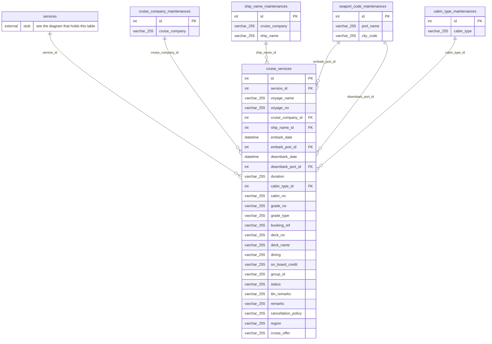
```mermaid
%% Current schema of power-suite-staging (7 of 57: around cruise_services)
erDiagram
    cruise_services {
        int id PK
        int service_id FK
        varchar_255 voyage_name
        varchar_255 voyage_no
        int cruise_company_id FK
        int ship_name_id FK
        datetime embark_date
        int embark_port_id FK
        datetime disembark_date
        int disembark_port_id FK
        varchar_255 duration
        int cabin_type_id FK
        varchar_255 cabin_no
        varchar_255 grade_no
        varchar_255 grade_type
        varchar_255 booking_ref
        varchar_255 deck_no
        varchar_255 deck_name
        varchar_255 dining
        varchar_255 on_board_credit
        varchar_255 group_id
        varchar_255 status
        varchar_255 itin_remarks
        varchar_255 remarks
        varchar_255 cancellation_policy
        varchar_255 region
        varchar_255 cruise_offer
    }
    cabin_type_maintenances {
        int id PK
        varchar_255 cabin_type
    }
    cruise_company_maintenances {
        int id PK
        varchar_255 cruise_company
    }
    seaport_code_maintenances {
        int id PK
        varchar_255 port_name
        varchar_255 city_code
    }
    ship_name_maintenances {
        int id PK
        varchar_255 cruise_company
        varchar_255 ship_name
    }
    services {
        external stub "see the diagram that holds this table"
    }
    services ||--o{ cruise_services : "service_id"
    cruise_company_maintenances ||--o{ cruise_services : "cruise_company_id"
    ship_name_maintenances ||--o{ cruise_services : "ship_name_id"
    seaport_code_maintenances ||--o{ cruise_services : "embark_port_id"
    seaport_code_maintenances ||--o{ cruise_services : "disembark_port_id"
    cabin_type_maintenances ||--o{ cruise_services : "cabin_type_id"
```

#### Current: Current schema of power-suite-staging (8 of 57: around branch_document_template)

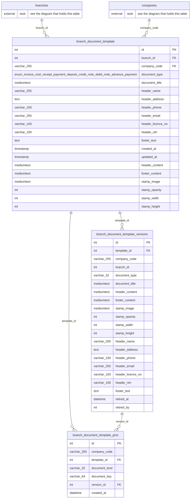
```mermaid
%% Current schema of power-suite-staging (8 of 57: around branch_document_template)
erDiagram
    branch_document_template {
        int id PK
        int branch_id FK
        varchar_255 company_code FK
        enum_invoice_cost_receipt_payment_deposit_credit_note_debit_note_advance_payment document_type
        mediumtext document_title
        varchar_255 header_name
        text header_address
        varchar_100 header_phone
        varchar_255 header_email
        varchar_100 header_licence_no
        varchar_100 header_ntn
        text footer_text
        timestamp created_at
        timestamp updated_at
        mediumtext header_content
        mediumtext footer_content
        mediumtext stamp_image
        int stamp_opacity
        int stamp_width
        int stamp_height
    }
    branch_document_template_pins {
        int id PK
        varchar_255 company_code
        int template_id FK
        varchar_32 document_kind
        varchar_64 document_key
        int version_id FK
        datetime created_at
    }
    branch_document_template_versions {
        int id PK
        int template_id FK
        varchar_255 company_code
        int branch_id
        varchar_32 document_type
        mediumtext document_title
        mediumtext header_content
        mediumtext footer_content
        mediumtext stamp_image
        int stamp_opacity
        int stamp_width
        int stamp_height
        varchar_255 header_name
        text header_address
        varchar_100 header_phone
        varchar_255 header_email
        varchar_100 header_licence_no
        varchar_100 header_ntn
        text footer_text
        datetime retired_at
        int retired_by
    }
    branches {
        external stub "see the diagram that holds this table"
    }
    companies {
        external stub "see the diagram that holds this table"
    }
    branches ||--o{ branch_document_template : "branch_id"
    companies ||--o{ branch_document_template : "company_code"
    branch_document_template ||--o{ branch_document_template_pins : "template_id"
    branch_document_template_versions ||--o{ branch_document_template_pins : "version_id"
    branch_document_template ||--o{ branch_document_template_versions : "template_id"
```

#### Current: Current schema of power-suite-staging (9 of 57: around city_codes)

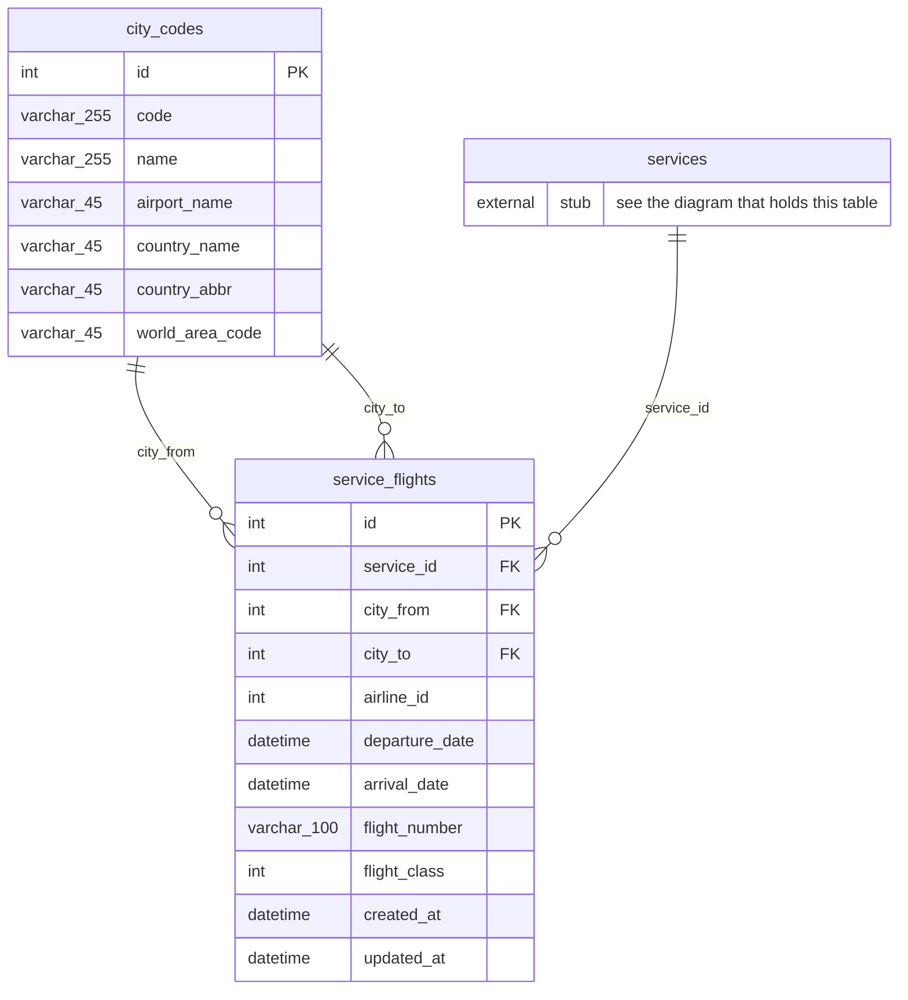
```mermaid
%% Current schema of power-suite-staging (9 of 57: around city_codes)
erDiagram
    city_codes {
        int id PK
        varchar_255 code
        varchar_255 name
        varchar_45 airport_name
        varchar_45 country_name
        varchar_45 country_abbr
        varchar_45 world_area_code
    }
    service_flights {
        int id PK
        int service_id FK
        int city_from FK
        int city_to FK
        int airline_id
        datetime departure_date
        datetime arrival_date
        varchar_100 flight_number
        int flight_class
        datetime created_at
        datetime updated_at
    }
    services {
        external stub "see the diagram that holds this table"
    }
    city_codes ||--o{ service_flights : "city_from"
    city_codes ||--o{ service_flights : "city_to"
    services ||--o{ service_flights : "service_id"
```

#### Current: Current schema of power-suite-staging (10 of 57: around customer_required_data)

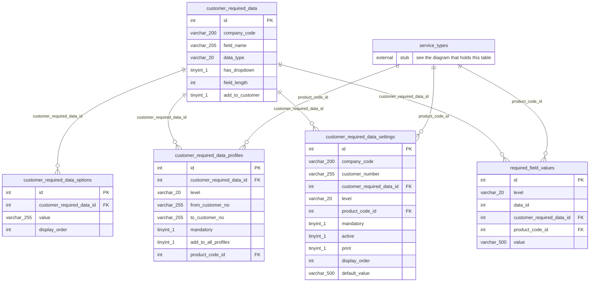
```mermaid
%% Current schema of power-suite-staging (10 of 57: around customer_required_data)
erDiagram
    customer_required_data {
        int id PK
        varchar_200 company_code
        varchar_255 field_name
        varchar_20 data_type
        tinyint_1 has_dropdown
        int field_length
        tinyint_1 add_to_customer
    }
    customer_required_data_options {
        int id PK
        int customer_required_data_id FK
        varchar_255 value
        int display_order
    }
    customer_required_data_profiles {
        int id PK
        int customer_required_data_id FK
        varchar_20 level
        varchar_255 from_customer_no
        varchar_255 to_customer_no
        tinyint_1 mandatory
        tinyint_1 add_to_all_profiles
        int product_code_id FK
    }
    customer_required_data_settings {
        int id PK
        varchar_200 company_code
        varchar_255 customer_number
        int customer_required_data_id FK
        varchar_20 level
        int product_code_id FK
        tinyint_1 mandatory
        tinyint_1 active
        tinyint_1 print
        int display_order
        varchar_500 default_value
    }
    required_field_values {
        int id PK
        varchar_20 level
        int data_id
        int customer_required_data_id FK
        int product_code_id FK
        varchar_500 value
    }
    service_types {
        external stub "see the diagram that holds this table"
    }
    customer_required_data ||--o{ customer_required_data_options : "customer_required_data_id"
    customer_required_data ||--o{ customer_required_data_profiles : "customer_required_data_id"
    service_types ||--o{ customer_required_data_profiles : "product_code_id"
    customer_required_data ||--o{ customer_required_data_settings : "customer_required_data_id"
    service_types ||--o{ customer_required_data_settings : "product_code_id"
    customer_required_data ||--o{ required_field_values : "customer_required_data_id"
    service_types ||--o{ required_field_values : "product_code_id"
```

#### Current: Current schema of power-suite-staging (11 of 57: around gl_settle_accounts)

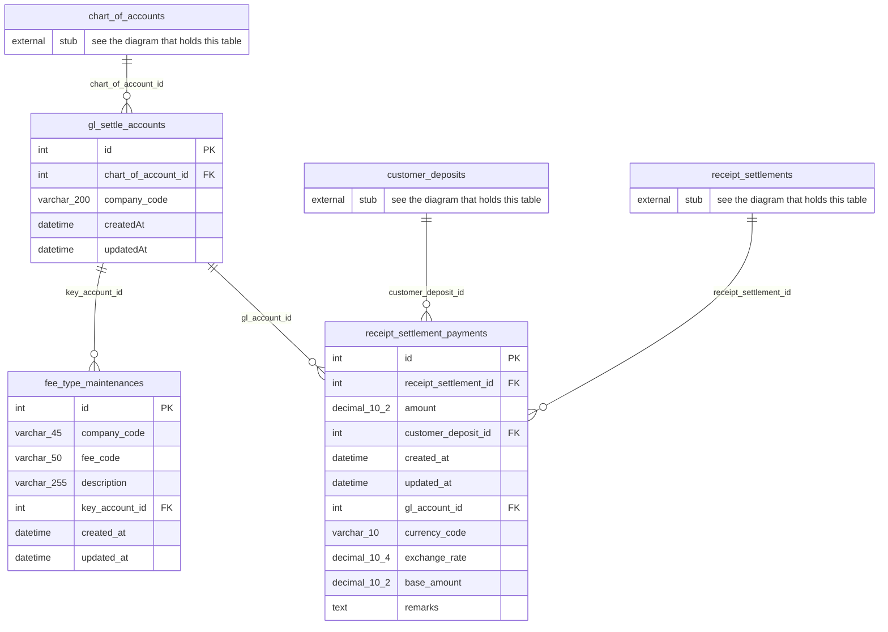
```mermaid
%% Current schema of power-suite-staging (11 of 57: around gl_settle_accounts)
erDiagram
    gl_settle_accounts {
        int id PK
        int chart_of_account_id FK
        varchar_200 company_code
        datetime createdAt
        datetime updatedAt
    }
    fee_type_maintenances {
        int id PK
        varchar_45 company_code
        varchar_50 fee_code
        varchar_255 description
        int key_account_id FK
        datetime created_at
        datetime updated_at
    }
    receipt_settlement_payments {
        int id PK
        int receipt_settlement_id FK
        decimal_10_2 amount
        int customer_deposit_id FK
        datetime created_at
        datetime updated_at
        int gl_account_id FK
        varchar_10 currency_code
        decimal_10_4 exchange_rate
        decimal_10_2 base_amount
        text remarks
    }
    chart_of_accounts {
        external stub "see the diagram that holds this table"
    }
    customer_deposits {
        external stub "see the diagram that holds this table"
    }
    receipt_settlements {
        external stub "see the diagram that holds this table"
    }
    chart_of_accounts ||--o{ gl_settle_accounts : "chart_of_account_id"
    gl_settle_accounts ||--o{ fee_type_maintenances : "key_account_id"
    customer_deposits ||--o{ receipt_settlement_payments : "customer_deposit_id"
    receipt_settlements ||--o{ receipt_settlement_payments : "receipt_settlement_id"
    gl_settle_accounts ||--o{ receipt_settlement_payments : "gl_account_id"
```

#### Current: Current schema of power-suite-staging (12 of 57: around iur_settings)

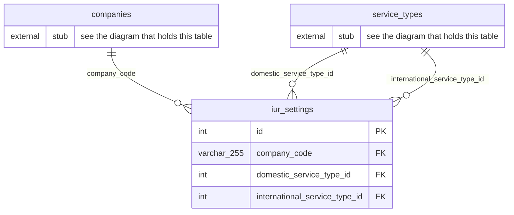
```mermaid
%% Current schema of power-suite-staging (12 of 57: around iur_settings)
erDiagram
    iur_settings {
        int id PK
        varchar_255 company_code FK
        int domestic_service_type_id FK
        int international_service_type_id FK
    }
    companies {
        external stub "see the diagram that holds this table"
    }
    service_types {
        external stub "see the diagram that holds this table"
    }
    companies ||--o{ iur_settings : "company_code"
    service_types ||--o{ iur_settings : "domestic_service_type_id"
    service_types ||--o{ iur_settings : "international_service_type_id"
```

#### Current: Current schema of power-suite-staging (13 of 57: around fee_class_airlines)

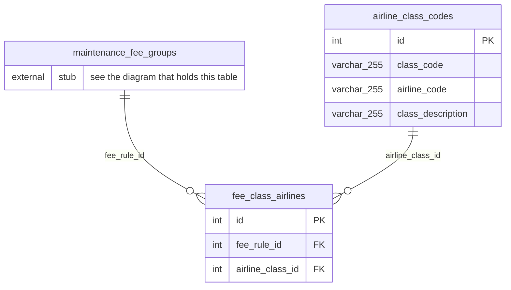
```mermaid
%% Current schema of power-suite-staging (13 of 57: around fee_class_airlines)
erDiagram
    fee_class_airlines {
        int id PK
        int fee_rule_id FK
        int airline_class_id FK
    }
    airline_class_codes {
        int id PK
        varchar_255 class_code
        varchar_255 airline_code
        varchar_255 class_description
    }
    maintenance_fee_groups {
        external stub "see the diagram that holds this table"
    }
    maintenance_fee_groups ||--o{ fee_class_airlines : "fee_rule_id"
    airline_class_codes ||--o{ fee_class_airlines : "airline_class_id"
```

#### Current: Current schema of power-suite-staging (14 of 57: around fee_main_product_codes)

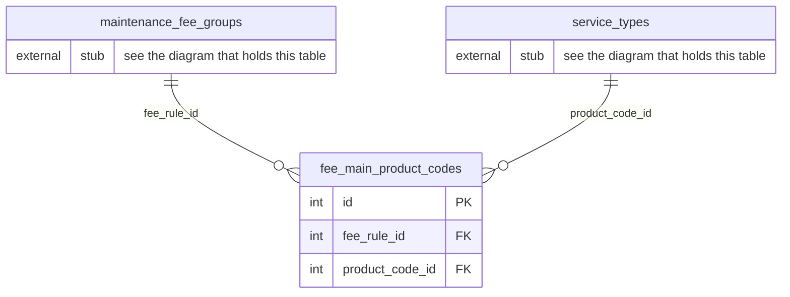
```mermaid
%% Current schema of power-suite-staging (14 of 57: around fee_main_product_codes)
erDiagram
    fee_main_product_codes {
        int id PK
        int fee_rule_id FK
        int product_code_id FK
    }
    maintenance_fee_groups {
        external stub "see the diagram that holds this table"
    }
    service_types {
        external stub "see the diagram that holds this table"
    }
    maintenance_fee_groups ||--o{ fee_main_product_codes : "fee_rule_id"
    service_types ||--o{ fee_main_product_codes : "product_code_id"
```

#### Current: Current schema of power-suite-staging (15 of 57: around integration_sources)

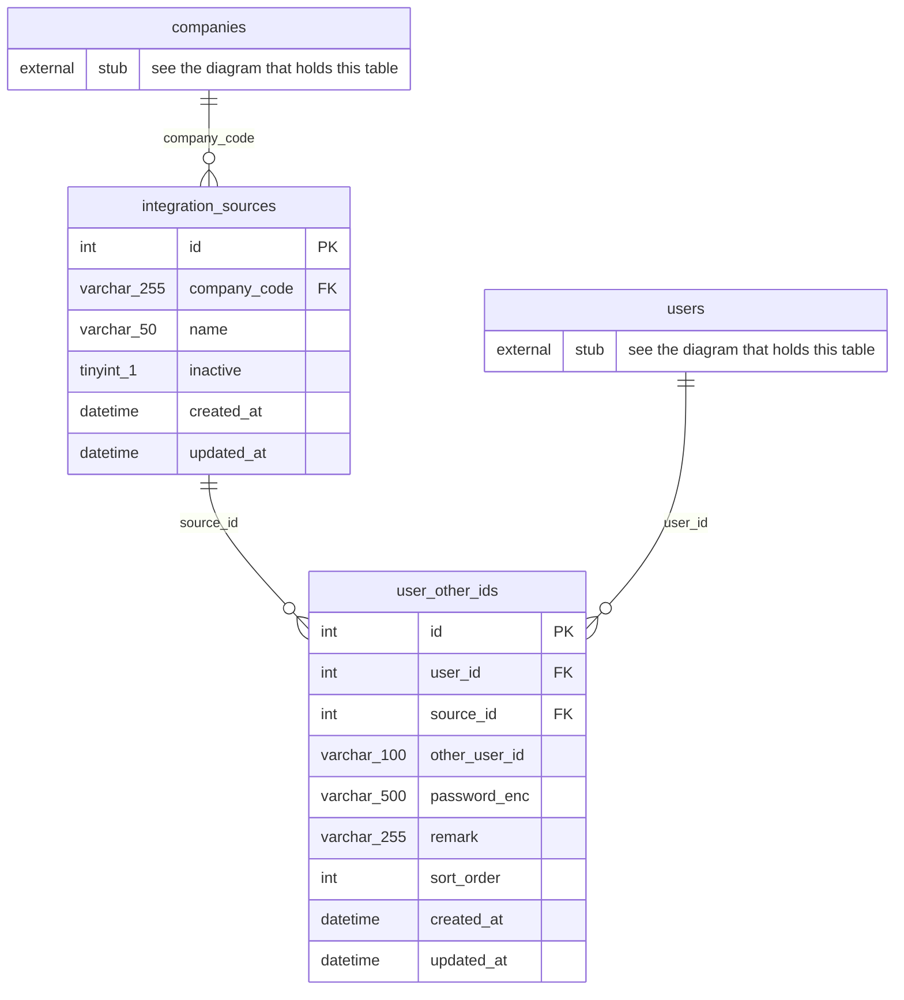
```mermaid
%% Current schema of power-suite-staging (15 of 57: around integration_sources)
erDiagram
    integration_sources {
        int id PK
        varchar_255 company_code FK
        varchar_50 name
        tinyint_1 inactive
        datetime created_at
        datetime updated_at
    }
    user_other_ids {
        int id PK
        int user_id FK
        int source_id FK
        varchar_100 other_user_id
        varchar_500 password_enc
        varchar_255 remark
        int sort_order
        datetime created_at
        datetime updated_at
    }
    companies {
        external stub "see the diagram that holds this table"
    }
    users {
        external stub "see the diagram that holds this table"
    }
    companies ||--o{ integration_sources : "company_code"
    integration_sources ||--o{ user_other_ids : "source_id"
    users ||--o{ user_other_ids : "user_id"
```

#### Current: Current schema of power-suite-staging (16 of 57: around product_account_relations)

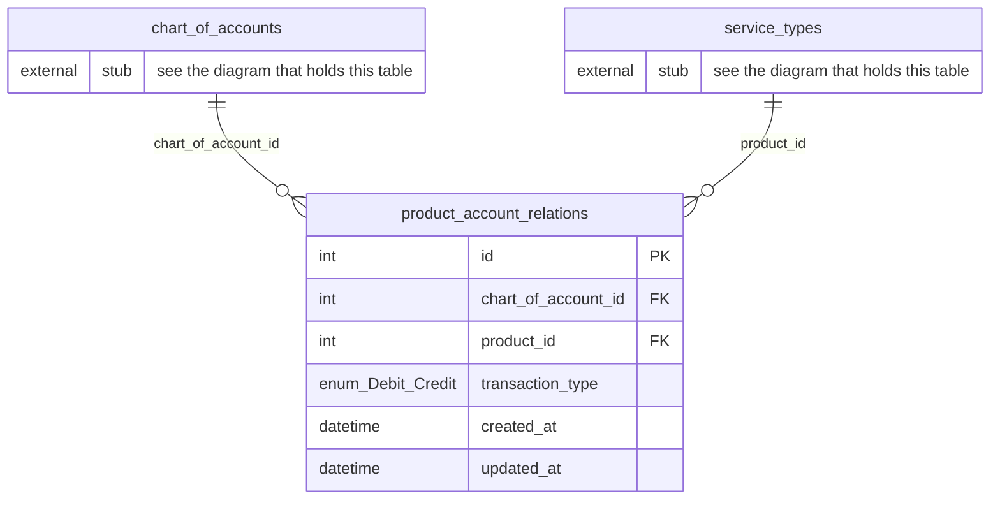
```mermaid
%% Current schema of power-suite-staging (16 of 57: around product_account_relations)
erDiagram
    product_account_relations {
        int id PK
        int chart_of_account_id FK
        int product_id FK
        enum_Debit_Credit transaction_type
        datetime created_at
        datetime updated_at
    }
    chart_of_accounts {
        external stub "see the diagram that holds this table"
    }
    service_types {
        external stub "see the diagram that holds this table"
    }
    chart_of_accounts ||--o{ product_account_relations : "chart_of_account_id"
    service_types ||--o{ product_account_relations : "product_id"
```

#### Current: Current schema of power-suite-staging (17 of 57: around receipt_settlement_credit_notes)

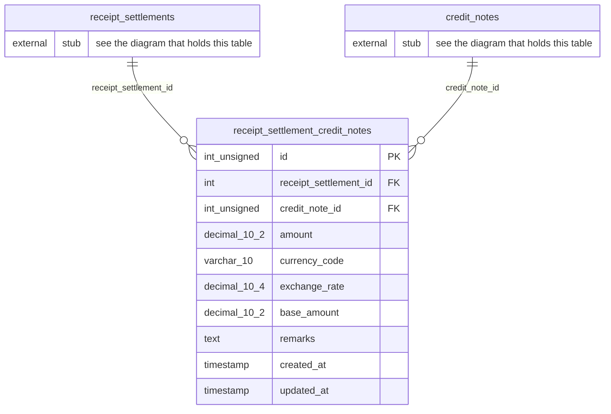
```mermaid
%% Current schema of power-suite-staging (17 of 57: around receipt_settlement_credit_notes)
erDiagram
    receipt_settlement_credit_notes {
        int_unsigned id PK
        int receipt_settlement_id FK
        int_unsigned credit_note_id FK
        decimal_10_2 amount
        varchar_10 currency_code
        decimal_10_4 exchange_rate
        decimal_10_2 base_amount
        text remarks
        timestamp created_at
        timestamp updated_at
    }
    credit_notes {
        external stub "see the diagram that holds this table"
    }
    receipt_settlements {
        external stub "see the diagram that holds this table"
    }
    receipt_settlements ||--o{ receipt_settlement_credit_notes : "receipt_settlement_id"
    credit_notes ||--o{ receipt_settlement_credit_notes : "credit_note_id"
```

#### Current: Current schema of power-suite-staging (18 of 57: around receipt_settlement_deposits)

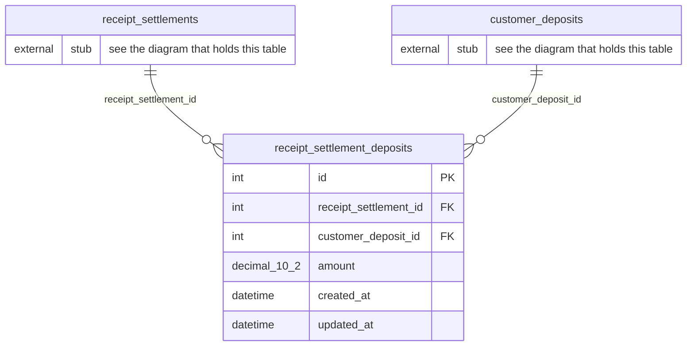
```mermaid
%% Current schema of power-suite-staging (18 of 57: around receipt_settlement_deposits)
erDiagram
    receipt_settlement_deposits {
        int id PK
        int receipt_settlement_id FK
        int customer_deposit_id FK
        decimal_10_2 amount
        datetime created_at
        datetime updated_at
    }
    customer_deposits {
        external stub "see the diagram that holds this table"
    }
    receipt_settlements {
        external stub "see the diagram that holds this table"
    }
    receipt_settlements ||--o{ receipt_settlement_deposits : "receipt_settlement_id"
    customer_deposits ||--o{ receipt_settlement_deposits : "customer_deposit_id"
```

#### Current: Current schema of power-suite-staging (19 of 57: around receipt_settlement_invoices)

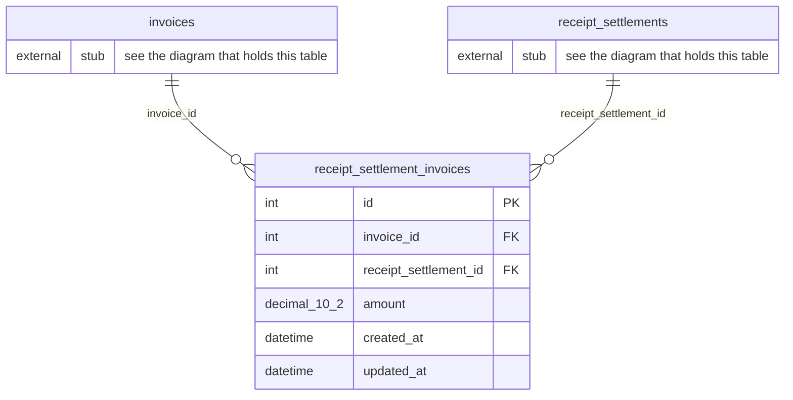
```mermaid
%% Current schema of power-suite-staging (19 of 57: around receipt_settlement_invoices)
erDiagram
    receipt_settlement_invoices {
        int id PK
        int invoice_id FK
        int receipt_settlement_id FK
        decimal_10_2 amount
        datetime created_at
        datetime updated_at
    }
    invoices {
        external stub "see the diagram that holds this table"
    }
    receipt_settlements {
        external stub "see the diagram that holds this table"
    }
    invoices ||--o{ receipt_settlement_invoices : "invoice_id"
    receipt_settlements ||--o{ receipt_settlement_invoices : "receipt_settlement_id"
```

#### Current: Current schema of power-suite-staging (20 of 57: around receipt_settlement_transfers)

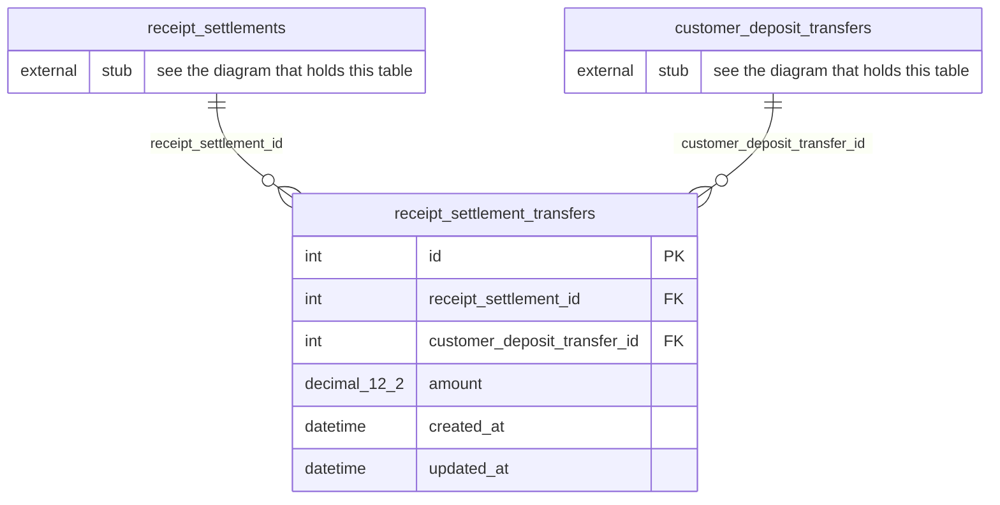
```mermaid
%% Current schema of power-suite-staging (20 of 57: around receipt_settlement_transfers)
erDiagram
    receipt_settlement_transfers {
        int id PK
        int receipt_settlement_id FK
        int customer_deposit_transfer_id FK
        decimal_12_2 amount
        datetime created_at
        datetime updated_at
    }
    customer_deposit_transfers {
        external stub "see the diagram that holds this table"
    }
    receipt_settlements {
        external stub "see the diagram that holds this table"
    }
    receipt_settlements ||--o{ receipt_settlement_transfers : "receipt_settlement_id"
    customer_deposit_transfers ||--o{ receipt_settlement_transfers : "customer_deposit_transfer_id"
```

#### Current: Current schema of power-suite-staging (21 of 57: around service_car_transfers)

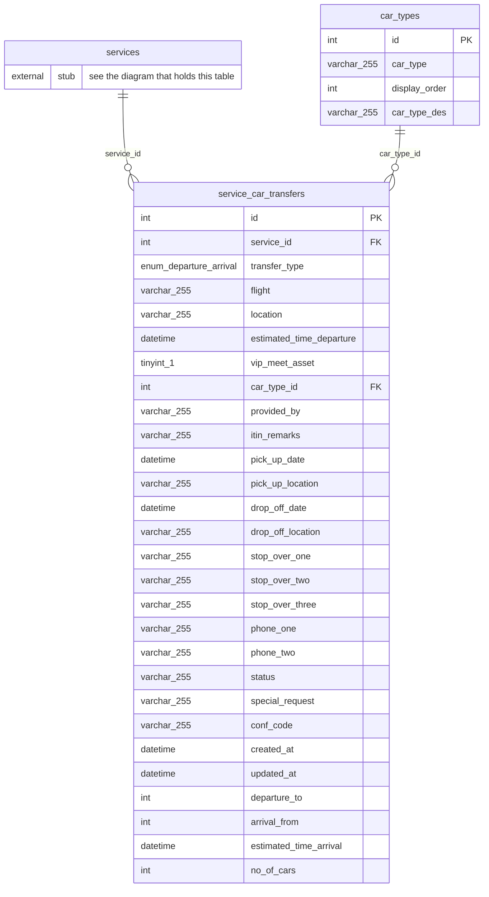
```mermaid
%% Current schema of power-suite-staging (21 of 57: around service_car_transfers)
erDiagram
    service_car_transfers {
        int id PK
        int service_id FK
        enum_departure_arrival transfer_type
        varchar_255 flight
        varchar_255 location
        datetime estimated_time_departure
        tinyint_1 vip_meet_asset
        int car_type_id FK
        varchar_255 provided_by
        varchar_255 itin_remarks
        datetime pick_up_date
        varchar_255 pick_up_location
        datetime drop_off_date
        varchar_255 drop_off_location
        varchar_255 stop_over_one
        varchar_255 stop_over_two
        varchar_255 stop_over_three
        varchar_255 phone_one
        varchar_255 phone_two
        varchar_255 status
        varchar_255 special_request
        varchar_255 conf_code
        datetime created_at
        datetime updated_at
        int departure_to
        int arrival_from
        datetime estimated_time_arrival
        int no_of_cars
    }
    car_types {
        int id PK
        varchar_255 car_type
        int display_order
        varchar_255 car_type_des
    }
    services {
        external stub "see the diagram that holds this table"
    }
    services ||--o{ service_car_transfers : "service_id"
    car_types ||--o{ service_car_transfers : "car_type_id"
```

#### Current: Current schema of power-suite-staging (22 of 57: around visa_code_require_codes)

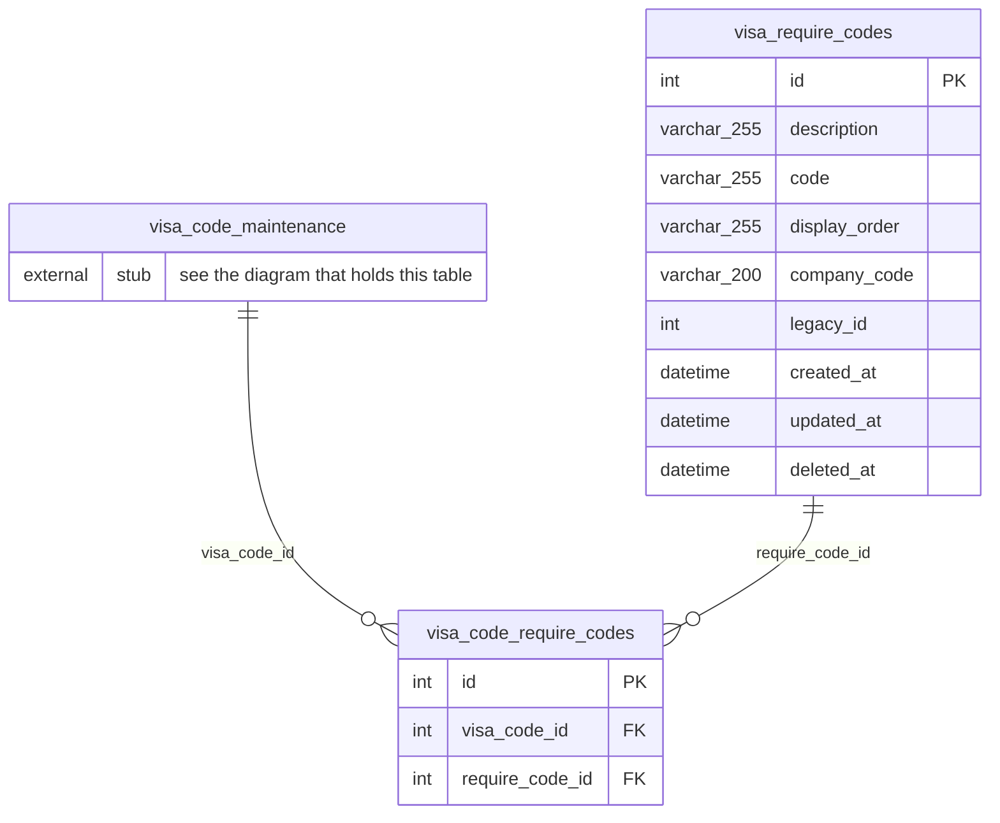
```mermaid
%% Current schema of power-suite-staging (22 of 57: around visa_code_require_codes)
erDiagram
    visa_code_require_codes {
        int id PK
        int visa_code_id FK
        int require_code_id FK
    }
    visa_require_codes {
        int id PK
        varchar_255 description
        varchar_255 code
        varchar_255 display_order
        varchar_200 company_code
        int legacy_id
        datetime created_at
        datetime updated_at
        datetime deleted_at
    }
    visa_code_maintenance {
        external stub "see the diagram that holds this table"
    }
    visa_code_maintenance ||--o{ visa_code_require_codes : "visa_code_id"
    visa_require_codes ||--o{ visa_code_require_codes : "require_code_id"
```

#### Current: Current schema of power-suite-staging (23 of 57: around visa_length_stays)

```mermaid
%% Current schema of power-suite-staging (23 of 57: around visa_length_stays)
erDiagram
    visa_length_stays {
        int id PK
        varchar_255 length_of_stay
        varchar_255 code
        varchar_255 display_order
        varchar_200 company_code
        int legacy_id
        datetime created_at
        datetime updated_at
        datetime deleted_at
    }
```

#### Current: Current schema of power-suite-staging (24 of 57: around visa_no_entries)

```mermaid
%% Current schema of power-suite-staging (24 of 57: around visa_no_entries)
erDiagram
    visa_no_entries {
        int id PK
        varchar_255 no_of_entries
        varchar_255 code
        varchar_255 display_order
        varchar_200 company_code
        int legacy_id
        datetime created_at
        datetime updated_at
        datetime deleted_at
    }
```

#### Current: Current schema of power-suite-staging (25 of 57: around visa_purposes)

```mermaid
%% Current schema of power-suite-staging (25 of 57: around visa_purposes)
erDiagram
    visa_purposes {
        int id PK
        varchar_255 purpose
        varchar_255 code
        varchar_255 display_order
        varchar_200 company_code
        int legacy_id
        datetime created_at
        datetime updated_at
        datetime deleted_at
    }
```

#### Current: Current schema of power-suite-staging (26 of 57: around visa_status_history)

```mermaid
%% Current schema of power-suite-staging (26 of 57: around visa_status_history)
erDiagram
    visa_status_history {
        int id PK
        int visa_id FK
        varchar_100 status
        datetime status_date
        text remarks
        int changed_by FK
        datetime changed_at
        varchar_100 previous_status
        timestamp created_at
        timestamp updated_at
    }
    service_visas {
        external stub "see the diagram that holds this table"
    }
    users {
        external stub "see the diagram that holds this table"
    }
    users ||--o{ visa_status_history : "changed_by"
    service_visas ||--o{ visa_status_history : "visa_id"
```

#### Current: Current schema of power-suite-staging (27 of 57: around visa_urgencies)

```mermaid
%% Current schema of power-suite-staging (27 of 57: around visa_urgencies)
erDiagram
    visa_urgencies {
        int id PK
        varchar_255 urgency
        varchar_255 code
        varchar_255 display_order
        varchar_200 company_code
        int legacy_id
        datetime created_at
        datetime updated_at
        datetime deleted_at
    }
```

#### Current: Current schema of power-suite-staging (28 of 57: around visa_validities)

```mermaid
%% Current schema of power-suite-staging (28 of 57: around visa_validities)
erDiagram
    visa_validities {
        int id PK
        varchar_255 validity
        varchar_255 code
        varchar_255 display_order
        varchar_200 company_code
        int legacy_id
        datetime created_at
        datetime updated_at
        datetime deleted_at
    }
```

#### Current: Current schema of power-suite-staging (29 of 57: around webdav_credentials)

```mermaid
%% Current schema of power-suite-staging (29 of 57: around webdav_credentials)
erDiagram
    webdav_credentials {
        int id PK
        varchar_255 company_code FK
        int user_id FK
        varchar_160 webdav_username
        varchar_200 password_hash
        varchar_200 label
        tinyint_1 inactive
        datetime last_used_at
        varchar_64 last_used_ip
        datetime created_at
        datetime updated_at
    }
    companies {
        external stub "see the diagram that holds this table"
    }
    users {
        external stub "see the diagram that holds this table"
    }
    companies ||--o{ webdav_credentials : "company_code"
    users ||--o{ webdav_credentials : "user_id"
```

#### Current: Current schema of power-suite-staging (30 of 57: around credit_control_pccs)

```mermaid
%% Current schema of power-suite-staging (30 of 57: around credit_control_pccs)
erDiagram
    credit_control_pccs {
        int id PK
        int supplier_id FK
        varchar_255 pseudo_code_one
        varchar_255 pseudo_code_two
        varchar_255 pseudo_code_three
        varchar_255 pseudo_code_four
        datetime created_at
        datetime updated_at
    }
    suppliers {
        external stub "see the diagram that holds this table"
    }
    suppliers ||--o{ credit_control_pccs : "supplier_id"
```

#### Current: Current schema of power-suite-staging (31 of 57: around currencies)

```mermaid
%% Current schema of power-suite-staging (31 of 57: around currencies)
erDiagram
    currencies {
        int id PK
        varchar_255 from_currency
        varchar_255 to_currency
        decimal_10_2 exchange_rate
        varchar_45 company_code
    }
```

#### Current: Current schema of power-suite-staging (32 of 57: around email_templates)

```mermaid
%% Current schema of power-suite-staging (32 of 57: around email_templates)
erDiagram
    email_templates {
        int id PK
        varchar_255 company_code FK
        varchar_255 name
        varchar_255 slug
        varchar_255 subject
        longtext body
        text variables
        varchar_255 description
        tinyint_1 is_active
        datetime created_at
        datetime updated_at
    }
    companies {
        external stub "see the diagram that holds this table"
    }
    companies ||--o{ email_templates : "company_code"
```

#### Current: Current schema of power-suite-staging (33 of 57: around fee_maintenances)

```mermaid
%% Current schema of power-suite-staging (33 of 57: around fee_maintenances)
erDiagram
    fee_maintenances {
        int id PK
        varchar_255 fee_description
        int company_code
    }
```

#### Current: Current schema of power-suite-staging (34 of 57: around hotel_chain_maintenances)

```mermaid
%% Current schema of power-suite-staging (34 of 57: around hotel_chain_maintenances)
erDiagram
    hotel_chain_maintenances {
        int id PK
        varchar_10 hotel_chain_code
        varchar_160 hotel_chain_name
    }
```

#### Current: Current schema of power-suite-staging (35 of 57: around hotel_rate_breakdowns)

```mermaid
%% Current schema of power-suite-staging (35 of 57: around hotel_rate_breakdowns)
erDiagram
    hotel_rate_breakdowns {
        int_unsigned id PK
        decimal_10_2 cost
        decimal_10_2 price
        date date
        int service_id FK
        datetime created_at
        datetime updated_at
        tinyint_1 lumpsum
        double markup
    }
    services {
        external stub "see the diagram that holds this table"
    }
    services ||--o{ hotel_rate_breakdowns : "service_id"
```

#### Current: Current schema of power-suite-staging (36 of 57: around invoice_discounts)

```mermaid
%% Current schema of power-suite-staging (36 of 57: around invoice_discounts)
erDiagram
    invoice_discounts {
        int id PK
        int invoice_id FK
        varchar_255 discount_code
        decimal_10_2 discount_amount
        text remarks
        datetime created_at
        datetime updated_at
    }
    invoices {
        external stub "see the diagram that holds this table"
    }
    invoices ||--o{ invoice_discounts : "invoice_id"
```

#### Current: Current schema of power-suite-staging (37 of 57: around invoice_settings)

```mermaid
%% Current schema of power-suite-staging (37 of 57: around invoice_settings)
erDiagram
    invoice_settings {
        int id PK
        varchar_255 company_code FK
        tinyint_1 hide_transaction_fee
        tinyint_1 hide_tax
        tinyint_1 ticket_issue_date_in_invoice
        tinyint_1 hide_visa_nationality
        tinyint_1 hide_visa_destination
        tinyint_1 hide_visa_code
        tinyint_1 hide_visa_length_of_stay
        tinyint_1 hide_visa_process_days
        tinyint_1 hide_visa_purpose
        tinyint_1 hide_visa_validity_period
        tinyint_1 hide_ins_cheque_no
        tinyint_1 hide_ins_fop
        tinyint_1 hide_ins_plan_type
        tinyint_1 hide_ins_policy_no
        tinyint_1 hide_ins_purchase_date
        tinyint_1 hide_ins_first_coverage_date
        tinyint_1 hide_ins_last_coverage_date
        tinyint_1 hide_ins_expiry_date
        tinyint_1 hide_ins_city
        tinyint_1 hide_ins_city_code
        tinyint_1 hide_ins_pnr
        tinyint_1 hide_car_type
        tinyint_1 hide_car_no_of_cars
        tinyint_1 hide_car_location
        tinyint_1 hide_car_date
        tinyint_1 hide_car_city
    }
    companies {
        external stub "see the diagram that holds this table"
    }
    companies ||--o{ invoice_settings : "company_code"
```

#### Current: Current schema of power-suite-staging (38 of 57: around invoice_taxes)

```mermaid
%% Current schema of power-suite-staging (38 of 57: around invoice_taxes)
erDiagram
    invoice_taxes {
        int id PK
        int invoice_id FK
        varchar_255 tax_code
        decimal_10_2 tax_amount
        text remarks
        datetime created_at
        datetime updated_at
    }
    invoices {
        external stub "see the diagram that holds this table"
    }
    invoices ||--o{ invoice_taxes : "invoice_id"
```

#### Current: Current schema of power-suite-staging (39 of 57: around iur_ingest_claims)

```mermaid
%% Current schema of power-suite-staging (39 of 57: around iur_ingest_claims)
erDiagram
    iur_ingest_claims {
        int id PK
        varchar_255 company_code FK
        varchar_255 file_name
        varchar_160 webdav_username
        varchar_120 claimed_by
        datetime claimed_at
        datetime released_at
        varchar_30 outcome
        datetime created_at
        datetime updated_at
    }
    companies {
        external stub "see the diagram that holds this table"
    }
    companies ||--o{ iur_ingest_claims : "company_code"
```

#### Current: Current schema of power-suite-staging (40 of 57: around journal_periods)

```mermaid
%% Current schema of power-suite-staging (40 of 57: around journal_periods)
erDiagram
    journal_periods {
        int id PK
        varchar_200 company_code FK
        varchar_10 fiscal_year
        int month
        int year
        tinyint_1 status
        datetime start_date
        datetime end_date
        datetime report_date
        datetime created_at
        datetime updated_at
    }
    companies {
        external stub "see the diagram that holds this table"
    }
    companies ||--o{ journal_periods : "company_code"
```

#### Current: Current schema of power-suite-staging (41 of 57: around order_settings)

```mermaid
%% Current schema of power-suite-staging (41 of 57: around order_settings)
erDiagram
    order_settings {
        int id PK
        varchar_255 company_code FK
        tinyint_1 enable_manual_sst
    }
    companies {
        external stub "see the diagram that holds this table"
    }
    companies ||--o{ order_settings : "company_code"
```

#### Current: Current schema of power-suite-staging (42 of 57: around service_hotels)

```mermaid
%% Current schema of power-suite-staging (42 of 57: around service_hotels)
erDiagram
    service_hotels {
        int id PK
        int service_id FK
        varchar_255 city
        varchar_255 hotel_name
        varchar_255 hotel_chain
        date check_in
        date check_out
        tinyint_1 same_day_check_out
        int no_of_nights
        int no_of_rooms
        int room_id
        int room_category_id
        int guest_per_room
        varchar_255 meals
        varchar_255 other_services
        varchar_255 remarks
        varchar_255 address
        varchar_255 rate_description
        varchar_255 tel
        varchar_255 fax
        int status
        varchar_255 itin_remarks
        varchar_255 refrence_code
        varchar_255 confirmation_no
        varchar_255 hotel_code
        datetime confirmation_date
        varchar_255 confirmation_by
        varchar_255 cancellation_policy
        datetime created_at
        datetime updated_at
        int allotment_room_id
        tinyint rooms_released
    }
    services {
        external stub "see the diagram that holds this table"
    }
    services ||--o{ service_hotels : "service_id"
```

#### Current: Current schema of power-suite-staging (43 of 57: around service_insurances)

```mermaid
%% Current schema of power-suite-staging (43 of 57: around service_insurances)
erDiagram
    service_insurances {
        int id PK
        int service_id FK
        int destination
        varchar_255 policy_number
        date purchase_date
        varchar_255 plan_type
        date first_coverage_date
        date last_coverage_date
        date expiry_date
        varchar_255 fop
        varchar_255 cheque_number
        int status
        varchar_255 itin_remarks
        varchar_255 optional_benefit
        varchar_255 special_instruction
    }
    services {
        external stub "see the diagram that holds this table"
    }
    services ||--o{ service_insurances : "service_id"
```

#### Current: Current schema of power-suite-staging (44 of 57: around service_miscellaneous)

```mermaid
%% Current schema of power-suite-staging (44 of 57: around service_miscellaneous)
erDiagram
    service_miscellaneous {
        int id PK
        int service_id FK
        varchar_255 description
        int city
        datetime start_date_time
        varchar_255 start_date_description
        varchar_255 end_date_description
        datetime end_date_time
        int status
        varchar_255 itin_remarks
    }
    services {
        external stub "see the diagram that holds this table"
    }
    services ||--o{ service_miscellaneous : "service_id"
```

#### Current: Current schema of power-suite-staging (45 of 57: around service_rental_cars)

```mermaid
%% Current schema of power-suite-staging (45 of 57: around service_rental_cars)
erDiagram
    service_rental_cars {
        int id PK
        int service_id FK
        int city
        int company_id
        int vehicle_id
        int rate_type_id
        datetime pick_up_date_time
        varchar_255 pick_up_location
        datetime drop_off_date_time
        varchar_255 drop_off_location
        int status
        int no_of_days_hired
        varchar_255 conf_code
        varchar_255 itin_remarks
        datetime created_at
        datetime updated_at
        int no_of_cars
    }
    services {
        external stub "see the diagram that holds this table"
    }
    services ||--o{ service_rental_cars : "service_id"
```

#### Current: Current schema of power-suite-staging (46 of 57: around service_tours)

```mermaid
%% Current schema of power-suite-staging (46 of 57: around service_tours)
erDiagram
    service_tours {
        int id PK
        int service_id FK
        varchar_255 package_name
        varchar_255 package_code
        int status
        int destination
        datetime start_date_time
        datetime end_date_time
        text itin_remarks
        datetime created_at
        datetime updated_at
        text insurance_options
        text hotel_bookings
        text air_travel
        text visa_service
        text other_services
        decimal_15_2 air_travel_cost
        decimal_15_2 air_travel_price
        decimal_15_2 hotel_bookings_cost
        decimal_15_2 hotel_bookings_price
        decimal_15_2 insurance_options_cost
        decimal_15_2 insurance_options_price
        decimal_15_2 visa_service_cost
        decimal_15_2 visa_service_price
        decimal_15_2 itin_remarks_cost
        decimal_15_2 itin_remarks_price
    }
    services {
        external stub "see the diagram that holds this table"
    }
    services ||--o{ service_tours : "service_id"
```

#### Current: Current schema of power-suite-staging (47 of 57: around service_trains)

```mermaid
%% Current schema of power-suite-staging (47 of 57: around service_trains)
erDiagram
    service_trains {
        int id PK
        int service_id FK
        int from_city
        int to_city
        varchar_255 train_class
        varchar_255 company
        datetime departure_date
        datetime arrival_date
        int status
        varchar_255 itin_remarks
    }
    services {
        external stub "see the diagram that holds this table"
    }
    services ||--o{ service_trains : "service_id"
```

#### Current: Current schema of power-suite-staging (48 of 57: around smtp_settings)

```mermaid
%% Current schema of power-suite-staging (48 of 57: around smtp_settings)
erDiagram
    smtp_settings {
        int id PK
        varchar_255 company_code FK
        varchar_255 smtp_host
        int smtp_port
        varchar_255 smtp_user
        varchar_255 smtp_password
        enum_none_ssl_tls smtp_encryption
        varchar_255 from_email
        varchar_255 from_name
        tinyint_1 is_active
    }
    companies {
        external stub "see the diagram that holds this table"
    }
    companies ||--o{ smtp_settings : "company_code"
```

#### Current: Current schema of power-suite-staging (49 of 57: around supplier_amends)

```mermaid
%% Current schema of power-suite-staging (49 of 57: around supplier_amends)
erDiagram
    supplier_amends {
        int id PK
        varchar_255 credit_term_code
        int credit_days_amend
        tinyint_1 credit_days
        tinyint_1 bsp_payment_terms
        tinyint_1 bsp_payment_addon
        tinyint_1 statement_date
        tinyint_1 last_day_month
        tinyint_1 other_due_date
        tinyint_1 weekly
        datetime created_at
        datetime updated_at
    }
```

#### Current: Current schema of power-suite-staging (50 of 57: around supplier_contacts)

```mermaid
%% Current schema of power-suite-staging (50 of 57: around supplier_contacts)
erDiagram
    supplier_contacts {
        int id PK
        int supplier_id FK
        varchar_255 sup_sur_name
        varchar_255 sup_given_name
        varchar_255 title
        varchar_255 tel
        varchar_255 email
        datetime created_at
        datetime updated_at
    }
    suppliers {
        external stub "see the diagram that holds this table"
    }
    suppliers ||--o{ supplier_contacts : "supplier_id"
```

#### Current: Current schema of power-suite-staging (51 of 57: around supplier_types)

```mermaid
%% Current schema of power-suite-staging (51 of 57: around supplier_types)
erDiagram
    supplier_types {
        int id PK
        varchar_255 code
        varchar_255 description
        varchar_45 company_code
    }
```

#### Current: Current schema of power-suite-staging (52 of 57: around visa_ptc_maintenances)

```mermaid
%% Current schema of power-suite-staging (52 of 57: around visa_ptc_maintenances)
erDiagram
    visa_ptc_maintenances {
        int id PK
        varchar_255 code
        varchar_255 description
        varchar_200 company_code
        int legacy_id
        datetime created_at
        datetime updated_at
        datetime deleted_at
    }
```

#### Current: Current schema of power-suite-staging (53 of 57: around visa_types)

```mermaid
%% Current schema of power-suite-staging (53 of 57: around visa_types)
erDiagram
    visa_types {
        int id PK
        varchar_255 document_type
        varchar_255 code
        varchar_255 display_order
        varchar_200 company_code
        int legacy_id
        datetime created_at
        datetime updated_at
        datetime deleted_at
    }
```

#### Current: Current schema of power-suite-staging (54 of 57: around admin_users)

```mermaid
%% Current schema of power-suite-staging (54 of 57: around admin_users)
erDiagram
    admin_sessions {
        int id PK
        int admin_user_id FK
        char_64 token_hash
        varchar_45 ip_address
        varchar_255 user_agent
        datetime issued_at
        datetime last_seen_at
        datetime expires_at
        datetime revoked_at
    }
    admin_settings {
        varchar_64 setting_key PK
        text value
        int updated_by FK
        datetime updated_at
    }
    admin_users {
        int id PK
        varchar_255 email
        varchar_200 password
        varchar_200 full_name
        enum_owner_operator_viewer role
        tinyint_1 is_active
        varchar_255 mfa_secret
        datetime last_login_at
        int failed_attempts
        datetime locked_until
        datetime created_at
        datetime updated_at
    }
    coa_template_rows {
        bigint id PK
        int template_id FK
        enum_account_posting_rule_lookup row_type
        json payload
    }
    coa_templates {
        int id PK
        varchar_120 name
        int version
        varchar_255 source_company_code
        text note
        int created_by FK
        datetime created_at
    }
    provisioning_runs {
        int id PK
        varchar_255 company_code
        enum_provision_add_branch_repair_rollover kind
        json params
        enum_running_succeeded_failed status
        int current_step
        json step_log
        json verification
        text error
        int started_by FK
        datetime started_at
        datetime heartbeat_at
        datetime finished_at
    }
    admin_users ||--o{ admin_sessions : "admin_user_id"
    admin_users ||--o{ admin_settings : "updated_by"
    coa_templates ||--o{ coa_template_rows : "template_id"
    admin_users ||--o{ coa_templates : "created_by"
    admin_users ||--o{ provisioning_runs : "started_by"
```

#### Current: Current schema of power-suite-staging (55 of 57: around admin_audit_log)

```mermaid
%% Current schema of power-suite-staging (55 of 57: around admin_audit_log)
erDiagram
    admin_audit_log {
        bigint id PK
        int admin_user_id
        varchar_100 action
        varchar_50 target_type
        varchar_100 target_id
        varchar_255 company_code
        json detail
        varchar_45 ip_address
        datetime created_at
    }
    airline_equipments {
        int id PK
        varchar_255 airline_equipment_code
        varchar_255 airline_equipment_description
    }
    car_company_maintenances {
        int id PK
        varchar_255 car_company_code
        varchar_255 car_company_name
    }
    car_rate_maintenances {
        int id PK
        varchar_255 rate_type
        varchar_255 car_rate_type_description
        int display_order
        varchar_255 host_code
    }
    customer_amends {
        int id PK
        varchar_255 credit_term_code
        int credit_days_amend
        tinyint_1 credit_days
        tinyint_1 bsp_payment_terms
        tinyint_1 bsp_payment_addon
        tinyint_1 statement_date
        tinyint_1 last_day_month
        tinyint_1 other_due_date
        tinyint_1 weekly
        datetime created_at
        datetime updated_at
        int customer_id
    }
    customer_categories {
        int id PK
        varchar_45 category
        timestamp created_at
        timestamp updated_at
        varchar_45 company_code
    }
    customer_contacts {
        int id PK
        int customer_id
        enum_contact_emergency contact_type
        varchar_200 name
        varchar_200 surname
        varchar_200 title
        varchar_20 tel1
        varchar_20 tel2
        varchar_20 mobile_number
        varchar_20 ex1
        varchar_20 ex2
        varchar_100 job_title
        varchar_100 role
        varchar_160 email
        timestamp created_at
        timestamp updated_at
    }
    data_migrations {
        varchar_190 name PK
        datetime applied_at
    }
    flyway_schema_history {
        int installed_rank PK
        varchar_50 version
        varchar_200 description
        varchar_20 type
        varchar_1000 script
        int checksum
        varchar_100 installed_by
        timestamp installed_on
        int execution_time
        tinyint_1 success
    }
    hotel_statuses {
        int id PK
        varchar_255 label
        varchar_255 code
        datetime createdAt
        datetime updatedAt
    }
    intake_cache {
        varchar_64 cache_key PK
        json payload
        datetime fetched_at
    }
    intake_items {
        char_36 issue_id PK
        enum_customer_staff created_by_type
        int created_by_customer_id
        int created_by_staff_id
        varchar_255 company_code
        varchar_32 last_notified_status
        varchar_120 last_notified_progress
        datetime submission_notified_at
        datetime created_at
        datetime updated_at
    }
    intake_legacy_company_labels {
        int id PK
        varchar_255 legacy_label
        varchar_255 company_code
        varchar_255 mapped_by
        varchar_500 notes
        datetime created_at
        datetime updated_at
    }
    intake_notifications {
        int id PK
        varchar_128 delivery_id
        char_36 issue_id
        varchar_255 recipient
        datetime sent_at
    }
    intake_sessions {
        int id PK
        enum_customer_staff principal_type
        int principal_id
        char_64 token_hash
        varchar_45 ip_address
        varchar_255 user_agent
        datetime issued_at
        datetime expires_at
        datetime revoked_at
        datetime last_seen_at
    }
    intake_trackers {
        char_36 issue_id PK
        enum_customer_staff principal_type PK
        int principal_id PK
        datetime assigned_at
        tinyint_1 auto_assigned
    }
    integrity_snapshots {
        bigint id PK
        datetime taken_at
        varchar_64 check_key
        varchar_255 company_code
        int count
        json meta
    }
    invoice_footers {
        int id PK
        text invoice_footer
        datetime createdAt
        datetime updatedAt
    }
    issued_document_numbers {
        int id PK
        varchar_200 company_code
        varchar_20 document_type
        varchar_255 document_number
        int first_document_id
        int issued_by
        varchar_30 source
        datetime issued_at
    }
    iur_file_imports {
        int id PK
        varchar_255 company_code
        varchar_255 file_name
        varchar_255 file_key
        varchar_64 content_key
        enum_processing_completed_failed status
        varchar_120 claimed_by
        datetime claimed_at
        datetime settled_at
        int user_id
        varchar_50 pnr
        int order_id
        varchar_50 order_number
        text service_ids
        int service_count
        int voided_count
        text document_numbers
        text message
        int repeat_posts
        datetime last_repeat_at
        datetime created_at
        datetime updated_at
    }
```

#### Current: Current schema of power-suite-staging (56 of 57: around lcc_profile_templates)

```mermaid
%% Current schema of power-suite-staging (56 of 57: around lcc_profile_templates)
erDiagram
    lcc_profile_templates {
        int id PK
        text label
        varchar_10 type
        int company_id
        datetime created_at
        datetime updated_at
    }
    migration_test {
        int id PK
        varchar_255 note
        datetime created_at
    }
    name_titles {
        int id PK
        varchar_255 label
    }
    pay_types {
        int id PK
        varchar_255 label
    }
    payment_settlement_customer_deposits {
        int id PK
        int payment_settlement_id
        int customer_deposit_id
        decimal_20_2 amount
        decimal_10_4 exchange_rate
        decimal_20_2 base_amount
        text remarks
        datetime created_at
        datetime updated_at
    }
    payment_settlement_customer_transfers {
        int id PK
        int payment_settlement_id
        int customer_deposit_transfer_id
        decimal_20_2 amount
        decimal_10_4 exchange_rate
        decimal_20_2 base_amount
        text remarks
        datetime created_at
        datetime updated_at
    }
    payment_settlement_deposits {
        int id PK
        int payment_settlement_id
        int supplier_deposit_id
        decimal_10_2 amount
        datetime created_at
        datetime updated_at
    }
    payment_settlement_opening_invoices {
        int id PK
        int payment_settlement_id
        int invoice_id
        decimal_20_2 amount
        decimal_10_4 exchange_rate
        decimal_20_2 base_amount
        text remarks
        datetime created_at
        datetime updated_at
    }
    personal_dependents {
        int id PK
        varchar_255 code
        varchar_255 label
    }
    personal_genders {
        int id PK
        varchar_255 label
    }
    pk_province {
        int id PK
        varchar_255 name
    }
    report_group {
        int id PK
        varchar_255 code
        varchar_255 description
        varchar_45 company_code
    }
    service_umrah_contacts {
        int id PK
        int service_umrah_id
        varchar_255 location
        varchar_255 name
        varchar_255 phone
        varchar_255 title
        varchar_255 phone2
        datetime created_at
        datetime updated_at
    }
    service_umrah_tours {
        int id PK
        int service_umrah_id
        varchar_255 sector_route
        date date
        varchar_255 vehicle
        varchar_255 type
        int quantity
        datetime created_at
        datetime updated_at
    }
    service_umrah_transports {
        int id PK
        int service_umrah_id
        varchar_255 sector_route
        date date
        varchar_255 vehicle
        varchar_255 type
        int quantity
        datetime created_at
        datetime updated_at
    }
    special_meal {
        int id PK
        varchar_255 code
        varchar_255 description
    }
    special_seat {
        int id PK
        varchar_255 code
        varchar_255 description
    }
    supplier_deposits {
        int id PK
        varchar_50 payment_number
        int user_id
        int supplier_id
        int chart_of_account_id
        int branch_id
        int pay_type_id
        int currency_id
        decimal_10_2 amount
        decimal_10_2 current_amount
        decimal_10_4 exchange_rate
        decimal_10_2 base_amount
        varchar_50 cash_box
        varchar_50 client_refrence
        int bank_id
        varchar_255 bank_name
        varchar_50 check_number
        int card_type_id
        varchar_50 card_number
        varchar_50 voucher_number
        varchar_50 gl_account_box
        int gl_account_id
        varchar_50 account_number
        varchar_255 remarks
        text void_remarks
        enum_Raised_Printed_Void status
        datetime created_at
        datetime updated_at
        tinyint_1 je_generated
        varchar_50 settled_invoice_number
        date adjustment_date
        tinyint is_edited
        varchar_255 party_name
        varchar_255 party_number
        varchar_500 party_address
        datetime party_captured_at
    }
    system_date_setting {
        int id PK
        int no_of_days
        varchar_255 company_code
    }
    system_table {
        int id PK
        varchar_255 table_name
    }
```

#### Current: Current schema of power-suite-staging (57 of 57: around tax_rate_maintenance)

```mermaid
%% Current schema of power-suite-staging (57 of 57: around tax_rate_maintenance)
erDiagram
    tax_rate_maintenance {
        int id PK
        varchar_255 tax_type
        varchar_255 description
        double tax_rate
        int display_order
        varchar_255 created_by
        datetime created_date
        varchar_255 revised_by
        datetime revised_date
        varchar_255 tax_code
        varchar_45 tax_code_type
        int province_id
        int company_code
    }
    tcids {
        int id PK
        varchar_255 code
        varchar_255 name
        varchar_255 manager
        varchar_255 email
        varchar_255 display_email_name
    }
    templates {
        int id PK
        text service_column
        text document_column
        int template_id
        datetime created_at
        datetime updated_at
        enum_mandatory_optional mandatory
        enum_direct_mapping_extraction handling_method
        varchar_50 separator
        int start_position
        int length
        text description
        int row_identitfier
    }
    trade_groups {
        int id PK
        varchar_255 code
        varchar_255 description
    }
    user_branches {
        int id PK
        varchar_255 branch_code
        varchar_255 branch_name
        varchar_255 branch_document
        varchar_255 branch_location
        varchar_255 branch_IATA_NO
        varchar_255 branch_PCC
        varchar_255 branch_City_Codes
        datetime created_at
        datetime updated_at
    }
    vehicle_maintenances {
        int id PK
        varchar_255 vehicle_code
        varchar_255 vehicle_category
    }
    visa_import_logs {
        int id PK
        varchar_255 company_code
        int user_id
        int branch_id
        int template_id
        text order_ids
        varchar_255 file_name
        datetime uploaded_at
        int total_rows
        int orders_created
        int duplicate_count
        int error_count
        int success_count
        enum_success_partial_failed result
        text message
        datetime created_at
        datetime updated_at
    }
    visa_maintenance_history {
        int id PK
        varchar_200 company_code
        varchar_50 list_key
        int record_id
        enum_create_update_delete action
        varchar_255 label
        varchar_255 old_value
        int user_id
        datetime created_at
    }
    wht_tax {
        int id PK
        varchar_255 tax_type
        varchar_255 description
        double tax_rate
        varchar_255 company_code
        varchar_255 tax_code
    }
```

#### Proposed: Proposed schema of power-suite-staging (1 of 80: around users)

```mermaid
%% Proposed schema of power-suite-staging (1 of 80: around users)
%% 1552 manual or refused plan step(s) are not shown as applied.
erDiagram
    users {
        int id PK
        varchar_255 company_code FK "proposed: changed"
        varchar_160 username
        varchar_200 password
        int user_group_id FK
        varchar_45 search_by
        tinyint sales_person
        tinyint inactive
        varchar_45 first_name
        varchar_45 last_name
        varchar_45 first_name_OTH
        varchar_45 last_name_OTH
        varchar_45 description
        int branch_id FK
        varchar_45 red_apps_only
        varchar_45 tel_no
        varchar_45 fax_no
        int ref_id
        int team_code_id FK "proposed: added"
        varchar_45 email
        varchar_45 email_options
        varchar_45 limit_value "proposed: added"
        varchar_45 amount
        tinyint approval_zero_credit_limit
        tinyint amend_gst
        tinyint accounts
        tinyint acct
        tinyint admin
        tinyint admin_agt
        tinyint res
        varchar_200 smtp_from_email
        varchar_200 smtp_from_name
        varchar_50 host_user_id
        varchar_20 pcc
        varchar_100 default_booking_type
        timestamp created_at
        timestamp updated_at
        varchar_255 created_by "proposed: added"
        varchar_255 updated_by "proposed: added"
    }
    audit_log {
        bigint id PK
        varchar_64 entity_type
        int entity_id
        varchar_64 parent_type
        int parent_id
        varchar_255 field_name
        text ref
        text old_value
        text new_value
        enum_create_update_delete action
        int user_id FK
        varchar_200 company_code
        varchar_255 route
        char_36 request_id
        datetime created_at
        varchar_255 created_by "proposed: added"
        timestamp updated_at "proposed: added"
        timestamp updated_at "proposed: added"
        varchar_255 updated_by "proposed: added"
    }
    branches {
        int id PK
        varchar_255 company_code FK
        varchar_255 code
        varchar_255 name
        varchar_255 document_prefix
        varchar_255 location
        varchar_255 iata_number
        varchar_255 pcc
        int city_code_id FK "proposed: added"
        int province_id
        timestamp created_at "proposed: added"
        varchar_255 created_by "proposed: added"
        timestamp updated_at "proposed: added"
        timestamp updated_at "proposed: added"
        varchar_255 updated_by "proposed: added"
    }
    chart_of_accounts {
        bigint id PK "proposed: changed"
        int user_id FK
        varchar_200 company_code
        varchar_255 key_account
        varchar_255 description
        varchar_255 account_type
        int journal_entry_type_id FK
        int level
        varchar_60 type
        varchar_160 account_number
        tinyint_1 is_status "proposed: added"
        int sub_account_id FK
        tinyint_1 is_ar_ap_control "proposed: added"
        tinyint_1 is_disable_sub_account "proposed: added"
        tinyint_1 is_fx_adjustment "proposed: added"
        tinyint_1 is_petty_cash_account "proposed: added"
        datetime created_at
        datetime updated_at
        varchar_255 created_by "proposed: added"
        varchar_255 updated_by "proposed: added"
    }
    companies {
        int id PK
        varchar_255 code
        varchar_255 name
        varchar_255 address
        varchar_255 phone
        varchar_255 email
        varchar_100 licence_no
        varchar_100 ntn
        varchar_64 timezone
        timestamp created_at "proposed: added"
        varchar_255 created_by "proposed: added"
        timestamp updated_at "proposed: added"
        timestamp updated_at "proposed: added"
        varchar_255 updated_by "proposed: added"
    }
    currency_history {
        int id PK
        int currency_id FK
        int user_id FK
        varchar_255 from_currency
        varchar_255 to_currency
        decimal_10_5 old_rate
        decimal_10_5 new_rate
        enum_create_update action
        datetime created_at
        varchar_255 created_by "proposed: added"
        timestamp updated_at "proposed: added"
        timestamp updated_at "proposed: added"
        varchar_255 updated_by "proposed: added"
    }
    customer_deposit_transfers {
        int id PK
        varchar_50 transfer_number
        varchar_200 company_code
        int branch_id FK
        int customer_deposit_id FK
        int to_customer_deposit_id FK
        int from_customer_id FK
        int to_customer_id FK
        varchar_50 from_customer_number
        varchar_255 from_customer_name
        varchar_50 to_customer_number
        varchar_255 to_customer_name
        varchar_20 relationship
        decimal_14_4 amount "proposed: changed"
        decimal_14_4 current_amount "proposed: changed"
        decimal_14_4 source_balance_before "proposed: changed"
        decimal_14_4 destination_balance_before "proposed: changed"
        enum_Raised_Printed_Partially_Settled_Settled_Void status
        datetime printed_at
        varchar_255 remarks
        text void_remarks
        tinyint_1 is_je_generated "proposed: added"
        int user_id FK
        date adjustment_date
        datetime created_at
        datetime updated_at
        varchar_255 created_by "proposed: added"
        varchar_255 updated_by "proposed: added"
    }
    customer_deposits {
        bigint id PK "proposed: changed"
        varchar_50 receipt_number
        int user_id FK
        int customer_id FK
        int chart_of_account_id FK
        int branch_id FK
        int pay_type_form_id FK "proposed: added"
        int currency_code_id FK "proposed: added"
        decimal_12_4 amount "proposed: changed"
        decimal_12_4 current_amount "proposed: changed"
        decimal_10_4 exchange_rate
        decimal_12_4 base_amount "proposed: changed"
        varchar_50 cash_box
        varchar_50 client_refrence
        int bank_id FK
        varchar_50 check_number
        int pay_card_type_id FK "proposed: added"
        varchar_50 card_number
        varchar_50 voucher_number
        varchar_50 gl_account_box
        int gl_account_id
        varchar_50 account_number
        varchar_255 remarks
        text void_remarks
        enum_Printed_Raised_Partially_Settled_Settled_Void status
        datetime created_at
        datetime updated_at
        tinyint_1 is_je_generated "proposed: added"
        varchar_50 settled_invoice_number
        date adjustment_date
        tinyint is_edited
        varchar_255 party_name
        varchar_255 party_number
        varchar_500 party_address
        datetime party_captured_at
        int receipt_settlement_id FK
        varchar_255 created_by "proposed: added"
        varchar_255 updated_by "proposed: added"
    }
    customer_history {
        bigint id PK "proposed: changed"
        int customer_id FK
        int user_id FK
        varchar_255 field_name
        text old_value
        text new_value
        enum_create_update_delete action
        datetime created_at
        int fee_maintenance_id FK "proposed: added"
        varchar_255 created_by "proposed: added"
        timestamp updated_at "proposed: added"
        timestamp updated_at "proposed: added"
        varchar_255 updated_by "proposed: added"
    }
    customers {
        bigint id PK "proposed: changed"
        int customer_type_id FK
        int branch_id FK
        varchar_200 company_code
        int team_code_id FK "proposed: added"
        int sales_id_id FK "proposed: added"
        int user_id FK
        varchar_100 customer_number
        varchar_200 customer_name
        varchar_45 middle_name
        varchar_20 receipt_no
        varchar_20 share_credit_code
        decimal_12_4 deposit_amount "proposed: changed"
        decimal_22_4 credit_limit "proposed: changed"
        timestamp created_at
        timestamp updated_at
        decimal_12_4 addon_credit_limit "proposed: changed"
        int currency_id
        date credit_from_date
        date credit_to_date
        varchar_45 iata
        varchar_45 alpha_code
        varchar_45 project_no
        varchar_100 account_no
        varchar_100 second_account_no
        varchar_100 gds_profile_id
        enum_Single_Married_Divorced_Widowed marital_status
        date date_of_birth_date "proposed: added"
        int country_of_birth
        varchar_200 internet_address
        int nationality1
        int country_code_id FK "proposed: added"
        tinyint absorb_gst
        tinyint optout_crm_campaign
        tinyint default_bill_company
        text policy_file
        text company_groups
        text policy_remarks
        tinyint_1 is_define_headings "proposed: added"
        varchar_255 sales_tax_invoice_heading
        varchar_255 invoice_heading
        tinyint_1 is_deleted "proposed: added"
        int credit_days_1
        int late_payment_charge
        int credit_term_type
        enum_credit_days_BSP_Payment_Term_BSP_PAYMENT_15_days_Statement_Date_Weekly date_type
        enum_Monday_Tuesday_Wednesday_Thursday_Friday_Saturday_Sunday weekly
        tinyint_1 is_last_day_month "proposed: added"
        datetime other_due_at "proposed: added"
        varchar_45 customerscol
        enum_Active_Inactive_Blacklisted_Suspended status
        int group_id
        varchar_45 also_known_as
        varchar_45 company
        varchar_45 surname
        tinyint type
        varchar_45 business_reg_no
        varchar_45 insurance_number
        varchar_45 license_number
        date acc_open_date "proposed: changed"
        date acc_close_date "proposed: changed"
        varchar_45 security_id
        varchar_45 parent_company
        varchar_45 gst_reg_no
        varchar_45 comm_id
        varchar_45 location_code
        varchar_45 country_client_type
        varchar_45 hierarchy_structure
        varchar_45 country_client_code
        varchar_45 country_agency_code
        varchar_45 other_profile_id
        varchar_45 job_title
        varchar_45 employee
        varchar_45 department
        varchar_45 cost_centre
        varchar_45 ta
        int special_seat_id FK
        varchar_45 exit_permit
        date expiry_date
        varchar_45 ic_id_one
        int issue_country_one
        varchar_45 ic_id_two
        int issue_country_two
        varchar_45 insurance
        int special_meal_id FK
        varchar_45 given_name
        int title_id
        int gender_id
        int dependent_id
        tinyint vip
        int trade_group_id FK
        int report_group_id
        varchar_45 tag
        tinyint tc_profile
        tinyint_1 is_mailing_address "proposed: added"
        varchar_255 mailing_suburb_name
        varchar_255 mailing_post_code
        varchar_255 mailing_country_code
        tinyint_1 is_billing_address "proposed: added"
        varchar_255 billing_suburb_name
        varchar_255 billing_post_code
        varchar_255 billing_country_code
        tinyint_1 is_delivery_address "proposed: added"
        varchar_255 delivery_suburb_name
        varchar_255 delivery_post_code
        varchar_255 delivery_country_code
        tinyint_1 is_statement_address "proposed: added"
        varchar_255 statement_suburb_name
        varchar_255 statement_post_code
        varchar_255 statement_country_code
        int payment_type
        varchar_45 customer_sequence
        int customer_category_id FK
        varchar_300 full_address
        tinyint_1 is_auto_invoice "proposed: added"
        tinyint_1 is_auto_email "proposed: added"
        tinyint_1 is_hide_transaction_fee_sst "proposed: added"
        tinyint_1 is_hide_tax_detail "proposed: added"
        tinyint hide_description
        varchar_255 created_by "proposed: added"
        varchar_255 updated_by "proposed: added"
    }
    documents {
        bigint id PK "proposed: changed"
        varchar_255 document_number
        enum_costing_invoice_payment document_type
        int document_id
        int payment_settlement_id FK
        int service_id FK
        varchar_200 company_code
        int user_id FK
        datetime created_at
        datetime updated_at
        varchar_255 created_by "proposed: added"
        varchar_255 updated_by "proposed: added"
    }
    hotel_allotments {
        int id PK
        json product_code_ids
        varchar_255 hotel_name
        text address
        int city_code_id FK "proposed: added"
        int country_code_id FK "proposed: added"
        int currency_code_id FK "proposed: added"
        varchar_60 telephone
        varchar_160 email
        int hotel_chain_maintenance_id FK "proposed: added"
        tinyint_1 is_pt_hotels "proposed: added"
        tinyint_1 is_pt_apartment "proposed: added"
        tinyint_1 is_pt_villas "proposed: added"
        tinyint_1 is_pr_1_star "proposed: added"
        tinyint_1 is_pr_2_stars "proposed: added"
        tinyint_1 is_pr_3_stars "proposed: added"
        tinyint_1 is_pr_4_stars "proposed: added"
        tinyint_1 is_pr_5_stars "proposed: added"
        tinyint_1 is_fac_swimming_pool "proposed: added"
        tinyint_1 is_fac_parking "proposed: added"
        tinyint_1 is_fac_free_wifi "proposed: added"
        tinyint_1 is_fac_hot_tub_jacuzzi "proposed: added"
        tinyint_1 is_fac_spa "proposed: added"
        tinyint_1 is_fac_restaurant "proposed: added"
        tinyint_1 is_fac_airport_shuttle "proposed: added"
        tinyint_1 is_fac_fitness_centre "proposed: added"
        tinyint_1 is_fac_non_smoking_rooms "proposed: added"
        tinyint_1 is_fac_24_hour_front_desk "proposed: added"
        tinyint_1 is_fac_wheelchair_accessible "proposed: added"
        tinyint_1 is_fac_room_service "proposed: added"
        tinyint_1 is_fac_ev_charging_station "proposed: added"
        tinyint_1 is_rf_children_cribs "proposed: added"
        tinyint_1 is_rf_balcony "proposed: added"
        tinyint_1 is_rf_kitchen "proposed: added"
        tinyint_1 is_rf_air_conditioning "proposed: added"
        tinyint_1 is_rf_refrigerator "proposed: added"
        tinyint_1 is_rf_tea_maker "proposed: added"
        tinyint_1 is_rf_electric_kettle "proposed: added"
        tinyint_1 is_rf_tv "proposed: added"
        tinyint_1 is_rf_coffee_machine "proposed: added"
        tinyint_1 is_rs_wonderful "proposed: added"
        tinyint_1 is_rs_very_good "proposed: added"
        tinyint_1 is_rs_good "proposed: added"
        tinyint_1 is_rs_pleasant "proposed: added"
        varchar_60 distance_city_centre
        varchar_60 distance_mecca
        varchar_60 distance_medinah
        int supplier_id FK
        varchar_60 supplier_no
        varchar_255 company_code FK "proposed: changed"
        int user_id FK
        datetime created_at
        datetime updated_at
        varchar_255 created_by "proposed: added"
        varchar_255 updated_by "proposed: added"
    }
    import_batches {
        int id PK
        varchar_50 batch_no
        enum_INV_XO_CN_DN_GL batch_type
        varchar_255 file_name
        int total_rows
        decimal_17_4 total_amount "proposed: changed"
        varchar_10 currency
        varchar_255 branches
        int user_id FK "proposed: added"
        int company_id FK
        datetime created_at
        datetime updated_at
        int journal_batch_id FK
        varchar_255 created_by "proposed: added"
        varchar_255 updated_by "proposed: added"
    }
    iur_file_imports {
        bigint id PK "proposed: changed"
        varchar_255 company_code
        varchar_255 file_name
        varchar_255 file_key
        varchar_64 content_key
        enum_processing_completed_failed status
        varchar_120 claimed_by
        datetime claimed_at
        datetime settled_at
        int user_id FK
        varchar_50 pnr
        int order_id FK
        varchar_50 order_number
        text service_ids
        int service_count
        int voided_count
        text document_numbers
        text message
        int repeat_posts
        datetime last_repeat_at
        datetime created_at
        datetime updated_at
        varchar_255 created_by "proposed: added"
        varchar_255 updated_by "proposed: added"
    }
    iur_upload_logs {
        int id PK
        varchar_255 company_code
        int user_id FK
        int branch_id FK
        varchar_255 file_name
        enum_service_manual_unknown source
        datetime uploaded_at
        tinyint_1 is_backfilled
        varchar_50 pnr
        varchar_5 transaction_type
        tinyint_1 is_ndc
        tinyint_1 is_void
        varchar_20 void_type
        varchar_20 iata
        varchar_10 airline_code
        varchar_50 customer_number
        int customer_id FK
        varchar_255 customer_name
        tinyint customer_auto_invoice
        int order_id FK
        varchar_50 order_number
        enum_auto_created_reused_pending_pnr_void_none order_action
        enum_success_duplicate_warning_failed result
        text message
        int passenger_count
        int service_count
        int emd_count
        int reissue_count
        int voided_count
        text ticket_numbers
        text passenger_names
        text service_ids
        decimal_17_4 invoice_amount "proposed: changed"
        varchar_10 currency
        datetime created_at
        datetime updated_at
        varchar_255 created_by "proposed: added"
        varchar_255 updated_by "proposed: added"
    }
    journal_batches {
        int id PK
        varchar_50 batch_no
        varchar_50 journal_entry_period
        int branch_id FK
        text narratives
        datetime dated
        enum_Manual_JE_System_JE_Opening_JE batch_type
        enum_Open_Drafted_Posted_Void status
        int created_by FK
        int updated_by FK
        datetime created_at
        datetime updated_at
    }
    login_history {
        bigint id PK "proposed: changed"
        int user_id FK
        datetime login_at "proposed: added"
        datetime logout_at "proposed: added"
        datetime created_at
        datetime updated_at
        varchar_255 created_by "proposed: added"
        varchar_255 updated_by "proposed: added"
    }
    order_history {
        bigint id PK "proposed: changed"
        int order_id FK
        int user_id FK
        varchar_255 field_name
        text ref
        text old_value
        text new_value
        enum_create_update_delete action
        datetime created_at
        varchar_255 created_by "proposed: added"
        timestamp updated_at "proposed: added"
        timestamp updated_at "proposed: added"
        varchar_255 updated_by "proposed: added"
    }
    orders {
        int customer_id FK
        bigint id PK "proposed: changed"
        varchar_50 order_number
        varchar_50 order_type
        varchar_100 booking_type
        varchar_100 destination
        datetime trip_at "proposed: added"
        datetime trip_deadline_at "proposed: added"
        varchar_50 sales_id
        varchar_50 payment_type
        enum_Active_Inactive_Balanced_Ended_Void status
        datetime created_at
        datetime updated_at
        int team_code_id FK "proposed: added"
        int user_id FK
        int tcid_user_id FK
        int branch_id FK
        varchar_200 company_code
        varchar_20 iata
        varchar_255 created_by "proposed: added"
        varchar_255 updated_by "proposed: added"
    }
    payment_settlements {
        int id PK
        varchar_255 payment_number
        int coa_id FK
        int supplier_id FK
        int user_id FK
        varchar_200 company_code
        int branch_id FK
        decimal_12_4 amount "proposed: changed"
        varchar_255 remarks
        text void_remarks
        datetime created_at
        datetime updated_at
        enum_Printed_Raised_Void status
        int_unsigned credit_note_id FK
        int customer_id FK
        varchar_30 settlement_type
        tinyint_1 je_generated
        date adjustment_date
        varchar_255 party_name
        varchar_255 party_number
        varchar_500 party_address
        datetime party_captured_at
        varchar_255 created_by "proposed: added"
        varchar_255 updated_by "proposed: added"
    }
    banks {
        external stub "see the diagram that holds this table"
    }
    city_codes {
        external stub "see the diagram that holds this table"
    }
    country_codes {
        external stub "see the diagram that holds this table"
    }
    credit_notes {
        external stub "see the diagram that holds this table"
    }
    currencies {
        external stub "see the diagram that holds this table"
    }
    currency_codes {
        external stub "see the diagram that holds this table"
    }
    customer_categories {
        external stub "see the diagram that holds this table"
    }
    customer_types {
        external stub "see the diagram that holds this table"
    }
    fee_maintenances {
        external stub "see the diagram that holds this table"
    }
    hotel_chain_maintenances {
        external stub "see the diagram that holds this table"
    }
    journal_entry_types {
        external stub "see the diagram that holds this table"
    }
    pay_card_types {
        external stub "see the diagram that holds this table"
    }
    pay_type_forms {
        external stub "see the diagram that holds this table"
    }
    receipt_settlements {
        external stub "see the diagram that holds this table"
    }
    sales_id {
        external stub "see the diagram that holds this table"
    }
    services {
        external stub "see the diagram that holds this table"
    }
    special_meal {
        external stub "see the diagram that holds this table"
    }
    special_seat {
        external stub "see the diagram that holds this table"
    }
    sub_accounts {
        external stub "see the diagram that holds this table"
    }
    suppliers {
        external stub "see the diagram that holds this table"
    }
    team_codes {
        external stub "see the diagram that holds this table"
    }
    trade_groups {
        external stub "see the diagram that holds this table"
    }
    user_groups {
        external stub "see the diagram that holds this table"
    }
    branches ||--o{ users : "branch_id"
    companies ||--o{ users : "company_code"
    team_codes ||--o{ users : "team_code_id (proposed)"
    user_groups ||--o{ users : "user_group_id"
    users ||--o{ audit_log : "user_id"
    city_codes ||--o{ branches : "city_code_id (proposed)"
    companies ||--o{ branches : "company_code"
    users ||--o{ chart_of_accounts : "user_id"
    journal_entry_types ||--o{ chart_of_accounts : "journal_entry_type_id"
    sub_accounts ||--o{ chart_of_accounts : "sub_account_id"
    currencies ||--o{ currency_history : "currency_id"
    users ||--o{ currency_history : "user_id"
    branches ||--o{ customer_deposit_transfers : "branch_id"
    customer_deposits ||--o{ customer_deposit_transfers : "customer_deposit_id"
    customers ||--o{ customer_deposit_transfers : "from_customer_id"
    customers ||--o{ customer_deposit_transfers : "to_customer_id"
    customer_deposits ||--o{ customer_deposit_transfers : "to_customer_deposit_id"
    users ||--o{ customer_deposit_transfers : "user_id"
    customers ||--o{ customer_deposits : "customer_id"
    pay_type_forms ||--o{ customer_deposits : "pay_type_form_id (proposed)"
    currency_codes ||--o{ customer_deposits : "currency_code_id (proposed)"
    banks ||--o{ customer_deposits : "bank_id"
    pay_card_types ||--o{ customer_deposits : "pay_card_type_id (proposed)"
    chart_of_accounts ||--o{ customer_deposits : "chart_of_account_id"
    branches ||--o{ customer_deposits : "branch_id (proposed)"
    receipt_settlements ||--o{ customer_deposits : "receipt_settlement_id (proposed)"
    users ||--o{ customer_deposits : "user_id (proposed)"
    customers ||--o{ customer_history : "customer_id"
    fee_maintenances ||--o{ customer_history : "fee_maintenance_id (proposed)"
    users ||--o{ customer_history : "user_id"
    sales_id ||--o{ customers : "sales_id_id (proposed)"
    team_codes ||--o{ customers : "team_code_id (proposed)"
    customer_types ||--o{ customers : "customer_type_id"
    country_codes ||--o{ customers : "country_code_id (proposed)"
    branches ||--o{ customers : "branch_id (proposed)"
    customer_categories ||--o{ customers : "customer_category_id (proposed)"
    special_meal ||--o{ customers : "special_meal_id (proposed)"
    special_seat ||--o{ customers : "special_seat_id (proposed)"
    trade_groups ||--o{ customers : "trade_group_id (proposed)"
    users ||--o{ customers : "user_id (proposed)"
    services ||--o{ documents : "service_id"
    users ||--o{ documents : "user_id"
    payment_settlements ||--o{ documents : "payment_settlement_id"
    city_codes ||--o{ hotel_allotments : "city_code_id (proposed)"
    country_codes ||--o{ hotel_allotments : "country_code_id (proposed)"
    currency_codes ||--o{ hotel_allotments : "currency_code_id (proposed)"
    hotel_chain_maintenances ||--o{ hotel_allotments : "hotel_chain_maintenance_id (proposed)"
    suppliers ||--o{ hotel_allotments : "supplier_id"
    companies ||--o{ hotel_allotments : "company_code"
    users ||--o{ hotel_allotments : "user_id"
    journal_batches ||--o{ import_batches : "journal_batch_id"
    users ||--o{ import_batches : "user_id (proposed)"
    companies ||--o{ import_batches : "company_id (proposed)"
    orders ||--o{ iur_file_imports : "order_id (proposed)"
    users ||--o{ iur_file_imports : "user_id (proposed)"
    branches ||--o{ iur_upload_logs : "branch_id"
    customers ||--o{ iur_upload_logs : "customer_id"
    orders ||--o{ iur_upload_logs : "order_id"
    users ||--o{ iur_upload_logs : "user_id"
    branches ||--o{ journal_batches : "branch_id"
    users ||--o{ journal_batches : "created_by"
    users ||--o{ journal_batches : "updated_by"
    users ||--o{ login_history : "user_id"
    orders ||--o{ order_history : "order_id"
    users ||--o{ order_history : "user_id"
    branches ||--o{ orders : "branch_id"
    users ||--o{ orders : "tcid_user_id"
    customers ||--o{ orders : "customer_id"
    team_codes ||--o{ orders : "team_code_id (proposed)"
    users ||--o{ orders : "user_id"
    credit_notes ||--o{ payment_settlements : "credit_note_id"
    chart_of_accounts ||--o{ payment_settlements : "coa_id"
    suppliers ||--o{ payment_settlements : "supplier_id"
    branches ||--o{ payment_settlements : "branch_id (proposed)"
    customers ||--o{ payment_settlements : "customer_id (proposed)"
    users ||--o{ payment_settlements : "user_id (proposed)"
```

#### Proposed: Proposed schema of power-suite-staging (2 of 80: around services)

```mermaid
%% Proposed schema of power-suite-staging (2 of 80: around services)
%% 1552 manual or refused plan step(s) are not shown as applied.
erDiagram
    services {
        bigint id PK "proposed: changed"
        int service_type_id FK
        int user_id FK
        text description
        varchar_8 pnr
        varchar_100 supplier_reference
        int quantity
        enum_Booked_Confirmed_Cancelled status
        int order_id FK
        varchar_200 company_code
        int supplier_id FK
        datetime created_at
        datetime updated_at
        tinyint processed_iur
        int airline_form
        datetime ticket_issue_at "proposed: added"
        datetime iur_processed_at "proposed: added"
        varchar_50 service_group_id
        enum_ADT_CHD_INF_ALL passenger_type_filter
        varchar_20 iata
        varchar_255 created_by "proposed: added"
        varchar_255 updated_by "proposed: added"
    }
    costs {
        bigint id PK "proposed: changed"
        varchar_255 supplier_reference
        date supplier_due_date
        varchar_255 charge_type
        decimal_12_4 amount "proposed: changed"
        decimal_10_2 published_rate
        varchar_160 spl_fare_code
        decimal_10_5 commission
        decimal_12_2 commission_value
        decimal_10_2 net_rate
        varchar_3 currency
        decimal_10_2 exchange_rate
        int quantity
        decimal_12_4 free_of_cost "proposed: changed"
        int service_id FK
        varchar_200 company_code
        int branch_id FK
        enum_Paid_Partially_Paid_Raised_Void_Printed status
        datetime created_at
        datetime updated_at
        decimal_10_2 staff_comission
        decimal_10_2 sst
        tinyint gst_inclusive
        decimal_17_4 total_costing "proposed: changed"
        tinyint_1 is_je_generated "proposed: added"
        text remarks
        int credit_days
        tinyint is_opening
        int import_batch_id FK
        varchar_50 xo_number
        decimal_10_2 extra_charges_percent
        text void_remarks
        int passenger_id FK
        varchar_255 party_name
        varchar_255 party_number
        varchar_500 party_address
        datetime party_captured_at
        varchar_255 created_by "proposed: added"
        varchar_255 updated_by "proposed: added"
    }
    cruise_services {
        int id PK
        int service_id FK
        varchar_255 voyage_name
        varchar_255 voyage_no
        int cruise_company_maintenance_id FK "proposed: added"
        int ship_name_maintenance_id FK "proposed: added"
        datetime embark_at "proposed: added"
        int seaport_code_maintenance_id FK "proposed: added"
        datetime disembark_at "proposed: added"
        int seaport_code_maintenance_id FK "proposed: added"
        varchar_255 duration
        int cabin_type_maintenance_id FK "proposed: added"
        varchar_255 cabin_no
        varchar_255 grade_no
        varchar_255 grade_type
        varchar_255 booking_ref
        varchar_255 deck_no
        varchar_255 deck_name
        varchar_255 dining
        varchar_255 on_board_credit
        int group_id "proposed: changed"
        varchar_255 status
        varchar_255 itin_remarks
        varchar_255 remarks
        varchar_255 cancellation_policy
        varchar_255 region
        varchar_255 cruise_offer
        timestamp created_at "proposed: added"
        varchar_255 created_by "proposed: added"
        timestamp updated_at "proposed: added"
        timestamp updated_at "proposed: added"
        varchar_255 updated_by "proposed: added"
    }
    hotel_rate_breakdowns {
        int_unsigned id PK
        decimal_12_4 cost "proposed: changed"
        decimal_10_2 price
        date date
        int service_id FK
        datetime created_at
        datetime updated_at
        tinyint_1 is_lumpsum "proposed: added"
        double markup
        varchar_255 created_by "proposed: added"
        char_3 currency_code "proposed: added"
        varchar_255 updated_by "proposed: added"
    }
    invoices {
        bigint id PK "proposed: changed"
        varchar_50 invoice_number
        datetime invoice_date
        decimal_12_4 total_amount "proposed: changed"
        varchar_20 currency
        decimal_10_2 markup
        decimal_10_2 price
        decimal_10_6 discount
        decimal_10_6 rebate
        varchar_45 sst
        tinyint_1 manual_sst_override
        int quantity
        varchar_255 free_of_cost
        enum_Raised_Partially_Settled_Printed_Settled_Void status
        int service_id FK
        varchar_200 company_code
        int branch_id FK
        datetime created_at
        datetime updated_at
        varchar_200 customer_no
        decimal_19_4 transaction_fee "proposed: changed"
        tinyint manual_transaction_fee
        decimal_10_2 total_price
        tinyint_1 je_generated
        text remarks
        decimal_10_2 exchange_rate
        decimal_12_4 customer_supplementary_fee "proposed: changed"
        json supplementary_fee_ids
        tinyint is_supplementary_checked
        tinyint is_supplementary_manual
        date due_date
        tinyint_1 is_opening
        int import_batch_id FK
        tinyint manual_markup
        decimal_10_2 transaction_fee_percent
        text void_remarks
        int passenger_id FK
        varchar_10 manual_sst
        decimal_10_2 sst_value
        varchar_255 party_name
        varchar_255 party_number
        varchar_500 party_address
        datetime party_captured_at
        varchar_255 created_by "proposed: added"
        varchar_255 updated_by "proposed: added"
    }
    refunds {
        int id PK
        varchar_50 order_no
        varchar_50 invoice_no
        varchar_255 cost_document_number
        varchar_500 refund
        varchar_100 form_of_payment
        varchar_45 currency_code
        int currency_code_id FK "proposed: added"
        decimal_10_5 exchange_rate
        date exchange_rate_date
        decimal_17_4 customer_refund_amount "proposed: changed"
        decimal_17_4 customer_refund_amount_base "proposed: changed"
        decimal_15_2 customer_airline_charges
        decimal_15_2 customer_refund_charges
        decimal_17_4 supplier_refund_amount "proposed: changed"
        decimal_17_4 supplier_refund_amount_base "proposed: changed"
        decimal_15_2 supplier_airline_charges
        decimal_15_2 supplier_refund_charges
        text refund_remarks
        json voucher_no
        varchar_100 bank_in_to
        tinyint customer_refund_complete
        tinyint supplier_refund_complete
        int sales
        varchar_255 supp_name
        longtext passenger_name
        varchar_255 customer_name
        varchar_255 refund_notice
        int branch_id FK
        varchar_200 company_code
        enum_Void_Printed_Raised status
        datetime created_at
        datetime updated_at
        int service_id FK
        enum_Flight_Hotel_Insurance_Tour_CarRental_CarTransfer_VISA_Train_Cruise_Miscellaneous_Hajj_Umrah service_type
        json service_details
        varchar_50 refund_no
        int order_id FK "proposed: added"
        int invoice_id FK
        int cost_id FK
        json selected_tickets
        json selected_segments
        json selected_passengers
        tinyint_1 is_je_generated "proposed: added"
        tinyint_1 is_debit_note_generated "proposed: added"
        json calculator_overrides
        int debit_note_id FK
        varchar_255 created_by "proposed: added"
        varchar_255 updated_by "proposed: added"
    }
    service_car_transfers {
        int id PK
        int service_id FK
        enum_departure_arrival transfer_type
        varchar_255 flight
        varchar_255 location
        datetime estimated_time_departure_at "proposed: added"
        tinyint_1 is_vip_meet_asset "proposed: added"
        int car_type_id FK
        varchar_255 provided_by
        varchar_255 itin_remarks
        datetime pick_up_at "proposed: added"
        varchar_255 pick_up_location
        datetime drop_off_at "proposed: added"
        varchar_255 drop_off_location
        varchar_255 stop_over_one
        varchar_255 stop_over_two
        varchar_255 stop_over_three
        varchar_255 phone_one
        varchar_255 phone_two
        varchar_255 status
        varchar_255 special_request
        varchar_255 conf_code
        datetime created_at
        datetime updated_at
        int departure_to
        int arrival_from
        datetime estimated_time_arrival_at "proposed: added"
        int no_of_cars
        varchar_255 created_by "proposed: added"
        varchar_255 updated_by "proposed: added"
    }
    service_flights {
        bigint id PK "proposed: changed"
        int service_id FK
        int city_code_id FK "proposed: added"
        int city_code_id FK "proposed: added"
        int airline_id
        datetime departure_at "proposed: added"
        datetime arrival_at "proposed: added"
        varchar_100 flight_number
        int flight_class
        datetime created_at
        datetime updated_at
        varchar_255 created_by "proposed: added"
        varchar_255 updated_by "proposed: added"
    }
    service_hajjs {
        int id PK
        int service_id FK
        varchar_255 package_name
        int car_rental_status_id FK "proposed: added"
        datetime departure_at "proposed: added"
        datetime arrival_at "proposed: added"
        varchar_255 airline
        text emergency_notes
        text other_services_notes
        text disclaimer
        text terms_and_conditions
        datetime created_at
        datetime updated_at
        varchar_255 created_by "proposed: added"
        varchar_255 updated_by "proposed: added"
    }
    service_hotels {
        int id PK
        int service_id FK
        varchar_255 city
        varchar_255 hotel_name
        varchar_255 hotel_chain
        date check_in_date "proposed: added"
        date check_out_date "proposed: added"
        tinyint_1 is_same_day_check_out "proposed: added"
        int no_of_nights
        int no_of_rooms
        int room_id
        int room_category_id FK
        int guest_per_room
        varchar_255 meals
        varchar_255 other_services
        varchar_255 remarks
        varchar_255 address
        varchar_255 rate_description
        varchar_255 tel
        varchar_255 fax
        int status
        varchar_255 itin_remarks
        varchar_255 refrence_code
        varchar_255 confirmation_no
        varchar_255 hotel_code
        datetime confirmation_at "proposed: added"
        varchar_255 confirmation_by
        varchar_255 cancellation_policy
        datetime created_at
        datetime updated_at
        int allotment_room_id
        tinyint rooms_released
        varchar_255 created_by "proposed: added"
        varchar_255 updated_by "proposed: added"
    }
    service_insurances {
        int id PK
        int service_id FK
        int destination
        varchar_255 policy_number
        date purchase_date
        varchar_255 plan_type
        date first_coverage_date
        date last_coverage_date
        date expiry_date
        varchar_255 fop
        varchar_255 cheque_number
        int status
        varchar_255 itin_remarks
        varchar_255 optional_benefit
        varchar_255 special_instruction
        timestamp created_at "proposed: added"
        varchar_255 created_by "proposed: added"
        timestamp updated_at "proposed: added"
        timestamp updated_at "proposed: added"
        varchar_255 updated_by "proposed: added"
    }
    service_miscellaneouss {
        int id PK "proposed: added"
        int service_id FK "proposed: added"
        varchar_255 description "proposed: added"
        int city "proposed: added"
        datetime start_date_at "proposed: added"
        varchar_255 start_date_description "proposed: added"
        varchar_255 end_date_description "proposed: added"
        datetime end_date_at "proposed: added"
        int status "proposed: added"
        varchar_255 itin_remarks "proposed: added"
        timestamp created_at "proposed: added"
        varchar_255 created_by "proposed: added"
        timestamp updated_at "proposed: added"
        timestamp updated_at "proposed: added"
        varchar_255 updated_by "proposed: added"
    }
    service_passengers {
        bigint id PK "proposed: changed"
        int service_id FK
        int passenger_id FK
        datetime created_at
        datetime updated_at
        enum_BSP_Temporary stock_type
        varchar_45 ticket_number
        varchar_45 conjection_ticket_number
        tinyint is_processed
        tinyint_1 is_voided
        datetime voided_at
        int voided_by
        enum_IUR_Manual void_source
        varchar_500 void_remarks
        varchar_255 created_by "proposed: added"
        varchar_255 updated_by "proposed: added"
    }
    service_rental_cars {
        int id PK
        int service_id FK
        int city
        int company_id FK
        int vehicle_id
        int rate_type_id
        datetime pick_up_date_at "proposed: added"
        varchar_255 pick_up_location
        datetime drop_off_date_at "proposed: added"
        varchar_255 drop_off_location
        int status
        int no_of_days_hired
        varchar_255 conf_code
        varchar_255 itin_remarks
        datetime created_at
        datetime updated_at
        int no_of_cars
        varchar_255 created_by "proposed: added"
        varchar_255 updated_by "proposed: added"
    }
    service_tours {
        int id PK
        int service_id FK
        varchar_255 package_name
        varchar_255 package_code
        int status
        int destination
        datetime start_date_at "proposed: added"
        datetime end_date_at "proposed: added"
        text itin_remarks
        datetime created_at
        datetime updated_at
        text insurance_options
        text hotel_bookings
        text air_travel
        text visa_service
        text other_services
        decimal_17_4 air_travel_cost "proposed: changed"
        decimal_15_2 air_travel_price
        decimal_17_4 hotel_bookings_cost "proposed: changed"
        decimal_15_2 hotel_bookings_price
        decimal_17_4 insurance_options_cost "proposed: changed"
        decimal_15_2 insurance_options_price
        decimal_17_4 visa_service_cost "proposed: changed"
        decimal_15_2 visa_service_price
        decimal_17_4 itin_remarks_cost "proposed: changed"
        decimal_15_2 itin_remarks_price
        varchar_255 created_by "proposed: added"
        char_3 currency_code "proposed: added"
        varchar_255 updated_by "proposed: added"
    }
    service_trains {
        int id PK
        int service_id FK
        int from_city
        int to_city
        varchar_255 train_class
        varchar_255 company
        datetime departure_at "proposed: added"
        datetime arrival_at "proposed: added"
        int status
        varchar_255 itin_remarks
        timestamp created_at "proposed: added"
        varchar_255 created_by "proposed: added"
        timestamp updated_at "proposed: added"
        timestamp updated_at "proposed: added"
        varchar_255 updated_by "proposed: added"
    }
    service_types {
        int id PK
        varchar_255 type
        varchar_255 product_description
        varchar_255 product_code
        timestamp created_at "proposed: added"
        varchar_255 created_by "proposed: added"
        timestamp updated_at "proposed: added"
        timestamp updated_at "proposed: added"
        varchar_255 updated_by "proposed: added"
    }
    service_umrahs {
        int id PK
        int service_id FK
        varchar_255 package_name
        varchar_255 status
        date departure_date
        date arrival_date
        varchar_255 guest_name
        varchar_255 airline
        text emergency_notes
        text other_services_notes
        text disclaimer
        text terms_and_conditions
        datetime created_at
        datetime updated_at
        varchar_255 created_by "proposed: added"
        varchar_255 updated_by "proposed: added"
    }
    service_visas {
        bigint id PK "proposed: changed"
        int service_id FK
        varchar_255 title
        varchar_255 surname
        int visa_ptc_maintenance_id FK "proposed: added"
        enum_male_female gender
        int country_code_id FK "proposed: added"
        int country_code_id FK "proposed: added"
        int visa_code_maintenance_id FK "proposed: added"
        decimal_10_2 price
        decimal_12_4 cost "proposed: changed"
        varchar_255 passport_type
        varchar_255 passport_number
        varchar_255 mobile
        varchar_255 email
        varchar_45 address
        int visa_no_entry_id FK "proposed: added"
        int visa_purpose_id FK "proposed: added"
        int visa_urgency_id FK "proposed: added"
        int visa_validity_id FK "proposed: added"
        int visa_length_stay_id FK "proposed: added"
        int process_days
        varchar_45 remarks
        varchar_45 given_name
        varchar_200 status
        datetime status_at "proposed: added"
        timestamp created_at "proposed: added"
        varchar_255 created_by "proposed: added"
        timestamp updated_at "proposed: added"
        timestamp updated_at "proposed: added"
        varchar_255 updated_by "proposed: added"
    }
    suppliers {
        int id PK
        int user_id FK
        varchar_200 company_code
        varchar_255 supp_name
        varchar_255 supp_no
        int supplier_type_id FK
        tinyint_1 is_hotel_vendor "proposed: added"
        tinyint_1 is_sundry_profile "proposed: added"
        tinyint_1 BSP
        varchar_255 sabre_code
        varchar_255 default_payee
        varchar_255 interface_account_no
        varchar_255 gst_reg_no
        varchar_255 service_provided
        varchar_255 internet_address
        tinyint_1 is_active "proposed: added"
        varchar_255 remarks
        varchar_255 address
        varchar_255 post_code
        varchar_255 country_code
        decimal_12_4 credit_limit "proposed: changed"
        int currency_code_id FK "proposed: added"
        decimal_10_2 comission
        int credit_days_1
        varchar_255 credit_term_type
        enum_credit_days_BSP_Payment_Term_BSP_PAYMENT_15_days_Statement_Date_Weekly_COA date_type
        enum_Monday_Tuesday_Wednesday_Thursday_Friday_Saturday_Sunday weekly
        tinyint_1 is_last_day_month "proposed: added"
        datetime other_due_at "proposed: added"
        varchar_255 e_Nett
        varchar_255 mint_EFT
        varchar_255 travel_pay_b2b
        varchar_255 beneficiary_bk_name
        varchar_255 bank_code
        varchar_255 bank_address
        varchar_255 remarks_bank
        varchar_255 city_bank
        varchar_255 country_bank
        varchar_255 beneficiary_name
        varchar_255 account_one
        varchar_255 iban_one
        varchar_255 account_two
        varchar_255 iban_two
        varchar_255 account_three
        varchar_255 iban_three
        varchar_255 account_four
        varchar_255 iban_four
        varchar_255 swift_code
        varchar_255 bic
        varchar_255 benef_reamrks
        varchar_255 beneficiary_name_two
        varchar_255 beneficiary_address_two
        varchar_255 beneficiary_account_two
        varchar_255 beneficiary_swiftcode_two
        varchar_255 beneficiary_remarks_two
        varchar_255 beneficiary_name_three
        varchar_255 beneficiary_address_three
        varchar_255 beneficiary_account_three
        varchar_255 beneficiary_swiftcode_three
        varchar_255 beneficiary_remarks_three
        timestamp created_at
        datetime updated_at
        int supplier_amend_id FK "proposed: added"
        decimal_10_2 commission_percentage
        decimal_12_4 commission_amount "proposed: changed"
        enum_active_inactive_blacklist_suspend status
        tinyint_1 is_use_percent_commission "proposed: added"
        varchar_255 created_by "proposed: added"
        varchar_255 updated_by "proposed: added"
    }
    branches {
        external stub "see the diagram that holds this table"
    }
    cabin_type_maintenances {
        external stub "see the diagram that holds this table"
    }
    car_rental_statuses {
        external stub "see the diagram that holds this table"
    }
    car_types {
        external stub "see the diagram that holds this table"
    }
    city_codes {
        external stub "see the diagram that holds this table"
    }
    companies {
        external stub "see the diagram that holds this table"
    }
    country_codes {
        external stub "see the diagram that holds this table"
    }
    cruise_company_maintenances {
        external stub "see the diagram that holds this table"
    }
    currency_codes {
        external stub "see the diagram that holds this table"
    }
    debit_notes {
        external stub "see the diagram that holds this table"
    }
    import_batches {
        external stub "see the diagram that holds this table"
    }
    orders {
        external stub "see the diagram that holds this table"
    }
    passengers {
        external stub "see the diagram that holds this table"
    }
    room_categories {
        external stub "see the diagram that holds this table"
    }
    seaport_code_maintenances {
        external stub "see the diagram that holds this table"
    }
    ship_name_maintenances {
        external stub "see the diagram that holds this table"
    }
    supplier_amends {
        external stub "see the diagram that holds this table"
    }
    supplier_types {
        external stub "see the diagram that holds this table"
    }
    users {
        external stub "see the diagram that holds this table"
    }
    visa_code_maintenance {
        external stub "see the diagram that holds this table"
    }
    visa_length_stays {
        external stub "see the diagram that holds this table"
    }
    visa_no_entries {
        external stub "see the diagram that holds this table"
    }
    visa_ptc_maintenances {
        external stub "see the diagram that holds this table"
    }
    visa_purposes {
        external stub "see the diagram that holds this table"
    }
    visa_urgencies {
        external stub "see the diagram that holds this table"
    }
    visa_validities {
        external stub "see the diagram that holds this table"
    }
    users ||--o{ services : "user_id"
    service_types ||--o{ services : "service_type_id"
    orders ||--o{ services : "order_id"
    suppliers ||--o{ services : "supplier_id"
    services ||--o{ costs : "service_id"
    import_batches ||--o{ costs : "import_batch_id"
    passengers ||--o{ costs : "passenger_id"
    branches ||--o{ costs : "branch_id (proposed)"
    services ||--o{ cruise_services : "service_id"
    cruise_company_maintenances ||--o{ cruise_services : "cruise_company_maintenance_id (proposed)"
    ship_name_maintenances ||--o{ cruise_services : "ship_name_maintenance_id (proposed)"
    seaport_code_maintenances ||--o{ cruise_services : "seaport_code_maintenance_id (proposed)"
    seaport_code_maintenances ||--o{ cruise_services : "seaport_code_maintenance_id (proposed)"
    cabin_type_maintenances ||--o{ cruise_services : "cabin_type_maintenance_id (proposed)"
    services ||--o{ hotel_rate_breakdowns : "service_id"
    import_batches ||--o{ invoices : "import_batch_id"
    passengers ||--o{ invoices : "passenger_id"
    services ||--o{ invoices : "service_id"
    branches ||--o{ invoices : "branch_id (proposed)"
    costs ||--o{ refunds : "cost_id"
    invoices ||--o{ refunds : "invoice_id"
    currency_codes ||--o{ refunds : "currency_code_id (proposed)"
    branches ||--o{ refunds : "branch_id"
    services ||--o{ refunds : "service_id"
    debit_notes ||--o{ refunds : "debit_note_id (proposed)"
    orders ||--o{ refunds : "order_id (proposed)"
    services ||--o{ service_car_transfers : "service_id"
    car_types ||--o{ service_car_transfers : "car_type_id"
    city_codes ||--o{ service_flights : "city_code_id (proposed)"
    city_codes ||--o{ service_flights : "city_code_id (proposed)"
    services ||--o{ service_flights : "service_id"
    car_rental_statuses ||--o{ service_hajjs : "car_rental_status_id (proposed)"
    services ||--o{ service_hajjs : "service_id"
    services ||--o{ service_hotels : "service_id"
    room_categories ||--o{ service_hotels : "room_category_id (proposed)"
    services ||--o{ service_insurances : "service_id"
    services ||--o{ service_miscellaneouss : "service_id (proposed)"
    services ||--o{ service_passengers : "service_id"
    passengers ||--o{ service_passengers : "passenger_id"
    services ||--o{ service_rental_cars : "service_id"
    companies ||--o{ service_rental_cars : "company_id (proposed)"
    services ||--o{ service_tours : "service_id"
    services ||--o{ service_trains : "service_id"
    services ||--o{ service_umrahs : "service_id"
    services ||--o{ service_umrahs : "service_id"
    country_codes ||--o{ service_visas : "country_code_id (proposed)"
    visa_no_entries ||--o{ service_visas : "visa_no_entry_id (proposed)"
    visa_length_stays ||--o{ service_visas : "visa_length_stay_id (proposed)"
    country_codes ||--o{ service_visas : "country_code_id (proposed)"
    visa_ptc_maintenances ||--o{ service_visas : "visa_ptc_maintenance_id (proposed)"
    visa_purposes ||--o{ service_visas : "visa_purpose_id (proposed)"
    services ||--o{ service_visas : "service_id"
    visa_urgencies ||--o{ service_visas : "visa_urgency_id (proposed)"
    visa_validities ||--o{ service_visas : "visa_validity_id (proposed)"
    visa_code_maintenance ||--o{ service_visas : "visa_code_maintenance_id (proposed)"
    users ||--o{ suppliers : "user_id"
    currency_codes ||--o{ suppliers : "currency_code_id (proposed)"
    supplier_amends ||--o{ suppliers : "supplier_amend_id (proposed)"
    supplier_types ||--o{ suppliers : "supplier_type_id"
```

#### Proposed: Proposed schema of power-suite-staging (3 of 80: around credit_notes)

```mermaid
%% Proposed schema of power-suite-staging (3 of 80: around credit_notes)
%% 1552 manual or refused plan step(s) are not shown as applied.
erDiagram
    credit_notes {
        int_unsigned id PK
        int supplier_id FK
        int customer_id FK
        int doc_no
        date doc_date
        int so_no
        varchar_50 doc_type
        decimal_17_4 billing_amount "proposed: changed"
        decimal_17_4 billing_amount_base "proposed: changed"
        varchar_300 to_value "proposed: added"
        int currency_code_id FK "proposed: added"
        int currency_code_id FK "proposed: added"
        decimal_10_5 exchange_rate
        date exchange_rate_date
        decimal_17_4 base_amount "proposed: changed"
        decimal_17_4 base_amount_base "proposed: changed"
        varchar_45 sst_code
        decimal_17_4 sst_amount "proposed: changed"
        int buy_staff_id
        enum_Printed_Raised_Partially_Settled_Settled_Paid_Void doc_status
        int credit_term
        date due_date
        varchar_60 reference
        varchar_45 service_provided
        text remarks
        varchar_50 deposit_no
        date deposit_date
        decimal_10_0 deposit_balance
        decimal_17_4 refund_amount "proposed: changed"
        decimal_17_4 refund_amount_base "proposed: changed"
        decimal_10_0 handling_fee
        varchar_45 transfer_to
        decimal_10_0 sst_handling_fee
        int account_no
        enum_Cash_Cheque_Credit_Card_Direct_Deposit_GL_Account type
        int bank_id FK
        int pay_type_form_id FK "proposed: added"
        int sales_id_id FK "proposed: added"
        decimal_17_4 amount "proposed: changed"
        decimal_17_4 amount_base "proposed: changed"
        varchar_45 cash_box
        int chart_of_account_id FK
        varchar_45 client_refrence
        varchar_45 check_number
        int pay_card_type_id FK "proposed: added"
        varchar_45 card_number
        varchar_45 voucher_number
        varchar_45 gl_account_box
        varchar_45 account_number
        int amount_raw
        varchar_45 request_by
        varchar_45 approved_by
        varchar_45 paid_amount
        varchar_45 internal_remarks
        enum_Miscellaneous_Payment_XO_Payment pr_type
        timestamp created_at
        timestamp updated_at
        tinyint_1 is_je_generated "proposed: added"
        decimal_12_4 used_amount "proposed: changed"
        varchar_50 settled_invoice_number
        varchar_255 paid_payment_number
        int branch_id FK
        varchar_200 company_code
        int refund_id FK
        tinyint is_opening
        int import_batch_id FK
        varchar_255 pax_name
        text void_remarks
        int passenger_id FK
        int invoice_id FK
        varchar_255 party_name
        varchar_255 party_number
        varchar_500 party_address
        datetime party_captured_at
        varchar_255 created_by "proposed: added"
        varchar_255 updated_by "proposed: added"
    }
    banks {
        int id PK
        varchar_255 name
        varchar_255 code
        int status
        datetime created_at
        datetime updated_at
        varchar_255 created_by "proposed: added"
        varchar_255 updated_by "proposed: added"
    }
    currency_codes {
        int id PK
        varchar_10 currency_code
        text description
        varchar_10 symbol
        timestamp created_at "proposed: added"
        varchar_255 created_by "proposed: added"
        timestamp updated_at "proposed: added"
        timestamp updated_at "proposed: added"
        varchar_255 updated_by "proposed: added"
    }
    passengers {
        bigint id PK "proposed: changed"
        varchar_300 passenger_name
        enum_ADT_CHD_INF passenger_type
        tinyint_1 is_lead_passenger "proposed: added"
        varchar_45 passport_number
        varchar_45 ticket_number
        int order_id FK
        varchar_200 company_code
        int branch_id FK
        timestamp created_at
        timestamp updated_at
        varchar_255 created_by "proposed: added"
        varchar_255 updated_by "proposed: added"
    }
    pay_card_types {
        int id PK
        varchar_255 card_type
        timestamp created_at "proposed: added"
        varchar_255 created_by "proposed: added"
        timestamp updated_at "proposed: added"
        timestamp updated_at "proposed: added"
        varchar_255 updated_by "proposed: added"
    }
    pay_type_forms {
        int id PK
        varchar_255 label
        int chart_of_account_id FK
        varchar_255 account_key
        timestamp created_at "proposed: added"
        varchar_255 created_by "proposed: added"
        timestamp updated_at "proposed: added"
        timestamp updated_at "proposed: added"
        varchar_255 updated_by "proposed: added"
    }
    payment_settlement_credit_notes {
        int id PK
        int payment_settlement_id FK
        int_unsigned credit_note_id FK
        decimal_12_4 amount "proposed: changed"
        varchar_10 currency_code
        decimal_10_4 exchange_rate
        decimal_12_4 base_amount "proposed: changed"
        text remarks
        datetime created_at
        datetime updated_at
        varchar_255 created_by "proposed: added"
        varchar_255 updated_by "proposed: added"
    }
    receipt_settlement_credit_notes {
        int_unsigned id PK
        int receipt_settlement_id FK
        int_unsigned credit_note_id FK
        decimal_12_4 amount "proposed: changed"
        varchar_10 currency_code
        decimal_10_4 exchange_rate
        decimal_12_4 base_amount "proposed: changed"
        text remarks
        timestamp created_at
        timestamp updated_at
        varchar_255 created_by "proposed: added"
        varchar_255 updated_by "proposed: added"
    }
    debit_notes {
        int id PK
        int doc_no
        date doc_date
        varchar_50 doc_type
        varchar_255 reference
        varchar_255 client_reference
        decimal_12_4 amount "proposed: changed"
        decimal_17_4 amount_base "proposed: changed"
        decimal_12_4 billing_amount "proposed: changed"
        decimal_12_4 base_amount "proposed: changed"
        decimal_12_4 refund_amount "proposed: changed"
        int currency_id "proposed: changed"
        int currency_code_id FK "proposed: added"
        decimal_10_5 exchange_rate
        date exchange_rate_date
        enum_Printed_Partially_Paid_Paid_Void doc_status
        int supplier_id FK
        varchar_255 supplier_name
        text supplier_address
        varchar_255 from_company
        text remarks
        varchar_255 request_by
        varchar_255 approved_by
        varchar_50 type
        int bank_id FK
        text bank_details
        int created_by
        int updated_by
        int branch_id FK
        varchar_200 company_code
        timestamp created_at
        timestamp updated_at
        tinyint_1 is_je_generated "proposed: added"
        int refund_id FK
        decimal_12_4 used_amount "proposed: changed"
        varchar_45 settled_payment_number
        tinyint is_opening
        int import_batch_id FK
        varchar_255 pax_name
        text void_remarks
        int passenger_id FK
        int cost_id FK
        varchar_255 party_name
        varchar_255 party_number
        varchar_500 party_address
        datetime party_captured_at
    }
    payment_settlement_payments {
        int id PK
        int payment_settlement_id FK
        int bank_id FK
        int currency_id
        varchar_50 check_number
        int card_type_id FK
        varchar_50 card_number
        varchar_50 voucher_number
        varchar_50 gl_account_box
        varchar_50 account_number
        decimal_12_4 amount "proposed: changed"
        int pay_type_id FK
        int chart_of_account_id FK
        int gl_account_id
        varchar_255 remarks
        datetime created_at
        datetime updated_at
        date adjustment_date
        decimal_12_4 overpay_amount "proposed: changed"
        varchar_45 transfer_type
        varchar_45 reference_number
        varchar_255 created_by "proposed: added"
        varchar_255 updated_by "proposed: added"
    }
    supplier_deposits {
        int id PK
        varchar_50 payment_number
        int user_id FK
        int supplier_id FK
        int chart_of_account_id FK
        int branch_id FK
        int pay_type_id
        int currency_id
        decimal_12_4 amount "proposed: changed"
        decimal_12_4 current_amount "proposed: changed"
        decimal_10_4 exchange_rate
        decimal_12_4 base_amount "proposed: changed"
        varchar_50 cash_box
        varchar_50 client_refrence
        int bank_id FK
        varchar_255 bank_name
        varchar_50 check_number
        int card_type_id
        varchar_50 card_number
        varchar_50 voucher_number
        varchar_50 gl_account_box
        int gl_account_id
        varchar_50 account_number
        varchar_255 remarks
        text void_remarks
        enum_Raised_Printed_Void status
        datetime created_at
        datetime updated_at
        tinyint_1 is_je_generated "proposed: added"
        varchar_50 settled_invoice_number
        date adjustment_date
        tinyint is_edited
        varchar_255 party_name
        varchar_255 party_number
        varchar_500 party_address
        datetime party_captured_at
        varchar_255 created_by "proposed: added"
        varchar_255 updated_by "proposed: added"
    }
    visa_code_maintenances {
        int id PK "proposed: added"
        varchar_200 company_code "proposed: added"
        varchar_255 code "proposed: added"
        varchar_255 description "proposed: added"
        int country_code_id FK "proposed: added"
        int visa_purpose_id FK "proposed: added"
        enum_Yes_No require_visa "proposed: added"
        int country_code_id FK "proposed: added"
        int visa_type_id FK "proposed: added"
        int visa_length_stay_id FK "proposed: added"
        int visa_no_entry_id FK "proposed: added"
        int visa_validity_id FK "proposed: added"
        int visa_urgency_id FK "proposed: added"
        varchar_255 photo "proposed: added"
        enum_Yes_No next_stop "proposed: added"
        text forms "proposed: added"
        enum_Yes_No ticket "proposed: added"
        varchar_255 validity_secondary "proposed: added"
        varchar_255 working_day "proposed: added"
        int currency_code_id FK "proposed: added"
        decimal_15_2 selling_price "proposed: added"
        int currency_code_id FK "proposed: added"
        decimal_17_4 cost_amount "proposed: added"
        tinyint_1 is_approval "proposed: added"
        int visa_require_code_id FK "proposed: added"
        text remark "proposed: added"
        timestamp created_at "proposed: added"
        varchar_255 created_by "proposed: added"
        timestamp updated_at "proposed: added"
        timestamp updated_at "proposed: added"
        varchar_255 updated_by "proposed: added"
    }
    visa_documents {
        int id PK
        int service_id FK
        varchar_45 quantity
        varchar_200 remark
        varchar_100 document_type
        date modified_date
        int passenger_id FK
        int service_visa_id FK "proposed: added"
        timestamp created_at "proposed: added"
        varchar_255 created_by "proposed: added"
        timestamp updated_at "proposed: added"
        varchar_255 updated_by "proposed: added"
    }
    receipt_settlements {
        int id PK
        varchar_255 receipt_number
        int user_id FK
        varchar_200 company_code
        int customer_id FK
        int supplier_id FK
        decimal_12_4 amount "proposed: changed"
        varchar_200 remarks
        varchar_200 internal_remarks
        varchar_200 receipt_reference
        varchar_200 billing_address
        enum_Printed_Raised_Void status
        varchar_30 settlement_type
        datetime created_at
        datetime updated_at
        tinyint_1 is_je_generated "proposed: added"
        date adjustment_date
        text void_remarks
        varchar_255 party_name
        varchar_255 party_number
        varchar_500 party_address
        datetime party_captured_at
        varchar_255 created_by "proposed: added"
        varchar_255 updated_by "proposed: added"
    }
    payment_settlement_debit_notes {
        int id PK
        int payment_settlement_id FK
        int debit_note_id FK
        decimal_12_4 amount "proposed: changed"
        varchar_10 currency_code
        decimal_10_4 exchange_rate
        decimal_12_4 base_amount "proposed: changed"
        text remarks
        datetime created_at
        datetime updated_at
        varchar_255 created_by "proposed: added"
        varchar_255 updated_by "proposed: added"
    }
    payment_settlement_overpayments {
        int id PK
        int payment_settlement_id FK
        int source_payment_settlement_id FK
        int source_payment_id FK
        decimal_12_4 amount "proposed: changed"
        datetime created_at
        datetime updated_at
        varchar_255 created_by "proposed: added"
        varchar_255 updated_by "proposed: added"
    }
    payment_settlement_deposits {
        int id PK
        int payment_settlement_id FK
        int supplier_deposit_id FK
        decimal_12_4 amount "proposed: changed"
        datetime created_at
        datetime updated_at
        varchar_255 created_by "proposed: added"
        char_3 currency_code "proposed: added"
        varchar_255 updated_by "proposed: added"
    }
    country_codes {
        int id PK
        varchar_45 code
        varchar_100 name
        timestamp created_at "proposed: added"
        varchar_255 created_by "proposed: added"
        timestamp updated_at "proposed: added"
        timestamp updated_at "proposed: added"
        varchar_255 updated_by "proposed: added"
    }
    visa_length_stays {
        int id PK
        varchar_255 length_of_stay
        varchar_255 code
        varchar_255 display_order
        varchar_200 company_code
        int legacy_id
        datetime created_at
        datetime updated_at
        datetime deleted_at
        varchar_255 created_by "proposed: added"
        varchar_255 updated_by "proposed: added"
    }
    visa_no_entries {
        int id PK
        varchar_255 no_of_entries
        varchar_255 code
        varchar_255 display_order
        varchar_200 company_code
        int legacy_id
        datetime created_at
        datetime updated_at
        datetime deleted_at
        varchar_255 created_by "proposed: added"
        varchar_255 updated_by "proposed: added"
    }
    branches {
        external stub "see the diagram that holds this table"
    }
    chart_of_accounts {
        external stub "see the diagram that holds this table"
    }
    costs {
        external stub "see the diagram that holds this table"
    }
    customers {
        external stub "see the diagram that holds this table"
    }
    import_batches {
        external stub "see the diagram that holds this table"
    }
    invoices {
        external stub "see the diagram that holds this table"
    }
    orders {
        external stub "see the diagram that holds this table"
    }
    payment_settlements {
        external stub "see the diagram that holds this table"
    }
    refunds {
        external stub "see the diagram that holds this table"
    }
    sales_id {
        external stub "see the diagram that holds this table"
    }
    service_visas {
        external stub "see the diagram that holds this table"
    }
    services {
        external stub "see the diagram that holds this table"
    }
    suppliers {
        external stub "see the diagram that holds this table"
    }
    users {
        external stub "see the diagram that holds this table"
    }
    visa_purposes {
        external stub "see the diagram that holds this table"
    }
    visa_require_codes {
        external stub "see the diagram that holds this table"
    }
    visa_types {
        external stub "see the diagram that holds this table"
    }
    visa_urgencies {
        external stub "see the diagram that holds this table"
    }
    visa_validities {
        external stub "see the diagram that holds this table"
    }
    pay_card_types ||--o{ credit_notes : "pay_card_type_id (proposed)"
    chart_of_accounts ||--o{ credit_notes : "chart_of_account_id"
    banks ||--o{ credit_notes : "bank_id"
    currency_codes ||--o{ credit_notes : "currency_code_id (proposed)"
    import_batches ||--o{ credit_notes : "import_batch_id"
    invoices ||--o{ credit_notes : "invoice_id"
    passengers ||--o{ credit_notes : "passenger_id"
    currency_codes ||--o{ credit_notes : "currency_code_id (proposed)"
    customers ||--o{ credit_notes : "customer_id"
    pay_type_forms ||--o{ credit_notes : "pay_type_form_id (proposed)"
    suppliers ||--o{ credit_notes : "supplier_id"
    sales_id ||--o{ credit_notes : "sales_id_id (proposed)"
    branches ||--o{ credit_notes : "branch_id (proposed)"
    refunds ||--o{ credit_notes : "refund_id (proposed)"
    orders ||--o{ passengers : "order_id"
    branches ||--o{ passengers : "branch_id (proposed)"
    chart_of_accounts ||--o{ pay_type_forms : "chart_of_account_id"
    payment_settlements ||--o{ payment_settlement_credit_notes : "payment_settlement_id"
    credit_notes ||--o{ payment_settlement_credit_notes : "credit_note_id"
    receipt_settlements ||--o{ receipt_settlement_credit_notes : "receipt_settlement_id"
    credit_notes ||--o{ receipt_settlement_credit_notes : "credit_note_id"
    currency_codes ||--o{ debit_notes : "currency_code_id (proposed)"
    costs ||--o{ debit_notes : "cost_id"
    import_batches ||--o{ debit_notes : "import_batch_id"
    passengers ||--o{ debit_notes : "passenger_id"
    banks ||--o{ debit_notes : "bank_id (proposed)"
    branches ||--o{ debit_notes : "branch_id (proposed)"
    refunds ||--o{ debit_notes : "refund_id (proposed)"
    suppliers ||--o{ debit_notes : "supplier_id (proposed)"
    chart_of_accounts ||--o{ payment_settlement_payments : "chart_of_account_id"
    payment_settlements ||--o{ payment_settlement_payments : "payment_settlement_id"
    banks ||--o{ payment_settlement_payments : "bank_id"
    pay_card_types ||--o{ payment_settlement_payments : "card_type_id"
    pay_type_forms ||--o{ payment_settlement_payments : "pay_type_id"
    banks ||--o{ supplier_deposits : "bank_id (proposed)"
    branches ||--o{ supplier_deposits : "branch_id (proposed)"
    chart_of_accounts ||--o{ supplier_deposits : "chart_of_account_id (proposed)"
    suppliers ||--o{ supplier_deposits : "supplier_id (proposed)"
    users ||--o{ supplier_deposits : "user_id (proposed)"
    country_codes ||--o{ visa_code_maintenances : "country_code_id (proposed)"
    currency_codes ||--o{ visa_code_maintenances : "currency_code_id (proposed)"
    visa_require_codes ||--o{ visa_code_maintenances : "visa_require_code_id (proposed)"
    visa_purposes ||--o{ visa_code_maintenances : "visa_purpose_id (proposed)"
    country_codes ||--o{ visa_code_maintenances : "country_code_id (proposed)"
    visa_types ||--o{ visa_code_maintenances : "visa_type_id (proposed)"
    visa_length_stays ||--o{ visa_code_maintenances : "visa_length_stay_id (proposed)"
    visa_no_entries ||--o{ visa_code_maintenances : "visa_no_entry_id (proposed)"
    visa_validities ||--o{ visa_code_maintenances : "visa_validity_id (proposed)"
    visa_urgencies ||--o{ visa_code_maintenances : "visa_urgency_id (proposed)"
    currency_codes ||--o{ visa_code_maintenances : "currency_code_id (proposed)"
    passengers ||--o{ visa_documents : "passenger_id"
    service_visas ||--o{ visa_documents : "service_visa_id (proposed)"
    services ||--o{ visa_documents : "service_id (proposed)"
    customers ||--o{ receipt_settlements : "customer_id"
    suppliers ||--o{ receipt_settlements : "supplier_id"
    users ||--o{ receipt_settlements : "user_id (proposed)"
    payment_settlements ||--o{ payment_settlement_debit_notes : "payment_settlement_id"
    debit_notes ||--o{ payment_settlement_debit_notes : "debit_note_id"
    payment_settlements ||--o{ payment_settlement_overpayments : "payment_settlement_id"
    payment_settlements ||--o{ payment_settlement_overpayments : "source_payment_settlement_id"
    payment_settlement_payments ||--o{ payment_settlement_overpayments : "source_payment_id"
    payment_settlements ||--o{ payment_settlement_deposits : "payment_settlement_id (proposed)"
    supplier_deposits ||--o{ payment_settlement_deposits : "supplier_deposit_id (proposed)"
```

#### Proposed: Proposed schema of power-suite-staging (4 of 80: around posting_rules)

```mermaid
%% Proposed schema of power-suite-staging (4 of 80: around posting_rules)
%% 1552 manual or refused plan step(s) are not shown as applied.
erDiagram
    posting_rules {
        bigint id PK "proposed: changed"
        varchar_255 company_code FK "proposed: changed"
        int journal_entry_type_id FK
        int posting_number_type_id FK
        int posting_number_prefix_id FK
        int customer_type_id FK
        enum_debit_credit debit_credit
        int service_type_id FK
        int sub_account_id FK
        int chart_of_account_id FK
        int branch_id FK
        varchar_10 prefix_code
        enum_Default_Additional record_type
        timestamp created_at "proposed: added"
        varchar_255 created_by "proposed: added"
        timestamp updated_at "proposed: added"
        timestamp updated_at "proposed: added"
        varchar_255 updated_by "proposed: added"
    }
    customer_types {
        int id PK
        varchar_20 type
        varchar_45 company_code
        timestamp created_at "proposed: added"
        varchar_255 created_by "proposed: added"
        timestamp updated_at "proposed: added"
        timestamp updated_at "proposed: added"
        varchar_255 updated_by "proposed: added"
    }
    journal_entry_types {
        int id PK
        varchar_255 code
        varchar_255 description
        timestamp created_at "proposed: added"
        varchar_255 created_by "proposed: added"
        timestamp updated_at "proposed: added"
        timestamp updated_at "proposed: added"
        varchar_255 updated_by "proposed: added"
    }
    posting_number_prefixes {
        int id PK
        int posting_number_type_id FK
        int branch_id FK
        varchar_255 code
        varchar_255 description
        timestamp created_at "proposed: added"
        varchar_255 created_by "proposed: added"
        timestamp updated_at "proposed: added"
        timestamp updated_at "proposed: added"
        varchar_255 updated_by "proposed: added"
    }
    posting_number_types {
        int id PK
        varchar_255 code
        varchar_255 description
        timestamp created_at "proposed: added"
        varchar_255 created_by "proposed: added"
        timestamp updated_at "proposed: added"
        timestamp updated_at "proposed: added"
        varchar_255 updated_by "proposed: added"
    }
    sub_accounts {
        int id PK
        varchar_255 company_code FK "proposed: changed"
        varchar_255 sub_account_no
        varchar_255 description
        varchar_255 interface_account_no
        datetime created_at
        datetime updated_at
        varchar_255 created_by "proposed: added"
        varchar_255 updated_by "proposed: added"
    }
    journal_entries {
        bigint id PK "proposed: changed"
        int entry_no
        int journal_batch_id FK
        varchar_200 company_code
        datetime transaction_date
        int chart_of_account_id FK
        int sub_account_id FK
        decimal_17_4 debit "proposed: changed"
        decimal_17_4 credit "proposed: changed"
        varchar_160 gl_entity_id
        text description
        varchar_160 analysis_code1
        varchar_160 analysis_code2
        varchar_160 analysis_code3
        varchar_160 analysis_code4
        varchar_160 analysis_code5
        varchar_160 analysis_code6
        timestamp created_at "proposed: added"
        varchar_255 created_by "proposed: added"
        char_3 currency_code "proposed: added"
        timestamp updated_at "proposed: added"
        timestamp updated_at "proposed: added"
        varchar_255 updated_by "proposed: added"
    }
    special_account_maintenances {
        int id PK
        enum_CashBox_Account_Special_Income_Account_Payment_Account_Settlement_Account_CCCF_UATP_Account_Credit_Card_Account_Petty_Cash_Account account_type
        int chart_of_account_id FK
        int sub_account_id FK
        tinyint_1 is_adj_account "proposed: added"
        timestamp created_at "proposed: added"
        varchar_255 created_by "proposed: added"
        timestamp updated_at "proposed: added"
        timestamp updated_at "proposed: added"
        varchar_255 updated_by "proposed: added"
    }
    branches {
        external stub "see the diagram that holds this table"
    }
    chart_of_accounts {
        external stub "see the diagram that holds this table"
    }
    companies {
        external stub "see the diagram that holds this table"
    }
    journal_batches {
        external stub "see the diagram that holds this table"
    }
    service_types {
        external stub "see the diagram that holds this table"
    }
    companies ||--o{ posting_rules : "company_code"
    journal_entry_types ||--o{ posting_rules : "journal_entry_type_id"
    posting_number_types ||--o{ posting_rules : "posting_number_type_id"
    posting_number_prefixes ||--o{ posting_rules : "posting_number_prefix_id"
    customer_types ||--o{ posting_rules : "customer_type_id"
    service_types ||--o{ posting_rules : "service_type_id"
    sub_accounts ||--o{ posting_rules : "sub_account_id"
    chart_of_accounts ||--o{ posting_rules : "chart_of_account_id"
    branches ||--o{ posting_rules : "branch_id (proposed)"
    posting_number_types ||--o{ posting_number_prefixes : "posting_number_type_id"
    branches ||--o{ posting_number_prefixes : "branch_id (proposed)"
    companies ||--o{ sub_accounts : "company_code"
    journal_batches ||--o{ journal_entries : "journal_batch_id"
    chart_of_accounts ||--o{ journal_entries : "chart_of_account_id"
    sub_accounts ||--o{ journal_entries : "sub_account_id"
    chart_of_accounts ||--o{ special_account_maintenances : "chart_of_account_id"
    sub_accounts ||--o{ special_account_maintenances : "sub_account_id"
```

#### Proposed: Proposed schema of power-suite-staging (5 of 80: around user_groups)

```mermaid
%% Proposed schema of power-suite-staging (5 of 80: around user_groups)
%% 1552 manual or refused plan step(s) are not shown as applied.
erDiagram
    user_groups {
        int id PK
        varchar_255 name
        varchar_255 company_code
        datetime created_at
        datetime updated_at
        varchar_255 created_by "proposed: added"
        varchar_255 updated_by "proposed: added"
    }
    branch_permissions {
        int id PK
        int branch_id FK
        int user_group_id FK
        tinyint_1 is_active "proposed: added"
        timestamp updated_at "proposed: added"
    }
    customer_permissions {
        bigint id PK "proposed: changed"
        int customer_id FK
        int user_group_id FK
        tinyint_1 is_active "proposed: added"
        timestamp updated_at "proposed: added"
    }
    doc_issue_permissions {
        bigint id PK "proposed: changed"
        int doc_issue_id FK
        int user_group_id FK
        tinyint_1 is_active "proposed: added"
        timestamp updated_at "proposed: added"
    }
    permission_groups {
        bigint id PK "proposed: changed"
        int permission_id FK
        int user_group_id FK
        timestamp updated_at "proposed: added"
    }
    product_code_permissions {
        int id PK
        int service_type_id FK "proposed: added"
        int user_group_id FK
        tinyint_1 is_active "proposed: added"
        timestamp updated_at "proposed: added"
    }
    supplier_permissions {
        bigint id PK "proposed: changed"
        int supplier_id FK
        int user_group_id FK
        tinyint_1 is_active "proposed: added"
        timestamp updated_at "proposed: added"
    }
    user_permissions {
        int id PK
        int user_id FK
        int user_group_id FK
        tinyint_1 is_active "proposed: added"
        timestamp updated_at "proposed: added"
    }
    doc_issues {
        int id PK
        varchar_255 type
        varchar_255 description
        varchar_45 company_code
        timestamp created_at "proposed: added"
        varchar_255 created_by "proposed: added"
        timestamp updated_at "proposed: added"
        timestamp updated_at "proposed: added"
        varchar_255 updated_by "proposed: added"
    }
    permissions {
        int id PK
        varchar_255 permission_name
        varchar_255 model_name
        timestamp created_at "proposed: added"
        varchar_255 created_by "proposed: added"
        timestamp updated_at "proposed: added"
        timestamp updated_at "proposed: added"
        varchar_255 updated_by "proposed: added"
    }
    branches {
        external stub "see the diagram that holds this table"
    }
    customers {
        external stub "see the diagram that holds this table"
    }
    service_types {
        external stub "see the diagram that holds this table"
    }
    suppliers {
        external stub "see the diagram that holds this table"
    }
    users {
        external stub "see the diagram that holds this table"
    }
    branches ||--o{ branch_permissions : "branch_id"
    user_groups ||--o{ branch_permissions : "user_group_id"
    customers ||--o{ customer_permissions : "customer_id"
    user_groups ||--o{ customer_permissions : "user_group_id"
    doc_issues ||--o{ doc_issue_permissions : "doc_issue_id"
    user_groups ||--o{ doc_issue_permissions : "user_group_id"
    permissions ||--o{ permission_groups : "permission_id"
    user_groups ||--o{ permission_groups : "user_group_id"
    service_types ||--o{ product_code_permissions : "service_type_id (proposed)"
    user_groups ||--o{ product_code_permissions : "user_group_id"
    suppliers ||--o{ supplier_permissions : "supplier_id"
    user_groups ||--o{ supplier_permissions : "user_group_id"
    users ||--o{ user_permissions : "user_id"
    user_groups ||--o{ user_permissions : "user_group_id"
```

#### Proposed: Proposed schema of power-suite-staging (6 of 80: around airline_codes)

```mermaid
%% Proposed schema of power-suite-staging (6 of 80: around airline_codes)
%% 1552 manual or refused plan step(s) are not shown as applied.
erDiagram
    airline_codes {
        int id PK
        varchar_45 airline_ticket_prefix
        int airline_ticket
        varchar_200 airline_name
        varchar_70 airline_code
        tinyint bsp_airline
        tinyint lcc
        timestamp created_at "proposed: added"
        varchar_255 created_by "proposed: added"
        timestamp updated_at "proposed: added"
        timestamp updated_at "proposed: added"
        varchar_255 updated_by "proposed: added"
    }
    fee_airlines {
        int id PK
        int maintenance_fee_group_id FK "proposed: added"
        int airline_code_id FK "proposed: added"
        timestamp updated_at "proposed: added"
    }
    service_hajj_flights {
        int id PK
        int service_hajj_id FK
        varchar_255 flight
        int airline_code_id FK "proposed: added"
        varchar_255 flight_airline_code
        datetime date_at "proposed: added"
        varchar_255 dep_port
        varchar_255 arr_port
        varchar_255 dep_time
        varchar_255 arr_time
        datetime created_at
        datetime updated_at
        varchar_255 created_by "proposed: added"
        varchar_255 updated_by "proposed: added"
    }
    service_umrah_flights {
        int id PK
        int service_umrah_id FK
        varchar_255 flight
        int airline_code_id FK "proposed: added"
        varchar_255 flight_airline_code
        date date
        varchar_255 dep_port
        varchar_255 arr_port
        varchar_255 dep_time
        varchar_255 arr_time
        datetime created_at
        datetime updated_at
        varchar_255 created_by "proposed: added"
        varchar_255 updated_by "proposed: added"
    }
    ticket_inventory_details {
        int id PK
        int iata_maintenance_id FK "proposed: added"
        int service_type_id FK "proposed: added"
        int airline_code_id FK "proposed: added"
        varchar_45 start_no
        varchar_45 end_no
        int service_passenger_id FK
        int no_of_tickets
        timestamp created_at "proposed: added"
        varchar_255 created_by "proposed: added"
        timestamp updated_at "proposed: added"
        timestamp updated_at "proposed: added"
        varchar_255 updated_by "proposed: added"
    }
    maintenance_fee_groups {
        int id PK
        int group_id
        varchar_255 fee_name
        int iata_no_id
        varchar_255 region_code
        varchar_255 haul
        varchar_255 fare_type
        varchar_255 charge_type
        varchar_255 comm
        varchar_255 booking_channel
        int currency_id FK
        varchar_255 currency_from
        varchar_255 currency_to
        varchar_255 calculation_basis
        varchar_255 tax_option
        varchar_255 international_air
        varchar_255 domestic_air
        varchar_255 other_air
        varchar_255 transaction_fee_method
        bigint transaction_fee_percent "proposed: changed"
        decimal_18_4 transaction_fee_amount "proposed: changed"
        bigint transaction_fee_max_amount "proposed: changed"
        bigint transaction_fee_min_amount "proposed: changed"
        varchar_255 discount
        varchar_255 discount_hold_tax
        varchar_255 remarks
        varchar_45 ticket_type
        varchar_45 airline
        int segment_from
        int segment_to
        varchar_45 air_class
        tinyint use_rbd
        enum_All_International_Domestic_Specific_Routing routing
        tinyint origin_base
        int country_id
        date validity_period_from_date "proposed: added"
        date validity_period_to_date "proposed: added"
        varchar_45 markup_fee_method
        bigint markup_fee_percent "proposed: changed"
        decimal_18_4 markup_fee_amount "proposed: changed"
        tinyint is_markup_fee_rule
        int departure_city_id
        int arrival_city_id
        timestamp created_at "proposed: added"
        varchar_255 created_by "proposed: added"
        timestamp updated_at "proposed: added"
        timestamp updated_at "proposed: added"
        varchar_255 updated_by "proposed: added"
    }
    iata_maintenances {
        int id PK
        int iata_number
        varchar_255 iata_name
        varchar_45 company_code
        tinyint_1 is_def "proposed: added"
        datetime createdAt
        datetime updatedAt
        timestamp created_at "proposed: added"
        varchar_255 created_by "proposed: added"
        timestamp updated_at "proposed: added"
        timestamp updated_at "proposed: added"
        varchar_255 updated_by "proposed: added"
    }
    currencies {
        int id PK
        varchar_255 from_currency
        varchar_255 to_currency
        decimal_10_2 exchange_rate
        varchar_45 company_code
    }
    fee_class_airlines {
        int id PK
        int maintenance_fee_group_id FK "proposed: added"
        int airline_class_code_id FK "proposed: added"
        timestamp updated_at "proposed: added"
    }
    fee_main_product_codes {
        int id PK
        int maintenance_fee_group_id FK "proposed: added"
        int service_type_id FK "proposed: added"
        timestamp updated_at "proposed: added"
    }
    airline_class_codes {
        int id PK
        varchar_255 class_code
        varchar_255 airline_code
        varchar_255 class_description
        timestamp created_at "proposed: added"
        varchar_255 created_by "proposed: added"
        timestamp updated_at "proposed: added"
        timestamp updated_at "proposed: added"
        varchar_255 updated_by "proposed: added"
    }
    service_hajjs {
        external stub "see the diagram that holds this table"
    }
    service_passengers {
        external stub "see the diagram that holds this table"
    }
    service_types {
        external stub "see the diagram that holds this table"
    }
    service_umrahs {
        external stub "see the diagram that holds this table"
    }
    maintenance_fee_groups ||--o{ fee_airlines : "maintenance_fee_group_id (proposed)"
    airline_codes ||--o{ fee_airlines : "airline_code_id (proposed)"
    airline_codes ||--o{ service_hajj_flights : "airline_code_id (proposed)"
    service_hajjs ||--o{ service_hajj_flights : "service_hajj_id"
    service_hajjs ||--o{ service_hajj_flights : "service_hajj_id"
    airline_codes ||--o{ service_umrah_flights : "airline_code_id (proposed)"
    service_umrahs ||--o{ service_umrah_flights : "service_umrah_id (proposed)"
    airline_codes ||--o{ ticket_inventory_details : "airline_code_id (proposed)"
    iata_maintenances ||--o{ ticket_inventory_details : "iata_maintenance_id (proposed)"
    service_types ||--o{ ticket_inventory_details : "service_type_id (proposed)"
    service_passengers ||--o{ ticket_inventory_details : "service_passenger_id"
    currencies ||--o{ maintenance_fee_groups : "currency_id (proposed)"
    maintenance_fee_groups ||--o{ fee_class_airlines : "maintenance_fee_group_id (proposed)"
    airline_class_codes ||--o{ fee_class_airlines : "airline_class_code_id (proposed)"
    maintenance_fee_groups ||--o{ fee_main_product_codes : "maintenance_fee_group_id (proposed)"
    service_types ||--o{ fee_main_product_codes : "service_type_id (proposed)"
```

#### Proposed: Proposed schema of power-suite-staging (7 of 80: around city_codes)

```mermaid
%% Proposed schema of power-suite-staging (7 of 80: around city_codes)
%% 1552 manual or refused plan step(s) are not shown as applied.
erDiagram
    city_codes {
        int id PK
        varchar_255 code
        varchar_255 name
        varchar_45 airport_name
        varchar_45 country_name
        varchar_45 country_abbr
        varchar_45 world_area_code
        timestamp created_at "proposed: added"
        varchar_255 created_by "proposed: added"
        timestamp updated_at "proposed: added"
        timestamp updated_at "proposed: added"
        varchar_255 updated_by "proposed: added"
    }
```

#### Proposed: Proposed schema of power-suite-staging (8 of 80: around customer_required_data)

```mermaid
%% Proposed schema of power-suite-staging (8 of 80: around customer_required_data)
%% 1552 manual or refused plan step(s) are not shown as applied.
erDiagram
    customer_required_data {
        int id PK
        varchar_200 company_code
        varchar_255 field_name
        varchar_20 data_type
        tinyint_1 has_dropdown
        int field_length
        tinyint_1 is_add_to_customer "proposed: added"
        timestamp created_at "proposed: added"
        varchar_255 created_by "proposed: added"
        timestamp updated_at "proposed: added"
        timestamp updated_at "proposed: added"
        varchar_255 updated_by "proposed: added"
    }
    customer_required_data_options {
        int id PK
        int customer_required_data_id FK
        varchar_255 value
        int display_order
        timestamp created_at "proposed: added"
        varchar_255 created_by "proposed: added"
        timestamp updated_at "proposed: added"
        timestamp updated_at "proposed: added"
        varchar_255 updated_by "proposed: added"
    }
    customer_required_data_profiles {
        int id PK
        int customer_required_data_id FK
        varchar_20 level
        varchar_255 from_customer_no
        varchar_255 to_customer_no
        tinyint_1 is_mandatory "proposed: added"
        tinyint_1 is_add_to_all_profiles "proposed: added"
        int service_type_id FK "proposed: added"
        timestamp created_at "proposed: added"
        varchar_255 created_by "proposed: added"
        timestamp updated_at "proposed: added"
        timestamp updated_at "proposed: added"
        varchar_255 updated_by "proposed: added"
    }
    customer_required_data_settings {
        int id PK
        varchar_200 company_code
        varchar_255 customer_number
        int customer_required_data_id FK
        varchar_20 level
        int service_type_id FK "proposed: added"
        tinyint_1 is_mandatory "proposed: added"
        tinyint_1 is_active "proposed: added"
        tinyint_1 is_print "proposed: added"
        int display_order
        varchar_500 default_value
        timestamp created_at "proposed: added"
        varchar_255 created_by "proposed: added"
        timestamp updated_at "proposed: added"
        timestamp updated_at "proposed: added"
        varchar_255 updated_by "proposed: added"
    }
    required_field_values {
        int id PK
        varchar_20 level
        int data_id
        int customer_required_data_id FK
        int service_type_id FK "proposed: added"
        varchar_500 value
        timestamp created_at "proposed: added"
        varchar_255 created_by "proposed: added"
        timestamp updated_at "proposed: added"
        timestamp updated_at "proposed: added"
        varchar_255 updated_by "proposed: added"
    }
    service_types {
        external stub "see the diagram that holds this table"
    }
    customer_required_data ||--o{ customer_required_data_options : "customer_required_data_id"
    customer_required_data ||--o{ customer_required_data_profiles : "customer_required_data_id"
    service_types ||--o{ customer_required_data_profiles : "service_type_id (proposed)"
    customer_required_data ||--o{ customer_required_data_settings : "customer_required_data_id"
    service_types ||--o{ customer_required_data_settings : "service_type_id (proposed)"
    customer_required_data ||--o{ required_field_values : "customer_required_data_id"
    service_types ||--o{ required_field_values : "service_type_id (proposed)"
```

#### Proposed: Proposed schema of power-suite-staging (9 of 80: around bank_accounts)

```mermaid
%% Proposed schema of power-suite-staging (9 of 80: around bank_accounts)
%% 1552 manual or refused plan step(s) are not shown as applied.
erDiagram
    bank_accounts {
        int id PK
        int bank_id "proposed: changed"
        varchar_255 bank_account_code
        varchar_255 account_number
        int chart_of_account_id FK
        varchar_45 company_code
        int status
        tinyint is_manual_bank
        varchar_45 manual_bank_name
        datetime created_at
        datetime updated_at
        varchar_255 created_by "proposed: added"
        varchar_255 updated_by "proposed: added"
    }
    payments {
        bigint id PK "proposed: changed"
        decimal_12_4 amount "proposed: changed"
        datetime payment_date
        varchar_50 payment_method
        int cost_id FK
        int bank_account_id FK
        text report
        varchar_255 remarks
        datetime created_at
        datetime updated_at
        varchar_255 created_by "proposed: added"
        varchar_255 updated_by "proposed: added"
    }
    receipts {
        bigint id PK "proposed: changed"
        varchar_50 receipt_number
        datetime receipt_at "proposed: added"
        decimal_12_4 total_amount "proposed: changed"
        enum_Paid_Unpaid_Partially_Paid status
        varchar_160 payment_method
        int invoice_id FK
        int bank_account_id FK
        text report
        datetime created_at
        datetime updated_at
        varchar_255 created_by "proposed: added"
        varchar_255 updated_by "proposed: added"
    }
    chart_of_accounts {
        external stub "see the diagram that holds this table"
    }
    costs {
        external stub "see the diagram that holds this table"
    }
    invoices {
        external stub "see the diagram that holds this table"
    }
    chart_of_accounts ||--o{ bank_accounts : "chart_of_account_id (proposed)"
    bank_accounts ||--o{ payments : "bank_account_id"
    costs ||--o{ payments : "cost_id"
    bank_accounts ||--o{ receipts : "bank_account_id"
    invoices ||--o{ receipts : "invoice_id"
```

#### Proposed: Proposed schema of power-suite-staging (10 of 80: around branch_document_template_versions)

```mermaid
%% Proposed schema of power-suite-staging (10 of 80: around branch_document_template_versions)
%% 1552 manual or refused plan step(s) are not shown as applied.
erDiagram
    branch_document_template_versions {
        bigint id PK "proposed: changed"
        int branch_document_template_id FK "proposed: added"
        varchar_255 company_code
        int branch_id FK
        varchar_32 document_type
        mediumtext document_title
        mediumtext header_content
        mediumtext footer_content
        mediumtext stamp_image
        int stamp_opacity
        int stamp_width
        int stamp_height
        varchar_255 header_name
        text header_address
        varchar_100 header_phone
        varchar_255 header_email
        varchar_100 header_licence_no
        varchar_100 header_ntn
        text footer_text
        datetime retired_at
        int retired_by
        timestamp created_at "proposed: added"
        varchar_255 created_by "proposed: added"
        timestamp updated_at "proposed: added"
        timestamp updated_at "proposed: added"
        varchar_255 updated_by "proposed: added"
    }
    branch_document_template_pins {
        bigint id PK "proposed: changed"
        varchar_255 company_code
        int branch_document_template_id FK "proposed: added"
        varchar_32 document_kind
        varchar_64 document_key
        int branch_document_template_version_id FK "proposed: added"
        datetime created_at
        varchar_255 created_by "proposed: added"
        timestamp updated_at "proposed: added"
        timestamp updated_at "proposed: added"
        varchar_255 updated_by "proposed: added"
    }
    branch_document_template {
        external stub "see the diagram that holds this table"
    }
    branches {
        external stub "see the diagram that holds this table"
    }
    branch_document_template ||--o{ branch_document_template_versions : "branch_document_template_id (proposed)"
    branches ||--o{ branch_document_template_versions : "branch_id (proposed)"
    branch_document_template ||--o{ branch_document_template_pins : "branch_document_template_id (proposed)"
    branch_document_template_versions ||--o{ branch_document_template_pins : "branch_document_template_version_id (proposed)"
```

#### Proposed: Proposed schema of power-suite-staging (11 of 80: around gl_settle_accounts)

```mermaid
%% Proposed schema of power-suite-staging (11 of 80: around gl_settle_accounts)
%% 1552 manual or refused plan step(s) are not shown as applied.
erDiagram
    gl_settle_accounts {
        int id PK
        int chart_of_account_id FK
        varchar_200 company_code
        datetime createdAt
        datetime updatedAt
        timestamp created_at "proposed: added"
        varchar_255 created_by "proposed: added"
        timestamp updated_at "proposed: added"
        timestamp updated_at "proposed: added"
        varchar_255 updated_by "proposed: added"
    }
    fee_type_maintenances {
        int id PK
        varchar_45 company_code
        varchar_50 fee_code
        varchar_255 description
        int gl_settle_account_id FK "proposed: added"
        datetime created_at
        datetime updated_at
        varchar_255 created_by "proposed: added"
        varchar_255 updated_by "proposed: added"
    }
    receipt_settlement_payments {
        int id PK
        int receipt_settlement_id FK
        decimal_12_4 amount "proposed: changed"
        int customer_deposit_id FK
        datetime created_at
        datetime updated_at
        int gl_account_id FK
        varchar_10 currency_code
        decimal_10_4 exchange_rate
        decimal_12_4 base_amount "proposed: changed"
        text remarks
        varchar_255 created_by "proposed: added"
        varchar_255 updated_by "proposed: added"
    }
    chart_of_accounts {
        external stub "see the diagram that holds this table"
    }
    customer_deposits {
        external stub "see the diagram that holds this table"
    }
    receipt_settlements {
        external stub "see the diagram that holds this table"
    }
    chart_of_accounts ||--o{ gl_settle_accounts : "chart_of_account_id"
    gl_settle_accounts ||--o{ fee_type_maintenances : "gl_settle_account_id (proposed)"
    customer_deposits ||--o{ receipt_settlement_payments : "customer_deposit_id"
    receipt_settlements ||--o{ receipt_settlement_payments : "receipt_settlement_id"
    gl_settle_accounts ||--o{ receipt_settlement_payments : "gl_account_id"
```

#### Proposed: Proposed schema of power-suite-staging (12 of 80: around hotel_allotment_rooms)

```mermaid
%% Proposed schema of power-suite-staging (12 of 80: around hotel_allotment_rooms)
%% 1552 manual or refused plan step(s) are not shown as applied.
erDiagram
    hotel_allotment_rooms {
        int id PK
        int hotel_allotment_id FK
        int room_type_id FK
        int room_category_id FK
        date check_in_date
        date check_out_date
        int no_of_rooms
        int available_rooms
        decimal_14_4 cost "proposed: changed"
        datetime created_at
        datetime updated_at
        varchar_255 created_by "proposed: added"
        varchar_255 updated_by "proposed: added"
    }
    room_categories {
        int id PK
        int display_order
        varchar_255 rm_cat
        varchar_255 hotel_smart_code
        tinyint_1 is_default_new_hotel "proposed: added"
        timestamp created_at "proposed: added"
        varchar_255 created_by "proposed: added"
        timestamp updated_at "proposed: added"
        timestamp updated_at "proposed: added"
        varchar_255 updated_by "proposed: added"
    }
    room_types {
        int id PK
        int display_order
        varchar_255 room_type
        int no_of_guests
        tinyint_1 is_default_new_hotel "proposed: added"
        timestamp created_at "proposed: added"
        varchar_255 created_by "proposed: added"
        timestamp updated_at "proposed: added"
        timestamp updated_at "proposed: added"
        varchar_255 updated_by "proposed: added"
    }
    service_hajj_hotels {
        int id PK
        int service_hajj_id FK
        varchar_255 hotel_name
        varchar_255 city
        varchar_45 distance
        varchar_255 standard
        datetime check_in_at "proposed: added"
        datetime check_out_at "proposed: added"
        int nights
        varchar_255 meal_plan
        varchar_255 view
        int room_type_id FK "proposed: added"
        varchar_255 booking_ref
        varchar_255 conf
        int qty
        int allotment_room_id
        tinyint rooms_released
        datetime created_at
        datetime updated_at
        varchar_255 created_by "proposed: added"
        varchar_255 updated_by "proposed: added"
    }
    service_umrah_hotels {
        int id PK
        int service_umrah_id FK
        varchar_255 hotel_name
        varchar_255 distance
        varchar_255 category
        varchar_255 city
        date check_in_date "proposed: added"
        date check_out_date "proposed: added"
        int nights
        int room_type_id FK "proposed: added"
        varchar_255 view
        int qty
        varchar_255 meal_plan
        varchar_255 status
        int allotment_room_id
        tinyint rooms_released
        datetime created_at
        datetime updated_at
        varchar_255 created_by "proposed: added"
        varchar_255 updated_by "proposed: added"
    }
    hotel_allotments {
        external stub "see the diagram that holds this table"
    }
    service_hajjs {
        external stub "see the diagram that holds this table"
    }
    service_umrahs {
        external stub "see the diagram that holds this table"
    }
    hotel_allotments ||--o{ hotel_allotment_rooms : "hotel_allotment_id"
    room_types ||--o{ hotel_allotment_rooms : "room_type_id"
    room_categories ||--o{ hotel_allotment_rooms : "room_category_id"
    room_types ||--o{ service_hajj_hotels : "room_type_id (proposed)"
    service_hajjs ||--o{ service_hajj_hotels : "service_hajj_id"
    service_hajjs ||--o{ service_hajj_hotels : "service_hajj_id"
    room_types ||--o{ service_umrah_hotels : "room_type_id (proposed)"
    service_umrahs ||--o{ service_umrah_hotels : "service_umrah_id"
```

#### Proposed: Proposed schema of power-suite-staging (13 of 80: around iur_settings)

```mermaid
%% Proposed schema of power-suite-staging (13 of 80: around iur_settings)
%% 1552 manual or refused plan step(s) are not shown as applied.
erDiagram
    iur_settings {
        int id PK
        varchar_255 company_code FK
        int domestic_service_type_id FK
        int international_service_type_id FK
        timestamp updated_at "proposed: added"
    }
    companies {
        external stub "see the diagram that holds this table"
    }
    service_types {
        external stub "see the diagram that holds this table"
    }
    companies ||--o{ iur_settings : "company_code"
    service_types ||--o{ iur_settings : "domestic_service_type_id"
    service_types ||--o{ iur_settings : "international_service_type_id"
```

#### Proposed: Proposed schema of power-suite-staging (14 of 80: around payment_settlement_expenses)

```mermaid
%% Proposed schema of power-suite-staging (14 of 80: around payment_settlement_expenses)
%% 1552 manual or refused plan step(s) are not shown as applied.
erDiagram
    payment_settlement_expenses {
        int id PK
        int payment_settlement_id FK
        int coa_id FK
        int branch_id FK
        varchar_255 remarks
        decimal_12_4 debit "proposed: changed"
        decimal_12_4 credit "proposed: changed"
        datetime created_at
        datetime updated_at
        varchar_255 created_by "proposed: added"
        char_3 currency_code "proposed: added"
        varchar_255 updated_by "proposed: added"
    }
    branches {
        external stub "see the diagram that holds this table"
    }
    chart_of_accounts {
        external stub "see the diagram that holds this table"
    }
    payment_settlements {
        external stub "see the diagram that holds this table"
    }
    chart_of_accounts ||--o{ payment_settlement_expenses : "coa_id"
    payment_settlements ||--o{ payment_settlement_expenses : "payment_settlement_id"
    branches ||--o{ payment_settlement_expenses : "branch_id (proposed)"
```

#### Proposed: Proposed schema of power-suite-staging (15 of 80: around team_codes)

```mermaid
%% Proposed schema of power-suite-staging (15 of 80: around team_codes)
%% 1552 manual or refused plan step(s) are not shown as applied.
erDiagram
    team_codes {
        int id PK
        varchar_45 company_code
        varchar_20 code
        varchar_160 name
        varchar_160 manager
        varchar_200 email
        varchar_200 display_email_name
        timestamp created_at "proposed: added"
        varchar_255 created_by "proposed: added"
        timestamp updated_at "proposed: added"
        timestamp updated_at "proposed: added"
        varchar_255 updated_by "proposed: added"
    }
```

#### Proposed: Proposed schema of power-suite-staging (16 of 80: around visa_import_logs)

```mermaid
%% Proposed schema of power-suite-staging (16 of 80: around visa_import_logs)
%% 1552 manual or refused plan step(s) are not shown as applied.
erDiagram
    visa_import_logs {
        bigint id PK "proposed: changed"
        varchar_255 company_code
        int user_id FK
        int branch_id FK
        int template_id FK
        text order_ids
        varchar_255 file_name
        datetime uploaded_at
        int total_rows
        int orders_created
        int duplicate_count
        int error_count
        int success_count
        enum_success_partial_failed result
        text message
        datetime created_at
        datetime updated_at
        varchar_255 created_by "proposed: added"
        varchar_255 updated_by "proposed: added"
    }
    templates {
        int id PK
        text service_column
        text document_column
        int template_id
        datetime created_at
        datetime updated_at
        enum_mandatory_optional mandatory
        enum_direct_mapping_extraction handling_method
        varchar_50 separator_value "proposed: added"
        int start_position
        int length
        text description
        int row_identitfier
        varchar_255 created_by "proposed: added"
        varchar_255 updated_by "proposed: added"
    }
    branches {
        external stub "see the diagram that holds this table"
    }
    users {
        external stub "see the diagram that holds this table"
    }
    branches ||--o{ visa_import_logs : "branch_id (proposed)"
    templates ||--o{ visa_import_logs : "template_id (proposed)"
    users ||--o{ visa_import_logs : "user_id (proposed)"
```

#### Proposed: Proposed schema of power-suite-staging (17 of 80: around branch_document_templates)

```mermaid
%% Proposed schema of power-suite-staging (17 of 80: around branch_document_templates)
%% 1552 manual or refused plan step(s) are not shown as applied.
erDiagram
    branch_document_templates {
        int id PK "proposed: added"
        int branch_id FK "proposed: added"
        varchar_255 company_code FK "proposed: added"
        enum_invoice_cost_receipt_payment_deposit_credit_note_debit_note_advance_payment document_type "proposed: added"
        mediumtext document_title "proposed: added"
        varchar_255 header_name "proposed: added"
        text header_address "proposed: added"
        varchar_100 header_phone "proposed: added"
        varchar_255 header_email "proposed: added"
        varchar_100 header_licence_no "proposed: added"
        varchar_100 header_ntn "proposed: added"
        text footer_text "proposed: added"
        timestamp created_at "proposed: added"
        timestamp updated_at "proposed: added"
        mediumtext header_content "proposed: added"
        mediumtext footer_content "proposed: added"
        mediumtext stamp_image "proposed: added"
        int stamp_opacity "proposed: added"
        int stamp_width "proposed: added"
        int stamp_height "proposed: added"
        varchar_255 created_by "proposed: added"
        varchar_255 updated_by "proposed: added"
    }
    branches {
        external stub "see the diagram that holds this table"
    }
    companies {
        external stub "see the diagram that holds this table"
    }
    branches ||--o{ branch_document_templates : "branch_id (proposed)"
    companies ||--o{ branch_document_templates : "company_code (proposed)"
```

#### Proposed: Proposed schema of power-suite-staging (18 of 80: around cus_supplementaries)

```mermaid
%% Proposed schema of power-suite-staging (18 of 80: around cus_supplementaries)
%% 1552 manual or refused plan step(s) are not shown as applied.
erDiagram
    cus_supplementaries {
        int id PK
        int customer_id FK
        int fee_code_id
        varchar_255 fee_description
        varchar_255 region_code
        int service_type_id FK "proposed: added"
        decimal_10_0 amount
        datetime created_at
        datetime updated_at
        tinyint unit_fare
        tinyint unit_fare_tax
        varchar_45 product_code_ids
        decimal_10_0 percent_amount
        tinyint active
        varchar_255 created_by "proposed: added"
        varchar_255 updated_by "proposed: added"
    }
    customers {
        external stub "see the diagram that holds this table"
    }
    service_types {
        external stub "see the diagram that holds this table"
    }
    customers ||--o{ cus_supplementaries : "customer_id"
    service_types ||--o{ cus_supplementaries : "service_type_id (proposed)"
```

#### Proposed: Proposed schema of power-suite-staging (19 of 80: around integration_sources)

```mermaid
%% Proposed schema of power-suite-staging (19 of 80: around integration_sources)
%% 1552 manual or refused plan step(s) are not shown as applied.
erDiagram
    integration_sources {
        int id PK
        varchar_255 company_code FK
        varchar_50 name
        tinyint_1 is_inactive "proposed: added"
        datetime created_at
        datetime updated_at
        varchar_255 created_by "proposed: added"
        varchar_255 updated_by "proposed: added"
    }
    user_other_ids {
        bigint id PK "proposed: changed"
        int user_id FK
        int integration_source_id FK "proposed: added"
        varchar_100 other_user_id
        varchar_500 password_enc
        varchar_255 remark
        int sort_order
        datetime created_at
        datetime updated_at
        varchar_255 created_by "proposed: added"
        varchar_255 updated_by "proposed: added"
    }
    companies {
        external stub "see the diagram that holds this table"
    }
    users {
        external stub "see the diagram that holds this table"
    }
    companies ||--o{ integration_sources : "company_code"
    integration_sources ||--o{ user_other_ids : "integration_source_id (proposed)"
    users ||--o{ user_other_ids : "user_id"
```

#### Proposed: Proposed schema of power-suite-staging (20 of 80: around payment_settlement_costs)

```mermaid
%% Proposed schema of power-suite-staging (20 of 80: around payment_settlement_costs)
%% 1552 manual or refused plan step(s) are not shown as applied.
erDiagram
    payment_settlement_costs {
        bigint id PK "proposed: changed"
        int cost_id FK
        int payment_settlement_id FK
        decimal_12_4 amount "proposed: changed"
        datetime created_at
        datetime updated_at
        varchar_255 created_by "proposed: added"
        varchar_255 updated_by "proposed: added"
    }
    costs {
        external stub "see the diagram that holds this table"
    }
    payment_settlements {
        external stub "see the diagram that holds this table"
    }
    costs ||--o{ payment_settlement_costs : "cost_id"
    payment_settlements ||--o{ payment_settlement_costs : "payment_settlement_id"
```

#### Proposed: Proposed schema of power-suite-staging (21 of 80: around payment_settlement_customer_deposits)

```mermaid
%% Proposed schema of power-suite-staging (21 of 80: around payment_settlement_customer_deposits)
%% 1552 manual or refused plan step(s) are not shown as applied.
erDiagram
    payment_settlement_customer_deposits {
        int id PK
        int payment_settlement_id FK
        int customer_deposit_id FK
        decimal_22_4 amount "proposed: changed"
        decimal_10_4 exchange_rate
        decimal_22_4 base_amount "proposed: changed"
        text remarks
        datetime created_at
        datetime updated_at
        varchar_255 created_by "proposed: added"
        char_3 currency_code "proposed: added"
        varchar_255 updated_by "proposed: added"
    }
    customer_deposits {
        external stub "see the diagram that holds this table"
    }
    payment_settlements {
        external stub "see the diagram that holds this table"
    }
    customer_deposits ||--o{ payment_settlement_customer_deposits : "customer_deposit_id (proposed)"
    payment_settlements ||--o{ payment_settlement_customer_deposits : "payment_settlement_id (proposed)"
```

#### Proposed: Proposed schema of power-suite-staging (22 of 80: around payment_settlement_customer_transfers)

```mermaid
%% Proposed schema of power-suite-staging (22 of 80: around payment_settlement_customer_transfers)
%% 1552 manual or refused plan step(s) are not shown as applied.
erDiagram
    payment_settlement_customer_transfers {
        bigint id PK "proposed: changed"
        int payment_settlement_id FK
        int customer_deposit_transfer_id FK
        decimal_22_4 amount "proposed: changed"
        decimal_10_4 exchange_rate
        decimal_22_4 base_amount "proposed: changed"
        text remarks
        datetime created_at
        datetime updated_at
        varchar_255 created_by "proposed: added"
        char_3 currency_code "proposed: added"
        varchar_255 updated_by "proposed: added"
    }
    customer_deposit_transfers {
        external stub "see the diagram that holds this table"
    }
    payment_settlements {
        external stub "see the diagram that holds this table"
    }
    customer_deposit_transfers ||--o{ payment_settlement_customer_transfers : "customer_deposit_transfer_id (proposed)"
    payment_settlements ||--o{ payment_settlement_customer_transfers : "payment_settlement_id (proposed)"
```

#### Proposed: Proposed schema of power-suite-staging (23 of 80: around payment_settlement_opening_invoices)

```mermaid
%% Proposed schema of power-suite-staging (23 of 80: around payment_settlement_opening_invoices)
%% 1552 manual or refused plan step(s) are not shown as applied.
erDiagram
    payment_settlement_opening_invoices {
        int id PK
        int payment_settlement_id FK
        int invoice_id FK
        decimal_22_4 amount "proposed: changed"
        decimal_10_4 exchange_rate
        decimal_22_4 base_amount "proposed: changed"
        text remarks
        datetime created_at
        datetime updated_at
        varchar_255 created_by "proposed: added"
        char_3 currency_code "proposed: added"
        varchar_255 updated_by "proposed: added"
    }
    invoices {
        external stub "see the diagram that holds this table"
    }
    payment_settlements {
        external stub "see the diagram that holds this table"
    }
    invoices ||--o{ payment_settlement_opening_invoices : "invoice_id (proposed)"
    payment_settlements ||--o{ payment_settlement_opening_invoices : "payment_settlement_id (proposed)"
```

#### Proposed: Proposed schema of power-suite-staging (24 of 80: around product_account_relations)

```mermaid
%% Proposed schema of power-suite-staging (24 of 80: around product_account_relations)
%% 1552 manual or refused plan step(s) are not shown as applied.
erDiagram
    product_account_relations {
        bigint id PK "proposed: changed"
        int chart_of_account_id FK
        int service_type_id FK "proposed: added"
        enum_Debit_Credit transaction_type
        datetime created_at
        datetime updated_at
        varchar_255 created_by "proposed: added"
        varchar_255 updated_by "proposed: added"
    }
    chart_of_accounts {
        external stub "see the diagram that holds this table"
    }
    service_types {
        external stub "see the diagram that holds this table"
    }
    chart_of_accounts ||--o{ product_account_relations : "chart_of_account_id"
    service_types ||--o{ product_account_relations : "service_type_id (proposed)"
```

#### Proposed: Proposed schema of power-suite-staging (25 of 80: around receipt_settlement_deposits)

```mermaid
%% Proposed schema of power-suite-staging (25 of 80: around receipt_settlement_deposits)
%% 1552 manual or refused plan step(s) are not shown as applied.
erDiagram
    receipt_settlement_deposits {
        int id PK
        int receipt_settlement_id FK
        int customer_deposit_id FK
        decimal_12_4 amount "proposed: changed"
        datetime created_at
        datetime updated_at
        varchar_255 created_by "proposed: added"
        varchar_255 updated_by "proposed: added"
    }
    customer_deposits {
        external stub "see the diagram that holds this table"
    }
    receipt_settlements {
        external stub "see the diagram that holds this table"
    }
    receipt_settlements ||--o{ receipt_settlement_deposits : "receipt_settlement_id"
    customer_deposits ||--o{ receipt_settlement_deposits : "customer_deposit_id"
```

#### Proposed: Proposed schema of power-suite-staging (26 of 80: around receipt_settlement_invoices)

```mermaid
%% Proposed schema of power-suite-staging (26 of 80: around receipt_settlement_invoices)
%% 1552 manual or refused plan step(s) are not shown as applied.
erDiagram
    receipt_settlement_invoices {
        bigint id PK "proposed: changed"
        int invoice_id FK
        int receipt_settlement_id FK
        decimal_12_4 amount "proposed: changed"
        datetime created_at
        datetime updated_at
        varchar_255 created_by "proposed: added"
        varchar_255 updated_by "proposed: added"
    }
    invoices {
        external stub "see the diagram that holds this table"
    }
    receipt_settlements {
        external stub "see the diagram that holds this table"
    }
    invoices ||--o{ receipt_settlement_invoices : "invoice_id"
    receipt_settlements ||--o{ receipt_settlement_invoices : "receipt_settlement_id"
```

#### Proposed: Proposed schema of power-suite-staging (27 of 80: around receipt_settlement_transfers)

```mermaid
%% Proposed schema of power-suite-staging (27 of 80: around receipt_settlement_transfers)
%% 1552 manual or refused plan step(s) are not shown as applied.
erDiagram
    receipt_settlement_transfers {
        bigint id PK "proposed: changed"
        int receipt_settlement_id FK
        int customer_deposit_transfer_id FK
        decimal_14_4 amount "proposed: changed"
        datetime created_at
        datetime updated_at
        varchar_255 created_by "proposed: added"
        char_3 currency_code "proposed: added"
        varchar_255 updated_by "proposed: added"
    }
    customer_deposit_transfers {
        external stub "see the diagram that holds this table"
    }
    receipt_settlements {
        external stub "see the diagram that holds this table"
    }
    receipt_settlements ||--o{ receipt_settlement_transfers : "receipt_settlement_id"
    customer_deposit_transfers ||--o{ receipt_settlement_transfers : "customer_deposit_transfer_id"
```

#### Proposed: Proposed schema of power-suite-staging (28 of 80: around seaport_code_maintenances)

```mermaid
%% Proposed schema of power-suite-staging (28 of 80: around seaport_code_maintenances)
%% 1552 manual or refused plan step(s) are not shown as applied.
erDiagram
    seaport_code_maintenances {
        int id PK
        varchar_255 port_name
        varchar_255 city_code
        timestamp created_at "proposed: added"
        varchar_255 created_by "proposed: added"
        timestamp updated_at "proposed: added"
        timestamp updated_at "proposed: added"
        varchar_255 updated_by "proposed: added"
    }
```

#### Proposed: Proposed schema of power-suite-staging (29 of 80: around service_hajj_contacts)

```mermaid
%% Proposed schema of power-suite-staging (29 of 80: around service_hajj_contacts)
%% 1552 manual or refused plan step(s) are not shown as applied.
erDiagram
    service_hajj_contacts {
        int id PK
        int service_hajj_id FK
        varchar_255 location
        varchar_255 name
        varchar_255 phone
        varchar_255 title
        varchar_255 phone2
        datetime created_at
        datetime updated_at
        varchar_255 created_by "proposed: added"
        varchar_255 updated_by "proposed: added"
    }
    service_hajjs {
        external stub "see the diagram that holds this table"
    }
    service_hajjs ||--o{ service_hajj_contacts : "service_hajj_id"
    service_hajjs ||--o{ service_hajj_contacts : "service_hajj_id"
```

#### Proposed: Proposed schema of power-suite-staging (30 of 80: around service_hajj_tours)

```mermaid
%% Proposed schema of power-suite-staging (30 of 80: around service_hajj_tours)
%% 1552 manual or refused plan step(s) are not shown as applied.
erDiagram
    service_hajj_tours {
        int id PK
        int service_hajj_id FK
        datetime date_at "proposed: added"
        varchar_255 booking_ref
        varchar_255 vehicle
        varchar_255 location
        varchar_255 type
        datetime created_at
        datetime updated_at
        varchar_255 created_by "proposed: added"
        varchar_255 updated_by "proposed: added"
    }
    service_hajjs {
        external stub "see the diagram that holds this table"
    }
    service_hajjs ||--o{ service_hajj_tours : "service_hajj_id"
    service_hajjs ||--o{ service_hajj_tours : "service_hajj_id"
```

#### Proposed: Proposed schema of power-suite-staging (31 of 80: around service_hajj_transports)

```mermaid
%% Proposed schema of power-suite-staging (31 of 80: around service_hajj_transports)
%% 1552 manual or refused plan step(s) are not shown as applied.
erDiagram
    service_hajj_transports {
        int id PK
        int service_hajj_id FK
        datetime date_at "proposed: added"
        varchar_255 booking_ref
        varchar_255 vehicle
        varchar_255 pick_up
        varchar_255 drop_value "proposed: added"
        varchar_255 type
        datetime created_at
        datetime updated_at
        varchar_255 created_by "proposed: added"
        varchar_255 updated_by "proposed: added"
    }
    service_hajjs {
        external stub "see the diagram that holds this table"
    }
    service_hajjs ||--o{ service_hajj_transports : "service_hajj_id"
    service_hajjs ||--o{ service_hajj_transports : "service_hajj_id"
```

#### Proposed: Proposed schema of power-suite-staging (32 of 80: around tcid_users)

```mermaid
%% Proposed schema of power-suite-staging (32 of 80: around tcid_users)
%% 1552 manual or refused plan step(s) are not shown as applied.
erDiagram
    tcid_users {
        int id PK
        varchar_255 company_code FK
        int user_id FK
        tinyint_1 is_inactive "proposed: added"
        datetime created_at
        datetime updated_at
        varchar_255 created_by "proposed: added"
        varchar_255 updated_by "proposed: added"
    }
    companies {
        external stub "see the diagram that holds this table"
    }
    users {
        external stub "see the diagram that holds this table"
    }
    companies ||--o{ tcid_users : "company_code"
    users ||--o{ tcid_users : "user_id"
```

#### Proposed: Proposed schema of power-suite-staging (33 of 80: around visa_code_require_codes)

```mermaid
%% Proposed schema of power-suite-staging (33 of 80: around visa_code_require_codes)
%% 1552 manual or refused plan step(s) are not shown as applied.
erDiagram
    visa_code_require_codes {
        int id PK
        int visa_code_maintenance_id FK "proposed: added"
        int visa_require_code_id FK "proposed: added"
        timestamp updated_at "proposed: added"
    }
    visa_require_codes {
        int id PK
        varchar_255 description
        varchar_255 code
        varchar_255 display_order
        varchar_200 company_code
        int legacy_id
        datetime created_at
        datetime updated_at
        datetime deleted_at
        varchar_255 created_by "proposed: added"
        varchar_255 updated_by "proposed: added"
    }
    visa_code_maintenance {
        external stub "see the diagram that holds this table"
    }
    visa_code_maintenance ||--o{ visa_code_require_codes : "visa_code_maintenance_id (proposed)"
    visa_require_codes ||--o{ visa_code_require_codes : "visa_require_code_id (proposed)"
```

#### Proposed: Proposed schema of power-suite-staging (34 of 80: around visa_purposes)

```mermaid
%% Proposed schema of power-suite-staging (34 of 80: around visa_purposes)
%% 1552 manual or refused plan step(s) are not shown as applied.
erDiagram
    visa_purposes {
        int id PK
        varchar_255 purpose
        varchar_255 code
        varchar_255 display_order
        varchar_200 company_code
        int legacy_id
        datetime created_at
        datetime updated_at
        datetime deleted_at
        varchar_255 created_by "proposed: added"
        varchar_255 updated_by "proposed: added"
    }
```

#### Proposed: Proposed schema of power-suite-staging (35 of 80: around visa_status_history)

```mermaid
%% Proposed schema of power-suite-staging (35 of 80: around visa_status_history)
%% 1552 manual or refused plan step(s) are not shown as applied.
erDiagram
    visa_status_history {
        int id PK
        int service_visa_id FK "proposed: added"
        varchar_100 status
        datetime status_at "proposed: added"
        text remarks
        int user_id FK "proposed: added"
        datetime changed_at
        varchar_100 previous_status
        timestamp created_at
        timestamp updated_at
        varchar_255 created_by "proposed: added"
        varchar_255 updated_by "proposed: added"
    }
    service_visas {
        external stub "see the diagram that holds this table"
    }
    users {
        external stub "see the diagram that holds this table"
    }
    users ||--o{ visa_status_history : "user_id (proposed)"
    service_visas ||--o{ visa_status_history : "service_visa_id (proposed)"
```

#### Proposed: Proposed schema of power-suite-staging (36 of 80: around visa_urgencies)

```mermaid
%% Proposed schema of power-suite-staging (36 of 80: around visa_urgencies)
%% 1552 manual or refused plan step(s) are not shown as applied.
erDiagram
    visa_urgencies {
        int id PK
        varchar_255 urgency
        varchar_255 code
        varchar_255 display_order
        varchar_200 company_code
        int legacy_id
        datetime created_at
        datetime updated_at
        datetime deleted_at
        varchar_255 created_by "proposed: added"
        varchar_255 updated_by "proposed: added"
    }
```

#### Proposed: Proposed schema of power-suite-staging (37 of 80: around visa_validities)

```mermaid
%% Proposed schema of power-suite-staging (37 of 80: around visa_validities)
%% 1552 manual or refused plan step(s) are not shown as applied.
erDiagram
    visa_validities {
        int id PK
        varchar_255 validity
        varchar_255 code
        varchar_255 display_order
        varchar_200 company_code
        int legacy_id
        datetime created_at
        datetime updated_at
        datetime deleted_at
        varchar_255 created_by "proposed: added"
        varchar_255 updated_by "proposed: added"
    }
```

#### Proposed: Proposed schema of power-suite-staging (38 of 80: around webdav_credentials)

```mermaid
%% Proposed schema of power-suite-staging (38 of 80: around webdav_credentials)
%% 1552 manual or refused plan step(s) are not shown as applied.
erDiagram
    webdav_credentials {
        int id PK
        varchar_255 company_code FK
        int user_id FK
        varchar_160 webdav_username
        varchar_200 password_hash
        varchar_200 label
        tinyint_1 is_inactive "proposed: added"
        datetime last_used_at
        varchar_64 last_used_ip
        datetime created_at
        datetime updated_at
        varchar_255 created_by "proposed: added"
        varchar_255 updated_by "proposed: added"
    }
    companies {
        external stub "see the diagram that holds this table"
    }
    users {
        external stub "see the diagram that holds this table"
    }
    companies ||--o{ webdav_credentials : "company_code"
    users ||--o{ webdav_credentials : "user_id"
```

#### Proposed: Proposed schema of power-suite-staging (39 of 80: around cabin_type_maintenances)

```mermaid
%% Proposed schema of power-suite-staging (39 of 80: around cabin_type_maintenances)
%% 1552 manual or refused plan step(s) are not shown as applied.
erDiagram
    cabin_type_maintenances {
        int id PK
        varchar_255 cabin_type
        timestamp created_at "proposed: added"
        varchar_255 created_by "proposed: added"
        timestamp updated_at "proposed: added"
        timestamp updated_at "proposed: added"
        varchar_255 updated_by "proposed: added"
    }
```

#### Proposed: Proposed schema of power-suite-staging (40 of 80: around car_rental_statuses)

```mermaid
%% Proposed schema of power-suite-staging (40 of 80: around car_rental_statuses)
%% 1552 manual or refused plan step(s) are not shown as applied.
erDiagram
    car_rental_statuses {
        int id PK
        varchar_255 label
        varchar_45 code
        timestamp created_at "proposed: added"
        varchar_255 created_by "proposed: added"
        timestamp updated_at "proposed: added"
        timestamp updated_at "proposed: added"
        varchar_255 updated_by "proposed: added"
    }
```

#### Proposed: Proposed schema of power-suite-staging (41 of 80: around car_types)

```mermaid
%% Proposed schema of power-suite-staging (41 of 80: around car_types)
%% 1552 manual or refused plan step(s) are not shown as applied.
erDiagram
    car_types {
        int id PK
        varchar_255 car_type
        int display_order
        varchar_255 car_type_des
        timestamp created_at "proposed: added"
        varchar_255 created_by "proposed: added"
        timestamp updated_at "proposed: added"
        timestamp updated_at "proposed: added"
        varchar_255 updated_by "proposed: added"
    }
```

#### Proposed: Proposed schema of power-suite-staging (42 of 80: around cost_taxes)

```mermaid
%% Proposed schema of power-suite-staging (42 of 80: around cost_taxes)
%% 1552 manual or refused plan step(s) are not shown as applied.
erDiagram
    cost_taxes {
        bigint id PK "proposed: changed"
        int cost_id FK
        varchar_255 tax_code
        decimal_12_4 tax_amount "proposed: changed"
        text remarks
        datetime created_at
        datetime updated_at
        varchar_255 created_by "proposed: added"
        varchar_255 updated_by "proposed: added"
    }
    costs {
        external stub "see the diagram that holds this table"
    }
    costs ||--o{ cost_taxes : "cost_id"
```

#### Proposed: Proposed schema of power-suite-staging (43 of 80: around credit_control_pccs)

```mermaid
%% Proposed schema of power-suite-staging (43 of 80: around credit_control_pccs)
%% 1552 manual or refused plan step(s) are not shown as applied.
erDiagram
    credit_control_pccs {
        bigint id PK "proposed: changed"
        int supplier_id FK
        varchar_255 pseudo_code_one
        varchar_255 pseudo_code_two
        varchar_255 pseudo_code_three
        varchar_255 pseudo_code_four
        datetime created_at
        datetime updated_at
        varchar_255 created_by "proposed: added"
        varchar_255 updated_by "proposed: added"
    }
    suppliers {
        external stub "see the diagram that holds this table"
    }
    suppliers ||--o{ credit_control_pccs : "supplier_id"
```

#### Proposed: Proposed schema of power-suite-staging (44 of 80: around cruise_company_maintenances)

```mermaid
%% Proposed schema of power-suite-staging (44 of 80: around cruise_company_maintenances)
%% 1552 manual or refused plan step(s) are not shown as applied.
erDiagram
    cruise_company_maintenances {
        int id PK
        varchar_255 cruise_company
        timestamp created_at "proposed: added"
        varchar_255 created_by "proposed: added"
        timestamp updated_at "proposed: added"
        timestamp updated_at "proposed: added"
        varchar_255 updated_by "proposed: added"
    }
```

#### Proposed: Proposed schema of power-suite-staging (45 of 80: around customer_amends)

```mermaid
%% Proposed schema of power-suite-staging (45 of 80: around customer_amends)
%% 1552 manual or refused plan step(s) are not shown as applied.
erDiagram
    customer_amends {
        bigint id PK "proposed: changed"
        varchar_255 credit_term_code
        int credit_days_amend
        tinyint_1 is_credit_days "proposed: added"
        tinyint_1 is_bsp_payment_terms "proposed: added"
        tinyint_1 is_bsp_payment_addon "proposed: added"
        tinyint_1 is_statement_date "proposed: added"
        tinyint_1 is_last_day_month "proposed: added"
        tinyint_1 is_other_due_date "proposed: added"
        tinyint_1 is_weekly "proposed: added"
        datetime created_at
        datetime updated_at
        int customer_id FK
        varchar_255 created_by "proposed: added"
        varchar_255 updated_by "proposed: added"
    }
    customers {
        external stub "see the diagram that holds this table"
    }
    customers ||--o{ customer_amends : "customer_id (proposed)"
```

#### Proposed: Proposed schema of power-suite-staging (46 of 80: around customer_categories)

```mermaid
%% Proposed schema of power-suite-staging (46 of 80: around customer_categories)
%% 1552 manual or refused plan step(s) are not shown as applied.
erDiagram
    customer_categories {
        int id PK
        varchar_45 category
        timestamp created_at
        timestamp updated_at
        varchar_45 company_code
        varchar_255 created_by "proposed: added"
        varchar_255 updated_by "proposed: added"
    }
```

#### Proposed: Proposed schema of power-suite-staging (47 of 80: around customer_contacts)

```mermaid
%% Proposed schema of power-suite-staging (47 of 80: around customer_contacts)
%% 1552 manual or refused plan step(s) are not shown as applied.
erDiagram
    customer_contacts {
        bigint id PK "proposed: changed"
        int customer_id FK
        enum_contact_emergency contact_type
        varchar_200 name
        varchar_200 surname
        varchar_200 title
        varchar_20 tel1
        varchar_20 tel2
        varchar_20 mobile_number
        varchar_20 ex1
        varchar_20 ex2
        varchar_100 job_title
        varchar_100 role
        varchar_160 email
        timestamp created_at
        timestamp updated_at
        varchar_255 created_by "proposed: added"
        varchar_255 updated_by "proposed: added"
    }
    customers {
        external stub "see the diagram that holds this table"
    }
    customers ||--o{ customer_contacts : "customer_id (proposed)"
```

#### Proposed: Proposed schema of power-suite-staging (48 of 80: around customer_credit_terms)

```mermaid
%% Proposed schema of power-suite-staging (48 of 80: around customer_credit_terms)
%% 1552 manual or refused plan step(s) are not shown as applied.
erDiagram
    customer_credit_terms {
        bigint id PK "proposed: changed"
        int customer_id FK
        int days
        decimal_10_2 charge_percent
        tinyint last_day
        date other_due_date
        varchar_10 weekly
        decimal_10_2 ytd_turnover
        timestamp created_at "proposed: added"
        varchar_255 created_by "proposed: added"
        timestamp updated_at "proposed: added"
        timestamp updated_at "proposed: added"
        varchar_255 updated_by "proposed: added"
    }
    customers {
        external stub "see the diagram that holds this table"
    }
    customers ||--o{ customer_credit_terms : "customer_id"
```

#### Proposed: Proposed schema of power-suite-staging (49 of 80: around customer_memberships)

```mermaid
%% Proposed schema of power-suite-staging (49 of 80: around customer_memberships)
%% 1552 manual or refused plan step(s) are not shown as applied.
erDiagram
    customer_memberships {
        bigint id PK "proposed: changed"
        int customer_id FK
        varchar_255 code
        varchar_255 membership_number
        varchar_255 membership_name
        timestamp issue_at "proposed: added"
        timestamp expiry_at "proposed: added"
        text remarks
        varchar_250 product_type
        timestamp created_at "proposed: added"
        varchar_255 created_by "proposed: added"
        timestamp updated_at "proposed: added"
        timestamp updated_at "proposed: added"
        varchar_255 updated_by "proposed: added"
    }
    customers {
        external stub "see the diagram that holds this table"
    }
    customers ||--o{ customer_memberships : "customer_id"
```

#### Proposed: Proposed schema of power-suite-staging (50 of 80: around customer_special_handlings)

```mermaid
%% Proposed schema of power-suite-staging (50 of 80: around customer_special_handlings)
%% 1552 manual or refused plan step(s) are not shown as applied.
erDiagram
    customer_special_handlings {
        bigint id PK "proposed: added"
        int customer_id FK "proposed: added"
        date effective_date "proposed: added"
        varchar_45 type "proposed: added"
        text description "proposed: added"
        text details "proposed: added"
        timestamp created_at "proposed: added"
        timestamp updated_at "proposed: added"
        varchar_255 created_by "proposed: added"
        varchar_255 updated_by "proposed: added"
    }
    customers {
        external stub "see the diagram that holds this table"
    }
    customers ||--o{ customer_special_handlings : "customer_id (proposed)"
```

#### Proposed: Proposed schema of power-suite-staging (51 of 80: around customer_uploads)

```mermaid
%% Proposed schema of power-suite-staging (51 of 80: around customer_uploads)
%% 1552 manual or refused plan step(s) are not shown as applied.
erDiagram
    customer_uploads {
        bigint id PK "proposed: changed"
        int upload_type_id
        int customer_id FK
        tinyint selected
        tinyint phone_field
        timestamp created_at
        timestamp updated_at
        varchar_255 created_by "proposed: added"
        varchar_255 updated_by "proposed: added"
    }
    customers {
        external stub "see the diagram that holds this table"
    }
    customers ||--o{ customer_uploads : "customer_id"
```

#### Proposed: Proposed schema of power-suite-staging (52 of 80: around customer_visas)

```mermaid
%% Proposed schema of power-suite-staging (52 of 80: around customer_visas)
%% 1552 manual or refused plan step(s) are not shown as applied.
erDiagram
    customer_visas {
        int id PK
        int customer_id FK
        varchar_255 country
        varchar_255 type
        varchar_255 number_of_entries
        timestamp expiry_at "proposed: added"
        varchar_255 visa_number
        varchar_255 issue_country
        varchar_255 passport_number
        varchar_250 purpose
        timestamp issue_at "proposed: added"
        varchar_250 length_of_stay
        timestamp created_at "proposed: added"
        varchar_255 created_by "proposed: added"
        timestamp updated_at "proposed: added"
        timestamp updated_at "proposed: added"
        varchar_255 updated_by "proposed: added"
    }
    customers {
        external stub "see the diagram that holds this table"
    }
    customers ||--o{ customer_visas : "customer_id"
```

#### Proposed: Proposed schema of power-suite-staging (53 of 80: around email_templates)

```mermaid
%% Proposed schema of power-suite-staging (53 of 80: around email_templates)
%% 1552 manual or refused plan step(s) are not shown as applied.
erDiagram
    email_templates {
        int id PK
        varchar_255 company_code FK
        varchar_255 name
        varchar_255 slug
        varchar_255 subject
        longtext body
        text variables
        varchar_255 description
        tinyint_1 is_active
        datetime created_at
        datetime updated_at
        varchar_255 created_by "proposed: added"
        varchar_255 updated_by "proposed: added"
    }
    companies {
        external stub "see the diagram that holds this table"
    }
    companies ||--o{ email_templates : "company_code"
```

#### Proposed: Proposed schema of power-suite-staging (54 of 80: around fee_maintenances)

```mermaid
%% Proposed schema of power-suite-staging (54 of 80: around fee_maintenances)
%% 1552 manual or refused plan step(s) are not shown as applied.
erDiagram
    fee_maintenances {
        int id PK
        varchar_255 fee_description
        varchar_255 company_code "proposed: changed"
        timestamp created_at "proposed: added"
        varchar_255 created_by "proposed: added"
        timestamp updated_at "proposed: added"
        timestamp updated_at "proposed: added"
        varchar_255 updated_by "proposed: added"
    }
```

#### Proposed: Proposed schema of power-suite-staging (55 of 80: around hotel_chain_maintenances)

```mermaid
%% Proposed schema of power-suite-staging (55 of 80: around hotel_chain_maintenances)
%% 1552 manual or refused plan step(s) are not shown as applied.
erDiagram
    hotel_chain_maintenances {
        int id PK
        varchar_10 hotel_chain_code
        varchar_160 hotel_chain_name
        timestamp created_at "proposed: added"
        varchar_255 created_by "proposed: added"
        timestamp updated_at "proposed: added"
        timestamp updated_at "proposed: added"
        varchar_255 updated_by "proposed: added"
    }
```

#### Proposed: Proposed schema of power-suite-staging (56 of 80: around intake_items)

```mermaid
%% Proposed schema of power-suite-staging (56 of 80: around intake_items)
%% 1552 manual or refused plan step(s) are not shown as applied.
erDiagram
    intake_items {
        char_36 issue_id PK
        enum_customer_staff created_by_type
        int created_by_customer_id FK
        int created_by_staff_id
        varchar_255 company_code
        varchar_32 last_notified_status
        varchar_120 last_notified_progress
        datetime submission_notified_at
        datetime created_at
        datetime updated_at
        varchar_255 created_by "proposed: added"
        varchar_255 updated_by "proposed: added"
    }
    customers {
        external stub "see the diagram that holds this table"
    }
    customers ||--o{ intake_items : "created_by_customer_id (proposed)"
```

#### Proposed: Proposed schema of power-suite-staging (57 of 80: around invoice_discounts)

```mermaid
%% Proposed schema of power-suite-staging (57 of 80: around invoice_discounts)
%% 1552 manual or refused plan step(s) are not shown as applied.
erDiagram
    invoice_discounts {
        bigint id PK "proposed: changed"
        int invoice_id FK
        varchar_255 discount_code
        decimal_12_4 discount_amount "proposed: changed"
        text remarks
        datetime created_at
        datetime updated_at
        varchar_255 created_by "proposed: added"
        varchar_255 updated_by "proposed: added"
    }
    invoices {
        external stub "see the diagram that holds this table"
    }
    invoices ||--o{ invoice_discounts : "invoice_id"
```

#### Proposed: Proposed schema of power-suite-staging (58 of 80: around invoice_settings)

```mermaid
%% Proposed schema of power-suite-staging (58 of 80: around invoice_settings)
%% 1552 manual or refused plan step(s) are not shown as applied.
erDiagram
    invoice_settings {
        int id PK
        varchar_255 company_code FK
        tinyint_1 hide_transaction_fee
        tinyint_1 hide_tax
        tinyint_1 ticket_issue_date_in_invoice
        tinyint_1 hide_visa_nationality
        tinyint_1 hide_visa_destination
        tinyint_1 hide_visa_code
        tinyint_1 hide_visa_length_of_stay
        tinyint_1 hide_visa_process_days
        tinyint_1 hide_visa_purpose
        tinyint_1 hide_visa_validity_period
        tinyint_1 hide_ins_cheque_no
        tinyint_1 hide_ins_fop
        tinyint_1 hide_ins_plan_type
        tinyint_1 hide_ins_policy_no
        tinyint_1 hide_ins_purchase_date
        tinyint_1 hide_ins_first_coverage_date
        tinyint_1 hide_ins_last_coverage_date
        tinyint_1 hide_ins_expiry_date
        tinyint_1 hide_ins_city
        tinyint_1 hide_ins_city_code
        tinyint_1 hide_ins_pnr
        tinyint_1 hide_car_type
        tinyint_1 hide_car_no_of_cars
        tinyint_1 hide_car_location
        tinyint_1 hide_car_date
        tinyint_1 hide_car_city
        timestamp created_at "proposed: added"
        varchar_255 created_by "proposed: added"
        timestamp updated_at "proposed: added"
        timestamp updated_at "proposed: added"
        varchar_255 updated_by "proposed: added"
    }
    companies {
        external stub "see the diagram that holds this table"
    }
    companies ||--o{ invoice_settings : "company_code"
```

#### Proposed: Proposed schema of power-suite-staging (59 of 80: around invoice_taxes)

```mermaid
%% Proposed schema of power-suite-staging (59 of 80: around invoice_taxes)
%% 1552 manual or refused plan step(s) are not shown as applied.
erDiagram
    invoice_taxes {
        bigint id PK "proposed: changed"
        int invoice_id FK
        varchar_255 tax_code
        decimal_12_4 tax_amount "proposed: changed"
        text remarks
        datetime created_at
        datetime updated_at
        varchar_255 created_by "proposed: added"
        varchar_255 updated_by "proposed: added"
    }
    invoices {
        external stub "see the diagram that holds this table"
    }
    invoices ||--o{ invoice_taxes : "invoice_id"
```

#### Proposed: Proposed schema of power-suite-staging (60 of 80: around issued_document_numbers)

```mermaid
%% Proposed schema of power-suite-staging (60 of 80: around issued_document_numbers)
%% 1552 manual or refused plan step(s) are not shown as applied.
erDiagram
    issued_document_numbers {
        bigint id PK "proposed: changed"
        varchar_200 company_code
        varchar_20 document_type
        varchar_255 document_number
        int first_document_id FK
        int issued_by
        varchar_30 source
        datetime issued_at
        timestamp created_at "proposed: added"
        varchar_255 created_by "proposed: added"
        timestamp updated_at "proposed: added"
        timestamp updated_at "proposed: added"
        varchar_255 updated_by "proposed: added"
    }
    documents {
        external stub "see the diagram that holds this table"
    }
    documents ||--o{ issued_document_numbers : "first_document_id (proposed)"
```

#### Proposed: Proposed schema of power-suite-staging (61 of 80: around iur_ingest_claims)

```mermaid
%% Proposed schema of power-suite-staging (61 of 80: around iur_ingest_claims)
%% 1552 manual or refused plan step(s) are not shown as applied.
erDiagram
    iur_ingest_claims {
        bigint id PK "proposed: changed"
        varchar_255 company_code FK
        varchar_255 file_name
        varchar_160 webdav_username
        varchar_120 claimed_by
        datetime claimed_at
        datetime released_at
        varchar_30 outcome
        datetime created_at
        datetime updated_at
        varchar_255 created_by "proposed: added"
        varchar_255 updated_by "proposed: added"
    }
    companies {
        external stub "see the diagram that holds this table"
    }
    companies ||--o{ iur_ingest_claims : "company_code"
```

#### Proposed: Proposed schema of power-suite-staging (62 of 80: around journal_periods)

```mermaid
%% Proposed schema of power-suite-staging (62 of 80: around journal_periods)
%% 1552 manual or refused plan step(s) are not shown as applied.
erDiagram
    journal_periods {
        int id PK
        varchar_255 company_code FK "proposed: changed"
        varchar_10 fiscal_year
        int month
        int year
        tinyint_1 status
        datetime start_date
        datetime end_date
        datetime report_date
        datetime created_at
        datetime updated_at
        varchar_255 created_by "proposed: added"
        varchar_255 updated_by "proposed: added"
    }
    companies {
        external stub "see the diagram that holds this table"
    }
    companies ||--o{ journal_periods : "company_code"
```

#### Proposed: Proposed schema of power-suite-staging (63 of 80: around lcc_profile_templates)

```mermaid
%% Proposed schema of power-suite-staging (63 of 80: around lcc_profile_templates)
%% 1552 manual or refused plan step(s) are not shown as applied.
erDiagram
    lcc_profile_templates {
        int id PK
        text label
        varchar_10 type
        int company_id FK
        datetime created_at
        datetime updated_at
        varchar_255 created_by "proposed: added"
        varchar_255 updated_by "proposed: added"
    }
    companies {
        external stub "see the diagram that holds this table"
    }
    companies ||--o{ lcc_profile_templates : "company_id (proposed)"
```

#### Proposed: Proposed schema of power-suite-staging (64 of 80: around order_settings)

```mermaid
%% Proposed schema of power-suite-staging (64 of 80: around order_settings)
%% 1552 manual or refused plan step(s) are not shown as applied.
erDiagram
    order_settings {
        int id PK
        varchar_255 company_code FK
        tinyint_1 is_enable_manual_sst "proposed: added"
        timestamp created_at "proposed: added"
        varchar_255 created_by "proposed: added"
        timestamp updated_at "proposed: added"
        timestamp updated_at "proposed: added"
        varchar_255 updated_by "proposed: added"
    }
    companies {
        external stub "see the diagram that holds this table"
    }
    companies ||--o{ order_settings : "company_code"
```

#### Proposed: Proposed schema of power-suite-staging (65 of 80: around reports)

```mermaid
%% Proposed schema of power-suite-staging (65 of 80: around reports)
%% 1552 manual or refused plan step(s) are not shown as applied.
erDiagram
    reports {
        bigint id PK "proposed: changed"
        varchar_255 report_number
        varchar_60 report_type
        varchar_5 file_type
        int user_id FK
        datetime created_at
        datetime updated_at
        varchar_255 created_by "proposed: added"
        varchar_255 updated_by "proposed: added"
    }
    users {
        external stub "see the diagram that holds this table"
    }
    users ||--o{ reports : "user_id"
```

#### Proposed: Proposed schema of power-suite-staging (66 of 80: around service_umrah_contacts)

```mermaid
%% Proposed schema of power-suite-staging (66 of 80: around service_umrah_contacts)
%% 1552 manual or refused plan step(s) are not shown as applied.
erDiagram
    service_umrah_contacts {
        int id PK
        int service_umrah_id FK
        varchar_255 location
        varchar_255 name
        varchar_255 phone
        varchar_255 title
        varchar_255 phone2
        datetime created_at
        datetime updated_at
        varchar_255 created_by "proposed: added"
        varchar_255 updated_by "proposed: added"
    }
    service_umrahs {
        external stub "see the diagram that holds this table"
    }
    service_umrahs ||--o{ service_umrah_contacts : "service_umrah_id (proposed)"
```

#### Proposed: Proposed schema of power-suite-staging (67 of 80: around service_umrah_tours)

```mermaid
%% Proposed schema of power-suite-staging (67 of 80: around service_umrah_tours)
%% 1552 manual or refused plan step(s) are not shown as applied.
erDiagram
    service_umrah_tours {
        int id PK
        int service_umrah_id FK
        varchar_255 sector_route
        date date
        varchar_255 vehicle
        varchar_255 type
        int quantity
        datetime created_at
        datetime updated_at
        varchar_255 created_by "proposed: added"
        varchar_255 updated_by "proposed: added"
    }
    service_umrahs {
        external stub "see the diagram that holds this table"
    }
    service_umrahs ||--o{ service_umrah_tours : "service_umrah_id (proposed)"
```

#### Proposed: Proposed schema of power-suite-staging (68 of 80: around service_umrah_transports)

```mermaid
%% Proposed schema of power-suite-staging (68 of 80: around service_umrah_transports)
%% 1552 manual or refused plan step(s) are not shown as applied.
erDiagram
    service_umrah_transports {
        int id PK
        int service_umrah_id FK
        varchar_255 sector_route
        date date
        varchar_255 vehicle
        varchar_255 type
        int quantity
        datetime created_at
        datetime updated_at
        varchar_255 created_by "proposed: added"
        varchar_255 updated_by "proposed: added"
    }
    service_umrahs {
        external stub "see the diagram that holds this table"
    }
    service_umrahs ||--o{ service_umrah_transports : "service_umrah_id (proposed)"
```

#### Proposed: Proposed schema of power-suite-staging (69 of 80: around ship_name_maintenances)

```mermaid
%% Proposed schema of power-suite-staging (69 of 80: around ship_name_maintenances)
%% 1552 manual or refused plan step(s) are not shown as applied.
erDiagram
    ship_name_maintenances {
        int id PK
        varchar_255 cruise_company
        varchar_255 ship_name
        timestamp created_at "proposed: added"
        varchar_255 created_by "proposed: added"
        timestamp updated_at "proposed: added"
        timestamp updated_at "proposed: added"
        varchar_255 updated_by "proposed: added"
    }
```

#### Proposed: Proposed schema of power-suite-staging (70 of 80: around smtp_settings)

```mermaid
%% Proposed schema of power-suite-staging (70 of 80: around smtp_settings)
%% 1552 manual or refused plan step(s) are not shown as applied.
erDiagram
    smtp_settings {
        int id PK
        varchar_255 company_code FK
        varchar_255 smtp_host
        int smtp_port
        varchar_255 smtp_user
        varchar_255 smtp_password
        enum_none_ssl_tls smtp_encryption
        varchar_255 from_email
        varchar_255 from_name
        tinyint_1 is_active
        timestamp created_at "proposed: added"
        varchar_255 created_by "proposed: added"
        timestamp updated_at "proposed: added"
        timestamp updated_at "proposed: added"
        varchar_255 updated_by "proposed: added"
    }
    companies {
        external stub "see the diagram that holds this table"
    }
    companies ||--o{ smtp_settings : "company_code"
```

#### Proposed: Proposed schema of power-suite-staging (71 of 80: around supplier_amends)

```mermaid
%% Proposed schema of power-suite-staging (71 of 80: around supplier_amends)
%% 1552 manual or refused plan step(s) are not shown as applied.
erDiagram
    supplier_amends {
        bigint id PK "proposed: changed"
        varchar_255 credit_term_code
        int credit_days_amend
        tinyint_1 is_credit_days "proposed: added"
        tinyint_1 is_bsp_payment_terms "proposed: added"
        tinyint_1 is_bsp_payment_addon "proposed: added"
        tinyint_1 is_statement_date "proposed: added"
        tinyint_1 is_last_day_month "proposed: added"
        tinyint_1 is_other_due_date "proposed: added"
        tinyint_1 is_weekly "proposed: added"
        datetime created_at
        datetime updated_at
        varchar_255 created_by "proposed: added"
        varchar_255 updated_by "proposed: added"
    }
```

#### Proposed: Proposed schema of power-suite-staging (72 of 80: around supplier_contacts)

```mermaid
%% Proposed schema of power-suite-staging (72 of 80: around supplier_contacts)
%% 1552 manual or refused plan step(s) are not shown as applied.
erDiagram
    supplier_contacts {
        int id PK
        int supplier_id FK
        varchar_255 sup_sur_name
        varchar_255 sup_given_name
        varchar_255 title
        varchar_255 tel
        varchar_255 email
        datetime created_at
        datetime updated_at
        varchar_255 created_by "proposed: added"
        varchar_255 updated_by "proposed: added"
    }
    suppliers {
        external stub "see the diagram that holds this table"
    }
    suppliers ||--o{ supplier_contacts : "supplier_id"
```

#### Proposed: Proposed schema of power-suite-staging (73 of 80: around supplier_types)

```mermaid
%% Proposed schema of power-suite-staging (73 of 80: around supplier_types)
%% 1552 manual or refused plan step(s) are not shown as applied.
erDiagram
    supplier_types {
        int id PK
        varchar_255 code
        varchar_255 description
        varchar_45 company_code
        timestamp created_at "proposed: added"
        varchar_255 created_by "proposed: added"
        timestamp updated_at "proposed: added"
        timestamp updated_at "proposed: added"
        varchar_255 updated_by "proposed: added"
    }
```

#### Proposed: Proposed schema of power-suite-staging (74 of 80: around trade_groups)

```mermaid
%% Proposed schema of power-suite-staging (74 of 80: around trade_groups)
%% 1552 manual or refused plan step(s) are not shown as applied.
erDiagram
    trade_groups {
        int id PK
        varchar_255 code
        varchar_255 description
        timestamp created_at "proposed: added"
        varchar_255 created_by "proposed: added"
        timestamp updated_at "proposed: added"
        timestamp updated_at "proposed: added"
        varchar_255 updated_by "proposed: added"
    }
```

#### Proposed: Proposed schema of power-suite-staging (75 of 80: around visa_maintenance_history)

```mermaid
%% Proposed schema of power-suite-staging (75 of 80: around visa_maintenance_history)
%% 1552 manual or refused plan step(s) are not shown as applied.
erDiagram
    visa_maintenance_history {
        int id PK
        varchar_200 company_code
        varchar_50 list_key
        int record_id
        enum_create_update_delete action
        varchar_255 label
        varchar_255 old_value
        int user_id FK
        datetime created_at
        varchar_255 created_by "proposed: added"
        timestamp updated_at "proposed: added"
        timestamp updated_at "proposed: added"
        varchar_255 updated_by "proposed: added"
    }
    users {
        external stub "see the diagram that holds this table"
    }
    users ||--o{ visa_maintenance_history : "user_id (proposed)"
```

#### Proposed: Proposed schema of power-suite-staging (76 of 80: around visa_ptc_maintenances)

```mermaid
%% Proposed schema of power-suite-staging (76 of 80: around visa_ptc_maintenances)
%% 1552 manual or refused plan step(s) are not shown as applied.
erDiagram
    visa_ptc_maintenances {
        int id PK
        varchar_255 code
        varchar_255 description
        varchar_200 company_code
        int legacy_id
        datetime created_at
        datetime updated_at
        datetime deleted_at
        varchar_255 created_by "proposed: added"
        varchar_255 updated_by "proposed: added"
    }
```

#### Proposed: Proposed schema of power-suite-staging (77 of 80: around visa_types)

```mermaid
%% Proposed schema of power-suite-staging (77 of 80: around visa_types)
%% 1552 manual or refused plan step(s) are not shown as applied.
erDiagram
    visa_types {
        int id PK
        varchar_255 document_type
        varchar_255 code
        varchar_255 display_order
        varchar_200 company_code
        int legacy_id
        datetime created_at
        datetime updated_at
        datetime deleted_at
        varchar_255 created_by "proposed: added"
        varchar_255 updated_by "proposed: added"
    }
```

#### Proposed: Proposed schema of power-suite-staging (78 of 80: around admin_users)

```mermaid
%% Proposed schema of power-suite-staging (78 of 80: around admin_users)
%% 1552 manual or refused plan step(s) are not shown as applied.
erDiagram
    admin_audit_log {
        bigint id PK
        int admin_user_id FK
        varchar_100 action
        varchar_50 target_type
        varchar_100 target_id
        varchar_255 company_code
        json detail
        varchar_45 ip_address
        datetime created_at
        varchar_255 created_by "proposed: added"
        timestamp updated_at "proposed: added"
        timestamp updated_at "proposed: added"
        varchar_255 updated_by "proposed: added"
    }
    admin_sessions {
        int id PK
        int admin_user_id FK
        char_64 token_hash
        varchar_45 ip_address
        varchar_255 user_agent
        datetime issued_at
        datetime last_seen_at
        datetime expires_at
        datetime revoked_at
        timestamp created_at "proposed: added"
        varchar_255 created_by "proposed: added"
        timestamp updated_at "proposed: added"
        timestamp updated_at "proposed: added"
        varchar_255 updated_by "proposed: added"
    }
    admin_settings {
        varchar_64 setting_key PK
        text value
        int admin_user_id FK "proposed: added"
        datetime updated_at
        timestamp created_at "proposed: added"
        varchar_255 created_by "proposed: added"
    }
    admin_users {
        int id PK
        varchar_255 email
        varchar_200 password
        varchar_200 full_name
        enum_owner_operator_viewer role
        tinyint_1 is_active
        varchar_255 mfa_secret
        datetime last_login_at
        int failed_attempts
        datetime locked_until_at "proposed: added"
        datetime created_at
        datetime updated_at
        varchar_255 created_by "proposed: added"
        varchar_255 updated_by "proposed: added"
    }
    coa_template_rows {
        bigint id PK
        int coa_template_id FK "proposed: added"
        enum_account_posting_rule_lookup row_type
        json payload
        timestamp created_at "proposed: added"
        varchar_255 created_by "proposed: added"
        timestamp updated_at "proposed: added"
        timestamp updated_at "proposed: added"
        varchar_255 updated_by "proposed: added"
    }
    coa_templates {
        bigint id PK "proposed: changed"
        varchar_120 name
        int version
        varchar_255 source_company_code
        text note
        int admin_user_id FK "proposed: added"
        datetime created_at
        timestamp updated_at "proposed: added"
        timestamp updated_at "proposed: added"
        varchar_255 updated_by "proposed: added"
    }
    provisioning_runs {
        int id PK
        varchar_255 company_code
        enum_provision_add_branch_repair_rollover kind
        json params
        enum_running_succeeded_failed status
        int current_step
        json step_log
        json verification
        text error
        int admin_user_id FK "proposed: added"
        datetime started_at
        datetime heartbeat_at
        datetime finished_at
        timestamp created_at "proposed: added"
        varchar_255 created_by "proposed: added"
        timestamp updated_at "proposed: added"
        timestamp updated_at "proposed: added"
        varchar_255 updated_by "proposed: added"
    }
    admin_users ||--o{ admin_audit_log : "admin_user_id (proposed)"
    admin_users ||--o{ admin_sessions : "admin_user_id"
    admin_users ||--o{ admin_settings : "admin_user_id (proposed)"
    coa_templates ||--o{ coa_template_rows : "coa_template_id (proposed)"
    admin_users ||--o{ coa_templates : "admin_user_id (proposed)"
    admin_users ||--o{ provisioning_runs : "admin_user_id (proposed)"
```

#### Proposed: Proposed schema of power-suite-staging (79 of 80: around airline_equipments)

```mermaid
%% Proposed schema of power-suite-staging (79 of 80: around airline_equipments)
%% 1552 manual or refused plan step(s) are not shown as applied.
erDiagram
    airline_equipments {
        int id PK
        varchar_255 airline_equipment_code
        varchar_255 airline_equipment_description
        timestamp created_at "proposed: added"
        varchar_255 created_by "proposed: added"
        timestamp updated_at "proposed: added"
        timestamp updated_at "proposed: added"
        varchar_255 updated_by "proposed: added"
    }
    car_company_maintenances {
        int id PK
        varchar_255 car_company_code
        varchar_255 car_company_name
        timestamp created_at "proposed: added"
        varchar_255 created_by "proposed: added"
        timestamp updated_at "proposed: added"
        timestamp updated_at "proposed: added"
        varchar_255 updated_by "proposed: added"
    }
    car_rate_maintenances {
        int id PK
        varchar_255 rate_type
        varchar_255 car_rate_type_description
        int display_order
        varchar_255 host_code
        timestamp created_at "proposed: added"
        varchar_255 created_by "proposed: added"
        timestamp updated_at "proposed: added"
        timestamp updated_at "proposed: added"
        varchar_255 updated_by "proposed: added"
    }
    data_migrations {
        varchar_190 name PK
        datetime applied_at
        timestamp created_at "proposed: added"
        varchar_255 created_by "proposed: added"
        timestamp updated_at "proposed: added"
        timestamp updated_at "proposed: added"
        varchar_255 updated_by "proposed: added"
    }
    flyway_schema_history {
        int installed_rank PK
        varchar_50 version
        varchar_200 description
        varchar_20 type
        varchar_1000 script
        int checksum
        varchar_100 installed_by
        timestamp installed_on
        int execution_time
        tinyint_1 success
    }
    hotel_statuses {
        int id PK
        varchar_255 label
        varchar_255 code
        datetime createdAt
        datetime updatedAt
        timestamp created_at "proposed: added"
        varchar_255 created_by "proposed: added"
        timestamp updated_at "proposed: added"
        timestamp updated_at "proposed: added"
        varchar_255 updated_by "proposed: added"
    }
    intake_caches {
        varchar_64 cache_key PK "proposed: added"
        json payload "proposed: added"
        datetime fetched_at "proposed: added"
        timestamp created_at "proposed: added"
        varchar_255 created_by "proposed: added"
        timestamp updated_at "proposed: added"
        timestamp updated_at "proposed: added"
        varchar_255 updated_by "proposed: added"
    }
    intake_legacy_company_labels {
        bigint id PK "proposed: changed"
        varchar_255 legacy_label
        varchar_255 company_code
        varchar_255 mapped_by
        varchar_500 notes
        datetime created_at
        datetime updated_at
        varchar_255 created_by "proposed: added"
        varchar_255 updated_by "proposed: added"
    }
    intake_notifications {
        int id PK
        varchar_128 delivery_id
        char_36 issue_id
        varchar_255 recipient
        datetime sent_at
        timestamp created_at "proposed: added"
        varchar_255 created_by "proposed: added"
        timestamp updated_at "proposed: added"
        timestamp updated_at "proposed: added"
        varchar_255 updated_by "proposed: added"
    }
    intake_sessions {
        int id PK
        enum_customer_staff principal_type
        int principal_id
        char_64 token_hash
        varchar_45 ip_address
        varchar_255 user_agent
        datetime issued_at
        datetime expires_at
        datetime revoked_at
        datetime last_seen_at
        timestamp created_at "proposed: added"
        varchar_255 created_by "proposed: added"
        timestamp updated_at "proposed: added"
        timestamp updated_at "proposed: added"
        varchar_255 updated_by "proposed: added"
    }
    intake_trackers {
        char_36 issue_id PK
        enum_customer_staff principal_type PK
        int principal_id PK
        datetime assigned_at
        tinyint_1 is_auto_assigned "proposed: added"
        timestamp created_at "proposed: added"
        varchar_255 created_by "proposed: added"
        timestamp updated_at "proposed: added"
        timestamp updated_at "proposed: added"
        varchar_255 updated_by "proposed: added"
    }
    integrity_snapshots {
        bigint id PK
        datetime taken_at
        varchar_64 check_key
        varchar_255 company_code
        int count
        json meta
        timestamp created_at "proposed: added"
        varchar_255 created_by "proposed: added"
        timestamp updated_at "proposed: added"
        timestamp updated_at "proposed: added"
        varchar_255 updated_by "proposed: added"
    }
    invoice_footers {
        bigint id PK "proposed: changed"
        text invoice_footer
        datetime createdAt
        datetime updatedAt
        timestamp created_at "proposed: added"
        varchar_255 created_by "proposed: added"
        timestamp updated_at "proposed: added"
        timestamp updated_at "proposed: added"
        varchar_255 updated_by "proposed: added"
    }
    migration_tests {
        int id PK "proposed: added"
        varchar_255 note "proposed: added"
        datetime created_at "proposed: added"
        varchar_255 created_by "proposed: added"
        timestamp updated_at "proposed: added"
        timestamp updated_at "proposed: added"
        varchar_255 updated_by "proposed: added"
    }
    name_titles {
        int id PK
        varchar_255 label
        timestamp created_at "proposed: added"
        varchar_255 created_by "proposed: added"
        timestamp updated_at "proposed: added"
        timestamp updated_at "proposed: added"
        varchar_255 updated_by "proposed: added"
    }
    pay_types {
        int id PK
        varchar_255 label
        timestamp created_at "proposed: added"
        varchar_255 created_by "proposed: added"
        timestamp updated_at "proposed: added"
        timestamp updated_at "proposed: added"
        varchar_255 updated_by "proposed: added"
    }
    personal_dependents {
        int id PK
        varchar_255 code
        varchar_255 label
        timestamp created_at "proposed: added"
        varchar_255 created_by "proposed: added"
        timestamp updated_at "proposed: added"
        timestamp updated_at "proposed: added"
        varchar_255 updated_by "proposed: added"
    }
    personal_genders {
        int id PK
        varchar_255 label
        timestamp created_at "proposed: added"
        varchar_255 created_by "proposed: added"
        timestamp updated_at "proposed: added"
        timestamp updated_at "proposed: added"
        varchar_255 updated_by "proposed: added"
    }
    pk_provinces {
        int id PK "proposed: added"
        varchar_255 name "proposed: added"
        timestamp created_at "proposed: added"
        varchar_255 created_by "proposed: added"
        timestamp updated_at "proposed: added"
        timestamp updated_at "proposed: added"
        varchar_255 updated_by "proposed: added"
    }
    report_groups {
        int id PK "proposed: added"
        varchar_255 code "proposed: added"
        varchar_255 description "proposed: added"
        varchar_45 company_code "proposed: added"
        timestamp created_at "proposed: added"
        varchar_255 created_by "proposed: added"
        timestamp updated_at "proposed: added"
        timestamp updated_at "proposed: added"
        varchar_255 updated_by "proposed: added"
    }
```

#### Proposed: Proposed schema of power-suite-staging (80 of 80: around sales_ids)

```mermaid
%% Proposed schema of power-suite-staging (80 of 80: around sales_ids)
%% 1552 manual or refused plan step(s) are not shown as applied.
erDiagram
    sales_ids {
        int id PK "proposed: added"
        varchar_45 company_code "proposed: added"
        varchar_160 sales_person_name "proposed: added"
        varchar_20 sales_person_identity "proposed: added"
        decimal_10_2 interest_rate "proposed: added"
        varchar_200 email "proposed: added"
        int team_id "proposed: added"
        timestamp created_at "proposed: added"
        varchar_255 created_by "proposed: added"
        timestamp updated_at "proposed: added"
        timestamp updated_at "proposed: added"
        varchar_255 updated_by "proposed: added"
    }
    special_meals {
        int id PK "proposed: added"
        varchar_255 code "proposed: added"
        varchar_255 description "proposed: added"
        timestamp created_at "proposed: added"
        varchar_255 created_by "proposed: added"
        timestamp updated_at "proposed: added"
        timestamp updated_at "proposed: added"
        varchar_255 updated_by "proposed: added"
    }
    special_seats {
        int id PK "proposed: added"
        varchar_255 code "proposed: added"
        varchar_255 description "proposed: added"
        timestamp created_at "proposed: added"
        varchar_255 created_by "proposed: added"
        timestamp updated_at "proposed: added"
        timestamp updated_at "proposed: added"
        varchar_255 updated_by "proposed: added"
    }
    system_date_settings {
        int id PK "proposed: added"
        int no_of_days "proposed: added"
        varchar_255 company_code "proposed: added"
        timestamp created_at "proposed: added"
        varchar_255 created_by "proposed: added"
        timestamp updated_at "proposed: added"
        timestamp updated_at "proposed: added"
        varchar_255 updated_by "proposed: added"
    }
    system_tables {
        int id PK "proposed: added"
        varchar_255 table_name "proposed: added"
        timestamp created_at "proposed: added"
        varchar_255 created_by "proposed: added"
        timestamp updated_at "proposed: added"
        timestamp updated_at "proposed: added"
        varchar_255 updated_by "proposed: added"
    }
    tax_rate_maintenances {
        int id PK "proposed: added"
        varchar_255 tax_type "proposed: added"
        varchar_255 description "proposed: added"
        double tax_rate "proposed: added"
        int display_order "proposed: added"
        varchar_255 created_by "proposed: added"
        datetime created_date "proposed: added"
        varchar_255 revised_by "proposed: added"
        datetime revised_at "proposed: added"
        varchar_255 tax_code "proposed: added"
        varchar_45 tax_code_type "proposed: added"
        int province_id "proposed: added"
        varchar_255 company_code "proposed: added"
        timestamp created_at "proposed: added"
        timestamp updated_at "proposed: added"
        timestamp updated_at "proposed: added"
        varchar_255 updated_by "proposed: added"
    }
    tcids {
        int id PK
        varchar_255 code
        varchar_255 name
        varchar_255 manager
        varchar_255 email
        varchar_255 display_email_name
        timestamp created_at "proposed: added"
        varchar_255 created_by "proposed: added"
        timestamp updated_at "proposed: added"
        timestamp updated_at "proposed: added"
        varchar_255 updated_by "proposed: added"
    }
    user_branches {
        int id PK
        varchar_255 branch_code
        varchar_255 branch_name
        varchar_255 branch_document
        varchar_255 branch_location
        varchar_255 branch_IATA_NO
        varchar_255 branch_PCC
        varchar_255 branch_City_Codes
        datetime created_at
        datetime updated_at
        varchar_255 created_by "proposed: added"
        varchar_255 updated_by "proposed: added"
    }
    vehicle_maintenances {
        int id PK
        varchar_255 vehicle_code
        varchar_255 vehicle_category
        timestamp created_at "proposed: added"
        varchar_255 created_by "proposed: added"
        timestamp updated_at "proposed: added"
        timestamp updated_at "proposed: added"
        varchar_255 updated_by "proposed: added"
    }
    wht_taxes {
        int id PK "proposed: added"
        varchar_255 tax_type "proposed: added"
        varchar_255 description "proposed: added"
        double tax_rate "proposed: added"
        varchar_255 company_code "proposed: added"
        varchar_255 tax_code "proposed: added"
        timestamp created_at "proposed: added"
        varchar_255 created_by "proposed: added"
        timestamp updated_at "proposed: added"
        timestamp updated_at "proposed: added"
        varchar_255 updated_by "proposed: added"
    }
```

## Improvement roadmap

Phases follow recommendation priority (P1 to P4). A recommendation that another depends on is moved up to the phase of its dependent.

Prerequisites:

- Confirm a verified backup exists and has been restored in a test.
- Review every proposal with the people who own the data.
- Repair data before these steps: M593, M594, M599, M603, M606, M609, M612, M615, M618, M622, M625, M628, M631, M634, M637, M640, M643, M646, M649, M651, M652, M656, M660, M663, M666, M669, M672, M675, M678, M681, M684, M688, M692, M693, M695, M696, M699, M702, M705, M708, M711, M714, M717, M720, M722, M723, M726, M729, M732, M735, M737, M738, M741, M743, M745, M748, M755, M757, M759, M761, M763, M764, M765, M767, M772, M775, M777, M779, M780, M782, M784, M785, M787, M788, M790, M791, M793, M794, M796, M797, M799, M800, M803, M806, M809, M812, M814, M816, M818, M820, M822, M827, M829, M831, M833, M835, M837, M839, M841, M843, M845, M847, M851, M853, M855, M859, M862, M865, M868, M870, M872, M874, M878, M883, M886, M889, M892, M895, M898, M901, M904, M907, M910, M913, M916, M919, M922, M925, M927, M930, M933, M936, M939, M942, M945, M947, M948, M951, M953, M956, M957, M958, M959, M960, M961, M962, M963, M964, M965, M966, M967, M968, M969, M970, M971, M972, M973, M974, M975, M976, M977, M978, M979, M980, M981, M982, M983, M984, M985, M986, M987, M988, M989, M990, M991, M992, M993, M994, M995, M996, M997, M998, M999, M1000, M1001, M1002, M1003, M1004, M1005, M1006, M1007, M1008, M1009, M1010, M1011, M1012, M1013, M1014, M1015, M1016, M1017, M1018, M1019, M1020, M1021, M1022, M1023, M1024, M1025, M1026, M1027, M1028, M1029, M1030, M1031, M1032, M1033, M1034, M1035, M1036, M1037, M1038, M1039, M1040, M1041, M1042, M1043, M1044, M1045, M1046, M1047, M1048, M1049, M1050, M1051, M1052, M1053, M1054, M1055, M1056.
- Decide the 1552 manual step(s); they carry no SQL.

### Phase 1: Stabilize: critical and high-priority fixes

| Rec | Title | Priority | Score | Steps | Depends on | Moved for |
|---|---|---|---|---|---|---|
| REC-8583fd694e | Address 14 finding(s) on smtp_settings | P1 | 54.0 | M480, M481, M482, M483, M2599, M2600, M2601, M2602, M2603, M2604, M2605, M2606, M2607 |  |  |

### Phase 2: Strengthen: integrity and security

| Rec | Title | Priority | Score | Steps | Depends on | Moved for |
|---|---|---|---|---|---|---|
| REC-70bc402b59 | Address 50 finding(s) on invoices | P2 | 49.0 | M247, M248, M758, M759, M760, M761, M762, M763, M764, M765, M1011, M1067, M1068, M1353, M1354, M1355, M1356, M1407, M1408, M1409, M2008, M2009, M2010, M2011, M2012, M2013, M2014, M2015, M2016, M2017, M2018, M2019, M2020, M2021, M2022, M2023, M2024, M2025, M2026, M2027, M2028, M2029, M2030, M2031 |  |  |
| REC-23dcd22daa | Address 14 finding(s) on templates | P2 | 48.8 | M532, M533, M1288, M2710, M2711, M2712, M2713, M2714, M2715, M2716 |  |  |
| REC-efd756df88 | Address 12 finding(s) on intake_items | P2 | 48.8 | M213, M214, M1010, M1051, M1941, M1942, M1943, M1944, M1945, M1946, M1947, M1948 |  |  |
| REC-1eecc8a188 | Address 10 finding(s) on service_umrah_transports | P2 | 47.5 | M466, M467, M1040, M2557, M2558, M2559, M2560, M2561, M2562, M2563 |  |  |
| REC-899ebd234a | Address 38 finding(s) on supplier_deposits | P2 | 47.5 | M502, M503, M929, M930, M931, M932, M933, M934, M935, M936, M937, M1041, M1042, M1043, M1044, M1045, M1276, M2636, M2637, M2638, M2639, M2640, M2641, M2642, M2643, M2644, M2645, M2646, M2647, M2648, M2649, M2650, M2651 |  |  |
| REC-8c7d779965 | Address 29 finding(s) on customer_contacts | P2 | 47.5 | M114, M115, M655, M656, M657, M995, M1685, M1686, M1687, M1688, M1689, M1690, M1691, M1692, M1693, M1694, M1695, M1696, M1697, M1698 |  |  |
| REC-8d237a05da | Address 11 finding(s) on service_umrah_contacts | P2 | 47.5 | M458, M459, M1037, M2525, M2526, M2527, M2528, M2529, M2530, M2531, M2532 |  |  |
| REC-c101330994 | Address 11 finding(s) on service_umrah_tours | P2 | 47.5 | M464, M465, M1039, M2549, M2550, M2551, M2552, M2553, M2554, M2555, M2556 |  |  |
| REC-f8370b5bb4 | Address 12 finding(s) on payment_settlement_deposits | P2 | 47.5 | M321, M322, M323, M830, M831, M1022, M1023, M1368, M2187, M2188, M2189, M2190, M2191, M2192 |  |  |
| REC-cb2f95151c | Address 112 finding(s) on credit_notes | P2 | 45.5 | M091, M092, M621, M622, M623, M624, M625, M626, M627, M628, M629, M630, M631, M632, M633, M634, M635, M636, M637, M638, M639, M640, M641, M642, M643, M644, M645, M646, M647, M648, M649, M650, M957, M958, M992, M993, M1060, M1061, M1088, M1089, M1090, M1091, M1092, M1093, M1094, M1330, M1331, M1332, M1609, M1610, M1611, M1612, M1613, M1614, M1615, M1616, M1617, M1618, M1619, M1620, M1621, M1622, M1623, M1624, M1625, M1626, M1627, M1628, M1629, M1630, M1631, M1632, M1633, M1634, M1635, M1636, M1637, M1638, M1639, M1640, M1641, M1642, M1643, M1644, M1645, M1646, M1647, M1648 |  |  |
| REC-184a02e5a7 | Address 11 finding(s) on supplier_contacts | P2 | 44.5 | M500, M501, M2627, M2628, M2629, M2630, M2631, M2632, M2633, M2634, M2635 |  |  |
| REC-4d89a18ca3 | Address 11 finding(s) on service_umrah_flights | P2 | 44.5 | M460, M461, M1038, M1252, M2533, M2534, M2535, M2536, M2537, M2538, M2539 |  |  |
| REC-dfcc6706ba | Address 13 finding(s) on service_hajj_transports | P2 | 43.8 | M429, M430, M1235, M1236, M2455, M2456, M2457, M2458, M2459, M2460, M2461, M2462, M2463 |  |  |
| REC-49388d1f3b | Address 18 finding(s) on maintenance_fee_groups | P2 | 42.5 | M275, M276, M277, M278, M784, M785, M786, M787, M788, M789, M790, M791, M792, M793, M794, M795, M796, M797, M798, M799, M800, M801, M1016, M1200, M1201, M2104, M2105, M2106, M2107 |  |  |
| REC-8159909742 | Address 17 finding(s) on service_passengers | P2 | 42.5 | M443, M444, M900, M901, M902, M2492, M2493, M2494, M2495, M2496, M2497, M2498, M2499 |  |  |
| REC-de3b4da547 | Address 28 finding(s) on users | P2 | 40.8 | M549, M550, M951, M1072, M1294, M1295, M1337, M1338, M2749, M2750, M2751, M2752, M2753, M2754, M2755, M2756, M2757, M2758, M2759, M2760, M2761, M2762, M2763, M2764, M2765, M2766, M2767, M2768 |  |  |
| REC-51a0918134 | Address 21 finding(s) on posting_rules | P2 | 39.5 | M363, M364, M365, M366, M853, M854, M855, M856, M970, M971, M972, M1031, M2276, M2277, M2278, M2279, M2280, M2281, M2282 |  |  |
| REC-7f1f0ab7c9 | Address 60 finding(s) on debit_notes | P2 | 39.5 | M710, M711, M712, M713, M714, M715, M716, M717, M718, M719, M720, M721, M722, M723, M724, M725, M726, M727, M728, M729, M730, M960, M1005, M1006, M1007, M1008, M1062, M1063, M1145, M1146, M1814, M1815, M1816, M1817, M1818, M1819, M1820, M1821, M1822, M1823, M1824, M1825, M1826, M1827, M1828, M1829, M1830, M1831, M1832, M1833, M1834, M1835, M1836, M1837, M1838, M1839, M1840, M1841, M1842 |  |  |
| REC-899c2e1cf2 | Address 143 finding(s) on customers | P2 | 39.5 | M160, M161, M692, M693, M694, M695, M696, M697, M698, M699, M700, M701, M702, M703, M704, M705, M706, M707, M708, M709, M999, M1000, M1001, M1002, M1003, M1004, M1129, M1130, M1131, M1132, M1133, M1134, M1135, M1136, M1137, M1138, M1139, M1140, M1141, M1142, M1143, M1144, M1788, M1789, M1790, M1791, M1792, M1793, M1794, M1795, M1796, M1797, M1798, M1799, M1800, M1801, M1802, M1803, M1804, M1805, M1806, M1807, M1808, M1809 |  |  |
| REC-cd069dd106 | Address 41 finding(s) on costs | P2 | 39.5 | M083, M084, M608, M609, M610, M611, M612, M613, M614, M615, M616, M617, M618, M619, M991, M1058, M1059, M1087, M1581, M1582, M1583, M1584, M1585, M1586, M1587, M1588, M1589, M1590, M1591, M1592, M1593, M1594, M1595, M1596, M1597, M1598, M1599, M1600, M1601 |  |  |
| REC-e349173b4d | Address 39 finding(s) on customer_deposits | P2 | 39.5 | M122, M123, M671, M672, M673, M674, M675, M676, M677, M678, M679, M680, M681, M682, M959, M996, M997, M998, M1111, M1112, M1113, M1114, M1722, M1723, M1724, M1725, M1726, M1727, M1728, M1729, M1730, M1731, M1732, M1733, M1734, M1735, M1736, M1737, M1738, M1739 |  |  |
| REC-02d2205563 | Address 11 finding(s) on intake_notifications | P2 | 39.0 | M217, M218, M219, M220, M1955, M1956, M1957, M1958, M1959, M1960 |  |  |
| REC-0d8fa891f3 | Address 13 finding(s) on intake_trackers | P2 | 39.0 | M225, M226, M227, M228, M1196, M1969, M1970, M1971, M1972, M1973, M1974, M1975 |  |  |
| REC-7b2b27c9d2 | Address 25 finding(s) on journal_entries | P2 | 37.5 | M260, M261, M262, M263, M264, M774, M775, M776, M777, M778, M779, M1069, M1357, M1358, M1359, M1413, M2074, M2075, M2076, M2077, M2078, M2079, M2080, M2081, M2082, M2083 |  |  |
| REC-9d2b237842 | Address 13 finding(s) on audit_log | P2 | 36.0 | M024, M025, M026, M1469, M1470, M1471, M1472, M1473, M1474, M1475, M1476, M1477 |  |  |
| REC-b48e06448e | Address 13 finding(s) on journal_periods | P2 | 35.0 | M269, M270, M780, M968, M1414, M1415, M1416, M1417, M2087, M2088, M2089, M2090, M2091 |  |  |

### Phase 3: Improve: design and maintainability

| Rec | Title | Priority | Score | Steps | Depends on | Moved for |
|---|---|---|---|---|---|---|
| REC-6fbe66f38b | Address 15 finding(s) on visa_status_history | P3 | 33.0 | M579, M580, M1055, M1056, M1311, M1312, M1313, M2841, M2842, M2843, M2844, M2845, M2846, M2847, M2848 |  |  |
| REC-4a2b751268 | Address 8 finding(s) on sub_accounts | P3 | 30.0 | M496, M497, M927, M2618, M2619, M2620, M2621, M2622 |  |  |
| REC-de74351b67 | Address 52 finding(s) on hotel_allotments | P3 | 30.0 | M190, M191, M743, M1155, M1156, M1157, M1158, M1159, M1160, M1161, M1162, M1163, M1164, M1165, M1166, M1167, M1168, M1169, M1170, M1171, M1172, M1173, M1174, M1175, M1176, M1177, M1178, M1179, M1180, M1181, M1182, M1183, M1184, M1185, M1186, M1187, M1188, M1189, M1190, M1191, M1192, M1898, M1899, M1900, M1901, M1902, M1903, M1904, M1905, M1906, M1907, M1908 |  |  |
| REC-0d4ff85bc5 | Address 15 finding(s) on iur_file_imports | P3 | 28.5 | M253, M254, M769, M1013, M1014, M2035, M2036, M2037, M2038, M2039, M2040, M2041, M2042, M2043 |  |  |
| REC-0eb4872b2a | Address 14 finding(s) on visa_import_logs | P3 | 28.5 | M564, M565, M955, M1047, M1048, M1049, M2795, M2796, M2797, M2798, M2799, M2800, M2801 |  |  |
| REC-1aa220d048 | Address 12 finding(s) on payment_settlement_customer_deposits | P3 | 28.5 | M313, M314, M315, M819, M820, M821, M822, M1018, M1019, M1364, M1365, M2166, M2167, M2168, M2169, M2170 |  |  |
| REC-2bfd4265f9 | Address 10 finding(s) on issued_document_numbers | P3 | 28.5 | M249, M250, M251, M252, M766, M767, M768, M1012, M2032, M2033, M2034 |  |  |
| REC-5dbf607240 | Address 16 finding(s) on customer_amends | P3 | 28.5 | M110, M111, M654, M994, M1103, M1104, M1105, M1106, M1107, M1108, M1109, M1677, M1678, M1679, M1680 |  |  |
| REC-6262228283 | Address 9 finding(s) on lcc_profile_templates | P3 | 28.5 | M271, M272, M1015, M2092, M2093, M2094, M2095, M2096, M2097 |  |  |
| REC-9d10ebc24c | Address 14 finding(s) on payment_settlement_customer_transfers | P3 | 28.5 | M316, M317, M318, M823, M824, M825, M1020, M1021, M2171, M2172, M2173, M2174, M2175 |  |  |
| REC-ad01a3523c | Address 9 finding(s) on visa_maintenance_history | P3 | 28.5 | M568, M569, M570, M1050, M2809, M2810, M2811, M2812 |  |  |
| REC-ca53421a30 | Address 12 finding(s) on payment_settlement_opening_invoices | P3 | 28.5 | M327, M328, M329, M836, M837, M838, M839, M1025, M1026, M1371, M1372, M2203, M2204, M2205, M2206, M2207 |  |  |
| REC-cb74d162c0 | Address 11 finding(s) on admin_audit_log | P3 | 28.5 | M001, M002, M003, M988, M1430, M1431, M1432, M1433, M1434, M1435 |  |  |
| REC-3a7609584c | Address 38 finding(s) on service_hotels | P3 | 25.5 | M433, M434, M983, M1035, M1240, M1241, M1242, M1243, M2471, M2472, M2473, M2474, M2475, M2476, M2477, M2478, M2479, M2480, M2481, M2482 |  |  |
| REC-3dd2c4a1e1 | Address 15 finding(s) on service_rental_cars | P3 | 25.5 | M445, M446, M1036, M1246, M1247, M2500, M2501, M2502, M2503, M2504, M2505, M2506, M2507, M2508, M2509 |  |  |
| REC-16e00f99b3 | Address 11 finding(s) on user_branches | P3 | 24.2 | M542, M543, M1334, M1335, M1336, M2725, M2726, M2727, M2728, M2729, M2730 |  |  |
| REC-5c50470d60 | Address 17 finding(s) on payment_settlement_expenses | P3 | 23.5 | M324, M325, M326, M832, M833, M834, M835, M1024, M1369, M1370, M1418, M2193, M2194, M2195, M2196, M2197, M2198, M2199, M2200, M2201, M2202 |  |  |
| REC-6965b26c63 | Address 29 finding(s) on branch_document_template_versions | P3 | 23.5 | M036, M037, M038, M039, M597, M990, M1077, M1505, M1506, M1507, M1508, M1509, M1510, M1511, M1512, M1513, M1514, M1515, M1516, M1517, M1518, M1519, M1520, M1521, M1522, M1523, M1524 |  |  |
| REC-7e9e0c5acf | Address 12 finding(s) on bank_accounts | P3 | 23.5 | M027, M028, M593, M594, M595, M989, M1478, M1479, M1480, M1481, M1482, M1483, M1484, M1485 |  |  |
| REC-9671f9b055 | Address 11 finding(s) on posting_number_prefixes | P3 | 23.5 | M355, M356, M357, M358, M1030, M2269, M2270, M2271, M2272, M2273 |  |  |
| REC-cc1ed0a089 | Address 13 finding(s) on visa_documents | P3 | 23.5 | M560, M561, M562, M563, M1046, M1310, M2788, M2789, M2790, M2791, M2792, M2793, M2794 |  |  |
| REC-ce066903d9 | Address 11 finding(s) on iata_maintenances | P3 | 21.5 | M203, M204, M205, M206, M1194, M1342, M1343, M1924, M1925, M1926 |  |  |
| REC-a59c1a5802 | Address 45 finding(s) on refunds | P3 | 21.2 | M389, M390, M882, M883, M884, M885, M886, M887, M888, M889, M890, M891, M892, M893, M977, M978, M979, M980, M1033, M1034, M1213, M1214, M1215, M1216, M2360, M2361, M2362, M2363, M2364, M2365, M2366, M2367, M2368, M2369, M2370, M2371, M2372, M2373, M2374, M2375, M2376, M2377, M2378, M2379, M2380, M2381, M2382 |  |  |
| REC-074bc3354e | Address 16 finding(s) on import_batches | P3 | 20.5 | M207, M208, M747, M748, M749, M1009, M1066, M1195, M1927, M1928, M1929, M1930, M1931, M1932, M1933, M1934, M1935, M1936 |  |  |
| REC-5d87d9ad1e | Address 25 finding(s) on receipt_settlements | P3 | 20.5 | M385, M386, M877, M878, M879, M976, M1032, M1211, M2338, M2339, M2340, M2341, M2342, M2343, M2344, M2345, M2346, M2347, M2348, M2349, M2350, M2351 |  |  |
| REC-a5163fe003 | Address 14 finding(s) on passengers | P3 | 20.5 | M295, M296, M808, M809, M810, M1017, M1206, M2136, M2137, M2138, M2139, M2140, M2141, M2142, M2143 |  |  |
| REC-d2827e8298 | Address 35 finding(s) on payment_settlements | P3 | 20.5 | M334, M335, M846, M847, M1027, M1028, M1029, M1376, M1422, M1423, M2226, M2227, M2228, M2229, M2230, M2231, M2232, M2233, M2234, M2235, M2236, M2237, M2238, M2239, M2240, M2241, M2242, M2243, M2244, M2245 |  |  |

### Phase 4: Refine: conventions and polish

| Rec | Title | Priority | Score | Steps | Depends on | Moved for |
|---|---|---|---|---|---|---|
| REC-0b5b762421 | Address 17 finding(s) on documents | P4 | 19.0 | M171, M172, M734, M735, M736, M961, M1064, M1065, M1850, M1851, M1852, M1853, M1854, M1855, M1856, M1857, M1858, M1859 |  |  |
| REC-13704a6f9f | Address 9 finding(s) on migration_test | P4 | 19.0 | M279, M280, M281, M1318, M2108, M2109, M2110, M2111 |  |  |
| REC-60d23a6dca | Address 13 finding(s) on intake_sessions | P4 | 19.0 | M221, M222, M223, M224, M1961, M1962, M1963, M1964, M1965, M1966, M1967, M1968 |  |  |
| REC-723edc698c | Address 10 finding(s) on intake_cache | P4 | 19.0 | M209, M210, M211, M212, M1317, M1937, M1938, M1939, M1940 |  |  |
| REC-8e0bd60341 | Address 14 finding(s) on team_codes | P4 | 19.0 | M528, M529, M530, M531, M2701, M2702, M2703, M2704, M2705, M2706, M2707, M2708, M2709 |  |  |
| REC-9224ffb041 | Address 13 finding(s) on admin_users | P4 | 19.0 | M010, M011, M1074, M1447, M1448, M1449, M1450, M1451, M1452, M1453, M1454, M1455, M1456 |  |  |
| REC-c6635ec213 | Address 11 finding(s) on integrity_snapshots | P4 | 19.0 | M231, M232, M233, M234, M1982, M1983, M1984, M1985, M1986, M1987 |  |  |
| REC-ca6d5c339f | Address 9 finding(s) on data_migrations | P4 | 19.0 | M162, M163, M164, M165, M1810, M1811, M1812, M1813 |  |  |
| REC-e0a55422d1 | Address 9 finding(s) on tcid_users | P4 | 19.0 | M522, M523, M1071, M1287, M2691, M2692, M2693, M2694, M2695 |  |  |
| REC-e7123d74cd | Address 11 finding(s) on tax_rate_maintenance | P4 | 19.0 | M519, M520, M521, M947, M948, M949, M1286, M1327, M1348, M2688, M2689, M2690 |  |  |
| REC-ff34c2bbca | Address 17 finding(s) on branch_document_template | P4 | 19.0 | M031, M032, M1057, M1315, M1490, M1491, M1492, M1493, M1494, M1495, M1496, M1497, M1498, M1499 |  |  |
| REC-b969226528 | Address 12 finding(s) on cus_supplementaries | P4 | 18.5 | M108, M109, M1102, M1333, M1670, M1671, M1672, M1673, M1674, M1675, M1676 |  |  |
| REC-07eda0c1d1 | Address 12 finding(s) on login_history | P4 | 16.0 | M273, M274, M781, M782, M783, M1198, M1199, M2098, M2099, M2100, M2101, M2102, M2103 |  |  |
| REC-08a3532649 | Address 11 finding(s) on companies | P4 | 16.0 | M077, M078, M079, M080, M1568, M1569, M1570, M1571, M1572, M1573 |  |  |
| REC-0b82d829db | Address 8 finding(s) on doc_issues | P4 | 16.0 | M167, M168, M169, M170, M1847, M1848, M1849 |  |  |
| REC-13e691b2d5 | Address 11 finding(s) on cost_taxes | P4 | 16.0 | M081, M082, M602, M603, M604, M605, M606, M607, M1574, M1575, M1576, M1577, M1578, M1579, M1580 |  |  |
| REC-1714f9132c | Address 14 finding(s) on hotel_rate_breakdowns | P4 | 16.0 | M196, M197, M198, M744, M745, M746, M963, M1193, M1912, M1913, M1914, M1915, M1916, M1917, M1918, M1919 |  |  |
| REC-1fcd3fe1d5 | Address 11 finding(s) on invoice_taxes | P4 | 16.0 | M245, M246, M754, M755, M756, M757, M1351, M1352, M2001, M2002, M2003, M2004, M2005, M2006, M2007 |  |  |
| REC-3606e2e381 | Address 11 finding(s) on visa_ptc_maintenances | P4 | 16.0 | M573, M574, M2820, M2821, M2822, M2823, M2824, M2825, M2826 |  |  |
| REC-3743338320 | Address 10 finding(s) on airline_class_codes | P4 | 16.0 | M012, M013, M014, M015, M1457, M1458, M1459, M1460, M1461 |  |  |
| REC-3d0030a7c6 | Address 14 finding(s) on customer_visas | P4 | 16.0 | M156, M157, M158, M159, M1127, M1128, M1781, M1782, M1783, M1784, M1785, M1786, M1787 |  |  |
| REC-59a3a2d1e8 | Address 8 finding(s) on admin_settings | P4 | 16.0 | M008, M009, M1073, M1443, M1444, M1445, M1446 |  |  |
| REC-675e41759c | Address 10 finding(s) on service_insurances | P4 | 16.0 | M435, M436, M437, M438, M2483, M2484, M2485, M2486, M2487 |  |  |
| REC-73d4896c22 | Address 9 finding(s) on visa_types | P4 | 16.0 | M581, M582, M2849, M2850, M2851, M2852, M2853, M2854, M2855 |  |  |
| REC-775e96b1d0 | Address 7 finding(s) on email_templates | P4 | 16.0 | M173, M174, M1860, M1861, M1862, M1863, M1864 |  |  |
| REC-9107b52fd7 | Address 12 finding(s) on admin_sessions | P4 | 16.0 | M004, M005, M006, M007, M1436, M1437, M1438, M1439, M1440, M1441, M1442 |  |  |
| REC-a6a575b0a3 | Address 12 finding(s) on provisioning_runs | P4 | 16.0 | M370, M371, M372, M373, M1210, M2295, M2296, M2297, M2298, M2299, M2300 |  |  |
| REC-ae30d431bc | Address 11 finding(s) on fee_type_maintenances | P4 | 16.0 | M182, M183, M1154, M1879, M1880, M1881, M1882, M1883, M1884, M1885, M1886 |  |  |
| REC-bfbfc6e2ff | Address 8 finding(s) on fee_maintenances | P4 | 16.0 | M178, M179, M180, M181, M737, M738, M739, M1877, M1878 |  |  |
| REC-d04898258c | Address 8 finding(s) on hotel_chain_maintenances | P4 | 16.0 | M192, M193, M194, M195, M1909, M1910, M1911 |  |  |
| REC-d20415ca81 | Address 17 finding(s) on service_tours | P4 | 16.0 | M447, M448, M449, M903, M904, M905, M906, M907, M908, M909, M910, M911, M912, M913, M914, M915, M916, M917, M1248, M1249, M2510, M2511, M2512, M2513, M2514, M2515, M2516 |  |  |
| REC-e47dcd739f | Address 25 finding(s) on orders | P4 | 16.0 | M293, M294, M805, M806, M807, M969, M1070, M1203, M1204, M1205, M2125, M2126, M2127, M2128, M2129, M2130, M2131, M2132, M2133, M2134, M2135 |  |  |
| REC-d3c3039c39 | Address 3 finding(s) on governance | P4 | 15.0 | M1426, M1427, M1428 |  |  |
| REC-0a6ca51028 | Address 8 finding(s) on personal_dependents | P4 | 14.5 | M343, M344, M345, M346, M2260, M2261, M2262 |  |  |
| REC-0e9e85dca4 | Address 10 finding(s) on report_group | P4 | 14.5 | M391, M392, M393, M394, M1320, M2383, M2384, M2385, M2386 |  |  |
| REC-15760989ff | Address 6 finding(s) on customer_categories | P4 | 14.5 | M112, M113, M1681, M1682, M1683, M1684 |  |  |
| REC-1fbf02bcad | Address 9 finding(s) on system_date_setting | P4 | 14.5 | M511, M512, M513, M514, M1325, M2682, M2683, M2684 |  |  |
| REC-2683035bfa | Address 11 finding(s) on gl_settle_accounts | P4 | 14.5 | M184, M185, M186, M187, M1344, M1345, M1889, M1890, M1891, M1892 |  |  |
| REC-2b8d25554a | Address 11 finding(s) on wht_tax | P4 | 14.5 | M589, M590, M591, M592, M1329, M2877, M2878, M2879, M2880, M2881 |  |  |
| REC-35900a6611 | Address 10 finding(s) on tcids | P4 | 14.5 | M524, M525, M526, M527, M2696, M2697, M2698, M2699, M2700 |  |  |
| REC-37823553fe | Address 8 finding(s) on pay_types | P4 | 14.5 | M305, M306, M307, M308, M2149, M2150, M2151 |  |  |
| REC-47a2e18bf7 | Address 9 finding(s) on system_table | P4 | 14.5 | M515, M516, M517, M518, M1326, M2685, M2686, M2687 |  |  |
| REC-4adfae6700 | Address 8 finding(s) on car_company_maintenances | P4 | 14.5 | M049, M050, M051, M052, M1541, M1542, M1543 |  |  |
| REC-5982829608 | Address 8 finding(s) on vehicle_maintenances | P4 | 14.5 | M551, M552, M553, M554, M2769, M2770, M2771 |  |  |
| REC-9280d7b282 | Address 8 finding(s) on airline_equipments | P4 | 14.5 | M020, M021, M022, M023, M1466, M1467, M1468 |  |  |
| REC-979d3ee818 | Address 8 finding(s) on name_titles | P4 | 14.5 | M282, M283, M284, M285, M2112, M2113, M2114 |  |  |
| REC-99acfbe230 | Address 9 finding(s) on special_meal | P4 | 14.5 | M488, M489, M490, M491, M1323, M2612, M2613, M2614 |  |  |
| REC-bf213991f0 | Address 8 finding(s) on car_rate_maintenances | P4 | 14.5 | M053, M054, M055, M056, M1544, M1545, M1546 |  |  |
| REC-cb130a79cc | Address 8 finding(s) on personal_genders | P4 | 14.5 | M347, M348, M349, M350, M2263, M2264, M2265 |  |  |
| REC-cc22f9e432 | Address 9 finding(s) on special_seat | P4 | 14.5 | M492, M493, M494, M495, M1324, M2615, M2616, M2617 |  |  |
| REC-dc92d3c78e | Address 8 finding(s) on trade_groups | P4 | 14.5 | M538, M539, M540, M541, M2722, M2723, M2724 |  |  |
| REC-e277e1fd0b | Address 12 finding(s) on invoice_footers | P4 | 14.5 | M237, M238, M239, M240, M753, M1346, M1347, M1994, M1995, M1996 |  |  |
| REC-e6c26eb292 | Address 9 finding(s) on pk_province | P4 | 14.5 | M351, M352, M353, M354, M1319, M2266, M2267, M2268 |  |  |
| REC-0ac64e0f6f | Address 8 finding(s) on hotel_allotment_rooms | P4 | 14.0 | M188, M189, M740, M741, M742, M1893, M1894, M1895, M1896, M1897 |  |  |
| REC-25a621946a | Address 11 finding(s) on service_hajj_contacts | P4 | 14.0 | M421, M422, M2425, M2426, M2427, M2428, M2429, M2430, M2431, M2432, M2433 |  |  |
| REC-4406eb6f70 | Address 16 finding(s) on ticket_inventory_details | P4 | 14.0 | M534, M535, M536, M537, M986, M987, M1289, M1290, M1291, M2717, M2718, M2719, M2720, M2721 |  |  |
| REC-46b136f5de | Address 10 finding(s) on webdav_credentials | P4 | 14.0 | M587, M588, M1314, M2870, M2871, M2872, M2873, M2874, M2875, M2876 |  |  |
| REC-4be054e1c4 | Address 14 finding(s) on service_umrah_hotels | P4 | 14.0 | M462, M463, M1253, M1254, M1255, M2540, M2541, M2542, M2543, M2544, M2545, M2546, M2547, M2548 |  |  |
| REC-579e5c459b | Address 9 finding(s) on visa_validities | P4 | 14.0 | M585, M586, M2863, M2864, M2865, M2866, M2867, M2868, M2869 |  |  |
| REC-6405100a38 | Address 15 finding(s) on payment_settlement_debit_notes | P4 | 14.0 | M319, M320, M826, M827, M828, M829, M1366, M1367, M2176, M2177, M2178, M2179, M2180, M2181, M2182, M2183, M2184, M2185, M2186 |  |  |
| REC-6d3c3b8ece | Address 16 finding(s) on receipt_settlement_payments | P4 | 14.0 | M380, M381, M871, M872, M873, M874, M1379, M1380, M1425, M2320, M2321, M2322, M2323, M2324, M2325, M2326, M2327, M2328, M2329, M2330 |  |  |
| REC-724632738f | Address 6 finding(s) on banks | P4 | 14.0 | M029, M030, M1486, M1487, M1488, M1489 |  |  |
| REC-78715c27eb | Address 9 finding(s) on visa_urgencies | P4 | 14.0 | M583, M584, M2856, M2857, M2858, M2859, M2860, M2861, M2862 |  |  |
| REC-7b602c910b | Address 9 finding(s) on receipt_settlement_deposits | P4 | 14.0 | M376, M377, M864, M865, M866, M973, M2309, M2310, M2311, M2312, M2313 |  |  |
| REC-809d95c486 | Address 7 finding(s) on fee_airlines | P4 | 14.0 | M175, M1148, M1149, M1865, M1866, M1867, M1868 |  |  |
| REC-8784d8df1a | Address 9 finding(s) on visa_length_stays | P4 | 14.0 | M566, M567, M2802, M2803, M2804, M2805, M2806, M2807, M2808 |  |  |
| REC-8ba15ade13 | Address 10 finding(s) on intake_legacy_company_labels | P4 | 14.0 | M215, M216, M750, M1949, M1950, M1951, M1952, M1953, M1954 |  |  |
| REC-8fbf7b7b3e | Address 9 finding(s) on currency_history | P4 | 14.0 | M105, M106, M107, M1665, M1666, M1667, M1668, M1669 |  |  |
| REC-98077b6f15 | Address 10 finding(s) on payment_settlement_overpayments | P4 | 14.0 | M330, M331, M840, M841, M1373, M1419, M2208, M2209, M2210, M2211, M2212, M2213 |  |  |
| REC-98391ef9c3 | Address 8 finding(s) on city_codes | P4 | 14.0 | M067, M068, M069, M070, M1558, M1559, M1560 |  |  |
| REC-9b191cbfd1 | Address 11 finding(s) on service_umrahs | P4 | 14.0 | M468, M469, M1053, M2564, M2565, M2566, M2567, M2568, M2569, M2570, M2571 |  |  |
| REC-9f3e6b2cc7 | Address 13 finding(s) on payment_settlement_credit_notes | P4 | 14.0 | M311, M312, M815, M816, M817, M818, M1362, M1363, M2157, M2158, M2159, M2160, M2161, M2162, M2163, M2164, M2165 |  |  |
| REC-a46f8dde11 | Address 27 finding(s) on service_car_transfers | P4 | 14.0 | M417, M418, M981, M1052, M1220, M1221, M1222, M1223, M1224, M2407, M2408, M2409, M2410, M2411, M2412, M2413, M2414, M2415, M2416, M2417, M2418 |  |  |
| REC-a50c6143df | Address 9 finding(s) on visa_no_entries | P4 | 14.0 | M571, M572, M2813, M2814, M2815, M2816, M2817, M2818, M2819 |  |  |
| REC-a9e1c51a92 | Address 13 finding(s) on customer_required_data_settings | P4 | 14.0 | M144, M145, M146, M147, M1123, M1124, M1125, M1126, M1764, M1765, M1766, M1767 |  |  |
| REC-b2430be0fd | Address 9 finding(s) on visa_purposes | P4 | 14.0 | M575, M576, M2827, M2828, M2829, M2830, M2831, M2832, M2833 |  |  |
| REC-b5cf746a93 | Address 8 finding(s) on journal_entry_types | P4 | 14.0 | M265, M266, M267, M268, M2084, M2085, M2086 |  |  |
| REC-b60e9b4b82 | Address 7 finding(s) on fee_class_airlines | P4 | 14.0 | M176, M1150, M1151, M1869, M1870, M1871, M1872 |  |  |
| REC-bb37677582 | Address 15 finding(s) on service_flights | P4 | 14.0 | M419, M420, M897, M898, M899, M982, M1225, M1226, M1227, M1228, M2419, M2420, M2421, M2422, M2423, M2424 |  |  |
| REC-bfbb353a00 | Address 10 finding(s) on service_hajj_tours | P4 | 14.0 | M427, M428, M1234, M2448, M2449, M2450, M2451, M2452, M2453, M2454 |  |  |
| REC-c482b44659 | Address 13 finding(s) on service_hajj_hotels | P4 | 14.0 | M425, M426, M1231, M1232, M1233, M2440, M2441, M2442, M2443, M2444, M2445, M2446, M2447 |  |  |
| REC-cd499099a7 | Address 8 finding(s) on seaport_code_maintenances | P4 | 14.0 | M413, M414, M415, M416, M2404, M2405, M2406 |  |  |
| REC-d2e194cc22 | Address 12 finding(s) on receipt_settlement_credit_notes | P4 | 14.0 | M374, M375, M858, M859, M860, M861, M862, M863, M2301, M2302, M2303, M2304, M2305, M2306, M2307, M2308 |  |  |
| REC-e2a0bb870e | Address 9 finding(s) on integration_sources | P4 | 14.0 | M229, M230, M1197, M1976, M1977, M1978, M1979, M1980, M1981 |  |  |
| REC-e932a36d1c | Address 8 finding(s) on fee_main_product_codes | P4 | 14.0 | M177, M962, M1152, M1153, M1873, M1874, M1875, M1876 |  |  |
| REC-ea9d0d5b87 | Address 9 finding(s) on visa_require_codes | P4 | 14.0 | M577, M578, M2834, M2835, M2836, M2837, M2838, M2839, M2840 |  |  |
| REC-ec2079953c | Address 12 finding(s) on order_history | P4 | 14.0 | M286, M287, M288, M802, M803, M804, M2115, M2116, M2117, M2118, M2119, M2120 |  |  |
| REC-ef821cd33a | Address 11 finding(s) on airline_codes | P4 | 14.0 | M016, M017, M018, M019, M1462, M1463, M1464, M1465 |  |  |
| REC-f9ed28ffb2 | Address 14 finding(s) on customer_history | P4 | 14.0 | M124, M125, M126, M683, M684, M685, M1115, M1740, M1741, M1742, M1743, M1744, M1745 |  |  |
| REC-fd233c5f16 | Address 10 finding(s) on service_hajj_flights | P4 | 14.0 | M423, M424, M1229, M1230, M2434, M2435, M2436, M2437, M2438, M2439 |  |  |
| REC-fd4d5b2e3e | Address 26 finding(s) on iur_upload_logs | P4 | 14.0 | M258, M259, M771, M772, M773, M964, M2054, M2055, M2056, M2057, M2058, M2059, M2060, M2061, M2062, M2063, M2064, M2065, M2066, M2067 |  |  |
| REC-43b6cf0028 | Address 94 finding(s) on suppliers | P4 | 11.5 | M509, M510, M941, M942, M943, M944, M945, M946, M985, M1278, M1279, M1280, M1281, M1282, M1283, M1284, M1285, M1339, M1340, M1341, M2660, M2661, M2662, M2663, M2664, M2665, M2666, M2667, M2668, M2669, M2670, M2671, M2672, M2673, M2674, M2675, M2676, M2677, M2678, M2679, M2680, M2681 |  |  |
| REC-0c61c48c7b | Address 26 finding(s) on customer_deposit_transfers | P4 | 11.0 | M120, M121, M659, M660, M661, M662, M663, M664, M665, M666, M667, M668, M669, M670, M1110, M1703, M1704, M1705, M1706, M1707, M1708, M1709, M1710, M1711, M1712, M1713, M1714, M1715, M1716, M1717, M1718, M1719, M1720, M1721 |  |  |
| REC-1f39116dbe | Address 12 finding(s) on journal_batches | P4 | 11.0 | M965, M966, M967, M1410, M1411, M1412, M2068, M2069, M2070, M2071, M2072, M2073 |  |  |
| REC-2d704665e5 | Address 15 finding(s) on branches | P4 | 11.0 | M041, M042, M043, M044, M1079, M1530, M1531, M1532, M1533, M1534, M1535, M1536, M1537, M1538 |  |  |
| REC-38aeee0a6e | Address 36 finding(s) on service_visas | P4 | 11.0 | M470, M471, M472, M473, M918, M919, M920, M921, M922, M923, M1054, M1256, M1257, M1258, M1259, M1260, M1261, M1262, M1263, M1264, M1265, M2572, M2573, M2574, M2575, M2576, M2577, M2578, M2579, M2580, M2581, M2582, M2583 |  |  |
| REC-566c40549a | Address 23 finding(s) on services | P4 | 11.0 | M474, M475, M924, M925, M926, M984, M1266, M1267, M2584, M2585, M2586, M2587, M2588, M2589, M2590, M2591, M2592, M2593, M2594, M2595 |  |  |
| REC-652fa6775e | Address 11 finding(s) on invoice_discounts | P4 | 11.0 | M235, M236, M751, M752, M1988, M1989, M1990, M1991, M1992, M1993 |  |  |
| REC-7d8497cd05 | Address 9 finding(s) on reports | P4 | 11.0 | M395, M396, M894, M895, M896, M2387, M2388, M2389, M2390, M2391, M2392 |  |  |
| REC-82f331e209 | Address 9 finding(s) on customer_uploads | P4 | 11.0 | M154, M155, M691, M1776, M1777, M1778, M1779, M1780 |  |  |
| REC-9364445a08 | Address 11 finding(s) on iur_ingest_claims | P4 | 11.0 | M255, M256, M770, M2044, M2045, M2046, M2047, M2048, M2049, M2050 |  |  |
| REC-97425d8056 | Address 27 finding(s) on payment_settlement_payments | P4 | 11.0 | M332, M333, M842, M843, M844, M845, M1374, M1375, M1420, M1421, M2214, M2215, M2216, M2217, M2218, M2219, M2220, M2221, M2222, M2223, M2224, M2225 |  |  |
| REC-b1368cad6d | Address 23 finding(s) on cruise_services | P4 | 11.0 | M097, M098, M099, M100, M651, M652, M653, M1095, M1096, M1097, M1098, M1099, M1100, M1101, M1651, M1652, M1653, M1654, M1655, M1656, M1657, M1658, M1659, M1660 |  |  |
| REC-baa705396e | Address 32 finding(s) on visa_code_maintenance | P4 | 11.0 | M555, M556, M557, M558, M952, M953, M954, M1296, M1297, M1298, M1299, M1300, M1301, M1302, M1303, M1304, M1305, M1306, M1307, M1328, M2772, M2773, M2774, M2775, M2776, M2777, M2778, M2779, M2780, M2781, M2782, M2783, M2784 |  |  |
| REC-c1a8024d56 | Address 12 finding(s) on service_hajjs | P4 | 11.0 | M431, M432, M1237, M1238, M1239, M2464, M2465, M2466, M2467, M2468, M2469, M2470 |  |  |
| REC-cb02985910 | Address 15 finding(s) on supplier_amends | P4 | 11.0 | M498, M499, M928, M1269, M1270, M1271, M1272, M1273, M1274, M1275, M2623, M2624, M2625, M2626 |  |  |
| REC-e5b05925d6 | Address 9 finding(s) on credit_control_pccs | P4 | 11.0 | M089, M090, M620, M1604, M1605, M1606, M1607, M1608 |  |  |
| REC-eab4abf5d2 | Address 7 finding(s) on user_groups | P4 | 11.0 | M544, M545, M2731, M2732, M2733, M2734, M2735 |  |  |
| REC-525e46fb85 | Address 1 finding(s) on reliability_recovery | P4 | 10.1 |  |  |  |
| REC-07205a403c | Address 11 finding(s) on hotel_statuses | P4 | 9.8 | M199, M200, M201, M202, M1349, M1350, M1920, M1921, M1922, M1923 |  |  |
| REC-0ad8e7d162 | Address 2 finding(s) on flyway_schema_history | P4 | 9.8 | M1887, M1888 |  |  |
| REC-2aea9fdb70 | Address 10 finding(s) on sales_id | P4 | 9.5 | M409, M410, M411, M412, M1321, M2400, M2401, M2402, M2403 |  |  |
| REC-9e19629a6f | Address 10 finding(s) on special_account_maintenances | P4 | 9.5 | M484, M485, M486, M487, M1268, M2608, M2609, M2610, M2611 |  |  |
| REC-08880b3575 | Address 13 finding(s) on branch_document_template_pins | P4 | 9.0 | M033, M034, M035, M596, M1075, M1076, M1500, M1501, M1502, M1503, M1504 |  |  |
| REC-1e41494d28 | Address 9 finding(s) on payment_settlement_costs | P4 | 9.0 | M309, M310, M811, M812, M813, M814, M1360, M1361, M2152, M2153, M2154, M2155, M2156 |  |  |
| REC-2184688dd2 | Address 12 finding(s) on receipt_settlement_invoices | P4 | 9.0 | M378, M379, M867, M868, M869, M870, M974, M975, M1377, M1378, M2314, M2315, M2316, M2317, M2318, M2319 |  |  |
| REC-3ec1fea437 | Address 10 finding(s) on coa_templates | P4 | 9.0 | M075, M076, M601, M1086, M1564, M1565, M1566, M1567 |  |  |
| REC-40fde4eb08 | Address 12 finding(s) on product_account_relations | P4 | 9.0 | M367, M368, M857, M1207, M2283, M2284, M2285, M2286, M2287, M2288, M2289 |  |  |
| REC-58984c2c0b | Address 13 finding(s) on receipt_settlement_transfers | P4 | 9.0 | M382, M383, M384, M875, M876, M2331, M2332, M2333, M2334, M2335, M2336, M2337 |  |  |
| REC-9ca98bcb87 | Address 15 finding(s) on payments | P4 | 9.0 | M336, M337, M848, M849, M1424, M2246, M2247, M2248, M2249, M2250, M2251, M2252, M2253, M2254 |  |  |
| REC-c85c3ffd9d | Address 14 finding(s) on receipts | P4 | 9.0 | M387, M388, M880, M881, M1212, M2352, M2353, M2354, M2355, M2356, M2357, M2358, M2359 |  |  |
| REC-fa39d7afc4 | Address 13 finding(s) on user_other_ids | P4 | 9.0 | M546, M547, M950, M1292, M2736, M2737, M2738, M2739, M2740, M2741, M2742, M2743 |  |  |
| REC-031fd0d0b1 | Address 10 finding(s) on coa_template_rows | P4 | 6.8 | M071, M072, M073, M074, M1085, M1561, M1562, M1563 |  |  |
| REC-22e0c5c007 | Address 10 finding(s) on order_settings | P4 | 6.8 | M289, M290, M291, M292, M1202, M2121, M2122, M2123, M2124 |  |  |
| REC-396dd27736 | Address 9 finding(s) on supplier_types | P4 | 6.8 | M505, M506, M507, M508, M2656, M2657, M2658, M2659 |  |  |
| REC-399bf34143 | Address 7 finding(s) on permissions | P4 | 6.8 | M339, M340, M341, M342, M2258, M2259 |  |  |
| REC-50a806dc9a | Address 13 finding(s) on service_trains | P4 | 6.8 | M450, M451, M452, M453, M1250, M1251, M2517, M2518, M2519, M2520, M2521, M2522 |  |  |
| REC-696c83e9a4 | Address 8 finding(s) on room_categories | P4 | 6.8 | M401, M402, M403, M404, M1218, M2396, M2397 |  |  |
| REC-864d6f53da | Address 8 finding(s) on customer_required_data_options | P4 | 6.8 | M136, M137, M138, M139, M1758, M1759, M1760 |  |  |
| REC-8d392372c6 | Address 7 finding(s) on cabin_type_maintenances | P4 | 6.8 | M045, M046, M047, M048, M1539, M1540 |  |  |
| REC-9ad10fe93a | Address 2 finding(s) on currencies | P4 | 6.8 | M1661, M1662 |  |  |
| REC-bc7c53a0b2 | Address 35 finding(s) on invoice_settings | P4 | 6.8 | M241, M242, M243, M244, M1381, M1382, M1383, M1384, M1385, M1386, M1387, M1388, M1389, M1390, M1391, M1392, M1393, M1394, M1395, M1396, M1397, M1398, M1399, M1400, M1401, M1402, M1403, M1404, M1405, M1406, M1997, M1998, M1999, M2000 |  |  |
| REC-cca0ef49d6 | Address 8 finding(s) on car_rental_statuses | P4 | 6.8 | M057, M058, M059, M060, M1547, M1548, M1549 |  |  |
| REC-d248f419f7 | Address 8 finding(s) on ship_name_maintenances | P4 | 6.8 | M476, M477, M478, M479, M2596, M2597, M2598 |  |  |
| REC-d77f3afd7a | Address 12 finding(s) on service_miscellaneous | P4 | 6.8 | M439, M440, M441, M442, M1244, M1245, M1322, M2488, M2489, M2490, M2491 |  |  |
| REC-d8901fd665 | Address 7 finding(s) on car_types | P4 | 6.8 | M061, M062, M063, M064, M1550, M1551 |  |  |
| REC-e21eb37cc4 | Address 7 finding(s) on cruise_company_maintenances | P4 | 6.8 | M093, M094, M095, M096, M1649, M1650 |  |  |
| REC-124d489382 | Address 11 finding(s) on customer_credit_terms | P4 | 6.2 | M116, M117, M118, M119, M658, M1699, M1700, M1701, M1702 |  |  |
| REC-9d04f15b2e | Address 10 finding(s) on customer_special_handling | P4 | 6.2 | M148, M149, M690, M1316, M1768, M1769, M1770, M1771, M1772 |  |  |
| REC-da129f69c2 | Address 13 finding(s) on customer_memberships | P4 | 6.2 | M127, M128, M129, M130, M686, M1116, M1117, M1746, M1747, M1748, M1749 |  |  |
| REC-4a9f372443 | Address 18 finding(s) on chart_of_accounts | P4 | 6.0 | M065, M066, M598, M599, M600, M956, M1080, M1081, M1082, M1083, M1084, M1552, M1553, M1554, M1555, M1556, M1557 |  |  |
| REC-18ceec6a59 | Address 10 finding(s) on customer_required_data | P4 | 4.8 | M132, M133, M134, M135, M1119, M1754, M1755, M1756, M1757 |  |  |
| REC-1da7cb8054 | Address 8 finding(s) on product_code_permissions | P4 | 4.8 | M369, M1208, M1209, M2290, M2291, M2292, M2293, M2294 |  |  |
| REC-44f0aa5f56 | Address 6 finding(s) on visa_code_require_codes | P4 | 4.8 | M559, M1308, M1309, M2785, M2786, M2787 |  |  |
| REC-540a966450 | Address 7 finding(s) on branch_permissions | P4 | 4.8 | M040, M1078, M1525, M1526, M1527, M1528, M1529 |  |  |
| REC-69055e6a23 | Address 4 finding(s) on iur_settings | P4 | 4.8 | M257, M2051, M2052, M2053 |  |  |
| REC-7b31acfde5 | Address 10 finding(s) on required_field_values | P4 | 4.8 | M397, M398, M399, M400, M1217, M2393, M2394, M2395 |  |  |
| REC-9a92c8ee0d | Address 7 finding(s) on posting_number_types | P4 | 4.8 | M359, M360, M361, M362, M2274, M2275 |  |  |
| REC-a33b50b549 | Address 8 finding(s) on pay_type_forms | P4 | 4.8 | M301, M302, M303, M304, M2146, M2147, M2148 |  |  |
| REC-b89bb3a3c5 | Address 8 finding(s) on customer_types | P4 | 4.8 | M150, M151, M152, M153, M1773, M1774, M1775 |  |  |
| REC-bac0951153 | Address 8 finding(s) on room_types | P4 | 4.8 | M405, M406, M407, M408, M1219, M2398, M2399 |  |  |
| REC-cd558d91e5 | Address 7 finding(s) on pay_card_types | P4 | 4.8 | M297, M298, M299, M300, M2144, M2145 |  |  |
| REC-e12a6d2e1d | Address 7 finding(s) on user_permissions | P4 | 4.8 | M548, M1293, M2744, M2745, M2746, M2747, M2748 |  |  |
| REC-ee9b0a365c | Address 11 finding(s) on customer_required_data_profiles | P4 | 4.8 | M140, M141, M142, M143, M1120, M1121, M1122, M1761, M1762, M1763 |  |  |
| REC-fbb466dacf | Address 1 finding(s) on maintainability | P4 | 4.6 | M1429 |  |  |
| REC-31c82469a1 | Address 7 finding(s) on doc_issue_permissions | P4 | 4.2 | M166, M731, M732, M733, M1147, M1843, M1844, M1845, M1846 |  |  |
| REC-5385baef43 | Address 7 finding(s) on supplier_permissions | P4 | 4.2 | M504, M938, M939, M940, M1277, M2652, M2653, M2654, M2655 |  |  |
| REC-a58519f08b | Address 7 finding(s) on customer_permissions | P4 | 4.2 | M131, M687, M688, M689, M1118, M1750, M1751, M1752, M1753 |  |  |
| REC-f36f9fe4e7 | Address 5 finding(s) on permission_groups | P4 | 4.2 | M338, M850, M851, M852, M2255, M2256, M2257 |  |  |
| REC-00deeeccaa | Address 7 finding(s) on country_codes | P4 | 1.8 | M085, M086, M087, M088, M1602, M1603 |  |  |
| REC-5db9af4bdd | Address 7 finding(s) on service_types | P4 | 1.8 | M454, M455, M456, M457, M2523, M2524 |  |  |
| REC-78b08e80e1 | Address 8 finding(s) on currency_codes | P4 | 1.8 | M101, M102, M103, M104, M1663, M1664 |  |  |

## Coverage

92 rules executed, 39 skipped, 0 errors. Inputs available: data, declared_schema.

### Executed

`DE-005`, `DE-006`, `DE-014`, `DE-015`, `DQ-001`, `DQ-002`, `DQ-003`, `DQ-005`, `DQ-006`, `DQ-007`, `DQ-009`, `DQ-011`, `DQ-012`, `DQ-013`, `DQ-014`, `DQ-015`, `DQ-016`, `FINA-001`, `FINA-002`, `FINA-003`, `GVN-001`, `GVN-002`, `GVN-003`, `GVN-004`, `GVN-005`, `GVN-006`, `GVN-007`, `PERF-001`, `PERF-002`, `PERF-003`, `PERF-005`, `PERF-006`, `PERF-030`, `PERF-031`, `PERF-032`, `PERF-033`, `REL-003`, `SCH-001`, `SCH-002`, `SCH-003`, `SCH-004`, `SCH-005`, `SCH-006`, `SCH-007`, `SCH-010`, `SCH-011`, `SCH-012`, `SCH-013`, `SCH-020`, `SCH-021`, `SCH-022`, `SCH-023`, `SCH-024`, `SCH-030`, `SCH-031`, `SCH-032`, `SCH-033`, `SCH-034`, `SCH-035`, `SCH-036`, `SCH-037`, `SCH-038`, `SCH-039`, `SCH-040`, `SCH-041`, `SCH-042`, `SCH-043`, `SCH-044`, `SCH-045`, `SCH-046`, `SCH-047`, `SCH-050`, `SCH-051`, `SCH-052`, `SCH-053`, `SCH-054`, `SCH-055`, `SCH-056`, `SCH-057`, `SCH-058`, `SCH-059`, `SCH-060`, `SCH-061`, `SECA-004`, `SECA-005`, `SECA-006`, `SECA-007`, `SECA-008`, `SECA-009`, `SECA-011`, `SECA-012`, `TENA-010`

### Skipped

| Rule | Reason |
|---|---|
| DE-001 | input not available: pipelines |
| DE-002 | input not available: pipelines |
| DE-003 | input not available: pipelines |
| DE-004 | input not available: pipelines |
| DE-007 | input not available: pipelines |
| DE-008 | input not available: pipelines |
| DE-009 | input not available: pipelines |
| DE-010 | input not available: pipelines |
| DE-011 | input not available: pipelines |
| DE-012 | not applicable to workload OLTP |
| DE-013 | input not available: pipelines |
| DQ-004 | not applicable to workload OLTP |
| DQ-008 | not applicable to workload OLTP |
| DQ-010 | not applicable to workload OLTP |
| PERF-004 | input not available: query_stats |
| PERF-010 | input not available: query_stats |
| PERF-011 | input not available: query_stats |
| PERF-012 | input not available: query_stats |
| PERF-013 | input not available: query_stats |
| PERF-014 | input not available: query_stats |
| PERF-015 | input not available: query_stats |
| PERF-016 | input not available: query_stats |
| PERF-020 | input not available: query_stats |
| PERF-021 | input not available: query_stats |
| REL-001 | input not available: live |
| REL-002 | input not available: live |
| SECA-001 | input not available: security_metadata |
| SECA-002 | input not available: security_metadata |
| SECA-003 | input not available: security_metadata |
| SECA-010 | input not available: security_metadata |
| TENA-001 | not applicable to tenancy none |
| TENA-002 | not applicable to tenancy none |
| TENA-003 | not applicable to tenancy none |
| TENA-004 | not applicable to tenancy none |
| TENA-005 | not applicable to tenancy none |
| TENA-006 | not applicable to tenancy none |
| TENA-007 | not applicable to tenancy none |
| TENA-008 | not applicable to tenancy none |
| TENA-009 | not applicable to tenancy none |

### Errors

None.

## Import warnings (0)

- None.

## Limitations

- Roles and grants were not available, so privilege rules were skipped.
- No query workload was available, so query-level performance rules were skipped.
- No pipeline manifest was supplied, so pipeline rules were skipped.
- The source is an import, not a live server: runtime settings, recovery configuration and real row counts may be absent or different from production.
- No application source was supplied, so application impact was not evaluated.
- Findings are heuristic. Severity and scores are guidance for review, not certification.
- Proposed SQL is untested against your data and must be reviewed before use.
